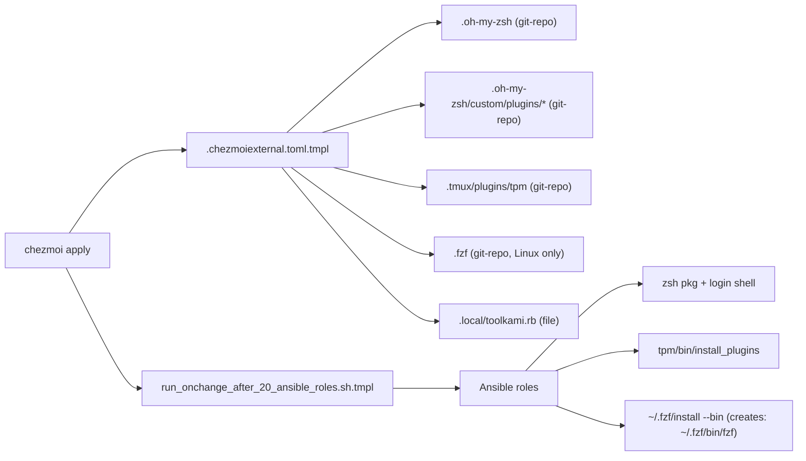

## Goal

Replace 6 `ansible.builtin.git:` clones and 1 `get_url` single-file download with declarative chezmoi externals that auto-pull weekly. Keep Ansible for package install, sudo-requiring tasks, and post-clone build steps.

## Why this is an improvement

- Current Ansible uses `update: false` on zsh plugins and `creates:` guards everywhere — **there is no update mechanism today**; clones stick at whatever HEAD was when the box was provisioned. `refreshPeriod = "168h"` fixes this declaratively.
- Centralizes upstream-source metadata in one TOML instead of 4 different role files.
- `zsh` role shrinks to just "install zsh + change login shell" (the sudo bits externals can't do).
- Externals work in user-space → no-root mode unaffected.
- Nested externals (`.oh-my-zsh` + `.oh-my-zsh/custom/plugins/*`) are safe: `git-repo` externals do `git pull` on refresh, not re-clone, so plugin subdirs are preserved (standard oh-my-zsh pattern).

## Data flow



## Files to create

### `.chezmoiexternal.toml.tmpl` (new, repo root)

Skeleton (actual tag/ref pins kept at HEAD to match current behaviour; weekly refresh):

```toml
[".oh-my-zsh"]
    type = "git-repo"
    url = "https://github.com/ohmyzsh/ohmyzsh.git"
    refreshPeriod = "168h"
    [".oh-my-zsh".clone]
        args = ["--depth", "1"]
    [".oh-my-zsh".pull]
        args = ["--ff-only"]

[".oh-my-zsh/custom/plugins/zsh-autosuggestions"]
    type = "git-repo"
    url = "https://github.com/zsh-users/zsh-autosuggestions.git"
    refreshPeriod = "168h"
    [".oh-my-zsh/custom/plugins/zsh-autosuggestions".clone]
        args = ["--depth", "1"]

# ... zsh-syntax-highlighting, zsh-completions, zsh-vi-mode (same shape)

[".tmux/plugins/tpm"]
    type = "git-repo"
    url = "https://github.com/tmux-plugins/tpm.git"
    refreshPeriod = "168h"
    [".tmux/plugins/tpm".clone]
        args = ["--depth", "1"]

{{ if ne .chezmoi.os "darwin" -}}
[".fzf"]
    type = "git-repo"
    url = "https://github.com/junegunn/fzf.git"
    refreshPeriod = "168h"
    [".fzf".clone]
        args = ["--depth", "1"]
{{- end }}

{{ if .installRubyGemTools | default true -}}
[".local/toolkami.rb"]
    type = "file"
    url = "https://raw.githubusercontent.com/aperoc/toolkami/refs/heads/main/toolkami.rb"
    refreshPeriod = "168h"
    executable = true
{{- end }}
```

(Template must be `.tmpl` because fzf is Linux-only and toolkami is gated on a chezmoi data flag. If the current `.chezmoi.toml.tmpl` doesn't have an `installRubyGemTools` bool, drop the guard — toolkami is tiny.)

## Files to modify

### [dot_ansible/roles/zsh/tasks/main.yml](dot_ansible/roles/zsh/tasks/main.yml)

Delete L20-39 (the `Check if oh-my-zsh is installed`, `Clone oh-my-zsh`, `Clone zsh plugins` tasks). Keep:
- Install `zsh` package (macOS/Debian)
- Locate zsh + change login shell (still needs `become: true`)

Role goes from 84 lines → ~50 lines.

### [dot_ansible/roles/zsh/defaults/main.yml](dot_ansible/roles/zsh/defaults/main.yml)

Delete entirely (or empty it) — `oh_my_zsh_repo` and `zsh_plugins` are no longer referenced. If kept for documentation, add a comment that the source-of-truth is `.chezmoiexternal.toml.tmpl`.

### [dot_ansible/roles/devtools/tasks/main.yml](dot_ansible/roles/devtools/tasks/main.yml)

Delete L2484-2495 (`Check if TPM` + `Install TPM`). Keep L2497-2506 (`Install tmux plugins via TPM`) but change its `when:` condition from `tpm_installed.changed` to a `stat`-based check on whether `~/.tmux/plugins/tpm/bin/install_plugins` exists plus a sentinel marker file (e.g. `~/.tmux/plugins/.installed`) — or simply make it always-run with `creates: ~/.tmux/plugins/tmux-sensible` as a rough idempotency marker. Simplest: run unconditionally (TPM's `install_plugins` is idempotent).

### [dot_ansible/roles/lazyvim_deps/tasks/main.yml](dot_ansible/roles/lazyvim_deps/tasks/main.yml)

Delete L75-89 (`Check if fzf is installed via git` + `Clone fzf from GitHub`). Modify L91-97 (`Install fzf (binary only)`) to drop the `fzf_git_dir.stat.exists` gate and instead use `args: creates: "{{ ansible_facts['env']['HOME'] }}/.fzf/bin/fzf"` for idempotency. This also fixes the existing latent bug where `--bin` never re-runs if `~/.fzf` already exists for any reason.

### [dot_ansible/roles/ruby_gem_tools/tasks/main.yml](dot_ansible/roles/ruby_gem_tools/tasks/main.yml)

Delete L67-92 (the entire toolkami block: `Create ~/.local directory`, `Download toolkami.rb` block + rescue). Chezmoi externals handle create-parent-dir and retry semantics natively (via `chezmoi apply` retry).

### [AGENTS.md](AGENTS.md)

Add a short section under "Selective File Management" (or next to it) documenting `.chezmoiexternal.toml.tmpl` — what it contains, the weekly refresh, and how to force an external update (`chezmoi apply --refresh-externals`). Also update the tags table comment for `zsh`/`devtools`/`lazyvim_deps` if the description mentions cloning.

### [README.md](README.md)

One-line mention under the appropriate "What You Get" section that upstream zsh plugins / TPM / fzf / toolkami are managed by `.chezmoiexternal.toml.tmpl` with weekly auto-refresh (per AGENTS.md maintenance rule).

### [docs/tools/chezmoi-prefixes.md](docs/tools/chezmoi-prefixes.md)

Add a peer section for `.chezmoiexternal.toml.tmpl` since this doc already covers `modify_`/`create_` prefixes — keeps prefix-related documentation together.

## Validation (manual steps after the change)

1. `chezmoi diff` — externals don't show per-file diffs; you should see the TOML addition and ansible deletions only.
2. `chezmoi apply --refresh-externals` — force-fetch to confirm all URLs resolve.
3. `ls -la ~/.oh-my-zsh/.git ~/.oh-my-zsh/custom/plugins/zsh-autosuggestions/.git ~/.tmux/plugins/tpm/.git` — on an already-provisioned machine, the existing Ansible-created clones have `.git` dirs, so chezmoi's git-repo external will do `git pull` rather than fail/re-clone. Verify no clobbering.
4. `ANSIBLE_CONFIG=dot_ansible/ansible.cfg ansible-playbook --syntax-check dot_ansible/playbooks/macos.yml` (and linux.yml) — after deleting tasks/defaults.
5. `just bats` — should pass unchanged (no zsh plugin tests affected).
6. `just docker-test` — the Docker smoke test re-applies chezmoi in a clean Ubuntu container; this is the canary that the external+ansible handoff works end-to-end.

## Out of scope

- `claude-hud` clone stays in Ansible (needs GitHub API call for latest tag + JSON registration step).
- GitHub-release binary downloads (neovim, ripgrep, gh, SpecStory, etc.) stay in Ansible — they need arch detection, `noRoot` fallback, and `armv7l` skip logic that externals can't express.
- No version pinning via `refs` — current behaviour is HEAD, we keep HEAD + weekly refresh. Add `refs = "v..."` later if any plugin starts breaking on HEAD.
