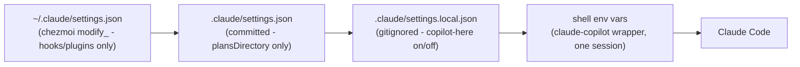

# Copilot Proxy: Frictionless Enable/Disable for Claude Code

## Problem

Today `copilot-model` and the documented setup write the proxy env (`ANTHROPIC_BASE_URL`, model pins, …) into the **committed** project `.claude/settings.json` — the same file `claude-plans-here` uses for `plansDirectory`. That means proxy config leaks into git, and "undo" requires editing a shared file. Putting it into `~/.claude/settings.json` is also wrong: it would be always-on for every project and would fight the chezmoi `dot_claude/modify_settings.json` merge.

## Key fact (verified against Claude Code docs)

Settings precedence, low → high: user `~/.claude/settings.json` → project `.claude/settings.json` → **local `.claude/settings.local.json` (gitignored)** → CLI flags. Additionally, **shell env vars beat the `env` block in any settings file**. See [Claude Code settings](https://code.claude.com/docs/en/settings).

This gives us two clean injection points that never touch the committed file or the chezmoi-managed user file:




## Design: two complementary layers

### Layer 1 — `claude-copilot` (alias-friendly wrapper): one-off session, zero file writes

New function in [dot_config/shell/43_copilot_proxy.sh](dot_config/shell/43_copilot_proxy.sh):

- Auto-starts the proxy if not `_copilot_alive` (silky: one command does everything).
- Runs `claude` with the proxy env exported **for that process only**: `ANTHROPIC_BASE_URL`, `ANTHROPIC_AUTH_TOKEN=dummy`, `ANTHROPIC_MODEL` + the `ANTHROPIC_DEFAULT_`* / `SMALL_FAST` pins, `CLAUDE_CODE_DISABLE_NONESSENTIAL_TRAFFIC=1`.
- Passes through all args (`claude-copilot -c`, `claude-copilot --resume`, …).
- Revert = just run plain `claude`. Nothing on disk changed; works in any directory, no `.claude/` needed.
- Model comes from `$COPILOT_CLAUDE_MODEL` if set, else a state file `~/.local/state/copilot-proxy/model`, else `claude-opus-4.8`.
- MUST Consider `specstory run` combo -> need another alias or what?

### Layer 2 — `copilot-here [on|off|status]`: sticky per-project, via `settings.local.json`

For "this project runs on Copilot for a while, and I want plain `claude` to just work":

- `on`: jq-merge the proxy `env` block into `./.claude/settings.local.json` (create if missing). Local settings override project settings, so it coexists with `claude-plans-here`'s `plansDirectory` in the committed file without ever editing it. If we create the file ourselves, append `.claude/settings.local.json` to `.git/info/exclude` when not already ignored (Claude Code only auto-gitignores files *it* creates).
- `off`: delete **only** the copilot keys from the `env` block (preserve any other user content in the file); remove the file if it becomes empty. The committed `.claude/settings.json` is never touched.
- `status`: show whether this project is pinned to the proxy and with which model.

### `copilot-model` retarget

Change its write target away from the committed `.claude/settings.json`:

- If `./.claude/settings.local.json` has the proxy env (copilot-here mode) → edit that file.
- Otherwise → write the state file `~/.local/state/copilot-proxy/model` (used by the `claude-copilot` wrapper).
- Keep `-l` / `-c` / fzf picker / fuzzy-resolution behavior as-is; `-c` reports which target it read from.

### What stays untouched

- [dot_claude/modify_settings.json](dot_claude/modify_settings.json) — no changes; user-level file stays hooks/plugins-only.
- `claude-plans-here` in [dot_config/shell/10_aliases.sh](dot_config/shell/10_aliases.sh) — no changes; committed project settings stay `plansDirectory`-only.
- `copilot-proxy` manager function — unchanged.

## Docs to update

- [docs/tools/copilot-claude-proxy.md](docs/tools/copilot-claude-proxy.md) (and the `zh-TW` twin): replace the "Project settings" section with the two-layer model (wrapper vs `copilot-here`), note the precedence rationale and the "never commit proxy config" rule.
- [docs/shells/aliases.md](docs/shells/aliases.md) "Copilot → Claude Code proxy" table: add `claude-copilot` and `copilot-here`, fix the `copilot-model` description (no longer edits the committed settings.json).

## Usage after the change

```sh
claude-copilot            # try it right now, one session, nothing written
copilot-here on           # this repo uses the proxy from now on (gitignored)
copilot-model sonnet-5    # switch model (local file or wrapper state, never git)
copilot-here off          # back to real Anthropic; plansDirectory untouched
```
