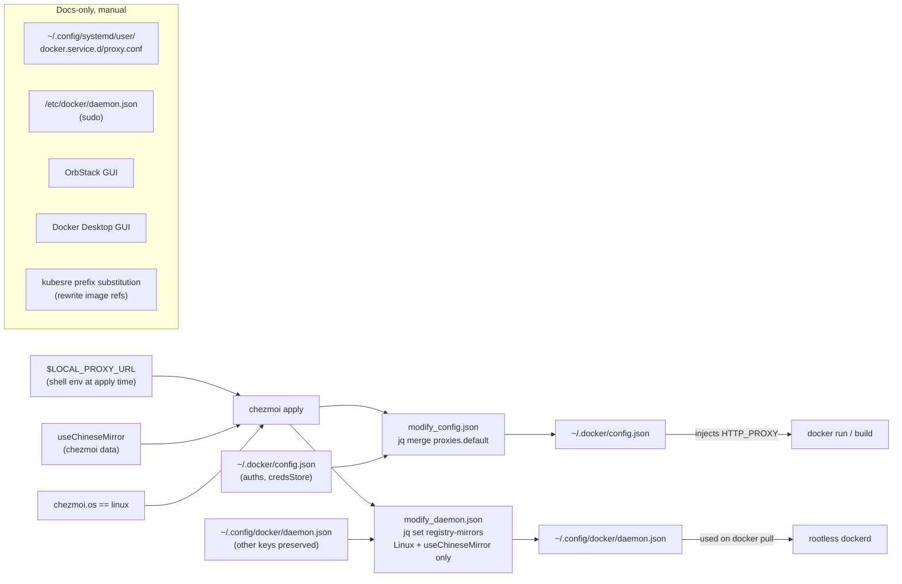

## What's chezmoi-managed vs documented

Registry mirrors and daemon proxies are install-variant-specific. Only two files cleanly belong to chezmoi (user-owned, no sudo, stable path, survive reinstall):

- `~/.docker/config.json` — client-side `proxies.default` (works on all four Docker install variants + Podman's docker-compatibility).
- `~/.config/docker/daemon.json` — rootless Docker `registry-mirrors`. Only meaningful on Linux + rootless; chezmoi template no-ops on macOS.

Everything else (system `/etc/docker/daemon.json`, `systemctl --user` drop-in for daemon proxy, OrbStack GUI, Docker Desktop settings, kubesre prefix rewriting) stays as copy-paste recipes in [docs/tools/containers.md](docs/tools/containers.md) because each needs sudo or daemon restart or GUI interaction.

## Flow




## File changes

### 1. New: `dot_docker/modify_config.json.tmpl`

Deploys to `~/.docker/config.json`. Same design as v1 of the plan: jq merges `.proxies.default` when `$LOCAL_PROXY_URL` is set; strips it when unset. Preserves `auths` / `credsStore` / `credHelpers` / `currentContext` written by `docker login`.

```bash
#!/bin/sh
set -eu
{{- $proxy := env "LOCAL_PROXY_URL" -}}
{{- $socks := env "LOCAL_PROXY_SOCKS_URL" -}}
{{- $no := "localhost,127.0.0.1,.local,10.0.0.0/8,172.16.0.0/12,192.168.0.0/16" -}}

input=$(cat)
[ -z "$input" ] && input='{}'
if ! command -v jq >/dev/null 2>&1; then echo "$input"; exit 0; fi

{{ if $proxy }}
echo "$input" | jq --arg http  '{{ $proxy }}' \
                   --arg https '{{ $proxy }}' \
                   --arg all   '{{ or $socks $proxy }}' \
                   --arg no    '{{ $no }}' \
  '.proxies.default = {httpProxy:$http, httpsProxy:$https, allProxy:$all, noProxy:$no}'
{{ else }}
echo "$input" | jq 'if has("proxies") then .proxies |= (del(.default) | if length == 0 then empty else . end) else . end'
{{ end }}
```

Gating: driven purely by `$LOCAL_PROXY_URL` — no chezmoi prompt, no `useChineseMirror` dependency (corporate proxies outside China apply too). Static `noProxy` list mirrors `docker info`'s current contents minus the app-specific host names (`redis`, `postgres`, etc. are project-scoped and don't belong in dotfiles).

### 2. New: `modify_dot_config/docker/daemon.json.tmpl`

Deploys to `~/.config/docker/daemon.json`. Only touches `.["registry-mirrors"]` — other keys (e.g. `data-root`, `experimental`) left alone via jq merge. Gated on `useChineseMirror` AND Linux; on macOS the script strips the key (the file typically doesn't exist there anyway, but this makes the modify-script safe to run cross-platform).

```bash
#!/bin/sh
set -eu
input=$(cat)
[ -z "$input" ] && input='{}'
if ! command -v jq >/dev/null 2>&1; then echo "$input"; exit 0; fi

{{ if and (eq .chezmoi.os "linux") .useChineseMirror }}
echo "$input" | jq '.["registry-mirrors"] = [
  "https://docker.m.daocloud.io",
  "https://docker.mirrors.ustc.edu.cn",
  "https://docker.nju.edu.cn",
  "https://mirror.iscas.ac.cn",
  "https://mirror.baidubce.com",
  "https://dockerhub.azk8s.cn",
  "https://dockerproxy.com"
]'
{{ else }}
echo "$input" | jq 'del(.["registry-mirrors"])'
{{ end }}
```

Mirror order matches your current `docker info` output (DaoCloud primary, academic mirrors as fallback). Order matters: Docker tries them sequentially until one succeeds, so the most reliable go first.

Post-apply behavior: changing this file requires `systemctl --user daemon-reload && systemctl --user restart docker` to take effect. The chezmoi apply **will not** auto-restart — the doc section below makes this explicit and the script header can't print to chezmoi's output anyway. Matches existing repo pattern (see the docker group change note in [dot_ansible/roles/docker/tasks/main.yml](dot_ansible/roles/docker/tasks/main.yml) lines 65-68 for a comparable "you may need to log out" advisory).

### 3. New: `docs/tools/containers.md`

Structure (~300 lines, no emojis):

- **Runtimes at a glance** — Docker Engine (rootless vs system), Docker Desktop, OrbStack, Podman. One paragraph each, table of best-for / gotchas.
- **Install-variant config map** — matrix covering the four Docker variants and where each stores daemon-level vs client-level config:
  - Docker Desktop (macOS/Win): GUI-managed `~/Library/Group Containers/group.com.docker/settings.json`.
  - OrbStack (macOS): `~/.orbstack/config/docker.json` for daemon, GUI Settings > Network for proxy.
  - System Docker Engine (Linux): `/etc/docker/daemon.json` + systemd drop-in `/etc/systemd/system/docker.service.d/http-proxy.conf` (sudo).
  - Rootless Docker (Linux): `~/.config/docker/daemon.json` + `~/.config/systemd/user/docker.service.d/proxy.conf` (no sudo).
- **What's managed by chezmoi** — pointers to the two files above, how to toggle (`LOCAL_PROXY_URL` env + re-apply; `useChineseMirror` prompt + `chezmoi init --force`).
- **Daemon HTTP proxy (manual recipes)** — copy-pasteable snippets for each variant. The rootless snippet is literally your current `~/.config/systemd/user/docker.service.d/proxy.conf`, annotated. Includes the reload dance `systemctl --user daemon-reload && systemctl --user restart docker`. Explains: this is for `docker pull` through a proxy. The chezmoi-managed `~/.docker/config.json` handles `docker run`/`docker build` (different layer).
- **Registry mirrors (two strategies)**:
  - **Strategy A: `registry-mirrors` in `daemon.json`** (chezmoi-managed for rootless, manual for other variants). Only mirrors `docker.io` / Docker Hub. Quoted list with notes on which endpoints are currently stable (DaoCloud, USTC, NJU) vs shaky ([DaoCloud issue #2328](https://github.com/DaoCloud/public-image-mirror/issues/2328), `dockerhub.azk8s.cn` Azure China deprecation).
  - **Strategy B: prefix substitution via [kubesre](https://github.com/kubesre/docker-registry-mirrors)** (no config, rewrite image refs). Quoted prefix table (`gcr.io` -> `gcr.kubesre.xyz`, `ghcr.io` -> `ghcr.kubesre.xyz`, `k8s.gcr.io` -> `k8s-gcr.kubesre.xyz`, `mcr.microsoft.com` -> `mcr.kubesre.xyz`, `quay.io` -> `quay.kubesre.xyz`, `docker.io` -> `dhub.kubesre.xyz`). Notes the 20 req/min rate limit and that `docker.kubesre.xyz` is blocked (must use `dhub.kubesre.xyz`). When to reach for B: non-Docker-Hub registries (`gcr.io`, `ghcr.io`, `quay.io`, etc.) — Strategy A can't help there. Practical pattern: use both together.〔方案選單〕
- **OrbStack evaluation** — current macOS default in [dot_ansible/roles/docker/tasks/main.yml](dot_ansible/roles/docker/tasks/main.yml). Why (lower RAM than Docker Desktop, native Apple Silicon, built-in K8s that's faster than DD's). When to fall back to Docker Desktop (enterprise policies, specific Compose feature gaps). Links to [https://orbstack.dev](https://orbstack.dev).
- **Podman evaluation** — when a reasonable swap (daemonless matches rootless Docker's security story without the systemd user-unit; license cleanliness; `alias docker=podman` works for 90% of use). When it isn't (BuildKit parity, `podman compose` still lags `docker compose` on some networking edge cases, Swarm not supported). Proxy config: pure env vars (no daemon means `proxy-on` from [dot_config/zsh/tools/50_networking.zsh](dot_config/zsh/tools/50_networking.zsh) covers it). Mirrors: `~/.config/containers/registries.conf` with `[[registry]]` blocks — fundamentally different format than `daemon.json`. Verdict: not worth switching now; revisit if Docker licensing changes.
- **Verification checklist** — `docker info | grep -iE 'proxy|mirror'`; `docker run --rm alpine env | grep -i proxy`; `docker pull hello-world` timing; how to confirm `~/.docker/config.json` and `~/.config/docker/daemon.json` are actually what chezmoi deployed (`chezmoi diff`, `chezmoi managed`).
- **Troubleshooting** — why a daemon.json change "didn't take" (forgot to restart); why `docker run` doesn't see proxy env (forgot to edit `~/.docker/config.json` client config, which is the chezmoi-managed one); how to opt out (unset `LOCAL_PROXY_URL`, re-apply; set `useChineseMirror=false`, re-init).

### 4. Update `docs/zsh/aliases.md`

Add a "See also" line under the Proxy helpers subsection pointing to [docs/tools/containers.md](docs/tools/containers.md). No new aliases introduced.

### 5. Update `README.md`

Add two one-line entries under **What You Get > Config Files** (per [AGENTS.md](AGENTS.md) maintenance rule):

- `~/.docker/config.json` — Docker client proxy config (auto-injects `$LOCAL_PROXY_URL` when set; preserves credential fields).
- `~/.config/docker/daemon.json` — rootless Docker registry mirrors (when `useChineseMirror` is true and on Linux).

## Risks and mitigations

- `**jq` missing at first `chezmoi apply`**: both modify scripts include a `command -v jq || { echo "$input"; exit 0; }` guard — they emit the original content unchanged so the file isn't corrupted. Once `base` ansible role installs `jq`, the next apply fills in the real config.
- **Credential clobbering in `~/.docker/config.json`**: the `modify_` pattern + jq path-scoped assignment protect `auths`/`credsStore`.
- **Other-keys clobbering in `~/.config/docker/daemon.json`**: jq merges only `.["registry-mirrors"]`; any other keys (e.g. `data-root`, `dns`, `experimental`) survive.
- **Daemon restart needed but not performed**: the doc makes this explicit; no auto-restart on apply (would kill running containers; incompatible with `allowPartialFailure=false`). Users run the restart when convenient.
- **Mirror endpoint rot**: the curated list tracks the user's current working set. Doc calls out that mirrors go stale (DaoCloud issue #2328 is cited as an example); recommends `docker info | grep -A10 'Registry Mirrors'` after apply to verify.
- **macOS noise**: on macOS the `daemon.json` modify script would run and potentially create `~/.config/docker/daemon.json` with `{}` — the `del(.["registry-mirrors"])` on non-matching-gate branch produces `{}` when input is empty. Acceptable: that file is harmless on macOS (neither Docker Desktop nor OrbStack read it). Alternative: add a hard guard that emits empty output on macOS so chezmoi removes the file entirely — will include this in the implementation.
