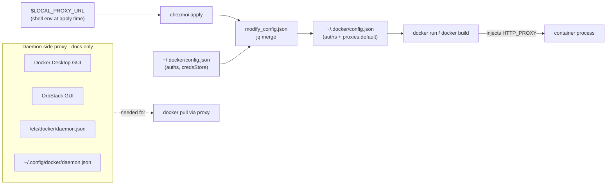

## Goals and non-goals

- **Goal**: One chezmoi-managed artifact that works across Docker Desktop, OrbStack, system Docker Engine, and rootless Docker — proxy env vars auto-injected into every `docker run` / `docker build` whenever `$LOCAL_PROXY_URL` is set at apply time.
- **Goal**: Single doc page that captures the install-variant matrix, daemon-side proxy recipes (which can't be cleanly chezmoi-managed because of paths/permissions), registry mirror snippets, and a Podman/OrbStack evaluation.
- **Non-goals**: No ansible changes to the `docker` role. No systemd drop-ins written automatically. No new chezmoi prompt. No Podman install automation (just docs / recipe).

## Why client-side config is enough for the workspace-managed portion

Docker's client config at `~/.docker/config.json` has a `proxies.default` block that the client injects as `HTTP_PROXY` / `HTTPS_PROXY` / `NO_PROXY` build-args and runtime env on every container it creates. Because it's a **client** file, it works identically on:

- Docker Desktop (macOS/Windows) — client reads it before talking to the VM.
- OrbStack — same Docker CLI, same file.
- System Docker Engine on Linux — client reads it before talking to the socket.
- Rootless Docker (your current Ubuntu box) — same path, same behaviour.

This side-steps the per-install-variant daemon-config fragmentation (see doc section below). The daemon-side proxy (needed for `docker pull` through a proxy) is genuinely install-variant-specific and stays in the doc rather than getting auto-managed.

## File changes

### 1. New: `dot_docker/modify_config.json.tmpl`

Deploys to `~/.docker/config.json` as a **modify script** (per [chezmoi source-state attributes](https://www.chezmoi.io/reference/source-state-attributes/) — `modify_` is allowed before `dot_` on regular-file targets). Chezmoi pipes existing file contents to stdin; we emit merged JSON on stdout so `auths`, `credsStore`, `credHelpers` etc. written by `docker login` are preserved.

Sketch:

```bash
#!/bin/sh
set -eu
{{- $proxy := env "LOCAL_PROXY_URL" -}}
{{- $socks := env "LOCAL_PROXY_SOCKS_URL" -}}
{{- $no := "localhost,127.0.0.1,.local,10.0.0.0/8,172.16.0.0/12,192.168.0.0/16" -}}

input=$(cat)
[ -z "$input" ] && input='{}'

{{ if $proxy }}
echo "$input" | jq \
  --arg http  '{{ $proxy }}' \
  --arg https '{{ $proxy }}' \
  --arg all   '{{ or $socks $proxy }}' \
  --arg no    '{{ $no }}' \
  '.proxies.default = {
     httpProxy:  $http,
     httpsProxy: $https,
     allProxy:   $all,
     noProxy:    $no
   }'
{{ else }}
echo "$input" | jq 'if has("proxies") then .proxies |= (del(.default) | if length == 0 then null else . end) else . end | del(..|nulls?)'
{{ end }}
```

Key behaviours:

- If `$LOCAL_PROXY_URL` is unset at apply time → strip any `proxies.default` we previously added (idempotent cleanup when the user toggles the proxy off).
- If set → merge `proxies.default` into existing JSON; preserve `auths` / `credsStore` / `credHelpers` / `currentContext`.
- Depends on `jq`. `jq` is already installed via the `base` ansible role on every profile, and via Homebrew bootstrap on macOS — safe assumption.
- `allProxy` mirrors the same HTTP/SOCKS split convention already in [`dot_config/zsh/tools/50_networking.zsh`](dot_config/zsh/tools/50_networking.zsh) lines 104-113.

Edge note: the `NoProxy` list is static. If this becomes a pain point (e.g. registry hostnames per-project), we can later expose a second env var — deliberately out of scope now.

### 2. New: `docs/tools/containers.md`

Structure (concise, ~250 lines, no emojis):

- **Runtimes at a glance** — Docker Engine vs OrbStack vs Docker Desktop vs Podman. One-paragraph each, table of "best for / gotchas".
- **The four Docker install variants and where each stores config** — matrix covering:
  - Docker Desktop (macOS/Windows): `~/Library/Group Containers/group.com.docker/settings.json`, GUI-managed.
  - OrbStack (macOS): `~/.orbstack/config/docker.json` for daemon, GUI Settings → Network for proxy.
  - System Docker Engine (Linux): `/etc/docker/daemon.json`, systemd drop-in `/etc/systemd/system/docker.service.d/http-proxy.conf` (sudo required).
  - Rootless Docker (Linux, your `Context: rootless` case): `~/.config/docker/daemon.json`, user-level systemd drop-in at `~/.config/systemd/user/docker.service.d/http-proxy.conf` (no sudo).
- **Client-side proxy (managed)** — points at `dot_docker/modify_config.json.tmpl`; explains the `$LOCAL_PROXY_URL` / `$LOCAL_PROXY_SOCKS_URL` convention shared with the zsh helpers; how to verify with `docker info` (the `HTTP Proxy:` line you already showed) and `docker run --rm alpine env | grep -i proxy`.
- **Daemon-side proxy (manual recipes per variant)** — copy-pasteable snippets for each of the four variants. Covers the systemd drop-in reload dance (`systemctl --user daemon-reload && systemctl --user restart docker`).
- **Registry mirrors (GFW)** — `daemon.json` `registry-mirrors` block equivalent to the mirror set in your `docker info` output (`docker.m.daocloud.io`, `dockerhub.azk8s.cn`, `docker.mirrors.ustc.edu.cn`, etc.), plus the per-variant file path. Explicitly gated in prose on "are you in China" — referencing the `useChineseMirror` chezmoi prompt for consistency with [Cargo](dot_cargo/config.toml.tmpl), [npm](dot_npmrc.tmpl), [uv](dot_config/uv/uv.toml.tmpl), [bun](dot_config/dot_bunfig.toml.tmpl) — but not auto-applied, because daemon.json edits are disruptive (daemon restart required).
- **OrbStack evaluation** — already the macOS default in [`dot_ansible/roles/docker/tasks/main.yml`](dot_ansible/roles/docker/tasks/main.yml); document why (lower RAM than Docker Desktop, native Apple Silicon, faster startup), when to fall back to Docker Desktop (Compose V1 edge cases, Kubernetes feature parity, enterprise policies).
- **Podman evaluation** — when it's a reasonable swap (daemonless, rootless-by-default, no license ambiguity), when it isn't (Compose quirks, BuildKit feature gaps, `docker-compose` → `podman compose` translation), `registries.conf` short-mirror equivalent, `HTTP_PROXY` env usage (no daemon = proxy via user shell env — synergy with `proxy-on` from `50_networking.zsh`). Conclusion: not worth switching now; revisit if Docker licensing or Compose story changes.
- **Verifying the setup** — short checklist (`docker info | grep -i proxy`, run a container, test a pull).

### 3. Update `docs/zsh/aliases.md`

Add a "See also" line under the Proxy helpers section pointing to `docs/tools/containers.md` (per the AGENTS.md rule about maintaining aliases.md cross-refs, though strictly speaking no new aliases are added — this is a courtesy xref).

### 4. Update `README.md` "What You Get > Config Files"

Per [AGENTS.md](AGENTS.md) maintenance rule: add a one-line entry for `~/.docker/config.json` (proxy/credentials, chezmoi-managed via modify script).

## Flow diagram



## Risks and mitigations

- **`jq` missing at apply time**: if a fresh machine runs `chezmoi apply` before the `base` ansible role completes, the modify script fails. Mitigation: the run-order is bootstrap → chezmoi apply → ansible via run_onchange ([AGENTS.md](AGENTS.md) installation-order section), and bootstrap already installs Homebrew; `jq` is pulled in by `base`. A minor hardening: the script falls back to writing stdin unchanged if `command -v jq` fails (one extra guard line; negligible cost).
- **Credential clobbering**: the whole reason we use `modify_` over a plain template. jq's `.proxies.default = {...}` only touches that path.
- **Daemon not restarted**: client-side change only — no daemon restart needed. Users who also need daemon-side proxy follow the manual doc recipe; doc explicitly calls out the `systemctl --user restart docker` step.
- **Older rootless Docker variants** using `XDG_RUNTIME_DIR` systemd unit locations: doc shows the canonical user-service path but includes a "find it with `systemctl --user status docker`" hint.
