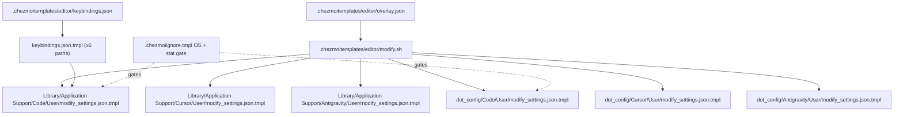

## Part 1 — Editor settings via `modify_`

### Why `modify_` (overlay) and not whole-file

Live [Code settings.json](/Users/daviddwlee84/Library/Application%20Support/Code/User/settings.json) contains ~60 machine/project-specific keys (dotnet, liveshare, NuGet sources, Windows `vim.autoSwitchInputMethod` paths, `remote.SSH.remotePlatform` host list, `codestream.email`, etc.) that are unsafe to track. Same story for Cursor/Antigravity (files are near-identical clones).

Reusing the battle-tested pattern from [dot_claude/modify_settings.json](dot_claude/modify_settings.json):

- `jq '. * $overlay'` deep-merges only the managed keys; everything else stays verbatim
- Array keys replace wholesale (no duplicate accumulation)
- Failure mode: invalid live JSON → `jq` exits non-zero → chezmoi skips; no corrupt write (documented in [AGENTS.md](AGENTS.md) §Selective File Management)

### Shared overlay via `.chezmoitemplates/`

New folder `.chezmoitemplates/editor/`:

- `overlay.json` — minimal universal keys:
  - `editor.fontFamily: "Hack Nerd Font Mono, Menlo, Monaco, monospace"`
  - `editor.fontSize: 13`
  - `editor.lineNumbers: "relative"`
  - `editor.formatOnSave: true`
  - `editor.acceptSuggestionOnEnter: "smart"`
  - `terminal.integrated.fontFamily: "Hack Nerd Font Mono"`
- `keybindings.json` — extracted from your current working set (5 entries: `f5` → `python.execInTerminal`, file-tree `f`/`d`/`alt+n`/`shift+alt+n`)
- `modify.sh` — the bash body with `jq '. * $overlay'` (identical to `dot_claude/modify_settings.json` minus the overlay heredoc)

Cursor/Antigravity may need editor-specific extras (e.g. `cursor.cpp.disabledLanguages`). We add an optional per-editor `extra.json` slot mergeable via a second `jq` pass when the file exists. Minimal scope ships the shared overlay only; extras are a future TODO left as a commented `EXTRA_FILE` hook in `modify.sh`.

### Source tree layout (12 files, 3 editors × 2 OSes × 2 files)

macOS targets (`~/Library/Application Support/<Editor>/User/...`):

- `Library/Application Support/Code/User/modify_settings.json.tmpl`
- `Library/Application Support/Code/User/keybindings.json.tmpl`
- ... (same pair for `Cursor`, `Antigravity`)

Linux targets (`~/.config/<Editor>/User/...`, XDG-compliant for VSCode/Cursor):

- `dot_config/Code/User/modify_settings.json.tmpl`
- `dot_config/Code/User/keybindings.json.tmpl`
- ... (same pair for `Cursor`, `Antigravity`)

Each `.tmpl` is a 3-line shim:

```sh
#!/bin/sh
{{ includeTemplate ".chezmoitemplates/editor/modify.sh" . }}
```

Keybindings likewise use `{{ include ".chezmoitemplates/editor/keybindings.json" }}`. Keybindings are integer-array JSON — overwritten whole (not modify_). Low risk: UI rarely rewrites `keybindings.json`.

### OS + presence gating via `.chezmoiignore.tmpl`

Two gates (OS + installed):

```gotemplate
{{- if ne .chezmoi.os "darwin" }}
Library/Application Support/**
{{- end }}
{{- if ne .chezmoi.os "linux" }}
.config/Code/User/settings.json
.config/Code/User/keybindings.json
.config/Cursor/User/**
.config/Antigravity/User/**
{{- end }}

{{- range list "Code" "Cursor" "Antigravity" }}
{{- $macPath := joinPath $.chezmoi.homeDir "Library/Application Support" . }}
{{- if not (stat $macPath) }}
Library/Application Support/{{ . }}/**
{{- end }}
{{- $linuxPath := joinPath $.chezmoi.homeDir ".config" . }}
{{- if not (stat $linuxPath) }}
.config/{{ . }}/User/settings.json
.config/{{ . }}/User/keybindings.json
{{- end }}
{{- end }}
```

This way chezmoi only touches an editor's settings when that editor is actually installed — no phantom `~/Library/Application Support/Antigravity/` on a clean Ubuntu server.

### XDG note (answer to user's question)

- **VSCode & Cursor**: XDG-compliant on Linux (`$XDG_CONFIG_HOME/Code/User/`), hardcoded on macOS (`~/Library/Application Support/Code/User/`, no flag to change). No unified path achievable.
- **Antigravity**: follows Electron/VSCode convention → same story.
- The `--user-data-dir` CLI flag redirects the whole profile dir but isn't viable for default-launch use.

Conclusion: two source paths per editor, gated by `.chezmoiignore.tmpl`, is the only clean approach.

---

## Part 2 — Consolidate `alacritty` role → `gui_apps_linux`

### Rationale (user's observation)

Current [dot_ansible/roles/alacritty/](dot_ansible/roles/alacritty/) is Linux-desktop-scoped anyway (macOS side is already covered by `cask "alacritty"` in [Brewfile.darwin.tmpl](dot_config/homebrew/Brewfile.darwin.tmpl)). Single-tool role is boilerplate. Cursor's Linux story (AppImage/deb) belongs in the same place.

### New role: `dot_ansible/roles/gui_apps_linux/`

Linux-only (guarded `when: ansible_facts['os_family'] == 'Debian'`). macOS path is an explicit no-op with a `debug` message pointing to Brewfile. Skipped on `armv7l`.

Tasks:

1. **Alacritty** — moved verbatim from current `alacritty/tasks/main.yml` (cargo build, icon, `.desktop` entry)
2. **AppImageLauncher** — try PPA `ppa:appimagelauncher-team/stable`; on PPA failure (Ubuntu 24.04+ broken, confirmed via web search), fall back to latest GitHub release `.deb` via `get_url` + `apt deb:`. Lite variant via AppImage for `noRoot=true` scenarios.
3. **VSCode** — official Microsoft apt repo: `https://packages.microsoft.com/repos/code`, signed with MS GPG. Idempotent via `apt:name=code`.
4. **Cursor** — download latest `.deb` from `https://cursor.com/download` (arch-aware x64/arm64) to `~/Downloads/cursor.deb`, install via `apt:deb:`. Falls back to AppImage in `~/Applications/cursor.AppImage` + AppImageLauncher integration if `.deb` URL fails.
5. **Antigravity Linux** — `when: false` placeholder with TODO comment (no official Linux build at time of writing)
6. **libfuse2** — apt-installed for AppImage compatibility on Ubuntu 22.04+

Tags: `[gui_apps, sudo]` on system-wide tasks; user-level AppImage download untagged for `noRoot` compatibility.

### Playbook + profile rewiring

- [dot_ansible/playbooks/linux.yml](dot_ansible/playbooks/linux.yml): replace `- role: alacritty` with `- role: gui_apps_linux`
- [.chezmoi.toml.tmpl](.chezmoi.toml.tmpl): `ubuntu_desktop` profile swaps tag `alacritty` → `gui_apps`
- Old `dot_ansible/roles/alacritty/` directory deleted
- macOS playbook unaffected (Brewfile handles it)

### Cursor editor uninstall safety

Cursor + VSCode do NOT auto-refresh their user settings after install. The editor-settings overlay runs before install on fresh machines; `.chezmoiignore.tmpl` `stat` gate skips editor paths that don't exist yet. User's first `chezmoi apply` after installing the editor → overlay lands.

---

## Part 3 — Documentation

### New: `docs/tools/appimage.md`

Sections:

- Why AppImageLauncher (vs `appimaged` / bare AppImage) — cite [README § About](https://github.com/TheAssassin/AppImageLauncher#about)
- Install paths: PPA, `.deb` fallback, Lite (no-root)
- `ail-cli integrate ~/Applications/foo.AppImage` for scripted integration
- Obsidian / Cursor / etc. recipes (download → `~/Applications/` → auto-prompt)
- Troubleshooting: `libfuse2` on Ubuntu 24.04, AppArmor `--no-sandbox` workaround

### Updates

- [README.md](README.md): new `gui_apps` tag in table; drop `alacritty` standalone; note new editor-overlay coverage under "Config Files"
- [AGENTS.md](AGENTS.md) § "Selective File Management": new bullet for editor overlays — flag `.chezmoitemplates/editor/` as canonical place to extend overlay keys; note presence-gating pattern in `.chezmoiignore.tmpl`

---

## File summary



Out of scope (possible follow-ups, not in this plan):

- `mcp.json` overlay (also appears under each editor's User dir)
- `snippets/` sync
- Per-editor `extra.json` slot (kept as commented hook only)
- Cleaning up `cask "alacritty"` duplication between current alacritty role and Brewfile on macOS
