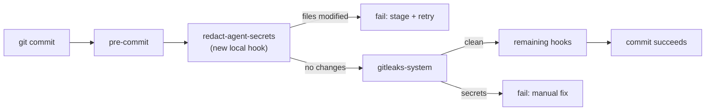

## Context

Today [`scripts/redact_specstory.py`](scripts/redact_specstory.py) hardcodes `.specstory/history/` in three places:

- `filter_specstory(findings)` (line 125-127) — filters gitleaks hits by path prefix
- `specstory_path = Path(".specstory/history")` (line 194) — existence + workdir glob
- staged-files filter (line 245) — `f.startswith(".specstory/history/") and f.endswith(".md")`

The justfile has `check-specstory`, `redact-specstory`, `check-specstory-workdir`, `add-and-redact`, all driving this script. Pre-commit currently has no auto-redact hook; `gitleaks-system` just blocks commits when secrets are found.

Agent plan files (e.g. `.cursor/plans/docker-proxy-container-notes-v2_cdd2f7d7.plan.md`, `.claude/plans/*.md`, `.opencode/plans/*.md`) can equally contain secrets (log snippets, env values, config examples pasted during planning). They already pass through gitleaks, but there's no auto-redact fix path like specstory has.

## Target paths

Four path prefixes treated uniformly (all `.md`, all markdown):

- `.specstory/history/` (existing)
- `.claude/plans/`
- `.cursor/plans/`
- `.opencode/plans/`

## Changes

### 1. Rename + generalize the script

Rename `scripts/redact_specstory.py` to [`scripts/redact_secrets.py`](scripts/redact_secrets.py) and parameterize the path list.

- Add `--paths PREFIX [PREFIX ...]` flag; default = all four prefixes above.
- Replace `filter_specstory()` with `filter_by_prefixes(findings, prefixes)`:


```python
  def filter_by_prefixes(findings, prefixes):
      return [f for f in findings if any(p in f.get("File", "") for p in prefixes)]


```
- In `main()`, iterate over prefixes: skip missing dirs (don't fail), aggregate `scan_files` across all existing prefixes, run gitleaks once per existing prefix in `--working-dir` mode.
- Update all user-facing log strings from "`.specstory/history/`" to a dynamic path list.
- Keep output semantics: exit 0 when clean, exit 1 when issues remain and `--fix` not passed, exit 0 after successful `--fix`.

Leave a **thin compat shim** at `scripts/redact_specstory.py` (one-line exec of new script with `--paths .specstory/history`) so anything in muscle memory / external docs keeps working. Alternative if you'd rather not keep two files: delete the old script and grep the repo for references — only the justfile references it.

### 2. Update [`justfile`](justfile)

Replace the `check-specstory` / `redact-specstory` / `check-specstory-workdir` / `add-and-redact` block (lines 166-177, 214-218) with generalized targets that default to all four prefixes, plus keep specstory-scoped aliases for convenience:

```make
# Check for secrets in staged agent artifacts (specstory + plans)
check-secrets:
    ./scripts/redact_secrets.py || true

# Auto-redact secrets in staged agent artifacts
redact-secrets:
    ./scripts/redact_secrets.py --fix

# Check working directory
check-secrets-workdir:
    ./scripts/redact_secrets.py --working-dir || true

# Specstory-only shortcuts (legacy names kept)
check-specstory:
    ./scripts/redact_secrets.py --paths .specstory/history || true
redact-specstory:
    ./scripts/redact_secrets.py --fix --paths .specstory/history

# Stage + auto-redact all covered paths + re-stage
add-and-redact:
    @git add -A
    @just redact-secrets
    @git add -A
```

### 3. Add pre-commit auto-redact hook

Add a local hook to [`.pre-commit-config.yaml`](.pre-commit-config.yaml) **before** gitleaks so it can fix files first:

```yaml
  - repo: local
    hooks:
      - id: redact-agent-secrets
        name: Auto-redact secrets in agent artifacts
        entry: ./scripts/redact_secrets.py --fix
        language: system
        pass_filenames: false
        files: ^(\.specstory/history|\.claude/plans|\.cursor/plans|\.opencode/plans)/.*\.md$
```

Behavior: when a matching file is staged, the hook runs the redactor. The script's `--fix` path already rewrites files and prints `Successfully redacted N file(s)` → exit 0. If files were modified, pre-commit itself detects the unstaged change and fails the commit with "files were modified by this hook", prompting the user to `git add` and retry — same UX as `trailing-whitespace` / `end-of-file-fixer`. The subsequent `gitleaks-system` hook then sees redacted content and passes.

One edge case: pre-commit runs hooks on a staged snapshot; if `--fix` rewrites a working-copy file that also has unstaged edits, those unstaged edits stay untouched but the redacted secret is only in the working copy, not the staged snapshot — user has to `git add` to pick it up. This matches current `just add-and-redact` behavior.

### 4. Update docs

- [`AGENTS.md`](AGENTS.md): add a short "Maintaining Agent Plan Redaction" section (mirroring existing "Maintaining X" pattern) explaining the four covered prefixes and the `just redact-secrets` / pre-commit hook flow.
- [`CLAUDE.md`](CLAUDE.md): update any reference to `redact_specstory.py` (check with grep; may be none).

## Flow diagram



## Non-goals

- Not changing gitleaks config / detection rules.
- Not extending to non-markdown files (plan + history dirs are markdown-only by convention).
- Not touching `.specstory/` exclusions on `end-of-file-fixer` / `trailing-whitespace` / `check-yaml`.
