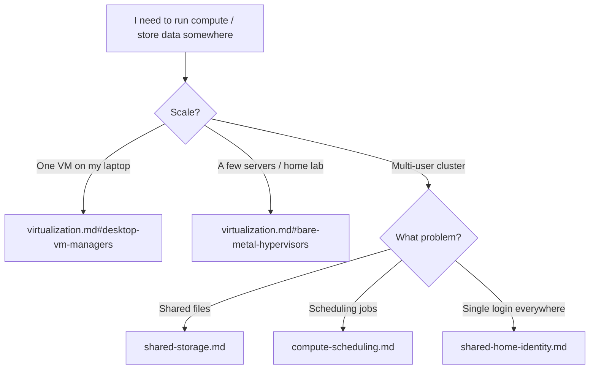
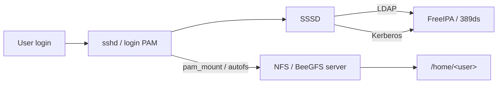

## Scope and decision

**No new installs.** The request touches four different infrastructure tiers; none map cleanly to a dev-laptop dotfiles repo:

- **Bare-metal hypervisor OS** (Proxmox VE, VMware ESXi, XCP-ng, Nutanix) — installed as the host OS on a server, not via `brew install`. Out of scope for chezmoi.
- **Desktop / dev-laptop VM managers** (OrbStack, UTM, VirtualBox, VMware Fusion, Parallels, Lima, libvirt/virt-manager) — `OrbStack` is already installed on macOS via [dot_ansible/roles/docker/tasks/main.yml](dot_ansible/roles/docker/tasks/main.yml) and handles both containers and lightweight Linux VMs. No need to layer another.
- **Cluster storage / scheduler / identity** (CephFS, BeeGFS, Lustre, GlusterFS, SLURM, Kubernetes, Nomad, LDAP/FreeIPA) — multi-node infrastructure, admin/ops domain. Client-side `mount.ceph` / `slurm-client` / `sssd` are sometimes relevant on a user workstation but only in org-specific setups, so they don't belong in the default install path.

Result: write structured reference docs under a new `docs/infra/` folder. Add cross-links from the existing tools docs and README.

## Deliverables

### New folder: `docs/infra/`

Five new markdown files plus an index README. Each doc is a self-contained reference (~200-400 lines) with:

- Landscape table (tool / license / scope / target user)
- Decision matrix ("use X when ...")
- Minimal install / quickstart commands (for reference, not auto-run)
- Links to upstream docs
- Cross-refs to related docs in this repo

#### 1. `docs/infra/README.md` — Index / decision tree

Landing page with a single mermaid decision tree ("I want to run a VM" → laptop? server? cluster?) that routes users to the right sub-doc. Includes a "what this repo installs vs what's just documented" boundary statement so future readers don't assume they'll get Proxmox via `chezmoi apply`.



#### 2. `docs/infra/virtualization.md`

Covers three tiers on one page since they're often confused:

- **Desktop VM managers** (per-user, on your laptop): [OrbStack](https://orbstack.dev) (macOS, repo default), [UTM](https://mac.getutm.app) (macOS/QEMU frontend), [VirtualBox](https://www.virtualbox.org) (cross-platform, Oracle), [VMware Fusion](https://www.vmware.com/products/fusion.html) (macOS; now free for personal use), [Parallels Desktop](https://www.parallels.com/) (macOS, commercial), [Lima](https://lima-vm.io) (macOS, headless Linux VMs), [libvirt + virt-manager](https://virt-manager.org) (Linux).
- **Type-1 bare-metal hypervisors** (installed as host OS): [Proxmox VE](https://www.proxmox.com/en/) (Debian + KVM + LXC, open-source, web UI), [VMware ESXi](https://www.vmware.com/products/esxi-and-esx.html) (commercial, enterprise), [XCP-ng](https://xcp-ng.org) (Citrix Hypervisor fork, open-source), [Harvester](https://harvesterhci.io) (SUSE, K8s-native), [Nutanix CE](https://www.nutanix.com/products/community-edition) (HCI).
- **Cloud-native VM platforms** (VMs on top of Kubernetes): [KubeVirt](https://kubevirt.io) — note it's orthogonal, used when you already run K8s and want VMs alongside pods.

Decision matrix:

- "Run one Ubuntu VM on my MacBook" → OrbStack (already installed) or UTM
- "Run 3 VMs with a GUI for a home lab on an old PC" → Proxmox VE (free, open, web UI, clustering)
- "Enterprise vSphere/vCenter ecosystem, commercial support" → VMware ESXi + vCenter
- "Open-source alternative to ESXi, Xen-based" → XCP-ng + Xen Orchestra
- "I already run Kubernetes and want VMs in the same cluster" → KubeVirt / Harvester

Explicit `OrbStack vs Proxmox` comparison (what the user asked): they don't compete — OrbStack is a macOS app, Proxmox is a server OS. Use OrbStack on your laptop; use Proxmox on a spare physical machine / home lab / colo server.

#### 3. `docs/infra/shared-storage.md`

Cluster filesystems comparison (for the "CephFS?" question):

- [CephFS](https://docs.ceph.com/en/latest/cephfs/) — POSIX-compliant distributed FS on top of Ceph RADOS; best when you also want object (RGW) + block (RBD) from the same cluster; heavy to operate (MON/MGR/OSD/MDS daemons).
- [BeeGFS](https://www.beegfs.io) — parallel FS designed for HPC; high metadata throughput, user-space friendly; dominant in scientific computing clusters; the user explicitly mentioned it for shared home dirs.
- [Lustre](https://www.lustre.org) — HPC grandaddy; extreme bandwidth, kernel-module client, operational complexity.
- [GlusterFS](https://www.gluster.org) — simpler "scale-out NAS"; FUSE or native client; RedHat abandoning upstream, viability concern.
- [MooseFS / LizardFS / SeaweedFS / JuiceFS](https://juicefs.com) — lightweight alternatives for smaller teams.
- [NFSv4 + NFS-Ganesha](https://nfs-ganesha.github.io) — classic shared mount, simplest; single-server bottleneck unless paired with something below.
- [SMB/CIFS (Samba)](https://www.samba.org) — Windows-interop; fine for mixed desktops.
- **Cloud-storage clients on Linux**: [rclone](https://rclone.org) (already installed per [README.md](README.md) line 177), [JuiceFS](https://juicefs.com/), [s3fs-fuse](https://github.com/s3fs-fuse/s3fs-fuse).

Decision matrix:

- "Shared `/home` for 5-20 users on one internal network" → NFSv4 (simplest) or BeeGFS (if HPC/throughput)
- "Ceph-backed K8s + need POSIX FS too" → CephFS (reuse existing cluster)
- "Pure HPC, MPI workloads, thousands of nodes" → Lustre or BeeGFS
- "Windows/Mac desktops mixed in" → Samba
- "Just want S3-like object store" → MinIO / SeaweedFS / Ceph RGW

Client-side mount recipes (one paragraph each): `mount -t nfs`, `mount -t ceph`, BeeGFS client kernel module, `autofs` for on-demand home mounts.

Cross-ref to [docs/tools/containers.md](docs/tools/containers.md) — because shared storage often backs container volumes (CSI drivers).

#### 4. `docs/infra/compute-scheduling.md`

Multi-user auto-allocation of VM/GPU/CPU — the user asked for this specifically:

- [SLURM](https://slurm.schedmd.com) — HPC scheduler; submit batch jobs with `sbatch`, partitioned by QOS/account; gold standard for GPU queues in research labs.
- [Kubernetes](https://kubernetes.io) — general-purpose orchestrator for containers; multi-tenancy via namespaces + ResourceQuotas + LimitRanges; GPU via NVIDIA device plugin; fair-share via [Kueue](https://kueue.sigs.k8s.io) or [Volcano](https://volcano.sh).
- [Nomad](https://www.nomadproject.io) — HashiCorp scheduler; simpler than K8s, supports containers + raw exec + VMs; pairs well with Terraform/Vault.
- [HTCondor](https://htcondor.org) / [OpenPBS](https://www.openpbs.org) / [Open Grid Engine](http://gridscheduler.sourceforge.net) — older batch schedulers, still common in some HPC sites.
- [YARN](https://hadoop.apache.org/docs/stable/hadoop-yarn/hadoop-yarn-site/YARN.html) — Hadoop-era scheduler; relevant only if you're on the Hadoop/Spark-on-YARN stack.
- [Apache Mesos](https://mesos.apache.org) — historically relevant, largely superseded by K8s.
- [Ray](https://www.ray.io) / [Dask](https://www.dask.org) — application-level distributed compute, not cluster schedulers per se, but often fill the same role for Python/ML.
- VM-layer scheduling: [Proxmox cluster with HA](https://pve.proxmox.com/wiki/High_Availability) does VM placement; [OpenStack Nova](https://docs.openstack.org/nova/latest/) is the classic IaaS scheduler.

Decision matrix:

- "ML/HPC research lab, batch GPU jobs, 10-100 users" → SLURM + shared FS (BeeGFS/Lustre) + FreeIPA
- "Modern containerized workloads, multi-tenant product" → Kubernetes + Kueue/Volcano + namespaces
- "Small team, mixed workloads, want simplicity" → Nomad
- "VM placement in a Proxmox cluster" → built-in Proxmox HA + affinity rules
- "Spark/Hive jobs on legacy Hadoop" → YARN

#### 5. `docs/infra/shared-home-identity.md`

The user explicitly asked about "大家 user home dir 都管理在同一個 NAS server (e.g. BeeGFS)". This is two problems solved together:

- **Shared storage layer**: NFSv4 / BeeGFS / CephFS exports `/home`, all nodes mount it. Typically via `autofs` for per-user lazy mount.
- **Identity layer**: UIDs/GIDs must match across all nodes, otherwise file permissions break. Solved with LDAP-style central directory:
  - [FreeIPA](https://www.freeipa.org) — RedHat's integrated stack (389ds LDAP + MIT Kerberos + DNS + Dogtag PKI + web UI); easiest turnkey for Linux fleets
  - [389 Directory Server](https://directory.fedoraproject.org/) — the standalone LDAP piece
  - [OpenLDAP](https://www.openldap.org) — classic, more manual
  - [Samba AD DC](https://wiki.samba.org/index.php/Setting_up_Samba_as_an_Active_Directory_Domain_Controller) — if you need Windows-compatible AD
  - Cloud identity: [JumpCloud](https://jumpcloud.com), [Okta](https://www.okta.com), [Azure AD / Entra ID](https://learn.microsoft.com/en-us/entra/fundamentals/whatis)
- **Client integration**: [SSSD](https://sssd.io) caches directory lookups + resolves UIDs + mounts home-on-login via `pam_mkhomedir` / `pam_exec`. On macOS, the corresponding binding uses `dsconfigldap` or MDM.

Reference architecture diagram (mermaid):



Include GID/UID-range conventions (reserve >= 10000 for directory users, < 1000 for system), and a note that K8s pods must match these UIDs via `securityContext.runAsUser` to write to mounted home volumes.

### Cross-links to update

- [README.md](README.md) line 168 ("### Tools (via ansible)") — add a small "### Reference docs" subsection just below, pointing to `docs/infra/README.md` (so new readers discover the folder):

```markdown
### Reference docs (no install)

- **Infrastructure & virtualization**: [docs/infra/](docs/infra/) — Proxmox / ESXi / OrbStack / UTM comparison; CephFS / BeeGFS / NFS shared storage; SLURM / Kubernetes compute scheduling; FreeIPA + shared-home patterns. Documentation only; nothing is installed by chezmoi for these.
```

- [docs/tools/containers.md](docs/tools/containers.md) — at the top "Primary pain points" paragraph, add a "See also" line linking to `docs/infra/virtualization.md#desktop-vm-managers` since OrbStack's VM-manager side lives there, and `docs/infra/shared-storage.md` for when container volumes hit CSI/CephFS.

- [docs/tools/infrastructure-as-code.md](docs/tools/infrastructure-as-code.md) "Related" section — add a link to `docs/infra/` since Terraform/OpenTofu + these infra concepts are the same domain (IaC for infra discussed in IaC doc; infra itself discussed here).

## Out of scope (explicitly)

- No chezmoi prompt, no ansible role, no Homebrew formula, no Brewfile entry.
- No deep tutorial (e.g. "how to install Proxmox step by step") — link to upstream docs instead.
- No Kubernetes cluster bootstrap, no kubectl config management (can be a separate future plan).
- No `mount.ceph` / `beegfs-client` ansible role (would be org-specific; leave as docs commands).