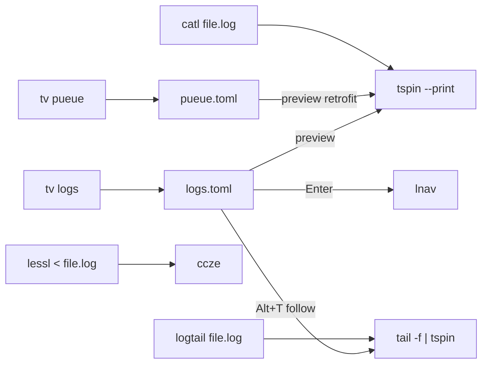

## Scope (from the question answers)

- Install all 4 tools (`tailspin`, `lnav`, `grc`, `ccze`).
- Put them in the existing `devtools` role — no new ansible tag, no new chezmoi opt-in prompt. They install by default, sibling to `bat` / `glow` / `eza`.
- TV integration: both retrofit (pueue preview) and a new `logs` channel.

## Platform matrix

| Tool | macOS | Linux (apt) | Linux (noRoot / fallback) |
|---|---|---|---|
| lnav | brew | apt | GitHub `lnav-*-musl-linux-*` binary (x86_64/aarch64) |
| grc | brew | apt | skip (apt only) |
| ccze | brew | apt | skip (apt only) |
| tailspin (binary: `tspin`) | brew | GitHub release | GitHub release `tailspin-*-unknown-linux-musl.tar.gz` (x86_64/aarch64) |

On `armv7l` (RPi4 32-bit): skip `tailspin` + `lnav` GitHub fallback (no armv7l build); `grc` / `ccze` still install via apt.

## Changes

### 1. Ansible: extend [`dot_ansible/roles/devtools/tasks/main.yml`](dot_ansible/roles/devtools/tasks/main.yml)

- macOS `homebrew` list (~line 17-44): append `tailspin`, `lnav`, `grc`, `ccze`.
- Linux Debian:
  - Add `lnav`, `grc`, `ccze` to an `apt.name` list with `become: true` + `tags: [sudo]` + user-level `lnav` fallback block (follow the `eza` / `bat` pattern with GitHub-release-based fallback when `lnav --version` fails).
  - Add `tailspin` block: `brew`-style check `tspin --version`, then download GitHub release tarball scoped by `target_architecture`, extract `tspin` to `~/.local/bin/tspin`. Model after the existing `sesh` block (lines 2166–2288): it does exactly the same flow (fetch latest release JSON, pick asset by name, tar extract, install to `~/.local/bin`). Restrict to `target_architecture in ['x86_64','amd64','aarch64','arm64']` — skip armv7l with a debug note.

### 2. Zsh aliases: new file `dot_config/zsh/tools/29_log_tools.zsh`

Thin opt-in wrappers, each guarded by `command -v … || return 0`:

- `alias catl='tspin --print'` — "colorful cat for logs" (bat-for-logs feel), stdout mode so it composes with pipes.
- `alias lessl='ccze -A | less -RSFX'` — traditional `tail -f` / `less` replacement via the pipe-wrapper path the ChatGPT excerpt recommended.
- Function `logtail FILE` — `tail -f "$FILE" | tspin` (tspin follow-mode replacement that keeps live highlighting without needing a file-opening pager).

Add all three rows to [`docs/zsh/aliases.md`](docs/zsh/aliases.md) per the `AGENTS.md` "Maintaining Custom Aliases & Shell Functions" rule.

### 3. TV retrofit: [`dot_config/television/cable/pueue.toml`](dot_config/television/cable/pueue.toml) preview

Change preview cycle 1 from:

```toml
"pueue log '{split:\\t:0}' --lines 200 2>/dev/null || pueue log '{split:\\t:0}' 2>/dev/null || echo 'No log ...'"
```

to pipe through tspin when present (fall back to raw when not, so the channel still works on fresh installs):

```toml
"if command -v tspin >/dev/null 2>&1; then pueue log '{split:\\t:0}' --lines 200 2>/dev/null | tspin --print 2>/dev/null; else pueue log '{split:\\t:0}' --lines 200 2>/dev/null; fi || echo 'No log ...'"
```

Same shape for the sms/ansible channels if any of them `cat` log-ish files — quick audit before touching them (likely only pueue qualifies).

### 4. New TV channel: `dot_config/television/cable/logs.toml`

Follows the pattern in [`dot_config/television/cable/lan-devices.toml`](dot_config/television/cable/lan-devices.toml):

- `[metadata]` name=`logs`, requirements=`["fd"]` (fd is already in `base` ansible role).
- `[source]` — 3 cycles (`Ctrl+S`):
  1. `*.log` in `$PWD` (recursive via `fd -HI -t f -e log -e ndjson`)
  2. User cache/log dirs: `~/.cache`, `~/Library/Logs` (macOS), `/var/log` (readable subset)
  3. `journalctl --output=short-iso -n 2000` on Linux with systemd, else fallback to source 2
- `[preview]` — 2 cycles (`Ctrl+F`):
  1. `tspin --print` on the selected file (colorful tail of last ~500 lines)
  2. Raw `bat --style=plain --color=always` for comparison
- `[keybindings]`:
  - `Enter` — open in `lnav` (execute mode); if `lnav` missing, fall back to `less -R` with `ccze -A`
  - `Alt+T` — follow with `tail -f FILE | tspin`
  - `Alt+E` — open in `$EDITOR`
  - `Ctrl+Y` — copy path to clipboard (reuse the OSC-52 pattern from `lan-devices.toml` `copy_ip`)

### 5. Docs: new [`docs/tools/log-tools.md`](docs/tools/log-tools.md)

Single page — don't scatter. Structure:

- TL;DR decision table (mirroring the one in `web-reader.md`): filter vs. viewer vs. one-shot pretty-printer.
- `tailspin (tspin)` — zero-config log highlighter; `tspin file.log` opens a pager, `| tspin` pipes; show pueue preview wiring as an integration example.
- `lnav` — full-featured TUI; multi-file timeline merge, `q`/`/`/`Shift+P`; mention custom format files when apt version is too old.
- `grc` — custom regex rules; point users at `~/.grc/conf.*`; include a Python/FastAPI starter snippet as an appendix (the one ChatGPT offered at the end of the excerpt).
- `ccze` — legacy-but-fast pipe colorizer; `ccze -A | less -R` idiom.
- Why Loguru-internals are not a fit (1 paragraph summary from the excerpt so the rationale is captured).
- TV integration: new `logs` channel + pueue preview retrofit.

### 6. Repo-level docs updates

- [`README.md`](README.md) — "Tools (via ansible)" section: add a "Log viewers" bullet linking to `docs/tools/log-tools.md`; "Config Files" section: add the `dot_config/television/cable/logs.toml` + `dot_config/zsh/tools/29_log_tools.zsh` lines.
- `docs/tools/tv.md` — add a `### \`logs\` channel` subsection under the custom channels list (mirrors existing channel sections).
- `dot_ansible/roles/devtools/tasks/main.yml` module comment at the top (line 3): append the four tools to the inline tool list.
- `CLAUDE.md` Available Tags table entry for `devtools` — append the four tools to the `Description`.
- No new chezmoi prompt, so `Dockerfile` / `.chezmoi.toml.tmpl` are untouched.

## Flow



## Out of scope

- No new chezmoi prompt / ansible tag. These are low-footprint CLIs and sit beside bat/eza in `devtools`.
- No Loguru wrapper. The user and ChatGPT excerpt already agreed this is not worth it.
- No custom grc rulesets deployed into `~/.grc/` — the docs page links to the user-facing appendix; deploying managed `conf.*` files can be a follow-up if the user wants.
