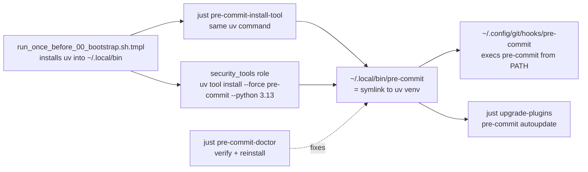

## Current scatter (problem)

Seven sources compete for "which `pre-commit` runs":

- `dot_ansible/roles/security_tools/tasks/main.yml` → brew on macOS, uv/pipx/pip on Linux
- `justfile` `pre-commit-install-tool` → brew → uv → pip chain, short-circuits on any PATH hit
- `scripts/upgrade_tools.sh` `cat_plugins` → uses whatever's on PATH
- `dot_config/git/hooks/executable_pre-commit.tmpl` → uses whatever's on PATH
- `docs/tools/pre-commit.md` → documents uv trick as *recovery workaround only*
- `.chezmoiignore.tmpl` already keeps `.pre-commit-config.yaml` repo-local (fine)
- conda `base` shadow at `~/miniforge3/bin/pre-commit` silently wins on PATH after `conda activate base`

This is what let the macOS `pyexpat` / `_XML_SetAllocTrackerActivationThreshold` break happen: brew's `python@3.14` installed pre-commit, then conda's shadow masked it, so the "fix" was incidental and not portable.

## Target architecture



PATH order is already correct: `dot_config/zsh/00_exports.zsh.tmpl:21` sets `PATH="$HOME/bin:$HOME/.local/bin:$PATH"` before conda's lazy init, so uv-managed `~/.local/bin/pre-commit` beats `~/miniforge3/bin/pre-commit`.

## Files to change

### 1. `dot_ansible/roles/security_tools/tasks/main.yml`

Replace the macOS brew branch and the Linux chain with a single uv-pinned task that runs on both OSes (uv is already a hard bootstrap prereq — see `run_once_before_00_bootstrap.sh.tmpl:175`, which installs uv before any ansible role). Keep `gitleaks` + `go` via brew on macOS in a separate task.

Rough shape:

```yaml
- name: Install pre-commit via uv (pinned Python)
  ansible.builtin.command: >-
    uv tool install --force pre-commit --python 3.13
  register: pc_install
  changed_when: "'already installed' not in (pc_install.stdout | default(''))"

- name: Install gitleaks + go (macOS only)
  when: ansible_facts["os_family"] == "Darwin"
  community.general.homebrew:
    name: [gitleaks, go]
    state: present
```

Pattern matches existing `dot_ansible/roles/llm_tools/tasks/main.yml:15-18` and `dot_ansible/roles/python_uv_tools/tasks/main.yml:5-8`, which already use `uv tool install ... --python ...`. Drop the three Debian `uv/pipx/pip` fallback branches and the `precommit_check` shim — `uv tool install --force` is idempotent and logs "already installed" when unchanged.

### 2. `justfile` — `pre-commit-install-tool`

Replace lines 122-142 (the brew/uv/pip chain + PATH-based short-circuit) with a deterministic single command, and surface a second recipe for the recovery path:

```make
# Install pre-commit (pinned via uv; same command as the ansible role)
pre-commit-install-tool:
    @command -v uv >/dev/null || { echo "uv not found; run chezmoi bootstrap first"; exit 1; }
    uv tool install --force pre-commit --python 3.13
    @echo "pre-commit installed: $(pre-commit --version)"

# Diagnose + re-install pre-commit when hooks' virtualenv bootstrap breaks
# (e.g. macOS brew Python pyexpat ABI mismatch, conda shadow on PATH)
pre-commit-doctor:
    ./scripts/pre-commit-doctor.sh
```

The key change: remove the `command -v pre-commit && exit 0` short-circuit so this recipe always converges to the uv-managed binary, even when conda's shadow is currently winning.

### 3. New `scripts/pre-commit-doctor.sh`

Small bash script (bats-testable, in-scope for shellcheck since it lives under `scripts/`):

- Resolve `command -v pre-commit`; if not under `~/.local/bin/`, warn and show the shadowing binary (`~/miniforge3/bin/pre-commit`, `/opt/homebrew/bin/pre-commit`).
- Try `pre-commit run --all-files --verbose` on a throwaway config; grep stderr for known failure signatures (`pyexpat`, `XML_SetAllocTrackerActivationThreshold`, `CalledProcessError … virtualenv`).
- On hit: `pre-commit clean`, `uv tool install --force pre-commit --python 3.13`, re-run.
- Exit codes: 0 healthy, 1 fixed, 2 unfixable (report to user).

### 4. `docs/tools/pre-commit.md`

Rewrite the current "Using `uv` to pin pre-commit's Python" section (lines 47-89 of [docs/tools/pre-commit.md](docs/tools/pre-commit.md)) from "recovery trick" framing to "this repo's canonical install method":

- Move the `uv tool install --force pre-commit --python 3.13` command from "workaround" to section 1 / first-thing.
- Document the PATH precedence (`~/.local/bin` wins over brew + conda because of `00_exports.zsh.tmpl:21`), and the conda shadow failure mode explicitly — call out `which pre-commit` returning `~/miniforge3/bin/pre-commit` as the diagnostic symptom.
- Reference `just pre-commit-doctor` in the "Debugging broken hook environments" section (lines 91-141) as the first-line fix.
- Update the `pyexpat` bullet (line 99) to point at the doctor recipe instead of a manual `brew reinstall python@3.14`.

### 5. `CLAUDE.md` + `README.md` (small touch-ups)

- `CLAUDE.md:363` table row for `security_tools` role: add "(pre-commit via uv --python 3.13)" so the pinning is visible in the role reference.
- `CLAUDE.md:406` `Installers` bullet: move `pre-commit` off the "Installers" list and into a note that it's uv-tool-managed.
- `README.md:274` "shellcheck and shfmt run via pre-commit": no change.
- `README.md:107` global hook: no change (still works).

### 6. Leave alone

- `.pre-commit-config.yaml` — hook list is fine, not part of this issue.
- `dot_config/git/hooks/executable_pre-commit.tmpl` — it just execs `pre-commit` from PATH; with fix #1+#2 PATH now deterministically resolves to uv-managed.
- `scripts/upgrade_tools.sh:621-627` — already PATH-agnostic; after migration it'll autoupdate the uv-managed one.
- `Dockerfile`, `run_onchange_after_20_ansible_roles.sh.tmpl` — only mention pre-commit in prose/prompts.

## Validation steps

After applying:

1. `which pre-commit` → `~/.local/bin/pre-commit` (not miniforge3, not brew)
2. `pre-commit --version` still works
3. `pre-commit clean && git commit` on a trivial change rebuilds hook envs without the `pyexpat` error (the whole point)
4. `just pre-commit-doctor` on a healthy repo exits 0
5. `brew uninstall pre-commit` is a no-op from the repo's perspective afterwards — nothing depends on `/opt/homebrew/bin/pre-commit` anymore
6. Docker smoke test (`just docker-test`) still passes since `security_tools` now uses uv unconditionally (was already uv on Linux)

## Answering your Chinese question directly

> 目前徹底解決了嗎？

**No.** The current machine only *appears* fixed because `conda activate base` silently put miniforge3's pre-commit ahead of brew's on PATH. The repo's source of truth (ansible role) still says `brew install pre-commit` on macOS, so the next fresh machine or the next `just ansible-security` run will reinstall the brew-python-3.14 version and the break recurs. The plan above fixes it systemically by making uv the single source of truth.
