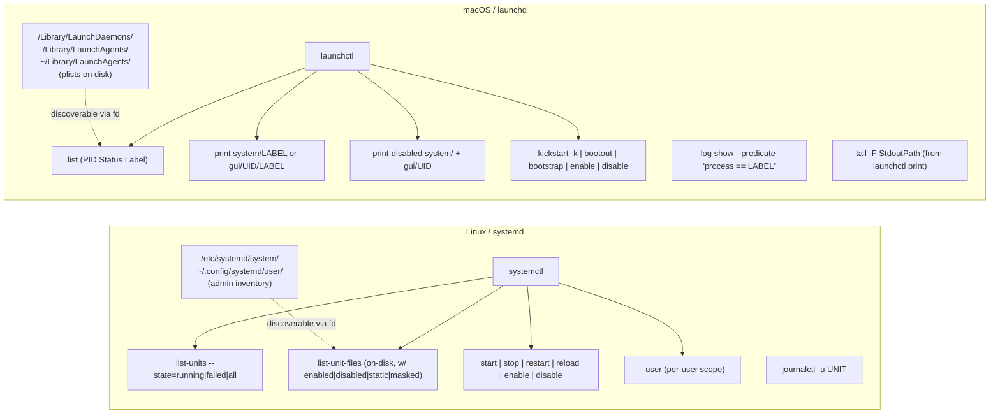

## Goal

Replace the "staring at `systemctl list-units` through less" experience with a pueue-style `tv services` picker that works on both Linux (systemd) and macOS (launchd), with tailspin-colored log preview and Alt-key lifecycle actions. Implement the unified channel first; deeper per-OS channels are scoped as follow-up phases.

## Model cheat sheet (why we need a template, not raw if-else)



Same concept, very different commands. The unified channel paper-overs them with a chezmoi template; power-user channels live as OS-specific templates.

## Phase 1 (this change): unified `tv services` channel

### 1. New file: [`dot_config/television/cable/services.toml.tmpl`](dot_config/television/cable/services.toml.tmpl)

Modeled on [`dot_config/television/cable/pueue.toml`](dot_config/television/cable/pueue.toml) — same tab-separated row format, same Alt-key muscle memory, same `watch = 2.0` refresh.

Row format (uniform across OSes): `SYMBOL\tNAME\tSCOPE\tINFO`

- `SYMBOL`: `▶ Running` / `✗ Failed` / `⏸ Stopped` / `? Unknown` for runtime cycles (1–4). For cycle 5 (on-disk view), the symbol instead carries enablement state so "configured but not enabled" pops out visually:
  - Linux: `✓ Enabled` / `○ Disabled` / `— Static` / `⊘ Masked` / `↪ Alias` / `● Indirect`
  - macOS: `● Loaded` (running or scheduled) / `○ On-disk` (plist present, not loaded) / `⊘ Disabled` (in `launchctl print-disabled`)
- `NAME`: unit name (Linux: `nginx.service`) or label (macOS: `com.apple.nsurlsessiond`)
- `SCOPE`: `system` or `user`
- `INFO`: description (Linux, cycles 1–4) / enablement or PID (cycle 5) / `PID=…` / `exit=N` (macOS)

Display string: `"{split:\\t:0}  {split:\\t:1}  [{split:\\t:2}]  {split:\\t:3}"`
Output (for actions): `"{split:\\t:1}|{split:\\t:2}"` — name + scope so actions know whether to sudo.

#### 5 source cycles (Ctrl+S)

1. **Running only** — currently active services, system+user merged
2. **All loaded** — active + inactive + failed among *loaded* units (includes runtime-only and transient units)
3. **Failed only** — crashed / non-zero exit
4. **User-scope only** — `systemctl --user` / macOS `gui/$UID/` domain
5. **Installed (on-disk)** — every unit file systemd knows about (Linux) or every `.plist` under the launchd search paths (macOS). This is the "configured but not enabled" discovery view, and is a strict superset of cycle 2 for services that have unit files. Landing on a `○ Disabled` row and hitting `Alt+L` toggles it on at boot.

> Why cycle 5 differs from cycle 2 (Linux specifically): `list-units` only shows units systemd currently has loaded (active, inactive, failed). `list-unit-files` shows every unit file on disk including ones that have never been instantiated — that's where "I dropped this .service into /etc/systemd/system/ but forgot to enable it" hides.

Per-OS commands (templated with `{{ if eq .chezmoi.os "linux" }}` / `{{ else }}` / `{{ end }}`):

- **Linux**:
  - Running: `systemctl list-units --type=service --state=running --no-legend --plain --no-pager` then awk → row format; append `--user` variant tagged `user`.
  - All loaded: same with `--all` (no `--state`).
  - Failed: `--state=failed`.
  - User-scope: `systemctl --user list-units --type=service --all ...`.
  - Installed: `systemctl list-unit-files --type=service --no-legend --no-pager --plain` (system scope) merged with `systemctl --user list-unit-files --type=service --no-legend --no-pager --plain` (user scope). Awk maps the STATE column (`enabled|disabled|static|masked|alias|indirect|generated|transient`) to the symbols above. The unit-file path is derivable on-demand for the `Alt+E` edit action via `systemctl [--user] cat NAME | head -1`.
- **macOS**:
  - Running: `launchctl list | awk 'NR>1 && $1 != "-" ...'` → user scope; `sudo -n launchctl list` output merged for system scope when passwordless sudo succeeds; otherwise user scope only, with an informational row explaining sudo is needed to see system daemons.
  - All loaded: `launchctl list` (all rows) + sudo variant.
  - Failed: `awk '$2 != 0 && $2 != "Status"'`.
  - User-scope: `launchctl list` without sudo.
  - Column enrichment: `launchctl list` has no description, so INFO column carries `PID=N` or `exit=N`.
  - Installed (on-disk): `fd -HI '.plist$' /Library/LaunchDaemons /Library/LaunchAgents "$HOME/Library/LaunchAgents" 2>/dev/null` for admin- and user-installed jobs. Apple's `/System/Library/Launch*` is excluded by default (~600 noisy rows) but documented as a one-line opt-in edit. Awk derives label from the plist filename (`basename .plist`), scope from path (`/Library/LaunchDaemons` → system-daemon, `/Library/LaunchAgents` → system-agent, `~/Library/LaunchAgents` → user), and correlates with a one-shot `launchctl list | awk 'NR>1{print $3}'` lookup to mark `● Loaded` vs `○ On-disk`; `launchctl print-disabled system/` and `launchctl print-disabled gui/$UID` fill in `⊘ Disabled`.

#### 2 preview cycles (Ctrl+F)

1. **Colorful log tail via tailspin** — last ~500 lines through `tspin --print`:
   - Linux: `journalctl --no-pager --user? -u NAME -n 500` (picks `--user` flag if scope=user, else system).
   - macOS: try `tail -n 500 $(launchctl print DOMAIN/LABEL | awk -F'= ' '/stdout path/{print $2; exit}')`; if the plist has no StdoutPath, fall back to `log show --predicate 'process == "LABEL"' --last 1h --style syslog`.
2. **Status / details**:
   - Linux: `systemctl [--user] status NAME --no-pager -l -n 0` (just the status block, log preview is in cycle 1).
   - macOS: `launchctl print DOMAIN/LABEL` (full block: state, paths, spawn policy, last exit).

#### Keybindings (Alt-keys, match pueue semantics)

- `Enter` → follow live: Linux `journalctl -fu NAME`, macOS `tail -F StdoutPath | tspin --print` (or `log stream --predicate ...` fallback). Wraps with `echo '[Press Enter to exit]'; read -r _` for graceful exit.
- `Alt+R` → restart: `systemctl [--user] restart NAME` / `launchctl kickstart -k DOMAIN/LABEL`. Auto-prepends `sudo` when scope=system.
- `Alt+S` → stop: `systemctl stop` / `launchctl bootout DOMAIN/LABEL`.
- `Alt+T` → start: `systemctl start` / `launchctl bootstrap DOMAIN PATH_TO_PLIST`. (Start on macOS is tricky without knowing the plist path — fallback to `kickstart` for already-loaded jobs.)
- `Alt+U` → reload: `systemctl reload-or-restart` / `launchctl kickstart` (no `-k`).
- `Alt+D` → status details: switches preview to cycle 2 equivalent in a full pager (execute mode).
- `Alt+E` → edit: Linux `sudo systemctl edit --full NAME`; macOS opens the plist in `$EDITOR` by reading path from `launchctl print`.
- `Alt+L` → toggle enable on boot: `systemctl [--user] enable/disable NAME` (parse current state first) / `launchctl enable/disable DOMAIN/LABEL`.
- `Ctrl+Y` → copy name: OSC 52 clipboard helper (copy-pattern from pueue's `copy_command`).

All mutating actions `reload_source` like pueue's lifecycle actions.

#### Sudo strategy

Scope tag in the output (`name|scope`) tells the action whether to prepend `sudo`. Actions use `execute` mode (not `fork`) so sudo can prompt in the subshell terminal. If `sudo -n true` succeeds the prompt is invisible; otherwise the user sees the standard password prompt then Enter to return to tv.

#### Dependencies

All already installed:
- `systemctl` / `journalctl` — base systemd on Linux
- `launchctl` / `log` — macOS built-in
- `tspin` — from devtools role
- `awk` / `sed` — base

No ansible changes needed. Add `requirements = []` (empty) since everything is built-in.

### 2. Update [`docs/tools/tv.md`](docs/tools/tv.md)

Add a `### \`services\` channel` subsection between `logs` and `ansible` sections. Include:
- Purpose, source file link to `services.toml.tmpl`
- 5-cycle source list (explicitly calling out cycle 5 = "Installed on-disk" with the enablement-state symbols)
- 2-cycle preview list
- Keybindings table (highlight the cycle 5 + `Alt+L` pairing for fixing "configured but not enabled" gaps)
- Sudo caveat + pointer to the eventual `tv systemd` / `tv launchd` channels

### 3. New file: [`docs/tools/services.md`](docs/tools/services.md)

Dedicated writeup:
- 60-second intro to systemd vs launchd conceptual model (the mermaid above)
- How to use `tv services`: screenshot placeholders, keybinding reference
- When to reach for the deeper platform-specific channels (forecast Phase 2/3)
- Sudo + privilege notes
- Pointer back to [`docs/tools/log-tools.md`](docs/tools/log-tools.md) for the tailspin/lnav integration

### 4. Small update to [`README.md`](README.md)

Add to the "Config Files" listing:
- `~/.config/television/cable/services.toml.tmpl` — "Cross-platform services channel ..."

No `CLAUDE.md` change (no new ansible tag).

### 5. Optional helper in [`dot_config/zsh/tools/29_log_tools.zsh`](dot_config/zsh/tools/29_log_tools.zsh)

Thin cross-platform wrappers so the same muscle memory works from the CLI:

```zsh
svclog()  { ... }   # follow service log — journalctl -fu / tail -F StdoutPath | tspin
svcstat() { ... }   # show status     — systemctl status / launchctl print
```

Ungated on zsh startup cost (both are tiny functions).

## Phase 2 (follow-up, Linux): `tv systemd`

**Not implemented in this change — sketched for the plan.**

File: `dot_config/television/cable/systemd.toml.tmpl` with `{{ if eq .chezmoi.os "linux" }}` wrapper; produces empty content on macOS (chezmoi will still place a tiny stub; or we exclude via `.chezmoiignore`).

Source cycles (broader than services):
1. Services (all)
2. Timers (`list-timers`)
3. Sockets
4. Targets
5. Failed (any type)
6. User-services
7. User-timers
8. **Admin-configured units only** — strictly `/etc/systemd/system/**/*` (+ `/etc/systemd/user/**/*`) and `~/.config/systemd/user/**/*`, i.e. the "units *I* put here", separate from the distro-packaged units under `/lib/systemd/system/`. Uses `fd -HI '\.(service|timer|socket|target|mount|path)$' /etc/systemd ~/.config/systemd 2>/dev/null` and correlates each file's basename with `systemctl is-enabled` + `is-active` for the badge. This is the admin-inventory view the unified Phase 1 cycle 5 hints at but doesn't fully deliver.

Preview: same tspin journalctl + `systemctl cat` (show unit file) + `systemctl show` (properties) + `systemctl list-dependencies`.

Additional actions beyond Phase 1:
- `Alt+M` mask / unmask
- `Alt+N` daemon-reload
- `Alt+O` edit drop-in override (not full unit) — `sudo systemctl edit UNIT`
- `Alt+I` inspect dependency tree in lnav or less

## Phase 3 (follow-up, macOS): `tv launchd`

File: `dot_config/television/cable/launchd.toml.tmpl` (macOS only).

Source cycles:
1. System daemons (`sudo launchctl list` system domain)
2. User agents (`launchctl list` user/gui domain)
3. Loaded (running)
4. Disabled (`launchctl print-disabled system/` + `gui/$UID`)
5. All plists on disk — `fd '\.plist$' /Library/LaunchDaemons /Library/LaunchAgents ~/Library/LaunchAgents /System/Library/LaunchDaemons /System/Library/LaunchAgents`. Includes Apple's `/System/Library/Launch*` (unlike Phase 1 cycle 5 which excludes them for brevity).
6. **Admin-installed plists only** — strictly `/Library/Launch*` and `~/Library/LaunchAgents`, skipping `/System/Library/*`. The "plists *I* or my installers put here" view, parallel to Phase 2's admin-only cycle.

Preview:
- `launchctl print DOMAIN/LABEL` — most useful block
- `tail -n 500 StdoutPath | tspin --print` — when logs go to files
- `log show --predicate 'process == "LABEL"' --last 1h --style syslog | tspin --print` — unified logging fallback
- `bat /path/to/label.plist` — plist itself

Actions:
- `Alt+B` bootstrap (load plist)
- `Alt+O` bootout (unload plist)
- `Alt+K` kickstart -k (hard restart)
- `Alt+E` open plist in `$EDITOR`
- `Alt+F` reveal StdoutPath in Finder (`open -R "$path"`)

## Execution order

If you approve this plan, implementation order is:

1. Write `services.toml.tmpl` (Phase 1 core), render-test on macOS and simulated Linux branch.
2. Write `docs/tools/services.md` + `docs/tools/tv.md` update + README one-liner.
3. Optional zsh helpers in `29_log_tools.zsh`.
4. Run `chezmoi execute-template` to verify both OS branches produce valid TOML.
5. Commit.
6. Phase 2 / Phase 3 become separate follow-up PRs; this plan stays as the design doc.

Nothing in Phase 1 requires new ansible roles or tools — everything leans on what's already installed.
