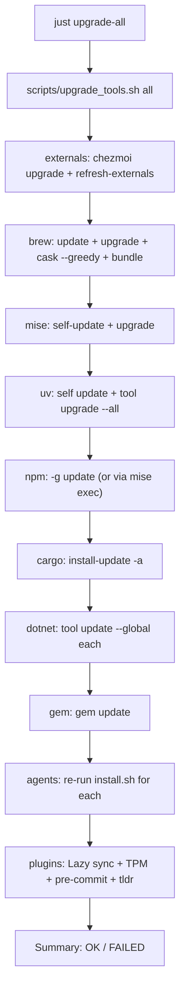

## Design principles

- **Install path (`chezmoi apply` / ansible) stays conservative** — role `state:` 全部不改,`creates:` 也不動。
- **Upgrade path is a separate, explicit shell script** — 不經過 ansible,避免「改了 role 又順便裝新東西」語意混亂。
- **Sub-commands composable** — `just upgrade-all` 只是把分類 recipe 串起來;每一類都能單獨跑。
- **Best-effort, 不中斷** — 一類升級失敗不影響下一類,最後列出失敗摘要(參考 [`run_onchange_after_20_ansible_roles.sh.tmpl`](run_onchange_after_20_ansible_roles.sh.tmpl) 裡的 `allowPartialFailure` 模式)。
- **Reuse 既有基礎建設** — 共用 [`scripts/lib/sudo_shared.sh`](scripts/lib/sudo_shared.sh)(Linux apt / cask pkg 會用到)、共用既有的 `info/success/warn/error` 配色。

## Main artifact: `scripts/upgrade_tools.sh`

新檔,一般 bash 腳本,不是 chezmoi template(放 `scripts/`,已被 [`.chezmoiignore.tmpl`](.chezmoiignore.tmpl) 排除不部署)。

### CLI surface

```bash
scripts/upgrade_tools.sh                    # = all
scripts/upgrade_tools.sh all                # 跑所有預設類別
scripts/upgrade_tools.sh brew               # Homebrew formulas/casks + Brewfile (greedy)
scripts/upgrade_tools.sh mise               # mise self-update + mise upgrade
scripts/upgrade_tools.sh uv                 # uv self update + uv tool upgrade --all
scripts/upgrade_tools.sh npm                # npm update -g (+mise-exec fallback)
scripts/upgrade_tools.sh cargo              # cargo-update -a (若有),否則 re-cargo install
scripts/upgrade_tools.sh dotnet             # dotnet tool update --global 每個
scripts/upgrade_tools.sh gem                # gem update 每個
scripts/upgrade_tools.sh agents             # curl|bash installer 重跑:Claude Code / OpenCode / Cursor CLI / Ollama / llmfit / RTK
scripts/upgrade_tools.sh plugins            # LazyVim / TPM / pre-commit autoupdate / tldr cache
scripts/upgrade_tools.sh externals          # chezmoi apply --refresh-externals + chezmoi upgrade
scripts/upgrade_tools.sh --dry-run <scope>  # 只印,不執行
scripts/upgrade_tools.sh --only brew,uv     # 只跑指定類別
scripts/upgrade_tools.sh --skip agents      # 跑 all 但跳過指定
```

### Per-category behavior

| Category    | Commands                                                                                                                                                                                                                                                                                                                                                          |
| ----------- | ----------------------------------------------------------------------------------------------------------------------------------------------------------------------------------------------------------------------------------------------------------------------------------------------------------------------------------------------------------------- |
| `brew`      | `brew update` → `brew upgrade` → `brew upgrade --cask --greedy` → `brew bundle --file=~/.config/homebrew/Brewfile`(拿掉 `--no-upgrade`)→ 對應的 `Brewfile.darwin` / `Brewfile.linux` → `brew cleanup`。macOS 呼叫 `sudo_session_init "brew"` + `sudo_session_warm_cache`(cask pkg 會用 `sudo /usr/sbin/installer`)。                                              |
| `mise`      | `mise self-update` → `mise upgrade`(升級已裝工具到 config 允許的最新)。                                                                                                                                                                                                                                                                                           |
| `uv`        | `uv self update` → `uv tool upgrade --all`。                                                                                                                                                                                                                                                                                                                      |
| `npm`       | 偵測 `npm` 在 PATH 否則 `mise exec -- npm`(沿用 [`js_cli_tools`](dot_ansible/roles/js_cli_tools/tasks/main.yml) 的偵測邏輯)→ `npm -g update`。                                                                                                                                                                                                                    |
| `cargo`     | 檢查 `cargo-install-update`(套件名 `cargo-update`),沒裝就 `cargo install cargo-update` → `cargo install-update -a`。                                                                                                                                                                                                                                              |
| `dotnet`    | 讀取 [`dot_ansible/roles/dotnet_tools/defaults/main.yml`](dot_ansible/roles/dotnet_tools/defaults/main.yml) 的 `dotnet_tools` 列表 → 每個 `dotnet tool update --global <name>`。                                                                                                                                                                                  |
| `gem`       | 若 mise ruby shim 存在則 `gem update`。                                                                                                                                                                                                                                                                                                                           |
| `agents`    | `ls -1 "${HOME}/.claude/local/bin/claude"` 等偵測存在才升,重跑既有 installer:Claude Code `curl https://claude.ai/install.sh` / OpenCode `curl https://opencode.ai/install` / Cursor `curl https://cursor.com/install` / Ollama(Linux 有 `ollama --version` 才重跑)/ llmfit / RTK。列表跟 [`coding_agents`](dot_ansible/roles/coding_agents/tasks/main.yml) 一致。 |
| `plugins`   | `nvim --headless "+Lazy! sync" +qa` → `~/.tmux/plugins/tpm/bin/update_plugins all` → `pre-commit autoupdate`(repo 根)→ `tldr --update`(有裝才做)→ `gh extension upgrade --all`(有 gh 才做)。                                                                                                                                                                      |
| `externals` | `chezmoi upgrade`(升 chezmoi 自己)→ `chezmoi apply --refresh-externals`。                                                                                                                                                                                                                                                                                         |

預設 `all` = `externals → brew → mise → uv → npm → cargo → dotnet → gem → agents → plugins`(跑順序很重要:先把 package manager 自己升上去,再升工具;externals 在最前面是因為 `chezmoi upgrade` 可能會換 chezmoi binary)。

### Orchestration

- 每一類用 `run_category "name" category_fn` 包起來,fn 內 `set +e` 記錄每步 rc;類別層級失敗 append 到 `FAILED[]`。
- 結尾印:


```
  ────── Upgrade Summary ──────
  [SUCCESS] brew, mise, uv, npm, cargo, dotnet, plugins
  [FAILED]  agents (ollama installer rc=1 — 見上面 log)


```
- `--dry-run` 走 `printf "+ %s\n" "$cmd"` 而不真的 exec。
- macOS / Linux 的 Homebrew PATH 自動偵測,沿用 [`run_onchange_after_30_brew_bundle.sh.tmpl`](run_onchange_after_30_brew_bundle.sh.tmpl) 的 snippet。

## justfile additions

新增在 [`justfile`](justfile) 現有 `# Setup Utilities` 後,新增一個 section:

```makefile
# ============================================================================
# Upgrades (explicit, opt-in — `chezmoi apply` stays conservative)
# ============================================================================

upgrade-all:
    ./scripts/upgrade_tools.sh all

upgrade-brew:
    ./scripts/upgrade_tools.sh brew

upgrade-mise:
    ./scripts/upgrade_tools.sh mise

upgrade-uv:
    ./scripts/upgrade_tools.sh uv

upgrade-npm:
    ./scripts/upgrade_tools.sh npm

upgrade-cargo:
    ./scripts/upgrade_tools.sh cargo

upgrade-dotnet:
    ./scripts/upgrade_tools.sh dotnet

upgrade-gem:
    ./scripts/upgrade_tools.sh gem

upgrade-agents:
    ./scripts/upgrade_tools.sh agents

upgrade-plugins:
    ./scripts/upgrade_tools.sh plugins

upgrade-externals:
    ./scripts/upgrade_tools.sh externals

upgrade-dry-run:
    ./scripts/upgrade_tools.sh --dry-run all
```

## Docs

- 在 [`AGENTS.md`](AGENTS.md) 新增一段 `## Upgrades` section(放在 `## Upstream Clones via .chezmoiexternal.toml.tmpl` 後面),內容:install vs upgrade 的語意分離、`just upgrade-*` 的 matrix、`chezmoi apply` 為什麼故意不升。
- [`README.md`](README.md) 加一小段 "Keeping tools up-to-date" 指向 `just upgrade-all`,順便修正目前 "mise `ensures latest versions`" 的說法。

## 刻意不做的

- 不改任何 ansible role 的 `state:` / `creates:`(保留 `chezmoi apply` 保守語意,Codex 的原始 comment 裡已解釋原因)。
- 不動 `brew bundle --no-upgrade`(那是 `chezmoi apply` 觸發的 hook,必須保守);升級改由 upgrade script 另外呼叫一次不帶 `--no-upgrade`。
- 不包 `apt upgrade` / 系統層升級 — 你沒勾這項;使用者要就手動 `sudo apt upgrade`。
- 不包 LiteLLM/Ollama 以外的 Python/local service 重啟;只升 binary,不碰 daemon。

## Flow diagram



## Implementation order

1. 先寫 `scripts/upgrade_tools.sh` 的骨架(argparse、run_category、summary、sudo helper inclusion via source)。
2. 一次填一個 category,手動在本機跑過 `--dry-run` 再去掉 dry-run 驗證。
3. 加 justfile recipes。
4. 寫 AGENTS.md / README.md 段落。
5. (可選)加一個 `just upgrade-dry-run` 到 `check-all` 流裡? — 我傾向不加,因為 `upgrade` 不是 CI 概念。
