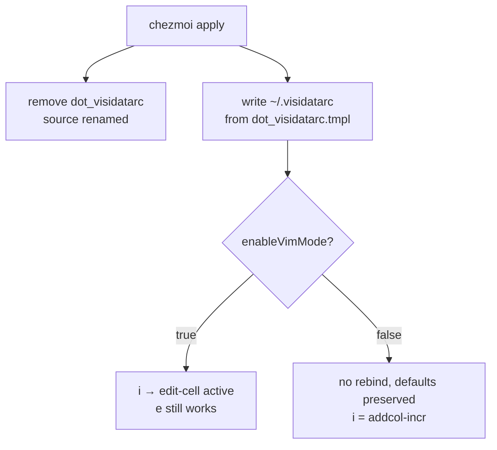

## Decision

**Stay at `~/.visidatarc`** for now. Don't move to `~/.config/visidata/config.py` in this commit. Reasons:

- VisiData's XDG support (PR #1420, v2.9+) prefers `appdirs.user_config_dir('visidata') / 'config.py'` over `~/.visidatarc`, but `appdirs` on Darwin returns `~/Library/Preferences/visidata`, **not** `~/.config/visidata` (`[visidata/vendor/appdirs.py:196-203](file:///Users/daviddwlee84/.local/share/uv/tools/visidata/lib/python3.13/site-packages/visidata/vendor/appdirs.py)`). So a Linux-style XDG migration would silently fail on macOS unless we redirect via `VD_CONFIG` + `VD_DIR` env vars (`[settings.py:440-441](file:///Users/daviddwlee84/.local/share/uv/tools/visidata/lib/python3.13/site-packages/visidata/settings.py)`).
- The env-var redirect is clean, but adds two new shell exports for one tool that's already working. Defer until there's a concrete benefit beyond "cleaner location".
- The XDG migration is well-scoped enough to fit `[P3/S]` in TODO.md (single env-var block, single file rename, no live-state migration risk).

This commit therefore: (a) templatizes the existing rc file to add the `enableVimMode` gate, (b) preserves the historic location, (c) captures the appdirs analysis so the future migration is a 10-minute job.

## File changes

### 1. Rename + edit: `[dot_visidatarc](dot_visidatarc)` → `dot_visidatarc.tmpl`

`.tmpl` suffix is required for chezmoi to evaluate the `{{ if .enableVimMode }}` block. Target path stays `~/.visidatarc` (suffix stripped on deploy).

New body (header expanded, feather block unchanged, gated vim block added):

```python
# VisiData personal config (~/.visidatarc).
# Loaded by VisiData at startup AFTER bundled loaders register themselves.
# Anything we set on `VisiData` / `vd` here wins over in-tree defaults.
#
# Managed by chezmoi (source: dot_visidatarc.tmpl). Edits to ~/.visidatarc
# will be reverted on next `chezmoi apply` — change the source instead.
#
# -----------------------------------------------------------------------------
# Why ~/.visidatarc and not $XDG_CONFIG_HOME/visidata/config.py?
# -----------------------------------------------------------------------------
# VisiData v2.9+ supports an XDG-located config.py
# (visidata/settings.py:_get_config_file): if
# appdirs.user_config_dir('visidata')/config.py exists, it wins over
# ~/.visidatarc.  But appdirs on Darwin returns
# ~/Library/Preferences/visidata (NOT ~/.config/visidata) — so a naive
# Linux-style migration would silently fail on macOS.
#
# Path forward (tracked in TODO.md "[P3/S] Migrate VisiData rc to XDG path"):
# export VD_CONFIG="${XDG_CONFIG_HOME:-$HOME/.config}/visidata/config.py"
# export VD_DIR="${XDG_CONFIG_HOME:-$HOME/.config}/visidata"
# in dot_config/shell/00_exports.sh.tmpl, then move source to
# dot_config/visidata/config.py.tmpl.  VD_CONFIG/VD_DIR are read by
# loadConfigAndPlugins() at settings.py:440-441 and are the intended
# upstream-supported override.

# -----------------------------------------------------------------------------
# .feather → ArrowSheet (bypass the broken PandasSheet path)
# (unchanged — see pitfalls/visidata-feather-stringdtype-numpy-dtype.md)
# -----------------------------------------------------------------------------

try:
    from visidata import VisiData  # noqa: E402

    from visidata.loaders.arrow import ArrowSheet  # noqa: E402

    def open_feather(vd, p):  # noqa: ARG001
        """Route .feather to ArrowSheet (pure pyarrow), bypassing PandasSheet."""
        return ArrowSheet(p.base_stem, source=p)

    VisiData.open_feather = open_feather

{{- if .enableVimMode }}

    # -------------------------------------------------------------------------
    # enableVimMode customizations
    # -------------------------------------------------------------------------
    # VisiData's defaults are already vim-flavored (h/j/k/l nav, gg/G top/bottom,
    # /? search, n/N next/prev, q/Q quit).  The customize-docs canonical
    # add-on for vim users is rebinding `i` from `addcol-incr`
    # (features/incr.py:27) to `edit-cell`, matching vim's INSERT-mode mnemonic.
    # `addcol-incr` remains reachable via the Alt+H command menu or
    # `Space addcol-incr<Enter>`.
    # Per https://www.visidata.org/docs/customize/#example-bind-i-to-edit-cell-globally
    from visidata import TableSheet  # noqa: E402
    TableSheet.unbindkey('i')
    TableSheet.bindkey('i', 'edit-cell')
{{- end }}
except ImportError:
    pass
```

### 2. Update: `[pitfalls/visidata-feather-stringdtype-numpy-dtype.md](pitfalls/visidata-feather-stringdtype-numpy-dtype.md)`

Append a small "XDG path note" subsection near the bottom (before "Related"), about ~15 lines:

```markdown
## XDG path / macOS appdirs caveat (why we still ship at `~/.visidatarc`)

VisiData v2.9+ supports an XDG-located config (`visidata/settings.py:_get_config_file`):

- If `appdirs.user_config_dir('visidata') / 'config.py'` exists, it wins.
- Else fall back to `~/.visidatarc`.

The catch: `appdirs.user_config_dir` is OS-aware:

| OS    | Resolved path                                               |
| ----- | ----------------------------------------------------------- |
| Linux | `$XDG_CONFIG_HOME/visidata` or `~/.config/visidata`         |
| macOS | `~/Library/Preferences/visidata` (NOT `~/.config/visidata`) |

So a Linux-style migration to `~/.config/visidata/config.py` would
silently fail on macOS. The intended upstream override is the
`VD_CONFIG` / `VD_DIR` env vars read by
`[loadConfigAndPlugins](https://github.com/saulpw/visidata/blob/main/visidata/settings.py)`
at `settings.py:440-441` — set both to a `${XDG_CONFIG_HOME:-$HOME/.config}/visidata`
path and macOS + Linux pick up the same file. Future migration is
tracked as `[P3/S]` in `TODO.md`. Current location stays at
`~/.visidatarc` because the feather override works there today on every
platform without touching shell exports.
```

### 3. Update: `[docs/this_repo/vim-mode.md](docs/this_repo/vim-mode.md)`

Two surgical edits:

- **Catalog table** (lines ~26-44, after the `superfile` row): add

```
  | VisiData `~/.visidatarc` (`dot_visidatarc.tmpl`) | `TableSheet.unbindkey('i')` + `bindkey('i', 'edit-cell')` (vim `i` for INSERT) | no rebind (default `e` for edit-cell, `i` stays bound to `addcol-incr`) |


```

- **App layer section** (after `superfile` subsection, before "Other tools"): new "VisiData" subsection (~25 lines):

```markdown
  #### VisiData — `i` → `edit-cell` (single rebind)

  **File**: `[dot_visidatarc.tmpl](.../dot_visidatarc.tmpl)`

  VisiData is **already heavily vim-flavored by default** — `h/j/k/l`
  navigation, `gg`/`G` jumps, `/`/`?` search, `n`/`N` next/prev,
  `q`/`Q` quit are all bound out of the box. The one canonical vim
  ergonomic addition (from VisiData's own
  [customize docs](https://www.visidata.org/docs/customize/)) is to
  rebind `i` from `addcol-incr` to `edit-cell` so vim users get their
  INSERT-mode mnemonic on cell editing.

  Templated on `enableVimMode`:


```python
  {{ "{{- if .enableVimMode }}" }}
  TableSheet.unbindkey('i')
  TableSheet.bindkey('i', 'edit-cell')
  {{ "{{- end }}" }}


```

  **Trade-off**: `addcol-incr` (add column with incrementing values,
  `visidata/features/incr.py:27`) loses its single-letter shortcut.
  Still reachable via `Space addcol-incr<Enter>` or the `Alt+H`
  command menu. `gi` / `zi` / `gzi` family (set-incr variants) is
  unaffected.

  **Why no broader gating?** `e` for edit-cell is the historical
  VisiData binding and matches no shell convention; the rebind is
  additive (both `i` and `e` enter edit mode after gating). Other
  potential customizations (`Enter` save-and-down via
  `editCellBindings`, etc.) stray into spreadsheet ergonomics rather
  than vim semantics. Track as TODO if you want them.

  **XDG / macOS caveat**: see
  [pitfalls/visidata-feather-stringdtype-numpy-dtype.md → XDG path note](../../pitfalls/visidata-feather-stringdtype-numpy-dtype.md)
  for why this still lives at `~/.visidatarc` and not
  `~/.config/visidata/config.py`.

```

### 4. Add: TODO.md `[P3/S]` entry

Under `## P3 — Someday / nice to have`, somewhere thematically grouped (near the other shell/config items):

```markdown
- [ ] **[P3/S] Migrate VisiData rc to XDG path** — Move `dot_visidatarc.tmpl` → `dot_config/visidata/config.py.tmpl` so the config lives under `~/.config/visidata/config.py` instead of `~/.visidatarc`. VisiData v2.9+ supports the XDG location natively on Linux, but `appdirs.user_config_dir('visidata')` on Darwin returns `~/Library/Preferences/visidata` (not `~/.config/visidata`), so the migration needs `export VD_DIR="${XDG_CONFIG_HOME:-$HOME/.config}/visidata"` + `export VD_CONFIG="$VD_DIR/config.py"` in `dot_config/shell/00_exports.sh.tmpl` to make macOS pick up the same path. `VD_CONFIG` / `VD_DIR` are the upstream-supported overrides (`[settings.py:440-441](file:///Users/daviddwlee84/.local/share/uv/tools/visidata/lib/python3.13/site-packages/visidata/settings.py)`). Note: `VD_DIR` also relocates plugins / macros / urlcache, so if mutable state should stay in a `data` location instead of `config`, only export `VD_CONFIG` and leave `VD_DIR` at the platform default. Caveat captured in `pitfalls/visidata-feather-stringdtype-numpy-dtype.md`.
```

### 5. NO change needed

- `[dot_config/shell/10_aliases.sh](dot_config/shell/10_aliases.sh)` — the `vd-arrow` alias comment block references "the companion dot_visidatarc" and "the rc file"; both stay accurate.
- `[dot_ansible/roles/python_uv_tools/defaults/main.yml](dot_ansible/roles/python_uv_tools/defaults/main.yml)` — unchanged.
- `[CLAUDE.md](CLAUDE.md)` / `AGENTS.md` / `GEMINI.md` — single-file `enableVimMode` use doesn't reach the cross-file-invariants threshold; vim-mode catalog mention is sufficient.
- `.chezmoiignore.tmpl` — `dot_visidatarc.tmpl` is a top-level templated file, no ignore needed.

## Vim-mode scope

Going with **minimal** (just `i` → `edit-cell`, the VisiData docs' canonical example). Reasoning recorded in the subsection above. If you want the spreadsheet-style `Enter` save-and-down (`vd.editCellBindings['Enter'] = acceptThenFunc('go-down', 'edit-cell')`), say so before apply and I'll add it under the same gate.

## Flow on apply




No env-var changes → no shell reload needed. VisiData picks up the new rc on next launch.

## Verification

```sh
chezmoi diff dot_visidatarc.tmpl
chezmoi apply

# enableVimMode = true (default) host:
visidata --version                       # still v3.3
visidata <some.csv>                      # in the sheet:
#  - press `i` → should drop into edit-cell mode (vim INSERT-feel)
#  - press Escape, then `Space addcol-incr<Enter>` → addcol-incr still reachable
#  - press `e` on another cell → edit-cell (unchanged)
# Feather smoke (if a .feather is handy):
visidata foo.feather                     # opens via ArrowSheet, not crash

# Manually flip locally and re-apply to spot-check the gate:
$EDITOR ~/.config/chezmoi/chezmoi.toml   # enableVimMode = false
chezmoi apply
visidata <some.csv>
#  - press `i` → should prompt "incremental step" (default addcol-incr)
$EDITOR ~/.config/chezmoi/chezmoi.toml   # enableVimMode = true (restore)
chezmoi apply
```
