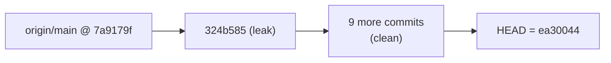

## Root cause

GitHub Push Protection blocked the push because `.specstory/history/2026-04-21_05-10-02Z-infrastructure-as-code-tools-setup.md` lines 6694–6695 contain a real WakaTime API key (`waka_0696b7c7-…`, shown in a `ps aux` output captured into a SpecStory transcript). Default **gitleaks 8.30.0** rules do **not** cover WakaTime keys (verified: 0 leaks on that file), so `redact_secrets.py` (the pre-commit gate that wraps gitleaks) never flagged it.

The secret was only introduced in commit `324b585 Add log related tools and update some log preview TV channels`, and no later commit touches that file — a clean rewrite target. Crucially, `origin/main` is **10 commits behind** local, so the bad commits never reached GitHub and no public force-push is needed.



## Part A — detection: extend `.gitleaks.toml`

`scripts/redact_secrets.py` shells out to `gitleaks protect --staged` / `gitleaks detect` with no `--config` flag, so it auto-discovers [`.gitleaks.toml`](.gitleaks.toml) at the repo root. That file already uses `extend.useDefault = true`, so adding `[[rules]]` blocks layers on top of the stock ruleset.

Add a `# Custom rules — patterns GitHub Push Protection detects but gitleaks default misses` section with these rules. Each is anchored with `[A-Za-z0-9_-]` word-boundary lookalikes (gitleaks uses Go RE2, no lookbehinds, so we rely on the `{N}` length constraint + stopword list).

- **WakaTime API key** (the actual leak) — `waka_` + RFC-4122 UUID:
  - regex: `\bwaka_[0-9a-f]{8}-[0-9a-f]{4}-[0-9a-f]{4}-[0-9a-f]{4}-[0-9a-f]{12}\b`
- **OpenAI project-scoped key** (newer `sk-proj-…` format that default gitleaks' legacy `sk-[A-Za-z0-9]{20}T3BlbkFJ…` pattern misses):
  - regex: `\bsk-proj-[A-Za-z0-9_-]{80,}\b`
- **Anthropic** (belt-and-suspenders — default has it but pinning an explicit length avoids false-negatives on truncated forms):
  - regex: `\bsk-ant-api\d{2}-[A-Za-z0-9_-]{93}AA\b`
- **Cursor API key** — `cursor-` prefixed tokens that appear in SpecStory chats:
  - regex: `\bcursor-[A-Za-z0-9]{40,}\b`
- **Hugging Face token** — `hf_` + 34–40 alnum:
  - regex: `\bhf_[A-Za-z0-9]{34,40}\b`
- **Supabase service PAT** — `sbp_` prefix:
  - regex: `\bsbp_[a-f0-9]{40}\b`
- **Linear API key**:
  - regex: `\blin_api_[A-Za-z0-9]{40}\b`
- **Tailscale auth key** (tskey-auth / tskey-client):
  - regex: `\btskey-(?:auth|client|api)-[A-Za-z0-9]+-[A-Za-z0-9]{24,}\b`
- **Notion integration token** (`ntn_` / `secret_` internal integration):
  - regex: `\bntn_[A-Za-z0-9]{40,}\b`

Each rule gets an explicit `id`, `description`, `regex`, `tags = ["key","auto"]`, and a conservative `entropy = 3.0` only where false positives are likely (WakaTime format is strict enough to skip entropy).

Also extend the existing `[allowlist]` to avoid re-flagging the **already-redacted** sentinel so history-rewrites don't keep tripping the rule:
- Add `'''\bwaka_REDACTED(?:_[A-Z_]+)?\b'''` to `allowlist.regexes`.

### Minor script robustness ([scripts/redact_secrets.py](scripts/redact_secrets.py))

- Pass `--config .gitleaks.toml` explicitly in both `run_gitleaks_staged()` and `run_gitleaks_workdir()` so the custom rules still apply when pre-commit invokes the script from a different CWD. This is a 2-line change per function.
- No other logic changes needed — `redact_secret()` (keep first/last 3 chars) will correctly transform `waka_0696b7c7-…-c54ef` → `wak...4ef`, which no longer matches the new WakaTime rule.

## Part B — scrub the leaked key from history

Secret occurs only in blob referenced by commit `324b585`, so `git filter-repo --replace-text` rewrites exactly one blob and fast-forwards the rest. Since `origin/main = 7a9179f` is the *parent* of the bad commit, the rewritten branch is still a fast-forward from origin's point of view → ordinary `git push` works.

Sequence (all non-interactive, no `rebase -i`):

1. **Preserve uncommitted work** — `git status` shows unstaged edits to `.specstory/history/2026-04-22_02-00-51Z-*.md` + `.specstory/statistics.json` and untracked plan/spec files:


```bash
   git stash push --include-untracked -m "pre-filter-repo"


```

2. **Write the replacements file** (exact-string replacement; `git filter-repo` replaces every occurrence in every blob):


```bash
   printf 'wak...4ef==>waka_REDACTED_WAKATIME_KEY\n' > /tmp/replacements.txt


```

3. **Rewrite history** — `--force` because this isn't a fresh clone, `--refs HEAD` to avoid touching stash/tags:


```bash
   git filter-repo --replace-text /tmp/replacements.txt --force --refs HEAD


```

4. **Re-add the origin remote** (filter-repo strips remotes by design):


```bash
   git remote add origin git@github.com:daviddwlee84/dotfiles.git
   git fetch origin


```

5. **Verify the scrub**:


```bash
   git log --all -S 'waka_0696b7c7' --oneline        # must be empty
   git grep -nI 'waka_0696b7c7' $(git rev-list --all) # must be empty
   rg -n 'waka_0696b7c7' .                            # must be empty


```

6. **Restore stash**:


```bash
   git stash pop


```

7. **Push** — plain push first; fall back to `--force-with-lease` only if filter-repo happened to rewrite pre-`324b585` commits (unlikely with `--replace-text` since those blobs are unchanged):


```bash
   git push origin main
   # if rejected as non-fast-forward:
   git push --force-with-lease origin main


```

## Part C — confirm the gate works going forward

- `./scripts/redact_secrets.py --working-dir --paths .specstory/history` on a throwaway file containing a fake `waka_xxxxxxxx-xxxx-xxxx-xxxx-xxxxxxxxxxxx` should now report a finding.
- Re-run `pre-commit run redact-secrets --all-files` post-rewrite to confirm the repo is clean under the new ruleset.

## Files touched

- [.gitleaks.toml](.gitleaks.toml) — add ~9 `[[rules]]` blocks + one allowlist regex for the redacted sentinel
- [scripts/redact_secrets.py](scripts/redact_secrets.py) — thread `--config .gitleaks.toml` into the two `subprocess.run(["gitleaks", …])` calls
- Git history (commits `324b585..HEAD`) — rewritten via `git filter-repo`; 10 commit SHAs will change

## Not in scope / explicitly deferred

- Full parity with GitHub's ~200-partner Push Protection list (requires a community ruleset like `gitleaks`'s `extended.toml` — opted out per user: "Pragmatic" tier chosen, not "Maximal").
- Enabling secret scanning on the GitHub repo itself (separate UI action at https://github.com/daviddwlee84/dotfiles/settings/security_analysis, out of scope for this code change).
- No changes to `.pre-commit-config.yaml` — the existing `redact-secrets` → `gitleaks-system` chain already picks up the new rules via auto-discovery.
