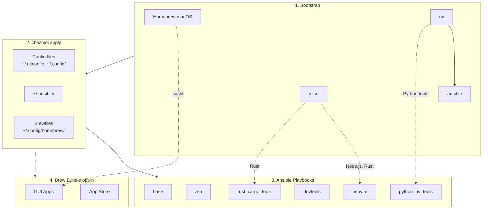

<!-- Generated by SpecStory, Markdown v2.1.0 -->

# 2026-03-10 01:36:30Z

<!-- Codex CLI Session 019cd561-881a-7631-822d-f629db53696e (2026-03-10 01:36:30Z) -->

_**User (2026-03-10 01:36:30Z)**_

Add this to make this a User-level (~/.specstory/cli/config.toml) — global settings that apply across all projects.
https://docs.specstory.com/integrations/terminal-coding-agents/usage#configuration

And remember to add explanation of this

```
# SpecStory CLI Configuration
#
# This is the project-level config file for SpecStory CLI.
# All settings here apply to this project unless overridden by CLI flags.
#
# Uncomment (remove the #) the line and edit any setting below to change the default behavior.
# For more information, see: https://docs.specstory.com/integrations/terminal-coding-agents/usage

[local_sync]
# Write markdown files locally. (default: true)
# enabled = false # equivalent to --only-cloud-sync

# Custom output directory for markdown files.
# Default: ./.specstory/history (relative to the project directory)
# output_dir = "~/.specstory/history" # equivalent to --output-dir "~/.specstory/history"

# Use local timezone for file name and content timestamps (default: false, UTC)
# local_time_zone = true # equivalent to --local-time-zone

[cloud_sync]
# Sync session data to SpecStory Cloud. (default: true, when logged in to SpecStory Cloud)
# enabled = false # equivalent to --no-cloud-sync

[logging]
# Write logs to .specstory/debug/debug.log (default: false)
# log = true # equivalent to --log        

# Debug-level output, requires console or log (default: false)
# debug = true # equivalent to --debug 

# Custom output directory for debug data.
# Default: ./.specstory/debug (relative to the project directory)
# debug_dir = "~/.specstory/debug" # equivalent to --debug-dir "~/.specstory/debug"

# Error/warn/info output to stdout (default: false)
# console = true # equivalent to --console

# Suppress all non-error output (default: false)
# silent = true	# equivalent to --silent

[version_check]
# Check for new versions of the CLI on startup.
# Default: true
# enabled = false # equivalent to --no-version-check

[analytics]
# Send anonymous product usage analytics to help improve SpecStory.
# Default: true
# enabled = false # equivalent to --no-usage-analytics

[telemetry]
# OTLP gRPC collector endpoint (e.g., "localhost:4317" or "http://localhost:4317")
# endpoint = "localhost:4317"

# Override the default service name (default: "specstory-cli")
# service_name = "my-service-name"

# Include user prompt text in telemetry spans (default: true)
# prompts = false

[providers]
# Agent execution commands by provider (used by specstory run)
# Pass custom flags (e.g. claude_cmd = "claude --allow-dangerously-skip-permissions")
# Use of these is equivalent to -c "custom command"

# Claude Code command
claude_cmd = "claude --dangerously-skip-permissions"

# Codex CLI command
codex_cmd = 'codex -c model_reasoning_effort="high" --ask-for-approval never --sandbox danger-full-access -c model_reasoning_summary="detailed" -c model_supports_reasoning_summaries=true'

# Cursor CLI command
cursor_cmd = "cursor-agent --yolo"

# Droid CLI command
droid_cmd = "droid --yolo"

# Gemini CLI command
gemini_cmd = "gemini --sandbox=none"
```


---

_**Agent (gpt-5.4 2026-03-10 01:37:04Z)**_

I’m grounding this in the repo first: checking the task queue, then locating existing SpecStory-related files and the README structure so the plan matches the current dotfiles layout.

_**Agent (gpt-5.4 2026-03-10 01:37:04Z)**_

<tool-use data-tool-type="shell" data-tool-name="exec_command"><details>
<summary>Tool use: **exec_command** `td usage --new-session`</summary>
```
Chunk ID: 09191d
Wall time: 0.5382 seconds
Process exited with code 0
Original token count: 421
Output:
You have access to `td`, a local task management CLI.

NEW SESSION: ses_864b75 on branch: main

CURRENT SESSION: ses_864b75 [codex_82091] on branch: main

WORKFLOW:

  1. `td start <id>` to begin work
     Multi-issue: `td ws start "name"` then `td ws tag <ids>`
  2. `td log "msg"` to track progress
     Multi-issue: `td ws log "msg"`
  3. `td handoff <id>` to capture state (REQUIRED)
     Multi-issue: `td ws handoff`
  4. `td review <id>` to submit for review
  5. Different session: `td approve <id>` to complete

  Use `td ws` commands when implementing multiple related issues.

KEY COMMANDS:
  td current              What you're working on
  td ws current           Current work session state
  td context <id>         Full context for resuming
  td next                 Highest priority open issue
  td critical-path        What unblocks the most work
  td reviewable           Issues you can review
  td approve/reject <id>  Complete review

IMPORTANT: You cannot approve issues you implemented.
  Exception: `td add "title" --minor` creates self-reviewable tasks.

WARNING: Do NOT use `td close` for completed work!
  Use `td review` -> `td approve` workflow instead.
  `td close` is for admin closures: duplicates, won't-fix, cleanup.

Use `td handoff` or `td ws handoff` before stopping work.

FOR LLMs: Run `td usage --new-session` at conversation start (or after /clear).
  Do NOT start a new session mid-work—sessions track implementers for review.
Use `td ws start` when implementing multiple issues to group handoffs.
  - session = identity (always exists)  |  ws = work container (optional)

TIP: Use `td usage -q` to hide these instructions after first read.
```
</details></tool-use>

_**Agent (gpt-5.4 2026-03-10 01:37:04Z)**_

<tool-use data-tool-type="shell" data-tool-name="exec_command"><details>
<summary>Tool use: **exec_command** `rg -n "specstory|SpecStory|\.specstory|config.toml" README.md . .chezmoi.toml.tmpl dot_* dot_config 2>/dev/null`</summary>
```
Chunk ID: bed814
Wall time: 0.1372 seconds
Process exited with code 0
Original token count: 5215
Output:
Total output lines: 221

README.md:87:- `~/.cargo/config.toml` - Cargo registry mirror config (GFW)
README.md:118:- **Coding Agents** (optional): Claude Code, Codex CLI, CodexBar, OpenCode, Cursor CLI, Copilot CLI, Gemini CLI, SpecStory, Happy, OpenChamber, td, sidecar, specify-cli
dot_config/tmuxp/claude-sidecar.yaml:6:      - shell_command: specstory run claude -c 'claude --dangerously-skip-permissions'
./README.md:87:- `~/.cargo/config.toml` - Cargo registry mirror config (GFW)
./README.md:118:- **Coding Agents** (optional): Claude Code, Codex CLI, CodexBar, OpenCode, Cursor CLI, Copilot CLI, Gemini CLI, SpecStory, Happy, OpenChamber, td, sidecar, specify-cli
./TODO.md:16:| alias cc, readelf, ccusage | These depend on specstory/binutils |
./CLAUDE.md:135:| `coding_agents` | Claude Code, OpenCode, Cursor CLI, Copilot CLI, Gemini CLI, SpecStory, Happy |
dot_ansible/roles/lazyvim_deps/tasks/main.yml:36:# Install mise tools from ~/.config/mise/config.toml (node@lts)
./docs/initial_setup/0_ManualSetupRecord.md:60:(After setup CLAUDE.md I mostly ask it to update, so please checkout [`.specstory/history/`](../../.specstory/history/) instead)
dot_ansible/roles/coding_agents/tasks/main.yml:265:# === SpecStory ===
dot_ansible/roles/coding_agents/tasks/main.yml:267:- name: Check if SpecStory is installed (macOS)
dot_ansible/roles/coding_agents/tasks/main.yml:269:  ansible.builtin.command: which specstory
dot_ansible/roles/coding_agents/tasks/main.yml:270:  register: specstory_macos_check
dot_ansible/roles/coding_agents/tasks/main.yml:274:- name: Tap specstoryai/tap for SpecStory (macOS)
dot_ansible/roles/coding_agents/tasks/main.yml:277:    - specstory_macos_check.rc != 0
dot_ansible/roles/coding_agents/tasks/main.yml:279:    name: specstoryai/tap
dot_ansible/roles/coding_agents/tasks/main.yml:282:- name: Install SpecStory via Homebrew (macOS)
dot_ansible/roles/coding_agents/tasks/main.yml:285:    - specstory_macos_check.rc != 0
dot_ansible/roles/coding_agents/tasks/main.yml:287:    name: specstory
dot_ansible/roles/coding_agents/tasks/main.yml:291:- name: Re-check if SpecStory is installed after Homebrew attempt (macOS)
dot_ansible/roles/coding_agents/tasks/main.yml:294:    - specstory_macos_check.rc != 0
dot_ansible/roles/coding_agents/tasks/main.yml:295:  ansible.builtin.command: which specstory
dot_ansible/roles/coding_agents/tasks/main.yml:296:  register: specstory_macos_recheck
dot_ansible/roles/coding_agents/tasks/main.yml:300:- name: Set SpecStory architecture for GitHub release (macOS)
dot_ansible/roles/coding_agents/tasks/main.yml:303:    - specstory_macos_check.rc != 0
dot_ansible/roles/coding_agents/tasks/main.yml:304:    - specstory_macos_recheck.rc != 0
dot_ansible/roles/coding_agents/tasks/main.yml:306:    specstory_macos_arch: "{{ 'arm64' if ansible_facts['architecture'] == 'arm64' else 'x86_64' }}"
dot_ansible/roles/coding_agents/tasks/main.yml:308:- name: Get latest SpecStory release (macOS fallback)
dot_ansible/roles/coding_agents/tasks/main.yml:311:    - specstory_macos_check.rc != 0
dot_ansible/roles/coding_agents/tasks/main.yml:312:    - specstory_macos_recheck.rc != 0
dot_ansible/roles/coding_agents/tasks/main.yml:314:    url: https://api.github.com/repos/specstoryai/getspecstory/releases/latest
dot_ansible/roles/coding_agents/tasks/main.yml:316:  register: specstory_macos_release
dot_ansible/roles/coding_agents/tasks/main.yml:318:- name: Ensure ~/.local/bin exists (SpecStory macOS fallback)
dot_ansible/roles/coding_agents/tasks/main.yml:321:    - specstory_macos_check.rc != 0
dot_ansible/roles/coding_agents/tasks/main.yml:322:    - specstory_macos_recheck.rc != 0
dot_ansible/roles/coding_agents/tasks/main.yml:323:    - specstory_macos_release is defined
dot_ansible/roles/coding_agents/tasks/main.yml:329:- name: Download SpecStory from GitHub release (macOS fallback)
dot_ansible/roles/coding_agents/tasks/main.yml:332:    - specstory_macos_check.rc != 0
dot_ansible/roles/coding_agents/tasks/main.yml:333:    - specstory_macos_recheck.rc != 0
dot_ansible/roles/coding_agents/tasks/main.yml:334:    - specstory_macos_release is defined
dot_ansible/roles/coding_agents/tasks/main.yml:336:    url: "https://github.com/specstoryai/getspecstory/releases/download/{{ specstory_macos_release.json.tag_name }}/SpecStoryCLI_Darwin_{{ specstory_macos_arch }}.zip"
dot_ansible/roles/coding_agents/tasks/main.yml:337:    dest: /tmp/specstory-macos.zip
dot_ansible/roles/coding_agents/tasks/main.yml:340:- name: Extract SpecStory to ~/.local/bin (macOS fallback)
dot_ansible/roles/coding_agents/tasks/main.yml:343:    - specstory_macos_check.rc != 0
dot_ansible/roles/coding_agents/tasks/main.yml:344:    - specstory_macos_recheck.rc != 0
dot_ansible/roles/coding_agents/tasks/main.yml:345:    - specstory_macos_release is defined
dot_ansible/roles/coding_agents/tasks/main.yml:347:    src: /tmp/specstory-macos.zip
dot_an
... (truncated)
```
</details></tool-use>

_**Agent (gpt-5.4 2026-03-10 01:37:04Z)**_

<tool-use data-tool-type="shell" data-tool-name="exec_command"><details>
<summary>Tool use: **exec_command** `rg --files README.md . .chezmoi.toml.tmpl dot_* dot_config 2>/dev/null | rg "README\.md$|specstory|\.chezmoi\.toml\.tmpl$|dot_config|dot_.*specstory"`</summary>
```
Chunk ID: 4a4501
Wall time: 0.1905 seconds
Process exited with code 0
Original token count: 1926
Output:
.chezmoi.toml.tmpl
README.md
dot_config/alacritty/alacritty.toml
dot_config/homebrew/Brewfile.tmpl
dot_config/homebrew/Brewfile.darwin.tmpl
dot_config/homebrew/Brewfile.linux.tmpl
dot_config/starship.toml
dot_config/mise/config.toml.tmpl
dot_config/nvim/init.lua
dot_config/dot_bunfig.toml.tmpl
dot_config/nvim/dot_gitignore
dot_config/nvim/LICENSE
dot_config/nvim/dot_neoconf.json
dot_config/nvim/lazyvim.json
dot_config/nvim/stylua.toml
dot_config/nvim/README.md
dot_config/nvim/lazy-lock.json
dot_config/git/hooks/executable_pre-commit.tmpl
dot_config/tmuxp/claude-sidecar.yaml
dot_config/yazi/theme.toml
dot_config/yazi/keymap.toml
dot_config/yazi/yazi.toml
dot_config/git/hooks/executable_pre-commit.tmpl
dot_config/zsh/10_aliases.zsh
dot_config/zsh/00_exports.zsh.tmpl
dot_config/nvim/lua/sqlit_float/init.lua.bak
dot_config/nvim/lua/sqlit_float/init.lua
dot_config/zsh/10_aliases.zsh
dot_config/zsh/00_exports.zsh.tmpl
dot_config/apprise/create_custom.yaml
dot_config/apprise/example.yaml
dot_config/apprise/apprise.yaml.tmpl
dot_config/zellij/layouts/dev-example.kdl
dot_config/zellij/layouts/claude-sidecar.kdl
dot_config/zsh/02_legacy_tools.zsh
dot_config/uv/uv.toml.tmpl
dot_config/nvim/lua/plugins/example.lua
dot_config/nvim/lua/plugins/vim-visual-multi.lua
dot_config/nvim/lua/plugins/wakatime.lua
dot_config/nvim/lua/plugins/avante.lua
dot_config/nvim/lua/plugins/sqlit-float.lua
dot_config/nvim/lua/plugins/gitsigns.lua
dot_config/nvim/lua/plugins/colorscheme.lua
dot_config/nvim/lua/plugins/noice-fix.lua
dot_config/nvim/lua/plugins/diffview.lua
dot_config/nvim/lua/plugins/nvim-cmp.lua
dot_config/nvim/lua/plugins/mini-surround.lua
dot_config/nvim/lua/plugins/flash.lua
dot_config/nvim/lua/plugins/dashboard.lua
dot_config/zsh/tools/33_toolkami.zsh.disabled
dot_config/zsh/tools/10_fzf.zsh
dot_config/zsh/tools/22_sesh.zsh
dot_config/zsh/tools/32_try.zsh
dot_config/zsh/tools/27_thefuck.zsh
dot_config/zsh/tools/28_tldr.zsh
dot_config/zsh/tools/40_codexbar.zsh
dot_config/zsh/tools/26_eza.zsh
dot_config/zsh/tools/34_openclaw.zsh
dot_config/zsh/tools/07_bunx_cli.zsh
dot_config/zsh/tools/01_starship.zsh
dot_config/zsh/tools/04_conda_mamba.zsh
dot_config/zsh/tools/90_completions.zsh
dot_config/zsh/tools/20_zoxide.zsh
dot_config/zsh/tools/30_direnv.zsh
dot_config/zsh/tools/05_mise.zsh
dot_config/zsh/tools/25_bat.zsh
dot_config/zsh/tools/35_yazi.zsh
dot_config/zsh/tools/95_bitwarden.zsh
dot_config/zsh/tools/36_pueue.zsh
dot_config/zsh/tools/06_cargo.zsh
dot_config/zsh/02_legacy_tools.zsh
dot_config/zsh/tools/33_toolkami.zsh.disabled
dot_config/zsh/tools/10_fzf.zsh
dot_config/zsh/tools/22_sesh.zsh
dot_config/zsh/tools/32_try.zsh
dot_config/zsh/tools/27_thefuck.zsh
dot_config/zsh/tools/28_tldr.zsh
dot_config/zsh/tools/40_codexbar.zsh
dot_config/zsh/tools/26_eza.zsh
dot_config/zsh/tools/34_openclaw.zsh
dot_config/zsh/tools/07_bunx_cli.zsh
dot_config/zsh/tools/01_starship.zsh
dot_config/zsh/tools/04_conda_mamba.zsh
dot_config/zsh/tools/90_completions.zsh
dot_config/zsh/tools/20_zoxide.zsh
dot_config/zsh/tools/30_direnv.zsh
dot_config/zsh/tools/05_mise.zsh
dot_config/zsh/tools/25_bat.zsh
dot_config/zsh/tools/35_yazi.zsh
dot_config/zsh/tools/95_bitwarden.zsh
dot_config/zsh/tools/36_pueue.zsh
dot_config/zsh/tools/06_cargo.zsh
dot_config/nvim/lua/config/lazy.lua
dot_config/nvim/lua/config/options.lua
dot_config/nvim/lua/config/keymaps.lua
dot_config/nvim/lua/config/autocmds.lua
dot_config/zellij/layouts/dev-example.kdl
dot_config/zellij/layouts/claude-sidecar.kdl
dot_config/yazi/theme.toml
dot_config/yazi/keymap.toml
dot_config/yazi/yazi.toml
dot_config/apprise/create_custom.yaml
dot_config/apprise/example.yaml
dot_config/apprise/apprise.yaml.tmpl
dot_config/uv/uv.toml.tmpl
dot_config/homebrew/Brewfile.tmpl
dot_config/homebrew/Brewfile.darwin.tmpl
dot_config/homebrew/Brewfile.linux.tmpl
dot_config/starship.toml
dot_config/mise/config.toml.tmpl
dot_config/dot_bunfig.toml.tmpl
dot_config/tmuxp/claude-sidecar.yaml
dot_config/alacritty/alacritty.toml
dot_config/nvim/init.lua
dot_config/nvim/dot_neoconf.json
dot_config/nvim/lazyvim.json
dot_config/nvim/stylua.toml
dot_config/nvim/README.md
dot_config/nvim/lazy-lock.json
dot_config/nvim/lua/sqlit_float/init.lua.bak
dot_config/nvim/lua/sqlit_float/init.lua
dot_config/nvim/lua/plugins/example.lua
dot_config/nvim/lua/plugins/vim-visual-multi.lua
dot_config/nvim/lua/plugins/wakatime.lua
dot_config/nvim/lua/plugins/avante.lua
dot_config/nvim/lua/plugins/sqlit-float.lua
dot_config/nvim/lua/plugins/gitsigns.lua
dot_config/nvim/lua/plugins/colorscheme.lua
dot_config/nvim/lua/plugins/noice-fix.lua
dot_config/nvim/lua/plugins/diffview.lua
dot_config/nvim/lua/plugins/nvim-cmp.lua
dot_config/nvim/lua/plugins/mini-surround.lua
dot_config/nvim/lua/plugins/flash.lua
dot_config/nvim/lua/plugins/dashboard.lua
./dot_config/git/hooks/executable_pre-commit.tmpl
dot_config/nvim/lua/config/lazy.lua
dot_config/n
... (truncated)
```
</details></tool-use>

_**Agent (gpt-5.4 2026-03-10 01:37:23Z)**_

I’ve confirmed the upstream behavior: SpecStory supports both `~/.specstory/cli/config.toml` and project-local `./.specstory/cli/config.toml`, with user-level values acting as global defaults and project config overriding them. Next I’m checking how this repo documents config files and whether there’s already a pattern for managing hidden config directories like this one.

_**Agent (gpt-5.4 2026-03-10 01:37:23Z)**_

<tool-use data-tool-type="shell" data-tool-name="exec_command"><details>
<summary>Tool use: **exec_command** `td usage -q`</summary>
```
Chunk ID: 5ab969
Wall time: 0.0993 seconds
Process exited with code 0
Original token count: 29
Output:
You have access to `td`, a local task management CLI.

CURRENT SESSION: ses_864b75 [codex_82091] on branch: main
```
</details></tool-use>

_**Agent (gpt-5.4 2026-03-10 01:37:23Z)**_

<tool-use data-tool-type="shell" data-tool-name="exec_command"><details>
<summary>Tool use: **exec_command** `sed -n '1,220p' README.md`</summary>
```
Chunk ID: 1ef4e9
Wall time: 0.0517 seconds
Process exited with code 0
Original token count: 1860
Output:
# dotfiles

Cross-platform development environment setup using **chezmoi** + **ansible**.

- **chezmoi**: manages config files (dotfiles)
- **ansible**: installs system dependencies and tools

## Prerequisites

- [chezmoi](https://www.chezmoi.io/install/)
- [uv](https://docs.astral.sh/uv/getting-started/installation/) (for ansible)

## Architecture



## Quick Setup

```bash
# One-liner to initialize and apply (installs chezmoi to ~/.local/bin)
export GITHUB_USERNAME=daviddwlee84
sh -c "$(curl -fsLS get.chezmoi.io)" -- -b "$HOME/.local/bin" init --apply git@github.com:$GITHUB_USERNAME/dotfiles.git
```

This automatically:

1. Bootstraps Homebrew (macOS/Linux), uv, mise, ansible
2. Deploys all config files
3. Runs ansible playbooks (git, ripgrep, fd, neovim, etc.)
4. Runs brew bundle (if `installBrewApps` enabled)

### Optional Components

During `chezmoi init`, you'll be prompted for optional installs:

| Option | Default | Description |
|--------|---------|-------------|
| `installCodingAgents` | true | Claude Code, Codex CLI, OpenCode, Cursor, Copilot, Gemini CLI, td, sidecar, specify-cli, etc. |
| `installBitwarden` | false | Bitwarden CLI (`bw`) + Desktop app (desktop profiles) with SSH agent auto-detection |
| `installPythonUvTools` | true | Python CLI tools via uv (mlflow, litellm, sqlit-tui, etc.) |
| `installBrewApps` | false | GUI apps via Homebrew Brewfile (casks, mas) |
| `noRoot` | false | Skip sudo-requiring tasks (for servers without root access) |

To change options later: `chezmoi init --force`

## What You Get

### Config Files

- `~/.gitconfig` - Git configuration
- `~/.config/nvim/` - Neovim (LazyVim) configuration
- `~/.config/uv/uv.toml` - uv package manager config
- `~/.cargo/config.toml` - Cargo registry mirror config (GFW)
- `~/.npmrc` - npm registry config (official/npmmirror via `useChineseMirror`)
- `~/.config/.bunfig.toml` - Bun global registry config (official/npmmirror via `useChineseMirror`)
- `~/.config/alacritty/` - Alacritty terminal config
- `~/.config/starship.toml` - Starship cross-shell prompt config
- `~/.config/yazi/` - Yazi file manager config (v0.3.3+ syntax, [docs](https://yazi-rs.github.io/docs/configuration/overview/))
  - `yazi.toml` - Main config with open rules and openers (`o`/`O`)
  - `keymap.toml`, `theme.toml` - Optional customization files (stubs provided)
- `~/.claude/` - Claude Code settings
- `~/.tmux.conf` - Tmux configuration with TPM plugins
- `~/.local/bin/x` - Cross-platform terminal wrapper for `copy` / `paste` / `open`
- `~/.config/zsh/tools/22_sesh.zsh` - Sesh keybinding (Ctrl+A for tmux session switcher)
- `~/.config/zsh/tools/36_pueue.zsh` - Pueue queue summary helper (`pqsum`)
- `~/.config/zsh/tools/28_tldr.zsh` - `tldrf` helper with `TLDR_LANGUAGES` fallback order
- `~/.config/zsh/tools/95_bitwarden.zsh` - Bitwarden CLI completion + SSH agent socket auto-detection
- `~/.ssh/config` - SSH main config skeleton (create-only: `Include ~/.ssh/config.d/*` + conservative `Host *` defaults)
- `~/.ssh/config.d/00-defaults` - SSH global defaults stub (commented examples only)
- `~/.ssh/config.d/git` - SSH host entries for `github.com` and `gitlab.com` with commented multi-account/Bitwarden examples
- `~/.config/tmuxp/claude-sidecar.yaml` - tmuxp workspace for Claude + Sidecar
- `~/.config/zellij/layouts/claude-sidecar.kdl` - Zellij layout for Claude + Sidecar
- `~/.config/homebrew/` - Brewfiles for GUI apps (macOS casks + mas)

SSH files are managed as create-only templates: if `~/.ssh/config` already exists, it is not overwritten. In that case, add `Include ~/.ssh/config.d/*` to your existing config manually to load the managed snippets.

### Tools (via ansible)

- **Base**: git, curl, ripgrep, fd, just, build tools
- **Neovim**: >= 0.11.2 with LazyVim dependencies
- **LazyVim deps**: fzf, lazygit, tree-sitter-cli, Node.js
- **DuckDB CLI**: `duckdb` (Homebrew on macOS, official installer on Linux)
- **rclone**: cloud storage sync CLI (Homebrew on macOS, official downloads on Linux)
- **Coding Agents** (optional): Claude Code, C
... (truncated)
```
</details></tool-use>

_**Agent (gpt-5.4 2026-03-10 01:37:23Z)**_

<tool-use data-tool-type="shell" data-tool-name="exec_command"><details>
<summary>Tool use: **exec_command** `sed -n '1,220p' .chezmoi.toml.tmpl`</summary>
```
Chunk ID: af95da
Wall time: 0.0517 seconds
Process exited with code 0
Original token count: 601
Output:
# https://www.chezmoi.io/reference/special-files/chezmoi-format-tmpl/

[data]
# 只在 init 才需要問一次：你之後都讀這個值
# TODO: not all the things we want to change all the time we chezmoi init
profile = {{ promptStringOnce . "profile" "profile (ubuntu_server|ubuntu_desktop|macos|macos_intel)" "macos" | quote }}
email   = {{ promptStringOnce . "email" "What is your email address" "daviddwlee84@gmail.com" | quote }}
name    = {{ promptStringOnce . "name" "What is your full name" "Da-Wei Lee" | quote }}
# 是否在中國大陸 GFW 內，需要使用鏡像源
useChineseMirror = {{ promptBoolOnce . "useChineseMirror" "Are you in China (behind GFW) and need to use mirrors" false }}
# 是否對所有 repo 啟用 gitleaks 掃描（包含沒有 .pre-commit-config.yaml 的 repo）
gitleaksAllRepos = {{ promptBoolOnce . "gitleaksAllRepos" "Enable gitleaks for ALL git repos (not just those with .pre-commit-config.yaml)" false }}
# 是否安裝 coding agents (Claude Code, OpenCode, Cursor, Copilot, Gemini, etc.)
installCodingAgents = {{ promptBoolOnce . "installCodingAgents" "Install coding agents (Claude Code, OpenCode, Cursor, Copilot, Gemini, etc.)" true }}
# 是否安裝 Bitwarden CLI 並啟用 SSH Agent 自動偵測 + Zsh completion
installBitwarden = {{ promptBoolOnce . "installBitwarden" "Install Bitwarden CLI (@bitwarden/cli) with SSH Agent integration and Zsh completion" false }}
# 是否安裝 Python CLI tools via uv (mlflow, litellm, sqlit-tui, etc.)
installPythonUvTools = {{ promptBoolOnce . "installPythonUvTools" "Install Python CLI tools via uv (mlflow, litellm, sqlit-tui, etc.)" true }}
# 是否安裝 GUI apps via Homebrew Brewfile (terminals, browsers, utilities, etc.)
installBrewApps = {{ promptBoolOnce . "installBrewApps" "Install GUI apps via Homebrew Brewfile (casks, mas)" false }}
# 沒有 sudo/root 權限，只安裝 user-level 工具 (mise, cargo, gem, uv, npm)
noRoot = {{ promptBoolOnce . "noRoot" "No sudo/root access - skip all system package installations" false }}
# 在 chezmoi apply 之前備份現有的 dotfiles
backupDotfiles = {{ promptBoolOnce . "backupDotfiles" "Backup existing dotfiles before chezmoi overwrites them" true }}

# https://www.chezmoi.io/user-guide/use-scripts-to-perform-actions/#dont-show-scripts-that-would-run-in-chezmoi-diffchezmoi-status
[diff]
    exclude = ["scripts"]
[status]
    exclude = ["scripts"]
```
</details></tool-use>

_**Agent (gpt-5.4 2026-03-10 01:37:23Z)**_

<tool-use data-tool-type="shell" data-tool-name="exec_command"><details>
<summary>Tool use: **exec_command** `sed -n '240,360p' dot_ansible/roles/coding_agents/tasks/main.yml`</summary>
```
Chunk ID: 631098
Wall time: 0.0517 seconds
Process exited with code 0
Original token count: 923
Output:
  community.general.npm:
    name: "@google/gemini-cli"
    global: true
    state: present

- name: Check if Gemini CLI is installed (Linux)
  when:
    - ansible_facts["os_family"] == "Debian"
    - npm_check.rc == 0
  ansible.builtin.command: which gemini
  register: gemini_check
  changed_when: false
  failed_when: false

- name: Install Gemini CLI (npm - Linux)
  when:
    - ansible_facts["os_family"] == "Debian"
    - npm_check.rc == 0
    - gemini_check.rc != 0
  community.general.npm:
    name: "@google/gemini-cli"
    global: true
    state: present
  ignore_errors: true

# === SpecStory ===

- name: Check if SpecStory is installed (macOS)
  when: ansible_facts["os_family"] == "Darwin"
  ansible.builtin.command: which specstory
  register: specstory_macos_check
  changed_when: false
  failed_when: false

- name: Tap specstoryai/tap for SpecStory (macOS)
  when:
    - ansible_facts["os_family"] == "Darwin"
    - specstory_macos_check.rc != 0
  community.general.homebrew_tap:
    name: specstoryai/tap
    state: present

- name: Install SpecStory via Homebrew (macOS)
  when:
    - ansible_facts["os_family"] == "Darwin"
    - specstory_macos_check.rc != 0
  community.general.homebrew:
    name: specstory
    state: present
  ignore_errors: true

- name: Re-check if SpecStory is installed after Homebrew attempt (macOS)
  when:
    - ansible_facts["os_family"] == "Darwin"
    - specstory_macos_check.rc != 0
  ansible.builtin.command: which specstory
  register: specstory_macos_recheck
  changed_when: false
  failed_when: false

- name: Set SpecStory architecture for GitHub release (macOS)
  when:
    - ansible_facts["os_family"] == "Darwin"
    - specstory_macos_check.rc != 0
    - specstory_macos_recheck.rc != 0
  ansible.builtin.set_fact:
    specstory_macos_arch: "{{ 'arm64' if ansible_facts['architecture'] == 'arm64' else 'x86_64' }}"

- name: Get latest SpecStory release (macOS fallback)
  when:
    - ansible_facts["os_family"] == "Darwin"
    - specstory_macos_check.rc != 0
    - specstory_macos_recheck.rc != 0
  ansible.builtin.uri:
    url: https://api.github.com/repos/specstoryai/getspecstory/releases/latest
    return_content: true
  register: specstory_macos_release

- name: Ensure ~/.local/bin exists (SpecStory macOS fallback)
  when:
    - ansible_facts["os_family"] == "Darwin"
    - specstory_macos_check.rc != 0
    - specstory_macos_recheck.rc != 0
    - specstory_macos_release is defined
  ansible.builtin.file:
    path: "{{ ansible_facts['env']['HOME'] }}/.local/bin"
    state: directory
    mode: "0755"

- name: Download SpecStory from GitHub release (macOS fallback)
  when:
    - ansible_facts["os_family"] == "Darwin"
    - specstory_macos_check.rc != 0
    - specstory_macos_recheck.rc != 0
    - specstory_macos_release is defined
  ansible.builtin.get_url:
    url: "https://github.com/specstoryai/getspecstory/releases/download/{{ specstory_macos_release.json.tag_name }}/SpecStoryCLI_Darwin_{{ specstory_macos_arch }}.zip"
    dest: /tmp/specstory-macos.zip
    mode: "0644"

- name: Extract SpecStory to ~/.local/bin (macOS fallback)
  when:
    - ansible_facts["os_family"] == "Darwin"
    - specstory_macos_check.rc != 0
    - specstory_macos_recheck.rc != 0
    - specstory_macos_release is defined
  ansible.builtin.unarchive:
    src: /tmp/specstory-macos.zip
    dest: "{{ ansible_facts['env']['HOME'] }}/.local/bin"
    remote_src: true
    mode: "0755"

- name: Clean up SpecStory zip (macOS fallback)
  when:
    - ansible_facts["os_family"] == "Darwin"
    - specstory_macos_check.rc != 0
    - specstory_macos_recheck.rc != 0
  ansible.builtin.file:
    path: /tmp/specstory-macos.zip
    state: absent
```
</details></tool-use>

_**Agent (gpt-5.4 2026-03-10 01:37:37Z)**_

The repo already installs the SpecStory CLI through the `coding_agents` role, but there is no managed `~/.specstory/cli/config.toml` yet and the README’s config-file list doesn’t mention one. I’m checking existing patterns for agent-specific config files now so the plan can specify the right chezmoi file type and documentation update.

_**Agent (gpt-5.4 2026-03-10 01:37:37Z)**_

<tool-use data-tool-type="shell" data-tool-name="exec_command"><details>
<summary>Tool use: **exec_command** `rg --files | rg "claude|codex|cursor|gemini|specstory|happy|opencode|copilot|openchamber|sidecar|specify"`</summary>
```
Chunk ID: 015b1c
Wall time: 0.0514 seconds
Process exited with code 0
Original token count: 80
Output:
dot_claude/hooks/executable_notify.sh.tmpl
dot_claude/settings.json
scripts/redact_specstory.py
scripts/install_specstory.sh
dot_config/zsh/tools/40_codexbar.zsh
dot_config/zellij/layouts/claude-sidecar.kdl
docs/tools/td_sidecar.md
docs/tools/specify_cli.md
docs/tools/codexbar.md
dot_config/tmuxp/claude-sidecar.yaml
```
</details></tool-use>

_**Agent (gpt-5.4 2026-03-10 01:37:37Z)**_

<tool-use data-tool-type="shell" data-tool-name="exec_command"><details>
<summary>Tool use: **exec_command** `find . -maxdepth 3 \( -path './dot_claude*' -o -path './private_dot_*' -o -path './dot_config/*' \) | rg "claude|codex|cursor|gemini|specstory|happy|opencode|copilot|openchamber|sidecar|specify"`</summary>
```
Chunk ID: 9a733e
Wall time: 0.0521 seconds
Process exited with code 0
Original token count: 36
Output:
./dot_config/tmuxp/claude-sidecar.yaml
./dot_claude
./dot_claude/settings.json
./dot_claude/hooks
./dot_claude/hooks/executable_notify.sh.tmpl
```
</details></tool-use>

_**Agent (gpt-5.4 2026-03-10 01:37:37Z)**_

<tool-use data-tool-type="shell" data-tool-name="exec_command"><details>
<summary>Tool use: **exec_command** `git status --short`</summary>
```
Chunk ID: 619d7a
Wall time: 0.0521 seconds
Process exited with code 0
Original token count: 0
Output:
```
</details></tool-use>

_**Agent (gpt-5.4 2026-03-10 01:38:17Z)**_

<tool-use data-tool-type="shell" data-tool-name="exec_command"><details>
<summary>Tool use: **exec_command** `sed -n '1,220p' dot_claude/settings.json`</summary>
```
Chunk ID: 95b526
Wall time: 0.0516 seconds
Process exited with code 0
Original token count: 129
Output:
{
  "hooks": {
    "Notification": [
      {
        "matcher": "",
        "hooks": [
          {
            "type": "command",
            "command": "~/.claude/hooks/notify.sh"
          }
        ]
      }
    ],
    "Stop": [
      {
        "hooks": [
          {
            "type": "command",
            "command": "~/.claude/hooks/notify.sh"
          }
        ]
      }
    ]
  },
  "enabledPlugins": {
    "pyright-lsp@claude-plugins-official": true
  },
  "skipDangerousModePermissionPrompt": true
}
```
</details></tool-use>

_**Agent (gpt-5.4 2026-03-10 01:38:17Z)**_

<tool-use data-tool-type="shell" data-tool-name="exec_command"><details>
<summary>Tool use: **exec_command** `rg -n "SpecStory|specstory" docs README.md CLAUDE.md justfile dot_config/yazi/yazi.toml dot_config/tmuxp/claude-sidecar.yaml dot_config/zellij/layouts/claude-sidecar.kdl`</summary>
```
Chunk ID: f11df4
Wall time: 0.0510 seconds
Process exited with code 0
Original token count: 469
Output:
dot_config/yazi/yazi.toml:111:exec specstory run
dot_config/yazi/yazi.toml:113:""", block = true, desc = "Claude (specstory)" },
dot_config/yazi/yazi.toml:121:exec specstory run opencode
dot_config/yazi/yazi.toml:123:""", block = true, desc = "OpenCode (specstory)" },
dot_config/yazi/yazi.toml:131:exec specstory run codex
dot_config/yazi/yazi.toml:133:""", block = true, desc = "Codex (specstory)" },
dot_config/yazi/yazi.toml:141:exec specstory run cursor
dot_config/yazi/yazi.toml:143:""", block = true, desc = "Cursor Agent CLI (specstory)" },
CLAUDE.md:135:| `coding_agents` | Claude Code, OpenCode, Cursor CLI, Copilot CLI, Gemini CLI, SpecStory, Happy |
dot_config/zellij/layouts/claude-sidecar.kdl:15:                command "specstory"
justfile:166:# Check for secrets in staged .specstory files (reports only)
justfile:167:check-specstory:
justfile:168:    ./scripts/redact_specstory.py || true
justfile:170:# Auto-redact secrets in staged .specstory files (review with git diff, then stage manually)
justfile:171:redact-specstory:
justfile:172:    ./scripts/redact_specstory.py --fix
justfile:174:# Check for secrets in working directory .specstory files
justfile:175:check-specstory-workdir:
justfile:176:    ./scripts/redact_specstory.py --working-dir || true
justfile:207:# Stage all changes and redact .specstory files and stage again
justfile:210:    @just redact-specstory
dot_config/tmuxp/claude-sidecar.yaml:6:      - shell_command: specstory run claude -c 'claude --dangerously-skip-permissions'
README.md:118:- **Coding Agents** (optional): Claude Code, Codex CLI, CodexBar, OpenCode, Cursor CLI, Copilot CLI, Gemini CLI, SpecStory, Happy, OpenChamber, td, sidecar, specify-cli
docs/initial_setup/0_ManualSetupRecord.md:60:(After setup CLAUDE.md I mostly ask it to update, so please checkout [`.specstory/history/`](../../.specstory/history/) instead)
```
</details></tool-use>

_**Agent (gpt-5.4 2026-03-10 01:38:17Z)**_

<tool-use data-tool-type="shell" data-tool-name="exec_command"><details>
<summary>Tool use: **exec_command** `sed -n '1,220p' CLAUDE.md`</summary>
```
Chunk ID: 409d2c
Wall time: 0.0521 seconds
Process exited with code 0
Original token count: 1972
Output:
# Dotfiles Repository

Cross-platform dotfiles management using **chezmoi** for configuration files and **ansible** for system dependencies.

## MANDATORY: Use td for Task Management

Run td usage --new-session at conversation start (or after /clear). This tells you what to work on next.

Sessions are automatic (based on terminal/agent context). Optional:

- td session "name" to label the current session
- td session --new to force a new session in the same context

Use td usage -q after first read.

## Maintaining README.md

**IMPORTANT**: When adding or modifying configurations, update `README.md` to reflect changes:

- **New config files**: Add to "What You Get > Config Files" section
- **New ansible roles/tools**: Add to "What You Get > Tools" section
- **New platforms**: Add to "Supported Platforms" table
- **Changed setup steps**: Update "Quick Setup" section

Keep README.md concise and user-focused. Technical details belong in CLAUDE.md or docs/.

## Maintaining Dockerfile

**IMPORTANT**: When adding new chezmoi prompts in `.chezmoi.toml.tmpl`, also update `Dockerfile`:

1. Add corresponding `ARG CHEZMOI_*` build argument
2. Add `--promptBool` or `--promptString` flag to the `chezmoi init` command

This ensures Docker testing works with all configuration options.

## Quick Start

```bash
# Install ansible (if not already installed)
uv tool install ansible-core
ansible-galaxy collection install community.general

# Apply dotfiles
chezmoi apply

# Run ansible manually (from ~/.ansible directory)
cd ~/.ansible && ansible-playbook playbooks/macos.yml
```

## Architecture

```
chezmoi repo/
├── dot_* files               → ~/.* (config files)
├── dot_ansible/              → ~/.ansible/ (ansible playbooks)
├── run_once_before_*.tmpl    → bootstrap (runs once)
└── run_onchange_after_*.tmpl → ansible (runs on changes)
```

Installation Order:

```
1. Bootstrap (run_once_before) - installs Homebrew (macOS/Linux), uv, ansible, mise
2. chezmoi apply - deploys config files + ansible playbooks
3. Ansible (run_onchange_after) - runs on fresh install + when roles change
4. Brew bundle (run_onchange_after) - installs GUI apps if enabled
```

### Auto-run Scripts

| Script | Behavior |
|--------|----------|
| `run_once_before_00_bootstrap.sh.tmpl` | Installs Homebrew (macOS and Linux), uv, mise, ansible |
| `run_onchange_after_20_ansible_roles.sh.tmpl` | Runs ansible with all tags |
| `run_onchange_after_30_brew_bundle.sh.tmpl` | Runs brew bundle (if `installBrewApps` enabled) |

The onchange script includes SHA256 hashes of all role files. It runs:

- **Fresh install**: no previous hash state → triggers run
- **Updates**: any role's `tasks/main.yml` or `defaults/main.yml` changes → triggers run

To force re-run all scripts:

```bash
chezmoi state delete-bucket --bucket=scriptState
chezmoi apply
```

## Chezmoi Commands

```bash
chezmoi diff              # Preview changes
chezmoi apply             # Apply changes
chezmoi apply --dry-run   # Test without applying
chezmoi edit <file>       # Edit source file
chezmoi cd                # Go to source directory
```

## Ansible Usage

Ansible playbooks run automatically via `chezmoi apply` when playbook files change. For manual runs, use `~/.ansible/` directory:

```bash
cd ~/.ansible

# Full setup (macOS)
ansible-playbook playbooks/macos.yml

# Full setup (Linux)
ansible-playbook playbooks/linux.yml

# Specific tags only
ansible-playbook playbooks/macos.yml --tags "neovim,lazyvim_deps"

# Skip tags requiring sudo
ansible-playbook playbooks/linux.yml --skip-tags "sudo"

# Dry run
ansible-playbook playbooks/macos.yml --check
```

### Available Tags

| Tag | Description |
|-----|-------------|
| `base` | git, curl, ripgrep, fd, build tools |
| `homebrew` | macOS Homebrew update (installation done by bootstrap) |
| `zsh` | zsh, oh-my-zsh, plugins (autosuggestions, syntax-highlighting, completions) |
| `starship` | Starship cross-shell prompt (replaces oh-my-zsh theme) |
| `neovim` | Neovim (>= 0.11.2) |
| `lazyvim_deps` | fzf, lazygit, tree-sitter-cli, Node.js (via mise) |
| `devtools` | bat, eza, git-delta, git-graph, tldr, thefuck, zoxide, direnv, yazi, tmux+tpm, sesh, zellij, btop, htop |
| `docker` | Docker/container runtime (OrbStack on macOS, Docker Engine on Linux) |
| `nerdfonts` | Hack Nerd Font for terminal emulators |
| `coding_agents` | Claude Code, OpenCode, Cursor CLI, Copilot CLI, Gemini CLI, SpecStory, Happy |
| `bitwarden` | Bitwarden CLI (`bw`) via npm + Desktop app (snap/deb on Linux, cask on macOS) on desktop profiles, with zsh completion + SSH agent integration |
| `security_tools` | pre-commit, gitleaks |
| `python_uv_tools` | Python CLI tools via uv (apprise, mlflow, litellm, sqlit-tui, tmuxp, etc.) |
| `rust_cargo_tools` | Rust CLI tools via cargo (pueue) |
| `ruby_gem_tools` | Ruby CLI tools via gem (try-cli, tool
... (truncated)
```
</details></tool-use>

_**Agent (gpt-5.4 2026-03-10 01:38:32Z)**_

<tool-use data-tool-type="shell" data-tool-name="exec_command"><details>
<summary>Tool use: **exec_command** `find . -maxdepth 4 \( -name 'private_*' -o -name 'create_*' -o -name 'dot_*' \) | sed -n '1,240p'`</summary>
```
Chunk ID: 3d0134
Wall time: 0.0511 seconds
Process exited with code 0
Original token count: 114
Output:
./dot_zshenv.tmpl
./dot_zshrc.tmpl
./dot_ssh
./dot_ssh/create_private_config
./dot_ssh/private_config.d
./dot_ssh/private_config.d/create_private_00-defaults
./dot_ssh/private_config.d/create_private_01_git
./dot_gitconfig.tmpl
./dot_cargo
./dot_config
./dot_config/dot_bunfig.toml.tmpl
./dot_config/nvim/dot_gitignore
./dot_config/nvim/dot_neoconf.json
./dot_config/apprise/create_custom.yaml
./dot_npmrc.tmpl
./dot_tmux.conf
./dot_ansible
./dot_claude
```
</details></tool-use>

_**Agent (gpt-5.4 2026-03-10 01:38:32Z)**_

<tool-use data-tool-type="shell" data-tool-name="exec_command"><details>
<summary>Tool use: **exec_command** `rg -n "create_.*ssh|private_.*ssh|create_" .`</summary>
```
Chunk ID: f5f45a
Wall time: 0.0510 seconds
Process exited with code 0
Original token count: 190
Output:
./dot_config/nvim/lua/sqlit_float/init.lua.bak:79:  state.buf = vim.api.nvim_create_buf(false, true) -- listed=false, scratch=true
./dot_config/nvim/lua/sqlit_float/init.lua.bak:174:  vim.api.nvim_create_user_command("SqlitFloatToggle", function()
./dot_config/nvim/lua/sqlit_float/init.lua.bak:179:  vim.api.nvim_create_autocmd("VimResized", {
./dot_config/nvim/lua/sqlit_float/init.lua:81:  state.buf = vim.api.nvim_create_buf(false, true) -- listed=false, scratch=true
./dot_config/nvim/lua/sqlit_float/init.lua:202:  vim.api.nvim_create_user_command("SqlitFloatToggle", function()
./dot_config/nvim/lua/sqlit_float/init.lua:206:  vim.api.nvim_create_autocmd("VimResized", {
./dot_config/nvim/lua/config/autocmds.lua:5:-- with `vim.api.nvim_create_autocmd`
```
</details></tool-use>

_**Agent (gpt-5.4 2026-03-10 01:38:32Z)**_

<tool-use data-tool-type="shell" data-tool-name="exec_command"><details>
<summary>Tool use: **exec_command** `fd -a 'ssh|config.d|create_' .`</summary>
```
Chunk ID: b1de04
Wall time: 0.0509 seconds
Process exited with code 0
Original token count: 169
Output:
/Users/daviddwlee84/.local/share/chezmoi/docs/scripts/import_ssh_to_bw.sh.md
/Users/daviddwlee84/.local/share/chezmoi/docs/tutorials/bitwarden_ssh_agent.md
/Users/daviddwlee84/.local/share/chezmoi/dot_config/apprise/create_custom.yaml
/Users/daviddwlee84/.local/share/chezmoi/dot_ssh/
/Users/daviddwlee84/.local/share/chezmoi/dot_ssh/create_private_config
/Users/daviddwlee84/.local/share/chezmoi/dot_ssh/private_config.d/
/Users/daviddwlee84/.local/share/chezmoi/dot_ssh/private_config.d/create_private_00-defaults
/Users/daviddwlee84/.local/share/chezmoi/dot_ssh/private_config.d/create_private_01_git
/Users/daviddwlee84/.local/share/chezmoi/scripts/import_ssh_to_bw.sh
```
</details></tool-use>

_**Agent (gpt-5.4 2026-03-10 01:38:42Z)**_

There’s no existing SpecStory user-config file or dedicated SpecStory doc yet. The repo does already keep tool-specific documentation under `docs/tools/`, so I’m checking whether your “add explanation” request is better expressed as a short README mention only or a dedicated tool doc plus README link.

_**Agent (gpt-5.4 2026-03-10 01:38:42Z)**_

<tool-use data-tool-type="shell" data-tool-name="exec_command"><details>
<summary>Tool use: **exec_command** `ls -1 docs/tools`</summary>
```
Chunk ID: c4bd0c
Wall time: 0.0524 seconds
Process exited with code 0
Original token count: 16
Output:
codexbar.md
pqsum.md
specify_cli.md
starship.md
td_sidecar.md
```
</details></tool-use>

_**Agent (gpt-5.4 2026-03-10 01:38:42Z)**_

<tool-use data-tool-type="shell" data-tool-name="exec_command"><details>
<summary>Tool use: **exec_command** `sed -n '1,220p' docs/tools/specify_cli.md`</summary>
```
Chunk ID: 103265
Wall time: 0.0514 seconds
Process exited with code 0
Original token count: 204
Output:
# Specify CLI (Spec Kit)

`specify-cli` is the CLI from GitHub Spec Kit for spec-driven development workflows.

## Installation in This Dotfiles Repo

`specify-cli` is installed automatically by the `coding_agents` ansible role using `uv`.

Install command used by the role:

```bash
uv tool install specify-cli --from git+https://github.com/github/spec-kit.git
```

## Manual Install / Upgrade

```bash
# Install
uv tool install specify-cli --from git+https://github.com/github/spec-kit.git

# Upgrade
uv tool install specify-cli --force --from git+https://github.com/github/spec-kit.git
```

## Verify and Quick Start

```bash
specify check
specify init . --ai claude
```

## References

- [Spec Kit repository](https://github.com/github/spec-kit)
- [Spec Kit documentation](https://github.github.io/spec-kit/)
```
</details></tool-use>

_**Agent (gpt-5.4 2026-03-10 01:38:42Z)**_

<tool-use data-tool-type="shell" data-tool-name="exec_command"><details>
<summary>Tool use: **exec_command** `sed -n '1,220p' docs/tools/td_sidecar.md`</summary>
```
Chunk ID: 3b1b5c
Wall time: 0.0513 seconds
Process exited with code 0
Original token count: 2348
Output:
# td + sidecar

`td` is a task-management CLI for AI-assisted workflows. `sidecar` is a TUI dashboard for working with those workflows.

## MANDATORY: Use td for Task Management

At conversation start (or after `/clear`), run:

```bash
td usage --new-session
```

For subsequent reads in the same session:

```bash
td usage -q
```

## Installation in This Dotfiles Repo

Both tools are installed automatically by the `coding_agents` ansible role.

- macOS: Homebrew preferred (`marcus/tap`)
- Linux: Homebrew (Linuxbrew) preferred; fallback to GitHub release binaries in `~/.local/bin`

## Manual Installation

### macOS (preferred)

```bash
brew install marcus/tap/td
brew install marcus/tap/sidecar
```

### GitHub Releases

- `td`: <https://github.com/marcus/td/releases>
- `sidecar`: <https://github.com/marcus/sidecar/releases>

## Verify Installation

```bash
td version
sidecar --version
```

## References

- [td docs](https://marcus.github.io/td/)
- [sidecar docs](https://sidecar.haplab.com/)

---

> ** `add` 和 `new` 都是 `create` 的 alias，三個命令指向同一個功能。

## td 完整 Workflow DAG

```
                          Session Layer
                    ┌──────────────────────────┐
                    │  td usage --new-session  │  ← 每個 conversation 開頭
                    │  td usage -q             │  ← 之後靜默模式
                    └──────────────────────────┘

                          Issue Lifecycle
                    ┌─────────────────────┐
                    │  td create/add/new  │  ← 建立 issue
                    └─────────┬───────────┘
                              │
                              ▼
                   ┌─────────────────┐
             ┌──── │      open       │ ◄──────────────────────────┐
             │     └──┬──────┬────┬──┘                            │
             │        │      │    │                               │
             │  start │      │    │ close                  reopen │
             │        ▼      │    │ (admin only)                  │
             │  ┌───────────┐│    │                         ┌─────┴─────┐
             │  │in_progress││    └────────────────────────►│  closed   │
             │  └──┬──┬──┬──┘│                              └───────────┘
             │     │  │  │   │                                    ▲
             │     │  │  │   │ review                             │
      block  │     │  │  │   │ (skip in_progress)          approve│
             │     │  │  └───┼────────────┐                       │
             │     │  │      │            ▼                       │
             │     │  │      │   ┌────────────────┐               │
             │     │  │ review   │   in_review    ├───────────────┘
             │     │  │      │   └───┬────────────┘
             │     │  │      │       │
             │     │  │      │  reject (→ back to in_progress)
             │     │  │      │       │
             │     │  │      │       ▼
             │     │  │ unstart  ┌───────────┐
             │     │  └──────┼──►│in_progress│  (rework cycle)
             │     │         │   └───────────┘
             │     │ block   │
             │     ▼         │
             │  ┌─────────┐  │
             └─►│ blocked │  │
                └──┬──────┘  │
                   │         │
            unblock│         │
                   └─────────┘
                    (→ open)
```

### 正常工作流 (Happy Path)

```
create → open → start → in_progress → handoff → review → approve → closed
                             │                              │
                             │        log (記錄進度)        │
                             │◄─────── reject ──────────────┘
                             │         (rework)
```

##
... (truncated)
```
</details></tool-use>

_**Agent (gpt-5.4 2026-03-10 01:39:31Z)**_

I’ve got enough repo context to pin down the likely implementation shape. One product choice still affects the plan: whether the “explanation” lives only as a short README note, or as a dedicated SpecStory doc with the README linking to it, which fits how this repo keeps technical details out of the README.

_**Agent (gpt-5.4 2026-03-10 01:39:33Z)**_

<tool-use data-tool-type="unknown" data-tool-name="request_user_input"><details>
<summary>Tool use: **request_user_input**</summary>

**Input:**

- questions: `[map[header:Docs location id:docs_location options:[map[description:Add a concise README entry and a dedicated `docs/tools/specstory.md` explaining global vs project config, precedence, and the provider commands. label:README + docs (Recommended)] map[description:Keep it minimal and document the basics directly in `README.md`, with no separate tool doc. label:README only] map[description:Add a dedicated tool doc and keep the README limited to listing the config file. label:Docs only]] question:Where should the explanation for the new global SpecStory config live?]]`

**Result:**

</details></tool-use>

---

_**User (2026-03-10 01:42:48Z)**_

PLEASE IMPLEMENT THIS PLAN:
# Add Global SpecStory CLI Config

## Summary
- Add a managed chezmoi source file at `dot_specstory/cli/config.toml` targeting `~/.specstory/cli/config.toml`, aligned with the [SpecStory configuration docs](https://docs.specstory.com/integrations/terminal-coding-agents/usage#configuration).
- Treat it as a user-level global-default file. Keep the upstream sample structure and comments, but rewrite the header/comments so they describe user-level scope, cross-project defaults, and override behavior.
- Enable only the `[providers]` commands exactly as supplied. Leave the sync/logging/version/analytics/telemetry settings commented so the file remains self-documenting.

## Key Changes
- Create `dot_specstory/cli/config.toml` as a normal managed file, not `create_` and not `.tmpl`, so chezmoi owns `~/.specstory/cli/config.toml`.
- Update the opening comment block from “project-level config” to “user-level config,” and explicitly note that project-local `./.specstory/cli/config.toml` and CLI flags override these defaults.
- Add `~/.specstory/cli/config.toml` to `README.md` under “What You Get > Config Files” with a concise description that it sets global SpecStory defaults for `specstory run`.
- Add `docs/tools/specstory.md` to explain the config locations and precedence, the purpose of the `[providers]` commands, and the safety tradeoff of the permissive flags used for Claude/Codex/Cursor/Droid/Gemini.
- Add the new SpecStory doc to the README’s customization/docs links so the detailed explanation is discoverable without bloating the README.

## Public Interface
- New managed user config path: `~/.specstory/cli/config.toml`
- New repo source path: `dot_specstory/cli/config.toml`
- Effective default provider commands for `specstory run`: `claude`, `codex`, `cursor`, `droid`, `gemini`
- No new chezmoi prompts, no `Dockerfile` changes, and no ansible changes

## Test Plan
- Run `chezmoi diff` to verify the target path resolves to `~/.specstory/cli/config.toml` and only the intended file/docs changes appear.
- Run `chezmoi apply --dry-run` to confirm the new dotfile installs cleanly without introducing prompt-related changes.
- Review the rendered config comments to ensure they describe user-level global defaults rather than project-level config.
- If `specstory` is available locally, run a non-destructive help command such as `specstory run codex --help` to confirm the configured provider names still match current CLI behavior.

## Assumptions
- `~/.specstory/cli/config.toml` should be fully repo-managed; existing local manual edits are expected to be migrated into the dotfiles source.
- The provider command strings should be copied exactly from the supplied snippet unless TOML quoting requires a mechanical adjustment during implementation.
- The explanation belongs in both `README.md` and `docs/tools/specstory.md`, with the README kept concise and the doc holding the technical detail.


---

_**Agent (gpt-5.4 2026-03-10 01:43:03Z)**_

I’m implementing the plan now. First I’m verifying the current SpecStory docs and pulling the exact README/doc sections I need so the new config file and explanation match upstream behavior before I edit anything.

_**Agent (gpt-5.4 2026-03-10 01:43:16Z)**_

<tool-use data-tool-type="task" data-tool-name="update_plan"><details>
<summary>Tool use: **update_plan**</summary>
**Agent task list:**
- [X] Review exact README sections and confirm upstream SpecStory config behavior
- [⚡] Add managed `dot_specstory/cli/config.toml` with user-level comments and provider defaults
- [ ] Document the config in `README.md` and add `docs/tools/specstory.md`
- [ ] Run validation commands (`chezmoi diff`, `chezmoi apply --dry-run`, optional SpecStory help) and summarize results

```
Plan updated
```
</details></tool-use>

_**Agent (gpt-5.4 2026-03-10 01:43:27Z)**_

<tool-use data-tool-type="shell" data-tool-name="exec_command"><details>
<summary>Tool use: **exec_command** `sed -n '55,120p' README.md`</summary>
```
Chunk ID: 09617f
Wall time: 0.0557 seconds
Process exited with code 0
Original token count: 992
Output:
export GITHUB_USERNAME=daviddwlee84
sh -c "$(curl -fsLS get.chezmoi.io)" -- -b "$HOME/.local/bin" init --apply git@github.com:$GITHUB_USERNAME/dotfiles.git
```

This automatically:

1. Bootstraps Homebrew (macOS/Linux), uv, mise, ansible
2. Deploys all config files
3. Runs ansible playbooks (git, ripgrep, fd, neovim, etc.)
4. Runs brew bundle (if `installBrewApps` enabled)

### Optional Components

During `chezmoi init`, you'll be prompted for optional installs:

| Option | Default | Description |
|--------|---------|-------------|
| `installCodingAgents` | true | Claude Code, Codex CLI, OpenCode, Cursor, Copilot, Gemini CLI, td, sidecar, specify-cli, etc. |
| `installBitwarden` | false | Bitwarden CLI (`bw`) + Desktop app (desktop profiles) with SSH agent auto-detection |
| `installPythonUvTools` | true | Python CLI tools via uv (mlflow, litellm, sqlit-tui, etc.) |
| `installBrewApps` | false | GUI apps via Homebrew Brewfile (casks, mas) |
| `noRoot` | false | Skip sudo-requiring tasks (for servers without root access) |

To change options later: `chezmoi init --force`

## What You Get

### Config Files

- `~/.gitconfig` - Git configuration
- `~/.config/nvim/` - Neovim (LazyVim) configuration
- `~/.config/uv/uv.toml` - uv package manager config
- `~/.cargo/config.toml` - Cargo registry mirror config (GFW)
- `~/.npmrc` - npm registry config (official/npmmirror via `useChineseMirror`)
- `~/.config/.bunfig.toml` - Bun global registry config (official/npmmirror via `useChineseMirror`)
- `~/.config/alacritty/` - Alacritty terminal config
- `~/.config/starship.toml` - Starship cross-shell prompt config
- `~/.config/yazi/` - Yazi file manager config (v0.3.3+ syntax, [docs](https://yazi-rs.github.io/docs/configuration/overview/))
  - `yazi.toml` - Main config with open rules and openers (`o`/`O`)
  - `keymap.toml`, `theme.toml` - Optional customization files (stubs provided)
- `~/.claude/` - Claude Code settings
- `~/.tmux.conf` - Tmux configuration with TPM plugins
- `~/.local/bin/x` - Cross-platform terminal wrapper for `copy` / `paste` / `open`
- `~/.config/zsh/tools/22_sesh.zsh` - Sesh keybinding (Ctrl+A for tmux session switcher)
- `~/.config/zsh/tools/36_pueue.zsh` - Pueue queue summary helper (`pqsum`)
- `~/.config/zsh/tools/28_tldr.zsh` - `tldrf` helper with `TLDR_LANGUAGES` fallback order
- `~/.config/zsh/tools/95_bitwarden.zsh` - Bitwarden CLI completion + SSH agent socket auto-detection
- `~/.ssh/config` - SSH main config skeleton (create-only: `Include ~/.ssh/config.d/*` + conservative `Host *` defaults)
- `~/.ssh/config.d/00-defaults` - SSH global defaults stub (commented examples only)
- `~/.ssh/config.d/git` - SSH host entries for `github.com` and `gitlab.com` with commented multi-account/Bitwarden examples
- `~/.config/tmuxp/claude-sidecar.yaml` - tmuxp workspace for Claude + Sidecar
- `~/.config/zellij/layouts/claude-sidecar.kdl` - Zellij layout for Claude + Sidecar
- `~/.config/homebrew/` - Brewfiles for GUI apps (macOS casks + mas)

SSH files are managed as create-only templates: if `~/.ssh/config` already exists, it is not overwritten. In that case, add `Include ~/.ssh/config.d/*` to your existing config manually to load the managed snippets.

### Tools (via ansible)

- **Base**: git, curl, ripgrep, fd, just, build tools
- **Neovim**: >= 0.11.2 with LazyVim dependencies
- **LazyVim deps**: fzf, lazygit, tree-sitter-cli, Node.js
- **DuckDB CLI**: `duckdb` (Homebrew on macOS, official installer on Linux)
- **rclone**: cloud storage sync CLI (Homebrew on macOS, official downloads on Linux)
- **Coding Agents** (optional): Claude Code, Codex CLI, CodexBar, OpenCode, Cursor CLI, Copilot CLI, Gemini CLI, SpecStory, Happy, OpenChamber, td, sidecar, specify-cli
- **Bitwarden** (optional): Bitwarden CLI (`bw`) via npm, Desktop app (snap/deb on Linux, cask on macOS) on desktop profiles, with zsh completion and SSH agent auto-detection
- **Docker**: OrbStack (macOS) or Docker Engine (Linux)
```
</details></tool-use>

_**Agent (gpt-5.4 2026-03-10 01:43:27Z)**_

<tool-use data-tool-type="shell" data-tool-name="exec_command"><details>
<summary>Tool use: **exec_command** `sed -n '150,240p' README.md`</summary>
```
Chunk ID: 828c15
Wall time: 0.0516 seconds
Process exited with code 0
Original token count: 244
Output:
cd ~/.ansible && ansible-playbook playbooks/macos.yml
```

## Docker Testing

Test the full dotfiles setup on a bare Ubuntu machine:

```bash
# Build and run test suite
just docker-test

# Interactive devbox shell
just docker-run

# Build specific profiles
just docker-desktop    # Ubuntu desktop profile
just docker-china      # China mirror profile
```

## Development with justfile

This project uses [just](https://github.com/casey/just) as a command runner:

```bash
just                  # List all commands
just lint             # Ansible syntax check
just check            # Full lint + dry-run
just docker-build     # Build Docker image
just info             # Show system info
```

## Customization

See [CLAUDE.md](CLAUDE.md) for development guide, [docs/ansible.md](docs/ansible.md) for ansible customization, [docs/tools/td_sidecar.md](docs/tools/td_sidecar.md) for td/sidecar usage, and [docs/tools/specify_cli.md](docs/tools/specify_cli.md) for Specify CLI.
```
</details></tool-use>

_**Agent (gpt-5.4 2026-03-10 01:43:27Z)**_

<tool-use data-tool-type="shell" data-tool-name="exec_command"><details>
<summary>Tool use: **exec_command** `ls -la dot_specstory docs/tools 2>/dev/null`</summary>
```
Chunk ID: b6effe
Wall time: 0.0542 seconds
Process exited with code 1
Original token count: 115
Output:
docs/tools:
total 64
drwxr-xr-x@ 7 daviddwlee84  staff   224 Feb 13 11:08 .
drwxr-xr-x@ 7 daviddwlee84  staff   224 Feb 10 17:03 ..
-rw-r--r--@ 1 daviddwlee84  staff  2348 Feb  9 09:13 codexbar.md
-rw-r--r--@ 1 daviddwlee84  staff  2382 Feb 10 13:28 pqsum.md
-rw-r--r--@ 1 daviddwlee84  staff   813 Feb 12 11:30 specify_cli.md
-rw-r--r--@ 1 daviddwlee84  staff  5068 Feb 13 11:08 starship.md
-rw-r--r--@ 1 daviddwlee84  staff  9389 Feb 13 09:34 td_sidecar.md
```
</details></tool-use>

_**Agent (gpt-5.4 2026-03-10 01:43:40Z)**_

I’ve verified the upstream config shape and the exact README sections to touch. I’m editing three files next: the new `dot_specstory/cli/config.toml`, the README config/docs references, and a dedicated `docs/tools/specstory.md` explanation.

_**Agent (gpt-5.4 2026-03-10 01:44:12Z)**_

<tool-use data-tool-type="write" data-tool-name="apply_patch"><details>
<summary>Tool use: **apply_patch**</summary>
**Add: `/Users/daviddwlee84/.local/share/chezmoi/dot_specstory/cli/config.toml`**

```diff
+# SpecStory CLI Configuration
+#
+# This is the user-level config file for SpecStory CLI.
+# Settings here act as global defaults for all projects when you run `specstory`.
+#
+# Project-local `./.specstory/cli/config.toml` settings override these defaults.
+# CLI flags override both user-level and project-level configuration.
+#
+# Uncomment (remove the #) any setting below to change the default behavior.
+# For more information, see:
+# https://docs.specstory.com/integrations/terminal-coding-agents/usage#configuration
+
+[local_sync]
+# Write markdown files locally. (default: true)
+# enabled = false # equivalent to --only-cloud-sync
+
+# Custom output directory for markdown files.
+# Default: ./.specstory/history (relative to the project directory)
+# output_dir = "~/.specstory/history" # equivalent to --output-dir "~/.specstory/history"
+
+# Use local timezone for file name and content timestamps (default: false, UTC)
+# local_time_zone = true # equivalent to --local-time-zone
+
+[cloud_sync]
+# Sync session data to SpecStory Cloud. (default: true, when logged in to SpecStory Cloud)
+# enabled = false # equivalent to --no-cloud-sync
+
+[logging]
+# Write logs to .specstory/debug/debug.log (default: false)
+# log = true # equivalent to --log
+
+# Debug-level output, requires console or log (default: false)
+# debug = true # equivalent to --debug
+
+# Custom output directory for debug data.
+# Default: ./.specstory/debug (relative to the project directory)
+# debug_dir = "~/.specstory/debug" # equivalent to --debug-dir "~/.specstory/debug"
+
+# Error/warn/info output to stdout (default: false)
+# console = true # equivalent to --console
+
+# Suppress all non-error output (default: false)
+# silent = true # equivalent to --silent
+
+[version_check]
+# Check for new versions of the CLI on startup.
+# Default: true
+# enabled = false # equivalent to --no-version-check
+
+[analytics]
+# Send anonymous product usage analytics to help improve SpecStory.
+# Default: true
+# enabled = false # equivalent to --no-usage-analytics
+
+[telemetry]
+# OTLP gRPC collector endpoint (e.g., "localhost:4317" or "http://localhost:4317")
+# endpoint = "localhost:4317"
+
+# Override the default service name (default: "specstory-cli")
+# service_name = "my-service-name"
+
+# Include user prompt text in telemetry spans (default: true)
+# prompts = false
+
+[providers]
+# Agent execution commands by provider (used by `specstory run`)
+# Pass custom flags (e.g. `claude_cmd = "claude --allow-dangerously-skip-permissions"`).
+# Use of these is equivalent to `-c "custom command"`.
+
+# Claude Code command
+claude_cmd = "claude --dangerously-skip-permissions"
+
+# Codex CLI command
+codex_cmd = 'codex -c model_reasoning_effort="high" --ask-for-approval never --sandbox danger-full-access -c model_reasoning_summary="detailed" -c model_supports_reasoning_summaries=true'
+
+# Cursor CLI command
+cursor_cmd = "cursor-agent --yolo"
+
+# Droid CLI command
+droid_cmd = "droid --yolo"
+
+# Gemini CLI command
+gemini_cmd = "gemini --sandbox=none"
```

**Update: `/Users/daviddwlee84/.local/share/chezmoi/README.md`**

```diff
@@
 - `~/.config/yazi/` - Yazi file manager config (v0.3.3+ syntax, [docs](https://yazi-rs.github.io/docs/configuration/overview/))
   - `yazi.toml` - Main config with open rules and openers (`o`/`O`)
   - `keymap.toml`, `theme.toml` - Optional customization files (stubs provided)
 - `~/.claude/` - Claude Code settings
+- `~/.specstory/cli/config.toml` - Global SpecStory defaults for `specstory run` across all projects
 - `~/.tmux.conf` - Tmux configuration with TPM plugins
 - `~/.local/bin/x` - Cross-platform terminal wrapper for `copy` / `paste` / `open`
 - `~/.config/zsh/tools/22_sesh.zsh` - Sesh keybinding (Ctrl+A for tmux session switcher)
 - `~/.config/zsh/tools/36_pueue.zsh` - Pueue queue summary helper (`pqsum`)
@@
-See [CLAUDE.md](CLAUDE.md) for development guide, [docs/ansible.md](docs/ansible.md) for ansible customization, [docs/tools/td_sidecar.md](docs/tools/td_sidecar.md) for td/sidecar usage, and [docs/tools/specify_cli.md](docs/tools/specify_cli.md) for Specify CLI.
+See [CLAUDE.md](CLAUDE.md) for development guide, [docs/ansible.md](docs/ansible.md) for ansible customization, [docs/tools/specstory.md](docs/tools/specstory.md) for SpecStory configuration, [docs/tools/td_sidecar.md](docs/tools/td_sidecar.md) for td/sidecar usage, and [docs/tools/specify_cli.md](docs/tools/specify_cli.md) for Specify CLI.
```

**Add: `/Users/daviddwlee84/.local/share/chezmoi/docs/tools/specstory.md`**

```diff
+# SpecStory CLI
+
+`SpecStory` records terminal coding-agent sessions and can wrap supported agents with `specstory run`.
+
+## Installation in This Dotfiles Repo
+
+`specstory` is installed automatically by the `coding_agents` ansible role.
+
+- macOS: Homebrew preferred, with a GitHub release fallback to `~/.local/bin`
+- Linux: GitHub release tarball installed to `~/.local/bin`
+
+## Global vs Project Config
+
+This dotfiles repo manages the user-level SpecStory config at `~/.specstory/cli/config.toml`.
+
+SpecStory reads configuration in this order:
+
+1. User-level config: `~/.specstory/cli/config.toml`
+2. Project-level config: `./.specstory/cli/config.toml`
+3. CLI flags passed to `specstory`
+
+Later sources override earlier ones. That means the dotfile provides global defaults, while a repo-specific `.specstory/cli/config.toml` can override them when a project needs different behavior.
+
+## Managed Defaults
+
+The managed config keeps the upstream sample sections as commented documentation, but only enables `[providers]` defaults.
+
+Configured providers:
+
+- `claude_cmd = "claude --dangerously-skip-permissions"`
+- `codex_cmd = 'codex -c model_reasoning_effort="high" --ask-for-approval never --sandbox danger-full-access -c model_reasoning_summary="detailed" -c model_supports_reasoning_summaries=true'`
+- `cursor_cmd = "cursor-agent --yolo"`
+- `droid_cmd = "droid --yolo"`
+- `gemini_cmd = "gemini --sandbox=none"`
+
+These are the commands `specstory run claude`, `specstory run codex`, and similar provider shortcuts will execute by default unless overridden per project or on the command line.
+
+## Safety Tradeoff
+
+The configured provider commands intentionally favor low-friction agent execution:
+
+- Claude uses `--dangerously-skip-permissions`
+- Codex uses `--ask-for-approval never` and `--sandbox danger-full-access`
+- Cursor and Droid use `--yolo`
+- Gemini uses `--sandbox=none`
+
+This removes most interactive permission prompts, which is useful for fast local workflows, but it also gives the wrapped agents broader filesystem or command access. Keep these defaults only if you trust the environment and want convenience over stricter guardrails. If not, override the relevant provider command in the global file, a project-local config, or the `specstory run -c ...` flag.
+
+## Verify
+
+```bash
+specstory --version
+specstory run codex --help
+chezmoi diff
+```
+
+## References
+
+- [SpecStory CLI usage docs](https://docs.specstory.com/integrations/terminal-coding-agents/usage#configuration)
+- [SpecStory CLI releases](https://github.com/specstoryai/getspecstory/releases)
```
</details></tool-use>

_**Agent (gpt-5.4 2026-03-10 01:44:23Z)**_

The file edits are in place. I’m validating the rendered target path and doc changes now with `chezmoi diff`, a dry-run apply, and a quick SpecStory CLI help check if the binary is present.

_**Agent (gpt-5.4 2026-03-10 01:44:26Z)**_

<tool-use data-tool-type="task" data-tool-name="update_plan"><details>
<summary>Tool use: **update_plan**</summary>
**Agent task list:**
- [X] Review exact README sections and confirm upstream SpecStory config behavior
- [X] Add managed `dot_specstory/cli/config.toml` with user-level comments and provider defaults
- [X] Document the config in `README.md` and add `docs/tools/specstory.md`
- [⚡] Run validation commands (`chezmoi diff`, `chezmoi apply --dry-run`, optional SpecStory help) and summarize results

```
Plan updated
```
</details></tool-use>

_**Agent (gpt-5.4 2026-03-10 01:44:33Z)**_

<tool-use data-tool-type="shell" data-tool-name="exec_command"><details>
<summary>Tool use: **exec_command** `chezmoi diff`</summary>
```
Chunk ID: 90e1d5
Wall time: 0.1159 seconds
Process exited with code 0
Original token count: 863
Output:
diff --git a/.specstory b/.specstory
old mode 40700
new mode 40755
diff --git a/.specstory/cli b/.specstory/cli
old mode 40700
new mode 40755
diff --git a/.specstory/cli/config.toml b/.specstory/cli/config.toml
new file mode 100644
index 0000000000000000000000000000000000000000..b9c27b607a49d9985cd20f8fe14e727cbadbb0e1
--- /dev/null
+++ b/.specstory/cli/config.toml
@@ -0,0 +1,83 @@
+# SpecStory CLI Configuration
+#
+# This is the user-level config file for SpecStory CLI.
+# Settings here act as global defaults for all projects when you run `specstory`.
+#
+# Project-local `./.specstory/cli/config.toml` settings override these defaults.
+# CLI flags override both user-level and project-level configuration.
+#
+# Uncomment (remove the #) any setting below to change the default behavior.
+# For more information, see:
+# https://docs.specstory.com/integrations/terminal-coding-agents/usage#configuration
+
+[local_sync]
+# Write markdown files locally. (default: true)
+# enabled = false # equivalent to --only-cloud-sync
+
+# Custom output directory for markdown files.
+# Default: ./.specstory/history (relative to the project directory)
+# output_dir = "~/.specstory/history" # equivalent to --output-dir "~/.specstory/history"
+
+# Use local timezone for file name and content timestamps (default: false, UTC)
+# local_time_zone = true # equivalent to --local-time-zone
+
+[cloud_sync]
+# Sync session data to SpecStory Cloud. (default: true, when logged in to SpecStory Cloud)
+# enabled = false # equivalent to --no-cloud-sync
+
+[logging]
+# Write logs to .specstory/debug/debug.log (default: false)
+# log = true # equivalent to --log
+
+# Debug-level output, requires console or log (default: false)
+# debug = true # equivalent to --debug
+
+# Custom output directory for debug data.
+# Default: ./.specstory/debug (relative to the project directory)
+# debug_dir = "~/.specstory/debug" # equivalent to --debug-dir "~/.specstory/debug"
+
+# Error/warn/info output to stdout (default: false)
+# console = true # equivalent to --console
+
+# Suppress all non-error output (default: false)
+# silent = true # equivalent to --silent
+
+[version_check]
+# Check for new versions of the CLI on startup.
+# Default: true
+# enabled = false # equivalent to --no-version-check
+
+[analytics]
+# Send anonymous product usage analytics to help improve SpecStory.
+# Default: true
+# enabled = false # equivalent to --no-usage-analytics
+
+[telemetry]
+# OTLP gRPC collector endpoint (e.g., "localhost:4317" or "http://localhost:4317")
+# endpoint = "localhost:4317"
+
+# Override the default service name (default: "specstory-cli")
+# service_name = "my-service-name"
+
+# Include user prompt text in telemetry spans (default: true)
+# prompts = false
+
+[providers]
+# Agent execution commands by provider (used by `specstory run`)
+# Pass custom flags (e.g. `claude_cmd = "claude --allow-dangerously-skip-permissions"`).
+# Use of these is equivalent to `-c "custom command"`.
+
+# Claude Code command
+claude_cmd = "claude --dangerously-skip-permissions"
+
+# Codex CLI command
+codex_cmd = 'codex -c model_reasoning_effort="high" --ask-for-approval never --sandbox danger-full-access -c model_reasoning_summary="detailed" -c model_supports_reasoning_summaries=true'
+
+# Cursor CLI command
+cursor_cmd = "cursor-agent --yolo"
+
+# Droid CLI command
+droid_cmd = "droid --yolo"
+
+# Gemini CLI command
+gemini_cmd = "gemini --sandbox=none"
```
</details></tool-use>

_**Agent (gpt-5.4 2026-03-10 01:44:33Z)**_

<tool-use data-tool-type="shell" data-tool-name="exec_command"><details>
<summary>Tool use: **exec_command** `chezmoi apply --dry-run`</summary>
```
Chunk ID: eee1fd
Wall time: 0.1076 seconds
Process exited with code 0
Original token count: 0
Output:
```
</details></tool-use>

_**Agent (gpt-5.4 2026-03-10 01:44:33Z)**_

<tool-use data-tool-type="shell" data-tool-name="exec_command"><details>
<summary>Tool use: **exec_command** `command -v specstory >/dev/null 2>&1 && specstory run codex --help || echo 'specstory-not-installed'`</summary>
```
Chunk ID: 71c331
Wall time: 1.0021 seconds
Process running with session ID 42162
Original token count: 0
Output:
```
</details></tool-use>

_**Agent (gpt-5.4 2026-03-10 01:44:33Z)**_

<tool-use data-tool-type="shell" data-tool-name="exec_command"><details>
<summary>Tool use: **exec_command** `git diff -- README.md docs/tools/specstory.md dot_specstory/cli/config.toml`</summary>
```
Chunk ID: 66884c
Wall time: 0.0515 seconds
Process exited with code 0
Original token count: 344
Output:
diff --git a/README.md b/README.md
index 0c935a9..051b176 100644
--- a/README.md
+++ b/README.md
@@ -93,6 +93,7 @@ To change options later: `chezmoi init --force`
   - `yazi.toml` - Main config with open rules and openers (`o`/`O`)
   - `keymap.toml`, `theme.toml` - Optional customization files (stubs provided)
 - `~/.claude/` - Claude Code settings
+- `~/.specstory/cli/config.toml` - Global SpecStory defaults for `specstory run` across all projects
 - `~/.tmux.conf` - Tmux configuration with TPM plugins
 - `~/.local/bin/x` - Cross-platform terminal wrapper for `copy` / `paste` / `open`
 - `~/.config/zsh/tools/22_sesh.zsh` - Sesh keybinding (Ctrl+A for tmux session switcher)
@@ -180,4 +181,4 @@ just info             # Show system info
 
 ## Customization
 
-See [CLAUDE.md](CLAUDE.md) for development guide, [docs/ansible.md](docs/ansible.md) for ansible customization, [docs/tools/td_sidecar.md](docs/tools/td_sidecar.md) for td/sidecar usage, and [docs/tools/specify_cli.md](docs/tools/specify_cli.md) for Specify CLI.
+See [CLAUDE.md](CLAUDE.md) for development guide, [docs/ansible.md](docs/ansible.md) for ansible customization, [docs/tools/specstory.md](docs/tools/specstory.md) for SpecStory configuration, [docs/tools/td_sidecar.md](docs/tools/td_sidecar.md) for td/sidecar usage, and [docs/tools/specify_cli.md](docs/tools/specify_cli.md) for Specify CLI.
```
</details></tool-use>

_**Agent (gpt-5.4 2026-03-10 01:44:43Z)**_

`chezmoi` validation is clean so far: the new target is resolving to `~/.specstory/cli/config.toml` exactly as intended, and `chezmoi apply --dry-run` returned without changes beyond the expected diff. I’m polling the SpecStory help command now because it looks like the CLI opened an interactive help session instead of exiting immediately.

_**Agent (gpt-5.4 2026-03-10 01:44:44Z)**_

<tool-use data-tool-type="unknown" data-tool-name="write_stdin"><details>
<summary>Tool use: **write_stdin**</summary>
```
write_stdin failed: stdin is closed for this session; rerun exec_command with tty=true to keep stdin open
```
</details></tool-use>

_**Agent (gpt-5.4 2026-03-10 01:44:52Z)**_

<tool-use data-tool-type="shell" data-tool-name="exec_command"><details>
<summary>Tool use: **exec_command** `TERM=dumb PAGER=cat MANPAGER=cat command -v specstory >/dev/null 2>&1 && specstory run codex --help || echo 'specstory-not-installed'`</summary>
```
Chunk ID: ec5a18
Wall time: 0.8085 seconds
Process exited with code 0
Original token count: 1018
Output:

╭─────────────────────────────────────────────────────────────╮
│                   Update Available! 🚀                      │
├─────────────────────────────────────────────────────────────┤
│ Current version: 1.6.0                                      │
│ Latest version:  1.11.0                                     │
├─────────────────────────────────────────────────────────────┤
│ Visit https://docs.specstory.com/quickstart for updates     │
╰─────────────────────────────────────────────────────────────╯


  Launch terminal coding agents in interactive mode with auto-save markdown file generation.                            
                                                                                                                        
  By default, launches Claude Code. Specify a specific agent ID to use a different agent.                               
                                                                                                                        
  Available provider IDs: claude (Claude Code), codex (Codex CLI), cursor (Cursor CLI), droid (Factory Droid CLI),      
  gemini (Gemini CLI).                                                                                                  
         
  USAGE  
         
    specstory run [provider-id] [--flags]                        
            
  EXAMPLES  
            
    # Run default agent with auto-saving                         
    specstory run                                                
                                                                 
    # Run specific agent                                         
    specstory run claude                                         
    specstory run codex                                          
    specstory run cursor                                         
    specstory run droid                                          
    specstory run gemini                                         
                                                                 
    # Run with custom command                                    
    specstory run claude -c "/custom/path/to/agent"              
                                                                 
    # Resume a specific session                                  
    specstory run --resume 5c5c2876-febd-4c87-b80c-d0655f1cd3fd  
                                                                 
    # Run with custom output directory                           
    specstory run --output-dir ~/my-sessions                     
         
  FLAGS  
         
    -c --command          Custom agent execution command for the provider
    --console             Enable error/warn/info output to stdout
    --debug               Enable debug-level output (requires --console or --log)
    -h --help             Help for run
    --local-time-zone     Use local timezone for file name and content timestamps (when not present: UTC)
    --log                 Write error/warn/info output to ./.specstory/debug/debug.log
    --no-cloud-sync       Disable cloud sync functionality
    --no-usage-analytics  Disable usage analytics
    --no-version-check    Skip checking for newer versions
    --only-cloud-sync     Skip local markdown file saves, only upload to cloud (requires authentication)
    --output-dir          Custom output directory for markdown and debug files (default: ./.specstory/history)
    --resume              Resume a specific session by ID
    --silent              Suppress all non-error output
```
</details></tool-use>

_**Agent (gpt-5.4 2026-03-10 01:44:52Z)**_

<tool-use data-tool-type="shell" data-tool-name="exec_command"><details>
<summary>Tool use: **exec_command** `sed -n '1,240p' docs/tools/specstory.md`</summary>
```
Chunk ID: 969204
Wall time: 0.0524 seconds
Process exited with code 0
Original token count: 644
Output:
# SpecStory CLI

`SpecStory` records terminal coding-agent sessions and can wrap supported agents with `specstory run`.

## Installation in This Dotfiles Repo

`specstory` is installed automatically by the `coding_agents` ansible role.

- macOS: Homebrew preferred, with a GitHub release fallback to `~/.local/bin`
- Linux: GitHub release tarball installed to `~/.local/bin`

## Global vs Project Config

This dotfiles repo manages the user-level SpecStory config at `~/.specstory/cli/config.toml`.

SpecStory reads configuration in this order:

1. User-level config: `~/.specstory/cli/config.toml`
2. Project-level config: `./.specstory/cli/config.toml`
3. CLI flags passed to `specstory`

Later sources override earlier ones. That means the dotfile provides global defaults, while a repo-specific `.specstory/cli/config.toml` can override them when a project needs different behavior.

## Managed Defaults

The managed config keeps the upstream sample sections as commented documentation, but only enables `[providers]` defaults.

Configured providers:

- `claude_cmd = "claude --dangerously-skip-permissions"`
- `codex_cmd = 'codex -c model_reasoning_effort="high" --ask-for-approval never --sandbox danger-full-access -c model_reasoning_summary="detailed" -c model_supports_reasoning_summaries=true'`
- `cursor_cmd = "cursor-agent --yolo"`
- `droid_cmd = "droid --yolo"`
- `gemini_cmd = "gemini --sandbox=none"`

These are the commands `specstory run claude`, `specstory run codex`, and similar provider shortcuts will execute by default unless overridden per project or on the command line.

## Safety Tradeoff

The configured provider commands intentionally favor low-friction agent execution:

- Claude uses `--dangerously-skip-permissions`
- Codex uses `--ask-for-approval never` and `--sandbox danger-full-access`
- Cursor and Droid use `--yolo`
- Gemini uses `--sandbox=none`

This removes most interactive permission prompts, which is useful for fast local workflows, but it also gives the wrapped agents broader filesystem or command access. Keep these defaults only if you trust the environment and want convenience over stricter guardrails. If not, override the relevant provider command in the global file, a project-local config, or the `specstory run -c ...` flag.

## Verify

```bash
specstory --version
specstory run codex --help
chezmoi diff
```

## References

- [SpecStory CLI usage docs](https://docs.specstory.com/integrations/terminal-coding-agents/usage#configuration)
- [SpecStory CLI releases](https://github.com/specstoryai/getspecstory/releases)
```
</details></tool-use>

_**Agent (gpt-5.4 2026-03-10 01:44:52Z)**_

<tool-use data-tool-type="shell" data-tool-name="exec_command"><details>
<summary>Tool use: **exec_command** `sed -n '1,220p' dot_specstory/cli/config.toml`</summary>
```
Chunk ID: f6e9e4
Wall time: 0.0524 seconds
Process exited with code 0
Original token count: 746
Output:
# SpecStory CLI Configuration
#
# This is the user-level config file for SpecStory CLI.
# Settings here act as global defaults for all projects when you run `specstory`.
#
# Project-local `./.specstory/cli/config.toml` settings override these defaults.
# CLI flags override both user-level and project-level configuration.
#
# Uncomment (remove the #) any setting below to change the default behavior.
# For more information, see:
# https://docs.specstory.com/integrations/terminal-coding-agents/usage#configuration

[local_sync]
# Write markdown files locally. (default: true)
# enabled = false # equivalent to --only-cloud-sync

# Custom output directory for markdown files.
# Default: ./.specstory/history (relative to the project directory)
# output_dir = "~/.specstory/history" # equivalent to --output-dir "~/.specstory/history"

# Use local timezone for file name and content timestamps (default: false, UTC)
# local_time_zone = true # equivalent to --local-time-zone

[cloud_sync]
# Sync session data to SpecStory Cloud. (default: true, when logged in to SpecStory Cloud)
# enabled = false # equivalent to --no-cloud-sync

[logging]
# Write logs to .specstory/debug/debug.log (default: false)
# log = true # equivalent to --log

# Debug-level output, requires console or log (default: false)
# debug = true # equivalent to --debug

# Custom output directory for debug data.
# Default: ./.specstory/debug (relative to the project directory)
# debug_dir = "~/.specstory/debug" # equivalent to --debug-dir "~/.specstory/debug"

# Error/warn/info output to stdout (default: false)
# console = true # equivalent to --console

# Suppress all non-error output (default: false)
# silent = true # equivalent to --silent

[version_check]
# Check for new versions of the CLI on startup.
# Default: true
# enabled = false # equivalent to --no-version-check

[analytics]
# Send anonymous product usage analytics to help improve SpecStory.
# Default: true
# enabled = false # equivalent to --no-usage-analytics

[telemetry]
# OTLP gRPC collector endpoint (e.g., "localhost:4317" or "http://localhost:4317")
# endpoint = "localhost:4317"

# Override the default service name (default: "specstory-cli")
# service_name = "my-service-name"

# Include user prompt text in telemetry spans (default: true)
# prompts = false

[providers]
# Agent execution commands by provider (used by `specstory run`)
# Pass custom flags (e.g. `claude_cmd = "claude --allow-dangerously-skip-permissions"`).
# Use of these is equivalent to `-c "custom command"`.

# Claude Code command
claude_cmd = "claude --dangerously-skip-permissions"

# Codex CLI command
codex_cmd = 'codex -c model_reasoning_effort="high" --ask-for-approval never --sandbox danger-full-access -c model_reasoning_summary="detailed" -c model_supports_reasoning_summaries=true'

# Cursor CLI command
cursor_cmd = "cursor-agent --yolo"

# Droid CLI command
droid_cmd = "droid --yolo"

# Gemini CLI command
gemini_cmd = "gemini --sandbox=none"
```
</details></tool-use>

_**Agent (gpt-5.4 2026-03-10 01:45:05Z)**_

Validation passed on the main checks. I’m doing one final pass on the working tree so I can report exactly what changed and call out the only extra runtime observation from SpecStory itself.

_**Agent (gpt-5.4 2026-03-10 01:45:05Z)**_

<tool-use data-tool-type="shell" data-tool-name="exec_command"><details>
<summary>Tool use: **exec_command** `git status --short`</summary>
```
Chunk ID: 528f8b
Wall time: 0.0514 seconds
Process exited with code 0
Original token count: 15
Output:
 M README.md
?? docs/tools/specstory.md
?? dot_specstory/
```
</details></tool-use>

_**Agent (gpt-5.4 2026-03-10 01:45:05Z)**_

<tool-use data-tool-type="shell" data-tool-name="exec_command"><details>
<summary>Tool use: **exec_command** `nl -ba README.md | sed -n '88,102p'`</summary>
```
Chunk ID: 228d96
Wall time: 0.0518 seconds
Process exited with code 0
Original token count: 328
Output:
    88	- `~/.npmrc` - npm registry config (official/npmmirror via `useChineseMirror`)
    89	- `~/.config/.bunfig.toml` - Bun global registry config (official/npmmirror via `useChineseMirror`)
    90	- `~/.config/alacritty/` - Alacritty terminal config
    91	- `~/.config/starship.toml` - Starship cross-shell prompt config
    92	- `~/.config/yazi/` - Yazi file manager config (v0.3.3+ syntax, [docs](https://yazi-rs.github.io/docs/configuration/overview/))
    93	  - `yazi.toml` - Main config with open rules and openers (`o`/`O`)
    94	  - `keymap.toml`, `theme.toml` - Optional customization files (stubs provided)
    95	- `~/.claude/` - Claude Code settings
    96	- `~/.specstory/cli/config.toml` - Global SpecStory defaults for `specstory run` across all projects
    97	- `~/.tmux.conf` - Tmux configuration with TPM plugins
    98	- `~/.local/bin/x` - Cross-platform terminal wrapper for `copy` / `paste` / `open`
    99	- `~/.config/zsh/tools/22_sesh.zsh` - Sesh keybinding (Ctrl+A for tmux session switcher)
   100	- `~/.config/zsh/tools/36_pueue.zsh` - Pueue queue summary helper (`pqsum`)
   101	- `~/.config/zsh/tools/28_tldr.zsh` - `tldrf` helper with `TLDR_LANGUAGES` fallback order
   102	- `~/.config/zsh/tools/95_bitwarden.zsh` - Bitwarden CLI completion + SSH agent socket auto-detection
```
</details></tool-use>

_**Agent (gpt-5.4 2026-03-10 01:45:05Z)**_

<tool-use data-tool-type="shell" data-tool-name="exec_command"><details>
<summary>Tool use: **exec_command** `nl -ba README.md | sed -n '176,186p'`</summary>
```
Chunk ID: 58a9ab
Wall time: 0.0520 seconds
Process exited with code 0
Original token count: 151
Output:
   176	just lint             # Ansible syntax check
   177	just check            # Full lint + dry-run
   178	just docker-build     # Build Docker image
   179	just info             # Show system info
   180	```
   181	
   182	## Customization
   183	
   184	See [CLAUDE.md](CLAUDE.md) for development guide, [docs/ansible.md](docs/ansible.md) for ansible customization, [docs/tools/specstory.md](docs/tools/specstory.md) for SpecStory configuration, [docs/tools/td_sidecar.md](docs/tools/td_sidecar.md) for td/sidecar usage, and [docs/tools/specify_cli.md](docs/tools/specify_cli.md) for Specify CLI.
```
</details></tool-use>

_**Agent (gpt-5.4 2026-03-10 01:45:05Z)**_

<tool-use data-tool-type="shell" data-tool-name="exec_command"><details>
<summary>Tool use: **exec_command** `nl -ba docs/tools/specstory.md | sed -n '1,220p'`</summary>
```
Chunk ID: eb20c8
Wall time: 0.0506 seconds
Process exited with code 0
Original token count: 749
Output:
     1	# SpecStory CLI
     2	
     3	`SpecStory` records terminal coding-agent sessions and can wrap supported agents with `specstory run`.
     4	
     5	## Installation in This Dotfiles Repo
     6	
     7	`specstory` is installed automatically by the `coding_agents` ansible role.
     8	
     9	- macOS: Homebrew preferred, with a GitHub release fallback to `~/.local/bin`
    10	- Linux: GitHub release tarball installed to `~/.local/bin`
    11	
    12	## Global vs Project Config
    13	
    14	This dotfiles repo manages the user-level SpecStory config at `~/.specstory/cli/config.toml`.
    15	
    16	SpecStory reads configuration in this order:
    17	
    18	1. User-level config: `~/.specstory/cli/config.toml`
    19	2. Project-level config: `./.specstory/cli/config.toml`
    20	3. CLI flags passed to `specstory`
    21	
    22	Later sources override earlier ones. That means the dotfile provides global defaults, while a repo-specific `.specstory/cli/config.toml` can override them when a project needs different behavior.
    23	
    24	## Managed Defaults
    25	
    26	The managed config keeps the upstream sample sections as commented documentation, but only enables `[providers]` defaults.
    27	
    28	Configured providers:
    29	
    30	- `claude_cmd = "claude --dangerously-skip-permissions"`
    31	- `codex_cmd = 'codex -c model_reasoning_effort="high" --ask-for-approval never --sandbox danger-full-access -c model_reasoning_summary="detailed" -c model_supports_reasoning_summaries=true'`
    32	- `cursor_cmd = "cursor-agent --yolo"`
    33	- `droid_cmd = "droid --yolo"`
    34	- `gemini_cmd = "gemini --sandbox=none"`
    35	
    36	These are the commands `specstory run claude`, `specstory run codex`, and similar provider shortcuts will execute by default unless overridden per project or on the command line.
    37	
    38	## Safety Tradeoff
    39	
    40	The configured provider commands intentionally favor low-friction agent execution:
    41	
    42	- Claude uses `--dangerously-skip-permissions`
    43	- Codex uses `--ask-for-approval never` and `--sandbox danger-full-access`
    44	- Cursor and Droid use `--yolo`
    45	- Gemini uses `--sandbox=none`
    46	
    47	This removes most interactive permission prompts, which is useful for fast local workflows, but it also gives the wrapped agents broader filesystem or command access. Keep these defaults only if you trust the environment and want convenience over stricter guardrails. If not, override the relevant provider command in the global file, a project-local config, or the `specstory run -c ...` flag.
    48	
    49	## Verify
    50	
    51	```bash
    52	specstory --version
    53	specstory run codex --help
    54	chezmoi diff
    55	```
    56	
    57	## References
    58	
    59	- [SpecStory CLI usage docs](https://docs.specstory.com/integrations/terminal-coding-agents/usage#configuration)
    60	- [SpecStory CLI releases](https://github.com/specstoryai/getspecstory/releases)
```
</details></tool-use>

_**Agent (gpt-5.4 2026-03-10 01:45:05Z)**_

<tool-use data-tool-type="shell" data-tool-name="exec_command"><details>
<summary>Tool use: **exec_command** `nl -ba dot_specstory/cli/config.toml | sed -n '1,220p'`</summary>
```
Chunk ID: 127b0a
Wall time: 0.0508 seconds
Process exited with code 0
Original token count: 891
Output:
     1	# SpecStory CLI Configuration
     2	#
     3	# This is the user-level config file for SpecStory CLI.
     4	# Settings here act as global defaults for all projects when you run `specstory`.
     5	#
     6	# Project-local `./.specstory/cli/config.toml` settings override these defaults.
     7	# CLI flags override both user-level and project-level configuration.
     8	#
     9	# Uncomment (remove the #) any setting below to change the default behavior.
    10	# For more information, see:
    11	# https://docs.specstory.com/integrations/terminal-coding-agents/usage#configuration
    12	
    13	[local_sync]
    14	# Write markdown files locally. (default: true)
    15	# enabled = false # equivalent to --only-cloud-sync
    16	
    17	# Custom output directory for markdown files.
    18	# Default: ./.specstory/history (relative to the project directory)
    19	# output_dir = "~/.specstory/history" # equivalent to --output-dir "~/.specstory/history"
    20	
    21	# Use local timezone for file name and content timestamps (default: false, UTC)
    22	# local_time_zone = true # equivalent to --local-time-zone
    23	
    24	[cloud_sync]
    25	# Sync session data to SpecStory Cloud. (default: true, when logged in to SpecStory Cloud)
    26	# enabled = false # equivalent to --no-cloud-sync
    27	
    28	[logging]
    29	# Write logs to .specstory/debug/debug.log (default: false)
    30	# log = true # equivalent to --log
    31	
    32	# Debug-level output, requires console or log (default: false)
    33	# debug = true # equivalent to --debug
    34	
    35	# Custom output directory for debug data.
    36	# Default: ./.specstory/debug (relative to the project directory)
    37	# debug_dir = "~/.specstory/debug" # equivalent to --debug-dir "~/.specstory/debug"
    38	
    39	# Error/warn/info output to stdout (default: false)
    40	# console = true # equivalent to --console
    41	
    42	# Suppress all non-error output (default: false)
    43	# silent = true # equivalent to --silent
    44	
    45	[version_check]
    46	# Check for new versions of the CLI on startup.
    47	# Default: true
    48	# enabled = false # equivalent to --no-version-check
    49	
    50	[analytics]
    51	# Send anonymous product usage analytics to help improve SpecStory.
    52	# Default: true
    53	# enabled = false # equivalent to --no-usage-analytics
    54	
    55	[telemetry]
    56	# OTLP gRPC collector endpoint (e.g., "localhost:4317" or "http://localhost:4317")
    57	# endpoint = "localhost:4317"
    58	
    59	# Override the default service name (default: "specstory-cli")
    60	# service_name = "my-service-name"
    61	
    62	# Include user prompt text in telemetry spans (default: true)
    63	# prompts = false
    64	
    65	[providers]
    66	# Agent execution commands by provider (used by `specstory run`)
    67	# Pass custom flags (e.g. `claude_cmd = "claude --allow-dangerously-skip-permissions"`).
    68	# Use of these is equivalent to `-c "custom command"`.
    69	
    70	# Claude Code command
    71	claude_cmd = "claude --dangerously-skip-permissions"
    72	
    73	# Codex CLI command
    74	codex_cmd = 'codex -c model_reasoning_effort="high" --ask-for-approval never --sandbox danger-full-access -c model_reasoning_summary="detailed" -c model_supports_reasoning_summaries=true'
    75	
    76	# Cursor CLI command
    77	cursor_cmd = "cursor-agent --yolo"
    78	
    79	# Droid CLI command
    80	droid_cmd = "droid --yolo"
    81	
    82	# Gemini CLI command
    83	gemini_cmd = "gemini --sandbox=none"
```
</details></tool-use>

_**Agent (gpt-5.4 2026-03-10 01:45:52Z)**_

I found one non-obvious side effect during validation: because this manages `~/.specstory/cli/config.toml`, `chezmoi diff` also wants to change the parent `~/.specstory` directories from `0700` to `0755`. I’m checking the repo’s existing chezmoi mode pattern now so I can avoid widening permissions on the SpecStory history directory.

_**Agent (gpt-5.4 2026-03-10 01:45:52Z)**_

<tool-use data-tool-type="shell" data-tool-name="exec_command"><details>
<summary>Tool use: **exec_command** `rg --files | rg '^private_'`</summary>
```
Chunk ID: 45d3c9
Wall time: 0.0521 seconds
Process exited with code 1
Original token count: 0
Output:
```
</details></tool-use>

_**Agent (gpt-5.4 2026-03-10 01:45:52Z)**_

<tool-use data-tool-type="shell" data-tool-name="exec_command"><details>
<summary>Tool use: **exec_command** `chezmoi help special-files | sed -n '1,240p'`</summary>
```
Chunk ID: 4d7422
Wall time: 0.0564 seconds
Process exited with code 0
Original token count: 14
Output:
chezmoi: unknown command "special-files" for "chezmoi"
```
</details></tool-use>

_**Agent (gpt-5.4 2026-03-10 01:45:52Z)**_

<tool-use data-tool-type="shell" data-tool-name="exec_command"><details>
<summary>Tool use: **exec_command** `chezmoi help source-state-attributes | sed -n '1,260p'`</summary>
```
Chunk ID: 7be1cb
Wall time: 0.0518 seconds
Process exited with code 0
Original token count: 17
Output:
chezmoi: unknown command "source-state-attributes" for "chezmoi"
```
</details></tool-use>

_**Agent (gpt-5.4 2026-03-10 01:46:37Z)**_

I found a permission regression worth fixing before I stop: the initial `dot_specstory/...` layout would make the existing `~/.specstory` directory world-readable on apply. I’m switching the chezmoi source path to use `private_` directory attributes so the target stays `~/.specstory/cli/config.toml` without widening access to SpecStory history.

_**Agent (gpt-5.4 2026-03-10 01:46:39Z)**_

<tool-use data-tool-type="write" data-tool-name="apply_patch"><details>
<summary>Tool use: **apply_patch**</summary>
**Update: `/Users/daviddwlee84/.local/share/chezmoi/dot_specstory/cli/config.toml`**

```diff
*** Move to: /Users/daviddwlee84/.local/share/chezmoi/private_dot_specstory/private_cli/config.toml
```


```
apply_patch verification failed: invalid hunk at line 2, Update file hunk for path '/Users/daviddwlee84/.local/share/chezmoi/dot_specstory/cli/config.toml' is empty
```
</details></tool-use>

_**Agent (gpt-5.4 2026-03-10 01:46:53Z)**_

<tool-use data-tool-type="write" data-tool-name="apply_patch"><details>
<summary>Tool use: **apply_patch**</summary>
**Update: `/Users/daviddwlee84/.local/share/chezmoi/dot_specstory/cli/config.toml`**

```diff
*** Move to: /Users/daviddwlee84/.local/share/chezmoi/private_dot_specstory/private_cli/config.toml
@@
```


```
apply_patch verification failed: invalid hunk at line 5, Update hunk does not contain any lines
```
</details></tool-use>

_**Agent (gpt-5.4 2026-03-10 01:47:14Z)**_

<tool-use data-tool-type="write" data-tool-name="apply_patch"><details>
<summary>Tool use: **apply_patch**</summary>
**Add: `/Users/daviddwlee84/.local/share/chezmoi/private_dot_specstory/private_cli/config.toml`**

```diff
+# SpecStory CLI Configuration
+#
+# This is the user-level config file for SpecStory CLI.
+# Settings here act as global defaults for all projects when you run `specstory`.
+#
+# Project-local `./.specstory/cli/config.toml` settings override these defaults.
+# CLI flags override both user-level and project-level configuration.
+#
+# Uncomment (remove the #) any setting below to change the default behavior.
+# For more information, see:
+# https://docs.specstory.com/integrations/terminal-coding-agents/usage#configuration
+
+[local_sync]
+# Write markdown files locally. (default: true)
+# enabled = false # equivalent to --only-cloud-sync
+
+# Custom output directory for markdown files.
+# Default: ./.specstory/history (relative to the project directory)
+# output_dir = "~/.specstory/history" # equivalent to --output-dir "~/.specstory/history"
+
+# Use local timezone for file name and content timestamps (default: false, UTC)
+# local_time_zone = true # equivalent to --local-time-zone
+
+[cloud_sync]
+# Sync session data to SpecStory Cloud. (default: true, when logged in to SpecStory Cloud)
+# enabled = false # equivalent to --no-cloud-sync
+
+[logging]
+# Write logs to .specstory/debug/debug.log (default: false)
+# log = true # equivalent to --log
+
+# Debug-level output, requires console or log (default: false)
+# debug = true # equivalent to --debug
+
+# Custom output directory for debug data.
+# Default: ./.specstory/debug (relative to the project directory)
+# debug_dir = "~/.specstory/debug" # equivalent to --debug-dir "~/.specstory/debug"
+
+# Error/warn/info output to stdout (default: false)
+# console = true # equivalent to --console
+
+# Suppress all non-error output (default: false)
+# silent = true # equivalent to --silent
+
+[version_check]
+# Check for new versions of the CLI on startup.
+# Default: true
+# enabled = false # equivalent to --no-version-check
+
+[analytics]
+# Send anonymous product usage analytics to help improve SpecStory.
+# Default: true
+# enabled = false # equivalent to --no-usage-analytics
+
+[telemetry]
+# OTLP gRPC collector endpoint (e.g., "localhost:4317" or "http://localhost:4317")
+# endpoint = "localhost:4317"
+
+# Override the default service name (default: "specstory-cli")
+# service_name = "my-service-name"
+
+# Include user prompt text in telemetry spans (default: true)
+# prompts = false
+
+[providers]
+# Agent execution commands by provider (used by `specstory run`)
+# Pass custom flags (e.g. `claude_cmd = "claude --allow-dangerously-skip-permissions"`).
+# Use of these is equivalent to `-c "custom command"`.
+
+# Claude Code command
+claude_cmd = "claude --dangerously-skip-permissions"
+
+# Codex CLI command
+codex_cmd = 'codex -c model_reasoning_effort="high" --ask-for-approval never --sandbox danger-full-access -c model_reasoning_summary="detailed" -c model_supports_reasoning_summaries=true'
+
+# Cursor CLI command
+cursor_cmd = "cursor-agent --yolo"
+
+# Droid CLI command
+droid_cmd = "droid --yolo"
+
+# Gemini CLI command
+gemini_cmd = "gemini --sandbox=none"
```

**Delete: `/Users/daviddwlee84/.local/share/chezmoi/dot_specstory/cli/config.toml`**
</details></tool-use>

_**Agent (gpt-5.4 2026-03-10 01:47:30Z)**_

I’ve applied the permission fix. Re-running `chezmoi` now to confirm the target path is still `~/.specstory/cli/config.toml` and that the parent `.specstory` directory no longer flips from `0700` to `0755`.

_**Agent (gpt-5.4 2026-03-10 01:47:30Z)**_

<tool-use data-tool-type="shell" data-tool-name="exec_command"><details>
<summary>Tool use: **exec_command** `chezmoi diff`</summary>
```
Chunk ID: a7b31e
Wall time: 0.0657 seconds
Process exited with code 1
Original token count: 84
Output:
chezmoi: .specstory: inconsistent state (/Users/daviddwlee84/.local/share/chezmoi/dot_specstory, /Users/daviddwlee84/.local/share/chezmoi/private_dot_specstory)
.specstory/cli: inconsistent state (/Users/daviddwlee84/.local/share/chezmoi/dot_specstory/cli, /Users/daviddwlee84/.local/share/chezmoi/private_dot_specstory/private_cli)
```
</details></tool-use>

_**Agent (gpt-5.4 2026-03-10 01:47:30Z)**_

<tool-use data-tool-type="shell" data-tool-name="exec_command"><details>
<summary>Tool use: **exec_command** `chezmoi target-path private_dot_specstory/private_cli/config.toml`</summary>
```
Chunk ID: 2ff7d3
Wall time: 0.0515 seconds
Process exited with code 0
Original token count: 12
Output:
/Users/daviddwlee84/.specstory/cli/config.toml
```
</details></tool-use>

_**Agent (gpt-5.4 2026-03-10 01:47:30Z)**_

<tool-use data-tool-type="shell" data-tool-name="exec_command"><details>
<summary>Tool use: **exec_command** `git status --short`</summary>
```
Chunk ID: 01299b
Wall time: 0.0525 seconds
Process exited with code 0
Original token count: 17
Output:
 M README.md
?? docs/tools/specstory.md
?? private_dot_specstory/
```
</details></tool-use>

_**Agent (gpt-5.4 2026-03-10 01:47:40Z)**_

`chezmoi` is now happy with the new private source path, but it’s still seeing the old empty `dot_specstory/` directories I just vacated. I’m removing those empty source directories so the source state is consistent before the final validation pass.

_**Agent (gpt-5.4 2026-03-10 01:47:40Z)**_

<tool-use data-tool-type="shell" data-tool-name="exec_command"><details>
<summary>Tool use: **exec_command** `rmdir dot_specstory/cli dot_specstory`</summary>
```
Chunk ID: 3798e5
Wall time: 0.0523 seconds
Process exited with code 0
Original token count: 0
Output:
```
</details></tool-use>

_**Agent (gpt-5.4 2026-03-10 01:47:51Z)**_

<tool-use data-tool-type="shell" data-tool-name="exec_command"><details>
<summary>Tool use: **exec_command** `chezmoi diff`</summary>
```
Chunk ID: 82624c
Wall time: 0.0671 seconds
Process exited with code 0
Original token count: 827
Output:
diff --git a/.specstory/cli/config.toml b/.specstory/cli/config.toml
new file mode 100644
index 0000000000000000000000000000000000000000..b9c27b607a49d9985cd20f8fe14e727cbadbb0e1
--- /dev/null
+++ b/.specstory/cli/config.toml
@@ -0,0 +1,83 @@
+# SpecStory CLI Configuration
+#
+# This is the user-level config file for SpecStory CLI.
+# Settings here act as global defaults for all projects when you run `specstory`.
+#
+# Project-local `./.specstory/cli/config.toml` settings override these defaults.
+# CLI flags override both user-level and project-level configuration.
+#
+# Uncomment (remove the #) any setting below to change the default behavior.
+# For more information, see:
+# https://docs.specstory.com/integrations/terminal-coding-agents/usage#configuration
+
+[local_sync]
+# Write markdown files locally. (default: true)
+# enabled = false # equivalent to --only-cloud-sync
+
+# Custom output directory for markdown files.
+# Default: ./.specstory/history (relative to the project directory)
+# output_dir = "~/.specstory/history" # equivalent to --output-dir "~/.specstory/history"
+
+# Use local timezone for file name and content timestamps (default: false, UTC)
+# local_time_zone = true # equivalent to --local-time-zone
+
+[cloud_sync]
+# Sync session data to SpecStory Cloud. (default: true, when logged in to SpecStory Cloud)
+# enabled = false # equivalent to --no-cloud-sync
+
+[logging]
+# Write logs to .specstory/debug/debug.log (default: false)
+# log = true # equivalent to --log
+
+# Debug-level output, requires console or log (default: false)
+# debug = true # equivalent to --debug
+
+# Custom output directory for debug data.
+# Default: ./.specstory/debug (relative to the project directory)
+# debug_dir = "~/.specstory/debug" # equivalent to --debug-dir "~/.specstory/debug"
+
+# Error/warn/info output to stdout (default: false)
+# console = true # equivalent to --console
+
+# Suppress all non-error output (default: false)
+# silent = true # equivalent to --silent
+
+[version_check]
+# Check for new versions of the CLI on startup.
+# Default: true
+# enabled = false # equivalent to --no-version-check
+
+[analytics]
+# Send anonymous product usage analytics to help improve SpecStory.
+# Default: true
+# enabled = false # equivalent to --no-usage-analytics
+
+[telemetry]
+# OTLP gRPC collector endpoint (e.g., "localhost:4317" or "http://localhost:4317")
+# endpoint = "localhost:4317"
+
+# Override the default service name (default: "specstory-cli")
+# service_name = "my-service-name"
+
+# Include user prompt text in telemetry spans (default: true)
+# prompts = false
+
+[providers]
+# Agent execution commands by provider (used by `specstory run`)
+# Pass custom flags (e.g. `claude_cmd = "claude --allow-dangerously-skip-permissions"`).
+# Use of these is equivalent to `-c "custom command"`.
+
+# Claude Code command
+claude_cmd = "claude --dangerously-skip-permissions"
+
+# Codex CLI command
+codex_cmd = 'codex -c model_reasoning_effort="high" --ask-for-approval never --sandbox danger-full-access -c model_reasoning_summary="detailed" -c model_supports_reasoning_summaries=true'
+
+# Cursor CLI command
+cursor_cmd = "cursor-agent --yolo"
+
+# Droid CLI command
+droid_cmd = "droid --yolo"
+
+# Gemini CLI command
+gemini_cmd = "gemini --sandbox=none"
```
</details></tool-use>

_**Agent (gpt-5.4 2026-03-10 01:47:51Z)**_

<tool-use data-tool-type="shell" data-tool-name="exec_command"><details>
<summary>Tool use: **exec_command** `chezmoi apply --dry-run`</summary>
```
Chunk ID: 7de453
Wall time: 0.0531 seconds
Process exited with code 0
Original token count: 0
Output:
```
</details></tool-use>

_**Agent (gpt-5.4 2026-03-10 01:47:51Z)**_

<tool-use data-tool-type="shell" data-tool-name="exec_command"><details>
<summary>Tool use: **exec_command** `git status --short`</summary>
```
Chunk ID: 88ceaf
Wall time: 0.0521 seconds
Process exited with code 0
Original token count: 17
Output:
 M README.md
?? docs/tools/specstory.md
?? private_dot_specstory/
```
</details></tool-use>

_**Agent (gpt-5.4 2026-03-10 01:47:51Z)**_

<tool-use data-tool-type="shell" data-tool-name="exec_command"><details>
<summary>Tool use: **exec_command** `nl -ba private_dot_specstory/private_cli/config.toml | sed -n '1,220p'`</summary>
```
Chunk ID: 6ccf6f
Wall time: 0.0531 seconds
Process exited with code 0
Original token count: 891
Output:
     1	# SpecStory CLI Configuration
     2	#
     3	# This is the user-level config file for SpecStory CLI.
     4	# Settings here act as global defaults for all projects when you run `specstory`.
     5	#
     6	# Project-local `./.specstory/cli/config.toml` settings override these defaults.
     7	# CLI flags override both user-level and project-level configuration.
     8	#
     9	# Uncomment (remove the #) any setting below to change the default behavior.
    10	# For more information, see:
    11	# https://docs.specstory.com/integrations/terminal-coding-agents/usage#configuration
    12	
    13	[local_sync]
    14	# Write markdown files locally. (default: true)
    15	# enabled = false # equivalent to --only-cloud-sync
    16	
    17	# Custom output directory for markdown files.
    18	# Default: ./.specstory/history (relative to the project directory)
    19	# output_dir = "~/.specstory/history" # equivalent to --output-dir "~/.specstory/history"
    20	
    21	# Use local timezone for file name and content timestamps (default: false, UTC)
    22	# local_time_zone = true # equivalent to --local-time-zone
    23	
    24	[cloud_sync]
    25	# Sync session data to SpecStory Cloud. (default: true, when logged in to SpecStory Cloud)
    26	# enabled = false # equivalent to --no-cloud-sync
    27	
    28	[logging]
    29	# Write logs to .specstory/debug/debug.log (default: false)
    30	# log = true # equivalent to --log
    31	
    32	# Debug-level output, requires console or log (default: false)
    33	# debug = true # equivalent to --debug
    34	
    35	# Custom output directory for debug data.
    36	# Default: ./.specstory/debug (relative to the project directory)
    37	# debug_dir = "~/.specstory/debug" # equivalent to --debug-dir "~/.specstory/debug"
    38	
    39	# Error/warn/info output to stdout (default: false)
    40	# console = true # equivalent to --console
    41	
    42	# Suppress all non-error output (default: false)
    43	# silent = true # equivalent to --silent
    44	
    45	[version_check]
    46	# Check for new versions of the CLI on startup.
    47	# Default: true
    48	# enabled = false # equivalent to --no-version-check
    49	
    50	[analytics]
    51	# Send anonymous product usage analytics to help improve SpecStory.
    52	# Default: true
    53	# enabled = false # equivalent to --no-usage-analytics
    54	
    55	[telemetry]
    56	# OTLP gRPC collector endpoint (e.g., "localhost:4317" or "http://localhost:4317")
    57	# endpoint = "localhost:4317"
    58	
    59	# Override the default service name (default: "specstory-cli")
    60	# service_name = "my-service-name"
    61	
    62	# Include user prompt text in telemetry spans (default: true)
    63	# prompts = false
    64	
    65	[providers]
    66	# Agent execution commands by provider (used by `specstory run`)
    67	# Pass custom flags (e.g. `claude_cmd = "claude --allow-dangerously-skip-permissions"`).
    68	# Use of these is equivalent to `-c "custom command"`.
    69	
    70	# Claude Code command
    71	claude_cmd = "claude --dangerously-skip-permissions"
    72	
    73	# Codex CLI command
    74	codex_cmd = 'codex -c model_reasoning_effort="high" --ask-for-approval never --sandbox danger-full-access -c model_reasoning_summary="detailed" -c model_supports_reasoning_summaries=true'
    75	
    76	# Cursor CLI command
    77	cursor_cmd = "cursor-agent --yolo"
    78	
    79	# Droid CLI command
    80	droid_cmd = "droid --yolo"
    81	
    82	# Gemini CLI command
    83	gemini_cmd = "gemini --sandbox=none"
```
</details></tool-use>

_**Agent (gpt-5.4 2026-03-10 01:48:00Z)**_

<tool-use data-tool-type="task" data-tool-name="update_plan"><details>
<summary>Tool use: **update_plan**</summary>
**Agent task list:**
- [X] Review exact README sections and confirm upstream SpecStory config behavior
- [X] Add managed `dot_specstory/cli/config.toml` with user-level comments and provider defaults
- [X] Document the config in `README.md` and add `docs/tools/specstory.md`
- [X] Run validation commands (`chezmoi diff`, `chezmoi apply --dry-run`, optional SpecStory help) and summarize results

```
Plan updated
```
</details></tool-use>

_**Agent (gpt-5.4 2026-03-10 01:48:32Z)**_

Implemented in [private_dot_specstory/private_cli/config.toml](/Users/daviddwlee84/.local/share/chezmoi/private_dot_specstory/private_cli/config.toml#L1), aligned with the [SpecStory configuration docs](https://docs.specstory.com/integrations/terminal-coding-agents/usage#configuration). The target remains `~/.specstory/cli/config.toml`, with the user-level comment header, commented upstream sections, and only the `[providers]` commands enabled. I used `private_` chezmoi source directories instead of plain `dot_` directories because the plain layout would have changed the existing `~/.specstory` directory from `0700` to `0755`, which would have widened access to SpecStory history.

The README now lists the global SpecStory config and links to a dedicated explanation in [README.md](/Users/daviddwlee84/.local/share/chezmoi/README.md#L96) and [README.md](/Users/daviddwlee84/.local/share/chezmoi/README.md#L184). The detailed explanation is in [docs/tools/specstory.md](/Users/daviddwlee84/.local/share/chezmoi/docs/tools/specstory.md#L1), covering config precedence, provider command defaults, and the safety tradeoff of the permissive flags.

Validation passed: `chezmoi target-path` resolves to `/Users/daviddwlee84/.specstory/cli/config.toml`, `chezmoi diff` shows only the new target config file, `chezmoi apply --dry-run` succeeded, and `specstory run codex --help` confirmed the provider IDs `claude`, `codex`, `cursor`, `droid`, and `gemini`. SpecStory also reported an available update: current `1.6.0`, latest `1.11.0` on March 10, 2026.
