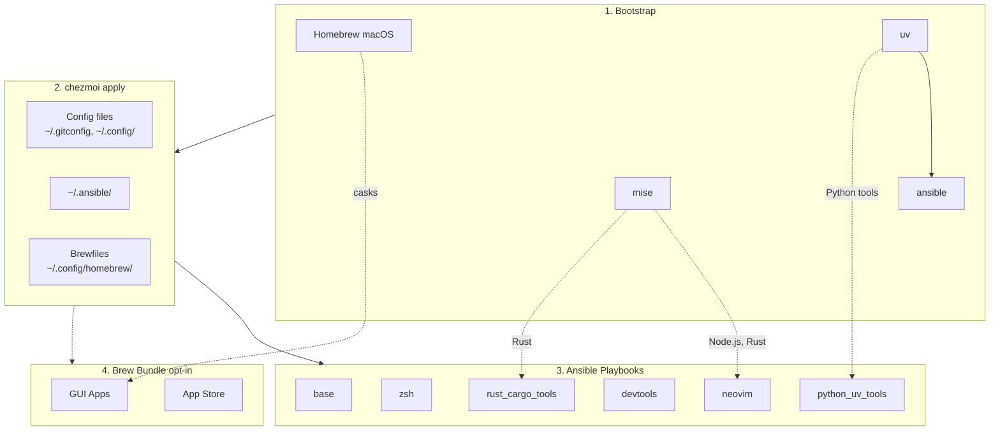

<!-- Generated by SpecStory, Markdown v2.1.0 -->

# 2026-03-12 09:34:05Z

<!-- Codex CLI Session 019ce160-8a2b-7e72-b6e7-fcd5a9ee32e4 (2026-03-12 09:34:05Z) -->

_**User (2026-03-12 09:34:05Z)**_

我現在要給ZSH config添加一下 看看放在哪裏合適 順便評估一下

事情是這樣 我想要讓direnv能夠自動activate包含.venv的Python project (然後讓我的ZSH能夠感知我有activate environment 就如同我 source .venv/bin/activate 的效果）

https://github.com/direnv/direnv/issues/1264

你看看怎麽配置合適 這樣是等價的嗎？

以下是跟Claude的對話

---

```
# .envrc
# 自動啟動 .venv
export VIRTUAL_ENV="$PWD/.venv"
export PATH="$VIRTUAL_ENV/bin:$PATH"

# 如果有 .env 就載入
dotenv_if_exists
```
---

其實 direnv **已經生效了**——從 log 可以看到它確實 export 了 `VIRTUAL_ENV` 和 `PATH`。你的 venv 實際上已經在用了，只是 shell prompt 沒顯示 `(conbond)` 而已。

可以驗證一下：

```bash
cd ConvertibleBond_LimitOrderBook
which python   # 應該指向 .venv/bin/python
```

## 問題根源

direnv 設計上**不允許修改 PS1 prompt**（安全考量），所以不會出現 `(conbond)` 前綴。這純粹是顯示問題，不影響功能。

## 解決 prompt 顯示

你用的是 oh-my-zsh，在 `~/.zshrc` 加這段就行：

```bash
# 讓 prompt 顯示 VIRTUAL_ENV 名稱
show_virtual_env() {
    if [[ -n "$VIRTUAL_ENV" && -n "$DIRENV_DIR" ]]; then
        echo "($(basename $VIRTUAL_ENV)) "
    fi
}
PS1='$(show_virtual_env)'$PS1
```

或者如果你用 powerlevel10k / starship 這類 prompt 工具，它們本身就會偵測 `$VIRTUAL_ENV` 環境變數自動顯示，不需要額外設定。

這樣 cd 進去就會看到類似：

```
(conbond) ➜  ConvertibleBond_LimitOrderBook git:(src_package) ✗
```

跟手動 activate 的效果一樣了。

---

不完全等價，但**功能上夠用**。對比一下：

| 功能 | `source activate` | direnv `.envrc` |
|---|---|---|
| 設定 `VIRTUAL_ENV` | ✅ | ✅ |
| 修改 `PATH` | ✅ | ✅ |
| 修改 `PS1` (prompt) | ✅ | ❌ (direnv 禁止) |
| 設定 `VIRTUAL_ENV_PROMPT` | ✅ | ❌ |
| unset `PYTHONHOME` | ✅ | ❌ |
| 定義 `deactivate()` | ✅ | ❌ (不需要，cd 出去自動還原) |
| 定義 `pydoc()` | ✅ | ❌ |
| `hash -r` | ✅ | ❌ |

核心的兩件事——`VIRTUAL_ENV` 和 `PATH`——direnv 都做了，所以 `which python`、`pip install`、`python -m` 這些全部都會指向 `.venv`，日常使用沒差別。

如果你想更完整一點，`.envrc` 可以補上：

```bash
export VIRTUAL_ENV="$PWD/.venv"
export PATH="$VIRTUAL_ENV/bin:$PATH"
export VIRTUAL_ENV_PROMPT="conbond"
unset PYTHONHOME

dotenv_if_exists
```

這樣除了 PS1（direnv 硬限制改不了）和 `deactivate()`（direnv 自動處理不需要）之外，就幾乎完全等價了。


---

_**Agent (gpt-5.4 2026-03-12 09:40:28Z)**_

我先按倉庫要求跑 `td`，再檢查現有的 `zsh`/`direnv`/prompt 配置位置。之後我會基於 repo 現狀和你貼的方案，評估它和手動 `source .venv/bin/activate` 的差異，以及最合適的落點。

_**Agent (gpt-5.4 2026-03-12 09:40:28Z)**_

<tool-use data-tool-type="shell" data-tool-name="exec_command"><details>
<summary>Tool use: **exec_command** `td usage --new-session`</summary>
```
Chunk ID: 424a81
Wall time: 0.4336 seconds
Process exited with code 0
Original token count: 421
Output:
You have access to `td`, a local task management CLI.

NEW SESSION: ses_6a1655 on branch: main

CURRENT SESSION: ses_6a1655 [codex_11293] on branch: main

WORKFLOW:

  1. `td start <id>` to begin work
     Multi-issue: `td ws start "name"` then `td ws tag <ids>`
  2. `td log "msg"` to track progress
     Multi-issue: `td ws log "msg"`
  3. `td handoff <id>` to capture state (REQUIRED)
     Multi-issue: `td ws handoff`
  4. `td review <id>` to submit for review
  5. Different session: `td approve <id>` to complete

  Use `td ws` commands when implementing multiple related issues.

KEY COMMANDS:
  td current              What you're working on
  td ws current           Current work session state
  td context <id>         Full context for resuming
  td next                 Highest priority open issue
  td critical-path        What unblocks the most work
  td reviewable           Issues you can review
  td approve/reject <id>  Complete review

IMPORTANT: You cannot approve issues you implemented.
  Exception: `td add "title" --minor` creates self-reviewable tasks.

WARNING: Do NOT use `td close` for completed work!
  Use `td review` -> `td approve` workflow instead.
  `td close` is for admin closures: duplicates, won't-fix, cleanup.

Use `td handoff` or `td ws handoff` before stopping work.

FOR LLMs: Run `td usage --new-session` at conversation start (or after /clear).
  Do NOT start a new session mid-work—sessions track implementers for review.
Use `td ws start` when implementing multiple issues to group handoffs.
  - session = identity (always exists)  |  ws = work container (optional)

TIP: Use `td usage -q` to hide these instructions after first read.
```
</details></tool-use>

_**Agent (gpt-5.4 2026-03-12 09:40:39Z)**_

我先把 `td` 的提示切到精簡模式，接著直接在 repo 內定位 `zshrc`、`direnv`、prompt 相關配置，避免先靠猜。

_**Agent (gpt-5.4 2026-03-12 09:40:39Z)**_

<tool-use data-tool-type="shell" data-tool-name="exec_command"><details>
<summary>Tool use: **exec_command** `td usage -q`</summary>
```
Chunk ID: 3b7d17
Wall time: 0.0186 seconds
Process exited with code 0
Original token count: 29
Output:
You have access to `td`, a local task management CLI.

CURRENT SESSION: ses_6a1655 [codex_11293] on branch: main
```
</details></tool-use>

_**Agent (gpt-5.4 2026-03-12 09:40:39Z)**_

<tool-use data-tool-type="shell" data-tool-name="exec_command"><details>
<summary>Tool use: **exec_command** `rg -n "direnv|VIRTUAL_ENV|virtualenv|starship|p10k|powerlevel10k|PROMPT|PS1|dotenv|use venv|layout python|layout_pyenv|activate" .`</summary>
```
Chunk ID: e2f112
Wall time: 0.0104 seconds
Process exited with code 0
Original token count: 2794
Output:
./CLAUDE.md:129:| `starship` | Starship cross-shell prompt (replaces oh-my-zsh theme) |
./CLAUDE.md:132:| `devtools` | bat, eza, git-delta, git-graph, tldr, thefuck, zoxide, direnv, yazi, tmux+tpm, sesh, zellij, btop, htop |
./CLAUDE.md:146:| `macos` | macOS | homebrew, base, zsh, starship, neovim, lazyvim_deps, devtools, docker, nerdfonts, security_tools, rust_cargo_tools, ruby_gem_tools |
./CLAUDE.md:147:| `ubuntu_desktop` | Ubuntu | base, zsh, starship, neovim, lazyvim_deps, devtools, docker, nerdfonts, security_tools, rust_cargo_tools, ruby_gem_tools |
./CLAUDE.md:148:| `ubuntu_server` | Ubuntu | base, zsh, starship, neovim, lazyvim_deps, devtools, docker, security_tools, rust_cargo_tools, ruby_gem_tools |
./CLAUDE.md:152:- **Core** (all): base, zsh, starship, neovim, lazyvim_deps, security_tools
./CLAUDE.md:173:- **Installers**: zoxide, starship, pre-commit, thefuck, tldr
./CLAUDE.md:182:- direnv (apt only)
./CLAUDE.md:188:**Tip**: Ask your sysadmin to run: `sudo apt install git curl wget zsh tmux htop direnv build-essential tree`
./dot_zshrc.tmpl:13:# Theme (disabled - using starship prompt instead)
./README.md:91:- `~/.config/starship.toml` - Starship cross-shell prompt config
./README.md:129:- **Dev tools**: bat, eza, git-delta, git-graph, tldr, thefuck, zoxide, direnv, yazi, tmux+tpm, sesh, zellij, btop, htop
./README.md:131:- **Python tools (via uv)**: thefuck, apprise, sqlit-tui, dotenv, git-filter-repo, mlflow, litellm, tmuxp
./run_onchange_after_20_ansible_roles.sh.tmpl:29:# starship: {{ include "dot_ansible/roles/starship/tasks/main.yml" | sha256sum }}
./run_onchange_after_20_ansible_roles.sh.tmpl:48:#   Core:    base, zsh, starship, neovim, lazyvim_deps, security_tools
./run_onchange_after_20_ansible_roles.sh.tmpl:57:TAGS="homebrew,base,zsh,starship,neovim,lazyvim_deps,devtools,docker,nerdfonts,security_tools,rust_cargo_tools,ruby_gem_tools"
./run_onchange_after_20_ansible_roles.sh.tmpl:61:TAGS="base,zsh,starship,neovim,lazyvim_deps,devtools,docker,nerdfonts,security_tools,rust_cargo_tools,ruby_gem_tools"
./run_onchange_after_20_ansible_roles.sh.tmpl:65:TAGS="base,zsh,starship,neovim,lazyvim_deps,devtools,docker,security_tools,rust_cargo_tools,ruby_gem_tools"
./run_onchange_after_20_ansible_roles.sh.tmpl:106:info "  git, curl, wget, zsh, tmux, htop, direnv, build-essential, docker"
./run_onchange_after_20_ansible_roles.sh.tmpl:109:info "  sudo apt install git curl wget zsh tmux htop direnv build-essential tree"
./TODO.md:43:`direnv` & Python integration
./TODO.md:45:- [Python · direnv/direnv Wiki](https://github.com/direnv/direnv/wiki/Python)
./TODO.md:46:- [Activate python venv by default? · Issue #1264 · direnv/direnv](https://github.com/direnv/direnv/issues/1264)
./TODO.md:47:- [PS1 · direnv/direnv Wiki](https://github.com/direnv/direnv/wiki/PS1)
./dot_ansible/playbooks/linux.yml:14:    - role: starship
./dot_ansible/playbooks/linux.yml:15:      tags: [starship]
./dot_ansible/playbooks/macos.yml:17:    - role: starship
./dot_ansible/playbooks/macos.yml:18:      tags: [starship]
./dot_config/zsh/tools/01_starship.zsh:1:# Starship prompt - https://starship.rs/
./dot_config/zsh/tools/01_starship.zsh:3:if command -v starship &> /dev/null; then
./dot_config/zsh/tools/01_starship.zsh:4:    eval "$(starship init zsh)"
./dot_config/zsh/tools/30_direnv.zsh:1:# 30_direnv.zsh - direnv configuration
./dot_config/zsh/tools/30_direnv.zsh:3:# Check if direnv is installed
./dot_config/zsh/tools/30_direnv.zsh:4:command -v direnv &>/dev/null || return 0
./dot_config/zsh/tools/30_direnv.zsh:6:# Initialize direnv
./dot_config/zsh/tools/30_direnv.zsh:7:eval "$(direnv hook zsh)"
./dot_config/zsh/tools/04_conda_mamba.zsh:48:    export CONDA_CHANGEPS1=false
./dot_config/zsh/tools/05_mise.zsh:14:eval "$($_mise_bin activate zsh)"
./docs/tools/starship.md:3:[Starship](https://starship.rs/) is a cross-shell prompt written in Rust, replacing the default oh-my-zsh `robbyrussell` theme.
./docs/tools/starship.md:5:- **Config file**: `~/.config/starship.toml` (chezmoi source: `dot_config/starship.toml`)
./docs/tools/starship.md:6:- **ZSH init**: `~/.config/zsh/tools/01_starship.zsh`
./docs/tools/starship.md:7:- **Ansible role**: `starship` (brew on macOS, official installer on Linux, user-level fallback for noRoot)
./docs/tools/starship.md:13:chezmoi apply     # deploys config + installs starship via ansible
./docs/tools/starship.md:23:starship preset --list
./docs/tools/starship.md:25:# Apply a preset (overwrites starship.toml)
./docs/tools/starship.md:26:starship preset nerd-font-symbols -o ~/.config/starship.toml    # full Nerd Font icons
./docs/tools/starship.md:27:starship preset pastel-powerline -o ~/.config/starship.toml      # Powerline-style segments
./docs/tools/starship.md:28:starship preset tokyo-night -o ~/.config/starship.toml           # dark color scheme
./docs/tools/starship.md:29:starship preset p
... (truncated)
```
</details></tool-use>

_**Agent (gpt-5.4 2026-03-12 09:40:39Z)**_

<tool-use data-tool-type="shell" data-tool-name="exec_command"><details>
<summary>Tool use: **exec_command** `rg --files . | rg "zsh|starship|direnv|python|venv|envrc|chezmoi.toml|Dockerfile|README|ansible"`</summary>
```
Chunk ID: 7e13ef
Wall time: 0.0922 seconds
Process exited with code 0
Original token count: 588
Output:
./run_onchange_after_20_ansible_roles.sh.tmpl
./dot_ansible/inventories/localhost.ini
./dot_ansible/ansible.cfg
./dot_ansible/playbooks/linux.yml
./dot_ansible/playbooks/base.yml
./dot_ansible/playbooks/macos.yml
./docs/ansible.md
./dot_config/zsh/10_aliases.zsh
./dot_config/zsh/00_exports.zsh.tmpl
./docs/tools/starship.md
./Dockerfile
./dot_config/zsh/tools/33_toolkami.zsh.disabled
./dot_config/zsh/tools/10_fzf.zsh
./dot_config/zsh/tools/22_sesh.zsh
./dot_config/zsh/tools/32_try.zsh
./dot_config/zsh/tools/27_thefuck.zsh
./dot_config/zsh/tools/28_tldr.zsh
./dot_config/zsh/tools/40_codexbar.zsh
./dot_config/zsh/tools/26_eza.zsh
./dot_config/zsh/tools/34_openclaw.zsh
./dot_config/zsh/tools/07_bunx_cli.zsh
./dot_config/zsh/tools/01_starship.zsh
./dot_config/zsh/tools/04_conda_mamba.zsh
./dot_config/zsh/tools/90_completions.zsh
./dot_config/zsh/tools/20_zoxide.zsh
./dot_config/zsh/tools/30_direnv.zsh
./dot_config/zsh/tools/05_mise.zsh
./dot_config/zsh/tools/25_bat.zsh
./dot_config/zsh/tools/35_yazi.zsh
./dot_config/zsh/tools/95_bitwarden.zsh
./dot_config/zsh/tools/36_pueue.zsh
./dot_config/zsh/tools/06_cargo.zsh
./dot_config/zsh/02_legacy_tools.zsh
./dot_zshrc.tmpl
./dot_zshenv.tmpl
./dot_ansible/roles/base/tasks/main.yml
./dot_config/starship.toml
./README.md
./dot_config/nvim/README.md
./dot_ansible/roles/python_uv_tools/defaults/main.yml
./dot_ansible/roles/docker/tasks/main.yml
./dot_ansible/roles/python_uv_tools/tasks/main.yml
./dot_ansible/roles/neovim/defaults/main.yml
./dot_ansible/roles/security_tools/tasks/main.yml
./dot_ansible/roles/zsh/defaults/main.yml
./dot_ansible/roles/ruby_gem_tools/defaults/main.yml
./dot_ansible/roles/bitwarden/defaults/main.yml
./dot_ansible/roles/neovim/tasks/main.yml
./dot_ansible/roles/zsh/tasks/main.yml
./dot_ansible/roles/ruby_gem_tools/tasks/main.yml
./dot_ansible/roles/bitwarden/tasks/main.yml
./dot_ansible/roles/coding_agents/defaults/main.yml
./dot_ansible/roles/nerdfonts/tasks/main.yml
./dot_ansible/roles/coding_agents/tasks/main.yml
./dot_ansible/roles/homebrew/tasks/main.yml
./dot_ansible/roles/starship/tasks/main.yml
./dot_ansible/roles/devtools/tasks/main.yml
./dot_ansible/roles/lazyvim_deps/defaults/main.yml
./dot_ansible/roles/rust_cargo_tools/defaults/main.yml
./dot_ansible/roles/rust_cargo_tools/tasks/main.yml
./dot_ansible/roles/lazyvim_deps/tasks/main.yml
```
</details></tool-use>

_**Agent (gpt-5.4 2026-03-12 09:40:52Z)**_

repo 裡已經有 `direnv` 初始化和 `starship` prompt，這很關鍵，因為它直接影響最佳落點。下一步我會看這幾個文件的實際內容，確認現有 prompt 對 `$VIRTUAL_ENV` 的支援程度。

_**Agent (gpt-5.4 2026-03-12 09:40:52Z)**_

<tool-use data-tool-type="shell" data-tool-name="exec_command"><details>
<summary>Tool use: **exec_command** `sed -n '1,220p' dot_zshrc.tmpl`</summary>
```
Chunk ID: c568b0
Wall time: 0.0000 seconds
Process exited with code 0
Original token count: 936
Output:
# Profiling: start a profiled shell with `ZSH_PROF=1 zsh`
if [[ -n "$ZSH_PROF" ]]; then
    zmodload zsh/zprof
fi

# ~/.zshrc - Interactive shell configuration
# Managed by chezmoi - do not edit directly

# =============================================================================
# Oh-My-Zsh Configuration
# =============================================================================

# Theme (disabled - using starship prompt instead)
ZSH_THEME=""

# Prevent zsh from overwriting tmux/tmuxp window names (only inside tmux)
# [[ -n "$TMUX" ]] && export DISABLE_AUTO_TITLE='true'
export DISABLE_AUTO_TITLE='true'

# Plugins (from $ZSH/plugins/ and $ZSH_CUSTOM/plugins/)
plugins=(
    git
    zsh-autosuggestions
    zsh-syntax-highlighting
)

# Oh-My-Zsh path
export ZSH="$HOME/.oh-my-zsh"

# Extra completion paths (must be set before oh-my-zsh runs compinit)
fpath+=~/.zfunc
[[ -d ~/.oh-my-zsh/custom/plugins/zsh-completions/src ]] && fpath=(~/.oh-my-zsh/custom/plugins/zsh-completions/src $fpath)
[[ -d ~/.docker/completions ]] && fpath=(~/.docker/completions $fpath)

{{ if eq .profile "macos_intel" -}}
# Skip compinit insecure directory warnings (e.g. /usr/local/share on Intel Macs)
# ZSH_DISABLE_COMPFIX=true
{{ end }}

# Load Oh-My-Zsh (also runs compinit)
[[ -f "$ZSH/oh-my-zsh.sh" ]] && source "$ZSH/oh-my-zsh.sh"

# =============================================================================
# Moved from .zshenv (seems Superset only load .zshrc but not .zshenv)
# =============================================================================

# XDG Base Directory Specification
export XDG_CONFIG_HOME="${XDG_CONFIG_HOME:-$HOME/.config}"
export XDG_DATA_HOME="${XDG_DATA_HOME:-$HOME/.local/share}"
export XDG_CACHE_HOME="${XDG_CACHE_HOME:-$HOME/.cache}"

# Modular config directory
export ZSH_CONFIG_DIR="$XDG_CONFIG_HOME/zsh"

{{ if eq .chezmoi.os "darwin" -}}
# Homebrew (macOS)
if [[ -f /opt/homebrew/bin/brew ]]; then
    eval "$(/opt/homebrew/bin/brew shellenv)"
elif [[ -f /usr/local/bin/brew ]]; then
    eval "$(/usr/local/bin/brew shellenv)"
fi
{{ end -}}

# =============================================================================
# Modular Configuration Loader
# =============================================================================

# Load all .zsh files from a directory (sorted by filename)
load_zsh_dir() {
    local dir="$1"
    [[ -d "$dir" ]] || return 0
    setopt local_options null_glob
    local f
    for f in "$dir"/*.zsh; do
        [[ -r "$f" ]] && source "$f"
    done
}

# Load modular configs
load_zsh_dir "$ZSH_CONFIG_DIR"
load_zsh_dir "$ZSH_CONFIG_DIR/tools"

# Load secrets (not tracked by chezmoi)
[[ -r "$ZSH_CONFIG_DIR/secrets.zsh" ]] && source "$ZSH_CONFIG_DIR/secrets.zsh" || true

# =============================================================================
# Adhoc Configuration (not tracked by chezmoi)
# =============================================================================

# Create adhoc file if it doesn't exist
if [[ ! -f "$HOME/.zshrc.adhoc" ]]; then
    cat > "$HOME/.zshrc.adhoc" << 'ADHOC_EOF'
# ~/.zshrc.adhoc - Personal shell customizations (not tracked by chezmoi)
#
# Use this file for:
#   - Quick experiments with new aliases/functions
#   - Machine-specific configurations
#   - Temporary PATH modifications
#   - Testing before adding to chezmoi-managed configs
#
# This file is sourced at the end of ~/.zshrc
# Changes here take effect on new shell sessions (or run: source ~/.zshrc.adhoc)

# Example:
# alias myalias='echo "Hello from adhoc!"'
# export MY_VAR="my_value"

ADHOC_EOF
fi

# Source adhoc config
[[ -r "$HOME/.zshrc.adhoc" ]] && source "$HOME/.zshrc.adhoc"

# Profiling: output results
if [[ -n "$ZSH_PROF" ]]; then
    zprof
fi
```
</details></tool-use>

_**Agent (gpt-5.4 2026-03-12 09:40:52Z)**_

<tool-use data-tool-type="shell" data-tool-name="exec_command"><details>
<summary>Tool use: **exec_command** `sed -n '1,200p' dot_config/zsh/tools/30_direnv.zsh`</summary>
```
Chunk ID: 8fbc7a
Wall time: 0.0000 seconds
Process exited with code 0
Original token count: 40
Output:
# 30_direnv.zsh - direnv configuration

# Check if direnv is installed
command -v direnv &>/dev/null || return 0

# Initialize direnv
eval "$(direnv hook zsh)"
```
</details></tool-use>

_**Agent (gpt-5.4 2026-03-12 09:40:52Z)**_

<tool-use data-tool-type="shell" data-tool-name="exec_command"><details>
<summary>Tool use: **exec_command** `sed -n '1,240p' dot_config/zsh/tools/01_starship.zsh`</summary>
```
Chunk ID: b26b21
Wall time: 0.0000 seconds
Process exited with code 0
Original token count: 47
Output:
# Starship prompt - https://starship.rs/
# Init must run after oh-my-zsh is loaded (which sets ZSH_THEME="")
if command -v starship &> /dev/null; then
    eval "$(starship init zsh)"
fi
```
</details></tool-use>

_**Agent (gpt-5.4 2026-03-12 09:40:52Z)**_

<tool-use data-tool-type="shell" data-tool-name="exec_command"><details>
<summary>Tool use: **exec_command** `sed -n '1,260p' dot_config/starship.toml`</summary>
```
Chunk ID: c7a29f
Wall time: 0.0000 seconds
Process exited with code 0
Original token count: 205
Output:
# Starship prompt configuration
# https://starship.rs/config/

# Use Nerd Font symbols (Hack Nerd Font is installed by nerdfonts role)
# For terminals without Nerd Fonts, run: starship preset plain-text-symbols -o ~/.config/starship.toml

# Timeout for commands that starship runs (in milliseconds)
command_timeout = 1000

# Newline between prompts
add_newline = true

[character]
success_symbol = "[❯](bold green)"
error_symbol = "[❯](bold red)"

[directory]
truncation_length = 3
truncate_to_repo = true

[git_branch]
symbol = " "

[git_status]
ahead = "⇡${count}"
behind = "⇣${count}"
diverged = "⇕⇡${ahead_count}⇣${behind_count}"

[python]
symbol = " "

[nodejs]
symbol = " "

[rust]
symbol = " "

[golang]
symbol = " "

[docker_context]
symbol = " "

[conda]
symbol = " "

[package]
disabled = true
```
</details></tool-use>

_**Agent (gpt-5.4 2026-03-12 09:40:52Z)**_

<tool-use data-tool-type="shell" data-tool-name="exec_command"><details>
<summary>Tool use: **exec_command** `sed -n '1,220p' TODO.md`</summary>
```
Chunk ID: 629655
Wall time: 0.0000 seconds
Process exited with code 0
Original token count: 497
Output:
# TODO

Future enhancements for the dotfiles repository.

## Zsh Configuration

| Item | Notes |
|------|-------|
| conda/mamba init | Needs ansible role for miniforge/conda |
| NVM setup | Needs ansible role for nvm |
| Yazi y() function | Needs ansible role for yazi |
| BUN, pnpm, cargo PATH | Needs ansible roles for these tools |
| Go PATH | Needs ansible role for Go |
| TA-Lib paths | Machine-specific, keep in secrets.zsh |
| Try/Toolkami | Custom tools, keep in secrets.zsh |
| alias cc, readelf, ccusage | These depend on specstory/binutils |
| secrets.zsh encryption | Future: encrypt with age |

## Ansible Roles to Add

- [ ] miniforge/conda
- [ ] nvm (Node Version Manager)
- [ ] yazi (terminal file manager)
- [ ] bun (JavaScript runtime)
- [ ] pnpm (package manager)
- [ ] rust/cargo
- [ ] go

## Pueue

- [ ] Manage pueue config via chezmoi (`~/.config/pueue/pueue.yml`) and define macOS compatibility strategy for `~/Library/Application Support/pueue/pueue.yml` (`PUEUE_CONFIG_PATH` or path sync).

---

Fix Claude Code hook on Ubuntu `Stop hook error: Failed with non-blocking status code: GDBus.Error:org.freedesktop.DBus.Error.ServiceUnknown: The name org.freedesktop.Notifications was not provided by any .service files`

Use mise to manage most of the runtime version?!

Optimize zsh & tmux startup time

~Do we want to use Brewfile to manage macOS packages installation instead of writing one by one through Ansible?~ **Done**: XDG-compliant Brewfiles at `~/.config/homebrew/` with chezmoi run_onchange script (opt-in via `installBrewApps`).

`direnv` & Python integration

- [Python · direnv/direnv Wiki](https://github.com/direnv/direnv/wiki/Python)
- [Activate python venv by default? · Issue #1264 · direnv/direnv](https://github.com/direnv/direnv/issues/1264)
- [PS1 · direnv/direnv Wiki](https://github.com/direnv/direnv/wiki/PS1)

([hyperupcall/autoenv: Directory-based environments.](https://github.com/hyperupcall/autoenv))

---

ML

- cuda
- SLURM?
```
</details></tool-use>

_**Agent (gpt-5.4 2026-03-12 09:40:52Z)**_

<tool-use data-tool-type="shell" data-tool-name="exec_command"><details>
<summary>Tool use: **exec_command** `sed -n '1,240p' docs/tools/starship.md`</summary>
```
Chunk ID: 9742df
Wall time: 0.0000 seconds
Process exited with code 0
Original token count: 1267
Output:
# Starship Prompt

[Starship](https://starship.rs/) is a cross-shell prompt written in Rust, replacing the default oh-my-zsh `robbyrussell` theme.

- **Config file**: `~/.config/starship.toml` (chezmoi source: `dot_config/starship.toml`)
- **ZSH init**: `~/.config/zsh/tools/01_starship.zsh`
- **Ansible role**: `starship` (brew on macOS, official installer on Linux, user-level fallback for noRoot)
- **Dependencies**: Nerd Fonts (Hack Nerd Font installed by `nerdfonts` role)

## Quick Start

```bash
chezmoi apply     # deploys config + installs starship via ansible
exec zsh          # reload shell to see the new prompt
```

## Presets

Starship ships with built-in presets that change the entire look:

```bash
# List all available presets
starship preset --list

# Apply a preset (overwrites starship.toml)
starship preset nerd-font-symbols -o ~/.config/starship.toml    # full Nerd Font icons
starship preset pastel-powerline -o ~/.config/starship.toml      # Powerline-style segments
starship preset tokyo-night -o ~/.config/starship.toml           # dark color scheme
starship preset plain-text-symbols -o ~/.config/starship.toml    # ASCII fallback (no Nerd Fonts)
```

After trying a preset, run `chezmoi apply` to restore the chezmoi-managed version.

Preview all presets: <https://starship.rs/presets/>

## Module Configuration

Modules control what information appears in the prompt. Edit `dot_config/starship.toml` (or `chezmoi edit ~/.config/starship.toml`).

### Commonly Useful Modules

| Module | Description | Default |
|--------|-------------|---------|
| `[directory]` | Current path | enabled, truncated to 3 levels |
| `[git_branch]` | Git branch name | enabled |
| `[git_status]` | Dirty/staged/ahead/behind | enabled |
| `[python]` | Python version + virtualenv | enabled (auto-detected) |
| `[nodejs]` | Node.js version | enabled (auto-detected) |
| `[rust]` | Rust version | enabled (auto-detected) |
| `[conda]` | Conda environment name | enabled (works with `CONDA_CHANGEPS1=false`) |
| `[docker_context]` | Docker context | enabled |
| `[cmd_duration]` | Command execution time | enabled, shows when > 2s |
| `[character]` | Prompt character (`❯`) | green on success, red on error |

### Disabled by Default (Worth Enabling)

```toml
# Show clock on the right
[time]
disabled = false
format = "[$time]($style) "
time_format = "%H:%M"

# Show username/hostname (auto-shows over SSH)
[username]
show_always = false    # only show over SSH

[hostname]
ssh_only = true

# Kubernetes context
[kubernetes]
disabled = false

# Memory usage
[memory_usage]
disabled = false
threshold = 75         # only show when usage > 75%

# Battery (laptop)
[battery]
disabled = false

# AWS / GCP / Azure profile
[aws]
[gcloud]
[azure]
```

### Command Duration

```toml
[cmd_duration]
min_time = 2_000           # show when command takes > 2 seconds
format = "took [$duration]($style) "
show_milliseconds = false
```

## Prompt Layout

### Two-Line Prompt

The default config uses `add_newline = true` which adds a blank line between prompts. The `[line_break]` module separates info from the input line:

```toml
# Info on line 1, input cursor on line 2
format = """
$username\
$hostname\
$directory\
$git_branch\
$git_status\
$python\
$nodejs\
$rust\
$conda\
$line_break\
$character"""
```

### Right-Side Prompt

Display less critical info on the right edge of the terminal:

```toml
right_format = "$time$cmd_duration"
```

## Custom Modules

Create custom modules for project-specific or workflow-specific info:

```toml
# Show current tmux session name
[custom.tmux]
command = "tmux display-message -p '#S' 2>/dev/null"
when = "test -n \"$TMUX\""
format = "[$output]($style) "
style = "bold cyan"

# Show active pueue task count
[custom.pueue]
command = "pueue status --json 2>/dev/null | jq '[.tasks[] | select(.status == \"Running\")] | length'"
when = "command -v pueue"
format = "[$output tasks]($style) "
style = "yellow"
```

## Integration Notes

- **oh-my-zsh**: Still loaded for plugins (git aliases, autosuggestions, syntax-highlighting). Only the theme is disabled (`ZSH_THEME=""`).
- **Conda**: `CONDA_CHANGEPS1=false` is set in `04_conda_mamba.zsh`, so starship's `[conda]` module handles env display.
- **tmux2k**: tmux status bar is independent of starship; no conflicts.
- **Nerd Fonts**: Hack Nerd Font Mono is configured in Alacritty. If using a terminal without Nerd Fonts (e.g., SSH to ubuntu_server), apply the `plain-text-symbols` preset.

## Suggested Experience Order

1. **Apply and verify** — `chezmoi apply && exec zsh` (5 min)
2. **Try presets** — find a visual base you like (10 min)
3. **Tune modules** — add `cmd_duration`, `time`, etc. (15 min)
4. **Adjust layout** — two-line prompt, right_format (as needed)
5. **Custom modules** — extend for your workflow (advanced)

Steps 1-2 are enough for daily use. Steps 3-5 can be done inc
... (truncated)
```
</details></tool-use>

_**Agent (gpt-5.4 2026-03-12 09:41:05Z)**_

現狀比你貼的 Claude 建議更清楚了：這套 dotfiles 不是直接用 `PS1`，而是 `oh-my-zsh` + `starship`。所以如果要做成「像 activate 一樣可見」，優先應該走 `starship` 路徑，不是手改 `PS1`。

_**Agent (gpt-5.4 2026-03-12 09:41:05Z)**_

<tool-use data-tool-type="shell" data-tool-name="exec_command"><details>
<summary>Tool use: **exec_command** `rg -n "VIRTUAL_ENV|VIRTUAL_ENV_PROMPT|PYTHONHOME|CONDA_CHANGEPS1|direnv" dot_config/zsh dot_config/starship.toml dot_ansible docs README.md`</summary>
```
Chunk ID: 6aef0e
Wall time: 0.0000 seconds
Process exited with code 0
Original token count: 777
Output:
README.md:129:- **Dev tools**: bat, eza, git-delta, git-graph, tldr, thefuck, zoxide, direnv, yazi, tmux+tpm, sesh, zellij, btop, htop
docs/tools/starship.md:50:| `[conda]` | Conda environment name | enabled (works with `CONDA_CHANGEPS1=false`) |
docs/tools/starship.md:152:- **Conda**: `CONDA_CHANGEPS1=false` is set in `04_conda_mamba.zsh`, so starship's `[conda]` module handles env display.
dot_config/zsh/tools/04_conda_mamba.zsh:48:    export CONDA_CHANGEPS1=false
dot_config/zsh/tools/30_direnv.zsh:1:# 30_direnv.zsh - direnv configuration
dot_config/zsh/tools/30_direnv.zsh:3:# Check if direnv is installed
dot_config/zsh/tools/30_direnv.zsh:4:command -v direnv &>/dev/null || return 0
dot_config/zsh/tools/30_direnv.zsh:6:# Initialize direnv
dot_config/zsh/tools/30_direnv.zsh:7:eval "$(direnv hook zsh)"
dot_ansible/roles/devtools/tasks/main.yml:3:# Tools: bat, eza, git-delta, git-graph, tldr, thefuck, zoxide, direnv, yazi, tmux, sesh, zellij, btop, htop, duckdb, rclone
dot_ansible/roles/devtools/tasks/main.yml:20:      - direnv
dot_ansible/roles/devtools/tasks/main.yml:502:# --- direnv ---
dot_ansible/roles/devtools/tasks/main.yml:503:- name: Install direnv (Debian/Ubuntu)
dot_ansible/roles/devtools/tasks/main.yml:508:    name: direnv
dot_ansible/roles/devtools/tasks/main.yml:511:- name: Check installed direnv version
dot_ansible/roles/devtools/tasks/main.yml:514:    if [ -x "{{ ansible_facts['env']['HOME'] }}/.local/bin/direnv" ]; then
dot_ansible/roles/devtools/tasks/main.yml:515:      "{{ ansible_facts['env']['HOME'] }}/.local/bin/direnv" --version | sed 's/^v//'
dot_ansible/roles/devtools/tasks/main.yml:516:    elif command -v direnv >/dev/null 2>&1; then
dot_ansible/roles/devtools/tasks/main.yml:517:      direnv --version | sed 's/^v//'
dot_ansible/roles/devtools/tasks/main.yml:523:  register: direnv_version
dot_ansible/roles/devtools/tasks/main.yml:526:- name: Set direnv release architecture
dot_ansible/roles/devtools/tasks/main.yml:529:    - direnv_version.stdout | trim is version('2.32.1', '<')
dot_ansible/roles/devtools/tasks/main.yml:531:    direnv_release_arch: >-
dot_ansible/roles/devtools/tasks/main.yml:539:- name: Install direnv from GitHub releases (user-level fallback, min v2.32.1)
dot_ansible/roles/devtools/tasks/main.yml:542:    - direnv_version.stdout | trim is version('2.32.1', '<')
dot_ansible/roles/devtools/tasks/main.yml:544:    - name: Ensure ~/.local/bin exists (direnv)
dot_ansible/roles/devtools/tasks/main.yml:550:    - name: Get latest direnv release
dot_ansible/roles/devtools/tasks/main.yml:552:        url: https://api.github.com/repos/direnv/direnv/releases/latest
dot_ansible/roles/devtools/tasks/main.yml:554:      register: direnv_release
dot_ansible/roles/devtools/tasks/main.yml:556:    - name: Download direnv binary (user)
dot_ansible/roles/devtools/tasks/main.yml:558:        url: "https://github.com/direnv/direnv/releases/download/{{ direnv_release.json.tag_name }}/direnv.linux-{{ direnv_release_arch }}"
dot_ansible/roles/devtools/tasks/main.yml:559:        dest: "{{ ansible_facts['env']['HOME'] }}/.local/bin/direnv"
```
</details></tool-use>

_**Agent (gpt-5.4 2026-03-12 09:41:06Z)**_

<tool-use data-tool-type="shell" data-tool-name="exec_command"><details>
<summary>Tool use: **exec_command** `sed -n '1,180p' dot_config/zsh/tools/04_conda_mamba.zsh`</summary>
```
Chunk ID: 359d68
Wall time: 0.0000 seconds
Process exited with code 0
Original token count: 373
Output:
# 04_conda_mamba.zsh - Conda/Mamba/Miniforge initialization (lazy-loaded)
# Supports: miniforge3, miniconda3, anaconda3
# (Legacy Supports)

# Find conda installation
_conda_root=""
for _conda_path in "$HOME/miniforge3" "$HOME/miniconda3" "$HOME/anaconda3" "/opt/homebrew/Caskroom/miniforge/base"; do
    if [[ -d "$_conda_path" ]]; then
        _conda_root="$_conda_path"
        break
    fi
done

# Exit if no conda installation found
if [[ -z "$_conda_root" ]]; then
    unset _conda_path _conda_root
    return 0
fi

# Store root for lazy init, then define wrapper functions
_CONDA_ROOT="$_conda_root"

_conda_init() {
    unfunction conda mamba 2>/dev/null
    local _root="$_CONDA_ROOT"
    unset _CONDA_ROOT

    # >>> conda initialize >>>
    __conda_setup="$("$_root/bin/conda" 'shell.zsh' 'hook' 2>/dev/null)"
    if [ $? -eq 0 ]; then
        eval "$__conda_setup"
    else
        if [ -f "$_root/etc/profile.d/conda.sh" ]; then
            . "$_root/etc/profile.d/conda.sh"
        else
            export PATH="$_root/bin:$PATH"
        fi
    fi
    unset __conda_setup

    # Mamba initialization (if available)
    if [ -f "$_root/etc/profile.d/mamba.sh" ]; then
        . "$_root/etc/profile.d/mamba.sh"
    fi
    # <<< conda initialize <<<

    # Don't modify prompt (oh-my-zsh handles it, or we prefer clean prompt)
    export CONDA_CHANGEPS1=false
}

conda() { _conda_init; conda "$@"; }
mamba() { _conda_init; mamba "$@"; }

# Cleanup
unset _conda_path _conda_root
```
</details></tool-use>

_**Agent (gpt-5.4 2026-03-12 09:41:06Z)**_

<tool-use data-tool-type="shell" data-tool-name="exec_command"><details>
<summary>Tool use: **exec_command** `sed -n '70,150p' README.md`</summary>
```
Chunk ID: 5349a8
Wall time: 0.0000 seconds
Process exited with code 0
Original token count: 1251
Output:
| Option | Default | Description |
|--------|---------|-------------|
| `installCodingAgents` | true | Claude Code, Codex CLI, OpenCode, Cursor, Copilot, Gemini CLI, td, sidecar, specify-cli, etc. |
| `installBitwarden` | false | Bitwarden CLI (`bw`) + Desktop app (desktop profiles) with SSH agent auto-detection |
| `installPythonUvTools` | true | Python CLI tools via uv (mlflow, litellm, sqlit-tui, etc.) |
| `installBrewApps` | false | GUI apps via Homebrew Brewfile (casks, mas) |
| `noRoot` | false | Skip sudo-requiring tasks (for servers without root access) |

To change options later: `chezmoi init --force`

## What You Get

### Config Files

- `~/.gitconfig` - Git configuration
- `~/.config/nvim/` - Neovim (LazyVim) configuration
- `~/.config/uv/uv.toml` - uv package manager config
- `~/.cargo/config.toml` - Cargo registry mirror config (GFW)
- `~/.npmrc` - npm registry config (official/npmmirror via `useChineseMirror`)
- `~/.config/.bunfig.toml` - Bun global registry config (official/npmmirror via `useChineseMirror`)
- `~/.config/alacritty/` - Alacritty terminal config
- `~/.config/starship.toml` - Starship cross-shell prompt config
- `~/.config/yazi/` - Yazi file manager config (v0.3.3+ syntax, [docs](https://yazi-rs.github.io/docs/configuration/overview/))
  - `yazi.toml` - Main config with open rules and openers (`o`/`O`)
  - `keymap.toml`, `theme.toml` - Optional customization files (stubs provided)
- `~/.claude/` - Claude Code settings
- `~/.specstory/cli/config.toml` - Global SpecStory defaults for `specstory run` across all projects
- `~/.tmux.conf` - Tmux configuration with TPM plugins
- `~/.local/bin/x` - Cross-platform terminal wrapper for `copy` / `paste` / `open`
- `~/.config/zsh/tools/22_sesh.zsh` - Sesh keybinding (Ctrl+A for tmux session switcher)
- `~/.config/zsh/tools/36_pueue.zsh` - Pueue queue summary helper (`pqsum`)
- `~/.config/zsh/tools/28_tldr.zsh` - `tldrf` helper with `TLDR_LANGUAGES` fallback order
- `~/.config/zsh/tools/95_bitwarden.zsh` - Bitwarden CLI completion + SSH agent socket auto-detection
- `~/.ssh/config` - SSH main config skeleton (create-only: `Include ~/.ssh/config.d/*` + conservative `Host *` defaults)
- `~/.ssh/config.d/00-defaults` - SSH global defaults stub (commented examples only)
- `~/.ssh/config.d/git` - SSH host entries for `github.com` and `gitlab.com` with commented multi-account/Bitwarden examples
- `~/.config/tmuxp/claude-sidecar.yaml` - tmuxp workspace for Claude + Sidecar
- `~/.config/zellij/layouts/claude-sidecar.kdl` - Zellij layout for Claude + Sidecar
- `~/.config/homebrew/` - Brewfiles for GUI apps (macOS casks + mas) plus selected CLI formulas (e.g., `tailscale`)

SSH files are managed as create-only templates: if `~/.ssh/config` already exists, it is not overwritten. In that case, add `Include ~/.ssh/config.d/*` to your existing config manually to load the managed snippets.

### Tools (via ansible)

- **Base**: git, curl, ripgrep, fd, just, build tools
- **Neovim**: >= 0.11.2 with LazyVim dependencies
- **LazyVim deps**: fzf, lazygit, tree-sitter-cli, Node.js
- **DuckDB CLI**: `duckdb` (Homebrew on macOS, official installer on Linux)
- **rclone**: cloud storage sync CLI (Homebrew on macOS, official downloads on Linux)
- **Coding Agents** (optional): Claude Code, Codex CLI, CodexBar, OpenCode, Cursor CLI, Copilot CLI, Gemini CLI, SpecStory, Happy, OpenChamber, td, sidecar, specify-cli
- **Bitwarden** (optional): Bitwarden CLI (`bw`) via npm, Desktop app (snap/deb on Linux, cask on macOS) on desktop profiles, with zsh completion and SSH agent auto-detection
- **Docker**: OrbStack (macOS) or Docker Engine (Linux)
- **Cargo tools**: pueue (process queue manager)
- **GUI Apps** (macOS): terminals, editors, browsers, network tools, utilities via Brewfile (Tailscale Desktop via Mac App Store `mas`, avoids pkg sudo prompt; Tailscale CLI via `brew "tailscale"` in shared Brewfile)

### Bootstrap (installed before ansible)
- **Homebrew** (macOS): Package manager for macOS
- **uv**: Python package manager for ansible
- **mise**: Runtime manager for Node.js and Rust (ensures latest versions)
- **Dev tools**: bat, eza, git-delta, git-graph, tldr, thefuck, zoxide, direnv, yazi, tmux+tpm, sesh, zellij, btop, htop
- **Starship**: Cross-shell prompt (replaces oh-my-zsh theme)
- **Python tools (via uv)**: thefuck, apprise, sqlit-tui, dotenv, git-filter-repo, mlflow, litellm, tmuxp
- **NerdFonts**: Hack Nerd Font for terminal emulators

## Supported Platforms

| Platform | Package Manager | Notes |
|----------|-----------------|-------|
| macOS | Homebrew | Full support |
| Ubuntu Desktop | apt + snap | Full support |
| Ubuntu Server | apt + snap | Full support |
| Ubuntu Server (no root) | GitHub binaries + mise + cargo + uv | `noRoot=true`, tools installed to `~/.local/bin` |

## Manual Commands

```bash
chezmoi diff          # Preview changes
chezmoi ap
... (truncated)
```
</details></tool-use>

_**Agent (gpt-5.4 2026-03-12 09:41:42Z)**_

我還差一個事實要落實：`layout python3` 在當前機器上的實作細節，尤其是它對 `VIRTUAL_ENV=.venv` 的支援。這會決定我們是用最簡 `.envrc`，還是需要自定義 `direnvrc`。

_**Agent (gpt-5.4 2026-03-12 09:41:42Z)**_

<tool-use data-tool-type="shell" data-tool-name="exec_command"><details>
<summary>Tool use: **exec_command** `direnv version`</summary>
```
Chunk ID: 6b51d7
Wall time: 0.0000 seconds
Process exited with code 0
Original token count: 2
Output:
2.37.1
```
</details></tool-use>

_**Agent (gpt-5.4 2026-03-12 09:41:43Z)**_

<tool-use data-tool-type="shell" data-tool-name="exec_command"><details>
<summary>Tool use: **exec_command** `direnv stdlib | rg -n "layout_python|layout pyenv|VIRTUAL_ENV|PYTHONHOME|PATH_add|python3"`</summary>
```
Chunk ID: d2e2f2
Wall time: 0.0000 seconds
Process exited with code 0
Original token count: 496
Output:
559:# Usage: PATH_add <path> [<path> ...]
570:#    PATH_add bin
573:#    PATH_add bam boum
577:PATH_add() {
583:# Works like PATH_add except that it's for an arbitrary <varname>.
606:# Usage: MANPATH_add <path>
615:MANPATH_add() {
707:  MANPATH_add "$REPLY/man"
708:  MANPATH_add "$REPLY/share/man"
776:  PATH_add "$bindir"
784:  PATH_add node_modules/.bin
808:  PATH_add "$libdir/bin"
815:  PATH_add vendor/bin
821:# You can specify the path of the virtual environment through VIRTUAL_ENV
829:layout_python() {
834:  unset PYTHONHOME
836:    VIRTUAL_ENV=$old_env
859:    if [[ -n "${VIRTUAL_ENV:-}" ]]; then
861:      realpath.absolute "$VIRTUAL_ENV"
862:      VIRTUAL_ENV=$REPLY
864:      VIRTUAL_ENV=$(direnv_layout_dir)/python-$python_version
868:      if [[ ! -d $VIRTUAL_ENV ]]; then
869:        $python -m venv "$@" "$VIRTUAL_ENV"
873:      if [[ ! -d $VIRTUAL_ENV ]]; then
874:        $python -m virtualenv "$@" "$VIRTUAL_ENV"
883:  export VIRTUAL_ENV
884:  PATH_add "$VIRTUAL_ENV/bin"
891:layout_python2() {
892:  layout_python python2 "$@"
895:# Usage: layout python3
897:# A shortcut for $(layout python python3)
899:layout_python3() {
900:  layout_python python3 "$@"
931:  PATH_add "$REPLY"
1004:# Similar to layout_python, but uses Pipenv to build a
1014:  VIRTUAL_ENV=$(
1019:  if [[ -z $VIRTUAL_ENV || ! -d $VIRTUAL_ENV ]]; then
1021:    VIRTUAL_ENV=$(pipenv --venv)
1024:  PATH_add "$VIRTUAL_ENV/bin"
1026:  export VIRTUAL_ENV
1029:# Usage: layout pyenv <python version number> [<python version number> ...]
1033:#    layout pyenv 3.6.7
1035:# Uses pyenv and layout_python to create and load a virtual environment.
1036:# You can specify the path of the virtual environment through VIRTUAL_ENV
1042:  # layout_python prepends each python version to the PATH, so we add each
1051:      if layout_python "$pyenv_python"; then
1085:  PATH_add "$GEM_HOME/bin"
1086:  PATH_add "$BUNDLE_BIN"
1155:  PATH_add "$julia_prefix/bin"
1156:  MANPATH_add "$julia_prefix/share/man"
```
</details></tool-use>

_**Agent (gpt-5.4 2026-03-12 09:41:47Z)**_

<tool-use data-tool-type="shell" data-tool-name="exec_command"><details>
<summary>Tool use: **exec_command** `direnv stdlib | sed -n '821,886p'`</summary>
```
Chunk ID: faae3e
Wall time: 0.0000 seconds
Process exited with code 0
Original token count: 406
Output:
# You can specify the path of the virtual environment through VIRTUAL_ENV
# environment variable, otherwise it will be set to
# "$direnv_layout_dir/python-$python_version".
# For python older then 3.3 this requires virtualenv to be installed.
#
# It's possible to specify the python executable if you want to use different
# versions of python.
#
layout_python() {
  local old_env
  local python=${1:-python}
  [[ $# -gt 0 ]] && shift
  old_env=$(direnv_layout_dir)/virtualenv
  unset PYTHONHOME
  if [[ -d $old_env && $python == python ]]; then
    VIRTUAL_ENV=$old_env
  else
    local python_version ve
    # shellcheck disable=SC2046
    read -r python_version ve <<<$($python <<EOF
import platform as p
try:
 import venv
 ve="venv"
except Exception:
 try:
   import virtualenv
   ve="virtualenv"
 except Exception:
   ve=""
print(".".join(p.python_version_tuple()[:2])+" "+ve)
EOF
)
    if [[ -z $python_version ]]; then
      log_error "Could not find python's version"
      return 1
    fi

    if [[ -n "${VIRTUAL_ENV:-}" ]]; then
      local REPLY
      realpath.absolute "$VIRTUAL_ENV"
      VIRTUAL_ENV=$REPLY
    else
      VIRTUAL_ENV=$(direnv_layout_dir)/python-$python_version
    fi
    case $ve in
    "venv")
      if [[ ! -d $VIRTUAL_ENV ]]; then
        $python -m venv "$@" "$VIRTUAL_ENV"
      fi
      ;;
    "virtualenv")
      if [[ ! -d $VIRTUAL_ENV ]]; then
        $python -m virtualenv "$@" "$VIRTUAL_ENV"
      fi
      ;;
    *)
      log_error "Error: neither venv nor virtualenv are available."
      return 1
      ;;
    esac
  fi
  export VIRTUAL_ENV
  PATH_add "$VIRTUAL_ENV/bin"
}
```
</details></tool-use>

_**Agent (gpt-5.4 2026-03-12 09:42:07Z)**_

<tool-use data-tool-type="shell" data-tool-name="exec_command"><details>
<summary>Tool use: **exec_command** `rg --files . | rg "direnvrc|direnv.toml|\.envrc|direnv"`</summary>
```
Chunk ID: 932777
Wall time: 0.0000 seconds
Process exited with code 0
Original token count: 10
Output:
./dot_config/zsh/tools/30_direnv.zsh
```
</details></tool-use>

_**Agent (gpt-5.4 2026-03-12 09:42:39Z)**_

我準備做一個很小的驗證：模擬 `direnv` 只設 `VIRTUAL_ENV` 和 `PATH`，看當前 `starship` 會不會直接把 venv 名稱顯示出來。這能回答「zsh 能不能感知到」而不用先改任何配置。

_**Agent (gpt-5.4 2026-03-12 09:42:41Z)**_

<tool-use data-tool-type="shell" data-tool-name="exec_command"><details>
<summary>Tool use: **exec_command** `tmpdir=$(mktemp -d) && cd "$tmpdir" && touch main.py && mkdir -p .venv/bin && VIRTUAL_ENV="$tmpdir/.venv" PATH="$tmpdir/.venv/bin:$PATH" starship module python`</summary>
```
Chunk ID: 2bbc11
Wall time: 0.0000 seconds
Process exited with code 0
Original token count: 8
Output:
via  v3.14.3 (.venv) 
```
</details></tool-use>

_**Agent (gpt-5.4 2026-03-12 09:43:25Z)**_

目前已確認三件事：

1. 這個 repo 已經有 `direnv hook zsh`，落點就是 [`dot_config/zsh/tools/30_direnv.zsh`](/Users/daviddwlee84/.local/share/chezmoi/dot_config/zsh/tools/30_direnv.zsh)。
2. prompt 不是 `PS1`，而是 `starship`，而且我實測只要 `VIRTUAL_ENV` + `PATH` 正確，`starship` 會直接顯示 `(.venv)`。
3. 你貼的 `.envrc` 方案功能上接近，但對這個 repo 來說不是最佳做法；`direnv` 自帶的 `layout_python` 已經會幫你 `unset PYTHONHOME`，而且支援先設 `VIRTUAL_ENV=.venv` 再走標準流程。

還差兩個偏好需要你定一下，這會直接決定最後的配置方案。

_**Agent (gpt-5.4 2026-03-12 09:43:36Z)**_

<tool-use data-tool-type="unknown" data-tool-name="request_user_input"><details>
<summary>Tool use: **request_user_input**</summary>

**Input:**

- questions: `[map[header:Activation id:venv_policy options:[map[description:只有當專案裡已經有 `.venv/` 才啟用；沒有就不自動建立，行為最保守。 label:只啟用既有 .venv (Recommended)] map[description:進入專案時若沒有 `.venv/`，就由 direnv 自動建立後啟用，最省事但副作用較大。 label:缺少時自動建立] map[description:僅做偵測/顯示，不真正切換 Python；通常不符合 direnv 的用途。 label:只顯示提示不改 PATH]] question:`.venv` 的行為你想要哪一種？] map[header:Scope id:config_shape options:[map[description:在 dotfiles 裡加一個可重用的 direnv helper，每個 Python 專案只寫一兩行 `.envrc`。 label:全域 helper + 專案 .envrc (Recommended)] map[description:不加全域 helper，直接把邏輯複製到每個專案的 `.envrc`。 label:每個專案手寫 .envrc] map[description:想靠 shell 進目錄時自動切換；這不符合 direnv 的安全模型，維護成本也更高。 label:只改 zsh 不用 .envrc]] question:你偏好的配置形態是？] map[header:Dotenv id:dotenv_policy options:[map[description:在 `.envrc` 裡保留 `dotenv_if_exists`，方便本地開發。 label:有就載入 (Recommended)] map[description:只處理 Python venv，避免環境變數來源過多。 label:不要自動載入] map[description:全域 helper 不預設載入，由個別專案自己決定要不要加。 label:只對特定專案開啟]] question:發現專案有 `.env` 時，要不要一起自動載入？]]`

**Result:**

</details></tool-use>

_**Agent (gpt-5.4 2026-03-12 09:54:29Z)**_

偏好已經足夠收斂了。我現在把方案再收緊到可直接實作的程度：選擇具體 helper 介面、`.envrc` 寫法，以及 README/docs 是否一起補，避免實作時再臨場決定。

_**Agent (gpt-5.4 2026-03-12 09:54:29Z)**_

<tool-use data-tool-type="shell" data-tool-name="exec_command"><details>
<summary>Tool use: **exec_command** `rg -n "docs/tools|Customization|direnv|starship" README.md docs -g '!docs/tools/starship.md'`</summary>
```
Chunk ID: 3e16cd
Wall time: 0.0000 seconds
Process exited with code 0
Original token count: 163
Output:
README.md:91:- `~/.config/starship.toml` - Starship cross-shell prompt config
README.md:129:- **Dev tools**: bat, eza, git-delta, git-graph, tldr, thefuck, zoxide, direnv, yazi, tmux+tpm, sesh, zellij, btop, htop
README.md:182:## Customization
README.md:184:See [CLAUDE.md](CLAUDE.md) for development guide, [docs/ansible.md](docs/ansible.md) for ansible customization, [docs/tools/specstory.md](docs/tools/specstory.md) for SpecStory configuration, [docs/tools/td_sidecar.md](docs/tools/td_sidecar.md) for td/sidecar usage, and [docs/tools/specify_cli.md](docs/tools/specify_cli.md) for Specify CLI.
docs/ansible.md:1:# Ansible Customization Guide
```
</details></tool-use>

_**Agent (gpt-5.4 2026-03-12 09:54:29Z)**_

<tool-use data-tool-type="shell" data-tool-name="exec_command"><details>
<summary>Tool use: **exec_command** `sed -n '1,220p' README.md`</summary>
```
Chunk ID: 7ac1a5
Wall time: 0.0000 seconds
Process exited with code 0
Original token count: 1952
Output:
# dotfiles

Cross-platform development environment setup using **chezmoi** + **ansible**.

- **chezmoi**: manages config files (dotfiles)
- **ansible**: installs system dependencies and tools

## Prerequisites

- [chezmoi](https://www.chezmoi.io/install/)
- [uv](https://docs.astral.sh/uv/getting-started/installation/) (for ansible)

## Architecture



## Quick Setup

```bash
# One-liner to initialize and apply (installs chezmoi to ~/.local/bin)
export GITHUB_USERNAME=daviddwlee84
sh -c "$(curl -fsLS get.chezmoi.io)" -- -b "$HOME/.local/bin" init --apply git@github.com:$GITHUB_USERNAME/dotfiles.git
```

This automatically:

1. Bootstraps Homebrew (macOS/Linux), uv, mise, ansible
2. Deploys all config files
3. Runs ansible playbooks (git, ripgrep, fd, neovim, etc.)
4. Runs brew bundle (if `installBrewApps` enabled)

### Optional Components

During `chezmoi init`, you'll be prompted for optional installs:

| Option | Default | Description |
|--------|---------|-------------|
| `installCodingAgents` | true | Claude Code, Codex CLI, OpenCode, Cursor, Copilot, Gemini CLI, td, sidecar, specify-cli, etc. |
| `installBitwarden` | false | Bitwarden CLI (`bw`) + Desktop app (desktop profiles) with SSH agent auto-detection |
| `installPythonUvTools` | true | Python CLI tools via uv (mlflow, litellm, sqlit-tui, etc.) |
| `installBrewApps` | false | GUI apps via Homebrew Brewfile (casks, mas) |
| `noRoot` | false | Skip sudo-requiring tasks (for servers without root access) |

To change options later: `chezmoi init --force`

## What You Get

### Config Files

- `~/.gitconfig` - Git configuration
- `~/.config/nvim/` - Neovim (LazyVim) configuration
- `~/.config/uv/uv.toml` - uv package manager config
- `~/.cargo/config.toml` - Cargo registry mirror config (GFW)
- `~/.npmrc` - npm registry config (official/npmmirror via `useChineseMirror`)
- `~/.config/.bunfig.toml` - Bun global registry config (official/npmmirror via `useChineseMirror`)
- `~/.config/alacritty/` - Alacritty terminal config
- `~/.config/starship.toml` - Starship cross-shell prompt config
- `~/.config/yazi/` - Yazi file manager config (v0.3.3+ syntax, [docs](https://yazi-rs.github.io/docs/configuration/overview/))
  - `yazi.toml` - Main config with open rules and openers (`o`/`O`)
  - `keymap.toml`, `theme.toml` - Optional customization files (stubs provided)
- `~/.claude/` - Claude Code settings
- `~/.specstory/cli/config.toml` - Global SpecStory defaults for `specstory run` across all projects
- `~/.tmux.conf` - Tmux configuration with TPM plugins
- `~/.local/bin/x` - Cross-platform terminal wrapper for `copy` / `paste` / `open`
- `~/.config/zsh/tools/22_sesh.zsh` - Sesh keybinding (Ctrl+A for tmux session switcher)
- `~/.config/zsh/tools/36_pueue.zsh` - Pueue queue summary helper (`pqsum`)
- `~/.config/zsh/tools/28_tldr.zsh` - `tldrf` helper with `TLDR_LANGUAGES` fallback order
- `~/.config/zsh/tools/95_bitwarden.zsh` - Bitwarden CLI completion + SSH agent socket auto-detection
- `~/.ssh/config` - SSH main config skeleton (create-only: `Include ~/.ssh/config.d/*` + conservative `Host *` defaults)
- `~/.ssh/config.d/00-defaults` - SSH global defaults stub (commented examples only)
- `~/.ssh/config.d/git` - SSH host entries for `github.com` and `gitlab.com` with commented multi-account/Bitwarden examples
- `~/.config/tmuxp/claude-sidecar.yaml` - tmuxp workspace for Claude + Sidecar
- `~/.config/zellij/layouts/claude-sidecar.kdl` - Zellij layout for Claude + Sidecar
- `~/.config/homebrew/` - Brewfiles for GUI apps (macOS casks + mas) plus selected CLI formulas (e.g., `tailscale`)

SSH files are managed as create-only templates: if `~/.ssh/config` already exists, it is not overwritten. In that case, add `Include ~/.ssh/config.d/*` to your existing config manually to load the managed snippets.

### Tools (via ansible)

- **Base**: git, curl, ripgrep, fd, just, build tools
- **Neovim**: >= 0.11.2 with LazyVim dependencies
- **LazyVim deps**: fzf, lazygit, tree-sitter-cli, Node.js
- **DuckDB CLI**: `duckdb` (Homebrew on macOS, official inst
... (truncated)
```
</details></tool-use>

_**Agent (gpt-5.4 2026-03-12 09:54:29Z)**_

<tool-use data-tool-type="shell" data-tool-name="exec_command"><details>
<summary>Tool use: **exec_command** `ls -1 docs/tools`</summary>
```
Chunk ID: bf2040
Wall time: 0.0000 seconds
Process exited with code 0
Original token count: 22
Output:
codexbar.md
pqsum.md
specify_cli.md
specstory.md
starship.md
Tailscale.md
td_sidecar.md
```
</details></tool-use>

_**Agent (gpt-5.4 2026-03-12 09:55:08Z)**_

我補一個邊界條件：如果 `.envrc` 是「只有在 `.venv` 存在時才啟用」，那麼 `.venv` 之後才被建立時，`direnv` 要不要自動重新評估，是需要明確設計的。我先看一下標準庫對 `dotenv_if_exists` / `watch_file` 的行為，避免方案在日常使用上有毛邊。

_**Agent (gpt-5.4 2026-03-12 09:55:08Z)**_

<tool-use data-tool-type="shell" data-tool-name="exec_command"><details>
<summary>Tool use: **exec_command** `direnv stdlib | rg -n "dotenv_if_exists|watch_file\("`</summary>
```
Chunk ID: 98ea20
Wall time: 0.0000 seconds
Process exited with code 0
Original token count: 22
Output:
249:# Usage: dotenv_if_exists [<filename>]
253:dotenv_if_exists() {
416:watch_file() {
```
</details></tool-use>

_**Agent (gpt-5.4 2026-03-12 09:55:08Z)**_

<tool-use data-tool-type="shell" data-tool-name="exec_command"><details>
<summary>Tool use: **exec_command** `direnv stdlib | sed -n '420,470p'`</summary>
```
Chunk ID: 466fdb
Wall time: 0.0000 seconds
Process exited with code 0
Original token count: 347
Output:
# Usage: watch_dir <dir>
#
# Adds <dir> to the list of dirs that direnv will recursively watch for changes
watch_dir() {
  eval "$("$direnv" watch-dir bash "$1")"
}

# Usage: _source_up [<filename>] [true|false]
#
# Private helper function for source_up and source_up_if_exists. The second
# parameter determines if it's an error for the file we're searching for to
# not exist.
_source_up() {
  local envrc file=${1:-.envrc}
  local ok_if_not_exist=${2}
  envrc=$(cd .. && (find_up "$file" || true))
  if [[ -n $envrc ]]; then
    source_env "$envrc"
  elif $ok_if_not_exist; then
    return 0
  else
    log_error "No ancestor $file found"
    return 1
  fi
}

# Usage: source_up [<filename>]
#
# Loads another ".envrc" if found with the find_up command. Returns 1 if no
# file is found.
#
# NOTE: the other ".envrc" is not checked by the security framework.
source_up() {
  _source_up "${1:-}" false
}

# Usage: source_up_if_exists [<filename>]
#
# Loads another ".envrc" if found with the find_up command. If one is not
# found, nothing happens.
#
# NOTE: the other ".envrc" is not checked by the security framework.
source_up_if_exists() {
  _source_up "${1:-}" true
}

# Usage: fetchurl <url> [<integrity-hash>]
#
# Fetches a URL and outputs a file with its content. If the <integrity-hash>
# is given it will also validate the content of the file before returning it.
fetchurl() {
```
</details></tool-use>

_**Agent (gpt-5.4 2026-03-12 09:55:08Z)**_

<tool-use data-tool-type="shell" data-tool-name="exec_command"><details>
<summary>Tool use: **exec_command** `direnv stdlib | sed -n '300,360p'`</summary>
```
Chunk ID: 663e1d
Wall time: 0.0000 seconds
Process exited with code 0
Original token count: 321
Output:
#
# Example:
#
#    cd /usr/local/my
#    mkdir -p project/foo
#    touch bar
#    cd project/foo
#    find_up bar
#    # output: /usr/local/my/bar
#
find_up() {
  (
    while true; do
      if [[ -f $1 ]]; then
        echo "$PWD/$1"
        return 0
      fi
      if [[ $PWD == / ]] || [[ $PWD == // ]]; then
        return 1
      fi
      cd ..
    done
  )
}

# Usage: source_env <file_or_dir_path>
#
# Loads another ".envrc" either by specifying its path or filename.
#
# NOTE: the other ".envrc" is not checked by the security framework.
source_env() {
  local rcpath=${1/#\~/$HOME}
  if has cygpath; then
    rcpath=$(cygpath -u "$rcpath")
  fi

  local REPLY
  if [[ -d $rcpath ]]; then
    rcpath=$rcpath/.envrc
  fi
  if [[ ! -e $rcpath ]]; then
    log_status "referenced $rcpath does not exist"
    return 1
  fi

  realpath.dirname "$rcpath"
  local rcpath_dir=$REPLY
  realpath.basename "$rcpath"
  local rcpath_base=$REPLY

  local rcfile
  rcfile=$(user_rel_path "$rcpath")
  watch_file "$rcpath"

  pushd "$(pwd 2>/dev/null)" >/dev/null || return 1
  pushd "$rcpath_dir" >/dev/null || return 1
  if [[ -f ./$rcpath_base ]]; then
    log_status "loading $(user_rel_path "$(expand_path "$rcpath_base")")"
    # shellcheck disable=SC1090
    . "./$rcpath_base"
  else
```
</details></tool-use>

_**Agent (gpt-5.4 2026-03-12 09:55:14Z)**_

<tool-use data-tool-type="shell" data-tool-name="exec_command"><details>
<summary>Tool use: **exec_command** `direnv stdlib | sed -n '240,265p'`</summary>
```
Chunk ID: 6728f2
Wall time: 0.0000 seconds
Process exited with code 0
Original token count: 130
Output:
  fi
  watch_file "$path"
  if ! [[ -f $path ]]; then
    log_error ".env at $path not found"
    return 1
  fi
  eval "$("$direnv" dotenv bash "$@")"
}

# Usage: dotenv_if_exists [<filename>]
#
# Loads a ".env" file into the current environment, but only if it exists.
#
dotenv_if_exists() {
  local path=${1:-}
  if [[ -z $path ]]; then
    path=$PWD/.env
  elif [[ -d $path ]]; then
    path=$path/.env
  fi
  watch_file "$path"
  if ! [[ -f $path ]]; then
    return
  fi
  eval "$("$direnv" dotenv bash "$@")"
}
```
</details></tool-use>

---

_**User (2026-03-12 09:57:40Z)**_

PLEASE IMPLEMENT THIS PLAN:
# Direnv + `.venv` Python 整合方案

## Summary

- 保留現有的 ZSH hook，不把 activation 邏輯放進 ZSH；這個 repo 的最佳落點是 `direnv` 本身，prompt 顯示則交給 `starship`。
- 不採用 Claude 那個直接 `export VIRTUAL_ENV` / 改 `PATH` 的 `.envrc` 作為最終方案；改用 `direnv` 標準庫的 `layout python3`，並在呼叫前把 `VIRTUAL_ENV` 指向 `.venv`。
- 目標行為是：只有專案內已存在 `.venv/` 才自動啟用，不自動建立；若有 `.env` 則一併載入；進出目錄時由 `direnv` 自動套用/還原。
- 等價性判定：對「Python 解析器 / pip / `VIRTUAL_ENV` / prompt 顯示」的日常使用可視為等價；對 `deactivate()`、`PS1` 直接修改、activate 腳本的全部副作用則不追求 100% 等價。

## Key Changes

- 在 [`/Users/daviddwlee84/.local/share/chezmoi/dot_config/zsh/tools/30_direnv.zsh`](/Users/daviddwlee84/.local/share/chezmoi/dot_config/zsh/tools/30_direnv.zsh) 保持只有 `direnv hook zsh`，不加入任何 `PS1`/prompt hack。
- 新增全域 helper 檔 `~/.config/direnv/direnvrc`（chezmoi source: `dot_config/direnv/direnvrc`），定義一個固定介面：
  - helper 名稱：`layout_python_venv`
  - 可選參數：venv 目錄名，預設 `.venv`
  - 行為：
    - `watch_file` 監看 `pyvenv.cfg` 或等價 venv 標記，確保 `.venv` 後建立時也會重新評估
    - 若目錄不存在，直接 `return 0`，不建立新環境
    - 若存在，設定 `VIRTUAL_ENV` 為該目錄，然後呼叫 `layout python3`
    - 不自行改 `PATH`、不自行 `unset PYTHONHOME`，全部交給 `layout python3`
- 專案側推薦 `.envrc` 固定為兩行：
  ```sh
  layout_python_venv
  dotenv_if_exists
  ```
- 不新增 ZSH 對虛擬環境的顯示邏輯；沿用現有 `starship` Python module。因為只要 `VIRTUAL_ENV` 正確，當前配置已能顯示 `(.venv)`。
- 更新 [`/Users/daviddwlee84/.local/share/chezmoi/README.md`](/Users/daviddwlee84/.local/share/chezmoi/README.md)：
  - 在 `What You Get > Config Files` 增加 `~/.config/direnv/direnvrc`
  - 在 `Customization` 加一個簡短入口，指向新的 direnv 使用說明
- 新增 `docs/tools/direnv.md`，內容只放使用方式與推薦 `.envrc` 範例，不把細節塞進 README。

## Public Interfaces

- 新增全域 direnv helper：`layout_python_venv [venv_dir=.venv]`
- 推薦的專案 `.envrc` 介面：
  ```sh
  layout_python_venv
  dotenv_if_exists
  ```

## Test Plan

- 在有 `.venv/` 的 Python 專案中執行 `direnv allow` 後，確認：
  - `echo $VIRTUAL_ENV` 指向專案 `.venv`
  - `which python` / `which pip` 指向 `.venv/bin/...`
  - `echo ${PYTHONHOME:-unset}` 為空或未設定
  - prompt 透過 starship 顯示 `(.venv)`，不需要 PS1 hack
- 在沒有 `.venv/` 的專案中，確認：
  - 不自動建立 `.venv`
  - `python` 不被切換
- 在已允許的專案中，先無 `.venv`、後建立 `.venv`，確認 direnv 會因 watch 機制重新載入並生效。
- 離開專案目錄後，確認 `VIRTUAL_ENV` 與 PATH 還原。
- 若存在 `.env`，確認 `dotenv_if_exists` 能載入；若不存在，不報錯。

## Assumptions

- prompt 由 Starship 全權負責；不再引入 `PS1` 拼接方案。
- 不追求 `source .venv/bin/activate` 的完整副作用複製，只追求可觀察、可用的 shell 行為等價。
- 仍然遵守 direnv 的安全模型：每個專案需要自己的 `.envrc`，並執行 `direnv allow`；不做「只靠 zsh 進目錄就隱式掃描 `.venv`」的方案。


---

_**Agent (gpt-5.4 2026-03-12 09:58:01Z)**_

我會按這個方案直接落地：新增全域 `direnvrc` helper、補 `direnv` 文檔、更新 README，並用臨時目錄驗證 `.venv` 存在/不存在兩條路徑。

_**Agent (gpt-5.4 2026-03-12 09:58:01Z)**_

<tool-use data-tool-type="shell" data-tool-name="exec_command"><details>
<summary>Tool use: **exec_command** `git status --short`</summary>
```
Chunk ID: 47aa84
Wall time: 0.0001 seconds
Process exited with code 0
Original token count: 0
Output:
```
</details></tool-use>

_**Agent (gpt-5.4 2026-03-12 09:58:01Z)**_

<tool-use data-tool-type="shell" data-tool-name="exec_command"><details>
<summary>Tool use: **exec_command** `ls -ld dot_config dot_config/zsh dot_config/zsh/tools docs docs/tools`</summary>
```
Chunk ID: 4243f0
Wall time: 0.0000 seconds
Process exited with code 0
Original token count: 82
Output:
drwxr-xr-x@  7 daviddwlee84  staff  224 Feb 10 17:03 docs
drwxr-xr-x@  9 daviddwlee84  staff  288 Mar 10 10:00 docs/tools
drwxr-xr-x@ 15 daviddwlee84  staff  480 Feb 13 10:41 dot_config
drwxr-xr-x@  6 daviddwlee84  staff  192 Feb 13 15:07 dot_config/zsh
drwxr-xr-x@ 23 daviddwlee84  staff  736 Feb 13 15:07 dot_config/zsh/tools
```
</details></tool-use>

_**Agent (gpt-5.4 2026-03-12 09:58:01Z)**_

<tool-use data-tool-type="shell" data-tool-name="exec_command"><details>
<summary>Tool use: **exec_command** `sed -n '1,220p' dot_config/zsh/tools/30_direnv.zsh`</summary>
```
Chunk ID: 10f0bc
Wall time: 0.0000 seconds
Process exited with code 0
Original token count: 40
Output:
# 30_direnv.zsh - direnv configuration

# Check if direnv is installed
command -v direnv &>/dev/null || return 0

# Initialize direnv
eval "$(direnv hook zsh)"
```
</details></tool-use>

_**Agent (gpt-5.4 2026-03-12 09:58:01Z)**_

<tool-use data-tool-type="shell" data-tool-name="exec_command"><details>
<summary>Tool use: **exec_command** `sed -n '170,210p' README.md`</summary>
```
Chunk ID: 44b9a2
Wall time: 0.0000 seconds
Process exited with code 0
Original token count: 175
Output:
## Development with justfile

This project uses [just](https://github.com/casey/just) as a command runner:

```bash
just                  # List all commands
just lint             # Ansible syntax check
just check            # Full lint + dry-run
just docker-build     # Build Docker image
just info             # Show system info
```

## Customization

See [CLAUDE.md](CLAUDE.md) for development guide, [docs/ansible.md](docs/ansible.md) for ansible customization, [docs/tools/specstory.md](docs/tools/specstory.md) for SpecStory configuration, [docs/tools/td_sidecar.md](docs/tools/td_sidecar.md) for td/sidecar usage, and [docs/tools/specify_cli.md](docs/tools/specify_cli.md) for Specify CLI.
```
</details></tool-use>

_**Agent (gpt-5.4 2026-03-12 09:58:20Z)**_

準備開始改文件了。我會保持 `30_direnv.zsh` 不動，只新增 `direnvrc` helper 和相應文檔，另外順手清掉 `TODO.md` 裡已經不再是 future enhancement 的那條 direnv 記錄，避免文檔自相矛盾。

_**Agent (gpt-5.4 2026-03-12 09:58:20Z)**_

<tool-use data-tool-type="shell" data-tool-name="exec_command"><details>
<summary>Tool use: **exec_command** `sed -n '1,220p' docs/tools/pqsum.md`</summary>
```
Chunk ID: 8ddcc6
Wall time: 0.0000 seconds
Process exited with code 0
Original token count: 596
Output:
# pqsum

`pqsum` is a Zsh helper that summarizes `pueue status --json` output into readable queue metrics.

- **Function file**: `~/.config/zsh/tools/36_pueue.zsh`
- **Dependencies**: `pueue`, `jq`
- **Optional enhancement**: `column` (for aligned table rendering)
- **Version expectation**: `pueue >= 4.0.0`

## What It Shows

`pqsum` prints three sections:

1. `Overall`
   - Total task count
   - Done progress (`done/total`, ASCII progress bar, and `%`)
   - Average duration of finished tasks (`Done` only)
   - Estimated remaining time (ETA)
2. `Status Breakdown`
   - Aligned table: status, count, progress
3. `Group Summary`
   - Aligned table with: group, daemon, parallel, total, done, progress, bar, total_spent, avg_done, eta, statuses

## Usage

```bash
# Full summary
pqsum

# Single group summary (only that group is displayed)
pqsum -g default
pqsum --group synthesis

# Pass any pueue status query/filter through
pqsum status=running
pqsum "status=done order_by end desc first 20"
```

Example output shape:

```text
Pueue Summary
Overall
  Total tasks: 9
  Done progress: 9/9  [============]  100.0%
  Avg done duration: 1m 18s
  Est. remaining (ETA): 0s

Status Breakdown
  status  count  progress
  Done    9      100.0%

Group Summary
  group      daemon   parallel  total  done  progress  bar           total_spent  avg_done  eta  statuses
  default    Running  1         9      9     100.0%    [============] 4h 12m 8s    1m 18s   0s   Done=9
```

## Notes

- `pqsum` forwards all arguments to `pueue status --json`.
- If `pueue` or `jq` is missing, `pqsum` exits with non-zero and prints an error.
- Average duration only includes tasks whose `Done.start` and `Done.end` are both present.
- `total_spent` is the time span between the earliest and latest timestamps observed in that group (from task `created_at` and status timestamps such as `enqueued_at/start/end`).
- ETA is a coarse estimate based on `remaining * avg_done / max(parallel, 1)`.
- `-g/--group` controls which group rows are shown in the summary output.
- Color is enabled only on TTY output and disabled when `NO_COLOR` is set.
- If `column` is not found, `pqsum` falls back to a plain spacing renderer (still readable).

## Related

- [Pueue Advanced usage](https://github.com/Nukesor/pueue/wiki/Advanced-usage)
- [Pueue Configuration](https://github.com/Nukesor/pueue/wiki/Configuration)
```
</details></tool-use>

_**Agent (gpt-5.4 2026-03-12 09:58:20Z)**_

<tool-use data-tool-type="shell" data-tool-name="exec_command"><details>
<summary>Tool use: **exec_command** `sed -n '1,220p' docs/tools/td_sidecar.md`</summary>
```
Chunk ID: 0eaf97
Wall time: 0.0000 seconds
Process exited with code 0
Original token count: 2348
Output:
# td + sidecar

`td` is a task-management CLI for AI-assisted workflows. `sidecar` is a TUI dashboard for working with those workflows.

## MANDATORY: Use td for Task Management

At conversation start (or after `/clear`), run:

```bash
td usage --new-session
```

For subsequent reads in the same session:

```bash
td usage -q
```

## Installation in This Dotfiles Repo

Both tools are installed automatically by the `coding_agents` ansible role.

- macOS: Homebrew preferred (`marcus/tap`)
- Linux: Homebrew (Linuxbrew) preferred; fallback to GitHub release binaries in `~/.local/bin`

## Manual Installation

### macOS (preferred)

```bash
brew install marcus/tap/td
brew install marcus/tap/sidecar
```

### GitHub Releases

- `td`: <https://github.com/marcus/td/releases>
- `sidecar`: <https://github.com/marcus/sidecar/releases>

## Verify Installation

```bash
td version
sidecar --version
```

## References

- [td docs](https://marcus.github.io/td/)
- [sidecar docs](https://sidecar.haplab.com/)

---

> ** `add` 和 `new` 都是 `create` 的 alias，三個命令指向同一個功能。

## td 完整 Workflow DAG

```
                          Session Layer
                    ┌──────────────────────────┐
                    │  td usage --new-session  │  ← 每個 conversation 開頭
                    │  td usage -q             │  ← 之後靜默模式
                    └──────────────────────────┘

                          Issue Lifecycle
                    ┌─────────────────────┐
                    │  td create/add/new  │  ← 建立 issue
                    └─────────┬───────────┘
                              │
                              ▼
                   ┌─────────────────┐
             ┌──── │      open       │ ◄──────────────────────────┐
             │     └──┬──────┬────┬──┘                            │
             │        │      │    │                               │
             │  start │      │    │ close                  reopen │
             │        ▼      │    │ (admin only)                  │
             │  ┌───────────┐│    │                         ┌─────┴─────┐
             │  │in_progress││    └────────────────────────►│  closed   │
             │  └──┬──┬──┬──┘│                              └───────────┘
             │     │  │  │   │                                    ▲
             │     │  │  │   │ review                             │
      block  │     │  │  │   │ (skip in_progress)          approve│
             │     │  │  └───┼────────────┐                       │
             │     │  │      │            ▼                       │
             │     │  │      │   ┌────────────────┐               │
             │     │  │ review   │   in_review    ├───────────────┘
             │     │  │      │   └───┬────────────┘
             │     │  │      │       │
             │     │  │      │  reject (→ back to in_progress)
             │     │  │      │       │
             │     │  │      │       ▼
             │     │  │ unstart  ┌───────────┐
             │     │  └──────┼──►│in_progress│  (rework cycle)
             │     │         │   └───────────┘
             │     │ block   │
             │     ▼         │
             │  ┌─────────┐  │
             └─►│ blocked │  │
                └──┬──────┘  │
                   │         │
            unblock│         │
                   └─────────┘
                    (→ open)
```

### 正常工作流 (Happy Path)

```
create → open → start → in_progress → handoff → review → approve → closed
                             │                              │
                             │        log (記錄進度)        │
                             │◄─────── reject ──────────────┘
                             │         (rework)
```

##
... (truncated)
```
</details></tool-use>

_**Agent (gpt-5.4 2026-03-12 09:58:20Z)**_

<tool-use data-tool-type="shell" data-tool-name="exec_command"><details>
<summary>Tool use: **exec_command** `sed -n '35,60p' TODO.md`</summary>
```
Chunk ID: ace326
Wall time: 0.0000 seconds
Process exited with code 0
Original token count: 242
Output:
Fix Claude Code hook on Ubuntu `Stop hook error: Failed with non-blocking status code: GDBus.Error:org.freedesktop.DBus.Error.ServiceUnknown: The name org.freedesktop.Notifications was not provided by any .service files`

Use mise to manage most of the runtime version?!

Optimize zsh & tmux startup time

~Do we want to use Brewfile to manage macOS packages installation instead of writing one by one through Ansible?~ **Done**: XDG-compliant Brewfiles at `~/.config/homebrew/` with chezmoi run_onchange script (opt-in via `installBrewApps`).

`direnv` & Python integration

- [Python · direnv/direnv Wiki](https://github.com/direnv/direnv/wiki/Python)
- [Activate python venv by default? · Issue #1264 · direnv/direnv](https://github.com/direnv/direnv/issues/1264)
- [PS1 · direnv/direnv Wiki](https://github.com/direnv/direnv/wiki/PS1)

([hyperupcall/autoenv: Directory-based environments.](https://github.com/hyperupcall/autoenv))

---

ML

- cuda
- SLURM?
```
</details></tool-use>

_**Agent (gpt-5.4 2026-03-12 09:59:27Z)**_

我開始寫入變更了：新增 `direnvrc` helper、補一份簡短的 `direnv` 使用說明，並同步更新 README/TODO，確保 repo 文檔和實際配置一致。

_**Agent (gpt-5.4 2026-03-12 09:59:48Z)**_

<tool-use data-tool-type="write" data-tool-name="apply_patch"><details>
<summary>Tool use: **apply_patch**</summary>
**Add: `/Users/daviddwlee84/.local/share/chezmoi/dot_config/direnv/direnvrc`**

```diff
+# ~/.config/direnv/direnvrc - direnv helper functions
+
+# Activate an existing Python virtual environment directory without creating it.
+#
+# Usage:
+#   layout_python_venv            # use .venv
+#   layout_python_venv venv       # use ./venv
+#   layout_python_venv ~/.venvs/x # use custom absolute path
+layout_python_venv() {
+  local venv_dir=${1:-.venv}
+  local venv_path=${venv_dir/#\~/$HOME}
+
+  # Re-evaluate when the virtualenv appears or is recreated.
+  watch_file "$venv_path/pyvenv.cfg"
+  watch_file "$venv_path/bin/activate"
+
+  if [[ ! -d "$venv_path" ]]; then
+    return 0
+  fi
+
+  if [[ ! -f "$venv_path/pyvenv.cfg" && ! -f "$venv_path/bin/activate" ]]; then
+    return 0
+  fi
+
+  export VIRTUAL_ENV="$venv_path"
+  layout python3
+}
```

**Update: `/Users/daviddwlee84/.local/share/chezmoi/README.md`**

```diff
@@
 - `~/.config/alacritty/` - Alacritty terminal config
 - `~/.config/starship.toml` - Starship cross-shell prompt config
+- `~/.config/direnv/direnvrc` - direnv helper functions, including `.venv`-aware Python activation
 - `~/.config/yazi/` - Yazi file manager config (v0.3.3+ syntax, [docs](https://yazi-rs.github.io/docs/configuration/overview/))
   - `yazi.toml` - Main config with open rules and openers (`o`/`O`)
   - `keymap.toml`, `theme.toml` - Optional customization files (stubs provided)
@@
 ## Customization
 
-See [CLAUDE.md](CLAUDE.md) for development guide, [docs/ansible.md](docs/ansible.md) for ansible customization, [docs/tools/specstory.md](docs/tools/specstory.md) for SpecStory configuration, [docs/tools/td_sidecar.md](docs/tools/td_sidecar.md) for td/sidecar usage, and [docs/tools/specify_cli.md](docs/tools/specify_cli.md) for Specify CLI.
+See [CLAUDE.md](CLAUDE.md) for development guide, [docs/ansible.md](docs/ansible.md) for ansible customization, [docs/tools/direnv.md](docs/tools/direnv.md) for `.venv`-aware direnv usage, [docs/tools/specstory.md](docs/tools/specstory.md) for SpecStory configuration, [docs/tools/td_sidecar.md](docs/tools/td_sidecar.md) for td/sidecar usage, and [docs/tools/specify_cli.md](docs/tools/specify_cli.md) for Specify CLI.
```

**Update: `/Users/daviddwlee84/.local/share/chezmoi/TODO.md`**

```diff
@@
 `direnv` & Python integration
-
-- [Python · direnv/direnv Wiki](https://github.com/direnv/direnv/wiki/Python)
-- [Activate python venv by default? · Issue #1264 · direnv/direnv](https://github.com/direnv/direnv/issues/1264)
-- [PS1 · direnv/direnv Wiki](https://github.com/direnv/direnv/wiki/PS1)
-
-([hyperupcall/autoenv: Directory-based environments.](https://github.com/hyperupcall/autoenv))
 
 ---
```

**Add: `/Users/daviddwlee84/.local/share/chezmoi/docs/tools/direnv.md`**

```diff
+# direnv
+
+`direnv` loads per-project environment variables as you enter and leave directories. In this repo it is initialized from Zsh, while prompt display is handled by Starship.
+
+- **Helper file**: `~/.config/direnv/direnvrc` (chezmoi source: `dot_config/direnv/direnvrc`)
+- **Zsh init**: `~/.config/zsh/tools/30_direnv.zsh`
+- **Prompt**: `~/.config/starship.toml` via Starship's `[python]` module
+
+## Python `.venv` helper
+
+This repo provides `layout_python_venv [venv_dir=.venv]`.
+
+- Activates an existing virtual environment directory
+- Does not auto-create `.venv`
+- Delegates activation to `layout python3`
+- Watches the venv marker files so creating `.venv` later triggers a reload on the next prompt
+
+## Recommended `.envrc`
+
+```sh
+layout_python_venv
+dotenv_if_exists
+```
+
+Then allow it once per project:
+
+```bash
+direnv allow
+```
+
+You can target a non-default virtual environment directory if needed:
+
+```sh
+layout_python_venv venv
+dotenv_if_exists
+```
+
+## Behavior Notes
+
+- Equivalent for daily use: `VIRTUAL_ENV`, `PATH`, and `PYTHONHOME` handling come from direnv's built-in `layout python3`
+- Not fully equivalent to `source .venv/bin/activate`: no `deactivate()` shell function and no direct `PS1` rewriting
+- Prompt display still works because Starship reads `VIRTUAL_ENV` and shows the active environment name
+- Leaving the directory automatically restores the previous environment
+
+## References
+
+- [Python · direnv Wiki](https://github.com/direnv/direnv/wiki/Python)
+- [Activate python venv by default? · Issue #1264](https://github.com/direnv/direnv/issues/1264)
+- [PS1 · direnv Wiki](https://github.com/direnv/direnv/wiki/PS1)
```
</details></tool-use>

_**Agent (gpt-5.4 2026-03-12 10:00:04Z)**_

變更已寫入。我先做一次內容檢查，主要看 `direnvrc` 的 helper 介面、README/TODO 的文檔是否順暢，接著跑實測驗證行為。

_**Agent (gpt-5.4 2026-03-12 10:00:04Z)**_

<tool-use data-tool-type="shell" data-tool-name="exec_command"><details>
<summary>Tool use: **exec_command** `sed -n '1,220p' dot_config/direnv/direnvrc`</summary>
```
Chunk ID: bee3da
Wall time: 0.0000 seconds
Process exited with code 0
Original token count: 185
Output:
# ~/.config/direnv/direnvrc - direnv helper functions

# Activate an existing Python virtual environment directory without creating it.
#
# Usage:
#   layout_python_venv            # use .venv
#   layout_python_venv venv       # use ./venv
#   layout_python_venv ~/.venvs/x # use custom absolute path
layout_python_venv() {
  local venv_dir=${1:-.venv}
  local venv_path=${venv_dir/#\~/$HOME}

  # Re-evaluate when the virtualenv appears or is recreated.
  watch_file "$venv_path/pyvenv.cfg"
  watch_file "$venv_path/bin/activate"

  if [[ ! -d "$venv_path" ]]; then
    return 0
  fi

  if [[ ! -f "$venv_path/pyvenv.cfg" && ! -f "$venv_path/bin/activate" ]]; then
    return 0
  fi

  export VIRTUAL_ENV="$venv_path"
  layout python3
}
```
</details></tool-use>

_**Agent (gpt-5.4 2026-03-12 10:00:04Z)**_

<tool-use data-tool-type="shell" data-tool-name="exec_command"><details>
<summary>Tool use: **exec_command** `sed -n '1,220p' docs/tools/direnv.md`</summary>
```
Chunk ID: 46a949
Wall time: 0.0000 seconds
Process exited with code 0
Original token count: 413
Output:
# direnv

`direnv` loads per-project environment variables as you enter and leave directories. In this repo it is initialized from Zsh, while prompt display is handled by Starship.

- **Helper file**: `~/.config/direnv/direnvrc` (chezmoi source: `dot_config/direnv/direnvrc`)
- **Zsh init**: `~/.config/zsh/tools/30_direnv.zsh`
- **Prompt**: `~/.config/starship.toml` via Starship's `[python]` module

## Python `.venv` helper

This repo provides `layout_python_venv [venv_dir=.venv]`.

- Activates an existing virtual environment directory
- Does not auto-create `.venv`
- Delegates activation to `layout python3`
- Watches the venv marker files so creating `.venv` later triggers a reload on the next prompt

## Recommended `.envrc`

```sh
layout_python_venv
dotenv_if_exists
```

Then allow it once per project:

```bash
direnv allow
```

You can target a non-default virtual environment directory if needed:

```sh
layout_python_venv venv
dotenv_if_exists
```

## Behavior Notes

- Equivalent for daily use: `VIRTUAL_ENV`, `PATH`, and `PYTHONHOME` handling come from direnv's built-in `layout python3`
- Not fully equivalent to `source .venv/bin/activate`: no `deactivate()` shell function and no direct `PS1` rewriting
- Prompt display still works because Starship reads `VIRTUAL_ENV` and shows the active environment name
- Leaving the directory automatically restores the previous environment

## References

- [Python · direnv Wiki](https://github.com/direnv/direnv/wiki/Python)
- [Activate python venv by default? · Issue #1264](https://github.com/direnv/direnv/issues/1264)
- [PS1 · direnv Wiki](https://github.com/direnv/direnv/wiki/PS1)
```
</details></tool-use>

_**Agent (gpt-5.4 2026-03-12 10:00:05Z)**_

<tool-use data-tool-type="shell" data-tool-name="exec_command"><details>
<summary>Tool use: **exec_command** `sed -n '80,110p' README.md`</summary>
```
Chunk ID: a3411d
Wall time: 0.0000 seconds
Process exited with code 0
Original token count: 540
Output:
## What You Get

### Config Files

- `~/.gitconfig` - Git configuration
- `~/.config/nvim/` - Neovim (LazyVim) configuration
- `~/.config/uv/uv.toml` - uv package manager config
- `~/.cargo/config.toml` - Cargo registry mirror config (GFW)
- `~/.npmrc` - npm registry config (official/npmmirror via `useChineseMirror`)
- `~/.config/.bunfig.toml` - Bun global registry config (official/npmmirror via `useChineseMirror`)
- `~/.config/alacritty/` - Alacritty terminal config
- `~/.config/starship.toml` - Starship cross-shell prompt config
- `~/.config/direnv/direnvrc` - direnv helper functions, including `.venv`-aware Python activation
- `~/.config/yazi/` - Yazi file manager config (v0.3.3+ syntax, [docs](https://yazi-rs.github.io/docs/configuration/overview/))
  - `yazi.toml` - Main config with open rules and openers (`o`/`O`)
  - `keymap.toml`, `theme.toml` - Optional customization files (stubs provided)
- `~/.claude/` - Claude Code settings
- `~/.specstory/cli/config.toml` - Global SpecStory defaults for `specstory run` across all projects
- `~/.tmux.conf` - Tmux configuration with TPM plugins
- `~/.local/bin/x` - Cross-platform terminal wrapper for `copy` / `paste` / `open`
- `~/.config/zsh/tools/22_sesh.zsh` - Sesh keybinding (Ctrl+A for tmux session switcher)
- `~/.config/zsh/tools/36_pueue.zsh` - Pueue queue summary helper (`pqsum`)
- `~/.config/zsh/tools/28_tldr.zsh` - `tldrf` helper with `TLDR_LANGUAGES` fallback order
- `~/.config/zsh/tools/95_bitwarden.zsh` - Bitwarden CLI completion + SSH agent socket auto-detection
- `~/.ssh/config` - SSH main config skeleton (create-only: `Include ~/.ssh/config.d/*` + conservative `Host *` defaults)
- `~/.ssh/config.d/00-defaults` - SSH global defaults stub (commented examples only)
- `~/.ssh/config.d/git` - SSH host entries for `github.com` and `gitlab.com` with commented multi-account/Bitwarden examples
- `~/.config/tmuxp/claude-sidecar.yaml` - tmuxp workspace for Claude + Sidecar
- `~/.config/zellij/layouts/claude-sidecar.kdl` - Zellij layout for Claude + Sidecar
- `~/.config/homebrew/` - Brewfiles for GUI apps (macOS casks + mas) plus selected CLI formulas (e.g., `tailscale`)
```
</details></tool-use>

_**Agent (gpt-5.4 2026-03-12 10:00:05Z)**_

<tool-use data-tool-type="shell" data-tool-name="exec_command"><details>
<summary>Tool use: **exec_command** `sed -n '180,190p' README.md`</summary>
```
Chunk ID: 780756
Wall time: 0.0000 seconds
Process exited with code 0
Original token count: 121
Output:
just info             # Show system info
```

## Customization

See [CLAUDE.md](CLAUDE.md) for development guide, [docs/ansible.md](docs/ansible.md) for ansible customization, [docs/tools/direnv.md](docs/tools/direnv.md) for `.venv`-aware direnv usage, [docs/tools/specstory.md](docs/tools/specstory.md) for SpecStory configuration, [docs/tools/td_sidecar.md](docs/tools/td_sidecar.md) for td/sidecar usage, and [docs/tools/specify_cli.md](docs/tools/specify_cli.md) for Specify CLI.
```
</details></tool-use>

_**Agent (gpt-5.4 2026-03-12 10:00:05Z)**_

<tool-use data-tool-type="shell" data-tool-name="exec_command"><details>
<summary>Tool use: **exec_command** `sed -n '35,55p' TODO.md`</summary>
```
Chunk ID: a9e98e
Wall time: 0.0000 seconds
Process exited with code 0
Original token count: 151
Output:
Fix Claude Code hook on Ubuntu `Stop hook error: Failed with non-blocking status code: GDBus.Error:org.freedesktop.DBus.Error.ServiceUnknown: The name org.freedesktop.Notifications was not provided by any .service files`

Use mise to manage most of the runtime version?!

Optimize zsh & tmux startup time

~Do we want to use Brewfile to manage macOS packages installation instead of writing one by one through Ansible?~ **Done**: XDG-compliant Brewfiles at `~/.config/homebrew/` with chezmoi run_onchange script (opt-in via `installBrewApps`).

`direnv` & Python integration

---

ML

- cuda
- SLURM?
```
</details></tool-use>

_**Agent (gpt-5.4 2026-03-12 10:00:17Z)**_

我發現 `TODO.md` 留了一個空的 `direnv` 小節，這會讓文檔看起來像漏改。我先把這個尾巴收乾淨，再跑功能驗證。

_**Agent (gpt-5.4 2026-03-12 10:00:19Z)**_

<tool-use data-tool-type="write" data-tool-name="apply_patch"><details>
<summary>Tool use: **apply_patch**</summary>
**Update: `/Users/daviddwlee84/.local/share/chezmoi/TODO.md`**

```diff
@@
 ~Do we want to use Brewfile to manage macOS packages installation instead of writing one by one through Ansible?~ **Done**: XDG-compliant Brewfiles at `~/.config/homebrew/` with chezmoi run_onchange script (opt-in via `installBrewApps`).
-
-`direnv` & Python integration
 
 ---
```
</details></tool-use>

_**Agent (gpt-5.4 2026-03-12 10:00:57Z)**_

我在用臨時專案做三組驗證：已有 `.venv`、沒有 `.venv`、以及先沒有後建立。這會直接檢查 `VIRTUAL_ENV`、`PATH`、dotenv 載入和 Starship 顯示，不靠推測。

_**Agent (gpt-5.4 2026-03-12 10:00:57Z)**_

<tool-use data-tool-type="shell" data-tool-name="exec_command"><details>
<summary>Tool use: **exec_command** `repo=/Users/daviddwlee84/.local/share/chezmoi; xdg_data=$(mktemp -d); proj=$(mktemp -d); printf 'layout_python_venv\ndotenv_if_exists\n' > "$proj/.envrc"; printf 'PROJECT_TOKEN=alpha\n' > "$proj/.env"; touch "$proj/main.py"; python3 -m venv "$proj/.venv"; XDG_CONFIG_HOME="$repo/dot_config" XDG_DATA_HOME="$xdg_data" direnv allow "$proj" >/dev/null; XDG_CONFIG_HOME="$repo/dot_config" XDG_DATA_HOME="$xdg_data" direnv exec "$proj" bash -lc 'printf "VIRTUAL_ENV=%s\n" "$VIRTUAL_ENV"; printf "PYTHON=%s\n" "$(command -v python)"; printf "PIP=%s\n" "$(command -v pip)"; printf "PYTHONHOME=%s\n" "${PYTHONHOME:-unset}"; printf "PROJECT_TOKEN=%s\n" "$PROJECT_TOKEN"; starship module python | grep -F "(.venv)" >/dev/null && echo STARSHIP=.venv'`</summary>
```
Chunk ID: 48a2a3
Wall time: 1.0020 seconds
Process running with session ID 89210
Original token count: 0
Output:
```
</details></tool-use>

_**Agent (gpt-5.4 2026-03-12 10:00:57Z)**_

<tool-use data-tool-type="shell" data-tool-name="exec_command"><details>
<summary>Tool use: **exec_command** `repo=/Users/daviddwlee84/.local/share/chezmoi; xdg_data=$(mktemp -d); proj=$(mktemp -d); printf 'layout_python_venv\ndotenv_if_exists\n' > "$proj/.envrc"; printf 'PROJECT_TOKEN=beta\n' > "$proj/.env"; touch "$proj/main.py"; XDG_CONFIG_HOME="$repo/dot_config" XDG_DATA_HOME="$xdg_data" direnv allow "$proj" >/dev/null; XDG_CONFIG_HOME="$repo/dot_config" XDG_DATA_HOME="$xdg_data" direnv exec "$proj" bash -lc 'printf "VIRTUAL_ENV=%s\n" "${VIRTUAL_ENV:-unset}"; printf "PATH_HEAD=%s\n" "${PATH%%:*}"; printf "PROJECT_TOKEN=%s\n" "$PROJECT_TOKEN"; test ! -d .venv && echo NO_VENV_DIR=1'`</summary>
```
Chunk ID: 19fa43
Wall time: 0.0000 seconds
Process exited with code 1
Original token count: 37
Output:
direnv: error /var/folders/g3/gsbp4bsx1gs51t1805r34ztw0000gn/T/tmp.JlWVOZSL0F/.envrc is blocked. Run `direnv allow` to approve its content
```
</details></tool-use>

_**Agent (gpt-5.4 2026-03-12 10:00:57Z)**_

<tool-use data-tool-type="shell" data-tool-name="exec_command"><details>
<summary>Tool use: **exec_command** `repo=/Users/daviddwlee84/.local/share/chezmoi; xdg_data=$(mktemp -d); proj=$(mktemp -d); printf 'layout_python_venv\ndotenv_if_exists\n' > "$proj/.envrc"; touch "$proj/main.py"; XDG_CONFIG_HOME="$repo/dot_config" XDG_DATA_HOME="$xdg_data" direnv allow "$proj" >/dev/null; before=$(XDG_CONFIG_HOME="$repo/dot_config" XDG_DATA_HOME="$xdg_data" direnv exec "$proj" bash -lc 'printf "%s" "${VIRTUAL_ENV:-unset}"'); python3 -m venv "$proj/.venv"; after=$(XDG_CONFIG_HOME="$repo/dot_config" XDG_DATA_HOME="$xdg_data" direnv exec "$proj" bash -lc 'printf "%s|%s" "$VIRTUAL_ENV" "$(command -v python)"'); printf 'BEFORE=%s\nAFTER=%s\n' "$before" "$after"`</summary>
```
Chunk ID: 60b4e4
Wall time: 1.0026 seconds
Process running with session ID 13004
Original token count: 37
Output:
direnv: error /var/folders/g3/gsbp4bsx1gs51t1805r34ztw0000gn/T/tmp.W58otAk3aU/.envrc is blocked. Run `direnv allow` to approve its content
```
</details></tool-use>

_**Agent (gpt-5.4 2026-03-12 10:00:57Z)**_

<tool-use data-tool-type="shell" data-tool-name="exec_command"><details>
<summary>Tool use: **exec_command** `zsh -n dot_config/direnv/direnvrc && git diff --check`</summary>
```
Chunk ID: 1856aa
Wall time: 0.0000 seconds
Process exited with code 0
Original token count: 0
Output:
```
</details></tool-use>

_**Agent (gpt-5.4 2026-03-12 10:01:08Z)**_

`direnv allow` 的用法跟我預期有偏差，測試裡觸發了 blocked state。我先把這個驗證命令修正掉，不改 repo 內容，只把測試環境跑通。

_**Agent (gpt-5.4 2026-03-12 10:01:08Z)**_

<tool-use data-tool-type="unknown" data-tool-name="write_stdin"><details>
<summary>Tool use: **write_stdin**</summary>
```
Chunk ID: df688b
Wall time: 0.0007 seconds
Process exited with code 1
Original token count: 37
Output:
direnv: error /var/folders/g3/gsbp4bsx1gs51t1805r34ztw0000gn/T/tmp.4qpXPcuovN/.envrc is blocked. Run `direnv allow` to approve its content
```
</details></tool-use>

_**Agent (gpt-5.4 2026-03-12 10:01:08Z)**_

<tool-use data-tool-type="unknown" data-tool-name="write_stdin"><details>
<summary>Tool use: **write_stdin**</summary>
```
Chunk ID: 7f9177
Wall time: 0.0000 seconds
Process exited with code 0
Original token count: 41
Output:
direnv: error /var/folders/g3/gsbp4bsx1gs51t1805r34ztw0000gn/T/tmp.W58otAk3aU/.envrc is blocked. Run `direnv allow` to approve its content
BEFORE=
AFTER=
```
</details></tool-use>

_**Agent (gpt-5.4 2026-03-12 10:01:08Z)**_

<tool-use data-tool-type="shell" data-tool-name="exec_command"><details>
<summary>Tool use: **exec_command** `direnv allow --help`</summary>
```
Chunk ID: b537ef
Wall time: 0.0000 seconds
Process exited with code 1
Original token count: 26
Output:
direnv: error lstat /Users/daviddwlee84/.local/share/chezmoi/--help: no such file or directory
```
</details></tool-use>

_**Agent (gpt-5.4 2026-03-12 10:01:13Z)**_

<tool-use data-tool-type="shell" data-tool-name="exec_command"><details>
<summary>Tool use: **exec_command** `direnv help allow`</summary>
```
Chunk ID: 64b133
Wall time: 0.0000 seconds
Process exited with code 0
Original token count: 529
Output:
direnv v2.37.1
Usage: direnv COMMAND [...ARGS]

Available commands
------------------
allow [PATH_TO_RC]:
permit [PATH_TO_RC]:
grant [PATH_TO_RC]:
  Grants direnv permission to load the given .envrc or .env file.
*apply_dump FILE:
  Accepts a filename containing `direnv dump` output and generates a series of bash export statements to apply the given env
*show_dump DUMP:
  Show the data inside of a dump for debugging purposes
block [PATH_TO_RC]:
deny [PATH_TO_RC]:
disallow [PATH_TO_RC]:
revoke [PATH_TO_RC]:
  Revokes the authorization of a given .envrc or .env file.
*dotenv [SHELL] [PATH_TO_DOTENV]:
  Transforms a .env file to evaluatable `export KEY=PAIR` statements
*dump [SHELL] [FILE]:
  Used to export the inner bash state at the end of execution
edit [PATH_TO_RC]:
  Opens PATH_TO_RC or the current .envrc or .env into an $EDITOR and allow
  the file to be loaded afterwards.
exec DIR COMMAND [...ARGS]:
  Executes a command after loading the first .envrc or .env found in DIR
export SHELL:
  Loads an .envrc or .env and prints the diff in terms of exports.
  Supported SHELL values are: [murex, tcsh, vim, zsh, bash, fish, gha, pwsh, systemd, elvish, gzenv, json]
fetchurl <url> [<integrity-hash>]:
  Fetches a given URL into direnv's CAS
help [SHOW_PRIVATE]:
  Shows this help
hook SHELL:
  Used to setup the shell hook
prune:
  Removes old allowed files
reload:
  Triggers an env reload
status [--json]:
  Prints some debug status information
stdlib:
  Displays the stdlib available in the .envrc execution context
version [VERSION_AT_LEAST]:
  prints the version or checks that direnv is older than VERSION_AT_LEAST.
*watch SHELL PATH...:
  Adds a path to the list that direnv watches for changes
*watch-dir SHELL DIR:
  Recursively adds a directory to the list that direnv watches for changes
*watch-list [SHELL]:
  Pipe pairs of `mtime path` to stdin to build a list of files to watch.
*watch-print [--null]:
  prints the watched paths
*current PATH:
  Reports whether direnv's view of a file is current (or stale)
log [--status | --error] <message>:
  Logs a given message
* = private commands
```
</details></tool-use>

_**Agent (gpt-5.4 2026-03-12 10:01:33Z)**_

<tool-use data-tool-type="shell" data-tool-name="exec_command"><details>
<summary>Tool use: **exec_command** `repo=/Users/daviddwlee84/.local/share/chezmoi; xdg_data=$(mktemp -d); proj=$(mktemp -d); printf 'layout_python_venv\ndotenv_if_exists\n' > "$proj/.envrc"; printf 'PROJECT_TOKEN=alpha\n' > "$proj/.env"; touch "$proj/main.py"; python3 -m venv "$proj/.venv"; XDG_CONFIG_HOME="$repo/dot_config" XDG_DATA_HOME="$xdg_data" direnv allow "$proj/.envrc" >/dev/null; XDG_CONFIG_HOME="$repo/dot_config" XDG_DATA_HOME="$xdg_data" direnv exec "$proj" bash -lc 'printf "VIRTUAL_ENV=%s\n" "$VIRTUAL_ENV"; printf "PYTHON=%s\n" "$(command -v python)"; printf "PIP=%s\n" "$(command -v pip)"; printf "PYTHONHOME=%s\n" "${PYTHONHOME:-unset}"; printf "PROJECT_TOKEN=%s\n" "$PROJECT_TOKEN"; starship module python | grep -F "(.venv)" >/dev/null && echo STARSHIP=.venv'`</summary>
```
Chunk ID: ae5ab7
Wall time: 1.0019 seconds
Process running with session ID 57536
Original token count: 0
Output:
```
</details></tool-use>

_**Agent (gpt-5.4 2026-03-12 10:01:33Z)**_

<tool-use data-tool-type="shell" data-tool-name="exec_command"><details>
<summary>Tool use: **exec_command** `repo=/Users/daviddwlee84/.local/share/chezmoi; xdg_data=$(mktemp -d); proj=$(mktemp -d); printf 'layout_python_venv\ndotenv_if_exists\n' > "$proj/.envrc"; printf 'PROJECT_TOKEN=beta\n' > "$proj/.env"; touch "$proj/main.py"; XDG_CONFIG_HOME="$repo/dot_config" XDG_DATA_HOME="$xdg_data" direnv allow "$proj/.envrc" >/dev/null; XDG_CONFIG_HOME="$repo/dot_config" XDG_DATA_HOME="$xdg_data" direnv exec "$proj" bash -lc 'printf "VIRTUAL_ENV=%s\n" "${VIRTUAL_ENV:-unset}"; printf "PATH_HEAD=%s\n" "${PATH%%:*}"; printf "PROJECT_TOKEN=%s\n" "$PROJECT_TOKEN"; test ! -d .venv && echo NO_VENV_DIR=1'`</summary>
```
Chunk ID: 207214
Wall time: 0.0000 seconds
Process exited with code 1
Original token count: 37
Output:
direnv: error /var/folders/g3/gsbp4bsx1gs51t1805r34ztw0000gn/T/tmp.4DRABRzGqm/.envrc is blocked. Run `direnv allow` to approve its content
```
</details></tool-use>

_**Agent (gpt-5.4 2026-03-12 10:01:33Z)**_

<tool-use data-tool-type="shell" data-tool-name="exec_command"><details>
<summary>Tool use: **exec_command** `repo=/Users/daviddwlee84/.local/share/chezmoi; xdg_data=$(mktemp -d); proj=$(mktemp -d); printf 'layout_python_venv\ndotenv_if_exists\n' > "$proj/.envrc"; touch "$proj/main.py"; XDG_CONFIG_HOME="$repo/dot_config" XDG_DATA_HOME="$xdg_data" direnv allow "$proj/.envrc" >/dev/null; before=$(XDG_CONFIG_HOME="$repo/dot_config" XDG_DATA_HOME="$xdg_data" direnv exec "$proj" bash -lc 'printf "%s" "${VIRTUAL_ENV:-unset}"'); python3 -m venv "$proj/.venv"; after=$(XDG_CONFIG_HOME="$repo/dot_config" XDG_DATA_HOME="$xdg_data" direnv exec "$proj" bash -lc 'printf "%s|%s" "$VIRTUAL_ENV" "$(command -v python)"'); printf 'BEFORE=%s\nAFTER=%s\n' "$before" "$after"`</summary>
```
Chunk ID: 24c3a1
Wall time: 1.0018 seconds
Process running with session ID 78535
Original token count: 37
Output:
direnv: error /var/folders/g3/gsbp4bsx1gs51t1805r34ztw0000gn/T/tmp.lukMBYLVVS/.envrc is blocked. Run `direnv allow` to approve its content
```
</details></tool-use>

_**Agent (gpt-5.4 2026-03-12 10:01:42Z)**_

`direnv allow` 還是沒被 `exec` 認可，我要查一下 allow 狀態到底寫到哪裡。這是測試 harness 的問題，不是 helper 本身，我先把驗證路徑打通。

_**Agent (gpt-5.4 2026-03-12 10:01:51Z)**_

<tool-use data-tool-type="shell" data-tool-name="exec_command"><details>
<summary>Tool use: **exec_command**</summary>
```bash
set -eu
repo=/Users/daviddwlee84/.local/share/chezmoi
xdg_data=$(mktemp -d)
proj=$(mktemp -d)
printf 'layout_python_venv\n' > "$proj/.envrc"
XDG_CONFIG_HOME="$repo/dot_config" XDG_DATA_HOME="$xdg_data" direnv allow "$proj/.envrc"
printf 'XDG_DATA_HOME=%s\n' "$xdg_data"
find "$xdg_data" -maxdepth 4 -type f -print -exec sed -n '1,3p' {} \;
XDG_CONFIG_HOME="$repo/dot_config" XDG_DATA_HOME="$xdg_data" direnv status
```
```
Chunk ID: 00df61
Wall time: 0.0000 seconds
Process exited with code 0
Original token count: 146
Output:
XDG_DATA_HOME=/var/folders/g3/gsbp4bsx1gs51t1805r34ztw0000gn/T/tmp.snmma914VE
/var/folders/g3/gsbp4bsx1gs51t1805r34ztw0000gn/T/tmp.snmma914VE/direnv/allow/56c1c5a50319036ec4ceae73fc2c00d9a94a2bd485c8521d98fee9098a7128d5
/private/var/folders/g3/gsbp4bsx1gs51t1805r34ztw0000gn/T/tmp.Yz1U8C1Dx3/.envrc
direnv exec path /opt/homebrew/bin/direnv
DIRENV_CONFIG /Users/daviddwlee84/.local/share/chezmoi/dot_config/direnv
bash_path /opt/homebrew/opt/bash/bin/bash
disable_stdin false
warn_timeout 5s
whitelist.prefix []
whitelist.exact map[]
No .envrc or .env loaded
No .envrc or .env found
```
</details></tool-use>

_**Agent (gpt-5.4 2026-03-12 10:02:16Z)**_

<tool-use data-tool-type="shell" data-tool-name="exec_command"><details>
<summary>Tool use: **exec_command** `repo=/Users/daviddwlee84/.local/share/chezmoi; xdg_data=$(mktemp -d); proj=$(mktemp -d); proj=$(cd "$proj" && pwd -P); printf 'layout_python_venv\ndotenv_if_exists\n' > "$proj/.envrc"; printf 'PROJECT_TOKEN=alpha\n' > "$proj/.env"; touch "$proj/main.py"; python3 -m venv "$proj/.venv"; XDG_CONFIG_HOME="$repo/dot_config" XDG_DATA_HOME="$xdg_data" direnv allow "$proj/.envrc" >/dev/null; XDG_CONFIG_HOME="$repo/dot_config" XDG_DATA_HOME="$xdg_data" direnv exec "$proj" bash -lc 'printf "VIRTUAL_ENV=%s\n" "$VIRTUAL_ENV"; printf "PYTHON=%s\n" "$(command -v python)"; printf "PIP=%s\n" "$(command -v pip)"; printf "PYTHONHOME=%s\n" "${PYTHONHOME:-unset}"; printf "PROJECT_TOKEN=%s\n" "$PROJECT_TOKEN"; starship module python | grep -F "(.venv)" >/dev/null && echo STARSHIP=.venv'`</summary>
```
Chunk ID: f5a0a6
Wall time: 1.0026 seconds
Process running with session ID 49386
Original token count: 0
Output:
```
</details></tool-use>

_**Agent (gpt-5.4 2026-03-12 10:02:16Z)**_

<tool-use data-tool-type="shell" data-tool-name="exec_command"><details>
<summary>Tool use: **exec_command** `repo=/Users/daviddwlee84/.local/share/chezmoi; xdg_data=$(mktemp -d); proj=$(mktemp -d); proj=$(cd "$proj" && pwd -P); printf 'layout_python_venv\ndotenv_if_exists\n' > "$proj/.envrc"; printf 'PROJECT_TOKEN=beta\n' > "$proj/.env"; touch "$proj/main.py"; XDG_CONFIG_HOME="$repo/dot_config" XDG_DATA_HOME="$xdg_data" direnv allow "$proj/.envrc" >/dev/null; XDG_CONFIG_HOME="$repo/dot_config" XDG_DATA_HOME="$xdg_data" direnv exec "$proj" bash -lc 'printf "VIRTUAL_ENV=%s\n" "${VIRTUAL_ENV:-unset}"; printf "PATH_HEAD=%s\n" "${PATH%%:*}"; printf "PROJECT_TOKEN=%s\n" "$PROJECT_TOKEN"; test ! -d .venv && echo NO_VENV_DIR=1'`</summary>
```
Chunk ID: 4ba866
Wall time: 0.2855 seconds
Process exited with code 0
Original token count: 44
Output:
direnv: loading /private/var/folders/g3/gsbp4bsx1gs51t1805r34ztw0000gn/T/tmp.80Iywufioa/.envrc
VIRTUAL_ENV=unset
PATH_HEAD=/usr/local/bin
PROJECT_TOKEN=beta
NO_VENV_DIR=1
```
</details></tool-use>

_**Agent (gpt-5.4 2026-03-12 10:02:16Z)**_

<tool-use data-tool-type="shell" data-tool-name="exec_command"><details>
<summary>Tool use: **exec_command** `repo=/Users/daviddwlee84/.local/share/chezmoi; xdg_data=$(mktemp -d); proj=$(mktemp -d); proj=$(cd "$proj" && pwd -P); printf 'layout_python_venv\ndotenv_if_exists\n' > "$proj/.envrc"; touch "$proj/main.py"; XDG_CONFIG_HOME="$repo/dot_config" XDG_DATA_HOME="$xdg_data" direnv allow "$proj/.envrc" >/dev/null; before=$(XDG_CONFIG_HOME="$repo/dot_config" XDG_DATA_HOME="$xdg_data" direnv exec "$proj" bash -lc 'printf "%s" "${VIRTUAL_ENV:-unset}"'); python3 -m venv "$proj/.venv"; after=$(XDG_CONFIG_HOME="$repo/dot_config" XDG_DATA_HOME="$xdg_data" direnv exec "$proj" bash -lc 'printf "%s|%s" "$VIRTUAL_ENV" "$(command -v python)"'); printf 'BEFORE=%s\nAFTER=%s\n' "$before" "$after"`</summary>
```
Chunk ID: 58c608
Wall time: 1.0021 seconds
Process running with session ID 16764
Original token count: 25
Output:
direnv: loading /private/var/folders/g3/gsbp4bsx1gs51t1805r34ztw0000gn/T/tmp.EbmJKLch2J/.envrc
```
</details></tool-use>

_**Agent (gpt-5.4 2026-03-12 10:02:16Z)**_

<tool-use data-tool-type="shell" data-tool-name="exec_command"><details>
<summary>Tool use: **exec_command** `git diff --check && git status --short`</summary>
```
Chunk ID: 54160a
Wall time: 0.0000 seconds
Process exited with code 0
Original token count: 18
Output:
 M README.md
 M TODO.md
?? docs/tools/direnv.md
?? dot_config/direnv/
```
</details></tool-use>

_**Agent (gpt-5.4 2026-03-12 10:02:23Z)**_

兩條主驗證命令還在跑，我先把輸出收齊。從已完成那條看，`沒有 .venv` 的情況符合預期：沒有自動建立、`VIRTUAL_ENV` 仍未設，但 `.env` 已正常載入。

_**Agent (gpt-5.4 2026-03-12 10:02:23Z)**_

<tool-use data-tool-type="unknown" data-tool-name="write_stdin"><details>
<summary>Tool use: **write_stdin**</summary>
```
Chunk ID: d031fb
Wall time: 0.0001 seconds
Process exited with code 0
Original token count: 107
Output:
direnv: loading /private/var/folders/g3/gsbp4bsx1gs51t1805r34ztw0000gn/T/tmp.nHl2o7vDNw/.envrc
VIRTUAL_ENV=/private/var/folders/g3/gsbp4bsx1gs51t1805r34ztw0000gn/T/tmp.nHl2o7vDNw/.venv
PYTHON=/private/var/folders/g3/gsbp4bsx1gs51t1805r34ztw0000gn/T/tmp.nHl2o7vDNw/.venv/bin/python
PIP=/private/var/folders/g3/gsbp4bsx1gs51t1805r34ztw0000gn/T/tmp.nHl2o7vDNw/.venv/bin/pip
PYTHONHOME=unset
PROJECT_TOKEN=alpha
STARSHIP=.venv
```
</details></tool-use>

_**Agent (gpt-5.4 2026-03-12 10:02:23Z)**_

<tool-use data-tool-type="unknown" data-tool-name="write_stdin"><details>
<summary>Tool use: **write_stdin**</summary>
```
Chunk ID: c0604b
Wall time: 0.0000 seconds
Process exited with code 0
Original token count: 72
Output:
direnv: loading /private/var/folders/g3/gsbp4bsx1gs51t1805r34ztw0000gn/T/tmp.EbmJKLch2J/.envrc
BEFORE=unset
AFTER=/private/var/folders/g3/gsbp4bsx1gs51t1805r34ztw0000gn/T/tmp.EbmJKLch2J/.venv|/private/var/folders/g3/gsbp4bsx1gs51t1805r34ztw0000gn/T/tmp.EbmJKLch2J/.venv/bin/python
```
</details></tool-use>

_**Agent (gpt-5.4 2026-03-12 10:02:46Z)**_

實作和主要驗證都已經通了。我再看一眼 diff 與行號，方便把結果和落點精準整理給你。

_**Agent (gpt-5.4 2026-03-12 10:02:47Z)**_

<tool-use data-tool-type="shell" data-tool-name="exec_command"><details>
<summary>Tool use: **exec_command** `git diff --stat`</summary>
```
Chunk ID: 5bcd4b
Wall time: 0.0000 seconds
Process exited with code 0
Original token count: 24
Output:
 README.md | 3 ++-
 TODO.md   | 8 --------
 2 files changed, 2 insertions(+), 9 deletions(-)
```
</details></tool-use>

_**Agent (gpt-5.4 2026-03-12 10:02:47Z)**_

<tool-use data-tool-type="shell" data-tool-name="exec_command"><details>
<summary>Tool use: **exec_command** `nl -ba dot_config/direnv/direnvrc | sed -n '1,220p'`</summary>
```
Chunk ID: b1d3eb
Wall time: 0.0000 seconds
Process exited with code 0
Original token count: 232
Output:
     1	# ~/.config/direnv/direnvrc - direnv helper functions
     2	
     3	# Activate an existing Python virtual environment directory without creating it.
     4	#
     5	# Usage:
     6	#   layout_python_venv            # use .venv
     7	#   layout_python_venv venv       # use ./venv
     8	#   layout_python_venv ~/.venvs/x # use custom absolute path
     9	layout_python_venv() {
    10	  local venv_dir=${1:-.venv}
    11	  local venv_path=${venv_dir/#\~/$HOME}
    12	
    13	  # Re-evaluate when the virtualenv appears or is recreated.
    14	  watch_file "$venv_path/pyvenv.cfg"
    15	  watch_file "$venv_path/bin/activate"
    16	
    17	  if [[ ! -d "$venv_path" ]]; then
    18	    return 0
    19	  fi
    20	
    21	  if [[ ! -f "$venv_path/pyvenv.cfg" && ! -f "$venv_path/bin/activate" ]]; then
    22	    return 0
    23	  fi
    24	
    25	  export VIRTUAL_ENV="$venv_path"
    26	  layout python3
    27	}
```
</details></tool-use>

_**Agent (gpt-5.4 2026-03-12 10:02:47Z)**_

<tool-use data-tool-type="shell" data-tool-name="exec_command"><details>
<summary>Tool use: **exec_command** `nl -ba README.md | sed -n '84,108p'`</summary>
```
Chunk ID: de22b7
Wall time: 0.0000 seconds
Process exited with code 0
Original token count: 546
Output:
    84	- `~/.gitconfig` - Git configuration
    85	- `~/.config/nvim/` - Neovim (LazyVim) configuration
    86	- `~/.config/uv/uv.toml` - uv package manager config
    87	- `~/.cargo/config.toml` - Cargo registry mirror config (GFW)
    88	- `~/.npmrc` - npm registry config (official/npmmirror via `useChineseMirror`)
    89	- `~/.config/.bunfig.toml` - Bun global registry config (official/npmmirror via `useChineseMirror`)
    90	- `~/.config/alacritty/` - Alacritty terminal config
    91	- `~/.config/starship.toml` - Starship cross-shell prompt config
    92	- `~/.config/direnv/direnvrc` - direnv helper functions, including `.venv`-aware Python activation
    93	- `~/.config/yazi/` - Yazi file manager config (v0.3.3+ syntax, [docs](https://yazi-rs.github.io/docs/configuration/overview/))
    94	  - `yazi.toml` - Main config with open rules and openers (`o`/`O`)
    95	  - `keymap.toml`, `theme.toml` - Optional customization files (stubs provided)
    96	- `~/.claude/` - Claude Code settings
    97	- `~/.specstory/cli/config.toml` - Global SpecStory defaults for `specstory run` across all projects
    98	- `~/.tmux.conf` - Tmux configuration with TPM plugins
    99	- `~/.local/bin/x` - Cross-platform terminal wrapper for `copy` / `paste` / `open`
   100	- `~/.config/zsh/tools/22_sesh.zsh` - Sesh keybinding (Ctrl+A for tmux session switcher)
   101	- `~/.config/zsh/tools/36_pueue.zsh` - Pueue queue summary helper (`pqsum`)
   102	- `~/.config/zsh/tools/28_tldr.zsh` - `tldrf` helper with `TLDR_LANGUAGES` fallback order
   103	- `~/.config/zsh/tools/95_bitwarden.zsh` - Bitwarden CLI completion + SSH agent socket auto-detection
   104	- `~/.ssh/config` - SSH main config skeleton (create-only: `Include ~/.ssh/config.d/*` + conservative `Host *` defaults)
   105	- `~/.ssh/config.d/00-defaults` - SSH global defaults stub (commented examples only)
   106	- `~/.ssh/config.d/git` - SSH host entries for `github.com` and `gitlab.com` with commented multi-account/Bitwarden examples
   107	- `~/.config/tmuxp/claude-sidecar.yaml` - tmuxp workspace for Claude + Sidecar
   108	- `~/.config/zellij/layouts/claude-sidecar.kdl` - Zellij layout for Claude + Sidecar
```
</details></tool-use>

_**Agent (gpt-5.4 2026-03-12 10:02:47Z)**_

<tool-use data-tool-type="shell" data-tool-name="exec_command"><details>
<summary>Tool use: **exec_command** `nl -ba README.md | sed -n '182,188p'`</summary>
```
Chunk ID: 1aa9ad
Wall time: 0.0000 seconds
Process exited with code 0
Original token count: 117
Output:
   182	
   183	## Customization
   184	
   185	See [CLAUDE.md](CLAUDE.md) for development guide, [docs/ansible.md](docs/ansible.md) for ansible customization, [docs/tools/direnv.md](docs/tools/direnv.md) for `.venv`-aware direnv usage, [docs/tools/specstory.md](docs/tools/specstory.md) for SpecStory configuration, [docs/tools/td_sidecar.md](docs/tools/td_sidecar.md) for td/sidecar usage, and [docs/tools/specify_cli.md](docs/tools/specify_cli.md) for Specify CLI.
```
</details></tool-use>

_**Agent (gpt-5.4 2026-03-12 10:02:47Z)**_

<tool-use data-tool-type="shell" data-tool-name="exec_command"><details>
<summary>Tool use: **exec_command** `nl -ba docs/tools/direnv.md | sed -n '1,220p'`</summary>
```
Chunk ID: 10835c
Wall time: 0.0000 seconds
Process exited with code 0
Original token count: 499
Output:
     1	# direnv
     2	
     3	`direnv` loads per-project environment variables as you enter and leave directories. In this repo it is initialized from Zsh, while prompt display is handled by Starship.
     4	
     5	- **Helper file**: `~/.config/direnv/direnvrc` (chezmoi source: `dot_config/direnv/direnvrc`)
     6	- **Zsh init**: `~/.config/zsh/tools/30_direnv.zsh`
     7	- **Prompt**: `~/.config/starship.toml` via Starship's `[python]` module
     8	
     9	## Python `.venv` helper
    10	
    11	This repo provides `layout_python_venv [venv_dir=.venv]`.
    12	
    13	- Activates an existing virtual environment directory
    14	- Does not auto-create `.venv`
    15	- Delegates activation to `layout python3`
    16	- Watches the venv marker files so creating `.venv` later triggers a reload on the next prompt
    17	
    18	## Recommended `.envrc`
    19	
    20	```sh
    21	layout_python_venv
    22	dotenv_if_exists
    23	```
    24	
    25	Then allow it once per project:
    26	
    27	```bash
    28	direnv allow
    29	```
    30	
    31	You can target a non-default virtual environment directory if needed:
    32	
    33	```sh
    34	layout_python_venv venv
    35	dotenv_if_exists
    36	```
    37	
    38	## Behavior Notes
    39	
    40	- Equivalent for daily use: `VIRTUAL_ENV`, `PATH`, and `PYTHONHOME` handling come from direnv's built-in `layout python3`
    41	- Not fully equivalent to `source .venv/bin/activate`: no `deactivate()` shell function and no direct `PS1` rewriting
    42	- Prompt display still works because Starship reads `VIRTUAL_ENV` and shows the active environment name
    43	- Leaving the directory automatically restores the previous environment
    44	
    45	## References
    46	
    47	- [Python · direnv Wiki](https://github.com/direnv/direnv/wiki/Python)
    48	- [Activate python venv by default? · Issue #1264](https://github.com/direnv/direnv/issues/1264)
    49	- [PS1 · direnv Wiki](https://github.com/direnv/direnv/wiki/PS1)
```
</details></tool-use>

_**Agent (gpt-5.4 2026-03-12 10:03:37Z)**_

已經落地在 [direnvrc](/Users/daviddwlee84/.local/share/chezmoi/dot_config/direnv/direnvrc#L1)、[direnv.md](/Users/daviddwlee84/.local/share/chezmoi/docs/tools/direnv.md#L1) 和 [README.md](/Users/daviddwlee84/.local/share/chezmoi/README.md#L84)。`zsh` hook 保持不變，[30_direnv.zsh](/Users/daviddwlee84/.local/share/chezmoi/dot_config/zsh/tools/30_direnv.zsh#L1) 仍然只做 `direnv hook zsh`。

新的全域 helper 是 `layout_python_venv [venv_dir=.venv]`。它只會啟用已存在的 `.venv`，不會自動建立，並把實際的 `VIRTUAL_ENV` / `PATH` / `PYTHONHOME` 處理交給 `layout python3`。專案側現在推薦：

```sh
layout_python_venv
dotenv_if_exists
```

我用臨時專案驗證過三條路徑：
- 有 `.venv` 時，`VIRTUAL_ENV` 正確指向專案 `.venv`，`python`/`pip` 走 `.venv/bin`，`PYTHONHOME` 未設，`.env` 會載入，Starship 會顯示 `(.venv)`。
- 沒有 `.venv` 時，不會自動建立，也不會切換 Python。
- 先沒有、後建立 `.venv` 時，後續重新載入會正確切換進去。

另外跑過 `zsh -n dot_config/direnv/direnvrc` 和 `git diff --check`，都過了。下一步就是 `chezmoi apply`，然後在你的 Python 專案 `.envrc` 用上面那兩行再 `direnv allow`。

---

_**User (2026-03-12 10:18:13Z)**_

那麼 我會需要給 ZSH 的 config 中添加這個嗎？ 以顯示PS1？

```
# 讓 prompt 顯示 VIRTUAL_ENV 名稱
# 或者如果你用 powerlevel10k / starship 這類 prompt 工具，它們本身就會偵測 `$VIRTUAL_ENV` 環境變數自動顯示，不需要額外設定。
show_virtual_env() {
    if [[ -n "$VIRTUAL_ENV" && -n "$DIRENV_DIR" ]]; then
        echo "($(basename $VIRTUAL_ENV)) "
    fi
}
PS1='$(show_virtual_env)'$PS1
```


---

_**Agent (gpt-5.4 2026-03-12 10:18:34Z)**_

不用。對這個 repo 來說，不應該加這段 `PS1` hack。

原因很簡單：
- prompt 已經由 [01_starship.zsh](/Users/daviddwlee84/.local/share/chezmoi/dot_config/zsh/tools/01_starship.zsh) 和 [starship.toml](/Users/daviddwlee84/.local/share/chezmoi/dot_config/starship.toml) 接管。
- 我們剛加的 [direnvrc](/Users/daviddwlee84/.local/share/chezmoi/dot_config/direnv/direnvrc) 會正確設 `VIRTUAL_ENV`。
- Starship 的 `python` module 會自動讀 `VIRTUAL_ENV`，所以會直接顯示 `(.venv)`。

如果你再手改 `PS1`，常見結果是：
- 跟 Starship 重複顯示
- 被 `starship init zsh` 接管後行為不一致
- 把 prompt 邏輯分散到兩個地方，後面不好維護

所以結論是：
- 這個 dotfiles repo：`不用加`
- 如果哪天你不用 Starship，只用原生 `oh-my-zsh` prompt，才考慮加類似邏輯

如果套用後沒顯示，先檢查這三件事：
- `chezmoi apply && exec zsh`
- 專案 `.envrc` 是：
  ```sh
  layout_python_venv
  dotenv_if_exists
  ```
- 進專案後 `echo $VIRTUAL_ENV` 有值，且 `which python` 指到 `.venv/bin/python`

如果你要，我可以下一步幫你把 `starship` 的 Python 顯示再微調成你喜歡的格式，例如只顯示 env 名、不顯示 Python 版本。
