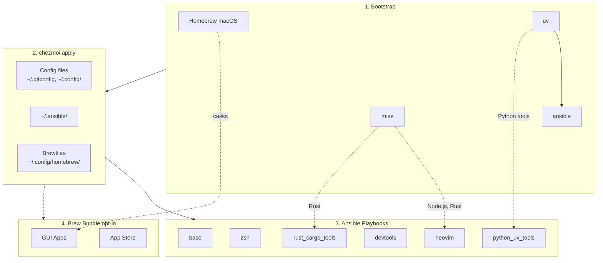

<!-- Generated by SpecStory, Markdown v2.1.0 -->

# 2026-03-24 01:49:16Z

<!-- Codex CLI Session 019d1d87-dafc-7db3-9a4b-04a9275d67b9 (2026-03-24 01:49:16Z) -->

_**User (2026-03-24 01:49:16Z)**_

Spawn a subagent to explore this repo.


---

_**Agent (gpt-5.4 2026-03-24 01:50:10Z)**_

I’m starting with the required task context setup, then I’ll spawn an explorer subagent scoped to this repo and inspect the top-level layout locally so I can integrate its findings.

_**Agent (gpt-5.4 2026-03-24 01:50:10Z)**_

<tool-use data-tool-type="shell" data-tool-name="exec_command"><details>
<summary>Tool use: **exec_command** `td usage --new-session`</summary>
```
Command: /bin/zsh -lc 'td usage --new-session'
Chunk ID: 19a20d
Wall time: 0.1220 seconds
Process exited with code 0
Original token count: 421
Output:
You have access to `td`, a local task management CLI.

NEW SESSION: ses_62570b on branch: main

CURRENT SESSION: ses_62570b [codex_61190] on branch: main

WORKFLOW:

  1. `td start <id>` to begin work
     Multi-issue: `td ws start "name"` then `td ws tag <ids>`
  2. `td log "msg"` to track progress
     Multi-issue: `td ws log "msg"`
  3. `td handoff <id>` to capture state (REQUIRED)
     Multi-issue: `td ws handoff`
  4. `td review <id>` to submit for review
  5. Different session: `td approve <id>` to complete

  Use `td ws` commands when implementing multiple related issues.

KEY COMMANDS:
  td current              What you're working on
  td ws current           Current work session state
  td context <id>         Full context for resuming
  td next                 Highest priority open issue
  td critical-path        What unblocks the most work
  td reviewable           Issues you can review
  td approve/reject <id>  Complete review

IMPORTANT: You cannot approve issues you implemented.
  Exception: `td add "title" --minor` creates self-reviewable tasks.

WARNING: Do NOT use `td close` for completed work!
  Use `td review` -> `td approve` workflow instead.
  `td close` is for admin closures: duplicates, won't-fix, cleanup.

Use `td handoff` or `td ws handoff` before stopping work.

FOR LLMs: Run `td usage --new-session` at conversation start (or after /clear).
  Do NOT start a new session mid-work—sessions track implementers for review.
Use `td ws start` when implementing multiple issues to group handoffs.
  - session = identity (always exists)  |  ws = work container (optional)

TIP: Use `td usage -q` to hide these instructions after first read.
```
</details></tool-use>

_**Agent (gpt-5.4 2026-03-24 01:50:10Z)**_

<tool-use data-tool-type="shell" data-tool-name="exec_command"><details>
<summary>Tool use: **exec_command** `pwd`</summary>
```
Command: /bin/zsh -lc pwd
Chunk ID: 2c0cfb
Wall time: 0.0000 seconds
Process exited with code 0
Original token count: 11
Output:
/Users/daviddwlee84/.local/share/chezmoi
```
</details></tool-use>

_**Agent (gpt-5.4 2026-03-24 01:50:29Z)**_

I’ve got the session initialized. Spawning an explorer against the repo now, and I’m reading the top-level file layout in parallel so I can cross-check what it reports back.

_**Agent (gpt-5.4 2026-03-24 01:50:29Z)**_

<tool-use data-tool-type="unknown" data-tool-name="spawn_agent"><details>
<summary>Tool use: **spawn_agent**</summary>

**Input:**

- agent_type: `explorer`
- fork_context: `true`
- message: `Explore the repository at /Users/daviddwlee84/.local/share/chezmoi and report back with a concise but useful repo orientation. Focus on: 1) top-level structure, 2) key entrypoints/workflows for chezmoi + ansible, 3) important config templates and scripts, 4) notable docs users should read first, and 5) any obvious hotspots or conventions to be careful about. Do not make edits. Include specific file paths.`
- model: `gpt-5.4-mini`
- reasoning_effort: `medium`

**Result:**

</details></tool-use>

_**Agent (gpt-5.4 2026-03-24 01:50:29Z)**_

<tool-use data-tool-type="shell" data-tool-name="exec_command"><details>
<summary>Tool use: **exec_command** `td usage -q`</summary>
```
Command: /bin/zsh -lc 'td usage -q'
Chunk ID: eeacdd
Wall time: 0.1484 seconds
Process exited with code 0
Original token count: 29
Output:
You have access to `td`, a local task management CLI.

CURRENT SESSION: ses_62570b [codex_61190] on branch: main
```
</details></tool-use>

_**Agent (gpt-5.4 2026-03-24 01:50:29Z)**_

<tool-use data-tool-type="shell" data-tool-name="exec_command"><details>
<summary>Tool use: **exec_command** `rg --files -g 'AGENTS.md' -g 'README.md' -g '.chezmoi.toml.tmpl' -g 'Dockerfile' -g 'run_*' -g 'dot_ansible/**' -g 'docs/**' | sed 's#^#./#' | sort`</summary>
```
Command: /bin/zsh -lc "rg --files -g 'AGENTS.md' -g 'README.md' -g '.chezmoi.toml.tmpl' -g 'Dockerfile' -g 'run_*' -g 'dot_ansible/**' -g 'docs/**' | sed 's#"'^#./#'"' | sort"
Chunk ID: 9e283b
Wall time: 0.0000 seconds
Process exited with code 0
Original token count: 495
Output:
./.chezmoi.toml.tmpl
./Dockerfile
./docs/ansible.md
./docs/initial_setup/0_ManualSetupRecord.md
./docs/initial_setup/1_ApplyToNewMachine.md
./docs/scripts/import_ssh_to_bw.sh.md
./docs/tools/codexbar.md
./docs/tools/direnv.md
./docs/tools/pqsum.md
./docs/tools/specify_cli.md
./docs/tools/specstory.md
./docs/tools/starship.md
./docs/tools/Tailscale.md
./docs/tools/td_sidecar.md
./docs/tutorials/bitwarden_ssh_agent.md
./dot_ansible/ansible.cfg
./dot_ansible/inventories/localhost.ini
./dot_ansible/playbooks/base.yml
./dot_ansible/playbooks/linux.yml
./dot_ansible/playbooks/macos.yml
./dot_ansible/roles/base/tasks/main.yml
./dot_ansible/roles/bitwarden/defaults/main.yml
./dot_ansible/roles/bitwarden/tasks/main.yml
./dot_ansible/roles/coding_agents/defaults/main.yml
./dot_ansible/roles/coding_agents/tasks/main.yml
./dot_ansible/roles/devtools/tasks/main.yml
./dot_ansible/roles/docker/tasks/main.yml
./dot_ansible/roles/homebrew/tasks/main.yml
./dot_ansible/roles/input_method/tasks/main.yml
./dot_ansible/roles/lazyvim_deps/defaults/main.yml
./dot_ansible/roles/lazyvim_deps/tasks/main.yml
./dot_ansible/roles/neovim/defaults/main.yml
./dot_ansible/roles/neovim/tasks/main.yml
./dot_ansible/roles/nerdfonts/tasks/main.yml
./dot_ansible/roles/python_uv_tools/defaults/main.yml
./dot_ansible/roles/python_uv_tools/tasks/main.yml
./dot_ansible/roles/ruby_gem_tools/defaults/main.yml
./dot_ansible/roles/ruby_gem_tools/tasks/main.yml
./dot_ansible/roles/rust_cargo_tools/defaults/main.yml
./dot_ansible/roles/rust_cargo_tools/tasks/main.yml
./dot_ansible/roles/security_tools/tasks/main.yml
./dot_ansible/roles/starship/tasks/main.yml
./dot_ansible/roles/zsh/defaults/main.yml
./dot_ansible/roles/zsh/tasks/main.yml
./dot_config/nvim/README.md
./README.md
./run_before_01_backup_dotfiles.sh.tmpl
./run_once_before_00_bootstrap.sh.tmpl
./run_once_before_02_fix_intel_homebrew.sh.tmpl
./run_onchange_after_20_ansible_roles.sh.tmpl
./run_onchange_after_30_brew_bundle.sh.tmpl
```
</details></tool-use>

_**Agent (gpt-5.4 2026-03-24 01:50:29Z)**_

<tool-use data-tool-type="shell" data-tool-name="exec_command"><details>
<summary>Tool use: **exec_command** `ls -la`</summary>
```
Command: /bin/zsh -lc 'ls -la'
Chunk ID: 8077e4
Wall time: 0.0000 seconds
Process exited with code 0
Original token count: 813
Output:
total 272
drwxr-xr-x@ 46 daviddwlee84  staff   1472 Mar 23 16:14 .
drwxr-xr-x@ 23 daviddwlee84  staff    736 Feb 10 18:26 ..
-rw-r--r--@  1 daviddwlee84  staff   2593 Mar 16 17:24 .chezmoi.toml.tmpl
-rw-r--r--@  1 daviddwlee84  staff   1167 Feb 11 16:42 .chezmoiignore
drwxr-xr-x@  3 daviddwlee84  staff     96 Feb  5 17:39 .claude
drwxr-xr-x@  2 daviddwlee84  staff     64 Feb 10 18:44 .cursor
-rw-r--r--@  1 daviddwlee84  staff    110 Feb 10 18:42 .cursorindexingignore
-rw-r--r--@  1 daviddwlee84  staff    280 Feb  3 22:39 .dockerignore
drwxr-xr-x@ 20 daviddwlee84  staff    640 Mar 24 09:50 .git
-rw-r--r--@  1 daviddwlee84  staff    234 Feb 12 10:46 .gitignore
-rw-r--r--@  1 daviddwlee84  staff    528 Feb  4 15:12 .gitleaks.toml
-rw-r--r--@  1 daviddwlee84  staff    150 Feb  4 10:29 .markdownlint.jsonc
-rw-r--r--@  1 daviddwlee84  staff    979 Feb  9 20:14 .pre-commit-config.yaml
drwxr-xr-x@  3 daviddwlee84  staff     96 Feb 12 09:08 .sidecar
drwxr-xr-x@  7 daviddwlee84  staff    224 Mar 12 18:20 .specstory
drwxr-xr-x@  3 daviddwlee84  staff     96 Feb  5 13:20 .superset
drwxr-xr-x@  6 daviddwlee84  staff    192 Mar 24 09:50 .todos
drwxr-xr-x@  4 daviddwlee84  staff    128 Feb 10 17:35 .vscode
lrwxr-xr-x@  1 daviddwlee84  staff      9 Feb  3 18:00 AGENTS.md -> CLAUDE.md
drwxr-xr-x@  3 daviddwlee84  staff     96 Feb 11 16:42 bin
-rw-r--r--@  1 daviddwlee84  staff  10453 Mar 23 16:14 CLAUDE.md
-rw-r--r--@  1 daviddwlee84  staff   4365 Feb 13 09:10 docker-compose.yml
-rw-r--r--@  1 daviddwlee84  staff   5996 Mar 16 17:24 Dockerfile
drwxr-xr-x@  7 daviddwlee84  staff    224 Feb 10 17:03 docs
drwxr-xr-x@  6 daviddwlee84  staff    192 Feb  4 10:47 dot_ansible
drwxr-xr-x@  3 daviddwlee84  staff     96 Feb 10 16:28 dot_cargo
drwxr-xr-x@  5 daviddwlee84  staff    160 Mar 17 09:54 dot_claude
drwxr-xr-x@ 16 daviddwlee84  staff    512 Mar 12 17:59 dot_config
-rw-r--r--@  1 daviddwlee84  staff    439 Feb  4 18:41 dot_gitconfig.tmpl
-rw-r--r--@  1 daviddwlee84  staff    279 Feb 10 16:11 dot_npmrc.tmpl
drwxr-xr-x@  4 daviddwlee84  staff    128 Feb 11 18:14 dot_ssh
-rw-r--r--@  1 daviddwlee84  staff   2273 Feb  5 09:58 dot_tmux.conf
-rw-r--r--@  1 daviddwlee84  staff    124 Feb  5 19:31 dot_zshenv.tmpl
-rw-r--r--@  1 daviddwlee84  staff   4029 Mar 18 17:43 dot_zshrc.tmpl
lrwxr-xr-x@  1 daviddwlee84  staff      9 Feb  5 15:44 GEMINI.md -> CLAUDE.md
-rw-r--r--@  1 daviddwlee84  staff   7815 Feb 13 09:12 justfile
-rw-r--r--@  1 daviddwlee84  staff   5018 Feb  6 10:00 NOTES.md
drwxr-xr-x@  3 daviddwlee84  staff     96 Mar 10 10:00 private_dot_specstory
-rw-r--r--@  1 daviddwlee84  staff   8192 Mar 23 16:01 README.md
-rw-r--r--@  1 daviddwlee84  staff   1427 Feb  7 23:42 run_before_01_backup_dotfiles.sh.tmpl
-rw-r--r--@  1 daviddwlee84  staff   5659 Feb 10 19:01 run_once_before_00_bootstrap.sh.tmpl
-rw-r--r--@  1 daviddwlee84  staff   4084 Feb  7 23:42 run_once_before_02_fix_intel_homebrew.sh.tmpl
-rw-r--r--@  1 daviddwlee84  staff   6688 Mar 16 17:24 run_onchange_after_20_ansible_roles.sh.tmpl
-rw-r--r--@  1 daviddwlee84  staff   3498 Feb  7 23:42 run_onchange_after_30_brew_bundle.sh.tmpl
drwxr-xr-x@  6 daviddwlee84  staff    192 Mar 10 10:00 scripts
-rw-r--r--@  1 daviddwlee84  staff   1592 Mar 12 18:00 TODO.md
```
</details></tool-use>

_**Agent (gpt-5.4 2026-03-24 01:50:42Z)**_

The repo is laid out as expected for a chezmoi source tree: root config/templates, `dot_ansible/` for roles and playbooks, and several `run_*` bootstrap/onchange scripts. I’m pulling the key files now while the explorer runs so the final summary is grounded in actual entrypoints.

_**Agent (gpt-5.4 2026-03-24 01:50:42Z)**_

<tool-use data-tool-type="shell" data-tool-name="exec_command"><details>
<summary>Tool use: **exec_command** `sed -n '1,220p' README.md`</summary>
```
Command: /bin/zsh -lc "sed -n '1,220p' README.md"
Chunk ID: 362e7d
Wall time: 0.0000 seconds
Process exited with code 0
Original token count: 2048
Output:
# dotfiles

Cross-platform development environment setup using **chezmoi** + **ansible**.

- **chezmoi**: manages config files (dotfiles)
- **ansible**: installs system dependencies and tools

## Prerequisites

- [chezmoi](https://www.chezmoi.io/install/)
- [uv](https://docs.astral.sh/uv/getting-started/installation/) (for ansible)

## Architecture



## Quick Setup

```bash
# One-liner to initialize and apply (installs chezmoi to ~/.local/bin)
export GITHUB_USERNAME=daviddwlee84
sh -c "$(curl -fsLS get.chezmoi.io)" -- -b "$HOME/.local/bin" init --apply git@github.com:$GITHUB_USERNAME/dotfiles.git
```

This automatically:

1. Bootstraps Homebrew (macOS/Linux), uv, mise, ansible
2. Deploys all config files
3. Runs ansible playbooks (git, ripgrep, fd, neovim, etc.)
4. Runs brew bundle (if `installBrewApps` enabled)

### Optional Components

During `chezmoi init`, you'll be prompted for optional installs:

| Option | Default | Description |
|--------|---------|-------------|
| `installCodingAgents` | true | Claude Code, Codex CLI, OpenCode, Cursor, Copilot, Gemini CLI, td, sidecar, specify-cli, etc. |
| `installBitwarden` | false | Bitwarden CLI (`bw`) + Desktop app (desktop profiles) with SSH agent auto-detection |
| `installPythonUvTools` | true | Python CLI tools via uv (mlflow, litellm, sqlit-tui, etc.) |
| `installBrewApps` | false | GUI apps via Homebrew Brewfile (casks, mas) |
| `installInputMethod` | false | Traditional Chinese input methods (McBopomofo, RIME/Squirrel on macOS; ibus-rime on Linux) |
| `noRoot` | false | Skip sudo-requiring tasks (for servers without root access) |

To change options later: `chezmoi init --force`

## What You Get

### Config Files

- `~/.gitconfig` - Git configuration
- `~/.config/nvim/` - Neovim (LazyVim) configuration
- `~/.config/uv/uv.toml` - uv package manager config
- `~/.cargo/config.toml` - Cargo registry mirror config (GFW)
- `~/.npmrc` - npm registry config (official/npmmirror via `useChineseMirror`)
- `~/.config/.bunfig.toml` - Bun global registry config (official/npmmirror via `useChineseMirror`)
- `~/.config/alacritty/` - Alacritty terminal config
- `~/.config/starship.toml` - Starship cross-shell prompt config
- `~/.config/direnv/direnvrc` - direnv helper functions, including `.venv`-aware Python activation
- `~/.config/yazi/` - Yazi file manager config (v0.3.3+ syntax, [docs](https://yazi-rs.github.io/docs/configuration/overview/))
  - `yazi.toml` - Main config with open rules and openers (`o`/`O`)
  - `keymap.toml`, `theme.toml` - Optional customization files (stubs provided)
- `~/.claude/` - Claude Code settings
- `~/.specstory/cli/config.toml` - Global SpecStory defaults for `specstory run` across all projects
- `~/.tmux.conf` - Tmux configuration with TPM plugins
- `~/.local/bin/x` - Cross-platform terminal wrapper for `copy` / `paste` / `open`
- `~/.config/zsh/tools/22_sesh.zsh` - Sesh keybinding (Ctrl+A for tmux session switcher)
- `~/.config/zsh/tools/36_pueue.zsh` - Pueue queue summary helper (`pqsum`)
- `~/.config/zsh/tools/28_tldr.zsh` - `tldrf` helper with `TLDR_LANGUAGES` fallback order
- `~/.config/zsh/tools/95_bitwarden.zsh` - Bitwarden CLI completion + SSH agent socket auto-detection
- `~/.ssh/config` - SSH main config skeleton (create-only: `Include ~/.ssh/config.d/*` + conservative `Host *` defaults)
- `~/.ssh/config.d/00-defaults` - SSH global defaults stub (commented examples only)
- `~/.ssh/config.d/git` - SSH host entries for `github.com` and `gitlab.com` with commented multi-account/Bitwarden examples
- `~/.config/tmuxp/claude-sidecar.yaml` - tmuxp workspace for Claude + Sidecar
- `~/.config/zellij/layouts/claude-sidecar.kdl` - Zellij layout for Claude + Sidecar
- `~/.config/homebrew/` - Brewfiles for GUI apps (macOS casks + mas) plus selected CLI formulas (e.g., `tailscale`)

SSH files are managed as create-only templates: if `~/.ssh/config` already exists, it is not overwritten. In that case, add `Include ~/.ssh/config.d/*` to your existing config manually to l
... (truncated)
```
</details></tool-use>

_**Agent (gpt-5.4 2026-03-24 01:50:42Z)**_

<tool-use data-tool-type="shell" data-tool-name="exec_command"><details>
<summary>Tool use: **exec_command** `sed -n '1,260p' .chezmoi.toml.tmpl`</summary>
```
Command: /bin/zsh -lc "sed -n '1,260p' .chezmoi.toml.tmpl"
Chunk ID: 3ea89c
Wall time: 0.0000 seconds
Process exited with code 0
Original token count: 649
Output:
# https://www.chezmoi.io/reference/special-files/chezmoi-format-tmpl/

[data]
# 只在 init 才需要問一次：你之後都讀這個值
# TODO: not all the things we want to change all the time we chezmoi init
profile = {{ promptStringOnce . "profile" "profile (ubuntu_server|ubuntu_desktop|macos|macos_intel)" "macos" | quote }}
email   = {{ promptStringOnce . "email" "What is your email address" "daviddwlee84@gmail.com" | quote }}
name    = {{ promptStringOnce . "name" "What is your full name" "Da-Wei Lee" | quote }}
# 是否在中國大陸 GFW 內，需要使用鏡像源
useChineseMirror = {{ promptBoolOnce . "useChineseMirror" "Are you in China (behind GFW) and need to use mirrors" false }}
# 是否對所有 repo 啟用 gitleaks 掃描（包含沒有 .pre-commit-config.yaml 的 repo）
gitleaksAllRepos = {{ promptBoolOnce . "gitleaksAllRepos" "Enable gitleaks for ALL git repos (not just those with .pre-commit-config.yaml)" false }}
# 是否安裝 coding agents (Claude Code, OpenCode, Cursor, Copilot, Gemini, etc.)
installCodingAgents = {{ promptBoolOnce . "installCodingAgents" "Install coding agents (Claude Code, OpenCode, Cursor, Copilot, Gemini, etc.)" true }}
# 是否安裝 Bitwarden CLI 並啟用 SSH Agent 自動偵測 + Zsh completion
installBitwarden = {{ promptBoolOnce . "installBitwarden" "Install Bitwarden CLI (@bitwarden/cli) with SSH Agent integration and Zsh completion" false }}
# 是否安裝 Python CLI tools via uv (mlflow, litellm, sqlit-tui, etc.)
installPythonUvTools = {{ promptBoolOnce . "installPythonUvTools" "Install Python CLI tools via uv (mlflow, litellm, sqlit-tui, etc.)" true }}
# 是否安裝 GUI apps via Homebrew Brewfile (terminals, browsers, utilities, etc.)
installBrewApps = {{ promptBoolOnce . "installBrewApps" "Install GUI apps via Homebrew Brewfile (casks, mas)" false }}
# 是否安裝繁體中文輸入法 (McBopomofo + RIME)
installInputMethod = {{ promptBoolOnce . "installInputMethod" "Install Traditional Chinese input methods (McBopomofo, RIME)" false }}
# 沒有 sudo/root 權限，只安裝 user-level 工具 (mise, cargo, gem, uv, npm)
noRoot = {{ promptBoolOnce . "noRoot" "No sudo/root access - skip all system package installations" false }}
# 在 chezmoi apply 之前備份現有的 dotfiles
backupDotfiles = {{ promptBoolOnce . "backupDotfiles" "Backup existing dotfiles before chezmoi overwrites them" true }}

# https://www.chezmoi.io/user-guide/use-scripts-to-perform-actions/#dont-show-scripts-that-would-run-in-chezmoi-diffchezmoi-status
[diff]
    exclude = ["scripts"]
[status]
    exclude = ["scripts"]
```
</details></tool-use>

_**Agent (gpt-5.4 2026-03-24 01:50:42Z)**_

<tool-use data-tool-type="shell" data-tool-name="exec_command"><details>
<summary>Tool use: **exec_command** `sed -n '1,220p' run_once_before_00_bootstrap.sh.tmpl`</summary>
```
Command: /bin/zsh -lc "sed -n '1,220p' run_once_before_00_bootstrap.sh.tmpl"
Chunk ID: 4b9d34
Wall time: 0.0000 seconds
Process exited with code 0
Original token count: 1415
Output:
#!/bin/bash
# Bootstrap script - installs Homebrew, uv, ansible, mise, and galaxy collections
# Runs BEFORE any ansible playbooks
# Profile: {{ .profile }}

set -e

# Colors for output
RED='\033[0;31m'
GREEN='\033[0;32m'
YELLOW='\033[1;33m'
BLUE='\033[0;34m'
NC='\033[0m' # No Color

info() {
    echo -e "${BLUE}[INFO]${NC} $1"
}

success() {
    echo -e "${GREEN}[SUCCESS]${NC} $1"
}

warn() {
    echo -e "${YELLOW}[WARN]${NC} $1"
}

error() {
    echo -e "${RED}[ERROR]${NC} $1"
}

# Ensure PATH includes local bin and Homebrew
export PATH="$HOME/.local/bin:$PATH"

# Add Homebrew to PATH if installed
{{ if or (eq .profile "macos") (eq .profile "macos_intel") -}}
# macOS: Apple Silicon and Intel paths
if [[ -f /opt/homebrew/bin/brew ]]; then
    eval "$(/opt/homebrew/bin/brew shellenv)"
elif [[ -f /usr/local/bin/brew ]]; then
    eval "$(/usr/local/bin/brew shellenv)"
fi
{{ else -}}
# Linux: Linuxbrew paths
if [[ -d /home/linuxbrew/.linuxbrew ]]; then
    eval "$(/home/linuxbrew/.linuxbrew/bin/brew shellenv)"
elif [[ -d "$HOME/.linuxbrew" ]]; then
    eval "$("$HOME/.linuxbrew/bin/brew" shellenv)"
fi
{{ end -}}

# =============================================================================
# 0. Homebrew Installation
# =============================================================================
# macOS: Always install Homebrew (required for ansible roles)
# Linux: Optional - only install if installBrewApps is enabled
# =============================================================================

{{ if or (eq .profile "macos") (eq .profile "macos_intel") -}}
# macOS: Install Homebrew (required for package management)
if ! command -v brew &> /dev/null; then
    info "Installing Homebrew (macOS)..."
    NONINTERACTIVE=1 /bin/bash -c "$(curl -fsSL https://raw.githubusercontent.com/Homebrew/install/HEAD/install.sh)"
    # Add to PATH for this session
    if [[ -f /opt/homebrew/bin/brew ]]; then
        eval "$(/opt/homebrew/bin/brew shellenv)"
    elif [[ -f /usr/local/bin/brew ]]; then
        eval "$(/usr/local/bin/brew shellenv)"
    fi
    success "Homebrew installed successfully"
else
    info "Homebrew is already installed"
fi
{{ else -}}
# Linux: Install Linuxbrew (useful for packages not available or outdated in apt)
{{ $noRoot := false }}{{ if hasKey . "noRoot" }}{{ $noRoot = .noRoot }}{{ end -}}
{{ if $noRoot -}}
# noRoot mode: Skip Linuxbrew (requires sudo for dependencies)
info "noRoot mode: Skipping Linuxbrew installation (requires sudo)"
{{ else -}}
if ! command -v brew &> /dev/null; then
    info "Installing Linuxbrew..."
    # Install Linuxbrew dependencies first
    if command -v apt-get &> /dev/null; then
        sudo apt-get update
        sudo apt-get install -y build-essential procps curl file git
    fi
    # Install Linuxbrew
    NONINTERACTIVE=1 /bin/bash -c "$(curl -fsSL https://raw.githubusercontent.com/Homebrew/install/HEAD/install.sh)"
    # Add to PATH for this session
    if [[ -d /home/linuxbrew/.linuxbrew ]]; then
        eval "$(/home/linuxbrew/.linuxbrew/bin/brew shellenv)"
    elif [[ -d "$HOME/.linuxbrew" ]]; then
        eval "$("$HOME/.linuxbrew/bin/brew" shellenv)"
    fi
    success "Linuxbrew installed successfully"
else
    info "Linuxbrew is already installed"
fi
{{ end -}}
{{ end -}}
# 1. Install uv if missing
if ! command -v uv &> /dev/null; then
    info "Installing uv..."
    curl -LsSf https://astral.sh/uv/install.sh | sh
    success "uv installed successfully"
else
    info "uv is already installed"
fi

# 2. Install mise if missing (runtime manager for Node.js, etc.)
if ! command -v mise &> /dev/null; then
    info "Installing mise..."
    # Try curl installer first (fast, no sudo)
    if curl -fsSL --connect-timeout 10 --max-time 60 https://mise.run | sh 2>/dev/null; then
        success "mise installed via curl"
{{ $noRootMise := false }}{{ if hasKey . "noRoot" }}{{ $noRootMise = .noRoot }}{{ end -}}
{{ if not $noRootMise -}}
    else
        # Fallback to apt for GFW environments
        warn "curl installer failed/timed out, trying apt..."
        if command -v apt-get &> /dev/null; then
            sudo apt-get update -y
            sudo apt-get install -y curl gpg
            sudo install -dm 755 /etc/apt/keyrings
            curl -fsSL https://mise.jdx.dev/gpg-key.pub | sudo tee /etc/apt/keyrings/mise-archive-keyring.pub >/dev/null
            echo "deb [signed-by=/etc/apt/keyrings/mise-archive-keyring.pub arch=amd64] https://mise.jdx.dev/deb stable main" | sudo tee /etc/apt/sources.list.d/mise.list
            sudo apt-get update -y
            sudo apt-get install -y mise
            success "mise installed via apt"
        else
            error "Could not install mise - please install manually"
        fi
{{ end -}}
    fi
else
    info "mise is already installed"
fi

# 3. In
... (truncated)
```
</details></tool-use>

_**Agent (gpt-5.4 2026-03-24 01:50:42Z)**_

<tool-use data-tool-type="shell" data-tool-name="exec_command"><details>
<summary>Tool use: **exec_command** `sed -n '1,260p' run_onchange_after_20_ansible_roles.sh.tmpl`</summary>
```
Command: /bin/zsh -lc "sed -n '1,260p' run_onchange_after_20_ansible_roles.sh.tmpl"
Chunk ID: fe5c83
Wall time: 0.0000 seconds
Process exited with code 0
Original token count: 1672
Output:
#!/bin/bash
# Re-run ansible when any role changes
# Triggers on changes to any role's tasks or defaults files
# Profile: {{ .profile }}

# === Role Hashes (changes trigger re-run) ===
# homebrew: {{ include "dot_ansible/roles/homebrew/tasks/main.yml" | sha256sum }}
# base: {{ include "dot_ansible/roles/base/tasks/main.yml" | sha256sum }}
# zsh tasks: {{ include "dot_ansible/roles/zsh/tasks/main.yml" | sha256sum }}
# zsh defaults: {{ include "dot_ansible/roles/zsh/defaults/main.yml" | sha256sum }}
# neovim tasks: {{ include "dot_ansible/roles/neovim/tasks/main.yml" | sha256sum }}
# neovim defaults: {{ include "dot_ansible/roles/neovim/defaults/main.yml" | sha256sum }}
# lazyvim_deps tasks: {{ include "dot_ansible/roles/lazyvim_deps/tasks/main.yml" | sha256sum }}
# lazyvim_deps defaults: {{ include "dot_ansible/roles/lazyvim_deps/defaults/main.yml" | sha256sum }}
# devtools: {{ include "dot_ansible/roles/devtools/tasks/main.yml" | sha256sum }}
# docker: {{ include "dot_ansible/roles/docker/tasks/main.yml" | sha256sum }}
# nerdfonts: {{ include "dot_ansible/roles/nerdfonts/tasks/main.yml" | sha256sum }}
# coding_agents tasks: {{ include "dot_ansible/roles/coding_agents/tasks/main.yml" | sha256sum }}
# coding_agents defaults: {{ include "dot_ansible/roles/coding_agents/defaults/main.yml" | sha256sum }}
# bitwarden tasks: {{ include "dot_ansible/roles/bitwarden/tasks/main.yml" | sha256sum }}
# bitwarden defaults: {{ include "dot_ansible/roles/bitwarden/defaults/main.yml" | sha256sum }}
# security_tools: {{ include "dot_ansible/roles/security_tools/tasks/main.yml" | sha256sum }}
# python_uv_tools tasks: {{ include "dot_ansible/roles/python_uv_tools/tasks/main.yml" | sha256sum }}
# python_uv_tools defaults: {{ include "dot_ansible/roles/python_uv_tools/defaults/main.yml" | sha256sum }}
# rust_cargo_tools tasks: {{ include "dot_ansible/roles/rust_cargo_tools/tasks/main.yml" | sha256sum }}
# rust_cargo_tools defaults: {{ include "dot_ansible/roles/rust_cargo_tools/defaults/main.yml" | sha256sum }}
# ruby_gem_tools tasks: {{ include "dot_ansible/roles/ruby_gem_tools/tasks/main.yml" | sha256sum }}
# ruby_gem_tools defaults: {{ include "dot_ansible/roles/ruby_gem_tools/defaults/main.yml" | sha256sum }}
# starship: {{ include "dot_ansible/roles/starship/tasks/main.yml" | sha256sum }}
# input_method: {{ include "dot_ansible/roles/input_method/tasks/main.yml" | sha256sum }}

set -e
export PATH="$HOME/.local/bin:$PATH"

# Colors
info() { echo -e "\033[0;34m[INFO]\033[0m $1"; }
success() { echo -e "\033[0;32m[SUCCESS]\033[0m $1"; }
warn() { echo -e "\033[1;33m[WARN]\033[0m $1"; }

ANSIBLE_DIR="$HOME/.ansible"
INVENTORY="$ANSIBLE_DIR/inventories/localhost.ini"

command -v ansible-playbook &> /dev/null || { warn "ansible-playbook not found"; exit 0; }

# === Profile-based tag selection ===
# Profile: {{ .profile }}
#
# Tag categories:
#   Core:    base, zsh, starship, neovim, lazyvim_deps, security_tools
#   Desktop: devtools, docker, nerdfonts
#   Server:  devtools, docker (no nerdfonts - no GUI)
#   macOS:   homebrew
#   Optional: coding_agents, bitwarden, python_uv_tools, rust_cargo_tools, ruby_gem_tools

{{ if or (eq .profile "macos") (eq .profile "macos_intel") -}}
PLAYBOOK="$ANSIBLE_DIR/playbooks/macos.yml"
# macOS: full desktop experience
TAGS="homebrew,base,zsh,starship,neovim,lazyvim_deps,devtools,docker,nerdfonts,security_tools,rust_cargo_tools,ruby_gem_tools"
{{ else if eq .profile "ubuntu_desktop" -}}
PLAYBOOK="$ANSIBLE_DIR/playbooks/linux.yml"
# Ubuntu Desktop: full desktop experience (no homebrew)
TAGS="base,zsh,starship,neovim,lazyvim_deps,devtools,docker,nerdfonts,security_tools,rust_cargo_tools,ruby_gem_tools"
{{ else if eq .profile "ubuntu_server" -}}
PLAYBOOK="$ANSIBLE_DIR/playbooks/linux.yml"
# Ubuntu Server: no GUI stuff (no nerdfonts)
TAGS="base,zsh,starship,neovim,lazyvim_deps,devtools,docker,security_tools,rust_cargo_tools,ruby_gem_tools"
{{ else -}}
warn "Unknown profile: {{ .profile }}"
exit 0
{{ end -}}

# Add optional tags based on chezmoi config
{{ if .installCodingAgents -}}
TAGS="${TAGS},coding_agents"
{{ end -}}
{{ $installBitwarden := false }}{{ if hasKey . "installBitwarden" }}{{ $installBitwarden = .installBitwarden }}{{ end -}}
{{ if $installBitwarden -}}
TAGS="${TAGS},bitwarden"
{{ end -}}
{{ if .installPythonUvTools -}}
TAGS="${TAGS},python_uv_tools"
{{ end -}}
{{ $installInputMethod := false }}{{ if hasKey . "installInputMethod" }}{{ $installInputMethod = .installInputMethod }}{{ end -}}
{{ if $installInputMethod -}}
TAGS="${TAGS},input_method"
{{ end -}}

# Extra vars for role-level configuration
EXTRA_VARS=""
{{ if and $installBitwarden (or (eq .profile "ubuntu_desktop") (eq .profile "macos") (eq .profile "macos_intel")) -}}
# Install Bitwarden Desktop app (for SSH agent) on desktop profiles
EXTRA_V
... (truncated)
```
</details></tool-use>

_**Agent (gpt-5.4 2026-03-24 01:50:48Z)**_

The key workflow is clear already: `.chezmoi.toml.tmpl` drives one-time prompts, `run_once_before_00_bootstrap.sh.tmpl` bootstraps package/runtime tooling, and `run_onchange_after_20_ansible_roles.sh.tmpl` replays profile-selected ansible tags when role hashes change. I’m waiting on the explorer’s repo-wide pass now.

_**Agent (gpt-5.4 2026-03-24 01:50:49Z)**_

<tool-use data-tool-type="unknown" data-tool-name="wait_agent"><details>
<summary>Tool use: **wait_agent**</summary>

**Input:**

- ids: `[019d1d89-4824-7f51-9f45-775ca2e89fea]`
- timeout_ms: `30000`

**Result:**

</details></tool-use>

_**Agent (gpt-5.4 2026-03-24 01:51:29Z)**_

The explorer is still working through the tree. I’m filling in the remaining context locally from the playbooks and developer docs so the summary doesn’t depend on a single pass.

_**Agent (gpt-5.4 2026-03-24 01:51:29Z)**_

<tool-use data-tool-type="shell" data-tool-name="exec_command"><details>
<summary>Tool use: **exec_command** `sed -n '1,220p' dot_ansible/playbooks/macos.yml`</summary>
```
Command: /bin/zsh -lc "sed -n '1,220p' dot_ansible/playbooks/macos.yml"
Chunk ID: 57666d
Wall time: 0.0000 seconds
Process exited with code 0
Original token count: 253
Output:
---
# macOS playbook - Homebrew-based setup
- name: macOS setup
  hosts: local
  gather_facts: true

  roles:
    - role: homebrew
      tags: [homebrew]

    - role: base
      tags: [base]

    - role: zsh
      tags: [zsh]

    - role: starship
      tags: [starship]

    - role: neovim
      tags: [neovim]

    - role: lazyvim_deps
      tags: [lazyvim_deps]

    - role: devtools
      tags: [devtools]

    - role: docker
      tags: [docker]

    - role: nerdfonts
      tags: [nerdfonts]

    - role: coding_agents
      tags: [coding_agents]

    - role: bitwarden
      tags: [bitwarden]

    - role: security_tools
      tags: [security_tools]

    - role: python_uv_tools
      tags: [python_uv_tools]

    - role: rust_cargo_tools
      tags: [rust_cargo_tools]

    - role: ruby_gem_tools
      tags: [ruby_gem_tools]

    - role: input_method
      tags: [input_method]

    # Note: brew_bundle is now managed by chezmoi run_onchange script
    # See run_onchange_after_30_brew_bundle.sh.tmpl
```
</details></tool-use>

_**Agent (gpt-5.4 2026-03-24 01:51:29Z)**_

<tool-use data-tool-type="shell" data-tool-name="exec_command"><details>
<summary>Tool use: **exec_command** `sed -n '1,220p' dot_ansible/playbooks/linux.yml`</summary>
```
Command: /bin/zsh -lc "sed -n '1,220p' dot_ansible/playbooks/linux.yml"
Chunk ID: 57f4f6
Wall time: 0.0000 seconds
Process exited with code 0
Original token count: 211
Output:
---
# Linux playbook - Ubuntu/Debian setup
- name: Linux setup
  hosts: local
  gather_facts: true

  roles:
    - role: base
      tags: [base]

    - role: zsh
      tags: [zsh]

    - role: starship
      tags: [starship]

    - role: neovim
      tags: [neovim]

    - role: lazyvim_deps
      tags: [lazyvim_deps]

    - role: devtools
      tags: [devtools]

    - role: docker
      tags: [docker]

    - role: nerdfonts
      tags: [nerdfonts]

    - role: coding_agents
      tags: [coding_agents]

    - role: bitwarden
      tags: [bitwarden]

    - role: security_tools
      tags: [security_tools]

    - role: python_uv_tools
      tags: [python_uv_tools]

    - role: rust_cargo_tools
      tags: [rust_cargo_tools]

    - role: ruby_gem_tools
      tags: [ruby_gem_tools]

    - role: input_method
      tags: [input_method]
```
</details></tool-use>

_**Agent (gpt-5.4 2026-03-24 01:51:29Z)**_

<tool-use data-tool-type="shell" data-tool-name="exec_command"><details>
<summary>Tool use: **exec_command** `sed -n '1,220p' dot_ansible/playbooks/base.yml`</summary>
```
Command: /bin/zsh -lc "sed -n '1,220p' dot_ansible/playbooks/base.yml"
Chunk ID: c2d4f5
Wall time: 0.0000 seconds
Process exited with code 0
Original token count: 38
Output:
---
# Base playbook - cross-platform essentials
- name: Base setup
  hosts: local
  gather_facts: true

  roles:
    - role: base
      tags: [base]
```
</details></tool-use>

_**Agent (gpt-5.4 2026-03-24 01:51:29Z)**_

<tool-use data-tool-type="shell" data-tool-name="exec_command"><details>
<summary>Tool use: **exec_command** `sed -n '1,260p' CLAUDE.md`</summary>
```
Command: /bin/zsh -lc "sed -n '1,260p' CLAUDE.md"
Chunk ID: c54b80
Wall time: 0.0000 seconds
Process exited with code 0
Original token count: 2335
Output:
# Dotfiles Repository

Cross-platform dotfiles management using **chezmoi** for configuration files and **ansible** for system dependencies.

## MANDATORY: Use td for Task Management

Run td usage --new-session at conversation start (or after /clear). This tells you what to work on next.

Sessions are automatic (based on terminal/agent context). Optional:

- td session "name" to label the current session
- td session --new to force a new session in the same context

Use td usage -q after first read.

## Maintaining README.md

**IMPORTANT**: When adding or modifying configurations, update `README.md` to reflect changes:

- **New config files**: Add to "What You Get > Config Files" section
- **New ansible roles/tools**: Add to "What You Get > Tools" section
- **New platforms**: Add to "Supported Platforms" table
- **Changed setup steps**: Update "Quick Setup" section

Keep README.md concise and user-focused. Technical details belong in CLAUDE.md or docs/.

## Maintaining Dockerfile

**IMPORTANT**: When adding new chezmoi prompts in `.chezmoi.toml.tmpl`, also update `Dockerfile`:

1. Add corresponding `ARG CHEZMOI_*` build argument
2. Add `--promptBool` or `--promptString` flag to the `chezmoi init` command

This ensures Docker testing works with all configuration options.

## Quick Start

```bash
# Install ansible (if not already installed)
uv tool install ansible-core
ansible-galaxy collection install community.general

# Apply dotfiles
chezmoi apply

# Run ansible manually (from ~/.ansible directory)
cd ~/.ansible && ansible-playbook playbooks/macos.yml
```

## Architecture

```
chezmoi repo/
├── dot_* files               → ~/.* (config files)
├── dot_ansible/              → ~/.ansible/ (ansible playbooks)
├── run_once_before_*.tmpl    → bootstrap (runs once)
└── run_onchange_after_*.tmpl → ansible (runs on changes)
```

Installation Order:

```
1. Bootstrap (run_once_before) - installs Homebrew (macOS/Linux), uv, ansible, mise
2. chezmoi apply - deploys config files + ansible playbooks
3. Ansible (run_onchange_after) - runs on fresh install + when roles change
4. Brew bundle (run_onchange_after) - installs GUI apps if enabled
```

### Auto-run Scripts

| Script | Behavior |
|--------|----------|
| `run_once_before_00_bootstrap.sh.tmpl` | Installs Homebrew (macOS and Linux), uv, mise, ansible |
| `run_onchange_after_20_ansible_roles.sh.tmpl` | Runs ansible with all tags |
| `run_onchange_after_30_brew_bundle.sh.tmpl` | Runs brew bundle (if `installBrewApps` enabled) |

The onchange script includes SHA256 hashes of all role files. It runs:

- **Fresh install**: no previous hash state → triggers run
- **Updates**: any role's `tasks/main.yml` or `defaults/main.yml` changes → triggers run

To force re-run all scripts:

```bash
chezmoi state delete-bucket --bucket=scriptState
chezmoi apply
```

## Chezmoi Commands

```bash
chezmoi diff              # Preview changes
chezmoi apply             # Apply changes
chezmoi apply --dry-run   # Test without applying
chezmoi edit <file>       # Edit source file
chezmoi cd                # Go to source directory
```

## Ansible Usage

Ansible playbooks run automatically via `chezmoi apply` when playbook files change. For manual runs, use `~/.ansible/` directory:

```bash
cd ~/.ansible

# Full setup (macOS)
ansible-playbook playbooks/macos.yml

# Full setup (Linux)
ansible-playbook playbooks/linux.yml

# Specific tags only
ansible-playbook playbooks/macos.yml --tags "neovim,lazyvim_deps"

# Skip tags requiring sudo
ansible-playbook playbooks/linux.yml --skip-tags "sudo"

# Dry run
ansible-playbook playbooks/macos.yml --check
```

### Available Tags

| Tag | Description |
|-----|-------------|
| `base` | git, curl, ripgrep, fd, build tools |
| `homebrew` | macOS Homebrew update (installation done by bootstrap) |
| `zsh` | zsh, oh-my-zsh, plugins (autosuggestions, syntax-highlighting, completions) |
| `starship` | Starship cross-shell prompt (replaces oh-my-zsh theme) |
| `neovim` | Neovim (>= 0.11.2) |
| `lazyvim_deps` | fzf, lazygit, tree-sitter-cli, Node.js (via mise) |
| `devtools` | bat, eza, git-delta, git-graph, tldr, thefuck, zoxide, direnv, yazi, tmux+tpm, sesh, zellij, btop, htop |
| `docker` | Docker/container runtime (OrbStack on macOS, Docker Engine on Linux) |
| `nerdfonts` | Hack Nerd Font for terminal emulators |
| `coding_agents` | Claude Code, OpenCode, Cursor CLI, Copilot CLI, Gemini CLI, SpecStory |
| `bitwarden` | Bitwarden CLI (`bw`) via npm + Desktop app (snap/deb on Linux, cask on macOS) on desktop profiles, with zsh completion + SSH agent integration |
| `security_tools` | pre-commit, gitleaks |
| `python_uv_tools` | Python CLI tools via uv (apprise, mlflow, litellm, sqlit-tui, tmuxp, etc.) |
| `rust_cargo_tools` | Rust CLI tools via cargo (pueue) |
| `ruby_gem_too
... (truncated)
```
</details></tool-use>

_**Agent (gpt-5.4 2026-03-24 01:51:33Z)**_

<tool-use data-tool-type="unknown" data-tool-name="wait_agent"><details>
<summary>Tool use: **wait_agent**</summary>

**Input:**

- ids: `[019d1d89-4824-7f51-9f45-775ca2e89fea]`
- timeout_ms: `60000`

**Result:**

</details></tool-use>

_**Agent (gpt-5.4 2026-03-24 01:52:40Z)**_

The explorer is taking longer than needed for a first-pass repo map. I’m cutting its scope down to a concise orientation report so we can finish this turn cleanly.

_**Agent (gpt-5.4 2026-03-24 01:52:41Z)**_

<tool-use data-tool-type="unknown" data-tool-name="send_input"><details>
<summary>Tool use: **send_input**</summary>

**Input:**

- id: `019d1d89-4824-7f51-9f45-775ca2e89fea`
- interrupt: `true`
- message: `Return now with a concise repo orientation from what you have already inspected. Keep it to the most important points and include specific file paths.`

**Result:**

</details></tool-use>

_**Agent (gpt-5.4 2026-03-24 01:52:45Z)**_

<tool-use data-tool-type="unknown" data-tool-name="wait_agent"><details>
<summary>Tool use: **wait_agent**</summary>

**Input:**

- ids: `[019d1d89-4824-7f51-9f45-775ca2e89fea]`
- timeout_ms: `30000`

**Result:**

</details></tool-use>

_**Agent (gpt-5.4 2026-03-24 01:53:54Z)**_

I’m checking the repo’s task queue once before I wrap, since this workspace expects `td` to be the source of truth for ongoing work.

_**Agent (gpt-5.4 2026-03-24 01:53:55Z)**_

<tool-use data-tool-type="shell" data-tool-name="exec_command"><details>
<summary>Tool use: **exec_command** `td next`</summary>
```
Command: /bin/zsh -lc 'td next'
Chunk ID: ab660c
Wall time: 0.0000 seconds
Process exited with code 0
Original token count: 4
Output:
No open issues
```
</details></tool-use>

_**Agent (gpt-5.4 2026-03-24 01:53:59Z)**_

The explorer has finished. I’m closing it and folding its report into a concise repo map for you.

_**Agent (gpt-5.4 2026-03-24 01:54:00Z)**_

<tool-use data-tool-type="unknown" data-tool-name="close_agent"><details>
<summary>Tool use: **close_agent**</summary>

**Input:**

- id: `019d1d89-4824-7f51-9f45-775ca2e89fea`

**Result:**

</details></tool-use>

_**Agent (gpt-5.4 2026-03-24 01:54:23Z)**_

Spawned explorer subagent `Nietzsche` and folded its first-pass report into a repo map. No files were changed.

The repo centers on three areas: root-level chezmoi source files like [`dot_*`](/Users/daviddwlee84/.local/share/chezmoi), ansible content under [`dot_ansible/`](/Users/daviddwlee84/.local/share/chezmoi/dot_ansible), and lifecycle scripts like [`run_once_before_00_bootstrap.sh.tmpl`](/Users/daviddwlee84/.local/share/chezmoi/run_once_before_00_bootstrap.sh.tmpl) and [`run_onchange_after_20_ansible_roles.sh.tmpl`](/Users/daviddwlee84/.local/share/chezmoi/run_onchange_after_20_ansible_roles.sh.tmpl). The setup flow is: prompts in [`.chezmoi.toml.tmpl`](/Users/daviddwlee84/.local/share/chezmoi/.chezmoi.toml.tmpl) -> bootstrap tooling -> `chezmoi apply` deploys files -> ansible playbooks at [`dot_ansible/playbooks/macos.yml`](/Users/daviddwlee84/.local/share/chezmoi/dot_ansible/playbooks/macos.yml), [`dot_ansible/playbooks/linux.yml`](/Users/daviddwlee84/.local/share/chezmoi/dot_ansible/playbooks/linux.yml), and [`dot_ansible/playbooks/base.yml`](/Users/daviddwlee84/.local/share/chezmoi/dot_ansible/playbooks/base.yml) run by profile/tag selection.

If you want to navigate it quickly, read [`README.md`](/Users/daviddwlee84/.local/share/chezmoi/README.md) first, then [`CLAUDE.md`](/Users/daviddwlee84/.local/share/chezmoi/CLAUDE.md), then [`docs/ansible.md`](/Users/daviddwlee84/.local/share/chezmoi/docs/ansible.md). The main maintenance traps are keeping [`Dockerfile`](/Users/daviddwlee84/.local/share/chezmoi/Dockerfile) in sync with new chezmoi prompts, keeping [`README.md`](/Users/daviddwlee84/.local/share/chezmoi/README.md) updated when configs/roles change, and updating the role-hash section in [`run_onchange_after_20_ansible_roles.sh.tmpl`](/Users/daviddwlee84/.local/share/chezmoi/run_onchange_after_20_ansible_roles.sh.tmpl) when adding or changing ansible roles. `td next` currently reports no open issues.

If you want, I can now aim a subagent at a specific slice like `dot_ansible/roles`, `dot_config/nvim`, or the chezmoi prompt/bootstrap path.
