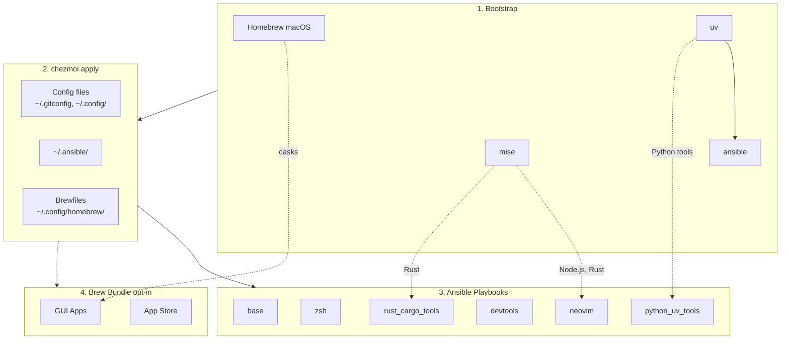

<!-- Generated by SpecStory, Markdown v2.1.0 -->

# 2026-03-24 01:50:29Z

<!-- Codex CLI Session 019d1d89-4824-7f51-9f45-775ca2e89fea (2026-03-24 01:50:29Z) -->

_**User (2026-03-24 01:50:29Z)**_

Spawn a subagent to explore this repo.


---

_**Agent (gpt-5.4 2026-03-24 01:50:29Z)**_

I’m starting with the required task context setup, then I’ll spawn an explorer subagent scoped to this repo and inspect the top-level layout locally so I can integrate its findings.

_**Agent (gpt-5.4 2026-03-24 01:50:29Z)**_

<tool-use data-tool-type="shell" data-tool-name="exec_command"><details>
<summary>Tool use: **exec_command** `td usage --new-session`</summary>
```
Command: /bin/zsh -lc 'td usage --new-session'
Chunk ID: 19a20d
Wall time: 0.1220 seconds
Process exited with code 0
Original token count: 421
Output:
You have access to `td`, a local task management CLI.

NEW SESSION: ses_62570b on branch: main

CURRENT SESSION: ses_62570b [codex_61190] on branch: main

WORKFLOW:

  1. `td start <id>` to begin work
     Multi-issue: `td ws start "name"` then `td ws tag <ids>`
  2. `td log "msg"` to track progress
     Multi-issue: `td ws log "msg"`
  3. `td handoff <id>` to capture state (REQUIRED)
     Multi-issue: `td ws handoff`
  4. `td review <id>` to submit for review
  5. Different session: `td approve <id>` to complete

  Use `td ws` commands when implementing multiple related issues.

KEY COMMANDS:
  td current              What you're working on
  td ws current           Current work session state
  td context <id>         Full context for resuming
  td next                 Highest priority open issue
  td critical-path        What unblocks the most work
  td reviewable           Issues you can review
  td approve/reject <id>  Complete review

IMPORTANT: You cannot approve issues you implemented.
  Exception: `td add "title" --minor` creates self-reviewable tasks.

WARNING: Do NOT use `td close` for completed work!
  Use `td review` -> `td approve` workflow instead.
  `td close` is for admin closures: duplicates, won't-fix, cleanup.

Use `td handoff` or `td ws handoff` before stopping work.

FOR LLMs: Run `td usage --new-session` at conversation start (or after /clear).
  Do NOT start a new session mid-work—sessions track implementers for review.
Use `td ws start` when implementing multiple issues to group handoffs.
  - session = identity (always exists)  |  ws = work container (optional)

TIP: Use `td usage -q` to hide these instructions after first read.
```
</details></tool-use>

_**Agent (gpt-5.4 2026-03-24 01:50:29Z)**_

<tool-use data-tool-type="shell" data-tool-name="exec_command"><details>
<summary>Tool use: **exec_command** `pwd`</summary>
```
Command: /bin/zsh -lc pwd
Chunk ID: 2c0cfb
Wall time: 0.0000 seconds
Process exited with code 0
Original token count: 11
Output:
/Users/daviddwlee84/.local/share/chezmoi
```
</details></tool-use>

_**Agent (gpt-5.4 2026-03-24 01:50:29Z)**_

I’ve got the session initialized. Spawning an explorer against the repo now, and I’m reading the top-level file layout in parallel so I can cross-check what it reports back.

_**Agent (gpt-5.4 2026-03-24 01:50:29Z)**_

<tool-use data-tool-type="unknown" data-tool-name="spawn_agent"><details>
<summary>Tool use: **spawn_agent**</summary>
```
You are the newly spawned agent. The prior conversation history was forked from your parent agent. Treat the next user message as your new task, and use the forked history only as background context.
```
</details></tool-use>

_**Agent (gpt-5.4 2026-03-24 01:50:29Z)**_

<tool-use data-tool-type="shell" data-tool-name="exec_command"><details>
<summary>Tool use: **exec_command** `td usage -q`</summary>

**Input:**

- cmd: `td usage -q`
- command: `td usage -q`
- max_output_tokens: `1000`
- workdir: `/Users/daviddwlee84/.local/share/chezmoi`
- yield_time_ms: `1000`

</details></tool-use>

---

_**User (2026-03-24 01:50:34Z)**_

Explore the repository at /Users/daviddwlee84/.local/share/chezmoi and report back with a concise but useful repo orientation. Focus on: 1) top-level structure, 2) key entrypoints/workflows for chezmoi + ansible, 3) important config templates and scripts, 4) notable docs users should read first, and 5) any obvious hotspots or conventions to be careful about. Do not make edits. Include specific file paths.

---

_**Agent (gpt-5.4 2026-03-24 01:51:20Z)**_

I’m initializing the required task session, then I’ll inspect the repo structure and the main chezmoi/ansible entrypoints without making changes.

_**Agent (gpt-5.4 2026-03-24 01:51:20Z)**_

<tool-use data-tool-type="shell" data-tool-name="exec_command"><details>
<summary>Tool use: **exec_command** `td usage --new-session`</summary>
```
Command: /bin/zsh -lc 'td usage --new-session'
Chunk ID: 5633d5
Wall time: 0.0960 seconds
Process exited with code 0
Original token count: 449
Output:
You have access to `td`, a local task management CLI.

NEW SESSION: ses_758093 on branch: main (previous: ses_a19466)
  You are a new context. You can now review issues implemented by the previous session.

CURRENT SESSION: ses_758093 [codex_61190] on branch: main

WORKFLOW:

  1. `td start <id>` to begin work
     Multi-issue: `td ws start "name"` then `td ws tag <ids>`
  2. `td log "msg"` to track progress
     Multi-issue: `td ws log "msg"`
  3. `td handoff <id>` to capture state (REQUIRED)
     Multi-issue: `td ws handoff`
  4. `td review <id>` to submit for review
  5. Different session: `td approve <id>` to complete

  Use `td ws` commands when implementing multiple related issues.

KEY COMMANDS:
  td current              What you're working on
  td ws current           Current work session state
  td context <id>         Full context for resuming
  td next                 Highest priority open issue
  td critical-path        What unblocks the most work
  td reviewable           Issues you can review
  td approve/reject <id>  Complete review

IMPORTANT: You cannot approve issues you implemented.
  Exception: `td add "title" --minor` creates self-reviewable tasks.

WARNING: Do NOT use `td close` for completed work!
  Use `td review` -> `td approve` workflow instead.
  `td close` is for admin closures: duplicates, won't-fix, cleanup.

Use `td handoff` or `td ws handoff` before stopping work.

FOR LLMs: Run `td usage --new-session` at conversation start (or after /clear).
  Do NOT start a new session mid-work—sessions track implementers for review.
Use `td ws start` when implementing multiple issues to group handoffs.
  - session = identity (always exists)  |  ws = work container (optional)

TIP: Use `td usage -q` to hide these instructions after first read.
```
</details></tool-use>

_**Agent (gpt-5.4 2026-03-24 01:51:20Z)**_

<tool-use data-tool-type="shell" data-tool-name="exec_command"><details>
<summary>Tool use: **exec_command** `ls -la`</summary>
```
Command: /bin/zsh -lc 'ls -la'
Chunk ID: 1bb6aa
Wall time: 0.0002 seconds
Process exited with code 0
Original token count: 813
Output:
total 272
drwxr-xr-x@ 46 daviddwlee84  staff   1472 Mar 23 16:14 .
drwxr-xr-x@ 23 daviddwlee84  staff    736 Feb 10 18:26 ..
-rw-r--r--@  1 daviddwlee84  staff   2593 Mar 16 17:24 .chezmoi.toml.tmpl
-rw-r--r--@  1 daviddwlee84  staff   1167 Feb 11 16:42 .chezmoiignore
drwxr-xr-x@  3 daviddwlee84  staff     96 Feb  5 17:39 .claude
drwxr-xr-x@  2 daviddwlee84  staff     64 Feb 10 18:44 .cursor
-rw-r--r--@  1 daviddwlee84  staff    110 Feb 10 18:42 .cursorindexingignore
-rw-r--r--@  1 daviddwlee84  staff    280 Feb  3 22:39 .dockerignore
drwxr-xr-x@ 20 daviddwlee84  staff    640 Mar 24 09:51 .git
-rw-r--r--@  1 daviddwlee84  staff    234 Feb 12 10:46 .gitignore
-rw-r--r--@  1 daviddwlee84  staff    528 Feb  4 15:12 .gitleaks.toml
-rw-r--r--@  1 daviddwlee84  staff    150 Feb  4 10:29 .markdownlint.jsonc
-rw-r--r--@  1 daviddwlee84  staff    979 Feb  9 20:14 .pre-commit-config.yaml
drwxr-xr-x@  3 daviddwlee84  staff     96 Feb 12 09:08 .sidecar
drwxr-xr-x@  7 daviddwlee84  staff    224 Mar 12 18:20 .specstory
drwxr-xr-x@  3 daviddwlee84  staff     96 Feb  5 13:20 .superset
drwxr-xr-x@  6 daviddwlee84  staff    192 Mar 24 09:51 .todos
drwxr-xr-x@  4 daviddwlee84  staff    128 Feb 10 17:35 .vscode
lrwxr-xr-x@  1 daviddwlee84  staff      9 Feb  3 18:00 AGENTS.md -> CLAUDE.md
drwxr-xr-x@  3 daviddwlee84  staff     96 Feb 11 16:42 bin
-rw-r--r--@  1 daviddwlee84  staff  10453 Mar 23 16:14 CLAUDE.md
-rw-r--r--@  1 daviddwlee84  staff   4365 Feb 13 09:10 docker-compose.yml
-rw-r--r--@  1 daviddwlee84  staff   5996 Mar 16 17:24 Dockerfile
drwxr-xr-x@  7 daviddwlee84  staff    224 Feb 10 17:03 docs
drwxr-xr-x@  6 daviddwlee84  staff    192 Feb  4 10:47 dot_ansible
drwxr-xr-x@  3 daviddwlee84  staff     96 Feb 10 16:28 dot_cargo
drwxr-xr-x@  5 daviddwlee84  staff    160 Mar 17 09:54 dot_claude
drwxr-xr-x@ 16 daviddwlee84  staff    512 Mar 12 17:59 dot_config
-rw-r--r--@  1 daviddwlee84  staff    439 Feb  4 18:41 dot_gitconfig.tmpl
-rw-r--r--@  1 daviddwlee84  staff    279 Feb 10 16:11 dot_npmrc.tmpl
drwxr-xr-x@  4 daviddwlee84  staff    128 Feb 11 18:14 dot_ssh
-rw-r--r--@  1 daviddwlee84  staff   2273 Feb  5 09:58 dot_tmux.conf
-rw-r--r--@  1 daviddwlee84  staff    124 Feb  5 19:31 dot_zshenv.tmpl
-rw-r--r--@  1 daviddwlee84  staff   4029 Mar 18 17:43 dot_zshrc.tmpl
lrwxr-xr-x@  1 daviddwlee84  staff      9 Feb  5 15:44 GEMINI.md -> CLAUDE.md
-rw-r--r--@  1 daviddwlee84  staff   7815 Feb 13 09:12 justfile
-rw-r--r--@  1 daviddwlee84  staff   5018 Feb  6 10:00 NOTES.md
drwxr-xr-x@  3 daviddwlee84  staff     96 Mar 10 10:00 private_dot_specstory
-rw-r--r--@  1 daviddwlee84  staff   8192 Mar 23 16:01 README.md
-rw-r--r--@  1 daviddwlee84  staff   1427 Feb  7 23:42 run_before_01_backup_dotfiles.sh.tmpl
-rw-r--r--@  1 daviddwlee84  staff   5659 Feb 10 19:01 run_once_before_00_bootstrap.sh.tmpl
-rw-r--r--@  1 daviddwlee84  staff   4084 Feb  7 23:42 run_once_before_02_fix_intel_homebrew.sh.tmpl
-rw-r--r--@  1 daviddwlee84  staff   6688 Mar 16 17:24 run_onchange_after_20_ansible_roles.sh.tmpl
-rw-r--r--@  1 daviddwlee84  staff   3498 Feb  7 23:42 run_onchange_after_30_brew_bundle.sh.tmpl
drwxr-xr-x@  6 daviddwlee84  staff    192 Mar 10 10:00 scripts
-rw-r--r--@  1 daviddwlee84  staff   1592 Mar 12 18:00 TODO.md
```
</details></tool-use>

_**Agent (gpt-5.4 2026-03-24 01:51:46Z)**_

I’ve got the top-level inventory. Next I’m reading the core templates and playbooks that define the bootstrap/apply flow, plus the docs that set repo conventions.

_**Agent (gpt-5.4 2026-03-24 01:51:46Z)**_

<tool-use data-tool-type="shell" data-tool-name="exec_command"><details>
<summary>Tool use: **exec_command** `td usage -q`</summary>
```
Command: /bin/zsh -lc 'td usage -q'
Chunk ID: c7835a
Wall time: 0.0886 seconds
Process exited with code 0
Original token count: 29
Output:
You have access to `td`, a local task management CLI.

CURRENT SESSION: ses_758093 [codex_61190] on branch: main
```
</details></tool-use>

_**Agent (gpt-5.4 2026-03-24 01:51:46Z)**_

<tool-use data-tool-type="shell" data-tool-name="exec_command"><details>
<summary>Tool use: **exec_command** `rg --files docs dot_ansible dot_config scripts`</summary>
```
Command: /bin/zsh -lc 'rg --files docs dot_ansible dot_config scripts'
Chunk ID: 3f5b56
Wall time: 0.0000 seconds
Process exited with code 0
Original token count: 1078
Output:
scripts/import_ssh_to_bw.sh
scripts/adhoc/check_brew_cast.sh
scripts/adhoc/test_ubuntu_mirror.sh
scripts/redact_specstory.py
scripts/install_specstory.sh
dot_config/homebrew/Brewfile.tmpl
dot_config/homebrew/Brewfile.darwin.tmpl
dot_config/homebrew/Brewfile.linux.tmpl
dot_config/starship.toml
dot_config/git/hooks/executable_pre-commit.tmpl
dot_config/tmuxp/claude-sidecar.yaml
dot_config/zsh/10_aliases.zsh
dot_config/zsh/00_exports.zsh.tmpl
dot_config/nvim/dot_neoconf.json
dot_config/nvim/lazyvim.json
dot_config/nvim/stylua.toml
dot_config/nvim/README.md
dot_config/nvim/lazy-lock.json
dot_config/zsh/tools/33_toolkami.zsh.disabled
dot_config/zsh/tools/10_fzf.zsh
dot_config/zsh/tools/22_sesh.zsh
dot_config/zsh/tools/32_try.zsh
dot_config/zsh/tools/27_thefuck.zsh
dot_config/zsh/tools/28_tldr.zsh
dot_config/zsh/tools/40_codexbar.zsh
dot_config/zsh/tools/26_eza.zsh
dot_config/zsh/tools/34_openclaw.zsh
dot_config/zsh/tools/07_bunx_cli.zsh
dot_config/zsh/tools/01_starship.zsh
dot_config/zsh/tools/04_conda_mamba.zsh
dot_config/zsh/tools/90_completions.zsh
dot_config/zsh/tools/20_zoxide.zsh
dot_config/zsh/tools/30_direnv.zsh
dot_config/zsh/tools/05_mise.zsh
dot_config/zsh/tools/25_bat.zsh
dot_config/zsh/tools/35_yazi.zsh
dot_config/zsh/tools/95_bitwarden.zsh
dot_config/zsh/tools/36_pueue.zsh
dot_config/zsh/tools/06_cargo.zsh
dot_config/zsh/02_legacy_tools.zsh
dot_ansible/inventories/localhost.ini
docs/tutorials/bitwarden_ssh_agent.md
dot_ansible/ansible.cfg
dot_config/direnv/direnvrc
dot_config/nvim/lua/sqlit_float/init.lua.bak
dot_config/nvim/lua/sqlit_float/init.lua
docs/ansible.md
dot_ansible/playbooks/linux.yml
dot_ansible/playbooks/base.yml
dot_ansible/playbooks/macos.yml
dot_config/nvim/lua/plugins/example.lua
dot_config/nvim/lua/plugins/vim-visual-multi.lua
dot_config/nvim/lua/plugins/wakatime.lua
dot_config/nvim/lua/plugins/avante.lua
dot_config/nvim/lua/plugins/sqlit-float.lua
dot_config/nvim/lua/plugins/gitsigns.lua
dot_config/nvim/lua/plugins/colorscheme.lua
dot_config/nvim/lua/plugins/noice-fix.lua
dot_config/nvim/lua/plugins/diffview.lua
dot_config/nvim/lua/plugins/nvim-cmp.lua
dot_config/nvim/lua/plugins/copilot.lua
dot_config/nvim/lua/plugins/mini-surround.lua
dot_config/nvim/lua/plugins/flash.lua
dot_config/nvim/lua/plugins/dashboard.lua
dot_config/zellij/layouts/dev-example.kdl
dot_config/zellij/layouts/claude-sidecar.kdl
dot_config/nvim/lua/config/lazy.lua
dot_config/nvim/lua/config/options.lua
dot_config/nvim/lua/config/keymaps.lua
dot_config/nvim/lua/config/autocmds.lua
dot_config/nvim/LICENSE
dot_config/nvim/dot_gitignore
dot_config/nvim/init.lua
dot_config/dot_bunfig.toml.tmpl
docs/scripts/import_ssh_to_bw.sh.md
dot_config/yazi/theme.toml
dot_config/yazi/keymap.toml
dot_config/yazi/yazi.toml
dot_config/mise/config.toml.tmpl
dot_config/apprise/create_custom.yaml
dot_config/apprise/example.yaml
dot_config/apprise/apprise.yaml.tmpl
dot_ansible/roles/input_method/tasks/main.yml
dot_config/alacritty/alacritty.toml
dot_config/uv/uv.toml.tmpl
docs/initial_setup/0_ManualSetupRecord.md
docs/initial_setup/1_ApplyToNewMachine.md
dot_ansible/roles/ruby_gem_tools/defaults/main.yml
dot_ansible/roles/base/tasks/main.yml
dot_ansible/roles/bitwarden/defaults/main.yml
dot_ansible/roles/ruby_gem_tools/tasks/main.yml
dot_ansible/roles/bitwarden/tasks/main.yml
docs/tools/td_sidecar.md
docs/tools/specstory.md
docs/tools/specify_cli.md
docs/tools/starship.md
docs/tools/pqsum.md
docs/tools/direnv.md
docs/tools/codexbar.md
docs/tools/Tailscale.md
dot_ansible/roles/neovim/defaults/main.yml
dot_ansible/roles/homebrew/tasks/main.yml
dot_ansible/roles/neovim/tasks/main.yml
dot_ansible/roles/devtools/tasks/main.yml
dot_ansible/roles/coding_agents/defaults/main.yml
dot_ansible/roles/zsh/defaults/main.yml
dot_ansible/roles/coding_agents/tasks/main.yml
dot_ansible/roles/rust_cargo_tools/defaults/main.yml
dot_ansible/roles/zsh/tasks/main.yml
dot_ansible/roles/docker/tasks/main.yml
dot_ansible/roles/rust_cargo_tools/tasks/main.yml
dot_ansible/roles/python_uv_tools/defaults/main.yml
dot_ansible/roles/starship/tasks/main.yml
dot_ansible/roles/lazyvim_deps/defaults/main.yml
dot_ansible/roles/lazyvim_deps/tasks/main.yml
dot_ansible/roles/python_uv_tools/tasks/main.yml
dot_ansible/roles/security_tools/tasks/main.yml
dot_ansible/roles/nerdfonts/tasks/main.yml
```
</details></tool-use>

_**Agent (gpt-5.4 2026-03-24 01:51:46Z)**_

<tool-use data-tool-type="shell" data-tool-name="exec_command"><details>
<summary>Tool use: **exec_command** `sed -n '1,240p' .chezmoi.toml.tmpl`</summary>
```
Command: /bin/zsh -lc "sed -n '1,240p' .chezmoi.toml.tmpl"
Chunk ID: f867ca
Wall time: 0.0000 seconds
Process exited with code 0
Original token count: 649
Output:
# https://www.chezmoi.io/reference/special-files/chezmoi-format-tmpl/

[data]
# 只在 init 才需要問一次：你之後都讀這個值
# TODO: not all the things we want to change all the time we chezmoi init
profile = {{ promptStringOnce . "profile" "profile (ubuntu_server|ubuntu_desktop|macos|macos_intel)" "macos" | quote }}
email   = {{ promptStringOnce . "email" "What is your email address" "daviddwlee84@gmail.com" | quote }}
name    = {{ promptStringOnce . "name" "What is your full name" "Da-Wei Lee" | quote }}
# 是否在中國大陸 GFW 內，需要使用鏡像源
useChineseMirror = {{ promptBoolOnce . "useChineseMirror" "Are you in China (behind GFW) and need to use mirrors" false }}
# 是否對所有 repo 啟用 gitleaks 掃描（包含沒有 .pre-commit-config.yaml 的 repo）
gitleaksAllRepos = {{ promptBoolOnce . "gitleaksAllRepos" "Enable gitleaks for ALL git repos (not just those with .pre-commit-config.yaml)" false }}
# 是否安裝 coding agents (Claude Code, OpenCode, Cursor, Copilot, Gemini, etc.)
installCodingAgents = {{ promptBoolOnce . "installCodingAgents" "Install coding agents (Claude Code, OpenCode, Cursor, Copilot, Gemini, etc.)" true }}
# 是否安裝 Bitwarden CLI 並啟用 SSH Agent 自動偵測 + Zsh completion
installBitwarden = {{ promptBoolOnce . "installBitwarden" "Install Bitwarden CLI (@bitwarden/cli) with SSH Agent integration and Zsh completion" false }}
# 是否安裝 Python CLI tools via uv (mlflow, litellm, sqlit-tui, etc.)
installPythonUvTools = {{ promptBoolOnce . "installPythonUvTools" "Install Python CLI tools via uv (mlflow, litellm, sqlit-tui, etc.)" true }}
# 是否安裝 GUI apps via Homebrew Brewfile (terminals, browsers, utilities, etc.)
installBrewApps = {{ promptBoolOnce . "installBrewApps" "Install GUI apps via Homebrew Brewfile (casks, mas)" false }}
# 是否安裝繁體中文輸入法 (McBopomofo + RIME)
installInputMethod = {{ promptBoolOnce . "installInputMethod" "Install Traditional Chinese input methods (McBopomofo, RIME)" false }}
# 沒有 sudo/root 權限，只安裝 user-level 工具 (mise, cargo, gem, uv, npm)
noRoot = {{ promptBoolOnce . "noRoot" "No sudo/root access - skip all system package installations" false }}
# 在 chezmoi apply 之前備份現有的 dotfiles
backupDotfiles = {{ promptBoolOnce . "backupDotfiles" "Backup existing dotfiles before chezmoi overwrites them" true }}

# https://www.chezmoi.io/user-guide/use-scripts-to-perform-actions/#dont-show-scripts-that-would-run-in-chezmoi-diffchezmoi-status
[diff]
    exclude = ["scripts"]
[status]
    exclude = ["scripts"]
```
</details></tool-use>

_**Agent (gpt-5.4 2026-03-24 01:51:46Z)**_

<tool-use data-tool-type="shell" data-tool-name="exec_command"><details>
<summary>Tool use: **exec_command** `sed -n '1,260p' run_once_before_00_bootstrap.sh.tmpl`</summary>
```
Command: /bin/zsh -lc "sed -n '1,260p' run_once_before_00_bootstrap.sh.tmpl"
Chunk ID: afaa49
Wall time: 0.0000 seconds
Process exited with code 0
Original token count: 1415
Output:
#!/bin/bash
# Bootstrap script - installs Homebrew, uv, ansible, mise, and galaxy collections
# Runs BEFORE any ansible playbooks
# Profile: {{ .profile }}

set -e

# Colors for output
RED='\033[0;31m'
GREEN='\033[0;32m'
YELLOW='\033[1;33m'
BLUE='\033[0;34m'
NC='\033[0m' # No Color

info() {
    echo -e "${BLUE}[INFO]${NC} $1"
}

success() {
    echo -e "${GREEN}[SUCCESS]${NC} $1"
}

warn() {
    echo -e "${YELLOW}[WARN]${NC} $1"
}

error() {
    echo -e "${RED}[ERROR]${NC} $1"
}

# Ensure PATH includes local bin and Homebrew
export PATH="$HOME/.local/bin:$PATH"

# Add Homebrew to PATH if installed
{{ if or (eq .profile "macos") (eq .profile "macos_intel") -}}
# macOS: Apple Silicon and Intel paths
if [[ -f /opt/homebrew/bin/brew ]]; then
    eval "$(/opt/homebrew/bin/brew shellenv)"
elif [[ -f /usr/local/bin/brew ]]; then
    eval "$(/usr/local/bin/brew shellenv)"
fi
{{ else -}}
# Linux: Linuxbrew paths
if [[ -d /home/linuxbrew/.linuxbrew ]]; then
    eval "$(/home/linuxbrew/.linuxbrew/bin/brew shellenv)"
elif [[ -d "$HOME/.linuxbrew" ]]; then
    eval "$("$HOME/.linuxbrew/bin/brew" shellenv)"
fi
{{ end -}}

# =============================================================================
# 0. Homebrew Installation
# =============================================================================
# macOS: Always install Homebrew (required for ansible roles)
# Linux: Optional - only install if installBrewApps is enabled
# =============================================================================

{{ if or (eq .profile "macos") (eq .profile "macos_intel") -}}
# macOS: Install Homebrew (required for package management)
if ! command -v brew &> /dev/null; then
    info "Installing Homebrew (macOS)..."
    NONINTERACTIVE=1 /bin/bash -c "$(curl -fsSL https://raw.githubusercontent.com/Homebrew/install/HEAD/install.sh)"
    # Add to PATH for this session
    if [[ -f /opt/homebrew/bin/brew ]]; then
        eval "$(/opt/homebrew/bin/brew shellenv)"
    elif [[ -f /usr/local/bin/brew ]]; then
        eval "$(/usr/local/bin/brew shellenv)"
    fi
    success "Homebrew installed successfully"
else
    info "Homebrew is already installed"
fi
{{ else -}}
# Linux: Install Linuxbrew (useful for packages not available or outdated in apt)
{{ $noRoot := false }}{{ if hasKey . "noRoot" }}{{ $noRoot = .noRoot }}{{ end -}}
{{ if $noRoot -}}
# noRoot mode: Skip Linuxbrew (requires sudo for dependencies)
info "noRoot mode: Skipping Linuxbrew installation (requires sudo)"
{{ else -}}
if ! command -v brew &> /dev/null; then
    info "Installing Linuxbrew..."
    # Install Linuxbrew dependencies first
    if command -v apt-get &> /dev/null; then
        sudo apt-get update
        sudo apt-get install -y build-essential procps curl file git
    fi
    # Install Linuxbrew
    NONINTERACTIVE=1 /bin/bash -c "$(curl -fsSL https://raw.githubusercontent.com/Homebrew/install/HEAD/install.sh)"
    # Add to PATH for this session
    if [[ -d /home/linuxbrew/.linuxbrew ]]; then
        eval "$(/home/linuxbrew/.linuxbrew/bin/brew shellenv)"
    elif [[ -d "$HOME/.linuxbrew" ]]; then
        eval "$("$HOME/.linuxbrew/bin/brew" shellenv)"
    fi
    success "Linuxbrew installed successfully"
else
    info "Linuxbrew is already installed"
fi
{{ end -}}
{{ end -}}
# 1. Install uv if missing
if ! command -v uv &> /dev/null; then
    info "Installing uv..."
    curl -LsSf https://astral.sh/uv/install.sh | sh
    success "uv installed successfully"
else
    info "uv is already installed"
fi

# 2. Install mise if missing (runtime manager for Node.js, etc.)
if ! command -v mise &> /dev/null; then
    info "Installing mise..."
    # Try curl installer first (fast, no sudo)
    if curl -fsSL --connect-timeout 10 --max-time 60 https://mise.run | sh 2>/dev/null; then
        success "mise installed via curl"
{{ $noRootMise := false }}{{ if hasKey . "noRoot" }}{{ $noRootMise = .noRoot }}{{ end -}}
{{ if not $noRootMise -}}
    else
        # Fallback to apt for GFW environments
        warn "curl installer failed/timed out, trying apt..."
        if command -v apt-get &> /dev/null; then
            sudo apt-get update -y
            sudo apt-get install -y curl gpg
            sudo install -dm 755 /etc/apt/keyrings
            curl -fsSL https://mise.jdx.dev/gpg-key.pub | sudo tee /etc/apt/keyrings/mise-archive-keyring.pub >/dev/null
            echo "deb [signed-by=/etc/apt/keyrings/mise-archive-keyring.pub arch=amd64] https://mise.jdx.dev/deb stable main" | sudo tee /etc/apt/sources.list.d/mise.list
            sudo apt-get update -y
            sudo apt-get install -y mise
            success "mise installed via apt"
        else
            error "Could not install mise - please install manually"
        fi
{{ end -}}
    fi
else
    info "mise is already installed"
fi

# 3. In
... (truncated)
```
</details></tool-use>

_**Agent (gpt-5.4 2026-03-24 01:51:46Z)**_

<tool-use data-tool-type="shell" data-tool-name="exec_command"><details>
<summary>Tool use: **exec_command** `sed -n '1,280p' run_onchange_after_20_ansible_roles.sh.tmpl`</summary>
```
Command: /bin/zsh -lc "sed -n '1,280p' run_onchange_after_20_ansible_roles.sh.tmpl"
Chunk ID: 70e0f0
Wall time: 0.0000 seconds
Process exited with code 0
Original token count: 1672
Output:
#!/bin/bash
# Re-run ansible when any role changes
# Triggers on changes to any role's tasks or defaults files
# Profile: {{ .profile }}

# === Role Hashes (changes trigger re-run) ===
# homebrew: {{ include "dot_ansible/roles/homebrew/tasks/main.yml" | sha256sum }}
# base: {{ include "dot_ansible/roles/base/tasks/main.yml" | sha256sum }}
# zsh tasks: {{ include "dot_ansible/roles/zsh/tasks/main.yml" | sha256sum }}
# zsh defaults: {{ include "dot_ansible/roles/zsh/defaults/main.yml" | sha256sum }}
# neovim tasks: {{ include "dot_ansible/roles/neovim/tasks/main.yml" | sha256sum }}
# neovim defaults: {{ include "dot_ansible/roles/neovim/defaults/main.yml" | sha256sum }}
# lazyvim_deps tasks: {{ include "dot_ansible/roles/lazyvim_deps/tasks/main.yml" | sha256sum }}
# lazyvim_deps defaults: {{ include "dot_ansible/roles/lazyvim_deps/defaults/main.yml" | sha256sum }}
# devtools: {{ include "dot_ansible/roles/devtools/tasks/main.yml" | sha256sum }}
# docker: {{ include "dot_ansible/roles/docker/tasks/main.yml" | sha256sum }}
# nerdfonts: {{ include "dot_ansible/roles/nerdfonts/tasks/main.yml" | sha256sum }}
# coding_agents tasks: {{ include "dot_ansible/roles/coding_agents/tasks/main.yml" | sha256sum }}
# coding_agents defaults: {{ include "dot_ansible/roles/coding_agents/defaults/main.yml" | sha256sum }}
# bitwarden tasks: {{ include "dot_ansible/roles/bitwarden/tasks/main.yml" | sha256sum }}
# bitwarden defaults: {{ include "dot_ansible/roles/bitwarden/defaults/main.yml" | sha256sum }}
# security_tools: {{ include "dot_ansible/roles/security_tools/tasks/main.yml" | sha256sum }}
# python_uv_tools tasks: {{ include "dot_ansible/roles/python_uv_tools/tasks/main.yml" | sha256sum }}
# python_uv_tools defaults: {{ include "dot_ansible/roles/python_uv_tools/defaults/main.yml" | sha256sum }}
# rust_cargo_tools tasks: {{ include "dot_ansible/roles/rust_cargo_tools/tasks/main.yml" | sha256sum }}
# rust_cargo_tools defaults: {{ include "dot_ansible/roles/rust_cargo_tools/defaults/main.yml" | sha256sum }}
# ruby_gem_tools tasks: {{ include "dot_ansible/roles/ruby_gem_tools/tasks/main.yml" | sha256sum }}
# ruby_gem_tools defaults: {{ include "dot_ansible/roles/ruby_gem_tools/defaults/main.yml" | sha256sum }}
# starship: {{ include "dot_ansible/roles/starship/tasks/main.yml" | sha256sum }}
# input_method: {{ include "dot_ansible/roles/input_method/tasks/main.yml" | sha256sum }}

set -e
export PATH="$HOME/.local/bin:$PATH"

# Colors
info() { echo -e "\033[0;34m[INFO]\033[0m $1"; }
success() { echo -e "\033[0;32m[SUCCESS]\033[0m $1"; }
warn() { echo -e "\033[1;33m[WARN]\033[0m $1"; }

ANSIBLE_DIR="$HOME/.ansible"
INVENTORY="$ANSIBLE_DIR/inventories/localhost.ini"

command -v ansible-playbook &> /dev/null || { warn "ansible-playbook not found"; exit 0; }

# === Profile-based tag selection ===
# Profile: {{ .profile }}
#
# Tag categories:
#   Core:    base, zsh, starship, neovim, lazyvim_deps, security_tools
#   Desktop: devtools, docker, nerdfonts
#   Server:  devtools, docker (no nerdfonts - no GUI)
#   macOS:   homebrew
#   Optional: coding_agents, bitwarden, python_uv_tools, rust_cargo_tools, ruby_gem_tools

{{ if or (eq .profile "macos") (eq .profile "macos_intel") -}}
PLAYBOOK="$ANSIBLE_DIR/playbooks/macos.yml"
# macOS: full desktop experience
TAGS="homebrew,base,zsh,starship,neovim,lazyvim_deps,devtools,docker,nerdfonts,security_tools,rust_cargo_tools,ruby_gem_tools"
{{ else if eq .profile "ubuntu_desktop" -}}
PLAYBOOK="$ANSIBLE_DIR/playbooks/linux.yml"
# Ubuntu Desktop: full desktop experience (no homebrew)
TAGS="base,zsh,starship,neovim,lazyvim_deps,devtools,docker,nerdfonts,security_tools,rust_cargo_tools,ruby_gem_tools"
{{ else if eq .profile "ubuntu_server" -}}
PLAYBOOK="$ANSIBLE_DIR/playbooks/linux.yml"
# Ubuntu Server: no GUI stuff (no nerdfonts)
TAGS="base,zsh,starship,neovim,lazyvim_deps,devtools,docker,security_tools,rust_cargo_tools,ruby_gem_tools"
{{ else -}}
warn "Unknown profile: {{ .profile }}"
exit 0
{{ end -}}

# Add optional tags based on chezmoi config
{{ if .installCodingAgents -}}
TAGS="${TAGS},coding_agents"
{{ end -}}
{{ $installBitwarden := false }}{{ if hasKey . "installBitwarden" }}{{ $installBitwarden = .installBitwarden }}{{ end -}}
{{ if $installBitwarden -}}
TAGS="${TAGS},bitwarden"
{{ end -}}
{{ if .installPythonUvTools -}}
TAGS="${TAGS},python_uv_tools"
{{ end -}}
{{ $installInputMethod := false }}{{ if hasKey . "installInputMethod" }}{{ $installInputMethod = .installInputMethod }}{{ end -}}
{{ if $installInputMethod -}}
TAGS="${TAGS},input_method"
{{ end -}}

# Extra vars for role-level configuration
EXTRA_VARS=""
{{ if and $installBitwarden (or (eq .profile "ubuntu_desktop") (eq .profile "macos") (eq .profile "macos_intel")) -}}
# Install Bitwarden Desktop app (for SSH agent) on desktop profiles
EXTRA_V
... (truncated)
```
</details></tool-use>

_**Agent (gpt-5.4 2026-03-24 01:51:46Z)**_

<tool-use data-tool-type="shell" data-tool-name="exec_command"><details>
<summary>Tool use: **exec_command** `sed -n '1,260p' dot_ansible/playbooks/macos.yml`</summary>
```
Command: /bin/zsh -lc "sed -n '1,260p' dot_ansible/playbooks/macos.yml"
Chunk ID: a22b93
Wall time: 0.0000 seconds
Process exited with code 0
Original token count: 253
Output:
---
# macOS playbook - Homebrew-based setup
- name: macOS setup
  hosts: local
  gather_facts: true

  roles:
    - role: homebrew
      tags: [homebrew]

    - role: base
      tags: [base]

    - role: zsh
      tags: [zsh]

    - role: starship
      tags: [starship]

    - role: neovim
      tags: [neovim]

    - role: lazyvim_deps
      tags: [lazyvim_deps]

    - role: devtools
      tags: [devtools]

    - role: docker
      tags: [docker]

    - role: nerdfonts
      tags: [nerdfonts]

    - role: coding_agents
      tags: [coding_agents]

    - role: bitwarden
      tags: [bitwarden]

    - role: security_tools
      tags: [security_tools]

    - role: python_uv_tools
      tags: [python_uv_tools]

    - role: rust_cargo_tools
      tags: [rust_cargo_tools]

    - role: ruby_gem_tools
      tags: [ruby_gem_tools]

    - role: input_method
      tags: [input_method]

    # Note: brew_bundle is now managed by chezmoi run_onchange script
    # See run_onchange_after_30_brew_bundle.sh.tmpl
```
</details></tool-use>

_**Agent (gpt-5.4 2026-03-24 01:51:46Z)**_

<tool-use data-tool-type="shell" data-tool-name="exec_command"><details>
<summary>Tool use: **exec_command** `sed -n '1,260p' dot_ansible/playbooks/linux.yml`</summary>
```
Command: /bin/zsh -lc "sed -n '1,260p' dot_ansible/playbooks/linux.yml"
Chunk ID: ba99a5
Wall time: 0.0000 seconds
Process exited with code 0
Original token count: 211
Output:
---
# Linux playbook - Ubuntu/Debian setup
- name: Linux setup
  hosts: local
  gather_facts: true

  roles:
    - role: base
      tags: [base]

    - role: zsh
      tags: [zsh]

    - role: starship
      tags: [starship]

    - role: neovim
      tags: [neovim]

    - role: lazyvim_deps
      tags: [lazyvim_deps]

    - role: devtools
      tags: [devtools]

    - role: docker
      tags: [docker]

    - role: nerdfonts
      tags: [nerdfonts]

    - role: coding_agents
      tags: [coding_agents]

    - role: bitwarden
      tags: [bitwarden]

    - role: security_tools
      tags: [security_tools]

    - role: python_uv_tools
      tags: [python_uv_tools]

    - role: rust_cargo_tools
      tags: [rust_cargo_tools]

    - role: ruby_gem_tools
      tags: [ruby_gem_tools]

    - role: input_method
      tags: [input_method]
```
</details></tool-use>

_**Agent (gpt-5.4 2026-03-24 01:51:46Z)**_

<tool-use data-tool-type="shell" data-tool-name="exec_command"><details>
<summary>Tool use: **exec_command** `sed -n '1,260p' CLAUDE.md`</summary>
```
Command: /bin/zsh -lc "sed -n '1,260p' CLAUDE.md"
Chunk ID: c200cc
Wall time: 0.0000 seconds
Process exited with code 0
Original token count: 2335
Output:
# Dotfiles Repository

Cross-platform dotfiles management using **chezmoi** for configuration files and **ansible** for system dependencies.

## MANDATORY: Use td for Task Management

Run td usage --new-session at conversation start (or after /clear). This tells you what to work on next.

Sessions are automatic (based on terminal/agent context). Optional:

- td session "name" to label the current session
- td session --new to force a new session in the same context

Use td usage -q after first read.

## Maintaining README.md

**IMPORTANT**: When adding or modifying configurations, update `README.md` to reflect changes:

- **New config files**: Add to "What You Get > Config Files" section
- **New ansible roles/tools**: Add to "What You Get > Tools" section
- **New platforms**: Add to "Supported Platforms" table
- **Changed setup steps**: Update "Quick Setup" section

Keep README.md concise and user-focused. Technical details belong in CLAUDE.md or docs/.

## Maintaining Dockerfile

**IMPORTANT**: When adding new chezmoi prompts in `.chezmoi.toml.tmpl`, also update `Dockerfile`:

1. Add corresponding `ARG CHEZMOI_*` build argument
2. Add `--promptBool` or `--promptString` flag to the `chezmoi init` command

This ensures Docker testing works with all configuration options.

## Quick Start

```bash
# Install ansible (if not already installed)
uv tool install ansible-core
ansible-galaxy collection install community.general

# Apply dotfiles
chezmoi apply

# Run ansible manually (from ~/.ansible directory)
cd ~/.ansible && ansible-playbook playbooks/macos.yml
```

## Architecture

```
chezmoi repo/
├── dot_* files               → ~/.* (config files)
├── dot_ansible/              → ~/.ansible/ (ansible playbooks)
├── run_once_before_*.tmpl    → bootstrap (runs once)
└── run_onchange_after_*.tmpl → ansible (runs on changes)
```

Installation Order:

```
1. Bootstrap (run_once_before) - installs Homebrew (macOS/Linux), uv, ansible, mise
2. chezmoi apply - deploys config files + ansible playbooks
3. Ansible (run_onchange_after) - runs on fresh install + when roles change
4. Brew bundle (run_onchange_after) - installs GUI apps if enabled
```

### Auto-run Scripts

| Script | Behavior |
|--------|----------|
| `run_once_before_00_bootstrap.sh.tmpl` | Installs Homebrew (macOS and Linux), uv, mise, ansible |
| `run_onchange_after_20_ansible_roles.sh.tmpl` | Runs ansible with all tags |
| `run_onchange_after_30_brew_bundle.sh.tmpl` | Runs brew bundle (if `installBrewApps` enabled) |

The onchange script includes SHA256 hashes of all role files. It runs:

- **Fresh install**: no previous hash state → triggers run
- **Updates**: any role's `tasks/main.yml` or `defaults/main.yml` changes → triggers run

To force re-run all scripts:

```bash
chezmoi state delete-bucket --bucket=scriptState
chezmoi apply
```

## Chezmoi Commands

```bash
chezmoi diff              # Preview changes
chezmoi apply             # Apply changes
chezmoi apply --dry-run   # Test without applying
chezmoi edit <file>       # Edit source file
chezmoi cd                # Go to source directory
```

## Ansible Usage

Ansible playbooks run automatically via `chezmoi apply` when playbook files change. For manual runs, use `~/.ansible/` directory:

```bash
cd ~/.ansible

# Full setup (macOS)
ansible-playbook playbooks/macos.yml

# Full setup (Linux)
ansible-playbook playbooks/linux.yml

# Specific tags only
ansible-playbook playbooks/macos.yml --tags "neovim,lazyvim_deps"

# Skip tags requiring sudo
ansible-playbook playbooks/linux.yml --skip-tags "sudo"

# Dry run
ansible-playbook playbooks/macos.yml --check
```

### Available Tags

| Tag | Description |
|-----|-------------|
| `base` | git, curl, ripgrep, fd, build tools |
| `homebrew` | macOS Homebrew update (installation done by bootstrap) |
| `zsh` | zsh, oh-my-zsh, plugins (autosuggestions, syntax-highlighting, completions) |
| `starship` | Starship cross-shell prompt (replaces oh-my-zsh theme) |
| `neovim` | Neovim (>= 0.11.2) |
| `lazyvim_deps` | fzf, lazygit, tree-sitter-cli, Node.js (via mise) |
| `devtools` | bat, eza, git-delta, git-graph, tldr, thefuck, zoxide, direnv, yazi, tmux+tpm, sesh, zellij, btop, htop |
| `docker` | Docker/container runtime (OrbStack on macOS, Docker Engine on Linux) |
| `nerdfonts` | Hack Nerd Font for terminal emulators |
| `coding_agents` | Claude Code, OpenCode, Cursor CLI, Copilot CLI, Gemini CLI, SpecStory |
| `bitwarden` | Bitwarden CLI (`bw`) via npm + Desktop app (snap/deb on Linux, cask on macOS) on desktop profiles, with zsh completion + SSH agent integration |
| `security_tools` | pre-commit, gitleaks |
| `python_uv_tools` | Python CLI tools via uv (apprise, mlflow, litellm, sqlit-tui, tmuxp, etc.) |
| `rust_cargo_tools` | Rust CLI tools via cargo (pueue) |
| `ruby_gem_too
... (truncated)
```
</details></tool-use>

_**Agent (gpt-5.4 2026-03-24 01:52:06Z)**_

I’ve confirmed the main bootstrap and ansible automation path. I’m reading the user-facing docs and the Docker/Brewfile coupling next, since those are the main maintenance traps in this repo.

_**Agent (gpt-5.4 2026-03-24 01:52:06Z)**_

<tool-use data-tool-type="shell" data-tool-name="exec_command"><details>
<summary>Tool use: **exec_command** `sed -n '1,260p' README.md`</summary>
```
Command: /bin/zsh -lc "sed -n '1,260p' README.md"
Chunk ID: 10c241
Wall time: 0.0000 seconds
Process exited with code 0
Original token count: 2048
Output:
# dotfiles

Cross-platform development environment setup using **chezmoi** + **ansible**.

- **chezmoi**: manages config files (dotfiles)
- **ansible**: installs system dependencies and tools

## Prerequisites

- [chezmoi](https://www.chezmoi.io/install/)
- [uv](https://docs.astral.sh/uv/getting-started/installation/) (for ansible)

## Architecture



## Quick Setup

```bash
# One-liner to initialize and apply (installs chezmoi to ~/.local/bin)
export GITHUB_USERNAME=daviddwlee84
sh -c "$(curl -fsLS get.chezmoi.io)" -- -b "$HOME/.local/bin" init --apply git@github.com:$GITHUB_USERNAME/dotfiles.git
```

This automatically:

1. Bootstraps Homebrew (macOS/Linux), uv, mise, ansible
2. Deploys all config files
3. Runs ansible playbooks (git, ripgrep, fd, neovim, etc.)
4. Runs brew bundle (if `installBrewApps` enabled)

### Optional Components

During `chezmoi init`, you'll be prompted for optional installs:

| Option | Default | Description |
|--------|---------|-------------|
| `installCodingAgents` | true | Claude Code, Codex CLI, OpenCode, Cursor, Copilot, Gemini CLI, td, sidecar, specify-cli, etc. |
| `installBitwarden` | false | Bitwarden CLI (`bw`) + Desktop app (desktop profiles) with SSH agent auto-detection |
| `installPythonUvTools` | true | Python CLI tools via uv (mlflow, litellm, sqlit-tui, etc.) |
| `installBrewApps` | false | GUI apps via Homebrew Brewfile (casks, mas) |
| `installInputMethod` | false | Traditional Chinese input methods (McBopomofo, RIME/Squirrel on macOS; ibus-rime on Linux) |
| `noRoot` | false | Skip sudo-requiring tasks (for servers without root access) |

To change options later: `chezmoi init --force`

## What You Get

### Config Files

- `~/.gitconfig` - Git configuration
- `~/.config/nvim/` - Neovim (LazyVim) configuration
- `~/.config/uv/uv.toml` - uv package manager config
- `~/.cargo/config.toml` - Cargo registry mirror config (GFW)
- `~/.npmrc` - npm registry config (official/npmmirror via `useChineseMirror`)
- `~/.config/.bunfig.toml` - Bun global registry config (official/npmmirror via `useChineseMirror`)
- `~/.config/alacritty/` - Alacritty terminal config
- `~/.config/starship.toml` - Starship cross-shell prompt config
- `~/.config/direnv/direnvrc` - direnv helper functions, including `.venv`-aware Python activation
- `~/.config/yazi/` - Yazi file manager config (v0.3.3+ syntax, [docs](https://yazi-rs.github.io/docs/configuration/overview/))
  - `yazi.toml` - Main config with open rules and openers (`o`/`O`)
  - `keymap.toml`, `theme.toml` - Optional customization files (stubs provided)
- `~/.claude/` - Claude Code settings
- `~/.specstory/cli/config.toml` - Global SpecStory defaults for `specstory run` across all projects
- `~/.tmux.conf` - Tmux configuration with TPM plugins
- `~/.local/bin/x` - Cross-platform terminal wrapper for `copy` / `paste` / `open`
- `~/.config/zsh/tools/22_sesh.zsh` - Sesh keybinding (Ctrl+A for tmux session switcher)
- `~/.config/zsh/tools/36_pueue.zsh` - Pueue queue summary helper (`pqsum`)
- `~/.config/zsh/tools/28_tldr.zsh` - `tldrf` helper with `TLDR_LANGUAGES` fallback order
- `~/.config/zsh/tools/95_bitwarden.zsh` - Bitwarden CLI completion + SSH agent socket auto-detection
- `~/.ssh/config` - SSH main config skeleton (create-only: `Include ~/.ssh/config.d/*` + conservative `Host *` defaults)
- `~/.ssh/config.d/00-defaults` - SSH global defaults stub (commented examples only)
- `~/.ssh/config.d/git` - SSH host entries for `github.com` and `gitlab.com` with commented multi-account/Bitwarden examples
- `~/.config/tmuxp/claude-sidecar.yaml` - tmuxp workspace for Claude + Sidecar
- `~/.config/zellij/layouts/claude-sidecar.kdl` - Zellij layout for Claude + Sidecar
- `~/.config/homebrew/` - Brewfiles for GUI apps (macOS casks + mas) plus selected CLI formulas (e.g., `tailscale`)

SSH files are managed as create-only templates: if `~/.ssh/config` already exists, it is not overwritten. In that case, add `Include ~/.ssh/config.d/*` to your existing config manually to l
... (truncated)
```
</details></tool-use>

_**Agent (gpt-5.4 2026-03-24 01:52:06Z)**_

<tool-use data-tool-type="shell" data-tool-name="exec_command"><details>
<summary>Tool use: **exec_command** `sed -n '1,260p' docs/ansible.md`</summary>
```
Command: /bin/zsh -lc "sed -n '1,260p' docs/ansible.md"
Chunk ID: 881f60
Wall time: 0.0000 seconds
Process exited with code 0
Original token count: 1195
Output:
# Ansible Customization Guide

This document explains how to customize the ansible setup for your dotfiles.

## Directory Structure

After `chezmoi apply`, ansible files are deployed to `~/.ansible/`:

```
~/.ansible/
├── ansible.cfg            # Ansible configuration (sets roles_path, inventory)
├── inventories/
│   └── localhost.ini      # Local inventory
├── playbooks/
│   ├── base.yml           # Cross-platform essentials
│   ├── linux.yml          # Linux-specific setup
│   └── macos.yml          # macOS-specific setup
└── roles/
    ├── base/              # git, curl, ripgrep, fd, etc.
    ├── homebrew/          # macOS Homebrew installation
    ├── neovim/            # Neovim with version check
    └── lazyvim_deps/      # fzf, lazygit, tree-sitter-cli
```

## Prerequisites

Install ansible and required collections:

```bash
# Install ansible with uv
uv tool install ansible-core

# Install community.general collection (for homebrew module)
ansible-galaxy collection install community.general
```

## Running Playbooks

Run from `~/.ansible/` directory (ansible.cfg sets inventory and roles_path automatically):

### Full Setup

```bash
cd ~/.ansible

# macOS
ansible-playbook playbooks/macos.yml

# Linux
ansible-playbook playbooks/linux.yml
```

### Specific Tags

```bash
cd ~/.ansible

# Only install neovim
ansible-playbook playbooks/macos.yml --tags neovim

# Install neovim and its dependencies
ansible-playbook playbooks/macos.yml --tags "neovim,lazyvim_deps"
```

### Skip Tags

```bash
# Skip tasks requiring sudo (for non-admin users)
ansible-playbook playbooks/linux.yml --skip-tags sudo
```

### Dry Run

```bash
# Check what would change without applying
ansible-playbook playbooks/macos.yml --check

# Verbose output
ansible-playbook playbooks/macos.yml --check -v
```

## Available Tags

| Tag | Description | Requires Sudo |
|-----|-------------|---------------|
| `base` | Essential tools (git, curl, ripgrep, fd, jq) | Linux only |
| `homebrew` | macOS Homebrew installation | No |
| `neovim` | Neovim installation with version check | Linux only |
| `lazyvim_deps` | LazyVim dependencies | Linux only |
| `sudo` | All tasks requiring elevated privileges | Yes |

## Adding New Roles

1. Create role directory structure:

```bash
mkdir -p ~/.ansible/roles/myrole/tasks
mkdir -p ~/.ansible/roles/myrole/defaults  # optional
```

2. Create tasks file `~/.ansible/roles/myrole/tasks/main.yml`:

```yaml
---
- name: Install my package (macOS)
  when: ansible_os_family == "Darwin"
  community.general.homebrew:
    name: mypackage
    state: present

- name: Install my package (Debian/Ubuntu)
  when: ansible_os_family == "Debian"
  become: true
  tags: [sudo]
  ansible.builtin.apt:
    name: mypackage
    state: present
```

3. Add role to playbook:

```yaml
# In ~/.ansible/playbooks/macos.yml or linux.yml
roles:
  - role: myrole
    tags: [myrole]
```

## Syncing Changes Back to Chezmoi

After experimenting with changes in `~/.ansible/`, add them back to chezmoi:

```bash
# Copy modified files back to chezmoi source
cp ~/.ansible/roles/myrole/tasks/main.yml ~/.local/share/chezmoi/dot_ansible/roles/myrole/tasks/main.yml

# Or use chezmoi re-add
chezmoi re-add ~/.ansible/roles/myrole/tasks/main.yml
```

## OS Detection

Ansible facts used for OS detection:

| Fact | macOS | Ubuntu/Debian |
|------|-------|---------------|
| `ansible_os_family` | Darwin | Debian |
| `ansible_distribution` | MacOSX | Ubuntu |
| `ansible_pkg_mgr` | homebrew | apt |

Example conditional:

```yaml
- name: macOS only task
  when: ansible_os_family == "Darwin"
  # ...

- name: Ubuntu only task
  when: ansible_distribution == "Ubuntu"
  # ...
```

## Sudo Handling

### Linux

Most package installations require sudo. Tasks are tagged with `sudo`:

```yaml
- name: Install package
  become: true
  tags: [sudo]
  ansible.builtin.apt:
    name: mypackage
```

Skip these with `--skip-tags sudo` if you don't have sudo access.

### macOS

Homebrew runs as user, no sudo needed. The only exception is system-level changes.

## Troubleshooting

### Syntax Check

```bash
ansible-playbook --syntax-check ~/.ansible/playbooks/base.yml
```

### Verbose Output

```bash
ansible-playbook ... -vvv
```

### List Tasks

```bash
ansible-playbook ... --list-tasks
```

### List Tags

```bash
ansible-playbook ... --list-tags
```

## LazyVim Requirements

LazyVim needs:

- Neovim >= 0.11.2
- ripgrep (for telescope live grep)
- fd (for telescope file finder)
- Node.js (for LSP servers)
- tree-sitter-cli (for syntax highlighting)
- lazygit (optional, for git integration)
- fzf (optional, for fuzzy finding)

All are installed by the `base`, `neovim`, and `lazyvim_deps` roles.
```
</details></tool-use>

_**Agent (gpt-5.4 2026-03-24 01:52:06Z)**_

<tool-use data-tool-type="shell" data-tool-name="exec_command"><details>
<summary>Tool use: **exec_command** `sed -n '1,260p' run_onchange_after_30_brew_bundle.sh.tmpl`</summary>
```
Command: /bin/zsh -lc "sed -n '1,260p' run_onchange_after_30_brew_bundle.sh.tmpl"
Chunk ID: 98be8f
Wall time: 0.0000 seconds
Process exited with code 0
Original token count: 875
Output:
#!/bin/bash
# Run brew bundle when Brewfiles change
# Only runs if installBrewApps is enabled
# Profile: {{ .profile }}
# installBrewApps: {{ .installBrewApps }}

{{ if not .installBrewApps -}}
# Brew apps installation is disabled (installBrewApps = false)
# To enable, run: chezmoi init --force
exit 0
{{ end -}}

{{ if or (eq .profile "macos") (eq .profile "macos_intel") -}}
# === Brewfile Hashes (changes trigger re-run) ===
# Brewfile: {{ include "dot_config/homebrew/Brewfile.tmpl" | sha256sum }}
# Brewfile.darwin: {{ include "dot_config/homebrew/Brewfile.darwin.tmpl" | sha256sum }}
{{ else -}}
# === Brewfile Hashes (changes trigger re-run) ===
# Brewfile: {{ include "dot_config/homebrew/Brewfile.tmpl" | sha256sum }}
# Brewfile.linux: {{ include "dot_config/homebrew/Brewfile.linux.tmpl" | sha256sum }}
{{ end -}}

set -e

# Colors
RED='\033[0;31m'
GREEN='\033[0;32m'
YELLOW='\033[1;33m'
BLUE='\033[0;34m'
NC='\033[0m'

info() { echo -e "${BLUE}[INFO]${NC} $1"; }
success() { echo -e "${GREEN}[SUCCESS]${NC} $1"; }
warn() { echo -e "${YELLOW}[WARN]${NC} $1"; }
error() { echo -e "${RED}[ERROR]${NC} $1"; }

# Setup Homebrew PATH
{{ if or (eq .profile "macos") (eq .profile "macos_intel") -}}
if [[ -f /opt/homebrew/bin/brew ]]; then
    eval "$(/opt/homebrew/bin/brew shellenv)"
elif [[ -f /usr/local/bin/brew ]]; then
    eval "$(/usr/local/bin/brew shellenv)"
fi
{{ else -}}
# Linuxbrew
if [[ -d /home/linuxbrew/.linuxbrew ]]; then
    eval "$(/home/linuxbrew/.linuxbrew/bin/brew shellenv)"
elif [[ -d "$HOME/.linuxbrew" ]]; then
    eval "$("$HOME/.linuxbrew/bin/brew" shellenv)"
fi
{{ end -}}

# Check if brew is available
if ! command -v brew &> /dev/null; then
    {{ if or (eq .profile "macos") (eq .profile "macos_intel") -}}
    error "Homebrew not found. It should have been installed by bootstrap."
    exit 1
    {{ else -}}
    warn "Homebrew (Linuxbrew) not installed. Skipping brew bundle."
    warn "To install: /bin/bash -c \"\$(curl -fsSL https://raw.githubusercontent.com/Homebrew/install/HEAD/install.sh)\""
    exit 0
    {{ end -}}
fi

BREWFILE_DIR="$HOME/.config/homebrew"

# Check if Brewfiles exist
if [[ ! -f "$BREWFILE_DIR/Brewfile" ]]; then
    warn "Brewfile not found at $BREWFILE_DIR/Brewfile"
    warn "Run 'chezmoi apply' to deploy Brewfiles first."
    exit 0
fi

info "Running brew bundle..."

# Run shared Brewfile first (installs mas, taps)
info "Installing shared packages from Brewfile..."
brew bundle --file="$BREWFILE_DIR/Brewfile" --no-upgrade || {
    warn "Some packages in Brewfile failed to install (continuing...)"
}

# Run platform-specific Brewfile
{{ if or (eq .profile "macos") (eq .profile "macos_intel") -}}
if [[ -f "$BREWFILE_DIR/Brewfile.darwin" ]]; then
    info "Installing macOS packages from Brewfile.darwin..."
    brew bundle --file="$BREWFILE_DIR/Brewfile.darwin" --no-upgrade || {
        warn "Some packages in Brewfile.darwin failed to install (continuing...)"
    }
fi

# Remind about mas sign-in
if command -v mas &> /dev/null; then
    if ! mas account &> /dev/null; then
        warn "Not signed in to Mac App Store."
        warn "Sign in via App Store.app to install mas apps."
    fi
fi
{{ else -}}
if [[ -f "$BREWFILE_DIR/Brewfile.linux" ]]; then
    info "Installing Linux packages from Brewfile.linux..."
    brew bundle --file="$BREWFILE_DIR/Brewfile.linux" --no-upgrade || {
        warn "Some packages in Brewfile.linux failed to install (continuing...)"
    }
fi
{{ end -}}

success "Brew bundle complete!"
```
</details></tool-use>

_**Agent (gpt-5.4 2026-03-24 01:52:06Z)**_

<tool-use data-tool-type="shell" data-tool-name="exec_command"><details>
<summary>Tool use: **exec_command** `sed -n '1,260p' Dockerfile`</summary>
```
Command: /bin/zsh -lc "sed -n '1,260p' Dockerfile"
Chunk ID: fe385f
Wall time: 0.0000 seconds
Process exited with code 0
Original token count: 1499
Output:
# Dotfiles test/devbox container
# Build: docker build -t dotfiles .
# Run:   docker run -it dotfiles

FROM ubuntu:24.04

# Build arguments for chezmoi configuration
ARG CHEZMOI_PROFILE=ubuntu_server
ARG CHEZMOI_EMAIL=docker@example.com
ARG CHEZMOI_NAME="Docker User"
ARG CHEZMOI_USE_CHINESE_MIRROR=false
ARG CHEZMOI_GITLEAKS_ALL_REPOS=false
ARG CHEZMOI_INSTALL_CODING_AGENTS=false
ARG CHEZMOI_INSTALL_BITWARDEN=false
ARG CHEZMOI_INSTALL_PYTHON_UV_TOOLS=false
ARG CHEZMOI_INSTALL_BREW_APPS=false
ARG CHEZMOI_INSTALL_INPUT_METHOD=false
ARG CHEZMOI_NO_ROOT=false
ARG CHEZMOI_BACKUP_DOTFILES=false
ARG CHEZMOI_REPO=daviddwlee84

# Avoid interactive prompts during apt install
ENV DEBIAN_FRONTEND=noninteractive

# Configure HTTP mirror BEFORE installing ca-certificates (if in China)
# This solves the chicken-and-egg problem: HTTPS mirrors need ca-certificates,
# but installing ca-certificates from default repos fails under GFW
# Uses HTTP (not HTTPS) since ca-certificates isn't installed yet
RUN if [ "${CHEZMOI_USE_CHINESE_MIRROR}" = "true" ]; then \
        ARCH=$(dpkg --print-architecture) && \
        if [ "$ARCH" = "amd64" ]; then \
            MIRROR_URL="http://repo.huaweicloud.com/ubuntu"; \
        else \
            MIRROR_URL="http://repo.huaweicloud.com/ubuntu-ports"; \
        fi && \
        printf '%s\n' \
            "Types: deb" \
            "URIs: ${MIRROR_URL}" \
            "Suites: noble noble-updates noble-backports" \
            "Components: main restricted universe multiverse" \
            "Signed-By: /usr/share/keyrings/ubuntu-archive-keyring.gpg" \
            "" \
            "Types: deb" \
            "URIs: ${MIRROR_URL}" \
            "Suites: noble-security" \
            "Components: main restricted universe multiverse" \
            "Signed-By: /usr/share/keyrings/ubuntu-archive-keyring.gpg" \
            > /etc/apt/sources.list.d/ubuntu.sources; \
    fi

# Install ca-certificates (now using HTTP mirror if in China, default repos otherwise)
RUN apt-get update && apt-get install -y --no-install-recommends ca-certificates \
    && rm -rf /var/lib/apt/lists/*

# Upgrade to HTTPS mirror after ca-certificates is installed (if in China)
# HTTPS is more secure for subsequent package installations
RUN if [ "${CHEZMOI_USE_CHINESE_MIRROR}" = "true" ]; then \
        ARCH=$(dpkg --print-architecture) && \
        if [ "$ARCH" = "amd64" ]; then \
            MIRROR_URL="https://repo.huaweicloud.com/ubuntu"; \
        else \
            MIRROR_URL="https://repo.huaweicloud.com/ubuntu-ports"; \
        fi && \
        printf '%s\n' \
            "Types: deb" \
            "URIs: ${MIRROR_URL}" \
            "Suites: noble noble-updates noble-backports" \
            "Components: main restricted universe multiverse" \
            "Signed-By: /usr/share/keyrings/ubuntu-archive-keyring.gpg" \
            "" \
            "Types: deb" \
            "URIs: ${MIRROR_URL}" \
            "Suites: noble-security" \
            "Components: main restricted universe multiverse" \
            "Signed-By: /usr/share/keyrings/ubuntu-archive-keyring.gpg" \
            > /etc/apt/sources.list.d/ubuntu.sources; \
    fi

# Install minimal dependencies
# python3 is required for ansible to run modules on localhost
RUN apt-get update && apt-get install -y --no-install-recommends \
    curl \
    sudo \
    git \
    python3 \
    && rm -rf /var/lib/apt/lists/*

# Create non-root user with sudo access
RUN useradd -m -s /bin/bash devuser \
    && echo "devuser ALL=(ALL) NOPASSWD:ALL" >> /etc/sudoers.d/devuser \
    && chmod 0440 /etc/sudoers.d/devuser

# Copy local dotfiles source into image
# This allows testing local changes without pushing to GitHub
COPY --chown=devuser:devuser . /tmp/dotfiles-source

# Switch to non-root user
USER devuser
WORKDIR /home/devuser

# Install chezmoi binary
# Retry up to 3 times to handle network issues (especially behind GFW)
RUN for i in 1 2 3; do \
        echo "Attempt $i: Installing chezmoi to ~/.local/bin..." && \
        sh -c "$(curl -fsLS --retry 3 --retry-delay 5 get.chezmoi.io/lb)" && \
        echo "chezmoi installed successfully" && break || \
        { echo "Attempt $i failed, retrying..."; sleep 10; }; \
    done

# Initialize and apply dotfiles with prompt values passed via flags
# This avoids interactive prompts during Docker build
# Set PATH to include ~/.local/bin so run_once scripts can find uv tools (ansible)
# Use local source instead of cloning from GitHub to test local changes
# Note: installBrewApps=false by default (Linuxbrew is optional on Linux)
RUN export PATH="$HOME/.local/bin:$PATH" && \
    ~/.local/bin/chezmoi init --apply --source=/tmp/dotfiles-source \
    --promptString "profile (ubuntu_server|ubuntu_desktop|macos)=${CHEZMOI_PROFILE}" \
    --promptString "What is your email address=${CHEZMOI_EMAIL}
... (truncated)
```
</details></tool-use>

_**Agent (gpt-5.4 2026-03-24 01:52:06Z)**_

<tool-use data-tool-type="shell" data-tool-name="exec_command"><details>
<summary>Tool use: **exec_command** `sed -n '1,260p' justfile`</summary>
```
Command: /bin/zsh -lc "sed -n '1,260p' justfile"
Chunk ID: b2549e
Wall time: 0.0000 seconds
Process exited with code 0
Original token count: 1954
Output:
# Dotfiles project manual
# Run `just` to see all available commands

# Default: show help
default:
    @just --list

# ============================================================================
# Docker
# ============================================================================

# Build the default Docker image (ubuntu_server)
docker-build:
    docker compose build devbox

# Build all Docker images
docker-build-all:
    docker compose build devbox
    docker compose --profile desktop build
    docker compose --profile china build

# Run interactive devbox shell
docker-run:
    docker compose up -d devbox && docker compose exec devbox bash

# Start devbox in background
docker-up:
    docker compose up -d devbox

# Stop devbox
docker-down:
    docker compose down

# Run test suite in container
docker-test:
    docker compose run --build --rm test

# Build and run desktop profile
docker-desktop:
    docker compose --profile desktop up -d desktop && docker compose exec desktop bash

# Build and run china profile
docker-china:
    docker compose --profile china up -d china && docker compose exec china bash

# Remove all dotfiles containers and images
docker-clean:
    docker compose down -v --rmi all 2>/dev/null || true
    docker image rm dotfiles:server dotfiles:desktop dotfiles:china dotfiles:test 2>/dev/null || true

# ============================================================================
# Chezmoi
# ============================================================================

# Show what would change
chezmoi-diff:
    chezmoi diff

# Apply dotfiles
chezmoi-apply:
    chezmoi apply

# Dry run (preview without applying)
chezmoi-dry-run:
    chezmoi apply --dry-run

# Show chezmoi status
chezmoi-status:
    chezmoi status

# Re-initialize chezmoi (for testing prompts)
chezmoi-reinit:
    chezmoi init

# Clear run_once script state (allows re-running run_once scripts)
chezmoi-clear-scripts:
    chezmoi state delete-bucket --bucket=scriptState

# Clear script state and re-apply (for testing run_once scripts)
chezmoi-rerun-scripts:
    chezmoi state delete-bucket --bucket=scriptState
    chezmoi apply -v

# ============================================================================
# Ansible
# ============================================================================

# Ansible syntax check (all playbooks)
ansible-syntax-check:
    ANSIBLE_CONFIG=dot_ansible/ansible.cfg ansible-playbook --syntax-check dot_ansible/playbooks/base.yml
    ANSIBLE_CONFIG=dot_ansible/ansible.cfg ansible-playbook --syntax-check dot_ansible/playbooks/macos.yml
    ANSIBLE_CONFIG=dot_ansible/ansible.cfg ansible-playbook --syntax-check dot_ansible/playbooks/linux.yml

# Run base playbook (from ~/.ansible)
ansible-base:
    cd ~/.ansible && ansible-playbook playbooks/base.yml

# Run macOS playbook
ansible-macos:
    cd ~/.ansible && ansible-playbook playbooks/macos.yml

# Run Linux playbook
ansible-linux:
    cd ~/.ansible && ansible-playbook playbooks/linux.yml --ask-become-pass

# Run playbook with specific tags (usage: just ansible-tags "neovim,lazyvim_deps")
ansible-tags tags:
    cd ~/.ansible && ansible-playbook playbooks/$(uname -s | tr '[:upper:]' '[:lower:]' | sed 's/darwin/macos/').yml --tags "{{tags}}"

# Ansible dry run (check mode)
ansible-check:
    cd ~/.ansible && ansible-playbook playbooks/$(uname -s | tr '[:upper:]' '[:lower:]' | sed 's/darwin/macos/').yml --check

# Install security tools (pre-commit, gitleaks)
ansible-security:
    cd ~/.ansible && ansible-playbook playbooks/$(uname -s | tr '[:upper:]' '[:lower:]' | sed 's/darwin/macos/').yml --tags "security_tools"

# ============================================================================
# Security & Pre-commit
# ============================================================================

# Install pre-commit tool (auto-detects brew on macOS, uv, or pip)
pre-commit-install-tool:
    #!/usr/bin/env bash
    if command -v pre-commit &> /dev/null; then
        echo "pre-commit is already installed: $(pre-commit --version)"
        exit 0
    fi
    if [[ "$(uname -s)" == "Darwin" ]] && command -v brew &> /dev/null; then
        echo "Installing pre-commit via Homebrew..."
        brew install pre-commit
    elif command -v uv &> /dev/null; then
        echo "Installing pre-commit via uv..."
        uv tool install pre-commit
    elif command -v pip &> /dev/null; then
        echo "Installing pre-commit via pip..."
        pip install pre-commit
    else
        echo "Error: No package manager found. Install brew, uv, or pip first."
        exit 1
    fi
    echo "pre-commit installed: $(pre-commit --version)"

# Set up pre-commit hooks in the repository
pre-commit-setup: pre-commit-install-tool
    pre-commit install
    @echo "Pre-commit hooks installed successfully!"
    @echo "Hooks will now run 
... (truncated)
```
</details></tool-use>

_**Agent (gpt-5.4 2026-03-24 01:52:06Z)**_

<tool-use data-tool-type="shell" data-tool-name="exec_command"><details>
<summary>Tool use: **exec_command** `find dot_ansible/roles -maxdepth 2 \( -name main.yml -o -name '*.yml' \) | sort`</summary>
```
Command: /bin/zsh -lc "find dot_ansible/roles -maxdepth 2 \\( -name main.yml -o -name '*.yml' \\) | sort"
Chunk ID: 071e4a
Wall time: 0.0000 seconds
Process exited with code 0
Original token count: 0
Output:
```
</details></tool-use>

_**Agent (gpt-5.4 2026-03-24 01:52:23Z)**_

I have enough to map the outer structure. I’m checking a few lower-level files now to capture the repo’s actual role conventions instead of just the docs.

_**Agent (gpt-5.4 2026-03-24 01:52:23Z)**_

<tool-use data-tool-type="shell" data-tool-name="exec_command"><details>
<summary>Tool use: **exec_command** `sed -n '1,240p' dot_ansible/ansible.cfg`</summary>
```
Command: /bin/zsh -lc "sed -n '1,240p' dot_ansible/ansible.cfg"
Chunk ID: 2f2cd8
Wall time: 0.0000 seconds
Process exited with code 0
Original token count: 64
Output:
[defaults]
roles_path = ./roles
inventory = ./inventories/localhost.ini
host_key_checking = False
# Silence deprecation warning - use ansible_facts['var'] instead of ansible_var
inject_facts_as_vars = False

[privilege_escalation]
become_ask_pass = False
```
</details></tool-use>

_**Agent (gpt-5.4 2026-03-24 01:52:23Z)**_

<tool-use data-tool-type="shell" data-tool-name="exec_command"><details>
<summary>Tool use: **exec_command** `sed -n '1,220p' dot_ansible/playbooks/base.yml`</summary>
```
Command: /bin/zsh -lc "sed -n '1,220p' dot_ansible/playbooks/base.yml"
Chunk ID: 6994a2
Wall time: 0.0000 seconds
Process exited with code 0
Original token count: 38
Output:
---
# Base playbook - cross-platform essentials
- name: Base setup
  hosts: local
  gather_facts: true

  roles:
    - role: base
      tags: [base]
```
</details></tool-use>

_**Agent (gpt-5.4 2026-03-24 01:52:23Z)**_

<tool-use data-tool-type="shell" data-tool-name="exec_command"><details>
<summary>Tool use: **exec_command** `sed -n '1,260p' dot_ansible/roles/base/tasks/main.yml`</summary>
```
Command: /bin/zsh -lc "sed -n '1,260p' dot_ansible/roles/base/tasks/main.yml"
Chunk ID: de007a
Wall time: 0.0000 seconds
Process exited with code 0
Original token count: 1680
Output:
---
# Base role - essential tools across platforms

- name: Install base packages (macOS)
  when: ansible_facts["os_family"] == "Darwin"
  community.general.homebrew:
    name:
      - git
      - curl
      - wget
      - ripgrep
      - fd
      - jq
      - tree
      - just
    state: present

- name: Install base packages (Debian/Ubuntu)
  when: ansible_facts["os_family"] == "Debian"
  become: true
  tags: [sudo]
  ansible.builtin.apt:
    name:
      - git
      - curl
      - wget
      - ripgrep
      - fd-find
      - jq
      - tree
      - build-essential
    state: present
    update_cache: true
    cache_valid_time: 3600

- name: Create fd symlink on Debian/Ubuntu
  when: ansible_facts["os_family"] == "Debian"
  become: true
  tags: [sudo]
  ansible.builtin.file:
    src: /usr/bin/fdfind
    dest: /usr/bin/fd
    state: link
  ignore_errors: true

# --- ripgrep (user-level fallback) ---
- name: Re-check if ripgrep is installed
  when: ansible_facts["os_family"] == "Debian"
  ansible.builtin.shell: command -v rg
  register: rg_recheck
  changed_when: false
  failed_when: false

- name: Install ripgrep from GitHub releases (user-level, no sudo)
  when:
    - ansible_facts["os_family"] == "Debian"
    - rg_recheck.rc != 0
  block:
    - name: Ensure ~/.local/bin exists (ripgrep)
      ansible.builtin.file:
        path: "{{ ansible_facts['env']['HOME'] }}/.local/bin"
        state: directory
        mode: '0755'

    - name: Get latest ripgrep release
      ansible.builtin.uri:
        url: https://api.github.com/repos/BurntSushi/ripgrep/releases/latest
        return_content: true
      register: rg_release

    - name: Download ripgrep binary
      ansible.builtin.get_url:
        url: "https://github.com/BurntSushi/ripgrep/releases/download/{{ rg_release.json.tag_name }}/ripgrep-{{ rg_release.json.tag_name }}-{{ ansible_facts['architecture'] }}-unknown-linux-musl.tar.gz"
        dest: /tmp/ripgrep.tar.gz
        mode: '0644'

    - name: Extract ripgrep
      ansible.builtin.unarchive:
        src: /tmp/ripgrep.tar.gz
        dest: /tmp
        remote_src: true

    - name: Install ripgrep to ~/.local/bin
      ansible.builtin.copy:
        src: "/tmp/ripgrep-{{ rg_release.json.tag_name }}-{{ ansible_facts['architecture'] }}-unknown-linux-musl/rg"
        dest: "{{ ansible_facts['env']['HOME'] }}/.local/bin/rg"
        mode: '0755'
        remote_src: true

    - name: Clean up ripgrep temp files
      ansible.builtin.file:
        path: "{{ item }}"
        state: absent
      loop:
        - /tmp/ripgrep.tar.gz
        - "/tmp/ripgrep-{{ rg_release.json.tag_name }}-{{ ansible_facts['architecture'] }}-unknown-linux-musl"

# --- fd (user-level fallback) ---
- name: Re-check if fd is installed
  when: ansible_facts["os_family"] == "Debian"
  ansible.builtin.shell: command -v fd
  register: fd_recheck
  changed_when: false
  failed_when: false

- name: Install fd from GitHub releases (user-level, no sudo)
  when:
    - ansible_facts["os_family"] == "Debian"
    - fd_recheck.rc != 0
  block:
    - name: Ensure ~/.local/bin exists (fd)
      ansible.builtin.file:
        path: "{{ ansible_facts['env']['HOME'] }}/.local/bin"
        state: directory
        mode: '0755'

    - name: Get latest fd release
      ansible.builtin.uri:
        url: https://api.github.com/repos/sharkdp/fd/releases/latest
        return_content: true
      register: fd_release

    - name: Download fd binary
      ansible.builtin.get_url:
        url: "https://github.com/sharkdp/fd/releases/download/{{ fd_release.json.tag_name }}/fd-{{ fd_release.json.tag_name }}-{{ ansible_facts['architecture'] }}-unknown-linux-gnu.tar.gz"
        dest: /tmp/fd.tar.gz
        mode: '0644'

    - name: Extract fd
      ansible.builtin.unarchive:
        src: /tmp/fd.tar.gz
        dest: /tmp
        remote_src: true

    - name: Install fd to ~/.local/bin
      ansible.builtin.copy:
        src: "/tmp/fd-{{ fd_release.json.tag_name }}-{{ ansible_facts['architecture'] }}-unknown-linux-gnu/fd"
        dest: "{{ ansible_facts['env']['HOME'] }}/.local/bin/fd"
        mode: '0755'
        remote_src: true

    - name: Clean up fd temp files
      ansible.builtin.file:
        path: "{{ item }}"
        state: absent
      loop:
        - /tmp/fd.tar.gz
        - "/tmp/fd-{{ fd_release.json.tag_name }}-{{ ansible_facts['architecture'] }}-unknown-linux-gnu"

# --- jq (user-level fallback) ---
- name: Re-check if jq is installed
  when: ansible_facts["os_family"] == "Debian"
  ansible.builtin.shell: command -v jq
  register: jq_recheck
  changed_when: false
  failed_when: false

- name: Install jq from GitHub releases (user-level, no sudo)
  when:
    - ansible_facts["os_family"] == "Debian"
    - jq_recheck.rc != 0
  block:
    - name: Ensure ~/.local/bin exists (jq)
... (truncated)
```
</details></tool-use>

_**Agent (gpt-5.4 2026-03-24 01:52:24Z)**_

<tool-use data-tool-type="shell" data-tool-name="exec_command"><details>
<summary>Tool use: **exec_command** `sed -n '1,260p' dot_ansible/roles/coding_agents/tasks/main.yml`</summary>
```
Command: /bin/zsh -lc "sed -n '1,260p' dot_ansible/roles/coding_agents/tasks/main.yml"
Chunk ID: 0866be
Wall time: 0.0000 seconds
Process exited with code 0
Original token count: 1827
Output:
---
# Coding Agents Installation
# Installs various AI coding assistants and companion tools
# All installations include idempotency checks to avoid slow reinstalls

# === Notification Tools (from claude_deps) ===

# macOS - terminal-notifier
- name: Install terminal-notifier (macOS)
  when: ansible_facts["os_family"] == "Darwin"
  community.general.homebrew:
    name: terminal-notifier
    state: present

# Linux - libnotify-bin (provides notify-send)
- name: Install libnotify-bin (Debian/Ubuntu)
  when: ansible_facts["os_family"] == "Debian"
  become: true
  tags: [sudo]
  ansible.builtin.apt:
    name: libnotify-bin
    state: present

# === Claude Code ===

- name: Check if Claude Code is installed (macOS)
  when: ansible_facts["os_family"] == "Darwin"
  ansible.builtin.command: which claude
  register: claude_macos_check
  changed_when: false
  failed_when: false

- name: Install Claude Code (macOS)
  when:
    - ansible_facts["os_family"] == "Darwin"
    - claude_macos_check.rc != 0
  community.general.homebrew_cask:
    name: claude-code
    state: present

- name: Check if Claude Code is installed (Linux)
  when: ansible_facts["os_family"] == "Debian"
  ansible.builtin.command: which claude
  register: claude_check
  changed_when: false
  failed_when: false

- name: Install Claude Code (Linux)
  when:
    - ansible_facts["os_family"] == "Debian"
    - claude_check.rc != 0
  ansible.builtin.shell: |
    curl -fsSL https://claude.ai/install.sh | bash
  args:
    creates: "{{ ansible_facts['env']['HOME'] }}/.claude/local/bin/claude"

# === OpenCode ===

- name: Check if OpenCode is installed (macOS)
  when: ansible_facts["os_family"] == "Darwin"
  ansible.builtin.command: which opencode
  register: opencode_macos_check
  changed_when: false
  failed_when: false

- name: Tap anomalyco/tap for OpenCode (macOS)
  when:
    - ansible_facts["os_family"] == "Darwin"
    - opencode_macos_check.rc != 0
  community.general.homebrew_tap:
    name: anomalyco/tap
    state: present

- name: Install OpenCode (macOS)
  when:
    - ansible_facts["os_family"] == "Darwin"
    - opencode_macos_check.rc != 0
  community.general.homebrew:
    name: opencode
    state: present

- name: Check if OpenCode is installed (Linux)
  when: ansible_facts["os_family"] == "Debian"
  ansible.builtin.command: which opencode
  register: opencode_check
  changed_when: false
  failed_when: false

- name: Install OpenCode (Linux)
  when:
    - ansible_facts["os_family"] == "Debian"
    - opencode_check.rc != 0
  ansible.builtin.shell: |
    curl -fsSL https://opencode.ai/install | bash
  args:
    creates: "{{ ansible_facts['env']['HOME'] }}/.opencode/bin/opencode"

# === Cursor CLI ===
# Note: cursor-cli cask provides `cursor-agent` and `agent` binaries, not `cursor`

- name: Check if Cursor CLI is installed (macOS)
  when: ansible_facts["os_family"] == "Darwin"
  ansible.builtin.command: which cursor-agent
  register: cursor_macos_check
  changed_when: false
  failed_when: false

- name: Install Cursor CLI (macOS)
  when:
    - ansible_facts["os_family"] == "Darwin"
    - cursor_macos_check.rc != 0
  community.general.homebrew_cask:
    name: cursor-cli
    state: present
  ignore_errors: true  # Network errors shouldn't fail the playbook

- name: Check if Cursor CLI is installed (Linux)
  when: ansible_facts["os_family"] == "Debian"
  ansible.builtin.command: which cursor-agent
  register: cursor_check
  changed_when: false
  failed_when: false

- name: Install Cursor CLI (Linux)
  when:
    - ansible_facts["os_family"] == "Debian"
    - cursor_check.rc != 0
  ansible.builtin.shell: |
    curl -fsSL https://cursor.com/install | bash
  args:
    creates: "{{ ansible_facts['env']['HOME'] }}/.local/bin/cursor-agent"
  ignore_errors: true

# === GitHub Copilot CLI ===

- name: Check if npm is available
  ansible.builtin.command: which npm
  register: npm_check
  changed_when: false
  failed_when: false

- name: Check if GitHub Copilot CLI is installed
  when: npm_check.rc == 0
  ansible.builtin.command: which github-copilot-cli
  register: copilot_check
  changed_when: false
  failed_when: false

- name: Install GitHub Copilot CLI (npm)
  when:
    - npm_check.rc == 0
    - copilot_check.rc != 0
  community.general.npm:
    name: "@githubnext/github-copilot-cli"
    global: true
    state: present
  ignore_errors: true

# === OpenAI Codex CLI ===

- name: Check if OpenAI Codex CLI is installed via Homebrew cask (macOS)
  when: ansible_facts["os_family"] == "Darwin"
  ansible.builtin.command: brew list --cask codex
  register: codex_macos_brew_check
  changed_when: false
  failed_when: false

- name: Install OpenAI Codex CLI (Homebrew cask - macOS)
  when:
    - ansible_facts["os_family"] == "Darwin"
    - codex_macos_brew_check.rc != 0
  community.gene
... (truncated)
```
</details></tool-use>

_**Agent (gpt-5.4 2026-03-24 01:52:24Z)**_

<tool-use data-tool-type="shell" data-tool-name="exec_command"><details>
<summary>Tool use: **exec_command** `sed -n '1,220p' dot_ansible/roles/coding_agents/defaults/main.yml`</summary>
```
Command: /bin/zsh -lc "sed -n '1,220p' dot_ansible/roles/coding_agents/defaults/main.yml"
Chunk ID: b15d36
Wall time: 0.0000 seconds
Process exited with code 0
Original token count: 12
Output:
---
# Default variables for coding_agents role
```
</details></tool-use>

_**Agent (gpt-5.4 2026-03-24 01:52:24Z)**_

<tool-use data-tool-type="shell" data-tool-name="exec_command"><details>
<summary>Tool use: **exec_command** `sed -n '1,220p' .chezmoiignore`</summary>
```
Command: /bin/zsh -lc "sed -n '1,220p' .chezmoiignore"
Chunk ID: 059330
Wall time: 0.0000 seconds
Process exited with code 0
Original token count: 292
Output:
# https://www.chezmoi.io/reference/special-files/chezmoiignore/
# chezmoi managed | grep -n 'README' || true
README.md
NOTES.md
TODO.md

CLAUDE.md
AGENTS.md
GEMINI.md

# Docker and development files
Dockerfile
docker-compose.yml
justfile
.dockerignore

*.txt   # ignore *.txt in the target directory
*/*.txt # ignore *.txt in subdirectories of the target directory
        # but not in subdirectories of subdirectories;
        # so a/b/c.txt would *not* be ignored

*/*.org# # Ignore org-mode backup files that end with `#`

backups/   # ignore the backups folder, but not its contents
backups/** # ignore the contents of backups folder but not the folder itself

docs/** # ignore everything in docs/ and its subdirectories

scripts/adhoc/

# markdownlint (nvim mfussenegger/nvim-lint)
.markdownlint.jsonc

# Pre-commit and security configuration (development only)
.pre-commit-config.yaml
.gitleaks.toml
.gitignore
scripts/redact_specstory.py

# Zsh secrets file (API keys, tokens, proxy - never track)
.config/zsh/secrets.zsh

# Zsh adhoc file (personal experiments - never track)
.zshrc.adhoc

# .local directory (dynamically managed by package managers)
.local/
```
</details></tool-use>

_**Agent (gpt-5.4 2026-03-24 01:52:24Z)**_

<tool-use data-tool-type="shell" data-tool-name="exec_command"><details>
<summary>Tool use: **exec_command** `sed -n '1,220p' run_before_01_backup_dotfiles.sh.tmpl`</summary>
```
Command: /bin/zsh -lc "sed -n '1,220p' run_before_01_backup_dotfiles.sh.tmpl"
Chunk ID: f22a73
Wall time: 0.0000 seconds
Process exited with code 0
Original token count: 357
Output:
#!/bin/bash
# Backup existing dotfiles before chezmoi overwrites them
# Runs before every chezmoi apply, but only creates one backup per day

{{ if not .backupDotfiles -}}
# Backup disabled by config
exit 0
{{ else -}}

BACKUP_BASE="$HOME/.dotfiles_backup"
TODAY=$(date +%Y%m%d)

# Skip if a backup from today already exists
if ls -d "${BACKUP_BASE}/${TODAY}_"* &>/dev/null; then
    exit 0
fi

BACKUP_DIR="${BACKUP_BASE}/$(date +%Y%m%d_%H%M%S)"
BACKED_UP=0

# Files to back up
FILES=(
    "$HOME/.zshrc"
    "$HOME/.zshenv"
    "$HOME/.gitconfig"
    "$HOME/.tmux.conf"
)

# Directories to back up
DIRS=(
    "$HOME/.config/nvim"
    "$HOME/.config/zsh"
    "$HOME/.config/mise"
    "$HOME/.config/alacritty"
    "$HOME/.config/yazi"
    "$HOME/.config/zellij"
)

for f in "${FILES[@]}"; do
    if [[ -f "$f" ]]; then
        REL="${f#$HOME/}"
        mkdir -p "${BACKUP_DIR}/$(dirname "$REL")"
        cp -a "$f" "${BACKUP_DIR}/${REL}"
        BACKED_UP=$((BACKED_UP + 1))
    fi
done

for d in "${DIRS[@]}"; do
    if [[ -d "$d" ]]; then
        REL="${d#$HOME/}"
        mkdir -p "${BACKUP_DIR}/$(dirname "$REL")"
        cp -a "$d" "${BACKUP_DIR}/${REL}"
        BACKED_UP=$((BACKED_UP + 1))
    fi
done

# Remove empty backup dir if nothing was backed up (fresh machine)
if [[ $BACKED_UP -eq 0 ]]; then
    rmdir "$BACKUP_DIR" 2>/dev/null
else
    echo "[BACKUP] Backed up $BACKED_UP items to $BACKUP_DIR"
fi

{{ end -}}
```
</details></tool-use>

---

_**User (2026-03-24 01:52:41Z)**_

Return now with a concise repo orientation from what you have already inspected. Keep it to the most important points and include specific file paths.

---

_**Agent (gpt-5.4 2026-03-24 01:53:18Z)**_

**Repo orientation**

- The repo is split cleanly between chezmoi-managed dotfiles/templates at the root and ansible content under [`dot_ansible/`](/Users/daviddwlee84/.local/share/chezmoi/dot_ansible). Top-level `dot_*` paths map into the home directory, `run_*` files are lifecycle scripts, and developer-only material is kept in files like [`README.md`](/Users/daviddwlee84/.local/share/chezmoi/README.md), [`CLAUDE.md`](/Users/daviddwlee84/.local/share/chezmoi/CLAUDE.md), [`justfile`](/Users/daviddwlee84/.local/share/chezmoi/justfile), and [`docs/`](/Users/daviddwlee84/.local/share/chezmoi/docs), which are explicitly excluded from deployment by [`.chezmoiignore`](/Users/daviddwlee84/.local/share/chezmoi/.chezmoiignore).

- The main workflow starts in [`.chezmoi.toml.tmpl`](/Users/daviddwlee84/.local/share/chezmoi/.chezmoi.toml.tmpl), which defines the one-time init prompts (`profile`, `installCodingAgents`, `noRoot`, etc.). Bootstrap happens in [`run_once_before_00_bootstrap.sh.tmpl`](/Users/daviddwlee84/.local/share/chezmoi/run_once_before_00_bootstrap.sh.tmpl), which installs Homebrew/uv/mise/ansible. After `chezmoi apply`, ansible is re-run by [`run_onchange_after_20_ansible_roles.sh.tmpl`](/Users/daviddwlee84/.local/share/chezmoi/run_onchange_after_20_ansible_roles.sh.tmpl), which selects tags based on profile and optional flags. GUI apps are handled separately by [`run_onchange_after_30_brew_bundle.sh.tmpl`](/Users/daviddwlee84/.local/share/chezmoi/run_onchange_after_30_brew_bundle.sh.tmpl). The deployed ansible entrypoints are [`dot_ansible/playbooks/macos.yml`](/Users/daviddwlee84/.local/share/chezmoi/dot_ansible/playbooks/macos.yml), [`dot_ansible/playbooks/linux.yml`](/Users/daviddwlee84/.local/share/chezmoi/dot_ansible/playbooks/linux.yml), and [`dot_ansible/playbooks/base.yml`](/Users/daviddwlee84/.local/share/chezmoi/dot_ansible/playbooks/base.yml), with shared config in [`dot_ansible/ansible.cfg`](/Users/daviddwlee84/.local/share/chezmoi/dot_ansible/ansible.cfg).

- Important config areas are [`dot_config/`](/Users/daviddwlee84/.local/share/chezmoi/dot_config) for user-facing app configs, especially [`dot_config/nvim/`](/Users/daviddwlee84/.local/share/chezmoi/dot_config/nvim), [`dot_config/zsh/`](/Users/daviddwlee84/.local/share/chezmoi/dot_config/zsh), and the Brewfiles in [`dot_config/homebrew/`](/Users/daviddwlee84/.local/share/chezmoi/dot_config/homebrew). Ansible roles live under [`dot_ansible/roles/`](/Users/daviddwlee84/.local/share/chezmoi/dot_ansible/roles); the pattern is visible in [`dot_ansible/roles/base/tasks/main.yml`](/Users/daviddwlee84/.local/share/chezmoi/dot_ansible/roles/base/tasks/main.yml), which mixes normal package installs with no-root user-level fallbacks, and in [`dot_ansible/roles/coding_agents/tasks/main.yml`](/Users/daviddwlee84/.local/share/chezmoi/dot_ansible/roles/coding_agents/tasks/main.yml), which installs a large cross-platform toolchain via brew, npm, curl installers, and casks.

- Read [`README.md`](/Users/daviddwlee84/.local/share/chezmoi/README.md) first for the user-facing setup model, then [`CLAUDE.md`](/Users/daviddwlee84/.local/share/chezmoi/CLAUDE.md) for maintainer rules, then [`docs/ansible.md`](/Users/daviddwlee84/.local/share/chezmoi/docs/ansible.md) for role/playbook customization. If you care about Neovim or specialized tools, [`dot_config/nvim/README.md`](/Users/daviddwlee84/.local/share/chezmoi/dot_config/nvim/README.md) and the docs under [`docs/tools/`](/Users/daviddwlee84/.local/share/chezmoi/docs/tools) are the next layer.

- The main maintenance hotspots are:
  - Keep [`.chezmoi.toml.tmpl`](/Users/daviddwlee84/.local/share/chezmoi/.chezmoi.toml.tmpl) and [`Dockerfile`](/Users/daviddwlee84/.local/share/chezmoi/Dockerfile) in sync whenever you add/change init prompts.
  - Keep [`README.md`](/Users/daviddwlee84/.local/share/chezmoi/README.md) updated when configs, roles, tools, or setup flow change.
  - If you add/change ansible roles, update the playbooks and the hash comments in [`run_onchange_after_20_ansible_roles.sh.tmpl`](/Users/daviddwlee84/.local/share/chezmoi/run_onchange_after_20_ansible_roles.sh.tmpl), or chezmoi’s auto-rerun trigger can miss role changes.
  - Remember that [`.chezmoiignore`](/Users/daviddwlee84/.local/share/chezmoi/.chezmoiignore) excludes docs/dev files from deployment, so not everything in the repo ends up in `$HOME`.
