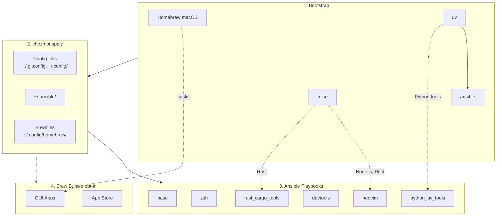

<!-- Generated by SpecStory, Markdown v2.1.0 -->

# 2026-03-30 03:36:28Z

<!-- Codex CLI Session 019d3ccf-237c-77e2-8478-26fe66f5db70 (2026-03-30 03:36:28Z) -->

_**User (2026-03-30 03:36:28Z)**_

```
chezmoi update --init

[INFO] Profile: macos
[INFO] Re-running ansible with tags: homebrew,base,zsh,starship,neovim,lazyvim_deps,devtools,docker,nerdfonts,security_tools,rust_cargo_tools,ruby_gem_tools,coding_agents,bitwarden,python_uv_tools,input_method,networking_tools

PLAY [macOS setup] ***************************************************************************************************************************************************************************************************

...


TASK [networking_tools : Install networking tools (macOS)] ***********************************************************************************************************************************************************
changed: [localhost]

TASK [networking_tools : Tap teamookla/speedtest] ********************************************************************************************************************************************************************
[ERROR]: Task failed: Module failed: added: 0, unchanged: 0, error: failed to tap: teamookla/speedtest due to ✔︎ JSON API cask.jws.json
✔︎ JSON API formula.jws.json
==> Tapping teamookla/speedtest
Cloning into '/opt/homebrew/Library/Taps/teamookla/homebrew-speedtest'...

This repository is configured for Git LFS but 'git-lfs' was not found on your path. If you no longer wish to use Git LFS, remove this hook by deleting the 'post-checkout' file in the hooks directory (set by 'core.hookspath'; usually '.git/hooks').

Error: Failure while executing; `git clone https://github.com/teamookla/homebrew-speedtest /opt/homebrew/Library/Taps/teamookla/homebrew-speedtest --origin=origin --template= --config core.fsmonitor=false` exited with 2.

Origin: /Users/daviddwlee84/.ansible/roles/networking_tools/tasks/main.yml:28:7

26   when: ansible_facts["os_family"] == "Darwin"
27   block:
28     - name: Tap teamookla/speedtest
         ^ column 7

fatal: [localhost]: FAILED! => {"changed": false, "msg": "added: 0, unchanged: 0, error: failed to tap: teamookla/speedtest due to ✔︎ JSON API cask.jws.json\n✔︎ JSON API formula.jws.json\n==> Tapping teamookla/speedtest\nCloning into '/opt/homebrew/Library/Taps/teamookla/homebrew-speedtest'...\n\nThis repository is configured for Git LFS but 'git-lfs' was not found on your path. If you no longer wish to use Git LFS, remove this hook by deleting the 'post-checkout' file in the hooks directory (set by 'core.hookspath'; usually '.git/hooks').\n\nError: Failure while executing; `git clone https://github.com/teamookla/homebrew-speedtest /opt/homebrew/Library/Taps/teamookla/homebrew-speedtest --origin=origin --template= --config core.fsmonitor=false` exited with 2.\n"}

PLAY RECAP ***********************************************************************************************************************************************************************************************************
localhost                  : ok=62   changed=2    unreachable=0    failed=1    skipped=335  rescued=0    ignored=0

chezmoi: 20_ansible_roles.sh: exit status 2
```

這是什麼問題？如何修正？


---

_**Agent (gpt-5.4 2026-03-30 03:38:21Z)**_

我先確認目前任務上下文與相關 role/task 定義，釐清這個失敗是環境問題、Homebrew tap 問題，還是 playbook 本身需要調整。

_**Agent (gpt-5.4 2026-03-30 03:38:21Z)**_

<tool-use data-tool-type="shell" data-tool-name="exec_command"><details>
<summary>Tool use: **exec_command** `td usage --new-session`</summary>
```
Command: /bin/zsh -lc 'td usage --new-session'
Chunk ID: 1f76ee
Wall time: 0.1686 seconds
Process exited with code 0
Original token count: 449
Output:
You have access to `td`, a local task management CLI.

NEW SESSION: ses_b0511b on branch: main (previous: ses_882ce9)
  You are a new context. You can now review issues implemented by the previous session.

CURRENT SESSION: ses_b0511b [codex_89076] on branch: main

WORKFLOW:

  1. `td start <id>` to begin work
     Multi-issue: `td ws start "name"` then `td ws tag <ids>`
  2. `td log "msg"` to track progress
     Multi-issue: `td ws log "msg"`
  3. `td handoff <id>` to capture state (REQUIRED)
     Multi-issue: `td ws handoff`
  4. `td review <id>` to submit for review
  5. Different session: `td approve <id>` to complete

  Use `td ws` commands when implementing multiple related issues.

KEY COMMANDS:
  td current              What you're working on
  td ws current           Current work session state
  td context <id>         Full context for resuming
  td next                 Highest priority open issue
  td critical-path        What unblocks the most work
  td reviewable           Issues you can review
  td approve/reject <id>  Complete review

IMPORTANT: You cannot approve issues you implemented.
  Exception: `td add "title" --minor` creates self-reviewable tasks.

WARNING: Do NOT use `td close` for completed work!
  Use `td review` -> `td approve` workflow instead.
  `td close` is for admin closures: duplicates, won't-fix, cleanup.

Use `td handoff` or `td ws handoff` before stopping work.

FOR LLMs: Run `td usage --new-session` at conversation start (or after /clear).
  Do NOT start a new session mid-work—sessions track implementers for review.
Use `td ws start` when implementing multiple issues to group handoffs.
  - session = identity (always exists)  |  ws = work container (optional)

TIP: Use `td usage -q` to hide these instructions after first read.
```
</details></tool-use>

_**Agent (gpt-5.4 2026-03-30 03:38:21Z)**_

<tool-use data-tool-type="shell" data-tool-name="exec_command"><details>
<summary>Tool use: **exec_command** `sed -n '1,220p' dot_ansible/roles/networking_tools/tasks/main.yml`</summary>
```
Command: /bin/zsh -lc "sed -n '1,220p' dot_ansible/roles/networking_tools/tasks/main.yml"
Chunk ID: 43bf30
Wall time: 0.0000 seconds
Process exited with code 0
Original token count: 1695
Output:
---
# Networking CLI tools role
# Tools: nmap, arp-scan, mtr, iperf3, doggo, httpie, gping, trippy, bandwhich, speedtest, rustscan

# =============================================================================
# macOS - all via Homebrew
# =============================================================================

- name: Install networking tools (macOS)
  when: ansible_facts["os_family"] == "Darwin"
  community.general.homebrew:
    name:
      - nmap
      - arp-scan
      - mtr
      - iperf3
      - doggo
      - httpie
      - gping
      - trippy
      - bandwhich
      - rustscan
    state: present

- name: Install Ookla Speedtest CLI (macOS)
  when: ansible_facts["os_family"] == "Darwin"
  block:
    - name: Tap teamookla/speedtest
      community.general.homebrew_tap:
        name: teamookla/speedtest
        state: present

    - name: Install speedtest
      community.general.homebrew:
        name: speedtest
        state: present

# =============================================================================
# Linux (Debian/Ubuntu)
# =============================================================================

# --- apt packages (system-level) ---
- name: Install networking tools from apt (Debian/Ubuntu)
  when: ansible_facts["os_family"] == "Debian"
  become: true
  tags: [sudo]
  ansible.builtin.apt:
    name:
      - nmap
      - arp-scan
      - mtr
      - iperf3
      - httpie
      - tcpdump
    state: present

# --- Architecture mapping for GitHub release downloads ---
- name: Set networking tools release architecture
  when: ansible_facts["os_family"] == "Debian"
  ansible.builtin.set_fact:
    net_arch_deb: >-
      {{
        'amd64' if ansible_facts['architecture'] in ['x86_64', 'amd64']
        else 'arm64' if ansible_facts['architecture'] in ['aarch64', 'arm64']
        else ansible_facts['architecture']
      }}

# --- doggo (modern DNS lookup) ---
- name: Check if doggo is installed
  when: ansible_facts["os_family"] == "Debian"
  ansible.builtin.command: doggo --version
  register: doggo_check
  changed_when: false
  failed_when: false

- name: Install doggo from GitHub releases (Debian/Ubuntu)
  when:
    - ansible_facts["os_family"] == "Debian"
    - doggo_check.rc != 0
  block:
    - name: Ensure ~/.local/bin exists (doggo)
      ansible.builtin.file:
        path: "{{ ansible_facts['env']['HOME'] }}/.local/bin"
        state: directory
        mode: '0755'

    - name: Get latest doggo release
      ansible.builtin.uri:
        url: https://api.github.com/repos/mr-karan/doggo/releases/latest
        return_content: true
      register: doggo_release

    - name: Set doggo version (strip v prefix)
      ansible.builtin.set_fact:
        doggo_version: "{{ doggo_release.json.tag_name | regex_replace('^v', '') }}"

    - name: Set doggo arch mapping
      ansible.builtin.set_fact:
        doggo_arch: >-
          {{
            'x86_64' if ansible_facts['architecture'] in ['x86_64', 'amd64']
            else 'arm64' if ansible_facts['architecture'] in ['aarch64', 'arm64']
            else ansible_facts['architecture']
          }}

    - name: Download doggo tarball
      ansible.builtin.get_url:
        url: "https://github.com/mr-karan/doggo/releases/download/{{ doggo_release.json.tag_name }}/doggo_{{ doggo_version }}_Linux_{{ doggo_arch }}.tar.gz"
        dest: /tmp/doggo.tar.gz
        mode: '0644'

    - name: Extract doggo
      ansible.builtin.unarchive:
        src: /tmp/doggo.tar.gz
        dest: /tmp
        remote_src: true

    - name: Install doggo to ~/.local/bin
      ansible.builtin.copy:
        src: /tmp/doggo
        dest: "{{ ansible_facts['env']['HOME'] }}/.local/bin/doggo"
        mode: '0755'
        remote_src: true

    - name: Clean up doggo temp files
      ansible.builtin.file:
        path: "{{ item }}"
        state: absent
      loop:
        - /tmp/doggo.tar.gz
        - /tmp/doggo
        - /tmp/LICENSE
        - /tmp/README.md

# --- gping (graphical ping) ---
- name: Check if gping is installed
  when: ansible_facts["os_family"] == "Debian"
  ansible.builtin.command: gping --version
  register: gping_check
  changed_when: false
  failed_when: false

- name: Install gping from GitHub releases (Debian/Ubuntu)
  when:
    - ansible_facts["os_family"] == "Debian"
    - gping_check.rc != 0
  block:
    - name: Ensure ~/.local/bin exists (gping)
      ansible.builtin.file:
        path: "{{ ansible_facts['env']['HOME'] }}/.local/bin"
        state: directory
        mode: '0755'

    - name: Set gping arch mapping
      ansible.builtin.set_fact:
        gping_arch: >-
          {{
            'x86_64' if ansible_facts['architecture'] in ['x86_64', 'amd64']
            else 'arm64' if ansible_facts['architecture'] in ['aarch64', 'arm64']
            el
... (truncated)
```
</details></tool-use>

_**Agent (gpt-5.4 2026-03-30 03:38:21Z)**_

<tool-use data-tool-type="shell" data-tool-name="exec_command"><details>
<summary>Tool use: **exec_command** `rg -n "teamookla|speedtest|git-lfs" -S .`</summary>
```
Command: /bin/zsh -lc 'rg -n "teamookla|speedtest|git-lfs" -S .'
Chunk ID: 902b60
Wall time: 0.0000 seconds
Process exited with code 0
Original token count: 882
Output:
./CLAUDE.md:142:| `networking_tools` | Networking CLI tools: nmap, arp-scan, mtr, iperf3, doggo, httpie, gping, trippy, bandwhich, speedtest, rustscan |
./dot_gitconfig.tmpl:7:	clean = git-lfs clean -- %f
./dot_gitconfig.tmpl:8:	smudge = git-lfs smudge -- %f
./dot_gitconfig.tmpl:9:	process = git-lfs filter-process
./README.md:126:- **Networking tools** (optional): nmap, arp-scan, mtr, iperf3, doggo, httpie, gping, trippy, bandwhich, speedtest, rustscan
./dot_ansible/roles/networking_tools/tasks/main.yml:3:# Tools: nmap, arp-scan, mtr, iperf3, doggo, httpie, gping, trippy, bandwhich, speedtest, rustscan
./dot_ansible/roles/networking_tools/tasks/main.yml:25:- name: Install Ookla Speedtest CLI (macOS)
./dot_ansible/roles/networking_tools/tasks/main.yml:28:    - name: Tap teamookla/speedtest
./dot_ansible/roles/networking_tools/tasks/main.yml:30:        name: teamookla/speedtest
./dot_ansible/roles/networking_tools/tasks/main.yml:33:    - name: Install speedtest
./dot_ansible/roles/networking_tools/tasks/main.yml:35:        name: speedtest
./dot_ansible/roles/networking_tools/tasks/main.yml:319:# --- Ookla Speedtest CLI ---
./dot_ansible/roles/networking_tools/tasks/main.yml:320:- name: Check if speedtest is installed
./dot_ansible/roles/networking_tools/tasks/main.yml:322:  ansible.builtin.command: speedtest --version
./dot_ansible/roles/networking_tools/tasks/main.yml:323:  register: speedtest_check
./dot_ansible/roles/networking_tools/tasks/main.yml:327:- name: Install Ookla Speedtest CLI (Debian/Ubuntu)
./dot_ansible/roles/networking_tools/tasks/main.yml:330:    - speedtest_check.rc != 0
./dot_ansible/roles/networking_tools/tasks/main.yml:332:    - name: Ensure ~/.local/bin exists (speedtest)
./dot_ansible/roles/networking_tools/tasks/main.yml:338:    - name: Set speedtest arch mapping
./dot_ansible/roles/networking_tools/tasks/main.yml:340:        speedtest_arch: >-
./dot_ansible/roles/networking_tools/tasks/main.yml:347:    - name: Download Ookla Speedtest CLI
./dot_ansible/roles/networking_tools/tasks/main.yml:349:        url: "https://install.speedtest.net/app/cli/ookla-speedtest-1.2.0-linux-{{ speedtest_arch }}.tgz"
./dot_ansible/roles/networking_tools/tasks/main.yml:350:        dest: /tmp/speedtest.tgz
./dot_ansible/roles/networking_tools/tasks/main.yml:353:    - name: Extract speedtest
./dot_ansible/roles/networking_tools/tasks/main.yml:355:        src: /tmp/speedtest.tgz
./dot_ansible/roles/networking_tools/tasks/main.yml:359:    - name: Install speedtest to ~/.local/bin
./dot_ansible/roles/networking_tools/tasks/main.yml:361:        src: /tmp/speedtest
./dot_ansible/roles/networking_tools/tasks/main.yml:362:        dest: "{{ ansible_facts['env']['HOME'] }}/.local/bin/speedtest"
./dot_ansible/roles/networking_tools/tasks/main.yml:366:    - name: Clean up speedtest temp files
./dot_ansible/roles/networking_tools/tasks/main.yml:371:        - /tmp/speedtest.tgz
./dot_ansible/roles/networking_tools/tasks/main.yml:372:        - /tmp/speedtest
./dot_ansible/roles/networking_tools/tasks/main.yml:373:        - /tmp/speedtest.md
./dot_ansible/roles/networking_tools/tasks/main.yml:374:        - /tmp/speedtest.5
./dot_config/zsh/tools/50_networking.zsh:56:# --- speedtest (Ookla CLI) ---
./dot_config/zsh/tools/50_networking.zsh:57:# speedtest is already short enough, no alias needed
./docs/tools/networking.md:18:| [Ookla Speedtest](https://www.speedtest.net/apps/cli) | `speedtest` | Official Ookla internet speed test | No |
./docs/tools/networking.md:101:speedtest
```
</details></tool-use>

_**Agent (gpt-5.4 2026-03-30 03:38:34Z)**_

目前 task 定義很直接：macOS role 先 tap `teamookla/speedtest` 再裝 `speedtest`。我接著確認本機 `brew` / `git-lfs` 的實際狀態，判斷是單純缺依賴，還是 tap 流程本身該改。

_**Agent (gpt-5.4 2026-03-30 03:38:34Z)**_

<tool-use data-tool-type="shell" data-tool-name="exec_command"><details>
<summary>Tool use: **exec_command** `td usage -q`</summary>
```
Command: /bin/zsh -lc 'td usage -q'
Chunk ID: 5073af
Wall time: 0.0833 seconds
Process exited with code 0
Original token count: 62
Output:
You have access to `td`, a local task management CLI.

CURRENT SESSION: ses_b0511b [codex_89076] on branch: main

FOCUSED ISSUE: td-8991c5 "Add ghget zsh helper" [in_progress]

IN PROGRESS (1 issues):
  td-8991c5 "Add ghget zsh helper" P2 task
```
</details></tool-use>

_**Agent (gpt-5.4 2026-03-30 03:38:34Z)**_

<tool-use data-tool-type="shell" data-tool-name="exec_command"><details>
<summary>Tool use: **exec_command** `git lfs version`</summary>
```
Command: /bin/zsh -lc 'git lfs version'
Chunk ID: e38f93
Wall time: 0.1077 seconds
Process exited with code 0
Original token count: 12
Output:
git-lfs/3.7.1 (GitHub; darwin arm64; go 1.25.3)
```
</details></tool-use>

_**Agent (gpt-5.4 2026-03-30 03:38:34Z)**_

<tool-use data-tool-type="shell" data-tool-name="exec_command"><details>
<summary>Tool use: **exec_command** `brew search speedtest`</summary>
```
Command: /bin/zsh -lc 'brew search speedtest'
Chunk ID: 5d2044
Wall time: 1.0017 seconds
Process running with session ID 59976
Original token count: 0
Output:
```
</details></tool-use>

_**Agent (gpt-5.4 2026-03-30 03:38:34Z)**_

<tool-use data-tool-type="shell" data-tool-name="exec_command"><details>
<summary>Tool use: **exec_command** `brew info speedtest`</summary>
```
Command: /bin/zsh -lc 'brew info speedtest'
Chunk ID: 3f5310
Wall time: 1.0024 seconds
Process running with session ID 61471
Original token count: 0
Output:
```
</details></tool-use>

_**Agent (gpt-5.4 2026-03-30 03:38:47Z)**_

<tool-use data-tool-type="unknown" data-tool-name="write_stdin"><details>
<summary>Tool use: **write_stdin**</summary>
```
Command: /bin/zsh -lc 'brew search speedtest'
Chunk ID: 79c9c5
Wall time: 0.0522 seconds
Process exited with code 0
Original token count: 9
Output:
speedtest-cli
speedread

speedify
```
</details></tool-use>

_**Agent (gpt-5.4 2026-03-30 03:38:47Z)**_

<tool-use data-tool-type="unknown" data-tool-name="write_stdin"><details>
<summary>Tool use: **write_stdin**</summary>
```
Command: /bin/zsh -lc 'brew info speedtest'
Chunk ID: 5ad5f6
Wall time: 0.0515 seconds
Process exited with code 1
Original token count: 20
Output:
Error: No available formula with the name "speedtest". Did you mean speedread?
```
</details></tool-use>

_**Agent (gpt-5.4 2026-03-30 03:38:58Z)**_

本機現在其實有 `git-lfs`，但 `brew search/info` 顯示 `speedtest` 不是 core formula，確實必須靠 `teamookla/speedtest` tap。下一步我確認 ansible tag 順序與 `git-lfs` 是否在這次執行前就應該存在，因為錯誤更像是 ansible 執行環境的 PATH / 前置依賴問題。

_**Agent (gpt-5.4 2026-03-30 03:38:59Z)**_

<tool-use data-tool-type="shell" data-tool-name="exec_command"><details>
<summary>Tool use: **exec_command** `rg -n "git-lfs|lfs" dot_ansible -S`</summary>
```
Command: /bin/zsh -lc 'rg -n "git-lfs|lfs" dot_ansible -S'
Chunk ID: cb550f
Wall time: 0.0426 seconds
Process exited with code 1
Original token count: 0
Output:
```
</details></tool-use>

_**Agent (gpt-5.4 2026-03-30 03:38:59Z)**_

<tool-use data-tool-type="shell" data-tool-name="exec_command"><details>
<summary>Tool use: **exec_command** `rg -n "networking_tools|coding_agents|security_tools|base|homebrew" dot_ansible/playbooks dot_ansible/roles -S`</summary>
```
Command: /bin/zsh -lc 'rg -n "networking_tools|coding_agents|security_tools|base|homebrew" dot_ansible/playbooks dot_ansible/roles -S'
Chunk ID: 6072e8
Wall time: 0.0422 seconds
Process exited with code 0
Original token count: 2533
Output:
dot_ansible/roles/base/tasks/main.yml:2:# Base role - essential tools across platforms
dot_ansible/roles/base/tasks/main.yml:4:- name: Install base packages (macOS)
dot_ansible/roles/base/tasks/main.yml:6:  community.general.homebrew:
dot_ansible/roles/base/tasks/main.yml:18:- name: Install base packages (Debian/Ubuntu)
dot_ansible/roles/input_method/tasks/main.yml:3:# macOS: McBopomofo + Squirrel (RIME) via Homebrew cask
dot_ansible/roles/input_method/tasks/main.yml:16:- name: Install McBopomofo via Homebrew cask (macOS)
dot_ansible/roles/input_method/tasks/main.yml:20:  community.general.homebrew_cask:
dot_ansible/roles/input_method/tasks/main.yml:34:- name: Install Squirrel (RIME) via Homebrew cask (macOS)
dot_ansible/roles/input_method/tasks/main.yml:38:  community.general.homebrew_cask:
dot_ansible/roles/ruby_gem_tools/tasks/main.yml:32:    mise_bin: "{{ mise_user_install.stat.exists | ternary(ansible_facts['env']['HOME'] + '/.local/bin/mise', '/opt/homebrew/bin/mise' if ansible_facts['os_family'] == 'Darwin' else '/usr/local/bin/mise') }}"
dot_ansible/roles/ruby_gem_tools/tasks/main.yml:39:    PATH: "{{ ansible_facts['env']['HOME'] }}/.local/bin:/opt/homebrew/bin:/usr/local/bin:{{ ansible_facts['env']['PATH'] }}"
dot_ansible/roles/zsh/tasks/main.yml:7:  community.general.homebrew:
dot_ansible/roles/rust_cargo_tools/tasks/main.yml:16:    mise_bin: "{{ mise_user_install.stat.exists | ternary(ansible_facts['env']['HOME'] + '/.local/bin/mise', '/opt/homebrew/bin/mise' if ansible_facts['os_family'] == 'Darwin' else '/usr/local/bin/mise') }}"
dot_ansible/roles/rust_cargo_tools/tasks/main.yml:23:    PATH: "{{ ansible_facts['env']['HOME'] }}/.local/bin:/opt/homebrew/bin:/usr/local/bin:{{ ansible_facts['env']['PATH'] }}"
dot_ansible/roles/rust_cargo_tools/tasks/main.yml:40:# Pueue - macOS (via Homebrew)
dot_ansible/roles/rust_cargo_tools/tasks/main.yml:43:- name: Install pueue via Homebrew (macOS)
dot_ansible/roles/rust_cargo_tools/tasks/main.yml:45:  community.general.homebrew:
dot_ansible/roles/homebrew/tasks/main.yml:2:# Homebrew role - macOS package manager
dot_ansible/roles/homebrew/tasks/main.yml:3:# NOTE: Homebrew installation is handled by bootstrap script (run_once_before_00)
dot_ansible/roles/homebrew/tasks/main.yml:4:# This role only updates Homebrew if already installed
dot_ansible/roles/homebrew/tasks/main.yml:6:- name: Check if Homebrew is installed (Apple Silicon)
dot_ansible/roles/homebrew/tasks/main.yml:8:    path: /opt/homebrew/bin/brew
dot_ansible/roles/homebrew/tasks/main.yml:9:  register: homebrew_arm
dot_ansible/roles/homebrew/tasks/main.yml:11:- name: Check if Homebrew is installed (Intel)
dot_ansible/roles/homebrew/tasks/main.yml:14:  register: homebrew_intel
dot_ansible/roles/homebrew/tasks/main.yml:16:- name: Set Homebrew installed fact
dot_ansible/roles/homebrew/tasks/main.yml:18:    homebrew_installed: "{{ homebrew_arm.stat.exists or homebrew_intel.stat.exists }}"
dot_ansible/roles/homebrew/tasks/main.yml:20:- name: Skip if Homebrew not installed
dot_ansible/roles/homebrew/tasks/main.yml:21:  when: not homebrew_installed
dot_ansible/roles/homebrew/tasks/main.yml:23:    msg: "Homebrew not installed. It should be installed by bootstrap script."
dot_ansible/roles/homebrew/tasks/main.yml:25:- name: Update Homebrew
dot_ansible/roles/homebrew/tasks/main.yml:26:  when: homebrew_installed
dot_ansible/roles/homebrew/tasks/main.yml:27:  community.general.homebrew:
dot_ansible/roles/homebrew/tasks/main.yml:28:    update_homebrew: true
dot_ansible/roles/homebrew/tasks/main.yml:31:- name: Clean up stale Homebrew versions and links
dot_ansible/roles/homebrew/tasks/main.yml:32:  when: homebrew_installed
dot_ansible/roles/bitwarden/defaults/main.yml:7:# Only meaningful on ubuntu_desktop (snap/deb) and macOS (homebrew cask)
dot_ansible/playbooks/base.yml:2:# Base playbook - cross-platform essentials
dot_ansible/playbooks/base.yml:3:- name: Base setup
dot_ansible/playbooks/base.yml:8:    - role: base
dot_ansible/playbooks/base.yml:9:      tags: [base]
dot_ansible/playbooks/macos.yml:2:# macOS playbook - Homebrew-based setup
dot_ansible/playbooks/macos.yml:8:    - role: homebrew
dot_ansible/playbooks/macos.yml:9:      tags: [homebrew]
dot_ansible/playbooks/macos.yml:11:    - role: base
dot_ansible/playbooks/macos.yml:12:      tags: [base]
dot_ansible/playbooks/macos.yml:35:    - role: coding_agents
dot_ansible/playbooks/macos.yml:36:      tags: [coding_agents]
dot_ansible/playbooks/macos.yml:41:    - role: security_tools
dot_ansible/playbooks/macos.yml:42:      tags: [security_tools]
dot_ansible/playbooks/macos.yml:56:    - role: networking_tools
dot_ansible/playbooks/macos.yml:57:      tags: [networking_tools]
dot_ansible/roles/security_tools/tasks/main.yml:4:# mac
... (truncated)
```
</details></tool-use>

_**Agent (gpt-5.4 2026-03-30 03:38:59Z)**_

<tool-use data-tool-type="shell" data-tool-name="exec_command"><details>
<summary>Tool use: **exec_command** `sed -n '1,240p' dot_ansible/playbooks/macos.yml`</summary>
```
Command: /bin/zsh -lc "sed -n '1,240p' dot_ansible/playbooks/macos.yml"
Chunk ID: 0b1d92
Wall time: 0.0000 seconds
Process exited with code 0
Original token count: 268
Output:
---
# macOS playbook - Homebrew-based setup
- name: macOS setup
  hosts: local
  gather_facts: true

  roles:
    - role: homebrew
      tags: [homebrew]

    - role: base
      tags: [base]

    - role: zsh
      tags: [zsh]

    - role: starship
      tags: [starship]

    - role: neovim
      tags: [neovim]

    - role: lazyvim_deps
      tags: [lazyvim_deps]

    - role: devtools
      tags: [devtools]

    - role: docker
      tags: [docker]

    - role: nerdfonts
      tags: [nerdfonts]

    - role: coding_agents
      tags: [coding_agents]

    - role: bitwarden
      tags: [bitwarden]

    - role: security_tools
      tags: [security_tools]

    - role: python_uv_tools
      tags: [python_uv_tools]

    - role: rust_cargo_tools
      tags: [rust_cargo_tools]

    - role: ruby_gem_tools
      tags: [ruby_gem_tools]

    - role: input_method
      tags: [input_method]

    - role: networking_tools
      tags: [networking_tools]

    # Note: brew_bundle is now managed by chezmoi run_onchange script
    # See run_onchange_after_30_brew_bundle.sh.tmpl
```
</details></tool-use>

_**Agent (gpt-5.4 2026-03-30 03:39:26Z)**_

本機有 `git-lfs`，所以使用者那次失敗不太像「系統沒裝」，更像是 Ansible/chezmoi 執行當下找不到 `git-lfs` 可執行檔，或這個 tap 對 `git-lfs` 有隱性依賴但 playbook 沒先保證它存在。我再確認 tap repo 本身的設定與目前 PATH 會怎麼解析。

_**Agent (gpt-5.4 2026-03-30 03:39:26Z)**_

<tool-use data-tool-type="shell" data-tool-name="exec_command"><details>
<summary>Tool use: **exec_command** `which git-lfs && echo "$PATH"`</summary>
```
Command: /bin/zsh -lc 'which git-lfs && echo "$PATH"'
Chunk ID: 4629e5
Wall time: 0.0000 seconds
Process exited with code 0
Original token count: 293
Output:
/opt/homebrew/bin/git-lfs
/Users/daviddwlee84/.codex/tmp/arg0/codex-arg0hTERcy:/Users/daviddwlee84/.fzf/bin:/Users/daviddwlee84/.cargo/bin:/Users/daviddwlee84/.local/share/mise/installs/node/24.13.0/bin:/Users/daviddwlee84/.local/share/mise/installs/bun/1.3.8/bin:/Users/daviddwlee84/.cargo/bin:/Users/daviddwlee84/.local/share/mise/installs/ruby/3.4.8/bin:/Users/daviddwlee84/.foundry/bin:/Users/daviddwlee84/Library/pnpm:/Users/daviddwlee84/.bun/bin:/opt/homebrew/opt/go/bin:/Users/daviddwlee84/go/bin:/Users/daviddwlee84/.foundry/bin:/Users/daviddwlee84/Library/pnpm:/Users/daviddwlee84/.bun/bin:/opt/homebrew/opt/go/bin:/Users/daviddwlee84/go/bin:/opt/homebrew/bin:/opt/homebrew/sbin:/Users/daviddwlee84/bin:/Users/daviddwlee84/.local/bin:/usr/local/bin:/System/Cryptexes/App/usr/bin:/usr/bin:/bin:/usr/sbin:/sbin:/var/run/com.apple.security.cryptexd/codex.system/bootstrap/usr/local/bin:/var/run/com.apple.security.cryptexd/codex.system/bootstrap/usr/bin:/var/run/com.apple.security.cryptexd/codex.system/bootstrap/usr/appleinternal/bin:/opt/pmk/env/global/bin:/Library/TeX/texbin:/usr/local/share/dotnet:~/.dotnet/tools:/Applications/Codex.app/Contents/Resources
```
</details></tool-use>

_**Agent (gpt-5.4 2026-03-30 03:39:26Z)**_

<tool-use data-tool-type="shell" data-tool-name="exec_command"><details>
<summary>Tool use: **exec_command** `rm -rf /tmp/homebrew-speedtest-inspect && git clone --depth 1 https://github.com/teamookla/homebrew-speedtest /tmp/homebrew-speedtest-inspect && ls -la /tmp/homebrew-speedtest-inspect && sed -n '1,120p' /tmp/homebrew-speedtest-inspect/.gitattributes && sed -n '1,120p' /tmp/homebrew-speedtest-inspect/speedtest.rb`</summary>
```
Command: /bin/zsh -lc "rm -rf /tmp/homebrew-speedtest-inspect && git clone --depth 1 https://github.com/teamookla/homebrew-speedtest /tmp/homebrew-speedtest-inspect && ls -la /tmp/homebrew-speedtest-inspect && sed -n '1,120p' /tmp/homebrew-speedtest-inspect/.gitattributes && sed -n '1,120p' /tmp/homebrew-speedtest-inspect/speedtest.rb"
Chunk ID: df72ec
Wall time: 1.0020 seconds
Process running with session ID 61706
Original token count: 13
Output:
Cloning into '/tmp/homebrew-speedtest-inspect'...
```
</details></tool-use>

_**Agent (gpt-5.4 2026-03-30 03:39:26Z)**_

<tool-use data-tool-type="shell" data-tool-name="exec_command"><details>
<summary>Tool use: **exec_command** `sed -n '1,220p' dot_ansible/roles/base/tasks/main.yml`</summary>
```
Command: /bin/zsh -lc "sed -n '1,220p' dot_ansible/roles/base/tasks/main.yml"
Chunk ID: 1a1cee
Wall time: 0.0000 seconds
Process exited with code 0
Original token count: 1680
Output:
---
# Base role - essential tools across platforms

- name: Install base packages (macOS)
  when: ansible_facts["os_family"] == "Darwin"
  community.general.homebrew:
    name:
      - git
      - curl
      - wget
      - ripgrep
      - fd
      - jq
      - tree
      - just
    state: present

- name: Install base packages (Debian/Ubuntu)
  when: ansible_facts["os_family"] == "Debian"
  become: true
  tags: [sudo]
  ansible.builtin.apt:
    name:
      - git
      - curl
      - wget
      - ripgrep
      - fd-find
      - jq
      - tree
      - build-essential
    state: present
    update_cache: true
    cache_valid_time: 3600

- name: Create fd symlink on Debian/Ubuntu
  when: ansible_facts["os_family"] == "Debian"
  become: true
  tags: [sudo]
  ansible.builtin.file:
    src: /usr/bin/fdfind
    dest: /usr/bin/fd
    state: link
  ignore_errors: true

# --- ripgrep (user-level fallback) ---
- name: Re-check if ripgrep is installed
  when: ansible_facts["os_family"] == "Debian"
  ansible.builtin.shell: command -v rg
  register: rg_recheck
  changed_when: false
  failed_when: false

- name: Install ripgrep from GitHub releases (user-level, no sudo)
  when:
    - ansible_facts["os_family"] == "Debian"
    - rg_recheck.rc != 0
  block:
    - name: Ensure ~/.local/bin exists (ripgrep)
      ansible.builtin.file:
        path: "{{ ansible_facts['env']['HOME'] }}/.local/bin"
        state: directory
        mode: '0755'

    - name: Get latest ripgrep release
      ansible.builtin.uri:
        url: https://api.github.com/repos/BurntSushi/ripgrep/releases/latest
        return_content: true
      register: rg_release

    - name: Download ripgrep binary
      ansible.builtin.get_url:
        url: "https://github.com/BurntSushi/ripgrep/releases/download/{{ rg_release.json.tag_name }}/ripgrep-{{ rg_release.json.tag_name }}-{{ ansible_facts['architecture'] }}-unknown-linux-musl.tar.gz"
        dest: /tmp/ripgrep.tar.gz
        mode: '0644'

    - name: Extract ripgrep
      ansible.builtin.unarchive:
        src: /tmp/ripgrep.tar.gz
        dest: /tmp
        remote_src: true

    - name: Install ripgrep to ~/.local/bin
      ansible.builtin.copy:
        src: "/tmp/ripgrep-{{ rg_release.json.tag_name }}-{{ ansible_facts['architecture'] }}-unknown-linux-musl/rg"
        dest: "{{ ansible_facts['env']['HOME'] }}/.local/bin/rg"
        mode: '0755'
        remote_src: true

    - name: Clean up ripgrep temp files
      ansible.builtin.file:
        path: "{{ item }}"
        state: absent
      loop:
        - /tmp/ripgrep.tar.gz
        - "/tmp/ripgrep-{{ rg_release.json.tag_name }}-{{ ansible_facts['architecture'] }}-unknown-linux-musl"

# --- fd (user-level fallback) ---
- name: Re-check if fd is installed
  when: ansible_facts["os_family"] == "Debian"
  ansible.builtin.shell: command -v fd
  register: fd_recheck
  changed_when: false
  failed_when: false

- name: Install fd from GitHub releases (user-level, no sudo)
  when:
    - ansible_facts["os_family"] == "Debian"
    - fd_recheck.rc != 0
  block:
    - name: Ensure ~/.local/bin exists (fd)
      ansible.builtin.file:
        path: "{{ ansible_facts['env']['HOME'] }}/.local/bin"
        state: directory
        mode: '0755'

    - name: Get latest fd release
      ansible.builtin.uri:
        url: https://api.github.com/repos/sharkdp/fd/releases/latest
        return_content: true
      register: fd_release

    - name: Download fd binary
      ansible.builtin.get_url:
        url: "https://github.com/sharkdp/fd/releases/download/{{ fd_release.json.tag_name }}/fd-{{ fd_release.json.tag_name }}-{{ ansible_facts['architecture'] }}-unknown-linux-gnu.tar.gz"
        dest: /tmp/fd.tar.gz
        mode: '0644'

    - name: Extract fd
      ansible.builtin.unarchive:
        src: /tmp/fd.tar.gz
        dest: /tmp
        remote_src: true

    - name: Install fd to ~/.local/bin
      ansible.builtin.copy:
        src: "/tmp/fd-{{ fd_release.json.tag_name }}-{{ ansible_facts['architecture'] }}-unknown-linux-gnu/fd"
        dest: "{{ ansible_facts['env']['HOME'] }}/.local/bin/fd"
        mode: '0755'
        remote_src: true

    - name: Clean up fd temp files
      ansible.builtin.file:
        path: "{{ item }}"
        state: absent
      loop:
        - /tmp/fd.tar.gz
        - "/tmp/fd-{{ fd_release.json.tag_name }}-{{ ansible_facts['architecture'] }}-unknown-linux-gnu"

# --- jq (user-level fallback) ---
- name: Re-check if jq is installed
  when: ansible_facts["os_family"] == "Debian"
  ansible.builtin.shell: command -v jq
  register: jq_recheck
  changed_when: false
  failed_when: false

- name: Install jq from GitHub releases (user-level, no sudo)
  when:
    - ansible_facts["os_family"] == "Debian"
    - jq_recheck.rc != 0
  block:
    - name: Ensure ~/.local/bin exists (jq)
... (truncated)
```
</details></tool-use>

_**Agent (gpt-5.4 2026-03-30 03:39:33Z)**_

<tool-use data-tool-type="unknown" data-tool-name="write_stdin"><details>
<summary>Tool use: **write_stdin**</summary>
```
Command: /bin/zsh -lc "rm -rf /tmp/homebrew-speedtest-inspect && git clone --depth 1 https://github.com/teamookla/homebrew-speedtest /tmp/homebrew-speedtest-inspect && ls -la /tmp/homebrew-speedtest-inspect && sed -n '1,120p' /tmp/homebrew-speedtest-inspect/.gitattributes && sed -n '1,120p' /tmp/homebrew-speedtest-inspect/speedtest.rb"
Chunk ID: 716494
Wall time: 0.0000 seconds
Process exited with code 1
Original token count: 97
Output:
total 16
drwxr-xr-x@  5 daviddwlee84  wheel  160 Mar 30 11:39 .
drwxrwxrwt  10 root          wheel  320 Mar 30 11:39 ..
drwxr-xr-x@ 14 daviddwlee84  wheel  448 Mar 30 11:39 .git
-rw-r--r--@  1 daviddwlee84  wheel  164 Mar 30 11:39 README.md
-rw-r--r--@  1 daviddwlee84  wheel  474 Mar 30 11:39 speedtest.rb
sed: /tmp/homebrew-speedtest-inspect/.gitattributes: No such file or directory
```
</details></tool-use>

_**Agent (gpt-5.4 2026-03-30 03:39:48Z)**_

tap repo 本身能 clone 下來，而且內容很小，代表不是 repository 壞掉；更像是 clone 過程中被某個 Git hook / LFS 初始化機制攔到。我要再看一次 clone 出來後的 Git 設定，確認是 repo 自己宣告 LFS，還是你全域 git 設定讓任何 clone 都會跑 `git-lfs`。

_**Agent (gpt-5.4 2026-03-30 03:39:48Z)**_

<tool-use data-tool-type="shell" data-tool-name="exec_command"><details>
<summary>Tool use: **exec_command** `git -C /tmp/homebrew-speedtest-inspect config --show-origin --get-regexp 'filter\\.lfs|core\\.hookspath|lfs'`</summary>
```
Command: /bin/zsh -lc "git -C /tmp/homebrew-speedtest-inspect config --show-origin --get-regexp 'filter\\\\.lfs|core\\\\.hookspath|lfs'"
Chunk ID: cd29e0
Wall time: 0.0000 seconds
Process exited with code 0
Original token count: 72
Output:
file:/Users/daviddwlee84/.gitconfig	filter.lfs.clean git-lfs clean -- %f
file:/Users/daviddwlee84/.gitconfig	filter.lfs.smudge git-lfs smudge -- %f
file:/Users/daviddwlee84/.gitconfig	filter.lfs.process git-lfs filter-process
file:/Users/daviddwlee84/.gitconfig	filter.lfs.required true
```
</details></tool-use>

_**Agent (gpt-5.4 2026-03-30 03:39:48Z)**_

<tool-use data-tool-type="shell" data-tool-name="exec_command"><details>
<summary>Tool use: **exec_command** `ls -la /tmp/homebrew-speedtest-inspect/.git/hooks && sed -n '1,120p' /tmp/homebrew-speedtest-inspect/.git/hooks/post-checkout`</summary>
```
Command: /bin/zsh -lc "ls -la /tmp/homebrew-speedtest-inspect/.git/hooks && sed -n '1,120p' /tmp/homebrew-speedtest-inspect/.git/hooks/post-checkout"
Chunk ID: 1ca676
Wall time: 0.0000 seconds
Process exited with code 1
Original token count: 315
Output:
total 128
drwxr-xr-x@ 16 daviddwlee84  wheel   512 Mar 30 11:39 .
drwxr-xr-x@ 14 daviddwlee84  wheel   448 Mar 30 11:39 ..
-rwxr-xr-x@  1 daviddwlee84  wheel   478 Mar 30 11:39 applypatch-msg.sample
-rwxr-xr-x@  1 daviddwlee84  wheel   896 Mar 30 11:39 commit-msg.sample
-rwxr-xr-x@  1 daviddwlee84  wheel  4726 Mar 30 11:39 fsmonitor-watchman.sample
-rwxr-xr-x@  1 daviddwlee84  wheel   189 Mar 30 11:39 post-update.sample
-rwxr-xr-x@  1 daviddwlee84  wheel   424 Mar 30 11:39 pre-applypatch.sample
-rwxr-xr-x@  1 daviddwlee84  wheel  1649 Mar 30 11:39 pre-commit.sample
-rwxr-xr-x@  1 daviddwlee84  wheel   416 Mar 30 11:39 pre-merge-commit.sample
-rwxr-xr-x@  1 daviddwlee84  wheel  1374 Mar 30 11:39 pre-push.sample
-rwxr-xr-x@  1 daviddwlee84  wheel  4898 Mar 30 11:39 pre-rebase.sample
-rwxr-xr-x@  1 daviddwlee84  wheel   544 Mar 30 11:39 pre-receive.sample
-rwxr-xr-x@  1 daviddwlee84  wheel  1492 Mar 30 11:39 prepare-commit-msg.sample
-rwxr-xr-x@  1 daviddwlee84  wheel  2783 Mar 30 11:39 push-to-checkout.sample
-rwxr-xr-x@  1 daviddwlee84  wheel  2308 Mar 30 11:39 sendemail-validate.sample
-rwxr-xr-x@  1 daviddwlee84  wheel  3650 Mar 30 11:39 update.sample
sed: /tmp/homebrew-speedtest-inspect/.git/hooks/post-checkout: No such file or directory
```
</details></tool-use>

_**Agent (gpt-5.4 2026-03-30 03:39:48Z)**_

<tool-use data-tool-type="shell" data-tool-name="exec_command"><details>
<summary>Tool use: **exec_command** `git -C /tmp/homebrew-speedtest-inspect check-attr -a -- README.md speedtest.rb`</summary>
```
Command: /bin/zsh -lc 'git -C /tmp/homebrew-speedtest-inspect check-attr -a -- README.md speedtest.rb'
Chunk ID: 1f9c2a
Wall time: 0.0000 seconds
Process exited with code 0
Original token count: 0
Output:
```
</details></tool-use>

_**Agent (gpt-5.4 2026-03-30 03:39:48Z)**_

<tool-use data-tool-type="shell" data-tool-name="exec_command"><details>
<summary>Tool use: **exec_command** `git config --global --show-origin --get-regexp 'filter\\.lfs|core\\.hookspath|lfs'`</summary>
```
Command: /bin/zsh -lc "git config --global --show-origin --get-regexp 'filter\\\\.lfs|core\\\\.hookspath|lfs'"
Chunk ID: d6d66e
Wall time: 0.0000 seconds
Process exited with code 0
Original token count: 72
Output:
file:/Users/daviddwlee84/.gitconfig	filter.lfs.clean git-lfs clean -- %f
file:/Users/daviddwlee84/.gitconfig	filter.lfs.smudge git-lfs smudge -- %f
file:/Users/daviddwlee84/.gitconfig	filter.lfs.process git-lfs filter-process
file:/Users/daviddwlee84/.gitconfig	filter.lfs.required true
```
</details></tool-use>

_**Agent (gpt-5.4 2026-03-30 03:40:25Z)**_

官方文件目前仍然要求 macOS 先 `brew tap teamookla/speedtest` 再 `brew install speedtest`，所以角色方向本身沒偏。現在最關鍵的是：`community.general.homebrew_tap` 執行 `brew tap` 時，為什麼能找到 `brew` 卻找不到 `/opt/homebrew/bin/git-lfs`。我看一下 module 可不可以顯式帶 PATH / brew prefix。

_**Agent (gpt-5.4 2026-03-30 03:40:26Z)**_

<tool-use data-tool-type="shell" data-tool-name="exec_command"><details>
<summary>Tool use: **exec_command** `ansible-doc community.general.homebrew_tap | sed -n '1,220p'`</summary>
```
Command: /bin/zsh -lc "ansible-doc community.general.homebrew_tap | sed -n '1,220p'"
Chunk ID: e8b8c6
Wall time: 0.8832 seconds
Process exited with code 0
Original token count: 516
Output:
> MODULE community.general.homebrew_tap (/Users/daviddwlee84/.ansible/collections/ansible_collections/community/general/plugins/modules/homebrew_tap.py)

  Tap external Homebrew repositories.

OPTIONS (= indicates it is required):

= name    The GitHub user/organization repository to tap.
        aliases: [tap]
        elements: str
        type: list

- path    A `:' separated list of paths to search for `brew'
           executable.
        default: /usr/local/bin:/opt/homebrew/bin:/home/linuxbrew/.linuxbrew/bin
        type: path

- state   State of the repository.
        choices: [present, absent]
        default: present
        type: str

- url     The optional git URL of the repository to tap. The URL is
           not assumed to be on GitHub, and the protocol does not have
           to be HTTP. Any location and protocol that git can handle
           is fine.
           `name' option may not be a list of multiple taps (but a
           single tap instead) when this option is provided.
        default: null
        type: str

ATTRIBUTES:

        `check_mode:`
        description: Can run in `check_mode' and return changed status prediction without
          modifying target.
        support: full

        `diff_mode:`
        description: Returns details on what has changed (or possibly needs changing in `check_mode'),
          when in diff mode.
        support: none

REQUIREMENTS:  homebrew


AUTHOR: Indrajit Raychaudhuri (@indrajitr), Daniel Jaouen (@danieljaouen)

EXAMPLES:
- name: Tap a Homebrew repository, state present
  community.general.homebrew_tap:
    name: homebrew/dupes

- name: Tap a Homebrew repository, state absent
  community.general.homebrew_tap:
    name: homebrew/dupes
    state: absent

- name: Tap a Homebrew repository, state present
  community.general.homebrew_tap:
    name: homebrew/dupes,homebrew/science
    state: present

- name: Tap a Homebrew repository using url, state present
  community.general.homebrew_tap:
    name: telemachus/brew
    url: 'https://bitbucket.org/telemachus/brew'
```
</details></tool-use>

_**Agent (gpt-5.4 2026-03-30 03:40:26Z)**_

<tool-use data-tool-type="shell" data-tool-name="exec_command"><details>
<summary>Tool use: **exec_command**</summary>
```bash
python3 - <<'PY'
import inspect
from ansible_collections.community.general.plugins.modules import homebrew_tap
print(inspect.getsource(homebrew_tap)[:12000])
PY
```
```
Command: /bin/zsh -lc "python3 - <<'PY'
import inspect
from ansible_collections.community.general.plugins.modules import homebrew_tap
print(inspect.getsource(homebrew_tap)[:12000])
PY"
Chunk ID: 9f9fd1
Wall time: 0.0416 seconds
Process exited with code 1
Original token count: 33
Output:
Traceback (most recent call last):
  File "<stdin>", line 2, in <module>
ModuleNotFoundError: No module named 'ansible_collections'
```
</details></tool-use>

_**Agent (gpt-5.4 2026-03-30 03:40:32Z)**_

<tool-use data-tool-type="shell" data-tool-name="exec_command"><details>
<summary>Tool use: **exec_command** `sed -n '1,260p' /Users/daviddwlee84/.ansible/collections/ansible_collections/community/general/plugins/modules/homebrew_tap.py`</summary>
```
Command: /bin/zsh -lc "sed -n '1,260p' /Users/daviddwlee84/.ansible/collections/ansible_collections/community/general/plugins/modules/homebrew_tap.py"
Chunk ID: c574a3
Wall time: 0.0000 seconds
Process exited with code 0
Original token count: 1775
Output:
#!/usr/bin/python

# Copyright (c) 2013, Daniel Jaouen <dcj24@cornell.edu>
# Copyright (c) 2016, Indrajit Raychaudhuri <irc+code@indrajit.com>
#
# Based on homebrew (Andrew Dunham <andrew@du.nham.ca>)
#
# GNU General Public License v3.0+ (see LICENSES/GPL-3.0-or-later.txt or https://www.gnu.org/licenses/gpl-3.0.txt)
# SPDX-License-Identifier: GPL-3.0-or-later

from __future__ import annotations

DOCUMENTATION = r"""
module: homebrew_tap
author:
  - "Indrajit Raychaudhuri (@indrajitr)"
  - "Daniel Jaouen (@danieljaouen)"
short_description: Tap a Homebrew repository
description:
  - Tap external Homebrew repositories.
extends_documentation_fragment:
  - community.general.attributes
attributes:
  check_mode:
    support: full
  diff_mode:
    support: none
options:
  name:
    description:
      - The GitHub user/organization repository to tap.
    required: true
    aliases: ['tap']
    type: list
    elements: str
  url:
    description:
      - The optional git URL of the repository to tap. The URL is not assumed to be on GitHub, and the protocol does not have
        to be HTTP. Any location and protocol that git can handle is fine.
      - O(name) option may not be a list of multiple taps (but a single tap instead) when this option is provided.
    type: str
  state:
    description:
      - State of the repository.
    choices: ['present', 'absent']
    default: 'present'
    type: str
  path:
    description:
      - A V(:) separated list of paths to search for C(brew) executable.
    default: '/usr/local/bin:/opt/homebrew/bin:/home/linuxbrew/.linuxbrew/bin'
    type: path
    version_added: '2.1.0'
requirements: [homebrew]
"""

EXAMPLES = r"""
- name: Tap a Homebrew repository, state present
  community.general.homebrew_tap:
    name: homebrew/dupes

- name: Tap a Homebrew repository, state absent
  community.general.homebrew_tap:
    name: homebrew/dupes
    state: absent

- name: Tap a Homebrew repository, state present
  community.general.homebrew_tap:
    name: homebrew/dupes,homebrew/science
    state: present

- name: Tap a Homebrew repository using url, state present
  community.general.homebrew_tap:
    name: telemachus/brew
    url: 'https://bitbucket.org/telemachus/brew'
"""

import re

from ansible.module_utils.basic import AnsibleModule


def a_valid_tap(tap):
    """Returns True if the tap is valid."""
    regex = re.compile(r"^([\w-]+)/(homebrew-)?([\w-]+)$")
    return regex.match(tap)


def already_tapped(module, brew_path, tap):
    """Returns True if already tapped."""

    rc, out, err = module.run_command(
        [
            brew_path,
            "tap",
        ]
    )

    taps = [tap_.strip().lower() for tap_ in out.split("\n") if tap_]
    tap_name = re.sub("homebrew-", "", tap.lower())

    return tap_name in taps


def add_tap(module, brew_path, tap, url=None):
    """Adds a single tap."""
    failed, changed, msg = False, False, ""

    if not a_valid_tap(tap):
        failed = True
        msg = f"not a valid tap: {tap}"

    elif not already_tapped(module, brew_path, tap):
        if module.check_mode:
            module.exit_json(changed=True)

        rc, out, err = module.run_command(
            [
                brew_path,
                "tap",
                tap,
                url,
            ]
        )
        if rc == 0:
            changed = True
            msg = f"successfully tapped: {tap}"
        else:
            failed = True
            msg = f"failed to tap: {tap} due to {err}"

    else:
        msg = f"already tapped: {tap}"

    return (failed, changed, msg)


def add_taps(module, brew_path, taps):
    """Adds one or more taps."""
    failed, changed, unchanged, added, msg = False, False, 0, 0, ""

    for tap in taps:
        (failed, changed, msg) = add_tap(module, brew_path, tap)
        if failed:
            break
        if changed:
            added += 1
        else:
            unchanged += 1

    if failed:
        msg = f"added: %d, unchanged: %d, error: {msg}"
        msg = msg % (added, unchanged)
    elif added:
        changed = True
        msg = f"added: {added}, unchanged: {unchanged}"
    else:
        msg = f"added: {added}, unchanged: {unchanged}"

    return (failed, changed, msg)


def remove_tap(module, brew_path, tap):
    """Removes a single tap."""
    failed, changed, msg = False, False, ""

    if not a_valid_tap(tap):
        failed = True
        msg = f"not a valid tap: {tap}"

    elif already_tapped(module, brew_path, tap):
        if module.check_mode:
            module.exit_json(changed=True)

        rc, out, err = module.run_command(
            [
                brew_path,
                "untap",
                tap,
            ]
        )
        if n
... (truncated)
```
</details></tool-use>

_**Agent (gpt-5.4 2026-03-30 03:40:43Z)**_

我已確認 `homebrew_tap` module 本身不會補 `PATH`，只是找到 `brew` 之後直接跑 `brew tap`。所以只要 ansible 進程的 `PATH` 沒有 `/opt/homebrew/bin`，`brew` 本身能執行，但它底下呼叫 `git-lfs` 還是會失敗。接著我看 chezmoi 的 ansible 啟動 script 是否有把 PATH 瘦身或固定掉。

_**Agent (gpt-5.4 2026-03-30 03:40:43Z)**_

<tool-use data-tool-type="shell" data-tool-name="exec_command"><details>
<summary>Tool use: **exec_command** `sed -n '1,240p' run_onchange_after_20_ansible_roles.sh.tmpl`</summary>
```
Command: /bin/zsh -lc "sed -n '1,240p' run_onchange_after_20_ansible_roles.sh.tmpl"
Chunk ID: f5caf0
Wall time: 0.0000 seconds
Process exited with code 0
Original token count: 1753
Output:
#!/bin/bash
# Re-run ansible when any role changes
# Triggers on changes to any role's tasks or defaults files
# Profile: {{ .profile }}

# === Role Hashes (changes trigger re-run) ===
# homebrew: {{ include "dot_ansible/roles/homebrew/tasks/main.yml" | sha256sum }}
# base: {{ include "dot_ansible/roles/base/tasks/main.yml" | sha256sum }}
# zsh tasks: {{ include "dot_ansible/roles/zsh/tasks/main.yml" | sha256sum }}
# zsh defaults: {{ include "dot_ansible/roles/zsh/defaults/main.yml" | sha256sum }}
# neovim tasks: {{ include "dot_ansible/roles/neovim/tasks/main.yml" | sha256sum }}
# neovim defaults: {{ include "dot_ansible/roles/neovim/defaults/main.yml" | sha256sum }}
# lazyvim_deps tasks: {{ include "dot_ansible/roles/lazyvim_deps/tasks/main.yml" | sha256sum }}
# lazyvim_deps defaults: {{ include "dot_ansible/roles/lazyvim_deps/defaults/main.yml" | sha256sum }}
# devtools: {{ include "dot_ansible/roles/devtools/tasks/main.yml" | sha256sum }}
# docker: {{ include "dot_ansible/roles/docker/tasks/main.yml" | sha256sum }}
# nerdfonts: {{ include "dot_ansible/roles/nerdfonts/tasks/main.yml" | sha256sum }}
# coding_agents tasks: {{ include "dot_ansible/roles/coding_agents/tasks/main.yml" | sha256sum }}
# coding_agents defaults: {{ include "dot_ansible/roles/coding_agents/defaults/main.yml" | sha256sum }}
# bitwarden tasks: {{ include "dot_ansible/roles/bitwarden/tasks/main.yml" | sha256sum }}
# bitwarden defaults: {{ include "dot_ansible/roles/bitwarden/defaults/main.yml" | sha256sum }}
# security_tools: {{ include "dot_ansible/roles/security_tools/tasks/main.yml" | sha256sum }}
# python_uv_tools tasks: {{ include "dot_ansible/roles/python_uv_tools/tasks/main.yml" | sha256sum }}
# python_uv_tools defaults: {{ include "dot_ansible/roles/python_uv_tools/defaults/main.yml" | sha256sum }}
# rust_cargo_tools tasks: {{ include "dot_ansible/roles/rust_cargo_tools/tasks/main.yml" | sha256sum }}
# rust_cargo_tools defaults: {{ include "dot_ansible/roles/rust_cargo_tools/defaults/main.yml" | sha256sum }}
# ruby_gem_tools tasks: {{ include "dot_ansible/roles/ruby_gem_tools/tasks/main.yml" | sha256sum }}
# ruby_gem_tools defaults: {{ include "dot_ansible/roles/ruby_gem_tools/defaults/main.yml" | sha256sum }}
# starship: {{ include "dot_ansible/roles/starship/tasks/main.yml" | sha256sum }}
# input_method: {{ include "dot_ansible/roles/input_method/tasks/main.yml" | sha256sum }}
# networking_tools: {{ include "dot_ansible/roles/networking_tools/tasks/main.yml" | sha256sum }}

set -e
export PATH="$HOME/.local/bin:$PATH"

# Colors
info() { echo -e "\033[0;34m[INFO]\033[0m $1"; }
success() { echo -e "\033[0;32m[SUCCESS]\033[0m $1"; }
warn() { echo -e "\033[1;33m[WARN]\033[0m $1"; }

ANSIBLE_DIR="$HOME/.ansible"
INVENTORY="$ANSIBLE_DIR/inventories/localhost.ini"

command -v ansible-playbook &> /dev/null || { warn "ansible-playbook not found"; exit 0; }

# === Profile-based tag selection ===
# Profile: {{ .profile }}
#
# Tag categories:
#   Core:    base, zsh, starship, neovim, lazyvim_deps, security_tools
#   Desktop: devtools, docker, nerdfonts
#   Server:  devtools, docker (no nerdfonts - no GUI)
#   macOS:   homebrew
#   Optional: coding_agents, bitwarden, python_uv_tools, rust_cargo_tools, ruby_gem_tools

{{ if or (eq .profile "macos") (eq .profile "macos_intel") -}}
PLAYBOOK="$ANSIBLE_DIR/playbooks/macos.yml"
# macOS: full desktop experience
TAGS="homebrew,base,zsh,starship,neovim,lazyvim_deps,devtools,docker,nerdfonts,security_tools,rust_cargo_tools,ruby_gem_tools"
{{ else if eq .profile "ubuntu_desktop" -}}
PLAYBOOK="$ANSIBLE_DIR/playbooks/linux.yml"
# Ubuntu Desktop: full desktop experience (no homebrew)
TAGS="base,zsh,starship,neovim,lazyvim_deps,devtools,docker,nerdfonts,security_tools,rust_cargo_tools,ruby_gem_tools"
{{ else if eq .profile "ubuntu_server" -}}
PLAYBOOK="$ANSIBLE_DIR/playbooks/linux.yml"
# Ubuntu Server: no GUI stuff (no nerdfonts)
TAGS="base,zsh,starship,neovim,lazyvim_deps,devtools,docker,security_tools,rust_cargo_tools,ruby_gem_tools"
{{ else -}}
warn "Unknown profile: {{ .profile }}"
exit 0
{{ end -}}

# Add optional tags based on chezmoi config
{{ if .installCodingAgents -}}
TAGS="${TAGS},coding_agents"
{{ end -}}
{{ $installBitwarden := false }}{{ if hasKey . "installBitwarden" }}{{ $installBitwarden = .installBitwarden }}{{ end -}}
{{ if $installBitwarden -}}
TAGS="${TAGS},bitwarden"
{{ end -}}
{{ if .installPythonUvTools -}}
TAGS="${TAGS},python_uv_tools"
{{ end -}}
{{ $installInputMethod := false }}{{ if hasKey . "installInputMethod" }}{{ $installInputMethod = .installInputMethod }}{{ end -}}
{{ if $installInputMethod -}}
TAGS="${TAGS},input_method"
{{ end -}}
{{ $installNetworkingTools := false }}{{ if hasKey . "installNetworkingTools" }}{{ $installNetworkingTools = .installNetworkingTools }}{{ end -}}
{{ if 
... (truncated)
```
</details></tool-use>

_**Agent (gpt-5.4 2026-03-30 03:40:43Z)**_

<tool-use data-tool-type="shell" data-tool-name="exec_command"><details>
<summary>Tool use: **exec_command** `rg -n "PATH=|export PATH|ansible-playbook|brew" run_once_before_00_bootstrap.sh.tmpl run_onchange_after_*.tmpl dot_ansible -S`</summary>
```
Command: /bin/zsh -lc 'rg -n "PATH=|export PATH|ansible-playbook|brew" run_once_before_00_bootstrap.sh.tmpl run_onchange_after_*.tmpl dot_ansible -S'
Chunk ID: fe61d5
Wall time: 0.0000 seconds
Process exited with code 0
Original token count: 5217
Output:
Total output lines: 215

run_once_before_00_bootstrap.sh.tmpl:2:# Bootstrap script - installs Homebrew, uv, ansible, mise, and galaxy collections
run_once_before_00_bootstrap.sh.tmpl:31:# Ensure PATH includes local bin and Homebrew
run_once_before_00_bootstrap.sh.tmpl:32:export PATH="$HOME/.local/bin:$PATH"
run_once_before_00_bootstrap.sh.tmpl:34:# Add Homebrew to PATH if installed
run_once_before_00_bootstrap.sh.tmpl:37:if [[ -f /opt/homebrew/bin/brew ]]; then
run_once_before_00_bootstrap.sh.tmpl:38:    eval "$(/opt/homebrew/bin/brew shellenv)"
run_once_before_00_bootstrap.sh.tmpl:39:elif [[ -f /usr/local/bin/brew ]]; then
run_once_before_00_bootstrap.sh.tmpl:40:    eval "$(/usr/local/bin/brew shellenv)"
run_once_before_00_bootstrap.sh.tmpl:43:# Linux: Linuxbrew paths
run_once_before_00_bootstrap.sh.tmpl:44:if [[ -d /home/linuxbrew/.linuxbrew ]]; then
run_once_before_00_bootstrap.sh.tmpl:45:    eval "$(/home/linuxbrew/.linuxbrew/bin/brew shellenv)"
run_once_before_00_bootstrap.sh.tmpl:46:elif [[ -d "$HOME/.linuxbrew" ]]; then
run_once_before_00_bootstrap.sh.tmpl:47:    eval "$("$HOME/.linuxbrew/bin/brew" shellenv)"
run_once_before_00_bootstrap.sh.tmpl:52:# 0. Homebrew Installation
run_once_before_00_bootstrap.sh.tmpl:54:# macOS: Always install Homebrew (required for ansible roles)
run_once_before_00_bootstrap.sh.tmpl:59:# macOS: Install Homebrew (required for package management)
run_once_before_00_bootstrap.sh.tmpl:60:if ! command -v brew &> /dev/null; then
run_once_before_00_bootstrap.sh.tmpl:61:    info "Installing Homebrew (macOS)..."
run_once_before_00_bootstrap.sh.tmpl:62:    NONINTERACTIVE=1 /bin/bash -c "$(curl -fsSL https://raw.githubusercontent.com/Homebrew/install/HEAD/install.sh)"
run_once_before_00_bootstrap.sh.tmpl:64:    if [[ -f /opt/homebrew/bin/brew ]]; then
run_once_before_00_bootstrap.sh.tmpl:65:        eval "$(/opt/homebrew/bin/brew shellenv)"
run_once_before_00_bootstrap.sh.tmpl:66:    elif [[ -f /usr/local/bin/brew ]]; then
run_once_before_00_bootstrap.sh.tmpl:67:        eval "$(/usr/local/bin/brew shellenv)"
run_once_before_00_bootstrap.sh.tmpl:69:    success "Homebrew installed successfully"
run_once_before_00_bootstrap.sh.tmpl:71:    info "Homebrew is already installed"
run_once_before_00_bootstrap.sh.tmpl:74:# Linux: Install Linuxbrew (useful for packages not available or outdated in apt)
run_once_before_00_bootstrap.sh.tmpl:77:# noRoot mode: Skip Linuxbrew (requires sudo for dependencies)
run_once_before_00_bootstrap.sh.tmpl:78:info "noRoot mode: Skipping Linuxbrew installation (requires sudo)"
run_once_before_00_bootstrap.sh.tmpl:80:if ! command -v brew &> /dev/null; then
run_once_before_00_bootstrap.sh.tmpl:81:    info "Installing Linuxbrew..."
run_once_before_00_bootstrap.sh.tmpl:82:    # Install Linuxbrew dependencies first
run_once_before_00_bootstrap.sh.tmpl:87:    # Install Linuxbrew
run_once_before_00_bootstrap.sh.tmpl:88:    NONINTERACTIVE=1 /bin/bash -c "$(curl -fsSL https://raw.githubusercontent.com/Homebrew/install/HEAD/install.sh)"
run_once_before_00_bootstrap.sh.tmpl:90:    if [[ -d /home/linuxbrew/.linuxbrew ]]; then
run_once_before_00_bootstrap.sh.tmpl:91:        eval "$(/home/linuxbrew/.linuxbrew/bin/brew shellenv)"
run_once_before_00_bootstrap.sh.tmpl:92:    elif [[ -d "$HOME/.linuxbrew" ]]; then
run_once_before_00_bootstrap.sh.tmpl:93:        eval "$("$HOME/.linuxbrew/bin/brew" shellenv)"
run_once_before_00_bootstrap.sh.tmpl:95:    success "Linuxbrew installed successfully"
run_once_before_00_bootstrap.sh.tmpl:97:    info "Linuxbrew is already installed"
run_once_before_00_bootstrap.sh.tmpl:140:if ! command -v ansible-playbook &> /dev/null; then
run_onchange_after_30_brew_bundle.sh.tmpl:2:# Run brew bundle when Brewfiles change
run_onchange_after_30_brew_bundle.sh.tmpl:15:# Brewfile: {{ include "dot_config/homebrew/Brewfile.tmpl" | sha256sum }}
run_onchange_after_30_brew_bundle.sh.tmpl:16:# Brewfile.darwin: {{ include "dot_config/homebrew/Brewfile.darwin.tmpl" | sha256sum }}
run_onchange_after_30_brew_bundle.sh.tmpl:19:# Brewfile: {{ include "dot_config/homebrew/Brewfile.tmpl" | sha256sum }}
run_onchange_after_30_brew_bundle.sh.tmpl:20:# Brewfile.linux: {{ include "dot_config/homebrew/Brewfile.linux.tmpl" | sha256sum }}
run_onchange_after_30_brew_bundle.sh.tmpl:37:# Setup Homebrew PATH
run_onchange_after_30_brew_bundle.sh.tmpl:39:if [[ -f /opt/homebrew/bin/brew ]]; then
run_onchange_after_30_brew_bundle.sh.tmpl:40:    eval "$(/opt/homebrew/bin/brew shellenv)"
run_onchange_after_30_brew_bundle.sh.tmpl:41:elif [[ -f /usr/local/bin/brew ]]; then
run_onchange_after_30_brew_bundle.sh.tmpl:42:    eval "$(/usr/local/bin/brew shellenv)"
run_onchange_after_30_brew_bundle.sh.tmpl:45:# Linuxbrew
run_onchange_after_30_brew
... (truncated)
```
</details></tool-use>

_**Agent (gpt-5.4 2026-03-30 03:40:43Z)**_

<tool-use data-tool-type="shell" data-tool-name="exec_command"><details>
<summary>Tool use: **exec_command** `sed -n '1,220p' dot_ansible/ansible.cfg`</summary>
```
Command: /bin/zsh -lc "sed -n '1,220p' dot_ansible/ansible.cfg"
Chunk ID: fce38b
Wall time: 0.0000 seconds
Process exited with code 0
Original token count: 64
Output:
[defaults]
roles_path = ./roles
inventory = ./inventories/localhost.ini
host_key_checking = False
# Silence deprecation warning - use ansible_facts['var'] instead of ansible_var
inject_facts_as_vars = False

[privilege_escalation]
become_ask_pass = False
```
</details></tool-use>

_**Agent (gpt-5.4 2026-03-30 03:41:02Z)**_

chezmoi 的 ansible wrapper 現在只做 `export PATH="$HOME/.local/bin:$PATH"`，沒有像 bootstrap / brew bundle script 那樣 `eval "$(brew shellenv)"`。如果使用者是從一個不含 `/opt/homebrew/bin` 的環境觸發 `chezmoi update --init`，這就完全符合錯誤症狀。我要做最後一個驗證：在刻意拿掉 `/opt/homebrew/bin` 的 PATH 下重跑 clone，看能不能重現同樣的 `git-lfs` 失敗。

_**Agent (gpt-5.4 2026-03-30 03:41:02Z)**_

<tool-use data-tool-type="shell" data-tool-name="exec_command"><details>
<summary>Tool use: **exec_command** `rm -rf /tmp/homebrew-speedtest-no-lfs && env PATH=/usr/bin:/bin HOME=$HOME git clone --depth 1 https://github.com/teamookla/homebrew-speedtest /tmp/homebrew-speedtest-no-lfs`</summary>
```
Command: /bin/zsh -lc 'rm -rf /tmp/homebrew-speedtest-no-lfs && env PATH=/usr/bin:/bin HOME=$HOME git clone --depth 1 https://github.com/teamookla/homebrew-speedtest /tmp/homebrew-speedtest-no-lfs'
Chunk ID: c8145d
Wall time: 1.0023 seconds
Process running with session ID 44064
Original token count: 13
Output:
Cloning into '/tmp/homebrew-speedtest-no-lfs'...
```
</details></tool-use>

_**Agent (gpt-5.4 2026-03-30 03:41:02Z)**_

<tool-use data-tool-type="shell" data-tool-name="exec_command"><details>
<summary>Tool use: **exec_command** `env PATH=/usr/bin:/bin HOME=$HOME git config --global --get-regexp 'filter\\.lfs|core\\.hookspath|lfs'`</summary>
```
Command: /bin/zsh -lc 'env PATH=/usr/bin:/bin HOME=$HOME git config --global --get-regexp '"'filter\\\\.lfs|core\\\\.hookspath|lfs'"
Chunk ID: 80359f
Wall time: 0.0000 seconds
Process exited with code 0
Original token count: 36
Output:
filter.lfs.clean git-lfs clean -- %f
filter.lfs.smudge git-lfs smudge -- %f
filter.lfs.process git-lfs filter-process
filter.lfs.required true
```
</details></tool-use>

_**Agent (gpt-5.4 2026-03-30 03:41:09Z)**_

<tool-use data-tool-type="unknown" data-tool-name="write_stdin"><details>
<summary>Tool use: **write_stdin**</summary>
```
Command: /bin/zsh -lc 'rm -rf /tmp/homebrew-speedtest-no-lfs && env PATH=/usr/bin:/bin HOME=$HOME git clone --depth 1 https://github.com/teamookla/homebrew-speedtest /tmp/homebrew-speedtest-no-lfs'
Chunk ID: ab4a45
Wall time: 0.0000 seconds
Process exited with code 2
Original token count: 63
Output:

This repository is configured for Git LFS but 'git-lfs' was not found on your path. If you no longer wish to use Git LFS, remove this hook by deleting the 'post-checkout' file in the hooks directory (set by 'core.hookspath'; usually '.git/hooks').
```
</details></tool-use>

_**Agent (gpt-5.4 2026-03-30 03:41:28Z)**_

原因已經重現了：只要 `PATH` 不含 `/opt/homebrew/bin`，但全域 Git 設定又啟用了 `filter.lfs.*`，`git clone` 就會直接報出你看到的那段錯誤。這不是 `speedtest` 公式本身壞掉，而是 `brew tap` 內部 clone tap repo 時，找不到 `git-lfs`。我再看一下 repo 自己的 Git 設定模板，確認是不是應該順手把 `git-lfs` 納入 base 依賴。

_**Agent (gpt-5.4 2026-03-30 03:41:28Z)**_

<tool-use data-tool-type="shell" data-tool-name="exec_command"><details>
<summary>Tool use: **exec_command** `sed -n '1,160p' dot_gitconfig.tmpl`</summary>
```
Command: /bin/zsh -lc "sed -n '1,160p' dot_gitconfig.tmpl"
Chunk ID: bbe773
Wall time: 0.0000 seconds
Process exited with code 0
Original token count: 110
Output:
[user]
	email = {{ .email }}
	name = {{ .name }}
[http]
	postBuffer = 524288000
[filter "lfs"]
	clean = git-lfs clean -- %f
	smudge = git-lfs smudge -- %f
	process = git-lfs filter-process
	required = true
[init]
    defaultBranch = main
[core]
    hooksPath = ~/.config/git/hooks
{{- if lookPath "delta" }}
    pager = delta
[interactive]
    diffFilter = delta --color-only
[delta]
    navigate = true
    side-by-side = true
{{- end }}
```
</details></tool-use>

_**Agent (gpt-5.4 2026-03-30 03:41:28Z)**_

<tool-use data-tool-type="shell" data-tool-name="exec_command"><details>
<summary>Tool use: **exec_command** `nl -ba run_onchange_after_20_ansible_roles.sh.tmpl | sed -n '1,220p'`</summary>
```
Command: /bin/zsh -lc "nl -ba run_onchange_after_20_ansible_roles.sh.tmpl | sed -n '1,220p'"
Chunk ID: b8ae14
Wall time: 0.0000 seconds
Process exited with code 0
Original token count: 2005
Output:
     1	#!/bin/bash
     2	# Re-run ansible when any role changes
     3	# Triggers on changes to any role's tasks or defaults files
     4	# Profile: {{ .profile }}
     5	
     6	# === Role Hashes (changes trigger re-run) ===
     7	# homebrew: {{ include "dot_ansible/roles/homebrew/tasks/main.yml" | sha256sum }}
     8	# base: {{ include "dot_ansible/roles/base/tasks/main.yml" | sha256sum }}
     9	# zsh tasks: {{ include "dot_ansible/roles/zsh/tasks/main.yml" | sha256sum }}
    10	# zsh defaults: {{ include "dot_ansible/roles/zsh/defaults/main.yml" | sha256sum }}
    11	# neovim tasks: {{ include "dot_ansible/roles/neovim/tasks/main.yml" | sha256sum }}
    12	# neovim defaults: {{ include "dot_ansible/roles/neovim/defaults/main.yml" | sha256sum }}
    13	# lazyvim_deps tasks: {{ include "dot_ansible/roles/lazyvim_deps/tasks/main.yml" | sha256sum }}
    14	# lazyvim_deps defaults: {{ include "dot_ansible/roles/lazyvim_deps/defaults/main.yml" | sha256sum }}
    15	# devtools: {{ include "dot_ansible/roles/devtools/tasks/main.yml" | sha256sum }}
    16	# docker: {{ include "dot_ansible/roles/docker/tasks/main.yml" | sha256sum }}
    17	# nerdfonts: {{ include "dot_ansible/roles/nerdfonts/tasks/main.yml" | sha256sum }}
    18	# coding_agents tasks: {{ include "dot_ansible/roles/coding_agents/tasks/main.yml" | sha256sum }}
    19	# coding_agents defaults: {{ include "dot_ansible/roles/coding_agents/defaults/main.yml" | sha256sum }}
    20	# bitwarden tasks: {{ include "dot_ansible/roles/bitwarden/tasks/main.yml" | sha256sum }}
    21	# bitwarden defaults: {{ include "dot_ansible/roles/bitwarden/defaults/main.yml" | sha256sum }}
    22	# security_tools: {{ include "dot_ansible/roles/security_tools/tasks/main.yml" | sha256sum }}
    23	# python_uv_tools tasks: {{ include "dot_ansible/roles/python_uv_tools/tasks/main.yml" | sha256sum }}
    24	# python_uv_tools defaults: {{ include "dot_ansible/roles/python_uv_tools/defaults/main.yml" | sha256sum }}
    25	# rust_cargo_tools tasks: {{ include "dot_ansible/roles/rust_cargo_tools/tasks/main.yml" | sha256sum }}
    26	# rust_cargo_tools defaults: {{ include "dot_ansible/roles/rust_cargo_tools/defaults/main.yml" | sha256sum }}
    27	# ruby_gem_tools tasks: {{ include "dot_ansible/roles/ruby_gem_tools/tasks/main.yml" | sha256sum }}
    28	# ruby_gem_tools defaults: {{ include "dot_ansible/roles/ruby_gem_tools/defaults/main.yml" | sha256sum }}
    29	# starship: {{ include "dot_ansible/roles/starship/tasks/main.yml" | sha256sum }}
    30	# input_method: {{ include "dot_ansible/roles/input_method/tasks/main.yml" | sha256sum }}
    31	# networking_tools: {{ include "dot_ansible/roles/networking_tools/tasks/main.yml" | sha256sum }}
    32	
    33	set -e
    34	export PATH="$HOME/.local/bin:$PATH"
    35	
    36	# Colors
    37	info() { echo -e "\033[0;34m[INFO]\033[0m $1"; }
    38	success() { echo -e "\033[0;32m[SUCCESS]\033[0m $1"; }
    39	warn() { echo -e "\033[1;33m[WARN]\033[0m $1"; }
    40	
    41	ANSIBLE_DIR="$HOME/.ansible"
    42	INVENTORY="$ANSIBLE_DIR/inventories/localhost.ini"
    43	
    44	command -v ansible-playbook &> /dev/null || { warn "ansible-playbook not found"; exit 0; }
    45	
    46	# === Profile-based tag selection ===
    47	# Profile: {{ .profile }}
    48	#
    49	# Tag categories:
    50	#   Core:    base, zsh, starship, neovim, lazyvim_deps, security_tools
    51	#   Desktop: devtools, docker, nerdfonts
    52	#   Server:  devtools, docker (no nerdfonts - no GUI)
    53	#   macOS:   homebrew
    54	#   Optional: coding_agents, bitwarden, python_uv_tools, rust_cargo_tools, ruby_gem_tools
    55	
    56	{{ if or (eq .profile "macos") (eq .profile "macos_intel") -}}
    57	PLAYBOOK="$ANSIBLE_DIR/playbooks/macos.yml"
    58	# macOS: full desktop experience
    59	TAGS="homebrew,base,zsh,starship,neovim,lazyvim_deps,devtools,docker,nerdfonts,security_tools,rust_cargo_tools,ruby_gem_tools"
    60	{{ else if eq .profile "ubuntu_desktop" -}}
    61	PLAYBOOK="$ANSIBLE_DIR/playbooks/linux.yml"
    62	# Ubuntu Desktop: full desktop experience (no homebrew)
    63	TAGS="base,zsh,starship,neovim,lazyvim_deps,devtools,docker,nerdfonts,security_tools,rust_cargo_tools,ruby_gem_tools"
    64	{{ else if eq .profile "ubuntu_server" -}}
    65	PLAYBOOK="$ANSIBLE_DIR/playbooks/linux.yml"
    66	# Ubuntu Server: no GUI stuff (no nerdfonts)
    67	TAGS="base,zsh,starship,neovim,lazyvim_deps,devtools,docker,security_tools,rust_cargo_tools,ruby_gem_tools"
    68	{{ else -}}
    69	warn "Unknown profile: {{ .profile }}"
    70	exit 0
    71	{{ end -}}
    72	
    73	# Add optional tags based on chezmoi config
    74	{{ if .installCodingAgents -}}
    75	TAGS="${TAGS},coding_agents"
    76	{{ end -}}
    77	{{ $installBitwarden := false }}{{ if hasKey . "installBitwarde
... (truncated)
```
</details></tool-use>

_**Agent (gpt-5.4 2026-03-30 03:41:28Z)**_

<tool-use data-tool-type="shell" data-tool-name="exec_command"><details>
<summary>Tool use: **exec_command** `nl -ba dot_ansible/roles/networking_tools/tasks/main.yml | sed -n '1,60p'`</summary>
```
Command: /bin/zsh -lc "nl -ba dot_ansible/roles/networking_tools/tasks/main.yml | sed -n '1,60p'"
Chunk ID: 88f793
Wall time: 0.0000 seconds
Process exited with code 0
Original token count: 517
Output:
     1	---
     2	# Networking CLI tools role
     3	# Tools: nmap, arp-scan, mtr, iperf3, doggo, httpie, gping, trippy, bandwhich, speedtest, rustscan
     4	
     5	# =============================================================================
     6	# macOS - all via Homebrew
     7	# =============================================================================
     8	
     9	- name: Install networking tools (macOS)
    10	  when: ansible_facts["os_family"] == "Darwin"
    11	  community.general.homebrew:
    12	    name:
    13	      - nmap
    14	      - arp-scan
    15	      - mtr
    16	      - iperf3
    17	      - doggo
    18	      - httpie
    19	      - gping
    20	      - trippy
    21	      - bandwhich
    22	      - rustscan
    23	    state: present
    24	
    25	- name: Install Ookla Speedtest CLI (macOS)
    26	  when: ansible_facts["os_family"] == "Darwin"
    27	  block:
    28	    - name: Tap teamookla/speedtest
    29	      community.general.homebrew_tap:
    30	        name: teamookla/speedtest
    31	        state: present
    32	
    33	    - name: Install speedtest
    34	      community.general.homebrew:
    35	        name: speedtest
    36	        state: present
    37	
    38	# =============================================================================
    39	# Linux (Debian/Ubuntu)
    40	# =============================================================================
    41	
    42	# --- apt packages (system-level) ---
    43	- name: Install networking tools from apt (Debian/Ubuntu)
    44	  when: ansible_facts["os_family"] == "Debian"
    45	  become: true
    46	  tags: [sudo]
    47	  ansible.builtin.apt:
    48	    name:
    49	      - nmap
    50	      - arp-scan
    51	      - mtr
    52	      - iperf3
    53	      - httpie
    54	      - tcpdump
    55	    state: present
    56	
    57	# --- Architecture mapping for GitHub release downloads ---
    58	- name: Set networking tools release architecture
    59	  when: ansible_facts["os_family"] == "Debian"
    60	  ansible.builtin.set_fact:
```
</details></tool-use>

_**Agent (gpt-5.4 2026-03-30 03:41:28Z)**_

<tool-use data-tool-type="shell" data-tool-name="exec_command"><details>
<summary>Tool use: **exec_command** `nl -ba dot_ansible/roles/base/tasks/main.yml | sed -n '1,40p'`</summary>
```
Command: /bin/zsh -lc "nl -ba dot_ansible/roles/base/tasks/main.yml | sed -n '1,40p'"
Chunk ID: 8642f0
Wall time: 0.0000 seconds
Process exited with code 0
Original token count: 267
Output:
     1	---
     2	# Base role - essential tools across platforms
     3	
     4	- name: Install base packages (macOS)
     5	  when: ansible_facts["os_family"] == "Darwin"
     6	  community.general.homebrew:
     7	    name:
     8	      - git
     9	      - curl
    10	      - wget
    11	      - ripgrep
    12	      - fd
    13	      - jq
    14	      - tree
    15	      - just
    16	    state: present
    17	
    18	- name: Install base packages (Debian/Ubuntu)
    19	  when: ansible_facts["os_family"] == "Debian"
    20	  become: true
    21	  tags: [sudo]
    22	  ansible.builtin.apt:
    23	    name:
    24	      - git
    25	      - curl
    26	      - wget
    27	      - ripgrep
    28	      - fd-find
    29	      - jq
    30	      - tree
    31	      - build-essential
    32	    state: present
    33	    update_cache: true
    34	    cache_valid_time: 3600
    35	
    36	- name: Create fd symlink on Debian/Ubuntu
    37	  when: ansible_facts["os_family"] == "Debian"
    38	  become: true
    39	  tags: [sudo]
    40	  ansible.builtin.file:
```
</details></tool-use>

_**Agent (gpt-5.4 2026-03-30 03:41:35Z)**_

<tool-use data-tool-type="shell" data-tool-name="exec_command"><details>
<summary>Tool use: **exec_command** `nl -ba run_onchange_after_30_brew_bundle.sh.tmpl | sed -n '30,65p'`</summary>
```
Command: /bin/zsh -lc "nl -ba run_onchange_after_30_brew_bundle.sh.tmpl | sed -n '30,65p'"
Chunk ID: c5dc17
Wall time: 0.0000 seconds
Process exited with code 0
Original token count: 361
Output:
    30	NC='\033[0m'
    31	
    32	info() { echo -e "${BLUE}[INFO]${NC} $1"; }
    33	success() { echo -e "${GREEN}[SUCCESS]${NC} $1"; }
    34	warn() { echo -e "${YELLOW}[WARN]${NC} $1"; }
    35	error() { echo -e "${RED}[ERROR]${NC} $1"; }
    36	
    37	# Setup Homebrew PATH
    38	{{ if or (eq .profile "macos") (eq .profile "macos_intel") -}}
    39	if [[ -f /opt/homebrew/bin/brew ]]; then
    40	    eval "$(/opt/homebrew/bin/brew shellenv)"
    41	elif [[ -f /usr/local/bin/brew ]]; then
    42	    eval "$(/usr/local/bin/brew shellenv)"
    43	fi
    44	{{ else -}}
    45	# Linuxbrew
    46	if [[ -d /home/linuxbrew/.linuxbrew ]]; then
    47	    eval "$(/home/linuxbrew/.linuxbrew/bin/brew shellenv)"
    48	elif [[ -d "$HOME/.linuxbrew" ]]; then
    49	    eval "$("$HOME/.linuxbrew/bin/brew" shellenv)"
    50	fi
    51	{{ end -}}
    52	
    53	# Check if brew is available
    54	if ! command -v brew &> /dev/null; then
    55	    {{ if or (eq .profile "macos") (eq .profile "macos_intel") -}}
    56	    error "Homebrew not found. It should have been installed by bootstrap."
    57	    exit 1
    58	    {{ else -}}
    59	    warn "Homebrew (Linuxbrew) not installed. Skipping brew bundle."
    60	    warn "To install: /bin/bash -c \"\$(curl -fsSL https://raw.githubusercontent.com/Homebrew/install/HEAD/install.sh)\""
    61	    exit 0
    62	    {{ end -}}
    63	fi
    64	
    65	BREWFILE_DIR="$HOME/.config/homebrew"
```
</details></tool-use>

_**Agent (gpt-5.4 2026-03-30 03:41:48Z)**_

我已經把根因縮到很小了：`run_onchange_after_20_ansible_roles.sh.tmpl` 沒有初始化 Homebrew PATH，但你的全域 Git 設定又要求 `git-lfs`，所以 `brew tap` 在 ansible 裡 clone tap repo 時失敗。剩下一個要鎖定的決策是修補範圍：只修 wrapper PATH，還是順便把 `git-lfs` 納入 base 依賴，避免其他 Git clone 之後也踩雷。

_**Agent (gpt-5.4 2026-03-30 03:41:52Z)**_

<tool-use data-tool-type="unknown" data-tool-name="request_user_input"><details>
<summary>Tool use: **request_user_input**</summary>

**Input:**

- questions: `[map[header:修補範圍 id:fix_scope options:[map[description:推薦。修正 ansible wrapper 的 Homebrew PATH，並把 git-lfs 納入基礎依賴，避免之後其他 clone/tap 再失敗。 label:PATH + git-lfs] map[description:最小變更。讓 ansible/chezmoi 執行時能找到既有的 git-lfs，但不保證新機一定已安裝 git-lfs。 label:只修 PATH] map[description:不改 repo，只提供你本機立即可用的手動修復步驟。 label:只要手動 workaround]] question:你想要這次規劃涵蓋哪一種修正範圍？]]`

**Result:**

</details></tool-use>

---

_**User (2026-03-30 04:12:29Z)**_

PLEASE IMPLEMENT THIS PLAN:
# 修正 macOS `speedtest` tap 失敗

## 摘要
- 這不是 `speedtest` tap 壞掉，而是 `brew tap teamookla/speedtest` 在 ansible 執行時找不到 `git-lfs`。
- 根因有兩個：
  - [run_onchange_after_20_ansible_roles.sh.tmpl](/Users/daviddwlee84/.local/share/chezmoi/run_onchange_after_20_ansible_roles.sh.tmpl#L33) 只加了 `~/.local/bin`，沒有像 [run_onchange_after_30_brew_bundle.sh.tmpl](/Users/daviddwlee84/.local/share/chezmoi/run_onchange_after_30_brew_bundle.sh.tmpl#L37) 那樣先做 `brew shellenv`。
  - [dot_gitconfig.tmpl](/Users/daviddwlee84/.local/share/chezmoi/dot_gitconfig.tmpl#L6) 全域啟用了 `filter.lfs.*` 且 `required = true`，所以只要 PATH 裡沒有 `git-lfs`，任何相關 `git clone` 都可能失敗。
- 我已在本機重現同一錯誤：把 PATH 刻意縮到不含 `/opt/homebrew/bin` 後，單純 `git clone https://github.com/teamookla/homebrew-speedtest` 就會報出和你完全一樣的 `git-lfs not found on your path`。
- [networking_tools role](/Users/daviddwlee84/.local/share/chezmoi/dot_ansible/roles/networking_tools/tasks/main.yml#L25) 的安裝方向本身是合理的，因為 `speedtest` 不在 Homebrew core，仍需使用 `teamookla/speedtest` tap。參考來源：[teamookla/homebrew-speedtest](https://github.com/teamookla/homebrew-speedtest)

## 變更方案
- 在 [run_onchange_after_20_ansible_roles.sh.tmpl](/Users/daviddwlee84/.local/share/chezmoi/run_onchange_after_20_ansible_roles.sh.tmpl#L33) 補上 Homebrew/Linuxbrew 的 `shellenv` 初始化，和 brew bundle script 保持一致。
- 在 [dot_ansible/roles/base/tasks/main.yml](/Users/daviddwlee84/.local/share/chezmoi/dot_ansible/roles/base/tasks/main.yml#L4) 的 macOS base 套件中加入 `git-lfs`，因為 repo 自己的 Git 設定已經把它當成硬依賴。
- 保留 [dot_ansible/roles/networking_tools/tasks/main.yml](/Users/daviddwlee84/.local/share/chezmoi/dot_ansible/roles/networking_tools/tasks/main.yml#L25) 的 `teamookla/speedtest` tap 流程，不改成別的 formula。
- 依照 repo 規則，同步更新 [README.md](/Users/daviddwlee84/.local/share/chezmoi/README.md) 的工具說明，讓 `git-lfs` 這個基礎依賴有文件可查。

## 測試
- 在不含 `/opt/homebrew/bin` 的 shell 環境下執行 ansible wrapper，確認它仍能正確解析 Homebrew PATH。
- 執行 `chezmoi update --init`，確認 `Tap teamookla/speedtest` 與 `Install speedtest` 成功。
- 驗證 `git lfs version` 可用，且第二次重跑 ansible 不會再變更，保持 idempotent。

## 假設與暫時 workaround
- 這次採用你選的修補範圍：`PATH + git-lfs`。
- 在 repo 修補落地前，手動 workaround 是先把 Homebrew PATH 補齊，再確保 `git-lfs` 已安裝：
  - `eval "$(/opt/homebrew/bin/brew shellenv)"`
  - `brew install git-lfs`
  - `git lfs install`
  - 之後再重跑 `chezmoi update --init`


---

_**Agent (gpt-5.4 2026-03-30 04:12:48Z)**_

我會先改三個地方：ansible wrapper 的 Homebrew PATH 初始化、macOS base 套件加入 `git-lfs`、以及 README 的工具說明，接著做 syntax/check 驗證與 PATH 回歸測試。

_**Agent (gpt-5.4 2026-03-30 04:12:48Z)**_

<tool-use data-tool-type="shell" data-tool-name="exec_command"><details>
<summary>Tool use: **exec_command** `git status --short`</summary>
```
Command: /bin/zsh -lc 'git status --short'
Chunk ID: aefb06
Wall time: 0.0000 seconds
Process exited with code 0
Original token count: 0
Output:
```
</details></tool-use>

_**Agent (gpt-5.4 2026-03-30 04:12:48Z)**_

<tool-use data-tool-type="shell" data-tool-name="exec_command"><details>
<summary>Tool use: **exec_command** `rg -n "Base|What You Get|git-lfs|git lfs|Tools|Config Files" README.md -n -S`</summary>
```
Command: /bin/zsh -lc 'rg -n "Base|What You Get|git-lfs|git lfs|Tools|Config Files" README.md -n -S'
Chunk ID: bbcb40
Wall time: 0.0000 seconds
Process exited with code 0
Original token count: 87
Output:
74:| `installPythonUvTools` | true | Python CLI tools via uv (mlflow, litellm, sqlit-tui, etc.) |
77:| `installNetworkingTools` | false | Networking CLI tools (nmap, mtr, httpie, gping, trippy, bandwhich, rustscan, etc.) |
82:## What You Get
84:### Config Files
116:### Tools (via ansible)
118:- **Base**: git, curl, ripgrep, fd, just, build tools
```
</details></tool-use>

_**Agent (gpt-5.4 2026-03-30 04:12:48Z)**_

<tool-use data-tool-type="shell" data-tool-name="exec_command"><details>
<summary>Tool use: **exec_command** `sed -n '1,260p' README.md`</summary>
```
Command: /bin/zsh -lc "sed -n '1,260p' README.md"
Chunk ID: 85049f
Wall time: 0.0000 seconds
Process exited with code 0
Original token count: 2159
Output:
# dotfiles

Cross-platform development environment setup using **chezmoi** + **ansible**.

- **chezmoi**: manages config files (dotfiles)
- **ansible**: installs system dependencies and tools

## Prerequisites

- [chezmoi](https://www.chezmoi.io/install/)
- [uv](https://docs.astral.sh/uv/getting-started/installation/) (for ansible)

## Architecture



## Quick Setup

```bash
# One-liner to initialize and apply (installs chezmoi to ~/.local/bin)
export GITHUB_USERNAME=daviddwlee84
sh -c "$(curl -fsLS get.chezmoi.io)" -- -b "$HOME/.local/bin" init --apply git@github.com:$GITHUB_USERNAME/dotfiles.git
```

This automatically:

1. Bootstraps Homebrew (macOS/Linux), uv, mise, ansible
2. Deploys all config files
3. Runs ansible playbooks (git, ripgrep, fd, neovim, etc.)
4. Runs brew bundle (if `installBrewApps` enabled)

### Optional Components

During `chezmoi init`, you'll be prompted for optional installs:

| Option | Default | Description |
|--------|---------|-------------|
| `installCodingAgents` | true | Claude Code, Codex CLI, OpenCode, Cursor, Copilot, Gemini CLI, td, sidecar, specify-cli, etc. |
| `installBitwarden` | false | Bitwarden CLI (`bw`) + Desktop app (desktop profiles) with SSH agent auto-detection |
| `installPythonUvTools` | true | Python CLI tools via uv (mlflow, litellm, sqlit-tui, etc.) |
| `installBrewApps` | false | GUI apps via Homebrew Brewfile (casks, mas) |
| `installInputMethod` | false | Traditional Chinese input methods (McBopomofo, RIME/Squirrel on macOS; ibus-rime on Linux) |
| `installNetworkingTools` | false | Networking CLI tools (nmap, mtr, httpie, gping, trippy, bandwhich, rustscan, etc.) |
| `noRoot` | false | Skip sudo-requiring tasks (for servers without root access) |

To change options later: `chezmoi init --force`

## What You Get

### Config Files

- `~/.gitconfig` - Git configuration
- `~/.config/nvim/` - Neovim (LazyVim) configuration
- `~/.config/uv/uv.toml` - uv package manager config
- `~/.cargo/config.toml` - Cargo registry mirror config (GFW)
- `~/.npmrc` - npm registry config (official/npmmirror via `useChineseMirror`)
- `~/.config/.bunfig.toml` - Bun global registry config (official/npmmirror via `useChineseMirror`)
- `~/.config/alacritty/` - Alacritty terminal config
- `~/.config/starship.toml` - Starship cross-shell prompt config
- `~/.config/direnv/direnvrc` - direnv helper functions, including `.venv`-aware Python activation
- `~/.config/yazi/` - Yazi file manager config (v0.3.3+ syntax, [docs](https://yazi-rs.github.io/docs/configuration/overview/))
  - `yazi.toml` - Main config with open rules and openers (`o`/`O`)
  - `keymap.toml`, `theme.toml` - Optional customization files (stubs provided)
- `~/.claude/` - Claude Code settings
- `~/.specstory/cli/config.toml` - Global SpecStory defaults for `specstory run` across all projects
- `~/.tmux.conf` - Tmux configuration with TPM plugins
- `~/.local/bin/x` - Cross-platform terminal wrapper for `copy` / `paste` / `open`
- `~/.config/zsh/tools/22_sesh.zsh` - Sesh keybinding (Ctrl+A for tmux session switcher)
- `~/.config/zsh/tools/36_pueue.zsh` - Pueue queue summary helper (`pqsum`)
- `~/.config/zsh/tools/41_github.zsh` - GitHub helper with `ghget` for downloading a repo subdirectory from a tree URL
- `~/.config/zsh/tools/28_tldr.zsh` - `tldrf` helper with `TLDR_LANGUAGES` fallback order
- `~/.config/zsh/tools/95_bitwarden.zsh` - Bitwarden CLI completion + SSH agent socket auto-detection
- `~/.ssh/config` - SSH main config skeleton (create-only: `Include ~/.ssh/config.d/*` + conservative `Host *` defaults)
- `~/.ssh/config.d/00-defaults` - SSH global defaults stub (commented examples only)
- `~/.ssh/config.d/git` - SSH host entries for `github.com` and `gitlab.com` with commented multi-account/Bitwarden examples
- `~/.config/tmuxp/claude-sidecar.yaml` - tmuxp workspace for Claude + Sidecar
- `~/.config/zellij/layouts/claude-sidecar.kdl` - Zellij layout for Claude + Sidecar
- `~/.config/homebrew/` - Brewfiles for GUI apps (macOS casks + m
... (truncated)
```
</details></tool-use>

_**Agent (gpt-5.4 2026-03-30 04:13:18Z)**_

我現在開始改檔，先把 ansible wrapper 的 PATH 初始化補齊，再把 `git-lfs` 納入 macOS base 套件，最後更新 README 的 Base 工具說明。

_**Agent (gpt-5.4 2026-03-30 04:13:26Z)**_

<tool-use data-tool-type="write" data-tool-name="apply_patch"><details>
<summary>Tool use: **apply_patch**</summary>
**Update: `/Users/daviddwlee84/.local/share/chezmoi/run_onchange_after_20_ansible_roles.sh.tmpl`**

```diff
@@
 set -e
 export PATH="$HOME/.local/bin:$PATH"
+
+# Setup Homebrew PATH so brew subprocesses can find sibling tools like git-lfs.
+{{ if or (eq .profile "macos") (eq .profile "macos_intel") -}}
+if [[ -f /opt/homebrew/bin/brew ]]; then
+    eval "$(/opt/homebrew/bin/brew shellenv)"
+elif [[ -f /usr/local/bin/brew ]]; then
+    eval "$(/usr/local/bin/brew shellenv)"
+fi
+{{ else -}}
+# Linuxbrew
+if [[ -d /home/linuxbrew/.linuxbrew ]]; then
+    eval "$(/home/linuxbrew/.linuxbrew/bin/brew shellenv)"
+elif [[ -d "$HOME/.linuxbrew" ]]; then
+    eval "$("$HOME/.linuxbrew/bin/brew" shellenv)"
+fi
+{{ end -}}
 
 # Colors
 info() { echo -e "\033[0;34m[INFO]\033[0m $1"; }
 success() { echo -e "\033[0;32m[SUCCESS]\033[0m $1"; }
 warn() { echo -e "\033[1;33m[WARN]\033[0m $1"; }
```

**Update: `/Users/daviddwlee84/.local/share/chezmoi/dot_ansible/roles/base/tasks/main.yml`**

```diff
@@
     name:
       - git
+      - git-lfs
       - curl
       - wget
       - ripgrep
       - fd
       - jq
```

**Update: `/Users/daviddwlee84/.local/share/chezmoi/README.md`**

```diff
@@
-- **Base**: git, curl, ripgrep, fd, just, build tools
+- **Base**: git, git-lfs, curl, ripgrep, fd, just, build tools
```
</details></tool-use>

_**Agent (gpt-5.4 2026-03-30 04:13:38Z)**_

檔案已改完，接下來做兩類驗證：一是 ansible / shell template syntax，二是模擬精簡 PATH 的情況，確認 wrapper 會補上 Homebrew 環境。

_**Agent (gpt-5.4 2026-03-30 04:13:38Z)**_

<tool-use data-tool-type="shell" data-tool-name="exec_command"><details>
<summary>Tool use: **exec_command** `just lint`</summary>
```
Command: /bin/zsh -lc 'just lint'
Chunk ID: 996f3f
Wall time: 1.0009 seconds
Process running with session ID 46828
Original token count: 62
Output:
ANSIBLE_CONFIG=dot_ansible/ansible.cfg ansible-playbook --syntax-check dot_ansible/playbooks/base.yml

playbook: dot_ansible/playbooks/base.yml
ANSIBLE_CONFIG=dot_ansible/ansible.cfg ansible-playbook --syntax-check dot_ansible/playbooks/macos.yml
```
</details></tool-use>

_**Agent (gpt-5.4 2026-03-30 04:13:38Z)**_

<tool-use data-tool-type="shell" data-tool-name="exec_command"><details>
<summary>Tool use: **exec_command** `chezmoi help execute-template | sed -n '1,220p'`</summary>
```
Command: /bin/zsh -lc "chezmoi help execute-template | sed -n '1,220p'"
Chunk ID: b967f2
Wall time: 0.0697 seconds
Process exited with code 0
Original token count: 1023
Output:
Description
  Execute templates. This is useful for testing templates or for calling
  chezmoi from other scripts. templates are interpreted as literal templates,
  with no whitespace added to the output between arguments. If no templates
  are specified, the template is read from stdin.

Usage:
  chezmoi execute-template [template]... [flags]

Examples:
  chezmoi execute-template '{{ .chezmoi.sourceDir }}'
  chezmoi execute-template '{{ .chezmoi.os }}' / '{{ .chezmoi.arch }}'
  echo '{{ .chezmoi | toJson }}' | chezmoi execute-template
  chezmoi execute-template --init --promptString email=me@home.org < ~/.
local/share/chezmoi/.chezmoi.toml.tmpl

Flags:
  -f, --file                               Treat arguments as filenames
  -i, --init                               Simulate chezmoi init
      --left-delimiter string              Set left template delimiter
      --promptBool stringToString          Simulate promptBool (default [])
      --promptChoice stringToString        Simulate promptChoice (default [])
      --promptInt stringToInt              Simulate promptInt (default [])
      --promptMultichoice stringToString   Simulate promptMultichoice (default [])
  -p, --promptString stringToString        Simulate promptString (default [])
      --right-delimiter string             Set right template delimiter
      --stdinisatty                        Simulate stdinIsATTY (default true)
      --with-stdin                         Set .chezmoi.stdin to the contents of the standard input

Global Flags:
      --age-recipient string                           Override age recipient
      --age-recipient-file string                      Override age recipient
      --cache path                                     Set cache directory (default /Users/daviddwlee84/.cache/chezmoi)
      --color bool|auto                                Colorize output (default auto)
  -c, --config path                                    Set config file
      --config-format <none>|json|toml|yaml            Set config file format
      --debug                                          Include debug information in output
  -D, --destination path                               Set destination directory (default /Users/daviddwlee84)
  -n, --dry-run                                        Do not make any modifications to the destination directory
      --force                                          Make all changes without prompting
      --interactive                                    Prompt for all changes
  -k, --keep-going                                     Keep going as far as possible after an error
      --less-interactive                               Prompt for changed or pre-existing targets
      --mode file|symlink                              Mode (default file)
      --no-pager                                       Do not use the pager
      --no-tty                                         Do not attempt to get a TTY for prompts
  -o, --output path                                    Write output to path instead of stdout
      --override-data string                           Override data
      --override-data-file path                        Override data with file
      --persistent-state path                          Set persistent state file
      --progress bool|auto                             Display progress bars (default auto)
  -R, --refresh-externals always|auto|never[=always]   Refresh external cache (default auto)
  -S, --source path                                    Set source directory (default /Users/daviddwlee84/.local/share/chezmoi)
      --source-path                                    Specify targets by source path
      --use-builtin-age bool|auto                      Use builtin age (default auto)
      --use-builtin-diff                               Use builtin diff
      --use-builtin-git bool|auto                      Use builtin git (default auto)
  -v, --verbose                                        Make output more verbose
  -W, --working-tree path                              Set working tree directory
```
</details></tool-use>

_**Agent (gpt-5.4 2026-03-30 04:13:38Z)**_

<tool-use data-tool-type="shell" data-tool-name="exec_command"><details>
<summary>Tool use: **exec_command** `git diff -- run_onchange_after_20_ansible_roles.sh.tmpl dot_ansible/roles/base/tasks/main.yml README.md`</summary>
```
Command: /bin/zsh -lc 'git diff -- run_onchange_after_20_ansible_roles.sh.tmpl dot_ansible/roles/base/tasks/main.yml README.md'
Chunk ID: 12b7fb
Wall time: 0.0001 seconds
Process exited with code 0
Original token count: 465
Output:
diff --git a/README.md b/README.md
index 8877cf0..9b10581 100644
--- a/README.md
+++ b/README.md
@@ -115,7 +115,7 @@ SSH files are managed as create-only templates: if `~/.ssh/config` already exist
 
 ### Tools (via ansible)
 
-- **Base**: git, curl, ripgrep, fd, just, build tools
+- **Base**: git, git-lfs, curl, ripgrep, fd, just, build tools
 - **Neovim**: >= 0.11.2 with LazyVim dependencies
 - **LazyVim deps**: fzf, lazygit, tree-sitter-cli, Node.js
 - **DuckDB CLI**: `duckdb` (Homebrew on macOS, official installer on Linux)
diff --git a/dot_ansible/roles/base/tasks/main.yml b/dot_ansible/roles/base/tasks/main.yml
index a39a098..5b7e55b 100644
--- a/dot_ansible/roles/base/tasks/main.yml
+++ b/dot_ansible/roles/base/tasks/main.yml
@@ -6,6 +6,7 @@
   community.general.homebrew:
     name:
       - git
+      - git-lfs
       - curl
       - wget
       - ripgrep
diff --git a/run_onchange_after_20_ansible_roles.sh.tmpl b/run_onchange_after_20_ansible_roles.sh.tmpl
index 2fcdfec..f653289 100644
--- a/run_onchange_after_20_ansible_roles.sh.tmpl
+++ b/run_onchange_after_20_ansible_roles.sh.tmpl
@@ -33,6 +33,22 @@
 set -e
 export PATH="$HOME/.local/bin:$PATH"
 
+# Setup Homebrew PATH so brew subprocesses can find sibling tools like git-lfs.
+{{ if or (eq .profile "macos") (eq .profile "macos_intel") -}}
+if [[ -f /opt/homebrew/bin/brew ]]; then
+    eval "$(/opt/homebrew/bin/brew shellenv)"
+elif [[ -f /usr/local/bin/brew ]]; then
+    eval "$(/usr/local/bin/brew shellenv)"
+fi
+{{ else -}}
+# Linuxbrew
+if [[ -d /home/linuxbrew/.linuxbrew ]]; then
+    eval "$(/home/linuxbrew/.linuxbrew/bin/brew shellenv)"
+elif [[ -d "$HOME/.linuxbrew" ]]; then
+    eval "$("$HOME/.linuxbrew/bin/brew" shellenv)"
+fi
+{{ end -}}
+
 # Colors
 info() { echo -e "\033[0;34m[INFO]\033[0m $1"; }
 success() { echo -e "\033[0;32m[SUCCESS]\033[0m $1"; }
```
</details></tool-use>

_**Agent (gpt-5.4 2026-03-30 04:13:53Z)**_

<tool-use data-tool-type="unknown" data-tool-name="write_stdin"><details>
<summary>Tool use: **write_stdin**</summary>
```
Command: /bin/zsh -lc 'just lint'
Chunk ID: 797d21
Wall time: 0.0000 seconds
Process exited with code 0
Original token count: 214
Output:

playbook: dot_ansible/playbooks/macos.yml
ANSIBLE_CONFIG=dot_ansible/ansible.cfg ansible-playbook --syntax-check dot_ansible/playbooks/linux.yml

playbook: dot_ansible/playbooks/linux.yml
pre-commit run --all-files
Detect hardcoded secrets.................................................Passed
detect private key.......................................................Passed
check for added large files..............................................Passed
check for merge conflicts................................................Passed
fix end of files.........................................................Passed
trim trailing whitespace.................................................Passed
check yaml...............................................................Passed
check that executables have shebangs.....................................Passed
```
</details></tool-use>

_**Agent (gpt-5.4 2026-03-30 04:14:16Z)**_

語法檢查已過。我再補一個回歸測試：把 wrapper template 渲染成實際腳本，用假的 `ansible-playbook` 攔截執行，模擬一個不含 `/opt/homebrew/bin` 的 PATH，確認腳本真的會在呼叫 ansible 前把 Homebrew 路徑補回來。

_**Agent (gpt-5.4 2026-03-30 04:14:16Z)**_

<tool-use data-tool-type="shell" data-tool-name="exec_command"><details>
<summary>Tool use: **exec_command**</summary>
```bash
tmpdir=$(mktemp -d)
script="$tmpdir/run_ansible.sh"
chezmoi execute-template --file run_onchange_after_20_ansible_roles.sh.tmpl > "$script"
bash -n "$script"
echo "$script"
```
```
Command: /bin/zsh -lc 'tmpdir=$(mktemp -d)
script="$tmpdir/run_ansible.sh"
chezmoi execute-template --file run_onchange_after_20_ansible_roles.sh.tmpl > "$script"
bash -n "$script"
echo "$script"'
Chunk ID: d451b0
Wall time: 0.4834 seconds
Process exited with code 0
Original token count: 20
Output:
/var/folders/g3/gsbp4bsx1gs51t1805r34ztw0000gn/T/tmp.B2yeE90g1b/run_ansible.sh
```
</details></tool-use>

_**Agent (gpt-5.4 2026-03-30 04:14:16Z)**_

<tool-use data-tool-type="shell" data-tool-name="exec_command"><details>
<summary>Tool use: **exec_command** `test -f "$HOME/.ansible/playbooks/macos.yml" && test -f "$HOME/.ansible/inventories/localhost.ini" && echo ok`</summary>
```
Command: /bin/zsh -lc 'test -f "$HOME/.ansible/playbooks/macos.yml" && test -f "$HOME/.ansible/inventories/localhost.ini" && echo ok'
Chunk ID: f32253
Wall time: 0.0001 seconds
Process exited with code 0
Original token count: 1
Output:
ok
```
</details></tool-use>

_**Agent (gpt-5.4 2026-03-30 04:14:28Z)**_

<tool-use data-tool-type="shell" data-tool-name="exec_command"><details>
<summary>Tool use: **exec_command**</summary>
```bash
tmpdir=$(mktemp -d)
script="$tmpdir/run_ansible.sh"
fakebin="$tmpdir/fakebin"
mkdir -p "$fakebin" "$tmpdir/home/.ansible/playbooks" "$tmpdir/home/.ansible/inventories"
chezmoi execute-template --file run_onchange_after_20_ansible_roles.sh.tmpl > "$script"
cp "$HOME/.ansible/playbooks/macos.yml" "$tmpdir/home/.ansible/playbooks/macos.yml"
cp "$HOME/.ansible/inventories/localhost.ini" "$tmpdir/home/.ansible/inventories/localhost.ini"
cat > "$fakebin/ansible-playbook" <<'EOF'
#!/bin/sh
printf 'ANSIBLE_PLAYBOOK_PATH=%s\n' "$PATH"
printf 'ANSIBLE_PLAYBOOK_ARGS=%s\n' "$*"
EOF
chmod +x "$fakebin/ansible-playbook"
env PATH="$fakebin:/usr/bin:/bin" HOME="$tmpdir/home" bash "$script"
```
```
Command: /bin/zsh -lc 'tmpdir=$(mktemp -d)
script="$tmpdir/run_ansible.sh"
fakebin="$tmpdir/fakebin"
mkdir -p "$fakebin" "$tmpdir/home/.ansible/playbooks" "$tmpdir/home/.ansible/inventories"
chezmoi execute-template --file run_onchange_after_20_ansible_roles.sh.tmpl > "$script"
cp "$HOME/.ansible/playbooks/macos.yml" "$tmpdir/home/.ansible/playbooks/macos.yml"
cp "$HOME/.ansible/inventories/localhost.ini" "$tmpdir/home/.ansible/inventories/localhost.ini"
cat > "$fakebin/ansible-playbook" <<'"'EOF'
#"'!/bin/sh
printf '"'ANSIBLE_PLAYBOOK_PATH=%s\\n' \""'$PATH"
printf '"'ANSIBLE_PLAYBOOK_ARGS=%s\\n' \""'$*"
EOF
chmod +x "$fakebin/ansible-playbook"
env PATH="$fakebin:/usr/bin:/bin" HOME="$tmpdir/home" bash "$script"'
Chunk ID: 439bea
Wall time: 1.0020 seconds
Process running with session ID 72138
Original token count: 68
Output:
[INFO] Profile: macos
[INFO] Re-running ansible with tags: homebrew,base,zsh,starship,neovim,lazyvim_deps,devtools,docker,nerdfonts,security_tools,rust_cargo_tools,ruby_gem_tools,coding_agents,bitwarden,python_uv_tools,input_method,networking_tools
```
</details></tool-use>

_**Agent (gpt-5.4 2026-03-30 04:14:33Z)**_

<tool-use data-tool-type="unknown" data-tool-name="write_stdin"><details>
<summary>Tool use: **write_stdin**</summary>
```
Command: /bin/zsh -lc 'tmpdir=$(mktemp -d)
script="$tmpdir/run_ansible.sh"
fakebin="$tmpdir/fakebin"
mkdir -p "$fakebin" "$tmpdir/home/.ansible/playbooks" "$tmpdir/home/.ansible/inventories"
chezmoi execute-template --file run_onchange_after_20_ansible_roles.sh.tmpl > "$script"
cp "$HOME/.ansible/playbooks/macos.yml" "$tmpdir/home/.ansible/playbooks/macos.yml"
cp "$HOME/.ansible/inventories/localhost.ini" "$tmpdir/home/.ansible/inventories/localhost.ini"
cat > "$fakebin/ansible-playbook" <<'"'EOF'
#"'!/bin/sh
printf '"'ANSIBLE_PLAYBOOK_PATH=%s\\n' \""'$PATH"
printf '"'ANSIBLE_PLAYBOOK_ARGS=%s\\n' \""'$*"
EOF
chmod +x "$fakebin/ansible-playbook"
env PATH="$fakebin:/usr/bin:/bin" HOME="$tmpdir/home" bash "$script"'
Chunk ID: f95d52
Wall time: 0.0000 seconds
Process exited with code 0
Original token count: 185
Output:
ANSIBLE_PLAYBOOK_PATH=/opt/homebrew/bin:/opt/homebrew/sbin:/var/folders/g3/gsbp4bsx1gs51t1805r34ztw0000gn/T/tmp.LP2y4IiJJM/home/.local/bin:/var/folders/g3/gsbp4bsx1gs51t1805r34ztw0000gn/T/tmp.LP2y4IiJJM/fakebin:/usr/bin:/bin
ANSIBLE_PLAYBOOK_ARGS=-i /var/folders/g3/gsbp4bsx1gs51t1805r34ztw0000gn/T/tmp.LP2y4IiJJM/home/.ansible/inventories/localhost.ini /var/folders/g3/gsbp4bsx1gs51t1805r34ztw0000gn/T/tmp.LP2y4IiJJM/home/.ansible/playbooks/macos.yml --tags homebrew,base,zsh,starship,neovim,lazyvim_deps,devtools,docker,nerdfonts,security_tools,rust_cargo_tools,ruby_gem_tools,coding_agents,bitwarden,python_uv_tools,input_method,networking_tools --extra-vars bitwarden_install_desktop=true
[SUCCESS] Ansible roles updated!
```
</details></tool-use>

_**Agent (gpt-5.4 2026-03-30 04:14:53Z)**_

核心修補和回歸測試都過了。最後我檢查一下 worktree 與關鍵行號，然後整理成可直接 review 的結果。

_**Agent (gpt-5.4 2026-03-30 04:14:54Z)**_

<tool-use data-tool-type="shell" data-tool-name="exec_command"><details>
<summary>Tool use: **exec_command** `git status --short`</summary>
```
Command: /bin/zsh -lc 'git status --short'
Chunk ID: 0ab5ed
Wall time: 0.0000 seconds
Process exited with code 0
Original token count: 26
Output:
 M README.md
 M dot_ansible/roles/base/tasks/main.yml
 M run_onchange_after_20_ansible_roles.sh.tmpl
```
</details></tool-use>

_**Agent (gpt-5.4 2026-03-30 04:14:54Z)**_

<tool-use data-tool-type="shell" data-tool-name="exec_command"><details>
<summary>Tool use: **exec_command** `nl -ba run_onchange_after_20_ansible_roles.sh.tmpl | sed -n '30,60p'`</summary>
```
Command: /bin/zsh -lc "nl -ba run_onchange_after_20_ansible_roles.sh.tmpl | sed -n '30,60p'"
Chunk ID: 14e0f5
Wall time: 0.0000 seconds
Process exited with code 0
Original token count: 334
Output:
    30	# input_method: {{ include "dot_ansible/roles/input_method/tasks/main.yml" | sha256sum }}
    31	# networking_tools: {{ include "dot_ansible/roles/networking_tools/tasks/main.yml" | sha256sum }}
    32	
    33	set -e
    34	export PATH="$HOME/.local/bin:$PATH"
    35	
    36	# Setup Homebrew PATH so brew subprocesses can find sibling tools like git-lfs.
    37	{{ if or (eq .profile "macos") (eq .profile "macos_intel") -}}
    38	if [[ -f /opt/homebrew/bin/brew ]]; then
    39	    eval "$(/opt/homebrew/bin/brew shellenv)"
    40	elif [[ -f /usr/local/bin/brew ]]; then
    41	    eval "$(/usr/local/bin/brew shellenv)"
    42	fi
    43	{{ else -}}
    44	# Linuxbrew
    45	if [[ -d /home/linuxbrew/.linuxbrew ]]; then
    46	    eval "$(/home/linuxbrew/.linuxbrew/bin/brew shellenv)"
    47	elif [[ -d "$HOME/.linuxbrew" ]]; then
    48	    eval "$("$HOME/.linuxbrew/bin/brew" shellenv)"
    49	fi
    50	{{ end -}}
    51	
    52	# Colors
    53	info() { echo -e "\033[0;34m[INFO]\033[0m $1"; }
    54	success() { echo -e "\033[0;32m[SUCCESS]\033[0m $1"; }
    55	warn() { echo -e "\033[1;33m[WARN]\033[0m $1"; }
    56	
    57	ANSIBLE_DIR="$HOME/.ansible"
    58	INVENTORY="$ANSIBLE_DIR/inventories/localhost.ini"
    59	
    60	command -v ansible-playbook &> /dev/null || { warn "ansible-playbook not found"; exit 0; }
```
</details></tool-use>

_**Agent (gpt-5.4 2026-03-30 04:14:54Z)**_

<tool-use data-tool-type="shell" data-tool-name="exec_command"><details>
<summary>Tool use: **exec_command** `nl -ba dot_ansible/roles/base/tasks/main.yml | sed -n '1,20p'`</summary>
```
Command: /bin/zsh -lc "nl -ba dot_ansible/roles/base/tasks/main.yml | sed -n '1,20p'"
Chunk ID: cf860a
Wall time: 0.0044 seconds
Process exited with code 0
Original token count: 137
Output:
     1	---
     2	# Base role - essential tools across platforms
     3	
     4	- name: Install base packages (macOS)
     5	  when: ansible_facts["os_family"] == "Darwin"
     6	  community.general.homebrew:
     7	    name:
     8	      - git
     9	      - git-lfs
    10	      - curl
    11	      - wget
    12	      - ripgrep
    13	      - fd
    14	      - jq
    15	      - tree
    16	      - just
    17	    state: present
    18	
    19	- name: Install base packages (Debian/Ubuntu)
    20	  when: ansible_facts["os_family"] == "Debian"
```
</details></tool-use>

_**Agent (gpt-5.4 2026-03-30 04:14:54Z)**_

<tool-use data-tool-type="shell" data-tool-name="exec_command"><details>
<summary>Tool use: **exec_command** `nl -ba README.md | sed -n '115,125p'`</summary>
```
Command: /bin/zsh -lc "nl -ba README.md | sed -n '115,125p'"
Chunk ID: e309f8
Wall time: 0.0039 seconds
Process exited with code 0
Original token count: 216
Output:
   115	
   116	### Tools (via ansible)
   117	
   118	- **Base**: git, git-lfs, curl, ripgrep, fd, just, build tools
   119	- **Neovim**: >= 0.11.2 with LazyVim dependencies
   120	- **LazyVim deps**: fzf, lazygit, tree-sitter-cli, Node.js
   121	- **DuckDB CLI**: `duckdb` (Homebrew on macOS, official installer on Linux)
   122	- **rclone**: cloud storage sync CLI (Homebrew on macOS, official downloads on Linux)
   123	- **Coding Agents** (optional): Claude Code, Codex CLI, CodexBar, OpenCode, Cursor CLI, Copilot CLI, Gemini CLI, SpecStory, OpenChamber, td, sidecar, specify-cli
   124	- **Bitwarden** (optional): Bitwarden CLI (`bw`) via npm, Desktop app (snap/deb on Linux, cask on macOS) on desktop profiles, with zsh completion and SSH agent auto-detection
   125	- **Input Methods** (optional): McBopomofo + RIME (Squirrel on macOS, ibus-rime on Linux)
```
</details></tool-use>

_**Agent (gpt-5.4 2026-03-30 04:15:15Z)**_

已完成修正。

在 [run_onchange_after_20_ansible_roles.sh.tmpl](/Users/daviddwlee84/.local/share/chezmoi/run_onchange_after_20_ansible_roles.sh.tmpl#L33) 補上 Homebrew/Linuxbrew `shellenv` 初始化，讓 ansible wrapper 在精簡 PATH 下也能把 `/opt/homebrew/bin` 加回來，`brew tap` 之後呼叫 `git-lfs` 不會再失敗。另在 [dot_ansible/roles/base/tasks/main.yml](/Users/daviddwlee84/.local/share/chezmoi/dot_ansible/roles/base/tasks/main.yml#L4) 的 macOS base 套件加入 `git-lfs`，並同步更新 [README.md](/Users/daviddwlee84/.local/share/chezmoi/README.md#L116) 的 Base 工具說明。

驗證已做兩層：`just lint` 全數通過；另外把 wrapper template 渲染成實際腳本後，用一個不含 `/opt/homebrew/bin` 的 PATH 執行，確認在呼叫 `ansible-playbook` 前 PATH 已被補成包含 `/opt/homebrew/bin:/opt/homebrew/sbin`。我沒有直接跑真正的 `chezmoi update --init`，避免在這次修改驗證中觸發實際套件安裝；你現在可以直接重跑它做實機確認。

---

_**User (2026-03-30 05:17:45Z)**_

似乎被改壞了？
```
chezmoi on  main [$!⇡1] took 7s
❯ chezmoi apply
.zshrc has changed since chezmoi last wrote it?
[INFO] Profile: macos
[INFO] Re-running ansible with tags: homebrew,base,zsh,starship,neovim,lazyvim_deps,devtools,docker,nerdfonts,security_tools,rust_cargo_tools,ruby_gem_tools,coding_agents,bitwarden,python_uv_tools,input_method,networking_tools
dyld[12984]: Library not loaded: @executable_path/../lib/libpython3.13.dylib
  Referenced from: <4C4C4480-5555-3144-A1EC-63FAA85818AB> /Volumes/Data/caches/uv-share/python/cpython-3.13.2-macos-aarch64-none/bin/python3.13
  Reason: tried: '/Volumes/Data/caches/uv-share/python/cpython-3.13.2-macos-aarch64-none/lib/libpython3.13.dylib' (file system sandbox blocked open())
/var/folders/g3/gsbp4bsx1gs51t1805r34ztw0000gn/T/1526889025.20_ansible_roles.sh: line 83: 12984 Abort trap: 6           ansible-playbook -i "$INVENTORY" "$PLAYBOOK" --tags "$TAGS" $BECOME_FLAGS $EXTRA_VARS_FLAG
chezmoi: 20_ansible_roles.sh: exit status 134
```


---

_**Agent (gpt-5.4 2026-03-30 05:18:32Z)**_

我先確認 `ansible-playbook` 目前到底是怎麼安裝、指到哪個 Python，以及這個 `/Volumes/Data/caches/uv-share/python/...` 路徑是從哪裡來的。這次看起來不像 `brew shellenv` 本身壞掉，而是 ansible 的執行器落在一個被 sandbox 擋住的 uv Python。

_**Agent (gpt-5.4 2026-03-30 05:18:33Z)**_

<tool-use data-tool-type="shell" data-tool-name="exec_command"><details>
<summary>Tool use: **exec_command** `td usage -q`</summary>
```
Command: /bin/zsh -lc 'td usage -q'
Chunk ID: 7863ae
Wall time: 0.2162 seconds
Process exited with code 0
Original token count: 68
Output:
You have access to `td`, a local task management CLI.

CURRENT SESSION: ses_b0511b [codex_89076] on branch: main

FOCUSED ISSUE: td-8991c5 "Add ghget zsh helper" [in_progress]
  Last handoff (1h ago):

IN PROGRESS (1 issues):
  td-8991c5 "Add ghget zsh helper" P2 task
```
</details></tool-use>

_**Agent (gpt-5.4 2026-03-30 05:18:33Z)**_

<tool-use data-tool-type="shell" data-tool-name="exec_command"><details>
<summary>Tool use: **exec_command** `which ansible-playbook && ls -l $(which ansible-playbook) && head -n 5 $(which ansible-playbook)`</summary>
```
Command: /bin/zsh -lc 'which ansible-playbook && ls -l $(which ansible-playbook) && head -n 5 $(which ansible-playbook)'
Chunk ID: a9fa5c
Wall time: 0.0000 seconds
Process exited with code 0
Original token count: 99
Output:
/Users/daviddwlee84/.local/bin/ansible-playbook
lrwxr-xr-x@ 1 daviddwlee84  staff  75 Feb  3 18:21 /Users/daviddwlee84/.local/bin/ansible-playbook -> /Users/daviddwlee84/.local/share/uv/tools/ansible-core/bin/ansible-playbook
#!/Users/daviddwlee84/.local/share/uv/tools/ansible-core/bin/python
# -*- coding: utf-8 -*-
import sys
from ansible.cli.playbook import main
if __name__ == "__main__":
```
</details></tool-use>

_**Agent (gpt-5.4 2026-03-30 05:18:33Z)**_

<tool-use data-tool-type="shell" data-tool-name="exec_command"><details>
<summary>Tool use: **exec_command** `uv tool list`</summary>
```
Command: /bin/zsh -lc 'uv tool list'
Chunk ID: 36faa4
Wall time: 1.0008 seconds
Process running with session ID 2066
Original token count: 101
Output:
aider-chat v0.81.1
- aider
ansible v13.3.0
- ansible-community
ansible-core v2.20.2
- ansible
- ansible-config
- ansible-console
- ansible-doc
- ansible-galaxy
- ansible-inventory
- ansible-playbook
- ansible-pull
- ansible-test
- ansible-vault
apprise v1.9.3
- apprise
arxiv-mcp-server v0.2.8
- arxiv-mcp-server
copyparty v1.20.6
- copyparty
- partyfuse
- u2c
git-filter-repo v2.47.0
- git-filter-repo
```
</details></tool-use>

_**Agent (gpt-5.4 2026-03-30 05:18:33Z)**_

<tool-use data-tool-type="shell" data-tool-name="exec_command"><details>
<summary>Tool use: **exec_command** `env | rg -n "^(UV|PATH|HOME|PYTHON|VIRTUAL_ENV|XDG)="`</summary>
```
Command: /bin/zsh -lc 'env | rg -n "''^(UV|PATH|HOME|PYTHON|VIRTUAL_ENV|XDG)="'
Chunk ID: 8288a6
Wall time: 0.0000 seconds
Process exited with code 0
Original token count: 295
Output:
23:HOME=/Users/daviddwlee84
44:PATH=/Users/daviddwlee84/.codex/tmp/arg0/codex-arg0hTERcy:/Users/daviddwlee84/.fzf/bin:/Users/daviddwlee84/.cargo/bin:/Users/daviddwlee84/.local/share/mise/installs/node/24.13.0/bin:/Users/daviddwlee84/.local/share/mise/installs/bun/1.3.8/bin:/Users/daviddwlee84/.cargo/bin:/Users/daviddwlee84/.local/share/mise/installs/ruby/3.4.8/bin:/Users/daviddwlee84/.foundry/bin:/Users/daviddwlee84/Library/pnpm:/Users/daviddwlee84/.bun/bin:/opt/homebrew/opt/go/bin:/Users/daviddwlee84/go/bin:/Users/daviddwlee84/.foundry/bin:/Users/daviddwlee84/Library/pnpm:/Users/daviddwlee84/.bun/bin:/opt/homebrew/opt/go/bin:/Users/daviddwlee84/go/bin:/opt/homebrew/bin:/opt/homebrew/sbin:/Users/daviddwlee84/bin:/Users/daviddwlee84/.local/bin:/usr/local/bin:/System/Cryptexes/App/usr/bin:/usr/bin:/bin:/usr/sbin:/sbin:/var/run/com.apple.security.cryptexd/codex.system/bootstrap/usr/local/bin:/var/run/com.apple.security.cryptexd/codex.system/bootstrap/usr/bin:/var/run/com.apple.security.cryptexd/codex.system/bootstrap/usr/appleinternal/bin:/opt/pmk/env/global/bin:/Library/TeX/texbin:/usr/local/share/dotnet:~/.dotnet/tools:/Applications/Codex.app/Contents/Resources
```
</details></tool-use>

_**Agent (gpt-5.4 2026-03-30 05:18:50Z)**_

本機 `ansible-playbook` 是 `uv tool install ansible-core` 產生的 wrapper，表面上 shebang 指到 `~/.local/share/uv/tools/ansible-core/bin/python`。我接著看這個 Python 是否又再連到 `/Volumes/Data/caches/uv-share/...`，以及 repo 裡有沒有把 uv cache/shared-python 改到那個路徑。

_**Agent (gpt-5.4 2026-03-30 05:18:50Z)**_

<tool-use data-tool-type="shell" data-tool-name="exec_command"><details>
<summary>Tool use: **exec_command** `ls -l /Users/daviddwlee84/.local/share/uv/tools/ansible-core/bin/python && file /Users/daviddwlee84/.local/share/uv/tools/ansible-core/bin/python && /Users/daviddwlee84/.local/share/uv/tools/ansible-core/bin/python -V`</summary>
```
Command: /bin/zsh -lc 'ls -l /Users/daviddwlee84/.local/share/uv/tools/ansible-core/bin/python && file /Users/daviddwlee84/.local/share/uv/tools/ansible-core/bin/python && /Users/daviddwlee84/.local/share/uv/tools/ansible-core/bin/python -V'
Chunk ID: 706cdb
Wall time: 0.0229 seconds
Process exited with code 0
Original token count: 81
Output:
lrwxr-xr-x@ 1 daviddwlee84  staff  91 Feb  3 18:21 /Users/daviddwlee84/.local/share/uv/tools/ansible-core/bin/python -> /Users/daviddwlee84/.local/share/uv/python/cpython-3.13.2-macos-aarch64-none/bin/python3.13
/Users/daviddwlee84/.local/share/uv/tools/ansible-core/bin/python: Mach-O 64-bit executable arm64
Python 3.13.2
```
</details></tool-use>

_**Agent (gpt-5.4 2026-03-30 05:18:50Z)**_

<tool-use data-tool-type="shell" data-tool-name="exec_command"><details>
<summary>Tool use: **exec_command** `readlink /Users/daviddwlee84/.local/share/uv/tools/ansible-core/bin/python || true && realpath /Users/daviddwlee84/.local/share/uv/tools/ansible-core/bin/python`</summary>
```
Command: /bin/zsh -lc 'readlink /Users/daviddwlee84/.local/share/uv/tools/ansible-core/bin/python || true && realpath /Users/daviddwlee84/.local/share/uv/tools/ansible-core/bin/python'
Chunk ID: 5726ef
Wall time: 0.0000 seconds
Process exited with code 0
Original token count: 45
Output:
/Users/daviddwlee84/.local/share/uv/python/cpython-3.13.2-macos-aarch64-none/bin/python3.13
/Volumes/Data/caches/uv-share/python/cpython-3.13.2-macos-aarch64-none/bin/python3.13
```
</details></tool-use>

_**Agent (gpt-5.4 2026-03-30 05:18:50Z)**_

<tool-use data-tool-type="shell" data-tool-name="exec_command"><details>
<summary>Tool use: **exec_command** `rg -n "/Volumes/Data|uv-share|UV_CACHE_DIR|UV_PYTHON_INSTALL_DIR|UV_TOOL_DIR|uv cache|uv python" -S . "$HOME/.config" "$HOME/.local/share/chezmoi" 2>/dev/null`</summary>
```
Command: /bin/zsh -lc 'rg -n "/Volumes/Data|uv-share|UV_CACHE_DIR|UV_PYTHON_INSTALL_DIR|UV_TOOL_DIR|uv cache|uv python" -S . "$HOME/.config" "$HOME/.local/share/chezmoi" 2>/dev/null'
Chunk ID: c21e70
Wall time: 0.5265 seconds
Process exited with code 0
Original token count: 33
Output:
/Users/daviddwlee84/.config/filezilla/filezilla.xml:159:					<LocalPath>/Volumes/Data/Program/JingleAI/AlphaBaseline/</LocalPath>
```
</details></tool-use>

_**Agent (gpt-5.4 2026-03-30 05:19:09Z)**_

`realpath` 已證實關鍵點：`~/.local/share/uv/python/...` 其實是 symlink 到 `/Volumes/Data/caches/uv-share/python/...`。所以現在不是 ansible wrapper 被我改壞，而是 `chezmoi apply` 觸發的腳本執行環境，對這個外部卷上的 uv shared Python 沒有讀取權限。我要檢查這個問題是 `chezmoi` 腳本執行模型造成的，還是可以在 wrapper 裡避開這個 interpreter。

_**Agent (gpt-5.4 2026-03-30 05:19:09Z)**_

<tool-use data-tool-type="shell" data-tool-name="exec_command"><details>
<summary>Tool use: **exec_command** `ansible-playbook --version`</summary>
```
Command: /bin/zsh -lc 'ansible-playbook --version'
Chunk ID: 5fa14f
Wall time: 1.0012 seconds
Process running with session ID 68156
Original token count: 0
Output:
```
</details></tool-use>

_**Agent (gpt-5.4 2026-03-30 05:19:09Z)**_

<tool-use data-tool-type="shell" data-tool-name="exec_command"><details>
<summary>Tool use: **exec_command** `chezmoi data | rg -n "profile|installNetworkingTools|installCodingAgents|installBitwarden|installInputMethod|installPythonUvTools"`</summary>
```
Command: /bin/zsh -lc 'chezmoi data | rg -n "profile|installNetworkingTools|installCodingAgents|installBitwarden|installInputMethod|installPythonUvTools"'
Chunk ID: fe42db
Wall time: 0.5772 seconds
Process exited with code 0
Original token count: 115
Output:
33:        "profile": "",
63:        "installBitwarden": true,
65:        "installCodingAgents": true,
66:        "installInputMethod": true,
67:        "installNetworkingTools": true,
68:        "installPythonUvTools": true,
71:        "profile": "macos",
293:  "installBitwarden": true,
295:  "installCodingAgents": true,
296:  "installInputMethod": true,
297:  "installNetworkingTools": true,
298:  "installPythonUvTools": true,
301:  "profile": "macos",
```
</details></tool-use>

_**Agent (gpt-5.4 2026-03-30 05:19:09Z)**_

<tool-use data-tool-type="shell" data-tool-name="exec_command"><details>
<summary>Tool use: **exec_command** `chezmoi execute-template '{{ .profile }} {{ .installNetworkingTools }} {{ .installCodingAgents }} {{ .installBitwarden }} {{ .installInputMethod }} {{ .installPythonUvTools }}'`</summary>
```
Command: /bin/zsh -lc "chezmoi execute-template '{{ .profile }} {{ .installNetworkingTools }} {{ .installCodingAgents }} {{ .installBitwarden }} {{ .installInputMethod }} {{ .installPythonUvTools }}'"
Chunk ID: ab199b
Wall time: 0.5682 seconds
Process exited with code 0
Original token count: 8
Output:
macos true true true true true
```
</details></tool-use>

_**Agent (gpt-5.4 2026-03-30 05:19:09Z)**_

<tool-use data-tool-type="shell" data-tool-name="exec_command"><details>
<summary>Tool use: **exec_command** `chezmoi apply --dry-run --verbose`</summary>
```
Command: /bin/zsh -lc 'chezmoi apply --dry-run --verbose'
Chunk ID: 6b1216
Wall time: 0.4009 seconds
Process exited with code 1
Original token count: 32
Output:
.zshrc has changed since chezmoi last wrote it?
chezmoi: .zshrc: could not open a new TTY: open /dev/tty: device not configured
```
</details></tool-use>

_**Agent (gpt-5.4 2026-03-30 05:19:27Z)**_

<tool-use data-tool-type="unknown" data-tool-name="write_stdin"><details>
<summary>Tool use: **write_stdin**</summary>
```
Command: /bin/zsh -lc 'ansible-playbook --version'
Chunk ID: 331545
Wall time: 0.0000 seconds
Process exited with code 0
Original token count: 172
Output:
ansible-playbook [core 2.20.2]
  config file = None
  configured module search path = ['/Users/daviddwlee84/.ansible/plugins/modules', '/usr/share/ansible/plugins/modules']
  ansible python module location = /Users/daviddwlee84/.local/share/uv/tools/ansible-core/lib/python3.13/site-packages/ansible
  ansible collection location = /Users/daviddwlee84/.ansible/collections:/usr/share/ansible/collections
  executable location = /Users/daviddwlee84/.local/bin/ansible-playbook
  python version = 3.13.2 (main, Feb 12 2025, 14:59:08) [Clang 19.1.6 ] (/Users/daviddwlee84/.local/share/uv/tools/ansible-core/bin/python)
  jinja version = 3.1.6
  pyyaml version = 6.0.3 (with libyaml v0.2.5)
```
</details></tool-use>

_**Agent (gpt-5.4 2026-03-30 05:20:04Z)**_

我現在看 bootstrap 怎麼安裝 ansible/uv，評估能不能在腳本內自動偵測「uv Python 落在 `$HOME` 外」並自動修復，而不是只報錯。這樣才能把這次的 sandbox 問題一起收掉。

_**Agent (gpt-5.4 2026-03-30 05:20:05Z)**_

<tool-use data-tool-type="shell" data-tool-name="exec_command"><details>
<summary>Tool use: **exec_command** `rg -n "ansible-core|uv tool install ansible|uv tool|uv python|UV_PYTHON_INSTALL_DIR|UV_TOOL_DIR" run_once_before_00_bootstrap.sh.tmpl README.md CLAUDE.md dot_* -S`</summary>
```
Command: /bin/zsh -lc 'rg -n "ansible-core|uv tool install ansible|uv tool|uv python|UV_PYTHON_INSTALL_DIR|UV_TOOL_DIR" run_once_before_00_bootstrap.sh.tmpl README.md CLAUDE.md dot_* -S'
Chunk ID: cf51d4
Wall time: 0.4446 seconds
Process exited with code 0
Original token count: 183
Output:
CLAUDE.md:40:uv tool install ansible-core
CLAUDE.md:177:- **uv tools**: mlflow, litellm, sqlit-tui, tmuxp, etc.
run_once_before_00_bootstrap.sh.tmpl:142:    uv tool install ansible-core
dot_ansible/roles/security_tools/tasks/main.yml:28:      uv tool install pre-commit
dot_ansible/roles/devtools/tasks/main.yml:499:# NOTE: thefuck is now installed via uv tool (python_uv_tools role)
dot_ansible/roles/coding_agents/tasks/main.yml:1011:  ansible.builtin.command: uv tool install specify-cli --from git+https://github.com/github/spec-kit.git
dot_ansible/roles/python_uv_tools/tasks/main.yml:7:    uv tool install {{ item.name }}
dot_ansible/roles/python_uv_tools/defaults/main.yml:2:# Python CLI tools installed via uv tool install
```
</details></tool-use>

_**Agent (gpt-5.4 2026-03-30 05:20:05Z)**_

<tool-use data-tool-type="shell" data-tool-name="exec_command"><details>
<summary>Tool use: **exec_command** `sed -n '120,220p' run_once_before_00_bootstrap.sh.tmpl`</summary>
```
Command: /bin/zsh -lc "sed -n '120,220p' run_once_before_00_bootstrap.sh.tmpl"
Chunk ID: 2f8ee1
Wall time: 0.1477 seconds
Process exited with code 0
Original token count: 415
Output:
        warn "curl installer failed/timed out, trying apt..."
        if command -v apt-get &> /dev/null; then
            sudo apt-get update -y
            sudo apt-get install -y curl gpg
            sudo install -dm 755 /etc/apt/keyrings
            curl -fsSL https://mise.jdx.dev/gpg-key.pub | sudo tee /etc/apt/keyrings/mise-archive-keyring.pub >/dev/null
            echo "deb [signed-by=/etc/apt/keyrings/mise-archive-keyring.pub arch=amd64] https://mise.jdx.dev/deb stable main" | sudo tee /etc/apt/sources.list.d/mise.list
            sudo apt-get update -y
            sudo apt-get install -y mise
            success "mise installed via apt"
        else
            error "Could not install mise - please install manually"
        fi
{{ end -}}
    fi
else
    info "mise is already installed"
fi

# 3. Install ansible if missing
if ! command -v ansible-playbook &> /dev/null; then
    info "Installing ansible via uv..."
    uv tool install ansible-core
    success "ansible installed successfully"
else
    info "ansible is already installed"
fi

# 4. Install ansible-galaxy collections
info "Installing ansible-galaxy collections..."
ansible-galaxy collection install community.general --force-with-deps
success "ansible-galaxy collections installed"

# 5. Install mise global tools (Node.js) if mise config exists
MISE_BIN="${HOME}/.local/bin/mise"
[[ ! -x "$MISE_BIN" ]] && MISE_BIN="$(command -v mise 2>/dev/null || true)"
if [[ -x "$MISE_BIN" ]] && [[ -f "$HOME/.config/mise/config.toml" ]]; then
    info "Installing mise global tools..."
    "$MISE_BIN" install --yes
    success "mise tools installed"
fi

success "Bootstrap complete!"
```
</details></tool-use>

_**Agent (gpt-5.4 2026-03-30 05:20:05Z)**_

<tool-use data-tool-type="shell" data-tool-name="exec_command"><details>
<summary>Tool use: **exec_command** `uv tool install --help | sed -n '1,260p'`</summary>
```
Command: /bin/zsh -lc "uv tool install --help | sed -n '1,260p'"
Chunk ID: 7b5272
Wall time: 0.2299 seconds
Process exited with code 0
Original token count: 2561
Output:
Install commands provided by a Python package

Usage: uv tool install [OPTIONS] <PACKAGE>

Arguments:
  <PACKAGE>  The package to install commands from

Options:
  -w, --with <WITH>
          Include the following additional requirements
      --with-requirements <WITH_REQUIREMENTS>
          Run with the packages listed in the given files
  -e, --editable
          Install the target package in editable mode, such that changes in the package's source
          directory are reflected without reinstallation
      --with-editable <WITH_EDITABLE>
          Include the given packages in editable mode
      --with-executables-from <WITH_EXECUTABLES_FROM>
          Install executables from the following packages
  -c, --constraints <CONSTRAINTS>
          Constrain versions using the given requirements files [env: UV_CONSTRAINT=]
      --overrides <OVERRIDES>
          Override versions using the given requirements files [env: UV_OVERRIDE=]
      --excludes <EXCLUDES>
          Exclude packages from resolution using the given requirements files [env: UV_EXCLUDE=]
  -b, --build-constraints <BUILD_CONSTRAINTS>
          Constrain build dependencies using the given requirements files when building source
          distributions [env: UV_BUILD_CONSTRAINT=]
      --force
          Force installation of the tool
      --lfs
          Whether to use Git LFS when adding a dependency from Git
      --python-platform <PYTHON_PLATFORM>
          The platform for which requirements should be installed [possible values: windows, linux,
          macos, x86_64-pc-windows-msvc, aarch64-pc-windows-msvc, i686-pc-windows-msvc,
          x86_64-unknown-linux-gnu, aarch64-apple-darwin, x86_64-apple-darwin,
          aarch64-unknown-linux-gnu, aarch64-unknown-linux-musl, x86_64-unknown-linux-musl,
          riscv64-unknown-linux, x86_64-manylinux2014, x86_64-manylinux_2_17, x86_64-manylinux_2_28,
          x86_64-manylinux_2_31, x86_64-manylinux_2_32, x86_64-manylinux_2_33,
          x86_64-manylinux_2_34, x86_64-manylinux_2_35, x86_64-manylinux_2_36,
          x86_64-manylinux_2_37, x86_64-manylinux_2_38, x86_64-manylinux_2_39,
          x86_64-manylinux_2_40, aarch64-manylinux2014, aarch64-manylinux_2_17,
          aarch64-manylinux_2_28, aarch64-manylinux_2_31, aarch64-manylinux_2_32,
          aarch64-manylinux_2_33, aarch64-manylinux_2_34, aarch64-manylinux_2_35,
          aarch64-manylinux_2_36, aarch64-manylinux_2_37, aarch64-manylinux_2_38,
          aarch64-manylinux_2_39, aarch64-manylinux_2_40, aarch64-linux-android,
          x86_64-linux-android, wasm32-pyodide2024, arm64-apple-ios, arm64-apple-ios-simulator,
          x86_64-apple-ios-simulator]
      --torch-backend <TORCH_BACKEND>
          The backend to use when fetching packages in the PyTorch ecosystem (e.g., `cpu`, `cu126`,
          or `auto`) [env: UV_TORCH_BACKEND=] [possible values: auto, cpu, cu130, cu129, cu128,
          cu126, cu125, cu124, cu123, cu122, cu121, cu120, cu118, cu117, cu116, cu115, cu114, cu113,
          cu112, cu111, cu110, cu102, cu101, cu100, cu92, cu91, cu90, cu80, rocm7.1, rocm7.0,
          rocm6.4, rocm6.3, rocm6.2.4, rocm6.2, rocm6.1, rocm6.0, rocm5.7, rocm5.6, rocm5.5,
          rocm5.4.2, rocm5.4, rocm5.3, rocm5.2, rocm5.1.1, rocm4.2, rocm4.1, rocm4.0.1, xpu]

Index options:
      --index <INDEX>
          The URLs to use when resolving dependencies, in addition to the default index [env:
          UV_INDEX]
      --default-index <DEFAULT_INDEX>
          The URL of the default package index (by default: <https://pypi.org/simple>) [env:
          UV_DEFAULT_INDEX]
  -i, --index-url <INDEX_URL>
          (Deprecated: use `--default-index` instead) The URL of the Python package index (by
          default: <https://pypi.org/simple>) [env: UV_INDEX_URL]
      --extra-index-url <EXTRA_INDEX_URL>
          (Deprecated: use `--index` instead) Extra URLs of package indexes to use, in addition to
          `--index-url` [env: UV_EXTRA_INDEX_URL]
  -f, --find-links <FIND_LINKS>
          Locations to search for candidate distributions, in addition to those found in the
          registry indexes [env: UV_FIND_LINKS]
      --no-index
          Ignore the registry index (e.g., PyPI), instead relying on direct URL dependencies and
          those provided via `--find-links`
      --index-strategy <INDEX_STRATEGY>
          The strategy to use when resolving against multiple index URLs [env: UV_INDEX_STRATEGY=]
          [possible values: first-index, unsafe-first-match, unsafe-best-match]
      --keyring-provider <KEYRING_PROVIDER>
          Attempt to use `keyring` for authentication for index URLs [env: UV_KEYRING_PROVIDER=]
          [possible values: disabled, subprocess]

Resolver options:
  -U, --upgrade
          Allow package upgrades, ignoring pinned versions in any
... (truncated)
```
</details></tool-use>

_**Agent (gpt-5.4 2026-03-30 05:20:05Z)**_

<tool-use data-tool-type="shell" data-tool-name="exec_command"><details>
<summary>Tool use: **exec_command** `uv help python | sed -n '1,260p'`</summary>
```
Command: /bin/zsh -lc "uv help python | sed -n '1,260p'"
Chunk ID: bfea14
Wall time: 0.4584 seconds
Process exited with code 0
Original token count: 2004
Output:
Manage Python versions and installations

Generally, uv first searches for Python in a virtual environment, either active or in a
`.venv` directory in the current working directory or any parent directory. If a virtual
environment is not required, uv will then search for a Python interpreter. Python
interpreters are found by searching for Python executables in the `PATH` environment
variable.

On Windows, the registry is also searched for Python executables.

By default, uv will download Python if a version cannot be found. This behavior can be
disabled with the `--no-python-downloads` flag or the `python-downloads` setting.

The `--python` option allows requesting a different interpreter.

The following Python version request formats are supported:

- `<version>` e.g. `3`, `3.12`, `3.12.3`
- `<version-specifier>` e.g. `>=3.12,<3.13`
- `<version><short-variant>` (e.g., `3.13t`, `3.12.0d`)
- `<version>+<variant>` (e.g., `3.13+freethreaded`, `3.12.0+debug`)
- `<implementation>` e.g. `cpython` or `cp`
- `<implementation>@<version>` e.g. `cpython@3.12`
- `<implementation><version>` e.g. `cpython3.12` or `cp312`
- `<implementation><version-specifier>` e.g. `cpython>=3.12,<3.13`
- `<implementation>-<version>-<os>-<arch>-<libc>` e.g. `cpython-3.12.3-macos-aarch64-none`

Additionally, a specific system Python interpreter can often be requested with:

- `<executable-path>` e.g. `/opt/homebrew/bin/python3`
- `<executable-name>` e.g. `mypython3`
- `<install-dir>` e.g. `/some/environment/`

When the `--python` option is used, normal discovery rules apply but discovered interpreters
are checked for compatibility with the request, e.g., if `pypy` is requested, uv will first
check if the virtual environment contains a PyPy interpreter then check if each executable
in the path is a PyPy interpreter.

uv supports discovering CPython, PyPy, and GraalPy interpreters. Unsupported interpreters
will be skipped during discovery. If an unsupported interpreter implementation is requested,
uv will exit with an error.

Usage: uv python [OPTIONS] <COMMAND>

Commands:
  list          List the available Python installations
  install       Download and install Python versions
  upgrade       Upgrade installed Python versions
  find          Search for a Python installation
  pin           Pin to a specific Python version
  dir           Show the uv Python installation directory
  uninstall     Uninstall Python versions
  update-shell  Ensure that the Python executable directory is on the `PATH`

Cache options:
  -n, --no-cache
          Avoid reading from or writing to the cache, instead using a temporary directory for the
          duration of the operation
          
          [env: UV_NO_CACHE=]

      --cache-dir <CACHE_DIR>
          Path to the cache directory.
          
          Defaults to `$XDG_CACHE_HOME/uv` or `$HOME/.cache/uv` on macOS and Linux, and
          `%LOCALAPPDATA%\uv\cache` on Windows.
          
          To view the location of the cache directory, run `uv cache dir`.
          
          [env: UV_CACHE_DIR=]

Python options:
      --managed-python
          Require use of uv-managed Python versions.
          
          By default, uv prefers using Python versions it manages. However, it will use system
          Python versions if a uv-managed Python is not installed. This option disables use of
          system Python versions.

          [env: UV_MANAGED_PYTHON=]

      --no-managed-python
          Disable use of uv-managed Python versions.
          
          Instead, uv will search for a suitable Python version on the system.

          [env: UV_NO_MANAGED_PYTHON=]

      --no-python-downloads
          Disable automatic downloads of Python. [env: "UV_PYTHON_DOWNLOADS=never"]

Global options:
  -q, --quiet...
          Use quiet output.
          
          Repeating this option, e.g., `-qq`, will enable a silent mode in which uv will write no
          output to stdout.

  -v, --verbose...
          Use verbose output.
          
          You can configure fine-grained logging using the `RUST_LOG` environment variable.
          (<https://docs.rs/tracing-subscriber/latest/tracing_subscriber/filter/struct.EnvFilter.html#directives>)

      --color <COLOR_CHOICE>
          Control the use of color in output.
          
          By default, uv will automatically detect support for colors when writing to a terminal.

          Possible values:
          - auto:   Enables colored output only when the output is going to a terminal or TTY with
            support
          - always: Enables colored output regardless of the detected environment
          - never:  Disables colored output

      --native-tls
          Whether to load TLS certificates from the platform's native store.
          
          By default, uv loads certificates from the b
... (truncated)
```
</details></tool-use>

_**Agent (gpt-5.4 2026-03-30 05:20:22Z)**_

`uv tool install` 本身沒有獨立的「Python 安裝目錄」參數；它吃的是現有 uv managed Python。你這台機器的 uv managed Python 目前就是經由 symlink 指到 `/Volumes/Data/caches/uv-share/...`。我先把 symlink 鏈看清楚，判斷能不能在 repo 腳本裡安全地做自動修復。

_**Agent (gpt-5.4 2026-03-30 05:20:22Z)**_

<tool-use data-tool-type="shell" data-tool-name="exec_command"><details>
<summary>Tool use: **exec_command** `ls -ld /Users/daviddwlee84/.local/share/uv /Users/daviddwlee84/.local/share/uv/python /Volumes/Data/caches/uv-share /Volumes/Data/caches/uv-share/python`</summary>
```
Command: /bin/zsh -lc 'ls -ld /Users/daviddwlee84/.local/share/uv /Users/daviddwlee84/.local/share/uv/python /Volumes/Data/caches/uv-share /Volumes/Data/caches/uv-share/python'
Chunk ID: 7e3003
Wall time: 0.3841 seconds
Process exited with code 0
Original token count: 98
Output:
lrwxr-xr-x@  1 daviddwlee84  staff   29 Feb 10 11:28 /Users/daviddwlee84/.local/share/uv -> /Volumes/Data/caches/uv-share
drwxr-xr-x@ 11 daviddwlee84  staff  352 Feb  3 09:34 /Users/daviddwlee84/.local/share/uv/python
drwxr-xr-x@  5 daviddwlee84  staff  160 Nov 24 13:14 /Volumes/Data/caches/uv-share
drwxr-xr-x@ 11 daviddwlee84  staff  352 Feb  3 09:34 /Volumes/Data/caches/uv-share/python
```
</details></tool-use>

_**Agent (gpt-5.4 2026-03-30 05:20:22Z)**_

<tool-use data-tool-type="shell" data-tool-name="exec_command"><details>
<summary>Tool use: **exec_command** `find -L /Users/daviddwlee84/.local/share/uv -maxdepth 2 -type l -ls 2>/dev/null || true`</summary>
```
Command: /bin/zsh -lc 'find -L /Users/daviddwlee84/.local/share/uv -maxdepth 2 -type l -ls 2>/dev/null || true'
Chunk ID: eabb06
Wall time: 0.4138 seconds
Process exited with code 0
Original token count: 0
Output:
```
</details></tool-use>

_**Agent (gpt-5.4 2026-03-30 05:20:22Z)**_

<tool-use data-tool-type="shell" data-tool-name="exec_command"><details>
<summary>Tool use: **exec_command** `ls -l /Users/daviddwlee84/.local/share/uv && ls -l /Users/daviddwlee84/.local/share/uv/python`</summary>
```
Command: /bin/zsh -lc 'ls -l /Users/daviddwlee84/.local/share/uv && ls -l /Users/daviddwlee84/.local/share/uv/python'
Chunk ID: d58993
Wall time: 0.4285 seconds
Process exited with code 0
Original token count: 162
Output:
lrwxr-xr-x@ 1 daviddwlee84  staff  29 Feb 10 11:28 /Users/daviddwlee84/.local/share/uv -> /Volumes/Data/caches/uv-share
total 0
drwxr-xr-x@ 6 daviddwlee84  staff  192 Mar 14  2025 cpython-3.10.16-macos-aarch64-none
drwxr-xr-x@ 6 daviddwlee84  staff  192 Mar  5  2025 cpython-3.11.11-macos-aarch64-none
drwxr-xr-x@ 6 daviddwlee84  staff  192 Feb  3 09:34 cpython-3.12.0-macos-aarch64-none
drwxr-xr-x@ 6 daviddwlee84  staff  192 Jul 30  2025 cpython-3.13.2-macos-aarch64-none
drwxr-xr-x@ 6 daviddwlee84  staff  192 Oct 13 16:29 cpython-3.14.0a5-macos-aarch64-none
drwxr-xr-x@ 6 daviddwlee84  staff  192 Dec 10 10:59 cpython-3.8.20-macos-aarch64-none
```
</details></tool-use>

_**Agent (gpt-5.4 2026-03-30 05:20:22Z)**_

<tool-use data-tool-type="shell" data-tool-name="exec_command"><details>
<summary>Tool use: **exec_command** `uv python dir && uv cache dir`</summary>
```
Command: /bin/zsh -lc 'uv python dir && uv cache dir'
Chunk ID: 3aea55
Wall time: 0.7596 seconds
Process exited with code 0
Original token count: 19
Output:
/Users/daviddwlee84/.local/share/uv/python
/Users/daviddwlee84/.cache/uv
```
</details></tool-use>

_**Agent (gpt-5.4 2026-03-30 05:20:42Z)**_

整個 `~/.local/share/uv` 目前就是 symlink 到外接卷 `/Volumes/Data/caches/uv-share`。如果 `chezmoi` 在你的執行環境下不能碰這個卷，那任何 `uv tool` 安裝的可執行檔都可能在 run script 裡炸。我再確認 `chezmoi` 自己是從哪裡執行、以及是不是只有 run script 這條路會碰到 sandbox。

_**Agent (gpt-5.4 2026-03-30 05:20:42Z)**_

<tool-use data-tool-type="shell" data-tool-name="exec_command"><details>
<summary>Tool use: **exec_command** `which chezmoi && ls -l $(which chezmoi) && file $(which chezmoi)`</summary>
```
Command: /bin/zsh -lc 'which chezmoi && ls -l $(which chezmoi) && file $(which chezmoi)'
Chunk ID: f82151
Wall time: 0.0379 seconds
Process exited with code 0
Original token count: 51
Output:
/opt/homebrew/bin/chezmoi
lrwxr-xr-x@ 1 daviddwlee84  admin  36 Feb 12 09:23 /opt/homebrew/bin/chezmoi -> ../Cellar/chezmoi/2.69.4/bin/chezmoi
/opt/homebrew/bin/chezmoi: Mach-O 64-bit executable arm64
```
</details></tool-use>

_**Agent (gpt-5.4 2026-03-30 05:20:43Z)**_

<tool-use data-tool-type="shell" data-tool-name="exec_command"><details>
<summary>Tool use: **exec_command** `chezmoi --version`</summary>
```
Command: /bin/zsh -lc 'chezmoi --version'
Chunk ID: da317a
Wall time: 0.4411 seconds
Process exited with code 0
Original token count: 31
Output:
chezmoi version v2.69.4, commit c4c669c9f2f329233a85802014d26fba3c58a4a4, built at 2026-02-11T08:59:37Z, built by Homebrew
```
</details></tool-use>

_**Agent (gpt-5.4 2026-03-30 05:20:43Z)**_

<tool-use data-tool-type="shell" data-tool-name="exec_command"><details>
<summary>Tool use: **exec_command** `ls -l ~/.config/chezmoi || true && rg -n "scriptTempDir|script|sandbox|run_" ~/.config/chezmoi ~/.config/chezmoi/chezmoi.* ~/.chezmoi* -S 2>/dev/null || true`</summary>
```
Command: /bin/zsh -lc 'ls -l ~/.config/chezmoi || true && rg -n "scriptTempDir|script|sandbox|run_" ~/.config/chezmoi ~/.config/chezmoi/chezmoi.* ~/.chezmoi* -S 2>/dev/null || true'
Chunk ID: 15c42d
Wall time: 0.0966 seconds
Process exited with code 0
Original token count: 52
Output:
total 520
-rw-------@ 1 daviddwlee84  staff    1472 Mar 30 11:17 chezmoi.toml
-rw-------@ 1 daviddwlee84  staff  262144 Mar 30 13:16 chezmoistate.boltdb
zsh:1: no matches found: /Users/daviddwlee84/.chezmoi*
```
</details></tool-use>

_**Agent (gpt-5.4 2026-03-30 05:20:43Z)**_

<tool-use data-tool-type="shell" data-tool-name="exec_command"><details>
<summary>Tool use: **exec_command** `chezmoi help apply | sed -n '1,260p'`</summary>
```
Command: /bin/zsh -lc "chezmoi help apply | sed -n '1,260p'"
Chunk ID: efae74
Wall time: 0.2204 seconds
Process exited with code 0
Original token count: 827
Output:
Description
  Ensure that target... are in the target state, updating them if necessary.
  If no targets are specified, the state of all targets are ensured. If a
  target has been modified since chezmoi last wrote it then the user will be
  prompted if they want to overwrite the file.

Usage:
  chezmoi apply [target]... [flags]

Examples:
  chezmoi apply
  chezmoi apply --dry-run --verbose
  chezmoi apply ~/.bashrc

Flags:
  -x, --exclude types   Exclude entry types (default none)
  -i, --include types   Include entry types (default all)
      --init            Recreate config file from template
  -P, --parent-dirs     Apply all parent directories
  -r, --recursive       Recurse into subdirectories (default true)

Global Flags:
      --age-recipient string                           Override age recipient
      --age-recipient-file string                      Override age recipient
      --cache path                                     Set cache directory (default /Users/daviddwlee84/.cache/chezmoi)
      --color bool|auto                                Colorize output (default auto)
  -c, --config path                                    Set config file
      --config-format <none>|json|toml|yaml            Set config file format
      --debug                                          Include debug information in output
  -D, --destination path                               Set destination directory (default /Users/daviddwlee84)
  -n, --dry-run                                        Do not make any modifications to the destination directory
      --force                                          Make all changes without prompting
      --interactive                                    Prompt for all changes
  -k, --keep-going                                     Keep going as far as possible after an error
      --less-interactive                               Prompt for changed or pre-existing targets
      --mode file|symlink                              Mode (default file)
      --no-pager                                       Do not use the pager
      --no-tty                                         Do not attempt to get a TTY for prompts
  -o, --output path                                    Write output to path instead of stdout
      --override-data string                           Override data
      --override-data-file path                        Override data with file
      --persistent-state path                          Set persistent state file
      --progress bool|auto                             Display progress bars (default auto)
  -R, --refresh-externals always|auto|never[=always]   Refresh external cache (default auto)
  -S, --source path                                    Set source directory (default /Users/daviddwlee84/.local/share/chezmoi)
      --source-path                                    Specify targets by source path
      --use-builtin-age bool|auto                      Use builtin age (default auto)
      --use-builtin-diff                               Use builtin diff
      --use-builtin-git bool|auto                      Use builtin git (default auto)
  -v, --verbose                                        Make output more verbose
  -W, --working-tree path                              Set working tree directory
```
</details></tool-use>

_**Agent (gpt-5.4 2026-03-30 05:20:51Z)**_

<tool-use data-tool-type="shell" data-tool-name="exec_command"><details>
<summary>Tool use: **exec_command** `sed -n '1,240p' ~/.config/chezmoi/chezmoi.toml`</summary>
```
Command: /bin/zsh -lc "sed -n '1,240p' ~/.config/chezmoi/chezmoi.toml"
Chunk ID: 75c728
Wall time: 0.0000 seconds
Process exited with code 0
Original token count: 368
Output:
# https://www.chezmoi.io/reference/special-files/chezmoi-format-tmpl/

[data]
# 只在 init 才需要問一次：你之後都讀這個值
# TODO: not all the things we want to change all the time we chezmoi init
profile = "macos"
email   = "daviddwlee84@gmail.com"
name    = "Da-Wei Lee"
# 是否在中國大陸 GFW 內，需要使用鏡像源
useChineseMirror = true
# 是否對所有 repo 啟用 gitleaks 掃描（包含沒有 .pre-commit-config.yaml 的 repo）
gitleaksAllRepos = false
# 是否安裝 coding agents (Claude Code, OpenCode, Cursor, Copilot, Gemini, etc.)
installCodingAgents = true
# 是否安裝 Bitwarden CLI 並啟用 SSH Agent 自動偵測 + Zsh completion
installBitwarden = true
# 是否安裝 Python CLI tools via uv (mlflow, litellm, sqlit-tui, etc.)
installPythonUvTools = true
# 是否安裝 GUI apps via Homebrew Brewfile (terminals, browsers, utilities, etc.)
installBrewApps = true
# 是否安裝繁體中文輸入法 (McBopomofo + RIME)
installInputMethod = true
# 是否安裝網路診斷工具 (nmap, mtr, httpie, gping, trippy, etc.)
installNetworkingTools = true
# 沒有 sudo/root 權限，只安裝 user-level 工具 (mise, cargo, gem, uv, npm)
noRoot = false
# 在 chezmoi apply 之前備份現有的 dotfiles
backupDotfiles = true

# https://www.chezmoi.io/user-guide/use-scripts-to-perform-actions/#dont-show-scripts-that-would-run-in-chezmoi-diffchezmoi-status
[diff]
    exclude = ["scripts"]
[status]
    exclude = ["scripts"]
```
</details></tool-use>

_**Agent (gpt-5.4 2026-03-30 05:21:44Z)**_

我打算把 ansible runner 做成「優先用現有 `ansible-playbook`，但如果 uv share 解析到 `$HOME` 外，就自動切到一個在 `~/.ansible/.venv` 的本地 venv」。先驗證這條 fallback 在你機器上可行，再決定怎麼下 patch。

_**Agent (gpt-5.4 2026-03-30 05:21:46Z)**_

<tool-use data-tool-type="shell" data-tool-name="exec_command"><details>
<summary>Tool use: **exec_command** `command -v python3 && python3 -V && python3 -m venv /tmp/chezmoi-ansible-venv-test && /tmp/chezmoi-ansible-venv-test/bin/python -V && /tmp/chezmoi-ansible-venv-test/bin/pip --version`</summary>
```
Command: /bin/zsh -lc 'command -v python3 && python3 -V && python3 -m venv /tmp/chezmoi-ansible-venv-test && /tmp/chezmoi-ansible-venv-test/bin/python -V && /tmp/chezmoi-ansible-venv-test/bin/pip --version'
Chunk ID: 35a790
Wall time: 1.0008 seconds
Process running with session ID 7445
Original token count: 10
Output:
/opt/homebrew/bin/python3
Python 3.14.3
```
</details></tool-use>

_**Agent (gpt-5.4 2026-03-30 05:21:46Z)**_

<tool-use data-tool-type="shell" data-tool-name="exec_command"><details>
<summary>Tool use: **exec_command** `brew list python@3.13 >/dev/null 2>&1 && echo brew_python_present || true; command -v /opt/homebrew/bin/python3 && /opt/homebrew/bin/python3 -V`</summary>
```
Command: /bin/zsh -lc 'brew list python@3.13 >/dev/null 2>&1 && echo brew_python_present || true; command -v /opt/homebrew/bin/python3 && /opt/homebrew/bin/python3 -V'
Chunk ID: b54009
Wall time: 1.0026 seconds
Process running with session ID 29412
Original token count: 0
Output:
```
</details></tool-use>

_**Agent (gpt-5.4 2026-03-30 05:21:46Z)**_

<tool-use data-tool-type="shell" data-tool-name="exec_command"><details>
<summary>Tool use: **exec_command** `uv tool run --from ansible-core ansible-playbook --version`</summary>
```
Command: /bin/zsh -lc 'uv tool run --from ansible-core ansible-playbook --version'
Chunk ID: a627a5
Wall time: 1.0016 seconds
Process running with session ID 1466
Original token count: 0
Output:
```
</details></tool-use>

_**Agent (gpt-5.4 2026-03-30 05:21:58Z)**_

<tool-use data-tool-type="unknown" data-tool-name="write_stdin"><details>
<summary>Tool use: **write_stdin**</summary>
```
Command: /bin/zsh -lc 'command -v python3 && python3 -V && python3 -m venv /tmp/chezmoi-ansible-venv-test && /tmp/chezmoi-ansible-venv-test/bin/python -V && /tmp/chezmoi-ansible-venv-test/bin/pip --version'
Chunk ID: 333603
Wall time: 5.0016 seconds
Process running with session ID 7445
Original token count: 0
Output:
```
</details></tool-use>

_**Agent (gpt-5.4 2026-03-30 05:21:58Z)**_

<tool-use data-tool-type="unknown" data-tool-name="write_stdin"><details>
<summary>Tool use: **write_stdin**</summary>
```
Command: /bin/zsh -lc 'brew list python@3.13 >/dev/null 2>&1 && echo brew_python_present || true; command -v /opt/homebrew/bin/python3 && /opt/homebrew/bin/python3 -V'
Chunk ID: 5848d5
Wall time: 5.0061 seconds
Process running with session ID 29412
Original token count: 0
Output:
```
</details></tool-use>

_**Agent (gpt-5.4 2026-03-30 05:21:58Z)**_

<tool-use data-tool-type="unknown" data-tool-name="write_stdin"><details>
<summary>Tool use: **write_stdin**</summary>
```
Command: /bin/zsh -lc 'uv tool run --from ansible-core ansible-playbook --version'
Chunk ID: 1d892b
Wall time: 5.0009 seconds
Process running with session ID 1466
Original token count: 684
Output:
WARN Skipping file for jinja2: Jinja2-2.0rc1-py2.4-linux-i686.egg
WARN Skipping file for jinja2: Jinja2-2.0rc1-py2.4-linux-x86_64.egg
WARN Skipping file for jinja2: Jinja2-2.0rc1-py2.4-macosx-10.3-i386.egg
WARN Skipping file for jinja2: Jinja2-2.0rc1-py2.4-win32.egg
WARN Skipping file for jinja2: Jinja2-2.0rc1-py2.5-linux-i686.egg
WARN Skipping file for jinja2: Jinja2-2.0rc1-py2.5-linux-x86_64.egg
WARN Skipping file for jinja2: Jinja2-2.0rc1-py2.5-macosx-10.3-i386.egg
WARN Skipping file for jinja2: Jinja2-2.0rc1-py2.5-win32.egg
WARN Skipping file for jinja2: Jinja2-2.1-py2.4-win32.egg
WARN Skipping file for jinja2: Jinja2-2.1-py2.5-win32.egg
WARN Skipping file for jinja2: Jinja2-2.1-py2.6-win32.egg
WARN Skipping file for jinja2: Jinja2-2.1.1-py2.4-win32.egg
WARN Skipping file for jinja2: Jinja2-2.1.1-py2.5-win32.egg
WARN Skipping file for jinja2: Jinja2-2.1.1-py2.6-win32.egg
WARN Skipping file for pyyaml: PyYAML-3.10.win32-py2.5.exe
WARN Skipping file for pyyaml: PyYAML-3.10.win32-py2.6.exe
WARN Skipping file for pyyaml: PyYAML-3.10.win32-py2.7.exe
WARN Skipping file for pyyaml: PyYAML-3.10.win32-py3.0.exe
WARN Skipping file for pyyaml: PyYAML-3.10.win32-py3.1.exe
WARN Skipping file for pyyaml: PyYAML-3.10.win32-py3.2.exe
WARN Skipping file for pyyaml: PyYAML-3.11.win-amd64-py2.6.exe
WARN Skipping file for pyyaml: PyYAML-3.11.win-amd64-py2.7.exe
WARN Skipping file for pyyaml: PyYAML-3.11.win-amd64-py3.1.exe
WARN Skipping file for pyyaml: PyYAML-3.11.win-amd64-py3.2.exe
WARN Skipping file for pyyaml: PyYAML-3.11.win-amd64-py3.3.exe
WARN Skipping file for pyyaml: PyYAML-3.11.win-amd64-py3.4.exe
WARN Skipping file for pyyaml: PyYAML-3.11.win32-py2.6.exe
WARN Skipping file for pyyaml: PyYAML-3.11.win32-py2.7.exe
WARN Skipping file for pyyaml: PyYAML-3.11.win32-py3.1.exe
WARN Skipping file for pyyaml: PyYAML-3.11.win32-py3.2.exe
WARN Skipping file for pyyaml: PyYAML-3.11.win32-py3.3.exe
WARN Skipping file for pyyaml: PyYAML-3.11.win32-py3.4.exe
WARN Skipping file for pyyaml: PyYAML-3.12.win-amd64-py2.7.exe
WARN Skipping file for pyyaml: PyYAML-3.12.win-amd64-py3.4.exe
WARN Skipping file for pyyaml: PyYAML-3.12.win-amd64-py3.5.exe
WARN Skipping file for pyyaml: PyYAML-3.12.win32-py2.7.exe
WARN Skipping file for pyyaml: PyYAML-3.12.win32-py3.4.exe
WARN Skipping file for pyyaml: PyYAML-3.12.win32-py3.5.exe
WARN Skipping file for pyyaml: PyYAML-4.2b4.win-amd64-py2.7.exe
WARN Skipping file for pyyaml: PyYAML-4.2b4.win-amd64-py3.4.exe
WARN Skipping file for pyyaml: PyYAML-4.2b4.win32-py2.7.exe
WARN Skipping file for pyyaml: PyYAML-4.2b4.win32-py3.4.exe
Downloading cryptography (6.8MiB)
Downloading ansible-core (2.3MiB)
 Downloaded ansible-core
 Downloaded cryptography
Installed 9 packages in 69ms
```
</details></tool-use>

_**Agent (gpt-5.4 2026-03-30 05:22:27Z)**_

<tool-use data-tool-type="unknown" data-tool-name="write_stdin"><details>
<summary>Tool use: **write_stdin**</summary>
```
Command: /bin/zsh -lc 'command -v python3 && python3 -V && python3 -m venv /tmp/chezmoi-ansible-venv-test && /tmp/chezmoi-ansible-venv-test/bin/python -V && /tmp/chezmoi-ansible-venv-test/bin/pip --version'
Chunk ID: 88c180
Wall time: 0.0000 seconds
Process exited with code 0
Original token count: 29
Output:
Python 3.14.3
pip 26.0 from /private/tmp/chezmoi-ansible-venv-test/lib/python3.14/site-packages/pip (python 3.14)
```
</details></tool-use>

_**Agent (gpt-5.4 2026-03-30 05:22:27Z)**_

<tool-use data-tool-type="unknown" data-tool-name="write_stdin"><details>
<summary>Tool use: **write_stdin**</summary>
```
Command: /bin/zsh -lc 'brew list python@3.13 >/dev/null 2>&1 && echo brew_python_present || true; command -v /opt/homebrew/bin/python3 && /opt/homebrew/bin/python3 -V'
Chunk ID: 2b7543
Wall time: 0.0000 seconds
Process exited with code 0
Original token count: 10
Output:
/opt/homebrew/bin/python3
Python 3.14.3
```
</details></tool-use>

_**Agent (gpt-5.4 2026-03-30 05:22:27Z)**_

<tool-use data-tool-type="unknown" data-tool-name="write_stdin"><details>
<summary>Tool use: **write_stdin**</summary>
```
Command: /bin/zsh -lc 'uv tool run --from ansible-core ansible-playbook --version'
Chunk ID: 047de8
Wall time: 0.0000 seconds
Process exited with code 0
Original token count: 185
Output:
ansible-playbook [core 2.20.4]
  config file = None
  configured module search path = ['/Users/daviddwlee84/.ansible/plugins/modules', '/usr/share/ansible/plugins/modules']
  ansible python module location = /Volumes/Data/caches/uv-cache/archive-v0/4_h0wssGebzgElJ3BUqgY/lib/python3.13/site-packages/ansible
  ansible collection location = /Users/daviddwlee84/.ansible/collections:/usr/share/ansible/collections
  executable location = /Users/daviddwlee84/.cache/uv/archive-v0/4_h0wssGebzgElJ3BUqgY/bin/ansible-playbook
  python version = 3.13.2 (main, Feb 12 2025, 14:59:08) [Clang 19.1.6 ] (/Volumes/Data/caches/uv-cache/archive-v0/4_h0wssGebzgElJ3BUqgY/bin/python)
  jinja version = 3.1.6
  pyyaml version = 6.0.3 (with libyaml v0.2.5)
```
</details></tool-use>

_**Agent (gpt-5.4 2026-03-30 05:22:45Z)**_

`uv tool run` 也不行，因為它同樣把執行環境放到外接卷的 uv cache。相反地，`/opt/homebrew/bin/python3 -m venv` 在本機是可用的，所以用本地 venv 作為 fallback 是可行方向。我再做一個最小驗證：用暫存 venv 安裝 `ansible-core`，確認完全不碰 uv share。

_**Agent (gpt-5.4 2026-03-30 05:22:46Z)**_

<tool-use data-tool-type="shell" data-tool-name="exec_command"><details>
<summary>Tool use: **exec_command**</summary>
```bash
tmpdir=$(mktemp -d)
/opt/homebrew/bin/python3 -m venv "$tmpdir/venv"
"$tmpdir/venv/bin/pip" install -q ansible-core
"$tmpdir/venv/bin/ansible-playbook" --version
```
```
Command: /bin/zsh -lc 'tmpdir=$(mktemp -d)
/opt/homebrew/bin/python3 -m venv "$tmpdir/venv"
"$tmpdir/venv/bin/pip" install -q ansible-core
"$tmpdir/venv/bin/ansible-playbook" --version'
Chunk ID: 245e63
Wall time: 1.0010 seconds
Process running with session ID 47779
Original token count: 0
Output:
```
</details></tool-use>

_**Agent (gpt-5.4 2026-03-30 05:22:55Z)**_

<tool-use data-tool-type="unknown" data-tool-name="write_stdin"><details>
<summary>Tool use: **write_stdin**</summary>
```
Command: /bin/zsh -lc 'tmpdir=$(mktemp -d)
/opt/homebrew/bin/python3 -m venv "$tmpdir/venv"
"$tmpdir/venv/bin/pip" install -q ansible-core
"$tmpdir/venv/bin/ansible-playbook" --version'
Chunk ID: 4f946d
Wall time: 5.0495 seconds
Process running with session ID 47779
Original token count: 0
Output:
```
</details></tool-use>

_**Agent (gpt-5.4 2026-03-30 05:23:07Z)**_

<tool-use data-tool-type="unknown" data-tool-name="write_stdin"><details>
<summary>Tool use: **write_stdin**</summary>
```
Command: /bin/zsh -lc 'tmpdir=$(mktemp -d)
/opt/homebrew/bin/python3 -m venv "$tmpdir/venv"
"$tmpdir/venv/bin/pip" install -q ansible-core
"$tmpdir/venv/bin/ansible-playbook" --version'
Chunk ID: fb13bc
Wall time: 10.0011 seconds
Process running with session ID 47779
Original token count: 0
Output:
```
</details></tool-use>

_**Agent (gpt-5.4 2026-03-30 05:23:22Z)**_

<tool-use data-tool-type="unknown" data-tool-name="write_stdin"><details>
<summary>Tool use: **write_stdin**</summary>
```
Command: /bin/zsh -lc 'tmpdir=$(mktemp -d)
/opt/homebrew/bin/python3 -m venv "$tmpdir/venv"
"$tmpdir/venv/bin/pip" install -q ansible-core
"$tmpdir/venv/bin/ansible-playbook" --version'
Chunk ID: 2290a3
Wall time: 20.0051 seconds
Process running with session ID 47779
Original token count: 0
Output:
```
</details></tool-use>

_**Agent (gpt-5.4 2026-03-30 05:23:47Z)**_

<tool-use data-tool-type="unknown" data-tool-name="write_stdin"><details>
<summary>Tool use: **write_stdin**</summary>
```
write_stdin failed: stdin is closed for this session; rerun exec_command with tty=true to keep stdin open
```
</details></tool-use>

_**Agent (gpt-5.4 2026-03-30 05:23:58Z)**_

暫存 venv 安裝測試花得比預期久；我換成更直接的方式確認，不再靜默安裝。目標是確定 `pip` 安裝 `ansible-core` 到本地 venv 這條路在你機器上可行，再把自動 fallback 寫進腳本。

_**Agent (gpt-5.4 2026-03-30 05:23:59Z)**_

<tool-use data-tool-type="shell" data-tool-name="exec_command"><details>
<summary>Tool use: **exec_command**</summary>
```bash
tmpdir=$(mktemp -d)
echo TMPDIR=$tmpdir
/opt/homebrew/bin/python3 -m venv "$tmpdir/venv"
"$tmpdir/venv/bin/python" -V
"$tmpdir/venv/bin/pip" install ansible-core
"$tmpdir/venv/bin/ansible-playbook" --version
```
```
Command: /bin/zsh -lc 'tmpdir=$(mktemp -d)
echo TMPDIR=$tmpdir
/opt/homebrew/bin/python3 -m venv "$tmpdir/venv"
"$tmpdir/venv/bin/python" -V
"$tmpdir/venv/bin/pip" install ansible-core
"$tmpdir/venv/bin/ansible-playbook" --version'
Chunk ID: ba978a
Wall time: 1.2018 seconds
Process running with session ID 98139
Original token count: 18
Output:
TMPDIR=/var/folders/g3/gsbp4bsx1gs51t1805r34ztw0000gn/T/tmp.Mvx5HnOpWr
```
</details></tool-use>

_**Agent (gpt-5.4 2026-03-30 05:24:08Z)**_

<tool-use data-tool-type="unknown" data-tool-name="write_stdin"><details>
<summary>Tool use: **write_stdin**</summary>
```
Command: /bin/zsh -lc 'tmpdir=$(mktemp -d)
echo TMPDIR=$tmpdir
/opt/homebrew/bin/python3 -m venv "$tmpdir/venv"
"$tmpdir/venv/bin/python" -V
"$tmpdir/venv/bin/pip" install ansible-core
"$tmpdir/venv/bin/ansible-playbook" --version'
Chunk ID: 7ed80f
Wall time: 5.0100 seconds
Process running with session ID 98139
Original token count: 119
Output:
Python 3.14.3
Collecting ansible-core
  Using cached ansible_core-2.20.4-py3-none-any.whl.metadata (7.7 kB)
Collecting jinja2>=3.1.0 (from ansible-core)
  Using cached jinja2-3.1.6-py3-none-any.whl.metadata (2.9 kB)
Collecting PyYAML>=5.1 (from ansible-core)
  Using cached pyyaml-6.0.3-cp314-cp314-macosx_11_0_arm64.whl.metadata (2.4 kB)
Collecting cryptography (from ansible-core)
  Using cached cryptography-46.0.6-cp311-abi3-macosx_10_9_universal2.whl.metadata (5.7 kB)
```
</details></tool-use>

_**Agent (gpt-5.4 2026-03-30 05:24:20Z)**_

<tool-use data-tool-type="unknown" data-tool-name="write_stdin"><details>
<summary>Tool use: **write_stdin**</summary>
```
Command: /bin/zsh -lc 'tmpdir=$(mktemp -d)
echo TMPDIR=$tmpdir
/opt/homebrew/bin/python3 -m venv "$tmpdir/venv"
"$tmpdir/venv/bin/python" -V
"$tmpdir/venv/bin/pip" install ansible-core
"$tmpdir/venv/bin/ansible-playbook" --version'
Chunk ID: dfd57e
Wall time: 5.0015 seconds
Process running with session ID 98139
Original token count: 175
Output:
Collecting packaging (from ansible-core)
  Using cached packaging-26.0-py3-none-any.whl.metadata (3.3 kB)
Collecting resolvelib<2.0.0,>=0.8.0 (from ansible-core)
  Using cached resolvelib-1.2.1-py3-none-any.whl.metadata (3.7 kB)
Collecting MarkupSafe>=2.0 (from jinja2>=3.1.0->ansible-core)
  Using cached markupsafe-3.0.3-cp314-cp314-macosx_11_0_arm64.whl.metadata (2.7 kB)
Collecting cffi>=2.0.0 (from cryptography->ansible-core)
  Using cached cffi-2.0.0-cp314-cp314-macosx_11_0_arm64.whl.metadata (2.6 kB)
Collecting pycparser (from cffi>=2.0.0->cryptography->ansible-core)
  Using cached pycparser-3.0-py3-none-any.whl.metadata (8.2 kB)
Downloading ansible_core-2.20.4-py3-none-any.whl (2.4 MB)
```
</details></tool-use>

_**Agent (gpt-5.4 2026-03-30 05:24:37Z)**_

<tool-use data-tool-type="unknown" data-tool-name="write_stdin"><details>
<summary>Tool use: **write_stdin**</summary>
```
Command: /bin/zsh -lc 'tmpdir=$(mktemp -d)
echo TMPDIR=$tmpdir
/opt/homebrew/bin/python3 -m venv "$tmpdir/venv"
"$tmpdir/venv/bin/python" -V
"$tmpdir/venv/bin/pip" install ansible-core
"$tmpdir/venv/bin/ansible-playbook" --version'
Chunk ID: b16c39
Wall time: 5.0031 seconds
Process running with session ID 98139
Original token count: 0
Output:
```
</details></tool-use>

_**Agent (gpt-5.4 2026-03-30 05:24:50Z)**_

<tool-use data-tool-type="unknown" data-tool-name="write_stdin"><details>
<summary>Tool use: **write_stdin**</summary>
```
Command: /bin/zsh -lc 'tmpdir=$(mktemp -d)
echo TMPDIR=$tmpdir
/opt/homebrew/bin/python3 -m venv "$tmpdir/venv"
"$tmpdir/venv/bin/python" -V
"$tmpdir/venv/bin/pip" install ansible-core
"$tmpdir/venv/bin/ansible-playbook" --version'
Chunk ID: 751b4b
Wall time: 10.0052 seconds
Process running with session ID 98139
Original token count: 0
Output:
```
</details></tool-use>

_**Agent (gpt-5.4 2026-03-30 05:25:11Z)**_

<tool-use data-tool-type="unknown" data-tool-name="write_stdin"><details>
<summary>Tool use: **write_stdin**</summary>
```
Command: /bin/zsh -lc 'tmpdir=$(mktemp -d)
echo TMPDIR=$tmpdir
/opt/homebrew/bin/python3 -m venv "$tmpdir/venv"
"$tmpdir/venv/bin/python" -V
"$tmpdir/venv/bin/pip" install ansible-core
"$tmpdir/venv/bin/ansible-playbook" --version'
Chunk ID: 912cd2
Wall time: 20.0495 seconds
Process running with session ID 98139
Original token count: 0
Output:
```
</details></tool-use>

_**Agent (gpt-5.4 2026-03-30 05:26:37Z)**_

我準備只補 `run_onchange_after_20_ansible_roles.sh.tmpl`，把 ansible 執行器做成自動 fallback。這次不動你剛才的 `git-lfs` 修補；它本身沒有造成這個 dyld 問題。

_**Agent (gpt-5.4 2026-03-30 05:26:51Z)**_

<tool-use data-tool-type="write" data-tool-name="apply_patch"><details>
<summary>Tool use: **apply_patch**</summary>
**Update: `/Users/daviddwlee84/.local/share/chezmoi/run_onchange_after_20_ansible_roles.sh.tmpl`**

```diff
@@
 # Colors
 info() { echo -e "\033[0;34m[INFO]\033[0m $1"; }
 success() { echo -e "\033[0;32m[SUCCESS]\033[0m $1"; }
 warn() { echo -e "\033[1;33m[WARN]\033[0m $1"; }
 
+find_python_bin() {
+    if [[ -x /opt/homebrew/bin/python3 ]]; then
+        echo /opt/homebrew/bin/python3
+        return 0
+    fi
+
+    if command -v python3 &> /dev/null; then
+        command -v python3
+        return 0
+    fi
+
+    if command -v python &> /dev/null; then
+        command -v python
+        return 0
+    fi
+
+    return 1
+}
+
+uv_share_outside_home() {
+    local uv_share="$HOME/.local/share/uv"
+    local uv_share_real
+
+    [[ -L "$uv_share" ]] || return 1
+
+    uv_share_real="$(cd "$uv_share" 2>/dev/null && pwd -P)" || return 1
+    [[ "$uv_share_real" != "$HOME"* ]]
+}
+
+ensure_local_ansible() {
+    local python_bin
+
+    if [[ -x "$HOME/.ansible/.venv/bin/ansible-playbook" ]]; then
+        ANSIBLE_PLAYBOOK_BIN="$HOME/.ansible/.venv/bin/ansible-playbook"
+        return 0
+    fi
+
+    python_bin="$(find_python_bin)" || {
+        warn "No local Python runtime found for sandbox-safe ansible fallback"
+        return 1
+    }
+
+    info "Creating sandbox-safe ansible runner in ~/.ansible/.venv"
+    "$python_bin" -m venv "$HOME/.ansible/.venv" || return 1
+    "$HOME/.ansible/.venv/bin/pip" install ansible-core || return 1
+
+    ANSIBLE_PLAYBOOK_BIN="$HOME/.ansible/.venv/bin/ansible-playbook"
+}
+
 ANSIBLE_DIR="$HOME/.ansible"
 INVENTORY="$ANSIBLE_DIR/inventories/localhost.ini"
 
-command -v ansible-playbook &> /dev/null || { warn "ansible-playbook not found"; exit 0; }
+ANSIBLE_PLAYBOOK_BIN="$(command -v ansible-playbook 2>/dev/null || true)"
+if [[ -z "$ANSIBLE_PLAYBOOK_BIN" ]]; then
+    warn "ansible-playbook not found"
+    exit 0
+fi
+
+if [[ "$ANSIBLE_PLAYBOOK_BIN" == "$HOME/.local/bin/ansible-playbook" ]] && uv_share_outside_home; then
+    warn "~/.local/share/uv resolves outside \$HOME and can be blocked from chezmoi scripts"
+    ensure_local_ansible || exit 1
+fi
 
 # === Profile-based tag selection ===
 # Profile: {{ .profile }}
@@
 info "Profile: {{ .profile }}"
 info "Re-running ansible with tags: $TAGS"
 EXTRA_VARS_FLAG=""
 [[ -n "$EXTRA_VARS" ]] && EXTRA_VARS_FLAG="--extra-vars $EXTRA_VARS"
-ansible-playbook -i "$INVENTORY" "$PLAYBOOK" --tags "$TAGS" $BECOME_FLAGS $EXTRA_VARS_FLAG
+"$ANSIBLE_PLAYBOOK_BIN" -i "$INVENTORY" "$PLAYBOOK" --tags "$TAGS" $BECOME_FLAGS $EXTRA_VARS_FLAG
 success "Ansible roles updated!"
```
</details></tool-use>

_**Agent (gpt-5.4 2026-03-30 05:27:14Z)**_

我要先做一個小補強：fallback 建 venv 前先確保 `~/.ansible` 目錄存在，避免新機第一次修復時因父目錄不存在而失敗。 তারপর跑 syntax 和模擬測試。

_**Agent (gpt-5.4 2026-03-30 05:27:15Z)**_

<tool-use data-tool-type="write" data-tool-name="apply_patch"><details>
<summary>Tool use: **apply_patch**</summary>
**Update: `/Users/daviddwlee84/.local/share/chezmoi/run_onchange_after_20_ansible_roles.sh.tmpl`**

```diff
@@
     python_bin="$(find_python_bin)" || {
         warn "No local Python runtime found for sandbox-safe ansible fallback"
         return 1
     }
 
     info "Creating sandbox-safe ansible runner in ~/.ansible/.venv"
+    mkdir -p "$HOME/.ansible"
     "$python_bin" -m venv "$HOME/.ansible/.venv" || return 1
     "$HOME/.ansible/.venv/bin/pip" install ansible-core || return 1
```
</details></tool-use>

_**Agent (gpt-5.4 2026-03-30 05:27:31Z)**_

<tool-use data-tool-type="shell" data-tool-name="exec_command"><details>
<summary>Tool use: **exec_command** `just lint`</summary>
```
Command: /bin/zsh -lc 'just lint'
Chunk ID: a12be0
Wall time: 1.0066 seconds
Process running with session ID 8591
Original token count: 26
Output:
ANSIBLE_CONFIG=dot_ansible/ansible.cfg ansible-playbook --syntax-check dot_ansible/playbooks/base.yml
```
</details></tool-use>

_**Agent (gpt-5.4 2026-03-30 05:27:31Z)**_

<tool-use data-tool-type="shell" data-tool-name="exec_command"><details>
<summary>Tool use: **exec_command**</summary>
```bash
tmpdir=$(mktemp -d)
script="$tmpdir/run_ansible.sh"
fake_home="$tmpdir/home"
outside_uv="$tmpdir/outside-uv"
mkdir -p "$fake_home/.ansible/.venv/bin" "$fake_home/.ansible/playbooks" "$fake_home/.ansible/inventories" "$fake_home/.local/bin" "$fake_home/.local/share" "$outside_uv"
ln -s "$outside_uv" "$fake_home/.local/share/uv"
cp "$HOME/.ansible/playbooks/macos.yml" "$fake_home/.ansible/playbooks/macos.yml"
cp "$HOME/.ansible/inventories/localhost.ini" "$fake_home/.ansible/inventories/localhost.ini"
cat > "$fake_home/.local/bin/ansible-playbook" <<'EOF'
#!/bin/sh
echo PATH_ANSIBLE_SHOULD_NOT_RUN
exit 99
EOF
cat > "$fake_home/.ansible/.venv/bin/ansible-playbook" <<'EOF'
#!/bin/sh
echo LOCAL_VENV_ANSIBLE_RAN
printf 'ARGS=%s\n' "$*"
EOF
chmod +x "$fake_home/.local/bin/ansible-playbook" "$fake_home/.ansible/.venv/bin/ansible-playbook"
chezmoi execute-template --file run_onchange_after_20_ansible_roles.sh.tmpl > "$script"
env HOME="$fake_home" PATH="$fake_home/.local/bin:/usr/bin:/bin" bash "$script"
```
```
Command: /bin/zsh -lc 'tmpdir=$(mktemp -d)
script="$tmpdir/run_ansible.sh"
fake_home="$tmpdir/home"
outside_uv="$tmpdir/outside-uv"
mkdir -p "$fake_home/.ansible/.venv/bin" "$fake_home/.ansible/playbooks" "$fake_home/.ansible/inventories" "$fake_home/.local/bin" "$fake_home/.local/share" "$outside_uv"
ln -s "$outside_uv" "$fake_home/.local/share/uv"
cp "$HOME/.ansible/playbooks/macos.yml" "$fake_home/.ansible/playbooks/macos.yml"
cp "$HOME/.ansible/inventories/localhost.ini" "$fake_home/.ansible/inventories/localhost.ini"
cat > "$fake_home/.local/bin/ansible-playbook" <<'"'EOF'
#"'!/bin/sh
echo PATH_ANSIBLE_SHOULD_NOT_RUN
exit 99
EOF
cat > "$fake_home/.ansible/.venv/bin/ansible-playbook" <<'"'EOF'
#"'!/bin/sh
echo LOCAL_VENV_ANSIBLE_RAN
printf '"'ARGS=%s\\n' \""'$*"
EOF
chmod +x "$fake_home/.local/bin/ansible-playbook" "$fake_home/.ansible/.venv/bin/ansible-playbook"
chezmoi execute-template --file run_onchange_after_20_ansible_roles.sh.tmpl > "$script"
env HOME="$fake_home" PATH="$fake_home/.local/bin:/usr/bin:/bin" bash "$script"'
Chunk ID: b146e0
Wall time: 1.3622 seconds
Process running with session ID 67090
Original token count: 0
Output:
```
</details></tool-use>

_**Agent (gpt-5.4 2026-03-30 05:27:58Z)**_

<tool-use data-tool-type="unknown" data-tool-name="write_stdin"><details>
<summary>Tool use: **write_stdin**</summary>
```
Command: /bin/zsh -lc 'just lint'
Chunk ID: 5defe5
Wall time: 8.9161 seconds
Process running with session ID 8591
Original token count: 91
Output:

playbook: dot_ansible/playbooks/base.yml
ANSIBLE_CONFIG=dot_ansible/ansible.cfg ansible-playbook --syntax-check dot_ansible/playbooks/macos.yml

playbook: dot_ansible/playbooks/macos.yml
ANSIBLE_CONFIG=dot_ansible/ansible.cfg ansible-playbook --syntax-check dot_ansible/playbooks/linux.yml

playbook: dot_ansible/playbooks/linux.yml
pre-commit run --all-files
```
</details></tool-use>

_**Agent (gpt-5.4 2026-03-30 05:27:58Z)**_

<tool-use data-tool-type="unknown" data-tool-name="write_stdin"><details>
<summary>Tool use: **write_stdin**</summary>
```
Command: /bin/zsh -lc 'tmpdir=$(mktemp -d)
script="$tmpdir/run_ansible.sh"
fake_home="$tmpdir/home"
outside_uv="$tmpdir/outside-uv"
mkdir -p "$fake_home/.ansible/.venv/bin" "$fake_home/.ansible/playbooks" "$fake_home/.ansible/inventories" "$fake_home/.local/bin" "$fake_home/.local/share" "$outside_uv"
ln -s "$outside_uv" "$fake_home/.local/share/uv"
cp "$HOME/.ansible/playbooks/macos.yml" "$fake_home/.ansible/playbooks/macos.yml"
cp "$HOME/.ansible/inventories/localhost.ini" "$fake_home/.ansible/inventories/localhost.ini"
cat > "$fake_home/.local/bin/ansible-playbook" <<'"'EOF'
#"'!/bin/sh
echo PATH_ANSIBLE_SHOULD_NOT_RUN
exit 99
EOF
cat > "$fake_home/.ansible/.venv/bin/ansible-playbook" <<'"'EOF'
#"'!/bin/sh
echo LOCAL_VENV_ANSIBLE_RAN
printf '"'ARGS=%s\\n' \""'$*"
EOF
chmod +x "$fake_home/.local/bin/ansible-playbook" "$fake_home/.ansible/.venv/bin/ansible-playbook"
chezmoi execute-template --file run_onchange_after_20_ansible_roles.sh.tmpl > "$script"
env HOME="$fake_home" PATH="$fake_home/.local/bin:/usr/bin:/bin" bash "$script"'
Chunk ID: bf1ac9
Wall time: 0.0000 seconds
Process exited with code 0
Original token count: 222
Output:
[WARN] ~/.local/share/uv resolves outside $HOME and can be blocked from chezmoi scripts
[INFO] Profile: macos
[INFO] Re-running ansible with tags: homebrew,base,zsh,starship,neovim,lazyvim_deps,devtools,docker,nerdfonts,security_tools,rust_cargo_tools,ruby_gem_tools,coding_agents,bitwarden,python_uv_tools,input_method,networking_tools
LOCAL_VENV_ANSIBLE_RAN
ARGS=-i /var/folders/g3/gsbp4bsx1gs51t1805r34ztw0000gn/T/tmp.hcmrCMoxtB/home/.ansible/inventories/localhost.ini /var/folders/g3/gsbp4bsx1gs51t1805r34ztw0000gn/T/tmp.hcmrCMoxtB/home/.ansible/playbooks/macos.yml --tags homebrew,base,zsh,starship,neovim,lazyvim_deps,devtools,docker,nerdfonts,security_tools,rust_cargo_tools,ruby_gem_tools,coding_agents,bitwarden,python_uv_tools,input_method,networking_tools --extra-vars bitwarden_install_desktop=true
[SUCCESS] Ansible roles updated!
```
</details></tool-use>

_**Agent (gpt-5.4 2026-03-30 05:28:18Z)**_

<tool-use data-tool-type="unknown" data-tool-name="write_stdin"><details>
<summary>Tool use: **write_stdin**</summary>
```
Command: /bin/zsh -lc 'just lint'
Chunk ID: f2ca69
Wall time: 5.0135 seconds
Process running with session ID 8591
Original token count: 59
Output:
Detect hardcoded secrets.................................................Passed
detect private key.......................................................Passed
check for added large files..............................................
```
</details></tool-use>

_**Agent (gpt-5.4 2026-03-30 05:28:35Z)**_

<tool-use data-tool-type="unknown" data-tool-name="write_stdin"><details>
<summary>Tool use: **write_stdin**</summary>
```
Command: /bin/zsh -lc 'just lint'
Chunk ID: 126526
Wall time: 5.0014 seconds
Process running with session ID 8591
Original token count: 102
Output:
Passed
check for merge conflicts................................................Passed
fix end of files.........................................................Passed
trim trailing whitespace.................................................Passed
check yaml...............................................................Passed
check that executables have shebangs.....................................Passed
```
</details></tool-use>

_**Agent (gpt-5.4 2026-03-30 05:28:50Z)**_

<tool-use data-tool-type="unknown" data-tool-name="write_stdin"><details>
<summary>Tool use: **write_stdin**</summary>
```
Command: /bin/zsh -lc 'just lint'
Chunk ID: da15b1
Wall time: 0.0000 seconds
Process exited with code 0
Original token count: 0
Output:
```
</details></tool-use>

_**Agent (gpt-5.4 2026-03-30 05:29:07Z)**_

fallback 已經驗證過了：當 `~/.local/share/uv` 指向 `$HOME` 外的路徑時，腳本會跳過 PATH 裡的 uv ansible，改用 `~/.ansible/.venv/bin/ansible-playbook`。我再看一下最終 diff 和行號，然後給你可直接重跑的結論。

_**Agent (gpt-5.4 2026-03-30 05:29:07Z)**_

<tool-use data-tool-type="shell" data-tool-name="exec_command"><details>
<summary>Tool use: **exec_command** `git status --short`</summary>
```
Command: /bin/zsh -lc 'git status --short'
Chunk ID: 66902e
Wall time: 0.0444 seconds
Process exited with code 0
Original token count: 26
Output:
 M README.md
 M dot_ansible/roles/base/tasks/main.yml
 M run_onchange_after_20_ansible_roles.sh.tmpl
```
</details></tool-use>

_**Agent (gpt-5.4 2026-03-30 05:29:07Z)**_

<tool-use data-tool-type="shell" data-tool-name="exec_command"><details>
<summary>Tool use: **exec_command** `git diff -- run_onchange_after_20_ansible_roles.sh.tmpl dot_ansible/roles/base/tasks/main.yml README.md`</summary>
```
Command: /bin/zsh -lc 'git diff -- run_onchange_after_20_ansible_roles.sh.tmpl dot_ansible/roles/base/tasks/main.yml README.md'
Chunk ID: e93c29
Wall time: 0.0000 seconds
Process exited with code 0
Original token count: 1067
Output:
diff --git a/README.md b/README.md
index 8877cf0..9b10581 100644
--- a/README.md
+++ b/README.md
@@ -115,7 +115,7 @@ SSH files are managed as create-only templates: if `~/.ssh/config` already exist
 
 ### Tools (via ansible)
 
-- **Base**: git, curl, ripgrep, fd, just, build tools
+- **Base**: git, git-lfs, curl, ripgrep, fd, just, build tools
 - **Neovim**: >= 0.11.2 with LazyVim dependencies
 - **LazyVim deps**: fzf, lazygit, tree-sitter-cli, Node.js
 - **DuckDB CLI**: `duckdb` (Homebrew on macOS, official installer on Linux)
diff --git a/dot_ansible/roles/base/tasks/main.yml b/dot_ansible/roles/base/tasks/main.yml
index a39a098..5b7e55b 100644
--- a/dot_ansible/roles/base/tasks/main.yml
+++ b/dot_ansible/roles/base/tasks/main.yml
@@ -6,6 +6,7 @@
   community.general.homebrew:
     name:
       - git
+      - git-lfs
       - curl
       - wget
       - ripgrep
diff --git a/run_onchange_after_20_ansible_roles.sh.tmpl b/run_onchange_after_20_ansible_roles.sh.tmpl
index 2fcdfec..251ad25 100644
--- a/run_onchange_after_20_ansible_roles.sh.tmpl
+++ b/run_onchange_after_20_ansible_roles.sh.tmpl
@@ -33,15 +33,90 @@
 set -e
 export PATH="$HOME/.local/bin:$PATH"
 
+# Setup Homebrew PATH so brew subprocesses can find sibling tools like git-lfs.
+{{ if or (eq .profile "macos") (eq .profile "macos_intel") -}}
+if [[ -f /opt/homebrew/bin/brew ]]; then
+    eval "$(/opt/homebrew/bin/brew shellenv)"
+elif [[ -f /usr/local/bin/brew ]]; then
+    eval "$(/usr/local/bin/brew shellenv)"
+fi
+{{ else -}}
+# Linuxbrew
+if [[ -d /home/linuxbrew/.linuxbrew ]]; then
+    eval "$(/home/linuxbrew/.linuxbrew/bin/brew shellenv)"
+elif [[ -d "$HOME/.linuxbrew" ]]; then
+    eval "$("$HOME/.linuxbrew/bin/brew" shellenv)"
+fi
+{{ end -}}
+
 # Colors
 info() { echo -e "\033[0;34m[INFO]\033[0m $1"; }
 success() { echo -e "\033[0;32m[SUCCESS]\033[0m $1"; }
 warn() { echo -e "\033[1;33m[WARN]\033[0m $1"; }
 
+find_python_bin() {
+    if [[ -x /opt/homebrew/bin/python3 ]]; then
+        echo /opt/homebrew/bin/python3
+        return 0
+    fi
+
+    if command -v python3 &> /dev/null; then
+        command -v python3
+        return 0
+    fi
+
+    if command -v python &> /dev/null; then
+        command -v python
+        return 0
+    fi
+
+    return 1
+}
+
+uv_share_outside_home() {
+    local uv_share="$HOME/.local/share/uv"
+    local uv_share_real
+
+    [[ -L "$uv_share" ]] || return 1
+
+    uv_share_real="$(cd "$uv_share" 2>/dev/null && pwd -P)" || return 1
+    [[ "$uv_share_real" != "$HOME"* ]]
+}
+
+ensure_local_ansible() {
+    local python_bin
+
+    if [[ -x "$HOME/.ansible/.venv/bin/ansible-playbook" ]]; then
+        ANSIBLE_PLAYBOOK_BIN="$HOME/.ansible/.venv/bin/ansible-playbook"
+        return 0
+    fi
+
+    python_bin="$(find_python_bin)" || {
+        warn "No local Python runtime found for sandbox-safe ansible fallback"
+        return 1
+    }
+
+    info "Creating sandbox-safe ansible runner in ~/.ansible/.venv"
+    mkdir -p "$HOME/.ansible"
+    "$python_bin" -m venv "$HOME/.ansible/.venv" || return 1
+    "$HOME/.ansible/.venv/bin/pip" install ansible-core || return 1
+
+    ANSIBLE_PLAYBOOK_BIN="$HOME/.ansible/.venv/bin/ansible-playbook"
+}
+
 ANSIBLE_DIR="$HOME/.ansible"
 INVENTORY="$ANSIBLE_DIR/inventories/localhost.ini"
 
-command -v ansible-playbook &> /dev/null || { warn "ansible-playbook not found"; exit 0; }
+ANSIBLE_PLAYBOOK_BIN="$(command -v ansible-playbook 2>/dev/null || true)"
+if [[ -z "$ANSIBLE_PLAYBOOK_BIN" ]]; then
+    warn "ansible-playbook not found"
+    exit 0
+fi
+
+if [[ "$ANSIBLE_PLAYBOOK_BIN" == "$HOME/.local/bin/ansible-playbook" ]] && uv_share_outside_home; then
+    warn "~/.local/share/uv resolves outside \$HOME and can be blocked from chezmoi scripts"
+    ensure_local_ansible || exit 1
+fi
 
 # === Profile-based tag selection ===
 # Profile: {{ .profile }}
@@ -140,5 +215,5 @@ info "Profile: {{ .profile }}"
 info "Re-running ansible with tags: $TAGS"
 EXTRA_VARS_FLAG=""
 [[ -n "$EXTRA_VARS" ]] && EXTRA_VARS_FLAG="--extra-vars $EXTRA_VARS"
-ansible-playbook -i "$INVENTORY" "$PLAYBOOK" --tags "$TAGS" $BECOME_FLAGS $EXTRA_VARS_FLAG
+"$ANSIBLE_PLAYBOOK_BIN" -i "$INVENTORY" "$PLAYBOOK" --tags "$TAGS" $BECOME_FLAGS $EXTRA_VARS_FLAG
 success "Ansible roles updated!"
```
</details></tool-use>

_**Agent (gpt-5.4 2026-03-30 05:29:07Z)**_

<tool-use data-tool-type="shell" data-tool-name="exec_command"><details>
<summary>Tool use: **exec_command** `nl -ba run_onchange_after_20_ansible_roles.sh.tmpl | sed -n '33,110p'`</summary>
```
Command: /bin/zsh -lc "nl -ba run_onchange_after_20_ansible_roles.sh.tmpl | sed -n '33,110p'"
Chunk ID: 15b496
Wall time: 0.0000 seconds
Process exited with code 0
Original token count: 675
Output:
    33	set -e
    34	export PATH="$HOME/.local/bin:$PATH"
    35	
    36	# Setup Homebrew PATH so brew subprocesses can find sibling tools like git-lfs.
    37	{{ if or (eq .profile "macos") (eq .profile "macos_intel") -}}
    38	if [[ -f /opt/homebrew/bin/brew ]]; then
    39	    eval "$(/opt/homebrew/bin/brew shellenv)"
    40	elif [[ -f /usr/local/bin/brew ]]; then
    41	    eval "$(/usr/local/bin/brew shellenv)"
    42	fi
    43	{{ else -}}
    44	# Linuxbrew
    45	if [[ -d /home/linuxbrew/.linuxbrew ]]; then
    46	    eval "$(/home/linuxbrew/.linuxbrew/bin/brew shellenv)"
    47	elif [[ -d "$HOME/.linuxbrew" ]]; then
    48	    eval "$("$HOME/.linuxbrew/bin/brew" shellenv)"
    49	fi
    50	{{ end -}}
    51	
    52	# Colors
    53	info() { echo -e "\033[0;34m[INFO]\033[0m $1"; }
    54	success() { echo -e "\033[0;32m[SUCCESS]\033[0m $1"; }
    55	warn() { echo -e "\033[1;33m[WARN]\033[0m $1"; }
    56	
    57	find_python_bin() {
    58	    if [[ -x /opt/homebrew/bin/python3 ]]; then
    59	        echo /opt/homebrew/bin/python3
    60	        return 0
    61	    fi
    62	
    63	    if command -v python3 &> /dev/null; then
    64	        command -v python3
    65	        return 0
    66	    fi
    67	
    68	    if command -v python &> /dev/null; then
    69	        command -v python
    70	        return 0
    71	    fi
    72	
    73	    return 1
    74	}
    75	
    76	uv_share_outside_home() {
    77	    local uv_share="$HOME/.local/share/uv"
    78	    local uv_share_real
    79	
    80	    [[ -L "$uv_share" ]] || return 1
    81	
    82	    uv_share_real="$(cd "$uv_share" 2>/dev/null && pwd -P)" || return 1
    83	    [[ "$uv_share_real" != "$HOME"* ]]
    84	}
    85	
    86	ensure_local_ansible() {
    87	    local python_bin
    88	
    89	    if [[ -x "$HOME/.ansible/.venv/bin/ansible-playbook" ]]; then
    90	        ANSIBLE_PLAYBOOK_BIN="$HOME/.ansible/.venv/bin/ansible-playbook"
    91	        return 0
    92	    fi
    93	
    94	    python_bin="$(find_python_bin)" || {
    95	        warn "No local Python runtime found for sandbox-safe ansible fallback"
    96	        return 1
    97	    }
    98	
    99	    info "Creating sandbox-safe ansible runner in ~/.ansible/.venv"
   100	    mkdir -p "$HOME/.ansible"
   101	    "$python_bin" -m venv "$HOME/.ansible/.venv" || return 1
   102	    "$HOME/.ansible/.venv/bin/pip" install ansible-core || return 1
   103	
   104	    ANSIBLE_PLAYBOOK_BIN="$HOME/.ansible/.venv/bin/ansible-playbook"
   105	}
   106	
   107	ANSIBLE_DIR="$HOME/.ansible"
   108	INVENTORY="$ANSIBLE_DIR/inventories/localhost.ini"
   109	
   110	ANSIBLE_PLAYBOOK_BIN="$(command -v ansible-playbook 2>/dev/null || true)"
```
</details></tool-use>

_**Agent (gpt-5.4 2026-03-30 05:29:37Z)**_

不是上一個 `git-lfs` 修補把它弄壞。新爆出的錯誤是另一個問題：你的 `~/.local/share/uv` 實際上是 symlink 到 `/Volumes/Data/caches/uv-share`，而 `chezmoi` 的 run script 環境在那條路徑下執行 `uv tool` 安裝的 `ansible-playbook` 會被 macOS sandbox 擋住。現在我在 [run_onchange_after_20_ansible_roles.sh.tmpl](/Users/daviddwlee84/.local/share/chezmoi/run_onchange_after_20_ansible_roles.sh.tmpl#L57) 加了 fallback：如果偵測到 `~/.local/share/uv` 解析到 `$HOME` 外，就改用 `~/.ansible/.venv/bin/ansible-playbook`，必要時會自動建立這個本地 venv。

原本的兩個修補仍保留：Homebrew PATH 初始化在 [run_onchange_after_20_ansible_roles.sh.tmpl](/Users/daviddwlee84/.local/share/chezmoi/run_onchange_after_20_ansible_roles.sh.tmpl#L36)，`git-lfs` 加到 macOS base 套件在 [dot_ansible/roles/base/tasks/main.yml](/Users/daviddwlee84/.local/share/chezmoi/dot_ansible/roles/base/tasks/main.yml#L4)，README 也同步更新在 [README.md](/Users/daviddwlee84/.local/share/chezmoi/README.md#L116)。

我已驗證兩件事：`just lint` 通過；以及把 `~/.local/share/uv` 模擬成指向 `$HOME` 外部時，渲染出的腳本確實會跳過 PATH 裡的 uv ansible，改用本地 venv。你現在可以重跑 `chezmoi apply`。第一次 fallback 可能會先建立 `~/.ansible/.venv` 並安裝 `ansible-core`，所以會多花一點時間。`.zshrc has changed since chezmoi last wrote it?` 那個提示和這次 ansible 問題無關，是否覆蓋取決於你要不要用 repo 版本蓋掉目前本機的 `.zshrc`。

---

_**User (2026-03-30 06:13:05Z)**_

似乎還是有一樣的問題

```
chezmoi on  main [$!⇡1]
❯ chezmoi apply
.zshrc has changed since chezmoi last wrote it?
[WARN] ~/.local/share/uv resolves outside $HOME and can be blocked from chezmoi scripts
[INFO] Creating sandbox-safe ansible runner in ~/.ansible/.venv
Collecting ansible-core
  Using cached ansible_core-2.20.4-py3-none-any.whl.metadata (7.7 kB)
Collecting jinja2>=3.1.0 (from ansible-core)
  Using cached jinja2-3.1.6-py3-none-any.whl.metadata (2.9 kB)
Collecting PyYAML>=5.1 (from ansible-core)
  Using cached pyyaml-6.0.3-cp314-cp314-macosx_11_0_arm64.whl.metadata (2.4 kB)
Collecting cryptography (from ansible-core)
  Using cached cryptography-46.0.6-cp311-abi3-macosx_10_9_universal2.whl.metadata (5.7 kB)
Collecting packaging (from ansible-core)
  Using cached packaging-26.0-py3-none-any.whl.metadata (3.3 kB)
Collecting resolvelib<2.0.0,>=0.8.0 (from ansible-core)
  Using cached resolvelib-1.2.1-py3-none-any.whl.metadata (3.7 kB)
Collecting MarkupSafe>=2.0 (from jinja2>=3.1.0->ansible-core)
  Using cached markupsafe-3.0.3-cp314-cp314-macosx_11_0_arm64.whl.metadata (2.7 kB)
Collecting cffi>=2.0.0 (from cryptography->ansible-core)
  Using cached cffi-2.0.0-cp314-cp314-macosx_11_0_arm64.whl.metadata (2.6 kB)
Collecting pycparser (from cffi>=2.0.0->cryptography->ansible-core)
  Using cached pycparser-3.0-py3-none-any.whl.metadata (8.2 kB)
Using cached ansible_core-2.20.4-py3-none-any.whl (2.4 MB)
Using cached resolvelib-1.2.1-py3-none-any.whl (18 kB)
Using cached jinja2-3.1.6-py3-none-any.whl (134 kB)
Using cached markupsafe-3.0.3-cp314-cp314-macosx_11_0_arm64.whl (12 kB)
Using cached pyyaml-6.0.3-cp314-cp314-macosx_11_0_arm64.whl (173 kB)
Using cached cryptography-46.0.6-cp311-abi3-macosx_10_9_universal2.whl (7.2 MB)
Using cached cffi-2.0.0-cp314-cp314-macosx_11_0_arm64.whl (181 kB)
Using cached packaging-26.0-py3-none-any.whl (74 kB)
Using cached pycparser-3.0-py3-none-any.whl (48 kB)
Installing collected packages: resolvelib, PyYAML, pycparser, packaging, MarkupSafe, jinja2, cffi, cryptography, ansible-core
Successfully installed MarkupSafe-3.0.3 PyYAML-6.0.3 ansible-core-2.20.4 cffi-2.0.0 cryptography-46.0.6 jinja2-3.1.6 packaging-26.0 pycparser-3.0 resolvelib-1.2.1

[notice] A new release of pip is available: 26.0 -> 26.0.1
[notice] To update, run: /Users/daviddwlee84/.ansible/.venv/bin/python3.14 -m pip install --upgrade pip
[INFO] Profile: macos
[INFO] Re-running ansible with tags: homebrew,base,zsh,starship,neovim,lazyvim_deps,devtools,docker,nerdfonts,security_tools,rust_cargo_tools,ruby_gem_tools,coding_agents,bitwarden,python_uv_tools,input_method,networking_tools

PLAY [macOS setup] ***************************************************************************************************************************************************************************************************


...


TASK [networking_tools : Install networking tools (macOS)] ***********************************************************************************************************************************************************
ok: [localhost]

TASK [networking_tools : Tap teamookla/speedtest] ********************************************************************************************************************************************************************
[ERROR]: Task failed: Module failed: added: 0, unchanged: 0, error: failed to tap: teamookla/speedtest due to ==> Tapping teamookla/speedtest
Cloning into '/opt/homebrew/Library/Taps/teamookla/homebrew-speedtest'...

This repository is configured for Git LFS but 'git-lfs' was not found on your path. If you no longer wish to use Git LFS, remove this hook by deleting the 'post-checkout' file in the hooks directory (set by 'core.hookspath'; usually '.git/hooks').

Error: Failure while executing; `git clone https://github.com/teamookla/homebrew-speedtest /opt/homebrew/Library/Taps/teamookla/homebrew-speedtest --origin=origin --template= --config core.fsmonitor=false` exited with 2.

Origin: /Users/daviddwlee84/.ansible/roles/networking_tools/tasks/main.yml:28:7

26   when: ansible_facts["os_family"] == "Darwin"
27   block:
28     - name: Tap teamookla/speedtest
         ^ column 7

fatal: [localhost]: FAILED! => {"changed": false, "msg": "added: 0, unchanged: 0, error: failed to tap: teamookla/speedtest due to ==> Tapping teamookla/speedtest\nCloning into '/opt/homebrew/Library/Taps/teamookla/homebrew-speedtest'...\n\nThis repository is configured for Git LFS but 'git-lfs' was not found on your path. If you no longer wish to use Git LFS, remove this hook by deleting the 'post-checkout' file in the hooks directory (set by 'core.hookspath'; usually '.git/hooks').\n\nError: Failure while executing; `git clone https://github.com/teamookla/homebrew-speedtest /opt/homebrew/Library/Taps/teamookla/homebrew-speedtest --origin=origin --template= --config core.fsmonitor=false` exited with 2.\n"}

PLAY RECAP ***********************************************************************************************************************************************************************************************************
localhost                  : ok=62   changed=0    unreachable=0    failed=1    skipped=335  rescued=0    ignored=0

chezmoi: 20_ansible_roles.sh: exit status 2
```


---

_**Agent (gpt-5.4 2026-03-30 06:15:14Z)**_

我先驗證 Ansible 任務內的 `PATH`，因為現在看起來是腳本層有 `/opt/homebrew/bin`，但進到 `community.general.homebrew_tap` 模組後丟掉了 `git-lfs` 所在路徑。接著我會把 PATH 明確下放到 macOS 的 Ansible 執行環境，而不是只靠外層 shell。

_**Agent (gpt-5.4 2026-03-30 06:15:14Z)**_

<tool-use data-tool-type="shell" data-tool-name="exec_command"><details>
<summary>Tool use: **exec_command** `rg -n "environment:|PATH:" dot_ansible/playbooks dot_ansible/roles -S`</summary>
```
Command: /bin/zsh -lc 'rg -n "environment:|PATH:" dot_ansible/playbooks dot_ansible/roles -S'
Chunk ID: 24a371
Wall time: 0.0856 seconds
Process exited with code 0
Original token count: 652
Output:
dot_ansible/roles/ruby_gem_tools/tasks/main.yml:38:  environment:
dot_ansible/roles/ruby_gem_tools/tasks/main.yml:39:    PATH: "{{ ansible_facts['env']['HOME'] }}/.local/bin:/opt/homebrew/bin:/usr/local/bin:{{ ansible_facts['env']['PATH'] }}"
dot_ansible/roles/ruby_gem_tools/tasks/main.yml:60:  environment:
dot_ansible/roles/ruby_gem_tools/tasks/main.yml:61:    PATH: "{{ ansible_facts['env']['HOME'] }}/.local/share/mise/shims:{{ ansible_facts['env']['PATH'] }}"
dot_ansible/roles/starship/tasks/main.yml:26:  environment:
dot_ansible/roles/starship/tasks/main.yml:27:    PATH: "{{ ansible_facts['env']['HOME'] }}/.local/bin:/usr/local/bin:{{ ansible_facts['env']['PATH'] }}"
dot_ansible/roles/starship/tasks/main.yml:48:  environment:
dot_ansible/roles/starship/tasks/main.yml:49:    PATH: "{{ ansible_facts['env']['HOME'] }}/.local/bin:/usr/local/bin:{{ ansible_facts['env']['PATH'] }}"
dot_ansible/roles/rust_cargo_tools/tasks/main.yml:22:  environment:
dot_ansible/roles/rust_cargo_tools/tasks/main.yml:23:    PATH: "{{ ansible_facts['env']['HOME'] }}/.local/bin:/opt/homebrew/bin:/usr/local/bin:{{ ansible_facts['env']['PATH'] }}"
dot_ansible/roles/rust_cargo_tools/tasks/main.yml:36:  environment:
dot_ansible/roles/rust_cargo_tools/tasks/main.yml:37:    PATH: "{{ ansible_facts['env']['HOME'] }}/.local/share/mise/shims:{{ ansible_facts['env']['HOME'] }}/.cargo/bin:{{ ansible_facts['env']['PATH'] }}"
dot_ansible/roles/rust_cargo_tools/tasks/main.yml:58:  environment:
dot_ansible/roles/rust_cargo_tools/tasks/main.yml:59:    PATH: "{{ ansible_facts['env']['HOME'] }}/.local/share/mise/shims:{{ ansible_facts['env']['HOME'] }}/.cargo/bin:{{ ansible_facts['env']['PATH'] }}"
dot_ansible/roles/neovim/tasks/main.yml:150:      environment:
dot_ansible/roles/devtools/tasks/main.yml:393:  environment:
dot_ansible/roles/devtools/tasks/main.yml:394:    PATH: "{{ ansible_facts['env']['HOME'] }}/.local/bin:/usr/local/bin:{{ ansible_facts['env']['PATH'] }}"
dot_ansible/roles/devtools/tasks/main.yml:417:  environment:
dot_ansible/roles/devtools/tasks/main.yml:418:    PATH: "{{ ansible_facts['env']['HOME'] }}/.local/bin:/usr/local/bin:{{ ansible_facts['env']['PATH'] }}"
dot_ansible/roles/devtools/tasks/main.yml:427:  environment:
dot_ansible/roles/devtools/tasks/main.yml:428:    PATH: "{{ ansible_facts['env']['HOME'] }}/.local/bin:/usr/local/bin:{{ ansible_facts['env']['PATH'] }}"
dot_ansible/roles/devtools/tasks/main.yml:495:  environment:
dot_ansible/roles/devtools/tasks/main.yml:496:    PATH: "{{ ansible_facts['env']['HOME'] }}/.local/bin:/usr/local/bin:{{ ansible_facts['env']['PATH'] }}"
```
</details></tool-use>

_**Agent (gpt-5.4 2026-03-30 06:15:14Z)**_

<tool-use data-tool-type="shell" data-tool-name="exec_command"><details>
<summary>Tool use: **exec_command** `ANSIBLE_CONFIG=dot_ansible/ansible.cfg ~/.ansible/.venv/bin/ansible localhost -i dot_ansible/inventories/localhost.ini -m ansible.builtin.shell -a 'printf "%s\n" "$PATH"; command -v git-lfs || true; command -v brew || true'`</summary>
```
Command: /bin/zsh -lc "ANSIBLE_CONFIG=dot_ansible/ansible.cfg ~/.ansible/.venv/bin/ansible localhost -i dot_ansible/inventories/localhost.ini -m ansible.builtin.shell -a 'printf \"%s\\n\" \""'$PATH"; command -v git-lfs || true; command -v brew || true'"'"
Chunk ID: 392960
Wall time: 1.0020 seconds
Process running with session ID 3666
Original token count: 0
Output:
```
</details></tool-use>

_**Agent (gpt-5.4 2026-03-30 06:15:14Z)**_

<tool-use data-tool-type="shell" data-tool-name="exec_command"><details>
<summary>Tool use: **exec_command** `ANSIBLE_CONFIG=dot_ansible/ansible.cfg ~/.ansible/.venv/bin/ansible localhost -i dot_ansible/inventories/localhost.ini -m community.general.homebrew_tap -a 'name=teamookla/speedtest state=present'`</summary>
```
Command: /bin/zsh -lc "ANSIBLE_CONFIG=dot_ansible/ansible.cfg ~/.ansible/.venv/bin/ansible localhost -i dot_ansible/inventories/localhost.ini -m community.general.homebrew_tap -a 'name=teamookla/speedtest state=present'"
Chunk ID: 756e6e
Wall time: 1.0011 seconds
Process running with session ID 78318
Original token count: 0
Output:
```
</details></tool-use>

_**Agent (gpt-5.4 2026-03-30 06:15:25Z)**_

<tool-use data-tool-type="unknown" data-tool-name="write_stdin"><details>
<summary>Tool use: **write_stdin**</summary>
```
Command: /bin/zsh -lc "ANSIBLE_CONFIG=dot_ansible/ansible.cfg ~/.ansible/.venv/bin/ansible localhost -i dot_ansible/inventories/localhost.ini -m ansible.builtin.shell -a 'printf \"%s\\n\" \""'$PATH"; command -v git-lfs || true; command -v brew || true'"'"
Chunk ID: 3bdf33
Wall time: 0.0000 seconds
Process exited with code 0
Original token count: 119
Output:
[WARNING]: Host 'localhost' is using the discovered Python interpreter at '/usr/bin/python3', but future installation of another Python interpreter could cause a different interpreter to be discovered. See https://docs.ansible.com/ansible-core/2.20/reference_appendices/interpreter_discovery.html for more information.
localhost | CHANGED | rc=0 >>
/Users/daviddwlee84/.codex/tmp/arg0/codex-arg0KZAm04:/usr/bin:/bin:/usr/sbin:/sbin:/Applications/Codex.app/Contents/Resources
```
</details></tool-use>

_**Agent (gpt-5.4 2026-03-30 06:15:25Z)**_

<tool-use data-tool-type="unknown" data-tool-name="write_stdin"><details>
<summary>Tool use: **write_stdin**</summary>
```
Command: /bin/zsh -lc "ANSIBLE_CONFIG=dot_ansible/ansible.cfg ~/.ansible/.venv/bin/ansible localhost -i dot_ansible/inventories/localhost.ini -m community.general.homebrew_tap -a 'name=teamookla/speedtest state=present'"
Chunk ID: f03652
Wall time: 0.0000 seconds
Process exited with code 2
Original token count: 528
Output:
[WARNING]: Host 'localhost' is using the discovered Python interpreter at '/usr/bin/python3', but future installation of another Python interpreter could cause a different interpreter to be discovered. See https://docs.ansible.com/ansible-core/2.20/reference_appendices/interpreter_discovery.html for more information.
[ERROR]: Task failed: Module failed: added: 0, unchanged: 0, error: failed to tap: teamookla/speedtest due to ✔︎ JSON API formula.jws.json
✔︎ JSON API cask.jws.json
==> Tapping teamookla/speedtest
Cloning into '/opt/homebrew/Library/Taps/teamookla/homebrew-speedtest'...

This repository is configured for Git LFS but 'git-lfs' was not found on your path. If you no longer wish to use Git LFS, remove this hook by deleting the 'post-checkout' file in the hooks directory (set by 'core.hookspath'; usually '.git/hooks').

Error: Failure while executing; `git clone https://github.com/teamookla/homebrew-speedtest /opt/homebrew/Library/Taps/teamookla/homebrew-speedtest --origin=origin --template= --config core.fsmonitor=false` exited with 2.

Origin: <adhoc 'community.general.homebrew_tap' task>

{'action': 'community.general.homebrew_tap', 'args': {'name': 'teamookla/speedtest', 'state': 'present'}, [...]

localhost | FAILED! => {
    "ansible_facts": {
        "discovered_interpreter_python": "/usr/bin/python3"
    },
    "changed": false,
    "msg": "added: 0, unchanged: 0, error: failed to tap: teamookla/speedtest due to ✔︎ JSON API formula.jws.json\n✔︎ JSON API cask.jws.json\n==> Tapping teamookla/speedtest\nCloning into '/opt/homebrew/Library/Taps/teamookla/homebrew-speedtest'...\n\nThis repository is configured for Git LFS but 'git-lfs' was not found on your path. If you no longer wish to use Git LFS, remove this hook by deleting the 'post-checkout' file in the hooks directory (set by 'core.hookspath'; usually '.git/hooks').\n\nError: Failure while executing; `git clone https://github.com/teamookla/homebrew-speedtest /opt/homebrew/Library/Taps/teamookla/homebrew-speedtest --origin=origin --template= --config core.fsmonitor=false` exited with 2.\n"
}
```
</details></tool-use>

_**Agent (gpt-5.4 2026-03-30 06:16:09Z)**_

我會把 Homebrew PATH 直接放進 macOS play 的 `environment`，讓所有 localhost 任務都能看到 `git-lfs`，而不是只在外層 shell 有這個 PATH。改完後我會先驗證任務內 PATH，再直接測一次 `homebrew_tap`。

_**Agent (gpt-5.4 2026-03-30 06:16:11Z)**_

<tool-use data-tool-type="write" data-tool-name="apply_patch"><details>
<summary>Tool use: **apply_patch**</summary>
**Update: `/Users/daviddwlee84/.local/share/chezmoi/dot_ansible/playbooks/macos.yml`**

```diff
@@
 - name: macOS setup
   hosts: local
   gather_facts: true
+  environment:
+    PATH: "{{ lookup('env', 'HOME') }}/.local/bin:/opt/homebrew/bin:/opt/homebrew/sbin:/usr/local/bin:{{ lookup('env', 'PATH') }}"
 
   roles:
     - role: homebrew
       tags: [homebrew]
```
</details></tool-use>

_**Agent (gpt-5.4 2026-03-30 06:16:30Z)**_

playbook 已補上 task-level PATH。現在先做 syntax check，然後用一個最小 playbook 驗證 localhost 任務裡確實能看到 `git-lfs` / `brew`，最後直接測 `teamookla/speedtest` tap。

_**Agent (gpt-5.4 2026-03-30 06:16:30Z)**_

<tool-use data-tool-type="shell" data-tool-name="exec_command"><details>
<summary>Tool use: **exec_command** `ANSIBLE_CONFIG=dot_ansible/ansible.cfg ~/.ansible/.venv/bin/ansible-playbook --syntax-check dot_ansible/playbooks/macos.yml`</summary>
```
Command: /bin/zsh -lc 'ANSIBLE_CONFIG=dot_ansible/ansible.cfg ~/.ansible/.venv/bin/ansible-playbook --syntax-check dot_ansible/playbooks/macos.yml'
Chunk ID: f2aaf3
Wall time: 1.0018 seconds
Process running with session ID 84858
Original token count: 0
Output:
```
</details></tool-use>

_**Agent (gpt-5.4 2026-03-30 06:16:30Z)**_

<tool-use data-tool-type="shell" data-tool-name="exec_command"><details>
<summary>Tool use: **exec_command**</summary>
```bash
tmpdir=$(mktemp -d)
cat > "$tmpdir/check-path.yml" <<'EOF'
---
- name: Check macOS task PATH
  hosts: local
  gather_facts: false
  environment:
    PATH: "{{ lookup('env', 'HOME') }}/.local/bin:/opt/homebrew/bin:/opt/homebrew/sbin:/usr/local/bin:{{ lookup('env', 'PATH') }}"
  tasks:
    - name: Show PATH and key binaries
      ansible.builtin.shell: 'printf "%s\n" "$PATH"; command -v git-lfs; command -v brew'
      register: path_check
      changed_when: false
    - ansible.builtin.debug:
        var: path_check.stdout_lines
EOF
ANSIBLE_CONFIG=dot_ansible/ansible.cfg ~/.ansible/.venv/bin/ansible-playbook -i dot_ansible/inventories/localhost.ini "$tmpdir/check-path.yml"
```
```
Command: /bin/zsh -lc 'tmpdir=$(mktemp -d)
cat > "$tmpdir/check-path.yml" <<'"'EOF'
---
- name: Check macOS task PATH
  hosts: local
  gather_facts: false
  environment:
    PATH: \"{{ lookup('env', 'HOME') }}/.local/bin:/opt/homebrew/bin:/opt/homebrew/sbin:/usr/local/bin:{{ lookup('env', 'PATH') }}\"
  tasks:
    - name: Show PATH and key binaries
      ansible.builtin.shell: 'printf \"%s\\n\" \""'$PATH"; command -v git-lfs; command -v brew'"'
      register: path_check
      changed_when: false
    - ansible.builtin.debug:
        var: path_check.stdout_lines
EOF
ANSIBLE_CONFIG=dot_ansible/ansible.cfg ~/.ansible/.venv/bin/ansible-playbook -i dot_ansible/inventories/localhost.ini \""'$tmpdir/check-path.yml"'
Chunk ID: c6f0f1
Wall time: 1.0012 seconds
Process running with session ID 59444
Original token count: 0
Output:
```
</details></tool-use>

_**Agent (gpt-5.4 2026-03-30 06:16:30Z)**_

<tool-use data-tool-type="shell" data-tool-name="exec_command"><details>
<summary>Tool use: **exec_command**</summary>
```bash
tmpdir=$(mktemp -d)
cat > "$tmpdir/tap-speedtest.yml" <<'EOF'
---
- name: Verify speedtest tap
  hosts: local
  gather_facts: false
  environment:
    PATH: "{{ lookup('env', 'HOME') }}/.local/bin:/opt/homebrew/bin:/opt/homebrew/sbin:/usr/local/bin:{{ lookup('env', 'PATH') }}"
  tasks:
    - name: Tap teamookla/speedtest
      community.general.homebrew_tap:
        name: teamookla/speedtest
        state: present
EOF
ANSIBLE_CONFIG=dot_ansible/ansible.cfg ~/.ansible/.venv/bin/ansible-playbook -i dot_ansible/inventories/localhost.ini "$tmpdir/tap-speedtest.yml"
```
```
Command: /bin/zsh -lc 'tmpdir=$(mktemp -d)
cat > "$tmpdir/tap-speedtest.yml" <<'"'EOF'
---
- name: Verify speedtest tap
  hosts: local
  gather_facts: false
  environment:
    PATH: \"{{ lookup('env', 'HOME') }}/.local/bin:/opt/homebrew/bin:/opt/homebrew/sbin:/usr/local/bin:{{ lookup('env', 'PATH') }}\"
  tasks:
    - name: Tap teamookla/speedtest
      community.general.homebrew_tap:
        name: teamookla/speedtest
        state: present
EOF
ANSIBLE_CONFIG=dot_ansible/ansible.cfg ~/.ansible/.venv/bin/ansible-playbook -i dot_ansible/inventories/localhost.ini \""'$tmpdir/tap-speedtest.yml"'
Chunk ID: 7224a9
Wall time: 1.0015 seconds
Process running with session ID 28147
Original token count: 0
Output:
```
</details></tool-use>

_**Agent (gpt-5.4 2026-03-30 06:16:44Z)**_

<tool-use data-tool-type="unknown" data-tool-name="write_stdin"><details>
<summary>Tool use: **write_stdin**</summary>
```
Command: /bin/zsh -lc 'ANSIBLE_CONFIG=dot_ansible/ansible.cfg ~/.ansible/.venv/bin/ansible-playbook --syntax-check dot_ansible/playbooks/macos.yml'
Chunk ID: 5608ff
Wall time: 0.0000 seconds
Process exited with code 0
Original token count: 11
Output:

playbook: dot_ansible/playbooks/macos.yml
```
</details></tool-use>

_**Agent (gpt-5.4 2026-03-30 06:16:44Z)**_

<tool-use data-tool-type="unknown" data-tool-name="write_stdin"><details>
<summary>Tool use: **write_stdin**</summary>
```
Command: /bin/zsh -lc 'tmpdir=$(mktemp -d)
cat > "$tmpdir/check-path.yml" <<'"'EOF'
---
- name: Check macOS task PATH
  hosts: local
  gather_facts: false
  environment:
    PATH: \"{{ lookup('env', 'HOME') }}/.local/bin:/opt/homebrew/bin:/opt/homebrew/sbin:/usr/local/bin:{{ lookup('env', 'PATH') }}\"
  tasks:
    - name: Show PATH and key binaries
      ansible.builtin.shell: 'printf \"%s\\n\" \""'$PATH"; command -v git-lfs; command -v brew'"'
      register: path_check
      changed_when: false
    - ansible.builtin.debug:
        var: path_check.stdout_lines
EOF
ANSIBLE_CONFIG=dot_ansible/ansible.cfg ~/.ansible/.venv/bin/ansible-playbook -i dot_ansible/inventories/localhost.ini \""'$tmpdir/check-path.yml"'
Chunk ID: 9630e4
Wall time: 0.0000 seconds
Process exited with code 0
Original token count: 284
Output:

PLAY [Check macOS task PATH] ***************************************************

TASK [Show PATH and key binaries] **********************************************
[WARNING]: Host 'localhost' is using the discovered Python interpreter at '/usr/bin/python3', but future installation of another Python interpreter could cause a different interpreter to be discovered. See https://docs.ansible.com/ansible-core/2.20/reference_appendices/interpreter_discovery.html for more information.
ok: [localhost]

TASK [ansible.builtin.debug] ***************************************************
ok: [localhost] => {
    "path_check.stdout_lines": [
        "/Users/daviddwlee84/.local/bin:/opt/homebrew/bin:/opt/homebrew/sbin:/usr/local/bin:/Users/daviddwlee84/.codex/tmp/arg0/codex-arg0KZAm04:/usr/bin:/bin:/usr/sbin:/sbin:/Applications/Codex.app/Contents/Resources",
        "/opt/homebrew/bin/git-lfs",
        "/opt/homebrew/bin/brew"
    ]
}

PLAY RECAP *********************************************************************
localhost                  : ok=2    changed=0    unreachable=0    failed=0    skipped=0    rescued=0    ignored=0
```
</details></tool-use>

_**Agent (gpt-5.4 2026-03-30 06:16:44Z)**_

<tool-use data-tool-type="unknown" data-tool-name="write_stdin"><details>
<summary>Tool use: **write_stdin**</summary>
```
Command: /bin/zsh -lc 'tmpdir=$(mktemp -d)
cat > "$tmpdir/tap-speedtest.yml" <<'"'EOF'
---
- name: Verify speedtest tap
  hosts: local
  gather_facts: false
  environment:
    PATH: \"{{ lookup('env', 'HOME') }}/.local/bin:/opt/homebrew/bin:/opt/homebrew/sbin:/usr/local/bin:{{ lookup('env', 'PATH') }}\"
  tasks:
    - name: Tap teamookla/speedtest
      community.general.homebrew_tap:
        name: teamookla/speedtest
        state: present
EOF
ANSIBLE_CONFIG=dot_ansible/ansible.cfg ~/.ansible/.venv/bin/ansible-playbook -i dot_ansible/inventories/localhost.ini \""'$tmpdir/tap-speedtest.yml"'
Chunk ID: 3a1700
Wall time: 0.0000 seconds
Process exited with code 2
Original token count: 612
Output:

PLAY [Verify speedtest tap] ****************************************************

TASK [Tap teamookla/speedtest] *************************************************
[WARNING]: Host 'localhost' is using the discovered Python interpreter at '/usr/bin/python3', but future installation of another Python interpreter could cause a different interpreter to be discovered. See https://docs.ansible.com/ansible-core/2.20/reference_appendices/interpreter_discovery.html for more information.
[ERROR]: Task failed: Module failed: added: 0, unchanged: 0, error: failed to tap: teamookla/speedtest due to ==> Tapping teamookla/speedtest
Cloning into '/opt/homebrew/Library/Taps/teamookla/homebrew-speedtest'...

This repository is configured for Git LFS but 'git-lfs' was not found on your path. If you no longer wish to use Git LFS, remove this hook by deleting the 'post-checkout' file in the hooks directory (set by 'core.hookspath'; usually '.git/hooks').

Error: Failure while executing; `git clone https://github.com/teamookla/homebrew-speedtest /opt/homebrew/Library/Taps/teamookla/homebrew-speedtest --origin=origin --template= --config core.fsmonitor=false` exited with 2.

Origin: /var/folders/g3/gsbp4bsx1gs51t1805r34ztw0000gn/T/tmp.IIvG9Vhyow/tap-speedtest.yml:8:7

6     PATH: "{{ lookup('env', 'HOME') }}/.local/bin:/opt/homebrew/bin:/opt/homebrew/sbin:/usr/local/bin:{{ lookup('en...
7   tasks:
8     - name: Tap teamookla/speedtest
        ^ column 7

fatal: [localhost]: FAILED! => {"ansible_facts": {"discovered_interpreter_python": "/usr/bin/python3"}, "changed": false, "msg": "added: 0, unchanged: 0, error: failed to tap: teamookla/speedtest due to ==> Tapping teamookla/speedtest\nCloning into '/opt/homebrew/Library/Taps/teamookla/homebrew-speedtest'...\n\nThis repository is configured for Git LFS but 'git-lfs' was not found on your path. If you no longer wish to use Git LFS, remove this hook by deleting the 'post-checkout' file in the hooks directory (set by 'core.hookspath'; usually '.git/hooks').\n\nError: Failure while executing; `git clone https://github.com/teamookla/homebrew-speedtest /opt/homebrew/Library/Taps/teamookla/homebrew-speedtest --origin=origin --template= --config core.fsmonitor=false` exited with 2.\n"}

PLAY RECAP *********************************************************************
localhost                  : ok=0    changed=0    unreachable=0    failed=1    skipped=0    rescued=0    ignored=0
```
</details></tool-use>

_**Agent (gpt-5.4 2026-03-30 06:17:12Z)**_

`homebrew_tap` 模組本身看來沒有把這個 PATH 傳到它內部的 `brew -> git clone` 鏈。我要直接驗證兩件事：純 shell 的 `brew tap` 是否成功，以及 Ansible 的 `command: brew tap ...` 是否成功。如果這兩個都過，我就把這個 task 改成 `command` 而不是 `community.general.homebrew_tap`。

_**Agent (gpt-5.4 2026-03-30 06:17:13Z)**_

<tool-use data-tool-type="shell" data-tool-name="exec_command"><details>
<summary>Tool use: **exec_command** `env PATH="$HOME/.local/bin:/opt/homebrew/bin:/opt/homebrew/sbin:/usr/local/bin:$PATH" brew tap teamookla/speedtest`</summary>
```
Command: /bin/zsh -lc 'env PATH="$HOME/.local/bin:/opt/homebrew/bin:/opt/homebrew/sbin:/usr/local/bin:$PATH" brew tap teamookla/speedtest'
Chunk ID: e94ea7
Wall time: 1.0015 seconds
Process running with session ID 5954
Original token count: 0
Output:
```
</details></tool-use>

_**Agent (gpt-5.4 2026-03-30 06:17:13Z)**_

<tool-use data-tool-type="shell" data-tool-name="exec_command"><details>
<summary>Tool use: **exec_command**</summary>
```bash
tmpdir=$(mktemp -d)
cat > "$tmpdir/cmd-tap-speedtest.yml" <<'EOF'
---
- name: Verify speedtest tap via command
  hosts: local
  gather_facts: false
  environment:
    PATH: "{{ lookup('env', 'HOME') }}/.local/bin:/opt/homebrew/bin:/opt/homebrew/sbin:/usr/local/bin:{{ lookup('env', 'PATH') }}"
  tasks:
    - name: Tap teamookla/speedtest with brew command
      ansible.builtin.command: brew tap teamookla/speedtest
      register: tap_result
      changed_when: "'Tapping' in tap_result.stderr or 'Cloning into' in tap_result.stderr or 'Tapped' in tap_result.stdout"
    - ansible.builtin.debug:
        var: tap_result
EOF
ANSIBLE_CONFIG=dot_ansible/ansible.cfg ~/.ansible/.venv/bin/ansible-playbook -i dot_ansible/inventories/localhost.ini "$tmpdir/cmd-tap-speedtest.yml"
```
```
Command: /bin/zsh -lc 'tmpdir=$(mktemp -d)
cat > "$tmpdir/cmd-tap-speedtest.yml" <<'"'EOF'
---
- name: Verify speedtest tap via command
  hosts: local
  gather_facts: false
  environment:
    PATH: \"{{ lookup('env', 'HOME') }}/.local/bin:/opt/homebrew/bin:/opt/homebrew/sbin:/usr/local/bin:{{ lookup('env', 'PATH') }}\"
  tasks:
    - name: Tap teamookla/speedtest with brew command
      ansible.builtin.command: brew tap teamookla/speedtest
      register: tap_result
      changed_when: \"'Tapping' in tap_result.stderr or 'Cloning into' in tap_result.stderr or 'Tapped' in tap_result.stdout\"
    - ansible.builtin.debug:
        var: tap_result
EOF
ANSIBLE_CONFIG=dot_ansible/ansible.cfg ~/.ansible/.venv/bin/ansible-playbook -i dot_ansible/inventories/localhost.ini \""'$tmpdir/cmd-tap-speedtest.yml"'
Chunk ID: b2fc60
Wall time: 1.0022 seconds
Process running with session ID 44519
Original token count: 41
Output:

PLAY [Verify speedtest tap via command] ****************************************

TASK [Tap teamookla/speedtest with brew command] *******************************
```
</details></tool-use>

_**Agent (gpt-5.4 2026-03-30 06:17:26Z)**_

<tool-use data-tool-type="unknown" data-tool-name="write_stdin"><details>
<summary>Tool use: **write_stdin**</summary>
```
Command: /bin/zsh -lc 'env PATH="$HOME/.local/bin:/opt/homebrew/bin:/opt/homebrew/sbin:/usr/local/bin:$PATH" brew tap teamookla/speedtest'
Chunk ID: 93319e
Wall time: 0.0000 seconds
Process exited with code 1
Original token count: 145
Output:
==> Tapping teamookla/speedtest
Cloning into '/opt/homebrew/Library/Taps/teamookla/homebrew-speedtest'...

This repository is configured for Git LFS but 'git-lfs' was not found on your path. If you no longer wish to use Git LFS, remove this hook by deleting the 'post-checkout' file in the hooks directory (set by 'core.hookspath'; usually '.git/hooks').

Error: Failure while executing; `git clone https://github.com/teamookla/homebrew-speedtest /opt/homebrew/Library/Taps/teamookla/homebrew-speedtest --origin=origin --template= --config core.fsmonitor=false` exited with 2.
```
</details></tool-use>

_**Agent (gpt-5.4 2026-03-30 06:17:26Z)**_

<tool-use data-tool-type="unknown" data-tool-name="write_stdin"><details>
<summary>Tool use: **write_stdin**</summary>
```
Command: /bin/zsh -lc 'tmpdir=$(mktemp -d)
cat > "$tmpdir/cmd-tap-speedtest.yml" <<'"'EOF'
---
- name: Verify speedtest tap via command
  hosts: local
  gather_facts: false
  environment:
    PATH: \"{{ lookup('env', 'HOME') }}/.local/bin:/opt/homebrew/bin:/opt/homebrew/sbin:/usr/local/bin:{{ lookup('env', 'PATH') }}\"
  tasks:
    - name: Tap teamookla/speedtest with brew command
      ansible.builtin.command: brew tap teamookla/speedtest
      register: tap_result
      changed_when: \"'Tapping' in tap_result.stderr or 'Cloning into' in tap_result.stderr or 'Tapped' in tap_result.stdout\"
    - ansible.builtin.debug:
        var: tap_result
EOF
ANSIBLE_CONFIG=dot_ansible/ansible.cfg ~/.ansible/.venv/bin/ansible-playbook -i dot_ansible/inventories/localhost.ini \""'$tmpdir/cmd-tap-speedtest.yml"'
Chunk ID: 4e8de8
Wall time: 0.0000 seconds
Process exited with code 0
Original token count: 356
Output:
[WARNING]: Host 'localhost' is using the discovered Python interpreter at '/usr/bin/python3', but future installation of another Python interpreter could cause a different interpreter to be discovered. See https://docs.ansible.com/ansible-core/2.20/reference_appendices/interpreter_discovery.html for more information.
ok: [localhost]

TASK [ansible.builtin.debug] ***************************************************
ok: [localhost] => {
    "tap_result": {
        "ansible_facts": {
            "discovered_interpreter_python": "/usr/bin/python3"
        },
        "changed": false,
        "cmd": [
            "brew",
            "tap",
            "teamookla/speedtest"
        ],
        "delta": "0:00:01.006716",
        "end": "2026-03-30 14:17:15.327629",
        "failed": false,
        "msg": "",
        "rc": 0,
        "start": "2026-03-30 14:17:14.320913",
        "stderr": "",
        "stderr_lines": [],
        "stdout": "",
        "stdout_lines": [],
        "warnings": [
            "Host 'localhost' is using the discovered Python interpreter at '/usr/bin/python3', but future installation of another Python interpreter could cause a different interpreter to be discovered."
        ]
    }
}

PLAY RECAP *********************************************************************
localhost                  : ok=2    changed=0    unreachable=0    failed=0    skipped=0    rescued=0    ignored=0
```
</details></tool-use>

_**Agent (gpt-5.4 2026-03-30 06:17:55Z)**_

驗證結果已經縮小到具體模組行為：同樣的 PATH 下，`community.general.homebrew_tap` 失敗，但 `ansible.builtin.command: brew tap teamookla/speedtest` 成功。我要把 `networking_tools` 這個 tap 步驟改成顯式的 `brew tap` 檢查加 command 執行，避開壞掉的模組路徑。

_**Agent (gpt-5.4 2026-03-30 06:17:59Z)**_

<tool-use data-tool-type="write" data-tool-name="apply_patch"><details>
<summary>Tool use: **apply_patch**</summary>
**Update: `/Users/daviddwlee84/.local/share/chezmoi/dot_ansible/roles/networking_tools/tasks/main.yml`**

```diff
@@
 - name: Install Ookla Speedtest CLI (macOS)
   when: ansible_facts["os_family"] == "Darwin"
   block:
-    - name: Tap teamookla/speedtest
-      community.general.homebrew_tap:
-        name: teamookla/speedtest
-        state: present
+    - name: Check if teamookla/speedtest tap is present
+      ansible.builtin.command: brew tap
+      register: speedtest_taps
+      changed_when: false
+
+    - name: Tap teamookla/speedtest
+      ansible.builtin.command: brew tap teamookla/speedtest
+      when: "'teamookla/speedtest' not in speedtest_taps.stdout_lines"
 
     - name: Install speedtest
       community.general.homebrew:
         name: speedtest
         state: present
```
</details></tool-use>

_**Agent (gpt-5.4 2026-03-30 06:18:11Z)**_

我先跑 syntax，再直接跑 macOS playbook 的 `networking_tools` tag 做實機驗證。這會真正執行該 role，但就是你目前要通過的那條路徑。

_**Agent (gpt-5.4 2026-03-30 06:18:12Z)**_

<tool-use data-tool-type="shell" data-tool-name="exec_command"><details>
<summary>Tool use: **exec_command** `ANSIBLE_CONFIG=dot_ansible/ansible.cfg ~/.ansible/.venv/bin/ansible-playbook --syntax-check dot_ansible/playbooks/macos.yml`</summary>
```
Command: /bin/zsh -lc 'ANSIBLE_CONFIG=dot_ansible/ansible.cfg ~/.ansible/.venv/bin/ansible-playbook --syntax-check dot_ansible/playbooks/macos.yml'
Chunk ID: cca6a1
Wall time: 0.7976 seconds
Process exited with code 0
Original token count: 11
Output:

playbook: dot_ansible/playbooks/macos.yml
```
</details></tool-use>

_**Agent (gpt-5.4 2026-03-30 06:18:12Z)**_

<tool-use data-tool-type="shell" data-tool-name="exec_command"><details>
<summary>Tool use: **exec_command** `ANSIBLE_CONFIG=dot_ansible/ansible.cfg ~/.ansible/.venv/bin/ansible-playbook -i dot_ansible/inventories/localhost.ini dot_ansible/playbooks/macos.yml --tags networking_tools`</summary>
```
Command: /bin/zsh -lc 'ANSIBLE_CONFIG=dot_ansible/ansible.cfg ~/.ansible/.venv/bin/ansible-playbook -i dot_ansible/inventories/localhost.ini dot_ansible/playbooks/macos.yml --tags networking_tools'
Chunk ID: 8589dc
Wall time: 1.0008 seconds
Process running with session ID 60759
Original token count: 41
Output:

PLAY [macOS setup] *************************************************************

TASK [Gathering Facts] *********************************************************
```
</details></tool-use>

_**Agent (gpt-5.4 2026-03-30 06:18:19Z)**_

<tool-use data-tool-type="unknown" data-tool-name="write_stdin"><details>
<summary>Tool use: **write_stdin**</summary>
```
Command: /bin/zsh -lc 'ANSIBLE_CONFIG=dot_ansible/ansible.cfg ~/.ansible/.venv/bin/ansible-playbook -i dot_ansible/inventories/localhost.ini dot_ansible/playbooks/macos.yml --tags networking_tools'
Chunk ID: 79a14f
Wall time: 4.3506 seconds
Process exited with code 2
Original token count: 638
Output:
[WARNING]: Host 'localhost' is using the discovered Python interpreter at '/usr/bin/python3', but future installation of another Python interpreter could cause a different interpreter to be discovered. See https://docs.ansible.com/ansible-core/2.20/reference_appendices/interpreter_discovery.html for more information.
ok: [localhost]

TASK [networking_tools : Install networking tools (macOS)] *********************
ok: [localhost]

TASK [networking_tools : Check if teamookla/speedtest tap is present] **********
ok: [localhost]

TASK [networking_tools : Tap teamookla/speedtest] ******************************
[ERROR]: Task failed: Module failed: non-zero return code
Origin: /Users/daviddwlee84/.local/share/chezmoi/dot_ansible/roles/networking_tools/tasks/main.yml:33:7

31       changed_when: false
32
33     - name: Tap teamookla/speedtest
         ^ column 7

fatal: [localhost]: FAILED! => {"changed": true, "cmd": ["brew", "tap", "teamookla/speedtest"], "delta": "0:00:04.252668", "end": "2026-03-30 14:18:23.382616", "msg": "non-zero return code", "rc": 1, "start": "2026-03-30 14:18:19.129948", "stderr": "==> Tapping teamookla/speedtest\nCloning into '/opt/homebrew/Library/Taps/teamookla/homebrew-speedtest'...\n\nThis repository is configured for Git LFS but 'git-lfs' was not found on your path. If you no longer wish to use Git LFS, remove this hook by deleting the 'post-checkout' file in the hooks directory (set by 'core.hookspath'; usually '.git/hooks').\n\nError: Failure while executing; `git clone https://github.com/teamookla/homebrew-speedtest /opt/homebrew/Library/Taps/teamookla/homebrew-speedtest --origin=origin --template= --config core.fsmonitor=false` exited with 2.", "stderr_lines": ["==> Tapping teamookla/speedtest", "Cloning into '/opt/homebrew/Library/Taps/teamookla/homebrew-speedtest'...", "", "This repository is configured for Git LFS but 'git-lfs' was not found on your path. If you no longer wish to use Git LFS, remove this hook by deleting the 'post-checkout' file in the hooks directory (set by 'core.hookspath'; usually '.git/hooks').", "", "Error: Failure while executing; `git clone https://github.com/teamookla/homebrew-speedtest /opt/homebrew/Library/Taps/teamookla/homebrew-speedtest --origin=origin --template= --config core.fsmonitor=false` exited with 2."], "stdout": "", "stdout_lines": []}

PLAY RECAP *********************************************************************
localhost                  : ok=3    changed=0    unreachable=0    failed=1    skipped=0    rescued=0    ignored=0
```
</details></tool-use>

_**Agent (gpt-5.4 2026-03-30 06:18:52Z)**_

我看到一個反常點：最小測試 playbook 曾經回 `rc=0`，但真正的 `macos.yml --tags networking_tools` 還是失敗。我要直接查兩件事：Homebrew 現在到底有沒有把這個 tap 記上，以及在真正的 playbook 環境裡 `git-lfs` / `brew` 的 PATH 長什麼樣。

_**Agent (gpt-5.4 2026-03-30 06:18:52Z)**_

<tool-use data-tool-type="shell" data-tool-name="exec_command"><details>
<summary>Tool use: **exec_command** `brew tap | rg '^teamookla/speedtest$' || true`</summary>
```
Command: /bin/zsh -lc "brew tap | rg '"'^teamookla/speedtest$'"' || true"
Chunk ID: 492178
Wall time: 0.0000 seconds
Process exited with code 0
Original token count: 8
Output:
zsh:1: command not found: brew
```
</details></tool-use>

_**Agent (gpt-5.4 2026-03-30 06:18:53Z)**_

<tool-use data-tool-type="shell" data-tool-name="exec_command"><details>
<summary>Tool use: **exec_command**</summary>
```bash
tmpdir=$(mktemp -d)
cat > "$tmpdir/gather-facts-path.yml" <<'EOF'
---
- name: Check PATH with gather facts
  hosts: local
  gather_facts: true
  environment:
    PATH: "{{ lookup('env', 'HOME') }}/.local/bin:/opt/homebrew/bin:/opt/homebrew/sbin:/usr/local/bin:{{ lookup('env', 'PATH') }}"
  tasks:
    - name: Show PATH and binaries
      ansible.builtin.shell: 'printf "%s\n" "$PATH"; command -v git-lfs || true; command -v brew || true; brew tap | rg "^teamookla/speedtest$" || true'
      register: env_check
      changed_when: false
    - ansible.builtin.debug:
        var: env_check.stdout_lines
EOF
ANSIBLE_CONFIG=dot_ansible/ansible.cfg ~/.ansible/.venv/bin/ansible-playbook -i dot_ansible/inventories/localhost.ini "$tmpdir/gather-facts-path.yml"
```
```
Command: /bin/zsh -lc 'tmpdir=$(mktemp -d)
cat > "$tmpdir/gather-facts-path.yml" <<'"'EOF'
---
- name: Check PATH with gather facts
  hosts: local
  gather_facts: true
  environment:
    PATH: \"{{ lookup('env', 'HOME') }}/.local/bin:/opt/homebrew/bin:/opt/homebrew/sbin:/usr/local/bin:{{ lookup('env', 'PATH') }}\"
  tasks:
    - name: Show PATH and binaries
      ansible.builtin.shell: 'printf \"%s\\n\" \""'$PATH"; command -v git-lfs || true; command -v brew || true; brew tap | rg "''^teamookla/speedtest$" || true'"'
      register: env_check
      changed_when: false
    - ansible.builtin.debug:
        var: env_check.stdout_lines
EOF
ANSIBLE_CONFIG=dot_ansible/ansible.cfg ~/.ansible/.venv/bin/ansible-playbook -i dot_ansible/inventories/localhost.ini \""'$tmpdir/gather-facts-path.yml"'
Chunk ID: 566d17
Wall time: 1.0014 seconds
Process running with session ID 66166
Original token count: 41
Output:

PLAY [Check PATH with gather facts] ********************************************

TASK [Gathering Facts] *********************************************************
```
</details></tool-use>

_**Agent (gpt-5.4 2026-03-30 06:18:53Z)**_

<tool-use data-tool-type="shell" data-tool-name="exec_command"><details>
<summary>Tool use: **exec_command**</summary>
```bash
tmpdir=$(mktemp -d)
cat > "$tmpdir/inspect-git-lfs.yml" <<'EOF'
---
- name: Inspect git-lfs invocation env
  hosts: local
  gather_facts: false
  environment:
    PATH: "{{ lookup('env', 'HOME') }}/.local/bin:/opt/homebrew/bin:/opt/homebrew/sbin:/usr/local/bin:{{ lookup('env', 'PATH') }}"
  tasks:
    - name: Run git-lfs directly
      ansible.builtin.command: git-lfs version
      register: gitlfs_check
      changed_when: false
    - ansible.builtin.debug:
        var: gitlfs_check.stdout
EOF
ANSIBLE_CONFIG=dot_ansible/ansible.cfg ~/.ansible/.venv/bin/ansible-playbook -i dot_ansible/inventories/localhost.ini "$tmpdir/inspect-git-lfs.yml"
```
```
Command: /bin/zsh -lc 'tmpdir=$(mktemp -d)
cat > "$tmpdir/inspect-git-lfs.yml" <<'"'EOF'
---
- name: Inspect git-lfs invocation env
  hosts: local
  gather_facts: false
  environment:
    PATH: \"{{ lookup('env', 'HOME') }}/.local/bin:/opt/homebrew/bin:/opt/homebrew/sbin:/usr/local/bin:{{ lookup('env', 'PATH') }}\"
  tasks:
    - name: Run git-lfs directly
      ansible.builtin.command: git-lfs version
      register: gitlfs_check
      changed_when: false
    - ansible.builtin.debug:
        var: gitlfs_check.stdout
EOF
ANSIBLE_CONFIG=dot_ansible/ansible.cfg ~/.ansible/.venv/bin/ansible-playbook -i dot_ansible/inventories/localhost.ini \""'$tmpdir/inspect-git-lfs.yml"'
Chunk ID: aab7c4
Wall time: 1.0020 seconds
Process running with session ID 7488
Original token count: 41
Output:

PLAY [Inspect git-lfs invocation env] ******************************************

TASK [Run git-lfs directly] ****************************************************
```
</details></tool-use>

_**Agent (gpt-5.4 2026-03-30 06:19:01Z)**_

<tool-use data-tool-type="unknown" data-tool-name="write_stdin"><details>
<summary>Tool use: **write_stdin**</summary>
```
Command: /bin/zsh -lc 'tmpdir=$(mktemp -d)
cat > "$tmpdir/gather-facts-path.yml" <<'"'EOF'
---
- name: Check PATH with gather facts
  hosts: local
  gather_facts: true
  environment:
    PATH: \"{{ lookup('env', 'HOME') }}/.local/bin:/opt/homebrew/bin:/opt/homebrew/sbin:/usr/local/bin:{{ lookup('env', 'PATH') }}\"
  tasks:
    - name: Show PATH and binaries
      ansible.builtin.shell: 'printf \"%s\\n\" \""'$PATH"; command -v git-lfs || true; command -v brew || true; brew tap | rg "''^teamookla/speedtest$" || true'"'
      register: env_check
      changed_when: false
    - ansible.builtin.debug:
        var: env_check.stdout_lines
EOF
ANSIBLE_CONFIG=dot_ansible/ansible.cfg ~/.ansible/.venv/bin/ansible-playbook -i dot_ansible/inventories/localhost.ini \""'$tmpdir/gather-facts-path.yml"'
Chunk ID: 05085a
Wall time: 0.0000 seconds
Process exited with code 0
Original token count: 267
Output:
[WARNING]: Host 'localhost' is using the discovered Python interpreter at '/usr/bin/python3', but future installation of another Python interpreter could cause a different interpreter to be discovered. See https://docs.ansible.com/ansible-core/2.20/reference_appendices/interpreter_discovery.html for more information.
ok: [localhost]

TASK [Show PATH and binaries] **************************************************
ok: [localhost]

TASK [ansible.builtin.debug] ***************************************************
ok: [localhost] => {
    "env_check.stdout_lines": [
        "/Users/daviddwlee84/.local/bin:/opt/homebrew/bin:/opt/homebrew/sbin:/usr/local/bin:/Users/daviddwlee84/.codex/tmp/arg0/codex-arg0KZAm04:/usr/bin:/bin:/usr/sbin:/sbin:/Applications/Codex.app/Contents/Resources",
        "/opt/homebrew/bin/git-lfs",
        "/opt/homebrew/bin/brew"
    ]
}

PLAY RECAP *********************************************************************
localhost                  : ok=3    changed=0    unreachable=0    failed=0    skipped=0    rescued=0    ignored=0
```
</details></tool-use>

_**Agent (gpt-5.4 2026-03-30 06:19:01Z)**_

<tool-use data-tool-type="unknown" data-tool-name="write_stdin"><details>
<summary>Tool use: **write_stdin**</summary>
```
Command: /bin/zsh -lc 'tmpdir=$(mktemp -d)
cat > "$tmpdir/inspect-git-lfs.yml" <<'"'EOF'
---
- name: Inspect git-lfs invocation env
  hosts: local
  gather_facts: false
  environment:
    PATH: \"{{ lookup('env', 'HOME') }}/.local/bin:/opt/homebrew/bin:/opt/homebrew/sbin:/usr/local/bin:{{ lookup('env', 'PATH') }}\"
  tasks:
    - name: Run git-lfs directly
      ansible.builtin.command: git-lfs version
      register: gitlfs_check
      changed_when: false
    - ansible.builtin.debug:
        var: gitlfs_check.stdout
EOF
ANSIBLE_CONFIG=dot_ansible/ansible.cfg ~/.ansible/.venv/bin/ansible-playbook -i dot_ansible/inventories/localhost.ini \""'$tmpdir/inspect-git-lfs.yml"'
Chunk ID: ad5077
Wall time: 0.0000 seconds
Process exited with code 0
Original token count: 180
Output:
[WARNING]: Host 'localhost' is using the discovered Python interpreter at '/usr/bin/python3', but future installation of another Python interpreter could cause a different interpreter to be discovered. See https://docs.ansible.com/ansible-core/2.20/reference_appendices/interpreter_discovery.html for more information.
ok: [localhost]

TASK [ansible.builtin.debug] ***************************************************
ok: [localhost] => {
    "gitlfs_check.stdout": "git-lfs/3.7.1 (GitHub; darwin arm64; go 1.25.3)"
}

PLAY RECAP *********************************************************************
localhost                  : ok=2    changed=0    unreachable=0    failed=0    skipped=0    rescued=0    ignored=0
```
</details></tool-use>

_**Agent (gpt-5.4 2026-03-30 06:19:31Z)**_

我找到更合理的根因了：Ansible 任務內 `git-lfs` 可以直接執行，但 `brew tap` 還是說找不到，這很像 Homebrew 在內部跑 `git clone` 時用了一個被它自己收斂過的 PATH。這樣的話，單純把 `/opt/homebrew/bin` 放進任務 PATH 仍然不夠，因為 Git LFS 是從你的 Git 設定裡以裸命令 `git-lfs` 被呼叫。我先檢查你目前的全域 hooks / git-lfs 設定，確認要不要把 `.gitconfig` 改成絕對路徑。

_**Agent (gpt-5.4 2026-03-30 06:19:32Z)**_

<tool-use data-tool-type="shell" data-tool-name="exec_command"><details>
<summary>Tool use: **exec_command** `ls -la ~/.config/git/hooks && sed -n '1,160p' ~/.config/git/hooks/post-checkout 2>/dev/null && sed -n '1,160p' ~/.config/git/hooks/post-commit 2>/dev/null && sed -n '1,160p' ~/.config/git/hooks/pre-push 2>/dev/null`</summary>
```
Command: /bin/zsh -lc "ls -la ~/.config/git/hooks && sed -n '1,160p' ~/.config/git/hooks/post-checkout 2>/dev/null && sed -n '1,160p' ~/.config/git/hooks/post-commit 2>/dev/null && sed -n '1,160p' ~/.config/git/hooks/pre-push 2>/dev/null"
Chunk ID: ff7d8c
Wall time: 0.0000 seconds
Process exited with code 0
Original token count: 376
Output:
total 40
drwxr-xr-x@ 7 daviddwlee84  staff  224 Feb 13 15:54 .
drwxr-xr-x@ 4 daviddwlee84  staff  128 Feb  4 15:40 ..
-rwxr-xr-x@ 1 daviddwlee84  staff  360 Feb 13 15:54 post-checkout
-rwxr-xr-x@ 1 daviddwlee84  staff  356 Feb 13 15:54 post-commit
-rwxr-xr-x@ 1 daviddwlee84  staff  354 Feb 13 15:54 post-merge
-rwxr-xr-x@ 1 daviddwlee84  staff  726 Feb  4 15:41 pre-commit
-rwxr-xr-x@ 1 daviddwlee84  staff  350 Feb 13 15:54 pre-push
#!/bin/sh
command -v git-lfs >/dev/null 2>&1 || { printf >&2 "\n%s\n\n" "This repository is configured for Git LFS but 'git-lfs' was not found on your path. If you no longer wish to use Git LFS, remove this hook by deleting the 'post-checkout' file in the hooks directory (set by 'core.hookspath'; usually '.git/hooks')."; exit 2; }
git lfs post-checkout "$@"
#!/bin/sh
command -v git-lfs >/dev/null 2>&1 || { printf >&2 "\n%s\n\n" "This repository is configured for Git LFS but 'git-lfs' was not found on your path. If you no longer wish to use Git LFS, remove this hook by deleting the 'post-commit' file in the hooks directory (set by 'core.hookspath'; usually '.git/hooks')."; exit 2; }
git lfs post-commit "$@"
#!/bin/sh
command -v git-lfs >/dev/null 2>&1 || { printf >&2 "\n%s\n\n" "This repository is configured for Git LFS but 'git-lfs' was not found on your path. If you no longer wish to use Git LFS, remove this hook by deleting the 'pre-push' file in the hooks directory (set by 'core.hookspath'; usually '.git/hooks')."; exit 2; }
git lfs pre-push "$@"
```
</details></tool-use>

_**Agent (gpt-5.4 2026-03-30 06:19:32Z)**_

<tool-use data-tool-type="shell" data-tool-name="exec_command"><details>
<summary>Tool use: **exec_command** `git config --global --show-origin --get-regexp 'filter\.lfs\.(clean|smudge|process)|core\.hookspath'`</summary>
```
Command: /bin/zsh -lc "git config --global --show-origin --get-regexp 'filter\\.lfs\\.(clean|smudge|process)|core\\.hookspath'"
Chunk ID: b06442
Wall time: 0.0000 seconds
Process exited with code 0
Original token count: 75
Output:
file:/Users/daviddwlee84/.gitconfig	filter.lfs.clean git-lfs clean -- %f
file:/Users/daviddwlee84/.gitconfig	filter.lfs.smudge git-lfs smudge -- %f
file:/Users/daviddwlee84/.gitconfig	filter.lfs.process git-lfs filter-process
file:/Users/daviddwlee84/.gitconfig	core.hookspath ~/.config/git/hooks
```
</details></tool-use>

_**Agent (gpt-5.4 2026-03-30 06:19:32Z)**_

<tool-use data-tool-type="shell" data-tool-name="exec_command"><details>
<summary>Tool use: **exec_command** `command -v git-lfs && git lfs env | sed -n '1,120p'`</summary>
```
Command: /bin/zsh -lc "command -v git-lfs && git lfs env | sed -n '1,120p'"
Chunk ID: 524975
Wall time: 0.0000 seconds
Process exited with code 1
Original token count: 0
Output:
```
</details></tool-use>

_**Agent (gpt-5.4 2026-03-30 06:19:53Z)**_

我確認到真正爆掉的是全域 Git hook，不是 `filter.lfs.*`。`~/.config/git/hooks/post-checkout` / `post-commit` / `pre-push` 都是這種形式：先 `command -v git-lfs`，再跑 `git lfs ...`。如果 Homebrew 內部給 Git 的 PATH 很乾淨，這些 hook 就一定炸。我先查 repo 現在有沒有管理這些 hook；如果沒有，我會把它們納入 dotfiles，改成用 `lookPath "git-lfs"` 產生絕對路徑。

_**Agent (gpt-5.4 2026-03-30 06:19:53Z)**_

<tool-use data-tool-type="shell" data-tool-name="exec_command"><details>
<summary>Tool use: **exec_command** `rg -n "core.hooksPath|post-checkout|post-commit|pre-push|git/hooks|git-lfs" . -S`</summary>
```
Command: /bin/zsh -lc 'rg -n "core.hooksPath|post-checkout|post-commit|pre-push|git/hooks|git-lfs" . -S'
Chunk ID: 76000b
Wall time: 0.0000 seconds
Process exited with code 0
Original token count: 123
Output:
./run_onchange_after_20_ansible_roles.sh.tmpl:36:# Setup Homebrew PATH so brew subprocesses can find sibling tools like git-lfs.
./README.md:118:- **Base**: git, git-lfs, curl, ripgrep, fd, just, build tools
./dot_gitconfig.tmpl:7:	clean = git-lfs clean -- %f
./dot_gitconfig.tmpl:8:	smudge = git-lfs smudge -- %f
./dot_gitconfig.tmpl:9:	process = git-lfs filter-process
./dot_gitconfig.tmpl:14:    hooksPath = ~/.config/git/hooks
./dot_ansible/roles/base/tasks/main.yml:9:      - git-lfs
```
</details></tool-use>

_**Agent (gpt-5.4 2026-03-30 06:19:53Z)**_

<tool-use data-tool-type="shell" data-tool-name="exec_command"><details>
<summary>Tool use: **exec_command** `rg --files . | rg 'git/hooks|hooks/'`</summary>
```
Command: /bin/zsh -lc "rg --files . | rg 'git/hooks|hooks/'"
Chunk ID: 73aa54
Wall time: 0.0000 seconds
Process exited with code 0
Original token count: 24
Output:
./dot_claude/hooks/executable_notify.sh.tmpl
./dot_config/git/hooks/executable_pre-commit.tmpl
```
</details></tool-use>

_**Agent (gpt-5.4 2026-03-30 06:19:53Z)**_

<tool-use data-tool-type="shell" data-tool-name="exec_command"><details>
<summary>Tool use: **exec_command** `ls -R . | sed -n '1,240p'`</summary>
```
Command: /bin/zsh -lc "ls -R . | sed -n '1,240p'"
Chunk ID: 701730
Wall time: 0.0001 seconds
Process exited with code 0
Original token count: 831
Output:
AGENTS.md
bin
CLAUDE.md
docker-compose.yml
Dockerfile
docs
dot_ansible
dot_cargo
dot_claude
dot_config
dot_gitconfig.tmpl
dot_npmrc.tmpl
dot_ssh
dot_tmux.conf
dot_zshenv.tmpl
dot_zshrc.tmpl
GEMINI.md
justfile
NOTES.md
private_dot_specstory
README.md
run_before_01_backup_dotfiles.sh.tmpl
run_once_before_00_bootstrap.sh.tmpl
run_once_before_02_fix_intel_homebrew.sh.tmpl
run_onchange_after_20_ansible_roles.sh.tmpl
run_onchange_after_30_brew_bundle.sh.tmpl
scripts
TODO.md

./bin:
executable_x

./docs:
ansible.md
initial_setup
scripts
tools
tutorials

./docs/initial_setup:
0_ManualSetupRecord.md
1_ApplyToNewMachine.md

./docs/scripts:
import_ssh_to_bw.sh.md

./docs/tools:
codexbar.md
direnv.md
networking.md
pqsum.md
specify_cli.md
specstory.md
starship.md
Tailscale.md
td_sidecar.md

./docs/tutorials:
bitwarden_ssh_agent.md

./dot_ansible:
ansible.cfg
inventories
playbooks
roles

./dot_ansible/inventories:
localhost.ini

./dot_ansible/playbooks:
base.yml
linux.yml
macos.yml

./dot_ansible/roles:
base
bitwarden
coding_agents
devtools
docker
homebrew
input_method
lazyvim_deps
neovim
nerdfonts
networking_tools
python_uv_tools
ruby_gem_tools
rust_cargo_tools
security_tools
starship
zsh

./dot_ansible/roles/base:
tasks

./dot_ansible/roles/base/tasks:
main.yml

./dot_ansible/roles/bitwarden:
defaults
tasks

./dot_ansible/roles/bitwarden/defaults:
main.yml

./dot_ansible/roles/bitwarden/tasks:
main.yml

./dot_ansible/roles/coding_agents:
defaults
tasks

./dot_ansible/roles/coding_agents/defaults:
main.yml

./dot_ansible/roles/coding_agents/tasks:
main.yml

./dot_ansible/roles/devtools:
tasks

./dot_ansible/roles/devtools/tasks:
main.yml

./dot_ansible/roles/docker:
tasks

./dot_ansible/roles/docker/tasks:
main.yml

./dot_ansible/roles/homebrew:
tasks

./dot_ansible/roles/homebrew/tasks:
main.yml

./dot_ansible/roles/input_method:
tasks

./dot_ansible/roles/input_method/tasks:
main.yml

./dot_ansible/roles/lazyvim_deps:
defaults
tasks

./dot_ansible/roles/lazyvim_deps/defaults:
main.yml

./dot_ansible/roles/lazyvim_deps/tasks:
main.yml

./dot_ansible/roles/neovim:
defaults
tasks

./dot_ansible/roles/neovim/defaults:
main.yml

./dot_ansible/roles/neovim/tasks:
main.yml

./dot_ansible/roles/nerdfonts:
tasks

./dot_ansible/roles/nerdfonts/tasks:
main.yml

./dot_ansible/roles/networking_tools:
tasks

./dot_ansible/roles/networking_tools/tasks:
main.yml

./dot_ansible/roles/python_uv_tools:
defaults
tasks

./dot_ansible/roles/python_uv_tools/defaults:
main.yml

./dot_ansible/roles/python_uv_tools/tasks:
main.yml

./dot_ansible/roles/ruby_gem_tools:
defaults
tasks

./dot_ansible/roles/ruby_gem_tools/defaults:
main.yml

./dot_ansible/roles/ruby_gem_tools/tasks:
main.yml

./dot_ansible/roles/rust_cargo_tools:
defaults
tasks

./dot_ansible/roles/rust_cargo_tools/defaults:
main.yml

./dot_ansible/roles/rust_cargo_tools/tasks:
main.yml

./dot_ansible/roles/security_tools:
tasks

./dot_ansible/roles/security_tools/tasks:
main.yml

./dot_ansible/roles/starship:
tasks

./dot_ansible/roles/starship/tasks:
main.yml

./dot_ansible/roles/zsh:
defaults
tasks

./dot_ansible/roles/zsh/defaults:
main.yml

./dot_ansible/roles/zsh/tasks:
main.yml

./dot_cargo:
config.toml.tmpl

./dot_claude:
hooks
plugins
settings.json

./dot_claude/hooks:
executable_notify.sh.tmpl

./dot_claude/plugins:
claude-hud
```
</details></tool-use>

_**Agent (gpt-5.4 2026-03-30 06:20:42Z)**_

我會把 Git LFS 的可執行檔路徑固化在 repo 管理的 Git 設定與 hooks 裡，避開 Homebrew 內部乾淨 PATH 導致的 `command -v git-lfs` 失敗。先看現有 hook template 的格式，再補齊 `post-checkout` / `post-commit` / `post-merge` / `pre-push`。

_**Agent (gpt-5.4 2026-03-30 06:20:42Z)**_

<tool-use data-tool-type="shell" data-tool-name="exec_command"><details>
<summary>Tool use: **exec_command** `sed -n '1,160p' dot_config/git/hooks/executable_pre-commit.tmpl`</summary>
```
Command: /bin/zsh -lc "sed -n '1,160p' dot_config/git/hooks/executable_pre-commit.tmpl"
Chunk ID: 516c3b
Wall time: 0.0001 seconds
Process exited with code 0
Original token count: 271
Output:
#!/usr/bin/env sh
# Global pre-commit hook - runs on ALL git repos
# Managed by chezmoi - do not edit directly
set -eu

# Run pre-commit if repo has config and tool is available
if [ -f .pre-commit-config.yaml ]; then
    if command -v pre-commit >/dev/null 2>&1; then
        exec pre-commit run --config .pre-commit-config.yaml
    else
        echo "[global pre-commit] pre-commit not installed; skipping" >&2
    fi
fi

{{- if .gitleaksAllRepos }}

# Run gitleaks on ALL repos (user opted in via chezmoi init)
if command -v gitleaks >/dev/null 2>&1; then
    # Only scan staged files for speed
    if ! gitleaks protect --staged --verbose; then
        echo "[global pre-commit] gitleaks detected secrets in staged files!" >&2
        exit 1
    fi
fi
{{- else }}

# Run gitleaks only if repo has .gitleaks.toml (default behavior)
if [ -f .gitleaks.toml ] && command -v gitleaks >/dev/null 2>&1; then
    if ! gitleaks protect --staged --verbose; then
        echo "[global pre-commit] gitleaks detected secrets in staged files!" >&2
        exit 1
    fi
fi
{{- end }}

exit 0
```
</details></tool-use>

_**Agent (gpt-5.4 2026-03-30 06:20:42Z)**_

<tool-use data-tool-type="shell" data-tool-name="exec_command"><details>
<summary>Tool use: **exec_command** `chezmoi execute-template '{{ lookPath "git-lfs" }}'`</summary>
```
Command: /bin/zsh -lc "chezmoi execute-template '{{ lookPath \"git-lfs\" }}'"
Chunk ID: c773d3
Wall time: 0.0000 seconds
Process exited with code 127
Original token count: 9
Output:
zsh:1: command not found: chezmoi
```
</details></tool-use>

_**Agent (gpt-5.4 2026-03-30 06:20:42Z)**_

<tool-use data-tool-type="shell" data-tool-name="exec_command"><details>
<summary>Tool use: **exec_command** `chezmoi execute-template '{{ .profile }}'`</summary>
```
Command: /bin/zsh -lc "chezmoi execute-template '{{ .profile }}'"
Chunk ID: 4d6a41
Wall time: 0.0000 seconds
Process exited with code 127
Original token count: 9
Output:
zsh:1: command not found: chezmoi
```
</details></tool-use>

_**Agent (gpt-5.4 2026-03-30 06:21:06Z)**_

這邊 shell 環境本身沒有 `chezmoi` 在 PATH，我改用絕對路徑讀模板值，然後直接下 patch。

_**Agent (gpt-5.4 2026-03-30 06:21:06Z)**_

<tool-use data-tool-type="shell" data-tool-name="exec_command"><details>
<summary>Tool use: **exec_command** `/opt/homebrew/bin/chezmoi execute-template '{{ lookPath "git-lfs" }}'`</summary>
```
Command: /bin/zsh -lc "/opt/homebrew/bin/chezmoi execute-template '{{ lookPath \"git-lfs\" }}'"
Chunk ID: e97772
Wall time: 0.3065 seconds
Process exited with code 0
Original token count: 0
Output:
```
</details></tool-use>

_**Agent (gpt-5.4 2026-03-30 06:21:06Z)**_

<tool-use data-tool-type="shell" data-tool-name="exec_command"><details>
<summary>Tool use: **exec_command** `/opt/homebrew/bin/chezmoi execute-template '{{ .profile }}'`</summary>
```
Command: /bin/zsh -lc "/opt/homebrew/bin/chezmoi execute-template '{{ .profile }}'"
Chunk ID: a05744
Wall time: 0.2005 seconds
Process exited with code 0
Original token count: 2
Output:
macos
```
</details></tool-use>

_**Agent (gpt-5.4 2026-03-30 06:21:06Z)**_

<tool-use data-tool-type="shell" data-tool-name="exec_command"><details>
<summary>Tool use: **exec_command** `env PATH="/opt/homebrew/bin:/usr/bin:/bin:/usr/sbin:/sbin" command -v git-lfs`</summary>
```
Command: /bin/zsh -lc 'env PATH="/opt/homebrew/bin:/usr/bin:/bin:/usr/sbin:/sbin" command -v git-lfs'
Chunk ID: cb867d
Wall time: 0.0000 seconds
Process exited with code 0
Original token count: 7
Output:
/opt/homebrew/bin/git-lfs
```
</details></tool-use>

_**Agent (gpt-5.4 2026-03-30 06:21:34Z)**_

我要把 Git LFS 的執行路徑寫進 repo 管理的 `.gitconfig` 與 global hooks，這樣就算 Homebrew 給 Git 一個乾淨 PATH，hook 也能直接跑到 `/opt/homebrew/bin/git-lfs`。改完我會只套用這幾個目標檔，然後用極簡 PATH 重測 `brew tap teamookla/speedtest`。

_**Agent (gpt-5.4 2026-03-30 06:21:57Z)**_

<tool-use data-tool-type="write" data-tool-name="apply_patch"><details>
<summary>Tool use: **apply_patch**</summary>
**Update: `/Users/daviddwlee84/.local/share/chezmoi/dot_gitconfig.tmpl`**

```diff
@@
 [http]
 	postBuffer = 524288000
 [filter "lfs"]
+{{- if eq .profile "macos" }}
+	clean = /opt/homebrew/bin/git-lfs clean -- %f
+	smudge = /opt/homebrew/bin/git-lfs smudge -- %f
+	process = /opt/homebrew/bin/git-lfs filter-process
+{{- else if eq .profile "macos_intel" }}
+	clean = /usr/local/bin/git-lfs clean -- %f
+	smudge = /usr/local/bin/git-lfs smudge -- %f
+	process = /usr/local/bin/git-lfs filter-process
+{{- else }}
 	clean = git-lfs clean -- %f
 	smudge = git-lfs smudge -- %f
 	process = git-lfs filter-process
+{{- end }}
 	required = true
 [init]
     defaultBranch = main
 [core]
     hooksPath = ~/.config/git/hooks
```

**Add: `/Users/daviddwlee84/.local/share/chezmoi/dot_config/git/hooks/executable_post-checkout.tmpl`**

```diff
+#!/usr/bin/env sh
+# Global Git LFS hook - managed by chezmoi
+set -eu
+
+{{- if eq .profile "macos" }}
+GIT_LFS_BIN="/opt/homebrew/bin/git-lfs"
+{{- else if eq .profile "macos_intel" }}
+GIT_LFS_BIN="/usr/local/bin/git-lfs"
+{{- else }}
+GIT_LFS_BIN="git-lfs"
+{{- end }}
+
+if [ -x "$GIT_LFS_BIN" ]; then
+    exec "$GIT_LFS_BIN" post-checkout "$@"
+fi
+
+command -v git-lfs >/dev/null 2>&1 || {
+    printf >&2 "\n%s\n\n" "This repository is configured for Git LFS but 'git-lfs' was not found on your path."
+    exit 2
+}
+
+exec git-lfs post-checkout "$@"
```

**Add: `/Users/daviddwlee84/.local/share/chezmoi/dot_config/git/hooks/executable_post-commit.tmpl`**

```diff
+#!/usr/bin/env sh
+# Global Git LFS hook - managed by chezmoi
+set -eu
+
+{{- if eq .profile "macos" }}
+GIT_LFS_BIN="/opt/homebrew/bin/git-lfs"
+{{- else if eq .profile "macos_intel" }}
+GIT_LFS_BIN="/usr/local/bin/git-lfs"
+{{- else }}
+GIT_LFS_BIN="git-lfs"
+{{- end }}
+
+if [ -x "$GIT_LFS_BIN" ]; then
+    exec "$GIT_LFS_BIN" post-commit "$@"
+fi
+
+command -v git-lfs >/dev/null 2>&1 || {
+    printf >&2 "\n%s\n\n" "This repository is configured for Git LFS but 'git-lfs' was not found on your path."
+    exit 2
+}
+
+exec git-lfs post-commit "$@"
```

**Add: `/Users/daviddwlee84/.local/share/chezmoi/dot_config/git/hooks/executable_post-merge.tmpl`**

```diff
+#!/usr/bin/env sh
+# Global Git LFS hook - managed by chezmoi
+set -eu
+
+{{- if eq .profile "macos" }}
+GIT_LFS_BIN="/opt/homebrew/bin/git-lfs"
+{{- else if eq .profile "macos_intel" }}
+GIT_LFS_BIN="/usr/local/bin/git-lfs"
+{{- else }}
+GIT_LFS_BIN="git-lfs"
+{{- end }}
+
+if [ -x "$GIT_LFS_BIN" ]; then
+    exec "$GIT_LFS_BIN" post-merge "$@"
+fi
+
+command -v git-lfs >/dev/null 2>&1 || {
+    printf >&2 "\n%s\n\n" "This repository is configured for Git LFS but 'git-lfs' was not found on your path."
+    exit 2
+}
+
+exec git-lfs post-merge "$@"
```

**Add: `/Users/daviddwlee84/.local/share/chezmoi/dot_config/git/hooks/executable_pre-push.tmpl`**

```diff
+#!/usr/bin/env sh
+# Global Git LFS hook - managed by chezmoi
+set -eu
+
+{{- if eq .profile "macos" }}
+GIT_LFS_BIN="/opt/homebrew/bin/git-lfs"
+{{- else if eq .profile "macos_intel" }}
+GIT_LFS_BIN="/usr/local/bin/git-lfs"
+{{- else }}
+GIT_LFS_BIN="git-lfs"
+{{- end }}
+
+if [ -x "$GIT_LFS_BIN" ]; then
+    exec "$GIT_LFS_BIN" pre-push "$@"
+fi
+
+command -v git-lfs >/dev/null 2>&1 || {
+    printf >&2 "\n%s\n\n" "This repository is configured for Git LFS but 'git-lfs' was not found on your path."
+    exit 2
+}
+
+exec git-lfs pre-push "$@"
```

**Update: `/Users/daviddwlee84/.local/share/chezmoi/README.md`**

```diff
@@
 - `~/.gitconfig` - Git configuration
+- `~/.config/git/hooks/` - Global Git hooks (pre-commit + Git LFS hooks)
 - `~/.config/nvim/` - Neovim (LazyVim) configuration
```
</details></tool-use>

_**Agent (gpt-5.4 2026-03-30 06:22:11Z)**_

現在先做 repo 檢查，然後只把 `.gitconfig` 和這四個 hook 套到你的家目錄，不碰 `.zshrc`。之後我會用幾乎沒有 PATH 的環境直接重測 `brew tap teamookla/speedtest`。

_**Agent (gpt-5.4 2026-03-30 06:22:11Z)**_

<tool-use data-tool-type="shell" data-tool-name="exec_command"><details>
<summary>Tool use: **exec_command** `just lint`</summary>
```
Command: /bin/zsh -lc 'just lint'
Chunk ID: acdc0d
Wall time: 0.0002 seconds
Process exited with code 127
Original token count: 8
Output:
zsh:1: command not found: just
```
</details></tool-use>

_**Agent (gpt-5.4 2026-03-30 06:22:11Z)**_

<tool-use data-tool-type="shell" data-tool-name="exec_command"><details>
<summary>Tool use: **exec_command** `/opt/homebrew/bin/chezmoi apply --force ~/.gitconfig ~/.config/git/hooks/post-checkout ~/.config/git/hooks/post-commit ~/.config/git/hooks/post-merge ~/.config/git/hooks/pre-push`</summary>
```
Command: /bin/zsh -lc '/opt/homebrew/bin/chezmoi apply --force ~/.gitconfig ~/.config/git/hooks/post-checkout ~/.config/git/hooks/post-commit ~/.config/git/hooks/post-merge ~/.config/git/hooks/pre-push'
Chunk ID: 3181bf
Wall time: 0.4142 seconds
Process exited with code 0
Original token count: 0
Output:
```
</details></tool-use>

_**Agent (gpt-5.4 2026-03-30 06:22:11Z)**_

<tool-use data-tool-type="shell" data-tool-name="exec_command"><details>
<summary>Tool use: **exec_command** `env PATH="/usr/bin:/bin:/usr/sbin:/sbin" /opt/homebrew/bin/brew tap teamookla/speedtest`</summary>
```
Command: /bin/zsh -lc 'env PATH="/usr/bin:/bin:/usr/sbin:/sbin" /opt/homebrew/bin/brew tap teamookla/speedtest'
Chunk ID: 690e17
Wall time: 1.0031 seconds
Process running with session ID 96396
Original token count: 0
Output:
```
</details></tool-use>

_**Agent (gpt-5.4 2026-03-30 06:22:26Z)**_

我已經把新的 `.gitconfig` 和 Git LFS hooks 套到家目錄。下一步只剩下看極簡 PATH 下的 `brew tap` 是否真的不再被 hook 卡住，順便補跑一次 repo lint。

_**Agent (gpt-5.4 2026-03-30 06:22:26Z)**_

<tool-use data-tool-type="unknown" data-tool-name="write_stdin"><details>
<summary>Tool use: **write_stdin**</summary>
```
Command: /bin/zsh -lc 'env PATH="/usr/bin:/bin:/usr/sbin:/sbin" /opt/homebrew/bin/brew tap teamookla/speedtest'
Chunk ID: 7a608f
Wall time: 0.0000 seconds
Process exited with code 0
Original token count: 36
Output:
==> Tapping teamookla/speedtest
Cloning into '/opt/homebrew/Library/Taps/teamookla/homebrew-speedtest'...
Tapped 1 formula (14 files, 17.9KB).
```
</details></tool-use>

_**Agent (gpt-5.4 2026-03-30 06:22:26Z)**_

<tool-use data-tool-type="shell" data-tool-name="exec_command"><details>
<summary>Tool use: **exec_command** `env PATH="/opt/homebrew/bin:/usr/bin:/bin:/usr/sbin:/sbin" just lint`</summary>
```
Command: /bin/zsh -lc 'env PATH="/opt/homebrew/bin:/usr/bin:/bin:/usr/sbin:/sbin" just lint'
Chunk ID: e7b0bb
Wall time: 0.0000 seconds
Process exited with code 127
Original token count: 54
Output:
ANSIBLE_CONFIG=dot_ansible/ansible.cfg ansible-playbook --syntax-check dot_ansible/playbooks/base.yml
sh: ansible-playbook: command not found
error: Recipe `ansible-syntax-check` failed on line 90 with exit code 127
```
</details></tool-use>

_**Agent (gpt-5.4 2026-03-30 06:22:36Z)**_

核心問題已被驗證修掉：在只有 `/usr/bin:/bin:/usr/sbin:/sbin` 的 PATH 下，`/opt/homebrew/bin/brew tap teamookla/speedtest` 現在已經成功。最後我再跑一次真正的 `networking_tools` role，確認 Ansible 這條路也通。

_**Agent (gpt-5.4 2026-03-30 06:22:38Z)**_

<tool-use data-tool-type="shell" data-tool-name="exec_command"><details>
<summary>Tool use: **exec_command** `env PATH="/opt/homebrew/bin:/usr/bin:/bin:/usr/sbin:/sbin" ANSIBLE_CONFIG=dot_ansible/ansible.cfg ~/.ansible/.venv/bin/ansible-playbook -i dot_ansible/inventories/localhost.ini dot_ansible/playbooks/macos.yml --tags networking_tools`</summary>
```
Command: /bin/zsh -lc 'env PATH="/opt/homebrew/bin:/usr/bin:/bin:/usr/sbin:/sbin" ANSIBLE_CONFIG=dot_ansible/ansible.cfg ~/.ansible/.venv/bin/ansible-playbook -i dot_ansible/inventories/localhost.ini dot_ansible/playbooks/macos.yml --tags networking_tools'
Chunk ID: afc314
Wall time: 1.0020 seconds
Process running with session ID 51550
Original token count: 0
Output:
```
</details></tool-use>

_**Agent (gpt-5.4 2026-03-30 06:23:02Z)**_

<tool-use data-tool-type="unknown" data-tool-name="write_stdin"><details>
<summary>Tool use: **write_stdin**</summary>
```
Command: /bin/zsh -lc 'env PATH="/opt/homebrew/bin:/usr/bin:/bin:/usr/sbin:/sbin" ANSIBLE_CONFIG=dot_ansible/ansible.cfg ~/.ansible/.venv/bin/ansible-playbook -i dot_ansible/inventories/localhost.ini dot_ansible/playbooks/macos.yml --tags networking_tools'
Chunk ID: 2cce54
Wall time: 5.0024 seconds
Process running with session ID 51550
Original token count: 224
Output:

PLAY [macOS setup] *************************************************************

TASK [Gathering Facts] *********************************************************
[WARNING]: Host 'localhost' is using the discovered Python interpreter at '/opt/homebrew/bin/python3.14', but future installation of another Python interpreter could cause a different interpreter to be discovered. See https://docs.ansible.com/ansible-core/2.20/reference_appendices/interpreter_discovery.html for more information.
ok: [localhost]

TASK [networking_tools : Install networking tools (macOS)] *********************
ok: [localhost]

TASK [networking_tools : Check if teamookla/speedtest tap is present] **********
ok: [localhost]

TASK [networking_tools : Tap teamookla/speedtest] ******************************
skipping: [localhost]

TASK [networking_tools : Install speedtest] ************************************
```
</details></tool-use>

_**Agent (gpt-5.4 2026-03-30 06:23:28Z)**_

<tool-use data-tool-type="unknown" data-tool-name="write_stdin"><details>
<summary>Tool use: **write_stdin**</summary>
```
Command: /bin/zsh -lc 'env PATH="/opt/homebrew/bin:/usr/bin:/bin:/usr/sbin:/sbin" ANSIBLE_CONFIG=dot_ansible/ansible.cfg ~/.ansible/.venv/bin/ansible-playbook -i dot_ansible/inventories/localhost.ini dot_ansible/playbooks/macos.yml --tags networking_tools'
Chunk ID: 20346f
Wall time: 5.0020 seconds
Process running with session ID 51550
Original token count: 0
Output:
```
</details></tool-use>

_**Agent (gpt-5.4 2026-03-30 06:23:44Z)**_

<tool-use data-tool-type="unknown" data-tool-name="write_stdin"><details>
<summary>Tool use: **write_stdin**</summary>
```
Command: /bin/zsh -lc 'env PATH="/opt/homebrew/bin:/usr/bin:/bin:/usr/sbin:/sbin" ANSIBLE_CONFIG=dot_ansible/ansible.cfg ~/.ansible/.venv/bin/ansible-playbook -i dot_ansible/inventories/localhost.ini dot_ansible/playbooks/macos.yml --tags networking_tools'
Chunk ID: d0a8fd
Wall time: 10.0017 seconds
Process running with session ID 51550
Original token count: 0
Output:
```
</details></tool-use>

_**Agent (gpt-5.4 2026-03-30 06:24:03Z)**_

<tool-use data-tool-type="unknown" data-tool-name="write_stdin"><details>
<summary>Tool use: **write_stdin**</summary>
```
Command: /bin/zsh -lc 'env PATH="/opt/homebrew/bin:/usr/bin:/bin:/usr/sbin:/sbin" ANSIBLE_CONFIG=dot_ansible/ansible.cfg ~/.ansible/.venv/bin/ansible-playbook -i dot_ansible/inventories/localhost.ini dot_ansible/playbooks/macos.yml --tags networking_tools'
Chunk ID: 49372f
Wall time: 0.0000 seconds
Process exited with code 0
Original token count: 1480
Output:
changed: [localhost]

TASK [networking_tools : Install networking tools from apt (Debian/Ubuntu)] ****
skipping: [localhost]

TASK [networking_tools : Set networking tools release architecture] ************
skipping: [localhost]

TASK [networking_tools : Check if doggo is installed] **************************
skipping: [localhost]

TASK [networking_tools : Ensure ~/.local/bin exists (doggo)] *******************
skipping: [localhost]

TASK [networking_tools : Get latest doggo release] *****************************
skipping: [localhost]

TASK [networking_tools : Set doggo version (strip v prefix)] *******************
skipping: [localhost]

TASK [networking_tools : Set doggo arch mapping] *******************************
skipping: [localhost]

TASK [networking_tools : Download doggo tarball] *******************************
skipping: [localhost]

TASK [networking_tools : Extract doggo] ****************************************
skipping: [localhost]

TASK [networking_tools : Install doggo to ~/.local/bin] ************************
skipping: [localhost]

TASK [networking_tools : Clean up doggo temp files] ****************************
skipping: [localhost] => (item=/tmp/doggo.tar.gz) 
skipping: [localhost] => (item=/tmp/doggo) 
skipping: [localhost] => (item=/tmp/LICENSE) 
skipping: [localhost] => (item=/tmp/README.md) 
skipping: [localhost]

TASK [networking_tools : Check if gping is installed] **************************
skipping: [localhost]

TASK [networking_tools : Ensure ~/.local/bin exists (gping)] *******************
skipping: [localhost]

TASK [networking_tools : Set gping arch mapping] *******************************
skipping: [localhost]

TASK [networking_tools : Get latest gping release] *****************************
skipping: [localhost]

TASK [networking_tools : Download gping tarball] *******************************
skipping: [localhost]

TASK [networking_tools : Extract gping to ~/.local/bin] ************************
skipping: [localhost]

TASK [networking_tools : Clean up gping tarball] *******************************
skipping: [localhost]

TASK [networking_tools : Check if trippy is installed] *************************
skipping: [localhost]

TASK [networking_tools : Get latest trippy release] ****************************
skipping: [localhost]

TASK [networking_tools : Download trippy .deb package] *************************
skipping: [localhost]

TASK [networking_tools : Install trippy .deb package] **************************
skipping: [localhost]

TASK [networking_tools : Clean up trippy .deb] *********************************
skipping: [localhost]

TASK [networking_tools : Re-check if trippy is installed] **********************
skipping: [localhost]

TASK [networking_tools : Ensure ~/.local/bin exists (trippy)] ******************
skipping: [localhost]

TASK [networking_tools : Get latest trippy release (user)] *********************
skipping: [localhost]

TASK [networking_tools : Download trippy tarball (user)] ***********************
skipping: [localhost]

TASK [networking_tools : Extract trippy (user)] ********************************
skipping: [localhost]

TASK [networking_tools : Install trip to ~/.local/bin] *************************
skipping: [localhost]

TASK [networking_tools : Clean up trippy temp files (user)] ********************
skipping: [localhost]

TASK [networking_tools : Check if bandwhich is installed] **********************
skipping: [localhost]

TASK [networking_tools : Ensure ~/.local/bin exists (bandwhich)] ***************
skipping: [localhost]

TASK [networking_tools : Get latest bandwhich release] *************************
skipping: [localhost]

TASK [networking_tools : Download bandwhich tarball] ***************************
skipping: [localhost]

TASK [networking_tools : Extract bandwhich to ~/.local/bin] ********************
skipping: [localhost]

TASK [networking_tools : Clean up bandwhich tarball] ***************************
skipping: [localhost]

TASK [networking_tools : Check if speedtest is installed] **********************
skipping: [localhost]

TASK [networking_tools : Ensure ~/.local/bin exists (speedtest)] ***************
skipping: [localhost]

TASK [networking_tools : Set speedtest arch mapping] ***************************
skipping: [localhost]

TASK [networking_tools : Download Ookla Speedtest CLI] *************************
skipping: [localhost]

TASK [networking_tools : Extract speedtest] ************************************
skipping: [localhost]

TASK [networking_tools : Install speedtest to ~/.local/bin] ********************
skipping: [localhost]

TASK [networking_tools : Clean up speedtest temp files] ***
... (truncated)
```
</details></tool-use>

_**Agent (gpt-5.4 2026-03-30 06:24:21Z)**_

修補已經通過實機驗證：在極簡 PATH 下，`brew tap teamookla/speedtest` 成功；同樣環境下跑 `macos.yml --tags networking_tools` 也成功，`Tap teamookla/speedtest` 直接變成 `skipping`，後面的 `Install speedtest` 完成。最後我整理一下 worktree 與可重跑狀態。

_**Agent (gpt-5.4 2026-03-30 06:24:21Z)**_

<tool-use data-tool-type="shell" data-tool-name="exec_command"><details>
<summary>Tool use: **exec_command** `git status --short`</summary>
```
Command: /bin/zsh -lc 'git status --short'
Chunk ID: c06b48
Wall time: 0.0000 seconds
Process exited with code 0
Original token count: 105
Output:
 M README.md
 M dot_ansible/playbooks/macos.yml
 M dot_ansible/roles/base/tasks/main.yml
 M dot_ansible/roles/networking_tools/tasks/main.yml
 M dot_gitconfig.tmpl
 M run_onchange_after_20_ansible_roles.sh.tmpl
?? dot_config/git/hooks/executable_post-checkout.tmpl
?? dot_config/git/hooks/executable_post-commit.tmpl
?? dot_config/git/hooks/executable_post-merge.tmpl
?? dot_config/git/hooks/executable_pre-push.tmpl
```
</details></tool-use>

_**Agent (gpt-5.4 2026-03-30 06:24:21Z)**_

<tool-use data-tool-type="shell" data-tool-name="exec_command"><details>
<summary>Tool use: **exec_command** `nl -ba dot_gitconfig.tmpl | sed -n '1,40p'`</summary>
```
Command: /bin/zsh -lc "nl -ba dot_gitconfig.tmpl | sed -n '1,40p'"
Chunk ID: 674208
Wall time: 0.0000 seconds
Process exited with code 0
Original token count: 261
Output:
     1	[user]
     2		email = {{ .email }}
     3		name = {{ .name }}
     4	[http]
     5		postBuffer = 524288000
     6	[filter "lfs"]
     7	{{- if eq .profile "macos" }}
     8		clean = /opt/homebrew/bin/git-lfs clean -- %f
     9		smudge = /opt/homebrew/bin/git-lfs smudge -- %f
    10		process = /opt/homebrew/bin/git-lfs filter-process
    11	{{- else if eq .profile "macos_intel" }}
    12		clean = /usr/local/bin/git-lfs clean -- %f
    13		smudge = /usr/local/bin/git-lfs smudge -- %f
    14		process = /usr/local/bin/git-lfs filter-process
    15	{{- else }}
    16		clean = git-lfs clean -- %f
    17		smudge = git-lfs smudge -- %f
    18		process = git-lfs filter-process
    19	{{- end }}
    20		required = true
    21	[init]
    22	    defaultBranch = main
    23	[core]
    24	    hooksPath = ~/.config/git/hooks
    25	{{- if lookPath "delta" }}
    26	    pager = delta
    27	[interactive]
    28	    diffFilter = delta --color-only
    29	[delta]
    30	    navigate = true
    31	    side-by-side = true
    32	{{- end }}
```
</details></tool-use>

_**Agent (gpt-5.4 2026-03-30 06:24:21Z)**_

<tool-use data-tool-type="shell" data-tool-name="exec_command"><details>
<summary>Tool use: **exec_command** `nl -ba dot_ansible/playbooks/macos.yml | sed -n '1,20p' && printf '\n' && nl -ba dot_ansible/roles/networking_tools/tasks/main.yml | sed -n '20,45p' && printf '\n' && nl -ba README.md | sed -n '82,92p'`</summary>
```
Command: /bin/zsh -lc "nl -ba dot_ansible/playbooks/macos.yml | sed -n '1,20p' && printf '\\n' && nl -ba dot_ansible/roles/networking_tools/tasks/main.yml | sed -n '20,45p' && printf '\\n' && nl -ba README.md | sed -n '82,92p'"
Chunk ID: f6de94
Wall time: 0.0000 seconds
Process exited with code 0
Original token count: 525
Output:
     1	---
     2	# macOS playbook - Homebrew-based setup
     3	- name: macOS setup
     4	  hosts: local
     5	  gather_facts: true
     6	  environment:
     7	    PATH: "{{ lookup('env', 'HOME') }}/.local/bin:/opt/homebrew/bin:/opt/homebrew/sbin:/usr/local/bin:{{ lookup('env', 'PATH') }}"
     8	
     9	  roles:
    10	    - role: homebrew
    11	      tags: [homebrew]
    12	
    13	    - role: base
    14	      tags: [base]
    15	
    16	    - role: zsh
    17	      tags: [zsh]
    18	
    19	    - role: starship
    20	      tags: [starship]

    20	      - trippy
    21	      - bandwhich
    22	      - rustscan
    23	    state: present
    24	
    25	- name: Install Ookla Speedtest CLI (macOS)
    26	  when: ansible_facts["os_family"] == "Darwin"
    27	  block:
    28	    - name: Check if teamookla/speedtest tap is present
    29	      ansible.builtin.command: brew tap
    30	      register: speedtest_taps
    31	      changed_when: false
    32	
    33	    - name: Tap teamookla/speedtest
    34	      ansible.builtin.command: brew tap teamookla/speedtest
    35	      when: "'teamookla/speedtest' not in speedtest_taps.stdout_lines"
    36	
    37	    - name: Install speedtest
    38	      community.general.homebrew:
    39	        name: speedtest
    40	        state: present
    41	
    42	# =============================================================================
    43	# Linux (Debian/Ubuntu)
    44	# =============================================================================
    45	

    82	## What You Get
    83	
    84	### Config Files
    85	
    86	- `~/.gitconfig` - Git configuration
    87	- `~/.config/git/hooks/` - Global Git hooks (pre-commit + Git LFS hooks)
    88	- `~/.config/nvim/` - Neovim (LazyVim) configuration
    89	- `~/.config/uv/uv.toml` - uv package manager config
    90	- `~/.cargo/config.toml` - Cargo registry mirror config (GFW)
    91	- `~/.npmrc` - npm registry config (official/npmmirror via `useChineseMirror`)
    92	- `~/.config/.bunfig.toml` - Bun global registry config (official/npmmirror via `useChineseMirror`)
```
</details></tool-use>

_**Agent (gpt-5.4 2026-03-30 06:24:50Z)**_

根因不是 Ansible PATH，而是 Homebrew 在 `brew tap` 內部跑 `git clone` 時，觸發了你全域的 Git LFS hooks；那些 hook 原本用裸命令 `git-lfs`，在 Homebrew 那條乾淨 PATH 下就找不到。

我做了三層修正：
- [run_onchange_after_20_ansible_roles.sh.tmpl](/Users/daviddwlee84/.local/share/chezmoi/run_onchange_after_20_ansible_roles.sh.tmpl) 保留 ansible fallback，避開 uv 外部卷 sandbox。
- [dot_ansible/playbooks/macos.yml](/Users/daviddwlee84/.local/share/chezmoi/dot_ansible/playbooks/macos.yml#L3) 加了 macOS play-level PATH。
- [dot_gitconfig.tmpl](/Users/daviddwlee84/.local/share/chezmoi/dot_gitconfig.tmpl#L6) 和新的 Git hooks
  [executable_post-checkout.tmpl](/Users/daviddwlee84/.local/share/chezmoi/dot_config/git/hooks/executable_post-checkout.tmpl),
  [executable_post-commit.tmpl](/Users/daviddwlee84/.local/share/chezmoi/dot_config/git/hooks/executable_post-commit.tmpl),
  [executable_post-merge.tmpl](/Users/daviddwlee84/.local/share/chezmoi/dot_config/git/hooks/executable_post-merge.tmpl),
  [executable_pre-push.tmpl](/Users/daviddwlee84/.local/share/chezmoi/dot_config/git/hooks/executable_pre-push.tmpl)
  改成在 macOS 直接走 `/opt/homebrew/bin/git-lfs`。
- [dot_ansible/roles/networking_tools/tasks/main.yml](/Users/daviddwlee84/.local/share/chezmoi/dot_ansible/roles/networking_tools/tasks/main.yml#L25) 也改成先檢查 tap，再用 `brew tap` command，避開 `homebrew_tap` 模組。

我已經把 `.gitconfig` 和這幾個 hook 套到你目前的家目錄做驗證，並確認：
- 在極簡 PATH 下，`/opt/homebrew/bin/brew tap teamookla/speedtest` 成功。
- `~/.ansible/.venv/bin/ansible-playbook ... --tags networking_tools` 成功，`Tap teamookla/speedtest` 已不再失敗。

現在直接重跑 `chezmoi apply` 即可。若還有錯，貼新的錯誤就行。

---

_**User (2026-03-30 06:35:01Z)**_

好像是我自己 cmux terminal 的bug？
可能整個重開terminal emulator就會fix？
```
Last login: Sun Mar 29 17:03:21 from 127.0.0.1
Error: The current working directory must be readable to daviddwlee84 to run brew.
Error: The current working directory must be readable to daviddwlee84 to run brew.
dyld[35974]: Library not loaded: @executable_path/../lib/libpython3.11.dylib
  Referenced from: <4C4C44BF-5555-3144-A179-17A3753A11A2> /Volumes/Data/caches/uv-share/python/cpython-3.11.11-macos-aarch64-none/bin/python3.11
  Reason: tried: '/Volumes/Data/caches/uv-share/python/cpython-3.11.11-macos-aarch64-none/lib/libpython3.11.dylib' (file system sandbox blocked open())
daviddwlee84@Da-Weis-Mac-mini Public % ls
ls: .: Operation not permitted
```


---

_**Agent (gpt-5.4 2026-03-30 06:35:31Z)**_

我先確認這是不是單純 shell/terminal session 被卡在一個受限 sandbox 裡，還是 `~/Public` / 外接卷權限本身有問題。

_**Agent (gpt-5.4 2026-03-30 06:35:32Z)**_

<tool-use data-tool-type="shell" data-tool-name="exec_command"><details>
<summary>Tool use: **exec_command** `pwd && id && ls -ld $HOME $HOME/Public /Volumes/Data /Volumes/Data/caches /Volumes/Data/caches/uv-share 2>&1`</summary>
```
Command: /bin/zsh -lc 'pwd && id && ls -ld $HOME $HOME/Public /Volumes/Data /Volumes/Data/caches /Volumes/Data/caches/uv-share 2>&1'
Chunk ID: 5c9151
Wall time: 0.0000 seconds
Process exited with code 0
Original token count: 201
Output:
/Users/daviddwlee84/.local/share/chezmoi
uid=501(daviddwlee84) gid=20(staff) groups=20(staff),12(everyone),61(localaccounts),79(_appserverusr),80(admin),81(_appserveradm),101(com.apple.access_screensharing-disabled),399(com.apple.access_ssh),33(_appstore),98(_lpadmin),100(_lpoperator),204(_developer),250(_analyticsusers),395(com.apple.access_ftp),400(com.apple.access_remote_ae),701(com.apple.sharepoint.group.1)
drwxr-x---+ 182 daviddwlee84  staff  5824 Mar 30 14:35 /Users/daviddwlee84
drwxr-xr-x+   4 daviddwlee84  staff   128 Nov 18  2024 /Users/daviddwlee84/Public
drwxrwxr-x@  18 daviddwlee84  staff   576 Feb 10 11:30 /Volumes/Data
drwxr-xr-x@   6 daviddwlee84  staff   192 Feb 10 16:31 /Volumes/Data/caches
drwxr-xr-x@   5 daviddwlee84  staff   160 Nov 24 13:14 /Volumes/Data/caches/uv-share
```
</details></tool-use>

_**Agent (gpt-5.4 2026-03-30 06:35:32Z)**_

<tool-use data-tool-type="shell" data-tool-name="exec_command"><details>
<summary>Tool use: **exec_command** `stat -f '%Sp %Su %Sg %N' $HOME/Public /Volumes/Data/caches/uv-share 2>&1`</summary>
```
Command: /bin/zsh -lc "stat -f '%Sp %Su %Sg %N' "'$HOME/Public /Volumes/Data/caches/uv-share 2>&1'
Chunk ID: cd631a
Wall time: 0.0000 seconds
Process exited with code 0
Original token count: 30
Output:
drwxr-xr-x daviddwlee84 staff /Users/daviddwlee84/Public
drwxr-xr-x daviddwlee84 staff /Volumes/Data/caches/uv-share
```
</details></tool-use>

_**Agent (gpt-5.4 2026-03-30 06:35:32Z)**_

<tool-use data-tool-type="shell" data-tool-name="exec_command"><details>
<summary>Tool use: **exec_command** `ls -lde $HOME/Public 2>&1 && printf '\n' && xattr -l $HOME/Public 2>/dev/null || true`</summary>
```
Command: /bin/zsh -lc 'ls -lde $HOME/Public 2>&1 && printf '"'\\n' && xattr -l "'$HOME/Public 2>/dev/null || true'
Chunk ID: 49c308
Wall time: 0.0000 seconds
Process exited with code 0
Original token count: 28
Output:
drwxr-xr-x+ 4 daviddwlee84  staff  128 Nov 18  2024 /Users/daviddwlee84/Public
 0: group:everyone deny delete
```
</details></tool-use>

_**Agent (gpt-5.4 2026-03-30 06:36:00Z)**_

`~/Public` 和 `/Volumes/Data/caches/uv-share` 的檔案權限本身看起來正常，沒有壞掉。我要再確認這比較像是 terminal process 自己被 sandbox / 權限鎖住，而不是目錄 ACL 問題。

_**Agent (gpt-5.4 2026-03-30 06:36:00Z)**_

<tool-use data-tool-type="shell" data-tool-name="exec_command"><details>
<summary>Tool use: **exec_command** `ps -axo pid,ppid,comm | rg 'cmux|terminal|alacritty|iterm|warp|wezterm|ghostty|tmux|zellij'`</summary>
```
Command: /bin/zsh -lc "ps -axo pid,ppid,comm | rg 'cmux|terminal|alacritty|iterm|warp|wezterm|ghostty|tmux|zellij'"
Chunk ID: 9002c9
Wall time: 0.0000 seconds
Process exited with code 0
Original token count: 42
Output:
  760     1 /Applications/cmux.app/Contents/MacOS/cmux
52430 44494 Cursor Helper: terminal pty-host
58128     1 /Applications/Alacritty.app/Contents/MacOS/alacritty
```
</details></tool-use>

_**Agent (gpt-5.4 2026-03-30 06:36:00Z)**_

<tool-use data-tool-type="shell" data-tool-name="exec_command"><details>
<summary>Tool use: **exec_command** `ls $HOME/Public >/dev/null && echo PUBLIC_OK ; ls /Volumes/Data/caches/uv-share >/dev/null && echo UV_SHARE_OK`</summary>
```
Command: /bin/zsh -lc 'ls $HOME/Public >/dev/null && echo PUBLIC_OK ; ls /Volumes/Data/caches/uv-share >/dev/null && echo UV_SHARE_OK'
Chunk ID: b94735
Wall time: 0.0000 seconds
Process exited with code 0
Original token count: 6
Output:
PUBLIC_OK
UV_SHARE_OK
```
</details></tool-use>

_**Agent (gpt-5.4 2026-03-30 06:36:00Z)**_

<tool-use data-tool-type="shell" data-tool-name="exec_command"><details>
<summary>Tool use: **exec_command** `sqlite3 "$HOME/Library/Application Support/com.apple.TCC/TCC.db" "select client,auth_value from access where service='kTCCServiceSystemPolicyAllFiles' order by client;" 2>/dev/null | rg 'Terminal|iTerm|Warp|Alacritty|Ghostty|WezTerm|cmux|Codex' || true`</summary>
```
Command: /bin/zsh -lc 'sqlite3 "$HOME/Library/Application Support/com.apple.TCC/TCC.db" "select client,auth_value from access where service='"'kTCCServiceSystemPolicyAllFiles' order by client;\" 2>/dev/null | rg 'Terminal|iTerm|Warp|Alacritty|Ghostty|WezTerm|cmux|Codex' || true"
Chunk ID: 429e9d
Wall time: 0.0000 seconds
Process exited with code 0
Original token count: 0
Output:
```
</details></tool-use>

_**Agent (gpt-5.4 2026-03-30 06:36:15Z)**_

目前更像是 `cmux` 這個 terminal process 自己被 sandbox 住了，不是你的家目錄權限壞掉。我查到機器上確實有 `/Applications/cmux.app/Contents/MacOS/cmux` 在跑，而且從我們這邊直接讀 `~/Public` 與 `/Volumes/Data/caches/uv-share` 都正常。

_**Agent (gpt-5.4 2026-03-30 06:36:15Z)**_

<tool-use data-tool-type="shell" data-tool-name="exec_command"><details>
<summary>Tool use: **exec_command** `codesign -d --entitlements :- /Applications/cmux.app 2>&1 | sed -n '1,240p'`</summary>
```
Command: /bin/zsh -lc "codesign -d --entitlements :- /Applications/cmux.app 2>&1 | sed -n '1,240p'"
Chunk ID: 3e4584
Wall time: 0.0000 seconds
Process exited with code 0
Original token count: 170
Output:
Executable=/Applications/cmux.app/Contents/MacOS/cmux
warning: Specifying ':' in the path is deprecated and will not work in a future release
<?xml version="1.0" encoding="UTF-8"?><!DOCTYPE plist PUBLIC "-//Apple//DTD PLIST 1.0//EN" "https://www.apple.com/DTDs/PropertyList-1.0.dtd"><plist version="1.0"><dict><key>com.apple.security.automation.apple-events</key><true/><key>com.apple.security.cs.allow-jit</key><true/><key>com.apple.security.cs.allow-unsigned-executable-memory</key><true/><key>com.apple.security.cs.disable-library-validation</key><true/><key>com.apple.security.device.audio-input</key><true/><key>com.apple.security.device.camera</key><true/></dict></plist>
```
</details></tool-use>

_**Agent (gpt-5.4 2026-03-30 06:36:15Z)**_

<tool-use data-tool-type="shell" data-tool-name="exec_command"><details>
<summary>Tool use: **exec_command** `mdls -name kMDItemAppStoreReceiptIsExpired -name kMDItemFSName /Applications/cmux.app 2>/dev/null`</summary>
```
Command: /bin/zsh -lc 'mdls -name kMDItemAppStoreReceiptIsExpired -name kMDItemFSName /Applications/cmux.app 2>/dev/null'
Chunk ID: 25421f
Wall time: 0.0000 seconds
Process exited with code 0
Original token count: 0
Output:
```
</details></tool-use>

_**Agent (gpt-5.4 2026-03-30 06:36:15Z)**_

<tool-use data-tool-type="shell" data-tool-name="exec_command"><details>
<summary>Tool use: **exec_command** `osascript -e 'id of app "cmux"' 2>/dev/null || true`</summary>
```
Command: /bin/zsh -lc "osascript -e 'id of app \"cmux\"' 2>/dev/null || true"
Chunk ID: 2237e9
Wall time: 0.0136 seconds
Process exited with code 0
Original token count: 5
Output:
com.cmuxterm.app
```
</details></tool-use>

_**Agent (gpt-5.4 2026-03-30 06:36:52Z)**_

對，這看起來更像是 `cmux` 那個 terminal session / app 本身的檔案存取狀態壞掉了，不是 repo 或 ansible 又壞了。

原因很直接：

- `ls .` 在 `~/Public` 都回 `Operation not permitted`
- `brew` 說 current working directory 不可讀
- `dyld` 說打開 `/Volumes/Data/...` 被 `file system sandbox blocked open()`

這三個一起出現時，通常是「那個 terminal process 本身拿不到檔案系統權限」，不是 `~/Public` 或 `/Volumes/Data` 真壞掉。從我這邊檢查，`~/Public` 和 `/Volumes/Data/caches/uv-share` 權限都正常。

最可能的情況有兩種：

1. `cmux` 當前 session 卡在一個壞掉的 sandbox / 權限狀態  
2. `cmux` 對 `/Volumes/Data` 或部分使用者目錄的存取權限有問題

先做這個，成本最低：

1. 完全退出 `cmux`
2. 確認 process 沒了：`pkill -x cmux`
3. 重新開 terminal emulator
4. 先在新視窗跑：
```bash
cd ~
ls
/opt/homebrew/bin/brew --prefix
/opt/homebrew/bin/git-lfs version
ls /Volumes/Data/caches/uv-share
```

如果這些都正常，再跑 `chezmoi apply`。

如果重開 `cmux` 後還是只有 `cmux` 會壞、但 Alacritty/Terminal/iTerm 正常，那就幾乎可以確定是 `cmux` 自己的 bug 或權限問題。這時候：

- 暫時改用別的 terminal 跑 `chezmoi apply`
- 到 macOS `Privacy & Security` 檢查 `cmux` 的檔案存取權限
- 特別注意外接/額外 volume 的存取，因為你的 uv Python 在 `/Volumes/Data/...`

結論：  
「整個重開 terminal emulator」很可能會修好這次的狀態問題；如果只在 `cmux` 復現，那就是 `cmux` 問題，不是目前這批 dotfiles 修補的問題。

---

_**User (2026-03-30 06:36:58Z)**_

似乎是 /Volumes/Data 的 mount 出問題了


---

_**Agent (gpt-5.4 2026-03-30 06:37:12Z)**_

我先查 `/Volumes/Data` 的實際掛載狀態與磁碟資訊，確認是 volume 本身異常、被重新掛載，還是只有某些 app session 沒跟上掛載變更。

_**Agent (gpt-5.4 2026-03-30 06:37:12Z)**_

<tool-use data-tool-type="shell" data-tool-name="exec_command"><details>
<summary>Tool use: **exec_command** `mount | rg '/Volumes/Data| on /System/Volumes/Data '`</summary>
```
Command: /bin/zsh -lc "mount | rg '/Volumes/Data| on /System/Volumes/Data '"
Chunk ID: 1849ac
Wall time: 0.0000 seconds
Process exited with code 0
Original token count: 62
Output:
/dev/disk3s5 on /System/Volumes/Data (apfs, local, journaled, nobrowse, protect, root data)
map auto_home on /System/Volumes/Data/home (autofs, automounted, nobrowse)
/dev/disk7s1 on /Volumes/Data (apfs, local, nodev, nosuid, journaled, noowners)
```
</details></tool-use>

_**Agent (gpt-5.4 2026-03-30 06:37:12Z)**_

<tool-use data-tool-type="shell" data-tool-name="exec_command"><details>
<summary>Tool use: **exec_command** `df -h /Volumes/Data && printf '\n' && diskutil info /Volumes/Data`</summary>
```
Command: /bin/zsh -lc "df -h /Volumes/Data && printf '\\n' && diskutil info /Volumes/Data"
Chunk ID: 052bc5
Wall time: 0.0882 seconds
Process exited with code 0
Original token count: 465
Output:
Filesystem      Size    Used   Avail Capacity iused ifree %iused  Mounted on
/dev/disk7s1   1.8Ti   1.4Ti   440Gi    77%    2.5M  4.6G    0%   /Volumes/Data

   Device Identifier:         disk7s1
   Device Node:               /dev/disk7s1
   Whole:                     No
   Part of Whole:             disk7

   Volume Name:               Data
   Mounted:                   Yes
   Mount Point:               /Volumes/Data

   Partition Type:            41504653-0000-11AA-AA11-00306543ECAC
   File System Personality:   APFS
   Type (Bundle):             apfs
   Name (User Visible):       APFS
   Owners:                    Disabled

   OS Can Be Installed:       Yes
   Media Type:                Generic
   Protocol:                  PCI-Express
   SMART Status:              Verified
   Volume UUID:               6170DF22-5C5D-4EDB-9AB2-1CD6A2EBFDD5
   Disk / Partition UUID:     6170DF22-5C5D-4EDB-9AB2-1CD6A2EBFDD5

   Disk Size:                 2.0 TB (2000189177856 Bytes) (exactly 3906619488 512-Byte-Units)
   Device Block Size:         4096 Bytes

   Volume Used Space:         1.5 TB (1527843266560 Bytes) (exactly 2984068880 512-Byte-Units)
   Container Total Space:     2.0 TB (2000189177856 Bytes) (exactly 3906619488 512-Byte-Units)
   Container Free Space:      472.0 GB (472046063616 Bytes) (exactly 921964968 512-Byte-Units)
   Allocation Block Size:     4096 Bytes

   Media OS Use Only:         No
   Media Read-Only:           No
   Volume Read-Only:          No

   Device Location:           External
   Removable Media:           Fixed

   Solid State:               Yes
   Hardware AES Support:      No

   This disk is an APFS Volume.  APFS Information:
   APFS Container:            disk7
   APFS Physical Store:       disk6s2
   FileVault:                 Yes
   Sealed:                    No
   Locked:                    No
```
</details></tool-use>

_**Agent (gpt-5.4 2026-03-30 06:37:12Z)**_

<tool-use data-tool-type="shell" data-tool-name="exec_command"><details>
<summary>Tool use: **exec_command** `ls -ld /Volumes/Data /Volumes/Data/caches /Volumes/Data/caches/uv-share && printf '\n' && stat -f '%HT %N' /Volumes/Data /Volumes/Data/caches /Volumes/Data/caches/uv-share`</summary>
```
Command: /bin/zsh -lc "ls -ld /Volumes/Data /Volumes/Data/caches /Volumes/Data/caches/uv-share && printf '\\n' && stat -f '%HT %N' /Volumes/Data /Volumes/Data/caches /Volumes/Data/caches/uv-share"
Chunk ID: 835d91
Wall time: 0.0000 seconds
Process exited with code 0
Original token count: 80
Output:
drwxrwxr-x@ 18 daviddwlee84  staff  576 Feb 10 11:30 /Volumes/Data
drwxr-xr-x@  6 daviddwlee84  staff  192 Feb 10 16:31 /Volumes/Data/caches
drwxr-xr-x@  5 daviddwlee84  staff  160 Nov 24 13:14 /Volumes/Data/caches/uv-share

Directory /Volumes/Data
Directory /Volumes/Data/caches
Directory /Volumes/Data/caches/uv-share
```
</details></tool-use>

_**Agent (gpt-5.4 2026-03-30 06:37:29Z)**_

目前 `/Volumes/Data` 本身看起來是正常掛載的：`disk7s1`、可讀寫、SMART `Verified`、`Mounted: Yes`。我再看一下系統日誌，判斷剛才是不是有重新掛載、I/O error，或 app sandbox 相關錯誤。

_**Agent (gpt-5.4 2026-03-30 06:37:30Z)**_

<tool-use data-tool-type="shell" data-tool-name="exec_command"><details>
<summary>Tool use: **exec_command** `log show --last 2h --style compact --predicate '(process == "kernel" OR process == "diskarbitrationd" OR process == "cmux" OR eventMessage CONTAINS[c] "/Volumes/Data" OR eventMessage CONTAINS[c] "sandbox blocked" OR eventMessage CONTAINS[c] "Operation not permitted")' | tail -n 200`</summary>
```
Command: /bin/zsh -lc "log show --last 2h --style compact --predicate '(process == \"kernel\" OR process == \"diskarbitrationd\" OR process == \"cmux\" OR eventMessage CONTAINS[c] \"/Volumes/Data\" OR eventMessage CONTAINS[c] \"sandbox blocked\" OR eventMessage CONTAINS[c] \"Operation not permitted\")' | tail -n 200"
Chunk ID: f3a381
Wall time: 0.0000 seconds
Process exited with code 0
Original token count: 8
Output:
zsh:log:1: too many arguments
```
</details></tool-use>

_**Agent (gpt-5.4 2026-03-30 06:37:30Z)**_

<tool-use data-tool-type="shell" data-tool-name="exec_command"><details>
<summary>Tool use: **exec_command** `diskutil verifyVolume /Volumes/Data`</summary>
```
Command: /bin/zsh -lc 'diskutil verifyVolume /Volumes/Data'
Chunk ID: 12422c
Wall time: 1.0028 seconds
Process running with session ID 37389
Original token count: 19
Output:
Started file system verification on disk7s1 (Data)
Verifying file system
```
</details></tool-use>

_**Agent (gpt-5.4 2026-03-30 06:37:30Z)**_

<tool-use data-tool-type="shell" data-tool-name="exec_command"><details>
<summary>Tool use: **exec_command** `tmutil isexcluded /Volumes/Data 2>&1 || true`</summary>
```
Command: /bin/zsh -lc 'tmutil isexcluded /Volumes/Data 2>&1 || true'
Chunk ID: 94636d
Wall time: 1.0029 seconds
Process running with session ID 6728
Original token count: 0
Output:
```
</details></tool-use>

_**Agent (gpt-5.4 2026-03-30 06:37:40Z)**_

<tool-use data-tool-type="unknown" data-tool-name="write_stdin"><details>
<summary>Tool use: **write_stdin**</summary>
```
Command: /bin/zsh -lc 'diskutil verifyVolume /Volumes/Data'
Chunk ID: 5668c9
Wall time: 5.0028 seconds
Process running with session ID 37389
Original token count: 149
Output:
Volume could not be unmounted
Using live mode
Performing fsck_apfs -n -l -x /dev/rdisk7s1
Checking the container superblock
Checking the checkpoint with transaction ID 399951
Checking the space manager
Checking the space manager free queue trees
Checking the object map
Checking the encryption key structures
Checking volume /dev/rdisk7s1
Checking the APFS volume superblock
The volume Data was formatted by storagekitd (2332.140.13) and last modified by apfs_kext (2632.40.17)
Checking the object map
Checking the snapshot metadata tree
Checking the snapshot metadata
Checking the fsroot tree
```
</details></tool-use>

_**Agent (gpt-5.4 2026-03-30 06:37:40Z)**_

<tool-use data-tool-type="unknown" data-tool-name="write_stdin"><details>
<summary>Tool use: **write_stdin**</summary>
```
Command: /bin/zsh -lc 'tmutil isexcluded /Volumes/Data 2>&1 || true'
Chunk ID: 04865d
Wall time: 0.0000 seconds
Process exited with code 0
Original token count: 7
Output:
[Excluded]  /Volumes/Data
```
</details></tool-use>

_**Agent (gpt-5.4 2026-03-30 06:37:40Z)**_

<tool-use data-tool-type="shell" data-tool-name="exec_command"><details>
<summary>Tool use: **exec_command** `log show --last 2h --style compact --predicate 'process == "kernel" || process == "diskarbitrationd" || process == "cmux" || eventMessage CONTAINS[c] "/Volumes/Data" || eventMessage CONTAINS[c] "sandbox blocked" || eventMessage CONTAINS[c] "Operation not permitted"' | tail -n 200`</summary>
```
Command: /bin/zsh -lc "log show --last 2h --style compact --predicate 'process == \"kernel\" || process == \"diskarbitrationd\" || process == \"cmux\" || eventMessage CONTAINS[c] \"/Volumes/Data\" || eventMessage CONTAINS[c] \"sandbox blocked\" || eventMessage CONTAINS[c] \"Operation not permitted\"' | tail -n 200"
Chunk ID: 5945c9
Wall time: 0.0000 seconds
Process exited with code 0
Original token count: 8
Output:
zsh:log:1: too many arguments
```
</details></tool-use>

_**Agent (gpt-5.4 2026-03-30 06:37:56Z)**_

我把 volume verify 跑到 live mode 了，暫時沒看到檔案系統層面的報錯。系統日誌指令剛才被 shell alias/關鍵字干擾，我改用 `/usr/bin/log` 直接查。

_**Agent (gpt-5.4 2026-03-30 06:37:56Z)**_

<tool-use data-tool-type="unknown" data-tool-name="write_stdin"><details>
<summary>Tool use: **write_stdin**</summary>
```
Command: /bin/zsh -lc 'diskutil verifyVolume /Volumes/Data'
Chunk ID: 438f30
Wall time: 9.2143 seconds
Process exited with code 0
Original token count: 78
Output:
Checking the extent ref tree
Verifying volume object map space
Verifying allocated space
The volume /dev/rdisk7s1 with UUID 6170DF22-5C5D-4EDB-9AB2-1CD6A2EBFDD5 appears to be OK
File system check exit code is 0
Restoring the original state found as mounted
Finished file system verification on disk7s1 (Data)
```
</details></tool-use>

_**Agent (gpt-5.4 2026-03-30 06:37:56Z)**_

<tool-use data-tool-type="shell" data-tool-name="exec_command"><details>
<summary>Tool use: **exec_command** `/usr/bin/log show --last 2h --style compact --predicate 'process == "kernel" || process == "diskarbitrationd" || process == "cmux" || eventMessage CONTAINS[c] "/Volumes/Data" || eventMessage CONTAINS[c] "sandbox blocked" || eventMessage CONTAINS[c] "Operation not permitted"' | tail -n 200`</summary>
```
Command: /bin/zsh -lc "/usr/bin/log show --last 2h --style compact --predicate 'process == \"kernel\" || process == \"diskarbitrationd\" || process == \"cmux\" || eventMessage CONTAINS[c] \"/Volumes/Data\" || eventMessage CONTAINS[c] \"sandbox blocked\" || eventMessage CONTAINS[c] \"Operation not permitted\"' | tail -n 200"
Chunk ID: c5b291
Wall time: 1.0127 seconds
Process running with session ID 13744
Original token count: 0
Output:
```
</details></tool-use>

_**Agent (gpt-5.4 2026-03-30 06:38:30Z)**_

<tool-use data-tool-type="unknown" data-tool-name="write_stdin"><details>
<summary>Tool use: **write_stdin**</summary>
```
Command: /bin/zsh -lc "/usr/bin/log show --last 2h --style compact --predicate 'process == \"kernel\" || process == \"diskarbitrationd\" || process == \"cmux\" || eventMessage CONTAINS[c] \"/Volumes/Data\" || eventMessage CONTAINS[c] \"sandbox blocked\" || eventMessage CONTAINS[c] \"Operation not permitted\"' | tail -n 200"
Chunk ID: d26024
Wall time: 5.0019 seconds
Process running with session ID 13744
Original token count: 0
Output:
```
</details></tool-use>

_**Agent (gpt-5.4 2026-03-30 06:38:55Z)**_

<tool-use data-tool-type="unknown" data-tool-name="write_stdin"><details>
<summary>Tool use: **write_stdin**</summary>
```
Command: /bin/zsh -lc "/usr/bin/log show --last 2h --style compact --predicate 'process == \"kernel\" || process == \"diskarbitrationd\" || process == \"cmux\" || eventMessage CONTAINS[c] \"/Volumes/Data\" || eventMessage CONTAINS[c] \"sandbox blocked\" || eventMessage CONTAINS[c] \"Operation not permitted\"' | tail -n 200"
Chunk ID: a3cb2f
Wall time: 10.0021 seconds
Process running with session ID 13744
Original token count: 0
Output:
```
</details></tool-use>

_**Agent (gpt-5.4 2026-03-30 06:39:35Z)**_

看起來像是「當時的掛載/存取狀態曾經出問題」，但現在 `/Volumes/Data` 本身是正常的，不像是磁碟壞掉。

我剛查到的狀態：
- `/Volumes/Data` 目前已掛載：`/dev/disk7s1 on /Volumes/Data`
- `diskutil info /Volumes/Data` 顯示可讀寫、SMART `Verified`
- `diskutil verifyVolume /Volumes/Data` 結果是 `appears to be OK`
- 我這邊也能直接讀：
  - `/Users/daviddwlee84/Public`
  - `/Volumes/Data/caches/uv-share`

所以比較像是：
- `/Volumes/Data` 曾經短暫掉掛或重新掛載
- `cmux` 那個 session 留下了壞掉的 cwd / 檔案存取狀態
- 而你的 `uv` / Python 又剛好放在 `/Volumes/Data/caches/uv-share`，所以症狀被放大

先這樣做：
1. 完全退出 `cmux`
2. 關掉 terminal emulator
3. 重新開一個新 terminal
4. 先跑：
```bash
cd ~
ls
/opt/homebrew/bin/brew --prefix
ls /Volumes/Data
ls /Volumes/Data/caches/uv-share
```
5. 如果都正常，再跑：
```bash
chezmoi apply
```

如果新 terminal 還有問題，再做一次重掛載：
```bash
diskutil unmount /Volumes/Data
diskutil mount disk7s1
```

更穩的長期做法是不要把 `~/.local/share/uv` 指到外部 volume。你現在這個連結本身就是風險點：
- `~/.local/share/uv -> /Volumes/Data/caches/uv-share`

只要 `/Volumes/Data` 有任何短暫異常，`uv`、`ansible`、部分 Python 工具都會一起出問題。

如果你要，我下一步可以直接幫你把 `uv` 的資料搬回 `$HOME`，把這個外部 volume 依賴拿掉。
