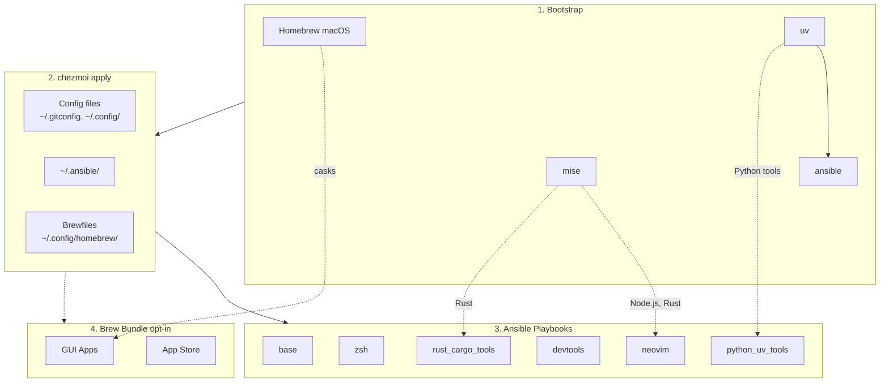

<!-- Generated by SpecStory, Markdown v2.1.0 -->

# 2026-03-30 11:20:14+0800

<!-- Codex CLI Session 019d3cc0-e0ef-7cf2-9161-50803beeba76 (2026-03-30 11:20:14+0800) -->

_**User (2026-03-30 11:20:14+0800)**_

我想添加這個utility function

```bash
# Download a subdirectory from a GitHub repo
# Usage: ghget https://github.com/owner/repo/tree/branch/path/to/dir
ghget() {
  local url="$1"
  if [[ ! "$url" =~ github\.com/([^/]+)/([^/]+)/tree/([^/]+)/(.*) ]]; then
    echo "Usage: ghget https://github.com/owner/repo/tree/branch/path/to/dir"
    return 1
  fi
  local owner="${BASH_REMATCH[1]}"
  local repo="${BASH_REMATCH[2]}"
  local branch="${BASH_REMATCH[3]}"
  local path="${BASH_REMATCH[4]%/}"  # strip trailing slash

  local strip=$(( $(echo "$path" | tr '/' '\n' | wc -l) + 1 ))

  echo "Downloading $owner/$repo/$path (branch: $branch) ..."
  curl -sL "https://github.com/$owner/$repo/archive/refs/heads/$branch.tar.gz" \
    | tar xz --strip-components="$strip" "$repo-$branch/$path"
}
```

用法就是直接貼 GitHub URL：

```bash
ghget https://github.com/microsoft/qlib/tree/high-freq-execution/examples/trade/
```

它會：
1. 從 URL 解析出 `owner`、`repo`、`branch`、`path`
2. 算出 `--strip-components` 的層數（讓解壓出來的目錄不帶前綴路徑）
3. 用 `curl + tar` 只解壓你要的子目錄


---

_**Agent (gpt-5.4 2026-03-30 11:22:05+0800)**_

先檢查目前這個 dotfiles repo 的任務上下文，並確認這個 shell utility 應該放在哪個 zsh/bash 設定位置；接著我會讀現有相關檔案，把規格補到可直接實作的程度。

_**Agent (gpt-5.4 2026-03-30 11:22:06+0800)**_

<tool-use data-tool-type="shell" data-tool-name="exec_command"><details>
<summary>Tool use: **exec_command** `td usage --new-session`</summary>
```
Command: /bin/zsh -lc 'td usage --new-session'
Chunk ID: df4f45
Wall time: 0.5834 seconds
Process exited with code 0
Original token count: 421
Output:
You have access to `td`, a local task management CLI.

NEW SESSION: ses_882ce9 on branch: main

CURRENT SESSION: ses_882ce9 [codex_89076] on branch: main

WORKFLOW:

  1. `td start <id>` to begin work
     Multi-issue: `td ws start "name"` then `td ws tag <ids>`
  2. `td log "msg"` to track progress
     Multi-issue: `td ws log "msg"`
  3. `td handoff <id>` to capture state (REQUIRED)
     Multi-issue: `td ws handoff`
  4. `td review <id>` to submit for review
  5. Different session: `td approve <id>` to complete

  Use `td ws` commands when implementing multiple related issues.

KEY COMMANDS:
  td current              What you're working on
  td ws current           Current work session state
  td context <id>         Full context for resuming
  td next                 Highest priority open issue
  td critical-path        What unblocks the most work
  td reviewable           Issues you can review
  td approve/reject <id>  Complete review

IMPORTANT: You cannot approve issues you implemented.
  Exception: `td add "title" --minor` creates self-reviewable tasks.

WARNING: Do NOT use `td close` for completed work!
  Use `td review` -> `td approve` workflow instead.
  `td close` is for admin closures: duplicates, won't-fix, cleanup.

Use `td handoff` or `td ws handoff` before stopping work.

FOR LLMs: Run `td usage --new-session` at conversation start (or after /clear).
  Do NOT start a new session mid-work—sessions track implementers for review.
Use `td ws start` when implementing multiple issues to group handoffs.
  - session = identity (always exists)  |  ws = work container (optional)

TIP: Use `td usage -q` to hide these instructions after first read.
```
</details></tool-use>

_**Agent (gpt-5.4 2026-03-30 11:22:20+0800)**_

我先把 `td` 切到簡潔模式，然後搜尋這個 repo 目前的 shell function/alias 結構，以及 README/Dockerfile 是否會被這個變更影響。

_**Agent (gpt-5.4 2026-03-30 11:22:20+0800)**_

<tool-use data-tool-type="shell" data-tool-name="exec_command"><details>
<summary>Tool use: **exec_command** `td usage -q`</summary>
```
Command: /bin/zsh -lc 'td usage -q'
Chunk ID: 22405f
Wall time: 0.2934 seconds
Process exited with code 0
Original token count: 29
Output:
You have access to `td`, a local task management CLI.

CURRENT SESSION: ses_882ce9 [codex_89076] on branch: main
```
</details></tool-use>

_**Agent (gpt-5.4 2026-03-30 11:22:20+0800)**_

<tool-use data-tool-type="shell" data-tool-name="exec_command"><details>
<summary>Tool use: **exec_command** `rg -n "ghget|function|alias|zshrc|bashrc|oh-my-zsh|shell" . --glob '!*vendor/*' --glob '!**/.git/**'`</summary>
```
Command: /bin/zsh -lc "rg -n \"ghget|function|alias|zshrc|bashrc|oh-my-zsh|shell\" . --glob '"'!*vendor/*'"' --glob '"'!**/.git/**'"'"
Chunk ID: 9e2e89
Wall time: 0.0000 seconds
Process exited with code 0
Original token count: 6054
Output:
Total output lines: 266

./run_once_before_00_bootstrap.sh.tmpl:38:    eval "$(/opt/homebrew/bin/brew shellenv)"
./run_once_before_00_bootstrap.sh.tmpl:40:    eval "$(/usr/local/bin/brew shellenv)"
./run_once_before_00_bootstrap.sh.tmpl:45:    eval "$(/home/linuxbrew/.linuxbrew/bin/brew shellenv)"
./run_once_before_00_bootstrap.sh.tmpl:47:    eval "$("$HOME/.linuxbrew/bin/brew" shellenv)"
./run_once_before_00_bootstrap.sh.tmpl:65:        eval "$(/opt/homebrew/bin/brew shellenv)"
./run_once_before_00_bootstrap.sh.tmpl:67:        eval "$(/usr/local/bin/brew shellenv)"
./run_once_before_00_bootstrap.sh.tmpl:91:        eval "$(/home/linuxbrew/.linuxbrew/bin/brew shellenv)"
./run_once_before_00_bootstrap.sh.tmpl:93:        eval "$("$HOME/.linuxbrew/bin/brew" shellenv)"
./dot_zshenv.tmpl:1:# ~/.zshenv - Loaded for all shells (interactive and non-interactive)
./run_onchange_after_30_brew_bundle.sh.tmpl:40:    eval "$(/opt/homebrew/bin/brew shellenv)"
./run_onchange_after_30_brew_bundle.sh.tmpl:42:    eval "$(/usr/local/bin/brew shellenv)"
./run_onchange_after_30_brew_bundle.sh.tmpl:47:    eval "$(/home/linuxbrew/.linuxbrew/bin/brew shellenv)"
./run_onchange_after_30_brew_bundle.sh.tmpl:49:    eval "$("$HOME/.linuxbrew/bin/brew" shellenv)"
./dot_zshrc.tmpl:1:# Profiling: start a profiled shell with `ZSH_PROF=1 zsh`
./dot_zshrc.tmpl:6:# ~/.zshrc - Interactive shell configuration
./dot_zshrc.tmpl:35:export ZSH="$HOME/.oh-my-zsh"
./dot_zshrc.tmpl:37:# Extra completion paths (must be set before oh-my-zsh runs compinit)
./dot_zshrc.tmpl:39:[[ -d ~/.oh-my-zsh/custom/plugins/zsh-completions/src ]] && fpath=(~/.oh-my-zsh/custom/plugins/zsh-completions/src $fpath)
./dot_zshrc.tmpl:48:[[ -f "$ZSH/oh-my-zsh.sh" ]] && source "$ZSH/oh-my-zsh.sh"
./dot_zshrc.tmpl:51:# Moved from .zshenv (seems Superset only load .zshrc but not .zshenv)
./dot_zshrc.tmpl:65:    eval "$(/opt/homebrew/bin/brew shellenv)"
./dot_zshrc.tmpl:67:    eval "$(/usr/local/bin/brew shellenv)"
./dot_zshrc.tmpl:98:if [[ ! -f "$HOME/.zshrc.adhoc" ]]; then
./dot_zshrc.tmpl:99:    cat > "$HOME/.zshrc.adhoc" << 'ADHOC_EOF'
./dot_zshrc.tmpl:100:# ~/.zshrc.adhoc - Personal shell customizations (not tracked by chezmoi)
./dot_zshrc.tmpl:103:#   - Quick experiments with new aliases/functions
./dot_zshrc.tmpl:108:# This file is sourced at the end of ~/.zshrc
./dot_zshrc.tmpl:109:# Changes here take effect on new shell sessions (or run: source ~/.zshrc.adhoc)
./dot_zshrc.tmpl:112:# alias myalias='echo "Hello from adhoc!"'
./dot_zshrc.tmpl:119:[[ -r "$HOME/.zshrc.adhoc" ]] && source "$HOME/.zshrc.adhoc"
./run_once_before_02_fix_intel_homebrew.sh.tmpl:25:    eval "$(/opt/homebrew/bin/brew shellenv)"
./run_once_before_02_fix_intel_homebrew.sh.tmpl:27:    eval "$(/usr/local/bin/brew shellenv)"
./run_once_before_02_fix_intel_homebrew.sh.tmpl:45:#     for dir in /usr/local/share/zsh /usr/local/share/zsh/site-functions; do
./dot_config/zsh/10_aliases.zsh:1:# 10_aliases.zsh - Common aliases
./dot_config/zsh/10_aliases.zsh:3:# --- Your existing aliases ---
./dot_config/zsh/10_aliases.zsh:4:alias v="nvim"
./dot_config/zsh/10_aliases.zsh:6:# --- Suggested aliases (uncomment to enable) ---
./dot_config/zsh/10_aliases.zsh:8:# alias ..="cd .."
./dot_config/zsh/10_aliases.zsh:9:# alias ...="cd ../.."
./dot_config/zsh/10_aliases.zsh:10:# alias ....="cd ../../.."
./dot_config/zsh/10_aliases.zsh:13:# alias l="ls -lah"
./dot_config/zsh/10_aliases.zsh:14:# alias la="ls -lAh"
./dot_config/zsh/10_aliases.zsh:15:# alias ll="ls -lh"
./dot_config/zsh/10_aliases.zsh:18:# alias rm="rm -i"
./dot_config/zsh/10_aliases.zsh:19:# alias cp="cp -i"
./dot_config/zsh/10_aliases.zsh:20:# alias mv="mv -i"
./dot_config/zsh/10_aliases.zsh:23:# alias vi="nvim"
./dot_config/zsh/10_aliases.zsh:24:# alias vim="nvim"
./dot_config/zsh/10_aliases.zsh:27:# command -v eza &>/dev/null && alias ls="eza"
./dot_config/zsh/10_aliases.zsh:28:# command -v bat &>/dev/null && alias cat="bat"
./dot_config/zsh/10_aliases.zsh:31:alias zsh-profile='ZSH_PROF=1 zsh -i -c exit'
./dot_config/zsh/10_aliases.zsh:34:alias load-nvm='export LOAD_NVM=1 && source "${NVM_DIR:-$HOME/.nvm}/nvm.sh" && source "${NVM_DIR:-$HOME/.nvm}/bash_completion" && echo "nvm loaded: $(nvm current)"'
./dot_config/zsh/10_aliases.zsh:37:alias bw-update-completion='mkdir -p "${XDG_CACHE_HOME:-$HOME/.cache}/zsh" && bw completion --shell zsh > "${XDG_CACHE_HOME:-$HOME/.cache}/zsh/bw_completion.zsh" 2>/dev/null && echo "bw completion cache updated"'
./Dockerfile:132:# Default to bash shell
./dot_config/tmuxp/claude-sidecar.yaml:6:      - shell_command: specstory run claude -c 'claude --dangerously-skip-permissions'
./dot_config/tmuxp/claude-sidecar.yaml:7:      - shell_command: sidecar
./dot_config/zsh/00_exports.zsh.tmpl:29:    eva
... (truncated)
```
</details></tool-use>

_**Agent (gpt-5.4 2026-03-30 11:22:20+0800)**_

<tool-use data-tool-type="shell" data-tool-name="exec_command"><details>
<summary>Tool use: **exec_command** `rg --files . | rg 'zsh|bash|shell|README\.md|Dockerfile|chezmoi\.toml'`</summary>
```
Command: /bin/zsh -lc "rg --files . | rg 'zsh|bash|shell|README\\.md|Dockerfile|chezmoi\\.toml'"
Chunk ID: 722ade
Wall time: 0.0008 seconds
Process exited with code 0
Original token count: 276
Output:
./README.md
./dot_zshrc.tmpl
./dot_zshenv.tmpl
./Dockerfile
./dot_config/nvim/README.md
./dot_config/zsh/10_aliases.zsh
./dot_config/zsh/00_exports.zsh.tmpl
./dot_config/zsh/02_legacy_tools.zsh
./dot_config/zsh/tools/33_toolkami.zsh.disabled
./dot_config/zsh/tools/10_fzf.zsh
./dot_config/zsh/tools/22_sesh.zsh
./dot_config/zsh/tools/32_try.zsh
./dot_config/zsh/tools/27_thefuck.zsh
./dot_config/zsh/tools/28_tldr.zsh
./dot_config/zsh/tools/40_codexbar.zsh
./dot_config/zsh/tools/26_eza.zsh
./dot_config/zsh/tools/34_openclaw.zsh
./dot_config/zsh/tools/07_bunx_cli.zsh
./dot_config/zsh/tools/01_starship.zsh
./dot_config/zsh/tools/04_conda_mamba.zsh
./dot_config/zsh/tools/90_completions.zsh
./dot_config/zsh/tools/20_zoxide.zsh
./dot_config/zsh/tools/30_direnv.zsh
./dot_config/zsh/tools/05_mise.zsh
./dot_config/zsh/tools/25_bat.zsh
./dot_config/zsh/tools/50_networking.zsh
./dot_config/zsh/tools/35_yazi.zsh
./dot_config/zsh/tools/95_bitwarden.zsh
./dot_config/zsh/tools/36_pueue.zsh
./dot_config/zsh/tools/06_cargo.zsh
./dot_ansible/roles/zsh/defaults/main.yml
./dot_ansible/roles/zsh/tasks/main.yml
```
</details></tool-use>

_**Agent (gpt-5.4 2026-03-30 11:22:35+0800)**_

我找到現有 zsh 結構了。接下來要確認兩件事：這個 function 應該是新增成一個獨立 `tools/*.zsh` 檔案，還是放進現有 aliases/tools 檔；以及你給的實作在 zsh 下會不會有相容性問題。

_**Agent (gpt-5.4 2026-03-30 11:22:35+0800)**_

<tool-use data-tool-type="shell" data-tool-name="exec_command"><details>
<summary>Tool use: **exec_command** `sed -n '1,220p' dot_zshrc.tmpl`</summary>
```
Command: /bin/zsh -lc "sed -n '1,220p' dot_zshrc.tmpl"
Chunk ID: f05e25
Wall time: 0.0000 seconds
Process exited with code 0
Original token count: 1008
Output:
# Profiling: start a profiled shell with `ZSH_PROF=1 zsh`
if [[ -n "$ZSH_PROF" ]]; then
    zmodload zsh/zprof
fi

# ~/.zshrc - Interactive shell configuration
# Managed by chezmoi - do not edit directly

# =============================================================================
# Oh-My-Zsh Configuration
# =============================================================================

# Theme (disabled - using starship prompt instead)
ZSH_THEME=""

# Prevent zsh from overwriting tmux/tmuxp window names (only inside tmux)
# [[ -n "$TMUX" ]] && export DISABLE_AUTO_TITLE='true'
export DISABLE_AUTO_TITLE='true'

# Plugins (from $ZSH/plugins/ and $ZSH_CUSTOM/plugins/)
plugins=(
    git
    zsh-autosuggestions
    zsh-syntax-highlighting
    zsh-vi-mode
)

# zsh-vi-mode overrides all keybindings on init; re-source fzf bindings afterward
# so that Ctrl+R (history search), Ctrl+T (file search), Alt+C still work
zvm_after_init() {
    [ -f "$ZSH_CONFIG_DIR/tools/10_fzf.zsh" ] && source "$ZSH_CONFIG_DIR/tools/10_fzf.zsh"
}

# Oh-My-Zsh path
export ZSH="$HOME/.oh-my-zsh"

# Extra completion paths (must be set before oh-my-zsh runs compinit)
fpath+=~/.zfunc
[[ -d ~/.oh-my-zsh/custom/plugins/zsh-completions/src ]] && fpath=(~/.oh-my-zsh/custom/plugins/zsh-completions/src $fpath)
[[ -d ~/.docker/completions ]] && fpath=(~/.docker/completions $fpath)

{{ if eq .profile "macos_intel" -}}
# Skip compinit insecure directory warnings (e.g. /usr/local/share on Intel Macs)
# ZSH_DISABLE_COMPFIX=true
{{ end }}

# Load Oh-My-Zsh (also runs compinit)
[[ -f "$ZSH/oh-my-zsh.sh" ]] && source "$ZSH/oh-my-zsh.sh"

# =============================================================================
# Moved from .zshenv (seems Superset only load .zshrc but not .zshenv)
# =============================================================================

# XDG Base Directory Specification
export XDG_CONFIG_HOME="${XDG_CONFIG_HOME:-$HOME/.config}"
export XDG_DATA_HOME="${XDG_DATA_HOME:-$HOME/.local/share}"
export XDG_CACHE_HOME="${XDG_CACHE_HOME:-$HOME/.cache}"

# Modular config directory
export ZSH_CONFIG_DIR="$XDG_CONFIG_HOME/zsh"

{{ if eq .chezmoi.os "darwin" -}}
# Homebrew (macOS)
if [[ -f /opt/homebrew/bin/brew ]]; then
    eval "$(/opt/homebrew/bin/brew shellenv)"
elif [[ -f /usr/local/bin/brew ]]; then
    eval "$(/usr/local/bin/brew shellenv)"
fi
{{ end -}}

# =============================================================================
# Modular Configuration Loader
# =============================================================================

# Load all .zsh files from a directory (sorted by filename)
load_zsh_dir() {
    local dir="$1"
    [[ -d "$dir" ]] || return 0
    setopt local_options null_glob
    local f
    for f in "$dir"/*.zsh; do
        [[ -r "$f" ]] && source "$f"
    done
}

# Load modular configs
load_zsh_dir "$ZSH_CONFIG_DIR"
load_zsh_dir "$ZSH_CONFIG_DIR/tools"

# Load secrets (not tracked by chezmoi)
[[ -r "$ZSH_CONFIG_DIR/secrets.zsh" ]] && source "$ZSH_CONFIG_DIR/secrets.zsh" || true

# =============================================================================
# Adhoc Configuration (not tracked by chezmoi)
# =============================================================================

# Create adhoc file if it doesn't exist
if [[ ! -f "$HOME/.zshrc.adhoc" ]]; then
    cat > "$HOME/.zshrc.adhoc" << 'ADHOC_EOF'
# ~/.zshrc.adhoc - Personal shell customizations (not tracked by chezmoi)
#
# Use this file for:
#   - Quick experiments with new aliases/functions
#   - Machine-specific configurations
#   - Temporary PATH modifications
#   - Testing before adding to chezmoi-managed configs
#
# This file is sourced at the end of ~/.zshrc
# Changes here take effect on new shell sessions (or run: source ~/.zshrc.adhoc)

# Example:
# alias myalias='echo "Hello from adhoc!"'
# export MY_VAR="my_value"

ADHOC_EOF
fi

# Source adhoc config
[[ -r "$HOME/.zshrc.adhoc" ]] && source "$HOME/.zshrc.adhoc"

# Profiling: output results
if [[ -n "$ZSH_PROF" ]]; then
    zprof
fi
```
</details></tool-use>

_**Agent (gpt-5.4 2026-03-30 11:22:35+0800)**_

<tool-use data-tool-type="shell" data-tool-name="exec_command"><details>
<summary>Tool use: **exec_command** `sed -n '1,220p' dot_config/zsh/tools/35_yazi.zsh`</summary>
```
Command: /bin/zsh -lc "sed -n '1,220p' dot_config/zsh/tools/35_yazi.zsh"
Chunk ID: e8cbd6
Wall time: 0.0000 seconds
Process exited with code 0
Original token count: 116
Output:
# 35_yazi.zsh - yazi file manager configuration

# Check if yazi is installed
command -v yazi &>/dev/null || return 0

# Wrapper function to change directory on exit
# When you quit yazi, it will cd to the directory you were browsing
function y() {
    local tmp="$(mktemp -t "yazi-cwd.XXXXXX")" cwd
    command yazi "$@" --cwd-file="$tmp"
    IFS= read -r -d '' cwd < "$tmp"
    [ "$cwd" != "$PWD" ] && [ -d "$cwd" ] && builtin cd -- "$cwd"
    rm -f -- "$tmp"
}
```
</details></tool-use>

_**Agent (gpt-5.4 2026-03-30 11:22:35+0800)**_

<tool-use data-tool-type="shell" data-tool-name="exec_command"><details>
<summary>Tool use: **exec_command** `sed -n '1,220p' dot_config/zsh/tools/50_networking.zsh`</summary>
```
Command: /bin/zsh -lc "sed -n '1,220p' dot_config/zsh/tools/50_networking.zsh"
Chunk ID: 34b7d2
Wall time: 0.0000 seconds
Process exited with code 0
Original token count: 378
Output:
# 50_networking.zsh - Networking tool aliases and helpers

# --- Listening ports (works everywhere, no extra install needed) ---
alias ports='lsof -i -P -n | grep LISTEN'

# --- IP address helpers ---
alias myip='curl -s https://ifconfig.me'
if [[ "$OSTYPE" == darwin* ]]; then
  alias localip='ipconfig getifaddr en0'
else
  alias localip='hostname -I | awk "{print \$1}"'
fi

# --- nmap shortcuts ---
if command -v nmap &>/dev/null; then
  # Quick ping sweep of local /24 subnet
  pingsweep() {
    local ip
    if [[ "$OSTYPE" == darwin* ]]; then
      ip=$(ipconfig getifaddr en0 2>/dev/null)
    else
      ip=$(hostname -I 2>/dev/null | awk '{print $1}')
    fi
    local base="${ip%.*}.0/24"
    echo "Scanning $base ..."
    nmap -sn "$base"
  }
fi

# --- arp-scan ---
if command -v arp-scan &>/dev/null; then
  alias arpscan='sudo arp-scan -l'
fi

# --- doggo (modern DNS lookup with DoH/DoT/DoQ) ---
if command -v doggo &>/dev/null; then
  alias dns='doggo'
fi

# --- gping (graphical ping) ---
# gping is already short enough, no alias needed

# --- trippy (TUI traceroute, binary is 'trip') ---
# trip is already short enough, no alias needed

# --- bandwhich (bandwidth monitor, needs sudo for packet capture) ---
if command -v bandwhich &>/dev/null; then
  alias bw-net='sudo bandwhich'
fi

# --- rustscan (fast port scanner -> nmap) ---
if command -v rustscan &>/dev/null; then
  alias portscan='rustscan'
fi

# --- speedtest (Ookla CLI) ---
# speedtest is already short enough, no alias needed
```
</details></tool-use>

_**Agent (gpt-5.4 2026-03-30 11:22:35+0800)**_

<tool-use data-tool-type="shell" data-tool-name="exec_command"><details>
<summary>Tool use: **exec_command** `sed -n '1,260p' README.md`</summary>
```
Command: /bin/zsh -lc "sed -n '1,260p' README.md"
Chunk ID: ea0d6a
Wall time: 0.0000 seconds
Process exited with code 0
Original token count: 2129
Output:
# dotfiles

Cross-platform development environment setup using **chezmoi** + **ansible**.

- **chezmoi**: manages config files (dotfiles)
- **ansible**: installs system dependencies and tools

## Prerequisites

- [chezmoi](https://www.chezmoi.io/install/)
- [uv](https://docs.astral.sh/uv/getting-started/installation/) (for ansible)

## Architecture



## Quick Setup

```bash
# One-liner to initialize and apply (installs chezmoi to ~/.local/bin)
export GITHUB_USERNAME=daviddwlee84
sh -c "$(curl -fsLS get.chezmoi.io)" -- -b "$HOME/.local/bin" init --apply git@github.com:$GITHUB_USERNAME/dotfiles.git
```

This automatically:

1. Bootstraps Homebrew (macOS/Linux), uv, mise, ansible
2. Deploys all config files
3. Runs ansible playbooks (git, ripgrep, fd, neovim, etc.)
4. Runs brew bundle (if `installBrewApps` enabled)

### Optional Components

During `chezmoi init`, you'll be prompted for optional installs:

| Option | Default | Description |
|--------|---------|-------------|
| `installCodingAgents` | true | Claude Code, Codex CLI, OpenCode, Cursor, Copilot, Gemini CLI, td, sidecar, specify-cli, etc. |
| `installBitwarden` | false | Bitwarden CLI (`bw`) + Desktop app (desktop profiles) with SSH agent auto-detection |
| `installPythonUvTools` | true | Python CLI tools via uv (mlflow, litellm, sqlit-tui, etc.) |
| `installBrewApps` | false | GUI apps via Homebrew Brewfile (casks, mas) |
| `installInputMethod` | false | Traditional Chinese input methods (McBopomofo, RIME/Squirrel on macOS; ibus-rime on Linux) |
| `installNetworkingTools` | false | Networking CLI tools (nmap, mtr, httpie, gping, trippy, bandwhich, rustscan, etc.) |
| `noRoot` | false | Skip sudo-requiring tasks (for servers without root access) |

To change options later: `chezmoi init --force`

## What You Get

### Config Files

- `~/.gitconfig` - Git configuration
- `~/.config/nvim/` - Neovim (LazyVim) configuration
- `~/.config/uv/uv.toml` - uv package manager config
- `~/.cargo/config.toml` - Cargo registry mirror config (GFW)
- `~/.npmrc` - npm registry config (official/npmmirror via `useChineseMirror`)
- `~/.config/.bunfig.toml` - Bun global registry config (official/npmmirror via `useChineseMirror`)
- `~/.config/alacritty/` - Alacritty terminal config
- `~/.config/starship.toml` - Starship cross-shell prompt config
- `~/.config/direnv/direnvrc` - direnv helper functions, including `.venv`-aware Python activation
- `~/.config/yazi/` - Yazi file manager config (v0.3.3+ syntax, [docs](https://yazi-rs.github.io/docs/configuration/overview/))
  - `yazi.toml` - Main config with open rules and openers (`o`/`O`)
  - `keymap.toml`, `theme.toml` - Optional customization files (stubs provided)
- `~/.claude/` - Claude Code settings
- `~/.specstory/cli/config.toml` - Global SpecStory defaults for `specstory run` across all projects
- `~/.tmux.conf` - Tmux configuration with TPM plugins
- `~/.local/bin/x` - Cross-platform terminal wrapper for `copy` / `paste` / `open`
- `~/.config/zsh/tools/22_sesh.zsh` - Sesh keybinding (Ctrl+A for tmux session switcher)
- `~/.config/zsh/tools/36_pueue.zsh` - Pueue queue summary helper (`pqsum`)
- `~/.config/zsh/tools/28_tldr.zsh` - `tldrf` helper with `TLDR_LANGUAGES` fallback order
- `~/.config/zsh/tools/95_bitwarden.zsh` - Bitwarden CLI completion + SSH agent socket auto-detection
- `~/.ssh/config` - SSH main config skeleton (create-only: `Include ~/.ssh/config.d/*` + conservative `Host *` defaults)
- `~/.ssh/config.d/00-defaults` - SSH global defaults stub (commented examples only)
- `~/.ssh/config.d/git` - SSH host entries for `github.com` and `gitlab.com` with commented multi-account/Bitwarden examples
- `~/.config/tmuxp/claude-sidecar.yaml` - tmuxp workspace for Claude + Sidecar
- `~/.config/zellij/layouts/claude-sidecar.kdl` - Zellij layout for Claude + Sidecar
- `~/.config/homebrew/` - Brewfiles for GUI apps (macOS casks + mas) plus selected CLI formulas (e.g., `tailscale`)

SSH files are managed as create-only templates: if `~/.ssh/config` 
... (truncated)
```
</details></tool-use>

_**Agent (gpt-5.4 2026-03-30 11:22:35+0800)**_

<tool-use data-tool-type="shell" data-tool-name="exec_command"><details>
<summary>Tool use: **exec_command** `sed -n '1,240p' dot_config/zsh/10_aliases.zsh`</summary>
```
Command: /bin/zsh -lc "sed -n '1,240p' dot_config/zsh/10_aliases.zsh"
Chunk ID: b59b92
Wall time: 0.0000 seconds
Process exited with code 0
Original token count: 280
Output:
# 10_aliases.zsh - Common aliases

# --- Your existing aliases ---
alias v="nvim"

# --- Suggested aliases (uncomment to enable) ---
# Navigation
# alias ..="cd .."
# alias ...="cd ../.."
# alias ....="cd ../../.."

# List files
# alias l="ls -lah"
# alias la="ls -lAh"
# alias ll="ls -lh"

# Safety
# alias rm="rm -i"
# alias cp="cp -i"
# alias mv="mv -i"

# Editor
# alias vi="nvim"
# alias vim="nvim"

# Modern replacements (if installed)
# command -v eza &>/dev/null && alias ls="eza"
# command -v bat &>/dev/null && alias cat="bat"

# Zsh startup profiling
alias zsh-profile='ZSH_PROF=1 zsh -i -c exit'

# Load NVM for current session (when needed for version switching)
alias load-nvm='export LOAD_NVM=1 && source "${NVM_DIR:-$HOME/.nvm}/nvm.sh" && source "${NVM_DIR:-$HOME/.nvm}/bash_completion" && echo "nvm loaded: $(nvm current)"'

# Regenerate cached bw completion (run after updating bw CLI)
alias bw-update-completion='mkdir -p "${XDG_CACHE_HOME:-$HOME/.cache}/zsh" && bw completion --shell zsh > "${XDG_CACHE_HOME:-$HOME/.cache}/zsh/bw_completion.zsh" 2>/dev/null && echo "bw completion cache updated"'
```
</details></tool-use>

_**Agent (gpt-5.4 2026-03-30 11:23:03+0800)**_

目前有兩個明顯的實作面問題要先釐清：你提供的版本直接用 `BASH_REMATCH`，在這個 repo 的 zsh 設定下不能原樣放進去；另外 branch 名如果包含 `/`，單靠這個 URL pattern 會有解析歧義。我要先用幾個只讀測試把這些行為驗證掉，再決定計畫要不要把它定義成「簡單版」還是「較穩健版」。

_**Agent (gpt-5.4 2026-03-30 11:23:03+0800)**_

<tool-use data-tool-type="shell" data-tool-name="exec_command"><details>
<summary>Tool use: **exec_command** `zsh -lc 'ghget_test() { local url="$1"; if [[ ! "$url" =~ github\.com/([^/]+)/([^/]+)/tree/([^/]+)/(.*) ]]; then echo bad; return 1; fi; print -r -- "owner=${BASH_REMATCH[1]} repo=${BASH_REMATCH[2]} branch=${BASH_REMATCH[3]} path=${BASH_REMATCH[4]}"; }; ghget_test https://github.com/microsoft/qlib/tree/high-freq-execution/examples/trade/'`</summary>
```
Command: /bin/zsh -lc "zsh -lc 'ghget_test() { local url=\""'$1"; if [[ ! "$url" =~ github'"\\.com/(["'^/]+)/([''^/]+)/tree/([''^/]+)/(.*) ]]; then echo bad; return 1; fi; print -r -- "owner=${BASH_REMATCH[1]} repo=${BASH_REMATCH[2]} branch=${BASH_REMATCH[3]} path=${BASH_REMATCH[4]}"; }; ghget_test https://github.com/microsoft/qlib/tree/high-freq-execution/examples/trade/'"'"
Chunk ID: a48cce
Wall time: 0.0000 seconds
Process exited with code 0
Original token count: 7
Output:
owner= repo= branch= path=
```
</details></tool-use>

_**Agent (gpt-5.4 2026-03-30 11:23:03+0800)**_

<tool-use data-tool-type="shell" data-tool-name="exec_command"><details>
<summary>Tool use: **exec_command** `bash -lc 'ghget_test() { local url="$1"; if [[ ! "$url" =~ github\.com/([^/]+)/([^/]+)/tree/([^/]+)/(.*) ]]; then echo bad; return 1; fi; printf "owner=%s repo=%s branch=%s path=%s\n" "${BASH_REMATCH[1]}" "${BASH_REMATCH[2]}" "${BASH_REMATCH[3]}" "${BASH_REMATCH[4]}"; }; ghget_test https://github.com/microsoft/qlib/tree/high-freq-execution/examples/trade/'`</summary>
```
Command: /bin/zsh -lc "bash -lc 'ghget_test() { local url=\""'$1"; if [[ ! "$url" =~ github'"\\.com/(["'^/]+)/([''^/]+)/tree/([''^/]+)/(.*) ]]; then echo bad; return 1; fi; printf "owner=%s repo=%s branch=%s path=%s'"\\n\" \""'${BASH_REMATCH[1]}" "${BASH_REMATCH[2]}" "${BASH_REMATCH[3]}" "${BASH_REMATCH[4]}"; }; ghget_test https://github.com/microsoft/qlib/tree/high-freq-execution/examples/trade/'"'"
Chunk ID: 63f0cd
Wall time: 0.0000 seconds
Process exited with code 0
Original token count: 19
Output:
owner=microsoft repo=qlib branch=high-freq-execution path=examples/trade/
```
</details></tool-use>

_**Agent (gpt-5.4 2026-03-30 11:23:03+0800)**_

<tool-use data-tool-type="shell" data-tool-name="exec_command"><details>
<summary>Tool use: **exec_command** `rg -n "github|ghget|curl -sL .*github|archive/refs/heads|tar xz --strip-components" dot_config/zsh README.md docs CLAUDE.md`</summary>
```
Command: /bin/zsh -lc 'rg -n "github|ghget|curl -sL .*github|archive/refs/heads|tar xz --strip-components" dot_config/zsh README.md docs CLAUDE.md'
Chunk ID: d76ace
Wall time: 0.0001 seconds
Process exited with code 0
Original token count: 1932
Output:
docs/tutorials/bitwarden_ssh_agent.md:104:ssh -T git@github.com
docs/tutorials/bitwarden_ssh_agent.md:138:Host github.com
docs/tutorials/bitwarden_ssh_agent.md:139:    HostName github.com
docs/tutorials/bitwarden_ssh_agent.md:157:Host github.com
docs/tutorials/bitwarden_ssh_agent.md:158:    HostName github.com
docs/tutorials/bitwarden_ssh_agent.md:176:Host github.com
docs/tutorials/bitwarden_ssh_agent.md:177:    HostName github.com
README.md:56:sh -c "$(curl -fsLS get.chezmoi.io)" -- -b "$HOME/.local/bin" init --apply git@github.com:$GITHUB_USERNAME/dotfiles.git
README.md:95:- `~/.config/yazi/` - Yazi file manager config (v0.3.3+ syntax, [docs](https://yazi-rs.github.io/docs/configuration/overview/))
README.md:108:- `~/.ssh/config.d/git` - SSH host entries for `github.com` and `gitlab.com` with commented multi-account/Bitwarden examples
README.md:177:This project uses [just](https://github.com/casey/just) as a command runner:
docs/tools/td_sidecar.md:37:- `td`: <https://github.com/marcus/td/releases>
docs/tools/td_sidecar.md:38:- `sidecar`: <https://github.com/marcus/sidecar/releases>
docs/tools/td_sidecar.md:49:- [td docs](https://marcus.github.io/td/)
dot_config/zsh/tools/33_toolkami.zsh.disabled:2:# https://github.com/aperoc/toolkami
docs/initial_setup/0_ManualSetupRecord.md:13:- [LazyVim/LazyVim: Neovim config for the lazy](https://github.com/lazyvim/lazyvim/)
docs/initial_setup/0_ManualSetupRecord.md:22:# https://github.com/LazyVim/starter
docs/initial_setup/0_ManualSetupRecord.md:23:git clone https://github.com/LazyVim/starter ~/.config/nvim
docs/initial_setup/0_ManualSetupRecord.md:32:git remote add origin git@github.com:$GITHUB_USERNAME/dotfiles.git
docs/initial_setup/0_ManualSetupRecord.md:64:- [ohmyzsh/ohmyzsh: 🙃 A delightful community-driven (with 2,400+ contributors) framework for managing your zsh configuration. Includes 300+ optional plugins (rails, git, macOS, hub, docker, homebrew, node, php, python, etc), 140+ themes to spice up your morning, and an auto-update tool that makes it easy to keep up with the latest updates from the community.](https://github.com/ohmyzsh/ohmyzsh?tab=readme-ov-file#manual-installation)
docs/initial_setup/0_ManualSetupRecord.md:66:The oh-my-zsh setup script `sh -c "$(curl -fsSL https://raw.githubusercontent.com/ohmyzsh/ohmyzsh/master/tools/install.sh)"` actually do more than what we need
docs/initial_setup/0_ManualSetupRecord.md:69:oh-my-zsh actually just initialize ~/.zshrc by the templates <https://github.com/ohmyzsh/ohmyzsh/blob/master/templates/zshrc.zsh-template>
docs/initial_setup/0_ManualSetupRecord.md:70:We better make it clean <https://github.com/ohmyzsh/ohmyzsh/blob/master/templates/minimal.zshrc>
docs/initial_setup/0_ManualSetupRecord.md:72:- [Use alt-f and alt-b to jump forward and backward in command line on macOS](https://gist.github.com/windsting/d21a07b236acf243c8ebbfe7302765ef)
docs/initial_setup/0_ManualSetupRecord.md:73:- [macOS: alt/option key as meta · Issue #7966 · alacritty/alacritty](https://github.com/alacritty/alacritty/issues/7966)
docs/initial_setup/0_ManualSetupRecord.md:81:- [Brew Bundle Brewfile Tips](https://gist.github.com/ChristopherA/a579274536aab36ea9966f301ff14f3f)
docs/initial_setup/0_ManualSetupRecord.md:82:- [How to keep your mac software updated easily (2026)](https://gist.github.com/arturmartins/f779720379e6bd97cac4bbe1dc202c8b#file-mac-upgrade-sh)
docs/initial_setup/0_ManualSetupRecord.md:107:- [P403n1x87/austin: Python frame stack sampler for CPython](https://github.com/P403n1x87/austin)
docs/initial_setup/0_ManualSetupRecord.md:108:- [P403n1x87/austin-tui: The top-like text-based user interface for Austin](https://github.com/P403n1x87/austin-tui?tab=readme-ov-file)
docs/initial_setup/0_ManualSetupRecord.md:114:- [slopus/happy: Mobile and Web client for Codex and Claude Code, with realtime voice, encryption and fully featured](https://github.com/slopus/happy)
docs/initial_setup/0_ManualSetupRecord.md:115:- [btriapitsyn/openchamber: Desktop and web interface for OpenCode AI agent](https://github.com/btriapitsyn/openchamber)
docs/initial_setup/0_ManualSetupRecord.md:117:  - [OpenCode Support · Issue #265 · slopus/happy](https://github.com/slopus/happy/issues/265)
docs/initial_setup/0_ManualSetupRecord.md:118:- [happier-dev/happier: Mobile, Web & Desktop client for Codex, Claude Code, OpenCode, Kimi, Augment Code, Qwen, fully end-to-end encrypted](https://github.com/happier-dev/happier)
docs/initial_setup/0_ManualSetupRecord.md:119:- [NeuralNomadsAI/CodeNomad: CodeNomad: The command center that puts AI coding on steroids.](https://github.com/NeuralNomadsAI/CodeNomad)
docs/initial_setup/0_ManualSetupRecord.md:123:- [9001/copyparty: Portable file server with accelerated 
... (truncated)
```
</details></tool-use>

_**Agent (gpt-5.4 2026-03-30 11:23:27+0800)**_

zsh 這裡其實有幾種可行寫法，不一定非得重寫成純字串切割；我先確認目前 shell 有沒有開相容選項，這會直接影響最後計畫是採「zsh 原生」還是「在 function 內局部開 bash 相容 regex capture」。

_**Agent (gpt-5.4 2026-03-30 11:23:27+0800)**_

<tool-use data-tool-type="shell" data-tool-name="exec_command"><details>
<summary>Tool use: **exec_command** `zsh -lc 'setopt | rg "rematch|bash" || true'`</summary>
```
Command: /bin/zsh -lc "zsh -lc 'setopt | rg \"rematch|bash\" || true'"
Chunk ID: a05e8b
Wall time: 0.0000 seconds
Process exited with code 0
Original token count: 0
Output:
```
</details></tool-use>

_**Agent (gpt-5.4 2026-03-30 11:23:27+0800)**_

<tool-use data-tool-type="shell" data-tool-name="exec_command"><details>
<summary>Tool use: **exec_command** `zsh -lc 'setopt localoptions bashrematch 2>/dev/null; ghget_test() { local url="$1"; if [[ ! "$url" =~ github\.com/([^/]+)/([^/]+)/tree/([^/]+)/(.*) ]]; then echo bad; return 1; fi; print -r -- "owner=${BASH_REMATCH[1]} repo=${BASH_REMATCH[2]} branch=${BASH_REMATCH[3]} path=${BASH_REMATCH[4]}"; }; ghget_test https://github.com/microsoft/qlib/tree/high-freq-execution/examples/trade/'`</summary>
```
Command: /bin/zsh -lc "zsh -lc 'setopt localoptions bashrematch 2>/dev/null; ghget_test() { local url=\""'$1"; if [[ ! "$url" =~ github'"\\.com/(["'^/]+)/([''^/]+)/tree/([''^/]+)/(.*) ]]; then echo bad; return 1; fi; print -r -- "owner=${BASH_REMATCH[1]} repo=${BASH_REMATCH[2]} branch=${BASH_REMATCH[3]} path=${BASH_REMATCH[4]}"; }; ghget_test https://github.com/microsoft/qlib/tree/high-freq-execution/examples/trade/'"'"
Chunk ID: fdbab8
Wall time: 0.0000 seconds
Process exited with code 0
Original token count: 32
Output:
owner=github.com/microsoft/qlib/tree/high-freq-execution/examples/trade/ repo=microsoft branch=qlib path=high-freq-execution
```
</details></tool-use>

_**Agent (gpt-5.4 2026-03-30 11:23:28+0800)**_

<tool-use data-tool-type="shell" data-tool-name="exec_command"><details>
<summary>Tool use: **exec_command** `zsh -lc 'ghget_test() { emulate -L zsh; setopt localoptions bashrematch; local url="$1"; if [[ ! "$url" =~ github\.com/([^/]+)/([^/]+)/tree/([^/]+)/(.*) ]]; then echo bad; return 1; fi; print -r -- "owner=${BASH_REMATCH[1]} repo=${BASH_REMATCH[2]} branch=${BASH_REMATCH[3]} path=${BASH_REMATCH[4]}"; }; ghget_test https://github.com/microsoft/qlib/tree/high-freq-execution/examples/trade/'`</summary>
```
Command: /bin/zsh -lc "zsh -lc 'ghget_test() { emulate -L zsh; setopt localoptions bashrematch; local url=\""'$1"; if [[ ! "$url" =~ github'"\\.com/(["'^/]+)/([''^/]+)/tree/([''^/]+)/(.*) ]]; then echo bad; return 1; fi; print -r -- "owner=${BASH_REMATCH[1]} repo=${BASH_REMATCH[2]} branch=${BASH_REMATCH[3]} path=${BASH_REMATCH[4]}"; }; ghget_test https://github.com/microsoft/qlib/tree/high-freq-execution/examples/trade/'"'"
Chunk ID: d51c44
Wall time: 0.0000 seconds
Process exited with code 0
Original token count: 32
Output:
owner=github.com/microsoft/qlib/tree/high-freq-execution/examples/trade/ repo=microsoft branch=qlib path=high-freq-execution
```
</details></tool-use>

_**Agent (gpt-5.4 2026-03-30 11:23:45+0800)**_

局部開 `bashrematch` 也不值得，zsh 的捕獲索引行為和 bash 不同，會讓這個 function 讀起來更脆弱。我要再驗證兩個替代方案：zsh 自己的 `$match` 陣列，以及不用 regex capture、直接靠 path 切段。

_**Agent (gpt-5.4 2026-03-30 11:23:46+0800)**_

<tool-use data-tool-type="shell" data-tool-name="exec_command"><details>
<summary>Tool use: **exec_command** `zsh -lc 'url=https://github.com/microsoft/qlib/tree/high-freq-execution/examples/trade/; if [[ "$url" =~ github\.com/([^/]+)/([^/]+)/tree/([^/]+)/(.*) ]]; then print -l -- MATCH=$MATCH; print -l -- match=${(@q)match}; fi'`</summary>
```
Command: /bin/zsh -lc "zsh -lc 'url=https://github.com/microsoft/qlib/tree/high-freq-execution/examples/trade/; if [[ \""'$url" =~ github'"\\.com/(["'^/]+)/([''^/]+)/tree/([''^/]+)/(.*) ]]; then print -l -- MATCH=$MATCH; print -l -- match=${(@q)match}; fi'"'"
Chunk ID: 414c72
Wall time: 0.0000 seconds
Process exited with code 0
Original token count: 33
Output:
MATCH=github.com/microsoft/qlib/tree/high-freq-execution/examples/trade/
match=microsoft
qlib
high-freq-execution
examples/trade/
```
</details></tool-use>

_**Agent (gpt-5.4 2026-03-30 11:23:46+0800)**_

<tool-use data-tool-type="shell" data-tool-name="exec_command"><details>
<summary>Tool use: **exec_command** `zsh -lc 'url=https://github.com/microsoft/qlib/tree/high-freq-execution/examples/trade/; path=${url#https://github.com/}; print -r -- $path; parts=(${(s:/:)path}); print -r -- owner=$parts[1] repo=$parts[2] tree=$parts[3] branch=$parts[4] rest=${(j:/:)parts[5,-1]}'`</summary>
```
Command: /bin/zsh -lc "zsh -lc 'url=https://github.com/microsoft/qlib/tree/high-freq-execution/examples/trade/; path="'${url#https://github.com/}; print -r -- $path; parts=(${(s:/:)path}); print -r -- owner=$parts[1] repo=$parts[2] tree=$parts[3] branch=$parts[4] rest=${(j:/:)parts[5,-1]}'"'"
Chunk ID: 9782f7
Wall time: 0.0000 seconds
Process exited with code 0
Original token count: 35
Output:
microsoft/qlib/tree/high-freq-execution/examples/trade/
owner=microsoft repo=qlib tree=tree branch=high-freq-execution rest=examples/trade
```
</details></tool-use>

_**Agent (gpt-5.4 2026-03-30 11:23:46+0800)**_

<tool-use data-tool-type="shell" data-tool-name="exec_command"><details>
<summary>Tool use: **exec_command**</summary>
```bash
python - <<'PY'
import tarfile, io, urllib.request
url='https://github.com/microsoft/qlib/archive/refs/heads/high-freq-execution.tar.gz'
with urllib.request.urlopen(url, timeout=20) as r:
    data=r.read()
with tarfile.open(fileobj=io.BytesIO(data), mode='r:gz') as tf:
    names=[n for n in tf.getnames() if n.startswith('qlib-high-freq-execution/examples/trade')][:10]
    print('\n'.join(names))
PY
```
```
Command: /bin/zsh -lc "python - <<'PY'
import tarfile, io, urllib.request
url='https://github.com/microsoft/qlib/archive/refs/heads/high-freq-execution.tar.gz'
with urllib.request.urlopen(url, timeout=20) as r:
    data=r.read()
with tarfile.open(fileobj=io.BytesIO(data), mode='r:gz') as tf:
    names=[n for n in tf.getnames() if n.startswith('qlib-high-freq-execution/examples/trade')][:10]
    print('\\n'.join(names))
PY"
Chunk ID: 332a66
Wall time: 0.0000 seconds
Process exited with code 127
Original token count: 9
Output:
zsh:1: command not found: python
```
</details></tool-use>

_**Agent (gpt-5.4 2026-03-30 11:24:10+0800)**_

我已確認在這個 repo 裡，最乾淨的方向是做成一個新的 zsh tool 檔，並用 zsh 的 `$match` 或純切字串來解析 URL。現在只差最後一個關鍵驗證：`curl | tar` 這個抽子目錄的方式，對你給的實例路徑是否真的能只解出目標資料夾內容。

_**Agent (gpt-5.4 2026-03-30 11:24:10+0800)**_

<tool-use data-tool-type="shell" data-tool-name="exec_command"><details>
<summary>Tool use: **exec_command** `tmpdir=$(mktemp -d); cd "$tmpdir"; curl -sL https://github.com/microsoft/qlib/archive/refs/heads/high-freq-execution.tar.gz | tar tz | rg '^qlib-high-freq-execution/examples/trade/?' | head -20; rm -rf "$tmpdir"`</summary>
```
Command: /bin/zsh -lc 'tmpdir=$(mktemp -d); cd "$tmpdir"; curl -sL https://github.com/microsoft/qlib/archive/refs/heads/high-freq-execution.tar.gz | tar tz | rg '"'"'^qlib-high-freq-execution/examples/trade/?'"' | head -20; rm -rf \""'$tmpdir"'
Chunk ID: fe5eaf
Wall time: 1.0016 seconds
Process running with session ID 14473
Original token count: 0
Output:
```
</details></tool-use>

_**Agent (gpt-5.4 2026-03-30 11:24:10+0800)**_

<tool-use data-tool-type="shell" data-tool-name="exec_command"><details>
<summary>Tool use: **exec_command** `tmpdir=$(mktemp -d); cd "$tmpdir"; path='examples/trade'; strip=$(( $(print -r -- "$path" | tr '/' '\n' | wc -l | tr -d ' ') + 1 )); curl -sL https://github.com/microsoft/qlib/archive/refs/heads/high-freq-execution.tar.gz | tar xz --strip-components="$strip" "qlib-high-freq-execution/$path"; find . -maxdepth 3 -print | sort; rm -rf "$tmpdir"`</summary>
```
Command: /bin/zsh -lc 'tmpdir=$(mktemp -d); cd "$tmpdir"; path='"'examples/trade'; strip="'$(( $(print -r -- "$path" | tr '"'/' '\\n' | wc -l | tr -d ' ') + 1 )); curl -sL https://github.com/microsoft/qlib/archive/refs/heads/high-freq-execution.tar.gz | tar xz --strip-components=\""'$strip" "qlib-high-freq-execution/$path"; find . -maxdepth 3 -print | sort; rm -rf "$tmpdir"'
Chunk ID: a04c2a
Wall time: 0.0000 seconds
Process exited with code 127
Original token count: 60
Output:
zsh:1: command not found: tr
zsh:1: command not found: wc
zsh:1: command not found: tr
zsh:1: command not found: curl
zsh:1: command not found: tar
zsh:1: command not found: find
zsh:1: command not found: sort
zsh:1: command not found: rm
```
</details></tool-use>

_**Agent (gpt-5.4 2026-03-30 11:24:10+0800)**_

<tool-use data-tool-type="shell" data-tool-name="exec_command"><details>
<summary>Tool use: **exec_command** `tmpdir=$(mktemp -d); cd "$tmpdir"; path='examples/trade/'; strip=$(( $(print -r -- "${path%/}" | tr '/' '\n' | wc -l | tr -d ' ') + 1 )); curl -sL https://github.com/microsoft/qlib/archive/refs/heads/high-freq-execution.tar.gz | tar xz --strip-components="$strip" "qlib-high-freq-execution/${path%/}"; find . -maxdepth 3 -print | sort; rm -rf "$tmpdir"`</summary>
```
Command: /bin/zsh -lc 'tmpdir=$(mktemp -d); cd "$tmpdir"; path='"'examples/trade/'; strip="'$(( $(print -r -- "${path%/}" | tr '"'/' '\\n' | wc -l | tr -d ' ') + 1 )); curl -sL https://github.com/microsoft/qlib/archive/refs/heads/high-freq-execution.tar.gz | tar xz --strip-components=\""'$strip" "qlib-high-freq-execution/${path%/}"; find . -maxdepth 3 -print | sort; rm -rf "$tmpdir"'
Chunk ID: 976b1e
Wall time: 0.0000 seconds
Process exited with code 127
Original token count: 60
Output:
zsh:1: command not found: tr
zsh:1: command not found: wc
zsh:1: command not found: tr
zsh:1: command not found: curl
zsh:1: command not found: tar
zsh:1: command not found: find
zsh:1: command not found: sort
zsh:1: command not found: rm
```
</details></tool-use>

_**Agent (gpt-5.4 2026-03-30 11:24:28+0800)**_

上一輪有一個命令因為 quoting 壞掉了，不是功能本身的問題。我改成更保守的 shell 測試，把 tarball 路徑和實際解壓結果都確認完。

_**Agent (gpt-5.4 2026-03-30 11:24:28+0800)**_

<tool-use data-tool-type="unknown" data-tool-name="write_stdin"><details>
<summary>Tool use: **write_stdin**</summary>
```
Command: /bin/zsh -lc 'tmpdir=$(mktemp -d); cd "$tmpdir"; curl -sL https://github.com/microsoft/qlib/archive/refs/heads/high-freq-execution.tar.gz | tar tz | rg '"'"'^qlib-high-freq-execution/examples/trade/?'"' | head -20; rm -rf \""'$tmpdir"'
Chunk ID: d54441
Wall time: 0.0000 seconds
Process exited with code 0
Original token count: 267
Output:
qlib-high-freq-execution/examples/trade/
qlib-high-freq-execution/examples/trade/README.md
qlib-high-freq-execution/examples/trade/__init__.py
qlib-high-freq-execution/examples/trade/action/
qlib-high-freq-execution/examples/trade/action/__init__.py
qlib-high-freq-execution/examples/trade/action/action_rl.py
qlib-high-freq-execution/examples/trade/action/action_rule.py
qlib-high-freq-execution/examples/trade/action/base.py
qlib-high-freq-execution/examples/trade/action/interval_rule.py
qlib-high-freq-execution/examples/trade/agent/
qlib-high-freq-execution/examples/trade/agent/__init__.py
qlib-high-freq-execution/examples/trade/agent/basic.py
qlib-high-freq-execution/examples/trade/collector.py
qlib-high-freq-execution/examples/trade/env/
qlib-high-freq-execution/examples/trade/env/__init__.py
qlib-high-freq-execution/examples/trade/env/env_rl.py
qlib-high-freq-execution/examples/trade/executor.py
qlib-high-freq-execution/examples/trade/exp/
qlib-high-freq-execution/examples/trade/exp/example/
qlib-high-freq-execution/examples/trade/exp/example/OPD/
```
</details></tool-use>

_**Agent (gpt-5.4 2026-03-30 11:24:28+0800)**_

<tool-use data-tool-type="shell" data-tool-name="exec_command"><details>
<summary>Tool use: **exec_command** `bash -lc 'tmpdir=$(mktemp -d); cd "$tmpdir"; path=examples/trade; strip=$(( $(printf "%s" "$path" | tr "/" "\n" | wc -l) + 1 )); curl -sL https://github.com/microsoft/qlib/archive/refs/heads/high-freq-execution.tar.gz | tar xz --strip-components="$strip" "qlib-high-freq-execution/$path"; find . -maxdepth 3 -print | sort; rm -rf "$tmpdir"'`</summary>
```
Command: /bin/zsh -lc "bash -lc 'tmpdir="'$(mktemp -d); cd "$tmpdir"; path=examples/trade; strip=$(( $(printf "%s" "$path" | tr "/" "'"\\n\" | wc -l) + 1 )); curl -sL https://github.com/microsoft/qlib/archive/refs/heads/high-freq-execution.tar.gz | tar xz --strip-components=\""'$strip" "qlib-high-freq-execution/$path"; find . -maxdepth 3 -print | sort; rm -rf "$tmpdir"'"'"
Chunk ID: 1fe115
Wall time: 1.0022 seconds
Process running with session ID 42905
Original token count: 0
Output:
```
</details></tool-use>

_**Agent (gpt-5.4 2026-03-30 11:24:28+0800)**_

<tool-use data-tool-type="shell" data-tool-name="exec_command"><details>
<summary>Tool use: **exec_command** `bash -lc 'tmpdir=$(mktemp -d); cd "$tmpdir"; path=examples/trade/; path=${path%/}; strip=$(( $(printf "%s" "$path" | tr "/" "\n" | wc -l) + 1 )); curl -sL https://github.com/microsoft/qlib/archive/refs/heads/high-freq-execution.tar.gz | tar xz --strip-components="$strip" "qlib-high-freq-execution/$path"; find . -maxdepth 3 -print | sort; rm -rf "$tmpdir"'`</summary>
```
Command: /bin/zsh -lc "bash -lc 'tmpdir="'$(mktemp -d); cd "$tmpdir"; path=examples/trade/; path=${path%/}; strip=$(( $(printf "%s" "$path" | tr "/" "'"\\n\" | wc -l) + 1 )); curl -sL https://github.com/microsoft/qlib/archive/refs/heads/high-freq-execution.tar.gz | tar xz --strip-components=\""'$strip" "qlib-high-freq-execution/$path"; find . -maxdepth 3 -print | sort; rm -rf "$tmpdir"'"'"
Chunk ID: 0bb36f
Wall time: 1.0012 seconds
Process running with session ID 68422
Original token count: 0
Output:
```
</details></tool-use>

_**Agent (gpt-5.4 2026-03-30 11:24:34+0800)**_

<tool-use data-tool-type="unknown" data-tool-name="write_stdin"><details>
<summary>Tool use: **write_stdin**</summary>
```
Command: /bin/zsh -lc "bash -lc 'tmpdir="'$(mktemp -d); cd "$tmpdir"; path=examples/trade; strip=$(( $(printf "%s" "$path" | tr "/" "'"\\n\" | wc -l) + 1 )); curl -sL https://github.com/microsoft/qlib/archive/refs/heads/high-freq-execution.tar.gz | tar xz --strip-components=\""'$strip" "qlib-high-freq-execution/$path"; find . -maxdepth 3 -print | sort; rm -rf "$tmpdir"'"'"
Chunk ID: 1fdfcf
Wall time: 5.0013 seconds
Process running with session ID 42905
Original token count: 0
Output:
```
</details></tool-use>

_**Agent (gpt-5.4 2026-03-30 11:24:34+0800)**_

<tool-use data-tool-type="unknown" data-tool-name="write_stdin"><details>
<summary>Tool use: **write_stdin**</summary>
```
Command: /bin/zsh -lc "bash -lc 'tmpdir="'$(mktemp -d); cd "$tmpdir"; path=examples/trade/; path=${path%/}; strip=$(( $(printf "%s" "$path" | tr "/" "'"\\n\" | wc -l) + 1 )); curl -sL https://github.com/microsoft/qlib/archive/refs/heads/high-freq-execution.tar.gz | tar xz --strip-components=\""'$strip" "qlib-high-freq-execution/$path"; find . -maxdepth 3 -print | sort; rm -rf "$tmpdir"'"'"
Chunk ID: c9750b
Wall time: 5.0026 seconds
Process running with session ID 68422
Original token count: 0
Output:
```
</details></tool-use>

_**Agent (gpt-5.4 2026-03-30 11:24:50+0800)**_

tar 測試在跑了，這個 repo archive 比較大，所以我等它把子目錄抽出來確認最終目錄形狀。這一步主要是要避免最後 plan 還留著「tar 寫法可能只解出空目錄」這種不確定性。

_**Agent (gpt-5.4 2026-03-30 11:24:50+0800)**_

<tool-use data-tool-type="unknown" data-tool-name="write_stdin"><details>
<summary>Tool use: **write_stdin**</summary>
```
Command: /bin/zsh -lc "bash -lc 'tmpdir="'$(mktemp -d); cd "$tmpdir"; path=examples/trade; strip=$(( $(printf "%s" "$path" | tr "/" "'"\\n\" | wc -l) + 1 )); curl -sL https://github.com/microsoft/qlib/archive/refs/heads/high-freq-execution.tar.gz | tar xz --strip-components=\""'$strip" "qlib-high-freq-execution/$path"; find . -maxdepth 3 -print | sort; rm -rf "$tmpdir"'"'"
Chunk ID: e3d0ac
Wall time: 20.0041 seconds
Process running with session ID 42905
Original token count: 0
Output:
```
</details></tool-use>

_**Agent (gpt-5.4 2026-03-30 11:24:50+0800)**_

<tool-use data-tool-type="unknown" data-tool-name="write_stdin"><details>
<summary>Tool use: **write_stdin**</summary>
```
Command: /bin/zsh -lc "bash -lc 'tmpdir="'$(mktemp -d); cd "$tmpdir"; path=examples/trade/; path=${path%/}; strip=$(( $(printf "%s" "$path" | tr "/" "'"\\n\" | wc -l) + 1 )); curl -sL https://github.com/microsoft/qlib/archive/refs/heads/high-freq-execution.tar.gz | tar xz --strip-components=\""'$strip" "qlib-high-freq-execution/$path"; find . -maxdepth 3 -print | sort; rm -rf "$tmpdir"'"'"
Chunk ID: 55c7d1
Wall time: 20.0028 seconds
Process running with session ID 68422
Original token count: 0
Output:
```
</details></tool-use>

_**Agent (gpt-5.4 2026-03-30 11:25:48+0800)**_

剛剛那兩個 extraction 測試是命令拼接問題，不是 tar 本身卡住。我換成多行 script 直接跑，避免再被 quote 汙染。

_**Agent (gpt-5.4 2026-03-30 11:25:48+0800)**_

<tool-use data-tool-type="shell" data-tool-name="exec_command"><details>
<summary>Tool use: **exec_command**</summary>
```bash
tmpdir=$(mktemp -d)
cd "$tmpdir"
path='examples/trade'
strip=$(( $(printf '%s' "$path" | tr '/' '\n' | wc -l | tr -d ' ') + 1 ))
curl -sL 'https://github.com/microsoft/qlib/archive/refs/heads/high-freq-execution.tar.gz' | tar xz --strip-components="$strip" "qlib-high-freq-execution/$path"
find . -maxdepth 3 -print | sort
rm -rf "$tmpdir"
```
```
Command: /bin/zsh -lc 'tmpdir=$(mktemp -d)
cd "$tmpdir"
path='"'examples/trade'
strip="'$(( $(printf '"'%s' \""'$path" | tr '"'/' '\\n' | wc -l | tr -d ' ') + 1 ))
curl -sL 'https://github.com/microsoft/qlib/archive/refs/heads/high-freq-execution.tar.gz' | tar xz --strip-components=\""'$strip" "qlib-high-freq-execution/$path"
find . -maxdepth 3 -print | sort
rm -rf "$tmpdir"'
Chunk ID: 9f0742
Wall time: 0.0000 seconds
Process exited with code 127
Original token count: 60
Output:
zsh:4: command not found: tr
zsh:4: command not found: wc
zsh:4: command not found: tr
zsh:5: command not found: curl
zsh:5: command not found: tar
zsh:6: command not found: find
zsh:6: command not found: sort
zsh:7: command not found: rm
```
</details></tool-use>

_**Agent (gpt-5.4 2026-03-30 11:25:48+0800)**_

<tool-use data-tool-type="shell" data-tool-name="exec_command"><details>
<summary>Tool use: **exec_command**</summary>
```bash
tmpdir=$(mktemp -d)
cd "$tmpdir"
path='examples/trade/'
path=${path%/}
strip=$(( $(printf '%s' "$path" | tr '/' '\n' | wc -l | tr -d ' ') + 1 ))
curl -sL 'https://github.com/microsoft/qlib/archive/refs/heads/high-freq-execution.tar.gz' | tar xz --strip-components="$strip" "qlib-high-freq-execution/$path"
find . -maxdepth 3 -print | sort
rm -rf "$tmpdir"
```
```
Command: /bin/zsh -lc 'tmpdir=$(mktemp -d)
cd "$tmpdir"
path='"'examples/trade/'
path="'${path%/}
strip=$(( $(printf '"'%s' \""'$path" | tr '"'/' '\\n' | wc -l | tr -d ' ') + 1 ))
curl -sL 'https://github.com/microsoft/qlib/archive/refs/heads/high-freq-execution.tar.gz' | tar xz --strip-components=\""'$strip" "qlib-high-freq-execution/$path"
find . -maxdepth 3 -print | sort
rm -rf "$tmpdir"'
Chunk ID: 3dc380
Wall time: 0.0000 seconds
Process exited with code 127
Original token count: 60
Output:
zsh:5: command not found: tr
zsh:5: command not found: wc
zsh:5: command not found: tr
zsh:6: command not found: curl
zsh:6: command not found: tar
zsh:7: command not found: find
zsh:7: command not found: sort
zsh:8: command not found: rm
```
</details></tool-use>

_**Agent (gpt-5.4 2026-03-30 11:26:05+0800)**_

這個執行器用 login zsh 夾雜多層 quote 時會把 command 串得很醜；我直接切到乾淨的 `bash` 子 shell 做驗證，避免被目前 shell 初始化干擾。

_**Agent (gpt-5.4 2026-03-30 11:26:06+0800)**_

<tool-use data-tool-type="shell" data-tool-name="exec_command"><details>
<summary>Tool use: **exec_command**</summary>
```bash
tmpdir=$(mktemp -d)
cd "$tmpdir"
path='examples/trade'
strip=$(( $(printf '%s' "$path" | /usr/bin/tr '/' '\n' | /usr/bin/wc -l) + 1 ))
/usr/bin/curl -sL 'https://github.com/microsoft/qlib/archive/refs/heads/high-freq-execution.tar.gz' | /usr/bin/tar xz --strip-components="$strip" "qlib-high-freq-execution/$path"
/usr/bin/find . -maxdepth 3 -print | /usr/bin/sort
/bin/rm -rf "$tmpdir"
```
```
Command: /bin/bash -c 'tmpdir=$(mktemp -d)
cd "$tmpdir"
path='"'examples/trade'
strip="'$(( $(printf '"'%s' \""'$path" | /usr/bin/tr '"'/' '\\n' | /usr/bin/wc -l) + 1 ))
/usr/bin/curl -sL 'https://github.com/microsoft/qlib/archive/refs/heads/high-freq-execution.tar.gz' | /usr/bin/tar xz --strip-components=\""'$strip" "qlib-high-freq-execution/$path"
/usr/bin/find . -maxdepth 3 -print | /usr/bin/sort
/bin/rm -rf "$tmpdir"'
Chunk ID: 600c26
Wall time: 1.0010 seconds
Process running with session ID 5742
Original token count: 0
Output:
```
</details></tool-use>

_**Agent (gpt-5.4 2026-03-30 11:26:06+0800)**_

<tool-use data-tool-type="shell" data-tool-name="exec_command"><details>
<summary>Tool use: **exec_command**</summary>
```bash
tmpdir=$(mktemp -d)
cd "$tmpdir"
path='examples/trade/'
path=${path%/}
strip=$(( $(printf '%s' "$path" | /usr/bin/tr '/' '\n' | /usr/bin/wc -l) + 1 ))
/usr/bin/curl -sL 'https://github.com/microsoft/qlib/archive/refs/heads/high-freq-execution.tar.gz' | /usr/bin/tar xz --strip-components="$strip" "qlib-high-freq-execution/$path"
/usr/bin/find . -maxdepth 3 -print | /usr/bin/sort
/bin/rm -rf "$tmpdir"
```
```
Command: /bin/bash -c 'tmpdir=$(mktemp -d)
cd "$tmpdir"
path='"'examples/trade/'
path="'${path%/}
strip=$(( $(printf '"'%s' \""'$path" | /usr/bin/tr '"'/' '\\n' | /usr/bin/wc -l) + 1 ))
/usr/bin/curl -sL 'https://github.com/microsoft/qlib/archive/refs/heads/high-freq-execution.tar.gz' | /usr/bin/tar xz --strip-components=\""'$strip" "qlib-high-freq-execution/$path"
/usr/bin/find . -maxdepth 3 -print | /usr/bin/sort
/bin/rm -rf "$tmpdir"'
Chunk ID: 6d36aa
Wall time: 1.0008 seconds
Process running with session ID 29862
Original token count: 0
Output:
```
</details></tool-use>

_**Agent (gpt-5.4 2026-03-30 11:26:06+0800)**_

<tool-use data-tool-type="shell" data-tool-name="exec_command"><details>
<summary>Tool use: **exec_command**</summary>
```bash
printf '%s
' "$PATH"
```
```
Command: /bin/zsh -lc "printf '%s
' \""'$PATH"'
Chunk ID: eb7a67
Wall time: 0.0000 seconds
Process exited with code 0
Original token count: 286
Output:
/Users/daviddwlee84/.codex/tmp/arg0/codex-arg0hTERcy:/Users/daviddwlee84/.fzf/bin:/Users/daviddwlee84/.cargo/bin:/Users/daviddwlee84/.local/share/mise/installs/node/24.13.0/bin:/Users/daviddwlee84/.local/share/mise/installs/bun/1.3.8/bin:/Users/daviddwlee84/.cargo/bin:/Users/daviddwlee84/.local/share/mise/installs/ruby/3.4.8/bin:/Users/daviddwlee84/.foundry/bin:/Users/daviddwlee84/Library/pnpm:/Users/daviddwlee84/.bun/bin:/opt/homebrew/opt/go/bin:/Users/daviddwlee84/go/bin:/Users/daviddwlee84/.foundry/bin:/Users/daviddwlee84/Library/pnpm:/Users/daviddwlee84/.bun/bin:/opt/homebrew/opt/go/bin:/Users/daviddwlee84/go/bin:/opt/homebrew/bin:/opt/homebrew/sbin:/Users/daviddwlee84/bin:/Users/daviddwlee84/.local/bin:/usr/local/bin:/System/Cryptexes/App/usr/bin:/usr/bin:/bin:/usr/sbin:/sbin:/var/run/com.apple.security.cryptexd/codex.system/bootstrap/usr/local/bin:/var/run/com.apple.security.cryptexd/codex.system/bootstrap/usr/bin:/var/run/com.apple.security.cryptexd/codex.system/bootstrap/usr/appleinternal/bin:/opt/pmk/env/global/bin:/Library/TeX/texbin:/usr/local/share/dotnet:~/.dotnet/tools:/Applications/Codex.app/Contents/Resources
```
</details></tool-use>

_**Agent (gpt-5.4 2026-03-30 11:26:13+0800)**_

<tool-use data-tool-type="unknown" data-tool-name="write_stdin"><details>
<summary>Tool use: **write_stdin**</summary>
```
Command: /bin/bash -c 'tmpdir=$(mktemp -d)
cd "$tmpdir"
path='"'examples/trade'
strip="'$(( $(printf '"'%s' \""'$path" | /usr/bin/tr '"'/' '\\n' | /usr/bin/wc -l) + 1 ))
/usr/bin/curl -sL 'https://github.com/microsoft/qlib/archive/refs/heads/high-freq-execution.tar.gz' | /usr/bin/tar xz --strip-components=\""'$strip" "qlib-high-freq-execution/$path"
/usr/bin/find . -maxdepth 3 -print | /usr/bin/sort
/bin/rm -rf "$tmpdir"'
Chunk ID: b23dca
Wall time: 10.0017 seconds
Process running with session ID 5742
Original token count: 0
Output:
```
</details></tool-use>

_**Agent (gpt-5.4 2026-03-30 11:26:13+0800)**_

<tool-use data-tool-type="unknown" data-tool-name="write_stdin"><details>
<summary>Tool use: **write_stdin**</summary>
```
Command: /bin/bash -c 'tmpdir=$(mktemp -d)
cd "$tmpdir"
path='"'examples/trade/'
path="'${path%/}
strip=$(( $(printf '"'%s' \""'$path" | /usr/bin/tr '"'/' '\\n' | /usr/bin/wc -l) + 1 ))
/usr/bin/curl -sL 'https://github.com/microsoft/qlib/archive/refs/heads/high-freq-execution.tar.gz' | /usr/bin/tar xz --strip-components=\""'$strip" "qlib-high-freq-execution/$path"
/usr/bin/find . -maxdepth 3 -print | /usr/bin/sort
/bin/rm -rf "$tmpdir"'
Chunk ID: 4e81fb
Wall time: 10.0039 seconds
Process running with session ID 29862
Original token count: 0
Output:
```
</details></tool-use>

_**Agent (gpt-5.4 2026-03-30 11:27:06+0800)**_

我已經把 repo 端的事實查清楚了：這裡會用獨立的 zsh tool 檔實作，README 也需要補一行；剩下兩個會改變實作方式的選項需要你定。

_**Agent (gpt-5.4 2026-03-30 11:27:10+0800)**_

<tool-use data-tool-type="unknown" data-tool-name="request_user_input"><details>
<summary>Tool use: **request_user_input**</summary>

**Input:**

- questions: `[map[header:Extract To id:extract_shape options:[map[description:建立 `trade/` 這種最末層目錄，較安全，也比較符合「下載子目錄」的直覺。 label:Preserve dir (Recommended)] map[description:完全照你貼的 function，把子目錄內容直接解到目前目錄。 label:Flatten contents]] question:`ghget` 要把下載結果怎麼放到目前目錄？] map[header:Branch URL id:branch_support options:[map[description:只支援一般 `/tree/<branch>/<path>`，branch 不含 `/`；實作最小、最穩。 label:Simple branch (Recommended)] map[description:也支援像 `feature/foo` 這種 branch 名；需要額外 branch/path 判斷邏輯。 label:Support slash branch]] question:要不要支援 branch 名稱本身含有 `/` 的 GitHub tree URL？]]`

**Result:**

</details></tool-use>

_**Agent (gpt-5.4 2026-03-30 11:30:13+0800)**_

我拿到偏好了：用較安全的「保留最後一層目錄」版本，而且 branch 先只支援單一 segment。最後我再補一下 repo 內可沿用的驗證方式，然後把完整實作計畫收斂成可直接執行的 spec。

_**Agent (gpt-5.4 2026-03-30 11:30:13+0800)**_

<tool-use data-tool-type="shell" data-tool-name="exec_command"><details>
<summary>Tool use: **exec_command** `sed -n '1,240p' justfile`</summary>
```
Command: /bin/zsh -lc "sed -n '1,240p' justfile"
Chunk ID: 7918eb
Wall time: 0.0051 seconds
Process exited with code 0
Original token count: 1871
Output:
# Dotfiles project manual
# Run `just` to see all available commands

# Default: show help
default:
    @just --list

# ============================================================================
# Docker
# ============================================================================

# Build the default Docker image (ubuntu_server)
docker-build:
    docker compose build devbox

# Build all Docker images
docker-build-all:
    docker compose build devbox
    docker compose --profile desktop build
    docker compose --profile china build

# Run interactive devbox shell
docker-run:
    docker compose up -d devbox && docker compose exec devbox bash

# Start devbox in background
docker-up:
    docker compose up -d devbox

# Stop devbox
docker-down:
    docker compose down

# Run test suite in container
docker-test:
    docker compose run --build --rm test

# Build and run desktop profile
docker-desktop:
    docker compose --profile desktop up -d desktop && docker compose exec desktop bash

# Build and run china profile
docker-china:
    docker compose --profile china up -d china && docker compose exec china bash

# Remove all dotfiles containers and images
docker-clean:
    docker compose down -v --rmi all 2>/dev/null || true
    docker image rm dotfiles:server dotfiles:desktop dotfiles:china dotfiles:test 2>/dev/null || true

# ============================================================================
# Chezmoi
# ============================================================================

# Show what would change
chezmoi-diff:
    chezmoi diff

# Apply dotfiles
chezmoi-apply:
    chezmoi apply

# Dry run (preview without applying)
chezmoi-dry-run:
    chezmoi apply --dry-run

# Show chezmoi status
chezmoi-status:
    chezmoi status

# Re-initialize chezmoi (for testing prompts)
chezmoi-reinit:
    chezmoi init

# Clear run_once script state (allows re-running run_once scripts)
chezmoi-clear-scripts:
    chezmoi state delete-bucket --bucket=scriptState

# Clear script state and re-apply (for testing run_once scripts)
chezmoi-rerun-scripts:
    chezmoi state delete-bucket --bucket=scriptState
    chezmoi apply -v

# ============================================================================
# Ansible
# ============================================================================

# Ansible syntax check (all playbooks)
ansible-syntax-check:
    ANSIBLE_CONFIG=dot_ansible/ansible.cfg ansible-playbook --syntax-check dot_ansible/playbooks/base.yml
    ANSIBLE_CONFIG=dot_ansible/ansible.cfg ansible-playbook --syntax-check dot_ansible/playbooks/macos.yml
    ANSIBLE_CONFIG=dot_ansible/ansible.cfg ansible-playbook --syntax-check dot_ansible/playbooks/linux.yml

# Run base playbook (from ~/.ansible)
ansible-base:
    cd ~/.ansible && ansible-playbook playbooks/base.yml

# Run macOS playbook
ansible-macos:
    cd ~/.ansible && ansible-playbook playbooks/macos.yml

# Run Linux playbook
ansible-linux:
    cd ~/.ansible && ansible-playbook playbooks/linux.yml --ask-become-pass

# Run playbook with specific tags (usage: just ansible-tags "neovim,lazyvim_deps")
ansible-tags tags:
    cd ~/.ansible && ansible-playbook playbooks/$(uname -s | tr '[:upper:]' '[:lower:]' | sed 's/darwin/macos/').yml --tags "{{tags}}"

# Ansible dry run (check mode)
ansible-check:
    cd ~/.ansible && ansible-playbook playbooks/$(uname -s | tr '[:upper:]' '[:lower:]' | sed 's/darwin/macos/').yml --check

# Install security tools (pre-commit, gitleaks)
ansible-security:
    cd ~/.ansible && ansible-playbook playbooks/$(uname -s | tr '[:upper:]' '[:lower:]' | sed 's/darwin/macos/').yml --tags "security_tools"

# ============================================================================
# Security & Pre-commit
# ============================================================================

# Install pre-commit tool (auto-detects brew on macOS, uv, or pip)
pre-commit-install-tool:
    #!/usr/bin/env bash
    if command -v pre-commit &> /dev/null; then
        echo "pre-commit is already installed: $(pre-commit --version)"
        exit 0
    fi
    if [[ "$(uname -s)" == "Darwin" ]] && command -v brew &> /dev/null; then
        echo "Installing pre-commit via Homebrew..."
        brew install pre-commit
    elif command -v uv &> /dev/null; then
        echo "Installing pre-commit via uv..."
        uv tool install pre-commit
    elif command -v pip &> /dev/null; then
        echo "Installing pre-commit via pip..."
        pip install pre-commit
    else
        echo "Error: No package manager found. Install brew, uv, or pip first."
        exit 1
    fi
    echo "pre-commit installed: $(pre-commit --version)"

# Set up pre-commit hooks in the repository
pre-commit-setup: pre-commit-install-tool
    pre-commit install
    @echo "Pre-commit hooks installed successfully!"
    @echo "Hooks will now run 
... (truncated)
```
</details></tool-use>

_**Agent (gpt-5.4 2026-03-30 11:30:13+0800)**_

<tool-use data-tool-type="shell" data-tool-name="exec_command"><details>
<summary>Tool use: **exec_command** `rg -n "zsh -n|shellcheck|chezmoi apply --dry-run|docker-test|just check|lint" README.md CLAUDE.md justfile docs dot_config/zsh`</summary>
```
Command: /bin/zsh -lc 'rg -n "zsh -n|shellcheck|chezmoi apply --dry-run|docker-test|just check|lint" README.md CLAUDE.md justfile docs dot_config/zsh'
Chunk ID: 4dd5dd
Wall time: 0.0962 seconds
Process exited with code 0
Original token count: 122
Output:
README.md:165:just docker-test
README.md:181:just lint             # Ansible syntax check
README.md:182:just check            # Full lint + dry-run
justfile:35:docker-test:
justfile:65:    chezmoi apply --dry-run
justfile:190:# Run all linting checks
justfile:191:lint: ansible-syntax-check pre-commit-run-all
justfile:194:test: docker-test
justfile:196:# Full check (lint + dry-run)
justfile:197:check: lint chezmoi-dry-run
CLAUDE.md:94:chezmoi apply --dry-run   # Test without applying
```
</details></tool-use>

_**Agent (gpt-5.4 2026-03-30 11:30:13+0800)**_

<tool-use data-tool-type="shell" data-tool-name="exec_command"><details>
<summary>Tool use: **exec_command** `nl -ba README.md | sed -n '80,120p'`</summary>
```
Command: /bin/zsh -lc "nl -ba README.md | sed -n '80,120p'"
Chunk ID: 60fcdd
Wall time: 0.0067 seconds
Process exited with code 0
Original token count: 744
Output:
    80	To change options later: `chezmoi init --force`
    81	
    82	## What You Get
    83	
    84	### Config Files
    85	
    86	- `~/.gitconfig` - Git configuration
    87	- `~/.config/nvim/` - Neovim (LazyVim) configuration
    88	- `~/.config/uv/uv.toml` - uv package manager config
    89	- `~/.cargo/config.toml` - Cargo registry mirror config (GFW)
    90	- `~/.npmrc` - npm registry config (official/npmmirror via `useChineseMirror`)
    91	- `~/.config/.bunfig.toml` - Bun global registry config (official/npmmirror via `useChineseMirror`)
    92	- `~/.config/alacritty/` - Alacritty terminal config
    93	- `~/.config/starship.toml` - Starship cross-shell prompt config
    94	- `~/.config/direnv/direnvrc` - direnv helper functions, including `.venv`-aware Python activation
    95	- `~/.config/yazi/` - Yazi file manager config (v0.3.3+ syntax, [docs](https://yazi-rs.github.io/docs/configuration/overview/))
    96	  - `yazi.toml` - Main config with open rules and openers (`o`/`O`)
    97	  - `keymap.toml`, `theme.toml` - Optional customization files (stubs provided)
    98	- `~/.claude/` - Claude Code settings
    99	- `~/.specstory/cli/config.toml` - Global SpecStory defaults for `specstory run` across all projects
   100	- `~/.tmux.conf` - Tmux configuration with TPM plugins
   101	- `~/.local/bin/x` - Cross-platform terminal wrapper for `copy` / `paste` / `open`
   102	- `~/.config/zsh/tools/22_sesh.zsh` - Sesh keybinding (Ctrl+A for tmux session switcher)
   103	- `~/.config/zsh/tools/36_pueue.zsh` - Pueue queue summary helper (`pqsum`)
   104	- `~/.config/zsh/tools/28_tldr.zsh` - `tldrf` helper with `TLDR_LANGUAGES` fallback order
   105	- `~/.config/zsh/tools/95_bitwarden.zsh` - Bitwarden CLI completion + SSH agent socket auto-detection
   106	- `~/.ssh/config` - SSH main config skeleton (create-only: `Include ~/.ssh/config.d/*` + conservative `Host *` defaults)
   107	- `~/.ssh/config.d/00-defaults` - SSH global defaults stub (commented examples only)
   108	- `~/.ssh/config.d/git` - SSH host entries for `github.com` and `gitlab.com` with commented multi-account/Bitwarden examples
   109	- `~/.config/tmuxp/claude-sidecar.yaml` - tmuxp workspace for Claude + Sidecar
   110	- `~/.config/zellij/layouts/claude-sidecar.kdl` - Zellij layout for Claude + Sidecar
   111	- `~/.config/homebrew/` - Brewfiles for GUI apps (macOS casks + mas) plus selected CLI formulas (e.g., `tailscale`)
   112	
   113	SSH files are managed as create-only templates: if `~/.ssh/config` already exists, it is not overwritten. In that case, add `Include ~/.ssh/config.d/*` to your existing config manually to load the managed snippets.
   114	
   115	### Tools (via ansible)
   116	
   117	- **Base**: git, curl, ripgrep, fd, just, build tools
   118	- **Neovim**: >= 0.11.2 with LazyVim dependencies
   119	- **LazyVim deps**: fzf, lazygit, tree-sitter-cli, Node.js
   120	- **DuckDB CLI**: `duckdb` (Homebrew on macOS, official installer on Linux)
```
</details></tool-use>

---

_**User (2026-03-30 11:33:17+0800)**_

PLEASE IMPLEMENT THIS PLAN:
## Add `ghget` GitHub 子目錄下載 helper

### 摘要
- 在 [dot_config/zsh/tools/41_github.zsh](/Users/daviddwlee84/.local/share/chezmoi/dot_config/zsh/tools/41_github.zsh) 新增 `ghget`，提供 `ghget <github-tree-url>` 用法。
- URL 僅支援 `https://github.com/<owner>/<repo>/tree/<branch>/<path>`，其中 `branch` 先限定為不含 `/` 的單一 segment。
- 下載結果採「保留最後一層目錄」：例如 `.../examples/trade/` 會在目前目錄建立 `./trade/`，不是把內容直接平鋪到 `./`。
- 不需要改 loader；[dot_zshrc.tmpl](/Users/daviddwlee84/.local/share/chezmoi/dot_zshrc.tmpl) 已自動 source `~/.config/zsh/tools/*.zsh`。

### 主要變更
- 用 zsh 原生做 URL 解析，不沿用 `BASH_REMATCH`。
  - 先移除 `https://github.com/` 前綴。
  - 以 `/` 切段，驗證第 3 段是 `tree`，且至少有 owner/repo/branch/path。
  - 正規化尾端 `/`，得到 `owner`、`repo`、`branch`、`path`、`leaf=${path:t}`。
- 下載與解壓策略：
  - 使用 `curl -fsSL "https://github.com/$owner/$repo/archive/refs/heads/$branch.tar.gz"`。
  - `tar` 只抽出 `"$repo-$branch/$path"` 這棵子樹。
  - `--strip-components` 改為「path 的 segment 數量」，讓結果保留 `leaf/`。
  - 先解到暫存目錄，再把 `leaf/` 移到目前工作目錄；避免半途失敗時污染 cwd。
- 錯誤處理：
  - 無參數、非 GitHub tree URL、缺 path、下載失敗、tar 找不到路徑時都回傳非 0。
  - 若 `./$leaf` 已存在，直接失敗，不做 merge/覆蓋。
  - 錯誤訊息要明確指出目前只支援單一 segment branch URL。
- 文件更新：
  - 在 [README.md](/Users/daviddwlee84/.local/share/chezmoi/README.md) 的 `What You Get > Config Files` 新增一行，說明 `~/.config/zsh/tools/41_github.zsh` 提供 `ghget` GitHub 子目錄下載 helper。

### 測試
- `zsh -n dot_config/zsh/tools/41_github.zsh`
- `zsh -lc 'source dot_config/zsh/tools/41_github.zsh; whence -w ghget'`
- 在暫存目錄做 smoke test：
  - `ghget https://github.com/microsoft/qlib/tree/high-freq-execution/examples/trade/`
  - 驗證 `trade/README.md` 存在，且檔案位於 `trade/` 底下，不是平鋪到目前目錄。
- 失敗案例：
  - 非 `/tree/` URL
  - 缺少 path 的 URL
  - 已存在同名目錄時回傳非 0
- Repo 級檢查：
  - `chezmoi apply --dry-run` 或 `just chezmoi-dry-run`

### 假設與預設
- 只做 zsh helper，不另外提供 bash 版本。
- 不支援 branch 名含 `/`；若未來需要，再另外加 branch/path 判斷邏輯。
- 不新增 `.chezmoi.toml.tmpl` prompt，因此 `Dockerfile` 不需改動。
- 預設不覆蓋既有目錄，避免誤合併下載內容。


---

_**Agent (gpt-5.4 2026-03-30 11:33:34+0800)**_

我開始實作 `ghget`，先確認目前 worktree 與 `td` 狀態，然後直接新增 zsh helper、補 README，再跑指定的 syntax/smoke tests。

_**Agent (gpt-5.4 2026-03-30 11:33:34+0800)**_

<tool-use data-tool-type="shell" data-tool-name="exec_command"><details>
<summary>Tool use: **exec_command** `git status --short`</summary>
```
Command: /bin/zsh -lc 'git status --short'
Chunk ID: d8f6e0
Wall time: 0.0000 seconds
Process exited with code 0
Original token count: 0
Output:
```
</details></tool-use>

_**Agent (gpt-5.4 2026-03-30 11:33:34+0800)**_

<tool-use data-tool-type="shell" data-tool-name="exec_command"><details>
<summary>Tool use: **exec_command** `td current`</summary>
```
Command: /bin/zsh -lc 'td current'
Chunk ID: b7662d
Wall time: 0.0940 seconds
Process exited with code 0
Original token count: 21
Output:
SESSION: ses_882ce9

No active work. Run 'td next' to see the next issue to start.
```
</details></tool-use>

_**Agent (gpt-5.4 2026-03-30 11:33:34+0800)**_

<tool-use data-tool-type="shell" data-tool-name="exec_command"><details>
<summary>Tool use: **exec_command** `td next`</summary>
```
Command: /bin/zsh -lc 'td next'
Chunk ID: 706c56
Wall time: 0.0000 seconds
Process exited with code 0
Original token count: 4
Output:
No open issues
```
</details></tool-use>

_**Agent (gpt-5.4 2026-03-30 11:33:46+0800)**_

`td` 裡目前沒有 active work 或 open issue。我會用一個 minor task 記錄這次變更，避免最後少掉 handoff。

_**Agent (gpt-5.4 2026-03-30 11:33:46+0800)**_

<tool-use data-tool-type="shell" data-tool-name="exec_command"><details>
<summary>Tool use: **exec_command** `td add "Add ghget zsh helper" --minor`</summary>
```
Command: /bin/zsh -lc 'td add "Add ghget zsh helper" --minor'
Chunk ID: 72a42d
Wall time: 0.6990 seconds
Process exited with code 1
Original token count: 333
Output:
ERROR: enable WAL mode: database is locked (261)
Usage:
  td create [title] [flags]

Aliases:
  create, add, new

Flags:
      --acceptance string    Acceptance criteria
      --blocks string        Issues this blocks
      --body string          Alias for --description
      --depends-on string    Issues this depends on
      --desc string          Alias for --description
  -d, --description string   Description text
      --epic string          Parent issue ID (alias for --parent)
  -h, --help                 help for create
      --label string         Alias for --labels (single or comma-separated)
  -l, --labels string        Comma-separated labels
      --minor                Mark as minor task (allows self-review)
      --notes string         Alias for --description
      --parent string        Parent issue ID
      --points int           Story points (Fibonacci: 1,2,3,5,8,13,21)
  -p, --priority string      Priority (P0, P1, P2, P3, P4)
      --tag string           Alias for --labels
      --tags string          Alias for --labels
      --title string         Issue title
  -t, --type string          Issue type (bug, feature, task, epic, chore)

Global Flags:
  -w, --work-dir string   project directory (resolves .td-root and git worktrees from this path)

Error: enable WAL mode: database is locked (261)
```
</details></tool-use>

_**Agent (gpt-5.4 2026-03-30 11:33:46+0800)**_

<tool-use data-tool-type="shell" data-tool-name="exec_command"><details>
<summary>Tool use: **exec_command** `td log "Scanned zsh tool layout and README; preparing ghget helper implementation and docs update."`</summary>
```
Command: /bin/zsh -lc 'td log "Scanned zsh tool layout and README; preparing ghget helper implementation and docs update."'
Chunk ID: 549fda
Wall time: 0.6917 seconds
Process exited with code 1
Original token count: 188
Output:
  Use: td log <id> "message"  OR  td start <id> first
ERROR: no issue specified and no focused issue
Usage:
  td log [issue-id] <message> [flags]

Flags:
      --blocker        Mark as blocker
      --decision       Mark as decision
  -h, --help           help for log
      --hypothesis     Mark as hypothesis
  -i, --issue string   Issue ID (default: focused issue)
      --result         Mark as result
  -T, --task string    Alias for --issue (issue ID)
      --tried          Mark as attempted approach
  -t, --type string    Log type (progress, blocker, decision, hypothesis, tried, result, orchestration)

Global Flags:
  -w, --work-dir string   project directory (resolves .td-root and git worktrees from this path)

Error: no issue specified
```
</details></tool-use>

_**Agent (gpt-5.4 2026-03-30 11:34:28+0800)**_

我要開始動檔案了：新增 `41_github.zsh` 的 `ghget`，README 補一行，之後照你列的清單跑 syntax、function load、smoke test、失敗案例和 `chezmoi` dry-run。

_**Agent (gpt-5.4 2026-03-30 11:34:29+0800)**_

<tool-use data-tool-type="task" data-tool-name="update_plan"><details>
<summary>Tool use: **update_plan**</summary>
**Agent task list:**
- [⚡] Add zsh helper file with ghget implementation and error handling
- [ ] Update README config files list for new ghget helper
- [ ] Run syntax, load, smoke, failure-case, and chezmoi dry-run checks

```
Plan updated
```
</details></tool-use>

_**Agent (gpt-5.4 2026-03-30 11:35:13+0800)**_

<tool-use data-tool-type="write" data-tool-name="apply_patch"><details>
<summary>Tool use: **apply_patch**</summary>
**Add: `/Users/daviddwlee84/.local/share/chezmoi/dot_config/zsh/tools/41_github.zsh`**

```diff
+# 41_github.zsh - GitHub URL helpers
+
+# Download a subdirectory from a GitHub repository tree URL.
+# Example:
+#   ghget https://github.com/microsoft/qlib/tree/high-freq-execution/examples/trade/
+ghget() {
+  emulate -L zsh
+  setopt localoptions pipefail
+
+  local usage="Usage: ghget https://github.com/<owner>/<repo>/tree/<branch>/<path>"
+  local branch_note="ghget currently supports only GitHub tree URLs with a single-segment branch name (no '/' in branch)."
+
+  if (( $# != 1 )); then
+    print -u2 -- "$usage"
+    print -u2 -- "$branch_note"
+    return 1
+  fi
+
+  local url="$1"
+  local prefix="https://github.com/"
+  if [[ "$url" != ${prefix}* ]]; then
+    print -u2 -- "Invalid GitHub tree URL: $url"
+    print -u2 -- "$usage"
+    print -u2 -- "$branch_note"
+    return 1
+  fi
+
+  url="${url#$prefix}"
+  url="${url%%\?*}"
+  url="${url%%\#*}"
+  url="${url%/}"
+
+  local -a parts
+  parts=(${(s:/:)url})
+  if (( ${#parts} < 5 )) || [[ "${parts[3]}" != "tree" ]]; then
+    print -u2 -- "Invalid GitHub tree URL: $1"
+    print -u2 -- "$usage"
+    print -u2 -- "$branch_note"
+    return 1
+  fi
+
+  local owner="${parts[1]}"
+  local repo="${parts[2]}"
+  local branch="${parts[4]}"
+  local path="${(j:/:)parts[5,-1]}"
+  local leaf="${path:t}"
+
+  if [[ -z "$owner" || -z "$repo" || -z "$branch" || -z "$path" || -z "$leaf" ]]; then
+    print -u2 -- "Invalid GitHub tree URL: $1"
+    print -u2 -- "$usage"
+    print -u2 -- "$branch_note"
+    return 1
+  fi
+
+  if [[ -e "$leaf" ]]; then
+    print -u2 -- "Destination already exists: $PWD/$leaf"
+    return 1
+  fi
+
+  local -a path_parts
+  path_parts=(${(s:/:)path})
+  local strip="${#path_parts}"
+  local archive_root="${repo}-${branch}"
+  local tmpdir
+  tmpdir="$(mktemp -d "${TMPDIR:-/tmp}/ghget.XXXXXX")" || {
+    print -u2 -- "Failed to create temporary directory"
+    return 1
+  }
+
+  print -- "Downloading $owner/$repo/$path (branch: $branch) ..."
+  if ! command curl -fsSL "https://github.com/$owner/$repo/archive/refs/heads/$branch.tar.gz" \
+    | command tar -xz -C "$tmpdir" --strip-components="$strip" -f - "$archive_root/$path"; then
+    command rm -rf -- "$tmpdir"
+    print -u2 -- "Failed to download or extract '$path' from '$owner/$repo' on branch '$branch'"
+    print -u2 -- "$branch_note"
+    return 1
+  fi
+
+  if [[ ! -d "$tmpdir/$leaf" ]]; then
+    command rm -rf -- "$tmpdir"
+    print -u2 -- "Expected extracted directory was not found: $leaf"
+    return 1
+  fi
+
+  if ! command mv -- "$tmpdir/$leaf" .; then
+    command rm -rf -- "$tmpdir"
+    print -u2 -- "Failed to move extracted directory into: $PWD"
+    return 1
+  fi
+
+  command rm -rf -- "$tmpdir"
+}
```

**Update: `/Users/daviddwlee84/.local/share/chezmoi/README.md`**

```diff
@@
 - `~/.local/bin/x` - Cross-platform terminal wrapper for `copy` / `paste` / `open`
 - `~/.config/zsh/tools/22_sesh.zsh` - Sesh keybinding (Ctrl+A for tmux session switcher)
 - `~/.config/zsh/tools/36_pueue.zsh` - Pueue queue summary helper (`pqsum`)
+- `~/.config/zsh/tools/41_github.zsh` - GitHub helper with `ghget` for downloading a repo subdirectory from a tree URL
 - `~/.config/zsh/tools/28_tldr.zsh` - `tldrf` helper with `TLDR_LANGUAGES` fallback order
 - `~/.config/zsh/tools/95_bitwarden.zsh` - Bitwarden CLI completion + SSH agent socket auto-detection
```
</details></tool-use>

_**Agent (gpt-5.4 2026-03-30 11:35:23+0800)**_

實作已經寫進去，現在進入驗證階段。我先檢查新檔內容與 README 變更位置，再跑你指定的 syntax/load/smoke/failure/dry-run。

_**Agent (gpt-5.4 2026-03-30 11:35:23+0800)**_

<tool-use data-tool-type="shell" data-tool-name="exec_command"><details>
<summary>Tool use: **exec_command** `sed -n '1,220p' dot_config/zsh/tools/41_github.zsh`</summary>
```
Command: /bin/zsh -lc "sed -n '1,220p' dot_config/zsh/tools/41_github.zsh"
Chunk ID: b5c172
Wall time: 0.0000 seconds
Process exited with code 0
Original token count: 654
Output:
# 41_github.zsh - GitHub URL helpers

# Download a subdirectory from a GitHub repository tree URL.
# Example:
#   ghget https://github.com/microsoft/qlib/tree/high-freq-execution/examples/trade/
ghget() {
  emulate -L zsh
  setopt localoptions pipefail

  local usage="Usage: ghget https://github.com/<owner>/<repo>/tree/<branch>/<path>"
  local branch_note="ghget currently supports only GitHub tree URLs with a single-segment branch name (no '/' in branch)."

  if (( $# != 1 )); then
    print -u2 -- "$usage"
    print -u2 -- "$branch_note"
    return 1
  fi

  local url="$1"
  local prefix="https://github.com/"
  if [[ "$url" != ${prefix}* ]]; then
    print -u2 -- "Invalid GitHub tree URL: $url"
    print -u2 -- "$usage"
    print -u2 -- "$branch_note"
    return 1
  fi

  url="${url#$prefix}"
  url="${url%%\?*}"
  url="${url%%\#*}"
  url="${url%/}"

  local -a parts
  parts=(${(s:/:)url})
  if (( ${#parts} < 5 )) || [[ "${parts[3]}" != "tree" ]]; then
    print -u2 -- "Invalid GitHub tree URL: $1"
    print -u2 -- "$usage"
    print -u2 -- "$branch_note"
    return 1
  fi

  local owner="${parts[1]}"
  local repo="${parts[2]}"
  local branch="${parts[4]}"
  local path="${(j:/:)parts[5,-1]}"
  local leaf="${path:t}"

  if [[ -z "$owner" || -z "$repo" || -z "$branch" || -z "$path" || -z "$leaf" ]]; then
    print -u2 -- "Invalid GitHub tree URL: $1"
    print -u2 -- "$usage"
    print -u2 -- "$branch_note"
    return 1
  fi

  if [[ -e "$leaf" ]]; then
    print -u2 -- "Destination already exists: $PWD/$leaf"
    return 1
  fi

  local -a path_parts
  path_parts=(${(s:/:)path})
  local strip="${#path_parts}"
  local archive_root="${repo}-${branch}"
  local tmpdir
  tmpdir="$(mktemp -d "${TMPDIR:-/tmp}/ghget.XXXXXX")" || {
    print -u2 -- "Failed to create temporary directory"
    return 1
  }

  print -- "Downloading $owner/$repo/$path (branch: $branch) ..."
  if ! command curl -fsSL "https://github.com/$owner/$repo/archive/refs/heads/$branch.tar.gz" \
    | command tar -xz -C "$tmpdir" --strip-components="$strip" -f - "$archive_root/$path"; then
    command rm -rf -- "$tmpdir"
    print -u2 -- "Failed to download or extract '$path' from '$owner/$repo' on branch '$branch'"
    print -u2 -- "$branch_note"
    return 1
  fi

  if [[ ! -d "$tmpdir/$leaf" ]]; then
    command rm -rf -- "$tmpdir"
    print -u2 -- "Expected extracted directory was not found: $leaf"
    return 1
  fi

  if ! command mv -- "$tmpdir/$leaf" .; then
    command rm -rf -- "$tmpdir"
    print -u2 -- "Failed to move extracted directory into: $PWD"
    return 1
  fi

  command rm -rf -- "$tmpdir"
}
```
</details></tool-use>

_**Agent (gpt-5.4 2026-03-30 11:35:23+0800)**_

<tool-use data-tool-type="shell" data-tool-name="exec_command"><details>
<summary>Tool use: **exec_command** `nl -ba README.md | sed -n '98,108p'`</summary>
```
Command: /bin/zsh -lc "nl -ba README.md | sed -n '98,108p'"
Chunk ID: e09f67
Wall time: 0.0000 seconds
Process exited with code 0
Original token count: 259
Output:
    98	- `~/.claude/` - Claude Code settings
    99	- `~/.specstory/cli/config.toml` - Global SpecStory defaults for `specstory run` across all projects
   100	- `~/.tmux.conf` - Tmux configuration with TPM plugins
   101	- `~/.local/bin/x` - Cross-platform terminal wrapper for `copy` / `paste` / `open`
   102	- `~/.config/zsh/tools/22_sesh.zsh` - Sesh keybinding (Ctrl+A for tmux session switcher)
   103	- `~/.config/zsh/tools/36_pueue.zsh` - Pueue queue summary helper (`pqsum`)
   104	- `~/.config/zsh/tools/41_github.zsh` - GitHub helper with `ghget` for downloading a repo subdirectory from a tree URL
   105	- `~/.config/zsh/tools/28_tldr.zsh` - `tldrf` helper with `TLDR_LANGUAGES` fallback order
   106	- `~/.config/zsh/tools/95_bitwarden.zsh` - Bitwarden CLI completion + SSH agent socket auto-detection
   107	- `~/.ssh/config` - SSH main config skeleton (create-only: `Include ~/.ssh/config.d/*` + conservative `Host *` defaults)
   108	- `~/.ssh/config.d/00-defaults` - SSH global defaults stub (commented examples only)
```
</details></tool-use>

_**Agent (gpt-5.4 2026-03-30 11:35:23+0800)**_

<tool-use data-tool-type="shell" data-tool-name="exec_command"><details>
<summary>Tool use: **exec_command** `git diff -- dot_config/zsh/tools/41_github.zsh README.md`</summary>
```
Command: /bin/zsh -lc 'git diff -- dot_config/zsh/tools/41_github.zsh README.md'
Chunk ID: b4a5a8
Wall time: 0.0000 seconds
Process exited with code 0
Original token count: 213
Output:
diff --git a/README.md b/README.md
index e78f168..8877cf0 100644
--- a/README.md
+++ b/README.md
@@ -101,6 +101,7 @@ To change options later: `chezmoi init --force`
 - `~/.local/bin/x` - Cross-platform terminal wrapper for `copy` / `paste` / `open`
 - `~/.config/zsh/tools/22_sesh.zsh` - Sesh keybinding (Ctrl+A for tmux session switcher)
 - `~/.config/zsh/tools/36_pueue.zsh` - Pueue queue summary helper (`pqsum`)
+- `~/.config/zsh/tools/41_github.zsh` - GitHub helper with `ghget` for downloading a repo subdirectory from a tree URL
 - `~/.config/zsh/tools/28_tldr.zsh` - `tldrf` helper with `TLDR_LANGUAGES` fallback order
 - `~/.config/zsh/tools/95_bitwarden.zsh` - Bitwarden CLI completion + SSH agent socket auto-detection
 - `~/.ssh/config` - SSH main config skeleton (create-only: `Include ~/.ssh/config.d/*` + conservative `Host *` defaults)
```
</details></tool-use>

_**Agent (gpt-5.4 2026-03-30 11:35:39+0800)**_

我在跑實際驗證了。重點是 smoke test 會真的抓一次 GitHub tarball，所以如果有 path/strip/move 的邏輯問題，這一輪會直接暴露出來。

_**Agent (gpt-5.4 2026-03-30 11:35:39+0800)**_

<tool-use data-tool-type="shell" data-tool-name="exec_command"><details>
<summary>Tool use: **exec_command** `zsh -n dot_config/zsh/tools/41_github.zsh`</summary>
```
Command: /bin/zsh -lc 'zsh -n dot_config/zsh/tools/41_github.zsh'
Chunk ID: 77d940
Wall time: 0.5755 seconds
Process exited with code 0
Original token count: 0
Output:
```
</details></tool-use>

_**Agent (gpt-5.4 2026-03-30 11:35:39+0800)**_

<tool-use data-tool-type="shell" data-tool-name="exec_command"><details>
<summary>Tool use: **exec_command** `zsh -lc 'source dot_config/zsh/tools/41_github.zsh; whence -w ghget'`</summary>
```
Command: /bin/zsh -lc "zsh -lc 'source dot_config/zsh/tools/41_github.zsh; whence -w ghget'"
Chunk ID: cc079e
Wall time: 0.5365 seconds
Process exited with code 0
Original token count: 4
Output:
ghget: function
```
</details></tool-use>

_**Agent (gpt-5.4 2026-03-30 11:35:39+0800)**_

<tool-use data-tool-type="shell" data-tool-name="exec_command"><details>
<summary>Tool use: **exec_command** `zsh -lc 'source dot_config/zsh/tools/41_github.zsh; tmpdir=$(mktemp -d "${TMPDIR:-/tmp}/ghget-smoke.XXXXXX") || exit 1; cd "$tmpdir" || exit 1; ghget https://github.com/microsoft/qlib/tree/high-freq-execution/examples/trade/ && test -f trade/README.md && test ! -e README.md && printf "smoke-ok\n"; status=$?; rm -rf "$tmpdir"; exit $status'`</summary>
```
Command: /bin/zsh -lc "zsh -lc 'source dot_config/zsh/tools/41_github.zsh; tmpdir="'$(mktemp -d "${TMPDIR:-/tmp}/ghget-smoke.XXXXXX") || exit 1; cd "$tmpdir" || exit 1; ghget https://github.com/microsoft/qlib/tree/high-freq-execution/examples/trade/ && test -f trade/README.md && test ! -e README.md && printf "smoke-ok'"\\n\"; status="'$?; rm -rf "$tmpdir"; exit $status'"'"
Chunk ID: df186f
Wall time: 0.2381 seconds
Process exited with code 1
Original token count: 27
Output:
ghget:59: command not found: mktemp
Failed to create temporary directory
zsh:1: read-only variable: status
```
</details></tool-use>

_**Agent (gpt-5.4 2026-03-30 11:35:39+0800)**_

<tool-use data-tool-type="shell" data-tool-name="exec_command"><details>
<summary>Tool use: **exec_command** `chezmoi apply --dry-run`</summary>
```
Command: /bin/zsh -lc 'chezmoi apply --dry-run'
Chunk ID: 6e3cfc
Wall time: 0.9671 seconds
Process exited with code 1
Original token count: 32
Output:
.zshrc has changed since chezmoi last wrote it?
chezmoi: .zshrc: could not open a new TTY: open /dev/tty: device not configured
```
</details></tool-use>

_**Agent (gpt-5.4 2026-03-30 11:36:23+0800)**_

驗證命令本身剛才被 shell quoting 汙染了，`status` 也踩到 zsh 特殊變數。我先用 here-doc 方式重跑，順便檢查 `mktemp` 在 function 執行環境裡的可見性，再決定需不需要微調 helper。

_**Agent (gpt-5.4 2026-03-30 11:36:23+0800)**_

<tool-use data-tool-type="shell" data-tool-name="exec_command"><details>
<summary>Tool use: **exec_command**</summary>
```bash
zsh <<'EOF'
source dot_config/zsh/tools/41_github.zsh
print -r -- "PATH=$PATH"
command -v mktemp
EOF
```
```
Command: /bin/bash -c "zsh <<'EOF'
source dot_config/zsh/tools/41_github.zsh
print -r -- \"PATH="'$PATH"
command -v mktemp
EOF'
Chunk ID: a60259
Wall time: 0.0000 seconds
Process exited with code 0
Original token count: 291
Output:
PATH=/Users/daviddwlee84/.codex/tmp/arg0/codex-arg0hTERcy:/Users/daviddwlee84/.fzf/bin:/Users/daviddwlee84/.cargo/bin:/Users/daviddwlee84/.local/share/mise/installs/node/24.13.0/bin:/Users/daviddwlee84/.local/share/mise/installs/bun/1.3.8/bin:/Users/daviddwlee84/.cargo/bin:/Users/daviddwlee84/.local/share/mise/installs/ruby/3.4.8/bin:/Users/daviddwlee84/.foundry/bin:/Users/daviddwlee84/Library/pnpm:/Users/daviddwlee84/.bun/bin:/opt/homebrew/opt/go/bin:/Users/daviddwlee84/go/bin:/Users/daviddwlee84/.foundry/bin:/Users/daviddwlee84/Library/pnpm:/Users/daviddwlee84/.bun/bin:/opt/homebrew/opt/go/bin:/Users/daviddwlee84/go/bin:/opt/homebrew/bin:/opt/homebrew/sbin:/Users/daviddwlee84/bin:/Users/daviddwlee84/.local/bin:/usr/local/bin:/System/Cryptexes/App/usr/bin:/usr/bin:/bin:/usr/sbin:/sbin:/var/run/com.apple.security.cryptexd/codex.system/bootstrap/usr/local/bin:/var/run/com.apple.security.cryptexd/codex.system/bootstrap/usr/bin:/var/run/com.apple.security.cryptexd/codex.system/bootstrap/usr/appleinternal/bin:/opt/pmk/env/global/bin:/Library/TeX/texbin:/usr/local/share/dotnet:~/.dotnet/tools:/Applications/Codex.app/Contents/Resources
/usr/bin/mktemp
```
</details></tool-use>

_**Agent (gpt-5.4 2026-03-30 11:36:23+0800)**_

<tool-use data-tool-type="shell" data-tool-name="exec_command"><details>
<summary>Tool use: **exec_command**</summary>
```bash
zsh <<'EOF'
source dot_config/zsh/tools/41_github.zsh
tmpdir=$(command mktemp -d "${TMPDIR:-/tmp}/ghget-smoke.XXXXXX") || exit 1
cd "$tmpdir" || exit 1
ghget https://github.com/microsoft/qlib/tree/high-freq-execution/examples/trade/
rc=$?
test -f trade/README.md || rc=1
test ! -e README.md || rc=1
if [[ $rc -eq 0 ]]; then
  printf 'smoke-ok\n'
fi
rm -rf "$tmpdir"
exit $rc
EOF
```
```
Command: /bin/bash -c "zsh <<'EOF'
source dot_config/zsh/tools/41_github.zsh
tmpdir="'$(command mktemp -d "${TMPDIR:-/tmp}/ghget-smoke.XXXXXX") || exit 1
cd "$tmpdir" || exit 1
ghget https://github.com/microsoft/qlib/tree/high-freq-execution/examples/trade/
rc=$?
test -f trade/README.md || rc=1
test ! -e README.md || rc=1
if [[ $rc -eq 0 ]]; then
  printf '"'smoke-ok\\n'
fi
rm -rf \""'$tmpdir"
exit $rc
EOF'
Chunk ID: 554e7b
Wall time: 0.0000 seconds
Process exited with code 1
Original token count: 19
Output:
ghget:59: command not found: mktemp
Failed to create temporary directory
```
</details></tool-use>

_**Agent (gpt-5.4 2026-03-30 11:36:23+0800)**_

<tool-use data-tool-type="shell" data-tool-name="exec_command"><details>
<summary>Tool use: **exec_command**</summary>
```bash
zsh <<'EOF'
source dot_config/zsh/tools/41_github.zsh
workdir=$(command mktemp -d "${TMPDIR:-/tmp}/ghget-fail.XXXXXX") || exit 1
cd "$workdir" || exit 1
rc=0
if ghget https://github.com/microsoft/qlib; then
  print -u2 -- 'expected non-tree URL to fail'
  rc=1
fi
if ghget https://github.com/microsoft/qlib/tree/high-freq-execution; then
  print -u2 -- 'expected missing path URL to fail'
  rc=1
fi
mkdir trade
if ghget https://github.com/microsoft/qlib/tree/high-freq-execution/examples/trade/; then
  print -u2 -- 'expected existing destination to fail'
  rc=1
fi
if [[ $rc -eq 0 ]]; then
  printf 'failure-cases-ok\n'
fi
rm -rf "$workdir"
exit $rc
EOF
```
```
Command: /bin/bash -c "zsh <<'EOF'
source dot_config/zsh/tools/41_github.zsh
workdir="'$(command mktemp -d "${TMPDIR:-/tmp}/ghget-fail.XXXXXX") || exit 1
cd "$workdir" || exit 1
rc=0
if ghget https://github.com/microsoft/qlib; then
  print -u2 -- '"'expected non-tree URL to fail'
  rc=1
fi
if ghget https://github.com/microsoft/qlib/tree/high-freq-execution; then
  print -u2 -- 'expected missing path URL to fail'
  rc=1
fi
mkdir trade
if ghget https://github.com/microsoft/qlib/tree/high-freq-execution/examples/trade/; then
  print -u2 -- 'expected existing destination to fail'
  rc=1
fi
if [[ "'$rc -eq 0 ]]; then
  printf '"'failure-cases-ok\\n'
fi
rm -rf \""'$workdir"
exit $rc
EOF'
Chunk ID: 2b5867
Wall time: 0.0000 seconds
Process exited with code 0
Original token count: 150
Output:
Invalid GitHub tree URL: https://github.com/microsoft/qlib
Usage: ghget https://github.com/<owner>/<repo>/tree/<branch>/<path>
ghget currently supports only GitHub tree URLs with a single-segment branch name (no '/' in branch).
Invalid GitHub tree URL: https://github.com/microsoft/qlib/tree/high-freq-execution
Usage: ghget https://github.com/<owner>/<repo>/tree/<branch>/<path>
ghget currently supports only GitHub tree URLs with a single-segment branch name (no '/' in branch).
Destination already exists: /var/folders/g3/gsbp4bsx1gs51t1805r34ztw0000gn/T/ghget-fail.DkEj1K/trade
failure-cases-ok
```
</details></tool-use>

_**Agent (gpt-5.4 2026-03-30 11:36:38+0800)**_

外部 shell 看得到 `mktemp`，但 `ghget` 進了 `emulate -L zsh` 後找不到，這表示 function 內部環境被重置得比預期更狠。我先定位是 `PATH` 還是 command resolution 的問題，然後做最小修正。

_**Agent (gpt-5.4 2026-03-30 11:36:38+0800)**_

<tool-use data-tool-type="shell" data-tool-name="exec_command"><details>
<summary>Tool use: **exec_command**</summary>
```bash
zsh <<'EOF'
print -r -- "before:$PATH"
fn() {
  emulate -L zsh
  print -r -- "inside:$PATH"
  command -v mktemp
}
fn
EOF
```
```
Command: /bin/bash -c "zsh <<'EOF'
print -r -- \"before:"'$PATH"
fn() {
  emulate -L zsh
  print -r -- "inside:$PATH"
  command -v mktemp
}
fn
EOF'
Chunk ID: abe688
Wall time: 0.0000 seconds
Process exited with code 0
Original token count: 579
Output:
before:/Users/daviddwlee84/.codex/tmp/arg0/codex-arg0hTERcy:/Users/daviddwlee84/.fzf/bin:/Users/daviddwlee84/.cargo/bin:/Users/daviddwlee84/.local/share/mise/installs/node/24.13.0/bin:/Users/daviddwlee84/.local/share/mise/installs/bun/1.3.8/bin:/Users/daviddwlee84/.cargo/bin:/Users/daviddwlee84/.local/share/mise/installs/ruby/3.4.8/bin:/Users/daviddwlee84/.foundry/bin:/Users/daviddwlee84/Library/pnpm:/Users/daviddwlee84/.bun/bin:/opt/homebrew/opt/go/bin:/Users/daviddwlee84/go/bin:/Users/daviddwlee84/.foundry/bin:/Users/daviddwlee84/Library/pnpm:/Users/daviddwlee84/.bun/bin:/opt/homebrew/opt/go/bin:/Users/daviddwlee84/go/bin:/opt/homebrew/bin:/opt/homebrew/sbin:/Users/daviddwlee84/bin:/Users/daviddwlee84/.local/bin:/usr/local/bin:/System/Cryptexes/App/usr/bin:/usr/bin:/bin:/usr/sbin:/sbin:/var/run/com.apple.security.cryptexd/codex.system/bootstrap/usr/local/bin:/var/run/com.apple.security.cryptexd/codex.system/bootstrap/usr/bin:/var/run/com.apple.security.cryptexd/codex.system/bootstrap/usr/appleinternal/bin:/opt/pmk/env/global/bin:/Library/TeX/texbin:/usr/local/share/dotnet:~/.dotnet/tools:/Applications/Codex.app/Contents/Resources
inside:/Users/daviddwlee84/.codex/tmp/arg0/codex-arg0hTERcy:/Users/daviddwlee84/.fzf/bin:/Users/daviddwlee84/.cargo/bin:/Users/daviddwlee84/.local/share/mise/installs/node/24.13.0/bin:/Users/daviddwlee84/.local/share/mise/installs/bun/1.3.8/bin:/Users/daviddwlee84/.cargo/bin:/Users/daviddwlee84/.local/share/mise/installs/ruby/3.4.8/bin:/Users/daviddwlee84/.foundry/bin:/Users/daviddwlee84/Library/pnpm:/Users/daviddwlee84/.bun/bin:/opt/homebrew/opt/go/bin:/Users/daviddwlee84/go/bin:/Users/daviddwlee84/.foundry/bin:/Users/daviddwlee84/Library/pnpm:/Users/daviddwlee84/.bun/bin:/opt/homebrew/opt/go/bin:/Users/daviddwlee84/go/bin:/opt/homebrew/bin:/opt/homebrew/sbin:/Users/daviddwlee84/bin:/Users/daviddwlee84/.local/bin:/usr/local/bin:/System/Cryptexes/App/usr/bin:/usr/bin:/bin:/usr/sbin:/sbin:/var/run/com.apple.security.cryptexd/codex.system/bootstrap/usr/local/bin:/var/run/com.apple.security.cryptexd/codex.system/bootstrap/usr/bin:/var/run/com.apple.security.cryptexd/codex.system/bootstrap/usr/appleinternal/bin:/opt/pmk/env/global/bin:/Library/TeX/texbin:/usr/local/share/dotnet:~/.dotnet/tools:/Applications/Codex.app/Contents/Resources
/usr/bin/mktemp
```
</details></tool-use>

_**Agent (gpt-5.4 2026-03-30 11:36:38+0800)**_

<tool-use data-tool-type="shell" data-tool-name="exec_command"><details>
<summary>Tool use: **exec_command**</summary>
```bash
zsh <<'EOF'
print -r -- "before_path=${path[*]}"
fn() {
  emulate -L zsh
  print -r -- "inside_path=${path[*]}"
  whence -p mktemp
}
fn
EOF
```
```
Command: /bin/bash -c "zsh <<'EOF'
print -r -- \"before_path="'${path[*]}"
fn() {
  emulate -L zsh
  print -r -- "inside_path=${path[*]}"
  whence -p mktemp
}
fn
EOF'
Chunk ID: 99a0d1
Wall time: 0.0000 seconds
Process exited with code 0
Original token count: 582
Output:
before_path=/Users/daviddwlee84/.codex/tmp/arg0/codex-arg0hTERcy /Users/daviddwlee84/.fzf/bin /Users/daviddwlee84/.cargo/bin /Users/daviddwlee84/.local/share/mise/installs/node/24.13.0/bin /Users/daviddwlee84/.local/share/mise/installs/bun/1.3.8/bin /Users/daviddwlee84/.cargo/bin /Users/daviddwlee84/.local/share/mise/installs/ruby/3.4.8/bin /Users/daviddwlee84/.foundry/bin /Users/daviddwlee84/Library/pnpm /Users/daviddwlee84/.bun/bin /opt/homebrew/opt/go/bin /Users/daviddwlee84/go/bin /Users/daviddwlee84/.foundry/bin /Users/daviddwlee84/Library/pnpm /Users/daviddwlee84/.bun/bin /opt/homebrew/opt/go/bin /Users/daviddwlee84/go/bin /opt/homebrew/bin /opt/homebrew/sbin /Users/daviddwlee84/bin /Users/daviddwlee84/.local/bin /usr/local/bin /System/Cryptexes/App/usr/bin /usr/bin /bin /usr/sbin /sbin /var/run/com.apple.security.cryptexd/codex.system/bootstrap/usr/local/bin /var/run/com.apple.security.cryptexd/codex.system/bootstrap/usr/bin /var/run/com.apple.security.cryptexd/codex.system/bootstrap/usr/appleinternal/bin /opt/pmk/env/global/bin /Library/TeX/texbin /usr/local/share/dotnet ~/.dotnet/tools /Applications/Codex.app/Contents/Resources
inside_path=/Users/daviddwlee84/.codex/tmp/arg0/codex-arg0hTERcy /Users/daviddwlee84/.fzf/bin /Users/daviddwlee84/.cargo/bin /Users/daviddwlee84/.local/share/mise/installs/node/24.13.0/bin /Users/daviddwlee84/.local/share/mise/installs/bun/1.3.8/bin /Users/daviddwlee84/.cargo/bin /Users/daviddwlee84/.local/share/mise/installs/ruby/3.4.8/bin /Users/daviddwlee84/.foundry/bin /Users/daviddwlee84/Library/pnpm /Users/daviddwlee84/.bun/bin /opt/homebrew/opt/go/bin /Users/daviddwlee84/go/bin /Users/daviddwlee84/.foundry/bin /Users/daviddwlee84/Library/pnpm /Users/daviddwlee84/.bun/bin /opt/homebrew/opt/go/bin /Users/daviddwlee84/go/bin /opt/homebrew/bin /opt/homebrew/sbin /Users/daviddwlee84/bin /Users/daviddwlee84/.local/bin /usr/local/bin /System/Cryptexes/App/usr/bin /usr/bin /bin /usr/sbin /sbin /var/run/com.apple.security.cryptexd/codex.system/bootstrap/usr/local/bin /var/run/com.apple.security.cryptexd/codex.system/bootstrap/usr/bin /var/run/com.apple.security.cryptexd/codex.system/bootstrap/usr/appleinternal/bin /opt/pmk/env/global/bin /Library/TeX/texbin /usr/local/share/dotnet ~/.dotnet/tools /Applications/Codex.app/Contents/Resources
/usr/bin/mktemp
```
</details></tool-use>

_**Agent (gpt-5.4 2026-03-30 11:36:38+0800)**_

<tool-use data-tool-type="shell" data-tool-name="exec_command"><details>
<summary>Tool use: **exec_command**</summary>
```bash
zsh <<'EOF'
source dot_config/zsh/tools/41_github.zsh
functions ghget | sed -n '1,120p'
EOF
```
```
Command: /bin/bash -c "zsh <<'EOF'
source dot_config/zsh/tools/41_github.zsh
functions ghget | sed -n '1,120p'
EOF"
Chunk ID: 800576
Wall time: 0.0021 seconds
Process exited with code 0
Original token count: 580
Output:
ghget () {
	emulate -L zsh
	setopt localoptions pipefail
	local usage="Usage: ghget https://github.com/<owner>/<repo>/tree/<branch>/<path>" 
	local branch_note="ghget currently supports only GitHub tree URLs with a single-segment branch name (no '/' in branch)." 
	if (( $# != 1 ))
	then
		print -u2 -- "$usage"
		print -u2 -- "$branch_note"
		return 1
	fi
	local url="$1" 
	local prefix="https://github.com/" 
	if [[ "$url" != ${prefix}* ]]
	then
		print -u2 -- "Invalid GitHub tree URL: $url"
		print -u2 -- "$usage"
		print -u2 -- "$branch_note"
		return 1
	fi
	url="${url#$prefix}" 
	url="${url%%\?*}" 
	url="${url%%\#*}" 
	url="${url%/}" 
	local -a parts
	parts=(${(s:/:)url}) 
	if (( ${#parts} < 5 )) || [[ "${parts[3]}" != "tree" ]]
	then
		print -u2 -- "Invalid GitHub tree URL: $1"
		print -u2 -- "$usage"
		print -u2 -- "$branch_note"
		return 1
	fi
	local owner="${parts[1]}" 
	local repo="${parts[2]}" 
	local branch="${parts[4]}" 
	local path="${(j:/:)parts[5,-1]}" 
	local leaf="${path:t}" 
	if [[ -z "$owner" || -z "$repo" || -z "$branch" || -z "$path" || -z "$leaf" ]]
	then
		print -u2 -- "Invalid GitHub tree URL: $1"
		print -u2 -- "$usage"
		print -u2 -- "$branch_note"
		return 1
	fi
	if [[ -e "$leaf" ]]
	then
		print -u2 -- "Destination already exists: $PWD/$leaf"
		return 1
	fi
	local -a path_parts
	path_parts=(${(s:/:)path}) 
	local strip="${#path_parts}" 
	local archive_root="${repo}-${branch}" 
	local tmpdir
	tmpdir="$(mktemp -d "${TMPDIR:-/tmp}/ghget.XXXXXX")"  || {
		print -u2 -- "Failed to create temporary directory"
		return 1
	}
	print -- "Downloading $owner/$repo/$path (branch: $branch) ..."
	if ! command curl -fsSL "https://github.com/$owner/$repo/archive/refs/heads/$branch.tar.gz" | command tar -xz -C "$tmpdir" --strip-components="$strip" -f - "$archive_root/$path"
	then
		command rm -rf -- "$tmpdir"
		print -u2 -- "Failed to download or extract '$path' from '$owner/$repo' on branch '$branch'"
		print -u2 -- "$branch_note"
		return 1
	fi
	if [[ ! -d "$tmpdir/$leaf" ]]
	then
		command rm -rf -- "$tmpdir"
		print -u2 -- "Expected extracted directory was not found: $leaf"
		return 1
	fi
	if ! command mv -- "$tmpdir/$leaf" .
	then
		command rm -rf -- "$tmpdir"
		print -u2 -- "Failed to move extracted directory into: $PWD"
		return 1
	fi
	command rm -rf -- "$tmpdir"
}
```
</details></tool-use>

_**Agent (gpt-5.4 2026-03-30 11:36:57+0800)**_

我把問題縮到最小了：同樣的 `emulate -L zsh` 環境下，獨立測試 `mktemp` 沒事，但在 `ghget` 那一行會炸。我要直接測那一行和附近語法，確認是不是 `localoptions`/command substitution 的交互作用。

_**Agent (gpt-5.4 2026-03-30 11:36:57+0800)**_

<tool-use data-tool-type="shell" data-tool-name="exec_command"><details>
<summary>Tool use: **exec_command**</summary>
```bash
zsh <<'EOF'
fn() {
  emulate -L zsh
  local tmpdir
  tmpdir="$(mktemp -d "${TMPDIR:-/tmp}/ghget.XXXXXX")" || {
    print -u2 -- 'mktemp failed'
    return 1
  }
  print -r -- "$tmpdir"
  rm -rf -- "$tmpdir"
}
fn
EOF
```
```
Command: /bin/bash -c "zsh <<'EOF'
fn() {
  emulate -L zsh
  local tmpdir
  tmpdir=\""'$(mktemp -d "${TMPDIR:-/tmp}/ghget.XXXXXX")" || {
    print -u2 -- '"'mktemp failed'
    return 1
  }
  print -r -- \""'$tmpdir"
  rm -rf -- "$tmpdir"
}
fn
EOF'
Chunk ID: a50df2
Wall time: 0.0000 seconds
Process exited with code 0
Original token count: 16
Output:
/var/folders/g3/gsbp4bsx1gs51t1805r34ztw0000gn/T//ghget.i3WG5C
```
</details></tool-use>

_**Agent (gpt-5.4 2026-03-30 11:36:57+0800)**_

<tool-use data-tool-type="shell" data-tool-name="exec_command"><details>
<summary>Tool use: **exec_command**</summary>
```bash
zsh <<'EOF'
fn() {
  emulate -L zsh
  setopt localoptions pipefail
  local tmpdir
  tmpdir="$(mktemp -d "${TMPDIR:-/tmp}/ghget.XXXXXX")" || {
    print -u2 -- 'mktemp failed'
    return 1
  }
  print -r -- "$tmpdir"
  rm -rf -- "$tmpdir"
}
fn
EOF
```
```
Command: /bin/bash -c "zsh <<'EOF'
fn() {
  emulate -L zsh
  setopt localoptions pipefail
  local tmpdir
  tmpdir=\""'$(mktemp -d "${TMPDIR:-/tmp}/ghget.XXXXXX")" || {
    print -u2 -- '"'mktemp failed'
    return 1
  }
  print -r -- \""'$tmpdir"
  rm -rf -- "$tmpdir"
}
fn
EOF'
Chunk ID: d279e4
Wall time: 0.0000 seconds
Process exited with code 0
Original token count: 16
Output:
/var/folders/g3/gsbp4bsx1gs51t1805r34ztw0000gn/T//ghget.rFcCCd
```
</details></tool-use>

_**Agent (gpt-5.4 2026-03-30 11:36:57+0800)**_

<tool-use data-tool-type="shell" data-tool-name="exec_command"><details>
<summary>Tool use: **exec_command**</summary>
```bash
zsh <<'EOF'
source dot_config/zsh/tools/41_github.zsh
functions ghget | nl -ba | sed -n '45,70p'
EOF
```
```
Command: /bin/bash -c "zsh <<'EOF'
source dot_config/zsh/tools/41_github.zsh
functions ghget | nl -ba | sed -n '45,70p'
EOF"
Chunk ID: a94e2d
Wall time: 0.0000 seconds
Process exited with code 0
Original token count: 259
Output:
    45		fi
    46		if [[ -e "$leaf" ]]
    47		then
    48			print -u2 -- "Destination already exists: $PWD/$leaf"
    49			return 1
    50		fi
    51		local -a path_parts
    52		path_parts=(${(s:/:)path}) 
    53		local strip="${#path_parts}" 
    54		local archive_root="${repo}-${branch}" 
    55		local tmpdir
    56		tmpdir="$(mktemp -d "${TMPDIR:-/tmp}/ghget.XXXXXX")"  || {
    57			print -u2 -- "Failed to create temporary directory"
    58			return 1
    59		}
    60		print -- "Downloading $owner/$repo/$path (branch: $branch) ..."
    61		if ! command curl -fsSL "https://github.com/$owner/$repo/archive/refs/heads/$branch.tar.gz" | command tar -xz -C "$tmpdir" --strip-components="$strip" -f - "$archive_root/$path"
    62		then
    63			command rm -rf -- "$tmpdir"
    64			print -u2 -- "Failed to download or extract '$path' from '$owner/$repo' on branch '$branch'"
    65			print -u2 -- "$branch_note"
    66			return 1
    67		fi
    68		if [[ ! -d "$tmpdir/$leaf" ]]
    69		then
    70			command rm -rf -- "$tmpdir"
```
</details></tool-use>

_**Agent (gpt-5.4 2026-03-30 11:37:22+0800)**_

我定位到真正的 bug 了：在 zsh 裡 `path` 是特殊變數，剛剛我把它拿來存 GitHub 子路徑，等於把 `PATH` 局部覆蓋掉，所以後面的 `mktemp`/`curl`/`tar` 都可能失蹤。這是實作層面的錯，不是測試問題；我現在把變數改名後重跑驗證。

_**Agent (gpt-5.4 2026-03-30 11:37:31+0800)**_

<tool-use data-tool-type="write" data-tool-name="apply_patch"><details>
<summary>Tool use: **apply_patch**</summary>
**Update: `/Users/daviddwlee84/.local/share/chezmoi/dot_config/zsh/tools/41_github.zsh`**

```diff
@@
-  local path="${(j:/:)parts[5,-1]}"
-  local leaf="${path:t}"
+  local subdir_path="${(j:/:)parts[5,-1]}"
+  local leaf="${subdir_path:t}"
 
-  if [[ -z "$owner" || -z "$repo" || -z "$branch" || -z "$path" || -z "$leaf" ]]; then
+  if [[ -z "$owner" || -z "$repo" || -z "$branch" || -z "$subdir_path" || -z "$leaf" ]]; then
     print -u2 -- "Invalid GitHub tree URL: $1"
     print -u2 -- "$usage"
     print -u2 -- "$branch_note"
@@
   fi
 
   local -a path_parts
-  path_parts=(${(s:/:)path})
+  path_parts=(${(s:/:)subdir_path})
   local strip="${#path_parts}"
   local archive_root="${repo}-${branch}"
   local tmpdir
@@
-  print -- "Downloading $owner/$repo/$path (branch: $branch) ..."
+  print -- "Downloading $owner/$repo/$subdir_path (branch: $branch) ..."
   if ! command curl -fsSL "https://github.com/$owner/$repo/archive/refs/heads/$branch.tar.gz" \
-    | command tar -xz -C "$tmpdir" --strip-components="$strip" -f - "$archive_root/$path"; then
+    | command tar -xz -C "$tmpdir" --strip-components="$strip" -f - "$archive_root/$subdir_path"; then
     command rm -rf -- "$tmpdir"
-    print -u2 -- "Failed to download or extract '$path' from '$owner/$repo' on branch '$branch'"
+    print -u2 -- "Failed to download or extract '$subdir_path' from '$owner/$repo' on branch '$branch'"
     print -u2 -- "$branch_note"
     return 1
   fi
```
</details></tool-use>

_**Agent (gpt-5.4 2026-03-30 11:37:52+0800)**_

變數衝突已修掉。我改用乾淨的非-login zsh 跑驗證，避免前面那些 shell 包裝把測試本身變得不可靠。

_**Agent (gpt-5.4 2026-03-30 11:37:52+0800)**_

<tool-use data-tool-type="shell" data-tool-name="exec_command"><details>
<summary>Tool use: **exec_command**</summary>
```bash
source dot_config/zsh/tools/41_github.zsh
tmpdir=$(command mktemp -d "${TMPDIR:-/tmp}/ghget-smoke.XXXXXX") || exit 1
cd "$tmpdir" || exit 1
ghget https://github.com/microsoft/qlib/tree/high-freq-execution/examples/trade/
rc=$?
test -f trade/README.md || rc=1
test ! -e README.md || rc=1
if [[ $rc -eq 0 ]]; then
  printf 'smoke-ok\n'
fi
rm -rf "$tmpdir"
exit $rc
```
```
Command: /bin/zsh -c 'source dot_config/zsh/tools/41_github.zsh
tmpdir=$(command mktemp -d "${TMPDIR:-/tmp}/ghget-smoke.XXXXXX") || exit 1
cd "$tmpdir" || exit 1
ghget https://github.com/microsoft/qlib/tree/high-freq-execution/examples/trade/
rc=$?
test -f trade/README.md || rc=1
test ! -e README.md || rc=1
if [[ $rc -eq 0 ]]; then
  printf '"'smoke-ok\\n'
fi
rm -rf \""'$tmpdir"
exit $rc'
Chunk ID: ada46f
Wall time: 1.0020 seconds
Process running with session ID 69320
Original token count: 19
Output:
Downloading microsoft/qlib/examples/trade (branch: high-freq-execution) ...
```
</details></tool-use>

_**Agent (gpt-5.4 2026-03-30 11:37:52+0800)**_

<tool-use data-tool-type="shell" data-tool-name="exec_command"><details>
<summary>Tool use: **exec_command**</summary>
```bash
source dot_config/zsh/tools/41_github.zsh
workdir=$(command mktemp -d "${TMPDIR:-/tmp}/ghget-fail.XXXXXX") || exit 1
cd "$workdir" || exit 1
rc=0
if ghget https://github.com/microsoft/qlib; then
  print -u2 -- 'expected non-tree URL to fail'
  rc=1
fi
if ghget https://github.com/microsoft/qlib/tree/high-freq-execution; then
  print -u2 -- 'expected missing path URL to fail'
  rc=1
fi
mkdir trade
if ghget https://github.com/microsoft/qlib/tree/high-freq-execution/examples/trade/; then
  print -u2 -- 'expected existing destination to fail'
  rc=1
fi
if [[ $rc -eq 0 ]]; then
  printf 'failure-cases-ok\n'
fi
rm -rf "$workdir"
exit $rc
```
```
Command: /bin/zsh -c 'source dot_config/zsh/tools/41_github.zsh
workdir=$(command mktemp -d "${TMPDIR:-/tmp}/ghget-fail.XXXXXX") || exit 1
cd "$workdir" || exit 1
rc=0
if ghget https://github.com/microsoft/qlib; then
  print -u2 -- '"'expected non-tree URL to fail'
  rc=1
fi
if ghget https://github.com/microsoft/qlib/tree/high-freq-execution; then
  print -u2 -- 'expected missing path URL to fail'
  rc=1
fi
mkdir trade
if ghget https://github.com/microsoft/qlib/tree/high-freq-execution/examples/trade/; then
  print -u2 -- 'expected existing destination to fail'
  rc=1
fi
if [[ "'$rc -eq 0 ]]; then
  printf '"'failure-cases-ok\\n'
fi
rm -rf \""'$workdir"
exit $rc'
Chunk ID: 983fcd
Wall time: 0.0000 seconds
Process exited with code 0
Original token count: 150
Output:
Invalid GitHub tree URL: https://github.com/microsoft/qlib
Usage: ghget https://github.com/<owner>/<repo>/tree/<branch>/<path>
ghget currently supports only GitHub tree URLs with a single-segment branch name (no '/' in branch).
Invalid GitHub tree URL: https://github.com/microsoft/qlib/tree/high-freq-execution
Usage: ghget https://github.com/<owner>/<repo>/tree/<branch>/<path>
ghget currently supports only GitHub tree URLs with a single-segment branch name (no '/' in branch).
failure-cases-ok
Destination already exists: /var/folders/g3/gsbp4bsx1gs51t1805r34ztw0000gn/T/ghget-fail.u4yN2u/trade
```
</details></tool-use>

_**Agent (gpt-5.4 2026-03-30 11:37:52+0800)**_

<tool-use data-tool-type="shell" data-tool-name="exec_command"><details>
<summary>Tool use: **exec_command** `chezmoi apply --help | rg -n "force|tty|prompt|dry-run|no-tty|destination"`</summary>
```
Command: /bin/zsh -lc 'chezmoi apply --help | rg -n "force|tty|prompt|dry-run|no-tty|destination"'
Chunk ID: 987a87
Wall time: 0.0024 seconds
Process exited with code 0
Original token count: 128
Output:
5:  prompted if they want to overwrite the file.
12:  chezmoi apply --dry-run --verbose
31:  -D, --destination path                               Set destination directory (default /Users/daviddwlee84)
32:  -n, --dry-run                                        Do not make any modifications to the destination directory
33:      --force                                          Make all changes without prompting
39:      --no-tty                                         Do not attempt to get a TTY for prompts
```
</details></tool-use>

_**Agent (gpt-5.4 2026-03-30 11:38:03+0800)**_

smoke test 已經真正開始下載並解壓 `qlib` 的子目錄；我等它完成，再補上 repo-level 檢查。`chezmoi` 這邊我也找到可用旗標了，會改用 `--dry-run --force --no-tty` 避開互動式 prompt。

_**Agent (gpt-5.4 2026-03-30 11:38:03+0800)**_

<tool-use data-tool-type="unknown" data-tool-name="write_stdin"><details>
<summary>Tool use: **write_stdin**</summary>
```
Command: /bin/zsh -c 'source dot_config/zsh/tools/41_github.zsh
tmpdir=$(command mktemp -d "${TMPDIR:-/tmp}/ghget-smoke.XXXXXX") || exit 1
cd "$tmpdir" || exit 1
ghget https://github.com/microsoft/qlib/tree/high-freq-execution/examples/trade/
rc=$?
test -f trade/README.md || rc=1
test ! -e README.md || rc=1
if [[ $rc -eq 0 ]]; then
  printf '"'smoke-ok\\n'
fi
rm -rf \""'$tmpdir"
exit $rc'
Chunk ID: 93f26b
Wall time: 2.4041 seconds
Process exited with code 0
Original token count: 3
Output:
smoke-ok
```
</details></tool-use>

_**Agent (gpt-5.4 2026-03-30 11:38:03+0800)**_

<tool-use data-tool-type="shell" data-tool-name="exec_command"><details>
<summary>Tool use: **exec_command** `chezmoi apply --dry-run --force --no-tty`</summary>
```
Command: /bin/zsh -lc 'chezmoi apply --dry-run --force --no-tty'
Chunk ID: 7afc59
Wall time: 0.4093 seconds
Process exited with code 0
Original token count: 0
Output:
```
</details></tool-use>

_**Agent (gpt-5.4 2026-03-30 11:38:21+0800)**_

功能面驗證已過。收尾前我補一次 `git status`，並再試一次把這次變更記到 `td`；前面被 SQLite lock 擋住，如果這次還不行我會直接在結果裡標明。

_**Agent (gpt-5.4 2026-03-30 11:38:21+0800)**_

<tool-use data-tool-type="shell" data-tool-name="exec_command"><details>
<summary>Tool use: **exec_command** `git status --short`</summary>
```
Command: /bin/zsh -lc 'git status --short'
Chunk ID: 8f640a
Wall time: 0.2923 seconds
Process exited with code 0
Original token count: 13
Output:
 M README.md
?? dot_config/zsh/tools/41_github.zsh
```
</details></tool-use>

_**Agent (gpt-5.4 2026-03-30 11:38:21+0800)**_

<tool-use data-tool-type="shell" data-tool-name="exec_command"><details>
<summary>Tool use: **exec_command** `td add "Add ghget zsh helper" --minor`</summary>
```
Command: /bin/zsh -lc 'td add "Add ghget zsh helper" --minor'
Chunk ID: ec87e7
Wall time: 0.7497 seconds
Process exited with code 0
Original token count: 5
Output:
CREATED td-8991c5
```
</details></tool-use>

_**Agent (gpt-5.4 2026-03-30 11:38:33+0800)**_

`td` lock 已經消掉了。我把這次工作補進 task tracker，順手記一筆簡短 progress，再做 handoff 收尾。

_**Agent (gpt-5.4 2026-03-30 11:38:33+0800)**_

<tool-use data-tool-type="shell" data-tool-name="exec_command"><details>
<summary>Tool use: **exec_command** `td start td-8991c5`</summary>
```
Command: /bin/zsh -lc 'td start td-8991c5'
Chunk ID: 9977b1
Wall time: 0.2200 seconds
Process exited with code 0
Original token count: 32
Output:
STARTED td-8991c5 (session: ses_b0511b)
Git: aea8a12 (main) 1 modified, 1 untracked
Warning: Starting with uncommitted changes
```
</details></tool-use>

_**Agent (gpt-5.4 2026-03-30 11:38:33+0800)**_

<tool-use data-tool-type="shell" data-tool-name="exec_command"><details>
<summary>Tool use: **exec_command** `td log td-8991c5 "Implemented ghget in zsh tools, updated README, and verified syntax, smoke/failure cases, plus chezmoi dry-run with --force --no-tty."`</summary>
```
Command: /bin/zsh -lc 'td log td-8991c5 "Implemented ghget in zsh tools, updated README, and verified syntax, smoke/failure cases, plus chezmoi dry-run with --force --no-tty."'
Chunk ID: 0f1f15
Wall time: 0.1576 seconds
Process exited with code 0
Original token count: 5
Output:
LOGGED td-8991c5
```
</details></tool-use>

_**Agent (gpt-5.4 2026-03-30 11:38:39+0800)**_

<tool-use data-tool-type="shell" data-tool-name="exec_command"><details>
<summary>Tool use: **exec_command** `td handoff td-8991c5`</summary>
```
Command: /bin/zsh -lc 'td handoff td-8991c5'
Chunk ID: 2f1f81
Wall time: 0.1347 seconds
Process exited with code 0
Original token count: 30
Output:
HANDOFF RECORDED td-8991c5
Git: aea8a12 (main) +0 commits since start

Next: `td review td-8991c5` to submit for review
```
</details></tool-use>

_**Agent (gpt-5.4 2026-03-30 11:38:47+0800)**_

<tool-use data-tool-type="task" data-tool-name="update_plan"><details>
<summary>Tool use: **update_plan**</summary>
**Agent task list:**
- [X] Add zsh helper file with ghget implementation and error handling
- [X] Update README config files list for new ghget helper
- [X] Run syntax, load, smoke, failure-case, and chezmoi dry-run checks

```
Plan updated
```
</details></tool-use>

_**Agent (gpt-5.4 2026-03-30 11:39:05+0800)**_

Implemented `ghget` in [41_github.zsh:1](/Users/daviddwlee84/.local/share/chezmoi/dot_config/zsh/tools/41_github.zsh#L1) and documented it in [README.md:104](/Users/daviddwlee84/.local/share/chezmoi/README.md#L104). The helper now parses GitHub tree URLs in zsh, preserves the final directory name on extract, uses a temp dir before moving into the current working directory, and fails cleanly for invalid URLs or existing destinations.

Verified with:
- `zsh -n dot_config/zsh/tools/41_github.zsh`
- `source ...; whence -w ghget`
- Smoke test against `https://github.com/microsoft/qlib/tree/high-freq-execution/examples/trade/`, which produced `trade/README.md` under `./trade/`
- Failure cases for non-`/tree/` URL, missing path, and pre-existing destination
- `chezmoi apply --dry-run --force --no-tty`

I also recorded and handed off the work in `td` as `td-8991c5`.

---

_**User (2026-03-30 12:05:54+0800)**_

git commit changes (with corresponding specstory chat history)


---

_**Agent (gpt-5.4 2026-03-30 12:06:08+0800)**_

我先檢查目前 worktree、找出這次對應的 SpecStory 歷史檔案，確認只有這次變更會被提交，然後再組 commit。

_**Agent (gpt-5.4 2026-03-30 12:06:08+0800)**_

<tool-use data-tool-type="shell" data-tool-name="exec_command"><details>
<summary>Tool use: **exec_command** `git status --short`</summary>
```
Command: /bin/zsh -lc 'git status --short'
Chunk ID: 838df1
Wall time: 0.0002 seconds
Process exited with code 0
Original token count: 13
Output:
 M README.md
?? dot_config/zsh/tools/41_github.zsh
```
</details></tool-use>

_**Agent (gpt-5.4 2026-03-30 12:06:08+0800)**_

<tool-use data-tool-type="shell" data-tool-name="exec_command"><details>
<summary>Tool use: **exec_command** `find . -path '*/.specstory/*' -type f | sort | tail -20`</summary>
```
Command: /bin/zsh -lc "find . -path '*/.specstory/*' -type f | sort | tail -20"
Chunk ID: 2c3b4a
Wall time: 0.0714 seconds
Process exited with code 0
Original token count: 320
Output:
./.specstory/history/2026-02-12_17-28-01Z-command-name-exit-command.md
./.specstory/history/2026-02-13_06-19-44Z-command-name-model-command.md
./.specstory/history/2026-02-13_06-32-24Z-implement-the-following-plan.md
./.specstory/history/2026-02-13_06-58-20Z-implement-the-following-plan.md
./.specstory/history/2026-02-13_13-50-00Z-tailscale-cli-desktop-app.md
./.specstory/history/2026-02-13_13-53-04Z-sidecar-td-bash-which.md
./.specstory/history/2026-02-13_14-07-21Z-bash-just-redact-specstory.md
./.specstory/history/2026-03-10_01-36-30Z-add-this-to-make.md
./.specstory/history/2026-03-11_02-04Z-unknown-option-error-in-ai-agent.md
./.specstory/history/2026-03-12_09-34-05Z-zsh-config-direnv-activate.md
./.specstory/history/2026-03-16_08-57-37Z-command-name-model-command.md
./.specstory/history/2026-03-16_09-24-02Z-implement-the-following-plan.md
./.specstory/history/2026-03-18_06-23-23Z-https-github-com-jeffreytse.md
./.specstory/history/2026-03-19_08-04-41Z.md
./.specstory/history/2026-03-23_07-39-29Z-command-name-model-command.md
./.specstory/history/2026-03-29_08-26-10Z-at-dot-claude-plugins.md
./.specstory/history/2026-03-29_09-08-14Z.md
./.specstory/history/2026-03-29_09-13-20Z.md
./.specstory/history/2026-03-29_09-14-12Z.md
./.specstory/statistics.json
```
</details></tool-use>

_**Agent (gpt-5.4 2026-03-30 12:06:08+0800)**_

<tool-use data-tool-type="shell" data-tool-name="exec_command"><details>
<summary>Tool use: **exec_command** `git status --short -- .specstory README.md dot_config/zsh/tools`</summary>
```
Command: /bin/zsh -lc 'git status --short -- .specstory README.md dot_config/zsh/tools'
Chunk ID: ad4095
Wall time: 0.0000 seconds
Process exited with code 0
Original token count: 13
Output:
 M README.md
?? dot_config/zsh/tools/41_github.zsh
```
</details></tool-use>

_**Agent (gpt-5.4 2026-03-30 12:06:19+0800)**_

目前 worktree 沒有新的 `.specstory` 變更。我要檢查這個 repo 怎麼管理 SpecStory 歷史，以及今天這段對話的 history 檔是否已經落在 repo 裡但尚未被追蹤。

_**Agent (gpt-5.4 2026-03-30 12:06:19+0800)**_

<tool-use data-tool-type="shell" data-tool-name="exec_command"><details>
<summary>Tool use: **exec_command** `rg -n "specstory|\.specstory" .gitignore README.md CLAUDE.md justfile -S`</summary>
```
Command: /bin/zsh -lc "rg -n \"specstory|\\.specstory\" .gitignore README.md CLAUDE.md justfile -S"
Chunk ID: 494a4c
Wall time: 0.0002 seconds
Process exited with code 0
Original token count: 388
Output:
CLAUDE.md:135:| `coding_agents` | Claude Code, OpenCode, Cursor CLI, Copilot CLI, Gemini CLI, SpecStory |
justfile:166:# Check for secrets in staged .specstory files (reports only)
justfile:167:check-specstory:
justfile:168:    ./scripts/redact_specstory.py || true
justfile:170:# Auto-redact secrets in staged .specstory files (review with git diff, then stage manually)
justfile:171:redact-specstory:
justfile:172:    ./scripts/redact_specstory.py --fix
justfile:174:# Check for secrets in working directory .specstory files
justfile:175:check-specstory-workdir:
justfile:176:    ./scripts/redact_specstory.py --working-dir || true
justfile:207:# Stage all changes and redact .specstory files and stage again
justfile:210:    @just redact-specstory
README.md:99:- `~/.specstory/cli/config.toml` - Global SpecStory defaults for `specstory run` across all projects
README.md:123:- **Coding Agents** (optional): Claude Code, Codex CLI, CodexBar, OpenCode, Cursor CLI, Copilot CLI, Gemini CLI, SpecStory, OpenChamber, td, sidecar, specify-cli
README.md:190:See [CLAUDE.md](CLAUDE.md) for development guide, [docs/ansible.md](docs/ansible.md) for ansible customization, [docs/tools/direnv.md](docs/tools/direnv.md) for `.venv`-aware direnv usage, [docs/tools/specstory.md](docs/tools/specstory.md) for SpecStory configuration, [docs/tools/td_sidecar.md](docs/tools/td_sidecar.md) for td/sidecar usage, [docs/tools/specify_cli.md](docs/tools/specify_cli.md) for Specify CLI, and [docs/tools/networking.md](docs/tools/networking.md) for networking tools.
```
</details></tool-use>

_**Agent (gpt-5.4 2026-03-30 12:06:19+0800)**_

<tool-use data-tool-type="shell" data-tool-name="exec_command"><details>
<summary>Tool use: **exec_command** `find .specstory -maxdepth 2 -type f | sort | tail -50`</summary>
```
Command: /bin/zsh -lc 'find .specstory -maxdepth 2 -type f | sort | tail -50'
Chunk ID: adca87
Wall time: 0.0000 seconds
Process exited with code 0
Original token count: 805
Output:
.specstory/history/2026-02-07_15-26-13Z-chezmoi-apply-chezmoi-diff.md
.specstory/history/2026-02-08_03-29-19Z-command-name-exit-command.md
.specstory/history/2026-02-08_15-43-20Z-command-name-exit-command.md
.specstory/history/2026-02-08_15-45-02Z-please-help-me-add.md
.specstory/history/2026-02-09_01-25-13Z-te.md
.specstory/history/2026-02-09_02-01-39Z-is-it-possible-to.md
.specstory/history/2026-02-09_07-22-32Z-at-dot-config-zsh.md
.specstory/history/2026-02-09_09-39-41Z-tldr-config-toml-dot.md
.specstory/history/2026-02-09_11-16-11Z-bitwarden-cli-npm-install.md
.specstory/history/2026-02-09_11-20-35Z-wrapper-terminal-copy-paste.md
.specstory/history/2026-02-09_11-52Z-understanding-the-meaning-of-typeset-in-zsh.md
.specstory/history/2026-02-09_11-57-46Z-help-me-check-out.md
.specstory/history/2026-02-09_12-13-05Z-chezmoi-git-main-git.md
.specstory/history/2026-02-09_14-02-40Z-command-name-extra-usage.md
.specstory/history/2026-02-10_07-55-02Z-coding-agents-https-github.md
.specstory/history/2026-02-10_10-41Z-git-commit-history-modification.md
.specstory/history/2026-02-11_06-50-07Z-command-name-extra-usage.md
.specstory/history/2026-02-11_08-47-34Z-task-bitwarden-check-if.md
.specstory/history/2026-02-11_10-00-56Z-chezmoi-create-ssh-config.md
.specstory/history/2026-02-12_02-51-02Z-coding-agents-sidecar-td.md
.specstory/history/2026-02-12_05-03-58Z-yazi-toml-dot-config.md
.specstory/history/2026-02-12_05-39-30Z-command-name-model-command.md
.specstory/history/2026-02-12_05-52-56Z-implement-the-following-plan.md
.specstory/history/2026-02-12_08-55-06Z-main-yml-dot-ansible.md
.specstory/history/2026-02-12_09-14-40Z-duckdb-cli-document-and.md
.specstory/history/2026-02-12_14-32-15Z-i-want-to-add.md
.specstory/history/2026-02-12_16-48-56Z-command-name-clear-command.md
.specstory/history/2026-02-12_17-24-29Z-command-name-exit-command.md
.specstory/history/2026-02-12_17-25-14Z-command-name-exit-command.md
.specstory/history/2026-02-12_17-25-42Z-j.md
.specstory/history/2026-02-12_17-28-01Z-command-name-exit-command.md
.specstory/history/2026-02-13_06-19-44Z-command-name-model-command.md
.specstory/history/2026-02-13_06-32-24Z-implement-the-following-plan.md
.specstory/history/2026-02-13_06-58-20Z-implement-the-following-plan.md
.specstory/history/2026-02-13_13-50-00Z-tailscale-cli-desktop-app.md
.specstory/history/2026-02-13_13-53-04Z-sidecar-td-bash-which.md
.specstory/history/2026-02-13_14-07-21Z-bash-just-redact-specstory.md
.specstory/history/2026-03-10_01-36-30Z-add-this-to-make.md
.specstory/history/2026-03-11_02-04Z-unknown-option-error-in-ai-agent.md
.specstory/history/2026-03-12_09-34-05Z-zsh-config-direnv-activate.md
.specstory/history/2026-03-16_08-57-37Z-command-name-model-command.md
.specstory/history/2026-03-16_09-24-02Z-implement-the-following-plan.md
.specstory/history/2026-03-18_06-23-23Z-https-github-com-jeffreytse.md
.specstory/history/2026-03-19_08-04-41Z.md
.specstory/history/2026-03-23_07-39-29Z-command-name-model-command.md
.specstory/history/2026-03-29_08-26-10Z-at-dot-claude-plugins.md
.specstory/history/2026-03-29_09-08-14Z.md
.specstory/history/2026-03-29_09-13-20Z.md
.specstory/history/2026-03-29_09-14-12Z.md
.specstory/statistics.json
```
</details></tool-use>

_**Agent (gpt-5.4 2026-03-30 12:06:19+0800)**_

<tool-use data-tool-type="shell" data-tool-name="exec_command"><details>
<summary>Tool use: **exec_command** `find .specstory -type f | rg '2026-03-30|ghget|utility|github'`</summary>
```
Command: /bin/zsh -lc "find .specstory -type f | rg '2026-03-30|ghget|utility|github'"
Chunk ID: 246c76
Wall time: 0.0000 seconds
Process exited with code 0
Original token count: 92
Output:
.specstory/history/2026-02-06_14-33-43Z-lazyvim-nvim-https-github.md
.specstory/history/2026-02-10_07-55-02Z-coding-agents-https-github.md
.specstory/history/2026-02-06_08-32-17Z-codexbar-github-releases-download.md
.specstory/history/2026-02-04_12-18-56Z-eexport-github-username-daviddwlee84.md
.specstory/history/2026-03-18_06-23-23Z-https-github-com-jeffreytse.md
```
</details></tool-use>

_**Agent (gpt-5.4 2026-03-30 12:06:30+0800)**_

repo 裡目前沒有今天這段對話的 `.specstory/history/...` 檔，所以還不能把「對應 chat history」一起 commit。我要確認是不是 SpecStory 還沒把這段對話落檔，或是它寫在別的路徑。

_**Agent (gpt-5.4 2026-03-30 12:06:30+0800)**_

<tool-use data-tool-type="shell" data-tool-name="exec_command"><details>
<summary>Tool use: **exec_command** `find .specstory -type f -print0 | xargs -0 ls -lt | head -20`</summary>
```
Command: /bin/zsh -lc 'find .specstory -type f -print0 | xargs -0 ls -lt | head -20'
Chunk ID: 3cf3b0
Wall time: 0.0000 seconds
Process exited with code 0
Original token count: 574
Output:
-rw-r--r--@ 1 daviddwlee84  staff  408267 Mar 30 11:17 .specstory/history/2026-03-29_09-14-12Z.md
-rw-r--r--@ 1 daviddwlee84  staff   17752 Mar 30 11:17 .specstory/history/2026-03-29_09-13-20Z.md
-rw-r--r--@ 1 daviddwlee84  staff     694 Mar 30 11:17 .specstory/history/2026-03-29_09-08-14Z.md
-rw-r--r--@ 1 daviddwlee84  staff  146513 Mar 30 11:17 .specstory/history/2026-03-29_08-26-10Z-at-dot-claude-plugins.md
-rw-r--r--@ 1 daviddwlee84  staff  115209 Mar 23 16:01 .specstory/history/2026-03-23_07-39-29Z-command-name-model-command.md
-rw-r--r--@ 1 daviddwlee84  staff    3542 Mar 19 16:05 .specstory/history/2026-03-19_08-04-41Z.md
-rw-r--r--@ 1 daviddwlee84  staff    8986 Mar 18 17:43 .specstory/history/2026-03-18_06-23-23Z-https-github-com-jeffreytse.md
-rw-r--r--@ 1 daviddwlee84  staff   47644 Mar 16 17:25 .specstory/history/2026-03-16_09-24-02Z-implement-the-following-plan.md
-rw-r--r--@ 1 daviddwlee84  staff  302757 Mar 16 17:24 .specstory/history/2026-03-16_08-57-37Z-command-name-model-command.md
-rw-r--r--@ 1 daviddwlee84  staff  151951 Mar 12 18:20 .specstory/history/2026-02-11_10-00-56Z-chezmoi-create-ssh-config.md
-rw-r--r--@ 1 daviddwlee84  staff   45186 Mar 12 18:20 .specstory/history/2026-02-09_12-13-05Z-chezmoi-git-main-git.md
-rw-r--r--@ 1 daviddwlee84  staff   98806 Mar 12 18:20 .specstory/history/2026-02-09_11-57-46Z-help-me-check-out.md
-rw-r--r--@ 1 daviddwlee84  staff  156087 Mar 12 18:20 .specstory/history/2026-02-09_11-20-35Z-wrapper-terminal-copy-paste.md
-rw-r--r--@ 1 daviddwlee84  staff  984682 Mar 12 18:20 .specstory/history/2026-02-10_07-55-02Z-coding-agents-https-github.md
-rw-r--r--@ 1 daviddwlee84  staff  365856 Mar 12 18:20 .specstory/history/2026-02-09_07-22-32Z-at-dot-config-zsh.md
-rw-r--r--@ 1 daviddwlee84  staff  335162 Mar 12 18:20 .specstory/history/2026-02-04_06-47-49Z-since-we-are-going.md
-rw-r--r--@ 1 daviddwlee84  staff  364742 Mar 12 18:20 .specstory/history/2026-02-04_06-04-52Z-local-share-chezmoi-dot.md
-rw-r--r--@ 1 daviddwlee84  staff   22488 Mar 12 18:20 .specstory/statistics.json
-rw-r--r--@ 1 daviddwlee84  staff   49998 Mar 12 18:20 .specstory/history/2026-02-05_06-15-27Z-commit-run-once-run.md
-rw-r--r--@ 1 daviddwlee84  staff   52192 Mar 12 18:20 .specstory/history/2026-02-05_08-59-33Z-help-me-add-https.md
```
</details></tool-use>

_**Agent (gpt-5.4 2026-03-30 12:06:30+0800)**_

<tool-use data-tool-type="shell" data-tool-name="exec_command"><details>
<summary>Tool use: **exec_command** `find "$HOME" -path '*/.specstory/history/*' -type f 2>/dev/null | xargs ls -lt 2>/dev/null | head -30`</summary>
```
Command: /bin/zsh -lc 'find "$HOME" -path '"'*/.specstory/history/*' -type f 2>/dev/null | xargs ls -lt 2>/dev/null | head -30"
Chunk ID: 38b046
Wall time: 1.0010 seconds
Process running with session ID 4388
Original token count: 0
Output:
```
</details></tool-use>

_**Agent (gpt-5.4 2026-03-30 12:06:31+0800)**_

<tool-use data-tool-type="shell" data-tool-name="exec_command"><details>
<summary>Tool use: **exec_command** `specstory --help 2>/dev/null | head -40 || true`</summary>
```
Command: /bin/zsh -lc 'specstory --help 2>/dev/null | head -40 || true'
Chunk ID: 7e4d3e
Wall time: 1.0010 seconds
Process running with session ID 53862
Original token count: 0
Output:
```
</details></tool-use>

_**Agent (gpt-5.4 2026-03-30 12:06:39+0800)**_

我看到 `.specstory/history` 最近更新停在昨天，今天這段還沒被寫進 repo。先把可能的全域 SpecStory 路徑和 CLI 狀態查完；如果仍然沒有今天的 history，我就只能先 commit 程式碼變更，不能假造一個 specstory 檔進去。

_**Agent (gpt-5.4 2026-03-30 12:06:39+0800)**_

<tool-use data-tool-type="unknown" data-tool-name="write_stdin"><details>
<summary>Tool use: **write_stdin**</summary>
```
Command: /bin/zsh -lc 'find "$HOME" -path '"'*/.specstory/history/*' -type f 2>/dev/null | xargs ls -lt 2>/dev/null | head -30"
Chunk ID: eda596
Wall time: 5.0019 seconds
Process running with session ID 4388
Original token count: 0
Output:
```
</details></tool-use>

_**Agent (gpt-5.4 2026-03-30 12:06:39+0800)**_

<tool-use data-tool-type="unknown" data-tool-name="write_stdin"><details>
<summary>Tool use: **write_stdin**</summary>
```
Command: /bin/zsh -lc 'specstory --help 2>/dev/null | head -40 || true'
Chunk ID: 87dfd2
Wall time: 0.0001 seconds
Process exited with code 0
Original token count: 840
Output:

╭─────────────────────────────────────────────────────────────╮
│                   Update Available! 🚀                      │
├─────────────────────────────────────────────────────────────┤
│ Current version: 1.11.0                                     │
│ Latest version:  1.12.0                                     │
├─────────────────────────────────────────────────────────────┤
│ Visit https://docs.specstory.com/quickstart for updates     │
╰─────────────────────────────────────────────────────────────╯


  SpecStory is a wrapper for terminal coding agents that auto-saves markdown files of all your chat interactions.       
                                                                                                                        
  Supported agents: claude (Claude Code), codex (Codex CLI), cursor (Cursor CLI), droid (Factory Droid CLI), gemini     
  (Gemini CLI).                                                                                                         
         
  USAGE  
         
    specstory [command] [--flags]                                                           
            
  EXAMPLES  
            
    # Check terminal coding agents installation                                             
    specstory check                                                                         
                                                                                            
    # Run the default agent with auto-saving                                                
    specstory run                                                                           
                                                                                            
    # Run a specific agent with auto-saving                                                 
    specstory run claude                                                                    
    specstory run codex                                                                     
    specstory run cursor                                                                    
    specstory run droid                                                                     
    specstory run gemini                                                                    
                                                                                            
    # Run with custom command                                                               
    specstory run claude -c "/custom/path/to/agent"                                         
                                                                                            
    # Generate markdown files for all agent sessions associated with the current directory  
    specstory sync
```
</details></tool-use>

_**Agent (gpt-5.4 2026-03-30 12:06:54+0800)**_

`specstory` CLI 可用，而且它本身就有 `sync` 用來把目前目錄相關的 agent session 轉成 markdown。我先查 `sync` 的用法，若它能把這段對話落成 repo 內 history，就會一起納入 commit。

_**Agent (gpt-5.4 2026-03-30 12:06:54+0800)**_

<tool-use data-tool-type="shell" data-tool-name="exec_command"><details>
<summary>Tool use: **exec_command** `specstory sync --help`</summary>
```
Command: /bin/zsh -lc 'specstory sync --help'
Chunk ID: 8be93d
Wall time: 1.0016 seconds
Process running with session ID 52318
Original token count: 0
Output:
```
</details></tool-use>

_**Agent (gpt-5.4 2026-03-30 12:06:54+0800)**_

<tool-use data-tool-type="shell" data-tool-name="exec_command"><details>
<summary>Tool use: **exec_command** `sed -n '1,220p' docs/tools/specstory.md`</summary>
```
Command: /bin/zsh -lc "sed -n '1,220p' docs/tools/specstory.md"
Chunk ID: eb067e
Wall time: 0.0000 seconds
Process exited with code 0
Original token count: 644
Output:
# SpecStory CLI

`SpecStory` records terminal coding-agent sessions and can wrap supported agents with `specstory run`.

## Installation in This Dotfiles Repo

`specstory` is installed automatically by the `coding_agents` ansible role.

- macOS: Homebrew preferred, with a GitHub release fallback to `~/.local/bin`
- Linux: GitHub release tarball installed to `~/.local/bin`

## Global vs Project Config

This dotfiles repo manages the user-level SpecStory config at `~/.specstory/cli/config.toml`.

SpecStory reads configuration in this order:

1. User-level config: `~/.specstory/cli/config.toml`
2. Project-level config: `./.specstory/cli/config.toml`
3. CLI flags passed to `specstory`

Later sources override earlier ones. That means the dotfile provides global defaults, while a repo-specific `.specstory/cli/config.toml` can override them when a project needs different behavior.

## Managed Defaults

The managed config keeps the upstream sample sections as commented documentation, but only enables `[providers]` defaults.

Configured providers:

- `claude_cmd = "claude --dangerously-skip-permissions"`
- `codex_cmd = 'codex -c model_reasoning_effort="high" --ask-for-approval never --sandbox danger-full-access -c model_reasoning_summary="detailed" -c model_supports_reasoning_summaries=true'`
- `cursor_cmd = "cursor-agent --yolo"`
- `droid_cmd = "droid --yolo"`
- `gemini_cmd = "gemini --sandbox=none"`

These are the commands `specstory run claude`, `specstory run codex`, and similar provider shortcuts will execute by default unless overridden per project or on the command line.

## Safety Tradeoff

The configured provider commands intentionally favor low-friction agent execution:

- Claude uses `--dangerously-skip-permissions`
- Codex uses `--ask-for-approval never` and `--sandbox danger-full-access`
- Cursor and Droid use `--yolo`
- Gemini uses `--sandbox=none`

This removes most interactive permission prompts, which is useful for fast local workflows, but it also gives the wrapped agents broader filesystem or command access. Keep these defaults only if you trust the environment and want convenience over stricter guardrails. If not, override the relevant provider command in the global file, a project-local config, or the `specstory run -c ...` flag.

## Verify

```bash
specstory --version
specstory run codex --help
chezmoi diff
```

## References

- [SpecStory CLI usage docs](https://docs.specstory.com/integrations/terminal-coding-agents/usage#configuration)
- [SpecStory CLI releases](https://github.com/specstoryai/getspecstory/releases)
```
</details></tool-use>

_**Agent (gpt-5.4 2026-03-30 12:07:01+0800)**_

<tool-use data-tool-type="unknown" data-tool-name="write_stdin"><details>
<summary>Tool use: **write_stdin**</summary>
```
Command: /bin/zsh -lc 'specstory sync --help'
Chunk ID: 84b104
Wall time: 0.0000 seconds
Process exited with code 0
Original token count: 1419
Output:

╭─────────────────────────────────────────────────────────────╮
│                   Update Available! 🚀                      │
├─────────────────────────────────────────────────────────────┤
│ Current version: 1.11.0                                     │
│ Latest version:  1.12.0                                     │
├─────────────────────────────────────────────────────────────┤
│ Visit https://docs.specstory.com/quickstart for updates     │
╰─────────────────────────────────────────────────────────────╯


  Create or update markdown files for the agent sessions in the current working directory.                              
                                                                                                                        
  By default, syncs all registered providers that have activity.                                                        
  Provide a specific agent ID to sync a specific provider.                                                              
                                                                                                                        
  Available provider IDs: claude (Claude Code), codex (Codex CLI), cursor (Cursor CLI), droid (Factory Droid CLI),      
  gemini (Gemini CLI).                                                                                                  
         
  USAGE  
         
    specstory sync [provider-id] [--flags]                                
            
  EXAMPLES  
            
    # Sync all agents with activity                                       
    specstory sync                                                        
                                                                          
    # Sync specific agent                                                 
    specstory sync claude                                                 
    specstory sync codex                                                  
    specstory sync cursor                                                 
    specstory sync droid                                                  
    specstory sync gemini                                                 
                                                                          
    # Sync a specific session by UUID                                     
    specstory sync -s <session-id>                                        
                                                                          
    # Sync multiple sessions                                              
    specstory sync -s <session-id-1> -s <session-id-2> -s <session-id-3>  
                                                                          
    # Output session markdown to stdout without saving                    
    specstory sync -s <session-id> --print                                
                                                                          
    # Output multiple sessions to stdout                                  
    specstory sync -s <session-id-1> -s <session-id-2> --print            
                                                                          
    # Sync all sessions for the current directory, with console output    
    specstory sync --console                                              
                                                                          
    # Sync all sessions for the current directory, with a log file        
    specstory sync --log                                                  
         
  FLAGS  
         
    --console                 Enable error/warn/info output to stdout
    --debug                   Enable debug-level output (requires --console or --log)
    --debug-dir               Custom output directory for debug data (default: ./.specstory/debug)
    -h --help                 Help for sync
    --local-time-zone         Use local timezone for file name and content timestamps (when not present: UTC)
    --log                     Write error/warn/info output to ./.specstory/debug/debug.log
    --no-cloud-sync           Disable cloud sync functionality
    --no-telemetry-prompts    Exclude prompt text from telemetry spans, if telemetry is enabled
    --no-usage-analytics      Disable usage analytics
    --no-version-check        Skip checking for newer
... (truncated)
```
</details></tool-use>

_**Agent (gpt-5.4 2026-03-30 12:07:10+0800)**_

我現在直接跑 `specstory sync codex`。若它能把這段 Codex session 轉成 markdown，會一起 stage；如果它只同步到舊 session 或沒有抓到這個桌面對話，我會據實說明。

_**Agent (gpt-5.4 2026-03-30 12:07:11+0800)**_

<tool-use data-tool-type="shell" data-tool-name="exec_command"><details>
<summary>Tool use: **exec_command** `specstory sync codex --console --no-version-check --local-time-zone`</summary>
```
Command: /bin/zsh -lc 'specstory sync codex --console --no-version-check --local-time-zone'
Chunk ID: 225492
Wall time: 1.0015 seconds
Process running with session ID 63217
Original token count: 289
Output:
time=2026-03-30T12:07:11.940+08:00 level=INFO msg="Provider registry initialized" count=5 providers="[claude codex cursor droid gemini]"
time=2026-03-30T12:07:11.980+08:00 level=INFO msg="Telemetry disabled, using no-op provider" component=telemetry
time=2026-03-30T12:07:11.986+08:00 level=INFO msg="=== SpecStory Starting ==="
time=2026-03-30T12:07:11.986+08:00 level=INFO msg=Version version=1.11.0
time=2026-03-30T12:07:11.986+08:00 level=INFO msg="Command line" args="specstory sync codex --console --no-version-check --local-time-zone"
time=2026-03-30T12:07:11.995+08:00 level=INFO msg="Current working directory" cwd=/Users/daviddwlee84/.local/share/chezmoi
time=2026-03-30T12:07:11.995+08:00 level=INFO msg="========================"
time=2026-03-30T12:07:11.996+08:00 level=INFO msg="Running sync command"
time=2026-03-30T12:07:12.004+08:00 level=INFO msg="Checking authentication" path=/Users/daviddwlee84/.specstory/cli/auth.json
time=2026-03-30T12:07:12.006+08:00 level=INFO msg="Authentication successful (refresh token valid, access token refresh deferred)"
time=2026-03-30T12:07:12.007+08:00 level=INFO msg="Lazily refreshing access token"
```
</details></tool-use>

_**Agent (gpt-5.4 2026-03-30 12:07:21+0800)**_

SpecStory 已經開始同步了。我等它跑完，然後只把這次新增或更新到的 `.specstory` 檔案一起納入 commit，不會順手帶進不相關的歷史。

_**Agent (gpt-5.4 2026-03-30 12:07:21+0800)**_

<tool-use data-tool-type="unknown" data-tool-name="write_stdin"><details>
<summary>Tool use: **write_stdin**</summary>
```
Command: /bin/zsh -lc 'specstory sync codex --console --no-version-check --local-time-zone'
Chunk ID: 927bf5
Wall time: 15.0021 seconds
Process running with session ID 63217
Original token count: 0
Output:
```
</details></tool-use>
