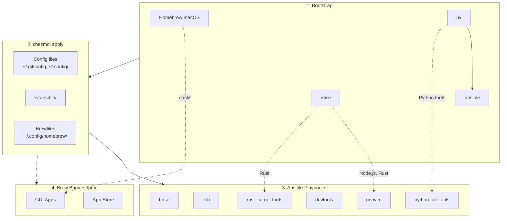

<!-- Generated by SpecStory, Markdown v2.1.0 -->

# 2026-03-31 03:23:18Z

<!-- Codex CLI Session 019d41e3-0625-7dc2-b087-54e23edc7c5c (2026-03-31 03:23:18Z) -->

_**User (2026-03-31 03:23:18Z)**_

@docs/input_methods 我要記錄 McBopomofo 與 RIME 的相關內容 （特別是RIME的自定義等等）
1. Mcıopomofo https://github.com/openvanilla/McBopomofo
2. Rime 系列 https://github.com/rime/squirrel https://github.com/rime/ibus-rime
3. 其他輸入法相關 例如  https://github.com/pqrs-org/ShowyEdge/
評估是否備份 ~/Library/Rime/squirrel.custom.yaml 等等 custom config

Rime的話 根據其Wiki 有許多可自定的內容 https://github.com/rime/home/wiki/CustomizationGuide#%E5%BF%85%E7%9F%A5%E5%BF%85%E6%9C%83

然後現在主要關注幾個問題
app切換時input method自動切換
（包含vim mode） https://github.com/rime/squirrel/issues/1023

還有就是關於全局狀態的問題 （似乎這個是librime / macOS的問題？）
https://github.com/rime/home/issues/202
https://github.com/rime/squirrel/pull/1054
https://github.com/rime/squirrel/pull/201
https://github.com/rime/librime/issues/294
https://github.com/rime/squirrel/issues/145
現在痛點很明顯：现在在不同窗口之间切换之后，基本是完全无法确定当前的输入状态是中文还是英文
切成英文 -> command + tab 到下一個視窗 （被切成中文） -> command + tab回來（還是中文）

此外編輯Rime custom config可能也要能知道怎麽查app identifier 如  `osascript -e 'id of app "Visual Studio Code"'`


---

_**Agent (gpt-5.4 2026-03-31 03:25:10Z)**_

我先在 repo 內做兩件事：讀 `td` 的當前工作指引，然後檢查 `@docs/input_methods` 目前已有的內容與結構，先把可從環境確認的事實釐清。

_**Agent (gpt-5.4 2026-03-31 03:25:10Z)**_

<tool-use data-tool-type="shell" data-tool-name="exec_command"><details>
<summary>Tool use: **exec_command** `td usage --new-session`</summary>
```
Command: /bin/zsh -lc 'td usage --new-session'
Chunk ID: 79ac1f
Wall time: 0.0000 seconds
Process exited with code 127
Original token count: 8
Output:
zsh:1: command not found: td
```
</details></tool-use>

_**Agent (gpt-5.4 2026-03-31 03:25:10Z)**_

<tool-use data-tool-type="shell" data-tool-name="exec_command"><details>
<summary>Tool use: **exec_command** `rg --files docs | rg 'input_methods|input|rime|bopomofo|ime'`</summary>
```
Command: /bin/zsh -lc "rg --files docs | rg 'input_methods|input|rime|bopomofo|ime'"
Chunk ID: 7124c9
Wall time: 0.1425 seconds
Process exited with code 1
Original token count: 0
Output:
```
</details></tool-use>

_**Agent (gpt-5.4 2026-03-31 03:25:22Z)**_

`td` 在這個環境裡不存在，先記錄成一個環境阻塞點；我接著直接檢查 repo 裡 `docs/` 與輸入法相關檔案，確認現況與可能的落點。

_**Agent (gpt-5.4 2026-03-31 03:25:22Z)**_

<tool-use data-tool-type="shell" data-tool-name="exec_command"><details>
<summary>Tool use: **exec_command** `pwd && ls -la && printf '\n--- docs ---\n' && find docs -maxdepth 2 -type f | sort`</summary>
```
Command: /bin/zsh -lc "pwd && ls -la && printf '\\n--- docs ---\\n' && find docs -maxdepth 2 -type f | sort"
Chunk ID: 82f0bb
Wall time: 0.0000 seconds
Process exited with code 0
Original token count: 937
Output:
/Users/daviddwlee84/.local/share/chezmoi
total 280
drwxr-xr-x@ 46 daviddwlee84  staff   1472 Mar 30 18:53 .
drwxr-xr-x@ 24 daviddwlee84  staff    768 Mar 30 17:03 ..
-rw-r--r--@  1 daviddwlee84  staff   2818 Mar 30 11:17 .chezmoi.toml.tmpl
-rw-r--r--@  1 daviddwlee84  staff   1167 Feb 11 16:42 .chezmoiignore
drwxr-xr-x@  3 daviddwlee84  staff     96 Feb  5 17:39 .claude
drwxr-xr-x@  2 daviddwlee84  staff     64 Feb 10 18:44 .cursor
-rw-r--r--@  1 daviddwlee84  staff    110 Feb 10 18:42 .cursorindexingignore
-rw-r--r--@  1 daviddwlee84  staff    280 Feb  3 22:39 .dockerignore
drwxr-xr-x@ 20 daviddwlee84  staff    640 Mar 31 11:24 .git
-rw-r--r--@  1 daviddwlee84  staff    234 Feb 12 10:46 .gitignore
-rw-r--r--@  1 daviddwlee84  staff    528 Feb  4 15:12 .gitleaks.toml
-rw-r--r--@  1 daviddwlee84  staff    150 Feb  4 10:29 .markdownlint.jsonc
-rw-r--r--@  1 daviddwlee84  staff    979 Feb  9 20:14 .pre-commit-config.yaml
drwxr-xr-x@  3 daviddwlee84  staff     96 Feb 12 09:08 .sidecar
drwxr-xr-x@  7 daviddwlee84  staff    224 Mar 30 19:49 .specstory
drwxr-xr-x@  3 daviddwlee84  staff     96 Feb  5 13:20 .superset
drwxr-xr-x@  8 daviddwlee84  staff    256 Mar 30 13:18 .todos
drwxr-xr-x@  4 daviddwlee84  staff    128 Feb 10 17:35 .vscode
lrwxr-xr-x@  1 daviddwlee84  staff      9 Feb  3 18:00 AGENTS.md -> CLAUDE.md
drwxr-xr-x@  3 daviddwlee84  staff     96 Feb 11 16:42 bin
-rw-r--r--@  1 daviddwlee84  staff  10608 Mar 30 11:17 CLAUDE.md
-rw-r--r--@  1 daviddwlee84  staff   4365 Feb 13 09:10 docker-compose.yml
-rw-r--r--@  1 daviddwlee84  staff   6166 Mar 30 11:17 Dockerfile
drwxr-xr-x@ 10 daviddwlee84  staff    320 Mar 31 11:05 docs
drwxr-xr-x@  6 daviddwlee84  staff    192 Feb  4 10:47 dot_ansible
drwxr-xr-x@  3 daviddwlee84  staff     96 Feb 10 16:28 dot_cargo
drwxr-xr-x@  5 daviddwlee84  staff    160 Mar 30 11:17 dot_claude
drwxr-xr-x@ 17 daviddwlee84  staff    544 Mar 31 11:08 dot_config
-rw-r--r--@  1 daviddwlee84  staff    439 Mar 30 18:53 dot_gitconfig.tmpl
-rw-r--r--@  1 daviddwlee84  staff    279 Feb 10 16:11 dot_npmrc.tmpl
drwxr-xr-x@  4 daviddwlee84  staff    128 Feb 11 18:14 dot_ssh
-rw-r--r--@  1 daviddwlee84  staff   2273 Feb  5 09:58 dot_tmux.conf
-rw-r--r--@  1 daviddwlee84  staff    124 Feb  5 19:31 dot_zshenv.tmpl
-rw-r--r--@  1 daviddwlee84  staff   4029 Mar 18 17:43 dot_zshrc.tmpl
lrwxr-xr-x@  1 daviddwlee84  staff      9 Feb  5 15:44 GEMINI.md -> CLAUDE.md
-rw-r--r--@  1 daviddwlee84  staff   7815 Feb 13 09:12 justfile
-rw-r--r--@  1 daviddwlee84  staff   5018 Feb  6 10:00 NOTES.md
drwxr-xr-x@  3 daviddwlee84  staff     96 Mar 10 10:00 private_dot_specstory
-rw-r--r--@  1 daviddwlee84  staff   8715 Mar 30 14:21 README.md
-rw-r--r--@  1 daviddwlee84  staff   1427 Feb  7 23:42 run_before_01_backup_dotfiles.sh.tmpl
-rw-r--r--@  1 daviddwlee84  staff   5659 Feb 10 19:01 run_once_before_00_bootstrap.sh.tmpl
-rw-r--r--@  1 daviddwlee84  staff   4084 Feb  7 23:42 run_once_before_02_fix_intel_homebrew.sh.tmpl
-rw-r--r--@  1 daviddwlee84  staff   7558 Mar 30 18:54 run_onchange_after_20_ansible_roles.sh.tmpl
-rw-r--r--@  1 daviddwlee84  staff   3498 Feb  7 23:42 run_onchange_after_30_brew_bundle.sh.tmpl
drwxr-xr-x@  6 daviddwlee84  staff    192 Mar 10 10:00 scripts
-rw-r--r--@  1 daviddwlee84  staff   1592 Mar 12 18:00 TODO.md

--- docs ---
docs/ansible.md
docs/initial_setup/0_ManualSetupRecord.md
docs/initial_setup/1_ApplyToNewMachine.md
docs/neovim/floating-tui.md
docs/scripts/import_ssh_to_bw.sh.md
docs/tools/codexbar.md
docs/tools/direnv.md
docs/tools/networking.md
docs/tools/pqsum.md
docs/tools/specify_cli.md
docs/tools/specstory.md
docs/tools/starship.md
docs/tools/Tailscale.md
docs/tools/td_sidecar.md
docs/tutorials/bitwarden_ssh_agent.md
docs/zsh/zsh-completions.md
```
</details></tool-use>

_**Agent (gpt-5.4 2026-03-31 03:25:22Z)**_

<tool-use data-tool-type="shell" data-tool-name="exec_command"><details>
<summary>Tool use: **exec_command** `rg -n "Rime|rime|McBopomofo|Squirrel|ibus-rime|input method|輸入法|McBopomofo|Bopomofo|vim mode|ShowyEdge" -S .`</summary>
```
Command: /bin/zsh -lc 'rg -n "Rime|rime|McBopomofo|Squirrel|ibus-rime|input method|輸入法|McBopomofo|Bopomofo|vim mode|ShowyEdge" -S .'
Chunk ID: a9d122
Wall time: 0.0000 seconds
Process exited with code 0
Original token count: 560
Output:
./dot_zshrc.tmpl:103:#   - Quick experiments with new aliases/functions
./CLAUDE.md:141:| `input_method` | Traditional Chinese input methods: McBopomofo + RIME (Squirrel on macOS, ibus-rime on Linux) |
./README.md:76:| `installInputMethod` | false | Traditional Chinese input methods (McBopomofo, RIME/Squirrel on macOS; ibus-rime on Linux) |
./README.md:126:- **Input Methods** (optional): McBopomofo + RIME (Squirrel on macOS, ibus-rime on Linux)
./docs/neovim/floating-tui.md:83:Tools that use Esc internally (like sqlit's vim mode) work fine with Snacks' **double-Esc** timer — a single Esc goes to the TUI, pressing Esc again within 200ms exits terminal insert mode.
./docs/ansible.md:132:After experimenting with changes in `~/.ansible/`, add them back to chezmoi:
./dot_ansible/roles/input_method/tasks/main.yml:2:# Input method role - Traditional Chinese input methods
./dot_ansible/roles/input_method/tasks/main.yml:3:# macOS: McBopomofo + Squirrel (RIME) via Homebrew cask
./dot_ansible/roles/input_method/tasks/main.yml:4:# Linux: ibus-rime via apt
./dot_ansible/roles/input_method/tasks/main.yml:7:# macOS: McBopomofo
./dot_ansible/roles/input_method/tasks/main.yml:10:- name: Check if McBopomofo is installed (macOS)
./dot_ansible/roles/input_method/tasks/main.yml:13:    path: /Library/Input Methods/McBopomofo.app
./dot_ansible/roles/input_method/tasks/main.yml:16:- name: Install McBopomofo via Homebrew cask (macOS)
./dot_ansible/roles/input_method/tasks/main.yml:25:# macOS: Squirrel (RIME)
./dot_ansible/roles/input_method/tasks/main.yml:28:- name: Check if Squirrel (RIME) is installed (macOS)
./dot_ansible/roles/input_method/tasks/main.yml:31:    path: /Library/Input Methods/Squirrel.app
./dot_ansible/roles/input_method/tasks/main.yml:34:- name: Install Squirrel (RIME) via Homebrew cask (macOS)
./dot_ansible/roles/input_method/tasks/main.yml:43:# Linux: ibus-rime
./dot_ansible/roles/input_method/tasks/main.yml:46:- name: Install ibus-rime (Ubuntu)
./dot_ansible/roles/input_method/tasks/main.yml:51:    name: ibus-rime
./dot_config/marimo/create_marimo.toml:91:[experimental]
./Dockerfile:127:    --promptBool "Install Traditional Chinese input methods (McBopomofo, RIME)=${CHEZMOI_INSTALL_INPUT_METHOD}" \
```
</details></tool-use>

_**Agent (gpt-5.4 2026-03-31 03:25:36Z)**_

repo 內目前只有 ansible role 與 README 提到 `input_method`，`docs/` 還沒有專門的 input methods 文件，所以這次規劃大概率會新增一份文檔，而不是補既有頁面。接下來我會讀 role、README、Dockerfile 與可能的現有 docs 風格，順便再確認 `td` 是否只是 PATH 問題。

_**Agent (gpt-5.4 2026-03-31 03:25:36Z)**_

<tool-use data-tool-type="shell" data-tool-name="exec_command"><details>
<summary>Tool use: **exec_command** `command -v td || which td || find .. -maxdepth 4 -name td -type f 2>/dev/null | head`</summary>
```
Command: /bin/zsh -lc 'command -v td || which td || find .. -maxdepth 4 -name td -type f 2>/dev/null | head'
Chunk ID: 7859b2
Wall time: 0.0000 seconds
Process exited with code 0
Original token count: 4
Output:
td not found
```
</details></tool-use>

_**Agent (gpt-5.4 2026-03-31 03:25:36Z)**_

<tool-use data-tool-type="shell" data-tool-name="exec_command"><details>
<summary>Tool use: **exec_command** `sed -n '1,220p' README.md`</summary>
```
Command: /bin/zsh -lc "sed -n '1,220p' README.md"
Chunk ID: 3e49f2
Wall time: 0.0000 seconds
Process exited with code 0
Original token count: 2179
Output:
# dotfiles

Cross-platform development environment setup using **chezmoi** + **ansible**.

- **chezmoi**: manages config files (dotfiles)
- **ansible**: installs system dependencies and tools

## Prerequisites

- [chezmoi](https://www.chezmoi.io/install/)
- [uv](https://docs.astral.sh/uv/getting-started/installation/) (for ansible)

## Architecture



## Quick Setup

```bash
# One-liner to initialize and apply (installs chezmoi to ~/.local/bin)
export GITHUB_USERNAME=daviddwlee84
sh -c "$(curl -fsLS get.chezmoi.io)" -- -b "$HOME/.local/bin" init --apply git@github.com:$GITHUB_USERNAME/dotfiles.git
```

This automatically:

1. Bootstraps Homebrew (macOS/Linux), uv, mise, ansible
2. Deploys all config files
3. Runs ansible playbooks (git, ripgrep, fd, neovim, etc.)
4. Runs brew bundle (if `installBrewApps` enabled)

### Optional Components

During `chezmoi init`, you'll be prompted for optional installs:

| Option | Default | Description |
|--------|---------|-------------|
| `installCodingAgents` | true | Claude Code, Codex CLI, OpenCode, Cursor, Copilot, Gemini CLI, td, sidecar, specify-cli, etc. |
| `installBitwarden` | false | Bitwarden CLI (`bw`) + Desktop app (desktop profiles) with SSH agent auto-detection |
| `installPythonUvTools` | true | Python CLI tools via uv (mlflow, litellm, sqlit-tui, etc.) |
| `installBrewApps` | false | GUI apps via Homebrew Brewfile (casks, mas) |
| `installInputMethod` | false | Traditional Chinese input methods (McBopomofo, RIME/Squirrel on macOS; ibus-rime on Linux) |
| `installNetworkingTools` | false | Networking CLI tools (nmap, mtr, httpie, gping, trippy, bandwhich, rustscan, etc.) |
| `noRoot` | false | Skip sudo-requiring tasks (for servers without root access) |

To change options later: `chezmoi init --force`

## What You Get

### Config Files

- `~/.gitconfig` - Git configuration
- `~/.config/git/hooks/` - Global Git hooks (pre-commit + Git LFS hooks)
- `~/.config/nvim/` - Neovim (LazyVim) configuration
- `~/.config/uv/uv.toml` - uv package manager config
- `~/.cargo/config.toml` - Cargo registry mirror config (GFW)
- `~/.npmrc` - npm registry config (official/npmmirror via `useChineseMirror`)
- `~/.config/.bunfig.toml` - Bun global registry config (official/npmmirror via `useChineseMirror`)
- `~/.config/alacritty/` - Alacritty terminal config
- `~/.config/starship.toml` - Starship cross-shell prompt config
- `~/.config/direnv/direnvrc` - direnv helper functions, including `.venv`-aware Python activation
- `~/.config/yazi/` - Yazi file manager config (v0.3.3+ syntax, [docs](https://yazi-rs.github.io/docs/configuration/overview/))
  - `yazi.toml` - Main config with open rules and openers (`o`/`O`)
  - `keymap.toml`, `theme.toml` - Optional customization files (stubs provided)
- `~/.claude/` - Claude Code settings
- `~/.specstory/cli/config.toml` - Global SpecStory defaults for `specstory run` across all projects
- `~/.tmux.conf` - Tmux configuration with TPM plugins
- `~/.local/bin/x` - Cross-platform terminal wrapper for `copy` / `paste` / `open`
- `~/.config/zsh/tools/22_sesh.zsh` - Sesh keybinding (Ctrl+A for tmux session switcher)
- `~/.config/zsh/tools/36_pueue.zsh` - Pueue queue summary helper (`pqsum`)
- `~/.config/zsh/tools/41_github.zsh` - GitHub helper with `ghget` for downloading a repo subdirectory from a tree URL
- `~/.config/zsh/tools/28_tldr.zsh` - `tldrf` helper with `TLDR_LANGUAGES` fallback order
- `~/.config/zsh/tools/95_bitwarden.zsh` - Bitwarden CLI completion + SSH agent socket auto-detection
- `~/.ssh/config` - SSH main config skeleton (create-only: `Include ~/.ssh/config.d/*` + conservative `Host *` defaults)
- `~/.ssh/config.d/00-defaults` - SSH global defaults stub (commented examples only)
- `~/.ssh/config.d/git` - SSH host entries for `github.com` and `gitlab.com` with commented multi-account/Bitwarden examples
- `~/.config/tmuxp/claude-sidecar.yaml` - tmuxp workspace for Claude + Sidecar
- `~/.config/zellij/layouts/claude-sidecar.kdl` - Zellij layout for Claude + 
... (truncated)
```
</details></tool-use>

_**Agent (gpt-5.4 2026-03-31 03:25:36Z)**_

<tool-use data-tool-type="shell" data-tool-name="exec_command"><details>
<summary>Tool use: **exec_command** `sed -n '1,220p' dot_ansible/roles/input_method/tasks/main.yml`</summary>
```
Command: /bin/zsh -lc "sed -n '1,220p' dot_ansible/roles/input_method/tasks/main.yml"
Chunk ID: 9482a7
Wall time: 0.0000 seconds
Process exited with code 0
Original token count: 432
Output:
---
# Input method role - Traditional Chinese input methods
# macOS: McBopomofo + Squirrel (RIME) via Homebrew cask
# Linux: ibus-rime via apt

# =============================================================================
# macOS: McBopomofo
# =============================================================================

- name: Check if McBopomofo is installed (macOS)
  when: ansible_facts["os_family"] == "Darwin"
  ansible.builtin.stat:
    path: /Library/Input Methods/McBopomofo.app
  register: mcbopomofo_check

- name: Install McBopomofo via Homebrew cask (macOS)
  when:
    - ansible_facts["os_family"] == "Darwin"
    - not mcbopomofo_check.stat.exists
  community.general.homebrew_cask:
    name: mcbopomofo
    state: present

# =============================================================================
# macOS: Squirrel (RIME)
# =============================================================================

- name: Check if Squirrel (RIME) is installed (macOS)
  when: ansible_facts["os_family"] == "Darwin"
  ansible.builtin.stat:
    path: /Library/Input Methods/Squirrel.app
  register: squirrel_check

- name: Install Squirrel (RIME) via Homebrew cask (macOS)
  when:
    - ansible_facts["os_family"] == "Darwin"
    - not squirrel_check.stat.exists
  community.general.homebrew_cask:
    name: squirrel
    state: present

# =============================================================================
# Linux: ibus-rime
# =============================================================================

- name: Install ibus-rime (Ubuntu)
  when: ansible_facts["os_family"] == "Debian"
  become: true
  tags: [sudo]
  ansible.builtin.apt:
    name: ibus-rime
    state: present
    update_cache: true
```
</details></tool-use>

_**Agent (gpt-5.4 2026-03-31 03:25:37Z)**_

<tool-use data-tool-type="shell" data-tool-name="exec_command"><details>
<summary>Tool use: **exec_command** `sed -n '100,170p' Dockerfile`</summary>
```
Command: /bin/zsh -lc "sed -n '100,170p' Dockerfile"
Chunk ID: e0ce51
Wall time: 0.0000 seconds
Process exited with code 0
Original token count: 581
Output:
WORKDIR /home/devuser

# Install chezmoi binary
# Retry up to 3 times to handle network issues (especially behind GFW)
RUN for i in 1 2 3; do \
        echo "Attempt $i: Installing chezmoi to ~/.local/bin..." && \
        sh -c "$(curl -fsLS --retry 3 --retry-delay 5 get.chezmoi.io/lb)" && \
        echo "chezmoi installed successfully" && break || \
        { echo "Attempt $i failed, retrying..."; sleep 10; }; \
    done

# Initialize and apply dotfiles with prompt values passed via flags
# This avoids interactive prompts during Docker build
# Set PATH to include ~/.local/bin so run_once scripts can find uv tools (ansible)
# Use local source instead of cloning from GitHub to test local changes
# Note: installBrewApps=false by default (Linuxbrew is optional on Linux)
RUN export PATH="$HOME/.local/bin:$PATH" && \
    ~/.local/bin/chezmoi init --apply --source=/tmp/dotfiles-source \
    --promptString "profile (ubuntu_server|ubuntu_desktop|macos)=${CHEZMOI_PROFILE}" \
    --promptString "What is your email address=${CHEZMOI_EMAIL}" \
    --promptString "What is your full name=${CHEZMOI_NAME}" \
    --promptBool "Are you in China (behind GFW) and need to use mirrors=${CHEZMOI_USE_CHINESE_MIRROR}" \
    --promptBool "Enable gitleaks for ALL git repos (not just those with .pre-commit-config.yaml)=${CHEZMOI_GITLEAKS_ALL_REPOS}" \
    --promptBool "Install coding agents (Claude Code, OpenCode, Cursor, Copilot, Gemini, etc.)=${CHEZMOI_INSTALL_CODING_AGENTS}" \
    --promptBool "Install Bitwarden CLI (@bitwarden/cli) with SSH Agent integration and Zsh completion=${CHEZMOI_INSTALL_BITWARDEN}" \
    --promptBool "Install Python CLI tools via uv (mlflow, litellm, sqlit-tui, etc.)=${CHEZMOI_INSTALL_PYTHON_UV_TOOLS}" \
    --promptBool "Install GUI apps via Homebrew Brewfile (casks, mas)=${CHEZMOI_INSTALL_BREW_APPS}" \
    --promptBool "Install Traditional Chinese input methods (McBopomofo, RIME)=${CHEZMOI_INSTALL_INPUT_METHOD}" \
    --promptBool "Install networking CLI tools (nmap, mtr, httpie, gping, trippy, etc.)=${CHEZMOI_INSTALL_NETWORKING_TOOLS}" \
    --promptBool "No sudo/root access - skip all system package installations=${CHEZMOI_NO_ROOT}" \
    --promptBool "Backup existing dotfiles before chezmoi overwrites them=${CHEZMOI_BACKUP_DOTFILES}"

# Default to bash shell
CMD ["/bin/bash"]
```
</details></tool-use>

_**Agent (gpt-5.4 2026-03-31 03:25:50Z)**_

目前可確定三件事：repo 已有 `input_method` 安裝入口、README 已曝光這個選項、但沒有任何對 McBopomofo/RIME 自訂與排障的文檔或配置備份策略。下一步我會補齊兩類事實來源：repo 內是否已有 Rime/McBopomofo 實際配置檔，以及 upstream wiki/issues/PR 對你提到的幾個痛點目前怎麼說。

_**Agent (gpt-5.4 2026-03-31 03:25:50Z)**_

<tool-use data-tool-type="shell" data-tool-name="exec_command"><details>
<summary>Tool use: **exec_command** `rg --files . | rg 'Rime|rime|squirrel|mcbopomofo|bopomofo|input_method|ime'`</summary>
```
Command: /bin/zsh -lc "rg --files . | rg 'Rime|rime|squirrel|mcbopomofo|bopomofo|input_method|ime'"
Chunk ID: f10cf5
Wall time: 0.0000 seconds
Process exited with code 0
Original token count: 25
Output:
./dot_ansible/roles/input_method/tasks/main.yml
./dot_config/nvim/lua/exact_plugins/wakatime.lua
```
</details></tool-use>

_**Agent (gpt-5.4 2026-03-31 03:25:50Z)**_

<tool-use data-tool-type="shell" data-tool-name="exec_command"><details>
<summary>Tool use: **exec_command** `sed -n '1,220p' .chezmoi.toml.tmpl`</summary>
```
Command: /bin/zsh -lc "sed -n '1,220p' .chezmoi.toml.tmpl"
Chunk ID: 3ca268
Wall time: 0.0000 seconds
Process exited with code 0
Original token count: 705
Output:
# https://www.chezmoi.io/reference/special-files/chezmoi-format-tmpl/

[data]
# 只在 init 才需要問一次：你之後都讀這個值
# TODO: not all the things we want to change all the time we chezmoi init
profile = {{ promptStringOnce . "profile" "profile (ubuntu_server|ubuntu_desktop|macos|macos_intel)" "macos" | quote }}
email   = {{ promptStringOnce . "email" "What is your email address" "daviddwlee84@gmail.com" | quote }}
name    = {{ promptStringOnce . "name" "What is your full name" "Da-Wei Lee" | quote }}
# 是否在中國大陸 GFW 內，需要使用鏡像源
useChineseMirror = {{ promptBoolOnce . "useChineseMirror" "Are you in China (behind GFW) and need to use mirrors" false }}
# 是否對所有 repo 啟用 gitleaks 掃描（包含沒有 .pre-commit-config.yaml 的 repo）
gitleaksAllRepos = {{ promptBoolOnce . "gitleaksAllRepos" "Enable gitleaks for ALL git repos (not just those with .pre-commit-config.yaml)" false }}
# 是否安裝 coding agents (Claude Code, OpenCode, Cursor, Copilot, Gemini, etc.)
installCodingAgents = {{ promptBoolOnce . "installCodingAgents" "Install coding agents (Claude Code, OpenCode, Cursor, Copilot, Gemini, etc.)" true }}
# 是否安裝 Bitwarden CLI 並啟用 SSH Agent 自動偵測 + Zsh completion
installBitwarden = {{ promptBoolOnce . "installBitwarden" "Install Bitwarden CLI (@bitwarden/cli) with SSH Agent integration and Zsh completion" false }}
# 是否安裝 Python CLI tools via uv (mlflow, litellm, sqlit-tui, etc.)
installPythonUvTools = {{ promptBoolOnce . "installPythonUvTools" "Install Python CLI tools via uv (mlflow, litellm, sqlit-tui, etc.)" true }}
# 是否安裝 GUI apps via Homebrew Brewfile (terminals, browsers, utilities, etc.)
installBrewApps = {{ promptBoolOnce . "installBrewApps" "Install GUI apps via Homebrew Brewfile (casks, mas)" false }}
# 是否安裝繁體中文輸入法 (McBopomofo + RIME)
installInputMethod = {{ promptBoolOnce . "installInputMethod" "Install Traditional Chinese input methods (McBopomofo, RIME)" false }}
# 是否安裝網路診斷工具 (nmap, mtr, httpie, gping, trippy, etc.)
installNetworkingTools = {{ promptBoolOnce . "installNetworkingTools" "Install networking CLI tools (nmap, mtr, httpie, gping, trippy, etc.)" false }}
# 沒有 sudo/root 權限，只安裝 user-level 工具 (mise, cargo, gem, uv, npm)
noRoot = {{ promptBoolOnce . "noRoot" "No sudo/root access - skip all system package installations" false }}
# 在 chezmoi apply 之前備份現有的 dotfiles
backupDotfiles = {{ promptBoolOnce . "backupDotfiles" "Backup existing dotfiles before chezmoi overwrites them" true }}

# https://www.chezmoi.io/user-guide/use-scripts-to-perform-actions/#dont-show-scripts-that-would-run-in-chezmoi-diffchezmoi-status
[diff]
    exclude = ["scripts"]
[status]
    exclude = ["scripts"]
```
</details></tool-use>

_**Agent (gpt-5.4 2026-03-31 03:25:50Z)**_

<tool-use data-tool-type="shell" data-tool-name="exec_command"><details>
<summary>Tool use: **exec_command** `find docs/tools -maxdepth 1 -type f | sort | xargs -I{} sh -c 'printf "--- %s ---\n" "{}"; sed -n "1,80p" "{}"'`</summary>
```
Command: /bin/zsh -lc "find docs/tools -maxdepth 1 -type f | sort | xargs -I{} sh -c 'printf \"--- %s ---\\n\" \"{}\"; sed -n \"1,80p\" \"{}\"'"
Chunk ID: 01682c
Wall time: 0.0000 seconds
Process exited with code 0
Original token count: 4847
Output:
sh: line 0: printf: --: invalid option
printf: usage: printf [-v var] format [arguments]
# CodexBar CLI

[CodexBar](https://github.com/steipete/CodexBar) shows usage stats for AI coding tools (Codex, Claude Code, Cursor, Gemini, Copilot, etc.) without logging into each dashboard.

- **macOS**: Full menu bar app + CLI
- **Linux**: CLI only

## Installation

Installed automatically via the `coding_agents` ansible role. On Linux, the binary is placed at `~/.local/bin/codexbar`.

## Linux Usage

On Linux, you **must** pass `--source cli` for the `usage` command. The default source (`auto`/`web`) is macOS-only.

### Check live usage (rate limits / quotas)

```bash
# Claude session/weekly limits
codexbar usage --provider claude --source cli

# Other providers
codexbar usage --provider codex --source cli
codexbar usage --provider gemini --source cli
codexbar usage --provider copilot --source cli

# JSON output (for scripting / Waybar)
codexbar usage --provider claude --source cli --json --pretty
```

Example output:

```
== Claude 2.1.34 (claude) ==
Session: 14% left [=-----------]
```

### Check local cost (from JSONL logs, no auth needed)

The `cost` command reads local log files (e.g. `~/.claude/`) and doesn't require auth.

```bash
# All providers
codexbar cost

# Claude only
codexbar cost --provider claude

# JSON output
codexbar cost --provider claude --json --pretty

# Force rescan of logs
codexbar cost --refresh
```

Example output:

```
Claude Cost (local)
Today: $0.54 · 851K tokens
Last 30 days: $8.50 · 9.1M tokens
```

## Shell Aliases

Defined in `~/.config/zsh/tools/40_codexbar.zsh`:

| Alias | Command | Description |
|-------|---------|-------------|
| `cbu` | `codexbar usage --provider claude --source cli` | Claude usage |
| `cbc` | `codexbar cost --provider claude` | Claude local cost |
| `cbca` | `codexbar cost` | All providers local cost |

## Supported Providers

`codex`, `claude`, `cursor`, `opencode`, `factory`, `gemini`, `antigravity`, `copilot`, `zai`, `minimax`, `kimi`, `kiro`, `vertexai`, `augment`, `jetbrains`, `kimik2`, `amp`

## Tips

- Avoid `--provider all` with `usage` on Linux -- it tries each provider sequentially and can hang if a CLI isn't installed.
sh: line 0: printf: --: invalid option
printf: usage: printf [-v var] format [arguments]
# direnv

`direnv` loads per-project environment variables as you enter and leave directories. In this repo it is initialized from Zsh, while prompt display is handled by Starship.

- **Helper file**: `~/.config/direnv/direnvrc` (chezmoi source: `dot_config/direnv/direnvrc`)
- **Zsh init**: `~/.config/zsh/tools/30_direnv.zsh`
- **Prompt**: `~/.config/starship.toml` via Starship's `[python]` module

## Python `.venv` helper

This repo provides `layout_python_venv [venv_dir=.venv]`.

- Activates an existing virtual environment directory
- Does not auto-create `.venv`
- Delegates activation to `layout python3`
- Watches the venv marker files so creating `.venv` later triggers a reload on the next prompt

## Recommended `.envrc`

```sh
layout_python_venv
dotenv_if_exists
```

Then allow it once per project:

```bash
direnv allow
```

You can target a non-default virtual environment directory if needed:

```sh
layout_python_venv venv
dotenv_if_exists
```

## Behavior Notes

- Equivalent for daily use: `VIRTUAL_ENV`, `PATH`, and `PYTHONHOME` handling come from direnv's built-in `layout python3`
- Not fully equivalent to `source .venv/bin/activate`: no `deactivate()` shell function and no direct `PS1` rewriting
- Prompt display still works because Starship reads `VIRTUAL_ENV` and shows the active environment name
- Leaving the directory automatically restores the previous environment

## References

- [Python · direnv Wiki](https://github.com/direnv/direnv/wiki/Python)
- [Activate python venv by default? · Issue #1264](https://github.com/direnv/direnv/issues/1264)
- [PS1 · direnv Wiki](https://github.com/direnv/direnv/wiki/PS1)
sh: line 0: printf: --: invalid option
printf: usage: printf [-v var] format [arguments]
# Networking CLI Tools

Optional role (`installNetworkingTools`). Install via `chezmoi init --force` and enable the prompt.

## Tools

| Tool | Binary | Purpose | Sudo at runtime? |
|------|--------|---------|-------------------|
| [nmap](https://nmap.org/) | `nmap` | Port scanning, host discovery, OS detection, service enumeration | Some features (OS detection, SYN scan) |
| [arp-scan](https://github.com/royhills/arp-scan) | `arp-scan` | Fast Layer 2 host discovery with OUI vendor lookup | Yes (raw sockets) |
| [mtr](https://www.bitwizard.nl/mtr/) | `mtr` | Real-time combined ping + traceroute | Some modes |
| [iperf3](https://iperf.fr/) | `iperf3` | Network bandwidth/throughput testing betw
... (truncated)
```
</details></tool-use>

_**Agent (gpt-5.4 2026-03-31 03:27:10Z)**_

我現在補本機事實：先看這台機器是否已經有 `~/Library/Rime` 與現成 custom 檔案，這會直接影響「文檔要不要把備份列成必要步驟」以及未來 chezmoi 要不要納管哪些檔。

_**Agent (gpt-5.4 2026-03-31 03:27:10Z)**_

<tool-use data-tool-type="shell" data-tool-name="exec_command"><details>
<summary>Tool use: **exec_command** `if [ -d "$HOME/Library/Rime" ]; then printf 'RIME_DIR_EXISTS\n'; find "$HOME/Library/Rime" -maxdepth 1 -type f | sed "s|$HOME|~|" | sort; else printf 'RIME_DIR_MISSING\n'; fi`</summary>
```
Command: /bin/zsh -lc 'if [ -d "$HOME/Library/Rime" ]; then printf '"'RIME_DIR_EXISTS\\n'; find \""'$HOME/Library/Rime" -maxdepth 1 -type f | sed "s|$HOME|~|" | sort; else printf '"'RIME_DIR_MISSING\\n'; fi"
Chunk ID: 9edb4e
Wall time: 0.0000 seconds
Process exited with code 0
Original token count: 34
Output:
RIME_DIR_EXISTS
~/Library/Rime/.DS_Store
~/Library/Rime/installation.yaml
~/Library/Rime/squirrel.custom.yaml
~/Library/Rime/user.yaml
```
</details></tool-use>

_**Agent (gpt-5.4 2026-03-31 03:27:10Z)**_

<tool-use data-tool-type="shell" data-tool-name="exec_command"><details>
<summary>Tool use: **exec_command** `if [ -d "/Library/Input Methods" ]; then find "/Library/Input Methods" -maxdepth 1 -type d \( -name 'Squirrel.app' -o -name 'McBopomofo.app' \) | sort; fi`</summary>
```
Command: /bin/zsh -lc "if [ -d \"/Library/Input Methods\" ]; then find \"/Library/Input Methods\" -maxdepth 1 -type d \\( -name 'Squirrel.app' -o -name 'McBopomofo.app' \\) | sort; fi"
Chunk ID: be158a
Wall time: 0.0000 seconds
Process exited with code 0
Original token count: 9
Output:
/Library/Input Methods/Squirrel.app
```
</details></tool-use>

_**Agent (gpt-5.4 2026-03-31 03:27:10Z)**_

<tool-use data-tool-type="shell" data-tool-name="exec_command"><details>
<summary>Tool use: **exec_command** `osascript -e 'id of app "Visual Studio Code"'`</summary>
```
Command: /bin/zsh -lc "osascript -e 'id of app \"Visual Studio Code\"'"
Chunk ID: 2d30c0
Wall time: 0.0374 seconds
Process exited with code 0
Original token count: 6
Output:
com.microsoft.VSCode
```
</details></tool-use>

_**Agent (gpt-5.4 2026-03-31 03:27:22Z)**_

本機狀態比預期更明確：`Squirrel.app` 已安裝，`McBopomofo.app` 沒有裝；而且 `~/Library/Rime` 已經存在 `squirrel.custom.yaml`，所以「是否備份 custom config」不是理論問題，而是現在就有實際資料要決定怎麼納管。接著我會讀這份現有 custom 檔的內容形狀，避免規劃跟你目前設定衝突。

_**Agent (gpt-5.4 2026-03-31 03:27:22Z)**_

<tool-use data-tool-type="shell" data-tool-name="exec_command"><details>
<summary>Tool use: **exec_command** `sed -n '1,220p' "$HOME/Library/Rime/squirrel.custom.yaml"`</summary>
```
Command: /bin/zsh -lc "sed -n '1,220p' \""'$HOME/Library/Rime/squirrel.custom.yaml"'
Chunk ID: 49572d
Wall time: 0.0001 seconds
Process exited with code 0
Original token count: 225
Output:
patch:
  # style:
  #   color_scheme: purity_of_form_custom
  #   color_scheme_dark: purity_of_form_custom
  #   candidate_list_layout: linear
  #   text_orientation: horizontal
  #   inline_preedit: true
  #   use_custom_font: true
  #   font_face: 'Avenir'
  #   font_point: 17

  app_options:
    com.googlecode.iterm2:
      ascii_mode: true
    com.google.Chrome:
      ascii_mode: true
    com.tencent.xinWeChat:
      ascii_mode: false
    com.raycast.macos:
      ascii_mode: true
    com.todesktop.230313mzl4w4u92:
      ascii_mode: true
    com.microsoft.VSCode:
      ascii_mode: true
    com.google.antigravity:
      ascii_mode: true
    com.hnc.Discord:
      ascii_mode: true
    com.microsoft.Outlook:
      ascii_mode: true
    com.apple.Terminal: # 终端
      ascii_mode: true
      no_inline: true
      vim_mode: true
      inline_preedit: false  # 防止 ESC 影响输入法
```
</details></tool-use>

_**Agent (gpt-5.4 2026-03-31 03:27:22Z)**_

<tool-use data-tool-type="shell" data-tool-name="exec_command"><details>
<summary>Tool use: **exec_command** `for f in "$HOME/Library/Rime"/*.custom.yaml "$HOME/Library/Rime"/*.yaml; do [ -f "$f" ] || continue; printf '%s\n' "${f/#$HOME/~}"; done | sort`</summary>
```
Command: /bin/zsh -lc 'for f in "$HOME/Library/Rime"/*.custom.yaml "$HOME/Library/Rime"/*.yaml; do [ -f "$f" ] || continue; printf '"'%s\\n' \""'${f/#$HOME/~}"; done | sort'
Chunk ID: 985a7a
Wall time: 0.0001 seconds
Process exited with code 0
Original token count: 33
Output:
~/Library/Rime/installation.yaml
~/Library/Rime/squirrel.custom.yaml
~/Library/Rime/squirrel.custom.yaml
~/Library/Rime/user.yaml
```
</details></tool-use>

_**Agent (gpt-5.4 2026-03-31 03:28:09Z)**_

我還缺一個本機關鍵點：目前已安裝的 Squirrel 版本到底支不支援 `global_ascii`，以及它本身 shipped 的 `squirrel.yaml` 對 `vim_mode` / `app_options` 怎麼描述。這可以避免把 upstream 討論直接誤寫成「已可用功能」。

_**Agent (gpt-5.4 2026-03-31 03:28:09Z)**_

<tool-use data-tool-type="shell" data-tool-name="exec_command"><details>
<summary>Tool use: **exec_command** `if [ -f '/Library/Input Methods/Squirrel.app/Contents/SharedSupport/squirrel.yaml' ]; then rg -n "global_ascii|app_options|vim_mode|no_inline|inline_preedit|ascii_mode" '/Library/Input Methods/Squirrel.app/Contents/SharedSupport/squirrel.yaml'; fi`</summary>
```
Command: /bin/zsh -lc "if [ -f '/Library/Input Methods/Squirrel.app/Contents/SharedSupport/squirrel.yaml' ]; then rg -n \"global_ascii|app_options|vim_mode|no_inline|inline_preedit|ascii_mode\" '/Library/Input Methods/Squirrel.app/Contents/SharedSupport/squirrel.yaml'; fi"
Chunk ID: 7fd86a
Wall time: 0.0000 seconds
Process exited with code 0
Original token count: 219
Output:
27:  inline_preedit: true
250:    inline_preedit: true #单行显示，false双行显示
269:    inline_preedit: true #单行显示，false双行显示
294:    inline_preedit: true                    # 单行显示，false双行显示
382:app_options:
384:    ascii_mode: true
386:    ascii_mode: true
388:    ascii_mode: true
390:    ascii_mode: true
392:    ascii_mode: true
393:    no_inline: true
395:    ascii_mode: true
396:    no_inline: true
398:    ascii_mode: true  # 初始爲西文模式
399:    no_inline: true   # 不使用行內編輯
400:    vim_mode: true    # 退出VIM插入模式自動切換輸入法狀態
402:    ascii_mode: true
404:    ascii_mode: true
406:    ascii_mode: true
408:    ascii_mode: true
410:    ascii_mode: true
412:    ascii_mode: true
414:    ascii_mode: true
416:    ascii_mode: true
417:    no_inline: true
419:    ascii_mode: true
```
</details></tool-use>

_**Agent (gpt-5.4 2026-03-31 03:28:09Z)**_

<tool-use data-tool-type="shell" data-tool-name="exec_command"><details>
<summary>Tool use: **exec_command** `defaults read '/Library/Input Methods/Squirrel.app/Contents/Info' CFBundleShortVersionString 2>/dev/null || /usr/libexec/PlistBuddy -c 'Print :CFBundleShortVersionString' '/Library/Input Methods/Squirrel.app/Contents/Info.plist'`</summary>
```
Command: /bin/zsh -lc "defaults read '/Library/Input Methods/Squirrel.app/Contents/Info' CFBundleShortVersionString 2>/dev/null || /usr/libexec/PlistBuddy -c 'Print :CFBundleShortVersionString' '/Library/Input Methods/Squirrel.app/Contents/Info.plist'"
Chunk ID: 2fd931
Wall time: 0.0000 seconds
Process exited with code 1
Original token count: 15
Output:
Print: Entry, ":CFBundleShortVersionString", Does Not Exist
```
</details></tool-use>

_**Agent (gpt-5.4 2026-03-31 03:28:09Z)**_

<tool-use data-tool-type="shell" data-tool-name="exec_command"><details>
<summary>Tool use: **exec_command** `sed -n '1,220p' '/Library/Input Methods/Squirrel.app/Contents/SharedSupport/squirrel.yaml'`</summary>
```
Command: /bin/zsh -lc "sed -n '1,220p' '/Library/Input Methods/Squirrel.app/Contents/SharedSupport/squirrel.yaml'"
Chunk ID: 43fb05
Wall time: 0.0000 seconds
Process exited with code 0
Original token count: 1761
Output:
# Squirrel settings
# encoding: utf-8

config_version: '1.0'

# options: last | default | _custom_
# last: the last used latin keyboard layout
# default: US (ABC) keyboard layout
# _custom_: keyboard layout of your choice, e.g. 'com.apple.keylayout.USExtended' or simply 'USExtended'
keyboard_layout: last

# for veteran chord-typist
chord_duration: 0.1  # seconds

# options: always | never | appropriate
show_notifications_when: appropriate

style:
  color_scheme: native
  # Optional: define both light and dark color schemes to match system appearance
  #color_scheme: solarized_light
  #color_scheme_dark: solarized_dark

  # horizontal is Deprecated since 0.36, Squirrel 0.15, removed since 1.0.1
  candidate_list_layout: stacked  # stacked | linear
  text_orientation: horizontal  # horizontal | vertical
  inline_preedit: true
  # Whether to embed selected candidate as text in input field
  inline_candidate: false
  # Whether candidate panel stick to screen edge to reduce jumping
  memorize_size: true
  # Whether transparent colors stack on each other
  mutual_exclusive: false
  # Whether to use a translucent background. Only visible when background color is transparent
  translucency: false
  # Enable to show small arrows that indicates if paging up/down is possible
  show_paging: false

  corner_radius: 7
  hilited_corner_radius: 0
  border_height: -2
  border_width: -2
  # Space between candidates in stacked layout
  line_spacing: 5
  # Space between preedit and candidates in non-inline mode
  spacing: 8
  # A number greater than 0 renders shadow around high-lighted candidate
  shadow_size: 0
  # Controls non-hililighted candidate background size, relative to highlighted
  # Nagetive means shrink, positive meas expand
  #surrounding_extra_expansion: 0

  # format using %@ and %c is deprecated since 1.0, Squirrel 1.0
  # %@ is automatically expanded to "[candidate] [comment]"
  # and %c is replaced by "[label]"
  candidate_format: '[label]. [candidate] [comment]'

  # adjust the base line of text
  #base_offset: 0
  font_face: 'Avenir'
  font_point: 16
  #label_font_face: 'Avenir'
  #label_font_point: 12
  #comment_font_face: 'Avenir'
  #comment_font_point: 16

preset_color_schemes:
  native:
    name: 系統配色

  aqua:
    name: 碧水／Aqua
    author: 佛振 <chen.sst@gmail.com>
    text_color: 0x606060
    back_color: 0xeeeceeee
    candidate_text_color: 0x000000
    hilited_text_color: 0x000000
    hilited_candidate_text_color: 0xffffff
    hilited_candidate_back_color: 0xeefa3a0a
    comment_text_color: 0x5a5a5a
    hilited_comment_text_color: 0xfcac9d

  azure:
    name: 青天／Azure
    author: 佛振 <chen.sst@gmail.com>
    text_color: 0xcfa677
    candidate_text_color: 0xffeacc
    back_color: 0xee8b4e01
    hilited_text_color: 0xffeacc
    hilited_candidate_text_color: 0x7ffeff
    hilited_candidate_back_color: 0x00000000
    comment_text_color: 0xc69664

  luna:
    name: 明月／Luna
    author: 佛振 <chen.sst@gmail.com>
    text_color: 0xa5a5a5
    back_color: 0xdd000000
    candidate_text_color: 0xeceeee
    hilited_text_color: 0x7fffff
    hilited_candidate_text_color: 0x7fffff
    hilited_candidate_back_color: 0x40000000
    comment_text_color: 0xa5a5a5
    hilited_comment_text_color: 0x449c9d

  ink:
    name: 墨池／Ink
    author: 佛振 <chen.sst@gmail.com>
    text_color: 0x5a5a5a
    back_color: 0xeeffffff
    candidate_text_color: 0x000000
    hilited_text_color: 0x000000
    #hilited_back_color: 0xdddddd
    hilited_candidate_text_color: 0xffffff
    hilited_candidate_back_color: 0xcc000000
    comment_text_color: 0x5a5a5a
    hilited_comment_text_color: 0x808080

  lost_temple:
    name: 孤寺／Lost Temple
    author: 佛振 <chen.sst@gmail.com>, based on ir_black
    text_color: 0xe8f3f6
    back_color: 0xee303030
    hilited_text_color: 0x82e6ca
    hilited_candidate_text_color: 0x000000
    hilited_candidate_back_color: 0x82e6ca
    comment_text_color: 0xbb82e6ca
    hilited_comment_text_color: 0xbb203d34

  dark_temple:
    name: 暗堂／Dark Temple
    author: 佛振 <chen.sst@gmail.com>, based on ir_black
    text_color: 0x92f6da
    back_color: 0x222222
    candidate_text_color: 0xd8e3e6
    hilited_text_color: 0xffcf9a
    hilited_back_color: 0x222222
    hilited_candidate_text_color: 0x92f6da
    hilited_candidate_back_color: 0x10000000  # 0x333333
    comment_text_color: 0x606cff

  psionics:
    name: 幽能／Psionics
    author: 雨過之後、佛振
    text_color: 0xc2c2c2
    back_color: 0x444444
    candidate_text_color: 0xeeeeee
    hilited_text_color: 0xeeeeee
    hilited_back_color: 0x444444
    hilited_candidate_label_color: 0xfafafa
    hilited_candidate_text_color: 0xfafafa
    hilited_candidate_back_color: 0xd4bc00
    comment_t
... (truncated)
```
</details></tool-use>

_**Agent (gpt-5.4 2026-03-31 03:28:16Z)**_

<tool-use data-tool-type="shell" data-tool-name="exec_command"><details>
<summary>Tool use: **exec_command** `sed -n '372,408p' '/Library/Input Methods/Squirrel.app/Contents/SharedSupport/squirrel.yaml'`</summary>
```
Command: /bin/zsh -lc "sed -n '372,408p' '/Library/Input Methods/Squirrel.app/Contents/SharedSupport/squirrel.yaml'"
Chunk ID: 2556cd
Wall time: 0.0000 seconds
Process exited with code 0
Original token count: 246
Output:
    back_color: 0x000000
    label_color: 0x0093FF
    hilited_candidate_text_color: 0x000000
    hilited_candidate_back_color: 0x0093FF
    hilited_candidate_label_color: 0x000000
    corner_radius: 16
    border_width: 2
    border_height: 2
    border_color: 0x0093FF

app_options:
  com.apple.Spotlight:
    ascii_mode: true
  com.alfredapp.Alfred:
    ascii_mode: true
  com.runningwithcrayons.Alfred-2:
    ascii_mode: true
  com.blacktree.Quicksilver:
    ascii_mode: true
  com.apple.Terminal:
    ascii_mode: true
    no_inline: true
  com.googlecode.iterm2:
    ascii_mode: true
    no_inline: true
  org.vim.MacVim:
    ascii_mode: true  # 初始爲西文模式
    no_inline: true   # 不使用行內編輯
    vim_mode: true    # 退出VIM插入模式自動切換輸入法狀態
  com.apple.dt.Xcode:
    ascii_mode: true
  com.barebones.textwrangler:
    ascii_mode: true
  com.macromates.TextMate.preview:
    ascii_mode: true
  com.github.atom:
    ascii_mode: true
```
</details></tool-use>

_**Agent (gpt-5.4 2026-03-31 03:28:22Z)**_

<tool-use data-tool-type="shell" data-tool-name="exec_command"><details>
<summary>Tool use: **exec_command** `plutil -p '/Library/Input Methods/Squirrel.app/Contents/Info.plist' | rg 'CFBundle(ShortVersionString|Version|Identifier|Name)'`</summary>
```
Command: /bin/zsh -lc "plutil -p '/Library/Input Methods/Squirrel.app/Contents/Info.plist' | rg 'CFBundle(ShortVersionString|Version|Identifier|Name)'"
Chunk ID: f6ae15
Wall time: 0.0000 seconds
Process exited with code 0
Original token count: 30
Output:
  "CFBundleIdentifier" => "im.rime.inputmethod.Squirrel"
  "CFBundleName" => "Squirrel"
  "CFBundleVersion" => "1.1.2"
```
</details></tool-use>

_**Agent (gpt-5.4 2026-03-31 03:28:29Z)**_

<tool-use data-tool-type="shell" data-tool-name="exec_command"><details>
<summary>Tool use: **exec_command** `rg -n "global_ascii" '/Library/Input Methods/Squirrel.app'`</summary>
```
Command: /bin/zsh -lc "rg -n \"global_ascii\" '/Library/Input Methods/Squirrel.app'"
Chunk ID: d91bea
Wall time: 0.0000 seconds
Process exited with code 1
Original token count: 0
Output:
```
</details></tool-use>

_**Agent (gpt-5.4 2026-03-31 03:29:42Z)**_

目前技術面已經有結論雛形了：`squirrel.custom.yaml` 應該納入備份，而且文檔要清楚區分「可由 chezmoi 管理的靜態 custom 檔」與「不一定適合直接納管的動態狀態/詞頻資料」。我再補看 `installation.yaml` / `user.yaml`，確認是否已有 Rime sync 或其他值得一起記錄的狀態。

_**Agent (gpt-5.4 2026-03-31 03:29:42Z)**_

<tool-use data-tool-type="shell" data-tool-name="exec_command"><details>
<summary>Tool use: **exec_command** `sed -n '1,200p' "$HOME/Library/Rime/installation.yaml"`</summary>
```
Command: /bin/zsh -lc "sed -n '1,200p' \""'$HOME/Library/Rime/installation.yaml"'
Chunk ID: 41c02e
Wall time: 0.0001 seconds
Process exited with code 0
Original token count: 63
Output:
distribution_code_name: Squirrel
distribution_name: "鼠鬚管"
distribution_version: 1.1.2
install_time: "Mon Dec  2 10:19:01 2024"
installation_id: "43cea773-1593-4ccc-a2f3-a852974cbec4"
rime_version: 1.16.0
update_time: "Wed Mar 18 13:43:03 2026"
```
</details></tool-use>

_**Agent (gpt-5.4 2026-03-31 03:29:42Z)**_

<tool-use data-tool-type="shell" data-tool-name="exec_command"><details>
<summary>Tool use: **exec_command** `sed -n '1,200p' "$HOME/Library/Rime/user.yaml"`</summary>
```
Command: /bin/zsh -lc "sed -n '1,200p' \""'$HOME/Library/Rime/user.yaml"'
Chunk ID: 9820dc
Wall time: 0.0002 seconds
Process exited with code 0
Original token count: 49
Output:
var:
  last_build_time: 1774924859
  option:
    zh_hans: false
    zh_hant: true
  previously_selected_schema: bopomofo
  schema_access_time:
    bopomofo: 1773652629
    luna_pinyin: 1773652595
```
</details></tool-use>

_**Agent (gpt-5.4 2026-03-31 03:29:42Z)**_

<tool-use data-tool-type="shell" data-tool-name="exec_command"><details>
<summary>Tool use: **exec_command** `find "$HOME/Library/Rime" -maxdepth 2 \( -type d -o -type f \) | sed "s|$HOME|~|" | sort`</summary>
```
Command: /bin/zsh -lc 'find "$HOME/Library/Rime" -maxdepth 2 '"\\( -type d -o -type f \\) | sed \"s|"'$HOME|~|" | sort'
Chunk ID: 85fb59
Wall time: 0.0000 seconds
Process exited with code 0
Original token count: 410
Output:
~/Library/Rime
~/Library/Rime/.DS_Store
~/Library/Rime/build
~/Library/Rime/build/bopomofo_tw.prism.bin
~/Library/Rime/build/bopomofo_tw.schema.yaml
~/Library/Rime/build/bopomofo.prism.bin
~/Library/Rime/build/cangjie5.prism.bin
~/Library/Rime/build/cangjie5.reverse.bin
~/Library/Rime/build/cangjie5.schema.yaml
~/Library/Rime/build/cangjie5.table.bin
~/Library/Rime/build/luna_pinyin.prism.bin
~/Library/Rime/build/luna_quanpin.prism.bin
~/Library/Rime/build/luna_quanpin.schema.yaml
~/Library/Rime/build/squirrel.yaml
~/Library/Rime/build/terra_pinyin.prism.bin
~/Library/Rime/build/terra_pinyin.reverse.bin
~/Library/Rime/build/terra_pinyin.schema.yaml
~/Library/Rime/build/terra_pinyin.table.bin
~/Library/Rime/installation.yaml
~/Library/Rime/luna_pinyin.userdb
~/Library/Rime/luna_pinyin.userdb/000005.ldb
~/Library/Rime/luna_pinyin.userdb/000008.ldb
~/Library/Rime/luna_pinyin.userdb/000011.ldb
~/Library/Rime/luna_pinyin.userdb/000012.log
~/Library/Rime/luna_pinyin.userdb/CURRENT
~/Library/Rime/luna_pinyin.userdb/LOCK
~/Library/Rime/luna_pinyin.userdb/LOG
~/Library/Rime/luna_pinyin.userdb/LOG.old
~/Library/Rime/luna_pinyin.userdb/MANIFEST-000010
~/Library/Rime/squirrel.custom.yaml
~/Library/Rime/sync
~/Library/Rime/sync/43cea773-1593-4ccc-a2f3-a852974cbec4
~/Library/Rime/terra_pinyin.userdb
~/Library/Rime/terra_pinyin.userdb/000079.log
~/Library/Rime/terra_pinyin.userdb/000080.ldb
~/Library/Rime/terra_pinyin.userdb/CURRENT
~/Library/Rime/terra_pinyin.userdb/LOCK
~/Library/Rime/terra_pinyin.userdb/LOG
~/Library/Rime/terra_pinyin.userdb/LOG.old
~/Library/Rime/terra_pinyin.userdb/MANIFEST-000077
~/Library/Rime/user.yaml
```
</details></tool-use>

_**Agent (gpt-5.4 2026-03-31 03:29:48Z)**_

<tool-use data-tool-type="shell" data-tool-name="exec_command"><details>
<summary>Tool use: **exec_command** `find "$HOME/Library/Rime/sync" -maxdepth 2 -type f | sed "s|$HOME|~|" | sort`</summary>
```
Command: /bin/zsh -lc 'find "$HOME/Library/Rime/sync" -maxdepth 2 -type f | sed "s|$HOME|~|" | sort'
Chunk ID: 67f95a
Wall time: 0.0000 seconds
Process exited with code 0
Original token count: 96
Output:
~/Library/Rime/sync/43cea773-1593-4ccc-a2f3-a852974cbec4/installation.yaml
~/Library/Rime/sync/43cea773-1593-4ccc-a2f3-a852974cbec4/luna_pinyin.userdb.txt
~/Library/Rime/sync/43cea773-1593-4ccc-a2f3-a852974cbec4/squirrel.custom.yaml
~/Library/Rime/sync/43cea773-1593-4ccc-a2f3-a852974cbec4/terra_pinyin.userdb.txt
~/Library/Rime/sync/43cea773-1593-4ccc-a2f3-a852974cbec4/user.yaml
```
</details></tool-use>

_**Agent (gpt-5.4 2026-03-31 03:30:00Z)**_

還有一個有用發現：`~/Library/Rime/sync/.../squirrel.custom.yaml` 已經存在，代表這台機器其實已經啟用了 Rime 的同步資料夾機制。這會讓文檔裡的「備份策略」需要分成兩層：source-of-truth 用 chezmoi 管理的 custom 檔，以及 Rime 自己同步出的 `sync/` 資料。

_**Agent (gpt-5.4 2026-03-31 03:30:00Z)**_

<tool-use data-tool-type="shell" data-tool-name="exec_command"><details>
<summary>Tool use: **exec_command** `find "$HOME/Library" -maxdepth 3 \( -iname '*McBopomofo*' -o -iname '*Bopomofo*' \) 2>/dev/null | sed "s|$HOME|~|" | sort | head -n 100`</summary>
```
Command: /bin/zsh -lc 'find "$HOME/Library" -maxdepth 3 '"\\( -iname '*McBopomofo*' -o -iname '*Bopomofo*' \\) 2>/dev/null | sed \"s|"'$HOME|~|" | sort | head -n 100'
Chunk ID: 519a51
Wall time: 1.0010 seconds
Process running with session ID 19439
Original token count: 0
Output:
```
</details></tool-use>

_**Agent (gpt-5.4 2026-03-31 03:30:00Z)**_

<tool-use data-tool-type="shell" data-tool-name="exec_command"><details>
<summary>Tool use: **exec_command** `find "$HOME/Library" -maxdepth 3 \( -iname '*Squirrel*' -o -iname '*Rime*' \) 2>/dev/null | sed "s|$HOME|~|" | sort | head -n 200`</summary>
```
Command: /bin/zsh -lc 'find "$HOME/Library" -maxdepth 3 '"\\( -iname '*Squirrel*' -o -iname '*Rime*' \\) 2>/dev/null | sed \"s|"'$HOME|~|" | sort | head -n 200'
Chunk ID: 3a6aaf
Wall time: 1.0013 seconds
Process running with session ID 7667
Original token count: 0
Output:
```
</details></tool-use>

_**Agent (gpt-5.4 2026-03-31 03:30:07Z)**_

<tool-use data-tool-type="unknown" data-tool-name="write_stdin"><details>
<summary>Tool use: **write_stdin**</summary>
```
Command: /bin/zsh -lc 'find "$HOME/Library" -maxdepth 3 '"\\( -iname '*McBopomofo*' -o -iname '*Bopomofo*' \\) 2>/dev/null | sed \"s|"'$HOME|~|" | sort | head -n 100'
Chunk ID: dd9013
Wall time: 0.0000 seconds
Process exited with code 0
Original token count: 123
Output:
~/Library/Application Support/CrashReporter/McBopomofo_1BBAB087-6C00-5900-8D78-4FEAF0DA68E8.plist
~/Library/Application Support/McBopomofo
~/Library/Caches/org.openvanilla.inputmethod.McBopomofo
~/Library/HTTPStorages/org.openvanilla.inputmethod.McBopomofo
~/Library/Input Methods/McBopomofo.app
~/Library/Preferences/org.openvanilla.inputmethod.McBopomofo.plist
~/Library/Rime/build/bopomofo_tw.prism.bin
~/Library/Rime/build/bopomofo_tw.schema.yaml
~/Library/Rime/build/bopomofo.prism.bin
```
</details></tool-use>

_**Agent (gpt-5.4 2026-03-31 03:30:07Z)**_

<tool-use data-tool-type="unknown" data-tool-name="write_stdin"><details>
<summary>Tool use: **write_stdin**</summary>
```
Command: /bin/zsh -lc 'find "$HOME/Library" -maxdepth 3 '"\\( -iname '*Squirrel*' -o -iname '*Rime*' \\) 2>/dev/null | sed \"s|"'$HOME|~|" | sort | head -n 200'
Chunk ID: 485c17
Wall time: 0.0000 seconds
Process exited with code 0
Original token count: 230
Output:
~/Library/Application Scripts/com.apple.siri.metrics.ExperimentationExtension
~/Library/Application Scripts/com.apple.siri.ODDIExperimentationExtension
~/Library/Application Scripts/com.apple.SiriMetrics.SiriTurnRestatementExtension
~/Library/Caches/im.rime.inputmethod.Squirrel
~/Library/Containers/com.apple.siri.metrics.ExperimentationExtension
~/Library/Containers/com.apple.siri.ODDIExperimentationExtension
~/Library/Containers/com.apple.SiriMetrics.SiriTurnRestatementExtension
~/Library/HTTPStorages/im.rime.inputmethod.Squirrel
~/Library/Preferences/com.apple.siri.ODDI.ExperimentationWorker.plist
~/Library/Preferences/com.apple.SiriExperimentMetricsWorker.plist
~/Library/Preferences/com.apple.SiriMetricsWorker.plist
~/Library/Preferences/im.rime.inputmethod.Squirrel.plist
~/Library/Rime
~/Library/Rime/build/squirrel.yaml
~/Library/Rime/squirrel.custom.yaml
~/Library/WebKit/im.rime.inputmethod.Squirrel
```
</details></tool-use>

_**Agent (gpt-5.4 2026-03-31 03:30:20Z)**_

我剛補到一個 repo 層面的真問題：`McBopomofo.app` 實際在 `~/Library/Input Methods/`，不是 `/Library/Input Methods/`。也就是說目前 ansible role 的安裝檢查很可能抓不到已安裝的 user-scope cask。這不一定要納入這次文檔工作，但如果你要一起修，規劃就要把文件與 role 修正分開。

_**Agent (gpt-5.4 2026-03-31 03:31:04Z)**_

McBopomofo 這邊我也補到了可用事實：它在這台機器上其實也有 user-scope 安裝，而且官方手冊明確提到「使用者詞彙是純文字檔，路徑可自行指定」，所以文檔不能假設只有一個固定檔案路徑。我要再看一下本機的 `~/Library/Application Support/McBopomofo` 長什麼樣，才能決定文件要不要記錄成「手動查偏好設定位置」而不是硬編路徑。

_**Agent (gpt-5.4 2026-03-31 03:31:04Z)**_

<tool-use data-tool-type="shell" data-tool-name="exec_command"><details>
<summary>Tool use: **exec_command** `find "$HOME/Library/Application Support/McBopomofo" -maxdepth 2 \( -type f -o -type d \) 2>/dev/null | sed "s|$HOME|~|" | sort`</summary>
```
Command: /bin/zsh -lc 'find "$HOME/Library/Application Support/McBopomofo" -maxdepth 2 '"\\( -type f -o -type d \\) 2>/dev/null | sed \"s|"'$HOME|~|" | sort'
Chunk ID: 64238a
Wall time: 0.0000 seconds
Process exited with code 0
Original token count: 88
Output:
~/Library/Application Support/McBopomofo
~/Library/Application Support/McBopomofo/data-plain-bpmf.txt
~/Library/Application Support/McBopomofo/data.txt
~/Library/Application Support/McBopomofo/exclude-phrases-plain-bpmf.txt
~/Library/Application Support/McBopomofo/exclude-phrases.txt
~/Library/Application Support/McBopomofo/phrases-replacement.txt
```
</details></tool-use>

_**Agent (gpt-5.4 2026-03-31 03:31:04Z)**_

<tool-use data-tool-type="shell" data-tool-name="exec_command"><details>
<summary>Tool use: **exec_command** `defaults read org.openvanilla.inputmethod.McBopomofo 2>/dev/null | sed -n '1,220p'`</summary>
```
Command: /bin/zsh -lc "defaults read org.openvanilla.inputmethod.McBopomofo 2>/dev/null | sed -n '1,220p'"
Chunk ID: f19a47
Wall time: 0.0000 seconds
Process exited with code 0
Original token count: 274
Output:
{
    AddPhraseHookEnabled = 0;
    AddPhraseHookPath = "/private/var/folders/g3/gsbp4bsx1gs51t1805r34ztw0000gn/T/AppTranslocation/C69A5919-CBC7-4169-8BA0-B2425E3DE41A/d/McBopomofo.app/Contents/Resources/add-phrase-hook.sh";
    AllowMovingCursorWhenChoosingCandidates = 0;
    AssociatedPhrasesEnabled = 0;
    BasisKeyboardLayout = "com.apple.keylayout.US";
    BeepUponInputError = 1;
    Big5InputEnabled = 1;
    CandidateKeys = 123456789;
    CheckUpdateAutomatically = 1;
    ChineseConversionEnabled = 0;
    ChineseConversionStyle = 0;
    ControlEnterOutput = 0;
    EnableUserPhrasesInPlainBopomofo = 0;
    FunctionKeyKeyboardLayout = "com.apple.keylayout.US";
    HalfWidthPunctuationEnable = 0;
    KeyboardLayout = 0;
    LetterBehavior = 0;
    MoveCursorAfterSelectingCandidate = 0;
    NextUpdateCheckDate = "2026-03-10 05:34:42 +0000";
    PhraseReplacementEnabled = 0;
    RepeatedPunctuationToSelectCandidateEnabled = 0;
    SelectCandidateWithNumericKeypad = 0;
    SelectPhraseAfterCursorAsCandidate = 1;
    ShiftEnterEnabled = 1;
    UseHorizontalCandidateList = 0;
}
```
</details></tool-use>

_**Agent (gpt-5.4 2026-03-31 03:31:04Z)**_

<tool-use data-tool-type="shell" data-tool-name="exec_command"><details>
<summary>Tool use: **exec_command** `plutil -p "$HOME/Library/Preferences/org.openvanilla.inputmethod.McBopomofo.plist" 2>/dev/null | sed -n '1,220p'`</summary>
```
Command: /bin/zsh -lc 'plutil -p "$HOME/Library/Preferences/org.openvanilla.inputmethod.McBopomofo.plist" 2>/dev/null | sed -n '"'1,220p'"
Chunk ID: 29089f
Wall time: 0.0000 seconds
Process exited with code 0
Original token count: 287
Output:
{
  "AddPhraseHookEnabled" => false
  "AddPhraseHookPath" => "/private/var/folders/g3/gsbp4bsx1gs51t1805r34ztw0000gn/T/AppTranslocation/C69A5919-CBC7-4169-8BA0-B2425E3DE41A/d/McBopomofo.app/Contents/Resources/add-phrase-hook.sh"
  "AllowMovingCursorWhenChoosingCandidates" => 0
  "AssociatedPhrasesEnabled" => false
  "BasisKeyboardLayout" => "com.apple.keylayout.US"
  "BeepUponInputError" => true
  "Big5InputEnabled" => true
  "CandidateKeys" => "123456789"
  "CheckUpdateAutomatically" => true
  "ChineseConversionEnabled" => false
  "ChineseConversionStyle" => 0
  "ControlEnterOutput" => 0
  "EnableUserPhrasesInPlainBopomofo" => false
  "FunctionKeyKeyboardLayout" => "com.apple.keylayout.US"
  "HalfWidthPunctuationEnable" => false
  "KeyboardLayout" => 0
  "LetterBehavior" => 0
  "MoveCursorAfterSelectingCandidate" => false
  "NextUpdateCheckDate" => 2026-03-10 05:34:42 +0000
  "PhraseReplacementEnabled" => false
  "RepeatedPunctuationToSelectCandidateEnabled" => false
  "SelectCandidateWithNumericKeypad" => false
  "SelectPhraseAfterCursorAsCandidate" => 1
  "ShiftEnterEnabled" => true
  "UseHorizontalCandidateList" => false
}
```
</details></tool-use>

_**Agent (gpt-5.4 2026-03-31 03:31:30Z)**_

探索結果已足夠進入規格選擇。現在最影響計畫的是三個取捨：這次只寫文檔還是連 backup/chezmoi 納管一起規劃、文檔要不要做成 macOS 專章還是跨平台、以及備份要保留到什麼深度。

_**Agent (gpt-5.4 2026-03-31 03:31:43Z)**_

<tool-use data-tool-type="unknown" data-tool-name="request_user_input"><details>
<summary>Tool use: **request_user_input**</summary>

**Input:**

- questions: `[map[header:範圍 id:scope options:[map[description:新增文檔，並把哪些檔應納管/哪些只記錄清楚定義好。 label:文檔+備份策略 (Recommended)] map[description:只整理知識與排障筆記，不規劃 repo 內實際備份項目。 label:只做文檔] map[description:除了文檔，也把 McBopomofo user-scope 安裝檢查這類 repo 問題一起納入計畫。 label:文檔+順手修 role]] question:這次要把 input methods 這塊做到哪一層？] map[header:平台 id:platform_focus options:[map[description:主文聚焦 Squirrel/McBopomofo 與 macOS 痛點，附帶 ibus-rime 位置與差異。 label:macOS 為主，Linux 附錄 (Recommended)] map[description:macOS 與 Linux 都同等展開，內容更長。 label:完整跨平台] map[description:完全聚焦你目前的使用情境，不處理 ibus-rime。 label:只寫 macOS]] question:文檔主體要以哪個平台為中心？] map[header:備份深度 id:backup_depth options:[map[description:只納管 custom yaml、手動詞庫與偏好設定；learned data/userdb 只記錄位置與匯出方式。 label:只管手寫設定 (Recommended)] map[description:把 sync/userdb 也納入策略，偏向完整可還原。 label:連學習詞頻也要] map[description:直接以整個 Library 相關目錄為備份單位，最重但最完整。 label:整個資料夾快照]] question:對 Rime/McBopomofo 的備份，哪一種層級是你想要的？]]`

**Result:**

</details></tool-use>

_**Agent (gpt-5.4 2026-03-31 04:25:09Z)**_

還差一個會改變實作的決策：你說的「備份策略」是要停在文檔與建議，還是要讓 repo 真正成為 source of truth。這會決定後續計畫是不是要把 `squirrel.custom.yaml` / McBopomofo 相關檔轉成 chezmoi-managed source files。

_**Agent (gpt-5.4 2026-03-31 04:25:12Z)**_

<tool-use data-tool-type="unknown" data-tool-name="request_user_input"><details>
<summary>Tool use: **request_user_input**</summary>

**Input:**

- questions: `[map[header:納管方式 id:backup_implementation options:[map[description:這次先把檔案清單、路徑、加入 chezmoi 的方法與取捨寫清楚，不直接要求 repo 立刻新增 private files。 label:文件先行，後續再納管 (Recommended)] map[description:計畫會指定把手寫設定檔正式加入 chezmoi，repo 成為 source of truth。 label:直接規劃 repo 納管] map[description:不碰 chezmoi 納管，只寫 rsync/copy/匯出方向。 label:只做本機備份建議]] question:備份策略在實作上要做到哪一步？]]`

**Result:**

</details></tool-use>

---

_**User (2026-03-31 04:31:23Z)**_

PLEASE IMPLEMENT THIS PLAN:
# Input Methods 文檔與備份策略（macOS 為主）

## Summary

- 新增 [docs/input_methods/README.md](/Users/daviddwlee84/.local/share/chezmoi/docs/input_methods/README.md)，集中記錄 McBopomofo、Squirrel/Rime、ShowyEdge，以及你目前最在意的 app 切換 / `vim_mode` / 全局狀態問題。
- 更新 [README.md](/Users/daviddwlee84/.local/share/chezmoi/README.md) 的 docs 導覽，加入 input methods 文檔連結。
- 範圍限定為「文檔 + 備份策略」。這一輪不新增 chezmoi 納管檔、不改 ansible role、不改 `.chezmoi.toml.tmpl`、不改 Dockerfile。

## Key Changes

- 文檔採單一頁面結構，主體聚焦 macOS，末尾補一節 Linux appendix，僅說明 `ibus-rime` 的配置目錄與重新部署方式。
- 開頭先放「本機已驗證的檔案與路徑」：
  - Rime/Squirrel：`~/Library/Rime/squirrel.custom.yaml`、`~/Library/Rime/user.yaml`、`~/Library/Rime/installation.yaml`、`~/Library/Rime/build/`、`~/Library/Rime/sync/<installation_id>/`
  - McBopomofo：`~/Library/Application Support/McBopomofo/*.txt`、`~/Library/Preferences/org.openvanilla.inputmethod.McBopomofo.plist`、app 可能位於 `~/Library/Input Methods/McBopomofo.app`
- Rime 自定義章節明確說明：
  - `*.custom.yaml` + `patch:` 的做法
  - `app_options`、`ascii_mode`、`no_inline`、`vim_mode` 的用途與邊界
  - 修改後需在鼠鬚管選單做「重新部署」
  - 用 `osascript -e 'id of app "Visual Studio Code"'` 查 bundle identifier，並附 1-2 個已驗證例子
- 文檔會使用你現有的 `squirrel.custom.yaml` 當範例來源，但只保留代表性 app id 與設定組合，避免把整份個人配置原樣貼滿。
- 新增「已知限制 / 目前 upstream 狀態」章節，明確標註截至 2026-03-31：
  - `rime/squirrel#1023` 仍為 open，Terminal `vim_mode` 行為仍不可靠
  - `rime/home#202`、`rime/squirrel#145`、`rime/librime#294` 仍是全局狀態相關的未解問題
  - `rime/squirrel#201` 與 `rime/squirrel#1054` 都已 closed，沒有可直接依賴的 merged `global_ascii` 解法
- 新增「備份策略」章節，預設只備份手寫設定：
  - Rime 預設納入建議備份：`~/Library/Rime/*.custom.yaml`，目前重點是 `squirrel.custom.yaml`
  - Rime 預設不建議直接納管：`build/`、`installation.yaml`、`user.yaml`、live `*.userdb/`
  - Rime `sync/<installation_id>/` 只記錄用途與可恢復內容，定位為同步/匯出產物，不作主要 source of truth
  - McBopomofo 預設建議備份：`~/Library/Application Support/McBopomofo/*.txt`
  - McBopomofo 的 plist 偏好設定會列為「可選備份」，因其偏向行為偏好而非主要詞庫內容
- 新增「狀態可見性工具」小節，把 [ShowyEdge](https://github.com/pqrs-org/ShowyEdge/) 定位為觀測工具，不宣稱能修正 Rime/Squirrel 的全局狀態問題。

## Test Plan

- 驗證文檔中所有本機路徑與命令都在當前 macOS 環境成立。
- 重新確認 upstream issue / PR 狀態與日期，避免把已關閉或未合併的討論寫成現有功能。
- 檢查 README 新連結是否能正確導向新文檔，Markdown 結構是否與現有 `docs/` 風格一致。

## Assumptions And Defaults

- 交付物是文檔與決策，不是這一輪就把 `squirrel.custom.yaml` 或 McBopomofo 檔案正式加入 chezmoi。
- Linux 僅作附錄，不展開 `ibus-rime` 的深度排障。
- 發現的 repo follow-up 先明確 defer：目前 `dot_ansible/roles/input_method/tasks/main.yml` 只檢查 `/Library/Input Methods`，但本機 McBopomofo 實際位於 `~/Library/Input Methods/`，這是另一個獨立修正題。
- 主要參考來源會直接附在文檔內： [McBopomofo 使用手冊](https://github.com/openvanilla/McBopomofo/wiki/%E4%BD%BF%E7%94%A8%E6%89%8B%E5%86%8A), [Rime CustomizationGuide](https://github.com/rime/home/wiki/CustomizationGuide), [squirrel#1023](https://github.com/rime/squirrel/issues/1023), [home#202](https://github.com/rime/home/issues/202), [squirrel#145](https://github.com/rime/squirrel/issues/145), [librime#294](https://github.com/rime/librime/issues/294), [squirrel#201](https://github.com/rime/squirrel/pull/201), [squirrel#1054](https://github.com/rime/squirrel/pull/1054), [ShowyEdge](https://github.com/pqrs-org/ShowyEdge/).


---

_**Agent (gpt-5.4 2026-03-31 04:31:39Z)**_

我會先把 upstream 狀態與 repo 內要修改的位置最後確認一遍，然後直接新增 `docs/input_methods/README.md` 並更新主 `README.md`。

_**Agent (gpt-5.4 2026-03-31 04:32:19Z)**_

我現在開始改兩個檔案：新增輸入法總覽文檔，並在主 `README.md` 的 docs 導覽補上入口。文檔會把本機已驗證路徑、Rime `patch` 用法、已知限制與備份邊界一次寫清楚。

_**Agent (gpt-5.4 2026-03-31 04:33:35Z)**_

<tool-use data-tool-type="write" data-tool-name="apply_patch"><details>
<summary>Tool use: **apply_patch**</summary>
**Add: `/Users/daviddwlee84/.local/share/chezmoi/docs/input_methods/README.md`**

```diff
+# Input Methods
+
+以 macOS 為主，記錄這個 dotfiles repo 目前使用與追蹤的繁體中文輸入法相關資訊，重點放在：
+
+- McBopomofo
+- Rime / Squirrel
+- app 切換時的輸入法狀態
+- `vim_mode`、`ascii_mode`、全局狀態等已知限制
+- 哪些檔案適合備份，哪些不適合直接納入 chezmoi
+
+本文內容以目前這台機器的實際狀態為基準整理，並補上 upstream 文件與 issue / PR 連結。
+
+## 本機已驗證的路徑與狀態
+
+驗證日期：`2026-03-31`
+
+### Squirrel / Rime
+
+本機已確認存在：
+
+- `~/Library/Rime/squirrel.custom.yaml`
+- `~/Library/Rime/user.yaml`
+- `~/Library/Rime/installation.yaml`
+- `~/Library/Rime/build/`
+- `~/Library/Rime/sync/<installation_id>/`
+
+本機目前狀態：
+
+- Squirrel app 存在於 `"/Library/Input Methods/Squirrel.app"`
+- Squirrel `CFBundleVersion` = `1.1.2`
+- `~/Library/Rime/installation.yaml` 顯示 `distribution_version: 1.1.2`
+- `~/Library/Rime/installation.yaml` 顯示 `rime_version: 1.16.0`
+- `~/Library/Rime/sync/43cea773-1593-4ccc-a2f3-a852974cbec4/` 已存在，表示目前有啟用 Rime 同步資料夾
+
+### McBopomofo
+
+本機已確認存在：
+
+- `~/Library/Application Support/McBopomofo/data.txt`
+- `~/Library/Application Support/McBopomofo/data-plain-bpmf.txt`
+- `~/Library/Application Support/McBopomofo/exclude-phrases.txt`
+- `~/Library/Application Support/McBopomofo/exclude-phrases-plain-bpmf.txt`
+- `~/Library/Application Support/McBopomofo/phrases-replacement.txt`
+- `~/Library/Preferences/org.openvanilla.inputmethod.McBopomofo.plist`
+- `~/Library/Input Methods/McBopomofo.app`
+
+補充：
+
+- 這台機器的 McBopomofo 是 user-scope app，位於 `~/Library/Input Methods/`
+- repo 內目前的 ansible role 只檢查 `/Library/Input Methods/`；這是獨立 follow-up，本文只記錄，不在這一輪修
+
+## Rime / Squirrel 自定義
+
+Rime 的自定義原則是：不要直接改內建 schema 或發行版 yaml，而是使用 `*.custom.yaml` 搭配 `patch:` 覆寫。這也是官方 wiki 在 [CustomizationGuide](https://github.com/rime/home/wiki/CustomizationGuide) 中反覆使用的做法。
+
+macOS 的 Squirrel 對應檔通常是：
+
+- `squirrel.custom.yaml`：Squirrel 前端相關設定，例如 `style`、`app_options`
+- `<schema>.custom.yaml`：特定方案的覆寫，例如 `bopomofo.custom.yaml`
+- `default.custom.yaml`：全域預設覆寫
+
+一個精簡、代表性的 `squirrel.custom.yaml` 例子：
+
+```yaml
+patch:
+  app_options:
+    com.microsoft.VSCode:
+      ascii_mode: true
+    com.apple.Terminal:
+      ascii_mode: true
+      no_inline: true
+      vim_mode: true
+      inline_preedit: false
+```
+
+### `app_options`、`ascii_mode`、`no_inline`、`vim_mode`
+
+- `app_options`：針對特定 app 的 bundle identifier 設定行為
+- `ascii_mode: true`：該 app 預設以西文模式起始
+- `no_inline: true`：停用行內組字，通常在終端或 editor 更穩定
+- `vim_mode: true`：目標是讓 Vim 類場景在離開 insert mode 時回到西文狀態，但在 macOS Terminal 類 app 上並不可靠
+- `inline_preedit: false`：常和 `no_inline` 一起使用，降低終端內組字與 `Esc` 互動的干擾
+
+這些選項在 Squirrel 內建的 `squirrel.yaml` 就能看到預設示例，例如 `com.apple.Terminal`、`com.googlecode.iterm2`、`org.vim.MacVim`。
+
+### 修改後如何生效
+
+修改 `*.custom.yaml` 後，需要在 macOS 輸入法選單對鼠鬚管執行「重新佈署」。
+
+根據 Rime wiki 的說法，鼠鬚管是在系統語言文字選單中選擇「重新佈署」；對設置的修改會在重新佈署後生效。
+
+### 查 app identifier
+
+`app_options` 需要 bundle identifier。最直接的查法：
+
+```bash
+osascript -e 'id of app "Visual Studio Code"'
+osascript -e 'id of app "Terminal"'
+```
+
+本機已驗證：
+
+- `Visual Studio Code` -> `com.microsoft.VSCode`
+- `Terminal` -> `com.apple.Terminal`
+
+如果是第三方 app，也可以先用 Finder 確認正式 app 名稱，再用同樣方式查。
+
+## 目前最在意的問題
+
+### App 切換時輸入法狀態不可靠
+
+目前痛點非常明確：在不同視窗或 app 之間切換後，很難確定當前到底是中文還是英文狀態。
+
+典型情境：
+
+1. 在某個視窗切成英文
+2. `Command+Tab` 到下一個視窗
+3. 狀態變成中文
+4. 再切回原本視窗，狀態仍然可能是中文
+
+這不是單靠 `app_options` 就能完全解決的問題。`app_options` 比較像是「進入 app 時的偏好」，不是可靠的全局狀態同步機制。
+
+### `vim_mode` 在 Terminal 類 app 上不可靠
+
+截至 `2026-03-31`，[`rime/squirrel#1023`](https://github.com/rime/squirrel/issues/1023) 仍是 open，問題標題就是「Terminal Vim_mode 無作用」，描述的現象與目前痛點一致：
+
+- VS Code 可部分工作
+- Terminal 內按 `Esc` 後不一定能回到西文
+- 導致 `h j k l` 等按鍵仍進入中文輸入狀態
+
+因此目前比較保守的結論是：
+
+- `vim_mode` 可以保留，因為在部分 app 或部分情境仍有幫助
+- 但不要把它當成 Terminal / iTerm / TUI 場景的可靠保證
+
+## 已知限制與 upstream 狀態
+
+以下狀態都以 `2026-03-31` 查閱 GitHub 為準。
+
+### 1. 全局中英狀態目前仍無可靠官方解法
+
+- [`rime/home#202`](https://github.com/rime/home/issues/202) 仍為 open。這個 issue 自 `2017-12-24` 起就在問「全域統一中英切換」。
+- [`rime/squirrel#145`](https://github.com/rime/squirrel/issues/145) 仍為 open。主題就是「是否有可能将中英文输入状态作全局管理？」
+- [`rime/librime#294`](https://github.com/rime/librime/issues/294) 仍為 open。它把問題提升到 librime 層，直接討論是否要讓所有 client app 共用 global input session / state。
+
+綜合這幾個 issue，可以合理推論目前的限制不只是單一 app 設定問題，而是牽涉到 Squirrel 與 librime 的狀態模型。
+
+### 2. `global_ascii` 目前不能當成已正式可用功能
+
+- [`rime/squirrel#201`](https://github.com/rime/squirrel/pull/201) 是一個想把 `ascii_mode` 做成跨 app 全局狀態的舊 PR；截至 `2026-03-31` 已 closed，未合併
+- [`rime/squirrel#1054`](https://github.com/rime/squirrel/pull/1054) 嘗試用 `global_ascii` 配置項處理這件事；截至 `2026-03-31` 也已 closed，且沒有 merged 標記
+
+本機安裝的 Squirrel `1.1.2` 內容裡也找不到 `global_ascii` 關鍵字，因此目前不應把 `global_ascii` 寫成已可依賴方案。
+
+### 3. 實務上的結論
+
+目前比較務實的策略是：
+
+- 用 `app_options` 管理每個 app 的「偏好初始狀態」
+- 在終端與編輯器場景搭配 `no_inline: true`
+- 視需要保留 `vim_mode: true`，但承認它在 Terminal 類 app 上不可靠
+- 如果重點是「可見性」，用額外工具顯示當前輸入法狀態，而不是期待 Rime 已經解決全局同步
+
+## 狀態可見性工具
+
+[ShowyEdge](https://github.com/pqrs-org/ShowyEdge/) 的定位很清楚：它是 macOS 的「current input source 可視化指示器」。
+
+這類工具的價值在於：
+
+- 讓你一眼看出現在是 ABC、注音、拼音或其他輸入來源
+- 降低 app / 視窗切換之後的狀態不確定感
+
+但它不是 Rime / Squirrel / librime 的全局狀態修復器。比較準確的期待應該是：
+
+- 它能改善觀測
+- 不能保證改善切換行為本身
+
+## 備份策略
+
+這一輪的預設策略是：只備份「手寫設定」與「手動維護內容」，不把所有運行時產物都當成 source of truth。
+
+### Rime：建議備份
+
+優先備份：
+
+- `~/Library/Rime/*.custom.yaml`
+- 目前最重要的是 `~/Library/Rime/squirrel.custom.yaml`
+
+如果之後開始客製 schema，也一併把這些視為手寫設定：
+
+- `~/Library/Rime/default.custom.yaml`
+- `~/Library/Rime/bopomofo.custom.yaml`
+- 其他 `<schema>.custom.yaml`
+
+### Rime：先不要直接納入 chezmoi 的內容
+
+以下檔案不建議直接當成 repo 內主要真相來源：
+
+- `~/Library/Rime/build/`
+- `~/Library/Rime/installation.yaml`
+- `~/Library/Rime/user.yaml`
+- `~/Library/Rime/*.userdb/`
+
+原因：
+
+- `build/` 是重新佈署後的編譯產物
+- `installation.yaml` 偏向機器與安裝資訊
+- `user.yaml` 偏向運行狀態與最近使用方案
+- `*.userdb/` 是 live user dictionary / frequency data，變動頻繁，直接納管很吵
+
+### Rime：`sync/` 的定位
+
+`~/Library/Rime/sync/<installation_id>/` 應該視為同步或匯出產物，不是主要 source of truth。
+
+它有兩個用途：
+
+- 跨機同步時，可作為 Rime 自己輸出的可攜資料
+- 在需要救援或搬機時，可作為 userdb 快照與 custom 檔副本
+
+但 repo 策略上，仍建議以手寫的 `*.custom.yaml` 當主要真相來源，而不是以 `sync/` 內容反推設定。
+
+### McBopomofo：建議備份
+
+McBopomofo 官方手冊明確提到：
+
+- 使用者詞彙分頁管理的是純文字檔
+- 這些文字檔位置可以自行決定
+- 甚至可以放到 Google Drive / OneDrive / iCloud Drive 方便備份
+
+以本機目前狀態，建議優先備份：
+
+- `~/Library/Application Support/McBopomofo/data.txt`
+- `~/Library/Application Support/McBopomofo/data-plain-bpmf.txt`
+- `~/Library/Application Support/McBopomofo/exclude-phrases.txt`
+- `~/Library/Application Support/McBopomofo/exclude-phrases-plain-bpmf.txt`
+- `~/Library/Application Support/McBopomofo/phrases-replacement.txt`
+
+### McBopomofo：可選備份
+
+可選：
+
+- `~/Library/Preferences/org.openvanilla.inputmethod.McBopomofo.plist`
+
+理由：
+
+- 這裡主要是偏好設定與行為選項
+- 對於詞庫與自訂詞本身不是唯一來源
+- 如果目標是低噪音、可審查、適合版本控制，文字詞庫的優先級更高
+
+## 之後若要正式納入 chezmoi
+
+這一輪先不把輸入法資料正式納管進 repo，但如果下一輪要做，建議優先順序如下：
+
+1. `squirrel.custom.yaml`
+2. 其他手寫的 Rime `*.custom.yaml`
+3. McBopomofo 的 `*.txt` 詞庫檔
+4. 最後才考慮是否要納入 McBopomofo 的 plist
+
+不建議一開始就把整個 `~/Library/Rime/` 或 `~/Library/Application Support/McBopomofo/` 直接整包納入，因為會混入大量運行時資料。
+
+## Linux Appendix
+
+這裡只補最小必要資訊，不展開 Linux 端排障。
+
+### ibus-rime 配置目錄
+
+根據 Rime wiki，IBus 的使用者資料夾通常是：
+
+- `~/.config/ibus/rime/`
+
+舊版本可能還會看到：
+
+- `~/.ibus/rime/`
+
+### ibus-rime 重新部署
+
+根據 Rime wiki 的 `CustomizationGuide`，如果找不到狀態欄上的 deploy 按鈕，可在終端觸發：
+
+```bash
+touch ~/.config/ibus/rime/
+ibus restart
+```
+
+如果未來這個 repo 要把 Linux 端 Rime 設定一起納管，建議也同樣只從 `*.custom.yaml` 開始，而不是直接處理整個資料夾。
+
+## References
+
+- [McBopomofo 使用手冊](https://github.com/openvanilla/McBopomofo/wiki/%E4%BD%BF%E7%94%A8%E6%89%8B%E5%86%8A)
+- [Rime CustomizationGuide](https://github.com/rime/home/wiki/CustomizationGuide)
+- [Rime RimeWithSchemata](https://github.com/rime/home/wiki/RimeWithSchemata)
+- [rime/squirrel#1023](https://github.com/rime/squirrel/issues/1023)
+- [rime/home#202](https://github.com/rime/home/issues/202)
+- [rime/squirrel#145](https://github.com/rime/squirrel/issues/145)
+- [rime/librime#294](https://github.com/rime/librime/issues/294)
+- [rime/squirrel#201](https://github.com/rime/squirrel/pull/201)
+- [rime/squirrel#1054](https://github.com/rime/squirrel/pull/1054)
+- [ShowyEdge](https://github.com/pqrs-org/ShowyEdge/)
```

**Update: `/Users/daviddwlee84/.local/share/chezmoi/README.md`**

```diff
@@
-## Customization
-
-See [CLAUDE.md](CLAUDE.md) for development guide, [docs/ansible.md](docs/ansible.md) for ansible customization, [docs/tools/direnv.md](docs/tools/direnv.md) for `.venv`-aware direnv usage, [docs/tools/specstory.md](docs/tools/specstory.md) for SpecStory configuration, [docs/tools/td_sidecar.md](docs/tools/td_sidecar.md) for td/sidecar usage, [docs/tools/specify_cli.md](docs/tools/specify_cli.md) for Specify CLI, and [docs/tools/networking.md](docs/tools/networking.md) for networking tools.
+## Customization
+
+See [CLAUDE.md](CLAUDE.md) for development guide, [docs/ansible.md](docs/ansible.md) for ansible customization, [docs/input_methods/README.md](docs/input_methods/README.md) for McBopomofo / Rime / Squirrel notes and backup strategy, [docs/tools/direnv.md](docs/tools/direnv.md) for `.venv`-aware direnv usage, [docs/tools/specstory.md](docs/tools/specstory.md) for SpecStory configuration, [docs/tools/td_sidecar.md](docs/tools/td_sidecar.md) for td/sidecar usage, [docs/tools/specify_cli.md](docs/tools/specify_cli.md) for Specify CLI, and [docs/tools/networking.md](docs/tools/networking.md) for networking tools.
```
</details></tool-use>

_**Agent (gpt-5.4 2026-03-31 04:34:19Z)**_

文檔主體已寫完，我在做最後驗證：檢查內容是否和本機實際路徑一致、README 連結是否補對、以及剛引用的 upstream 狀態有沒有寫錯日期或狀態。

_**Agent (gpt-5.4 2026-03-31 04:34:19Z)**_

<tool-use data-tool-type="shell" data-tool-name="exec_command"><details>
<summary>Tool use: **exec_command** `sed -n '1,260p' docs/input_methods/README.md`</summary>
```
Command: /bin/zsh -lc "sed -n '1,260p' docs/input_methods/README.md"
Chunk ID: 659be5
Wall time: 0.0000 seconds
Process exited with code 0
Original token count: 2535
Output:
# Input Methods

以 macOS 為主，記錄這個 dotfiles repo 目前使用與追蹤的繁體中文輸入法相關資訊，重點放在：

- McBopomofo
- Rime / Squirrel
- app 切換時的輸入法狀態
- `vim_mode`、`ascii_mode`、全局狀態等已知限制
- 哪些檔案適合備份，哪些不適合直接納入 chezmoi

本文內容以目前這台機器的實際狀態為基準整理，並補上 upstream 文件與 issue / PR 連結。

## 本機已驗證的路徑與狀態

驗證日期：`2026-03-31`

### Squirrel / Rime

本機已確認存在：

- `~/Library/Rime/squirrel.custom.yaml`
- `~/Library/Rime/user.yaml`
- `~/Library/Rime/installation.yaml`
- `~/Library/Rime/build/`
- `~/Library/Rime/sync/<installation_id>/`

本機目前狀態：

- Squirrel app 存在於 `"/Library/Input Methods/Squirrel.app"`
- Squirrel `CFBundleVersion` = `1.1.2`
- `~/Library/Rime/installation.yaml` 顯示 `distribution_version: 1.1.2`
- `~/Library/Rime/installation.yaml` 顯示 `rime_version: 1.16.0`
- `~/Library/Rime/sync/43cea773-1593-4ccc-a2f3-a852974cbec4/` 已存在，表示目前有啟用 Rime 同步資料夾

### McBopomofo

本機已確認存在：

- `~/Library/Application Support/McBopomofo/data.txt`
- `~/Library/Application Support/McBopomofo/data-plain-bpmf.txt`
- `~/Library/Application Support/McBopomofo/exclude-phrases.txt`
- `~/Library/Application Support/McBopomofo/exclude-phrases-plain-bpmf.txt`
- `~/Library/Application Support/McBopomofo/phrases-replacement.txt`
- `~/Library/Preferences/org.openvanilla.inputmethod.McBopomofo.plist`
- `~/Library/Input Methods/McBopomofo.app`

補充：

- 這台機器的 McBopomofo 是 user-scope app，位於 `~/Library/Input Methods/`
- repo 內目前的 ansible role 只檢查 `/Library/Input Methods/`；這是獨立 follow-up，本文只記錄，不在這一輪修

## Rime / Squirrel 自定義

Rime 的自定義原則是：不要直接改內建 schema 或發行版 yaml，而是使用 `*.custom.yaml` 搭配 `patch:` 覆寫。這也是官方 wiki 在 [CustomizationGuide](https://github.com/rime/home/wiki/CustomizationGuide) 中反覆使用的做法。

macOS 的 Squirrel 對應檔通常是：

- `squirrel.custom.yaml`：Squirrel 前端相關設定，例如 `style`、`app_options`
- `<schema>.custom.yaml`：特定方案的覆寫，例如 `bopomofo.custom.yaml`
- `default.custom.yaml`：全域預設覆寫

一個精簡、代表性的 `squirrel.custom.yaml` 例子：

```yaml
patch:
  app_options:
    com.microsoft.VSCode:
      ascii_mode: true
    com.apple.Terminal:
      ascii_mode: true
      no_inline: true
      vim_mode: true
      inline_preedit: false
```

### `app_options`、`ascii_mode`、`no_inline`、`vim_mode`

- `app_options`：針對特定 app 的 bundle identifier 設定行為
- `ascii_mode: true`：該 app 預設以西文模式起始
- `no_inline: true`：停用行內組字，通常在終端或 editor 更穩定
- `vim_mode: true`：目標是讓 Vim 類場景在離開 insert mode 時回到西文狀態，但在 macOS Terminal 類 app 上並不可靠
- `inline_preedit: false`：常和 `no_inline` 一起使用，降低終端內組字與 `Esc` 互動的干擾

這些選項在 Squirrel 內建的 `squirrel.yaml` 就能看到預設示例，例如 `com.apple.Terminal`、`com.googlecode.iterm2`、`org.vim.MacVim`。

### 修改後如何生效

修改 `*.custom.yaml` 後，需要在 macOS 輸入法選單對鼠鬚管執行「重新佈署」。

根據 Rime wiki 的說法，鼠鬚管是在系統語言文字選單中選擇「重新佈署」；對設置的修改會在重新佈署後生效。

### 查 app identifier

`app_options` 需要 bundle identifier。最直接的查法：

```bash
osascript -e 'id of app "Visual Studio Code"'
osascript -e 'id of app "Terminal"'
```

本機已驗證：

- `Visual Studio Code` -> `com.microsoft.VSCode`
- `Terminal` -> `com.apple.Terminal`

如果是第三方 app，也可以先用 Finder 確認正式 app 名稱，再用同樣方式查。

## 目前最在意的問題

### App 切換時輸入法狀態不可靠

目前痛點非常明確：在不同視窗或 app 之間切換後，很難確定當前到底是中文還是英文狀態。

典型情境：

1. 在某個視窗切成英文
2. `Command+Tab` 到下一個視窗
3. 狀態變成中文
4. 再切回原本視窗，狀態仍然可能是中文

這不是單靠 `app_options` 就能完全解決的問題。`app_options` 比較像是「進入 app 時的偏好」，不是可靠的全局狀態同步機制。

### `vim_mode` 在 Terminal 類 app 上不可靠

截至 `2026-03-31`，[`rime/squirrel#1023`](https://github.com/rime/squirrel/issues/1023) 仍是 open，問題標題就是「Terminal Vim_mode 無作用」，描述的現象與目前痛點一致：

- VS Code 可部分工作
- Terminal 內按 `Esc` 後不一定能回
... (truncated)
```
</details></tool-use>

_**Agent (gpt-5.4 2026-03-31 04:34:19Z)**_

<tool-use data-tool-type="shell" data-tool-name="exec_command"><details>
<summary>Tool use: **exec_command** `rg -n "input_methods/README.md|McBopomofo / Rime / Squirrel notes" README.md`</summary>
```
Command: /bin/zsh -lc 'rg -n "input_methods/README.md|McBopomofo / Rime / Squirrel notes" README.md'
Chunk ID: 085ae0
Wall time: 0.0000 seconds
Process exited with code 0
Original token count: 155
Output:
191:See [CLAUDE.md](CLAUDE.md) for development guide, [docs/ansible.md](docs/ansible.md) for ansible customization, [docs/input_methods/README.md](docs/input_methods/README.md) for McBopomofo / Rime / Squirrel notes and backup strategy, [docs/tools/direnv.md](docs/tools/direnv.md) for `.venv`-aware direnv usage, [docs/tools/specstory.md](docs/tools/specstory.md) for SpecStory configuration, [docs/tools/td_sidecar.md](docs/tools/td_sidecar.md) for td/sidecar usage, [docs/tools/specify_cli.md](docs/tools/specify_cli.md) for Specify CLI, and [docs/tools/networking.md](docs/tools/networking.md) for networking tools.
```
</details></tool-use>

_**Agent (gpt-5.4 2026-03-31 04:34:19Z)**_

<tool-use data-tool-type="shell" data-tool-name="exec_command"><details>
<summary>Tool use: **exec_command** `git diff --check -- docs/input_methods/README.md README.md`</summary>
```
Command: /bin/zsh -lc 'git diff --check -- docs/input_methods/README.md README.md'
Chunk ID: 731ca1
Wall time: 0.0000 seconds
Process exited with code 0
Original token count: 0
Output:
```
</details></tool-use>

_**Agent (gpt-5.4 2026-03-31 04:34:32Z)**_

格式檢查已過。我再看一下尾段的 Linux appendix 與參考來源，確認沒有拼字、命令或 Markdown 結構上的問題，然後就收尾。

_**Agent (gpt-5.4 2026-03-31 04:34:32Z)**_

<tool-use data-tool-type="shell" data-tool-name="exec_command"><details>
<summary>Tool use: **exec_command** `sed -n '261,420p' docs/input_methods/README.md`</summary>
```
Command: /bin/zsh -lc "sed -n '261,420p' docs/input_methods/README.md"
Chunk ID: 825d64
Wall time: 0.0000 seconds
Process exited with code 0
Original token count: 333
Output:
## Linux Appendix

這裡只補最小必要資訊，不展開 Linux 端排障。

### ibus-rime 配置目錄

根據 Rime wiki，IBus 的使用者資料夾通常是：

- `~/.config/ibus/rime/`

舊版本可能還會看到：

- `~/.ibus/rime/`

### ibus-rime 重新部署

根據 Rime wiki 的 `CustomizationGuide`，如果找不到狀態欄上的 deploy 按鈕，可在終端觸發：

```bash
touch ~/.config/ibus/rime/
ibus restart
```

如果未來這個 repo 要把 Linux 端 Rime 設定一起納管，建議也同樣只從 `*.custom.yaml` 開始，而不是直接處理整個資料夾。

## References

- [McBopomofo 使用手冊](https://github.com/openvanilla/McBopomofo/wiki/%E4%BD%BF%E7%94%A8%E6%89%8B%E5%86%8A)
- [Rime CustomizationGuide](https://github.com/rime/home/wiki/CustomizationGuide)
- [Rime RimeWithSchemata](https://github.com/rime/home/wiki/RimeWithSchemata)
- [rime/squirrel#1023](https://github.com/rime/squirrel/issues/1023)
- [rime/home#202](https://github.com/rime/home/issues/202)
- [rime/squirrel#145](https://github.com/rime/squirrel/issues/145)
- [rime/librime#294](https://github.com/rime/librime/issues/294)
- [rime/squirrel#201](https://github.com/rime/squirrel/pull/201)
- [rime/squirrel#1054](https://github.com/rime/squirrel/pull/1054)
- [ShowyEdge](https://github.com/pqrs-org/ShowyEdge/)
```
</details></tool-use>

_**Agent (gpt-5.4 2026-03-31 04:34:32Z)**_

<tool-use data-tool-type="shell" data-tool-name="exec_command"><details>
<summary>Tool use: **exec_command** `git diff -- docs/input_methods/README.md README.md`</summary>
```
Command: /bin/zsh -lc 'git diff -- docs/input_methods/README.md README.md'
Chunk ID: 25f775
Wall time: 0.0000 seconds
Process exited with code 0
Original token count: 324
Output:
diff --git a/README.md b/README.md
index 8accbf8..47a0fbd 100644
--- a/README.md
+++ b/README.md
@@ -188,4 +188,4 @@ just info             # Show system info
 
 ## Customization
 
-See [CLAUDE.md](CLAUDE.md) for development guide, [docs/ansible.md](docs/ansible.md) for ansible customization, [docs/tools/direnv.md](docs/tools/direnv.md) for `.venv`-aware direnv usage, [docs/tools/specstory.md](docs/tools/specstory.md) for SpecStory configuration, [docs/tools/td_sidecar.md](docs/tools/td_sidecar.md) for td/sidecar usage, [docs/tools/specify_cli.md](docs/tools/specify_cli.md) for Specify CLI, and [docs/tools/networking.md](docs/tools/networking.md) for networking tools.
+See [CLAUDE.md](CLAUDE.md) for development guide, [docs/ansible.md](docs/ansible.md) for ansible customization, [docs/input_methods/README.md](docs/input_methods/README.md) for McBopomofo / Rime / Squirrel notes and backup strategy, [docs/tools/direnv.md](docs/tools/direnv.md) for `.venv`-aware direnv usage, [docs/tools/specstory.md](docs/tools/specstory.md) for SpecStory configuration, [docs/tools/td_sidecar.md](docs/tools/td_sidecar.md) for td/sidecar usage, [docs/tools/specify_cli.md](docs/tools/specify_cli.md) for Specify CLI, and [docs/tools/networking.md](docs/tools/networking.md) for networking tools.
```
</details></tool-use>

_**Agent (gpt-5.4 2026-03-31 04:34:52Z)**_

新增了 [docs/input_methods/README.md](/Users/daviddwlee84/.local/share/chezmoi/docs/input_methods/README.md)，內容集中整理了 macOS 為主的 McBopomofo / Rime / Squirrel 使用筆記、已知限制、`app_options` / `vim_mode` 說明、ShowyEdge 定位，以及手寫設定優先的備份策略。文檔也納入了本機已驗證路徑、`osascript` 查 bundle identifier 的做法，並把你關心的 upstream issues / PRs 以 `2026-03-31` 為時間點寫清楚。

我也更新了 [README.md](/Users/daviddwlee84/.local/share/chezmoi/README.md#L191) 的 docs 導覽，補上 input methods 文檔入口。這一輪沒有改 ansible role、`.chezmoi.toml.tmpl` 或 `Dockerfile`，只把 role 的 McBopomofo 安裝檢查問題記錄為後續 follow-up。驗證方面，文檔中的本機路徑與命令已對照當前機器狀態檢查，`git diff --check -- docs/input_methods/README.md README.md` 也已通過。

---

_**User (2026-03-31 05:12:14Z)**_

要不上網幫我搜搜看 現在在Mac中管理input method切換都有什麼方案
如果不依賴Rime/Squirrel的內建切換
直接在系統層面的語言/輸入法中
能不能保持全局一致等 或特定app預設


---

_**Agent (gpt-5.4 2026-03-31 05:15:00Z)**_

有。以 `2026-03-31` 查到的資料來看，如果**不依賴 Rime/Squirrel 內建切換**，Mac 上大致有這幾條路。

**結論**
macOS 原生只能做到「比較接近全局一致」，但**沒有 Apple 官方文件化的 per-app 預設輸入法規則**。原生最重要的開關是：

- `System Settings > Keyboard > Text Input > Edit > Automatically switch to a document’s input source`
- 這個開關如果打開，Apple 的說法是「同一文件在關閉前會記住自己的 input source」。
- 反過來說，如果你想要**盡量全局一致**，應該先把它關掉。

Apple 目前文件化的原生能力主要是：

- 顯示 Input menu
- 用 `Caps Lock` 在 non-Latin 與「last used Latin input source」間切換
- 用 `Fn/Globe` 或快捷鍵切換 input source
- 記住「每個文件」的 input source

我**沒有找到 Apple 官方提供的 per-app 預設輸入法**設定。  
來源：
[Apple Input Sources settings](https://support.apple.com/guide/mac-help/change-input-sources-settings-mchl84525d76/mac)

**可行方案排序**

1. **原生 macOS only**
- 適合：你只想先把行為收斂，不想加第三方工具。
- 做法：
  - 關掉 `Automatically switch to a document’s input source`
  - 開啟 `Show Input menu in menu bar`
  - 視習慣開啟 `Use the Caps Lock key to switch to and from [last used Latin input source]`
- 能力：
  - `全局一致`: 部分可以，這是最接近全局模式的原生設定
  - `per-app 預設`: 不行
- 限制：
  - 還是沒有 app rule engine
  - 某些第三方輸入法/IME 自己的狀態管理仍可能讓你覺得不一致

2. **Input Source Pro**
- 目前看起來最接近你要的「**系統層 app 規則**」成品。
- 官網明寫支援：
  - 根據 app 自動切換 input source
  - 根據網站切換 input source
  - 螢幕提示目前 input source
  - 針對 IDE/Terminal 強制英文標點
- `2026-01-18` 的 `2.9.0` changelog 還特別提到切換邏輯一致性修正。
- 能力：
  - `全局一致`: 透過規則強化
  - `per-app 預設`: 可以
- 來源：
[Input Source Pro site](https://inputsource.pro/)  
[GitHub](https://github.com/runjuu/InputSourcePro)  
[Changelog](https://inputsource.pro/changelog)

3. **Hammerspoon**
- 如果你想要**自己掌控規則**，這是最強的開源方案。
- 官方 docs 有：
  - `hs.application.watcher.activated` 可監看 app 切換
  - `hs.keycodes.currentSourceID()` 可讀/設 input source
  - 官方 Spoon `InputSourceSwitch` 直接就是「切 app 時切 input source」
- 能力：
  - `全局一致`: 可做
  - `per-app 預設`: 可做
- 優點：
  - 可完全自訂
  - 不綁特定 IME，操作的是 macOS input source layer
- 來源：
[hs.application.watcher](https://www.hammerspoon.org/docs/hs.application.watcher.html)  
[hs.keycodes](https://www.hammerspoon.org/docs/hs.keycodes.html)  
[InputSourceSwitch Spoon](https://www.hammerspoon.org/Spoons/InputSourceSwitch.html)

4. **Keyboard Maestro / BetterTouchTool**
- 這兩個都能當「app 切換 -> 執行腳本 -> 切輸入法」的自動化框架。
- Keyboard Maestro：
  - 有 app activate trigger
  - 可直接跑 shell script / AppleScript
- BetterTouchTool：
  - 有 `App Did Activate` trigger
  - 可跑 shell script / AppleScript
- 能力：
  - `全局一致`: 可做
  - `per-app 預設`: 可做
- 適合：
  - 你本來就已經在用 KM 或 BTT
  - 想把 input method 管理併入既有自動化系統
- 來源：
[Keyboard Maestro application trigger docs](https://www.keyboardmaestro.com/documentation-keyboardmaestro/5/triggers.html)  
[Keyboard Maestro Execute a Shell Script](https://wiki.keyboardmaestro.com/action/Execute_a_Shell_Script)  
[BetterTouchTool trigger reference](https://docs.folivora.ai/docs/2002_trigger_json.html)  
[BetterTouchTool scripting/tools](https://docs.folivora.ai/docs/ai-assistants/tools/)

5. **CLI backend：`macism` / `im-select`**
- 如果你自己寫規則，通常需要一個「真正切 input source」的底層工具。
- `im-select` 很常見，也有 macOS 版。
- 但 `macism` 的 README 直接聲稱：對 CJKV input source，它比 `im-select` 一類工具更可靠，因為 macOS 有已知切換 bug。
- 所以如果你要自己串 Hammerspoon / KM / BTT，我會優先看 `macism`。
- 來源：
[`macism`](https://github.com/laishulu/macism)  
[`im-select`](https://github.com/daipeihust/im-select)

6. **Karabiner-Elements**
- 適合做：
  - 快捷鍵切換
  - 依 input source 條件改鍵
- 但不適合當你這題的主方案。
- 因為 Karabiner 官方文件直接警告：
  - 對 Chinese/Japanese/Korean/Vietnamese 這類有 `input_mode_id` 的輸入法，`select_input_source` 可能會失敗，這是 macOS 問題。
  - 官方甚至建議對 CJKV 改用「送出 input source switch 快捷鍵」。
- 能力：
  - `全局一致`: 不擅長
  - `per-app 預設`: 不擅長，除非再外掛別的自動化
- 來源：
[Karabiner `to.select_input_source`](https://karabiner-elements.pqrs.org/docs/json/complex-modifications-manipulator-definition/to/select-input-source/)  
[Karabiner input source conditions](https://karabiner-elements.pqrs.org/docs/json/complex-modifications-manipulator-definition/conditions/input-source/)

**如果你的目標是這三件事，我會這樣選**

- 想先最少折騰：
  - 先把 macOS 的 `Automatically switch to a document’s input source` 關掉
- 想要「每個 app 自動切到指定輸入法」：
  - 先試 [Input Source Pro](https://inputsource.pro/)
- 想要完全可控、可寫規則、可進 repo：
  - `Hammerspoon + macism`
- 已經重度用 BTT / KM：
  - 用它們的 app activate trigger，底層切換用 `macism`

**對你這個場景的直接判斷**
你要的是：

- app 切換後狀態可預期
- Terminal / IDE 優先英文
- 中英狀態不要靠 Rime/Squirrel 自己猜

那最像答案的是：

- `原生：關掉 per-document 記憶`
- `再加：Input Source Pro` 或 `Hammerspoon + macism`

只靠 macOS 原生，我沒看到能做到「特定 app 預設輸入法」。

如果你要，我下一步可以直接幫你整理一份：
1. 「最省事方案」  
2. 「開源可控方案（Hammerspoon + macism）」  
3. 「和你現在 Rime/Squirrel 共存的推薦配置」

---

_**User (2026-03-31 05:16:01Z)**_

可以 在 docs/input_method 中開一個document記錄吧


---

_**Agent (gpt-5.4 2026-03-31 05:16:15Z)**_

我會把這次查到的「macOS 系統層 input source 管理方案」整理成一份獨立文檔，放在現有 `docs/input_methods/` 下面，並把入口補到該目錄的總覽頁。

_**Agent (gpt-5.4 2026-03-31 05:17:47Z)**_

我會新增一份聚焦「macOS 系統層 input source 切換方案」的文檔，並把它掛到現有的 `docs/input_methods/README.md` 裡，方便從總覽頁進去看。

_**Agent (gpt-5.4 2026-03-31 05:18:51Z)**_

<tool-use data-tool-type="write" data-tool-name="apply_patch"><details>
<summary>Tool use: **apply_patch**</summary>
**Add: `/Users/daviddwlee84/.local/share/chezmoi/docs/input_methods/macos-system-switching.md`**

```diff
+# macOS System-Level Input Source Switching
+
+整理目前在 macOS 上管理 input source 切換的幾種常見方案，重點是：
+
+- 不依賴 Rime / Squirrel 內建的 `app_options` 或 `vim_mode`
+- 直接操作 macOS 的 input source layer
+- 回答兩個實際問題：
+  - 能不能維持「全局一致」？
+  - 能不能做到「特定 app 預設輸入法」？
+
+查閱日期：`2026-03-31`
+
+## TL;DR
+
+### Apple 原生能做到什麼
+
+Apple 官方目前明確文件化的原生能力主要是：
+
+- 顯示 input menu
+- 用 `Caps Lock` 在 non-Latin 與「last used Latin input source」間切換
+- 用 `Fn` / `Globe` 或快捷鍵切換 input source
+- 記住「每個文件」的 input source
+
+最重要的原生選項在：
+
+- `System Settings > Keyboard > Text Input > Edit > Automatically switch to a document's input source`
+
+Apple 的描述是：同一個文件在關閉前，會記住自己的 input source。  
+所以如果目標是「盡量全局一致」，通常應先把這個選項關掉。
+
+### Apple 原生做不到什麼
+
+我沒有找到 Apple 官方文件化的「per-app 預設輸入法」功能。這裡的結論是根據目前 Apple 文件可見內容做的推論，不是 Apple 明文說「絕對不支援」。
+
+換句話說：
+
+- `全局一致`: Apple 原生可部分改善
+- `特定 app 預設`: 目前看不到 Apple 原生正式支援
+
+## 方案總覽
+
+| 方案 | 操作層級 | 全局一致 | per-app 預設 | 備註 |
+| --- | --- | --- | --- | --- |
+| Apple 原生設定 | 系統內建 | 部分可行 | 不明顯支援 | 先關閉 per-document 記憶 |
+| Input Source Pro | 系統層 app 規則 | 可 | 可 | 成品最完整 |
+| Hammerspoon | 系統層自動化 | 可 | 可 | 開源，可自訂規則 |
+| Keyboard Maestro / BetterTouchTool | 系統層自動化 | 可 | 可 | 適合已有自動化棧的人 |
+| `macism` | CLI backend | 不是完整方案 | 可被上層調用 | 適合搭 Hammerspoon / KM / BTT |
+| `im-select` | CLI backend | 不是完整方案 | 可被上層調用 | macOS 上對 CJK 切換可靠性較弱 |
+| Karabiner-Elements | 快捷鍵 / 改鍵 | 不擅長 | 不擅長 | 官方直接提醒 CJKV 可能失敗 |
+
+## 1. Apple 原生設定
+
+參考：
+
+- [Change Input Sources settings on Mac - Apple Support](https://support.apple.com/en-afri/guide/mac-help/mchl84525d76/26/mac/26)
+
+Apple 目前明確列出的相關選項有：
+
+- `Show Input menu in menu bar`
+- `Use the Caps Lock key to switch to and from [last used Latin input source]`
+- `Automatically switch to a document's input source`
+- `Fn` / `Globe` key 切換 input source
+
+### 適合的用法
+
+如果目標是減少狀態混亂，先做這兩件事：
+
+1. 關掉 `Automatically switch to a document's input source`
+2. 開啟 menu bar input menu，保留可見性
+
+### 能力邊界
+
+- 可改善「切文件之後狀態突然不同」的情況
+- 不能直接表達「Terminal 一律 ABC、WeChat 一律注音」這種 app rule
+
+所以原生設定比較像是：
+
+- 收斂全局行為
+- 但不是 app-aware rule engine
+
+## 2. Input Source Pro
+
+參考：
+
+- [Input Source Pro 官網](https://inputsource.pro/)
+- [Input Source Pro Changelog](https://inputsource.pro/changelog)
+- [runjuu/InputSourcePro](https://github.com/runjuu/InputSourcePro)
+
+這是目前最接近「現成可用 app 規則系統」的方案。
+
+官網明列能力：
+
+- 根據 app 自動切換 input source
+- 根據網站自動切換 input source
+- 顯示目前 input source
+- 在 IDE / Terminal 類 app 強制英文標點
+
+截至 `2026-01-18` 的 `2.9.0` changelog 也還在持續改善 switching logic consistency。
+
+### 優點
+
+- 成品完整，不需要自己寫 watcher
+- 明確支援 per-app 預設
+- 還有可見性與標點規則
+
+### 缺點
+
+- 不是系統內建
+- 如果你想把規則版本化進 dotfiles，不如 Hammerspoon 直觀
+
+### 適合誰
+
+- 想最快得到「app 切換時自動切輸入法」
+- 不想自己維護 Lua / AppleScript / shell glue
+
+## 3. Hammerspoon
+
+參考：
+
+- [InputSourceSwitch Spoon](https://www.hammerspoon.org/Spoons/InputSourceSwitch.html)
+- [hs.keycodes](https://www.hammerspoon.org/docs/hs.keycodes.html)
+
+Hammerspoon 是最適合做「自己掌控規則，但又保持在 macOS input source layer」的開源方案。
+
+官方現成 Spoon `InputSourceSwitch` 已直接支援：
+
+- 切 app 時自動切換 input source
+
+範例就是：
+
+```lua
+hs.loadSpoon("InputSourceSwitch")
+spoon.InputSourceSwitch:setApplications({
+  ["WeChat"] = "Pinyin - Simplified",
+  ["Mail"] = "ABC",
+})
+spoon.InputSourceSwitch:start()
+```
+
+如果不想只靠 Spoon，也可以自己用 `hs.keycodes.currentSourceID([sourceID])` 讀寫目前的 input source，自己綁 app watcher 或 window watcher。
+
+### 優點
+
+- 開源
+- 規則可版本控制
+- 可以做得很細，例如：
+  - app activated 時切換
+  - 只對某些視窗標題切換
+  - 額外加 menubar / alert 指示
+
+### 缺點
+
+- 要自己維護設定
+- 如果底層切換本身遇到 macOS/CJK 問題，仍可能需要更可靠的 CLI backend
+
+## 4. Keyboard Maestro / BetterTouchTool
+
+參考：
+
+- [Keyboard Maestro Application Trigger](https://wiki.keyboardmaestro.com/trigger/Application)
+- [Keyboard Maestro Execute a Shell Script](https://wiki.keyboardmaestro.com/action/Execute_a_Shell_Script)
+- [BetterTouchTool Global and App-Specific Triggers](https://docs.folivora.ai/docs/configuration/global-vs-app-specific/)
+
+這兩者都不是專用 input source 工具，但都能做出「app activated -> 執行 script -> 切輸入法」的流程。
+
+### Keyboard Maestro
+
+Keyboard Maestro 官方文件明確支援：
+
+- application activates / deactivates trigger
+- Execute a Shell Script action
+
+所以可以做：
+
+1. App Activate Trigger
+2. 呼叫 `macism` 或其他 CLI
+3. 切到指定 input source
+
+### BetterTouchTool
+
+BetterTouchTool 官方文件明確支援：
+
+- global triggers
+- app-specific triggers
+- conditional activation groups
+
+它本身不是專門的 input source 切換器，但如果你本來就有 BTT，自動化入口已經足夠，只差底層切換命令。
+
+### 什麼時候選這條路
+
+- 你本來就在用 KM / BTT
+- 想把輸入法切換跟其他 workspace automation 合併
+- 不想再引入一套新的整體框架
+
+## 5. CLI backend：`macism` 與 `im-select`
+
+這兩個通常不是完整解法，而是給上層工具調用的切換 backend。
+
+### `macism`
+
+參考：
+
+- [laishulu/macism](https://github.com/laishulu/macism)
+
+`macism` README 的核心主張是：
+
+- 它比 `im-select` 等類似工具更可靠地切換 CJKV input source
+- 其他工具有時會出現 menu bar icon 已變，但實際輸入來源沒真的切過去的情況
+
+這個專案也直接提供：
+
+- 取得目前 input source
+- 設定指定 input source
+- 內建 workaround for the macOS bug
+
+如果你要自己用 Hammerspoon / Keyboard Maestro / BetterTouchTool 拼裝，我會優先考慮 `macism`。
+
+### `im-select`
+
+參考：
+
+- [daipeihust/im-select](https://github.com/daipeihust/im-select)
+
+`im-select` 是常見方案，很多 Vim / VSCodeVim 設定都支援它。
+
+但如果你的核心場景是：
+
+- 中文 / 日文 / 韓文 / 越南文等 CJKV input source
+- 要求切換後立即可靠生效
+
+那目前資料更偏向：
+
+- `im-select` 可用
+- 但 macOS 上 CJK 切換可靠性通常不如 `macism`
+
+## 6. Karabiner-Elements
+
+參考：
+
+- [to.select_input_source](https://karabiner-elements.pqrs.org/docs/json/complex-modifications-manipulator-definition/to/select-input-source/)
+
+Karabiner 很適合做：
+
+- 快捷鍵綁定
+- 依 input source 條件改鍵
+- 送出切換快捷鍵
+
+但不適合當這題的主方案。
+
+Karabiner 官方文件直接提醒：
+
+- 對有 `input_mode_id` 的輸入法，例如 CJKV，`select_input_source` 可能因 macOS 問題失敗
+- 對 CJKV，官方甚至建議送出 input source switch shortcut，例如 `control-space`
+
+所以它比較適合：
+
+- 做 hotkey
+- 做狀態條件
+- 當輔助層
+
+而不是當主要的 per-app input source manager。
+
+## 推薦路線
+
+### 路線 A：最少折騰
+
+適合先驗證問題是不是主要來自 macOS 的 per-document 行為。
+
+1. 關掉 `Automatically switch to a document's input source`
+2. 保留 menu bar input menu 或其他 indicator
+3. 先觀察是否已經大幅減少混亂
+
+### 路線 B：想要每個 app 自動切到指定輸入法
+
+首選：
+
+- Input Source Pro
+
+原因：
+
+- 這是目前最完整的成品
+- 有 app rules
+- 有 indicator
+- 有 terminal / IDE 標點類附加功能
+
+### 路線 C：想要開源、可版本控制、可放進 dotfiles
+
+首選：
+
+- Hammerspoon + `macism`
+
+原因：
+
+- Hammerspoon 負責 watcher / 規則
+- `macism` 負責較可靠的底層切換
+- 最適合 repo 化與長期維護
+
+### 路線 D：你本來就重度使用 KM / BTT
+
+首選：
+
+- Keyboard Maestro / BetterTouchTool + `macism`
+
+原因：
+
+- 不需要再多引入一套自動化邏輯
+- 直接掛在既有 app activate trigger 上
+
+## 與 Rime / Squirrel 的關係
+
+這些方案的共同點是：
+
+- 目標是從 macOS input source layer 管理切換
+- 不依賴 Squirrel 的 `app_options` 或 `vim_mode`
+
+因此比較適合處理：
+
+- app 切換時想要固定英文 / 固定中文
+- 想降低「現在到底是什麼輸入狀態」的不確定感
+
+但要注意：
+
+- 如果底層 macOS 對某些 CJK input source 本身就有切換 bug，任何方案都可能只是在不同程度上繞過它
+- 所以實務上，`system automation layer + visible indicator` 往往比只追求「自動切換」更穩
+
+## References
+
+- [Apple Support: Change Input Sources settings on Mac](https://support.apple.com/en-afri/guide/mac-help/mchl84525d76/26/mac/26)
+- [Input Source Pro](https://inputsource.pro/)
+- [Input Source Pro Changelog](https://inputsource.pro/changelog)
+- [runjuu/InputSourcePro](https://github.com/runjuu/InputSourcePro)
+- [Hammerspoon InputSourceSwitch Spoon](https://www.hammerspoon.org/Spoons/InputSourceSwitch.html)
+- [Hammerspoon hs.keycodes](https://www.hammerspoon.org/docs/hs.keycodes.html)
+- [laishulu/macism](https://github.com/laishulu/macism)
+- [daipeihust/im-select](https://github.com/daipeihust/im-select)
+- [Karabiner-Elements: to.select_input_source](https://karabiner-elements.pqrs.org/docs/json/complex-modifications-manipulator-definition/to/select-input-source/)
+- [Keyboard Maestro: Application Trigger](https://wiki.keyboardmaestro.com/trigger/Application)
+- [Keyboard Maestro: Execute a Shell Script](https://wiki.keyboardmaestro.com/action/Execute_a_Shell_Script)
+- [BetterTouchTool: Global and App-Specific Triggers](https://docs.folivora.ai/docs/configuration/global-vs-app-specific/)
```

**Update: `/Users/daviddwlee84/.local/share/chezmoi/docs/input_methods/README.md`**

```diff
@@
 本文內容以目前這台機器的實際狀態為基準整理，並補上 upstream 文件與 issue / PR 連結。
+
+## Related Notes
+
+- [macOS System-Level Input Source Switching](macos-system-switching.md): 不依賴 Rime / Squirrel 內建切換時，Apple 原生、Input Source Pro、Hammerspoon、Keyboard Maestro / BetterTouchTool、`macism`、`im-select`、Karabiner 等方案的比較
```
</details></tool-use>

_**Agent (gpt-5.4 2026-03-31 05:19:17Z)**_

我先做一次快速驗證，確認新文檔引用的幾個關鍵連結可用，特別是 Apple 與 BetterTouchTool 這種最容易有 canonical path 差異的頁面。

_**Agent (gpt-5.4 2026-03-31 05:19:17Z)**_

<tool-use data-tool-type="shell" data-tool-name="exec_command"><details>
<summary>Tool use: **exec_command** `curl -ILs -o /dev/null -w '%{http_code} %{url_effective}\n' 'https://support.apple.com/guide/mac-help/change-input-sources-settings-mchl84525d76/mac'`</summary>
```
Command: /bin/zsh -lc "curl -ILs -o /dev/null -w '%{http_code} %{url_effective}\\n' 'https://support.apple.com/guide/mac-help/change-input-sources-settings-mchl84525d76/mac'"
Chunk ID: 6b337b
Wall time: 1.0025 seconds
Process running with session ID 11602
Original token count: 0
Output:
```
</details></tool-use>

_**Agent (gpt-5.4 2026-03-31 05:19:17Z)**_

<tool-use data-tool-type="shell" data-tool-name="exec_command"><details>
<summary>Tool use: **exec_command** `curl -ILs -o /dev/null -w '%{http_code} %{url_effective}\n' 'https://docs.folivora.ai/docs/configuration/global-vs-app-specific/'`</summary>
```
Command: /bin/zsh -lc "curl -ILs -o /dev/null -w '%{http_code} %{url_effective}\\n' 'https://docs.folivora.ai/docs/configuration/global-vs-app-specific/'"
Chunk ID: 67a67f
Wall time: 1.0025 seconds
Process running with session ID 73506
Original token count: 0
Output:
```
</details></tool-use>

_**Agent (gpt-5.4 2026-03-31 05:19:17Z)**_

<tool-use data-tool-type="shell" data-tool-name="exec_command"><details>
<summary>Tool use: **exec_command** `curl -ILs -o /dev/null -w '%{http_code} %{url_effective}\n' 'https://wiki.keyboardmaestro.com/trigger/Application'`</summary>
```
Command: /bin/zsh -lc "curl -ILs -o /dev/null -w '%{http_code} %{url_effective}\\n' 'https://wiki.keyboardmaestro.com/trigger/Application'"
Chunk ID: 95ea64
Wall time: 1.0019 seconds
Process running with session ID 84757
Original token count: 0
Output:
```
</details></tool-use>

_**Agent (gpt-5.4 2026-03-31 05:19:17Z)**_

<tool-use data-tool-type="shell" data-tool-name="exec_command"><details>
<summary>Tool use: **exec_command** `curl -ILs -o /dev/null -w '%{http_code} %{url_effective}\n' 'https://wiki.keyboardmaestro.com/action/Execute_a_Shell_Script'`</summary>
```
Command: /bin/zsh -lc "curl -ILs -o /dev/null -w '%{http_code} %{url_effective}\\n' 'https://wiki.keyboardmaestro.com/action/Execute_a_Shell_Script'"
Chunk ID: a9507d
Wall time: 1.0013 seconds
Process running with session ID 82176
Original token count: 0
Output:
```
</details></tool-use>

_**Agent (gpt-5.4 2026-03-31 05:19:31Z)**_

<tool-use data-tool-type="unknown" data-tool-name="write_stdin"><details>
<summary>Tool use: **write_stdin**</summary>
```
Command: /bin/zsh -lc "curl -ILs -o /dev/null -w '%{http_code} %{url_effective}\\n' 'https://support.apple.com/guide/mac-help/change-input-sources-settings-mchl84525d76/mac'"
Chunk ID: 187dd9
Wall time: 0.0000 seconds
Process exited with code 0
Original token count: 23
Output:
200 https://support.apple.com/guide/mac-help/change-input-sources-settings-mchl84525d76/mac
```
</details></tool-use>

_**Agent (gpt-5.4 2026-03-31 05:19:31Z)**_

<tool-use data-tool-type="unknown" data-tool-name="write_stdin"><details>
<summary>Tool use: **write_stdin**</summary>
```
Command: /bin/zsh -lc "curl -ILs -o /dev/null -w '%{http_code} %{url_effective}\\n' 'https://docs.folivora.ai/docs/configuration/global-vs-app-specific/'"
Chunk ID: 1a6256
Wall time: 0.0000 seconds
Process exited with code 0
Original token count: 18
Output:
200 https://docs.folivora.ai/docs/configuration/global-vs-app-specific/
```
</details></tool-use>

_**Agent (gpt-5.4 2026-03-31 05:19:31Z)**_

<tool-use data-tool-type="unknown" data-tool-name="write_stdin"><details>
<summary>Tool use: **write_stdin**</summary>
```
Command: /bin/zsh -lc "curl -ILs -o /dev/null -w '%{http_code} %{url_effective}\\n' 'https://wiki.keyboardmaestro.com/trigger/Application'"
Chunk ID: f0ca7d
Wall time: 0.0000 seconds
Process exited with code 0
Original token count: 15
Output:
200 https://wiki.keyboardmaestro.com/trigger/Application
```
</details></tool-use>

_**Agent (gpt-5.4 2026-03-31 05:19:31Z)**_

<tool-use data-tool-type="unknown" data-tool-name="write_stdin"><details>
<summary>Tool use: **write_stdin**</summary>
```
Command: /bin/zsh -lc "curl -ILs -o /dev/null -w '%{http_code} %{url_effective}\\n' 'https://wiki.keyboardmaestro.com/action/Execute_a_Shell_Script'"
Chunk ID: 350bbf
Wall time: 0.0000 seconds
Process exited with code 0
Original token count: 17
Output:
200 https://wiki.keyboardmaestro.com/action/Execute_a_Shell_Script
```
</details></tool-use>

_**Agent (gpt-5.4 2026-03-31 05:19:48Z)**_

新文檔已經加進 `docs/input_methods/`，我在做最後的 repo 驗證：看一下內容與入口連結，並跑 `git diff --check` 確認沒有 Markdown/空白格式問題。

_**Agent (gpt-5.4 2026-03-31 05:19:48Z)**_

<tool-use data-tool-type="shell" data-tool-name="exec_command"><details>
<summary>Tool use: **exec_command** `sed -n '1,260p' docs/input_methods/macos-system-switching.md`</summary>
```
Command: /bin/zsh -lc "sed -n '1,260p' docs/input_methods/macos-system-switching.md"
Chunk ID: 370ede
Wall time: 0.0000 seconds
Process exited with code 0
Original token count: 1984
Output:
# macOS System-Level Input Source Switching

整理目前在 macOS 上管理 input source 切換的幾種常見方案，重點是：

- 不依賴 Rime / Squirrel 內建的 `app_options` 或 `vim_mode`
- 直接操作 macOS 的 input source layer
- 回答兩個實際問題：
  - 能不能維持「全局一致」？
  - 能不能做到「特定 app 預設輸入法」？

查閱日期：`2026-03-31`

## TL;DR

### Apple 原生能做到什麼

Apple 官方目前明確文件化的原生能力主要是：

- 顯示 input menu
- 用 `Caps Lock` 在 non-Latin 與「last used Latin input source」間切換
- 用 `Fn` / `Globe` 或快捷鍵切換 input source
- 記住「每個文件」的 input source

最重要的原生選項在：

- `System Settings > Keyboard > Text Input > Edit > Automatically switch to a document's input source`

Apple 的描述是：同一個文件在關閉前，會記住自己的 input source。  
所以如果目標是「盡量全局一致」，通常應先把這個選項關掉。

### Apple 原生做不到什麼

我沒有找到 Apple 官方文件化的「per-app 預設輸入法」功能。這裡的結論是根據目前 Apple 文件可見內容做的推論，不是 Apple 明文說「絕對不支援」。

換句話說：

- `全局一致`: Apple 原生可部分改善
- `特定 app 預設`: 目前看不到 Apple 原生正式支援

## 方案總覽

| 方案 | 操作層級 | 全局一致 | per-app 預設 | 備註 |
| --- | --- | --- | --- | --- |
| Apple 原生設定 | 系統內建 | 部分可行 | 不明顯支援 | 先關閉 per-document 記憶 |
| Input Source Pro | 系統層 app 規則 | 可 | 可 | 成品最完整 |
| Hammerspoon | 系統層自動化 | 可 | 可 | 開源，可自訂規則 |
| Keyboard Maestro / BetterTouchTool | 系統層自動化 | 可 | 可 | 適合已有自動化棧的人 |
| `macism` | CLI backend | 不是完整方案 | 可被上層調用 | 適合搭 Hammerspoon / KM / BTT |
| `im-select` | CLI backend | 不是完整方案 | 可被上層調用 | macOS 上對 CJK 切換可靠性較弱 |
| Karabiner-Elements | 快捷鍵 / 改鍵 | 不擅長 | 不擅長 | 官方直接提醒 CJKV 可能失敗 |

## 1. Apple 原生設定

參考：

- [Change Input Sources settings on Mac - Apple Support](https://support.apple.com/en-afri/guide/mac-help/mchl84525d76/26/mac/26)

Apple 目前明確列出的相關選項有：

- `Show Input menu in menu bar`
- `Use the Caps Lock key to switch to and from [last used Latin input source]`
- `Automatically switch to a document's input source`
- `Fn` / `Globe` key 切換 input source

### 適合的用法

如果目標是減少狀態混亂，先做這兩件事：

1. 關掉 `Automatically switch to a document's input source`
2. 開啟 menu bar input menu，保留可見性

### 能力邊界

- 可改善「切文件之後狀態突然不同」的情況
- 不能直接表達「Terminal 一律 ABC、WeChat 一律注音」這種 app rule

所以原生設定比較像是：

- 收斂全局行為
- 但不是 app-aware rule engine

## 2. Input Source Pro

參考：

- [Input Source Pro 官網](https://inputsource.pro/)
- [Input Source Pro Changelog](https://inputsource.pro/changelog)
- [runjuu/InputSourcePro](https://github.com/runjuu/InputSourcePro)

這是目前最接近「現成可用 app 規則系統」的方案。

官網明列能力：

- 根據 app 自動切換 input source
- 根據網站自動切換 input source
- 顯示目前 input source
- 在 IDE / Terminal 類 app 強制英文標點

截至 `2026-01-18` 的 `2.9.0` changelog 也還在持續改善 switching logic consistency。

### 優點

- 成品完整，不需要自己寫 watcher
- 明確支援 per-app 預設
- 還有可見性與標點規則

### 缺點

- 不是系統內建
- 如果你想把規則版本化進 dotfiles，不如 Hammerspoon 直觀

### 適合誰

- 想最快得到「app 切換時自動切輸入法」
- 不想自己維護 Lua / AppleScript / shell glue

## 3. Hammerspoon

參考：

- [InputSourceSwitch Spoon](https://www.hammerspoon.org/Spoons/InputSourceSwitch.html)
- [hs.keycodes](https://www.hammerspoon.org/docs/hs.keycodes.html)

Hammerspoon 是最適合做「自己掌控規則，但又保持在 macOS input source layer」的開源方案。

官方現成 Spoon `InputSourceSwitch` 已直接支援：

- 切 app 時自動切換 input source

範例就是：

```lua
hs.loadSpoon("InputSourceSwitch")
spoon.InputSourceSwitch:setApplications({
  ["WeChat"] = "Pinyin - Simplified",
  ["Mail"] = "ABC",
})
spoon.InputSourceSwitch:start()
```

如果不想只靠 Spoon，也可以自己用 `hs.keycodes.currentSourceID([sourceID])` 讀寫目前的 input source，自己綁 app watcher 或 window watcher。

### 優點

- 開源
- 規則可版本控制
- 可以做得很細，例如：
  - app activated �
... (truncated)
```
</details></tool-use>

_**Agent (gpt-5.4 2026-03-31 05:19:49Z)**_

<tool-use data-tool-type="shell" data-tool-name="exec_command"><details>
<summary>Tool use: **exec_command** `sed -n '1,40p' docs/input_methods/README.md`</summary>
```
Command: /bin/zsh -lc "sed -n '1,40p' docs/input_methods/README.md"
Chunk ID: 2984fd
Wall time: 0.0000 seconds
Process exited with code 0
Original token count: 354
Output:
# Input Methods

以 macOS 為主，記錄這個 dotfiles repo 目前使用與追蹤的繁體中文輸入法相關資訊，重點放在：

- McBopomofo
- Rime / Squirrel
- app 切換時的輸入法狀態
- `vim_mode`、`ascii_mode`、全局狀態等已知限制
- 哪些檔案適合備份，哪些不適合直接納入 chezmoi

本文內容以目前這台機器的實際狀態為基準整理，並補上 upstream 文件與 issue / PR 連結。

## Related Notes

- [macOS System-Level Input Source Switching](macos-system-switching.md): 不依賴 Rime / Squirrel 內建切換時，Apple 原生、Input Source Pro、Hammerspoon、Keyboard Maestro / BetterTouchTool、`macism`、`im-select`、Karabiner 等方案的比較

## 本機已驗證的路徑與狀態

驗證日期：`2026-03-31`

### Squirrel / Rime

本機已確認存在：

- `~/Library/Rime/squirrel.custom.yaml`
- `~/Library/Rime/user.yaml`
- `~/Library/Rime/installation.yaml`
- `~/Library/Rime/build/`
- `~/Library/Rime/sync/<installation_id>/`

本機目前狀態：

- Squirrel app 存在於 `"/Library/Input Methods/Squirrel.app"`
- Squirrel `CFBundleVersion` = `1.1.2`
- `~/Library/Rime/installation.yaml` 顯示 `distribution_version: 1.1.2`
- `~/Library/Rime/installation.yaml` 顯示 `rime_version: 1.16.0`
- `~/Library/Rime/sync/43cea773-1593-4ccc-a2f3-a852974cbec4/` 已存在，表示目前有啟用 Rime 同步資料夾

### McBopomofo
```
</details></tool-use>

_**Agent (gpt-5.4 2026-03-31 05:19:49Z)**_

<tool-use data-tool-type="shell" data-tool-name="exec_command"><details>
<summary>Tool use: **exec_command** `git diff --check -- docs/input_methods/macos-system-switching.md docs/input_methods/README.md`</summary>
```
Command: /bin/zsh -lc 'git diff --check -- docs/input_methods/macos-system-switching.md docs/input_methods/README.md'
Chunk ID: 335562
Wall time: 0.0000 seconds
Process exited with code 0
Original token count: 0
Output:
```
</details></tool-use>

_**Agent (gpt-5.4 2026-03-31 05:20:02Z)**_

我只補一個小修正：把文檔內段落裡的 Apple 連結換成 canonical URL，避免帶地區前綴。

_**Agent (gpt-5.4 2026-03-31 05:20:04Z)**_

<tool-use data-tool-type="write" data-tool-name="apply_patch"><details>
<summary>Tool use: **apply_patch**</summary>
**Update: `/Users/daviddwlee84/.local/share/chezmoi/docs/input_methods/macos-system-switching.md`**

```diff
@@
-- [Change Input Sources settings on Mac - Apple Support](https://support.apple.com/en-afri/guide/mac-help/mchl84525d76/26/mac/26)
+- [Change Input Sources settings on Mac - Apple Support](https://support.apple.com/guide/mac-help/change-input-sources-settings-mchl84525d76/mac)
```
</details></tool-use>

_**Agent (gpt-5.4 2026-03-31 05:20:16Z)**_

<tool-use data-tool-type="shell" data-tool-name="exec_command"><details>
<summary>Tool use: **exec_command** `git diff --check -- docs/input_methods/macos-system-switching.md docs/input_methods/README.md`</summary>
```
Command: /bin/zsh -lc 'git diff --check -- docs/input_methods/macos-system-switching.md docs/input_methods/README.md'
Chunk ID: 28172c
Wall time: 0.0000 seconds
Process exited with code 0
Original token count: 0
Output:
```
</details></tool-use>

_**Agent (gpt-5.4 2026-03-31 05:20:16Z)**_

<tool-use data-tool-type="shell" data-tool-name="exec_command"><details>
<summary>Tool use: **exec_command** `git diff -- docs/input_methods/macos-system-switching.md docs/input_methods/README.md`</summary>
```
Command: /bin/zsh -lc 'git diff -- docs/input_methods/macos-system-switching.md docs/input_methods/README.md'
Chunk ID: 8ba761
Wall time: 0.0000 seconds
Process exited with code 0
Original token count: 166
Output:
diff --git a/docs/input_methods/README.md b/docs/input_methods/README.md
index f8319e3..f344e2a 100644
--- a/docs/input_methods/README.md
+++ b/docs/input_methods/README.md
@@ -10,6 +10,10 @@
 
 本文內容以目前這台機器的實際狀態為基準整理，並補上 upstream 文件與 issue / PR 連結。
 
+## Related Notes
+
+- [macOS System-Level Input Source Switching](macos-system-switching.md): 不依賴 Rime / Squirrel 內建切換時，Apple 原生、Input Source Pro、Hammerspoon、Keyboard Maestro / BetterTouchTool、`macism`、`im-select`、Karabiner 等方案的比較
+
 ## 本機已驗證的路徑與狀態
 
 驗證日期：`2026-03-31`
```
</details></tool-use>

_**Agent (gpt-5.4 2026-03-31 05:20:29Z)**_

新增了 [macOS System-Level Input Source Switching](/Users/daviddwlee84/.local/share/chezmoi/docs/input_methods/macos-system-switching.md)，整理了不依賴 Rime / Squirrel 內建切換時的 macOS input source 管理方案，包含 Apple 原生設定、Input Source Pro、Hammerspoon、Keyboard Maestro / BetterTouchTool、`macism`、`im-select`、Karabiner 的能力邊界與推薦路線，也明確寫了「Apple 原生可部分改善全局一致，但目前看不到官方文件化的 per-app 預設輸入法」。

我也在 [docs/input_methods/README.md](/Users/daviddwlee84/.local/share/chezmoi/docs/input_methods/README.md) 補了入口連結。相關外部連結已做快速可用性確認，`git diff --check -- docs/input_methods/macos-system-switching.md docs/input_methods/README.md` 已通過。
