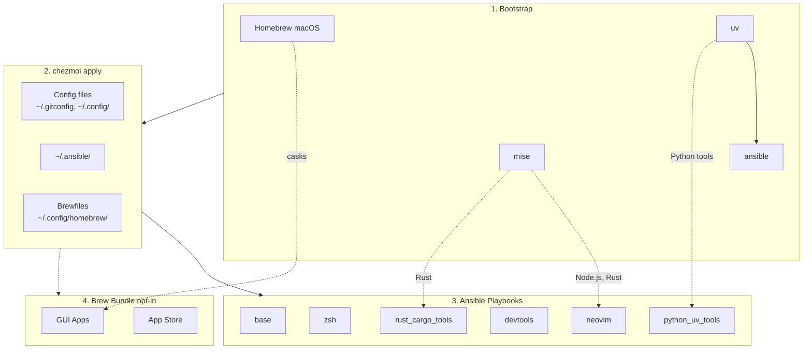

<!-- Generated by SpecStory, Markdown v2.1.0 -->

# 2026-03-31 03:23:18Z

<!-- Codex CLI Session 019d41e3-0625-7dc2-b087-54e23edc7c5c (2026-03-31 03:23:18Z) -->

_**User (2026-03-31 03:23:18Z)**_

@docs/input_methods 我要記錄 McBopomofo 與 RIME 的相關內容 （特別是RIME的自定義等等）
1. Mcıopomofo https://github.com/openvanilla/McBopomofo
2. Rime 系列 https://github.com/rime/squirrel https://github.com/rime/ibus-rime
3. 其他輸入法相關 例如  https://github.com/pqrs-org/ShowyEdge/
評估是否備份 ~/Library/Rime/squirrel.custom.yaml 等等 custom config

Rime的話 根據其Wiki 有許多可自定的內容 https://github.com/rime/home/wiki/CustomizationGuide#%E5%BF%85%E7%9F%A5%E5%BF%85%E6%9C%83

然後現在主要關注幾個問題
app切換時input method自動切換
（包含vim mode） https://github.com/rime/squirrel/issues/1023

還有就是關於全局狀態的問題 （似乎這個是librime / macOS的問題？）
https://github.com/rime/home/issues/202
https://github.com/rime/squirrel/pull/1054
https://github.com/rime/squirrel/pull/201
https://github.com/rime/librime/issues/294
https://github.com/rime/squirrel/issues/145
現在痛點很明顯：现在在不同窗口之间切换之后，基本是完全无法确定当前的输入状态是中文还是英文
切成英文 -> command + tab 到下一個視窗 （被切成中文） -> command + tab回來（還是中文）

此外編輯Rime custom config可能也要能知道怎麽查app identifier 如  `osascript -e 'id of app "Visual Studio Code"'`


---

_**Agent (gpt-5.4 2026-03-31 03:25:10Z)**_

我先在 repo 內做兩件事：讀 `td` 的當前工作指引，然後檢查 `@docs/input_methods` 目前已有的內容與結構，先把可從環境確認的事實釐清。

_**Agent (gpt-5.4 2026-03-31 03:25:10Z)**_

<tool-use data-tool-type="shell" data-tool-name="exec_command"><details>
<summary>Tool use: **exec_command** `td usage --new-session`</summary>
```
Command: /bin/zsh -lc 'td usage --new-session'
Chunk ID: 79ac1f
Wall time: 0.0000 seconds
Process exited with code 127
Original token count: 8
Output:
zsh:1: command not found: td
```
</details></tool-use>

_**Agent (gpt-5.4 2026-03-31 03:25:10Z)**_

<tool-use data-tool-type="shell" data-tool-name="exec_command"><details>
<summary>Tool use: **exec_command** `rg --files docs | rg 'input_methods|input|rime|bopomofo|ime'`</summary>
```
Command: /bin/zsh -lc "rg --files docs | rg 'input_methods|input|rime|bopomofo|ime'"
Chunk ID: 7124c9
Wall time: 0.1425 seconds
Process exited with code 1
Original token count: 0
Output:
```
</details></tool-use>

_**Agent (gpt-5.4 2026-03-31 03:25:22Z)**_

`td` 在這個環境裡不存在，先記錄成一個環境阻塞點；我接著直接檢查 repo 裡 `docs/` 與輸入法相關檔案，確認現況與可能的落點。

_**Agent (gpt-5.4 2026-03-31 03:25:22Z)**_

<tool-use data-tool-type="shell" data-tool-name="exec_command"><details>
<summary>Tool use: **exec_command** `pwd && ls -la && printf '\n--- docs ---\n' && find docs -maxdepth 2 -type f | sort`</summary>
```
Command: /bin/zsh -lc "pwd && ls -la && printf '\\n--- docs ---\\n' && find docs -maxdepth 2 -type f | sort"
Chunk ID: 82f0bb
Wall time: 0.0000 seconds
Process exited with code 0
Original token count: 937
Output:
/Users/daviddwlee84/.local/share/chezmoi
total 280
drwxr-xr-x@ 46 daviddwlee84  staff   1472 Mar 30 18:53 .
drwxr-xr-x@ 24 daviddwlee84  staff    768 Mar 30 17:03 ..
-rw-r--r--@  1 daviddwlee84  staff   2818 Mar 30 11:17 .chezmoi.toml.tmpl
-rw-r--r--@  1 daviddwlee84  staff   1167 Feb 11 16:42 .chezmoiignore
drwxr-xr-x@  3 daviddwlee84  staff     96 Feb  5 17:39 .claude
drwxr-xr-x@  2 daviddwlee84  staff     64 Feb 10 18:44 .cursor
-rw-r--r--@  1 daviddwlee84  staff    110 Feb 10 18:42 .cursorindexingignore
-rw-r--r--@  1 daviddwlee84  staff    280 Feb  3 22:39 .dockerignore
drwxr-xr-x@ 20 daviddwlee84  staff    640 Mar 31 11:24 .git
-rw-r--r--@  1 daviddwlee84  staff    234 Feb 12 10:46 .gitignore
-rw-r--r--@  1 daviddwlee84  staff    528 Feb  4 15:12 .gitleaks.toml
-rw-r--r--@  1 daviddwlee84  staff    150 Feb  4 10:29 .markdownlint.jsonc
-rw-r--r--@  1 daviddwlee84  staff    979 Feb  9 20:14 .pre-commit-config.yaml
drwxr-xr-x@  3 daviddwlee84  staff     96 Feb 12 09:08 .sidecar
drwxr-xr-x@  7 daviddwlee84  staff    224 Mar 30 19:49 .specstory
drwxr-xr-x@  3 daviddwlee84  staff     96 Feb  5 13:20 .superset
drwxr-xr-x@  8 daviddwlee84  staff    256 Mar 30 13:18 .todos
drwxr-xr-x@  4 daviddwlee84  staff    128 Feb 10 17:35 .vscode
lrwxr-xr-x@  1 daviddwlee84  staff      9 Feb  3 18:00 AGENTS.md -> CLAUDE.md
drwxr-xr-x@  3 daviddwlee84  staff     96 Feb 11 16:42 bin
-rw-r--r--@  1 daviddwlee84  staff  10608 Mar 30 11:17 CLAUDE.md
-rw-r--r--@  1 daviddwlee84  staff   4365 Feb 13 09:10 docker-compose.yml
-rw-r--r--@  1 daviddwlee84  staff   6166 Mar 30 11:17 Dockerfile
drwxr-xr-x@ 10 daviddwlee84  staff    320 Mar 31 11:05 docs
drwxr-xr-x@  6 daviddwlee84  staff    192 Feb  4 10:47 dot_ansible
drwxr-xr-x@  3 daviddwlee84  staff     96 Feb 10 16:28 dot_cargo
drwxr-xr-x@  5 daviddwlee84  staff    160 Mar 30 11:17 dot_claude
drwxr-xr-x@ 17 daviddwlee84  staff    544 Mar 31 11:08 dot_config
-rw-r--r--@  1 daviddwlee84  staff    439 Mar 30 18:53 dot_gitconfig.tmpl
-rw-r--r--@  1 daviddwlee84  staff    279 Feb 10 16:11 dot_npmrc.tmpl
drwxr-xr-x@  4 daviddwlee84  staff    128 Feb 11 18:14 dot_ssh
-rw-r--r--@  1 daviddwlee84  staff   2273 Feb  5 09:58 dot_tmux.conf
-rw-r--r--@  1 daviddwlee84  staff    124 Feb  5 19:31 dot_zshenv.tmpl
-rw-r--r--@  1 daviddwlee84  staff   4029 Mar 18 17:43 dot_zshrc.tmpl
lrwxr-xr-x@  1 daviddwlee84  staff      9 Feb  5 15:44 GEMINI.md -> CLAUDE.md
-rw-r--r--@  1 daviddwlee84  staff   7815 Feb 13 09:12 justfile
-rw-r--r--@  1 daviddwlee84  staff   5018 Feb  6 10:00 NOTES.md
drwxr-xr-x@  3 daviddwlee84  staff     96 Mar 10 10:00 private_dot_specstory
-rw-r--r--@  1 daviddwlee84  staff   8715 Mar 30 14:21 README.md
-rw-r--r--@  1 daviddwlee84  staff   1427 Feb  7 23:42 run_before_01_backup_dotfiles.sh.tmpl
-rw-r--r--@  1 daviddwlee84  staff   5659 Feb 10 19:01 run_once_before_00_bootstrap.sh.tmpl
-rw-r--r--@  1 daviddwlee84  staff   4084 Feb  7 23:42 run_once_before_02_fix_intel_homebrew.sh.tmpl
-rw-r--r--@  1 daviddwlee84  staff   7558 Mar 30 18:54 run_onchange_after_20_ansible_roles.sh.tmpl
-rw-r--r--@  1 daviddwlee84  staff   3498 Feb  7 23:42 run_onchange_after_30_brew_bundle.sh.tmpl
drwxr-xr-x@  6 daviddwlee84  staff    192 Mar 10 10:00 scripts
-rw-r--r--@  1 daviddwlee84  staff   1592 Mar 12 18:00 TODO.md

--- docs ---
docs/ansible.md
docs/initial_setup/0_ManualSetupRecord.md
docs/initial_setup/1_ApplyToNewMachine.md
docs/neovim/floating-tui.md
docs/scripts/import_ssh_to_bw.sh.md
docs/tools/codexbar.md
docs/tools/direnv.md
docs/tools/networking.md
docs/tools/pqsum.md
docs/tools/specify_cli.md
docs/tools/specstory.md
docs/tools/starship.md
docs/tools/Tailscale.md
docs/tools/td_sidecar.md
docs/tutorials/bitwarden_ssh_agent.md
docs/zsh/zsh-completions.md
```
</details></tool-use>

_**Agent (gpt-5.4 2026-03-31 03:25:22Z)**_

<tool-use data-tool-type="shell" data-tool-name="exec_command"><details>
<summary>Tool use: **exec_command** `rg -n "Rime|rime|McBopomofo|Squirrel|ibus-rime|input method|輸入法|McBopomofo|Bopomofo|vim mode|ShowyEdge" -S .`</summary>
```
Command: /bin/zsh -lc 'rg -n "Rime|rime|McBopomofo|Squirrel|ibus-rime|input method|輸入法|McBopomofo|Bopomofo|vim mode|ShowyEdge" -S .'
Chunk ID: a9d122
Wall time: 0.0000 seconds
Process exited with code 0
Original token count: 560
Output:
./dot_zshrc.tmpl:103:#   - Quick experiments with new aliases/functions
./CLAUDE.md:141:| `input_method` | Traditional Chinese input methods: McBopomofo + RIME (Squirrel on macOS, ibus-rime on Linux) |
./README.md:76:| `installInputMethod` | false | Traditional Chinese input methods (McBopomofo, RIME/Squirrel on macOS; ibus-rime on Linux) |
./README.md:126:- **Input Methods** (optional): McBopomofo + RIME (Squirrel on macOS, ibus-rime on Linux)
./docs/neovim/floating-tui.md:83:Tools that use Esc internally (like sqlit's vim mode) work fine with Snacks' **double-Esc** timer — a single Esc goes to the TUI, pressing Esc again within 200ms exits terminal insert mode.
./docs/ansible.md:132:After experimenting with changes in `~/.ansible/`, add them back to chezmoi:
./dot_ansible/roles/input_method/tasks/main.yml:2:# Input method role - Traditional Chinese input methods
./dot_ansible/roles/input_method/tasks/main.yml:3:# macOS: McBopomofo + Squirrel (RIME) via Homebrew cask
./dot_ansible/roles/input_method/tasks/main.yml:4:# Linux: ibus-rime via apt
./dot_ansible/roles/input_method/tasks/main.yml:7:# macOS: McBopomofo
./dot_ansible/roles/input_method/tasks/main.yml:10:- name: Check if McBopomofo is installed (macOS)
./dot_ansible/roles/input_method/tasks/main.yml:13:    path: /Library/Input Methods/McBopomofo.app
./dot_ansible/roles/input_method/tasks/main.yml:16:- name: Install McBopomofo via Homebrew cask (macOS)
./dot_ansible/roles/input_method/tasks/main.yml:25:# macOS: Squirrel (RIME)
./dot_ansible/roles/input_method/tasks/main.yml:28:- name: Check if Squirrel (RIME) is installed (macOS)
./dot_ansible/roles/input_method/tasks/main.yml:31:    path: /Library/Input Methods/Squirrel.app
./dot_ansible/roles/input_method/tasks/main.yml:34:- name: Install Squirrel (RIME) via Homebrew cask (macOS)
./dot_ansible/roles/input_method/tasks/main.yml:43:# Linux: ibus-rime
./dot_ansible/roles/input_method/tasks/main.yml:46:- name: Install ibus-rime (Ubuntu)
./dot_ansible/roles/input_method/tasks/main.yml:51:    name: ibus-rime
./dot_config/marimo/create_marimo.toml:91:[experimental]
./Dockerfile:127:    --promptBool "Install Traditional Chinese input methods (McBopomofo, RIME)=${CHEZMOI_INSTALL_INPUT_METHOD}" \
```
</details></tool-use>

_**Agent (gpt-5.4 2026-03-31 03:25:36Z)**_

repo 內目前只有 ansible role 與 README 提到 `input_method`，`docs/` 還沒有專門的 input methods 文件，所以這次規劃大概率會新增一份文檔，而不是補既有頁面。接下來我會讀 role、README、Dockerfile 與可能的現有 docs 風格，順便再確認 `td` 是否只是 PATH 問題。

_**Agent (gpt-5.4 2026-03-31 03:25:36Z)**_

<tool-use data-tool-type="shell" data-tool-name="exec_command"><details>
<summary>Tool use: **exec_command** `command -v td || which td || find .. -maxdepth 4 -name td -type f 2>/dev/null | head`</summary>
```
Command: /bin/zsh -lc 'command -v td || which td || find .. -maxdepth 4 -name td -type f 2>/dev/null | head'
Chunk ID: 7859b2
Wall time: 0.0000 seconds
Process exited with code 0
Original token count: 4
Output:
td not found
```
</details></tool-use>

_**Agent (gpt-5.4 2026-03-31 03:25:36Z)**_

<tool-use data-tool-type="shell" data-tool-name="exec_command"><details>
<summary>Tool use: **exec_command** `sed -n '1,220p' README.md`</summary>
```
Command: /bin/zsh -lc "sed -n '1,220p' README.md"
Chunk ID: 3e49f2
Wall time: 0.0000 seconds
Process exited with code 0
Original token count: 2179
Output:
# dotfiles

Cross-platform development environment setup using **chezmoi** + **ansible**.

- **chezmoi**: manages config files (dotfiles)
- **ansible**: installs system dependencies and tools

## Prerequisites

- [chezmoi](https://www.chezmoi.io/install/)
- [uv](https://docs.astral.sh/uv/getting-started/installation/) (for ansible)

## Architecture



## Quick Setup

```bash
# One-liner to initialize and apply (installs chezmoi to ~/.local/bin)
export GITHUB_USERNAME=daviddwlee84
sh -c "$(curl -fsLS get.chezmoi.io)" -- -b "$HOME/.local/bin" init --apply git@github.com:$GITHUB_USERNAME/dotfiles.git
```

This automatically:

1. Bootstraps Homebrew (macOS/Linux), uv, mise, ansible
2. Deploys all config files
3. Runs ansible playbooks (git, ripgrep, fd, neovim, etc.)
4. Runs brew bundle (if `installBrewApps` enabled)

### Optional Components

During `chezmoi init`, you'll be prompted for optional installs:

| Option | Default | Description |
|--------|---------|-------------|
| `installCodingAgents` | true | Claude Code, Codex CLI, OpenCode, Cursor, Copilot, Gemini CLI, td, sidecar, specify-cli, etc. |
| `installBitwarden` | false | Bitwarden CLI (`bw`) + Desktop app (desktop profiles) with SSH agent auto-detection |
| `installPythonUvTools` | true | Python CLI tools via uv (mlflow, litellm, sqlit-tui, etc.) |
| `installBrewApps` | false | GUI apps via Homebrew Brewfile (casks, mas) |
| `installInputMethod` | false | Traditional Chinese input methods (McBopomofo, RIME/Squirrel on macOS; ibus-rime on Linux) |
| `installNetworkingTools` | false | Networking CLI tools (nmap, mtr, httpie, gping, trippy, bandwhich, rustscan, etc.) |
| `noRoot` | false | Skip sudo-requiring tasks (for servers without root access) |

To change options later: `chezmoi init --force`

## What You Get

### Config Files

- `~/.gitconfig` - Git configuration
- `~/.config/git/hooks/` - Global Git hooks (pre-commit + Git LFS hooks)
- `~/.config/nvim/` - Neovim (LazyVim) configuration
- `~/.config/uv/uv.toml` - uv package manager config
- `~/.cargo/config.toml` - Cargo registry mirror config (GFW)
- `~/.npmrc` - npm registry config (official/npmmirror via `useChineseMirror`)
- `~/.config/.bunfig.toml` - Bun global registry config (official/npmmirror via `useChineseMirror`)
- `~/.config/alacritty/` - Alacritty terminal config
- `~/.config/starship.toml` - Starship cross-shell prompt config
- `~/.config/direnv/direnvrc` - direnv helper functions, including `.venv`-aware Python activation
- `~/.config/yazi/` - Yazi file manager config (v0.3.3+ syntax, [docs](https://yazi-rs.github.io/docs/configuration/overview/))
  - `yazi.toml` - Main config with open rules and openers (`o`/`O`)
  - `keymap.toml`, `theme.toml` - Optional customization files (stubs provided)
- `~/.claude/` - Claude Code settings
- `~/.specstory/cli/config.toml` - Global SpecStory defaults for `specstory run` across all projects
- `~/.tmux.conf` - Tmux configuration with TPM plugins
- `~/.local/bin/x` - Cross-platform terminal wrapper for `copy` / `paste` / `open`
- `~/.config/zsh/tools/22_sesh.zsh` - Sesh keybinding (Ctrl+A for tmux session switcher)
- `~/.config/zsh/tools/36_pueue.zsh` - Pueue queue summary helper (`pqsum`)
- `~/.config/zsh/tools/41_github.zsh` - GitHub helper with `ghget` for downloading a repo subdirectory from a tree URL
- `~/.config/zsh/tools/28_tldr.zsh` - `tldrf` helper with `TLDR_LANGUAGES` fallback order
- `~/.config/zsh/tools/95_bitwarden.zsh` - Bitwarden CLI completion + SSH agent socket auto-detection
- `~/.ssh/config` - SSH main config skeleton (create-only: `Include ~/.ssh/config.d/*` + conservative `Host *` defaults)
- `~/.ssh/config.d/00-defaults` - SSH global defaults stub (commented examples only)
- `~/.ssh/config.d/git` - SSH host entries for `github.com` and `gitlab.com` with commented multi-account/Bitwarden examples
- `~/.config/tmuxp/claude-sidecar.yaml` - tmuxp workspace for Claude + Sidecar
- `~/.config/zellij/layouts/claude-sidecar.kdl` - Zellij layout for Claude + 
... (truncated)
```
</details></tool-use>

_**Agent (gpt-5.4 2026-03-31 03:25:36Z)**_

<tool-use data-tool-type="shell" data-tool-name="exec_command"><details>
<summary>Tool use: **exec_command** `sed -n '1,220p' dot_ansible/roles/input_method/tasks/main.yml`</summary>
```
Command: /bin/zsh -lc "sed -n '1,220p' dot_ansible/roles/input_method/tasks/main.yml"
Chunk ID: 9482a7
Wall time: 0.0000 seconds
Process exited with code 0
Original token count: 432
Output:
---
# Input method role - Traditional Chinese input methods
# macOS: McBopomofo + Squirrel (RIME) via Homebrew cask
# Linux: ibus-rime via apt

# =============================================================================
# macOS: McBopomofo
# =============================================================================

- name: Check if McBopomofo is installed (macOS)
  when: ansible_facts["os_family"] == "Darwin"
  ansible.builtin.stat:
    path: /Library/Input Methods/McBopomofo.app
  register: mcbopomofo_check

- name: Install McBopomofo via Homebrew cask (macOS)
  when:
    - ansible_facts["os_family"] == "Darwin"
    - not mcbopomofo_check.stat.exists
  community.general.homebrew_cask:
    name: mcbopomofo
    state: present

# =============================================================================
# macOS: Squirrel (RIME)
# =============================================================================

- name: Check if Squirrel (RIME) is installed (macOS)
  when: ansible_facts["os_family"] == "Darwin"
  ansible.builtin.stat:
    path: /Library/Input Methods/Squirrel.app
  register: squirrel_check

- name: Install Squirrel (RIME) via Homebrew cask (macOS)
  when:
    - ansible_facts["os_family"] == "Darwin"
    - not squirrel_check.stat.exists
  community.general.homebrew_cask:
    name: squirrel
    state: present

# =============================================================================
# Linux: ibus-rime
# =============================================================================

- name: Install ibus-rime (Ubuntu)
  when: ansible_facts["os_family"] == "Debian"
  become: true
  tags: [sudo]
  ansible.builtin.apt:
    name: ibus-rime
    state: present
    update_cache: true
```
</details></tool-use>

_**Agent (gpt-5.4 2026-03-31 03:25:37Z)**_

<tool-use data-tool-type="shell" data-tool-name="exec_command"><details>
<summary>Tool use: **exec_command** `sed -n '100,170p' Dockerfile`</summary>
```
Command: /bin/zsh -lc "sed -n '100,170p' Dockerfile"
Chunk ID: e0ce51
Wall time: 0.0000 seconds
Process exited with code 0
Original token count: 581
Output:
WORKDIR /home/devuser

# Install chezmoi binary
# Retry up to 3 times to handle network issues (especially behind GFW)
RUN for i in 1 2 3; do \
        echo "Attempt $i: Installing chezmoi to ~/.local/bin..." && \
        sh -c "$(curl -fsLS --retry 3 --retry-delay 5 get.chezmoi.io/lb)" && \
        echo "chezmoi installed successfully" && break || \
        { echo "Attempt $i failed, retrying..."; sleep 10; }; \
    done

# Initialize and apply dotfiles with prompt values passed via flags
# This avoids interactive prompts during Docker build
# Set PATH to include ~/.local/bin so run_once scripts can find uv tools (ansible)
# Use local source instead of cloning from GitHub to test local changes
# Note: installBrewApps=false by default (Linuxbrew is optional on Linux)
RUN export PATH="$HOME/.local/bin:$PATH" && \
    ~/.local/bin/chezmoi init --apply --source=/tmp/dotfiles-source \
    --promptString "profile (ubuntu_server|ubuntu_desktop|macos)=${CHEZMOI_PROFILE}" \
    --promptString "What is your email address=${CHEZMOI_EMAIL}" \
    --promptString "What is your full name=${CHEZMOI_NAME}" \
    --promptBool "Are you in China (behind GFW) and need to use mirrors=${CHEZMOI_USE_CHINESE_MIRROR}" \
    --promptBool "Enable gitleaks for ALL git repos (not just those with .pre-commit-config.yaml)=${CHEZMOI_GITLEAKS_ALL_REPOS}" \
    --promptBool "Install coding agents (Claude Code, OpenCode, Cursor, Copilot, Gemini, etc.)=${CHEZMOI_INSTALL_CODING_AGENTS}" \
    --promptBool "Install Bitwarden CLI (@bitwarden/cli) with SSH Agent integration and Zsh completion=${CHEZMOI_INSTALL_BITWARDEN}" \
    --promptBool "Install Python CLI tools via uv (mlflow, litellm, sqlit-tui, etc.)=${CHEZMOI_INSTALL_PYTHON_UV_TOOLS}" \
    --promptBool "Install GUI apps via Homebrew Brewfile (casks, mas)=${CHEZMOI_INSTALL_BREW_APPS}" \
    --promptBool "Install Traditional Chinese input methods (McBopomofo, RIME)=${CHEZMOI_INSTALL_INPUT_METHOD}" \
    --promptBool "Install networking CLI tools (nmap, mtr, httpie, gping, trippy, etc.)=${CHEZMOI_INSTALL_NETWORKING_TOOLS}" \
    --promptBool "No sudo/root access - skip all system package installations=${CHEZMOI_NO_ROOT}" \
    --promptBool "Backup existing dotfiles before chezmoi overwrites them=${CHEZMOI_BACKUP_DOTFILES}"

# Default to bash shell
CMD ["/bin/bash"]
```
</details></tool-use>

_**Agent (gpt-5.4 2026-03-31 03:25:50Z)**_

目前可確定三件事：repo 已有 `input_method` 安裝入口、README 已曝光這個選項、但沒有任何對 McBopomofo/RIME 自訂與排障的文檔或配置備份策略。下一步我會補齊兩類事實來源：repo 內是否已有 Rime/McBopomofo 實際配置檔，以及 upstream wiki/issues/PR 對你提到的幾個痛點目前怎麼說。

_**Agent (gpt-5.4 2026-03-31 03:25:50Z)**_

<tool-use data-tool-type="shell" data-tool-name="exec_command"><details>
<summary>Tool use: **exec_command** `rg --files . | rg 'Rime|rime|squirrel|mcbopomofo|bopomofo|input_method|ime'`</summary>
```
Command: /bin/zsh -lc "rg --files . | rg 'Rime|rime|squirrel|mcbopomofo|bopomofo|input_method|ime'"
Chunk ID: f10cf5
Wall time: 0.0000 seconds
Process exited with code 0
Original token count: 25
Output:
./dot_ansible/roles/input_method/tasks/main.yml
./dot_config/nvim/lua/exact_plugins/wakatime.lua
```
</details></tool-use>

_**Agent (gpt-5.4 2026-03-31 03:25:50Z)**_

<tool-use data-tool-type="shell" data-tool-name="exec_command"><details>
<summary>Tool use: **exec_command** `sed -n '1,220p' .chezmoi.toml.tmpl`</summary>
```
Command: /bin/zsh -lc "sed -n '1,220p' .chezmoi.toml.tmpl"
Chunk ID: 3ca268
Wall time: 0.0000 seconds
Process exited with code 0
Original token count: 705
Output:
# https://www.chezmoi.io/reference/special-files/chezmoi-format-tmpl/

[data]
# 只在 init 才需要問一次：你之後都讀這個值
# TODO: not all the things we want to change all the time we chezmoi init
profile = {{ promptStringOnce . "profile" "profile (ubuntu_server|ubuntu_desktop|macos|macos_intel)" "macos" | quote }}
email   = {{ promptStringOnce . "email" "What is your email address" "daviddwlee84@gmail.com" | quote }}
name    = {{ promptStringOnce . "name" "What is your full name" "Da-Wei Lee" | quote }}
# 是否在中國大陸 GFW 內，需要使用鏡像源
useChineseMirror = {{ promptBoolOnce . "useChineseMirror" "Are you in China (behind GFW) and need to use mirrors" false }}
# 是否對所有 repo 啟用 gitleaks 掃描（包含沒有 .pre-commit-config.yaml 的 repo）
gitleaksAllRepos = {{ promptBoolOnce . "gitleaksAllRepos" "Enable gitleaks for ALL git repos (not just those with .pre-commit-config.yaml)" false }}
# 是否安裝 coding agents (Claude Code, OpenCode, Cursor, Copilot, Gemini, etc.)
installCodingAgents = {{ promptBoolOnce . "installCodingAgents" "Install coding agents (Claude Code, OpenCode, Cursor, Copilot, Gemini, etc.)" true }}
# 是否安裝 Bitwarden CLI 並啟用 SSH Agent 自動偵測 + Zsh completion
installBitwarden = {{ promptBoolOnce . "installBitwarden" "Install Bitwarden CLI (@bitwarden/cli) with SSH Agent integration and Zsh completion" false }}
# 是否安裝 Python CLI tools via uv (mlflow, litellm, sqlit-tui, etc.)
installPythonUvTools = {{ promptBoolOnce . "installPythonUvTools" "Install Python CLI tools via uv (mlflow, litellm, sqlit-tui, etc.)" true }}
# 是否安裝 GUI apps via Homebrew Brewfile (terminals, browsers, utilities, etc.)
installBrewApps = {{ promptBoolOnce . "installBrewApps" "Install GUI apps via Homebrew Brewfile (casks, mas)" false }}
# 是否安裝繁體中文輸入法 (McBopomofo + RIME)
installInputMethod = {{ promptBoolOnce . "installInputMethod" "Install Traditional Chinese input methods (McBopomofo, RIME)" false }}
# 是否安裝網路診斷工具 (nmap, mtr, httpie, gping, trippy, etc.)
installNetworkingTools = {{ promptBoolOnce . "installNetworkingTools" "Install networking CLI tools (nmap, mtr, httpie, gping, trippy, etc.)" false }}
# 沒有 sudo/root 權限，只安裝 user-level 工具 (mise, cargo, gem, uv, npm)
noRoot = {{ promptBoolOnce . "noRoot" "No sudo/root access - skip all system package installations" false }}
# 在 chezmoi apply 之前備份現有的 dotfiles
backupDotfiles = {{ promptBoolOnce . "backupDotfiles" "Backup existing dotfiles before chezmoi overwrites them" true }}

# https://www.chezmoi.io/user-guide/use-scripts-to-perform-actions/#dont-show-scripts-that-would-run-in-chezmoi-diffchezmoi-status
[diff]
    exclude = ["scripts"]
[status]
    exclude = ["scripts"]
```
</details></tool-use>

_**Agent (gpt-5.4 2026-03-31 03:25:50Z)**_

<tool-use data-tool-type="shell" data-tool-name="exec_command"><details>
<summary>Tool use: **exec_command** `find docs/tools -maxdepth 1 -type f | sort | xargs -I{} sh -c 'printf "--- %s ---\n" "{}"; sed -n "1,80p" "{}"'`</summary>
```
Command: /bin/zsh -lc "find docs/tools -maxdepth 1 -type f | sort | xargs -I{} sh -c 'printf \"--- %s ---\\n\" \"{}\"; sed -n \"1,80p\" \"{}\"'"
Chunk ID: 01682c
Wall time: 0.0000 seconds
Process exited with code 0
Original token count: 4847
Output:
sh: line 0: printf: --: invalid option
printf: usage: printf [-v var] format [arguments]
# CodexBar CLI

[CodexBar](https://github.com/steipete/CodexBar) shows usage stats for AI coding tools (Codex, Claude Code, Cursor, Gemini, Copilot, etc.) without logging into each dashboard.

- **macOS**: Full menu bar app + CLI
- **Linux**: CLI only

## Installation

Installed automatically via the `coding_agents` ansible role. On Linux, the binary is placed at `~/.local/bin/codexbar`.

## Linux Usage

On Linux, you **must** pass `--source cli` for the `usage` command. The default source (`auto`/`web`) is macOS-only.

### Check live usage (rate limits / quotas)

```bash
# Claude session/weekly limits
codexbar usage --provider claude --source cli

# Other providers
codexbar usage --provider codex --source cli
codexbar usage --provider gemini --source cli
codexbar usage --provider copilot --source cli

# JSON output (for scripting / Waybar)
codexbar usage --provider claude --source cli --json --pretty
```

Example output:

```
== Claude 2.1.34 (claude) ==
Session: 14% left [=-----------]
```

### Check local cost (from JSONL logs, no auth needed)

The `cost` command reads local log files (e.g. `~/.claude/`) and doesn't require auth.

```bash
# All providers
codexbar cost

# Claude only
codexbar cost --provider claude

# JSON output
codexbar cost --provider claude --json --pretty

# Force rescan of logs
codexbar cost --refresh
```

Example output:

```
Claude Cost (local)
Today: $0.54 · 851K tokens
Last 30 days: $8.50 · 9.1M tokens
```

## Shell Aliases

Defined in `~/.config/zsh/tools/40_codexbar.zsh`:

| Alias | Command | Description |
|-------|---------|-------------|
| `cbu` | `codexbar usage --provider claude --source cli` | Claude usage |
| `cbc` | `codexbar cost --provider claude` | Claude local cost |
| `cbca` | `codexbar cost` | All providers local cost |

## Supported Providers

`codex`, `claude`, `cursor`, `opencode`, `factory`, `gemini`, `antigravity`, `copilot`, `zai`, `minimax`, `kimi`, `kiro`, `vertexai`, `augment`, `jetbrains`, `kimik2`, `amp`

## Tips

- Avoid `--provider all` with `usage` on Linux -- it tries each provider sequentially and can hang if a CLI isn't installed.
sh: line 0: printf: --: invalid option
printf: usage: printf [-v var] format [arguments]
# direnv

`direnv` loads per-project environment variables as you enter and leave directories. In this repo it is initialized from Zsh, while prompt display is handled by Starship.

- **Helper file**: `~/.config/direnv/direnvrc` (chezmoi source: `dot_config/direnv/direnvrc`)
- **Zsh init**: `~/.config/zsh/tools/30_direnv.zsh`
- **Prompt**: `~/.config/starship.toml` via Starship's `[python]` module

## Python `.venv` helper

This repo provides `layout_python_venv [venv_dir=.venv]`.

- Activates an existing virtual environment directory
- Does not auto-create `.venv`
- Delegates activation to `layout python3`
- Watches the venv marker files so creating `.venv` later triggers a reload on the next prompt

## Recommended `.envrc`

```sh
layout_python_venv
dotenv_if_exists
```

Then allow it once per project:

```bash
direnv allow
```

You can target a non-default virtual environment directory if needed:

```sh
layout_python_venv venv
dotenv_if_exists
```

## Behavior Notes

- Equivalent for daily use: `VIRTUAL_ENV`, `PATH`, and `PYTHONHOME` handling come from direnv's built-in `layout python3`
- Not fully equivalent to `source .venv/bin/activate`: no `deactivate()` shell function and no direct `PS1` rewriting
- Prompt display still works because Starship reads `VIRTUAL_ENV` and shows the active environment name
- Leaving the directory automatically restores the previous environment

## References

- [Python · direnv Wiki](https://github.com/direnv/direnv/wiki/Python)
- [Activate python venv by default? · Issue #1264](https://github.com/direnv/direnv/issues/1264)
- [PS1 · direnv Wiki](https://github.com/direnv/direnv/wiki/PS1)
sh: line 0: printf: --: invalid option
printf: usage: printf [-v var] format [arguments]
# Networking CLI Tools

Optional role (`installNetworkingTools`). Install via `chezmoi init --force` and enable the prompt.

## Tools

| Tool | Binary | Purpose | Sudo at runtime? |
|------|--------|---------|-------------------|
| [nmap](https://nmap.org/) | `nmap` | Port scanning, host discovery, OS detection, service enumeration | Some features (OS detection, SYN scan) |
| [arp-scan](https://github.com/royhills/arp-scan) | `arp-scan` | Fast Layer 2 host discovery with OUI vendor lookup | Yes (raw sockets) |
| [mtr](https://www.bitwizard.nl/mtr/) | `mtr` | Real-time combined ping + traceroute | Some modes |
| [iperf3](https://iperf.fr/) | `iperf3` | Network bandwidth/throughput testing betw
... (truncated)
```
</details></tool-use>

_**Agent (gpt-5.4 2026-03-31 03:27:10Z)**_

我現在補本機事實：先看這台機器是否已經有 `~/Library/Rime` 與現成 custom 檔案，這會直接影響「文檔要不要把備份列成必要步驟」以及未來 chezmoi 要不要納管哪些檔。

_**Agent (gpt-5.4 2026-03-31 03:27:10Z)**_

<tool-use data-tool-type="shell" data-tool-name="exec_command"><details>
<summary>Tool use: **exec_command** `if [ -d "$HOME/Library/Rime" ]; then printf 'RIME_DIR_EXISTS\n'; find "$HOME/Library/Rime" -maxdepth 1 -type f | sed "s|$HOME|~|" | sort; else printf 'RIME_DIR_MISSING\n'; fi`</summary>
```
Command: /bin/zsh -lc 'if [ -d "$HOME/Library/Rime" ]; then printf '"'RIME_DIR_EXISTS\\n'; find \""'$HOME/Library/Rime" -maxdepth 1 -type f | sed "s|$HOME|~|" | sort; else printf '"'RIME_DIR_MISSING\\n'; fi"
Chunk ID: 9edb4e
Wall time: 0.0000 seconds
Process exited with code 0
Original token count: 34
Output:
RIME_DIR_EXISTS
~/Library/Rime/.DS_Store
~/Library/Rime/installation.yaml
~/Library/Rime/squirrel.custom.yaml
~/Library/Rime/user.yaml
```
</details></tool-use>

_**Agent (gpt-5.4 2026-03-31 03:27:10Z)**_

<tool-use data-tool-type="shell" data-tool-name="exec_command"><details>
<summary>Tool use: **exec_command** `if [ -d "/Library/Input Methods" ]; then find "/Library/Input Methods" -maxdepth 1 -type d \( -name 'Squirrel.app' -o -name 'McBopomofo.app' \) | sort; fi`</summary>
```
Command: /bin/zsh -lc "if [ -d \"/Library/Input Methods\" ]; then find \"/Library/Input Methods\" -maxdepth 1 -type d \\( -name 'Squirrel.app' -o -name 'McBopomofo.app' \\) | sort; fi"
Chunk ID: be158a
Wall time: 0.0000 seconds
Process exited with code 0
Original token count: 9
Output:
/Library/Input Methods/Squirrel.app
```
</details></tool-use>

_**Agent (gpt-5.4 2026-03-31 03:27:10Z)**_

<tool-use data-tool-type="shell" data-tool-name="exec_command"><details>
<summary>Tool use: **exec_command** `osascript -e 'id of app "Visual Studio Code"'`</summary>
```
Command: /bin/zsh -lc "osascript -e 'id of app \"Visual Studio Code\"'"
Chunk ID: 2d30c0
Wall time: 0.0374 seconds
Process exited with code 0
Original token count: 6
Output:
com.microsoft.VSCode
```
</details></tool-use>

_**Agent (gpt-5.4 2026-03-31 03:27:22Z)**_

本機狀態比預期更明確：`Squirrel.app` 已安裝，`McBopomofo.app` 沒有裝；而且 `~/Library/Rime` 已經存在 `squirrel.custom.yaml`，所以「是否備份 custom config」不是理論問題，而是現在就有實際資料要決定怎麼納管。接著我會讀這份現有 custom 檔的內容形狀，避免規劃跟你目前設定衝突。

_**Agent (gpt-5.4 2026-03-31 03:27:22Z)**_

<tool-use data-tool-type="shell" data-tool-name="exec_command"><details>
<summary>Tool use: **exec_command** `sed -n '1,220p' "$HOME/Library/Rime/squirrel.custom.yaml"`</summary>
```
Command: /bin/zsh -lc "sed -n '1,220p' \""'$HOME/Library/Rime/squirrel.custom.yaml"'
Chunk ID: 49572d
Wall time: 0.0001 seconds
Process exited with code 0
Original token count: 225
Output:
patch:
  # style:
  #   color_scheme: purity_of_form_custom
  #   color_scheme_dark: purity_of_form_custom
  #   candidate_list_layout: linear
  #   text_orientation: horizontal
  #   inline_preedit: true
  #   use_custom_font: true
  #   font_face: 'Avenir'
  #   font_point: 17

  app_options:
    com.googlecode.iterm2:
      ascii_mode: true
    com.google.Chrome:
      ascii_mode: true
    com.tencent.xinWeChat:
      ascii_mode: false
    com.raycast.macos:
      ascii_mode: true
    com.todesktop.230313mzl4w4u92:
      ascii_mode: true
    com.microsoft.VSCode:
      ascii_mode: true
    com.google.antigravity:
      ascii_mode: true
    com.hnc.Discord:
      ascii_mode: true
    com.microsoft.Outlook:
      ascii_mode: true
    com.apple.Terminal: # 终端
      ascii_mode: true
      no_inline: true
      vim_mode: true
      inline_preedit: false  # 防止 ESC 影响输入法
```
</details></tool-use>

_**Agent (gpt-5.4 2026-03-31 03:27:22Z)**_

<tool-use data-tool-type="shell" data-tool-name="exec_command"><details>
<summary>Tool use: **exec_command** `for f in "$HOME/Library/Rime"/*.custom.yaml "$HOME/Library/Rime"/*.yaml; do [ -f "$f" ] || continue; printf '%s\n' "${f/#$HOME/~}"; done | sort`</summary>
```
Command: /bin/zsh -lc 'for f in "$HOME/Library/Rime"/*.custom.yaml "$HOME/Library/Rime"/*.yaml; do [ -f "$f" ] || continue; printf '"'%s\\n' \""'${f/#$HOME/~}"; done | sort'
Chunk ID: 985a7a
Wall time: 0.0001 seconds
Process exited with code 0
Original token count: 33
Output:
~/Library/Rime/installation.yaml
~/Library/Rime/squirrel.custom.yaml
~/Library/Rime/squirrel.custom.yaml
~/Library/Rime/user.yaml
```
</details></tool-use>

_**Agent (gpt-5.4 2026-03-31 03:28:09Z)**_

我還缺一個本機關鍵點：目前已安裝的 Squirrel 版本到底支不支援 `global_ascii`，以及它本身 shipped 的 `squirrel.yaml` 對 `vim_mode` / `app_options` 怎麼描述。這可以避免把 upstream 討論直接誤寫成「已可用功能」。

_**Agent (gpt-5.4 2026-03-31 03:28:09Z)**_

<tool-use data-tool-type="shell" data-tool-name="exec_command"><details>
<summary>Tool use: **exec_command** `if [ -f '/Library/Input Methods/Squirrel.app/Contents/SharedSupport/squirrel.yaml' ]; then rg -n "global_ascii|app_options|vim_mode|no_inline|inline_preedit|ascii_mode" '/Library/Input Methods/Squirrel.app/Contents/SharedSupport/squirrel.yaml'; fi`</summary>
```
Command: /bin/zsh -lc "if [ -f '/Library/Input Methods/Squirrel.app/Contents/SharedSupport/squirrel.yaml' ]; then rg -n \"global_ascii|app_options|vim_mode|no_inline|inline_preedit|ascii_mode\" '/Library/Input Methods/Squirrel.app/Contents/SharedSupport/squirrel.yaml'; fi"
Chunk ID: 7fd86a
Wall time: 0.0000 seconds
Process exited with code 0
Original token count: 219
Output:
27:  inline_preedit: true
250:    inline_preedit: true #单行显示，false双行显示
269:    inline_preedit: true #单行显示，false双行显示
294:    inline_preedit: true                    # 单行显示，false双行显示
382:app_options:
384:    ascii_mode: true
386:    ascii_mode: true
388:    ascii_mode: true
390:    ascii_mode: true
392:    ascii_mode: true
393:    no_inline: true
395:    ascii_mode: true
396:    no_inline: true
398:    ascii_mode: true  # 初始爲西文模式
399:    no_inline: true   # 不使用行內編輯
400:    vim_mode: true    # 退出VIM插入模式自動切換輸入法狀態
402:    ascii_mode: true
404:    ascii_mode: true
406:    ascii_mode: true
408:    ascii_mode: true
410:    ascii_mode: true
412:    ascii_mode: true
414:    ascii_mode: true
416:    ascii_mode: true
417:    no_inline: true
419:    ascii_mode: true
```
</details></tool-use>

_**Agent (gpt-5.4 2026-03-31 03:28:09Z)**_

<tool-use data-tool-type="shell" data-tool-name="exec_command"><details>
<summary>Tool use: **exec_command** `defaults read '/Library/Input Methods/Squirrel.app/Contents/Info' CFBundleShortVersionString 2>/dev/null || /usr/libexec/PlistBuddy -c 'Print :CFBundleShortVersionString' '/Library/Input Methods/Squirrel.app/Contents/Info.plist'`</summary>
```
Command: /bin/zsh -lc "defaults read '/Library/Input Methods/Squirrel.app/Contents/Info' CFBundleShortVersionString 2>/dev/null || /usr/libexec/PlistBuddy -c 'Print :CFBundleShortVersionString' '/Library/Input Methods/Squirrel.app/Contents/Info.plist'"
Chunk ID: 2fd931
Wall time: 0.0000 seconds
Process exited with code 1
Original token count: 15
Output:
Print: Entry, ":CFBundleShortVersionString", Does Not Exist
```
</details></tool-use>

_**Agent (gpt-5.4 2026-03-31 03:28:09Z)**_

<tool-use data-tool-type="shell" data-tool-name="exec_command"><details>
<summary>Tool use: **exec_command** `sed -n '1,220p' '/Library/Input Methods/Squirrel.app/Contents/SharedSupport/squirrel.yaml'`</summary>
```
Command: /bin/zsh -lc "sed -n '1,220p' '/Library/Input Methods/Squirrel.app/Contents/SharedSupport/squirrel.yaml'"
Chunk ID: 43fb05
Wall time: 0.0000 seconds
Process exited with code 0
Original token count: 1761
Output:
# Squirrel settings
# encoding: utf-8

config_version: '1.0'

# options: last | default | _custom_
# last: the last used latin keyboard layout
# default: US (ABC) keyboard layout
# _custom_: keyboard layout of your choice, e.g. 'com.apple.keylayout.USExtended' or simply 'USExtended'
keyboard_layout: last

# for veteran chord-typist
chord_duration: 0.1  # seconds

# options: always | never | appropriate
show_notifications_when: appropriate

style:
  color_scheme: native
  # Optional: define both light and dark color schemes to match system appearance
  #color_scheme: solarized_light
  #color_scheme_dark: solarized_dark

  # horizontal is Deprecated since 0.36, Squirrel 0.15, removed since 1.0.1
  candidate_list_layout: stacked  # stacked | linear
  text_orientation: horizontal  # horizontal | vertical
  inline_preedit: true
  # Whether to embed selected candidate as text in input field
  inline_candidate: false
  # Whether candidate panel stick to screen edge to reduce jumping
  memorize_size: true
  # Whether transparent colors stack on each other
  mutual_exclusive: false
  # Whether to use a translucent background. Only visible when background color is transparent
  translucency: false
  # Enable to show small arrows that indicates if paging up/down is possible
  show_paging: false

  corner_radius: 7
  hilited_corner_radius: 0
  border_height: -2
  border_width: -2
  # Space between candidates in stacked layout
  line_spacing: 5
  # Space between preedit and candidates in non-inline mode
  spacing: 8
  # A number greater than 0 renders shadow around high-lighted candidate
  shadow_size: 0
  # Controls non-hililighted candidate background size, relative to highlighted
  # Nagetive means shrink, positive meas expand
  #surrounding_extra_expansion: 0

  # format using %@ and %c is deprecated since 1.0, Squirrel 1.0
  # %@ is automatically expanded to "[candidate] [comment]"
  # and %c is replaced by "[label]"
  candidate_format: '[label]. [candidate] [comment]'

  # adjust the base line of text
  #base_offset: 0
  font_face: 'Avenir'
  font_point: 16
  #label_font_face: 'Avenir'
  #label_font_point: 12
  #comment_font_face: 'Avenir'
  #comment_font_point: 16

preset_color_schemes:
  native:
    name: 系統配色

  aqua:
    name: 碧水／Aqua
    author: 佛振 <chen.sst@gmail.com>
    text_color: 0x606060
    back_color: 0xeeeceeee
    candidate_text_color: 0x000000
    hilited_text_color: 0x000000
    hilited_candidate_text_color: 0xffffff
    hilited_candidate_back_color: 0xeefa3a0a
    comment_text_color: 0x5a5a5a
    hilited_comment_text_color: 0xfcac9d

  azure:
    name: 青天／Azure
    author: 佛振 <chen.sst@gmail.com>
    text_color: 0xcfa677
    candidate_text_color: 0xffeacc
    back_color: 0xee8b4e01
    hilited_text_color: 0xffeacc
    hilited_candidate_text_color: 0x7ffeff
    hilited_candidate_back_color: 0x00000000
    comment_text_color: 0xc69664

  luna:
    name: 明月／Luna
    author: 佛振 <chen.sst@gmail.com>
    text_color: 0xa5a5a5
    back_color: 0xdd000000
    candidate_text_color: 0xeceeee
    hilited_text_color: 0x7fffff
    hilited_candidate_text_color: 0x7fffff
    hilited_candidate_back_color: 0x40000000
    comment_text_color: 0xa5a5a5
    hilited_comment_text_color: 0x449c9d

  ink:
    name: 墨池／Ink
    author: 佛振 <chen.sst@gmail.com>
    text_color: 0x5a5a5a
    back_color: 0xeeffffff
    candidate_text_color: 0x000000
    hilited_text_color: 0x000000
    #hilited_back_color: 0xdddddd
    hilited_candidate_text_color: 0xffffff
    hilited_candidate_back_color: 0xcc000000
    comment_text_color: 0x5a5a5a
    hilited_comment_text_color: 0x808080

  lost_temple:
    name: 孤寺／Lost Temple
    author: 佛振 <chen.sst@gmail.com>, based on ir_black
    text_color: 0xe8f3f6
    back_color: 0xee303030
    hilited_text_color: 0x82e6ca
    hilited_candidate_text_color: 0x000000
    hilited_candidate_back_color: 0x82e6ca
    comment_text_color: 0xbb82e6ca
    hilited_comment_text_color: 0xbb203d34

  dark_temple:
    name: 暗堂／Dark Temple
    author: 佛振 <chen.sst@gmail.com>, based on ir_black
    text_color: 0x92f6da
    back_color: 0x222222
    candidate_text_color: 0xd8e3e6
    hilited_text_color: 0xffcf9a
    hilited_back_color: 0x222222
    hilited_candidate_text_color: 0x92f6da
    hilited_candidate_back_color: 0x10000000  # 0x333333
    comment_text_color: 0x606cff

  psionics:
    name: 幽能／Psionics
    author: 雨過之後、佛振
    text_color: 0xc2c2c2
    back_color: 0x444444
    candidate_text_color: 0xeeeeee
    hilited_text_color: 0xeeeeee
    hilited_back_color: 0x444444
    hilited_candidate_label_color: 0xfafafa
    hilited_candidate_text_color: 0xfafafa
    hilited_candidate_back_color: 0xd4bc00
    comment_t
... (truncated)
```
</details></tool-use>

_**Agent (gpt-5.4 2026-03-31 03:28:16Z)**_

<tool-use data-tool-type="shell" data-tool-name="exec_command"><details>
<summary>Tool use: **exec_command** `sed -n '372,408p' '/Library/Input Methods/Squirrel.app/Contents/SharedSupport/squirrel.yaml'`</summary>
```
Command: /bin/zsh -lc "sed -n '372,408p' '/Library/Input Methods/Squirrel.app/Contents/SharedSupport/squirrel.yaml'"
Chunk ID: 2556cd
Wall time: 0.0000 seconds
Process exited with code 0
Original token count: 246
Output:
    back_color: 0x000000
    label_color: 0x0093FF
    hilited_candidate_text_color: 0x000000
    hilited_candidate_back_color: 0x0093FF
    hilited_candidate_label_color: 0x000000
    corner_radius: 16
    border_width: 2
    border_height: 2
    border_color: 0x0093FF

app_options:
  com.apple.Spotlight:
    ascii_mode: true
  com.alfredapp.Alfred:
    ascii_mode: true
  com.runningwithcrayons.Alfred-2:
    ascii_mode: true
  com.blacktree.Quicksilver:
    ascii_mode: true
  com.apple.Terminal:
    ascii_mode: true
    no_inline: true
  com.googlecode.iterm2:
    ascii_mode: true
    no_inline: true
  org.vim.MacVim:
    ascii_mode: true  # 初始爲西文模式
    no_inline: true   # 不使用行內編輯
    vim_mode: true    # 退出VIM插入模式自動切換輸入法狀態
  com.apple.dt.Xcode:
    ascii_mode: true
  com.barebones.textwrangler:
    ascii_mode: true
  com.macromates.TextMate.preview:
    ascii_mode: true
  com.github.atom:
    ascii_mode: true
```
</details></tool-use>

_**Agent (gpt-5.4 2026-03-31 03:28:22Z)**_

<tool-use data-tool-type="shell" data-tool-name="exec_command"><details>
<summary>Tool use: **exec_command** `plutil -p '/Library/Input Methods/Squirrel.app/Contents/Info.plist' | rg 'CFBundle(ShortVersionString|Version|Identifier|Name)'`</summary>
```
Command: /bin/zsh -lc "plutil -p '/Library/Input Methods/Squirrel.app/Contents/Info.plist' | rg 'CFBundle(ShortVersionString|Version|Identifier|Name)'"
Chunk ID: f6ae15
Wall time: 0.0000 seconds
Process exited with code 0
Original token count: 30
Output:
  "CFBundleIdentifier" => "im.rime.inputmethod.Squirrel"
  "CFBundleName" => "Squirrel"
  "CFBundleVersion" => "1.1.2"
```
</details></tool-use>

_**Agent (gpt-5.4 2026-03-31 03:28:29Z)**_

<tool-use data-tool-type="shell" data-tool-name="exec_command"><details>
<summary>Tool use: **exec_command** `rg -n "global_ascii" '/Library/Input Methods/Squirrel.app'`</summary>
```
Command: /bin/zsh -lc "rg -n \"global_ascii\" '/Library/Input Methods/Squirrel.app'"
Chunk ID: d91bea
Wall time: 0.0000 seconds
Process exited with code 1
Original token count: 0
Output:
```
</details></tool-use>

_**Agent (gpt-5.4 2026-03-31 03:29:42Z)**_

目前技術面已經有結論雛形了：`squirrel.custom.yaml` 應該納入備份，而且文檔要清楚區分「可由 chezmoi 管理的靜態 custom 檔」與「不一定適合直接納管的動態狀態/詞頻資料」。我再補看 `installation.yaml` / `user.yaml`，確認是否已有 Rime sync 或其他值得一起記錄的狀態。

_**Agent (gpt-5.4 2026-03-31 03:29:42Z)**_

<tool-use data-tool-type="shell" data-tool-name="exec_command"><details>
<summary>Tool use: **exec_command** `sed -n '1,200p' "$HOME/Library/Rime/installation.yaml"`</summary>
```
Command: /bin/zsh -lc "sed -n '1,200p' \""'$HOME/Library/Rime/installation.yaml"'
Chunk ID: 41c02e
Wall time: 0.0001 seconds
Process exited with code 0
Original token count: 63
Output:
distribution_code_name: Squirrel
distribution_name: "鼠鬚管"
distribution_version: 1.1.2
install_time: "Mon Dec  2 10:19:01 2024"
installation_id: "43cea773-1593-4ccc-a2f3-a852974cbec4"
rime_version: 1.16.0
update_time: "Wed Mar 18 13:43:03 2026"
```
</details></tool-use>

_**Agent (gpt-5.4 2026-03-31 03:29:42Z)**_

<tool-use data-tool-type="shell" data-tool-name="exec_command"><details>
<summary>Tool use: **exec_command** `sed -n '1,200p' "$HOME/Library/Rime/user.yaml"`</summary>
```
Command: /bin/zsh -lc "sed -n '1,200p' \""'$HOME/Library/Rime/user.yaml"'
Chunk ID: 9820dc
Wall time: 0.0002 seconds
Process exited with code 0
Original token count: 49
Output:
var:
  last_build_time: 1774924859
  option:
    zh_hans: false
    zh_hant: true
  previously_selected_schema: bopomofo
  schema_access_time:
    bopomofo: 1773652629
    luna_pinyin: 1773652595
```
</details></tool-use>

_**Agent (gpt-5.4 2026-03-31 03:29:42Z)**_

<tool-use data-tool-type="shell" data-tool-name="exec_command"><details>
<summary>Tool use: **exec_command** `find "$HOME/Library/Rime" -maxdepth 2 \( -type d -o -type f \) | sed "s|$HOME|~|" | sort`</summary>
```
Command: /bin/zsh -lc 'find "$HOME/Library/Rime" -maxdepth 2 '"\\( -type d -o -type f \\) | sed \"s|"'$HOME|~|" | sort'
Chunk ID: 85fb59
Wall time: 0.0000 seconds
Process exited with code 0
Original token count: 410
Output:
~/Library/Rime
~/Library/Rime/.DS_Store
~/Library/Rime/build
~/Library/Rime/build/bopomofo_tw.prism.bin
~/Library/Rime/build/bopomofo_tw.schema.yaml
~/Library/Rime/build/bopomofo.prism.bin
~/Library/Rime/build/cangjie5.prism.bin
~/Library/Rime/build/cangjie5.reverse.bin
~/Library/Rime/build/cangjie5.schema.yaml
~/Library/Rime/build/cangjie5.table.bin
~/Library/Rime/build/luna_pinyin.prism.bin
~/Library/Rime/build/luna_quanpin.prism.bin
~/Library/Rime/build/luna_quanpin.schema.yaml
~/Library/Rime/build/squirrel.yaml
~/Library/Rime/build/terra_pinyin.prism.bin
~/Library/Rime/build/terra_pinyin.reverse.bin
~/Library/Rime/build/terra_pinyin.schema.yaml
~/Library/Rime/build/terra_pinyin.table.bin
~/Library/Rime/installation.yaml
~/Library/Rime/luna_pinyin.userdb
~/Library/Rime/luna_pinyin.userdb/000005.ldb
~/Library/Rime/luna_pinyin.userdb/000008.ldb
~/Library/Rime/luna_pinyin.userdb/000011.ldb
~/Library/Rime/luna_pinyin.userdb/000012.log
~/Library/Rime/luna_pinyin.userdb/CURRENT
~/Library/Rime/luna_pinyin.userdb/LOCK
~/Library/Rime/luna_pinyin.userdb/LOG
~/Library/Rime/luna_pinyin.userdb/LOG.old
~/Library/Rime/luna_pinyin.userdb/MANIFEST-000010
~/Library/Rime/squirrel.custom.yaml
~/Library/Rime/sync
~/Library/Rime/sync/43cea773-1593-4ccc-a2f3-a852974cbec4
~/Library/Rime/terra_pinyin.userdb
~/Library/Rime/terra_pinyin.userdb/000079.log
~/Library/Rime/terra_pinyin.userdb/000080.ldb
~/Library/Rime/terra_pinyin.userdb/CURRENT
~/Library/Rime/terra_pinyin.userdb/LOCK
~/Library/Rime/terra_pinyin.userdb/LOG
~/Library/Rime/terra_pinyin.userdb/LOG.old
~/Library/Rime/terra_pinyin.userdb/MANIFEST-000077
~/Library/Rime/user.yaml
```
</details></tool-use>

_**Agent (gpt-5.4 2026-03-31 03:29:48Z)**_

<tool-use data-tool-type="shell" data-tool-name="exec_command"><details>
<summary>Tool use: **exec_command** `find "$HOME/Library/Rime/sync" -maxdepth 2 -type f | sed "s|$HOME|~|" | sort`</summary>
```
Command: /bin/zsh -lc 'find "$HOME/Library/Rime/sync" -maxdepth 2 -type f | sed "s|$HOME|~|" | sort'
Chunk ID: 67f95a
Wall time: 0.0000 seconds
Process exited with code 0
Original token count: 96
Output:
~/Library/Rime/sync/43cea773-1593-4ccc-a2f3-a852974cbec4/installation.yaml
~/Library/Rime/sync/43cea773-1593-4ccc-a2f3-a852974cbec4/luna_pinyin.userdb.txt
~/Library/Rime/sync/43cea773-1593-4ccc-a2f3-a852974cbec4/squirrel.custom.yaml
~/Library/Rime/sync/43cea773-1593-4ccc-a2f3-a852974cbec4/terra_pinyin.userdb.txt
~/Library/Rime/sync/43cea773-1593-4ccc-a2f3-a852974cbec4/user.yaml
```
</details></tool-use>

_**Agent (gpt-5.4 2026-03-31 03:30:00Z)**_

還有一個有用發現：`~/Library/Rime/sync/.../squirrel.custom.yaml` 已經存在，代表這台機器其實已經啟用了 Rime 的同步資料夾機制。這會讓文檔裡的「備份策略」需要分成兩層：source-of-truth 用 chezmoi 管理的 custom 檔，以及 Rime 自己同步出的 `sync/` 資料。

_**Agent (gpt-5.4 2026-03-31 03:30:00Z)**_

<tool-use data-tool-type="shell" data-tool-name="exec_command"><details>
<summary>Tool use: **exec_command** `find "$HOME/Library" -maxdepth 3 \( -iname '*McBopomofo*' -o -iname '*Bopomofo*' \) 2>/dev/null | sed "s|$HOME|~|" | sort | head -n 100`</summary>
```
Command: /bin/zsh -lc 'find "$HOME/Library" -maxdepth 3 '"\\( -iname '*McBopomofo*' -o -iname '*Bopomofo*' \\) 2>/dev/null | sed \"s|"'$HOME|~|" | sort | head -n 100'
Chunk ID: 519a51
Wall time: 1.0010 seconds
Process running with session ID 19439
Original token count: 0
Output:
```
</details></tool-use>

_**Agent (gpt-5.4 2026-03-31 03:30:00Z)**_

<tool-use data-tool-type="shell" data-tool-name="exec_command"><details>
<summary>Tool use: **exec_command** `find "$HOME/Library" -maxdepth 3 \( -iname '*Squirrel*' -o -iname '*Rime*' \) 2>/dev/null | sed "s|$HOME|~|" | sort | head -n 200`</summary>
```
Command: /bin/zsh -lc 'find "$HOME/Library" -maxdepth 3 '"\\( -iname '*Squirrel*' -o -iname '*Rime*' \\) 2>/dev/null | sed \"s|"'$HOME|~|" | sort | head -n 200'
Chunk ID: 3a6aaf
Wall time: 1.0013 seconds
Process running with session ID 7667
Original token count: 0
Output:
```
</details></tool-use>

_**Agent (gpt-5.4 2026-03-31 03:30:07Z)**_

<tool-use data-tool-type="unknown" data-tool-name="write_stdin"><details>
<summary>Tool use: **write_stdin**</summary>
```
Command: /bin/zsh -lc 'find "$HOME/Library" -maxdepth 3 '"\\( -iname '*McBopomofo*' -o -iname '*Bopomofo*' \\) 2>/dev/null | sed \"s|"'$HOME|~|" | sort | head -n 100'
Chunk ID: dd9013
Wall time: 0.0000 seconds
Process exited with code 0
Original token count: 123
Output:
~/Library/Application Support/CrashReporter/McBopomofo_1BBAB087-6C00-5900-8D78-4FEAF0DA68E8.plist
~/Library/Application Support/McBopomofo
~/Library/Caches/org.openvanilla.inputmethod.McBopomofo
~/Library/HTTPStorages/org.openvanilla.inputmethod.McBopomofo
~/Library/Input Methods/McBopomofo.app
~/Library/Preferences/org.openvanilla.inputmethod.McBopomofo.plist
~/Library/Rime/build/bopomofo_tw.prism.bin
~/Library/Rime/build/bopomofo_tw.schema.yaml
~/Library/Rime/build/bopomofo.prism.bin
```
</details></tool-use>

_**Agent (gpt-5.4 2026-03-31 03:30:07Z)**_

<tool-use data-tool-type="unknown" data-tool-name="write_stdin"><details>
<summary>Tool use: **write_stdin**</summary>
```
Command: /bin/zsh -lc 'find "$HOME/Library" -maxdepth 3 '"\\( -iname '*Squirrel*' -o -iname '*Rime*' \\) 2>/dev/null | sed \"s|"'$HOME|~|" | sort | head -n 200'
Chunk ID: 485c17
Wall time: 0.0000 seconds
Process exited with code 0
Original token count: 230
Output:
~/Library/Application Scripts/com.apple.siri.metrics.ExperimentationExtension
~/Library/Application Scripts/com.apple.siri.ODDIExperimentationExtension
~/Library/Application Scripts/com.apple.SiriMetrics.SiriTurnRestatementExtension
~/Library/Caches/im.rime.inputmethod.Squirrel
~/Library/Containers/com.apple.siri.metrics.ExperimentationExtension
~/Library/Containers/com.apple.siri.ODDIExperimentationExtension
~/Library/Containers/com.apple.SiriMetrics.SiriTurnRestatementExtension
~/Library/HTTPStorages/im.rime.inputmethod.Squirrel
~/Library/Preferences/com.apple.siri.ODDI.ExperimentationWorker.plist
~/Library/Preferences/com.apple.SiriExperimentMetricsWorker.plist
~/Library/Preferences/com.apple.SiriMetricsWorker.plist
~/Library/Preferences/im.rime.inputmethod.Squirrel.plist
~/Library/Rime
~/Library/Rime/build/squirrel.yaml
~/Library/Rime/squirrel.custom.yaml
~/Library/WebKit/im.rime.inputmethod.Squirrel
```
</details></tool-use>

_**Agent (gpt-5.4 2026-03-31 03:30:20Z)**_

我剛補到一個 repo 層面的真問題：`McBopomofo.app` 實際在 `~/Library/Input Methods/`，不是 `/Library/Input Methods/`。也就是說目前 ansible role 的安裝檢查很可能抓不到已安裝的 user-scope cask。這不一定要納入這次文檔工作，但如果你要一起修，規劃就要把文件與 role 修正分開。

_**Agent (gpt-5.4 2026-03-31 03:31:04Z)**_

McBopomofo 這邊我也補到了可用事實：它在這台機器上其實也有 user-scope 安裝，而且官方手冊明確提到「使用者詞彙是純文字檔，路徑可自行指定」，所以文檔不能假設只有一個固定檔案路徑。我要再看一下本機的 `~/Library/Application Support/McBopomofo` 長什麼樣，才能決定文件要不要記錄成「手動查偏好設定位置」而不是硬編路徑。

_**Agent (gpt-5.4 2026-03-31 03:31:04Z)**_

<tool-use data-tool-type="shell" data-tool-name="exec_command"><details>
<summary>Tool use: **exec_command** `find "$HOME/Library/Application Support/McBopomofo" -maxdepth 2 \( -type f -o -type d \) 2>/dev/null | sed "s|$HOME|~|" | sort`</summary>
```
Command: /bin/zsh -lc 'find "$HOME/Library/Application Support/McBopomofo" -maxdepth 2 '"\\( -type f -o -type d \\) 2>/dev/null | sed \"s|"'$HOME|~|" | sort'
Chunk ID: 64238a
Wall time: 0.0000 seconds
Process exited with code 0
Original token count: 88
Output:
~/Library/Application Support/McBopomofo
~/Library/Application Support/McBopomofo/data-plain-bpmf.txt
~/Library/Application Support/McBopomofo/data.txt
~/Library/Application Support/McBopomofo/exclude-phrases-plain-bpmf.txt
~/Library/Application Support/McBopomofo/exclude-phrases.txt
~/Library/Application Support/McBopomofo/phrases-replacement.txt
```
</details></tool-use>

_**Agent (gpt-5.4 2026-03-31 03:31:04Z)**_

<tool-use data-tool-type="shell" data-tool-name="exec_command"><details>
<summary>Tool use: **exec_command** `defaults read org.openvanilla.inputmethod.McBopomofo 2>/dev/null | sed -n '1,220p'`</summary>
```
Command: /bin/zsh -lc "defaults read org.openvanilla.inputmethod.McBopomofo 2>/dev/null | sed -n '1,220p'"
Chunk ID: f19a47
Wall time: 0.0000 seconds
Process exited with code 0
Original token count: 274
Output:
{
    AddPhraseHookEnabled = 0;
    AddPhraseHookPath = "/private/var/folders/g3/gsbp4bsx1gs51t1805r34ztw0000gn/T/AppTranslocation/C69A5919-CBC7-4169-8BA0-B2425E3DE41A/d/McBopomofo.app/Contents/Resources/add-phrase-hook.sh";
    AllowMovingCursorWhenChoosingCandidates = 0;
    AssociatedPhrasesEnabled = 0;
    BasisKeyboardLayout = "com.apple.keylayout.US";
    BeepUponInputError = 1;
    Big5InputEnabled = 1;
    CandidateKeys = 123456789;
    CheckUpdateAutomatically = 1;
    ChineseConversionEnabled = 0;
    ChineseConversionStyle = 0;
    ControlEnterOutput = 0;
    EnableUserPhrasesInPlainBopomofo = 0;
    FunctionKeyKeyboardLayout = "com.apple.keylayout.US";
    HalfWidthPunctuationEnable = 0;
    KeyboardLayout = 0;
    LetterBehavior = 0;
    MoveCursorAfterSelectingCandidate = 0;
    NextUpdateCheckDate = "2026-03-10 05:34:42 +0000";
    PhraseReplacementEnabled = 0;
    RepeatedPunctuationToSelectCandidateEnabled = 0;
    SelectCandidateWithNumericKeypad = 0;
    SelectPhraseAfterCursorAsCandidate = 1;
    ShiftEnterEnabled = 1;
    UseHorizontalCandidateList = 0;
}
```
</details></tool-use>

_**Agent (gpt-5.4 2026-03-31 03:31:04Z)**_

<tool-use data-tool-type="shell" data-tool-name="exec_command"><details>
<summary>Tool use: **exec_command** `plutil -p "$HOME/Library/Preferences/org.openvanilla.inputmethod.McBopomofo.plist" 2>/dev/null | sed -n '1,220p'`</summary>
```
Command: /bin/zsh -lc 'plutil -p "$HOME/Library/Preferences/org.openvanilla.inputmethod.McBopomofo.plist" 2>/dev/null | sed -n '"'1,220p'"
Chunk ID: 29089f
Wall time: 0.0000 seconds
Process exited with code 0
Original token count: 287
Output:
{
  "AddPhraseHookEnabled" => false
  "AddPhraseHookPath" => "/private/var/folders/g3/gsbp4bsx1gs51t1805r34ztw0000gn/T/AppTranslocation/C69A5919-CBC7-4169-8BA0-B2425E3DE41A/d/McBopomofo.app/Contents/Resources/add-phrase-hook.sh"
  "AllowMovingCursorWhenChoosingCandidates" => 0
  "AssociatedPhrasesEnabled" => false
  "BasisKeyboardLayout" => "com.apple.keylayout.US"
  "BeepUponInputError" => true
  "Big5InputEnabled" => true
  "CandidateKeys" => "123456789"
  "CheckUpdateAutomatically" => true
  "ChineseConversionEnabled" => false
  "ChineseConversionStyle" => 0
  "ControlEnterOutput" => 0
  "EnableUserPhrasesInPlainBopomofo" => false
  "FunctionKeyKeyboardLayout" => "com.apple.keylayout.US"
  "HalfWidthPunctuationEnable" => false
  "KeyboardLayout" => 0
  "LetterBehavior" => 0
  "MoveCursorAfterSelectingCandidate" => false
  "NextUpdateCheckDate" => 2026-03-10 05:34:42 +0000
  "PhraseReplacementEnabled" => false
  "RepeatedPunctuationToSelectCandidateEnabled" => false
  "SelectCandidateWithNumericKeypad" => false
  "SelectPhraseAfterCursorAsCandidate" => 1
  "ShiftEnterEnabled" => true
  "UseHorizontalCandidateList" => false
}
```
</details></tool-use>

_**Agent (gpt-5.4 2026-03-31 03:31:30Z)**_

探索結果已足夠進入規格選擇。現在最影響計畫的是三個取捨：這次只寫文檔還是連 backup/chezmoi 納管一起規劃、文檔要不要做成 macOS 專章還是跨平台、以及備份要保留到什麼深度。

_**Agent (gpt-5.4 2026-03-31 03:31:43Z)**_

<tool-use data-tool-type="unknown" data-tool-name="request_user_input"><details>
<summary>Tool use: **request_user_input**</summary>

**Input:**

- questions: `[map[header:範圍 id:scope options:[map[description:新增文檔，並把哪些檔應納管/哪些只記錄清楚定義好。 label:文檔+備份策略 (Recommended)] map[description:只整理知識與排障筆記，不規劃 repo 內實際備份項目。 label:只做文檔] map[description:除了文檔，也把 McBopomofo user-scope 安裝檢查這類 repo 問題一起納入計畫。 label:文檔+順手修 role]] question:這次要把 input methods 這塊做到哪一層？] map[header:平台 id:platform_focus options:[map[description:主文聚焦 Squirrel/McBopomofo 與 macOS 痛點，附帶 ibus-rime 位置與差異。 label:macOS 為主，Linux 附錄 (Recommended)] map[description:macOS 與 Linux 都同等展開，內容更長。 label:完整跨平台] map[description:完全聚焦你目前的使用情境，不處理 ibus-rime。 label:只寫 macOS]] question:文檔主體要以哪個平台為中心？] map[header:備份深度 id:backup_depth options:[map[description:只納管 custom yaml、手動詞庫與偏好設定；learned data/userdb 只記錄位置與匯出方式。 label:只管手寫設定 (Recommended)] map[description:把 sync/userdb 也納入策略，偏向完整可還原。 label:連學習詞頻也要] map[description:直接以整個 Library 相關目錄為備份單位，最重但最完整。 label:整個資料夾快照]] question:對 Rime/McBopomofo 的備份，哪一種層級是你想要的？]]`

</details></tool-use>
