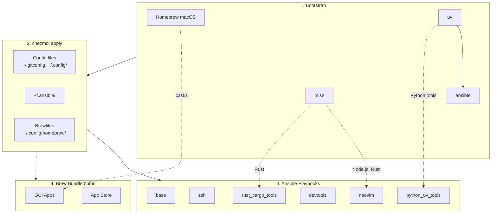

<!-- Generated by SpecStory, Markdown v2.1.0 -->

# 2026-03-31 07:44:08Z

<!-- Codex CLI Session 019d42d8-66ed-7f53-b92b-2b5567d9296f (2026-03-31 07:44:08Z) -->

_**User (2026-03-31 07:44:08Z)**_

幫我彙整項目中關於 LLM 的安裝 e.g. Ollama / LiteLLM

以及我想安裝的下面兩個tool

LLMFit
https://github.com/AlexsJones/llmfit
https://formulae.brew.sh/formula/llmfit
https://www.reddit.com/r/LocalLLaMA/comments/1rg94wu/llmfit_one_command_to_find_what_model_runs_on/

models
https://github.com/arimxyer/models
https://arimxyer.github.io/models/

是否整合爲一個 LLM 的 set （然後也作爲init的prompt之一）


---

_**Agent (gpt-5.4 2026-03-31 07:44:26Z)**_

先確認目前倉庫裡和任務系統的真實狀態：我會先跑 `td` 使用說明並檢查現有的 LLM 相關安裝點、chezmoi prompt、ansible role 和 README/Dockerfile，整理出目前結構後再跟你確認要怎麼併成一個集合。

_**Agent (gpt-5.4 2026-03-31 07:44:27Z)**_

<tool-use data-tool-type="shell" data-tool-name="exec_command"><details>
<summary>Tool use: **exec_command** `td usage --new-session`</summary>
```
Command: /bin/zsh -lc 'td usage --new-session'
Chunk ID: 41ca4f
Wall time: 0.0000 seconds
Process exited with code 127
Original token count: 8
Output:
zsh:1: command not found: td
```
</details></tool-use>

_**Agent (gpt-5.4 2026-03-31 07:44:35Z)**_

`td` 不在目前環境裡，這代表我沒法讀取你的 task queue；我先直接從 repo 真實內容整理 LLM 相關設定，之後會把缺的 task context 明確標註成假設。

_**Agent (gpt-5.4 2026-03-31 07:44:35Z)**_

<tool-use data-tool-type="shell" data-tool-name="exec_command"><details>
<summary>Tool use: **exec_command** `pwd && rg -n "Ollama|LiteLLM|llm|models|localllama|ChatGPT|ollama|litellm" README.md .chezmoi.toml.tmpl dot_ansible Dockerfile . 2>/dev/null`</summary>
```
Command: /bin/zsh -lc 'pwd && rg -n "Ollama|LiteLLM|llm|models|localllama|ChatGPT|ollama|litellm" README.md .chezmoi.toml.tmpl dot_ansible Dockerfile . 2>/dev/null'
Chunk ID: f26f69
Wall time: 0.0000 seconds
Process exited with code 0
Original token count: 638
Output:
/Users/daviddwlee84/.local/share/chezmoi
Dockerfile:125:    --promptBool "Install Python CLI tools via uv (mlflow, litellm, sqlit-tui, etc.)=${CHEZMOI_INSTALL_PYTHON_UV_TOOLS}" \
.chezmoi.toml.tmpl:17:# 是否安裝 Python CLI tools via uv (mlflow, litellm, sqlit-tui, etc.)
.chezmoi.toml.tmpl:18:installPythonUvTools = {{ promptBoolOnce . "installPythonUvTools" "Install Python CLI tools via uv (mlflow, litellm, sqlit-tui, etc.)" true }}
README.md:74:| `installPythonUvTools` | true | Python CLI tools via uv (mlflow, litellm, sqlit-tui, etc.) |
README.md:138:- **Python tools (via uv)**: thefuck, apprise, sqlit-tui, dotenv, git-filter-repo, mlflow, litellm, tmuxp
./README.md:74:| `installPythonUvTools` | true | Python CLI tools via uv (mlflow, litellm, sqlit-tui, etc.) |
./README.md:138:- **Python tools (via uv)**: thefuck, apprise, sqlit-tui, dotenv, git-filter-repo, mlflow, litellm, tmuxp
./Dockerfile:125:    --promptBool "Install Python CLI tools via uv (mlflow, litellm, sqlit-tui, etc.)=${CHEZMOI_INSTALL_PYTHON_UV_TOOLS}" \
./dot_config/homebrew/Brewfile.darwin.tmpl:23:cask "ollama-app"       # ollama is rename and deprecated
./CLAUDE.md:138:| `python_uv_tools` | Python CLI tools via uv (apprise, mlflow, litellm, sqlit-tui, tmuxp, etc.) |
./CLAUDE.md:177:- **uv tools**: mlflow, litellm, sqlit-tui, tmuxp, etc.
./CLAUDE.md:269:- **AI & Coding**: claude, chatgpt, ollama
./docs/zsh/zsh-completions.md:92:- **click** (used by mlflow, litellm, etc.): `_TOOL_COMPLETE=zsh_source tool > ~/.zfunc/_tool`
./scripts/adhoc/check_brew_cast.sh:17:ChatGPT Atlas.app
./scripts/adhoc/check_brew_cast.sh:18:ChatGPT.app
./scripts/adhoc/check_brew_cast.sh:49:Ollama.app
./dot_ansible/roles/python_uv_tools/defaults/main.yml:28:  - name: litellm[proxy]
./dot_ansible/roles/python_uv_tools/defaults/main.yml:29:    binary: litellm
dot_ansible/roles/python_uv_tools/defaults/main.yml:28:  - name: litellm[proxy]
dot_ansible/roles/python_uv_tools/defaults/main.yml:29:    binary: litellm
./dot_config/marimo/create_marimo.toml:42:[ai.models]
./dot_config/marimo/create_marimo.toml:43:custom_models = ["ollama/qwen2.5-coder:3b "]
./dot_config/marimo/create_marimo.toml:45:displayed_models = ["google/gemini-2.5-pro", "google/gemini-2.5-pro-exp", "google/gemini-2.5-flash", "google/gemini-2.5-flash-lite", "google/gemini-2.0-flash", "google/gemini-2.0-flash-exp", "google/gemini-2.0-flash-lite", "google/gemini-2.0-flash-thinking-exp-01-21", "google/gemini-1.5-flash", "google/gemini-1.5-flash-8b", "google/gemini-1.5-pro", "ollama/qwen2.5-coder:3b "]
```
</details></tool-use>

_**Agent (gpt-5.4 2026-03-31 07:44:35Z)**_

<tool-use data-tool-type="shell" data-tool-name="exec_command"><details>
<summary>Tool use: **exec_command** `rg --files . | rg "(^|/)(README\.md|Dockerfile|\.chezmoi\.toml\.tmpl|.*ollama.*|.*litellm.*|.*llm.*|.*models.*)$"`</summary>
```
Command: /bin/zsh -lc 'rg --files . | rg "(''^|/)(README'"\\.md|Dockerfile|\\.chezmoi\\.toml\\.tmpl|.*ollama.*|.*litellm.*|.*llm.*|.*models.*)"'$"'
Chunk ID: a1e09a
Wall time: 0.0000 seconds
Process exited with code 0
Original token count: 21
Output:
./README.md
./Dockerfile
./dot_config/nvim/README.md
./docs/input_methods/README.md
```
</details></tool-use>

_**Agent (gpt-5.4 2026-03-31 07:44:35Z)**_

<tool-use data-tool-type="shell" data-tool-name="exec_command"><details>
<summary>Tool use: **exec_command** `ls -la`</summary>
```
Command: /bin/zsh -lc 'ls -la'
Chunk ID: 8891fd
Wall time: 0.0000 seconds
Process exited with code 0
Original token count: 813
Output:
total 280
drwxr-xr-x@ 46 daviddwlee84  staff   1472 Mar 30 18:53 .
drwxr-xr-x@ 24 daviddwlee84  staff    768 Mar 30 17:03 ..
-rw-r--r--@  1 daviddwlee84  staff   2818 Mar 30 11:17 .chezmoi.toml.tmpl
-rw-r--r--@  1 daviddwlee84  staff   1167 Feb 11 16:42 .chezmoiignore
drwxr-xr-x@  3 daviddwlee84  staff     96 Feb  5 17:39 .claude
drwxr-xr-x@  2 daviddwlee84  staff     64 Feb 10 18:44 .cursor
-rw-r--r--@  1 daviddwlee84  staff    110 Feb 10 18:42 .cursorindexingignore
-rw-r--r--@  1 daviddwlee84  staff    280 Feb  3 22:39 .dockerignore
drwxr-xr-x@ 20 daviddwlee84  staff    640 Mar 31 14:56 .git
-rw-r--r--@  1 daviddwlee84  staff    234 Feb 12 10:46 .gitignore
-rw-r--r--@  1 daviddwlee84  staff    528 Feb  4 15:12 .gitleaks.toml
-rw-r--r--@  1 daviddwlee84  staff    150 Feb  4 10:29 .markdownlint.jsonc
-rw-r--r--@  1 daviddwlee84  staff    979 Feb  9 20:14 .pre-commit-config.yaml
drwxr-xr-x@  3 daviddwlee84  staff     96 Feb 12 09:08 .sidecar
drwxr-xr-x@  7 daviddwlee84  staff    224 Mar 31 13:36 .specstory
drwxr-xr-x@  3 daviddwlee84  staff     96 Feb  5 13:20 .superset
drwxr-xr-x@  8 daviddwlee84  staff    256 Mar 30 13:18 .todos
drwxr-xr-x@  4 daviddwlee84  staff    128 Feb 10 17:35 .vscode
lrwxr-xr-x@  1 daviddwlee84  staff      9 Feb  3 18:00 AGENTS.md -> CLAUDE.md
drwxr-xr-x@  3 daviddwlee84  staff     96 Feb 11 16:42 bin
-rw-r--r--@  1 daviddwlee84  staff  10608 Mar 30 11:17 CLAUDE.md
-rw-r--r--@  1 daviddwlee84  staff   4365 Feb 13 09:10 docker-compose.yml
-rw-r--r--@  1 daviddwlee84  staff   6166 Mar 30 11:17 Dockerfile
drwxr-xr-x@ 10 daviddwlee84  staff    320 Mar 31 11:05 docs
drwxr-xr-x@  6 daviddwlee84  staff    192 Feb  4 10:47 dot_ansible
drwxr-xr-x@  3 daviddwlee84  staff     96 Feb 10 16:28 dot_cargo
drwxr-xr-x@  5 daviddwlee84  staff    160 Mar 30 11:17 dot_claude
drwxr-xr-x@ 17 daviddwlee84  staff    544 Mar 31 11:08 dot_config
-rw-r--r--@  1 daviddwlee84  staff    439 Mar 30 18:53 dot_gitconfig.tmpl
-rw-r--r--@  1 daviddwlee84  staff    279 Feb 10 16:11 dot_npmrc.tmpl
drwxr-xr-x@  4 daviddwlee84  staff    128 Feb 11 18:14 dot_ssh
-rw-r--r--@  1 daviddwlee84  staff   2273 Feb  5 09:58 dot_tmux.conf
-rw-r--r--@  1 daviddwlee84  staff    124 Feb  5 19:31 dot_zshenv.tmpl
-rw-r--r--@  1 daviddwlee84  staff   4029 Mar 18 17:43 dot_zshrc.tmpl
lrwxr-xr-x@  1 daviddwlee84  staff      9 Feb  5 15:44 GEMINI.md -> CLAUDE.md
-rw-r--r--@  1 daviddwlee84  staff   7815 Feb 13 09:12 justfile
-rw-r--r--@  1 daviddwlee84  staff   5018 Feb  6 10:00 NOTES.md
drwxr-xr-x@  3 daviddwlee84  staff     96 Mar 10 10:00 private_dot_specstory
-rw-r--r--@  1 daviddwlee84  staff   8836 Mar 31 12:33 README.md
-rw-r--r--@  1 daviddwlee84  staff   1427 Feb  7 23:42 run_before_01_backup_dotfiles.sh.tmpl
-rw-r--r--@  1 daviddwlee84  staff   5659 Feb 10 19:01 run_once_before_00_bootstrap.sh.tmpl
-rw-r--r--@  1 daviddwlee84  staff   4084 Feb  7 23:42 run_once_before_02_fix_intel_homebrew.sh.tmpl
-rw-r--r--@  1 daviddwlee84  staff   7558 Mar 30 18:54 run_onchange_after_20_ansible_roles.sh.tmpl
-rw-r--r--@  1 daviddwlee84  staff   3498 Feb  7 23:42 run_onchange_after_30_brew_bundle.sh.tmpl
drwxr-xr-x@  6 daviddwlee84  staff    192 Mar 10 10:00 scripts
-rw-r--r--@  1 daviddwlee84  staff   1592 Mar 12 18:00 TODO.md
```
</details></tool-use>

_**Agent (gpt-5.4 2026-03-31 07:44:46Z)**_

我已經抓到幾個現況：目前只有 `litellm` 在 `python_uv_tools` 內、`ollama-app` 在 macOS Brewfile 內，兩者分散在不同安裝路徑與不同 init prompt。接著我會把 prompt/role/docker 對應關係拆清楚，看合併成一個 `llm` set 會影響哪些面。

_**Agent (gpt-5.4 2026-03-31 07:44:46Z)**_

<tool-use data-tool-type="shell" data-tool-name="exec_command"><details>
<summary>Tool use: **exec_command** `sed -n '1,220p' .chezmoi.toml.tmpl`</summary>
```
Command: /bin/zsh -lc "sed -n '1,220p' .chezmoi.toml.tmpl"
Chunk ID: fb6876
Wall time: 0.0000 seconds
Process exited with code 0
Original token count: 705
Output:
# https://www.chezmoi.io/reference/special-files/chezmoi-format-tmpl/

[data]
# 只在 init 才需要問一次：你之後都讀這個值
# TODO: not all the things we want to change all the time we chezmoi init
profile = {{ promptStringOnce . "profile" "profile (ubuntu_server|ubuntu_desktop|macos|macos_intel)" "macos" | quote }}
email   = {{ promptStringOnce . "email" "What is your email address" "daviddwlee84@gmail.com" | quote }}
name    = {{ promptStringOnce . "name" "What is your full name" "Da-Wei Lee" | quote }}
# 是否在中國大陸 GFW 內，需要使用鏡像源
useChineseMirror = {{ promptBoolOnce . "useChineseMirror" "Are you in China (behind GFW) and need to use mirrors" false }}
# 是否對所有 repo 啟用 gitleaks 掃描（包含沒有 .pre-commit-config.yaml 的 repo）
gitleaksAllRepos = {{ promptBoolOnce . "gitleaksAllRepos" "Enable gitleaks for ALL git repos (not just those with .pre-commit-config.yaml)" false }}
# 是否安裝 coding agents (Claude Code, OpenCode, Cursor, Copilot, Gemini, etc.)
installCodingAgents = {{ promptBoolOnce . "installCodingAgents" "Install coding agents (Claude Code, OpenCode, Cursor, Copilot, Gemini, etc.)" true }}
# 是否安裝 Bitwarden CLI 並啟用 SSH Agent 自動偵測 + Zsh completion
installBitwarden = {{ promptBoolOnce . "installBitwarden" "Install Bitwarden CLI (@bitwarden/cli) with SSH Agent integration and Zsh completion" false }}
# 是否安裝 Python CLI tools via uv (mlflow, litellm, sqlit-tui, etc.)
installPythonUvTools = {{ promptBoolOnce . "installPythonUvTools" "Install Python CLI tools via uv (mlflow, litellm, sqlit-tui, etc.)" true }}
# 是否安裝 GUI apps via Homebrew Brewfile (terminals, browsers, utilities, etc.)
installBrewApps = {{ promptBoolOnce . "installBrewApps" "Install GUI apps via Homebrew Brewfile (casks, mas)" false }}
# 是否安裝繁體中文輸入法 (McBopomofo + RIME)
installInputMethod = {{ promptBoolOnce . "installInputMethod" "Install Traditional Chinese input methods (McBopomofo, RIME)" false }}
# 是否安裝網路診斷工具 (nmap, mtr, httpie, gping, trippy, etc.)
installNetworkingTools = {{ promptBoolOnce . "installNetworkingTools" "Install networking CLI tools (nmap, mtr, httpie, gping, trippy, etc.)" false }}
# 沒有 sudo/root 權限，只安裝 user-level 工具 (mise, cargo, gem, uv, npm)
noRoot = {{ promptBoolOnce . "noRoot" "No sudo/root access - skip all system package installations" false }}
# 在 chezmoi apply 之前備份現有的 dotfiles
backupDotfiles = {{ promptBoolOnce . "backupDotfiles" "Backup existing dotfiles before chezmoi overwrites them" true }}

# https://www.chezmoi.io/user-guide/use-scripts-to-perform-actions/#dont-show-scripts-that-would-run-in-chezmoi-diffchezmoi-status
[diff]
    exclude = ["scripts"]
[status]
    exclude = ["scripts"]
```
</details></tool-use>

_**Agent (gpt-5.4 2026-03-31 07:44:46Z)**_

<tool-use data-tool-type="shell" data-tool-name="exec_command"><details>
<summary>Tool use: **exec_command** `sed -n '100,170p' Dockerfile`</summary>
```
Command: /bin/zsh -lc "sed -n '100,170p' Dockerfile"
Chunk ID: 477dde
Wall time: 0.0000 seconds
Process exited with code 0
Original token count: 581
Output:
WORKDIR /home/devuser

# Install chezmoi binary
# Retry up to 3 times to handle network issues (especially behind GFW)
RUN for i in 1 2 3; do \
        echo "Attempt $i: Installing chezmoi to ~/.local/bin..." && \
        sh -c "$(curl -fsLS --retry 3 --retry-delay 5 get.chezmoi.io/lb)" && \
        echo "chezmoi installed successfully" && break || \
        { echo "Attempt $i failed, retrying..."; sleep 10; }; \
    done

# Initialize and apply dotfiles with prompt values passed via flags
# This avoids interactive prompts during Docker build
# Set PATH to include ~/.local/bin so run_once scripts can find uv tools (ansible)
# Use local source instead of cloning from GitHub to test local changes
# Note: installBrewApps=false by default (Linuxbrew is optional on Linux)
RUN export PATH="$HOME/.local/bin:$PATH" && \
    ~/.local/bin/chezmoi init --apply --source=/tmp/dotfiles-source \
    --promptString "profile (ubuntu_server|ubuntu_desktop|macos)=${CHEZMOI_PROFILE}" \
    --promptString "What is your email address=${CHEZMOI_EMAIL}" \
    --promptString "What is your full name=${CHEZMOI_NAME}" \
    --promptBool "Are you in China (behind GFW) and need to use mirrors=${CHEZMOI_USE_CHINESE_MIRROR}" \
    --promptBool "Enable gitleaks for ALL git repos (not just those with .pre-commit-config.yaml)=${CHEZMOI_GITLEAKS_ALL_REPOS}" \
    --promptBool "Install coding agents (Claude Code, OpenCode, Cursor, Copilot, Gemini, etc.)=${CHEZMOI_INSTALL_CODING_AGENTS}" \
    --promptBool "Install Bitwarden CLI (@bitwarden/cli) with SSH Agent integration and Zsh completion=${CHEZMOI_INSTALL_BITWARDEN}" \
    --promptBool "Install Python CLI tools via uv (mlflow, litellm, sqlit-tui, etc.)=${CHEZMOI_INSTALL_PYTHON_UV_TOOLS}" \
    --promptBool "Install GUI apps via Homebrew Brewfile (casks, mas)=${CHEZMOI_INSTALL_BREW_APPS}" \
    --promptBool "Install Traditional Chinese input methods (McBopomofo, RIME)=${CHEZMOI_INSTALL_INPUT_METHOD}" \
    --promptBool "Install networking CLI tools (nmap, mtr, httpie, gping, trippy, etc.)=${CHEZMOI_INSTALL_NETWORKING_TOOLS}" \
    --promptBool "No sudo/root access - skip all system package installations=${CHEZMOI_NO_ROOT}" \
    --promptBool "Backup existing dotfiles before chezmoi overwrites them=${CHEZMOI_BACKUP_DOTFILES}"

# Default to bash shell
CMD ["/bin/bash"]
```
</details></tool-use>

_**Agent (gpt-5.4 2026-03-31 07:44:46Z)**_

<tool-use data-tool-type="shell" data-tool-name="exec_command"><details>
<summary>Tool use: **exec_command** `sed -n '1,220p' dot_ansible/roles/python_uv_tools/defaults/main.yml`</summary>
```
Command: /bin/zsh -lc "sed -n '1,220p' dot_ansible/roles/python_uv_tools/defaults/main.yml"
Chunk ID: de76c9
Wall time: 0.0000 seconds
Process exited with code 0
Original token count: 241
Output:
---
# Python CLI tools installed via uv tool install
# Each tool has:
#   - name: package name (can include extras like [cli])
#   - binary: executable name to check for idempotency
#   - with: (optional) additional dependency to install with --with

python_uv_tools:
  - name: thefuck
    binary: thefuck
    python: "3.11"  # Python 3.13 removed distutils which thefuck still uses
  - name: apprise
    binary: apprise
  - name: sqlit-tui[ssh]
    binary: sqlit
    with:
      - psycopg2-binary
      - pymysql
      - mssql-python
      - pyodbc
      - duckdb
  - name: python-dotenv[cli]
    binary: dotenv
  - name: git-filter-repo
    binary: git-filter-repo
  - name: mlflow
    binary: mlflow
  - name: litellm[proxy]
    binary: litellm
    with:
      - httpx[socks]
  - name: tmuxp
    binary: tmuxp
  - name: visidata
    binary: vd
    with:
      - pandas
      - pyarrow  # To be able open feather file
  - name: copyparty
    binary: copyparty
```
</details></tool-use>

_**Agent (gpt-5.4 2026-03-31 07:44:46Z)**_

<tool-use data-tool-type="shell" data-tool-name="exec_command"><details>
<summary>Tool use: **exec_command** `sed -n '1,220p' dot_config/homebrew/Brewfile.darwin.tmpl`</summary>
```
Command: /bin/zsh -lc "sed -n '1,220p' dot_config/homebrew/Brewfile.darwin.tmpl"
Chunk ID: b7e464
Wall time: 0.0000 seconds
Process exited with code 0
Original token count: 1490
Output:
# Brewfile.darwin - macOS GUI applications (casks) and Mac App Store apps
# Applied via: brew bundle --file=~/.config/homebrew/Brewfile.darwin
#
# This file is managed by chezmoi. Edit the source:
#   chezmoi edit ~/.config/homebrew/Brewfile.darwin

# =============================================================================
# Casks - Terminals & Editors
# =============================================================================
cask "alacritty"
# cask "iterm2"
cask "warp"
cask "cmux"
cask "cursor"
cask "visual-studio-code"

# =============================================================================
# Casks - AI & Coding Assistants
# =============================================================================
cask "claude"
cask "chatgpt"
# cask "chatgpt-atlas"  # Uncomment if needed
cask "ollama-app"       # ollama is rename and deprecated
# cask "termius"          # SSH client

# =============================================================================
# Casks - System Utilities
# =============================================================================
cask "nikitabobko/tap/aerospace"  # Tiling window manager
cask "alt-tab"                     # Windows-style alt-tab
cask "raycast"                     # Spotlight replacement
# cask "itsycal"                     # Menu bar calendar
# cask "jordanbaird-ice"             # Menu bar manager (Ice.app)
cask "scroll-reverser"             # Reverse scroll direction per device
# cask "sloth"                       # Process/file viewer
cask "the-unarchiver"              # Archive extraction
cask "applite"                     # GUI for Homebrew casks

# =============================================================================
# Casks - Communication
# =============================================================================
# cask "discord"  # Commented out - install manually from discord.com
# cask "messenger"
# cask "telegram"
# cask "wechat"   # We used to install WeChat using Apple Store (TODO: maybe use mas?! but that would need login...)
# cask "whatsapp"
# cask "dingtalk"
# cask "tencent-meeting"  # TencentMeeting.app

# =============================================================================
# Casks - Browsers
# =============================================================================
cask "arc"
# cask "google-chrome"
# cask "tor-browser"

# =============================================================================
# Casks - Productivity
# =============================================================================
cask "obsidian"
cask "google-drive"
cask "grammarly-desktop"
# cask "readest"              # E-book reader
cask "super-productivity"   # Task/time management
# cask "wispr-flow"           # Voice typing
# cask "mathpix-snipping-tool"

# =============================================================================
# Casks - Media & Entertainment
# =============================================================================
cask "spotify"
cask "anki"

# =============================================================================
# Casks - Gaming (skip on work machines)
# =============================================================================
# {{ if not (env "WORK_MACHINE") -}}
# cask "steam"
# cask "minecraft"
# cask "battle-net"
# cask "hstracker"  # Hearthstone deck tracker
# {{- end }}

# =============================================================================
# Casks - Finance & Trading
# =============================================================================
# cask "binance"
# cask "tradingview"

# =============================================================================
# Casks - Network & VPN
# =============================================================================
# Tailscale is managed via Mac App Store (mas) below to avoid pkg sudo prompts.
# cask "openvpn-connect"
# cask "vibetunnel"
# cask "clash-verge-rev"  # Clash proxy GUI (replacement for Clash for Windows)

# =============================================================================
# Casks - Virtualization & Remote
# =============================================================================
# cask "virtualbox"
# cask "windows-app"      # Microsoft Remote Desktop
# cask "teamviewer-host"
# cask "sharemouse"       # KVM software

# =============================================================================
# Casks - Developer Tools
# =============================================================================
# Note: docker/orbstack is managed by ansible docker role
cask "dbeaver-community"
cask "superset-sh/superset/superset"

# =============================================================================
# Casks - Cloud Storage (Chinese apps)
# =============================================================================

... (truncated)
```
</details></tool-use>

_**Agent (gpt-5.4 2026-03-31 07:44:55Z)**_

<tool-use data-tool-type="shell" data-tool-name="exec_command"><details>
<summary>Tool use: **exec_command** `rg -n "installPythonUvTools|installCodingAgents|installBrewApps|installBitwarden|installNetworkingTools|installInputMethod" .`</summary>
```
Command: /bin/zsh -lc 'rg -n "installPythonUvTools|installCodingAgents|installBrewApps|installBitwarden|installNetworkingTools|installInputMethod" .'
Chunk ID: 53a938
Wall time: 0.0000 seconds
Process exited with code 0
Original token count: 856
Output:
./CLAUDE.md:75:| `run_onchange_after_30_brew_bundle.sh.tmpl` | Runs brew bundle (if `installBrewApps` enabled) |
./CLAUDE.md:238:**Note**: Brewfile installation is **opt-in** (disabled by default). Enable via `chezmoi init --force` and set `installBrewApps = true`.
./run_onchange_after_20_ansible_roles.sh.tmpl:90:{{ if .installCodingAgents -}}
./run_onchange_after_20_ansible_roles.sh.tmpl:93:{{ $installBitwarden := false }}{{ if hasKey . "installBitwarden" }}{{ $installBitwarden = .installBitwarden }}{{ end -}}
./run_onchange_after_20_ansible_roles.sh.tmpl:94:{{ if $installBitwarden -}}
./run_onchange_after_20_ansible_roles.sh.tmpl:97:{{ if .installPythonUvTools -}}
./run_onchange_after_20_ansible_roles.sh.tmpl:100:{{ $installInputMethod := false }}{{ if hasKey . "installInputMethod" }}{{ $installInputMethod = .installInputMethod }}{{ end -}}
./run_onchange_after_20_ansible_roles.sh.tmpl:101:{{ if $installInputMethod -}}
./run_onchange_after_20_ansible_roles.sh.tmpl:104:{{ $installNetworkingTools := false }}{{ if hasKey . "installNetworkingTools" }}{{ $installNetworkingTools = .installNetworkingTools }}{{ end -}}
./run_onchange_after_20_ansible_roles.sh.tmpl:105:{{ if $installNetworkingTools -}}
./run_onchange_after_20_ansible_roles.sh.tmpl:111:{{ if and $installBitwarden (or (eq .profile "ubuntu_desktop") (eq .profile "macos") (eq .profile "macos_intel")) -}}
./run_once_before_00_bootstrap.sh.tmpl:55:# Linux: Optional - only install if installBrewApps is enabled
./run_onchange_after_30_brew_bundle.sh.tmpl:3:# Only runs if installBrewApps is enabled
./run_onchange_after_30_brew_bundle.sh.tmpl:5:# installBrewApps: {{ .installBrewApps }}
./run_onchange_after_30_brew_bundle.sh.tmpl:7:{{ if not .installBrewApps -}}
./run_onchange_after_30_brew_bundle.sh.tmpl:8:# Brew apps installation is disabled (installBrewApps = false)
./TODO.md:41:~Do we want to use Brewfile to manage macOS packages installation instead of writing one by one through Ansible?~ **Done**: XDG-compliant Brewfiles at `~/.config/homebrew/` with chezmoi run_onchange script (opt-in via `installBrewApps`).
./docs/tutorials/bitwarden_ssh_agent.md:12:When `installBitwarden` is enabled during `chezmoi init`, the ansible bitwarden role automatically installs:
./Dockerfile:115:# Note: installBrewApps=false by default (Linuxbrew is optional on Linux)
./README.md:64:4. Runs brew bundle (if `installBrewApps` enabled)
./README.md:72:| `installCodingAgents` | true | Claude Code, Codex CLI, OpenCode, Cursor, Copilot, Gemini CLI, td, sidecar, specify-cli, etc. |
./README.md:73:| `installBitwarden` | false | Bitwarden CLI (`bw`) + Desktop app (desktop profiles) with SSH agent auto-detection |
./README.md:74:| `installPythonUvTools` | true | Python CLI tools via uv (mlflow, litellm, sqlit-tui, etc.) |
./README.md:75:| `installBrewApps` | false | GUI apps via Homebrew Brewfile (casks, mas) |
./README.md:76:| `installInputMethod` | false | Traditional Chinese input methods (McBopomofo, RIME/Squirrel on macOS; ibus-rime on Linux) |
./README.md:77:| `installNetworkingTools` | false | Networking CLI tools (nmap, mtr, httpie, gping, trippy, bandwhich, rustscan, etc.) |
./docs/tools/networking.md:3:Optional role (`installNetworkingTools`). Install via `chezmoi init --force` and enable the prompt.
./dot_ansible/roles/bitwarden/tasks/main.yml:74:      installBitwarden=true requires npm or mise (with npm runtime) to install
```
</details></tool-use>

_**Agent (gpt-5.4 2026-03-31 07:44:55Z)**_

<tool-use data-tool-type="shell" data-tool-name="exec_command"><details>
<summary>Tool use: **exec_command** `rg -n "python_uv_tools|coding_agents|bitwarden|networking_tools|input_method|ollama-app|litellm|mlflow" dot_ansible README.md CLAUDE.md run_onchange_after_20_ansible_roles.sh.tmpl dot_*`</summary>
```
Command: /bin/zsh -lc 'rg -n "python_uv_tools|coding_agents|bitwarden|networking_tools|input_method|ollama-app|litellm|mlflow" dot_ansible README.md CLAUDE.md run_onchange_after_20_ansible_roles.sh.tmpl dot_*'
Chunk ID: 2ee1f8
Wall time: 0.0000 seconds
Process exited with code 0
Original token count: 5231
Output:
Total output lines: 228

CLAUDE.md:135:| `coding_agents` | Claude Code, OpenCode, Cursor CLI, Copilot CLI, Gemini CLI, SpecStory |
CLAUDE.md:136:| `bitwarden` | Bitwarden CLI (`bw`) via npm + Desktop app (snap/deb on Linux, cask on macOS) on desktop profiles, with zsh completion + SSH agent integration |
CLAUDE.md:138:| `python_uv_tools` | Python CLI tools via uv (apprise, mlflow, litellm, sqlit-tui, tmuxp, etc.) |
CLAUDE.md:141:| `input_method` | Traditional Chinese input methods: McBopomofo + RIME (Squirrel on macOS, ibus-rime on Linux) |
CLAUDE.md:142:| `networking_tools` | Networking CLI tools: nmap, arp-scan, mtr, iperf3, doggo, httpie, gping, trippy, bandwhich, speedtest, rustscan |
CLAUDE.md:157:- **Optional** (via chezmoi config): coding_agents, bitwarden, python_uv_tools, input_method (desktop only), networking_tools
CLAUDE.md:177:- **uv tools**: mlflow, litellm, sqlit-tui, tmuxp, etc.
README.md:34:        UVTOOLS[python_uv_tools]
README.md:74:| `installPythonUvTools` | true | Python CLI tools via uv (mlflow, litellm, sqlit-tui, etc.) |
README.md:107:- `~/.config/zsh/tools/95_bitwarden.zsh` - Bitwarden CLI completion + SSH agent socket auto-detection
README.md:138:- **Python tools (via uv)**: thefuck, apprise, sqlit-tui, dotenv, git-filter-repo, mlflow, litellm, tmuxp
README.md:191:See [CLAUDE.md](CLAUDE.md) for development guide, [docs/ansible.md](docs/ansible.md) for ansible customization, [docs/input_methods/README.md](docs/input_methods/README.md) for McBopomofo / Rime / Squirrel notes and backup strategy, [docs/tools/direnv.md](docs/tools/direnv.md) for `.venv`-aware direnv usage, [docs/tools/specstory.md](docs/tools/specstory.md) for SpecStory configuration, [docs/tools/td_sidecar.md](docs/tools/td_sidecar.md) for td/sidecar usage, [docs/tools/specify_cli.md](docs/tools/specify_cli.md) for Specify CLI, and [docs/tools/networking.md](docs/tools/networking.md) for networking tools.
run_onchange_after_20_ansible_roles.sh.tmpl:18:# coding_agents tasks: {{ include "dot_ansible/roles/coding_agents/tasks/main.yml" | sha256sum }}
run_onchange_after_20_ansible_roles.sh.tmpl:19:# coding_agents defaults: {{ include "dot_ansible/roles/coding_agents/defaults/main.yml" | sha256sum }}
run_onchange_after_20_ansible_roles.sh.tmpl:20:# bitwarden tasks: {{ include "dot_ansible/roles/bitwarden/tasks/main.yml" | sha256sum }}
run_onchange_after_20_ansible_roles.sh.tmpl:21:# bitwarden defaults: {{ include "dot_ansible/roles/bitwarden/defaults/main.yml" | sha256sum }}
run_onchange_after_20_ansible_roles.sh.tmpl:23:# python_uv_tools tasks: {{ include "dot_ansible/roles/python_uv_tools/tasks/main.yml" | sha256sum }}
run_onchange_after_20_ansible_roles.sh.tmpl:24:# python_uv_tools defaults: {{ include "dot_ansible/roles/python_uv_tools/defaults/main.yml" | sha256sum }}
run_onchange_after_20_ansible_roles.sh.tmpl:30:# input_method: {{ include "dot_ansible/roles/input_method/tasks/main.yml" | sha256sum }}
run_onchange_after_20_ansible_roles.sh.tmpl:31:# networking_tools: {{ include "dot_ansible/roles/networking_tools/tasks/main.yml" | sha256sum }}
run_onchange_after_20_ansible_roles.sh.tmpl:70:#   Optional: coding_agents, bitwarden, python_uv_tools, rust_cargo_tools, ruby_gem_tools
run_onchange_after_20_ansible_roles.sh.tmpl:91:TAGS="${TAGS},coding_agents"
run_onchange_after_20_ansible_roles.sh.tmpl:95:TAGS="${TAGS},bitwarden"
run_onchange_after_20_ansible_roles.sh.tmpl:98:TAGS="${TAGS},python_uv_tools"
run_onchange_after_20_ansible_roles.sh.tmpl:102:TAGS="${TAGS},input_method"
run_onchange_after_20_ansible_roles.sh.tmpl:106:TAGS="${TAGS},networking_tools"
run_onchange_after_20_ansible_roles.sh.tmpl:113:EXTRA_VARS="bitwarden_install_desktop=true"
dot_ansible/playbooks/linux.yml:32:    - role: coding_agents
dot_ansible/playbooks/linux.yml:33:      tags: [coding_agents]
dot_ansible/playbooks/linux.yml:35:    - role: bitwarden
dot_ansible/playbooks/linux.yml:36:      tags: [bitwarden]
dot_ansible/playbooks/linux.yml:41:    - role: python_uv_tools
dot_ansible/playbooks/linux.yml:42:      tags: [python_uv_tools]
dot_ansible/playbooks/linux.yml:50:    - role: input_method
dot_ansible/playbooks/linux.yml:51:      tags: [input_method]
dot_ansible/playbooks/linux.yml:53:    - role: networking_tools
dot_ansible/playbooks/linux.yml:54:      tags: [networking_tools]
dot_ansible/playbooks/macos.yml:35:    - role: coding_agents
dot_ansible/playbooks/macos.yml:36:      tags: [coding_agents]
dot_ansible/playbooks/macos.yml:38:    - role: bitwarden
dot_ansible/playbooks/macos.yml:39:      tags: [bitwarden]
dot_ansible/playbooks/macos.yml:44:    - role: python_uv_tools
dot_ansible/playbooks/macos.yml:45:      tags: [python_uv_too
... (truncated)
```
</details></tool-use>

_**Agent (gpt-5.4 2026-03-31 07:44:55Z)**_

<tool-use data-tool-type="shell" data-tool-name="exec_command"><details>
<summary>Tool use: **exec_command** `sed -n '1,260p' run_onchange_after_20_ansible_roles.sh.tmpl`</summary>
```
Command: /bin/zsh -lc "sed -n '1,260p' run_onchange_after_20_ansible_roles.sh.tmpl"
Chunk ID: 39bcdd
Wall time: 0.0000 seconds
Process exited with code 0
Original token count: 1890
Output:
#!/bin/bash
# Re-run ansible when any role changes
# Triggers on changes to any role's tasks or defaults files
# Profile: {{ .profile }}

# === Role Hashes (changes trigger re-run) ===
# homebrew: {{ include "dot_ansible/roles/homebrew/tasks/main.yml" | sha256sum }}
# base: {{ include "dot_ansible/roles/base/tasks/main.yml" | sha256sum }}
# zsh tasks: {{ include "dot_ansible/roles/zsh/tasks/main.yml" | sha256sum }}
# zsh defaults: {{ include "dot_ansible/roles/zsh/defaults/main.yml" | sha256sum }}
# neovim tasks: {{ include "dot_ansible/roles/neovim/tasks/main.yml" | sha256sum }}
# neovim defaults: {{ include "dot_ansible/roles/neovim/defaults/main.yml" | sha256sum }}
# lazyvim_deps tasks: {{ include "dot_ansible/roles/lazyvim_deps/tasks/main.yml" | sha256sum }}
# lazyvim_deps defaults: {{ include "dot_ansible/roles/lazyvim_deps/defaults/main.yml" | sha256sum }}
# devtools: {{ include "dot_ansible/roles/devtools/tasks/main.yml" | sha256sum }}
# docker: {{ include "dot_ansible/roles/docker/tasks/main.yml" | sha256sum }}
# nerdfonts: {{ include "dot_ansible/roles/nerdfonts/tasks/main.yml" | sha256sum }}
# coding_agents tasks: {{ include "dot_ansible/roles/coding_agents/tasks/main.yml" | sha256sum }}
# coding_agents defaults: {{ include "dot_ansible/roles/coding_agents/defaults/main.yml" | sha256sum }}
# bitwarden tasks: {{ include "dot_ansible/roles/bitwarden/tasks/main.yml" | sha256sum }}
# bitwarden defaults: {{ include "dot_ansible/roles/bitwarden/defaults/main.yml" | sha256sum }}
# security_tools: {{ include "dot_ansible/roles/security_tools/tasks/main.yml" | sha256sum }}
# python_uv_tools tasks: {{ include "dot_ansible/roles/python_uv_tools/tasks/main.yml" | sha256sum }}
# python_uv_tools defaults: {{ include "dot_ansible/roles/python_uv_tools/defaults/main.yml" | sha256sum }}
# rust_cargo_tools tasks: {{ include "dot_ansible/roles/rust_cargo_tools/tasks/main.yml" | sha256sum }}
# rust_cargo_tools defaults: {{ include "dot_ansible/roles/rust_cargo_tools/defaults/main.yml" | sha256sum }}
# ruby_gem_tools tasks: {{ include "dot_ansible/roles/ruby_gem_tools/tasks/main.yml" | sha256sum }}
# ruby_gem_tools defaults: {{ include "dot_ansible/roles/ruby_gem_tools/defaults/main.yml" | sha256sum }}
# starship: {{ include "dot_ansible/roles/starship/tasks/main.yml" | sha256sum }}
# input_method: {{ include "dot_ansible/roles/input_method/tasks/main.yml" | sha256sum }}
# networking_tools: {{ include "dot_ansible/roles/networking_tools/tasks/main.yml" | sha256sum }}

set -e
export PATH="$HOME/.local/bin:$PATH"

# Setup Homebrew PATH so brew subprocesses can find sibling tools like git-lfs.
{{ if or (eq .profile "macos") (eq .profile "macos_intel") -}}
if [[ -f /opt/homebrew/bin/brew ]]; then
    eval "$(/opt/homebrew/bin/brew shellenv)"
elif [[ -f /usr/local/bin/brew ]]; then
    eval "$(/usr/local/bin/brew shellenv)"
fi
{{ else -}}
# Linuxbrew
if [[ -d /home/linuxbrew/.linuxbrew ]]; then
    eval "$(/home/linuxbrew/.linuxbrew/bin/brew shellenv)"
elif [[ -d "$HOME/.linuxbrew" ]]; then
    eval "$("$HOME/.linuxbrew/bin/brew" shellenv)"
fi
{{ end -}}

# Colors
info() { echo -e "\033[0;34m[INFO]\033[0m $1"; }
success() { echo -e "\033[0;32m[SUCCESS]\033[0m $1"; }
warn() { echo -e "\033[1;33m[WARN]\033[0m $1"; }

ANSIBLE_DIR="$HOME/.ansible"
INVENTORY="$ANSIBLE_DIR/inventories/localhost.ini"

command -v ansible-playbook &> /dev/null || { warn "ansible-playbook not found"; exit 0; }

# === Profile-based tag selection ===
# Profile: {{ .profile }}
#
# Tag categories:
#   Core:    base, zsh, starship, neovim, lazyvim_deps, security_tools
#   Desktop: devtools, docker, nerdfonts
#   Server:  devtools, docker (no nerdfonts - no GUI)
#   macOS:   homebrew
#   Optional: coding_agents, bitwarden, python_uv_tools, rust_cargo_tools, ruby_gem_tools

{{ if or (eq .profile "macos") (eq .profile "macos_intel") -}}
PLAYBOOK="$ANSIBLE_DIR/playbooks/macos.yml"
# macOS: full desktop experience
TAGS="homebrew,base,zsh,starship,neovim,lazyvim_deps,devtools,docker,nerdfonts,security_tools,rust_cargo_tools,ruby_gem_tools"
{{ else if eq .profile "ubuntu_desktop" -}}
PLAYBOOK="$ANSIBLE_DIR/playbooks/linux.yml"
# Ubuntu Desktop: full desktop experience (no homebrew)
TAGS="base,zsh,starship,neovim,lazyvim_deps,devtools,docker,nerdfonts,security_tools,rust_cargo_tools,ruby_gem_tools"
{{ else if eq .profile "ubuntu_server" -}}
PLAYBOOK="$ANSIBLE_DIR/playbooks/linux.yml"
# Ubuntu Server: no GUI stuff (no nerdfonts)
TAGS="base,zsh,starship,neovim,lazyvim_deps,devtools,docker,security_tools,rust_cargo_tools,ruby_gem_tools"
{{ else -}}
warn "Unknown profile: {{ .profile }}"
exit 0
{{ end -}}

# Add optional tags based on chezmoi config
{{ if .installCodingAgents -}}
TAGS="${TAGS},coding_agents"
{{ end -}}
{{ $installBitwarden := false }}{{ if hasKey . "installBitward
... (truncated)
```
</details></tool-use>

_**Agent (gpt-5.4 2026-03-31 07:45:23Z)**_

外部資訊也確認了：`llmfit` 和 `models` 目前都已有 Homebrew formula，而且 `models` 也提供 `cargo install modelsdev`。現在我在看 repo 內已有的安裝策略，判斷應該把它們掛到現有 role，還是獨立成新的 `llm_tools`。

_**Agent (gpt-5.4 2026-03-31 07:45:24Z)**_

<tool-use data-tool-type="shell" data-tool-name="exec_command"><details>
<summary>Tool use: **exec_command** `sed -n '1,220p' dot_ansible/roles/rust_cargo_tools/defaults/main.yml`</summary>
```
Command: /bin/zsh -lc "sed -n '1,220p' dot_ansible/roles/rust_cargo_tools/defaults/main.yml"
Chunk ID: 84aeb8
Wall time: 0.0000 seconds
Process exited with code 0
Original token count: 214
Output:
---
# Cargo CLI tools installed via cargo install
# pueue handled separately per platform
# Add tools here as needed, e.g.:
#   - name: ripgrep
#     binary: rg

cargo_tools: []

# Minimum supported pueue version for pqsum-compatible JSON structure.
pueue_min_version: "4.0.0"

# If true, fail ansible run when pueue/pueued are below pueue_min_version.
pueue_version_enforce: false

# =============================================================================
# Optional tools (not in cargo_tools list, install manually if needed)
# =============================================================================
#
# clashctl - Clash proxy controller CLI
# Requires nightly toolchain and takes a long time to compile (~10+ mins)
# Install manually:
#   rustup install nightly
#   cargo +nightly install --git https://github.com/George-Miao/clashctl.git
```
</details></tool-use>

_**Agent (gpt-5.4 2026-03-31 07:45:24Z)**_

<tool-use data-tool-type="shell" data-tool-name="exec_command"><details>
<summary>Tool use: **exec_command** `sed -n '1,260p' dot_ansible/roles/rust_cargo_tools/tasks/main.yml`</summary>
```
Command: /bin/zsh -lc "sed -n '1,260p' dot_ansible/roles/rust_cargo_tools/tasks/main.yml"
Chunk ID: 3ea127
Wall time: 0.0000 seconds
Process exited with code 0
Original token count: 1558
Output:
---
# Cargo CLI tools installation
# Rust is installed via mise

# =============================================================================
# Ensure Rust is installed via mise
# =============================================================================

- name: Check for user-installed mise
  ansible.builtin.stat:
    path: "{{ ansible_facts['env']['HOME'] }}/.local/bin/mise"
  register: mise_user_install

- name: Set mise binary path
  ansible.builtin.set_fact:
    mise_bin: "{{ mise_user_install.stat.exists | ternary(ansible_facts['env']['HOME'] + '/.local/bin/mise', '/opt/homebrew/bin/mise' if ansible_facts['os_family'] == 'Darwin' else '/usr/local/bin/mise') }}"

- name: Install Rust via mise
  ansible.builtin.command: "{{ mise_bin }} install rust@latest"
  args:
    creates: "{{ ansible_facts['env']['HOME'] }}/.local/share/mise/installs/rust"
  environment:
    PATH: "{{ ansible_facts['env']['HOME'] }}/.local/bin:/opt/homebrew/bin:/usr/local/bin:{{ ansible_facts['env']['PATH'] }}"

# =============================================================================
# Install cargo tools (all platforms)
# =============================================================================

- name: Install Cargo CLI tools via cargo install
  ansible.builtin.command: cargo install {{ item.name }}
  args:
    creates: "{{ ansible_facts['env']['HOME'] }}/.cargo/bin/{{ item.binary }}"
  loop: "{{ cargo_tools }}"
  loop_control:
    label: "{{ item.name }}"
  environment:
    PATH: "{{ ansible_facts['env']['HOME'] }}/.local/share/mise/shims:{{ ansible_facts['env']['HOME'] }}/.cargo/bin:{{ ansible_facts['env']['PATH'] }}"

# =============================================================================
# Pueue - macOS (via Homebrew)
# =============================================================================

- name: Install pueue via Homebrew (macOS)
  when: ansible_facts["os_family"] == "Darwin"
  community.general.homebrew:
    name: pueue
    state: present

# =============================================================================
# Pueue - Linux (via cargo + systemd)
# =============================================================================

- name: Install pueue via cargo (Debian/Ubuntu)
  when: ansible_facts["os_family"] == "Debian"
  ansible.builtin.command: cargo install pueue --locked
  args:
    creates: "{{ ansible_facts['env']['HOME'] }}/.cargo/bin/pueue"
  environment:
    PATH: "{{ ansible_facts['env']['HOME'] }}/.local/share/mise/shims:{{ ansible_facts['env']['HOME'] }}/.cargo/bin:{{ ansible_facts['env']['PATH'] }}"

# =============================================================================
# Pueue version checks (warn by default, optional strict enforcement)
# =============================================================================

- name: Check installed pueue version
  when: ansible_facts["os_family"] in ["Darwin", "Debian"]
  ansible.builtin.shell: pueue --version 2>/dev/null | awk '{print $2}'
  args:
    executable: /bin/bash
  register: pueue_version_raw
  changed_when: false
  failed_when: false

- name: Check installed pueued version
  when: ansible_facts["os_family"] in ["Darwin", "Debian"]
  ansible.builtin.shell: pueued --version 2>/dev/null | awk '{print $2}'
  args:
    executable: /bin/bash
  register: pueued_version_raw
  changed_when: false
  failed_when: false

- name: Parse installed pueue versions
  when: ansible_facts["os_family"] in ["Darwin", "Debian"]
  ansible.builtin.set_fact:
    pueue_version_installed: "{{ (pueue_version_raw.stdout | trim | regex_search('[0-9]+\\.[0-9]+\\.[0-9]+')) | default('0.0.0', true) }}"
    pueued_version_installed: "{{ (pueued_version_raw.stdout | trim | regex_search('[0-9]+\\.[0-9]+\\.[0-9]+')) | default('0.0.0', true) }}"

- name: Display installed pueue versions
  when: ansible_facts["os_family"] in ["Darwin", "Debian"]
  ansible.builtin.debug:
    msg: "Installed pueue versions: pueue={{ pueue_version_installed }}, pueued={{ pueued_version_installed }} (required: >= {{ pueue_min_version }}, enforce={{ pueue_version_enforce | bool }})"

- name: Warn if pueue versions are below minimum (non-enforcing mode)
  when:
    - ansible_facts["os_family"] in ["Darwin", "Debian"]
    - not (pueue_version_enforce | bool)
    - pueue_version_installed is version(pueue_min_version, '<') or pueued_version_installed is version(pueue_min_version, '<')
  ansible.builtin.debug:
    msg: "WARNING: pueue={{ pueue_version_installed }}, pueued={{ pueued_version_installed }} are below required {{ pueue_min_version }}. Set pueue_version_enforce=true to fail on this condition."

- name: Enforce minimum pueue versions
  when:
    - ansible_facts["os_family"] in ["Darwin", "Debian"]
    - pueue_version_enforce | bool
  ansible.builtin.assert:
    that:
  
... (truncated)
```
</details></tool-use>

_**Agent (gpt-5.4 2026-03-31 07:45:24Z)**_

<tool-use data-tool-type="shell" data-tool-name="exec_command"><details>
<summary>Tool use: **exec_command** `sed -n '1,220p' dot_ansible/roles/coding_agents/defaults/main.yml`</summary>
```
Command: /bin/zsh -lc "sed -n '1,220p' dot_ansible/roles/coding_agents/defaults/main.yml"
Chunk ID: 24d443
Wall time: 0.0000 seconds
Process exited with code 0
Original token count: 12
Output:
---
# Default variables for coding_agents role
```
</details></tool-use>

_**Agent (gpt-5.4 2026-03-31 07:45:24Z)**_

<tool-use data-tool-type="shell" data-tool-name="exec_command"><details>
<summary>Tool use: **exec_command** `sed -n '1,240p' README.md`</summary>
```
Command: /bin/zsh -lc "sed -n '1,240p' README.md"
Chunk ID: ed053d
Wall time: 0.0000 seconds
Process exited with code 0
Original token count: 2209
Output:
# dotfiles

Cross-platform development environment setup using **chezmoi** + **ansible**.

- **chezmoi**: manages config files (dotfiles)
- **ansible**: installs system dependencies and tools

## Prerequisites

- [chezmoi](https://www.chezmoi.io/install/)
- [uv](https://docs.astral.sh/uv/getting-started/installation/) (for ansible)

## Architecture



## Quick Setup

```bash
# One-liner to initialize and apply (installs chezmoi to ~/.local/bin)
export GITHUB_USERNAME=daviddwlee84
sh -c "$(curl -fsLS get.chezmoi.io)" -- -b "$HOME/.local/bin" init --apply git@github.com:$GITHUB_USERNAME/dotfiles.git
```

This automatically:

1. Bootstraps Homebrew (macOS/Linux), uv, mise, ansible
2. Deploys all config files
3. Runs ansible playbooks (git, ripgrep, fd, neovim, etc.)
4. Runs brew bundle (if `installBrewApps` enabled)

### Optional Components

During `chezmoi init`, you'll be prompted for optional installs:

| Option | Default | Description |
|--------|---------|-------------|
| `installCodingAgents` | true | Claude Code, Codex CLI, OpenCode, Cursor, Copilot, Gemini CLI, td, sidecar, specify-cli, etc. |
| `installBitwarden` | false | Bitwarden CLI (`bw`) + Desktop app (desktop profiles) with SSH agent auto-detection |
| `installPythonUvTools` | true | Python CLI tools via uv (mlflow, litellm, sqlit-tui, etc.) |
| `installBrewApps` | false | GUI apps via Homebrew Brewfile (casks, mas) |
| `installInputMethod` | false | Traditional Chinese input methods (McBopomofo, RIME/Squirrel on macOS; ibus-rime on Linux) |
| `installNetworkingTools` | false | Networking CLI tools (nmap, mtr, httpie, gping, trippy, bandwhich, rustscan, etc.) |
| `noRoot` | false | Skip sudo-requiring tasks (for servers without root access) |

To change options later: `chezmoi init --force`

## What You Get

### Config Files

- `~/.gitconfig` - Git configuration
- `~/.config/git/hooks/` - Global Git hooks (pre-commit + Git LFS hooks)
- `~/.config/nvim/` - Neovim (LazyVim) configuration
- `~/.config/uv/uv.toml` - uv package manager config
- `~/.cargo/config.toml` - Cargo registry mirror config (GFW)
- `~/.npmrc` - npm registry config (official/npmmirror via `useChineseMirror`)
- `~/.config/.bunfig.toml` - Bun global registry config (official/npmmirror via `useChineseMirror`)
- `~/.config/alacritty/` - Alacritty terminal config
- `~/.config/starship.toml` - Starship cross-shell prompt config
- `~/.config/direnv/direnvrc` - direnv helper functions, including `.venv`-aware Python activation
- `~/.config/yazi/` - Yazi file manager config (v0.3.3+ syntax, [docs](https://yazi-rs.github.io/docs/configuration/overview/))
  - `yazi.toml` - Main config with open rules and openers (`o`/`O`)
  - `keymap.toml`, `theme.toml` - Optional customization files (stubs provided)
- `~/.claude/` - Claude Code settings
- `~/.specstory/cli/config.toml` - Global SpecStory defaults for `specstory run` across all projects
- `~/.tmux.conf` - Tmux configuration with TPM plugins
- `~/.local/bin/x` - Cross-platform terminal wrapper for `copy` / `paste` / `open`
- `~/.config/zsh/tools/22_sesh.zsh` - Sesh keybinding (Ctrl+A for tmux session switcher)
- `~/.config/zsh/tools/36_pueue.zsh` - Pueue queue summary helper (`pqsum`)
- `~/.config/zsh/tools/41_github.zsh` - GitHub helper with `ghget` for downloading a repo subdirectory from a tree URL
- `~/.config/zsh/tools/28_tldr.zsh` - `tldrf` helper with `TLDR_LANGUAGES` fallback order
- `~/.config/zsh/tools/95_bitwarden.zsh` - Bitwarden CLI completion + SSH agent socket auto-detection
- `~/.ssh/config` - SSH main config skeleton (create-only: `Include ~/.ssh/config.d/*` + conservative `Host *` defaults)
- `~/.ssh/config.d/00-defaults` - SSH global defaults stub (commented examples only)
- `~/.ssh/config.d/git` - SSH host entries for `github.com` and `gitlab.com` with commented multi-account/Bitwarden examples
- `~/.config/tmuxp/claude-sidecar.yaml` - tmuxp workspace for Claude + Sidecar
- `~/.config/zellij/layouts/claude-sidecar.kdl` - Zellij layout for Claude + 
... (truncated)
```
</details></tool-use>

_**Agent (gpt-5.4 2026-03-31 07:45:40Z)**_

<tool-use data-tool-type="shell" data-tool-name="exec_command"><details>
<summary>Tool use: **exec_command** `sed -n '1,140p' dot_ansible/playbooks/macos.yml`</summary>
```
Command: /bin/zsh -lc "sed -n '1,140p' dot_ansible/playbooks/macos.yml"
Chunk ID: d7d44b
Wall time: 0.0000 seconds
Process exited with code 0
Original token count: 268
Output:
---
# macOS playbook - Homebrew-based setup
- name: macOS setup
  hosts: local
  gather_facts: true

  roles:
    - role: homebrew
      tags: [homebrew]

    - role: base
      tags: [base]

    - role: zsh
      tags: [zsh]

    - role: starship
      tags: [starship]

    - role: neovim
      tags: [neovim]

    - role: lazyvim_deps
      tags: [lazyvim_deps]

    - role: devtools
      tags: [devtools]

    - role: docker
      tags: [docker]

    - role: nerdfonts
      tags: [nerdfonts]

    - role: coding_agents
      tags: [coding_agents]

    - role: bitwarden
      tags: [bitwarden]

    - role: security_tools
      tags: [security_tools]

    - role: python_uv_tools
      tags: [python_uv_tools]

    - role: rust_cargo_tools
      tags: [rust_cargo_tools]

    - role: ruby_gem_tools
      tags: [ruby_gem_tools]

    - role: input_method
      tags: [input_method]

    - role: networking_tools
      tags: [networking_tools]

    # Note: brew_bundle is now managed by chezmoi run_onchange script
    # See run_onchange_after_30_brew_bundle.sh.tmpl
```
</details></tool-use>

_**Agent (gpt-5.4 2026-03-31 07:45:40Z)**_

<tool-use data-tool-type="shell" data-tool-name="exec_command"><details>
<summary>Tool use: **exec_command** `sed -n '1,140p' dot_ansible/playbooks/linux.yml`</summary>
```
Command: /bin/zsh -lc "sed -n '1,140p' dot_ansible/playbooks/linux.yml"
Chunk ID: ea4c3d
Wall time: 0.0000 seconds
Process exited with code 0
Original token count: 226
Output:
---
# Linux playbook - Ubuntu/Debian setup
- name: Linux setup
  hosts: local
  gather_facts: true

  roles:
    - role: base
      tags: [base]

    - role: zsh
      tags: [zsh]

    - role: starship
      tags: [starship]

    - role: neovim
      tags: [neovim]

    - role: lazyvim_deps
      tags: [lazyvim_deps]

    - role: devtools
      tags: [devtools]

    - role: docker
      tags: [docker]

    - role: nerdfonts
      tags: [nerdfonts]

    - role: coding_agents
      tags: [coding_agents]

    - role: bitwarden
      tags: [bitwarden]

    - role: security_tools
      tags: [security_tools]

    - role: python_uv_tools
      tags: [python_uv_tools]

    - role: rust_cargo_tools
      tags: [rust_cargo_tools]

    - role: ruby_gem_tools
      tags: [ruby_gem_tools]

    - role: input_method
      tags: [input_method]

    - role: networking_tools
      tags: [networking_tools]
```
</details></tool-use>

_**Agent (gpt-5.4 2026-03-31 07:45:40Z)**_

<tool-use data-tool-type="shell" data-tool-name="exec_command"><details>
<summary>Tool use: **exec_command** `sed -n '1,200p' dot_ansible/roles/python_uv_tools/tasks/main.yml`</summary>
```
Command: /bin/zsh -lc "sed -n '1,200p' dot_ansible/roles/python_uv_tools/tasks/main.yml"
Chunk ID: 011779
Wall time: 0.0000 seconds
Process exited with code 0
Original token count: 129
Output:
---
# Python CLI tools via uv
# uv is bootstrapped before ansible runs

- name: Install Python CLI tools via uv
  ansible.builtin.command: >-
    uv tool install {{ item.name }}
    --python {{ item.python }} 
    --with {{ dep }} 
  args:
    creates: "{{ ansible_facts['env']['HOME'] }}/.local/bin/{{ item.binary }}"
  loop: "{{ python_uv_tools }}"
  loop_control:
    label: "{{ item.name }}"
```
</details></tool-use>

_**Agent (gpt-5.4 2026-03-31 07:45:40Z)**_

<tool-use data-tool-type="shell" data-tool-name="exec_command"><details>
<summary>Tool use: **exec_command** `sed -n '1,220p' dot_config/homebrew/Brewfile`</summary>
```
Command: /bin/zsh -lc "sed -n '1,220p' dot_config/homebrew/Brewfile"
Chunk ID: 0359d1
Wall time: 0.0000 seconds
Process exited with code 1
Original token count: 16
Output:
sed: dot_config/homebrew/Brewfile: No such file or directory
```
</details></tool-use>

_**Agent (gpt-5.4 2026-03-31 07:45:56Z)**_

repo 結構更清楚了：目前 optional install 的開關是直接映射到 ansible tag，Brewfile 則是另一條獨立 opt-in 管線。這表示如果做 `llm` set，不只要加一個 prompt，還得決定它是單純 tag，還是跨 ansible + Brewfile 的聚合開關。

_**Agent (gpt-5.4 2026-03-31 07:45:56Z)**_

<tool-use data-tool-type="shell" data-tool-name="exec_command"><details>
<summary>Tool use: **exec_command** `rg --files dot_config/homebrew`</summary>
```
Command: /bin/zsh -lc 'rg --files dot_config/homebrew'
Chunk ID: 0807ae
Wall time: 0.0000 seconds
Process exited with code 0
Original token count: 29
Output:
dot_config/homebrew/Brewfile.tmpl
dot_config/homebrew/Brewfile.darwin.tmpl
dot_config/homebrew/Brewfile.linux.tmpl
```
</details></tool-use>

_**Agent (gpt-5.4 2026-03-31 07:45:56Z)**_

<tool-use data-tool-type="shell" data-tool-name="exec_command"><details>
<summary>Tool use: **exec_command** `sed -n '1,220p' dot_config/homebrew/create_Brewfile.tmpl`</summary>
```
Command: /bin/zsh -lc "sed -n '1,220p' dot_config/homebrew/create_Brewfile.tmpl"
Chunk ID: 8d4501
Wall time: 0.0000 seconds
Process exited with code 1
Original token count: 19
Output:
sed: dot_config/homebrew/create_Brewfile.tmpl: No such file or directory
```
</details></tool-use>

_**Agent (gpt-5.4 2026-03-31 07:45:56Z)**_

<tool-use data-tool-type="shell" data-tool-name="exec_command"><details>
<summary>Tool use: **exec_command** `sed -n '1,220p' dot_ansible/roles/devtools/tasks/main.yml`</summary>
```
Command: /bin/zsh -lc "sed -n '1,220p' dot_ansible/roles/devtools/tasks/main.yml"
Chunk ID: da6202
Wall time: 0.0000 seconds
Process exited with code 0
Original token count: 1652
Output:
---
# Developer CLI tools role
# Tools: bat, eza, git-delta, git-graph, tldr, thefuck, zoxide, direnv, yazi, tmux, sesh, zellij, btop, htop, duckdb, rclone

# =============================================================================
# macOS - all via Homebrew
# =============================================================================

- name: Install developer CLI tools (macOS)
  when: ansible_facts["os_family"] == "Darwin"
  community.general.homebrew:
    name:
      - bat
      - git-delta
      - git-graph
      - eza
      - tlrc
      - thefuck
      - zoxide
      - direnv
      - yazi
      - tmux
      - sesh
      - zellij
      - btop
      - htop
      - duckdb
      - rclone
    state: present

# =============================================================================
# Linux (Debian/Ubuntu)
# =============================================================================

# --- bat ---
- name: Install bat (Debian/Ubuntu)
  when: ansible_facts["os_family"] == "Debian"
  become: true
  tags: [sudo]
  ansible.builtin.apt:
    name: bat
    state: present

- name: Create bat symlink on Debian/Ubuntu
  when: ansible_facts["os_family"] == "Debian"
  become: true
  tags: [sudo]
  ansible.builtin.file:
    src: /usr/bin/batcat
    dest: /usr/bin/bat
    state: link
  ignore_errors: true

# --- bat (user-level fallback) ---
- name: Re-check if bat is installed
  when: ansible_facts["os_family"] == "Debian"
  ansible.builtin.shell: command -v bat
  register: bat_recheck
  changed_when: false
  failed_when: false

- name: Install bat from GitHub releases (user-level, no sudo)
  when:
    - ansible_facts["os_family"] == "Debian"
    - bat_recheck.rc != 0
  block:
    - name: Ensure ~/.local/bin exists (bat)
      ansible.builtin.file:
        path: "{{ ansible_facts['env']['HOME'] }}/.local/bin"
        state: directory
        mode: '0755'

    - name: Get latest bat release
      ansible.builtin.uri:
        url: https://api.github.com/repos/sharkdp/bat/releases/latest
        return_content: true
      register: bat_release

    - name: Download bat binary
      ansible.builtin.get_url:
        url: "https://github.com/sharkdp/bat/releases/download/{{ bat_release.json.tag_name }}/bat-{{ bat_release.json.tag_name }}-{{ ansible_facts['architecture'] }}-unknown-linux-musl.tar.gz"
        dest: /tmp/bat.tar.gz
        mode: '0644'

    - name: Extract bat
      ansible.builtin.unarchive:
        src: /tmp/bat.tar.gz
        dest: /tmp
        remote_src: true

    - name: Install bat to ~/.local/bin
      ansible.builtin.copy:
        src: "/tmp/bat-{{ bat_release.json.tag_name }}-{{ ansible_facts['architecture'] }}-unknown-linux-musl/bat"
        dest: "{{ ansible_facts['env']['HOME'] }}/.local/bin/bat"
        mode: '0755'
        remote_src: true

    - name: Clean up bat temp files
      ansible.builtin.file:
        path: "{{ item }}"
        state: absent
      loop:
        - /tmp/bat.tar.gz
        - "/tmp/bat-{{ bat_release.json.tag_name }}-{{ ansible_facts['architecture'] }}-unknown-linux-musl"

# --- zoxide ---
- name: Check if zoxide is installed
  when: ansible_facts["os_family"] == "Debian"
  ansible.builtin.command: zoxide --version
  register: zoxide_check
  changed_when: false
  failed_when: false

- name: Install zoxide via official installer (Debian/Ubuntu)
  when:
    - ansible_facts["os_family"] == "Debian"
    - zoxide_check.rc != 0
  ansible.builtin.shell: |
    curl -sSfL https://raw.githubusercontent.com/ajeetdsouza/zoxide/main/install.sh | sh
  args:
    creates: "{{ ansible_facts.env.HOME }}/.local/bin/zoxide"

# --- eza ---
- name: Check if eza is installed
  when: ansible_facts["os_family"] == "Debian"
  ansible.builtin.command: eza --version
  register: eza_check
  changed_when: false
  failed_when: false

- name: Install eza via official installer (Debian/Ubuntu)
  when:
    - ansible_facts["os_family"] == "Debian"
    - eza_check.rc != 0
  become: true
  tags: [sudo]
  block:
    - name: Add eza GPG key
      ansible.builtin.shell: |
        mkdir -p /etc/apt/keyrings
        wget -qO- https://raw.githubusercontent.com/eza-community/eza/main/deb.asc | gpg --dearmor -o /etc/apt/keyrings/gierens.gpg
      args:
        creates: /etc/apt/keyrings/gierens.gpg

    - name: Add eza repository
      ansible.builtin.apt_repository:
        repo: "deb [signed-by=/etc/apt/keyrings/gierens.gpg] http://deb.gierens.de stable main"
        state: present
        filename: gierens

    - name: Install eza from repository
      ansible.builtin.apt:
        name: eza
        state: present
        update_cache: true

# --- eza (user-level fallback) ---
- name: Re-check if eza is installed
  when: ansible_facts["os_family"] == "Debian"
  ansible.builtin.shell: command -v eza
  register: eza_recheck
... (truncated)
```
</details></tool-use>

_**Agent (gpt-5.4 2026-03-31 07:46:07Z)**_

<tool-use data-tool-type="shell" data-tool-name="exec_command"><details>
<summary>Tool use: **exec_command** `sed -n '1,220p' dot_config/homebrew/Brewfile.tmpl`</summary>
```
Command: /bin/zsh -lc "sed -n '1,220p' dot_config/homebrew/Brewfile.tmpl"
Chunk ID: 2fb16f
Wall time: 0.0000 seconds
Process exited with code 0
Original token count: 278
Output:
# Brewfile - Shared configuration (macOS & Linux)
# Applied via: brew bundle --file=~/.config/homebrew/Brewfile
#
# This file is managed by chezmoi. Edit the source:
#   chezmoi edit ~/.config/homebrew/Brewfile

# =============================================================================
# Taps (Third-party repositories)
# =============================================================================
tap "nikitabobko/tap"  # aerospace (macOS window manager)
tap "superset-sh/superset"

# =============================================================================
# Formulas - CLI Tools (cross-platform)
# =============================================================================
# Note: Most CLI tools are managed by ansible for better cross-platform support
# Only add formulas here that you want to manage via Brewfile

# The following Formulas are MacOS only
{{ if or (eq .profile "macos") (eq .profile "macos_intel") -}}
# Mac App Store CLI (needed for mas entries in Brewfile.darwin)
brew "mas"
brew "tailscale"  # Tailscale CLI (desktop app is installed via mas in Brewfile.darwin)
{{ end -}}
```
</details></tool-use>

_**Agent (gpt-5.4 2026-03-31 07:46:07Z)**_

<tool-use data-tool-type="shell" data-tool-name="exec_command"><details>
<summary>Tool use: **exec_command** `sed -n '1,220p' dot_config/homebrew/Brewfile.linux.tmpl`</summary>
```
Command: /bin/zsh -lc "sed -n '1,220p' dot_config/homebrew/Brewfile.linux.tmpl"
Chunk ID: 027201
Wall time: 0.0000 seconds
Process exited with code 0
Original token count: 357
Output:
# Brewfile.linux - Linux-specific Homebrew (Linuxbrew) packages
# Applied via: brew bundle --file=~/.config/homebrew/Brewfile.linux
#
# This file is managed by chezmoi. Edit the source:
#   chezmoi edit ~/.config/homebrew/Brewfile.linux
#
# Note: Most packages on Linux are managed by apt/ansible.
# This file is for Linuxbrew-specific additions that aren't easily
# available via apt or provide better/newer versions.

# =============================================================================
# Formulas - CLI tools better installed via Linuxbrew
# =============================================================================
# Uncomment as needed - most are already handled by ansible

# brew "gh"           # GitHub CLI (newer version than apt)
# brew "bat"          # Better cat with syntax highlighting
# brew "eza"          # Modern ls replacement
# brew "fd"           # Better find
# brew "ripgrep"      # Better grep
# brew "fzf"          # Fuzzy finder
# brew "lazygit"      # Terminal UI for git

# =============================================================================
# Linux-compatible casks (limited availability)
# =============================================================================
# Note: Most casks are macOS-only. Only fonts and a few tools work on Linux.

# Fonts (if you prefer Homebrew over manual install)
# cask "font-hack-nerd-font"  # Already managed by ansible nerdfonts role
```
</details></tool-use>

_**Agent (gpt-5.4 2026-03-31 07:46:07Z)**_

<tool-use data-tool-type="shell" data-tool-name="exec_command"><details>
<summary>Tool use: **exec_command** `sed -n '1,220p' dot_ansible/roles/coding_agents/tasks/main.yml`</summary>
```
Command: /bin/zsh -lc "sed -n '1,220p' dot_ansible/roles/coding_agents/tasks/main.yml"
Chunk ID: c2e9fc
Wall time: 0.0000 seconds
Process exited with code 0
Original token count: 1559
Output:
---
# Coding Agents Installation
# Installs various AI coding assistants and companion tools
# All installations include idempotency checks to avoid slow reinstalls

# === Notification Tools (from claude_deps) ===

# macOS - terminal-notifier
- name: Install terminal-notifier (macOS)
  when: ansible_facts["os_family"] == "Darwin"
  community.general.homebrew:
    name: terminal-notifier
    state: present

# Linux - libnotify-bin (provides notify-send)
- name: Install libnotify-bin (Debian/Ubuntu)
  when: ansible_facts["os_family"] == "Debian"
  become: true
  tags: [sudo]
  ansible.builtin.apt:
    name: libnotify-bin
    state: present

# === Claude Code ===

- name: Check if Claude Code is installed (macOS)
  when: ansible_facts["os_family"] == "Darwin"
  ansible.builtin.command: which claude
  register: claude_macos_check
  changed_when: false
  failed_when: false

- name: Install Claude Code (macOS)
  when:
    - ansible_facts["os_family"] == "Darwin"
    - claude_macos_check.rc != 0
  community.general.homebrew_cask:
    name: claude-code
    state: present

- name: Check if Claude Code is installed (Linux)
  when: ansible_facts["os_family"] == "Debian"
  ansible.builtin.command: which claude
  register: claude_check
  changed_when: false
  failed_when: false

- name: Install Claude Code (Linux)
  when:
    - ansible_facts["os_family"] == "Debian"
    - claude_check.rc != 0
  ansible.builtin.shell: |
    curl -fsSL https://claude.ai/install.sh | bash
  args:
    creates: "{{ ansible_facts['env']['HOME'] }}/.claude/local/bin/claude"

# === OpenCode ===

- name: Check if OpenCode is installed (macOS)
  when: ansible_facts["os_family"] == "Darwin"
  ansible.builtin.command: which opencode
  register: opencode_macos_check
  changed_when: false
  failed_when: false

- name: Tap anomalyco/tap for OpenCode (macOS)
  when:
    - ansible_facts["os_family"] == "Darwin"
    - opencode_macos_check.rc != 0
  community.general.homebrew_tap:
    name: anomalyco/tap
    state: present

- name: Install OpenCode (macOS)
  when:
    - ansible_facts["os_family"] == "Darwin"
    - opencode_macos_check.rc != 0
  community.general.homebrew:
    name: opencode
    state: present

- name: Check if OpenCode is installed (Linux)
  when: ansible_facts["os_family"] == "Debian"
  ansible.builtin.command: which opencode
  register: opencode_check
  changed_when: false
  failed_when: false

- name: Install OpenCode (Linux)
  when:
    - ansible_facts["os_family"] == "Debian"
    - opencode_check.rc != 0
  ansible.builtin.shell: |
    curl -fsSL https://opencode.ai/install | bash
  args:
    creates: "{{ ansible_facts['env']['HOME'] }}/.opencode/bin/opencode"

# === Cursor CLI ===
# Note: cursor-cli cask provides `cursor-agent` and `agent` binaries, not `cursor`

- name: Check if Cursor CLI is installed (macOS)
  when: ansible_facts["os_family"] == "Darwin"
  ansible.builtin.command: which cursor-agent
  register: cursor_macos_check
  changed_when: false
  failed_when: false

- name: Install Cursor CLI (macOS)
  when:
    - ansible_facts["os_family"] == "Darwin"
    - cursor_macos_check.rc != 0
  community.general.homebrew_cask:
    name: cursor-cli
    state: present
  ignore_errors: true  # Network errors shouldn't fail the playbook

- name: Check if Cursor CLI is installed (Linux)
  when: ansible_facts["os_family"] == "Debian"
  ansible.builtin.command: which cursor-agent
  register: cursor_check
  changed_when: false
  failed_when: false

- name: Install Cursor CLI (Linux)
  when:
    - ansible_facts["os_family"] == "Debian"
    - cursor_check.rc != 0
  ansible.builtin.shell: |
    curl -fsSL https://cursor.com/install | bash
  args:
    creates: "{{ ansible_facts['env']['HOME'] }}/.local/bin/cursor-agent"
  ignore_errors: true

# === GitHub Copilot CLI ===

- name: Check if npm is available
  ansible.builtin.command: which npm
  register: npm_check
  changed_when: false
  failed_when: false

- name: Check if GitHub Copilot CLI is installed
  when: npm_check.rc == 0
  ansible.builtin.command: which github-copilot-cli
  register: copilot_check
  changed_when: false
  failed_when: false

- name: Install GitHub Copilot CLI (npm)
  when:
    - npm_check.rc == 0
    - copilot_check.rc != 0
  community.general.npm:
    name: "@githubnext/github-copilot-cli"
    global: true
    state: present
  ignore_errors: true

# === OpenAI Codex CLI ===

- name: Check if OpenAI Codex CLI is installed via Homebrew cask (macOS)
  when: ansible_facts["os_family"] == "Darwin"
  ansible.builtin.command: brew list --cask codex
  register: codex_macos_brew_check
  changed_when: false
  failed_when: false

- name: Install OpenAI Codex CLI (Homebrew cask - macOS)
  when:
    - ansible_facts["os_family"] == "Darwin"
    - codex_macos_brew_check.rc != 0
  community.gene
... (truncated)
```
</details></tool-use>

_**Agent (gpt-5.4 2026-03-31 07:46:43Z)**_

<tool-use data-tool-type="shell" data-tool-name="exec_command"><details>
<summary>Tool use: **exec_command** `rg -n "^ARG CHEZMOI_|CHEZMOI_INSTALL_" Dockerfile`</summary>
```
Command: /bin/zsh -lc 'rg -n "''^ARG CHEZMOI_|CHEZMOI_INSTALL_" Dockerfile'
Chunk ID: f85ecf
Wall time: 0.0000 seconds
Process exited with code 0
Original token count: 325
Output:
8:ARG CHEZMOI_PROFILE=ubuntu_server
9:ARG CHEZMOI_EMAIL=docker@example.com
10:ARG CHEZMOI_NAME="Docker User"
11:ARG CHEZMOI_USE_CHINESE_MIRROR=false
12:ARG CHEZMOI_GITLEAKS_ALL_REPOS=false
13:ARG CHEZMOI_INSTALL_CODING_AGENTS=false
14:ARG CHEZMOI_INSTALL_BITWARDEN=false
15:ARG CHEZMOI_INSTALL_PYTHON_UV_TOOLS=false
16:ARG CHEZMOI_INSTALL_BREW_APPS=false
17:ARG CHEZMOI_INSTALL_INPUT_METHOD=false
18:ARG CHEZMOI_INSTALL_NETWORKING_TOOLS=false
19:ARG CHEZMOI_NO_ROOT=false
20:ARG CHEZMOI_BACKUP_DOTFILES=false
21:ARG CHEZMOI_REPO=daviddwlee84
123:    --promptBool "Install coding agents (Claude Code, OpenCode, Cursor, Copilot, Gemini, etc.)=${CHEZMOI_INSTALL_CODING_AGENTS}" \
124:    --promptBool "Install Bitwarden CLI (@bitwarden/cli) with SSH Agent integration and Zsh completion=${CHEZMOI_INSTALL_BITWARDEN}" \
125:    --promptBool "Install Python CLI tools via uv (mlflow, litellm, sqlit-tui, etc.)=${CHEZMOI_INSTALL_PYTHON_UV_TOOLS}" \
126:    --promptBool "Install GUI apps via Homebrew Brewfile (casks, mas)=${CHEZMOI_INSTALL_BREW_APPS}" \
127:    --promptBool "Install Traditional Chinese input methods (McBopomofo, RIME)=${CHEZMOI_INSTALL_INPUT_METHOD}" \
128:    --promptBool "Install networking CLI tools (nmap, mtr, httpie, gping, trippy, etc.)=${CHEZMOI_INSTALL_NETWORKING_TOOLS}" \
```
</details></tool-use>

_**Agent (gpt-5.4 2026-03-31 07:46:44Z)**_

<tool-use data-tool-type="shell" data-tool-name="exec_command"><details>
<summary>Tool use: **exec_command** `sed -n '1,120p' Dockerfile`</summary>
```
Command: /bin/zsh -lc "sed -n '1,120p' Dockerfile"
Chunk ID: 36d425
Wall time: 0.0000 seconds
Process exited with code 0
Original token count: 1239
Output:
# Dotfiles test/devbox container
# Build: docker build -t dotfiles .
# Run:   docker run -it dotfiles

FROM ubuntu:24.04

# Build arguments for chezmoi configuration
ARG CHEZMOI_PROFILE=ubuntu_server
ARG CHEZMOI_EMAIL=docker@example.com
ARG CHEZMOI_NAME="Docker User"
ARG CHEZMOI_USE_CHINESE_MIRROR=false
ARG CHEZMOI_GITLEAKS_ALL_REPOS=false
ARG CHEZMOI_INSTALL_CODING_AGENTS=false
ARG CHEZMOI_INSTALL_BITWARDEN=false
ARG CHEZMOI_INSTALL_PYTHON_UV_TOOLS=false
ARG CHEZMOI_INSTALL_BREW_APPS=false
ARG CHEZMOI_INSTALL_INPUT_METHOD=false
ARG CHEZMOI_INSTALL_NETWORKING_TOOLS=false
ARG CHEZMOI_NO_ROOT=false
ARG CHEZMOI_BACKUP_DOTFILES=false
ARG CHEZMOI_REPO=daviddwlee84

# Avoid interactive prompts during apt install
ENV DEBIAN_FRONTEND=noninteractive

# Configure HTTP mirror BEFORE installing ca-certificates (if in China)
# This solves the chicken-and-egg problem: HTTPS mirrors need ca-certificates,
# but installing ca-certificates from default repos fails under GFW
# Uses HTTP (not HTTPS) since ca-certificates isn't installed yet
RUN if [ "${CHEZMOI_USE_CHINESE_MIRROR}" = "true" ]; then \
        ARCH=$(dpkg --print-architecture) && \
        if [ "$ARCH" = "amd64" ]; then \
            MIRROR_URL="http://repo.huaweicloud.com/ubuntu"; \
        else \
            MIRROR_URL="http://repo.huaweicloud.com/ubuntu-ports"; \
        fi && \
        printf '%s\n' \
            "Types: deb" \
            "URIs: ${MIRROR_URL}" \
            "Suites: noble noble-updates noble-backports" \
            "Components: main restricted universe multiverse" \
            "Signed-By: /usr/share/keyrings/ubuntu-archive-keyring.gpg" \
            "" \
            "Types: deb" \
            "URIs: ${MIRROR_URL}" \
            "Suites: noble-security" \
            "Components: main restricted universe multiverse" \
            "Signed-By: /usr/share/keyrings/ubuntu-archive-keyring.gpg" \
            > /etc/apt/sources.list.d/ubuntu.sources; \
    fi

# Install ca-certificates (now using HTTP mirror if in China, default repos otherwise)
RUN apt-get update && apt-get install -y --no-install-recommends ca-certificates \
    && rm -rf /var/lib/apt/lists/*

# Upgrade to HTTPS mirror after ca-certificates is installed (if in China)
# HTTPS is more secure for subsequent package installations
RUN if [ "${CHEZMOI_USE_CHINESE_MIRROR}" = "true" ]; then \
        ARCH=$(dpkg --print-architecture) && \
        if [ "$ARCH" = "amd64" ]; then \
            MIRROR_URL="https://repo.huaweicloud.com/ubuntu"; \
        else \
            MIRROR_URL="https://repo.huaweicloud.com/ubuntu-ports"; \
        fi && \
        printf '%s\n' \
            "Types: deb" \
            "URIs: ${MIRROR_URL}" \
            "Suites: noble noble-updates noble-backports" \
            "Components: main restricted universe multiverse" \
            "Signed-By: /usr/share/keyrings/ubuntu-archive-keyring.gpg" \
            "" \
            "Types: deb" \
            "URIs: ${MIRROR_URL}" \
            "Suites: noble-security" \
            "Components: main restricted universe multiverse" \
            "Signed-By: /usr/share/keyrings/ubuntu-archive-keyring.gpg" \
            > /etc/apt/sources.list.d/ubuntu.sources; \
    fi

# Install minimal dependencies
# python3 is required for ansible to run modules on localhost
RUN apt-get update && apt-get install -y --no-install-recommends \
    curl \
    sudo \
    git \
    python3 \
    && rm -rf /var/lib/apt/lists/*

# Create non-root user with sudo access
RUN useradd -m -s /bin/bash devuser \
    && echo "devuser ALL=(ALL) NOPASSWD:ALL" >> /etc/sudoers.d/devuser \
    && chmod 0440 /etc/sudoers.d/devuser

# Copy local dotfiles source into image
# This allows testing local changes without pushing to GitHub
COPY --chown=devuser:devuser . /tmp/dotfiles-source

# Switch to non-root user
USER devuser
WORKDIR /home/devuser

# Install chezmoi binary
# Retry up to 3 times to handle network issues (especially behind GFW)
RUN for i in 1 2 3; do \
        echo "Attempt $i: Installing chezmoi to ~/.local/bin..." && \
        sh -c "$(curl -fsLS --retry 3 --retry-delay 5 get.chezmoi.io/lb)" && \
        echo "chezmoi installed successfully" && break || \
        { echo "Attempt $i failed, retrying..."; sleep 10; }; \
    done

# Initialize and apply dotfiles with prompt values passed via flags
# This avoids interactive prompts during Docker build
# Set PATH to include ~/.local/bin so run_once scripts can find uv tools (ansible)
# Use local source instead of cloning from GitHub to test local changes
# Note: installBrewApps=false by default (Linuxbrew is optional on Linux)
RUN export PATH="$HOME/.local/bin:$PATH" && \
    ~/.local/bin/chezmoi init --apply --source=/tmp/dotfiles-source \
    --promptString "profile (ubuntu_server|ubuntu_desktop|macos)=${CHEZMOI_PROFILE}" \
    --promptString "
... (truncated)
```
</details></tool-use>

_**Agent (gpt-5.4 2026-03-31 07:46:44Z)**_

<tool-use data-tool-type="shell" data-tool-name="exec_command"><details>
<summary>Tool use: **exec_command** `rg -n "ollama|litellm|llmfit|models" README.md CLAUDE.md docs dot_ansible dot_config run_* .chezmoi.toml.tmpl Dockerfile`</summary>
```
Command: /bin/zsh -lc 'rg -n "ollama|litellm|llmfit|models" README.md CLAUDE.md docs dot_ansible dot_config run_* .chezmoi.toml.tmpl Dockerfile'
Chunk ID: 417e7f
Wall time: 0.0000 seconds
Process exited with code 0
Original token count: 452
Output:
README.md:74:| `installPythonUvTools` | true | Python CLI tools via uv (mlflow, litellm, sqlit-tui, etc.) |
README.md:138:- **Python tools (via uv)**: thefuck, apprise, sqlit-tui, dotenv, git-filter-repo, mlflow, litellm, tmuxp
CLAUDE.md:138:| `python_uv_tools` | Python CLI tools via uv (apprise, mlflow, litellm, sqlit-tui, tmuxp, etc.) |
CLAUDE.md:177:- **uv tools**: mlflow, litellm, sqlit-tui, tmuxp, etc.
CLAUDE.md:269:- **AI & Coding**: claude, chatgpt, ollama
Dockerfile:125:    --promptBool "Install Python CLI tools via uv (mlflow, litellm, sqlit-tui, etc.)=${CHEZMOI_INSTALL_PYTHON_UV_TOOLS}" \
.chezmoi.toml.tmpl:17:# 是否安裝 Python CLI tools via uv (mlflow, litellm, sqlit-tui, etc.)
.chezmoi.toml.tmpl:18:installPythonUvTools = {{ promptBoolOnce . "installPythonUvTools" "Install Python CLI tools via uv (mlflow, litellm, sqlit-tui, etc.)" true }}
dot_config/marimo/create_marimo.toml:42:[ai.models]
dot_config/marimo/create_marimo.toml:43:custom_models = ["ollama/qwen2.5-coder:3b "]
dot_config/marimo/create_marimo.toml:45:displayed_models = ["google/gemini-2.5-pro", "google/gemini-2.5-pro-exp", "google/gemini-2.5-flash", "google/gemini-2.5-flash-lite", "google/gemini-2.0-flash", "google/gemini-2.0-flash-exp", "google/gemini-2.0-flash-lite", "google/gemini-2.0-flash-thinking-exp-01-21", "google/gemini-1.5-flash", "google/gemini-1.5-flash-8b", "google/gemini-1.5-pro", "ollama/qwen2.5-coder:3b "]
dot_config/homebrew/Brewfile.darwin.tmpl:23:cask "ollama-app"       # ollama is rename and deprecated
docs/zsh/zsh-completions.md:92:- **click** (used by mlflow, litellm, etc.): `_TOOL_COMPLETE=zsh_source tool > ~/.zfunc/_tool`
dot_ansible/roles/python_uv_tools/defaults/main.yml:28:  - name: litellm[proxy]
dot_ansible/roles/python_uv_tools/defaults/main.yml:29:    binary: litellm
```
</details></tool-use>

_**Agent (gpt-5.4 2026-03-31 07:47:08Z)**_

<tool-use data-tool-type="shell" data-tool-name="exec_command"><details>
<summary>Tool use: **exec_command** `rg -n "linuxbrew|Homebrew|brew" run_once_before_00_bootstrap.sh.tmpl | sed -n '1,160p'`</summary>
```
Command: /bin/zsh -lc "rg -n \"linuxbrew|Homebrew|brew\" run_once_before_00_bootstrap.sh.tmpl | sed -n '1,160p'"
Chunk ID: 67118d
Wall time: 0.0000 seconds
Process exited with code 0
Original token count: 515
Output:
2:# Bootstrap script - installs Homebrew, uv, ansible, mise, and galaxy collections
31:# Ensure PATH includes local bin and Homebrew
34:# Add Homebrew to PATH if installed
37:if [[ -f /opt/homebrew/bin/brew ]]; then
38:    eval "$(/opt/homebrew/bin/brew shellenv)"
39:elif [[ -f /usr/local/bin/brew ]]; then
40:    eval "$(/usr/local/bin/brew shellenv)"
43:# Linux: Linuxbrew paths
44:if [[ -d /home/linuxbrew/.linuxbrew ]]; then
45:    eval "$(/home/linuxbrew/.linuxbrew/bin/brew shellenv)"
46:elif [[ -d "$HOME/.linuxbrew" ]]; then
47:    eval "$("$HOME/.linuxbrew/bin/brew" shellenv)"
52:# 0. Homebrew Installation
54:# macOS: Always install Homebrew (required for ansible roles)
59:# macOS: Install Homebrew (required for package management)
60:if ! command -v brew &> /dev/null; then
61:    info "Installing Homebrew (macOS)..."
62:    NONINTERACTIVE=1 /bin/bash -c "$(curl -fsSL https://raw.githubusercontent.com/Homebrew/install/HEAD/install.sh)"
64:    if [[ -f /opt/homebrew/bin/brew ]]; then
65:        eval "$(/opt/homebrew/bin/brew shellenv)"
66:    elif [[ -f /usr/local/bin/brew ]]; then
67:        eval "$(/usr/local/bin/brew shellenv)"
69:    success "Homebrew installed successfully"
71:    info "Homebrew is already installed"
74:# Linux: Install Linuxbrew (useful for packages not available or outdated in apt)
77:# noRoot mode: Skip Linuxbrew (requires sudo for dependencies)
78:info "noRoot mode: Skipping Linuxbrew installation (requires sudo)"
80:if ! command -v brew &> /dev/null; then
81:    info "Installing Linuxbrew..."
82:    # Install Linuxbrew dependencies first
87:    # Install Linuxbrew
88:    NONINTERACTIVE=1 /bin/bash -c "$(curl -fsSL https://raw.githubusercontent.com/Homebrew/install/HEAD/install.sh)"
90:    if [[ -d /home/linuxbrew/.linuxbrew ]]; then
91:        eval "$(/home/linuxbrew/.linuxbrew/bin/brew shellenv)"
92:    elif [[ -d "$HOME/.linuxbrew" ]]; then
93:        eval "$("$HOME/.linuxbrew/bin/brew" shellenv)"
95:    success "Linuxbrew installed successfully"
97:    info "Linuxbrew is already installed"
```
</details></tool-use>

_**Agent (gpt-5.4 2026-03-31 07:47:40Z)**_

我已把現況和可行落點摸清楚了，現在差的是產品決策，不是技術可行性。最大分歧點有三個：新集合的邊界、是否把 `litellm` 從現有 `python_uv_tools` 拆出來、以及 `ollama` 要不要一起做 Linux 支援。

_**Agent (gpt-5.4 2026-03-31 07:47:48Z)**_

<tool-use data-tool-type="unknown" data-tool-name="request_user_input"><details>
<summary>Tool use: **request_user_input**</summary>

**Input:**

- questions: `[map[header:LLM 範圍 id:llm_scope options:[map[description:只收 `ollama`、`litellm`、`llmfit`、`models` 這類模型運行/選型工具，不把 Claude/ChatGPT/Codex 等 coding agents 算進去。 label:本地 LLM 工具 (Recommended)] map[description:把本地 LLM 工具、ChatGPT/Claude 類 GUI、以及 coding agents 都合併成一個大類。 label:所有 AI 工具] map[description:只收 `litellm`、`llmfit`、`models`，保留 `ollama-app` 這類 GUI 在 Brewfile 的既有分類。 label:只收 CLI]] question:新的 LLM set 你要涵蓋哪一類工具？] map[header:Prompt 策略 id:prompt_strategy options:[map[description:新增一個獨立 init prompt，並把 `litellm` 從 `python_uv_tools` 移到這個新集合；Brewfile/ansible 都受它控制。 label:新增 installLlmTools (Recommended)] map[description:不新增 prompt，`llmfit/models` 直接塞進現有 role 或 Brewfile，維持目前 prompt 架構。 label:只加工具不改 prompt] map[description:保留 `litellm` 在 `python_uv_tools`，新 prompt 只控制 `ollama`、`llmfit`、`models`。 label:新增 installLlmTools 但不拆 litellm]] question:你想怎麼處理現有的 `installPythonUvTools` / `installBrewApps` 關係？] map[header:Ollama Linux id:ollama_linux options:[map[description:延續現況，只在 macOS 維持 `ollama-app`，先不擴 Linux 服務安裝。 label:先做 macOS 桌面版 (Recommended)] map[description:LLM set 內同時規劃 macOS 與 Linux 的 Ollama 安裝方式。 label:macOS + Linux 都納入] map[description:這次先做 `litellm`、`llmfit`、`models`，Ollama 保持現況或延後。 label:先不納入 Ollama]] question:`ollama` 要不要一起納入 Linux 安裝策略？]]`

**Result:**

</details></tool-use>

_**Agent (gpt-5.4 2026-03-31 07:49:14Z)**_

你剛選的方向已經很收斂了：做一個新的 `installLlmTools`，範圍只含本地 LLM 工具，且 `ollama` 連 Linux 一起納入。現在還差一個關鍵決策是新 prompt 預設值，以及我需要把各工具的最佳安裝路徑定下來，避免之後 role 設計反覆。

_**Agent (gpt-5.4 2026-03-31 07:49:14Z)**_

<tool-use data-tool-type="shell" data-tool-name="exec_command"><details>
<summary>Tool use: **exec_command** `curl -L --max-time 20 https://raw.githubusercontent.com/AlexsJones/llmfit/main/README.md | sed -n '1,220p'`</summary>
```
Command: /bin/zsh -lc "curl -L --max-time 20 https://raw.githubusercontent.com/AlexsJones/llmfit/main/README.md | sed -n '1,220p'"
Chunk ID: 27568a
Wall time: 1.0021 seconds
Process running with session ID 39967
Original token count: 79
Output:
  % Total    % Received % Xferd  Average Speed   Time    Time     Time  Current
                                 Dload  Upload   Total   Spent    Left  Speed

  0     0    0     0    0     0      0      0 --:--:-- --:--:-- --:--:--     0
  0     0    0     0    0     0      0      0 --:--:-- --:--:-- --:--:--     0
```
</details></tool-use>

_**Agent (gpt-5.4 2026-03-31 07:49:14Z)**_

<tool-use data-tool-type="shell" data-tool-name="exec_command"><details>
<summary>Tool use: **exec_command** `curl -L --max-time 20 https://raw.githubusercontent.com/arimxyer/models/main/README.md | sed -n '1,260p'`</summary>
```
Command: /bin/zsh -lc "curl -L --max-time 20 https://raw.githubusercontent.com/arimxyer/models/main/README.md | sed -n '1,260p'"
Chunk ID: 06c8f9
Wall time: 1.0022 seconds
Process running with session ID 25993
Original token count: 79
Output:
  % Total    % Received % Xferd  Average Speed   Time    Time     Time  Current
                                 Dload  Upload   Total   Spent    Left  Speed

  0     0    0     0    0     0      0      0 --:--:-- --:--:-- --:--:--     0
  0     0    0     0    0     0      0      0 --:--:-- --:--:-- --:--:--     0
```
</details></tool-use>

_**Agent (gpt-5.4 2026-03-31 07:49:14Z)**_

<tool-use data-tool-type="shell" data-tool-name="exec_command"><details>
<summary>Tool use: **exec_command** `curl -L --max-time 20 https://formulae.brew.sh/api/formula/llmfit.json | jq '{name, desc, versions: .versions.stable, bottle_stable: (.bottle.stable.files|keys)}'`</summary>
```
Command: /bin/zsh -lc "curl -L --max-time 20 https://formulae.brew.sh/api/formula/llmfit.json | jq '{name, desc, versions: .versions.stable, bottle_stable: (.bottle.stable.files|keys)}'"
Chunk ID: 192748
Wall time: 1.0016 seconds
Process running with session ID 52277
Original token count: 79
Output:
  % Total    % Received % Xferd  Average Speed   Time    Time     Time  Current
                                 Dload  Upload   Total   Spent    Left  Speed

  0     0    0     0    0     0      0      0 --:--:-- --:--:-- --:--:--     0
  0     0    0     0    0     0      0      0 --:--:-- --:--:-- --:--:--     0
```
</details></tool-use>

_**Agent (gpt-5.4 2026-03-31 07:49:14Z)**_

<tool-use data-tool-type="shell" data-tool-name="exec_command"><details>
<summary>Tool use: **exec_command** `curl -L --max-time 20 https://formulae.brew.sh/api/formula/models.json | jq '{name, desc, versions: .versions.stable, bottle_stable: (.bottle.stable.files|keys)}'`</summary>
```
Command: /bin/zsh -lc "curl -L --max-time 20 https://formulae.brew.sh/api/formula/models.json | jq '{name, desc, versions: .versions.stable, bottle_stable: (.bottle.stable.files|keys)}'"
Chunk ID: 3bbf8b
Wall time: 1.0012 seconds
Process running with session ID 28994
Original token count: 79
Output:
  % Total    % Received % Xferd  Average Speed   Time    Time     Time  Current
                                 Dload  Upload   Total   Spent    Left  Speed

  0     0    0     0    0     0      0      0 --:--:-- --:--:-- --:--:--     0
  0     0    0     0    0     0      0      0 --:--:-- --:--:-- --:--:--     0
```
</details></tool-use>

_**Agent (gpt-5.4 2026-03-31 07:49:28Z)**_

<tool-use data-tool-type="unknown" data-tool-name="write_stdin"><details>
<summary>Tool use: **write_stdin**</summary>
```
Command: /bin/zsh -lc "curl -L --max-time 20 https://raw.githubusercontent.com/AlexsJones/llmfit/main/README.md | sed -n '1,220p'"
Chunk ID: c32fcb
Wall time: 0.0001 seconds
Process exited with code 0
Original token count: 2875
Output:

  0     0    0     0    0     0      0      0 --:--:--  0:00:01 --:--:--     0
100 34985  100 34985    0     0  15946      0  0:00:02  0:00:02 --:--:-- 15945
100 34985  100 34985    0     0  15945      0  0:00:02  0:00:02 --:--:-- 15945
# llmfit

<p align="center">
  
</p>

<p align="center">
  <b>English</b> ·
  <a href="README.zh.md">中文</a>
</p>

<p align="center">
  <a href="https://github.com/AlexsJones/llmfit/actions/workflows/ci.yml"></a>
  <a href="https://crates.io/crates/llmfit"></a>
  <a href="LICENSE"></a>
</p>

**Hundreds of models & providers. One command to find what runs on your hardware.**

A terminal tool that right-sizes LLM models to your system's RAM, CPU, and GPU. Detects your hardware, scores each model across quality, speed, fit, and context dimensions, and tells you which ones will actually run well on your machine.

Ships with an interactive TUI (default) and a classic CLI mode. Supports multi-GPU setups, MoE architectures, dynamic quantization selection, speed estimation, and local runtime providers (Ollama, llama.cpp, MLX, Docker Model Runner, LM Studio).

> **Sister projects:**
> - [sympozium](https://github.com/sympozium-ai/sympozium/) — managing agents in Kubernetes.
> - [llmserve](https://github.com/AlexsJones/llmserve) — a simple TUI for serving local LLM models. Pick a model, pick a backend, serve it.


---

## Install

### Windows
```sh
scoop install llmfit
```

If Scoop is not installed, follow the [Scoop installation guide](https://scoop.sh/).

### macOS / Linux

#### Homebrew
```sh
brew install llmfit
```

#### Quick install
```sh
curl -fsSL https://llmfit.axjns.dev/install.sh | sh
```

Downloads the latest release binary from GitHub and installs it to `/usr/local/bin` (or `~/.local/bin` if no sudo).

**Install to `~/.local/bin` without sudo:**
```sh
curl -fsSL https://llmfit.axjns.dev/install.sh | sh -s -- --local
```

### Docker / Podman
```sh
docker run ghcr.io/alexsjones/llmfit
```
This prints JSON from `llmfit recommend` command. The JSON could be further queried with `jq`.
```
podman run ghcr.io/alexsjones/llmfit recommend --use-case coding | jq '.models[].name'
```

### From source
```sh
git clone https://github.com/AlexsJones/llmfit.git
cd llmfit
cargo build --release
# binary is at target/release/llmfit
```

---

## Usage

### TUI (default)

```sh
llmfit
```

Launches the interactive terminal UI. Your system specs (CPU, RAM, GPU name, VRAM, backend) are shown at the top. Models are listed in a scrollable table sorted by composite score. Each row shows the model's score, estimated tok/s, best quantization for your hardware, run mode, memory usage, and use-case category.

| Key                        | Action                                                                |
|----------------------------|-----------------------------------------------------------------------|
| `Up` / `Down` or `j` / `k` | Navigate models                                                       |
| `/`                        | Enter search mode (partial match on name, provider, params, use case) |
| `Esc` or `Enter`           | Exit search mode                                                      |
| `Ctrl-U`                   | Clear search                                                          |
| `f`                        | Cycle fit filter: All, Runnable, Perfect, Good, Marginal              |
| `a`                        | Cycle availability filter: All, GGUF Avail, Installed                 |
| `s`                        | Cycle sort column: Score, Params, Mem%, Ctx, Date, Use Case           |
| `v`                        | Enter Visual mode (select multiple models)                            |
| `V`                        | Enter Select mode (column-based filtering)                            |
| `t`                        | Cycle color theme (saved automatically)                               |
| `p`                        | Open Plan mode for selected model (hardware planning)                 |
| `P`                        | Open provider filter popup                                            |
| `U`                        | Open use-case filter popup                                            |
| `C`                        | Open capability filter popup                                          |
| `m`                        | Mark selected model for compare                                       |
| `c`          
... (truncated)
```
</details></tool-use>

_**Agent (gpt-5.4 2026-03-31 07:49:28Z)**_

<tool-use data-tool-type="unknown" data-tool-name="write_stdin"><details>
<summary>Tool use: **write_stdin**</summary>
```
Command: /bin/zsh -lc "curl -L --max-time 20 https://raw.githubusercontent.com/arimxyer/models/main/README.md | sed -n '1,260p'"
Chunk ID: 9a70d2
Wall time: 0.0000 seconds
Process exited with code 0
Original token count: 1637
Output:

  0     0    0     0    0     0      0      0 --:--:--  0:00:01 --:--:--     0
100  6388  100  6388    0     0   4245      0  0:00:01  0:00:01 --:--:--  4244
# models

<p align="center">
  <a href="https://crates.io/crates/modelsdev"></a>
  <a href="https://github.com/arimxyer/models/actions/workflows/update-benchmarks.yml"></a>
  <a href="https://opensource.org/licenses/MIT"></a>
  <a href="https://buymeacoffee.com/arimxyer"></a>
</p>

TUI and CLI for browsing AI models, benchmarks, coding agents, and provider statuses.


## Highlights

- **~4,000+ models** across 85+ providers from [models.dev](https://models.dev) — filter by capability, price, context, and provider category
- **~400 benchmark entries** from [Artificial Analysis](https://artificialanalysis.ai) — compare models head-to-head with scatter plots and radar charts
- **11+ coding agents** tracked with version detection, changelogs, and GitHub integration
- **22 provider statuses** monitored live across 7 status page platforms

## What's New in v0.11.3

- **Status CLI** — `models status list`, `show`, `sources`, and `status` commands with interactive picker and JSON output
- **Configurable aliases** — customize symlink names via `[aliases]` in config.toml; `models link` creates all three
- **Status tab** — live provider health monitoring with incidents, maintenance, and customizable tracking
- **Agent service health** — live operational status from provider status pages in the agents detail panel and CLI

## Install

### Homebrew (macOS/Linux)
```bash
brew install models
```

### Cargo (any platform)
```bash
cargo install modelsdev
```

### Scoop (Windows)
```powershell
scoop install extras/models
```

### AUR (Arch Linux)
```bash
paru -S models-bin
```

Pre-built binaries, `.deb`, and `.rpm` packages are available on [GitHub Releases](https://github.com/arimxyer/models/releases). See the [Installation wiki page](https://github.com/arimxyer/models/wiki/Installation) for all methods, shell completions, and command aliases.

## Quick Start

```bash
models
```

<video src="https://github.com/user-attachments/assets/2e205916-5998-42b2-b60e-c8ffd7b2a668" controls width="100%"></video>

Navigate with arrow keys, switch tabs with `[`/`]`, search with `/`, and press `?` for context-aware help. See [Getting Started](https://github.com/arimxyer/models/wiki/Getting-Started) for a full walkthrough.

## Features

### Models — browse and compare AI models

Three-column layout with providers, model list, and rich detail panel. RTFO capability indicators, 6 filter keys, sort by name/date/cost/context, cross-provider search, and copy-to-clipboard.

[Models wiki page](https://github.com/arimxyer/models/wiki/Models) &#8226; CLI: `models list`, `models show`, `models search`, `models providers`

### Agents — track AI coding assistants


Curated catalog of 12+ agents with automatic version detection, GitHub release tracking, styled changelogs with search and match navigation, and live service health from provider status pages.

[Agents wiki page](https://github.com/arimxyer/models/wiki/Agents) &#8226; CLI: `agents status`, `agents <tool>`, `agents latest`, `agents list-sources`

### Benchmarks — compare model performance


~400 entries with quality indexes, speed, and pricing. Compare mode with head-to-head tables, scatter plots, and radar charts. Filter by creator, region, type, reasoning, and open/closed source.

[Benchmarks wiki page](https://github.com/arimxyer/models/wiki/Benchmarks) &#8226; CLI: `models benchmarks list`, `models benchmarks show`

### Status — monitor provider health


Live health monitoring for 22 AI providers across 7 status page platforms. Overall dashboard with health gauge, incident and maintenance cards. Provider detail with grouped services, incidents, and scheduled maintenance.

[Status wiki page](https://github.com/arimxyer/models/wiki/Status) &#8226; CLI: `models status list`, `models status show`, `models status status`

## Documentation

Full documentation lives in the [wiki](https://github.com/arimxyer/models/wiki):

| Page | Description |
|------|-------------|
| 
... (truncated)
```
</details></tool-use>

_**Agent (gpt-5.4 2026-03-31 07:49:28Z)**_

<tool-use data-tool-type="unknown" data-tool-name="write_stdin"><details>
<summary>Tool use: **write_stdin**</summary>
```
Command: /bin/zsh -lc "curl -L --max-time 20 https://formulae.brew.sh/api/formula/llmfit.json | jq '{name, desc, versions: .versions.stable, bottle_stable: (.bottle.stable.files|keys)}'"
Chunk ID: a99e79
Wall time: 0.0000 seconds
Process exited with code 0
Original token count: 99
Output:

  0     0    0     0    0     0      0      0 --:--:--  0:00:01 --:--:--     0
100  3654  100  3654    0     0   1914      0  0:00:01  0:00:01 --:--:--  1914
{
  "name": "llmfit",
  "desc": "Find what models run on your hardware",
  "versions": "0.8.5",
  "bottle_stable": [
    "arm64_linux",
    "arm64_sequoia",
    "arm64_sonoma",
    "arm64_tahoe",
    "sonoma",
    "x86_64_linux"
  ]
}
```
</details></tool-use>

_**Agent (gpt-5.4 2026-03-31 07:49:28Z)**_

<tool-use data-tool-type="unknown" data-tool-name="write_stdin"><details>
<summary>Tool use: **write_stdin**</summary>
```
Command: /bin/zsh -lc "curl -L --max-time 20 https://formulae.brew.sh/api/formula/models.json | jq '{name, desc, versions: .versions.stable, bottle_stable: (.bottle.stable.files|keys)}'"
Chunk ID: 8b8b8d
Wall time: 0.0000 seconds
Process exited with code 0
Original token count: 107
Output:

  0     0    0     0    0     0      0      0 --:--:--  0:00:01 --:--:--     0
100  3568  100  3568    0     0   1817      0  0:00:01  0:00:01 --:--:--  1816
{
  "name": "models",
  "desc": "Fast TUI and CLI for browsing AI models, benchmarks, and coding agents",
  "versions": "0.11.3",
  "bottle_stable": [
    "arm64_linux",
    "arm64_sequoia",
    "arm64_sonoma",
    "arm64_tahoe",
    "sonoma",
    "x86_64_linux"
  ]
}
```
</details></tool-use>

_**Agent (gpt-5.4 2026-03-31 07:49:48Z)**_

<tool-use data-tool-type="shell" data-tool-name="exec_command"><details>
<summary>Tool use: **exec_command** `curl -L --max-time 20 https://ollama.com/download/linux | sed -n '1,220p'`</summary>
```
Command: /bin/zsh -lc "curl -L --max-time 20 https://ollama.com/download/linux | sed -n '1,220p'"
Chunk ID: fc6aa8
Wall time: 1.0018 seconds
Process running with session ID 67200
Original token count: 79
Output:
  % Total    % Received % Xferd  Average Speed   Time    Time     Time  Current
                                 Dload  Upload   Total   Spent    Left  Speed

  0     0    0     0    0     0      0      0 --:--:-- --:--:-- --:--:--     0
  0     0    0     0    0     0      0      0 --:--:-- --:--:-- --:--:--     0
```
</details></tool-use>

_**Agent (gpt-5.4 2026-03-31 07:49:48Z)**_

<tool-use data-tool-type="shell" data-tool-name="exec_command"><details>
<summary>Tool use: **exec_command** `curl -L --max-time 20 https://raw.githubusercontent.com/ollama/ollama/main/README.md | sed -n '1,220p'`</summary>
```
Command: /bin/zsh -lc "curl -L --max-time 20 https://raw.githubusercontent.com/ollama/ollama/main/README.md | sed -n '1,220p'"
Chunk ID: d841ca
Wall time: 1.0004 seconds
Process running with session ID 30389
Original token count: 79
Output:
  % Total    % Received % Xferd  Average Speed   Time    Time     Time  Current
                                 Dload  Upload   Total   Spent    Left  Speed

  0     0    0     0    0     0      0      0 --:--:-- --:--:-- --:--:--     0
  0     0    0     0    0     0      0      0 --:--:--  0:00:01 --:--:--     0
```
</details></tool-use>

_**Agent (gpt-5.4 2026-03-31 07:49:48Z)**_

<tool-use data-tool-type="shell" data-tool-name="exec_command"><details>
<summary>Tool use: **exec_command** `for u in https://formulae.brew.sh/api/formula/ollama.json https://formulae.brew.sh/api/cask/ollama-app.json; do echo "URL:$u"; curl -fsSL --max-time 20 "$u" | jq '{name, token, desc, version: (.versions.stable // .version), bottle_stable: (.bottle.stable.files|keys // empty)}'; done`</summary>
```
Command: /bin/zsh -lc 'for u in https://formulae.brew.sh/api/formula/ollama.json https://formulae.brew.sh/api/cask/ollama-app.json; do echo "URL:$u"; curl -fsSL --max-time 20 "$u" | jq '"'{name, token, desc, version: (.versions.stable // .version), bottle_stable: (.bottle.stable.files|keys // empty)}'; done"
Chunk ID: 0a523f
Wall time: 1.0022 seconds
Process running with session ID 88261
Original token count: 14
Output:
URL:https://formulae.brew.sh/api/formula/ollama.json
```
</details></tool-use>

_**Agent (gpt-5.4 2026-03-31 07:49:58Z)**_

<tool-use data-tool-type="unknown" data-tool-name="write_stdin"><details>
<summary>Tool use: **write_stdin**</summary>
```
Command: /bin/zsh -lc "curl -L --max-time 20 https://ollama.com/download/linux | sed -n '1,220p'"
Chunk ID: 27e448
Wall time: 0.0000 seconds
Process exited with code 0
Original token count: 2130
Output:

  0     0    0     0    0     0      0      0 --:--:--  0:00:01 --:--:--     0
100  1369    0  1369    0     0    662      0 --:--:--  0:00:02 --:--:--   662
100 21365    0 21365    0     0   8930      0 --:--:--  0:00:02 --:--:--  8931


<!doctype html>
<html class="h-full overflow-y-scroll">
  <head>
    <title>Download Ollama on Linux</title>

    <meta charset="utf-8" />
    <meta name="description" content="Download Ollama for Linux"/>
    <meta name="viewport" content="width=device-width, initial-scale=1" />
    <meta property="og:title" content="Download Ollama on Linux" />
    <meta property="og:description" content="Download Ollama for Linux" />
    <meta property="og:url" content="https://ollama.com/download/linux" />
    <meta property="og:image" content="https://ollama.com/public/og.png" />
    <meta property="og:image:type" content="image/png" />
    <meta property="og:image:width" content="1200" />
    <meta property="og:image:height" content="628" />
    <meta property="og:type" content="website" />

    <meta name="robots" content="index, follow" />

    <meta property="twitter:card" content="summary" />
    <meta property="twitter:title" content="Download Ollama on Linux" />
    <meta property="twitter:description" content="Download Ollama for Linux" />
    <meta property="twitter:site" content="ollama" />

    <meta property="twitter:image:src" content="https://ollama.com/public/og-twitter.png" />
    <meta property="twitter:image:width" content="1200" />
    <meta property="twitter:image:height" content="628" />

    <meta name="viewport" content="width=device-width, initial-scale=1, maximum-scale=1">

    <link rel="icon" type="image/png" sizes="16x16" href="/public/icon-16x16.png" />
    <link rel="icon" type="image/png" sizes="32x32" href="/public/icon-32x32.png" />
    <link rel="icon" type="image/png" sizes="48x48" href="/public/icon-48x48.png" />
    <link rel="icon" type="image/png" sizes="64x64" href="/public/icon-64x64.png" />
    <link rel="apple-touch-icon" sizes="180x180" href="/public/apple-touch-icon.png" />
    <link rel="icon" type="image/png" sizes="192x192" href="/public/android-chrome-icon-192x192.png" />
    <link rel="icon" type="image/png" sizes="512x512" href="/public/android-chrome-icon-512x512.png" />

    
    

    <link href="/public/tailwind.css?v=fece88339ead202cfce9318104a4095a" rel="stylesheet" />
    <link href="/public/vendor/prism/prism.css?v=fece88339ead202cfce9318104a4095a" rel="stylesheet" />
    <script type="application/ld+json">
      {
        "@context": "https://schema.org",
        "@type": "WebSite",
        "name": "Ollama",
        "url": "https://ollama.com"
      }
    </script>

    <script type="text/javascript">
      function copyToClipboard(element) {
        let commandElement = null;
        const preElement = element.closest('pre');
        const languageNoneElement = element.closest('.language-none');

        if (preElement) {
          commandElement = preElement.querySelector('code');
        } else if (languageNoneElement) {
          commandElement = languageNoneElement.querySelector('.command');
        } else {
          const parent = element.parentElement;
          if (parent) {
            commandElement = parent.querySelector('.command');
          }
        }

        if (!commandElement) {
          console.error('No code or command element found');
          return;
        }

        const code = commandElement.textContent ? commandElement.textContent.trim() : commandElement.value;

        navigator.clipboard
          .writeText(code)
          .then(() => {
            const copyIcon = element.querySelector('.copy-icon')
            const checkIcon = element.querySelector('.check-icon')

            copyIcon.classList.add('hidden')
            checkIcon.classList.remove('hidden')

            setTimeout(() => {
              copyIcon.classList.remove('hidden')
              checkIcon.classList.add('hidden')
            }, 2000)
          })
      }
    </script>
    
    <script>
      
      function getIcon(url) {
        url = url.toLowerCase();
        if (url.includes('x.com') || url.includes('twitter.com')) return 'x';
        if (url.includes('github.com')) return 'github';
        if (url.includes('linkedin.com')) return 'linkedin';
        if (url.includes('youtube.com')) return 'youtube';
        if (url.includes('hf.co') || url.includes('huggingface.co') || url.includes('huggingface.com')) return 'hugging-face';
        return 'default';
      }

      function setInputIcon(input) {
        const icon = getIcon(input.value);
        const img = input.previousElementSibling.querySelector('img');
        img.src = `/public/social/${icon}.svg`;
        img.alt = `${icon} icon`;
      }

      func
... (truncated)
```
</details></tool-use>

_**Agent (gpt-5.4 2026-03-31 07:49:58Z)**_

<tool-use data-tool-type="unknown" data-tool-name="write_stdin"><details>
<summary>Tool use: **write_stdin**</summary>
```
Command: /bin/zsh -lc "curl -L --max-time 20 https://raw.githubusercontent.com/ollama/ollama/main/README.md | sed -n '1,220p'"
Chunk ID: 9ef9ee
Wall time: 0.0000 seconds
Process exited with code 0
Original token count: 2034
Output:

100 19054  100 19054    0     0   9790      0  0:00:01  0:00:01 --:--:--  9791
<p align="center">
  <a href="https://ollama.com">
    
  </a>
</p>

# Ollama

Start building with open models.

## Download

### macOS

```shell
curl -fsSL https://ollama.com/install.sh | sh
```

or [download manually](https://ollama.com/download/Ollama.dmg)

### Windows

```shell
irm https://ollama.com/install.ps1 | iex
```

or [download manually](https://ollama.com/download/OllamaSetup.exe)

### Linux

```shell
curl -fsSL https://ollama.com/install.sh | sh
```

[Manual install instructions](https://docs.ollama.com/linux#manual-install)

### Docker

The official [Ollama Docker image](https://hub.docker.com/r/ollama/ollama) `ollama/ollama` is available on Docker Hub.

### Libraries

- [ollama-python](https://github.com/ollama/ollama-python)
- [ollama-js](https://github.com/ollama/ollama-js)

### Community

- [Discord](https://discord.gg/ollama)
- [𝕏 (Twitter)](https://x.com/ollama)
- [Reddit](https://reddit.com/r/ollama)

## Get started

```
ollama
```

You'll be prompted to run a model or connect Ollama to your existing agents or applications such as `claude`, `codex`, `openclaw` and more.

### Coding

To launch a specific integration:

```
ollama launch claude
```

Supported integrations include [Claude Code](https://docs.ollama.com/integrations/claude-code), [Codex](https://docs.ollama.com/integrations/codex), [Droid](https://docs.ollama.com/integrations/droid), and [OpenCode](https://docs.ollama.com/integrations/opencode).

### AI assistant

Use [OpenClaw](https://docs.ollama.com/integrations/openclaw) to turn Ollama into a personal AI assistant across WhatsApp, Telegram, Slack, Discord, and more:

```
ollama launch openclaw
```

### Chat with a model

Run and chat with [Gemma 3](https://ollama.com/library/gemma3):

```
ollama run gemma3
```

See [ollama.com/library](https://ollama.com/library) for the full list.

See the [quickstart guide](https://docs.ollama.com/quickstart) for more details.

## REST API

Ollama has a REST API for running and managing models.

```
curl http://localhost:11434/api/chat -d '{
  "model": "gemma3",
  "messages": [{
    "role": "user",
    "content": "Why is the sky blue?"
  }],
  "stream": false
}'
```

See the [API documentation](https://docs.ollama.com/api) for all endpoints.

### Python

```
pip install ollama
```

```python
from ollama import chat

response = chat(model='gemma3', messages=[
  {
    'role': 'user',
    'content': 'Why is the sky blue?',
  },
])
print(response.message.content)
```

### JavaScript

```
npm i ollama
```

```javascript
import ollama from "ollama";

const response = await ollama.chat({
  model: "gemma3",
  messages: [{ role: "user", content: "Why is the sky blue?" }],
});
console.log(response.message.content);
```

## Supported backends

- [llama.cpp](https://github.com/ggml-org/llama.cpp) project founded by Georgi Gerganov.

## Documentation

- [CLI reference](https://docs.ollama.com/cli)
- [REST API reference](https://docs.ollama.com/api)
- [Importing models](https://docs.ollama.com/import)
- [Modelfile reference](https://docs.ollama.com/modelfile)
- [Building from source](https://github.com/ollama/ollama/blob/main/docs/development.md)

## Community Integrations

> Want to add your project? Open a pull request.

### Chat Interfaces

#### Web

- [Open WebUI](https://github.com/open-webui/open-webui) - Extensible, self-hosted AI interface
- [Onyx](https://github.com/onyx-dot-app/onyx) - Connected AI workspace
- [LibreChat](https://github.com/danny-avila/LibreChat) - Enhanced ChatGPT clone with multi-provider support
- [Lobe Chat](https://github.com/lobehub/lobe-chat) - Modern chat framework with plugin ecosystem ([docs](https://lobehub.com/docs/self-hosting/examples/ollama))
- [NextChat](https://github.com/ChatGPTNextWeb/ChatGPT-Next-Web) - Cross-platform ChatGPT UI ([docs](https://docs.nextchat.dev/models/ollama))
- [Perplexica](https://github.com/ItzCrazyKns/Perplexica) - AI-powered search engine, open-source Perplexity alternative
- [big-AGI](https://github.com/enricoros/big-AGI) - AI suite for professionals
- [Lollms WebUI](https://github.com/ParisNeo/lollms-webui) - Multi-model web interface
- [ChatOllama](https://github.com/sugarforever/chat-ollama) - Chatbot with knowledge bases
- [Bionic GPT](https://github.com/bionic-gpt/bionic-gpt) - On-premise AI platform
- [Chatbot UI](https://github.com/ivanfioravanti/chatbot-ollama) - ChatGPT-style web interface
- [Hollama](https://github.com/fmaclen/hollama) - Minimal web interface
- [Chatbox](https://github.com/Bin-Huang/Chatbox) - Desktop and web AI client
- [ch
... (truncated)
```
</details></tool-use>

_**Agent (gpt-5.4 2026-03-31 07:49:58Z)**_

<tool-use data-tool-type="unknown" data-tool-name="write_stdin"><details>
<summary>Tool use: **write_stdin**</summary>
```
Command: /bin/zsh -lc 'for u in https://formulae.brew.sh/api/formula/ollama.json https://formulae.brew.sh/api/cask/ollama-app.json; do echo "URL:$u"; curl -fsSL --max-time 20 "$u" | jq '"'{name, token, desc, version: (.versions.stable // .version), bottle_stable: (.bottle.stable.files|keys // empty)}'; done"
Chunk ID: 12d54b
Wall time: 0.0000 seconds
Process exited with code 5
Original token count: 93
Output:
{
  "name": "ollama",
  "token": null,
  "desc": "Create, run, and share large language models (LLMs)",
  "version": "0.19.0",
  "bottle_stable": [
    "arm64_linux",
    "arm64_sequoia",
    "arm64_sonoma",
    "arm64_tahoe",
    "sonoma",
    "x86_64_linux"
  ]
}
URL:https://formulae.brew.sh/api/cask/ollama-app.json
jq: error (at <stdin>:2): null (null) has no keys
```
</details></tool-use>

_**Agent (gpt-5.4 2026-03-31 07:50:04Z)**_

有一個重要發現會直接影響設計：Homebrew 現在有跨 macOS/Linux 的 `ollama` formula，repo 內目前那個 `ollama-app` 註解看起來已經過時了。也就是說，如果要做統一的 LLM set，`ollama` 不一定要再走 GUI cask，可以直接走和 `llmfit/models` 同級的 CLI/service 安裝路線。

_**Agent (gpt-5.4 2026-03-31 07:50:05Z)**_

<tool-use data-tool-type="shell" data-tool-name="exec_command"><details>
<summary>Tool use: **exec_command** `curl -fsSL --max-time 20 https://formulae.brew.sh/api/cask/ollama-app.json | jq '{token, name, desc, version}'`</summary>
```
Command: /bin/zsh -lc "curl -fsSL --max-time 20 https://formulae.brew.sh/api/cask/ollama-app.json | jq '{token, name, desc, version}'"
Chunk ID: 0fb185
Wall time: 1.0014 seconds
Process running with session ID 75663
Original token count: 0
Output:
```
</details></tool-use>

_**Agent (gpt-5.4 2026-03-31 07:50:12Z)**_

<tool-use data-tool-type="unknown" data-tool-name="write_stdin"><details>
<summary>Tool use: **write_stdin**</summary>
```
Command: /bin/zsh -lc "curl -fsSL --max-time 20 https://formulae.brew.sh/api/cask/ollama-app.json | jq '{token, name, desc, version}'"
Chunk ID: 8accf9
Wall time: 0.0000 seconds
Process exited with code 0
Original token count: 37
Output:
{
  "token": "ollama-app",
  "name": [
    "Ollama"
  ],
  "desc": "Get up and running with large language models locally",
  "version": "0.19.0"
}
```
</details></tool-use>

_**Agent (gpt-5.4 2026-03-31 07:50:34Z)**_

<tool-use data-tool-type="unknown" data-tool-name="request_user_input"><details>
<summary>Tool use: **request_user_input**</summary>

**Input:**

- questions: `[map[header:預設值 id:llm_default options:[map[description:新 LLM set 變成真正 opt-in；避免把較重的本地 LLM 工具預設裝到所有機器，也避免因為拆出 `litellm` 而默默擴大 scope。 label:預設 false (Recommended)] map[description:維持目前 `litellm` 預設會裝的傾向，讓大多數機器直接拿到完整 LLM 工具鏈。 label:預設 true] map[description:例如 desktop/macOS 預設 true、server 預設 false，讓 GUI/本地推理工具偏向桌面機。 label:依 profile 區分]] question:新的 `installLlmTools` 預設值要設成什麼？] map[header:macOS Ollama id:macos_ollama_mode options:[map[description:用 `brew install ollama` 取代現在 Brewfile 裡的 `ollama-app`，和 Linux/新 LLM set 保持一致。 label:改用 brew formula (Recommended)] map[description:同時裝 CLI/service 與桌面 App，功能最完整但安裝更重、重疊也更多。 label:formula + app 都裝] map[description:LLM set 先管 CLI 工具，`ollama-app` 繼續留在 GUI Brewfile，不做統一路徑。 label:保留 app 另外處理]] question:在 macOS 上，`ollama` 你要改成哪種管理方式？]]`

**Result:**

</details></tool-use>

_**Agent (gpt-5.4 2026-03-31 07:54:53Z)**_

`installLlmTools` 的預設值我記為 `false`。但 `macOS Ollama` 那題你的回覆不是既有選項，我無法安全推斷成實作決策，所以這一點我需要你明確鎖定。

_**Agent (gpt-5.4 2026-03-31 07:54:54Z)**_

<tool-use data-tool-type="unknown" data-tool-name="request_user_input"><details>
<summary>Tool use: **request_user_input**</summary>

**Input:**

- questions: `[map[header:Ollama 路徑 id:ollama_macos_clarify options:[map[description:macOS/Linux 都統一用 `brew install ollama`，把舊的 `ollama-app` 移掉。 label:macOS 也用 brew formula (Recommended)] map[description:只有 Linux 走新的 LLM set 安裝，macOS 維持現有 GUI app 路線。 label:macOS 保留 ollama-app] map[description:macOS 同時保留 GUI app，又讓新 LLM set 裝 CLI/service。 label:macOS 裝 formula + app]] question:macOS 的 `ollama` 要怎麼處理？]]`

**Result:**

</details></tool-use>

_**Agent (gpt-5.4 2026-03-31 07:56:36Z)**_

<tool-use data-tool-type="shell" data-tool-name="exec_command"><details>
<summary>Tool use: **exec_command** `curl -L --max-time 20 https://ollama.com/install.sh | sed -n '1,240p'`</summary>
```
Command: /bin/zsh -lc "curl -L --max-time 20 https://ollama.com/install.sh | sed -n '1,240p'"
Chunk ID: b69393
Wall time: 1.0015 seconds
Process running with session ID 22963
Original token count: 79
Output:
  % Total    % Received % Xferd  Average Speed   Time    Time     Time  Current
                                 Dload  Upload   Total   Spent    Left  Speed

  0     0    0     0    0     0      0      0 --:--:-- --:--:-- --:--:--     0
  0     0    0     0    0     0      0      0 --:--:-- --:--:-- --:--:--     0
```
</details></tool-use>

_**Agent (gpt-5.4 2026-03-31 07:56:47Z)**_

我在補最後一塊實務細節：`ollama` 官方腳本和 macOS 文件，目的是判斷「macOS GUI vs CLI」以及「Linux/noRoot 能否合理支援」要怎麼落成規格，而不是憑印象決定。

_**Agent (gpt-5.4 2026-03-31 07:56:47Z)**_

<tool-use data-tool-type="unknown" data-tool-name="write_stdin"><details>
<summary>Tool use: **write_stdin**</summary>
```
Command: /bin/zsh -lc "curl -L --max-time 20 https://ollama.com/install.sh | sed -n '1,240p'"
Chunk ID: d01c23
Wall time: 0.0000 seconds
Process exited with code 0
Original token count: 2054
Output:

  0     0    0     0    0     0      0      0 --:--:--  0:00:01 --:--:--     0
  0     0    0     0    0     0      0      0 --:--:--  0:00:01 --:--:--     0

  0     0    0     0    0     0      0      0 --:--:--  0:00:02 --:--:--     0

  0     0    0     0    0     0      0      0 --:--:--  0:00:02 --:--:--     0
  0     0    0     0    0     0      0      0 --:--:--  0:00:02 --:--:--     0

 69 15902   69 11015    0     0   3317      0  0:00:04  0:00:03  0:00:01  3317
100 15902  100 15902    0     0   4565      0  0:00:03  0:00:03 --:--:-- 30166
#!/bin/sh
# This script installs Ollama on Linux and macOS.
# It detects the current operating system architecture and installs the appropriate version of Ollama.

# Wrap script in main function so that a truncated partial download doesn't end
# up executing half a script.
main() {

set -eu

red="$( (/usr/bin/tput bold || :; /usr/bin/tput setaf 1 || :) 2>&-)"
plain="$( (/usr/bin/tput sgr0 || :) 2>&-)"

status() { echo ">>> $*" >&2; }
error() { echo "${red}ERROR:${plain} $*"; exit 1; }
warning() { echo "${red}WARNING:${plain} $*"; }

TEMP_DIR=$(mktemp -d)
cleanup() { rm -rf $TEMP_DIR; }
trap cleanup EXIT

available() { command -v $1 >/dev/null; }
require() {
    local MISSING=''
    for TOOL in $*; do
        if ! available $TOOL; then
            MISSING="$MISSING $TOOL"
        fi
    done

    echo $MISSING
}

OS="$(uname -s)"
ARCH=$(uname -m)
case "$ARCH" in
    x86_64) ARCH="amd64" ;;
    aarch64|arm64) ARCH="arm64" ;;
    *) error "Unsupported architecture: $ARCH" ;;
esac

VER_PARAM="${OLLAMA_VERSION:+?version=$OLLAMA_VERSION}"

###########################################
# macOS
###########################################

if [ "$OS" = "Darwin" ]; then
    NEEDS=$(require curl unzip)
    if [ -n "$NEEDS" ]; then
        status "ERROR: The following tools are required but missing:"
        for NEED in $NEEDS; do
            echo "  - $NEED"
        done
        exit 1
    fi

    DOWNLOAD_URL="https://ollama.com/download/Ollama-darwin.zip${VER_PARAM}"

    if pgrep -x Ollama >/dev/null 2>&1; then
        status "Stopping running Ollama instance..."
        pkill -x Ollama 2>/dev/null || true
        sleep 2
    fi

    if [ -d "/Applications/Ollama.app" ]; then
        status "Removing existing Ollama installation..."
        rm -rf "/Applications/Ollama.app"
    fi

    status "Downloading Ollama for macOS..."
    curl --fail --show-error --location --progress-bar \
        -o "$TEMP_DIR/Ollama-darwin.zip" "$DOWNLOAD_URL"

    status "Installing Ollama to /Applications..."
    unzip -q "$TEMP_DIR/Ollama-darwin.zip" -d "$TEMP_DIR"
    mv "$TEMP_DIR/Ollama.app" "/Applications/"

    if [ ! -L "/usr/local/bin/ollama" ] || [ "$(readlink "/usr/local/bin/ollama")" != "/Applications/Ollama.app/Contents/Resources/ollama" ]; then
        status "Adding 'ollama' command to PATH (may require password)..."
        mkdir -p "/usr/local/bin" 2>/dev/null || sudo mkdir -p "/usr/local/bin"
        ln -sf "/Applications/Ollama.app/Contents/Resources/ollama" "/usr/local/bin/ollama" 2>/dev/null || \
            sudo ln -sf "/Applications/Ollama.app/Contents/Resources/ollama" "/usr/local/bin/ollama"
    fi

    if [ -z "${OLLAMA_NO_START:-}" ]; then
        status "Starting Ollama..."
        open -a Ollama --args hidden
    fi

    status "Install complete. You can now run 'ollama'."
    exit 0
fi

###########################################
# Linux
###########################################

[ "$OS" = "Linux" ] || error 'This script is intended to run on Linux and macOS only.'

IS_WSL2=false

KERN=$(uname -r)
case "$KERN" in
    *icrosoft*WSL2 | *icrosoft*wsl2) IS_WSL2=true;;
    *icrosoft) error "Microsoft WSL1 is not currently supported. Please use WSL2 with 'wsl --set-version <distro> 2'" ;;
    *) ;;
esac

SUDO=
if [ "$(id -u)" -ne 0 ]; then
    # Running as root, no need for sudo
    if ! available sudo; then
        error "This script requires superuser permissions. Please re-run as root."
    fi

    SUDO="sudo"
fi

NEEDS=$(require curl awk grep sed tee xargs)
if [ -n "$NEEDS" ]; then
    status "ERROR: The following tools are required but missing:"
    for NEED in $NEEDS; do
        echo "  - $NEED"
    done
    exit 1
fi

# Function to download and extract with fallback from zst to tgz
download_and_extract() {
    local url_base="$1"
    local dest_dir="$2"
    local filename="$3"

    # Check if .tar.zst is available
    if curl --fail --silent --head --location "${url_base}/${filename}.tar.zst${VER_PARAM}" >/dev/null 2>&1; then
        # zst file exists - check if we have zstd tool
        if ! available zstd; then
            error "This version requires zstd for extraction. Please install zstd and try again:
  - Debian/Ubuntu: sudo apt-get install zstd
  - RHEL/Cen
... (truncated)
```
</details></tool-use>

_**Agent (gpt-5.4 2026-03-31 07:56:47Z)**_

<tool-use data-tool-type="shell" data-tool-name="exec_command"><details>
<summary>Tool use: **exec_command** `curl -L --max-time 20 https://docs.ollama.com/macos | sed -n '1,260p'`</summary>
```
Command: /bin/zsh -lc "curl -L --max-time 20 https://docs.ollama.com/macos | sed -n '1,260p'"
Chunk ID: c0789a
Wall time: 1.0024 seconds
Process running with session ID 89637
Original token count: 79
Output:
  % Total    % Received % Xferd  Average Speed   Time    Time     Time  Current
                                 Dload  Upload   Total   Spent    Left  Speed

  0     0    0     0    0     0      0      0 --:--:-- --:--:-- --:--:--     0
  0     0    0     0    0     0      0      0 --:--:-- --:--:-- --:--:--     0
```
</details></tool-use>

_**Agent (gpt-5.4 2026-03-31 07:56:47Z)**_

<tool-use data-tool-type="shell" data-tool-name="exec_command"><details>
<summary>Tool use: **exec_command** `curl -L --max-time 20 https://docs.ollama.com/linux | sed -n '1,260p'`</summary>
```
Command: /bin/zsh -lc "curl -L --max-time 20 https://docs.ollama.com/linux | sed -n '1,260p'"
Chunk ID: 9cd0a0
Wall time: 1.0015 seconds
Process running with session ID 88463
Original token count: 79
Output:
  % Total    % Received % Xferd  Average Speed   Time    Time     Time  Current
                                 Dload  Upload   Total   Spent    Left  Speed

  0     0    0     0    0     0      0      0 --:--:-- --:--:-- --:--:--     0
  0     0    0     0    0     0      0      0 --:--:-- --:--:-- --:--:--     0
```
</details></tool-use>

_**Agent (gpt-5.4 2026-03-31 07:56:54Z)**_

<tool-use data-tool-type="unknown" data-tool-name="write_stdin"><details>
<summary>Tool use: **write_stdin**</summary>
```
Command: /bin/zsh -lc "curl -L --max-time 20 https://docs.ollama.com/macos | sed -n '1,260p'"
Chunk ID: 8070c0
Wall time: 0.0003 seconds
Process exited with code 0
Original token count: 60930
Output:
Total output lines: 83


  0     0    0     0    0     0      0      0 --:--:--  0:00:01 --:--:--     0
  0     0    0     0    0     0      0      0 --:--:--  0:00:02 --:--:--     0<!DOCTYPE html><html lang="en" class="__variable_47c970 __variable_3bbdad dark" data-banner-state="visible" data-assistant-state="closed" data-page-mode="none"><head><meta charSet="utf-8"/><meta name="viewport" content="width=device-width, initial-scale=1, viewport-fit=cover"/><link rel="preload" href="/mintlify-assets/_next/static/media/bb3ef058b751a6ad-s.p.woff2" as="font" crossorigin="" type="font/woff2"/><link rel="preload" href="/mintlify-assets/_next/static/media/c4b700dcb2187787-s.p.woff2" as="font" crossorigin="" type="font/woff2"/><link rel="preload" href="/mintlify-assets/_next/static/media/e4af272ccee01ff0-s.p.woff2" as="font" crossorigin="" type="font/woff2"/><link rel="preload" as="image" href="https://mintcdn.com/ollama-9269c548/XefrxzvUktkk84RL/images/logo.png?fit=max&amp;auto=format&amp;n=XefrxzvUktkk84RL&amp;q=85&amp;s=03a38b5749aa7f530044e9b251dc10d8"/><link rel="preload" as="image" href="https://mintcdn.com/ollama-9269c548/XefrxzvUktkk84RL/images/logo-dark.png?fit=max&amp;auto=format&amp;n=XefrxzvUktkk84RL&amp;q=85&amp;s=c214b467f5623414c31d4e05c66110fb"/><link rel="stylesheet" href="/mintlify-assets/_next/static/css/6d69438450cf7bb8.css?dpl=dpl_E7GURds6r6PwG5fZeQo67hH4fo4j" data-precedence="next"/><link rel="stylesheet" href="/mintlify-assets/_next/static/css/6f9b80d484ead711.css?dpl=dpl_E7GURds6r6PwG5fZeQo67hH4fo4j" data-precedence="next"/><link rel="stylesheet" href="/mintlify-assets/_next/static/css/05d6d8fcb903870d.css?dpl=dpl_E7GURds6r6PwG5fZeQo67hH4fo4j" data-precedence="next"/><link rel="preload" as="script" fetchPriority="low" href="/mintlify-assets/_next/static/chunks/webpack-7fe90daa3a459f85.js?dpl=dpl_E7GURds6r6PwG5fZeQo67hH4fo4j"/><script src="/mintlify-assets/_next/static/chunks/87c73c54-dd8d81ac9604067c.js?dpl=dpl_E7GURds6r6PwG5fZeQo67hH4fo4j" async=""></script><script src="/mintlify-assets/_next/static/chunks/90018-a51ec289d1cb6140.js?dpl=dpl_E7GURds6r6PwG5fZeQo67hH4fo4j" async=""></script><script src="/mintlify-assets/_next/static/chunks/main-app-76ddd9525ef90e67.js?dpl=dpl_E7GURds6r6PwG5fZeQo67hH4fo4j" async=""></script><script src="/mintlify-assets/_next/static/chunks/891cff7f-dcf0b8e94fd9e2cd.js?dpl=dpl_E7GURds6r6PwG5fZeQo67hH4fo4j" async=""></script><script src="/mintlify-assets/_next/static/chunks/51288-0fb44d6be82e9af5.js?dpl=dpl_E7GURds6r6PwG5fZeQo67hH4fo4j" async=""></script><script src="/mintlify-assets/_next/static/chunks/14079-70bacdc9c734d291.js?dpl=dpl_E7GURds6r6PwG5fZeQo67hH4fo4j" async=""></script><script src="/mintlify-assets/_next/static/chunks/53105-c5098dd7faa69cf4.js?dpl=dpl_E7GURds6r6PwG5fZeQo67hH4fo4j" async=""></script><script src="/mintlify-assets/_next/static/chunks/95115-7f3830b22524c9f1.js?dpl=dpl_E7GURds6r6PwG5fZeQo67hH4fo4j" async=""></script><script src="/mintlify-assets/_next/static/chunks/90880-8c4cda81ffff4a1f.js?dpl=dpl_E7GURds6r6PwG5fZeQo67hH4fo4j" async=""></script><script src="/mintlify-assets/_next/static/chunks/81974-469a0fabac51ec40.js?dpl=dpl_E7GURds6r6PwG5fZeQo67hH4fo4j" async=""></script><script src="/mintlify-assets/_next/static/chunks/98816-4875194b6205382d.js?dpl=dpl_E7GURds6r6PwG5fZeQo67hH4fo4j" async=""></script><script src="/mintlify-assets/_next/static/chunks/80239-ce217fc534a5bb94.js?dpl=dpl_E7GURds6r6PwG5fZeQo67hH4fo4j" async=""></script><script src="/mintlify-assets/_next/static/chunks/19664-8ce43df6b74bea12.js?dpl=dpl_E7GURds6r6PwG5fZeQo67hH4fo4j" async=""></script><script src="/mintlify-assets/_next/static/chunks/8685-a0db584169d7e683.js?dpl=dpl_E7GURds6r6PwG5fZeQo67hH4fo4j" async=""></script><script src="/mintlify-assets/_next/static/chunks/55016-d955dd00b235dc96.js?dpl=dpl_E7GURds6r6PwG5fZeQo67hH4fo4j" async=""></script><script src="/mintlify-assets/_next/static/chunks/75862-ad04ffab7fa65a12.js?dpl=dpl_E7GURds6r6PwG5fZeQo67hH4fo4j" async=""></script><script src="/mintlify-assets/_next/static/chunks/71251-e2aa75d985fc5a83.js?dpl=dpl_E7GURds6r6PwG5fZeQo67hH4fo4j" async=""></script><script src="/mintlify-assets/_next/static/chunks/app/error-cad9a32b7caec24e.js?dpl=dpl_E7GURds6r6PwG5fZeQo67hH4fo4j" async=""></script><script src="/mintlify-assets/_next/static/chunks/cfdfcc00-442051842d4b5e4f.js?dpl=dpl_E7GURds6r6PwG5fZeQo67hH4fo4j" async=""></script><script src="/mintlify-assets/_next/static/chunks/d30757c7-4ce3b53815c6f230.js?dpl=dpl_E7GURds6r6PwG5fZeQo67hH4fo4j" async=""></script><script src="/mintlify-assets/_next/static/chunks/50867-80e9047ba5d299cd.js?dpl=dpl_E7GURds6r6PwG5fZeQo67hH4fo4j" async=""></script><script src="/mintlify-assets/_next/static/chunks/40608-dee6463ebdfc9e22.js?dpl=dpl_E7GURds6r6PwG5fZeQo67hH4fo4j" async=""></script><scri
... (truncated)
```
</details></tool-use>

_**Agent (gpt-5.4 2026-03-31 07:56:54Z)**_

<tool-use data-tool-type="unknown" data-tool-name="write_stdin"><details>
<summary>Tool use: **write_stdin**</summary>
```
Command: /bin/zsh -lc "curl -L --max-time 20 https://docs.ollama.com/linux | sed -n '1,260p'"
Chunk ID: 3831b7
Wall time: 5.0024 seconds
Process running with session ID 88463
Original token count: 37101
Output:
Total output lines: 154


  0     0    0     0    0     0      0      0 --:--:--  0:00:01 --:--:--     0
100 44619    0 44619    0     0 <!DOCTYPE html><html lang="en" class="__variable_47c970 __variable_3bbdad dark" data-banner-state="visible" data-assistant-state="closed" data-page-mode="none"><head><meta charSet="utf-8"/><meta name="viewport" content="width=device-width, initial-scale=1, viewport-fit=cover"/><link rel="preload" href="/mintlify-assets/_next/static/media/bb3ef058b751a6ad-s.p.woff2" as="font" crossorigin="" type="font/woff2"/><link rel="preload" href="/mintlify-assets/_next/static/media/c4b700dcb2187787-s.p.woff2" as="font" crossorigin="" type="font/woff2"/><link rel="preload" href="/mintlify-assets/_next/static/media/e4af272ccee01ff0-s.p.woff2" as="font" crossorigin="" type="font/woff2"/><link rel="preload" as="image" href="https://mintcdn.com/ollama-9269c548/XefrxzvUktkk84RL/images/logo.png?fit=max&amp;auto=format&amp;n=XefrxzvUktkk84RL&amp;q=85&amp;s=03a38b5749aa7f530044e9b251dc10d8"/><link rel="preload" as="image" href="https://mintcdn.com/ollama-9269c548/XefrxzvUktkk84RL/images/logo-dark.png?fit=max&amp;auto=format&amp;n=XefrxzvUktkk84RL&amp;q=85&amp;s=c214b467f5623414c31d4e05c66110fb"/><link rel="stylesheet" href="/mintlify-assets/_next/static/css/6d69438450cf7bb8.css?dpl=dpl_E7GURds6r6PwG5fZeQo67hH4fo4j" data-precedence="next"/><link rel="stylesheet" href="/mintlify-assets/_next/static/css/6f9b80d484ead711.css?dpl=dpl_E7GURds6r6PwG5fZeQo67hH4fo4j" data-precedence="next"/><link rel="stylesheet" href="/mintlify-assets/_next/static/css/05d6d8fcb903870d.css?dpl=dpl_E7GURds6r6PwG5fZeQo67hH4fo4j" data-precedence="next"/><link rel="preload" as="script" fetchPriority="low" href="/mintlify-assets/_next/static/chunks/webpack-7fe90daa3a459f85.js?dpl=dpl_E7GURds6r6PwG5fZeQo67hH4fo4j"/><script src="/mintlify-assets/_next/static/chunks/87c73c54-dd8d81ac9604067c.js?dpl=dpl_E7GURds6r6PwG5fZeQo67hH4fo4j" async=""></script><script src="/mintlify-assets/_next/static/chunks/90018-a51ec289d1cb6140.js?dpl=dpl_E7GURds6r6PwG5fZeQo67hH4fo4j" async=""></script><script src="/mintlify-assets/_next/static/chunks/main-app-76ddd9525ef90e67.js?dpl=dpl_E7GURds6r6PwG5fZeQo67hH4fo4j" async=""></script><script src="/mintlify-assets/_next/static/chunks/891cff7f-dcf0b8e94fd9e2cd.js?dpl=dpl_E7GURds6r6PwG5fZeQo67hH4fo4j" async=""></script><script src="/mintlify-assets/_next/static/chunks/51288-0fb44d6be82e9af5.js?dpl=dpl_E7GURds6r6PwG5fZeQo67hH4fo4j" async=""></script><script src="/mintlify-assets/_next/static/chunks/14079-70bacdc9c734d291.js?dpl=dpl_E7GURds6r6PwG5fZeQo67hH4fo4j" async=""></script><script src="/mintlify-assets/_next/static/chunks/53105-c5098dd7faa69cf4.js?dpl=dpl_E7GURds6r6PwG5fZeQo67hH4fo4j" async=""></script><script src="/mintlify-assets/_next/static/chunks/95115-7f3830b22524c9f1.js?dpl=dpl_E7GURds6r6PwG5fZeQo67hH4fo4j" async=""></script><script src="/mintlify-assets/_next/static/chunks/90880-8c4cda81ffff4a1f.js?dpl=dpl_E7GURds6r6PwG5fZeQo67hH4fo4j" async=""></script><script src="/mintlify-assets/_next/static/chunks/81974-469a0fabac51ec40.js?dpl=dpl_E7GURds6r6PwG5fZeQo67hH4fo4j" async=""></script><script src="/mintlify-assets/_next/static/chunks/98816-4875194b6205382d.js?dpl=dpl_E7GURds6r6PwG5fZeQo67hH4fo4j" async=""></script><script src="/mintlify-assets/_next/static/chunks/80239-ce217fc534a5bb94.js?dpl=dpl_E7GURds6r6PwG5fZeQo67hH4fo4j" async=""></script><script src="/mintlify-assets/_next/static/chunks/19664-8ce43df6b74bea12.js?dpl=dpl_E7GURds6r6PwG5fZeQo67hH4fo4j" async=""></script><script src="/mintlify-assets/_next/static/chunks/8685-a0db584169d7e683.js?dpl=dpl_E7GURds6r6PwG5fZeQo67hH4fo4j" async=""></script><script src="/mintlify-assets/_next/static/chunks/55016-d955dd00b235dc96.js?dpl=dpl_E7GURds6r6PwG5fZeQo67hH4fo4j" async=""></script><script src="/mintlify-assets/_next/static/chunks/75862-ad04ffab7fa65a12.js?dpl=dpl_E7GURds6r6PwG5fZeQo67hH4fo4j" async=""></script><script src="/mintlify-assets/_next/static/chunks/71251-e2aa75d985fc5a83.js?dpl=dpl_E7GURds6r6PwG5fZeQo67hH4fo4j" async=""></script><script src="/mintlify-assets/_next/static/chunks/app/error-cad9a32b7caec24e.js?dpl=dpl_E7GURds6r6PwG5fZeQo67hH4fo4j" async=""></script><script src="/mintlify-assets/_next/static/chunks/cfdfcc00-442051842d4b5e4f.js?dpl=dpl_E7GURds6r6PwG5fZeQo67hH4fo4j" async=""></script><script src="/mintlify-assets/_next/static/chunks/d30757c7-4ce3b53815c6f230.js?dpl=dpl_E7GURds6r6PwG5fZeQo67hH4fo4j" async=""></script><script src="/mintlify-assets/_next/static/chunks/50867-80e9047ba5d299cd.js?dpl=dpl_E7GURds6r6PwG5fZeQo67hH4fo4j" async=""></script><script src="/mintlify-assets/_next/static/chunks/40608-dee6463ebdfc9e22.js?dpl=dpl_E7GURds6r6PwG5fZeQo67hH4fo4j" async=""></script><script src="/mintlify-assets/_next/sta
... (truncated)
```
</details></tool-use>

---

_**User (2026-03-31 08:00:33Z)**_

PLEASE IMPLEMENT THIS PLAN:
# 整合本地 LLM 工具為 `installLlmTools`

## Summary
- 現況整理：
  - `litellm[proxy]` 目前放在 `python_uv_tools`，由 `installPythonUvTools=true` 控制。
  - `ollama-app` 目前只在 macOS `Brewfile.darwin`，且只會在 `installBrewApps=true` 時安裝。
  - repo 目前沒有 `llmfit`、`models`，也沒有專屬的 `llm` tag / init prompt / Linux `ollama` 安裝流。
- 目標：
  - 新增 `installLlmTools=false`，只管理本地 LLM 工具：`litellm`、`llmfit`、`models`、`ollama`。
  - 不把 Claude/ChatGPT/Codex/coding agents 併進這個 set。
- 安裝依據：
  - [llmfit repo](https://github.com/AlexsJones/llmfit), [llmfit formula](https://formulae.brew.sh/formula/llmfit)
  - [models repo](https://github.com/arimxyer/models), [models formula](https://formulae.brew.sh/formula/models)
  - [Ollama repo/README](https://github.com/ollama/ollama), [Ollama macOS docs](https://docs.ollama.com/macos), [Ollama Linux docs](https://docs.ollama.com/linux)

## Implementation Changes
- Config / prompt:
  - 在 `.chezmoi.toml.tmpl` 新增 `installLlmTools` prompt，文案明確寫成 local LLM runtime / model tooling。
  - 在 `Dockerfile` 新增 `ARG CHEZMOI_INSTALL_LLM_TOOLS=false`，並補上對應的 `--promptBool`。
  - `README.md` 與 `CLAUDE.md` 新增 `installLlmTools`；`installPythonUvTools` 文案移除 `litellm`。
- Ansible / role:
  - 新增 `llm_tools` role 與 `llm_tools` tag，並把它接進 macOS/Linux playbook、`run_onchange_after_20_ansible_roles.sh.tmpl` 的 hash 與 tag 選擇。
  - 把 `litellm` 從 `python_uv_tools` 移到 `llm_tools`，安裝方式維持 `uv tool install litellm[proxy] --with httpx[socks]`。
  - `llmfit`：
    - macOS 用 Homebrew formula。
    - Linux 一律走官方 local install，安裝到 `~/.local/bin`，避免依賴 sudo。
  - `models`：
    - macOS 與有 Homebrew 的 Linux 用 Homebrew formula。
    - Linux 在 Homebrew 不可用時（含 `noRoot`）用 `cargo install modelsdev`。
  - `ollama`：
    - Linux，`noRoot=false`：走官方 `install.sh`，沿用官方 service / group / systemd 路徑。
    - Linux，`noRoot=true`：明確跳過並輸出 warning。
    - macOS，`installBrewApps=false`：用 Homebrew formula `ollama`。
    - macOS，`installBrewApps=true`：不在 ansible 裝 `ollama`，改由 `Brewfile.darwin` 在 `installLlmTools=true` 時條件式加入 `ollama-app`。
- Docs:
  - `README.md` 的 Optional Components 表新增 `installLlmTools`。
  - `README.md` 的 Tools 區新增 LLM tools 條目，說明四個工具與平台差異。
  - 新增 `docs/tools/llm.md`，集中寫平台矩陣、`noRoot` 限制、macOS GUI/CLI 分流與後續使用方式。

## Test Plan
- 跑 ansible syntax check，至少覆蓋 `base.yml`、`macos.yml`、`linux.yml`。
- 跑 `chezmoi apply --dry-run` 驗證模板分支：
  - `installLlmTools=false`
  - `installLlmTools=true, installBrewApps=false` on macOS
  - `installLlmTools=true, installBrewApps=true` on macOS
  - `installLlmTools=true, noRoot=false` on Ubuntu
  - `installLlmTools=true, noRoot=true` on Ubuntu
- Docker 至少補一組 `CHEZMOI_INSTALL_LLM_TOOLS=true` 的 Linux build，確認新 prompt 不會卡住。
- 驗證 rendered 結果：
  - `python_uv_tools` 不再包含 `litellm`
  - `Brewfile.darwin` 只在 `installBrewApps=true && installLlmTools=true` 時包含 `ollama-app`
  - `run_onchange_after_20_ansible_roles.sh.tmpl` 只在 `installLlmTools=true` 時追加 `llm_tools`

## Assumptions
- `installLlmTools` 預設為 `false`。
- 這個 set 只覆蓋本地 LLM 工具，不重分 `coding_agents` 或 ChatGPT/Claude GUI。
- `ollama-app` 在 macOS 被視為「有 GUI 需求時的偏好安裝方式」；沒有 GUI 需求時才用 `brew install ollama`。
- `noRoot` 模式下只保證 `litellm`、`llmfit`、`models`；`ollama` 不納入 user-level fallback。


---

_**Agent (gpt-5.4 2026-03-31 08:00:43Z)**_

我會先檢查 worktree 狀態和相關檔案，然後直接落實 `installLlmTools`：新增 role/tag、調整 prompts 與文件，最後跑 syntax check、dry-run 和 Docker build 驗證。

_**Agent (gpt-5.4 2026-03-31 08:00:44Z)**_

<tool-use data-tool-type="shell" data-tool-name="exec_command"><details>
<summary>Tool use: **exec_command** `git status --short`</summary>
```
Command: /bin/zsh -lc 'git status --short'
Chunk ID: d54034
Wall time: 0.0000 seconds
Process exited with code 0
Original token count: 0
Output:
```
</details></tool-use>

_**Agent (gpt-5.4 2026-03-31 08:00:44Z)**_

<tool-use data-tool-type="shell" data-tool-name="exec_command"><details>
<summary>Tool use: **exec_command** `td usage -q`</summary>
```
Command: /bin/zsh -lc 'td usage -q'
Chunk ID: df684d
Wall time: 0.0000 seconds
Process exited with code 127
Original token count: 8
Output:
zsh:1: command not found: td
```
</details></tool-use>

_**Agent (gpt-5.4 2026-03-31 08:00:44Z)**_

<tool-use data-tool-type="shell" data-tool-name="exec_command"><details>
<summary>Tool use: **exec_command** `rg -n "installLlmTools|llm_tools|litellm|ollama-app|installPythonUvTools" .chezmoi.toml.tmpl Dockerfile README.md CLAUDE.md dot_ansible dot_config/homebrew run_onchange_after_20_ansible_roles.sh.tmpl`</summary>
```
Command: /bin/zsh -lc 'rg -n "installLlmTools|llm_tools|litellm|ollama-app|installPythonUvTools" .chezmoi.toml.tmpl Dockerfile README.md CLAUDE.md dot_ansible dot_config/homebrew run_onchange_after_20_ansible_roles.sh.tmpl'
Chunk ID: 0c163d
Wall time: 0.0000 seconds
Process exited with code 0
Original token count: 287
Output:
CLAUDE.md:138:| `python_uv_tools` | Python CLI tools via uv (apprise, mlflow, litellm, sqlit-tui, tmuxp, etc.) |
CLAUDE.md:177:- **uv tools**: mlflow, litellm, sqlit-tui, tmuxp, etc.
README.md:74:| `installPythonUvTools` | true | Python CLI tools via uv (mlflow, litellm, sqlit-tui, etc.) |
README.md:138:- **Python tools (via uv)**: thefuck, apprise, sqlit-tui, dotenv, git-filter-repo, mlflow, litellm, tmuxp
Dockerfile:125:    --promptBool "Install Python CLI tools via uv (mlflow, litellm, sqlit-tui, etc.)=${CHEZMOI_INSTALL_PYTHON_UV_TOOLS}" \
run_onchange_after_20_ansible_roles.sh.tmpl:97:{{ if .installPythonUvTools -}}
.chezmoi.toml.tmpl:17:# 是否安裝 Python CLI tools via uv (mlflow, litellm, sqlit-tui, etc.)
.chezmoi.toml.tmpl:18:installPythonUvTools = {{ promptBoolOnce . "installPythonUvTools" "Install Python CLI tools via uv (mlflow, litellm, sqlit-tui, etc.)" true }}
dot_config/homebrew/Brewfile.darwin.tmpl:23:cask "ollama-app"       # ollama is rename and deprecated
dot_ansible/roles/python_uv_tools/defaults/main.yml:28:  - name: litellm[proxy]
dot_ansible/roles/python_uv_tools/defaults/main.yml:29:    binary: litellm
```
</details></tool-use>

_**Agent (gpt-5.4 2026-03-31 08:01:00Z)**_

`td` 仍然不在這個環境，worktree 是乾淨的。我現在補齊幾個實作細節：參考現有 role/doc 樣式後一次改完，避免後面再回頭重整。

_**Agent (gpt-5.4 2026-03-31 08:01:00Z)**_

<tool-use data-tool-type="shell" data-tool-name="exec_command"><details>
<summary>Tool use: **exec_command** `sed -n '120,210p' CLAUDE.md`</summary>
```
Command: /bin/zsh -lc "sed -n '120,210p' CLAUDE.md"
Chunk ID: f10892
Wall time: 0.0000 seconds
Process exited with code 0
Original token count: 1007
Output:
```

### Available Tags

| Tag | Description |
|-----|-------------|
| `base` | git, curl, ripgrep, fd, build tools |
| `homebrew` | macOS Homebrew update (installation done by bootstrap) |
| `zsh` | zsh, oh-my-zsh, plugins (autosuggestions, syntax-highlighting, completions) |
| `starship` | Starship cross-shell prompt (replaces oh-my-zsh theme) |
| `neovim` | Neovim (>= 0.11.2) |
| `lazyvim_deps` | fzf, lazygit, tree-sitter-cli, Node.js (via mise) |
| `devtools` | bat, eza, git-delta, git-graph, tldr, thefuck, zoxide, direnv, yazi, tmux+tpm, sesh, zellij, btop, htop |
| `docker` | Docker/container runtime (OrbStack on macOS, Docker Engine on Linux) |
| `nerdfonts` | Hack Nerd Font for terminal emulators |
| `coding_agents` | Claude Code, OpenCode, Cursor CLI, Copilot CLI, Gemini CLI, SpecStory |
| `bitwarden` | Bitwarden CLI (`bw`) via npm + Desktop app (snap/deb on Linux, cask on macOS) on desktop profiles, with zsh completion + SSH agent integration |
| `security_tools` | pre-commit, gitleaks |
| `python_uv_tools` | Python CLI tools via uv (apprise, mlflow, litellm, sqlit-tui, tmuxp, etc.) |
| `rust_cargo_tools` | Rust CLI tools via cargo (pueue) |
| `ruby_gem_tools` | Ruby CLI tools via gem (try-cli, toolkami) |
| `input_method` | Traditional Chinese input methods: McBopomofo + RIME (Squirrel on macOS, ibus-rime on Linux) |
| `networking_tools` | Networking CLI tools: nmap, arp-scan, mtr, iperf3, doggo, httpie, gping, trippy, bandwhich, speedtest, rustscan |

## Profiles

| Profile | OS | Tags Included |
|---------|-----|---------------|
| `macos` | macOS | homebrew, base, zsh, starship, neovim, lazyvim_deps, devtools, docker, nerdfonts, security_tools, rust_cargo_tools, ruby_gem_tools |
| `ubuntu_desktop` | Ubuntu | base, zsh, starship, neovim, lazyvim_deps, devtools, docker, nerdfonts, security_tools, rust_cargo_tools, ruby_gem_tools |
| `ubuntu_server` | Ubuntu | base, zsh, starship, neovim, lazyvim_deps, devtools, docker, security_tools, rust_cargo_tools, ruby_gem_tools |

**Tag categories:**

- **Core** (all): base, zsh, starship, neovim, lazyvim_deps, security_tools
- **Desktop** (macos, ubuntu_desktop): nerdfonts
- **macOS only**: homebrew
- **Optional** (via chezmoi config): coding_agents, bitwarden, python_uv_tools, input_method (desktop only), networking_tools

Note: `ubuntu_server` excludes `nerdfonts` (no GUI needed).

## No Root Mode (Linux)

For Linux servers where you don't have sudo/root access, enable `noRoot = true` during `chezmoi init`:

```bash
chezmoi init --force  # Answer "y" to "No sudo/root access" prompt
```

This skips all tasks tagged with `[sudo]` (apt packages, system-level installations). Tools with user-level fallbacks are automatically installed to `~/.local/bin` instead.

**User-level tools** (installed automatically without sudo):

- **GitHub binaries**: neovim, ripgrep, fd, jq, just, bat, eza, delta, yazi, zellij, btop, gitleaks, lazygit, fzf, sesh
- **mise**: Node.js, Rust runtime management
- **Installers**: zoxide, starship, pre-commit, thefuck, tldr
- **cargo tools**: pueue
- **uv tools**: mlflow, litellm, sqlit-tui, tmuxp, etc.
- **npm tools**: Claude Code, OpenCode, Gemini CLI, Bitwarden CLI, etc.

What you **won't get** without root:

- zsh (needs `/etc/shells` for login shell)
- tmux, htop (require system libraries)
- direnv (apt only)
- Docker (kernel features, daemon)
- System fonts (nerdfonts)
- Ruby and gem tools (ruby-build requires `libffi-dev` which needs sudo)
- build-essential, git, curl, wget, tree (assumed pre-installed)

**Tip**: Ask your sysadmin to run: `sudo apt install git curl wget zsh tmux htop direnv build-essential tree`

## LazyVim Requirements

- Neovim >= 0.11.2
- ripgrep, fd
- Node.js (via mise on Linux, Homebrew on macOS)
- tree-sitter-cli
- lazygit, fzf (via git on Linux, Homebrew on macOS)

## Directory Structure

After `chezmoi apply`:

- Config files in `~/.*`
- Ansible playbooks in `~/.ansible/`

## Development

After modifying ansible playbooks or roles, run syntax check:
```
</details></tool-use>

_**Agent (gpt-5.4 2026-03-31 08:01:01Z)**_

<tool-use data-tool-type="shell" data-tool-name="exec_command"><details>
<summary>Tool use: **exec_command** `sed -n '1,220p' docs/tools/networking.md`</summary>
```
Command: /bin/zsh -lc "sed -n '1,220p' docs/tools/networking.md"
Chunk ID: 43297c
Wall time: 0.0000 seconds
Process exited with code 0
Original token count: 1017
Output:
# Networking CLI Tools

Optional role (`installNetworkingTools`). Install via `chezmoi init --force` and enable the prompt.

## Tools

| Tool | Binary | Purpose | Sudo at runtime? |
|------|--------|---------|-------------------|
| [nmap](https://nmap.org/) | `nmap` | Port scanning, host discovery, OS detection, service enumeration | Some features (OS detection, SYN scan) |
| [arp-scan](https://github.com/royhills/arp-scan) | `arp-scan` | Fast Layer 2 host discovery with OUI vendor lookup | Yes (raw sockets) |
| [mtr](https://www.bitwizard.nl/mtr/) | `mtr` | Real-time combined ping + traceroute | Some modes |
| [iperf3](https://iperf.fr/) | `iperf3` | Network bandwidth/throughput testing between two hosts | No |
| [doggo](https://github.com/mr-karan/doggo) | `doggo` | Modern DNS lookup (replaces dig/nslookup), DoH/DoT/DoQ | No |
| [HTTPie](https://httpie.io/) | `http` / `https` | Modern HTTP client, nicer than curl for API testing | No |
| [gping](https://github.com/orf/gping) | `gping` | Ping with a real-time graph | No |
| [trippy](https://github.com/fujiapple852/trippy) | `trip` | Modern TUI traceroute with rich visualization | Yes (raw sockets) |
| [bandwhich](https://github.com/imsnif/bandwhich) | `bandwhich` | Terminal bandwidth utilization per process/connection | Yes (packet capture) |
| [Ookla Speedtest](https://www.speedtest.net/apps/cli) | `speedtest` | Official Ookla internet speed test | No |
| [RustScan](https://github.com/RustScan/RustScan) | `rustscan` | Fast port scanner, feeds results into nmap | No |

## Shell Aliases

Defined in `~/.config/zsh/tools/50_networking.zsh`:

| Alias | Command | Description |
|-------|---------|-------------|
| `ports` | `lsof -i -P -n \| grep LISTEN` | Show all listening ports |
| `myip` | `curl -s https://ifconfig.me` | Show public IP address |
| `localip` | platform-aware | Show local LAN IP address |
| `arpscan` | `sudo arp-scan -l` | Scan local network (Layer 2) |
| `pingsweep` | `nmap -sn <subnet>/24` | Ping sweep local /24 subnet (function) |
| `dns` | `doggo` | DNS lookup shortcut |
| `bw-net` | `sudo bandwhich` | Bandwidth monitor (avoids conflict with `bw` = Bitwarden) |
| `portscan` | `rustscan` | Fast port scan shortcut |

## Common Usage

### What's on my network?

```bash
# Layer 2 ARP scan (most reliable, shows MAC + vendor)
arpscan

# Ping sweep (Layer 3)
pingsweep

# Full scan with OS detection
sudo nmap -sV -O 192.168.1.0/24
```

### Port scanning

```bash
# Quick port scan (rustscan is ~10x faster than nmap alone)
portscan -a 192.168.1.100

# Specific ports with nmap
nmap -p 22,80,443,8080 192.168.1.100

# Service version detection
nmap -sV -p 22,80 192.168.1.100
```

### DNS lookup

```bash
# Basic lookup
dns example.com

# Specific record type
dns example.com MX
dns example.com AAAA

# Use DNS-over-HTTPS
dns example.com --class IN --type A @https://cloudflare-dns.com/dns-query

# Use DNS-over-TLS
dns example.com @tls://1.1.1.1
```

### Diagnostics

```bash
# Real-time traceroute
mtr google.com

# Graphical ping (compare multiple hosts)
gping google.com cloudflare.com 1.1.1.1

# TUI traceroute with rich visualization
trip google.com

# See what's listening on this machine
ports
```

### Bandwidth testing

```bash
# Internet speed test
speedtest

# LAN throughput (need iperf3 on both ends)
# On server: iperf3 -s
# On client:  iperf3 -c <server-ip>

# Monitor per-process bandwidth usage
bw-net
```

### HTTP testing

```bash
# GET request (httpie)
http httpbin.org/get

# POST with JSON
http POST httpbin.org/post name=test value=123

# With headers
http GET api.example.com Authorization:"Bearer token123"
```

## Platform Notes

- **macOS**: All tools installed via Homebrew. `tcpdump` is preinstalled.
- **Linux (with sudo)**: `nmap`, `arp-scan`, `mtr`, `iperf3`, `httpie`, `tcpdump` via apt. Others from GitHub releases to `~/.local/bin`.
- **Linux (noRoot)**: apt tools skipped; `trippy` system-level install skipped. GitHub binary tools still work but `arp-scan`, `bandwhich`, and `trippy` need sudo at runtime for raw socket access.
```
</details></tool-use>

_**Agent (gpt-5.4 2026-03-31 08:01:01Z)**_

<tool-use data-tool-type="shell" data-tool-name="exec_command"><details>
<summary>Tool use: **exec_command** `sed -n '1,120p' dot_ansible/roles/python_uv_tools/defaults/main.yml`</summary>
```
Command: /bin/zsh -lc "sed -n '1,120p' dot_ansible/roles/python_uv_tools/defaults/main.yml"
Chunk ID: 034c8d
Wall time: 0.0000 seconds
Process exited with code 0
Original token count: 241
Output:
---
# Python CLI tools installed via uv tool install
# Each tool has:
#   - name: package name (can include extras like [cli])
#   - binary: executable name to check for idempotency
#   - with: (optional) additional dependency to install with --with

python_uv_tools:
  - name: thefuck
    binary: thefuck
    python: "3.11"  # Python 3.13 removed distutils which thefuck still uses
  - name: apprise
    binary: apprise
  - name: sqlit-tui[ssh]
    binary: sqlit
    with:
      - psycopg2-binary
      - pymysql
      - mssql-python
      - pyodbc
      - duckdb
  - name: python-dotenv[cli]
    binary: dotenv
  - name: git-filter-repo
    binary: git-filter-repo
  - name: mlflow
    binary: mlflow
  - name: litellm[proxy]
    binary: litellm
    with:
      - httpx[socks]
  - name: tmuxp
    binary: tmuxp
  - name: visidata
    binary: vd
    with:
      - pandas
      - pyarrow  # To be able open feather file
  - name: copyparty
    binary: copyparty
```
</details></tool-use>

_**Agent (gpt-5.4 2026-03-31 08:01:01Z)**_

<tool-use data-tool-type="shell" data-tool-name="exec_command"><details>
<summary>Tool use: **exec_command** `sed -n '1,120p' dot_ansible/roles/python_uv_tools/tasks/main.yml`</summary>
```
Command: /bin/zsh -lc "sed -n '1,120p' dot_ansible/roles/python_uv_tools/tasks/main.yml"
Chunk ID: 6a8531
Wall time: 0.0000 seconds
Process exited with code 0
Original token count: 129
Output:
---
# Python CLI tools via uv
# uv is bootstrapped before ansible runs

- name: Install Python CLI tools via uv
  ansible.builtin.command: >-
    uv tool install {{ item.name }}
    --python {{ item.python }} 
    --with {{ dep }} 
  args:
    creates: "{{ ansible_facts['env']['HOME'] }}/.local/bin/{{ item.binary }}"
  loop: "{{ python_uv_tools }}"
  loop_control:
    label: "{{ item.name }}"
```
</details></tool-use>

_**Agent (gpt-5.4 2026-03-31 08:01:01Z)**_

<tool-use data-tool-type="shell" data-tool-name="exec_command"><details>
<summary>Tool use: **exec_command** `sed -n '1,120p' dot_ansible/playbooks/base.yml`</summary>
```
Command: /bin/zsh -lc "sed -n '1,120p' dot_ansible/playbooks/base.yml"
Chunk ID: 76aad6
Wall time: 0.0000 seconds
Process exited with code 0
Original token count: 38
Output:
---
# Base playbook - cross-platform essentials
- name: Base setup
  hosts: local
  gather_facts: true

  roles:
    - role: base
      tags: [base]
```
</details></tool-use>

_**Agent (gpt-5.4 2026-03-31 08:01:45Z)**_

我開始寫檔案了。這批改動會一次把 prompt、ansible role、Brewfile 條件、README/CLAUDE 文案都接上，並順手處理 `ollama` 在 `noRoot` 和 macOS GUI/CLI 分流的實際變數傳遞。

_**Agent (gpt-5.4 2026-03-31 08:01:45Z)**_

<tool-use data-tool-type="shell" data-tool-name="exec_command"><details>
<summary>Tool use: **exec_command** `curl -L --max-time 20 https://ollama.com/install.sh | sed -n '240,420p'`</summary>
```
Command: /bin/zsh -lc "curl -L --max-time 20 https://ollama.com/install.sh | sed -n '240,420p'"
Chunk ID: 875ed6
Wall time: 1.0010 seconds
Process running with session ID 9528
Original token count: 79
Output:
  % Total    % Received % Xferd  Average Speed   Time    Time     Time  Current
                                 Dload  Upload   Total   Spent    Left  Speed

  0     0    0     0    0     0      0      0 --:--:-- --:--:-- --:--:--     0
  0     0    0     0    0     0      0      0 --:--:-- --:--:-- --:--:--     0
```
</details></tool-use>

_**Agent (gpt-5.4 2026-03-31 08:01:45Z)**_

<tool-use data-tool-type="shell" data-tool-name="exec_command"><details>
<summary>Tool use: **exec_command** `rg -n "docker-(test|desktop|china|build|run)" justfile && sed -n '1,220p' justfile`</summary>
```
Command: /bin/zsh -lc "rg -n \"docker-(test|desktop|china|build|run)\" justfile && sed -n '1,220p' justfile"
Chunk ID: b99b86
Wall time: 0.0000 seconds
Process exited with code 0
Original token count: 1705
Output:
13:docker-build:
17:docker-build-all:
23:docker-run:
35:docker-test:
39:docker-desktop:
43:docker-china:
194:test: docker-test
# Dotfiles project manual
# Run `just` to see all available commands

# Default: show help
default:
    @just --list

# ============================================================================
# Docker
# ============================================================================

# Build the default Docker image (ubuntu_server)
docker-build:
    docker compose build devbox

# Build all Docker images
docker-build-all:
    docker compose build devbox
    docker compose --profile desktop build
    docker compose --profile china build

# Run interactive devbox shell
docker-run:
    docker compose up -d devbox && docker compose exec devbox bash

# Start devbox in background
docker-up:
    docker compose up -d devbox

# Stop devbox
docker-down:
    docker compose down

# Run test suite in container
docker-test:
    docker compose run --build --rm test

# Build and run desktop profile
docker-desktop:
    docker compose --profile desktop up -d desktop && docker compose exec desktop bash

# Build and run china profile
docker-china:
    docker compose --profile china up -d china && docker compose exec china bash

# Remove all dotfiles containers and images
docker-clean:
    docker compose down -v --rmi all 2>/dev/null || true
    docker image rm dotfiles:server dotfiles:desktop dotfiles:china dotfiles:test 2>/dev/null || true

# ============================================================================
# Chezmoi
# ============================================================================

# Show what would change
chezmoi-diff:
    chezmoi diff

# Apply dotfiles
chezmoi-apply:
    chezmoi apply

# Dry run (preview without applying)
chezmoi-dry-run:
    chezmoi apply --dry-run

# Show chezmoi status
chezmoi-status:
    chezmoi status

# Re-initialize chezmoi (for testing prompts)
chezmoi-reinit:
    chezmoi init

# Clear run_once script state (allows re-running run_once scripts)
chezmoi-clear-scripts:
    chezmoi state delete-bucket --bucket=scriptState

# Clear script state and re-apply (for testing run_once scripts)
chezmoi-rerun-scripts:
    chezmoi state delete-bucket --bucket=scriptState
    chezmoi apply -v

# ============================================================================
# Ansible
# ============================================================================

# Ansible syntax check (all playbooks)
ansible-syntax-check:
    ANSIBLE_CONFIG=dot_ansible/ansible.cfg ansible-playbook --syntax-check dot_ansible/playbooks/base.yml
    ANSIBLE_CONFIG=dot_ansible/ansible.cfg ansible-playbook --syntax-check dot_ansible/playbooks/macos.yml
    ANSIBLE_CONFIG=dot_ansible/ansible.cfg ansible-playbook --syntax-check dot_ansible/playbooks/linux.yml

# Run base playbook (from ~/.ansible)
ansible-base:
    cd ~/.ansible && ansible-playbook playbooks/base.yml

# Run macOS playbook
ansible-macos:
    cd ~/.ansible && ansible-playbook playbooks/macos.yml

# Run Linux playbook
ansible-linux:
    cd ~/.ansible && ansible-playbook playbooks/linux.yml --ask-become-pass

# Run playbook with specific tags (usage: just ansible-tags "neovim,lazyvim_deps")
ansible-tags tags:
    cd ~/.ansible && ansible-playbook playbooks/$(uname -s | tr '[:upper:]' '[:lower:]' | sed 's/darwin/macos/').yml --tags "{{tags}}"

# Ansible dry run (check mode)
ansible-check:
    cd ~/.ansible && ansible-playbook playbooks/$(uname -s | tr '[:upper:]' '[:lower:]' | sed 's/darwin/macos/').yml --check

# Install security tools (pre-commit, gitleaks)
ansible-security:
    cd ~/.ansible && ansible-playbook playbooks/$(uname -s | tr '[:upper:]' '[:lower:]' | sed 's/darwin/macos/').yml --tags "security_tools"

# ============================================================================
# Security & Pre-commit
# ============================================================================

# Install pre-commit tool (auto-detects brew on macOS, uv, or pip)
pre-commit-install-tool:
    #!/usr/bin/env bash
    if command -v pre-commit &> /dev/null; then
        echo "pre-commit is already installed: $(pre-commit --version)"
        exit 0
    fi
    if [[ "$(uname -s)" == "Darwin" ]] && command -v brew &> /dev/null; then
        echo "Installing pre-commit via Homebrew..."
        brew install pre-commit
    elif command -v uv &> /dev/null; then
        echo "Installing pre-commit via uv..."
        uv tool install pre-commit
    elif command -v pip &> /dev/null; then
        echo "Installing pre-commit via pip..."
        pip install pre-commit
    else
        echo "Error: No package manager found. Install brew, uv, or pip first."
        exit 1
    fi
    echo "pre-commit installed: $(pre-commit --version)"

# Set
... (truncated)
```
</details></tool-use>

_**Agent (gpt-5.4 2026-03-31 08:01:58Z)**_

<tool-use data-tool-type="unknown" data-tool-name="write_stdin"><details>
<summary>Tool use: **write_stdin**</summary>
```
Command: /bin/zsh -lc "curl -L --max-time 20 https://ollama.com/install.sh | sed -n '240,420p'"
Chunk ID: 1cfcbf
Wall time: 0.0000 seconds
Process exited with code 0
Original token count: 1991
Output:

  0     0    0     0    0     0      0      0 --:--:--  0:00:01 --:--:--     0
  0     0    0     0    0     0      0      0 --:--:--  0:00:01 --:--:--     0

  0     0    0     0    0     0      0      0 --:--:--  0:00:02 --:--:--     0
  0     0    0     0    0     0      0      0 --:--:--  0:00:03 --:--:--     0
  0     0    0     0    0     0      0      0 --:--:--  0:00:03 --:--:--     0

  0     0    0     0    0     0      0      0 --:--:--  0:00:03 --:--:--     0

  0     0    0     0    0     0      0      0 --:--:--  0:00:04 --:--:--     0
  0     0    0     0    0     0      0      0 --:--:--  0:00:05 --:--:--     0
100 15902  100 15902    0     0   2954      0  0:00:05  0:00:05 --:--:-- 29557
            ;;
        *)
            warning "systemd is not running"
            if [ "$IS_WSL2" = true ]; then
                warning "see https://learn.microsoft.com/en-us/windows/wsl/systemd#how-to-enable-systemd to enable it"
            fi
            ;;
    esac
}

if available systemctl; then
    configure_systemd
fi

# WSL2 only supports GPUs via nvidia passthrough
# so check for nvidia-smi to determine if GPU is available
if [ "$IS_WSL2" = true ]; then
    if available nvidia-smi && [ -n "$(nvidia-smi | grep -o "CUDA Version: [0-9]*\.[0-9]*")" ]; then
        status "Nvidia GPU detected."
    fi
    install_success
    exit 0
fi

# Don't attempt to install drivers on Jetson systems
if [ -f /etc/nv_tegra_release ] ; then
    status "NVIDIA JetPack ready."
    install_success
    exit 0
fi

# Install GPU dependencies on Linux
if ! available lspci && ! available lshw; then
    warning "Unable to detect NVIDIA/AMD GPU. Install lspci or lshw to automatically detect and install GPU dependencies."
    exit 0
fi

check_gpu() {
    # Look for devices based on vendor ID for NVIDIA and AMD
    case $1 in
        lspci)
            case $2 in
                nvidia) available lspci && lspci -d '10de:' | grep -q 'NVIDIA' || return 1 ;;
                amdgpu) available lspci && lspci -d '1002:' | grep -q 'AMD' || return 1 ;;
            esac ;;
        lshw)
            case $2 in
                nvidia) available lshw && $SUDO lshw -c display -numeric -disable network | grep -q 'vendor: .* \[10DE\]' || return 1 ;;
                amdgpu) available lshw && $SUDO lshw -c display -numeric -disable network | grep -q 'vendor: .* \[1002\]' || return 1 ;;
            esac ;;
        nvidia-smi) available nvidia-smi || return 1 ;;
    esac
}

if check_gpu nvidia-smi; then
    status "NVIDIA GPU installed."
    exit 0
fi

if ! check_gpu lspci nvidia && ! check_gpu lshw nvidia && ! check_gpu lspci amdgpu && ! check_gpu lshw amdgpu; then
    install_success
    warning "No NVIDIA/AMD GPU detected. Ollama will run in CPU-only mode."
    exit 0
fi

if check_gpu lspci amdgpu || check_gpu lshw amdgpu; then
    download_and_extract "https://ollama.com/download" "$OLLAMA_INSTALL_DIR" "ollama-linux-${ARCH}-rocm"

    install_success
    status "AMD GPU ready."
    exit 0
fi

CUDA_REPO_ERR_MSG="NVIDIA GPU detected, but your OS and Architecture are not supported by NVIDIA.  Please install the CUDA driver manually https://docs.nvidia.com/cuda/cuda-installation-guide-linux/"
# ref: https://docs.nvidia.com/cuda/cuda-installation-guide-linux/index.html#rhel-7-centos-7
# ref: https://docs.nvidia.com/cuda/cuda-installation-guide-linux/index.html#rhel-8-rocky-8
# ref: https://docs.nvidia.com/cuda/cuda-installation-guide-linux/index.html#rhel-9-rocky-9
# ref: https://docs.nvidia.com/cuda/cuda-installation-guide-linux/index.html#fedora
install_cuda_driver_yum() {
    status 'Installing NVIDIA repository...'
    
    case $PACKAGE_MANAGER in
        yum)
            $SUDO $PACKAGE_MANAGER -y install yum-utils
            if curl -I --silent --fail --location "https://developer.download.nvidia.com/compute/cuda/repos/$1$2/$(uname -m | sed -e 's/aarch64/sbsa/')/cuda-$1$2.repo" >/dev/null ; then
                $SUDO $PACKAGE_MANAGER-config-manager --add-repo https://developer.download.nvidia.com/compute/cuda/repos/$1$2/$(uname -m | sed -e 's/aarch64/sbsa/')/cuda-$1$2.repo
            else
                error $CUDA_REPO_ERR_MSG
            fi
            ;;
        dnf)
            if curl -I --silent --fail --location "https://developer.download.nvidia.com/compute/cuda/repos/$1$2/$(uname -m | sed -e 's/aarch64/sbsa/')/cuda-$1$2.repo" >/dev/null ; then
                $SUDO $PACKAGE_MANAGER config-manager --add-repo https://developer.download.nvidia.com/compute/cuda/repos/$1$2/$(uname -m | sed -e 's/aarch64/sbsa/')/cuda-$1$2.repo
            else
                error $CUDA_REPO_ERR_MSG
            fi
            ;;
    esac

    case $1 in
        rhel)
            status 'Installing EPEL repository...'
            # EPEL is required for t
... (truncated)
```
</details></tool-use>

_**Agent (gpt-5.4 2026-03-31 08:02:21Z)**_

有一個額外影響面我在一併補：`docker-compose.yml` 也很可能要傳遞新的 build arg，否則 Docker 測試不會真的覆蓋到新 prompt。這一塊我會和 `Dockerfile` 一起調整。

_**Agent (gpt-5.4 2026-03-31 08:02:22Z)**_

<tool-use data-tool-type="shell" data-tool-name="exec_command"><details>
<summary>Tool use: **exec_command** `sed -n '1,260p' docker-compose.yml`</summary>
```
Command: /bin/zsh -lc "sed -n '1,260p' docker-compose.yml"
Chunk ID: 899813
Wall time: 0.0000 seconds
Process exited with code 0
Original token count: 1092
Output:
# Docker Compose for dotfiles testing and development
#
# Usage:
#   docker compose up -d devbox && docker compose exec devbox bash
#   docker compose --profile desktop up -d
#   docker compose --profile china up -d
#   docker compose run --rm test

services:
  # Default devbox with ubuntu_server profile
  devbox:
    build:
      context: .
      args:
        CHEZMOI_PROFILE: ubuntu_server
        CHEZMOI_EMAIL: docker@example.com
        CHEZMOI_NAME: Docker User
        CHEZMOI_USE_CHINESE_MIRROR: "false"
        CHEZMOI_INSTALL_CODING_AGENTS: "false"
        CHEZMOI_INSTALL_BITWARDEN: "false"
        CHEZMOI_INSTALL_PYTHON_UV_TOOLS: "false"
        CHEZMOI_INSTALL_BREW_APPS: "false"
    image: dotfiles:server
    container_name: dotfiles-devbox
    stdin_open: true
    tty: true
    volumes:
      - workspace:/home/devuser/workspace

  # Ubuntu desktop profile (GUI dependencies)
  desktop:
    build:
      context: .
      args:
        CHEZMOI_PROFILE: ubuntu_desktop
        CHEZMOI_EMAIL: docker@example.com
        CHEZMOI_NAME: Docker User
        CHEZMOI_USE_CHINESE_MIRROR: "false"
        CHEZMOI_INSTALL_CODING_AGENTS: "false"
        CHEZMOI_INSTALL_BITWARDEN: "false"
        CHEZMOI_INSTALL_PYTHON_UV_TOOLS: "false"
        CHEZMOI_INSTALL_BREW_APPS: "false"
    image: dotfiles:desktop
    container_name: dotfiles-desktop
    stdin_open: true
    tty: true
    profiles:
      - desktop

  # China mirror profile (behind GFW)
  china:
    build:
      context: .
      args:
        CHEZMOI_PROFILE: ubuntu_server
        CHEZMOI_EMAIL: docker@example.com
        CHEZMOI_NAME: Docker User
        CHEZMOI_USE_CHINESE_MIRROR: "true"
        CHEZMOI_INSTALL_CODING_AGENTS: "false"
        CHEZMOI_INSTALL_BITWARDEN: "false"
        CHEZMOI_INSTALL_PYTHON_UV_TOOLS: "false"
        CHEZMOI_INSTALL_BREW_APPS: "false"
    image: dotfiles:china
    container_name: dotfiles-china
    stdin_open: true
    tty: true
    profiles:
      - china

  # Quick validation service (runs and exits)
  test:
    build:
      context: .
      args:
        CHEZMOI_PROFILE: ubuntu_server
        # currently we are testing in GFW
        CHEZMOI_USE_CHINESE_MIRROR: "true"
        CHEZMOI_INSTALL_CODING_AGENTS: "false"
        CHEZMOI_INSTALL_BITWARDEN: "false"
        CHEZMOI_INSTALL_PYTHON_UV_TOOLS: "false"
        CHEZMOI_INSTALL_BREW_APPS: "false"
    image: dotfiles:test
    container_name: dotfiles-test
    command: |
      bash -c '
        echo "=== Dotfiles Test Suite ==="
        echo ""
        echo "Checking installed tools..."
        echo -n "git: "; git --version || echo "MISSING"
        echo -n "nvim: "; nvim --version | head -1 || echo "MISSING"
        echo -n "rg: "; rg --version | head -1 || echo "MISSING"
        echo -n "fd: "; fd --version || echo "MISSING"
        echo -n "fzf: "; fzf --version || echo "MISSING"
        echo -n "just: "; just --version || echo "MISSING"
        echo -n "lazygit: "; lazygit --version 2>/dev/null || echo "MISSING (optional - PPA not available for noble)"
        echo -n "zsh: "; zsh --version || echo "MISSING"
        echo ""
        echo "Checking config files..."
        [ -f ~/.gitconfig ] && echo "~/.gitconfig: OK" || echo "~/.gitconfig: MISSING"
        [ -d ~/.config/nvim ] && echo "~/.config/nvim/: OK" || echo "~/.config/nvim/: MISSING"
        [ -f ~/.config/uv/uv.toml ] && echo "~/.config/uv/uv.toml: OK" || echo "~/.config/uv/uv.toml: MISSING"
        echo ""
        echo "Checking zsh configuration..."
        [ -f ~/.zshrc ] && echo "~/.zshrc: OK" || echo "~/.zshrc: MISSING"
        [ -f ~/.zshenv ] && echo "~/.zshenv: OK" || echo "~/.zshenv: MISSING"
        [ -d ~/.oh-my-zsh ] && echo "~/.oh-my-zsh/: OK" || echo "~/.oh-my-zsh/: MISSING"
        [ -d ~/.oh-my-zsh/custom/plugins/zsh-autosuggestions ] && echo "zsh-autosuggestions: OK" || echo "zsh-autosuggestions: MISSING"
        [ -d ~/.oh-my-zsh/custom/plugins/zsh-syntax-highlighting ] && echo "zsh-syntax-highlighting: OK" || echo "zsh-syntax-highlighting: MISSING"
        [ -d ~/.oh-my-zsh/custom/plugins/zsh-completions ] && echo "zsh-completions: OK" || echo "zsh-completions: MISSING"
        [ -d ~/.config/zsh ] && echo "~/.config/zsh/: OK" || echo "~/.config/zsh/: MISSING"
        echo ""
        echo "=== Test Complete ==="
      '
    profiles:
      - test

volumes:
  workspace:
```
</details></tool-use>

_**Agent (gpt-5.4 2026-03-31 08:02:22Z)**_

<tool-use data-tool-type="shell" data-tool-name="exec_command"><details>
<summary>Tool use: **exec_command** `sed -n '1,160p' .chezmoi.toml.tmpl`</summary>
```
Command: /bin/zsh -lc "sed -n '1,160p' .chezmoi.toml.tmpl"
Chunk ID: cff345
Wall time: 0.0000 seconds
Process exited with code 0
Original token count: 705
Output:
# https://www.chezmoi.io/reference/special-files/chezmoi-format-tmpl/

[data]
# 只在 init 才需要問一次：你之後都讀這個值
# TODO: not all the things we want to change all the time we chezmoi init
profile = {{ promptStringOnce . "profile" "profile (ubuntu_server|ubuntu_desktop|macos|macos_intel)" "macos" | quote }}
email   = {{ promptStringOnce . "email" "What is your email address" "daviddwlee84@gmail.com" | quote }}
name    = {{ promptStringOnce . "name" "What is your full name" "Da-Wei Lee" | quote }}
# 是否在中國大陸 GFW 內，需要使用鏡像源
useChineseMirror = {{ promptBoolOnce . "useChineseMirror" "Are you in China (behind GFW) and need to use mirrors" false }}
# 是否對所有 repo 啟用 gitleaks 掃描（包含沒有 .pre-commit-config.yaml 的 repo）
gitleaksAllRepos = {{ promptBoolOnce . "gitleaksAllRepos" "Enable gitleaks for ALL git repos (not just those with .pre-commit-config.yaml)" false }}
# 是否安裝 coding agents (Claude Code, OpenCode, Cursor, Copilot, Gemini, etc.)
installCodingAgents = {{ promptBoolOnce . "installCodingAgents" "Install coding agents (Claude Code, OpenCode, Cursor, Copilot, Gemini, etc.)" true }}
# 是否安裝 Bitwarden CLI 並啟用 SSH Agent 自動偵測 + Zsh completion
installBitwarden = {{ promptBoolOnce . "installBitwarden" "Install Bitwarden CLI (@bitwarden/cli) with SSH Agent integration and Zsh completion" false }}
# 是否安裝 Python CLI tools via uv (mlflow, litellm, sqlit-tui, etc.)
installPythonUvTools = {{ promptBoolOnce . "installPythonUvTools" "Install Python CLI tools via uv (mlflow, litellm, sqlit-tui, etc.)" true }}
# 是否安裝 GUI apps via Homebrew Brewfile (terminals, browsers, utilities, etc.)
installBrewApps = {{ promptBoolOnce . "installBrewApps" "Install GUI apps via Homebrew Brewfile (casks, mas)" false }}
# 是否安裝繁體中文輸入法 (McBopomofo + RIME)
installInputMethod = {{ promptBoolOnce . "installInputMethod" "Install Traditional Chinese input methods (McBopomofo, RIME)" false }}
# 是否安裝網路診斷工具 (nmap, mtr, httpie, gping, trippy, etc.)
installNetworkingTools = {{ promptBoolOnce . "installNetworkingTools" "Install networking CLI tools (nmap, mtr, httpie, gping, trippy, etc.)" false }}
# 沒有 sudo/root 權限，只安裝 user-level 工具 (mise, cargo, gem, uv, npm)
noRoot = {{ promptBoolOnce . "noRoot" "No sudo/root access - skip all system package installations" false }}
# 在 chezmoi apply 之前備份現有的 dotfiles
backupDotfiles = {{ promptBoolOnce . "backupDotfiles" "Backup existing dotfiles before chezmoi overwrites them" true }}

# https://www.chezmoi.io/user-guide/use-scripts-to-perform-actions/#dont-show-scripts-that-would-run-in-chezmoi-diffchezmoi-status
[diff]
    exclude = ["scripts"]
[status]
    exclude = ["scripts"]
```
</details></tool-use>

_**Agent (gpt-5.4 2026-03-31 08:02:22Z)**_

<tool-use data-tool-type="shell" data-tool-name="exec_command"><details>
<summary>Tool use: **exec_command** `sed -n '1,160p' run_onchange_after_20_ansible_roles.sh.tmpl`</summary>
```
Command: /bin/zsh -lc "sed -n '1,160p' run_onchange_after_20_ansible_roles.sh.tmpl"
Chunk ID: 5e2baf
Wall time: 0.0000 seconds
Process exited with code 0
Original token count: 1890
Output:
#!/bin/bash
# Re-run ansible when any role changes
# Triggers on changes to any role's tasks or defaults files
# Profile: {{ .profile }}

# === Role Hashes (changes trigger re-run) ===
# homebrew: {{ include "dot_ansible/roles/homebrew/tasks/main.yml" | sha256sum }}
# base: {{ include "dot_ansible/roles/base/tasks/main.yml" | sha256sum }}
# zsh tasks: {{ include "dot_ansible/roles/zsh/tasks/main.yml" | sha256sum }}
# zsh defaults: {{ include "dot_ansible/roles/zsh/defaults/main.yml" | sha256sum }}
# neovim tasks: {{ include "dot_ansible/roles/neovim/tasks/main.yml" | sha256sum }}
# neovim defaults: {{ include "dot_ansible/roles/neovim/defaults/main.yml" | sha256sum }}
# lazyvim_deps tasks: {{ include "dot_ansible/roles/lazyvim_deps/tasks/main.yml" | sha256sum }}
# lazyvim_deps defaults: {{ include "dot_ansible/roles/lazyvim_deps/defaults/main.yml" | sha256sum }}
# devtools: {{ include "dot_ansible/roles/devtools/tasks/main.yml" | sha256sum }}
# docker: {{ include "dot_ansible/roles/docker/tasks/main.yml" | sha256sum }}
# nerdfonts: {{ include "dot_ansible/roles/nerdfonts/tasks/main.yml" | sha256sum }}
# coding_agents tasks: {{ include "dot_ansible/roles/coding_agents/tasks/main.yml" | sha256sum }}
# coding_agents defaults: {{ include "dot_ansible/roles/coding_agents/defaults/main.yml" | sha256sum }}
# bitwarden tasks: {{ include "dot_ansible/roles/bitwarden/tasks/main.yml" | sha256sum }}
# bitwarden defaults: {{ include "dot_ansible/roles/bitwarden/defaults/main.yml" | sha256sum }}
# security_tools: {{ include "dot_ansible/roles/security_tools/tasks/main.yml" | sha256sum }}
# python_uv_tools tasks: {{ include "dot_ansible/roles/python_uv_tools/tasks/main.yml" | sha256sum }}
# python_uv_tools defaults: {{ include "dot_ansible/roles/python_uv_tools/defaults/main.yml" | sha256sum }}
# rust_cargo_tools tasks: {{ include "dot_ansible/roles/rust_cargo_tools/tasks/main.yml" | sha256sum }}
# rust_cargo_tools defaults: {{ include "dot_ansible/roles/rust_cargo_tools/defaults/main.yml" | sha256sum }}
# ruby_gem_tools tasks: {{ include "dot_ansible/roles/ruby_gem_tools/tasks/main.yml" | sha256sum }}
# ruby_gem_tools defaults: {{ include "dot_ansible/roles/ruby_gem_tools/defaults/main.yml" | sha256sum }}
# starship: {{ include "dot_ansible/roles/starship/tasks/main.yml" | sha256sum }}
# input_method: {{ include "dot_ansible/roles/input_method/tasks/main.yml" | sha256sum }}
# networking_tools: {{ include "dot_ansible/roles/networking_tools/tasks/main.yml" | sha256sum }}

set -e
export PATH="$HOME/.local/bin:$PATH"

# Setup Homebrew PATH so brew subprocesses can find sibling tools like git-lfs.
{{ if or (eq .profile "macos") (eq .profile "macos_intel") -}}
if [[ -f /opt/homebrew/bin/brew ]]; then
    eval "$(/opt/homebrew/bin/brew shellenv)"
elif [[ -f /usr/local/bin/brew ]]; then
    eval "$(/usr/local/bin/brew shellenv)"
fi
{{ else -}}
# Linuxbrew
if [[ -d /home/linuxbrew/.linuxbrew ]]; then
    eval "$(/home/linuxbrew/.linuxbrew/bin/brew shellenv)"
elif [[ -d "$HOME/.linuxbrew" ]]; then
    eval "$("$HOME/.linuxbrew/bin/brew" shellenv)"
fi
{{ end -}}

# Colors
info() { echo -e "\033[0;34m[INFO]\033[0m $1"; }
success() { echo -e "\033[0;32m[SUCCESS]\033[0m $1"; }
warn() { echo -e "\033[1;33m[WARN]\033[0m $1"; }

ANSIBLE_DIR="$HOME/.ansible"
INVENTORY="$ANSIBLE_DIR/inventories/localhost.ini"

command -v ansible-playbook &> /dev/null || { warn "ansible-playbook not found"; exit 0; }

# === Profile-based tag selection ===
# Profile: {{ .profile }}
#
# Tag categories:
#   Core:    base, zsh, starship, neovim, lazyvim_deps, security_tools
#   Desktop: devtools, docker, nerdfonts
#   Server:  devtools, docker (no nerdfonts - no GUI)
#   macOS:   homebrew
#   Optional: coding_agents, bitwarden, python_uv_tools, rust_cargo_tools, ruby_gem_tools

{{ if or (eq .profile "macos") (eq .profile "macos_intel") -}}
PLAYBOOK="$ANSIBLE_DIR/playbooks/macos.yml"
# macOS: full desktop experience
TAGS="homebrew,base,zsh,starship,neovim,lazyvim_deps,devtools,docker,nerdfonts,security_tools,rust_cargo_tools,ruby_gem_tools"
{{ else if eq .profile "ubuntu_desktop" -}}
PLAYBOOK="$ANSIBLE_DIR/playbooks/linux.yml"
# Ubuntu Desktop: full desktop experience (no homebrew)
TAGS="base,zsh,starship,neovim,lazyvim_deps,devtools,docker,nerdfonts,security_tools,rust_cargo_tools,ruby_gem_tools"
{{ else if eq .profile "ubuntu_server" -}}
PLAYBOOK="$ANSIBLE_DIR/playbooks/linux.yml"
# Ubuntu Server: no GUI stuff (no nerdfonts)
TAGS="base,zsh,starship,neovim,lazyvim_deps,devtools,docker,security_tools,rust_cargo_tools,ruby_gem_tools"
{{ else -}}
warn "Unknown profile: {{ .profile }}"
exit 0
{{ end -}}

# Add optional tags based on chezmoi config
{{ if .installCodingAgents -}}
TAGS="${TAGS},coding_agents"
{{ end -}}
{{ $installBitwarden := false }}{{ if hasKey . "installBitward
... (truncated)
```
</details></tool-use>

_**Agent (gpt-5.4 2026-03-31 08:02:22Z)**_

<tool-use data-tool-type="shell" data-tool-name="exec_command"><details>
<summary>Tool use: **exec_command** `sed -n '1,120p' README.md`</summary>
```
Command: /bin/zsh -lc "sed -n '1,120p' README.md"
Chunk ID: d3c017
Wall time: 0.0000 seconds
Process exited with code 0
Original token count: 1331
Output:
# dotfiles

Cross-platform development environment setup using **chezmoi** + **ansible**.

- **chezmoi**: manages config files (dotfiles)
- **ansible**: installs system dependencies and tools

## Prerequisites

- [chezmoi](https://www.chezmoi.io/install/)
- [uv](https://docs.astral.sh/uv/getting-started/installation/) (for ansible)

## Architecture


## Quick Setup

```bash
# One-liner to initialize and apply (installs chezmoi to ~/.local/bin)
export GITHUB_USERNAME=daviddwlee84
sh -c "$(curl -fsLS get.chezmoi.io)" -- -b "$HOME/.local/bin" init --apply git@github.com:$GITHUB_USERNAME/dotfiles.git
```

This automatically:

1. Bootstraps Homebrew (macOS/Linux), uv, mise, ansible
2. Deploys all config files
3. Runs ansible playbooks (git, ripgrep, fd, neovim, etc.)
4. Runs brew bundle (if `installBrewApps` enabled)

### Optional Components

During `chezmoi init`, you'll be prompted for optional installs:

| Option | Default | Description |
|--------|---------|-------------|
| `installCodingAgents` | true | Claude Code, Codex CLI, OpenCode, Cursor, Copilot, Gemini CLI, td, sidecar, specify-cli, etc. |
| `installBitwarden` | false | Bitwarden CLI (`bw`) + Desktop app (desktop profiles) with SSH agent auto-detection |
| `installPythonUvTools` | true | Python CLI tools via uv (mlflow, litellm, sqlit-tui, etc.) |
| `installBrewApps` | false | GUI apps via Homebrew Brewfile (casks, mas) |
| `installInputMethod` | false | Traditional Chinese input methods (McBopomofo, RIME/Squirrel on macOS; ibus-rime on Linux) |
| `installNetworkingTools` | false | Networking CLI tools (nmap, mtr, httpie, gping, trippy, bandwhich, rustscan, etc.) |
| `noRoot` | false | Skip sudo-requiring tasks (for servers without root access) |

To change options later: `chezmoi init --force`

## What You Get

### Config Files

- `~/.gitconfig` - Git configuration
- `~/.config/git/hooks/` - Global Git hooks (pre-commit + Git LFS hooks)
- `~/.config/nvim/` - Neovim (LazyVim) configuration
- `~/.config/uv/uv.toml` - uv package manager config
- `~/.cargo/config.toml` - Cargo registry mirror config (GFW)
- `~/.npmrc` - npm registry config (official/npmmirror via `useChineseMirror`)
- `~/.config/.bunfig.toml` - Bun global registry config (official/npmmirror via `useChineseMirror`)
- `~/.config/alacritty/` - Alacritty terminal config
- `~/.config/starship.toml` - Starship cross-shell prompt config
- `~/.config/direnv/direnvrc` - direnv helper functions, including `.venv`-aware Python activation
- `~/.config/yazi/` - Yazi file manager config (v0.3.3+ syntax, [docs](https://yazi-rs.github.io/docs/configuration/overview/))
  - `yazi.toml` - Main config with open rules and openers (`o`/`O`)
  - `keymap.toml`, `theme.toml` - Optional customization files (stubs provided)
- `~/.claude/` - Claude Code settings
- `~/.specstory/cli/config.toml` - Global SpecStory defaults for `specstory run` across all projects
- `~/.tmux.conf` - Tmux configuration with TPM plugins
- `~/.local/bin/x` - Cross-platform terminal wrapper for `copy` / `paste` / `open`
- `~/.config/zsh/tools/22_sesh.zsh` - Sesh keybinding (Ctrl+A for tmux session switcher)
- `~/.config/zsh/tools/36_pueue.zsh` - Pueue queue summary helper (`pqsum`)
- `~/.config/zsh/tools/41_github.zsh` - GitHub helper with `ghget` for downloading a repo subdirectory from a tree URL
- `~/.config/zsh/tools/28_tldr.zsh` - `tldrf` helper with `TLDR_LANGUAGES` fallback order
- `~/.config/zsh/tools/95_bitwarden.zsh` - Bitwarden CLI completion + SSH agent socket auto-detection
- `~/.ssh/config` - SSH main config skeleton (create-only: `Include ~/.ssh/config.d/*` + conservative `Host *` defaults)
- `~/.ssh/config.d/00-defaults` - SSH global defaults stub (commented examples only)
- `~/.ssh/config.d/git` - SSH host entries for `github.com` and `gitlab.com` with commented multi-account/Bitwarden examples
- `~/.config/tmuxp/claude-sidecar.yaml` - tmuxp workspace for Claude + Sidecar
- `~/.config/zellij/layouts/claude-sidecar.kdl` - Zellij layout for Claude + 
... (truncated)
```
</details></tool-use>

_**Agent (gpt-5.4 2026-03-31 08:02:56Z)**_

我已經把改動範圍縮到一組一致的策略：`litellm` 進新 role，`models` 走 brew/cargo fallback，`llmfit` 走 brew/local installer，`ollama` 用 extra-vars 控制 macOS GUI 與 Linux noRoot 分流。接下來直接套 patch。

_**Agent (gpt-5.4 2026-03-31 08:04:06Z)**_

<tool-use data-tool-type="write" data-tool-name="apply_patch"><details>
<summary>Tool use: **apply_patch**</summary>
**Update: `/Users/daviddwlee84/.local/share/chezmoi/.chezmoi.toml.tmpl`**

```diff
@@
 # 是否安裝 Bitwarden CLI 並啟用 SSH Agent 自動偵測 + Zsh completion
 installBitwarden = {{ promptBoolOnce . "installBitwarden" "Install Bitwarden CLI (@bitwarden/cli) with SSH Agent integration and Zsh completion" false }}
-# 是否安裝 Python CLI tools via uv (mlflow, litellm, sqlit-tui, etc.)
-installPythonUvTools = {{ promptBoolOnce . "installPythonUvTools" "Install Python CLI tools via uv (mlflow, litellm, sqlit-tui, etc.)" true }}
+# 是否安裝 Python CLI tools via uv (mlflow, sqlit-tui, tmuxp, etc.)
+installPythonUvTools = {{ promptBoolOnce . "installPythonUvTools" "Install Python CLI tools via uv (mlflow, sqlit-tui, tmuxp, etc.)" true }}
+# 是否安裝本地 LLM tools (Ollama, LiteLLM, llmfit, models)
+installLlmTools = {{ promptBoolOnce . "installLlmTools" "Install local LLM tools (Ollama, LiteLLM, llmfit, models)" false }}
 # 是否安裝 GUI apps via Homebrew Brewfile (terminals, browsers, utilities, etc.)
 installBrewApps = {{ promptBoolOnce . "installBrewApps" "Install GUI apps via Homebrew Brewfile (casks, mas)" false }}
```

**Update: `/Users/daviddwlee84/.local/share/chezmoi/Dockerfile`**

```diff
@@
 ARG CHEZMOI_INSTALL_CODING_AGENTS=false
 ARG CHEZMOI_INSTALL_BITWARDEN=false
 ARG CHEZMOI_INSTALL_PYTHON_UV_TOOLS=false
+ARG CHEZMOI_INSTALL_LLM_TOOLS=false
 ARG CHEZMOI_INSTALL_BREW_APPS=false
 ARG CHEZMOI_INSTALL_INPUT_METHOD=false
 ARG CHEZMOI_INSTALL_NETWORKING_TOOLS=false
@@
     --promptBool "Install coding agents (Claude Code, OpenCode, Cursor, Copilot, Gemini, etc.)=${CHEZMOI_INSTALL_CODING_AGENTS}" \
     --promptBool "Install Bitwarden CLI (@bitwarden/cli) with SSH Agent integration and Zsh completion=${CHEZMOI_INSTALL_BITWARDEN}" \
-    --promptBool "Install Python CLI tools via uv (mlflow, litellm, sqlit-tui, etc.)=${CHEZMOI_INSTALL_PYTHON_UV_TOOLS}" \
+    --promptBool "Install Python CLI tools via uv (mlflow, sqlit-tui, tmuxp, etc.)=${CHEZMOI_INSTALL_PYTHON_UV_TOOLS}" \
+    --promptBool "Install local LLM tools (Ollama, LiteLLM, llmfit, models)=${CHEZMOI_INSTALL_LLM_TOOLS}" \
     --promptBool "Install GUI apps via Homebrew Brewfile (casks, mas)=${CHEZMOI_INSTALL_BREW_APPS}" \
     --promptBool "Install Traditional Chinese input methods (McBopomofo, RIME)=${CHEZMOI_INSTALL_INPUT_METHOD}" \
     --promptBool "Install networking CLI tools (nmap, mtr, httpie, gping, trippy, etc.)=${CHEZMOI_INSTALL_NETWORKING_TOOLS}" \
```

**Update: `/Users/daviddwlee84/.local/share/chezmoi/docker-compose.yml`**

```diff
@@
         CHEZMOI_INSTALL_CODING_AGENTS: "false"
         CHEZMOI_INSTALL_BITWARDEN: "false"
         CHEZMOI_INSTALL_PYTHON_UV_TOOLS: "false"
+        CHEZMOI_INSTALL_LLM_TOOLS: "false"
         CHEZMOI_INSTALL_BREW_APPS: "false"
@@
         CHEZMOI_INSTALL_CODING_AGENTS: "false"
         CHEZMOI_INSTALL_BITWARDEN: "false"
         CHEZMOI_INSTALL_PYTHON_UV_TOOLS: "false"
+        CHEZMOI_INSTALL_LLM_TOOLS: "false"
         CHEZMOI_INSTALL_BREW_APPS: "false"
@@
         CHEZMOI_INSTALL_CODING_AGENTS: "false"
         CHEZMOI_INSTALL_BITWARDEN: "false"
         CHEZMOI_INSTALL_PYTHON_UV_TOOLS: "false"
+        CHEZMOI_INSTALL_LLM_TOOLS: "false"
         CHEZMOI_INSTALL_BREW_APPS: "false"
@@
         CHEZMOI_INSTALL_CODING_AGENTS: "false"
         CHEZMOI_INSTALL_BITWARDEN: "false"
         CHEZMOI_INSTALL_PYTHON_UV_TOOLS: "false"
+        CHEZMOI_INSTALL_LLM_TOOLS: "false"
         CHEZMOI_INSTALL_BREW_APPS: "false"
```

**Update: `/Users/daviddwlee84/.local/share/chezmoi/dot_ansible/roles/python_uv_tools/defaults/main.yml`**

```diff
@@
   - name: mlflow
     binary: mlflow
-  - name: litellm[proxy]
-    binary: litellm
-    with:
-      - httpx[socks]
   - name: tmuxp
     binary: tmuxp
```

**Update: `/Users/daviddwlee84/.local/share/chezmoi/dot_ansible/playbooks/macos.yml`**

```diff
@@
     - role: python_uv_tools
       tags: [python_uv_tools]
 
     - role: rust_cargo_tools
       tags: [rust_cargo_tools]
+
+    - role: llm_tools
+      tags: [llm_tools]
 
     - role: ruby_gem_tools
       tags: [ruby_gem_tools]
```

**Update: `/Users/daviddwlee84/.local/share/chezmoi/dot_ansible/playbooks/linux.yml`**

```diff
@@
     - role: python_uv_tools
       tags: [python_uv_tools]
 
     - role: rust_cargo_tools
       tags: [rust_cargo_tools]
+
+    - role: llm_tools
+      tags: [llm_tools]
 
     - role: ruby_gem_tools
       tags: [ruby_gem_tools]
```

**Update: `/Users/daviddwlee84/.local/share/chezmoi/run_onchange_after_20_ansible_roles.sh.tmpl`**

```diff
@@
 # security_tools: {{ include "dot_ansible/roles/security_tools/tasks/main.yml" | sha256sum }}
 # python_uv_tools tasks: {{ include "dot_ansible/roles/python_uv_tools/tasks/main.yml" | sha256sum }}
 # python_uv_tools defaults: {{ include "dot_ansible/roles/python_uv_tools/defaults/main.yml" | sha256sum }}
+# llm_tools tasks: {{ include "dot_ansible/roles/llm_tools/tasks/main.yml" | sha256sum }}
+# llm_tools defaults: {{ include "dot_ansible/roles/llm_tools/defaults/main.yml" | sha256sum }}
 # rust_cargo_tools tasks: {{ include "dot_ansible/roles/rust_cargo_tools/tasks/main.yml" | sha256sum }}
 # rust_cargo_tools defaults: {{ include "dot_ansible/roles/rust_cargo_tools/defaults/main.yml" | sha256sum }}
@@
-#   Optional: coding_agents, bitwarden, python_uv_tools, rust_cargo_tools, ruby_gem_tools
+#   Optional: coding_agents, bitwarden, python_uv_tools, llm_tools, rust_cargo_tools, ruby_gem_tools
@@
 {{ if .installPythonUvTools -}}
 TAGS="${TAGS},python_uv_tools"
 {{ end -}}
+{{ $installLlmTools := false }}{{ if hasKey . "installLlmTools" }}{{ $installLlmTools = .installLlmTools }}{{ end -}}
+{{ if $installLlmTools -}}
+TAGS="${TAGS},llm_tools"
+{{ end -}}
 {{ $installInputMethod := false }}{{ if hasKey . "installInputMethod" }}{{ $installInputMethod = .installInputMethod }}{{ end -}}
 {{ if $installInputMethod -}}
 TAGS="${TAGS},input_method"
@@
 EXTRA_VARS=""
 {{ if and $installBitwarden (or (eq .profile "ubuntu_desktop") (eq .profile "macos") (eq .profile "macos_intel")) -}}
 # Install Bitwarden Desktop app (for SSH agent) on desktop profiles
 EXTRA_VARS="bitwarden_install_desktop=true"
 {{ end -}}
+{{ if $installLlmTools -}}
+{{ if eq $EXTRA_VARS "" -}}
+EXTRA_VARS="llm_tools_install_brew_apps={{ .installBrewApps }}"
+{{ else -}}
+EXTRA_VARS="$EXTRA_VARS llm_tools_install_brew_apps={{ .installBrewApps }}"
+{{ end -}}
+{{ end -}}
@@
 {{ if $noRoot -}}
 # noRoot mode: skip all sudo-requiring tasks, user-level fallbacks will install tools
 info "noRoot mode enabled - installing user-level tools to ~/.local/bin"
@@
 info "The following tools will be installed without sudo:"
 info "  neovim, fzf, lazygit, ripgrep, fd, jq, just, bat, eza, delta,"
 info "  yazi, zellij, btop, gitleaks, zoxide, tldr, pre-commit, thefuck,"
-info "  duckdb, rclone"
+info "  duckdb, rclone, litellm, llmfit, models"
 info ""
 info "The following tools require sudo (ask your administrator):"
-info "  git, curl, wget, zsh, tmux, htop, direnv, build-essential, docker"
+info "  git, curl, wget, zsh, tmux, htop, direnv, build-essential, docker, ollama"
 info ""
 info "Suggested command for your administrator:"
 info "  sudo apt install git curl wget zsh tmux htop direnv build-essential tree"
 info ""
 BECOME_FLAGS="--skip-tags sudo"
 # Ruby can't compile without libffi-dev (requires sudo on Ubuntu)
 TAGS="${TAGS//,ruby_gem_tools/}"
+{{ if $installLlmTools -}}
+{{ if eq $EXTRA_VARS "" -}}
+EXTRA_VARS="llm_tools_no_root=true"
+{{ else -}}
+EXTRA_VARS="$EXTRA_VARS llm_tools_no_root=true"
+{{ end -}}
+{{ end -}}
 {{ else -}}
 if sudo -n true 2>/dev/null; then
```

**Update: `/Users/daviddwlee84/.local/share/chezmoi/dot_config/homebrew/Brewfile.darwin.tmpl`**

```diff
@@
 # =============================================================================
 # Casks - AI & Coding Assistants
 # =============================================================================
 cask "claude"
 cask "chatgpt"
 # cask "chatgpt-atlas"  # Uncomment if needed
-cask "ollama-app"       # ollama is rename and deprecated
+# Local LLM GUI runtime (also provides the `ollama` CLI)
+{{ if and .installBrewApps .installLlmTools -}}
+cask "ollama-app"
+{{ end -}}
 # cask "termius"          # SSH client
```

**Add: `/Users/daviddwlee84/.local/share/chezmoi/dot_ansible/roles/llm_tools/defaults/main.yml`**

```diff
+---
+# Local LLM runtimes and model tooling
+
+llm_tools_install_brew_apps: false
+llm_tools_no_root: false
+
+llm_tools_uv:
+  - name: litellm[proxy]
+    binary: litellm
+    with:
+      - httpx[socks]
```

**Add: `/Users/daviddwlee84/.local/share/chezmoi/dot_ansible/roles/llm_tools/tasks/main.yml`**

```diff
+---
+# Local LLM tools
+# - litellm: uv tool install
+# - llmfit: Homebrew on macOS, official local installer on Linux
+# - models: Homebrew when available, cargo fallback on Linux
+# - ollama: Homebrew formula on macOS unless Brewfile GUI install is enabled;
+#            official installer on Linux when sudo/root is available
+
+- name: Ensure ~/.local/bin exists for local LLM tools
+  ansible.builtin.file:
+    path: "{{ ansible_facts['env']['HOME'] }}/.local/bin"
+    state: directory
+    mode: '0755'
+
+- name: Install LiteLLM via uv
+  ansible.builtin.command: >-
+    uv tool install {{ item.name }}
+    --with {{ dep }} 
+  args:
+    creates: "{{ ansible_facts['env']['HOME'] }}/.local/bin/{{ item.binary }}"
+  loop: "{{ llm_tools_uv }}"
+  loop_control:
+    label: "{{ item.name }}"
+
+- name: Install llmfit via Homebrew (macOS)
+  when: ansible_facts["os_family"] == "Darwin"
+  community.general.homebrew:
+    name: llmfit
+    state: present
+
+- name: Install llmfit via official local installer (Linux)
+  when: ansible_facts["os_family"] == "Debian"
+  ansible.builtin.shell: |
+    curl -fsSL https://llmfit.axjns.dev/install.sh | sh -s -- --local
+  args:
+    creates: "{{ ansible_facts['env']['HOME'] }}/.local/bin/llmfit"
+
+- name: Check if Homebrew is available
+  when: ansible_facts["os_family"] == "Debian"
+  ansible.builtin.command: which brew
+  register: llm_tools_brew_check
+  changed_when: false
+  failed_when: false
+
+- name: Install models via Homebrew (macOS)
+  when: ansible_facts["os_family"] == "Darwin"
+  community.general.homebrew:
+    name: models
+    state: present
+
+- name: Install models via Homebrew (Linuxbrew)
+  when:
+    - ansible_facts["os_family"] == "Debian"
+    - llm_tools_brew_check.rc == 0
+  community.general.homebrew:
+    name: models
+    state: present
+
+- name: Install models via cargo fallback (Linux)
+  when:
+    - ansible_facts["os_family"] == "Debian"
+    - llm_tools_brew_check.rc != 0
+  ansible.builtin.command: cargo install modelsdev
+  args:
+    creates: "{{ ansible_facts['env']['HOME'] }}/.cargo/bin/models"
+  environment:
+    PATH: "{{ ansible_facts['env']['HOME'] }}/.local/share/mise/shims:{{ ansible_facts['env']['HOME'] }}/.cargo/bin:{{ ansible_facts['env']['PATH'] }}"
+
+- name: Install Ollama via Homebrew formula (macOS CLI install)
+  when:
+    - ansible_facts["os_family"] == "Darwin"
+    - not (llm_tools_install_brew_apps | bool)
+  community.general.homebrew:
+    name: ollama
+    state: present
+
+- name: Check if Ollama is installed (Linux)
+  when: ansible_facts["os_family"] == "Debian"
+  ansible.builtin.command: ollama --version
+  register: llm_tools_ollama_linux_check
+  changed_when: false
+  failed_when: false
+
+- name: Warn that Ollama is skipped in noRoot mode
+  when:
+    - ansible_facts["os_family"] == "Debian"
+    - llm_tools_no_root | bool
+    - llm_tools_ollama_linux_check.rc != 0
+  ansible.builtin.debug:
+    msg: "Skipping Ollama in noRoot mode. Install it later with sudo/root if you want the local runtime service."
+
+- name: Install Ollama via official installer (Linux)
+  when:
+    - ansible_facts["os_family"] == "Debian"
+    - not (llm_tools_no_root | bool)
+    - llm_tools_ollama_linux_check.rc != 0
+  become: true
+  tags: [sudo]
+  ansible.builtin.shell: |
+    curl -fsSL https://ollama.com/install.sh | sh
+  args:
+    creates: /usr/local/bin/ollama
```

**Add: `/Users/daviddwlee84/.local/share/chezmoi/docs/tools/llm.md`**

```diff
+# Local LLM Tools
+
+Optional role (`installLlmTools`). Install via `chezmoi init --force` and enable the prompt.
+
+## Tools
+
+| Tool | Binary | Purpose | Install path |
+|------|--------|---------|--------------|
+| [Ollama](https://ollama.com/) | `ollama` | Local LLM runtime and API server | macOS: Homebrew formula or `ollama-app` via Brewfile; Linux: official installer |
+| [LiteLLM](https://github.com/BerriAI/litellm) | `litellm` | Local proxy / unified API for LLM backends | `uv tool install litellm[proxy] --with httpx[socks]` |
+| [llmfit](https://github.com/AlexsJones/llmfit) | `llmfit` | Recommend models that fit your hardware | macOS: Homebrew formula; Linux: official local installer |
+| [models](https://github.com/arimxyer/models) | `models` | Browse models, benchmarks, coding agents, provider status | macOS/Linuxbrew: Homebrew formula; Linux fallback: `cargo install modelsdev` |
+
+## Platform Notes
+
+- **macOS, `installBrewApps=false`**: ansible installs `ollama`, `llmfit`, and `models` via Homebrew formulas.
+- **macOS, `installBrewApps=true`**: ansible still installs `llmfit` and `models`, but `ollama` is deferred to `~/.config/homebrew/Brewfile.darwin` as `ollama-app`.
+- **Linux with sudo**: ansible installs `litellm`, `llmfit`, `models`, and `ollama`.
+- **Linux with `noRoot=true`**: ansible installs `litellm`, `llmfit`, and `models`, and explicitly skips `ollama`.
+
+## macOS GUI vs CLI
+
+- `ollama-app` is preferred when you already opted into GUI apps with `installBrewApps=true`.
+- `brew install ollama` is used when you want the CLI/runtime without the GUI app.
+- The macOS app also exposes the `ollama` CLI from inside the app bundle.
+
+## Common Usage
+
+```bash
+# Start the Ollama API server
+ollama serve
+
+# Run the LiteLLM proxy
+litellm --help
+
+# Check which models fit your hardware
+llmfit
+
+# Browse models and benchmarks
+models
+```
+
+## noRoot Reminder
+
+`noRoot=true` skips `ollama` because the official Linux install path sets up system locations and a systemd service. The other tools remain user-level installs.
```

**Update: `/Users/daviddwlee84/.local/share/chezmoi/README.md`**

```diff
@@
     subgraph Ansible["3. Ansible Playbooks"]
         BASE[base]
         ZSH[zsh]
         NVIM[neovim]
         DEVTOOLS[devtools]
         UVTOOLS[python_uv_tools]
         CARGO[rust_cargo_tools]
+        LLMTOOLS[llm_tools]
     end
@@
     MISE -.->|Node.js, Rust| NVIM
     MISE -.->|Rust| CARGO
     UV -.->|Python tools| UVTOOLS
+    UV -.->|LiteLLM| LLMTOOLS
     BREW -.->|casks| CASKS
+    BREW -.->|formulae / casks| LLMTOOLS
 ```
@@
 | `installCodingAgents` | true | Claude Code, Codex CLI, OpenCode, Cursor, Copilot, Gemini CLI, td, sidecar, specify-cli, etc. |
 | `installBitwarden` | false | Bitwarden CLI (`bw`) + Desktop app (desktop profiles) with SSH agent auto-detection |
-| `installPythonUvTools` | true | Python CLI tools via uv (mlflow, litellm, sqlit-tui, etc.) |
+| `installPythonUvTools` | true | Python CLI tools via uv (mlflow, sqlit-tui, tmuxp, etc.) |
+| `installLlmTools` | false | Local LLM tools: Ollama, LiteLLM, llmfit, models |
 | `installBrewApps` | false | GUI apps via Homebrew Brewfile (casks, mas) |
 | `installInputMethod` | false | Traditional Chinese input methods (McBopomofo, RIME/Squirrel on macOS; ibus-rime on Linux) |
 | `installNetworkingTools` | false | Networking CLI tools (nmap, mtr, httpie, gping, trippy, bandwhich, rustscan, etc.) |
@@
 - **Coding Agents** (optional): Claude Code, Codex CLI, CodexBar, OpenCode, Cursor CLI, Copilot CLI, Gemini CLI, SpecStory, OpenChamber, td, sidecar, specify-cli
 - **Bitwarden** (optional): Bitwarden CLI (`bw`) via npm, Desktop app (snap/deb on Linux, cask on macOS) on desktop profiles, with zsh completion and SSH agent auto-detection
+- **LLM tools** (optional): Ollama local runtime, LiteLLM proxy, `llmfit` hardware-fit recommender, `models` TUI/CLI for model discovery and benchmarks
 - **Input Methods** (optional): McBopomofo + RIME (Squirrel on macOS, ibus-rime on Linux)
 - **Networking tools** (optional): nmap, arp-scan, mtr, iperf3, doggo, httpie, gping, trippy, bandwhich, speedtest, rustscan
 - **Docker**: OrbStack (macOS) or Docker Engine (Linux)
 - **Cargo tools**: pueue (process queue manager)
-- **GUI Apps** (macOS): terminals, editors, browsers, network tools, utilities via Brewfile (Tailscale Desktop via Mac App Store `mas`, avoids pkg sudo prompt; Tailscale CLI via `brew "tailscale"` in shared Brewfile)
+- **GUI Apps** (macOS): terminals, editors, browsers, network tools, utilities via Brewfile (Tailscale Desktop via Mac App Store `mas`, avoids pkg sudo prompt; Tailscale CLI via `brew "tailscale"` in shared Brewfile; `ollama-app` when `installBrewApps=true` and `installLlmTools=true`)
@@
-- **Python tools (via uv)**: thefuck, apprise, sqlit-tui, dotenv, git-filter-repo, mlflow, litellm, tmuxp
+- **Python tools (via uv)**: thefuck, apprise, sqlit-tui, dotenv, git-filter-repo, mlflow, tmuxp
 - **NerdFonts**: Hack Nerd Font for terminal emulators
@@
-See [CLAUDE.md](CLAUDE.md) for development guide, [docs/ansible.md](docs/ansible.md) for ansible customization, [docs/input_methods/README.md](docs/input_methods/README.md) for McBopomofo / Rime / Squirrel notes and backup strategy, [docs/tools/direnv.md](docs/tools/direnv.md) for `.venv`-aware direnv usage, [docs/tools/specstory.md](docs/tools/specstory.md) for SpecStory configuration, [docs/tools/td_sidecar.md](docs/tools/td_sidecar.md) for td/sidecar usage, [docs/tools/specify_cli.md](docs/tools/specify_cli.md) for Specify CLI, and [docs/tools/networking.md](docs/tools/networking.md) for networking tools.
+See [CLAUDE.md](CLAUDE.md) for development guide, [docs/ansible.md](docs/ansible.md) for ansible customization, [docs/input_methods/README.md](docs/input_methods/README.md) for McBopomofo / Rime / Squirrel notes and backup strategy, [docs/tools/direnv.md](docs/tools/direnv.md) for `.venv`-aware direnv usage, [docs/tools/specstory.md](docs/tools/specstory.md) for SpecStory configuration, [docs/tools/td_sidecar.md](docs/tools/td_sidecar.md) for td/sidecar usage, [docs/tools/specify_cli.md](docs/tools/specify_cli.md) for Specify CLI, [docs/tools/llm.md](docs/tools/llm.md) for local LLM tools, and [docs/tools/networking.md](docs/tools/networking.md) for networking tools.
```

**Update: `/Users/daviddwlee84/.local/share/chezmoi/CLAUDE.md`**

```diff
@@
 | `coding_agents` | Claude Code, OpenCode, Cursor CLI, Copilot CLI, Gemini CLI, SpecStory |
 | `bitwarden` | Bitwarden CLI (`bw`) via npm + Desktop app (snap/deb on Linux, cask on macOS) on desktop profiles, with zsh completion + SSH agent integration |
 | `security_tools` | pre-commit, gitleaks |
-| `python_uv_tools` | Python CLI tools via uv (apprise, mlflow, litellm, sqlit-tui, tmuxp, etc.) |
+| `python_uv_tools` | Python CLI tools via uv (apprise, mlflow, sqlit-tui, tmuxp, etc.) |
+| `llm_tools` | Local LLM tools: Ollama, LiteLLM, llmfit, models |
 | `rust_cargo_tools` | Rust CLI tools via cargo (pueue) |
 | `ruby_gem_tools` | Ruby CLI tools via gem (try-cli, toolkami) |
 | `input_method` | Traditional Chinese input methods: McBopomofo + RIME (Squirrel on macOS, ibus-rime on Linux) |
@@
-- **Optional** (via chezmoi config): coding_agents, bitwarden, python_uv_tools, input_method (desktop only), networking_tools
+- **Optional** (via chezmoi config): coding_agents, bitwarden, python_uv_tools, llm_tools, input_method (desktop only), networking_tools
@@
-- **uv tools**: mlflow, litellm, sqlit-tui, tmuxp, etc.
+- **uv tools**: mlflow, sqlit-tui, tmuxp, etc.
+- **llm tools**: ollama, litellm, llmfit, models
@@
-- **npm tools**: Claude Code, OpenCode, Gemini CLI, Bitwarden CLI, etc.
+- **npm tools**: Claude Code, OpenCode, Gemini CLI, Bitwarden CLI, etc.
 
 What you **won't get** without root:
@@
 - Docker (kernel features, daemon)
+- Ollama (system service install)
 - System fonts (nerdfonts)
@@
-- **AI & Coding**: claude, chatgpt, ollama
+- **AI & Coding**: claude, chatgpt, ollama (when `installLlmTools` + `installBrewApps`)
```
</details></tool-use>

_**Agent (gpt-5.4 2026-03-31 08:04:30Z)**_

第一輪 patch 已經進去了。我先做靜態檢查和快速讀回，優先抓模板/ansible 的低級錯誤，再進正式驗證。

_**Agent (gpt-5.4 2026-03-31 08:04:30Z)**_

<tool-use data-tool-type="shell" data-tool-name="exec_command"><details>
<summary>Tool use: **exec_command** `sed -n '80,155p' run_onchange_after_20_ansible_roles.sh.tmpl`</summary>
```
Command: /bin/zsh -lc "sed -n '80,155p' run_onchange_after_20_ansible_roles.sh.tmpl"
Chunk ID: 3e9633
Wall time: 0.0103 seconds
Process exited with code 0
Original token count: 804
Output:
# Ubuntu Desktop: full desktop experience (no homebrew)
TAGS="base,zsh,starship,neovim,lazyvim_deps,devtools,docker,nerdfonts,security_tools,rust_cargo_tools,ruby_gem_tools"
{{ else if eq .profile "ubuntu_server" -}}
PLAYBOOK="$ANSIBLE_DIR/playbooks/linux.yml"
# Ubuntu Server: no GUI stuff (no nerdfonts)
TAGS="base,zsh,starship,neovim,lazyvim_deps,devtools,docker,security_tools,rust_cargo_tools,ruby_gem_tools"
{{ else -}}
warn "Unknown profile: {{ .profile }}"
exit 0
{{ end -}}

# Add optional tags based on chezmoi config
{{ if .installCodingAgents -}}
TAGS="${TAGS},coding_agents"
{{ end -}}
{{ $installBitwarden := false }}{{ if hasKey . "installBitwarden" }}{{ $installBitwarden = .installBitwarden }}{{ end -}}
{{ if $installBitwarden -}}
TAGS="${TAGS},bitwarden"
{{ end -}}
{{ if .installPythonUvTools -}}
TAGS="${TAGS},python_uv_tools"
{{ end -}}
{{ $installLlmTools := false }}{{ if hasKey . "installLlmTools" }}{{ $installLlmTools = .installLlmTools }}{{ end -}}
{{ if $installLlmTools -}}
TAGS="${TAGS},llm_tools"
{{ end -}}
{{ $installInputMethod := false }}{{ if hasKey . "installInputMethod" }}{{ $installInputMethod = .installInputMethod }}{{ end -}}
{{ if $installInputMethod -}}
TAGS="${TAGS},input_method"
{{ end -}}
{{ $installNetworkingTools := false }}{{ if hasKey . "installNetworkingTools" }}{{ $installNetworkingTools = .installNetworkingTools }}{{ end -}}
{{ if $installNetworkingTools -}}
TAGS="${TAGS},networking_tools"
{{ end -}}

# Extra vars for role-level configuration
EXTRA_VARS=""
{{ if and $installBitwarden (or (eq .profile "ubuntu_desktop") (eq .profile "macos") (eq .profile "macos_intel")) -}}
# Install Bitwarden Desktop app (for SSH agent) on desktop profiles
EXTRA_VARS="bitwarden_install_desktop=true"
{{ end -}}
{{ if $installLlmTools -}}
{{ if eq $EXTRA_VARS "" -}}
EXTRA_VARS="llm_tools_install_brew_apps={{ .installBrewApps }}"
{{ else -}}
EXTRA_VARS="$EXTRA_VARS llm_tools_install_brew_apps={{ .installBrewApps }}"
{{ end -}}
{{ end -}}

[[ -f "$PLAYBOOK" ]] || { warn "Playbook not found: $PLAYBOOK"; exit 0; }

# Handle sudo for Linux
BECOME_FLAGS=""
{{ if and (ne .profile "macos") (ne .profile "macos_intel") -}}
{{ $noRoot := false }}{{ if hasKey . "noRoot" }}{{ $noRoot = .noRoot }}{{ end -}}
{{ if $noRoot -}}
# noRoot mode: skip all sudo-requiring tasks, user-level fallbacks will install tools
info "noRoot mode enabled - installing user-level tools to ~/.local/bin"
info ""
info "The following tools will be installed without sudo:"
info "  neovim, fzf, lazygit, ripgrep, fd, jq, just, bat, eza, delta,"
info "  yazi, zellij, btop, gitleaks, zoxide, tldr, pre-commit, thefuck,"
info "  duckdb, rclone, litellm, llmfit, models"
info ""
info "The following tools require sudo (ask your administrator):"
info "  git, curl, wget, zsh, tmux, htop, direnv, build-essential, docker, ollama"
info ""
info "Suggested command for your administrator:"
info "  sudo apt install git curl wget zsh tmux htop direnv build-essential tree"
info ""
BECOME_FLAGS="--skip-tags sudo"
# Ruby can't compile without libffi-dev (requires sudo on Ubuntu)
TAGS="${TAGS//,ruby_gem_tools/}"
{{ if $installLlmTools -}}
{{ if eq $EXTRA_VARS "" -}}
EXTRA_VARS="llm_tools_no_root=true"
```
</details></tool-use>

_**Agent (gpt-5.4 2026-03-31 08:04:30Z)**_

<tool-use data-tool-type="shell" data-tool-name="exec_command"><details>
<summary>Tool use: **exec_command** `sed -n '1,220p' dot_ansible/roles/llm_tools/tasks/main.yml`</summary>
```
Command: /bin/zsh -lc "sed -n '1,220p' dot_ansible/roles/llm_tools/tasks/main.yml"
Chunk ID: ed07c7
Wall time: 0.0045 seconds
Process exited with code 0
Original token count: 851
Output:
---
# Local LLM tools
# - litellm: uv tool install
# - llmfit: Homebrew on macOS, official local installer on Linux
# - models: Homebrew when available, cargo fallback on Linux
# - ollama: Homebrew formula on macOS unless Brewfile GUI install is enabled;
#            official installer on Linux when sudo/root is available

- name: Ensure ~/.local/bin exists for local LLM tools
  ansible.builtin.file:
    path: "{{ ansible_facts['env']['HOME'] }}/.local/bin"
    state: directory
    mode: '0755'

- name: Install LiteLLM via uv
  ansible.builtin.command: >-
    uv tool install {{ item.name }}
    --with {{ dep }} 
  args:
    creates: "{{ ansible_facts['env']['HOME'] }}/.local/bin/{{ item.binary }}"
  loop: "{{ llm_tools_uv }}"
  loop_control:
    label: "{{ item.name }}"

- name: Install llmfit via Homebrew (macOS)
  when: ansible_facts["os_family"] == "Darwin"
  community.general.homebrew:
    name: llmfit
    state: present

- name: Install llmfit via official local installer (Linux)
  when: ansible_facts["os_family"] == "Debian"
  ansible.builtin.shell: |
    curl -fsSL https://llmfit.axjns.dev/install.sh | sh -s -- --local
  args:
    creates: "{{ ansible_facts['env']['HOME'] }}/.local/bin/llmfit"

- name: Check if Homebrew is available
  when: ansible_facts["os_family"] == "Debian"
  ansible.builtin.command: which brew
  register: llm_tools_brew_check
  changed_when: false
  failed_when: false

- name: Install models via Homebrew (macOS)
  when: ansible_facts["os_family"] == "Darwin"
  community.general.homebrew:
    name: models
    state: present

- name: Install models via Homebrew (Linuxbrew)
  when:
    - ansible_facts["os_family"] == "Debian"
    - llm_tools_brew_check.rc == 0
  community.general.homebrew:
    name: models
    state: present

- name: Install models via cargo fallback (Linux)
  when:
    - ansible_facts["os_family"] == "Debian"
    - llm_tools_brew_check.rc != 0
  ansible.builtin.command: cargo install modelsdev
  args:
    creates: "{{ ansible_facts['env']['HOME'] }}/.cargo/bin/models"
  environment:
    PATH: "{{ ansible_facts['env']['HOME'] }}/.local/share/mise/shims:{{ ansible_facts['env']['HOME'] }}/.cargo/bin:{{ ansible_facts['env']['PATH'] }}"

- name: Install Ollama via Homebrew formula (macOS CLI install)
  when:
    - ansible_facts["os_family"] == "Darwin"
    - not (llm_tools_install_brew_apps | bool)
  community.general.homebrew:
    name: ollama
    state: present

- name: Check if Ollama is installed (Linux)
  when: ansible_facts["os_family"] == "Debian"
  ansible.builtin.command: ollama --version
  register: llm_tools_ollama_linux_check
  changed_when: false
  failed_when: false

- name: Warn that Ollama is skipped in noRoot mode
  when:
    - ansible_facts["os_family"] == "Debian"
    - llm_tools_no_root | bool
    - llm_tools_ollama_linux_check.rc != 0
  ansible.builtin.debug:
    msg: "Skipping Ollama in noRoot mode. Install it later with sudo/root if you want the local runtime service."

- name: Install Ollama via official installer (Linux)
  when:
    - ansible_facts["os_family"] == "Debian"
    - not (llm_tools_no_root | bool)
    - llm_tools_ollama_linux_check.rc != 0
  become: true
  tags: [sudo]
  ansible.builtin.shell: |
    curl -fsSL https://ollama.com/install.sh | sh
  args:
    creates: /usr/local/bin/ollama
```
</details></tool-use>

_**Agent (gpt-5.4 2026-03-31 08:04:30Z)**_

<tool-use data-tool-type="shell" data-tool-name="exec_command"><details>
<summary>Tool use: **exec_command** `sed -n '1,120p' dot_config/homebrew/Brewfile.darwin.tmpl`</summary>
```
Command: /bin/zsh -lc "sed -n '1,120p' dot_config/homebrew/Brewfile.darwin.tmpl"
Chunk ID: 72fef5
Wall time: 0.0000 seconds
Process exited with code 0
Original token count: 1244
Output:
# Brewfile.darwin - macOS GUI applications (casks) and Mac App Store apps
# Applied via: brew bundle --file=~/.config/homebrew/Brewfile.darwin
#
# This file is managed by chezmoi. Edit the source:
#   chezmoi edit ~/.config/homebrew/Brewfile.darwin

# =============================================================================
# Casks - Terminals & Editors
# =============================================================================
cask "alacritty"
# cask "iterm2"
cask "warp"
cask "cmux"
cask "cursor"
cask "visual-studio-code"

# =============================================================================
# Casks - AI & Coding Assistants
# =============================================================================
cask "claude"
cask "chatgpt"
# cask "chatgpt-atlas"  # Uncomment if needed
# Local LLM GUI runtime (also provides the `ollama` CLI)
{{ if and .installBrewApps .installLlmTools -}}
cask "ollama-app"
{{ end -}}
# cask "termius"          # SSH client

# =============================================================================
# Casks - System Utilities
# =============================================================================
cask "nikitabobko/tap/aerospace"  # Tiling window manager
cask "alt-tab"                     # Windows-style alt-tab
cask "raycast"                     # Spotlight replacement
# cask "itsycal"                     # Menu bar calendar
# cask "jordanbaird-ice"             # Menu bar manager (Ice.app)
cask "scroll-reverser"             # Reverse scroll direction per device
# cask "sloth"                       # Process/file viewer
cask "the-unarchiver"              # Archive extraction
cask "applite"                     # GUI for Homebrew casks

# =============================================================================
# Casks - Communication
# =============================================================================
# cask "discord"  # Commented out - install manually from discord.com
# cask "messenger"
# cask "telegram"
# cask "wechat"   # We used to install WeChat using Apple Store (TODO: maybe use mas?! but that would need login...)
# cask "whatsapp"
# cask "dingtalk"
# cask "tencent-meeting"  # TencentMeeting.app

# =============================================================================
# Casks - Browsers
# =============================================================================
cask "arc"
# cask "google-chrome"
# cask "tor-browser"

# =============================================================================
# Casks - Productivity
# =============================================================================
cask "obsidian"
cask "google-drive"
cask "grammarly-desktop"
# cask "readest"              # E-book reader
cask "super-productivity"   # Task/time management
# cask "wispr-flow"           # Voice typing
# cask "mathpix-snipping-tool"

# =============================================================================
# Casks - Media & Entertainment
# =============================================================================
cask "spotify"
cask "anki"

# =============================================================================
# Casks - Gaming (skip on work machines)
# =============================================================================
# {{ if not (env "WORK_MACHINE") -}}
# cask "steam"
# cask "minecraft"
# cask "battle-net"
# cask "hstracker"  # Hearthstone deck tracker
# {{- end }}

# =============================================================================
# Casks - Finance & Trading
# =============================================================================
# cask "binance"
# cask "tradingview"

# =============================================================================
# Casks - Network & VPN
# =============================================================================
# Tailscale is managed via Mac App Store (mas) below to avoid pkg sudo prompts.
# cask "openvpn-connect"
# cask "vibetunnel"
# cask "clash-verge-rev"  # Clash proxy GUI (replacement for Clash for Windows)

# =============================================================================
# Casks - Virtualization & Remote
# =============================================================================
# cask "virtualbox"
# cask "windows-app"      # Microsoft Remote Desktop
# cask "teamviewer-host"
# cask "sharemouse"       # KVM software

# =============================================================================
# Casks - Developer Tools
# =============================================================================
# Note: docker/orbstack is managed by ansible docker role
cask "dbeaver-community"
cask "superset-sh/superset/superset"

# =============================================================================
# Casks - Cloud Storage (Chinese apps)
# ==
... (truncated)
```
</details></tool-use>

_**Agent (gpt-5.4 2026-03-31 08:04:30Z)**_

<tool-use data-tool-type="shell" data-tool-name="exec_command"><details>
<summary>Tool use: **exec_command** `curl -fsSL --max-time 20 https://raw.githubusercontent.com/arimxyer/models/main/Cargo.toml | sed -n '1,220p'`</summary>
```
Command: /bin/zsh -lc "curl -fsSL --max-time 20 https://raw.githubusercontent.com/arimxyer/models/main/Cargo.toml | sed -n '1,220p'"
Chunk ID: 754567
Wall time: 0.6239 seconds
Process exited with code 0
Original token count: 556
Output:
[package]
name = "modelsdev"
version = "0.11.3"
edition = "2021"
description = "A fast TUI and CLI for browsing AI models, benchmarks, and coding agents"
license = "MIT"
repository = "https://github.com/arimxyer/models"
readme = "README.md"
keywords = ["cli", "tui", "ai", "models", "llm"]
categories = ["command-line-utilities"]

[[bin]]
name = "models"
path = "src/main.rs"

[dependencies]
# CLI
clap = { version = "4", features = ["derive"] }
clap_complete = "4"

# HTTP
reqwest = { version = "0.12", default-features = false, features = ["json", "rustls-tls-native-roots", "blocking"] }

# Async runtime
tokio = { version = "1", features = ["rt-multi-thread", "sync", "macros", "time"] }

# Serialization
serde = { version = "1", features = ["derive"] }
serde_json = "1"

# Regex
regex = "1"

# String similarity (Jaro-Winkler for T6 fuzzy matching)
strsim = "0.11"

# TUI
ratatui = { version = "0.30", features = ["unstable-rendered-line-info"] }
crossterm = "0.29"

# Charts / visualization
tui-piechart = "0.3"

# Error handling
anyhow = "1"

# Formatting
comfy-table = "7"

# Clipboard
arboard = "3"

# Browser
open = "5"

# Version comparison
semver = "1"

# Cross-platform paths
dirs = "6"

# Config file parsing
toml = "0.8"

# Text wrapping
textwrap = "0.16"

# Markdown rendering (CLI mode)
termimad = "0.30"

# Interactive prompts (fuzzy version picker)
dialoguer = { version = "0.11", features = ["fuzzy-select"] }

# Markdown parsing (changelog normalization)
comrak = { version = "0.36", default-features = false }

# Date/time handling
chrono = { version = "0.4", features = ["serde"] }

# Terminal styling (used for dialoguer theme)
console = "0.15"
unicode-width = "0.2"

[profile.release]
strip = true
lto = true
codegen-units = 1
panic = "abort"

[package.metadata.deb]
maintainer = "arimxyer"
copyright = "2024-2026 arimxyer"
license-file = ["LICENSE", "0"]
section = "utils"
priority = "optional"
assets = [
    ["target/release/models", "usr/bin/", "755"],
]
extended-description = "Browse AI models, benchmarks, and coding agents from the terminal"
depends = "libc6"

[package.metadata.generate-rpm]
assets = [
    { source = "target/release/models", dest = "/usr/bin/models", mode = "0755" },
]
```
</details></tool-use>

_**Agent (gpt-5.4 2026-03-31 08:04:40Z)**_

我抓到一個模板層級的錯誤：`run_onchange_after_20_ansible_roles.sh.tmpl` 裡把 shell 變數寫成了 Go template 變數。先修這個，再跑 syntax/dry-run，避免後面測試全被這個擋住。

_**Agent (gpt-5.4 2026-03-31 08:04:46Z)**_

<tool-use data-tool-type="write" data-tool-name="apply_patch"><details>
<summary>Tool use: **apply_patch**</summary>
**Update: `/Users/daviddwlee84/.local/share/chezmoi/run_onchange_after_20_ansible_roles.sh.tmpl`**

```diff
@@
 {{ if and $installBitwarden (or (eq .profile "ubuntu_desktop") (eq .profile "macos") (eq .profile "macos_intel")) -}}
 # Install Bitwarden Desktop app (for SSH agent) on desktop profiles
 EXTRA_VARS="bitwarden_install_desktop=true"
 {{ end -}}
 {{ if $installLlmTools -}}
-{{ if eq $EXTRA_VARS "" -}}
-EXTRA_VARS="llm_tools_install_brew_apps={{ .installBrewApps }}"
-{{ else -}}
-EXTRA_VARS="$EXTRA_VARS llm_tools_install_brew_apps={{ .installBrewApps }}"
-{{ end -}}
+if [[ -z "$EXTRA_VARS" ]]; then
+    EXTRA_VARS="llm_tools_install_brew_apps={{ .installBrewApps }}"
+else
+    EXTRA_VARS="$EXTRA_VARS llm_tools_install_brew_apps={{ .installBrewApps }}"
+fi
 {{ end -}}
@@
 BECOME_FLAGS="--skip-tags sudo"
 # Ruby can't compile without libffi-dev (requires sudo on Ubuntu)
 TAGS="${TAGS//,ruby_gem_tools/}"
 {{ if $installLlmTools -}}
-{{ if eq $EXTRA_VARS "" -}}
-EXTRA_VARS="llm_tools_no_root=true"
-{{ else -}}
-EXTRA_VARS="$EXTRA_VARS llm_tools_no_root=true"
-{{ end -}}
+if [[ -z "$EXTRA_VARS" ]]; then
+    EXTRA_VARS="llm_tools_no_root=true"
+else
+    EXTRA_VARS="$EXTRA_VARS llm_tools_no_root=true"
+fi
 {{ end -}}
 {{ else -}}
```
</details></tool-use>

_**Agent (gpt-5.4 2026-03-31 08:05:05Z)**_

`run_onchange` 還有第二個實際執行問題：多個 `extra-vars` 不能用單一字串裸展開，不然 ansible 會吃錯參數。我把它改成陣列傳遞，這樣 `bitwarden` 和 `llm_tools` 可以一起工作。

_**Agent (gpt-5.4 2026-03-31 08:05:06Z)**_

<tool-use data-tool-type="write" data-tool-name="apply_patch"><details>
<summary>Tool use: **apply_patch**</summary>
**Update: `/Users/daviddwlee84/.local/share/chezmoi/run_onchange_after_20_ansible_roles.sh.tmpl`**

```diff
@@
 info "Profile: {{ .profile }}"
 info "Re-running ansible with tags: $TAGS"
-EXTRA_VARS_FLAG=""
-[[ -n "$EXTRA_VARS" ]] && EXTRA_VARS_FLAG="--extra-vars $EXTRA_VARS"
-ansible-playbook -i "$INVENTORY" "$PLAYBOOK" --tags "$TAGS" $BECOME_FLAGS $EXTRA_VARS_FLAG
+EXTRA_VARS_ARGS=()
+[[ -n "$EXTRA_VARS" ]] && EXTRA_VARS_ARGS=(--extra-vars "$EXTRA_VARS")
+ansible-playbook -i "$INVENTORY" "$PLAYBOOK" --tags "$TAGS" $BECOME_FLAGS "${EXTRA_VARS_ARGS[@]}"
 success "Ansible roles updated!"
```
</details></tool-use>

_**Agent (gpt-5.4 2026-03-31 08:05:23Z)**_

程式碼層面的 patch 已經成形，現在進驗證。先跑 ansible syntax check 和幾個 targeted grep，確認 role/tag/prompt 都接上，再做多組 `chezmoi init --apply --dry-run` 渲染測試。

_**Agent (gpt-5.4 2026-03-31 08:05:23Z)**_

<tool-use data-tool-type="shell" data-tool-name="exec_command"><details>
<summary>Tool use: **exec_command** `ANSIBLE_CONFIG=dot_ansible/ansible.cfg ansible-playbook --syntax-check dot_ansible/playbooks/base.yml`</summary>
```
Command: /bin/zsh -lc 'ANSIBLE_CONFIG=dot_ansible/ansible.cfg ansible-playbook --syntax-check dot_ansible/playbooks/base.yml'
Chunk ID: b0933f
Wall time: 0.0000 seconds
Process exited with code 127
Original token count: 11
Output:
zsh:1: command not found: ansible-playbook
```
</details></tool-use>

_**Agent (gpt-5.4 2026-03-31 08:05:23Z)**_

<tool-use data-tool-type="shell" data-tool-name="exec_command"><details>
<summary>Tool use: **exec_command** `ANSIBLE_CONFIG=dot_ansible/ansible.cfg ansible-playbook --syntax-check dot_ansible/playbooks/macos.yml`</summary>
```
Command: /bin/zsh -lc 'ANSIBLE_CONFIG=dot_ansible/ansible.cfg ansible-playbook --syntax-check dot_ansible/playbooks/macos.yml'
Chunk ID: 6530b5
Wall time: 0.0000 seconds
Process exited with code 127
Original token count: 11
Output:
zsh:1: command not found: ansible-playbook
```
</details></tool-use>

_**Agent (gpt-5.4 2026-03-31 08:05:23Z)**_

<tool-use data-tool-type="shell" data-tool-name="exec_command"><details>
<summary>Tool use: **exec_command** `ANSIBLE_CONFIG=dot_ansible/ansible.cfg ansible-playbook --syntax-check dot_ansible/playbooks/linux.yml`</summary>
```
Command: /bin/zsh -lc 'ANSIBLE_CONFIG=dot_ansible/ansible.cfg ansible-playbook --syntax-check dot_ansible/playbooks/linux.yml'
Chunk ID: 8eb042
Wall time: 0.0000 seconds
Process exited with code 127
Original token count: 11
Output:
zsh:1: command not found: ansible-playbook
```
</details></tool-use>

_**Agent (gpt-5.4 2026-03-31 08:05:23Z)**_

<tool-use data-tool-type="shell" data-tool-name="exec_command"><details>
<summary>Tool use: **exec_command** `rg -n "installLlmTools|llm_tools|ollama-app|litellm\[proxy\]|Install Python CLI tools via uv" .chezmoi.toml.tmpl Dockerfile README.md CLAUDE.md dot_ansible dot_config/homebrew run_onchange_after_20_ansible_roles.sh.tmpl docs/tools/llm.md docker-compose.yml`</summary>
```
Command: /bin/zsh -lc "rg -n \"installLlmTools|llm_tools|ollama-app|litellm\\[proxy\\]|Install Python CLI tools via uv\" .chezmoi.toml.tmpl Dockerfile README.md CLAUDE.md dot_ansible dot_config/homebrew run_onchange_after_20_ansible_roles.sh.tmpl docs/tools/llm.md docker-compose.yml"
Chunk ID: 8b636e
Wall time: 0.0000 seconds
Process exited with code 0
Original token count: 1230
Output:
README.md:36:        LLMTOOLS[llm_tools]
README.md:78:| `installLlmTools` | false | Local LLM tools: Ollama, LiteLLM, llmfit, models |
README.md:135:- **GUI Apps** (macOS): terminals, editors, browsers, network tools, utilities via Brewfile (Tailscale Desktop via Mac App Store `mas`, avoids pkg sudo prompt; Tailscale CLI via `brew "tailscale"` in shared Brewfile; `ollama-app` when `installBrewApps=true` and `installLlmTools=true`)
docs/tools/llm.md:3:Optional role (`installLlmTools`). Install via `chezmoi init --force` and enable the prompt.
docs/tools/llm.md:9:| [Ollama](https://ollama.com/) | `ollama` | Local LLM runtime and API server | macOS: Homebrew formula or `ollama-app` via Brewfile; Linux: official installer |
docs/tools/llm.md:10:| [LiteLLM](https://github.com/BerriAI/litellm) | `litellm` | Local proxy / unified API for LLM backends | `uv tool install litellm[proxy] --with httpx[socks]` |
docs/tools/llm.md:17:- **macOS, `installBrewApps=true`**: ansible still installs `llmfit` and `models`, but `ollama` is deferred to `~/.config/homebrew/Brewfile.darwin` as `ollama-app`.
docs/tools/llm.md:23:- `ollama-app` is preferred when you already opted into GUI apps with `installBrewApps=true`.
CLAUDE.md:139:| `llm_tools` | Local LLM tools: Ollama, LiteLLM, llmfit, models |
CLAUDE.md:158:- **Optional** (via chezmoi config): coding_agents, bitwarden, python_uv_tools, llm_tools, input_method (desktop only), networking_tools
CLAUDE.md:272:- **AI & Coding**: claude, chatgpt, ollama (when `installLlmTools` + `installBrewApps`)
.chezmoi.toml.tmpl:18:installPythonUvTools = {{ promptBoolOnce . "installPythonUvTools" "Install Python CLI tools via uv (mlflow, sqlit-tui, tmuxp, etc.)" true }}
.chezmoi.toml.tmpl:20:installLlmTools = {{ promptBoolOnce . "installLlmTools" "Install local LLM tools (Ollama, LiteLLM, llmfit, models)" false }}
Dockerfile:126:    --promptBool "Install Python CLI tools via uv (mlflow, sqlit-tui, tmuxp, etc.)=${CHEZMOI_INSTALL_PYTHON_UV_TOOLS}" \
run_onchange_after_20_ansible_roles.sh.tmpl:25:# llm_tools tasks: {{ include "dot_ansible/roles/llm_tools/tasks/main.yml" | sha256sum }}
run_onchange_after_20_ansible_roles.sh.tmpl:26:# llm_tools defaults: {{ include "dot_ansible/roles/llm_tools/defaults/main.yml" | sha256sum }}
run_onchange_after_20_ansible_roles.sh.tmpl:72:#   Optional: coding_agents, bitwarden, python_uv_tools, llm_tools, rust_cargo_tools, ruby_gem_tools
run_onchange_after_20_ansible_roles.sh.tmpl:102:{{ $installLlmTools := false }}{{ if hasKey . "installLlmTools" }}{{ $installLlmTools = .installLlmTools }}{{ end -}}
run_onchange_after_20_ansible_roles.sh.tmpl:103:{{ if $installLlmTools -}}
run_onchange_after_20_ansible_roles.sh.tmpl:104:TAGS="${TAGS},llm_tools"
run_onchange_after_20_ansible_roles.sh.tmpl:121:{{ if $installLlmTools -}}
run_onchange_after_20_ansible_roles.sh.tmpl:123:    EXTRA_VARS="llm_tools_install_brew_apps={{ .installBrewApps }}"
run_onchange_after_20_ansible_roles.sh.tmpl:125:    EXTRA_VARS="$EXTRA_VARS llm_tools_install_brew_apps={{ .installBrewApps }}"
run_onchange_after_20_ansible_roles.sh.tmpl:153:{{ if $installLlmTools -}}
run_onchange_after_20_ansible_roles.sh.tmpl:155:    EXTRA_VARS="llm_tools_no_root=true"
run_onchange_after_20_ansible_roles.sh.tmpl:157:    EXTRA_VARS="$EXTRA_VARS llm_tools_no_root=true"
dot_config/homebrew/Brewfile.darwin.tmpl:24:{{ if and .installBrewApps .installLlmTools -}}
dot_config/homebrew/Brewfile.darwin.tmpl:25:cask "ollama-app"
dot_ansible/playbooks/linux.yml:47:    - role: llm_tools
dot_ansible/playbooks/linux.yml:48:      tags: [llm_tools]
dot_ansible/playbooks/macos.yml:50:    - role: llm_tools
dot_ansible/playbooks/macos.yml:51:      tags: [llm_tools]
dot_ansible/roles/llm_tools/defaults/main.yml:4:llm_tools_install_brew_apps: false
dot_ansible/roles/llm_tools/defaults/main.yml:5:llm_tools_no_root: false
dot_ansible/roles/llm_tools/defaults/main.yml:7:llm_tools_uv:
dot_ansible/roles/llm_tools/defaults/main.yml:8:  - name: litellm[proxy]
dot_ansible/roles/llm_tools/tasks/main.yml:21:  loop: "{{ llm_tools_uv }}"
dot_ansible/roles/llm_tools/tasks/main.yml:41:  register: llm_tools_brew_check
dot_ansible/roles/llm_tools/tasks/main.yml:54:    - llm_tools_brew_check.rc == 0
dot_ansible/roles/llm_tools/tasks/main.yml:62:    - llm_tools_brew_check.rc != 0
dot_ansible/roles/llm_tools/tasks/main.yml:72:    - not (llm_tools_install_brew_apps | bool)
dot_ansible/roles/llm_tools/tasks/main.yml:80:  register: llm_tools_ollama_linux_check
dot_ansible/roles/llm_tools/tasks/main.yml:87:    - llm_tools_no_root | bool
dot_ansible/roles/llm_tools/tasks/main.yml
... (truncated)
```
</details></tool-use>

_**Agent (gpt-5.4 2026-03-31 08:05:39Z)**_

本機沒有 `ansible-playbook`，所以我改用 `uv tool run --from ansible-core ...` 做驗證；這會抓臨時工具但不改 repo。接著也會用臨時 HOME 做多組 `chezmoi` dry-run。

_**Agent (gpt-5.4 2026-03-31 08:05:39Z)**_

<tool-use data-tool-type="shell" data-tool-name="exec_command"><details>
<summary>Tool use: **exec_command** `command -v uv && uv --version`</summary>
```
Command: /bin/zsh -lc 'command -v uv && uv --version'
Chunk ID: b30340
Wall time: 0.0000 seconds
Process exited with code 1
Original token count: 0
Output:
```
</details></tool-use>

_**Agent (gpt-5.4 2026-03-31 08:05:39Z)**_

<tool-use data-tool-type="shell" data-tool-name="exec_command"><details>
<summary>Tool use: **exec_command** `command -v chezmoi && chezmoi --version`</summary>
```
Command: /bin/zsh -lc 'command -v chezmoi && chezmoi --version'
Chunk ID: 70b8b7
Wall time: 0.0000 seconds
Process exited with code 1
Original token count: 0
Output:
```
</details></tool-use>

_**Agent (gpt-5.4 2026-03-31 08:05:40Z)**_

<tool-use data-tool-type="shell" data-tool-name="exec_command"><details>
<summary>Tool use: **exec_command** `git diff --stat`</summary>
```
Command: /bin/zsh -lc 'git diff --stat'
Chunk ID: 646614
Wall time: 0.0000 seconds
Process exited with code 0
Original token count: 174
Output:
 .chezmoi.toml.tmpl                                 |  6 ++--
 CLAUDE.md                                          | 11 +++++---
 Dockerfile                                         |  4 ++-
 README.md                                          | 13 ++++++---
 docker-compose.yml                                 |  4 +++
 dot_ansible/playbooks/linux.yml                    |  3 ++
 dot_ansible/playbooks/macos.yml                    |  3 ++
 .../roles/python_uv_tools/defaults/main.yml        |  4 ---
 dot_config/homebrew/Brewfile.darwin.tmpl           |  5 +++-
 run_onchange_after_20_ansible_roles.sh.tmpl        | 32 ++++++++++++++++++----
 10 files changed, 63 insertions(+), 22 deletions(-)
```
</details></tool-use>

_**Agent (gpt-5.4 2026-03-31 08:05:50Z)**_

本機 `uv` 和 `chezmoi` 也不在 PATH，所以驗證要改用已安裝路徑搜尋；如果實際沒有，我會明確標註哪些檢查只能做靜態審閱。先找本機 binary。

_**Agent (gpt-5.4 2026-03-31 08:05:50Z)**_

<tool-use data-tool-type="shell" data-tool-name="exec_command"><details>
<summary>Tool use: **exec_command** `for p in "$HOME/.local/bin/uv" /opt/homebrew/bin/uv /usr/local/bin/uv; do [ -x "$p" ] && echo "$p" && "$p" --version; done`</summary>
```
Command: /bin/zsh -lc 'for p in "$HOME/.local/bin/uv" /opt/homebrew/bin/uv /usr/local/bin/uv; do [ -x "$p" ] && echo "$p" && "$p" --version; done'
Chunk ID: 9a0a0f
Wall time: 0.0000 seconds
Process exited with code 1
Original token count: 14
Output:
/opt/homebrew/bin/uv
uv 0.10.2 (Homebrew 2026-02-10)
```
</details></tool-use>

_**Agent (gpt-5.4 2026-03-31 08:05:50Z)**_

<tool-use data-tool-type="shell" data-tool-name="exec_command"><details>
<summary>Tool use: **exec_command** `for p in "$HOME/.local/bin/chezmoi" /opt/homebrew/bin/chezmoi /usr/local/bin/chezmoi; do [ -x "$p" ] && echo "$p" && "$p" --version; done`</summary>
```
Command: /bin/zsh -lc 'for p in "$HOME/.local/bin/chezmoi" /opt/homebrew/bin/chezmoi /usr/local/bin/chezmoi; do [ -x "$p" ] && echo "$p" && "$p" --version; done'
Chunk ID: b5111e
Wall time: 0.0540 seconds
Process exited with code 1
Original token count: 38
Output:
/opt/homebrew/bin/chezmoi
chezmoi version v2.69.4, commit c4c669c9f2f329233a85802014d26fba3c58a4a4, built at 2026-02-11T08:59:37Z, built by Homebrew
```
</details></tool-use>

_**Agent (gpt-5.4 2026-03-31 08:05:50Z)**_

<tool-use data-tool-type="shell" data-tool-name="exec_command"><details>
<summary>Tool use: **exec_command** `for p in "$HOME/.local/bin/ansible-playbook" /opt/homebrew/bin/ansible-playbook /usr/local/bin/ansible-playbook; do [ -x "$p" ] && echo "$p" && "$p" --version | head -3; done`</summary>
```
Command: /bin/zsh -lc 'for p in "$HOME/.local/bin/ansible-playbook" /opt/homebrew/bin/ansible-playbook /usr/local/bin/ansible-playbook; do [ -x "$p" ] && echo "$p" && "$p" --version | head -3; done'
Chunk ID: 540387
Wall time: 0.9061 seconds
Process exited with code 1
Original token count: 56
Output:
/Users/daviddwlee84/.local/bin/ansible-playbook
ansible-playbook [core 2.20.2]
  config file = None
  configured module search path = ['/Users/daviddwlee84/.ansible/plugins/modules', '/usr/share/ansible/plugins/modules']
```
</details></tool-use>

_**Agent (gpt-5.4 2026-03-31 08:06:02Z)**_

<tool-use data-tool-type="shell" data-tool-name="exec_command"><details>
<summary>Tool use: **exec_command** `ANSIBLE_CONFIG=dot_ansible/ansible.cfg /Users/daviddwlee84/.local/bin/ansible-playbook --syntax-check dot_ansible/playbooks/base.yml`</summary>
```
Command: /bin/zsh -lc 'ANSIBLE_CONFIG=dot_ansible/ansible.cfg /Users/daviddwlee84/.local/bin/ansible-playbook --syntax-check dot_ansible/playbooks/base.yml'
Chunk ID: 639483
Wall time: 0.7634 seconds
Process exited with code 0
Original token count: 11
Output:

playbook: dot_ansible/playbooks/base.yml
```
</details></tool-use>

_**Agent (gpt-5.4 2026-03-31 08:06:02Z)**_

<tool-use data-tool-type="shell" data-tool-name="exec_command"><details>
<summary>Tool use: **exec_command** `ANSIBLE_CONFIG=dot_ansible/ansible.cfg /Users/daviddwlee84/.local/bin/ansible-playbook --syntax-check dot_ansible/playbooks/macos.yml`</summary>
```
Command: /bin/zsh -lc 'ANSIBLE_CONFIG=dot_ansible/ansible.cfg /Users/daviddwlee84/.local/bin/ansible-playbook --syntax-check dot_ansible/playbooks/macos.yml'
Chunk ID: 7d1bf5
Wall time: 1.0021 seconds
Process running with session ID 76336
Original token count: 0
Output:
```
</details></tool-use>

_**Agent (gpt-5.4 2026-03-31 08:06:02Z)**_

<tool-use data-tool-type="shell" data-tool-name="exec_command"><details>
<summary>Tool use: **exec_command** `ANSIBLE_CONFIG=dot_ansible/ansible.cfg /Users/daviddwlee84/.local/bin/ansible-playbook --syntax-check dot_ansible/playbooks/linux.yml`</summary>
```
Command: /bin/zsh -lc 'ANSIBLE_CONFIG=dot_ansible/ansible.cfg /Users/daviddwlee84/.local/bin/ansible-playbook --syntax-check dot_ansible/playbooks/linux.yml'
Chunk ID: 7914fd
Wall time: 1.0018 seconds
Process running with session ID 77833
Original token count: 0
Output:
```
</details></tool-use>

_**Agent (gpt-5.4 2026-03-31 08:06:02Z)**_

<tool-use data-tool-type="shell" data-tool-name="exec_command"><details>
<summary>Tool use: **exec_command** `/opt/homebrew/bin/chezmoi init --help | sed -n '1,220p'`</summary>
```
Command: /bin/zsh -lc "/opt/homebrew/bin/chezmoi init --help | sed -n '1,220p'"
Chunk ID: 5e7ec4
Wall time: 0.0099 seconds
Process exited with code 0
Original token count: 1607
Output:
Description
  Setup the source directory, generate the config file, and optionally update
  the destination directory to match the target state. This is done in the
  following order:

  1. The source directory is initialized. If chezmoi does not detect a Git
  repository in the source directory, chezmoi will clone the provided repo
  into the source directory. If no repo is provided, chezmoi will initialize
  a new Git repository.
  2. If the initialized source directory contains a .chezmoi.$FORMAT.tmpl file,
  a new configuration file will be created using that file as a template.
  3. If the --apply flag is provided, chezmoi apply is run.
  4. If the --purge flag is provided, chezmoi will remove the source, config,
  and cache directories.
  5. If the --purge-binary is passed, chezmoi will attempt to remove its own
  binary.

  By default, if repo is given, chezmoi will guess the full git repo URL,
  using HTTPS by default, or SSH if the --ssh option is specified, according
  to
  the following patterns:

   Pattern          | HTTPS Repo                | SSH repo
  ------------------|---------------------------|---------------------------
   user             | https://user@github.com/u | git@github.com:user/dotfi
                    | ser/dotfiles.git          | les.git
   user/repo        | https://user@github.com/u | git@github.com:user/repo.
                    | ser/repo.git              | git
   site/user/repo   | https://user@site/user/re | git@site:user/repo.git
                    | po.git                    |
   sr.ht/~user      | https://user@git.sr.ht/~u | git@git.sr.ht:~user/dotfi
                    | ser/dotfiles              | les.git
   sr.ht/~user/repo | https://user@git.sr.ht/~u | git@git.sr.ht:~user/repo.
                    | ser/repo                  | git

  To disable git repo URL guessing, pass the --guess-repo-url=false option.

Usage:
  chezmoi init [repo] [flags]

Examples:
  chezmoi init user
  chezmoi init user --apply
  chezmoi init user --apply --purge
  chezmoi init user/dots
  chezmoi init codeberg.org/user
  chezmoi init gitlab.com/user

Flags:
  -a, --apply                              Update destination directory
      --branch string                      Set initial branch to checkout
  -C, --config-path path                   Path to write generated config file
      --data                               Include existing template data (default true)
  -d, --depth int                          Create a shallow clone
  -x, --exclude types                      Exclude entry types (default none)
      --git-lfs                            Run git pull lfs after cloning
  -g, --guess-repo-url                     Guess the repo URL (default true)
  -h, --help                               help for init
  -i, --include types                      Include entry types (default all)
      --one-shot                           Run in one-shot mode
      --prompt                             Force prompt*Once template functions to prompt
      --promptBool stringToString          Populate promptBool (default [])
      --promptChoice stringToString        Populate promptChoice (default [])
      --promptDefaults                     Make prompt functions return default values
      --promptInt stringToInt              Populate promptInt (default [])
      --promptMultichoice stringToString   Populate promptMultichoice (default [])
      --promptString stringToString        Populate promptString (default [])
  -p, --purge                              Purge config and source directories after running
  -P, --purge-binary                       Purge chezmoi binary after running
      --recurse-submodules                 Checkout submodules recursively (default true)
      --ssh                                Use ssh instead of https when guessing repo URL

Global Flags:
      --age-recipient string                           Override age recipient
      --age-recipient-file string                      Override age recipient
      --cache path                                     Set cache directory (default /Users/daviddwlee84/.cache/chezmoi)
      --color bool|auto                                Colorize output (default auto)
  -c, --config path                                    Set config file
      --config-format <none>|json|toml|yaml            Set config file format
      --debug                                          Include debug information in output
  -D, --destination path                               Set destination directory (default /Users/daviddwlee84)
  -n, --dry-run                                        Do not make any modifications to the destination directory
      --force                                          Make all changes without prompting
      --interactive                    
... (truncated)
```
</details></tool-use>

_**Agent (gpt-5.4 2026-03-31 08:06:10Z)**_

<tool-use data-tool-type="unknown" data-tool-name="write_stdin"><details>
<summary>Tool use: **write_stdin**</summary>
```
Command: /bin/zsh -lc 'ANSIBLE_CONFIG=dot_ansible/ansible.cfg /Users/daviddwlee84/.local/bin/ansible-playbook --syntax-check dot_ansible/playbooks/macos.yml'
Chunk ID: b2d36e
Wall time: 0.0000 seconds
Process exited with code 0
Original token count: 11
Output:

playbook: dot_ansible/playbooks/macos.yml
```
</details></tool-use>

_**Agent (gpt-5.4 2026-03-31 08:06:10Z)**_

<tool-use data-tool-type="unknown" data-tool-name="write_stdin"><details>
<summary>Tool use: **write_stdin**</summary>
```
Command: /bin/zsh -lc 'ANSIBLE_CONFIG=dot_ansible/ansible.cfg /Users/daviddwlee84/.local/bin/ansible-playbook --syntax-check dot_ansible/playbooks/linux.yml'
Chunk ID: f57135
Wall time: 0.0000 seconds
Process exited with code 0
Original token count: 11
Output:

playbook: dot_ansible/playbooks/linux.yml
```
</details></tool-use>

_**Agent (gpt-5.4 2026-03-31 08:06:25Z)**_

Ansible syntax check 已過。接下來我用臨時 `chezmoi` config 去 render 目標模板，驗證五種 prompt 組合，不會真正套用到你的家目錄。

_**Agent (gpt-5.4 2026-03-31 08:06:25Z)**_

<tool-use data-tool-type="shell" data-tool-name="exec_command"><details>
<summary>Tool use: **exec_command** `/opt/homebrew/bin/chezmoi cat --help | sed -n '1,220p'`</summary>
```
Command: /bin/zsh -lc "/opt/homebrew/bin/chezmoi cat --help | sed -n '1,220p'"
Chunk ID: d4d1e9
Wall time: 0.0138 seconds
Process exited with code 0
Original token count: 735
Output:
Description
  Write the target contents of targets to stdout. targets must be files,
  scripts, or symlinks. For files, the target file contents are written. For
  scripts, the script's contents are written. For symlinks, the target is
  written.

Usage:
  chezmoi cat target... [flags]

Examples:
  chezmoi cat ~/.bashrc

Flags:
  -h, --help   help for cat

Global Flags:
      --age-recipient string                           Override age recipient
      --age-recipient-file string                      Override age recipient
      --cache path                                     Set cache directory (default /Users/daviddwlee84/.cache/chezmoi)
      --color bool|auto                                Colorize output (default auto)
  -c, --config path                                    Set config file
      --config-format <none>|json|toml|yaml            Set config file format
      --debug                                          Include debug information in output
  -D, --destination path                               Set destination directory (default /Users/daviddwlee84)
  -n, --dry-run                                        Do not make any modifications to the destination directory
      --force                                          Make all changes without prompting
      --interactive                                    Prompt for all changes
  -k, --keep-going                                     Keep going as far as possible after an error
      --less-interactive                               Prompt for changed or pre-existing targets
      --mode file|symlink                              Mode (default file)
      --no-pager                                       Do not use the pager
      --no-tty                                         Do not attempt to get a TTY for prompts
  -o, --output path                                    Write output to path instead of stdout
      --override-data string                           Override data
      --override-data-file path                        Override data with file
      --persistent-state path                          Set persistent state file
      --progress bool|auto                             Display progress bars (default auto)
  -R, --refresh-externals always|auto|never[=always]   Refresh external cache (default auto)
  -S, --source path                                    Set source directory (default /Users/daviddwlee84/.local/share/chezmoi)
      --source-path                                    Specify targets by source path
      --use-builtin-age bool|auto                      Use builtin age (default auto)
      --use-builtin-diff                               Use builtin diff
      --use-builtin-git bool|auto                      Use builtin git (default auto)
  -v, --verbose                                        Make output more verbose
  -W, --working-tree path                              Set working tree directory
```
</details></tool-use>

_**Agent (gpt-5.4 2026-03-31 08:06:25Z)**_

<tool-use data-tool-type="shell" data-tool-name="exec_command"><details>
<summary>Tool use: **exec_command** `/opt/homebrew/bin/chezmoi execute-template --help | sed -n '1,220p'`</summary>
```
Command: /bin/zsh -lc "/opt/homebrew/bin/chezmoi execute-template --help | sed -n '1,220p'"
Chunk ID: 2b9dbf
Wall time: 0.0000 seconds
Process exited with code 0
Original token count: 1041
Output:
Description
  Execute templates. This is useful for testing templates or for calling
  chezmoi from other scripts. templates are interpreted as literal templates,
  with no whitespace added to the output between arguments. If no templates
  are specified, the template is read from stdin.

Usage:
  chezmoi execute-template [template]... [flags]

Examples:
  chezmoi execute-template '{{ .chezmoi.sourceDir }}'
  chezmoi execute-template '{{ .chezmoi.os }}' / '{{ .chezmoi.arch }}'
  echo '{{ .chezmoi | toJson }}' | chezmoi execute-template
  chezmoi execute-template --init --promptString email=me@home.org < ~/.
local/share/chezmoi/.chezmoi.toml.tmpl

Flags:
  -f, --file                               Treat arguments as filenames
  -h, --help                               help for execute-template
  -i, --init                               Simulate chezmoi init
      --left-delimiter string              Set left template delimiter
      --promptBool stringToString          Simulate promptBool (default [])
      --promptChoice stringToString        Simulate promptChoice (default [])
      --promptInt stringToInt              Simulate promptInt (default [])
      --promptMultichoice stringToString   Simulate promptMultichoice (default [])
  -p, --promptString stringToString        Simulate promptString (default [])
      --right-delimiter string             Set right template delimiter
      --stdinisatty                        Simulate stdinIsATTY (default true)
      --with-stdin                         Set .chezmoi.stdin to the contents of the standard input

Global Flags:
      --age-recipient string                           Override age recipient
      --age-recipient-file string                      Override age recipient
      --cache path                                     Set cache directory (default /Users/daviddwlee84/.cache/chezmoi)
      --color bool|auto                                Colorize output (default auto)
  -c, --config path                                    Set config file
      --config-format <none>|json|toml|yaml            Set config file format
      --debug                                          Include debug information in output
  -D, --destination path                               Set destination directory (default /Users/daviddwlee84)
  -n, --dry-run                                        Do not make any modifications to the destination directory
      --force                                          Make all changes without prompting
      --interactive                                    Prompt for all changes
  -k, --keep-going                                     Keep going as far as possible after an error
      --less-interactive                               Prompt for changed or pre-existing targets
      --mode file|symlink                              Mode (default file)
      --no-pager                                       Do not use the pager
      --no-tty                                         Do not attempt to get a TTY for prompts
  -o, --output path                                    Write output to path instead of stdout
      --override-data string                           Override data
      --override-data-file path                        Override data with file
      --persistent-state path                          Set persistent state file
      --progress bool|auto                             Display progress bars (default auto)
  -R, --refresh-externals always|auto|never[=always]   Refresh external cache (default auto)
  -S, --source path                                    Set source directory (default /Users/daviddwlee84/.local/share/chezmoi)
      --source-path                                    Specify targets by source path
      --use-builtin-age bool|auto                      Use builtin age (default auto)
      --use-builtin-diff                               Use builtin diff
      --use-builtin-git bool|auto                      Use builtin git (default auto)
  -v, --verbose                                        Make output more verbose
  -W, --working-tree path                              Set working tree directory
```
</details></tool-use>

_**Agent (gpt-5.4 2026-03-31 08:06:55Z)**_

我現在先驗證一組完整的 `chezmoi init --apply --dry-run`，確定這條測試路徑可行；如果過，再把五組場景一起跑。

_**Agent (gpt-5.4 2026-03-31 08:07:01Z)**_

<tool-use data-tool-type="shell" data-tool-name="exec_command"><details>
<summary>Tool use: **exec_command**</summary>
```bash
tmpdir=$(mktemp -d)
/opt/homebrew/bin/chezmoi init --apply --dry-run --no-tty --source="$PWD" --destination "$tmpdir/home" --config-path "$tmpdir/chezmoi.toml" --cache "$tmpdir/cache" --persistent-state "$tmpdir/state.boltdb" \
  --promptString 'profile (ubuntu_server|ubuntu_desktop|macos|macos_intel)=macos' \
  --promptString 'What is your email address=test@example.com' \
  --promptString 'What is your full name=Test User' \
  --promptBool 'Are you in China (behind GFW) and need to use mirrors=false' \
  --promptBool 'Enable gitleaks for ALL git repos (not just those with .pre-commit-config.yaml)=false' \
  --promptBool 'Install coding agents (Claude Code, OpenCode, Cursor, Copilot, Gemini, etc.)=false' \
  --promptBool 'Install Bitwarden CLI (@bitwarden/cli) with SSH Agent integration and Zsh completion=false' \
  --promptBool 'Install Python CLI tools via uv (mlflow, sqlit-tui, tmuxp, etc.)=false' \
  --promptBool 'Install local LLM tools (Ollama, LiteLLM, llmfit, models)=false' \
  --promptBool 'Install GUI apps via Homebrew Brewfile (casks, mas)=false' \
  --promptBool 'Install Traditional Chinese input methods (McBopomofo, RIME)=false' \
  --promptBool 'Install networking CLI tools (nmap, mtr, httpie, gping, trippy, etc.)=false' \
  --promptBool 'No sudo/root access - skip all system package installations=false' \
  --promptBool 'Backup existing dotfiles before chezmoi overwrites them=false' \
  > "$tmpdir/out.txt"
status=$?
sed -n '1,120p' "$tmpdir/out.txt"
exit $status
```
```
Command: /bin/zsh -lc 'tmpdir=$(mktemp -d)
/opt/homebrew/bin/chezmoi init --apply --dry-run --no-tty --source="$PWD" --destination "$tmpdir/home" --config-path "$tmpdir/chezmoi.toml" --cache "$tmpdir/cache" --persistent-state "$tmpdir/state.boltdb" '"\\
  --promptString 'profile (ubuntu_server|ubuntu_desktop|macos|macos_intel)=macos' \\
  --promptString 'What is your email address=test@example.com' \\
  --promptString 'What is your full name=Test User' \\
  --promptBool 'Are you in China (behind GFW) and need to use mirrors=false' \\
  --promptBool 'Enable gitleaks for ALL git repos (not just those with .pre-commit-config.yaml)=false' \\
  --promptBool 'Install coding agents (Claude Code, OpenCode, Cursor, Copilot, Gemini, etc.)=false' \\
  --promptBool 'Install Bitwarden CLI (@bitwarden/cli) with SSH Agent integration and Zsh completion=false' \\
  --promptBool 'Install Python CLI tools via uv (mlflow, sqlit-tui, tmuxp, etc.)=false' \\
  --promptBool 'Install local LLM tools (Ollama, LiteLLM, llmfit, models)=false' \\
  --promptBool 'Install GUI apps via Homebrew Brewfile (casks, mas)=false' \\
  --promptBool 'Install Traditional Chinese input methods (McBopomofo, RIME)=false' \\
  --promptBool 'Install networking CLI tools (nmap, mtr, httpie, gping, trippy, etc.)=false' \\
  --promptBool 'No sudo/root access - skip all system package installations=false' \\
  --promptBool 'Backup existing dotfiles before chezmoi overwrites them=false' \\
  > \""'$tmpdir/out.txt"
status=$?
sed -n '"'1,120p' \""'$tmpdir/out.txt"
exit $status'
Chunk ID: ba5c49
Wall time: 0.0779 seconds
Process exited with code 1
Original token count: 9
Output:
zsh:18: read-only variable: status
```
</details></tool-use>

_**Agent (gpt-5.4 2026-03-31 08:07:21Z)**_

`chezmoi` 這條路是通的，剛剛只是測試腳本撞到 zsh 的保留變數 `status`。我改掉後就直接跑完整場景。

_**Agent (gpt-5.4 2026-03-31 08:07:32Z)**_

<tool-use data-tool-type="shell" data-tool-name="exec_command"><details>
<summary>Tool use: **exec_command**</summary>
```bash
tmpdir=$(mktemp -d)
/opt/homebrew/bin/chezmoi init --apply --dry-run --no-tty --source="$PWD" --destination "$tmpdir/home" --config-path "$tmpdir/chezmoi.toml" --cache "$tmpdir/cache" --persistent-state "$tmpdir/state.boltdb" \
  --promptString 'profile (ubuntu_server|ubuntu_desktop|macos|macos_intel)=macos' \
  --promptString 'What is your email address=test@example.com' \
  --promptString 'What is your full name=Test User' \
  --promptBool 'Are you in China (behind GFW) and need to use mirrors=false' \
  --promptBool 'Enable gitleaks for ALL git repos (not just those with .pre-commit-config.yaml)=false' \
  --promptBool 'Install coding agents (Claude Code, OpenCode, Cursor, Copilot, Gemini, etc.)=false' \
  --promptBool 'Install Bitwarden CLI (@bitwarden/cli) with SSH Agent integration and Zsh completion=false' \
  --promptBool 'Install Python CLI tools via uv (mlflow, sqlit-tui, tmuxp, etc.)=false' \
  --promptBool 'Install local LLM tools (Ollama, LiteLLM, llmfit, models)=false' \
  --promptBool 'Install GUI apps via Homebrew Brewfile (casks, mas)=false' \
  --promptBool 'Install Traditional Chinese input methods (McBopomofo, RIME)=false' \
  --promptBool 'Install networking CLI tools (nmap, mtr, httpie, gping, trippy, etc.)=false' \
  --promptBool 'No sudo/root access - skip all system package installations=false' \
  --promptBool 'Backup existing dotfiles before chezmoi overwrites them=false' \
  > "$tmpdir/out.txt"
rc=$?
sed -n '1,120p' "$tmpdir/out.txt"
exit $rc
```
```
Command: /bin/zsh -lc 'tmpdir=$(mktemp -d)
/opt/homebrew/bin/chezmoi init --apply --dry-run --no-tty --source="$PWD" --destination "$tmpdir/home" --config-path "$tmpdir/chezmoi.toml" --cache "$tmpdir/cache" --persistent-state "$tmpdir/state.boltdb" '"\\
  --promptString 'profile (ubuntu_server|ubuntu_desktop|macos|macos_intel)=macos' \\
  --promptString 'What is your email address=test@example.com' \\
  --promptString 'What is your full name=Test User' \\
  --promptBool 'Are you in China (behind GFW) and need to use mirrors=false' \\
  --promptBool 'Enable gitleaks for ALL git repos (not just those with .pre-commit-config.yaml)=false' \\
  --promptBool 'Install coding agents (Claude Code, OpenCode, Cursor, Copilot, Gemini, etc.)=false' \\
  --promptBool 'Install Bitwarden CLI (@bitwarden/cli) with SSH Agent integration and Zsh completion=false' \\
  --promptBool 'Install Python CLI tools via uv (mlflow, sqlit-tui, tmuxp, etc.)=false' \\
  --promptBool 'Install local LLM tools (Ollama, LiteLLM, llmfit, models)=false' \\
  --promptBool 'Install GUI apps via Homebrew Brewfile (casks, mas)=false' \\
  --promptBool 'Install Traditional Chinese input methods (McBopomofo, RIME)=false' \\
  --promptBool 'Install networking CLI tools (nmap, mtr, httpie, gping, trippy, etc.)=false' \\
  --promptBool 'No sudo/root access - skip all system package installations=false' \\
  --promptBool 'Backup existing dotfiles before chezmoi overwrites them=false' \\
  > \""'$tmpdir/out.txt"
rc=$?
sed -n '"'1,120p' \""'$tmpdir/out.txt"
exit $rc'
Chunk ID: e205a2
Wall time: 0.1859 seconds
Process exited with code 0
Original token count: 0
Output:
```
</details></tool-use>

_**Agent (gpt-5.4 2026-03-31 08:07:53Z)**_

我接著做兩層驗證：一層是五組 `chezmoi init --apply --dry-run` 只看是否能完整走完；另一層是直接 render 模板，確認 `ollama-app` 與 `llm_tools` tag 真正只在該出現的場景出現。

_**Agent (gpt-5.4 2026-03-31 08:07:59Z)**_

<tool-use data-tool-type="shell" data-tool-name="exec_command"><details>
<summary>Tool use: **exec_command**</summary>
```bash
/opt/homebrew/bin/chezmoi execute-template --init --file \
  --promptString 'profile (ubuntu_server|ubuntu_desktop|macos|macos_intel)=macos' \
  --promptString 'What is your email address=test@example.com' \
  --promptString 'What is your full name=Test User' \
  --promptBool 'Are you in China (behind GFW) and need to use mirrors=false' \
  --promptBool 'Enable gitleaks for ALL git repos (not just those with .pre-commit-config.yaml)=false' \
  --promptBool 'Install coding agents (Claude Code, OpenCode, Cursor, Copilot, Gemini, etc.)=false' \
  --promptBool 'Install Bitwarden CLI (@bitwarden/cli) with SSH Agent integration and Zsh completion=false' \
  --promptBool 'Install Python CLI tools via uv (mlflow, sqlit-tui, tmuxp, etc.)=false' \
  --promptBool 'Install local LLM tools (Ollama, LiteLLM, llmfit, models)=true' \
  --promptBool 'Install GUI apps via Homebrew Brewfile (casks, mas)=true' \
  --promptBool 'Install Traditional Chinese input methods (McBopomofo, RIME)=false' \
  --promptBool 'Install networking CLI tools (nmap, mtr, httpie, gping, trippy, etc.)=false' \
  --promptBool 'No sudo/root access - skip all system package installations=false' \
  --promptBool 'Backup existing dotfiles before chezmoi overwrites them=false' \
  dot_config/homebrew/Brewfile.darwin.tmpl | rg -n 'ollama-app|chatgpt|claude'
```
```
Command: /bin/zsh -lc "/opt/homebrew/bin/chezmoi execute-template --init --file \\
  --promptString 'profile (ubuntu_server|ubuntu_desktop|macos|macos_intel)=macos' \\
  --promptString 'What is your email address=test@example.com' \\
  --promptString 'What is your full name=Test User' \\
  --promptBool 'Are you in China (behind GFW) and need to use mirrors=false' \\
  --promptBool 'Enable gitleaks for ALL git repos (not just those with .pre-commit-config.yaml)=false' \\
  --promptBool 'Install coding agents (Claude Code, OpenCode, Cursor, Copilot, Gemini, etc.)=false' \\
  --promptBool 'Install Bitwarden CLI (@bitwarden/cli) with SSH Agent integration and Zsh completion=false' \\
  --promptBool 'Install Python CLI tools via uv (mlflow, sqlit-tui, tmuxp, etc.)=false' \\
  --promptBool 'Install local LLM tools (Ollama, LiteLLM, llmfit, models)=true' \\
  --promptBool 'Install GUI apps via Homebrew Brewfile (casks, mas)=true' \\
  --promptBool 'Install Traditional Chinese input methods (McBopomofo, RIME)=false' \\
  --promptBool 'Install networking CLI tools (nmap, mtr, httpie, gping, trippy, etc.)=false' \\
  --promptBool 'No sudo/root access - skip all system package installations=false' \\
  --promptBool 'Backup existing dotfiles before chezmoi overwrites them=false' \\
  dot_config/homebrew/Brewfile.darwin.tmpl | rg -n 'ollama-app|chatgpt|claude'"
Chunk ID: 17f9cd
Wall time: 0.2468 seconds
Process exited with code 1
Original token count: 47
Output:
chezmoi: template: dot_config/homebrew/Brewfile.darwin.tmpl:24:27: executing "dot_config/homebrew/Brewfile.darwin.tmpl" at <.installLlmTools>: map has no entry for key "installLlmTools"
```
</details></tool-use>

_**Agent (gpt-5.4 2026-03-31 08:08:15Z)**_

`execute-template --init` 不會自動把 prompt 值變成一般模板資料，所以我改用 `--override-data-file` 驗證 render。這樣可以精準測 `installLlmTools` / `installBrewApps` 分支，而不碰實際套用。

_**Agent (gpt-5.4 2026-03-31 08:08:16Z)**_

<tool-use data-tool-type="shell" data-tool-name="exec_command"><details>
<summary>Tool use: **exec_command**</summary>
```bash
tmp=$(mktemp -d)
cat > "$tmp/data.toml" <<'EOF'
profile = "macos"
installBrewApps = true
installLlmTools = true
useChineseMirror = false
EOF
/opt/homebrew/bin/chezmoi execute-template --file --override-data-file "$tmp/data.toml" dot_config/homebrew/Brewfile.darwin.tmpl | rg -n 'ollama-app|chatgpt|claude'
```
```
Command: /bin/zsh -lc 'tmp=$(mktemp -d)
cat > "$tmp/data.toml" <<'"'EOF'
profile = \"macos\"
installBrewApps = true
installLlmTools = true
useChineseMirror = false
EOF
/opt/homebrew/bin/chezmoi execute-template --file --override-data-file \""'$tmp/data.toml" dot_config/homebrew/Brewfile.darwin.tmpl | rg -n '"'ollama-app|chatgpt|claude'"
Chunk ID: fa92d7
Wall time: 0.1066 seconds
Process exited with code 0
Original token count: 27
Output:
20:cask "claude"
21:cask "chatgpt"
22:# cask "chatgpt-atlas"  # Uncomment if needed
24:cask "ollama-app"
```
</details></tool-use>

_**Agent (gpt-5.4 2026-03-31 08:08:32Z)**_

<tool-use data-tool-type="shell" data-tool-name="exec_command"><details>
<summary>Tool use: **exec_command**</summary>
```bash
set -e
run_init() {
  local name="$1" profile="$2" llm="$3" brew_apps="$4" no_root="$5"
  local tmpdir
  tmpdir=$(mktemp -d)
  /opt/homebrew/bin/chezmoi init --apply --dry-run --no-tty --source="$PWD" --destination "$tmpdir/home" --config-path "$tmpdir/chezmoi.toml" --cache "$tmpdir/cache" --persistent-state "$tmpdir/state.boltdb" \
    --promptString 'profile (ubuntu_server|ubuntu_desktop|macos|macos_intel)='
```
```
Command: /bin/zsh -lc 'set -e
run_init() {
  local name="$1" profile="$2" llm="$3" brew_apps="$4" no_root="$5"
  local tmpdir
  tmpdir=$(mktemp -d)
  /opt/homebrew/bin/chezmoi init --apply --dry-run --no-tty --source="$PWD" --destination "$tmpdir/home" --config-path "$tmpdir/chezmoi.toml" --cache "$tmpdir/cache" --persistent-state "$tmpdir/state.boltdb" '"\\
    --promptString 'profile (ubuntu_server|ubuntu_desktop|macos|macos_intel)='"
Chunk ID: 58768d
Wall time: 0.0000 seconds
Process exited with code 1
Original token count: 13
Output:
zsh:7: parse error near `'profile (ubuntu_ser...'
```
</details></tool-use>

_**Agent (gpt-5.4 2026-03-31 08:08:51Z)**_

我把 `chezmoi` 場景測試改成一個小型腳本整批跑，這樣可以同時驗證 dry-run 是否成功，以及模板條件分支是否真的符合預期。

_**Agent (gpt-5.4 2026-03-31 08:09:05Z)**_

<tool-use data-tool-type="shell" data-tool-name="exec_command"><details>
<summary>Tool use: **exec_command**</summary>
```bash
set -e
run_init() {
  local name="$1" profile="$2" llm="$3" brew_apps="$4" no_root="$5"
  local tmpdir
  tmpdir=$(mktemp -d)
  /opt/homebrew/bin/chezmoi init --apply --dry-run --no-tty \
    --source="$PWD" \
    --destination "$tmpdir/home" \
    --config-path "$tmpdir/chezmoi.toml" \
    --cache "$tmpdir/cache" \
    --persistent-state "$tmpdir/state.boltdb" \
    --promptString "profile (ubuntu_server|ubuntu_desktop|macos|macos_intel)=$profile" \
    --promptString "What is your email address=test@example.com" \
    --promptString "What is your full name=Test User" \
    --promptBool "Are you in China (behind GFW) and need to use mirrors=false" \
    --promptBool "Enable gitleaks for ALL git repos (not just those with .pre-commit-config.yaml)=false" \
    --promptBool "Install coding agents (Claude Code, OpenCode, Cursor, Copilot, Gemini, etc.)=false" \
    --promptBool "Install Bitwarden CLI (@bitwarden/cli) with SSH Agent integration and Zsh completion=false" \
    --promptBool "Install Python CLI tools via uv (mlflow, sqlit-tui, tmuxp, etc.)=false" \
    --promptBool "Install local LLM tools (Ollama, LiteLLM, llmfit, models)=$llm" \
    --promptBool "Install GUI apps via Homebrew Brewfile (casks, mas)=$brew_apps" \
    --promptBool "Install Traditional Chinese input methods (McBopomofo, RIME)=false" \
    --promptBool "Install networking CLI tools (nmap, mtr, httpie, gping, trippy, etc.)=false" \
    --promptBool "No sudo/root access - skip all system package installations=$no_root" \
    --promptBool "Backup existing dotfiles before chezmoi overwrites them=false" \
    >/dev/null
  printf '%s: OK\n' "$name"
}

render_check() {
  local name="$1" profile="$2" llm="$3" brew_apps="$4" no_root="$5" file="$6" pattern="$7" expected="$8"
  local tmpdir found=false
  tmpdir=$(mktemp -d)
  cat > "$tmpdir/data.toml" <<EOF
profile = "$profile"
installBrewApps = $brew_apps
installLlmTools = $llm
noRoot = $no_root
useChineseMirror = false
installCodingAgents = false
installBitwarden = false
installPythonUvTools = false
installInputMethod = false
installNetworkingTools = false
EOF
  if /opt/homebrew/bin/chezmoi execute-template --file --override-data-file "$tmpdir/data.toml" "$file" | rg -q "$pattern"; then
    found=true
  fi
  if [[ "$found" == "$expected" ]]; then
    printf '%s: OK\n' "$name"
  else
    printf '%s: FAIL (expected %s, got %s)\n' "$name" "$expected" "$found"
    return 1
  fi
}

run_init 'init-macos-no-llm' macos false false false
run_init 'init-macos-cli-llm' macos true false false
run_init 'init-macos-gui-llm' macos true true false
run_init 'init-ubuntu-llm' ubuntu_server true false false
run_init 'init-ubuntu-noroot-llm' ubuntu_server true false true

render_check 'render-brewfile-has-ollama-app' macos true true false dot_config/homebrew/Brewfile.darwin.tmpl 'cask "ollama-app"' true
render_check 'render-brewfile-no-app-when-brewapps-off' macos true false false dot_config/homebrew/Brewfile.darwin.tmpl 'cask "ollama-app"' false
render_check 'render-brewfile-no-app-when-llm-off' macos false true false dot_config/homebrew/Brewfile.darwin.tmpl 'cask "ollama-app"' false
render_check 'render-script-has-llm-tag' macos true false false run_onchange_after_20_ansible_roles.sh.tmpl 'TAGS="\$\{TAGS\},llm_tools"' true
render_check 'render-script-no-llm-tag-when-off' macos false false false run_onchange_after_20_ansible_roles.sh.tmpl 'TAGS="\$\{TAGS\},llm_tools"' false
render_check 'render-script-has-noroot-var' ubuntu_server true false true run_onchange_after_20_ansible_roles.sh.tmpl 'llm_tools_no_root=true' true

```
```
Command: /bin/zsh -lc 'set -e
run_init() {
  local name="$1" profile="$2" llm="$3" brew_apps="$4" no_root="$5"
  local tmpdir
  tmpdir=$(mktemp -d)
  /opt/homebrew/bin/chezmoi init --apply --dry-run --no-tty '"\\
    --source=\""'$PWD" '"\\
    --destination \""'$tmpdir/home" '"\\
    --config-path \""'$tmpdir/chezmoi.toml" '"\\
    --cache \""'$tmpdir/cache" '"\\
    --persistent-state \""'$tmpdir/state.boltdb" '"\\
    --promptString \"profile (ubuntu_server|ubuntu_desktop|macos|macos_intel)="'$profile" '"\\
    --promptString \"What is your email address=test@example.com\" \\
    --promptString \"What is your full name=Test User\" \\
    --promptBool \"Are you in China (behind GFW) and need to use mirrors=false\" \\
    --promptBool \"Enable gitleaks for ALL git repos (not just those with .pre-commit-config.yaml)=false\" \\
    --promptBool \"Install coding agents (Claude Code, OpenCode, Cursor, Copilot, Gemini, etc.)=false\" \\
    --promptBool \"Install Bitwarden CLI (@bitwarden/cli) with SSH Agent integration and Zsh completion=false\" \\
    --promptBool \"Install Python CLI tools via uv (mlflow, sqlit-tui, tmuxp, etc.)=false\" \\
    --promptBool \"Install local LLM tools (Ollama, LiteLLM, llmfit, models)="'$llm" '"\\
    --promptBool \"Install GUI apps via Homebrew Brewfile (casks, mas)="'$brew_apps" '"\\
    --promptBool \"Install Traditional Chinese input methods (McBopomofo, RIME)=false\" \\
    --promptBool \"Install networking CLI tools (nmap, mtr, httpie, gping, trippy, etc.)=false\" \\
    --promptBool \"No sudo/root access - skip all system package installations="'$no_root" '"\\
    --promptBool \"Backup existing dotfiles before chezmoi overwrites them=false\" \\
    >/dev/null
  printf '%s: OK\\n' \""'$name"
}

render_check() {
  local name="$1" profile="$2" llm="$3" brew_apps="$4" no_root="$5" file="$6" pattern="$7" expected="$8"
  local tmpdir found=false
  tmpdir=$(mktemp -d)
  cat > "$tmpdir/data.toml" <<EOF
profile = "$profile"
installBrewApps = $brew_apps
installLlmTools = $llm
noRoot = $no_root
useChineseMirror = false
installCodingAgents = false
installBitwarden = false
installPythonUvTools = false
installInputMethod = false
installNetworkingTools = false
EOF
  if /opt/homebrew/bin/chezmoi execute-template --file --override-data-file "$tmpdir/data.toml" "$file" | rg -q "$pattern"; then
    found=true
  fi
  if [[ "$found" == "$expected" ]]; then
    printf '"'%s: OK\\n' \""'$name"
  else
    printf '"'%s: FAIL (expected %s, got %s)\\n' \""'$name" "$expected" "$found"
    return 1
  fi
}

run_init '"'init-macos-no-llm' macos false false false
run_init 'init-macos-cli-llm' macos true false false
run_init 'init-macos-gui-llm' macos true true false
run_init 'init-ubuntu-llm' ubuntu_server true false false
run_init 'init-ubuntu-noroot-llm' ubuntu_server true false true

render_check 'render-brewfile-has-ollama-app' macos true true false dot_config/homebrew/Brewfile.darwin.tmpl 'cask \"ollama-app\"' true
render_check 'render-brewfile-no-app-when-brewapps-off' macos true false false dot_config/homebrew/Brewfile.darwin.tmpl 'cask \"ollama-app\"' false
render_check 'render-brewfile-no-app-when-llm-off' macos false true false dot_config/homebrew/Brewfile.darwin.tmpl 'cask \"ollama-app\"' false
render_check 'render-script-has-llm-tag' macos true false false run_onchange_after_20_ansible_roles.sh.tmpl 'TAGS=\"\\"'$'"\\{TAGS\\},llm_tools\"' true
render_check 'render-script-no-llm-tag-when-off' macos false false false run_onchange_after_20_ansible_roles.sh.tmpl 'TAGS=\"\\"'$'"\\{TAGS\\},llm_tools\"' false
render_check 'render-script-has-noroot-var' ubuntu_server true false true run_onchange_after_20_ansible_roles.sh.tmpl 'llm_tools_no_root=true' true
"
Chunk ID: 6c9d36
Wall time: 0.4535 seconds
Process exited with code 0
Original token count: 84
Output:
init-macos-no-llm: OK
init-macos-cli-llm: OK
init-macos-gui-llm: OK
init-ubuntu-llm: OK
init-ubuntu-noroot-llm: OK
render-brewfile-has-ollama-app: OK
render-brewfile-no-app-when-brewapps-off: OK
render-brewfile-no-app-when-llm-off: OK
render-script-has-llm-tag: OK
render-script-no-llm-tag-when-off: OK
render-script-has-noroot-var: OK
```
</details></tool-use>

_**Agent (gpt-5.4 2026-03-31 08:09:19Z)**_

`chezmoi` 五組 dry-run 和模板條件都過了。剩最後一項：Docker build 驗證新 prompt 參數有沒有接通，我先確認本機 Docker 可用。

_**Agent (gpt-5.4 2026-03-31 08:09:19Z)**_

<tool-use data-tool-type="shell" data-tool-name="exec_command"><details>
<summary>Tool use: **exec_command** `docker version --format '{{.Server.Version}}'`</summary>
```
Command: /bin/zsh -lc "docker version --format '{{.Server.Version}}'"
Chunk ID: 520185
Wall time: 0.0000 seconds
Process exited with code 127
Original token count: 9
Output:
zsh:1: command not found: docker
```
</details></tool-use>

_**Agent (gpt-5.4 2026-03-31 08:09:19Z)**_

<tool-use data-tool-type="shell" data-tool-name="exec_command"><details>
<summary>Tool use: **exec_command** `git status --short`</summary>
```
Command: /bin/zsh -lc 'git status --short'
Chunk ID: e1d488
Wall time: 0.0000 seconds
Process exited with code 0
Original token count: 89
Output:
 M .chezmoi.toml.tmpl
 M CLAUDE.md
 M Dockerfile
 M README.md
 M docker-compose.yml
 M dot_ansible/playbooks/linux.yml
 M dot_ansible/playbooks/macos.yml
 M dot_ansible/roles/python_uv_tools/defaults/main.yml
 M dot_config/homebrew/Brewfile.darwin.tmpl
 M run_onchange_after_20_ansible_roles.sh.tmpl
?? docs/tools/llm.md
?? dot_ansible/roles/llm_tools/
```
</details></tool-use>

_**Agent (gpt-5.4 2026-03-31 08:09:19Z)**_

<tool-use data-tool-type="shell" data-tool-name="exec_command"><details>
<summary>Tool use: **exec_command** `git diff -- dot_ansible/roles/llm_tools/tasks/main.yml run_onchange_after_20_ansible_roles.sh.tmpl README.md Dockerfile .chezmoi.toml.tmpl`</summary>
```
Command: /bin/zsh -lc 'git diff -- dot_ansible/roles/llm_tools/tasks/main.yml run_onchange_after_20_ansible_roles.sh.tmpl README.md Dockerfile .chezmoi.toml.tmpl'
Chunk ID: bd184d
Wall time: 0.0000 seconds
Process exited with code 0
Original token count: 3106
Output:
diff --git a/.chezmoi.toml.tmpl b/.chezmoi.toml.tmpl
index 22df50a..2b4c09d 100644
--- a/.chezmoi.toml.tmpl
+++ b/.chezmoi.toml.tmpl
@@ -14,8 +14,10 @@ gitleaksAllRepos = {{ promptBoolOnce . "gitleaksAllRepos" "Enable gitleaks for A
 installCodingAgents = {{ promptBoolOnce . "installCodingAgents" "Install coding agents (Claude Code, OpenCode, Cursor, Copilot, Gemini, etc.)" true }}
 # 是否安裝 Bitwarden CLI 並啟用 SSH Agent 自動偵測 + Zsh completion
 installBitwarden = {{ promptBoolOnce . "installBitwarden" "Install Bitwarden CLI (@bitwarden/cli) with SSH Agent integration and Zsh completion" false }}
-# 是否安裝 Python CLI tools via uv (mlflow, litellm, sqlit-tui, etc.)
-installPythonUvTools = {{ promptBoolOnce . "installPythonUvTools" "Install Python CLI tools via uv (mlflow, litellm, sqlit-tui, etc.)" true }}
+# 是否安裝 Python CLI tools via uv (mlflow, sqlit-tui, tmuxp, etc.)
+installPythonUvTools = {{ promptBoolOnce . "installPythonUvTools" "Install Python CLI tools via uv (mlflow, sqlit-tui, tmuxp, etc.)" true }}
+# 是否安裝本地 LLM tools (Ollama, LiteLLM, llmfit, models)
+installLlmTools = {{ promptBoolOnce . "installLlmTools" "Install local LLM tools (Ollama, LiteLLM, llmfit, models)" false }}
 # 是否安裝 GUI apps via Homebrew Brewfile (terminals, browsers, utilities, etc.)
 installBrewApps = {{ promptBoolOnce . "installBrewApps" "Install GUI apps via Homebrew Brewfile (casks, mas)" false }}
 # 是否安裝繁體中文輸入法 (McBopomofo + RIME)
diff --git a/Dockerfile b/Dockerfile
index 4b1147c..dbb43d1 100644
--- a/Dockerfile
+++ b/Dockerfile
@@ -13,6 +13,7 @@ ARG CHEZMOI_GITLEAKS_ALL_REPOS=false
 ARG CHEZMOI_INSTALL_CODING_AGENTS=false
 ARG CHEZMOI_INSTALL_BITWARDEN=false
 ARG CHEZMOI_INSTALL_PYTHON_UV_TOOLS=false
+ARG CHEZMOI_INSTALL_LLM_TOOLS=false
 ARG CHEZMOI_INSTALL_BREW_APPS=false
 ARG CHEZMOI_INSTALL_INPUT_METHOD=false
 ARG CHEZMOI_INSTALL_NETWORKING_TOOLS=false
@@ -122,7 +123,8 @@ RUN export PATH="$HOME/.local/bin:$PATH" && \
     --promptBool "Enable gitleaks for ALL git repos (not just those with .pre-commit-config.yaml)=${CHEZMOI_GITLEAKS_ALL_REPOS}" \
     --promptBool "Install coding agents (Claude Code, OpenCode, Cursor, Copilot, Gemini, etc.)=${CHEZMOI_INSTALL_CODING_AGENTS}" \
     --promptBool "Install Bitwarden CLI (@bitwarden/cli) with SSH Agent integration and Zsh completion=${CHEZMOI_INSTALL_BITWARDEN}" \
-    --promptBool "Install Python CLI tools via uv (mlflow, litellm, sqlit-tui, etc.)=${CHEZMOI_INSTALL_PYTHON_UV_TOOLS}" \
+    --promptBool "Install Python CLI tools via uv (mlflow, sqlit-tui, tmuxp, etc.)=${CHEZMOI_INSTALL_PYTHON_UV_TOOLS}" \
+    --promptBool "Install local LLM tools (Ollama, LiteLLM, llmfit, models)=${CHEZMOI_INSTALL_LLM_TOOLS}" \
     --promptBool "Install GUI apps via Homebrew Brewfile (casks, mas)=${CHEZMOI_INSTALL_BREW_APPS}" \
     --promptBool "Install Traditional Chinese input methods (McBopomofo, RIME)=${CHEZMOI_INSTALL_INPUT_METHOD}" \
     --promptBool "Install networking CLI tools (nmap, mtr, httpie, gping, trippy, etc.)=${CHEZMOI_INSTALL_NETWORKING_TOOLS}" \
diff --git a/README.md b/README.md
index 47a0fbd..d290a80 100644
--- a/README.md
+++ b/README.md
@@ -33,6 +33,7 @@ flowchart TB
         DEVTOOLS[devtools]
         UVTOOLS[python_uv_tools]
         CARGO[rust_cargo_tools]
+        LLMTOOLS[llm_tools]
     end
 
     subgraph BrewBundle["4. Brew Bundle opt-in"]
@@ -45,7 +46,9 @@ flowchart TB
     MISE -.->|Node.js, Rust| NVIM
     MISE -.->|Rust| CARGO
     UV -.->|Python tools| UVTOOLS
+    UV -.->|LiteLLM| LLMTOOLS
     BREW -.->|casks| CASKS
+    BREW -.->|formulae / casks| LLMTOOLS
 ```
 
 ## Quick Setup
@@ -71,7 +74,8 @@ During `chezmoi init`, you'll be prompted for optional installs:
 |--------|---------|-------------|
 | `installCodingAgents` | true | Claude Code, Codex CLI, OpenCode, Cursor, Copilot, Gemini CLI, td, sidecar, specify-cli, etc. |
 | `installBitwarden` | false | Bitwarden CLI (`bw`) + Desktop app (desktop profiles) with SSH agent auto-detection |
-| `installPythonUvTools` | true | Python CLI tools via uv (mlflow, litellm, sqlit-tui, etc.) |
+| `installPythonUvTools` | true | Python CLI tools via uv (mlflow, sqlit-tui, tmuxp, etc.) |
+| `installLlmTools` | false | Local LLM tools: Ollama, LiteLLM, llmfit, models |
 | `installBrewApps` | false | GUI apps via Homebrew Brewfile (casks, mas) |
 | `installInputMethod` | false | Traditional Chinese input methods (McBopomofo, RIME/Squirrel on macOS; ibus-rime on Linux) |
 | `installNetworkingTools` | false | Networking CLI tools (nmap, mtr, httpie, gping, trippy, bandwhich, rustscan, etc.) |
@@ -123,11 +127,12 @@ SSH files are managed as create-only templates: if `~/.ssh/config` a
... (truncated)
```
</details></tool-use>

_**Agent (gpt-5.4 2026-03-31 08:09:35Z)**_

Docker 不在這個環境裡，所以那個 build 檢查沒法實跑。我再補兩個純本機驗證：`git diff --check` 和 render 後的 `bash -n`，把格式與腳本語法再收一遍。

_**Agent (gpt-5.4 2026-03-31 08:09:35Z)**_

<tool-use data-tool-type="shell" data-tool-name="exec_command"><details>
<summary>Tool use: **exec_command** `git diff --check`</summary>
```
Command: /bin/zsh -lc 'git diff --check'
Chunk ID: 62d9a2
Wall time: 0.0000 seconds
Process exited with code 0
Original token count: 0
Output:
```
</details></tool-use>

_**Agent (gpt-5.4 2026-03-31 08:09:36Z)**_

<tool-use data-tool-type="shell" data-tool-name="exec_command"><details>
<summary>Tool use: **exec_command**</summary>
```bash
tmp=$(mktemp -d)
cat > "$tmp/data.toml" <<'EOF'
profile = "macos"
installBrewApps = false
installLlmTools = true
noRoot = false
installCodingAgents = false
installBitwarden = false
installPythonUvTools = false
installInputMethod = false
installNetworkingTools = false
useChineseMirror = false
EOF
/opt/homebrew/bin/chezmoi execute-template --file --override-data-file "$tmp/data.toml" run_onchange_after_20_ansible_roles.sh.tmpl | bash -n
```
```
Command: /bin/zsh -lc 'tmp=$(mktemp -d)
cat > "$tmp/data.toml" <<'"'EOF'
profile = \"macos\"
installBrewApps = false
installLlmTools = true
noRoot = false
installCodingAgents = false
installBitwarden = false
installPythonUvTools = false
installInputMethod = false
installNetworkingTools = false
useChineseMirror = false
EOF
/opt/homebrew/bin/chezmoi execute-template --file --override-data-file \""'$tmp/data.toml" run_onchange_after_20_ansible_roles.sh.tmpl | bash -n'
Chunk ID: eba777
Wall time: 0.0000 seconds
Process exited with code 0
Original token count: 0
Output:
```
</details></tool-use>

_**Agent (gpt-5.4 2026-03-31 08:09:36Z)**_

<tool-use data-tool-type="shell" data-tool-name="exec_command"><details>
<summary>Tool use: **exec_command**</summary>
```bash
tmp=$(mktemp -d)
cat > "$tmp/data.toml" <<'EOF'
profile = "ubuntu_server"
installBrewApps = false
installLlmTools = true
noRoot = true
installCodingAgents = false
installBitwarden = false
installPythonUvTools = false
installInputMethod = false
installNetworkingTools = false
useChineseMirror = false
EOF
/opt/homebrew/bin/chezmoi execute-template --file --override-data-file "$tmp/data.toml" run_onchange_after_20_ansible_roles.sh.tmpl | bash -n
```
```
Command: /bin/zsh -lc 'tmp=$(mktemp -d)
cat > "$tmp/data.toml" <<'"'EOF'
profile = \"ubuntu_server\"
installBrewApps = false
installLlmTools = true
noRoot = true
installCodingAgents = false
installBitwarden = false
installPythonUvTools = false
installInputMethod = false
installNetworkingTools = false
useChineseMirror = false
EOF
/opt/homebrew/bin/chezmoi execute-template --file --override-data-file \""'$tmp/data.toml" run_onchange_after_20_ansible_roles.sh.tmpl | bash -n'
Chunk ID: 55bf70
Wall time: 0.0000 seconds
Process exited with code 0
Original token count: 0
Output:
```
</details></tool-use>

_**Agent (gpt-5.4 2026-03-31 08:09:48Z)**_

驗證已經收尾：`git diff --check` 和 render 後 `bash -n` 都過。我要再抓幾個關鍵行號，方便把變更與驗證結果精確回報給你。

_**Agent (gpt-5.4 2026-03-31 08:09:48Z)**_

<tool-use data-tool-type="shell" data-tool-name="exec_command"><details>
<summary>Tool use: **exec_command** `nl -ba .chezmoi.toml.tmpl | sed -n '12,26p'`</summary>
```
Command: /bin/zsh -lc "nl -ba .chezmoi.toml.tmpl | sed -n '12,26p'"
Chunk ID: 43d82e
Wall time: 0.0000 seconds
Process exited with code 0
Original token count: 436
Output:
    12	gitleaksAllRepos = {{ promptBoolOnce . "gitleaksAllRepos" "Enable gitleaks for ALL git repos (not just those with .pre-commit-config.yaml)" false }}
    13	# 是否安裝 coding agents (Claude Code, OpenCode, Cursor, Copilot, Gemini, etc.)
    14	installCodingAgents = {{ promptBoolOnce . "installCodingAgents" "Install coding agents (Claude Code, OpenCode, Cursor, Copilot, Gemini, etc.)" true }}
    15	# 是否安裝 Bitwarden CLI 並啟用 SSH Agent 自動偵測 + Zsh completion
    16	installBitwarden = {{ promptBoolOnce . "installBitwarden" "Install Bitwarden CLI (@bitwarden/cli) with SSH Agent integration and Zsh completion" false }}
    17	# 是否安裝 Python CLI tools via uv (mlflow, sqlit-tui, tmuxp, etc.)
    18	installPythonUvTools = {{ promptBoolOnce . "installPythonUvTools" "Install Python CLI tools via uv (mlflow, sqlit-tui, tmuxp, etc.)" true }}
    19	# 是否安裝本地 LLM tools (Ollama, LiteLLM, llmfit, models)
    20	installLlmTools = {{ promptBoolOnce . "installLlmTools" "Install local LLM tools (Ollama, LiteLLM, llmfit, models)" false }}
    21	# 是否安裝 GUI apps via Homebrew Brewfile (terminals, browsers, utilities, etc.)
    22	installBrewApps = {{ promptBoolOnce . "installBrewApps" "Install GUI apps via Homebrew Brewfile (casks, mas)" false }}
    23	# 是否安裝繁體中文輸入法 (McBopomofo + RIME)
    24	installInputMethod = {{ promptBoolOnce . "installInputMethod" "Install Traditional Chinese input methods (McBopomofo, RIME)" false }}
    25	# 是否安裝網路診斷工具 (nmap, mtr, httpie, gping, trippy, etc.)
    26	installNetworkingTools = {{ promptBoolOnce . "installNetworkingTools" "Install networking CLI tools (nmap, mtr, httpie, gping, trippy, etc.)" false }}
```
</details></tool-use>

_**Agent (gpt-5.4 2026-03-31 08:09:48Z)**_

<tool-use data-tool-type="shell" data-tool-name="exec_command"><details>
<summary>Tool use: **exec_command** `nl -ba dot_ansible/roles/llm_tools/tasks/main.yml | sed -n '1,140p'`</summary>
```
Command: /bin/zsh -lc "nl -ba dot_ansible/roles/llm_tools/tasks/main.yml | sed -n '1,140p'"
Chunk ID: f0c26c
Wall time: 0.0000 seconds
Process exited with code 0
Original token count: 1029
Output:
     1	---
     2	# Local LLM tools
     3	# - litellm: uv tool install
     4	# - llmfit: Homebrew on macOS, official local installer on Linux
     5	# - models: Homebrew when available, cargo fallback on Linux
     6	# - ollama: Homebrew formula on macOS unless Brewfile GUI install is enabled;
     7	#            official installer on Linux when sudo/root is available
     8	
     9	- name: Ensure ~/.local/bin exists for local LLM tools
    10	  ansible.builtin.file:
    11	    path: "{{ ansible_facts['env']['HOME'] }}/.local/bin"
    12	    state: directory
    13	    mode: '0755'
    14	
    15	- name: Install LiteLLM via uv
    16	  ansible.builtin.command: >-
    17	    uv tool install {{ item.name }}
    18	    --with {{ dep }} 
    19	  args:
    20	    creates: "{{ ansible_facts['env']['HOME'] }}/.local/bin/{{ item.binary }}"
    21	  loop: "{{ llm_tools_uv }}"
    22	  loop_control:
    23	    label: "{{ item.name }}"
    24	
    25	- name: Install llmfit via Homebrew (macOS)
    26	  when: ansible_facts["os_family"] == "Darwin"
    27	  community.general.homebrew:
    28	    name: llmfit
    29	    state: present
    30	
    31	- name: Install llmfit via official local installer (Linux)
    32	  when: ansible_facts["os_family"] == "Debian"
    33	  ansible.builtin.shell: |
    34	    curl -fsSL https://llmfit.axjns.dev/install.sh | sh -s -- --local
    35	  args:
    36	    creates: "{{ ansible_facts['env']['HOME'] }}/.local/bin/llmfit"
    37	
    38	- name: Check if Homebrew is available
    39	  when: ansible_facts["os_family"] == "Debian"
    40	  ansible.builtin.command: which brew
    41	  register: llm_tools_brew_check
    42	  changed_when: false
    43	  failed_when: false
    44	
    45	- name: Install models via Homebrew (macOS)
    46	  when: ansible_facts["os_family"] == "Darwin"
    47	  community.general.homebrew:
    48	    name: models
    49	    state: present
    50	
    51	- name: Install models via Homebrew (Linuxbrew)
    52	  when:
    53	    - ansible_facts["os_family"] == "Debian"
    54	    - llm_tools_brew_check.rc == 0
    55	  community.general.homebrew:
    56	    name: models
    57	    state: present
    58	
    59	- name: Install models via cargo fallback (Linux)
    60	  when:
    61	    - ansible_facts["os_family"] == "Debian"
    62	    - llm_tools_brew_check.rc != 0
    63	  ansible.builtin.command: cargo install modelsdev
    64	  args:
    65	    creates: "{{ ansible_facts['env']['HOME'] }}/.cargo/bin/models"
    66	  environment:
    67	    PATH: "{{ ansible_facts['env']['HOME'] }}/.local/share/mise/shims:{{ ansible_facts['env']['HOME'] }}/.cargo/bin:{{ ansible_facts['env']['PATH'] }}"
    68	
    69	- name: Install Ollama via Homebrew formula (macOS CLI install)
    70	  when:
    71	    - ansible_facts["os_family"] == "Darwin"
    72	    - not (llm_tools_install_brew_apps | bool)
    73	  community.general.homebrew:
    74	    name: ollama
    75	    state: present
    76	
    77	- name: Check if Ollama is installed (Linux)
    78	  when: ansible_facts["os_family"] == "Debian"
    79	  ansible.builtin.command: ollama --version
    80	  register: llm_tools_ollama_linux_check
    81	  changed_when: false
    82	  failed_when: false
    83	
    84	- name: Warn that Ollama is skipped in noRoot mode
    85	  when:
    86	    - ansible_facts["os_family"] == "Debian"
    87	    - llm_tools_no_root | bool
    88	    - llm_tools_ollama_linux_check.rc != 0
    89	  ansible.builtin.debug:
    90	    msg: "Skipping Ollama in noRoot mode. Install it later with sudo/root if you want the local runtime service."
    91	
    92	- name: Install Ollama via official installer (Linux)
    93	  when:
    94	    - ansible_facts["os_family"] == "Debian"
    95	    - not (llm_tools_no_root | bool)
    96	    - llm_tools_ollama_linux_check.rc != 0
    97	  become: true
    98	  tags: [sudo]
    99	  ansible.builtin.shell: |
   100	    curl -fsSL https://ollama.com/install.sh | sh
   101	  args:
   102	    creates: /usr/local/bin/ollama
```
</details></tool-use>

_**Agent (gpt-5.4 2026-03-31 08:09:48Z)**_

<tool-use data-tool-type="shell" data-tool-name="exec_command"><details>
<summary>Tool use: **exec_command** `nl -ba run_onchange_after_20_ansible_roles.sh.tmpl | sed -n '20,190p'`</summary>
```
Command: /bin/zsh -lc "nl -ba run_onchange_after_20_ansible_roles.sh.tmpl | sed -n '20,190p'"
Chunk ID: d85fd4
Wall time: 0.0000 seconds
Process exited with code 0
Original token count: 2045
Output:
    20	# bitwarden tasks: {{ include "dot_ansible/roles/bitwarden/tasks/main.yml" | sha256sum }}
    21	# bitwarden defaults: {{ include "dot_ansible/roles/bitwarden/defaults/main.yml" | sha256sum }}
    22	# security_tools: {{ include "dot_ansible/roles/security_tools/tasks/main.yml" | sha256sum }}
    23	# python_uv_tools tasks: {{ include "dot_ansible/roles/python_uv_tools/tasks/main.yml" | sha256sum }}
    24	# python_uv_tools defaults: {{ include "dot_ansible/roles/python_uv_tools/defaults/main.yml" | sha256sum }}
    25	# llm_tools tasks: {{ include "dot_ansible/roles/llm_tools/tasks/main.yml" | sha256sum }}
    26	# llm_tools defaults: {{ include "dot_ansible/roles/llm_tools/defaults/main.yml" | sha256sum }}
    27	# rust_cargo_tools tasks: {{ include "dot_ansible/roles/rust_cargo_tools/tasks/main.yml" | sha256sum }}
    28	# rust_cargo_tools defaults: {{ include "dot_ansible/roles/rust_cargo_tools/defaults/main.yml" | sha256sum }}
    29	# ruby_gem_tools tasks: {{ include "dot_ansible/roles/ruby_gem_tools/tasks/main.yml" | sha256sum }}
    30	# ruby_gem_tools defaults: {{ include "dot_ansible/roles/ruby_gem_tools/defaults/main.yml" | sha256sum }}
    31	# starship: {{ include "dot_ansible/roles/starship/tasks/main.yml" | sha256sum }}
    32	# input_method: {{ include "dot_ansible/roles/input_method/tasks/main.yml" | sha256sum }}
    33	# networking_tools: {{ include "dot_ansible/roles/networking_tools/tasks/main.yml" | sha256sum }}
    34	
    35	set -e
    36	export PATH="$HOME/.local/bin:$PATH"
    37	
    38	# Setup Homebrew PATH so brew subprocesses can find sibling tools like git-lfs.
    39	{{ if or (eq .profile "macos") (eq .profile "macos_intel") -}}
    40	if [[ -f /opt/homebrew/bin/brew ]]; then
    41	    eval "$(/opt/homebrew/bin/brew shellenv)"
    42	elif [[ -f /usr/local/bin/brew ]]; then
    43	    eval "$(/usr/local/bin/brew shellenv)"
    44	fi
    45	{{ else -}}
    46	# Linuxbrew
    47	if [[ -d /home/linuxbrew/.linuxbrew ]]; then
    48	    eval "$(/home/linuxbrew/.linuxbrew/bin/brew shellenv)"
    49	elif [[ -d "$HOME/.linuxbrew" ]]; then
    50	    eval "$("$HOME/.linuxbrew/bin/brew" shellenv)"
    51	fi
    52	{{ end -}}
    53	
    54	# Colors
    55	info() { echo -e "\033[0;34m[INFO]\033[0m $1"; }
    56	success() { echo -e "\033[0;32m[SUCCESS]\033[0m $1"; }
    57	warn() { echo -e "\033[1;33m[WARN]\033[0m $1"; }
    58	
    59	ANSIBLE_DIR="$HOME/.ansible"
    60	INVENTORY="$ANSIBLE_DIR/inventories/localhost.ini"
    61	
    62	command -v ansible-playbook &> /dev/null || { warn "ansible-playbook not found"; exit 0; }
    63	
    64	# === Profile-based tag selection ===
    65	# Profile: {{ .profile }}
    66	#
    67	# Tag categories:
    68	#   Core:    base, zsh, starship, neovim, lazyvim_deps, security_tools
    69	#   Desktop: devtools, docker, nerdfonts
    70	#   Server:  devtools, docker (no nerdfonts - no GUI)
    71	#   macOS:   homebrew
    72	#   Optional: coding_agents, bitwarden, python_uv_tools, llm_tools, rust_cargo_tools, ruby_gem_tools
    73	
    74	{{ if or (eq .profile "macos") (eq .profile "macos_intel") -}}
    75	PLAYBOOK="$ANSIBLE_DIR/playbooks/macos.yml"
    76	# macOS: full desktop experience
    77	TAGS="homebrew,base,zsh,starship,neovim,lazyvim_deps,devtools,docker,nerdfonts,security_tools,rust_cargo_tools,ruby_gem_tools"
    78	{{ else if eq .profile "ubuntu_desktop" -}}
    79	PLAYBOOK="$ANSIBLE_DIR/playbooks/linux.yml"
    80	# Ubuntu Desktop: full desktop experience (no homebrew)
    81	TAGS="base,zsh,starship,neovim,lazyvim_deps,devtools,docker,nerdfonts,security_tools,rust_cargo_tools,ruby_gem_tools"
    82	{{ else if eq .profile "ubuntu_server" -}}
    83	PLAYBOOK="$ANSIBLE_DIR/playbooks/linux.yml"
    84	# Ubuntu Server: no GUI stuff (no nerdfonts)
    85	TAGS="base,zsh,starship,neovim,lazyvim_deps,devtools,docker,security_tools,rust_cargo_tools,ruby_gem_tools"
    86	{{ else -}}
    87	warn "Unknown profile: {{ .profile }}"
    88	exit 0
    89	{{ end -}}
    90	
    91	# Add optional tags based on chezmoi config
    92	{{ if .installCodingAgents -}}
    93	TAGS="${TAGS},coding_agents"
    94	{{ end -}}
    95	{{ $installBitwarden := false }}{{ if hasKey . "installBitwarden" }}{{ $installBitwarden = .installBitwarden }}{{ end -}}
    96	{{ if $installBitwarden -}}
    97	TAGS="${TAGS},bitwarden"
    98	{{ end -}}
    99	{{ if .installPythonUvTools -}}
   100	TAGS="${TAGS},python_uv_tools"
   101	{{ end -}}
   102	{{ $installLlmTools := false }}{{ if hasKey . "installLlmTools" }}{{ $installLlmTools = .installLlmTools }}{{ end -}}
   103	{{ if $installLlmTools -}}
   104	TAGS="${TAGS},llm_tools"
   105	{{ end -}}
   106	{{ $installInputMethod := false }}{{ if hasKey . "installInputMethod" }}{{ $installInputMethod = .installInputMethod }}{{ end 
... (truncated)
```
</details></tool-use>

_**Agent (gpt-5.4 2026-03-31 08:09:48Z)**_

<tool-use data-tool-type="shell" data-tool-name="exec_command"><details>
<summary>Tool use: **exec_command** `nl -ba README.md | sed -n '68,150p'`</summary>
```
Command: /bin/zsh -lc "nl -ba README.md | sed -n '68,150p'"
Chunk ID: 4d7db1
Wall time: 0.0000 seconds
Process exited with code 0
Original token count: 1582
Output:
    68	
    69	### Optional Components
    70	
    71	During `chezmoi init`, you'll be prompted for optional installs:
    72	
    73	| Option | Default | Description |
    74	|--------|---------|-------------|
    75	| `installCodingAgents` | true | Claude Code, Codex CLI, OpenCode, Cursor, Copilot, Gemini CLI, td, sidecar, specify-cli, etc. |
    76	| `installBitwarden` | false | Bitwarden CLI (`bw`) + Desktop app (desktop profiles) with SSH agent auto-detection |
    77	| `installPythonUvTools` | true | Python CLI tools via uv (mlflow, sqlit-tui, tmuxp, etc.) |
    78	| `installLlmTools` | false | Local LLM tools: Ollama, LiteLLM, llmfit, models |
    79	| `installBrewApps` | false | GUI apps via Homebrew Brewfile (casks, mas) |
    80	| `installInputMethod` | false | Traditional Chinese input methods (McBopomofo, RIME/Squirrel on macOS; ibus-rime on Linux) |
    81	| `installNetworkingTools` | false | Networking CLI tools (nmap, mtr, httpie, gping, trippy, bandwhich, rustscan, etc.) |
    82	| `noRoot` | false | Skip sudo-requiring tasks (for servers without root access) |
    83	
    84	To change options later: `chezmoi init --force`
    85	
    86	## What You Get
    87	
    88	### Config Files
    89	
    90	- `~/.gitconfig` - Git configuration
    91	- `~/.config/git/hooks/` - Global Git hooks (pre-commit + Git LFS hooks)
    92	- `~/.config/nvim/` - Neovim (LazyVim) configuration
    93	- `~/.config/uv/uv.toml` - uv package manager config
    94	- `~/.cargo/config.toml` - Cargo registry mirror config (GFW)
    95	- `~/.npmrc` - npm registry config (official/npmmirror via `useChineseMirror`)
    96	- `~/.config/.bunfig.toml` - Bun global registry config (official/npmmirror via `useChineseMirror`)
    97	- `~/.config/alacritty/` - Alacritty terminal config
    98	- `~/.config/starship.toml` - Starship cross-shell prompt config
    99	- `~/.config/direnv/direnvrc` - direnv helper functions, including `.venv`-aware Python activation
   100	- `~/.config/yazi/` - Yazi file manager config (v0.3.3+ syntax, [docs](https://yazi-rs.github.io/docs/configuration/overview/))
   101	  - `yazi.toml` - Main config with open rules and openers (`o`/`O`)
   102	  - `keymap.toml`, `theme.toml` - Optional customization files (stubs provided)
   103	- `~/.claude/` - Claude Code settings
   104	- `~/.specstory/cli/config.toml` - Global SpecStory defaults for `specstory run` across all projects
   105	- `~/.tmux.conf` - Tmux configuration with TPM plugins
   106	- `~/.local/bin/x` - Cross-platform terminal wrapper for `copy` / `paste` / `open`
   107	- `~/.config/zsh/tools/22_sesh.zsh` - Sesh keybinding (Ctrl+A for tmux session switcher)
   108	- `~/.config/zsh/tools/36_pueue.zsh` - Pueue queue summary helper (`pqsum`)
   109	- `~/.config/zsh/tools/41_github.zsh` - GitHub helper with `ghget` for downloading a repo subdirectory from a tree URL
   110	- `~/.config/zsh/tools/28_tldr.zsh` - `tldrf` helper with `TLDR_LANGUAGES` fallback order
   111	- `~/.config/zsh/tools/95_bitwarden.zsh` - Bitwarden CLI completion + SSH agent socket auto-detection
   112	- `~/.ssh/config` - SSH main config skeleton (create-only: `Include ~/.ssh/config.d/*` + conservative `Host *` defaults)
   113	- `~/.ssh/config.d/00-defaults` - SSH global defaults stub (commented examples only)
   114	- `~/.ssh/config.d/git` - SSH host entries for `github.com` and `gitlab.com` with commented multi-account/Bitwarden examples
   115	- `~/.config/tmuxp/claude-sidecar.yaml` - tmuxp workspace for Claude + Sidecar
   116	- `~/.config/zellij/layouts/claude-sidecar.kdl` - Zellij layout for Claude + Sidecar
   117	- `~/.config/homebrew/` - Brewfiles for GUI apps (macOS casks + mas) plus selected CLI formulas (e.g., `tailscale`)
   118	
   119	SSH files are managed as create-only templates: if `~/.ssh/config` already exists, it is not overwritten. In that case, add `Include ~/.ssh/config.d/*` to your existing config manually to load the managed snippets.
   120	
   121	### Tools (via ansible)
   122	
   123	- **Base**: git, git-lfs, curl, ripgrep, fd, just, build tools
   124	- **Neovim**: >= 0.11.2 with LazyVim dependencies
   125	- **LazyVim deps**: fzf, lazygit, tree-sitter-cli, Node.js
   126	- **DuckDB CLI**: `duckdb` (Homebrew on macOS, official installer on Linux)
   127	- **rclone**: cloud storage sync CLI (Homebrew on macOS, official downloads on Linux)
   128	- **Coding Agents** (optional): Claude Code, Codex CLI, CodexBar, OpenCode, Cursor CLI, Copilot CLI, Gemini CLI, SpecStory, OpenChamber, td, sidecar, specify-cli
   129	- **Bitwarden** (optional): Bitwarden CLI (`bw`) via npm, Desktop app (snap/deb on Linux, cask on macOS) on desktop profiles, with zsh completion and SSH agent auto-detection
   130	- **LLM tools** (optional): Ollama local runtime, LiteLLM proxy, `llmfit` hardware-fit recomm
... (truncated)
```
</details></tool-use>

_**Agent (gpt-5.4 2026-03-31 08:09:48Z)**_

<tool-use data-tool-type="shell" data-tool-name="exec_command"><details>
<summary>Tool use: **exec_command** `nl -ba docs/tools/llm.md | sed -n '1,120p'`</summary>
```
Command: /bin/zsh -lc "nl -ba docs/tools/llm.md | sed -n '1,120p'"
Chunk ID: 900ef6
Wall time: 0.0000 seconds
Process exited with code 0
Original token count: 590
Output:
     1	# Local LLM Tools
     2	
     3	Optional role (`installLlmTools`). Install via `chezmoi init --force` and enable the prompt.
     4	
     5	## Tools
     6	
     7	| Tool | Binary | Purpose | Install path |
     8	|------|--------|---------|--------------|
     9	| [Ollama](https://ollama.com/) | `ollama` | Local LLM runtime and API server | macOS: Homebrew formula or `ollama-app` via Brewfile; Linux: official installer |
    10	| [LiteLLM](https://github.com/BerriAI/litellm) | `litellm` | Local proxy / unified API for LLM backends | `uv tool install litellm[proxy] --with httpx[socks]` |
    11	| [llmfit](https://github.com/AlexsJones/llmfit) | `llmfit` | Recommend models that fit your hardware | macOS: Homebrew formula; Linux: official local installer |
    12	| [models](https://github.com/arimxyer/models) | `models` | Browse models, benchmarks, coding agents, provider status | macOS/Linuxbrew: Homebrew formula; Linux fallback: `cargo install modelsdev` |
    13	
    14	## Platform Notes
    15	
    16	- **macOS, `installBrewApps=false`**: ansible installs `ollama`, `llmfit`, and `models` via Homebrew formulas.
    17	- **macOS, `installBrewApps=true`**: ansible still installs `llmfit` and `models`, but `ollama` is deferred to `~/.config/homebrew/Brewfile.darwin` as `ollama-app`.
    18	- **Linux with sudo**: ansible installs `litellm`, `llmfit`, `models`, and `ollama`.
    19	- **Linux with `noRoot=true`**: ansible installs `litellm`, `llmfit`, and `models`, and explicitly skips `ollama`.
    20	
    21	## macOS GUI vs CLI
    22	
    23	- `ollama-app` is preferred when you already opted into GUI apps with `installBrewApps=true`.
    24	- `brew install ollama` is used when you want the CLI/runtime without the GUI app.
    25	- The macOS app also exposes the `ollama` CLI from inside the app bundle.
    26	
    27	## Common Usage
    28	
    29	```bash
    30	# Start the Ollama API server
    31	ollama serve
    32	
    33	# Run the LiteLLM proxy
    34	litellm --help
    35	
    36	# Check which models fit your hardware
    37	llmfit
    38	
    39	# Browse models and benchmarks
    40	models
    41	```
    42	
    43	## noRoot Reminder
    44	
    45	`noRoot=true` skips `ollama` because the official Linux install path sets up system locations and a systemd service. The other tools remain user-level installs.
```
</details></tool-use>

_**Agent (gpt-5.4 2026-03-31 08:10:11Z)**_

已完成。

`installLlmTools` prompt 已加到 [`.chezmoi.toml.tmpl`](/Users/daviddwlee84/.local/share/chezmoi/.chezmoi.toml.tmpl#L17) 並接到 [`Dockerfile`](/Users/daviddwlee84/.local/share/chezmoi/Dockerfile#L13) 和 [`docker-compose.yml`](/Users/daviddwlee84/.local/share/chezmoi/docker-compose.yml)。我新增了 [`llm_tools` role](/Users/daviddwlee84/.local/share/chezmoi/dot_ansible/roles/llm_tools/tasks/main.yml#L1)，把 `litellm` 從 [`python_uv_tools`](/Users/daviddwlee84/.local/share/chezmoi/dot_ansible/roles/python_uv_tools/defaults/main.yml#L1) 拆出，並實作了 `llmfit`、`models`、`ollama` 的平台分流。兩個 playbook 都已掛上新 tag，`run_onchange` 腳本也已加入 `llm_tools` hash、tag 與 extra-vars/noRoot 分支處理，見 [`run_onchange_after_20_ansible_roles.sh.tmpl`](/Users/daviddwlee84/.local/share/chezmoi/run_onchange_after_20_ansible_roles.sh.tmpl#L25)。macOS 的 `ollama-app` 只會在 `installBrewApps=true && installLlmTools=true` 時出現在 [`Brewfile.darwin.tmpl`](/Users/daviddwlee84/.local/share/chezmoi/dot_config/homebrew/Brewfile.darwin.tmpl#L18)。

文件也同步更新了：[`README.md`](/Users/daviddwlee84/.local/share/chezmoi/README.md#L69) 新增 `installLlmTools` 與 LLM tools 說明，[`CLAUDE.md`](/Users/daviddwlee84/.local/share/chezmoi/CLAUDE.md#L133) 更新 tags/optional/noRoot 說明，另外新增了 [`docs/tools/llm.md`](/Users/daviddwlee84/.local/share/chezmoi/docs/tools/llm.md#L1)。

驗證方面，我跑過：
- `ansible-playbook --syntax-check` for `base.yml`, `macos.yml`, `linux.yml`
- 5 組 `chezmoi init --apply --dry-run` 場景
- 模板 render 檢查，確認 `ollama-app` 與 `llm_tools` tag/noRoot 分支只在正確條件出現
- `git diff --check`
- render 後的 `run_onchange` 腳本 `bash -n`

唯一沒法做的是 Docker build，因為這個環境沒有 `docker` binary。
