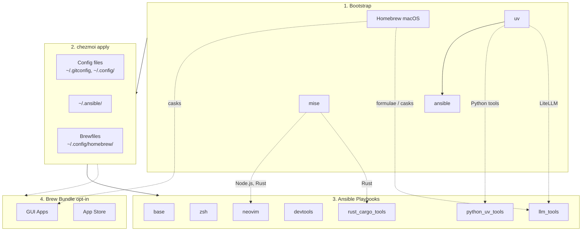

<!-- Generated by SpecStory, Markdown v2.1.0 -->

# 2026-04-01 05:58:32Z

<!-- Codex CLI Session 019d479e-9df0-7023-bf02-d34a1128ee81 (2026-04-01 05:58:32Z) -->

_**User (2026-04-01 05:58:32Z)**_

我要加上 marimo shell-completion
eval "$(_MARIMO_COMPLETE=zsh_source marimo)"


---

_**Agent (gpt-5.4 2026-04-01 06:00:20Z)**_

先把当前任务会话初始化，然后检查仓库里 zsh 配置和现有的 completion 组织方式，确定该把 `marimo` 的补全放在哪里。

_**Agent (gpt-5.4 2026-04-01 06:00:20Z)**_

<tool-use data-tool-type="shell" data-tool-name="exec_command"><details>
<summary>Tool use: **exec_command** `td usage --new-session`</summary>
```
Command: /bin/zsh -lc 'td usage --new-session'
Chunk ID: a772fe
Wall time: 0.0000 seconds
Process exited with code 127
Original token count: 8
Output:
zsh:1: command not found: td
```
</details></tool-use>

_**Agent (gpt-5.4 2026-04-01 06:00:20Z)**_

<tool-use data-tool-type="shell" data-tool-name="exec_command"><details>
<summary>Tool use: **exec_command** `pwd`</summary>
```
Command: /bin/zsh -lc pwd
Chunk ID: 3c4949
Wall time: 0.0000 seconds
Process exited with code 0
Original token count: 11
Output:
/Users/daviddwlee84/.local/share/chezmoi
```
</details></tool-use>

_**Agent (gpt-5.4 2026-04-01 06:00:42Z)**_

`td` 不在当前环境里，`td usage --new-session` 直接返回 `command not found`。我先继续检查仓库结构和 zsh/completion 的落点，改动时会避开不必要的猜测。

_**Agent (gpt-5.4 2026-04-01 06:00:42Z)**_

<tool-use data-tool-type="shell" data-tool-name="exec_command"><details>
<summary>Tool use: **exec_command** `rg --files | rg 'README.md|zsh|completion|marimo|chezmoi.toml|Dockerfile'`</summary>
```
Command: /bin/zsh -lc "rg --files | rg 'README.md|zsh|completion|marimo|chezmoi.toml|Dockerfile'"
Chunk ID: a8669c
Wall time: 0.0000 seconds
Process exited with code 0
Original token count: 293
Output:
README.md
dot_zshrc.tmpl
dot_zshenv.tmpl
dot_config/marimo/create_marimo.toml
Dockerfile
docs/input_methods/README.md
docs/zsh/zsh-completions.md
dot_config/nvim/README.md
dot_config/zsh/10_aliases.zsh
dot_config/zsh/00_exports.zsh.tmpl
dot_config/zsh/02_legacy_tools.zsh
dot_ansible/roles/zsh/defaults/main.yml
dot_ansible/roles/zsh/tasks/main.yml
dot_config/zsh/tools/20_zoxide.zsh
dot_config/zsh/tools/30_direnv.zsh
dot_config/zsh/tools/05_mise.zsh
dot_config/zsh/tools/25_bat.zsh
dot_config/zsh/tools/50_networking.zsh
dot_config/zsh/tools/35_yazi.zsh
dot_config/zsh/tools/95_bitwarden.zsh
dot_config/zsh/tools/36_pueue.zsh
dot_config/zsh/tools/06_cargo.zsh
dot_config/zsh/tools/34_openclaw.zsh
dot_config/zsh/tools/07_bunx_cli.zsh
dot_config/zsh/tools/01_starship.zsh
dot_config/zsh/tools/04_conda_mamba.zsh
dot_config/zsh/tools/90_completions.zsh
dot_config/zsh/tools/26_eza.zsh
dot_config/zsh/tools/41_github.zsh
dot_config/zsh/tools/28_tldr.zsh
dot_config/zsh/tools/40_codexbar.zsh
dot_config/zsh/tools/27_thefuck.zsh
dot_config/zsh/tools/33_toolkami.zsh.disabled
dot_config/zsh/tools/10_fzf.zsh
dot_config/zsh/tools/22_sesh.zsh
dot_config/zsh/tools/32_try.zsh
```
</details></tool-use>

_**Agent (gpt-5.4 2026-04-01 06:00:42Z)**_

<tool-use data-tool-type="shell" data-tool-name="exec_command"><details>
<summary>Tool use: **exec_command** `git status --short`</summary>
```
Command: /bin/zsh -lc 'git status --short'
Chunk ID: 14d15d
Wall time: 0.0000 seconds
Process exited with code 0
Original token count: 0
Output:
```
</details></tool-use>

_**Agent (gpt-5.4 2026-04-01 06:00:54Z)**_

仓库里已经有统一的 zsh 工具脚本和 `90_completions.zsh`，我先确认它的加载方式，再决定是直接挂到通用 completions 文件，还是给 `marimo` 单独建一个工具脚本。

_**Agent (gpt-5.4 2026-04-01 06:00:54Z)**_

<tool-use data-tool-type="shell" data-tool-name="exec_command"><details>
<summary>Tool use: **exec_command** `sed -n '1,220p' dot_zshrc.tmpl`</summary>
```
Command: /bin/zsh -lc "sed -n '1,220p' dot_zshrc.tmpl"
Chunk ID: b9a11c
Wall time: 0.0000 seconds
Process exited with code 0
Original token count: 1008
Output:
# Profiling: start a profiled shell with `ZSH_PROF=1 zsh`
if [[ -n "$ZSH_PROF" ]]; then
    zmodload zsh/zprof
fi

# ~/.zshrc - Interactive shell configuration
# Managed by chezmoi - do not edit directly

# =============================================================================
# Oh-My-Zsh Configuration
# =============================================================================

# Theme (disabled - using starship prompt instead)
ZSH_THEME=""

# Prevent zsh from overwriting tmux/tmuxp window names (only inside tmux)
# [[ -n "$TMUX" ]] && export DISABLE_AUTO_TITLE='true'
export DISABLE_AUTO_TITLE='true'

# Plugins (from $ZSH/plugins/ and $ZSH_CUSTOM/plugins/)
plugins=(
    git
    zsh-autosuggestions
    zsh-syntax-highlighting
    zsh-vi-mode
)

# zsh-vi-mode overrides all keybindings on init; re-source fzf bindings afterward
# so that Ctrl+R (history search), Ctrl+T (file search), Alt+C still work
zvm_after_init() {
    [ -f "$ZSH_CONFIG_DIR/tools/10_fzf.zsh" ] && source "$ZSH_CONFIG_DIR/tools/10_fzf.zsh"
}

# Oh-My-Zsh path
export ZSH="$HOME/.oh-my-zsh"

# Extra completion paths (must be set before oh-my-zsh runs compinit)
fpath+=~/.zfunc
[[ -d ~/.oh-my-zsh/custom/plugins/zsh-completions/src ]] && fpath=(~/.oh-my-zsh/custom/plugins/zsh-completions/src $fpath)
[[ -d ~/.docker/completions ]] && fpath=(~/.docker/completions $fpath)

{{ if eq .profile "macos_intel" -}}
# Skip compinit insecure directory warnings (e.g. /usr/local/share on Intel Macs)
# ZSH_DISABLE_COMPFIX=true
{{ end }}

# Load Oh-My-Zsh (also runs compinit)
[[ -f "$ZSH/oh-my-zsh.sh" ]] && source "$ZSH/oh-my-zsh.sh"

# =============================================================================
# Moved from .zshenv (seems Superset only load .zshrc but not .zshenv)
# =============================================================================

# XDG Base Directory Specification
export XDG_CONFIG_HOME="${XDG_CONFIG_HOME:-$HOME/.config}"
export XDG_DATA_HOME="${XDG_DATA_HOME:-$HOME/.local/share}"
export XDG_CACHE_HOME="${XDG_CACHE_HOME:-$HOME/.cache}"

# Modular config directory
export ZSH_CONFIG_DIR="$XDG_CONFIG_HOME/zsh"

{{ if eq .chezmoi.os "darwin" -}}
# Homebrew (macOS)
if [[ -f /opt/homebrew/bin/brew ]]; then
    eval "$(/opt/homebrew/bin/brew shellenv)"
elif [[ -f /usr/local/bin/brew ]]; then
    eval "$(/usr/local/bin/brew shellenv)"
fi
{{ end -}}

# =============================================================================
# Modular Configuration Loader
# =============================================================================

# Load all .zsh files from a directory (sorted by filename)
load_zsh_dir() {
    local dir="$1"
    [[ -d "$dir" ]] || return 0
    setopt local_options null_glob
    local f
    for f in "$dir"/*.zsh; do
        [[ -r "$f" ]] && source "$f"
    done
}

# Load modular configs
load_zsh_dir "$ZSH_CONFIG_DIR"
load_zsh_dir "$ZSH_CONFIG_DIR/tools"

# Load secrets (not tracked by chezmoi)
[[ -r "$ZSH_CONFIG_DIR/secrets.zsh" ]] && source "$ZSH_CONFIG_DIR/secrets.zsh" || true

# =============================================================================
# Adhoc Configuration (not tracked by chezmoi)
# =============================================================================

# Create adhoc file if it doesn't exist
if [[ ! -f "$HOME/.zshrc.adhoc" ]]; then
    cat > "$HOME/.zshrc.adhoc" << 'ADHOC_EOF'
# ~/.zshrc.adhoc - Personal shell customizations (not tracked by chezmoi)
#
# Use this file for:
#   - Quick experiments with new aliases/functions
#   - Machine-specific configurations
#   - Temporary PATH modifications
#   - Testing before adding to chezmoi-managed configs
#
# This file is sourced at the end of ~/.zshrc
# Changes here take effect on new shell sessions (or run: source ~/.zshrc.adhoc)

# Example:
# alias myalias='echo "Hello from adhoc!"'
# export MY_VAR="my_value"

ADHOC_EOF
fi

# Source adhoc config
[[ -r "$HOME/.zshrc.adhoc" ]] && source "$HOME/.zshrc.adhoc"

# Profiling: output results
if [[ -n "$ZSH_PROF" ]]; then
    zprof
fi
```
</details></tool-use>

_**Agent (gpt-5.4 2026-04-01 06:00:54Z)**_

<tool-use data-tool-type="shell" data-tool-name="exec_command"><details>
<summary>Tool use: **exec_command** `sed -n '1,220p' dot_config/zsh/tools/90_completions.zsh`</summary>
```
Command: /bin/zsh -lc "sed -n '1,220p' dot_config/zsh/tools/90_completions.zsh"
Chunk ID: 6f54b2
Wall time: 0.0000 seconds
Process exited with code 0
Original token count: 70
Output:
# 90_completions.zsh - Autocompletion setup
#
# NOTE: fpath additions and compinit are handled in .zshrc before oh-my-zsh
# is sourced. This file is kept for any additional completion configuration.

# Additional completion settings can go here
# e.g., zstyle ':completion:*' ...
```
</details></tool-use>

_**Agent (gpt-5.4 2026-04-01 06:00:54Z)**_

<tool-use data-tool-type="shell" data-tool-name="exec_command"><details>
<summary>Tool use: **exec_command** `sed -n '1,220p' README.md`</summary>
```
Command: /bin/zsh -lc "sed -n '1,220p' README.md"
Chunk ID: 7aa09e
Wall time: 0.0000 seconds
Process exited with code 0
Original token count: 2440
Output:
# dotfiles

Cross-platform development environment setup using **chezmoi** + **ansible**.

- **chezmoi**: manages config files (dotfiles)
- **ansible**: installs system dependencies and tools

## Prerequisites

- [chezmoi](https://www.chezmoi.io/install/)
- [uv](https://docs.astral.sh/uv/getting-started/installation/) (for ansible)

## Architecture



## Quick Setup

```bash
# One-liner to initialize and apply (installs chezmoi to ~/.local/bin)
export GITHUB_USERNAME=daviddwlee84
sh -c "$(curl -fsLS get.chezmoi.io)" -- -b "$HOME/.local/bin" init --apply git@github.com:$GITHUB_USERNAME/dotfiles.git
```

This automatically:

1. Bootstraps Homebrew (macOS/Linux), uv, mise, ansible
2. Deploys all config files
3. Runs ansible playbooks (git, ripgrep, fd, neovim, etc.)
4. Runs brew bundle (if `installBrewApps` enabled)

### Optional Components

During `chezmoi init`, you'll be prompted for optional installs:

| Option | Default | Description |
|--------|---------|-------------|
| `installCodingAgents` | true | Claude Code, Codex CLI, OpenCode, Cursor, Copilot, Gemini CLI, td, sidecar, specify-cli, etc. |
| `installBitwarden` | false | Bitwarden CLI (`bw`) + Desktop app (desktop profiles) with SSH agent auto-detection |
| `installPythonUvTools` | true | Python CLI tools via uv (mlflow, sqlit-tui, tmuxp, etc.) |
| `installLlmTools` | false | Local LLM tools: Ollama, LiteLLM, llmfit, models |
| `installBrewApps` | false | GUI apps via Homebrew Brewfile (casks, mas) |
| `installInputMethod` | false | Traditional Chinese input methods (McBopomofo, RIME/Squirrel on macOS; ibus-rime on Linux) |
| `installNetworkingTools` | false | Networking CLI tools (nmap, mtr, httpie, gping, trippy, bandwhich, rustscan, etc.) |
| `noRoot` | false | Skip sudo-requiring tasks (for servers without root access) |

To change options later: `chezmoi init --force`

## What You Get

### Config Files

- `~/.gitconfig` - Git configuration
- `~/.config/git/hooks/` - Global Git hooks (pre-commit + Git LFS hooks)
- `~/.config/gh-dash/config.yml` - Global gh-dash config, with `diffnav` as the diff pager
- `~/.config/lazygit/config.yml` - Global LazyGit config, with `delta` as the custom diff pager
- `~/.config/bat/themes/tokyonight_night.tmTheme` - Managed Tokyo Night theme for bat
- `~/.config/nvim/` - Neovim (LazyVim) configuration
- `~/.config/uv/uv.toml` - uv package manager config
- `~/.cargo/config.toml` - Cargo registry mirror config (GFW)
- `~/.npmrc` - npm registry config (official/npmmirror via `useChineseMirror`)
- `~/.config/.bunfig.toml` - Bun global registry config (official/npmmirror via `useChineseMirror`)
- `~/.config/alacritty/` - Alacritty terminal config
- `~/.config/starship.toml` - Starship cross-shell prompt config
- `~/.config/direnv/direnvrc` - direnv helper functions, including `.venv`-aware Python activation
- `~/.config/yazi/` - Yazi file manager config (v0.3.3+ syntax, [docs](https://yazi-rs.github.io/docs/configuration/overview/))
  - `yazi.toml` - Main config with open rules and openers (`o`/`O`)
  - `keymap.toml`, `theme.toml` - Optional customization files (stubs provided)
- `~/.claude/` - Claude Code settings
- `~/.specstory/cli/config.toml` - Global SpecStory defaults for `specstory run` across all projects
- `~/.tmux.conf` - Tmux configuration with TPM plugins
- `~/.local/bin/x` - Cross-platform terminal wrapper for `copy` / `paste` / `open`
- `~/.config/zsh/tools/22_sesh.zsh` - Sesh keybinding (Ctrl+A for tmux session switcher)
- `~/.config/zsh/tools/36_pueue.zsh` - Pueue queue summary helper (`pqsum`)
- `~/.config/zsh/tools/41_github.zsh` - GitHub helper with `ghget` for downloading a repo subdirectory from a tree URL
- `~/.config/zsh/tools/28_tldr.zsh` - `tldrf` helper with `TLDR_LANGUAGES` fallback order
- `~/.config/zsh/tools/95_bitwarden.zsh` - Bitwarden CLI completion + SSH agent socket auto-detection
- `~/.ssh/config` - SSH main config 
... (truncated)
```
</details></tool-use>

_**Agent (gpt-5.4 2026-04-01 06:00:54Z)**_

<tool-use data-tool-type="shell" data-tool-name="exec_command"><details>
<summary>Tool use: **exec_command** `sed -n '1,220p' docs/zsh/zsh-completions.md`</summary>
```
Command: /bin/zsh -lc "sed -n '1,220p' docs/zsh/zsh-completions.md"
Chunk ID: 77d7a9
Wall time: 0.0000 seconds
Process exited with code 0
Original token count: 1857
Output:
# Zsh Completions Best Practices

How zsh tab completions are organized in this dotfiles project.

## Architecture

```
compinit runs once (inside oh-my-zsh.sh)
        │
        ├── ~/.zfunc/                          ← user-generated completions (NOT tracked by chezmoi)
        ├── ~/.oh-my-zsh/custom/plugins/       ← community completions (184 files, cloned by ansible)
        │     └── zsh-completions/src/
        ├── ~/.docker/completions/             ← Docker-shipped completions
        ├── $(brew --prefix)/share/zsh/        ← Homebrew-managed completions (via `brew completions link`)
        │     └── site-functions/
        └── $ZSH/completions/                  ← oh-my-zsh built-in completions
```

All `fpath` additions are in `dot_zshrc.tmpl` **before** `source "$ZSH/oh-my-zsh.sh"`, so `compinit` runs exactly once and picks up everything.

## Completion Categories

Tools fall into four categories:

### A. Self-generating (`tool completion zsh > ~/.zfunc/_tool`)

Most modern CLI tools can output their own completion script. Run once after install, re-run after version upgrades.

| Tool | Command |
|------|---------|
| `uv` | `uv generate-shell-completion zsh` |
| `mise` | `mise completion zsh` |
| `chezmoi` | `chezmoi completion zsh` |
| `just` | `just --completions zsh` |
| `bat` | `bat --completion zsh` |
| `delta` | `delta --generate-completion zsh` |
| `starship` | `starship completions zsh` |
| `rg` | `rg --generate complete-zsh` |
| `fd` | `fd --gen-completions zsh` |
| `zellij` | `zellij setup --generate-completion zsh` |
| `sesh` | `sesh completion zsh` |
| `pueue` | `pueue completions zsh` |
| `docker` | `docker completion zsh` |
| `gh` | `gh completion -s zsh` |
| `opencode` | `opencode completion zsh` |
| `bw` | `bw completion --shell zsh` |

**Usage pattern:**

```bash
# Generate once (or after upgrade)
mkdir -p ~/.zfunc
uv generate-shell-completion zsh > ~/.zfunc/_uv
mise completion zsh > ~/.zfunc/_mise
```

### B. Pre-bundled (no action needed)

Completions ship with the package or via the `zsh-completions` community plugin.

| Tool | Source |
|------|--------|
| `eza` | Homebrew formula installs `_eza` into site-functions |
| `git` | oh-my-zsh `git` plugin |
| `yazi` | Ships `_yazi` in release assets (also in zsh-completions) |
| `lazygit` | No completion support; not needed (TUI app) |
| `btop` | No completion support; not needed (TUI app) |
| Many others | `zsh-completions` plugin covers 184 tools |

### C. Eval/source at startup (shell integration)

These tools inject completions as part of broader shell integration. Already handled in `dot_config/zsh/tools/`.

| Tool | Where | How |
|------|-------|-----|
| `fzf` | `tools/10_fzf.zsh` | `source <(fzf --zsh)` |
| `zoxide` | `tools/20_zoxide.zsh` | `eval "$(zoxide init zsh)"` |
| `thefuck` | `tools/25_thefuck.zsh` | `eval $(thefuck --alias)` |
| `direnv` | `tools/30_direnv.zsh` | `eval "$(direnv hook zsh)"` |

### D. No completion support

`claude`, `gemini`, `btop`, `lazygit` -- no generation command available.

### E. Python tools via `shtab` / `tyro`

Python CLI frameworks can generate completions:

- **[tyro](https://brentyi.github.io/tyro/tab_completion/)**: `python my_cli.py --tyro-write-completion zsh ~/.zfunc/_my_cli`
- **[shtab](https://github.com/iterative/shtab)**: `shtab --shell=zsh my_module.parser > ~/.zfunc/_my_tool`
- **argcomplete**: `register-python-argcomplete tool_name` (uses eval, category C)
- **click** (used by mlflow, litellm, etc.): `_TOOL_COMPLETE=zsh_source tool > ~/.zfunc/_tool`

## Why `~/.zfunc/` is NOT Tracked by Chezmoi

**Decision: `~/.zfunc/` is not version-controlled.** Rationale:

1. **Completions are tool-version-dependent.** A completion script generated by `uv 0.6` may not match `uv 0.7`. Tracking stale files causes subtle breakage.
2. **Not all users install the same tools.** A `_pueue` completion file is useless (and throws warnings) if pueue isn't installed.
3. **Regeneration is trivial.** One command per tool.
4. **Brew-installed tools auto-manage their completions** via site-functions. Duplicating them in `~/.zfunc/` creates conflicts.

### What we DO track

- `fpath+=~/.zfunc` in `dot_zshrc.tmpl` (ensures the directory is in the search path)
- `zsh-completions` plugin cloned by ansible (community completions)
- `~/.docker/completions` fpath entry
- Tool-specific `eval`/`source` integrations in `dot_config/zsh/tools/`

## Generating Completions After Fresh Install

After `chezmoi apply` on a new machine, most completions already work via `zsh-completions` plugin and Homebrew site-functions. For tools you want **richer/newer completions**, generate them into `~/.zfunc/`:

```bash
mkdir -p ~/.zfunc

# Core tools (always installed)
chezmoi completion zsh > ~/.zfunc/_
... (truncated)
```
</details></tool-use>

_**Agent (gpt-5.4 2026-04-01 06:01:04Z)**_

<tool-use data-tool-type="shell" data-tool-name="exec_command"><details>
<summary>Tool use: **exec_command** `rg -n "marimo|Python CLI tools|uv tool|mlflow|sqlit-tui" -S dot_ansible README.md dot_config .chezmoi.toml.tmpl`</summary>
```
Command: /bin/zsh -lc 'rg -n "marimo|Python CLI tools|uv tool|mlflow|sqlit-tui" -S dot_ansible README.md dot_config .chezmoi.toml.tmpl'
Chunk ID: 1c1a8e
Wall time: 0.0000 seconds
Process exited with code 0
Original token count: 599
Output:
README.md:77:| `installPythonUvTools` | true | Python CLI tools via uv (mlflow, sqlit-tui, tmuxp, etc.) |
README.md:147:- **Python tools (via uv)**: thefuck, apprise, sqlit-tui, dotenv, git-filter-repo, mlflow, tmuxp
.chezmoi.toml.tmpl:17:# 是否安裝 Python CLI tools via uv (mlflow, sqlit-tui, tmuxp, etc.)
.chezmoi.toml.tmpl:18:installPythonUvTools = {{ promptBoolOnce . "installPythonUvTools" "Install Python CLI tools via uv (mlflow, sqlit-tui, tmuxp, etc.)" true }}
dot_config/yazi/yazi.toml:22:  { url = "*/", use = ["edit", "git", "marimo_dir", "agent", "open"] },
dot_config/yazi/yazi.toml:24:  # Python 檔：提供 marimo sandbox
dot_config/yazi/yazi.toml:25:  { url = "*.py", use = ["edit", "marimo_py_sandbox", "open", "code"] },
dot_config/yazi/yazi.toml:161:# --- marimo：對目錄用 marimo edit --watch .
dot_config/yazi/yazi.toml:162:marimo_dir = [
dot_config/yazi/yazi.toml:170:exec marimo edit --watch .
dot_config/yazi/yazi.toml:175:# --- marimo sandbox：只給 .py 用，避免對 dir 亂套
dot_config/yazi/yazi.toml:176:marimo_py_sandbox = [
dot_config/yazi/yazi.toml:177:  { run = """sh -lc 'exec marimo edit --watch --sandbox "$1"' -- %s1 """, block = true, desc = "Marimo (watch + sandbox py)" },
dot_config/marimo/create_marimo.toml:61:presets = ["context7", "marimo"]
dot_ansible/roles/python_uv_tools/defaults/main.yml:2:# Python CLI tools installed via uv tool install
dot_ansible/roles/python_uv_tools/defaults/main.yml:14:  - name: sqlit-tui[ssh]
dot_ansible/roles/python_uv_tools/defaults/main.yml:26:  - name: mlflow
dot_ansible/roles/python_uv_tools/defaults/main.yml:27:    binary: mlflow
dot_ansible/roles/devtools/tasks/main.yml:769:# NOTE: thefuck is now installed via uv tool (python_uv_tools role)
dot_ansible/roles/python_uv_tools/tasks/main.yml:2:# Python CLI tools via uv
dot_ansible/roles/python_uv_tools/tasks/main.yml:5:- name: Install Python CLI tools via uv
dot_ansible/roles/python_uv_tools/tasks/main.yml:7:    uv tool install {{ item.name }}
dot_ansible/roles/security_tools/tasks/main.yml:28:      uv tool install pre-commit
dot_ansible/roles/llm_tools/tasks/main.yml:3:# - litellm: uv tool install
dot_ansible/roles/llm_tools/tasks/main.yml:17:    uv tool install {{ item.name }}
dot_ansible/roles/coding_agents/tasks/main.yml:1011:  ansible.builtin.command: uv tool install specify-cli --from git+https://github.com/github/spec-kit.git
```
</details></tool-use>

_**Agent (gpt-5.4 2026-04-01 06:01:04Z)**_

<tool-use data-tool-type="shell" data-tool-name="exec_command"><details>
<summary>Tool use: **exec_command** `ls -la dot_config/zsh/tools`</summary>
```
Command: /bin/zsh -lc 'ls -la dot_config/zsh/tools'
Chunk ID: 2aba8b
Wall time: 0.0000 seconds
Process exited with code 0
Original token count: 432
Output:
total 200
drwxr-xr-x@ 25 daviddwlee84  staff    800 Mar 30 11:35 .
drwxr-xr-x@  6 daviddwlee84  staff    192 Feb 13 15:07 ..
-rw-r--r--@  1 daviddwlee84  staff    186 Feb 13 10:41 01_starship.zsh
-rw-r--r--@  1 daviddwlee84  staff   1489 Feb 13 14:58 04_conda_mamba.zsh
-rw-r--r--@  1 daviddwlee84  staff    390 Feb  4 22:53 05_mise.zsh
-rw-r--r--@  1 daviddwlee84  staff    314 Feb  5 09:38 06_cargo.zsh
-rw-r--r--@  1 daviddwlee84  staff    160 Feb  5 23:25 07_bunx_cli.zsh
-rw-r--r--@  1 daviddwlee84  staff   2299 Feb  4 22:53 10_fzf.zsh
-rw-r--r--@  1 daviddwlee84  staff    227 Feb  4 18:42 20_zoxide.zsh
-rw-r--r--@  1 daviddwlee84  staff    725 Feb 13 09:10 22_sesh.zsh
-rw-r--r--@  1 daviddwlee84  staff    285 Mar 31 16:50 25_bat.zsh
-rw-r--r--@  1 daviddwlee84  staff    792 Feb  4 18:41 26_eza.zsh
-rw-r--r--@  1 daviddwlee84  staff    299 Feb  4 18:41 27_thefuck.zsh
-rw-r--r--@  1 daviddwlee84  staff    364 Feb  9 17:57 28_tldr.zsh
-rw-r--r--@  1 daviddwlee84  staff    160 Feb  4 15:50 30_direnv.zsh
-rw-r--r--@  1 daviddwlee84  staff    405 Feb  5 11:29 32_try.zsh
-rw-r--r--@  1 daviddwlee84  staff    189 Feb  5 11:29 33_toolkami.zsh.disabled
-rw-r--r--@  1 daviddwlee84  staff    242 Feb  9 09:13 34_openclaw.zsh
-rw-r--r--@  1 daviddwlee84  staff    464 Feb  4 19:02 35_yazi.zsh
-rw-r--r--@  1 daviddwlee84  staff  11526 Feb 10 13:27 36_pueue.zsh
-rw-r--r--@  1 daviddwlee84  staff    317 Feb  9 09:13 40_codexbar.zsh
-rw-r--r--@  1 daviddwlee84  staff   2663 Mar 30 11:37 41_github.zsh
-rw-r--r--@  1 daviddwlee84  staff   1510 Mar 30 11:17 50_networking.zsh
-rw-r--r--@  1 daviddwlee84  staff    280 Feb 13 14:44 90_completions.zsh
-rw-r--r--@  1 daviddwlee84  staff   1461 Feb 13 15:07 95_bitwarden.zsh
```
</details></tool-use>

_**Agent (gpt-5.4 2026-04-01 06:01:14Z)**_

已经确认这里的模式是“每个工具一个小脚本，按编号自动 source”。我去对齐现有写法，然后加一个 `marimo` 的轻量集成，并同步 README 里对 zsh 工具脚本的说明。

_**Agent (gpt-5.4 2026-04-01 06:01:14Z)**_

<tool-use data-tool-type="shell" data-tool-name="exec_command"><details>
<summary>Tool use: **exec_command** `sed -n '1,200p' dot_config/zsh/tools/20_zoxide.zsh`</summary>
```
Command: /bin/zsh -lc "sed -n '1,200p' dot_config/zsh/tools/20_zoxide.zsh"
Chunk ID: 931954
Wall time: 0.0000 seconds
Process exited with code 0
Original token count: 57
Output:
# 20_zoxide.zsh - zoxide configuration

# Check if zoxide is installed
command -v zoxide &>/dev/null || return 0

# Initialize zoxide
eval "$(zoxide init zsh)"

# Replace cd with z for smarter directory navigation
alias cd="z"
```
</details></tool-use>

_**Agent (gpt-5.4 2026-04-01 06:01:14Z)**_

<tool-use data-tool-type="shell" data-tool-name="exec_command"><details>
<summary>Tool use: **exec_command** `sed -n '1,200p' dot_config/zsh/tools/27_thefuck.zsh`</summary>
```
Command: /bin/zsh -lc "sed -n '1,200p' dot_config/zsh/tools/27_thefuck.zsh"
Chunk ID: 89b185
Wall time: 0.0000 seconds
Process exited with code 0
Original token count: 75
Output:
# 27_thefuck.zsh - thefuck configuration (auto-correct commands)

# Check if thefuck is installed
command -v thefuck &>/dev/null || return 0

# Initialize thefuck with default alias 'fuck'
eval $(thefuck --alias)

# Optional: Use a different alias (uncomment to enable)
# eval $(thefuck --alias fk)
```
</details></tool-use>

_**Agent (gpt-5.4 2026-04-01 06:01:14Z)**_

<tool-use data-tool-type="shell" data-tool-name="exec_command"><details>
<summary>Tool use: **exec_command** `sed -n '1,240p' dot_config/zsh/tools/95_bitwarden.zsh`</summary>
```
Command: /bin/zsh -lc "sed -n '1,240p' dot_config/zsh/tools/95_bitwarden.zsh"
Chunk ID: 25619f
Wall time: 0.0000 seconds
Process exited with code 0
Original token count: 366
Output:
# 95_bitwarden.zsh - Bitwarden CLI completion and SSH agent integration

# TODO:: Consider if we want to automatically set SSH_AUTH_SOCK for Bitwarden SSH agent, or set in ~/.ssh/config manually?

# Check if Bitwarden CLI is installed
command -v bw &>/dev/null || return 0

# Enable Bitwarden zsh completion (cached — bw is a slow Node.js app)
# Run `bw-update-completion` to regenerate after updating bw
_bw_comp_cache="${XDG_CACHE_HOME:-$HOME/.cache}/zsh/bw_completion.zsh"
if [[ ! -f "$_bw_comp_cache" ]]; then
    mkdir -p "${_bw_comp_cache:h}"
    bw completion --shell zsh 2>/dev/null > "$_bw_comp_cache"
fi
[[ -s "$_bw_comp_cache" ]] && source "$_bw_comp_cache"
unset _bw_comp_cache

# Prefer Bitwarden SSH Agent when its socket exists
typeset -a _bw_ssh_candidates

if [[ "$OSTYPE" == darwin* ]]; then
    _bw_ssh_candidates=(
        "$HOME/Library/Application Support/Bitwarden/.bitwarden-ssh-agent.sock"
        "$HOME/Library/Containers/com.bitwarden.desktop/Data/.bitwarden-ssh-agent.sock"
        "$HOME/.bitwarden-ssh-agent.sock"
    )
else
    _bw_ssh_candidates=(
        "$HOME/.bitwarden-ssh-agent.sock"
        "$HOME/snap/bitwarden/current/.bitwarden-ssh-agent.sock"
        "$HOME/.var/app/com.bitwarden.desktop/data/.bitwarden-ssh-agent.sock"
    )
fi

for _bw_sock in "${_bw_ssh_candidates[@]}"; do
    if [[ -S "$_bw_sock" ]]; then
        export SSH_AUTH_SOCK="$_bw_sock"
        break
    fi
done

unset _bw_sock _bw_ssh_candidates
```
</details></tool-use>

_**Agent (gpt-5.4 2026-04-01 06:01:14Z)**_

<tool-use data-tool-type="shell" data-tool-name="exec_command"><details>
<summary>Tool use: **exec_command** `sed -n '1,200p' dot_config/zsh/tools/32_try.zsh`</summary>
```
Command: /bin/zsh -lc "sed -n '1,200p' dot_config/zsh/tools/32_try.zsh"
Chunk ID: ef25c4
Wall time: 0.0000 seconds
Process exited with code 0
Original token count: 102
Output:
# 32_try.zsh - try-cli configuration (ephemeral workspace manager)
# https://github.com/tobi/try

# Find try.rb from the gem - the gem wrapper is broken due to __FILE__ == $0 guard
_try_script=$(ruby -e "require 'rubygems'; puts File.join(Gem::Specification.find_by_name('try-cli').gem_dir, 'try.rb')" 2>/dev/null)
[[ -f "$_try_script" ]] || return 0

eval "$(ruby "$_try_script" init)"
unset _try_script
```
</details></tool-use>

_**Agent (gpt-5.4 2026-04-01 06:01:32Z)**_

我要做两处改动：新增一个独立的 `marimo` zsh 工具脚本，按现有自动加载顺序启用补全；然后在 `README.md` 的 Config Files 里补一条，说明这份受管配置现在也包含 `marimo` 的 shell integration。

_**Agent (gpt-5.4 2026-04-01 06:01:37Z)**_

<tool-use data-tool-type="write" data-tool-name="apply_patch"><details>
<summary>Tool use: **apply_patch**</summary>
**Add: `/Users/daviddwlee84/.local/share/chezmoi/dot_config/zsh/tools/29_marimo.zsh`**

```diff
+# 29_marimo.zsh - marimo shell completion
+
+# Check if marimo is installed
+command -v marimo &>/dev/null || return 0
+
+# Enable marimo zsh completion
+eval "$(_MARIMO_COMPLETE=zsh_source marimo)"
```

**Update: `/Users/daviddwlee84/.local/share/chezmoi/README.md`**

```diff
@@
 - `~/.config/zsh/tools/22_sesh.zsh` - Sesh keybinding (Ctrl+A for tmux session switcher)
 - `~/.config/zsh/tools/36_pueue.zsh` - Pueue queue summary helper (`pqsum`)
 - `~/.config/zsh/tools/41_github.zsh` - GitHub helper with `ghget` for downloading a repo subdirectory from a tree URL
 - `~/.config/zsh/tools/28_tldr.zsh` - `tldrf` helper with `TLDR_LANGUAGES` fallback order
+- `~/.config/zsh/tools/29_marimo.zsh` - `marimo` zsh shell completion
 - `~/.config/zsh/tools/95_bitwarden.zsh` - Bitwarden CLI completion + SSH agent socket auto-detection
```

**Update: `/Users/daviddwlee84/.local/share/chezmoi/docs/zsh/zsh-completions.md`**

```diff
@@
 | `direnv` | `tools/30_direnv.zsh` | `eval "$(direnv hook zsh)"` |
+| `marimo` | `tools/29_marimo.zsh` | `eval "$(_MARIMO_COMPLETE=zsh_source marimo)"` |
```
</details></tool-use>

_**Agent (gpt-5.4 2026-04-01 06:01:47Z)**_

改动已经落到仓库里。接下来我做最小验证：检查新脚本语法、看 diff 是否干净，以及确认文档更新位置没有偏掉。

_**Agent (gpt-5.4 2026-04-01 06:01:47Z)**_

<tool-use data-tool-type="shell" data-tool-name="exec_command"><details>
<summary>Tool use: **exec_command** `zsh -n dot_config/zsh/tools/29_marimo.zsh`</summary>
```
Command: /bin/zsh -lc 'zsh -n dot_config/zsh/tools/29_marimo.zsh'
Chunk ID: 6e1eb5
Wall time: 0.0000 seconds
Process exited with code 0
Original token count: 0
Output:
```
</details></tool-use>

_**Agent (gpt-5.4 2026-04-01 06:01:47Z)**_

<tool-use data-tool-type="shell" data-tool-name="exec_command"><details>
<summary>Tool use: **exec_command** `git diff --check`</summary>
```
Command: /bin/zsh -lc 'git diff --check'
Chunk ID: 47f5f6
Wall time: 0.0001 seconds
Process exited with code 0
Original token count: 0
Output:
```
</details></tool-use>

_**Agent (gpt-5.4 2026-04-01 06:01:47Z)**_

<tool-use data-tool-type="shell" data-tool-name="exec_command"><details>
<summary>Tool use: **exec_command** `git diff -- dot_config/zsh/tools/29_marimo.zsh README.md docs/zsh/zsh-completions.md`</summary>
```
Command: /bin/zsh -lc 'git diff -- dot_config/zsh/tools/29_marimo.zsh README.md docs/zsh/zsh-completions.md'
Chunk ID: 221229
Wall time: 0.0000 seconds
Process exited with code 0
Original token count: 357
Output:
diff --git a/README.md b/README.md
index 053a8bb..726a0c8 100644
--- a/README.md
+++ b/README.md
@@ -111,6 +111,7 @@ To change options later: `chezmoi init --force`
 - `~/.config/zsh/tools/36_pueue.zsh` - Pueue queue summary helper (`pqsum`)
 - `~/.config/zsh/tools/41_github.zsh` - GitHub helper with `ghget` for downloading a repo subdirectory from a tree URL
 - `~/.config/zsh/tools/28_tldr.zsh` - `tldrf` helper with `TLDR_LANGUAGES` fallback order
+- `~/.config/zsh/tools/29_marimo.zsh` - `marimo` zsh shell completion
 - `~/.config/zsh/tools/95_bitwarden.zsh` - Bitwarden CLI completion + SSH agent socket auto-detection
 - `~/.ssh/config` - SSH main config skeleton (create-only: `Include ~/.ssh/config.d/*` + conservative `Host *` defaults)
 - `~/.ssh/config.d/00-defaults` - SSH global defaults stub (commented examples only)
diff --git a/docs/zsh/zsh-completions.md b/docs/zsh/zsh-completions.md
index 17899c5..80dbec7 100644
--- a/docs/zsh/zsh-completions.md
+++ b/docs/zsh/zsh-completions.md
@@ -77,6 +77,7 @@ These tools inject completions as part of broader shell integration. Already han
 | `zoxide` | `tools/20_zoxide.zsh` | `eval "$(zoxide init zsh)"` |
 | `thefuck` | `tools/25_thefuck.zsh` | `eval $(thefuck --alias)` |
 | `direnv` | `tools/30_direnv.zsh` | `eval "$(direnv hook zsh)"` |
+| `marimo` | `tools/29_marimo.zsh` | `eval "$(_MARIMO_COMPLETE=zsh_source marimo)"` |
 
 ### D. No completion support
```
</details></tool-use>

_**Agent (gpt-5.4 2026-04-01 06:01:55Z)**_

文档和脚本的语法检查已经过了。我再看一眼工作树状态，确认新文件是按预期被追踪到的，而不是漏在未管理状态里。

_**Agent (gpt-5.4 2026-04-01 06:01:55Z)**_

<tool-use data-tool-type="shell" data-tool-name="exec_command"><details>
<summary>Tool use: **exec_command** `git status --short`</summary>
```
Command: /bin/zsh -lc 'git status --short'
Chunk ID: 2ad840
Wall time: 0.0254 seconds
Process exited with code 0
Original token count: 21
Output:
 M README.md
 M docs/zsh/zsh-completions.md
?? dot_config/zsh/tools/29_marimo.zsh
```
</details></tool-use>

_**Agent (gpt-5.4 2026-04-01 06:02:09Z)**_

<tool-use data-tool-type="shell" data-tool-name="exec_command"><details>
<summary>Tool use: **exec_command** `nl -ba dot_config/zsh/tools/29_marimo.zsh`</summary>
```
Command: /bin/zsh -lc 'nl -ba dot_config/zsh/tools/29_marimo.zsh'
Chunk ID: 4a86aa
Wall time: 0.0000 seconds
Process exited with code 0
Original token count: 61
Output:
     1	# 29_marimo.zsh - marimo shell completion
     2	
     3	# Check if marimo is installed
     4	command -v marimo &>/dev/null || return 0
     5	
     6	# Enable marimo zsh completion
     7	eval "$(_MARIMO_COMPLETE=zsh_source marimo)"
```
</details></tool-use>

_**Agent (gpt-5.4 2026-04-01 06:02:09Z)**_

<tool-use data-tool-type="shell" data-tool-name="exec_command"><details>
<summary>Tool use: **exec_command** `nl -ba README.md | sed -n '108,118p'`</summary>
```
Command: /bin/zsh -lc "nl -ba README.md | sed -n '108,118p'"
Chunk ID: 00a351
Wall time: 0.0000 seconds
Process exited with code 0
Original token count: 273
Output:
   108	- `~/.tmux.conf` - Tmux configuration with TPM plugins
   109	- `~/.local/bin/x` - Cross-platform terminal wrapper for `copy` / `paste` / `open`
   110	- `~/.config/zsh/tools/22_sesh.zsh` - Sesh keybinding (Ctrl+A for tmux session switcher)
   111	- `~/.config/zsh/tools/36_pueue.zsh` - Pueue queue summary helper (`pqsum`)
   112	- `~/.config/zsh/tools/41_github.zsh` - GitHub helper with `ghget` for downloading a repo subdirectory from a tree URL
   113	- `~/.config/zsh/tools/28_tldr.zsh` - `tldrf` helper with `TLDR_LANGUAGES` fallback order
   114	- `~/.config/zsh/tools/29_marimo.zsh` - `marimo` zsh shell completion
   115	- `~/.config/zsh/tools/95_bitwarden.zsh` - Bitwarden CLI completion + SSH agent socket auto-detection
   116	- `~/.ssh/config` - SSH main config skeleton (create-only: `Include ~/.ssh/config.d/*` + conservative `Host *` defaults)
   117	- `~/.ssh/config.d/00-defaults` - SSH global defaults stub (commented examples only)
   118	- `~/.ssh/config.d/git` - SSH host entries for `github.com` and `gitlab.com` with commented multi-account/Bitwarden examples
```
</details></tool-use>

_**Agent (gpt-5.4 2026-04-01 06:02:09Z)**_

<tool-use data-tool-type="shell" data-tool-name="exec_command"><details>
<summary>Tool use: **exec_command** `nl -ba docs/zsh/zsh-completions.md | sed -n '74,82p'`</summary>
```
Command: /bin/zsh -lc "nl -ba docs/zsh/zsh-completions.md | sed -n '74,82p'"
Chunk ID: ef3553
Wall time: 0.0000 seconds
Process exited with code 0
Original token count: 121
Output:
    74	| Tool | Where | How |
    75	|------|-------|-----|
    76	| `fzf` | `tools/10_fzf.zsh` | `source <(fzf --zsh)` |
    77	| `zoxide` | `tools/20_zoxide.zsh` | `eval "$(zoxide init zsh)"` |
    78	| `thefuck` | `tools/25_thefuck.zsh` | `eval $(thefuck --alias)` |
    79	| `direnv` | `tools/30_direnv.zsh` | `eval "$(direnv hook zsh)"` |
    80	| `marimo` | `tools/29_marimo.zsh` | `eval "$(_MARIMO_COMPLETE=zsh_source marimo)"` |
    81	
    82	### D. No completion support
```
</details></tool-use>

_**Agent (gpt-5.4 2026-04-01 06:02:43Z)**_

已把 `marimo` 的 zsh completion 加进仓库了，入口在 [29_marimo.zsh](/Users/daviddwlee84/.local/share/chezmoi/dot_config/zsh/tools/29_marimo.zsh#L1)。它会先检查 `marimo` 是否存在，再执行你给的 `eval "$(_MARIMO_COMPLETE=zsh_source marimo)"`。README 也同步更新到 [README.md:114](/Users/daviddwlee84/.local/share/chezmoi/README.md#L114)，补全文档更新在 [zsh-completions.md:80](/Users/daviddwlee84/.local/share/chezmoi/docs/zsh/zsh-completions.md#L80)。

验证方面，`zsh -n dot_config/zsh/tools/29_marimo.zsh` 和 `git diff --check` 都通过。按仓库约定我先尝试了 `td usage --new-session`，但当前环境里 `td` 不在 `PATH`，所以没法执行。要让配置生效，跑一次 `chezmoi apply`，然后开新 shell 即可。
