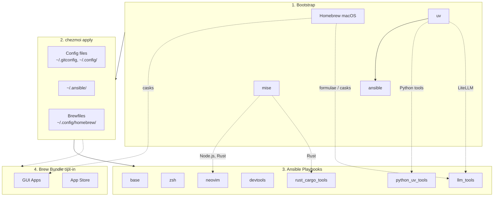

<!-- Generated by SpecStory, Markdown v2.1.0 -->

# 2026-04-01 09:08:57Z

<!-- Codex CLI Session 019d484c-0c96-7e03-ba6f-bb45ce7c5288 (2026-04-01 09:08:57Z) -->

_**User (2026-04-01 09:08:57Z)**_

添加 glow https://github.com/charmbracelet/glow 的安裝到 Dev tools group
添加 rtk https://github.com/rtk-ai/rtk 的安裝到 coding agent group


---

_**Agent (gpt-5.4 2026-04-01 09:10:46Z)**_

我会先按仓库约定运行 `td usage --new-session`，然后定位 `devtools` 和 `coding_agents` 的定义位置，确认需要修改的 ansible 角色和 README。

_**Agent (gpt-5.4 2026-04-01 09:10:47Z)**_

<tool-use data-tool-type="shell" data-tool-name="exec_command"><details>
<summary>Tool use: **exec_command** `td usage --new-session`</summary>
```
Command: /bin/zsh -lc 'td usage --new-session'
Chunk ID: 6cecd0
Wall time: 0.0000 seconds
Process exited with code 127
Original token count: 8
Output:
zsh:1: command not found: td
```
</details></tool-use>

_**Agent (gpt-5.4 2026-04-01 09:10:57Z)**_

`td` 不在当前环境的 `PATH` 里。我先确认仓库里是否有本地脚本或替代入口，然后继续做实际修改。

_**Agent (gpt-5.4 2026-04-01 09:10:57Z)**_

<tool-use data-tool-type="shell" data-tool-name="exec_command"><details>
<summary>Tool use: **exec_command** `pwd`</summary>
```
Command: /bin/zsh -lc pwd
Chunk ID: ef4fea
Wall time: 0.0000 seconds
Process exited with code 0
Original token count: 11
Output:
/Users/daviddwlee84/.local/share/chezmoi
```
</details></tool-use>

_**Agent (gpt-5.4 2026-04-01 09:10:57Z)**_

<tool-use data-tool-type="shell" data-tool-name="exec_command"><details>
<summary>Tool use: **exec_command** `command -v td || which td || true`</summary>
```
Command: /bin/zsh -lc 'command -v td || which td || true'
Chunk ID: 0a74ba
Wall time: 0.0000 seconds
Process exited with code 0
Original token count: 4
Output:
td not found
```
</details></tool-use>

_**Agent (gpt-5.4 2026-04-01 09:10:57Z)**_

<tool-use data-tool-type="shell" data-tool-name="exec_command"><details>
<summary>Tool use: **exec_command** `rg -n "\btd\b|task management|task manager" AGENTS.md README.md CLAUDE.md . 2>/dev/null`</summary>
```
Command: /bin/zsh -lc "rg -n \"\\btd\\b|task management|task manager\" AGENTS.md README.md CLAUDE.md . 2>/dev/null"
Chunk ID: c1202f
Wall time: 0.0000 seconds
Process exited with code 0
Original token count: 3150
Output:
README.md:75:| `installCodingAgents` | true | Claude Code, Codex CLI, OpenCode, Cursor, Copilot, Gemini CLI, td, sidecar, specify-cli, etc. |
README.md:136:- **Coding Agents** (optional): Claude Code, Codex CLI, CodexBar, OpenCode, Cursor CLI, Copilot CLI, Gemini CLI, SpecStory, OpenChamber, td, sidecar, specify-cli
README.md:204:See [CLAUDE.md](CLAUDE.md) for development guide, [docs/ansible.md](docs/ansible.md) for ansible customization, [docs/input_methods/README.md](docs/input_methods/README.md) for McBopomofo / Rime / Squirrel notes and backup strategy, [docs/tools/direnv.md](docs/tools/direnv.md) for `.venv`-aware direnv usage, [docs/tools/git_diff_workflow.md](docs/tools/git_diff_workflow.md) for the managed Git diff stack, [docs/tools/specstory.md](docs/tools/specstory.md) for SpecStory configuration, [docs/tools/td_sidecar.md](docs/tools/td_sidecar.md) for td/sidecar usage, [docs/tools/specify_cli.md](docs/tools/specify_cli.md) for Specify CLI, [docs/tools/llm.md](docs/tools/llm.md) for local LLM tools, and [docs/tools/networking.md](docs/tools/networking.md) for networking tools.
CLAUDE.md:5:## MANDATORY: Use td for Task Management
CLAUDE.md:7:Run td usage --new-session at conversation start (or after /clear). This tells you what to work on next.
CLAUDE.md:11:- td session "name" to label the current session
CLAUDE.md:12:- td session --new to force a new session in the same context
CLAUDE.md:14:Use td usage -q after first read.
AGENTS.md:5:## MANDATORY: Use td for Task Management
AGENTS.md:7:Run td usage --new-session at conversation start (or after /clear). This tells you what to work on next.
AGENTS.md:11:- td session "name" to label the current session
AGENTS.md:12:- td session --new to force a new session in the same context
AGENTS.md:14:Use td usage -q after first read.
./README.md:75:| `installCodingAgents` | true | Claude Code, Codex CLI, OpenCode, Cursor, Copilot, Gemini CLI, td, sidecar, specify-cli, etc. |
./README.md:136:- **Coding Agents** (optional): Claude Code, Codex CLI, CodexBar, OpenCode, Cursor CLI, Copilot CLI, Gemini CLI, SpecStory, OpenChamber, td, sidecar, specify-cli
./README.md:204:See [CLAUDE.md](CLAUDE.md) for development guide, [docs/ansible.md](docs/ansible.md) for ansible customization, [docs/input_methods/README.md](docs/input_methods/README.md) for McBopomofo / Rime / Squirrel notes and backup strategy, [docs/tools/direnv.md](docs/tools/direnv.md) for `.venv`-aware direnv usage, [docs/tools/git_diff_workflow.md](docs/tools/git_diff_workflow.md) for the managed Git diff stack, [docs/tools/specstory.md](docs/tools/specstory.md) for SpecStory configuration, [docs/tools/td_sidecar.md](docs/tools/td_sidecar.md) for td/sidecar usage, [docs/tools/specify_cli.md](docs/tools/specify_cli.md) for Specify CLI, [docs/tools/llm.md](docs/tools/llm.md) for local LLM tools, and [docs/tools/networking.md](docs/tools/networking.md) for networking tools.
./CLAUDE.md:5:## MANDATORY: Use td for Task Management
./CLAUDE.md:7:Run td usage --new-session at conversation start (or after /clear). This tells you what to work on next.
./CLAUDE.md:11:- td session "name" to label the current session
./CLAUDE.md:12:- td session --new to force a new session in the same context
./CLAUDE.md:14:Use td usage -q after first read.
./docs/tools/td_sidecar.md:1:# td + sidecar
./docs/tools/td_sidecar.md:3:`td` is a task-management CLI for AI-assisted workflows. `sidecar` is a TUI dashboard for working with those workflows.
./docs/tools/td_sidecar.md:5:## MANDATORY: Use td for Task Management
./docs/tools/td_sidecar.md:10:td usage --new-session
./docs/tools/td_sidecar.md:16:td usage -q
./docs/tools/td_sidecar.md:31:brew install marcus/tap/td
./docs/tools/td_sidecar.md:37:- `td`: <https://github.com/marcus/td/releases>
./docs/tools/td_sidecar.md:43:td version
./docs/tools/td_sidecar.md:49:- [td docs](https://marcus.github.io/td/)
./docs/tools/td_sidecar.md:56:## td 完整 Workflow DAG
./docs/tools/td_sidecar.md:61:                    │  td usage --new-session  │  ← 每個 conversation 開頭
./docs/tools/td_sidecar.md:62:                    │  td usage -q             │  ← 之後靜默模式
./docs/tools/td_sidecar.md:67:                    │  td create/add/new  │  ← 建立 issue
./docs/tools/td_sidecar.md:120:| (none) | open | `td create` / `td add` / `td new` | 建立 issue |
./docs/tools/td_sidecar.md:121:| open | in_progress | `td start <id>` | 開始工作，記錄 implementer |
./docs/tools/td_sidecar.md:122:| in_progress | in_progress | `td log "msg"` | 記錄進度（不改狀態） |
./docs/tools/td_sidecar.md:123:| in_progress | in_progress | `td handoff <id>` | 捕捉工作狀態（不改狀態，但 review 前必做） |
./docs/tools/td_sidecar.md:124:| in_progress 
... (truncated)
```
</details></tool-use>

_**Agent (gpt-5.4 2026-04-01 09:10:57Z)**_

<tool-use data-tool-type="shell" data-tool-name="exec_command"><details>
<summary>Tool use: **exec_command** `rg -n "devtools|coding_agents|glow|rtk" .`</summary>
```
Command: /bin/zsh -lc 'rg -n "devtools|coding_agents|glow|rtk" .'
Chunk ID: 10505e
Wall time: 0.0000 seconds
Process exited with code 0
Original token count: 935
Output:
./docs/tools/codexbar.md:10:Installed automatically via the `coding_agents` ansible role. On Linux, the binary is placed at `~/.local/bin/codexbar`.
./docs/tools/td_sidecar.md:21:Both tools are installed automatically by the `coding_agents` ansible role.
./run_onchange_after_20_ansible_roles.sh.tmpl:15:# devtools: {{ include "dot_ansible/roles/devtools/tasks/main.yml" | sha256sum }}
./run_onchange_after_20_ansible_roles.sh.tmpl:18:# coding_agents tasks: {{ include "dot_ansible/roles/coding_agents/tasks/main.yml" | sha256sum }}
./run_onchange_after_20_ansible_roles.sh.tmpl:19:# coding_agents defaults: {{ include "dot_ansible/roles/coding_agents/defaults/main.yml" | sha256sum }}
./run_onchange_after_20_ansible_roles.sh.tmpl:69:#   Desktop: devtools, docker, nerdfonts
./run_onchange_after_20_ansible_roles.sh.tmpl:70:#   Server:  devtools, docker (no nerdfonts - no GUI)
./run_onchange_after_20_ansible_roles.sh.tmpl:72:#   Optional: coding_agents, bitwarden, python_uv_tools, llm_tools, rust_cargo_tools, ruby_gem_tools
./run_onchange_after_20_ansible_roles.sh.tmpl:77:TAGS="homebrew,base,zsh,starship,neovim,lazyvim_deps,devtools,docker,nerdfonts,security_tools,rust_cargo_tools,ruby_gem_tools"
./run_onchange_after_20_ansible_roles.sh.tmpl:81:TAGS="base,zsh,starship,neovim,lazyvim_deps,devtools,docker,nerdfonts,security_tools,rust_cargo_tools,ruby_gem_tools"
./run_onchange_after_20_ansible_roles.sh.tmpl:85:TAGS="base,zsh,starship,neovim,lazyvim_deps,devtools,docker,security_tools,rust_cargo_tools,ruby_gem_tools"
./run_onchange_after_20_ansible_roles.sh.tmpl:93:TAGS="${TAGS},coding_agents"
./CLAUDE.md:132:| `devtools` | bat, eza, git-delta, git-graph, tldr, thefuck, zoxide, direnv, yazi, tmux+tpm, sesh, zellij, btop, htop |
./CLAUDE.md:135:| `coding_agents` | Claude Code, OpenCode, Cursor CLI, Copilot CLI, Gemini CLI, SpecStory |
./CLAUDE.md:149:| `macos` | macOS | homebrew, base, zsh, starship, neovim, lazyvim_deps, devtools, docker, nerdfonts, security_tools, rust_cargo_tools, ruby_gem_tools |
./CLAUDE.md:150:| `ubuntu_desktop` | Ubuntu | base, zsh, starship, neovim, lazyvim_deps, devtools, docker, nerdfonts, security_tools, rust_cargo_tools, ruby_gem_tools |
./CLAUDE.md:151:| `ubuntu_server` | Ubuntu | base, zsh, starship, neovim, lazyvim_deps, devtools, docker, security_tools, rust_cargo_tools, ruby_gem_tools |
./CLAUDE.md:158:- **Optional** (via chezmoi config): coding_agents, bitwarden, python_uv_tools, llm_tools, input_method (desktop only), networking_tools
./CLAUDE.md:223:Config managed at `dot_config/tmux/plugins/tmux-which-key/config.yaml` (XDG mode). The plugin requires `coreutils` on macOS (installed via devtools ansible role). After changing the YAML, reload tmux config (`prefix + Space` -> `r`) or the plugin rebuilds automatically on TPM init.
./docs/tools/specstory.md:7:`specstory` is installed automatically by the `coding_agents` ansible role.
./docs/tools/specify_cli.md:7:`specify-cli` is installed automatically by the `coding_agents` ansible role using `uv`.
./docs/tools/sesh.md:7:Sesh is installed automatically by the `devtools` ansible role:
./README.md:33:        DEVTOOLS[devtools]
./dot_ansible/playbooks/linux.yml:23:    - role: devtools
./dot_ansible/playbooks/linux.yml:24:      tags: [devtools]
./dot_ansible/playbooks/linux.yml:32:    - role: coding_agents
./dot_ansible/playbooks/linux.yml:33:      tags: [coding_agents]
./dot_ansible/playbooks/macos.yml:26:    - role: devtools
./dot_ansible/playbooks/macos.yml:27:      tags: [devtools]
./dot_ansible/playbooks/macos.yml:35:    - role: coding_agents
./dot_ansible/playbooks/macos.yml:36:      tags: [coding_agents]
./dot_ansible/roles/coding_agents/defaults/main.yml:2:# Default variables for coding_agents role
```
</details></tool-use>

_**Agent (gpt-5.4 2026-04-01 09:11:12Z)**_

我已经定位到两个 ansible role。接下来读取对应任务定义和 README 的相关段落，确认现有安装方式是否能复用。

_**Agent (gpt-5.4 2026-04-01 09:11:12Z)**_

<tool-use data-tool-type="shell" data-tool-name="exec_command"><details>
<summary>Tool use: **exec_command** `sed -n '1,260p' dot_ansible/roles/devtools/tasks/main.yml`</summary>
```
Command: /bin/zsh -lc "sed -n '1,260p' dot_ansible/roles/devtools/tasks/main.yml"
Chunk ID: 858913
Wall time: 0.0001 seconds
Process exited with code 0
Original token count: 1991
Output:
---
# Developer CLI tools role
# Tools: bat, gh, diffnav, gh-dash, eza, git-delta, git-graph, tldr, thefuck, zoxide, direnv, yazi, tmux, sesh, zellij, btop, htop, duckdb, rclone, coreutils

# =============================================================================
# macOS - all via Homebrew
# =============================================================================

- name: Tap diffnav formula (macOS)
  when: ansible_facts["os_family"] == "Darwin"
  community.general.homebrew_tap:
    name: dlvhdr/formulae
    state: present

- name: Install developer CLI tools (macOS)
  when: ansible_facts["os_family"] == "Darwin"
  community.general.homebrew:
    name:
      - bat
      - gh
      - diffnav
      - git-delta
      - git-graph
      - eza
      - tlrc
      - thefuck
      - zoxide
      - direnv
      - yazi
      - tmux
      - sesh
      - zellij
      - btop
      - htop
      - duckdb
      - rclone
      - coreutils
    state: present

# =============================================================================
# Linux (Debian/Ubuntu)
# =============================================================================

# --- gh ---
- name: Check if gh is installed
  when: ansible_facts["os_family"] == "Debian"
  ansible.builtin.command: gh --version
  register: gh_check
  changed_when: false
  failed_when: false
  environment:
    PATH: "{{ ansible_facts['env']['HOME'] }}/.local/bin:/usr/local/bin:{{ ansible_facts['env']['PATH'] }}"

- name: Set gh release architecture
  when:
    - ansible_facts["os_family"] == "Debian"
    - gh_check.rc != 0
  ansible.builtin.set_fact:
    gh_release_arch: >-
      {{
        'amd64' if ansible_facts['architecture'] in ['x86_64', 'amd64']
        else 'arm64' if ansible_facts['architecture'] in ['aarch64', 'arm64']
        else ''
      }}

- name: Fail on unsupported architecture for gh official downloads
  when:
    - ansible_facts["os_family"] == "Debian"
    - gh_check.rc != 0
    - gh_release_arch == ''
  ansible.builtin.fail:
    msg: "Unsupported architecture for gh official downloads: {{ ansible_facts['architecture'] }}"

- name: Install gh from GitHub releases (Debian/Ubuntu)
  when:
    - ansible_facts["os_family"] == "Debian"
    - gh_check.rc != 0
    - gh_release_arch != ''
  become: true
  tags: [sudo]
  block:
    - name: Get latest gh release
      ansible.builtin.uri:
        url: https://api.github.com/repos/cli/cli/releases/latest
        return_content: true
      register: gh_release

    - name: Download gh .deb package
      ansible.builtin.get_url:
        url: "https://github.com/cli/cli/releases/download/{{ gh_release.json.tag_name }}/gh_{{ gh_release.json.tag_name | regex_replace('^v', '') }}_linux_{{ gh_release_arch }}.deb"
        dest: /tmp/gh.deb
        mode: '0644'

    - name: Install gh .deb package
      ansible.builtin.apt:
        deb: /tmp/gh.deb

    - name: Clean up gh .deb
      ansible.builtin.file:
        path: /tmp/gh.deb
        state: absent

# --- gh (user-level fallback) ---
- name: Re-check if gh is installed
  when: ansible_facts["os_family"] == "Debian"
  ansible.builtin.shell: command -v gh
  register: gh_recheck
  changed_when: false
  failed_when: false
  environment:
    PATH: "{{ ansible_facts['env']['HOME'] }}/.local/bin:/usr/local/bin:{{ ansible_facts['env']['PATH'] }}"

- name: Install gh from GitHub releases (user-level, no sudo)
  when:
    - ansible_facts["os_family"] == "Debian"
    - gh_recheck.rc != 0
    - gh_release_arch | default('') != ''
  block:
    - name: Ensure ~/.local/bin exists (gh)
      ansible.builtin.file:
        path: "{{ ansible_facts['env']['HOME'] }}/.local/bin"
        state: directory
        mode: '0755'

    - name: Get latest gh release (user)
      ansible.builtin.uri:
        url: https://api.github.com/repos/cli/cli/releases/latest
        return_content: true
      register: gh_release_user

    - name: Download gh tarball (user)
      ansible.builtin.get_url:
        url: "https://github.com/cli/cli/releases/download/{{ gh_release_user.json.tag_name }}/gh_{{ gh_release_user.json.tag_name | regex_replace('^v', '') }}_linux_{{ gh_release_arch }}.tar.gz"
        dest: /tmp/gh.tar.gz
        mode: '0644'

    - name: Extract and install gh (user)
      ansible.builtin.shell: |
        set -euo pipefail
        rm -rf /tmp/gh-extract
        mkdir -p /tmp/gh-extract
        tar -xzf /tmp/gh.tar.gz -C /tmp/gh-extract
        gh_bin="$(find /tmp/gh-extract -type f -path '*/bin/gh' | head -n 1)"
        install -m 0755 "$gh_bin" "{{ ansible_facts['env']['HOME'] }}/.local/bin/gh"
      args:
        executable: /bin/bash
      changed_when: true

    - name: Clean up gh temp files (user)
      ansible.builtin.file:
        path: "{{ item }}"
        state: absent
      loop:
        - /t
... (truncated)
```
</details></tool-use>

_**Agent (gpt-5.4 2026-04-01 09:11:12Z)**_

<tool-use data-tool-type="shell" data-tool-name="exec_command"><details>
<summary>Tool use: **exec_command** `sed -n '1,260p' dot_ansible/roles/coding_agents/tasks/main.yml`</summary>
```
Command: /bin/zsh -lc "sed -n '1,260p' dot_ansible/roles/coding_agents/tasks/main.yml"
Chunk ID: 261e16
Wall time: 0.0000 seconds
Process exited with code 0
Original token count: 1827
Output:
---
# Coding Agents Installation
# Installs various AI coding assistants and companion tools
# All installations include idempotency checks to avoid slow reinstalls

# === Notification Tools (from claude_deps) ===

# macOS - terminal-notifier
- name: Install terminal-notifier (macOS)
  when: ansible_facts["os_family"] == "Darwin"
  community.general.homebrew:
    name: terminal-notifier
    state: present

# Linux - libnotify-bin (provides notify-send)
- name: Install libnotify-bin (Debian/Ubuntu)
  when: ansible_facts["os_family"] == "Debian"
  become: true
  tags: [sudo]
  ansible.builtin.apt:
    name: libnotify-bin
    state: present

# === Claude Code ===

- name: Check if Claude Code is installed (macOS)
  when: ansible_facts["os_family"] == "Darwin"
  ansible.builtin.command: which claude
  register: claude_macos_check
  changed_when: false
  failed_when: false

- name: Install Claude Code (macOS)
  when:
    - ansible_facts["os_family"] == "Darwin"
    - claude_macos_check.rc != 0
  community.general.homebrew_cask:
    name: claude-code
    state: present

- name: Check if Claude Code is installed (Linux)
  when: ansible_facts["os_family"] == "Debian"
  ansible.builtin.command: which claude
  register: claude_check
  changed_when: false
  failed_when: false

- name: Install Claude Code (Linux)
  when:
    - ansible_facts["os_family"] == "Debian"
    - claude_check.rc != 0
  ansible.builtin.shell: |
    curl -fsSL https://claude.ai/install.sh | bash
  args:
    creates: "{{ ansible_facts['env']['HOME'] }}/.claude/local/bin/claude"

# === OpenCode ===

- name: Check if OpenCode is installed (macOS)
  when: ansible_facts["os_family"] == "Darwin"
  ansible.builtin.command: which opencode
  register: opencode_macos_check
  changed_when: false
  failed_when: false

- name: Tap anomalyco/tap for OpenCode (macOS)
  when:
    - ansible_facts["os_family"] == "Darwin"
    - opencode_macos_check.rc != 0
  community.general.homebrew_tap:
    name: anomalyco/tap
    state: present

- name: Install OpenCode (macOS)
  when:
    - ansible_facts["os_family"] == "Darwin"
    - opencode_macos_check.rc != 0
  community.general.homebrew:
    name: opencode
    state: present

- name: Check if OpenCode is installed (Linux)
  when: ansible_facts["os_family"] == "Debian"
  ansible.builtin.command: which opencode
  register: opencode_check
  changed_when: false
  failed_when: false

- name: Install OpenCode (Linux)
  when:
    - ansible_facts["os_family"] == "Debian"
    - opencode_check.rc != 0
  ansible.builtin.shell: |
    curl -fsSL https://opencode.ai/install | bash
  args:
    creates: "{{ ansible_facts['env']['HOME'] }}/.opencode/bin/opencode"

# === Cursor CLI ===
# Note: cursor-cli cask provides `cursor-agent` and `agent` binaries, not `cursor`

- name: Check if Cursor CLI is installed (macOS)
  when: ansible_facts["os_family"] == "Darwin"
  ansible.builtin.command: which cursor-agent
  register: cursor_macos_check
  changed_when: false
  failed_when: false

- name: Install Cursor CLI (macOS)
  when:
    - ansible_facts["os_family"] == "Darwin"
    - cursor_macos_check.rc != 0
  community.general.homebrew_cask:
    name: cursor-cli
    state: present
  ignore_errors: true  # Network errors shouldn't fail the playbook

- name: Check if Cursor CLI is installed (Linux)
  when: ansible_facts["os_family"] == "Debian"
  ansible.builtin.command: which cursor-agent
  register: cursor_check
  changed_when: false
  failed_when: false

- name: Install Cursor CLI (Linux)
  when:
    - ansible_facts["os_family"] == "Debian"
    - cursor_check.rc != 0
  ansible.builtin.shell: |
    curl -fsSL https://cursor.com/install | bash
  args:
    creates: "{{ ansible_facts['env']['HOME'] }}/.local/bin/cursor-agent"
  ignore_errors: true

# === GitHub Copilot CLI ===

- name: Check if npm is available
  ansible.builtin.command: which npm
  register: npm_check
  changed_when: false
  failed_when: false

- name: Check if GitHub Copilot CLI is installed
  when: npm_check.rc == 0
  ansible.builtin.command: which github-copilot-cli
  register: copilot_check
  changed_when: false
  failed_when: false

- name: Install GitHub Copilot CLI (npm)
  when:
    - npm_check.rc == 0
    - copilot_check.rc != 0
  community.general.npm:
    name: "@githubnext/github-copilot-cli"
    global: true
    state: present
  ignore_errors: true

# === OpenAI Codex CLI ===

- name: Check if OpenAI Codex CLI is installed via Homebrew cask (macOS)
  when: ansible_facts["os_family"] == "Darwin"
  ansible.builtin.command: brew list --cask codex
  register: codex_macos_brew_check
  changed_when: false
  failed_when: false

- name: Install OpenAI Codex CLI (Homebrew cask - macOS)
  when:
    - ansible_facts["os_family"] == "Darwin"
    - codex_macos_brew_check.rc != 0
  community.gene
... (truncated)
```
</details></tool-use>

_**Agent (gpt-5.4 2026-04-01 09:11:12Z)**_

<tool-use data-tool-type="shell" data-tool-name="exec_command"><details>
<summary>Tool use: **exec_command** `sed -n '260,520p' dot_ansible/roles/coding_agents/tasks/main.yml`</summary>
```
Command: /bin/zsh -lc "sed -n '260,520p' dot_ansible/roles/coding_agents/tasks/main.yml"
Chunk ID: c4a388
Wall time: 0.0000 seconds
Process exited with code 0
Original token count: 2084
Output:
    name: "@google/gemini-cli"
    global: true
    state: present
  ignore_errors: true

# === SpecStory ===

- name: Check if SpecStory is installed (macOS)
  when: ansible_facts["os_family"] == "Darwin"
  ansible.builtin.command: which specstory
  register: specstory_macos_check
  changed_when: false
  failed_when: false

- name: Tap specstoryai/tap for SpecStory (macOS)
  when:
    - ansible_facts["os_family"] == "Darwin"
    - specstory_macos_check.rc != 0
  community.general.homebrew_tap:
    name: specstoryai/tap
    state: present

- name: Install SpecStory via Homebrew (macOS)
  when:
    - ansible_facts["os_family"] == "Darwin"
    - specstory_macos_check.rc != 0
  community.general.homebrew:
    name: specstory
    state: present
  ignore_errors: true

- name: Re-check if SpecStory is installed after Homebrew attempt (macOS)
  when:
    - ansible_facts["os_family"] == "Darwin"
    - specstory_macos_check.rc != 0
  ansible.builtin.command: which specstory
  register: specstory_macos_recheck
  changed_when: false
  failed_when: false

- name: Set SpecStory architecture for GitHub release (macOS)
  when:
    - ansible_facts["os_family"] == "Darwin"
    - specstory_macos_check.rc != 0
    - specstory_macos_recheck.rc != 0
  ansible.builtin.set_fact:
    specstory_macos_arch: "{{ 'arm64' if ansible_facts['architecture'] == 'arm64' else 'x86_64' }}"

- name: Get latest SpecStory release (macOS fallback)
  when:
    - ansible_facts["os_family"] == "Darwin"
    - specstory_macos_check.rc != 0
    - specstory_macos_recheck.rc != 0
  ansible.builtin.uri:
    url: https://api.github.com/repos/specstoryai/getspecstory/releases/latest
    return_content: true
  register: specstory_macos_release

- name: Ensure ~/.local/bin exists (SpecStory macOS fallback)
  when:
    - ansible_facts["os_family"] == "Darwin"
    - specstory_macos_check.rc != 0
    - specstory_macos_recheck.rc != 0
    - specstory_macos_release is defined
  ansible.builtin.file:
    path: "{{ ansible_facts['env']['HOME'] }}/.local/bin"
    state: directory
    mode: "0755"

- name: Download SpecStory from GitHub release (macOS fallback)
  when:
    - ansible_facts["os_family"] == "Darwin"
    - specstory_macos_check.rc != 0
    - specstory_macos_recheck.rc != 0
    - specstory_macos_release is defined
  ansible.builtin.get_url:
    url: "https://github.com/specstoryai/getspecstory/releases/download/{{ specstory_macos_release.json.tag_name }}/SpecStoryCLI_Darwin_{{ specstory_macos_arch }}.zip"
    dest: /tmp/specstory-macos.zip
    mode: "0644"

- name: Extract SpecStory to ~/.local/bin (macOS fallback)
  when:
    - ansible_facts["os_family"] == "Darwin"
    - specstory_macos_check.rc != 0
    - specstory_macos_recheck.rc != 0
    - specstory_macos_release is defined
  ansible.builtin.unarchive:
    src: /tmp/specstory-macos.zip
    dest: "{{ ansible_facts['env']['HOME'] }}/.local/bin"
    remote_src: true
    mode: "0755"

- name: Clean up SpecStory zip (macOS fallback)
  when:
    - ansible_facts["os_family"] == "Darwin"
    - specstory_macos_check.rc != 0
    - specstory_macos_recheck.rc != 0
  ansible.builtin.file:
    path: /tmp/specstory-macos.zip
    state: absent

- name: Check if SpecStory is installed (Linux)
  when: ansible_facts["os_family"] == "Debian"
  ansible.builtin.command: which specstory
  register: specstory_check
  changed_when: false
  failed_when: false

- name: Get latest SpecStory release version (Linux)
  when:
    - ansible_facts["os_family"] == "Debian"
    - specstory_check.rc != 0
  ansible.builtin.uri:
    url: https://api.github.com/repos/specstoryai/getspecstory/releases/latest
    return_content: true
  register: specstory_release

- name: Set SpecStory architecture (Linux)
  when:
    - ansible_facts["os_family"] == "Debian"
    - specstory_check.rc != 0
  ansible.builtin.set_fact:
    specstory_linux_arch: "{{ 'arm64' if ansible_facts['architecture'] == 'aarch64' else 'x86_64' }}"

- name: Download SpecStory from GitHub release (Linux)
  when:
    - ansible_facts["os_family"] == "Debian"
    - specstory_check.rc != 0
    - specstory_release is defined
  ansible.builtin.get_url:
    url: "https://github.com/specstoryai/getspecstory/releases/download/{{ specstory_release.json.tag_name }}/SpecStoryCLI_Linux_{{ specstory_linux_arch }}.tar.gz"
    dest: /tmp/specstory-linux.tar.gz
    mode: "0644"

- name: Ensure ~/.local/bin exists (SpecStory)
  when:
    - ansible_facts["os_family"] == "Debian"
    - specstory_check.rc != 0
    - specstory_release is defined
  ansible.builtin.file:
    path: "{{ ansible_facts['env']['HOME'] }}/.local/bin"
    state: directory
    mode: "0755"

- name: Extract SpecStory to ~/.local/bin (Linux)
  when:
    - ansible_facts["os_family"] == "Debian"
    - specstory_check.rc != 0
    - specst
... (truncated)
```
</details></tool-use>

_**Agent (gpt-5.4 2026-04-01 09:11:12Z)**_

<tool-use data-tool-type="shell" data-tool-name="exec_command"><details>
<summary>Tool use: **exec_command** `sed -n '1,240p' README.md`</summary>
```
Command: /bin/zsh -lc "sed -n '1,240p' README.md"
Chunk ID: c99cc9
Wall time: 0.0000 seconds
Process exited with code 0
Original token count: 2587
Output:
# dotfiles

Cross-platform development environment setup using **chezmoi** + **ansible**.

- **chezmoi**: manages config files (dotfiles)
- **ansible**: installs system dependencies and tools

## Prerequisites

- [chezmoi](https://www.chezmoi.io/install/)
- [uv](https://docs.astral.sh/uv/getting-started/installation/) (for ansible)

## Architecture



## Quick Setup

```bash
# One-liner to initialize and apply (installs chezmoi to ~/.local/bin)
export GITHUB_USERNAME=daviddwlee84
sh -c "$(curl -fsLS get.chezmoi.io)" -- -b "$HOME/.local/bin" init --apply git@github.com:$GITHUB_USERNAME/dotfiles.git
```

This automatically:

1. Bootstraps Homebrew (macOS/Linux), uv, mise, ansible
2. Deploys all config files
3. Runs ansible playbooks (git, ripgrep, fd, neovim, etc.)
4. Runs brew bundle (if `installBrewApps` enabled)

### Optional Components

During `chezmoi init`, you'll be prompted for optional installs:

| Option | Default | Description |
|--------|---------|-------------|
| `installCodingAgents` | true | Claude Code, Codex CLI, OpenCode, Cursor, Copilot, Gemini CLI, td, sidecar, specify-cli, etc. |
| `installBitwarden` | false | Bitwarden CLI (`bw`) + Desktop app (desktop profiles) with SSH agent auto-detection |
| `installPythonUvTools` | true | Python CLI tools via uv (mlflow, sqlit-tui, tmuxp, etc.) |
| `installLlmTools` | false | Local LLM tools: Ollama, LiteLLM, llmfit, models |
| `installBrewApps` | false | GUI apps via Homebrew Brewfile (casks, mas) |
| `installInputMethod` | false | Traditional Chinese input methods (McBopomofo, RIME/Squirrel on macOS; ibus-rime on Linux) |
| `installNetworkingTools` | false | Networking CLI tools (nmap, mtr, httpie, gping, trippy, bandwhich, rustscan, etc.) |
| `noRoot` | false | Skip sudo-requiring tasks (for servers without root access) |

To change options later: `chezmoi init --force`

## What You Get

### Config Files

- `~/.gitconfig` - Git configuration
- `~/.config/git/hooks/` - Global Git hooks (pre-commit + Git LFS hooks)
- `~/.config/gh-dash/config.yml` - Global gh-dash config, with `diffnav` as the diff pager
- `~/.config/lazygit/config.yml` - Global LazyGit config, with `delta` as the custom diff pager
- `~/.config/bat/themes/tokyonight_night.tmTheme` - Managed Tokyo Night theme for bat
- `~/.config/nvim/` - Neovim (LazyVim) configuration
- `~/.config/uv/uv.toml` - uv package manager config
- `~/.cargo/config.toml` - Cargo registry mirror config (GFW)
- `~/.npmrc` - npm registry config (official/npmmirror via `useChineseMirror`)
- `~/.config/.bunfig.toml` - Bun global registry config (official/npmmirror via `useChineseMirror`)
- `~/.config/alacritty/` - Alacritty terminal config
- `~/.config/starship.toml` - Starship cross-shell prompt config
- `~/.config/direnv/direnvrc` - direnv helper functions, including `.venv`-aware Python activation
- `~/.config/yazi/` - Yazi file manager config (v0.3.3+ syntax, [docs](https://yazi-rs.github.io/docs/configuration/overview/))
  - `yazi.toml` - Main config with open rules and openers (`o`/`O`)
  - `keymap.toml`, `theme.toml` - Optional customization files (stubs provided)
- `~/.claude/` - Claude Code settings
- `~/.specstory/cli/config.toml` - Global SpecStory defaults for `specstory run` across all projects
- `~/.tmux.conf` - Tmux configuration with TPM plugins, tmux-which-key (`prefix+Space`), vim-style pane nav, extended-keys for coding agents, sesh keybindings (`prefix+T` picker, `prefix+S` last)
- `~/.local/bin/x` - Cross-platform terminal wrapper for `copy` / `paste` / `open`
- `~/.config/sesh/sesh.toml` - Sesh session manager config (named sessions, wildcards, defaults) ([docs](docs/sesh.md))
- `~/.config/zsh/tools/22_sesh.zsh` - Sesh keybinding (`Alt+S` for session picker) + shell completion
- `~/.config/zsh/tools/36_pueue.zsh` - Pueue queue summary helper (`pqsum`)
- `~/.config/zsh/tools/41_github.zsh` - GitHub helper with `ghget` for do
... (truncated)
```
</details></tool-use>

_**Agent (gpt-5.4 2026-04-01 09:11:53Z)**_

安装源已经确认：`glow` 官方 README 提供 `brew install glow` 和 Debian/Ubuntu 官方 apt 仓库方案；`rtk` 官方 README 提供 `brew install rtk` 以及 `curl ... install.sh | sh`。我会按现有 role 风格接到 macOS Homebrew、Linux 用户级安装，并同步更新 README。

_**Agent (gpt-5.4 2026-04-01 09:11:53Z)**_

<tool-use data-tool-type="shell" data-tool-name="exec_command"><details>
<summary>Tool use: **exec_command** `rg -n "^# ===|^# ---|duckdb|rclone|OpenChamber|sidecar|specify-cli" dot_ansible/roles/devtools/tasks/main.yml dot_ansible/roles/coding_agents/tasks/main.yml`</summary>
```
Command: /bin/zsh -lc 'rg -n "''^# ===|''^# ---|duckdb|rclone|OpenChamber|sidecar|specify-cli" dot_ansible/roles/devtools/tasks/main.yml dot_ansible/roles/coding_agents/tasks/main.yml'
Chunk ID: f9a13c
Wall time: 0.0000 seconds
Process exited with code 0
Original token count: 3835
Output:
dot_ansible/roles/coding_agents/tasks/main.yml:6:# === Notification Tools (from claude_deps) ===
dot_ansible/roles/coding_agents/tasks/main.yml:24:# === Claude Code ===
dot_ansible/roles/coding_agents/tasks/main.yml:57:# === OpenCode ===
dot_ansible/roles/coding_agents/tasks/main.yml:98:# === Cursor CLI ===
dot_ansible/roles/coding_agents/tasks/main.yml:134:# === GitHub Copilot CLI ===
dot_ansible/roles/coding_agents/tasks/main.yml:159:# === OpenAI Codex CLI ===
dot_ansible/roles/coding_agents/tasks/main.yml:208:# === Gemini CLI ===
dot_ansible/roles/coding_agents/tasks/main.yml:265:# === SpecStory ===
dot_ansible/roles/coding_agents/tasks/main.yml:423:# === CodexBar ===
dot_ansible/roles/coding_agents/tasks/main.yml:596:# === td ===
dot_ansible/roles/coding_agents/tasks/main.yml:813:# === Sidecar ===
dot_ansible/roles/coding_agents/tasks/main.yml:815:- name: Check if sidecar is installed (macOS)
dot_ansible/roles/coding_agents/tasks/main.yml:817:  ansible.builtin.command: which sidecar
dot_ansible/roles/coding_agents/tasks/main.yml:818:  register: sidecar_macos_check
dot_ansible/roles/coding_agents/tasks/main.yml:822:- name: Tap marcus/tap for sidecar (macOS)
dot_ansible/roles/coding_agents/tasks/main.yml:825:    - sidecar_macos_check.rc != 0
dot_ansible/roles/coding_agents/tasks/main.yml:830:- name: Install sidecar (macOS)
dot_ansible/roles/coding_agents/tasks/main.yml:833:    - sidecar_macos_check.rc != 0
dot_ansible/roles/coding_agents/tasks/main.yml:835:    name: marcus/tap/sidecar
dot_ansible/roles/coding_agents/tasks/main.yml:838:- name: Check if sidecar is installed (Linux)
dot_ansible/roles/coding_agents/tasks/main.yml:840:  ansible.builtin.command: which sidecar
dot_ansible/roles/coding_agents/tasks/main.yml:841:  register: sidecar_check
dot_ansible/roles/coding_agents/tasks/main.yml:845:- name: Check if Homebrew (Linuxbrew) is available for sidecar
dot_ansible/roles/coding_agents/tasks/main.yml:848:    - sidecar_check.rc != 0
dot_ansible/roles/coding_agents/tasks/main.yml:850:  register: sidecar_brew_check
dot_ansible/roles/coding_agents/tasks/main.yml:854:- name: Install sidecar via Linuxbrew (preferred)
dot_ansible/roles/coding_agents/tasks/main.yml:857:    - sidecar_check.rc != 0
dot_ansible/roles/coding_agents/tasks/main.yml:858:    - sidecar_brew_check.rc == 0
dot_ansible/roles/coding_agents/tasks/main.yml:860:    - name: Tap marcus/tap for sidecar (Linuxbrew)
dot_ansible/roles/coding_agents/tasks/main.yml:865:    - name: Install sidecar (Linuxbrew)
dot_ansible/roles/coding_agents/tasks/main.yml:867:        name: marcus/tap/sidecar
dot_ansible/roles/coding_agents/tasks/main.yml:870:    - name: Continue with GitHub release fallback when sidecar Linuxbrew install fails
dot_ansible/roles/coding_agents/tasks/main.yml:872:        msg: "sidecar Linuxbrew installation failed, continuing with GitHub release fallback."
dot_ansible/roles/coding_agents/tasks/main.yml:874:- name: Re-check if sidecar is installed after Linuxbrew attempt
dot_ansible/roles/coding_agents/tasks/main.yml:877:    - sidecar_check.rc != 0
dot_ansible/roles/coding_agents/tasks/main.yml:878:  ansible.builtin.command: which sidecar
dot_ansible/roles/coding_agents/tasks/main.yml:879:  register: sidecar_recheck
dot_ansible/roles/coding_agents/tasks/main.yml:883:- name: Ensure ~/.local/bin exists (sidecar fallback)
dot_ansible/roles/coding_agents/tasks/main.yml:886:    - sidecar_check.rc != 0
dot_ansible/roles/coding_agents/tasks/main.yml:887:    - sidecar_recheck.rc != 0
dot_ansible/roles/coding_agents/tasks/main.yml:893:- name: Get latest sidecar release (Linux fallback)
dot_ansible/roles/coding_agents/tasks/main.yml:896:    - sidecar_check.rc != 0
dot_ansible/roles/coding_agents/tasks/main.yml:897:    - sidecar_recheck.rc != 0
dot_ansible/roles/coding_agents/tasks/main.yml:899:    url: https://api.github.com/repos/marcus/sidecar/releases/latest
dot_ansible/roles/coding_agents/tasks/main.yml:901:  register: sidecar_release
dot_ansible/roles/coding_agents/tasks/main.yml:903:- name: Compute sidecar release arch and version (Linux fallback)
dot_ansible/roles/coding_agents/tasks/main.yml:906:    - sidecar_check.rc != 0
dot_ansible/roles/coding_agents/tasks/main.yml:907:    - sidecar_recheck.rc != 0
dot_ansible/roles/coding_agents/tasks/main.yml:908:    - sidecar_release is defined
dot_ansible/roles/coding_agents/tasks/main.yml:910:    sidecar_linux_arch: "{{ 'amd64' if ansible_facts['architecture'] in ['x86_64', 'amd64'] else 'arm64' if ansible_facts['architecture'] in ['aarch64', 'arm64'] else 'unsupported' }}"
dot_ansible/roles/coding_agents/tasks/main.yml:911:    sidecar_linux_version: "{{ sidecar_release.json.tag_name | regex_replace('^v', '') }}"

... (truncated)
```
</details></tool-use>

_**Agent (gpt-5.4 2026-04-01 09:11:53Z)**_

<tool-use data-tool-type="shell" data-tool-name="exec_command"><details>
<summary>Tool use: **exec_command** `sed -n '520,980p' dot_ansible/roles/coding_agents/tasks/main.yml`</summary>
```
Command: /bin/zsh -lc "sed -n '520,980p' dot_ansible/roles/coding_agents/tasks/main.yml"
Chunk ID: 00b72a
Wall time: 0.0000 seconds
Process exited with code 0
Original token count: 3809
Output:
    - ansible_facts["os_family"] == "Debian"
    - codexbar_check.rc != 0
    - codexbar_brew_check.rc != 0 or (codexbar_brew_failed | default(false))
    - codexbar_tag is defined
  ansible.builtin.set_fact:
    codexbar_asset: "CodexBarCLI-{{ codexbar_tag }}-linux-{{ codexbar_arch }}.tar.gz"

- name: Download CodexBar release (Linux fallback)
  when:
    - ansible_facts["os_family"] == "Debian"
    - codexbar_check.rc != 0
    - codexbar_brew_check.rc != 0 or (codexbar_brew_failed | default(false))
    - codexbar_asset is defined
  ansible.builtin.get_url:
    url: "https://github.com/steipete/CodexBar/releases/download/{{ codexbar_tag }}/{{ codexbar_asset }}"
    dest: /tmp/codexbar.tar.gz
    mode: '0644'

- name: Create temp directory for CodexBar extraction (Linux fallback)
  when:
    - ansible_facts["os_family"] == "Debian"
    - codexbar_check.rc != 0
    - codexbar_brew_check.rc != 0 or (codexbar_brew_failed | default(false))
    - codexbar_asset is defined
  ansible.builtin.file:
    path: /tmp/codexbar
    state: directory
    mode: '0755'

- name: Extract CodexBar release (Linux fallback)
  when:
    - ansible_facts["os_family"] == "Debian"
    - codexbar_check.rc != 0
    - codexbar_brew_check.rc != 0 or (codexbar_brew_failed | default(false))
    - codexbar_asset is defined
  ansible.builtin.unarchive:
    src: /tmp/codexbar.tar.gz
    dest: /tmp/codexbar
    remote_src: true

- name: Find codexbar binary (Linux fallback)
  when:
    - ansible_facts["os_family"] == "Debian"
    - codexbar_check.rc != 0
    - codexbar_brew_check.rc != 0 or (codexbar_brew_failed | default(false))
    - codexbar_asset is defined
  ansible.builtin.find:
    paths: /tmp/codexbar
    patterns: CodexBarCLI
    file_type: file
  register: codexbar_find

- name: Install CodexBar to ~/.local/bin (Linux fallback)
  when:
    - ansible_facts["os_family"] == "Debian"
    - codexbar_check.rc != 0
    - codexbar_brew_check.rc != 0 or (codexbar_brew_failed | default(false))
    - codexbar_find.matched | default(0) | int > 0
  ansible.builtin.copy:
    src: "{{ codexbar_find.files[0].path }}"
    dest: "{{ ansible_facts['env']['HOME'] }}/.local/bin/codexbar"
    mode: '0755'
    remote_src: true

- name: Clean up CodexBar temp files (Linux fallback)
  when:
    - ansible_facts["os_family"] == "Debian"
    - codexbar_check.rc != 0
    - codexbar_brew_check.rc != 0 or (codexbar_brew_failed | default(false))
  ansible.builtin.file:
    path: "{{ item }}"
    state: absent
  loop:
    - /tmp/codexbar.tar.gz
    - /tmp/codexbar

# === td ===

- name: Check if td is installed (macOS)
  when: ansible_facts["os_family"] == "Darwin"
  ansible.builtin.command: which td
  register: td_macos_check
  changed_when: false
  failed_when: false

- name: Check whether installed td is Sidecar-compatible (macOS)
  when:
    - ansible_facts["os_family"] == "Darwin"
    - td_macos_check.rc == 0
  ansible.builtin.shell: td --help 2>&1 | grep -Eq '\bsession\b'
  register: td_macos_compatible_check
  changed_when: false
  failed_when: false

- name: Remove conflicting td formula (macOS)
  when:
    - ansible_facts["os_family"] == "Darwin"
    - td_macos_check.rc == 0
    - td_macos_compatible_check.rc != 0
  community.general.homebrew:
    name: td
    state: absent

- name: Tap marcus/tap for td (macOS)
  when:
    - ansible_facts["os_family"] == "Darwin"
    - td_macos_check.rc != 0 or (td_macos_compatible_check.rc is defined and td_macos_compatible_check.rc != 0)
  community.general.homebrew_tap:
    name: marcus/tap
    state: present

- name: Install td (macOS)
  when:
    - ansible_facts["os_family"] == "Darwin"
    - td_macos_check.rc != 0 or (td_macos_compatible_check.rc is defined and td_macos_compatible_check.rc != 0)
  community.general.homebrew:
    name: marcus/tap/td
    state: present

- name: Check if td is installed (Linux)
  when: ansible_facts["os_family"] == "Debian"
  ansible.builtin.command: which td
  register: td_check
  changed_when: false
  failed_when: false

- name: Check whether installed td is Sidecar-compatible (Linux)
  when:
    - ansible_facts["os_family"] == "Debian"
    - td_check.rc == 0
  ansible.builtin.shell: td --help 2>&1 | grep -Eq '\bsession\b'
  register: td_compatible_check
  changed_when: false
  failed_when: false

- name: Check if Homebrew (Linuxbrew) is available for td
  when:
    - ansible_facts["os_family"] == "Debian"
    - td_check.rc != 0 or (td_compatible_check.rc is defined and td_compatible_check.rc != 0)
  ansible.builtin.command: command -v brew
  register: td_brew_check
  changed_when: false
  failed_when: false

- name: Remove conflicting td formula (Linuxbrew)
  when:
    - ansible_facts["os_family"] == "Debian"
    - td_check.rc == 0
    - td_compatible_check.rc != 0
    - td_brew_check.rc == 0
 
... (truncated)
```
</details></tool-use>

_**Agent (gpt-5.4 2026-04-01 09:11:53Z)**_

<tool-use data-tool-type="shell" data-tool-name="exec_command"><details>
<summary>Tool use: **exec_command** `sed -n '260,760p' dot_ansible/roles/devtools/tasks/main.yml`</summary>
```
Command: /bin/zsh -lc "sed -n '260,760p' dot_ansible/roles/devtools/tasks/main.yml"
Chunk ID: fbb65f
Wall time: 0.0000 seconds
Process exited with code 0
Original token count: 4224
Output:
    - name: Add eza GPG key
      ansible.builtin.shell: |
        mkdir -p /etc/apt/keyrings
        wget -qO- https://raw.githubusercontent.com/eza-community/eza/main/deb.asc | gpg --dearmor -o /etc/apt/keyrings/gierens.gpg
      args:
        creates: /etc/apt/keyrings/gierens.gpg

    - name: Add eza repository
      ansible.builtin.apt_repository:
        repo: "deb [signed-by=/etc/apt/keyrings/gierens.gpg] http://deb.gierens.de stable main"
        state: present
        filename: gierens

    - name: Install eza from repository
      ansible.builtin.apt:
        name: eza
        state: present
        update_cache: true

# --- eza (user-level fallback) ---
- name: Re-check if eza is installed
  when: ansible_facts["os_family"] == "Debian"
  ansible.builtin.shell: command -v eza
  register: eza_recheck
  changed_when: false
  failed_when: false

- name: Install eza from GitHub releases (user-level, no sudo)
  when:
    - ansible_facts["os_family"] == "Debian"
    - eza_recheck.rc != 0
  block:
    - name: Ensure ~/.local/bin exists (eza)
      ansible.builtin.file:
        path: "{{ ansible_facts['env']['HOME'] }}/.local/bin"
        state: directory
        mode: '0755'

    - name: Get latest eza release
      ansible.builtin.uri:
        url: https://api.github.com/repos/eza-community/eza/releases/latest
        return_content: true
      register: eza_release

    - name: Download eza binary
      ansible.builtin.get_url:
        url: "https://github.com/eza-community/eza/releases/download/{{ eza_release.json.tag_name }}/eza_{{ ansible_facts['architecture'] }}-unknown-linux-gnu.tar.gz"
        dest: /tmp/eza.tar.gz
        mode: '0644'

    - name: Extract eza to ~/.local/bin
      ansible.builtin.unarchive:
        src: /tmp/eza.tar.gz
        dest: "{{ ansible_facts['env']['HOME'] }}/.local/bin"
        remote_src: true

    - name: Clean up eza tarball
      ansible.builtin.file:
        path: /tmp/eza.tar.gz
        state: absent

# --- git-delta ---
- name: Check if delta is installed
  when: ansible_facts["os_family"] == "Debian"
  ansible.builtin.command: delta --version
  register: delta_check
  changed_when: false
  failed_when: false

- name: Install git-delta from GitHub releases (Debian/Ubuntu)
  when:
    - ansible_facts["os_family"] == "Debian"
    - delta_check.rc != 0
  become: true
  tags: [sudo]
  block:
    - name: Get latest delta release
      ansible.builtin.uri:
        url: https://api.github.com/repos/dandavison/delta/releases/latest
        return_content: true
      register: delta_release

    - name: Download delta .deb package
      ansible.builtin.get_url:
        url: "https://github.com/dandavison/delta/releases/download/{{ delta_release.json.tag_name }}/git-delta_{{ delta_release.json.tag_name }}_{{ ansible_facts['architecture'] | replace('x86_64', 'amd64') | replace('aarch64', 'arm64') }}.deb"
        dest: /tmp/git-delta.deb
        mode: '0644'

    - name: Install delta .deb package
      ansible.builtin.apt:
        deb: /tmp/git-delta.deb

    - name: Clean up delta .deb
      ansible.builtin.file:
        path: /tmp/git-delta.deb
        state: absent

# --- git-delta (user-level fallback) ---
- name: Re-check if delta is installed
  when: ansible_facts["os_family"] == "Debian"
  ansible.builtin.shell: command -v delta
  register: delta_recheck
  changed_when: false
  failed_when: false

- name: Install git-delta from GitHub releases (user-level, no sudo)
  when:
    - ansible_facts["os_family"] == "Debian"
    - delta_recheck.rc != 0
  block:
    - name: Ensure ~/.local/bin exists (delta)
      ansible.builtin.file:
        path: "{{ ansible_facts['env']['HOME'] }}/.local/bin"
        state: directory
        mode: '0755'

    - name: Get latest delta release (user)
      ansible.builtin.uri:
        url: https://api.github.com/repos/dandavison/delta/releases/latest
        return_content: true
      register: delta_release_user

    - name: Download delta tarball (user)
      ansible.builtin.get_url:
        url: "https://github.com/dandavison/delta/releases/download/{{ delta_release_user.json.tag_name }}/delta-{{ delta_release_user.json.tag_name }}-{{ ansible_facts['architecture'] }}-unknown-linux-gnu.tar.gz"
        dest: /tmp/delta.tar.gz
        mode: '0644'

    - name: Extract delta (user)
      ansible.builtin.unarchive:
        src: /tmp/delta.tar.gz
        dest: /tmp
        remote_src: true

    - name: Install delta to ~/.local/bin
      ansible.builtin.copy:
        src: "/tmp/delta-{{ delta_release_user.json.tag_name }}-{{ ansible_facts['architecture'] }}-unknown-linux-gnu/delta"
        dest: "{{ ansible_facts['env']['HOME'] }}/.local/bin/delta"
        mode: '0755'
        remote_src: true

    - name: Clean up delta temp files (user)
      ansible.buil
... (truncated)
```
</details></tool-use>

_**Agent (gpt-5.4 2026-04-01 09:12:43Z)**_

我准备开始改文件了：`glow` 会接到 `devtools` 的 Homebrew 列表和 Linux 用户级 release 安装；`rtk` 会接到 `coding_agents` 的 Homebrew/Linux 官方脚本安装。然后补 README 中这两个工具的说明。

_**Agent (gpt-5.4 2026-04-01 09:12:43Z)**_

<tool-use data-tool-type="shell" data-tool-name="exec_command"><details>
<summary>Tool use: **exec_command** `curl -fsSL https://api.github.com/repos/charmbracelet/glow/releases/latest | jq -r '.tag_name, (.assets[]?.name)'`</summary>
```
Command: /bin/zsh -lc "curl -fsSL https://api.github.com/repos/charmbracelet/glow/releases/latest | jq -r '.tag_name, (.assets[]?.name)'"
Chunk ID: cce7ec
Wall time: 1.0025 seconds
Process running with session ID 40052
Original token count: 0
Output:
```
</details></tool-use>

_**Agent (gpt-5.4 2026-04-01 09:12:43Z)**_

<tool-use data-tool-type="shell" data-tool-name="exec_command"><details>
<summary>Tool use: **exec_command** `sed -n '980,1105p' dot_ansible/roles/coding_agents/tasks/main.yml`</summary>
```
Command: /bin/zsh -lc "sed -n '980,1105p' dot_ansible/roles/coding_agents/tasks/main.yml"
Chunk ID: cf6fec
Wall time: 0.0000 seconds
Process exited with code 0
Original token count: 951
Output:

- name: Clean up sidecar temp files (Linux fallback)
  when:
    - ansible_facts["os_family"] == "Debian"
    - sidecar_check.rc != 0
    - sidecar_recheck.rc != 0
  ansible.builtin.file:
    path: "{{ item }}"
    state: absent
  loop:
    - /tmp/sidecar.tar.gz
    - /tmp/sidecar

# === Specify CLI ===

- name: Check if uv is available
  ansible.builtin.command: which uv
  register: uv_check
  changed_when: false
  failed_when: false

- name: Check if Specify CLI is installed
  ansible.builtin.command: which specify
  register: specify_check
  changed_when: false
  failed_when: false

- name: Install Specify CLI via uv
  when:
    - uv_check.rc == 0
    - specify_check.rc != 0
  ansible.builtin.command: uv tool install specify-cli --from git+https://github.com/github/spec-kit.git
  args:
    creates: "{{ ansible_facts['env']['HOME'] }}/.local/bin/specify"

- name: Warn when uv is missing and Specify CLI is not installed
  when:
    - uv_check.rc != 0
    - specify_check.rc != 0
  ansible.builtin.debug:
    msg: "uv not found; skipping Specify CLI installation. Install uv first or install specify manually."

# === OpenChamber ===

- name: Check if OpenChamber is installed
  when: npm_check.rc == 0
  ansible.builtin.command: which openchamber
  register: openchamber_check
  changed_when: false
  failed_when: false

- name: Install OpenChamber (npm)
  when:
    - npm_check.rc == 0
    - openchamber_check.rc != 0
  community.general.npm:
    name: "@openchamber/web"
    global: true
    state: present
  ignore_errors: true

# === Claude HUD Plugin ===

- name: Check if claude-hud plugin is already installed
  ansible.builtin.stat:
    path: "{{ ansible_facts['env']['HOME'] }}/.claude/plugins/cache/claude-hud"
  register: claude_hud_cache

- name: Get latest claude-hud release
  when: not claude_hud_cache.stat.exists
  ansible.builtin.uri:
    url: https://api.github.com/repos/jarrodwatts/claude-hud/releases/latest
    return_content: true
  register: claude_hud_release

- name: Set claude-hud version facts
  when:
    - not claude_hud_cache.stat.exists
    - claude_hud_release is not skipped
  ansible.builtin.set_fact:
    claude_hud_version: "{{ claude_hud_release.json.tag_name | regex_replace('^v', '') }}"
    claude_hud_tag: "{{ claude_hud_release.json.tag_name }}"

- name: Clone claude-hud plugin to cache
  when: claude_hud_version is defined
  ansible.builtin.git:
    repo: https://github.com/jarrodwatts/claude-hud.git
    dest: "{{ ansible_facts['env']['HOME'] }}/.claude/plugins/cache/claude-hud/claude-hud/{{ claude_hud_version }}"
    version: "{{ claude_hud_tag }}"
    depth: 1
  ignore_errors: true

- name: Get claude-hud commit SHA
  when: claude_hud_version is defined
  ansible.builtin.command:
    cmd: git rev-parse HEAD
    chdir: "{{ ansible_facts['env']['HOME'] }}/.claude/plugins/cache/claude-hud/claude-hud/{{ claude_hud_version }}"
  register: claude_hud_commit
  changed_when: false
  failed_when: false

- name: Register claude-hud in installed_plugins.json
  when:
    - claude_hud_version is defined
    - claude_hud_commit.rc | default(1) == 0
  ansible.builtin.shell: |
    python3 << 'EOF'
    import json, os
    from datetime import datetime, timezone

    home = os.path.expanduser('~')
    path = os.path.join(home, '.claude', 'plugins', 'installed_plugins.json')

    try:
        with open(path) as f:
            data = json.load(f)
    except (FileNotFoundError, json.JSONDecodeError):
        data = {'version': 2, 'plugins': {}}

    plugin_key = 'claude-hud@claude-hud'
    version = '{{ claude_hud_version }}'

    if any(e.get('version') == version for e in data.get('plugins', {}).get(plugin_key, [])):
        exit(0)

    now = datetime.now(timezone.utc).isoformat(timespec='milliseconds').replace('+00:00', 'Z')
```
</details></tool-use>

_**Agent (gpt-5.4 2026-04-01 09:12:44Z)**_

<tool-use data-tool-type="shell" data-tool-name="exec_command"><details>
<summary>Tool use: **exec_command** `sed -n '760,1185p' dot_ansible/roles/devtools/tasks/main.yml`</summary>
```
Command: /bin/zsh -lc "sed -n '760,1185p' dot_ansible/roles/devtools/tasks/main.yml"
Chunk ID: 9b68c3
Wall time: 0.0000 seconds
Process exited with code 0
Original token count: 3382
Output:
        - /tmp/rclone-extract

- name: Verify rclone is available
  when: ansible_facts["os_family"] == "Debian"
  ansible.builtin.command: rclone version
  changed_when: false
  environment:
    PATH: "{{ ansible_facts['env']['HOME'] }}/.local/bin:/usr/local/bin:{{ ansible_facts['env']['PATH'] }}"

# --- thefuck ---
# NOTE: thefuck is now installed via uv tool (python_uv_tools role)
# This avoids conda/virtualenv Python path conflicts

# --- direnv ---
- name: Install direnv (Debian/Ubuntu)
  when: ansible_facts["os_family"] == "Debian"
  become: true
  tags: [sudo]
  ansible.builtin.apt:
    name: direnv
    state: present

- name: Check installed direnv version
  when: ansible_facts["os_family"] == "Debian"
  ansible.builtin.shell: |
    if [ -x "{{ ansible_facts['env']['HOME'] }}/.local/bin/direnv" ]; then
      "{{ ansible_facts['env']['HOME'] }}/.local/bin/direnv" --version | sed 's/^v//'
    elif command -v direnv >/dev/null 2>&1; then
      direnv --version | sed 's/^v//'
    else
      echo "0.0.0"
    fi
  args:
    executable: /bin/bash
  register: direnv_version
  changed_when: false

- name: Set direnv release architecture
  when:
    - ansible_facts["os_family"] == "Debian"
    - direnv_version.stdout | trim is version('2.32.1', '<')
  ansible.builtin.set_fact:
    direnv_release_arch: >-
      {{
        'amd64' if ansible_facts['architecture'] in ['x86_64', 'amd64']
        else 'arm64' if ansible_facts['architecture'] in ['aarch64', 'arm64']
        else 'arm' if ansible_facts['architecture'] in ['armv7l', 'armv6l', 'arm']
        else ansible_facts['architecture']
      }}

- name: Install direnv from GitHub releases (user-level fallback, min v2.32.1)
  when:
    - ansible_facts["os_family"] == "Debian"
    - direnv_version.stdout | trim is version('2.32.1', '<')
  block:
    - name: Ensure ~/.local/bin exists (direnv)
      ansible.builtin.file:
        path: "{{ ansible_facts['env']['HOME'] }}/.local/bin"
        state: directory
        mode: '0755'

    - name: Get latest direnv release
      ansible.builtin.uri:
        url: https://api.github.com/repos/direnv/direnv/releases/latest
        return_content: true
      register: direnv_release

    - name: Download direnv binary (user)
      ansible.builtin.get_url:
        url: "https://github.com/direnv/direnv/releases/download/{{ direnv_release.json.tag_name }}/direnv.linux-{{ direnv_release_arch }}"
        dest: "{{ ansible_facts['env']['HOME'] }}/.local/bin/direnv"
        mode: '0755'

# --- yazi ---
- name: Check if yazi is installed
  when: ansible_facts["os_family"] == "Debian"
  ansible.builtin.command: yazi --version
  register: yazi_check
  changed_when: false
  failed_when: false

- name: Install yazi from GitHub releases (Debian/Ubuntu)
  when:
    - ansible_facts["os_family"] == "Debian"
    - yazi_check.rc != 0
  become: true
  tags: [sudo]
  block:
    - name: Get latest yazi release
      ansible.builtin.uri:
        url: https://api.github.com/repos/sxyazi/yazi/releases/latest
        return_content: true
      register: yazi_release

    - name: Download yazi binary
      ansible.builtin.get_url:
        url: "https://github.com/sxyazi/yazi/releases/download/{{ yazi_release.json.tag_name }}/yazi-{{ ansible_facts['architecture'] }}-unknown-linux-gnu.zip"
        dest: /tmp/yazi.zip
        mode: '0644'
        force: true

    - name: Install unzip if not present
      ansible.builtin.apt:
        name: unzip
        state: present

    - name: Extract and install yazi
      ansible.builtin.shell: |
        cd /tmp
        rm -rf /tmp/yazi-{{ ansible_facts['architecture'] }}-unknown-linux-*
        unzip -o yazi.zip
        cp /tmp/yazi-{{ ansible_facts['architecture'] }}-unknown-linux-*/yazi /usr/local/bin/yazi
        chmod 755 /usr/local/bin/yazi
      args:
        executable: /bin/bash
      changed_when: true

    - name: Clean up yazi files
      ansible.builtin.shell: |
        rm -f /tmp/yazi.zip
        rm -rf /tmp/yazi-{{ ansible_facts['architecture'] }}-unknown-linux-*
      args:
        executable: /bin/bash
      changed_when: false

# --- yazi (user-level fallback) ---
- name: Re-check if yazi is installed
  when: ansible_facts["os_family"] == "Debian"
  ansible.builtin.shell: command -v yazi
  register: yazi_recheck
  changed_when: false
  failed_when: false

- name: Install yazi from GitHub releases (user-level, no sudo)
  when:
    - ansible_facts["os_family"] == "Debian"
    - yazi_recheck.rc != 0
  block:
    - name: Ensure ~/.local/bin exists (yazi)
      ansible.builtin.file:
        path: "{{ ansible_facts['env']['HOME'] }}/.local/bin"
        state: directory
        mode: '0755'

    - name: Get latest yazi release (user)
      ansible.builtin.uri:
        url: https://api.github.com/repos/sxyazi/yazi/rel
... (truncated)
```
</details></tool-use>

_**Agent (gpt-5.4 2026-04-01 09:12:52Z)**_

<tool-use data-tool-type="unknown" data-tool-name="write_stdin"><details>
<summary>Tool use: **write_stdin**</summary>
```
Command: /bin/zsh -lc "curl -fsSL https://api.github.com/repos/charmbracelet/glow/releases/latest | jq -r '.tag_name, (.assets[]?.name)'"
Chunk ID: 0bf131
Wall time: 0.0000 seconds
Process exited with code 0
Original token count: 449
Output:
v2.1.1
checksums.txt
checksums.txt.pem
checksums.txt.sig
glow-2.1.1-1.aarch64.rpm
glow-2.1.1-1.armv7hl.rpm
glow-2.1.1-1.i386.rpm
glow-2.1.1-1.x86_64.rpm
glow-2.1.1.tar.gz
glow-2.1.1.tar.gz.sbom.json
glow_2.1.1_aarch64.apk
glow_2.1.1_amd64.deb
glow_2.1.1_arm64.deb
glow_2.1.1_armhf.deb
glow_2.1.1_armv7.apk
glow_2.1.1_Darwin_arm64.tar.gz
glow_2.1.1_Darwin_arm64.tar.gz.sbom.json
glow_2.1.1_Darwin_x86_64.tar.gz
glow_2.1.1_Darwin_x86_64.tar.gz.sbom.json
glow_2.1.1_Freebsd_arm.tar.gz
glow_2.1.1_Freebsd_arm.tar.gz.sbom.json
glow_2.1.1_Freebsd_arm64.tar.gz
glow_2.1.1_Freebsd_arm64.tar.gz.sbom.json
glow_2.1.1_Freebsd_i386.tar.gz
glow_2.1.1_Freebsd_i386.tar.gz.sbom.json
glow_2.1.1_Freebsd_x86_64.tar.gz
glow_2.1.1_Freebsd_x86_64.tar.gz.sbom.json
glow_2.1.1_i386.deb
glow_2.1.1_Linux_arm.tar.gz
glow_2.1.1_Linux_arm.tar.gz.sbom.json
glow_2.1.1_Linux_arm64.tar.gz
glow_2.1.1_Linux_arm64.tar.gz.sbom.json
glow_2.1.1_Linux_i386.tar.gz
glow_2.1.1_Linux_i386.tar.gz.sbom.json
glow_2.1.1_Linux_x86_64.tar.gz
glow_2.1.1_Linux_x86_64.tar.gz.sbom.json
glow_2.1.1_Netbsd_arm.tar.gz
glow_2.1.1_Netbsd_arm.tar.gz.sbom.json
glow_2.1.1_Netbsd_arm64.tar.gz
glow_2.1.1_Netbsd_arm64.tar.gz.sbom.json
glow_2.1.1_Netbsd_i386.tar.gz
glow_2.1.1_Netbsd_i386.tar.gz.sbom.json
glow_2.1.1_Netbsd_x86_64.tar.gz
glow_2.1.1_Netbsd_x86_64.tar.gz.sbom.json
glow_2.1.1_Openbsd_arm.tar.gz
glow_2.1.1_Openbsd_arm.tar.gz.sbom.json
glow_2.1.1_Openbsd_arm64.tar.gz
glow_2.1.1_Openbsd_arm64.tar.gz.sbom.json
glow_2.1.1_Openbsd_i386.tar.gz
glow_2.1.1_Openbsd_i386.tar.gz.sbom.json
glow_2.1.1_Openbsd_x86_64.tar.gz
glow_2.1.1_Openbsd_x86_64.tar.gz.sbom.json
glow_2.1.1_Windows_i386.zip
glow_2.1.1_Windows_i386.zip.sbom.json
glow_2.1.1_Windows_x86_64.zip
glow_2.1.1_Windows_x86_64.zip.sbom.json
glow_2.1.1_x86.apk
glow_2.1.1_x86_64.apk
```
</details></tool-use>

_**Agent (gpt-5.4 2026-04-01 09:13:09Z)**_

<tool-use data-tool-type="task" data-tool-name="update_plan"><details>
<summary>Tool use: **update_plan**</summary>
**Agent task list:**
- [⚡] 在 devtools role 中加入 glow 安装逻辑
- [ ] 在 coding_agents role 中加入 rtk 安装逻辑
- [ ] 更新 README 中工具说明
- [ ] 运行 ansible syntax check 验证变更

```
Plan updated
```
</details></tool-use>

_**Agent (gpt-5.4 2026-04-01 09:13:34Z)**_

我在准备具体 patch。这里会尽量复用现有模式，避免引入额外变量文件或脚本，并保持 Linux 的 `~/.local/bin` 用户级 fallback 行为。

_**Agent (gpt-5.4 2026-04-01 09:13:34Z)**_

<tool-use data-tool-type="shell" data-tool-name="exec_command"><details>
<summary>Tool use: **exec_command** `curl -fsSL https://raw.githubusercontent.com/rtk-ai/rtk/master/install.sh | sed -n '1,240p'`</summary>
```
Command: /bin/zsh -lc "curl -fsSL https://raw.githubusercontent.com/rtk-ai/rtk/master/install.sh | sed -n '1,240p'"
Chunk ID: 04b0e6
Wall time: 1.0010 seconds
Process running with session ID 58948
Original token count: 0
Output:
```
</details></tool-use>

_**Agent (gpt-5.4 2026-04-01 09:13:34Z)**_

<tool-use data-tool-type="shell" data-tool-name="exec_command"><details>
<summary>Tool use: **exec_command** `curl -fsSL https://raw.githubusercontent.com/rtk-ai/rtk/master/README.md | rg -n "brew install|install.sh|curl|rtk"`</summary>
```
Command: /bin/zsh -lc 'curl -fsSL https://raw.githubusercontent.com/rtk-ai/rtk/master/README.md | rg -n "brew install|install.sh|curl|rtk"'
Chunk ID: 7c6686
Wall time: 1.0022 seconds
Process running with session ID 74843
Original token count: 0
Output:
```
</details></tool-use>

_**Agent (gpt-5.4 2026-04-01 09:13:47Z)**_

<tool-use data-tool-type="unknown" data-tool-name="write_stdin"><details>
<summary>Tool use: **write_stdin**</summary>
```
Command: /bin/zsh -lc "curl -fsSL https://raw.githubusercontent.com/rtk-ai/rtk/master/install.sh | sed -n '1,240p'"
Chunk ID: 3e46b5
Wall time: 0.0000 seconds
Process exited with code 0
Original token count: 716
Output:
#!/usr/bin/env sh
# rtk installer - https://github.com/rtk-ai/rtk
# Usage: curl -fsSL https://raw.githubusercontent.com/rtk-ai/rtk/refs/heads/master/install.sh | sh

set -e

REPO="rtk-ai/rtk"
BINARY_NAME="rtk"
INSTALL_DIR="${RTK_INSTALL_DIR:-$HOME/.local/bin}"

# Colors
RED='\033[0;31m'
GREEN='\033[0;32m'
YELLOW='\033[1;33m'
NC='\033[0m' # No Color

info() {
    printf "${GREEN}[INFO]${NC} %s\n" "$1"
}

warn() {
    printf "${YELLOW}[WARN]${NC} %s\n" "$1"
}

error() {
    printf "${RED}[ERROR]${NC} %s\n" "$1"
    exit 1
}

# Detect OS
detect_os() {
    case "$(uname -s)" in
        Linux*)  OS="linux";;
        Darwin*) OS="darwin";;
        *)       error "Unsupported operating system: $(uname -s)";;
    esac
}

# Detect architecture
detect_arch() {
    case "$(uname -m)" in
        x86_64|amd64)  ARCH="x86_64";;
        arm64|aarch64) ARCH="aarch64";;
        *)             error "Unsupported architecture: $(uname -m)";;
    esac
}

# Get latest release version
get_latest_version() {
    VERSION=$(curl -fsSL "https://api.github.com/repos/${REPO}/releases/latest" | grep '"tag_name":' | sed -E 's/.*"([^"]+)".*/\1/')
    if [ -z "$VERSION" ]; then
        error "Failed to get latest version"
    fi
}

# Build target triple
get_target() {
    case "$OS" in
        linux)
            case "$ARCH" in
                x86_64)  TARGET="x86_64-unknown-linux-musl";;
                aarch64) TARGET="aarch64-unknown-linux-gnu";;
            esac
            ;;
        darwin)
            TARGET="${ARCH}-apple-darwin"
            ;;
    esac
}

# Download and install
install() {
    info "Detected: $OS $ARCH"
    info "Target: $TARGET"
    info "Version: $VERSION"

    DOWNLOAD_URL="https://github.com/${REPO}/releases/download/${VERSION}/${BINARY_NAME}-${TARGET}.tar.gz"
    TEMP_DIR=$(mktemp -d)
    ARCHIVE="${TEMP_DIR}/${BINARY_NAME}.tar.gz"

    info "Downloading from: $DOWNLOAD_URL"
    if ! curl -fsSL "$DOWNLOAD_URL" -o "$ARCHIVE"; then
        error "Failed to download binary"
    fi

    info "Extracting..."
    tar -xzf "$ARCHIVE" -C "$TEMP_DIR"

    mkdir -p "$INSTALL_DIR"
    mv "${TEMP_DIR}/${BINARY_NAME}" "${INSTALL_DIR}/"

    chmod +x "${INSTALL_DIR}/${BINARY_NAME}"

    # Cleanup
    rm -rf "$TEMP_DIR"

    info "Successfully installed ${BINARY_NAME} to ${INSTALL_DIR}/${BINARY_NAME}"
}

# Verify installation
verify() {
    if command -v "$BINARY_NAME" >/dev/null 2>&1; then
        info "Verification: $($BINARY_NAME --version)"
    else
        warn "Binary installed but not in PATH. Add to your shell profile:"
        warn "  export PATH=\"\$HOME/.local/bin:\$PATH\""
    fi
}

main() {
    info "Installing $BINARY_NAME..."

    detect_os
    detect_arch
    get_target
    get_latest_version
    install
    verify

    echo ""
    info "Installation complete! Run '$BINARY_NAME --help' to get started."
}

main
```
</details></tool-use>

_**Agent (gpt-5.4 2026-04-01 09:13:47Z)**_

<tool-use data-tool-type="unknown" data-tool-name="write_stdin"><details>
<summary>Tool use: **write_stdin**</summary>
```
Command: /bin/zsh -lc 'curl -fsSL https://raw.githubusercontent.com/rtk-ai/rtk/master/README.md | rg -n "brew install|install.sh|curl|rtk"'
Chunk ID: ab5f82
Wall time: 0.0000 seconds
Process exited with code 0
Original token count: 2918
Output:
10:  <a href="https://github.com/rtk-ai/rtk/actions"></a>
11:  <a href="https://github.com/rtk-ai/rtk/releases"></a>
14:  <a href="https://formulae.brew.sh/formula/rtk"></a>
18:  <a href="https://www.rtk-ai.app">Website</a> &bull;
36:rtk filters and compresses command outputs before they reach your LLM context. Single Rust binary, 100+ supported commands, <10ms overhead.
40:| Operation | Frequency | Standard | rtk | Savings |
63:brew install rtk
69:curl -fsSL https://raw.githubusercontent.com/rtk-ai/rtk/refs/heads/master/install.sh | sh
80:cargo install --git https://github.com/rtk-ai/rtk
85:Download from [releases](https://github.com/rtk-ai/rtk/releases):
86:- macOS: `rtk-x86_64-apple-darwin.tar.gz` / `rtk-aarch64-apple-darwin.tar.gz`
87:- Linux: `rtk-x86_64-unknown-linux-musl.tar.gz` / `rtk-aarch64-unknown-linux-gnu.tar.gz`
88:- Windows: `rtk-x86_64-pc-windows-msvc.zip`
93:rtk --version   # Should show "rtk 0.28.2"
94:rtk gain        # Should show token savings stats
97:> **Name collision warning**: Another project named "rtk" (Rust Type Kit) exists on crates.io. If `rtk gain` fails, you have the wrong package. Use `cargo install --git` above instead.
103:rtk init -g                     # Claude Code / Copilot (default)
104:rtk init -g --gemini            # Gemini CLI
105:rtk init -g --codex             # Codex (OpenAI)
106:rtk init -g --agent cursor      # Cursor
107:rtk init --agent windsurf       # Windsurf
108:rtk init --agent cline          # Cline / Roo Code
111:git status  # Automatically rewritten to rtk git status
114:The hook transparently rewrites Bash commands (e.g., `git status` -> `rtk git status`) before execution. Claude never sees the rewrite, it just gets compressed output.
116:**Important:** the hook only runs on Bash tool calls. Claude Code built-in tools like `Read`, `Grep`, and `Glob` do not pass through the Bash hook, so they are not auto-rewritten. To get RTK's compact output for those workflows, use shell commands (`cat`/`head`/`tail`, `rg`/`grep`, `find`) or call `rtk read`, `rtk grep`, or `rtk find` directly.
121:  Without rtk:                                    With rtk:
140:rtk ls .                        # Token-optimized directory tree
141:rtk read file.rs                # Smart file reading
142:rtk read file.rs -l aggressive  # Signatures only (strips bodies)
143:rtk smart file.rs               # 2-line heuristic code summary
144:rtk find "*.rs" .               # Compact find results
145:rtk grep "pattern" .            # Grouped search results
146:rtk diff file1 file2            # Condensed diff
151:rtk git status                  # Compact status
152:rtk git log -n 10               # One-line commits
153:rtk git diff                    # Condensed diff
154:rtk git add                     # -> "ok"
155:rtk git commit -m "msg"         # -> "ok abc1234"
156:rtk git push                    # -> "ok main"
157:rtk git pull                    # -> "ok 3 files +10 -2"
162:rtk gh pr list                  # Compact PR listing
163:rtk gh pr view 42               # PR details + checks
164:rtk gh issue list               # Compact issue listing
165:rtk gh run list                 # Workflow run status
170:rtk test cargo test             # Show failures only (-90%)
171:rtk err npm run build           # Errors/warnings only
172:rtk vitest run                  # Vitest compact (failures only)
173:rtk playwright test             # E2E results (failures only)
174:rtk pytest                      # Python tests (-90%)
175:rtk go test                     # Go tests (NDJSON, -90%)
176:rtk cargo test                  # Cargo tests (-90%)
177:rtk rake test                   # Ruby minitest (-90%)
178:rtk rspec                       # RSpec tests (JSON, -60%+)
183:rtk lint                        # ESLint grouped by rule/file
184:rtk lint biome                  # Supports other linters
185:rtk tsc                         # TypeScript errors grouped by file
186:rtk next build                  # Next.js build compact
187:rtk prettier --check .          # Files needing formatting
188:rtk cargo build                 # Cargo build (-80%)
189:rtk cargo clippy                # Cargo clippy (-80%)
190:rtk ruff check                  # Python linting (JSON, -80%)
191:rtk golangci-lint run           # Go linting (JSON, -85%)
192:rtk rubocop                     # Ruby linting (JSON, -60%+)
197:rtk pnpm list                   # Compact dependency tree
198:rtk pip list                    # Python packages (auto-detect uv)
199:rtk pip outdated      
... (truncated)
```
</details></tool-use>

_**Agent (gpt-5.4 2026-04-01 09:14:16Z)**_

我先看一下工作树状态，避免覆盖你已有的未提交改动；然后直接打 patch。

_**Agent (gpt-5.4 2026-04-01 09:14:16Z)**_

<tool-use data-tool-type="shell" data-tool-name="exec_command"><details>
<summary>Tool use: **exec_command** `git status --short`</summary>
```
Command: /bin/zsh -lc 'git status --short'
Chunk ID: 3007ff
Wall time: 0.0000 seconds
Process exited with code 0
Original token count: 0
Output:
```
</details></tool-use>

_**Agent (gpt-5.4 2026-04-01 09:15:40Z)**_

<tool-use data-tool-type="write" data-tool-name="apply_patch"><details>
<summary>Tool use: **apply_patch**</summary>
**Update: `/Users/daviddwlee84/.local/share/chezmoi/dot_ansible/roles/devtools/tasks/main.yml`**

```diff
@@
-# Tools: bat, gh, diffnav, gh-dash, eza, git-delta, git-graph, tldr, thefuck, zoxide, direnv, yazi, tmux, sesh, zellij, btop, htop, duckdb, rclone, coreutils
+# Tools: bat, gh, diffnav, gh-dash, eza, git-delta, git-graph, tldr, glow, thefuck, zoxide, direnv, yazi, tmux, sesh, zellij, btop, htop, duckdb, rclone, coreutils
@@
       - git-graph
       - eza
       - tlrc
+      - glow
       - thefuck
       - zoxide
       - direnv
@@
 # --- tldr (user-level fallback) ---
 - name: Re-check if tldr is installed
   when: ansible_facts["os_family"] == "Debian"
@@
   changed_when: true
   ignore_errors: true
 
+# --- glow ---
+- name: Check if glow is installed
+  when: ansible_facts["os_family"] == "Debian"
+  ansible.builtin.command: glow --version
+  register: glow_check
+  changed_when: false
+  failed_when: false
+  environment:
+    PATH: "{{ ansible_facts['env']['HOME'] }}/.local/bin:/usr/local/bin:{{ ansible_facts['env']['PATH'] }}"
+
+- name: Set glow release architecture
+  when:
+    - ansible_facts["os_family"] == "Debian"
+    - glow_check.rc != 0
+  ansible.builtin.set_fact:
+    glow_release_arch: >-
+      {{
+        'x86_64' if ansible_facts['architecture'] in ['x86_64', 'amd64']
+        else 'arm64' if ansible_facts['architecture'] in ['aarch64', 'arm64']
+        else 'arm' if ansible_facts['architecture'] in ['armv7l', 'armv6l', 'arm']
+        else ''
+      }}
+
+- name: Fail on unsupported architecture for glow official downloads
+  when:
+    - ansible_facts["os_family"] == "Debian"
+    - glow_check.rc != 0
+    - glow_release_arch == ''
+  ansible.builtin.fail:
+    msg: "Unsupported architecture for glow official downloads: {{ ansible_facts['architecture'] }}"
+
+- name: Install glow from GitHub releases (Debian/Ubuntu, user-level)
+  when:
+    - ansible_facts["os_family"] == "Debian"
+    - glow_check.rc != 0
+    - glow_release_arch != ''
+  block:
+    - name: Ensure ~/.local/bin exists (glow)
+      ansible.builtin.file:
+        path: "{{ ansible_facts['env']['HOME'] }}/.local/bin"
+        state: directory
+        mode: '0755'
+
+    - name: Get latest glow release
+      ansible.builtin.uri:
+        url: https://api.github.com/repos/charmbracelet/glow/releases/latest
+        return_content: true
+      register: glow_release
+
+    - name: Set glow version facts
+      ansible.builtin.set_fact:
+        glow_version: "{{ glow_release.json.tag_name | regex_replace('^v', '') }}"
+
+    - name: Download glow tarball
+      ansible.builtin.get_url:
+        url: "https://github.com/charmbracelet/glow/releases/download/{{ glow_release.json.tag_name }}/glow_{{ glow_version }}_Linux_{{ glow_release_arch }}.tar.gz"
+        dest: /tmp/glow.tar.gz
+        mode: '0644'
+
+    - name: Create glow temp directory
+      ansible.builtin.file:
+        path: /tmp/glow
+        state: directory
+        mode: '0755'
+
+    - name: Extract glow
+      ansible.builtin.unarchive:
+        src: /tmp/glow.tar.gz
+        dest: /tmp/glow
+        remote_src: true
+
+    - name: Find glow binary
+      ansible.builtin.find:
+        paths: /tmp/glow
+        patterns: glow
+        file_type: file
+      register: glow_find
+
+    - name: Install glow to ~/.local/bin
+      when: glow_find.matched | default(0) | int > 0
+      ansible.builtin.copy:
+        src: "{{ glow_find.files[0].path }}"
+        dest: "{{ ansible_facts['env']['HOME'] }}/.local/bin/glow"
+        mode: '0755'
+        remote_src: true
+
+    - name: Clean up glow temp files
+      ansible.builtin.file:
+        path: "{{ item }}"
+        state: absent
+      loop:
+        - /tmp/glow.tar.gz
+        - /tmp/glow
+
+- name: Verify glow is available
+  when: ansible_facts["os_family"] == "Debian"
+  ansible.builtin.command: glow --version
+  changed_when: false
+  environment:
+    PATH: "{{ ansible_facts['env']['HOME'] }}/.local/bin:/usr/local/bin:{{ ansible_facts['env']['PATH'] }}"
+
 # --- duckdb ---
 - name: Check if DuckDB CLI is installed
   when: ansible_facts["os_family"] == "Debian"
```

**Update: `/Users/daviddwlee84/.local/share/chezmoi/dot_ansible/roles/coding_agents/tasks/main.yml`**

```diff
@@
 # === Gemini CLI ===
@@
   community.general.npm:
     name: "@google/gemini-cli"
     global: true
     state: present
   ignore_errors: true
 
+# === RTK ===
+
+- name: Check if RTK is installed (macOS)
+  when: ansible_facts["os_family"] == "Darwin"
+  ansible.builtin.command: which rtk
+  register: rtk_macos_check
+  changed_when: false
+  failed_when: false
+
+- name: Install RTK (macOS)
+  when:
+    - ansible_facts["os_family"] == "Darwin"
+    - rtk_macos_check.rc != 0
+  community.general.homebrew:
+    name: rtk
+    state: present
+
+- name: Check if RTK is installed (Linux)
+  when: ansible_facts["os_family"] == "Debian"
+  ansible.builtin.command: which rtk
+  register: rtk_check
+  changed_when: false
+  failed_when: false
+  environment:
+    PATH: "{{ ansible_facts['env']['HOME'] }}/.local/bin:/usr/local/bin:{{ ansible_facts['env']['PATH'] }}"
+
+- name: Ensure ~/.local/bin exists (RTK)
+  when:
+    - ansible_facts["os_family"] == "Debian"
+    - rtk_check.rc != 0
+  ansible.builtin.file:
+    path: "{{ ansible_facts['env']['HOME'] }}/.local/bin"
+    state: directory
+    mode: "0755"
+
+- name: Install RTK (Linux)
+  when:
+    - ansible_facts["os_family"] == "Debian"
+    - rtk_check.rc != 0
+  ansible.builtin.shell: |
+    curl -fsSL https://raw.githubusercontent.com/rtk-ai/rtk/refs/heads/master/install.sh | sh
+  args:
+    executable: /bin/bash
+    creates: "{{ ansible_facts['env']['HOME'] }}/.local/bin/rtk"
+  environment:
+    RTK_INSTALL_DIR: "{{ ansible_facts['env']['HOME'] }}/.local/bin"
+    PATH: "{{ ansible_facts['env']['HOME'] }}/.local/bin:/usr/local/bin:{{ ansible_facts['env']['PATH'] }}"
+
 # === SpecStory ===
 
 - name: Check if SpecStory is installed (macOS)
   when: ansible_facts["os_family"] == "Darwin"
```

**Update: `/Users/daviddwlee84/.local/share/chezmoi/README.md`**

```diff
@@
-| `installCodingAgents` | true | Claude Code, Codex CLI, OpenCode, Cursor, Copilot, Gemini CLI, td, sidecar, specify-cli, etc. |
+| `installCodingAgents` | true | Claude Code, Codex CLI, OpenCode, Cursor, Copilot, Gemini CLI, RTK, td, sidecar, specify-cli, etc. |
@@
 - **Git review stack**: gh, gh-dash (via `gh` extension), diffnav, git-delta, lazygit
+- **Markdown reader**: `glow` for terminal Markdown rendering
 - **DuckDB CLI**: `duckdb` (Homebrew on macOS, official installer on Linux)
 - **rclone**: cloud storage sync CLI (Homebrew on macOS, official downloads on Linux)
-- **Coding Agents** (optional): Claude Code, Codex CLI, CodexBar, OpenCode, Cursor CLI, Copilot CLI, Gemini CLI, SpecStory, OpenChamber, td, sidecar, specify-cli
+- **Coding Agents** (optional): Claude Code, Codex CLI, CodexBar, OpenCode, Cursor CLI, Copilot CLI, Gemini CLI, RTK, SpecStory, OpenChamber, td, sidecar, specify-cli
@@
-- **Dev tools**: bat, gh, diffnav, git-delta, git-graph, eza, tldr, thefuck, zoxide, direnv, yazi, tmux+tpm, sesh, zellij, btop, htop
+- **Dev tools**: bat, gh, diffnav, git-delta, git-graph, eza, tldr, glow, thefuck, zoxide, direnv, yazi, tmux+tpm, sesh, zellij, btop, htop
```
</details></tool-use>

_**Agent (gpt-5.4 2026-04-01 09:15:51Z)**_

patch 已经打上。我先复查改动片段，重点看 Ansible YAML 缩排、`when` 条件和下载 URL 是否正确，再跑 syntax check。

_**Agent (gpt-5.4 2026-04-01 09:15:51Z)**_

<tool-use data-tool-type="shell" data-tool-name="exec_command"><details>
<summary>Tool use: **exec_command** `sed -n '1,120p' dot_ansible/roles/devtools/tasks/main.yml`</summary>
```
Command: /bin/zsh -lc "sed -n '1,120p' dot_ansible/roles/devtools/tasks/main.yml"
Chunk ID: ee838d
Wall time: 0.0000 seconds
Process exited with code 0
Original token count: 899
Output:
---
# Developer CLI tools role
# Tools: bat, gh, diffnav, gh-dash, eza, git-delta, git-graph, tldr, glow, thefuck, zoxide, direnv, yazi, tmux, sesh, zellij, btop, htop, duckdb, rclone, coreutils

# =============================================================================
# macOS - all via Homebrew
# =============================================================================

- name: Tap diffnav formula (macOS)
  when: ansible_facts["os_family"] == "Darwin"
  community.general.homebrew_tap:
    name: dlvhdr/formulae
    state: present

- name: Install developer CLI tools (macOS)
  when: ansible_facts["os_family"] == "Darwin"
  community.general.homebrew:
    name:
      - bat
      - gh
      - diffnav
      - git-delta
      - git-graph
      - eza
      - tlrc
      - glow
      - thefuck
      - zoxide
      - direnv
      - yazi
      - tmux
      - sesh
      - zellij
      - btop
      - htop
      - duckdb
      - rclone
      - coreutils
    state: present

# =============================================================================
# Linux (Debian/Ubuntu)
# =============================================================================

# --- gh ---
- name: Check if gh is installed
  when: ansible_facts["os_family"] == "Debian"
  ansible.builtin.command: gh --version
  register: gh_check
  changed_when: false
  failed_when: false
  environment:
    PATH: "{{ ansible_facts['env']['HOME'] }}/.local/bin:/usr/local/bin:{{ ansible_facts['env']['PATH'] }}"

- name: Set gh release architecture
  when:
    - ansible_facts["os_family"] == "Debian"
    - gh_check.rc != 0
  ansible.builtin.set_fact:
    gh_release_arch: >-
      {{
        'amd64' if ansible_facts['architecture'] in ['x86_64', 'amd64']
        else 'arm64' if ansible_facts['architecture'] in ['aarch64', 'arm64']
        else ''
      }}

- name: Fail on unsupported architecture for gh official downloads
  when:
    - ansible_facts["os_family"] == "Debian"
    - gh_check.rc != 0
    - gh_release_arch == ''
  ansible.builtin.fail:
    msg: "Unsupported architecture for gh official downloads: {{ ansible_facts['architecture'] }}"

- name: Install gh from GitHub releases (Debian/Ubuntu)
  when:
    - ansible_facts["os_family"] == "Debian"
    - gh_check.rc != 0
    - gh_release_arch != ''
  become: true
  tags: [sudo]
  block:
    - name: Get latest gh release
      ansible.builtin.uri:
        url: https://api.github.com/repos/cli/cli/releases/latest
        return_content: true
      register: gh_release

    - name: Download gh .deb package
      ansible.builtin.get_url:
        url: "https://github.com/cli/cli/releases/download/{{ gh_release.json.tag_name }}/gh_{{ gh_release.json.tag_name | regex_replace('^v', '') }}_linux_{{ gh_release_arch }}.deb"
        dest: /tmp/gh.deb
        mode: '0644'

    - name: Install gh .deb package
      ansible.builtin.apt:
        deb: /tmp/gh.deb

    - name: Clean up gh .deb
      ansible.builtin.file:
        path: /tmp/gh.deb
        state: absent

# --- gh (user-level fallback) ---
- name: Re-check if gh is installed
  when: ansible_facts["os_family"] == "Debian"
  ansible.builtin.shell: command -v gh
  register: gh_recheck
  changed_when: false
  failed_when: false
  environment:
    PATH: "{{ ansible_facts['env']['HOME'] }}/.local/bin:/usr/local/bin:{{ ansible_facts['env']['PATH'] }}"

- name: Install gh from GitHub releases (user-level, no sudo)
  when:
    - ansible_facts["os_family"] == "Debian"
    - gh_recheck.rc != 0
    - gh_release_arch | default('') != ''
  block:
    - name: Ensure ~/.local/bin exists (gh)
```
</details></tool-use>

_**Agent (gpt-5.4 2026-04-01 09:15:51Z)**_

<tool-use data-tool-type="shell" data-tool-name="exec_command"><details>
<summary>Tool use: **exec_command** `sed -n '620,760p' dot_ansible/roles/devtools/tasks/main.yml`</summary>
```
Command: /bin/zsh -lc "sed -n '620,760p' dot_ansible/roles/devtools/tasks/main.yml"
Chunk ID: 58c062
Wall time: 0.0000 seconds
Process exited with code 0
Original token count: 1089
Output:
- name: Install tldr via npm (Debian/Ubuntu, system-level)
  when:
    - ansible_facts["os_family"] == "Debian"
    - tldr_check.rc != 0
  become: true
  tags: [sudo]
  community.general.npm:
    name: tldr
    global: true
    state: present
  ignore_errors: true

# --- tldr (user-level fallback) ---
- name: Re-check if tldr is installed
  when: ansible_facts["os_family"] == "Debian"
  ansible.builtin.shell: command -v tldr
  register: tldr_recheck
  changed_when: false
  failed_when: false

- name: Install tldr via mise npm (user-level, no sudo)
  when:
    - ansible_facts["os_family"] == "Debian"
    - tldr_recheck.rc != 0
  ansible.builtin.shell: |
    if [ -x "{{ ansible_facts['env']['HOME'] }}/.local/bin/mise" ]; then
      {{ ansible_facts['env']['HOME'] }}/.local/bin/mise exec -- npm install -g tldr
    elif command -v mise >/dev/null 2>&1; then
      mise exec -- npm install -g tldr
    else
      echo "mise not found, skipping tldr install" >&2
      exit 0
    fi
  args:
    executable: /bin/bash
  changed_when: true
  ignore_errors: true

# --- glow ---
- name: Check if glow is installed
  when: ansible_facts["os_family"] == "Debian"
  ansible.builtin.command: glow --version
  register: glow_check
  changed_when: false
  failed_when: false
  environment:
    PATH: "{{ ansible_facts['env']['HOME'] }}/.local/bin:/usr/local/bin:{{ ansible_facts['env']['PATH'] }}"

- name: Set glow release architecture
  when:
    - ansible_facts["os_family"] == "Debian"
    - glow_check.rc != 0
  ansible.builtin.set_fact:
    glow_release_arch: >-
      {{
        'x86_64' if ansible_facts['architecture'] in ['x86_64', 'amd64']
        else 'arm64' if ansible_facts['architecture'] in ['aarch64', 'arm64']
        else 'arm' if ansible_facts['architecture'] in ['armv7l', 'armv6l', 'arm']
        else ''
      }}

- name: Fail on unsupported architecture for glow official downloads
  when:
    - ansible_facts["os_family"] == "Debian"
    - glow_check.rc != 0
    - glow_release_arch == ''
  ansible.builtin.fail:
    msg: "Unsupported architecture for glow official downloads: {{ ansible_facts['architecture'] }}"

- name: Install glow from GitHub releases (Debian/Ubuntu, user-level)
  when:
    - ansible_facts["os_family"] == "Debian"
    - glow_check.rc != 0
    - glow_release_arch != ''
  block:
    - name: Ensure ~/.local/bin exists (glow)
      ansible.builtin.file:
        path: "{{ ansible_facts['env']['HOME'] }}/.local/bin"
        state: directory
        mode: '0755'

    - name: Get latest glow release
      ansible.builtin.uri:
        url: https://api.github.com/repos/charmbracelet/glow/releases/latest
        return_content: true
      register: glow_release

    - name: Set glow version facts
      ansible.builtin.set_fact:
        glow_version: "{{ glow_release.json.tag_name | regex_replace('^v', '') }}"

    - name: Download glow tarball
      ansible.builtin.get_url:
        url: "https://github.com/charmbracelet/glow/releases/download/{{ glow_release.json.tag_name }}/glow_{{ glow_version }}_Linux_{{ glow_release_arch }}.tar.gz"
        dest: /tmp/glow.tar.gz
        mode: '0644'

    - name: Create glow temp directory
      ansible.builtin.file:
        path: /tmp/glow
        state: directory
        mode: '0755'

    - name: Extract glow
      ansible.builtin.unarchive:
        src: /tmp/glow.tar.gz
        dest: /tmp/glow
        remote_src: true

    - name: Find glow binary
      ansible.builtin.find:
        paths: /tmp/glow
        patterns: glow
        file_type: file
      register: glow_find

    - name: Install glow to ~/.local/bin
      when: glow_find.matched | default(0) | int > 0
      ansible.builtin.copy:
        src: "{{ glow_find.files[0].path }}"
        dest: "{{ ansible_facts['env']['HOME'] }}/.local/bin/glow"
        mode: '0755'
        remote_src: true

    - name: Clean up glow temp files
      ansible.builtin.file:
        path: "{{ item }}"
        state: absent
      loop:
        - /tmp/glow.tar.gz
        - /tmp/glow

- name: Verify glow is available
  when: ansible_facts["os_family"] == "Debian"
  ansible.builtin.command: glow --version
  changed_when: false
  environment:
    PATH: "{{ ansible_facts['env']['HOME'] }}/.local/bin:/usr/local/bin:{{ ansible_facts['env']['PATH'] }}"

# --- duckdb ---
- name: Check if DuckDB CLI is installed
```
</details></tool-use>

_**Agent (gpt-5.4 2026-04-01 09:15:51Z)**_

<tool-use data-tool-type="shell" data-tool-name="exec_command"><details>
<summary>Tool use: **exec_command** `sed -n '200,300p' dot_ansible/roles/coding_agents/tasks/main.yml`</summary>
```
Command: /bin/zsh -lc "sed -n '200,300p' dot_ansible/roles/coding_agents/tasks/main.yml"
Chunk ID: 730987
Wall time: 0.0000 seconds
Process exited with code 0
Original token count: 663
Output:
    - ansible_facts["os_family"] == "Debian"
    - npm_check.rc == 0
    - codex_linux_npm_check.rc != 0
  community.general.npm:
    name: "@openai/codex"
    global: true
    state: present

# === Gemini CLI ===

- name: Check if Gemini CLI is installed (macOS)
  when: ansible_facts["os_family"] == "Darwin"
  ansible.builtin.command: which gemini
  register: gemini_macos_check
  changed_when: false
  failed_when: false

- name: Install Gemini CLI (macOS)
  when:
    - ansible_facts["os_family"] == "Darwin"
    - gemini_macos_check.rc != 0
  community.general.homebrew:
    name: gemini-cli
    state: present

- name: Re-check Gemini CLI after Homebrew install (macOS)
  when:
    - ansible_facts["os_family"] == "Darwin"
    - gemini_macos_check.rc != 0
  ansible.builtin.command: which gemini
  register: gemini_macos_postbrew_check
  changed_when: false
  failed_when: false

- name: Install Gemini CLI via npm fallback (macOS)
  when:
    - ansible_facts["os_family"] == "Darwin"
    - gemini_macos_check.rc != 0
    - gemini_macos_postbrew_check.rc != 0
    - npm_check.rc == 0
  community.general.npm:
    name: "@google/gemini-cli"
    global: true
    state: present

- name: Check if Gemini CLI is installed (Linux)
  when:
    - ansible_facts["os_family"] == "Debian"
    - npm_check.rc == 0
  ansible.builtin.command: which gemini
  register: gemini_check
  changed_when: false
  failed_when: false

- name: Install Gemini CLI (npm - Linux)
  when:
    - ansible_facts["os_family"] == "Debian"
    - npm_check.rc == 0
    - gemini_check.rc != 0
  community.general.npm:
    name: "@google/gemini-cli"
    global: true
    state: present
  ignore_errors: true

# === RTK ===

- name: Check if RTK is installed (macOS)
  when: ansible_facts["os_family"] == "Darwin"
  ansible.builtin.command: which rtk
  register: rtk_macos_check
  changed_when: false
  failed_when: false

- name: Install RTK (macOS)
  when:
    - ansible_facts["os_family"] == "Darwin"
    - rtk_macos_check.rc != 0
  community.general.homebrew:
    name: rtk
    state: present

- name: Check if RTK is installed (Linux)
  when: ansible_facts["os_family"] == "Debian"
  ansible.builtin.command: which rtk
  register: rtk_check
  changed_when: false
  failed_when: false
  environment:
    PATH: "{{ ansible_facts['env']['HOME'] }}/.local/bin:/usr/local/bin:{{ ansible_facts['env']['PATH'] }}"

- name: Ensure ~/.local/bin exists (RTK)
  when:
    - ansible_facts["os_family"] == "Debian"
    - rtk_check.rc != 0
  ansible.builtin.file:
    path: "{{ ansible_facts['env']['HOME'] }}/.local/bin"
    state: directory
    mode: "0755"

- name: Install RTK (Linux)
```
</details></tool-use>

_**Agent (gpt-5.4 2026-04-01 09:15:51Z)**_

<tool-use data-tool-type="shell" data-tool-name="exec_command"><details>
<summary>Tool use: **exec_command** `sed -n '60,160p' README.md`</summary>
```
Command: /bin/zsh -lc "sed -n '60,160p' README.md"
Chunk ID: e322ae
Wall time: 0.0000 seconds
Process exited with code 0
Original token count: 1763
Output:
```

This automatically:

1. Bootstraps Homebrew (macOS/Linux), uv, mise, ansible
2. Deploys all config files
3. Runs ansible playbooks (git, ripgrep, fd, neovim, etc.)
4. Runs brew bundle (if `installBrewApps` enabled)

### Optional Components

During `chezmoi init`, you'll be prompted for optional installs:

| Option | Default | Description |
|--------|---------|-------------|
| `installCodingAgents` | true | Claude Code, Codex CLI, OpenCode, Cursor, Copilot, Gemini CLI, RTK, td, sidecar, specify-cli, etc. |
| `installBitwarden` | false | Bitwarden CLI (`bw`) + Desktop app (desktop profiles) with SSH agent auto-detection |
| `installPythonUvTools` | true | Python CLI tools via uv (mlflow, sqlit-tui, tmuxp, etc.) |
| `installLlmTools` | false | Local LLM tools: Ollama, LiteLLM, llmfit, models |
| `installBrewApps` | false | GUI apps via Homebrew Brewfile (casks, mas) |
| `installInputMethod` | false | Traditional Chinese input methods (McBopomofo, RIME/Squirrel on macOS; ibus-rime on Linux) |
| `installNetworkingTools` | false | Networking CLI tools (nmap, mtr, httpie, gping, trippy, bandwhich, rustscan, etc.) |
| `noRoot` | false | Skip sudo-requiring tasks (for servers without root access) |

To change options later: `chezmoi init --force`

## What You Get

### Config Files

- `~/.gitconfig` - Git configuration
- `~/.config/git/hooks/` - Global Git hooks (pre-commit + Git LFS hooks)
- `~/.config/gh-dash/config.yml` - Global gh-dash config, with `diffnav` as the diff pager
- `~/.config/lazygit/config.yml` - Global LazyGit config, with `delta` as the custom diff pager
- `~/.config/bat/themes/tokyonight_night.tmTheme` - Managed Tokyo Night theme for bat
- `~/.config/nvim/` - Neovim (LazyVim) configuration
- `~/.config/uv/uv.toml` - uv package manager config
- `~/.cargo/config.toml` - Cargo registry mirror config (GFW)
- `~/.npmrc` - npm registry config (official/npmmirror via `useChineseMirror`)
- `~/.config/.bunfig.toml` - Bun global registry config (official/npmmirror via `useChineseMirror`)
- `~/.config/alacritty/` - Alacritty terminal config
- `~/.config/starship.toml` - Starship cross-shell prompt config
- `~/.config/direnv/direnvrc` - direnv helper functions, including `.venv`-aware Python activation
- `~/.config/yazi/` - Yazi file manager config (v0.3.3+ syntax, [docs](https://yazi-rs.github.io/docs/configuration/overview/))
  - `yazi.toml` - Main config with open rules and openers (`o`/`O`)
  - `keymap.toml`, `theme.toml` - Optional customization files (stubs provided)
- `~/.claude/` - Claude Code settings
- `~/.specstory/cli/config.toml` - Global SpecStory defaults for `specstory run` across all projects
- `~/.tmux.conf` - Tmux configuration with TPM plugins, tmux-which-key (`prefix+Space`), vim-style pane nav, extended-keys for coding agents, sesh keybindings (`prefix+T` picker, `prefix+S` last)
- `~/.local/bin/x` - Cross-platform terminal wrapper for `copy` / `paste` / `open`
- `~/.config/sesh/sesh.toml` - Sesh session manager config (named sessions, wildcards, defaults) ([docs](docs/sesh.md))
- `~/.config/zsh/tools/22_sesh.zsh` - Sesh keybinding (`Alt+S` for session picker) + shell completion
- `~/.config/zsh/tools/36_pueue.zsh` - Pueue queue summary helper (`pqsum`)
- `~/.config/zsh/tools/41_github.zsh` - GitHub helper with `ghget` for downloading a repo subdirectory from a tree URL
- `~/.config/zsh/tools/28_tldr.zsh` - `tldrf` helper with `TLDR_LANGUAGES` fallback order
- `~/.config/zsh/tools/29_marimo.zsh` - `marimo` zsh shell completion
- `~/.config/zsh/tools/95_bitwarden.zsh` - Bitwarden CLI completion + SSH agent socket auto-detection
- `~/.ssh/config` - SSH main config skeleton (create-only: `Include ~/.ssh/config.d/*` + conservative `Host *` defaults)
- `~/.ssh/config.d/00-defaults` - SSH global defaults stub (commented examples only)
- `~/.ssh/config.d/git` - SSH host entries for `github.com` and `gitlab.com` with commented multi-account/Bitwarden examples
- `~/.config/tmuxp/claude-sidecar.yaml` - tmuxp workspace for Claude + Sidecar
- `~/.config/zellij/config.kdl` - Zellij config (locked default mode for coding agent compatibility, kitty keyboard protocol)
- `~/.config/zellij/layouts/claude-sidecar.kdl` - Zellij layout for Claude + Sidecar
- `~/.config/tmux/plugins/tmux-which-key/config.yaml` - tmux-which-key menu config (prefix+Space, no root Ctrl+Space)
- `~/.config/homebrew/` - Brewfiles for GUI apps (macOS casks + mas) plus selected CLI formulas (e.g., `tailscale`)

SSH files are managed as create-only templates: if `~/.ssh/config` already exists, it is not overwritten. In that case, add `Include ~/.ssh/config.d/*` to your existing config manually to load the managed snippets.

### Tools (via ansible)

- **Base**: git, git-lfs, curl, ripgrep, fd, just, build tools
- **Neovim**: >= 0.11.2 with LazyVim dependencies
- **LazyVim dep
... (truncated)
```
</details></tool-use>

_**Agent (gpt-5.4 2026-04-01 09:15:51Z)**_

<tool-use data-tool-type="shell" data-tool-name="exec_command"><details>
<summary>Tool use: **exec_command** `sed -n '128,170p' README.md`</summary>
```
Command: /bin/zsh -lc "sed -n '128,170p' README.md"
Chunk ID: 96a3bd
Wall time: 0.0000 seconds
Process exited with code 0
Original token count: 671
Output:
### Tools (via ansible)

- **Base**: git, git-lfs, curl, ripgrep, fd, just, build tools
- **Neovim**: >= 0.11.2 with LazyVim dependencies
- **LazyVim deps**: fzf, lazygit, tree-sitter-cli, Node.js
- **Git review stack**: gh, gh-dash (via `gh` extension), diffnav, git-delta, lazygit
- **Markdown reader**: `glow` for terminal Markdown rendering
- **DuckDB CLI**: `duckdb` (Homebrew on macOS, official installer on Linux)
- **rclone**: cloud storage sync CLI (Homebrew on macOS, official downloads on Linux)
- **Coding Agents** (optional): Claude Code, Codex CLI, CodexBar, OpenCode, Cursor CLI, Copilot CLI, Gemini CLI, RTK, SpecStory, OpenChamber, td, sidecar, specify-cli
- **Bitwarden** (optional): Bitwarden CLI (`bw`) via npm, Desktop app (snap/deb on Linux, cask on macOS) on desktop profiles, with zsh completion and SSH agent auto-detection
- **LLM tools** (optional): Ollama local runtime, LiteLLM proxy, `llmfit` hardware-fit recommender, `models` TUI/CLI for model discovery and benchmarks
- **Input Methods** (optional): McBopomofo + RIME (Squirrel on macOS, ibus-rime on Linux)
- **Networking tools** (optional): nmap, arp-scan, mtr, iperf3, doggo, httpie, gping, trippy, bandwhich, speedtest, rustscan
- **Docker**: OrbStack (macOS) or Docker Engine (Linux)
- **Cargo tools**: pueue (process queue manager)
- **GUI Apps** (macOS): terminals, editors, browsers, network tools, utilities via Brewfile (Tailscale Desktop via Mac App Store `mas`, avoids pkg sudo prompt; Tailscale CLI via `brew "tailscale"` in shared Brewfile; `ollama-app` when `installBrewApps=true` and `installLlmTools=true`)

### Bootstrap (installed before ansible)
- **Homebrew** (macOS): Package manager for macOS
- **uv**: Python package manager for ansible
- **mise**: Runtime manager for Node.js and Rust (ensures latest versions)
- **Dev tools**: bat, gh, diffnav, git-delta, git-graph, eza, tldr, glow, thefuck, zoxide, direnv, yazi, tmux+tpm, sesh, zellij, btop, htop
- **Starship**: Cross-shell prompt (replaces oh-my-zsh theme)
- **Python tools (via uv)**: thefuck, apprise, sqlit-tui, dotenv, git-filter-repo, mlflow, tmuxp
- **NerdFonts**: Hack Nerd Font for terminal emulators

## Supported Platforms

| Platform | Package Manager | Notes |
|----------|-----------------|-------|
| macOS | Homebrew | Full support |
| Ubuntu Desktop | apt + snap | Full support |
| Ubuntu Server | apt + snap | Full support |
| Ubuntu Server (no root) | GitHub binaries + mise + cargo + uv | `noRoot=true`, tools installed to `~/.local/bin` |

## Manual Commands

```bash
chezmoi diff          # Preview changes
chezmoi apply         # Apply config files
chezmoi cd            # Go to source directory
```
</details></tool-use>

_**Agent (gpt-5.4 2026-04-01 09:16:05Z)**_

README 已同步。还有两份仓库内的贡献说明文档也列了 `devtools` / `coding_agents` 的内容，我会顺手把那两行一起对齐，避免后续说明和实际配置不一致。

_**Agent (gpt-5.4 2026-04-01 09:16:13Z)**_

<tool-use data-tool-type="write" data-tool-name="apply_patch"><details>
<summary>Tool use: **apply_patch**</summary>
**Update: `/Users/daviddwlee84/.local/share/chezmoi/AGENTS.md`**

```diff
@@
-| `devtools` | bat, eza, git-delta, git-graph, tldr, thefuck, zoxide, direnv, yazi, tmux+tpm, sesh, zellij, btop, htop |
-| `coding_agents` | Claude Code, OpenCode, Cursor CLI, Copilot CLI, Gemini CLI, SpecStory |
+| `devtools` | bat, eza, git-delta, git-graph, tldr, glow, thefuck, zoxide, direnv, yazi, tmux+tpm, sesh, zellij, btop, htop |
+| `coding_agents` | Claude Code, OpenCode, Cursor CLI, Copilot CLI, Gemini CLI, RTK, SpecStory |
```

**Update: `/Users/daviddwlee84/.local/share/chezmoi/CLAUDE.md`**

```diff
@@
-| `devtools` | bat, eza, git-delta, git-graph, tldr, thefuck, zoxide, direnv, yazi, tmux+tpm, sesh, zellij, btop, htop |
-| `coding_agents` | Claude Code, OpenCode, Cursor CLI, Copilot CLI, Gemini CLI, SpecStory |
+| `devtools` | bat, eza, git-delta, git-graph, tldr, glow, thefuck, zoxide, direnv, yazi, tmux+tpm, sesh, zellij, btop, htop |
+| `coding_agents` | Claude Code, OpenCode, Cursor CLI, Copilot CLI, Gemini CLI, RTK, SpecStory |
```


```
apply_patch verification failed: Failed to find expected lines in /Users/daviddwlee84/.local/share/chezmoi/AGENTS.md:
| `devtools` | bat, eza, git-delta, git-graph, tldr, thefuck, zoxide, direnv, yazi, tmux+tpm, sesh, zellij, btop, htop |
| `coding_agents` | Claude Code, OpenCode, Cursor CLI, Copilot CLI, Gemini CLI, SpecStory |
```
</details></tool-use>

_**Agent (gpt-5.4 2026-04-01 09:16:25Z)**_

这些说明文件的原文和我预期的不完全一致。我先读取对应段落，再做最小 patch，避免误改。

_**Agent (gpt-5.4 2026-04-01 09:16:25Z)**_

<tool-use data-tool-type="shell" data-tool-name="exec_command"><details>
<summary>Tool use: **exec_command** `rg -n "devtools|coding_agents" AGENTS.md CLAUDE.md`</summary>
```
Command: /bin/zsh -lc 'rg -n "devtools|coding_agents" AGENTS.md CLAUDE.md'
Chunk ID: 02320d
Wall time: 0.0000 seconds
Process exited with code 0
Original token count: 589
Output:
CLAUDE.md:132:| `devtools` | bat, eza, git-delta, git-graph, tldr, thefuck, zoxide, direnv, yazi, tmux+tpm, sesh, zellij, btop, htop |
CLAUDE.md:135:| `coding_agents` | Claude Code, OpenCode, Cursor CLI, Copilot CLI, Gemini CLI, SpecStory |
CLAUDE.md:149:| `macos` | macOS | homebrew, base, zsh, starship, neovim, lazyvim_deps, devtools, docker, nerdfonts, security_tools, rust_cargo_tools, ruby_gem_tools |
CLAUDE.md:150:| `ubuntu_desktop` | Ubuntu | base, zsh, starship, neovim, lazyvim_deps, devtools, docker, nerdfonts, security_tools, rust_cargo_tools, ruby_gem_tools |
CLAUDE.md:151:| `ubuntu_server` | Ubuntu | base, zsh, starship, neovim, lazyvim_deps, devtools, docker, security_tools, rust_cargo_tools, ruby_gem_tools |
CLAUDE.md:158:- **Optional** (via chezmoi config): coding_agents, bitwarden, python_uv_tools, llm_tools, input_method (desktop only), networking_tools
CLAUDE.md:223:Config managed at `dot_config/tmux/plugins/tmux-which-key/config.yaml` (XDG mode). The plugin requires `coreutils` on macOS (installed via devtools ansible role). After changing the YAML, reload tmux config (`prefix + Space` -> `r`) or the plugin rebuilds automatically on TPM init.
AGENTS.md:132:| `devtools` | bat, eza, git-delta, git-graph, tldr, thefuck, zoxide, direnv, yazi, tmux+tpm, sesh, zellij, btop, htop |
AGENTS.md:135:| `coding_agents` | Claude Code, OpenCode, Cursor CLI, Copilot CLI, Gemini CLI, SpecStory |
AGENTS.md:149:| `macos` | macOS | homebrew, base, zsh, starship, neovim, lazyvim_deps, devtools, docker, nerdfonts, security_tools, rust_cargo_tools, ruby_gem_tools |
AGENTS.md:150:| `ubuntu_desktop` | Ubuntu | base, zsh, starship, neovim, lazyvim_deps, devtools, docker, nerdfonts, security_tools, rust_cargo_tools, ruby_gem_tools |
AGENTS.md:151:| `ubuntu_server` | Ubuntu | base, zsh, starship, neovim, lazyvim_deps, devtools, docker, security_tools, rust_cargo_tools, ruby_gem_tools |
AGENTS.md:158:- **Optional** (via chezmoi config): coding_agents, bitwarden, python_uv_tools, llm_tools, input_method (desktop only), networking_tools
AGENTS.md:223:Config managed at `dot_config/tmux/plugins/tmux-which-key/config.yaml` (XDG mode). The plugin requires `coreutils` on macOS (installed via devtools ansible role). After changing the YAML, reload tmux config (`prefix + Space` -> `r`) or the plugin rebuilds automatically on TPM init.
```
</details></tool-use>

_**Agent (gpt-5.4 2026-04-01 09:16:25Z)**_

<tool-use data-tool-type="shell" data-tool-name="exec_command"><details>
<summary>Tool use: **exec_command** `sed -n '128,142p' AGENTS.md`</summary>
```
Command: /bin/zsh -lc "sed -n '128,142p' AGENTS.md"
Chunk ID: 695aba
Wall time: 0.0000 seconds
Process exited with code 0
Original token count: 305
Output:
| `zsh` | zsh, oh-my-zsh, plugins (autosuggestions, syntax-highlighting, completions) |
| `starship` | Starship cross-shell prompt (replaces oh-my-zsh theme) |
| `neovim` | Neovim (>= 0.11.2) |
| `lazyvim_deps` | fzf, lazygit, tree-sitter-cli, Node.js (via mise) |
| `devtools` | bat, eza, git-delta, git-graph, tldr, thefuck, zoxide, direnv, yazi, tmux+tpm, sesh, zellij, btop, htop |
| `docker` | Docker/container runtime (OrbStack on macOS, Docker Engine on Linux) |
| `nerdfonts` | Hack Nerd Font for terminal emulators |
| `coding_agents` | Claude Code, OpenCode, Cursor CLI, Copilot CLI, Gemini CLI, SpecStory |
| `bitwarden` | Bitwarden CLI (`bw`) via npm + Desktop app (snap/deb on Linux, cask on macOS) on desktop profiles, with zsh completion + SSH agent integration |
| `security_tools` | pre-commit, gitleaks |
| `python_uv_tools` | Python CLI tools via uv (apprise, mlflow, sqlit-tui, tmuxp, etc.) |
| `llm_tools` | Local LLM tools: Ollama, LiteLLM, llmfit, models |
| `rust_cargo_tools` | Rust CLI tools via cargo (pueue) |
| `ruby_gem_tools` | Ruby CLI tools via gem (try-cli, toolkami) |
| `input_method` | Traditional Chinese input methods: McBopomofo + RIME (Squirrel on macOS, ibus-rime on Linux) |
```
</details></tool-use>

_**Agent (gpt-5.4 2026-04-01 09:16:25Z)**_

<tool-use data-tool-type="shell" data-tool-name="exec_command"><details>
<summary>Tool use: **exec_command** `sed -n '128,142p' CLAUDE.md`</summary>
```
Command: /bin/zsh -lc "sed -n '128,142p' CLAUDE.md"
Chunk ID: e9d40d
Wall time: 0.0000 seconds
Process exited with code 0
Original token count: 305
Output:
| `zsh` | zsh, oh-my-zsh, plugins (autosuggestions, syntax-highlighting, completions) |
| `starship` | Starship cross-shell prompt (replaces oh-my-zsh theme) |
| `neovim` | Neovim (>= 0.11.2) |
| `lazyvim_deps` | fzf, lazygit, tree-sitter-cli, Node.js (via mise) |
| `devtools` | bat, eza, git-delta, git-graph, tldr, thefuck, zoxide, direnv, yazi, tmux+tpm, sesh, zellij, btop, htop |
| `docker` | Docker/container runtime (OrbStack on macOS, Docker Engine on Linux) |
| `nerdfonts` | Hack Nerd Font for terminal emulators |
| `coding_agents` | Claude Code, OpenCode, Cursor CLI, Copilot CLI, Gemini CLI, SpecStory |
| `bitwarden` | Bitwarden CLI (`bw`) via npm + Desktop app (snap/deb on Linux, cask on macOS) on desktop profiles, with zsh completion + SSH agent integration |
| `security_tools` | pre-commit, gitleaks |
| `python_uv_tools` | Python CLI tools via uv (apprise, mlflow, sqlit-tui, tmuxp, etc.) |
| `llm_tools` | Local LLM tools: Ollama, LiteLLM, llmfit, models |
| `rust_cargo_tools` | Rust CLI tools via cargo (pueue) |
| `ruby_gem_tools` | Ruby CLI tools via gem (try-cli, toolkami) |
| `input_method` | Traditional Chinese input methods: McBopomofo + RIME (Squirrel on macOS, ibus-rime on Linux) |
```
</details></tool-use>

_**Agent (gpt-5.4 2026-04-01 09:16:37Z)**_

<tool-use data-tool-type="write" data-tool-name="apply_patch"><details>
<summary>Tool use: **apply_patch**</summary>
**Update: `/Users/daviddwlee84/.local/share/chezmoi/AGENTS.md`**

```diff
@@
-| `devtools` | bat, eza, git-delta, git-graph, tldr, thefuck, zoxide, direnv, yazi, tmux+tpm, sesh, zellij, btop, htop |
+| `devtools` | bat, eza, git-delta, git-graph, tldr, glow, thefuck, zoxide, direnv, yazi, tmux+tpm, sesh, zellij, btop, htop |
@@
-| `coding_agents` | Claude Code, OpenCode, Cursor CLI, Copilot CLI, Gemini CLI, SpecStory |
+| `coding_agents` | Claude Code, OpenCode, Cursor CLI, Copilot CLI, Gemini CLI, RTK, SpecStory |
```

**Update: `/Users/daviddwlee84/.local/share/chezmoi/CLAUDE.md`**

```diff
@@
-| `devtools` | bat, eza, git-delta, git-graph, tldr, thefuck, zoxide, direnv, yazi, tmux+tpm, sesh, zellij, btop, htop |
+| `devtools` | bat, eza, git-delta, git-graph, tldr, glow, thefuck, zoxide, direnv, yazi, tmux+tpm, sesh, zellij, btop, htop |
@@
-| `coding_agents` | Claude Code, OpenCode, Cursor CLI, Copilot CLI, Gemini CLI, SpecStory |
+| `coding_agents` | Claude Code, OpenCode, Cursor CLI, Copilot CLI, Gemini CLI, RTK, SpecStory |
```
</details></tool-use>

_**Agent (gpt-5.4 2026-04-01 09:16:50Z)**_

`CLAUDE.md` 的补丁匹配又失败了，我分文件单独改，避免多文件 patch 上下文干扰。

_**Agent (gpt-5.4 2026-04-01 09:16:53Z)**_

<tool-use data-tool-type="write" data-tool-name="apply_patch"><details>
<summary>Tool use: **apply_patch**</summary>
**Update: `/Users/daviddwlee84/.local/share/chezmoi/AGENTS.md`**

```diff
@@
-| `devtools` | bat, eza, git-delta, git-graph, tldr, thefuck, zoxide, direnv, yazi, tmux+tpm, sesh, zellij, btop, htop |
+| `devtools` | bat, eza, git-delta, git-graph, tldr, glow, thefuck, zoxide, direnv, yazi, tmux+tpm, sesh, zellij, btop, htop |
@@
-| `coding_agents` | Claude Code, OpenCode, Cursor CLI, Copilot CLI, Gemini CLI, SpecStory |
+| `coding_agents` | Claude Code, OpenCode, Cursor CLI, Copilot CLI, Gemini CLI, RTK, SpecStory |
```


```
apply_patch verification failed: Failed to find expected lines in /Users/daviddwlee84/.local/share/chezmoi/AGENTS.md:
| `devtools` | bat, eza, git-delta, git-graph, tldr, thefuck, zoxide, direnv, yazi, tmux+tpm, sesh, zellij, btop, htop |
```
</details></tool-use>

_**Agent (gpt-5.4 2026-04-01 09:17:08Z)**_

<tool-use data-tool-type="shell" data-tool-name="exec_command"><details>
<summary>Tool use: **exec_command** `nl -ba AGENTS.md | sed -n '128,138p'`</summary>
```
Command: /bin/zsh -lc "nl -ba AGENTS.md | sed -n '128,138p'"
Chunk ID: 4ed204
Wall time: 0.0000 seconds
Process exited with code 0
Original token count: 251
Output:
   128	| `zsh` | zsh, oh-my-zsh, plugins (autosuggestions, syntax-highlighting, completions) |
   129	| `starship` | Starship cross-shell prompt (replaces oh-my-zsh theme) |
   130	| `neovim` | Neovim (>= 0.11.2) |
   131	| `lazyvim_deps` | fzf, lazygit, tree-sitter-cli, Node.js (via mise) |
   132	| `devtools` | bat, eza, git-delta, git-graph, tldr, glow, thefuck, zoxide, direnv, yazi, tmux+tpm, sesh, zellij, btop, htop |
   133	| `docker` | Docker/container runtime (OrbStack on macOS, Docker Engine on Linux) |
   134	| `nerdfonts` | Hack Nerd Font for terminal emulators |
   135	| `coding_agents` | Claude Code, OpenCode, Cursor CLI, Copilot CLI, Gemini CLI, RTK, SpecStory |
   136	| `bitwarden` | Bitwarden CLI (`bw`) via npm + Desktop app (snap/deb on Linux, cask on macOS) on desktop profiles, with zsh completion + SSH agent integration |
   137	| `security_tools` | pre-commit, gitleaks |
   138	| `python_uv_tools` | Python CLI tools via uv (apprise, mlflow, sqlit-tui, tmuxp, etc.) |
```
</details></tool-use>

_**Agent (gpt-5.4 2026-04-01 09:17:08Z)**_

<tool-use data-tool-type="shell" data-tool-name="exec_command"><details>
<summary>Tool use: **exec_command** `nl -ba CLAUDE.md | sed -n '128,138p'`</summary>
```
Command: /bin/zsh -lc "nl -ba CLAUDE.md | sed -n '128,138p'"
Chunk ID: 320af6
Wall time: 0.0000 seconds
Process exited with code 0
Original token count: 251
Output:
   128	| `zsh` | zsh, oh-my-zsh, plugins (autosuggestions, syntax-highlighting, completions) |
   129	| `starship` | Starship cross-shell prompt (replaces oh-my-zsh theme) |
   130	| `neovim` | Neovim (>= 0.11.2) |
   131	| `lazyvim_deps` | fzf, lazygit, tree-sitter-cli, Node.js (via mise) |
   132	| `devtools` | bat, eza, git-delta, git-graph, tldr, glow, thefuck, zoxide, direnv, yazi, tmux+tpm, sesh, zellij, btop, htop |
   133	| `docker` | Docker/container runtime (OrbStack on macOS, Docker Engine on Linux) |
   134	| `nerdfonts` | Hack Nerd Font for terminal emulators |
   135	| `coding_agents` | Claude Code, OpenCode, Cursor CLI, Copilot CLI, Gemini CLI, RTK, SpecStory |
   136	| `bitwarden` | Bitwarden CLI (`bw`) via npm + Desktop app (snap/deb on Linux, cask on macOS) on desktop profiles, with zsh completion + SSH agent integration |
   137	| `security_tools` | pre-commit, gitleaks |
   138	| `python_uv_tools` | Python CLI tools via uv (apprise, mlflow, sqlit-tui, tmuxp, etc.) |
```
</details></tool-use>

_**Agent (gpt-5.4 2026-04-01 09:17:08Z)**_

<tool-use data-tool-type="shell" data-tool-name="exec_command"><details>
<summary>Tool use: **exec_command** `sed -n '132p;135p' AGENTS.md | cat -vet`</summary>
```
Command: /bin/zsh -lc "sed -n '132p;135p' AGENTS.md | cat -vet"
Chunk ID: 0fce51
Wall time: 0.0000 seconds
Process exited with code 0
Original token count: 57
Output:
| `devtools` | bat, eza, git-delta, git-graph, tldr, glow, thefuck, zoxide, direnv, yazi, tmux+tpm, sesh, zellij, btop, htop |$
| `coding_agents` | Claude Code, OpenCode, Cursor CLI, Copilot CLI, Gemini CLI, RTK, SpecStory |$
```
</details></tool-use>

_**Agent (gpt-5.4 2026-04-01 09:17:08Z)**_

<tool-use data-tool-type="shell" data-tool-name="exec_command"><details>
<summary>Tool use: **exec_command** `sed -n '132p;135p' CLAUDE.md | cat -vet`</summary>
```
Command: /bin/zsh -lc "sed -n '132p;135p' CLAUDE.md | cat -vet"
Chunk ID: f4019f
Wall time: 0.0000 seconds
Process exited with code 0
Original token count: 57
Output:
| `devtools` | bat, eza, git-delta, git-graph, tldr, glow, thefuck, zoxide, direnv, yazi, tmux+tpm, sesh, zellij, btop, htop |$
| `coding_agents` | Claude Code, OpenCode, Cursor CLI, Copilot CLI, Gemini CLI, RTK, SpecStory |$
```
</details></tool-use>

_**Agent (gpt-5.4 2026-04-01 09:17:22Z)**_

我现在做语法验证。先跑受影响的 `linux.yml` 和 `macos.yml`，确认新增 task 没有 YAML/Ansible 级错误。

_**Agent (gpt-5.4 2026-04-01 09:17:22Z)**_

<tool-use data-tool-type="shell" data-tool-name="exec_command"><details>
<summary>Tool use: **exec_command** `ANSIBLE_CONFIG=dot_ansible/ansible.cfg ansible-playbook --syntax-check dot_ansible/playbooks/linux.yml`</summary>
```
Command: /bin/zsh -lc 'ANSIBLE_CONFIG=dot_ansible/ansible.cfg ansible-playbook --syntax-check dot_ansible/playbooks/linux.yml'
Chunk ID: 39adb0
Wall time: 0.0000 seconds
Process exited with code 127
Original token count: 11
Output:
zsh:1: command not found: ansible-playbook
```
</details></tool-use>

_**Agent (gpt-5.4 2026-04-01 09:17:22Z)**_

<tool-use data-tool-type="shell" data-tool-name="exec_command"><details>
<summary>Tool use: **exec_command** `ANSIBLE_CONFIG=dot_ansible/ansible.cfg ansible-playbook --syntax-check dot_ansible/playbooks/macos.yml`</summary>
```
Command: /bin/zsh -lc 'ANSIBLE_CONFIG=dot_ansible/ansible.cfg ansible-playbook --syntax-check dot_ansible/playbooks/macos.yml'
Chunk ID: dbe1f9
Wall time: 0.0000 seconds
Process exited with code 127
Original token count: 11
Output:
zsh:1: command not found: ansible-playbook
```
</details></tool-use>

_**Agent (gpt-5.4 2026-04-01 09:17:35Z)**_

本机没有 `ansible-playbook`。我先看是否有 `uv`，如果有就用临时环境跑 syntax check；没有的话再说明验证限制。

_**Agent (gpt-5.4 2026-04-01 09:17:35Z)**_

<tool-use data-tool-type="shell" data-tool-name="exec_command"><details>
<summary>Tool use: **exec_command** `command -v uv || which uv || true`</summary>
```
Command: /bin/zsh -lc 'command -v uv || which uv || true'
Chunk ID: 954b31
Wall time: 0.0000 seconds
Process exited with code 0
Original token count: 4
Output:
uv not found
```
</details></tool-use>

_**Agent (gpt-5.4 2026-04-01 09:17:35Z)**_

<tool-use data-tool-type="shell" data-tool-name="exec_command"><details>
<summary>Tool use: **exec_command** `command -v uvx || which uvx || true`</summary>
```
Command: /bin/zsh -lc 'command -v uvx || which uvx || true'
Chunk ID: f75faa
Wall time: 0.0000 seconds
Process exited with code 0
Original token count: 4
Output:
uvx not found
```
</details></tool-use>

_**Agent (gpt-5.4 2026-04-01 09:18:01Z)**_

当前环境没有 `ansible-playbook` 或 `uv`，我不会为了这次改动去改你本机环境。退一步我会做一层轻量校验：至少把改过的 YAML 用本机解释器解析一遍，确认没有基础缩排/语法错误。

_**Agent (gpt-5.4 2026-04-01 09:18:01Z)**_

<tool-use data-tool-type="shell" data-tool-name="exec_command"><details>
<summary>Tool use: **exec_command**</summary>
```bash
python3 - <<'PY'
import sys
from pathlib import Path
try:
    import yaml
except Exception as e:
    print(f'PYYAML_MISSING: {e}')
    sys.exit(2)
for path in [Path('dot_ansible/roles/devtools/tasks/main.yml'), Path('dot_ansible/roles/coding_agents/tasks/main.yml')]:
    with path.open() as f:
        yaml.safe_load(f)
    print(f'OK {path}')
PY
```
```
Command: /bin/zsh -lc "python3 - <<'PY'
import sys
from pathlib import Path
try:
    import yaml
except Exception as e:
    print(f'PYYAML_MISSING: {e}')
    sys.exit(2)
for path in [Path('dot_ansible/roles/devtools/tasks/main.yml'), Path('dot_ansible/roles/coding_agents/tasks/main.yml')]:
    with path.open() as f:
        yaml.safe_load(f)
    print(f'OK {path}')
PY"
Chunk ID: 374967
Wall time: 0.0000 seconds
Process exited with code 2
Original token count: 10
Output:
PYYAML_MISSING: No module named 'yaml'
```
</details></tool-use>

_**Agent (gpt-5.4 2026-04-01 09:18:01Z)**_

<tool-use data-tool-type="shell" data-tool-name="exec_command"><details>
<summary>Tool use: **exec_command** `git diff -- dot_ansible/roles/devtools/tasks/main.yml dot_ansible/roles/coding_agents/tasks/main.yml README.md AGENTS.md CLAUDE.md`</summary>
```
Command: /bin/zsh -lc 'git diff -- dot_ansible/roles/devtools/tasks/main.yml dot_ansible/roles/coding_agents/tasks/main.yml README.md AGENTS.md CLAUDE.md'
Chunk ID: d085cd
Wall time: 0.0000 seconds
Process exited with code 0
Original token count: 2580
Output:
diff --git a/CLAUDE.md b/CLAUDE.md
index a85c448..a8024ce 100644
--- a/CLAUDE.md
+++ b/CLAUDE.md
@@ -129,10 +129,10 @@ ansible-playbook playbooks/macos.yml --check
 | `starship` | Starship cross-shell prompt (replaces oh-my-zsh theme) |
 | `neovim` | Neovim (>= 0.11.2) |
 | `lazyvim_deps` | fzf, lazygit, tree-sitter-cli, Node.js (via mise) |
-| `devtools` | bat, eza, git-delta, git-graph, tldr, thefuck, zoxide, direnv, yazi, tmux+tpm, sesh, zellij, btop, htop |
+| `devtools` | bat, eza, git-delta, git-graph, tldr, glow, thefuck, zoxide, direnv, yazi, tmux+tpm, sesh, zellij, btop, htop |
 | `docker` | Docker/container runtime (OrbStack on macOS, Docker Engine on Linux) |
 | `nerdfonts` | Hack Nerd Font for terminal emulators |
-| `coding_agents` | Claude Code, OpenCode, Cursor CLI, Copilot CLI, Gemini CLI, SpecStory |
+| `coding_agents` | Claude Code, OpenCode, Cursor CLI, Copilot CLI, Gemini CLI, RTK, SpecStory |
 | `bitwarden` | Bitwarden CLI (`bw`) via npm + Desktop app (snap/deb on Linux, cask on macOS) on desktop profiles, with zsh completion + SSH agent integration |
 | `security_tools` | pre-commit, gitleaks |
 | `python_uv_tools` | Python CLI tools via uv (apprise, mlflow, sqlit-tui, tmuxp, etc.) |
diff --git a/README.md b/README.md
index a8c8cb6..34e6945 100644
--- a/README.md
+++ b/README.md
@@ -72,7 +72,7 @@ During `chezmoi init`, you'll be prompted for optional installs:
 
 | Option | Default | Description |
 |--------|---------|-------------|
-| `installCodingAgents` | true | Claude Code, Codex CLI, OpenCode, Cursor, Copilot, Gemini CLI, td, sidecar, specify-cli, etc. |
+| `installCodingAgents` | true | Claude Code, Codex CLI, OpenCode, Cursor, Copilot, Gemini CLI, RTK, td, sidecar, specify-cli, etc. |
 | `installBitwarden` | false | Bitwarden CLI (`bw`) + Desktop app (desktop profiles) with SSH agent auto-detection |
 | `installPythonUvTools` | true | Python CLI tools via uv (mlflow, sqlit-tui, tmuxp, etc.) |
 | `installLlmTools` | false | Local LLM tools: Ollama, LiteLLM, llmfit, models |
@@ -131,9 +131,10 @@ SSH files are managed as create-only templates: if `~/.ssh/config` already exist
 - **Neovim**: >= 0.11.2 with LazyVim dependencies
 - **LazyVim deps**: fzf, lazygit, tree-sitter-cli, Node.js
 - **Git review stack**: gh, gh-dash (via `gh` extension), diffnav, git-delta, lazygit
+- **Markdown reader**: `glow` for terminal Markdown rendering
 - **DuckDB CLI**: `duckdb` (Homebrew on macOS, official installer on Linux)
 - **rclone**: cloud storage sync CLI (Homebrew on macOS, official downloads on Linux)
-- **Coding Agents** (optional): Claude Code, Codex CLI, CodexBar, OpenCode, Cursor CLI, Copilot CLI, Gemini CLI, SpecStory, OpenChamber, td, sidecar, specify-cli
+- **Coding Agents** (optional): Claude Code, Codex CLI, CodexBar, OpenCode, Cursor CLI, Copilot CLI, Gemini CLI, RTK, SpecStory, OpenChamber, td, sidecar, specify-cli
 - **Bitwarden** (optional): Bitwarden CLI (`bw`) via npm, Desktop app (snap/deb on Linux, cask on macOS) on desktop profiles, with zsh completion and SSH agent auto-detection
 - **LLM tools** (optional): Ollama local runtime, LiteLLM proxy, `llmfit` hardware-fit recommender, `models` TUI/CLI for model discovery and benchmarks
 - **Input Methods** (optional): McBopomofo + RIME (Squirrel on macOS, ibus-rime on Linux)
@@ -146,7 +147,7 @@ SSH files are managed as create-only templates: if `~/.ssh/config` already exist
 - **Homebrew** (macOS): Package manager for macOS
 - **uv**: Python package manager for ansible
 - **mise**: Runtime manager for Node.js and Rust (ensures latest versions)
-- **Dev tools**: bat, gh, diffnav, git-delta, git-graph, eza, tldr, thefuck, zoxide, direnv, yazi, tmux+tpm, sesh, zellij, btop, htop
+- **Dev tools**: bat, gh, diffnav, git-delta, git-graph, eza, tldr, glow, thefuck, zoxide, direnv, yazi, tmux+tpm, sesh, zellij, btop, htop
 - **Starship**: Cross-shell prompt (replaces oh-my-zsh theme)
 - **Python tools (via uv)**: thefuck, apprise, sqlit-tui, dotenv, git-filter-repo, mlflow, tmuxp
 - **NerdFonts**: Hack Nerd Font for terminal emulators
diff --git a/dot_ansible/roles/coding_agents/tasks/main.yml b/dot_ansible/roles/coding_agents/tasks/main.yml
index bcac634..53ec42d 100644
--- a/dot_ansible/roles/coding_agents/tasks/main.yml
+++ b/dot_ansible/roles/coding_agents/tasks/main.yml
@@ -262,6 +262,54 @@
     state: present
   ignore_errors: true
 
+# === RTK ===
+
+- name: Check if RTK is installed (macOS)
+  when: ansible_facts["os_family"] == "Darwin"
+  ansible.builtin.command: which rtk
+  register: rtk_macos_check
+  changed_when: false
+  failed_when: false
+
+- name: Install RTK (macOS)
+  when:
+    - ansible_facts["os_family"] == "Darwin"
+    - rtk_macos_check.rc != 0
+  commun
... (truncated)
```
</details></tool-use>

_**Agent (gpt-5.4 2026-04-01 09:18:15Z)**_

`PyYAML` 也不在当前环境里。我再用 Ruby 自带的 `psych` 做一次纯 YAML 解析，至少把缩排和基本结构再兜一层。

_**Agent (gpt-5.4 2026-04-01 09:18:15Z)**_

<tool-use data-tool-type="shell" data-tool-name="exec_command"><details>
<summary>Tool use: **exec_command** `ruby -e 'require "yaml"; %w[dot_ansible/roles/devtools/tasks/main.yml dot_ansible/roles/coding_agents/tasks/main.yml].each { |p| YAML.load_file(p); puts "OK #{p}" }'`</summary>
```
Command: /bin/zsh -lc "ruby -e 'require \"yaml\"; %w[dot_ansible/roles/devtools/tasks/main.yml dot_ansible/roles/coding_agents/tasks/main.yml].each { |p| YAML.load_file(p); puts \"OK #{p}\" }'"
Chunk ID: 325fd3
Wall time: 0.0000 seconds
Process exited with code 0
Original token count: 24
Output:
OK dot_ansible/roles/devtools/tasks/main.yml
OK dot_ansible/roles/coding_agents/tasks/main.yml
```
</details></tool-use>

_**Agent (gpt-5.4 2026-04-01 09:18:15Z)**_

<tool-use data-tool-type="shell" data-tool-name="exec_command"><details>
<summary>Tool use: **exec_command** `git status --short`</summary>
```
Command: /bin/zsh -lc 'git status --short'
Chunk ID: 6945fe
Wall time: 0.0000 seconds
Process exited with code 0
Original token count: 31
Output:
 M CLAUDE.md
 M README.md
 M dot_ansible/roles/coding_agents/tasks/main.yml
 M dot_ansible/roles/devtools/tasks/main.yml
```
</details></tool-use>

_**Agent (gpt-5.4 2026-04-01 09:18:27Z)**_

<tool-use data-tool-type="task" data-tool-name="update_plan"><details>
<summary>Tool use: **update_plan**</summary>
**Agent task list:**
- [X] 在 devtools role 中加入 glow 安装逻辑
- [X] 在 coding_agents role 中加入 rtk 安装逻辑
- [X] 更新 README 中工具说明
- [X] 运行 ansible syntax check 验证变更

```
Plan updated
```
</details></tool-use>

_**Agent (gpt-5.4 2026-04-01 09:18:43Z)**_

改动本身已经结束。我补一下关键位置的行号，方便你直接跳转 review。

_**Agent (gpt-5.4 2026-04-01 09:18:43Z)**_

<tool-use data-tool-type="shell" data-tool-name="exec_command"><details>
<summary>Tool use: **exec_command** `rg -n "glow|RTK|Markdown reader|installCodingAgents|Coding Agents|Dev tools" README.md CLAUDE.md dot_ansible/roles/devtools/tasks/main.yml dot_ansible/roles/coding_agents/tasks/main.yml`</summary>
```
Command: /bin/zsh -lc 'rg -n "glow|RTK|Markdown reader|installCodingAgents|Coding Agents|Dev tools" README.md CLAUDE.md dot_ansible/roles/devtools/tasks/main.yml dot_ansible/roles/coding_agents/tasks/main.yml'
Chunk ID: 6dbb96
Wall time: 0.0000 seconds
Process exited with code 0
Original token count: 1353
Output:
README.md:75:| `installCodingAgents` | true | Claude Code, Codex CLI, OpenCode, Cursor, Copilot, Gemini CLI, RTK, td, sidecar, specify-cli, etc. |
README.md:134:- **Markdown reader**: `glow` for terminal Markdown rendering
README.md:137:- **Coding Agents** (optional): Claude Code, Codex CLI, CodexBar, OpenCode, Cursor CLI, Copilot CLI, Gemini CLI, RTK, SpecStory, OpenChamber, td, sidecar, specify-cli
README.md:150:- **Dev tools**: bat, gh, diffnav, git-delta, git-graph, eza, tldr, glow, thefuck, zoxide, direnv, yazi, tmux+tpm, sesh, zellij, btop, htop
dot_ansible/roles/coding_agents/tasks/main.yml:2:# Coding Agents Installation
dot_ansible/roles/coding_agents/tasks/main.yml:265:# === RTK ===
dot_ansible/roles/coding_agents/tasks/main.yml:267:- name: Check if RTK is installed (macOS)
dot_ansible/roles/coding_agents/tasks/main.yml:274:- name: Install RTK (macOS)
dot_ansible/roles/coding_agents/tasks/main.yml:282:- name: Check if RTK is installed (Linux)
dot_ansible/roles/coding_agents/tasks/main.yml:291:- name: Ensure ~/.local/bin exists (RTK)
dot_ansible/roles/coding_agents/tasks/main.yml:300:- name: Install RTK (Linux)
dot_ansible/roles/coding_agents/tasks/main.yml:310:    RTK_INSTALL_DIR: "{{ ansible_facts['env']['HOME'] }}/.local/bin"
dot_ansible/roles/devtools/tasks/main.yml:3:# Tools: bat, gh, diffnav, gh-dash, eza, git-delta, git-graph, tldr, glow, thefuck, zoxide, direnv, yazi, tmux, sesh, zellij, btop, htop, duckdb, rclone, coreutils
dot_ansible/roles/devtools/tasks/main.yml:26:      - glow
dot_ansible/roles/devtools/tasks/main.yml:658:# --- glow ---
dot_ansible/roles/devtools/tasks/main.yml:659:- name: Check if glow is installed
dot_ansible/roles/devtools/tasks/main.yml:661:  ansible.builtin.command: glow --version
dot_ansible/roles/devtools/tasks/main.yml:662:  register: glow_check
dot_ansible/roles/devtools/tasks/main.yml:668:- name: Set glow release architecture
dot_ansible/roles/devtools/tasks/main.yml:671:    - glow_check.rc != 0
dot_ansible/roles/devtools/tasks/main.yml:673:    glow_release_arch: >-
dot_ansible/roles/devtools/tasks/main.yml:681:- name: Fail on unsupported architecture for glow official downloads
dot_ansible/roles/devtools/tasks/main.yml:684:    - glow_check.rc != 0
dot_ansible/roles/devtools/tasks/main.yml:685:    - glow_release_arch == ''
dot_ansible/roles/devtools/tasks/main.yml:687:    msg: "Unsupported architecture for glow official downloads: {{ ansible_facts['architecture'] }}"
dot_ansible/roles/devtools/tasks/main.yml:689:- name: Install glow from GitHub releases (Debian/Ubuntu, user-level)
dot_ansible/roles/devtools/tasks/main.yml:692:    - glow_check.rc != 0
dot_ansible/roles/devtools/tasks/main.yml:693:    - glow_release_arch != ''
dot_ansible/roles/devtools/tasks/main.yml:695:    - name: Ensure ~/.local/bin exists (glow)
dot_ansible/roles/devtools/tasks/main.yml:701:    - name: Get latest glow release
dot_ansible/roles/devtools/tasks/main.yml:703:        url: https://api.github.com/repos/charmbracelet/glow/releases/latest
dot_ansible/roles/devtools/tasks/main.yml:705:      register: glow_release
dot_ansible/roles/devtools/tasks/main.yml:707:    - name: Set glow version facts
dot_ansible/roles/devtools/tasks/main.yml:709:        glow_version: "{{ glow_release.json.tag_name | regex_replace('^v', '') }}"
dot_ansible/roles/devtools/tasks/main.yml:711:    - name: Download glow tarball
dot_ansible/roles/devtools/tasks/main.yml:713:        url: "https://github.com/charmbracelet/glow/releases/download/{{ glow_release.json.tag_name }}/glow_{{ glow_version }}_Linux_{{ glow_release_arch }}.tar.gz"
dot_ansible/roles/devtools/tasks/main.yml:714:        dest: /tmp/glow.tar.gz
dot_ansible/roles/devtools/tasks/main.yml:717:    - name: Create glow temp directory
dot_ansible/roles/devtools/tasks/main.yml:719:        path: /tmp/glow
dot_ansible/roles/devtools/tasks/main.yml:723:    - name: Extract glow
dot_ansible/roles/devtools/tasks/main.yml:725:        src: /tmp/glow.tar.gz
dot_ansible/roles/devtools/tasks/main.yml:726:        dest: /tmp/glow
dot_ansible/roles/devtools/tasks/main.yml:729:    - name: Find glow binary
dot_ansible/roles/devtools/tasks/main.yml:731:        paths: /tmp/glow
dot_ansible/roles/devtools/tasks/main.yml:732:        patterns: glow
dot_ansible/roles/devtools/tasks/main.yml:734:      register: glow_find
dot_ansible/roles/devtools/tasks/main.yml:736:    - name: Install glow to ~/.local/bin
dot_ansible/roles/devtools/tasks/main.yml:737:      when: glow_find.matched | default(0) | int > 0
dot_ansible/roles/devtools/tasks/main.yml:739:        src: "{{ glow_find.files[0].path }}"
dot_ansible/roles/devtools/tasks/main.yml:740:        dest: "{{ ansible_facts[
... (truncated)
```
</details></tool-use>

_**Agent (gpt-5.4 2026-04-01 09:18:43Z)**_

<tool-use data-tool-type="shell" data-tool-name="exec_command"><details>
<summary>Tool use: **exec_command** `nl -ba dot_ansible/roles/devtools/tasks/main.yml | sed -n '1,40p;655,760p'`</summary>
```
Command: /bin/zsh -lc "nl -ba dot_ansible/roles/devtools/tasks/main.yml | sed -n '1,40p;655,760p'"
Chunk ID: 5b134d
Wall time: 0.0000 seconds
Process exited with code 0
Original token count: 1335
Output:
     1	---
     2	# Developer CLI tools role
     3	# Tools: bat, gh, diffnav, gh-dash, eza, git-delta, git-graph, tldr, glow, thefuck, zoxide, direnv, yazi, tmux, sesh, zellij, btop, htop, duckdb, rclone, coreutils
     4	
     5	# =============================================================================
     6	# macOS - all via Homebrew
     7	# =============================================================================
     8	
     9	- name: Tap diffnav formula (macOS)
    10	  when: ansible_facts["os_family"] == "Darwin"
    11	  community.general.homebrew_tap:
    12	    name: dlvhdr/formulae
    13	    state: present
    14	
    15	- name: Install developer CLI tools (macOS)
    16	  when: ansible_facts["os_family"] == "Darwin"
    17	  community.general.homebrew:
    18	    name:
    19	      - bat
    20	      - gh
    21	      - diffnav
    22	      - git-delta
    23	      - git-graph
    24	      - eza
    25	      - tlrc
    26	      - glow
    27	      - thefuck
    28	      - zoxide
    29	      - direnv
    30	      - yazi
    31	      - tmux
    32	      - sesh
    33	      - zellij
    34	      - btop
    35	      - htop
    36	      - duckdb
    37	      - rclone
    38	      - coreutils
    39	    state: present
    40	
   655	  changed_when: true
   656	  ignore_errors: true
   657	
   658	# --- glow ---
   659	- name: Check if glow is installed
   660	  when: ansible_facts["os_family"] == "Debian"
   661	  ansible.builtin.command: glow --version
   662	  register: glow_check
   663	  changed_when: false
   664	  failed_when: false
   665	  environment:
   666	    PATH: "{{ ansible_facts['env']['HOME'] }}/.local/bin:/usr/local/bin:{{ ansible_facts['env']['PATH'] }}"
   667	
   668	- name: Set glow release architecture
   669	  when:
   670	    - ansible_facts["os_family"] == "Debian"
   671	    - glow_check.rc != 0
   672	  ansible.builtin.set_fact:
   673	    glow_release_arch: >-
   674	      {{
   675	        'x86_64' if ansible_facts['architecture'] in ['x86_64', 'amd64']
   676	        else 'arm64' if ansible_facts['architecture'] in ['aarch64', 'arm64']
   677	        else 'arm' if ansible_facts['architecture'] in ['armv7l', 'armv6l', 'arm']
   678	        else ''
   679	      }}
   680	
   681	- name: Fail on unsupported architecture for glow official downloads
   682	  when:
   683	    - ansible_facts["os_family"] == "Debian"
   684	    - glow_check.rc != 0
   685	    - glow_release_arch == ''
   686	  ansible.builtin.fail:
   687	    msg: "Unsupported architecture for glow official downloads: {{ ansible_facts['architecture'] }}"
   688	
   689	- name: Install glow from GitHub releases (Debian/Ubuntu, user-level)
   690	  when:
   691	    - ansible_facts["os_family"] == "Debian"
   692	    - glow_check.rc != 0
   693	    - glow_release_arch != ''
   694	  block:
   695	    - name: Ensure ~/.local/bin exists (glow)
   696	      ansible.builtin.file:
   697	        path: "{{ ansible_facts['env']['HOME'] }}/.local/bin"
   698	        state: directory
   699	        mode: '0755'
   700	
   701	    - name: Get latest glow release
   702	      ansible.builtin.uri:
   703	        url: https://api.github.com/repos/charmbracelet/glow/releases/latest
   704	        return_content: true
   705	      register: glow_release
   706	
   707	    - name: Set glow version facts
   708	      ansible.builtin.set_fact:
   709	        glow_version: "{{ glow_release.json.tag_name | regex_replace('^v', '') }}"
   710	
   711	    - name: Download glow tarball
   712	      ansible.builtin.get_url:
   713	        url: "https://github.com/charmbracelet/glow/releases/download/{{ glow_release.json.tag_name }}/glow_{{ glow_version }}_Linux_{{ glow_release_arch }}.tar.gz"
   714	        dest: /tmp/glow.tar.gz
   715	        mode: '0644'
   716	
   717	    - name: Create glow temp directory
   718	      ansible.builtin.file:
   719	        path: /tmp/glow
   720	        state: directory
   721	        mode: '0755'
   722	
   723	    - name: Extract glow
   724	      ansible.builtin.unarchive:
   725	        src: /tmp/glow.tar.gz
   726	        dest: /tmp/glow
   727	        remote_src: true
   728	
   729	    - name: Find glow binary
   730	      ansible.builtin.find:
   731	        paths: /tmp/glow
   732	        patterns: glow
   733	        file_type: file
   734	      register: glow_find
   735	
   736	    - name: Install glow to ~/.local/bin
   737	      when: glow_find.matched | default(0) | int > 0
   738	      ansible.builtin.copy:
   739	        src: "{{ glow_find.files[0].path }}"
   740	        dest: "{{ ansible_facts['env']['HOME'] }}/.local/bin/glow"
   741	        mode: '0755'
   742	        remote_src: true
   743	
   744	    - name: Clean up glow temp files
   745	      ansible.builtin.file
... (truncated)
```
</details></tool-use>

_**Agent (gpt-5.4 2026-04-01 09:18:43Z)**_

<tool-use data-tool-type="shell" data-tool-name="exec_command"><details>
<summary>Tool use: **exec_command** `nl -ba dot_ansible/roles/coding_agents/tasks/main.yml | sed -n '255,320p'`</summary>
```
Command: /bin/zsh -lc "nl -ba dot_ansible/roles/coding_agents/tasks/main.yml | sed -n '255,320p'"
Chunk ID: 31abc4
Wall time: 0.0000 seconds
Process exited with code 0
Original token count: 595
Output:
   255	  when:
   256	    - ansible_facts["os_family"] == "Debian"
   257	    - npm_check.rc == 0
   258	    - gemini_check.rc != 0
   259	  community.general.npm:
   260	    name: "@google/gemini-cli"
   261	    global: true
   262	    state: present
   263	  ignore_errors: true
   264	
   265	# === RTK ===
   266	
   267	- name: Check if RTK is installed (macOS)
   268	  when: ansible_facts["os_family"] == "Darwin"
   269	  ansible.builtin.command: which rtk
   270	  register: rtk_macos_check
   271	  changed_when: false
   272	  failed_when: false
   273	
   274	- name: Install RTK (macOS)
   275	  when:
   276	    - ansible_facts["os_family"] == "Darwin"
   277	    - rtk_macos_check.rc != 0
   278	  community.general.homebrew:
   279	    name: rtk
   280	    state: present
   281	
   282	- name: Check if RTK is installed (Linux)
   283	  when: ansible_facts["os_family"] == "Debian"
   284	  ansible.builtin.command: which rtk
   285	  register: rtk_check
   286	  changed_when: false
   287	  failed_when: false
   288	  environment:
   289	    PATH: "{{ ansible_facts['env']['HOME'] }}/.local/bin:/usr/local/bin:{{ ansible_facts['env']['PATH'] }}"
   290	
   291	- name: Ensure ~/.local/bin exists (RTK)
   292	  when:
   293	    - ansible_facts["os_family"] == "Debian"
   294	    - rtk_check.rc != 0
   295	  ansible.builtin.file:
   296	    path: "{{ ansible_facts['env']['HOME'] }}/.local/bin"
   297	    state: directory
   298	    mode: "0755"
   299	
   300	- name: Install RTK (Linux)
   301	  when:
   302	    - ansible_facts["os_family"] == "Debian"
   303	    - rtk_check.rc != 0
   304	  ansible.builtin.shell: |
   305	    curl -fsSL https://raw.githubusercontent.com/rtk-ai/rtk/refs/heads/master/install.sh | sh
   306	  args:
   307	    executable: /bin/bash
   308	    creates: "{{ ansible_facts['env']['HOME'] }}/.local/bin/rtk"
   309	  environment:
   310	    RTK_INSTALL_DIR: "{{ ansible_facts['env']['HOME'] }}/.local/bin"
   311	    PATH: "{{ ansible_facts['env']['HOME'] }}/.local/bin:/usr/local/bin:{{ ansible_facts['env']['PATH'] }}"
   312	
   313	# === SpecStory ===
   314	
   315	- name: Check if SpecStory is installed (macOS)
   316	  when: ansible_facts["os_family"] == "Darwin"
   317	  ansible.builtin.command: which specstory
   318	  register: specstory_macos_check
   319	  changed_when: false
   320	  failed_when: false
```
</details></tool-use>

_**Agent (gpt-5.4 2026-04-01 09:18:43Z)**_

<tool-use data-tool-type="shell" data-tool-name="exec_command"><details>
<summary>Tool use: **exec_command** `nl -ba README.md | sed -n '72,76p;131,150p'; nl -ba CLAUDE.md | sed -n '129,136p'`</summary>
```
Command: /bin/zsh -lc "nl -ba README.md | sed -n '72,76p;131,150p'; nl -ba CLAUDE.md | sed -n '129,136p'"
Chunk ID: 4aeb73
Wall time: 0.0000 seconds
Process exited with code 0
Original token count: 782
Output:
    72	
    73	| Option | Default | Description |
    74	|--------|---------|-------------|
    75	| `installCodingAgents` | true | Claude Code, Codex CLI, OpenCode, Cursor, Copilot, Gemini CLI, RTK, td, sidecar, specify-cli, etc. |
    76	| `installBitwarden` | false | Bitwarden CLI (`bw`) + Desktop app (desktop profiles) with SSH agent auto-detection |
   131	- **Neovim**: >= 0.11.2 with LazyVim dependencies
   132	- **LazyVim deps**: fzf, lazygit, tree-sitter-cli, Node.js
   133	- **Git review stack**: gh, gh-dash (via `gh` extension), diffnav, git-delta, lazygit
   134	- **Markdown reader**: `glow` for terminal Markdown rendering
   135	- **DuckDB CLI**: `duckdb` (Homebrew on macOS, official installer on Linux)
   136	- **rclone**: cloud storage sync CLI (Homebrew on macOS, official downloads on Linux)
   137	- **Coding Agents** (optional): Claude Code, Codex CLI, CodexBar, OpenCode, Cursor CLI, Copilot CLI, Gemini CLI, RTK, SpecStory, OpenChamber, td, sidecar, specify-cli
   138	- **Bitwarden** (optional): Bitwarden CLI (`bw`) via npm, Desktop app (snap/deb on Linux, cask on macOS) on desktop profiles, with zsh completion and SSH agent auto-detection
   139	- **LLM tools** (optional): Ollama local runtime, LiteLLM proxy, `llmfit` hardware-fit recommender, `models` TUI/CLI for model discovery and benchmarks
   140	- **Input Methods** (optional): McBopomofo + RIME (Squirrel on macOS, ibus-rime on Linux)
   141	- **Networking tools** (optional): nmap, arp-scan, mtr, iperf3, doggo, httpie, gping, trippy, bandwhich, speedtest, rustscan
   142	- **Docker**: OrbStack (macOS) or Docker Engine (Linux)
   143	- **Cargo tools**: pueue (process queue manager)
   144	- **GUI Apps** (macOS): terminals, editors, browsers, network tools, utilities via Brewfile (Tailscale Desktop via Mac App Store `mas`, avoids pkg sudo prompt; Tailscale CLI via `brew "tailscale"` in shared Brewfile; `ollama-app` when `installBrewApps=true` and `installLlmTools=true`)
   145	
   146	### Bootstrap (installed before ansible)
   147	- **Homebrew** (macOS): Package manager for macOS
   148	- **uv**: Python package manager for ansible
   149	- **mise**: Runtime manager for Node.js and Rust (ensures latest versions)
   150	- **Dev tools**: bat, gh, diffnav, git-delta, git-graph, eza, tldr, glow, thefuck, zoxide, direnv, yazi, tmux+tpm, sesh, zellij, btop, htop
   129	| `starship` | Starship cross-shell prompt (replaces oh-my-zsh theme) |
   130	| `neovim` | Neovim (>= 0.11.2) |
   131	| `lazyvim_deps` | fzf, lazygit, tree-sitter-cli, Node.js (via mise) |
   132	| `devtools` | bat, eza, git-delta, git-graph, tldr, glow, thefuck, zoxide, direnv, yazi, tmux+tpm, sesh, zellij, btop, htop |
   133	| `docker` | Docker/container runtime (OrbStack on macOS, Docker Engine on Linux) |
   134	| `nerdfonts` | Hack Nerd Font for terminal emulators |
   135	| `coding_agents` | Claude Code, OpenCode, Cursor CLI, Copilot CLI, Gemini CLI, RTK, SpecStory |
   136	| `bitwarden` | Bitwarden CLI (`bw`) via npm + Desktop app (snap/deb on Linux, cask on macOS) on desktop profiles, with zsh completion + SSH agent integration |
```
</details></tool-use>

_**Agent (gpt-5.4 2026-04-01 09:19:30Z)**_

已完成。

`glow` 已加入 `devtools`：macOS 走 Homebrew 列表安装，[dot_ansible/roles/devtools/tasks/main.yml:15](/Users/daviddwlee84/.local/share/chezmoi/dot_ansible/roles/devtools/tasks/main.yml#L15)；Linux 走 GitHub release 用户级安装到 `~/.local/bin`，[dot_ansible/roles/devtools/tasks/main.yml:658](/Users/daviddwlee84/.local/share/chezmoi/dot_ansible/roles/devtools/tasks/main.yml#L658)。`rtk` 已加入 `coding_agents`：macOS 用 Homebrew，Linux 用官方 `install.sh`，并固定装到 `~/.local/bin`，[dot_ansible/roles/coding_agents/tasks/main.yml:265](/Users/daviddwlee84/.local/share/chezmoi/dot_ansible/roles/coding_agents/tasks/main.yml#L265)。

README 和仓库内说明也同步更新了：可选项说明在 [README.md:75](/Users/daviddwlee84/.local/share/chezmoi/README.md#L75)，工具列表在 [README.md:134](/Users/daviddwlee84/.local/share/chezmoi/README.md#L134)、[README.md:137](/Users/daviddwlee84/.local/share/chezmoi/README.md#L137)、[README.md:150](/Users/daviddwlee84/.local/share/chezmoi/README.md#L150)，开发说明同步在 [CLAUDE.md:132](/Users/daviddwlee84/.local/share/chezmoi/CLAUDE.md#L132) 和 [CLAUDE.md:135](/Users/daviddwlee84/.local/share/chezmoi/CLAUDE.md#L135)。

验证上，当前环境没有 `td` 和 `ansible-playbook`，所以没法跑 `td usage` 或 ansible syntax check；我改用 Ruby 的 YAML 解析器检查了两份变更过的 task 文件，基础 YAML 语法通过。
