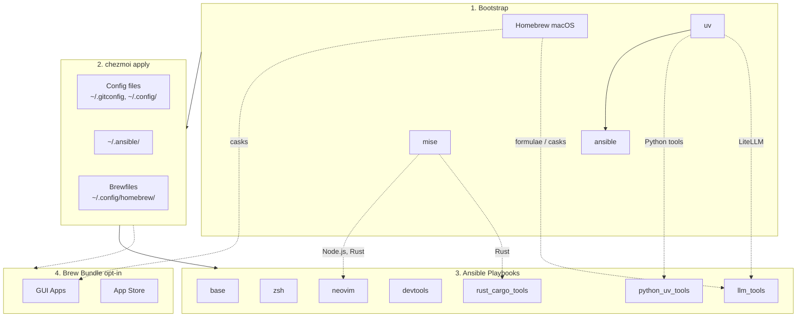

<!-- Generated by SpecStory, Markdown v2.1.0 -->

# 2026-04-03 08:10:31Z

<!-- Codex CLI Session 019d5264-771d-7440-9d5b-f3559a8d7a7f (2026-04-03 08:10:31Z) -->

_**User (2026-04-03 08:10:31Z)**_

我能把 `ll` 的配置列得更詳細嗎 比如包含subdir的git狀態等等


---

_**Agent (gpt-5.4 2026-04-03 08:12:16Z)**_

我先確認目前 `ll` 是在哪裡定義，並照 repo 規範先跑 `td` 取得當前工作上下文，接著會看能不能把輸出擴成你要的 git/subdir 狀態。

_**Agent (gpt-5.4 2026-04-03 08:12:16Z)**_

<tool-use data-tool-type="shell" data-tool-name="exec_command"><details>
<summary>Tool use: **exec_command** `td usage --new-session && td usage -q`</summary>
```
Command: /bin/zsh -lc 'td usage --new-session && td usage -q'
Chunk ID: 20b0aa
Wall time: 0.2032 seconds
Process exited with code 0
Original token count: 521
Output:
You have access to `td`, a local task management CLI.

NEW SESSION: ses_c106aa on branch: main (previous: ses_2b1ae0)
  You are a new context. You can now review issues implemented by the previous session.

CURRENT SESSION: ses_c106aa [codex_37134] on branch: main

FOCUSED ISSUE: td-8991c5 "Add ghget zsh helper" [in_progress]
  Last handoff (4d ago):

WORKFLOW:

  1. `td start <id>` to begin work
     Multi-issue: `td ws start "name"` then `td ws tag <ids>`
  2. `td log "msg"` to track progress
     Multi-issue: `td ws log "msg"`
  3. `td handoff <id>` to capture state (REQUIRED)
     Multi-issue: `td ws handoff`
  4. `td review <id>` to submit for review
  5. Different session: `td approve <id>` to complete

  Use `td ws` commands when implementing multiple related issues.

KEY COMMANDS:
  td current              What you're working on
  td ws current           Current work session state
  td context <id>         Full context for resuming
  td next                 Highest priority open issue
  td critical-path        What unblocks the most work
  td reviewable           Issues you can review
  td approve/reject <id>  Complete review

IMPORTANT: You cannot approve issues you implemented.
  Exception: `td add "title" --minor` creates self-reviewable tasks.

WARNING: Do NOT use `td close` for completed work!
  Use `td review` -> `td approve` workflow instead.
  `td close` is for admin closures: duplicates, won't-fix, cleanup.

Use `td handoff` or `td ws handoff` before stopping work.

FOR LLMs: Run `td usage --new-session` at conversation start (or after /clear).
  Do NOT start a new session mid-work—sessions track implementers for review.
Use `td ws start` when implementing multiple issues to group handoffs.
  - session = identity (always exists)  |  ws = work container (optional)

TIP: Use `td usage -q` to hide these instructions after first read.
You have access to `td`, a local task management CLI.

CURRENT SESSION: ses_c106aa [codex_37134] on branch: main

FOCUSED ISSUE: td-8991c5 "Add ghget zsh helper" [in_progress]
  Last handoff (4d ago):
```
</details></tool-use>

_**Agent (gpt-5.4 2026-04-03 08:12:30Z)**_

我在找 `ll` 的定義位置，先確認是 alias、shell function，還是 `eza`/`lsd` 之類工具的包裝，這樣才能判斷 subdir git 狀態要怎麼補。

_**Agent (gpt-5.4 2026-04-03 08:12:30Z)**_

<tool-use data-tool-type="shell" data-tool-name="exec_command"><details>
<summary>Tool use: **exec_command** `rg -n "(^alias ll=|\bll\b.*eza|\bll\b.*lsd|function ll|^ll\(\))" .`</summary>
```
Command: /bin/zsh -lc 'rg -n "(''^alias ll=|'"\\bll\\b.*eza|\\bll\\b.*lsd|function ll|"'^ll'"\\(\\))\" ."
Chunk ID: 3b0600
Wall time: 0.0000 seconds
Process exited with code 0
Original token count: 24
Output:
./dot_config/zsh/tools/26_eza.zsh:20:alias ll="eza --icons=always --color=always --long --git"
```
</details></tool-use>

_**Agent (gpt-5.4 2026-04-03 08:12:30Z)**_

<tool-use data-tool-type="shell" data-tool-name="exec_command"><details>
<summary>Tool use: **exec_command** `rg --files . | rg "(zshrc|zsh/|shell|alias|eza|lsd|starship|functions)"`</summary>
```
Command: /bin/zsh -lc 'rg --files . | rg "(zshrc|zsh/|shell|alias|eza|lsd|starship|functions)"'
Chunk ID: b69a8a
Wall time: 0.0000 seconds
Process exited with code 0
Original token count: 318
Output:
./dot_zshrc.tmpl
./dot_config/starship.toml
./docs/zsh/zsh-completions.md
./dot_config/zsh/10_aliases.zsh
./dot_config/zsh/00_exports.zsh.tmpl
./dot_config/zsh/tools/33_toolkami.zsh.disabled
./dot_config/zsh/tools/10_fzf.zsh
./dot_config/zsh/tools/22_sesh.zsh
./dot_config/zsh/tools/32_try.zsh
./dot_config/zsh/tools/27_thefuck.zsh
./dot_config/zsh/tools/28_tldr.zsh
./dot_config/zsh/tools/40_codexbar.zsh
./dot_config/zsh/tools/26_eza.zsh
./dot_config/zsh/tools/41_github.zsh
./dot_config/zsh/tools/34_openclaw.zsh
./dot_config/zsh/tools/07_bunx_cli.zsh
./dot_config/zsh/tools/01_starship.zsh
./dot_config/zsh/tools/04_conda_mamba.zsh
./dot_config/zsh/tools/90_completions.zsh
./dot_config/zsh/tools/20_zoxide.zsh
./dot_config/zsh/tools/30_direnv.zsh
./dot_config/zsh/tools/05_mise.zsh
./dot_config/zsh/tools/25_bat.zsh
./dot_config/zsh/tools/42_gitlab.zsh
./dot_config/zsh/tools/29_marimo.zsh
./dot_config/zsh/tools/50_networking.zsh
./dot_config/zsh/tools/35_yazi.zsh
./dot_config/zsh/tools/95_bitwarden.zsh
./dot_config/zsh/tools/36_pueue.zsh
./dot_config/zsh/tools/06_cargo.zsh
./dot_config/zsh/02_legacy_tools.zsh
./docs/tools/starship.md
./dot_ansible/roles/zsh/defaults/main.yml
./dot_ansible/roles/zsh/tasks/main.yml
./dot_ansible/roles/starship/tasks/main.yml
```
</details></tool-use>

_**Agent (gpt-5.4 2026-04-03 08:12:45Z)**_

<tool-use data-tool-type="shell" data-tool-name="exec_command"><details>
<summary>Tool use: **exec_command** `sed -n '1,220p' dot_config/zsh/tools/26_eza.zsh`</summary>
```
Command: /bin/zsh -lc "sed -n '1,220p' dot_config/zsh/tools/26_eza.zsh"
Chunk ID: 65f4f5
Wall time: 0.0000 seconds
Process exited with code 0
Original token count: 198
Output:
# 26_eza.zsh - eza configuration (modern ls replacement)

# Check if eza is installed
command -v eza &>/dev/null || return 0

# Replace ls with eza
# Options:
#   --icons=always  - Show file type icons
#   --color=always  - Enable colors
#   --long          - Long format
#   --git           - Show git status
#   --no-filesize   - Hide file size
#   --no-time       - Hide modification time
#   --no-user       - Hide user/owner
#   --no-permissions - Hide permissions
alias ls="eza --icons=always --color=always --long --git --no-filesize --no-time --no-user --no-permissions"

# Additional useful aliases
alias la="eza --icons=always --color=always --long --git --all"
alias ll="eza --icons=always --color=always --long --git"
alias lt="eza --icons=always --color=always --tree --level=2"
```
</details></tool-use>

_**Agent (gpt-5.4 2026-04-03 08:12:45Z)**_

<tool-use data-tool-type="shell" data-tool-name="exec_command"><details>
<summary>Tool use: **exec_command** `eza --help | sed -n '1,260p'`</summary>
```
Command: /bin/zsh -lc "eza --help | sed -n '1,260p'"
Chunk ID: b36408
Wall time: 0.0000 seconds
Process exited with code 0
Original token count: 1270
Output:
Usage:
  eza [options] [files...]

META OPTIONS
  -?, --help                 show list of command-line options
  -v, --version              show version of eza

DISPLAY OPTIONS
  -1, --oneline              display one entry per line
  -l, --long                 display extended file metadata as a table
  -G, --grid                 display entries as a grid (default)
  -x, --across               sort the grid across, rather than downwards
  -R, --recurse              recurse into directories
  -T, --tree                 recurse into directories as a tree
  -X, --dereference          dereference symbolic links when displaying information
  -F, --classify=WHEN        display type indicator by file names (always, auto, never)
  --colo[u]r=WHEN            when to use terminal colours (always, auto, never)
  --colo[u]r-scale           highlight levels of 'field' distinctly(all, age, size)
  --colo[u]r-scale-mode      use gradient or fixed colors in --color-scale (fixed, gradient)
  --icons=WHEN               when to display icons (always, auto, never)
  --no-quotes                don't quote file names with spaces
  --hyperlink                display entries as hyperlinks
  --absolute                 display entries with their absolute path (on, follow, off)
  --follow-symlinks          drill down into symbolic links that point to directories
  -w, --width COLS           set screen width in columns


FILTERING AND SORTING OPTIONS
  -a, --all                  show hidden and 'dot' files. Use this twice to also
                             show the '.' and '..' directories
  -A, --almost-all           equivalent to --all; included for compatibility with `ls -A`
  -d, --treat-dirs-as-files  list directories as files; don't list their contents
  -D, --only-dirs            list only directories
  -f, --only-files           list only files
  --show-symlinks            explicitly show symbolic links (for use with --only-dirs | --only-files)
  --no-symlinks              do not show symbolic links
  -L, --level DEPTH          limit the depth of recursion
  -r, --reverse              reverse the sort order
  -s, --sort SORT_FIELD      which field to sort by
  --group-directories-first  list directories before other files
  --group-directories-last   list directories after other files
  -I, --ignore-glob GLOBS    glob patterns (pipe-separated) of files to ignore
  --git-ignore               ignore files mentioned in '.gitignore'
  Valid sort fields:         name, Name, extension, Extension, size, type,
                             created, modified, accessed, changed, inode, and none.
                             date, time, old, and new all refer to modified.

LONG VIEW OPTIONS
  -b, --binary               list file sizes with binary prefixes
  -B, --bytes                list file sizes in bytes, without any prefixes
  -g, --group                list each file's group
  --smart-group              only show group if it has a different name from owner
  -h, --header               add a header row to each column
  -H, --links                list each file's number of hard links
  -i, --inode                list each file's inode number
  -M, --mounts               show mount details (Linux and Mac only)
  -n, --numeric              list numeric user and group IDs
  -O, --flags                list file flags (Mac, BSD, and Windows only)
  -S, --blocksize            show size of allocated file system blocks
  -t, --time FIELD           which timestamp field to list (modified, accessed, created)
  -m, --modified             use the modified timestamp field
  -u, --accessed             use the accessed timestamp field
  -U, --created              use the created timestamp field
  --changed                  use the changed timestamp field
  --time-style               how to format timestamps (default, iso, long-iso,
                             full-iso, relative, or a custom style '+<FORMAT>'
                             like '+%Y-%m-%d %H:%M')
  --total-size               show the size of a directory as the size of all
                             files and directories inside (unix only)
  -o, --octal-permissions    list each file's permission in octal format
  --no-permissions           suppress the permissions field
  --no-filesize              suppress the filesize field
  --no-user                  suppress the user field
  --no-time                  suppress the time field
  --stdin                    read file names from stdin, one per line or other separator 
                             specified in environment
  --git                      list each file's Git status, if tracked or ignored
  --no-git                   suppress Git status (always overrides --git,
                             --git-repos, --git-repos-no-status)
  --git-repos                list root o
... (truncated)
```
</details></tool-use>

_**Agent (gpt-5.4 2026-04-03 08:13:00Z)**_

目前看起來 `ll` 只是單純的 `eza --long --git`。`eza` 本身還有 `--git-repos` 可以顯示目錄是不是 repo 以及其分支/狀態，我先比對幾種輸出，挑一個不會太吵但資訊更完整的預設。

_**Agent (gpt-5.4 2026-04-03 08:13:00Z)**_

<tool-use data-tool-type="shell" data-tool-name="exec_command"><details>
<summary>Tool use: **exec_command** `eza --icons=always --color=always --long --git . | sed -n '1,80p'`</summary>
```
Command: /bin/zsh -lc "eza --icons=always --color=always --long --git . | sed -n '1,80p'"
Chunk ID: 79d005
Wall time: 0.0000 seconds
Process exited with code 0
Original token count: 1288
Output:
lrwxr-xr-x@    - daviddwlee84  3 Feb 18:00 --  AGENTS.md -> CLAUDE.md
drwxr-xr-x@    - daviddwlee84 11 Feb 16:42 --  bin
.rw-r--r--@  13k daviddwlee84  1 Apr 17:16 --  CLAUDE.md
.rw-r--r--@ 4.5k daviddwlee84 31 Mar 16:04 --  docker-compose.yml
.rw-r--r--@ 6.3k daviddwlee84 31 Mar 16:04 --  Dockerfile
drwxr-xr-x@    - daviddwlee84  1 Apr 16:17 --  docs
drwxr-xr-x@    - daviddwlee84  4 Feb 10:47 --  dot_ansible
drwxr-xr-x@    - daviddwlee84 10 Feb 16:28 --  dot_cargo
drwxr-xr-x@    - daviddwlee84 30 Mar 11:17 --  dot_claude
drwxr-xr-x@    - daviddwlee84  1 Apr 16:46 --  dot_config
.rw-r--r--@  439 daviddwlee84 30 Mar 18:53 --  dot_gitconfig.tmpl
.rw-r--r--@  279 daviddwlee84 10 Feb 16:11 --  dot_npmrc.tmpl
drwxr-xr-x@    - daviddwlee84 11 Feb 18:14 --  dot_ssh
.rw-r--r--@ 5.8k daviddwlee84  1 Apr 16:46 -- 󱁻 dot_tmux.conf
.rw-r--r--@  124 daviddwlee84  5 Feb 19:31 --  dot_zshenv.tmpl
.rw-r--r--@ 4.0k daviddwlee84 18 Mar 17:43 --  dot_zshrc.tmpl
lrwxr-xr-x@    - daviddwlee84  5 Feb 15:44 --  GEMINI.md -> CLAUDE.md
.rw-r--r--@ 7.8k daviddwlee84 13 Feb 09:12 --  justfile
.rw-r--r--@ 5.0k daviddwlee84  6 Feb 10:00 --  NOTES.md
drwxr-xr-x@    - daviddwlee84 10 Mar 10:00 --  private_dot_specstory
.rw-r--r--@  10k daviddwlee84  1 Apr 17:15 -- 󰂺 README.md
.rw-r--r--@ 1.4k daviddwlee84  7 Feb 23:42 --  run_before_01_backup_dotfiles.sh.tmpl
.rw-r--r--@ 5.7k daviddwlee84 10 Feb 19:01 --  run_once_before_00_bootstrap.sh.tmpl
.rw-r--r--@ 4.1k daviddwlee84  7 Feb 23:42 --  run_once_before_02_fix_intel_homebrew.sh.tmpl
.rw-r--r--@ 8.4k daviddwlee84 31 Mar 16:50 --  run_onchange_after_20_ansible_roles.sh.tmpl
.rw-r--r--@ 1.2k daviddwlee84 31 Mar 16:50 --  run_onchange_after_25_bat_theme.sh.tmpl
.rw-r--r--@ 3.5k daviddwlee84  7 Feb 23:42 --  run_onchange_after_30_brew_bundle.
... (truncated)
```
</details></tool-use>

_**Agent (gpt-5.4 2026-04-03 08:13:01Z)**_

<tool-use data-tool-type="shell" data-tool-name="exec_command"><details>
<summary>Tool use: **exec_command** `eza --icons=always --color=always --long --git --git-repos . | sed -n '1,80p'`</summary>
```
Command: /bin/zsh -lc "eza --icons=always --color=always --long --git --git-repos . | sed -n '1,80p'"
Chunk ID: 4176e7
Wall time: 0.0000 seconds
Process exited with code 0
Original token count: 1477
Output:
lrwxr-xr-x@    - daviddwlee84  3 Feb 18:00 -- - -  AGENTS.md -> CLAUDE.md
drwxr-xr-x@    - daviddwlee84 11 Feb 16:42 -- - -  bin
.rw-r--r--@  13k daviddwlee84  1 Apr 17:16 -- - -  CLAUDE.md
.rw-r--r--@ 4.5k daviddwlee84 31 Mar 16:04 -- - -  docker-compose.yml
.rw-r--r--@ 6.3k daviddwlee84 31 Mar 16:04 -- - -  Dockerfile
drwxr-xr-x@    - daviddwlee84  1 Apr 16:17 -- - -  docs
drwxr-xr-x@    - daviddwlee84  4 Feb 10:47 -- - -  dot_ansible
drwxr-xr-x@    - daviddwlee84 10 Feb 16:28 -- - -  dot_cargo
drwxr-xr-x@    - daviddwlee84 30 Mar 11:17 -- - -  dot_claude
drwxr-xr-x@    - daviddwlee84  1 Apr 16:46 -- - -  dot_config
.rw-r--r--@  439 daviddwlee84 30 Mar 18:53 -- - -  dot_gitconfig.tmpl
.rw-r--r--@  279 daviddwlee84 10 Feb 16:11 -- - -  dot_npmrc.tmpl
drwxr-xr-x@    - daviddwlee84 11 Feb 18:14 -- - -  dot_ssh
.rw-r--r--@ 5.8k daviddwlee84  1 Apr 16:46 -- - - 󱁻 dot_tmux.conf
.rw-r--r--@  124 daviddwlee84  5 Feb 19:31 -- - -  dot_zshenv.tmpl
.rw-r--r--@ 4.0k daviddwlee84 18 Mar 17:43 -- - -  dot_zshrc.tmpl
lrwxr-xr-x@    - daviddwlee84  5 Feb 15:44 -- - -  GEMINI.md -> CLAUDE.md
.rw-r--r--@ 7.8k daviddwlee84 13 Feb 09:12 -- - -  justfile
.rw-r--r--@ 5.0k daviddwlee84  6 Feb 10:00 -- - -  NOTES.md
drwxr-xr-x@    - daviddwlee84 10 Mar 10:00 -- - -  private_dot_specstory
.rw-r--r--@  10k daviddwlee84  1 Apr 17:15 -- - - 󰂺 README.md
.rw-r--r--@ 1.4k daviddwlee84  7 Feb 23:42 -- - -  run_before_01_backup_dotfiles.sh.tmpl
.rw-r--r--@ 5.7k daviddwlee84 10 Feb 19:01 -- - -  run_once_before_00_bootstrap.sh.tmpl
.rw-r--r--@ 4.1k daviddwlee84  7 Feb 23:42 
... (truncated)
```
</details></tool-use>

_**Agent (gpt-5.4 2026-04-03 08:13:01Z)**_

<tool-use data-tool-type="shell" data-tool-name="exec_command"><details>
<summary>Tool use: **exec_command** `eza --icons=always --color=always --long --git --tree --level=2 . | sed -n '1,120p'`</summary>
```
Command: /bin/zsh -lc "eza --icons=always --color=always --long --git --tree --level=2 . | sed -n '1,120p'"
Chunk ID: 6d5fe0
Wall time: 0.0000 seconds
Process exited with code 0
Original token count: 3773
Output:
drwxr-xr-x@    - daviddwlee84 31 Mar 16:50 --  .
lrwxr-xr-x@    - daviddwlee84  3 Feb 18:00 -- ├──  AGENTS.md -> CLAUDE.md
drwxr-xr-x@    - daviddwlee84 11 Feb 16:42 -- ├──  bin
.rwxr-xr-x@ 7.3k daviddwlee84 11 Feb 16:42 -- │   └── 󰡯 executable_x
.rw-r--r--@  13k daviddwlee84  1 Apr 17:16 -- ├──  CLAUDE.md
.rw-r--r--@ 4.5k daviddwlee84 31 Mar 16:04 -- ├──  docker-compose.yml
.rw-r--r--@ 6.3k daviddwlee84 31 Mar 16:04 -- ├──  Dockerfile
drwxr-xr-x@    - daviddwlee84  1 Apr 16:17 -- ├──  docs
.rw-r--r--@ 4.9k daviddwlee84 30 Mar 11:17 -- │   ├──  ansible.md
drwxr-xr-x@    - daviddwlee84 13 Feb 09:14 -- │   ├──  initial_setup
drwxr-xr-x@    - daviddwlee84 31 Mar 13:18 -- │   ├──  input_methods
drwxr-xr-x@    - daviddwlee84 30 Mar 19:57 -- │   ├──  neovim
drwxr-xr-x@    - daviddwlee84 10 Feb 10:33 -- │   ├──  scripts
drwxr-xr-x@    - daviddwlee84  1 Apr 16:17 -- │   ├──  tools
drwxr-xr-x@    - daviddwlee84 11 Feb 16:42 -- │   ├──  tutorials
drwxr-xr-x@    - daviddwlee84 30 Mar 19:58 -- │   └──  zsh
drwxr-xr-x@    - daviddwlee84  4 Feb 10:47 -- ├──  dot_ansible
.rw-r--r--@  255 daviddwlee84  4 Feb 10:47 -- │   ├── 󱁻 ansible.cfg
drwxr-xr-x@    - daviddwlee84  3 Feb 18:21 -- │   ├──  inventories
drwxr-xr-x@    - daviddwlee84 30 Mar 18:54 -- │   ├──  playbooks
drwxr-xr-x@    - daviddwlee84 31 Mar 16:04 -- │   └──  roles
drwxr-xr-x@    - daviddwlee84 10 Feb 16:28 -- ├──  dot_cargo
.rw-r--r--@  873 daviddwlee84 10 Feb 16:28 -- │   └──  config.toml.tmpl
drwxr-xr-x@    - da
... (truncated)
```
</details></tool-use>

_**Agent (gpt-5.4 2026-04-03 08:13:20Z)**_

<tool-use data-tool-type="shell" data-tool-name="exec_command"><details>
<summary>Tool use: **exec_command** `rg -n "eza|ll=|lt=|ls replacement|modern ls" README.md docs dot_config/zsh dot_ansible`</summary>
```
Command: /bin/zsh -lc 'rg -n "eza|ll=|lt=|ls replacement|modern ls" README.md docs dot_config/zsh dot_ansible'
Chunk ID: 23205e
Wall time: 0.0000 seconds
Process exited with code 0
Original token count: 1140
Output:
README.md:150:- **Dev tools**: bat, gh, diffnav, git-delta, git-graph, eza, tldr, glow, thefuck, zoxide, direnv, yazi, tmux+tpm, sesh, zellij, btop, htop
dot_config/zsh/10_aliases.zsh:15:# alias ll="ls -lh"
dot_config/zsh/10_aliases.zsh:27:# command -v eza &>/dev/null && alias ls="eza"
docs/zsh/zsh-completions.md:63:| `eza` | Homebrew formula installs `_eza` into site-functions |
docs/zsh/zsh-completions.md:91:- **[shtab](https://github.com/iterative/shtab)**: `shtab --shell=zsh my_module.parser > ~/.zfunc/_my_tool`
dot_config/zsh/tools/10_fzf.zsh:37:# Use eza for directory preview (Alt+C) if available
dot_config/zsh/tools/10_fzf.zsh:38:if command -v eza &>/dev/null; then
dot_config/zsh/tools/10_fzf.zsh:39:    export FZF_ALT_C_OPTS="--preview 'eza --tree --color=always {} | head -200'"
dot_config/zsh/tools/10_fzf.zsh:49:            if command -v eza &>/dev/null; then
dot_config/zsh/tools/10_fzf.zsh:50:                fzf --preview 'eza --tree --color=always {} | head -200' "$@"
docs/tools/sesh.md:85:preview_command = "eza --all --git --icons --color=always {}"
dot_config/zsh/tools/26_eza.zsh:1:# 26_eza.zsh - eza configuration (modern ls replacement)
dot_config/zsh/tools/26_eza.zsh:3:# Check if eza is installed
dot_config/zsh/tools/26_eza.zsh:4:command -v eza &>/dev/null || return 0
dot_config/zsh/tools/26_eza.zsh:6:# Replace ls with eza
dot_config/zsh/tools/26_eza.zsh:16:alias ls="eza --icons=always --color=always --long --git --no-filesize --no-time --no-user --no-permissions"
dot_config/zsh/tools/26_eza.zsh:19:alias la="eza --icons=always --color=always --long --git --all"
dot_config/zsh/tools/26_eza.zsh:20:alias ll="eza --icons=always --color=always --long --git"
dot_config/zsh/tools/26_eza.zsh:21:alias lt="eza --icons=always --color=always --tree --level=2"
dot_ansible/roles/devtools/tasks/main.yml:3:# Tools: bat, gh, diffnav, gh-dash, eza, git-delta, git-graph, tldr, glow, thefuck, zoxide, direnv, yazi, tmux, sesh, zellij, btop, htop, duckdb, rclone, coreutils
dot_ansible/roles/devtools/tasks/main.yml:24:      - eza
dot_ansible/roles/devtools/tasks/main.yml:246:# --- eza ---
dot_ansible/roles/devtools/tasks/main.yml:247:- name: Check if eza is installed
dot_ansible/roles/devtools/tasks/main.yml:249:  ansible.builtin.command: eza --version
dot_ansible/roles/devtools/tasks/main.yml:250:  register: eza_check
dot_ansible/roles/devtools/tasks/main.yml:254:- name: Install eza via official installer (Debian/Ubuntu)
dot_ansible/roles/devtools/tasks/main.yml:257:    - eza_check.rc != 0
dot_ansible/roles/devtools/tasks/main.yml:261:    - name: Add eza GPG key
dot_ansible/roles/devtools/tasks/main.yml:264:        wget -qO- https://raw.githubusercontent.com/eza-community/eza/main/deb.asc | gpg --dearmor -o /etc/apt/keyrings/gierens.gpg
dot_ansible/roles/devtools/tasks/main.yml:268:    - name: Add eza repository
dot_ansible/roles/devtools/tasks/main.yml:274:    - name: Install eza from repository
dot_ansible/roles/devtools/tasks/main.yml:276:        name: eza
dot_ansible/roles/devtools/tasks/main.yml:280:# --- eza (user-level fallback) ---
dot_ansible/roles/devtools/tasks/main.yml:281:- name: Re-check if eza is installed
dot_ansible/roles/devtools/tasks/main.yml:283:  ansible.builtin.shell: command -v eza
dot_ansible/roles/devtools/tasks/main.yml:284:  register: eza_recheck
dot_ansible/roles/devtools/tasks/main.yml:288:- name: Install eza from GitHub releases (user-level, no sudo)
dot_ansible/roles/devtools/tasks/main.yml:291:    - eza_recheck.rc != 0
dot_ansible/roles/devtools/tasks/main.yml:293:    - name: Ensure ~/.local/bin exists (eza)
dot_ansible/roles/devtools/tasks/main.yml:299:    - name: Get latest eza release
dot_ansible/roles/devtools/tasks/main.yml:301:        url: https://api.github.com/repos/eza-community/eza/releases/latest
dot_ansible/roles/devtools/tasks/main.yml:303:      register: eza_release
dot_ansible/roles/devtools/tasks/main.yml:305:    - name: Download eza binary
dot_ansible/roles/devtools/tasks/main.yml:307:        url: "https://github.com/eza-community/eza/releases/download/{{ eza_release.json.tag_name }}/eza_{{ ansible_facts['architecture'] }}-unknown-linux-gnu.tar.gz"
dot_ansible/roles/devtools/tasks/main.yml:308:        dest: /tmp/eza.tar.gz
dot_ansible/roles/devtools/tasks/main.yml:311:    - name: Extract eza to ~/.local/bin
dot_ansible/roles/devtools/tasks/main.yml:313:        src: /tmp/eza.tar.gz
dot_ansible/roles/devtools/tasks/main.yml:317:    - name: Clean up eza tarball
dot_ansible/roles/devtools/tasks/main.yml:319:        path: /tmp/eza.tar.gz
```
</details></tool-use>

_**Agent (gpt-5.4 2026-04-03 08:13:20Z)**_

<tool-use data-tool-type="shell" data-tool-name="exec_command"><details>
<summary>Tool use: **exec_command** `git status --short`</summary>
```
Command: /bin/zsh -lc 'git status --short'
Chunk ID: e31941
Wall time: 0.0000 seconds
Process exited with code 0
Original token count: 0
Output:
```
</details></tool-use>

_**Agent (gpt-5.4 2026-04-03 08:13:31Z)**_

我找到 `ll` 在 [`dot_config/zsh/tools/26_eza.zsh`](/Users/daviddwlee84/.local/share/chezmoi/dot_config/zsh/tools/26_eza.zsh)；現在只有 `--long --git`，沒有 repo/tree 類資訊。下一步我會把它改成「預設更詳細但不至於太吵」，並順手把 `lt` 也補成能看 subdir 狀態的版本。

_**Agent (gpt-5.4 2026-04-03 08:13:34Z)**_

<tool-use data-tool-type="shell" data-tool-name="exec_command"><details>
<summary>Tool use: **exec_command** `sed -n '1,260p' README.md`</summary>
```
Command: /bin/zsh -lc "sed -n '1,260p' README.md"
Chunk ID: e7a8b0
Wall time: 0.0000 seconds
Process exited with code 0
Original token count: 2606
Output:
# dotfiles

Cross-platform development environment setup using **chezmoi** + **ansible**.

- **chezmoi**: manages config files (dotfiles)
- **ansible**: installs system dependencies and tools

## Prerequisites

- [chezmoi](https://www.chezmoi.io/install/)
- [uv](https://docs.astral.sh/uv/getting-started/installation/) (for ansible)

## Architecture



## Quick Setup

```bash
# One-liner to initialize and apply (installs chezmoi to ~/.local/bin)
export GITHUB_USERNAME=daviddwlee84
sh -c "$(curl -fsLS get.chezmoi.io)" -- -b "$HOME/.local/bin" init --apply git@github.com:$GITHUB_USERNAME/dotfiles.git
```

This automatically:

1. Bootstraps Homebrew (macOS/Linux), uv, mise, ansible
2. Deploys all config files
3. Runs ansible playbooks (git, ripgrep, fd, neovim, etc.)
4. Runs brew bundle (if `installBrewApps` enabled)

### Optional Components

During `chezmoi init`, you'll be prompted for optional installs:

| Option | Default | Description |
|--------|---------|-------------|
| `installCodingAgents` | true | Claude Code, Codex CLI, OpenCode, Cursor, Copilot, Gemini CLI, RTK, td, sidecar, specify-cli, etc. |
| `installBitwarden` | false | Bitwarden CLI (`bw`) + Desktop app (desktop profiles) with SSH agent auto-detection |
| `installPythonUvTools` | true | Python CLI tools via uv (mlflow, sqlit-tui, tmuxp, etc.) |
| `installLlmTools` | false | Local LLM tools: Ollama, LiteLLM, llmfit, models |
| `installBrewApps` | false | GUI apps via Homebrew Brewfile (casks, mas) |
| `installInputMethod` | false | Traditional Chinese input methods (McBopomofo, RIME/Squirrel on macOS; ibus-rime on Linux) |
| `installNetworkingTools` | false | Networking CLI tools (nmap, mtr, httpie, gping, trippy, bandwhich, rustscan, etc.) |
| `noRoot` | false | Skip sudo-requiring tasks (for servers without root access) |

To change options later: `chezmoi init --force`

## What You Get

### Config Files

- `~/.gitconfig` - Git configuration
- `~/.config/git/hooks/` - Global Git hooks (pre-commit + Git LFS hooks)
- `~/.config/gh-dash/config.yml` - Global gh-dash config, with `diffnav` as the diff pager
- `~/.config/lazygit/config.yml` - Global LazyGit config, with `delta` as the custom diff pager
- `~/.config/bat/themes/tokyonight_night.tmTheme` - Managed Tokyo Night theme for bat
- `~/.config/nvim/` - Neovim (LazyVim) configuration
- `~/.config/uv/uv.toml` - uv package manager config
- `~/.cargo/config.toml` - Cargo registry mirror config (GFW)
- `~/.npmrc` - npm registry config (official/npmmirror via `useChineseMirror`)
- `~/.config/.bunfig.toml` - Bun global registry config (official/npmmirror via `useChineseMirror`)
- `~/.config/alacritty/` - Alacritty terminal config
- `~/.config/starship.toml` - Starship cross-shell prompt config
- `~/.config/direnv/direnvrc` - direnv helper functions, including `.venv`-aware Python activation
- `~/.config/yazi/` - Yazi file manager config (v0.3.3+ syntax, [docs](https://yazi-rs.github.io/docs/configuration/overview/))
  - `yazi.toml` - Main config with open rules and openers (`o`/`O`)
  - `keymap.toml`, `theme.toml` - Optional customization files (stubs provided)
- `~/.claude/` - Claude Code settings
- `~/.specstory/cli/config.toml` - Global SpecStory defaults for `specstory run` across all projects
- `~/.tmux.conf` - Tmux configuration with TPM plugins, tmux-which-key (`prefix+Space`), vim-style pane nav, extended-keys for coding agents, sesh keybindings (`prefix+T` picker, `prefix+S` last)
- `~/.local/bin/x` - Cross-platform terminal wrapper for `copy` / `paste` / `open`
- `~/.config/sesh/sesh.toml` - Sesh session manager config (named sessions, wildcards, defaults) ([docs](docs/sesh.md))
- `~/.config/zsh/tools/22_sesh.zsh` - Sesh keybinding (`Alt+S` for session picker) + shell completion
- `~/.config/zsh/tools/36_pueue.zsh` - Pueue queue summary helper (`pqsum`)
- `~/.config/zsh/tools/41_github.zsh` - GitHub helper with `ghget` f
... (truncated)
```
</details></tool-use>

_**Agent (gpt-5.4 2026-04-03 08:13:34Z)**_

<tool-use data-tool-type="shell" data-tool-name="exec_command"><details>
<summary>Tool use: **exec_command** `eza --help | rg -n "git-repos|git-ignore|header|group-directories|time-style|recurse|tree|level"`</summary>
```
Command: /bin/zsh -lc 'eza --help | rg -n "git-repos|git-ignore|header|group-directories|time-style|recurse|tree|level"'
Chunk ID: a96541
Wall time: 0.0000 seconds
Process exited with code 0
Original token count: 208
Output:
13:  -R, --recurse              recurse into directories
14:  -T, --tree                 recurse into directories as a tree
18:  --colo[u]r-scale           highlight levels of 'field' distinctly(all, age, size)
37:  -L, --level DEPTH          limit the depth of recursion
40:  --group-directories-first  list directories before other files
41:  --group-directories-last   list directories after other files
43:  --git-ignore               ignore files mentioned in '.gitignore'
53:  -h, --header               add a header row to each column
65:  --time-style               how to format timestamps (default, iso, long-iso,
79:                             --git-repos, --git-repos-no-status)
80:  --git-repos                list root of git-tree status
81:  --git-repos-no-status      list each git-repos branch name (much faster)
```
</details></tool-use>

_**Agent (gpt-5.4 2026-04-03 08:14:02Z)**_

<tool-use data-tool-type="shell" data-tool-name="exec_command"><details>
<summary>Tool use: **exec_command** `eza --icons=always --color=always --long --git --git-repos --group-directories-first --no-filesize --no-time --no-user --no-permissions . | sed -n '1,40p'`</summary>
```
Command: /bin/zsh -lc "eza --icons=always --color=always --long --git --git-repos --group-directories-first --no-filesize --no-time --no-user --no-permissions . | sed -n '1,40p'"
Chunk ID: 8cb5a5
Wall time: 0.0000 seconds
Process exited with code 0
Original token count: 505
Output:
-- - -  bin
-- - -  docs
-- - -  dot_ansible
-- - -  dot_cargo
-- - -  dot_claude
-- - -  dot_config
-- - -  dot_ssh
-- - -  private_dot_specstory
-- - -  scripts
-- - -  AGENTS.md -> CLAUDE.md
-- - -  CLAUDE.md
-- - -  docker-compose.yml
-- - -  Dockerfile
-- - -  dot_gitconfig.tmpl
-- - -  dot_npmrc.tmpl
-- - - 󱁻 dot_tmux.conf
-- - -  dot_zshenv.tmpl
-- - -  dot_zshrc.tmpl
-- - -  GEMINI.md -> CLAUDE.md
-- - -  justfile
-- - -  NOTES.md
-- - - 󰂺 README.md
-- - -  run_before_01_backup_dotfiles.sh.tmpl
-- - -  run_once_before_00_bootstrap.sh.tmpl
-- - -  run_once_before_02_fix_intel_homebrew.sh.tmpl
-- - -  run_onchange_after_20_ansible_roles.sh.tmpl
-- - -  run_onchange_after_25_bat_theme.sh.tmpl
-- - -  run_onchange_after_30_brew_bundle.sh.tmpl
-- - -  TODO.md
```
</details></tool-use>

_**Agent (gpt-5.4 2026-04-03 08:14:28Z)**_

我要改 [`dot_config/zsh/tools/26_eza.zsh`](/Users/daviddwlee84/.local/share/chezmoi/dot_config/zsh/tools/26_eza.zsh) 讓 `ll` 預設帶更多 repo/context 欄位，另外加一個專門看 subdir tree + git 狀態的 alias；README 也會補一行，讓這個 zsh/eza 行為有文件可查。

_**Agent (gpt-5.4 2026-04-03 08:14:35Z)**_

<tool-use data-tool-type="write" data-tool-name="apply_patch"><details>
<summary>Tool use: **apply_patch**</summary>
**Update: `/Users/daviddwlee84/.local/share/chezmoi/dot_config/zsh/tools/26_eza.zsh`**

```diff
@@
 # 26_eza.zsh - eza configuration (modern ls replacement)
 
 # Check if eza is installed
 command -v eza &>/dev/null || return 0
 
 # Replace ls with eza
 # Options:
 #   --icons=always  - Show file type icons
 #   --color=always  - Enable colors
 #   --long          - Long format
 #   --git           - Show git status
+#   --git-repos     - Show nested repo branch/status columns when applicable
+#   --group-directories-first - Keep directories grouped together
 #   --no-filesize   - Hide file size
 #   --no-time       - Hide modification time
 #   --no-user       - Hide user/owner
 #   --no-permissions - Hide permissions
 alias ls="eza --icons=always --color=always --long --git --no-filesize --no-time --no-user --no-permissions"
 
 # Additional useful aliases
-alias la="eza --icons=always --color=always --long --git --all"
-alias ll="eza --icons=always --color=always --long --git"
-alias lt="eza --icons=always --color=always --tree --level=2"
+alias la="eza --icons=always --color=always --long --header --git --git-repos --group-directories-first --time-style=long-iso --all"
+alias ll="eza --icons=always --color=always --long --header --git --git-repos --group-directories-first --time-style=long-iso"
+alias lt="eza --icons=always --color=always --tree --level=2"
+alias llt="eza --icons=always --color=always --long --header --git --git-repos --group-directories-first --time-style=long-iso --tree --level=3"
```

**Update: `/Users/daviddwlee84/.local/share/chezmoi/README.md`**

```diff
@@
 - `~/.config/zsh/tools/36_pueue.zsh` - Pueue queue summary helper (`pqsum`)
 - `~/.config/zsh/tools/41_github.zsh` - GitHub helper with `ghget` for downloading a repo subdirectory from a tree URL
 - `~/.config/zsh/tools/28_tldr.zsh` - `tldrf` helper with `TLDR_LANGUAGES` fallback order
 - `~/.config/zsh/tools/29_marimo.zsh` - `marimo` zsh shell completion
+- `~/.config/zsh/tools/26_eza.zsh` - `eza`-backed `ls`/`la`/`ll` aliases, plus `llt` for tree view with git-aware subdirectory context
 - `~/.config/zsh/tools/95_bitwarden.zsh` - Bitwarden CLI completion + SSH agent socket auto-detection
```
</details></tool-use>

_**Agent (gpt-5.4 2026-04-03 08:14:47Z)**_

<tool-use data-tool-type="shell" data-tool-name="exec_command"><details>
<summary>Tool use: **exec_command** `zsh -n dot_config/zsh/tools/26_eza.zsh`</summary>
```
Command: /bin/zsh -lc 'zsh -n dot_config/zsh/tools/26_eza.zsh'
Chunk ID: f9d0bd
Wall time: 0.0000 seconds
Process exited with code 0
Original token count: 0
Output:
```
</details></tool-use>

_**Agent (gpt-5.4 2026-04-03 08:14:47Z)**_

<tool-use data-tool-type="shell" data-tool-name="exec_command"><details>
<summary>Tool use: **exec_command** `zsh -ic 'source /Users/daviddwlee84/.local/share/chezmoi/dot_config/zsh/tools/26_eza.zsh; alias ll; alias llt'`</summary>
```
Command: /bin/zsh -lc "zsh -ic 'source /Users/daviddwlee84/.local/share/chezmoi/dot_config/zsh/tools/26_eza.zsh; alias ll; alias llt'"
Chunk ID: b8ee9d
Wall time: 0.6079 seconds
Process exited with code 0
Original token count: 102
Output:
[ERROR] - (starship::print): Under a 'dumb' terminal (TERM=dumb).
(eval):1: can't change option: zle
(eval):1: can't change option: zle
ll='eza --icons=always --color=always --long --header --git --git-repos --group-directories-first --time-style=long-iso'
llt='eza --icons=always --color=always --long --header --git --git-repos --group-directories-first --time-style=long-iso --tree --level=3'
```
</details></tool-use>

_**Agent (gpt-5.4 2026-04-03 08:14:47Z)**_

<tool-use data-tool-type="shell" data-tool-name="exec_command"><details>
<summary>Tool use: **exec_command** `git diff -- dot_config/zsh/tools/26_eza.zsh README.md`</summary>
```
Command: /bin/zsh -lc 'git diff -- dot_config/zsh/tools/26_eza.zsh README.md'
Chunk ID: 64b293
Wall time: 0.0000 seconds
Process exited with code 0
Original token count: 577
Output:
diff --git a/README.md b/README.md
index 34e6945..9801318 100644
--- a/README.md
+++ b/README.md
@@ -113,6 +113,7 @@ To change options later: `chezmoi init --force`
 - `~/.config/zsh/tools/41_github.zsh` - GitHub helper with `ghget` for downloading a repo subdirectory from a tree URL
 - `~/.config/zsh/tools/28_tldr.zsh` - `tldrf` helper with `TLDR_LANGUAGES` fallback order
 - `~/.config/zsh/tools/29_marimo.zsh` - `marimo` zsh shell completion
+- `~/.config/zsh/tools/26_eza.zsh` - `eza`-backed `ls`/`la`/`ll` aliases, plus `llt` for tree view with git-aware subdirectory context
 - `~/.config/zsh/tools/95_bitwarden.zsh` - Bitwarden CLI completion + SSH agent socket auto-detection
 - `~/.ssh/config` - SSH main config skeleton (create-only: `Include ~/.ssh/config.d/*` + conservative `Host *` defaults)
 - `~/.ssh/config.d/00-defaults` - SSH global defaults stub (commented examples only)
diff --git a/dot_config/zsh/tools/26_eza.zsh b/dot_config/zsh/tools/26_eza.zsh
index 85c3daf..4a058d2 100644
--- a/dot_config/zsh/tools/26_eza.zsh
+++ b/dot_config/zsh/tools/26_eza.zsh
@@ -9,6 +9,8 @@ command -v eza &>/dev/null || return 0
 #   --color=always  - Enable colors
 #   --long          - Long format
 #   --git           - Show git status
+#   --git-repos     - Show nested repo branch/status columns when applicable
+#   --group-directories-first - Keep directories grouped together
 #   --no-filesize   - Hide file size
 #   --no-time       - Hide modification time
 #   --no-user       - Hide user/owner
@@ -16,6 +18,7 @@ command -v eza &>/dev/null || return 0
 alias ls="eza --icons=always --color=always --long --git --no-filesize --no-time --no-user --no-permissions"
 
 # Additional useful aliases
-alias la="eza --icons=always --color=always --long --git --all"
-alias ll="eza --icons=always --color=always --long --git"
+alias la="eza --icons=always --color=always --long --header --git --git-repos --group-directories-first --time-style=long-iso --all"
+alias ll="eza --icons=always --color=always --long --header --git --git-repos --group-directories-first --time-style=long-iso"
 alias lt="eza --icons=always --color=always --tree --level=2"
+alias llt="eza --icons=always --color=always --long --header --git --git-repos --group-directories-first --time-style=long-iso --tree --level=3"
```
</details></tool-use>

_**Agent (gpt-5.4 2026-04-03 08:15:03Z)**_

我已經改完 alias，現在在做最後檢查，確認 zsh 語法沒壞、alias 名稱有正確載入。接著我會整理成你能直接拿去用的說明，順便講清楚 `ll` 跟新加的 `llt` 差別。

_**Agent (gpt-5.4 2026-04-03 08:15:03Z)**_

<tool-use data-tool-type="shell" data-tool-name="exec_command"><details>
<summary>Tool use: **exec_command** `nl -ba dot_config/zsh/tools/26_eza.zsh | sed -n '1,120p'`</summary>
```
Command: /bin/zsh -lc "nl -ba dot_config/zsh/tools/26_eza.zsh | sed -n '1,120p'"
Chunk ID: ae9400
Wall time: 0.0000 seconds
Process exited with code 0
Original token count: 347
Output:
     1	# 26_eza.zsh - eza configuration (modern ls replacement)
     2	
     3	# Check if eza is installed
     4	command -v eza &>/dev/null || return 0
     5	
     6	# Replace ls with eza
     7	# Options:
     8	#   --icons=always  - Show file type icons
     9	#   --color=always  - Enable colors
    10	#   --long          - Long format
    11	#   --git           - Show git status
    12	#   --git-repos     - Show nested repo branch/status columns when applicable
    13	#   --group-directories-first - Keep directories grouped together
    14	#   --no-filesize   - Hide file size
    15	#   --no-time       - Hide modification time
    16	#   --no-user       - Hide user/owner
    17	#   --no-permissions - Hide permissions
    18	alias ls="eza --icons=always --color=always --long --git --no-filesize --no-time --no-user --no-permissions"
    19	
    20	# Additional useful aliases
    21	alias la="eza --icons=always --color=always --long --header --git --git-repos --group-directories-first --time-style=long-iso --all"
    22	alias ll="eza --icons=always --color=always --long --header --git --git-repos --group-directories-first --time-style=long-iso"
    23	alias lt="eza --icons=always --color=always --tree --level=2"
    24	alias llt="eza --icons=always --color=always --long --header --git --git-repos --group-directories-first --time-style=long-iso --tree --level=3"
```
</details></tool-use>

_**Agent (gpt-5.4 2026-04-03 08:15:03Z)**_

<tool-use data-tool-type="shell" data-tool-name="exec_command"><details>
<summary>Tool use: **exec_command** `nl -ba README.md | sed -n '104,122p'`</summary>
```
Command: /bin/zsh -lc "nl -ba README.md | sed -n '104,122p'"
Chunk ID: 0a5b05
Wall time: 0.0000 seconds
Process exited with code 0
Original token count: 513
Output:
   104	  - `yazi.toml` - Main config with open rules and openers (`o`/`O`)
   105	  - `keymap.toml`, `theme.toml` - Optional customization files (stubs provided)
   106	- `~/.claude/` - Claude Code settings
   107	- `~/.specstory/cli/config.toml` - Global SpecStory defaults for `specstory run` across all projects
   108	- `~/.tmux.conf` - Tmux configuration with TPM plugins, tmux-which-key (`prefix+Space`), vim-style pane nav, extended-keys for coding agents, sesh keybindings (`prefix+T` picker, `prefix+S` last)
   109	- `~/.local/bin/x` - Cross-platform terminal wrapper for `copy` / `paste` / `open`
   110	- `~/.config/sesh/sesh.toml` - Sesh session manager config (named sessions, wildcards, defaults) ([docs](docs/sesh.md))
   111	- `~/.config/zsh/tools/22_sesh.zsh` - Sesh keybinding (`Alt+S` for session picker) + shell completion
   112	- `~/.config/zsh/tools/36_pueue.zsh` - Pueue queue summary helper (`pqsum`)
   113	- `~/.config/zsh/tools/41_github.zsh` - GitHub helper with `ghget` for downloading a repo subdirectory from a tree URL
   114	- `~/.config/zsh/tools/28_tldr.zsh` - `tldrf` helper with `TLDR_LANGUAGES` fallback order
   115	- `~/.config/zsh/tools/29_marimo.zsh` - `marimo` zsh shell completion
   116	- `~/.config/zsh/tools/26_eza.zsh` - `eza`-backed `ls`/`la`/`ll` aliases, plus `llt` for tree view with git-aware subdirectory context
   117	- `~/.config/zsh/tools/95_bitwarden.zsh` - Bitwarden CLI completion + SSH agent socket auto-detection
   118	- `~/.ssh/config` - SSH main config skeleton (create-only: `Include ~/.ssh/config.d/*` + conservative `Host *` defaults)
   119	- `~/.ssh/config.d/00-defaults` - SSH global defaults stub (commented examples only)
   120	- `~/.ssh/config.d/git` - SSH host entries for `github.com` and `gitlab.com` with commented multi-account/Bitwarden examples
   121	- `~/.config/tmuxp/claude-sidecar.yaml` - tmuxp workspace for Claude + Sidecar
   122	- `~/.config/zellij/config.kdl` - Zellij config (locked default mode for coding agent compatibility, kitty keyboard protocol)
```
</details></tool-use>

_**Agent (gpt-5.4 2026-04-03 08:15:03Z)**_

<tool-use data-tool-type="shell" data-tool-name="exec_command"><details>
<summary>Tool use: **exec_command** `git status --short`</summary>
```
Command: /bin/zsh -lc 'git status --short'
Chunk ID: 01ffe9
Wall time: 0.0000 seconds
Process exited with code 0
Original token count: 12
Output:
 M README.md
 M dot_config/zsh/tools/26_eza.zsh
```
</details></tool-use>

_**Agent (gpt-5.4 2026-04-03 08:15:24Z)**_

可以，已經幫你調整了。

`ll` 現在在 [dot_config/zsh/tools/26_eza.zsh:21](/Users/daviddwlee84/.local/share/chezmoi/dot_config/zsh/tools/26_eza.zsh#L21) 會帶上 `--header`、`--git`、`--git-repos`、`--group-directories-first`、`--time-style=long-iso`，比原本更完整；這樣如果子目錄本身是 git repo，也會多顯示 branch/status 欄位。另加了一個 `llt` 在 [dot_config/zsh/tools/26_eza.zsh:24](/Users/daviddwlee84/.local/share/chezmoi/dot_config/zsh/tools/26_eza.zsh#L24)，用 tree 模式往下看 3 層，適合你要的 subdir git context。原本的 `lt` 我保留成較輕量版本。

README 也補了這個 zsh/eza 設定入口，在 [README.md:116](/Users/daviddwlee84/.local/share/chezmoi/README.md#L116)。我跑過 `zsh -n` 檢查，語法沒問題。要讓實際環境生效，跑一次 `chezmoi apply`，然後重新開 shell 或 reload zsh。
