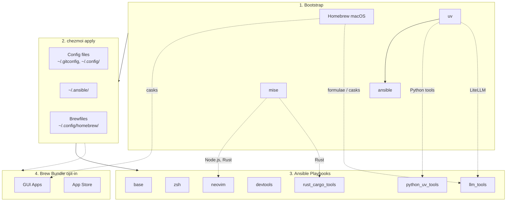

<!-- Generated by SpecStory, Markdown v2.1.0 -->

# 2026-04-03 08:43:02Z

<!-- Codex CLI Session 019d5282-2940-7863-ae40-451c1d8974df (2026-04-03 08:43:02Z) -->

_**User (2026-04-03 08:43:02Z)**_

lazygit 有 alias 了嗎？ 沒有的話 lg 會好嗎？ （還是會跟 ls 系列搞混？）


---

_**Agent (gpt-5.4 2026-04-03 08:44:50Z)**_

先確認目前 task session，接著在 dotfiles 裡搜尋 `lazygit` 與 alias 定義，判斷現在有沒有既有縮寫，以及 `lg` 跟現有命名風格是否衝突。

_**Agent (gpt-5.4 2026-04-03 08:44:50Z)**_

<tool-use data-tool-type="shell" data-tool-name="exec_command"><details>
<summary>Tool use: **exec_command** `td usage --new-session`</summary>
```
Command: /bin/zsh -lc 'td usage --new-session'
Chunk ID: 6049a2
Wall time: 0.0621 seconds
Process exited with code 0
Original token count: 471
Output:
You have access to `td`, a local task management CLI.

NEW SESSION: ses_1d4957 on branch: main (previous: ses_c106aa)
  You are a new context. You can now review issues implemented by the previous session.

CURRENT SESSION: ses_1d4957 [codex_37134] on branch: main

FOCUSED ISSUE: td-8991c5 "Add ghget zsh helper" [in_progress]
  Last handoff (4d ago):

WORKFLOW:

  1. `td start <id>` to begin work
     Multi-issue: `td ws start "name"` then `td ws tag <ids>`
  2. `td log "msg"` to track progress
     Multi-issue: `td ws log "msg"`
  3. `td handoff <id>` to capture state (REQUIRED)
     Multi-issue: `td ws handoff`
  4. `td review <id>` to submit for review
  5. Different session: `td approve <id>` to complete

  Use `td ws` commands when implementing multiple related issues.

KEY COMMANDS:
  td current              What you're working on
  td ws current           Current work session state
  td context <id>         Full context for resuming
  td next                 Highest priority open issue
  td critical-path        What unblocks the most work
  td reviewable           Issues you can review
  td approve/reject <id>  Complete review

IMPORTANT: You cannot approve issues you implemented.
  Exception: `td add "title" --minor` creates self-reviewable tasks.

WARNING: Do NOT use `td close` for completed work!
  Use `td review` -> `td approve` workflow instead.
  `td close` is for admin closures: duplicates, won't-fix, cleanup.

Use `td handoff` or `td ws handoff` before stopping work.

FOR LLMs: Run `td usage --new-session` at conversation start (or after /clear).
  Do NOT start a new session mid-work—sessions track implementers for review.
Use `td ws start` when implementing multiple issues to group handoffs.
  - session = identity (always exists)  |  ws = work container (optional)

TIP: Use `td usage -q` to hide these instructions after first read.
```
</details></tool-use>

_**Agent (gpt-5.4 2026-04-03 08:45:00Z)**_

session 已初始化；我現在查 dotfiles 內的 `lazygit`、`alias lg`、以及可能相關的 `ls` 系列縮寫，確認目前實際狀態。

_**Agent (gpt-5.4 2026-04-03 08:45:00Z)**_

<tool-use data-tool-type="shell" data-tool-name="exec_command"><details>
<summary>Tool use: **exec_command** `td usage -q`</summary>
```
Command: /bin/zsh -lc 'td usage -q'
Chunk ID: da97d0
Wall time: 0.1015 seconds
Process exited with code 0
Original token count: 51
Output:
You have access to `td`, a local task management CLI.

CURRENT SESSION: ses_1d4957 [codex_37134] on branch: main

FOCUSED ISSUE: td-8991c5 "Add ghget zsh helper" [in_progress]
  Last handoff (4d ago):
```
</details></tool-use>

_**Agent (gpt-5.4 2026-04-03 08:45:00Z)**_

<tool-use data-tool-type="shell" data-tool-name="exec_command"><details>
<summary>Tool use: **exec_command** `rg -n --hidden --glob '!.git' "lazygit|alias[[:space:]]+lg=|alias[[:space:]]+l(g|s|ll|la|lt)|\blg\b" .`</summary>
```
Command: /bin/zsh -lc "rg -n --hidden --glob '"'!.git'"' \"lazygit|alias[[:space:]]+lg=|alias[[:space:]]+l(g|s|ll|la|lt)|\\blg\\b\" ."
Chunk ID: 0c6bcb
Wall time: 0.0009 seconds
Process exited with code 0
Original token count: 93016
Output:
Total output lines: 2221

./CLAUDE.md:131:| `lazyvim_deps` | fzf, lazygit, tree-sitter-cli, Node.js (via mise) |
./CLAUDE.md:174:- **GitHub binaries**: neovim, ripgrep, fd, jq, just, bat, eza, delta, yazi, zellij, btop, gitleaks, lazygit, fzf, sesh
./CLAUDE.md:237:- lazygit, fzf (via git on Linux, Homebrew on macOS)
./docker-compose.yml:99:        echo -n "lazygit: "; lazygit --version 2>/dev/null || echo "MISSING (optional - PPA not available for noble)"
./run_onchange_after_20_ansible_roles.sh.tmpl:140:info "  neovim, fzf, lazygit, gh, diffnav, ripgrep, fd, jq, just, bat, eza, delta,"
./README.md:93:- `~/.config/lazygit/config.yml` - Global LazyGit config, with `delta` as the custom diff pager
./README.md:133:- **LazyVim deps**: fzf, lazygit, tree-sitter-cli, Node.js
./README.md:134:- **Git review stack**: gh, gh-dash (via `gh` extension), diffnav, git-delta, lazygit
./.specstory/history/2026-02-06_14-00-45Z-chezmoi-apply-codex-gemini.md:726:info "  neovim, fzf, lazygit, ripgrep, fd, jq, just, bat, eza, delta,"
./.specstory/history/2026-02-06_14-00-45Z-chezmoi-apply-codex-gemini.md:1727:- **LazyVim deps**: fzf, lazygit, tree-sitter-cli, Node.js
./.specstory/history/2026-02-06_14-00-45Z-chezmoi-apply-codex-gemini.md:2135: - **LazyVim deps**: fzf, lazygit, tree-sitter-cli, Node.js
./.specstory/history/2026-02-06_14-00-45Z-chezmoi-apply-codex-gemini.md:2351:    96	- **LazyVim deps**: fzf, lazygit, tree-sitter-cli, Node.js
./.specstory/history/2026-02-04_16-37-19Z-implement-the-following-plan.md:506:    70→- **LazyVim deps**: fzf, lazygit, tree-sitter-cli, Node.js
./.specstory/history/2026-02-04_16-37-19Z-implement-the-following-plan.md:1458:    92→| `lazyvim_deps` | fzf, lazygit, tree-sitter-cli, Node.js (via mise) |
./.specstory/history/2026-02-04_16-37-19Z-implement-the-following-plan.md:1478:   112→- lazygit, fzf (via git on Linux, Homebrew on macOS)
./.specstory/history/2026-02-05_15-20-39Z-now-use-mise-install.md:206:    27→# command -v eza &>/dev/null && alias ls="eza"
./docs/neovim/floating-tui.md:14:This is the same mechanism behind `<leader>gg` (LazyGit via `Snacks.lazygit()`).
./docs/neovim/floating-tui.md:34:For the managed `gh-dash` / `diffnav` / `lazygit` setup behind `<leader>zg`, see [Git Diff Workflow](../tools/git_diff_workflow.md).
./docs/neovim/floating-tui.md:119:- **Deep Neovim integration** — e.g. `Snacks.lazygit()` auto-configures colorscheme themes and nvim-remote editing
./docs/neovim/floating-tui.md:125:| lazygit | OK | `Snacks.lazygit()` (built-in, recommended) |
./.specstory/history/2026-02-07_05-14-32Z-implement-the-following-plan.md:912:    87→info "  neovim, fzf, lazygit, ripgrep, fd, jq, just, bat, eza, delta,"
./.specstory/history/2026-02-07_05-14-32Z-implement-the-following-plan.md:2474:    87→info "  neovim, fzf, lazygit, ripgrep, fd, jq, just, bat, eza, delta,"
./docs/zsh/zsh-completions.md:66:| `lazygit` | No completion support; not needed (TUI app) |
./docs/zsh/zsh-completions.md:84:`claude`, `gemini`, `btop`, `lazygit` -- no generation command available.
./.specstory/history/2026-02-04_16-58-01Z-help-me-setup-rust.md:852:    10→      - lazygit
./.specstory/history/2026-02-04_16-58-01Z-help-me-setup-rust.md:910:    68→# lazygit
./.specstory/history/2026-02-04_16-58-01Z-help-me-setup-rust.md:911:    69→- name: Check if lazygit is installed
./.specstory/history/2026-02-04_16-58-01Z-help-me-setup-rust.md:913:    71→  ansible.builtin.command: lazygit --version
./.specstory/history/2026-02-04_16-58-01Z-help-me-setup-rust.md:914:    72→  register: lazygit_check
./.specstory/history/2026-02-04_16-58-01Z-help-me-setup-rust.md:918:    76→- name: Install lazygit via PPA (Debian/Ubuntu)
./.specstory/history/2026-02-04_16-58-01Z-help-me-setup-rust.md:921:    79→    - lazygit_check.rc != 0
./.specstory/history/2026-02-04_16-58-01Z-help-me-setup-rust.md:925:    83→    - name: Add lazygit PPA
./.specstory/history/2026-02-04_16-58-01Z-help-me-setup-rust.md:927:    85→        repo: ppa:lazygit-team/release
./.specstory/history/2026-02-04_16-58-01Z-help-me-setup-rust.md:930:    88→      register: lazygit_ppa
./.specstory/history/2026-02-04_16-58-01Z-help-me-setup-rust.md:932:    90→    - name: Install lazygit from apt
./.specstory/history/2026-02-04_16-58-01Z-help-me-setup-rust.md:934:    92→        name: lazygit
./.specstory/history/2026-02-04_16-58-01Z-help-me-setup-rust.md:937:    95→      register: lazygit_apt
./.specstory/history/2026-02-04_16-58-01Z-help-me-setup-rust.md:938:    96→      when: lazygit_ppa is succeeded
./.specstory/history/2026-02-04_16-58-01Z-help-me-setup-rust.md:940:    98→- name: Install lazygit from GitHub releases (fallback)
./.specstory/history/2026-02-04_16-58-01Z-help-me-setup-r
... (truncated)
```
</details></tool-use>

_**Agent (gpt-5.4 2026-04-03 08:45:00Z)**_

<tool-use data-tool-type="shell" data-tool-name="exec_command"><details>
<summary>Tool use: **exec_command** `rg -n --hidden --glob '!.git' "alias[[:space:]]+l[a-zA-Z0-9_-]*=" .`</summary>
```
Command: /bin/zsh -lc "rg -n --hidden --glob '"'!.git'"' \"alias[[:space:]]+l[a-zA-Z0-9_-]*=\" ."
Chunk ID: 86174a
Wall time: 0.0000 seconds
Process exited with code 0
Original token count: 6066
Output:
Total output lines: 197

./.specstory/history/2026-02-05_15-20-39Z-now-use-mise-install.md:192:    13→# alias l="ls -lah"
./.specstory/history/2026-02-05_15-20-39Z-now-use-mise-install.md:193:    14→# alias la="ls -lAh"
./.specstory/history/2026-02-05_15-20-39Z-now-use-mise-install.md:194:    15→# alias ll="ls -lh"
./.specstory/history/2026-02-05_15-20-39Z-now-use-mise-install.md:206:    27→# command -v eza &>/dev/null && alias ls="eza"
./dot_config/zsh/10_aliases.zsh:13:# alias l="ls -lah"
./dot_config/zsh/10_aliases.zsh:14:# alias la="ls -lAh"
./dot_config/zsh/10_aliases.zsh:15:# alias ll="ls -lh"
./dot_config/zsh/10_aliases.zsh:27:# command -v eza &>/dev/null && alias ls="eza"
./dot_config/zsh/10_aliases.zsh:34:alias load-nvm='export LOAD_NVM=1 && source "${NVM_DIR:-$HOME/.nvm}/nvm.sh" && source "${NVM_DIR:-$HOME/.nvm}/bash_completion" && echo "nvm loaded: $(nvm current)"'
./.specstory/history/2026-02-04_16-58-01Z-help-me-setup-rust.md:1333:    13→# alias l="ls -lah"
./.specstory/history/2026-02-04_16-58-01Z-help-me-setup-rust.md:1334:    14→# alias la="ls -lAh"
./.specstory/history/2026-02-04_16-58-01Z-help-me-setup-rust.md:1335:    15→# alias ll="ls -lh"
./.specstory/history/2026-02-04_16-58-01Z-help-me-setup-rust.md:1347:    27→# command -v eza &>/dev/null && alias ls="eza"
./.specstory/history/2026-02-04_16-58-01Z-help-me-setup-rust.md:1712:    16→alias ls="eza --icons=always --color=always --long --git --no-filesize --no-time --no-user --no-permissions"
./.specstory/history/2026-02-04_16-58-01Z-help-me-setup-rust.md:1715:    19→alias la="eza --icons=always --color=always --long --git --all"
./.specstory/history/2026-02-04_16-58-01Z-help-me-setup-rust.md:1716:    20→alias ll="eza --icons=always --color=always --long --git"
./.specstory/history/2026-02-04_16-58-01Z-help-me-setup-rust.md:1717:    21→alias lt="eza --icons=always --color=always --tree --level=2"
./.specstory/history/2026-02-09_09-39-41Z-tldr-config-toml-dot.md:629:# alias l="ls -lah"
./.specstory/history/2026-02-09_09-39-41Z-tldr-config-toml-dot.md:630:# alias la="ls -lAh"
./.specstory/history/2026-02-09_09-39-41Z-tldr-config-toml-dot.md:631:# alias ll="ls -lh"
./.specstory/history/2026-02-09_09-39-41Z-tldr-config-toml-dot.md:643:# command -v eza &>/dev/null && alias ls="eza"
./.specstory/history/2026-02-09_11-20-35Z-wrapper-terminal-copy-paste.md:686:# alias l="ls -lah"
./.specstory/history/2026-02-04_10-29-18Z-system-reminder-plan-mode-is.md:144:alias ls="eza --icons=always --color=always --long --git --no-filesize --no-time --no-user --no-permissions"
./.specstory/history/2026-02-04_10-29-18Z-system-reminder-plan-mode-is.md:801:    14|# alias l="ls -lah"
./.specstory/history/2026-02-04_10-29-18Z-system-reminder-plan-mode-is.md:802:    15|# alias la="ls -lAh"
./.specstory/history/2026-02-04_10-29-18Z-system-reminder-plan-mode-is.md:803:    16|# alias ll="ls -lh"
./.specstory/history/2026-02-04_10-29-18Z-system-reminder-plan-mode-is.md:815:    28|# command -v eza &>/dev/null && alias ls="eza"
./.specstory/history/2026-02-04_10-29-18Z-system-reminder-plan-mode-is.md:1788:alias ls="eza --icons=always --color=always --long --git --no-filesize --no-time --no-user --no-permissions"
./.specstory/history/2026-02-04_10-29-18Z-system-reminder-plan-mode-is.md:1791:alias la="eza --icons=always --color=always --long --git --all"
./.specstory/history/2026-02-04_10-29-18Z-system-reminder-plan-mode-is.md:1792:alias ll="eza --icons=always --color=always --long --git"
./.specstory/history/2026-02-04_10-29-18Z-system-reminder-plan-mode-is.md:1793:alias lt="eza --icons=always --color=always --tree --level=2"
./.specstory/history/2026-02-04_10-29-18Z-system-reminder-plan-mode-is.md:2257:    14|# alias l="ls -lah"
./.specstory/history/2026-02-04_10-29-18Z-system-reminder-plan-mode-is.md:2258:    15|# alias la="ls -lAh"
./.specstory/history/2026-02-04_10-29-18Z-system-reminder-plan-mode-is.md:2259:    16|# alias ll="ls -lh"
./.specstory/history/2026-02-04_10-29-18Z-system-reminder-plan-mode-is.md:2271:    28|# command -v eza &>/dev/null && alias ls="eza"
./.specstory/history/2026-02-04_10-29-18Z-system-reminder.md:144:alias ls="eza --icons=always --color=always --long --git --no-filesize --no-time --no-user --no-permissions"
./.specstory/history/2026-02-04_10-29-18Z-system-reminder.md:801:    14|# alias l="ls -lah"
./.specstory/history/2026-02-04_10-29-18Z-system-reminder.md:802:    15|# alias la="ls -lAh"
./.specstory/history/2026-02-04_10-29-18Z-system-reminder.md:803:    16|# alias ll="ls -lh"
./.specstory/history/2026-02-04_10-29-18Z-system-reminder.md:815:    28|# command -v eza &>/dev/null && alias ls="eza"
./.specstory/history/2026-02-04_10-29-18Z-system-reminder.md:1788:alias ls="eza --icons=always --color=always --long --git -
... (truncated)
```
</details></tool-use>

_**Agent (gpt-5.4 2026-04-03 08:45:12Z)**_

目前 repo 裡沒有看到有效的 `alias lg=...`；我再把相關 zsh 檔直接打開，看現行 alias 風格與 `ls/la/ll/lt` 的配置，避免只靠全域搜尋誤判。

_**Agent (gpt-5.4 2026-04-03 08:45:12Z)**_

<tool-use data-tool-type="shell" data-tool-name="exec_command"><details>
<summary>Tool use: **exec_command** `sed -n '1,120p' dot_config/zsh/10_aliases.zsh`</summary>
```
Command: /bin/zsh -lc "sed -n '1,120p' dot_config/zsh/10_aliases.zsh"
Chunk ID: 57cde8
Wall time: 0.0000 seconds
Process exited with code 0
Original token count: 280
Output:
# 10_aliases.zsh - Common aliases

# --- Your existing aliases ---
alias v="nvim"

# --- Suggested aliases (uncomment to enable) ---
# Navigation
# alias ..="cd .."
# alias ...="cd ../.."
# alias ....="cd ../../.."

# List files
# alias l="ls -lah"
# alias la="ls -lAh"
# alias ll="ls -lh"

# Safety
# alias rm="rm -i"
# alias cp="cp -i"
# alias mv="mv -i"

# Editor
# alias vi="nvim"
# alias vim="nvim"

# Modern replacements (if installed)
# command -v eza &>/dev/null && alias ls="eza"
# command -v bat &>/dev/null && alias cat="bat"

# Zsh startup profiling
alias zsh-profile='ZSH_PROF=1 zsh -i -c exit'

# Load NVM for current session (when needed for version switching)
alias load-nvm='export LOAD_NVM=1 && source "${NVM_DIR:-$HOME/.nvm}/nvm.sh" && source "${NVM_DIR:-$HOME/.nvm}/bash_completion" && echo "nvm loaded: $(nvm current)"'

# Regenerate cached bw completion (run after updating bw CLI)
alias bw-update-completion='mkdir -p "${XDG_CACHE_HOME:-$HOME/.cache}/zsh" && bw completion --shell zsh > "${XDG_CACHE_HOME:-$HOME/.cache}/zsh/bw_completion.zsh" 2>/dev/null && echo "bw completion cache updated"'
```
</details></tool-use>

_**Agent (gpt-5.4 2026-04-03 08:45:12Z)**_

<tool-use data-tool-type="shell" data-tool-name="exec_command"><details>
<summary>Tool use: **exec_command** `sed -n '1,120p' dot_config/zsh/tools/26_eza.zsh`</summary>
```
Command: /bin/zsh -lc "sed -n '1,120p' dot_config/zsh/tools/26_eza.zsh"
Chunk ID: 45fa91
Wall time: 0.0000 seconds
Process exited with code 0
Original token count: 305
Output:
# 26_eza.zsh - eza configuration (modern ls replacement)

# Check if eza is installed
command -v eza &>/dev/null || return 0

# Replace ls with eza
# Options:
#   --icons=always  - Show file type icons
#   --color=always  - Enable colors
#   --long          - Long format
#   --git           - Show git status
#   --git-repos     - Show nested repo branch/status columns when applicable
#   --group-directories-first - Keep directories grouped together
#   --no-filesize   - Hide file size
#   --no-time       - Hide modification time
#   --no-user       - Hide user/owner
#   --no-permissions - Hide permissions
alias ls="eza --icons=always --color=always --long --git --no-filesize --no-time --no-user --no-permissions"

# Additional useful aliases
alias la="eza --icons=always --color=always --long --header --git --git-repos --group-directories-first --time-style=long-iso --all"
alias ll="eza --icons=always --color=always --long --header --git --git-repos --group-directories-first --time-style=long-iso"
alias lt="eza --icons=always --color=always --tree --level=2"
alias llt="eza --icons=always --color=always --long --header --git --git-repos --group-directories-first --time-style=long-iso --tree --level=3"
```
</details></tool-use>

_**Agent (gpt-5.4 2026-04-03 08:45:12Z)**_

<tool-use data-tool-type="shell" data-tool-name="exec_command"><details>
<summary>Tool use: **exec_command** `rg -n --hidden --glob '!.git' --glob '!.specstory/**' --glob '!docs/**' '^alias[[:space:]]+lg=' dot_config zsh* .chezmoitemplates .chezmoi* 2>/dev/null`</summary>
```
Command: /bin/zsh -lc "rg -n --hidden --glob '"'!.git'"' --glob '"'!.specstory/**'"' --glob '"'!docs/**'"' '"'^alias[[:space:]]+lg='"' dot_config zsh* .chezmoitemplates .chezmoi* 2>/dev/null"
Chunk ID: bae2c0
Wall time: 0.0000 seconds
Process exited with code 1
Original token count: 8
Output:
zsh:1: no matches found: zsh*
```
</details></tool-use>

_**Agent (gpt-5.4 2026-04-03 08:45:12Z)**_

<tool-use data-tool-type="shell" data-tool-name="exec_command"><details>
<summary>Tool use: **exec_command** `rg -n --hidden --glob '!.git' --glob '!.specstory/**' --glob '!docs/**' 'lazygit' dot_config`</summary>
```
Command: /bin/zsh -lc "rg -n --hidden --glob '"'!.git'"' --glob '"'!.specstory/**'"' --glob '"'!docs/**'"' 'lazygit' dot_config"
Chunk ID: efd885
Wall time: 0.0000 seconds
Process exited with code 0
Original token count: 104
Output:
dot_config/sesh/sesh.toml:45:startup_script = "lazygit"
dot_config/homebrew/Brewfile.linux.tmpl:22:# brew "lazygit"      # Terminal UI for git
dot_config/yazi/yazi.toml:147:# --- git：在該目錄（或檔案所在目錄）開 lazygit
dot_config/yazi/yazi.toml:156:exec lazygit
dot_config/nvim/lua/exact_plugins/floating-tui.lua:16:      -- NOTE: <leader>gg (LazyGit) is provided by LazyVim via Snacks.lazygit()
```
</details></tool-use>

_**Agent (gpt-5.4 2026-04-03 08:45:26Z)**_

shell alias 看起來沒有，但 repo 對 LazyGit 不是完全沒入口。我再看 `sesh`、`yazi`、Neovim 裡既有的呼叫點，這樣可以一起評估 `lg` 值不值得加。

_**Agent (gpt-5.4 2026-04-03 08:45:26Z)**_

<tool-use data-tool-type="shell" data-tool-name="exec_command"><details>
<summary>Tool use: **exec_command** `sed -n '35,60p' dot_config/sesh/sesh.toml`</summary>
```
Command: /bin/zsh -lc "sed -n '35,60p' dot_config/sesh/sesh.toml"
Chunk ID: 207946
Wall time: 0.0000 seconds
Process exited with code 0
Original token count: 136
Output:
# ── Wildcards ────────────────────────────────────────────────────────────────

[[wildcard]]
pattern = "~/repos/*"
startup_command = "nvim"

# ── Windows ──────────────────────────────────────────────────────────────────

[[window]]
name = "git"
startup_script = "lazygit"
```
</details></tool-use>

_**Agent (gpt-5.4 2026-04-03 08:45:27Z)**_

<tool-use data-tool-type="shell" data-tool-name="exec_command"><details>
<summary>Tool use: **exec_command** `sed -n '140,170p' dot_config/yazi/yazi.toml`</summary>
```
Command: /bin/zsh -lc "sed -n '140,170p' dot_config/yazi/yazi.toml"
Chunk ID: e74aac
Wall time: 0.0000 seconds
Process exited with code 0
Original token count: 130
Output:
fi
exec specstory run cursor
' -- %s1
""", block = true, desc = "Cursor Agent CLI (specstory)" },

]

# --- git：在該目錄（或檔案所在目錄）開 lazygit
git = [
  { run = """sh -lc '
t="$1"
if [ -d "$t" ]; then
  cd "$t"
else
  cd "$(dirname "$t")"
fi
exec lazygit
' -- %s1
""", block = true, desc = "Lazygit (here)" },
]

# --- marimo：對目錄用 marimo edit --watch .
marimo_dir = [
  { run = """sh -lc '
t="$1"
if [ -d "$t" ]; then
  cd "$t"
else
  cd "$(dirname "$t")"
fi
exec marimo edit --watch .
```
</details></tool-use>

_**Agent (gpt-5.4 2026-04-03 08:45:27Z)**_

<tool-use data-tool-type="shell" data-tool-name="exec_command"><details>
<summary>Tool use: **exec_command** `sed -n '1,80p' dot_config/nvim/lua/exact_plugins/floating-tui.lua`</summary>
```
Command: /bin/zsh -lc "sed -n '1,80p' dot_config/nvim/lua/exact_plugins/floating-tui.lua"
Chunk ID: 22308b
Wall time: 0.0000 seconds
Process exited with code 0
Original token count: 483
Output:
return {
  {
    "folke/snacks.nvim",
    keys = {
      -- Git / GitHub
      {
        "<leader>zg",
        function()
          Snacks.terminal.toggle({ "gh", "dash" }, {
            cwd = LazyVim.root.git(),
            win = { title = " gh dash " },
          })
        end,
        desc = "gh dash",
      },
      -- NOTE: <leader>gg (LazyGit) is provided by LazyVim via Snacks.lazygit()

      -- Database
      {
        "<leader>zs",
        function()
          Snacks.terminal.toggle("sqlit", {
            win = { title = " sqlit " },
            -- Just use double ESC then q to quit the tool without killing the process
            -- win = {
            --   title = " sqlit ",
            --   keys = {
            --     q = false, -- sqlit uses q to goto query panel; disable Snacks' q-to-hide
            --     hide = { "<C-q>", "hide", mode = "n" }, -- use Ctrl-q to hide instead
            --   },
            -- },
            auto_close = false,
          })
        end,
        desc = "sqlit",
      },

      -- File Manager
      {
        "<leader>fy",
        function()
          Snacks.terminal.toggle("yazi", {
            cwd = vim.uv.cwd(),
            win = { title = " yazi " },
          })
        end,
        desc = "Yazi",
      },

      -- System Monitor
      {
        "<leader>zb",
        function()
          Snacks.terminal.toggle("btop", {
            win = { title = " btop " },
          })
        end,
        desc = "btop",
      },

      -- Container
      {
        "<leader>zd",
        function()
          Snacks.terminal.toggle("lazydocker", {
            win = { title = " lazydocker " },
          })
        end,
        desc = "LazyDocker",
      },

      -- REPL
      {
        "<leader>zi",
        function()
          Snacks.terminal.toggle("ipython", {
            cwd = vim.uv.cwd(),
            win = { title = " ipython " },
          })
        end,
```
</details></tool-use>

_**Agent (gpt-5.4 2026-04-03 08:45:27Z)**_

<tool-use data-tool-type="shell" data-tool-name="exec_command"><details>
<summary>Tool use: **exec_command** `rg -n --hidden --glob '!.git' --glob '!.specstory/**' '^alias[[:space:]]+l[gstal][a-zA-Z0-9_-]*=' dot_config/zsh`</summary>
```
Command: /bin/zsh -lc "rg -n --hidden --glob '"'!.git'"' --glob '"'!.specstory/**'"' '"'^alias[[:space:]]+l[gstal][a-zA-Z0-9_-]*='"' dot_config/zsh"
Chunk ID: e82760
Wall time: 0.0000 seconds
Process exited with code 0
Original token count: 188
Output:
dot_config/zsh/tools/26_eza.zsh:18:alias ls="eza --icons=always --color=always --long --git --no-filesize --no-time --no-user --no-permissions"
dot_config/zsh/tools/26_eza.zsh:21:alias la="eza --icons=always --color=always --long --header --git --git-repos --group-directories-first --time-style=long-iso --all"
dot_config/zsh/tools/26_eza.zsh:22:alias ll="eza --icons=always --color=always --long --header --git --git-repos --group-directories-first --time-style=long-iso"
dot_config/zsh/tools/26_eza.zsh:23:alias lt="eza --icons=always --color=always --tree --level=2"
dot_config/zsh/tools/26_eza.zsh:24:alias llt="eza --icons=always --color=always --long --header --git --git-repos --group-directories-first --time-style=long-iso --tree --level=3"
```
</details></tool-use>

_**Agent (gpt-5.4 2026-04-03 08:45:40Z)**_

我補查一下 git aliases，避免漏掉 `git lg` 這類入口。若只有 shell alias 沒有、但 git config 有，那結論會不一樣。

_**Agent (gpt-5.4 2026-04-03 08:45:40Z)**_

<tool-use data-tool-type="shell" data-tool-name="exec_command"><details>
<summary>Tool use: **exec_command** `rg -n --hidden --glob '!.git' --glob '!.specstory/**' '^[[:space:]]*lg[[:space:]]*=|alias[.]lg|\[alias\]' dot_gitconfig* dot_config/git*`</summary>
```
Command: /bin/zsh -lc "rg -n --hidden --glob '"'!.git'"' --glob '"'!.specstory/**'"' '"'^[[:space:]]*lg[[:space:]]*=|alias[.]lg|'"\\[alias\\]' dot_gitconfig* dot_config/git*"
Chunk ID: 04fb81
Wall time: 0.0000 seconds
Process exited with code 1
Original token count: 0
Output:
```
</details></tool-use>

_**Agent (gpt-5.4 2026-04-03 08:45:40Z)**_

<tool-use data-tool-type="shell" data-tool-name="exec_command"><details>
<summary>Tool use: **exec_command** `rg -n --hidden --glob '!.git' --glob '!.specstory/**' '\blg\b' dot_gitconfig* dot_config/git*`</summary>
```
Command: /bin/zsh -lc "rg -n --hidden --glob '"'!.git'"' --glob '"'!.specstory/**'"' '\\blg\\b' dot_gitconfig* dot_config/git*"
Chunk ID: 4bb410
Wall time: 0.0000 seconds
Process exited with code 1
Original token count: 0
Output:
```
</details></tool-use>

_**Agent (gpt-5.4 2026-04-03 08:46:08Z)**_

repo 裡沒看到定義，但我也想確認「實際載入後的 shell」是不是被 framework/plugin 偷偷帶進 `lg`。我直接查目前 zsh 啟動後的 alias 狀態。

_**Agent (gpt-5.4 2026-04-03 08:46:09Z)**_

<tool-use data-tool-type="shell" data-tool-name="exec_command"><details>
<summary>Tool use: **exec_command** `zsh -ic 'alias lg 2>/dev/null || whence -w lg || echo LG_UNDEFINED'`</summary>
```
Command: /bin/zsh -lc "zsh -ic 'alias lg 2>/dev/null || whence -w lg || echo LG_UNDEFINED'"
Chunk ID: cadc04
Wall time: 1.0031 seconds
Process running with session ID 96771
Original token count: 0
Output:
```
</details></tool-use>

_**Agent (gpt-5.4 2026-04-03 08:46:09Z)**_

<tool-use data-tool-type="shell" data-tool-name="exec_command"><details>
<summary>Tool use: **exec_command** `zsh -ic 'alias ls 2>/dev/null; alias la 2>/dev/null; alias ll 2>/dev/null; alias lt 2>/dev/null; alias llt 2>/dev/null'`</summary>
```
Command: /bin/zsh -lc "zsh -ic 'alias ls 2>/dev/null; alias la 2>/dev/null; alias ll 2>/dev/null; alias lt 2>/dev/null; alias llt 2>/dev/null'"
Chunk ID: f83c65
Wall time: 1.0030 seconds
Process running with session ID 13318
Original token count: 0
Output:
```
</details></tool-use>

_**Agent (gpt-5.4 2026-04-03 08:46:09Z)**_

<tool-use data-tool-type="shell" data-tool-name="exec_command"><details>
<summary>Tool use: **exec_command** `zsh -ic 'alias | rg "^g|^gg|^lg"'`</summary>
```
Command: /bin/zsh -lc "zsh -ic 'alias | rg \""'^g|''^gg|''^lg"'"'"
Chunk ID: d9d2ee
Wall time: 1.0029 seconds
Process running with session ID 13440
Original token count: 0
Output:
```
</details></tool-use>

_**Agent (gpt-5.4 2026-04-03 08:46:22Z)**_

<tool-use data-tool-type="unknown" data-tool-name="write_stdin"><details>
<summary>Tool use: **write_stdin**</summary>
```
Command: /bin/zsh -lc "zsh -ic 'alias lg 2>/dev/null || whence -w lg || echo LG_UNDEFINED'"
Chunk ID: dbf159
Wall time: 0.0000 seconds
Process exited with code 0
Original token count: 42
Output:
[ERROR] - (starship::print): Under a 'dumb' terminal (TERM=dumb).
(eval):1: can't change option: zle
(eval):1: can't change option: zle
lg: none
LG_UNDEFINED
```
</details></tool-use>

_**Agent (gpt-5.4 2026-04-03 08:46:22Z)**_

<tool-use data-tool-type="unknown" data-tool-name="write_stdin"><details>
<summary>Tool use: **write_stdin**</summary>
```
Command: /bin/zsh -lc "zsh -ic 'alias ls 2>/dev/null; alias la 2>/dev/null; alias ll 2>/dev/null; alias lt 2>/dev/null; alias llt 2>/dev/null'"
Chunk ID: e49637
Wall time: 0.0000 seconds
Process exited with code 0
Original token count: 173
Output:
[ERROR] - (starship::print): Under a 'dumb' terminal (TERM=dumb).
(eval):1: can't change option: zle
(eval):1: can't change option: zle
ls='eza --icons=always --color=always --long --git --no-filesize --no-time --no-user --no-permissions'
la='eza --icons=always --color=always --long --header --git --git-repos --group-directories-first --time-style=long-iso --all'
ll='eza --icons=always --color=always --long --header --git --git-repos --group-directories-first --time-style=long-iso'
lt='eza --icons=always --color=always --tree --level=2'
llt='eza --icons=always --color=always --long --header --git --git-repos --group-directories-first --time-style=long-iso --tree --level=3'
```
</details></tool-use>

_**Agent (gpt-5.4 2026-04-03 08:46:22Z)**_

<tool-use data-tool-type="unknown" data-tool-name="write_stdin"><details>
<summary>Tool use: **write_stdin**</summary>
```
Command: /bin/zsh -lc "zsh -ic 'alias | rg \""'^g|''^gg|''^lg"'"'"
Chunk ID: 983e77
Wall time: 0.0000 seconds
Process exited with code 0
Original token count: 1876
Output:
[ERROR] - (starship::print): Under a 'dumb' terminal (TERM=dumb).
(eval):1: can't change option: zle
(eval):1: can't change option: zle
g=git
ga='git add'
gaa='git add --all'
gam='git am'
gama='git am --abort'
gamc='git am --continue'
gams='git am --skip'
gamscp='git am --show-current-patch'
gap='git apply'
gapa='git add --patch'
gapt='git apply --3way'
gau='git add --update'
gav='git add --verbose'
gb='git branch'
gbD='git branch --delete --force'
gba='git branch --all'
gbd='git branch --delete'
gbg='LANG=C git branch -vv | grep ": gone\]"'
gbgD='LANG=C git branch --no-color -vv | grep ": gone\]" | cut -c 3- | awk '\''{print $1}'\'' | xargs git branch -D'
gbgd='LANG=C git branch --no-color -vv | grep ": gone\]" | cut -c 3- | awk '\''{print $1}'\'' | xargs git branch -d'
gbl='git blame -w'
gbm='git branch --move'
gbnm='git branch --no-merged'
gbr='git branch --remote'
gbs='git bisect'
gbsb='git bisect bad'
gbsg='git bisect good'
gbsn='git bisect new'
gbso='git bisect old'
gbsr='git bisect reset'
gbss='git bisect start'
gc='git commit --verbose'
gc!='git commit --verbose --amend'
gcB='git checkout -B'
gca='git commit --verbose --all'
gca!='git commit --verbose --all --amend'
gcam='git commit --all --message'
gcan!='git commit --verbose --all --no-edit --amend'
gcann!='git commit --verbose --all --date=now --no-edit --amend'
gcans!='git commit --verbose --all --signoff --no-edit --amend'
gcas='git commit --all --signoff'
gcasm='git commit --all --signoff --message'
gcb='git checkout -b'
gcd='git checkout $(git_develop_branch)'
gcf='git config --list'
gcfu='git commit --fixup'
gcl='git clone --recurse-submodules'
gclean='git clean --interactive -d'
gclf='git clone --recursive --shallow-submodules --filter=blob:none --also-filter-submodules'
gcm='git checkout $(git_main_branch)'
gcmsg='git commit --message'
gcn='git commit --verbose --no-edit'
gcn!='git commit --verbose --no-edit --amend'
gco='git checkout'
gcor='git checkout --recurse-submodules'
gcount='git shortlog --summary --numbered'
gcp='git cherry-pick'
gcpa='git cherry-pick --abort'
gcpc='git cherry-pick --continue'
gcs='git commit --gpg-sign'
gcsm='git commit --signoff --message'
gcss='git commit --gpg-sign --signoff'
gcssm='git commit --gpg-sign --signoff --message'
gd='git diff'
gdca='git diff --cached'
gdct='git describe --tags $(git rev-list --tags --max-count=1)'
gdcw='git diff --cached --word-diff'
gds='git diff --staged'
gdt='git diff-tree --no-commit-id --name-only -r'
gdup='git diff @{upstream}'
gdw='git diff --word-diff'
gf='git fetch'
gfa='git fetch --all --tags --prune --jobs=10'
gfg='git ls-files | grep'
gfo='git fetch origin'
gg='git gui citool'
gga='git gui citool --amend'
ggpull='git pull origin "$(git_current_branch)"'
ggpur=ggu
ggpush='git push origin "$(git_current_branch)"'
ggsup='git branch --set-upstream-to=origin/$(git_current_branch)'
ghh='git help'
gignore='git update-index --assume-unchanged'
gignored='git ls-files -v | grep "^[[:lower:]]"'
git-svn-dcommit-push='git svn dcommit && git push github $(git_main_branch):svntrunk'
gk='\gitk --all --branches &!'
gke='\gitk --all $(git log --walk-reflogs --pretty=%h) &!'
gl='git pull'
glg='git log --stat'
glgg='git log --graph'
glgga='git log --graph --decorate --all'
glgm='git log --graph --max-count=10'
glgp='git log --stat --patch'
glo='git log --oneline --decorate'
glod='git log --graph --pretty="%Cred%h%Creset -%C(auto)%d%Creset %s %Cgreen(%ad) %C(bold blue)<%an>%Creset"'
glods='git log --graph --pretty="%Cred%h%Creset -%C(auto)%d%Creset %s %Cgreen(%ad) %C(bold blue)<%an>%Creset" --date=short'
glog='git log --oneline --decorate --graph'
gloga='git log --oneline --decorate --graph --all'
glol='git log --graph --pretty="%Cred%h%Creset -%C(auto)%d%Creset %s %Cgreen(%ar) %C(bold blue)<%an>%Creset"'
glola='git log --graph --pretty="%Cred%h%Creset -%C(auto)%d%Creset %s %Cgreen(%ar) %C(bold blue)<%an>%Creset" --all'
glols='git log --graph --pretty="%Cred%h%Creset -%C(auto)%d%Creset %s %Cgreen(%ar) %C(bold blue)<%an>%Creset" --stat'
glp=_git_log_prettily
gluc='git pull upstream $(git_current_branch)'
glum='git pull upstream $(git_main_branch)'
gm='git merge'
gma='git merge --abort'
gmc='git merge --continue'
gmff='git merge --ff-only'
gmom='git merge origin/$(git_main_branch)'
gms='git merge --squash'
gmtl='git mergetool --no-prompt'
gmtlvim='git mergetool --no-prompt --tool=vimdiff'
gmum='git merge upstream/$(git_main_branch)'
gp='git push'
gpd='git push --dry-run'
gpf='git push --force-with-lease --force-if-includes'
gpf!='git push --force'
gpoat='git push origin --all && git push origin --tags'
gpod='git push origin --delete'
gpr='git pull --rebase'
gpra='git pull --rebase --autostash'
gprav='git pull --rebase --autostash -v'
gpristine='git reset --hard && git clean --force -dfx'
gprom='git pull --rebase o
... (truncated)
```
</details></tool-use>

_**Agent (gpt-5.4 2026-04-03 08:46:53Z)**_

沒有。repo 裡目前沒有 `alias lg=...`，我也直接檢查了實際載入後的 zsh，`lg` 是未定義的。

現在 active 的 `l*` alias 主要是 eza 那組，定義在 [26_eza.zsh](/Users/daviddwlee84/.local/share/chezmoi/dot_config/zsh/tools/26_eza.zsh#L18) 到 [26_eza.zsh](/Users/daviddwlee84/.local/share/chezmoi/dot_config/zsh/tools/26_eza.zsh#L24)：`ls`、`la`、`ll`、`lt`、`llt`。所以 `lg` 視覺上會靠近這一群，但不會真的衝突。比較值得注意的反而是很多人會把 `lg` 留給 `git log --graph` 類 alias，不過你這套目前沒有這個用法。

另外，LazyGit 已經有幾個非 shell alias 的入口：
[sesh.toml](/Users/daviddwlee84/.local/share/chezmoi/dot_config/sesh/sesh.toml#L45) 會開 `lazygit`、[floating-tui.lua](/Users/daviddwlee84/.local/share/chezmoi/dot_config/nvim/lua/exact_plugins/floating-tui.lua#L14) 註明 Neovim 用 `<leader>gg`、[yazi.toml](/Users/daviddwlee84/.local/share/chezmoi/dot_config/yazi/yazi.toml#L147) 也有「Lazygit (here)」。

我的建議是：`lg=lazygit` 可以加，手感會不錯，混淆風險算低；如果你很在意 `l*` 這組都代表 list/file view，那就別加，或改成 `lzg`。順手度我會投 `lg`，命名潔癖我會投不加。要的話我可以直接幫你加進 zsh alias。

---

_**User (2026-04-03 09:03:25Z)**_

大家 dotfiles lazygit一般都用什麼alias比較直覺 幫我搜搜看


---

_**Agent (gpt-5.4 2026-04-03 09:03:38Z)**_

我去看幾個公開 dotfiles / config repo 的實際寫法，整理出常見 alias 命名，再回你哪個最直覺、哪個最不容易跟現有 `l*` / git alias 打架。

_**Agent (gpt-5.4 2026-04-03 09:04:43Z)**_

我搜了幾個公開 dotfiles / config 範例，結論很明確:

- `lg` 是最直覺、也最像事實上的預設。官方 [lazygit README](https://github.com/jesseduffield/lazygit) 就直接示範 `alias lg='lazygit'`，連「離開後同步 `cd`」的 wrapper 也命名成 `lg()`.
- 我看到不少公開 config 也直接用 `lg`，例如 [basnijholt/dotbins](https://github.com/basnijholt/dotbins)、[Menchen 的 zsh config](https://gist.github.com/Menchen/13b931ed9c0175c13c840b7e5513af93)、[TarunDaCoder 的 zshrc](https://gist.github.com/TarunDaCoder/bd0f77fc8234c210f378542b5a07d97a)。
- 第二常見替代是 `lzg`，通常是想跟 `lzd`=`lazydocker` 配成一組，像 [VonHeikemen 的 config](https://gist.github.com/VonHeikemen/8b3bbdfee976683212818b704b08f405) 跟 [Tagliatti 的 aliases](https://gist.github.com/Tagliatti/e70b69fac408947235e7c601e41e89c5)。
- 真正常見的衝突不是 `ls` 系列，而是很多人把 `lg` 用在 `git log --graph`，像這份 [gitconfig gist](https://gist.github.com/Tomasvrba) 就是這樣。

所以如果問「大家一般覺得哪個最直覺」: 我會說 `lg`。  
如果問「哪個最不容易跟別的習慣撞到」: 我會說 `lzg`。

套到你這份 dotfiles，我的判斷是：
你現在有 `ls/la/ll/lt/llt`，但沒有 `lg`，也沒看到 `git` 端的 `lg`。所以加 `lg=lazygit` 很合理，而且不太會跟 `ls` 系列搞混；比起「像不像 ls」，更需要在意的是你未來會不會想把 `lg` 留給 `git log`。

如果你要，我可以直接幫你加，或改成較保守的 `lzg`。

---

_**User (2026-04-03 09:09:35Z)**_

好啊 那幫我家一下 alias lg='lazygit' 吧 放到 [tools](dot_config/zsh/tools) 弄一個for lazygit的


---

_**Agent (gpt-5.4 2026-04-03 09:09:49Z)**_

我要新增一個專門給 LazyGit 的 zsh tool 檔，並同步補 README 的 config files 說明；先看一下 `dot_config/zsh/tools` 的命名排序和 `README.md` 相關段落，避免放錯位置或破壞現有結構。

_**Agent (gpt-5.4 2026-04-03 09:09:49Z)**_

<tool-use data-tool-type="shell" data-tool-name="exec_command"><details>
<summary>Tool use: **exec_command** `ls dot_config/zsh/tools`</summary>
```
Command: /bin/zsh -lc 'ls dot_config/zsh/tools'
Chunk ID: 7fe1ef
Wall time: 0.0000 seconds
Process exited with code 0
Original token count: 92
Output:
01_starship.zsh
04_conda_mamba.zsh
05_mise.zsh
06_cargo.zsh
07_bunx_cli.zsh
10_fzf.zsh
20_zoxide.zsh
22_sesh.zsh
25_bat.zsh
26_eza.zsh
27_thefuck.zsh
28_tldr.zsh
29_marimo.zsh
30_direnv.zsh
32_try.zsh
33_toolkami.zsh.disabled
34_openclaw.zsh
35_yazi.zsh
36_pueue.zsh
40_codexbar.zsh
41_github.zsh
42_gitlab.zsh
50_networking.zsh
90_completions.zsh
95_bitwarden.zsh
```
</details></tool-use>

_**Agent (gpt-5.4 2026-04-03 09:09:49Z)**_

<tool-use data-tool-type="shell" data-tool-name="exec_command"><details>
<summary>Tool use: **exec_command** `rg -n "What You Get|Config Files|zsh|lazygit" README.md`</summary>
```
Command: /bin/zsh -lc 'rg -n "What You Get|Config Files|zsh|lazygit" README.md'
Chunk ID: cb3b9d
Wall time: 0.0000 seconds
Process exited with code 0
Original token count: 320
Output:
31:        ZSH[zsh]
86:## What You Get
88:### Config Files
93:- `~/.config/lazygit/config.yml` - Global LazyGit config, with `delta` as the custom diff pager
111:- `~/.config/zsh/tools/22_sesh.zsh` - Sesh keybinding (`Alt+S` for session picker) + shell completion
112:- `~/.config/zsh/tools/36_pueue.zsh` - Pueue queue summary helper (`pqsum`)
113:- `~/.config/zsh/tools/41_github.zsh` - GitHub helper with `ghget` for downloading a repo subdirectory from a tree URL
114:- `~/.config/zsh/tools/28_tldr.zsh` - `tldrf` helper with `TLDR_LANGUAGES` fallback order
115:- `~/.config/zsh/tools/29_marimo.zsh` - `marimo` zsh shell completion
116:- `~/.config/zsh/tools/26_eza.zsh` - `eza`-backed `ls`/`la`/`ll` aliases, plus `llt` for tree view with git-aware subdirectory context
117:- `~/.config/zsh/tools/95_bitwarden.zsh` - Bitwarden CLI completion + SSH agent socket auto-detection
133:- **LazyVim deps**: fzf, lazygit, tree-sitter-cli, Node.js
134:- **Git review stack**: gh, gh-dash (via `gh` extension), diffnav, git-delta, lazygit
139:- **Bitwarden** (optional): Bitwarden CLI (`bw`) via npm, Desktop app (snap/deb on Linux, cask on macOS) on desktop profiles, with zsh completion and SSH agent auto-detection
152:- **Starship**: Cross-shell prompt (replaces oh-my-zsh theme)
```
</details></tool-use>

_**Agent (gpt-5.4 2026-04-03 09:09:49Z)**_

<tool-use data-tool-type="shell" data-tool-name="exec_command"><details>
<summary>Tool use: **exec_command** `sed -n '1,220p' README.md`</summary>
```
Command: /bin/zsh -lc "sed -n '1,220p' README.md"
Chunk ID: de6823
Wall time: 0.0000 seconds
Process exited with code 0
Original token count: 2640
Output:
# dotfiles

Cross-platform development environment setup using **chezmoi** + **ansible**.

- **chezmoi**: manages config files (dotfiles)
- **ansible**: installs system dependencies and tools

## Prerequisites

- [chezmoi](https://www.chezmoi.io/install/)
- [uv](https://docs.astral.sh/uv/getting-started/installation/) (for ansible)

## Architecture



## Quick Setup

```bash
# One-liner to initialize and apply (installs chezmoi to ~/.local/bin)
export GITHUB_USERNAME=daviddwlee84
sh -c "$(curl -fsLS get.chezmoi.io)" -- -b "$HOME/.local/bin" init --apply git@github.com:$GITHUB_USERNAME/dotfiles.git
```

This automatically:

1. Bootstraps Homebrew (macOS/Linux), uv, mise, ansible
2. Deploys all config files
3. Runs ansible playbooks (git, ripgrep, fd, neovim, etc.)
4. Runs brew bundle (if `installBrewApps` enabled)

### Optional Components

During `chezmoi init`, you'll be prompted for optional installs:

| Option | Default | Description |
|--------|---------|-------------|
| `installCodingAgents` | true | Claude Code, Codex CLI, OpenCode, Cursor, Copilot, Gemini CLI, RTK, td, sidecar, specify-cli, etc. |
| `installBitwarden` | false | Bitwarden CLI (`bw`) + Desktop app (desktop profiles) with SSH agent auto-detection |
| `installPythonUvTools` | true | Python CLI tools via uv (mlflow, sqlit-tui, tmuxp, etc.) |
| `installLlmTools` | false | Local LLM tools: Ollama, LiteLLM, llmfit, models |
| `installBrewApps` | false | GUI apps via Homebrew Brewfile (casks, mas) |
| `installInputMethod` | false | Traditional Chinese input methods (McBopomofo, RIME/Squirrel on macOS; ibus-rime on Linux) |
| `installNetworkingTools` | false | Networking CLI tools (nmap, mtr, httpie, gping, trippy, bandwhich, rustscan, etc.) |
| `noRoot` | false | Skip sudo-requiring tasks (for servers without root access) |

To change options later: `chezmoi init --force`

## What You Get

### Config Files

- `~/.gitconfig` - Git configuration
- `~/.config/git/hooks/` - Global Git hooks (pre-commit + Git LFS hooks)
- `~/.config/gh-dash/config.yml` - Global gh-dash config, with `diffnav` as the diff pager
- `~/.config/lazygit/config.yml` - Global LazyGit config, with `delta` as the custom diff pager
- `~/.config/bat/themes/tokyonight_night.tmTheme` - Managed Tokyo Night theme for bat
- `~/.config/nvim/` - Neovim (LazyVim) configuration
- `~/.config/uv/uv.toml` - uv package manager config
- `~/.cargo/config.toml` - Cargo registry mirror config (GFW)
- `~/.npmrc` - npm registry config (official/npmmirror via `useChineseMirror`)
- `~/.config/.bunfig.toml` - Bun global registry config (official/npmmirror via `useChineseMirror`)
- `~/.config/alacritty/` - Alacritty terminal config
- `~/.config/starship.toml` - Starship cross-shell prompt config
- `~/.config/direnv/direnvrc` - direnv helper functions, including `.venv`-aware Python activation
- `~/.config/yazi/` - Yazi file manager config (v0.3.3+ syntax, [docs](https://yazi-rs.github.io/docs/configuration/overview/))
  - `yazi.toml` - Main config with open rules and openers (`o`/`O`)
  - `keymap.toml`, `theme.toml` - Optional customization files (stubs provided)
- `~/.claude/` - Claude Code settings
- `~/.specstory/cli/config.toml` - Global SpecStory defaults for `specstory run` across all projects
- `~/.tmux.conf` - Tmux configuration with TPM plugins, tmux-which-key (`prefix+Space`), vim-style pane nav, extended-keys for coding agents, sesh keybindings (`prefix+T` picker, `prefix+S` last)
- `~/.local/bin/x` - Cross-platform terminal wrapper for `copy` / `paste` / `open`
- `~/.config/sesh/sesh.toml` - Sesh session manager config (named sessions, wildcards, defaults) ([docs](docs/sesh.md))
- `~/.config/zsh/tools/22_sesh.zsh` - Sesh keybinding (`Alt+S` for session picker) + shell completion
- `~/.config/zsh/tools/36_pueue.zsh` - Pueue queue summary helper (`pqsum`)
- `~/.config/zsh/tools/41_github.zsh` - GitHub helper with `ghget` f
... (truncated)
```
</details></tool-use>

_**Agent (gpt-5.4 2026-04-03 09:09:58Z)**_

我已經看完排序與 README 段落。接著會新增一個小的 `lazygit` 專屬 zsh tool 檔，採用現有工具檔的 guard 風格，然後把它補進 README 的 config files 清單。

_**Agent (gpt-5.4 2026-04-03 09:09:58Z)**_

<tool-use data-tool-type="shell" data-tool-name="exec_command"><details>
<summary>Tool use: **exec_command** `sed -n '1,120p' dot_config/zsh/tools/41_github.zsh`</summary>
```
Command: /bin/zsh -lc "sed -n '1,120p' dot_config/zsh/tools/41_github.zsh"
Chunk ID: 7f431c
Wall time: 0.0000 seconds
Process exited with code 0
Original token count: 666
Output:
# 41_github.zsh - GitHub URL helpers

# Download a subdirectory from a GitHub repository tree URL.
# Example:
#   ghget https://github.com/microsoft/qlib/tree/high-freq-execution/examples/trade/
ghget() {
  emulate -L zsh
  setopt localoptions pipefail

  local usage="Usage: ghget https://github.com/<owner>/<repo>/tree/<branch>/<path>"
  local branch_note="ghget currently supports only GitHub tree URLs with a single-segment branch name (no '/' in branch)."

  if (( $# != 1 )); then
    print -u2 -- "$usage"
    print -u2 -- "$branch_note"
    return 1
  fi

  local url="$1"
  local prefix="https://github.com/"
  if [[ "$url" != ${prefix}* ]]; then
    print -u2 -- "Invalid GitHub tree URL: $url"
    print -u2 -- "$usage"
    print -u2 -- "$branch_note"
    return 1
  fi

  url="${url#$prefix}"
  url="${url%%\?*}"
  url="${url%%\#*}"
  url="${url%/}"

  local -a parts
  parts=(${(s:/:)url})
  if (( ${#parts} < 5 )) || [[ "${parts[3]}" != "tree" ]]; then
    print -u2 -- "Invalid GitHub tree URL: $1"
    print -u2 -- "$usage"
    print -u2 -- "$branch_note"
    return 1
  fi

  local owner="${parts[1]}"
  local repo="${parts[2]}"
  local branch="${parts[4]}"
  local subdir_path="${(j:/:)parts[5,-1]}"
  local leaf="${subdir_path:t}"

  if [[ -z "$owner" || -z "$repo" || -z "$branch" || -z "$subdir_path" || -z "$leaf" ]]; then
    print -u2 -- "Invalid GitHub tree URL: $1"
    print -u2 -- "$usage"
    print -u2 -- "$branch_note"
    return 1
  fi

  if [[ -e "$leaf" ]]; then
    print -u2 -- "Destination already exists: $PWD/$leaf"
    return 1
  fi

  local -a path_parts
  path_parts=(${(s:/:)subdir_path})
  local strip="${#path_parts}"
  local archive_root="${repo}-${branch}"
  local tmpdir
  tmpdir="$(mktemp -d "${TMPDIR:-/tmp}/ghget.XXXXXX")" || {
    print -u2 -- "Failed to create temporary directory"
    return 1
  }

  print -- "Downloading $owner/$repo/$subdir_path (branch: $branch) ..."
  if ! command curl -fsSL "https://github.com/$owner/$repo/archive/refs/heads/$branch.tar.gz" \
    | command tar -xz -C "$tmpdir" --strip-components="$strip" -f - "$archive_root/$subdir_path"; then
    command rm -rf -- "$tmpdir"
    print -u2 -- "Failed to download or extract '$subdir_path' from '$owner/$repo' on branch '$branch'"
    print -u2 -- "$branch_note"
    return 1
  fi

  if [[ ! -d "$tmpdir/$leaf" ]]; then
    command rm -rf -- "$tmpdir"
    print -u2 -- "Expected extracted directory was not found: $leaf"
    return 1
  fi

  if ! command mv -- "$tmpdir/$leaf" .; then
    command rm -rf -- "$tmpdir"
    print -u2 -- "Failed to move extracted directory into: $PWD"
    return 1
  fi

  command rm -rf -- "$tmpdir"
}
```
</details></tool-use>

_**Agent (gpt-5.4 2026-04-03 09:09:58Z)**_

<tool-use data-tool-type="shell" data-tool-name="exec_command"><details>
<summary>Tool use: **exec_command** `sed -n '1,120p' dot_config/zsh/tools/35_yazi.zsh`</summary>
```
Command: /bin/zsh -lc "sed -n '1,120p' dot_config/zsh/tools/35_yazi.zsh"
Chunk ID: 9fad17
Wall time: 0.0000 seconds
Process exited with code 0
Original token count: 116
Output:
# 35_yazi.zsh - yazi file manager configuration

# Check if yazi is installed
command -v yazi &>/dev/null || return 0

# Wrapper function to change directory on exit
# When you quit yazi, it will cd to the directory you were browsing
function y() {
    local tmp="$(mktemp -t "yazi-cwd.XXXXXX")" cwd
    command yazi "$@" --cwd-file="$tmp"
    IFS= read -r -d '' cwd < "$tmp"
    [ "$cwd" != "$PWD" ] && [ -d "$cwd" ] && builtin cd -- "$cwd"
    rm -f -- "$tmp"
}
```
</details></tool-use>

_**Agent (gpt-5.4 2026-04-03 09:09:58Z)**_

<tool-use data-tool-type="shell" data-tool-name="exec_command"><details>
<summary>Tool use: **exec_command** `sed -n '1,120p' dot_config/zsh/tools/28_tldr.zsh`</summary>
```
Command: /bin/zsh -lc "sed -n '1,120p' dot_config/zsh/tools/28_tldr.zsh"
Chunk ID: 566d2f
Wall time: 0.0000 seconds
Process exited with code 0
Original token count: 91
Output:
# 28_tldr.zsh - tldr language preference helper

# Language preference order for tldrf fallback.
typeset -ga TLDR_LANGUAGES=(zh_TW zh en)

tldrf() {
    command -v tldr &>/dev/null || return 127

    local -a lang_flags
    local lang
    for lang in "${TLDR_LANGUAGES[@]}"; do
        lang_flags+=(-L "$lang")
    done

    command tldr "${lang_flags[@]}" "$@"
}
```
</details></tool-use>

_**Agent (gpt-5.4 2026-04-03 09:10:17Z)**_

我現在直接加檔與 README 條目。這次只會新增一個很小的 zsh tool 檔，內容只做 `lazygit` 存在檢查後綁 `lg`。

_**Agent (gpt-5.4 2026-04-03 09:10:21Z)**_

<tool-use data-tool-type="write" data-tool-name="apply_patch"><details>
<summary>Tool use: **apply_patch**</summary>
**Add: `/Users/daviddwlee84/.local/share/chezmoi/dot_config/zsh/tools/37_lazygit.zsh`**

```diff
+# 37_lazygit.zsh - LazyGit aliases
+
+# Check if lazygit is installed
+command -v lazygit &>/dev/null || return 0
+
+alias lg='lazygit'
```

**Update: `/Users/daviddwlee84/.local/share/chezmoi/README.md`**

```diff
@@
 - `~/.config/zsh/tools/41_github.zsh` - GitHub helper with `ghget` for downloading a repo subdirectory from a tree URL
+- `~/.config/zsh/tools/37_lazygit.zsh` - LazyGit shell alias: `lg`
 - `~/.config/zsh/tools/28_tldr.zsh` - `tldrf` helper with `TLDR_LANGUAGES` fallback order
```
</details></tool-use>

_**Agent (gpt-5.4 2026-04-03 09:10:34Z)**_

檔案已加上。我做個快速驗證：確認新檔內容、README 條目，以及直接 source 後 `lg` 會解析成 `lazygit`。

_**Agent (gpt-5.4 2026-04-03 09:10:34Z)**_

<tool-use data-tool-type="shell" data-tool-name="exec_command"><details>
<summary>Tool use: **exec_command** `sed -n '1,40p' dot_config/zsh/tools/37_lazygit.zsh`</summary>
```
Command: /bin/zsh -lc "sed -n '1,40p' dot_config/zsh/tools/37_lazygit.zsh"
Chunk ID: c80d59
Wall time: 0.0000 seconds
Process exited with code 0
Original token count: 33
Output:
# 37_lazygit.zsh - LazyGit aliases

# Check if lazygit is installed
command -v lazygit &>/dev/null || return 0

alias lg='lazygit'
```
</details></tool-use>

_**Agent (gpt-5.4 2026-04-03 09:10:34Z)**_

<tool-use data-tool-type="shell" data-tool-name="exec_command"><details>
<summary>Tool use: **exec_command** `rg -n "37_lazygit|LazyGit shell alias: `lg`" README.md`</summary>
```
Command: /bin/zsh -lc 'rg -n "37_lazygit|LazyGit shell alias: `lg`" README.md'
Chunk ID: ef602d
Wall time: 0.0000 seconds
Process exited with code 0
Original token count: 25
Output:
zsh:1: command not found: lg
114:- `~/.config/zsh/tools/37_lazygit.zsh` - LazyGit shell alias: `lg`
```
</details></tool-use>

_**Agent (gpt-5.4 2026-04-03 09:10:34Z)**_

<tool-use data-tool-type="shell" data-tool-name="exec_command"><details>
<summary>Tool use: **exec_command** `zsh -fc 'source dot_config/zsh/tools/37_lazygit.zsh; alias lg'`</summary>
```
Command: /bin/zsh -lc "zsh -fc 'source dot_config/zsh/tools/37_lazygit.zsh; alias lg'"
Chunk ID: 6cda5e
Wall time: 0.0000 seconds
Process exited with code 0
Original token count: 3
Output:
lg=lazygit
```
</details></tool-use>

_**Agent (gpt-5.4 2026-04-03 09:10:45Z)**_

變更本身完成了。我補抓一下精確行號，方便你直接跳到新增的 alias 與 README 條目。

_**Agent (gpt-5.4 2026-04-03 09:10:45Z)**_

<tool-use data-tool-type="shell" data-tool-name="exec_command"><details>
<summary>Tool use: **exec_command** `nl -ba dot_config/zsh/tools/37_lazygit.zsh | sed -n '1,20p'`</summary>
```
Command: /bin/zsh -lc "nl -ba dot_config/zsh/tools/37_lazygit.zsh | sed -n '1,20p'"
Chunk ID: 97a12c
Wall time: 0.0000 seconds
Process exited with code 0
Original token count: 44
Output:
     1	# 37_lazygit.zsh - LazyGit aliases
     2	
     3	# Check if lazygit is installed
     4	command -v lazygit &>/dev/null || return 0
     5	
     6	alias lg='lazygit'
```
</details></tool-use>

_**Agent (gpt-5.4 2026-04-03 09:10:45Z)**_

<tool-use data-tool-type="shell" data-tool-name="exec_command"><details>
<summary>Tool use: **exec_command** `nl -ba README.md | sed -n '108,118p'`</summary>
```
Command: /bin/zsh -lc "nl -ba README.md | sed -n '108,118p'"
Chunk ID: 4996a5
Wall time: 0.0000 seconds
Process exited with code 0
Original token count: 310
Output:
   108	- `~/.tmux.conf` - Tmux configuration with TPM plugins, tmux-which-key (`prefix+Space`), vim-style pane nav, extended-keys for coding agents, sesh keybindings (`prefix+T` picker, `prefix+S` last)
   109	- `~/.local/bin/x` - Cross-platform terminal wrapper for `copy` / `paste` / `open`
   110	- `~/.config/sesh/sesh.toml` - Sesh session manager config (named sessions, wildcards, defaults) ([docs](docs/sesh.md))
   111	- `~/.config/zsh/tools/22_sesh.zsh` - Sesh keybinding (`Alt+S` for session picker) + shell completion
   112	- `~/.config/zsh/tools/36_pueue.zsh` - Pueue queue summary helper (`pqsum`)
   113	- `~/.config/zsh/tools/41_github.zsh` - GitHub helper with `ghget` for downloading a repo subdirectory from a tree URL
   114	- `~/.config/zsh/tools/37_lazygit.zsh` - LazyGit shell alias: `lg`
   115	- `~/.config/zsh/tools/28_tldr.zsh` - `tldrf` helper with `TLDR_LANGUAGES` fallback order
   116	- `~/.config/zsh/tools/29_marimo.zsh` - `marimo` zsh shell completion
   117	- `~/.config/zsh/tools/26_eza.zsh` - `eza`-backed `ls`/`la`/`ll` aliases, plus `llt` for tree view with git-aware subdirectory context
   118	- `~/.config/zsh/tools/95_bitwarden.zsh` - Bitwarden CLI completion + SSH agent socket auto-detection
```
</details></tool-use>

_**Agent (gpt-5.4 2026-04-03 09:10:55Z)**_

已加上 `lg='lazygit'`，放在新的 [37_lazygit.zsh](/Users/daviddwlee84/.local/share/chezmoi/dot_config/zsh/tools/37_lazygit.zsh#L1)。內容很單純：先檢查 `lazygit` 是否存在，再定義 alias，實際 alias 在 [37_lazygit.zsh](/Users/daviddwlee84/.local/share/chezmoi/dot_config/zsh/tools/37_lazygit.zsh#L6)。README 也補進了 config files 清單，見 [README.md](/Users/daviddwlee84/.local/share/chezmoi/README.md#L114)。

我有用 `zsh -fc 'source dot_config/zsh/tools/37_lazygit.zsh; alias lg'` 驗證，結果是 `lg=lazygit`。這個變更還沒幫你 `chezmoi apply`；套用後開新 shell 就會生效。
