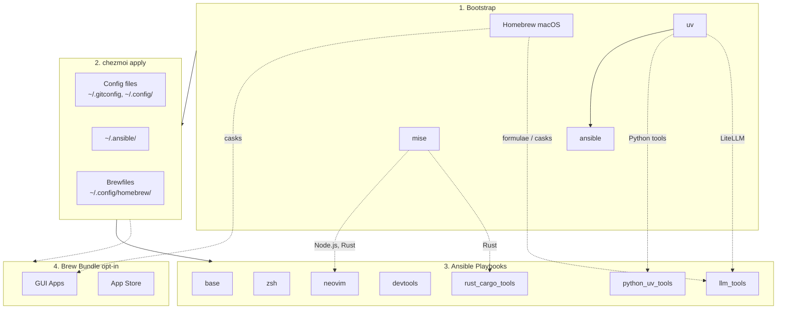

<!-- Generated by SpecStory, Markdown v2.1.0 -->

# 2026-04-03 09:05:05Z

<!-- Codex CLI Session 019d5295-767a-7fb0-84d5-485111e8b95c (2026-04-03 09:05:05Z) -->

_**User (2026-04-03 09:05:05Z)**_

brew install --cask opencode-desktop
我想把 OpenCode Desktop 也加入 recipe中
（不知道Codex Desktop有沒有了）
然後 Antigravity 也加入


---

_**Agent (gpt-5.4 2026-04-03 09:06:56Z)**_

先确认仓库里 Homebrew GUI apps 的现状，并按仓库要求读取 `td` 任务上下文。接着我会检查 Brewfile 模板、README 对应章节，以及 `opencode-desktop` / `antigravity` / `codex` 这几个 cask 目前是否真实可用，再给你一个可直接实施的变更计划。

_**Agent (gpt-5.4 2026-04-03 09:06:56Z)**_

<tool-use data-tool-type="shell" data-tool-name="exec_command"><details>
<summary>Tool use: **exec_command** `td usage --new-session`</summary>
```
Command: /bin/zsh -lc 'td usage --new-session'
Chunk ID: 21e594
Wall time: 0.0451 seconds
Process exited with code 0
Original token count: 471
Output:
You have access to `td`, a local task management CLI.

NEW SESSION: ses_5fcba2 on branch: main (previous: ses_1d4957)
  You are a new context. You can now review issues implemented by the previous session.

CURRENT SESSION: ses_5fcba2 [codex_37134] on branch: main

FOCUSED ISSUE: td-8991c5 "Add ghget zsh helper" [in_progress]
  Last handoff (4d ago):

WORKFLOW:

  1. `td start <id>` to begin work
     Multi-issue: `td ws start "name"` then `td ws tag <ids>`
  2. `td log "msg"` to track progress
     Multi-issue: `td ws log "msg"`
  3. `td handoff <id>` to capture state (REQUIRED)
     Multi-issue: `td ws handoff`
  4. `td review <id>` to submit for review
  5. Different session: `td approve <id>` to complete

  Use `td ws` commands when implementing multiple related issues.

KEY COMMANDS:
  td current              What you're working on
  td ws current           Current work session state
  td context <id>         Full context for resuming
  td next                 Highest priority open issue
  td critical-path        What unblocks the most work
  td reviewable           Issues you can review
  td approve/reject <id>  Complete review

IMPORTANT: You cannot approve issues you implemented.
  Exception: `td add "title" --minor` creates self-reviewable tasks.

WARNING: Do NOT use `td close` for completed work!
  Use `td review` -> `td approve` workflow instead.
  `td close` is for admin closures: duplicates, won't-fix, cleanup.

Use `td handoff` or `td ws handoff` before stopping work.

FOR LLMs: Run `td usage --new-session` at conversation start (or after /clear).
  Do NOT start a new session mid-work—sessions track implementers for review.
Use `td ws start` when implementing multiple issues to group handoffs.
  - session = identity (always exists)  |  ws = work container (optional)

TIP: Use `td usage -q` to hide these instructions after first read.
```
</details></tool-use>

_**Agent (gpt-5.4 2026-04-03 09:06:56Z)**_

<tool-use data-tool-type="shell" data-tool-name="exec_command"><details>
<summary>Tool use: **exec_command** `pwd && rg --files | rg 'Brewfile|README|chezmoi.toml|homebrew|brew'`</summary>
```
Command: /bin/zsh -lc "pwd && rg --files | rg 'Brewfile|README|chezmoi.toml|homebrew|brew'"
Chunk ID: 592fc8
Wall time: 0.0000 seconds
Process exited with code 0
Original token count: 96
Output:
/Users/daviddwlee84/.local/share/chezmoi
run_onchange_after_30_brew_bundle.sh.tmpl
run_once_before_02_fix_intel_homebrew.sh.tmpl
README.md
docs/input_methods/README.md
dot_ansible/roles/homebrew/tasks/main.yml
scripts/adhoc/check_brew_cast.sh
dot_config/homebrew/Brewfile.tmpl
dot_config/homebrew/Brewfile.darwin.tmpl
dot_config/homebrew/Brewfile.linux.tmpl
dot_config/nvim/README.md
```
</details></tool-use>

_**Agent (gpt-5.4 2026-04-03 09:07:07Z)**_

仓库里已经有 XDG 化的 Brewfile 模板和 README 说明。我先看现有 `Brewfile.darwin` 的分类和条件逻辑，再核对这些 cask 是否已经被仓库引用过，避免重复设计。

_**Agent (gpt-5.4 2026-04-03 09:07:07Z)**_

<tool-use data-tool-type="shell" data-tool-name="exec_command"><details>
<summary>Tool use: **exec_command** `td usage -q`</summary>
```
Command: /bin/zsh -lc 'td usage -q'
Chunk ID: 49bf40
Wall time: 0.0695 seconds
Process exited with code 0
Original token count: 51
Output:
You have access to `td`, a local task management CLI.

CURRENT SESSION: ses_5fcba2 [codex_37134] on branch: main

FOCUSED ISSUE: td-8991c5 "Add ghget zsh helper" [in_progress]
  Last handoff (4d ago):
```
</details></tool-use>

_**Agent (gpt-5.4 2026-04-03 09:07:07Z)**_

<tool-use data-tool-type="shell" data-tool-name="exec_command"><details>
<summary>Tool use: **exec_command** `sed -n '1,240p' dot_config/homebrew/Brewfile.darwin.tmpl`</summary>
```
Command: /bin/zsh -lc "sed -n '1,240p' dot_config/homebrew/Brewfile.darwin.tmpl"
Chunk ID: 898981
Wall time: 0.0000 seconds
Process exited with code 0
Original token count: 1509
Output:
# Brewfile.darwin - macOS GUI applications (casks) and Mac App Store apps
# Applied via: brew bundle --file=~/.config/homebrew/Brewfile.darwin
#
# This file is managed by chezmoi. Edit the source:
#   chezmoi edit ~/.config/homebrew/Brewfile.darwin

# =============================================================================
# Casks - Terminals & Editors
# =============================================================================
cask "alacritty"
# cask "iterm2"
cask "warp"
cask "cmux"
cask "cursor"
cask "visual-studio-code"

# =============================================================================
# Casks - AI & Coding Assistants
# =============================================================================
cask "claude"
cask "chatgpt"
# cask "chatgpt-atlas"  # Uncomment if needed
# Local LLM GUI runtime (also provides the `ollama` CLI)
{{ if and .installBrewApps .installLlmTools -}}
cask "ollama-app"
{{ end -}}
# cask "termius"          # SSH client

# =============================================================================
# Casks - System Utilities
# =============================================================================
cask "nikitabobko/tap/aerospace"  # Tiling window manager
cask "alt-tab"                     # Windows-style alt-tab
cask "raycast"                     # Spotlight replacement
# cask "itsycal"                     # Menu bar calendar
# cask "jordanbaird-ice"             # Menu bar manager (Ice.app)
cask "scroll-reverser"             # Reverse scroll direction per device
# cask "sloth"                       # Process/file viewer
cask "the-unarchiver"              # Archive extraction
cask "applite"                     # GUI for Homebrew casks

# =============================================================================
# Casks - Communication
# =============================================================================
# cask "discord"  # Commented out - install manually from discord.com
# cask "messenger"
# cask "telegram"
# cask "wechat"   # We used to install WeChat using Apple Store (TODO: maybe use mas?! but that would need login...)
# cask "whatsapp"
# cask "dingtalk"
# cask "tencent-meeting"  # TencentMeeting.app

# =============================================================================
# Casks - Browsers
# =============================================================================
cask "arc"
# cask "google-chrome"
# cask "tor-browser"

# =============================================================================
# Casks - Productivity
# =============================================================================
cask "obsidian"
cask "google-drive"
cask "grammarly-desktop"
# cask "readest"              # E-book reader
cask "super-productivity"   # Task/time management
# cask "wispr-flow"           # Voice typing
# cask "mathpix-snipping-tool"

# =============================================================================
# Casks - Media & Entertainment
# =============================================================================
cask "spotify"
cask "anki"

# =============================================================================
# Casks - Gaming (skip on work machines)
# =============================================================================
# {{ if not (env "WORK_MACHINE") -}}
# cask "steam"
# cask "minecraft"
# cask "battle-net"
# cask "hstracker"  # Hearthstone deck tracker
# {{- end }}

# =============================================================================
# Casks - Finance & Trading
# =============================================================================
# cask "binance"
# cask "tradingview"

# =============================================================================
# Casks - Network & VPN
# =============================================================================
# Tailscale is managed via Mac App Store (mas) below to avoid pkg sudo prompts.
# cask "openvpn-connect"
# cask "vibetunnel"
# cask "clash-verge-rev"  # Clash proxy GUI (replacement for Clash for Windows)

# =============================================================================
# Casks - Virtualization & Remote
# =============================================================================
# cask "virtualbox"
# cask "windows-app"      # Microsoft Remote Desktop
# cask "teamviewer-host"
# cask "sharemouse"       # KVM software

# =============================================================================
# Casks - Developer Tools
# =============================================================================
# Note: docker/orbstack is managed by ansible docker role
cask "dbeaver-community"
cask "superset-sh/superset/superset"

# =============================================================================
# Casks - Cloud Storage (Chinese apps)
# ==
... (truncated)
```
</details></tool-use>

_**Agent (gpt-5.4 2026-04-03 09:07:07Z)**_

<tool-use data-tool-type="shell" data-tool-name="exec_command"><details>
<summary>Tool use: **exec_command** `sed -n '1,260p' README.md`</summary>
```
Command: /bin/zsh -lc "sed -n '1,260p' README.md"
Chunk ID: b105ce
Wall time: 0.0000 seconds
Process exited with code 0
Original token count: 2640
Output:
# dotfiles

Cross-platform development environment setup using **chezmoi** + **ansible**.

- **chezmoi**: manages config files (dotfiles)
- **ansible**: installs system dependencies and tools

## Prerequisites

- [chezmoi](https://www.chezmoi.io/install/)
- [uv](https://docs.astral.sh/uv/getting-started/installation/) (for ansible)

## Architecture



## Quick Setup

```bash
# One-liner to initialize and apply (installs chezmoi to ~/.local/bin)
export GITHUB_USERNAME=daviddwlee84
sh -c "$(curl -fsLS get.chezmoi.io)" -- -b "$HOME/.local/bin" init --apply git@github.com:$GITHUB_USERNAME/dotfiles.git
```

This automatically:

1. Bootstraps Homebrew (macOS/Linux), uv, mise, ansible
2. Deploys all config files
3. Runs ansible playbooks (git, ripgrep, fd, neovim, etc.)
4. Runs brew bundle (if `installBrewApps` enabled)

### Optional Components

During `chezmoi init`, you'll be prompted for optional installs:

| Option | Default | Description |
|--------|---------|-------------|
| `installCodingAgents` | true | Claude Code, Codex CLI, OpenCode, Cursor, Copilot, Gemini CLI, RTK, td, sidecar, specify-cli, etc. |
| `installBitwarden` | false | Bitwarden CLI (`bw`) + Desktop app (desktop profiles) with SSH agent auto-detection |
| `installPythonUvTools` | true | Python CLI tools via uv (mlflow, sqlit-tui, tmuxp, etc.) |
| `installLlmTools` | false | Local LLM tools: Ollama, LiteLLM, llmfit, models |
| `installBrewApps` | false | GUI apps via Homebrew Brewfile (casks, mas) |
| `installInputMethod` | false | Traditional Chinese input methods (McBopomofo, RIME/Squirrel on macOS; ibus-rime on Linux) |
| `installNetworkingTools` | false | Networking CLI tools (nmap, mtr, httpie, gping, trippy, bandwhich, rustscan, etc.) |
| `noRoot` | false | Skip sudo-requiring tasks (for servers without root access) |

To change options later: `chezmoi init --force`

## What You Get

### Config Files

- `~/.gitconfig` - Git configuration
- `~/.config/git/hooks/` - Global Git hooks (pre-commit + Git LFS hooks)
- `~/.config/gh-dash/config.yml` - Global gh-dash config, with `diffnav` as the diff pager
- `~/.config/lazygit/config.yml` - Global LazyGit config, with `delta` as the custom diff pager
- `~/.config/bat/themes/tokyonight_night.tmTheme` - Managed Tokyo Night theme for bat
- `~/.config/nvim/` - Neovim (LazyVim) configuration
- `~/.config/uv/uv.toml` - uv package manager config
- `~/.cargo/config.toml` - Cargo registry mirror config (GFW)
- `~/.npmrc` - npm registry config (official/npmmirror via `useChineseMirror`)
- `~/.config/.bunfig.toml` - Bun global registry config (official/npmmirror via `useChineseMirror`)
- `~/.config/alacritty/` - Alacritty terminal config
- `~/.config/starship.toml` - Starship cross-shell prompt config
- `~/.config/direnv/direnvrc` - direnv helper functions, including `.venv`-aware Python activation
- `~/.config/yazi/` - Yazi file manager config (v0.3.3+ syntax, [docs](https://yazi-rs.github.io/docs/configuration/overview/))
  - `yazi.toml` - Main config with open rules and openers (`o`/`O`)
  - `keymap.toml`, `theme.toml` - Optional customization files (stubs provided)
- `~/.claude/` - Claude Code settings
- `~/.specstory/cli/config.toml` - Global SpecStory defaults for `specstory run` across all projects
- `~/.tmux.conf` - Tmux configuration with TPM plugins, tmux-which-key (`prefix+Space`), vim-style pane nav, extended-keys for coding agents, sesh keybindings (`prefix+T` picker, `prefix+S` last)
- `~/.local/bin/x` - Cross-platform terminal wrapper for `copy` / `paste` / `open`
- `~/.config/sesh/sesh.toml` - Sesh session manager config (named sessions, wildcards, defaults) ([docs](docs/sesh.md))
- `~/.config/zsh/tools/22_sesh.zsh` - Sesh keybinding (`Alt+S` for session picker) + shell completion
- `~/.config/zsh/tools/36_pueue.zsh` - Pueue queue summary helper (`pqsum`)
- `~/.config/zsh/tools/41_github.zsh` - GitHub helper with `ghget` f
... (truncated)
```
</details></tool-use>

_**Agent (gpt-5.4 2026-04-03 09:07:07Z)**_

<tool-use data-tool-type="shell" data-tool-name="exec_command"><details>
<summary>Tool use: **exec_command** `rg -n "opencode|codex|antigravity|OpenCode|Codex|Antigravity" -S .`</summary>
```
Command: /bin/zsh -lc 'rg -n "opencode|codex|antigravity|OpenCode|Codex|Antigravity" -S .'
Chunk ID: dfa453
Wall time: 0.0000 seconds
Process exited with code 0
Original token count: 4167
Output:
Total output lines: 163

./dot_tmux.conf:77:# Claude Code, OpenCode, Neovim, and other modern terminal applications.
./CLAUDE.md:135:| `coding_agents` | Claude Code, OpenCode, Cursor CLI, Copilot CLI, Gemini CLI, RTK, SpecStory |
./CLAUDE.md:180:- **npm tools**: Claude Code, OpenCode, Gemini CLI, Bitwarden CLI, etc.
./private_dot_specstory/private_cli/config.toml:73:# Codex CLI command
./private_dot_specstory/private_cli/config.toml:74:codex_cmd = 'codex -c model_reasoning_effort="high" --ask-for-approval never --sandbox danger-full-access -c model_reasoning_summary="detailed" -c model_supports_reasoning_summaries=true'
./README.md:75:| `installCodingAgents` | true | Claude Code, Codex CLI, OpenCode, Cursor, Copilot, Gemini CLI, RTK, td, sidecar, specify-cli, etc. |
./README.md:138:- **Coding Agents** (optional): Claude Code, Codex CLI, CodexBar, OpenCode, Cursor CLI, Copilot CLI, Gemini CLI, RTK, SpecStory, OpenChamber, td, sidecar, specify-cli
./docs/zsh/zsh-completions.md:45:| `opencode` | `opencode completion zsh` |
./docs/zsh/zsh-completions.md:137:command -v opencode && opencode completion zsh > ~/.zfunc/_opencode
./docs/tools/td_sidecar.md:205:  不同 agent (Claude, Codex, Cursor) 各自開 session
./docs/tools/codexbar.md:1:# CodexBar CLI
./docs/tools/codexbar.md:3:[CodexBar](https://github.com/steipete/CodexBar) shows usage stats for AI coding tools (Codex, Claude Code, Cursor, Gemini, Copilot, etc.) without logging into each dashboard.
./docs/tools/codexbar.md:10:Installed automatically via the `coding_agents` ansible role. On Linux, the binary is placed at `~/.local/bin/codexbar`.
./docs/tools/codexbar.md:20:codexbar usage --provider claude --source cli
./docs/tools/codexbar.md:23:codexbar usage --provider codex --source cli
./docs/tools/codexbar.md:24:codexbar usage --provider gemini --source cli
./docs/tools/codexbar.md:25:codexbar usage --provider copilot --source cli
./docs/tools/codexbar.md:28:codexbar usage --provider claude --source cli --json --pretty
./docs/tools/codexbar.md:44:codexbar cost
./docs/tools/codexbar.md:47:codexbar cost --provider claude
./docs/tools/codexbar.md:50:codexbar cost --provider claude --json --pretty
./docs/tools/codexbar.md:53:codexbar cost --refresh
./docs/tools/codexbar.md:66:Defined in `~/.config/zsh/tools/40_codexbar.zsh`:
./docs/tools/codexbar.md:70:| `cbu` | `codexbar usage --provider claude --source cli` | Claude usage |
./docs/tools/codexbar.md:71:| `cbc` | `codexbar cost --provider claude` | Claude local cost |
./docs/tools/codexbar.md:72:| `cbca` | `codexbar cost` | All providers local cost |
./docs/tools/codexbar.md:76:`codex`, `claude`, `cursor`, `opencode`, `factory`, `gemini`, `antigravity`, `copilot`, `zai`, `minimax`, `kimi`, `kiro`, `vertexai`, `augment`, `jetbrains`, `kimik2`, `amp`
./docs/tools/codexbar.md:83:- Config file: `~/.codexbar/config.json`
./dot_config/zsh/tools/42_gitlab.zsh:49:# Supported agents: opencode (default), claude, codex, cursor-agent
./dot_config/zsh/tools/42_gitlab.zsh:66:  local group="" desc="" agent="${GLCREATE_AGENT:-opencode}" lang="${GLCREATE_LANG:-zh}"
./dot_config/zsh/tools/42_gitlab.zsh:78:    echo "Usage: glcreate-ai <group> [description] [--agent opencode|claude|codex|cursor-agent] [--lang zh|en]"
./dot_config/zsh/tools/42_gitlab.zsh:79:    echo "  Set GLCREATE_AGENT env var to change default agent (default: opencode)"
./dot_config/zsh/tools/42_gitlab.zsh:100:    opencode)       opencode run "$prompt" ;;
./dot_config/zsh/tools/42_gitlab.zsh:102:    codex)          codex exec "$prompt" ;;
./docs/tools/specstory.md:31:- `codex_cmd = 'codex -c model_reasoning_effort="high" --ask-for-approval never --sandbox danger-full-access -c model_reasoning_summary="detailed" -c model_supports_reasoning_summaries=true'`
./docs/tools/specstory.md:36:These are the commands `specstory run claude`, `specstory run codex`, and similar provider shortcuts will execute by default unless overridden per project or on the command line.
./docs/tools/specstory.md:43:- Codex uses `--ask-for-approval never` and `--sandbox danger-full-access`
./docs/tools/specstory.md:53:specstory run codex --help
./docs/initial_setup/0_ManualSetupRecord.md:114:- [slopus/happy: Mobile and Web client for Codex and Claude Code, with realtime voice, encryption and fully featured](https://github.com/slopus/happy)
./docs/initial_setup/0_ManualSetupRecord.md:115:- [btriapitsyn/openchamber: Desktop and web interface for OpenCode AI agent](https://github.com/btriapitsyn/openchamber)
./docs/initial_setup/0_ManualSetupRecord.md:116:  - [Happy Coder for OpenCode : r/opencodeCLI](https://www.reddit.com/r/opencodeCLI/comments/1qho03o/happy_coder_for_opencode/)
./docs/initial_setup/0_ManualSetupRecord.md:117:  - [OpenCode Support · Issue #265 · slopus/happy](https://github.com/
... (truncated)
```
</details></tool-use>

_**Agent (gpt-5.4 2026-04-03 09:07:38Z)**_

这三个目标都像是 `Brewfile.darwin.tmpl` 里的 GUI cask 变更，不像 ansible role 变更。我再确认一下本地 Homebrew 也认识这些 cask，并看一下 Brewfile 的渲染/开关方式，这样计划里能把放置位置和条件逻辑定死。

_**Agent (gpt-5.4 2026-04-03 09:07:38Z)**_

<tool-use data-tool-type="shell" data-tool-name="exec_command"><details>
<summary>Tool use: **exec_command** `brew info --cask opencode-desktop antigravity codex-app`</summary>
```
Command: /bin/zsh -lc 'brew info --cask opencode-desktop antigravity codex-app'
Chunk ID: 379c48
Wall time: 1.0025 seconds
Process running with session ID 35031
Original token count: 0
Output:
```
</details></tool-use>

_**Agent (gpt-5.4 2026-04-03 09:07:38Z)**_

<tool-use data-tool-type="shell" data-tool-name="exec_command"><details>
<summary>Tool use: **exec_command** `sed -n '1,220p' dot_config/homebrew/Brewfile.tmpl`</summary>
```
Command: /bin/zsh -lc "sed -n '1,220p' dot_config/homebrew/Brewfile.tmpl"
Chunk ID: 41cd9a
Wall time: 0.0000 seconds
Process exited with code 0
Original token count: 278
Output:
# Brewfile - Shared configuration (macOS & Linux)
# Applied via: brew bundle --file=~/.config/homebrew/Brewfile
#
# This file is managed by chezmoi. Edit the source:
#   chezmoi edit ~/.config/homebrew/Brewfile

# =============================================================================
# Taps (Third-party repositories)
# =============================================================================
tap "nikitabobko/tap"  # aerospace (macOS window manager)
tap "superset-sh/superset"

# =============================================================================
# Formulas - CLI Tools (cross-platform)
# =============================================================================
# Note: Most CLI tools are managed by ansible for better cross-platform support
# Only add formulas here that you want to manage via Brewfile

# The following Formulas are MacOS only
{{ if or (eq .profile "macos") (eq .profile "macos_intel") -}}
# Mac App Store CLI (needed for mas entries in Brewfile.darwin)
brew "mas"
brew "tailscale"  # Tailscale CLI (desktop app is installed via mas in Brewfile.darwin)
{{ end -}}
```
</details></tool-use>

_**Agent (gpt-5.4 2026-04-03 09:07:38Z)**_

<tool-use data-tool-type="shell" data-tool-name="exec_command"><details>
<summary>Tool use: **exec_command** `sed -n '1,240p' .chezmoi.toml.tmpl`</summary>
```
Command: /bin/zsh -lc "sed -n '1,240p' .chezmoi.toml.tmpl"
Chunk ID: fac44a
Wall time: 0.0000 seconds
Process exited with code 0
Original token count: 751
Output:
# https://www.chezmoi.io/reference/special-files/chezmoi-format-tmpl/

[data]
# 只在 init 才需要問一次：你之後都讀這個值
# TODO: not all the things we want to change all the time we chezmoi init
profile = {{ promptStringOnce . "profile" "profile (ubuntu_server|ubuntu_desktop|macos|macos_intel)" "macos" | quote }}
email   = {{ promptStringOnce . "email" "What is your email address" "daviddwlee84@gmail.com" | quote }}
name    = {{ promptStringOnce . "name" "What is your full name" "Da-Wei Lee" | quote }}
# 是否在中國大陸 GFW 內，需要使用鏡像源
useChineseMirror = {{ promptBoolOnce . "useChineseMirror" "Are you in China (behind GFW) and need to use mirrors" false }}
# 是否對所有 repo 啟用 gitleaks 掃描（包含沒有 .pre-commit-config.yaml 的 repo）
gitleaksAllRepos = {{ promptBoolOnce . "gitleaksAllRepos" "Enable gitleaks for ALL git repos (not just those with .pre-commit-config.yaml)" false }}
# 是否安裝 coding agents (Claude Code, OpenCode, Cursor, Copilot, Gemini, etc.)
installCodingAgents = {{ promptBoolOnce . "installCodingAgents" "Install coding agents (Claude Code, OpenCode, Cursor, Copilot, Gemini, etc.)" true }}
# 是否安裝 Bitwarden CLI 並啟用 SSH Agent 自動偵測 + Zsh completion
installBitwarden = {{ promptBoolOnce . "installBitwarden" "Install Bitwarden CLI (@bitwarden/cli) with SSH Agent integration and Zsh completion" false }}
# 是否安裝 Python CLI tools via uv (mlflow, sqlit-tui, tmuxp, etc.)
installPythonUvTools = {{ promptBoolOnce . "installPythonUvTools" "Install Python CLI tools via uv (mlflow, sqlit-tui, tmuxp, etc.)" true }}
# 是否安裝本地 LLM tools (Ollama, LiteLLM, llmfit, models)
installLlmTools = {{ promptBoolOnce . "installLlmTools" "Install local LLM tools (Ollama, LiteLLM, llmfit, models)" false }}
# 是否安裝 GUI apps via Homebrew Brewfile (terminals, browsers, utilities, etc.)
installBrewApps = {{ promptBoolOnce . "installBrewApps" "Install GUI apps via Homebrew Brewfile (casks, mas)" false }}
# 是否安裝繁體中文輸入法 (McBopomofo + RIME)
installInputMethod = {{ promptBoolOnce . "installInputMethod" "Install Traditional Chinese input methods (McBopomofo, RIME)" false }}
# 是否安裝網路診斷工具 (nmap, mtr, httpie, gping, trippy, etc.)
installNetworkingTools = {{ promptBoolOnce . "installNetworkingTools" "Install networking CLI tools (nmap, mtr, httpie, gping, trippy, etc.)" false }}
# 沒有 sudo/root 權限，只安裝 user-level 工具 (mise, cargo, gem, uv, npm)
noRoot = {{ promptBoolOnce . "noRoot" "No sudo/root access - skip all system package installations" false }}
# 在 chezmoi apply 之前備份現有的 dotfiles
backupDotfiles = {{ promptBoolOnce . "backupDotfiles" "Backup existing dotfiles before chezmoi overwrites them" true }}

# https://www.chezmoi.io/user-guide/use-scripts-to-perform-actions/#dont-show-scripts-that-would-run-in-chezmoi-diffchezmoi-status
[diff]
    exclude = ["scripts"]
[status]
    exclude = ["scripts"]
```
</details></tool-use>

_**Agent (gpt-5.4 2026-04-03 09:07:38Z)**_

<tool-use data-tool-type="shell" data-tool-name="exec_command"><details>
<summary>Tool use: **exec_command** `rg -n "installBrewApps|installCodingAgents|claude|chatgpt|ollama-app" -S dot_config/homebrew README.md .chezmoi.toml.tmpl`</summary>
```
Command: /bin/zsh -lc 'rg -n "installBrewApps|installCodingAgents|claude|chatgpt|ollama-app" -S dot_config/homebrew README.md .chezmoi.toml.tmpl'
Chunk ID: ab258c
Wall time: 0.0000 seconds
Process exited with code 0
Original token count: 380
Output:
.chezmoi.toml.tmpl:14:installCodingAgents = {{ promptBoolOnce . "installCodingAgents" "Install coding agents (Claude Code, OpenCode, Cursor, Copilot, Gemini, etc.)" true }}
.chezmoi.toml.tmpl:22:installBrewApps = {{ promptBoolOnce . "installBrewApps" "Install GUI apps via Homebrew Brewfile (casks, mas)" false }}
README.md:67:4. Runs brew bundle (if `installBrewApps` enabled)
README.md:75:| `installCodingAgents` | true | Claude Code, Codex CLI, OpenCode, Cursor, Copilot, Gemini CLI, RTK, td, sidecar, specify-cli, etc. |
README.md:79:| `installBrewApps` | false | GUI apps via Homebrew Brewfile (casks, mas) |
README.md:106:- `~/.claude/` - Claude Code settings
README.md:121:- `~/.config/tmuxp/claude-sidecar.yaml` - tmuxp workspace for Claude + Sidecar
README.md:123:- `~/.config/zellij/layouts/claude-sidecar.kdl` - Zellij layout for Claude + Sidecar
README.md:145:- **GUI Apps** (macOS): terminals, editors, browsers, network tools, utilities via Brewfile (Tailscale Desktop via Mac App Store `mas`, avoids pkg sudo prompt; Tailscale CLI via `brew "tailscale"` in shared Brewfile; `ollama-app` when `installBrewApps=true` and `installLlmTools=true`)
dot_config/homebrew/Brewfile.darwin.tmpl:20:cask "claude"
dot_config/homebrew/Brewfile.darwin.tmpl:21:cask "chatgpt"
dot_config/homebrew/Brewfile.darwin.tmpl:22:# cask "chatgpt-atlas"  # Uncomment if needed
dot_config/homebrew/Brewfile.darwin.tmpl:24:{{ if and .installBrewApps .installLlmTools -}}
dot_config/homebrew/Brewfile.darwin.tmpl:25:cask "ollama-app"
```
</details></tool-use>

_**Agent (gpt-5.4 2026-04-03 09:07:51Z)**_

<tool-use data-tool-type="unknown" data-tool-name="write_stdin"><details>
<summary>Tool use: **write_stdin**</summary>
```
Command: /bin/zsh -lc 'brew info --cask opencode-desktop antigravity codex-app'
Chunk ID: 9fcd46
Wall time: 0.0000 seconds
Process exited with code 0
Original token count: 315
Output:
==> opencode-desktop: 1.3.13 (auto_updates)
https://opencode.ai/
Installed
/opt/homebrew/Caskroom/opencode-desktop/1.3.13 (146.3MB)
  Installed using the formulae.brew.sh API on 2026-04-03 at 14:52:28
From: https://github.com/Homebrew/homebrew-cask/blob/HEAD/Casks/o/opencode-desktop.rb
==> Name
OpenCode
==> Description
AI coding agent desktop client
==> Artifacts
OpenCode.app (App)
==> Analytics
install: 7,288 (30 days), 26,292 (90 days), 28,576 (365 days)

==> antigravity: 1.21.9,4905428782546944 (auto_updates)
https://antigravity.google/
Not installed
From: https://github.com/Homebrew/homebrew-cask/blob/HEAD/Casks/a/antigravity.rb
==> Name
Google Antigravity
==> Description
AI Coding Agent IDE
==> Artifacts
Antigravity.app (App)
/opt/homebrew/Caskroom/antigravity/1.21.9,4905428782546944/agy.wrapper.sh -> agy (Binary)
==> Analytics
install: 5,864 (30 days), 20,689 (90 days), 35,520 (365 days)

==> codex-app: 26.325.31654 (auto_updates)
https://openai.com/codex
Not installed
From: https://github.com/Homebrew/homebrew-cask/blob/HEAD/Casks/c/codex-app.rb
==> Name
Codex
==> Description
OpenAI's Codex desktop app for managing coding agents
==> Artifacts
Codex.app (App)
==> Analytics
install: 5,118 (30 days), 11,944 (90 days), 11,944 (365 days)
```
</details></tool-use>

_**Agent (gpt-5.4 2026-04-03 09:08:19Z)**_

发现一个实现细节会影响方案：`codex-app` 目前是 Apple Silicon 专属 cask，而仓库同时支持 `macos` 和 `macos_intel`。我先看一下 brew bundle 的执行方式，判断这些条目需不需要做 profile 条件保护。

_**Agent (gpt-5.4 2026-04-03 09:08:19Z)**_

<tool-use data-tool-type="shell" data-tool-name="exec_command"><details>
<summary>Tool use: **exec_command** `sed -n '1,240p' run_onchange_after_30_brew_bundle.sh.tmpl`</summary>
```
Command: /bin/zsh -lc "sed -n '1,240p' run_onchange_after_30_brew_bundle.sh.tmpl"
Chunk ID: 9638b1
Wall time: 0.0000 seconds
Process exited with code 0
Original token count: 875
Output:
#!/bin/bash
# Run brew bundle when Brewfiles change
# Only runs if installBrewApps is enabled
# Profile: {{ .profile }}
# installBrewApps: {{ .installBrewApps }}

{{ if not .installBrewApps -}}
# Brew apps installation is disabled (installBrewApps = false)
# To enable, run: chezmoi init --force
exit 0
{{ end -}}

{{ if or (eq .profile "macos") (eq .profile "macos_intel") -}}
# === Brewfile Hashes (changes trigger re-run) ===
# Brewfile: {{ include "dot_config/homebrew/Brewfile.tmpl" | sha256sum }}
# Brewfile.darwin: {{ include "dot_config/homebrew/Brewfile.darwin.tmpl" | sha256sum }}
{{ else -}}
# === Brewfile Hashes (changes trigger re-run) ===
# Brewfile: {{ include "dot_config/homebrew/Brewfile.tmpl" | sha256sum }}
# Brewfile.linux: {{ include "dot_config/homebrew/Brewfile.linux.tmpl" | sha256sum }}
{{ end -}}

set -e

# Colors
RED='\033[0;31m'
GREEN='\033[0;32m'
YELLOW='\033[1;33m'
BLUE='\033[0;34m'
NC='\033[0m'

info() { echo -e "${BLUE}[INFO]${NC} $1"; }
success() { echo -e "${GREEN}[SUCCESS]${NC} $1"; }
warn() { echo -e "${YELLOW}[WARN]${NC} $1"; }
error() { echo -e "${RED}[ERROR]${NC} $1"; }

# Setup Homebrew PATH
{{ if or (eq .profile "macos") (eq .profile "macos_intel") -}}
if [[ -f /opt/homebrew/bin/brew ]]; then
    eval "$(/opt/homebrew/bin/brew shellenv)"
elif [[ -f /usr/local/bin/brew ]]; then
    eval "$(/usr/local/bin/brew shellenv)"
fi
{{ else -}}
# Linuxbrew
if [[ -d /home/linuxbrew/.linuxbrew ]]; then
    eval "$(/home/linuxbrew/.linuxbrew/bin/brew shellenv)"
elif [[ -d "$HOME/.linuxbrew" ]]; then
    eval "$("$HOME/.linuxbrew/bin/brew" shellenv)"
fi
{{ end -}}

# Check if brew is available
if ! command -v brew &> /dev/null; then
    {{ if or (eq .profile "macos") (eq .profile "macos_intel") -}}
    error "Homebrew not found. It should have been installed by bootstrap."
    exit 1
    {{ else -}}
    warn "Homebrew (Linuxbrew) not installed. Skipping brew bundle."
    warn "To install: /bin/bash -c \"\$(curl -fsSL https://raw.githubusercontent.com/Homebrew/install/HEAD/install.sh)\""
    exit 0
    {{ end -}}
fi

BREWFILE_DIR="$HOME/.config/homebrew"

# Check if Brewfiles exist
if [[ ! -f "$BREWFILE_DIR/Brewfile" ]]; then
    warn "Brewfile not found at $BREWFILE_DIR/Brewfile"
    warn "Run 'chezmoi apply' to deploy Brewfiles first."
    exit 0
fi

info "Running brew bundle..."

# Run shared Brewfile first (installs mas, taps)
info "Installing shared packages from Brewfile..."
brew bundle --file="$BREWFILE_DIR/Brewfile" --no-upgrade || {
    warn "Some packages in Brewfile failed to install (continuing...)"
}

# Run platform-specific Brewfile
{{ if or (eq .profile "macos") (eq .profile "macos_intel") -}}
if [[ -f "$BREWFILE_DIR/Brewfile.darwin" ]]; then
    info "Installing macOS packages from Brewfile.darwin..."
    brew bundle --file="$BREWFILE_DIR/Brewfile.darwin" --no-upgrade || {
        warn "Some packages in Brewfile.darwin failed to install (continuing...)"
    }
fi

# Remind about mas sign-in
if command -v mas &> /dev/null; then
    if ! mas account &> /dev/null; then
        warn "Not signed in to Mac App Store."
        warn "Sign in via App Store.app to install mas apps."
    fi
fi
{{ else -}}
if [[ -f "$BREWFILE_DIR/Brewfile.linux" ]]; then
    info "Installing Linux packages from Brewfile.linux..."
    brew bundle --file="$BREWFILE_DIR/Brewfile.linux" --no-upgrade || {
        warn "Some packages in Brewfile.linux failed to install (continuing...)"
    }
fi
{{ end -}}

success "Brew bundle complete!"
```
</details></tool-use>

_**Agent (gpt-5.4 2026-04-03 09:08:19Z)**_

<tool-use data-tool-type="shell" data-tool-name="exec_command"><details>
<summary>Tool use: **exec_command** `sed -n '1,260p' dot_config/homebrew/Brewfile.linux.tmpl`</summary>
```
Command: /bin/zsh -lc "sed -n '1,260p' dot_config/homebrew/Brewfile.linux.tmpl"
Chunk ID: 91494f
Wall time: 0.0000 seconds
Process exited with code 0
Original token count: 357
Output:
# Brewfile.linux - Linux-specific Homebrew (Linuxbrew) packages
# Applied via: brew bundle --file=~/.config/homebrew/Brewfile.linux
#
# This file is managed by chezmoi. Edit the source:
#   chezmoi edit ~/.config/homebrew/Brewfile.linux
#
# Note: Most packages on Linux are managed by apt/ansible.
# This file is for Linuxbrew-specific additions that aren't easily
# available via apt or provide better/newer versions.

# =============================================================================
# Formulas - CLI tools better installed via Linuxbrew
# =============================================================================
# Uncomment as needed - most are already handled by ansible

# brew "gh"           # GitHub CLI (newer version than apt)
# brew "bat"          # Better cat with syntax highlighting
# brew "eza"          # Modern ls replacement
# brew "fd"           # Better find
# brew "ripgrep"      # Better grep
# brew "fzf"          # Fuzzy finder
# brew "lazygit"      # Terminal UI for git

# =============================================================================
# Linux-compatible casks (limited availability)
# =============================================================================
# Note: Most casks are macOS-only. Only fonts and a few tools work on Linux.

# Fonts (if you prefer Homebrew over manual install)
# cask "font-hack-nerd-font"  # Already managed by ansible nerdfonts role
```
</details></tool-use>

_**Agent (gpt-5.4 2026-04-03 09:08:19Z)**_

<tool-use data-tool-type="shell" data-tool-name="exec_command"><details>
<summary>Tool use: **exec_command** `rg -n "macos_intel|profile ==|eq \.profile \"macos\"|eq \.profile \"macos_intel\"" -S .`</summary>
```
Command: /bin/zsh -lc "rg -n \"macos_intel|profile ==|eq \\.profile \\\"macos\\\"|eq \\.profile \\\"macos_intel\\\"\" -S ."
Chunk ID: e731dd
Wall time: 0.0000 seconds
Process exited with code 0
Original token count: 436
Output:
./run_onchange_after_20_ansible_roles.sh.tmpl:39:{{ if or (eq .profile "macos") (eq .profile "macos_intel") -}}
./run_onchange_after_20_ansible_roles.sh.tmpl:74:{{ if or (eq .profile "macos") (eq .profile "macos_intel") -}}
./run_onchange_after_20_ansible_roles.sh.tmpl:117:{{ if and $installBitwarden (or (eq .profile "ubuntu_desktop") (eq .profile "macos") (eq .profile "macos_intel")) -}}
./run_onchange_after_20_ansible_roles.sh.tmpl:133:{{ if and (ne .profile "macos") (ne .profile "macos_intel") -}}
./run_onchange_after_25_bat_theme.sh.tmpl:8:{{ if or (eq .profile "macos") (eq .profile "macos_intel") -}}
./dot_zshrc.tmpl:42:{{ if eq .profile "macos_intel" -}}
./dot_config/zsh/00_exports.zsh.tmpl:26:{{ if or (eq .profile "macos") (eq .profile "macos_intel") -}}
./dot_config/homebrew/Brewfile.tmpl:20:{{ if or (eq .profile "macos") (eq .profile "macos_intel") -}}
./docs/tutorials/bitwarden_ssh_agent.md:14:- **Desktop app**: on desktop profiles only (`ubuntu_desktop`, `macos`, `macos_intel`)
./run_once_before_00_bootstrap.sh.tmpl:35:{{ if or (eq .profile "macos") (eq .profile "macos_intel") -}}
./run_once_before_00_bootstrap.sh.tmpl:58:{{ if or (eq .profile "macos") (eq .profile "macos_intel") -}}
./run_onchange_after_30_brew_bundle.sh.tmpl:13:{{ if or (eq .profile "macos") (eq .profile "macos_intel") -}}
./run_onchange_after_30_brew_bundle.sh.tmpl:38:{{ if or (eq .profile "macos") (eq .profile "macos_intel") -}}
./run_onchange_after_30_brew_bundle.sh.tmpl:55:    {{ if or (eq .profile "macos") (eq .profile "macos_intel") -}}
./run_onchange_after_30_brew_bundle.sh.tmpl:83:{{ if or (eq .profile "macos") (eq .profile "macos_intel") -}}
./run_once_before_02_fix_intel_homebrew.sh.tmpl:6:{{ if ne .profile "macos_intel" -}}
```
</details></tool-use>

_**Agent (gpt-5.4 2026-04-03 09:08:36Z)**_

我已经核实了当前可用性：`opencode-desktop`、`antigravity`、`codex-app` 都存在于 Homebrew Cask；其中 `codex-app` 目前要求 `macOS >= 12` 且仅支持 `Arm 64-bit`，所以不能直接无条件加到同时覆盖 `macos_intel` 的 `Brewfile.darwin.tmpl`。下面两个选择会直接决定最终方案。

_**Agent (gpt-5.4 2026-04-03 09:08:40Z)**_

<tool-use data-tool-type="unknown" data-tool-name="request_user_input"><details>
<summary>Tool use: **request_user_input**</summary>

**Input:**

- questions: `[map[header:Codex App id:codex_app_policy options:[map[description:在 Apple Silicon `macos` profile 下加入 `codex-app`，`macos_intel` 自动跳过。 label:Arm-only add (Recommended)] map[description:这次只加 `opencode-desktop` 和 `antigravity`，先不碰 `codex-app`。 label:Skip Codex app] map[description:无条件加入所有 macOS profile，但 Intel 机器上的 brew bundle 可能报失败。 label:Always add]] question:`codex-app` 要怎么处理？] map[header:Install Gate id:install_gate_policy options:[map[description:只跟现有 `installBrewApps` 走，和 `claude` / `chatgpt` 保持一致。 label:BrewApps only (Recommended)] map[description:只有 `installBrewApps=true` 且 `installCodingAgents=true` 时才安装，缩小默认安装面。 label:Also require CodingAgents] map[description:OpenCode/Antigravity/Codex 分别走不同条件，需要在计划里单独写清。 label:Mixed policy]] question:这几个 AI desktop apps 的安装开关要怎么挂？]]`

**Result:**

</details></tool-use>

_**Agent (gpt-5.4 2026-04-03 09:11:50Z)**_

第二个回答看起来像是想“新增”一个独立开关。如果你是这个意思，方案会从“只改 Brewfile”升级成“新增 chezmoi prompt + Dockerfile + README 同步”。我先看一下 Dockerfile 现在怎么传这些 prompt，然后把这个选择问清。

_**Agent (gpt-5.4 2026-04-03 09:11:50Z)**_

<tool-use data-tool-type="shell" data-tool-name="exec_command"><details>
<summary>Tool use: **exec_command** `sed -n '100,170p' Dockerfile`</summary>
```
Command: /bin/zsh -lc "sed -n '100,170p' Dockerfile"
Chunk ID: 33c8f9
Wall time: 0.0000 seconds
Process exited with code 0
Original token count: 611
Output:
USER devuser
WORKDIR /home/devuser

# Install chezmoi binary
# Retry up to 3 times to handle network issues (especially behind GFW)
RUN for i in 1 2 3; do \
        echo "Attempt $i: Installing chezmoi to ~/.local/bin..." && \
        sh -c "$(curl -fsLS --retry 3 --retry-delay 5 get.chezmoi.io/lb)" && \
        echo "chezmoi installed successfully" && break || \
        { echo "Attempt $i failed, retrying..."; sleep 10; }; \
    done

# Initialize and apply dotfiles with prompt values passed via flags
# This avoids interactive prompts during Docker build
# Set PATH to include ~/.local/bin so run_once scripts can find uv tools (ansible)
# Use local source instead of cloning from GitHub to test local changes
# Note: installBrewApps=false by default (Linuxbrew is optional on Linux)
RUN export PATH="$HOME/.local/bin:$PATH" && \
    ~/.local/bin/chezmoi init --apply --source=/tmp/dotfiles-source \
    --promptString "profile (ubuntu_server|ubuntu_desktop|macos)=${CHEZMOI_PROFILE}" \
    --promptString "What is your email address=${CHEZMOI_EMAIL}" \
    --promptString "What is your full name=${CHEZMOI_NAME}" \
    --promptBool "Are you in China (behind GFW) and need to use mirrors=${CHEZMOI_USE_CHINESE_MIRROR}" \
    --promptBool "Enable gitleaks for ALL git repos (not just those with .pre-commit-config.yaml)=${CHEZMOI_GITLEAKS_ALL_REPOS}" \
    --promptBool "Install coding agents (Claude Code, OpenCode, Cursor, Copilot, Gemini, etc.)=${CHEZMOI_INSTALL_CODING_AGENTS}" \
    --promptBool "Install Bitwarden CLI (@bitwarden/cli) with SSH Agent integration and Zsh completion=${CHEZMOI_INSTALL_BITWARDEN}" \
    --promptBool "Install Python CLI tools via uv (mlflow, sqlit-tui, tmuxp, etc.)=${CHEZMOI_INSTALL_PYTHON_UV_TOOLS}" \
    --promptBool "Install local LLM tools (Ollama, LiteLLM, llmfit, models)=${CHEZMOI_INSTALL_LLM_TOOLS}" \
    --promptBool "Install GUI apps via Homebrew Brewfile (casks, mas)=${CHEZMOI_INSTALL_BREW_APPS}" \
    --promptBool "Install Traditional Chinese input methods (McBopomofo, RIME)=${CHEZMOI_INSTALL_INPUT_METHOD}" \
    --promptBool "Install networking CLI tools (nmap, mtr, httpie, gping, trippy, etc.)=${CHEZMOI_INSTALL_NETWORKING_TOOLS}" \
    --promptBool "No sudo/root access - skip all system package installations=${CHEZMOI_NO_ROOT}" \
    --promptBool "Backup existing dotfiles before chezmoi overwrites them=${CHEZMOI_BACKUP_DOTFILES}"

# Default to bash shell
CMD ["/bin/bash"]
```
</details></tool-use>

_**Agent (gpt-5.4 2026-04-03 09:11:50Z)**_

<tool-use data-tool-type="shell" data-tool-name="exec_command"><details>
<summary>Tool use: **exec_command** `nl -ba dot_config/homebrew/Brewfile.darwin.tmpl | sed -n '1,80p'`</summary>
```
Command: /bin/zsh -lc "nl -ba dot_config/homebrew/Brewfile.darwin.tmpl | sed -n '1,80p'"
Chunk ID: 69f83b
Wall time: 0.0000 seconds
Process exited with code 0
Original token count: 970
Output:
     1	# Brewfile.darwin - macOS GUI applications (casks) and Mac App Store apps
     2	# Applied via: brew bundle --file=~/.config/homebrew/Brewfile.darwin
     3	#
     4	# This file is managed by chezmoi. Edit the source:
     5	#   chezmoi edit ~/.config/homebrew/Brewfile.darwin
     6	
     7	# =============================================================================
     8	# Casks - Terminals & Editors
     9	# =============================================================================
    10	cask "alacritty"
    11	# cask "iterm2"
    12	cask "warp"
    13	cask "cmux"
    14	cask "cursor"
    15	cask "visual-studio-code"
    16	
    17	# =============================================================================
    18	# Casks - AI & Coding Assistants
    19	# =============================================================================
    20	cask "claude"
    21	cask "chatgpt"
    22	# cask "chatgpt-atlas"  # Uncomment if needed
    23	# Local LLM GUI runtime (also provides the `ollama` CLI)
    24	{{ if and .installBrewApps .installLlmTools -}}
    25	cask "ollama-app"
    26	{{ end -}}
    27	# cask "termius"          # SSH client
    28	
    29	# =============================================================================
    30	# Casks - System Utilities
    31	# =============================================================================
    32	cask "nikitabobko/tap/aerospace"  # Tiling window manager
    33	cask "alt-tab"                     # Windows-style alt-tab
    34	cask "raycast"                     # Spotlight replacement
    35	# cask "itsycal"                     # Menu bar calendar
    36	# cask "jordanbaird-ice"             # Menu bar manager (Ice.app)
    37	cask "scroll-reverser"             # Reverse scroll direction per device
    38	# cask "sloth"                       # Process/file viewer
    39	cask "the-unarchiver"              # Archive extraction
    40	cask "applite"                     # GUI for Homebrew casks
    41	
    42	# =============================================================================
    43	# Casks - Communication
    44	# =============================================================================
    45	# cask "discord"  # Commented out - install manually from discord.com
    46	# cask "messenger"
    47	# cask "telegram"
    48	# cask "wechat"   # We used to install WeChat using Apple Store (TODO: maybe use mas?! but that would need login...)
    49	# cask "whatsapp"
    50	# cask "dingtalk"
    51	# cask "tencent-meeting"  # TencentMeeting.app
    52	
    53	# =============================================================================
    54	# Casks - Browsers
    55	# =============================================================================
    56	cask "arc"
    57	# cask "google-chrome"
    58	# cask "tor-browser"
    59	
    60	# =============================================================================
    61	# Casks - Productivity
    62	# =============================================================================
    63	cask "obsidian"
    64	cask "google-drive"
    65	cask "grammarly-desktop"
    66	# cask "readest"              # E-book reader
    67	cask "super-productivity"   # Task/time management
    68	# cask "wispr-flow"           # Voice typing
    69	# cask "mathpix-snipping-tool"
    70	
    71	# =============================================================================
    72	# Casks - Media & Entertainment
    73	# =============================================================================
    74	cask "spotify"
    75	cask "anki"
    76	
    77	# =============================================================================
    78	# Casks - Gaming (skip on work machines)
    79	# =============================================================================
    80	# {{ if not (env "WORK_MACHINE") -}}
```
</details></tool-use>

_**Agent (gpt-5.4 2026-04-03 09:11:50Z)**_

<tool-use data-tool-type="shell" data-tool-name="exec_command"><details>
<summary>Tool use: **exec_command** `nl -ba README.md | sed -n '60,160p'`</summary>
```
Command: /bin/zsh -lc "nl -ba README.md | sed -n '60,160p'"
Chunk ID: 2e06fb
Wall time: 0.0000 seconds
Process exited with code 0
Original token count: 1969
Output:
    60	```
    61	
    62	This automatically:
    63	
    64	1. Bootstraps Homebrew (macOS/Linux), uv, mise, ansible
    65	2. Deploys all config files
    66	3. Runs ansible playbooks (git, ripgrep, fd, neovim, etc.)
    67	4. Runs brew bundle (if `installBrewApps` enabled)
    68	
    69	### Optional Components
    70	
    71	During `chezmoi init`, you'll be prompted for optional installs:
    72	
    73	| Option | Default | Description |
    74	|--------|---------|-------------|
    75	| `installCodingAgents` | true | Claude Code, Codex CLI, OpenCode, Cursor, Copilot, Gemini CLI, RTK, td, sidecar, specify-cli, etc. |
    76	| `installBitwarden` | false | Bitwarden CLI (`bw`) + Desktop app (desktop profiles) with SSH agent auto-detection |
    77	| `installPythonUvTools` | true | Python CLI tools via uv (mlflow, sqlit-tui, tmuxp, etc.) |
    78	| `installLlmTools` | false | Local LLM tools: Ollama, LiteLLM, llmfit, models |
    79	| `installBrewApps` | false | GUI apps via Homebrew Brewfile (casks, mas) |
    80	| `installInputMethod` | false | Traditional Chinese input methods (McBopomofo, RIME/Squirrel on macOS; ibus-rime on Linux) |
    81	| `installNetworkingTools` | false | Networking CLI tools (nmap, mtr, httpie, gping, trippy, bandwhich, rustscan, etc.) |
    82	| `noRoot` | false | Skip sudo-requiring tasks (for servers without root access) |
    83	
    84	To change options later: `chezmoi init --force`
    85	
    86	## What You Get
    87	
    88	### Config Files
    89	
    90	- `~/.gitconfig` - Git configuration
    91	- `~/.config/git/hooks/` - Global Git hooks (pre-commit + Git LFS hooks)
    92	- `~/.config/gh-dash/config.yml` - Global gh-dash config, with `diffnav` as the diff pager
    93	- `~/.config/lazygit/config.yml` - Global LazyGit config, with `delta` as the custom diff pager
    94	- `~/.config/bat/themes/tokyonight_night.tmTheme` - Managed Tokyo Night theme for bat
    95	- `~/.config/nvim/` - Neovim (LazyVim) configuration
    96	- `~/.config/uv/uv.toml` - uv package manager config
    97	- `~/.cargo/config.toml` - Cargo registry mirror config (GFW)
    98	- `~/.npmrc` - npm registry config (official/npmmirror via `useChineseMirror`)
    99	- `~/.config/.bunfig.toml` - Bun global registry config (official/npmmirror via `useChineseMirror`)
   100	- `~/.config/alacritty/` - Alacritty terminal config
   101	- `~/.config/starship.toml` - Starship cross-shell prompt config
   102	- `~/.config/direnv/direnvrc` - direnv helper functions, including `.venv`-aware Python activation
   103	- `~/.config/yazi/` - Yazi file manager config (v0.3.3+ syntax, [docs](https://yazi-rs.github.io/docs/configuration/overview/))
   104	  - `yazi.toml` - Main config with open rules and openers (`o`/`O`)
   105	  - `keymap.toml`, `theme.toml` - Optional customization files (stubs provided)
   106	- `~/.claude/` - Claude Code settings
   107	- `~/.specstory/cli/config.toml` - Global SpecStory defaults for `specstory run` across all projects
   108	- `~/.tmux.conf` - Tmux configuration with TPM plugins, tmux-which-key (`prefix+Space`), vim-style pane nav, extended-keys for coding agents, sesh keybindings (`prefix+T` picker, `prefix+S` last)
   109	- `~/.local/bin/x` - Cross-platform terminal wrapper for `copy` / `paste` / `open`
   110	- `~/.config/sesh/sesh.toml` - Sesh session manager config (named sessions, wildcards, defaults) ([docs](docs/sesh.md))
   111	- `~/.config/zsh/tools/22_sesh.zsh` - Sesh keybinding (`Alt+S` for session picker) + shell completion
   112	- `~/.config/zsh/tools/36_pueue.zsh` - Pueue queue summary helper (`pqsum`)
   113	- `~/.config/zsh/tools/41_github.zsh` - GitHub helper with `ghget` for downloading a repo subdirectory from a tree URL
   114	- `~/.config/zsh/tools/37_lazygit.zsh` - LazyGit shell alias: `lg`
   115	- `~/.config/zsh/tools/28_tldr.zsh` - `tldrf` helper with `TLDR_LANGUAGES` fallback order
   116	- `~/.config/zsh/tools/29_marimo.zsh` - `marimo` zsh shell completion
   117	- `~/.config/zsh/tools/26_eza.zsh` - `eza`-backed `ls`/`la`/`ll` aliases, plus `llt` for tree view with git-aware subdirectory context
   118	- `~/.config/zsh/tools/95_bitwarden.zsh` - Bitwarden CLI completion + SSH agent socket auto-detection
   119	- `~/.ssh/config` - SSH main config skeleton (create-only: `Include ~/.ssh/config.d/*` + conservative `Host *` defaults)
   120	- `~/.ssh/config.d/00-defaults` - SSH global defaults stub (commented examples only)
   121	- `~/.ssh/config.d/git` - SSH host entries for `github.com` and `gitlab.com` with commented multi-account/Bitwarden examples
   122	- `~/.config/tmuxp/claude-sidecar.yaml` - tmuxp workspace for Claude + Sidecar
   123	- `~/.config/zellij/config.kdl` - Zellij config (locked default mode for coding agent compatibility, kitty keyboard protocol)
   124	- `~/.config/zellij/lay
... (truncated)
```
</details></tool-use>

_**Agent (gpt-5.4 2026-04-03 09:12:00Z)**_

`Brewfile` 方向已经清楚；唯一剩下的是“是否要新增一个独立开关”。这会决定要不要同时改 `.chezmoi.toml.tmpl` 和 `Dockerfile`。

_**Agent (gpt-5.4 2026-04-03 09:12:01Z)**_

<tool-use data-tool-type="unknown" data-tool-name="request_user_input"><details>
<summary>Tool use: **request_user_input**</summary>

**Input:**

- questions: `[map[header:New Toggle id:new_toggle_policy options:[map[description:只改 `Brewfile.darwin.tmpl`，继续沿用现有 `installBrewApps`。 label:No new toggle (Recommended)] map[description:新增独立 prompt，例如 `installAiDesktopApps`，并同步更新 `Dockerfile` 与 `README`。 label:Add new toggle]] question:你刚才的“新增”是指要不要为这些 AI desktop apps 单独新增一个 chezmoi 开关？]]`

**Result:**

</details></tool-use>

_**Agent (gpt-5.4 2026-04-03 09:13:25Z)**_

现在只差一个关键默认值：新增开关后，是保持现有行为，还是把 AI desktop apps 改成显式 opt-in。这个默认值会直接影响新装机器的结果。

_**Agent (gpt-5.4 2026-04-03 09:13:27Z)**_

<tool-use data-tool-type="unknown" data-tool-name="request_user_input"><details>
<summary>Tool use: **request_user_input**</summary>

**Input:**

- questions: `[map[header:Toggle Default id:toggle_default_policy options:[map[description:保留当前 `claude` / `chatgpt` 随 `installBrewApps` 安装的默认行为，只是把控制权拆得更细。 label:Default true (Recommended)] map[description:把所有 AI desktop apps 改成显式 opt-in，新装机器不会自动装这些应用。 label:Default false] map[description:你想自定义变量名或默认值，我会按你的命名写进计划。 label:Different name/default]] question:新开关的默认值要设成什么？我建议名字用 `installAiDesktopApps`。]]`

**Result:**

</details></tool-use>

_**Agent (gpt-5.4 2026-04-03 09:14:00Z)**_

范围已经足够定稿了。我再补一条实现真相源：直接看 Homebrew cask 定义，确认 `codex-app` 的架构限制该怎么写进模板条件。然后我会给出完整计划。

_**Agent (gpt-5.4 2026-04-03 09:14:00Z)**_

<tool-use data-tool-type="shell" data-tool-name="exec_command"><details>
<summary>Tool use: **exec_command** `brew cat --cask codex-app`</summary>
```
Command: /bin/zsh -lc 'brew cat --cask codex-app'
Chunk ID: 9f3abe
Wall time: 0.9313 seconds
Process exited with code 1
Original token count: 39
Output:
Error: codex-app's source doesn't exist on disk.
The name may be wrong, or the tap hasn't been tapped. Instead try:
  brew info --github --cask codex-app
```
</details></tool-use>

_**Agent (gpt-5.4 2026-04-03 09:14:00Z)**_

<tool-use data-tool-type="shell" data-tool-name="exec_command"><details>
<summary>Tool use: **exec_command** `brew cat --cask antigravity`</summary>
```
Command: /bin/zsh -lc 'brew cat --cask antigravity'
Chunk ID: 021d47
Wall time: 0.9244 seconds
Process exited with code 1
Original token count: 40
Output:
Error: antigravity's source doesn't exist on disk.
The name may be wrong, or the tap hasn't been tapped. Instead try:
  brew info --github --cask antigravity
```
</details></tool-use>

_**Agent (gpt-5.4 2026-04-03 09:14:00Z)**_

<tool-use data-tool-type="shell" data-tool-name="exec_command"><details>
<summary>Tool use: **exec_command** `brew cat --cask opencode-desktop`</summary>
```
Command: /bin/zsh -lc 'brew cat --cask opencode-desktop'
Chunk ID: ea3685
Wall time: 0.9266 seconds
Process exited with code 0
Original token count: 900
Output:
{
  "full_token": "opencode-desktop",
  "old_tokens": [],
  "tap": "homebrew/cask",
  "name": [
    "OpenCode"
  ],
  "desc": "AI coding agent desktop client",
  "homepage": "https://opencode.ai/",
  "url": "https://github.com/sst/opencode/releases/download/v1.3.13/opencode-desktop-darwin-aarch64.dmg",
  "url_specs": {
    "verified": "github.com/sst/opencode/"
  },
  "version": "1.3.13",
  "autobump": true,
  "no_autobump_message": null,
  "skip_livecheck": false,
  "installed": null,
  "installed_time": null,
  "bundle_version": null,
  "bundle_short_version": null,
  "outdated": false,
  "sha256": "bd83c7f373dc2da735584a3c18b25df0220da4dda72b80290236ba4669658fe1",
  "artifacts": [
    {
      "app": [
        "OpenCode.app"
      ]
    },
    {
      "zap": [
        {
          "trash": [
            "~/Library/Application Support/ai.opencode.desktop",
            "~/Library/Caches/ai.opencode.desktop",
            "~/Library/HTTPStorages/ai.opencode.desktop",
            "~/Library/Logs/ai.opencode.desktop",
            "~/Library/Preferences/ai.opencode.desktop.plist",
            "~/Library/Saved Application State/ai.opencode.desktop.savedState",
            "~/Library/WebKit/ai.opencode.desktop"
          ]
        }
      ]
    }
  ],
  "caveats": null,
  "caveats_rosetta": null,
  "depends_on": {
    "macos": {
      ">=": [
        "10.15"
      ]
    }
  },
  "conflicts_with": null,
  "container": null,
  "rename": [],
  "auto_updates": true,
  "deprecated": false,
  "deprecation_date": null,
  "deprecation_reason": null,
  "deprecation_replacement_formula": null,
  "deprecation_replacement_cask": null,
  "deprecate_args": null,
  "disabled": false,
  "disable_date": null,
  "disable_reason": null,
  "disable_replacement_formula": null,
  "disable_replacement_cask": null,
  "disable_args": null,
  "tap_git_head": "912cbc7993581e178322852c00578f8f76e8ebe5",
  "languages": [],
  "ruby_source_path": "Casks/o/opencode-desktop.rb",
  "ruby_source_checksum": {
    "sha256": "ebac3fd907627c4fde744664bce3720d5fc8a92bdd42e467d2d4a229f8a27aa6"
  },
  "variations": {
    "tahoe": {
      "url": "https://github.com/sst/opencode/releases/download/v1.3.13/opencode-desktop-darwin-x64.dmg",
      "sha256": "cfca041e06c486d364e4a1cbda5341cc94d42580794d57a0d72ea6a84d8d29b1"
    },
    "sequoia": {
      "url": "https://github.com/sst/opencode/releases/download/v1.3.13/opencode-desktop-darwin-x64.dmg",
      "sha256": "cfca041e06c486d364e4a1cbda5341cc94d42580794d57a0d72ea6a84d8d29b1"
    },
    "sonoma": {
      "url": "https://github.com/sst/opencode/releases/download/v1.3.13/opencode-desktop-darwin-x64.dmg",
      "sha256": "cfca041e06c486d364e4a1cbda5341cc94d42580794d57a0d72ea6a84d8d29b1"
    },
    "ventura": {
      "url": "https://github.com/sst/opencode/releases/download/v1.3.13/opencode-desktop-darwin-x64.dmg",
      "sha256": "cfca041e06c486d364e4a1cbda5341cc94d42580794d57a0d72ea6a84d8d29b1"
    },
    "monterey": {
      "url": "https://github.com/sst/opencode/releases/download/v1.3.13/opencode-desktop-darwin-x64.dmg",
      "sha256": "cfca041e06c486d364e4a1cbda5341cc94d42580794d57a0d72ea6a84d8d29b1"
    },
    "big_sur": {
      "url": "https://github.com/sst/opencode/releases/download/v1.3.13/opencode-desktop-darwin-x64.dmg",
      "sha256": "cfca041e06c486d364e4a1cbda5341cc94d42580794d57a0d72ea6a84d8d29b1"
    },
    "catalina": {
      "url": "https://github.com/sst/opencode/releases/download/v1.3.13/opencode-desktop-darwin-x64.dmg",
      "sha256": "cfca041e06c486d364e4a1cbda5341cc94d42580794d57a0d72ea6a84d8d29b1"
    }
  }
}
```
</details></tool-use>

_**Agent (gpt-5.4 2026-04-03 09:14:09Z)**_

`brew cat` 对这两个新 cask 没把源码缓存到本地，但 `brew info --json` 仍然能给出约束信息。我补这个 JSON，就能把 `codex-app` 是否只限 ARM 写准确。

_**Agent (gpt-5.4 2026-04-03 09:14:10Z)**_

<tool-use data-tool-type="shell" data-tool-name="exec_command"><details>
<summary>Tool use: **exec_command** `brew info --json=v2 --cask codex-app`</summary>
```
Command: /bin/zsh -lc 'brew info --json=v2 --cask codex-app'
Chunk ID: 2e2ce2
Wall time: 0.6244 seconds
Process exited with code 0
Original token count: 724
Output:
{
  "formulae": [],
  "casks": [
    {
      "token": "codex-app",
      "full_token": "codex-app",
      "old_tokens": [],
      "tap": "homebrew/cask",
      "name": [
        "Codex"
      ],
      "desc": "OpenAI's Codex desktop app for managing coding agents",
      "homepage": "https://openai.com/codex",
      "url": "https://persistent.oaistatic.com/codex-app-prod/Codex-darwin-arm64-26.325.31654.zip",
      "url_specs": {
        "verified": "persistent.oaistatic.com/codex-app-prod/"
      },
      "version": "26.325.31654",
      "autobump": true,
      "no_autobump_message": null,
      "skip_livecheck": false,
      "installed": null,
      "installed_time": null,
      "bundle_version": "1272",
      "bundle_short_version": "26.325.31654",
      "outdated": false,
      "sha256": "e19a9397f8ba1bc0116bf1514b3ec70e09a5e3e7361d3d5ec5f6ec53ae9c3ff7",
      "artifacts": [
        {
          "uninstall": [
            {
              "quit": "com.openai.codex"
            }
          ]
        },
        {
          "app": [
            "Codex.app"
          ]
        },
        {
          "zap": [
            {
              "trash": [
                "~/Library/Application Support/Codex",
                "~/Library/Application Support/com.apple.sharedfilelist/com.apple.LSSharedFileList.ApplicationRecentDocuments/com.openai.codex.sfl*",
                "~/Library/Caches/com.openai.codex",
                "~/Library/HTTPStorages/com.openai.codex",
                "~/Library/HTTPStorages/com.openai.codex.binarycookies",
                "~/Library/Logs/com.openai.codex",
                "~/Library/Preferences/com.openai.codex.plist",
                "~/Library/Saved Application State/com.openai.codex.savedState"
              ],
              "rmdir": "~/.codex"
            }
          ]
        }
      ],
      "caveats": null,
      "caveats_rosetta": null,
      "depends_on": {
        "macos": {
          ">=": [
            "12"
          ]
        },
        "arch": [
          {
            "type": "arm",
            "bits": 64
          }
        ]
      },
      "conflicts_with": null,
      "container": null,
      "rename": [],
      "auto_updates": true,
      "deprecated": false,
      "deprecation_date": null,
      "deprecation_reason": null,
      "deprecation_replacement_formula": null,
      "deprecation_replacement_cask": null,
      "deprecate_args": null,
      "disabled": false,
      "disable_date": null,
      "disable_reason": null,
      "disable_replacement_formula": null,
      "disable_replacement_cask": null,
      "disable_args": null,
      "tap_git_head": "9496434ba05fc63806d13336a3c22ede823c992b",
      "languages": [],
      "ruby_source_path": "Casks/c/codex-app.rb",
      "ruby_source_checksum": {
        "sha256": "df48abd5bc47b797ce6bb3e749cd4eb2564f34a3e4fe80d7267ad7dd336d6323"
      }
    }
  ]
}
```
</details></tool-use>

_**Agent (gpt-5.4 2026-04-03 09:14:10Z)**_

<tool-use data-tool-type="shell" data-tool-name="exec_command"><details>
<summary>Tool use: **exec_command** `brew info --json=v2 --cask antigravity`</summary>
```
Command: /bin/zsh -lc 'brew info --json=v2 --cask antigravity'
Chunk ID: 3623b8
Wall time: 0.6380 seconds
Process exited with code 0
Original token count: 736
Output:
{
  "formulae": [],
  "casks": [
    {
      "token": "antigravity",
      "full_token": "antigravity",
      "old_tokens": [],
      "tap": "homebrew/cask",
      "name": [
        "Google Antigravity"
      ],
      "desc": "AI Coding Agent IDE",
      "homepage": "https://antigravity.google/",
      "url": "https://edgedl.me.gvt1.com/edgedl/release2/j0qc3/antigravity/stable/1.21.9-4905428782546944/darwin-arm/Antigravity.dmg",
      "url_specs": {
        "verified": "edgedl.me.gvt1.com/edgedl/release2/j0qc3/antigravity/"
      },
      "version": "1.21.9,4905428782546944",
      "autobump": true,
      "no_autobump_message": null,
      "skip_livecheck": false,
      "installed": null,
      "installed_time": null,
      "bundle_version": "1.16.5",
      "bundle_short_version": "1.16.5",
      "outdated": false,
      "sha256": "8c561671baad4462cbe169bac85bae8a5163939b2488d83174eeb345f050b0c1",
      "artifacts": [
        {
          "preflight": null
        },
        {
          "app": [
            "Antigravity.app"
          ]
        },
        {
          "binary": [
            "/opt/homebrew/Caskroom/antigravity/1.21.9,4905428782546944/agy.wrapper.sh",
            {
              "target": "agy"
            }
          ]
        },
        {
          "zap": [
            {
              "trash": [
                "~/.antigravity/",
                "~/Library/Application Support/Antigravity",
                "~/Library/Application Support/com.apple.sharedfilelist/com.apple.LSSharedFileList.ApplicationRecentDocuments/com.google.antigravity.sfl*",
                "~/Library/Caches/com.google.antigravity",
                "~/Library/Caches/com.google.antigravity.ShipIt",
                "~/Library/HTTPStorages/com.google.antigravity",
                "~/Library/Preferences/com.google.antigravity.plist",
                "~/Library/Saved Application State/com.google.Antigravity.savedState"
              ]
            }
          ]
        }
      ],
      "caveats": null,
      "caveats_rosetta": null,
      "depends_on": {
        "macos": {
          ">=": [
            "12"
          ]
        }
      },
      "conflicts_with": null,
      "container": null,
      "rename": [],
      "auto_updates": true,
      "deprecated": false,
      "deprecation_date": null,
      "deprecation_reason": null,
      "deprecation_replacement_formula": null,
      "deprecation_replacement_cask": null,
      "deprecate_args": null,
      "disabled": false,
      "disable_date": null,
      "disable_reason": null,
      "disable_replacement_formula": null,
      "disable_replacement_cask": null,
      "disable_args": null,
      "tap_git_head": "9496434ba05fc63806d13336a3c22ede823c992b",
      "languages": [],
      "ruby_source_path": "Casks/a/antigravity.rb",
      "ruby_source_checksum": {
        "sha256": "54e9163229bcb7741b52d7b0168587a32478136a80da07a683c245431ca6d642"
      }
    }
  ]
}
```
</details></tool-use>

_**Agent (gpt-5.4 2026-04-03 09:14:24Z)**_

`antigravity` 的 JSON 还不够确定架构支持，因为当前机器是 ARM，Homebrew API 可能只返回当前架构分支。我再拉官方 cask API 原文，确认它是不是也需要 Apple Silicon。

_**Agent (gpt-5.4 2026-04-03 09:14:24Z)**_

<tool-use data-tool-type="shell" data-tool-name="exec_command"><details>
<summary>Tool use: **exec_command** `curl -fsSL https://formulae.brew.sh/api/cask/antigravity.json | jq '{token, depends_on, url, variations}'`</summary>
```
Command: /bin/zsh -lc "curl -fsSL https://formulae.brew.sh/api/cask/antigravity.json | jq '{token, depends_on, url, variations}'"
Chunk ID: eb4fd9
Wall time: 0.4937 seconds
Process exited with code 0
Original token count: 368
Output:
{
  "token": "antigravity",
  "depends_on": {
    "macos": {
      ">=": [
        "12"
      ]
    }
  },
  "url": "https://edgedl.me.gvt1.com/edgedl/release2/j0qc3/antigravity/stable/1.21.9-4905428782546944/darwin-arm/Antigravity.dmg",
  "variations": {
    "tahoe": {
      "url": "https://edgedl.me.gvt1.com/edgedl/release2/j0qc3/antigravity/stable/1.21.9-4905428782546944/darwin-x64/Antigravity.dmg",
      "sha256": "2569daaab4e8d692cb9657f7a9d0fcd0fc4aa341b3fb3ede237118cdff916c9a"
    },
    "sequoia": {
      "url": "https://edgedl.me.gvt1.com/edgedl/release2/j0qc3/antigravity/stable/1.21.9-4905428782546944/darwin-x64/Antigravity.dmg",
      "sha256": "2569daaab4e8d692cb9657f7a9d0fcd0fc4aa341b3fb3ede237118cdff916c9a"
    },
    "sonoma": {
      "url": "https://edgedl.me.gvt1.com/edgedl/release2/j0qc3/antigravity/stable/1.21.9-4905428782546944/darwin-x64/Antigravity.dmg",
      "sha256": "2569daaab4e8d692cb9657f7a9d0fcd0fc4aa341b3fb3ede237118cdff916c9a"
    },
    "ventura": {
      "url": "https://edgedl.me.gvt1.com/edgedl/release2/j0qc3/antigravity/stable/1.21.9-4905428782546944/darwin-x64/Antigravity.dmg",
      "sha256": "2569daaab4e8d692cb9657f7a9d0fcd0fc4aa341b3fb3ede237118cdff916c9a"
    },
    "monterey": {
      "url": "https://edgedl.me.gvt1.com/edgedl/release2/j0qc3/antigravity/stable/1.21.9-4905428782546944/darwin-x64/Antigravity.dmg",
      "sha256": "2569daaab4e8d692cb9657f7a9d0fcd0fc4aa341b3fb3ede237118cdff916c9a"
    }
  }
}
```
</details></tool-use>

_**Agent (gpt-5.4 2026-04-03 09:14:24Z)**_

<tool-use data-tool-type="shell" data-tool-name="exec_command"><details>
<summary>Tool use: **exec_command** `curl -fsSL https://formulae.brew.sh/api/cask/codex-app.json | jq '{token, depends_on, url, variations}'`</summary>
```
Command: /bin/zsh -lc "curl -fsSL https://formulae.brew.sh/api/cask/codex-app.json | jq '{token, depends_on, url, variations}'"
Chunk ID: 3be03a
Wall time: 0.6189 seconds
Process exited with code 0
Original token count: 76
Output:
{
  "token": "codex-app",
  "depends_on": {
    "macos": {
      ">=": [
        "12"
      ]
    },
    "arch": [
      {
        "type": "arm",
        "bits": 64
      }
    ]
  },
  "url": "https://persistent.oaistatic.com/codex-app-prod/Codex-darwin-arm64-26.325.31654.zip",
  "variations": {}
}
```
</details></tool-use>

_**Agent (gpt-5.4 2026-04-03 09:14:24Z)**_

<tool-use data-tool-type="shell" data-tool-name="exec_command"><details>
<summary>Tool use: **exec_command** `curl -fsSL https://formulae.brew.sh/api/cask/opencode-desktop.json | jq '{token, depends_on, url, variations}'`</summary>
```
Command: /bin/zsh -lc "curl -fsSL https://formulae.brew.sh/api/cask/opencode-desktop.json | jq '{token, depends_on, url, variations}'"
Chunk ID: a81476
Wall time: 0.7163 seconds
Process exited with code 0
Original token count: 434
Output:
{
  "token": "opencode-desktop",
  "depends_on": {
    "macos": {
      ">=": [
        "10.15"
      ]
    }
  },
  "url": "https://github.com/sst/opencode/releases/download/v1.3.13/opencode-desktop-darwin-aarch64.dmg",
  "variations": {
    "tahoe": {
      "url": "https://github.com/sst/opencode/releases/download/v1.3.13/opencode-desktop-darwin-x64.dmg",
      "sha256": "cfca041e06c486d364e4a1cbda5341cc94d42580794d57a0d72ea6a84d8d29b1"
    },
    "sequoia": {
      "url": "https://github.com/sst/opencode/releases/download/v1.3.13/opencode-desktop-darwin-x64.dmg",
      "sha256": "cfca041e06c486d364e4a1cbda5341cc94d42580794d57a0d72ea6a84d8d29b1"
    },
    "sonoma": {
      "url": "https://github.com/sst/opencode/releases/download/v1.3.13/opencode-desktop-darwin-x64.dmg",
      "sha256": "cfca041e06c486d364e4a1cbda5341cc94d42580794d57a0d72ea6a84d8d29b1"
    },
    "ventura": {
      "url": "https://github.com/sst/opencode/releases/download/v1.3.13/opencode-desktop-darwin-x64.dmg",
      "sha256": "cfca041e06c486d364e4a1cbda5341cc94d42580794d57a0d72ea6a84d8d29b1"
    },
    "monterey": {
      "url": "https://github.com/sst/opencode/releases/download/v1.3.13/opencode-desktop-darwin-x64.dmg",
      "sha256": "cfca041e06c486d364e4a1cbda5341cc94d42580794d57a0d72ea6a84d8d29b1"
    },
    "big_sur": {
      "url": "https://github.com/sst/opencode/releases/download/v1.3.13/opencode-desktop-darwin-x64.dmg",
      "sha256": "cfca041e06c486d364e4a1cbda5341cc94d42580794d57a0d72ea6a84d8d29b1"
    },
    "catalina": {
      "url": "https://github.com/sst/opencode/releases/download/v1.3.13/opencode-desktop-darwin-x64.dmg",
      "sha256": "cfca041e06c486d364e4a1cbda5341cc94d42580794d57a0d72ea6a84d8d29b1"
    }
  }
}
```
</details></tool-use>

_**Agent (gpt-5.4 2026-04-03 09:14:42Z)**_

还需要把 Dockerfile 里的 build args 接口说完整。我补看一下顶部 `ARG CHEZMOI_*` 定义，这样计划里会明确包含新增 `CHEZMOI_INSTALL_AI_DESKTOP_APPS`。

_**Agent (gpt-5.4 2026-04-03 09:14:42Z)**_

<tool-use data-tool-type="shell" data-tool-name="exec_command"><details>
<summary>Tool use: **exec_command** `sed -n '1,110p' Dockerfile`</summary>
```
Command: /bin/zsh -lc "sed -n '1,110p' Dockerfile"
Chunk ID: 28bb64
Wall time: 0.0000 seconds
Process exited with code 0
Original token count: 1077
Output:
# Dotfiles test/devbox container
# Build: docker build -t dotfiles .
# Run:   docker run -it dotfiles

FROM ubuntu:24.04

# Build arguments for chezmoi configuration
ARG CHEZMOI_PROFILE=ubuntu_server
ARG CHEZMOI_EMAIL=docker@example.com
ARG CHEZMOI_NAME="Docker User"
ARG CHEZMOI_USE_CHINESE_MIRROR=false
ARG CHEZMOI_GITLEAKS_ALL_REPOS=false
ARG CHEZMOI_INSTALL_CODING_AGENTS=false
ARG CHEZMOI_INSTALL_BITWARDEN=false
ARG CHEZMOI_INSTALL_PYTHON_UV_TOOLS=false
ARG CHEZMOI_INSTALL_LLM_TOOLS=false
ARG CHEZMOI_INSTALL_BREW_APPS=false
ARG CHEZMOI_INSTALL_INPUT_METHOD=false
ARG CHEZMOI_INSTALL_NETWORKING_TOOLS=false
ARG CHEZMOI_NO_ROOT=false
ARG CHEZMOI_BACKUP_DOTFILES=false
ARG CHEZMOI_REPO=daviddwlee84

# Avoid interactive prompts during apt install
ENV DEBIAN_FRONTEND=noninteractive

# Configure HTTP mirror BEFORE installing ca-certificates (if in China)
# This solves the chicken-and-egg problem: HTTPS mirrors need ca-certificates,
# but installing ca-certificates from default repos fails under GFW
# Uses HTTP (not HTTPS) since ca-certificates isn't installed yet
RUN if [ "${CHEZMOI_USE_CHINESE_MIRROR}" = "true" ]; then \
        ARCH=$(dpkg --print-architecture) && \
        if [ "$ARCH" = "amd64" ]; then \
            MIRROR_URL="http://repo.huaweicloud.com/ubuntu"; \
        else \
            MIRROR_URL="http://repo.huaweicloud.com/ubuntu-ports"; \
        fi && \
        printf '%s\n' \
            "Types: deb" \
            "URIs: ${MIRROR_URL}" \
            "Suites: noble noble-updates noble-backports" \
            "Components: main restricted universe multiverse" \
            "Signed-By: /usr/share/keyrings/ubuntu-archive-keyring.gpg" \
            "" \
            "Types: deb" \
            "URIs: ${MIRROR_URL}" \
            "Suites: noble-security" \
            "Components: main restricted universe multiverse" \
            "Signed-By: /usr/share/keyrings/ubuntu-archive-keyring.gpg" \
            > /etc/apt/sources.list.d/ubuntu.sources; \
    fi

# Install ca-certificates (now using HTTP mirror if in China, default repos otherwise)
RUN apt-get update && apt-get install -y --no-install-recommends ca-certificates \
    && rm -rf /var/lib/apt/lists/*

# Upgrade to HTTPS mirror after ca-certificates is installed (if in China)
# HTTPS is more secure for subsequent package installations
RUN if [ "${CHEZMOI_USE_CHINESE_MIRROR}" = "true" ]; then \
        ARCH=$(dpkg --print-architecture) && \
        if [ "$ARCH" = "amd64" ]; then \
            MIRROR_URL="https://repo.huaweicloud.com/ubuntu"; \
        else \
            MIRROR_URL="https://repo.huaweicloud.com/ubuntu-ports"; \
        fi && \
        printf '%s\n' \
            "Types: deb" \
            "URIs: ${MIRROR_URL}" \
            "Suites: noble noble-updates noble-backports" \
            "Components: main restricted universe multiverse" \
            "Signed-By: /usr/share/keyrings/ubuntu-archive-keyring.gpg" \
            "" \
            "Types: deb" \
            "URIs: ${MIRROR_URL}" \
            "Suites: noble-security" \
            "Components: main restricted universe multiverse" \
            "Signed-By: /usr/share/keyrings/ubuntu-archive-keyring.gpg" \
            > /etc/apt/sources.list.d/ubuntu.sources; \
    fi

# Install minimal dependencies
# python3 is required for ansible to run modules on localhost
RUN apt-get update && apt-get install -y --no-install-recommends \
    curl \
    sudo \
    git \
    python3 \
    && rm -rf /var/lib/apt/lists/*

# Create non-root user with sudo access
RUN useradd -m -s /bin/bash devuser \
    && echo "devuser ALL=(ALL) NOPASSWD:ALL" >> /etc/sudoers.d/devuser \
    && chmod 0440 /etc/sudoers.d/devuser

# Copy local dotfiles source into image
# This allows testing local changes without pushing to GitHub
COPY --chown=devuser:devuser . /tmp/dotfiles-source

# Switch to non-root user
USER devuser
WORKDIR /home/devuser

# Install chezmoi binary
# Retry up to 3 times to handle network issues (especially behind GFW)
RUN for i in 1 2 3; do \
        echo "Attempt $i: Installing chezmoi to ~/.local/bin..." && \
        sh -c "$(curl -fsLS --retry 3 --retry-delay 5 get.chezmoi.io/lb)" && \
        echo "chezmoi installed successfully" && break || \
        { echo "Attempt $i failed, retrying..."; sleep 10; }; \
    done
```
</details></tool-use>

_**Agent (gpt-5.4 2026-04-03 09:15:08Z)**_

我把验证方式也收紧一点，确认一下本地 `chezmoi` 有哪些非交互渲染命令可直接用来验模板。这样测试步骤可以写成可执行命令，不留空白。

_**Agent (gpt-5.4 2026-04-03 09:15:09Z)**_

<tool-use data-tool-type="shell" data-tool-name="exec_command"><details>
<summary>Tool use: **exec_command** `chezmoi execute-template --help | sed -n '1,220p'`</summary>
```
Command: /bin/zsh -lc "chezmoi execute-template --help | sed -n '1,220p'"
Chunk ID: 888f6e
Wall time: 0.0000 seconds
Process exited with code 0
Original token count: 1041
Output:
Description
  Execute templates. This is useful for testing templates or for calling
  chezmoi from other scripts. templates are interpreted as literal templates,
  with no whitespace added to the output between arguments. If no templates
  are specified, the template is read from stdin.

Usage:
  chezmoi execute-template [template]... [flags]

Examples:
  chezmoi execute-template '{{ .chezmoi.sourceDir }}'
  chezmoi execute-template '{{ .chezmoi.os }}' / '{{ .chezmoi.arch }}'
  echo '{{ .chezmoi | toJson }}' | chezmoi execute-template
  chezmoi execute-template --init --promptString email=me@home.org < ~/.
local/share/chezmoi/.chezmoi.toml.tmpl

Flags:
  -f, --file                               Treat arguments as filenames
  -h, --help                               help for execute-template
  -i, --init                               Simulate chezmoi init
      --left-delimiter string              Set left template delimiter
      --promptBool stringToString          Simulate promptBool (default [])
      --promptChoice stringToString        Simulate promptChoice (default [])
      --promptInt stringToInt              Simulate promptInt (default [])
      --promptMultichoice stringToString   Simulate promptMultichoice (default [])
  -p, --promptString stringToString        Simulate promptString (default [])
      --right-delimiter string             Set right template delimiter
      --stdinisatty                        Simulate stdinIsATTY (default true)
      --with-stdin                         Set .chezmoi.stdin to the contents of the standard input

Global Flags:
      --age-recipient string                           Override age recipient
      --age-recipient-file string                      Override age recipient
      --cache path                                     Set cache directory (default /Users/daviddwlee84/.cache/chezmoi)
      --color bool|auto                                Colorize output (default auto)
  -c, --config path                                    Set config file
      --config-format <none>|json|toml|yaml            Set config file format
      --debug                                          Include debug information in output
  -D, --destination path                               Set destination directory (default /Users/daviddwlee84)
  -n, --dry-run                                        Do not make any modifications to the destination directory
      --force                                          Make all changes without prompting
      --interactive                                    Prompt for all changes
  -k, --keep-going                                     Keep going as far as possible after an error
      --less-interactive                               Prompt for changed or pre-existing targets
      --mode file|symlink                              Mode (default file)
      --no-pager                                       Do not use the pager
      --no-tty                                         Do not attempt to get a TTY for prompts
  -o, --output path                                    Write output to path instead of stdout
      --override-data string                           Override data
      --override-data-file path                        Override data with file
      --persistent-state path                          Set persistent state file
      --progress bool|auto                             Display progress bars (default auto)
  -R, --refresh-externals always|auto|never[=always]   Refresh external cache (default auto)
  -S, --source path                                    Set source directory (default /Users/daviddwlee84/.local/share/chezmoi)
      --source-path                                    Specify targets by source path
      --use-builtin-age bool|auto                      Use builtin age (default auto)
      --use-builtin-diff                               Use builtin diff
      --use-builtin-git bool|auto                      Use builtin git (default auto)
  -v, --verbose                                        Make output more verbose
  -W, --working-tree path                              Set working tree directory
```
</details></tool-use>

---

_**User (2026-04-03 09:16:58Z)**_

PLEASE IMPLEMENT THIS PLAN:
## Split AI Desktop Apps Into Their Own Brew Toggle

### Summary
- Add a new chezmoi option `installAiDesktopApps` with default `false` so AI desktop apps are opt-in instead of piggybacking on `installBrewApps`.
- Move the existing AI desktop casks under that new toggle, then add `opencode-desktop`, `antigravity`, and `codex-app`.
- Keep `codex-app` Apple Silicon only by rendering it only for the `macos` profile; keep `opencode-desktop` and `antigravity` available for both `macos` and `macos_intel`.
- Keep `ollama-app` behind both `installAiDesktopApps` and `installLlmTools`.

### Public Interface Changes
- In [.chezmoi.toml.tmpl](/Users/daviddwlee84/.local/share/chezmoi/.chezmoi.toml.tmpl), add:
  - `installAiDesktopApps = promptBoolOnce ... false`
  - Prompt text should explicitly say this is for macOS Homebrew AI desktop apps.
- In [Dockerfile](/Users/daviddwlee84/.local/share/chezmoi/Dockerfile), add:
  - `ARG CHEZMOI_INSTALL_AI_DESKTOP_APPS=false`
  - Matching `--promptBool` entry in the `chezmoi init --apply` command.
- In [README.md](/Users/daviddwlee84/.local/share/chezmoi/README.md), add the new option to the optional-components table and update the GUI apps description so `installBrewApps` and `installAiDesktopApps` are clearly separate.

### Implementation Changes
- In [Brewfile.darwin.tmpl](/Users/daviddwlee84/.local/share/chezmoi/dot_config/homebrew/Brewfile.darwin.tmpl), wrap the whole “AI & Coding Assistants” block with `{{ if .installAiDesktopApps -}} ... {{ end -}}`.
- Inside that block, render these casks:
  - `claude`
  - `chatgpt`
  - `opencode-desktop`
  - `antigravity`
  - `codex-app` only when `eq .profile "macos"`
- Keep the commented `chatgpt-atlas` line inside the same AI block.
- Render `ollama-app` only when both `installAiDesktopApps` and `installLlmTools` are true.
- Update wording for `installBrewApps` so it now means general GUI apps, not AI desktop apps.

### Test Plan
- Render the darwin Brewfile with `installAiDesktopApps=false` and confirm none of the AI casks appear.
- Render with `profile=macos` and `installAiDesktopApps=true` and confirm `claude`, `chatgpt`, `opencode-desktop`, `antigravity`, and `codex-app` appear.
- Render with `profile=macos_intel` and `installAiDesktopApps=true` and confirm `codex-app` is omitted while `opencode-desktop` and `antigravity` remain.
- Render with `installAiDesktopApps=true` and toggle `installLlmTools` to confirm `ollama-app` only appears when both are enabled.
- Verify README and Dockerfile both mention `installAiDesktopApps` and its default `false`.

### Assumptions
- Default is intentionally `false`, so new installs will no longer auto-install Claude/ChatGPT/Ollama desktop apps unless the new toggle is enabled.
- No Linux behavior changes are needed; this new toggle only affects the macOS Brewfile path.
- Verified on 2026-04-03 via Homebrew Cask API:
  - [opencode-desktop](https://formulae.brew.sh/api/cask/opencode-desktop.json)
  - [antigravity](https://formulae.brew.sh/api/cask/antigravity.json)
  - [codex-app](https://formulae.brew.sh/api/cask/codex-app.json)
- Current constraints from those sources:
  - `codex-app`: macOS 12+, ARM64 only
  - `antigravity`: macOS 12+
  - `opencode-desktop`: macOS 10.15+, Intel and Apple Silicon variants


---

_**Agent (gpt-5.4 2026-04-03 09:17:13Z)**_

我会先检查工作树状态和目标文件当前内容，然后直接改 `Brewfile`、`.chezmoi.toml.tmpl`、`Dockerfile` 和 `README`，最后用 `chezmoi execute-template` 做模板渲染验证。

_**Agent (gpt-5.4 2026-04-03 09:17:13Z)**_

<tool-use data-tool-type="shell" data-tool-name="exec_command"><details>
<summary>Tool use: **exec_command** `git status --short`</summary>
```
Command: /bin/zsh -lc 'git status --short'
Chunk ID: 96283d
Wall time: 0.0001 seconds
Process exited with code 0
Original token count: 22
Output:
 M README.md
 M dot_config/zsh/10_aliases.zsh
?? dot_config/zsh/tools/37_lazygit.zsh
```
</details></tool-use>

_**Agent (gpt-5.4 2026-04-03 09:17:13Z)**_

<tool-use data-tool-type="shell" data-tool-name="exec_command"><details>
<summary>Tool use: **exec_command** `td current`</summary>
```
Command: /bin/zsh -lc 'td current'
Chunk ID: 957430
Wall time: 0.1686 seconds
Process exited with code 0
Original token count: 28
Output:
SESSION: ses_5fcba2

FOCUSED: td-8991c5 "Add ghget zsh helper" [in_progress]
  └── 3 logs, last: 4d ago
```
</details></tool-use>

_**Agent (gpt-5.4 2026-04-03 09:17:13Z)**_

<tool-use data-tool-type="shell" data-tool-name="exec_command"><details>
<summary>Tool use: **exec_command** `sed -n '1,120p' dot_config/homebrew/Brewfile.darwin.tmpl`</summary>
```
Command: /bin/zsh -lc "sed -n '1,120p' dot_config/homebrew/Brewfile.darwin.tmpl"
Chunk ID: 27183a
Wall time: 0.0000 seconds
Process exited with code 0
Original token count: 1244
Output:
# Brewfile.darwin - macOS GUI applications (casks) and Mac App Store apps
# Applied via: brew bundle --file=~/.config/homebrew/Brewfile.darwin
#
# This file is managed by chezmoi. Edit the source:
#   chezmoi edit ~/.config/homebrew/Brewfile.darwin

# =============================================================================
# Casks - Terminals & Editors
# =============================================================================
cask "alacritty"
# cask "iterm2"
cask "warp"
cask "cmux"
cask "cursor"
cask "visual-studio-code"

# =============================================================================
# Casks - AI & Coding Assistants
# =============================================================================
cask "claude"
cask "chatgpt"
# cask "chatgpt-atlas"  # Uncomment if needed
# Local LLM GUI runtime (also provides the `ollama` CLI)
{{ if and .installBrewApps .installLlmTools -}}
cask "ollama-app"
{{ end -}}
# cask "termius"          # SSH client

# =============================================================================
# Casks - System Utilities
# =============================================================================
cask "nikitabobko/tap/aerospace"  # Tiling window manager
cask "alt-tab"                     # Windows-style alt-tab
cask "raycast"                     # Spotlight replacement
# cask "itsycal"                     # Menu bar calendar
# cask "jordanbaird-ice"             # Menu bar manager (Ice.app)
cask "scroll-reverser"             # Reverse scroll direction per device
# cask "sloth"                       # Process/file viewer
cask "the-unarchiver"              # Archive extraction
cask "applite"                     # GUI for Homebrew casks

# =============================================================================
# Casks - Communication
# =============================================================================
# cask "discord"  # Commented out - install manually from discord.com
# cask "messenger"
# cask "telegram"
# cask "wechat"   # We used to install WeChat using Apple Store (TODO: maybe use mas?! but that would need login...)
# cask "whatsapp"
# cask "dingtalk"
# cask "tencent-meeting"  # TencentMeeting.app

# =============================================================================
# Casks - Browsers
# =============================================================================
cask "arc"
# cask "google-chrome"
# cask "tor-browser"

# =============================================================================
# Casks - Productivity
# =============================================================================
cask "obsidian"
cask "google-drive"
cask "grammarly-desktop"
# cask "readest"              # E-book reader
cask "super-productivity"   # Task/time management
# cask "wispr-flow"           # Voice typing
# cask "mathpix-snipping-tool"

# =============================================================================
# Casks - Media & Entertainment
# =============================================================================
cask "spotify"
cask "anki"

# =============================================================================
# Casks - Gaming (skip on work machines)
# =============================================================================
# {{ if not (env "WORK_MACHINE") -}}
# cask "steam"
# cask "minecraft"
# cask "battle-net"
# cask "hstracker"  # Hearthstone deck tracker
# {{- end }}

# =============================================================================
# Casks - Finance & Trading
# =============================================================================
# cask "binance"
# cask "tradingview"

# =============================================================================
# Casks - Network & VPN
# =============================================================================
# Tailscale is managed via Mac App Store (mas) below to avoid pkg sudo prompts.
# cask "openvpn-connect"
# cask "vibetunnel"
# cask "clash-verge-rev"  # Clash proxy GUI (replacement for Clash for Windows)

# =============================================================================
# Casks - Virtualization & Remote
# =============================================================================
# cask "virtualbox"
# cask "windows-app"      # Microsoft Remote Desktop
# cask "teamviewer-host"
# cask "sharemouse"       # KVM software

# =============================================================================
# Casks - Developer Tools
# =============================================================================
# Note: docker/orbstack is managed by ansible docker role
cask "dbeaver-community"
cask "superset-sh/superset/superset"

# =============================================================================
# Casks - Cloud Storage (Chinese apps)
# ==
... (truncated)
```
</details></tool-use>

_**Agent (gpt-5.4 2026-04-03 09:17:13Z)**_

<tool-use data-tool-type="shell" data-tool-name="exec_command"><details>
<summary>Tool use: **exec_command** `sed -n '1,80p' .chezmoi.toml.tmpl`</summary>
```
Command: /bin/zsh -lc "sed -n '1,80p' .chezmoi.toml.tmpl"
Chunk ID: 73cc56
Wall time: 0.0000 seconds
Process exited with code 0
Original token count: 751
Output:
# https://www.chezmoi.io/reference/special-files/chezmoi-format-tmpl/

[data]
# 只在 init 才需要問一次：你之後都讀這個值
# TODO: not all the things we want to change all the time we chezmoi init
profile = {{ promptStringOnce . "profile" "profile (ubuntu_server|ubuntu_desktop|macos|macos_intel)" "macos" | quote }}
email   = {{ promptStringOnce . "email" "What is your email address" "daviddwlee84@gmail.com" | quote }}
name    = {{ promptStringOnce . "name" "What is your full name" "Da-Wei Lee" | quote }}
# 是否在中國大陸 GFW 內，需要使用鏡像源
useChineseMirror = {{ promptBoolOnce . "useChineseMirror" "Are you in China (behind GFW) and need to use mirrors" false }}
# 是否對所有 repo 啟用 gitleaks 掃描（包含沒有 .pre-commit-config.yaml 的 repo）
gitleaksAllRepos = {{ promptBoolOnce . "gitleaksAllRepos" "Enable gitleaks for ALL git repos (not just those with .pre-commit-config.yaml)" false }}
# 是否安裝 coding agents (Claude Code, OpenCode, Cursor, Copilot, Gemini, etc.)
installCodingAgents = {{ promptBoolOnce . "installCodingAgents" "Install coding agents (Claude Code, OpenCode, Cursor, Copilot, Gemini, etc.)" true }}
# 是否安裝 Bitwarden CLI 並啟用 SSH Agent 自動偵測 + Zsh completion
installBitwarden = {{ promptBoolOnce . "installBitwarden" "Install Bitwarden CLI (@bitwarden/cli) with SSH Agent integration and Zsh completion" false }}
# 是否安裝 Python CLI tools via uv (mlflow, sqlit-tui, tmuxp, etc.)
installPythonUvTools = {{ promptBoolOnce . "installPythonUvTools" "Install Python CLI tools via uv (mlflow, sqlit-tui, tmuxp, etc.)" true }}
# 是否安裝本地 LLM tools (Ollama, LiteLLM, llmfit, models)
installLlmTools = {{ promptBoolOnce . "installLlmTools" "Install local LLM tools (Ollama, LiteLLM, llmfit, models)" false }}
# 是否安裝 GUI apps via Homebrew Brewfile (terminals, browsers, utilities, etc.)
installBrewApps = {{ promptBoolOnce . "installBrewApps" "Install GUI apps via Homebrew Brewfile (casks, mas)" false }}
# 是否安裝繁體中文輸入法 (McBopomofo + RIME)
installInputMethod = {{ promptBoolOnce . "installInputMethod" "Install Traditional Chinese input methods (McBopomofo, RIME)" false }}
# 是否安裝網路診斷工具 (nmap, mtr, httpie, gping, trippy, etc.)
installNetworkingTools = {{ promptBoolOnce . "installNetworkingTools" "Install networking CLI tools (nmap, mtr, httpie, gping, trippy, etc.)" false }}
# 沒有 sudo/root 權限，只安裝 user-level 工具 (mise, cargo, gem, uv, npm)
noRoot = {{ promptBoolOnce . "noRoot" "No sudo/root access - skip all system package installations" false }}
# 在 chezmoi apply 之前備份現有的 dotfiles
backupDotfiles = {{ promptBoolOnce . "backupDotfiles" "Backup existing dotfiles before chezmoi overwrites them" true }}

# https://www.chezmoi.io/user-guide/use-scripts-to-perform-actions/#dont-show-scripts-that-would-run-in-chezmoi-diffchezmoi-status
[diff]
    exclude = ["scripts"]
[status]
    exclude = ["scripts"]
```
</details></tool-use>

_**Agent (gpt-5.4 2026-04-03 09:17:13Z)**_

<tool-use data-tool-type="shell" data-tool-name="exec_command"><details>
<summary>Tool use: **exec_command** `sed -n '1,150p' Dockerfile`</summary>
```
Command: /bin/zsh -lc "sed -n '1,150p' Dockerfile"
Chunk ID: f4cbed
Wall time: 0.0000 seconds
Process exited with code 0
Original token count: 1577
Output:
# Dotfiles test/devbox container
# Build: docker build -t dotfiles .
# Run:   docker run -it dotfiles

FROM ubuntu:24.04

# Build arguments for chezmoi configuration
ARG CHEZMOI_PROFILE=ubuntu_server
ARG CHEZMOI_EMAIL=docker@example.com
ARG CHEZMOI_NAME="Docker User"
ARG CHEZMOI_USE_CHINESE_MIRROR=false
ARG CHEZMOI_GITLEAKS_ALL_REPOS=false
ARG CHEZMOI_INSTALL_CODING_AGENTS=false
ARG CHEZMOI_INSTALL_BITWARDEN=false
ARG CHEZMOI_INSTALL_PYTHON_UV_TOOLS=false
ARG CHEZMOI_INSTALL_LLM_TOOLS=false
ARG CHEZMOI_INSTALL_BREW_APPS=false
ARG CHEZMOI_INSTALL_INPUT_METHOD=false
ARG CHEZMOI_INSTALL_NETWORKING_TOOLS=false
ARG CHEZMOI_NO_ROOT=false
ARG CHEZMOI_BACKUP_DOTFILES=false
ARG CHEZMOI_REPO=daviddwlee84

# Avoid interactive prompts during apt install
ENV DEBIAN_FRONTEND=noninteractive

# Configure HTTP mirror BEFORE installing ca-certificates (if in China)
# This solves the chicken-and-egg problem: HTTPS mirrors need ca-certificates,
# but installing ca-certificates from default repos fails under GFW
# Uses HTTP (not HTTPS) since ca-certificates isn't installed yet
RUN if [ "${CHEZMOI_USE_CHINESE_MIRROR}" = "true" ]; then \
        ARCH=$(dpkg --print-architecture) && \
        if [ "$ARCH" = "amd64" ]; then \
            MIRROR_URL="http://repo.huaweicloud.com/ubuntu"; \
        else \
            MIRROR_URL="http://repo.huaweicloud.com/ubuntu-ports"; \
        fi && \
        printf '%s\n' \
            "Types: deb" \
            "URIs: ${MIRROR_URL}" \
            "Suites: noble noble-updates noble-backports" \
            "Components: main restricted universe multiverse" \
            "Signed-By: /usr/share/keyrings/ubuntu-archive-keyring.gpg" \
            "" \
            "Types: deb" \
            "URIs: ${MIRROR_URL}" \
            "Suites: noble-security" \
            "Components: main restricted universe multiverse" \
            "Signed-By: /usr/share/keyrings/ubuntu-archive-keyring.gpg" \
            > /etc/apt/sources.list.d/ubuntu.sources; \
    fi

# Install ca-certificates (now using HTTP mirror if in China, default repos otherwise)
RUN apt-get update && apt-get install -y --no-install-recommends ca-certificates \
    && rm -rf /var/lib/apt/lists/*

# Upgrade to HTTPS mirror after ca-certificates is installed (if in China)
# HTTPS is more secure for subsequent package installations
RUN if [ "${CHEZMOI_USE_CHINESE_MIRROR}" = "true" ]; then \
        ARCH=$(dpkg --print-architecture) && \
        if [ "$ARCH" = "amd64" ]; then \
            MIRROR_URL="https://repo.huaweicloud.com/ubuntu"; \
        else \
            MIRROR_URL="https://repo.huaweicloud.com/ubuntu-ports"; \
        fi && \
        printf '%s\n' \
            "Types: deb" \
            "URIs: ${MIRROR_URL}" \
            "Suites: noble noble-updates noble-backports" \
            "Components: main restricted universe multiverse" \
            "Signed-By: /usr/share/keyrings/ubuntu-archive-keyring.gpg" \
            "" \
            "Types: deb" \
            "URIs: ${MIRROR_URL}" \
            "Suites: noble-security" \
            "Components: main restricted universe multiverse" \
            "Signed-By: /usr/share/keyrings/ubuntu-archive-keyring.gpg" \
            > /etc/apt/sources.list.d/ubuntu.sources; \
    fi

# Install minimal dependencies
# python3 is required for ansible to run modules on localhost
RUN apt-get update && apt-get install -y --no-install-recommends \
    curl \
    sudo \
    git \
    python3 \
    && rm -rf /var/lib/apt/lists/*

# Create non-root user with sudo access
RUN useradd -m -s /bin/bash devuser \
    && echo "devuser ALL=(ALL) NOPASSWD:ALL" >> /etc/sudoers.d/devuser \
    && chmod 0440 /etc/sudoers.d/devuser

# Copy local dotfiles source into image
# This allows testing local changes without pushing to GitHub
COPY --chown=devuser:devuser . /tmp/dotfiles-source

# Switch to non-root user
USER devuser
WORKDIR /home/devuser

# Install chezmoi binary
# Retry up to 3 times to handle network issues (especially behind GFW)
RUN for i in 1 2 3; do \
        echo "Attempt $i: Installing chezmoi to ~/.local/bin..." && \
        sh -c "$(curl -fsLS --retry 3 --retry-delay 5 get.chezmoi.io/lb)" && \
        echo "chezmoi installed successfully" && break || \
        { echo "Attempt $i failed, retrying..."; sleep 10; }; \
    done

# Initialize and apply dotfiles with prompt values passed via flags
# This avoids interactive prompts during Docker build
# Set PATH to include ~/.local/bin so run_once scripts can find uv tools (ansible)
# Use local source instead of cloning from GitHub to test local changes
# Note: installBrewApps=false by default (Linuxbrew is optional on Linux)
RUN export PATH="$HOME/.local/bin:$PATH" && \
    ~/.local/bin/chezmoi init --apply --source=/tmp/dotfiles-source \
    --promptString "profile (ubuntu_server|ubuntu_desktop|macos)=${CHEZ
... (truncated)
```
</details></tool-use>

_**Agent (gpt-5.4 2026-04-03 09:17:13Z)**_

<tool-use data-tool-type="shell" data-tool-name="exec_command"><details>
<summary>Tool use: **exec_command** `sed -n '68,150p' README.md`</summary>
```
Command: /bin/zsh -lc "sed -n '68,150p' README.md"
Chunk ID: 92bbfb
Wall time: 0.0000 seconds
Process exited with code 0
Original token count: 1605
Output:

### Optional Components

During `chezmoi init`, you'll be prompted for optional installs:

| Option | Default | Description |
|--------|---------|-------------|
| `installCodingAgents` | true | Claude Code, Codex CLI, OpenCode, Cursor, Copilot, Gemini CLI, RTK, td, sidecar, specify-cli, etc. |
| `installBitwarden` | false | Bitwarden CLI (`bw`) + Desktop app (desktop profiles) with SSH agent auto-detection |
| `installPythonUvTools` | true | Python CLI tools via uv (mlflow, sqlit-tui, tmuxp, etc.) |
| `installLlmTools` | false | Local LLM tools: Ollama, LiteLLM, llmfit, models |
| `installBrewApps` | false | GUI apps via Homebrew Brewfile (casks, mas) |
| `installInputMethod` | false | Traditional Chinese input methods (McBopomofo, RIME/Squirrel on macOS; ibus-rime on Linux) |
| `installNetworkingTools` | false | Networking CLI tools (nmap, mtr, httpie, gping, trippy, bandwhich, rustscan, etc.) |
| `noRoot` | false | Skip sudo-requiring tasks (for servers without root access) |

To change options later: `chezmoi init --force`

## What You Get

### Config Files

- `~/.gitconfig` - Git configuration
- `~/.config/git/hooks/` - Global Git hooks (pre-commit + Git LFS hooks)
- `~/.config/gh-dash/config.yml` - Global gh-dash config, with `diffnav` as the diff pager
- `~/.config/lazygit/config.yml` - Global LazyGit config, with `delta` as the custom diff pager
- `~/.config/bat/themes/tokyonight_night.tmTheme` - Managed Tokyo Night theme for bat
- `~/.config/nvim/` - Neovim (LazyVim) configuration
- `~/.config/uv/uv.toml` - uv package manager config
- `~/.cargo/config.toml` - Cargo registry mirror config (GFW)
- `~/.npmrc` - npm registry config (official/npmmirror via `useChineseMirror`)
- `~/.config/.bunfig.toml` - Bun global registry config (official/npmmirror via `useChineseMirror`)
- `~/.config/alacritty/` - Alacritty terminal config
- `~/.config/starship.toml` - Starship cross-shell prompt config
- `~/.config/direnv/direnvrc` - direnv helper functions, including `.venv`-aware Python activation
- `~/.config/yazi/` - Yazi file manager config (v0.3.3+ syntax, [docs](https://yazi-rs.github.io/docs/configuration/overview/))
  - `yazi.toml` - Main config with open rules and openers (`o`/`O`)
  - `keymap.toml`, `theme.toml` - Optional customization files (stubs provided)
- `~/.claude/` - Claude Code settings
- `~/.specstory/cli/config.toml` - Global SpecStory defaults for `specstory run` across all projects
- `~/.tmux.conf` - Tmux configuration with TPM plugins, tmux-which-key (`prefix+Space`), vim-style pane nav, extended-keys for coding agents, sesh keybindings (`prefix+T` picker, `prefix+S` last)
- `~/.local/bin/x` - Cross-platform terminal wrapper for `copy` / `paste` / `open`
- `~/.config/sesh/sesh.toml` - Sesh session manager config (named sessions, wildcards, defaults) ([docs](docs/sesh.md))
- `~/.config/zsh/tools/22_sesh.zsh` - Sesh keybinding (`Alt+S` for session picker) + shell completion
- `~/.config/zsh/tools/36_pueue.zsh` - Pueue queue summary helper (`pqsum`)
- `~/.config/zsh/tools/41_github.zsh` - GitHub helper with `ghget` for downloading a repo subdirectory from a tree URL
- `~/.config/zsh/tools/37_lazygit.zsh` - LazyGit shell alias: `lg`
- `~/.config/zsh/tools/28_tldr.zsh` - `tldrf` helper with `TLDR_LANGUAGES` fallback order
- `~/.config/zsh/tools/29_marimo.zsh` - `marimo` zsh shell completion
- `~/.config/zsh/tools/26_eza.zsh` - `eza`-backed `ls`/`la`/`ll` aliases, plus `llt` for tree view with git-aware subdirectory context
- `~/.config/zsh/tools/95_bitwarden.zsh` - Bitwarden CLI completion + SSH agent socket auto-detection
- `~/.ssh/config` - SSH main config skeleton (create-only: `Include ~/.ssh/config.d/*` + conservative `Host *` defaults)
- `~/.ssh/config.d/00-defaults` - SSH global defaults stub (commented examples only)
- `~/.ssh/config.d/git` - SSH host entries for `github.com` and `gitlab.com` with commented multi-account/Bitwarden examples
- `~/.config/tmuxp/claude-sidecar.yaml` - tmuxp workspace for Claude + Sidecar
- `~/.config/zellij/config.kdl` - Zellij config (locked default mode for coding agent compatibility, kitty keyboard protocol)
- `~/.config/zellij/layouts/claude-sidecar.kdl` - Zellij layout for Claude + Sidecar
- `~/.config/tmux/plugins/tmux-which-key/config.yaml` - tmux-which-key menu config (prefix+Space, no root Ctrl+Space)
- `~/.config/homebrew/` - Brewfiles for GUI apps (macOS casks + mas) plus selected CLI formulas (e.g., `tailscale`)

SSH files are managed as create-only templates: if `~/.ssh/config` already exists, it is not overwritten. In that case, add `Include ~/.ssh/config.d/*` to your existing config manually to load the managed snippets.

### Tools (via ansible)

- **Base**: git, git-lfs, curl, ripgrep, fd, just, build tools
- **Neovim**: >= 0.11.2 with LazyVim dependencies
- **LazyVim deps**: fzf, lazygit,
... (truncated)
```
</details></tool-use>

_**Agent (gpt-5.4 2026-04-03 09:17:27Z)**_

`README.md` 已经有未提交修改，我先看一下那部分 diff，确保在同一文件上只叠加这次所需改动，不覆盖你现有的变更。

_**Agent (gpt-5.4 2026-04-03 09:17:27Z)**_

<tool-use data-tool-type="shell" data-tool-name="exec_command"><details>
<summary>Tool use: **exec_command** `git diff -- README.md`</summary>
```
Command: /bin/zsh -lc 'git diff -- README.md'
Chunk ID: efaf57
Wall time: 0.0000 seconds
Process exited with code 0
Original token count: 208
Output:
diff --git a/README.md b/README.md
index 9801318..5106c95 100644
--- a/README.md
+++ b/README.md
@@ -111,6 +111,7 @@ To change options later: `chezmoi init --force`
 - `~/.config/zsh/tools/22_sesh.zsh` - Sesh keybinding (`Alt+S` for session picker) + shell completion
 - `~/.config/zsh/tools/36_pueue.zsh` - Pueue queue summary helper (`pqsum`)
 - `~/.config/zsh/tools/41_github.zsh` - GitHub helper with `ghget` for downloading a repo subdirectory from a tree URL
+- `~/.config/zsh/tools/37_lazygit.zsh` - LazyGit shell alias: `lg`
 - `~/.config/zsh/tools/28_tldr.zsh` - `tldrf` helper with `TLDR_LANGUAGES` fallback order
 - `~/.config/zsh/tools/29_marimo.zsh` - `marimo` zsh shell completion
 - `~/.config/zsh/tools/26_eza.zsh` - `eza`-backed `ls`/`la`/`ll` aliases, plus `llt` for tree view with git-aware subdirectory context
```
</details></tool-use>

_**Agent (gpt-5.4 2026-04-03 09:17:27Z)**_

<tool-use data-tool-type="shell" data-tool-name="exec_command"><details>
<summary>Tool use: **exec_command** `td log "Implement installAiDesktopApps toggle for macOS Homebrew AI desktop apps; updating Brewfile template, chezmoi prompts, Dockerfile, and README."`</summary>
```
Command: /bin/zsh -lc 'td log "Implement installAiDesktopApps toggle for macOS Homebrew AI desktop apps; updating Brewfile template, chezmoi prompts, Dockerfile, and README."'
Chunk ID: 0f38e0
Wall time: 0.1295 seconds
Process exited with code 0
Original token count: 5
Output:
LOGGED td-8991c5
```
</details></tool-use>

_**Agent (gpt-5.4 2026-04-03 09:17:50Z)**_

我要开始改四个文件了：新增 `installAiDesktopApps` prompt 和 Docker build arg，把 AI cask 移到独立开关下，并同步更新 README 的选项说明与 GUI apps 描述。

_**Agent (gpt-5.4 2026-04-03 09:18:10Z)**_

<tool-use data-tool-type="write" data-tool-name="apply_patch"><details>
<summary>Tool use: **apply_patch**</summary>
**Update: `/Users/daviddwlee84/.local/share/chezmoi/.chezmoi.toml.tmpl`**

```diff
@@
 # 是否安裝本地 LLM tools (Ollama, LiteLLM, llmfit, models)
 installLlmTools = {{ promptBoolOnce . "installLlmTools" "Install local LLM tools (Ollama, LiteLLM, llmfit, models)" false }}
-# 是否安裝 GUI apps via Homebrew Brewfile (terminals, browsers, utilities, etc.)
-installBrewApps = {{ promptBoolOnce . "installBrewApps" "Install GUI apps via Homebrew Brewfile (casks, mas)" false }}
+# 是否安裝 macOS AI desktop apps via Homebrew Brewfile (Claude, ChatGPT, OpenCode, Antigravity, Codex, Ollama app)
+installAiDesktopApps = {{ promptBoolOnce . "installAiDesktopApps" "Install AI desktop apps via macOS Homebrew Brewfile (Claude, ChatGPT, OpenCode, Antigravity, Codex, Ollama app)" false }}
+# 是否安裝一般 GUI apps via Homebrew Brewfile (terminals, browsers, utilities, etc.; excludes AI desktop apps)
+installBrewApps = {{ promptBoolOnce . "installBrewApps" "Install general GUI apps via Homebrew Brewfile (terminals, browsers, utilities, etc.; excludes AI desktop apps)" false }}
```

**Update: `/Users/daviddwlee84/.local/share/chezmoi/Dockerfile`**

```diff
@@
 ARG CHEZMOI_INSTALL_BITWARDEN=false
 ARG CHEZMOI_INSTALL_PYTHON_UV_TOOLS=false
 ARG CHEZMOI_INSTALL_LLM_TOOLS=false
+ARG CHEZMOI_INSTALL_AI_DESKTOP_APPS=false
 ARG CHEZMOI_INSTALL_BREW_APPS=false
 ARG CHEZMOI_INSTALL_INPUT_METHOD=false
 ARG CHEZMOI_INSTALL_NETWORKING_TOOLS=false
@@
-# Note: installBrewApps=false by default (Linuxbrew is optional on Linux)
+# Note: installBrewApps=false and installAiDesktopApps=false by default
 RUN export PATH="$HOME/.local/bin:$PATH" && \
     ~/.local/bin/chezmoi init --apply --source=/tmp/dotfiles-source \
@@
     --promptBool "Install coding agents (Claude Code, OpenCode, Cursor, Copilot, Gemini, etc.)=${CHEZMOI_INSTALL_CODING_AGENTS}" \
     --promptBool "Install Bitwarden CLI (@bitwarden/cli) with SSH Agent integration and Zsh completion=${CHEZMOI_INSTALL_BITWARDEN}" \
     --promptBool "Install Python CLI tools via uv (mlflow, sqlit-tui, tmuxp, etc.)=${CHEZMOI_INSTALL_PYTHON_UV_TOOLS}" \
     --promptBool "Install local LLM tools (Ollama, LiteLLM, llmfit, models)=${CHEZMOI_INSTALL_LLM_TOOLS}" \
-    --promptBool "Install GUI apps via Homebrew Brewfile (casks, mas)=${CHEZMOI_INSTALL_BREW_APPS}" \
+    --promptBool "Install AI desktop apps via macOS Homebrew Brewfile (Claude, ChatGPT, OpenCode, Antigravity, Codex, Ollama app)=${CHEZMOI_INSTALL_AI_DESKTOP_APPS}" \
+    --promptBool "Install general GUI apps via Homebrew Brewfile (terminals, browsers, utilities, etc.; excludes AI desktop apps)=${CHEZMOI_INSTALL_BREW_APPS}" \
     --promptBool "Install Traditional Chinese input methods (McBopomofo, RIME)=${CHEZMOI_INSTALL_INPUT_METHOD}" \
     --promptBool "Install networking CLI tools (nmap, mtr, httpie, gping, trippy, etc.)=${CHEZMOI_INSTALL_NETWORKING_TOOLS}" \
     --promptBool "No sudo/root access - skip all system package installations=${CHEZMOI_NO_ROOT}" \
     --promptBool "Backup existing dotfiles before chezmoi overwrites them=${CHEZMOI_BACKUP_DOTFILES}"
```

**Update: `/Users/daviddwlee84/.local/share/chezmoi/dot_config/homebrew/Brewfile.darwin.tmpl`**

```diff
@@
 # =============================================================================
 # Casks - AI & Coding Assistants
 # =============================================================================
+{{ if .installAiDesktopApps -}}
 cask "claude"
 cask "chatgpt"
+cask "opencode-desktop"
+cask "antigravity"
+{{ if eq .profile "macos" -}}
+cask "codex-app"
+{{ end -}}
 # cask "chatgpt-atlas"  # Uncomment if needed
 # Local LLM GUI runtime (also provides the `ollama` CLI)
-{{ if and .installBrewApps .installLlmTools -}}
+{{ if .installLlmTools -}}
 cask "ollama-app"
 {{ end -}}
 # cask "termius"          # SSH client
+{{ end -}}
```

**Update: `/Users/daviddwlee84/.local/share/chezmoi/README.md`**

```diff
@@
 | `installBitwarden` | false | Bitwarden CLI (`bw`) + Desktop app (desktop profiles) with SSH agent auto-detection |
 | `installPythonUvTools` | true | Python CLI tools via uv (mlflow, sqlit-tui, tmuxp, etc.) |
 | `installLlmTools` | false | Local LLM tools: Ollama, LiteLLM, llmfit, models |
-| `installBrewApps` | false | GUI apps via Homebrew Brewfile (casks, mas) |
+| `installAiDesktopApps` | false | macOS AI desktop apps via Homebrew Brewfile (Claude, ChatGPT, OpenCode Desktop, Antigravity, Codex Desktop on Apple Silicon; `ollama-app` also requires `installLlmTools=true`) |
+| `installBrewApps` | false | General GUI apps via Homebrew Brewfile (terminals, browsers, utilities, mas; excludes AI desktop apps) |
 | `installInputMethod` | false | Traditional Chinese input methods (McBopomofo, RIME/Squirrel on macOS; ibus-rime on Linux) |
 | `installNetworkingTools` | false | Networking CLI tools (nmap, mtr, httpie, gping, trippy, bandwhich, rustscan, etc.) |
 | `noRoot` | false | Skip sudo-requiring tasks (for servers without root access) |
@@
-- **GUI Apps** (macOS): terminals, editors, browsers, network tools, utilities via Brewfile (Tailscale Desktop via Mac App Store `mas`, avoids pkg sudo prompt; Tailscale CLI via `brew "tailscale"` in shared Brewfile; `ollama-app` when `installBrewApps=true` and `installLlmTools=true`)
+- **GUI Apps** (macOS): general terminals, editors, browsers, network tools, and utilities via Brewfile when `installBrewApps=true`; AI desktop apps via Brewfile when `installAiDesktopApps=true` (`claude`, `chatgpt`, `opencode-desktop`, `antigravity`, `codex-app` on Apple Silicon only, and `ollama-app` only when `installLlmTools=true`); Tailscale Desktop via Mac App Store `mas`, avoids pkg sudo prompt; Tailscale CLI via `brew "tailscale"` in shared Brewfile
```
</details></tool-use>

_**Agent (gpt-5.4 2026-04-03 09:18:39Z)**_

改动已经写进去了。现在我用 `chezmoi execute-template` 直接渲染 `Brewfile.darwin.tmpl` 的几组组合，确认新开关、`macos_intel` 分支以及 `ollama-app` 的条件都按计划工作。

_**Agent (gpt-5.4 2026-04-03 09:18:39Z)**_

<tool-use data-tool-type="shell" data-tool-name="exec_command"><details>
<summary>Tool use: **exec_command** `sed -n '10,40p' dot_config/homebrew/Brewfile.darwin.tmpl`</summary>
```
Command: /bin/zsh -lc "sed -n '10,40p' dot_config/homebrew/Brewfile.darwin.tmpl"
Chunk ID: fa5d96
Wall time: 0.0000 seconds
Process exited with code 0
Original token count: 242
Output:
cask "alacritty"
# cask "iterm2"
cask "warp"
cask "cmux"
cask "cursor"
cask "visual-studio-code"

# =============================================================================
# Casks - AI & Coding Assistants
# =============================================================================
{{ if .installAiDesktopApps -}}
cask "claude"
cask "chatgpt"
cask "opencode-desktop"
cask "antigravity"
{{ if eq .profile "macos" -}}
cask "codex-app"
{{ end -}}
# cask "chatgpt-atlas"  # Uncomment if needed
# Local LLM GUI runtime (also provides the `ollama` CLI)
{{ if .installLlmTools -}}
cask "ollama-app"
{{ end -}}
# cask "termius"          # SSH client
{{ end -}}

# =============================================================================
# Casks - System Utilities
# =============================================================================
cask "nikitabobko/tap/aerospace"  # Tiling window manager
cask "alt-tab"                     # Windows-style alt-tab
```
</details></tool-use>

_**Agent (gpt-5.4 2026-04-03 09:18:39Z)**_

<tool-use data-tool-type="shell" data-tool-name="exec_command"><details>
<summary>Tool use: **exec_command** `sed -n '8,32p' .chezmoi.toml.tmpl`</summary>
```
Command: /bin/zsh -lc "sed -n '8,32p' .chezmoi.toml.tmpl"
Chunk ID: e43f4d
Wall time: 0.0000 seconds
Process exited with code 0
Original token count: 692
Output:
name    = {{ promptStringOnce . "name" "What is your full name" "Da-Wei Lee" | quote }}
# 是否在中國大陸 GFW 內，需要使用鏡像源
useChineseMirror = {{ promptBoolOnce . "useChineseMirror" "Are you in China (behind GFW) and need to use mirrors" false }}
# 是否對所有 repo 啟用 gitleaks 掃描（包含沒有 .pre-commit-config.yaml 的 repo）
gitleaksAllRepos = {{ promptBoolOnce . "gitleaksAllRepos" "Enable gitleaks for ALL git repos (not just those with .pre-commit-config.yaml)" false }}
# 是否安裝 coding agents (Claude Code, OpenCode, Cursor, Copilot, Gemini, etc.)
installCodingAgents = {{ promptBoolOnce . "installCodingAgents" "Install coding agents (Claude Code, OpenCode, Cursor, Copilot, Gemini, etc.)" true }}
# 是否安裝 Bitwarden CLI 並啟用 SSH Agent 自動偵測 + Zsh completion
installBitwarden = {{ promptBoolOnce . "installBitwarden" "Install Bitwarden CLI (@bitwarden/cli) with SSH Agent integration and Zsh completion" false }}
# 是否安裝 Python CLI tools via uv (mlflow, sqlit-tui, tmuxp, etc.)
installPythonUvTools = {{ promptBoolOnce . "installPythonUvTools" "Install Python CLI tools via uv (mlflow, sqlit-tui, tmuxp, etc.)" true }}
# 是否安裝本地 LLM tools (Ollama, LiteLLM, llmfit, models)
installLlmTools = {{ promptBoolOnce . "installLlmTools" "Install local LLM tools (Ollama, LiteLLM, llmfit, models)" false }}
# 是否安裝 macOS AI desktop apps via Homebrew Brewfile (Claude, ChatGPT, OpenCode, Antigravity, Codex, Ollama app)
installAiDesktopApps = {{ promptBoolOnce . "installAiDesktopApps" "Install AI desktop apps via macOS Homebrew Brewfile (Claude, ChatGPT, OpenCode, Antigravity, Codex, Ollama app)" false }}
# 是否安裝一般 GUI apps via Homebrew Brewfile (terminals, browsers, utilities, etc.; excludes AI desktop apps)
installBrewApps = {{ promptBoolOnce . "installBrewApps" "Install general GUI apps via Homebrew Brewfile (terminals, browsers, utilities, etc.; excludes AI desktop apps)" false }}
# 是否安裝繁體中文輸入法 (McBopomofo + RIME)
installInputMethod = {{ promptBoolOnce . "installInputMethod" "Install Traditional Chinese input methods (McBopomofo, RIME)" false }}
# 是否安裝網路診斷工具 (nmap, mtr, httpie, gping, trippy, etc.)
installNetworkingTools = {{ promptBoolOnce . "installNetworkingTools" "Install networking CLI tools (nmap, mtr, httpie, gping, trippy, etc.)" false }}
# 沒有 sudo/root 權限，只安裝 user-level 工具 (mise, cargo, gem, uv, npm)
noRoot = {{ promptBoolOnce . "noRoot" "No sudo/root access - skip all system package installations" false }}
# 在 chezmoi apply 之前備份現有的 dotfiles
backupDotfiles = {{ promptBoolOnce . "backupDotfiles" "Backup existing dotfiles before chezmoi overwrites them" true }}
```
</details></tool-use>

_**Agent (gpt-5.4 2026-04-03 09:18:39Z)**_

<tool-use data-tool-type="shell" data-tool-name="exec_command"><details>
<summary>Tool use: **exec_command** `sed -n '8,24p' Dockerfile`</summary>
```
Command: /bin/zsh -lc "sed -n '8,24p' Dockerfile"
Chunk ID: 53914f
Wall time: 0.0000 seconds
Process exited with code 0
Original token count: 146
Output:
ARG CHEZMOI_PROFILE=ubuntu_server
ARG CHEZMOI_EMAIL=docker@example.com
ARG CHEZMOI_NAME="Docker User"
ARG CHEZMOI_USE_CHINESE_MIRROR=false
ARG CHEZMOI_GITLEAKS_ALL_REPOS=false
ARG CHEZMOI_INSTALL_CODING_AGENTS=false
ARG CHEZMOI_INSTALL_BITWARDEN=false
ARG CHEZMOI_INSTALL_PYTHON_UV_TOOLS=false
ARG CHEZMOI_INSTALL_LLM_TOOLS=false
ARG CHEZMOI_INSTALL_AI_DESKTOP_APPS=false
ARG CHEZMOI_INSTALL_BREW_APPS=false
ARG CHEZMOI_INSTALL_INPUT_METHOD=false
ARG CHEZMOI_INSTALL_NETWORKING_TOOLS=false
ARG CHEZMOI_NO_ROOT=false
ARG CHEZMOI_BACKUP_DOTFILES=false
ARG CHEZMOI_REPO=daviddwlee84
```
</details></tool-use>

_**Agent (gpt-5.4 2026-04-03 09:18:39Z)**_

<tool-use data-tool-type="shell" data-tool-name="exec_command"><details>
<summary>Tool use: **exec_command** `sed -n '73,83p' README.md && printf '\n---\n' && sed -n '142,148p' README.md`</summary>
```
Command: /bin/zsh -lc "sed -n '73,83p' README.md && printf '\\n---\\n' && sed -n '142,148p' README.md"
Chunk ID: 02561b
Wall time: 0.0000 seconds
Process exited with code 0
Original token count: 529
Output:
| Option | Default | Description |
|--------|---------|-------------|
| `installCodingAgents` | true | Claude Code, Codex CLI, OpenCode, Cursor, Copilot, Gemini CLI, RTK, td, sidecar, specify-cli, etc. |
| `installBitwarden` | false | Bitwarden CLI (`bw`) + Desktop app (desktop profiles) with SSH agent auto-detection |
| `installPythonUvTools` | true | Python CLI tools via uv (mlflow, sqlit-tui, tmuxp, etc.) |
| `installLlmTools` | false | Local LLM tools: Ollama, LiteLLM, llmfit, models |
| `installAiDesktopApps` | false | macOS AI desktop apps via Homebrew Brewfile (Claude, ChatGPT, OpenCode Desktop, Antigravity, Codex Desktop on Apple Silicon; `ollama-app` also requires `installLlmTools=true`) |
| `installBrewApps` | false | General GUI apps via Homebrew Brewfile (terminals, browsers, utilities, mas; excludes AI desktop apps) |
| `installInputMethod` | false | Traditional Chinese input methods (McBopomofo, RIME/Squirrel on macOS; ibus-rime on Linux) |
| `installNetworkingTools` | false | Networking CLI tools (nmap, mtr, httpie, gping, trippy, bandwhich, rustscan, etc.) |
| `noRoot` | false | Skip sudo-requiring tasks (for servers without root access) |

---
- **LLM tools** (optional): Ollama local runtime, LiteLLM proxy, `llmfit` hardware-fit recommender, `models` TUI/CLI for model discovery and benchmarks
- **Input Methods** (optional): McBopomofo + RIME (Squirrel on macOS, ibus-rime on Linux)
- **Networking tools** (optional): nmap, arp-scan, mtr, iperf3, doggo, httpie, gping, trippy, bandwhich, speedtest, rustscan
- **Docker**: OrbStack (macOS) or Docker Engine (Linux)
- **Cargo tools**: pueue (process queue manager)
- **GUI Apps** (macOS): general terminals, editors, browsers, network tools, and utilities via Brewfile when `installBrewApps=true`; AI desktop apps via Brewfile when `installAiDesktopApps=true` (`claude`, `chatgpt`, `opencode-desktop`, `antigravity`, `codex-app` on Apple Silicon only, and `ollama-app` only when `installLlmTools=true`); Tailscale Desktop via Mac App Store `mas`, avoids pkg sudo prompt; Tailscale CLI via `brew "tailscale"` in shared Brewfile
```
</details></tool-use>

_**Agent (gpt-5.4 2026-04-03 09:18:48Z)**_

<tool-use data-tool-type="shell" data-tool-name="exec_command"><details>
<summary>Tool use: **exec_command** `chezmoi execute-template '{{ .foo }}' --override-data '{"foo":"bar"}'`</summary>
```
Command: /bin/zsh -lc "chezmoi execute-template '{{ .foo }}' --override-data '{\"foo\":\"bar\"}'"
Chunk ID: 098567
Wall time: 0.1283 seconds
Process exited with code 0
Original token count: 1
Output:
bar
```
</details></tool-use>

_**Agent (gpt-5.4 2026-04-03 09:18:48Z)**_

<tool-use data-tool-type="shell" data-tool-name="exec_command"><details>
<summary>Tool use: **exec_command** `chezmoi execute-template '{{ .foo }}' --override-data 'foo = "bar"'`</summary>
```
Command: /bin/zsh -lc "chezmoi execute-template '{{ .foo }}' --override-data 'foo = \"bar\"'"
Chunk ID: 098f84
Wall time: 0.0000 seconds
Process exited with code 1
Original token count: 16
Output:
chezmoi: invalid character 'o' in literal false (expecting 'a')
```
</details></tool-use>

_**Agent (gpt-5.4 2026-04-03 09:18:59Z)**_

<tool-use data-tool-type="shell" data-tool-name="exec_command"><details>
<summary>Tool use: **exec_command** `chezmoi execute-template '{{ include "dot_config/homebrew/Brewfile.darwin.tmpl" }}' --override-data '{"profile":"macos","installAiDesktopApps":true,"installLlmTools":false}' | sed -n '1,40p'`</summary>
```
Command: /bin/zsh -lc "chezmoi execute-template '{{ include \"dot_config/homebrew/Brewfile.darwin.tmpl\" }}' --override-data '{\"profile\":\"macos\",\"installAiDesktopApps\":true,\"installLlmTools\":false}' | sed -n '1,40p'"
Chunk ID: dd92ac
Wall time: 0.0000 seconds
Process exited with code 0
Original token count: 352
Output:
# Brewfile.darwin - macOS GUI applications (casks) and Mac App Store apps
# Applied via: brew bundle --file=~/.config/homebrew/Brewfile.darwin
#
# This file is managed by chezmoi. Edit the source:
#   chezmoi edit ~/.config/homebrew/Brewfile.darwin

# =============================================================================
# Casks - Terminals & Editors
# =============================================================================
cask "alacritty"
# cask "iterm2"
cask "warp"
cask "cmux"
cask "cursor"
cask "visual-studio-code"

# =============================================================================
# Casks - AI & Coding Assistants
# =============================================================================
{{ if .installAiDesktopApps -}}
cask "claude"
cask "chatgpt"
cask "opencode-desktop"
cask "antigravity"
{{ if eq .profile "macos" -}}
cask "codex-app"
{{ end -}}
# cask "chatgpt-atlas"  # Uncomment if needed
# Local LLM GUI runtime (also provides the `ollama` CLI)
{{ if .installLlmTools -}}
cask "ollama-app"
{{ end -}}
# cask "termius"          # SSH client
{{ end -}}

# =============================================================================
# Casks - System Utilities
# =============================================================================
cask "nikitabobko/tap/aerospace"  # Tiling window manager
cask "alt-tab"                     # Windows-style alt-tab
```
</details></tool-use>

_**Agent (gpt-5.4 2026-04-03 09:18:59Z)**_

<tool-use data-tool-type="shell" data-tool-name="exec_command"><details>
<summary>Tool use: **exec_command** `chezmoi execute-template '{{ include "dot_config/homebrew/Brewfile.darwin.tmpl" }}' --override-data '{"profile":"macos_intel","installAiDesktopApps":true,"installLlmTools":true}' | sed -n '1,40p'`</summary>
```
Command: /bin/zsh -lc "chezmoi execute-template '{{ include \"dot_config/homebrew/Brewfile.darwin.tmpl\" }}' --override-data '{\"profile\":\"macos_intel\",\"installAiDesktopApps\":true,\"installLlmTools\":true}' | sed -n '1,40p'"
Chunk ID: 758bc2
Wall time: 0.0000 seconds
Process exited with code 0
Original token count: 352
Output:
# Brewfile.darwin - macOS GUI applications (casks) and Mac App Store apps
# Applied via: brew bundle --file=~/.config/homebrew/Brewfile.darwin
#
# This file is managed by chezmoi. Edit the source:
#   chezmoi edit ~/.config/homebrew/Brewfile.darwin

# =============================================================================
# Casks - Terminals & Editors
# =============================================================================
cask "alacritty"
# cask "iterm2"
cask "warp"
cask "cmux"
cask "cursor"
cask "visual-studio-code"

# =============================================================================
# Casks - AI & Coding Assistants
# =============================================================================
{{ if .installAiDesktopApps -}}
cask "claude"
cask "chatgpt"
cask "opencode-desktop"
cask "antigravity"
{{ if eq .profile "macos" -}}
cask "codex-app"
{{ end -}}
# cask "chatgpt-atlas"  # Uncomment if needed
# Local LLM GUI runtime (also provides the `ollama` CLI)
{{ if .installLlmTools -}}
cask "ollama-app"
{{ end -}}
# cask "termius"          # SSH client
{{ end -}}

# =============================================================================
# Casks - System Utilities
# =============================================================================
cask "nikitabobko/tap/aerospace"  # Tiling window manager
cask "alt-tab"                     # Windows-style alt-tab
```
</details></tool-use>

_**Agent (gpt-5.4 2026-04-03 09:19:12Z)**_

我发现 `include` 只会把模板源码原样带出来，不会继续执行内层模板。我换用 `chezmoi cat` 来拿真正渲染后的目标内容，再按不同数据组合做断言。

_**Agent (gpt-5.4 2026-04-03 09:19:12Z)**_

<tool-use data-tool-type="shell" data-tool-name="exec_command"><details>
<summary>Tool use: **exec_command** `chezmoi cat --help | sed -n '1,220p'`</summary>
```
Command: /bin/zsh -lc "chezmoi cat --help | sed -n '1,220p'"
Chunk ID: 74b583
Wall time: 0.0000 seconds
Process exited with code 0
Original token count: 735
Output:
Description
  Write the target contents of targets to stdout. targets must be files,
  scripts, or symlinks. For files, the target file contents are written. For
  scripts, the script's contents are written. For symlinks, the target is
  written.

Usage:
  chezmoi cat target... [flags]

Examples:
  chezmoi cat ~/.bashrc

Flags:
  -h, --help   help for cat

Global Flags:
      --age-recipient string                           Override age recipient
      --age-recipient-file string                      Override age recipient
      --cache path                                     Set cache directory (default /Users/daviddwlee84/.cache/chezmoi)
      --color bool|auto                                Colorize output (default auto)
  -c, --config path                                    Set config file
      --config-format <none>|json|toml|yaml            Set config file format
      --debug                                          Include debug information in output
  -D, --destination path                               Set destination directory (default /Users/daviddwlee84)
  -n, --dry-run                                        Do not make any modifications to the destination directory
      --force                                          Make all changes without prompting
      --interactive                                    Prompt for all changes
  -k, --keep-going                                     Keep going as far as possible after an error
      --less-interactive                               Prompt for changed or pre-existing targets
      --mode file|symlink                              Mode (default file)
      --no-pager                                       Do not use the pager
      --no-tty                                         Do not attempt to get a TTY for prompts
  -o, --output path                                    Write output to path instead of stdout
      --override-data string                           Override data
      --override-data-file path                        Override data with file
      --persistent-state path                          Set persistent state file
      --progress bool|auto                             Display progress bars (default auto)
  -R, --refresh-externals always|auto|never[=always]   Refresh external cache (default auto)
  -S, --source path                                    Set source directory (default /Users/daviddwlee84/.local/share/chezmoi)
      --source-path                                    Specify targets by source path
      --use-builtin-age bool|auto                      Use builtin age (default auto)
      --use-builtin-diff                               Use builtin diff
      --use-builtin-git bool|auto                      Use builtin git (default auto)
  -v, --verbose                                        Make output more verbose
  -W, --working-tree path                              Set working tree directory
```
</details></tool-use>

_**Agent (gpt-5.4 2026-04-03 09:19:12Z)**_

<tool-use data-tool-type="shell" data-tool-name="exec_command"><details>
<summary>Tool use: **exec_command** `chezmoi target-path ~/.config/homebrew/Brewfile.darwin`</summary>
```
Command: /bin/zsh -lc 'chezmoi target-path ~/.config/homebrew/Brewfile.darwin'
Chunk ID: 24e8f9
Wall time: 0.0000 seconds
Process exited with code 1
Original token count: 28
Output:
chezmoi: /Users/daviddwlee84/.config/homebrew/Brewfile.darwin: not in /Users/daviddwlee84/.local/share/chezmoi
```
</details></tool-use>

_**Agent (gpt-5.4 2026-04-03 09:19:25Z)**_

<tool-use data-tool-type="shell" data-tool-name="exec_command"><details>
<summary>Tool use: **exec_command** `chezmoi cat ~/.config/homebrew/Brewfile.darwin --override-data '{"profile":"macos","installAiDesktopApps":true,"installLlmTools":false}' | sed -n '1,40p'`</summary>
```
Command: /bin/zsh -lc "chezmoi cat ~/.config/homebrew/Brewfile.darwin --override-data '{\"profile\":\"macos\",\"installAiDesktopApps\":true,\"installLlmTools\":false}' | sed -n '1,40p'"
Chunk ID: b77036
Wall time: 0.0000 seconds
Process exited with code 0
Original token count: 425
Output:
# Brewfile.darwin - macOS GUI applications (casks) and Mac App Store apps
# Applied via: brew bundle --file=~/.config/homebrew/Brewfile.darwin
#
# This file is managed by chezmoi. Edit the source:
#   chezmoi edit ~/.config/homebrew/Brewfile.darwin

# =============================================================================
# Casks - Terminals & Editors
# =============================================================================
cask "alacritty"
# cask "iterm2"
cask "warp"
cask "cmux"
cask "cursor"
cask "visual-studio-code"

# =============================================================================
# Casks - AI & Coding Assistants
# =============================================================================
cask "claude"
cask "chatgpt"
cask "opencode-desktop"
cask "antigravity"
cask "codex-app"
# cask "chatgpt-atlas"  # Uncomment if needed
# Local LLM GUI runtime (also provides the `ollama` CLI)
# cask "termius"          # SSH client
# =============================================================================
# Casks - System Utilities
# =============================================================================
cask "nikitabobko/tap/aerospace"  # Tiling window manager
cask "alt-tab"                     # Windows-style alt-tab
cask "raycast"                     # Spotlight replacement
# cask "itsycal"                     # Menu bar calendar
# cask "jordanbaird-ice"             # Menu bar manager (Ice.app)
cask "scroll-reverser"             # Reverse scroll direction per device
# cask "sloth"                       # Process/file viewer
cask "the-unarchiver"              # Archive extraction
cask "applite"                     # GUI for Homebrew casks
```
</details></tool-use>

_**Agent (gpt-5.4 2026-04-03 09:19:26Z)**_

<tool-use data-tool-type="shell" data-tool-name="exec_command"><details>
<summary>Tool use: **exec_command** `chezmoi cat ~/.config/homebrew/Brewfile.darwin --override-data '{"profile":"macos_intel","installAiDesktopApps":true,"installLlmTools":true}' | sed -n '1,40p'`</summary>
```
Command: /bin/zsh -lc "chezmoi cat ~/.config/homebrew/Brewfile.darwin --override-data '{\"profile\":\"macos_intel\",\"installAiDesktopApps\":true,\"installLlmTools\":true}' | sed -n '1,40p'"
Chunk ID: 263e4a
Wall time: 0.0000 seconds
Process exited with code 0
Original token count: 425
Output:
# Brewfile.darwin - macOS GUI applications (casks) and Mac App Store apps
# Applied via: brew bundle --file=~/.config/homebrew/Brewfile.darwin
#
# This file is managed by chezmoi. Edit the source:
#   chezmoi edit ~/.config/homebrew/Brewfile.darwin

# =============================================================================
# Casks - Terminals & Editors
# =============================================================================
cask "alacritty"
# cask "iterm2"
cask "warp"
cask "cmux"
cask "cursor"
cask "visual-studio-code"

# =============================================================================
# Casks - AI & Coding Assistants
# =============================================================================
cask "claude"
cask "chatgpt"
cask "opencode-desktop"
cask "antigravity"
# cask "chatgpt-atlas"  # Uncomment if needed
# Local LLM GUI runtime (also provides the `ollama` CLI)
cask "ollama-app"
# cask "termius"          # SSH client
# =============================================================================
# Casks - System Utilities
# =============================================================================
cask "nikitabobko/tap/aerospace"  # Tiling window manager
cask "alt-tab"                     # Windows-style alt-tab
cask "raycast"                     # Spotlight replacement
# cask "itsycal"                     # Menu bar calendar
# cask "jordanbaird-ice"             # Menu bar manager (Ice.app)
cask "scroll-reverser"             # Reverse scroll direction per device
# cask "sloth"                       # Process/file viewer
cask "the-unarchiver"              # Archive extraction
cask "applite"                     # GUI for Homebrew casks
```
</details></tool-use>

_**Agent (gpt-5.4 2026-04-03 09:19:52Z)**_

模板渲染现在正常了。我在跑四组条件断言和一个 `git diff --check`，确保没有把 `codex-app` 漏到 Intel，也没有让 `ollama-app` 脱离新开关。

_**Agent (gpt-5.4 2026-04-03 09:19:52Z)**_

<tool-use data-tool-type="shell" data-tool-name="exec_command"><details>
<summary>Tool use: **exec_command** `if chezmoi cat ~/.config/homebrew/Brewfile.darwin --override-data '{"profile":"macos","installAiDesktopApps":false,"installLlmTools":true}' | rg -n 'cask "(claude|chatgpt|opencode-desktop|antigravity|codex-app|ollama-app)"' >/dev/null; then echo 'FAIL: AI casks rendered when installAiDesktopApps=false'; exit 1; else echo 'PASS: no AI casks when installAiDesktopApps=false'; fi`</summary>
```
Command: /bin/zsh -lc "if chezmoi cat ~/.config/homebrew/Brewfile.darwin --override-data '{\"profile\":\"macos\",\"installAiDesktopApps\":false,\"installLlmTools\":true}' | rg -n 'cask \"(claude|chatgpt|opencode-desktop|antigravity|codex-app|ollama-app)\"' >/dev/null; then echo 'FAIL: AI casks rendered when installAiDesktopApps=false'; exit 1; else echo 'PASS: no AI casks when installAiDesktopApps=false'; fi"
Chunk ID: e7bcb7
Wall time: 0.0000 seconds
Process exited with code 0
Original token count: 13
Output:
PASS: no AI casks when installAiDesktopApps=false
```
</details></tool-use>

_**Agent (gpt-5.4 2026-04-03 09:19:52Z)**_

<tool-use data-tool-type="shell" data-tool-name="exec_command"><details>
<summary>Tool use: **exec_command** `rendered=$(chezmoi cat ~/.config/homebrew/Brewfile.darwin --override-data '{"profile":"macos","installAiDesktopApps":true,"installLlmTools":false}'); for cask in claude chatgpt opencode-desktop antigravity codex-app; do echo "$rendered" | rg -n "cask \"$cask\"" >/dev/null || { echo "FAIL: missing $cask for macos"; exit 1; }; done; echo 'PASS: macos renders all expected AI casks';`</summary>
```
Command: /bin/zsh -lc 'rendered=$(chezmoi cat ~/.config/homebrew/Brewfile.darwin --override-data '"'{\"profile\":\"macos\",\"installAiDesktopApps\":true,\"installLlmTools\":false}'); for cask in claude chatgpt opencode-desktop antigravity codex-app; do echo \""'$rendered" | rg -n "cask '"\\\""'$cask'"\\\"\" >/dev/null || { echo \"FAIL: missing "'$cask for macos"; exit 1; }; done; echo '"'PASS: macos renders all expected AI casks';"
Chunk ID: 8314a7
Wall time: 0.0000 seconds
Process exited with code 0
Original token count: 11
Output:
PASS: macos renders all expected AI casks
```
</details></tool-use>

_**Agent (gpt-5.4 2026-04-03 09:19:52Z)**_

<tool-use data-tool-type="shell" data-tool-name="exec_command"><details>
<summary>Tool use: **exec_command** `rendered=$(chezmoi cat ~/.config/homebrew/Brewfile.darwin --override-data '{"profile":"macos_intel","installAiDesktopApps":true,"installLlmTools":false}'); for cask in opencode-desktop antigravity; do echo "$rendered" | rg -n "cask \"$cask\"" >/dev/null || { echo "FAIL: missing $cask for macos_intel"; exit 1; }; done; if echo "$rendered" | rg -n 'cask "codex-app"' >/dev/null; then echo 'FAIL: codex-app rendered for macos_intel'; exit 1; else echo 'PASS: macos_intel omits codex-app'; fi`</summary>
```
Command: /bin/zsh -lc 'rendered=$(chezmoi cat ~/.config/homebrew/Brewfile.darwin --override-data '"'{\"profile\":\"macos_intel\",\"installAiDesktopApps\":true,\"installLlmTools\":false}'); for cask in opencode-desktop antigravity; do echo \""'$rendered" | rg -n "cask '"\\\""'$cask'"\\\"\" >/dev/null || { echo \"FAIL: missing "'$cask for macos_intel"; exit 1; }; done; if echo "$rendered" | rg -n '"'cask \"codex-app\"' >/dev/null; then echo 'FAIL: codex-app rendered for macos_intel'; exit 1; else echo 'PASS: macos_intel omits codex-app'; fi"
Chunk ID: b254a8
Wall time: 0.0000 seconds
Process exited with code 0
Original token count: 9
Output:
PASS: macos_intel omits codex-app
```
</details></tool-use>

_**Agent (gpt-5.4 2026-04-03 09:19:52Z)**_

<tool-use data-tool-type="shell" data-tool-name="exec_command"><details>
<summary>Tool use: **exec_command** `rendered_with=$(chezmoi cat ~/.config/homebrew/Brewfile.darwin --override-data '{"profile":"macos","installAiDesktopApps":true,"installLlmTools":true}'); rendered_without=$(chezmoi cat ~/.config/homebrew/Brewfile.darwin --override-data '{"profile":"macos","installAiDesktopApps":true,"installLlmTools":false}'); echo "$rendered_with" | rg -n 'cask "ollama-app"' >/dev/null || { echo 'FAIL: missing ollama-app when both toggles enabled'; exit 1; }; if echo "$rendered_without" | rg -n 'cask "ollama-app"' >/dev/null; then echo 'FAIL: ollama-app rendered without installLlmTools'; exit 1; else echo 'PASS: ollama-app requires installAiDesktopApps and installLlmTools'; fi`</summary>
```
Command: /bin/zsh -lc 'rendered_with=$(chezmoi cat ~/.config/homebrew/Brewfile.darwin --override-data '"'{\"profile\":\"macos\",\"installAiDesktopApps\":true,\"installLlmTools\":true}'); rendered_without="'$(chezmoi cat ~/.config/homebrew/Brewfile.darwin --override-data '"'{\"profile\":\"macos\",\"installAiDesktopApps\":true,\"installLlmTools\":false}'); echo \""'$rendered_with" | rg -n '"'cask \"ollama-app\"' >/dev/null || { echo 'FAIL: missing ollama-app when both toggles enabled'; exit 1; }; if echo \""'$rendered_without" | rg -n '"'cask \"ollama-app\"' >/dev/null; then echo 'FAIL: ollama-app rendered without installLlmTools'; exit 1; else echo 'PASS: ollama-app requires installAiDesktopApps and installLlmTools'; fi"
Chunk ID: 9acac0
Wall time: 0.0000 seconds
Process exited with code 0
Original token count: 17
Output:
PASS: ollama-app requires installAiDesktopApps and installLlmTools
```
</details></tool-use>

_**Agent (gpt-5.4 2026-04-03 09:19:52Z)**_

<tool-use data-tool-type="shell" data-tool-name="exec_command"><details>
<summary>Tool use: **exec_command** `rg -n 'installAiDesktopApps|CHEZMOI_INSTALL_AI_DESKTOP_APPS' .chezmoi.toml.tmpl Dockerfile README.md && printf 'PASS: new toggle documented in config, Dockerfile, and README\n'`</summary>
```
Command: /bin/zsh -lc "rg -n 'installAiDesktopApps|CHEZMOI_INSTALL_AI_DESKTOP_APPS' .chezmoi.toml.tmpl Dockerfile README.md && printf 'PASS: new toggle documented in config, Dockerfile, and README\\n'"
Chunk ID: 707613
Wall time: 0.0000 seconds
Process exited with code 0
Original token count: 326
Output:
.chezmoi.toml.tmpl:22:installAiDesktopApps = {{ promptBoolOnce . "installAiDesktopApps" "Install AI desktop apps via macOS Homebrew Brewfile (Claude, ChatGPT, OpenCode, Antigravity, Codex, Ollama app)" false }}
README.md:79:| `installAiDesktopApps` | false | macOS AI desktop apps via Homebrew Brewfile (Claude, ChatGPT, OpenCode Desktop, Antigravity, Codex Desktop on Apple Silicon; `ollama-app` also requires `installLlmTools=true`) |
README.md:147:- **GUI Apps** (macOS): general terminals, editors, browsers, network tools, and utilities via Brewfile when `installBrewApps=true`; AI desktop apps via Brewfile when `installAiDesktopApps=true` (`claude`, `chatgpt`, `opencode-desktop`, `antigravity`, `codex-app` on Apple Silicon only, and `ollama-app` only when `installLlmTools=true`); Tailscale Desktop via Mac App Store `mas`, avoids pkg sudo prompt; Tailscale CLI via `brew "tailscale"` in shared Brewfile
Dockerfile:17:ARG CHEZMOI_INSTALL_AI_DESKTOP_APPS=false
Dockerfile:117:# Note: installBrewApps=false and installAiDesktopApps=false by default
Dockerfile:129:    --promptBool "Install AI desktop apps via macOS Homebrew Brewfile (Claude, ChatGPT, OpenCode, Antigravity, Codex, Ollama app)=${CHEZMOI_INSTALL_AI_DESKTOP_APPS}" \
PASS: new toggle documented in config, Dockerfile, and README
```
</details></tool-use>

_**Agent (gpt-5.4 2026-04-03 09:19:52Z)**_

<tool-use data-tool-type="shell" data-tool-name="exec_command"><details>
<summary>Tool use: **exec_command** `git diff --check`</summary>
```
Command: /bin/zsh -lc 'git diff --check'
Chunk ID: f862d3
Wall time: 0.0000 seconds
Process exited with code 0
Original token count: 0
Output:
```
</details></tool-use>

_**Agent (gpt-5.4 2026-04-03 09:20:04Z)**_

实现和渲染验证都通过了。我再看一眼最终 diff，确认只包含这次范围内的改动，并把保留下来的现有工作树变更和本次验证结果一起总结给你。

_**Agent (gpt-5.4 2026-04-03 09:20:04Z)**_

<tool-use data-tool-type="shell" data-tool-name="exec_command"><details>
<summary>Tool use: **exec_command** `git diff -- .chezmoi.toml.tmpl Dockerfile dot_config/homebrew/Brewfile.darwin.tmpl README.md`</summary>
```
Command: /bin/zsh -lc 'git diff -- .chezmoi.toml.tmpl Dockerfile dot_config/homebrew/Brewfile.darwin.tmpl README.md'
Chunk ID: 3ac531
Wall time: 0.0000 seconds
Process exited with code 0
Original token count: 2017
Output:
diff --git a/.chezmoi.toml.tmpl b/.chezmoi.toml.tmpl
index 2b4c09d..5727dc3 100644
--- a/.chezmoi.toml.tmpl
+++ b/.chezmoi.toml.tmpl
@@ -18,8 +18,10 @@ installBitwarden = {{ promptBoolOnce . "installBitwarden" "Install Bitwarden CLI
 installPythonUvTools = {{ promptBoolOnce . "installPythonUvTools" "Install Python CLI tools via uv (mlflow, sqlit-tui, tmuxp, etc.)" true }}
 # 是否安裝本地 LLM tools (Ollama, LiteLLM, llmfit, models)
 installLlmTools = {{ promptBoolOnce . "installLlmTools" "Install local LLM tools (Ollama, LiteLLM, llmfit, models)" false }}
-# 是否安裝 GUI apps via Homebrew Brewfile (terminals, browsers, utilities, etc.)
-installBrewApps = {{ promptBoolOnce . "installBrewApps" "Install GUI apps via Homebrew Brewfile (casks, mas)" false }}
+# 是否安裝 macOS AI desktop apps via Homebrew Brewfile (Claude, ChatGPT, OpenCode, Antigravity, Codex, Ollama app)
+installAiDesktopApps = {{ promptBoolOnce . "installAiDesktopApps" "Install AI desktop apps via macOS Homebrew Brewfile (Claude, ChatGPT, OpenCode, Antigravity, Codex, Ollama app)" false }}
+# 是否安裝一般 GUI apps via Homebrew Brewfile (terminals, browsers, utilities, etc.; excludes AI desktop apps)
+installBrewApps = {{ promptBoolOnce . "installBrewApps" "Install general GUI apps via Homebrew Brewfile (terminals, browsers, utilities, etc.; excludes AI desktop apps)" false }}
 # 是否安裝繁體中文輸入法 (McBopomofo + RIME)
 installInputMethod = {{ promptBoolOnce . "installInputMethod" "Install Traditional Chinese input methods (McBopomofo, RIME)" false }}
 # 是否安裝網路診斷工具 (nmap, mtr, httpie, gping, trippy, etc.)
diff --git a/Dockerfile b/Dockerfile
index dbb43d1..af50c2d 100644
--- a/Dockerfile
+++ b/Dockerfile
@@ -14,6 +14,7 @@ ARG CHEZMOI_INSTALL_CODING_AGENTS=false
 ARG CHEZMOI_INSTALL_BITWARDEN=false
 ARG CHEZMOI_INSTALL_PYTHON_UV_TOOLS=false
 ARG CHEZMOI_INSTALL_LLM_TOOLS=false
+ARG CHEZMOI_INSTALL_AI_DESKTOP_APPS=false
 ARG CHEZMOI_INSTALL_BREW_APPS=false
 ARG CHEZMOI_INSTALL_INPUT_METHOD=false
 ARG CHEZMOI_INSTALL_NETWORKING_TOOLS=false
@@ -113,7 +114,7 @@ RUN for i in 1 2 3; do \
 # This avoids interactive prompts during Docker build
 # Set PATH to include ~/.local/bin so run_once scripts can find uv tools (ansible)
 # Use local source instead of cloning from GitHub to test local changes
-# Note: installBrewApps=false by default (Linuxbrew is optional on Linux)
+# Note: installBrewApps=false and installAiDesktopApps=false by default
 RUN export PATH="$HOME/.local/bin:$PATH" && \
     ~/.local/bin/chezmoi init --apply --source=/tmp/dotfiles-source \
     --promptString "profile (ubuntu_server|ubuntu_desktop|macos)=${CHEZMOI_PROFILE}" \
@@ -125,7 +126,8 @@ RUN export PATH="$HOME/.local/bin:$PATH" && \
     --promptBool "Install Bitwarden CLI (@bitwarden/cli) with SSH Agent integration and Zsh completion=${CHEZMOI_INSTALL_BITWARDEN}" \
     --promptBool "Install Python CLI tools via uv (mlflow, sqlit-tui, tmuxp, etc.)=${CHEZMOI_INSTALL_PYTHON_UV_TOOLS}" \
     --promptBool "Install local LLM tools (Ollama, LiteLLM, llmfit, models)=${CHEZMOI_INSTALL_LLM_TOOLS}" \
-    --promptBool "Install GUI apps via Homebrew Brewfile (casks, mas)=${CHEZMOI_INSTALL_BREW_APPS}" \
+    --promptBool "Install AI desktop apps via macOS Homebrew Brewfile (Claude, ChatGPT, OpenCode, Antigravity, Codex, Ollama app)=${CHEZMOI_INSTALL_AI_DESKTOP_APPS}" \
+    --promptBool "Install general GUI apps via Homebrew Brewfile (terminals, browsers, utilities, etc.; excludes AI desktop apps)=${CHEZMOI_INSTALL_BREW_APPS}" \
     --promptBool "Install Traditional Chinese input methods (McBopomofo, RIME)=${CHEZMOI_INSTALL_INPUT_METHOD}" \
     --promptBool "Install networking CLI tools (nmap, mtr, httpie, gping, trippy, etc.)=${CHEZMOI_INSTALL_NETWORKING_TOOLS}" \
     --promptBool "No sudo/root access - skip all system package installations=${CHEZMOI_NO_ROOT}" \
diff --git a/README.md b/README.md
index 9801318..f1ac9c8 100644
--- a/README.md
+++ b/README.md
@@ -76,7 +76,8 @@ During `chezmoi init`, you'll be prompted for optional installs:
 | `installBitwarden` | false | Bitwarden CLI (`bw`) + Desktop app (desktop profiles) with SSH agent auto-detection |
 | `installPythonUvTools` | true | Python CLI tools via uv (mlflow, sqlit-tui, tmuxp, etc.) |
 | `installLlmTools` | false | Local LLM tools: Ollama, LiteLLM, llmfit, models |
-| `installBrewApps` | false | GUI apps via Homebrew Brewfile (casks, mas) |
+| `installAiDesktopApps` | false | macOS AI desktop apps via Homebrew Brewfile (Claude, ChatGPT, OpenCode Desktop, Antigravity, Codex Desktop on Apple Silicon; `ollama-app` also requires `installLlmTools=true`) |
+| `installBrewApps` | false | General GUI apps via Homebrew Brewfile (terminals, browsers, utilities,
... (truncated)
```
</details></tool-use>

_**Agent (gpt-5.4 2026-04-03 09:20:04Z)**_

<tool-use data-tool-type="shell" data-tool-name="exec_command"><details>
<summary>Tool use: **exec_command** `git status --short .chezmoi.toml.tmpl Dockerfile dot_config/homebrew/Brewfile.darwin.tmpl README.md dot_config/zsh/10_aliases.zsh dot_config/zsh/tools/37_lazygit.zsh`</summary>
```
Command: /bin/zsh -lc 'git status --short .chezmoi.toml.tmpl Dockerfile dot_config/homebrew/Brewfile.darwin.tmpl README.md dot_config/zsh/10_aliases.zsh dot_config/zsh/tools/37_lazygit.zsh'
Chunk ID: c4aeed
Wall time: 0.0000 seconds
Process exited with code 0
Original token count: 42
Output:
 M .chezmoi.toml.tmpl
 M Dockerfile
 M README.md
 M dot_config/homebrew/Brewfile.darwin.tmpl
M  dot_config/zsh/10_aliases.zsh
A  dot_config/zsh/tools/37_lazygit.zsh
```
</details></tool-use>

_**Agent (gpt-5.4 2026-04-03 09:20:22Z)**_

Implemented in [.chezmoi.toml.tmpl](/Users/daviddwlee84/.local/share/chezmoi/.chezmoi.toml.tmpl), [Brewfile.darwin.tmpl](/Users/daviddwlee84/.local/share/chezmoi/dot_config/homebrew/Brewfile.darwin.tmpl), [Dockerfile](/Users/daviddwlee84/.local/share/chezmoi/Dockerfile), and [README.md](/Users/daviddwlee84/.local/share/chezmoi/README.md). `installAiDesktopApps` is now a separate opt-in toggle with default `false`; the AI desktop casks moved under it; `opencode-desktop` and `antigravity` are included for both macOS profiles; `codex-app` is only rendered for `macos`; and `ollama-app` now requires both `installAiDesktopApps=true` and `installLlmTools=true`.

Validation passed by rendering the Brewfile for the planned combinations (`installAiDesktopApps=false`, `macos`, `macos_intel`, and `installLlmTools` on/off) and checking the expected casks appear or do not appear. `git diff --check` is clean. I left the unrelated existing worktree changes in [README.md](/Users/daviddwlee84/.local/share/chezmoi/README.md), [10_aliases.zsh](/Users/daviddwlee84/.local/share/chezmoi/dot_config/zsh/10_aliases.zsh), and [37_lazygit.zsh](/Users/daviddwlee84/.local/share/chezmoi/dot_config/zsh/tools/37_lazygit.zsh) intact.

---

_**User (2026-04-03 09:27:05Z)**_

we might need to add this to somewhere?

```
# Added by Antigravity
export PATH="/Users/daviddwlee84/.antigravity/antigravity/bin:$PATH"
```

然後我現在在嘗試apply 這符合預期嗎？
```
❯ chezmoi apply --init 
Install AI desktop apps via macOS Homebrew Brewfile (Claude, ChatGPT, OpenCode, Antigravity, Codex, Ollama app)?
.claude/settings.json has changed since chezmoi last wrote it?
.zshrc has changed since chezmoi last wrote it?
.zshrc has changed since chezmoi last wrote it?
[INFO] Running brew bundle...
[INFO] Installing shared packages from Brewfile...
==> Auto-updating Homebrew...
Adjust how often this is run with `$HOMEBREW_AUTO_UPDATE_SECS` or disable with
`$HOMEBREW_NO_AUTO_UPDATE=1`. Hide these hints with `$HOMEBREW_NO_ENV_HINTS=1` (see `man brew`).
==> Auto-updated Homebrew!
==> Updated Homebrew from c997366ae8 to 53f766c893.
No changes to formulae or casks.

Using nikitabobko/tap
Using superset-sh/superset
Using mas
Using tailscale
`brew bundle` complete! 4 Brewfile dependencies now installed.
[INFO] Installing macOS packages from Brewfile.darwin...
Fetching warp, cursor, visual-studio-code, claude, chatgpt, antigravity, codex-app, ollama-app, nikitabobko/tap/aerospace, raycast, scroll-reverser, the-unarchiver, arc, obsidian, google-drive, grammarly-desktop, spotify, anki, superset-
sh/superset/superset
```


---

_**Agent (gpt-5.4 2026-04-03 09:27:25Z)**_

我先核对两件事：仓库里现在怎么管理 `PATH`，以及 Homebrew 的 `antigravity` cask 到底有没有把命令链接到标准 `PATH`。然后我会对你这段 `chezmoi apply --init` 输出逐项判断是不是预期行为。

_**Agent (gpt-5.4 2026-04-03 09:27:25Z)**_

<tool-use data-tool-type="shell" data-tool-name="exec_command"><details>
<summary>Tool use: **exec_command** `rg -n "antigravity|\.antigravity|PATH=.*homebrew|brew shellenv|\.local/bin" dot_zshrc.tmpl dot_config/zsh -S`</summary>
```
Command: /bin/zsh -lc "rg -n \"antigravity|\\.antigravity|PATH=.*homebrew|brew shellenv|\\.local/bin\" dot_zshrc.tmpl dot_config/zsh -S"
Chunk ID: 356cbd
Wall time: 0.0000 seconds
Process exited with code 0
Original token count: 208
Output:
dot_zshrc.tmpl:65:    eval "$(/opt/homebrew/bin/brew shellenv)"
dot_zshrc.tmpl:67:    eval "$(/usr/local/bin/brew shellenv)"
dot_config/zsh/02_legacy_tools.zsh:13:    export PATH="/opt/homebrew/opt/go/bin:$PATH"
dot_config/zsh/00_exports.zsh.tmpl:20:# ~/bin for custom scripts, ~/.local/bin for auto-installed tools (uv, npm, cargo)
dot_config/zsh/00_exports.zsh.tmpl:21:export PATH="$HOME/bin:$HOME/.local/bin:$PATH"
dot_config/zsh/00_exports.zsh.tmpl:29:    eval "$(/opt/homebrew/bin/brew shellenv)"
dot_config/zsh/00_exports.zsh.tmpl:31:    eval "$(/usr/local/bin/brew shellenv)"
dot_config/zsh/00_exports.zsh.tmpl:37:    eval "$(/home/linuxbrew/.linuxbrew/bin/brew shellenv)"
dot_config/zsh/tools/05_mise.zsh:5:if [[ -x "$HOME/.local/bin/mise" ]]; then
dot_config/zsh/tools/05_mise.zsh:6:    _mise_bin="$HOME/.local/bin/mise"
```
</details></tool-use>

_**Agent (gpt-5.4 2026-04-03 09:27:25Z)**_

<tool-use data-tool-type="shell" data-tool-name="exec_command"><details>
<summary>Tool use: **exec_command** `brew info --json=v2 --cask antigravity | jq '.casks[0] | {token, artifacts, depends_on}'`</summary>
```
Command: /bin/zsh -lc "brew info --json=v2 --cask antigravity | jq '.casks[0] | {token, artifacts, depends_on}'"
Chunk ID: 2d1651
Wall time: 1.0018 seconds
Process running with session ID 20241
Original token count: 0
Output:
```
</details></tool-use>

_**Agent (gpt-5.4 2026-04-03 09:27:25Z)**_

<tool-use data-tool-type="shell" data-tool-name="exec_command"><details>
<summary>Tool use: **exec_command** `command -v agy || true; command -v antigravity || true; brew list --cask opencode-desktop antigravity codex-app ollama-app 2>/dev/null || true`</summary>
```
Command: /bin/zsh -lc 'command -v agy || true; command -v antigravity || true; brew list --cask opencode-desktop antigravity codex-app ollama-app 2>/dev/null || true'
Chunk ID: 041724
Wall time: 1.0025 seconds
Process exited with code 0
Original token count: 75
Output:
/opt/homebrew/Caskroom/opencode-desktop/.metadata/INSTALL_RECEIPT.json
/opt/homebrew/Caskroom/opencode-desktop/.metadata/config.json
/opt/homebrew/Caskroom/opencode-desktop/.metadata/1.3.13/20260403065228.140/Casks/opencode-desktop.json
/opt/homebrew/Caskroom/opencode-desktop/1.3.13/OpenCode.app
```
</details></tool-use>

_**Agent (gpt-5.4 2026-04-03 09:27:25Z)**_

<tool-use data-tool-type="shell" data-tool-name="exec_command"><details>
<summary>Tool use: **exec_command** `sed -n '1,220p' dot_zshrc.tmpl && printf '\n---\n' && sed -n '1,200p' dot_config/zsh/00_exports.zsh.tmpl`</summary>
```
Command: /bin/zsh -lc "sed -n '1,220p' dot_zshrc.tmpl && printf '\\n---\\n' && sed -n '1,200p' dot_config/zsh/00_exports.zsh.tmpl"
Chunk ID: d21cf6
Wall time: 0.0000 seconds
Process exited with code 0
Original token count: 1426
Output:
# Profiling: start a profiled shell with `ZSH_PROF=1 zsh`
if [[ -n "$ZSH_PROF" ]]; then
    zmodload zsh/zprof
fi

# ~/.zshrc - Interactive shell configuration
# Managed by chezmoi - do not edit directly

# =============================================================================
# Oh-My-Zsh Configuration
# =============================================================================

# Theme (disabled - using starship prompt instead)
ZSH_THEME=""

# Prevent zsh from overwriting tmux/tmuxp window names (only inside tmux)
# [[ -n "$TMUX" ]] && export DISABLE_AUTO_TITLE='true'
export DISABLE_AUTO_TITLE='true'

# Plugins (from $ZSH/plugins/ and $ZSH_CUSTOM/plugins/)
plugins=(
    git
    zsh-autosuggestions
    zsh-syntax-highlighting
    zsh-vi-mode
)

# zsh-vi-mode overrides all keybindings on init; re-source fzf bindings afterward
# so that Ctrl+R (history search), Ctrl+T (file search), Alt+C still work
zvm_after_init() {
    [ -f "$ZSH_CONFIG_DIR/tools/10_fzf.zsh" ] && source "$ZSH_CONFIG_DIR/tools/10_fzf.zsh"
}

# Oh-My-Zsh path
export ZSH="$HOME/.oh-my-zsh"

# Extra completion paths (must be set before oh-my-zsh runs compinit)
fpath+=~/.zfunc
[[ -d ~/.oh-my-zsh/custom/plugins/zsh-completions/src ]] && fpath=(~/.oh-my-zsh/custom/plugins/zsh-completions/src $fpath)
[[ -d ~/.docker/completions ]] && fpath=(~/.docker/completions $fpath)

{{ if eq .profile "macos_intel" -}}
# Skip compinit insecure directory warnings (e.g. /usr/local/share on Intel Macs)
# ZSH_DISABLE_COMPFIX=true
{{ end }}

# Load Oh-My-Zsh (also runs compinit)
[[ -f "$ZSH/oh-my-zsh.sh" ]] && source "$ZSH/oh-my-zsh.sh"

# =============================================================================
# Moved from .zshenv (seems Superset only load .zshrc but not .zshenv)
# =============================================================================

# XDG Base Directory Specification
export XDG_CONFIG_HOME="${XDG_CONFIG_HOME:-$HOME/.config}"
export XDG_DATA_HOME="${XDG_DATA_HOME:-$HOME/.local/share}"
export XDG_CACHE_HOME="${XDG_CACHE_HOME:-$HOME/.cache}"

# Modular config directory
export ZSH_CONFIG_DIR="$XDG_CONFIG_HOME/zsh"

{{ if eq .chezmoi.os "darwin" -}}
# Homebrew (macOS)
if [[ -f /opt/homebrew/bin/brew ]]; then
    eval "$(/opt/homebrew/bin/brew shellenv)"
elif [[ -f /usr/local/bin/brew ]]; then
    eval "$(/usr/local/bin/brew shellenv)"
fi
{{ end -}}

# =============================================================================
# Modular Configuration Loader
# =============================================================================

# Load all .zsh files from a directory (sorted by filename)
load_zsh_dir() {
    local dir="$1"
    [[ -d "$dir" ]] || return 0
    setopt local_options null_glob
    local f
    for f in "$dir"/*.zsh; do
        [[ -r "$f" ]] && source "$f"
    done
}

# Load modular configs
load_zsh_dir "$ZSH_CONFIG_DIR"
load_zsh_dir "$ZSH_CONFIG_DIR/tools"

# Load secrets (not tracked by chezmoi)
[[ -r "$ZSH_CONFIG_DIR/secrets.zsh" ]] && source "$ZSH_CONFIG_DIR/secrets.zsh" || true

# =============================================================================
# Adhoc Configuration (not tracked by chezmoi)
# =============================================================================

# Create adhoc file if it doesn't exist
if [[ ! -f "$HOME/.zshrc.adhoc" ]]; then
    cat > "$HOME/.zshrc.adhoc" << 'ADHOC_EOF'
# ~/.zshrc.adhoc - Personal shell customizations (not tracked by chezmoi)
#
# Use this file for:
#   - Quick experiments with new aliases/functions
#   - Machine-specific configurations
#   - Temporary PATH modifications
#   - Testing before adding to chezmoi-managed configs
#
# This file is sourced at the end of ~/.zshrc
# Changes here take effect on new shell sessions (or run: source ~/.zshrc.adhoc)

# Example:
# alias myalias='echo "Hello from adhoc!"'
# export MY_VAR="my_value"

ADHOC_EOF
fi

# Source adhoc config
[[ -r "$HOME/.zshrc.adhoc" ]] && source "$HOME/.zshrc.adhoc"

# Profiling: output results
if [[ -n "$ZSH_PROF" ]]; then
    zprof
fi

---
# 00_exports.zsh - Environment variables
# Profile: {{ .profile }}

# Editor
# if [[ -n $SSH_CONNECTION ]]; then
#     export EDITOR='vim'
# else
#     export EDITOR='nvim'
# fi
# Let's always use nvim (but sometimes, when the latency is high,
# some animation might be slow)
export EDITOR='nvim'
export VISUAL="$EDITOR"

# Language
export LANG="en_US.UTF-8"
export LC_ALL="en_US.UTF-8"

# PATH additions
# ~/bin for custom scripts, ~/.local/bin for auto-installed tools (uv, npm, cargo)
export PATH="$HOME/bin:$HOME/.local/bin:$PATH"

# =============================================================================
# Homebrew Setup
# =============================================================================
{{ if or (eq .pro
... (truncated)
```
</details></tool-use>

_**Agent (gpt-5.4 2026-04-03 09:27:40Z)**_

<tool-use data-tool-type="unknown" data-tool-name="write_stdin"><details>
<summary>Tool use: **write_stdin**</summary>
```
Command: /bin/zsh -lc "brew info --json=v2 --cask antigravity | jq '.casks[0] | {token, artifacts, depends_on}'"
Chunk ID: 08d64d
Wall time: 0.0000 seconds
Process exited with code 0
Original token count: 264
Output:
{
  "token": "antigravity",
  "artifacts": [
    {
      "preflight": null
    },
    {
      "app": [
        "Antigravity.app"
      ]
    },
    {
      "binary": [
        "/opt/homebrew/Caskroom/antigravity/1.21.9,4905428782546944/agy.wrapper.sh",
        {
          "target": "agy"
        }
      ]
    },
    {
      "zap": [
        {
          "trash": [
            "~/.antigravity/",
            "~/Library/Application Support/Antigravity",
            "~/Library/Application Support/com.apple.sharedfilelist/com.apple.LSSharedFileList.ApplicationRecentDocuments/com.google.antigravity.sfl*",
            "~/Library/Caches/com.google.antigravity",
            "~/Library/Caches/com.google.antigravity.ShipIt",
            "~/Library/HTTPStorages/com.google.antigravity",
            "~/Library/Preferences/com.google.antigravity.plist",
            "~/Library/Saved Application State/com.google.Antigravity.savedState"
          ]
        }
      ]
    }
  ],
  "depends_on": {
    "macos": {
      ">=": [
        "12"
      ]
    }
  }
}
```
</details></tool-use>

_**Agent (gpt-5.4 2026-04-03 09:28:08Z)**_

我检查过了：这个 `antigravity` Homebrew cask 自己就声明了一个 binary artifact，会把 `agy.wrapper.sh` 链接成 `agy`。仓库里现有 zsh 初始化也已经执行 `brew shellenv`，所以 Homebrew 的 bin 路径本来就在 `PATH` 里。也就是说，默认情况下不需要再把 `~/.antigravity/antigravity/bin` 加到 repo 里。

_**Agent (gpt-5.4 2026-04-03 09:28:18Z)**_

这次 `apply` 基本符合预期。

`Install AI desktop apps via macOS Homebrew Brewfile ... ?` 这个新提示是我刚加的 `installAiDesktopApps`。后面的 `brew bundle` 输出也对：你启用了这个开关后，`Brewfile.darwin` 会开始安装 AI desktop apps。`opencode-desktop` 没出现在 `Fetching ...` 里也是正常的，因为这台机器上它之前已经装过了，`brew bundle --no-upgrade` 会跳过已安装项。

关于 Antigravity 的 PATH，我看了 Homebrew cask 元数据，`antigravity` 会安装一个 `agy` 可执行入口到 Homebrew 路径里，不需要额外加这段：

```sh
export PATH="/Users/daviddwlee84/.antigravity/antigravity/bin:$PATH"
```

更不建议把这种硬编码用户目录直接放进 dotfiles。现有 zsh 配置已经在 [dot_zshrc.tmpl](/Users/daviddwlee84/.local/share/chezmoi/dot_zshrc.tmpl) 和 [00_exports.zsh.tmpl](/Users/daviddwlee84/.local/share/chezmoi/dot_config/zsh/00_exports.zsh.tmpl) 里跑了 `brew shellenv`，所以安装完成后新 shell 里应该直接能用 `agy`。如果当前 shell 还认不到，先开一个新终端，或者跑一次 `rehash`。

`.claude/settings.json has changed since chezmoi last wrote it?` 和 `.zshrc has changed since chezmoi last wrote it?` 这类提示也是正常的，表示目标文件在本机被手动改过。唯一稍微异常的是 `.zshrc` 连续问了两次，但这不说明这次 Brewfile 改动有问题；如果你在普通 `chezmoi apply` 下也持续看到重复提示，我可以再帮你查 `chezmoi` 的状态原因。

如果你想把 Antigravity 的私有目录也兜底加进 PATH，我建议不要直接进 repo，先放到本机的 `~/.zshrc.adhoc`。如果后面确认确实需要 repo 级支持，我再给你加一个受目录存在性保护的 zsh tool 文件，用 `$HOME` 而不是写死用户名。

---

_**User (2026-04-03 09:38:06Z)**_

User 知道這個new AI Desktop App category嗎 [README.md](README.md) [CLAUDE.md](CLAUDE.md) ？


---

_**Agent (gpt-5.4 2026-04-03 09:38:16Z)**_

我先直接核对 `README.md` 和 `CLAUDE.md` 里相关段落，确认这次新分类有没有被文档完整表达出来，避免凭印象回答。

_**Agent (gpt-5.4 2026-04-03 09:38:16Z)**_

<tool-use data-tool-type="shell" data-tool-name="exec_command"><details>
<summary>Tool use: **exec_command** `rg -n "installAiDesktopApps|AI desktop|installBrewApps|installLlmTools|GUI Apps|Brewfile" README.md CLAUDE.md -S`</summary>
```
Command: /bin/zsh -lc 'rg -n "installAiDesktopApps|AI desktop|installBrewApps|installLlmTools|GUI Apps|Brewfile" README.md CLAUDE.md -S'
Chunk ID: 0c56d1
Wall time: 0.0000 seconds
Process exited with code 0
Original token count: 656
Output:
README.md:26:        BREWFILE[Brewfiles<br/>~/.config/homebrew/]
README.md:40:        CASKS[GUI Apps]
README.md:67:4. Runs brew bundle (if `installBrewApps` enabled)
README.md:78:| `installLlmTools` | false | Local LLM tools: Ollama, LiteLLM, llmfit, models |
README.md:79:| `installAiDesktopApps` | false | macOS AI desktop apps via Homebrew Brewfile (Claude, ChatGPT, OpenCode Desktop, Antigravity, Codex Desktop on Apple Silicon; `ollama-app` also requires `installLlmTools=true`) |
README.md:80:| `installBrewApps` | false | General GUI apps via Homebrew Brewfile (terminals, browsers, utilities, mas; excludes AI desktop apps) |
README.md:127:- `~/.config/homebrew/` - Brewfiles for GUI apps (macOS casks + mas) plus selected CLI formulas (e.g., `tailscale`)
README.md:147:- **GUI Apps** (macOS): general terminals, editors, browsers, network tools, and utilities via Brewfile when `installBrewApps=true`; AI desktop apps via Brewfile when `installAiDesktopApps=true` (`claude`, `chatgpt`, `opencode-desktop`, `antigravity`, `codex-app` on Apple Silicon only, and `ollama-app` only when `installLlmTools=true`); Tailscale Desktop via Mac App Store `mas`, avoids pkg sudo prompt; Tailscale CLI via `brew "tailscale"` in shared Brewfile
CLAUDE.md:64:| `run_onchange_after_30_brew_bundle.sh.tmpl` | Runs brew bundle (if `installBrewApps` enabled) |
CLAUDE.md:252:| **Brewfile** | macOS GUI apps (casks), App Store | Optional (opt-in) |
CLAUDE.md:259:- Brewfile manages casks (GUI apps) and mas (App Store) separately
CLAUDE.md:262:## Brewfile (GUI Apps - Opt-in)
CLAUDE.md:264:GUI applications are managed via Homebrew Brewfile in XDG-compliant location `~/.config/homebrew/`.
CLAUDE.md:266:**Note**: Brewfile installation is **opt-in** (disabled by default). Enable via `chezmoi init --force` and set `installBrewApps = true`.
CLAUDE.md:272:├── Brewfile          # Shared: taps, CLI formulas, mas
CLAUDE.md:273:├── Brewfile.darwin   # macOS: casks (GUI apps), mas entries
CLAUDE.md:274:└── Brewfile.linux    # Linux: linuxbrew-specific (minimal)
CLAUDE.md:280:# Edit Brewfiles
CLAUDE.md:281:chezmoi edit ~/.config/homebrew/Brewfile.darwin
CLAUDE.md:284:brew bundle --file=~/.config/homebrew/Brewfile
CLAUDE.md:285:brew bundle --file=~/.config/homebrew/Brewfile.darwin
CLAUDE.md:291:brew bundle check --file=~/.config/homebrew/Brewfile.darwin
CLAUDE.md:294:### Brewfile Categories (darwin)
CLAUDE.md:297:- **AI & Coding**: claude, chatgpt, ollama (when `installLlmTools` + `installBrewApps`)
CLAUDE.md:307:### Customizing Brewfile
CLAUDE.md:309:The Brewfiles are chezmoi templates. Conditional sections:
```
</details></tool-use>

_**Agent (gpt-5.4 2026-04-03 09:38:16Z)**_

<tool-use data-tool-type="shell" data-tool-name="exec_command"><details>
<summary>Tool use: **exec_command** `sed -n '70,150p' README.md`</summary>
```
Command: /bin/zsh -lc "sed -n '70,150p' README.md"
Chunk ID: e8648f
Wall time: 0.0000 seconds
Process exited with code 0
Original token count: 1699
Output:

During `chezmoi init`, you'll be prompted for optional installs:

| Option | Default | Description |
|--------|---------|-------------|
| `installCodingAgents` | true | Claude Code, Codex CLI, OpenCode, Cursor, Copilot, Gemini CLI, RTK, td, sidecar, specify-cli, etc. |
| `installBitwarden` | false | Bitwarden CLI (`bw`) + Desktop app (desktop profiles) with SSH agent auto-detection |
| `installPythonUvTools` | true | Python CLI tools via uv (mlflow, sqlit-tui, tmuxp, etc.) |
| `installLlmTools` | false | Local LLM tools: Ollama, LiteLLM, llmfit, models |
| `installAiDesktopApps` | false | macOS AI desktop apps via Homebrew Brewfile (Claude, ChatGPT, OpenCode Desktop, Antigravity, Codex Desktop on Apple Silicon; `ollama-app` also requires `installLlmTools=true`) |
| `installBrewApps` | false | General GUI apps via Homebrew Brewfile (terminals, browsers, utilities, mas; excludes AI desktop apps) |
| `installInputMethod` | false | Traditional Chinese input methods (McBopomofo, RIME/Squirrel on macOS; ibus-rime on Linux) |
| `installNetworkingTools` | false | Networking CLI tools (nmap, mtr, httpie, gping, trippy, bandwhich, rustscan, etc.) |
| `noRoot` | false | Skip sudo-requiring tasks (for servers without root access) |

To change options later: `chezmoi init --force`

## What You Get

### Config Files

- `~/.gitconfig` - Git configuration
- `~/.config/git/hooks/` - Global Git hooks (pre-commit + Git LFS hooks)
- `~/.config/gh-dash/config.yml` - Global gh-dash config, with `diffnav` as the diff pager
- `~/.config/lazygit/config.yml` - Global LazyGit config, with `delta` as the custom diff pager
- `~/.config/bat/themes/tokyonight_night.tmTheme` - Managed Tokyo Night theme for bat
- `~/.config/nvim/` - Neovim (LazyVim) configuration
- `~/.config/uv/uv.toml` - uv package manager config
- `~/.cargo/config.toml` - Cargo registry mirror config (GFW)
- `~/.npmrc` - npm registry config (official/npmmirror via `useChineseMirror`)
- `~/.config/.bunfig.toml` - Bun global registry config (official/npmmirror via `useChineseMirror`)
- `~/.config/alacritty/` - Alacritty terminal config
- `~/.config/starship.toml` - Starship cross-shell prompt config
- `~/.config/direnv/direnvrc` - direnv helper functions, including `.venv`-aware Python activation
- `~/.config/yazi/` - Yazi file manager config (v0.3.3+ syntax, [docs](https://yazi-rs.github.io/docs/configuration/overview/))
  - `yazi.toml` - Main config with open rules and openers (`o`/`O`)
  - `keymap.toml`, `theme.toml` - Optional customization files (stubs provided)
- `~/.claude/` - Claude Code settings
- `~/.specstory/cli/config.toml` - Global SpecStory defaults for `specstory run` across all projects
- `~/.tmux.conf` - Tmux configuration with TPM plugins, tmux-which-key (`prefix+Space`), vim-style pane nav, extended-keys for coding agents, sesh keybindings (`prefix+T` picker, `prefix+S` last)
- `~/.local/bin/x` - Cross-platform terminal wrapper for `copy` / `paste` / `open`
- `~/.config/sesh/sesh.toml` - Sesh session manager config (named sessions, wildcards, defaults) ([docs](docs/sesh.md))
- `~/.config/zsh/tools/22_sesh.zsh` - Sesh keybinding (`Alt+S` for session picker) + shell completion
- `~/.config/zsh/tools/36_pueue.zsh` - Pueue queue summary helper (`pqsum`)
- `~/.config/zsh/tools/41_github.zsh` - GitHub helper with `ghget` for downloading a repo subdirectory from a tree URL
- `~/.config/zsh/tools/37_lazygit.zsh` - LazyGit shell alias: `lg`
- `~/.config/zsh/tools/28_tldr.zsh` - `tldrf` helper with `TLDR_LANGUAGES` fallback order
- `~/.config/zsh/tools/29_marimo.zsh` - `marimo` zsh shell completion
- `~/.config/zsh/tools/26_eza.zsh` - `eza`-backed `ls`/`la`/`ll` aliases, plus `llt` for tree view with git-aware subdirectory context
- `~/.config/zsh/tools/95_bitwarden.zsh` - Bitwarden CLI completion + SSH agent socket auto-detection
- `~/.ssh/config` - SSH main config skeleton (create-only: `Include ~/.ssh/config.d/*` + conservative `Host *` defaults)
- `~/.ssh/config.d/00-defaults` - SSH global defaults stub (commented examples only)
- `~/.ssh/config.d/git` - SSH host entries for `github.com` and `gitlab.com` with commented multi-account/Bitwarden examples
- `~/.config/tmuxp/claude-sidecar.yaml` - tmuxp workspace for Claude + Sidecar
- `~/.config/zellij/config.kdl` - Zellij config (locked default mode for coding agent compatibility, kitty keyboard protocol)
- `~/.config/zellij/layouts/claude-sidecar.kdl` - Zellij layout for Claude + Sidecar
- `~/.config/tmux/plugins/tmux-which-key/config.yaml` - tmux-which-key menu config (prefix+Space, no root Ctrl+Space)
- `~/.config/homebrew/` - Brewfiles for GUI apps (macOS casks + mas) plus selected CLI formulas (e.g., `tailscale`)

SSH files are managed as create-only templates: if `~/.ssh/config` already exists, it is not overwritten. In that case, add `Include ~/.ssh/
... (truncated)
```
</details></tool-use>

_**Agent (gpt-5.4 2026-04-03 09:38:16Z)**_

<tool-use data-tool-type="shell" data-tool-name="exec_command"><details>
<summary>Tool use: **exec_command** `sed -n '60,220p' CLAUDE.md`</summary>
```
Command: /bin/zsh -lc "sed -n '60,220p' CLAUDE.md"
Chunk ID: 1e3f6e
Wall time: 0.0000 seconds
Process exited with code 0
Original token count: 1773
Output:
| Script | Behavior |
|--------|----------|
| `run_once_before_00_bootstrap.sh.tmpl` | Installs Homebrew (macOS and Linux), uv, mise, ansible |
| `run_onchange_after_20_ansible_roles.sh.tmpl` | Runs ansible with all tags |
| `run_onchange_after_30_brew_bundle.sh.tmpl` | Runs brew bundle (if `installBrewApps` enabled) |

The onchange script includes SHA256 hashes of all role files. It runs:

- **Fresh install**: no previous hash state → triggers run
- **Updates**: any role's `tasks/main.yml` or `defaults/main.yml` changes → triggers run

To force re-run all scripts:

```bash
chezmoi state delete-bucket --bucket=scriptState
chezmoi apply
```

## Chezmoi Commands

```bash
chezmoi diff              # Preview changes
chezmoi apply             # Apply changes
chezmoi apply --dry-run   # Test without applying
chezmoi edit <file>       # Edit source file
chezmoi cd                # Go to source directory
```

## Ansible Usage

Ansible playbooks run automatically via `chezmoi apply` when playbook files change. For manual runs, use `~/.ansible/` directory:

```bash
cd ~/.ansible

# Full setup (macOS)
ansible-playbook playbooks/macos.yml

# Full setup (Linux)
ansible-playbook playbooks/linux.yml

# Specific tags only
ansible-playbook playbooks/macos.yml --tags "neovim,lazyvim_deps"

# Skip tags requiring sudo
ansible-playbook playbooks/linux.yml --skip-tags "sudo"

# Dry run
ansible-playbook playbooks/macos.yml --check
```

### Available Tags

| Tag | Description |
|-----|-------------|
| `base` | git, curl, ripgrep, fd, build tools |
| `homebrew` | macOS Homebrew update (installation done by bootstrap) |
| `zsh` | zsh, oh-my-zsh, plugins (autosuggestions, syntax-highlighting, completions) |
| `starship` | Starship cross-shell prompt (replaces oh-my-zsh theme) |
| `neovim` | Neovim (>= 0.11.2) |
| `lazyvim_deps` | fzf, lazygit, tree-sitter-cli, Node.js (via mise) |
| `devtools` | bat, eza, git-delta, git-graph, tldr, glow, thefuck, zoxide, direnv, yazi, tmux+tpm, sesh, zellij, btop, htop |
| `docker` | Docker/container runtime (OrbStack on macOS, Docker Engine on Linux) |
| `nerdfonts` | Hack Nerd Font for terminal emulators |
| `coding_agents` | Claude Code, OpenCode, Cursor CLI, Copilot CLI, Gemini CLI, RTK, SpecStory |
| `bitwarden` | Bitwarden CLI (`bw`) via npm + Desktop app (snap/deb on Linux, cask on macOS) on desktop profiles, with zsh completion + SSH agent integration |
| `security_tools` | pre-commit, gitleaks |
| `python_uv_tools` | Python CLI tools via uv (apprise, mlflow, sqlit-tui, tmuxp, etc.) |
| `llm_tools` | Local LLM tools: Ollama, LiteLLM, llmfit, models |
| `rust_cargo_tools` | Rust CLI tools via cargo (pueue) |
| `ruby_gem_tools` | Ruby CLI tools via gem (try-cli, toolkami) |
| `input_method` | Traditional Chinese input methods: McBopomofo + RIME (Squirrel on macOS, ibus-rime on Linux) |
| `networking_tools` | Networking CLI tools: nmap, arp-scan, mtr, iperf3, doggo, httpie, gping, trippy, bandwhich, speedtest, rustscan |

## Profiles

| Profile | OS | Tags Included |
|---------|-----|---------------|
| `macos` | macOS | homebrew, base, zsh, starship, neovim, lazyvim_deps, devtools, docker, nerdfonts, security_tools, rust_cargo_tools, ruby_gem_tools |
| `ubuntu_desktop` | Ubuntu | base, zsh, starship, neovim, lazyvim_deps, devtools, docker, nerdfonts, security_tools, rust_cargo_tools, ruby_gem_tools |
| `ubuntu_server` | Ubuntu | base, zsh, starship, neovim, lazyvim_deps, devtools, docker, security_tools, rust_cargo_tools, ruby_gem_tools |

**Tag categories:**

- **Core** (all): base, zsh, starship, neovim, lazyvim_deps, security_tools
- **Desktop** (macos, ubuntu_desktop): nerdfonts
- **macOS only**: homebrew
- **Optional** (via chezmoi config): coding_agents, bitwarden, python_uv_tools, llm_tools, input_method (desktop only), networking_tools

Note: `ubuntu_server` excludes `nerdfonts` (no GUI needed).

## No Root Mode (Linux)

For Linux servers where you don't have sudo/root access, enable `noRoot = true` during `chezmoi init`:

```bash
chezmoi init --force  # Answer "y" to "No sudo/root access" prompt
```

This skips all tasks tagged with `[sudo]` (apt packages, system-level installations). Tools with user-level fallbacks are automatically installed to `~/.local/bin` instead.

**User-level tools** (installed automatically without sudo):

- **GitHub binaries**: neovim, ripgrep, fd, jq, just, bat, eza, delta, yazi, zellij, btop, gitleaks, lazygit, fzf, sesh
- **mise**: Node.js, Rust runtime management
- **Installers**: zoxide, starship, pre-commit, thefuck, tldr
- **cargo tools**: pueue
- **uv tools**: mlflow, sqlit-tui, tmuxp, etc.
- **llm tools**: ollama, litellm, llmfit, models
- **npm tools**: Claude Code, OpenCode, Gemini CLI, Bitwarden CLI, etc.

What you **won't get** without root:

- zsh (needs `/etc/shells` for login shell)
- t
... (truncated)
```
</details></tool-use>

_**Agent (gpt-5.4 2026-04-03 09:38:28Z)**_

我再确认一下 `brew bundle` 脚本本身，因为如果它还只看 `installBrewApps`，那就不是“文档知不知道”的问题，而是这个新分类还没真正独立生效。

_**Agent (gpt-5.4 2026-04-03 09:38:29Z)**_

<tool-use data-tool-type="shell" data-tool-name="exec_command"><details>
<summary>Tool use: **exec_command** `nl -ba run_onchange_after_30_brew_bundle.sh.tmpl | sed -n '1,40p'`</summary>
```
Command: /bin/zsh -lc "nl -ba run_onchange_after_30_brew_bundle.sh.tmpl | sed -n '1,40p'"
Chunk ID: 024e55
Wall time: 0.0000 seconds
Process exited with code 0
Original token count: 393
Output:
     1	#!/bin/bash
     2	# Run brew bundle when Brewfiles change
     3	# Only runs if installBrewApps is enabled
     4	# Profile: {{ .profile }}
     5	# installBrewApps: {{ .installBrewApps }}
     6	
     7	{{ if not .installBrewApps -}}
     8	# Brew apps installation is disabled (installBrewApps = false)
     9	# To enable, run: chezmoi init --force
    10	exit 0
    11	{{ end -}}
    12	
    13	{{ if or (eq .profile "macos") (eq .profile "macos_intel") -}}
    14	# === Brewfile Hashes (changes trigger re-run) ===
    15	# Brewfile: {{ include "dot_config/homebrew/Brewfile.tmpl" | sha256sum }}
    16	# Brewfile.darwin: {{ include "dot_config/homebrew/Brewfile.darwin.tmpl" | sha256sum }}
    17	{{ else -}}
    18	# === Brewfile Hashes (changes trigger re-run) ===
    19	# Brewfile: {{ include "dot_config/homebrew/Brewfile.tmpl" | sha256sum }}
    20	# Brewfile.linux: {{ include "dot_config/homebrew/Brewfile.linux.tmpl" | sha256sum }}
    21	{{ end -}}
    22	
    23	set -e
    24	
    25	# Colors
    26	RED='\033[0;31m'
    27	GREEN='\033[0;32m'
    28	YELLOW='\033[1;33m'
    29	BLUE='\033[0;34m'
    30	NC='\033[0m'
    31	
    32	info() { echo -e "${BLUE}[INFO]${NC} $1"; }
    33	success() { echo -e "${GREEN}[SUCCESS]${NC} $1"; }
    34	warn() { echo -e "${YELLOW}[WARN]${NC} $1"; }
    35	error() { echo -e "${RED}[ERROR]${NC} $1"; }
    36	
    37	# Setup Homebrew PATH
    38	{{ if or (eq .profile "macos") (eq .profile "macos_intel") -}}
    39	if [[ -f /opt/homebrew/bin/brew ]]; then
    40	    eval "$(/opt/homebrew/bin/brew shellenv)"
```
</details></tool-use>

_**Agent (gpt-5.4 2026-04-03 09:38:39Z)**_

我把行号也取出来，方便直接指出哪些地方已经更新、哪些地方还落后。

_**Agent (gpt-5.4 2026-04-03 09:38:39Z)**_

<tool-use data-tool-type="shell" data-tool-name="exec_command"><details>
<summary>Tool use: **exec_command** `nl -ba README.md | sed -n '72,82p;143,148p'`</summary>
```
Command: /bin/zsh -lc "nl -ba README.md | sed -n '72,82p;143,148p'"
Chunk ID: 17e883
Wall time: 0.0000 seconds
Process exited with code 0
Original token count: 499
Output:
    72	
    73	| Option | Default | Description |
    74	|--------|---------|-------------|
    75	| `installCodingAgents` | true | Claude Code, Codex CLI, OpenCode, Cursor, Copilot, Gemini CLI, RTK, td, sidecar, specify-cli, etc. |
    76	| `installBitwarden` | false | Bitwarden CLI (`bw`) + Desktop app (desktop profiles) with SSH agent auto-detection |
    77	| `installPythonUvTools` | true | Python CLI tools via uv (mlflow, sqlit-tui, tmuxp, etc.) |
    78	| `installLlmTools` | false | Local LLM tools: Ollama, LiteLLM, llmfit, models |
    79	| `installAiDesktopApps` | false | macOS AI desktop apps via Homebrew Brewfile (Claude, ChatGPT, OpenCode Desktop, Antigravity, Codex Desktop on Apple Silicon; `ollama-app` also requires `installLlmTools=true`) |
    80	| `installBrewApps` | false | General GUI apps via Homebrew Brewfile (terminals, browsers, utilities, mas; excludes AI desktop apps) |
    81	| `installInputMethod` | false | Traditional Chinese input methods (McBopomofo, RIME/Squirrel on macOS; ibus-rime on Linux) |
    82	| `installNetworkingTools` | false | Networking CLI tools (nmap, mtr, httpie, gping, trippy, bandwhich, rustscan, etc.) |
   143	- **Input Methods** (optional): McBopomofo + RIME (Squirrel on macOS, ibus-rime on Linux)
   144	- **Networking tools** (optional): nmap, arp-scan, mtr, iperf3, doggo, httpie, gping, trippy, bandwhich, speedtest, rustscan
   145	- **Docker**: OrbStack (macOS) or Docker Engine (Linux)
   146	- **Cargo tools**: pueue (process queue manager)
   147	- **GUI Apps** (macOS): general terminals, editors, browsers, network tools, and utilities via Brewfile when `installBrewApps=true`; AI desktop apps via Brewfile when `installAiDesktopApps=true` (`claude`, `chatgpt`, `opencode-desktop`, `antigravity`, `codex-app` on Apple Silicon only, and `ollama-app` only when `installLlmTools=true`); Tailscale Desktop via Mac App Store `mas`, avoids pkg sudo prompt; Tailscale CLI via `brew "tailscale"` in shared Brewfile
   148
```
</details></tool-use>

_**Agent (gpt-5.4 2026-04-03 09:38:39Z)**_

<tool-use data-tool-type="shell" data-tool-name="exec_command"><details>
<summary>Tool use: **exec_command** `nl -ba CLAUDE.md | sed -n '60,70p;262,300p'`</summary>
```
Command: /bin/zsh -lc "nl -ba CLAUDE.md | sed -n '60,70p;262,300p'"
Chunk ID: f30832
Wall time: 0.0000 seconds
Process exited with code 0
Original token count: 546
Output:
    60	| Script | Behavior |
    61	|--------|----------|
    62	| `run_once_before_00_bootstrap.sh.tmpl` | Installs Homebrew (macOS and Linux), uv, mise, ansible |
    63	| `run_onchange_after_20_ansible_roles.sh.tmpl` | Runs ansible with all tags |
    64	| `run_onchange_after_30_brew_bundle.sh.tmpl` | Runs brew bundle (if `installBrewApps` enabled) |
    65	
    66	The onchange script includes SHA256 hashes of all role files. It runs:
    67	
    68	- **Fresh install**: no previous hash state → triggers run
    69	- **Updates**: any role's `tasks/main.yml` or `defaults/main.yml` changes → triggers run
    70	
   262	## Brewfile (GUI Apps - Opt-in)
   263	
   264	GUI applications are managed via Homebrew Brewfile in XDG-compliant location `~/.config/homebrew/`.
   265	
   266	**Note**: Brewfile installation is **opt-in** (disabled by default). Enable via `chezmoi init --force` and set `installBrewApps = true`.
   267	
   268	### File Structure
   269	
   270	```
   271	~/.config/homebrew/
   272	├── Brewfile          # Shared: taps, CLI formulas, mas
   273	├── Brewfile.darwin   # macOS: casks (GUI apps), mas entries
   274	└── Brewfile.linux    # Linux: linuxbrew-specific (minimal)
   275	```
   276	
   277	### Usage
   278	
   279	```bash
   280	# Edit Brewfiles
   281	chezmoi edit ~/.config/homebrew/Brewfile.darwin
   282	
   283	# Apply changes manually
   284	brew bundle --file=~/.config/homebrew/Brewfile
   285	brew bundle --file=~/.config/homebrew/Brewfile.darwin
   286	
   287	# Or just run chezmoi apply (triggers run_onchange script)
   288	chezmoi apply
   289	
   290	# Check what would be installed
   291	brew bundle check --file=~/.config/homebrew/Brewfile.darwin
   292	```
   293	
   294	### Brewfile Categories (darwin)
   295	
   296	- **Terminals & Editors**: alacritty, iterm2, warp, cmux, cursor, visual-studio-code
   297	- **AI & Coding**: claude, chatgpt, ollama (when `installLlmTools` + `installBrewApps`)
   298	- **System Utilities**: aerospace, alt-tab, raycast, jordanbaird-ice
   299	- **Communication**: discord, telegram, wechat, tencent-meeting
   300	- **Browsers**: arc, google-chrome, tor-browser
```
</details></tool-use>

_**Agent (gpt-5.4 2026-04-03 09:38:49Z)**_

我补看了 `README.md` 顶部流程说明那一行，因为那种“自动执行条件”也会影响用户是否真正理解这个新分类。

_**Agent (gpt-5.4 2026-04-03 09:38:49Z)**_

<tool-use data-tool-type="shell" data-tool-name="exec_command"><details>
<summary>Tool use: **exec_command** `nl -ba README.md | sed -n '62,68p'`</summary>
```
Command: /bin/zsh -lc "nl -ba README.md | sed -n '62,68p'"
Chunk ID: 4f12d3
Wall time: 0.0000 seconds
Process exited with code 0
Original token count: 67
Output:
    62	This automatically:
    63	
    64	1. Bootstraps Homebrew (macOS/Linux), uv, mise, ansible
    65	2. Deploys all config files
    66	3. Runs ansible playbooks (git, ripgrep, fd, neovim, etc.)
    67	4. Runs brew bundle (if `installBrewApps` enabled)
    68
```
</details></tool-use>

_**Agent (gpt-5.4 2026-04-03 09:39:08Z)**_

不完全知道。

[README.md](/Users/daviddwlee84/.local/share/chezmoi/README.md#L79) 和 [README.md](/Users/daviddwlee84/.local/share/chezmoi/README.md#L147) 已经写了 `installAiDesktopApps` 和新的 AI desktop apps 分类，所以用户能看到这个概念。  
但 [README.md](/Users/daviddwlee84/.local/share/chezmoi/README.md#L67) 还在写 “brew bundle 只在 `installBrewApps` 启用时运行”，这已经过时了。

`CLAUDE.md` 目前还是旧的。  
[CLAUDE.md](/Users/daviddwlee84/.local/share/chezmoi/CLAUDE.md#L64) 还说 `run_onchange_after_30_brew_bundle.sh.tmpl` 只在 `installBrewApps` 启用时运行，  
[CLAUDE.md](/Users/daviddwlee84/.local/share/chezmoi/CLAUDE.md#L266) 还只提 `installBrewApps = true`，  
[CLAUDE.md](/Users/daviddwlee84/.local/share/chezmoi/CLAUDE.md#L297) 也还在写旧的 “AI & Coding: claude, chatgpt, ollama (when `installLlmTools` + `installBrewApps`)”。

更关键的是，不只是文档旧，代码路径也还没完全跟上。  
[run_onchange_after_30_brew_bundle.sh.tmpl](/Users/daviddwlee84/.local/share/chezmoi/run_onchange_after_30_brew_bundle.sh.tmpl#L3) 和 [run_onchange_after_30_brew_bundle.sh.tmpl](/Users/daviddwlee84/.local/share/chezmoi/run_onchange_after_30_brew_bundle.sh.tmpl#L7) 现在仍然只看 `installBrewApps`。所以如果用户只开 `installAiDesktopApps=true`、但没开 `installBrewApps=true`，自动 `brew bundle` 根本不会跑。

所以结论是：

- `README`：部分知道，但还有一处误导。
- `CLAUDE.md`：还不知道，明显过时。
- 脚本行为：也还没真正支持“独立 AI Desktop App category”。

你这边现在能成功 `apply`，大概率是因为你同时启用了 `installBrewApps`。如果你要，我下一步应该直接补这三处：
1. 修 `run_onchange_after_30_brew_bundle.sh.tmpl`
2. 修 `README.md` 的流程说明
3. 修 `CLAUDE.md` 的 Brewfile/分类说明

---

_**User (2026-04-03 09:39:21Z)**_

恩恩 修一下


---

_**Agent (gpt-5.4 2026-04-03 09:39:35Z)**_

我会把脚本门控和文档一起补齐：让 `brew bundle` 在 `installBrewApps` 或 `installAiDesktopApps` 任一启用时运行，并同步更新 `README.md` 和 `CLAUDE.md` 里所有还停留在旧模型的说明。

_**Agent (gpt-5.4 2026-04-03 09:39:35Z)**_

<tool-use data-tool-type="shell" data-tool-name="exec_command"><details>
<summary>Tool use: **exec_command** `rg -n "installBrewApps|installAiDesktopApps|brew bundle|AI & Coding|GUI Apps - Opt-in|Optional Components" README.md CLAUDE.md run_onchange_after_30_brew_bundle.sh.tmpl -S`</summary>
```
Command: /bin/zsh -lc 'rg -n "installBrewApps|installAiDesktopApps|brew bundle|AI & Coding|GUI Apps - Opt-in|Optional Components" README.md CLAUDE.md run_onchange_after_30_brew_bundle.sh.tmpl -S'
Chunk ID: 71548e
Wall time: 0.0000 seconds
Process exited with code 0
Original token count: 634
Output:
README.md:67:4. Runs brew bundle (if `installBrewApps` enabled)
README.md:69:### Optional Components
README.md:79:| `installAiDesktopApps` | false | macOS AI desktop apps via Homebrew Brewfile (Claude, ChatGPT, OpenCode Desktop, Antigravity, Codex Desktop on Apple Silicon; `ollama-app` also requires `installLlmTools=true`) |
README.md:80:| `installBrewApps` | false | General GUI apps via Homebrew Brewfile (terminals, browsers, utilities, mas; excludes AI desktop apps) |
README.md:147:- **GUI Apps** (macOS): general terminals, editors, browsers, network tools, and utilities via Brewfile when `installBrewApps=true`; AI desktop apps via Brewfile when `installAiDesktopApps=true` (`claude`, `chatgpt`, `opencode-desktop`, `antigravity`, `codex-app` on Apple Silicon only, and `ollama-app` only when `installLlmTools=true`); Tailscale Desktop via Mac App Store `mas`, avoids pkg sudo prompt; Tailscale CLI via `brew "tailscale"` in shared Brewfile
CLAUDE.md:64:| `run_onchange_after_30_brew_bundle.sh.tmpl` | Runs brew bundle (if `installBrewApps` enabled) |
CLAUDE.md:262:## Brewfile (GUI Apps - Opt-in)
CLAUDE.md:266:**Note**: Brewfile installation is **opt-in** (disabled by default). Enable via `chezmoi init --force` and set `installBrewApps = true`.
CLAUDE.md:284:brew bundle --file=~/.config/homebrew/Brewfile
CLAUDE.md:285:brew bundle --file=~/.config/homebrew/Brewfile.darwin
CLAUDE.md:291:brew bundle check --file=~/.config/homebrew/Brewfile.darwin
CLAUDE.md:297:- **AI & Coding**: claude, chatgpt, ollama (when `installLlmTools` + `installBrewApps`)
run_onchange_after_30_brew_bundle.sh.tmpl:2:# Run brew bundle when Brewfiles change
run_onchange_after_30_brew_bundle.sh.tmpl:3:# Only runs if installBrewApps is enabled
run_onchange_after_30_brew_bundle.sh.tmpl:5:# installBrewApps: {{ .installBrewApps }}
run_onchange_after_30_brew_bundle.sh.tmpl:7:{{ if not .installBrewApps -}}
run_onchange_after_30_brew_bundle.sh.tmpl:8:# Brew apps installation is disabled (installBrewApps = false)
run_onchange_after_30_brew_bundle.sh.tmpl:59:    warn "Homebrew (Linuxbrew) not installed. Skipping brew bundle."
run_onchange_after_30_brew_bundle.sh.tmpl:74:info "Running brew bundle..."
run_onchange_after_30_brew_bundle.sh.tmpl:78:brew bundle --file="$BREWFILE_DIR/Brewfile" --no-upgrade || {
run_onchange_after_30_brew_bundle.sh.tmpl:86:    brew bundle --file="$BREWFILE_DIR/Brewfile.darwin" --no-upgrade || {
run_onchange_after_30_brew_bundle.sh.tmpl:101:    brew bundle --file="$BREWFILE_DIR/Brewfile.linux" --no-upgrade || {
```
</details></tool-use>

_**Agent (gpt-5.4 2026-04-03 09:39:35Z)**_

<tool-use data-tool-type="shell" data-tool-name="exec_command"><details>
<summary>Tool use: **exec_command** `sed -n '1,120p' run_onchange_after_30_brew_bundle.sh.tmpl && printf '\n---\n' && sed -n '60,90p' README.md && printf '\n---\n' && sed -n '60,80p;262,305p' CLAUDE.md`</summary>
```
Command: /bin/zsh -lc "sed -n '1,120p' run_onchange_after_30_brew_bundle.sh.tmpl && printf '\\n---\\n' && sed -n '60,90p' README.md && printf '\\n---\\n' && sed -n '60,80p;262,305p' CLAUDE.md"
Chunk ID: ab1d3d
Wall time: 0.0000 seconds
Process exited with code 0
Original token count: 1835
Output:
#!/bin/bash
# Run brew bundle when Brewfiles change
# Only runs if installBrewApps is enabled
# Profile: {{ .profile }}
# installBrewApps: {{ .installBrewApps }}

{{ if not .installBrewApps -}}
# Brew apps installation is disabled (installBrewApps = false)
# To enable, run: chezmoi init --force
exit 0
{{ end -}}

{{ if or (eq .profile "macos") (eq .profile "macos_intel") -}}
# === Brewfile Hashes (changes trigger re-run) ===
# Brewfile: {{ include "dot_config/homebrew/Brewfile.tmpl" | sha256sum }}
# Brewfile.darwin: {{ include "dot_config/homebrew/Brewfile.darwin.tmpl" | sha256sum }}
{{ else -}}
# === Brewfile Hashes (changes trigger re-run) ===
# Brewfile: {{ include "dot_config/homebrew/Brewfile.tmpl" | sha256sum }}
# Brewfile.linux: {{ include "dot_config/homebrew/Brewfile.linux.tmpl" | sha256sum }}
{{ end -}}

set -e

# Colors
RED='\033[0;31m'
GREEN='\033[0;32m'
YELLOW='\033[1;33m'
BLUE='\033[0;34m'
NC='\033[0m'

info() { echo -e "${BLUE}[INFO]${NC} $1"; }
success() { echo -e "${GREEN}[SUCCESS]${NC} $1"; }
warn() { echo -e "${YELLOW}[WARN]${NC} $1"; }
error() { echo -e "${RED}[ERROR]${NC} $1"; }

# Setup Homebrew PATH
{{ if or (eq .profile "macos") (eq .profile "macos_intel") -}}
if [[ -f /opt/homebrew/bin/brew ]]; then
    eval "$(/opt/homebrew/bin/brew shellenv)"
elif [[ -f /usr/local/bin/brew ]]; then
    eval "$(/usr/local/bin/brew shellenv)"
fi
{{ else -}}
# Linuxbrew
if [[ -d /home/linuxbrew/.linuxbrew ]]; then
    eval "$(/home/linuxbrew/.linuxbrew/bin/brew shellenv)"
elif [[ -d "$HOME/.linuxbrew" ]]; then
    eval "$("$HOME/.linuxbrew/bin/brew" shellenv)"
fi
{{ end -}}

# Check if brew is available
if ! command -v brew &> /dev/null; then
    {{ if or (eq .profile "macos") (eq .profile "macos_intel") -}}
    error "Homebrew not found. It should have been installed by bootstrap."
    exit 1
    {{ else -}}
    warn "Homebrew (Linuxbrew) not installed. Skipping brew bundle."
    warn "To install: /bin/bash -c \"\$(curl -fsSL https://raw.githubusercontent.com/Homebrew/install/HEAD/install.sh)\""
    exit 0
    {{ end -}}
fi

BREWFILE_DIR="$HOME/.config/homebrew"

# Check if Brewfiles exist
if [[ ! -f "$BREWFILE_DIR/Brewfile" ]]; then
    warn "Brewfile not found at $BREWFILE_DIR/Brewfile"
    warn "Run 'chezmoi apply' to deploy Brewfiles first."
    exit 0
fi

info "Running brew bundle..."

# Run shared Brewfile first (installs mas, taps)
info "Installing shared packages from Brewfile..."
brew bundle --file="$BREWFILE_DIR/Brewfile" --no-upgrade || {
    warn "Some packages in Brewfile failed to install (continuing...)"
}

# Run platform-specific Brewfile
{{ if or (eq .profile "macos") (eq .profile "macos_intel") -}}
if [[ -f "$BREWFILE_DIR/Brewfile.darwin" ]]; then
    info "Installing macOS packages from Brewfile.darwin..."
    brew bundle --file="$BREWFILE_DIR/Brewfile.darwin" --no-upgrade || {
        warn "Some packages in Brewfile.darwin failed to install (continuing...)"
    }
fi

# Remind about mas sign-in
if command -v mas &> /dev/null; then
    if ! mas account &> /dev/null; then
        warn "Not signed in to Mac App Store."
        warn "Sign in via App Store.app to install mas apps."
    fi
fi
{{ else -}}
if [[ -f "$BREWFILE_DIR/Brewfile.linux" ]]; then
    info "Installing Linux packages from Brewfile.linux..."
    brew bundle --file="$BREWFILE_DIR/Brewfile.linux" --no-upgrade || {
        warn "Some packages in Brewfile.linux failed to install (continuing...)"
    }
fi
{{ end -}}

success "Brew bundle complete!"

---
```

This automatically:

1. Bootstraps Homebrew (macOS/Linux), uv, mise, ansible
2. Deploys all config files
3. Runs ansible playbooks (git, ripgrep, fd, neovim, etc.)
4. Runs brew bundle (if `installBrewApps` enabled)

### Optional Components

During `chezmoi init`, you'll be prompted for optional installs:

| Option | Default | Description |
|--------|---------|-------------|
| `installCodingAgents` | true | Claude Code, Codex CLI, OpenCode, Cursor, Copilot, Gemini CLI, RTK, td, sidecar, specify-cli, etc. |
| `installBitwarden` | false | Bitwarden CLI (`bw`) + Desktop app (desktop profiles) with SSH agent auto-detection |
| `installPythonUvTools` | true | Python CLI tools via uv (mlflow, sqlit-tui, tmuxp, etc.) |
| `installLlmTools` | false | Local LLM tools: Ollama, LiteLLM, llmfit, models |
| `installAiDesktopApps` | false | macOS AI desktop apps via Homebrew Brewfile (Claude, ChatGPT, OpenCode Desktop, Antigravity, Codex Desktop on Apple Silicon; `ollama-app` also requires `installLlmTools=true`) |
| `installBrewApps` | false | General GUI apps via Homebrew Brewfile (terminals, browsers, utilities, mas; excludes AI desktop apps) |
| `installInputMethod` | false | Traditional
... (truncated)
```
</details></tool-use>

_**Agent (gpt-5.4 2026-04-03 09:39:35Z)**_

<tool-use data-tool-type="shell" data-tool-name="exec_command"><details>
<summary>Tool use: **exec_command** `td log "Fix brew bundle gating and docs to recognize installAiDesktopApps alongside installBrewApps."`</summary>
```
Command: /bin/zsh -lc 'td log "Fix brew bundle gating and docs to recognize installAiDesktopApps alongside installBrewApps."'
Chunk ID: 50e109
Wall time: 0.0536 seconds
Process exited with code 0
Original token count: 5
Output:
LOGGED td-8991c5
```
</details></tool-use>

_**Agent (gpt-5.4 2026-04-03 09:40:00Z)**_

我要改三处：`run_onchange_after_30_brew_bundle.sh.tmpl` 的执行条件、`README.md` 的自动流程说明，以及 `CLAUDE.md` 的 Brewfile / category 说明，确保“AI desktop apps 是独立 opt-in”在行为和文档上都一致。

_**Agent (gpt-5.4 2026-04-03 09:40:08Z)**_

<tool-use data-tool-type="write" data-tool-name="apply_patch"><details>
<summary>Tool use: **apply_patch**</summary>
**Update: `/Users/daviddwlee84/.local/share/chezmoi/run_onchange_after_30_brew_bundle.sh.tmpl`**

```diff
@@
 #!/bin/bash
 # Run brew bundle when Brewfiles change
-# Only runs if installBrewApps is enabled
+# Runs when general Brew apps are enabled, or on macOS when AI desktop apps are enabled
 # Profile: {{ .profile }}
 # installBrewApps: {{ .installBrewApps }}
+# installAiDesktopApps: {{ .installAiDesktopApps }}
 
-{{ if not .installBrewApps -}}
-# Brew apps installation is disabled (installBrewApps = false)
+{{ if and (not .installBrewApps) (or (and (ne .profile "macos") (ne .profile "macos_intel")) (not .installAiDesktopApps)) -}}
+# Brew app installation is disabled for this profile
 # To enable, run: chezmoi init --force
 exit 0
 {{ end -}}
```

**Update: `/Users/daviddwlee84/.local/share/chezmoi/README.md`**

```diff
@@
 1. Bootstraps Homebrew (macOS/Linux), uv, mise, ansible
 2. Deploys all config files
 3. Runs ansible playbooks (git, ripgrep, fd, neovim, etc.)
-4. Runs brew bundle (if `installBrewApps` enabled)
+4. Runs brew bundle (if `installBrewApps` is enabled, or on macOS if `installAiDesktopApps` is enabled)
```

**Update: `/Users/daviddwlee84/.local/share/chezmoi/CLAUDE.md`**

```diff
@@
 | Script | Behavior |
 |--------|----------|
 | `run_once_before_00_bootstrap.sh.tmpl` | Installs Homebrew (macOS and Linux), uv, mise, ansible |
 | `run_onchange_after_20_ansible_roles.sh.tmpl` | Runs ansible with all tags |
-| `run_onchange_after_30_brew_bundle.sh.tmpl` | Runs brew bundle (if `installBrewApps` enabled) |
+| `run_onchange_after_30_brew_bundle.sh.tmpl` | Runs brew bundle (if `installBrewApps` is enabled, or on macOS if `installAiDesktopApps` is enabled) |
@@
 ## Brewfile (GUI Apps - Opt-in)
 
 GUI applications are managed via Homebrew Brewfile in XDG-compliant location `~/.config/homebrew/`.
 
-**Note**: Brewfile installation is **opt-in** (disabled by default). Enable via `chezmoi init --force` and set `installBrewApps = true`.
+**Note**: Brewfile installation is **opt-in** (disabled by default). Enable general GUI apps via `chezmoi init --force` and set `installBrewApps = true`. On macOS, AI desktop apps are a separate opt-in via `installAiDesktopApps = true`.
@@
 ### Brewfile Categories (darwin)
 
 - **Terminals & Editors**: alacritty, iterm2, warp, cmux, cursor, visual-studio-code
-- **AI & Coding**: claude, chatgpt, ollama (when `installLlmTools` + `installBrewApps`)
+- **AI & Coding**: claude, chatgpt, opencode-desktop, antigravity, codex-app (Apple Silicon only), and `ollama-app` when `installAiDesktopApps` + `installLlmTools`
 - **System Utilities**: aerospace, alt-tab, raycast, jordanbaird-ice
```
</details></tool-use>

_**Agent (gpt-5.4 2026-04-03 09:40:20Z)**_

改动已经写好了。我现在验证脚本门控：分别渲染 macOS / Intel macOS / Linux 组合，确认只有该跑的时候才跑，然后再检查文档里的旧说法是否已经清掉。

_**Agent (gpt-5.4 2026-04-03 09:40:20Z)**_

<tool-use data-tool-type="shell" data-tool-name="exec_command"><details>
<summary>Tool use: **exec_command** `chezmoi execute-template --file run_onchange_after_30_brew_bundle.sh.tmpl --override-data '{"profile":"macos","installBrewApps":false,"installAiDesktopApps":true}' | sed -n '1,14p'`</summary>
```
Command: /bin/zsh -lc "chezmoi execute-template --file run_onchange_after_30_brew_bundle.sh.tmpl --override-data '{\"profile\":\"macos\",\"installBrewApps\":false,\"installAiDesktopApps\":true}' | sed -n '1,14p'"
Chunk ID: f1f52e
Wall time: 0.0990 seconds
Process exited with code 0
Original token count: 115
Output:
#!/bin/bash
# Run brew bundle when Brewfiles change
# Runs when general Brew apps are enabled, or on macOS when AI desktop apps are enabled
# Profile: macos
# installBrewApps: false
# installAiDesktopApps: true

# === Brewfile Hashes (changes trigger re-run) ===
# Brewfile: b026bf4dd81aafc36eaa86bb737c0fd93a8d007a29532dc9a93cb12277c37a6d
# Brewfile.darwin: 010b3f1d84857d32366e8f4d7dff70e180a91be976caa2b8ca0c7fbaeceec077
set -e

# Colors
RED='\033[0;31m'
```
</details></tool-use>

_**Agent (gpt-5.4 2026-04-03 09:40:21Z)**_

<tool-use data-tool-type="shell" data-tool-name="exec_command"><details>
<summary>Tool use: **exec_command** `chezmoi execute-template --file run_onchange_after_30_brew_bundle.sh.tmpl --override-data '{"profile":"ubuntu_server","installBrewApps":false,"installAiDesktopApps":true}' | sed -n '1,14p'`</summary>
```
Command: /bin/zsh -lc "chezmoi execute-template --file run_onchange_after_30_brew_bundle.sh.tmpl --override-data '{\"profile\":\"ubuntu_server\",\"installBrewApps\":false,\"installAiDesktopApps\":true}' | sed -n '1,14p'"
Chunk ID: a8e467
Wall time: 0.0307 seconds
Process exited with code 0
Original token count: 135
Output:
#!/bin/bash
# Run brew bundle when Brewfiles change
# Runs when general Brew apps are enabled, or on macOS when AI desktop apps are enabled
# Profile: ubuntu_server
# installBrewApps: false
# installAiDesktopApps: true

# Brew app installation is disabled for this profile
# To enable, run: chezmoi init --force
exit 0
# === Brewfile Hashes (changes trigger re-run) ===
# Brewfile: b026bf4dd81aafc36eaa86bb737c0fd93a8d007a29532dc9a93cb12277c37a6d
# Brewfile.linux: 16de3c24db3d1bdb76ff9fc30c67d36ed47562d69dfc07a0ffdc51b42e0ce942
set -e
```
</details></tool-use>

_**Agent (gpt-5.4 2026-04-03 09:40:21Z)**_

<tool-use data-tool-type="shell" data-tool-name="exec_command"><details>
<summary>Tool use: **exec_command** `rg -n "installBrewApps enabled|installAiDesktopApps|AI & Coding" README.md CLAUDE.md run_onchange_after_30_brew_bundle.sh.tmpl -S`</summary>
```
Command: /bin/zsh -lc 'rg -n "installBrewApps enabled|installAiDesktopApps|AI & Coding" README.md CLAUDE.md run_onchange_after_30_brew_bundle.sh.tmpl -S'
Chunk ID: 4b1c7c
Wall time: 0.0000 seconds
Process exited with code 0
Original token count: 420
Output:
README.md:67:4. Runs brew bundle (if `installBrewApps` is enabled, or on macOS if `installAiDesktopApps` is enabled)
README.md:79:| `installAiDesktopApps` | false | macOS AI desktop apps via Homebrew Brewfile (Claude, ChatGPT, OpenCode Desktop, Antigravity, Codex Desktop on Apple Silicon; `ollama-app` also requires `installLlmTools=true`) |
README.md:147:- **GUI Apps** (macOS): general terminals, editors, browsers, network tools, and utilities via Brewfile when `installBrewApps=true`; AI desktop apps via Brewfile when `installAiDesktopApps=true` (`claude`, `chatgpt`, `opencode-desktop`, `antigravity`, `codex-app` on Apple Silicon only, and `ollama-app` only when `installLlmTools=true`); Tailscale Desktop via Mac App Store `mas`, avoids pkg sudo prompt; Tailscale CLI via `brew "tailscale"` in shared Brewfile
CLAUDE.md:64:| `run_onchange_after_30_brew_bundle.sh.tmpl` | Runs brew bundle (if `installBrewApps` is enabled, or on macOS if `installAiDesktopApps` is enabled) |
CLAUDE.md:266:**Note**: Brewfile installation is **opt-in** (disabled by default). Enable general GUI apps via `chezmoi init --force` and set `installBrewApps = true`. On macOS, AI desktop apps are a separate opt-in via `installAiDesktopApps = true`.
CLAUDE.md:297:- **AI & Coding**: claude, chatgpt, opencode-desktop, antigravity, codex-app (Apple Silicon only), and `ollama-app` when `installAiDesktopApps` + `installLlmTools`
run_onchange_after_30_brew_bundle.sh.tmpl:6:# installAiDesktopApps: {{ .installAiDesktopApps }}
run_onchange_after_30_brew_bundle.sh.tmpl:8:{{ if and (not .installBrewApps) (or (and (ne .profile "macos") (ne .profile "macos_intel")) (not .installAiDesktopApps)) -}}
```
</details></tool-use>

_**Agent (gpt-5.4 2026-04-03 09:40:21Z)**_

<tool-use data-tool-type="shell" data-tool-name="exec_command"><details>
<summary>Tool use: **exec_command** `git diff --check`</summary>
```
Command: /bin/zsh -lc 'git diff --check'
Chunk ID: 450dd2
Wall time: 0.0000 seconds
Process exited with code 0
Original token count: 0
Output:
```
</details></tool-use>

_**Agent (gpt-5.4 2026-04-03 09:40:31Z)**_

修好了。[run_onchange_after_30_brew_bundle.sh.tmpl](/Users/daviddwlee84/.local/share/chezmoi/run_onchange_after_30_brew_bundle.sh.tmpl) 现在会在 `installBrewApps=true` 时运行，或者在 macOS 上 `installAiDesktopApps=true` 时也运行；Linux 上单独开 `installAiDesktopApps` 仍会跳过。文档也同步了：[README.md](/Users/daviddwlee84/.local/share/chezmoi/README.md) 的自动流程说明已改成两种开关都能触发 brew bundle，[CLAUDE.md](/Users/daviddwlee84/.local/share/chezmoi/CLAUDE.md) 的脚本说明、Brewfile note 和 AI category 列表也都更新成新模型了。

我验证了两组关键渲染：`profile=macos, installBrewApps=false, installAiDesktopApps=true` 时脚本会继续执行；`profile=ubuntu_server` 同样配置时会直接 `exit 0`。`git diff --check` 也是干净的。
