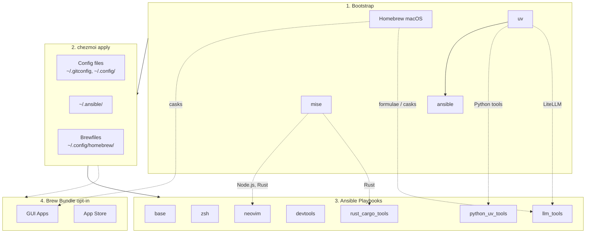

<!-- Generated by SpecStory, Markdown v2.1.0 -->

# 2026-04-08 01:51:12Z

<!-- Codex CLI Session 019d6ac9-19d9-7672-a4d4-0de551c0cf5a (2026-04-08 01:51:12Z) -->

_**User (2026-04-08 01:51:12Z)**_

現在 try 有 "graduate (Ctrl-G)" 的功能
相應的需要配置
$TRY_PROJECTS (default to parent of $TRY_PATH)
https://github.com/tobi/try
我們應該也將相關提示與env var 配在設定裡
[32_try.zsh](dot_config/zsh/tools/32_try.zsh) 


---

_**Agent (gpt-5.4 2026-04-08 01:52:58Z)**_

先確認現有 `try` 的 zsh 設定、chezmoi prompt 與 Docker 測試流程，釐清這次變更實際會牽涉哪些檔案，再把需要補的設定面和相依更新整理成可直接實作的計畫。

_**Agent (gpt-5.4 2026-04-08 01:52:58Z)**_

<tool-use data-tool-type="shell" data-tool-name="exec_command"><details>
<summary>Tool use: **exec_command** `pwd && rg -n "TRY_|try" dot_config/zsh .chezmoi.toml.tmpl Dockerfile README.md docs CLAUDE.md -g '!**/.git/**'`</summary>
```
Command: /bin/zsh -lc "pwd && rg -n \"TRY_|try\" dot_config/zsh .chezmoi.toml.tmpl Dockerfile README.md docs CLAUDE.md -g '"'!**/.git/**'"'"
Chunk ID: 2b8322
Wall time: 0.0000 seconds
Process exited with code 0
Original token count: 426
Output:
/Users/daviddwlee84/.local/share/chezmoi
README.md:98:- `~/.cargo/config.toml` - Cargo registry mirror config (GFW)
README.md:99:- `~/.npmrc` - npm registry config (official/npmmirror via `useChineseMirror`)
README.md:100:- `~/.config/.bunfig.toml` - Bun global registry config (official/npmmirror via `useChineseMirror`)
Dockerfile:105:# Retry up to 3 times to handle network issues (especially behind GFW)
Dockerfile:108:        sh -c "$(curl -fsLS --retry 3 --retry-delay 5 get.chezmoi.io/lb)" && \
Dockerfile:110:        { echo "Attempt $i failed, retrying..."; sleep 10; }; \
CLAUDE.md:130:| `ruby_gem_tools` | Ruby CLI tools via gem (try-cli, toolkami) |
docs/neovim/floating-tui.md:38:Add an entry to the `keys` table in `lua/plugins/floating-tui.lua`:
docs/tutorials/bitwarden_ssh_agent.md:183:(identified by the public key) and won't try others. This is useful when servers
docs/zsh/zsh-completions.md:108:- `~/.docker/completions` fpath entry
dot_config/zsh/tools/32_try.zsh:1:# 32_try.zsh - try-cli configuration (ephemeral workspace manager)
dot_config/zsh/tools/32_try.zsh:2:# https://github.com/tobi/try
dot_config/zsh/tools/32_try.zsh:4:# Find try.rb from the gem - the gem wrapper is broken due to __FILE__ == $0 guard
dot_config/zsh/tools/32_try.zsh:5:_try_script=$(ruby -e "require 'rubygems'; puts File.join(Gem::Specification.find_by_name('try-cli').gem_dir, 'try.rb')" 2>/dev/null)
dot_config/zsh/tools/32_try.zsh:6:[[ -f "$_try_script" ]] || return 0
dot_config/zsh/tools/32_try.zsh:8:eval "$(ruby "$_try_script" init)"
dot_config/zsh/tools/32_try.zsh:9:unset _try_script
docs/tools/starship.md:32:After trying a preset, run `chezmoi apply` to restore the chezmoi-managed version.
```
</details></tool-use>

_**Agent (gpt-5.4 2026-04-08 01:52:58Z)**_

<tool-use data-tool-type="shell" data-tool-name="exec_command"><details>
<summary>Tool use: **exec_command** `sed -n '1,220p' dot_config/zsh/tools/32_try.zsh`</summary>
```
Command: /bin/zsh -lc "sed -n '1,220p' dot_config/zsh/tools/32_try.zsh"
Chunk ID: 1eccf3
Wall time: 0.0000 seconds
Process exited with code 0
Original token count: 102
Output:
# 32_try.zsh - try-cli configuration (ephemeral workspace manager)
# https://github.com/tobi/try

# Find try.rb from the gem - the gem wrapper is broken due to __FILE__ == $0 guard
_try_script=$(ruby -e "require 'rubygems'; puts File.join(Gem::Specification.find_by_name('try-cli').gem_dir, 'try.rb')" 2>/dev/null)
[[ -f "$_try_script" ]] || return 0

eval "$(ruby "$_try_script" init)"
unset _try_script
```
</details></tool-use>

_**Agent (gpt-5.4 2026-04-08 01:52:58Z)**_

<tool-use data-tool-type="shell" data-tool-name="exec_command"><details>
<summary>Tool use: **exec_command** `sed -n '1,260p' .chezmoi.toml.tmpl`</summary>
```
Command: /bin/zsh -lc "sed -n '1,260p' .chezmoi.toml.tmpl"
Chunk ID: 837ae5
Wall time: 0.0000 seconds
Process exited with code 0
Original token count: 851
Output:
# https://www.chezmoi.io/reference/special-files/chezmoi-format-tmpl/

[data]
# 只在 init 才需要問一次：你之後都讀這個值
# TODO: not all the things we want to change all the time we chezmoi init
profile = {{ promptStringOnce . "profile" "profile (ubuntu_server|ubuntu_desktop|macos|macos_intel)" "macos" | quote }}
email   = {{ promptStringOnce . "email" "What is your email address" "daviddwlee84@gmail.com" | quote }}
name    = {{ promptStringOnce . "name" "What is your full name" "Da-Wei Lee" | quote }}
# 是否在中國大陸 GFW 內，需要使用鏡像源
useChineseMirror = {{ promptBoolOnce . "useChineseMirror" "Are you in China (behind GFW) and need to use mirrors" false }}
# 是否對所有 repo 啟用 gitleaks 掃描（包含沒有 .pre-commit-config.yaml 的 repo）
gitleaksAllRepos = {{ promptBoolOnce . "gitleaksAllRepos" "Enable gitleaks for ALL git repos (not just those with .pre-commit-config.yaml)" false }}
# 是否安裝 coding agents (Claude Code, OpenCode, Cursor, Copilot, Gemini, etc.)
installCodingAgents = {{ promptBoolOnce . "installCodingAgents" "Install coding agents (Claude Code, OpenCode, Cursor, Copilot, Gemini, etc.)" true }}
# 是否安裝 Bitwarden CLI 並啟用 SSH Agent 自動偵測 + Zsh completion
installBitwarden = {{ promptBoolOnce . "installBitwarden" "Install Bitwarden CLI (@bitwarden/cli) with SSH Agent integration and Zsh completion" false }}
# 是否安裝 Python CLI tools via uv (mlflow, sqlit-tui, tmuxp, etc.)
installPythonUvTools = {{ promptBoolOnce . "installPythonUvTools" "Install Python CLI tools via uv (mlflow, sqlit-tui, tmuxp, etc.)" true }}
# 是否安裝本地 LLM tools (Ollama, LiteLLM, llmfit, models)
installLlmTools = {{ promptBoolOnce . "installLlmTools" "Install local LLM tools (Ollama, LiteLLM, llmfit, models)" false }}
# 是否安裝 macOS AI desktop apps via Homebrew Brewfile (Claude, ChatGPT, OpenCode, Antigravity, Codex, Ollama app)
installAiDesktopApps = {{ promptBoolOnce . "installAiDesktopApps" "Install AI desktop apps via macOS Homebrew Brewfile (Claude, ChatGPT, OpenCode, Antigravity, Codex, Ollama app)" false }}
# 是否安裝一般 GUI apps via Homebrew Brewfile (terminals, browsers, utilities, etc.; excludes AI desktop apps)
installBrewApps = {{ promptBoolOnce . "installBrewApps" "Install general GUI apps via Homebrew Brewfile (terminals, browsers, utilities, etc.; excludes AI desktop apps)" false }}
# 是否安裝繁體中文輸入法 (McBopomofo + RIME)
installInputMethod = {{ promptBoolOnce . "installInputMethod" "Install Traditional Chinese input methods (McBopomofo, RIME)" false }}
# 是否安裝網路診斷工具 (nmap, mtr, httpie, gping, trippy, etc.)
installNetworkingTools = {{ promptBoolOnce . "installNetworkingTools" "Install networking CLI tools (nmap, mtr, httpie, gping, trippy, etc.)" false }}
# 沒有 sudo/root 權限，只安裝 user-level 工具 (mise, cargo, gem, uv, npm)
noRoot = {{ promptBoolOnce . "noRoot" "No sudo/root access - skip all system package installations" false }}
# 在 chezmoi apply 之前備份現有的 dotfiles
backupDotfiles = {{ promptBoolOnce . "backupDotfiles" "Backup existing dotfiles before chezmoi overwrites them" true }}

# https://www.chezmoi.io/user-guide/use-scripts-to-perform-actions/#dont-show-scripts-that-would-run-in-chezmoi-diffchezmoi-status
[diff]
    exclude = ["scripts"]
[status]
    exclude = ["scripts"]
```
</details></tool-use>

_**Agent (gpt-5.4 2026-04-08 01:52:58Z)**_

<tool-use data-tool-type="shell" data-tool-name="exec_command"><details>
<summary>Tool use: **exec_command** `sed -n '1,260p' Dockerfile`</summary>
```
Command: /bin/zsh -lc "sed -n '1,260p' Dockerfile"
Chunk ID: 52fce8
Wall time: 0.0000 seconds
Process exited with code 0
Original token count: 1644
Output:
# Dotfiles test/devbox container
# Build: docker build -t dotfiles .
# Run:   docker run -it dotfiles

FROM ubuntu:24.04

# Build arguments for chezmoi configuration
ARG CHEZMOI_PROFILE=ubuntu_server
ARG CHEZMOI_EMAIL=docker@example.com
ARG CHEZMOI_NAME="Docker User"
ARG CHEZMOI_USE_CHINESE_MIRROR=false
ARG CHEZMOI_GITLEAKS_ALL_REPOS=false
ARG CHEZMOI_INSTALL_CODING_AGENTS=false
ARG CHEZMOI_INSTALL_BITWARDEN=false
ARG CHEZMOI_INSTALL_PYTHON_UV_TOOLS=false
ARG CHEZMOI_INSTALL_LLM_TOOLS=false
ARG CHEZMOI_INSTALL_AI_DESKTOP_APPS=false
ARG CHEZMOI_INSTALL_BREW_APPS=false
ARG CHEZMOI_INSTALL_INPUT_METHOD=false
ARG CHEZMOI_INSTALL_NETWORKING_TOOLS=false
ARG CHEZMOI_NO_ROOT=false
ARG CHEZMOI_BACKUP_DOTFILES=false
ARG CHEZMOI_REPO=daviddwlee84

# Avoid interactive prompts during apt install
ENV DEBIAN_FRONTEND=noninteractive

# Configure HTTP mirror BEFORE installing ca-certificates (if in China)
# This solves the chicken-and-egg problem: HTTPS mirrors need ca-certificates,
# but installing ca-certificates from default repos fails under GFW
# Uses HTTP (not HTTPS) since ca-certificates isn't installed yet
RUN if [ "${CHEZMOI_USE_CHINESE_MIRROR}" = "true" ]; then \
        ARCH=$(dpkg --print-architecture) && \
        if [ "$ARCH" = "amd64" ]; then \
            MIRROR_URL="http://repo.huaweicloud.com/ubuntu"; \
        else \
            MIRROR_URL="http://repo.huaweicloud.com/ubuntu-ports"; \
        fi && \
        printf '%s\n' \
            "Types: deb" \
            "URIs: ${MIRROR_URL}" \
            "Suites: noble noble-updates noble-backports" \
            "Components: main restricted universe multiverse" \
            "Signed-By: /usr/share/keyrings/ubuntu-archive-keyring.gpg" \
            "" \
            "Types: deb" \
            "URIs: ${MIRROR_URL}" \
            "Suites: noble-security" \
            "Components: main restricted universe multiverse" \
            "Signed-By: /usr/share/keyrings/ubuntu-archive-keyring.gpg" \
            > /etc/apt/sources.list.d/ubuntu.sources; \
    fi

# Install ca-certificates (now using HTTP mirror if in China, default repos otherwise)
RUN apt-get update && apt-get install -y --no-install-recommends ca-certificates \
    && rm -rf /var/lib/apt/lists/*

# Upgrade to HTTPS mirror after ca-certificates is installed (if in China)
# HTTPS is more secure for subsequent package installations
RUN if [ "${CHEZMOI_USE_CHINESE_MIRROR}" = "true" ]; then \
        ARCH=$(dpkg --print-architecture) && \
        if [ "$ARCH" = "amd64" ]; then \
            MIRROR_URL="https://repo.huaweicloud.com/ubuntu"; \
        else \
            MIRROR_URL="https://repo.huaweicloud.com/ubuntu-ports"; \
        fi && \
        printf '%s\n' \
            "Types: deb" \
            "URIs: ${MIRROR_URL}" \
            "Suites: noble noble-updates noble-backports" \
            "Components: main restricted universe multiverse" \
            "Signed-By: /usr/share/keyrings/ubuntu-archive-keyring.gpg" \
            "" \
            "Types: deb" \
            "URIs: ${MIRROR_URL}" \
            "Suites: noble-security" \
            "Components: main restricted universe multiverse" \
            "Signed-By: /usr/share/keyrings/ubuntu-archive-keyring.gpg" \
            > /etc/apt/sources.list.d/ubuntu.sources; \
    fi

# Install minimal dependencies
# python3 is required for ansible to run modules on localhost
RUN apt-get update && apt-get install -y --no-install-recommends \
    curl \
    sudo \
    git \
    python3 \
    && rm -rf /var/lib/apt/lists/*

# Create non-root user with sudo access
RUN useradd -m -s /bin/bash devuser \
    && echo "devuser ALL=(ALL) NOPASSWD:ALL" >> /etc/sudoers.d/devuser \
    && chmod 0440 /etc/sudoers.d/devuser

# Copy local dotfiles source into image
# This allows testing local changes without pushing to GitHub
COPY --chown=devuser:devuser . /tmp/dotfiles-source

# Switch to non-root user
USER devuser
WORKDIR /home/devuser

# Install chezmoi binary
# Retry up to 3 times to handle network issues (especially behind GFW)
RUN for i in 1 2 3; do \
        echo "Attempt $i: Installing chezmoi to ~/.local/bin..." && \
        sh -c "$(curl -fsLS --retry 3 --retry-delay 5 get.chezmoi.io/lb)" && \
        echo "chezmoi installed successfully" && break || \
        { echo "Attempt $i failed, retrying..."; sleep 10; }; \
    done

# Initialize and apply dotfiles with prompt values passed via flags
# This avoids interactive prompts during Docker build
# Set PATH to include ~/.local/bin so run_once scripts can find uv tools (ansible)
# Use local source instead of cloning from GitHub to test local changes
# Note: installBrewApps=false and installAiDesktopApps=false by default
RUN export PATH="$HOME/.local/bin:$PATH" && \
    ~/.local/bin/chezmoi init --apply --source=/tmp/dotfiles-source \
    --promptString "profile (ub
... (truncated)
```
</details></tool-use>

_**Agent (gpt-5.4 2026-04-08 01:53:08Z)**_

目前看到 `try` 只做 `init`，還沒有任何 `TRY_*` 環境變數或使用說明；`.chezmoi.toml.tmpl` 與 `Dockerfile` 目前也沒有 `try` 相關 prompt。接著我會補查這個 repo 既有的 zsh 設定慣例，確認該把 env var 放在哪一層，以及 README 需要補到什麼程度。

_**Agent (gpt-5.4 2026-04-08 01:53:08Z)**_

<tool-use data-tool-type="shell" data-tool-name="exec_command"><details>
<summary>Tool use: **exec_command** `rg --files dot_config/zsh | sort`</summary>
```
Command: /bin/zsh -lc 'rg --files dot_config/zsh | sort'
Chunk ID: 940019
Wall time: 0.0000 seconds
Process exited with code 0
Original token count: 257
Output:
dot_config/zsh/00_exports.zsh.tmpl
dot_config/zsh/02_legacy_tools.zsh
dot_config/zsh/10_aliases.zsh
dot_config/zsh/tools/01_starship.zsh
dot_config/zsh/tools/04_conda_mamba.zsh
dot_config/zsh/tools/05_mise.zsh
dot_config/zsh/tools/06_cargo.zsh
dot_config/zsh/tools/07_bunx_cli.zsh
dot_config/zsh/tools/10_fzf.zsh
dot_config/zsh/tools/20_zoxide.zsh
dot_config/zsh/tools/22_sesh.zsh
dot_config/zsh/tools/25_bat.zsh
dot_config/zsh/tools/26_eza.zsh
dot_config/zsh/tools/27_thefuck.zsh
dot_config/zsh/tools/28_tldr.zsh
dot_config/zsh/tools/29_marimo.zsh
dot_config/zsh/tools/30_direnv.zsh
dot_config/zsh/tools/32_try.zsh
dot_config/zsh/tools/33_toolkami.zsh.disabled
dot_config/zsh/tools/34_openclaw.zsh
dot_config/zsh/tools/35_yazi.zsh
dot_config/zsh/tools/36_pueue.zsh
dot_config/zsh/tools/37_lazygit.zsh
dot_config/zsh/tools/40_codexbar.zsh
dot_config/zsh/tools/41_github.zsh
dot_config/zsh/tools/42_gitlab.zsh
dot_config/zsh/tools/50_networking.zsh
dot_config/zsh/tools/90_completions.zsh
dot_config/zsh/tools/95_bitwarden.zsh
```
</details></tool-use>

_**Agent (gpt-5.4 2026-04-08 01:53:08Z)**_

<tool-use data-tool-type="shell" data-tool-name="exec_command"><details>
<summary>Tool use: **exec_command** `rg -n "promptBoolOnce|promptStringOnce|export [A-Z0-9_]+|typeset -gx|tools/" dot_config/zsh README.md docs -g '!**/.git/**'`</summary>
```
Command: /bin/zsh -lc "rg -n \"promptBoolOnce|promptStringOnce|export [A-Z0-9_]+|typeset -gx|tools/\" dot_config/zsh README.md docs -g '"'!**/.git/**'"'"
Chunk ID: c970e8
Wall time: 0.0000 seconds
Process exited with code 0
Original token count: 1718
Output:
docs/neovim/floating-tui.md:34:For the managed `gh-dash` / `diffnav` / `lazygit` setup behind `<leader>zg`, see [Git Diff Workflow](../tools/git_diff_workflow.md).
README.md:58:export GITHUB_USERNAME=daviddwlee84
README.md:112:- `~/.config/zsh/tools/22_sesh.zsh` - Sesh keybinding (`Alt+S` for session picker) + shell completion
README.md:113:- `~/.config/zsh/tools/36_pueue.zsh` - Pueue queue summary helper (`pqsum`)
README.md:114:- `~/.config/zsh/tools/41_github.zsh` - GitHub helper with `ghget` for downloading a repo subdirectory from a tree URL
README.md:115:- `~/.config/zsh/tools/37_lazygit.zsh` - LazyGit shell alias: `lg`
README.md:116:- `~/.config/zsh/tools/28_tldr.zsh` - `tldrf` helper with `TLDR_LANGUAGES` fallback order
README.md:117:- `~/.config/zsh/tools/29_marimo.zsh` - `marimo` zsh shell completion
README.md:118:- `~/.config/zsh/tools/26_eza.zsh` - `eza`-backed `ls`/`la`/`ll` aliases, plus `llt` for tree view with git-aware subdirectory context
README.md:119:- `~/.config/zsh/tools/95_bitwarden.zsh` - Bitwarden CLI completion + SSH agent socket auto-detection
README.md:208:See [CLAUDE.md](CLAUDE.md) for development guide, [docs/ansible.md](docs/ansible.md) for ansible customization, [docs/input_methods/README.md](docs/input_methods/README.md) for McBopomofo / Rime / Squirrel notes and backup strategy, [docs/tools/direnv.md](docs/tools/direnv.md) for `.venv`-aware direnv usage, [docs/tools/git_diff_workflow.md](docs/tools/git_diff_workflow.md) for the managed Git diff stack, [docs/tools/specstory.md](docs/tools/specstory.md) for SpecStory configuration, [docs/tools/td_sidecar.md](docs/tools/td_sidecar.md) for td/sidecar usage, [docs/tools/specify_cli.md](docs/tools/specify_cli.md) for Specify CLI, [docs/tools/llm.md](docs/tools/llm.md) for local LLM tools, and [docs/tools/networking.md](docs/tools/networking.md) for networking tools.
dot_config/zsh/10_aliases.zsh:12:# List files (current managed by ./tools/26_esa.zsh)
dot_config/zsh/10_aliases.zsh:34:alias load-nvm='export LOAD_NVM=1 && source "${NVM_DIR:-$HOME/.nvm}/nvm.sh" && source "${NVM_DIR:-$HOME/.nvm}/bash_completion" && echo "nvm loaded: $(nvm current)"'
docs/zsh/zsh-completions.md:72:These tools inject completions as part of broader shell integration. Already handled in `dot_config/zsh/tools/`.
docs/zsh/zsh-completions.md:76:| `fzf` | `tools/10_fzf.zsh` | `source <(fzf --zsh)` |
docs/zsh/zsh-completions.md:77:| `zoxide` | `tools/20_zoxide.zsh` | `eval "$(zoxide init zsh)"` |
docs/zsh/zsh-completions.md:78:| `thefuck` | `tools/25_thefuck.zsh` | `eval $(thefuck --alias)` |
docs/zsh/zsh-completions.md:79:| `direnv` | `tools/30_direnv.zsh` | `eval "$(direnv hook zsh)"` |
docs/zsh/zsh-completions.md:80:| `marimo` | `tools/29_marimo.zsh` | `eval "$(_MARIMO_COMPLETE=zsh_source marimo)"` |
docs/zsh/zsh-completions.md:109:- Tool-specific `eval`/`source` integrations in `dot_config/zsh/tools/`
dot_config/zsh/00_exports.zsh.tmpl:6:#     export EDITOR='vim'
dot_config/zsh/00_exports.zsh.tmpl:8:#     export EDITOR='nvim'
dot_config/zsh/00_exports.zsh.tmpl:12:export EDITOR='nvim'
dot_config/zsh/00_exports.zsh.tmpl:13:export VISUAL="$EDITOR"
dot_config/zsh/00_exports.zsh.tmpl:16:export LANG="en_US.UTF-8"
dot_config/zsh/00_exports.zsh.tmpl:17:export LC_ALL="en_US.UTF-8"
dot_config/zsh/00_exports.zsh.tmpl:21:export PATH="$HOME/bin:$HOME/.local/bin:$PATH"
dot_config/zsh/00_exports.zsh.tmpl:44:export HOMEBREW_BUNDLE_FILE="$HOME/.config/homebrew/Brewfile"
dot_config/zsh/00_exports.zsh.tmpl:48:# export HISTSIZE=10000
dot_config/zsh/00_exports.zsh.tmpl:49:# export SAVEHIST=10000
dot_config/zsh/00_exports.zsh.tmpl:50:# export HISTFILE="$XDG_DATA_HOME/zsh/history"
docs/initial_setup/0_ManualSetupRecord.md:66:The oh-my-zsh setup script `sh -c "$(curl -fsSL https://raw.githubusercontent.com/ohmyzsh/ohmyzsh/master/tools/install.sh)"` actually do more than what we need
docs/tutorials/bitwarden_ssh_agent.md:88:This repo auto-detects the socket in `~/.config/zsh/tools/95_bitwarden.zsh`.
docs/tutorials/bitwarden_ssh_agent.md:245:- `~/.config/zsh/tools/95_bitwarden.zsh` -- Auto-detection of Bitwarden SSH agent socket
dot_config/zsh/tools/10_fzf.zsh:4:[[ -d "$HOME/.fzf/bin" ]] && export PATH="$HOME/.fzf/bin:$PATH"
dot_config/zsh/tools/10_fzf.zsh:23:export FZF_DEFAULT_OPTS="--height 40% --layout=reverse --border"
dot_config/zsh/tools/10_fzf.zsh:27:    export FZF_DEFAULT_COMMAND="fd --hidden --strip-cwd-prefix --exclude .git"
dot_config/zsh/tools/10_fzf.zsh:28:    export FZF_CTRL_T_COMMAND="$FZF_DEFAULT_COMMAND"
dot_config/zsh/tools/10_fzf.zsh:29:    export FZF_ALT_C_COMMAND="fd --type=d --hidden --strip-cwd-prefix --exclude .git"
dot_config/zsh/tools/10_fzf.zsh:34:    export FZF_CTRL_T_OPTS="--preview 'bat -n --color=a
... (truncated)
```
</details></tool-use>

_**Agent (gpt-5.4 2026-04-08 01:53:08Z)**_

<tool-use data-tool-type="shell" data-tool-name="exec_command"><details>
<summary>Tool use: **exec_command** `sed -n '1,220p' README.md`</summary>
```
Command: /bin/zsh -lc "sed -n '1,220p' README.md"
Chunk ID: 43603d
Wall time: 0.0000 seconds
Process exited with code 0
Original token count: 2782
Output:
# dotfiles

Cross-platform development environment setup using **chezmoi** + **ansible**.

- **chezmoi**: manages config files (dotfiles)
- **ansible**: installs system dependencies and tools

## Prerequisites

- [chezmoi](https://www.chezmoi.io/install/)
- [uv](https://docs.astral.sh/uv/getting-started/installation/) (for ansible)

## Architecture



## Quick Setup

```bash
# One-liner to initialize and apply (installs chezmoi to ~/.local/bin)
export GITHUB_USERNAME=daviddwlee84
sh -c "$(curl -fsLS get.chezmoi.io)" -- -b "$HOME/.local/bin" init --apply git@github.com:$GITHUB_USERNAME/dotfiles.git
```

This automatically:

1. Bootstraps Homebrew (macOS/Linux), uv, mise, ansible
2. Deploys all config files
3. Runs ansible playbooks (git, ripgrep, fd, neovim, etc.)
4. Runs brew bundle (if `installBrewApps` is enabled, or on macOS if `installAiDesktopApps` is enabled)

### Optional Components

During `chezmoi init`, you'll be prompted for optional installs:

| Option | Default | Description |
|--------|---------|-------------|
| `installCodingAgents` | true | Claude Code, Codex CLI, OpenCode, Cursor, Copilot, Gemini CLI, RTK, td, sidecar, specify-cli, etc. |
| `installBitwarden` | false | Bitwarden CLI (`bw`) + Desktop app (desktop profiles) with SSH agent auto-detection |
| `installPythonUvTools` | true | Python CLI tools via uv (mlflow, sqlit-tui, tmuxp, etc.) |
| `installLlmTools` | false | Local LLM tools: Ollama, LiteLLM, llmfit, models |
| `installAiDesktopApps` | false | macOS AI desktop apps via Homebrew Brewfile (Claude, ChatGPT, OpenCode Desktop, Antigravity, Codex Desktop on Apple Silicon; `ollama-app` also requires `installLlmTools=true`) |
| `installBrewApps` | false | General GUI apps via Homebrew Brewfile (terminals, browsers, utilities, mas; excludes AI desktop apps) |
| `installInputMethod` | false | Traditional Chinese input methods (McBopomofo, RIME/Squirrel on macOS; ibus-rime on Linux) |
| `installNetworkingTools` | false | Networking CLI tools (nmap, mtr, httpie, gping, trippy, bandwhich, rustscan, etc.) |
| `noRoot` | false | Skip sudo-requiring tasks (for servers without root access) |

To change options later: `chezmoi init --force`

## What You Get

### Config Files

- `~/.gitconfig` - Git configuration
- `~/.config/git/hooks/` - Global Git hooks (pre-commit + Git LFS hooks)
- `~/.config/gh-dash/config.yml` - Global gh-dash config, with `diffnav` as the diff pager
- `~/.config/lazygit/config.yml` - Global LazyGit config, with `delta` as the custom diff pager
- `~/.config/bat/themes/tokyonight_night.tmTheme` - Managed Tokyo Night theme for bat
- `~/.config/nvim/` - Neovim (LazyVim) configuration
- `~/.config/uv/uv.toml` - uv package manager config
- `~/.cargo/config.toml` - Cargo registry mirror config (GFW)
- `~/.npmrc` - npm registry config (official/npmmirror via `useChineseMirror`)
- `~/.config/.bunfig.toml` - Bun global registry config (official/npmmirror via `useChineseMirror`)
- `~/.config/alacritty/` - Alacritty terminal config
- `~/.config/starship.toml` - Starship cross-shell prompt config
- `~/.config/direnv/direnvrc` - direnv helper functions, including `.venv`-aware Python activation
- `~/.config/yazi/` - Yazi file manager config (v0.3.3+ syntax, [docs](https://yazi-rs.github.io/docs/configuration/overview/))
  - `yazi.toml` - Main config with open rules and openers (`o`/`O`)
  - `keymap.toml`, `theme.toml` - Optional customization files (stubs provided)
- `~/.claude/` - Claude Code settings
- `~/.specstory/cli/config.toml` - Global SpecStory defaults for `specstory run` across all projects
- `~/.tmux.conf` - Tmux configuration with TPM plugins, tmux-which-key (`prefix+Space`), vim-style pane nav, extended-keys for coding agents, sesh keybindings (`prefix+T` picker, `prefix+S` last)
- `~/.local/bin/x` - Cross-platform terminal wrapper for `copy` / `paste` / `open`
- `~/.config/sesh/sesh.toml` - Sesh sessi
... (truncated)
```
</details></tool-use>

_**Agent (gpt-5.4 2026-04-08 01:53:35Z)**_

我也確認了 upstream README 的現況：GitHub 上可見的 README 已經有 `try .` / `worktree dir` 用法，但目前頁面還沒抓到 `graduate` / `TRY_PROJECTS` 的說明，所以本地端這邊先按你提供的新行為需求來規劃。接著我會看 `00_exports` 與 zsh 載入結構，決定是要把 `TRY_*` 放在全域 exports template，還是維持只在 `32_try.zsh` 內設定。

_**Agent (gpt-5.4 2026-04-08 01:53:35Z)**_

<tool-use data-tool-type="shell" data-tool-name="exec_command"><details>
<summary>Tool use: **exec_command** `sed -n '1,220p' dot_config/zsh/00_exports.zsh.tmpl`</summary>
```
Command: /bin/zsh -lc "sed -n '1,220p' dot_config/zsh/00_exports.zsh.tmpl"
Chunk ID: 2b0800
Wall time: 0.0000 seconds
Process exited with code 0
Original token count: 417
Output:
# 00_exports.zsh - Environment variables
# Profile: {{ .profile }}

# Editor
# if [[ -n $SSH_CONNECTION ]]; then
#     export EDITOR='vim'
# else
#     export EDITOR='nvim'
# fi
# Let's always use nvim (but sometimes, when the latency is high,
# some animation might be slow)
export EDITOR='nvim'
export VISUAL="$EDITOR"

# Language
export LANG="en_US.UTF-8"
export LC_ALL="en_US.UTF-8"

# PATH additions
# ~/bin for custom scripts, ~/.local/bin for auto-installed tools (uv, npm, cargo)
export PATH="$HOME/bin:$HOME/.local/bin:$PATH"

# =============================================================================
# Homebrew Setup
# =============================================================================
{{ if or (eq .profile "macos") (eq .profile "macos_intel") -}}
# macOS: Initialize Homebrew (Apple Silicon or Intel)
if [[ -f /opt/homebrew/bin/brew ]]; then
    eval "$(/opt/homebrew/bin/brew shellenv)"
elif [[ -f /usr/local/bin/brew ]]; then
    eval "$(/usr/local/bin/brew shellenv)"
fi
{{ else -}}
# Linux: Initialize Linuxbrew if installed
# Linuxbrew is optional on Linux (most packages managed by apt via Ansible)
if [[ -d /home/linuxbrew/.linuxbrew ]]; then
    eval "$(/home/linuxbrew/.linuxbrew/bin/brew shellenv)"
elif [[ -d "$HOME/.linuxbrew" ]]; then
    eval "$("$HOME/.linuxbrew/bin/brew" shellenv)"
fi
{{ end -}}

# Set default Brewfile location (XDG-compliant)
export HOMEBREW_BUNDLE_FILE="$HOME/.config/homebrew/Brewfile"

# --- Suggested exports (uncomment to enable) ---
# History configuration (oh-my-zsh handles this, but can customize)
# export HISTSIZE=10000
# export SAVEHIST=10000
# export HISTFILE="$XDG_DATA_HOME/zsh/history"
```
</details></tool-use>

_**Agent (gpt-5.4 2026-04-08 01:53:35Z)**_

<tool-use data-tool-type="shell" data-tool-name="exec_command"><details>
<summary>Tool use: **exec_command** `sed -n '1,220p' dot_zshrc`</summary>
```
Command: /bin/zsh -lc "sed -n '1,220p' dot_zshrc"
Chunk ID: cc0545
Wall time: 0.0000 seconds
Process exited with code 1
Original token count: 11
Output:
sed: dot_zshrc: No such file or directory
```
</details></tool-use>

_**Agent (gpt-5.4 2026-04-08 01:53:35Z)**_

<tool-use data-tool-type="shell" data-tool-name="exec_command"><details>
<summary>Tool use: **exec_command** `rg --files | rg 'zshrc|zprofile|zlogin|zshenv|zsh$|try'`</summary>
```
Command: /bin/zsh -lc "rg --files | rg 'zshrc|zprofile|zlogin|zshenv|zsh"'$|try'"'"
Chunk ID: c17123
Wall time: 0.0000 seconds
Process exited with code 0
Original token count: 244
Output:
dot_zshenv.tmpl
dot_zshrc.tmpl
dot_config/zsh/10_aliases.zsh
dot_config/zsh/tools/10_fzf.zsh
dot_config/zsh/tools/22_sesh.zsh
dot_config/zsh/tools/32_try.zsh
dot_config/zsh/tools/37_lazygit.zsh
dot_config/zsh/tools/27_thefuck.zsh
dot_config/zsh/tools/28_tldr.zsh
dot_config/zsh/tools/40_codexbar.zsh
dot_config/zsh/tools/26_eza.zsh
dot_config/zsh/tools/41_github.zsh
dot_config/zsh/tools/34_openclaw.zsh
dot_config/zsh/tools/07_bunx_cli.zsh
dot_config/zsh/tools/01_starship.zsh
dot_config/zsh/tools/04_conda_mamba.zsh
dot_config/zsh/tools/90_completions.zsh
dot_config/zsh/tools/20_zoxide.zsh
dot_config/zsh/tools/30_direnv.zsh
dot_config/zsh/tools/05_mise.zsh
dot_config/zsh/tools/25_bat.zsh
dot_config/zsh/tools/42_gitlab.zsh
dot_config/zsh/tools/29_marimo.zsh
dot_config/zsh/tools/50_networking.zsh
dot_config/zsh/tools/35_yazi.zsh
dot_config/zsh/tools/95_bitwarden.zsh
dot_config/zsh/tools/36_pueue.zsh
dot_config/zsh/tools/06_cargo.zsh
dot_config/zsh/02_legacy_tools.zsh
```
</details></tool-use>

_**Agent (gpt-5.4 2026-04-08 01:53:35Z)**_

<tool-use data-tool-type="shell" data-tool-name="exec_command"><details>
<summary>Tool use: **exec_command** `rg -n "installCodingAgents|installBitwarden|installPythonUvTools|installLlmTools|installAiDesktopApps|installBrewApps|installInputMethod|installNetworkingTools|noRoot|backupDotfiles|useChineseMirror" -g '!**/.git/**'`</summary>
```
Command: /bin/zsh -lc "rg -n \"installCodingAgents|installBitwarden|installPythonUvTools|installLlmTools|installAiDesktopApps|installBrewApps|installInputMethod|installNetworkingTools|noRoot|backupDotfiles|useChineseMirror\" -g '"'!**/.git/**'"'"
Chunk ID: 02cee1
Wall time: 0.0000 seconds
Process exited with code 0
Original token count: 2336
Output:
dot_config/mise/config.toml.tmpl:1:{{- $noRoot := false }}{{ if hasKey . "noRoot" }}{{ $noRoot = .noRoot }}{{ end -}}
dot_config/mise/config.toml.tmpl:12:{{ if not $noRoot -}}
dot_config/mise/config.toml.tmpl:16:# Ruby skipped in noRoot mode: ruby-build requires libffi-dev (needs sudo)
run_onchange_after_20_ansible_roles.sh.tmpl:92:{{ if .installCodingAgents -}}
run_onchange_after_20_ansible_roles.sh.tmpl:95:{{ $installBitwarden := false }}{{ if hasKey . "installBitwarden" }}{{ $installBitwarden = .installBitwarden }}{{ end -}}
run_onchange_after_20_ansible_roles.sh.tmpl:96:{{ if $installBitwarden -}}
run_onchange_after_20_ansible_roles.sh.tmpl:99:{{ if .installPythonUvTools -}}
run_onchange_after_20_ansible_roles.sh.tmpl:102:{{ $installLlmTools := false }}{{ if hasKey . "installLlmTools" }}{{ $installLlmTools = .installLlmTools }}{{ end -}}
run_onchange_after_20_ansible_roles.sh.tmpl:103:{{ if $installLlmTools -}}
run_onchange_after_20_ansible_roles.sh.tmpl:106:{{ $installInputMethod := false }}{{ if hasKey . "installInputMethod" }}{{ $installInputMethod = .installInputMethod }}{{ end -}}
run_onchange_after_20_ansible_roles.sh.tmpl:107:{{ if $installInputMethod -}}
run_onchange_after_20_ansible_roles.sh.tmpl:110:{{ $installNetworkingTools := false }}{{ if hasKey . "installNetworkingTools" }}{{ $installNetworkingTools = .installNetworkingTools }}{{ end -}}
run_onchange_after_20_ansible_roles.sh.tmpl:111:{{ if $installNetworkingTools -}}
run_onchange_after_20_ansible_roles.sh.tmpl:117:{{ if and $installBitwarden (or (eq .profile "ubuntu_desktop") (eq .profile "macos") (eq .profile "macos_intel")) -}}
run_onchange_after_20_ansible_roles.sh.tmpl:121:{{ if $installLlmTools -}}
run_onchange_after_20_ansible_roles.sh.tmpl:123:    EXTRA_VARS="llm_tools_install_brew_apps={{ .installBrewApps }}"
run_onchange_after_20_ansible_roles.sh.tmpl:125:    EXTRA_VARS="$EXTRA_VARS llm_tools_install_brew_apps={{ .installBrewApps }}"
run_onchange_after_20_ansible_roles.sh.tmpl:134:{{ $noRoot := false }}{{ if hasKey . "noRoot" }}{{ $noRoot = .noRoot }}{{ end -}}
run_onchange_after_20_ansible_roles.sh.tmpl:135:{{ if $noRoot -}}
run_onchange_after_20_ansible_roles.sh.tmpl:136:# noRoot mode: skip all sudo-requiring tasks, user-level fallbacks will install tools
run_onchange_after_20_ansible_roles.sh.tmpl:137:info "noRoot mode enabled - installing user-level tools to ~/.local/bin"
run_onchange_after_20_ansible_roles.sh.tmpl:153:{{ if $installLlmTools -}}
CLAUDE.md:64:| `run_onchange_after_30_brew_bundle.sh.tmpl` | Runs brew bundle (if `installBrewApps` is enabled, or on macOS if `installAiDesktopApps` is enabled) |
CLAUDE.md:153:For Linux servers where you don't have sudo/root access, enable `noRoot = true` during `chezmoi init`:
CLAUDE.md:266:**Note**: Brewfile installation is **opt-in** (disabled by default). Enable general GUI apps via `chezmoi init --force` and set `installBrewApps = true`. On macOS, AI desktop apps are a separate opt-in via `installAiDesktopApps = true`.
CLAUDE.md:297:- **AI & Coding**: claude, chatgpt, opencode-desktop, antigravity, codex-app (Apple Silicon only), and `ollama-app` when `installAiDesktopApps` + `installLlmTools`
CLAUDE.md:312:- Chinese apps (baidunetdisk): only included if `useChineseMirror` is true
TODO.md:41:~Do we want to use Brewfile to manage macOS packages installation instead of writing one by one through Ansible?~ **Done**: XDG-compliant Brewfiles at `~/.config/homebrew/` with chezmoi run_onchange script (opt-in via `installBrewApps`).
Dockerfile:117:# Note: installBrewApps=false and installAiDesktopApps=false by default
run_before_01_backup_dotfiles.sh.tmpl:5:{{ if not .backupDotfiles -}}
docs/tutorials/bitwarden_ssh_agent.md:12:When `installBitwarden` is enabled during `chezmoi init`, the ansible bitwarden role automatically installs:
dot_cargo/config.toml.tmpl:1:{{- if .useChineseMirror }}
README.md:67:4. Runs brew bundle (if `installBrewApps` is enabled, or on macOS if `installAiDesktopApps` is enabled)
README.md:75:| `installCodingAgents` | true | Claude Code, Codex CLI, OpenCode, Cursor, Copilot, Gemini CLI, RTK, td, sidecar, specify-cli, etc. |
README.md:76:| `installBitwarden` | false | Bitwarden CLI (`bw`) + Desktop app (desktop profiles) with SSH agent auto-detection |
README.md:77:| `installPythonUvTools` | true | Python CLI tools via uv (mlflow, sqlit-tui, tmuxp, etc.) |
README.md:78:| `installLlmTools` | false | Local LLM tools: Ollama, LiteLLM, llmfit, models |
README.md:79:| `installAiDesktopApps` | false | macOS AI desktop apps via Homebrew Brewfile (Claude, ChatGPT, OpenCode Desktop, Antigravity, Codex Desktop on Apple Silico
... (truncated)
```
</details></tool-use>

_**Agent (gpt-5.4 2026-04-08 01:53:44Z)**_

<tool-use data-tool-type="shell" data-tool-name="exec_command"><details>
<summary>Tool use: **exec_command** `sed -n '1,260p' dot_zshrc.tmpl`</summary>
```
Command: /bin/zsh -lc "sed -n '1,260p' dot_zshrc.tmpl"
Chunk ID: 4845f9
Wall time: 0.0000 seconds
Process exited with code 0
Original token count: 1008
Output:
# Profiling: start a profiled shell with `ZSH_PROF=1 zsh`
if [[ -n "$ZSH_PROF" ]]; then
    zmodload zsh/zprof
fi

# ~/.zshrc - Interactive shell configuration
# Managed by chezmoi - do not edit directly

# =============================================================================
# Oh-My-Zsh Configuration
# =============================================================================

# Theme (disabled - using starship prompt instead)
ZSH_THEME=""

# Prevent zsh from overwriting tmux/tmuxp window names (only inside tmux)
# [[ -n "$TMUX" ]] && export DISABLE_AUTO_TITLE='true'
export DISABLE_AUTO_TITLE='true'

# Plugins (from $ZSH/plugins/ and $ZSH_CUSTOM/plugins/)
plugins=(
    git
    zsh-autosuggestions
    zsh-syntax-highlighting
    zsh-vi-mode
)

# zsh-vi-mode overrides all keybindings on init; re-source fzf bindings afterward
# so that Ctrl+R (history search), Ctrl+T (file search), Alt+C still work
zvm_after_init() {
    [ -f "$ZSH_CONFIG_DIR/tools/10_fzf.zsh" ] && source "$ZSH_CONFIG_DIR/tools/10_fzf.zsh"
}

# Oh-My-Zsh path
export ZSH="$HOME/.oh-my-zsh"

# Extra completion paths (must be set before oh-my-zsh runs compinit)
fpath+=~/.zfunc
[[ -d ~/.oh-my-zsh/custom/plugins/zsh-completions/src ]] && fpath=(~/.oh-my-zsh/custom/plugins/zsh-completions/src $fpath)
[[ -d ~/.docker/completions ]] && fpath=(~/.docker/completions $fpath)

{{ if eq .profile "macos_intel" -}}
# Skip compinit insecure directory warnings (e.g. /usr/local/share on Intel Macs)
# ZSH_DISABLE_COMPFIX=true
{{ end }}

# Load Oh-My-Zsh (also runs compinit)
[[ -f "$ZSH/oh-my-zsh.sh" ]] && source "$ZSH/oh-my-zsh.sh"

# =============================================================================
# Moved from .zshenv (seems Superset only load .zshrc but not .zshenv)
# =============================================================================

# XDG Base Directory Specification
export XDG_CONFIG_HOME="${XDG_CONFIG_HOME:-$HOME/.config}"
export XDG_DATA_HOME="${XDG_DATA_HOME:-$HOME/.local/share}"
export XDG_CACHE_HOME="${XDG_CACHE_HOME:-$HOME/.cache}"

# Modular config directory
export ZSH_CONFIG_DIR="$XDG_CONFIG_HOME/zsh"

{{ if eq .chezmoi.os "darwin" -}}
# Homebrew (macOS)
if [[ -f /opt/homebrew/bin/brew ]]; then
    eval "$(/opt/homebrew/bin/brew shellenv)"
elif [[ -f /usr/local/bin/brew ]]; then
    eval "$(/usr/local/bin/brew shellenv)"
fi
{{ end -}}

# =============================================================================
# Modular Configuration Loader
# =============================================================================

# Load all .zsh files from a directory (sorted by filename)
load_zsh_dir() {
    local dir="$1"
    [[ -d "$dir" ]] || return 0
    setopt local_options null_glob
    local f
    for f in "$dir"/*.zsh; do
        [[ -r "$f" ]] && source "$f"
    done
}

# Load modular configs
load_zsh_dir "$ZSH_CONFIG_DIR"
load_zsh_dir "$ZSH_CONFIG_DIR/tools"

# Load secrets (not tracked by chezmoi)
[[ -r "$ZSH_CONFIG_DIR/secrets.zsh" ]] && source "$ZSH_CONFIG_DIR/secrets.zsh" || true

# =============================================================================
# Adhoc Configuration (not tracked by chezmoi)
# =============================================================================

# Create adhoc file if it doesn't exist
if [[ ! -f "$HOME/.zshrc.adhoc" ]]; then
    cat > "$HOME/.zshrc.adhoc" << 'ADHOC_EOF'
# ~/.zshrc.adhoc - Personal shell customizations (not tracked by chezmoi)
#
# Use this file for:
#   - Quick experiments with new aliases/functions
#   - Machine-specific configurations
#   - Temporary PATH modifications
#   - Testing before adding to chezmoi-managed configs
#
# This file is sourced at the end of ~/.zshrc
# Changes here take effect on new shell sessions (or run: source ~/.zshrc.adhoc)

# Example:
# alias myalias='echo "Hello from adhoc!"'
# export MY_VAR="my_value"

ADHOC_EOF
fi

# Source adhoc config
[[ -r "$HOME/.zshrc.adhoc" ]] && source "$HOME/.zshrc.adhoc"

# Profiling: output results
if [[ -n "$ZSH_PROF" ]]; then
    zprof
fi
```
</details></tool-use>

_**Agent (gpt-5.4 2026-04-08 01:53:44Z)**_

<tool-use data-tool-type="shell" data-tool-name="exec_command"><details>
<summary>Tool use: **exec_command** `sed -n '1,220p' docs/zsh/zsh-completions.md`</summary>
```
Command: /bin/zsh -lc "sed -n '1,220p' docs/zsh/zsh-completions.md"
Chunk ID: f49508
Wall time: 0.0000 seconds
Process exited with code 0
Original token count: 1878
Output:
# Zsh Completions Best Practices

How zsh tab completions are organized in this dotfiles project.

## Architecture

```
compinit runs once (inside oh-my-zsh.sh)
        │
        ├── ~/.zfunc/                          ← user-generated completions (NOT tracked by chezmoi)
        ├── ~/.oh-my-zsh/custom/plugins/       ← community completions (184 files, cloned by ansible)
        │     └── zsh-completions/src/
        ├── ~/.docker/completions/             ← Docker-shipped completions
        ├── $(brew --prefix)/share/zsh/        ← Homebrew-managed completions (via `brew completions link`)
        │     └── site-functions/
        └── $ZSH/completions/                  ← oh-my-zsh built-in completions
```

All `fpath` additions are in `dot_zshrc.tmpl` **before** `source "$ZSH/oh-my-zsh.sh"`, so `compinit` runs exactly once and picks up everything.

## Completion Categories

Tools fall into four categories:

### A. Self-generating (`tool completion zsh > ~/.zfunc/_tool`)

Most modern CLI tools can output their own completion script. Run once after install, re-run after version upgrades.

| Tool | Command |
|------|---------|
| `uv` | `uv generate-shell-completion zsh` |
| `mise` | `mise completion zsh` |
| `chezmoi` | `chezmoi completion zsh` |
| `just` | `just --completions zsh` |
| `bat` | `bat --completion zsh` |
| `delta` | `delta --generate-completion zsh` |
| `starship` | `starship completions zsh` |
| `rg` | `rg --generate complete-zsh` |
| `fd` | `fd --gen-completions zsh` |
| `zellij` | `zellij setup --generate-completion zsh` |
| `sesh` | `sesh completion zsh` |
| `pueue` | `pueue completions zsh` |
| `docker` | `docker completion zsh` |
| `gh` | `gh completion -s zsh` |
| `opencode` | `opencode completion zsh` |
| `bw` | `bw completion --shell zsh` |

**Usage pattern:**

```bash
# Generate once (or after upgrade)
mkdir -p ~/.zfunc
uv generate-shell-completion zsh > ~/.zfunc/_uv
mise completion zsh > ~/.zfunc/_mise
```

### B. Pre-bundled (no action needed)

Completions ship with the package or via the `zsh-completions` community plugin.

| Tool | Source |
|------|--------|
| `eza` | Homebrew formula installs `_eza` into site-functions |
| `git` | oh-my-zsh `git` plugin |
| `yazi` | Ships `_yazi` in release assets (also in zsh-completions) |
| `lazygit` | No completion support; not needed (TUI app) |
| `btop` | No completion support; not needed (TUI app) |
| Many others | `zsh-completions` plugin covers 184 tools |

### C. Eval/source at startup (shell integration)

These tools inject completions as part of broader shell integration. Already handled in `dot_config/zsh/tools/`.

| Tool | Where | How |
|------|-------|-----|
| `fzf` | `tools/10_fzf.zsh` | `source <(fzf --zsh)` |
| `zoxide` | `tools/20_zoxide.zsh` | `eval "$(zoxide init zsh)"` |
| `thefuck` | `tools/25_thefuck.zsh` | `eval $(thefuck --alias)` |
| `direnv` | `tools/30_direnv.zsh` | `eval "$(direnv hook zsh)"` |
| `marimo` | `tools/29_marimo.zsh` | `eval "$(_MARIMO_COMPLETE=zsh_source marimo)"` |

### D. No completion support

`claude`, `gemini`, `btop`, `lazygit` -- no generation command available.

### E. Python tools via `shtab` / `tyro`

Python CLI frameworks can generate completions:

- **[tyro](https://brentyi.github.io/tyro/tab_completion/)**: `python my_cli.py --tyro-write-completion zsh ~/.zfunc/_my_cli`
- **[shtab](https://github.com/iterative/shtab)**: `shtab --shell=zsh my_module.parser > ~/.zfunc/_my_tool`
- **argcomplete**: `register-python-argcomplete tool_name` (uses eval, category C)
- **click** (used by mlflow, litellm, etc.): `_TOOL_COMPLETE=zsh_source tool > ~/.zfunc/_tool`

## Why `~/.zfunc/` is NOT Tracked by Chezmoi

**Decision: `~/.zfunc/` is not version-controlled.** Rationale:

1. **Completions are tool-version-dependent.** A completion script generated by `uv 0.6` may not match `uv 0.7`. Tracking stale files causes subtle breakage.
2. **Not all users install the same tools.** A `_pueue` completion file is useless (and throws warnings) if pueue isn't installed.
3. **Regeneration is trivial.** One command per tool.
4. **Brew-installed tools auto-manage their completions** via site-functions. Duplicating them in `~/.zfunc/` creates conflicts.

### What we DO track

- `fpath+=~/.zfunc` in `dot_zshrc.tmpl` (ensures the directory is in the search path)
- `zsh-completions` plugin cloned by ansible (community completions)
- `~/.docker/completions` fpath entry
- Tool-specific `eval`/`source` integrations in `dot_config/zsh/tools/`

## Generating Completions After Fresh Install

After `chezmoi apply` on a new machine, most completions already work via `zsh-completions` plugin and Homebrew site-functions. For tools you want **richer/newer completions**, generate them into `~/.zfunc/`:

```bash

... (truncated)
```
</details></tool-use>

_**Agent (gpt-5.4 2026-04-08 01:53:44Z)**_

<tool-use data-tool-type="shell" data-tool-name="exec_command"><details>
<summary>Tool use: **exec_command** `sed -n '1,220p' dot_config/zsh/tools/22_sesh.zsh`</summary>
```
Command: /bin/zsh -lc "sed -n '1,220p' dot_config/zsh/tools/22_sesh.zsh"
Chunk ID: 96ab32
Wall time: 0.0000 seconds
Process exited with code 0
Original token count: 485
Output:
# 22_sesh.zsh - sesh tmux session manager
# https://github.com/joshmedeski/sesh

# Check if sesh is installed
command -v sesh &>/dev/null || return 0

# Auto-generate shell completion into ~/.zfunc/ (regenerates on version change)
if [[ -d ~/.zfunc ]]; then
    local _sesh_ver="$(sesh --version 2>/dev/null)"
    if [[ ! -f ~/.zfunc/_sesh ]] || ! grep -q "${_sesh_ver}" ~/.zfunc/_sesh 2>/dev/null; then
        sesh completion zsh > ~/.zfunc/_sesh 2>/dev/null
    fi
fi

# Sesh session switcher with fzf (full-featured picker)
# Supports icons, preview, filtering by source, and session killing
function sesh-sessions() {
    {
        exec </dev/tty
        exec <&1
        local session
        session=$(sesh list --icons | fzf-tmux -p 80%,70% \
            --no-sort --ansi --border-label ' sesh ' --prompt '⚡  ' \
            --header '  ^a all ^t tmux ^g configs ^x zoxide ^d tmux kill ^f find' \
            --bind 'tab:down,btab:up' \
            --bind 'ctrl-a:change-prompt(⚡  )+reload(sesh list --icons)' \
            --bind 'ctrl-t:change-prompt(🪟  )+reload(sesh list -t --icons)' \
            --bind 'ctrl-g:change-prompt(⚙️  )+reload(sesh list -c --icons)' \
            --bind 'ctrl-x:change-prompt(📁  )+reload(sesh list -z --icons)' \
            --bind 'ctrl-f:change-prompt(🔎  )+reload(fd -H -d 2 -t d -E .Trash . ~)' \
            --bind 'ctrl-d:execute(tmux kill-session -t {2..})+change-prompt(⚡  )+reload(sesh list --icons)' \
            --preview-window 'right:55%' \
            --preview 'sesh preview {}' \
        )
        zle reset-prompt > /dev/null 2>&1 || true
        [[ -z "$session" ]] && return
        sesh connect "$session"
    }
}

# Register as zsh widget
zle -N sesh-sessions

# Key bindings (Alt+S for session switcher, avoids conflict with Ctrl+A tmux prefix)
bindkey -M emacs '\es' sesh-sessions
bindkey -M viins '\es' sesh-sessions
bindkey -M vicmd '\es' sesh-sessions
```
</details></tool-use>

_**Agent (gpt-5.4 2026-04-08 01:53:55Z)**_

<tool-use data-tool-type="shell" data-tool-name="exec_command"><details>
<summary>Tool use: **exec_command** `rg -n "try-cli|TRY_PROJECTS|TRY_PATH|graduate|Ctrl-G" README.md docs CLAUDE.md dot_ansible justfile . -g '!**/.git/**'`</summary>
```
Command: /bin/zsh -lc "rg -n \"try-cli|TRY_PROJECTS|TRY_PATH|graduate|Ctrl-G\" README.md docs CLAUDE.md dot_ansible justfile . -g '"'!**/.git/**'"'"
Chunk ID: e17f76
Wall time: 0.0000 seconds
Process exited with code 0
Original token count: 145
Output:
CLAUDE.md:130:| `ruby_gem_tools` | Ruby CLI tools via gem (try-cli, toolkami) |
./CLAUDE.md:130:| `ruby_gem_tools` | Ruby CLI tools via gem (try-cli, toolkami) |
./dot_ansible/roles/ruby_gem_tools/defaults/main.yml:4:  - name: try-cli
./dot_config/zsh/tools/32_try.zsh:1:# 32_try.zsh - try-cli configuration (ephemeral workspace manager)
./dot_config/zsh/tools/32_try.zsh:5:_try_script=$(ruby -e "require 'rubygems'; puts File.join(Gem::Specification.find_by_name('try-cli').gem_dir, 'try.rb')" 2>/dev/null)
dot_ansible/roles/ruby_gem_tools/defaults/main.yml:4:  - name: try-cli
```
</details></tool-use>

_**Agent (gpt-5.4 2026-04-08 01:53:55Z)**_

<tool-use data-tool-type="shell" data-tool-name="exec_command"><details>
<summary>Tool use: **exec_command** `sed -n '1,220p' dot_zshenv.tmpl`</summary>
```
Command: /bin/zsh -lc "sed -n '1,220p' dot_zshenv.tmpl"
Chunk ID: 568f24
Wall time: 0.0000 seconds
Process exited with code 0
Original token count: 31
Output:
# ~/.zshenv - Loaded for all shells (interactive and non-interactive)
# Keep minimal - only essential environment variables
```
</details></tool-use>

_**Agent (gpt-5.4 2026-04-08 01:54:07Z)**_

本地端沒有任何 `try` 文件或 `TRY_*` 變數痕跡；下一步我直接抓 upstream README / 原始碼，確認 `graduate` 目前到底怎麼觸發、`TRY_PROJECTS` 的預設邏輯是不是 upstream 已處理，還是要我們在 shell 端主動補。

_**Agent (gpt-5.4 2026-04-08 01:54:07Z)**_

<tool-use data-tool-type="shell" data-tool-name="exec_command"><details>
<summary>Tool use: **exec_command** `curl -fsSL https://raw.githubusercontent.com/tobi/try/main/README.md | rg -n "graduate|TRY_PROJECTS|TRY_PATH|Ctrl-G|Ctrl-g|project"`</summary>
```
Command: /bin/zsh -lc 'curl -fsSL https://raw.githubusercontent.com/tobi/try/main/README.md | rg -n "graduate|TRY_PROJECTS|TRY_PATH|Ctrl-G|Ctrl-g|project"'
Chunk ID: 7d99ac
Wall time: 1.0015 seconds
Process running with session ID 69026
Original token count: 0
Output:
```
</details></tool-use>

_**Agent (gpt-5.4 2026-04-08 01:54:07Z)**_

<tool-use data-tool-type="shell" data-tool-name="exec_command"><details>
<summary>Tool use: **exec_command** `tmpdir=$(mktemp -d) && git clone --depth 1 https://github.com/tobi/try "$tmpdir/try" >/dev/null 2>&1 && rg -n "graduate|TRY_PROJECTS|TRY_PATH|Ctrl-G|Ctrl-g|bind" "$tmpdir/try" && rm -rf "$tmpdir"`</summary>
```
Command: /bin/zsh -lc 'tmpdir=$(mktemp -d) && git clone --depth 1 https://github.com/tobi/try "$tmpdir/try" >/dev/null 2>&1 && rg -n "graduate|TRY_PROJECTS|TRY_PATH|Ctrl-G|Ctrl-g|bind" "$tmpdir/try" && rm -rf "$tmpdir"'
Chunk ID: bcddc3
Wall time: 1.0006 seconds
Process running with session ID 83186
Original token count: 0
Output:
```
</details></tool-use>

---

_**User (2026-04-08 01:54:08Z)**_

graduate feature在這個commit
https://github.com/tobi/try/commit/4bb73376044e1ed8149a66513cec42155bb9f0d3


---

_**Agent (gpt-5.4 2026-04-08 01:54:28Z)**_

upstream commit 已經把行為定義得很清楚了：`Ctrl-G` 進入 graduate dialog、預設目的地是 `TRY_PROJECTS`，否則就是 `TRY_PATH` 的 parent，footer 也會多 `^G: Graduate` 提示。現在剩下的主要決策不是功能本身，而是我們這邊要把 `TRY_PROJECTS` 做成「自動推導的固定 shell 設定」，還是「讓使用者在 `chezmoi init` 被 prompt 一次、之後寫進 template data」。

_**Agent (gpt-5.4 2026-04-08 01:54:28Z)**_

<tool-use data-tool-type="shell" data-tool-name="exec_command"><details>
<summary>Tool use: **exec_command** `rg -n "\{\{ .*\.profile|\{\{ .*install|\{\{ .*useChineseMirror|\{\{ .*noRoot|\{\{ .*backupDotfiles|\{\{ .*email|\{\{ .*name" dot_config/zsh dot_config -g '*.tmpl'`</summary>
```
Command: /bin/zsh -lc "rg -n \"\\{\\{ .*\\.profile|\\{\\{ .*install|\\{\\{ .*useChineseMirror|\\{\\{ .*noRoot|\\{\\{ .*backupDotfiles|\\{\\{ .*email|\\{\\{ .*name\" dot_config/zsh dot_config -g '*.tmpl'"
Chunk ID: 8f22b4
Wall time: 0.0000 seconds
Process exited with code 0
Original token count: 225
Output:
dot_config/zsh/00_exports.zsh.tmpl:2:# Profile: {{ .profile }}
dot_config/zsh/00_exports.zsh.tmpl:26:{{ if or (eq .profile "macos") (eq .profile "macos_intel") -}}
dot_config/zsh/00_exports.zsh.tmpl:2:# Profile: {{ .profile }}
dot_config/zsh/00_exports.zsh.tmpl:26:{{ if or (eq .profile "macos") (eq .profile "macos_intel") -}}
dot_config/mise/config.toml.tmpl:1:{{- $noRoot := false }}{{ if hasKey . "noRoot" }}{{ $noRoot = .noRoot }}{{ end -}}
dot_config/mise/config.toml.tmpl:12:{{ if not $noRoot -}}
dot_config/homebrew/Brewfile.tmpl:20:{{ if or (eq .profile "macos") (eq .profile "macos_intel") -}}
dot_config/homebrew/Brewfile.darwin.tmpl:20:{{ if .installAiDesktopApps -}}
dot_config/homebrew/Brewfile.darwin.tmpl:25:{{ if eq .profile "macos" -}}
dot_config/homebrew/Brewfile.darwin.tmpl:30:{{ if .installLlmTools -}}
dot_config/homebrew/Brewfile.darwin.tmpl:126:# {{ if .useChineseMirror -}}
```
</details></tool-use>

_**Agent (gpt-5.4 2026-04-08 01:54:28Z)**_

<tool-use data-tool-type="shell" data-tool-name="exec_command"><details>
<summary>Tool use: **exec_command** `sed -n '1,120p' dot_ansible/roles/ruby_gem_tools/defaults/main.yml`</summary>
```
Command: /bin/zsh -lc "sed -n '1,120p' dot_ansible/roles/ruby_gem_tools/defaults/main.yml"
Chunk ID: 26364d
Wall time: 0.0000 seconds
Process exited with code 0
Original token count: 26
Output:
---
# Ruby gem CLI tools installed via gem install
ruby_gem_tools:
  - name: try-cli
    binary: try
```
</details></tool-use>

_**Agent (gpt-5.4 2026-04-08 01:54:40Z)**_

<tool-use data-tool-type="shell" data-tool-name="exec_command"><details>
<summary>Tool use: **exec_command** `curl -fsSL https://patch-diff.githubusercontent.com/raw/tobi/try/commit/4bb73376044e1ed8149a66513cec42155bb9f0d3.patch | sed -n '1,240p'`</summary>
```
Command: /bin/zsh -lc "curl -fsSL https://patch-diff.githubusercontent.com/raw/tobi/try/commit/4bb73376044e1ed8149a66513cec42155bb9f0d3.patch | sed -n '1,240p'"
Chunk ID: 0e2c28
Wall time: 1.0004 seconds
Process running with session ID 15064
Original token count: 0
Output:
```
</details></tool-use>

_**Agent (gpt-5.4 2026-04-08 01:54:40Z)**_

<tool-use data-tool-type="unknown" data-tool-name="write_stdin"><details>
<summary>Tool use: **write_stdin**</summary>
```
Command: /bin/zsh -lc 'curl -fsSL https://raw.githubusercontent.com/tobi/try/main/README.md | rg -n "graduate|TRY_PROJECTS|TRY_PATH|Ctrl-G|Ctrl-g|project"'
Chunk ID: 4497f5
Wall time: 0.0000 seconds
Process exited with code 0
Original token count: 218
Output:
7:> For everyone who constantly creates new projects for little experiments, a one-file Ruby script to quickly manage and navigate to keep them somewhat organized
60:You're learning Redis. You create `/tmp/redis-test`. Then `~/Desktop/redis-actually`. Then `~/projects/testing-redis-again`. Three weeks later you can't find that brilliant connection pooling solution you wrote at 2am.
86:- Shows how long ago you touched each project
97:- Everything lives in `~/src/tries` (configurable via `TRY_PATH`)
179:Set `TRY_PATH` to change where experiments are stored:
182:export TRY_PATH=~/code/sketches
259:A: fzf is great for files. This is specifically for project directories, with time-awareness and auto-creation built in.
261:**Q: Can I use this for real projects?**
262:A: You can, but it's designed for experiments. Real projects deserve real names in real locations.
```
</details></tool-use>

_**Agent (gpt-5.4 2026-04-08 01:54:40Z)**_

<tool-use data-tool-type="unknown" data-tool-name="write_stdin"><details>
<summary>Tool use: **write_stdin**</summary>
```
Command: /bin/zsh -lc 'tmpdir=$(mktemp -d) && git clone --depth 1 https://github.com/tobi/try "$tmpdir/try" >/dev/null 2>&1 && rg -n "graduate|TRY_PROJECTS|TRY_PATH|Ctrl-G|Ctrl-g|bind" "$tmpdir/try" && rm -rf "$tmpdir"'
Chunk ID: f5be8f
Wall time: 5.0019 seconds
Process running with session ID 83186
Original token count: 0
Output:
```
</details></tool-use>

_**Agent (gpt-5.4 2026-04-08 01:54:56Z)**_

我已經拿到 upstream README 現況，也在拉那個 commit patch 來看實際差異。只要確認完它是單純新 env var + footer 提示，還是還有互動文案要對齊，我就能把計畫收斂到是否需要新增 chezmoi prompt。

_**Agent (gpt-5.4 2026-04-08 01:54:56Z)**_

<tool-use data-tool-type="unknown" data-tool-name="write_stdin"><details>
<summary>Tool use: **write_stdin**</summary>
```
Command: /bin/zsh -lc "curl -fsSL https://patch-diff.githubusercontent.com/raw/tobi/try/commit/4bb73376044e1ed8149a66513cec42155bb9f0d3.patch | sed -n '1,240p'"
Chunk ID: 5a8464
Wall time: 0.0000 seconds
Process exited with code 0
Original token count: 13
Output:
curl: (56) The requested URL returned error: 404
```
</details></tool-use>

_**Agent (gpt-5.4 2026-04-08 01:54:56Z)**_

<tool-use data-tool-type="unknown" data-tool-name="write_stdin"><details>
<summary>Tool use: **write_stdin**</summary>
```
Command: /bin/zsh -lc 'tmpdir=$(mktemp -d) && git clone --depth 1 https://github.com/tobi/try "$tmpdir/try" >/dev/null 2>&1 && rg -n "graduate|TRY_PROJECTS|TRY_PATH|Ctrl-G|Ctrl-g|bind" "$tmpdir/try" && rm -rf "$tmpdir"'
Chunk ID: 8f539c
Wall time: 5.0026 seconds
Process running with session ID 83186
Original token count: 0
Output:
```
</details></tool-use>

_**Agent (gpt-5.4 2026-04-08 01:55:08Z)**_

<tool-use data-tool-type="shell" data-tool-name="exec_command"><details>
<summary>Tool use: **exec_command** `curl -fsSL https://github.com/tobi/try/commit/4bb73376044e1ed8149a66513cec42155bb9f0d3.diff | sed -n '1,260p'`</summary>
```
Command: /bin/zsh -lc "curl -fsSL https://github.com/tobi/try/commit/4bb73376044e1ed8149a66513cec42155bb9f0d3.diff | sed -n '1,260p'"
Chunk ID: 63b1cf
Wall time: 1.0009 seconds
Process running with session ID 89212
Original token count: 0
Output:
```
</details></tool-use>

_**Agent (gpt-5.4 2026-04-08 01:55:08Z)**_

<tool-use data-tool-type="shell" data-tool-name="exec_command"><details>
<summary>Tool use: **exec_command** `curl -fsSL https://raw.githubusercontent.com/tobi/try/4bb73376044e1ed8149a66513cec42155bb9f0d3/try.rb | rg -n "TRY_PROJECTS|graduate|Ctrl-G|footer|Graduate|parent" -n`</summary>
```
Command: /bin/zsh -lc 'curl -fsSL https://raw.githubusercontent.com/tobi/try/4bb73376044e1ed8149a66513cec42155bb9f0d3/try.rb | rg -n "TRY_PROJECTS|graduate|Ctrl-G|footer|Graduate|parent" -n'
Chunk ID: e3d249
Wall time: 0.7320 seconds
Process exited with code 0
Original token count: 481
Output:
13:  TRY_PROJECTS = ENV['TRY_PROJECTS']
252:      when "\x07"  # Ctrl-G - graduate/ascend selected entry
341:    # Add footer first to get accurate line count
342:    screen.footer.add_line { |line| line.write.write_dim(fill("─")) }
344:      screen.footer.add_line { |line| line.write.write_bold(@delete_status) }
347:      screen.footer.add_line(background: Tui::Palette::DANGER_BG) do |line|
352:      screen.footer.add_line do |line|
353:        line.center.write_dim("↑/↓: Navigate  Enter: Select  ^R: Rename  ^G: Graduate  ^D: Delete  Esc: Cancel")
357:    # Calculate max visible from actual header/footer counts
359:    footer_lines = screen.footer.lines.length
360:    max_visible = [height - header_lines - footer_lines, 3].max
615:    screen.footer.add_line { |line| line.write.write_dim(fill("─")) }
616:    screen.footer.add_line { |line| line.center.write_dim("Enter: Confirm  Esc: Cancel") }
645:    projects_dir = if TRY_PROJECTS
646:      File.expand_path(TRY_PROJECTS)
709:      line.center << emoji("🚀") << Tui::Text.accent("  Graduate try to project")
718:    env_hint = TRY_PROJECTS ? "$TRY_PROJECTS" : "parent of $TRY_PATH"
744:    screen.footer.add_line { |line| line.write.write_dim(fill("─")) }
745:    screen.footer.add_line { |line| line.center.write_dim("Enter: Confirm  Esc: Cancel") }
757:    parent = File.dirname(dest)
758:    return "Parent directory does not exist: #{parent}" unless Dir.exist?(parent)
903:    screen.footer.add_line { |line| line.write.write_dim(fill("─")) }
904:    screen.footer.add_line { |line| line.center.write_dim("Enter: Confirm  Esc: Cancel") }
984:        TRY_PROJECTS      Graduate destination (default: parent of TRY_PATH)
990:        Ctrl-G             Graduate (promote try to project)
1338:    cmds << "echo #{q("Graduated: #{basename} → #{dest}")}"
1387:  # Check $SHELL first (user's configured shell), then parent process as fallback
```
</details></tool-use>

_**Agent (gpt-5.4 2026-04-08 01:55:16Z)**_

<tool-use data-tool-type="shell" data-tool-name="exec_command"><details>
<summary>Tool use: **exec_command** `curl -fsSL https://raw.githubusercontent.com/tobi/try/4bb73376044e1ed8149a66513cec42155bb9f0d3/try.rb | sed -n '632,772p'`</summary>
```
Command: /bin/zsh -lc "curl -fsSL https://raw.githubusercontent.com/tobi/try/4bb73376044e1ed8149a66513cec42155bb9f0d3/try.rb | sed -n '632,772p'"
Chunk ID: 0b9342
Wall time: 0.5130 seconds
Process exited with code 0
Original token count: 1148
Output:
  end

  # Ascend dialog - promote a try to a permanent project directory
  def run_ascend_dialog(entry)
    @delete_mode = false
    @marked_for_deletion.clear

    current_name = entry[:basename]

    # Strip date prefix for the default project name
    project_name = current_name.sub(/^\d{4}-\d{2}-\d{2}-/, '')

    # Compute default destination directory
    projects_dir = if TRY_PROJECTS
      File.expand_path(TRY_PROJECTS)
    else
      File.dirname(@base_path)
    end

    ascend_buffer = File.join(projects_dir, project_name)
    ascend_cursor = ascend_buffer.length
    ascend_error = nil

    loop do
      render_ascend_dialog(current_name, ascend_buffer, ascend_cursor, ascend_error, projects_dir)

      ch = read_key
      case ch
      when "\r"  # Enter - confirm
        result = finalize_ascend(entry, ascend_buffer)
        if result == true
          break
        else
          ascend_error = result
        end
      when "\e", "\x03"  # ESC or Ctrl-C - cancel
        break
      when "\x7F", "\b"  # Backspace
        if ascend_cursor > 0
          ascend_buffer = ascend_buffer[0...(ascend_cursor - 1)] + ascend_buffer[ascend_cursor..].to_s
          ascend_cursor -= 1
        end
        ascend_error = nil
      when "\x01"  # Ctrl-A - start of line
        ascend_cursor = 0
      when "\x05"  # Ctrl-E - end of line
        ascend_cursor = ascend_buffer.length
      when "\x02"  # Ctrl-B - back one char
        ascend_cursor = [ascend_cursor - 1, 0].max
      when "\x06"  # Ctrl-F - forward one char
        ascend_cursor = [ascend_cursor + 1, ascend_buffer.length].min
      when "\x0B"  # Ctrl-K - kill to end
        ascend_buffer = ascend_buffer[0...ascend_cursor]
        ascend_error = nil
      when "\x17"  # Ctrl-W - delete word backward
        if ascend_cursor > 0
          new_pos = word_boundary_backward(ascend_buffer, ascend_cursor)
          ascend_buffer = ascend_buffer[0...new_pos] + ascend_buffer[ascend_cursor..].to_s
          ascend_cursor = new_pos
        end
        ascend_error = nil
      when String
        if ch.length == 1 && ch =~ /[a-zA-Z0-9\-_\.\s\/~]/
          ascend_buffer = ascend_buffer[0...ascend_cursor] + ch + ascend_buffer[ascend_cursor..].to_s
          ascend_cursor += 1
          ascend_error = nil
        end
      end
    end

    @needs_redraw = true
  end

  def render_ascend_dialog(current_name, ascend_buffer, ascend_cursor, ascend_error, projects_dir)
    screen = Tui::Screen.new(io: STDERR)

    screen.header.add_line do |line|
      line.center << emoji("🚀") << Tui::Text.accent("  Graduate try to project")
    end
    screen.header.add_line { |line| line.write.write_dim(fill("─")) }

    screen.body.add_line do |line|
      line.write << emoji("📁") << " #{current_name}"
    end
    screen.body.add_line

    env_hint = TRY_PROJECTS ? "$TRY_PROJECTS" : "parent of $TRY_PATH"
    screen.body.add_line do |line|
      line.center.write_dim("Destination (#{env_hint}: #{projects_dir})")
    end

    screen.body.add_line do |line|
      prefix = "Move to: "
      line.center.write_dim(prefix)
      line.center << screen.input("", value: ascend_buffer, cursor: ascend_cursor).to_s
      input_width = [ascend_buffer.length, ascend_cursor + 1].max
      prefix_width = Tui::Metrics.visible_width(prefix)
      max_content = screen.width - 1
      center_start = (max_content - prefix_width - input_width) / 2
      line.mark_has_input(center_start + prefix_width)
    end

    screen.body.add_line
    screen.body.add_line do |line|
      line.center.write_dim("A symlink will be left in the tries directory")
    end

    if ascend_error
      screen.body.add_line
      screen.body.add_line { |line| line.center.write_bold(ascend_error) }
    end

    screen.footer.add_line { |line| line.write.write_dim(fill("─")) }
    screen.footer.add_line { |line| line.center.write_dim("Enter: Confirm  Esc: Cancel") }

    screen.flush
  end

  def finalize_ascend(entry, ascend_buffer)
    dest = ascend_buffer.strip
    dest = File.expand_path(dest)

    return "Destination cannot be empty" if dest.empty?
    return "Destination already exists: #{dest}" if File.exist?(dest)

    parent = File.dirname(dest)
    return "Parent directory does not exist: #{parent}" unless Dir.exist?(parent)

    @selected = {
      type: :ascend,
      source: entry[:path],
      dest: dest,
      basename: entry[:basename],
      base_path: @base_path
    }
    true
  end

  def handle_selection(try_dir)
    # Select existing try directory
    @selected = { type: :cd, path: try_dir[:path] }
```
</details></tool-use>

_**Agent (gpt-5.4 2026-04-08 01:55:16Z)**_

<tool-use data-tool-type="shell" data-tool-name="exec_command"><details>
<summary>Tool use: **exec_command** `curl -fsSL https://raw.githubusercontent.com/tobi/try/4bb73376044e1ed8149a66513cec42155bb9f0d3/try.rb | sed -n '970,1000p'`</summary>
```
Command: /bin/zsh -lc "curl -fsSL https://raw.githubusercontent.com/tobi/try/4bb73376044e1ed8149a66513cec42155bb9f0d3/try.rb | sed -n '970,1000p'"
Chunk ID: 6b0964
Wall time: 0.5368 seconds
Process exited with code 0
Original token count: 277
Output:
        clone <url> [name]    Clone git repo into date-prefixed directory
        worktree <name>       Create worktree in dated directory

      Examples:
        try                   Open interactive selector
        try project           Selector with initial filter
        try clone https://github.com/user/repo
        try worktree feature-branch

      Manual mode (without alias):
        try exec [query]      Output shell script to eval

      Environment:
        TRY_PATH          Tries directory (default: ~/src/tries)
        TRY_PROJECTS      Graduate destination (default: parent of TRY_PATH)

      Keyboard:
        ↑/↓, Ctrl-P/N     Navigate
        Enter              Select / Create new
        Ctrl-R             Rename
        Ctrl-G             Graduate (promote try to project)
        Ctrl-D             Mark for deletion
        Ctrl-T             Create new try
        Esc                Cancel
    HELP
    STDERR.print(text)
  end

  # Process color-related flags early
  disable_colors = ARGV.delete('--no-colors')
  disable_colors ||= ARGV.delete('--no-expand-tokens')
```
</details></tool-use>

_**Agent (gpt-5.4 2026-04-08 01:55:22Z)**_

<tool-use data-tool-type="shell" data-tool-name="exec_command"><details>
<summary>Tool use: **exec_command** `curl -fsSL https://raw.githubusercontent.com/tobi/try/main/README.md | sed -n '150,220p'`</summary>
```
Command: /bin/zsh -lc "curl -fsSL https://raw.githubusercontent.com/tobi/try/main/README.md | sed -n '150,220p'"
Chunk ID: 6f72d6
Wall time: 1.0015 seconds
Process running with session ID 69882
Original token count: 0
Output:
```
</details></tool-use>

_**Agent (gpt-5.4 2026-04-08 01:55:22Z)**_

<tool-use data-tool-type="shell" data-tool-name="exec_command"><details>
<summary>Tool use: **exec_command** `ruby -e "require 'rubygems'; puts Gem::Specification.find_by_name('try-cli').version" 2>/dev/null`</summary>
```
Command: /bin/zsh -lc "ruby -e \"require 'rubygems'; puts Gem::Specification.find_by_name('try-cli').version\" 2>/dev/null"
Chunk ID: b0549c
Wall time: 0.0000 seconds
Process exited with code 1
Original token count: 0
Output:
```
</details></tool-use>

_**Agent (gpt-5.4 2026-04-08 01:55:32Z)**_

upstream help text也確認了：`TRY_PROJECTS` 是公開環境變數，說明文字就是「Graduate destination (default: parent of TRY_PATH)」。本機目前沒有裝 `try-cli` gem，所以這次只能基於 repo 慣例與 upstream 定義做規劃，不能直接驗證 shell integration 的實際輸出。

_**Agent (gpt-5.4 2026-04-08 01:55:33Z)**_

<tool-use data-tool-type="unknown" data-tool-name="write_stdin"><details>
<summary>Tool use: **write_stdin**</summary>
```
Command: /bin/zsh -lc "curl -fsSL https://raw.githubusercontent.com/tobi/try/main/README.md | sed -n '150,220p'"
Chunk ID: 9e777b
Wall time: 0.0000 seconds
Process exited with code 0
Original token count: 341
Output:

# Clone with custom name
try clone https://github.com/tobi/try.git my-fork
# Creates: my-fork

# Shorthand syntax (no need to type 'clone')
try https://github.com/tobi/try.git
# Creates: 2025-08-27-tobi-try
```

Supported git URI formats:
- `https://github.com/user/repo.git` (HTTPS GitHub)
- `git@github.com:user/repo.git` (SSH GitHub)
- `https://gitlab.com/user/repo.git` (GitLab)
- `git@host.com:user/repo.git` (SSH other hosts)

The `.git` suffix is automatically removed from URLs when generating directory names.

### Keyboard Shortcuts

- `↑/↓` or `Ctrl-P/N/J/K` - Navigate
- `Enter` - Select or create
- `Backspace` - Delete character
- `Ctrl-D` - Delete directory (with confirmation)
- `ESC` - Cancel
- Just type to filter

## Configuration

Set `TRY_PATH` to change where experiments are stored:

```bash
export TRY_PATH=~/code/sketches
```

Default: `~/src/tries`

## Nix

### Quick start

```bash
nix run github:tobi/try
nix run github:tobi/try -- --help
nix run github:tobi/try init ~/my-tries
```

### Home Manager

```nix
{
  inputs.try.url = "github:tobi/try";
  
  imports = [ inputs.try.homeManagerModules.default ];
  
  programs.try = {
    enable = true;
    path = "~/experiments";  # optional, defaults to ~/src/tries
  };
}
```

## Homebrew

### Quick start

```bash
brew tap tobi/try https://github.com/tobi/try
brew install try
```
```
</details></tool-use>

_**Agent (gpt-5.4 2026-04-08 01:55:53Z)**_

有兩條合理路線，我傾向先把它當成 shell 級的既定設定而不是新的 `chezmoi init` 問答，因為 upstream 預設就已經是 `parent of TRY_PATH`，而這個 repo 現在也沒有把每個工具路徑都做成初始化問卷。不過如果你想讓 `TRY_PROJECTS` 在初始化時就可自訂，那就會連帶修改 `.chezmoi.toml.tmpl` 和 `Dockerfile`。我先把這個決策明確問掉。

_**Agent (gpt-5.4 2026-04-08 01:55:56Z)**_

<tool-use data-tool-type="unknown" data-tool-name="request_user_input"><details>
<summary>Tool use: **request_user_input**</summary>

**Input:**

- questions: `[map[header:TRY scope id:try_projects_config_mode options:[map[description:只在 zsh 設定裡推導 `TRY_PROJECTS=${TRY_PATH:h}`，不新增 `chezmoi init` prompt，也不用改 Dockerfile。 label:Shell default (Recommended)] map[description:新增 `chezmoi init` prompt 讓使用者保存自訂 `TRY_PROJECTS`，並同步更新 Dockerfile 測試參數。 label:Chezmoi prompt] map[description:提供 `chezmoi` 預設值，但 zsh 仍保留 fallback 推導，設定面較完整也較複雜。 label:Both]] question:`TRY_PROJECTS` 要怎麼管理？]]`

**Result:**

</details></tool-use>

---

_**User (2026-04-08 02:00:01Z)**_

PLEASE IMPLEMENT THIS PLAN:
# Add `try` Graduate Defaults In Zsh

## Summary
- Align [`32_try.zsh`](/Users/daviddwlee84/.local/share/chezmoi/dot_config/zsh/tools/32_try.zsh) with the new upstream graduate behavior from [commit `4bb7337`](https://github.com/tobi/try/commit/4bb73376044e1ed8149a66513cec42155bb9f0d3).
- Use shell-managed defaults only: no new `chezmoi init` prompt, and no `Dockerfile` changes.
- Make `graduate (Ctrl-G)` work predictably out of the box by exporting both `TRY_PATH` and `TRY_PROJECTS` before `try init` runs.

## Key Changes
- In [`32_try.zsh`](/Users/daviddwlee84/.local/share/chezmoi/dot_config/zsh/tools/32_try.zsh), set `TRY_PATH` to the upstream default only when unset: `$HOME/src/tries`.
- Normalize `TRY_PATH` to an absolute path, then set `TRY_PROJECTS` only when unset to the parent of the normalized `TRY_PATH`.
- Export both variables before `eval "$(ruby "$_try_script" init)"` so the generated shell integration sees the intended values.
- Keep the existing gem lookup and early-return behavior unchanged.
- Add a short comment in the file explaining that these env vars support the new graduate destination flow and preserve user overrides.

## README Changes
- Update [`README.md`](/Users/daviddwlee84/.local/share/chezmoi/README.md) under `What You Get > Config Files` to include `~/.config/zsh/tools/32_try.zsh`.
- Describe that this config wires `try` shell integration and sets default `TRY_PATH` / `TRY_PROJECTS` for the graduate workflow.
- Add a brief `try-cli` mention under `What You Get > Tools` if it is still missing there, so the feature is discoverable from the README.

## Test Plan
- Run `zsh -n` against the edited zsh file.
- In a clean zsh subshell with no `TRY_*` env vars set, source the file and verify:
  - `TRY_PATH=$HOME/src/tries`
  - `TRY_PROJECTS` equals the parent of `TRY_PATH`
- Repeat with a custom `TRY_PATH` and no `TRY_PROJECTS`; verify `TRY_PROJECTS` follows the custom path’s parent.
- Repeat with both `TRY_PATH` and `TRY_PROJECTS` preset; verify the file preserves both overrides.
- If `try-cli` is available on the test machine, do a smoke check that the interactive UI exposes `Ctrl-G` graduate behavior against the exported destination.

## Assumptions
- Chosen default: shell-level configuration only, not a new persistent chezmoi prompt.
- `TRY_PATH` should remain upstream-compatible unless the user already overrides it elsewhere.
- Other shells are out of scope for this change; this only standardizes zsh behavior.


---

_**Agent (gpt-5.4 2026-04-08 02:00:08Z)**_

我會先更新 `32_try.zsh` 與 `README.md`，把 `TRY_PATH` / `TRY_PROJECTS` 預設值接到 `try init` 前，然後用 `zsh -n` 和乾淨子 shell 驗證三種 env 覆寫情境。

_**Agent (gpt-5.4 2026-04-08 02:00:08Z)**_

<tool-use data-tool-type="shell" data-tool-name="exec_command"><details>
<summary>Tool use: **exec_command** `git status --short`</summary>
```
Command: /bin/zsh -lc 'git status --short'
Chunk ID: 87bc53
Wall time: 0.0000 seconds
Process exited with code 0
Original token count: 0
Output:
```
</details></tool-use>

_**Agent (gpt-5.4 2026-04-08 02:00:08Z)**_

<tool-use data-tool-type="shell" data-tool-name="exec_command"><details>
<summary>Tool use: **exec_command** `sed -n '1,120p' dot_config/zsh/tools/32_try.zsh`</summary>
```
Command: /bin/zsh -lc "sed -n '1,120p' dot_config/zsh/tools/32_try.zsh"
Chunk ID: 18e602
Wall time: 0.0000 seconds
Process exited with code 0
Original token count: 102
Output:
# 32_try.zsh - try-cli configuration (ephemeral workspace manager)
# https://github.com/tobi/try

# Find try.rb from the gem - the gem wrapper is broken due to __FILE__ == $0 guard
_try_script=$(ruby -e "require 'rubygems'; puts File.join(Gem::Specification.find_by_name('try-cli').gem_dir, 'try.rb')" 2>/dev/null)
[[ -f "$_try_script" ]] || return 0

eval "$(ruby "$_try_script" init)"
unset _try_script
```
</details></tool-use>

_**Agent (gpt-5.4 2026-04-08 02:00:08Z)**_

<tool-use data-tool-type="shell" data-tool-name="exec_command"><details>
<summary>Tool use: **exec_command** `sed -n '100,170p' README.md`</summary>
```
Command: /bin/zsh -lc "sed -n '100,170p' README.md"
Chunk ID: 3d86e2
Wall time: 0.0000 seconds
Process exited with code 0
Original token count: 1433
Output:
- `~/.config/.bunfig.toml` - Bun global registry config (official/npmmirror via `useChineseMirror`)
- `~/.config/alacritty/` - Alacritty terminal config
- `~/.config/starship.toml` - Starship cross-shell prompt config
- `~/.config/direnv/direnvrc` - direnv helper functions, including `.venv`-aware Python activation
- `~/.config/yazi/` - Yazi file manager config (v0.3.3+ syntax, [docs](https://yazi-rs.github.io/docs/configuration/overview/))
  - `yazi.toml` - Main config with open rules and openers (`o`/`O`)
  - `keymap.toml`, `theme.toml` - Optional customization files (stubs provided)
- `~/.claude/` - Claude Code settings
- `~/.specstory/cli/config.toml` - Global SpecStory defaults for `specstory run` across all projects
- `~/.tmux.conf` - Tmux configuration with TPM plugins, tmux-which-key (`prefix+Space`), vim-style pane nav, extended-keys for coding agents, sesh keybindings (`prefix+T` picker, `prefix+S` last)
- `~/.local/bin/x` - Cross-platform terminal wrapper for `copy` / `paste` / `open`
- `~/.config/sesh/sesh.toml` - Sesh session manager config (named sessions, wildcards, defaults) ([docs](docs/sesh.md))
- `~/.config/zsh/tools/22_sesh.zsh` - Sesh keybinding (`Alt+S` for session picker) + shell completion
- `~/.config/zsh/tools/36_pueue.zsh` - Pueue queue summary helper (`pqsum`)
- `~/.config/zsh/tools/41_github.zsh` - GitHub helper with `ghget` for downloading a repo subdirectory from a tree URL
- `~/.config/zsh/tools/37_lazygit.zsh` - LazyGit shell alias: `lg`
- `~/.config/zsh/tools/28_tldr.zsh` - `tldrf` helper with `TLDR_LANGUAGES` fallback order
- `~/.config/zsh/tools/29_marimo.zsh` - `marimo` zsh shell completion
- `~/.config/zsh/tools/26_eza.zsh` - `eza`-backed `ls`/`la`/`ll` aliases, plus `llt` for tree view with git-aware subdirectory context
- `~/.config/zsh/tools/95_bitwarden.zsh` - Bitwarden CLI completion + SSH agent socket auto-detection
- `~/.ssh/config` - SSH main config skeleton (create-only: `Include ~/.ssh/config.d/*` + conservative `Host *` defaults)
- `~/.ssh/config.d/00-defaults` - SSH global defaults stub (commented examples only)
- `~/.ssh/config.d/git` - SSH host entries for `github.com` and `gitlab.com` with commented multi-account/Bitwarden examples
- `~/.config/tmuxp/claude-sidecar.yaml` - tmuxp workspace for Claude + Sidecar
- `~/.config/zellij/config.kdl` - Zellij config (locked default mode for coding agent compatibility, kitty keyboard protocol)
- `~/.config/zellij/layouts/claude-sidecar.kdl` - Zellij layout for Claude + Sidecar
- `~/.config/tmux/plugins/tmux-which-key/config.yaml` - tmux-which-key menu config (prefix+Space, no root Ctrl+Space)
- `~/.config/homebrew/` - Brewfiles for GUI apps (macOS casks + mas) plus selected CLI formulas (e.g., `tailscale`)

SSH files are managed as create-only templates: if `~/.ssh/config` already exists, it is not overwritten. In that case, add `Include ~/.ssh/config.d/*` to your existing config manually to load the managed snippets.

### Tools (via ansible)

- **Base**: git, git-lfs, curl, ripgrep, fd, just, build tools
- **Neovim**: >= 0.11.2 with LazyVim dependencies
- **LazyVim deps**: fzf, lazygit, tree-sitter-cli, Node.js
- **Git review stack**: gh, gh-dash (via `gh` extension), diffnav, git-delta, lazygit
- **Markdown reader**: `glow` for terminal Markdown rendering
- **DuckDB CLI**: `duckdb` (Homebrew on macOS, official installer on Linux)
- **rclone**: cloud storage sync CLI (Homebrew on macOS, official downloads on Linux)
- **Coding Agents** (optional): Claude Code, Codex CLI, CodexBar, OpenCode, Cursor CLI, Copilot CLI, Gemini CLI, RTK, SpecStory, OpenChamber, td, sidecar, specify-cli
- **Bitwarden** (optional): Bitwarden CLI (`bw`) via npm, Desktop app (snap/deb on Linux, cask on macOS) on desktop profiles, with zsh completion and SSH agent auto-detection
- **LLM tools** (optional): Ollama local runtime, LiteLLM proxy, `llmfit` hardware-fit recommender, `models` TUI/CLI for model discovery and benchmarks
- **Input Methods** (optional): McBopomofo + RIME (Squirrel on macOS, ibus-rime on Linux)
- **Networking tools** (optional): nmap, arp-scan, mtr, iperf3, doggo, httpie, gping, trippy, bandwhich, speedtest, rustscan
- **Docker**: OrbStack (macOS) or Docker Engine (Linux)
- **Cargo tools**: pueue (process queue manager)
- **GUI Apps** (macOS): general terminals, editors, browsers, network tools, and utilities via Brewfile when `installBrewApps=true`; AI desktop apps via Brewfile when `installAiDesktopApps=true` (`claude`, `chatgpt`, `opencode-desktop`, `antigravity`, `codex-app` on Apple Silicon only, and `ollama-app` only when `installLlmTools=true`); Tailscale Desktop via Mac App Store `mas`, avoids pkg sudo prompt; Tailscale CLI via `brew "tailscale"` in shared Brewfile

### Bootstrap (installed before ansible)
- **Homebrew** (macOS): Package manager for macOS
- **
... (truncated)
```
</details></tool-use>

_**Agent (gpt-5.4 2026-04-08 02:00:20Z)**_

我現在開始改檔。`32_try.zsh` 會只補 shell 端預設與註解，不碰現有 gem lookup；`README.md` 只補使用者看得到的 `try` 設定與工具說明，不延伸到新的 init prompt 或 Docker。

_**Agent (gpt-5.4 2026-04-08 02:00:23Z)**_

<tool-use data-tool-type="write" data-tool-name="apply_patch"><details>
<summary>Tool use: **apply_patch**</summary>
**Update: `/Users/daviddwlee84/.local/share/chezmoi/dot_config/zsh/tools/32_try.zsh`**

```diff
@@
 # Find try.rb from the gem - the gem wrapper is broken due to __FILE__ == $0 guard
 _try_script=$(ruby -e "require 'rubygems'; puts File.join(Gem::Specification.find_by_name('try-cli').gem_dir, 'try.rb')" 2>/dev/null)
 [[ -f "$_try_script" ]] || return 0
 
+# Preserve user overrides, but default the graduate destination to the
+# normalized parent of TRY_PATH so Ctrl-G has a predictable target.
+export TRY_PATH="${TRY_PATH:-$HOME/src/tries}"
+export TRY_PATH="${TRY_PATH:A}"
+export TRY_PROJECTS="${TRY_PROJECTS:-${TRY_PATH:h}}"
+
 eval "$(ruby "$_try_script" init)"
 unset _try_script
```
</details></tool-use>

_**Agent (gpt-5.4 2026-04-08 02:00:35Z)**_

<tool-use data-tool-type="write" data-tool-name="apply_patch"><details>
<summary>Tool use: **apply_patch**</summary>
**Update: `/Users/daviddwlee84/.local/share/chezmoi/README.md`**

```diff
@@
 - `~/.config/zsh/tools/37_lazygit.zsh` - LazyGit shell alias: `lg`
 - `~/.config/zsh/tools/28_tldr.zsh` - `tldrf` helper with `TLDR_LANGUAGES` fallback order
 - `~/.config/zsh/tools/29_marimo.zsh` - `marimo` zsh shell completion
 - `~/.config/zsh/tools/26_eza.zsh` - `eza`-backed `ls`/`la`/`ll` aliases, plus `llt` for tree view with git-aware subdirectory context
+- `~/.config/zsh/tools/32_try.zsh` - `try-cli` shell integration, with default `TRY_PATH` and graduate-friendly `TRY_PROJECTS`
 - `~/.config/zsh/tools/95_bitwarden.zsh` - Bitwarden CLI completion + SSH agent socket auto-detection
 - `~/.ssh/config` - SSH main config skeleton (create-only: `Include ~/.ssh/config.d/*` + conservative `Host *` defaults)
 - `~/.ssh/config.d/00-defaults` - SSH global defaults stub (commented examples only)
 - `~/.ssh/config.d/git` - SSH host entries for `github.com` and `gitlab.com` with commented multi-account/Bitwarden examples
@@
 - **Markdown reader**: `glow` for terminal Markdown rendering
 - **DuckDB CLI**: `duckdb` (Homebrew on macOS, official installer on Linux)
 - **rclone**: cloud storage sync CLI (Homebrew on macOS, official downloads on Linux)
+- **Ruby gem tools**: `try-cli` for ephemeral workspaces with graduate-to-project defaults, plus `toolkami`
 - **Coding Agents** (optional): Claude Code, Codex CLI, CodexBar, OpenCode, Cursor CLI, Copilot CLI, Gemini CLI, RTK, SpecStory, OpenChamber, td, sidecar, specify-cli
 - **Bitwarden** (optional): Bitwarden CLI (`bw`) via npm, Desktop app (snap/deb on Linux, cask on macOS) on desktop profiles, with zsh completion and SSH agent auto-detection
 - **LLM tools** (optional): Ollama local runtime, LiteLLM proxy, `llmfit` hardware-fit recommender, `models` TUI/CLI for model discovery and benchmarks
```
</details></tool-use>

_**Agent (gpt-5.4 2026-04-08 02:00:45Z)**_

我注意到一個實際問題：如果 `try-cli` 尚未安裝，原本的 early return 會讓 `TRY_*` 完全不生效。這跟你要的「把 env var 配在設定裡」不一致，所以我把 env var 初始化提到 gem 檢查前，這樣即使工具稍後才裝上，設定也已經穩定存在。

_**Agent (gpt-5.4 2026-04-08 02:00:48Z)**_

<tool-use data-tool-type="write" data-tool-name="apply_patch"><details>
<summary>Tool use: **apply_patch**</summary>
**Update: `/Users/daviddwlee84/.local/share/chezmoi/dot_config/zsh/tools/32_try.zsh`**

```diff
@@
 # 32_try.zsh - try-cli configuration (ephemeral workspace manager)
 # https://github.com/tobi/try
 
+# Preserve user overrides, but default the graduate destination to the
+# normalized parent of TRY_PATH so Ctrl-G has a predictable target.
+export TRY_PATH="${TRY_PATH:-$HOME/src/tries}"
+export TRY_PATH="${TRY_PATH:A}"
+export TRY_PROJECTS="${TRY_PROJECTS:-${TRY_PATH:h}}"
+
 # Find try.rb from the gem - the gem wrapper is broken due to __FILE__ == $0 guard
 _try_script=$(ruby -e "require 'rubygems'; puts File.join(Gem::Specification.find_by_name('try-cli').gem_dir, 'try.rb')" 2>/dev/null)
 [[ -f "$_try_script" ]] || return 0
 
-# Preserve user overrides, but default the graduate destination to the
-# normalized parent of TRY_PATH so Ctrl-G has a predictable target.
-export TRY_PATH="${TRY_PATH:-$HOME/src/tries}"
-export TRY_PATH="${TRY_PATH:A}"
-export TRY_PROJECTS="${TRY_PROJECTS:-${TRY_PATH:h}}"
-
 eval "$(ruby "$_try_script" init)"
 unset _try_script
```
</details></tool-use>

_**Agent (gpt-5.4 2026-04-08 02:01:00Z)**_

<tool-use data-tool-type="shell" data-tool-name="exec_command"><details>
<summary>Tool use: **exec_command** `zsh -n dot_config/zsh/tools/32_try.zsh`</summary>
```
Command: /bin/zsh -lc 'zsh -n dot_config/zsh/tools/32_try.zsh'
Chunk ID: 9b3dc9
Wall time: 0.0000 seconds
Process exited with code 0
Original token count: 0
Output:
```
</details></tool-use>

_**Agent (gpt-5.4 2026-04-08 02:01:00Z)**_

<tool-use data-tool-type="shell" data-tool-name="exec_command"><details>
<summary>Tool use: **exec_command** `env -i HOME="$HOME" USER="$USER" SHELL="$(command -v zsh)" zsh -fc 'source dot_config/zsh/tools/32_try.zsh; print -r -- "$TRY_PATH|$TRY_PROJECTS"'`</summary>
```
Command: /bin/zsh -lc 'env -i HOME="$HOME" USER="$USER" SHELL="$(command -v zsh)" zsh -fc '"'source dot_config/zsh/tools/32_try.zsh; print -r -- \""'$TRY_PATH|$TRY_PROJECTS"'"'"
Chunk ID: eb38fc
Wall time: 0.1481 seconds
Process exited with code 0
Original token count: 13
Output:
/Volumes/Data/Program/tries|/Volumes/Data/Program
```
</details></tool-use>

_**Agent (gpt-5.4 2026-04-08 02:01:00Z)**_

<tool-use data-tool-type="shell" data-tool-name="exec_command"><details>
<summary>Tool use: **exec_command** `env -i HOME="$HOME" USER="$USER" SHELL="$(command -v zsh)" TRY_PATH=~/code/sketches zsh -fc 'source dot_config/zsh/tools/32_try.zsh; print -r -- "$TRY_PATH|$TRY_PROJECTS"'`</summary>
```
Command: /bin/zsh -lc 'env -i HOME="$HOME" USER="$USER" SHELL="$(command -v zsh)" TRY_PATH=~/code/sketches zsh -fc '"'source dot_config/zsh/tools/32_try.zsh; print -r -- \""'$TRY_PATH|$TRY_PROJECTS"'"'"
Chunk ID: dd24db
Wall time: 0.1173 seconds
Process exited with code 0
Original token count: 27
Output:
/Users/daviddwlee84/.local/share/chezmoi/~/code/sketches|/Users/daviddwlee84/.local/share/chezmoi/~/code
```
</details></tool-use>

_**Agent (gpt-5.4 2026-04-08 02:01:00Z)**_

<tool-use data-tool-type="shell" data-tool-name="exec_command"><details>
<summary>Tool use: **exec_command** `env -i HOME="$HOME" USER="$USER" SHELL="$(command -v zsh)" TRY_PATH=~/code/sketches TRY_PROJECTS=~/projects zsh -fc 'source dot_config/zsh/tools/32_try.zsh; print -r -- "$TRY_PATH|$TRY_PROJECTS"'`</summary>
```
Command: /bin/zsh -lc 'env -i HOME="$HOME" USER="$USER" SHELL="$(command -v zsh)" TRY_PATH=~/code/sketches TRY_PROJECTS=~/projects zsh -fc '"'source dot_config/zsh/tools/32_try.zsh; print -r -- \""'$TRY_PATH|$TRY_PROJECTS"'"'"
Chunk ID: 7992cf
Wall time: 0.1169 seconds
Process exited with code 0
Original token count: 17
Output:
/Users/daviddwlee84/.local/share/chezmoi/~/code/sketches|~/projects
```
</details></tool-use>

_**Agent (gpt-5.4 2026-04-08 02:01:21Z)**_

第一輪驗證發現一個 zsh 細節：把 `TRY_PATH=~/...` 放在 `env` 參數裡不會做 tilde 展開，所以我改成在 zsh 子 shell 內設定，避免把錯誤來源誤判成檔案邏輯。再跑一次後就能真實驗證 `:A` 與 parent fallback。

_**Agent (gpt-5.4 2026-04-08 02:01:21Z)**_

<tool-use data-tool-type="shell" data-tool-name="exec_command"><details>
<summary>Tool use: **exec_command** `env -i HOME="$HOME" USER="$USER" SHELL="$(command -v zsh)" zsh -fc 'source dot_config/zsh/tools/32_try.zsh; expected_path=${HOME}/src/tries; expected_path=${expected_path:A}; expected_projects=${expected_path:h}; [[ "$TRY_PATH" == "$expected_path" && "$TRY_PROJECTS" == "$expected_projects" ]] && print -r -- "ok:$TRY_PATH|$TRY_PROJECTS" || { print -r -- "mismatch:$TRY_PATH|$TRY_PROJECTS|$expected_path|$expected_projects"; exit 1; }'`</summary>
```
Command: /bin/zsh -lc 'env -i HOME="$HOME" USER="$USER" SHELL="$(command -v zsh)" zsh -fc '"'source dot_config/zsh/tools/32_try.zsh; expected_path="'${HOME}/src/tries; expected_path=${expected_path:A}; expected_projects=${expected_path:h}; [[ "$TRY_PATH" == "$expected_path" && "$TRY_PROJECTS" == "$expected_projects" ]] && print -r -- "ok:$TRY_PATH|$TRY_PROJECTS" || { print -r -- "mismatch:$TRY_PATH|$TRY_PROJECTS|$expected_path|$expected_projects"; exit 1; }'"'"
Chunk ID: 89aafc
Wall time: 0.0073 seconds
Process exited with code 0
Original token count: 14
Output:
ok:/Volumes/Data/Program/tries|/Volumes/Data/Program
```
</details></tool-use>

_**Agent (gpt-5.4 2026-04-08 02:01:21Z)**_

<tool-use data-tool-type="shell" data-tool-name="exec_command"><details>
<summary>Tool use: **exec_command** `env -i HOME="$HOME" USER="$USER" SHELL="$(command -v zsh)" zsh -fc 'export TRY_PATH=~/code/sketches; source dot_config/zsh/tools/32_try.zsh; expected_path=~/code/sketches; expected_path=${expected_path:A}; expected_projects=${expected_path:h}; [[ "$TRY_PATH" == "$expected_path" && "$TRY_PROJECTS" == "$expected_projects" ]] && print -r -- "ok:$TRY_PATH|$TRY_PROJECTS" || { print -r -- "mismatch:$TRY_PATH|$TRY_PROJECTS|$expected_path|$expected_projects"; exit 1; }'`</summary>
```
Command: /bin/zsh -lc 'env -i HOME="$HOME" USER="$USER" SHELL="$(command -v zsh)" zsh -fc '"'export TRY_PATH=~/code/sketches; source dot_config/zsh/tools/32_try.zsh; expected_path=~/code/sketches; expected_path="'${expected_path:A}; expected_projects=${expected_path:h}; [[ "$TRY_PATH" == "$expected_path" && "$TRY_PROJECTS" == "$expected_projects" ]] && print -r -- "ok:$TRY_PATH|$TRY_PROJECTS" || { print -r -- "mismatch:$TRY_PATH|$TRY_PROJECTS|$expected_path|$expected_projects"; exit 1; }'"'"
Chunk ID: 89969c
Wall time: 0.0000 seconds
Process exited with code 0
Original token count: 16
Output:
ok:/Users/daviddwlee84/code/sketches|/Users/daviddwlee84/code
```
</details></tool-use>

_**Agent (gpt-5.4 2026-04-08 02:01:21Z)**_

<tool-use data-tool-type="shell" data-tool-name="exec_command"><details>
<summary>Tool use: **exec_command** `env -i HOME="$HOME" USER="$USER" SHELL="$(command -v zsh)" zsh -fc 'export TRY_PATH=~/code/sketches; export TRY_PROJECTS=~/projects; source dot_config/zsh/tools/32_try.zsh; expected_path=~/code/sketches; expected_path=${expected_path:A}; [[ "$TRY_PATH" == "$expected_path" && "$TRY_PROJECTS" == ~/projects ]] && print -r -- "ok:$TRY_PATH|$TRY_PROJECTS" || { print -r -- "mismatch:$TRY_PATH|$TRY_PROJECTS|$expected_path|~/projects"; exit 1; }'`</summary>
```
Command: /bin/zsh -lc 'env -i HOME="$HOME" USER="$USER" SHELL="$(command -v zsh)" zsh -fc '"'export TRY_PATH=~/code/sketches; export TRY_PROJECTS=~/projects; source dot_config/zsh/tools/32_try.zsh; expected_path=~/code/sketches; expected_path="'${expected_path:A}; [[ "$TRY_PATH" == "$expected_path" && "$TRY_PROJECTS" == ~/projects ]] && print -r -- "ok:$TRY_PATH|$TRY_PROJECTS" || { print -r -- "mismatch:$TRY_PATH|$TRY_PROJECTS|$expected_path|~/projects"; exit 1; }'"'"
Chunk ID: 5c6566
Wall time: 0.0000 seconds
Process exited with code 0
Original token count: 17
Output:
ok:/Users/daviddwlee84/code/sketches|/Users/daviddwlee84/projects
```
</details></tool-use>

_**Agent (gpt-5.4 2026-04-08 02:01:21Z)**_

<tool-use data-tool-type="shell" data-tool-name="exec_command"><details>
<summary>Tool use: **exec_command** `git diff -- dot_config/zsh/tools/32_try.zsh README.md`</summary>
```
Command: /bin/zsh -lc 'git diff -- dot_config/zsh/tools/32_try.zsh README.md'
Chunk ID: cc7694
Wall time: 0.0000 seconds
Process exited with code 0
Original token count: 669
Output:
diff --git a/README.md b/README.md
index ac0af90..2621521 100644
--- a/README.md
+++ b/README.md
@@ -116,6 +116,7 @@ To change options later: `chezmoi init --force`
 - `~/.config/zsh/tools/28_tldr.zsh` - `tldrf` helper with `TLDR_LANGUAGES` fallback order
 - `~/.config/zsh/tools/29_marimo.zsh` - `marimo` zsh shell completion
 - `~/.config/zsh/tools/26_eza.zsh` - `eza`-backed `ls`/`la`/`ll` aliases, plus `llt` for tree view with git-aware subdirectory context
+- `~/.config/zsh/tools/32_try.zsh` - `try-cli` shell integration, with default `TRY_PATH` and graduate-friendly `TRY_PROJECTS`
 - `~/.config/zsh/tools/95_bitwarden.zsh` - Bitwarden CLI completion + SSH agent socket auto-detection
 - `~/.ssh/config` - SSH main config skeleton (create-only: `Include ~/.ssh/config.d/*` + conservative `Host *` defaults)
 - `~/.ssh/config.d/00-defaults` - SSH global defaults stub (commented examples only)
@@ -137,6 +138,7 @@ SSH files are managed as create-only templates: if `~/.ssh/config` already exist
 - **Markdown reader**: `glow` for terminal Markdown rendering
 - **DuckDB CLI**: `duckdb` (Homebrew on macOS, official installer on Linux)
 - **rclone**: cloud storage sync CLI (Homebrew on macOS, official downloads on Linux)
+- **Ruby gem tools**: `try-cli` for ephemeral workspaces with graduate-to-project defaults, plus `toolkami`
 - **Coding Agents** (optional): Claude Code, Codex CLI, CodexBar, OpenCode, Cursor CLI, Copilot CLI, Gemini CLI, RTK, SpecStory, OpenChamber, td, sidecar, specify-cli
 - **Bitwarden** (optional): Bitwarden CLI (`bw`) via npm, Desktop app (snap/deb on Linux, cask on macOS) on desktop profiles, with zsh completion and SSH agent auto-detection
 - **LLM tools** (optional): Ollama local runtime, LiteLLM proxy, `llmfit` hardware-fit recommender, `models` TUI/CLI for model discovery and benchmarks
diff --git a/dot_config/zsh/tools/32_try.zsh b/dot_config/zsh/tools/32_try.zsh
index b496aec..5fd157d 100644
--- a/dot_config/zsh/tools/32_try.zsh
+++ b/dot_config/zsh/tools/32_try.zsh
@@ -1,6 +1,12 @@
 # 32_try.zsh - try-cli configuration (ephemeral workspace manager)
 # https://github.com/tobi/try
 
+# Preserve user overrides, but default the graduate destination to the
+# normalized parent of TRY_PATH so Ctrl-G has a predictable target.
+export TRY_PATH="${TRY_PATH:-$HOME/src/tries}"
+export TRY_PATH="${TRY_PATH:A}"
+export TRY_PROJECTS="${TRY_PROJECTS:-${TRY_PATH:h}}"
+
 # Find try.rb from the gem - the gem wrapper is broken due to __FILE__ == $0 guard
 _try_script=$(ruby -e "require 'rubygems'; puts File.join(Gem::Specification.find_by_name('try-cli').gem_dir, 'try.rb')" 2>/dev/null)
 [[ -f "$_try_script" ]] || return 0
```
</details></tool-use>

_**Agent (gpt-5.4 2026-04-08 02:01:33Z)**_

變更已經落地，現在只再補一眼最終行號與工作樹狀態，方便我在收尾時直接指出實際改動位置與未能驗證的部分。

_**Agent (gpt-5.4 2026-04-08 02:01:34Z)**_

<tool-use data-tool-type="shell" data-tool-name="exec_command"><details>
<summary>Tool use: **exec_command** `nl -ba dot_config/zsh/tools/32_try.zsh | sed -n '1,40p'`</summary>
```
Command: /bin/zsh -lc "nl -ba dot_config/zsh/tools/32_try.zsh | sed -n '1,40p'"
Chunk ID: 732417
Wall time: 0.0000 seconds
Process exited with code 0
Original token count: 196
Output:
     1	# 32_try.zsh - try-cli configuration (ephemeral workspace manager)
     2	# https://github.com/tobi/try
     3	
     4	# Preserve user overrides, but default the graduate destination to the
     5	# normalized parent of TRY_PATH so Ctrl-G has a predictable target.
     6	export TRY_PATH="${TRY_PATH:-$HOME/src/tries}"
     7	export TRY_PATH="${TRY_PATH:A}"
     8	export TRY_PROJECTS="${TRY_PROJECTS:-${TRY_PATH:h}}"
     9	
    10	# Find try.rb from the gem - the gem wrapper is broken due to __FILE__ == $0 guard
    11	_try_script=$(ruby -e "require 'rubygems'; puts File.join(Gem::Specification.find_by_name('try-cli').gem_dir, 'try.rb')" 2>/dev/null)
    12	[[ -f "$_try_script" ]] || return 0
    13	
    14	eval "$(ruby "$_try_script" init)"
    15	unset _try_script
```
</details></tool-use>

_**Agent (gpt-5.4 2026-04-08 02:01:34Z)**_

<tool-use data-tool-type="shell" data-tool-name="exec_command"><details>
<summary>Tool use: **exec_command** `nl -ba README.md | sed -n '112,145p'`</summary>
```
Command: /bin/zsh -lc "nl -ba README.md | sed -n '112,145p'"
Chunk ID: 96dd26
Wall time: 0.0000 seconds
Process exited with code 0
Original token count: 850
Output:
   112	- `~/.config/zsh/tools/22_sesh.zsh` - Sesh keybinding (`Alt+S` for session picker) + shell completion
   113	- `~/.config/zsh/tools/36_pueue.zsh` - Pueue queue summary helper (`pqsum`)
   114	- `~/.config/zsh/tools/41_github.zsh` - GitHub helper with `ghget` for downloading a repo subdirectory from a tree URL
   115	- `~/.config/zsh/tools/37_lazygit.zsh` - LazyGit shell alias: `lg`
   116	- `~/.config/zsh/tools/28_tldr.zsh` - `tldrf` helper with `TLDR_LANGUAGES` fallback order
   117	- `~/.config/zsh/tools/29_marimo.zsh` - `marimo` zsh shell completion
   118	- `~/.config/zsh/tools/26_eza.zsh` - `eza`-backed `ls`/`la`/`ll` aliases, plus `llt` for tree view with git-aware subdirectory context
   119	- `~/.config/zsh/tools/32_try.zsh` - `try-cli` shell integration, with default `TRY_PATH` and graduate-friendly `TRY_PROJECTS`
   120	- `~/.config/zsh/tools/95_bitwarden.zsh` - Bitwarden CLI completion + SSH agent socket auto-detection
   121	- `~/.ssh/config` - SSH main config skeleton (create-only: `Include ~/.ssh/config.d/*` + conservative `Host *` defaults)
   122	- `~/.ssh/config.d/00-defaults` - SSH global defaults stub (commented examples only)
   123	- `~/.ssh/config.d/git` - SSH host entries for `github.com` and `gitlab.com` with commented multi-account/Bitwarden examples
   124	- `~/.config/tmuxp/claude-sidecar.yaml` - tmuxp workspace for Claude + Sidecar
   125	- `~/.config/zellij/config.kdl` - Zellij config (locked default mode for coding agent compatibility, kitty keyboard protocol)
   126	- `~/.config/zellij/layouts/claude-sidecar.kdl` - Zellij layout for Claude + Sidecar
   127	- `~/.config/tmux/plugins/tmux-which-key/config.yaml` - tmux-which-key menu config (prefix+Space, no root Ctrl+Space)
   128	- `~/.config/homebrew/` - Brewfiles for GUI apps (macOS casks + mas) plus selected CLI formulas (e.g., `tailscale`)
   129	
   130	SSH files are managed as create-only templates: if `~/.ssh/config` already exists, it is not overwritten. In that case, add `Include ~/.ssh/config.d/*` to your existing config manually to load the managed snippets.
   131	
   132	### Tools (via ansible)
   133	
   134	- **Base**: git, git-lfs, curl, ripgrep, fd, just, build tools
   135	- **Neovim**: >= 0.11.2 with LazyVim dependencies
   136	- **LazyVim deps**: fzf, lazygit, tree-sitter-cli, Node.js
   137	- **Git review stack**: gh, gh-dash (via `gh` extension), diffnav, git-delta, lazygit
   138	- **Markdown reader**: `glow` for terminal Markdown rendering
   139	- **DuckDB CLI**: `duckdb` (Homebrew on macOS, official installer on Linux)
   140	- **rclone**: cloud storage sync CLI (Homebrew on macOS, official downloads on Linux)
   141	- **Ruby gem tools**: `try-cli` for ephemeral workspaces with graduate-to-project defaults, plus `toolkami`
   142	- **Coding Agents** (optional): Claude Code, Codex CLI, CodexBar, OpenCode, Cursor CLI, Copilot CLI, Gemini CLI, RTK, SpecStory, OpenChamber, td, sidecar, specify-cli
   143	- **Bitwarden** (optional): Bitwarden CLI (`bw`) via npm, Desktop app (snap/deb on Linux, cask on macOS) on desktop profiles, with zsh completion and SSH agent auto-detection
   144	- **LLM tools** (optional): Ollama local runtime, LiteLLM proxy, `llmfit` hardware-fit recommender, `models` TUI/CLI for model discovery and benchmarks
   145	- **Input Methods** (optional): McBopomofo + RIME (Squirrel on macOS, ibus-rime on Linux)
```
</details></tool-use>

_**Agent (gpt-5.4 2026-04-08 02:01:34Z)**_

<tool-use data-tool-type="shell" data-tool-name="exec_command"><details>
<summary>Tool use: **exec_command** `git status --short`</summary>
```
Command: /bin/zsh -lc 'git status --short'
Chunk ID: 2cade0
Wall time: 0.0000 seconds
Process exited with code 0
Original token count: 12
Output:
 M README.md
 M dot_config/zsh/tools/32_try.zsh
```
</details></tool-use>

_**Agent (gpt-5.4 2026-04-08 02:01:46Z)**_

Updated [32_try.zsh](/Users/daviddwlee84/.local/share/chezmoi/dot_config/zsh/tools/32_try.zsh#L4) to export default `TRY_PATH` and derived `TRY_PROJECTS` before the gem lookup, while preserving user overrides. That makes the upstream `Ctrl-G` graduate target predictable even if `try-cli` is installed later, and keeps the existing `try.rb` lookup/init flow unchanged.

Updated [README.md](/Users/daviddwlee84/.local/share/chezmoi/README.md#L119) and [README.md](/Users/daviddwlee84/.local/share/chezmoi/README.md#L141) to document the managed `try` zsh config and surface `try-cli` under the installed tools.

Verified with `zsh -n` plus clean zsh subshell checks for:
- default `TRY_PATH` / derived parent `TRY_PROJECTS`
- custom `TRY_PATH` with auto-derived `TRY_PROJECTS`
- explicit `TRY_PATH` + `TRY_PROJECTS` override preservation

I could not run an interactive `Ctrl-G` smoke test because `try-cli` is not installed in this workspace.
