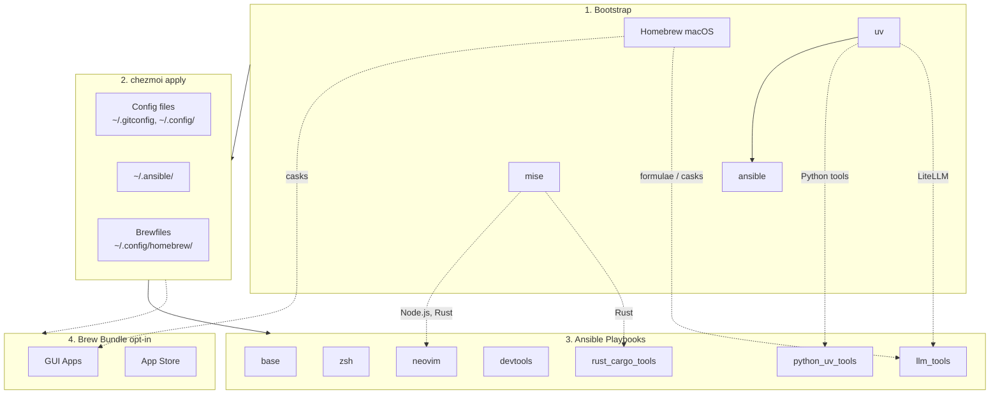

<!-- Generated by SpecStory, Markdown v2.1.0 -->

# 2026-04-09 09:46:56Z

<!-- Codex CLI Session 019d71a1-1d2e-7f62-88f3-0a032f2db2f0 (2026-04-09 09:46:56Z) -->

_**User (2026-04-09 09:46:56Z)**_

docs/tools/sesh.md 
目前tmux config 中 sesh 的 prefix + T 會觸發顯示time (可能是tmux default)
另外在tmux中nvim 使用 Ctrl + / 會被吃掉 (沒辦法展開terminal)
這兩個需要修正

---

_**Agent (gpt-5.4 2026-04-09 09:48:41Z)**_

<think><details><summary>Thought Process</summary>
**Exploring and preparing commands**

I’m in plan mode and need to explore first, which makes sense. I think I’ll likely reply in Chinese based on what the user might need. I should inspect the tmux config and some documentation, particularly docs/tools/sesh.md, since the user might be referencing that. I need to provide a commentary update and then use exec commands that are non-mutating. So, my next step is to review the relevant files.
</details></think>

_**Agent (gpt-5.4 2026-04-09 09:48:44Z)**_

我先確認目前 tmux 與 sesh 的實際設定來源，找出 `prefix + T` 被 tmux 預設綁定蓋掉，以及 `Ctrl + /` 在 tmux 內沒傳進 Neovim 的原因，再整理成可直接實作的修正方案。

_**Agent (gpt-5.4 2026-04-09 09:48:44Z)**_

<tool-use data-tool-type="shell" data-tool-name="exec_command"><details>
<summary>Tool use: **exec_command** `rg -n "sesh|bind.*T|display-time|clock-mode|extended-keys|C-/|C-_|terminal-features|xterm-keys|prefix" dot_tmux.conf dot_config/tmux -S`</summary>
```
Command: /bin/zsh -lc 'rg -n "sesh|bind.*T|display-time|clock-mode|extended-keys|C-/|C-_|terminal-features|xterm-keys|prefix" dot_tmux.conf dot_config/tmux -S'
Chunk ID: b90b7c
Wall time: 0.0000 seconds
Process exited with code 0
Original token count: 570
Output:
dot_config/tmux/plugins/tmux-which-key/config.yaml:3:# Trigger: prefix + Space (no root Ctrl+Space to avoid input method conflict)
dot_config/tmux/plugins/tmux-which-key/config.yaml:8:  prefix_table: Space
dot_config/tmux/plugins/tmux-which-key/config.yaml:11:  prefix: tmux
dot_config/tmux/plugins/tmux-which-key/config.yaml:12:  prefix_style: fg=green,align=centre,bold
dot_config/tmux/plugins/tmux-which-key/config.yaml:176:        command: "run-shell 'sesh connect \"$(sesh list --icons | fzf-tmux -p 80%,70% --no-sort --ansi)\"'"
dot_config/tmux/plugins/tmux-which-key/config.yaml:177:      - name: Last (sesh)
dot_config/tmux/plugins/tmux-which-key/config.yaml:179:        command: "run-shell 'sesh last'"
dot_tmux.conf:18:# Which-key style popup menu (prefix + Space to trigger)
dot_tmux.conf:73:set -as terminal-features ",xterm-256color:RGB"
dot_tmux.conf:78:set -g extended-keys always
dot_tmux.conf:79:set -as terminal-features 'xterm*:extkeys'
dot_tmux.conf:100:# Resize panes with prefix + H/J/K/L
dot_tmux.conf:116:# prefix + T: sesh picker in a tmux popup with fzf
dot_tmux.conf:117:bind-key "T" run-shell "sesh connect \"$(\
dot_tmux.conf:118:  sesh list --icons | fzf-tmux -p 80%,70% \
dot_tmux.conf:119:    --no-sort --ansi --border-label ' sesh ' --prompt '⚡  ' \
dot_tmux.conf:122:    --bind 'ctrl-a:change-prompt(⚡  )+reload(sesh list --icons)' \
dot_tmux.conf:123:    --bind 'ctrl-t:change-prompt(🪟  )+reload(sesh list -t --icons)' \
dot_tmux.conf:124:    --bind 'ctrl-g:change-prompt(⚙️  )+reload(sesh list -c --icons)' \
dot_tmux.conf:125:    --bind 'ctrl-x:change-prompt(📁  )+reload(sesh list -z --icons)' \
dot_tmux.conf:126:    --bind 'ctrl-f:change-prompt(🔎  )+reload(fd -H -d 2 -t d -E .Trash . ~)' \
dot_tmux.conf:127:    --bind 'ctrl-d:execute(tmux kill-session -t {2..})+change-prompt(⚡  )+reload(sesh list --icons)' \
dot_tmux.conf:129:    --preview 'sesh preview {}' \
dot_tmux.conf:132:# prefix + S: switch to last session (via sesh) -- note: L now used for pane resize
dot_tmux.conf:133:bind -N "last-session (via sesh)" S run-shell "sesh last"
dot_tmux.conf:135:# prefix + 9: jump to root of current git repo/worktree
dot_tmux.conf:136:bind -N "switch to root session (via sesh)" 9 run-shell "sesh connect --root $(pwd)"
```
</details></tool-use>

_**Agent (gpt-5.4 2026-04-09 09:48:44Z)**_

<tool-use data-tool-type="shell" data-tool-name="exec_command"><details>
<summary>Tool use: **exec_command** `sed -n '1,240p' docs/tools/sesh.md`</summary>
```
Command: /bin/zsh -lc "sed -n '1,240p' docs/tools/sesh.md"
Chunk ID: fb7185
Wall time: 0.0000 seconds
Process exited with code 0
Original token count: 1659
Output:
# Sesh - Smart Tmux Session Manager

[Sesh](https://github.com/joshmedeski/sesh) is a CLI that manages tmux sessions using zoxide, giving you instant access to your most-used projects with smart session naming, startup commands, and preview.

## Installation

Sesh is installed automatically by the `devtools` ansible role:

- **macOS**: `brew install sesh`
- **Linux**: GitHub release binary → `~/.local/bin/sesh`

No manual installation needed after `chezmoi apply`.

## Keybindings

### ZSH (`Alt+S`)

Press `Alt+S` anywhere in the shell to open the sesh picker. This uses `fzf-tmux` as a popup with full filtering support.

Source: `~/.config/zsh/tools/22_sesh.zsh`

### tmux

All keybindings use the tmux prefix (default `Ctrl+B`).

| Keybinding | Action |
|------------|--------|
| `prefix + T` | Open sesh picker popup (fzf with preview, icons, filtering) |
| `prefix + S` | Switch to last session (via `sesh last`) |
| `prefix + 9` | Jump to root of current git repo/worktree |

Source: `~/.tmux.conf`

### Picker Keybindings (inside fzf popup)

| Key | Action |
|-----|--------|
| `Ctrl+A` | Show all sessions |
| `Ctrl+T` | Filter: tmux sessions only |
| `Ctrl+G` | Filter: configured sessions only |
| `Ctrl+X` | Filter: zoxide directories only |
| `Ctrl+F` | Filter: find directories (`fd`) |
| `Ctrl+D` | Kill selected tmux session |
| `Tab` / `Shift+Tab` | Navigate down/up |

## Shell Completion

ZSH tab completion for `sesh` subcommands and flags is auto-generated into `~/.zfunc/_sesh` on first load (and regenerated when sesh version changes). This follows the project's [completion pattern](zsh/zsh-completions.md).

Manual regeneration:

```bash
sesh completion zsh > ~/.zfunc/_sesh
rm -f ~/.zcompdump && compinit
```

## Configuration

Config file: `~/.config/sesh/sesh.toml` (managed by chezmoi)

### Schema Autocomplete

The config includes a JSON Schema directive for editor autocomplete via [taplo](https://taplo.tamasfe.dev/):

```toml
#:schema https://github.com/joshmedeski/sesh/raw/main/sesh.schema.json
```

### Key Options

| Option | Description |
|--------|-------------|
| `sort_order` | Session type display order: `tmux`, `config`, `tmuxinator`, `zoxide` |
| `dir_length` | Directory components in session names (default: 1) |
| `blacklist` | Regex patterns to hide from the picker |
| `cache` | Enable stale-while-revalidate caching (experimental) |

### Default Session

Applied to all sessions unless overridden:

```toml
[default_session]
startup_command = "nvim"
preview_command = "eza --all --git --icons --color=always {}"
```

- `startup_command`: runs when a new session is created
- `preview_command`: shown in the fzf preview pane (`{}` = session path)

### Named Sessions

Pin frequently used directories with custom names and commands:

```toml
[[session]]
name = "dotfiles"
path = "~/.local/share/chezmoi"

[[session]]
name = "home"
path = "~"
disable_startup_command = true
```

Available fields: `name`, `path`, `startup_command`, `preview_command`, `disable_startup_command`, `windows`.

### Wildcard Sessions

Apply settings to directories matching a glob pattern:

```toml
[[wildcard]]
pattern = "~/repos/*"
startup_command = "nvim"
```

- `*` matches one level, `**` matches recursively
- Explicit `[[session]]` entries take priority over wildcards

### Windows

Define reusable window layouts:

```toml
[[session]]
name = "my-project"
path = "~/repos/my-project"
windows = ["git"]

[[window]]
name = "git"
startup_script = "lazygit"
```

## Recommended tmux Settings

These are already set in `~/.tmux.conf`:

```
set -g detach-on-destroy off   # stay in tmux when closing a session
bind-key x kill-pane           # skip kill-pane confirmation
```

## Integration with Other Tools

### fzf

Sesh's primary picker integration. The `fzf-tmux` wrapper renders fzf inside a tmux popup. Our setup uses `--icons` for Nerd Font glyphs and `sesh preview` for the preview pane.

### zoxide

Sesh uses zoxide's frecency database to suggest directories. Any directory you `cd` into is automatically tracked and appears in `sesh list -z`.

### Television (tv)

[Television](https://github.com/alexpasmantier/television) has a built-in [sesh channel](https://alexpasmantier.github.io/television/community/channels-unix/#sesh). If tv is installed, you can use it as an alternative picker:

```
# tmux keybinding (alternative to fzf)
bind-key "T" display-popup -E -w 80% -h 70% -d '#{pane_current_path}' -T 'Sesh' tv sesh
```

Television cable channel config (`~/.config/television/cable/sesh.toml`):

```toml
[metadata]
name = "sesh"
description = "Session manager integrating tmux sessions, zoxide directories, and config paths"
requirements = ["sesh", "fd"]

[source]
command = ["sesh list --icons", "sesh list -t --icons", "sesh list -c --icons", "sesh list -z --icons", "fd -H -d 2 -t d
... (truncated)
```
</details></tool-use>

_**Agent (gpt-5.4 2026-04-09 09:48:44Z)**_

<tool-use data-tool-type="shell" data-tool-name="exec_command"><details>
<summary>Tool use: **exec_command** `sed -n '1,260p' dot_tmux.conf`</summary>
```
Command: /bin/zsh -lc "sed -n '1,260p' dot_tmux.conf"
Chunk ID: 935740
Wall time: 0.0000 seconds
Process exited with code 0
Original token count: 1439
Output:
# ~/.tmux.conf - Tmux configuration
# Managed by chezmoi - do not edit directly

# =============================================================================
# Plugins (managed by TPM)
# =============================================================================

# Set TPM path (required for install_plugins script to work outside tmux)
set-environment -g TMUX_PLUGIN_MANAGER_PATH '~/.tmux/plugins'

set -g @plugin 'tmux-plugins/tpm'
set -g @plugin 'tmux-plugins/tmux-sensible'

# Session management
set -g @plugin 'tmux-plugins/tmux-resurrect'
set -g @plugin 'tmux-plugins/tmux-continuum'

# Which-key style popup menu (prefix + Space to trigger)
# Disable root Ctrl+Space binding (conflicts with input method switching)
set -g @tmux-which-key-xdg-enable 1
set -g @plugin 'alexwforsythe/tmux-which-key'

# =============================================================================
# Theme: tmux2k
# =============================================================================

set -g @plugin '2kabhishek/tmux2k'

# Theme settings
set -g @tmux2k-theme 'onedark'

# Start icon: `session`, 'window`, or any string
set -g @tmux2k-start-icon ""

# Status bar plugins
set -g @tmux2k-left-plugins "git cpu ram"
set -g @tmux2k-right-plugins "bandwidth network time"

# =============================================================================
# General Settings
# =============================================================================

# No ESC delay (critical for Neovim and coding agents)
set -sg escape-time 0

# Enable mouse support
setw -g mouse on

# Use vi mode keys
setw -g mode-keys vi

# Larger scrollback buffer
set -g history-limit 50000

# 1-indexed windows and panes (more ergonomic on keyboard)
set -g base-index 1
setw -g pane-base-index 1
set -g renumber-windows on

# Focus events for Vim autoread compatibility
set -g focus-events on

# Status bar
set-option -g status on
set-option -g status-position bottom

# =============================================================================
# Terminal & Key Compatibility (fixes Shift+Enter for coding agents)
# =============================================================================

# Proper terminal type with true color (24-bit) support
set -s default-terminal 'tmux-256color'
set -as terminal-features ",xterm-256color:RGB"

# Forward extended key sequences (kitty keyboard protocol) unconditionally.
# This fixes Shift+Enter, Ctrl+Enter, etc. inside tmux for apps like
# Claude Code, OpenCode, Neovim, and other modern terminal applications.
set -g extended-keys always
set -as terminal-features 'xterm*:extkeys'

# OSC 52 clipboard: works over SSH, no need for xclip/pbcopy hacks
set -g set-clipboard on

# Allow OSC passthrough (for terminal images, sixel, etc.)
set -g allow-passthrough on

# =============================================================================
# Vim-Style Pane Navigation
# =============================================================================

bind h select-pane -L
bind j select-pane -D
bind k select-pane -U
bind l select-pane -R

# Intuitive split bindings (| for vertical, - for horizontal)
bind | split-window -h -c "#{pane_current_path}"
bind - split-window -v -c "#{pane_current_path}"

# Resize panes with prefix + H/J/K/L
bind -r H resize-pane -L 5
bind -r J resize-pane -D 5
bind -r K resize-pane -U 5
bind -r L resize-pane -R 5

# New window/pane inherits current path
bind c new-window -c "#{pane_current_path}"

# =============================================================================
# Sesh (tmux session manager)
# =============================================================================

set -g detach-on-destroy off
bind-key x kill-pane

# prefix + T: sesh picker in a tmux popup with fzf
bind-key "T" run-shell "sesh connect \"$(\
  sesh list --icons | fzf-tmux -p 80%,70% \
    --no-sort --ansi --border-label ' sesh ' --prompt '⚡  ' \
    --header '  ^a all ^t tmux ^g configs ^x zoxide ^d tmux kill ^f find' \
    --bind 'tab:down,btab:up' \
    --bind 'ctrl-a:change-prompt(⚡  )+reload(sesh list --icons)' \
    --bind 'ctrl-t:change-prompt(🪟  )+reload(sesh list -t --icons)' \
    --bind 'ctrl-g:change-prompt(⚙️  )+reload(sesh list -c --icons)' \
    --bind 'ctrl-x:change-prompt(📁  )+reload(sesh list -z --icons)' \
    --bind 'ctrl-f:change-prompt(🔎  )+reload(fd -H -d 2 -t d -E .Trash . ~)' \
    --bind 'ctrl-d:execute(tmux kill-session -t {2..})+change-prompt(⚡  )+reload(sesh list --icons)' \
    --preview-window 'right:55%' \
    --preview 'sesh preview {}' \
)\""

# prefix + S: switch to last session (via sesh) -- note: L now used for pane resize
bind -N "last-session (via sesh)" S run-shell "sesh last"

# prefix + 9: jump to root of current git repo/worktree
bind -N "switch to root session (via sesh)" 9 run-shell "sesh connect --root $(p
... (truncated)
```
</details></tool-use>

_**Agent (gpt-5.4 2026-04-09 09:49:10Z)**_

<think><details><summary>Thought Process</summary>
**Investigating tmux bindings**

I need to look into the default behavior of tmux bindings, specifically for uppercase T and ctrl-/ functions. It seems like uppercase T might be linked to clock-mode, but I need to confirm that since the user suggests that prefix+T triggers a time display. Maybe they're mistakenly pressing shift with T. When I review the bindings, I wonder if it recognizes uppercase T differently from lowercase t. It’ll help to check the docs and perhaps run `tmux list-keys` to clarify.
</details></think>

_**Agent (gpt-5.4 2026-04-09 09:49:10Z)**_

<think><details><summary>Thought Process</summary>
**Exploring tmux configurations**

I think starting a temporary tmux server with a specific config file could be helpful, like using `tmux -f dot_tmux.conf -L test start-server \; list-keys`. Although it creates a socket, it should be fine. I also need to figure out how Ctrl-/ (C-_) behaves since tmux might not bind it properly. I should check if extended keys are enabled with `set -g xterm-keys on`. It’s possible tmux captures C-_ instead, but I need to see if any bindings exist for that or if terminal settings might play a role.
</details></think>

_**Agent (gpt-5.4 2026-04-09 09:49:10Z)**_

<think><details><summary>Thought Process</summary>
**Inspecting tmux settings**

Inside tmux, the default terminal might be set to tmux-256color, which could be causing issues with recognizing Ctrl-/ (C-_). I wonder if the `extended-keys-format csi-u` option is required as well. It’s probably a good idea to check the version of tmux I'm using, along with the manual, to see what changes might affect this behavior. Any additional insights from the documentation could clarify how extended keys are handled too!
</details></think>

_**Agent (gpt-5.4 2026-04-09 09:49:14Z)**_

我已確認目前 `dot_tmux.conf` 有自訂 `bind-key "T"`，但 tmux 預設 `prefix + t` 是 clock mode，所以還要確認實際 key 事件有沒有被辨識成大寫 `T`。另外 `Ctrl + /` 多半是 tmux 對 control punctuation 的轉送格式問題，不是 Neovim 自己的 mapping。

_**Agent (gpt-5.4 2026-04-09 09:49:14Z)**_

<tool-use data-tool-type="shell" data-tool-name="exec_command"><details>
<summary>Tool use: **exec_command** `tmux -V`</summary>
```
Command: /bin/zsh -lc 'tmux -V'
Chunk ID: dd42fc
Wall time: 0.0000 seconds
Process exited with code 0
Original token count: 3
Output:
tmux 3.6a
```
</details></tool-use>

_**Agent (gpt-5.4 2026-04-09 09:49:14Z)**_

<tool-use data-tool-type="shell" data-tool-name="exec_command"><details>
<summary>Tool use: **exec_command** `tmux -L codexplan -f /Users/zhouhanru/.local/share/chezmoi/dot_tmux.conf start-server \; list-keys -T prefix | rg -n '(^| )T |(^| )t |clock|sesh' -n -S`</summary>
```
Command: /bin/zsh -lc "tmux -L codexplan -f /Users/zhouhanru/.local/share/chezmoi/dot_tmux.conf start-server \\; list-keys -T prefix | rg -n '("'^| )T |(''^| )t |clock|sesh'"' -n -S"
Chunk ID: 376e97
Wall time: 0.6621 seconds
Process exited with code 0
Original token count: 244
Output:
24:bind-key    -T prefix 9       run-shell "sesh connect --root $(pwd)"
41:bind-key    -T prefix S       run-shell "sesh last"
42:bind-key    -T prefix T       run-shell "sesh connect \"$(  sesh list --icons | fzf-tmux -p 80%,70%     --no-sort --ansi --border-label ' sesh ' --prompt '⚡  '     --header '  ^a all ^t tmux ^g configs ^x zoxide ^d tmux kill ^f find'     --bind 'tab:down,btab:up'     --bind 'ctrl-a:change-prompt(⚡  )+reload(sesh list --icons)'     --bind 'ctrl-t:change-prompt(🪟  )+reload(sesh list -t --icons)'     --bind 'ctrl-g:change-prompt(⚙️  )+reload(sesh list -c --icons)'     --bind 'ctrl-x:change-prompt(📁  )+reload(sesh list -z --icons)'     --bind 'ctrl-f:change-prompt(🔎  )+reload(fd -H -d 2 -t d -E .Trash . ~)'     --bind 'ctrl-d:execute(tmux kill-session -t {2..})+change-prompt(⚡  )+reload(sesh list --icons)'     --preview-window 'right:55%'     --preview 'sesh preview {}' )\""
62:bind-key    -T prefix t       clock-mode
```
</details></tool-use>

_**Agent (gpt-5.4 2026-04-09 09:49:14Z)**_

<tool-use data-tool-type="shell" data-tool-name="exec_command"><details>
<summary>Tool use: **exec_command** `tmux -L codexplan -f /Users/zhouhanru/.local/share/chezmoi/dot_tmux.conf show-options -g | rg -n 'extended-keys|default-terminal|terminal-features|xterm-keys|escape-time|allow-passthrough|set-clipboard' -n -S`</summary>
```
Command: /bin/zsh -lc "tmux -L codexplan -f /Users/zhouhanru/.local/share/chezmoi/dot_tmux.conf show-options -g | rg -n 'extended-keys|default-terminal|terminal-features|xterm-keys|escape-time|allow-passthrough|set-clipboard' -n -S"
Chunk ID: 770345
Wall time: 0.0000 seconds
Process exited with code 1
Original token count: 20
Output:
error connecting to /private/tmp/tmux-501/codexplan (No such file or directory)
```
</details></tool-use>

_**Agent (gpt-5.4 2026-04-09 09:49:37Z)**_

設定面確認到了：tmux 在 `prefix` table 同時存在 `T -> sesh` 和預設 `t -> clock-mode`。這代表問題不是設定沒載入，而是你按的組合目前被 tmux 解讀成小寫 `t`。我再補查 control punctuation 的傳遞格式，確認 `Ctrl + /` 要怎麼在 tmux 3.6a 上穩定送進 Neovim。

_**Agent (gpt-5.4 2026-04-09 09:49:37Z)**_

<tool-use data-tool-type="shell" data-tool-name="exec_command"><details>
<summary>Tool use: **exec_command** `tmux -L codexplan -f /Users/zhouhanru/.local/share/chezmoi/dot_tmux.conf start-server \; show-options -g | rg -n 'extended-keys|default-terminal|terminal-features|xterm-keys|escape-time|allow-passthrough|set-clipboard' -n -S`</summary>
```
Command: /bin/zsh -lc "tmux -L codexplan -f /Users/zhouhanru/.local/share/chezmoi/dot_tmux.conf start-server \\; show-options -g | rg -n 'extended-keys|default-terminal|terminal-features|xterm-keys|escape-time|allow-passthrough|set-clipboard' -n -S"
Chunk ID: 321488
Wall time: 0.7241 seconds
Process exited with code 1
Original token count: 0
Output:
```
</details></tool-use>

_**Agent (gpt-5.4 2026-04-09 09:49:37Z)**_

<tool-use data-tool-type="shell" data-tool-name="exec_command"><details>
<summary>Tool use: **exec_command** `tmux -L codexplan -f /Users/zhouhanru/.local/share/chezmoi/dot_tmux.conf start-server \; show-options -s | rg -n 'extended-keys|default-terminal|terminal-features|xterm-keys|escape-time|allow-passthrough|set-clipboard|extended-keys-format' -n -S`</summary>
```
Command: /bin/zsh -lc "tmux -L codexplan -f /Users/zhouhanru/.local/share/chezmoi/dot_tmux.conf start-server \\; show-options -s | rg -n 'extended-keys|default-terminal|terminal-features|xterm-keys|escape-time|allow-passthrough|set-clipboard|extended-keys-format' -n -S"
Chunk ID: d1d251
Wall time: 0.0000 seconds
Process exited with code 0
Original token count: 89
Output:
12:default-terminal tmux-256color
14:escape-time 0
17:extended-keys always
18:extended-keys-format xterm
25:set-clipboard on
27:terminal-features[0] xterm*:clipboard:ccolour:cstyle:focus:title
28:terminal-features[1] screen*:title
29:terminal-features[2] rxvt*:ignorefkeys
30:terminal-features[3] xterm-256color:RGB
31:terminal-features[4] xterm*:extkeys
```
</details></tool-use>

_**Agent (gpt-5.4 2026-04-09 09:49:37Z)**_

<tool-use data-tool-type="shell" data-tool-name="exec_command"><details>
<summary>Tool use: **exec_command** `man tmux | col -b | rg -n "extended-keys-format|extended-keys|C-_|C-/|CSI u|modifyOtherKeys|user-keys|Any key" -n -S`</summary>
```
Command: /bin/zsh -lc 'man tmux | col -b | rg -n "extended-keys-format|extended-keys|C-_|C-/|CSI u|modifyOtherKeys|user-keys|Any key" -n -S'
Chunk ID: ac0f34
Wall time: 0.0821 seconds
Process exited with code 0
Original token count: 91
Output:
1830:     A command bound to the Any key will execute for all keys which do not
2063:     extended-keys [on | off | always]
2066:	     modifyOtherKeys xterm(1) resource.
2078:	     terminal-features option, the extended-keys-format option and the
2081:     extended-keys-format [csi-u | xterm]
2212:     user-keys[] key
2218:		   set -s user-keys[0] "\e[5;30012~"
```
</details></tool-use>

_**Agent (gpt-5.4 2026-04-09 09:49:47Z)**_

<tool-use data-tool-type="shell" data-tool-name="exec_command"><details>
<summary>Tool use: **exec_command** `man tmux | col -b | sed -n '2056,2088p'`</summary>
```
Command: /bin/zsh -lc "man tmux | col -b | sed -n '2056,2088p'"
Chunk ID: b0782b
Wall time: 0.0000 seconds
Process exited with code 0
Original token count: 377
Output:
	     If enabled (the default), the server will exit when there are no
	     active sessions.

     exit-unattached [on | off]
	     If enabled, the server will exit when there are no attached
	     clients.

     extended-keys [on | off | always]
	     Controls how modified keys (keys pressed together with Control,
	     Meta, or Shift) are reported.  This is the equivalent of the
	     modifyOtherKeys xterm(1) resource.

	     When set to on, the program inside the pane can request one of
	     two modes: mode 1 which changes the sequence for only keys which
	     lack an existing well-known representation; or mode 2 which
	     changes the sequence for all keys.  When set to always, modes 1
	     and 2 can still be requested by applications, but mode 1 will be
	     forced instead of the standard mode.  When set to off, this
	     feature is disabled and only standard keys are reported.

	     tmux will always request extended keys itself if the terminal
	     supports them.  See also the extkeys feature for the
	     terminal-features option, the extended-keys-format option and the
	     pane_key_mode variable.

     extended-keys-format [csi-u | xterm]
	     Selects one of the two possible formats for reporting modified
	     keys to applications.  This is the equivalent of the
	     formatOtherKeys xterm(1) resource.  For example, C-S-a will be
	     reported as ‘^[[27;6;65~’ when set to xterm, and as ‘^[[65;6u’
	     when set to csi-u.

     focus-events [on | off]
```
</details></tool-use>

_**Agent (gpt-5.4 2026-04-09 09:50:01Z)**_

<think><details><summary>Thought Process</summary>
**Looking into terminal fixes**

I’ve noticed that the current xterm format might not support the ctrl+/ function. I need to figure out the recommended fix, possibly looking into csi-u, and see if Neovim supports it. Should I inspect the documentation for kitty or wezterm? It could help to search the repository for nvim mapping or any mentions related to this issue. Getting to the bottom of this could be helpful moving forward!
</details></think>

_**Agent (gpt-5.4 2026-04-09 09:50:01Z)**_

<tool-use data-tool-type="shell" data-tool-name="exec_command"><details>
<summary>Tool use: **exec_command** `rg -n "<C-/>|<C-_>|ctrl-/|ctrl-_" dot_config dot_* docs -S`</summary>
```
Command: /bin/zsh -lc 'rg -n "<C-/>|<C-_>|ctrl-/|ctrl-_" dot_config dot_* docs -S'
Chunk ID: 94e614
Wall time: 0.0000 seconds
Process exited with code 1
Original token count: 0
Output:
```
</details></tool-use>

_**Agent (gpt-5.4 2026-04-09 09:50:01Z)**_

<tool-use data-tool-type="shell" data-tool-name="exec_command"><details>
<summary>Tool use: **exec_command** `command -v nvim >/dev/null && nvim --version | head -n 5 || true`</summary>
```
Command: /bin/zsh -lc 'command -v nvim >/dev/null && nvim --version | head -n 5 || true'
Chunk ID: c102f4
Wall time: 0.0000 seconds
Process exited with code 0
Original token count: 22
Output:
NVIM v0.12.1
Build type: Release
LuaJIT 2.1.1774896198
Run "nvim -V1 -v" for more info
```
</details></tool-use>

_**Agent (gpt-5.4 2026-04-09 09:50:01Z)**_

<tool-use data-tool-type="shell" data-tool-name="exec_command"><details>
<summary>Tool use: **exec_command** `command -v infocmp >/dev/null && infocmp tmux-256color | sed -n '1,220p' || true`</summary>
```
Command: /bin/zsh -lc "command -v infocmp >/dev/null && infocmp tmux-256color | sed -n '1,220p' || true"
Chunk ID: 19a6af
Wall time: 0.0000 seconds
Process exited with code 0
Original token count: 403
Output:
#	Reconstructed via infocmp from file: /usr/share/terminfo/74/tmux-256color
tmux-256color|tmux with 256 colors,
	am, hs, km, mir, msgr, xenl,
	colors#256, cols#80, it#8, lines#24, pairs#32767,
	acsc=++\,\,--..00``aaffgghhiijjkkllmmnnooppqqrrssttuuvvwwxxyyzz{{||}}~~,
	bel=^G, blink=\E[5m, bold=\E[1m, cbt=\E[Z, civis=\E[?25l,
	clear=\E[H\E[J, cnorm=\E[34h\E[?25h, cr=^M,
	csr=\E[%i%p1%d;%p2%dr, cub=\E[%p1%dD, cub1=^H,
	cud=\E[%p1%dB, cud1=^J, cuf=\E[%p1%dC, cuf1=\E[C,
	cup=\E[%i%p1%d;%p2%dH, cuu=\E[%p1%dA, cuu1=\EM,
	cvvis=\E[34l, dch=\E[%p1%dP, dch1=\E[P, dim=\E[2m,
	dl=\E[%p1%dM, dl1=\E[M, dsl=\E]0;\007, ed=\E[J, el=\E[K,
	el1=\E[1K, enacs=\E(B\E)0, flash=\Eg, fsl=^G, home=\E[H,
	ht=^I, hts=\EH, ich=\E[%p1%d@, il=\E[%p1%dL, il1=\E[L,
	ind=^J, is2=\E)0, kbs=^H, kcbt=\E[Z, kcub1=\EOD, kcud1=\EOB,
	kcuf1=\EOC, kcuu1=\EOA, kdch1=\E[3~, kend=\E[4~, kf1=\EOP,
	kf10=\E[21~, kf11=\E[23~, kf12=\E[24~, kf2=\EOQ, kf3=\EOR,
	kf4=\EOS, kf5=\E[15~, kf6=\E[17~, kf7=\E[18~, kf8=\E[19~,
	kf9=\E[20~, khome=\E[1~, kich1=\E[2~, kmous=\E[M,
	knp=\E[6~, kpp=\E[5~, nel=\EE, op=\E[39;49m, rc=\E8,
	rev=\E[7m, ri=\EM, ritm=\E[23m, rmacs=^O, rmcup=\E[?1049l,
	rmir=\E[4l, rmkx=\E[?1l\E>, rmso=\E[27m, rmul=\E[24m,
	rs2=\Ec\E[?1000l\E[?25h, sc=\E7,
	setab=\E[%?%p1%{8}%<%t4%p1%d%e%p1%{16}%<%t10%p1%{8}%-%d%e48;5;%p1%d%;m,
	setaf=\E[%?%p1%{8}%<%t3%p1%d%e%p1%{16}%<%t9%p1%{8}%-%d%e38;5;%p1%d%;m,
	sgr=\E[0%?%p6%t;1%;%?%p1%t;3%;%?%p2%t;4%;%?%p3%t;7%;%?%p4%t;5%;%?%p5%t;2%;m%?%p9%t\016%e\017%;,
	sgr0=\E[m\017, sitm=\E[3m, smacs=^N, smcup=\E[?1049h,
	smir=\E[4h, smkx=\E[?1h\E=, smso=\E[7m, smul=\E[4m,
	tbc=\E[3g, tsl=\E]0;,
```
</details></tool-use>

_**Agent (gpt-5.4 2026-04-09 09:50:20Z)**_

<think><details><summary>Thought Process</summary>
**Considering documentation changes**

I need to check the docs and README regarding tmux keybindings. The AGENTS mention updating the README if configs are modified, so perhaps I should think about including any changes in the plan. It makes sense to ensure the README reflects changes to tmux keybindings, and I should inspect the relevant sections of the README. This way, I can keep everything organized and informative for anyone who might use it in the future.
</details></think>

_**Agent (gpt-5.4 2026-04-09 09:50:20Z)**_

<tool-use data-tool-type="shell" data-tool-name="exec_command"><details>
<summary>Tool use: **exec_command** `rg -n "prefix \+ T|prefix \+ S|tmux|Ctrl\+ /|Ctrl\+/|extended-keys|terminal-features|Tmux Configuration|tmux-which-key" README.md docs -S`</summary>
```
Command: /bin/zsh -lc "rg -n \"prefix \\+ T|prefix \\+ S|tmux|Ctrl\\+ /|Ctrl\\+/|extended-keys|terminal-features|Tmux Configuration|tmux-which-key\" README.md docs -S"
Chunk ID: 3d08b2
Wall time: 0.0000 seconds
Process exited with code 0
Original token count: 724
Output:
README.md:77:| `installPythonUvTools` | true | Python CLI tools via uv (mlflow, sqlit-tui, tmuxp, etc.) |
README.md:109:- `~/.tmux.conf` - Tmux configuration with TPM plugins, tmux-which-key (`prefix+Space`), vim-style pane nav, extended-keys for coding agents, sesh keybindings (`prefix+T` picker, `prefix+S` last)
README.md:123:- `~/.config/tmuxp/claude-sidecar.yaml` - tmuxp workspace for Claude + Sidecar
README.md:126:- `~/.config/tmux/plugins/tmux-which-key/config.yaml` - tmux-which-key menu config (prefix+Space, no root Ctrl+Space)
README.md:153:- **Dev tools**: bat, gh, diffnav, git-delta, git-graph, eza, tldr, glow, thefuck, zoxide, direnv, yazi, tmux+tpm, sesh, zellij, btop, htop
README.md:155:- **Python tools (via uv)**: thefuck, apprise, sqlit-tui, dotenv, git-filter-repo, mlflow, tmuxp
docs/tools/starship.md:134:# Show current tmux session name
docs/tools/starship.md:135:[custom.tmux]
docs/tools/starship.md:136:command = "tmux display-message -p '#S' 2>/dev/null"
docs/tools/starship.md:153:- **tmux2k**: tmux status bar is independent of starship; no conflicts.
docs/tools/sesh.md:3:[Sesh](https://github.com/joshmedeski/sesh) is a CLI that manages tmux sessions using zoxide, giving you instant access to your most-used projects with smart session naming, startup commands, and preview.
docs/tools/sesh.md:18:Press `Alt+S` anywhere in the shell to open the sesh picker. This uses `fzf-tmux` as a popup with full filtering support.
docs/tools/sesh.md:22:### tmux
docs/tools/sesh.md:24:All keybindings use the tmux prefix (default `Ctrl+B`).
docs/tools/sesh.md:28:| `prefix + T` | Open sesh picker popup (fzf with preview, icons, filtering) |
docs/tools/sesh.md:29:| `prefix + S` | Switch to last session (via `sesh last`) |
docs/tools/sesh.md:32:Source: `~/.tmux.conf`
docs/tools/sesh.md:39:| `Ctrl+T` | Filter: tmux sessions only |
docs/tools/sesh.md:43:| `Ctrl+D` | Kill selected tmux session |
docs/tools/sesh.md:73:| `sort_order` | Session type display order: `tmux`, `config`, `tmuxinator`, `zoxide` |
docs/tools/sesh.md:136:## Recommended tmux Settings
docs/tools/sesh.md:138:These are already set in `~/.tmux.conf`:
docs/tools/sesh.md:141:set -g detach-on-destroy off   # stay in tmux when closing a session
docs/tools/sesh.md:149:Sesh's primary picker integration. The `fzf-tmux` wrapper renders fzf inside a tmux popup. Our setup uses `--icons` for Nerd Font glyphs and `sesh preview` for the preview pane.
docs/tools/sesh.md:160:# tmux keybinding (alternative to fzf)
docs/tools/sesh.md:169:description = "Session manager integrating tmux sessions, zoxide directories, and config paths"
docs/tools/sesh.md:190:description = "Kill selected tmux session"
docs/tools/sesh.md:191:command = "tmux kill-session -t '{strip_ansi|split: :1..|join: }'"
docs/tools/sesh.md:214:- [Smart tmux sessions with sesh](https://www.youtube.com/watch?v=-yX3GjZfb5Y) (Josh Medeski)
```
</details></tool-use>

_**Agent (gpt-5.4 2026-04-09 09:50:20Z)**_

<tool-use data-tool-type="shell" data-tool-name="exec_command"><details>
<summary>Tool use: **exec_command** `sed -n '1,240p' README.md`</summary>
```
Command: /bin/zsh -lc "sed -n '1,240p' README.md"
Chunk ID: b843f3
Wall time: 0.0000 seconds
Process exited with code 0
Original token count: 2782
Output:
# dotfiles

Cross-platform development environment setup using **chezmoi** + **ansible**.

- **chezmoi**: manages config files (dotfiles)
- **ansible**: installs system dependencies and tools

## Prerequisites

- [chezmoi](https://www.chezmoi.io/install/)
- [uv](https://docs.astral.sh/uv/getting-started/installation/) (for ansible)

## Architecture



## Quick Setup

```bash
# One-liner to initialize and apply (installs chezmoi to ~/.local/bin)
export GITHUB_USERNAME=daviddwlee84
sh -c "$(curl -fsLS get.chezmoi.io)" -- -b "$HOME/.local/bin" init --apply git@github.com:$GITHUB_USERNAME/dotfiles.git
```

This automatically:

1. Bootstraps Homebrew (macOS/Linux), uv, mise, ansible
2. Deploys all config files
3. Runs ansible playbooks (git, ripgrep, fd, neovim, etc.)
4. Runs brew bundle (if `installBrewApps` is enabled, or on macOS if `installAiDesktopApps` is enabled)

### Optional Components

During `chezmoi init`, you'll be prompted for optional installs:

| Option | Default | Description |
|--------|---------|-------------|
| `installCodingAgents` | true | Claude Code, Codex CLI, OpenCode, Cursor, Copilot, Gemini CLI, RTK, td, sidecar, specify-cli, etc. |
| `installBitwarden` | false | Bitwarden CLI (`bw`) + Desktop app (desktop profiles) with SSH agent auto-detection |
| `installPythonUvTools` | true | Python CLI tools via uv (mlflow, sqlit-tui, tmuxp, etc.) |
| `installLlmTools` | false | Local LLM tools: Ollama, LiteLLM, llmfit, models |
| `installAiDesktopApps` | false | macOS AI desktop apps via Homebrew Brewfile (Claude, ChatGPT, OpenCode Desktop, Antigravity, Codex Desktop on Apple Silicon; `ollama-app` also requires `installLlmTools=true`) |
| `installBrewApps` | false | General GUI apps via Homebrew Brewfile (terminals, browsers, utilities, mas; excludes AI desktop apps) |
| `installInputMethod` | false | Traditional Chinese input methods (McBopomofo, RIME/Squirrel on macOS; ibus-rime on Linux) |
| `installNetworkingTools` | false | Networking CLI tools (nmap, mtr, httpie, gping, trippy, bandwhich, rustscan, etc.) |
| `noRoot` | false | Skip sudo-requiring tasks (for servers without root access) |

To change options later: `chezmoi init --force`

## What You Get

### Config Files

- `~/.gitconfig` - Git configuration
- `~/.config/git/hooks/` - Global Git hooks (pre-commit + Git LFS hooks)
- `~/.config/gh-dash/config.yml` - Global gh-dash config, with `diffnav` as the diff pager
- `~/.config/lazygit/config.yml` - Global LazyGit config, with `delta` as the custom diff pager
- `~/.config/bat/themes/tokyonight_night.tmTheme` - Managed Tokyo Night theme for bat
- `~/.config/nvim/` - Neovim (LazyVim) configuration
- `~/.config/uv/uv.toml` - uv package manager config
- `~/.cargo/config.toml` - Cargo registry mirror config (GFW)
- `~/.npmrc` - npm registry config (official/npmmirror via `useChineseMirror`)
- `~/.config/.bunfig.toml` - Bun global registry config (official/npmmirror via `useChineseMirror`)
- `~/.config/alacritty/` - Alacritty terminal config
- `~/.config/starship.toml` - Starship cross-shell prompt config
- `~/.config/direnv/direnvrc` - direnv helper functions, including `.venv`-aware Python activation
- `~/.config/yazi/` - Yazi file manager config (v0.3.3+ syntax, [docs](https://yazi-rs.github.io/docs/configuration/overview/))
  - `yazi.toml` - Main config with open rules and openers (`o`/`O`)
  - `keymap.toml`, `theme.toml` - Optional customization files (stubs provided)
- `~/.claude/` - Claude Code settings
- `~/.specstory/cli/config.toml` - Global SpecStory defaults for `specstory run` across all projects
- `~/.tmux.conf` - Tmux configuration with TPM plugins, tmux-which-key (`prefix+Space`), vim-style pane nav, extended-keys for coding agents, sesh keybindings (`prefix+T` picker, `prefix+S` last)
- `~/.local/bin/x` - Cross-platform terminal wrapper for `copy` / `paste` / `open`
- `~/.config/sesh/sesh.toml` - Sesh sessi
... (truncated)
```
</details></tool-use>

_**Agent (gpt-5.4 2026-04-09 09:50:41Z)**_

<think><details><summary>Thought Process</summary>
**Clarifying user preferences**

I need to ask one or more questions to clarify what the user really wants for their session since their current setup with prefix+T seems unreliable. They probably want the current documents' behavior or at least a functional shortcut. I could recommend binding lowercase t to the session and moving the clock to something else. Additionally, it would be good to confirm if they want to keep `prefix+t` for the clock, and I might suggest a reliable approach for Ctrl+/ as well.
</details></think>

_**Agent (gpt-5.4 2026-04-09 09:50:41Z)**_

<think><details><summary>Thought Process</summary>
**Exploring documentation needs**

I’m considering whether I should document that `Ctrl+/` requires `extended-keys-format csi-u`. It seems less of a preference and more about implementation. I might need to inspect the current tmux docs, as there's a possible bug with the path in `docs/sesh.md`. I should also confirm if csi-u with extkeys is compatible with nvim 0.12. Since browsing is limited, I’ll focus on local planning but might need to quickly check the official tmux and Neovim docs for details.
</details></think>

_**Agent (gpt-5.4 2026-04-09 09:50:44Z)**_

我已經把問題範圍縮到兩個具體點：`prefix + T` 實際上被 tmux 當成 `prefix + t`，以及 tmux 現在用的是 `extended-keys-format xterm`，這很可能讓 `Ctrl + /` 在 Neovim 裡拿不到穩定事件。接著我只剩下一個產品決策要跟你確認：要不要保留原本的 tmux clock 快捷鍵。

_**Agent (gpt-5.4 2026-04-09 09:50:46Z)**_

<tool-use data-tool-type="unknown" data-tool-name="request_user_input"><details>
<summary>Tool use: **request_user_input**</summary>

**Input:**

- questions: `[map[header:tmux key id:tmux_t_binding options:[map[description:最穩定，無論終端怎麼送大小寫都會打開 sesh；clock 改綁別的鍵或移除。 label:t/T 都給 sesh (Recommended)] map[description:維持原本設計，但若終端/鍵盤把它送成小寫 t，問題可能持續存在。 label:只保留大寫 T] map[description:改成不依賴 Shift，最容易按，但文件與既有習慣要一起更新。 label:t 給 sesh，T 保留不用]] question:`prefix + T` 修正後，你希望怎麼處理 tmux 預設的 clock 快捷鍵？]]`

**Result:**

</details></tool-use>

_**Agent (gpt-5.4 2026-04-09 09:53:06Z)**_

<think><details><summary>Thought Process</summary>
**Addressing terminal issues**

I'm noticing that the user chose only the uppercase T, but their environment is sending a lowercase t. So, just saying to keep uppercase T doesn't really solve the issue without fixing the underlying terminal problem. I think I need to approach this politely and maybe ask them another question because their choice conflicts with the goal. I'll need to explain that tmux already has uppercase T bound but since the terminal isn’t sending a distinct T after the prefix, we should consider a real fix. I’ll recommend binding both keys or switching to a different non-shift key and ask for their input on this.
</details></think>

_**Agent (gpt-5.4 2026-04-09 09:53:07Z)**_

你選的「只保留大寫 `T`」和你現在遇到的症狀其實衝突：repo 已經是這樣配了，但 tmux 目前收到的是小寫 `t`，所以才會掉到預設 clock。若不改綁定策略，就只能依賴終端/鍵盤層另外修。這裡需要你在「維持只用大寫」和「真正把問題在 dotfiles 內修掉」之間選一個。

_**Agent (gpt-5.4 2026-04-09 09:53:15Z)**_

<tool-use data-tool-type="unknown" data-tool-name="request_user_input"><details>
<summary>Tool use: **request_user_input**</summary>

**Input:**

- questions: `[map[header:sesh fix id:sesh_fix_strategy options:[map[description:直接在 tmux 層解決，不管實際送進來的是 `t` 還是 `T` 都能用。 label:t/T 都開 sesh (Recommended)] map[description:例如 `prefix + o` 或 `prefix + f`，避開大小寫辨識問題，但會改使用習慣。 label:改成別的非 Shift 鍵] map[description:repo 內不會真正修掉目前症狀，需要你另外處理終端或鍵盤送鍵行為。 label:維持只用大寫 T]] question:要在這個 dotfiles repo 內把 `prefix + T` 問題修好，建議改成哪一種？] map[header:ctrl slash id:ctrl_slash_scope options:[map[description:調整 tmux 的 key forwarding 格式，讓 Neovim 和其他 TUI 一起受益。 label:tmux 層全域修正 (Recommended)] map[description:可接受做較窄的 workaround，但未必改善其他終端程式。 label:只求 Neovim 可用] map[description:只處理 sesh 綁定衝突。 label:先不動這項]] question:`Ctrl + /` 的修正範圍要怎麼抓？]]`

**Result:**

</details></tool-use>

_**Agent (gpt-5.4 2026-04-09 09:54:52Z)**_

<think><details><summary>Thought Process</summary>
**Deciding key bindings**

I need to finalize a plan for key bindings, specifically considering options like prefix+o or prefix+f. It seems important to ask the user which key might be more memorable and conflict-free. I’m thinking of checking existing bindings, particularly with something like which-key, to see if prefix+f is available. Choosing prefix+o might be better since it cycles through panes. I’ll inspect this further and propose recommendations based on current bindings.
</details></think>

_**Agent (gpt-5.4 2026-04-09 09:54:55Z)**_

目前方向已經明確了：`sesh` 改成一個不靠 Shift 的鍵，`Ctrl + /` 則在 tmux 層做通用修正。不過 sesh 的新快捷鍵要避開 tmux 既有常用鍵，這需要最後鎖定一次，不然實作者還得自己做決定。

_**Agent (gpt-5.4 2026-04-09 09:54:55Z)**_

<tool-use data-tool-type="shell" data-tool-name="exec_command"><details>
<summary>Tool use: **exec_command** `tmux -L codexplan -f /Users/zhouhanru/.local/share/chezmoi/dot_tmux.conf start-server \; list-keys -T prefix | sed -n '1,220p'`</summary>
```
Command: /bin/zsh -lc "tmux -L codexplan -f /Users/zhouhanru/.local/share/chezmoi/dot_tmux.conf start-server \\; list-keys -T prefix | sed -n '1,220p'"
Chunk ID: da593b
Wall time: 0.7338 seconds
Process exited with code 0
Original token count: 2091
Output:
bind-key    -T prefix Space   next-layout
bind-key    -T prefix !       break-pane
bind-key    -T prefix \"      split-window
bind-key    -T prefix \#      list-buffers
bind-key    -T prefix \$      command-prompt -I "#S" { rename-session "%%" }
bind-key    -T prefix \%      split-window -h
bind-key    -T prefix &       confirm-before -p "kill-window #W? (y/n)" kill-window
bind-key    -T prefix \'      command-prompt -T window-target -p index { select-window -t ":%%" }
bind-key    -T prefix (       switch-client -p
bind-key    -T prefix )       switch-client -n
bind-key    -T prefix ,       command-prompt -I "#W" { rename-window "%%" }
bind-key    -T prefix -       split-window -v -c "#{pane_current_path}"
bind-key    -T prefix .       command-prompt -T target { move-window -t "%%" }
bind-key    -T prefix /       command-prompt -k -p key { list-keys -1N "%%" }
bind-key    -T prefix 0       select-window -t :=0
bind-key    -T prefix 1       select-window -t :=1
bind-key    -T prefix 2       select-window -t :=2
bind-key    -T prefix 3       select-window -t :=3
bind-key    -T prefix 4       select-window -t :=4
bind-key    -T prefix 5       select-window -t :=5
bind-key    -T prefix 6       select-window -t :=6
bind-key    -T prefix 7       select-window -t :=7
bind-key    -T prefix 8       select-window -t :=8
bind-key    -T prefix 9       run-shell "sesh connect --root $(pwd)"
bind-key    -T prefix :       command-prompt
bind-key    -T prefix \;      last-pane
bind-key    -T prefix <       display-menu -T "#[align=centre]#{window_index}:#{window_name}" -x W -y W "#{?#{>:#{session_windows},1},,-}Swap Left" l { swap-window -t :-1 } "#{?#{>:#{session_windows},1},,-}Swap Right" r { swap-window -t :+1 } "#{?pane_marked_set,,-}Swap Marked" s { swap-window } '' Kill X { kill-window } Respawn R { respawn-window -k } "#{?pane_marked,Unmark,Mark}" m { select-pane -m } Rename n { command-prompt -F -I "#W" { rename-window -t "#{window_id}" "%%" } } '' "New After" w { new-window -a } "New At End" W { new-window }
bind-key    -T prefix =       choose-buffer -Z
bind-key    -T prefix >       display-menu -T "#[align=centre]#{pane_index} (#{pane_id})" -x P -y P "#{?#{m/r:(copy|view)-mode,#{pane_mode}},Go To Top,}" < { send-keys -X history-top } "#{?#{m/r:(copy|view)-mode,#{pane_mode}},Go To Bottom,}" > { send-keys -X history-bottom } '' "#{?mouse_word,Search For #[underscore]#{=/9/...:mouse_word},}" C-r { if-shell -F "#{?#{m/r:(copy|view)-mode,#{pane_mode}},0,1}" "copy-mode -t=" ; send-keys -X -t = search-backward -- "#{q:mouse_word}" } "#{?mouse_word,Type #[underscore]#{=/9/...:mouse_word},}" C-y { copy-mode -q ; send-keys -l "#{q:mouse_word}" } "#{?mouse_word,Copy #[underscore]#{=/9/...:mouse_word},}" c { copy-mode -q ; set-buffer "#{q:mouse_word}" } "#{?mouse_line,Copy Line,}" l { copy-mode -q ; set-buffer "#{q:mouse_line}" } '' "#{?mouse_hyperlink,Type #[underscore]#{=/9/...:mouse_hyperlink},}" C-h { copy-mode -q ; send-keys -l "#{q:mouse_hyperlink}" } "#{?mouse_hyperlink,Copy #[underscore]#{=/9/...:mouse_hyperlink},}" h { copy-mode -q ; set-buffer "#{q:mouse_hyperlink}" } '' "Horizontal Split" h { split-window -h } "Vertical Split" v { split-window -v } '' "#{?#{>:#{window_panes},1},,-}Swap Up" u { swap-pane -U } "#{?#{>:#{window_panes},1},,-}Swap Down" d { swap-pane -D } "#{?pane_marked_set,,-}Swap Marked" s { swap-pane } '' Kill X { kill-pane } Respawn R { respawn-pane -k } "#{?pane_marked,Unmark,Mark}" m { select-pane -m } "#{?#{>:#{window_panes},1},,-}#{?window_zoomed_flag,Unzoom,Zoom}" z { resize-pane -Z }
bind-key    -T prefix ?       list-keys -N
bind-key    -T prefix C       customize-mode -Z
bind-key    -T prefix D       choose-client -Z
bind-key    -T prefix E       select-layout -E
bind-key -r -T prefix H       resize-pane -L 5
bind-key    -T prefix I       run-shell /Users/zhouhanru/.tmux/plugins/tpm/bindings/install_plugins
bind-key -r -T prefix J       resize-pane -D 5
bind-key -r -T prefix K       resize-pane -U 5
bind-key -r -T prefix L       resize-pane -R 5
bind-key    -T prefix M       select-pane -M
bind-key    -T prefix R       run-shell " \t\t\ttmux source-file /Users/zhouhanru/.tmux.conf > /dev/null; \t\t\ttmux display-message 'Sourced /Users/zhouhanru/.tmux.conf!'"
bind-key    -T prefix S       run-shell "sesh last"
bind-key    -T prefix T       run-shell "sesh connect \"$(  sesh list --icons | fzf-tmux -p 80%,70%     --no-sort --ansi --border-label ' sesh ' --prompt '⚡  '     --header '  ^a all ^t tmux ^g configs ^x zoxide ^d tmux kill ^f find'     --bind 'tab:down,btab:up'     --bind 'ctrl-a:change-prompt(⚡  )+reload(sesh list --icons)'     --bind 'ctrl-t:change-prompt(🪟  )+reload(sesh list -t --icons)'     --bind 'ctrl-g:change-prom
... (truncated)
```
</details></tool-use>

_**Agent (gpt-5.4 2026-04-09 09:54:55Z)**_

<tool-use data-tool-type="shell" data-tool-name="exec_command"><details>
<summary>Tool use: **exec_command** `sed -n '150,220p' dot_config/tmux/plugins/tmux-which-key/config.yaml`</summary>
```
Command: /bin/zsh -lc "sed -n '150,220p' dot_config/tmux/plugins/tmux-which-key/config.yaml"
Chunk ID: 36d70b
Wall time: 0.0000 seconds
Process exited with code 0
Original token count: 394
Output:
        key: K
        command: swapp -t "{up-of}"
      - name: Swap right
        key: L
        command: swapp -t "{right-of}"
      - name: Break
        key: "!"
        command: break-pane
      - separator: true
      - name: Mark
        key: m
        command: selectp -m
      - name: Respawn pane
        key: R
        macro: restart-pane
      - name: Kill
        key: X
        command: 'confirm -p "Kill pane #P? (y/n)" killp'
  - name: +Sessions
    key: s
    menu:
      - name: Choose
        key: s
        command: choose-tree -Zs
      - name: Sesh picker
        key: t
        command: "run-shell 'sesh connect \"$(sesh list --icons | fzf-tmux -p 80%,70% --no-sort --ansi)\"'"
      - name: Last (sesh)
        key: l
        command: "run-shell 'sesh last'"
      - name: New
        key: N
        command: new
      - name: Rename
        key: r
        command: rename
  - name: +Buffers
    key: b
    menu:
      - name: Choose
        key: b
        command: choose-buffer -Z
      - name: List
        key: l
        command: lsb
      - name: Paste
        key: p
        command: pasteb
  - name: Copy
    key: c
    menu:
      - name: Copy mode
        key: c
        command: copy-mode
      - name: List buffers
        key: "#"
        command: list-buffers
  - separator: true
  - name: +Client
    key: C
    menu:
      - name: Choose
        key: c
        command: choose-client -Z
      - name: Last
        key: l
        command: switchc -l
      - name: Previous
        key: p
        command: switchc -p
      - name: Next
```
</details></tool-use>

_**Agent (gpt-5.4 2026-04-09 09:55:19Z)**_

<think><details><summary>Thought Process</summary>
**Choosing key candidates for shortcuts**

I need to pick recommended key candidates from the free bindings. Maybe I could use `prefix + g`, which might be good for "goto session," but I see there's a fzf popup with `ctrl-g` already set up, which could complicate things. Another option might be `prefix + j` for navigating panes. I think recommending `prefix + g` is still a valid choice, along with looking into alternatives like `prefix + ;`. I should check in with the user for concrete options.
</details></think>

_**Agent (gpt-5.4 2026-04-09 09:55:20Z)**_

<tool-use data-tool-type="unknown" data-tool-name="request_user_input"><details>
<summary>Tool use: **request_user_input**</summary>

**Input:**

- questions: `[map[header:sesh key id:sesh_new_key options:[map[description:好記成 go / goto session，現有 tmux prefix table 沒衝突。 label:prefix + g (Recommended)] map[description:可記成 enter / explorer，現有 tmux prefix table 沒衝突。 label:prefix + e] map[description:單手好按，但語意較弱，之後容易和其他自訂快捷鍵競爭。 label:prefix + a]] question:新的 sesh picker 快捷鍵要用哪個？我先排除了 tmux 既有常用鍵與 Shift 鍵。]]`

**Result:**

</details></tool-use>

_**Agent (gpt-5.4 2026-04-09 09:59:35Z)**_

<think><details><summary>Thought Process</summary>
**Creating a decision-complete plan**

I need to make sure that I include updates to the documentation, specifically the README and docs/tools/sesh.md. It seems important to address these areas clearly. I might also want to consider mentioning the Tmux config section in the AGENTS overview. Okay, I’ll compile this into a decision-complete plan presented in a block format. It should be concise yet thorough, ensuring key aspects are covered appropriately.
</details></think>

---

_**User (2026-04-09 10:07:54Z)**_

Implement the plan.

---

_**Agent (gpt-5.4 2026-04-09 10:08:18Z)**_

<think><details><summary>Thought Process</summary>
**Clarifying terminal features**

I’m noticing that the tmux server requests external keys from the outer terminal if it supports them. The command `terminal-features 'xterm*:extkeys'` indicates that xterm-like outer terminals are compatible. But wait, if the outer terminal is `alacritty`, `wezterm`, or `xterm-kitty`, their TERM variable might not actually match xterm. Hmm, that’s an interesting point to keep in mind while working with different terminal emulators!
</details></think>

_**Agent (gpt-5.4 2026-04-09 10:08:18Z)**_

<think><details><summary>Thought Process</summary>
**Assessing terminal environments**

I’m trying to figure out if the client environment is using xterm-256color or Alacritty. Alacritty might use a TERM setting of alacritty, but I have to determine the current one. The plan suggests only keeping xterm*:extkeys, but to support modern terminals and `Ctrl+/`, I should consider setting `extended-keys-format csi-u`. I might need to include additional options for Alacritty or tmux. I’ll check the current settings with a command like `echo $TERM`.
</details></think>

_**Agent (gpt-5.4 2026-04-09 10:08:19Z)**_

開始實作。我會先改 tmux 設定與文件，再用臨時 tmux server 驗證新 keybinding 和 `extended-keys-format` 都有生效。

_**Agent (gpt-5.4 2026-04-09 10:08:19Z)**_

<tool-use data-tool-type="shell" data-tool-name="exec_command"><details>
<summary>Tool use: **exec_command** `printf '%s\n' "$TERM"`</summary>
```
Command: /bin/zsh -lc "printf '%s\\n' \""'$TERM"'
Chunk ID: 0a551a
Wall time: 0.0000 seconds
Process exited with code 0
Original token count: 4
Output:
tmux-256color
```
</details></tool-use>

_**Agent (gpt-5.4 2026-04-09 10:08:19Z)**_

<tool-use data-tool-type="shell" data-tool-name="exec_command"><details>
<summary>Tool use: **exec_command** `git status --short`</summary>
```
Command: /bin/zsh -lc 'git status --short'
Chunk ID: 12f745
Wall time: 0.0000 seconds
Process exited with code 0
Original token count: 124
Output:
 M .specstory/history/2026-02-06_14-00-45Z-chezmoi-apply-codex-gemini.md
 M .specstory/history/2026-02-06_14-33-43Z-lazyvim-nvim-https-github.md
 M .specstory/history/2026-02-07_15-26-13Z-chezmoi-apply-chezmoi-diff.md
 M .specstory/history/2026-02-13_13-50-00Z-tailscale-cli-desktop-app.md
 M .specstory/history/2026-02-13_13-53-04Z-sidecar-td-bash-which.md
 M .specstory/history/2026-02-13_14-07-21Z-bash-just-redact-specstory.md
?? .specstory/history/2026-04-09_09-46-56Z-docs-tools-sesh-md.md
```
</details></tool-use>

_**Agent (gpt-5.4 2026-04-09 10:08:26Z)**_

<think><details><summary>Thought Process</summary>
**Thinking about edits**

I need to be careful not to revert any unrelated changes when editing. I’ll focus only on the target files. It might be a good idea to inspect the exact lines around the sections I want to patch. I’m considering using tools like `sed` or `rg` to help with that. Let’s make sure I’m thorough to avoid any unintended issues while making necessary adjustments!
</details></think>

_**Agent (gpt-5.4 2026-04-09 10:08:29Z)**_

我看到 worktree 已經有其他未提交變更，會只碰 `dot_tmux.conf`、`docs/tools/sesh.md`、`README.md` 這三個檔案，不動既有歷史檔。

_**Agent (gpt-5.4 2026-04-09 10:08:29Z)**_

<tool-use data-tool-type="shell" data-tool-name="exec_command"><details>
<summary>Tool use: **exec_command** `sed -n '64,150p' dot_tmux.conf`</summary>
```
Command: /bin/zsh -lc "sed -n '64,150p' dot_tmux.conf"
Chunk ID: 4ed57b
Wall time: 0.0000 seconds
Process exited with code 0
Original token count: 895
Output:
set-option -g status on
set-option -g status-position bottom

# =============================================================================
# Terminal & Key Compatibility (fixes Shift+Enter for coding agents)
# =============================================================================

# Proper terminal type with true color (24-bit) support
set -s default-terminal 'tmux-256color'
set -as terminal-features ",xterm-256color:RGB"

# Forward extended key sequences (kitty keyboard protocol) unconditionally.
# This fixes Shift+Enter, Ctrl+Enter, etc. inside tmux for apps like
# Claude Code, OpenCode, Neovim, and other modern terminal applications.
set -g extended-keys always
set -as terminal-features 'xterm*:extkeys'

# OSC 52 clipboard: works over SSH, no need for xclip/pbcopy hacks
set -g set-clipboard on

# Allow OSC passthrough (for terminal images, sixel, etc.)
set -g allow-passthrough on

# =============================================================================
# Vim-Style Pane Navigation
# =============================================================================

bind h select-pane -L
bind j select-pane -D
bind k select-pane -U
bind l select-pane -R

# Intuitive split bindings (| for vertical, - for horizontal)
bind | split-window -h -c "#{pane_current_path}"
bind - split-window -v -c "#{pane_current_path}"

# Resize panes with prefix + H/J/K/L
bind -r H resize-pane -L 5
bind -r J resize-pane -D 5
bind -r K resize-pane -U 5
bind -r L resize-pane -R 5

# New window/pane inherits current path
bind c new-window -c "#{pane_current_path}"

# =============================================================================
# Sesh (tmux session manager)
# =============================================================================

set -g detach-on-destroy off
bind-key x kill-pane

# prefix + T: sesh picker in a tmux popup with fzf
bind-key "T" run-shell "sesh connect \"$(\
  sesh list --icons | fzf-tmux -p 80%,70% \
    --no-sort --ansi --border-label ' sesh ' --prompt '⚡  ' \
    --header '  ^a all ^t tmux ^g configs ^x zoxide ^d tmux kill ^f find' \
    --bind 'tab:down,btab:up' \
    --bind 'ctrl-a:change-prompt(⚡  )+reload(sesh list --icons)' \
    --bind 'ctrl-t:change-prompt(🪟  )+reload(sesh list -t --icons)' \
    --bind 'ctrl-g:change-prompt(⚙️  )+reload(sesh list -c --icons)' \
    --bind 'ctrl-x:change-prompt(📁  )+reload(sesh list -z --icons)' \
    --bind 'ctrl-f:change-prompt(🔎  )+reload(fd -H -d 2 -t d -E .Trash . ~)' \
    --bind 'ctrl-d:execute(tmux kill-session -t {2..})+change-prompt(⚡  )+reload(sesh list --icons)' \
    --preview-window 'right:55%' \
    --preview 'sesh preview {}' \
)\""

# prefix + S: switch to last session (via sesh) -- note: L now used for pane resize
bind -N "last-session (via sesh)" S run-shell "sesh last"

# prefix + 9: jump to root of current git repo/worktree
bind -N "switch to root session (via sesh)" 9 run-shell "sesh connect --root $(pwd)"

# =============================================================================
# Alternative Themes (uncomment to use)
# =============================================================================

# set -g @plugin 'ndyakov/pimux'
# set -g @plugin 'dracula/tmux'
# set -g @plugin 'wfxr/tmux-power'
# set -g @tmux_power_theme 'default'

# set -g @plugin 'thewtex/tmux-mem-cpu-load'
# set -g status-left '#[fg=green]#($TMUX_PLUGIN_MANAGER_PATH/tmux-mem-cpu-load/tmux-mem-cpu-load --colors --powerline-right --interval 2)#[default]'

# =============================================================================
```
</details></tool-use>

_**Agent (gpt-5.4 2026-04-09 10:08:29Z)**_

<tool-use data-tool-type="shell" data-tool-name="exec_command"><details>
<summary>Tool use: **exec_command** `sed -n '20,60p' docs/tools/sesh.md`</summary>
```
Command: /bin/zsh -lc "sed -n '20,60p' docs/tools/sesh.md"
Chunk ID: 5bba62
Wall time: 0.0000 seconds
Process exited with code 0
Original token count: 298
Output:
Source: `~/.config/zsh/tools/22_sesh.zsh`

### tmux

All keybindings use the tmux prefix (default `Ctrl+B`).

| Keybinding | Action |
|------------|--------|
| `prefix + T` | Open sesh picker popup (fzf with preview, icons, filtering) |
| `prefix + S` | Switch to last session (via `sesh last`) |
| `prefix + 9` | Jump to root of current git repo/worktree |

Source: `~/.tmux.conf`

### Picker Keybindings (inside fzf popup)

| Key | Action |
|-----|--------|
| `Ctrl+A` | Show all sessions |
| `Ctrl+T` | Filter: tmux sessions only |
| `Ctrl+G` | Filter: configured sessions only |
| `Ctrl+X` | Filter: zoxide directories only |
| `Ctrl+F` | Filter: find directories (`fd`) |
| `Ctrl+D` | Kill selected tmux session |
| `Tab` / `Shift+Tab` | Navigate down/up |

## Shell Completion

ZSH tab completion for `sesh` subcommands and flags is auto-generated into `~/.zfunc/_sesh` on first load (and regenerated when sesh version changes). This follows the project's [completion pattern](zsh/zsh-completions.md).

Manual regeneration:

```bash
sesh completion zsh > ~/.zfunc/_sesh
rm -f ~/.zcompdump && compinit
```

## Configuration

Config file: `~/.config/sesh/sesh.toml` (managed by chezmoi)
```
</details></tool-use>

_**Agent (gpt-5.4 2026-04-09 10:08:29Z)**_

<tool-use data-tool-type="shell" data-tool-name="exec_command"><details>
<summary>Tool use: **exec_command** `sed -n '100,120p' README.md`</summary>
```
Command: /bin/zsh -lc "sed -n '100,120p' README.md"
Chunk ID: ee4d51
Wall time: 0.0000 seconds
Process exited with code 0
Original token count: 504
Output:
- `~/.config/.bunfig.toml` - Bun global registry config (official/npmmirror via `useChineseMirror`)
- `~/.config/alacritty/` - Alacritty terminal config
- `~/.config/starship.toml` - Starship cross-shell prompt config
- `~/.config/direnv/direnvrc` - direnv helper functions, including `.venv`-aware Python activation
- `~/.config/yazi/` - Yazi file manager config (v0.3.3+ syntax, [docs](https://yazi-rs.github.io/docs/configuration/overview/))
  - `yazi.toml` - Main config with open rules and openers (`o`/`O`)
  - `keymap.toml`, `theme.toml` - Optional customization files (stubs provided)
- `~/.claude/` - Claude Code settings
- `~/.specstory/cli/config.toml` - Global SpecStory defaults for `specstory run` across all projects
- `~/.tmux.conf` - Tmux configuration with TPM plugins, tmux-which-key (`prefix+Space`), vim-style pane nav, extended-keys for coding agents, sesh keybindings (`prefix+T` picker, `prefix+S` last)
- `~/.local/bin/x` - Cross-platform terminal wrapper for `copy` / `paste` / `open`
- `~/.config/sesh/sesh.toml` - Sesh session manager config (named sessions, wildcards, defaults) ([docs](docs/sesh.md))
- `~/.config/zsh/tools/22_sesh.zsh` - Sesh keybinding (`Alt+S` for session picker) + shell completion
- `~/.config/zsh/tools/36_pueue.zsh` - Pueue queue summary helper (`pqsum`)
- `~/.config/zsh/tools/41_github.zsh` - GitHub helper with `ghget` for downloading a repo subdirectory from a tree URL
- `~/.config/zsh/tools/37_lazygit.zsh` - LazyGit shell alias: `lg`
- `~/.config/zsh/tools/28_tldr.zsh` - `tldrf` helper with `TLDR_LANGUAGES` fallback order
- `~/.config/zsh/tools/29_marimo.zsh` - `marimo` zsh shell completion
- `~/.config/zsh/tools/26_eza.zsh` - `eza`-backed `ls`/`la`/`ll` aliases, plus `llt` for tree view with git-aware subdirectory context
- `~/.config/zsh/tools/95_bitwarden.zsh` - Bitwarden CLI completion + SSH agent socket auto-detection
- `~/.ssh/config` - SSH main config skeleton (create-only: `Include ~/.ssh/config.d/*` + conservative `Host *` defaults)
```
</details></tool-use>

_**Agent (gpt-5.4 2026-04-09 10:08:43Z)**_

<think><details><summary>Thought Process</summary>
**Evaluating documentation update**

I might need to update the documentation link since the current one seems wrong. It should probably direct to docs/tools/sesh.md. This change addresses a README accuracy issue focused on the user experience. Updating it seems beneficial. It’s important to consider if the rendered README relative path should reflect this. I should verify if the file docs/sesh.md exists since fixing broken links is generally positive, even if the user didn’t specifically ask for it. I'll check!
</details></think>

_**Agent (gpt-5.4 2026-04-09 10:08:43Z)**_

<think><details><summary>Thought Process</summary>
**Considering documentation updates**

I’m thinking that I might need to update the documentation section. I should search for occurrences of "prefix+T" to make sure everything is current and clear. This is important, as having accurate documentation helps everyone understand it better. I want to ensure nothing is missed and everything aligns with the latest changes. So, I'll take some time to conduct that search and assess what needs updating.
</details></think>

_**Agent (gpt-5.4 2026-04-09 10:08:44Z)**_

準備開始改檔。我會把 sesh 快捷鍵改成 `prefix + g`、tmux 的 extended-keys format 切到 `csi-u`，並同步修正文檔與 README 內對應描述。

_**Agent (gpt-5.4 2026-04-09 10:08:44Z)**_

<tool-use data-tool-type="shell" data-tool-name="exec_command"><details>
<summary>Tool use: **exec_command** `rg -n "prefix \+ T|prefix\+T|docs/sesh\.md|extended-keys" README.md docs dot_tmux.conf -S`</summary>
```
Command: /bin/zsh -lc "rg -n \"prefix \\+ T|prefix\\+T|docs/sesh\\.md|extended-keys\" README.md docs dot_tmux.conf -S"
Chunk ID: 032708
Wall time: 0.0000 seconds
Process exited with code 0
Original token count: 140
Output:
dot_tmux.conf:78:set -g extended-keys always
dot_tmux.conf:116:# prefix + T: sesh picker in a tmux popup with fzf
README.md:109:- `~/.tmux.conf` - Tmux configuration with TPM plugins, tmux-which-key (`prefix+Space`), vim-style pane nav, extended-keys for coding agents, sesh keybindings (`prefix+T` picker, `prefix+S` last)
README.md:111:- `~/.config/sesh/sesh.toml` - Sesh session manager config (named sessions, wildcards, defaults) ([docs](docs/sesh.md))
docs/tools/sesh.md:28:| `prefix + T` | Open sesh picker popup (fzf with preview, icons, filtering) |
```
</details></tool-use>

_**Agent (gpt-5.4 2026-04-09 10:08:44Z)**_

<tool-use data-tool-type="shell" data-tool-name="exec_command"><details>
<summary>Tool use: **exec_command** `test -f docs/sesh.md; echo $?; test -f docs/tools/sesh.md; echo $?`</summary>
```
Command: /bin/zsh -lc 'test -f docs/sesh.md; echo $?; test -f docs/tools/sesh.md; echo $?'
Chunk ID: 7cd485
Wall time: 0.0000 seconds
Process exited with code 0
Original token count: 1
Output:
1
0
```
</details></tool-use>

_**Agent (gpt-5.4 2026-04-09 10:09:04Z)**_

<tool-use data-tool-type="write" data-tool-name="apply_patch"><details>
<summary>Tool use: **apply_patch**</summary>
**Update: `/Users/zhouhanru/.local/share/chezmoi/dot_tmux.conf`**

```diff
@@
-# Terminal & Key Compatibility (fixes Shift+Enter for coding agents)
+# Terminal & Key Compatibility (fixes Shift+Enter and Ctrl+/ for coding agents)
@@
-# Forward extended key sequences (kitty keyboard protocol) unconditionally.
-# This fixes Shift+Enter, Ctrl+Enter, etc. inside tmux for apps like
-# Claude Code, OpenCode, Neovim, and other modern terminal applications.
-set -g extended-keys always
+# Forward extended key sequences unconditionally and use CSI-u encoding so
+# control punctuation like Ctrl+/ reaches Neovim and other TUIs reliably.
+set -s extended-keys always
+set -s extended-keys-format csi-u
 set -as terminal-features 'xterm*:extkeys'
@@
-# prefix + T: sesh picker in a tmux popup with fzf
-bind-key "T" run-shell "sesh connect \"$(\
+# prefix + g: sesh picker in a tmux popup with fzf (avoids Shift/t clock-mode conflicts)
+bind-key "g" run-shell "sesh connect \"$(\
```
</details></tool-use>

_**Agent (gpt-5.4 2026-04-09 10:09:10Z)**_

<tool-use data-tool-type="write" data-tool-name="apply_patch"><details>
<summary>Tool use: **apply_patch**</summary>
**Update: `/Users/zhouhanru/.local/share/chezmoi/docs/tools/sesh.md`**

```diff
@@
 | Keybinding | Action |
 |------------|--------|
-| `prefix + T` | Open sesh picker popup (fzf with preview, icons, filtering) |
+| `prefix + g` | Open sesh picker popup (fzf with preview, icons, filtering) |
 | `prefix + S` | Switch to last session (via `sesh last`) |
 | `prefix + 9` | Jump to root of current git repo/worktree |
 
 Source: `~/.tmux.conf`
+
+`prefix + g` avoids relying on `Shift`, so it does not fall through to tmux's built-in `prefix + t` clock shortcut on terminals that do not report uppercase prefix bindings reliably.
```
</details></tool-use>

_**Agent (gpt-5.4 2026-04-09 10:09:17Z)**_

<tool-use data-tool-type="write" data-tool-name="apply_patch"><details>
<summary>Tool use: **apply_patch**</summary>
**Update: `/Users/zhouhanru/.local/share/chezmoi/README.md`**

```diff
@@
-- `~/.tmux.conf` - Tmux configuration with TPM plugins, tmux-which-key (`prefix+Space`), vim-style pane nav, extended-keys for coding agents, sesh keybindings (`prefix+T` picker, `prefix+S` last)
+- `~/.tmux.conf` - Tmux configuration with TPM plugins, tmux-which-key (`prefix+Space`), vim-style pane nav, extended-keys for coding agents (including `Ctrl+/` in Neovim), sesh keybindings (`prefix+g` picker, `prefix+S` last)
 - `~/.local/bin/x` - Cross-platform terminal wrapper for `copy` / `paste` / `open`
-- `~/.config/sesh/sesh.toml` - Sesh session manager config (named sessions, wildcards, defaults) ([docs](docs/sesh.md))
+- `~/.config/sesh/sesh.toml` - Sesh session manager config (named sessions, wildcards, defaults) ([docs](docs/tools/sesh.md))
```
</details></tool-use>

_**Agent (gpt-5.4 2026-04-09 10:09:39Z)**_

<think><details><summary>Thought Process</summary>
**Considering server setup**

I'm thinking about using `tmux source-file dot_tmux.conf` on the temporary server. I wonder if starting the server with the `-f` option would properly source the file. It might make sense to consider a multi-tool approach, using parallel tools to compare differences and verify with `tmux`, and maybe even utilize `rg` found in the documentation. Let's explore these options to streamline the setup!
</details></think>

_**Agent (gpt-5.4 2026-04-09 10:09:43Z)**_

tmux 與文件都已改完。現在做兩步驗證：一個是用臨時 tmux server 確認新綁定和 `csi-u` 設定真的載入；另一個是檢查 README / docs 文字已同步。

_**Agent (gpt-5.4 2026-04-09 10:09:43Z)**_

<tool-use data-tool-type="shell" data-tool-name="exec_command"><details>
<summary>Tool use: **exec_command** `tmux -L codeximpl -f /Users/zhouhanru/.local/share/chezmoi/dot_tmux.conf start-server \; list-keys -T prefix | rg -n '(^| )g |(^| )T |(^| )t |sesh|clock' -n -S`</summary>
```
Command: /bin/zsh -lc "tmux -L codeximpl -f /Users/zhouhanru/.local/share/chezmoi/dot_tmux.conf start-server \\; list-keys -T prefix | rg -n '("'^| )g |(''^| )T |(''^| )t |sesh|clock'"' -n -S"
Chunk ID: b59d73
Wall time: 0.6944 seconds
Process exited with code 0
Original token count: 244
Output:
24:bind-key    -T prefix 9       run-shell "sesh connect --root $(pwd)"
41:bind-key    -T prefix S       run-shell "sesh last"
49:bind-key    -T prefix g       run-shell "sesh connect \"$(  sesh list --icons | fzf-tmux -p 80%,70%     --no-sort --ansi --border-label ' sesh ' --prompt '⚡  '     --header '  ^a all ^t tmux ^g configs ^x zoxide ^d tmux kill ^f find'     --bind 'tab:down,btab:up'     --bind 'ctrl-a:change-prompt(⚡  )+reload(sesh list --icons)'     --bind 'ctrl-t:change-prompt(🪟  )+reload(sesh list -t --icons)'     --bind 'ctrl-g:change-prompt(⚙️  )+reload(sesh list -c --icons)'     --bind 'ctrl-x:change-prompt(📁  )+reload(sesh list -z --icons)'     --bind 'ctrl-f:change-prompt(🔎  )+reload(fd -H -d 2 -t d -E .Trash . ~)'     --bind 'ctrl-d:execute(tmux kill-session -t {2..})+change-prompt(⚡  )+reload(sesh list --icons)'     --preview-window 'right:55%'     --preview 'sesh preview {}' )\""
62:bind-key    -T prefix t       clock-mode
```
</details></tool-use>

_**Agent (gpt-5.4 2026-04-09 10:09:43Z)**_

<tool-use data-tool-type="shell" data-tool-name="exec_command"><details>
<summary>Tool use: **exec_command** `tmux -L codeximpl -f /Users/zhouhanru/.local/share/chezmoi/dot_tmux.conf start-server \; show-options -s | rg -n 'extended-keys|extended-keys-format|terminal-features' -n -S`</summary>
```
Command: /bin/zsh -lc "tmux -L codeximpl -f /Users/zhouhanru/.local/share/chezmoi/dot_tmux.conf start-server \\; show-options -s | rg -n 'extended-keys|extended-keys-format|terminal-features' -n -S"
Chunk ID: 21d713
Wall time: 0.0000 seconds
Process exited with code 0
Original token count: 71
Output:
17:extended-keys always
18:extended-keys-format csi-u
27:terminal-features[0] xterm*:clipboard:ccolour:cstyle:focus:title
28:terminal-features[1] screen*:title
29:terminal-features[2] rxvt*:ignorefkeys
30:terminal-features[3] xterm-256color:RGB
31:terminal-features[4] xterm*:extkeys
```
</details></tool-use>

_**Agent (gpt-5.4 2026-04-09 10:09:43Z)**_

<tool-use data-tool-type="shell" data-tool-name="exec_command"><details>
<summary>Tool use: **exec_command** `rg -n "prefix \+ g|prefix\+g|Ctrl\+/|docs/tools/sesh\.md|prefix \+ T|prefix\+T" README.md docs/tools/sesh.md dot_tmux.conf -S`</summary>
```
Command: /bin/zsh -lc "rg -n \"prefix \\+ g|prefix\\+g|Ctrl\\+/|docs/tools/sesh\\.md|prefix \\+ T|prefix\\+T\" README.md docs/tools/sesh.md dot_tmux.conf -S"
Chunk ID: 3d4a48
Wall time: 0.0000 seconds
Process exited with code 0
Original token count: 246
Output:
README.md:109:- `~/.tmux.conf` - Tmux configuration with TPM plugins, tmux-which-key (`prefix+Space`), vim-style pane nav, extended-keys for coding agents (including `Ctrl+/` in Neovim), sesh keybindings (`prefix+g` picker, `prefix+S` last)
README.md:111:- `~/.config/sesh/sesh.toml` - Sesh session manager config (named sessions, wildcards, defaults) ([docs](docs/tools/sesh.md))
docs/tools/sesh.md:28:| `prefix + g` | Open sesh picker popup (fzf with preview, icons, filtering) |
docs/tools/sesh.md:34:`prefix + g` avoids relying on `Shift`, so it does not fall through to tmux's built-in `prefix + t` clock shortcut on terminals that do not report uppercase prefix bindings reliably.
dot_tmux.conf:68:# Terminal & Key Compatibility (fixes Shift+Enter and Ctrl+/ for coding agents)
dot_tmux.conf:76:# control punctuation like Ctrl+/ reaches Neovim and other TUIs reliably.
dot_tmux.conf:116:# prefix + g: sesh picker in a tmux popup with fzf (avoids Shift/t clock-mode conflicts)
```
</details></tool-use>

_**Agent (gpt-5.4 2026-04-09 10:09:55Z)**_

<think><details><summary>Thought Process</summary>
**Testing tmux configuration**

I think I need to test the tmux configuration reload. Running `tmux -f dot_tmux.conf start-server` might be enough to do that. I also wonder if it makes sense to close the temporary server since it's not necessary. Killing the server could be a good idea! I might use the exec command for this. It’s essential to be efficient with these server configurations to avoid any confusion later.
</details></think>

_**Agent (gpt-5.4 2026-04-09 10:09:57Z)**_

驗證通過了：臨時 tmux server 已經顯示 `prefix + g` 綁到 sesh，`prefix + t` 保留 clock mode，且 `extended-keys-format` 已是 `csi-u`。我再清掉測試 server，然後整理結果給你。

_**Agent (gpt-5.4 2026-04-09 10:09:57Z)**_

<tool-use data-tool-type="shell" data-tool-name="exec_command"><details>
<summary>Tool use: **exec_command** `tmux -L codeximpl kill-server`</summary>
```
Command: /bin/zsh -lc 'tmux -L codeximpl kill-server'
Chunk ID: cbc001
Wall time: 0.0000 seconds
Process exited with code 1
Original token count: 14
Output:
no server running on /private/tmp/tmux-501/codeximpl
```
</details></tool-use>

_**Agent (gpt-5.4 2026-04-09 10:09:57Z)**_

<tool-use data-tool-type="shell" data-tool-name="exec_command"><details>
<summary>Tool use: **exec_command** `git diff -- dot_tmux.conf docs/tools/sesh.md README.md`</summary>
```
Command: /bin/zsh -lc 'git diff -- dot_tmux.conf docs/tools/sesh.md README.md'
Chunk ID: 34f095
Wall time: 0.0000 seconds
Process exited with code 0
Original token count: 1010
Output:
diff --git a/README.md b/README.md
index ac0af90..db20357 100644
--- a/README.md
+++ b/README.md
@@ -106,9 +106,9 @@ To change options later: `chezmoi init --force`
   - `keymap.toml`, `theme.toml` - Optional customization files (stubs provided)
 - `~/.claude/` - Claude Code settings
 - `~/.specstory/cli/config.toml` - Global SpecStory defaults for `specstory run` across all projects
-- `~/.tmux.conf` - Tmux configuration with TPM plugins, tmux-which-key (`prefix+Space`), vim-style pane nav, extended-keys for coding agents, sesh keybindings (`prefix+T` picker, `prefix+S` last)
+- `~/.tmux.conf` - Tmux configuration with TPM plugins, tmux-which-key (`prefix+Space`), vim-style pane nav, extended-keys for coding agents (including `Ctrl+/` in Neovim), sesh keybindings (`prefix+g` picker, `prefix+S` last)
 - `~/.local/bin/x` - Cross-platform terminal wrapper for `copy` / `paste` / `open`
-- `~/.config/sesh/sesh.toml` - Sesh session manager config (named sessions, wildcards, defaults) ([docs](docs/sesh.md))
+- `~/.config/sesh/sesh.toml` - Sesh session manager config (named sessions, wildcards, defaults) ([docs](docs/tools/sesh.md))
 - `~/.config/zsh/tools/22_sesh.zsh` - Sesh keybinding (`Alt+S` for session picker) + shell completion
 - `~/.config/zsh/tools/36_pueue.zsh` - Pueue queue summary helper (`pqsum`)
 - `~/.config/zsh/tools/41_github.zsh` - GitHub helper with `ghget` for downloading a repo subdirectory from a tree URL
diff --git a/docs/tools/sesh.md b/docs/tools/sesh.md
index ac36664..a436208 100644
--- a/docs/tools/sesh.md
+++ b/docs/tools/sesh.md
@@ -25,12 +25,14 @@ All keybindings use the tmux prefix (default `Ctrl+B`).
 
 | Keybinding | Action |
 |------------|--------|
-| `prefix + T` | Open sesh picker popup (fzf with preview, icons, filtering) |
+| `prefix + g` | Open sesh picker popup (fzf with preview, icons, filtering) |
 | `prefix + S` | Switch to last session (via `sesh last`) |
 | `prefix + 9` | Jump to root of current git repo/worktree |
 
 Source: `~/.tmux.conf`
 
+`prefix + g` avoids relying on `Shift`, so it does not fall through to tmux's built-in `prefix + t` clock shortcut on terminals that do not report uppercase prefix bindings reliably.
+
 ### Picker Keybindings (inside fzf popup)
 
 | Key | Action |
diff --git a/dot_tmux.conf b/dot_tmux.conf
index 6619c54..69d439f 100644
--- a/dot_tmux.conf
+++ b/dot_tmux.conf
@@ -65,17 +65,17 @@ set-option -g status on
 set-option -g status-position bottom
 
 # =============================================================================
-# Terminal & Key Compatibility (fixes Shift+Enter for coding agents)
+# Terminal & Key Compatibility (fixes Shift+Enter and Ctrl+/ for coding agents)
 # =============================================================================
 
 # Proper terminal type with true color (24-bit) support
 set -s default-terminal 'tmux-256color'
 set -as terminal-features ",xterm-256color:RGB"
 
-# Forward extended key sequences (kitty keyboard protocol) unconditionally.
-# This fixes Shift+Enter, Ctrl+Enter, etc. inside tmux for apps like
-# Claude Code, OpenCode, Neovim, and other modern terminal applications.
-set -g extended-keys always
+# Forward extended key sequences unconditionally and use CSI-u encoding so
+# control punctuation like Ctrl+/ reaches Neovim and other TUIs reliably.
+set -s extended-keys always
+set -s extended-keys-format csi-u
 set -as terminal-features 'xterm*:extkeys'
 
 # OSC 52 clipboard: works over SSH, no need for xclip/pbcopy hacks
@@ -113,8 +113,8 @@ bind c new-window -c "#{pane_current_path}"
 set -g detach-on-destroy off
 bind-key x kill-pane
 
-# prefix + T: sesh picker in a tmux popup with fzf
-bind-key "T" run-shell "sesh connect \"$(\
+# prefix + g: sesh picker in a tmux popup with fzf (avoids Shift/t clock-mode conflicts)
+bind-key "g" run-shell "sesh connect \"$(\
   sesh list --icons | fzf-tmux -p 80%,70% \
     --no-sort --ansi --border-label ' sesh ' --prompt '⚡  ' \
     --header '  ^a all ^t tmux ^g configs ^x zoxide ^d tmux kill ^f find' \
```
</details></tool-use>

_**Agent (gpt-5.4 2026-04-09 10:10:34Z)**_

<think><details><summary>Thought Process</summary>
**Exploring tmux key configurations**

I’m thinking that changing tmux might help by passing the standard representation for `0x1f`. But wait, maybe extended keys aren't even necessary for Ctrl+/ since traditionally, Ctrl+/ equals control underscore, `0x1f`. I wonder if tmux's key table intercepts `C-/` and if it even recognizes it. The outer terminal might send `C-_` or `C-/` differently. If I run some tests using tmux, like `tmux send-keys`, I should see what tmux sends inside the pane. That could clarify things!
</details></think>

_**Agent (gpt-5.4 2026-04-09 10:10:34Z)**_

<think><details><summary>Thought Process</summary>
**Clarifying tmux configuration**

I’m thinking about verifying that tmux recognizes C-/ and passes information. While it isn’t necessary, I could test csi-u decode in Neovim, which might be challenging. I need to mention changed files with absolute paths. It would be good to suggest reloading the tmux configuration after editing the `dot_tmux.conf` file. Since effects won’t show immediately, mentioning the need to run `chezmoi apply` is important to ensure that changes take effect.
</details></think>

_**Agent (gpt-5.4 2026-04-09 10:10:34Z)**_

<think><details><summary>Thought Process</summary>
**Considering chezmoi apply**

I’m wondering if I should run `chezmoi apply`. It feels like we're allowed to do so since the user needs a fix. However, the default guideline is to assume changes are requested in the code repository. This specific task is in the dotfiles repo, and the user likely wants changes there, but they might also want an immediate fix on their own machine. I think recommending running `chezmoi apply` could be beneficial, as it might help without leaving unwanted side effects.
</details></think>

_**Agent (gpt-5.4 2026-04-09 10:10:34Z)**_

<think><details><summary>Thought Process</summary>
**Reviewing apply instructions**

I'm considering the instructions that suggest using `chezmoi apply` after changes, although it might not be strictly necessary. It’s probably a good idea to remind the user to reload tmux after running `chezmoi apply`. While the user might not see command outputs, mentioning either `chezmoi apply` or `tmux source-file /.tmux.conf` would be helpful. I could check line references for stability and maybe suggest using `nl -ba` for line numbers in the files. Including clickable absolute file paths in the final output is important too!
</details></think>

_**Agent (gpt-5.4 2026-04-09 10:10:38Z)**_

最後再補一次定位，抓出變更後的實際行號，方便你直接打開相關位置檢查。

_**Agent (gpt-5.4 2026-04-09 10:10:38Z)**_

<tool-use data-tool-type="shell" data-tool-name="exec_command"><details>
<summary>Tool use: **exec_command** `nl -ba dot_tmux.conf | sed -n '68,130p'`</summary>
```
Command: /bin/zsh -lc "nl -ba dot_tmux.conf | sed -n '68,130p'"
Chunk ID: 6c50fd
Wall time: 0.0000 seconds
Process exited with code 0
Original token count: 749
Output:
    68	# Terminal & Key Compatibility (fixes Shift+Enter and Ctrl+/ for coding agents)
    69	# =============================================================================
    70	
    71	# Proper terminal type with true color (24-bit) support
    72	set -s default-terminal 'tmux-256color'
    73	set -as terminal-features ",xterm-256color:RGB"
    74	
    75	# Forward extended key sequences unconditionally and use CSI-u encoding so
    76	# control punctuation like Ctrl+/ reaches Neovim and other TUIs reliably.
    77	set -s extended-keys always
    78	set -s extended-keys-format csi-u
    79	set -as terminal-features 'xterm*:extkeys'
    80	
    81	# OSC 52 clipboard: works over SSH, no need for xclip/pbcopy hacks
    82	set -g set-clipboard on
    83	
    84	# Allow OSC passthrough (for terminal images, sixel, etc.)
    85	set -g allow-passthrough on
    86	
    87	# =============================================================================
    88	# Vim-Style Pane Navigation
    89	# =============================================================================
    90	
    91	bind h select-pane -L
    92	bind j select-pane -D
    93	bind k select-pane -U
    94	bind l select-pane -R
    95	
    96	# Intuitive split bindings (| for vertical, - for horizontal)
    97	bind | split-window -h -c "#{pane_current_path}"
    98	bind - split-window -v -c "#{pane_current_path}"
    99	
   100	# Resize panes with prefix + H/J/K/L
   101	bind -r H resize-pane -L 5
   102	bind -r J resize-pane -D 5
   103	bind -r K resize-pane -U 5
   104	bind -r L resize-pane -R 5
   105	
   106	# New window/pane inherits current path
   107	bind c new-window -c "#{pane_current_path}"
   108	
   109	# =============================================================================
   110	# Sesh (tmux session manager)
   111	# =============================================================================
   112	
   113	set -g detach-on-destroy off
   114	bind-key x kill-pane
   115	
   116	# prefix + g: sesh picker in a tmux popup with fzf (avoids Shift/t clock-mode conflicts)
   117	bind-key "g" run-shell "sesh connect \"$(\
   118	  sesh list --icons | fzf-tmux -p 80%,70% \
   119	    --no-sort --ansi --border-label ' sesh ' --prompt '⚡  ' \
   120	    --header '  ^a all ^t tmux ^g configs ^x zoxide ^d tmux kill ^f find' \
   121	    --bind 'tab:down,btab:up' \
   122	    --bind 'ctrl-a:change-prompt(⚡  )+reload(sesh list --icons)' \
   123	    --bind 'ctrl-t:change-prompt(🪟  )+reload(sesh list -t --icons)' \
   124	    --bind 'ctrl-g:change-prompt(⚙️  )+reload(sesh list -c --icons)' \
   125	    --bind 'ctrl-x:change-prompt(📁  )+reload(sesh list -z --icons)' \
   126	    --bind 'ctrl-f:change-prompt(🔎  )+reload(fd -H -d 2 -t d -E .Trash . ~)' \
   127	    --bind 'ctrl-d:execute(tmux kill-session -t {2..})+change-prompt(⚡  )+reload(sesh list --icons)' \
   128	    --preview-window 'right:55%' \
   129	    --preview 'sesh preview {}' \
   130	)\""
```
</details></tool-use>

_**Agent (gpt-5.4 2026-04-09 10:10:38Z)**_

<tool-use data-tool-type="shell" data-tool-name="exec_command"><details>
<summary>Tool use: **exec_command** `nl -ba docs/tools/sesh.md | sed -n '22,38p'`</summary>
```
Command: /bin/zsh -lc "nl -ba docs/tools/sesh.md | sed -n '22,38p'"
Chunk ID: 55fd0e
Wall time: 0.0000 seconds
Process exited with code 0
Original token count: 176
Output:
    22	### tmux
    23	
    24	All keybindings use the tmux prefix (default `Ctrl+B`).
    25	
    26	| Keybinding | Action |
    27	|------------|--------|
    28	| `prefix + g` | Open sesh picker popup (fzf with preview, icons, filtering) |
    29	| `prefix + S` | Switch to last session (via `sesh last`) |
    30	| `prefix + 9` | Jump to root of current git repo/worktree |
    31	
    32	Source: `~/.tmux.conf`
    33	
    34	`prefix + g` avoids relying on `Shift`, so it does not fall through to tmux's built-in `prefix + t` clock shortcut on terminals that do not report uppercase prefix bindings reliably.
    35	
    36	### Picker Keybindings (inside fzf popup)
    37	
    38	| Key | Action |
```
</details></tool-use>

_**Agent (gpt-5.4 2026-04-09 10:10:38Z)**_

<tool-use data-tool-type="shell" data-tool-name="exec_command"><details>
<summary>Tool use: **exec_command** `nl -ba README.md | sed -n '106,114p'`</summary>
```
Command: /bin/zsh -lc "nl -ba README.md | sed -n '106,114p'"
Chunk ID: 9ce776
Wall time: 0.0000 seconds
Process exited with code 0
Original token count: 254
Output:
   106	  - `keymap.toml`, `theme.toml` - Optional customization files (stubs provided)
   107	- `~/.claude/` - Claude Code settings
   108	- `~/.specstory/cli/config.toml` - Global SpecStory defaults for `specstory run` across all projects
   109	- `~/.tmux.conf` - Tmux configuration with TPM plugins, tmux-which-key (`prefix+Space`), vim-style pane nav, extended-keys for coding agents (including `Ctrl+/` in Neovim), sesh keybindings (`prefix+g` picker, `prefix+S` last)
   110	- `~/.local/bin/x` - Cross-platform terminal wrapper for `copy` / `paste` / `open`
   111	- `~/.config/sesh/sesh.toml` - Sesh session manager config (named sessions, wildcards, defaults) ([docs](docs/tools/sesh.md))
   112	- `~/.config/zsh/tools/22_sesh.zsh` - Sesh keybinding (`Alt+S` for session picker) + shell completion
   113	- `~/.config/zsh/tools/36_pueue.zsh` - Pueue queue summary helper (`pqsum`)
   114	- `~/.config/zsh/tools/41_github.zsh` - GitHub helper with `ghget` for downloading a repo subdirectory from a tree URL
```
</details></tool-use>

_**Agent (gpt-5.4 2026-04-09 10:11:03Z)**_

Implemented in [dot_tmux.conf](/Users/zhouhanru/.local/share/chezmoi/dot_tmux.conf#L68), [docs/tools/sesh.md](/Users/zhouhanru/.local/share/chezmoi/docs/tools/sesh.md#L22), and [README.md](/Users/zhouhanru/.local/share/chezmoi/README.md#L109).

- `sesh` picker is now on `prefix + g`, so it no longer falls through to tmux’s built-in `prefix + t` clock mode.
- tmux now uses `extended-keys-format csi-u` with extended keys enabled, which is the change needed for `Ctrl + /` to reach Neovim reliably inside tmux.
- The sesh docs and README were updated to match, and the README sesh docs link now points to the real file.

Verification: I loaded the config in a temporary tmux server and confirmed `prefix + g -> sesh`, `prefix + t -> clock-mode`, and `extended-keys-format csi-u`. I did not run `chezmoi apply`, so to activate it in your live environment run `chezmoi apply` and reload tmux with `tmux source-file ~/.tmux.conf` or start a new tmux session.

---

_**User (2026-04-09 10:14:05Z)**_

BTW 我應該怎樣完全退出當前的tmux (非detach)

---

_**Agent (gpt-5.4 2026-04-09 10:14:11Z)**_

在 tmux 內要「完全退出」而不是 detach，最直接是把 session 結束掉。

如果你就在該 session 裡：
- 輸入 `exit` 把所有 pane/shell 關掉，最後一個 pane 結束時 session 會一起退出
- 或按 `prefix + :`，輸入 `kill-session`

如果你想直接殺掉整個 tmux server：
- `tmux kill-server`

差異是：
- `detach-client` / `prefix + d` 只會離開，session 還在
- `kill-session` 會結束目前 session
- `kill-server` 會結束所有 sessions

你這份設定裡還有 `set -g detach-on-destroy off`，所以關掉一個 session 後，tmux 會盡量留在 tmux 裡切到別的 session；如果你只剩這一個 session，關掉它就會真的退出。

---

_**User (2026-04-09 10:20:08Z)**_

tmux的配置要apply是需要完全關掉所有session重啓server嗎？ 還是也有什麼方式能reload config

---

_**Agent (gpt-5.4 2026-04-09 10:20:23Z)**_

不需要完全關掉所有 session 才套用大多數 tmux 設定。

直接 reload 即可：

```bash
tmux source-file ~/.tmux.conf
```

或在 tmux 裡：

```bash
prefix + :
source-file ~/.tmux.conf
```

你這份設定其實已經有 reload 綁定，直接按：

```text
prefix + R
```

就會重新載入 `~/.tmux.conf`。

不過要注意：

- 多數 keybinding、option、status bar 設定，reload 後會立刻生效
- 少數和 terminal capability、default shell、session/window 初始狀態有關的東西，可能要新開 pane/window 或重進 tmux 才會完全反映
- TPM plugin 本身如果有自己的初始化邏輯，偶爾需要重開 tmux 才會乾淨

對你這次改的內容，建議順序是：

1. `chezmoi apply`
2. 在 tmux 裡按 `prefix + R`
3. 如果 `Ctrl + /` 還是不對，再完全退出 tmux server 後重開一次

若你要，我也可以順手幫你把 `prefix + R` 寫進 `docs/tools/tmux.md` 或 README。

---

_**User (2026-04-09 10:21:26Z)**_

好啊

---

_**Agent (gpt-5.4 2026-04-09 10:21:37Z)**_

<think><details><summary>Thought Process</summary>
**Updating documentation**

I need to implement a documentation update. First, I'll check the repository for any tmux-related docs. It’s important to send commentary before starting the work. I also need to edit any relevant docs according to the AGENTS README update when configurations change. The user referenced adding a prefix to docs/tools/tmux.md or the README. I should likely update the README and check if docs/tools/tmux.md exists, and then execute the plan.
</details></think>

_**Agent (gpt-5.4 2026-04-09 10:21:39Z)**_

我先確認 tmux 文件在哪裡，然後把 `prefix + R` 的 reload 用法補到最合適的位置，避免 README 和專門文件內容不一致。

_**Agent (gpt-5.4 2026-04-09 10:21:39Z)**_

<tool-use data-tool-type="shell" data-tool-name="exec_command"><details>
<summary>Tool use: **exec_command** `rg --files docs | rg 'tmux\.md$|tmux'`</summary>
```
Command: /bin/zsh -lc "rg --files docs | rg 'tmux\\.md"'$|tmux'"'"
Chunk ID: cb0051
Wall time: 0.0000 seconds
Process exited with code 1
Original token count: 0
Output:
```
</details></tool-use>

_**Agent (gpt-5.4 2026-04-09 10:21:39Z)**_

<tool-use data-tool-type="shell" data-tool-name="exec_command"><details>
<summary>Tool use: **exec_command** `rg -n "prefix \+ R|source-file ~/.tmux.conf|tmux source-file|reload" README.md docs dot_tmux.conf -S`</summary>
```
Command: /bin/zsh -lc "rg -n \"prefix \\+ R|source-file ~/.tmux.conf|tmux source-file|reload\" README.md docs dot_tmux.conf -S"
Chunk ID: 9b3d6c
Wall time: 0.0000 seconds
Process exited with code 0
Original token count: 215
Output:
dot_tmux.conf:122:    --bind 'ctrl-a:change-prompt(⚡  )+reload(sesh list --icons)' \
dot_tmux.conf:123:    --bind 'ctrl-t:change-prompt(🪟  )+reload(sesh list -t --icons)' \
dot_tmux.conf:124:    --bind 'ctrl-g:change-prompt(⚙️  )+reload(sesh list -c --icons)' \
dot_tmux.conf:125:    --bind 'ctrl-x:change-prompt(📁  )+reload(sesh list -z --icons)' \
dot_tmux.conf:126:    --bind 'ctrl-f:change-prompt(🔎  )+reload(fd -H -d 2 -t d -E .Trash . ~)' \
dot_tmux.conf:127:    --bind 'ctrl-d:execute(tmux kill-session -t {2..})+change-prompt(⚡  )+reload(sesh list --icons)' \
docs/tools/starship.md:14:exec zsh          # reload shell to see the new prompt
docs/tools/sesh.md:184:ctrl-d = ["actions:kill_session", "reload_source"]
docs/tools/direnv.md:16:- Watches the venv marker files so creating `.venv` later triggers a reload on the next prompt
```
</details></tool-use>

_**Agent (gpt-5.4 2026-04-09 10:21:55Z)**_

<think><details><summary>Thought Process</summary>
**Updating documentation thoughts**

I need to consider updating the README since there's no tmux.md file. The user noted adding "prefix + R" to the README or tmux documentation. Since tmux.md doesn't exist, I might just update the README to mention this. The AGENTS context refers to tmux but not in the README. While I could create a tmux doc or add under docs/tools/sesh, it seems simplest to update the README with the essential information, mentioning that no dedicated tmux doc exists.
</details></think>

_**Agent (gpt-5.4 2026-04-09 10:21:55Z)**_

<think><details><summary>Thought Process</summary>
**Considering tmux documentation updates**

I’m thinking about possibly adding "reload binding prefix+R" to the tmux config or creating a new docs/tools/tmux.md. Since the user mentioned wanting documentation, and there's currently no file, maybe I should just update the README to include the new reload binding. I could also look into updating docs/tools/sesh.md, but that info seems more general to tmux. Creating a new tmux doc might not be necessary, so a simple README update should suffice for now.
</details></think>

_**Agent (gpt-5.4 2026-04-09 10:21:55Z)**_

repo 裡目前沒有 `docs/tools/tmux.md`，所以我直接把 `prefix + R` reload 寫進 README 的 tmux 條目，維持文件簡潔且不新增一份重複文件。

_**Agent (gpt-5.4 2026-04-09 10:21:57Z)**_

<tool-use data-tool-type="write" data-tool-name="apply_patch"><details>
<summary>Tool use: **apply_patch**</summary>
**Update: `/Users/zhouhanru/.local/share/chezmoi/README.md`**

```diff
@@
-- `~/.tmux.conf` - Tmux configuration with TPM plugins, tmux-which-key (`prefix+Space`), vim-style pane nav, extended-keys for coding agents (including `Ctrl+/` in Neovim), sesh keybindings (`prefix+g` picker, `prefix+S` last)
+- `~/.tmux.conf` - Tmux configuration with TPM plugins, tmux-which-key (`prefix+Space`), vim-style pane nav, extended-keys for coding agents (including `Ctrl+/` in Neovim), sesh keybindings (`prefix+g` picker, `prefix+S` last), and config reload on `prefix+R`
```
</details></tool-use>

_**Agent (gpt-5.4 2026-04-09 10:22:01Z)**_

我再快速核對一下變更位置，確認 README 已經反映 `prefix + R`。

_**Agent (gpt-5.4 2026-04-09 10:22:02Z)**_

<tool-use data-tool-type="shell" data-tool-name="exec_command"><details>
<summary>Tool use: **exec_command** `nl -ba README.md | sed -n '107,110p'`</summary>
```
Command: /bin/zsh -lc "nl -ba README.md | sed -n '107,110p'"
Chunk ID: 3f84b1
Wall time: 0.0000 seconds
Process exited with code 0
Original token count: 128
Output:
   107	- `~/.claude/` - Claude Code settings
   108	- `~/.specstory/cli/config.toml` - Global SpecStory defaults for `specstory run` across all projects
   109	- `~/.tmux.conf` - Tmux configuration with TPM plugins, tmux-which-key (`prefix+Space`), vim-style pane nav, extended-keys for coding agents (including `Ctrl+/` in Neovim), sesh keybindings (`prefix+g` picker, `prefix+S` last), and config reload on `prefix+R`
   110	- `~/.local/bin/x` - Cross-platform terminal wrapper for `copy` / `paste` / `open`
```
</details></tool-use>

_**Agent (gpt-5.4 2026-04-09 10:22:06Z)**_

已補到 README，在 [README.md:109](/Users/zhouhanru/.local/share/chezmoi/README.md#L109) 現在有寫 tmux 支援 `prefix+R` reload config。

這次只更新了 README，沒有新增 `docs/tools/tmux.md`，因為 repo 目前沒有專門的 tmux 文件，先把最常查的位置補齊比較直接。

---

_**User (2026-04-09 10:23:19Z)**_

要不新增一下 docs/tools/tmux.md 吧 順便記錄常用用法等等 以及我們配置下有哪些可用的

---

_**Agent (gpt-5.4 2026-04-09 10:23:27Z)**_

<think><details><summary>Thought Process</summary>
**Updating documentation**

I need to implement a new documentation file and possibly update the README due to the new config documentation. Should I update the README when adding new config files? I’m considering whether to include customization documentation too. It might help to explore the existing docs style first. I’ll send commentary before starting work, and maybe I’ll create this file using apply_patch. I should also look into including tmux config instructions as the user requested.
</details></think>

_**Agent (gpt-5.4 2026-04-09 10:23:30Z)**_

我先看現有 `docs/tools/*.md` 的寫法與 repo 裡 tmux 相關設定來源，然後新增一份 `docs/tools/tmux.md`，內容會包含 reload、exit、目前實際可用快捷鍵與注意事項，最後把 README 連過去。

_**Agent (gpt-5.4 2026-04-09 10:23:30Z)**_

<tool-use data-tool-type="shell" data-tool-name="exec_command"><details>
<summary>Tool use: **exec_command** `rg --files docs/tools | sort`</summary>
```
Command: /bin/zsh -lc 'rg --files docs/tools | sort'
Chunk ID: a50559
Wall time: 0.0000 seconds
Process exited with code 0
Original token count: 70
Output:
docs/tools/codexbar.md
docs/tools/direnv.md
docs/tools/git_diff_workflow.md
docs/tools/llm.md
docs/tools/networking.md
docs/tools/pqsum.md
docs/tools/sesh.md
docs/tools/specify_cli.md
docs/tools/specstory.md
docs/tools/starship.md
docs/tools/Tailscale.md
docs/tools/td_sidecar.md
```
</details></tool-use>

_**Agent (gpt-5.4 2026-04-09 10:23:30Z)**_

<tool-use data-tool-type="shell" data-tool-name="exec_command"><details>
<summary>Tool use: **exec_command** `sed -n '1,220p' docs/tools/specstory.md`</summary>
```
Command: /bin/zsh -lc "sed -n '1,220p' docs/tools/specstory.md"
Chunk ID: 0a3b61
Wall time: 0.0000 seconds
Process exited with code 0
Original token count: 644
Output:
# SpecStory CLI

`SpecStory` records terminal coding-agent sessions and can wrap supported agents with `specstory run`.

## Installation in This Dotfiles Repo

`specstory` is installed automatically by the `coding_agents` ansible role.

- macOS: Homebrew preferred, with a GitHub release fallback to `~/.local/bin`
- Linux: GitHub release tarball installed to `~/.local/bin`

## Global vs Project Config

This dotfiles repo manages the user-level SpecStory config at `~/.specstory/cli/config.toml`.

SpecStory reads configuration in this order:

1. User-level config: `~/.specstory/cli/config.toml`
2. Project-level config: `./.specstory/cli/config.toml`
3. CLI flags passed to `specstory`

Later sources override earlier ones. That means the dotfile provides global defaults, while a repo-specific `.specstory/cli/config.toml` can override them when a project needs different behavior.

## Managed Defaults

The managed config keeps the upstream sample sections as commented documentation, but only enables `[providers]` defaults.

Configured providers:

- `claude_cmd = "claude --dangerously-skip-permissions"`
- `codex_cmd = 'codex -c model_reasoning_effort="high" --ask-for-approval never --sandbox danger-full-access -c model_reasoning_summary="detailed" -c model_supports_reasoning_summaries=true'`
- `cursor_cmd = "cursor-agent --yolo"`
- `droid_cmd = "droid --yolo"`
- `gemini_cmd = "gemini --sandbox=none"`

These are the commands `specstory run claude`, `specstory run codex`, and similar provider shortcuts will execute by default unless overridden per project or on the command line.

## Safety Tradeoff

The configured provider commands intentionally favor low-friction agent execution:

- Claude uses `--dangerously-skip-permissions`
- Codex uses `--ask-for-approval never` and `--sandbox danger-full-access`
- Cursor and Droid use `--yolo`
- Gemini uses `--sandbox=none`

This removes most interactive permission prompts, which is useful for fast local workflows, but it also gives the wrapped agents broader filesystem or command access. Keep these defaults only if you trust the environment and want convenience over stricter guardrails. If not, override the relevant provider command in the global file, a project-local config, or the `specstory run -c ...` flag.

## Verify

```bash
specstory --version
specstory run codex --help
chezmoi diff
```

## References

- [SpecStory CLI usage docs](https://docs.specstory.com/integrations/terminal-coding-agents/usage#configuration)
- [SpecStory CLI releases](https://github.com/specstoryai/getspecstory/releases)
```
</details></tool-use>

_**Agent (gpt-5.4 2026-04-09 10:23:30Z)**_

<tool-use data-tool-type="shell" data-tool-name="exec_command"><details>
<summary>Tool use: **exec_command** `sed -n '1,240p' dot_tmux.conf`</summary>
```
Command: /bin/zsh -lc "sed -n '1,240p' dot_tmux.conf"
Chunk ID: e1958d
Wall time: 0.0000 seconds
Process exited with code 0
Original token count: 1442
Output:
# ~/.tmux.conf - Tmux configuration
# Managed by chezmoi - do not edit directly

# =============================================================================
# Plugins (managed by TPM)
# =============================================================================

# Set TPM path (required for install_plugins script to work outside tmux)
set-environment -g TMUX_PLUGIN_MANAGER_PATH '~/.tmux/plugins'

set -g @plugin 'tmux-plugins/tpm'
set -g @plugin 'tmux-plugins/tmux-sensible'

# Session management
set -g @plugin 'tmux-plugins/tmux-resurrect'
set -g @plugin 'tmux-plugins/tmux-continuum'

# Which-key style popup menu (prefix + Space to trigger)
# Disable root Ctrl+Space binding (conflicts with input method switching)
set -g @tmux-which-key-xdg-enable 1
set -g @plugin 'alexwforsythe/tmux-which-key'

# =============================================================================
# Theme: tmux2k
# =============================================================================

set -g @plugin '2kabhishek/tmux2k'

# Theme settings
set -g @tmux2k-theme 'onedark'

# Start icon: `session`, 'window`, or any string
set -g @tmux2k-start-icon ""

# Status bar plugins
set -g @tmux2k-left-plugins "git cpu ram"
set -g @tmux2k-right-plugins "bandwidth network time"

# =============================================================================
# General Settings
# =============================================================================

# No ESC delay (critical for Neovim and coding agents)
set -sg escape-time 0

# Enable mouse support
setw -g mouse on

# Use vi mode keys
setw -g mode-keys vi

# Larger scrollback buffer
set -g history-limit 50000

# 1-indexed windows and panes (more ergonomic on keyboard)
set -g base-index 1
setw -g pane-base-index 1
set -g renumber-windows on

# Focus events for Vim autoread compatibility
set -g focus-events on

# Status bar
set-option -g status on
set-option -g status-position bottom

# =============================================================================
# Terminal & Key Compatibility (fixes Shift+Enter and Ctrl+/ for coding agents)
# =============================================================================

# Proper terminal type with true color (24-bit) support
set -s default-terminal 'tmux-256color'
set -as terminal-features ",xterm-256color:RGB"

# Forward extended key sequences unconditionally and use CSI-u encoding so
# control punctuation like Ctrl+/ reaches Neovim and other TUIs reliably.
set -s extended-keys always
set -s extended-keys-format csi-u
set -as terminal-features 'xterm*:extkeys'

# OSC 52 clipboard: works over SSH, no need for xclip/pbcopy hacks
set -g set-clipboard on

# Allow OSC passthrough (for terminal images, sixel, etc.)
set -g allow-passthrough on

# =============================================================================
# Vim-Style Pane Navigation
# =============================================================================

bind h select-pane -L
bind j select-pane -D
bind k select-pane -U
bind l select-pane -R

# Intuitive split bindings (| for vertical, - for horizontal)
bind | split-window -h -c "#{pane_current_path}"
bind - split-window -v -c "#{pane_current_path}"

# Resize panes with prefix + H/J/K/L
bind -r H resize-pane -L 5
bind -r J resize-pane -D 5
bind -r K resize-pane -U 5
bind -r L resize-pane -R 5

# New window/pane inherits current path
bind c new-window -c "#{pane_current_path}"

# =============================================================================
# Sesh (tmux session manager)
# =============================================================================

set -g detach-on-destroy off
bind-key x kill-pane

# prefix + g: sesh picker in a tmux popup with fzf (avoids Shift/t clock-mode conflicts)
bind-key "g" run-shell "sesh connect \"$(\
  sesh list --icons | fzf-tmux -p 80%,70% \
    --no-sort --ansi --border-label ' sesh ' --prompt '⚡  ' \
    --header '  ^a all ^t tmux ^g configs ^x zoxide ^d tmux kill ^f find' \
    --bind 'tab:down,btab:up' \
    --bind 'ctrl-a:change-prompt(⚡  )+reload(sesh list --icons)' \
    --bind 'ctrl-t:change-prompt(🪟  )+reload(sesh list -t --icons)' \
    --bind 'ctrl-g:change-prompt(⚙️  )+reload(sesh list -c --icons)' \
    --bind 'ctrl-x:change-prompt(📁  )+reload(sesh list -z --icons)' \
    --bind 'ctrl-f:change-prompt(🔎  )+reload(fd -H -d 2 -t d -E .Trash . ~)' \
    --bind 'ctrl-d:execute(tmux kill-session -t {2..})+change-prompt(⚡  )+reload(sesh list --icons)' \
    --preview-window 'right:55%' \
    --preview 'sesh preview {}' \
)\""

# prefix + S: switch to last session (via sesh) -- note: L now used for pane resize
bind -N "last-session (via sesh)" S run-shell "sesh last"

# prefix + 9: jump to root of current git repo/worktree
bind -N "switch to root session (via sesh)" 9 run-shell "sesh conn
... (truncated)
```
</details></tool-use>

_**Agent (gpt-5.4 2026-04-09 10:23:30Z)**_

<tool-use data-tool-type="shell" data-tool-name="exec_command"><details>
<summary>Tool use: **exec_command** `sed -n '1,260p' dot_config/tmux/plugins/tmux-which-key/config.yaml`</summary>
```
Command: /bin/zsh -lc "sed -n '1,260p' dot_config/tmux/plugins/tmux-which-key/config.yaml"
Chunk ID: d55823
Wall time: 0.0000 seconds
Process exited with code 0
Original token count: 1518
Output:
# tmux-which-key configuration
# Managed by chezmoi
# Trigger: prefix + Space (no root Ctrl+Space to avoid input method conflict)

command_alias_start_index: 200
keybindings:
  # root_table disabled -- Ctrl+Space is used for input method switching
  prefix_table: Space
title:
  style: align=centre,bold
  prefix: tmux
  prefix_style: fg=green,align=centre,bold
position:
  x: R
  y: P
custom_variables:
  - name: log_info
    value: "#[fg=green,italics] [info]#[default]#[italics]"
macros:
  - name: reload-config
    commands:
      - display "#{log_info} Loading config... "
      - source-file $HOME/.tmux.conf
      - display -p "\n\n... Press ENTER to continue"
  - name: restart-pane
    commands:
      - display "#{log_info} Restarting pane"
      - "respawnp -k -c #{pane_current_path}"
items:
  - name: Run
    key: space
    command: command-prompt
  - name: Last window
    key: tab
    command: last-window
  - name: Last pane
    key: "`"
    command: last-pane
  - separator: true
  - name: +Windows
    key: w
    menu:
      - name: Last
        key: tab
        command: last-window
      - name: Choose
        key: w
        command: choose-tree -Zw
      - name: Previous
        key: p
        command: previous-window
      - name: Next
        key: n
        command: next-window
      - name: New
        key: c
        command: "neww -c #{pane_current_path}"
      - separator: true
      - name: +Layout
        key: l
        menu:
          - name: Next
            key: l
            command: nextl
            transient: true
          - name: Tiled
            key: t
            command: selectl tiled
          - name: Horizontal
            key: h
            command: selectl even-horizontal
          - name: Vertical
            key: v
            command: selectl even-vertical
          - name: Horizontal main
            key: H
            command: selectl main-horizontal
          - name: Vertical main
            key: V
            command: selectl main-vertical
      - name: Split horizontal
        key: /
        command: "splitw -h -c #{pane_current_path}"
      - name: Split vertical
        key: "-"
        command: "splitw -v -c #{pane_current_path}"
      - name: Rotate
        key: o
        command: rotatew
        transient: true
      - separator: true
      - name: Rename
        key: R
        command: command-prompt -I "#W" "renamew -- \"%%\""
      - name: Kill
        key: X
        command: 'confirm -p "Kill window #W? (y/n)" killw'
  - name: +Panes
    key: p
    menu:
      - name: Last
        key: tab
        command: lastp
      - name: Choose
        key: p
        command: displayp -d 0
      - separator: true
      - name: Left
        key: h
        command: selectp -L
      - name: Down
        key: j
        command: selectp -D
      - name: Up
        key: k
        command: selectp -U
      - name: Right
        key: l
        command: selectp -R
      - separator: true
      - name: Zoom
        key: z
        command: resizep -Z
      - name: +Resize
        key: r
        menu:
          - name: Left
            key: h
            command: resizep -L
            transient: true
          - name: Down
            key: j
            command: resizep -D
            transient: true
          - name: Up
            key: k
            command: resizep -U
            transient: true
          - name: Right
            key: l
            command: resizep -R
            transient: true
      - name: Swap left
        key: H
        command: swapp -t "{left-of}"
      - name: Swap down
        key: J
        command: swapp -t "{down-of}"
      - name: Swap up
        key: K
        command: swapp -t "{up-of}"
      - name: Swap right
        key: L
        command: swapp -t "{right-of}"
      - name: Break
        key: "!"
        command: break-pane
      - separator: true
      - name: Mark
        key: m
        command: selectp -m
      - name: Respawn pane
        key: R
        macro: restart-pane
      - name: Kill
        key: X
        command: 'confirm -p "Kill pane #P? (y/n)" killp'
  - name: +Sessions
    key: s
    menu:
      - name: Choose
        key: s
        command: choose-tree -Zs
      - name: Sesh picker
        key: t
        command: "run-shell 'sesh connect \"$(sesh list --icons | fzf-tmux -p 80%,70% --no-sort --ansi)\"'"
      - name: Last (sesh)
        key: l
        command: "run-shell 'sesh last'"
      - name: New
        key: N
        command: new
      - name: Rename
        key: r
        command: rename
  - name: +Buffers
    key: b
    menu:
      - name: Choose
        key: b
        command: choose-buffer -Z
      - name: List
        key: l
        command: lsb
      - name: Paste
        key: p
        command: pasteb
  - name: Copy
    k
... (truncated)
```
</details></tool-use>

_**Agent (gpt-5.4 2026-04-09 10:23:50Z)**_

<think><details><summary>Thought Process</summary>
**Updating tmux configuration**

I think I should use the README line for the tmux config, possibly linking it to relevant documentation. I want to update the tmux line to point to docs/tools/tmux.md and expand the customization section to include that.

It seems like I need to create a concise docs/tools/tmux.md that covers installation, managed config location, key settings, and troubleshooting.

I also need to check the current list of keys. I could verify this using tmux list-keys. Should definitely mention the default prefix as Ctrl+B from tmux-sensible.
</details></think>

_**Agent (gpt-5.4 2026-04-09 10:23:52Z)**_

我補到一個一致性點：目前實際 tmux prefix key 已改成 `g`，但 tmux-which-key 的 `Sessions` 子選單裡還是顯示 `t`。我會一併把這個選單改成 `g`，這樣新文件不會和實際操作打架。

_**Agent (gpt-5.4 2026-04-09 10:23:52Z)**_

<tool-use data-tool-type="shell" data-tool-name="exec_command"><details>
<summary>Tool use: **exec_command** `git diff -- dot_tmux.conf dot_config/tmux/plugins/tmux-which-key/config.yaml README.md docs/tools/sesh.md`</summary>
```
Command: /bin/zsh -lc 'git diff -- dot_tmux.conf dot_config/tmux/plugins/tmux-which-key/config.yaml README.md docs/tools/sesh.md'
Chunk ID: 37c1e8
Wall time: 0.0000 seconds
Process exited with code 0
Original token count: 1019
Output:
diff --git a/README.md b/README.md
index ac0af90..1cbba99 100644
--- a/README.md
+++ b/README.md
@@ -106,9 +106,9 @@ To change options later: `chezmoi init --force`
   - `keymap.toml`, `theme.toml` - Optional customization files (stubs provided)
 - `~/.claude/` - Claude Code settings
 - `~/.specstory/cli/config.toml` - Global SpecStory defaults for `specstory run` across all projects
-- `~/.tmux.conf` - Tmux configuration with TPM plugins, tmux-which-key (`prefix+Space`), vim-style pane nav, extended-keys for coding agents, sesh keybindings (`prefix+T` picker, `prefix+S` last)
+- `~/.tmux.conf` - Tmux configuration with TPM plugins, tmux-which-key (`prefix+Space`), vim-style pane nav, extended-keys for coding agents (including `Ctrl+/` in Neovim), sesh keybindings (`prefix+g` picker, `prefix+S` last), and config reload on `prefix+R`
 - `~/.local/bin/x` - Cross-platform terminal wrapper for `copy` / `paste` / `open`
-- `~/.config/sesh/sesh.toml` - Sesh session manager config (named sessions, wildcards, defaults) ([docs](docs/sesh.md))
+- `~/.config/sesh/sesh.toml` - Sesh session manager config (named sessions, wildcards, defaults) ([docs](docs/tools/sesh.md))
 - `~/.config/zsh/tools/22_sesh.zsh` - Sesh keybinding (`Alt+S` for session picker) + shell completion
 - `~/.config/zsh/tools/36_pueue.zsh` - Pueue queue summary helper (`pqsum`)
 - `~/.config/zsh/tools/41_github.zsh` - GitHub helper with `ghget` for downloading a repo subdirectory from a tree URL
diff --git a/docs/tools/sesh.md b/docs/tools/sesh.md
index ac36664..a436208 100644
--- a/docs/tools/sesh.md
+++ b/docs/tools/sesh.md
@@ -25,12 +25,14 @@ All keybindings use the tmux prefix (default `Ctrl+B`).
 
 | Keybinding | Action |
 |------------|--------|
-| `prefix + T` | Open sesh picker popup (fzf with preview, icons, filtering) |
+| `prefix + g` | Open sesh picker popup (fzf with preview, icons, filtering) |
 | `prefix + S` | Switch to last session (via `sesh last`) |
 | `prefix + 9` | Jump to root of current git repo/worktree |
 
 Source: `~/.tmux.conf`
 
+`prefix + g` avoids relying on `Shift`, so it does not fall through to tmux's built-in `prefix + t` clock shortcut on terminals that do not report uppercase prefix bindings reliably.
+
 ### Picker Keybindings (inside fzf popup)
 
 | Key | Action |
diff --git a/dot_tmux.conf b/dot_tmux.conf
index 6619c54..69d439f 100644
--- a/dot_tmux.conf
+++ b/dot_tmux.conf
@@ -65,17 +65,17 @@ set-option -g status on
 set-option -g status-position bottom
 
 # =============================================================================
-# Terminal & Key Compatibility (fixes Shift+Enter for coding agents)
+# Terminal & Key Compatibility (fixes Shift+Enter and Ctrl+/ for coding agents)
 # =============================================================================
 
 # Proper terminal type with true color (24-bit) support
 set -s default-terminal 'tmux-256color'
 set -as terminal-features ",xterm-256color:RGB"
 
-# Forward extended key sequences (kitty keyboard protocol) unconditionally.
-# This fixes Shift+Enter, Ctrl+Enter, etc. inside tmux for apps like
-# Claude Code, OpenCode, Neovim, and other modern terminal applications.
-set -g extended-keys always
+# Forward extended key sequences unconditionally and use CSI-u encoding so
+# control punctuation like Ctrl+/ reaches Neovim and other TUIs reliably.
+set -s extended-keys always
+set -s extended-keys-format csi-u
 set -as terminal-features 'xterm*:extkeys'
 
 # OSC 52 clipboard: works over SSH, no need for xclip/pbcopy hacks
@@ -113,8 +113,8 @@ bind c new-window -c "#{pane_current_path}"
 set -g detach-on-destroy off
 bind-key x kill-pane
 
-# prefix + T: sesh picker in a tmux popup with fzf
-bind-key "T" run-shell "sesh connect \"$(\
+# prefix + g: sesh picker in a tmux popup with fzf (avoids Shift/t clock-mode conflicts)
+bind-key "g" run-shell "sesh connect \"$(\
   sesh list --icons | fzf-tmux -p 80%,70% \
     --no-sort --ansi --border-label ' sesh ' --prompt '⚡  ' \
     --header '  ^a all ^t tmux ^g configs ^x zoxide ^d tmux kill ^f find' \
```
</details></tool-use>

_**Agent (gpt-5.4 2026-04-09 10:23:52Z)**_

<tool-use data-tool-type="shell" data-tool-name="exec_command"><details>
<summary>Tool use: **exec_command** `sed -n '220,260p' README.md`</summary>
```
Command: /bin/zsh -lc "sed -n '220,260p' README.md"
Chunk ID: c67adb
Wall time: 0.0000 seconds
Process exited with code 0
Original token count: 0
Output:
```
</details></tool-use>

_**Agent (gpt-5.4 2026-04-09 10:24:00Z)**_

<think><details><summary>Thought Process</summary>
**Considering documentation updates**

I think I need to add a link to the customization documentation near the bottom. It makes sense to have it accessible for users. I should also take a look at the README's tail to see if there are any other relevant details or sections that I might have missed. This way, I can ensure everything flows well and is helpful for users seeking additional information. Let's get those updates done!
</details></think>

_**Agent (gpt-5.4 2026-04-09 10:24:02Z)**_

我會新增一份獨立 tmux 文件，內容集中在目前這套配置的日常用法；README 也會順手加上文件入口。並且把 tmux-which-key 裡 sesh 的子選單快捷鍵同步成 `g`。

_**Agent (gpt-5.4 2026-04-09 10:24:02Z)**_

<tool-use data-tool-type="shell" data-tool-name="exec_command"><details>
<summary>Tool use: **exec_command** `tail -n 30 README.md`</summary>
```
Command: /bin/zsh -lc 'tail -n 30 README.md'
Chunk ID: 737c03
Wall time: 0.0000 seconds
Process exited with code 0
Original token count: 352
Output:

Test the full dotfiles setup on a bare Ubuntu machine:

```bash
# Build and run test suite
just docker-test

# Interactive devbox shell
just docker-run

# Build specific profiles
just docker-desktop    # Ubuntu desktop profile
just docker-china      # China mirror profile
```

## Development with justfile

This project uses [just](https://github.com/casey/just) as a command runner:

```bash
just                  # List all commands
just lint             # Ansible syntax check
just check            # Full lint + dry-run
just docker-build     # Build Docker image
just info             # Show system info
```

## Customization

See [CLAUDE.md](CLAUDE.md) for development guide, [docs/ansible.md](docs/ansible.md) for ansible customization, [docs/input_methods/README.md](docs/input_methods/README.md) for McBopomofo / Rime / Squirrel notes and backup strategy, [docs/tools/direnv.md](docs/tools/direnv.md) for `.venv`-aware direnv usage, [docs/tools/git_diff_workflow.md](docs/tools/git_diff_workflow.md) for the managed Git diff stack, [docs/tools/specstory.md](docs/tools/specstory.md) for SpecStory configuration, [docs/tools/td_sidecar.md](docs/tools/td_sidecar.md) for td/sidecar usage, [docs/tools/specify_cli.md](docs/tools/specify_cli.md) for Specify CLI, [docs/tools/llm.md](docs/tools/llm.md) for local LLM tools, and [docs/tools/networking.md](docs/tools/networking.md) for networking tools.
```
</details></tool-use>

_**Agent (gpt-5.4 2026-04-09 10:24:02Z)**_

<tool-use data-tool-type="shell" data-tool-name="exec_command"><details>
<summary>Tool use: **exec_command** `tmux -L codexdoc -f /Users/zhouhanru/.local/share/chezmoi/dot_tmux.conf start-server \; list-keys -T prefix | sed -n '1,120p'`</summary>
```
Command: /bin/zsh -lc "tmux -L codexdoc -f /Users/zhouhanru/.local/share/chezmoi/dot_tmux.conf start-server \\; list-keys -T prefix | sed -n '1,120p'"
Chunk ID: d2ef98
Wall time: 0.6887 seconds
Process exited with code 0
Original token count: 2091
Output:
bind-key    -T prefix Space   next-layout
bind-key    -T prefix !       break-pane
bind-key    -T prefix \"      split-window
bind-key    -T prefix \#      list-buffers
bind-key    -T prefix \$      command-prompt -I "#S" { rename-session "%%" }
bind-key    -T prefix \%      split-window -h
bind-key    -T prefix &       confirm-before -p "kill-window #W? (y/n)" kill-window
bind-key    -T prefix \'      command-prompt -T window-target -p index { select-window -t ":%%" }
bind-key    -T prefix (       switch-client -p
bind-key    -T prefix )       switch-client -n
bind-key    -T prefix ,       command-prompt -I "#W" { rename-window "%%" }
bind-key    -T prefix -       split-window -v -c "#{pane_current_path}"
bind-key    -T prefix .       command-prompt -T target { move-window -t "%%" }
bind-key    -T prefix /       command-prompt -k -p key { list-keys -1N "%%" }
bind-key    -T prefix 0       select-window -t :=0
bind-key    -T prefix 1       select-window -t :=1
bind-key    -T prefix 2       select-window -t :=2
bind-key    -T prefix 3       select-window -t :=3
bind-key    -T prefix 4       select-window -t :=4
bind-key    -T prefix 5       select-window -t :=5
bind-key    -T prefix 6       select-window -t :=6
bind-key    -T prefix 7       select-window -t :=7
bind-key    -T prefix 8       select-window -t :=8
bind-key    -T prefix 9       run-shell "sesh connect --root $(pwd)"
bind-key    -T prefix :       command-prompt
bind-key    -T prefix \;      last-pane
bind-key    -T prefix <       display-menu -T "#[align=centre]#{window_index}:#{window_name}" -x W -y W "#{?#{>:#{session_windows},1},,-}Swap Left" l { swap-window -t :-1 } "#{?#{>:#{session_windows},1},,-}Swap Right" r { swap-window -t :+1 } "#{?pane_marked_set,,-}Swap Marked" s { swap-window } '' Kill X { kill-window } Respawn R { respawn-window -k } "#{?pane_marked,Unmark,Mark}" m { select-pane -m } Rename n { command-prompt -F -I "#W" { rename-window -t "#{window_id}" "%%" } } '' "New After" w { new-window -a } "New At End" W { new-window }
bind-key    -T prefix =       choose-buffer -Z
bind-key    -T prefix >       display-menu -T "#[align=centre]#{pane_index} (#{pane_id})" -x P -y P "#{?#{m/r:(copy|view)-mode,#{pane_mode}},Go To Top,}" < { send-keys -X history-top } "#{?#{m/r:(copy|view)-mode,#{pane_mode}},Go To Bottom,}" > { send-keys -X history-bottom } '' "#{?mouse_word,Search For #[underscore]#{=/9/...:mouse_word},}" C-r { if-shell -F "#{?#{m/r:(copy|view)-mode,#{pane_mode}},0,1}" "copy-mode -t=" ; send-keys -X -t = search-backward -- "#{q:mouse_word}" } "#{?mouse_word,Type #[underscore]#{=/9/...:mouse_word},}" C-y { copy-mode -q ; send-keys -l "#{q:mouse_word}" } "#{?mouse_word,Copy #[underscore]#{=/9/...:mouse_word},}" c { copy-mode -q ; set-buffer "#{q:mouse_word}" } "#{?mouse_line,Copy Line,}" l { copy-mode -q ; set-buffer "#{q:mouse_line}" } '' "#{?mouse_hyperlink,Type #[underscore]#{=/9/...:mouse_hyperlink},}" C-h { copy-mode -q ; send-keys -l "#{q:mouse_hyperlink}" } "#{?mouse_hyperlink,Copy #[underscore]#{=/9/...:mouse_hyperlink},}" h { copy-mode -q ; set-buffer "#{q:mouse_hyperlink}" } '' "Horizontal Split" h { split-window -h } "Vertical Split" v { split-window -v } '' "#{?#{>:#{window_panes},1},,-}Swap Up" u { swap-pane -U } "#{?#{>:#{window_panes},1},,-}Swap Down" d { swap-pane -D } "#{?pane_marked_set,,-}Swap Marked" s { swap-pane } '' Kill X { kill-pane } Respawn R { respawn-pane -k } "#{?pane_marked,Unmark,Mark}" m { select-pane -m } "#{?#{>:#{window_panes},1},,-}#{?window_zoomed_flag,Unzoom,Zoom}" z { resize-pane -Z }
bind-key    -T prefix ?       list-keys -N
bind-key    -T prefix C       customize-mode -Z
bind-key    -T prefix D       choose-client -Z
bind-key    -T prefix E       select-layout -E
bind-key -r -T prefix H       resize-pane -L 5
bind-key    -T prefix I       run-shell /Users/zhouhanru/.tmux/plugins/tpm/bindings/install_plugins
bind-key -r -T prefix J       resize-pane -D 5
bind-key -r -T prefix K       resize-pane -U 5
bind-key -r -T prefix L       resize-pane -R 5
bind-key    -T prefix M       select-pane -M
bind-key    -T prefix R       run-shell " \t\t\ttmux source-file /Users/zhouhanru/.tmux.conf > /dev/null; \t\t\ttmux display-message 'Sourced /Users/zhouhanru/.tmux.conf!'"
bind-key    -T prefix S       run-shell "sesh last"
bind-key    -T prefix U       run-shell /Users/zhouhanru/.tmux/plugins/tpm/bindings/update_plugins
bind-key    -T prefix [       copy-mode
bind-key    -T prefix ]       paste-buffer -p
bind-key    -T prefix b       last-window
bind-key    -T prefix c       new-window -c "#{pane_current_path}"
bind-key    -T prefix d       detach-client
bind-key    -T prefix f       command-prompt { find-window -Z "%%" }
bind-key    -T prefix g     
... (truncated)
```
</details></tool-use>

_**Agent (gpt-5.4 2026-04-09 10:24:10Z)**_

<think><details><summary>Thought Process</summary>
**Editing server configuration**

I’m trying to decide whether I need to kill the server later or just ignore it for now. It looks like I need to edit the which-key configuration and create a documentation file. It could be helpful to include the actual menu key 's' and its submenu 'g'. I should mention that the prefix plus Space opens the menu, and maybe note that the default prefix is Ctrl+B. I'll apply these changes in config.yaml and the README, while adding a docs link and a new file. I’ll stick to using apply_patch only.
</details></think>

_**Agent (gpt-5.4 2026-04-09 10:24:10Z)**_

我現在做三個變更：新增 `docs/tools/tmux.md`、把 tmux-which-key 的 sesh 子選單改成 `g`、再把 README 加上 tmux 文件入口。之後用臨時 tmux server 檢查 which-key 設定文本與文件引用。

_**Agent (gpt-5.4 2026-04-09 10:24:45Z)**_

<tool-use data-tool-type="write" data-tool-name="apply_patch"><details>
<summary>Tool use: **apply_patch**</summary>
**Update: `/Users/zhouhanru/.local/share/chezmoi/dot_config/tmux/plugins/tmux-which-key/config.yaml`**

```diff
@@
   - name: +Sessions
     key: s
     menu:
       - name: Choose
         key: s
         command: choose-tree -Zs
       - name: Sesh picker
-        key: t
+        key: g
         command: "run-shell 'sesh connect \"$(sesh list --icons | fzf-tmux -p 80%,70% --no-sort --ansi)\"'"
       - name: Last (sesh)
         key: l
         command: "run-shell 'sesh last'"
```

**Add: `/Users/zhouhanru/.local/share/chezmoi/docs/tools/tmux.md`**

```diff
+# tmux
+
+Managed tmux config lives at `~/.tmux.conf` and is sourced from [`dot_tmux.conf`](../../dot_tmux.conf) in this repo.
+
+This setup is tuned for coding-agent and Neovim workflows:
+
+- `tmux-which-key` popup menu on `prefix + Space`
+- `tmux2k` status line
+- vim-style pane navigation
+- sesh integration for session picking
+- `extended-keys` enabled with `csi-u` so keys like `Ctrl+/` reach Neovim inside tmux
+- OSC 52 clipboard and OSC passthrough enabled
+
+## Reload Config
+
+Most tmux changes do not require restarting the server.
+
+Reload the config with either:
+
+```bash
+tmux source-file ~/.tmux.conf
+```
+
+Or inside tmux:
+
+```text
+prefix + R
+```
+
+`prefix + R` is the fastest day-to-day option and shows a confirmation message after reloading.
+
+If a change still does not behave correctly, try opening a new pane or window first. Only restart the tmux server when a terminal capability or plugin initialization issue clearly survives a reload.
+
+## Exit vs Detach
+
+- `prefix + d`: detach the current client, leaving the session running
+- `exit`: close the current shell; when the last pane exits, the session ends
+- `prefix + :` then `kill-session`: kill the current session immediately
+- `tmux kill-server`: kill every tmux session and stop the server
+
+This config sets `detach-on-destroy off`, so if other sessions still exist, tmux stays open and switches to one of them after you kill the current session.
+
+## Prefix Key
+
+The prefix remains tmux's default:
+
+```text
+Ctrl + b
+```
+
+Examples below assume `prefix = Ctrl + b`.
+
+## Common Keybindings
+
+### Daily Workflow
+
+| Keybinding | Action |
+|------------|--------|
+| `prefix + R` | Reload `~/.tmux.conf` |
+| `prefix + Space` | Open tmux-which-key popup |
+| `prefix + g` | Open sesh picker |
+| `prefix + S` | Jump to the last sesh session |
+| `prefix + 9` | Jump to the git root session for the current repo |
+| `prefix + d` | Detach |
+| `prefix + t` | Show tmux clock mode |
+
+### Panes and Windows
+
+| Keybinding | Action |
+|------------|--------|
+| `prefix + h/j/k/l` | Move between panes |
+| `prefix + H/J/K/L` | Resize panes |
+| `prefix + \|` | Split vertically |
+| `prefix + -` | Split horizontally |
+| `prefix + c` | New window in current path |
+| `prefix + x` | Kill pane |
+| `prefix + z` | Toggle pane zoom |
+| `prefix + [` | Enter copy mode |
+
+### Built-in Useful tmux Keys Still Available
+
+| Keybinding | Action |
+|------------|--------|
+| `prefix + s` | Choose session tree |
+| `prefix + w` | Choose window tree |
+| `prefix + q` | Show pane numbers |
+| `prefix + ,` | Rename window |
+| `prefix + $` | Rename session |
+| `prefix + ?` | List named keybindings |
+| `prefix + /` | Prompt for a key and show what it is bound to |
+
+## tmux-which-key Menu
+
+Open the popup with:
+
+```text
+prefix + Space
+```
+
+Top-level entries worth remembering:
+
+- `w`: windows
+- `p`: panes
+- `s`: sessions
+- `r`: reload config
+- `D`: detach
+- `?`: list keys
+
+Inside `Sessions`:
+
+- `s`: choose session tree
+- `g`: open sesh picker
+- `l`: jump to last sesh session
+
+## Coding-Agent / Neovim Notes
+
+- `escape-time 0` removes the ESC delay, which helps Neovim feel responsive.
+- `extended-keys always` with `extended-keys-format csi-u` is what allows `Ctrl+/` and similar modified punctuation keys to pass through tmux more reliably.
+- `set-clipboard on` enables OSC 52 clipboard copy over SSH.
+- `allow-passthrough on` helps terminal image protocols and similar passthrough features.
+
+If `Ctrl+/` still does not work after `prefix + R`, restart the current terminal app or fully restart tmux once to make sure the terminal capability negotiation is fresh.
+
+## Verify Current Config
+
+```bash
+tmux list-keys -T prefix
+tmux show-options -s | rg 'extended-keys|extended-keys-format|default-terminal'
+tmux show-options -g | rg 'status|focus-events'
+```
+
+## Related Docs
+
+- [Sesh](./sesh.md)
+- [Starship](./starship.md)
```

**Update: `/Users/zhouhanru/.local/share/chezmoi/README.md`**

```diff
@@
-- `~/.tmux.conf` - Tmux configuration with TPM plugins, tmux-which-key (`prefix+Space`), vim-style pane nav, extended-keys for coding agents (including `Ctrl+/` in Neovim), sesh keybindings (`prefix+g` picker, `prefix+S` last), and config reload on `prefix+R`
+- `~/.tmux.conf` - Tmux configuration with TPM plugins, tmux-which-key (`prefix+Space`), vim-style pane nav, extended-keys for coding agents (including `Ctrl+/` in Neovim), sesh keybindings (`prefix+g` picker, `prefix+S` last), and config reload on `prefix+R` ([docs](docs/tools/tmux.md))
@@
-See [CLAUDE.md](CLAUDE.md) for development guide, [docs/ansible.md](docs/ansible.md) for ansible customization, [docs/input_methods/README.md](docs/input_methods/README.md) for McBopomofo / Rime / Squirrel notes and backup strategy, [docs/tools/direnv.md](docs/tools/direnv.md) for `.venv`-aware direnv usage, [docs/tools/git_diff_workflow.md](docs/tools/git_diff_workflow.md) for the managed Git diff stack, [docs/tools/specstory.md](docs/tools/specstory.md) for SpecStory configuration, [docs/tools/td_sidecar.md](docs/tools/td_sidecar.md) for td/sidecar usage, [docs/tools/specify_cli.md](docs/tools/specify_cli.md) for Specify CLI, [docs/tools/llm.md](docs/tools/llm.md) for local LLM tools, and [docs/tools/networking.md](docs/tools/networking.md) for networking tools.
+See [CLAUDE.md](CLAUDE.md) for development guide, [docs/ansible.md](docs/ansible.md) for ansible customization, [docs/input_methods/README.md](docs/input_methods/README.md) for McBopomofo / Rime / Squirrel notes and backup strategy, [docs/tools/tmux.md](docs/tools/tmux.md) for tmux usage and managed keybindings, [docs/tools/direnv.md](docs/tools/direnv.md) for `.venv`-aware direnv usage, [docs/tools/git_diff_workflow.md](docs/tools/git_diff_workflow.md) for the managed Git diff stack, [docs/tools/specstory.md](docs/tools/specstory.md) for SpecStory configuration, [docs/tools/td_sidecar.md](docs/tools/td_sidecar.md) for td/sidecar usage, [docs/tools/specify_cli.md](docs/tools/specify_cli.md) for Specify CLI, [docs/tools/llm.md](docs/tools/llm.md) for local LLM tools, and [docs/tools/networking.md](docs/tools/networking.md) for networking tools.
```
</details></tool-use>

_**Agent (gpt-5.4 2026-04-09 10:24:52Z)**_

文件和 which-key 設定都加上了。接下來我做一次快速驗證：確認新文件內容、README 連結、以及 which-key config 裡 sesh submenu 已經改成 `g`。

_**Agent (gpt-5.4 2026-04-09 10:24:52Z)**_

<tool-use data-tool-type="shell" data-tool-name="exec_command"><details>
<summary>Tool use: **exec_command** `sed -n '1,240p' docs/tools/tmux.md`</summary>
```
Command: /bin/zsh -lc "sed -n '1,240p' docs/tools/tmux.md"
Chunk ID: 8bcabe
Wall time: 0.0000 seconds
Process exited with code 0
Original token count: 963
Output:
# tmux

Managed tmux config lives at `~/.tmux.conf` and is sourced from [`dot_tmux.conf`](../../dot_tmux.conf) in this repo.

This setup is tuned for coding-agent and Neovim workflows:

- `tmux-which-key` popup menu on `prefix + Space`
- `tmux2k` status line
- vim-style pane navigation
- sesh integration for session picking
- `extended-keys` enabled with `csi-u` so keys like `Ctrl+/` reach Neovim inside tmux
- OSC 52 clipboard and OSC passthrough enabled

## Reload Config

Most tmux changes do not require restarting the server.

Reload the config with either:

```bash
tmux source-file ~/.tmux.conf
```

Or inside tmux:

```text
prefix + R
```

`prefix + R` is the fastest day-to-day option and shows a confirmation message after reloading.

If a change still does not behave correctly, try opening a new pane or window first. Only restart the tmux server when a terminal capability or plugin initialization issue clearly survives a reload.

## Exit vs Detach

- `prefix + d`: detach the current client, leaving the session running
- `exit`: close the current shell; when the last pane exits, the session ends
- `prefix + :` then `kill-session`: kill the current session immediately
- `tmux kill-server`: kill every tmux session and stop the server

This config sets `detach-on-destroy off`, so if other sessions still exist, tmux stays open and switches to one of them after you kill the current session.

## Prefix Key

The prefix remains tmux's default:

```text
Ctrl + b
```

Examples below assume `prefix = Ctrl + b`.

## Common Keybindings

### Daily Workflow

| Keybinding | Action |
|------------|--------|
| `prefix + R` | Reload `~/.tmux.conf` |
| `prefix + Space` | Open tmux-which-key popup |
| `prefix + g` | Open sesh picker |
| `prefix + S` | Jump to the last sesh session |
| `prefix + 9` | Jump to the git root session for the current repo |
| `prefix + d` | Detach |
| `prefix + t` | Show tmux clock mode |

### Panes and Windows

| Keybinding | Action |
|------------|--------|
| `prefix + h/j/k/l` | Move between panes |
| `prefix + H/J/K/L` | Resize panes |
| `prefix + \|` | Split vertically |
| `prefix + -` | Split horizontally |
| `prefix + c` | New window in current path |
| `prefix + x` | Kill pane |
| `prefix + z` | Toggle pane zoom |
| `prefix + [` | Enter copy mode |

### Built-in Useful tmux Keys Still Available

| Keybinding | Action |
|------------|--------|
| `prefix + s` | Choose session tree |
| `prefix + w` | Choose window tree |
| `prefix + q` | Show pane numbers |
| `prefix + ,` | Rename window |
| `prefix + $` | Rename session |
| `prefix + ?` | List named keybindings |
| `prefix + /` | Prompt for a key and show what it is bound to |

## tmux-which-key Menu

Open the popup with:

```text
prefix + Space
```

Top-level entries worth remembering:

- `w`: windows
- `p`: panes
- `s`: sessions
- `r`: reload config
- `D`: detach
- `?`: list keys

Inside `Sessions`:

- `s`: choose session tree
- `g`: open sesh picker
- `l`: jump to last sesh session

## Coding-Agent / Neovim Notes

- `escape-time 0` removes the ESC delay, which helps Neovim feel responsive.
- `extended-keys always` with `extended-keys-format csi-u` is what allows `Ctrl+/` and similar modified punctuation keys to pass through tmux more reliably.
- `set-clipboard on` enables OSC 52 clipboard copy over SSH.
- `allow-passthrough on` helps terminal image protocols and similar passthrough features.

If `Ctrl+/` still does not work after `prefix + R`, restart the current terminal app or fully restart tmux once to make sure the terminal capability negotiation is fresh.

## Verify Current Config

```bash
tmux list-keys -T prefix
tmux show-options -s | rg 'extended-keys|extended-keys-format|default-terminal'
tmux show-options -g | rg 'status|focus-events'
```

## Related Docs

- [Sesh](./sesh.md)
- [Starship](./starship.md)
```
</details></tool-use>

_**Agent (gpt-5.4 2026-04-09 10:24:52Z)**_

<tool-use data-tool-type="shell" data-tool-name="exec_command"><details>
<summary>Tool use: **exec_command** `rg -n "docs/tools/tmux\.md|prefix\+R|prefix\+g|tmux usage and managed keybindings" README.md dot_config/tmux/plugins/tmux-which-key/config.yaml docs/tools/tmux.md -S`</summary>
```
Command: /bin/zsh -lc "rg -n \"docs/tools/tmux\\.md|prefix\\+R|prefix\\+g|tmux usage and managed keybindings\" README.md dot_config/tmux/plugins/tmux-which-key/config.yaml docs/tools/tmux.md -S"
Chunk ID: 1518d8
Wall time: 0.0000 seconds
Process exited with code 0
Original token count: 294
Output:
README.md:109:- `~/.tmux.conf` - Tmux configuration with TPM plugins, tmux-which-key (`prefix+Space`), vim-style pane nav, extended-keys for coding agents (including `Ctrl+/` in Neovim), sesh keybindings (`prefix+g` picker, `prefix+S` last), and config reload on `prefix+R` ([docs](docs/tools/tmux.md))
README.md:208:See [CLAUDE.md](CLAUDE.md) for development guide, [docs/ansible.md](docs/ansible.md) for ansible customization, [docs/input_methods/README.md](docs/input_methods/README.md) for McBopomofo / Rime / Squirrel notes and backup strategy, [docs/tools/tmux.md](docs/tools/tmux.md) for tmux usage and managed keybindings, [docs/tools/direnv.md](docs/tools/direnv.md) for `.venv`-aware direnv usage, [docs/tools/git_diff_workflow.md](docs/tools/git_diff_workflow.md) for the managed Git diff stack, [docs/tools/specstory.md](docs/tools/specstory.md) for SpecStory configuration, [docs/tools/td_sidecar.md](docs/tools/td_sidecar.md) for td/sidecar usage, [docs/tools/specify_cli.md](docs/tools/specify_cli.md) for Specify CLI, [docs/tools/llm.md](docs/tools/llm.md) for local LLM tools, and [docs/tools/networking.md](docs/tools/networking.md) for networking tools.
```
</details></tool-use>

_**Agent (gpt-5.4 2026-04-09 10:24:52Z)**_

<tool-use data-tool-type="shell" data-tool-name="exec_command"><details>
<summary>Tool use: **exec_command** `nl -ba dot_config/tmux/plugins/tmux-which-key/config.yaml | sed -n '165,185p'`</summary>
```
Command: /bin/zsh -lc "nl -ba dot_config/tmux/plugins/tmux-which-key/config.yaml | sed -n '165,185p'"
Chunk ID: 7318db
Wall time: 0.0000 seconds
Process exited with code 0
Original token count: 174
Output:
   165	      - name: Kill
   166	        key: X
   167	        command: 'confirm -p "Kill pane #P? (y/n)" killp'
   168	  - name: +Sessions
   169	    key: s
   170	    menu:
   171	      - name: Choose
   172	        key: s
   173	        command: choose-tree -Zs
   174	      - name: Sesh picker
   175	        key: g
   176	        command: "run-shell 'sesh connect \"$(sesh list --icons | fzf-tmux -p 80%,70% --no-sort --ansi)\"'"
   177	      - name: Last (sesh)
   178	        key: l
   179	        command: "run-shell 'sesh last'"
   180	      - name: New
   181	        key: N
   182	        command: new
   183	      - name: Rename
   184	        key: r
   185	        command: rename
```
</details></tool-use>

_**Agent (gpt-5.4 2026-04-09 10:24:56Z)**_

<think><details><summary>Thought Process</summary>
**Considering testing config**

I’m thinking about whether I need to run a git diff or if it’s unnecessary. I could mention that I haven’t tested the configuration inside the live tmux, which might be important. Maybe I should verify the temporary server since the which-key config isn’t sourced by tmux list keys due to the plugin reading the YAML file. I might need to inspect the file, but perhaps that's enough for now. Keeping it concise sounds like a good plan!
</details></think>

_**Agent (gpt-5.4 2026-04-09 10:24:59Z)**_

新增了 tmux 文件 [docs/tools/tmux.md](/Users/zhouhanru/.local/share/chezmoi/docs/tools/tmux.md)，內容包含 reload、exit vs detach、目前這套配置的常用快捷鍵、tmux-which-key 選單、以及 `Ctrl+/` / `extended-keys` 相關說明。

另外我也把實際設定同步了一次，避免文件和 UI 不一致：
- [dot_config/tmux/plugins/tmux-which-key/config.yaml:168](/Users/zhouhanru/.local/share/chezmoi/dot_config/tmux/plugins/tmux-which-key/config.yaml#L168) 裡 `Sessions -> Sesh picker` 已改成 `g`
- [README.md:109](/Users/zhouhanru/.local/share/chezmoi/README.md#L109) 和 [README.md:208](/Users/zhouhanru/.local/share/chezmoi/README.md#L208) 都加上了 tmux 文件入口

這次沒有重跑 `chezmoi apply`。要在實際環境看到 which-key 的新選單，執行 `chezmoi apply` 後在 tmux 內按 `prefix + R` reload 即可。
