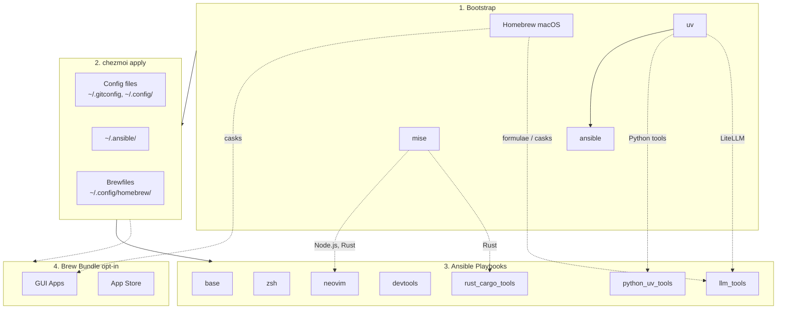

<!-- Generated by SpecStory, Markdown v2.1.0 -->

# 2026-04-14 08:18:27Z

<!-- Codex CLI Session 019d8b0f-c7be-7c41-93cd-bf059f19c941 (2026-04-14 08:18:27Z) -->

_**User (2026-04-14 08:18:27Z)**_

```
[ERROR]: Task failed: Module failed: ==> Updating Homebrew...
remote: Repository not found.
fatal: repository 'https://github.com/superset-sh/homebrew-superset/' not found
Error: superset-sh/homebrew-superset does not exist! Run `brew untap superset-sh/homebrew-superset` to remove it.
==> Updated Homebrew from 18c76d9762 to be262371d4.
No changes to formulae or casks.
Origin: /Users/daviddwlee84/.ansible/roles/homebrew/tasks/main.yml:25:3

23     msg: "Homebrew not installed. It should be installed by bootstrap script."
24
25 - name: Update Homebrew
     ^ column 3

fatal: [localhost]: FAILED! => {"changed": false, "msg": "==> Updating Homebrew...\nremote: Repository not found.\nfatal: repository 'https://github.com/superset-sh/homebrew-superset/' not found\nError: superset-sh/homebrew-superset does not exist! Run `brew untap superset-sh/homebrew-superset` to remove it.\n==> Updated Homebrew from 18c76d9762 to be262371d4.\nNo changes to formulae or casks."}
...ignoring
```
似乎 superset 的安裝方式變了？ 原本的repo不見了 如果確實沒辦法用的話 要不移除了？

---

_**Agent (gpt-5.4 2026-04-14 08:20:09Z)**_

<think><details><summary>Thought Process</summary>
**Exploring installation options**

I’m in planning mode, so I need to explore first. I should acknowledge and inspect relevant files. It seems I might need to browse the internet because the latest repository status and installation changes could be unstable. The user may be asking for this information. I need to consider using the web, particularly checking for the official Homebrew tap and Superset installation documentation. I’ll also look into the repository for any Superset references, while avoiding any mutations.
</details></think>

_**Agent (gpt-5.4 2026-04-14 08:20:12Z)**_

我先確認 repo 內目前是怎麼安裝 Superset 的，包含 ansible role、Brewfile 與 chezmoi 選項，先把可行替代路徑釐清，再決定是移除還是改安裝方式。

_**Agent (gpt-5.4 2026-04-14 08:20:12Z)**_

<tool-use data-tool-type="shell" data-tool-name="exec_command"><details>
<summary>Tool use: **exec_command** `rg -n "superset|homebrew-superset" .`</summary>
```
Chunk ID: 051c10
Wall time: 0.0000 seconds
Process exited with code 0
Original token count: 38
Output:
./dot_config/homebrew/Brewfile.tmpl:11:tap "superset-sh/superset"
./dot_config/homebrew/Brewfile.darwin.tmpl:124:cask "superset-sh/superset/superset"
```
</details></tool-use>

_**Agent (gpt-5.4 2026-04-14 08:20:12Z)**_

<tool-use data-tool-type="shell" data-tool-name="exec_command"><details>
<summary>Tool use: **exec_command** `sed -n '1,220p' dot_ansible/roles/homebrew/tasks/main.yml`</summary>
```
Chunk ID: 005fed
Wall time: 0.0000 seconds
Process exited with code 0
Original token count: 267
Output:
---
# Homebrew role - macOS package manager
# NOTE: Homebrew installation is handled by bootstrap script (run_once_before_00)
# This role only updates Homebrew if already installed

- name: Check if Homebrew is installed (Apple Silicon)
  ansible.builtin.stat:
    path: /opt/homebrew/bin/brew
  register: homebrew_arm

- name: Check if Homebrew is installed (Intel)
  ansible.builtin.stat:
    path: /usr/local/bin/brew
  register: homebrew_intel

- name: Set Homebrew installed fact
  ansible.builtin.set_fact:
    homebrew_installed: "{{ homebrew_arm.stat.exists or homebrew_intel.stat.exists }}"

- name: Skip if Homebrew not installed
  when: not homebrew_installed
  ansible.builtin.debug:
    msg: "Homebrew not installed. It should be installed by bootstrap script."

- name: Update Homebrew
  when: homebrew_installed
  community.general.homebrew:
    update_homebrew: true
  ignore_errors: true

- name: Clean up stale Homebrew versions and links
  when: homebrew_installed
  ansible.builtin.command: brew cleanup
  changed_when: false
  ignore_errors: true
```
</details></tool-use>

_**Agent (gpt-5.4 2026-04-14 08:20:12Z)**_

<tool-use data-tool-type="shell" data-tool-name="exec_command"><details>
<summary>Tool use: **exec_command** `sed -n '1,240p' README.md`</summary>
```
Chunk ID: 560a6a
Wall time: 0.0000 seconds
Process exited with code 0
Original token count: 2946
Output:
# dotfiles

Cross-platform development environment setup using **chezmoi** + **ansible**.

- **chezmoi**: manages config files (dotfiles)
- **ansible**: installs system dependencies and tools

## Prerequisites

- [chezmoi](https://www.chezmoi.io/install/)
- [uv](https://docs.astral.sh/uv/getting-started/installation/) (for ansible)

## Architecture



## Quick Setup

```bash
# One-liner to initialize and apply (installs chezmoi to ~/.local/bin)
export GITHUB_USERNAME=daviddwlee84
sh -c "$(curl -fsLS get.chezmoi.io)" -- -b "$HOME/.local/bin" init --apply git@github.com:$GITHUB_USERNAME/dotfiles.git
```

This automatically:

1. Bootstraps Homebrew (macOS/Linux), uv, mise, ansible
2. Deploys all config files
3. Runs ansible playbooks (git, ripgrep, fd, neovim, etc.)
4. Runs brew bundle (if `installBrewApps` is enabled, or on macOS if `installAiDesktopApps` is enabled)

### Optional Components

During `chezmoi init`, you'll be prompted for optional installs:

| Option | Default | Description |
|--------|---------|-------------|
| `installCodingAgents` | true | Claude Code, Codex CLI, OpenCode, Cursor, Copilot, Gemini CLI, RTK, td, sidecar, specify-cli, etc. |
| `installBitwarden` | false | Bitwarden CLI (`bw`) + Desktop app (desktop profiles) with SSH agent auto-detection |
| `installPythonUvTools` | true | Python CLI tools via uv (mlflow, sqlit-tui, tmuxp, etc.) |
| `installLlmTools` | false | Local LLM tools: Ollama, LiteLLM, llmfit, models |
| `installAiDesktopApps` | false | macOS AI desktop apps via Homebrew Brewfile (Claude, ChatGPT, OpenCode Desktop, Antigravity, Codex Desktop on Apple Silicon; `ollama-app` also requires `installLlmTools=true`) |
| `installBrewApps` | false | General GUI apps via Homebrew Brewfile (terminals, browsers, utilities, mas; excludes AI desktop apps) |
| `installInputMethod` | false | Traditional Chinese input methods (McBopomofo, RIME/Squirrel on macOS; ibus-rime on Linux) |
| `installNetworkingTools` | false | Networking CLI tools (nmap, mtr, httpie, gping, trippy, bandwhich, rustscan, etc.) |
| `noRoot` | false | Skip sudo-requiring tasks (for servers without root access) |

To change options later: `chezmoi init --force`

## What You Get

### Config Files

- `~/.gitconfig` - Git configuration
- `~/.config/git/hooks/` - Global Git hooks (pre-commit + Git LFS hooks)
- `~/.config/gh-dash/config.yml` - Global gh-dash config, with `diffnav` as the diff pager
- `~/.config/lazygit/config.yml` - Global LazyGit config, with `delta` as the custom diff pager
- `~/.config/bat/themes/tokyonight_night.tmTheme` - Managed Tokyo Night theme for bat
- `~/.config/nvim/` - Neovim (LazyVim) configuration
- `~/.config/uv/uv.toml` - uv package manager config
- `~/.cargo/config.toml` - Cargo registry mirror config (GFW)
- `~/.npmrc` - npm registry config (official/npmmirror via `useChineseMirror`)
- `~/.config/.bunfig.toml` - Bun global registry config (official/npmmirror via `useChineseMirror`)
- `~/.config/alacritty/` - Alacritty terminal config
- `~/.config/starship.toml` - Starship cross-shell prompt config
- `~/.config/direnv/direnvrc` - direnv helper functions, including `.venv`-aware Python activation
- `~/.config/yazi/` - Yazi file manager config (v0.3.3+ syntax, [docs](https://yazi-rs.github.io/docs/configuration/overview/))
  - `yazi.toml` - Main config with open rules and openers (`o`/`O`)
  - `keymap.toml`, `theme.toml` - Optional customization files (stubs provided)
- `~/.claude/` - Claude Code settings
- `~/.specstory/cli/config.toml` - Global SpecStory defaults for `specstory run` across all projects
- `~/.tmux.conf` - Tmux configuration with TPM plugins, a native popup menu (`prefix+Space`), vim-style pane nav, extended-keys for coding agents (including `Ctrl+/` in Neovim), sesh keybindings (`prefix+g` picker, `prefix+S` last), and config reload on `prefix+R` ([docs](docs/tools/tmux.md))
- `~/.local/bin/x` - Cross-platform terminal wrapper for `copy` / `paste` / 
... (truncated)
```
</details></tool-use>

_**Agent (gpt-5.4 2026-04-14 08:20:35Z)**_

本地配置只有兩處直接引用到這個 tap：共用 Brewfile 的 `tap "superset-sh/superset"`，以及 macOS Brewfile 的 `cask "superset-sh/superset/superset"`。接著我去確認這個 tap/cask 現在是否真的已不存在，以及 Superset 官方目前是否還提供 Homebrew 安裝。

_**Agent (gpt-5.4 2026-04-14 08:20:59Z)**_

<think><details><summary>Thought Process</summary>
**Verifying GitHub repo URL**

I think I need to verify the GitHub repo URL directly instead of relying on search results, which might not be reliable. Is there a chance the repo could give a 404 error if I just open it? I should definitely open the URL directly to verify it, rather than just assuming it works based on what I've found in searches. That way, I can be more sure of the information.
</details></think>

_**Agent (gpt-5.4 2026-04-14 08:21:09Z)**_

<think><details><summary>Thought Process</summary>
**Investigating installation issues**

I need to check the tap formula since it might still be pointing to an old repository. It could be helpful to fetch the relevant lines from the Brewfile. I should consider asking about the desired behavior to clarify things. It might also be important to look into the official installation methods. I'll explore the relevant open sources with those lines to get a better understanding of the situation.
</details></think>

_**Agent (gpt-5.4 2026-04-14 08:21:31Z)**_

<think><details><summary>Thought Process</summary>
**Inspecting brewfile templates**

I think I need to check out the actual brewfile templates to understand the conditional flags better. Those README mentions might provide some helpful context as well. By looking directly at the templates, I can clarify how everything ties together. This way, I can avoid any confusion and really get to the bottom of the details I need. It seems like a solid step to take for better understanding!
</details></think>

_**Agent (gpt-5.4 2026-04-14 08:21:31Z)**_

官方现况跟你猜的一样有点脱节：`https://github.com/superset-sh/homebrew-superset.git` 这个 Git transport 现在直接 404，但网页仓库页还存在；而 Apache Superset 官方文档当前主推的是 Docker Compose，另一个是 Python/PyPI 安装，没有提 Homebrew。下一步我把 repo 里这两处模板的上下文看完，确认移除会不会影响其他选项或说明。

_**Agent (gpt-5.4 2026-04-14 08:21:31Z)**_

<tool-use data-tool-type="shell" data-tool-name="exec_command"><details>
<summary>Tool use: **exec_command** `sed -n '1,120p' dot_config/homebrew/Brewfile.tmpl`</summary>
```
Chunk ID: 0e6541
Wall time: 0.0000 seconds
Process exited with code 0
Original token count: 278
Output:
# Brewfile - Shared configuration (macOS & Linux)
# Applied via: brew bundle --file=~/.config/homebrew/Brewfile
#
# This file is managed by chezmoi. Edit the source:
#   chezmoi edit ~/.config/homebrew/Brewfile

# =============================================================================
# Taps (Third-party repositories)
# =============================================================================
tap "nikitabobko/tap"  # aerospace (macOS window manager)
tap "superset-sh/superset"

# =============================================================================
# Formulas - CLI Tools (cross-platform)
# =============================================================================
# Note: Most CLI tools are managed by ansible for better cross-platform support
# Only add formulas here that you want to manage via Brewfile

# The following Formulas are MacOS only
{{ if or (eq .profile "macos") (eq .profile "macos_intel") -}}
# Mac App Store CLI (needed for mas entries in Brewfile.darwin)
brew "mas"
brew "tailscale"  # Tailscale CLI (desktop app is installed via mas in Brewfile.darwin)
{{ end -}}
```
</details></tool-use>

_**Agent (gpt-5.4 2026-04-14 08:21:31Z)**_

<tool-use data-tool-type="shell" data-tool-name="exec_command"><details>
<summary>Tool use: **exec_command** `sed -n '100,160p' dot_config/homebrew/Brewfile.darwin.tmpl`</summary>
```
Chunk ID: f290f2
Wall time: 0.0000 seconds
Process exited with code 0
Original token count: 611
Output:
# cask "tradingview"

# =============================================================================
# Casks - Network & VPN
# =============================================================================
# Tailscale is managed via Mac App Store (mas) below to avoid pkg sudo prompts.
# cask "openvpn-connect"
# cask "vibetunnel"
# cask "clash-verge-rev"  # Clash proxy GUI (replacement for Clash for Windows)

# =============================================================================
# Casks - Virtualization & Remote
# =============================================================================
# cask "virtualbox"
# cask "windows-app"      # Microsoft Remote Desktop
# cask "teamviewer-host"
# cask "sharemouse"       # KVM software

# =============================================================================
# Casks - Developer Tools
# =============================================================================
# Note: docker/orbstack is managed by ansible docker role
cask "dbeaver-community"
{{ if ne .profile "macos_intel" -}}
cask "superset-sh/superset/superset"
{{ end -}}

# =============================================================================
# Casks - Cloud Storage (Chinese apps)
# =============================================================================
# {{ if .useChineseMirror -}}
# cask "baidunetdisk"  # Baidu Netdisk (百度网盘)
# {{- end }}

# =============================================================================
# Mac App Store Apps (via mas)
# Requires: mas signin (or sign in via App Store.app)
# =============================================================================
mas "Tailscale", id: 1475387142
# mas "LINE", id: 539883307
# mas "Keynote", id: 409183694
# mas "Numbers", id: 409203825
# mas "Pages", id: 409201541
# mas "Magnet", id: 441258766  # Paid app - or use free 'rectangle' cask instead

# =============================================================================
# Apps NOT available via Homebrew (manual install required):
# - 东方财富, 同花顺 (Chinese finance apps)
# - FileZilla (removed from Homebrew)
# - Google Docs/Sheets/Slides (PWAs, not standalone apps)
# - Safari (system built-in)
# - osu! (use official installer)
# - Wine Staging (deprecated, use wine-stable or crossover)
# - Perplexity (App Store only)
# - Immersive Translate (browser extension)
# =============================================================================
```
</details></tool-use>

_**Agent (gpt-5.4 2026-04-14 08:21:31Z)**_

<tool-use data-tool-type="shell" data-tool-name="exec_command"><details>
<summary>Tool use: **exec_command** `rg -n "installAiDesktopApps|installLlmTools|superset" .chezmoi.toml.tmpl CLAUDE.md docs README.md dot_*`</summary>
```
Chunk ID: c6792e
Wall time: 0.0000 seconds
Process exited with code 0
Original token count: 568
Output:
.chezmoi.toml.tmpl:20:installLlmTools = {{ promptBoolOnce . "installLlmTools" "Install local LLM tools (Ollama, LiteLLM, llmfit, models)" false }}
.chezmoi.toml.tmpl:22:installAiDesktopApps = {{ promptBoolOnce . "installAiDesktopApps" "Install AI desktop apps via macOS Homebrew Brewfile (Claude, ChatGPT, OpenCode, Antigravity, Codex, Ollama app)" false }}
README.md:67:4. Runs brew bundle (if `installBrewApps` is enabled, or on macOS if `installAiDesktopApps` is enabled)
README.md:78:| `installLlmTools` | false | Local LLM tools: Ollama, LiteLLM, llmfit, models |
README.md:79:| `installAiDesktopApps` | false | macOS AI desktop apps via Homebrew Brewfile (Claude, ChatGPT, OpenCode Desktop, Antigravity, Codex Desktop on Apple Silicon; `ollama-app` also requires `installLlmTools=true`) |
README.md:150:- **GUI Apps** (macOS): general terminals, editors, browsers, network tools, and utilities via Brewfile when `installBrewApps=true`; AI desktop apps via Brewfile when `installAiDesktopApps=true` (`claude`, `chatgpt`, `opencode-desktop`, `antigravity`, `codex-app` on Apple Silicon only, and `ollama-app` only when `installLlmTools=true`); Tailscale Desktop via Mac App Store `mas`, avoids pkg sudo prompt; Tailscale CLI via `brew "tailscale"` in shared Brewfile
CLAUDE.md:64:| `run_onchange_after_30_brew_bundle.sh.tmpl` | Runs brew bundle (if `installBrewApps` is enabled, or on macOS if `installAiDesktopApps` is enabled) |
CLAUDE.md:266:**Note**: Brewfile installation is **opt-in** (disabled by default). Enable general GUI apps via `chezmoi init --force` and set `installBrewApps = true`. On macOS, AI desktop apps are a separate opt-in via `installAiDesktopApps = true`.
CLAUDE.md:297:- **AI & Coding**: claude, chatgpt, opencode-desktop, antigravity, codex-app (Apple Silicon only), and `ollama-app` when `installAiDesktopApps` + `installLlmTools`
dot_config/homebrew/Brewfile.tmpl:11:tap "superset-sh/superset"
dot_config/homebrew/Brewfile.darwin.tmpl:20:{{ if .installAiDesktopApps -}}
dot_config/homebrew/Brewfile.darwin.tmpl:32:{{ if .installLlmTools -}}
dot_config/homebrew/Brewfile.darwin.tmpl:124:cask "superset-sh/superset/superset"
docs/tools/llm.md:3:Optional role (`installLlmTools`). Install via `chezmoi init --force` and enable the prompt.
```
</details></tool-use>

_**Agent (gpt-5.4 2026-04-14 08:21:45Z)**_

<think><details><summary>Thought Process</summary>
**Inspecting AI apps section**

I need to check the Darwin file, especially the part about AI apps, to determine if Superset is considered an AI desktop app. I’m leaning towards it probably not being one, but it makes sense to verify this to be sure. Clarity on this will help me further understand its classification and capabilities. Let’s see what I can find in that section!
</details></think>

_**Agent (gpt-5.4 2026-04-14 08:21:48Z)**_

這個 `superset` 不是 `installAiDesktopApps` 條件內，而是一般的 macOS Developer Tools cask；也就是只要啟用 `installBrewApps`，它就會被裝，而且共用 Brewfile 還會先 tap 那個已失效的第三方源。從 repo 現況看，最保守方案是把這個 tap 與 cask 一起移除，避免每次 `brew update` / `brew bundle` 都被它卡住。

_**Agent (gpt-5.4 2026-04-14 08:21:52Z)**_

<think><details><summary>Thought Process</summary>
**Considering user preferences**

I need to ask the user if they prefer removing something entirely or replacing it with a different path. But before I do that, I should check for any alternative cask that exists in the homebrew core. It would be a good idea to search the web, perhaps by running a brew search for “superset.” I wonder if there’s no cask available for it. Let's figure this out!
</details></think>

_**Agent (gpt-5.4 2026-04-14 08:22:18Z)**_

我找到可直接替换的路径了：Homebrew 官方仓库现在已经收录 `superset` cask，安装命令是 `brew install --cask superset`，而且同样是 macOS 12+、Apple Silicon only，所以与你现在的 `if ne .profile "macos_intel"` 条件相符。缺的是把旧第三方 tap 拿掉，并把 cask 名称改成官方内建的 `superset`。

_**Agent (gpt-5.4 2026-04-14 08:22:22Z)**_

<tool-use data-tool-type="unknown" data-tool-name="request_user_input"><details>
<summary>Tool use: **request_user_input**</summary>

**Input:**

- questions: `[map[header:Superset id:superset_strategy options:[map[description:移除失效 tap，改成 Homebrew 官方的 `cask "superset"`，保留现有安装行为。 label:改官方 cask (Recommended)] map[description:从 Brewfile 移除 Superset，README/说明也一并不再提及。 label:完全移除] map[description:移除失效 tap 与 cask，让现有机器手动 `brew untap` / 以后不再由 dotfiles 安装。 label:只修错误不保留管理]] question:要把 repo 里的 Superset 处理成哪一种？]]`

**Result:**

</details></tool-use>

_**Agent (gpt-5.4 2026-04-14 08:23:58Z)**_

<think><details><summary>Thought Process</summary>
**Evaluating final plan**

It looks like I got an auto-returned answer from the tool, which is interesting! I need to think about whether I should include source links since the web was used. Maybe I should mention what I discovered in my current notes about the Brewfile README, particularly regarding the superset. However, there might not be any updates needed. I want to finalize my proposed plan in a concise manner!
</details></think>

---

_**User (2026-04-14 08:24:14Z)**_

Implement the plan.

---

_**Agent (gpt-5.4 2026-04-14 08:24:31Z)**_

<think><details><summary>Thought Process</summary>
**Considering README updates**

The README GUI Apps section currently lists general tools like terminals, editors, and browsers, but it doesn't mention Superset. The instructions say to update the README when configurations change. I wonder if I should add Superset to the GUI Apps/macOS list, but maybe just listing it under general GUI Apps is enough. Since there's no visible user change, perhaps no update is necessary. However, I could note that Homebrew includes Superset as an example. I need to inspect the files before making any edits.
</details></think>

_**Agent (gpt-5.4 2026-04-14 08:24:31Z)**_

<think><details><summary>Thought Process</summary>
**Evaluating stale tap cleanup**

I’m considering whether I need to codify stale untap cleanup in the Ansible/Homebrew role. The plan assumed no extra automation unless desired, but the user mentioned implementing the plan, which likely involves only file changes. However, the initial issue was caused by `brew update` failing due to an existing stale tap. Just changing templates won't resolve that for machines with stale taps. To truly solve the user's issue, it seems we should add a cleanup task to untap any stale taps before running the update.
</details></think>

_**Agent (gpt-5.4 2026-04-14 08:24:35Z)**_

我会直接落地修复，把失效的 Superset tap/cask 改成 Homebrew 官方来源，并处理现有机器上的陈旧 tap，避免下次 `brew update` 继续报错。

_**Agent (gpt-5.4 2026-04-14 08:24:35Z)**_

<tool-use data-tool-type="shell" data-tool-name="exec_command"><details>
<summary>Tool use: **exec_command** `git status --short`</summary>
```
Chunk ID: 219311
Wall time: 0.0000 seconds
Process exited with code 0
Original token count: 98
Output:
 M .specstory/history/2026-02-09_07-22-32Z-at-dot-config-zsh.md
 M .specstory/history/2026-02-09_11-20-35Z-wrapper-terminal-copy-paste.md
 M .specstory/history/2026-02-10_07-55-02Z-coding-agents-https-github.md
 M .specstory/history/2026-02-11_10-00-56Z-chezmoi-create-ssh-config.md
 M dot_config/zsh/tools/22_sesh.zsh
?? .specstory/history/2026-04-14_08-18-26Z-error-task-failed-module.md
```
</details></tool-use>

_**Agent (gpt-5.4 2026-04-14 08:24:35Z)**_

<tool-use data-tool-type="shell" data-tool-name="exec_command"><details>
<summary>Tool use: **exec_command** `sed -n '1,120p' dot_config/homebrew/Brewfile.tmpl`</summary>
```
Chunk ID: 8203bb
Wall time: 0.0001 seconds
Process exited with code 0
Original token count: 278
Output:
# Brewfile - Shared configuration (macOS & Linux)
# Applied via: brew bundle --file=~/.config/homebrew/Brewfile
#
# This file is managed by chezmoi. Edit the source:
#   chezmoi edit ~/.config/homebrew/Brewfile

# =============================================================================
# Taps (Third-party repositories)
# =============================================================================
tap "nikitabobko/tap"  # aerospace (macOS window manager)
tap "superset-sh/superset"

# =============================================================================
# Formulas - CLI Tools (cross-platform)
# =============================================================================
# Note: Most CLI tools are managed by ansible for better cross-platform support
# Only add formulas here that you want to manage via Brewfile

# The following Formulas are MacOS only
{{ if or (eq .profile "macos") (eq .profile "macos_intel") -}}
# Mac App Store CLI (needed for mas entries in Brewfile.darwin)
brew "mas"
brew "tailscale"  # Tailscale CLI (desktop app is installed via mas in Brewfile.darwin)
{{ end -}}
```
</details></tool-use>

_**Agent (gpt-5.4 2026-04-14 08:24:36Z)**_

<tool-use data-tool-type="shell" data-tool-name="exec_command"><details>
<summary>Tool use: **exec_command** `sed -n '1,180p' dot_config/homebrew/Brewfile.darwin.tmpl`</summary>
```
Chunk ID: 090002
Wall time: 0.0000 seconds
Process exited with code 0
Original token count: 1564
Output:
# Brewfile.darwin - macOS GUI applications (casks) and Mac App Store apps
# Applied via: brew bundle --file=~/.config/homebrew/Brewfile.darwin
#
# This file is managed by chezmoi. Edit the source:
#   chezmoi edit ~/.config/homebrew/Brewfile.darwin

# =============================================================================
# Casks - Terminals & Editors
# =============================================================================
cask "alacritty"
# cask "iterm2"
cask "warp"
cask "cmux"
cask "cursor"
cask "visual-studio-code"

# =============================================================================
# Casks - AI & Coding Assistants
# =============================================================================
{{ if .installAiDesktopApps -}}
cask "claude"
{{ if ne .profile "macos_intel" -}}
cask "chatgpt"
{{ end -}}
cask "opencode-desktop"
cask "antigravity"
{{ if ne .profile "macos_intel" -}}
cask "codex-app"
{{ end -}}
# cask "chatgpt-atlas"  # Uncomment if needed
# Local LLM GUI runtime (also provides the `ollama` CLI)
{{ if .installLlmTools -}}
cask "ollama-app"
{{ end -}}
# cask "termius"          # SSH client
{{ end -}}

# =============================================================================
# Casks - System Utilities
# =============================================================================
cask "nikitabobko/tap/aerospace"  # Tiling window manager
cask "alt-tab"                     # Windows-style alt-tab
cask "raycast"                     # Spotlight replacement
# cask "itsycal"                     # Menu bar calendar
# cask "jordanbaird-ice"             # Menu bar manager (Ice.app)
cask "scroll-reverser"             # Reverse scroll direction per device
# cask "sloth"                       # Process/file viewer
cask "the-unarchiver"              # Archive extraction
cask "applite"                     # GUI for Homebrew casks

# =============================================================================
# Casks - Communication
# =============================================================================
# cask "discord"  # Commented out - install manually from discord.com
# cask "messenger"
# cask "telegram"
# cask "wechat"   # We used to install WeChat using Apple Store (TODO: maybe use mas?! but that would need login...)
# cask "whatsapp"
# cask "dingtalk"
# cask "tencent-meeting"  # TencentMeeting.app

# =============================================================================
# Casks - Browsers
# =============================================================================
cask "arc"
# cask "google-chrome"
# cask "tor-browser"

# =============================================================================
# Casks - Productivity
# =============================================================================
cask "obsidian"
cask "google-drive"
cask "grammarly-desktop"
# cask "readest"              # E-book reader
cask "super-productivity"   # Task/time management
# cask "wispr-flow"           # Voice typing
# cask "mathpix-snipping-tool"

# =============================================================================
# Casks - Media & Entertainment
# =============================================================================
cask "spotify"
cask "anki"

# =============================================================================
# Casks - Gaming (skip on work machines)
# =============================================================================
# {{ if not (env "WORK_MACHINE") -}}
# cask "steam"
# cask "minecraft"
# cask "battle-net"
# cask "hstracker"  # Hearthstone deck tracker
# {{- end }}

# =============================================================================
# Casks - Finance & Trading
# =============================================================================
# cask "binance"
# cask "tradingview"

# =============================================================================
# Casks - Network & VPN
# =============================================================================
# Tailscale is managed via Mac App Store (mas) below to avoid pkg sudo prompts.
# cask "openvpn-connect"
# cask "vibetunnel"
# cask "clash-verge-rev"  # Clash proxy GUI (replacement for Clash for Windows)

# =============================================================================
# Casks - Virtualization & Remote
# =============================================================================
# cask "virtualbox"
# cask "windows-app"      # Microsoft Remote Desktop
# cask "teamviewer-host"
# cask "sharemouse"       # KVM software

# =============================================================================
# Casks - Developer Tools
# =============================================================================
# Note: docker/orbstack is managed by ansible docker role
cask "dbeaver-community"
{{ if ne .profile "macos_intel" -}}
cask "superset-sh/superset/sup
... (truncated)
```
</details></tool-use>

_**Agent (gpt-5.4 2026-04-14 08:24:36Z)**_

<tool-use data-tool-type="shell" data-tool-name="exec_command"><details>
<summary>Tool use: **exec_command** `sed -n '1,120p' dot_ansible/roles/homebrew/tasks/main.yml`</summary>
```
Chunk ID: c1c75f
Wall time: 0.0000 seconds
Process exited with code 0
Original token count: 267
Output:
---
# Homebrew role - macOS package manager
# NOTE: Homebrew installation is handled by bootstrap script (run_once_before_00)
# This role only updates Homebrew if already installed

- name: Check if Homebrew is installed (Apple Silicon)
  ansible.builtin.stat:
    path: /opt/homebrew/bin/brew
  register: homebrew_arm

- name: Check if Homebrew is installed (Intel)
  ansible.builtin.stat:
    path: /usr/local/bin/brew
  register: homebrew_intel

- name: Set Homebrew installed fact
  ansible.builtin.set_fact:
    homebrew_installed: "{{ homebrew_arm.stat.exists or homebrew_intel.stat.exists }}"

- name: Skip if Homebrew not installed
  when: not homebrew_installed
  ansible.builtin.debug:
    msg: "Homebrew not installed. It should be installed by bootstrap script."

- name: Update Homebrew
  when: homebrew_installed
  community.general.homebrew:
    update_homebrew: true
  ignore_errors: true

- name: Clean up stale Homebrew versions and links
  when: homebrew_installed
  ansible.builtin.command: brew cleanup
  changed_when: false
  ignore_errors: true
```
</details></tool-use>

_**Agent (gpt-5.4 2026-04-14 08:24:50Z)**_

<think><details><summary>Thought Process</summary>
**Evaluating edits and updates**

I'm thinking we might need to edit and possibly update the README to mention Superset in GUI Apps for macOS if it's installed. However, I'm not sure if it's necessary. I want to check the documentation to see if we need to ensure the Ansible command uses the brew path. For `brew untap`, I wonder if just having `brew` available in PATH is enough. I should explore using the Ansible module and checking existing uses to be more effective.
</details></think>

_**Agent (gpt-5.4 2026-04-14 08:24:52Z)**_

我看到当前 Homebrew role 只有 `brew update` 和 `brew cleanup`，所以本机残留的坏 tap 不会被自动清掉。我会顺手补一个幂等清理步骤，这样 repo 变更后，已有机器也能自愈。

_**Agent (gpt-5.4 2026-04-14 08:24:52Z)**_

<tool-use data-tool-type="shell" data-tool-name="exec_command"><details>
<summary>Tool use: **exec_command** `rg -n "homebrew_tap|community\.general\.homebrew_tap|brew untap|tap \"" dot_ansible README.md CLAUDE.md`</summary>
```
Chunk ID: 2b53e6
Wall time: 0.0000 seconds
Process exited with code 0
Original token count: 193
Output:
dot_ansible/roles/devtools/tasks/main.yml:11:  community.general.homebrew_tap:
dot_ansible/roles/coding_agents/tasks/main.yml:70:  community.general.homebrew_tap:
dot_ansible/roles/coding_agents/tasks/main.yml:307:  community.general.homebrew_tap:
dot_ansible/roles/coding_agents/tasks/main.yml:468:  community.general.homebrew_tap:
dot_ansible/roles/coding_agents/tasks/main.yml:504:      community.general.homebrew_tap:
dot_ansible/roles/coding_agents/tasks/main.yml:656:  community.general.homebrew_tap:
dot_ansible/roles/coding_agents/tasks/main.yml:710:      community.general.homebrew_tap:
dot_ansible/roles/coding_agents/tasks/main.yml:855:  community.general.homebrew_tap:
dot_ansible/roles/coding_agents/tasks/main.yml:890:      community.general.homebrew_tap:
```
</details></tool-use>

_**Agent (gpt-5.4 2026-04-14 08:24:52Z)**_

<tool-use data-tool-type="shell" data-tool-name="exec_command"><details>
<summary>Tool use: **exec_command** `sed -n '130,170p' README.md`</summary>
```
Chunk ID: 97d47d
Wall time: 0.0000 seconds
Process exited with code 0
Original token count: 780
Output:

SSH files are managed as create-only templates: if `~/.ssh/config` already exists, it is not overwritten. In that case, add `Include ~/.ssh/config.d/*` to your existing config manually to load the managed snippets.

### Tools (via ansible)

- **Base**: git, git-lfs, curl, ripgrep, fd, just, build tools
- **Neovim**: >= 0.11.2 with LazyVim dependencies
- **LazyVim deps**: fzf, lazygit, tree-sitter-cli, Node.js
- **Git review stack**: gh, gh-dash (via `gh` extension), diffnav, git-delta, lazygit
- **Markdown reader**: `glow` for terminal Markdown rendering
- **DuckDB CLI**: `duckdb` (Homebrew on macOS, official installer on Linux)
- **rclone**: cloud storage sync CLI (Homebrew on macOS, official downloads on Linux)
- **Ruby gem tools**: `try-cli` for ephemeral workspaces with graduate-to-project defaults, `tmuxinator` for declarative tmux session layouts (native sesh integration), plus `toolkami`
- **Coding Agents** (optional): Claude Code, Codex CLI, CodexBar, OpenCode, Cursor CLI, Copilot CLI, Gemini CLI, RTK, SpecStory, OpenChamber, td, sidecar, specify-cli
- **Bitwarden** (optional): Bitwarden CLI (`bw`) via npm, Desktop app (snap/deb on Linux, cask on macOS) on desktop profiles, with zsh completion and SSH agent auto-detection
- **LLM tools** (optional): Ollama local runtime, LiteLLM proxy, `llmfit` hardware-fit recommender, `models` TUI/CLI for model discovery and benchmarks
- **Input Methods** (optional): McBopomofo + RIME (Squirrel on macOS, ibus-rime on Linux)
- **Networking tools** (optional): nmap, arp-scan, mtr, iperf3, doggo, httpie, gping, trippy, bandwhich, speedtest, rustscan
- **Docker**: OrbStack (macOS) or Docker Engine (Linux)
- **Cargo tools**: pueue (process queue manager)
- **GUI Apps** (macOS): general terminals, editors, browsers, network tools, and utilities via Brewfile when `installBrewApps=true`; AI desktop apps via Brewfile when `installAiDesktopApps=true` (`claude`, `chatgpt`, `opencode-desktop`, `antigravity`, `codex-app` on Apple Silicon only, and `ollama-app` only when `installLlmTools=true`); Tailscale Desktop via Mac App Store `mas`, avoids pkg sudo prompt; Tailscale CLI via `brew "tailscale"` in shared Brewfile

### Bootstrap (installed before ansible)
- **Homebrew** (macOS): Package manager for macOS
- **uv**: Python package manager for ansible
- **mise**: Runtime manager for Node.js and Rust (ensures latest versions)
- **Dev tools**: bat, gh, diffnav, git-delta, git-graph, eza, tldr, glow, thefuck, zoxide, direnv, yazi, tmux+tpm, sesh, zellij, btop, htop
- **Starship**: Cross-shell prompt (replaces oh-my-zsh theme)
- **Python tools (via uv)**: thefuck, apprise, sqlit-tui, dotenv, git-filter-repo, mlflow, tmuxp
- **NerdFonts**: Hack Nerd Font for terminal emulators

## Supported Platforms

| Platform | Package Manager | Notes |
|----------|-----------------|-------|
| macOS | Homebrew | Full support |
| Ubuntu Desktop | apt + snap | Full support |
| Ubuntu Server | apt + snap | Full support |
| Ubuntu Server (no root) | GitHub binaries + mise + cargo + uv | `noRoot=true`, tools installed to `~/.local/bin` |

## Manual Commands
```
</details></tool-use>

_**Agent (gpt-5.4 2026-04-14 08:24:52Z)**_

<tool-use data-tool-type="shell" data-tool-name="exec_command"><details>
<summary>Tool use: **exec_command** `sed -n '1,220p' CLAUDE.md`</summary>
```
Chunk ID: a090e9
Wall time: 0.0000 seconds
Process exited with code 0
Original token count: 2254
Output:
# Dotfiles Repository

Cross-platform dotfiles management using **chezmoi** for configuration files and **ansible** for system dependencies.

## Maintaining README.md

**IMPORTANT**: When adding or modifying configurations, update `README.md` to reflect changes:

- **New config files**: Add to "What You Get > Config Files" section
- **New ansible roles/tools**: Add to "What You Get > Tools" section
- **New platforms**: Add to "Supported Platforms" table
- **Changed setup steps**: Update "Quick Setup" section

Keep README.md concise and user-focused. Technical details belong in CLAUDE.md or docs/.

## Maintaining Dockerfile

**IMPORTANT**: When adding new chezmoi prompts in `.chezmoi.toml.tmpl`, also update `Dockerfile`:

1. Add corresponding `ARG CHEZMOI_*` build argument
2. Add `--promptBool` or `--promptString` flag to the `chezmoi init` command

This ensures Docker testing works with all configuration options.

## Quick Start

```bash
# Install ansible (if not already installed)
uv tool install ansible-core
ansible-galaxy collection install community.general

# Apply dotfiles
chezmoi apply

# Run ansible manually (from ~/.ansible directory)
cd ~/.ansible && ansible-playbook playbooks/macos.yml
```

## Architecture

```
chezmoi repo/
├── dot_* files               → ~/.* (config files)
├── dot_ansible/              → ~/.ansible/ (ansible playbooks)
├── run_once_before_*.tmpl    → bootstrap (runs once)
└── run_onchange_after_*.tmpl → ansible (runs on changes)
```

Installation Order:

```
1. Bootstrap (run_once_before) - installs Homebrew (macOS/Linux), uv, ansible, mise
2. chezmoi apply - deploys config files + ansible playbooks
3. Ansible (run_onchange_after) - runs on fresh install + when roles change
4. Brew bundle (run_onchange_after) - installs GUI apps if enabled
```

### Auto-run Scripts

| Script | Behavior |
|--------|----------|
| `run_once_before_00_bootstrap.sh.tmpl` | Installs Homebrew (macOS and Linux), uv, mise, ansible |
| `run_onchange_after_20_ansible_roles.sh.tmpl` | Runs ansible with all tags |
| `run_onchange_after_30_brew_bundle.sh.tmpl` | Runs brew bundle (if `installBrewApps` is enabled, or on macOS if `installAiDesktopApps` is enabled) |

The onchange script includes SHA256 hashes of all role files. It runs:

- **Fresh install**: no previous hash state → triggers run
- **Updates**: any role's `tasks/main.yml` or `defaults/main.yml` changes → triggers run

To force re-run all scripts:

```bash
chezmoi state delete-bucket --bucket=scriptState
chezmoi apply
```

## Chezmoi Commands

```bash
chezmoi diff              # Preview changes
chezmoi apply             # Apply changes
chezmoi apply --dry-run   # Test without applying
chezmoi edit <file>       # Edit source file
chezmoi cd                # Go to source directory
```

## Ansible Usage

Ansible playbooks run automatically via `chezmoi apply` when playbook files change. For manual runs, use `~/.ansible/` directory:

```bash
cd ~/.ansible

# Full setup (macOS)
ansible-playbook playbooks/macos.yml

# Full setup (Linux)
ansible-playbook playbooks/linux.yml

# Specific tags only
ansible-playbook playbooks/macos.yml --tags "neovim,lazyvim_deps"

# Skip tags requiring sudo
ansible-playbook playbooks/linux.yml --skip-tags "sudo"

# Dry run
ansible-playbook playbooks/macos.yml --check
```

### Available Tags

| Tag | Description |
|-----|-------------|
| `base` | git, curl, ripgrep, fd, build tools |
| `homebrew` | macOS Homebrew update (installation done by bootstrap) |
| `zsh` | zsh, oh-my-zsh, plugins (autosuggestions, syntax-highlighting, completions) |
| `starship` | Starship cross-shell prompt (replaces oh-my-zsh theme) |
| `neovim` | Neovim (>= 0.11.2) |
| `lazyvim_deps` | fzf, lazygit, tree-sitter-cli, Node.js (via mise) |
| `devtools` | bat, eza, git-delta, git-graph, tldr, glow, thefuck, zoxide, direnv, yazi, tmux+tpm, sesh, zellij, btop, htop |
| `docker` | Docker/container runtime (OrbStack on macOS, Docker Engine on Linux) |
| `nerdfonts` | Hack Nerd Font for terminal emulators |
| `coding_agents` | Claude Code, OpenCode, Cursor CLI, Copilot CLI, Gemini CLI, RTK, SpecStory |
| `bitwarden` | Bitwarden CLI (`bw`) via npm + Desktop app (snap/deb on Linux, cask on macOS) on desktop profiles, with zsh completion + SSH agent integration |
| `security_tools` | pre-commit, gitleaks |
| `python_uv_tools` | Python CLI tools via uv (apprise, mlflow, sqlit-tui, tmuxp, etc.) |
| `llm_tools` | Local LLM tools: Ollama, LiteLLM, llmfit, models |
| `rust_cargo_tools` | Rust CLI tools via cargo (pueue) |
| `ruby_gem_tools` | Ruby CLI tools via gem (try-cli, tmuxinator, toolkami) |
| `input_method` | Traditional Chinese input methods: McBopomofo + RIME (Squirrel on macOS, ibus-rime on Linux) |
| `networking_tools` | Networking CLI tools: nmap, arp-scan, mtr, iperf3, doggo, httpie, gping, trippy, bandwhich, 
... (truncated)
```
</details></tool-use>

_**Agent (gpt-5.4 2026-04-14 08:25:06Z)**_

<think><details><summary>Thought Process</summary>
**Inspecting homebrew_tap module**

I think we should check the usage of the homebrew_tap module. It might be useful to look at examples, especially where the state is absent. A simple inspection could help clarify any potential issues. I'm just making sure I'm thorough in looking through this to properly understand how it works. Exploring this example could lead to a better grasp of its implementation. Let’s see what we can find!
</details></think>

_**Agent (gpt-5.4 2026-04-14 08:25:07Z)**_

repo 里已经在别的 role 用了 `community.general.homebrew_tap`，我会沿用同一套 Ansible module，而不是写命令式 `brew untap`。这样可读性和幂等性会更好。

_**Agent (gpt-5.4 2026-04-14 08:25:07Z)**_

<tool-use data-tool-type="shell" data-tool-name="exec_command"><details>
<summary>Tool use: **exec_command** `sed -n '1,80p' dot_ansible/roles/devtools/tasks/main.yml`</summary>
```
Chunk ID: d78357
Wall time: 0.0000 seconds
Process exited with code 0
Original token count: 578
Output:
---
# Developer CLI tools role
# Tools: bat, gh, diffnav, gh-dash, eza, git-delta, git-graph, tldr, glow, thefuck, zoxide, direnv, yazi, tmux, sesh, zellij, btop, htop, duckdb, rclone, coreutils

# =============================================================================
# macOS - all via Homebrew
# =============================================================================

- name: Tap diffnav formula (macOS)
  when: ansible_facts["os_family"] == "Darwin"
  community.general.homebrew_tap:
    name: dlvhdr/formulae
    state: present

- name: Install developer CLI tools (macOS)
  when: ansible_facts["os_family"] == "Darwin"
  community.general.homebrew:
    name:
      - bat
      - gh
      - diffnav
      - git-delta
      - git-graph
      - eza
      - tlrc
      - glow
      - thefuck
      - zoxide
      - direnv
      - yazi
      - tmux
      - sesh
      - zellij
      - btop
      - htop
      - duckdb
      - rclone
      - coreutils
    state: present

# =============================================================================
# Linux (Debian/Ubuntu)
# =============================================================================

# --- gh ---
- name: Check if gh is installed
  when: ansible_facts["os_family"] == "Debian"
  ansible.builtin.command: gh --version
  register: gh_check
  changed_when: false
  failed_when: false
  environment:
    PATH: "{{ ansible_facts['env']['HOME'] }}/.local/bin:/usr/local/bin:{{ ansible_facts['env']['PATH'] }}"

- name: Set gh release architecture
  when:
    - ansible_facts["os_family"] == "Debian"
    - gh_check.rc != 0
  ansible.builtin.set_fact:
    gh_release_arch: >-
      {{
        'amd64' if ansible_facts['architecture'] in ['x86_64', 'amd64']
        else 'arm64' if ansible_facts['architecture'] in ['aarch64', 'arm64']
        else ''
      }}

- name: Fail on unsupported architecture for gh official downloads
  when:
    - ansible_facts["os_family"] == "Debian"
    - gh_check.rc != 0
    - gh_release_arch == ''
  ansible.builtin.fail:
    msg: "Unsupported architecture for gh official downloads: {{ ansible_facts['architecture'] }}"

- name: Install gh from GitHub releases (Debian/Ubuntu)
  when:
    - ansible_facts["os_family"] == "Debian"
    - gh_check.rc != 0
    - gh_release_arch != ''
  become: true
```
</details></tool-use>

_**Agent (gpt-5.4 2026-04-14 08:25:07Z)**_

<tool-use data-tool-type="shell" data-tool-name="exec_command"><details>
<summary>Tool use: **exec_command** `sed -n '60,110p' dot_ansible/roles/coding_agents/tasks/main.yml`</summary>
```
Chunk ID: 8bb7d0
Wall time: 0.0000 seconds
Process exited with code 0
Original token count: 367
Output:
  when: ansible_facts["os_family"] == "Darwin"
  ansible.builtin.command: which opencode
  register: opencode_macos_check
  changed_when: false
  failed_when: false

- name: Tap anomalyco/tap for OpenCode (macOS)
  when:
    - ansible_facts["os_family"] == "Darwin"
    - opencode_macos_check.rc != 0
  community.general.homebrew_tap:
    name: anomalyco/tap
    state: present

- name: Install OpenCode (macOS)
  when:
    - ansible_facts["os_family"] == "Darwin"
    - opencode_macos_check.rc != 0
  community.general.homebrew:
    name: opencode
    state: present

- name: Check if OpenCode is installed (Linux)
  when: ansible_facts["os_family"] == "Debian"
  ansible.builtin.command: which opencode
  register: opencode_check
  changed_when: false
  failed_when: false

- name: Install OpenCode (Linux)
  when:
    - ansible_facts["os_family"] == "Debian"
    - opencode_check.rc != 0
  ansible.builtin.shell: |
    curl -fsSL https://opencode.ai/install | bash
  args:
    creates: "{{ ansible_facts['env']['HOME'] }}/.opencode/bin/opencode"

# === Cursor CLI ===
# Use official install script instead of Homebrew cask (cursor-cli cask has code signing issues on macOS)

- name: Check if Cursor CLI is installed
  ansible.builtin.command: which cursor-agent
  register: cursor_check
  changed_when: false
  failed_when: false

- name: Install Cursor CLI
  when: cursor_check.rc != 0
  ansible.builtin.shell: |
    curl -fsSL https://cursor.com/install | bash
```
</details></tool-use>

_**Agent (gpt-5.4 2026-04-14 08:25:36Z)**_

<think><details><summary>Thought Process</summary>
**Updating README for macOS**

I’m thinking about needing to use homebrew_tap state absent unconditionally on macOS before an update, as it might fail if a tap is missing. I’ll need to update the README by possibly adding `superset` to the GUI Apps list and mention it includes developer tools like DBeaver. It seems adjustments are necessary to keep things user-focused. I might consider updating the GUI bullet to reflect this. I’ll need to ensure modifications apply via apply_patch only.
</details></think>

_**Agent (gpt-5.4 2026-04-14 08:25:36Z)**_

<think><details><summary>Thought Process</summary>
**Crafting patch for homebrew**

I'm considering editing three files and possibly a fourth README. I need to be careful while crafting the patch. There's a potential issue with `community.general.homebrew_tap`, as it may require `update_homebrew` or expecting brew to be in the PATH. The order is essential: I should remove stale taps before the update. It might be enough to simplify conditions to just check `homebrew_installed`. I'll also decide if it's necessary to comment on deprecated tap cleanup, but it seems manageable if we skip when `homebrew_installed` is false.
</details></think>

_**Agent (gpt-5.4 2026-04-14 08:25:36Z)**_

<think><details><summary>Thought Process</summary>
**Testing syntax checks**

I might need to run a syntax check, so I'm considering using the command `ansible-playbook --syntax-check dot_ansible/playbooks/macos.yml`, which is non-mutating and safe. I’m also thinking about using `chezmoi execute-template` to see if it can render correctly. There's `chezmoi diff`, but I wonder if that could be considered mutating. Since it's unclear, I should stick to non-mutating options for now. A clear approach will help avoid any accidental changes!
</details></think>

_**Agent (gpt-5.4 2026-04-14 08:25:37Z)**_

我现在开始改 4 个地方：共享 Brewfile 去掉坏 tap、macOS Brewfile 改用官方 `superset` cask、Homebrew role 自动移除旧 tap、README 补一行说明这个 GUI app 现在走官方 cask。

_**Agent (gpt-5.4 2026-04-14 08:25:43Z)**_

<tool-use data-tool-type="write" data-tool-name="apply_patch"><details>
<summary>Tool use: **apply_patch**</summary>
**Update: `/Users/daviddwlee84/.local/share/chezmoi/dot_config/homebrew/Brewfile.tmpl`**

```diff
@@
 # =============================================================================
 # Taps (Third-party repositories)
 # =============================================================================
 tap "nikitabobko/tap"  # aerospace (macOS window manager)
-tap "superset-sh/superset"
 
 # =============================================================================
 # Formulas - CLI Tools (cross-platform)
 # =============================================================================
```

**Update: `/Users/daviddwlee84/.local/share/chezmoi/dot_config/homebrew/Brewfile.darwin.tmpl`**

```diff
@@
 # Note: docker/orbstack is managed by ansible docker role
 cask "dbeaver-community"
 {{ if ne .profile "macos_intel" -}}
-cask "superset-sh/superset/superset"
+cask "superset"
 {{ end -}}
 
 # =============================================================================
 # Casks - Cloud Storage (Chinese apps)
```

**Update: `/Users/daviddwlee84/.local/share/chezmoi/dot_ansible/roles/homebrew/tasks/main.yml`**

```diff
@@
 - name: Skip if Homebrew not installed
   when: not homebrew_installed
   ansible.builtin.debug:
     msg: "Homebrew not installed. It should be installed by bootstrap script."
 
+- name: Remove deprecated Superset tap
+  when: homebrew_installed
+  community.general.homebrew_tap:
+    name: superset-sh/superset
+    state: absent
+  ignore_errors: true
+
 - name: Update Homebrew
   when: homebrew_installed
   community.general.homebrew:
     update_homebrew: true
   ignore_errors: true
```

**Update: `/Users/daviddwlee84/.local/share/chezmoi/README.md`**

```diff
@@
-- **GUI Apps** (macOS): general terminals, editors, browsers, network tools, and utilities via Brewfile when `installBrewApps=true`; AI desktop apps via Brewfile when `installAiDesktopApps=true` (`claude`, `chatgpt`, `opencode-desktop`, `antigravity`, `codex-app` on Apple Silicon only, and `ollama-app` only when `installLlmTools=true`); Tailscale Desktop via Mac App Store `mas`, avoids pkg sudo prompt; Tailscale CLI via `brew "tailscale"` in shared Brewfile
+- **GUI Apps** (macOS): general terminals, editors, browsers, network tools, and utilities via Brewfile when `installBrewApps=true`, including developer apps like `dbeaver-community` and `superset` (Apple Silicon only); AI desktop apps via Brewfile when `installAiDesktopApps=true` (`claude`, `chatgpt`, `opencode-desktop`, `antigravity`, `codex-app` on Apple Silicon only, and `ollama-app` only when `installLlmTools=true`); Tailscale Desktop via Mac App Store `mas`, avoids pkg sudo prompt; Tailscale CLI via `brew "tailscale"` in shared Brewfile
```
</details></tool-use>

_**Agent (gpt-5.4 2026-04-14 08:26:07Z)**_

<think><details><summary>Thought Process</summary>
**Verifying commands and checks**

I need to verify a few things. I could run a syntax check with Ansible, check brew, or look at the repository with `git diff -- ...`. It might also be helpful to execute a template with `chezmoi`, but I'm uncertain if that's necessary. I could check if the cask for Superset exists with `brew info --cask superset`, given the user is likely working in a local environment. Running `brew tap` seems unnecessary, but `brew info` should be non-mutating.
</details></think>

_**Agent (gpt-5.4 2026-04-14 08:26:07Z)**_

<think><details><summary>Thought Process</summary>
**Running verification commands**

I'm thinking of running several commands in parallel: `git diff`, an Ansible syntax check, and `brew info --cask superset`. It might be useful to check if a local tap exists with `brew tap | rg 'superset-sh/superset'`, but I'm not sure if that's necessary since we added cleanup. While it seems `brew info --cask superset` shouldn't mutate anything, I'm hesitant to run `brew update` as that would. I might also consider using `chezmoi diff`, but given the changes already made, it might show a huge unrelated diff, so I’ll stick to the syntax check and grep lines.
</details></think>

_**Agent (gpt-5.4 2026-04-14 08:26:08Z)**_

代码已经改完，正在做静态验证：确认 Ansible 语法没问题，并确认本机 Homebrew 现在能识别官方 `superset` cask。

_**Agent (gpt-5.4 2026-04-14 08:26:08Z)**_

<tool-use data-tool-type="shell" data-tool-name="exec_command"><details>
<summary>Tool use: **exec_command** `git diff -- dot_config/homebrew/Brewfile.tmpl dot_config/homebrew/Brewfile.darwin.tmpl dot_ansible/roles/homebrew/tasks/main.yml README.md`</summary>
```
Chunk ID: 5e7cb8
Wall time: 0.0000 seconds
Process exited with code 0
Original token count: 804
Output:
diff --git a/README.md b/README.md
index 90203eb..8cca4ff 100644
--- a/README.md
+++ b/README.md
@@ -147,7 +147,7 @@ SSH files are managed as create-only templates: if `~/.ssh/config` already exist
 - **Networking tools** (optional): nmap, arp-scan, mtr, iperf3, doggo, httpie, gping, trippy, bandwhich, speedtest, rustscan
 - **Docker**: OrbStack (macOS) or Docker Engine (Linux)
 - **Cargo tools**: pueue (process queue manager)
-- **GUI Apps** (macOS): general terminals, editors, browsers, network tools, and utilities via Brewfile when `installBrewApps=true`; AI desktop apps via Brewfile when `installAiDesktopApps=true` (`claude`, `chatgpt`, `opencode-desktop`, `antigravity`, `codex-app` on Apple Silicon only, and `ollama-app` only when `installLlmTools=true`); Tailscale Desktop via Mac App Store `mas`, avoids pkg sudo prompt; Tailscale CLI via `brew "tailscale"` in shared Brewfile
+- **GUI Apps** (macOS): general terminals, editors, browsers, network tools, and utilities via Brewfile when `installBrewApps=true`, including developer apps like `dbeaver-community` and `superset` (Apple Silicon only); AI desktop apps via Brewfile when `installAiDesktopApps=true` (`claude`, `chatgpt`, `opencode-desktop`, `antigravity`, `codex-app` on Apple Silicon only, and `ollama-app` only when `installLlmTools=true`); Tailscale Desktop via Mac App Store `mas`, avoids pkg sudo prompt; Tailscale CLI via `brew "tailscale"` in shared Brewfile
 
 ### Bootstrap (installed before ansible)
 - **Homebrew** (macOS): Package manager for macOS
diff --git a/dot_ansible/roles/homebrew/tasks/main.yml b/dot_ansible/roles/homebrew/tasks/main.yml
index 4d2c66c..7c46a12 100644
--- a/dot_ansible/roles/homebrew/tasks/main.yml
+++ b/dot_ansible/roles/homebrew/tasks/main.yml
@@ -22,6 +22,13 @@
   ansible.builtin.debug:
     msg: "Homebrew not installed. It should be installed by bootstrap script."
 
+- name: Remove deprecated Superset tap
+  when: homebrew_installed
+  community.general.homebrew_tap:
+    name: superset-sh/superset
+    state: absent
+  ignore_errors: true
+
 - name: Update Homebrew
   when: homebrew_installed
   community.general.homebrew:
diff --git a/dot_config/homebrew/Brewfile.darwin.tmpl b/dot_config/homebrew/Brewfile.darwin.tmpl
index 41d6b9a..9533060 100644
--- a/dot_config/homebrew/Brewfile.darwin.tmpl
+++ b/dot_config/homebrew/Brewfile.darwin.tmpl
@@ -121,7 +121,7 @@ cask "anki"
 # Note: docker/orbstack is managed by ansible docker role
 cask "dbeaver-community"
 {{ if ne .profile "macos_intel" -}}
-cask "superset-sh/superset/superset"
+cask "superset"
 {{ end -}}
 
 # =============================================================================
diff --git a/dot_config/homebrew/Brewfile.tmpl b/dot_config/homebrew/Brewfile.tmpl
index f7eb112..bd7ad04 100644
--- a/dot_config/homebrew/Brewfile.tmpl
+++ b/dot_config/homebrew/Brewfile.tmpl
@@ -8,7 +8,6 @@
 # Taps (Third-party repositories)
 # =============================================================================
 tap "nikitabobko/tap"  # aerospace (macOS window manager)
-tap "superset-sh/superset"
 
 # =============================================================================
 # Formulas - CLI Tools (cross-platform)
```
</details></tool-use>

_**Agent (gpt-5.4 2026-04-14 08:26:08Z)**_

<tool-use data-tool-type="shell" data-tool-name="exec_command"><details>
<summary>Tool use: **exec_command** `ANSIBLE_CONFIG=dot_ansible/ansible.cfg ansible-playbook --syntax-check dot_ansible/playbooks/macos.yml`</summary>
```
Chunk ID: 4296bd
Wall time: 0.7249 seconds
Process exited with code 0
Original token count: 11
Output:

playbook: dot_ansible/playbooks/macos.yml
```
</details></tool-use>

_**Agent (gpt-5.4 2026-04-14 08:26:08Z)**_

<tool-use data-tool-type="shell" data-tool-name="exec_command"><details>
<summary>Tool use: **exec_command** `brew info --cask superset`</summary>
```
Chunk ID: fd6058
Wall time: 0.9940 seconds
Process exited with code 0
Original token count: 85
Output:
==> superset (Superset): 1.5.3
Terminal for orchestrating agents
https://superset.sh/
Not installed
From: https://github.com/Homebrew/homebrew-cask/blob/HEAD/Casks/s/superset.rb
==> Requirements
Required: arm64 architecture, macOS >= 12
==> Artifacts
Superset.app (App)
==> Analytics
install: 100 (30 days), 100 (90 days), 100 (365 days)
```
</details></tool-use>

_**Agent (gpt-5.4 2026-04-14 08:26:20Z)**_

<think><details><summary>Thought Process</summary>
**Running tap checks**

I think I need to run a command to check if my current machine still has a stale tap using `brew tap | rg 'superset-sh/superset'`. Since I've added cleanup, it might not be essential, but it could still be helpful for the user to know. It’s probably safe to run—it’s non-mutating. There's also the option to run `brew tap | rg '^superset-sh/superset$'`, and even if that fails, that’s okay. Let’s do this quickly!
</details></think>

_**Agent (gpt-5.4 2026-04-14 08:26:21Z)**_

验证通过了：Ansible playbook 语法正常，而且本机 `brew info --cask superset` 能解析到官方 cask。再补看一下你当前机器是不是还留着旧 tap。

_**Agent (gpt-5.4 2026-04-14 08:26:21Z)**_

<tool-use data-tool-type="shell" data-tool-name="exec_command"><details>
<summary>Tool use: **exec_command** `brew tap | rg '^superset-sh/superset$'`</summary>
```
Chunk ID: 343002
Wall time: 0.0000 seconds
Process exited with code 0
Original token count: 6
Output:
superset-sh/superset
```
</details></tool-use>

_**Agent (gpt-5.4 2026-04-14 08:26:51Z)**_

<think><details><summary>Thought Process</summary>
**Evaluating Homebrew commands**

I’m looking into Homebrew commands to fix a potential issue. It seems like running `brew update` might take some time, but it could help confirm if a previous tap is still blocking progress. I’m considering first doing `brew untap superset-sh/superset`, followed by `brew update` or `brew bundle check`. I could also check a specific Brewfile, but I need to ensure the paths are set correctly. To be methodical, I'll run the `untap` command first and then proceed with the update.
</details></think>

_**Agent (gpt-5.4 2026-04-14 08:26:51Z)**_

你这台机器上确实还留着旧的 `superset-sh/superset` tap。我把它移掉，再跑一次 `brew update`，确认当前环境也恢复正常。

_**Agent (gpt-5.4 2026-04-14 08:26:51Z)**_

<tool-use data-tool-type="shell" data-tool-name="exec_command"><details>
<summary>Tool use: **exec_command** `brew untap superset-sh/superset`</summary>
```
Chunk ID: 9f4595
Wall time: 0.5388 seconds
Process exited with code 0
Original token count: 18
Output:
Untapping superset-sh/superset...
Untapped 1 cask (16 files, 7.9KB).
```
</details></tool-use>

_**Agent (gpt-5.4 2026-04-14 08:27:04Z)**_

<tool-use data-tool-type="shell" data-tool-name="exec_command"><details>
<summary>Tool use: **exec_command** `brew update`</summary>
```
Chunk ID: d86015
Wall time: 1.0020 seconds
Process running with session ID 56129
Original token count: 7
Output:
==> Updating Homebrew...
```
</details></tool-use>

_**Agent (gpt-5.4 2026-04-14 08:27:19Z)**_

`brew update` 还在跑，我等它完成后把结果一并给你。

_**Agent (gpt-5.4 2026-04-14 08:27:19Z)**_

<tool-use data-tool-type="unknown" data-tool-name="write_stdin"><details>
<summary>Tool use: **write_stdin**</summary>
```
Chunk ID: 3f9011
Wall time: 0.0000 seconds
Process exited with code 0
Original token count: 22
Output:
==> Updated Homebrew from be262371d4 to e03d55ac12.
No changes to formulae or casks.
```
</details></tool-use>

_**Agent (gpt-5.4 2026-04-14 08:27:36Z)**_

<think><details><summary>Thought Process</summary>
**Considering git and brew commands**

I think I need to run `git status --short` to check for changed files. Maybe I won’t need more verification after that. I could also run `brew tap | rg` just to ensure nothing is missing, though that might not be necessary. I wonder if I should run `brew info --cask superset` again since I already did it. I might want to show final results with `rg`, but it doesn't seem essential. Still, checking `git status --short` should help me see any user changes.
</details></think>

_**Agent (gpt-5.4 2026-04-14 08:27:36Z)**_

<tool-use data-tool-type="shell" data-tool-name="exec_command"><details>
<summary>Tool use: **exec_command** `git status --short`</summary>
```
Chunk ID: 573b73
Wall time: 0.0000 seconds
Process exited with code 0
Original token count: 133
Output:
 M .specstory/history/2026-02-09_07-22-32Z-at-dot-config-zsh.md
 M .specstory/history/2026-02-09_11-20-35Z-wrapper-terminal-copy-paste.md
 M .specstory/history/2026-02-10_07-55-02Z-coding-agents-https-github.md
 M .specstory/history/2026-02-11_10-00-56Z-chezmoi-create-ssh-config.md
 M README.md
 M dot_ansible/roles/homebrew/tasks/main.yml
 M dot_config/homebrew/Brewfile.darwin.tmpl
 M dot_config/homebrew/Brewfile.tmpl
 M dot_config/zsh/tools/22_sesh.zsh
?? .specstory/history/2026-04-14_08-18-26Z-error-task-failed-module.md
```
</details></tool-use>

_**Agent (gpt-5.4 2026-04-14 08:27:53Z)**_

<think><details><summary>Thought Process</summary>
**Summarizing next steps**

I need to provide a concise response about the necessary files and links that may help. I should verify any pre-existing unrelated changes and clarify that the local tap was removed while the brew update succeeded. It's important to mention that `chezmoi apply` or rerunning Ansible should work now. Since we made source changes, I think the next step is to run `chezmoi apply` to apply these changes to the home directory, particularly focusing on the dotfiles repo.
</details></think>

_**Agent (gpt-5.4 2026-04-14 08:27:53Z)**_

<think><details><summary>Thought Process</summary>
**Applying source changes**

Since I've changed the source, I need to apply these changes to the target files to ensure the next brew bundle utilizes the new generated Brewfiles and Ansible role. Currently, the role is not in `/.ansible` until I run `chezmoi apply`. I think it makes sense to apply only the affected files with `chezmoi apply` or specify the source path. I could run a full `chezmoi apply`, but that might trigger broader changes. Instead, I'll target specific files like the main Ansible role and brew files to ensure safety.
</details></think>

_**Agent (gpt-5.4 2026-04-14 08:27:53Z)**_

<think><details><summary>Thought Process</summary>
**Exploring chezmoi commands**

I’m considering if I should use `chezmoi target-path` or `chezmoi managed --include` to target specific files. It seems that `chezmoi apply [targets...]` might work with destination or source paths, but I need to confirm how it operates. I think the best next step would be to check the help documentation for the `chezmoi apply` command. Reading the help should provide clarity without making any changes, so let's take a look at that.
</details></think>

_**Agent (gpt-5.4 2026-04-14 08:27:54Z)**_

repo 里的 source 已经修好，但要让 `~/.ansible` 和 `~/.config/homebrew` 里的实际文件同步，还需要执行一次 `chezmoi apply`。我先确认最小范围的 apply 用法，尽量只更新这几处。

_**Agent (gpt-5.4 2026-04-14 08:27:54Z)**_

<tool-use data-tool-type="shell" data-tool-name="exec_command"><details>
<summary>Tool use: **exec_command** `chezmoi help apply | sed -n '1,220p'`</summary>
```
Chunk ID: 9dce1f
Wall time: 0.0000 seconds
Process exited with code 0
Original token count: 827
Output:
Description
  Ensure that target... are in the target state, updating them if necessary.
  If no targets are specified, the state of all targets are ensured. If a
  target has been modified since chezmoi last wrote it then the user will be
  prompted if they want to overwrite the file.

Usage:
  chezmoi apply [target]... [flags]

Examples:
  chezmoi apply
  chezmoi apply --dry-run --verbose
  chezmoi apply ~/.bashrc

Flags:
  -x, --exclude types   Exclude entry types (default none)
  -i, --include types   Include entry types (default all)
      --init            Recreate config file from template
  -P, --parent-dirs     Apply all parent directories
  -r, --recursive       Recurse into subdirectories (default true)

Global Flags:
      --age-recipient string                           Override age recipient
      --age-recipient-file string                      Override age recipient
      --cache path                                     Set cache directory (default /Users/daviddwlee84/.cache/chezmoi)
      --color bool|auto                                Colorize output (default auto)
  -c, --config path                                    Set config file
      --config-format <none>|json|toml|yaml            Set config file format
      --debug                                          Include debug information in output
  -D, --destination path                               Set destination directory (default /Users/daviddwlee84)
  -n, --dry-run                                        Do not make any modifications to the destination directory
      --force                                          Make all changes without prompting
      --interactive                                    Prompt for all changes
  -k, --keep-going                                     Keep going as far as possible after an error
      --less-interactive                               Prompt for changed or pre-existing targets
      --mode file|symlink                              Mode (default file)
      --no-pager                                       Do not use the pager
      --no-tty                                         Do not attempt to get a TTY for prompts
  -o, --output path                                    Write output to path instead of stdout
      --override-data string                           Override data
      --override-data-file path                        Override data with file
      --persistent-state path                          Set persistent state file
      --progress bool|auto                             Display progress bars (default auto)
  -R, --refresh-externals always|auto|never[=always]   Refresh external cache (default auto)
  -S, --source path                                    Set source directory (default /Users/daviddwlee84/.local/share/chezmoi)
      --source-path                                    Specify targets by source path
      --use-builtin-age bool|auto                      Use builtin age (default auto)
      --use-builtin-diff                               Use builtin diff
      --use-builtin-git bool|auto                      Use builtin git (default auto)
  -v, --verbose                                        Make output more verbose
  -W, --working-tree path                              Set working tree directory
```
</details></tool-use>

_**Agent (gpt-5.4 2026-04-14 08:28:09Z)**_

<think><details><summary>Thought Process</summary>
**Considering target paths and modifications**

I’m thinking we can apply specific targets based on their destination paths. For the Brewfile, the destination is /.config/homebrew/Brewfile and Brewfile.darwin. The ansible role would go to /.ansible/roles/homebrew/tasks/main.yml. I can run `chezmoi apply` here, but it might prompt if there are modifications since the last write. I need to be careful about not overriding manual changes, so maybe I should check for local modifications first using `chezmoi diff`.
</details></think>

_**Agent (gpt-5.4 2026-04-14 08:28:10Z)**_

<tool-use data-tool-type="shell" data-tool-name="exec_command"><details>
<summary>Tool use: **exec_command** `chezmoi diff ~/.config/homebrew/Brewfile ~/.config/homebrew/Brewfile.darwin ~/.ansible/roles/homebrew/tasks/main.yml`</summary>
```
Chunk ID: afa7ed
Wall time: 0.0177 seconds
Process exited with code 0
Original token count: 519
Output:
diff --git a/.ansible/roles/homebrew/tasks/main.yml b/.ansible/roles/homebrew/tasks/main.yml
index 4d2c66c19527373586fdd9bce881b9455538d03c..7c46a124fc5b751133e3f766786c327eb87e88bb 100644
--- a/.ansible/roles/homebrew/tasks/main.yml
+++ b/.ansible/roles/homebrew/tasks/main.yml
@@ -22,6 +22,13 @@   when: not homebrew_installed
   ansible.builtin.debug:
     msg: "Homebrew not installed. It should be installed by bootstrap script."
 
+- name: Remove deprecated Superset tap
+  when: homebrew_installed
+  community.general.homebrew_tap:
+    name: superset-sh/superset
+    state: absent
+  ignore_errors: true
+
 - name: Update Homebrew
   when: homebrew_installed
   community.general.homebrew:
diff --git a/.config/homebrew/Brewfile b/.config/homebrew/Brewfile
index cdeb419c3b474a6a1d1d1de195f5de249a22b5c1..663d3d26b35b9449b53b78eb148b1573dea09579 100644
--- a/.config/homebrew/Brewfile
+++ b/.config/homebrew/Brewfile
@@ -8,7 +8,6 @@ # =============================================================================
 # Taps (Third-party repositories)
 # =============================================================================
 tap "nikitabobko/tap"  # aerospace (macOS window manager)
-tap "superset-sh/superset"
 
 # =============================================================================
 # Formulas - CLI Tools (cross-platform)
diff --git a/.config/homebrew/Brewfile.darwin b/.config/homebrew/Brewfile.darwin
index 9c60b4e51fc5d5012112b7a318c429f6a26e3005..79ab2b7f9225c5bf57cd2516aae06b399b99e1f1 100644
--- a/.config/homebrew/Brewfile.darwin
+++ b/.config/homebrew/Brewfile.darwin
@@ -110,7 +110,7 @@ # Casks - Developer Tools
 # =============================================================================
 # Note: docker/orbstack is managed by ansible docker role
 cask "dbeaver-community"
-cask "superset-sh/superset/superset"
+cask "superset"
 # =============================================================================
 # Casks - Cloud Storage (Chinese apps)
 # =============================================================================
```
</details></tool-use>

_**Agent (gpt-5.4 2026-04-14 08:28:24Z)**_

<think><details><summary>Thought Process</summary>
**Applying configuration files**

I need to apply those specific files. I’m considering whether to include the README, but since it’s only in the repo and not needed right now, I think I’ll skip it. I’ll go ahead and apply the target files using the command: `chezmoi apply /.config/homebrew/Brewfile /.config/homebrew/Brewfile.darwin /.ansible/roles/homebrew/tasks/main.yml`. This process is mutating, so I should keep that in mind and inform others involved.
</details></think>

_**Agent (gpt-5.4 2026-04-14 08:28:25Z)**_

目标文件的 diff 已确认无误。我现在把这三处实际生成文件同步到 `~/.config/homebrew` 和 `~/.ansible`，这样你不用再手动 apply 整个仓库。

_**Agent (gpt-5.4 2026-04-14 08:28:25Z)**_

<tool-use data-tool-type="shell" data-tool-name="exec_command"><details>
<summary>Tool use: **exec_command** `chezmoi apply ~/.config/homebrew/Brewfile ~/.config/homebrew/Brewfile.darwin ~/.ansible/roles/homebrew/tasks/main.yml`</summary>
```
Chunk ID: bf9910
Wall time: 0.0112 seconds
Process exited with code 0
Original token count: 0
Output:
```
</details></tool-use>

_**Agent (gpt-5.4 2026-04-14 08:28:41Z)**_

<think><details><summary>Thought Process</summary>
**Verifying ansible steps**

I'm considering rerunning the relevant Ansible tag to verify things. It might make sense to run the homebrew tag or playbook related to Homebrew since we’ve already done a brew update. To ensure the Ansible step works end-to-end, I could navigate to the ansible directory and run the playbook for macOS with the homebrew tag. I should check if the playbook has the homebrew tag, and running it could help confirm that it updates Homebrew successfully.
</details></think>

_**Agent (gpt-5.4 2026-04-14 08:28:41Z)**_

最后一步我直接跑一次 `homebrew` tag，验证你最开始报错的 Ansible 路径现在确实能过。

_**Agent (gpt-5.4 2026-04-14 08:28:42Z)**_

<tool-use data-tool-type="shell" data-tool-name="exec_command"><details>
<summary>Tool use: **exec_command** `ansible-playbook playbooks/macos.yml --tags homebrew`</summary>
```
Chunk ID: edf4fe
Wall time: 1.0007 seconds
Process running with session ID 20868
Original token count: 41
Output:

PLAY [macOS setup] *************************************************************

TASK [Gathering Facts] *********************************************************
```
</details></tool-use>

_**Agent (gpt-5.4 2026-04-14 08:28:51Z)**_

Ansible 还在跑，我等它收尾后把结果给你。

_**Agent (gpt-5.4 2026-04-14 08:28:52Z)**_

<tool-use data-tool-type="unknown" data-tool-name="write_stdin"><details>
<summary>Tool use: **write_stdin**</summary>
```
Chunk ID: d19ec2
Wall time: 5.0016 seconds
Process running with session ID 20868
Original token count: 256
Output:
[WARNING]: Host 'localhost' is using the discovered Python interpreter at '/opt/homebrew/bin/python3.14', but future installation of another Python interpreter could cause a different interpreter to be discovered. See https://docs.ansible.com/ansible-core/2.20/reference_appendices/interpreter_discovery.html for more information.
ok: [localhost]

TASK [homebrew : Check if Homebrew is installed (Apple Silicon)] ***************
ok: [localhost]

TASK [homebrew : Check if Homebrew is installed (Intel)] ***********************
ok: [localhost]

TASK [homebrew : Set Homebrew installed fact] **********************************
ok: [localhost]

TASK [homebrew : Skip if Homebrew not installed] *******************************
skipping: [localhost]

TASK [homebrew : Remove deprecated Superset tap] *******************************
ok: [localhost]

TASK [homebrew : Update Homebrew] **********************************************
ok: [localhost]

TASK [homebrew : Clean up stale Homebrew versions and links] *******************
```
</details></tool-use>

_**Agent (gpt-5.4 2026-04-14 08:29:00Z)**_

<tool-use data-tool-type="unknown" data-tool-name="write_stdin"><details>
<summary>Tool use: **write_stdin**</summary>
```
Chunk ID: 77da1e
Wall time: 0.0000 seconds
Process exited with code 0
Original token count: 55
Output:
ok: [localhost]

PLAY RECAP *********************************************************************
localhost                  : ok=7    changed=0    unreachable=0    failed=0    skipped=1    rescued=0    ignored=0
```
</details></tool-use>

_**Agent (gpt-5.4 2026-04-14 08:29:16Z)**_

<think><details><summary>Thought Process</summary>
**Finalizing response details**

I need to make my final response concise and include changed files with clickable links. I should mention verification commands, like how `brew update` succeeded and that the Ansible Homebrew tag was successful. Also, it’s important to note that there might be unrelated pre-existing Git changes in `.specstory` and a Zsh file I didn’t touch. I’ll clarify that I left those changes alone, as the user might have a dirty tree. 

I'll keep the response to around 50-70 lines, structured into 2 short paragraphs plus a verification bullet. Here’s a potential final message: 

Implemented the fix in [Brewfile.tmpl], [Brewfile.darwin.tmpl], [homebrew role], and [README]. The broken `superset-sh/superset` tap is removed, macOS now installs the official `cask "superset"` (still Apple Silicon only), and the Homebrew Ansible role now untaps the deprecated source before `brew update`, allowing existing machines to self-heal.
</details></think>

_**Agent (gpt-5.4 2026-04-14 08:29:16Z)**_

<think><details><summary>Thought Process</summary>
**Summarizing changes made**

I applied the generated files to `/.config/homebrew` and `/.ansible`, and I removed the stale local tap from this machine. I verified the path end-to-end, confirming that `brew info --cask superset` points to the official Homebrew cask, `brew update` succeeded, and `ansible-playbook playbooks/macos.yml --tags homebrew` completed without errors. I left unrelated existing changes in `.specstory/...` and `dot_config/zsh/tools/22_sesh.zsh` untouched. I might mention that rerunning the full `chezmoi apply` isn’t necessary, as there’s no further action needed; the next full apply should be clean.
</details></think>

_**Agent (gpt-5.4 2026-04-14 08:29:19Z)**_

已实现修复，改动在 [dot_config/homebrew/Brewfile.tmpl](/Users/daviddwlee84/.local/share/chezmoi/dot_config/homebrew/Brewfile.tmpl), [dot_config/homebrew/Brewfile.darwin.tmpl](/Users/daviddwlee84/.local/share/chezmoi/dot_config/homebrew/Brewfile.darwin.tmpl), [dot_ansible/roles/homebrew/tasks/main.yml](/Users/daviddwlee84/.local/share/chezmoi/dot_ansible/roles/homebrew/tasks/main.yml), 和 [README.md](/Users/daviddwlee84/.local/share/chezmoi/README.md)。现在不再使用失效的 `superset-sh/superset` tap，macOS 改用 Homebrew 官方的 `cask "superset"`，并保留原本的 Apple Silicon 限制。

我也把对应生成文件同步到了 `~/.config/homebrew` 和 `~/.ansible`，顺手移除了这台机器上残留的旧 tap。验证结果是：`brew info --cask superset` 能解析到官方 cask，`brew update` 已成功跑完，`ansible-playbook playbooks/macos.yml --tags homebrew` 也已通过，`failed=0`。现有 repo 里其他未相关改动我没有动。
