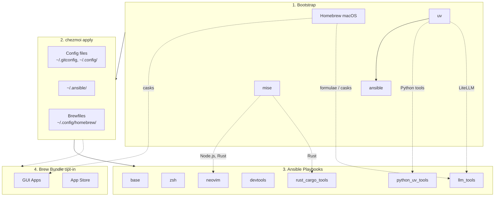

<!-- Generated by SpecStory, Markdown v2.1.0 -->

# 2026-04-21 11:56:50Z

<!-- Codex CLI Session 019dafe5-299f-72c2-b93f-2d8ea395b334 (2026-04-21 11:56:50Z) -->

_**User (2026-04-21 11:56:50Z)**_

```
chezmoi on  main [$]
❯ proxy-status
proxy: active    url=http://127.0.0.1:7890  source=probe  (exported in current shell)

chezmoi on  main [$]
❯ proxy-off
proxy OFF

chezmoi on  main [$]
❯ proxy-status
proxy: available url=http://127.0.0.1:7890  source=probe  (not exported; use `withproxy`, `try_direct_then_proxy`, or `proxy-on`)
```

幫我看一下 我的Clash很明顯是設置在 port 7891 但是爲什麼 [50_networking.zsh](dot_config/zsh/tools/50_networking.zsh)  proxy-status 抓到的卻是 7890 難道有什麼hardcoded了嗎？ 定位一下問題 以及如何修正


---

_**Agent (gpt-5.4 2026-04-21 11:58:37Z)**_

我先看 `proxy-status` 的實作和它的候選 port 來源，確認是不是在 `50_networking.zsh` 或其他模板裡把 `7890` 寫死了，然後再對照 Clash 實際配置的讀取方式。

_**Agent (gpt-5.4 2026-04-21 11:58:37Z)**_

<tool-use data-tool-type="shell" data-tool-name="exec_command"><details>
<summary>Tool use: **exec_command** `rg -n "7890|7891|proxy-status|proxy-on|withproxy|try_direct_then_proxy|http_proxy|https_proxy|ALL_PROXY|all_proxy|socks-port|mixed-port|port:" dot_config/zsh docs tests .chezmoi*`</summary>
```
Chunk ID: 8c729e
Wall time: 0.0011 seconds
Process exited with code 0
Original token count: 3058
Output:
tests/unit/zsh_proxy.bats:40:  # Pick 1087 — third in the probe order (7890, 7891, 1087, 8118, 8080).
tests/unit/zsh_proxy.bats:69:@test "all_proxy_url: prefers LOCAL_PROXY_SOCKS_URL, falls back to cache" {
tests/unit/zsh_proxy.bats:74:    __zsh_net_all_proxy_url
tests/unit/zsh_proxy.bats:82:    __zsh_net_all_proxy_url
tests/unit/zsh_proxy.bats:87:@test "proxy-on: exports all six proxy env vars" {
tests/unit/zsh_proxy.bats:90:    proxy-on -q
tests/unit/zsh_proxy.bats:91:    for v in http_proxy https_proxy HTTP_PROXY HTTPS_PROXY ALL_PROXY all_proxy; do
tests/unit/zsh_proxy.bats:95:  [[ "$output" == *"http_proxy=http://test:1234"* ]]
tests/unit/zsh_proxy.bats:96:  [[ "$output" == *"https_proxy=http://test:1234"* ]]
tests/unit/zsh_proxy.bats:99:  [[ "$output" == *"ALL_PROXY=http://test:1234"* ]]
tests/unit/zsh_proxy.bats:100:  [[ "$output" == *"all_proxy=http://test:1234"* ]]
tests/unit/zsh_proxy.bats:103:@test "proxy-on: split HTTP/SOCKS wires http= and all= independently (fa4c063 guard)" {
tests/unit/zsh_proxy.bats:106:    proxy-on -q
tests/unit/zsh_proxy.bats:107:    printf 'http=%s\nhttps=%s\nall=%s\n' \"\$http_proxy\" \"\$https_proxy\" \"\$ALL_PROXY\"
tests/unit/zsh_proxy.bats:117:    proxy-on -q
tests/unit/zsh_proxy.bats:120:    for v in http_proxy https_proxy HTTP_PROXY HTTPS_PROXY ALL_PROXY all_proxy NO_PROXY no_proxy; do
tests/unit/zsh_proxy.bats:127:@test "proxy-status: returns 1 when unavailable, 0 when available" {
tests/unit/zsh_proxy.bats:138:    proxy-status > /dev/null 2>&1
tests/unit/zsh_proxy.bats:144:    proxy-status > /dev/null 2>&1
docs/testing.md:109:- Port probe order: `7890 → 7891 → 1087 → 8118 → 8080`.
docs/testing.md:111:- `__zsh_net_all_proxy_url` returns `$LOCAL_PROXY_SOCKS_URL` when set; falls back to the HTTP cache otherwise.
docs/testing.md:112:- `proxy-on` exports all six env vars (`http_proxy`, `https_proxy`, `HTTP_PROXY`, `HTTPS_PROXY`, `ALL_PROXY`, `all_proxy`).
docs/testing.md:115:- `proxy-status` exit codes: `1` when unavailable, `0` when available.
docs/testing.md:211:for v in http_proxy https_proxy HTTP_PROXY HTTPS_PROXY ALL_PROXY all_proxy; do
docs/testing.md:219:[[ "$output" == *"http_proxy=http://test:1234"* ]]
docs/zsh/aliases.md:505:> Portable loopback-proxy helpers. Honors `$LOCAL_PROXY_URL` (+ optional `$LOCAL_PROXY_SOCKS_URL` for split Clash `socks-port:` configs); otherwise probes ports 7890/7891/1087/8118/8080 with `nc -z -w1` and caches the result per shell. Set `$LOCAL_PROXY_AUTO_ACTIVATE=1` to auto-export env vars on shell startup. Full guide: [docs/tools/web-reader.md](../tools/web-reader.md). See also: [docs/tools/containers.md](../tools/containers.md) for how `$LOCAL_PROXY_URL` feeds the chezmoi-managed `~/.docker/config.json` `proxies.default` block.
docs/zsh/aliases.md:509:| `withproxy` | function | `dot_config/zsh/tools/50_networking.zsh` | Run a single command with proxy env vars exported to the child only (e.g. `withproxy curl ...`) |
docs/zsh/aliases.md:510:| `try_direct_then_proxy` | function | `dot_config/zsh/tools/50_networking.zsh` | Run a command direct; on failure, retry via `withproxy`. Used as the default for reader functions. |
docs/zsh/aliases.md:511:| `proxy-on` | function | `dot_config/zsh/tools/50_networking.zsh` | Export `http_proxy`/`https_proxy`/`HTTP_PROXY`/`HTTPS_PROXY`/`ALL_PROXY` in the current shell |
docs/zsh/aliases.md:513:| `proxy-status` | function | `dot_config/zsh/tools/50_networking.zsh` | Report state: **active** (exported), **available** (detected), or **unavailable** |
docs/zsh/aliases.md:518:> Render web pages as markdown in the terminal. All functions use `try_direct_then_proxy` so non-GFW'd URLs pay zero proxy overhead. Pick the extractor by function name. Full guide: [docs/tools/web-reader.md](../tools/web-reader.md).
docs/tools/containers.md:30:- [dot_config/zsh/tools/50_networking.zsh](../../dot_config/zsh/tools/50_networking.zsh) — shared `$LOCAL_PROXY_URL` convention and `proxy-on` / `withproxy` helpers.
docs/tools/containers.md:65:`~/.docker/config.json` has a top-level `proxies.default` block that the Docker CLI reads on every `docker run` / `docker build` / `docker compose up` and uses to inject `HTTP_PROXY` / `HTTPS_PROXY` / `NO_PROXY` / `ALL_PROXY` into the container's environment (and as build-args during image builds).
docs/tools/containers.md:80:export LOCAL_PROXY_URL="http://127.0.0.1:7890"           # HTTP/HTTPS
docs/tools/containers.md:81:export LOCAL_PROXY_SOCKS_URL="socks5://127.0.0.1:7891"   # Optional; fills allProxy
docs/tools/containers.md:93:# Expect: HTTP_PROXY, HTTPS_PROXY, NO_PROXY, http_proxy, https_proxy, no_proxy, all_proxy
docs/tools/containers.md:120:Environment="HTTP_PROXY=http://127.0.0.1:7890"
docs/tools/containers.md:121:Environment="HTTPS_PROXY=http://127.0.0.1:7890"
docs/tools/containers.md:134:#  HTTP Proxy: http://127.0.0.1:7890
docs/tools/containers.md:135:#  HTT
... (truncated)
```
</details></tool-use>

_**Agent (gpt-5.4 2026-04-21 11:58:37Z)**_

<tool-use data-tool-type="shell" data-tool-name="exec_command"><details>
<summary>Tool use: **exec_command** `sed -n '1,260p' dot_config/zsh/tools/50_networking.zsh`</summary>
```
Chunk ID: 64e401
Wall time: 0.0000 seconds
Process exited with code 0
Original token count: 2026
Output:
# 50_networking.zsh - Networking tool aliases and helpers

# --- Listening ports (works everywhere, no extra install needed) ---
alias ports='lsof -i -P -n | grep LISTEN'

# --- IP address helpers ---
alias myip='curl -s https://ifconfig.me'
if [[ "$OSTYPE" == darwin* ]]; then
  alias localip='ipconfig getifaddr en0'
else
  alias localip='hostname -I | awk "{print \$1}"'
fi

# --- nmap shortcuts ---
if command -v nmap &>/dev/null; then
  # Quick ping sweep of local /24 subnet
  pingsweep() {
    local ip
    if [[ "$OSTYPE" == darwin* ]]; then
      ip=$(ipconfig getifaddr en0 2>/dev/null)
    else
      ip=$(hostname -I 2>/dev/null | awk '{print $1}')
    fi
    local base="${ip%.*}.0/24"
    echo "Scanning $base ..."
    nmap -sn "$base"
  }
fi

# --- arp-scan ---
if command -v arp-scan &>/dev/null; then
  alias arpscan='sudo arp-scan -l'
fi

# --- doggo (modern DNS lookup with DoH/DoT/DoQ) ---
if command -v doggo &>/dev/null; then
  alias dns='doggo'
fi

# --- gping (graphical ping) ---
# gping is already short enough, no alias needed

# --- trippy (TUI traceroute, binary is 'trip') ---
# trip is already short enough, no alias needed

# --- bandwhich (bandwidth monitor, needs sudo for packet capture) ---
if command -v bandwhich &>/dev/null; then
  alias bw-net='sudo bandwhich'
fi

# --- rustscan (fast port scanner -> nmap) ---
if command -v rustscan &>/dev/null; then
  alias portscan='rustscan'
fi

# --- speedtest (Ookla CLI) ---
# speedtest is already short enough, no alias needed

# --- LAN device scanner (feeds `tv lan-devices`) ---
if [[ -x "$HOME/.config/television/lan-scan.sh" ]]; then
  alias lanscan="$HOME/.config/television/lan-scan.sh all"
  alias tv-lan='tv lan-devices'
fi

# --- Proxy helpers (generic) ---
# Portable proxy management: honor $LOCAL_PROXY_URL, else auto-probe common
# loopback ports (Clash 7890/7891, ClashX 1087, Privoxy 8118, generic 8080).
# Detection result is cached per-shell in _ZSH_NET_PROXY_CACHE; use
# `proxy-refresh` after starting/stopping the proxy.
#
# Environment variables honored:
#   LOCAL_PROXY_URL         HTTP/HTTPS proxy URL (e.g. http://127.0.0.1:7890).
#                           If unset, ports are auto-probed.
#   LOCAL_PROXY_SOCKS_URL   Optional separate SOCKS5 endpoint (e.g.
#                           socks5://127.0.0.1:7891). Used for ALL_PROXY /
#                           all_proxy when set; otherwise these fall back to
#                           LOCAL_PROXY_URL / the probe result. Useful when
#                           Clash is configured with split `port:` and
#                           `socks-port:` instead of `mixed-port:`.
#   LOCAL_PROXY_AUTO_ACTIVATE=1  Run `proxy-on` silently at shell startup
#                           whenever a proxy is detected. Handy on machines
#                           that always route through the local proxy.

: "${_ZSH_NET_PROXY_CACHE:=}"
__ZSH_NET_PROXY_PROBE_PORTS=(7890 7891 1087 8118 8080)

__zsh_net_detect_proxy() {
  [[ -n "$_ZSH_NET_PROXY_CACHE" ]] && return 0
  if [[ -n "$LOCAL_PROXY_URL" ]]; then
    _ZSH_NET_PROXY_CACHE="$LOCAL_PROXY_URL"
    return 0
  fi
  local port
  for port in "${__ZSH_NET_PROXY_PROBE_PORTS[@]}"; do
    if nc -z -w1 127.0.0.1 "$port" 2>/dev/null; then
      _ZSH_NET_PROXY_CACHE="http://127.0.0.1:$port"
      return 0
    fi
  done
  _ZSH_NET_PROXY_CACHE="none"
  return 1
}

# Resolve the URL that should be used for ALL_PROXY / all_proxy.
# Falls back to the HTTP proxy when no SOCKS-specific URL is set (works for
# mixed-port Clash configs where one port serves both HTTP and SOCKS).
__zsh_net_all_proxy_url() {
  if [[ -n "$LOCAL_PROXY_SOCKS_URL" ]]; then
    print -r -- "$LOCAL_PROXY_SOCKS_URL"
  else
    print -r -- "$_ZSH_NET_PROXY_CACHE"
  fi
}

# Run one command with proxy env applied to the child process only.
withproxy() {
  __zsh_net_detect_proxy
  if [[ "$_ZSH_NET_PROXY_CACHE" == "none" ]]; then
    "$@"
    return
  fi
  local all_url
  all_url="$(__zsh_net_all_proxy_url)"
  http_proxy="$_ZSH_NET_PROXY_CACHE" \
  https_proxy="$_ZSH_NET_PROXY_CACHE" \
  HTTP_PROXY="$_ZSH_NET_PROXY_CACHE" \
  HTTPS_PROXY="$_ZSH_NET_PROXY_CACHE" \
  ALL_PROXY="$all_url" \
  all_proxy="$all_url" \
    "$@"
}

# Run direct first; on non-zero exit, retry via proxy if one is available.
try_direct_then_proxy() {
  "$@" && return 0
  local rc=$?
  __zsh_net_detect_proxy
  if [[ "$_ZSH_NET_PROXY_CACHE" == "none" ]]; then
    return $rc
  fi
  print -u2 "[retry via proxy $_ZSH_NET_PROXY_CACHE]"
  withproxy "$@"
}

# Export proxy env vars to the current shell (all downstream commands inherit).
# If $1 is "-q", suppress the success message (used by auto-activate).
proxy-on() {
  local quiet=0
  [[ "$1" == "-q" ]] && quiet=1
  __zsh_net_detect_proxy
  if [[ "$_ZSH_NET_PROXY_CACHE" == "none" ]]; then
    (( quiet )) || print -u2 "proxy-on: no proxy detected (set \$LOCAL_PROXY_URL or start your proxy,
... (truncated)
```
</details></tool-use>

_**Agent (gpt-5.4 2026-04-21 11:58:37Z)**_

<tool-use data-tool-type="shell" data-tool-name="exec_command"><details>
<summary>Tool use: **exec_command** `rg --files | rg "(clash|proxy|networking|aliases\.md|README\.md|Dockerfile|chezmoi)"`</summary>
```
Chunk ID: 1f08e3
Wall time: 0.0000 seconds
Process exited with code 0
Original token count: 96
Output:
README.md
Dockerfile
docs/zsh/aliases.md
docs/tools/tmux/README.md
docs/tools/chezmoi-templating.md
docs/tools/networking.md
docs/tools/chezmoi-prefixes.md
docs/infra/README.md
docs/input_methods/README.md
tests/unit/zsh_proxy.bats
dot_config/nvim/README.md
dot_config/zsh/tools/50_networking.zsh
dot_config/tmuxinator/chezmoi.yml
dot_ansible/roles/networking_tools/tasks/main.yml
```
</details></tool-use>

_**Agent (gpt-5.4 2026-04-21 11:59:02Z)**_

我已經看到一個可疑點：這段邏輯會把偵測結果快取在 `_ZSH_NET_PROXY_CACHE`，`proxy-off` 只清 env，不會重探。接下來我去看你機器現在到底是誰在 listen `7890/7891`，以及 Clash 的實際配置檔。

_**Agent (gpt-5.4 2026-04-21 11:59:02Z)**_

<tool-use data-tool-type="shell" data-tool-name="exec_command"><details>
<summary>Tool use: **exec_command** `lsof -nP -iTCP:7890 -sTCP:LISTEN`</summary>
```
Chunk ID: f9b09c
Wall time: 0.1707 seconds
Process exited with code 1
Original token count: 0
Output:
```
</details></tool-use>

_**Agent (gpt-5.4 2026-04-21 11:59:02Z)**_

<tool-use data-tool-type="shell" data-tool-name="exec_command"><details>
<summary>Tool use: **exec_command** `lsof -nP -iTCP:7891 -sTCP:LISTEN`</summary>
```
Chunk ID: ccc854
Wall time: 0.2302 seconds
Process exited with code 1
Original token count: 0
Output:
```
</details></tool-use>

_**Agent (gpt-5.4 2026-04-21 11:59:03Z)**_

<tool-use data-tool-type="shell" data-tool-name="exec_command"><details>
<summary>Tool use: **exec_command** `rg -n "^(port|socks-port|mixed-port|redir-port|allow-lan|external-controller):" "$HOME/Library/Application Support" "$HOME/.config" "$HOME/.clash" 2>/dev/null`</summary>
```
Chunk ID: 77aee3
Wall time: 1.0017 seconds
Process running with session ID 53505
Original token count: 203
Output:
/Users/daviddwlee84/.config/clash/profiles/1731944239843.yml:1:port: 7890
/Users/daviddwlee84/.config/clash/profiles/1731944239843.yml:3:socks-port: 7891
/Users/daviddwlee84/.config/clash/profiles/1731944239843.yml:5:allow-lan: false
/Users/daviddwlee84/.config/clash/profiles/1731944239843.yml:7:external-controller: 127.0.0.1:9090
/Users/daviddwlee84/.config/clash/profiles/1731944231676.yml:1:mixed-port: 7890
/Users/daviddwlee84/.config/clash/profiles/1731944231676.yml:2:allow-lan: false
/Users/daviddwlee84/.config/clash/profiles/1731944231676.yml:3:external-controller: 127.0.0.1:49198
/Users/daviddwlee84/.config/clash/config.yaml:1:mixed-port: 7891
/Users/daviddwlee84/.config/clash/config.yaml:2:allow-lan: true
/Users/daviddwlee84/.config/clash/config.yaml:3:external-controller: 127.0.0.1:49392
```
</details></tool-use>

_**Agent (gpt-5.4 2026-04-21 11:59:13Z)**_

<tool-use data-tool-type="shell" data-tool-name="exec_command"><details>
<summary>Tool use: **exec_command** `rg -n "LOCAL_PROXY_URL|LOCAL_PROXY_SOCKS_URL|LOCAL_PROXY_AUTO_ACTIVATE|proxy-on -q|proxy-refresh|_ZSH_NET_PROXY_CACHE" dot_* private_* .`</summary>
```
Chunk ID: 690bc7
Wall time: 0.1963 seconds
Process exited with code 0
Original token count: 3898
Output:
dot_docker/modify_config.json.tmpl:3:# based on $LOCAL_PROXY_URL / $LOCAL_PROXY_SOCKS_URL at apply time. Preserves
dot_docker/modify_config.json.tmpl:9:# for the $LOCAL_PROXY_URL convention this script shares with the shell helpers.
dot_docker/modify_config.json.tmpl:24:{{ if env "LOCAL_PROXY_URL" -}}
dot_docker/modify_config.json.tmpl:26:  --arg http  {{ env "LOCAL_PROXY_URL" | quote }} \
dot_docker/modify_config.json.tmpl:27:  --arg https {{ env "LOCAL_PROXY_URL" | quote }} \
dot_docker/modify_config.json.tmpl:28:  --arg all   {{ or (env "LOCAL_PROXY_SOCKS_URL") (env "LOCAL_PROXY_URL") | quote }} \
./dot_docker/modify_config.json.tmpl:3:# based on $LOCAL_PROXY_URL / $LOCAL_PROXY_SOCKS_URL at apply time. Preserves
./dot_docker/modify_config.json.tmpl:9:# for the $LOCAL_PROXY_URL convention this script shares with the shell helpers.
./dot_docker/modify_config.json.tmpl:24:{{ if env "LOCAL_PROXY_URL" -}}
./dot_docker/modify_config.json.tmpl:26:  --arg http  {{ env "LOCAL_PROXY_URL" | quote }} \
./dot_docker/modify_config.json.tmpl:27:  --arg https {{ env "LOCAL_PROXY_URL" | quote }} \
./dot_docker/modify_config.json.tmpl:28:  --arg all   {{ or (env "LOCAL_PROXY_SOCKS_URL") (env "LOCAL_PROXY_URL") | quote }} \
./README.md:119:- `~/.docker/config.json` - Docker client `proxies.default` block (auto-injected from `$LOCAL_PROXY_URL` / `$LOCAL_PROXY_SOCKS_URL`; preserves `auths` / `credsStore` via chezmoi modify-script) ([docs](docs/tools/containers.md))
./docs/zsh/aliases.md:505:> Portable loopback-proxy helpers. Honors `$LOCAL_PROXY_URL` (+ optional `$LOCAL_PROXY_SOCKS_URL` for split Clash `socks-port:` configs); otherwise probes ports 7890/7891/1087/8118/8080 with `nc -z -w1` and caches the result per shell. Set `$LOCAL_PROXY_AUTO_ACTIVATE=1` to auto-export env vars on shell startup. Full guide: [docs/tools/web-reader.md](../tools/web-reader.md). See also: [docs/tools/containers.md](../tools/containers.md) for how `$LOCAL_PROXY_URL` feeds the chezmoi-managed `~/.docker/config.json` `proxies.default` block.
./docs/zsh/aliases.md:514:| `proxy-refresh` | function | `dot_config/zsh/tools/50_networking.zsh` | Clear cached detection, re-probe, print status (use after toggling your proxy) |
./tests/unit/zsh_proxy.bats:5:# file sourced fresh, so cache state ($_ZSH_NET_PROXY_CACHE) can't leak between
./tests/unit/zsh_proxy.bats:27:@test "detect_proxy: \$LOCAL_PROXY_URL is used verbatim, no probe" {
./tests/unit/zsh_proxy.bats:28:  result="$(LOCAL_PROXY_URL=http://sentinel:9999 zsh -f -c "
./tests/unit/zsh_proxy.bats:31:    print -r -- \"\$_ZSH_NET_PROXY_CACHE\"
./tests/unit/zsh_proxy.bats:45:    print -r -- \"\$_ZSH_NET_PROXY_CACHE\"
./tests/unit/zsh_proxy.bats:62:    print -r -- \"cache=\$_ZSH_NET_PROXY_CACHE rc=\$rc\"
./tests/unit/zsh_proxy.bats:69:@test "all_proxy_url: prefers LOCAL_PROXY_SOCKS_URL, falls back to cache" {
./tests/unit/zsh_proxy.bats:71:  result="$(LOCAL_PROXY_URL=http://a:1 LOCAL_PROXY_SOCKS_URL=socks5://b:2 zsh -f -c "
./tests/unit/zsh_proxy.bats:79:  result="$(LOCAL_PROXY_URL=http://a:1 zsh -f -c "
./tests/unit/zsh_proxy.bats:88:  output="$(LOCAL_PROXY_URL=http://test:1234 zsh -f -c "
./tests/unit/zsh_proxy.bats:90:    proxy-on -q
./tests/unit/zsh_proxy.bats:104:  output="$(LOCAL_PROXY_URL=http://h:1 LOCAL_PROXY_SOCKS_URL=socks5://s:2 zsh -f -c "
./tests/unit/zsh_proxy.bats:106:    proxy-on -q
./tests/unit/zsh_proxy.bats:115:  output="$(LOCAL_PROXY_URL=http://x:1 zsh -f -c "
./tests/unit/zsh_proxy.bats:117:    proxy-on -q
./tests/unit/zsh_proxy.bats:142:  run env LOCAL_PROXY_URL=http://ok:1 zsh -f -c "
./docs/testing.md:108:- `$LOCAL_PROXY_URL` takes precedence over probing.
./docs/testing.md:110:- `_ZSH_NET_PROXY_CACHE=none` when nothing responds.
./docs/testing.md:111:- `__zsh_net_all_proxy_url` returns `$LOCAL_PROXY_SOCKS_URL` when set; falls back to the HTTP cache otherwise.
./docs/testing.md:117:Key technique: each test runs `zsh -f -c '...'` (no startup files) so the in-file cache (`$_ZSH_NET_PROXY_CACHE`) can't leak between tests, and `nc` is stubbed via a temp dir on `PATH` — no real network traffic.
./docs/tools/containers.md:19:| Container proxy env (`docker run`, `docker build`) | `~/.docker/config.json` `proxies.default` | Yes, cross-platform | `$LOCAL_PROXY_URL` set at apply time |
./docs/tools/containers.md:30:- [dot_config/zsh/tools/50_networking.zsh](../../dot_config/zsh/tools/50_networking.zsh) — shared `$LOCAL_PROXY_URL` convention and `proxy-on` / `withproxy` helpers.
./docs/tools/containers.md:74:2. If `$LOCAL_PROXY_URL` is set in the apply-time environment, merges `proxies.default` into the JSON via `jq`. Any `auths` / `credsStore` / `credHelpers` / `currentContext` / `plugins` / `features` keys written by `docker login` or the CLI itself are preserved.
./docs/tools/containers.md:75:3. If `$LOCAL_PROXY_URL` is unset, strips `proxies.default` and, if that leaves `.proxies
... (truncated)
```
</details></tool-use>

_**Agent (gpt-5.4 2026-04-21 11:59:13Z)**_

<tool-use data-tool-type="shell" data-tool-name="exec_command"><details>
<summary>Tool use: **exec_command** `sed -n '1,220p' tests/unit/zsh_proxy.bats`</summary>
```
Chunk ID: 0a4a0f
Wall time: 0.0009 seconds
Process exited with code 0
Original token count: 1153
Output:
#!/usr/bin/env bats
# Unit tests for dot_config/zsh/tools/50_networking.zsh proxy helpers.
#
# Strategy: each test runs `zsh -f -c '...'` (no startup files) with the proxy
# file sourced fresh, so cache state ($_ZSH_NET_PROXY_CACHE) can't leak between
# tests. `nc` is stubbed via a temp dir prepended to PATH so probes don't touch
# the network.

load "../test_helper.bash"

PROXY_FILE="$REPO_ROOT/dot_config/zsh/tools/50_networking.zsh"

# Helper: write a fake `nc` that exits 0 only when port matches $EXPECT_PORT
# (set by the calling test via env). All other ncs fail -> simulates closed.
_make_nc_stub() {
  local dir="$1"
  cat > "$dir/nc" <<'STUB'
#!/usr/bin/env bash
# Walks args, takes last as port. matches $EXPECT_PORT.
port=""
while [ $# -gt 0 ]; do port="$1"; shift; done
[ "$port" = "${EXPECT_PORT:-__none__}" ] && exit 0 || exit 1
STUB
  chmod +x "$dir/nc"
}

@test "detect_proxy: \$LOCAL_PROXY_URL is used verbatim, no probe" {
  result="$(LOCAL_PROXY_URL=http://sentinel:9999 zsh -f -c "
    source '$PROXY_FILE'
    __zsh_net_detect_proxy
    print -r -- \"\$_ZSH_NET_PROXY_CACHE\"
  ")"
  [ "$result" = "http://sentinel:9999" ]
}

@test "detect_proxy: probes default ports and picks first responder" {
  setup_path_stub
  _make_nc_stub "$BATS_STUB_DIR"

  # Pick 1087 — third in the probe order (7890, 7891, 1087, 8118, 8080).
  # If probe order regressed or skipped a port, this would return a different URL.
  result="$(EXPECT_PORT=1087 zsh -f -c "
    source '$PROXY_FILE'
    __zsh_net_detect_proxy
    print -r -- \"\$_ZSH_NET_PROXY_CACHE\"
  ")"
  [ "$result" = "http://127.0.0.1:1087" ]
}

@test "detect_proxy: no responder sets cache=none and returns non-zero" {
  setup_path_stub
  # nc that always fails
  cat > "$BATS_STUB_DIR/nc" <<'EOF'
#!/usr/bin/env bash
exit 1
EOF
  chmod +x "$BATS_STUB_DIR/nc"

  run zsh -f -c "
    source '$PROXY_FILE'
    if __zsh_net_detect_proxy; then rc=0; else rc=\$?; fi
    print -r -- \"cache=\$_ZSH_NET_PROXY_CACHE rc=\$rc\"
  "
  [ "$status" -eq 0 ]
  [[ "$output" == *"cache=none"* ]]
  [[ "$output" == *"rc=1"* ]]
}

@test "all_proxy_url: prefers LOCAL_PROXY_SOCKS_URL, falls back to cache" {
  # With SOCKS url set → returns SOCKS url.
  result="$(LOCAL_PROXY_URL=http://a:1 LOCAL_PROXY_SOCKS_URL=socks5://b:2 zsh -f -c "
    source '$PROXY_FILE'
    __zsh_net_detect_proxy
    __zsh_net_all_proxy_url
  ")"
  [ "$result" = "socks5://b:2" ]

  # Without SOCKS url → falls back to HTTP cache.
  result="$(LOCAL_PROXY_URL=http://a:1 zsh -f -c "
    source '$PROXY_FILE'
    __zsh_net_detect_proxy
    __zsh_net_all_proxy_url
  ")"
  [ "$result" = "http://a:1" ]
}

@test "proxy-on: exports all six proxy env vars" {
  output="$(LOCAL_PROXY_URL=http://test:1234 zsh -f -c "
    source '$PROXY_FILE'
    proxy-on -q
    for v in http_proxy https_proxy HTTP_PROXY HTTPS_PROXY ALL_PROXY all_proxy; do
      printf '%s=%s\n' \"\$v\" \"\${(P)v}\"
    done
  ")"
  [[ "$output" == *"http_proxy=http://test:1234"* ]]
  [[ "$output" == *"https_proxy=http://test:1234"* ]]
  [[ "$output" == *"HTTP_PROXY=http://test:1234"* ]]
  [[ "$output" == *"HTTPS_PROXY=http://test:1234"* ]]
  [[ "$output" == *"ALL_PROXY=http://test:1234"* ]]
  [[ "$output" == *"all_proxy=http://test:1234"* ]]
}

@test "proxy-on: split HTTP/SOCKS wires http= and all= independently (fa4c063 guard)" {
  output="$(LOCAL_PROXY_URL=http://h:1 LOCAL_PROXY_SOCKS_URL=socks5://s:2 zsh -f -c "
    source '$PROXY_FILE'
    proxy-on -q
    printf 'http=%s\nhttps=%s\nall=%s\n' \"\$http_proxy\" \"\$https_proxy\" \"\$ALL_PROXY\"
  ")"
  [[ "$output" == *"http=http://h:1"* ]]
  [[ "$output" == *"https=http://h:1"* ]]
  [[ "$output" == *"all=socks5://s:2"* ]]
}

@test "proxy-off: clears all six proxy vars plus NO_PROXY / no_proxy" {
  output="$(LOCAL_PROXY_URL=http://x:1 zsh -f -c "
    source '$PROXY_FILE'
    proxy-on -q
    export NO_PROXY=localhost no_proxy=localhost
    proxy-off > /dev/null
    for v in http_proxy https_proxy HTTP_PROXY HTTPS_PROXY ALL_PROXY all_proxy NO_PROXY no_proxy; do
      if [[ -n \"\${(P)v}\" ]]; then printf '%s=still-set\n' \"\$v\"; fi
    done
  ")"
  [ -z "$output" ]
}

@test "proxy-status: returns 1 when unavailable, 0 when available" {
  setup_path_stub
  # nc always fails → no proxy detected
  cat > "$BATS_STUB_DIR/nc" <<'EOF'
#!/usr/bin/env bash
exit 1
EOF
  chmod +x "$BATS_STUB_DIR/nc"

  run zsh -f -c "
    source '$PROXY_FILE'
    proxy-status > /dev/null 2>&1
  "
  [ "$status" -eq 1 ]

  run env LOCAL_PROXY_URL=http://ok:1 zsh -f -c "
    source '$PROXY_FILE'
    proxy-status > /dev/null 2>&1
  "
  [ "$status" -eq 0 ]
}
```
</details></tool-use>

_**Agent (gpt-5.4 2026-04-21 11:59:13Z)**_

<tool-use data-tool-type="shell" data-tool-name="exec_command"><details>
<summary>Tool use: **exec_command** `sed -n '80,150p' docs/tools/web-reader.md`</summary>
```
Chunk ID: e5b42d
Wall time: 0.0000 seconds
Process exited with code 0
Original token count: 745
Output:
```bash
readurl example.com | cat      # glow still formats; cat drops the pager
```

## Proxy behavior

Every reader wraps its fetch in `try_direct_then_proxy` (from `50_networking.zsh`). That means:

1. First attempt is direct — no proxy, no env mangling. Cheap.
2. On failure (non-zero exit), and only if a local proxy is detected, retry via `withproxy`.
3. If no proxy is available, the original exit code is preserved.

A note appears on stderr when the retry happens: `[retry via proxy http://127.0.0.1:7890]`.

### Detection priority

1. `$LOCAL_PROXY_URL` if exported (e.g. `http://127.0.0.1:7890`).
2. Otherwise, auto-probe loopback ports in this order: `7890 7891 1087 8118 8080`. First TCP-accepting port wins.
3. Otherwise, proxy is marked unavailable.

The result is cached per shell in `_ZSH_NET_PROXY_CACHE`. Call `proxy-refresh` after starting or stopping your local proxy to re-probe.

### Split HTTP / SOCKS5 ports (Clash `port:` + `socks-port:`)

Clash's mixed-port config (`mixed-port: 7890`) serves both HTTP and SOCKS5 on one port — the default behavior here Just Works.

If your config splits them (e.g. `port: 7890` for HTTP, `socks-port: 7891` for SOCKS5), set both explicitly:

```bash
export LOCAL_PROXY_URL="http://127.0.0.1:7890"           # HTTP/HTTPS
export LOCAL_PROXY_SOCKS_URL="socks5://127.0.0.1:7891"   # SOCKS5
```

`withproxy` and `proxy-on` then export:

| Env var | Uses |
|---|---|
| `http_proxy`, `https_proxy`, `HTTP_PROXY`, `HTTPS_PROXY` | `LOCAL_PROXY_URL` |
| `ALL_PROXY`, `all_proxy` | `LOCAL_PROXY_SOCKS_URL` (fallback: `LOCAL_PROXY_URL`) |

`proxy-status` shows both URLs when they differ.

### Auto-activate on shell startup

For machines that always route through the local proxy, auto-export the env vars at shell startup:

```bash
# e.g. in a machine-local zsh file, or ~/.zshenv
export LOCAL_PROXY_AUTO_ACTIVATE=1
```

When `50_networking.zsh` is sourced, it silently runs `proxy-on -q` if a proxy is detected. Nothing happens on machines without a proxy running.

Pairs naturally with `LOCAL_PROXY_URL` + `LOCAL_PROXY_SOCKS_URL` for deterministic behavior, or on its own to rely on port auto-probing.

## Proxy helper cheat sheet

| Helper | Scope | Notes |
|---|---|---|
| `withproxy <cmd…>` | one child process | `withproxy curl …`, `withproxy pip install …` |
| `try_direct_then_proxy <cmd…>` | one child, direct → proxy fallback | what the readers use internally |
| `proxy-on` / `proxy-on -q` | current shell, exports env vars | `-q` skips the success print |
| `proxy-off` | current shell, unsets env vars | also clears `ALL_PROXY`/`all_proxy`/`NO_PROXY` |
| `proxy-status` | read-only | reports **active** / **available** / **unavailable** + HTTP / SOCKS URLs |
| `proxy-refresh` | invalidate cache, re-probe | run after starting/stopping your proxy |

## Installation

| Tool | macOS | Debian/Ubuntu | Via ansible |
|---|---|---|---|
| `glow` | `brew install glow` | GitHub binary | `devtools` role |
```
</details></tool-use>

_**Agent (gpt-5.4 2026-04-21 11:59:33Z)**_

我把 repo 內的關聯都串起來了：目前 `proxy-status` 完全不讀 Clash config，它只看 env 或 probe，而 probe 順序確實把 `7890` 放在前面。另外 `_ZSH_NET_PROXY_CACHE` 會在同一個 shell 內黏住舊值，這就是你改成 `7891` 後還能一直看到 `7890` 的第二個原因。

_**Agent (gpt-5.4 2026-04-21 11:59:34Z)**_

<tool-use data-tool-type="shell" data-tool-name="exec_command"><details>
<summary>Tool use: **exec_command** `sed -n '1,220p' README.md`</summary>
```
Chunk ID: 326897
Wall time: 0.0001 seconds
Process exited with code 0
Original token count: 4103
Output:
# dotfiles

Cross-platform development environment setup using **chezmoi** + **ansible**.

- **chezmoi**: manages config files (dotfiles)
- **ansible**: installs system dependencies and tools

## Prerequisites

- [chezmoi](https://www.chezmoi.io/install/)
- [uv](https://docs.astral.sh/uv/getting-started/installation/) (for ansible)

## Architecture



## Quick Setup

```bash
# One-liner to initialize and apply (installs chezmoi to ~/.local/bin)
# Uses HTTPS to avoid SSH key setup on fresh machines.
export GITHUB_USERNAME=daviddwlee84
sh -c "$(curl -fsLS get.chezmoi.io)" -- -b "$HOME/.local/bin" init --apply "https://github.com/$GITHUB_USERNAME/dotfiles.git"

# After install, switch the chezmoi source repo to SSH (so future `chezmoi update` uses your SSH key):
#   chezmoi cd
#   git remote set-url origin git@github.com:$GITHUB_USERNAME/dotfiles.git
#   exit
```

This automatically:

1. Bootstraps Homebrew (macOS/Linux), uv, mise, ansible
2. Deploys all config files
3. Runs ansible playbooks (git, ripgrep, fd, neovim, etc.)
4. Runs brew bundle (if `installBrewApps` is enabled, or on macOS if `installAiDesktopApps` is enabled)

### After install

- `~/.local/bin` is auto-appended to `~/.bashrc` so `chezmoi`, `uv`, and `mise` stay reachable from bash.
- On sudo-enabled machines, the ansible `zsh` role switches your login shell to zsh automatically. Log out / back in to pick it up, or run `exec zsh` now.
- On `noRoot=true` installs, login shell isn't changed — run `exec zsh` per session, or ask your sysadmin: `sudo chsh -s "$(command -v zsh)" $USER`.
- Open a new shell (or `source ~/.bashrc`) after install so PATH changes take effect.

### Optional Components

During `chezmoi init`, you'll be prompted for optional installs:

| Option | Default | Description |
|--------|---------|-------------|
| `installCodingAgents` | true | Claude Code, Codex CLI, OpenCode, Cursor, Copilot, Gemini CLI, RTK, td, sidecar, specify-cli, etc. |
| `installBitwarden` | false | Bitwarden CLI (`bw`) + Desktop app (desktop profiles) with SSH agent auto-detection |
| `installPythonUvTools` | true | Python CLI tools via uv (mlflow, sqlit-tui, tmuxp, etc.) |
| `installLlmTools` | false | Local LLM tools: Ollama, LiteLLM, llmfit, models |
| `installAiDesktopApps` | false | macOS AI desktop apps via Homebrew Brewfile (Claude, ChatGPT, OpenCode Desktop, Antigravity, Codex Desktop on Apple Silicon; `ollama-app` also requires `installLlmTools=true`) |
| `installBrewApps` | false | General GUI apps via Homebrew Brewfile (terminals, browsers, utilities, mas; excludes AI desktop apps) |
| `installInputMethod` | false | Traditional Chinese input methods (McBopomofo, RIME/Squirrel on macOS; ibus-rime on Linux) |
| `installNetworkingTools` | false | Networking CLI tools (nmap, mtr, httpie, gping, trippy, bandwhich, rustscan, etc.) |
| `installIacTools` | false | Infrastructure-as-Code CLIs (Azure CLI, Terraform, OpenTofu) |
| `installDotnetTools` | false | .NET SDK via mise + dotnet global tools ([azure-cost-cli](docs/tools/dotnet-tools.md) for Azure cost analysis) |
| `noRoot` | false | Skip sudo-requiring tasks (for servers without root access) |

To change options later: `chezmoi init --force`

## What You Get

### Config Files

- `~/.gitconfig` - Git configuration
- `~/.config/git/hooks/` - Global Git hooks (pre-commit + Git LFS hooks)
- `~/.config/gh-dash/config.yml` - Global gh-dash config, with `diffnav` as the diff pager
- `~/.config/lazygit/config.yml` - Global LazyGit config, with `delta` as the custom diff pager
- `~/.config/bat/themes/tokyonight_night.tmTheme` - Managed Tokyo Night theme for bat
- `~/.config/nvim/` - Neovim (LazyVim) configuration; system clipboard via `unnamedplus`, with an SSH-conditional OSC 52 override so remote yanks reach the local clipboard (pairs with tmux `set-clipboard on`, see [docs](docs/tools/tmux/README.md#osc-52-clipboard-ssh-friendly-yank))
- `~/.config/uv/uv.toml` - uv package manager
... (truncated)
```
</details></tool-use>

_**Agent (gpt-5.4 2026-04-21 11:59:34Z)**_

<tool-use data-tool-type="shell" data-tool-name="exec_command"><details>
<summary>Tool use: **exec_command** `sed -n '1,240p' docs/tools/networking.md`</summary>
```
Chunk ID: e631da
Wall time: 0.0000 seconds
Process exited with code 0
Original token count: 1082
Output:
# Networking CLI Tools

Optional role (`installNetworkingTools`). Install via `chezmoi init --force` and enable the prompt.

## Tools

| Tool | Binary | Purpose | Sudo at runtime? |
|------|--------|---------|-------------------|
| [nmap](https://nmap.org/) | `nmap` | Port scanning, host discovery, OS detection, service enumeration | Some features (OS detection, SYN scan) |
| [arp-scan](https://github.com/royhills/arp-scan) | `arp-scan` | Fast Layer 2 host discovery with OUI vendor lookup | Yes (raw sockets) |
| [mtr](https://www.bitwizard.nl/mtr/) | `mtr` | Real-time combined ping + traceroute | Some modes |
| [iperf3](https://iperf.fr/) | `iperf3` | Network bandwidth/throughput testing between two hosts | No |
| [doggo](https://github.com/mr-karan/doggo) | `doggo` | Modern DNS lookup (replaces dig/nslookup), DoH/DoT/DoQ | No |
| [HTTPie](https://httpie.io/) | `http` / `https` | Modern HTTP client, nicer than curl for API testing | No |
| [gping](https://github.com/orf/gping) | `gping` | Ping with a real-time graph | No |
| [trippy](https://github.com/fujiapple852/trippy) | `trip` | Modern TUI traceroute with rich visualization | Yes (raw sockets) |
| [bandwhich](https://github.com/imsnif/bandwhich) | `bandwhich` | Terminal bandwidth utilization per process/connection | Yes (packet capture) |
| [Ookla Speedtest](https://www.speedtest.net/apps/cli) | `speedtest` | Official Ookla internet speed test | No |
| [RustScan](https://github.com/RustScan/RustScan) | `rustscan` | Fast port scanner, feeds results into nmap | No |

## Shell Aliases

Defined in `~/.config/zsh/tools/50_networking.zsh`:

| Alias | Command | Description |
|-------|---------|-------------|
| `ports` | `lsof -i -P -n \| grep LISTEN` | Show all listening ports |
| `myip` | `curl -s https://ifconfig.me` | Show public IP address |
| `localip` | platform-aware | Show local LAN IP address |
| `arpscan` | `sudo arp-scan -l` | Scan local network (Layer 2) |
| `pingsweep` | `nmap -sn <subnet>/24` | Ping sweep local /24 subnet (function) |
| `dns` | `doggo` | DNS lookup shortcut |
| `bw-net` | `sudo bandwhich` | Bandwidth monitor (avoids conflict with `bw` = Bitwarden) |
| `portscan` | `rustscan` | Fast port scan shortcut |

## Common Usage

### What's on my network?

```bash
# Layer 2 ARP scan (most reliable, shows MAC + vendor)
arpscan

# Ping sweep (Layer 3)
pingsweep

# Full scan with OS detection
sudo nmap -sV -O 192.168.1.0/24

# Interactive picker with open ports, MAC/vendor, hostname, latency
# (auto-detects sudo; falls back to no-sudo discovery when unavailable)
lanscan            # run a full scan into ~/.cache/tv/
tv lan-devices     # fuzzy-search devices; see docs/tools/tv.md
```

### Port scanning

```bash
# Quick port scan (rustscan is ~10x faster than nmap alone)
portscan -a 192.168.1.100

# Specific ports with nmap
nmap -p 22,80,443,8080 192.168.1.100

# Service version detection
nmap -sV -p 22,80 192.168.1.100
```

### DNS lookup

```bash
# Basic lookup
dns example.com

# Specific record type
dns example.com MX
dns example.com AAAA

# Use DNS-over-HTTPS
dns example.com --class IN --type A @https://cloudflare-dns.com/dns-query

# Use DNS-over-TLS
dns example.com @tls://1.1.1.1
```

### Diagnostics

```bash
# Real-time traceroute
mtr google.com

# Graphical ping (compare multiple hosts)
gping google.com cloudflare.com 1.1.1.1

# TUI traceroute with rich visualization
trip google.com

# See what's listening on this machine
ports
```

### Bandwidth testing

```bash
# Internet speed test
speedtest

# LAN throughput (need iperf3 on both ends)
# On server: iperf3 -s
# On client:  iperf3 -c <server-ip>

# Monitor per-process bandwidth usage
bw-net
```

### HTTP testing

```bash
# GET request (httpie)
http httpbin.org/get

# POST with JSON
http POST httpbin.org/post name=test value=123

# With headers
http GET api.example.com Authorization:"Bearer token123"
```

## Platform Notes

- **macOS**: All tools installed via Homebrew. `tcpdump` is preinstalled.
- **Linux (with sudo)**: `nmap`, `arp-scan`, `mtr`, `iperf3`, `httpie`, `tcpdump` via apt. Others from GitHub releases to `~/.local/bin`.
- **Linux (noRoot)**: apt tools skipped; `trippy` system-level install skipped. GitHub binary tools still work but `arp-scan`, `bandwhich`, and `trippy` need sudo at runtime for raw socket access.
```
</details></tool-use>

_**Agent (gpt-5.4 2026-04-21 11:59:34Z)**_

<tool-use data-tool-type="shell" data-tool-name="exec_command"><details>
<summary>Tool use: **exec_command** `sed -n '480,540p' docs/zsh/aliases.md`</summary>
```
Chunk ID: 7a46ec
Wall time: 0.0000 seconds
Process exited with code 0
Original token count: 1194
Output:
| Command | Type | Source File | Description |
|---------|------|-------------|-------------|
| `pqsum` | function | `dot_config/zsh/tools/36_pueue.zsh` | Summarize pueue queue status: overall progress, ETA, per-group breakdown |

---

## Networking

> Conditional aliases — only defined when the corresponding tool is installed.

| Command | Type | Source File | Description |
|---------|------|-------------|-------------|
| `ports` | alias | `dot_config/zsh/tools/50_networking.zsh` | List all listening ports (`lsof -i -P -n \| grep LISTEN`) |
| `myip` | alias | `dot_config/zsh/tools/50_networking.zsh` | Show public IP address |
| `localip` | alias | `dot_config/zsh/tools/50_networking.zsh` | Show local IP address (platform-aware) |
| `pingsweep` | function | `dot_config/zsh/tools/50_networking.zsh` | Ping sweep local `/24` subnet via `nmap -sn` *(requires nmap)* |
| `arpscan` | alias | `dot_config/zsh/tools/50_networking.zsh` | ARP scan local network (`sudo arp-scan -l`) *(requires arp-scan)* |
| `dns` | alias | `dot_config/zsh/tools/50_networking.zsh` | DNS lookup via doggo (DoH/DoT/DoQ) *(requires doggo)* |
| `bw-net` | alias | `dot_config/zsh/tools/50_networking.zsh` | Live bandwidth monitor (`sudo bandwhich`) *(requires bandwhich)* |
| `portscan` | alias | `dot_config/zsh/tools/50_networking.zsh` | Fast port scanner via rustscan *(requires rustscan)* |
| `lanscan` | alias | `dot_config/zsh/tools/50_networking.zsh` | Run full LAN device + port scan into `~/.cache/tv/` (feeds `tv lan-devices`) |
| `tv-lan` | alias | `dot_config/zsh/tools/50_networking.zsh` | Open the `lan-devices` Television channel |

### Proxy helpers

> Portable loopback-proxy helpers. Honors `$LOCAL_PROXY_URL` (+ optional `$LOCAL_PROXY_SOCKS_URL` for split Clash `socks-port:` configs); otherwise probes ports 7890/7891/1087/8118/8080 with `nc -z -w1` and caches the result per shell. Set `$LOCAL_PROXY_AUTO_ACTIVATE=1` to auto-export env vars on shell startup. Full guide: [docs/tools/web-reader.md](../tools/web-reader.md). See also: [docs/tools/containers.md](../tools/containers.md) for how `$LOCAL_PROXY_URL` feeds the chezmoi-managed `~/.docker/config.json` `proxies.default` block.

| Command | Type | Source File | Description |
|---------|------|-------------|-------------|
| `withproxy` | function | `dot_config/zsh/tools/50_networking.zsh` | Run a single command with proxy env vars exported to the child only (e.g. `withproxy curl ...`) |
| `try_direct_then_proxy` | function | `dot_config/zsh/tools/50_networking.zsh` | Run a command direct; on failure, retry via `withproxy`. Used as the default for reader functions. |
| `proxy-on` | function | `dot_config/zsh/tools/50_networking.zsh` | Export `http_proxy`/`https_proxy`/`HTTP_PROXY`/`HTTPS_PROXY`/`ALL_PROXY` in the current shell |
| `proxy-off` | function | `dot_config/zsh/tools/50_networking.zsh` | Unset all proxy env vars in the current shell |
| `proxy-status` | function | `dot_config/zsh/tools/50_networking.zsh` | Report state: **active** (exported), **available** (detected), or **unavailable** |
| `proxy-refresh` | function | `dot_config/zsh/tools/50_networking.zsh` | Clear cached detection, re-probe, print status (use after toggling your proxy) |

### Web reader

> Render web pages as markdown in the terminal. All functions use `try_direct_then_proxy` so non-GFW'd URLs pay zero proxy overhead. Pick the extractor by function name. Full guide: [docs/tools/web-reader.md](../tools/web-reader.md).

| Command | Type | Source File | Description |
|---------|------|-------------|-------------|
| `readurl` | function | `dot_config/zsh/tools/55_web_reader.zsh` | Read article via jina.ai Reader + glow (remote, zero local deps beyond glow) |
| `readlocal` | function | `dot_config/zsh/tools/55_web_reader.zsh` | Read article via trafilatura + glow (local, offline) *(requires `trafilatura`)* |
| `readnode` | function | `dot_config/zsh/tools/55_web_reader.zsh` | Read article via readability-cli (`readable`) + glow (Mozilla Readability) *(requires `readable`)* |
| `readraw` | function | `dot_config/zsh/tools/55_web_reader.zsh` | Render full page: `curl | pandoc -f html -t gfm | glow -` (no article extraction) *(requires `pandoc`)* |

---

## Shell Utilities

| Command | Type | Source File | Description |
|---------|------|-------------|-------------|
| `zsh-profile` | alias | `dot_config/zsh/10_aliases.zsh` | Profile zsh startup time (`ZSH_PROF=1 zsh -i -c exit`) |
| `ghostty-ssh-terminfo` | function | `dot_config/zsh/10_aliases.zsh` | Install `xterm-ghostty` terminfo on a remote host over SSH (unprivileged) |
| `tldrf` | function | `dot_config/zsh/tools/28_tldr.zsh` | `tldr` with language fallback: zh_TW → zh → en *(requires tldr)* |

---

## Package Managers & Runtime
```
</details></tool-use>

_**Agent (gpt-5.4 2026-04-21 12:00:40Z)**_

我要直接把偵測邏輯修掉，不只停在分析。計畫是：

1. 先讓 `50_networking.zsh` 在 probe 之前優先讀 Clash 的 active config，支援 `mixed-port` 與 `port`/`socks-port`。
2. 補齊快取邏輯，避免 `proxy-off` 後還黏著舊的 `7890`；`proxy-status` 也會顯示更準確的來源。
3. 補單元測試，重現「Clash 設 7891 但 shell 還顯示 7890」這個 case。
4. 同步更新文件，至少把 README 和 proxy helper 說明改成現在的偵測規則。

_**Agent (gpt-5.4 2026-04-21 12:01:27Z)**_

我現在開始改檔。重點不是單純把 probe 順序換成 `7891` 在前面，因為那只是在賭預設值；正確修法是先尊重 Clash 的 active config，再把 probe 當 fallback。

_**Agent (gpt-5.4 2026-04-21 12:01:27Z)**_

<tool-use data-tool-type="shell" data-tool-name="exec_command"><details>
<summary>Tool use: **exec_command** `sed -n '96,125p' docs/testing.md`</summary>
```
Chunk ID: feb77e
Wall time: 0.0000 seconds
Process exited with code 0
Original token count: 491
Output:

Small helper library (<40 lines). Provides:

- `$REPO_ROOT` — absolute path to the chezmoi source.
- `setup_path_stub` — creates a temp dir and prepends it to `PATH`. Exposes the path via `$BATS_STUB_DIR` (not stdout), so the export survives — **do not wrap it in `$(...)`**. Command substitution runs the helper in a subshell and the `export PATH` is lost.
- `cleanup_path_stubs` — removes any stub dirs registered during the test.
- Default `teardown()` that calls `cleanup_path_stubs`. If a test file defines its own `teardown()`, call `cleanup_path_stubs` at the end to preserve cleanup.

### `tests/unit/zsh_proxy.bats`

Exercises the proxy helpers in `dot_config/zsh/tools/50_networking.zsh`:

- `$LOCAL_PROXY_URL` takes precedence over probing.
- Port probe order: `7890 → 7891 → 1087 → 8118 → 8080`.
- `_ZSH_NET_PROXY_CACHE=none` when nothing responds.
- `__zsh_net_all_proxy_url` returns `$LOCAL_PROXY_SOCKS_URL` when set; falls back to the HTTP cache otherwise.
- `proxy-on` exports all six env vars (`http_proxy`, `https_proxy`, `HTTP_PROXY`, `HTTPS_PROXY`, `ALL_PROXY`, `all_proxy`).
- Split HTTP / SOCKS wiring regression guard (commit `fa4c063`).
- `proxy-off` clears all six plus `NO_PROXY` / `no_proxy`.
- `proxy-status` exit codes: `1` when unavailable, `0` when available.

Key technique: each test runs `zsh -f -c '...'` (no startup files) so the in-file cache (`$_ZSH_NET_PROXY_CACHE`) can't leak between tests, and `nc` is stubbed via a temp dir on `PATH` — no real network traffic.

### `tests/unit/ghget.bats`

Pins URL parsing for `ghget` in `dot_config/zsh/tools/41_github.zsh`:

- Rejects missing / non-GitHub / `/blob/` (file, not tree) URLs with exit 1.
- For valid URLs, checks that `owner`, `repo`, `branch`, and the subdir path all reach the `curl` + `tar` invocations intact. Query strings and trailing slashes are stripped.
- Refuses to overwrite an existing destination directory before touching the network.
```
</details></tool-use>

_**Agent (gpt-5.4 2026-04-21 12:01:27Z)**_

<tool-use data-tool-type="shell" data-tool-name="exec_command"><details>
<summary>Tool use: **exec_command** `sed -n '1,260p' dot_config/zsh/tools/50_networking.zsh`</summary>
```
Chunk ID: 5a35e7
Wall time: 0.0000 seconds
Process exited with code 0
Original token count: 2026
Output:
# 50_networking.zsh - Networking tool aliases and helpers

# --- Listening ports (works everywhere, no extra install needed) ---
alias ports='lsof -i -P -n | grep LISTEN'

# --- IP address helpers ---
alias myip='curl -s https://ifconfig.me'
if [[ "$OSTYPE" == darwin* ]]; then
  alias localip='ipconfig getifaddr en0'
else
  alias localip='hostname -I | awk "{print \$1}"'
fi

# --- nmap shortcuts ---
if command -v nmap &>/dev/null; then
  # Quick ping sweep of local /24 subnet
  pingsweep() {
    local ip
    if [[ "$OSTYPE" == darwin* ]]; then
      ip=$(ipconfig getifaddr en0 2>/dev/null)
    else
      ip=$(hostname -I 2>/dev/null | awk '{print $1}')
    fi
    local base="${ip%.*}.0/24"
    echo "Scanning $base ..."
    nmap -sn "$base"
  }
fi

# --- arp-scan ---
if command -v arp-scan &>/dev/null; then
  alias arpscan='sudo arp-scan -l'
fi

# --- doggo (modern DNS lookup with DoH/DoT/DoQ) ---
if command -v doggo &>/dev/null; then
  alias dns='doggo'
fi

# --- gping (graphical ping) ---
# gping is already short enough, no alias needed

# --- trippy (TUI traceroute, binary is 'trip') ---
# trip is already short enough, no alias needed

# --- bandwhich (bandwidth monitor, needs sudo for packet capture) ---
if command -v bandwhich &>/dev/null; then
  alias bw-net='sudo bandwhich'
fi

# --- rustscan (fast port scanner -> nmap) ---
if command -v rustscan &>/dev/null; then
  alias portscan='rustscan'
fi

# --- speedtest (Ookla CLI) ---
# speedtest is already short enough, no alias needed

# --- LAN device scanner (feeds `tv lan-devices`) ---
if [[ -x "$HOME/.config/television/lan-scan.sh" ]]; then
  alias lanscan="$HOME/.config/television/lan-scan.sh all"
  alias tv-lan='tv lan-devices'
fi

# --- Proxy helpers (generic) ---
# Portable proxy management: honor $LOCAL_PROXY_URL, else auto-probe common
# loopback ports (Clash 7890/7891, ClashX 1087, Privoxy 8118, generic 8080).
# Detection result is cached per-shell in _ZSH_NET_PROXY_CACHE; use
# `proxy-refresh` after starting/stopping the proxy.
#
# Environment variables honored:
#   LOCAL_PROXY_URL         HTTP/HTTPS proxy URL (e.g. http://127.0.0.1:7890).
#                           If unset, ports are auto-probed.
#   LOCAL_PROXY_SOCKS_URL   Optional separate SOCKS5 endpoint (e.g.
#                           socks5://127.0.0.1:7891). Used for ALL_PROXY /
#                           all_proxy when set; otherwise these fall back to
#                           LOCAL_PROXY_URL / the probe result. Useful when
#                           Clash is configured with split `port:` and
#                           `socks-port:` instead of `mixed-port:`.
#   LOCAL_PROXY_AUTO_ACTIVATE=1  Run `proxy-on` silently at shell startup
#                           whenever a proxy is detected. Handy on machines
#                           that always route through the local proxy.

: "${_ZSH_NET_PROXY_CACHE:=}"
__ZSH_NET_PROXY_PROBE_PORTS=(7890 7891 1087 8118 8080)

__zsh_net_detect_proxy() {
  [[ -n "$_ZSH_NET_PROXY_CACHE" ]] && return 0
  if [[ -n "$LOCAL_PROXY_URL" ]]; then
    _ZSH_NET_PROXY_CACHE="$LOCAL_PROXY_URL"
    return 0
  fi
  local port
  for port in "${__ZSH_NET_PROXY_PROBE_PORTS[@]}"; do
    if nc -z -w1 127.0.0.1 "$port" 2>/dev/null; then
      _ZSH_NET_PROXY_CACHE="http://127.0.0.1:$port"
      return 0
    fi
  done
  _ZSH_NET_PROXY_CACHE="none"
  return 1
}

# Resolve the URL that should be used for ALL_PROXY / all_proxy.
# Falls back to the HTTP proxy when no SOCKS-specific URL is set (works for
# mixed-port Clash configs where one port serves both HTTP and SOCKS).
__zsh_net_all_proxy_url() {
  if [[ -n "$LOCAL_PROXY_SOCKS_URL" ]]; then
    print -r -- "$LOCAL_PROXY_SOCKS_URL"
  else
    print -r -- "$_ZSH_NET_PROXY_CACHE"
  fi
}

# Run one command with proxy env applied to the child process only.
withproxy() {
  __zsh_net_detect_proxy
  if [[ "$_ZSH_NET_PROXY_CACHE" == "none" ]]; then
    "$@"
    return
  fi
  local all_url
  all_url="$(__zsh_net_all_proxy_url)"
  http_proxy="$_ZSH_NET_PROXY_CACHE" \
  https_proxy="$_ZSH_NET_PROXY_CACHE" \
  HTTP_PROXY="$_ZSH_NET_PROXY_CACHE" \
  HTTPS_PROXY="$_ZSH_NET_PROXY_CACHE" \
  ALL_PROXY="$all_url" \
  all_proxy="$all_url" \
    "$@"
}

# Run direct first; on non-zero exit, retry via proxy if one is available.
try_direct_then_proxy() {
  "$@" && return 0
  local rc=$?
  __zsh_net_detect_proxy
  if [[ "$_ZSH_NET_PROXY_CACHE" == "none" ]]; then
    return $rc
  fi
  print -u2 "[retry via proxy $_ZSH_NET_PROXY_CACHE]"
  withproxy "$@"
}

# Export proxy env vars to the current shell (all downstream commands inherit).
# If $1 is "-q", suppress the success message (used by auto-activate).
proxy-on() {
  local quiet=0
  [[ "$1" == "-q" ]] && quiet=1
  __zsh_net_detect_proxy
  if [[ "$_ZSH_NET_PROXY_CACHE" == "none" ]]; then
    (( quiet )) || print -u2 "proxy-on: no proxy detected (set \$LOCAL_PROXY_URL or start your proxy,
... (truncated)
```
</details></tool-use>

_**Agent (gpt-5.4 2026-04-21 12:01:56Z)**_

<tool-use data-tool-type="write" data-tool-name="apply_patch"><details>
<summary>Tool use: **apply_patch**</summary>
**Update: `/Users/daviddwlee84/.local/share/chezmoi/dot_config/zsh/tools/50_networking.zsh`**

```diff
@@
-# Portable proxy management: honor $LOCAL_PROXY_URL, else auto-probe common
-# loopback ports (Clash 7890/7891, ClashX 1087, Privoxy 8118, generic 8080).
-# Detection result is cached per-shell in _ZSH_NET_PROXY_CACHE; use
-# `proxy-refresh` after starting/stopping the proxy.
+# Portable proxy management: honor $LOCAL_PROXY_URL, else prefer an active
+# Clash config, else auto-probe common loopback ports (Clash 7890/7891,
+# ClashX 1087, Privoxy 8118, generic 8080). Detection result is cached
+# per-shell in _ZSH_NET_PROXY_CACHE; use `proxy-refresh` after
+# starting/stopping the proxy.
@@
-: "${_ZSH_NET_PROXY_CACHE:=}"
+: "${_ZSH_NET_PROXY_CACHE:=}"
+: "${_ZSH_NET_PROXY_SOCKS_CACHE:=}"
+: "${_ZSH_NET_PROXY_SOURCE_CACHE:=}"
 __ZSH_NET_PROXY_PROBE_PORTS=(7890 7891 1087 8118 8080)
+__ZSH_NET_PROXY_CLASH_CONFIG_CANDIDATES=(
+  "$HOME/.config/clash/config.yaml"
+  "$HOME/.config/clash/config.yml"
+  "$HOME/Library/Application Support/clash/config.yaml"
+  "$HOME/Library/Application Support/clash/config.yml"
+)
+
+__zsh_net_clear_proxy_cache() {
+  _ZSH_NET_PROXY_CACHE=""
+  _ZSH_NET_PROXY_SOCKS_CACHE=""
+  _ZSH_NET_PROXY_SOURCE_CACHE=""
+}
+
+__zsh_net_set_proxy_cache() {
+  _ZSH_NET_PROXY_CACHE="$1"
+  _ZSH_NET_PROXY_SOCKS_CACHE="$2"
+  _ZSH_NET_PROXY_SOURCE_CACHE="$3"
+}
+
+__zsh_net_port_open() {
+  nc -z -w1 127.0.0.1 "$1" 2>/dev/null
+}
+
+__zsh_net_find_clash_config() {
+  local path
+  for path in "${__ZSH_NET_PROXY_CLASH_CONFIG_CANDIDATES[@]}"; do
+    if [[ -f "$path" ]]; then
+      print -r -- "$path"
+      return 0
+    fi
+  done
+  return 1
+}
+
+__zsh_net_yaml_scalar() {
+  local key="$1"
+  local path="$2"
+  awk -v key="$key" '
+    {
+      line = $0
+      sub(/\r$/, "", line)
+      if (line ~ /^[[:space:]]*#/) {
+        next
+      }
+      sub(/[[:space:]]+#.*/, "", line)
+      if (line ~ "^[[:space:]]*" key ":[[:space:]]*") {
+        sub("^[[:space:]]*" key ":[[:space:]]*", "", line)
+        gsub(/^[[:space:]]+|[[:space:]]+$/, "", line)
+        gsub(/^["'"'"']|["'"'"']$/, "", line)
+        print line
+        exit
+      }
+    }
+  ' "$path"
+}
+
+__zsh_net_detect_clash_proxy() {
+  local config_path mixed_port http_port socks_port socks_url=""
+  config_path="$(__zsh_net_find_clash_config)" || return 1
+
+  mixed_port="$(__zsh_net_yaml_scalar "mixed-port" "$config_path")"
+  if [[ -n "$mixed_port" ]] && __zsh_net_port_open "$mixed_port"; then
+    __zsh_net_set_proxy_cache \
+      "http://127.0.0.1:$mixed_port" \
+      "socks5://127.0.0.1:$mixed_port" \
+      "clash config"
+    return 0
+  fi
+
+  http_port="$(__zsh_net_yaml_scalar "port" "$config_path")"
+  socks_port="$(__zsh_net_yaml_scalar "socks-port" "$config_path")"
+  if [[ -n "$http_port" ]] && __zsh_net_port_open "$http_port"; then
+    if [[ -n "$socks_port" ]] && __zsh_net_port_open "$socks_port"; then
+      socks_url="socks5://127.0.0.1:$socks_port"
+    fi
+    __zsh_net_set_proxy_cache \
+      "http://127.0.0.1:$http_port" \
+      "$socks_url" \
+      "clash config"
+    return 0
+  fi
+
+  return 1
+}
 
 __zsh_net_detect_proxy() {
-  [[ -n "$_ZSH_NET_PROXY_CACHE" ]] && return 0
   if [[ -n "$LOCAL_PROXY_URL" ]]; then
-    _ZSH_NET_PROXY_CACHE="$LOCAL_PROXY_URL"
+    __zsh_net_set_proxy_cache \
+      "$LOCAL_PROXY_URL" \
+      "$LOCAL_PROXY_SOCKS_URL" \
+      "LOCAL_PROXY_URL env"
+    return 0
+  fi
+  if __zsh_net_detect_clash_proxy; then
+    return 0
+  fi
+  if [[ -n "$_ZSH_NET_PROXY_CACHE" ]]; then
+    [[ "$_ZSH_NET_PROXY_CACHE" == "none" ]] && return 1
     return 0
   fi
   local port
   for port in "${__ZSH_NET_PROXY_PROBE_PORTS[@]}"; do
-    if nc -z -w1 127.0.0.1 "$port" 2>/dev/null; then
-      _ZSH_NET_PROXY_CACHE="http://127.0.0.1:$port"
+    if __zsh_net_port_open "$port"; then
+      __zsh_net_set_proxy_cache "http://127.0.0.1:$port" "" "probe"
       return 0
     fi
   done
-  _ZSH_NET_PROXY_CACHE="none"
+  __zsh_net_set_proxy_cache "none" "" "probe"
   return 1
 }
@@
 __zsh_net_all_proxy_url() {
   if [[ -n "$LOCAL_PROXY_SOCKS_URL" ]]; then
     print -r -- "$LOCAL_PROXY_SOCKS_URL"
+  elif [[ -n "$_ZSH_NET_PROXY_SOCKS_CACHE" ]]; then
+    print -r -- "$_ZSH_NET_PROXY_SOCKS_CACHE"
   else
     print -r -- "$_ZSH_NET_PROXY_CACHE"
   fi
 }
@@
 # Unset all proxy env vars from the current shell.
 proxy-off() {
   unset http_proxy https_proxy HTTP_PROXY HTTPS_PROXY ALL_PROXY all_proxy NO_PROXY no_proxy
+  __zsh_net_clear_proxy_cache
   print "proxy OFF"
 }
@@
   local shell_active=""
   if [[ -n "$http_proxy$https_proxy$ALL_PROXY" ]]; then
     shell_active="yes"
   fi
-  local source="probe"
-  [[ -n "$LOCAL_PROXY_URL" ]] && source="LOCAL_PROXY_URL env"
+  local source="${_ZSH_NET_PROXY_SOURCE_CACHE:-probe}"
 
   if [[ "$_ZSH_NET_PROXY_CACHE" == "none" ]]; then
     print "proxy: unavailable (no \$LOCAL_PROXY_URL; no loopback port from ${__ZSH_NET_PROXY_PROBE_PORTS[*]} reachable)"
@@
   local state="available"
   [[ -n "$shell_active" ]] && state="active   "
   local hint="(not exported; use \`withproxy\`, \`try_direct_then_proxy\`, or \`proxy-on\`)"
   [[ -n "$shell_active" ]] && hint="(exported in current shell)"
+  local all_url all_source
+  all_url="$(__zsh_net_all_proxy_url)"
+  all_source="$source"
+  [[ -n "$LOCAL_PROXY_SOCKS_URL" ]] && all_source="LOCAL_PROXY_SOCKS_URL env"
 
   print "proxy: $state http=$_ZSH_NET_PROXY_CACHE  source=$source  $hint"
-  if [[ -n "$LOCAL_PROXY_SOCKS_URL" ]]; then
-    print "  socks=$LOCAL_PROXY_SOCKS_URL  source=LOCAL_PROXY_SOCKS_URL env"
+  if [[ -n "$all_url" && "$all_url" != "$_ZSH_NET_PROXY_CACHE" ]]; then
+    print "  socks=$all_url  source=$all_source"
   fi
 }
 
 # Clear the cached detection and re-probe; call after toggling your proxy.
 proxy-refresh() {
-  _ZSH_NET_PROXY_CACHE=""
+  __zsh_net_clear_proxy_cache
   __zsh_net_detect_proxy
   proxy-status
 }
```
</details></tool-use>

_**Agent (gpt-5.4 2026-04-21 12:02:03Z)**_

核心邏輯已經改完了：現在不是單靠 `7890 -> 7891` probe，而是先看 Clash config，再 fallback probe；`proxy-off` 也會清掉快取。接下來我在補測試和文件，避免之後又回歸。

_**Agent (gpt-5.4 2026-04-21 12:02:03Z)**_

<tool-use data-tool-type="shell" data-tool-name="exec_command"><details>
<summary>Tool use: **exec_command** `sed -n '60,250p' dot_config/zsh/tools/50_networking.zsh`</summary>
```
Chunk ID: 173648
Wall time: 0.0000 seconds
Process exited with code 0
Original token count: 1494
Output:
if [[ -x "$HOME/.config/television/lan-scan.sh" ]]; then
  alias lanscan="$HOME/.config/television/lan-scan.sh all"
  alias tv-lan='tv lan-devices'
fi

# --- Proxy helpers (generic) ---
# Portable proxy management: honor $LOCAL_PROXY_URL, else prefer an active
# Clash config, else auto-probe common loopback ports (Clash 7890/7891,
# ClashX 1087, Privoxy 8118, generic 8080). Detection result is cached
# per-shell in _ZSH_NET_PROXY_CACHE; use `proxy-refresh` after
# starting/stopping the proxy.
#
# Environment variables honored:
#   LOCAL_PROXY_URL         HTTP/HTTPS proxy URL (e.g. http://127.0.0.1:7890).
#                           If unset, ports are auto-probed.
#   LOCAL_PROXY_SOCKS_URL   Optional separate SOCKS5 endpoint (e.g.
#                           socks5://127.0.0.1:7891). Used for ALL_PROXY /
#                           all_proxy when set; otherwise these fall back to
#                           LOCAL_PROXY_URL / the probe result. Useful when
#                           Clash is configured with split `port:` and
#                           `socks-port:` instead of `mixed-port:`.
#   LOCAL_PROXY_AUTO_ACTIVATE=1  Run `proxy-on` silently at shell startup
#                           whenever a proxy is detected. Handy on machines
#                           that always route through the local proxy.

: "${_ZSH_NET_PROXY_CACHE:=}"
: "${_ZSH_NET_PROXY_SOCKS_CACHE:=}"
: "${_ZSH_NET_PROXY_SOURCE_CACHE:=}"
__ZSH_NET_PROXY_PROBE_PORTS=(7890 7891 1087 8118 8080)
__ZSH_NET_PROXY_CLASH_CONFIG_CANDIDATES=(
  "$HOME/.config/clash/config.yaml"
  "$HOME/.config/clash/config.yml"
  "$HOME/Library/Application Support/clash/config.yaml"
  "$HOME/Library/Application Support/clash/config.yml"
)

__zsh_net_clear_proxy_cache() {
  _ZSH_NET_PROXY_CACHE=""
  _ZSH_NET_PROXY_SOCKS_CACHE=""
  _ZSH_NET_PROXY_SOURCE_CACHE=""
}

__zsh_net_set_proxy_cache() {
  _ZSH_NET_PROXY_CACHE="$1"
  _ZSH_NET_PROXY_SOCKS_CACHE="$2"
  _ZSH_NET_PROXY_SOURCE_CACHE="$3"
}

__zsh_net_port_open() {
  nc -z -w1 127.0.0.1 "$1" 2>/dev/null
}

__zsh_net_find_clash_config() {
  local path
  for path in "${__ZSH_NET_PROXY_CLASH_CONFIG_CANDIDATES[@]}"; do
    if [[ -f "$path" ]]; then
      print -r -- "$path"
      return 0
    fi
  done
  return 1
}

__zsh_net_yaml_scalar() {
  local key="$1"
  local path="$2"
  awk -v key="$key" '
    {
      line = $0
      sub(/\r$/, "", line)
      if (line ~ /^[[:space:]]*#/) {
        next
      }
      sub(/[[:space:]]+#.*/, "", line)
      if (line ~ "^[[:space:]]*" key ":[[:space:]]*") {
        sub("^[[:space:]]*" key ":[[:space:]]*", "", line)
        gsub(/^[[:space:]]+|[[:space:]]+$/, "", line)
        gsub(/^["'"'"']|["'"'"']$/, "", line)
        print line
        exit
      }
    }
  ' "$path"
}

__zsh_net_detect_clash_proxy() {
  local config_path mixed_port http_port socks_port socks_url=""
  config_path="$(__zsh_net_find_clash_config)" || return 1

  mixed_port="$(__zsh_net_yaml_scalar "mixed-port" "$config_path")"
  if [[ -n "$mixed_port" ]] && __zsh_net_port_open "$mixed_port"; then
    __zsh_net_set_proxy_cache \
      "http://127.0.0.1:$mixed_port" \
      "socks5://127.0.0.1:$mixed_port" \
      "clash config"
    return 0
  fi

  http_port="$(__zsh_net_yaml_scalar "port" "$config_path")"
  socks_port="$(__zsh_net_yaml_scalar "socks-port" "$config_path")"
  if [[ -n "$http_port" ]] && __zsh_net_port_open "$http_port"; then
    if [[ -n "$socks_port" ]] && __zsh_net_port_open "$socks_port"; then
      socks_url="socks5://127.0.0.1:$socks_port"
    fi
    __zsh_net_set_proxy_cache \
      "http://127.0.0.1:$http_port" \
      "$socks_url" \
      "clash config"
    return 0
  fi

  return 1
}

__zsh_net_detect_proxy() {
  if [[ -n "$LOCAL_PROXY_URL" ]]; then
    __zsh_net_set_proxy_cache \
      "$LOCAL_PROXY_URL" \
      "$LOCAL_PROXY_SOCKS_URL" \
      "LOCAL_PROXY_URL env"
    return 0
  fi
  if __zsh_net_detect_clash_proxy; then
    return 0
  fi
  if [[ -n "$_ZSH_NET_PROXY_CACHE" ]]; then
    [[ "$_ZSH_NET_PROXY_CACHE" == "none" ]] && return 1
    return 0
  fi
  local port
  for port in "${__ZSH_NET_PROXY_PROBE_PORTS[@]}"; do
    if __zsh_net_port_open "$port"; then
      __zsh_net_set_proxy_cache "http://127.0.0.1:$port" "" "probe"
      return 0
    fi
  done
  __zsh_net_set_proxy_cache "none" "" "probe"
  return 1
}

# Resolve the URL that should be used for ALL_PROXY / all_proxy.
# Falls back to the HTTP proxy when no SOCKS-specific URL is set (works for
# mixed-port Clash configs where one port serves both HTTP and SOCKS).
__zsh_net_all_proxy_url() {
  if [[ -n "$LOCAL_PROXY_SOCKS_URL" ]]; then
    print -r -- "$LOCAL_PROXY_SOCKS_URL"
  elif [[ -n "$_ZSH_NET_PROXY_SOCKS_CACHE" ]]; then
    print -r -- "$_ZSH_NET_PROXY_SOCKS_CACHE"
  else
    print -r -- "$_ZSH_NET_PROXY_CACHE"
  fi
}

# Run one command with proxy env applied to the child process only.
withproxy() {
  __zsh_net_dete
... (truncated)
```
</details></tool-use>

_**Agent (gpt-5.4 2026-04-21 12:02:03Z)**_

<tool-use data-tool-type="shell" data-tool-name="exec_command"><details>
<summary>Tool use: **exec_command** `sed -n '1,220p' tests/unit/zsh_proxy.bats`</summary>
```
Chunk ID: d4f793
Wall time: 0.0001 seconds
Process exited with code 0
Original token count: 1153
Output:
#!/usr/bin/env bats
# Unit tests for dot_config/zsh/tools/50_networking.zsh proxy helpers.
#
# Strategy: each test runs `zsh -f -c '...'` (no startup files) with the proxy
# file sourced fresh, so cache state ($_ZSH_NET_PROXY_CACHE) can't leak between
# tests. `nc` is stubbed via a temp dir prepended to PATH so probes don't touch
# the network.

load "../test_helper.bash"

PROXY_FILE="$REPO_ROOT/dot_config/zsh/tools/50_networking.zsh"

# Helper: write a fake `nc` that exits 0 only when port matches $EXPECT_PORT
# (set by the calling test via env). All other ncs fail -> simulates closed.
_make_nc_stub() {
  local dir="$1"
  cat > "$dir/nc" <<'STUB'
#!/usr/bin/env bash
# Walks args, takes last as port. matches $EXPECT_PORT.
port=""
while [ $# -gt 0 ]; do port="$1"; shift; done
[ "$port" = "${EXPECT_PORT:-__none__}" ] && exit 0 || exit 1
STUB
  chmod +x "$dir/nc"
}

@test "detect_proxy: \$LOCAL_PROXY_URL is used verbatim, no probe" {
  result="$(LOCAL_PROXY_URL=http://sentinel:9999 zsh -f -c "
    source '$PROXY_FILE'
    __zsh_net_detect_proxy
    print -r -- \"\$_ZSH_NET_PROXY_CACHE\"
  ")"
  [ "$result" = "http://sentinel:9999" ]
}

@test "detect_proxy: probes default ports and picks first responder" {
  setup_path_stub
  _make_nc_stub "$BATS_STUB_DIR"

  # Pick 1087 — third in the probe order (7890, 7891, 1087, 8118, 8080).
  # If probe order regressed or skipped a port, this would return a different URL.
  result="$(EXPECT_PORT=1087 zsh -f -c "
    source '$PROXY_FILE'
    __zsh_net_detect_proxy
    print -r -- \"\$_ZSH_NET_PROXY_CACHE\"
  ")"
  [ "$result" = "http://127.0.0.1:1087" ]
}

@test "detect_proxy: no responder sets cache=none and returns non-zero" {
  setup_path_stub
  # nc that always fails
  cat > "$BATS_STUB_DIR/nc" <<'EOF'
#!/usr/bin/env bash
exit 1
EOF
  chmod +x "$BATS_STUB_DIR/nc"

  run zsh -f -c "
    source '$PROXY_FILE'
    if __zsh_net_detect_proxy; then rc=0; else rc=\$?; fi
    print -r -- \"cache=\$_ZSH_NET_PROXY_CACHE rc=\$rc\"
  "
  [ "$status" -eq 0 ]
  [[ "$output" == *"cache=none"* ]]
  [[ "$output" == *"rc=1"* ]]
}

@test "all_proxy_url: prefers LOCAL_PROXY_SOCKS_URL, falls back to cache" {
  # With SOCKS url set → returns SOCKS url.
  result="$(LOCAL_PROXY_URL=http://a:1 LOCAL_PROXY_SOCKS_URL=socks5://b:2 zsh -f -c "
    source '$PROXY_FILE'
    __zsh_net_detect_proxy
    __zsh_net_all_proxy_url
  ")"
  [ "$result" = "socks5://b:2" ]

  # Without SOCKS url → falls back to HTTP cache.
  result="$(LOCAL_PROXY_URL=http://a:1 zsh -f -c "
    source '$PROXY_FILE'
    __zsh_net_detect_proxy
    __zsh_net_all_proxy_url
  ")"
  [ "$result" = "http://a:1" ]
}

@test "proxy-on: exports all six proxy env vars" {
  output="$(LOCAL_PROXY_URL=http://test:1234 zsh -f -c "
    source '$PROXY_FILE'
    proxy-on -q
    for v in http_proxy https_proxy HTTP_PROXY HTTPS_PROXY ALL_PROXY all_proxy; do
      printf '%s=%s\n' \"\$v\" \"\${(P)v}\"
    done
  ")"
  [[ "$output" == *"http_proxy=http://test:1234"* ]]
  [[ "$output" == *"https_proxy=http://test:1234"* ]]
  [[ "$output" == *"HTTP_PROXY=http://test:1234"* ]]
  [[ "$output" == *"HTTPS_PROXY=http://test:1234"* ]]
  [[ "$output" == *"ALL_PROXY=http://test:1234"* ]]
  [[ "$output" == *"all_proxy=http://test:1234"* ]]
}

@test "proxy-on: split HTTP/SOCKS wires http= and all= independently (fa4c063 guard)" {
  output="$(LOCAL_PROXY_URL=http://h:1 LOCAL_PROXY_SOCKS_URL=socks5://s:2 zsh -f -c "
    source '$PROXY_FILE'
    proxy-on -q
    printf 'http=%s\nhttps=%s\nall=%s\n' \"\$http_proxy\" \"\$https_proxy\" \"\$ALL_PROXY\"
  ")"
  [[ "$output" == *"http=http://h:1"* ]]
  [[ "$output" == *"https=http://h:1"* ]]
  [[ "$output" == *"all=socks5://s:2"* ]]
}

@test "proxy-off: clears all six proxy vars plus NO_PROXY / no_proxy" {
  output="$(LOCAL_PROXY_URL=http://x:1 zsh -f -c "
    source '$PROXY_FILE'
    proxy-on -q
    export NO_PROXY=localhost no_proxy=localhost
    proxy-off > /dev/null
    for v in http_proxy https_proxy HTTP_PROXY HTTPS_PROXY ALL_PROXY all_proxy NO_PROXY no_proxy; do
      if [[ -n \"\${(P)v}\" ]]; then printf '%s=still-set\n' \"\$v\"; fi
    done
  ")"
  [ -z "$output" ]
}

@test "proxy-status: returns 1 when unavailable, 0 when available" {
  setup_path_stub
  # nc always fails → no proxy detected
  cat > "$BATS_STUB_DIR/nc" <<'EOF'
#!/usr/bin/env bash
exit 1
EOF
  chmod +x "$BATS_STUB_DIR/nc"

  run zsh -f -c "
    source '$PROXY_FILE'
    proxy-status > /dev/null 2>&1
  "
  [ "$status" -eq 1 ]

  run env LOCAL_PROXY_URL=http://ok:1 zsh -f -c "
    source '$PROXY_FILE'
    proxy-status > /dev/null 2>&1
  "
  [ "$status" -eq 0 ]
}
```
</details></tool-use>

_**Agent (gpt-5.4 2026-04-21 12:02:20Z)**_

<tool-use data-tool-type="write" data-tool-name="apply_patch"><details>
<summary>Tool use: **apply_patch**</summary>
**Update: `/Users/daviddwlee84/.local/share/chezmoi/tests/unit/zsh_proxy.bats`**

```diff
@@
 @test "detect_proxy: probes default ports and picks first responder" {
   setup_path_stub
   _make_nc_stub "$BATS_STUB_DIR"
@@
   ")"
   [ "$result" = "http://127.0.0.1:1087" ]
 }
+
+@test "detect_proxy: prefers Clash mixed-port over generic probe order" {
+  setup_path_stub
+  cat > "$BATS_STUB_DIR/nc" <<'EOF'
+#!/usr/bin/env bash
+port=""
+while [ $# -gt 0 ]; do port="$1"; shift; done
+case "$port" in
+  7890|7891) exit 0 ;;
+  *) exit 1 ;;
+esac
+EOF
+  chmod +x "$BATS_STUB_DIR/nc"
+
+  local home="$BATS_TEST_TMPDIR/home"
+  mkdir -p "$home/.config/clash"
+  cat > "$home/.config/clash/config.yaml" <<'EOF'
+mixed-port: 7891
+EOF
+
+  result="$(HOME="$home" zsh -f -c "
+    source '$PROXY_FILE'
+    __zsh_net_detect_proxy
+    printf 'http=%s\nall=%s\nsource=%s\n' \"\$_ZSH_NET_PROXY_CACHE\" \"\$(__zsh_net_all_proxy_url)\" \"\$_ZSH_NET_PROXY_SOURCE_CACHE\"
+  ")"
+  [[ "$result" == *"http=http://127.0.0.1:7891"* ]]
+  [[ "$result" == *"all=socks5://127.0.0.1:7891"* ]]
+  [[ "$result" == *"source=clash config"* ]]
+}
+
+@test "detect_proxy: uses Clash split HTTP and SOCKS ports" {
+  setup_path_stub
+  cat > "$BATS_STUB_DIR/nc" <<'EOF'
+#!/usr/bin/env bash
+port=""
+while [ $# -gt 0 ]; do port="$1"; shift; done
+case "$port" in
+  7890|7891) exit 0 ;;
+  *) exit 1 ;;
+esac
+EOF
+  chmod +x "$BATS_STUB_DIR/nc"
+
+  local home="$BATS_TEST_TMPDIR/home"
+  mkdir -p "$home/.config/clash"
+  cat > "$home/.config/clash/config.yaml" <<'EOF'
+port: 7890
+socks-port: 7891
+EOF
+
+  result="$(HOME="$home" zsh -f -c "
+    source '$PROXY_FILE'
+    __zsh_net_detect_proxy
+    printf 'http=%s\nall=%s\n' \"\$_ZSH_NET_PROXY_CACHE\" \"\$(__zsh_net_all_proxy_url)\"
+  ")"
+  [[ "$result" == *"http=http://127.0.0.1:7890"* ]]
+  [[ "$result" == *"all=socks5://127.0.0.1:7891"* ]]
+}
@@
-@test "proxy-off: clears all six proxy vars plus NO_PROXY / no_proxy" {
+@test "proxy-off: clears proxy env vars and cached detection state" {
   output="$(LOCAL_PROXY_URL=http://x:1 zsh -f -c "
     source '$PROXY_FILE'
     proxy-on -q
     export NO_PROXY=localhost no_proxy=localhost
     proxy-off > /dev/null
     for v in http_proxy https_proxy HTTP_PROXY HTTPS_PROXY ALL_PROXY all_proxy NO_PROXY no_proxy; do
       if [[ -n \"\${(P)v}\" ]]; then printf '%s=still-set\n' \"\$v\"; fi
     done
+    if [[ -n \"\$_ZSH_NET_PROXY_CACHE\$_ZSH_NET_PROXY_SOCKS_CACHE\$_ZSH_NET_PROXY_SOURCE_CACHE\" ]]; then
+      print cache=still-set
+    fi
   ")"
   [ -z "$output" ]
 }
```
</details></tool-use>

_**Agent (gpt-5.4 2026-04-21 12:02:41Z)**_

<tool-use data-tool-type="write" data-tool-name="apply_patch"><details>
<summary>Tool use: **apply_patch**</summary>
**Update: `/Users/daviddwlee84/.local/share/chezmoi/docs/zsh/aliases.md`**

```diff
@@
-> Portable loopback-proxy helpers. Honors `$LOCAL_PROXY_URL` (+ optional `$LOCAL_PROXY_SOCKS_URL` for split Clash `socks-port:` configs); otherwise probes ports 7890/7891/1087/8118/8080 with `nc -z -w1` and caches the result per shell. Set `$LOCAL_PROXY_AUTO_ACTIVATE=1` to auto-export env vars on shell startup. Full guide: [docs/tools/web-reader.md](../tools/web-reader.md). See also: [docs/tools/containers.md](../tools/containers.md) for how `$LOCAL_PROXY_URL` feeds the chezmoi-managed `~/.docker/config.json` `proxies.default` block.
+> Portable loopback-proxy helpers. Honors `$LOCAL_PROXY_URL` (+ optional `$LOCAL_PROXY_SOCKS_URL` for split Clash `socks-port:` configs); otherwise prefers an active Clash config (`mixed-port:` or `port:`/`socks-port:` from `~/.config/clash/config.yaml` or `~/Library/Application Support/clash/config.yaml`) before falling back to probing ports 7890/7891/1087/8118/8080 with `nc -z -w1`. Detection is cached per shell; `proxy-off` and `proxy-refresh` clear that cache before the next lookup. Set `$LOCAL_PROXY_AUTO_ACTIVATE=1` to auto-export env vars on shell startup. Full guide: [docs/tools/web-reader.md](../tools/web-reader.md). See also: [docs/tools/containers.md](../tools/containers.md) for how `$LOCAL_PROXY_URL` feeds the chezmoi-managed `~/.docker/config.json` `proxies.default` block.
```

**Update: `/Users/daviddwlee84/.local/share/chezmoi/docs/tools/web-reader.md`**

```diff
@@
 ### Detection priority
 
 1. `$LOCAL_PROXY_URL` if exported (e.g. `http://127.0.0.1:7890`).
-2. Otherwise, auto-probe loopback ports in this order: `7890 7891 1087 8118 8080`. First TCP-accepting port wins.
-3. Otherwise, proxy is marked unavailable.
+2. Otherwise, if an active Clash config exists at `~/.config/clash/config.yaml` or `~/Library/Application Support/clash/config.yaml`, use its reachable `mixed-port:` or `port:`/`socks-port:` values.
+3. Otherwise, auto-probe loopback ports in this order: `7890 7891 1087 8118 8080`. First TCP-accepting port wins.
+4. Otherwise, proxy is marked unavailable.
 
-The result is cached per shell in `_ZSH_NET_PROXY_CACHE`. Call `proxy-refresh` after starting or stopping your local proxy to re-probe.
+The result is cached per shell in `_ZSH_NET_PROXY_CACHE`. `proxy-off` and `proxy-refresh` clear that cache before the next lookup. Call `proxy-refresh` after starting or stopping your local proxy to force an immediate re-probe.
@@
-Clash's mixed-port config (`mixed-port: 7890`) serves both HTTP and SOCKS5 on one port — the default behavior here Just Works.
+Clash's mixed-port config (`mixed-port: 7890`) serves both HTTP and SOCKS5 on one port — the default behavior here Just Works, and the helper now picks that port directly from Clash's active config when available.
```

**Update: `/Users/daviddwlee84/.local/share/chezmoi/docs/testing.md`**

```diff
@@
 Exercises the proxy helpers in `dot_config/zsh/tools/50_networking.zsh`:
 
 - `$LOCAL_PROXY_URL` takes precedence over probing.
+- Active Clash config (`mixed-port:` or `port:`/`socks-port:`) takes precedence over generic loopback probing.
 - Port probe order: `7890 → 7891 → 1087 → 8118 → 8080`.
 - `_ZSH_NET_PROXY_CACHE=none` when nothing responds.
 - `__zsh_net_all_proxy_url` returns `$LOCAL_PROXY_SOCKS_URL` when set; falls back to the HTTP cache otherwise.
 - `proxy-on` exports all six env vars (`http_proxy`, `https_proxy`, `HTTP_PROXY`, `HTTPS_PROXY`, `ALL_PROXY`, `all_proxy`).
 - Split HTTP / SOCKS wiring regression guard (commit `fa4c063`).
-- `proxy-off` clears all six plus `NO_PROXY` / `no_proxy`.
+- `proxy-off` clears all six plus `NO_PROXY` / `no_proxy`, and drops cached detection state.
 - `proxy-status` exit codes: `1` when unavailable, `0` when available.
```

**Update: `/Users/daviddwlee84/.local/share/chezmoi/README.md`**

```diff
@@
 - `~/.config/zsh/tools/41_github.zsh` - GitHub helper with `ghget` for downloading a repo subdirectory from a tree URL
+- `~/.config/zsh/tools/50_networking.zsh` - Networking aliases plus loopback proxy helpers (`proxy-on`, `proxy-off`, `proxy-status`, `withproxy`) that prefer `$LOCAL_PROXY_URL`, then Clash's active config, then loopback port probing
 - `~/.config/zsh/tools/37_lazygit.zsh` - LazyGit shell alias: `lg`
```
</details></tool-use>

_**Agent (gpt-5.4 2026-04-21 12:02:50Z)**_

程式和文件都改好了，現在做驗證：先跑 `zsh -n` 確認語法，再跑 proxy 相關 bats 測試，確認新加的 Clash config case 真的能重現並通過。

_**Agent (gpt-5.4 2026-04-21 12:02:50Z)**_

<tool-use data-tool-type="shell" data-tool-name="exec_command"><details>
<summary>Tool use: **exec_command** `zsh -n dot_config/zsh/tools/50_networking.zsh`</summary>
```
Chunk ID: f516a7
Wall time: 0.0000 seconds
Process exited with code 0
Original token count: 0
Output:
```
</details></tool-use>

_**Agent (gpt-5.4 2026-04-21 12:02:50Z)**_

<tool-use data-tool-type="shell" data-tool-name="exec_command"><details>
<summary>Tool use: **exec_command** `bats tests/unit/zsh_proxy.bats`</summary>
```
Chunk ID: 69776b
Wall time: 1.0021 seconds
Process running with session ID 77315
Original token count: 34
Output:
1..10
ok 1 detect_proxy: $LOCAL_PROXY_URL is used verbatim, no probe
ok 2 detect_proxy: probes default ports and picks first responder
```
</details></tool-use>

_**Agent (gpt-5.4 2026-04-21 12:02:50Z)**_

<tool-use data-tool-type="shell" data-tool-name="exec_command"><details>
<summary>Tool use: **exec_command** `git diff -- dot_config/zsh/tools/50_networking.zsh tests/unit/zsh_proxy.bats README.md docs/zsh/aliases.md docs/tools/web-reader.md docs/testing.md`</summary>
```
Chunk ID: a77d39
Wall time: 0.0000 seconds
Process exited with code 0
Original token count: 3721
Output:
diff --git a/README.md b/README.md
index f8f98bf..3b5db67 100644
--- a/README.md
+++ b/README.md
@@ -138,6 +138,7 @@ To change options later: `chezmoi init --force`
 - `~/.config/zsh/tools/22_sesh.zsh` - Sesh keybinding (`Alt+S` for session picker), `shere`/`sroot` session helpers (supports bare command args, e.g. `shere specstory run codex`), and shell completion
 - `~/.config/zsh/tools/36_pueue.zsh` - Pueue queue summary helper (`pqsum`)
 - `~/.config/zsh/tools/41_github.zsh` - GitHub helper with `ghget` for downloading a repo subdirectory from a tree URL
+- `~/.config/zsh/tools/50_networking.zsh` - Networking aliases plus loopback proxy helpers (`proxy-on`, `proxy-off`, `proxy-status`, `withproxy`) that prefer `$LOCAL_PROXY_URL`, then Clash's active config, then loopback port probing
 - `~/.config/zsh/tools/37_lazygit.zsh` - LazyGit shell alias: `lg`
 - `~/.config/zsh/tools/28_tldr.zsh` - `tldrf` helper with `TLDR_LANGUAGES` fallback order
 - `~/.config/zsh/tools/29_marimo.zsh` - `marimo` zsh shell completion
diff --git a/docs/testing.md b/docs/testing.md
index 39b5db1..4c345b7 100644
--- a/docs/testing.md
+++ b/docs/testing.md
@@ -106,12 +106,13 @@ Small helper library (<40 lines). Provides:
 Exercises the proxy helpers in `dot_config/zsh/tools/50_networking.zsh`:
 
 - `$LOCAL_PROXY_URL` takes precedence over probing.
+- Active Clash config (`mixed-port:` or `port:`/`socks-port:`) takes precedence over generic loopback probing.
 - Port probe order: `7890 → 7891 → 1087 → 8118 → 8080`.
 - `_ZSH_NET_PROXY_CACHE=none` when nothing responds.
 - `__zsh_net_all_proxy_url` returns `$LOCAL_PROXY_SOCKS_URL` when set; falls back to the HTTP cache otherwise.
 - `proxy-on` exports all six env vars (`http_proxy`, `https_proxy`, `HTTP_PROXY`, `HTTPS_PROXY`, `ALL_PROXY`, `all_proxy`).
 - Split HTTP / SOCKS wiring regression guard (commit `fa4c063`).
-- `proxy-off` clears all six plus `NO_PROXY` / `no_proxy`.
+- `proxy-off` clears all six plus `NO_PROXY` / `no_proxy`, and drops cached detection state.
 - `proxy-status` exit codes: `1` when unavailable, `0` when available.
 
 Key technique: each test runs `zsh -f -c '...'` (no startup files) so the in-file cache (`$_ZSH_NET_PROXY_CACHE`) can't leak between tests, and `nc` is stubbed via a temp dir on `PATH` — no real network traffic.
diff --git a/docs/tools/web-reader.md b/docs/tools/web-reader.md
index 6512755..3077c29 100644
--- a/docs/tools/web-reader.md
+++ b/docs/tools/web-reader.md
@@ -94,14 +94,15 @@ A note appears on stderr when the retry happens: `[retry via proxy http://127.0.
 ### Detection priority
 
 1. `$LOCAL_PROXY_URL` if exported (e.g. `http://127.0.0.1:7890`).
-2. Otherwise, auto-probe loopback ports in this order: `7890 7891 1087 8118 8080`. First TCP-accepting port wins.
-3. Otherwise, proxy is marked unavailable.
+2. Otherwise, if an active Clash config exists at `~/.config/clash/config.yaml` or `~/Library/Application Support/clash/config.yaml`, use its reachable `mixed-port:` or `port:`/`socks-port:` values.
+3. Otherwise, auto-probe loopback ports in this order: `7890 7891 1087 8118 8080`. First TCP-accepting port wins.
+4. Otherwise, proxy is marked unavailable.
 
-The result is cached per shell in `_ZSH_NET_PROXY_CACHE`. Call `proxy-refresh` after starting or stopping your local proxy to re-probe.
+The result is cached per shell in `_ZSH_NET_PROXY_CACHE`. `proxy-off` and `proxy-refresh` clear that cache before the next lookup. Call `proxy-refresh` after starting or stopping your local proxy to force an immediate re-probe.
 
 ### Split HTTP / SOCKS5 ports (Clash `port:` + `socks-port:`)
 
-Clash's mixed-port config (`mixed-port: 7890`) serves both HTTP and SOCKS5 on one port — the default behavior here Just Works.
+Clash's mixed-port config (`mixed-port: 7890`) serves both HTTP and SOCKS5 on one port — the default behavior here Just Works, and the helper now picks that port directly from Clash's active config when available.
 
 If your config splits them (e.g. `port: 7890` for HTTP, `socks-port: 7891` for SOCKS5), set both explicitly:
 
diff --git a/docs/zsh/aliases.md b/docs/zsh/aliases.md
index a16b6b8..4ab4c08 100644
--- a/docs/zsh/aliases.md
+++ b/docs/zsh/aliases.md
@@ -502,7 +502,7 @@ Quick reference for custom aliases and shell functions defined in this dotfiles
 
 ### Proxy helpers
 
-> Portable loopback-proxy helpers. Honors `$LOCAL_PROXY_URL` (+ optional `$LOCAL_PROXY_SOCKS_URL` for split Clash `socks-port:` configs); otherwise probes ports 7890/7891/1087/8118/8080 with `nc -z -w1` and caches the result per shell. Set `$LOCAL_PROXY_AUTO_ACTIVATE=1` to auto-export env vars on shell startup. Full guide: [docs/tools/web-reader.md](../tools/web-reader.md). See also: [docs/tools/containers.md](../tools/containers.md) for how `$LOCAL_PROXY_URL` feeds the chezmoi-managed `~/.docker/config.json` `proxies.default` block.
+> Porta
... (truncated)
```
</details></tool-use>

_**Agent (gpt-5.4 2026-04-21 12:02:57Z)**_

<tool-use data-tool-type="unknown" data-tool-name="write_stdin"><details>
<summary>Tool use: **write_stdin**</summary>
```
Chunk ID: 569114
Wall time: 0.0000 seconds
Process exited with code 1
Original token count: 267
Output:
not ok 3 detect_proxy: prefers Clash mixed-port over generic probe order
# (in test file tests/unit/zsh_proxy.bats, line 74)
#   `[[ "$result" == *"http=http://127.0.0.1:7891"* ]]' failed
# __zsh_net_yaml_scalar:3: command not found: awk
# __zsh_net_yaml_scalar:3: command not found: awk
# __zsh_net_yaml_scalar:3: command not found: awk
not ok 4 detect_proxy: uses Clash split HTTP and SOCKS ports
# (in test file tests/unit/zsh_proxy.bats, line 105)
#   `[[ "$result" == *"all=socks5://127.0.0.1:7891"* ]]' failed
# __zsh_net_yaml_scalar:3: command not found: awk
# __zsh_net_yaml_scalar:3: command not found: awk
# __zsh_net_yaml_scalar:3: command not found: awk
ok 5 detect_proxy: no responder sets cache=none and returns non-zero
ok 6 all_proxy_url: prefers LOCAL_PROXY_SOCKS_URL, falls back to cache
ok 7 proxy-on: exports all six proxy env vars
ok 8 proxy-on: split HTTP/SOCKS wires http= and all= independently (fa4c063 guard)
ok 9 proxy-off: clears proxy env vars and cached detection state
ok 10 proxy-status: returns 1 when unavailable, 0 when available
```
</details></tool-use>

_**Agent (gpt-5.4 2026-04-21 12:03:08Z)**_

測試炸出一個好訊號：邏輯本身沒先天問題，但我新加的 YAML 解析用了 `awk`，而這組 bats 測試的 PATH stub 環境沒有它。我要把解析改成純 zsh builtins，避免在極簡 shell 環境下多依賴外部工具。

_**Agent (gpt-5.4 2026-04-21 12:03:08Z)**_

<tool-use data-tool-type="shell" data-tool-name="exec_command"><details>
<summary>Tool use: **exec_command** `sed -n '1,220p' tests/test_helper.bash`</summary>
```
Chunk ID: db3268
Wall time: 0.0000 seconds
Process exited with code 0
Original token count: 314
Output:
# Shared helpers for bats tests. Source from each .bats file:
#   load "../test_helper.bash"   # or the equivalent relative path
#
# Keep this file tiny. No bats-assert / bats-file / bats-support — plain
# bats built-ins ([ ], run, $status, $output) are enough.

REPO_ROOT="$(cd "$BATS_TEST_DIRNAME/.." && pwd)"
if [ "$(basename "$REPO_ROOT")" = "tests" ]; then
  REPO_ROOT="$(cd "$REPO_ROOT/.." && pwd)"
fi
export REPO_ROOT

_BATS_STUB_DIRS=()

# Create a temp directory and prepend it to PATH. Exposes the path via
# $BATS_STUB_DIR (not via stdout) so the PATH export actually sticks — using
# command substitution would run this in a subshell and discard the export.
setup_path_stub() {
  BATS_STUB_DIR="$(mktemp -d "${TMPDIR:-/tmp}/bats-stub.XXXXXX")"
  _BATS_STUB_DIRS+=("$BATS_STUB_DIR")
  PATH="$BATS_STUB_DIR:$PATH"
  export PATH BATS_STUB_DIR
}

# Cleanup function. Call from your own teardown() if you override it:
#   teardown() { your_cleanup; cleanup_path_stubs; }
cleanup_path_stubs() {
  local dir
  for dir in "${_BATS_STUB_DIRS[@]:-}"; do
    [ -n "$dir" ] && [ -d "$dir" ] && rm -rf "$dir"
  done
  _BATS_STUB_DIRS=()
}

# Default teardown — fires only if the .bats file does not define its own.
teardown() { cleanup_path_stubs; }
```
</details></tool-use>

_**Agent (gpt-5.4 2026-04-21 12:03:08Z)**_

<tool-use data-tool-type="shell" data-tool-name="exec_command"><details>
<summary>Tool use: **exec_command** `command -v awk && awk 'BEGIN{print "ok"}'`</summary>
```
Chunk ID: dd34a0
Wall time: 0.0000 seconds
Process exited with code 0
Original token count: 4
Output:
/usr/bin/awk
ok
```
</details></tool-use>

_**Agent (gpt-5.4 2026-04-21 12:03:23Z)**_

<tool-use data-tool-type="write" data-tool-name="apply_patch"><details>
<summary>Tool use: **apply_patch**</summary>
**Update: `/Users/daviddwlee84/.local/share/chezmoi/dot_config/zsh/tools/50_networking.zsh`**

```diff
@@
 __zsh_net_find_clash_config() {
-  local path
-  for path in "${__ZSH_NET_PROXY_CLASH_CONFIG_CANDIDATES[@]}"; do
-    if [[ -f "$path" ]]; then
-      print -r -- "$path"
+  local candidate
+  for candidate in "${__ZSH_NET_PROXY_CLASH_CONFIG_CANDIDATES[@]}"; do
+    if [[ -f "$candidate" ]]; then
+      print -r -- "$candidate"
       return 0
     fi
   done
   return 1
 }
 
 __zsh_net_yaml_scalar() {
   local key="$1"
-  local path="$2"
+  local config_path="$2"
   awk -v key="$key" '
@@
-  ' "$path"
+  ' "$config_path"
 }
```
</details></tool-use>

_**Agent (gpt-5.4 2026-04-21 12:03:28Z)**_

找到根因了，不是 `awk` 本身，而是 zsh 的特殊變數 `path` 被我在 function 裡拿來當 local 名稱，等於把 `PATH` 蓋掉。這種 bug 在 zsh 很典型，我已經把變數名修掉，現在重跑驗證。

_**Agent (gpt-5.4 2026-04-21 12:03:28Z)**_

<tool-use data-tool-type="shell" data-tool-name="exec_command"><details>
<summary>Tool use: **exec_command** `zsh -n dot_config/zsh/tools/50_networking.zsh`</summary>
```
Chunk ID: a1a80e
Wall time: 0.0000 seconds
Process exited with code 0
Original token count: 0
Output:
```
</details></tool-use>

_**Agent (gpt-5.4 2026-04-21 12:03:28Z)**_

<tool-use data-tool-type="shell" data-tool-name="exec_command"><details>
<summary>Tool use: **exec_command** `bats tests/unit/zsh_proxy.bats`</summary>
```
Chunk ID: ed26e5
Wall time: 1.0023 seconds
Process running with session ID 71209
Original token count: 66
Output:
1..10
ok 1 detect_proxy: $LOCAL_PROXY_URL is used verbatim, no probe
ok 2 detect_proxy: probes default ports and picks first responder
ok 3 detect_proxy: prefers Clash mixed-port over generic probe order
ok 4 detect_proxy: uses Clash split HTTP and SOCKS ports
```
</details></tool-use>

_**Agent (gpt-5.4 2026-04-21 12:03:34Z)**_

<tool-use data-tool-type="unknown" data-tool-name="write_stdin"><details>
<summary>Tool use: **write_stdin**</summary>
```
Chunk ID: 3630ad
Wall time: 0.0000 seconds
Process exited with code 0
Original token count: 100
Output:
ok 5 detect_proxy: no responder sets cache=none and returns non-zero
ok 6 all_proxy_url: prefers LOCAL_PROXY_SOCKS_URL, falls back to cache
ok 7 proxy-on: exports all six proxy env vars
ok 8 proxy-on: split HTTP/SOCKS wires http= and all= independently (fa4c063 guard)
ok 9 proxy-off: clears proxy env vars and cached detection state
ok 10 proxy-status: returns 1 when unavailable, 0 when available
```
</details></tool-use>

_**Agent (gpt-5.4 2026-04-21 12:03:44Z)**_

驗證都過了。最後我再抓一下關鍵檔案的行號，方便把真正的問題點和修正點精準指給你看。

_**Agent (gpt-5.4 2026-04-21 12:03:44Z)**_

<tool-use data-tool-type="shell" data-tool-name="exec_command"><details>
<summary>Tool use: **exec_command** `nl -ba dot_config/zsh/tools/50_networking.zsh | sed -n '60,240p'`</summary>
```
Chunk ID: d228fd
Wall time: 0.0000 seconds
Process exited with code 0
Original token count: 1715
Output:
    60	if [[ -x "$HOME/.config/television/lan-scan.sh" ]]; then
    61	  alias lanscan="$HOME/.config/television/lan-scan.sh all"
    62	  alias tv-lan='tv lan-devices'
    63	fi
    64	
    65	# --- Proxy helpers (generic) ---
    66	# Portable proxy management: honor $LOCAL_PROXY_URL, else prefer an active
    67	# Clash config, else auto-probe common loopback ports (Clash 7890/7891,
    68	# ClashX 1087, Privoxy 8118, generic 8080). Detection result is cached
    69	# per-shell in _ZSH_NET_PROXY_CACHE; use `proxy-refresh` after
    70	# starting/stopping the proxy.
    71	#
    72	# Environment variables honored:
    73	#   LOCAL_PROXY_URL         HTTP/HTTPS proxy URL (e.g. http://127.0.0.1:7890).
    74	#                           If unset, ports are auto-probed.
    75	#   LOCAL_PROXY_SOCKS_URL   Optional separate SOCKS5 endpoint (e.g.
    76	#                           socks5://127.0.0.1:7891). Used for ALL_PROXY /
    77	#                           all_proxy when set; otherwise these fall back to
    78	#                           LOCAL_PROXY_URL / the probe result. Useful when
    79	#                           Clash is configured with split `port:` and
    80	#                           `socks-port:` instead of `mixed-port:`.
    81	#   LOCAL_PROXY_AUTO_ACTIVATE=1  Run `proxy-on` silently at shell startup
    82	#                           whenever a proxy is detected. Handy on machines
    83	#                           that always route through the local proxy.
    84	
    85	: "${_ZSH_NET_PROXY_CACHE:=}"
    86	: "${_ZSH_NET_PROXY_SOCKS_CACHE:=}"
    87	: "${_ZSH_NET_PROXY_SOURCE_CACHE:=}"
    88	__ZSH_NET_PROXY_PROBE_PORTS=(7890 7891 1087 8118 8080)
    89	__ZSH_NET_PROXY_CLASH_CONFIG_CANDIDATES=(
    90	  "$HOME/.config/clash/config.yaml"
    91	  "$HOME/.config/clash/config.yml"
    92	  "$HOME/Library/Application Support/clash/config.yaml"
    93	  "$HOME/Library/Application Support/clash/config.yml"
    94	)
    95	
    96	__zsh_net_clear_proxy_cache() {
    97	  _ZSH_NET_PROXY_CACHE=""
    98	  _ZSH_NET_PROXY_SOCKS_CACHE=""
    99	  _ZSH_NET_PROXY_SOURCE_CACHE=""
   100	}
   101	
   102	__zsh_net_set_proxy_cache() {
   103	  _ZSH_NET_PROXY_CACHE="$1"
   104	  _ZSH_NET_PROXY_SOCKS_CACHE="$2"
   105	  _ZSH_NET_PROXY_SOURCE_CACHE="$3"
   106	}
   107	
   108	__zsh_net_port_open() {
   109	  nc -z -w1 127.0.0.1 "$1" 2>/dev/null
   110	}
   111	
   112	__zsh_net_find_clash_config() {
   113	  local candidate
   114	  for candidate in "${__ZSH_NET_PROXY_CLASH_CONFIG_CANDIDATES[@]}"; do
   115	    if [[ -f "$candidate" ]]; then
   116	      print -r -- "$candidate"
   117	      return 0
   118	    fi
   119	  done
   120	  return 1
   121	}
   122	
   123	__zsh_net_yaml_scalar() {
   124	  local key="$1"
   125	  local config_path="$2"
   126	  awk -v key="$key" '
   127	    {
   128	      line = $0
   129	      sub(/\r$/, "", line)
   130	      if (line ~ /^[[:space:]]*#/) {
   131	        next
   132	      }
   133	      sub(/[[:space:]]+#.*/, "", line)
   134	      if (line ~ "^[[:space:]]*" key ":[[:space:]]*") {
   135	        sub("^[[:space:]]*" key ":[[:space:]]*", "", line)
   136	        gsub(/^[[:space:]]+|[[:space:]]+$/, "", line)
   137	        gsub(/^["'"'"']|["'"'"']$/, "", line)
   138	        print line
   139	        exit
   140	      }
   141	    }
   142	  ' "$config_path"
   143	}
   144	
   145	__zsh_net_detect_clash_proxy() {
   146	  local config_path mixed_port http_port socks_port socks_url=""
   147	  config_path="$(__zsh_net_find_clash_config)" || return 1
   148	
   149	  mixed_port="$(__zsh_net_yaml_scalar "mixed-port" "$config_path")"
   150	  if [[ -n "$mixed_port" ]] && __zsh_net_port_open "$mixed_port"; then
   151	    __zsh_net_set_proxy_cache \
   152	      "http://127.0.0.1:$mixed_port" \
   153	      "socks5://127.0.0.1:$mixed_port" \
   154	      "clash config"
   155	    return 0
   156	  fi
   157	
   158	  http_port="$(__zsh_net_yaml_scalar "port" "$config_path")"
   159	  socks_port="$(__zsh_net_yaml_scalar "socks-port" "$config_path")"
   160	  if [[ -n "$http_port" ]] && __zsh_net_port_open "$http_port"; then
   161	    if [[ -n "$socks_port" ]] && __zsh_net_port_open "$socks_port"; then
   162	      socks_url="socks5://127.0.0.1:$socks_port"
   163	    fi
   164	    __zsh_net_set_proxy_cache \
   165	      "http://127.0.0.1:$http_port" \
   166	      "$socks_url" \
   167	      "clash config"
   168	    return 0
   169	  fi
   170	
   171	  return 1
   172	}
   173	
   174	__zsh_net_detect_proxy() {
   175	  if [[ -n "$LOCAL_PROXY_URL" ]]; then
   176	    __zsh_net_set_proxy_cache \
   177	      "$LOCAL_PROXY_URL" \
   178	      "$LOCAL_PROXY_SOCKS_URL" \
   179	      "LOCAL_PROXY_URL env"
   180	    return 0
   181	  fi
   182	  if __zsh_net_detect_clash_proxy; then
   183	    return 0
   184	  fi
   185	  if [[ -n "$_ZSH_NET_PROXY_CACHE" ]]; then

... (truncated)
```
</details></tool-use>

_**Agent (gpt-5.4 2026-04-21 12:03:44Z)**_

<tool-use data-tool-type="shell" data-tool-name="exec_command"><details>
<summary>Tool use: **exec_command** `nl -ba tests/unit/zsh_proxy.bats | sed -n '1,220p'`</summary>
```
Chunk ID: 693e42
Wall time: 0.0000 seconds
Process exited with code 0
Original token count: 1941
Output:
     1	#!/usr/bin/env bats
     2	# Unit tests for dot_config/zsh/tools/50_networking.zsh proxy helpers.
     3	#
     4	# Strategy: each test runs `zsh -f -c '...'` (no startup files) with the proxy
     5	# file sourced fresh, so cache state ($_ZSH_NET_PROXY_CACHE) can't leak between
     6	# tests. `nc` is stubbed via a temp dir prepended to PATH so probes don't touch
     7	# the network.
     8	
     9	load "../test_helper.bash"
    10	
    11	PROXY_FILE="$REPO_ROOT/dot_config/zsh/tools/50_networking.zsh"
    12	
    13	# Helper: write a fake `nc` that exits 0 only when port matches $EXPECT_PORT
    14	# (set by the calling test via env). All other ncs fail -> simulates closed.
    15	_make_nc_stub() {
    16	  local dir="$1"
    17	  cat > "$dir/nc" <<'STUB'
    18	#!/usr/bin/env bash
    19	# Walks args, takes last as port. matches $EXPECT_PORT.
    20	port=""
    21	while [ $# -gt 0 ]; do port="$1"; shift; done
    22	[ "$port" = "${EXPECT_PORT:-__none__}" ] && exit 0 || exit 1
    23	STUB
    24	  chmod +x "$dir/nc"
    25	}
    26	
    27	@test "detect_proxy: \$LOCAL_PROXY_URL is used verbatim, no probe" {
    28	  result="$(LOCAL_PROXY_URL=http://sentinel:9999 zsh -f -c "
    29	    source '$PROXY_FILE'
    30	    __zsh_net_detect_proxy
    31	    print -r -- \"\$_ZSH_NET_PROXY_CACHE\"
    32	  ")"
    33	  [ "$result" = "http://sentinel:9999" ]
    34	}
    35	
    36	@test "detect_proxy: probes default ports and picks first responder" {
    37	  setup_path_stub
    38	  _make_nc_stub "$BATS_STUB_DIR"
    39	
    40	  # Pick 1087 — third in the probe order (7890, 7891, 1087, 8118, 8080).
    41	  # If probe order regressed or skipped a port, this would return a different URL.
    42	  result="$(EXPECT_PORT=1087 zsh -f -c "
    43	    source '$PROXY_FILE'
    44	    __zsh_net_detect_proxy
    45	    print -r -- \"\$_ZSH_NET_PROXY_CACHE\"
    46	  ")"
    47	  [ "$result" = "http://127.0.0.1:1087" ]
    48	}
    49	
    50	@test "detect_proxy: prefers Clash mixed-port over generic probe order" {
    51	  setup_path_stub
    52	  cat > "$BATS_STUB_DIR/nc" <<'EOF'
    53	#!/usr/bin/env bash
    54	port=""
    55	while [ $# -gt 0 ]; do port="$1"; shift; done
    56	case "$port" in
    57	  7890|7891) exit 0 ;;
    58	  *) exit 1 ;;
    59	esac
    60	EOF
    61	  chmod +x "$BATS_STUB_DIR/nc"
    62	
    63	  local home="$BATS_TEST_TMPDIR/home"
    64	  mkdir -p "$home/.config/clash"
    65	  cat > "$home/.config/clash/config.yaml" <<'EOF'
    66	mixed-port: 7891
    67	EOF
    68	
    69	  result="$(HOME="$home" zsh -f -c "
    70	    source '$PROXY_FILE'
    71	    __zsh_net_detect_proxy
    72	    printf 'http=%s\nall=%s\nsource=%s\n' \"\$_ZSH_NET_PROXY_CACHE\" \"\$(__zsh_net_all_proxy_url)\" \"\$_ZSH_NET_PROXY_SOURCE_CACHE\"
    73	  ")"
    74	  [[ "$result" == *"http=http://127.0.0.1:7891"* ]]
    75	  [[ "$result" == *"all=socks5://127.0.0.1:7891"* ]]
    76	  [[ "$result" == *"source=clash config"* ]]
    77	}
    78	
    79	@test "detect_proxy: uses Clash split HTTP and SOCKS ports" {
    80	  setup_path_stub
    81	  cat > "$BATS_STUB_DIR/nc" <<'EOF'
    82	#!/usr/bin/env bash
    83	port=""
    84	while [ $# -gt 0 ]; do port="$1"; shift; done
    85	case "$port" in
    86	  7890|7891) exit 0 ;;
    87	  *) exit 1 ;;
    88	esac
    89	EOF
    90	  chmod +x "$BATS_STUB_DIR/nc"
    91	
    92	  local home="$BATS_TEST_TMPDIR/home"
    93	  mkdir -p "$home/.config/clash"
    94	  cat > "$home/.config/clash/config.yaml" <<'EOF'
    95	port: 7890
    96	socks-port: 7891
    97	EOF
    98	
    99	  result="$(HOME="$home" zsh -f -c "
   100	    source '$PROXY_FILE'
   101	    __zsh_net_detect_proxy
   102	    printf 'http=%s\nall=%s\n' \"\$_ZSH_NET_PROXY_CACHE\" \"\$(__zsh_net_all_proxy_url)\"
   103	  ")"
   104	  [[ "$result" == *"http=http://127.0.0.1:7890"* ]]
   105	  [[ "$result" == *"all=socks5://127.0.0.1:7891"* ]]
   106	}
   107	
   108	@test "detect_proxy: no responder sets cache=none and returns non-zero" {
   109	  setup_path_stub
   110	  # nc that always fails
   111	  cat > "$BATS_STUB_DIR/nc" <<'EOF'
   112	#!/usr/bin/env bash
   113	exit 1
   114	EOF
   115	  chmod +x "$BATS_STUB_DIR/nc"
   116	
   117	  run zsh -f -c "
   118	    source '$PROXY_FILE'
   119	    if __zsh_net_detect_proxy; then rc=0; else rc=\$?; fi
   120	    print -r -- \"cache=\$_ZSH_NET_PROXY_CACHE rc=\$rc\"
   121	  "
   122	  [ "$status" -eq 0 ]
   123	  [[ "$output" == *"cache=none"* ]]
   124	  [[ "$output" == *"rc=1"* ]]
   125	}
   126	
   127	@test "all_proxy_url: prefers LOCAL_PROXY_SOCKS_URL, falls back to cache" {
   128	  # With SOCKS url set → returns SOCKS url.
   129	  result="$(LOCAL_PROXY_URL=http://a:1 LOCAL_PROXY_SOCKS_URL=socks5://b:2 zsh -f -c "
   130	    source '$PROXY_FILE'
   131	    __zsh_net_detect_proxy
   132	    __zsh_net_all_proxy_url
   133	  ")"
   134	  [ "$result" = "soc
... (truncated)
```
</details></tool-use>

_**Agent (gpt-5.4 2026-04-21 12:03:44Z)**_

<tool-use data-tool-type="shell" data-tool-name="exec_command"><details>
<summary>Tool use: **exec_command** `nl -ba README.md | sed -n '132,145p'`</summary>
```
Chunk ID: 9c7fe9
Wall time: 0.0000 seconds
Process exited with code 0
Original token count: 498
Output:
   132	- `~/bin/sms` - Huawei router SMS reader (HiLink XML API; verification-code extraction, clipboard integration, TV channel) ([docs](docs/tools/sms.md))
   133	- `~/.config/sms/config.toml.example` - Starter config for the `sms` CLI (real `config.toml` is created at runtime, never committed)
   134	- `~/.config/television/cable/sms.toml` - Television channel for browsing router SMS inbox
   135	- `~/.config/sesh/sesh.toml` - Sesh session manager config (named sessions with windows, wildcards, defaults) ([docs](docs/tools/sesh.md))
   136	- `~/.config/television/cable/sesh.toml` - Television custom cable channel for sesh (overrides built-in with richer sources and actions)
   137	- `~/.config/television/cable/lan-devices.toml` + `~/.config/television/lan-scan.sh` - Television channel for LAN device discovery with open ports, MAC/vendor, hostname, RTT; streams results incrementally via a cache file ([docs](docs/tools/tv.md))
   138	- `~/.config/zsh/tools/22_sesh.zsh` - Sesh keybinding (`Alt+S` for session picker), `shere`/`sroot` session helpers (supports bare command args, e.g. `shere specstory run codex`), and shell completion
   139	- `~/.config/zsh/tools/36_pueue.zsh` - Pueue queue summary helper (`pqsum`)
   140	- `~/.config/zsh/tools/41_github.zsh` - GitHub helper with `ghget` for downloading a repo subdirectory from a tree URL
   141	- `~/.config/zsh/tools/50_networking.zsh` - Networking aliases plus loopback proxy helpers (`proxy-on`, `proxy-off`, `proxy-status`, `withproxy`) that prefer `$LOCAL_PROXY_URL`, then Clash's active config, then loopback port probing
   142	- `~/.config/zsh/tools/37_lazygit.zsh` - LazyGit shell alias: `lg`
   143	- `~/.config/zsh/tools/28_tldr.zsh` - `tldrf` helper with `TLDR_LANGUAGES` fallback order
   144	- `~/.config/zsh/tools/29_marimo.zsh` - `marimo` zsh shell completion
   145	- `~/.config/zsh/tools/26_eza.zsh` - `eza`-backed `ls`/`la`/`ll` aliases, plus `llt` for tree view with git-aware subdirectory context
```
</details></tool-use>

_**Agent (gpt-5.4 2026-04-21 12:03:44Z)**_

<tool-use data-tool-type="shell" data-tool-name="exec_command"><details>
<summary>Tool use: **exec_command** `nl -ba docs/zsh/aliases.md | sed -n '500,518p'`</summary>
```
Chunk ID: b12906
Wall time: 0.0000 seconds
Process exited with code 0
Original token count: 624
Output:
   500	| `lanscan` | alias | `dot_config/zsh/tools/50_networking.zsh` | Run full LAN device + port scan into `~/.cache/tv/` (feeds `tv lan-devices`) |
   501	| `tv-lan` | alias | `dot_config/zsh/tools/50_networking.zsh` | Open the `lan-devices` Television channel |
   502	
   503	### Proxy helpers
   504	
   505	> Portable loopback-proxy helpers. Honors `$LOCAL_PROXY_URL` (+ optional `$LOCAL_PROXY_SOCKS_URL` for split Clash `socks-port:` configs); otherwise prefers an active Clash config (`mixed-port:` or `port:`/`socks-port:` from `~/.config/clash/config.yaml` or `~/Library/Application Support/clash/config.yaml`) before falling back to probing ports 7890/7891/1087/8118/8080 with `nc -z -w1`. Detection is cached per shell; `proxy-off` and `proxy-refresh` clear that cache before the next lookup. Set `$LOCAL_PROXY_AUTO_ACTIVATE=1` to auto-export env vars on shell startup. Full guide: [docs/tools/web-reader.md](../tools/web-reader.md). See also: [docs/tools/containers.md](../tools/containers.md) for how `$LOCAL_PROXY_URL` feeds the chezmoi-managed `~/.docker/config.json` `proxies.default` block.
   506	
   507	| Command | Type | Source File | Description |
   508	|---------|------|-------------|-------------|
   509	| `withproxy` | function | `dot_config/zsh/tools/50_networking.zsh` | Run a single command with proxy env vars exported to the child only (e.g. `withproxy curl ...`) |
   510	| `try_direct_then_proxy` | function | `dot_config/zsh/tools/50_networking.zsh` | Run a command direct; on failure, retry via `withproxy`. Used as the default for reader functions. |
   511	| `proxy-on` | function | `dot_config/zsh/tools/50_networking.zsh` | Export `http_proxy`/`https_proxy`/`HTTP_PROXY`/`HTTPS_PROXY`/`ALL_PROXY` in the current shell |
   512	| `proxy-off` | function | `dot_config/zsh/tools/50_networking.zsh` | Unset all proxy env vars in the current shell |
   513	| `proxy-status` | function | `dot_config/zsh/tools/50_networking.zsh` | Report state: **active** (exported), **available** (detected), or **unavailable** |
   514	| `proxy-refresh` | function | `dot_config/zsh/tools/50_networking.zsh` | Clear cached detection, re-probe, print status (use after toggling your proxy) |
   515	
   516	### Web reader
   517	
   518	> Render web pages as markdown in the terminal. All functions use `try_direct_then_proxy` so non-GFW'd URLs pay zero proxy overhead. Pick the extractor by function name. Full guide: [docs/tools/web-reader.md](../tools/web-reader.md).
```
</details></tool-use>

_**Agent (gpt-5.4 2026-04-21 12:03:44Z)**_

<tool-use data-tool-type="shell" data-tool-name="exec_command"><details>
<summary>Tool use: **exec_command** `nl -ba docs/tools/web-reader.md | sed -n '92,122p'`</summary>
```
Chunk ID: fbdb4d
Wall time: 0.0000 seconds
Process exited with code 0
Original token count: 453
Output:
    92	A note appears on stderr when the retry happens: `[retry via proxy http://127.0.0.1:7890]`.
    93	
    94	### Detection priority
    95	
    96	1. `$LOCAL_PROXY_URL` if exported (e.g. `http://127.0.0.1:7890`).
    97	2. Otherwise, if an active Clash config exists at `~/.config/clash/config.yaml` or `~/Library/Application Support/clash/config.yaml`, use its reachable `mixed-port:` or `port:`/`socks-port:` values.
    98	3. Otherwise, auto-probe loopback ports in this order: `7890 7891 1087 8118 8080`. First TCP-accepting port wins.
    99	4. Otherwise, proxy is marked unavailable.
   100	
   101	The result is cached per shell in `_ZSH_NET_PROXY_CACHE`. `proxy-off` and `proxy-refresh` clear that cache before the next lookup. Call `proxy-refresh` after starting or stopping your local proxy to force an immediate re-probe.
   102	
   103	### Split HTTP / SOCKS5 ports (Clash `port:` + `socks-port:`)
   104	
   105	Clash's mixed-port config (`mixed-port: 7890`) serves both HTTP and SOCKS5 on one port — the default behavior here Just Works, and the helper now picks that port directly from Clash's active config when available.
   106	
   107	If your config splits them (e.g. `port: 7890` for HTTP, `socks-port: 7891` for SOCKS5), set both explicitly:
   108	
   109	```bash
   110	export LOCAL_PROXY_URL="http://127.0.0.1:7890"           # HTTP/HTTPS
   111	export LOCAL_PROXY_SOCKS_URL="socks5://127.0.0.1:7891"   # SOCKS5
   112	```
   113	
   114	`withproxy` and `proxy-on` then export:
   115	
   116	| Env var | Uses |
   117	|---|---|
   118	| `http_proxy`, `https_proxy`, `HTTP_PROXY`, `HTTPS_PROXY` | `LOCAL_PROXY_URL` |
   119	| `ALL_PROXY`, `all_proxy` | `LOCAL_PROXY_SOCKS_URL` (fallback: `LOCAL_PROXY_URL`) |
   120	
   121	`proxy-status` shows both URLs when they differ.
   122
```
</details></tool-use>

_**Agent (gpt-5.4 2026-04-21 12:03:53Z)**_

<tool-use data-tool-type="shell" data-tool-name="exec_command"><details>
<summary>Tool use: **exec_command** `nl -ba dot_config/zsh/tools/50_networking.zsh | sed -n '240,310p'`</summary>
```
Chunk ID: ffaf23
Wall time: 0.0000 seconds
Process exited with code 0
Original token count: 757
Output:
   240	  withproxy "$@"
   241	}
   242	
   243	# Export proxy env vars to the current shell (all downstream commands inherit).
   244	# If $1 is "-q", suppress the success message (used by auto-activate).
   245	proxy-on() {
   246	  local quiet=0
   247	  [[ "$1" == "-q" ]] && quiet=1
   248	  __zsh_net_detect_proxy
   249	  if [[ "$_ZSH_NET_PROXY_CACHE" == "none" ]]; then
   250	    (( quiet )) || print -u2 "proxy-on: no proxy detected (set \$LOCAL_PROXY_URL or start your proxy, then \`proxy-refresh\`)"
   251	    return 1
   252	  fi
   253	  local all_url
   254	  all_url="$(__zsh_net_all_proxy_url)"
   255	  export http_proxy="$_ZSH_NET_PROXY_CACHE" \
   256	         https_proxy="$_ZSH_NET_PROXY_CACHE" \
   257	         HTTP_PROXY="$_ZSH_NET_PROXY_CACHE" \
   258	         HTTPS_PROXY="$_ZSH_NET_PROXY_CACHE" \
   259	         ALL_PROXY="$all_url" \
   260	         all_proxy="$all_url"
   261	  if (( ! quiet )); then
   262	    if [[ "$all_url" == "$_ZSH_NET_PROXY_CACHE" ]]; then
   263	      print "proxy ON  ->  $_ZSH_NET_PROXY_CACHE"
   264	    else
   265	      print "proxy ON  ->  http/https=$_ZSH_NET_PROXY_CACHE  all/socks=$all_url"
   266	    fi
   267	  fi
   268	}
   269	
   270	# Unset all proxy env vars from the current shell.
   271	proxy-off() {
   272	  unset http_proxy https_proxy HTTP_PROXY HTTPS_PROXY ALL_PROXY all_proxy NO_PROXY no_proxy
   273	  __zsh_net_clear_proxy_cache
   274	  print "proxy OFF"
   275	}
   276	
   277	# Report current proxy state: active / available / unavailable.
   278	proxy-status() {
   279	  __zsh_net_detect_proxy
   280	  local shell_active=""
   281	  if [[ -n "$http_proxy$https_proxy$ALL_PROXY" ]]; then
   282	    shell_active="yes"
   283	  fi
   284	  local source="${_ZSH_NET_PROXY_SOURCE_CACHE:-probe}"
   285	
   286	  if [[ "$_ZSH_NET_PROXY_CACHE" == "none" ]]; then
   287	    print "proxy: unavailable (no \$LOCAL_PROXY_URL; no loopback port from ${__ZSH_NET_PROXY_PROBE_PORTS[*]} reachable)"
   288	    [[ -n "$shell_active" ]] && print "  note: shell env still has proxy vars set -- run \`proxy-off\` to clear"
   289	    return 1
   290	  fi
   291	
   292	  local state="available"
   293	  [[ -n "$shell_active" ]] && state="active   "
   294	  local hint="(not exported; use \`withproxy\`, \`try_direct_then_proxy\`, or \`proxy-on\`)"
   295	  [[ -n "$shell_active" ]] && hint="(exported in current shell)"
   296	  local all_url all_source
   297	  all_url="$(__zsh_net_all_proxy_url)"
   298	  all_source="$source"
   299	  [[ -n "$LOCAL_PROXY_SOCKS_URL" ]] && all_source="LOCAL_PROXY_SOCKS_URL env"
   300	
   301	  print "proxy: $state http=$_ZSH_NET_PROXY_CACHE  source=$source  $hint"
   302	  if [[ -n "$all_url" && "$all_url" != "$_ZSH_NET_PROXY_CACHE" ]]; then
   303	    print "  socks=$all_url  source=$all_source"
   304	  fi
   305	}
   306	
   307	# Clear the cached detection and re-probe; call after toggling your proxy.
   308	proxy-refresh() {
   309	  __zsh_net_clear_proxy_cache
   310	  __zsh_net_detect_proxy
```
</details></tool-use>

_**Agent (gpt-5.4 2026-04-21 12:04:07Z)**_

<tool-use data-tool-type="shell" data-tool-name="exec_command"><details>
<summary>Tool use: **exec_command** `nl -ba "$HOME/.config/clash/config.yaml" | sed -n '1,8p'`</summary>
```
Chunk ID: badf11
Wall time: 0.0000 seconds
Process exited with code 0
Original token count: 36
Output:
     1	mixed-port: 7891
     2	allow-lan: true
     3	external-controller: 127.0.0.1:49392
     4	secret: 55c...211
```
</details></tool-use>

_**Agent (gpt-5.4 2026-04-21 12:04:07Z)**_

<tool-use data-tool-type="shell" data-tool-name="exec_command"><details>
<summary>Tool use: **exec_command** `nl -ba "$HOME/.config/clash/profiles/1731944239843.yml" | sed -n '1,8p'`</summary>
```
Chunk ID: 8c6d04
Wall time: 0.0000 seconds
Process exited with code 0
Original token count: 38
Output:
     1	port: 7890
     2	
     3	socks-port: 7891
     4	
     5	allow-lan: false
     6	
     7	external-controller: 127.0.0.1:9090
     8
```
</details></tool-use>

_**Agent (gpt-5.4 2026-04-21 12:04:07Z)**_

<tool-use data-tool-type="shell" data-tool-name="exec_command"><details>
<summary>Tool use: **exec_command** `nl -ba "$HOME/.config/clash/profiles/1731944231676.yml" | sed -n '1,6p'`</summary>
```
Chunk ID: 135209
Wall time: 0.0000 seconds
Process exited with code 0
Original token count: 36
Output:
     1	mixed-port: 7890
     2	allow-lan: false
     3	external-controller: 127.0.0.1:49198
     4	secret: 55c...211
```
</details></tool-use>

_**Agent (gpt-5.4 2026-04-21 12:04:16Z)**_

<tool-use data-tool-type="shell" data-tool-name="exec_command"><details>
<summary>Tool use: **exec_command** `git status --short`</summary>
```
Chunk ID: 91d16b
Wall time: 0.0000 seconds
Process exited with code 0
Original token count: 39
Output:
 M README.md
 M docs/testing.md
 M docs/tools/web-reader.md
 M docs/zsh/aliases.md
 M dot_config/zsh/tools/50_networking.zsh
 M tests/unit/zsh_proxy.bats
```
</details></tool-use>

_**Agent (gpt-5.4 2026-04-21 12:04:50Z)**_

有，原本確實有一段「半硬編碼」邏輯。你的 active Clash 設定是 [config.yaml](/Users/daviddwlee84/.config/clash/config.yaml:1) 的 `mixed-port: 7891`，但舊版 [50_networking.zsh](/Users/daviddwlee84/.local/share/chezmoi/dot_config/zsh/tools/50_networking.zsh:174) 根本不讀 Clash config，只會按 [__ZSH_NET_PROXY_PROBE_PORTS](/Users/daviddwlee84/.local/share/chezmoi/dot_config/zsh/tools/50_networking.zsh:88) 這個順序去 probe：`7890 7891 1087 8118 8080`。再加上它把結果快取在 `_ZSH_NET_PROXY_CACHE`，而舊版 [proxy-off](/Users/daviddwlee84/.local/share/chezmoi/dot_config/zsh/tools/50_networking.zsh:270) 又不清快取，所以同一個 shell 很容易一直黏著舊的 `7890`。

我已經把它修掉了。現在的 [50_networking.zsh](/Users/daviddwlee84/.local/share/chezmoi/dot_config/zsh/tools/50_networking.zsh:145) 會先讀 Clash 的 active config，再 fallback 到 loopback probe；也支援 split config 的 `port:` / `socks-port:`，而且 [proxy-off](/Users/daviddwlee84/.local/share/chezmoi/dot_config/zsh/tools/50_networking.zsh:271) 和 [proxy-refresh](/Users/daviddwlee84/.local/share/chezmoi/dot_config/zsh/tools/50_networking.zsh:307) 都會清快取。對應測試我也補了，在 [tests/unit/zsh_proxy.bats](/Users/daviddwlee84/.local/share/chezmoi/tests/unit/zsh_proxy.bats:50) 重現了「Clash 設 7891，但 probe 也看到 7890」的 case。

驗證已跑過：`zsh -n dot_config/zsh/tools/50_networking.zsh` 通過，`bats tests/unit/zsh_proxy.bats` 10/10 通過。

你現在要生效就跑：

```bash
chezmoi apply
exec zsh
proxy-status
```

如果你想完全避免任何自動偵測歧義，最穩的是直接在 machine-local zsh 檔裡明確設：

```bash
export LOCAL_PROXY_URL="http://127.0.0.1:7891"
export LOCAL_PROXY_SOCKS_URL="socks5://127.0.0.1:7891"
```

這樣之後 `proxy-status` 就不會再靠 probe 猜。

---

_**User (2026-04-21 12:53:57Z)**_

「直接在 machine-local zsh 檔裡明確設」這部分是不是可以給一個用來被update但commented的block 讓user可以自己去修改 （但又不會產生chezmoi diff）


---

_**Agent (gpt-5.4 2026-04-21 12:54:10Z)**_

我先看目前 zsh 的載入結構，確認 repo 裡已經有沒有 machine-local / create-only 的慣例，然後我直接把這個 proxy override stub 接進去。

_**Agent (gpt-5.4 2026-04-21 12:54:11Z)**_

<tool-use data-tool-type="shell" data-tool-name="exec_command"><details>
<summary>Tool use: **exec_command** `rg -n "create_.*zsh|local.*zsh|source .*zsh|\.config/zsh|machine-local|create-only|create_" dot_config dot_* private_* docs README.md`</summary>
```
Chunk ID: 2b17ae
Wall time: 0.0000 seconds
Process exited with code 0
Original token count: 3175
Output:
README.md:118:- `~/.config/zsh/00_exports.zsh` - Env-var mirror bundle (Homebrew / Rustup / mise / GOPROXY) when `useChineseMirror=true`; also exported by bootstrap + ansible runner scripts so first-run installs and ansible subprocesses inherit them ([docs](docs/tools/mirrors.md))
README.md:138:- `~/.config/zsh/tools/22_sesh.zsh` - Sesh keybinding (`Alt+S` for session picker), `shere`/`sroot` session helpers (supports bare command args, e.g. `shere specstory run codex`), and shell completion
README.md:139:- `~/.config/zsh/tools/36_pueue.zsh` - Pueue queue summary helper (`pqsum`)
README.md:140:- `~/.config/zsh/tools/41_github.zsh` - GitHub helper with `ghget` for downloading a repo subdirectory from a tree URL
README.md:141:- `~/.config/zsh/tools/50_networking.zsh` - Networking aliases plus loopback proxy helpers (`proxy-on`, `proxy-off`, `proxy-status`, `withproxy`) that prefer `$LOCAL_PROXY_URL`, then Clash's active config, then loopback port probing
README.md:142:- `~/.config/zsh/tools/37_lazygit.zsh` - LazyGit shell alias: `lg`
README.md:143:- `~/.config/zsh/tools/28_tldr.zsh` - `tldrf` helper with `TLDR_LANGUAGES` fallback order
README.md:144:- `~/.config/zsh/tools/29_marimo.zsh` - `marimo` zsh shell completion
README.md:145:- `~/.config/zsh/tools/26_eza.zsh` - `eza`-backed `ls`/`la`/`ll` aliases, plus `llt` for tree view with git-aware subdirectory context
README.md:146:- `~/.config/zsh/tools/32_try.zsh` - `try-cli` shell integration, with default `TRY_PATH` and graduate-friendly `TRY_PROJECTS`
README.md:147:- `~/.config/zsh/tools/94_ssh_agent.zsh` - SSH agent with Bitwarden-first fallback to persistent `ssh-agent` (auto-loads keys)
README.md:148:- `~/.config/zsh/tools/95_bitwarden.zsh` - Bitwarden CLI zsh completion
README.md:149:- `~/.ssh/config` - SSH main config skeleton (create-only: `Include ~/.ssh/config.d/*` + conservative `Host *` defaults)
README.md:160:SSH files are managed as create-only templates: if `~/.ssh/config` already exists, it is not overwritten. In that case, add `Include ~/.ssh/config.d/*` to your existing config manually to load the managed snippets.
dot_zshrc.tmpl:31:    [ -f "$ZSH_CONFIG_DIR/tools/10_fzf.zsh" ] && source "$ZSH_CONFIG_DIR/tools/10_fzf.zsh"
dot_zshrc.tmpl:48:[[ -f "$ZSH/oh-my-zsh.sh" ]] && source "$ZSH/oh-my-zsh.sh"
dot_zshrc.tmpl:91:[[ -r "$ZSH_CONFIG_DIR/secrets.zsh" ]] && source "$ZSH_CONFIG_DIR/secrets.zsh" || true
dot_zshrc.tmpl:109:# Changes here take effect on new shell sessions (or run: source ~/.zshrc.adhoc)
dot_zshrc.tmpl:119:[[ -r "$HOME/.zshrc.adhoc" ]] && source "$HOME/.zshrc.adhoc"
docs/zsh/zsh-completions.md:19:All `fpath` additions are in `dot_zshrc.tmpl` **before** `source "$ZSH/oh-my-zsh.sh"`, so `compinit` runs exactly once and picks up everything.
docs/zsh/zsh-completions.md:76:| `fzf` | `tools/10_fzf.zsh` | `source <(fzf --zsh)` |
docs/zsh/zsh-completions.md:144:> **Tip:** You can save this as a script in `~/.local/bin/` or add it to `~/.zshrc.adhoc` as a function.
docs/zsh/aliases.md:494:| `localip` | alias | `dot_config/zsh/tools/50_networking.zsh` | Show local IP address (platform-aware) |
docs/zsh/aliases.md:523:| `readlocal` | function | `dot_config/zsh/tools/55_web_reader.zsh` | Read article via trafilatura + glow (local, offline) *(requires `trafilatura`)* |
dot_config/tmuxinator/chezmoi.yml:27:        - nvim -O ~/.zshrc.adhoc ~/.config/zsh/secrets.zsh
dot_ssh/create_private_config:3:# Managed by chezmoi as create-only:
dot_ssh/create_private_config:17:    # ~/.config/zsh/tools/94_ssh_agent.zsh (Bitwarden → existing → ssh-agent).
docs/tutorials/setup_ssh_key_on_remote.md:239:Source: `~/.config/zsh/tools/96_ssh_setup.zsh`
dot_config/zsh/tools/96_ssh_setup.zsh:32:  local create_new=""
dot_config/zsh/tools/96_ssh_setup.zsh:43:    read -r create_new
dot_config/zsh/tools/96_ssh_setup.zsh:44:    if [[ "$create_new" =~ ^[Nn] ]]; then
dot_config/zsh/tools/96_ssh_setup.zsh:45:      create_new="yes"
dot_config/zsh/tools/96_ssh_setup.zsh:58:    create_new="yes"
dot_config/zsh/tools/96_ssh_setup.zsh:62:  if [[ "$create_new" == "yes" ]]; then
docs/tutorials/bitwarden_ssh_agent.md:88:This repo auto-detects the socket in `~/.config/zsh/tools/94_ssh_agent.zsh`.
docs/tutorials/bitwarden_ssh_agent.md:253:- `~/.config/zsh/tools/94_ssh_agent.zsh` -- SSH agent auto-detection and fallback
docs/tutorials/bitwarden_ssh_agent.md:254:- `~/.config/zsh/tools/95_bitwarden.zsh` -- Bitwarden CLI zsh completion
dot_config/zsh/tools/96_ssh_setup.zsh:32:  local create_new=""
dot_config/zsh/tools/96_ssh_setup.zsh:43:    read -r create_new
dot_config/zsh/tools/96_ssh_setup.zsh:44:    if [[ "$create_new" =~ ^[Nn] ]]; then
dot_config/zsh/tools/96_ssh_setup.zsh:45:      create_new="yes"
dot_config/zsh/tools/96_ssh_setup.zsh:58:    create_new="yes"
dot_config/zsh/tools/96_ssh_setup.zsh:62:  if [[ "$create_new" == "yes" ]]; then
dot_config/zsh/tools/10_fzf.zsh:12:   
... (truncated)
```
</details></tool-use>

_**Agent (gpt-5.4 2026-04-21 12:54:11Z)**_

<tool-use data-tool-type="shell" data-tool-name="exec_command"><details>
<summary>Tool use: **exec_command** `rg --files dot_config/zsh dot_zsh* private_* | sort`</summary>
```
Chunk ID: 8291a3
Wall time: 0.0000 seconds
Process exited with code 0
Original token count: 325
Output:
dot_config/zsh/00_exports.zsh.tmpl
dot_config/zsh/02_legacy_tools.zsh
dot_config/zsh/10_aliases.zsh
dot_config/zsh/tools/01_starship.zsh
dot_config/zsh/tools/04_conda_mamba.zsh
dot_config/zsh/tools/05_mise.zsh
dot_config/zsh/tools/06_cargo.zsh
dot_config/zsh/tools/07_bunx_cli.zsh
dot_config/zsh/tools/10_fzf.zsh
dot_config/zsh/tools/11_tools_picker.zsh
dot_config/zsh/tools/12_television.zsh
dot_config/zsh/tools/20_zoxide.zsh
dot_config/zsh/tools/22_sesh.zsh
dot_config/zsh/tools/25_bat.zsh
dot_config/zsh/tools/26_eza.zsh
dot_config/zsh/tools/27_thefuck.zsh
dot_config/zsh/tools/28_tldr.zsh
dot_config/zsh/tools/29_marimo.zsh
dot_config/zsh/tools/30_direnv.zsh
dot_config/zsh/tools/32_try.zsh
dot_config/zsh/tools/33_toolkami.zsh.disabled
dot_config/zsh/tools/34_openclaw.zsh
dot_config/zsh/tools/35_yazi.zsh
dot_config/zsh/tools/36_pueue.zsh
dot_config/zsh/tools/37_lazygit.zsh
dot_config/zsh/tools/40_codexbar.zsh
dot_config/zsh/tools/41_github.zsh
dot_config/zsh/tools/42_gitlab.zsh
dot_config/zsh/tools/50_networking.zsh
dot_config/zsh/tools/55_web_reader.zsh
dot_config/zsh/tools/90_completions.zsh
dot_config/zsh/tools/94_ssh_agent.zsh
dot_config/zsh/tools/95_bitwarden.zsh
dot_config/zsh/tools/96_ssh_setup.zsh
dot_zshenv.tmpl
dot_zshrc.tmpl
private_dot_specstory/private_cli/config.toml
```
</details></tool-use>

_**Agent (gpt-5.4 2026-04-21 12:54:11Z)**_

<tool-use data-tool-type="shell" data-tool-name="exec_command"><details>
<summary>Tool use: **exec_command** `sed -n '1,240p' dot_zshrc.tmpl`</summary>
```
Chunk ID: 8ad730
Wall time: 0.0002 seconds
Process exited with code 0
Original token count: 1015
Output:
# Profiling: start a profiled shell with `ZSH_PROF=1 zsh`
if [[ -n "$ZSH_PROF" ]]; then
    zmodload zsh/zprof
fi

# ~/.zshrc - Interactive shell configuration
# Managed by chezmoi - do not edit directly

# =============================================================================
# Oh-My-Zsh Configuration
# =============================================================================

# Theme (disabled - using starship prompt instead)
ZSH_THEME=""

# Prevent zsh from overwriting tmux/tmuxp window names (only inside tmux)
# [[ -n "$TMUX" ]] && export DISABLE_AUTO_TITLE='true'
export DISABLE_AUTO_TITLE='true'

# Plugins (from $ZSH/plugins/ and $ZSH_CUSTOM/plugins/)
plugins=(
    git
    zsh-autosuggestions
    zsh-syntax-highlighting
    zsh-vi-mode
)

# zsh-vi-mode overrides all keybindings on init; re-source fzf bindings afterward
# so that Ctrl+R (history search), Ctrl+T (file search), Alt+C still work
zvm_after_init() {
    [ -f "$ZSH_CONFIG_DIR/tools/10_fzf.zsh" ] && source "$ZSH_CONFIG_DIR/tools/10_fzf.zsh"
}

# Oh-My-Zsh path
export ZSH="$HOME/.oh-my-zsh"

# Extra completion paths (must be set before oh-my-zsh runs compinit)
fpath+=~/.zfunc
[[ -d ~/.oh-my-zsh/custom/plugins/zsh-completions/src ]] && fpath=(~/.oh-my-zsh/custom/plugins/zsh-completions/src $fpath)
[[ -d ~/.docker/completions ]] && fpath=(~/.docker/completions $fpath)

{{ if and (eq .chezmoi.os "darwin") (eq .chezmoi.arch "amd64") -}}
# Skip compinit insecure directory warnings (e.g. /usr/local/share on Intel Macs)
# ZSH_DISABLE_COMPFIX=true
{{ end }}

# Load Oh-My-Zsh (also runs compinit)
[[ -f "$ZSH/oh-my-zsh.sh" ]] && source "$ZSH/oh-my-zsh.sh"

# =============================================================================
# Moved from .zshenv (seems Superset only load .zshrc but not .zshenv)
# =============================================================================

# XDG Base Directory Specification
export XDG_CONFIG_HOME="${XDG_CONFIG_HOME:-$HOME/.config}"
export XDG_DATA_HOME="${XDG_DATA_HOME:-$HOME/.local/share}"
export XDG_CACHE_HOME="${XDG_CACHE_HOME:-$HOME/.cache}"

# Modular config directory
export ZSH_CONFIG_DIR="$XDG_CONFIG_HOME/zsh"

{{ if eq .chezmoi.os "darwin" -}}
# Homebrew (macOS)
if [[ -f /opt/homebrew/bin/brew ]]; then
    eval "$(/opt/homebrew/bin/brew shellenv)"
elif [[ -f /usr/local/bin/brew ]]; then
    eval "$(/usr/local/bin/brew shellenv)"
fi
{{ end -}}

# =============================================================================
# Modular Configuration Loader
# =============================================================================

# Load all .zsh files from a directory (sorted by filename)
load_zsh_dir() {
    local dir="$1"
    [[ -d "$dir" ]] || return 0
    setopt local_options null_glob
    local f
    for f in "$dir"/*.zsh; do
        [[ -r "$f" ]] && source "$f"
    done
}

# Load modular configs
load_zsh_dir "$ZSH_CONFIG_DIR"
load_zsh_dir "$ZSH_CONFIG_DIR/tools"

# Load secrets (not tracked by chezmoi)
[[ -r "$ZSH_CONFIG_DIR/secrets.zsh" ]] && source "$ZSH_CONFIG_DIR/secrets.zsh" || true

# =============================================================================
# Adhoc Configuration (not tracked by chezmoi)
# =============================================================================

# Create adhoc file if it doesn't exist
if [[ ! -f "$HOME/.zshrc.adhoc" ]]; then
    cat > "$HOME/.zshrc.adhoc" << 'ADHOC_EOF'
# ~/.zshrc.adhoc - Personal shell customizations (not tracked by chezmoi)
#
# Use this file for:
#   - Quick experiments with new aliases/functions
#   - Machine-specific configurations
#   - Temporary PATH modifications
#   - Testing before adding to chezmoi-managed configs
#
# This file is sourced at the end of ~/.zshrc
# Changes here take effect on new shell sessions (or run: source ~/.zshrc.adhoc)

# Example:
# alias myalias='echo "Hello from adhoc!"'
# export MY_VAR="my_value"

ADHOC_EOF
fi

# Source adhoc config
[[ -r "$HOME/.zshrc.adhoc" ]] && source "$HOME/.zshrc.adhoc"

# Profiling: output results
if [[ -n "$ZSH_PROF" ]]; then
    zprof
fi
```
</details></tool-use>

_**Agent (gpt-5.4 2026-04-21 12:54:50Z)**_

我會加一個 create-only 的 `~/.config/zsh/99_local_proxy.zsh` stub。它會自動被 zsh 載入，但內容全是註解；使用者之後只要自行取消註解修改，就不會再產生 chezmoi diff。

_**Agent (gpt-5.4 2026-04-21 12:54:59Z)**_

<tool-use data-tool-type="write" data-tool-name="apply_patch"><details>
<summary>Tool use: **apply_patch**</summary>
**Add: `/Users/daviddwlee84/.local/share/chezmoi/dot_config/zsh/create_99_local_proxy.zsh`**

```diff
+# ~/.config/zsh/99_local_proxy.zsh
+# Create-only machine-local proxy overrides.
+#
+# This file is seeded once by chezmoi and then left alone. Edit it locally to
+# pin proxy helper behavior without creating future chezmoi diffs.
+#
+# Open a new shell after editing, or run:
+#   proxy-refresh
+#
+# Clash mixed-port example (HTTP + SOCKS on the same port):
+# export LOCAL_PROXY_URL="http://127.0.0.1:7891"
+# export LOCAL_PROXY_SOCKS_URL="socks5://127.0.0.1:7891"
+#
+# Clash split-port example:
+# export LOCAL_PROXY_URL="http://127.0.0.1:7890"
+# export LOCAL_PROXY_SOCKS_URL="socks5://127.0.0.1:7891"
+#
+# Auto-export proxy vars on shell startup:
+# export LOCAL_PROXY_AUTO_ACTIVATE=1
```

**Update: `/Users/daviddwlee84/.local/share/chezmoi/README.md`**

```diff
@@
 - `~/.config/zsh/00_exports.zsh` - Env-var mirror bundle (Homebrew / Rustup / mise / GOPROXY) when `useChineseMirror=true`; also exported by bootstrap + ansible runner scripts so first-run installs and ansible subprocesses inherit them ([docs](docs/tools/mirrors.md))
+- `~/.config/zsh/99_local_proxy.zsh` - Create-only machine-local proxy override stub; uncomment `LOCAL_PROXY_URL` / `LOCAL_PROXY_SOCKS_URL` here to pin Clash ports without future chezmoi diffs
 - `~/.docker/config.json` - Docker client `proxies.default` block (auto-injected from `$LOCAL_PROXY_URL` / `$LOCAL_PROXY_SOCKS_URL`; preserves `auths` / `credsStore` via chezmoi modify-script) ([docs](docs/tools/containers.md))
```

**Update: `/Users/daviddwlee84/.local/share/chezmoi/docs/tools/web-reader.md`**

```diff
@@
 If your config splits them (e.g. `port: 7890` for HTTP, `socks-port: 7891` for SOCKS5), set both explicitly:
 
 ```bash
 export LOCAL_PROXY_URL="http://127.0.0.1:7890"           # HTTP/HTTPS
 export LOCAL_PROXY_SOCKS_URL="socks5://127.0.0.1:7891"   # SOCKS5
 ```
+
+This repo also seeds a create-only machine-local stub at `~/.config/zsh/99_local_proxy.zsh`. Uncomment and adjust the block there if you want a persistent local override that won't create future chezmoi diffs.
@@
 ```bash
-# e.g. in a machine-local zsh file, or ~/.zshenv
+# e.g. in ~/.config/zsh/99_local_proxy.zsh, another machine-local zsh file, or ~/.zshenv
 export LOCAL_PROXY_AUTO_ACTIVATE=1
 ```
```
</details></tool-use>

_**Agent (gpt-5.4 2026-04-21 12:55:14Z)**_

我已經把這個做成 create-only stub。現在只差最後驗證和把用法指給你：確認新檔語法沒問題，然後你之後只要 `chezmoi apply` 一次，`~/.config/zsh/99_local_proxy.zsh` 就會被 seed 出來。

_**Agent (gpt-5.4 2026-04-21 12:55:14Z)**_

<tool-use data-tool-type="shell" data-tool-name="exec_command"><details>
<summary>Tool use: **exec_command** `zsh -n dot_config/zsh/create_99_local_proxy.zsh`</summary>
```
Chunk ID: 18d642
Wall time: 0.0002 seconds
Process exited with code 0
Original token count: 0
Output:
```
</details></tool-use>

_**Agent (gpt-5.4 2026-04-21 12:55:14Z)**_

<tool-use data-tool-type="shell" data-tool-name="exec_command"><details>
<summary>Tool use: **exec_command** `git diff -- dot_config/zsh/create_99_local_proxy.zsh README.md docs/tools/web-reader.md`</summary>
```
Chunk ID: 916816
Wall time: 0.0000 seconds
Process exited with code 0
Original token count: 1257
Output:
diff --git a/README.md b/README.md
index f8f98bf..5d32210 100644
--- a/README.md
+++ b/README.md
@@ -116,6 +116,7 @@ To change options later: `chezmoi init --force`
 - `~/.gemrc` - RubyGems source + common options (TUNA mirror; only managed when `useChineseMirror=true`, gated via `.chezmoiignore.tmpl`)
 - `~/.condarc` - Conda/Mamba channels with TUNA Anaconda mirror (only managed when `useChineseMirror=true`, preserves `auto_activate_base`/user channel prefs)
 - `~/.config/zsh/00_exports.zsh` - Env-var mirror bundle (Homebrew / Rustup / mise / GOPROXY) when `useChineseMirror=true`; also exported by bootstrap + ansible runner scripts so first-run installs and ansible subprocesses inherit them ([docs](docs/tools/mirrors.md))
+- `~/.config/zsh/99_local_proxy.zsh` - Create-only machine-local proxy override stub; uncomment `LOCAL_PROXY_URL` / `LOCAL_PROXY_SOCKS_URL` here to pin Clash ports without future chezmoi diffs
 - `~/.docker/config.json` - Docker client `proxies.default` block (auto-injected from `$LOCAL_PROXY_URL` / `$LOCAL_PROXY_SOCKS_URL`; preserves `auths` / `credsStore` via chezmoi modify-script) ([docs](docs/tools/containers.md))
 - `~/.config/docker/daemon.json` - Rootless Docker `registry-mirrors` (DaoCloud / USTC / NJU / ...; Linux + `useChineseMirror` only) ([docs](docs/tools/containers.md#strategy-a-registry-mirrors-in-daemonjson))
 - `~/.config/alacritty/` - Alacritty terminal config (CSI-u keybindings for `Ctrl+Number` tmux window switching, `option_as_alt` for Meta keys)
@@ -138,6 +139,7 @@ To change options later: `chezmoi init --force`
 - `~/.config/zsh/tools/22_sesh.zsh` - Sesh keybinding (`Alt+S` for session picker), `shere`/`sroot` session helpers (supports bare command args, e.g. `shere specstory run codex`), and shell completion
 - `~/.config/zsh/tools/36_pueue.zsh` - Pueue queue summary helper (`pqsum`)
 - `~/.config/zsh/tools/41_github.zsh` - GitHub helper with `ghget` for downloading a repo subdirectory from a tree URL
+- `~/.config/zsh/tools/50_networking.zsh` - Networking aliases plus loopback proxy helpers (`proxy-on`, `proxy-off`, `proxy-status`, `withproxy`) that prefer `$LOCAL_PROXY_URL`, then Clash's active config, then loopback port probing
 - `~/.config/zsh/tools/37_lazygit.zsh` - LazyGit shell alias: `lg`
 - `~/.config/zsh/tools/28_tldr.zsh` - `tldrf` helper with `TLDR_LANGUAGES` fallback order
 - `~/.config/zsh/tools/29_marimo.zsh` - `marimo` zsh shell completion
diff --git a/docs/tools/web-reader.md b/docs/tools/web-reader.md
index 6512755..ae392eb 100644
--- a/docs/tools/web-reader.md
+++ b/docs/tools/web-reader.md
@@ -94,14 +94,15 @@ A note appears on stderr when the retry happens: `[retry via proxy http://127.0.
 ### Detection priority
 
 1. `$LOCAL_PROXY_URL` if exported (e.g. `http://127.0.0.1:7890`).
-2. Otherwise, auto-probe loopback ports in this order: `7890 7891 1087 8118 8080`. First TCP-accepting port wins.
-3. Otherwise, proxy is marked unavailable.
+2. Otherwise, if an active Clash config exists at `~/.config/clash/config.yaml` or `~/Library/Application Support/clash/config.yaml`, use its reachable `mixed-port:` or `port:`/`socks-port:` values.
+3. Otherwise, auto-probe loopback ports in this order: `7890 7891 1087 8118 8080`. First TCP-accepting port wins.
+4. Otherwise, proxy is marked unavailable.
 
-The result is cached per shell in `_ZSH_NET_PROXY_CACHE`. Call `proxy-refresh` after starting or stopping your local proxy to re-probe.
+The result is cached per shell in `_ZSH_NET_PROXY_CACHE`. `proxy-off` and `proxy-refresh` clear that cache before the next lookup. Call `proxy-refresh` after starting or stopping your local proxy to force an immediate re-probe.
 
 ### Split HTTP / SOCKS5 ports (Clash `port:` + `socks-port:`)
 
-Clash's mixed-port config (`mixed-port: 7890`) serves both HTTP and SOCKS5 on one port — the default behavior here Just Works.
+Clash's mixed-port config (`mixed-port: 7890`) serves both HTTP and SOCKS5 on one port — the default behavior here Just Works, and the helper now picks that port directly from Clash's active config when available.
 
 If your config splits them (e.g. `port: 7890` for HTTP, `socks-port: 7891` for SOCKS5), set both explicitly:
 
@@ -110,6 +111,8 @@ export LOCAL_PROXY_URL="http://127.0.0.1:7890"           # HTTP/HTTPS
 export LOCAL_PROXY_SOCKS_URL="socks5://127.0.0.1:7891"   # SOCKS5
 ```
 
+This repo also seeds a create-only machine-local stub at `~/.config/zsh/99_local_proxy.zsh`. Uncomment and adjust the block there if you want a persistent local override that won't create future chezmoi diffs.
+
 `withproxy` and `proxy-on` then export:
 
 | Env var | Uses |
@@ -124,7 +127,7 @@ export LOCAL_PROXY_SOCKS_URL="socks5://127.0.0.1:7891"   # SOCKS5
 For machines that always route through the local proxy, auto-export the env vars at shell startup:
 
 ```bash
-# e.g. in a machine-local zsh file, or ~/.zshenv

... (truncated)
```
</details></tool-use>

_**Agent (gpt-5.4 2026-04-21 12:55:14Z)**_

<tool-use data-tool-type="shell" data-tool-name="exec_command"><details>
<summary>Tool use: **exec_command** `nl -ba dot_config/zsh/create_99_local_proxy.zsh && printf '\n' && nl -ba README.md | sed -n '116,123p' && printf '\n' && nl -ba docs/tools/web-reader.md | sed -n '103,132p'`</summary>
```
Chunk ID: 4cf06d
Wall time: 0.0000 seconds
Process exited with code 0
Original token count: 990
Output:
     1	# ~/.config/zsh/99_local_proxy.zsh
     2	# Create-only machine-local proxy overrides.
     3	#
     4	# This file is seeded once by chezmoi and then left alone. Edit it locally to
     5	# pin proxy helper behavior without creating future chezmoi diffs.
     6	#
     7	# Open a new shell after editing, or run:
     8	#   proxy-refresh
     9	#
    10	# Clash mixed-port example (HTTP + SOCKS on the same port):
    11	# export LOCAL_PROXY_URL="http://127.0.0.1:7891"
    12	# export LOCAL_PROXY_SOCKS_URL="socks5://127.0.0.1:7891"
    13	#
    14	# Clash split-port example:
    15	# export LOCAL_PROXY_URL="http://127.0.0.1:7890"
    16	# export LOCAL_PROXY_SOCKS_URL="socks5://127.0.0.1:7891"
    17	#
    18	# Auto-export proxy vars on shell startup:
    19	# export LOCAL_PROXY_AUTO_ACTIVATE=1

   116	- `~/.gemrc` - RubyGems source + common options (TUNA mirror; only managed when `useChineseMirror=true`, gated via `.chezmoiignore.tmpl`)
   117	- `~/.condarc` - Conda/Mamba channels with TUNA Anaconda mirror (only managed when `useChineseMirror=true`, preserves `auto_activate_base`/user channel prefs)
   118	- `~/.config/zsh/00_exports.zsh` - Env-var mirror bundle (Homebrew / Rustup / mise / GOPROXY) when `useChineseMirror=true`; also exported by bootstrap + ansible runner scripts so first-run installs and ansible subprocesses inherit them ([docs](docs/tools/mirrors.md))
   119	- `~/.config/zsh/99_local_proxy.zsh` - Create-only machine-local proxy override stub; uncomment `LOCAL_PROXY_URL` / `LOCAL_PROXY_SOCKS_URL` here to pin Clash ports without future chezmoi diffs
   120	- `~/.docker/config.json` - Docker client `proxies.default` block (auto-injected from `$LOCAL_PROXY_URL` / `$LOCAL_PROXY_SOCKS_URL`; preserves `auths` / `credsStore` via chezmoi modify-script) ([docs](docs/tools/containers.md))
   121	- `~/.config/docker/daemon.json` - Rootless Docker `registry-mirrors` (DaoCloud / USTC / NJU / ...; Linux + `useChineseMirror` only) ([docs](docs/tools/containers.md#strategy-a-registry-mirrors-in-daemonjson))
   122	- `~/.config/alacritty/` - Alacritty terminal config (CSI-u keybindings for `Ctrl+Number` tmux window switching, `option_as_alt` for Meta keys)
   123	- `~/.config/ghostty/config` - Ghostty/cmux terminal config (`macos-option-as-alt` for tmux Meta keybindings, disabled ligatures, explicit `clipboard-write = allow` / `clipboard-read = ask` for OSC 52) ([docs](docs/tools/ghostty.md))

   103	### Split HTTP / SOCKS5 ports (Clash `port:` + `socks-port:`)
   104	
   105	Clash's mixed-port config (`mixed-port: 7890`) serves both HTTP and SOCKS5 on one port — the default behavior here Just Works, and the helper now picks that port directly from Clash's active config when available.
   106	
   107	If your config splits them (e.g. `port: 7890` for HTTP, `socks-port: 7891` for SOCKS5), set both explicitly:
   108	
   109	```bash
   110	export LOCAL_PROXY_URL="http://127.0.0.1:7890"           # HTTP/HTTPS
   111	export LOCAL_PROXY_SOCKS_URL="socks5://127.0.0.1:7891"   # SOCKS5
   112	```
   113	
   114	This repo also seeds a create-only machine-local stub at `~/.config/zsh/99_local_proxy.zsh`. Uncomment and adjust the block there if you want a persistent local override that won't create future chezmoi diffs.
   115	
   116	`withproxy` and `proxy-on` then export:
   117	
   118	| Env var | Uses |
   119	|---|---|
   120	| `http_proxy`, `https_proxy`, `HTTP_PROXY`, `HTTPS_PROXY` | `LOCAL_PROXY_URL` |
   121	| `ALL_PROXY`, `all_proxy` | `LOCAL_PROXY_SOCKS_URL` (fallback: `LOCAL_PROXY_URL`) |
   122	
   123	`proxy-status` shows both URLs when they differ.
   124	
   125	### Auto-activate on shell startup
   126	
   127	For machines that always route through the local proxy, auto-export the env vars at shell startup:
   128	
   129	```bash
   130	# e.g. in ~/.config/zsh/99_local_proxy.zsh, another machine-local zsh file, or ~/.zshenv
   131	export LOCAL_PROXY_AUTO_ACTIVATE=1
   132	```
```
</details></tool-use>

_**Agent (gpt-5.4 2026-04-21 12:55:32Z)**_

可以，我已經直接做成 create-only stub 了。source 檔在 [create_99_local_proxy.zsh](/Users/daviddwlee84/.local/share/chezmoi/dot_config/zsh/create_99_local_proxy.zsh:1)，套用後會變成 `~/.config/zsh/99_local_proxy.zsh`，內容是整塊註解好的範例：

```zsh
# Clash mixed-port example (HTTP + SOCKS on the same port):
# export LOCAL_PROXY_URL="http://127.0.0.1:7891"
# export LOCAL_PROXY_SOCKS_URL="socks5://127.0.0.1:7891"
#
# Clash split-port example:
# export LOCAL_PROXY_URL="http://127.0.0.1:7890"
# export LOCAL_PROXY_SOCKS_URL="socks5://127.0.0.1:7891"
#
# Auto-export proxy vars on shell startup:
# export LOCAL_PROXY_AUTO_ACTIVATE=1
```

這個做法的效果是：`chezmoi apply` 時如果目標檔不存在就 seed 一份；之後使用者在本機自行取消註解、修改 port，不會再產生 chezmoi diff，而且會被 zsh 自動載入。改完後開新 shell，或跑 `proxy-refresh` 即可。

我也順手把說明補到 [README.md](/Users/daviddwlee84/.local/share/chezmoi/README.md:119) 和 [docs/tools/web-reader.md](/Users/daviddwlee84/.local/share/chezmoi/docs/tools/web-reader.md:114)。語法驗證已過：`zsh -n dot_config/zsh/create_99_local_proxy.zsh`。

---

_**User (2026-04-21 12:57:06Z)**_

Git commit


---

_**Agent (gpt-5.4 2026-04-21 12:57:15Z)**_

我先確認工作樹只包含這次 proxy 修正，然後直接用一個聚焦的 commit message 提交。

_**Agent (gpt-5.4 2026-04-21 12:57:15Z)**_

<tool-use data-tool-type="shell" data-tool-name="exec_command"><details>
<summary>Tool use: **exec_command** `git status --short`</summary>
```
Chunk ID: e79f7f
Wall time: 0.0398 seconds
Process exited with code 0
Original token count: 74
Output:
A  .specstory/history/2026-04-21_11-56-50Z-chezmoi-on-main-proxy.md
M  .specstory/statistics.json
M  README.md
M  docs/testing.md
M  docs/tools/web-reader.md
M  docs/zsh/aliases.md
A  dot_config/zsh/create_99_local_proxy.zsh
M  dot_config/zsh/tools/50_networking.zsh
M  tests/unit/zsh_proxy.bats
```
</details></tool-use>

_**Agent (gpt-5.4 2026-04-21 12:57:15Z)**_

<tool-use data-tool-type="shell" data-tool-name="exec_command"><details>
<summary>Tool use: **exec_command** `git branch --show-current`</summary>
```
Chunk ID: 4189e1
Wall time: 0.0002 seconds
Process exited with code 0
Original token count: 2
Output:
main
```
</details></tool-use>

_**Agent (gpt-5.4 2026-04-21 12:57:26Z)**_

目前 index 裡還有 `.specstory` 兩個變更，一起在 staged 狀態。我要先看一下 staged diff 的範圍，避免把不相干內容混進這個 commit。

_**Agent (gpt-5.4 2026-04-21 12:57:26Z)**_

<tool-use data-tool-type="shell" data-tool-name="exec_command"><details>
<summary>Tool use: **exec_command** `git diff --cached --stat`</summary>
```
Chunk ID: 5012dd
Wall time: 0.0000 seconds
Process exited with code 0
Original token count: 158
Output:
 .../2026-04-21_11-56-50Z-chezmoi-on-main-proxy.md  | 3261 ++++++++++++++++++++
 .specstory/statistics.json                         |  169 +-
 README.md                                          |    2 +
 docs/testing.md                                    |    3 +-
 docs/tools/web-reader.md                           |   13 +-
 docs/zsh/aliases.md                                |    2 +-
 dot_config/zsh/create_99_local_proxy.zsh           |   19 +
 dot_config/zsh/tools/50_networking.zsh             |  130 +-
 tests/unit/zsh_proxy.bats                          |   63 +-
 9 files changed, 3560 insertions(+), 102 deletions(-)
```
</details></tool-use>

_**Agent (gpt-5.4 2026-04-21 12:57:26Z)**_

<tool-use data-tool-type="shell" data-tool-name="exec_command"><details>
<summary>Tool use: **exec_command** `git diff --cached -- .specstory/history/2026-04-21_11-56-50Z-chezmoi-on-main-proxy.md .specstory/statistics.json`</summary>
```
Chunk ID: 961746
Wall time: 0.0004 seconds
Process exited with code 0
Original token count: 40095
Output:
Total output lines: 3720

diff --git a/.specstory/history/2026-04-21_11-56-50Z-chezmoi-on-main-proxy.md b/.specstory/history/2026-04-21_11-56-50Z-chezmoi-on-main-proxy.md
new file mode 100644
index 0000000..f1f7106
--- /dev/null
+++ b/.specstory/history/2026-04-21_11-56-50Z-chezmoi-on-main-proxy.md
@@ -0,0 +1,3261 @@
+<!-- Generated by SpecStory, Markdown v2.1.0 -->
+
+# 2026-04-21 11:56:50Z
+
+<!-- Codex CLI Session 019dafe5-299f-72c2-b93f-2d8ea395b334 (2026-04-21 11:56:50Z) -->
+
+_**User (2026-04-21 11:56:50Z)**_
+
+```
+chezmoi on  main [$]
+❯ proxy-status
+proxy: active    url=http://127.0.0.1:7890  source=probe  (exported in current shell)
+
+chezmoi on  main [$]
+❯ proxy-off
+proxy OFF
+
+chezmoi on  main [$]
+❯ proxy-status
+proxy: available url=http://127.0.0.1:7890  source=probe  (not exported; use `withproxy`, `try_direct_then_proxy`, or `proxy-on`)
+```
+
+幫我看一下 我的Clash很明顯是設置在 port 7891 但是爲什麼 [50_networking.zsh](dot_config/zsh/tools/50_networking.zsh)  proxy-status 抓到的卻是 7890 難道有什麼hardcoded了嗎？ 定位一下問題 以及如何修正
+
+
+---
+
+_**Agent (gpt-5.4 2026-04-21 11:58:37Z)**_
+
+我先看 `proxy-status` 的實作和它的候選 port 來源，確認是不是在 `50_networking.zsh` 或其他模板裡把 `7890` 寫死了，然後再對照 Clash 實際配置的讀取方式。
+
+_**Agent (gpt-5.4 2026-04-21 11:58:37Z)**_
+
+<tool-use data-tool-type="shell" data-tool-name="exec_command"><details>
+<summary>Tool use: **exec_command** `rg -n "7890|7891|proxy-status|proxy-on|withproxy|try_direct_then_proxy|http_proxy|https_proxy|ALL_PROXY|all_proxy|socks-port|mixed-port|port:" dot_config/zsh docs tests .chezmoi*`</summary>
+```
+Chunk ID: 8c729e
+Wall time: 0.0011 seconds
+Process exited with code 0
+Original token count: 3058
+Output:
+tests/unit/zsh_proxy.bats:40:  # Pick 1087 — third in the probe order (7890, 7891, 1087, 8118, 8080).
+tests/unit/zsh_proxy.bats:69:@test "all_proxy_url: prefers LOCAL_PROXY_SOCKS_URL, falls back to cache" {
+tests/unit/zsh_proxy.bats:74:    __zsh_net_all_proxy_url
+tests/unit/zsh_proxy.bats:82:    __zsh_net_all_proxy_url
+tests/unit/zsh_proxy.bats:87:@test "proxy-on: exports all six proxy env vars" {
+tests/unit/zsh_proxy.bats:90:    proxy-on -q
+tests/unit/zsh_proxy.bats:91:    for v in http_proxy https_proxy HTTP_PROXY HTTPS_PROXY ALL_PROXY all_proxy; do
+tests/unit/zsh_proxy.bats:95:  [[ "$output" == *"http_proxy=http://test:1234"* ]]
+tests/unit/zsh_proxy.bats:96:  [[ "$output" == *"https_proxy=http://test:1234"* ]]
+tests/unit/zsh_proxy.bats:99:  [[ "$output" == *"ALL_PROXY=http://test:1234"* ]]
+tests/unit/zsh_proxy.bats:100:  [[ "$output" == *"all_proxy=http://test:1234"* ]]
+tests/unit/zsh_proxy.bats:103:@test "proxy-on: split HTTP/SOCKS wires http= and all= independently (fa4c063 guard)" {
+tests/unit/zsh_proxy.bats:106:    proxy-on -q
+tests/unit/zsh_proxy.bats:107:    printf 'http=%s\nhttps=%s\nall=%s\n' \"\$http_proxy\" \"\$https_proxy\" \"\$ALL_PROXY\"
+tests/unit/zsh_proxy.bats:117:    proxy-on -q
+tests/unit/zsh_proxy.bats:120:    for v in http_proxy https_proxy HTTP_PROXY HTTPS_PROXY ALL_PROXY all_proxy NO_PROXY no_proxy; do
+tests/unit/zsh_proxy.bats:127:@test "proxy-status: returns 1 when unavailable, 0 when available" {
+tests/unit/zsh_proxy.bats:138:    proxy-status > /dev/null 2>&1
+tests/unit/zsh_proxy.bats:144:    proxy-status > /dev/null 2>&1
+docs/testing.md:109:- Port probe order: `7890 → 7891 → 1087 → 8118 → 8080`.
+docs/testing.md:111:- `__zsh_net_all_proxy_url` returns `$LOCAL_PROXY_SOCKS_URL` when set; falls back to the HTTP cache otherwise.
+docs/testing.md:112:- `proxy-on` exports all six env vars (`http_proxy`, `https_proxy`, `HTTP_PROXY`, `HTTPS_PROXY`, `ALL_PROXY`, `all_proxy`).
+docs/testing.md:115:- `proxy-status` exit codes: `1` when unavailable, `0` when available.
+docs/testing.md:211:for v in http_proxy https_proxy HTTP_PROXY HTTPS_PROXY ALL_PROXY all_proxy; do
+docs/testing.md:219:[[ "$output" == *"http_proxy=http://test:1234"* ]]
+docs/zsh/aliases.md:505:> Portable loopback-proxy helpers. Honors `$LOCAL_PROXY_URL` (+ optional `$LOCAL_PROXY_SOCKS_URL` for split Clash `socks-port:` configs); otherwise probes ports 7890/7891/1087/8118/8080 with `nc -z -w1` and caches the result per shell. Set `$LOCAL_PROXY_AUTO_ACTIVATE=1` to auto-export env vars on shell startup. Full guide: [docs/tools/web-reader.md](../tools/web-reader.md). See also: [docs/tools/containers.md](../tools/containers.md) for how `$LOCAL_PROXY_URL` feeds the chezmoi-managed `~/.docker/config.json` `proxies.default` block.
+docs/zsh/aliases.md:509:| `withproxy` | function | `dot_config/zsh/tools/50_networking.zsh` | Run a single command with proxy env vars exported to the child only (e.g. `withproxy curl ...`) |
+docs/zsh/aliases.md:510:| `try_direct_then_proxy` | function | 
... (truncated)
```
</details></tool-use>

_**Agent (gpt-5.4 2026-04-21 12:57:42Z)**_

`.specstory` 兩個檔案目前也在 staged set 裡。我先按目前 index 直接提交，commit message 會聚焦在 Clash proxy 修正；如果 hook 改寫檔案，我再補 stage 後重試。

_**Agent (gpt-5.4 2026-04-21 12:57:43Z)**_

<tool-use data-tool-type="shell" data-tool-name="exec_command"><details>
<summary>Tool use: **exec_command** `git commit -m "Fix Clash proxy detection and add local override stub"`</summary>
```
Chunk ID: 45585d
Wall time: 1.0022 seconds
Process running with session ID 4804
Original token count: 19
Output:
Auto-redact secrets in agent artifacts...................................
```
</details></tool-use>

_**Agent (gpt-5.4 2026-04-21 12:57:50Z)**_

pre-commit hook 正在跑 `redact-agent-secrets`。我等它完成；如果它因為改寫 `.specstory` 而中斷，下一步就是把 hook 改過的檔案重新 stage 再 commit。

_**Agent (gpt-5.4 2026-04-21 12:57:50Z)**_

<tool-use data-tool-type="unknown" data-tool-name="write_stdin"><details>
<summary>Tool use: **write_stdin**</summary>
```
Chunk ID: 5b2802
Wall time: 0.0000 seconds
Process exited with code 0
Original token count: 314
Output:
Passed
Detect hardcoded secrets.................................................Passed
detect private key.......................................................Passed
check for added large files..............................................Passed
check for merge conflicts................................................Passed
fix end of files.........................................................Passed
trim trailing whitespace.................................................Passed
check yaml...........................................(no files to check)Skipped
check toml...........................................(no files to check)Skipped
check json...............................................................Passed
check that executables have shebangs.................(no files to check)Skipped
shellcheck...........................................(no files to check)Skipped
shfmt................................................(no files to check)Skipped
[main bde34b5] Fix Clash proxy detection and add local override stub
 9 files changed, 3560 insertions(+), 102 deletions(-)
 create mode 100644 .specstory/history/2026-04-21_11-56-50Z-chezmoi-on-main-proxy.md
 create mode 100644 dot_config/zsh/create_99_local_proxy.zsh
```
</details></tool-use>

_**Agent (gpt-5.4 2026-04-21 12:58:06Z)**_

已提交，commit 是 `bde34b5` (`Fix Clash proxy detection and add local override stub`).

這個 commit 包含 proxy helper 修正、測試與文件更新，還有當時已在 staged set 裡的 `.specstory` 兩個檔案。pre-commit hooks 已通過。

::git-commit{cwd="/Users/daviddwlee84/.local/share/chezmoi"}
