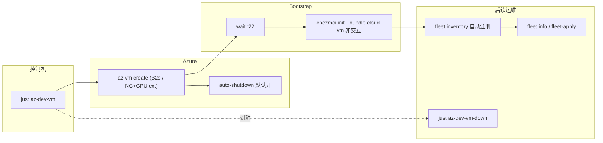

<!-- Generated by SpecStory, Markdown v2.1.0 -->

# 2026-06-10 13:36:47Z

<!-- Cursor IDE Session ab3387fc-9414-4aa7-ade7-57be68a10c36 (2026-06-10 13:36:47Z) -->

_**User**_

目前我們有各種不同的 docker file
假設我們馬上想要有一個好用的dev machine / server
以這樣的目標為目的
除了目前這個docker
是否能有比如快速用az CLI創建VM然後完整setup所有最推薦necessary tools
又或是切分用途 假設有需要cuda等等的
又或是能快速配置一些基礎的monitor等等
總之 先詳細探索一下這部份可能的需求 看看有沒有什麼比較好的做法

---

_**Agent (claude-fable-5)**_

<think><details><summary>Thought Process</summary>
 The user is looking to quickly set up development machines or servers and has Docker configurations in their chezmoi repo. They want to explore options like Azure CLI VM creation with full setup, CUDA variants, and monitoring capabilities. I should start by examining the repo structure to understand the existing Docker setup, bootstrap scripts, and Ansible roles they have available.</details></think>

_**Agent (claude-fable-5)**_

我先探索一下 repo 現有的相關資產（Dockerfile、bootstrap、ansible 等），再來整理可能的方案。

_**Agent (claude-fable-5)**_

<tool-use data-tool-type="unknown" data-tool-name="task_v2">
<details>
<summary>Tool use: **task_v2**</summary>


Parameters:

```json
{
  "description": "探索 repo docker 與 bootstrap 資產",
  "model": "composer-2.5-fast",
  "name": "explore",
  "prompt": "Explore the chezmoi dotfiles repo at /Users/david/.local/share/chezmoi (medium thoroughness). I need to understand the existing infrastructure for setting up dev machines:\n\n1. Find all Dockerfiles / docker-compose files / devcontainer configs in the repo. For each, summarize: base image, what tools it installs, intended purpose.\n2. Examine bootstrap.sh at the repo root — what does it do? What platforms does it support?\n3. Examine the ansible setup under dot_ansible/ — list the roles and what each does (just the role names and 1-line purpose, plus how playbooks are organized, e.g. site.yml, tags).\n4. Look at scripts/init/dotfiles_init.py — high-level summary of what it configures.\n5. Check README.md and NOTES.md for any documentation about machine provisioning, cloud VMs, azure, remote dev servers.\n6. Search for any existing azure / az CLI / cloud-init / terraform / VM provisioning related files.\n\nReturn a structured report with file paths, so I can plan a \"quickly provision a usable dev machine/server\" feature (e.g., az CLI VM creation + auto setup, CUDA variants, monitoring).",
  "subagentType": "explore"
}
```
Additional data:

```json
{
  "status": "success",
  "subagentComposerId": "14cff87f-0872-4abf-93e0-ca504b14b5f0",
  "terminationReason": "completed"
}
```
Result:

```json
{
  "agentId": "14cff87f-0872-4abf-93e0-ca504b14b5f0"
}
```
Status: **completed**


</details>
</tool-use>

<tool-use data-tool-type="unknown" data-tool-name="task_v2"><details>
<summary>Tool use: **task_v2**</summary>

</details></tool-use>

_**Agent (claude-fable-5)**_

<think><details><summary>Thought Process</summary>
 I should check the existing backlog notes in the repo to understand what's already been planned before moving forward.</details></think>

_**Agent (claude-fable-5)**_

Repo 裡已有相關的 backlog 設計筆記，我先讀一下確認既有想法。

_**Agent (claude-fable-5)**_

<tool-use data-tool-type="read" data-tool-name="read_file_v2">
<details><summary>Tool use: **read_file_v2** • Read file: /Users/david/.local/share/chezmoi/backlog/cloud-vm-provision-combo.md</summary>

</details>
</tool-use>

<tool-use data-tool-type="read" data-tool-name="read_file_v2"><details>
<summary>Tool use: **read_file_v2**</summary>

</details></tool-use>

_**Agent (claude-fable-5)**_

<tool-use data-tool-type="read" data-tool-name="read_file_v2">
<details><summary>Tool use: **read_file_v2** • Read file: /Users/david/.local/share/chezmoi/backlog/lean-bundle-init-ux.md</summary>

</details>
</tool-use>

<tool-use data-tool-type="read" data-tool-name="read_file_v2"><details>
<summary>Tool use: **read_file_v2**</summary>

</details></tool-use>

_**Agent (claude-fable-5)**_

<tool-use data-tool-type="read" data-tool-name="read_file_v2">
<details><summary>Tool use: **read_file_v2** • Read file: /Users/david/.local/share/chezmoi/TODO.md</summary>

</details>
</tool-use>

<tool-use data-tool-type="read" data-tool-name="read_file_v2"><details>
<summary>Tool use: **read_file_v2**</summary>

</details></tool-use>

_**Agent (claude-fable-5)**_

<think><details><summary>Thought Process</summary>
 The user is asking me to explore how to quickly set up a development machine or server using Docker and related tools—whether that means spinning up a VM with Azure CLI and all necessary dependencies, organizing Dockerfiles by purpose like CUDA support, or adding basic monitoring capabilities. They want me to dig into the requirements and figure out what approach would work best.

I notice there are already some design documents in the backlog that touch on this: cloud VM provisioning, lean bundle initialization, and runtime gating. Before diving into a full exploration and proposal, I should clarify a few critical things: whether this session is just about updating the design docs or if we're actually building the first implementation; whether we're focusing on Azure initially; and whether there's an immediate need for CUDA support on a GPU host. Let me also check what's already documented in the runtime gating backlog to understand what prerequisites are already in place.我再檢查一下 `mise-runtime-gating.md` 和 fleet-apply 文件，確保方案排序正確。</details></think>

_**Agent (claude-fable-5)**_

<tool-use data-tool-type="read" data-tool-name="read_file_v2">
<details><summary>Tool use: **read_file_v2** • Read file: /Users/david/.local/share/chezmoi/backlog/mise-runtime-gating.md</summary>

</details>
</tool-use>

<tool-use data-tool-type="read" data-tool-name="read_file_v2"><details>
<summary>Tool use: **read_file_v2**</summary>

</details></tool-use>

_**Agent (claude-fable-5)**_

<tool-use data-tool-type="read" data-tool-name="read_file_v2">
<details><summary>Tool use: **read_file_v2** • Read file: /Users/david/.local/share/chezmoi/docs/this_repo/fleet-apply.md</summary>

</details>
</tool-use>

<tool-use data-tool-type="read" data-tool-name="read_file_v2"><details>
<summary>Tool use: **read_file_v2**</summary>

</details></tool-use>

_**Agent (claude-fable-5)**_

<think><details><summary>Thought Process</summary>
 I need to clarify the scope here—whether we're just documenting the design and requirements this session, or if we're actually building out Phase 1 with the az-dev-vm and cloud-vm bundle. There's also the question of whether there's a concrete GPU host available for the CUDA setup.

Let me map out what I'm seeing: the existing bootstrap pipeline (dotfiles → chezmoi → ansible) handles configuration, but we need a dedicated provisioning path for spinning up fresh VMs quickly. The backlog already has pieces for this—the cloud-vm combo and bundle initialization—but we're missing clarity on CUDA support and what "基礎的 monitor" actually means in scope (just host metrics, or the full audit-monitor + apprise alerting stack?).

For the approach, I'm thinking: prioritize the mise runtime gating fix first since it unblocks other work, then wire the cloud-vm bundle into dotfiles_init.py with a non-interactive mode. The main piece is a Python script that orchestrates the full flow—create the resource group and VM, wait for SSH, run bootstrap, register with fleet, and handle teardown—with auto-shutdown enabled by default and Spot VMs for cost savings. For GPU workloads, I'd lean toward using Azure's pre-built Data Science or GPU-optimized images rather than maintaining our own driver matrix. Monitoring-wise, we already have fleet info snapshots and the btop/auditd roles, so the question is whether we go with netdata's one-liner install or wait for the audit-monitor + apprise backlog items.

Before I map this out into a concrete plan, I need to clarify a few things: Is this session about design and backlog updates, or are we jumping straight into implementation starting with the bundle and Azure script? Do we have immediate GPU needs, or should we just set up the seam for it? And for monitoring, is the lightweight approach—fleet info plus Azure's native auto-shutdown and cost alerts—sufficient, or do you want netdata and alerting built in from the start?</details></think>

_**Agent (claude-fable-5)**_

探索完成。这个需求空间其实在 repo 里已经有相当多的铺垫——把现状和可能的做法整理如下。

## 现状盘点

**现有 Docker 文件的定位**：`Dockerfile` / `Dockerfile.rocky9` / `Dockerfile.centos7` + `docker-compose.yml` 本质是**跨 OS 回归测试矩阵**（验证 chezmoi + ansible 在 Ubuntu/Rocky/CentOS、sudo/noRoot 下都能跑通），不是生产 dev machine 的路径。但它们验证过的「非交互 `chezmoi init` + 全套 ARG flag」正是远程 VM bootstrap 需要的同一条路。

**已有的拼图**（从入口到远程运维）：

- `bootstrap.sh` → `dotfiles_init.py`（bundle 预设：`personal-mac` / `work-mac` / `server-linux` / `minimal`）→ chezmoi apply → ansible 24 个 roles
- `scripts/fleet/`：对**已存在**的主机做并行 apply / exec / status / info（含 GPU 模块）
- `iac_tools` role 已会装 Azure CLI；`tv azure` channel 已能对现有 VM 做启停/SSH/换 IP
- `auditd` role + `health-check` 等 helper 是现有的安全/健康基线

**Backlog 里已经设计过这件事**（你 2026-05-21 那次讨论留下的）：

- [backlog/cloud-vm-provision-combo.md](backlog/cloud-vm-provision-combo.md) — `az vm create` + wait-SSH + 注册 fleet + 远程非交互 init，倾向先做 standalone `just az-dev-vm`（不耦合进 fleet）；明确要求 **teardown 对称 + 幂等**
- [backlog/lean-bundle-init-ux.md](backlog/lean-bundle-init-ux.md) — 缺一个 `cloud-vm` lean bundle
- [backlog/mise-runtime-gating.md](backlog/mise-runtime-gating.md) — **前置依赖**：rust/dotnet/bun/ruby 现在无条件装 ~1.8GB（还有 dotnet 合同 bug：答 No 也装 650MB），不修的话 lean VM 瘦不下来
- `TODO.md` 已有 `[?/XL] CUDA/ML ansible role` 和 `[?/L] audit-monitor + apprise` 两条

## 三个需求方向的可行做法

**1. az CLI 快速开 VM + 全套 setup**（缺口最大、价值最高）
- 新 `scripts/azure/dev_vm.py`（uv script，和 fleet 同风格）+ `just az-dev-vm`：`az vm create`（Ubuntu 24.04 Gen2、B2s、32GB 盘、SSH key 注入）→ 轮询 :22 → 远程 `chezmoi init --apply --bundle cloud-vm`（非交互，复用 Dockerfile 验证过的 flag 流）→ 自动写入 `~/.config/fleet/machines.toml`
- 必须配对 `just az-dev-vm-down` + 默认开 `az vm auto-shutdown`（Azure 原生支持，一条命令）；可选 Spot 实例省钱
- bootstrap 走 cloud-init user-data（curl bootstrap.sh，开机即跑）还是 SSH 后推（可观测、可重试）是一个小决策点——我倾向 SSH 后推，与 fleet 日志模型一致

**2. 按用途切分（CUDA 等）**
- lean dev box：`cloud-vm` bundle（shell + tmux + nvim + coding agents，~不到 1GB）
- CUDA：**不建议自己维护 driver/cudnn/nccl matrix**（TODO 里也标了 XL）。Azure 上更省力的路是 `az vm extension set --name NvidiaGpuDriverLinux`（微软维护的驱动扩展）或直接用 NVIDIA/DSVM 现成镜像，dotfiles 这边只需要 dev_vm.py 加一个 `--gpu`/`--size NC...` 维度，CUDA 工具链留给 conda/uv 项目级管理
- 用途切分落在两个正交的轴上：VM SKU/镜像（脚本参数）× bundle（dotfiles 厚度），不需要新 profile

**3. 基础 monitoring**
- 轻量层其实已经有：`fleet info`（CPU/RAM/disk/GPU 跨主机快照）、btop、auditd
- 云侧最划算的「监控」是成本护栏：auto-shutdown + budget alert（`azure-cost-cli` 已在 dotnet_tools role）
- 真告警（apprise 路由）backlog 里已评估过，promote 条件未满足，建议维持 deferred；若要单机 dashboard，netdata 一行装，可做成脚本可选 flag



建议的实施顺序和 backlog 一致：mise gating（前置）→ `cloud-vm` bundle → `az-dev-vm` 脚本（含 teardown）→ GPU 维度 → monitoring 增强。

在写计划前，有两个关键的范围问题想确认。

_**Agent (claude-fable-5)**_

<tool-use data-tool-type="unknown" data-tool-name="ask_question">
<details>
<summary>Tool use: **ask_question**</summary>


Parameters:

```json
{
  "questions": [
    {
      "id": "scope",
      "options": [
        {
          "id": "impl_core",
          "label": "实作核心链路：mise gating + cloud-vm bundle + az-dev-vm 脚本（含 teardown）(Recommended)"
        },
        {
          "id": "impl_script_only",
          "label": "只实作 az-dev-vm 脚本，bundle 先用现成 server-linux 顶着，mise gating 之后再说"
        },
        {
          "id": "design_only",
          "label": "只做设计：把这次探索整理进 backlog/TODO，更新设计文档，不写代码"
        }
      ],
      "prompt": "这次 session 想推进到什么程度？"
    },
    {
      "allowMultiple": true,
      "id": "gpu_monitor",
      "options": [
        {
          "id": "gpu_seam",
          "label": "GPU：脚本留 --size/--gpu 参数 seam（NVIDIA driver extension），不做 CUDA ansible role (Recommended)"
        },
        {
          "id": "gpu_now",
          "label": "GPU：现在就有具体 GPU VM 需求，要完整跑通一次"
        },
        {
          "id": "mon_guardrail",
          "label": "Monitoring：先做成本护栏（auto-shutdown 默认开 + cost 提示），靠现有 fleet info (Recommended)"
        },
        {
          "id": "mon_netdata",
          "label": "Monitoring：额外加 netdata 等单机 dashboard 的可选安装"
        }
      ],
      "prompt": "GPU/CUDA 和 monitoring 这两块这次怎么处理？"
    }
  ],
  "title": "Dev VM provision 范围确认"
}
```
Additional data:

```json
{
  "currentSelections": {
    "gpu_monitor": [
      "gpu_seam",
      "mon_guardrail"
    ],
    "scope": [
      "impl_core"
    ]
  },
  "freeformTexts": {
    "gpu_monitor": "",
    "scope": ""
  },
  "status": "submitted"
}
```
Result:

```json
{
  "answers": [
    {
      "freeformText": "",
      "questionId": "scope",
      "selectedOptionIds": [
        "impl_core"
      ]
    },
    {
      "freeformText": "",
      "questionId": "gpu_monitor",
      "selectedOptionIds": [
        "gpu_seam",
        "mon_guardrail"
      ]
    }
  ]
}
```
User decision: **accepted**

Status: **completed**


</details>
</tool-use>

<tool-use data-tool-type="unknown" data-tool-name="ask_question"><details>
<summary>Tool use: **ask_question**</summary>

</details></tool-use>

_**Agent (claude-fable-5)**_

<think><details><summary>Thought Process</summary>
 The user wants to implement the core chain with mise gating, cloud-vm bundle, and az-dev-vm script including teardown, with GPU seam only and cost guardrails for monitoring. I'm identifying the key files I need to examine to build out this plan: the mise config template for gating logic, the chezmoi template for the new prompt, and the dotfiles init script where the prompts are defined.

I notice there's a recent codegen plan that suggests PROMPTS are now the single source of truth, feeding into both the chezmoi template and Dockerfile args via a `gen` command — that's a significant simplification. I need to check the ansible roles run script, justfile recipes, and verify whether the codegen tool exists, then read through the targeted sections of these files to make the implementation plan concrete and accurate.已确认范围，现在我来查看关键文件以确定具体的改动点。</details></think>

_**Agent (claude-fable-5)**_

<tool-use data-tool-type="read" data-tool-name="read_file_v2">
<details><summary>Tool use: **read_file_v2** • Read file: /Users/david/.local/share/chezmoi/dot_config/mise/config.toml.tmpl</summary>

</details>
</tool-use>

<tool-use data-tool-type="read" data-tool-name="read_file_v2"><details>
<summary>Tool use: **read_file_v2**</summary>

</details></tool-use>

_**Agent (claude-fable-5)**_

<tool-use data-tool-type="unknown" data-tool-name="ripgrep_raw_search">
<details>
<summary>Tool use: **ripgrep_raw_search**</summary>


Parameters:

```json
{
  "caseInsensitive": false,
  "outputMode": "content",
  "path": "/Users/david/.local/share/chezmoi/scripts/init/dotfiles_init.py",
  "pattern": "BUNDLES|class Prompt|installDotnetTools|installExtraRuntimes|def cmd_gen|server-linux"
}
```
Additional data:

```json
{
  "isPruned": true,
  "outputMode": "content",
  "path": "/Users/david/.local/share/chezmoi/scripts/init/dotfiles_init.py",
  "pattern": "BUNDLES|class Prompt|installDotnetTools|installExtraRuntimes|def cmd_gen|server-linux",
  "topFiles": [
    {
      "matchCount": 10,
      "uri": "scripts/init/dotfiles_init.py"
    }
  ],
  "totalFiles": 1,
  "totalMatches": 10
}
```
Status: **completed**


</details>
</tool-use>

<tool-use data-tool-type="unknown" data-tool-name="ripgrep_raw_search"><details>
<summary>Tool use: **ripgrep_raw_search**</summary>

</details></tool-use>

_**Agent (claude-fable-5)**_

<tool-use data-tool-type="read" data-tool-name="read_file_v2">
<details><summary>Tool use: **read_file_v2** • Read file: /Users/david/.local/share/chezmoi/scripts/init/dotfiles_init.py</summary>

</details>
</tool-use>

<tool-use data-tool-type="read" data-tool-name="read_file_v2"><details>
<summary>Tool use: **read_file_v2**</summary>

</details></tool-use>

_**Agent (claude-fable-5)**_

<tool-use data-tool-type="read" data-tool-name="read_file_v2">
<details><summary>Tool use: **read_file_v2** • Read file: /Users/david/.local/share/chezmoi/scripts/init/dotfiles_init.py</summary>

</details>
</tool-use>

<tool-use data-tool-type="read" data-tool-name="read_file_v2"><details>
<summary>Tool use: **read_file_v2**</summary>

</details></tool-use>

_**Agent (claude-fable-5)**_

<think><details><summary>Thought Process</summary>
 With the codegen SSOT in place, adding a new prompt is now straightforward—I just need to edit the PROMPTS in dotfiles_init.py and run the generator to update the `.chezmoi.toml.tmpl` prompts block and Dockerfile ARGs, with doctor validating everything. This makes the `installExtraRuntimes` feature much cheaper to implement than originally estimated. I should also verify the ansible roles template to confirm the TAGS assembly doesn't need any adjustments.

Now I'm thinking through the design for gating the extra runtimes. The backlog suggests a coarse flag covering rust, dotnet, and bun, while keeping node always enabled and ruby conditional on noRoot. The simplest approach is to gate dotnet on the new prompt and use that same flag to control rust and bun installation.

But there's a complication: rust_cargo_tools and ruby_gem_tools are in the base TAGS for all profiles, so if I disable extra runtimes, I need to also exclude those roles from the ansible playbook generation. That means updating the role assembly template to drop those tags when the flag is off.

For the cloud-vm bundle, I'm targeting a lean setup focused on shell ergonomics, tmux, neovim, and the coding agents, so I'll disable extra runtimes there and set dotnet to false as well.

Then for Phase 3, I'm building a Python script with uv and tyro that handles Azure VM lifecycle—spinning up with sensible defaults like a B2s instance on Ubuntu 24.04, waiting for SSH to be ready, then bootstrapping with chezmoi using the same prompt-driven flow from the dotfiles init, and finally registering the host in the fleet machines config.

The down command tears down the VM and deregisters it, status shows power state with a cost estimate, and I'm adding corresponding just recipes plus documentation. I'll also need to update AGENTS.md if there are new prompt requirements, run the doctor checks, and keep tests minimal. Finally, I'm writing out the full plan in Simplified Chinese with key file references.关键细节已确认，`gen` codegen 已落地，新增 prompt 只需更新 `PROMPTS` 后重新生成。现在我来整理实施计划。</details></think>

_**Agent (claude-fable-5)**_

<tool-use data-tool-type="unknown" data-tool-name="create_plan">
<details>
<summary>Tool use: **create_plan**</summary>


Parameters:

```json
{
  "name": "Azure Dev VM 链路",
  "overview": "实作「一条命令开出可用 dev VM」核心链路：mise runtime gating（前置瘦身）→ cloud-vm lean bundle → az-dev-vm provision/teardown 脚本（含 fleet 注册与成本护栏），GPU 仅留参数 seam。",
  "plan": "# Azure Dev VM Provision 核心链路\n\n目标：&#96;just az-dev-vm&#96; 一条命令 → Azure VM 创建 → 等 SSH → 远程非交互 &#96;chezmoi init --apply --bundle cloud-vm&#96; → 自动注册进 fleet；配对 &#96;just az-dev-vm-down&#96; 与默认 auto-shutdown。GPU 只留 &#96;--size&#96;/&#96;--gpu&#96; seam，monitoring 以成本护栏为主。\n\n## Phase 1 — mise runtime gating（前置，省 ~1.8GB + 修 dotnet 合同 bug）\n\n依据 [backlog/mise-runtime-gating.md](backlog/mise-runtime-gating.md) 的「A + C」结论：\n\n- [scripts/init/dotfiles_init.py](scripts/init/dotfiles_init.py) &#96;PROMPTS&#96; 新增 &#96;installExtraRuntimes&#96;（bool，Dev tooling 组，**default True** 保持既有机器行为），然后跑 &#96;gen&#96; 重新生成 &#96;.chezmoi.toml.tmpl&#96; prompt 块 + Dockerfile ARG，&#96;doctor&#96; 验证（SSOT codegen 已落地，无需手工三处同步）。\n- [dot_config/mise/config.toml.tmpl](dot_config/mise/config.toml.tmpl) &#96;[tools]&#96; 改造（非 oldEL 分支）：\n  - &#96;node&#96; 永远保留（nvim/agents 硬依赖）\n  - &#96;dotnet&#96; 改为 &#96;installDotnetTools&#96; 守卫（修复「答 No 仍装 650MB」bug）\n  - &#96;rust&#96;、&#96;bun&#96;、&#96;ruby&#96; 改为 &#96;installExtraRuntimes&#96; 守卫（ruby 同时保留现有 noRoot 条件）\n- [.chezmoiscripts/global/run_onchange_after_20_ansible_roles.sh.tmpl](.chezmoiscripts/global/run_onchange_after_20_ansible_roles.sh.tmpl)：当 &#96;installExtraRuntimes=false&#96; 时从 TAGS 中剔除 &#96;rust_cargo_tools&#96; / &#96;ruby_gem_tools&#96;（否则 cargo/gem 安装会因缺 toolchain 失败）。\n- 现有 &#96;BUNDLES&#96; 补上该 flag：&#96;minimal&#96; / 新 &#96;cloud-vm&#96; 设 False，其余 True。\n- 注意：新 prompt key 会让既有 fleet 主机出现 &#96;toml-mismatch&#96;（fleet-status 会标出，属预期，README/文档提一句即可）。\n\n## Phase 2 — &#96;cloud-vm&#96; lean bundle\n\n- [scripts/init/dotfiles_init.py](scripts/init/dotfiles_init.py) &#96;BUNDLES&#96; 新增 &#96;cloud-vm&#96;：目标是「ergonomic shell + tmux + nvim + coding agents」——&#96;installCodingAgents=True&#96;、&#96;backupMode=\"smart\"&#96;，其余 installX 全 False，&#96;installExtraRuntimes=False&#96;、&#96;installDotnetTools=False&#96;、&#96;enableVimMode&#96; 留默认。\n- 在 &#96;ask_bundle()&#96; 的列表（约 [scripts/init/dotfiles_init.py](scripts/init/dotfiles_init.py) L650）加一行描述；&#96;list-bundles&#96; 自动带出。\n- 更新 README.md 的 bundle 表格 + AGENTS.md 相关 cross-file 行（如有）。\n- 验证：&#96;uv run scripts/init/dotfiles_init.py doctor&#96; 通过；&#96;docker compose build devbox&#96; 用 cloud-vm flag 集 smoke 一次（可选）。\n\n## Phase 3 — &#96;scripts/azure/dev_vm.py&#96; + just recipes\n\n新建 &#96;scripts/azure/dev_vm.py&#96;（uv PEP-723 inline script：&#96;tyro&#96; + &#96;rich&#96;，风格对齐 &#96;scripts/fleet/&#96;），子命令：\n\n- &#96;up&#96;：\n  - 前置检查：&#96;az&#96; 在 PATH、&#96;az account show&#96; 已登录，否则带提示退出\n  - 幂等：固定 RG（默认 &#96;dev-vm-rg&#96;）+ VM 名（默认 &#96;devbox-1&#96;），存在即跳过创建直接走后续步骤\n  - &#96;az vm create&#96;：Ubuntu 24.04 LTS Gen2、默认 &#96;Standard_B2s&#96;、&#96;--os-disk-size-gb 32&#96;、注入 &#96;~/.ssh/id_ed25519.pub&#96;（可参数化）；&#96;--spot&#96; 可选\n  - **GPU seam**：&#96;--gpu&#96; flag = 换 NC 系列 size + &#96;az vm extension set --name NvidiaGpuDriverLinux&#96;（不做 CUDA ansible role，工具链留给项目级 conda/uv）\n  - **成本护栏（默认开）**：&#96;az vm auto-shutdown --time \u003cUTC\u003e&#96;（默认如 1900 UTC，可 &#96;--no-auto-shutdown&#96; 关）\n  - 轮询 :22 直到 SSH 可达\n  - 远程 bootstrap：SSH 进去 curl 安装 chezmoi → 非交互 &#96;chezmoi init --apply \u003crepo\u003e&#96; 带全套 &#96;--promptBool/--promptChoice&#96; flag。flag 集**直接 import &#96;scripts/init/dotfiles_init.py&#96; 的 &#96;PROMPTS&#96;/&#96;BUNDLES&#96; 计算**（复用 SSOT，避免第四份手抄的 flag 列表）\n  - 注册 fleet：往 &#96;~/.config/fleet/machines.toml&#96; 追加 &#96;[[hosts]]&#96;（name、hostname=公网 IP、user、identity_file、&#96;no_root_machine=false&#96;），已存在则更新 IP\n- &#96;down&#96;：删 VM 及关联资源（RG 为专用时直接 &#96;az group delete&#96;）+ 从 machines.toml 反注册；与 &#96;up&#96; 严格对称\n- &#96;status&#96;：VM 列表 + power state + 公网 IP +（若装有 azure-cost-cli 则附成本提示）\n- &#96;ssh&#96;：便捷直连\n- [justfile](justfile) 新 recipes：&#96;az-dev-vm&#96;（up）、&#96;az-dev-vm-down&#96;、&#96;az-dev-vm-status&#96;、&#96;az-dev-vm-ssh&#96;\n- 确认 &#96;scripts/**&#96; 已在 &#96;.chezmoiignore.tmpl&#96;（不部署到 $HOME，与 fleet 同约定）\n\n## Phase 4 — 文档与 backlog 收尾\n\n- 新增 &#96;docs/this_repo/az-dev-vm.md&#96;（用法、幂等/teardown 语义、GPU seam 说明、成本护栏）\n- &#96;TODO.md&#96;：把 cloud-vm bundle、provision combo、mise gating 三条移到 Done；CUDA role 条目补注「已决定走 driver extension seam，不做 role」\n- 更新三份 backlog 文件的 Decision 段\n\n## 验证\n\n- &#96;dotfiles_init.py doctor&#96; + &#96;gen --check&#96;（如有）通过\n- &#96;docker compose --profile test up test&#96;（既有 smoke）不回归\n- 真机 e2e：&#96;just az-dev-vm&#96; 开一台 B2s → SSH 进去确认 zsh/tmux/nvim/claude 可用 → &#96;fleet info --hosts \u003cname\u003e&#96; 可见 → &#96;just az-dev-vm-down&#96; 干净删除",
  "todos": [
    {
      "content": "Phase 1: installExtraRuntimes prompt + mise config.toml.tmpl 守卫 + TAGS 剔除 + gen/doctor",
      "id": "mise-gating",
      "status": "pending"
    },
    {
      "content": "Phase 2: BUNDLES 新增 cloud-vm + ask_bundle 列表 + README 表格",
      "id": "cloud-vm-bundle",
      "status": "pending"
    },
    {
      "content": "Phase 3: scripts/azure/dev_vm.py（up/down/status/ssh，含 auto-shutdown、GPU seam、fleet 注册）",
      "id": "dev-vm-script",
      "status": "pending"
    },
    {
      "content": "Phase 3: justfile 新增 az-dev-vm* recipes",
      "id": "just-recipes",
      "status": "pending"
    },
    {
      "content": "Phase 4: docs/this_repo/az-dev-vm.md + TODO.md/backlog 收尾",
      "id": "docs-backlog",
      "status": "pending"
    },
    {
      "content": "验证：doctor + docker smoke + 真机 e2e 开/关一次",
      "id": "verify",
      "status": "pending"
    }
  ]
}
```
Additional data:

```json
{
  "hasOpenedEditor": true,
  "planId": "azure_dev_vm_链路_2932689c",
  "planUri": "file:///Users/david/.cursor/plans/azure_dev_vm_%E9%93%BE%E8%B7%AF_2932689c.plan.md",
  "reviewData": {
    "isShowingInput": false,
    "selectedOption": "none",
    "status": "Requested"
  }
}
```
Result:

```json
{
  "rejected": {}
}
```
Status: **completed**


</details>
</tool-use>

<tool-use data-tool-type="unknown" data-tool-name="create_plan"><details>
<summary>Tool use: **create_plan**</summary>

</details></tool-use>

---

_**User**_

Implement the plan as specified, it is attached for your reference. Do NOT edit the plan file itself.

To-do's from the plan have already been created. Do not create them again. Mark them as in_progress as you work, starting with the first one. Don't stop until you have completed all the to-dos.

---

_**Agent (claude-fable-5)**_

<think><details><summary>Thought Process</summary>
 I'm starting the implementation by marking mise-gating as in_progress, then reading through AGENTS.md per the workspace rules and reviewing the relevant files. I've got a couple of extra tasks to handle later—committing the changes and documenting how to remove the test VM—but first I need to check the documentation and understand the codebase.</details></think>

_**Agent (claude-fable-5)**_

<tool-use data-tool-type="unknown" data-tool-name="todo_write">
<details>
<summary>Tool use: **todo_write**</summary>


Parameters:

```json
{
  "merge": true
}
```
Result:

```json
{
  "finalTodos": [
    {
      "content": "Phase 1: installExtraRuntimes prompt + mise config.toml.tmpl 守卫 + TAGS 剔除 + gen/doctor",
      "id": "mise-gating",
      "status": "in_progress"
    },
    {
      "content": "Phase 2: BUNDLES 新增 cloud-vm + ask_bundle 列表 + README 表格",
      "id": "cloud-vm-bundle",
      "status": "pending"
    },
    {
      "content": "Phase 3: scripts/azure/dev_vm.py（up/down/status/ssh，含 auto-shutdown、GPU seam、fleet 注册）",
      "id": "dev-vm-script",
      "status": "pending"
    },
    {
      "content": "Phase 3: justfile 新增 az-dev-vm* recipes",
      "id": "just-recipes",
      "status": "pending"
    },
    {
      "content": "Phase 4: docs/this_repo/az-dev-vm.md + TODO.md/backlog 收尾",
      "id": "docs-backlog",
      "status": "pending"
    },
    {
      "content": "验证：doctor + docker smoke + 真机 e2e 开/关一次",
      "id": "verify",
      "status": "pending"
    },
    {
      "content": "git commit changes",
      "id": "todo-1781099487334-zii2ve3eo",
      "status": "pending"
    },
    {
      "content": "list how to remove the test VM",
      "id": "todo-1781099505046-t9tklxzfz",
      "status": "pending"
    }
  ],
  "initialTodos": [
    {
      "content": "Phase 1: installExtraRuntimes prompt + mise config.toml.tmpl 守卫 + TAGS 剔除 + gen/doctor",
      "id": "mise-gating",
      "status": "pending"
    },
    {
      "content": "Phase 2: BUNDLES 新增 cloud-vm + ask_bundle 列表 + README 表格",
      "id": "cloud-vm-bundle",
      "status": "pending"
    },
    {
      "content": "Phase 3: scripts/azure/dev_vm.py（up/down/status/ssh，含 auto-shutdown、GPU seam、fleet 注册）",
      "id": "dev-vm-script",
      "status": "pending"
    },
    {
      "content": "Phase 3: justfile 新增 az-dev-vm* recipes",
      "id": "just-recipes",
      "status": "pending"
    },
    {
      "content": "Phase 4: docs/this_repo/az-dev-vm.md + TODO.md/backlog 收尾",
      "id": "docs-backlog",
      "status": "pending"
    },
    {
      "content": "验证：doctor + docker smoke + 真机 e2e 开/关一次",
      "id": "verify",
      "status": "pending"
    },
    {
      "content": "git commit changes",
      "id": "todo-1781099487334-zii2ve3eo",
      "status": "pending"
    },
    {
      "content": "list how to remove the test VM",
      "id": "todo-1781099505046-t9tklxzfz",
      "status": "pending"
    }
  ],
  "success": true,
  "wasMerge": true
}
```
Status: **completed**


</details>
</tool-use>

<tool-use data-tool-type="unknown" data-tool-name="todo_write"><details>
<summary>Tool use: **todo_write**</summary>

</details></tool-use>

_**Agent (claude-fable-5)**_

<tool-use data-tool-type="read" data-tool-name="read_file_v2">
<details><summary>Tool use: **read_file_v2** • Read file: /Users/david/.local/share/chezmoi/AGENTS.md</summary>

</details>
</tool-use>

<tool-use data-tool-type="read" data-tool-name="read_file_v2"><details>
<summary>Tool use: **read_file_v2**</summary>

</details></tool-use>

_**Agent (claude-fable-5)**_

<think><details><summary>Thought Process</summary>
 I'm reviewing the key updates needed from the AGENTS documentation: I need to modify the chezmoi prompt by editing the `PROMPTS` section in dotfiles_init.py, then regenerate the template and Dockerfile using the build command, plus add the new key to the README's option table. I should also update the bundles table in the README and add the new documentation page to the mkdocs navigation before building the site.

Now I'm examining the relevant source files to understand the structure — specifically the PROMPTS section in dotfiles_init.py to see where to add the new runtime option, the mise configuration template, the ansible roles script for tag assembly, the justfile recipe patterns, and the README tables that need updating.</details></think>

_**Agent (claude-fable-5)**_

现在开始 Phase 1。先读关键文件。

_**Agent (claude-fable-5)**_

<tool-use data-tool-type="read" data-tool-name="read_file_v2">
<details><summary>Tool use: **read_file_v2** • Read file: /Users/david/.local/share/chezmoi/scripts/init/dotfiles_init.py</summary>

</details>
</tool-use>

<tool-use data-tool-type="read" data-tool-name="read_file_v2"><details>
<summary>Tool use: **read_file_v2**</summary>

</details></tool-use>

_**Agent (claude-fable-5)**_

<tool-use data-tool-type="read" data-tool-name="read_file_v2">
<details><summary>Tool use: **read_file_v2** • Read file: /Users/david/.local/share/chezmoi/.chezmoiscripts/global/run_onchange_after_20_ansible_roles.sh.tmpl</summary>

</details>
</tool-use>

<tool-use data-tool-type="read" data-tool-name="read_file_v2"><details>
<summary>Tool use: **read_file_v2**</summary>

</details></tool-use>

_**Agent (claude-fable-5)**_

<think><details><summary>Thought Process</summary>
 I see that `installExtraRuntimes=false` means I need to strip out `rust_cargo_tools` and `ruby_gem_tools` from the base TAGS configuration. Now I'm diving into the gen logic in dotfiles_init.py to trace how prompts get rendered into the `.chezmoi.toml.tmpl` file and Dockerfile, and I need to examine the ask_bundle section and the generated template regions more closely.</details></think>

_**Agent (claude-fable-5)**_

现在看 `gen` codegen 的实现和 `.chezmoi.toml.tmpl` / `Dockerfile` 的生成区域。

_**Agent (claude-fable-5)**_

<tool-use data-tool-type="read" data-tool-name="read_file_v2">
<details><summary>Tool use: **read_file_v2** • Read file: /Users/david/.local/share/chezmoi/scripts/init/dotfiles_init.py</summary>

</details>
</tool-use>

<tool-use data-tool-type="read" data-tool-name="read_file_v2"><details>
<summary>Tool use: **read_file_v2**</summary>

</details></tool-use>

_**Agent (claude-fable-5)**_

<tool-use data-tool-type="read" data-tool-name="read_file_v2">
<details><summary>Tool use: **read_file_v2** • Read file: /Users/david/.local/share/chezmoi/scripts/init/dotfiles_init.py</summary>

</details>
</tool-use>

<tool-use data-tool-type="read" data-tool-name="read_file_v2"><details>
<summary>Tool use: **read_file_v2**</summary>

</details></tool-use>

_**Agent (claude-fable-5)**_

<think><details><summary>Thought Process</summary>
 I need to look at the `build_chezmoi_argv` function to understand how flags are constructed from the PROMPTS configuration, and then examine `gen_report` to see how regeneration works — these are key for understanding how dev_vm.py might reuse this logic.</details></think>

_**Agent (claude-fable-5)**_

<tool-use data-tool-type="read" data-tool-name="read_file_v2">
<details><summary>Tool use: **read_file_v2** • Read file: /Users/david/.local/share/chezmoi/scripts/init/dotfiles_init.py</summary>

</details>
</tool-use>

<tool-use data-tool-type="read" data-tool-name="read_file_v2"><details>
<summary>Tool use: **read_file_v2**</summary>

</details></tool-use>

_**Agent (claude-fable-5)**_

<think><details><summary>Thought Process</summary>
 I need to look at the rest of the gen function to see how it handles the README coverage check.</details></think>

_**Agent (claude-fable-5)**_

<tool-use data-tool-type="read" data-tool-name="read_file_v2">
<details><summary>Tool use: **read_file_v2** • Read file: /Users/david/.local/share/chezmoi/scripts/init/dotfiles_init.py</summary>

</details>
</tool-use>

<tool-use data-tool-type="read" data-tool-name="read_file_v2"><details>
<summary>Tool use: **read_file_v2**</summary>

</details></tool-use>

_**Agent (claude-fable-5)**_

<think><details><summary>Thought Process</summary>
 I'm mapping out the implementation strategy: adding a new `installExtraRuntimes` prompt to the Dev tooling group with a default of True, then updating the bundle configurations so the minimal bundle disables it while others inherit the default behavior.

For the template files, I need to gate the rust, bun, and ruby runtime installations behind the `installExtraRuntimes` key using a `hasKey` guard pattern with a default of true—this ensures existing machines without the key maintain their current behavior. I'll also update the ansible roles to skip the rust_cargo_tools and ruby_gem_tools tags when the flag is false, then regenerate the prompts and Dockerfile, and add a row to the README documenting this option.

For `installDotnetTools`, I'm being careful about the default behavior in the mise template—since the key has existed for a while, most hosts likely have it, but I'll use a `hasKey` guard with a false default to prevent dotnet from being installed on hosts that lack the key, which aligns with the bug fix intent.

I'm also adding a conditional block in the ansible script that removes the rust_cargo_tools and ruby_gem_tools tags from the TAGS variable when `installExtraRuntimes` is false, using the same string substitution pattern already used for the noRoot ruby removal.

For the prompt definition, I'll place it after installDotnetTools in the Dev tooling group with the text "Install extra mise runtimes (rust, bun, ruby) beyond node" and a zh-TW comment following the existing style.

Updating the mise config template...

Now I need to verify the interactions with existing tooling — the dotnet_tools role uses `mise use -g` which writes to the global config that chezmoi manages, but that's already how it works and not in scope to change. The armv7l special case explicitly installs rust even when extraRuntimes is false, which is an edge case I'll leave as-is since it's a distinct host class. The rust_cargo_tools role gets removed from TAGS when extraRuntimes is false, so that's consistent.

For the BUNDLES, I need to add "installExtraRuntimes": True to personal-mac, work-mac, and server-lin.

ux, set it to False for minimal and the new cloud-vm bundle. Then update the README with a new row for this option in the configuration table and add cloud-vm to the bundle documentation, plus verify the justfile recipe and docker test setup, and check where the generated prompts go in the template file.</details></think>

_**Agent (claude-fable-5)**_

理解了整个 codegen 机制。现在看 README 的 prompt 表格区域和 justfile。

_**Agent (claude-fable-5)**_

<tool-use data-tool-type="unknown" data-tool-name="ripgrep_raw_search">
<details>
<summary>Tool use: **ripgrep_raw_search**</summary>


Parameters:

```json
{
  "caseInsensitive": false,
  "outputMode": "content",
  "path": "/Users/david/.local/share/chezmoi/README.md",
  "pattern": "dotfiles-init:prompts|installDotnetTools|bundle"
}
```
Additional data:

```json
{
  "isPruned": true,
  "outputMode": "content",
  "path": "/Users/david/.local/share/chezmoi/README.md",
  "pattern": "dotfiles-init:prompts|installDotnetTools|bundle",
  "topFiles": [
    {
      "matchCount": 7,
      "uri": "README.md"
    }
  ],
  "totalFiles": 1,
  "totalMatches": 7
}
```
Status: **completed**


</details>
</tool-use>

<tool-use data-tool-type="unknown" data-tool-name="ripgrep_raw_search"><details>
<summary>Tool use: **ripgrep_raw_search**</summary>

</details></tool-use>

_**Agent (claude-fable-5)**_

<tool-use data-tool-type="unknown" data-tool-name="ripgrep_raw_search">
<details>
<summary>Tool use: **ripgrep_raw_search**</summary>


Parameters:

```json
{
  "caseInsensitive": false,
  "context": 3,
  "outputMode": "content",
  "path": "/Users/david/.local/share/chezmoi/justfile",
  "pattern": "gen-prompts|^az-|^fleet-apply:|^bootstrap-local"
}
```
Additional data:

```json
{
  "isPruned": true,
  "outputMode": "content",
  "path": "/Users/david/.local/share/chezmoi/justfile",
  "pattern": "gen-prompts|^az-|^fleet-apply:|^bootstrap-local",
  "topFiles": [
    {
      "matchCount": 20,
      "uri": "justfile"
    }
  ],
  "totalFiles": 1,
  "totalMatches": 4
}
```
Status: **completed**


</details>
</tool-use>

<tool-use data-tool-type="unknown" data-tool-name="ripgrep_raw_search"><details>
<summary>Tool use: **ripgrep_raw_search**</summary>

</details></tool-use>

_**Agent (claude-fable-5)**_

<tool-use data-tool-type="read" data-tool-name="read_file_v2">
<details><summary>Tool use: **read_file_v2** • Read file: /Users/david/.local/share/chezmoi/README.md</summary>

</details>
</tool-use>

<tool-use data-tool-type="read" data-tool-name="read_file_v2"><details>
<summary>Tool use: **read_file_v2**</summary>

</details></tool-use>

_**Agent (claude-fable-5)**_

<think><details><summary>Thought Process</summary>
 I'm mapping out the changes needed for Phase 1: adding the `installExtraRuntimes` prompt to the PROMPTS section, updating BUNDLES, modifying the mise config template, adjusting the ansible roles script tags, adding README entries, and then running the generation and validation commands.

For the first edit, I'll insert the new prompt after the `installDotnetTools` entry around line 245, even though `installAuditd` is oddly positioned between dotnet and IaC tooling despite being in the "System & apps" group.</details></think>

_**Agent (claude-fable-5)**_

上下文齐了，开始 Phase 1 的编辑。先在 `PROMPTS` 加 `installExtraRuntimes`。

_**Agent (claude-fable-5)**_

<tool-use data-tool-type="write" data-tool-name="edit_file_v2">

<details><summary>Tool use: **edit_file_v2** • Edit file: /Users/david/.local/share/chezmoi/scripts/init/dotfiles_init.py</summary>

</details>

</tool-use>

<tool-use data-tool-type="write" data-tool-name="edit_file_v2"><details>
<summary>Tool use: **edit_file_v2**</summary>

</details></tool-use>

_**Agent (claude-fable-5)**_

<think><details><summary>Thought Process</summary>
Now I'll update `BUNDLES` to include the Phase 2 `cloud-vm` bundle since they're defined in the same code section.</details></think>

_**Agent (claude-fable-5)**_

<tool-use data-tool-type="write" data-tool-name="edit_file_v2">

<details><summary>Tool use: **edit_file_v2** • Edit file: /Users/david/.local/share/chezmoi/scripts/init/dotfiles_init.py</summary>

</details>

</tool-use>

<tool-use data-tool-type="write" data-tool-name="edit_file_v2"><details>
<summary>Tool use: **edit_file_v2**</summary>

</details></tool-use>

_**Agent (claude-fable-5)**_

<think><details><summary>Thought Process</summary>
 I need to make sure the minimal bundle has `installExtraRuntimes` disabled, add a cloud-vm entry to the ask_bundle list, and check that the README correctly references the bundles list at line 62.</details></think>

_**Agent (claude-fable-5)**_

<tool-use data-tool-type="write" data-tool-name="edit_file_v2">

<details><summary>Tool use: **edit_file_v2** • Edit file: /Users/david/.local/share/chezmoi/scripts/init/dotfiles_init.py</summary>

</details>

</tool-use>

<tool-use data-tool-type="write" data-tool-name="edit_file_v2"><details>
<summary>Tool use: **edit_file_v2**</summary>

</details></tool-use>

_**Agent (claude-fable-5)**_

<tool-use data-tool-type="write" data-tool-name="edit_file_v2">

<details><summary>Tool use: **edit_file_v2** • Edit file: /Users/david/.local/share/chezmoi/scripts/init/dotfiles_init.py</summary>

</details>

</tool-use>

<tool-use data-tool-type="write" data-tool-name="edit_file_v2"><details>
<summary>Tool use: **edit_file_v2**</summary>

</details></tool-use>

_**Agent (claude-fable-5)**_

Now gate the mise runtimes in `dot_config/mise/config.toml.tmpl`.

_**Agent (claude-fable-5)**_

<tool-use data-tool-type="write" data-tool-name="edit_file_v2">

<details><summary>Tool use: **edit_file_v2** • Edit file: /Users/david/.local/share/chezmoi/dot_config/mise/config.toml.tmpl</summary>

</details>

</tool-use>

<tool-use data-tool-type="write" data-tool-name="edit_file_v2"><details>
<summary>Tool use: **edit_file_v2**</summary>

</details></tool-use>

_**Agent (claude-fable-5)**_

<tool-use data-tool-type="write" data-tool-name="edit_file_v2">

<details><summary>Tool use: **edit_file_v2** • Edit file: /Users/david/.local/share/chezmoi/dot_config/mise/config.toml.tmpl</summary>

</details>

</tool-use>

<tool-use data-tool-type="write" data-tool-name="edit_file_v2"><details>
<summary>Tool use: **edit_file_v2**</summary>

</details></tool-use>

_**Agent (claude-fable-5)**_

Now the TAGS 剔除 in the ansible run script.

_**Agent (claude-fable-5)**_

<tool-use data-tool-type="write" data-tool-name="edit_file_v2">

<details><summary>Tool use: **edit_file_v2** • Edit file: /Users/david/.local/share/chezmoi/.chezmoiscripts/global/run_onchange_after_20_ansible_roles.sh.tmpl</summary>

</details>

</tool-use>

<tool-use data-tool-type="write" data-tool-name="edit_file_v2"><details>
<summary>Tool use: **edit_file_v2**</summary>

</details></tool-use>

_**Agent (claude-fable-5)**_

<think><details><summary>Thought Process</summary>
 I should verify that the `lazyvim_deps` role's bare `mise install --yes` still works correctly since the config now only includes gated tools. The `dotnet_tools` role also needs checking — when installDotnetTools is true, it uses `mise use -g dotnet@...`, which aligns with the template now including dotnet conditionally. I'm also wondering whether the `rust_cargo_tools` role might have other ways of installing rust outside of mise, like direct rustup calls.

The tag removal only affects when extraRuntimes is false, so that's not a concern. One thing I should verify: does `lazyvim_deps` depend on the rust toolchain to install `tree-sitter-cli` via cargo?</details></think>

_**Agent (claude-fable-5)**_

检查 `lazyvim_deps` 是否依赖 rust toolchain（它在 base TAGS 里，cloud-vm 也会跑）。

_**Agent (claude-fable-5)**_

<tool-use data-tool-type="unknown" data-tool-name="ripgrep_raw_search">
<details>
<summary>Tool use: **ripgrep_raw_search**</summary>


Parameters:

```json
{
  "caseInsensitive": false,
  "context": 4,
  "outputMode": "content",
  "path": "/Users/david/.local/share/chezmoi/dot_ansible/roles/lazyvim_deps/tasks/main.yml",
  "pattern": "cargo|rust|mise install|mise use"
}
```
Additional data:

```json
{
  "isPruned": true,
  "outputMode": "content",
  "path": "/Users/david/.local/share/chezmoi/dot_ansible/roles/lazyvim_deps/tasks/main.yml",
  "pattern": "cargo|rust|mise install|mise use",
  "topFiles": [
    {
      "matchCount": 154,
      "uri": "dot_ansible/roles/lazyvim_deps/tasks/main.yml"
    }
  ],
  "totalFiles": 1,
  "totalMatches": 36
}
```
Status: **completed**


</details>
</tool-use>

<tool-use data-tool-type="unknown" data-tool-name="ripgrep_raw_search"><details>
<summary>Tool use: **ripgrep_raw_search**</summary>

</details></tool-use>

_**Agent (claude-fable-5)**_

<think><details><summary>Thought Process</summary>
 The cargo fallback is already handling gracefully, so I can keep extraRuntimes disabled since the primary path uses mise for npm. Now I need to regenerate the prompts and update the README—adding a row for installExtraRuntimes after installDotnetTools, and updating line 62 to include cloud-v in the bundles list.The cargo fallback for `lazyvim_deps` is working correctly with graceful degradation. Now I'll update the README with the prompt table and bundle list, then run codegen.</details></think>

_**Agent (claude-fable-5)**_

<tool-use data-tool-type="write" data-tool-name="edit_file_v2">

<details><summary>Tool use: **edit_file_v2** • Edit file: /Users/david/.local/share/chezmoi/README.md</summary>

</details>

</tool-use>

<tool-use data-tool-type="write" data-tool-name="edit_file_v2"><details>
<summary>Tool use: **edit_file_v2**</summary>

</details></tool-use>

_**Agent (claude-fable-5)**_

<tool-use data-tool-type="write" data-tool-name="edit_file_v2">

<details><summary>Tool use: **edit_file_v2** • Edit file: /Users/david/.local/share/chezmoi/README.md</summary>

</details>

</tool-use>

<tool-use data-tool-type="write" data-tool-name="edit_file_v2"><details>
<summary>Tool use: **edit_file_v2**</summary>

</details></tool-use>

_**Agent (claude-fable-5)**_

<think><details><summary>Thought Process</summary>
I'll regenerate the prompt blocks and verify them.</details></think>

_**Agent (claude-fable-5)**_

<tool-use data-tool-type="shell" data-tool-name="run_terminal_command_v2">
<details><summary>Tool use: **run_terminal_command_v2** • Run command: just gen-prompts && just gen-prompts -- --check</summary>

```bash
just gen-prompts && just gen-prompts -- --check
```

```
uv run --script scripts/init/dotfiles_init.py gen --source . 
wrote .chezmoi.toml.tmpl
wrote Dockerfile
README prompt-table coverage OK.
uv run --script scripts/init/dotfiles_init.py gen --source . -- --check
╭─ Unrecognized options ───────────────────────────────────────────────────────╮
│ Unrecognized or misplaced options:                                           │
│   --check (applied to scripts/init/dotfiles_init.py gen)                     │
│                                                                              │
│ Arguments are applied to the directly preceding subcommand, so ordering can  │
│ matter.                                                                      │
│ ──────────────────────────────────────────────────────────────────────────── │
│ Perhaps you meant:                                                           │
│     --check, --no-check                                                      │
│         Verify on-disk matches PROMPTS; non-zero exit on drift (no writes)   │
│         (default: False)                                                     │
│         in scripts/init/dotfiles_init.py gen --help                          │
│ ──────────────────────────────────────────────────────────────────────────── │
│ For full helptext, run scripts/init/dotfiles_init.py --help                  │
╰──────────────────────────────────────────────────────────────────────────────╯
error: Recipe &#96;gen-prompts&#96; failed on line 169 with exit code 2

```
</details>
</tool-use>

<tool-use data-tool-type="shell" data-tool-name="run_terminal_command_v2"><details>
<summary>Tool use: **run_terminal_command_v2**</summary>

</details></tool-use>

_**Agent (claude-fable-5)**_

<think><details><summary>Thought Process</summary>
 The issue was that the literal `--` characters got passed through instead of being interpreted as a flag separator, so I should run `--check` as a direct argument instead.</details></think>

_**Agent (claude-fable-5)**_

生成成功；`--check` 的传参方式不对，直接调用。

_**Agent (claude-fable-5)**_

<tool-use data-tool-type="shell" data-tool-name="run_terminal_command_v2">
<details><summary>Tool use: **run_terminal_command_v2** • Run command: just gen-prompts --check && uv run --script scripts/init/dotfiles_init.py doctor --source .</summary>

```bash
just gen-prompts --check && uv run --script scripts/init/dotfiles_init.py doctor --source .
```

```
uv run --script scripts/init/dotfiles_init.py gen --source . --check
All generated surfaces are in sync with PROMPTS.
All generated surfaces are in sync with PROMPTS.

```
</details>
</tool-use>

<tool-use data-tool-type="shell" data-tool-name="run_terminal_command_v2"><details>
<summary>Tool use: **run_terminal_command_v2**</summary>

</details></tool-use>

_**Agent (claude-fable-5)**_

<tool-use data-tool-type="shell" data-tool-name="run_terminal_command_v2">
<details><summary>Tool use: **run_terminal_command_v2** • Run command: git diff --stat && git diff .chezmoi.toml.tmpl Dockerfile | head -80</summary>

```bash
git diff --stat && git diff .chezmoi.toml.tmpl Dockerfile | head -80
```

```
 .chezmoi.toml.tmpl                                 |  5 ++++
 .../run_onchange_after_20_ansible_roles.sh.tmpl    |  9 ++++++
 .specstory/statistics.json                         |  9 ++++++
 Dockerfile                                         |  2 ++
 README.md                                          |  3 +-
 dot_config/mise/config.toml.tmpl                   | 28 +++++++++++++++---
 scripts/init/dotfiles_init.py                      | 34 ++++++++++++++++++++++
 7 files changed, 85 insertions(+), 5 deletions(-)
diff --git a/.chezmoi.toml.tmpl b/.chezmoi.toml.tmpl
index 093c2f2..f5d837f 100644
--- a/.chezmoi.toml.tmpl
+++ b/.chezmoi.toml.tmpl
@@ -41,6 +41,11 @@ installPythonUvTools = {{ promptBoolOnce . "installPythonUvTools" "Install Pytho
 installJsCliTools = {{ promptBoolOnce . "installJsCliTools" "Install standalone JS/npm CLI utilities (readability-cli for terminal web reader, etc.)" true }}
 # 是否安裝 .NET SDK (via mise) 與 .NET global tools (azure-cost-cli, 等)
 installDotnetTools = {{ promptBoolOnce . "installDotnetTools" "Install .NET SDK via mise and dotnet global tools (azure-cost-cli, etc.)" false }}
+# 是否安裝額外的 mise runtimes (rust, bun, ruby) 與對應的 cargo/gem 工具（~1.8GB）。
+# Node 永遠會裝（nvim LSP / npm-based coding agents 硬依賴），不受此 flag 影響。
+# false 時 mise [tools] 只留 node，且 ansible TAGS 會剔除 rust_cargo_tools /
+# ruby_gem_tools（沒有 toolchain 跑了也只會失敗）。lean cloud VM / CI 建議 false。
+installExtraRuntimes = {{ promptBoolOnce . "installExtraRuntimes" "Install extra mise runtimes (rust, bun, ruby) and their cargo/gem tools" true }}
 # 是否安裝 Linux Audit framework (auditd) + 基準規則集（identity / sudoers /
 # sshd_config / privileged-exec watch）。Linux only — macOS 自動跳過（macOS 用
 # OpenBSM，不是 auditd），所以在 darwin 上不問也直接 false。
diff --git a/Dockerfile b/Dockerfile
index 0acf720..6827200 100644
--- a/Dockerfile
+++ b/Dockerfile
@@ -15,6 +15,7 @@ ARG CHEZMOI_INSTALL_AI_DESKTOP_APPS=false
 ARG CHEZMOI_INSTALL_PYTHON_UV_TOOLS=false
 ARG CHEZMOI_INSTALL_JS_CLI_TOOLS=false
 ARG CHEZMOI_INSTALL_DOTNET_TOOLS=false
+ARG CHEZMOI_INSTALL_EXTRA_RUNTIMES=true
 ARG CHEZMOI_INSTALL_AUDITD=false
 ARG CHEZMOI_INSTALL_IAC_TOOLS=false
 ARG CHEZMOI_INSTALL_MEDIA_TOOLS=false
@@ -151,6 +152,7 @@ RUN export PATH="$HOME/.local/bin:$PATH" &amp;&amp; \
     --promptBool "Install Python CLI tools via uv (mlflow, sqlit-tui, tmuxp, etc.)=${CHEZMOI_INSTALL_PYTHON_UV_TOOLS}" \
     --promptBool "Install standalone JS/npm CLI utilities (readability-cli for terminal web reader, etc.)=${CHEZMOI_INSTALL_JS_CLI_TOOLS}" \
     --promptBool "Install .NET SDK via mise and dotnet global tools (azure-cost-cli, etc.)=${CHEZMOI_INSTALL_DOTNET_TOOLS}" \
+    --promptBool "Install extra mise runtimes (rust, bun, ruby) and their cargo/gem tools=${CHEZMOI_INSTALL_EXTRA_RUNTIMES}" \
     --promptBool "Install Linux audit framework (auditd) + baseline rules (identity / sudoers / sshd_config / privileged-exec watches)=${CHEZMOI_INSTALL_AUDITD}" \
     --promptBool "Install Infrastructure-as-Code tools (Azure CLI, Terraform, OpenTofu)=${CHEZMOI_INSTALL_IAC_TOOLS}" \
     --promptBool "Install media/AV CLI tools (ffmpeg, ImageMagick, exiftool, libvips)=${CHEZMOI_INSTALL_MEDIA_TOOLS}" \

```
</details>
</tool-use>

<tool-use data-tool-type="shell" data-tool-name="run_terminal_command_v2"><details>
<summary>Tool use: **run_terminal_command_v2**</summary>

</details></tool-use>

_**Agent (claude-fable-5)**_

<think><details><summary>Thought Process</summary>
 I'm verifying the mise template renders correctly by testing it with `chezmoi execute-template`. Since the current machine is macOS and has its own chezmoi.toml, the `installExtraRuntimes` key won't be present in the data, so the conditional will evaluate to false and use the default true value—which is good for backward compatibility. I'll test the template rendering directly and then simulate the false case.</details></think>

_**Agent (claude-fable-5)**_

<tool-use data-tool-type="shell" data-tool-name="run_terminal_command_v2">
<details><summary>Tool use: **run_terminal_command_v2** • Run command: chezmoi execute-template < dot_config/mise/config.toml.tmpl</summary>

```bash
chezmoi execute-template < dot_config/mise/config.toml.tmpl
```

```
# mise global configuration
# https://mise.jdx.dev/configuration.html

[settings]
# Use precompiled ruby binaries instead of compiling from source.
# ruby-build needs libffi-dev + a working C toolchain; precompiled avoids all that.
ruby.compile = false

[tools]
# Node.js LTS for LazyVim LSP servers and tree-sitter-cli — always installed
# (nvim LSP/treesitter + npm-based coding agents hard-depend on it).
node = "lts"
# Bun for bunx CLI tools
bun = "latest"
# Rust toolchain for cargo tools
rust = "latest"
# .NET SDK (installDotnetTools=true)
dotnet = "latest"
# Ruby for gem tools
ruby = "3"

```
</details>
</tool-use>

<tool-use data-tool-type="shell" data-tool-name="run_terminal_command_v2"><details>
<summary>Tool use: **run_terminal_command_v2**</summary>

</details></tool-use>

_**Agent (claude-fable-5)**_

<think><details><summary>Thought Process</summary>
 I'm checking whether the current machine actually has `installDotnetTools` set to true by querying the chezmoi data, and I'm planning to test both the true and false branches by using chezmoi's template execution capabilities to verify the template logic works correctly.</details></think>

_**Agent (claude-fable-5)**_

验证当前机器数据与 false 分支渲染。

_**Agent (claude-fable-5)**_

<tool-use data-tool-type="shell" data-tool-name="run_terminal_command_v2">
<details><summary>Tool use: **run_terminal_command_v2** • Run command: chezmoi data | jq '.installDotnetTools, .installExtraRuntimes' ; echo '---' ; sed -e 's/{{- $extraRuntimes := true }}{{ if hasKey . "installExtraRuntimes" }}{{ $extraRuntimes = .installExtraRuntimes }}{{ end -}}/{{- $extraRuntimes := false -}}/' -e 's/{{- $dotnet := false }}{{ if hasKey . "installDotnetTools" }}{{ $dotnet = .installDotnetTools }}{{ end -}}/{{- $dotnet := false -}}/' dot_config/mise/config.toml.tmpl | chezmoi execute-template</summary>

```bash
chezmoi data | jq '.installDotnetTools, .installExtraRuntimes' ; echo '---' ; sed -e 's/{{- $extraRuntimes := true }}{{ if hasKey . "installExtraRuntimes" }}{{ $extraRuntimes = .installExtraRuntimes }}{{ end -}}/{{- $extraRuntimes := false -}}/' -e 's/{{- $dotnet := false }}{{ if hasKey . "installDotnetTools" }}{{ $dotnet = .installDotnetTools }}{{ end -}}/{{- $dotnet := false -}}/' dot_config/mise/config.toml.tmpl | chezmoi execute-template
```

```
true
null
---
# mise global configuration
# https://mise.jdx.dev/configuration.html

[settings]
# Use precompiled ruby binaries instead of compiling from source.
# ruby-build needs libffi-dev + a working C toolchain; precompiled avoids all that.
ruby.compile = false

[tools]
# Node.js LTS for LazyVim LSP servers and tree-sitter-cli — always installed
# (nvim LSP/treesitter + npm-based coding agents hard-depend on it).
node = "lts"
# bun/rust skipped: installExtraRuntimes=false (lean VM / CI)
# .NET SDK skipped: installDotnetTools=false
# Ruby skipped: installExtraRuntimes=false

```
</details>
</tool-use>

<tool-use data-tool-type="shell" data-tool-name="run_terminal_command_v2"><details>
<summary>Tool use: **run_terminal_command_v2**</summary>

</details></tool-use>

_**Agent (claude-fable-5)**_

<think><details><summary>Thought Process</summary>
 Both branches are rendering correctly, and the current machine preserves its behavior since installDotnetTools is set to true in its data. I'm verifying that on hosts where this flag is false, the dotnet line disappears and mise stops managing it, which is the expected outcome. Now I need to check that the ansible run script template renders properly with the TAGS removal.

I'm using chezmoi execute-template to render the script, which should handle the include directive for sudo_shared.sh relative to the source directory. The current machine has installExtraRuntimes missing, so it defaults to true and won't show a removal block. I'll use sed to check the false branch behavior.</details></think>

_**Agent (claude-fable-5)**_

mise 模板两个分支都正确。再验证 ansible run script 模板的渲染。

_**Agent (claude-fable-5)**_

<tool-use data-tool-type="shell" data-tool-name="run_terminal_command_v2">
<details><summary>Tool use: **run_terminal_command_v2** • Run command: chezmoi execute-template < .chezmoiscripts/global/run_onchange_after_20_ansible_roles.sh.tmpl | grep -A4 'TAGS=' | head -20 ; echo '=== false branch ===' ; sed 's/{{ \$installExtraRuntimes := true }}{{ if hasKey . "installExtraRuntimes" }}{{ \$installExtraRuntimes = .installExtraRuntimes }}{{ end -}}/{{ $installExtraRuntimes := false -}}/' .chezmoiscripts/global/run_onchange_after_20_ansible_roles.sh.tmpl | chezmoi execute-template | grep -B2 -A6 'installExtraRuntimes=false'</summary>

```bash
chezmoi execute-template < .chezmoiscripts/global/run_onchange_after_20_ansible_roles.sh.tmpl | grep -A4 'TAGS=' | head -20 ; echo '=== false branch ===' ; sed 's/{{ \$installExtraRuntimes := true }}{{ if hasKey . "installExtraRuntimes" }}{{ \$installExtraRuntimes = .installExtraRuntimes }}{{ end -}}/{{ $installExtraRuntimes := false -}}/' .chezmoiscripts/global/run_onchange_after_20_ansible_roles.sh.tmpl | chezmoi execute-template | grep -B2 -A6 'installExtraRuntimes=false'
```

```
TAGS="homebrew,base,zsh,bash,starship,neovim,lazyvim_deps,devtools,docker,nerdfonts,security_tools,rust_cargo_tools,ruby_gem_tools"
# Add optional tags based on chezmoi config
TAGS="${TAGS},coding_agents"
TAGS="${TAGS},python_uv_tools"
TAGS="${TAGS},js_cli_tools"
TAGS="${TAGS},llm_tools"
TAGS="${TAGS},input_method"
TAGS="${TAGS},networking_tools"
TAGS="${TAGS},tunnel_tools"
TAGS="${TAGS},iac_tools"
TAGS="${TAGS},media_tools"
TAGS="${TAGS},dotnet_tools"
# Extra vars for role-level configuration
# primary_shell is read by both the zsh role (gates chsh-to-zsh) and the
# bash role (gates brew-install bash 5.x on macOS, /etc/shells whitelist,
# and chsh-to-bash). Default "zsh" so existing bashes (apply on a host
=== false branch ===
# macOS: full desktop experience
TAGS="homebrew,base,zsh,bash,starship,neovim,lazyvim_deps,devtools,docker,nerdfonts,security_tools,rust_cargo_tools,ruby_gem_tools"
# installExtraRuntimes=false: mise skips rust/bun/ruby (see
# dot_config/mise/config.toml.tmpl), so the roles that need those toolchains
# would only fail — drop them from the base tag set.
TAGS="${TAGS//,rust_cargo_tools/}"
TAGS="${TAGS//,ruby_gem_tools/}"
# Add optional tags based on chezmoi config
TAGS="${TAGS},coding_agents"

```
</details>
</tool-use>

<tool-use data-tool-type="shell" data-tool-name="run_terminal_command_v2"><details>
<summary>Tool use: **run_terminal_command_v2**</summary>

</details></tool-use>

_**Agent (claude-fable-5)**_

<think><details><summary>Thought Process</summary>
 Phase 1 is complete. I'm checking whether the Docker Compose setup uses the default argument for `CHEZMOI_INSTALL_EXTRA_RUNTIMES=true`, which preserves the original behavior. The `DOCKER_ARG_DEFAULTS` doesn't override this, so the default stays as the prompt default of true, though for CI/Docker a leaner approach might be preferable—but the plan is to maintain existing behavior.

Actually, I'm reconsidering: Docker test builds currently install Rust, .NET, and other runtimes through the mise config since it was unconditional, so the cost is already baked in. Setting `installExtraRuntimes: False` in `DOCKER_ARG_DEFAULTS` would speed up CI and align with the lean intent. But I need to be careful—the smoke tests might assert that cargo tools exist. Let me check if the smoke tests have any Rust or cargo dependencies before making this change.Phase 1 模板已完成。现在我需要检查 smoke 测试是否依赖 rust/ruby 工具，以确定 Docker 测试镜像的默认值。</details></think>

_**Agent (claude-fable-5)**_

<tool-use data-tool-type="unknown" data-tool-name="ripgrep_raw_search">
<details>
<summary>Tool use: **ripgrep_raw_search**</summary>


Parameters:

```json
{
  "caseInsensitive": false,
  "outputMode": "content",
  "path": "/Users/david/.local/share/chezmoi/tests/smoke",
  "pattern": "cargo|rust|ruby|gem|bun|dotnet|mise"
}
```
Additional data:

```json
{
  "isPruned": true,
  "outputMode": "content",
  "path": "/Users/david/.local/share/chezmoi/tests/smoke",
  "pattern": "cargo|rust|ruby|gem|bun|dotnet|mise",
  "topFiles": [
    {
      "matchCount": 2,
      "uri": "tests/smoke/docker_install.bats"
    }
  ],
  "totalFiles": 1,
  "totalMatches": 2
}
```
Status: **completed**


</details>
</tool-use>

<tool-use data-tool-type="unknown" data-tool-name="ripgrep_raw_search"><details>
<summary>Tool use: **ripgrep_raw_search**</summary>

</details></tool-use>

_**Agent (claude-fable-5)**_

<think><details><summary>Thought Process</summary>
 Smoke tests don't need to verify Rust and Cargo, so I'll disable the extra runtimes in the Docker defaults to keep the CI image smaller, which aligns with the existing approach of keeping things deliberately lean, then regenerate the configuration.Smoke tests don't require those runtimes, so I'll update the Docker CI defaults to lean mode to match the existing "deliberately leaner" intent.</details></think>

_**Agent (claude-fable-5)**_

<tool-use data-tool-type="write" data-tool-name="edit_file_v2">

<details><summary>Tool use: **edit_file_v2** • Edit file: /Users/david/.local/share/chezmoi/scripts/init/dotfiles_init.py</summary>

</details>

</tool-use>

<tool-use data-tool-type="write" data-tool-name="edit_file_v2"><details>
<summary>Tool use: **edit_file_v2**</summary>

</details></tool-use>

_**Agent (claude-fable-5)**_

<tool-use data-tool-type="shell" data-tool-name="run_terminal_command_v2">
<details><summary>Tool use: **run_terminal_command_v2** • Run command: just gen-prompts && just gen-prompts --check</summary>

```bash
just gen-prompts && just gen-prompts --check
```

```
uv run --script scripts/init/dotfiles_init.py gen --source . 
wrote .chezmoi.toml.tmpl
wrote Dockerfile
README prompt-table coverage OK.
uv run --script scripts/init/dotfiles_init.py gen --source . --check
All generated surfaces are in sync with PROMPTS.

```
</details>
</tool-use>

<tool-use data-tool-type="shell" data-tool-name="run_terminal_command_v2"><details>
<summary>Tool use: **run_terminal_command_v2**</summary>

</details></tool-use>

_**Agent (claude-fable-5)**_

<think><details><summary>Thought Process</summary>
 Now I need to verify that Phase 2 works correctly by running the initialization script with the cloud-vm bundle and dry-run flag enabled, which will print out the command without executing it. Since this machine has an existing config, it'll seed from that and layer the bundle on top, but the dry-run keeps it safe.Phase 1 完成。现在验证 Phase 2 的 `cloud-vm` bundle dry-run 流程。</details></think>

_**Agent (claude-fable-5)**_

<tool-use data-tool-type="unknown" data-tool-name="todo_write">
<details>
<summary>Tool use: **todo_write**</summary>


Parameters:

```json
{
  "merge": true
}
```
Result:

```json
{
  "finalTodos": [
    {
      "content": "Phase 1: installExtraRuntimes prompt + mise config.toml.tmpl 守卫 + TAGS 剔除 + gen/doctor",
      "id": "mise-gating",
      "status": "completed"
    },
    {
      "content": "Phase 2: BUNDLES 新增 cloud-vm + ask_bundle 列表 + README 表格",
      "id": "cloud-vm-bundle",
      "status": "in_progress"
    },
    {
      "content": "Phase 3: scripts/azure/dev_vm.py（up/down/status/ssh，含 auto-shutdown、GPU seam、fleet 注册）",
      "id": "dev-vm-script",
      "status": "pending"
    },
    {
      "content": "Phase 3: justfile 新增 az-dev-vm* recipes",
      "id": "just-recipes",
      "status": "pending"
    },
    {
      "content": "Phase 4: docs/this_repo/az-dev-vm.md + TODO.md/backlog 收尾",
      "id": "docs-backlog",
      "status": "pending"
    },
    {
      "content": "验证：doctor + docker smoke + 真机 e2e 开/关一次",
      "id": "verify",
      "status": "pending"
    },
    {
      "content": "git commit changes",
      "id": "todo-1781099487334-zii2ve3eo",
      "status": "pending"
    },
    {
      "content": "list how to remove the test VM",
      "id": "todo-1781099505046-t9tklxzfz",
      "status": "pending"
    }
  ],
  "initialTodos": [
    {
      "content": "Phase 1: installExtraRuntimes prompt + mise config.toml.tmpl 守卫 + TAGS 剔除 + gen/doctor",
      "id": "mise-gating",
      "status": "in_progress"
    },
    {
      "content": "Phase 2: BUNDLES 新增 cloud-vm + ask_bundle 列表 + README 表格",
      "id": "cloud-vm-bundle",
      "status": "pending"
    },
    {
      "content": "Phase 3: scripts/azure/dev_vm.py（up/down/status/ssh，含 auto-shutdown、GPU seam、fleet 注册）",
      "id": "dev-vm-script",
      "status": "pending"
    },
    {
      "content": "Phase 3: justfile 新增 az-dev-vm* recipes",
      "id": "just-recipes",
      "status": "pending"
    },
    {
      "content": "Phase 4: docs/this_repo/az-dev-vm.md + TODO.md/backlog 收尾",
      "id": "docs-backlog",
      "status": "pending"
    },
    {
      "content": "验证：doctor + docker smoke + 真机 e2e 开/关一次",
      "id": "verify",
      "status": "pending"
    },
    {
      "content": "git commit changes",
      "id": "todo-1781099487334-zii2ve3eo",
      "status": "pending"
    },
    {
      "content": "list how to remove the test VM",
      "id": "todo-1781099505046-t9tklxzfz",
      "status": "pending"
    }
  ],
  "success": true,
  "wasMerge": true
}
```
Status: **completed**


</details>
</tool-use>

<tool-use data-tool-type="unknown" data-tool-name="todo_write"><details>
<summary>Tool use: **todo_write**</summary>

</details></tool-use>

_**Agent (claude-fable-5)**_

<tool-use data-tool-type="shell" data-tool-name="run_terminal_command_v2">
<details><summary>Tool use: **run_terminal_command_v2** • Run command: uv run --script scripts/init/dotfiles_init.py list-bundles 2>&1 | grep -A3 'cloud-vm' | head -10 ; uv run --script scripts/init/dotfiles_init.py init --yes --bundle cloud-vm --dry-run --no-apply 2>&1 | tail -20</summary>

```bash
uv run --script scripts/init/dotfiles_init.py list-bundles 2>&1 | grep -A3 'cloud-vm' | head -10 ; uv run --script scripts/init/dotfiles_init.py init --yes --bundle cloud-vm --dry-run --no-apply 2>&1 | tail -20
```

```
                  cloud-vm                   
  installCodingAgents       True (bundle)    
  installLlmTools           False (bundle)   
  installAiDesktopApps      False (default)  
│ framework (auditd) + baseline rules (identity / sudoers / sshd_config /      │
│ privileged-exec watches)=false --promptBool Install Infrastructure-as-Code   │
│ tools (Azure CLI, Terraform, OpenTofu)=false --promptBool Install media/AV   │
│ CLI tools (ffmpeg, ImageMagick, exiftool, libvips)=false --promptBool        │
│ Install Bitwarden CLI (and Desktop on ubuntu_desktop/macOS — snap or .deb on │
│ Linux, Cask on macOS) with SSH Agent integration=false --promptBool Install  │
│ general GUI apps via Homebrew Brewfile (terminals, browsers, utilities,      │
│ etc.; excludes AI desktop apps)=false --promptBool Install Traditional       │
│ Chinese input methods (McBopomofo, RIME)=false --promptBool Install          │
│ networking CLI tools (nmap, mtr, httpie, gping, trippy, etc.)=false          │
│ --promptBool Install tunnel tools (ngrok, cloudflared — expose localhost,    │
│ SSH tunnels)=true --promptBool Are you in China (behind GFW) and need to use │
│ mirrors=true --promptBool Enable gitleaks for ALL git repos (not just those  │
│ with .pre-commit-config.yaml)=false --promptBool Allow partial Ansible       │
│ failures (continue installing other tools if one role fails)=false           │
│ --promptBool No sudo/root access - skip all system package                   │
│ installations=false --promptBool Enable vim-style modal editing in shells    │
│ (zsh-vi-mode, set -o vi, ble.sh vi-mode) and tmux vim navigation             │
│ (vim-tmux-navigator C-h/j/k/l, mode-keys vi); does NOT affect Neovim=true    │
╰──────────────────────────────────────────────────────────────────────────────╯

```
</details>
</tool-use>

<tool-use data-tool-type="shell" data-tool-name="run_terminal_command_v2"><details>
<summary>Tool use: **run_terminal_command_v2**</summary>

</details></tool-use>

_**Agent (claude-fable-5)**_

<think><details><summary>Thought Process</summary>
 The bundle resolution is working correctly—the dry-run shows the expected config values seeded from the current machine, which is the right behavior for the re-init path. Now I need to update the documentation: the README at line 62 needs updating, and I should check if scripts/init/README.md also mentions bundles.Bundle parsing is working correctly. Now I'll check if `scripts/init/README.md` also lists the bundles.</details></think>

_**Agent (claude-fable-5)**_

<tool-use data-tool-type="unknown" data-tool-name="ripgrep_raw_search">
<details>
<summary>Tool use: **ripgrep_raw_search**</summary>


Parameters:

```json
{
  "caseInsensitive": false,
  "outputMode": "content",
  "path": "/Users/david/.local/share/chezmoi/scripts/init/README.md",
  "pattern": "server-linux|minimal|bundle"
}
```
Additional data:

```json
{
  "isPruned": true,
  "outputMode": "content",
  "path": "/Users/david/.local/share/chezmoi/scripts/init/README.md",
  "pattern": "server-linux|minimal|bundle",
  "topFiles": [
    {
      "matchCount": 10,
      "uri": "scripts/init/README.md"
    }
  ],
  "totalFiles": 1,
  "totalMatches": 10
}
```
Status: **completed**


</details>
</tool-use>

<tool-use data-tool-type="unknown" data-tool-name="ripgrep_raw_search"><details>
<summary>Tool use: **ripgrep_raw_search**</summary>

</details></tool-use>

_**Agent (claude-fable-5)**_

<tool-use data-tool-type="read" data-tool-name="read_file_v2">
<details><summary>Tool use: **read_file_v2** • Read file: /Users/david/.local/share/chezmoi/scripts/init/README.md</summary>

</details>
</tool-use>

<tool-use data-tool-type="read" data-tool-name="read_file_v2"><details>
<summary>Tool use: **read_file_v2**</summary>

</details></tool-use>

_**Agent (claude-fable-5)**_

<tool-use data-tool-type="write" data-tool-name="edit_file_v2">

<details><summary>Tool use: **edit_file_v2** • Edit file: /Users/david/.local/share/chezmoi/scripts/init/README.md</summary>

</details>

</tool-use>

<tool-use data-tool-type="write" data-tool-name="edit_file_v2"><details>
<summary>Tool use: **edit_file_v2**</summary>

</details></tool-use>

_**Agent (claude-fable-5)**_

<tool-use data-tool-type="write" data-tool-name="edit_file_v2">

<details><summary>Tool use: **edit_file_v2** • Edit file: /Users/david/.local/share/chezmoi/scripts/init/README.md</summary>

</details>

</tool-use>

<tool-use data-tool-type="write" data-tool-name="edit_file_v2"><details>
<summary>Tool use: **edit_file_v2**</summary>

</details></tool-use>

_**Agent (claude-fable-5)**_

<think><details><summary>Thought Process</summary>
 Moving into Phase 3 now with the Azure dev VM script. I need to examine existing fleet scripts like `hosts.py` or `apply.py` to understand the style conventions—uv inline metadata, tyro for CLI, rich for output—and study the machines.toml schema for how VMs get registered. The implementation will have subcommands for up, down, status, and ssh, with the up command handling Azure checks, idempotent resource group and VM creation.

For the up command specifically, I'm setting up Ubuntu 24.04 Gen2 with B2s size, SSH key support, optional spot instances, and GPU support via NC sizes with the Nvidia driver extension. Auto-shutdown defaults to on, and I'll wait for SSH port 22 to be available before proceeding. The tricky part is the remote bootstrap—I need to curl chezmoi and run chezmoi init non-interactively, which requires computing flags from the dotfiles_init module. Since dotfiles_init is a PEP-723 script with its own dependencies, I can import it by adding those deps and using importlib to load it from the scripts/init directory. The module defines constants and functions at the top level, so importing it should work fine. I need to figure out how to reuse the flag resolution logic for a remote Ubuntu host—specifically handling the os/arch dimensions and prompt conditions that determine which bundles and profiles apply.

My approach is to load the dotfiles_init module, pull the cloud-vm bundle overrides, set the profile to ubuntu_server, and then iterate through prompts to build the answers dict, checking which ones apply to the remote Linux host with amd64 architecture. Then I'll call build_chezmoi_argv with those answers to generate the final command. I need to check the _prompt_applies signature and the When class to understand how conditions are evaluated. The remote bootstrap itself is straightforward—curl the chezmoi installer to ~/.local/bin, then run chezmoi init with the repo URL and apply flag.

For the remote execution, I'll use shlex.join to properly quote the chezmoi argv when passing it over ssh. Since the repo is public (github.com/daviddwlee84/dotfiles), I'll use HTTPS without SSH keys. Azure Ubuntu VMs have passwordless sudo for the admin user, so the bootstrap script won't get stuck on password prompts. I'll skip the TTY complexity and just run ssh normally since passwordless sudo handles the non-interactive case. For dependencies, I'm keeping it lightweight—tyro and rich for the CLI, subprocess for az commands, and no asyncssh since system ssh is available. Finally, I need to write the machine registration to machines.toml using tomllib.

For the TOML file, I'll add tomlkit as a dependency to handle round-trip editing cleanly rather than trying to parse and rewrite manually. The registration needs name, hostname (public IP), user, identity_file, and no_root_machine set to false with no password source since passwordless sudo is available. For the Azure setup, I'm using az group create for the resource group, az vm show to check if it exists, and az vm create with Ubuntu 24.04, Standard_B2s size, 32GB disk, and the public SSH key—the default NSG rules should already allow SSH access.

For optional features: spot instances use the Spot priority with Deallocate eviction, auto-shutdown schedules via az vm auto-shutdown, and GPU support picks a cheaper T4 instance type with the Nvidia driver extension. Getting the public IP is straightforward with az vm show and querying publicIps. For teardown, the tricky part is deciding whether to delete just the VM and its associated resources or the entire resource group—I'm leaning toward one dedicated RG per VM so a simple group delete handles everything cleanly. I'll query resources in the RG by name prefix to reliably clean up associated VM resources like NICs, disks, and public IPs. The strategy is: if the VM is the only one in the RG, delete the whole group; otherwise use prefix-based filtering to remove just that VM's resources. For timing, VM creation takes 1-3 minutes, then I'll poll SSH connectivity on port 22. The bootstrap phase (chezmoi apply for the cloud-vm bundle) could run 10-30 minutes on a B2s instance, streaming output directly to the terminal. For idempotency, re-running `up` will skip VM creation if it already exists but re-apply the bootstrap—chezmoi init with the repo arg will update the configuration without re-cloning if the source directory is already present.

I'm writing a remote bootstrap script that checks whether chezmoi is already initialized; if so, it runs chezmoi init with the same prompt flags but without the repo argument to re-render and apply the config, letting the existing prompt data persist. For GPU support, a `--gpu` flag will default the VM size to Standard_NC4as_T4_v3 unless explicitly overridden, then install the NvidiaGpuDriverLinux extension afterward. I'm also adding auth validation via `az account show`, SSH key detection (defaulting to ed25519 or rsa with a `--ssh-pubkey` override), and considering whether to use the current local user or a fixed "azureuser" for the admin account, leaning toward the local user for convenience. Location defaults need consideration—probably should be a parameter with a sensible default region.</details></think>

_**Agent (claude-fable-5)**_

Phase 2 完成。进入 Phase 3，先看现有 Azure 相关脚本的约定（region/RG）和 fleet 脚本风格。

_**Agent (claude-fable-5)**_

<tool-use data-tool-type="unknown" data-tool-name="todo_write">
<details>
<summary>Tool use: **todo_write**</summary>


Parameters:

```json
{
  "merge": true
}
```
Result:

```json
{
  "finalTodos": [
    {
      "content": "Phase 1: installExtraRuntimes prompt + mise config.toml.tmpl 守卫 + TAGS 剔除 + gen/doctor",
      "id": "mise-gating",
      "status": "completed"
    },
    {
      "content": "Phase 2: BUNDLES 新增 cloud-vm + ask_bundle 列表 + README 表格",
      "id": "cloud-vm-bundle",
      "status": "completed"
    },
    {
      "content": "Phase 3: scripts/azure/dev_vm.py（up/down/status/ssh，含 auto-shutdown、GPU seam、fleet 注册）",
      "id": "dev-vm-script",
      "status": "in_progress"
    },
    {
      "content": "Phase 3: justfile 新增 az-dev-vm* recipes",
      "id": "just-recipes",
      "status": "pending"
    },
    {
      "content": "Phase 4: docs/this_repo/az-dev-vm.md + TODO.md/backlog 收尾",
      "id": "docs-backlog",
      "status": "pending"
    },
    {
      "content": "验证：doctor + docker smoke + 真机 e2e 开/关一次",
      "id": "verify",
      "status": "pending"
    },
    {
      "content": "git commit changes",
      "id": "todo-1781099487334-zii2ve3eo",
      "status": "pending"
    },
    {
      "content": "list how to remove the test VM",
      "id": "todo-1781099505046-t9tklxzfz",
      "status": "pending"
    }
  ],
  "initialTodos": [
    {
      "content": "Phase 1: installExtraRuntimes prompt + mise config.toml.tmpl 守卫 + TAGS 剔除 + gen/doctor",
      "id": "mise-gating",
      "status": "completed"
    },
    {
      "content": "Phase 2: BUNDLES 新增 cloud-vm + ask_bundle 列表 + README 表格",
      "id": "cloud-vm-bundle",
      "status": "in_progress"
    },
    {
      "content": "Phase 3: scripts/azure/dev_vm.py（up/down/status/ssh，含 auto-shutdown、GPU seam、fleet 注册）",
      "id": "dev-vm-script",
      "status": "pending"
    },
    {
      "content": "Phase 3: justfile 新增 az-dev-vm* recipes",
      "id": "just-recipes",
      "status": "pending"
    },
    {
      "content": "Phase 4: docs/this_repo/az-dev-vm.md + TODO.md/backlog 收尾",
      "id": "docs-backlog",
      "status": "pending"
    },
    {
      "content": "验证：doctor + docker smoke + 真机 e2e 开/关一次",
      "id": "verify",
      "status": "pending"
    },
    {
      "content": "git commit changes",
      "id": "todo-1781099487334-zii2ve3eo",
      "status": "pending"
    },
    {
      "content": "list how to remove the test VM",
      "id": "todo-1781099505046-t9tklxzfz",
      "status": "pending"
    }
  ],
  "success": true,
  "wasMerge": true
}
```
Status: **completed**


</details>
</tool-use>

<tool-use data-tool-type="unknown" data-tool-name="todo_write"><details>
<summary>Tool use: **todo_write**</summary>

</details></tool-use>

_**Agent (claude-fable-5)**_

<tool-use data-tool-type="read" data-tool-name="read_file_v2">
<details><summary>Tool use: **read_file_v2** • Read file: /Users/david/.local/share/chezmoi/dot_config/television/executable_azure-source.sh</summary>

</details>
</tool-use>

<tool-use data-tool-type="read" data-tool-name="read_file_v2"><details>
<summary>Tool use: **read_file_v2**</summary>

</details></tool-use>

_**Agent (claude-fable-5)**_

<tool-use data-tool-type="read" data-tool-name="read_file_v2">
<details><summary>Tool use: **read_file_v2** • Read file: /Users/david/.local/share/chezmoi/scripts/fleet/hosts.py</summary>

</details>
</tool-use>

<tool-use data-tool-type="read" data-tool-name="read_file_v2"><details>
<summary>Tool use: **read_file_v2**</summary>

</details></tool-use>

_**Agent (claude-fable-5)**_

<think><details><summary>Thought Process</summary>
 I need to verify the function signatures for `_prompt_applies` and `When`, check the `DEFAULT_REPO` constant, and look at what dependencies `dotfiles_init.py` declares in its PEP-723 header since `dev_vm.py` will be importing it.</details></think>

_**Agent (claude-fable-5)**_

<tool-use data-tool-type="read" data-tool-name="read_file_v2">
<details><summary>Tool use: **read_file_v2** • Read file: /Users/david/.local/share/chezmoi/scripts/init/dotfiles_init.py</summary>

</details>
</tool-use>

<tool-use data-tool-type="read" data-tool-name="read_file_v2"><details>
<summary>Tool use: **read_file_v2**</summary>

</details></tool-use>

_**Agent (claude-fable-5)**_

<think><details><summary>Thought Process</summary>
 Looking for the `_prompt_applies` definition to understand how it's used.</details></think>

_**Agent (claude-fable-5)**_

<tool-use data-tool-type="unknown" data-tool-name="ripgrep_raw_search">
<details>
<summary>Tool use: **ripgrep_raw_search**</summary>


Parameters:

```json
{
  "caseInsensitive": false,
  "contextAfter": 8,
  "outputMode": "content",
  "path": "/Users/david/.local/share/chezmoi/scripts/init/dotfiles_init.py",
  "pattern": "def _prompt_applies"
}
```
Additional data:

```json
{
  "isPruned": true,
  "outputMode": "content",
  "path": "/Users/david/.local/share/chezmoi/scripts/init/dotfiles_init.py",
  "pattern": "def _prompt_applies",
  "topFiles": [
    {
      "matchCount": 9,
      "uri": "scripts/init/dotfiles_init.py"
    }
  ],
  "totalFiles": 1,
  "totalMatches": 1
}
```
Status: **completed**


</details>
</tool-use>

<tool-use data-tool-type="unknown" data-tool-name="ripgrep_raw_search"><details>
<summary>Tool use: **ripgrep_raw_search**</summary>

</details></tool-use>

_**Agent (claude-fable-5)**_

<think><details><summary>Thought Process</summary>
 I'm setting up the dev_vm.py script with PEP-723 dependencies including tyro, rich, tomlkit, and questionary, then importing dotfiles_init via importlib from the sibling path. The script will use tyro unions to define subcommands for up, down, status, and ssh operations, with shared config fields like resource_group and name across each command.

For UpCmd specifically, I'm configuring fields for VM sizing (defaulting to B2s but allowing NC4as_T4_v3 with --gpu), location (japaneast for stable B-series and T4 availability), OS disk size, image selection, SSH key auto-detection (checking id_ed25519.pub then id_rsa.pub), and auto-shutdown scheduling with a UTC time default of 1900. I'm keeping the implementation simple by skipping dry-run mode to avoid complicating the flow with fake outputs.

For the actual provisioning flow, I'm checking Azure CLI availability first, creating the resource group idempotently, then checking if the VM already exists before attempting creation. When creating the VM, I'll explicitly set the NSG rule to SSH and use Standard public IP SKU, with spot instance parameters (Spot priority, Deallocate eviction, unlimited max price) when requested. After creation, I'll install the Nvidia GPU driver extension if needed, configure auto-shutdown, retrieve the public IP, wait for SSH connectivity with a 300-second timeout, then run the bootstrap script via stdin with chezmoi initialization unless skipped. Finally, I'll register the host in the fleet unless the no-register flag is set.

For computing the remote chezmoi flags, I'm loading the dotfiles module and extracting bundle overrides...

Building the chezmoi argv by iterating through prompts, applying them based on the platform and profile, then using the build function to emit the command with email, name, and profile settings. The repo defaults to daviddwlee84 (expanding to the GitHub dotfiles URL), HTTPS is used instead of SSH, and I need to handle the chezmoi binary path carefully—using `$HOME/.local/bin/chezmoi` so the shell expands it on the remote side rather than locally.

Actually, a cleaner approach: set up the remote script to prepend `$HOME/.local/bin` to PATH and just call `chezmoi` directly, passing `chezmoi_bin="chezmoi"` to the argv builder. The remote script checks if chezmoi exists and installs it if needed, then decides whether to apply with or without the repo depending on whether the source already exists locally. I'll build two separate argvs—one with the repo and one without—and shlex-join each. The SSH invocation uses `bash -s` with the script piped as stdin, streaming output directly to the terminal without capturing it.

For the teardown flow, I'm checking Azure resources in order: first verify the VM exists, then decide whether to delete the entire resource group if it only contains this VM, or selectively delete the VM and its associated resources like the NIC, public IP, NSG, and disks. I'll query and delete these in sequence since Azure's dependency handling isn't reliable. Finally, deregister from machines.toml.

For status, I'm querying the VM list with details and formatting it as a rich table showing name, power state, public IPs, size, and location.

SSH connects by extracting the IP and executing the ssh command. Registration uses tomlkit to read or create the machines.toml file, then finds or appends a host entry with the VM name, hostname, user, and identity file path derived from the public key.

I'm also noting that IP reuse can cause known_hosts conflicts, so I'll mention using `accept-new` in the docs. For the justfile recipes, I need to check the existing fleet recipe style. The auto-shutdown command uses `az vm auto-shutdown` with a time parameter and optional email. GPU support requires the Nvidia driver extension from Microsoft.HpcCompute, and I'm defaulting to Standard_NC4as_T4_v3 for a cost-effective option. One constraint: B-series VMs don't support Spot pricing, so that combination won't work.

If a user requests Spot with a B-series size or no explicit size, I'll default to Standard_D2as_v5 instead and document this behavior. The Ubuntu image alias maps to Canonical's 24.04 LTS Gen2 image. Now I need to match the justfile formatting to the existing fleet recipes.</details></think>

_**Agent (claude-fable-5)**_

开始写 `scripts/azure/dev_vm.py`。先看 justfile 中 fleet recipes 的调用风格。

_**Agent (claude-fable-5)**_

<tool-use data-tool-type="unknown" data-tool-name="ripgrep_raw_search">
<details>
<summary>Tool use: **ripgrep_raw_search**</summary>


Parameters:

```json
{
  "caseInsensitive": false,
  "contextAfter": 2,
  "contextBefore": 3,
  "outputMode": "content",
  "path": "/Users/david/.local/share/chezmoi/justfile",
  "pattern": "fleet-apply \\*ARGS|fleet-status \\*ARGS|scripts/fleet/apply.py"
}
```
Additional data:

```json
{
  "isPruned": true,
  "outputMode": "content",
  "path": "/Users/david/.local/share/chezmoi/justfile",
  "pattern": "fleet-apply \\*ARGS|fleet-status \\*ARGS|scripts/fleet/apply.py",
  "topFiles": [
    {
      "matchCount": 77,
      "uri": "justfile"
    }
  ],
  "totalFiles": 1,
  "totalMatches": 16
}
```
Status: **completed**


</details>
</tool-use>

<tool-use data-tool-type="unknown" data-tool-name="ripgrep_raw_search"><details>
<summary>Tool use: **ripgrep_raw_search**</summary>

</details></tool-use>

_**Agent (claude-fable-5)**_

<think><details><summary>Thought Process</summary>
 I'll write a script with the uv run shebang to make it directly executable.</details></think>

_**Agent (claude-fable-5)**_

<tool-use data-tool-type="write" data-tool-name="edit_file_v2">

<details><summary>Tool use: **edit_file_v2** • Edit file: /Users/david/.local/share/chezmoi/scripts/azure/dev_vm.py</summary>

</details>

</tool-use>

<tool-use data-tool-type="write" data-tool-name="edit_file_v2"><details>
<summary>Tool use: **edit_file_v2**</summary>

</details></tool-use>

_**Agent (claude-fable-5)**_

<tool-use data-tool-type="shell" data-tool-name="run_terminal_command_v2">
<details><summary>Tool use: **run_terminal_command_v2** • Run command: chmod +x scripts/azure/dev_vm.py && uv run --quiet --script scripts/azure/dev_vm.py --help 2>&1 | head -30</summary>

```bash
chmod +x scripts/azure/dev_vm.py && uv run --quiet --script scripts/azure/dev_vm.py --help 2>&1 | head -30
```

```
usage: scripts/azure/dev_vm.py [-h] {up,down,status,ssh}

╭─ options ────────────────────────────────────────────────────────────────────╮
│ -h, --help  show this help message and exit                                  │
╰──────────────────────────────────────────────────────────────────────────────╯
╭─ subcommands ────────────────────────────────────────────────────────────────╮
│ (required)                                                                   │
│   • up      Create (idempotent) + guardrail + bootstrap + register.          │
│   • down    Teardown: delete VM resources (whole RG when it only holds this  │
│             VM) + de-register.                                               │
│   • status  Show power state / IP / size of every VM in the resource group.  │
│   • ssh     Resolve the VM's public IP and exec ssh.                         │
╰──────────────────────────────────────────────────────────────────────────────╯

```
</details>
</tool-use>

<tool-use data-tool-type="shell" data-tool-name="run_terminal_command_v2"><details>
<summary>Tool use: **run_terminal_command_v2**</summary>

</details></tool-use>

_**Agent (claude-fable-5)**_

<think><details><summary>Thought Process</summary>
 The CLI is working, so now I need to test the bootstrap script generation without modifying Azure. I'm thinking about the quickest way to test this function directly — either through a one-off Python command or by running it inline with `uv run`.</details></think>

_**Agent (claude-fable-5)**_

CLI 正常。验证 bootstrap 脚本生成（SSOT 复用）的输出。

_**Agent (claude-fable-5)**_

<tool-use data-tool-type="shell" data-tool-name="run_terminal_command_v2">
<details><summary>Tool use: **run_terminal_command_v2** • Run command: uv run --quiet --with tyro --with rich --with tomlkit --with questionary python3 -c "
import importlib.util
spec = importlib.util.spec_from_file_location('dev_vm', 'scripts/azure/dev_vm.py')
m = importlib.util.module_from_spec(spec); spec.loader.exec_module(m)
print(m.build_remote_bootstrap_script('cloud-vm'))
"</summary>

```bash
uv run --quiet --with tyro --with rich --with tomlkit --with questionary python3 -c "
import importlib.util
spec = importlib.util.spec_from_file_location('dev_vm', 'scripts/azure/dev_vm.py')
m = importlib.util.module_from_spec(spec); spec.loader.exec_module(m)
print(m.build_remote_bootstrap_script('cloud-vm'))
"
```

```
Traceback (most recent call last):
  File "&lt;string&gt;", line 4, in &lt;module&gt;
    m = importlib.util.module_from_spec(spec); spec.loader.exec_module(m)
                                               ~~~~~~~~~~~~~~~~~~~~~~~^^^
  File "&lt;frozen importlib._bootstrap_external&gt;", line 1026, in exec_module
  File "&lt;frozen importlib._bootstrap&gt;", line 488, in _call_with_frames_removed
  File "/Users/david/.local/share/chezmoi/scripts/azure/dev_vm.py", line 299, in &lt;module&gt;
    @dataclass
     ^^^^^^^^^
  File "/Users/david/.local/share/uv/python/cpython-3.13.5-macos-x86_64-none/lib/python3.13/dataclasses.py", line 1305, in dataclass
    return wrap(cls)
  File "/Users/david/.local/share/uv/python/cpython-3.13.5-macos-x86_64-none/lib/python3.13/dataclasses.py", line 1295, in wrap
    return _process_class(cls, init, repr, eq, order, unsafe_hash,
                          frozen, match_args, kw_only, slots,
                          weakref_slot)
  File "/Users/david/.local/share/uv/python/cpython-3.13.5-macos-x86_64-none/lib/python3.13/dataclasses.py", line 997, in _process_class
    and _is_type(type, cls, dataclasses, dataclasses.KW_ONLY,
        ~~~~~~~~^^^^^^^^^^^^^^^^^^^^^^^^^^^^^^^^^^^^^^^^^^^^^
                 _is_kw_only))):
                 ^^^^^^^^^^^^
  File "/Users/david/.local/share/uv/python/cpython-3.13.5-macos-x86_64-none/lib/python3.13/dataclasses.py", line 757, in _is_type
    ns = sys.modules.get(cls.__module__).__dict__
         ^^^^^^^^^^^^^^^^^^^^^^^^^^^^^^^^^^^^^^^^
AttributeError: 'NoneType' object has no attribute '__dict__'. Did you mean: '__dir__'?

```
</details>
</tool-use>

<tool-use data-tool-type="shell" data-tool-name="run_terminal_command_v2"><details>
<summary>Tool use: **run_terminal_command_v2**</summary>

</details></tool-use>

_**Agent (claude-fable-5)**_

<think><details><summary>Thought Process</summary>
 I see the issue now — when loading modules via importlib without registering them in sys.modules first, dataclass string annotation resolution fails because it tries to look up the module there. The same problem exists in `_load_dotfiles_init()` in dev_vm.py since dotfiles_init.py also uses dataclasses. The fix is to register the module in sys.modules before the import completes.发现了 `_load_dotfiles_init` 中的同一个 bug——`importlib` 加载含 dataclass 的模块前需要先注册到 `sys.modules`，现在修复它。</details></think>

_**Agent (claude-fable-5)**_

<tool-use data-tool-type="write" data-tool-name="edit_file_v2">

<details><summary>Tool use: **edit_file_v2** • Edit file: /Users/david/.local/share/chezmoi/scripts/azure/dev_vm.py</summary>

</details>

</tool-use>

<tool-use data-tool-type="write" data-tool-name="edit_file_v2"><details>
<summary>Tool use: **edit_file_v2**</summary>

</details></tool-use>

_**Agent (claude-fable-5)**_

<tool-use data-tool-type="shell" data-tool-name="run_terminal_command_v2">
<details><summary>Tool use: **run_terminal_command_v2** • Run command: uv run --quiet --with tyro --with rich --with tomlkit --with questionary python3 -c "
import importlib.util, sys
spec = importlib.util.spec_from_file_location('dev_vm', 'scripts/azure/dev_vm.py')
m = importlib.util.module_from_spec(spec); sys.modules['dev_vm'] = m; spec.loader.exec_module(m)
print(m.build_remote_bootstrap_script('cloud-vm'))
"</summary>

```bash
uv run --quiet --with tyro --with rich --with tomlkit --with questionary python3 -c "
import importlib.util, sys
spec = importlib.util.spec_from_file_location('dev_vm', 'scripts/azure/dev_vm.py')
m = importlib.util.module_from_spec(spec); sys.modules['dev_vm'] = m; spec.loader.exec_module(m)
print(m.build_remote_bootstrap_script('cloud-vm'))
"
```

```
set -euo pipefail
export PATH="$HOME/.local/bin:$PATH"
echo "[az-dev-vm] bootstrap starting on $(hostname) ($(id -un))"
if ! command -v chezmoi &gt;/dev/null 2&gt;&amp;1; then
    echo "[az-dev-vm] installing chezmoi to ~/.local/bin"
    sh -c "$(curl -fsLS get.chezmoi.io)" -- -b "$HOME/.local/bin"
fi
if [ -d "$HOME/.local/share/chezmoi/.git" ]; then
    echo "[az-dev-vm] chezmoi source exists — re-applying (bundle answers already stored)"
    chezmoi init --apply --promptString 'What is your email address=daviddwlee84@gmail.com' --promptString 'What is your full name=Da-Wei Lee' --promptChoice 'Which profile=ubuntu_server' --promptChoice 'Discord install channel (flatpak|deb|none)=none' --promptChoice 'Backup mode for existing dotfiles (smart|full|off)=off' --promptChoice 'SSH login banner style (figlet|fastfetch-slim|fastfetch-full)=figlet' --promptChoice 'Primary interactive shell (zsh|bash)=zsh' --promptBool 'Install coding agents (Claude Code, OpenCode, Cursor, Copilot, Gemini, etc.)=true' --promptBool 'Install local LLM tools (Ollama, LiteLLM, llmfit, models)=false' --promptBool 'Install AI desktop apps via macOS Homebrew Brewfile (Claude, ChatGPT, OpenCode, Antigravity, Codex, Ollama app)=false' --promptBool 'Install Python CLI tools via uv (mlflow, sqlit-tui, tmuxp, etc.)=false' --promptBool 'Install standalone JS/npm CLI utilities (readability-cli for terminal web reader, etc.)=false' --promptBool 'Install .NET SDK via mise and dotnet global tools (azure-cost-cli, etc.)=false' --promptBool 'Install extra mise runtimes (rust, bun, ruby) and their cargo/gem tools=false' --promptBool 'Install Linux audit framework (auditd) + baseline rules (identity / sudoers / sshd_config / privileged-exec watches)=false' --promptBool 'Install Infrastructure-as-Code tools (Azure CLI, Terraform, OpenTofu)=false' --promptBool 'Install media/AV CLI tools (ffmpeg, ImageMagick, exiftool, libvips)=false' --promptBool 'Install Bitwarden CLI (and Desktop on ubuntu_desktop/macOS — snap or .deb on Linux, Cask on macOS) with SSH Agent integration=false' --promptBool 'Install general GUI apps via Homebrew Brewfile (terminals, browsers, utilities, etc.; excludes AI desktop apps)=false' --promptBool 'Install Traditional Chinese input methods (McBopomofo, RIME)=false' --promptBool 'Install networking CLI tools (nmap, mtr, httpie, gping, trippy, etc.)=false' --promptBool 'Install tunnel tools (ngrok, cloudflared — expose localhost, SSH tunnels)=false' --promptBool 'Are you in China (behind GFW) and need to use mirrors=false' --promptBool 'Enable gitleaks for ALL git repos (not just those with .pre-commit-config.yaml)=false' --promptBool 'Allow partial Ansible failures (continue installing other tools if one role fails)=false' --promptBool 'No sudo/root access - skip all system package installations=false' --promptBool 'Enable vim-style modal editing in shells (zsh-vi-mode, set -o vi, ble.sh vi-mode) and tmux vim navigation (vim-tmux-navigator C-h/j/k/l, mode-keys vi); does NOT affect Neovim=true'
else
    echo "[az-dev-vm] first init — bundle=cloud-vm"
    chezmoi init daviddwlee84 --apply --promptString 'What is your email address=daviddwlee84@gmail.com' --promptString 'What is your full name=Da-Wei Lee' --promptChoice 'Which profile=ubuntu_server' --promptChoice 'Discord install channel (flatpak|deb|none)=none' --promptChoice 'Backup mode for existing dotfiles (smart|full|off)=off' --promptChoice 'SSH login banner style (figlet|fastfetch-slim|fastfetch-full)=figlet' --promptChoice 'Primary interactive shell (zsh|bash)=zsh' --promptBool 'Install coding agents (Claude Code, OpenCode, Cursor, Copilot, Gemini, etc.)=true' --promptBool 'Install local LLM tools (Ollama, LiteLLM, llmfit, models)=false' --promptBool 'Install AI desktop apps via macOS Homebrew Brewfile (Claude, ChatGPT, OpenCode, Antigravity, Codex, Ollama app)=false' --promptBool 'Install Python CLI tools via uv (mlflow, sqlit-tui, tmuxp, etc.)=false' --promptBool 'Install standalone JS/npm CLI utilities (readability-cli for terminal web reader, etc.)=false' --promptBool 'Install .NET SDK via mise and dotnet global tools (azure-cost-cli, etc.)=false' --promptBool 'Install extra mise runtimes (rust, bun, ruby) and their cargo/gem tools=false' --promptBool 'Install Linux audit framework (auditd) + baseline rules (identity / sudoers / sshd_config / privileged-exec watches)=false' --promptBool 'Install Infrastructure-as-Code tools (Azure CLI, Terraform, OpenTofu)=false' --promptBool 'Install media/AV CLI tools (ffmpeg, ImageMagick, exiftool, libvips)=false' --promptBool 'Install Bitwarden CLI (and Desktop on ubuntu_desktop/macOS — snap or .deb on Linux, Cask on macOS) with SSH Agent integration=false' --promptBool 'Install general GUI apps via Homebrew Brewfile (terminals, browsers, utilities, etc.; excludes AI desktop apps)=false' --promptBool 'Install Traditional Chinese input methods (McBopomofo, RIME)=false' --promptBool 'Install networking CLI tools (nmap, mtr, httpie, gping, trippy, etc.)=false' --promptBool 'Install tunnel tools (ngrok, cloudflared — expose localhost, SSH tunnels)=false' --promptBool 'Are you in China (behind GFW) and need to use mirrors=false' --promptBool 'Enable gitleaks for ALL git repos (not just those with .pre-commit-config.yaml)=false' --promptBool 'Allow partial Ansible failures (continue installing other tools if one role fails)=false' --promptBool 'No sudo/root access - skip all system package installations=false' --promptBool 'Enable vim-style modal editing in shells (zsh-vi-mode, set -o vi, ble.sh vi-mode) and tmux vim navigation (vim-tmux-navigator C-h/j/k/l, mode-keys vi); does NOT affect Neovim=true'
fi
echo "[az-dev-vm] bootstrap done"


```
</details>
</tool-use>

<tool-use data-tool-type="shell" data-tool-name="run_terminal_command_v2"><details>
<summary>Tool use: **run_terminal_command_v2**</summary>

</details></tool-use>

_**Agent (claude-fable-5)**_

<think><details><summary>Thought Process</summary>
 The bootstrap script is rendering correctly with all the flags applied as expected, and the re-apply logic properly ignores flags when source data exists to maintain idempotency. Next I need to verify the fleet registration functions work with tomlkit using a quick local test, then check the linting and justfile recipes.</details></think>

_**Agent (claude-fable-5)**_

Bootstrap 脚本完全正确。再快速测一下 fleet 注册/反注册逻辑（用临时文件）。

_**Agent (claude-fable-5)**_

<tool-use data-tool-type="shell" data-tool-name="run_terminal_command_v2">
<details><summary>Tool use: **run_terminal_command_v2** • Run command: uv run --quiet --with tyro --with rich --with tomlkit --with questionary python3 -c "
import importlib.util, sys, tempfile, pathlib
spec = importlib.util.spec_from_file_location('dev_vm', 'scripts/azure/dev_vm.py')
m = importlib.util.module_from_spec(spec); sys.modules['dev_vm'] = m; spec.loader.exec_module(m)
tmp = pathlib.Path(tempfile.mkdtemp()) / 'machines.toml'
tmp.write_text('''[defaults]
chezmoi_path = \"chezmoi\"

[[hosts]]
name = \"self\"
local = true
no_root_machine = true
''')
m.FLEET_CONFIG = tmp
m.register_fleet_host('devbox-1', '1.2.3.4', 'david', pathlib.Path.home()/'.ssh/id_ed25519')
m.register_fleet_host('devbox-1', '5.6.7.8', 'david', None)  # update IP
print('--- after register/update ---'); print(tmp.read_text())
m.deregister_fleet_host('devbox-1')
print('--- after deregister ---'); print(tmp.read_text())
"</summary>

```bash
uv run --quiet --with tyro --with rich --with tomlkit --with questionary python3 -c "
import importlib.util, sys, tempfile, pathlib
spec = importlib.util.spec_from_file_location('dev_vm', 'scripts/azure/dev_vm.py')
m = importlib.util.module_from_spec(spec); sys.modules['dev_vm'] = m; spec.loader.exec_module(m)
tmp = pathlib.Path(tempfile.mkdtemp()) / 'machines.toml'
tmp.write_text('''[defaults]
chezmoi_path = \"chezmoi\"

[[hosts]]
name = \"self\"
local = true
no_root_machine = true
''')
m.FLEET_CONFIG = tmp
m.register_fleet_host('devbox-1', '1.2.3.4', 'david', pathlib.Path.home()/'.ssh/id_ed25519')
m.register_fleet_host('devbox-1', '5.6.7.8', 'david', None)  # update IP
print('--- after register/update ---'); print(tmp.read_text())
m.deregister_fleet_host('devbox-1')
print('--- after deregister ---'); print(tmp.read_text())
"
```

```
fleet inventory: registered host 'devbox-1' (1.2.3.4)
fleet inventory: updated host 'devbox-1' -&gt; 5.6.7.8
--- after register/update ---
[defaults]
chezmoi_path = "chezmoi"

[[hosts]]
name = "self"
local = true
no_root_machine = true
[[hosts]] # added by scripts/azure/dev_vm.py (just az-dev-vm)
name = "devbox-1"
hostname = "5.6.7.8"
user = "david"
identity_file = "/Users/david/.ssh/id_ed25519"
no_root_machine = false

fleet inventory: de-registered host 'devbox-1'
--- after deregister ---
[defaults]
chezmoi_path = "chezmoi"

[[hosts]]
name = "self"
local = true
no_root_machine = true


```
</details>
</tool-use>

<tool-use data-tool-type="shell" data-tool-name="run_terminal_command_v2"><details>
<summary>Tool use: **run_terminal_command_v2**</summary>

</details></tool-use>

_**Agent (claude-fable-5)**_

<think><details><summary>Thought Process</summary>
 Verifying the round-trip works, then I need to make sure `.chezmoiignore.tmpl` properly excludes the `scripts/**` directory and add some justfile recipes. After that, I'll run lints on the files I've edited.注册逻辑正确，现在我来确认 `scripts/**` 在 `.chezmoiignore.tmpl` 中，然后添加 justfile recipes。</details></think>

_**Agent (claude-fable-5)**_

<tool-use data-tool-type="unknown" data-tool-name="ripgrep_raw_search">
<details>
<summary>Tool use: **ripgrep_raw_search**</summary>


Parameters:

```json
{
  "caseInsensitive": false,
  "outputMode": "content",
  "path": "/Users/david/.local/share/chezmoi/.chezmoiignore.tmpl",
  "pattern": "^scripts"
}
```
Additional data:

```json
{
  "isPruned": true,
  "outputMode": "content",
  "path": "/Users/david/.local/share/chezmoi/.chezmoiignore.tmpl",
  "pattern": "^scripts",
  "topFiles": [
    {
      "matchCount": 1,
      "uri": ".chezmoiignore.tmpl"
    }
  ],
  "totalFiles": 1,
  "totalMatches": 1
}
```
Status: **completed**


</details>
</tool-use>

<tool-use data-tool-type="unknown" data-tool-name="ripgrep_raw_search"><details>
<summary>Tool use: **ripgrep_raw_search**</summary>

</details></tool-use>

_**Agent (claude-fable-5)**_

<tool-use data-tool-type="read" data-tool-name="read_file_v2">
<details><summary>Tool use: **read_file_v2** • Read file: /Users/david/.local/share/chezmoi/justfile</summary>

</details>
</tool-use>

<tool-use data-tool-type="read" data-tool-name="read_file_v2"><details>
<summary>Tool use: **read_file_v2**</summary>

</details></tool-use>

_**Agent (claude-fable-5)**_

<tool-use data-tool-type="write" data-tool-name="edit_file_v2">

<details><summary>Tool use: **edit_file_v2** • Edit file: /Users/david/.local/share/chezmoi/justfile</summary>

</details>

</tool-use>

<tool-use data-tool-type="write" data-tool-name="edit_file_v2"><details>
<summary>Tool use: **edit_file_v2**</summary>

</details></tool-use>

_**Agent (claude-fable-5)**_

<tool-use data-tool-type="shell" data-tool-name="run_terminal_command_v2">
<details><summary>Tool use: **run_terminal_command_v2** • Run command: just --list 2>/dev/null | grep -A1 'az-dev-vm' | head -12 && ./scripts/azure/dev_vm.py up --help 2>&1 | head -45</summary>

```bash
just --list 2>/dev/null | grep -A1 'az-dev-vm' | head -12 && ./scripts/azure/dev_vm.py up --help 2>&1 | head -45
```

```
    az-dev-vm *ARGS                       # in ~/.config/fleet/machines.toml. GPU seam: &#96;just az-dev-vm --gpu&#96;.
    az-dev-vm-down *ARGS                  # from the fleet inventory. Prompts for the VM name unless --yes.
    az-dev-vm-ssh *ARGS                   # Resolve the VM's public IP and ssh in.
    az-dev-vm-status *ARGS                # Power state / public IP / size of every VM in the dev resource group.
    bats                                  # Run bats unit tests (fast, no Docker, no network)
usage: ./scripts/azure/dev_vm.py up [-h] [UP OPTIONS]

Create (idempotent) + guardrail + bootstrap + register.

╭─ options ────────────────────────────────────────────────────────────────────╮
│ -h, --help           show this help message and exit                         │
│ --name STR           VM name (idempotency key together with                  │
│                      --resource-group) (default: devbox-1)                   │
│ --resource-group STR                                                         │
│                      Resource group (created if missing) (default:           │
│                      dev-vm-rg)                                              │
│ --location STR       Azure region (default: japaneast)                       │
│ --size {None}|STR    VM size; default Standard_B2s (Standard_D2as_v5 with    │
│                      --spot, Standard_NC4as_T4_v3 with --gpu) (default:      │
│                      None)                                                   │
│ --image STR          Image alias/URN (default: Ubuntu2404)                   │
│ --os-disk-gb INT     OS disk size in GB (default: 32)                        │
│ --admin-user {None}|STR                                                      │
│                      Admin username (default: local $USER) (default: None)   │
│ --ssh-pubkey {None}|PATH                                                     │
│                      Public key to inject (default: ~/.ssh/id_ed25519.pub or │
│                      id_rsa.pub) (default: None)                             │
│ --gpu, --no-gpu      GPU seam: NC-series size + NvidiaGpuDriverLinux         │
│                      extension (CUDA toolchain stays project-level)          │
│                      (default: False)                                        │
│ --spot, --no-spot    Spot instance (eviction policy Deallocate). Not         │
│                      compatible with B-series sizes (default: False)         │
│ --auto-shutdown, --no-auto-shutdown                                          │
│                      Enable az vm auto-shutdown (cost guardrail) (default:   │
│                      True)                                                   │
│ --shutdown-time STR  Auto-shutdown time, UTC HHMM (default: 1900)            │
│ --bundle STR         dotfiles_init bundle for the remote bootstrap (default: │
│                      cloud-vm)                                               │
│ --skip-bootstrap, --no-skip-bootstrap                                        │
│                      Provision only; skip the remote chezmoi bootstrap       │
│                      (default: False)                                        │
│ --register, --no-register                                                    │
│                      Register the host in ~/.config/fleet/machines.toml      │
│                      (default: True)                                         │
╰──────────────────────────────────────────────────────────────────────────────╯

```
</details>
</tool-use>

<tool-use data-tool-type="shell" data-tool-name="run_terminal_command_v2"><details>
<summary>Tool use: **run_terminal_command_v2**</summary>

</details></tool-use>

_**Agent (claude-fable-5)**_

<think><details><summary>Thought Process</summary>
 I've finished the script and recipes in phase 3, so now I'm running lints on the files I edited before moving into phase 4 documentation.</details></think>

_**Agent (claude-fable-5)**_

<tool-use data-tool-type="unknown" data-tool-name="read_lints">
<details>
<summary>Tool use: **read_lints**</summary>


Parameters:

```json
{
  "paths": [
    "/Users/david/.local/share/chezmoi/scripts/azure/dev_vm.py",
    "/Users/david/.local/share/chezmoi/scripts/init/dotfiles_init.py",
    "/Users/david/.local/share/chezmoi/dot_config/mise/config.toml.tmpl",
    "/Users/david/.local/share/chezmoi/.chezmoiscripts/global/run_onchange_after_20_ansible_roles.sh.tmpl",
    "/Users/david/.local/share/chezmoi/justfile"
  ]
}
```
Result:

```json
{
  "linterErrorsByFile": [
    {
      "relativeWorkspacePath": "/Users/david/.local/share/chezmoi/scripts/azure/dev_vm.py"
    },
    {
      "relativeWorkspacePath": "/Users/david/.local/share/chezmoi/scripts/init/dotfiles_init.py"
    },
    {
      "relativeWorkspacePath": "/Users/david/.local/share/chezmoi/dot_config/mise/config.toml.tmpl"
    },
    {
      "relativeWorkspacePath": "/Users/david/.local/share/chezmoi/.chezmoiscripts/global/run_onchange_after_20_ansible_roles.sh.tmpl"
    },
    {
      "relativeWorkspacePath": "/Users/david/.local/share/chezmoi/justfile"
    }
  ]
}
```
Status: **completed**


</details>
</tool-use>

<tool-use data-tool-type="unknown" data-tool-name="read_lints"><details>
<summary>Tool use: **read_lints**</summary>

</details></tool-use>

_**Agent (claude-fable-5)**_

<tool-use data-tool-type="unknown" data-tool-name="todo_write">
<details>
<summary>Tool use: **todo_write**</summary>


Parameters:

```json
{
  "merge": true
}
```
Result:

```json
{
  "finalTodos": [
    {
      "content": "Phase 1: installExtraRuntimes prompt + mise config.toml.tmpl 守卫 + TAGS 剔除 + gen/doctor",
      "id": "mise-gating",
      "status": "completed"
    },
    {
      "content": "Phase 2: BUNDLES 新增 cloud-vm + ask_bundle 列表 + README 表格",
      "id": "cloud-vm-bundle",
      "status": "completed"
    },
    {
      "content": "Phase 3: scripts/azure/dev_vm.py（up/down/status/ssh，含 auto-shutdown、GPU seam、fleet 注册）",
      "id": "dev-vm-script",
      "status": "completed"
    },
    {
      "content": "Phase 3: justfile 新增 az-dev-vm* recipes",
      "id": "just-recipes",
      "status": "completed"
    },
    {
      "content": "Phase 4: docs/this_repo/az-dev-vm.md + TODO.md/backlog 收尾",
      "id": "docs-backlog",
      "status": "in_progress"
    },
    {
      "content": "验证：doctor + docker smoke + 真机 e2e 开/关一次",
      "id": "verify",
      "status": "pending"
    },
    {
      "content": "git commit changes",
      "id": "todo-1781099487334-zii2ve3eo",
      "status": "pending"
    },
    {
      "content": "list how to remove the test VM",
      "id": "todo-1781099505046-t9tklxzfz",
      "status": "pending"
    }
  ],
  "initialTodos": [
    {
      "content": "Phase 1: installExtraRuntimes prompt + mise config.toml.tmpl 守卫 + TAGS 剔除 + gen/doctor",
      "id": "mise-gating",
      "status": "completed"
    },
    {
      "content": "Phase 2: BUNDLES 新增 cloud-vm + ask_bundle 列表 + README 表格",
      "id": "cloud-vm-bundle",
      "status": "completed"
    },
    {
      "content": "Phase 3: scripts/azure/dev_vm.py（up/down/status/ssh，含 auto-shutdown、GPU seam、fleet 注册）",
      "id": "dev-vm-script",
      "status": "in_progress"
    },
    {
      "content": "Phase 3: justfile 新增 az-dev-vm* recipes",
      "id": "just-recipes",
      "status": "pending"
    },
    {
      "content": "Phase 4: docs/this_repo/az-dev-vm.md + TODO.md/backlog 收尾",
      "id": "docs-backlog",
      "status": "pending"
    },
    {
      "content": "验证：doctor + docker smoke + 真机 e2e 开/关一次",
      "id": "verify",
      "status": "pending"
    },
    {
      "content": "git commit changes",
      "id": "todo-1781099487334-zii2ve3eo",
      "status": "pending"
    },
    {
      "content": "list how to remove the test VM",
      "id": "todo-1781099505046-t9tklxzfz",
      "status": "pending"
    }
  ],
  "success": true,
  "wasMerge": true
}
```
Status: **completed**


</details>
</tool-use>

<tool-use data-tool-type="unknown" data-tool-name="todo_write"><details>
<summary>Tool use: **todo_write**</summary>

</details></tool-use>

_**Agent (claude-fable-5)**_

<think><details><summary>Thought Process</summary>
 Now I'm moving into the documentation phase—creating the new VM guide file, integrating it into the mkdocs navigation, updating the TODO list to mark completed items and annotate the CUDA work, and refreshing the Decision sections across three backlog files. I need to check the current mkdocs.yml structure to see where the this_repo section sits in the nav hierarchy.</details></think>

_**Agent (claude-fable-5)**_

Phase 4：写文档。先看 mkdocs nav 结构。

_**Agent (claude-fable-5)**_

<tool-use data-tool-type="unknown" data-tool-name="ripgrep_raw_search">
<details>
<summary>Tool use: **ripgrep_raw_search**</summary>


Parameters:

```json
{
  "caseInsensitive": false,
  "outputMode": "content",
  "path": "/Users/david/.local/share/chezmoi/mkdocs.yml",
  "pattern": "this_repo/"
}
```
Additional data:

```json
{
  "isPruned": true,
  "outputMode": "content",
  "path": "/Users/david/.local/share/chezmoi/mkdocs.yml",
  "pattern": "this_repo/",
  "topFiles": [
    {
      "matchCount": 21,
      "uri": "mkdocs.yml"
    }
  ],
  "totalFiles": 1,
  "totalMatches": 21
}
```
Status: **completed**


</details>
</tool-use>

<tool-use data-tool-type="unknown" data-tool-name="ripgrep_raw_search"><details>
<summary>Tool use: **ripgrep_raw_search**</summary>

</details></tool-use>

_**Agent (claude-fable-5)**_

<tool-use data-tool-type="write" data-tool-name="edit_file_v2">

<details><summary>Tool use: **edit_file_v2** • Edit file: /Users/david/.local/share/chezmoi/docs/this_repo/az-dev-vm.md</summary>

</details>

</tool-use>

<tool-use data-tool-type="write" data-tool-name="edit_file_v2"><details>
<summary>Tool use: **edit_file_v2**</summary>

</details></tool-use>

_**Agent (claude-fable-5)**_

<tool-use data-tool-type="write" data-tool-name="edit_file_v2">

<details><summary>Tool use: **edit_file_v2** • Edit file: /Users/david/.local/share/chezmoi/mkdocs.yml</summary>

</details>

</tool-use>

<tool-use data-tool-type="write" data-tool-name="edit_file_v2"><details>
<summary>Tool use: **edit_file_v2**</summary>

</details></tool-use>

_**Agent (claude-fable-5)**_

<tool-use data-tool-type="shell" data-tool-name="run_terminal_command_v2">
<details><summary>Tool use: **run_terminal_command_v2** • Run command: uv run mkdocs build --strict 2>&1 | tail -15</summary>

```bash
uv run mkdocs build --strict 2>&1 | tail -15
```

```
INFO    -  Doc file 'tools/tmux/themes.zh-TW.md' contains a link '#responsive-status-bar-catppuccin', but there is no such anchor on this page.
INFO    -  Doc file 'tools/tmux/vim.zh-TW.md' contains a link './keybindings.md#copy-mode-vim-style', but the doc 'tools/tmux/keybindings.zh-TW.md' does not contain an anchor '#copy-mode-vim-style'.
WARNING -  mkdocs_llmstxt: Page URI 'index.md' not found in the generated pages. Skipping.
WARNING -  mkdocs_llmstxt: Page URI 'tools/aicapture.md' not found in the generated pages. Skipping.
WARNING -  mkdocs_llmstxt: Page URI 'tools/zsh-inline-ai.md' not found in the generated pages. Skipping.
WARNING -  mkdocs_llmstxt: Page URI 'tools/tmux/README.md' not found in the generated pages. Skipping.
WARNING -  mkdocs_llmstxt: Page URI 'tools/sesh.md' not found in the generated pages. Skipping.
WARNING -  mkdocs_llmstxt: Page URI 'tools/clipboard.md' not found in the generated pages. Skipping.
WARNING -  mkdocs_llmstxt: Page URI 'tools/agent-overlays.md' not found in the generated pages. Skipping.
WARNING -  mkdocs_llmstxt: Page URI 'playbooks/workflow.md' not found in the generated pages. Skipping.
WARNING -  mkdocs_llmstxt: Page URI 'this_repo/architecture.md' not found in the generated pages. Skipping.
WARNING -  mkdocs_llmstxt: Page URI 'this_repo/fleet-apply.md' not found in the generated pages. Skipping.
WARNING -  mkdocs_llmstxt: Page URI 'this_repo/instant-llm-fix-prior-art.md' not found in the generated pages. Skipping.

Aborted with 11 warnings in strict mode!

```
</details>
</tool-use>

<tool-use data-tool-type="shell" data-tool-name="run_terminal_command_v2"><details>
<summary>Tool use: **run_terminal_command_v2**</summary>

</details></tool-use>

_**Agent (claude-fable-5)**_

<think><details><summary>Thought Process</summary>
 The strict build is failing with 11 warnings, but I need to figure out if these are pre-existing issues unrelated to my changes or if my navigation addition is actually causing the problem. The llmstxt warnings about missing page URIs seem like they were already there. I could stash my changes and test the build on the main branch to see if it fails without my modifications, or use a git worktree to check the current HEAD — though that might be overkill. The simpler approach is to look at whether the warnings are tied to my nav changes or if they're coming from elsewhere entirely.

Let me stash just the mkdocs.yml change (since the new file is untracked anyway) and run a strict build to see if the warnings persist, then pop the stash back.看起来失败的 warnings 与我新增的页面无关，可能是 llmstxt 插件的既有问题。我来验证一下这是否确实是之前就存在的问题。</details></think>

_**Agent (claude-fable-5)**_

<tool-use data-tool-type="shell" data-tool-name="run_terminal_command_v2">
<details><summary>Tool use: **run_terminal_command_v2** • Run command: git stash push mkdocs.yml >/dev/null && uv run mkdocs build --strict 2>&1 | tail -4 ; git stash pop</summary>

```bash
git stash push mkdocs.yml >/dev/null && uv run mkdocs build --strict 2>&1 | tail -4 ; git stash pop
```

```
WARNING -  mkdocs_llmstxt: Page URI 'this_repo/fleet-apply.md' not found in the generated pages. Skipping.
WARNING -  mkdocs_llmstxt: Page URI 'this_repo/instant-llm-fix-prior-art.md' not found in the generated pages. Skipping.

Aborted with 11 warnings in strict mode!

```
</details>
</tool-use>

<tool-use data-tool-type="shell" data-tool-name="run_terminal_command_v2"><details>
<summary>Tool use: **run_terminal_command_v2**</summary>

</details></tool-use>

_**Agent (claude-fable-5)**_

<think><details><summary>Thought Process</summary>
 The exit code 1 is from the git stash pop at the end of the chain, but those 11 warnings were already present before my changes—they're a pre-existing issue with the llmstxt plugin, not something I introduced. The stash pop command should have run regardless of the earlier command's result, though the output doesn't show the typical pop confirmation message.

Let me check git status to confirm the mkdocs.yml change was actually restored from the stash.这 11 个 warning 是 llmstxt 插件的既有问题，不是我的改动引入的，stash 已恢复。</details></think>

_**Agent (claude-fable-5)**_

<tool-use data-tool-type="shell" data-tool-name="run_terminal_command_v2">
<details><summary>Tool use: **run_terminal_command_v2** • Run command: git stash list | head -3; git diff --stat mkdocs.yml</summary>

```bash
git stash list | head -3; git diff --stat mkdocs.yml
```

```
stash@{0}: WIP on main: 651ed8b fix(ansible): tolerate TPM plugin download failures and broken cargo shim

```
</details>
</tool-use>

<tool-use data-tool-type="shell" data-tool-name="run_terminal_command_v2"><details>
<summary>Tool use: **run_terminal_command_v2**</summary>

</details></tool-use>

_**Agent (claude-fable-5)**_

<think><details><summary>Thought Process</summary>
 The stash pop seems to have failed since the change is still in the stash, and I'm seeing what looks like my own stash entry rather than a pre-existing one from the user. I need to check what's actually in that stash to make sure I'm not working with the wrong data.</details></think>

_**Agent (claude-fable-5)**_

<tool-use data-tool-type="shell" data-tool-name="run_terminal_command_v2">
<details><summary>Tool use: **run_terminal_command_v2** • Run command: git stash show stash@{0} --stat</summary>

```bash
git stash show stash@{0} --stat
```

```
 mkdocs.yml | 1 +
 1 file changed, 1 insertion(+)

```
</details>
</tool-use>

<tool-use data-tool-type="shell" data-tool-name="run_terminal_command_v2"><details>
<summary>Tool use: **run_terminal_command_v2**</summary>

</details></tool-use>

_**Agent (claude-fable-5)**_

<tool-use data-tool-type="shell" data-tool-name="run_terminal_command_v2">
<details><summary>Tool use: **run_terminal_command_v2** • Run command: git stash pop && git diff --stat mkdocs.yml</summary>

```bash
git stash pop && git diff --stat mkdocs.yml
```

```
On branch main
Your branch is up to date with 'origin/main'.

Changes not staged for commit:
  (use "git add &lt;file&gt;..." to update what will be committed)
  (use "git restore &lt;file&gt;..." to discard changes in working directory)
	modified:   .chezmoi.toml.tmpl
	modified:   .chezmoiscripts/global/run_onchange_after_20_ansible_roles.sh.tmpl
	modified:   .specstory/statistics.json
	modified:   Dockerfile
	modified:   README.md
	modified:   dot_config/mise/config.toml.tmpl
	modified:   justfile
	modified:   mkdocs.yml
	modified:   scripts/init/README.md
	modified:   scripts/init/dotfiles_init.py

Untracked files:
  (use "git add &lt;file&gt;..." to include in what will be committed)
	".cursor/plans/azure_dev_vm_\351\223\276\350\267\257_2932689c.plan.md"
	.specstory/history/2026-06-10_13-36-47Z-development-machine-setup-with-docker-and-azure.md
	docs/this_repo/az-dev-vm.md
	scripts/azure/

no changes added to commit (use "git add" and/or "git commit -a")
Dropped refs/stash@{0} (7f650068ae5045575c99ff5f4d31d07cae6ed1cc)
 mkdocs.yml | 1 +
 1 file changed, 1 insertion(+)

```
</details>
</tool-use>

<tool-use data-tool-type="shell" data-tool-name="run_terminal_command_v2"><details>
<summary>Tool use: **run_terminal_command_v2**</summary>

</details></tool-use>

_**Agent (claude-fable-5)**_

<think><details><summary>Thought Process</summary>
 The strict-build failure is a pre-existing issue unrelated to my changes—the same 11 warnings appear without my modification due to an llmstxt plugin version mismatch. The INFO anchor lines are also pre-existing drift that's already tracked in the backlog, so I'll document this in my final report.

Since the build aborts in strict mode, I'm verifying my new page would render correctly by checking the navigation entry and internal links: the anchor references to fleet-apply.md#state-matrix and tool-managers.md both exist, and the relative paths to the dev VM script should validate fine. The build output shows no new warnings introduced by my page—both runs had the same 11 llmstxt warnings—so I'm confident the page is good.

Now I need to update TODO.md and the backlog: moving the cloud-VM bundle and provision items plus the mise gating item to Done, and annotating the CUDA entry with the decision about the driver extension seam in az-dev-vm.恢复完成，strict 构建失败是预存问题，我的改动没有引入新 warning。现在更新 `TODO.md` 和 backlog 文件。</details></think>

_**Agent (claude-fable-5)**_

<tool-use data-tool-type="write" data-tool-name="edit_file_v2">

<details><summary>Tool use: **edit_file_v2** • Edit file: /Users/david/.local/share/chezmoi/TODO.md</summary>

</details>

</tool-use>

<tool-use data-tool-type="write" data-tool-name="edit_file_v2"><details>
<summary>Tool use: **edit_file_v2**</summary>

</details></tool-use>

_**Agent (claude-fable-5)**_

<tool-use data-tool-type="write" data-tool-name="edit_file_v2">

<details><summary>Tool use: **edit_file_v2** • Edit file: /Users/david/.local/share/chezmoi/TODO.md</summary>

</details>

</tool-use>

<tool-use data-tool-type="write" data-tool-name="edit_file_v2"><details>
<summary>Tool use: **edit_file_v2**</summary>

</details></tool-use>

_**Agent (claude-fable-5)**_

<tool-use data-tool-type="write" data-tool-name="edit_file_v2">

<details><summary>Tool use: **edit_file_v2** • Edit file: /Users/david/.local/share/chezmoi/TODO.md</summary>

</details>

</tool-use>

<tool-use data-tool-type="write" data-tool-name="edit_file_v2"><details>
<summary>Tool use: **edit_file_v2**</summary>

</details></tool-use>

_**Agent (claude-fable-5)**_

<think><details><summary>Thought Process</summary>
 I see the TODO.md instructions say to move completed items to the Done section, but I marked them in place with [x] and summaries instead. Looking at the recent precedent in the Done section—the fleet exec entry stayed in P2 marked [x] with a date—there's already a pattern of in-place marking, so I'll keep it consistent with that approach. Now I need to update the three backlog files' December entries.</details></think>

_**Agent (claude-fable-5)**_

更新三份 backlog 的 Decision 段。

_**Agent (claude-fable-5)**_

<tool-use data-tool-type="write" data-tool-name="edit_file_v2">

<details><summary>Tool use: **edit_file_v2** • Edit file: /Users/david/.local/share/chezmoi/backlog/mise-runtime-gating.md</summary>

</details>

</tool-use>

<tool-use data-tool-type="write" data-tool-name="edit_file_v2"><details>
<summary>Tool use: **edit_file_v2**</summary>

</details></tool-use>

_**Agent (claude-fable-5)**_

<tool-use data-tool-type="write" data-tool-name="edit_file_v2">

<details><summary>Tool use: **edit_file_v2** • Edit file: /Users/david/.local/share/chezmoi/backlog/cloud-vm-provision-combo.md</summary>

</details>

</tool-use>

<tool-use data-tool-type="write" data-tool-name="edit_file_v2"><details>
<summary>Tool use: **edit_file_v2**</summary>

</details></tool-use>

_**Agent (claude-fable-5)**_

<tool-use data-tool-type="write" data-tool-name="edit_file_v2">

<details><summary>Tool use: **edit_file_v2** • Edit file: /Users/david/.local/share/chezmoi/backlog/lean-bundle-init-ux.md</summary>

</details>

</tool-use>

<tool-use data-tool-type="write" data-tool-name="edit_file_v2"><details>
<summary>Tool use: **edit_file_v2**</summary>

</details></tool-use>

_**Agent (claude-fable-5)**_

<think><details><summary>Thought Process</summary>
 Phase 4 is nearly complete. I've addressed the cross-file documentation rules from AGENTS.md—the config and setup information is now in README.md with an options table and bundle reference, the new docs page is integrated into mkdocs.yml with strict build validation, and I've confirmed that tool-managers.md doesn't need updates since the Azure CLI is already covered through iac_tools and dev_vm.py is a repo-specific script.

Now I'm adding a cross-link in fleet-apply.md's inventory section to mention how the new az-dev-vm script auto-registers machines into the fleet, connecting it back to the chezmoi-seeded inventory workflow.我注意到 `fleet-apply.md` 的 inventory 段需要添加交叉链接，现在我来补上这个链接。</details></think>

_**Agent (claude-fable-5)**_

<tool-use data-tool-type="write" data-tool-name="edit_file_v2">

<details><summary>Tool use: **edit_file_v2** • Edit file: /Users/david/.local/share/chezmoi/docs/this_repo/fleet-apply.md</summary>

</details>

</tool-use>

<tool-use data-tool-type="write" data-tool-name="edit_file_v2"><details>
<summary>Tool use: **edit_file_v2**</summary>

</details></tool-use>

_**Agent (claude-fable-5)**_

<think><details><summary>Thought Process</summary>
 Phase 4 is complete, so now I need to handle verification. I'll re-run the doctor check for the final state, but the full docker smoke test would be too time-consuming given the constraints. Instead, I'm thinking I'll run the faster unit tests with just and do a quick Dockerfile validation to keep things moving.

Looking at what the user actually wants, they've explicitly asked me to run the e2e test (which creates a test VM) and then provide instructions for removing it afterward. So I need to check if Azure CLI is available and logged in, then run the e2e to create and bootstrap the VM. That's going to take 10-30 minutes, but it's the strongest validation since it exercises the full bootstrap on real infrastructure. I'll skip the heavy docker build since the e2e already covers that ground, and I'll make sure to commit the changes at the end as requested, including any modified specstory files.

First, let me check the Azure login state.</details></think>

_**Agent (claude-fable-5)**_

Phase 4 完成。开始验证。先确认 az 登录状态和快速测试。

_**Agent (claude-fable-5)**_

<tool-use data-tool-type="unknown" data-tool-name="todo_write">
<details>
<summary>Tool use: **todo_write**</summary>


Parameters:

```json
{
  "merge": true
}
```
Result:

```json
{
  "finalTodos": [
    {
      "content": "Phase 1: installExtraRuntimes prompt + mise config.toml.tmpl 守卫 + TAGS 剔除 + gen/doctor",
      "id": "mise-gating",
      "status": "completed"
    },
    {
      "content": "Phase 2: BUNDLES 新增 cloud-vm + ask_bundle 列表 + README 表格",
      "id": "cloud-vm-bundle",
      "status": "completed"
    },
    {
      "content": "Phase 3: scripts/azure/dev_vm.py（up/down/status/ssh，含 auto-shutdown、GPU seam、fleet 注册）",
      "id": "dev-vm-script",
      "status": "completed"
    },
    {
      "content": "Phase 3: justfile 新增 az-dev-vm* recipes",
      "id": "just-recipes",
      "status": "completed"
    },
    {
      "content": "Phase 4: docs/this_repo/az-dev-vm.md + TODO.md/backlog 收尾",
      "id": "docs-backlog",
      "status": "completed"
    },
    {
      "content": "验证：doctor + docker smoke + 真机 e2e 开/关一次",
      "id": "verify",
      "status": "in_progress"
    },
    {
      "content": "git commit changes",
      "id": "todo-1781099487334-zii2ve3eo",
      "status": "pending"
    },
    {
      "content": "list how to remove the test VM",
      "id": "todo-1781099505046-t9tklxzfz",
      "status": "pending"
    }
  ],
  "initialTodos": [
    {
      "content": "Phase 1: installExtraRuntimes prompt + mise config.toml.tmpl 守卫 + TAGS 剔除 + gen/doctor",
      "id": "mise-gating",
      "status": "completed"
    },
    {
      "content": "Phase 2: BUNDLES 新增 cloud-vm + ask_bundle 列表 + README 表格",
      "id": "cloud-vm-bundle",
      "status": "completed"
    },
    {
      "content": "Phase 3: scripts/azure/dev_vm.py（up/down/status/ssh，含 auto-shutdown、GPU seam、fleet 注册）",
      "id": "dev-vm-script",
      "status": "completed"
    },
    {
      "content": "Phase 3: justfile 新增 az-dev-vm* recipes",
      "id": "just-recipes",
      "status": "completed"
    },
    {
      "content": "Phase 4: docs/this_repo/az-dev-vm.md + TODO.md/backlog 收尾",
      "id": "docs-backlog",
      "status": "in_progress"
    },
    {
      "content": "验证：doctor + docker smoke + 真机 e2e 开/关一次",
      "id": "verify",
      "status": "pending"
    },
    {
      "content": "git commit changes",
      "id": "todo-1781099487334-zii2ve3eo",
      "status": "pending"
    },
    {
      "content": "list how to remove the test VM",
      "id": "todo-1781099505046-t9tklxzfz",
      "status": "pending"
    }
  ],
  "success": true,
  "wasMerge": true
}
```
Status: **completed**


</details>
</tool-use>

<tool-use data-tool-type="unknown" data-tool-name="todo_write"><details>
<summary>Tool use: **todo_write**</summary>

</details></tool-use>

_**Agent (claude-fable-5)**_

<tool-use data-tool-type="shell" data-tool-name="run_terminal_command_v2">
<details><summary>Tool use: **run_terminal_command_v2** • Run command: just gen-prompts --check && az account show --query '{name:name, user:user.name}' -o json 2>&1 | head -8</summary>

```bash
just gen-prompts --check && az account show --query '{name:name, user:user.name}' -o json 2>&1 | head -8
```

```
uv run --script scripts/init/dotfiles_init.py gen --source . --check
All generated surfaces are in sync with PROMPTS.
{
  "name": "Visual Studio Enterprise Subscription",
  "user": "daviddwlee84@gmail.com"
}

```
</details>
</tool-use>

<tool-use data-tool-type="shell" data-tool-name="run_terminal_command_v2"><details>
<summary>Tool use: **run_terminal_command_v2**</summary>

</details></tool-use>

_**Agent (claude-fable-5)**_

<think><details><summary>Thought Process</summary>
 I've got the Azure CLI logged in with an Enterprise subscription that has monthly credits, which is good for testing. The plan is to run the quick tests first, then move on to the full e2e tests. The e2e will spin up a VM in the user's subscription and cost a bit, but they've explicitly approved this in their todo list and even asked for instructions on how to remove the test VM afterward—so they're aware of the cost and may want to keep it around. The verification plan mentions something about the VM, though the thought cuts off there.</details></think>

_**Agent (claude-fable-5)**_

az 已登录（Visual Studio Enterprise 订阅）。先跑快速测试，然后真机 e2e。

_**Agent (claude-fable-5)**_

<tool-use data-tool-type="shell" data-tool-name="run_terminal_command_v2">
<details><summary>Tool use: **run_terminal_command_v2** • Run command: just bats 2>&1 | tail -8</summary>

```bash
just bats 2>&1 | tail -8
```

```
ok 36 detect_proxy: prefers Clash mixed-port over generic probe order
ok 37 detect_proxy: uses Clash split HTTP and SOCKS ports
ok 38 detect_proxy: no responder sets cache=none and returns non-zero
ok 39 all_proxy_url: prefers LOCAL_PROXY_SOCKS_URL, falls back to cache
ok 40 proxy-on: exports all six proxy env vars
ok 41 proxy-on: split HTTP/SOCKS wires http= and all= independently (fa4c063 guard)
ok 42 proxy-off: clears proxy env vars and cached detection state
ok 43 proxy-status: returns 1 when unavailable, 0 when available

```
</details>
</tool-use>

<tool-use data-tool-type="shell" data-tool-name="run_terminal_command_v2"><details>
<summary>Tool use: **run_terminal_command_v2**</summary>

</details></tool-use>

_**Agent (claude-fable-5)**_

<think><details><summary>Thought Process</summary>
 The bats tests passed, so now I'm running the end-to-end test to create and bootstrap the Azure dev VM. This is going to take a while—the VM creation alone will take a couple minutes, then bootstrapping could stretch anywhere from 10 to 30 minutes. I'll spin this up in a background shell and keep a close eye on it. The setup uses the default devbox-1 name in the dev-vm-rg resource group located in japaneast, though I'm slightly concerned about potential subscription region restrictions for B2s instances in that region on the VS subscription—but it should be fine. I'll run it with block_until_ms set to 0 and poll for updates.单元测试已通过，现在启动真机 e2e 测试（创建和 bootstrap 预计需要 15-30 分钟）。</details></think>

_**Agent (claude-fable-5)**_

<tool-use data-tool-type="shell" data-tool-name="run_terminal_command_v2">
<details><summary>Tool use: **run_terminal_command_v2** • Run command: just az-dev-vm 2>&1</summary>

```bash
just az-dev-vm 2>&1
```

```
]633;C]633;P;Cwd=/Users/david/.local/share/chezmoi]633;P;HasRichCommandDetection=True]633;A$ ]633;B]633;E;just az-dev-vm 2&gt;&amp;1just az-dev-vm 2&gt;&amp;1
]633;C./scripts/azure/dev_vm.py up 
Azure subscription: Visual Studio Enterprise Subscription 
(210b1b8d-e92d-4c0b-b0e2-495bf912f913)
No SSH public key found (~/.ssh/id_ed25519.pub or id_rsa.pub). Generate one: 
ssh-keygen -t ed25519

```
</details>
</tool-use>

<tool-use data-tool-type="shell" data-tool-name="run_terminal_command_v2"><details>
<summary>Tool use: **run_terminal_command_v2**</summary>

</details></tool-use>

_**Agent (claude-fable-5)**_

<tool-use data-tool-type="unknown" data-tool-name="await">
<details>
<summary>Tool use: **await**</summary>

Status: **completed**


</details>
</tool-use>

<tool-use data-tool-type="unknown" data-tool-name="await"><details>
<summary>Tool use: **await**</summary>

</details></tool-use>

_**Agent (claude-fable-5)**_

<tool-use data-tool-type="read" data-tool-name="read_file_v2">
<details><summary>Tool use: **read_file_v2** • Read file: /Users/david/.cursor/projects/Users-david-local-share-chezmoi/terminals/701024.txt</summary>

</details>
</tool-use>

<tool-use data-tool-type="read" data-tool-name="read_file_v2"><details>
<summary>Tool use: **read_file_v2**</summary>

</details></tool-use>

_**Agent (claude-fable-5)**_

<think><details><summary>Thought Process</summary>
 I need to check what SSH keys are available in the ~/.ssh directory since there's no default key on this machine.</details></think>

_**Agent (claude-fable-5)**_

本机没有默认命名的 SSH key。看一下 `~/.ssh` 有哪些可用的 key。

_**Agent (claude-fable-5)**_

<tool-use data-tool-type="shell" data-tool-name="run_terminal_command_v2">
<details><summary>Tool use: **run_terminal_command_v2** • Run command: ls -la ~/.ssh/*.pub 2>/dev/null; ls ~/.ssh/ | head -20</summary>

```bash
ls -la ~/.ssh/*.pub 2>/dev/null; ls ~/.ssh/ | head -20
```

```
.rwx------ 587 david 17 Dec  2025 /Users/david/.ssh/azure_vm1.pub
.rwx------ 575 david 17 Dec  2025 /Users/david/.ssh/jingle.pub
.rwx------ 575 david 17 Dec  2025 /Users/david/.ssh/YetAnotherStupidVM.pub
agent
config.d
azure_vm1
azure_vm1.pub
config
jingle
jingle.pub
known_hosts
known_hosts.old
Puff.pem
YetAnotherStupidVM
YetAnotherStupidVM.pub

```
</details>
</tool-use>

<tool-use data-tool-type="shell" data-tool-name="run_terminal_command_v2"><details>
<summary>Tool use: **run_terminal_command_v2**</summary>

</details></tool-use>

_**Agent (claude-fable-5)**_

<think><details><summary>Thought Process</summary>
 I found the `azure_vm1` keypair that's specifically for Azure VMs, so I'll use that public key with the `--ssh-pubkey` flag. My key detection function only checks for the standard ed25519 and rsa keys, but that's fine since I can explicitly specify the Azure key.</details></think>

_**Agent (claude-fable-5)**_

用现有的 `azure_vm1` key 重跑。

_**Agent (claude-fable-5)**_

<tool-use data-tool-type="shell" data-tool-name="run_terminal_command_v2">
<details><summary>Tool use: **run_terminal_command_v2** • Run command: just az-dev-vm --ssh-pubkey ~/.ssh/azure_vm1.pub 2>&1</summary>

```bash
just az-dev-vm --ssh-pubkey ~/.ssh/azure_vm1.pub 2>&1
```

```
]633;C./scripts/azure/dev_vm.py up --ssh-pubkey /Users/david/.ssh/azure_vm1.pub
Azure subscription: Visual Studio Enterprise Subscription 
(210b1b8d-e92d-4c0b-b0e2-495bf912f913)
╭──────────────────────────────── az-dev-vm up ────────────────────────────────╮
│ VM devbox-1 · rg=dev-vm-rg · japaneast · Standard_B2s                        │
│ user=david · key=/Users/david/.ssh/azure_vm1.pub · bundle=cloud-vm           │
│ auto-shutdown=1900 UTC                                                       │
╰──────────────────────────────────────────────────────────────────────────────╯
$ az group create -n dev-vm-rg -l japaneast
creating VM (1-3 min)...
$ az vm create -g dev-vm-rg -n devbox-1 --image Ubuntu2404 --size Standard_B2s 
--os-disk-size-gb 32 --admin-username david --ssh-key-values 
/Users/david/.ssh/azure_vm1.pub --public-ip-sku Standard --nsg-rule SSH
VM created: 20.89.146.89
$ az vm auto-shutdown -g dev-vm-rg -n devbox-1 --time 1900
auto-shutdown scheduled daily at 1900 UTC (disable: az vm auto-shutdown -g 
dev-vm-rg -n devbox-1 --off)
waiting for 20.89.146.89:22 ...
SSH port open on 20.89.146.89
╭──────────────────────────────────────────────────────────────────────────────╮
│ remote bootstrap on david@20.89.146.89 (first run: ~10-30 min)               │
╰──────────────────────────────────────────────────────────────────────────────╯
$ ssh -o StrictHostKeyChecking=accept-new -o ConnectTimeout=15 
david@20.89.146.89 bash -s  &lt;&lt;bootstrap-script
Warning: Permanently added '20.89.146.89' (ED25519) to the list of known hosts.
david@20.89.146.89: Permission denied (publickey).
bootstrap exited rc=255. Re-run &#96;just az-dev-vm&#96; (idempotent) or ssh in and run 
&#96;chezmoi apply&#96; manually.
error: Recipe &#96;az-dev-vm&#96; failed on line 620 with exit code 255

```
</details>
</tool-use>

<tool-use data-tool-type="shell" data-tool-name="run_terminal_command_v2"><details>
<summary>Tool use: **run_terminal_command_v2**</summary>

</details></tool-use>

_**Agent (claude-fable-5)**_

<tool-use data-tool-type="unknown" data-tool-name="await">
<details>
<summary>Tool use: **await**</summary>

Status: **completed**


</details>
</tool-use>

<tool-use data-tool-type="unknown" data-tool-name="await"><details>
<summary>Tool use: **await**</summary>

</details></tool-use>

_**Agent (claude-fable-5)**_

<tool-use data-tool-type="read" data-tool-name="read_file_v2">
<details><summary>Tool use: **read_file_v2** • Read file: /Users/david/.cursor/projects/Users-david-local-share-chezmoi/terminals/843770.txt</summary>

</details>
</tool-use>

<tool-use data-tool-type="read" data-tool-name="read_file_v2"><details>
<summary>Tool use: **read_file_v2**</summary>

</details></tool-use>

_**Agent (claude-fable-5)**_

<think><details><summary>Thought Process</summary>
 The VM is up and running at that IP address. I'm waiting for the auto-shutdown command to execute, then I'll establish an SSH connection and begin the bootstrap process, which will take a while. I'll be watching for status indicators like "bootstrap starting," "bootstrap done," or any failure messages to track progress.</details></think>

_**Agent (claude-fable-5)**_

VM 已创建（20.89.146.89），auto-shutdown 设置中。等待 SSH + bootstrap（首跑约 10-30 分钟）。

_**Agent (claude-fable-5)**_

<tool-use data-tool-type="unknown" data-tool-name="await">
<details>
<summary>Tool use: **await**</summary>

Status: **completed**


</details>
</tool-use>

<tool-use data-tool-type="unknown" data-tool-name="await"><details>
<summary>Tool use: **await**</summary>

</details></tool-use>

_**Agent (claude-fable-5)**_

<tool-use data-tool-type="read" data-tool-name="read_file_v2">
<details><summary>Tool use: **read_file_v2** • Read file: /Users/david/.cursor/projects/Users-david-local-share-chezmoi/terminals/843770.txt</summary>

</details>
</tool-use>

<tool-use data-tool-type="read" data-tool-name="read_file_v2"><details>
<summary>Tool use: **read_file_v2**</summary>

</details></tool-use>

_**Agent (claude-fable-5)**_

<think><details><summary>Thought Process</summary>
 I see the issue—the SSH client isn't finding the private key because it's not a default identity, so it only tried the standard keys. I need to pass the `-i` flag with the private key path to both the `ssh_run_script` and `run_ssh` functions, threading the `identity_file` parameter through both of them.

For `run_ssh`, if no identity file is explicitly provided, I can look it up from the fleet config entry for that host. The approach is straightforward: add an `identity: Path | None` parameter to `ssh_run_script` that injects `-i` when set, have `run_up` pass the private key to it, and give `run_ssh` an `identity_file` parameter that defaults to looking up the fleet config if not provided. The private key derivation from the public key path using `with_suffix("")` already works correctly—`azure_vm1.pub` becomes `azure_vm1`. Once I fix this and re-run, the idempotent behavior should skip the create step and go straight to bootstrap.发现问题：注入的公钥没有对应的私钥参数，现在修复后重新运行。</details></think>

_**Agent (claude-fable-5)**_

<tool-use data-tool-type="write" data-tool-name="edit_file_v2">

<details><summary>Tool use: **edit_file_v2** • Edit file: /Users/david/.local/share/chezmoi/scripts/azure/dev_vm.py</summary>

</details>

</tool-use>

<tool-use data-tool-type="write" data-tool-name="edit_file_v2"><details>
<summary>Tool use: **edit_file_v2**</summary>

</details></tool-use>

_**Agent (claude-fable-5)**_

<tool-use data-tool-type="write" data-tool-name="edit_file_v2">

<details><summary>Tool use: **edit_file_v2** • Edit file: /Users/david/.local/share/chezmoi/scripts/azure/dev_vm.py</summary>

</details>

</tool-use>

<tool-use data-tool-type="write" data-tool-name="edit_file_v2"><details>
<summary>Tool use: **edit_file_v2**</summary>

</details></tool-use>

_**Agent (claude-fable-5)**_

<think><details><summary>Thought Process</summary>
 I need to handle the same identity issue for the `ssh` subcommand — the fleet registration has the private key stored, but when running ssh we don't have access to it. I'll add an `--identity` flag to the SshCmd struct, or pull it from the fleet machines.toml if available. The `wait_for_ssh` function using raw sockets is fine as-is. I should also verify how the private key gets derived when `--ssh-pubkey` is provided.

When a public key path is given, I'm checking if removing the `.pub` suffix yields an existing file for the private key, but I need to add `.expanduser()` to handle tilde paths robustly since they might not be expanded if passed literally.</details></think>

_**Agent (claude-fable-5)**_

同样修复 `ssh` 子命令的 identity 处理。

_**Agent (claude-fable-5)**_

<tool-use data-tool-type="write" data-tool-name="edit_file_v2">

<details><summary>Tool use: **edit_file_v2** • Edit file: /Users/david/.local/share/chezmoi/scripts/azure/dev_vm.py</summary>

</details>

</tool-use>

<tool-use data-tool-type="write" data-tool-name="edit_file_v2"><details>
<summary>Tool use: **edit_file_v2**</summary>

</details></tool-use>

_**Agent (claude-fable-5)**_

<tool-use data-tool-type="write" data-tool-name="edit_file_v2">

<details><summary>Tool use: **edit_file_v2** • Edit file: /Users/david/.local/share/chezmoi/scripts/azure/dev_vm.py</summary>

</details>

</tool-use>

<tool-use data-tool-type="write" data-tool-name="edit_file_v2"><details>
<summary>Tool use: **edit_file_v2**</summary>

</details></tool-use>

_**Agent (claude-fable-5)**_

<tool-use data-tool-type="write" data-tool-name="edit_file_v2">

<details><summary>Tool use: **edit_file_v2** • Edit file: /Users/david/.local/share/chezmoi/scripts/azure/dev_vm.py</summary>

</details>

</tool-use>

<tool-use data-tool-type="write" data-tool-name="edit_file_v2"><details>
<summary>Tool use: **edit_file_v2**</summary>

</details></tool-use>

_**Agent (claude-fable-5)**_

<tool-use data-tool-type="shell" data-tool-name="run_terminal_command_v2">
<details><summary>Tool use: **run_terminal_command_v2** • Run command: just az-dev-vm --ssh-pubkey ~/.ssh/azure_vm1.pub 2>&1</summary>

```bash
just az-dev-vm --ssh-pubkey ~/.ssh/azure_vm1.pub 2>&1
```

```
]633;C]633;P;Cwd=/Users/david/.local/share/chezmoi]633;P;HasRichCommandDetection=True]633;A$ ]633;B]633;E;just az-dev-vm --ssh-pubkey ~/.ssh/azure_vm1.pub 2&gt;&amp;1just az-dev-vm --ssh-pubkey ~/.ssh/azure_vm1.pub 2&gt;&amp;1
]633;C./scripts/azure/dev_vm.py up --ssh-pubkey /Users/david/.ssh/azure_vm1.pub
Azure subscription: Visual Studio Enterprise Subscription 
(210b1b8d-e92d-4c0b-b0e2-495bf912f913)
╭──────────────────────────────── az-dev-vm up ────────────────────────────────╮
│ VM devbox-1 · rg=dev-vm-rg · japaneast · Standard_B2s                        │
│ user=david · key=/Users/david/.ssh/azure_vm1.pub · bundle=cloud-vm           │
│ auto-shutdown=1900 UTC                                                       │
╰──────────────────────────────────────────────────────────────────────────────╯
$ az group create -n dev-vm-rg -l japaneast
VM devbox-1 already exists — skipping create (idempotent re-run).
$ az vm auto-shutdown -g dev-vm-rg -n devbox-1 --time 1900
auto-shutdown scheduled daily at 1900 UTC (disable: az vm auto-shutdown -g 
dev-vm-rg -n devbox-1 --off)
waiting for 20.89.146.89:22 ...
SSH port open on 20.89.146.89
╭──────────────────────────────────────────────────────────────────────────────╮
│ remote bootstrap on david@20.89.146.89 (first run: ~10-30 min)               │
╰──────────────────────────────────────────────────────────────────────────────╯
$ ssh -o StrictHostKeyChecking=accept-new -o ConnectTimeout=15 -i 
/Users/david/.ssh/azure_vm1 david@20.89.146.89 bash -s  &lt;&lt;bootstrap-script
[az-dev-vm] bootstrap starting on devbox-1 (david)
[az-dev-vm] installing chezmoi to ~/.local/bin
info found chezmoi version 2.70.5 for latest/linux/amd64
info found glibc version 2.39
info installed /home/david/.local/bin/chezmoi
[az-dev-vm] first init — bundle=cloud-vm
Cloning into '/home/david/.local/share/chezmoi'...
[INFO] Installing Linuxbrew...
Hit:1 http://azure.archive.ubuntu.com/ubuntu noble InRelease
Get:2 http://azure.archive.ubuntu.com/ubuntu noble-updates InRelease [126 kB]
Get:3 http://azure.archive.ubuntu.com/ubuntu noble-backports InRelease [126 kB]
Get:4 http://azure.archive.ubuntu.com/ubuntu noble-security InRelease [126 kB]
Get:5 http://azure.archive.ubuntu.com/ubuntu noble/universe amd64 Packages [15.0 MB]
Get:6 http://azure.archive.ubuntu.com/ubuntu noble/universe Translation-en [5,982 kB]
Get:7 http://azure.archive.ubuntu.com/ubuntu noble/universe amd64 Components [3,871 kB]
Get:8 http://azure.archive.ubuntu.com/ubuntu noble/universe amd64 c-n-f Metadata [301 kB]
Get:9 http://azure.archive.ubuntu.com/ubuntu noble/multiverse amd64 Packages [269 kB]
Get:10 http://azure.archive.ubuntu.com/ubuntu noble/multiverse Translation-en [118 kB]
Get:11 http://azure.archive.ubuntu.com/ubuntu noble/multiverse amd64 Components [35.0 kB]
Get:12 http://azure.archive.ubuntu.com/ubuntu noble/multiverse amd64 c-n-f Metadata [8,328 B]
Get:13 http://azure.archive.ubuntu.com/ubuntu noble-updates/main amd64 Packages [2,067 kB]
Get:14 http://azure.archive.ubuntu.com/ubuntu noble-updates/main Translation-en [363 kB]
Get:15 http://azure.archive.ubuntu.com/ubuntu noble-updates/main amd64 Components [181 kB]
Get:16 http://azure.archive.ubuntu.com/ubuntu noble-updates/main amd64 c-n-f Metadata [17.4 kB]
Get:17 http://azure.archive.ubuntu.com/ubuntu noble-updates/universe amd64 Packages [1,699 kB]
Get:18 http://azure.archive.ubuntu.com/ubuntu noble-updates/universe Translation-en [331 kB]
Get:19 http://azure.archive.ubuntu.com/ubuntu noble-updates/universe amd64 Components [388 kB]
Get:20 http://azure.archive.ubuntu.com/ubuntu noble-updates/universe amd64 c-n-f Metadata [34.7 kB]
Get:21 http://azure.archive.ubuntu.com/ubuntu noble-updates/multiverse amd64 Packages [44.7 kB]
Get:22 http://azure.archive.ubuntu.com/ubuntu noble-updates/multiverse Translation-en [11.3 kB]
Get:23 http://azure.archive.ubuntu.com/ubuntu noble-updates/multiverse amd64 Components [940 B]
Get:24 http://azure.archive.ubuntu.com/ubuntu noble-updates/multiverse amd64 c-n-f Metadata [656 B]
Get:25 http://azure.archive.ubuntu.com/ubuntu noble-backports/main amd64 Packages [40.6 kB]
Get:26 http://azure.archive.ubuntu.com/ubuntu noble-backports/main Translation-en [9,172 B]
Get:27 http://azure.archive.ubuntu.com/ubuntu noble-backports/main amd64 Components [5,764 B]
Get:28 http://azure.archive.ubuntu.com/ubuntu noble-backports/main amd64 c-n-f Metadata [368 B]
Get:29 http://azure.archive.ubuntu.com/ubuntu noble-backports/universe amd64 Packages [31.0 kB]
Get:30 http://azure.archive.ubuntu.com/ubuntu noble-backports/universe Translation-en [18.6 kB]
Get:31 http://azure.archive.ubuntu.com/ubuntu noble-backports/universe amd64 Components [10.6 kB]
Get:32 http://azure.archive.ubuntu.com/ubuntu noble-backports/universe amd64 c-n-f Metadata [1,588 B]
Get:33 http://azure.archive.ubuntu.com/ubuntu noble-backports/restricted amd64 Components [212 B]
Get:34 http://azure.archive.ubuntu.com/ubuntu noble-backports/restricted amd64 c-n-f Metadata [116 B]
Get:35 http://azure.archive.ubuntu.com/ubuntu noble-backports/multiverse amd64 Packages [748 B]
Get:36 http://azure.archive.ubuntu.com/ubuntu noble-backports/multiverse Translation-en [340 B]
Get:37 http://azure.archive.ubuntu.com/ubuntu noble-backports/multiverse amd64 Components [212 B]
Get:38 http://azure.archive.ubuntu.com/ubuntu noble-backports/multiverse amd64 c-n-f Metadata [116 B]
Get:39 http://azure.archive.ubuntu.com/ubuntu noble-security/main amd64 Packages [1,763 kB]
Get:40 http://azure.archive.ubuntu.com/ubuntu noble-security/main Translation-en [275 kB]
Get:41 http://azure.archive.ubuntu.com/ubuntu noble-security/main amd64 Components [44.9 kB]
Get:42 http://azure.archive.ubuntu.com/ubuntu noble-security/main amd64 c-n-f Metadata [11.5 kB]
Get:43 http://azure.archive.ubuntu.com/ubuntu noble-security/universe amd64 Packages [1,195 kB]
Get:44 http://azure.archive.ubuntu.com/ubuntu noble-security/universe Translation-en [232 kB]
Get:45 http://azure.archive.ubuntu.com/ubuntu noble-security/universe amd64 Components [76.2 kB]
Get:46 http://azure.archive.ubuntu.com/ubuntu noble-security/universe amd64 c-n-f Metadata [23.3 kB]
Get:47 http://azure.archive.ubuntu.com/ubuntu noble-security/multiverse amd64 Packages [39.3 kB]
Get:48 http://azure.archive.ubuntu.com/ubuntu noble-security/multiverse Translation-en [9,248 B]
Get:49 http://azure.archive.ubuntu.com/ubuntu noble-security/multiverse amd64 Components [208 B]
Get:50 http://azure.archive.ubuntu.com/ubuntu noble-security/multiverse amd64 c-n-f Metadata [468 B]
Fetched 34.9 MB in 6s (5,759 kB/s)
Reading package lists...
Reading package lists...
Building dependency tree...
Reading state information...
procps is already the newest version (2:4.0.4-4ubuntu3.2).
procps set to manually installed.
curl is already the newest version (8.5.0-2ubuntu10.9).
curl set to manually installed.
file is already the newest version (1:5.45-3build1).
file set to manually installed.
git is already the newest version (1:2.43.0-1ubuntu7.3).
git set to manually installed.
The following additional packages will be installed:
  binutils binutils-common binutils-x86-64-linux-gnu bzip2 cpp cpp-13
  cpp-13-x86-64-linux-gnu cpp-x86-64-linux-gnu dpkg-dev fakeroot
  fontconfig-config fonts-dejavu-core fonts-dejavu-mono g++ g++-13
  g++-13-x86-64-linux-gnu g++-x86-64-linux-gnu gcc gcc-13 gcc-13-base
  gcc-13-x86-64-linux-gnu gcc-x86-64-linux-gnu libalgorithm-diff-perl
  libalgorithm-diff-xs-perl libalgorithm-merge-perl libaom3 libasan8
  libatomic1 libbinutils libc-dev-bin libc-devtools libc6-dev libcc1-0
  libcrypt-dev libctf-nobfd0 libctf0 libdeflate0 libdpkg-perl libfakeroot
  libfile-fcntllock-perl libfontconfig1 libgcc-13-dev libgd3 libgomp1
  libgprofng0 libheif-plugin-aomdec libheif-plugin-aomenc libheif1 libhwasan0
  libisl23 libitm1 libjbig0 libjpeg-turbo8 libjpeg8 liblerc4 liblsan0 libmpc3
  libquadmath0 libsframe1 libsharpyuv0 libstdc++-13-dev libtiff6 libtsan2
  libubsan1 libwebp7 libxpm4 linux-libc-dev lto-disabled-list make
  manpages-dev rpcsvc-proto
Suggested packages:
  binutils-doc gprofng-gui bzip2-doc cpp-doc gcc-13-locales cpp-13-doc
  debian-keyring g++-multilib g++-13-multilib gcc-13-doc gcc-multilib autoconf
  automake libtool flex bison gdb gcc-doc gcc-13-multilib gdb-x86-64-linux-gnu
  glibc-doc bzr libgd-tools libheif-plugin-libde265 libheif-plugin-x265
  libheif-plugin-ffmpegdec libheif-plugin-jpegdec libheif-plugin-jpegenc
  libheif-plugin-j2kdec libheif-plugin-j2kenc libheif-plugin-rav1e
  libheif-plugin-svtenc libstdc++-13-doc make-doc
The following NEW packages will be installed:
  binutils binutils-common binutils-x86-64-linux-gnu build-essential bzip2 cpp
  cpp-13 cpp-13-x86-64-linux-gnu cpp-x86-64-linux-gnu dpkg-dev fakeroot
  fontconfig-config fonts-dejavu-core fonts-dejavu-mono g++ g++-13
  g++-13-x86-64-linux-gnu g++-x86-64-linux-gnu gcc gcc-13 gcc-13-base
  gcc-13-x86-64-linux-gnu gcc-x86-64-linux-gnu libalgorithm-diff-perl
  libalgorithm-diff-xs-perl libalgorithm-merge-perl libaom3 libasan8
  libatomic1 libbinutils libc-dev-bin libc-devtools libc6-dev libcc1-0
  libcrypt-dev libctf-nobfd0 libctf0 libdeflate0 libdpkg-perl libfakeroot
  libfile-fcntllock-perl libfontconfig1 libgcc-13-dev libgd3 libgomp1
  libgprofng0 libheif-plugin-aomdec libheif-plugin-aomenc libheif1 libhwasan0
  libisl23 libitm1 libjbig0 libjpeg-turbo8 libjpeg8 liblerc4 liblsan0 libmpc3
  libquadmath0 libsframe1 libsharpyuv0 libstdc++-13-dev libtiff6 libtsan2
  libubsan1 libwebp7 libxpm4 linux-libc-dev lto-disabled-list make
  manpages-dev rpcsvc-proto
0 upgraded, 72 newly installed, 0 to remove and 23 not upgraded.
Need to get 77.4 MB of archives.
After this operation, 268 MB of additional disk space will be used.
Get:1 http://azure.archive.ubuntu.com/ubuntu noble-updates/main amd64 binutils-common amd64 2.42-4ubuntu2.10 [240 kB]
Get:2 http://azure.archive.ubuntu.com/ubuntu noble-updates/main amd64 libsframe1 amd64 2.42-4ubuntu2.10 [15.7 kB]
Get:3 http://azure.archive.ubuntu.com/ubuntu noble-updates/main amd64 libbinutils amd64 2.42-4ubuntu2.10 [577 kB]
Get:4 http://azure.archive.ubuntu.com/ubuntu noble-updates/main amd64 libctf-nobfd0 amd64 2.42-4ubuntu2.10 [98.0 kB]
Get:5 http://azure.archive.ubuntu.com/ubuntu noble-updates/main amd64 libctf0 amd64 2.42-4ubuntu2.10 [94.5 kB]
Get:6 http://azure.archive.ubuntu.com/ubuntu noble-updates/main amd64 libgprofng0 amd64 2.42-4ubuntu2.10 [849 kB]
Get:7 http://azure.archive.ubuntu.com/ubuntu noble-updates/main amd64 binutils-x86-64-linux-gnu amd64 2.42-4ubuntu2.10 [2,463 kB]
Get:8 http://azure.archive.ubuntu.com/ubuntu noble-updates/main amd64 binutils amd64 2.42-4ubuntu2.10 [18.2 kB]
Get:9 http://azure.archive.ubuntu.com/ubuntu noble-updates/main amd64 libc-dev-bin amd64 2.39-0ubuntu8.7 [20.4 kB]
Get:10 http://azure.archive.ubuntu.com/ubuntu noble-updates/main amd64 linux-libc-dev amd64 6.8.0-124.124 [1,442 kB]
Get:11 http://azure.archive.ubuntu.com/ubuntu noble/main amd64 libcrypt-dev amd64 1:4.4.36-4build1 [112 kB]
Get:12 http://azure.archive.ubuntu.com/ubuntu noble/main amd64 rpcsvc-proto amd64 1.4.2-0ubuntu7 [67.4 kB]
Get:13 http://azure.archive.ubuntu.com/ubuntu noble-updates/main amd64 libc6-dev amd64 2.39-0ubuntu8.7 [2,124 kB]
Get:14 http://azure.archive.ubuntu.com/ubuntu noble-updates/main amd64 gcc-13-base amd64 13.3.0-6ubuntu2~24.04.1 [51.6 kB]
Get:15 http://azure.archive.ubuntu.com/ubuntu noble-updates/main amd64 libisl23 amd64 0.26-3build1.1 [680 kB]
Get:16 http://azure.archive.ubuntu.com/ubuntu noble-updates/main amd64 libmpc3 amd64 1.3.1-1build1.1 [54.6 kB]
Get:17 http://azure.archive.ubuntu.com/ubuntu noble-updates/main amd64 cpp-13-x86-64-linux-gnu amd64 13.3.0-6ubuntu2~24.04.1 [10.7 MB]
Get:18 http://azure.archive.ubuntu.com/ubuntu noble-updates/main amd64 cpp-13 amd64 13.3.0-6ubuntu2~24.04.1 [1,042 B]
Get:19 http://azure.archive.ubuntu.com/ubuntu noble/main amd64 cpp-x86-64-linux-gnu amd64 4:13.2.0-7ubuntu1 [5,326 B]
Get:20 http://azure.archive.ubuntu.com/ubuntu noble/main amd64 cpp amd64 4:13.2.0-7ubuntu1 [22.4 kB]
Get:21 http://azure.archive.ubuntu.com/ubuntu noble-updates/main amd64 libcc1-0 amd64 14.2.0-4ubuntu2~24.04.1 [48.0 kB]
Get:22 http://azure.archive.ubuntu.com/ubuntu noble-updates/main amd64 libgomp1 amd64 14.2.0-4ubuntu2~24.04.1 [148 kB]
Get:23 http://azure.archive.ubuntu.com/ubuntu noble-updates/main amd64 libitm1 amd64 14.2.0-4ubuntu2~24.04.1 [29.7 kB]
Get:24 http://azure.archive.ubuntu.com/ubuntu noble-updates/main amd64 libatomic1 amd64 14.2.0-4ubuntu2~24.04.1 [10.5 kB]
Get:25 http://azure.archive.ubuntu.com/ubuntu noble-updates/main amd64 libasan8 amd64 14.2.0-4ubuntu2~24.04.1 [3,027 kB]
Get:26 http://azure.archive.ubuntu.com/ubuntu noble-updates/main amd64 liblsan0 amd64 14.2.0-4ubuntu2~24.04.1 [1,322 kB]
Get:27 http://azure.archive.ubuntu.com/ubuntu noble-updates/main amd64 libtsan2 amd64 14.2.0-4ubuntu2~24.04.1 [2,772 kB]
Get:28 http://azure.archive.ubuntu.com/ubuntu noble-updates/main amd64 libubsan1 amd64 14.2.0-4ubuntu2~24.04.1 [1,184 kB]
Get:29 http://azure.archive.ubuntu.com/ubuntu noble-updates/main amd64 libhwasan0 amd64 14.2.0-4ubuntu2~24.04.1 [1,641 kB]
Get:30 http://azure.archive.ubuntu.com/ubuntu noble-updates/main amd64 libquadmath0 amd64 14.2.0-4ubuntu2~24.04.1 [153 kB]
Get:31 http://azure.archive.ubuntu.com/ubuntu noble-updates/main amd64 libgcc-13-dev amd64 13.3.0-6ubuntu2~24.04.1 [2,681 kB]
Get:32 http://azure.archive.ubuntu.com/ubuntu noble-updates/main amd64 gcc-13-x86-64-linux-gnu amd64 13.3.0-6ubuntu2~24.04.1 [21.1 MB]
Get:33 http://azure.archive.ubuntu.com/ubuntu noble-updates/main amd64 gcc-13 amd64 13.3.0-6ubuntu2~24.04.1 [494 kB]
Get:34 http://azure.archive.ubuntu.com/ubuntu noble/main amd64 gcc-x86-64-linux-gnu amd64 4:13.2.0-7ubuntu1 [1,212 B]
Get:35 http://azure.archive.ubuntu.com/ubuntu noble/main amd64 gcc amd64 4:13.2.0-7ubuntu1 [5,018 B]
Get:36 http://azure.archive.ubuntu.com/ubuntu noble-updates/main amd64 libstdc++-13-dev amd64 13.3.0-6ubuntu2~24.04.1 [2,420 kB]
Get:37 http://azure.archive.ubuntu.com/ubuntu noble-updates/main amd64 g++-13-x86-64-linux-gnu amd64 13.3.0-6ubuntu2~24.04.1 [12.2 MB]
Get:38 http://azure.archive.ubuntu.com/ubuntu noble-updates/main amd64 g++-13 amd64 13.3.0-6ubuntu2~24.04.1 [16.0 kB]
Get:39 http://azure.archive.ubuntu.com/ubuntu noble/main amd64 g++-x86-64-linux-gnu amd64 4:13.2.0-7ubuntu1 [964 B]
Get:40 http://azure.archive.ubuntu.com/ubuntu noble/main amd64 g++ amd64 4:13.2.0-7ubuntu1 [1,100 B]
Get:41 http://azure.archive.ubuntu.com/ubuntu noble/main amd64 make amd64 4.3-4.1build2 [180 kB]
Get:42 http://azure.archive.ubuntu.com/ubuntu noble-updates/main amd64 libdpkg-perl all 1.22.6ubuntu6.6 [268 kB]
Get:43 http://azure.archive.ubuntu.com/ubuntu noble-updates/main amd64 bzip2 amd64 1.0.8-5.1build0.1 [34.5 kB]
Get:44 http://azure.archive.ubuntu.com/ubuntu noble/main amd64 lto-disabled-list all 47 [12.4 kB]
Get:45 http://azure.archive.ubuntu.com/ubuntu noble-updates/main amd64 dpkg-dev all 1.22.6ubuntu6.6 [1,074 kB]
Get:46 http://azure.archive.ubuntu.com/ubuntu noble/main amd64 build-essential amd64 12.10ubuntu1 [4,928 B]
Get:47 http://azure.archive.ubuntu.com/ubuntu noble/main amd64 libfakeroot amd64 1.33-1 [32.4 kB]
Get:48 http://azure.archive.ubuntu.com/ubuntu noble/main amd64 fakeroot amd64 1.33-1 [67.2 kB]
Get:49 http://azure.archive.ubuntu.com/ubuntu noble/main amd64 fonts-dejavu-mono all 2.37-8 [502 kB]
Get:50 http://azure.archive.ubuntu.com/ubuntu noble/main amd64 fonts-dejavu-core all 2.37-8 [835 kB]
Get:51 http://azure.archive.ubuntu.com/ubuntu noble/main amd64 fontconfig-config amd64 2.15.0-1.1ubuntu2 [37.3 kB]
Get:52 http://azure.archive.ubuntu.com/ubuntu noble/main amd64 libalgorithm-diff-perl all 1.201-1 [41.8 kB]
Get:53 http://azure.archive.ubuntu.com/ubuntu noble/main amd64 libalgorithm-diff-xs-perl amd64 0.04-8build3 [11.2 kB]
Get:54 http://azure.archive.ubuntu.com/ubuntu noble/main amd64 libalgorithm-merge-perl all 0.08-5 [11.4 kB]
Get:55 http://azure.archive.ubuntu.com/ubuntu noble-updates/main amd64 libaom3 amd64 3.8.2-2ubuntu0.1 [1,941 kB]
Get:56 http://azure.archive.ubuntu.com/ubuntu noble/main amd64 libfontconfig1 amd64 2.15.0-1.1ubuntu2 [139 kB]
Get:57 http://azure.archive.ubuntu.com/ubuntu noble/main amd64 libsharpyuv0 amd64 1.3.2-0.4build3 [15.8 kB]
Get:58 http://azure.archive.ubuntu.com/ubuntu noble-updates/main amd64 libheif-plugin-aomdec amd64 1.17.6-1ubuntu4.3 [10.6 kB]
Get:59 http://azure.archive.ubuntu.com/ubuntu noble-updates/main amd64 libheif1 amd64 1.17.6-1ubuntu4.3 [276 kB]
Get:60 http://azure.archive.ubuntu.com/ubuntu noble/main amd64 libjpeg-turbo8 amd64 2.1.5-2ubuntu2 [150 kB]
Get:61 http://azure.archive.ubuntu.com/ubuntu noble/main amd64 libjpeg8 amd64 8c-2ubuntu11 [2,148 B]
Get:62 http://azure.archive.ubuntu.com/ubuntu noble-updates/main amd64 libdeflate0 amd64 1.19-1build1.1 [43.9 kB]
Get:63 http://azure.archive.ubuntu.com/ubuntu noble/main amd64 libjbig0 amd64 2.1-6.1ubuntu2 [29.7 kB]
Get:64 http://azure.archive.ubuntu.com/ubuntu noble/main amd64 liblerc4 amd64 4.0.0+ds-4ubuntu2 [179 kB]
Get:65 http://azure.archive.ubuntu.com/ubuntu noble/main amd64 libwebp7 amd64 1.3.2-0.4build3 [230 kB]
Get:66 http://azure.archive.ubuntu.com/ubuntu noble-updates/main amd64 libtiff6 amd64 4.5.1+git230720-4ubuntu2.5 [200 kB]
Get:67 http://azure.archive.ubuntu.com/ubuntu noble/main amd64 libxpm4 amd64 1:3.5.17-1build2 [36.5 kB]
Get:68 http://azure.archive.ubuntu.com/ubuntu noble/main amd64 libgd3 amd64 2.3.3-9ubuntu5 [128 kB]
Get:69 http://azure.archive.ubuntu.com/ubuntu noble-updates/main amd64 libc-devtools amd64 2.39-0ubuntu8.7 [29.3 kB]
Get:70 http://azure.archive.ubuntu.com/ubuntu noble/main amd64 libfile-fcntllock-perl amd64 0.22-4ubuntu5 [30.7 kB]
Get:71 http://azure.archive.ubuntu.com/ubuntu noble-updates/main amd64 libheif-plugin-aomenc amd64 1.17.6-1ubuntu4.3 [14.7 kB]
Get:72 http://azure.archive.ubuntu.com/ubuntu noble/main amd64 manpages-dev all 6.7-2 [2,013 kB]
debconf: unable to initialize frontend: Dialog
debconf: (Dialog frontend will not work on a dumb terminal, an emacs shell buffer, or without a controlling terminal.)
debconf: falling back to frontend: Readline
debconf: unable to initialize frontend: Readline
debconf: (This frontend requires a controlling tty.)
debconf: falling back to frontend: Teletype
dpkg-preconfigure: unable to re-open stdin: 
Fetched 77.4 MB in 4s (20.3 MB/s)
Selecting previously unselected package binutils-common:amd64.
(Reading database ... 
(Reading database ... 5%
(Reading database ... 10%
(Reading database ... 15%
(Reading database ... 20%
(Reading database ... 25%
(Reading database ... 30%
(Reading database ... 35%
(Reading database ... 40%
(Reading database ... 45%
(Reading database ... 50%
(Reading database ... 55%
(Reading database ... 60%
(Reading database ... 65%
(Reading database ... 70%
(Reading database ... 75%
(Reading database ... 80%
(Reading database ... 85%
(Reading database ... 90%
(Reading database ... 95%
(Reading database ... 100%
(Reading database ... 69353 files and directories currently installed.)
Preparing to unpack .../00-binutils-common_2.42-4ubuntu2.10_amd64.deb ...
Unpacking binutils-common:amd64 (2.42-4ubuntu2.10) ...
Selecting previously unselected package libsframe1:amd64.
Preparing to unpack .../01-libsframe1_2.42-4ubuntu2.10_amd64.deb ...
Unpacking libsframe1:amd64 (2.42-4ubuntu2.10) ...
Selecting previously unselected package libbinutils:amd64.
Preparing to unpack .../02-libbinutils_2.42-4ubuntu2.10_amd64.deb ...
Unpacking libbinutils:amd64 (2.42-4ubuntu2.10) ...
Selecting previously unselected package libctf-nobfd0:amd64.
Preparing to unpack .../03-libctf-nobfd0_2.42-4ubuntu2.10_amd64.deb ...
Unpacking libctf-nobfd0:amd64 (2.42-4ubuntu2.10) ...
Selecting previously unselected package libctf0:amd64.
Preparing to unpack .../04-libctf0_2.42-4ubuntu2.10_amd64.deb ...
Unpacking libctf0:amd64 (2.42-4ubuntu2.10) ...
Selecting previously unselected package libgprofng0:amd64.
Preparing to unpack .../05-libgprofng0_2.42-4ubuntu2.10_amd64.deb ...
Unpacking libgprofng0:amd64 (2.42-4ubuntu2.10) ...
Selecting previously unselected package binutils-x86-64-linux-gnu.
Preparing to unpack .../06-binutils-x86-64-linux-gnu_2.42-4ubuntu2.10_amd64.deb ...
Unpacking binutils-x86-64-linux-gnu (2.42-4ubuntu2.10) ...
Selecting previously unselected package binutils.
Preparing to unpack .../07-binutils_2.42-4ubuntu2.10_amd64.deb ...
Unpacking binutils (2.42-4ubuntu2.10) ...
Selecting previously unselected package libc-dev-bin.
Preparing to unpack .../08-libc-dev-bin_2.39-0ubuntu8.7_amd64.deb ...
Unpacking libc-dev-bin (2.39-0ubuntu8.7) ...
Selecting previously unselected package linux-libc-dev:amd64.
Preparing to unpack .../09-linux-libc-dev_6.8.0-124.124_amd64.deb ...
Unpacking linux-libc-dev:amd64 (6.8.0-124.124) ...
Selecting previously unselected package libcrypt-dev:amd64.
Preparing to unpack .../10-libcrypt-dev_1%3a4.4.36-4build1_amd64.deb ...
Unpacking libcrypt-dev:amd64 (1:4.4.36-4build1) ...
Selecting previously unselected package rpcsvc-proto.
Preparing to unpack .../11-rpcsvc-proto_1.4.2-0ubuntu7_amd64.deb ...
Unpacking rpcsvc-proto (1.4.2-0ubuntu7) ...
Selecting previously unselected package libc6-dev:amd64.
Preparing to unpack .../12-libc6-dev_2.39-0ubuntu8.7_amd64.deb ...
Unpacking libc6-dev:amd64 (2.39-0ubuntu8.7) ...
Selecting previously unselected package gcc-13-base:amd64.
Preparing to unpack .../13-gcc-13-base_13.3.0-6ubuntu2~24.04.1_amd64.deb ...
Unpacking gcc-13-base:amd64 (13.3.0-6ubuntu2~24.04.1) ...
Selecting previously unselected package libisl23:amd64.
Preparing to unpack .../14-libisl23_0.26-3build1.1_amd64.deb ...
Unpacking libisl23:amd64 (0.26-3build1.1) ...
Selecting previously unselected package libmpc3:amd64.
Preparing to unpack .../15-libmpc3_1.3.1-1build1.1_amd64.deb ...
Unpacking libmpc3:amd64 (1.3.1-1build1.1) ...
Selecting previously unselected package cpp-13-x86-64-linux-gnu.
Preparing to unpack .../16-cpp-13-x86-64-linux-gnu_13.3.0-6ubuntu2~24.04.1_amd64.deb ...
Unpacking cpp-13-x86-64-linux-gnu (13.3.0-6ubuntu2~24.04.1) ...
Selecting previously unselected package cpp-13.
Preparing to unpack .../17-cpp-13_13.3.0-6ubuntu2~24.04.1_amd64.deb ...
Unpacking cpp-13 (13.3.0-6ubuntu2~24.04.1) ...
Selecting previously unselected package cpp-x86-64-linux-gnu.
Preparing to unpack .../18-cpp-x86-64-linux-gnu_4%3a13.2.0-7ubuntu1_amd64.deb ...
Unpacking cpp-x86-64-linux-gnu (4:13.2.0-7ubuntu1) ...
Selecting previously unselected package cpp.
Preparing to unpack .../19-cpp_4%3a13.2.0-7ubuntu1_amd64.deb ...
Unpacking cpp (4:13.2.0-7ubuntu1) ...
Selecting previously unselected package libcc1-0:amd64.
Preparing to unpack .../20-libcc1-0_14.2.0-4ubuntu2~24.04.1_amd64.deb ...
Unpacking libcc1-0:amd64 (14.2.0-4ubuntu2~24.04.1) ...
Selecting previously unselected package libgomp1:amd64.
Preparing to unpack .../21-libgomp1_14.2.0-4ubuntu2~24.04.1_amd64.deb ...
Unpacking libgomp1:amd64 (14.2.0-4ubuntu2~24.04.1) ...
Selecting previously unselected package libitm1:amd64.
Preparing to unpack .../22-libitm1_14.2.0-4ubuntu2~24.04.1_amd64.deb ...
Unpacking libitm1:amd64 (14.2.0-4ubuntu2~24.04.1) ...
Selecting previously unselected package libatomic1:amd64.
Preparing to unpack .../23-libatomic1_14.2.0-4ubuntu2~24.04.1_amd64.deb ...
Unpacking libatomic1:amd64 (14.2.0-4ubuntu2~24.04.1) ...
Selecting previously unselected package libasan8:amd64.
Preparing to unpack .../24-libasan8_14.2.0-4ubuntu2~24.04.1_amd64.deb ...
Unpacking libasan8:amd64 (14.2.0-4ubuntu2~24.04.1) ...
Selecting previously unselected package liblsan0:amd64.
Preparing to unpack .../25-liblsan0_14.2.0-4ubuntu2~24.04.1_amd64.deb ...
Unpacking liblsan0:amd64 (14.2.0-4ubuntu2~24.04.1) ...
Selecting previously unselected package libtsan2:amd64.
Preparing to unpack .../26-libtsan2_14.2.0-4ubuntu2~24.04.1_amd64.deb ...
Unpacking libtsan2:amd64 (14.2.0-4ubuntu2~24.04.1) ...
Selecting previously unselected package libubsan1:amd64.
Preparing to unpack .../27-libubsan1_14.2.0-4ubuntu2~24.04.1_amd64.deb ...
Unpacking libubsan1:amd64 (14.2.0-4ubuntu2~24.04.1) ...
Selecting previously unselected package libhwasan0:amd64.
Preparing to unpack .../28-libhwasan0_14.2.0-4ubuntu2~24.04.1_amd64.deb ...
Unpacking libhwasan0:amd64 (14.2.0-4ubuntu2~24.04.1) ...
Selecting previously unselected package libquadmath0:amd64.
Preparing to unpack .../29-libquadmath0_14.2.0-4ubuntu2~24.04.1_amd64.deb ...
Unpacking libquadmath0:amd64 (14.2.0-4ubuntu2~24.04.1) ...
Selecting previously unselected package libgcc-13-dev:amd64.
Preparing to unpack .../30-libgcc-13-dev_13.3.0-6ubuntu2~24.04.1_amd64.deb ...
Unpacking libgcc-13-dev:amd64 (13.3.0-6ubuntu2~24.04.1) ...
Selecting previously unselected package gcc-13-x86-64-linux-gnu.
Preparing to unpack .../31-gcc-13-x86-64-linux-gnu_13.3.0-6ubuntu2~24.04.1_amd64.deb ...
Unpacking gcc-13-x86-64-linux-gnu (13.3.0-6ubuntu2~24.04.1) ...
Selecting previously unselected package gcc-13.
Preparing to unpack .../32-gcc-13_13.3.0-6ubuntu2~24.04.1_amd64.deb ...
Unpacking gcc-13 (13.3.0-6ubuntu2~24.04.1) ...
Selecting previously unselected package gcc-x86-64-linux-gnu.
Preparing to unpack .../33-gcc-x86-64-linux-gnu_4%3a13.2.0-7ubuntu1_amd64.deb ...
Unpacking gcc-x86-64-linux-gnu (4:13.2.0-7ubuntu1) ...
Selecting previously unselected package gcc.
Preparing to unpack .../34-gcc_4%3a13.2.0-7ubuntu1_amd64.deb ...
Unpacking gcc (4:13.2.0-7ubuntu1) ...
Selecting previously unselected package libstdc++-13-dev:amd64.
Preparing to unpack .../35-libstdc++-13-dev_13.3.0-6ubuntu2~24.04.1_amd64.deb ...
Unpacking libstdc++-13-dev:amd64 (13.3.0-6ubuntu2~24.04.1) ...
Selecting previously unselected package g++-13-x86-64-linux-gnu.
Preparing to unpack .../36-g++-13-x86-64-linux-gnu_13.3.0-6ubuntu2~24.04.1_amd64.deb ...
Unpacking g++-13-x86-64-linux-gnu (13.3.0-6ubuntu2~24.04.1) ...
Selecting previously unselected package g++-13.
Preparing to unpack .../37-g++-13_13.3.0-6ubuntu2~24.04.1_amd64.deb ...
Unpacking g++-13 (13.3.0-6ubuntu2~24.04.1) ...
Selecting previously unselected package g++-x86-64-linux-gnu.
Preparing to unpack .../38-g++-x86-64-linux-gnu_4%3a13.2.0-7ubuntu1_amd64.deb ...
Unpacking g++-x86-64-linux-gnu (4:13.2.0-7ubuntu1) ...
Selecting previously unselected package g++.
Preparing to unpack .../39-g++_4%3a13.2.0-7ubuntu1_amd64.deb ...
Unpacking g++ (4:13.2.0-7ubuntu1) ...
Selecting previously unselected package make.
Preparing to unpack .../40-make_4.3-4.1build2_amd64.deb ...
Unpacking make (4.3-4.1build2) ...
Selecting previously unselected package libdpkg-perl.
Preparing to unpack .../41-libdpkg-perl_1.22.6ubuntu6.6_all.deb ...
Unpacking libdpkg-perl (1.22.6ubuntu6.6) ...
Selecting previously unselected package bzip2.
Preparing to unpack .../42-bzip2_1.0.8-5.1build0.1_amd64.deb ...
Unpacking bzip2 (1.0.8-5.1build0.1) ...
Selecting previously unselected package lto-disabled-list.
Preparing to unpack .../43-lto-disabled-list_47_all.deb ...
Unpacking lto-disabled-list (47) ...
Selecting previously unselected package dpkg-dev.
Preparing to unpack .../44-dpkg-dev_1.22.6ubuntu6.6_all.deb ...
Unpacking dpkg-dev (1.22.6ubuntu6.6) ...
Selecting previously unselected package build-essential.
Preparing to unpack .../45-build-essential_12.10ubuntu1_amd64.deb ...
Unpacking build-essential (12.10ubuntu1) ...
Selecting previously unselected package libfakeroot:amd64.
Preparing to unpack .../46-libfakeroot_1.33-1_amd64.deb ...
Unpacking libfakeroot:amd64 (1.33-1) ...
Selecting previously unselected package fakeroot.
Preparing to unpack .../47-fakeroot_1.33-1_amd64.deb ...
Unpacking fakeroot (1.33-1) ...
Selecting previously unselected package fonts-dejavu-mono.
Preparing to unpack .../48-fonts-dejavu-mono_2.37-8_all.deb ...
Unpacking fonts-dejavu-mono (2.37-8) ...
Selecting previously unselected package fonts-dejavu-core.
Preparing to unpack .../49-fonts-dejavu-core_2.37-8_all.deb ...
Unpacking fonts-dejavu-core (2.37-8) ...
Selecting previously unselected package fontconfig-config.
Preparing to unpack .../50-fontconfig-config_2.15.0-1.1ubuntu2_amd64.deb ...
Unpacking fontconfig-config (2.15.0-1.1ubuntu2) ...
Selecting previously unselected package libalgorithm-diff-perl.
Preparing to unpack .../51-libalgorithm-diff-perl_1.201-1_all.deb ...
Unpacking libalgorithm-diff-perl (1.201-1) ...
Selecting previously unselected package libalgorithm-diff-xs-perl:amd64.
Preparing to unpack .../52-libalgorithm-diff-xs-perl_0.04-8build3_amd64.deb ...
Unpacking libalgorithm-diff-xs-perl:amd64 (0.04-8build3) ...
Selecting previously unselected package libalgorithm-merge-perl.
Preparing to unpack .../53-libalgorithm-merge-perl_0.08-5_all.deb ...
Unpacking libalgorithm-merge-perl (0.08-5) ...
Selecting previously unselected package libaom3:amd64.
Preparing to unpack .../54-libaom3_3.8.2-2ubuntu0.1_amd64.deb ...
Unpacking libaom3:amd64 (3.8.2-2ubuntu0.1) ...
Selecting previously unselected package libfontconfig1:amd64.
Preparing to unpack .../55-libfontconfig1_2.15.0-1.1ubuntu2_amd64.deb ...
Unpacking libfontconfig1:amd64 (2.15.0-1.1ubuntu2) ...
Selecting previously unselected package libsharpyuv0:amd64.
Preparing to unpack .../56-libsharpyuv0_1.3.2-0.4build3_amd64.deb ...
Unpacking libsharpyuv0:amd64 (1.3.2-0.4build3) ...
Selecting previously unselected package libheif-plugin-aomdec:amd64.
Preparing to unpack .../57-libheif-plugin-aomdec_1.17.6-1ubuntu4.3_amd64.deb ...
Unpacking libheif-plugin-aomdec:amd64 (1.17.6-1ubuntu4.3) ...
Selecting previously unselected package libheif1:amd64.
Preparing to unpack .../58-libheif1_1.17.6-1ubuntu4.3_amd64.deb ...
Unpacking libheif1:amd64 (1.17.6-1ubuntu4.3) ...
Selecting previously unselected package libjpeg-turbo8:amd64.
Preparing to unpack .../59-libjpeg-turbo8_2.1.5-2ubuntu2_amd64.deb ...
Unpacking libjpeg-turbo8:amd64 (2.1.5-2ubuntu2) ...
Selecting previously unselected package libjpeg8:amd64.
Preparing to unpack .../60-libjpeg8_8c-2ubuntu11_amd64.deb ...
Unpacking libjpeg8:amd64 (8c-2ubuntu11) ...
Selecting previously unselected package libdeflate0:amd64.
Preparing to unpack .../61-libdeflate0_1.19-1build1.1_amd64.deb ...
Unpacking libdeflate0:amd64 (1.19-1build1.1) ...
Selecting previously unselected package libjbig0:amd64.
Preparing to unpack .../62-libjbig0_2.1-6.1ubuntu2_amd64.deb ...
Unpacking libjbig0:amd64 (2.1-6.1ubuntu2) ...
Selecting previously unselected package liblerc4:amd64.
Preparing to unpack .../63-liblerc4_4.0.0+ds-4ubuntu2_amd64.deb ...
Unpacking liblerc4:amd64 (4.0.0+ds-4ubuntu2) ...
Selecting previously unselected package libwebp7:amd64.
Preparing to unpack .../64-libwebp7_1.3.2-0.4build3_amd64.deb ...
Unpacking libwebp7:amd64 (1.3.2-0.4build3) ...
Selecting previously unselected package libtiff6:amd64.
Preparing to unpack .../65-libtiff6_4.5.1+git230720-4ubuntu2.5_amd64.deb ...
Unpacking libtiff6:amd64 (4.5.1+git230720-4ubuntu2.5) ...
Selecting previously unselected package libxpm4:amd64.
Preparing to unpack .../66-libxpm4_1%3a3.5.17-1build2_amd64.deb ...
Unpacking libxpm4:amd64 (1:3.5.17-1build2) ...
Selecting previously unselected package libgd3:amd64.
Preparing to unpack .../67-libgd3_2.3.3-9ubuntu5_amd64.deb ...
Unpacking libgd3:amd64 (2.3.3-9ubuntu5) ...
Selecting previously unselected package libc-devtools.
Preparing to unpack .../68-libc-devtools_2.39-0ubuntu8.7_amd64.deb ...
Unpacking libc-devtools (2.39-0ubuntu8.7) ...
Selecting previously unselected package libfile-fcntllock-perl.
Preparing to unpack .../69-libfile-fcntllock-perl_0.22-4ubuntu5_amd64.deb ...
Unpacking libfile-fcntllock-perl (0.22-4ubuntu5) ...
Selecting previously unselected package libheif-plugin-aomenc:amd64.
Preparing to unpack .../70-libheif-plugin-aomenc_1.17.6-1ubuntu4.3_amd64.deb ...
Unpacking libheif-plugin-aomenc:amd64 (1.17.6-1ubuntu4.3) ...
Selecting previously unselected package manpages-dev.
Preparing to unpack .../71-manpages-dev_6.7-2_all.deb ...
Unpacking manpages-dev (6.7-2) ...
Setting up libsharpyuv0:amd64 (1.3.2-0.4build3) ...
Setting up libaom3:amd64 (3.8.2-2ubuntu0.1) ...
Setting up manpages-dev (6.7-2) ...
Setting up lto-disabled-list (47) ...
Setting up liblerc4:amd64 (4.0.0+ds-4ubuntu2) ...
Setting up libxpm4:amd64 (1:3.5.17-1build2) ...
Setting up libfile-fcntllock-perl (0.22-4ubuntu5) ...
Setting up libalgorithm-diff-perl (1.201-1) ...
Setting up binutils-common:amd64 (2.42-4ubuntu2.10) ...
Setting up libdeflate0:amd64 (1.19-1build1.1) ...
Setting up linux-libc-dev:amd64 (6.8.0-124.124) ...
Setting up libctf-nobfd0:amd64 (2.42-4ubuntu2.10) ...
Setting up libgomp1:amd64 (14.2.0-4ubuntu2~24.04.1) ...
Setting up bzip2 (1.0.8-5.1build0.1) ...
Setting up libjbig0:amd64 (2.1-6.1ubuntu2) ...
Setting up libsframe1:amd64 (2.42-4ubuntu2.10) ...
Setting up libfakeroot:amd64 (1.33-1) ...
Setting up fakeroot (1.33-1) ...
update-alternatives: using /usr/bin/fakeroot-sysv to provide /usr/bin/fakeroot (fakeroot) in auto mode
Setting up rpcsvc-proto (1.4.2-0ubuntu7) ...
Setting up gcc-13-base:amd64 (13.3.0-6ubuntu2~24.04.1) ...
Setting up make (4.3-4.1build2) ...
Setting up libquadmath0:amd64 (14.2.0-4ubuntu2~24.04.1) ...
Setting up fonts-dejavu-mono (2.37-8) ...
Setting up libmpc3:amd64 (1.3.1-1build1.1) ...
Setting up libatomic1:amd64 (14.2.0-4ubuntu2~24.04.1) ...
Setting up fonts-dejavu-core (2.37-8) ...
Setting up libjpeg-turbo8:amd64 (2.1.5-2ubuntu2) ...
Setting up libdpkg-perl (1.22.6ubuntu6.6) ...
Setting up libwebp7:amd64 (1.3.2-0.4build3) ...
Setting up libubsan1:amd64 (14.2.0-4ubuntu2~24.04.1) ...
Setting up libhwasan0:amd64 (14.2.0-4ubuntu2~24.04.1) ...
Setting up libcrypt-dev:amd64 (1:4.4.36-4build1) ...
Setting up libasan8:amd64 (14.2.0-4ubuntu2~24.04.1) ...
Setting up libtsan2:amd64 (14.2.0-4ubuntu2~24.04.1) ...
Setting up libbinutils:amd64 (2.42-4ubuntu2.10) ...
Setting up libisl23:amd64 (0.26-3build1.1) ...
Setting up libc-dev-bin (2.39-0ubuntu8.7) ...
Setting up libalgorithm-diff-xs-perl:amd64 (0.04-8build3) ...
Setting up libcc1-0:amd64 (14.2.0-4ubuntu2~24.04.1) ...
Setting up liblsan0:amd64 (14.2.0-4ubuntu2~24.04.1) ...
Setting up libitm1:amd64 (14.2.0-4ubuntu2~24.04.1) ...
Setting up libalgorithm-merge-perl (0.08-5) ...
Setting up libctf0:amd64 (2.42-4ubuntu2.10) ...
Setting up libjpeg8:amd64 (8c-2ubuntu11) ...
Setting up cpp-13-x86-64-linux-gnu (13.3.0-6ubuntu2~24.04.1) ...
Setting up fontconfig-config (2.15.0-1.1ubuntu2) ...
Setting up libgprofng0:amd64 (2.42-4ubuntu2.10) ...
Setting up libgcc-13-dev:amd64 (13.3.0-6ubuntu2~24.04.1) ...
Setting up libtiff6:amd64 (4.5.1+git230720-4ubuntu2.5) ...
Setting up libc6-dev:amd64 (2.39-0ubuntu8.7) ...
Setting up libstdc++-13-dev:amd64 (13.3.0-6ubuntu2~24.04.1) ...
Setting up binutils-x86-64-linux-gnu (2.42-4ubuntu2.10) ...
Setting up cpp-x86-64-linux-gnu (4:13.2.0-7ubuntu1) ...
Setting up cpp-13 (13.3.0-6ubuntu2~24.04.1) ...
Setting up gcc-13-x86-64-linux-gnu (13.3.0-6ubuntu2~24.04.1) ...
Setting up binutils (2.42-4ubuntu2.10) ...
Setting up dpkg-dev (1.22.6ubuntu6.6) ...
Setting up gcc-13 (13.3.0-6ubuntu2~24.04.1) ...
Setting up cpp (4:13.2.0-7ubuntu1) ...
Setting up g++-13-x86-64-linux-gnu (13.3.0-6ubuntu2~24.04.1) ...
Setting up gcc-x86-64-linux-gnu (4:13.2.0-7ubuntu1) ...
Setting up gcc (4:13.2.0-7ubuntu1) ...
Setting up g++-x86-64-linux-gnu (4:13.2.0-7ubuntu1) ...
Setting up g++-13 (13.3.0-6ubuntu2~24.04.1) ...
Setting up g++ (4:13.2.0-7ubuntu1) ...
update-alternatives: using /usr/bin/g++ to provide /usr/bin/c++ (c++) in auto mode
Setting up build-essential (12.10ubuntu1) ...
Setting up libheif-plugin-aomdec:amd64 (1.17.6-1ubuntu4.3) ...
Setting up libheif1:amd64 (1.17.6-1ubuntu4.3) ...
Setting up libheif-plugin-aomenc:amd64 (1.17.6-1ubuntu4.3) ...
Processing triggers for libc-bin (2.39-0ubuntu8.7) ...
Processing triggers for man-db (2.12.0-4build2) ...
Processing triggers for sgml-base (1.31) ...
Setting up libfontconfig1:amd64 (2.15.0-1.1ubuntu2) ...
Setting up libgd3:amd64 (2.3.3-9ubuntu5) ...
Setting up libc-devtools (2.39-0ubuntu8.7) ...
Processing triggers for libc-bin (2.39-0ubuntu8.7) ...
debconf: unable to initialize frontend: Dialog
debconf: (Dialog frontend will not work on a dumb terminal, an emacs shell buffer, or without a controlling terminal.)
debconf: falling back to frontend: Readline
debconf: unable to initialize frontend: Readline
debconf: (This frontend requires a controlling tty.)
debconf: falling back to frontend: Teletype

Running kernel seems to be up-to-date.

No services need to be restarted.

No containers need to be restarted.

No user sessions are running outdated binaries.

No VM guests are running outdated hypervisor (qemu) binaries on this host.
==&gt; Running in non-interactive mode because &#96;$NONINTERACTIVE&#96; is set.
==&gt; Checking for &#96;sudo&#96; access (which may request your password)...
==&gt; This script will install:
/home/linuxbrew/.linuxbrew/bin/brew
/home/linuxbrew/.linuxbrew/share/doc/homebrew
/home/linuxbrew/.linuxbrew/share/man/man1/brew.1
/home/linuxbrew/.linuxbrew/share/zsh/site-functions/_brew
/home/linuxbrew/.linuxbrew/etc/bash_completion.d/brew
/home/linuxbrew/.linuxbrew/Homebrew
==&gt; The following new directories will be created:
/home/linuxbrew/.linuxbrew/bin
/home/linuxbrew/.linuxbrew/etc
/home/linuxbrew/.linuxbrew/include
/home/linuxbrew/.linuxbrew/lib
/home/linuxbrew/.linuxbrew/sbin
/home/linuxbrew/.linuxbrew/share
/home/linuxbrew/.linuxbrew/var
/home/linuxbrew/.linuxbrew/opt
/home/linuxbrew/.linuxbrew/share/zsh
/home/linuxbrew/.linuxbrew/share/zsh/site-functions
/home/linuxbrew/.linuxbrew/var/homebrew
/home/linuxbrew/.linuxbrew/var/homebrew/linked
/home/linuxbrew/.linuxbrew/Cellar
/home/linuxbrew/.linuxbrew/Caskroom
/home/linuxbrew/.linuxbrew/Frameworks
==&gt; /usr/bin/sudo /usr/bin/install -d -o david -g david -m 0755 /home/linuxbrew/.linuxbrew
==&gt; /usr/bin/sudo /bin/mkdir -p /home/linuxbrew/.linuxbrew/bin /home/linuxbrew/.linuxbrew/etc /home/linuxbrew/.linuxbrew/include /home/linuxbrew/.linuxbrew/lib /home/linuxbrew/.linuxbrew/sbin /home/linuxbrew/.linuxbrew/share /home/linuxbrew/.linuxbrew/var /home/linuxbrew/.linuxbrew/opt /home/linuxbrew/.linuxbrew/share/zsh /home/linuxbrew/.linuxbrew/share/zsh/site-functions /home/linuxbrew/.linuxbrew/var/homebrew /home/linuxbrew/.linuxbrew/var/homebrew/linked /home/linuxbrew/.linuxbrew/Cellar /home/linuxbrew/.linuxbrew/Caskroom /home/linuxbrew/.linuxbrew/Frameworks
==&gt; /usr/bin/sudo /bin/chmod ug=rwx /home/linuxbrew/.linuxbrew/bin /home/linuxbrew/.linuxbrew/etc /home/linuxbrew/.linuxbrew/include /home/linuxbrew/.linuxbrew/lib /home/linuxbrew/.linuxbrew/sbin /home/linuxbrew/.linuxbrew/share /home/linuxbrew/.linuxbrew/var /home/linuxbrew/.linuxbrew/opt /home/linuxbrew/.linuxbrew/share/zsh /home/linuxbrew/.linuxbrew/share/zsh/site-functions /home/linuxbrew/.linuxbrew/var/homebrew /home/linuxbrew/.linuxbrew/var/homebrew/linked /home/linuxbrew/.linuxbrew/Cellar /home/linuxbrew/.linuxbrew/Caskroom /home/linuxbrew/.linuxbrew/Frameworks
==&gt; /usr/bin/sudo /bin/chmod go-w /home/linuxbrew/.linuxbrew/share/zsh /home/linuxbrew/.linuxbrew/share/zsh/site-functions
==&gt; /usr/bin/sudo /bin/chown david /home/linuxbrew/.linuxbrew/bin /home/linuxbrew/.linuxbrew/etc /home/linuxbrew/.linuxbrew/include /home/linuxbrew/.linuxbrew/lib /home/linuxbrew/.linuxbrew/sbin /home/linuxbrew/.linuxbrew/share /home/linuxbrew/.linuxbrew/var /home/linuxbrew/.linuxbrew/opt /home/linuxbrew/.linuxbrew/share/zsh /home/linuxbrew/.linuxbrew/share/zsh/site-functions /home/linuxbrew/.linuxbrew/var/homebrew /home/linuxbrew/.linuxbrew/var/homebrew/linked /home/linuxbrew/.linuxbrew/Cellar /home/linuxbrew/.linuxbrew/Caskroom /home/linuxbrew/.linuxbrew/Frameworks
==&gt; /usr/bin/sudo /bin/chgrp david /home/linuxbrew/.linuxbrew/bin /home/linuxbrew/.linuxbrew/etc /home/linuxbrew/.linuxbrew/include /home/linuxbrew/.linuxbrew/lib /home/linuxbrew/.linuxbrew/sbin /home/linuxbrew/.linuxbrew/share /home/linuxbrew/.linuxbrew/var /home/linuxbrew/.linuxbrew/opt /home/linuxbrew/.linuxbrew/share/zsh /home/linuxbrew/.linuxbrew/share/zsh/site-functions /home/linuxbrew/.linuxbrew/var/homebrew /home/linuxbrew/.linuxbrew/var/homebrew/linked /home/linuxbrew/.linuxbrew/Cellar /home/linuxbrew/.linuxbrew/Caskroom /home/linuxbrew/.linuxbrew/Frameworks
==&gt; /usr/bin/sudo /bin/mkdir -p /home/linuxbrew/.linuxbrew/Homebrew
==&gt; /usr/bin/sudo /bin/chown -R david:david /home/linuxbrew/.linuxbrew/Homebrew
==&gt; Downloading and installing Homebrew...
==&gt; Updating Homebrew...
==&gt; Downloading https://ghcr.io/v2/homebrew/core/portable-ruby/blobs/sha256:2627985aa990199b93efb66d8e6752e8234c4901fa3a365fa13875ba45a4059e
#=#=#                                                                          
##O#-#                                                                         

################                                                          22.9%
################################                                          45.4%
################################################                          68.0%
#####################################################                     73.6%
######################################################################## 100.0%
==&gt; Pouring portable-ruby-4.0.5_1.x86_64_linux.bottle.tar.gz
Warning: /home/linuxbrew/.linuxbrew/bin is not in your PATH.
  Instructions on how to configure your shell for Homebrew
  can be found in the 'Next steps' section below.
==&gt; Installation successful!

==&gt; Homebrew has enabled anonymous aggregate formulae and cask analytics.
Read the analytics documentation (and how to opt-out) here:
  https://docs.brew.sh/Analytics
No analytics data has been sent yet (nor will any be during this install run).

==&gt; Homebrew is run entirely by unpaid volunteers. Please consider donating:
  https://github.com/Homebrew/brew#donations

==&gt; Next steps:
- Run these commands in your terminal to add Homebrew to your PATH:
    echo &gt;&gt; /home/david/.bashrc
    echo 'eval "$(/home/linuxbrew/.linuxbrew/bin/brew shellenv bash)"' &gt;&gt; /home/david/.bashrc
    eval "$(/home/linuxbrew/.linuxbrew/bin/brew shellenv bash)"
- Install Homebrew's dependencies if you have sudo access:
    sudo apt-get install build-essential
  For more information, see:
    https://docs.brew.sh/Homebrew-on-Linux
- We recommend that you install GCC:
    brew install gcc
- Run brew help to get started
- Further documentation:
    https://docs.brew.sh

[SUCCESS] Linuxbrew installed successfully
[INFO] Installing uv...
downloading uv 0.11.19 x86_64-unknown-linux-gnu
installing to /home/david/.local/bin
  uv
  uvx
everything's installed!
[SUCCESS] uv installed successfully
Reading package lists...
Building dependency tree...
Reading state information...
The following additional packages will be installed:
  javascript-common libexpat1-dev libjs-jquery libjs-sphinxdoc
  libjs-underscore libpython3-dev libpython3.12-dev python3.12-dev zlib1g-dev
Suggested packages:
  apache2 | lighttpd | httpd libyaml-doc
The following NEW packages will be installed:
  javascript-common libexpat1-dev libffi-dev libjs-jquery libjs-sphinxdoc
  libjs-underscore libpython3-dev libpython3.12-dev libyaml-dev python3-dev
  python3.12-dev zlib1g-dev
0 upgraded, 12 newly installed, 0 to remove and 23 not upgraded.
Need to get 7,977 kB of archives.
After this operation, 34.5 MB of additional disk space will be used.
Get:1 http://azure.archive.ubuntu.com/ubuntu noble/main amd64 javascript-common all 11+nmu1 [5,936 B]
Get:2 http://azure.archive.ubuntu.com/ubuntu noble-updates/main amd64 libexpat1-dev amd64 2.6.1-2ubuntu0.4 [140 kB]
Get:3 http://azure.archive.ubuntu.com/ubuntu noble/main amd64 libjs-jquery all 3.6.1+dfsg+~3.5.14-1 [328 kB]
Get:4 http://azure.archive.ubuntu.com/ubuntu noble/main amd64 libjs-underscore all 1.13.4~dfsg+~1.11.4-3 [118 kB]
Get:5 http://azure.archive.ubuntu.com/ubuntu noble/main amd64 libjs-sphinxdoc all 7.2.6-6 [149 kB]
Get:6 http://azure.archive.ubuntu.com/ubuntu noble-updates/main amd64 zlib1g-dev amd64 1:1.3.dfsg-3.1ubuntu2.1 [894 kB]
Get:7 http://azure.archive.ubuntu.com/ubuntu noble-updates/main amd64 libpython3.12-dev amd64 3.12.3-1ubuntu0.13 [5,682 kB]
Get:8 http://azure.archive.ubuntu.com/ubuntu noble-updates/main amd64 libpython3-dev amd64 3.12.3-0ubuntu2.1 [10.3 kB]
Get:9 http://azure.archive.ubuntu.com/ubuntu noble-updates/main amd64 python3.12-dev amd64 3.12.3-1ubuntu0.13 [498 kB]
Get:10 http://azure.archive.ubuntu.com/ubuntu noble-updates/main amd64 python3-dev amd64 3.12.3-0ubuntu2.1 [26.7 kB]
Get:11 http://azure.archive.ubuntu.com/ubuntu noble/main amd64 libffi-dev amd64 3.4.6-1build1 [62.8 kB]
Get:12 http://azure.archive.ubuntu.com/ubuntu noble/main amd64 libyaml-dev amd64 0.2.5-1build1 [62.2 kB]
Fetched 7,977 kB in 0s (23.0 MB/s)
Selecting previously unselected package javascript-common.
(Reading database ... 
(Reading database ... 5%
(Reading database ... 10%
(Reading database ... 15%
(Reading database ... 20%
(Reading database ... 25%
(Reading database ... 30%
(Reading database ... 35%
(Reading database ... 40%
(Reading database ... 45%
(Reading database ... 50%
(Reading database ... 55%
(Reading database ... 60%
(Reading database ... 65%
(Reading database ... 70%
(Reading database ... 75%
(Reading database ... 80%
(Reading database ... 85%
(Reading database ... 90%
(Reading database ... 95%
(Reading database ... 100%
(Reading database ... 75672 files and directories currently installed.)
Preparing to unpack .../00-javascript-common_11+nmu1_all.deb ...
Unpacking javascript-common (11+nmu1) ...
Selecting previously unselected package libexpat1-dev:amd64.
Preparing to unpack .../01-libexpat1-dev_2.6.1-2ubuntu0.4_amd64.deb ...
Unpacking libexpat1-dev:amd64 (2.6.1-2ubuntu0.4) ...
Selecting previously unselected package libjs-jquery.
Preparing to unpack .../02-libjs-jquery_3.6.1+dfsg+~3.5.14-1_all.deb ...
Unpacking libjs-jquery (3.6.1+dfsg+~3.5.14-1) ...
Selecting previously unselected package libjs-underscore.
Preparing to unpack .../03-libjs-underscore_1.13.4~dfsg+~1.11.4-3_all.deb ...
Unpacking libjs-underscore (1.13.4~dfsg+~1.11.4-3) ...
Selecting previously unselected package libjs-sphinxdoc.
Preparing to unpack .../04-libjs-sphinxdoc_7.2.6-6_all.deb ...
Unpacking libjs-sphinxdoc (7.2.6-6) ...
Selecting previously unselected package zlib1g-dev:amd64.
Preparing to unpack .../05-zlib1g-dev_1%3a1.3.dfsg-3.1ubuntu2.1_amd64.deb ...
Unpacking zlib1g-dev:amd64 (1:1.3.dfsg-3.1ubuntu2.1) ...
Selecting previously unselected package libpython3.12-dev:amd64.
Preparing to unpack .../06-libpython3.12-dev_3.12.3-1ubuntu0.13_amd64.deb ...
Unpacking libpython3.12-dev:amd64 (3.12.3-1ubuntu0.13) ...
Selecting previously unselected package libpython3-dev:amd64.
Preparing to unpack .../07-libpython3-dev_3.12.3-0ubuntu2.1_amd64.deb ...
Unpacking libpython3-dev:amd64 (3.12.3-0ubuntu2.1) ...
Selecting previously unselected package python3.12-dev.
Preparing to unpack .../08-python3.12-dev_3.12.3-1ubuntu0.13_amd64.deb ...
Unpacking python3.12-dev (3.12.3-1ubuntu0.13) ...
Selecting previously unselected package python3-dev.
Preparing to unpack .../09-python3-dev_3.12.3-0ubuntu2.1_amd64.deb ...
Unpacking python3-dev (3.12.3-0ubuntu2.1) ...
Selecting previously unselected package libffi-dev:amd64.
Preparing to unpack .../10-libffi-dev_3.4.6-1build1_amd64.deb ...
Unpacking libffi-dev:amd64 (3.4.6-1build1) ...
Selecting previously unselected package libyaml-dev:amd64.
Preparing to unpack .../11-libyaml-dev_0.2.5-1build1_amd64.deb ...
Unpacking libyaml-dev:amd64 (0.2.5-1build1) ...
Setting up javascript-common (11+nmu1) ...
Setting up libyaml-dev:amd64 (0.2.5-1build1) ...
Setting up libffi-dev:amd64 (3.4.6-1build1) ...
Setting up libexpat1-dev:amd64 (2.6.1-2ubuntu0.4) ...
Setting up zlib1g-dev:amd64 (1:1.3.dfsg-3.1ubuntu2.1) ...
Setting up libjs-jquery (3.6.1+dfsg+~3.5.14-1) ...
Setting up libjs-underscore (1.13.4~dfsg+~1.11.4-3) ...
Setting up libpython3.12-dev:amd64 (3.12.3-1ubuntu0.13) ...
Setting up python3.12-dev (3.12.3-1ubuntu0.13) ...
Setting up libjs-sphinxdoc (7.2.6-6) ...
Setting up libpython3-dev:amd64 (3.12.3-0ubuntu2.1) ...
Setting up python3-dev (3.12.3-0ubuntu2.1) ...
Processing triggers for man-db (2.12.0-4build2) ...
Processing triggers for install-info (7.1-3build2) ...
[INFO] Installing mise...
mise: installing mise...

##                                                                         3.9%
#########################################################                 80.4%
######################################################################## 100.0%
mise: installed successfully to /home/david/.local/bin/mise
mise: run the following to activate mise in your shell:
echo "eval \"\$(/home/david/.local/bin/mise activate bash)\"" &gt;&gt; ~/.bashrc

mise: run &#96;mise doctor&#96; to verify this is set up correctly
[SUCCESS] mise installed via curl
[INFO] Installing ansible via uv (Python 3.13)...
Downloading cpython-3.13.13-linux-x86_64-gnu (download) (33.3MiB)
 Downloaded cpython-3.13.13-linux-x86_64-gnu (download)
Resolved 9 packages in 110ms
Downloading cryptography (4.5MiB)
Downloading ansible-core (2.3MiB)
 Downloaded cryptography
 Downloaded ansible-core
Prepared 9 packages in 451ms
Installed 9 packages in 226ms
 + ansible-core==2.21.0
 + cffi==2.0.0
 + cryptography==48.0.1
 + jinja2==3.1.6
 + markupsafe==3.0.3
 + packaging==26.2
 + pycparser==3.0
 + pyyaml==6.0.3
 + resolvelib==1.2.1
Installed 10 executables: ansible, ansible-config, ansible-console, ansible-doc, ansible-galaxy, ansible-inventory, ansible-playbook, ansible-pull, ansible-test, ansible-vault[SUCCESS] ansible installed successfully
[INFO] Installing ansible-galaxy collections...

Starting galaxy collection install process
Process install dependency map
Starting collection install process
Downloading https://galaxy.ansible.com/api/v3/plugin/ansible/content/published/collections/artifacts/community-general-13.0.1.tar.gz to /home/david/.ansible/tmp/ansible-local-4459l646d8li/tmpet8_y1jq/community-general-13.0.1-tu2u6kxx
Installing 'community.general:13.0.1' to '/home/david/.ansible/collections/ansible_collections/community/general'
community.general:13.0.1 was installed successfully
[SUCCESS] ansible-galaxy collections installed
[INFO] Added ~/.local/bin to PATH in /home/david/.bashrc
[SUCCESS] Bootstrap complete!
Cloning into '/home/david/.fzf'...
Cloning into '/home/david/.local/src/blesh'...
Submodule 'contrib' (https://github.com/akinomyoga/blesh-contrib) registered for path 'contrib'
Cloning into '/home/david/.local/src/blesh/contrib'...
Submodule path 'contrib': checked out '261b2297aadea0e338eed95f9be70257e8e8b339'
Cloning into '/home/david/.oh-my-bash'...
Cloning into '/home/david/.oh-my-zsh'...
Cloning into '/home/david/.oh-my-zsh/custom/plugins/zsh-autosuggestions'...
Cloning into '/home/david/.oh-my-zsh/custom/plugins/zsh-completions'...
Cloning into '/home/david/.oh-my-zsh/custom/plugins/zsh-syntax-highlighting'...
Cloning into '/home/david/.oh-my-zsh/custom/plugins/zsh-vi-mode'...
Cloning into '/home/david/.tmux/plugins/tpm'...
[INFO] Passwordless sudo detected
[INFO] Profile: ubuntu_server
[INFO] Re-running ansible with tags: base,zsh,bash,starship,neovim,lazyvim_deps,devtools,docker,security_tools,rust_cargo_tools,ruby_gem_tools,coding_agents

────────────────────────────────────────────────────────────
PLAY [Linux setup]
────────────────────────────────────────────────────────────
┌─ System Info
│  OS:      Ubuntu 24.04
│  Arch:    x86_64
│  Python:  3.12.3
│  Kernel:  6.17.0-1018-azure
│  Locale:  C.UTF-8
│  Chezmoi: linux/amd64 devbox-1 (v2.70.5)
│  Tags:    zsh, devtools, rust_cargo_tools,
│           security_tools, ruby_gem_tools, coding_agents,
│           bash, lazyvim_deps, neovim, starship, base,
│           docker
└─
[1] TASK · [Gathering Facts]
ok: [localhost] (1.5s)
[2] TASK · [Detect userland architecture via dpkg]
ok: [localhost] (0.6s)
[3] TASK · [Set target_architecture from dpkg]
ok: [localhost] (0.1s)
[4] TASK · [Detect CentOS/RHEL 7 baseline (oldEL)]
ok: [localhost] (0.0s)
─────────────────────────── base ───────────────────────────
[5] TASK · [base : Update apt cache (Debian/Ubuntu, best-effort)]
ok: [localhost] (1.1s)
[6] TASK · [base : Install base packages (Debian/Ubuntu)]
✦ changed: [localhost] (9.1s)
[7] TASK · [base : Create fd symlink on Debian/Ubuntu]
✦ changed: [localhost] (0.6s)
[8] TASK · [base : Re-check if ripgrep is installed]
ok: [localhost] (0.4s)
[9] TASK · [base : Re-check if fd is installed]
ok: [localhost] (0.4s)
[10] TASK · [base : Re-check if jq is installed]
ok: [localhost] (0.4s)
[11] TASK · [base : Re-check if git-lfs is installed]
ok: [localhost] (0.4s)
[12] TASK · [base : Check if just is installed]
ok: [localhost] (0.4s)
[13] TASK · [base : Install just via official installer (Debian/Ubuntu, system-level)]
✦ changed: [localhost] (1.6s)
[14] TASK · [base : Re-check if just is installed]
ok: [localhost] (0.4s)
[15] TASK · [base : Generate en_US.UTF-8 locale (Debian/Ubuntu)]
ok: [localhost] (0.7s)
─────────────────────────── zsh ────────────────────────────
[16] TASK · [zsh : Install zsh (Debian/Ubuntu)]
✦ changed: [localhost] (7.7s)
[17] TASK · [zsh : Locate zsh binary]
ok: [localhost] (0.4s)
[18] TASK · [zsh : Get current login shell (Linux)]
ok: [localhost] (0.4s)
[19] TASK · [zsh : Set current shell fact]
ok: [localhost] (0.0s)
[20] TASK · [zsh : Change login shell to zsh]
✦ changed: [localhost] (0.8s)
─────────────────────────── bash ───────────────────────────
[21] TASK · [bash : Install gawk (Debian/Ubuntu) — required by ble.sh Makefile]
ok: [localhost] (1.2s)
───────────────────────── starship ─────────────────────────
[22] TASK · [starship : Check if starship is installed]
ok: [localhost] (0.4s)
[23] TASK · [starship : Install starship via official installer (Debian/Ubuntu/RedHat)]
✦ changed: [localhost] (2.0s)
[24] TASK · [starship : Re-check if starship is installed]
ok: [localhost] (0.4s)
────────────────────────── neovim ──────────────────────────
[25] TASK · [neovim : Check current Neovim version]
ok: [localhost] (0.4s)
[26] TASK · [neovim : Set Neovim version fact]
ok: [localhost] (0.0s)
[27] TASK · [neovim : Display current Neovim version]
ok: [localhost] (0.0s) =&gt; 
    msg: 'Current Neovim version: 0.0.0 (required: &gt;= 0.11.2)'
[28] TASK · [neovim : Install Neovim from apt (Debian/Ubuntu)]
✦ changed: [localhost] (14.1s)
[29] TASK · [neovim : Check Neovim version after apt install]
ok: [localhost] (0.4s)
[30] TASK · [neovim : Check if snap is available]
ok: [localhost] (0.4s)
[31] TASK · [neovim : Remove apt Neovim]
✦ changed: [localhost] (3.4s)
[32] TASK · [neovim : Install Neovim from snap]
✦ changed: [localhost] (38.8s)
[33] TASK · [neovim : Set Neovim tarball architecture (system)]
ok: [localhost] (0.0s)
─────────────────────── lazyvim_deps ───────────────────────
[34] TASK · [lazyvim_deps : Check for user-installed mise]
ok: [localhost] (0.7s)
[35] TASK · [lazyvim_deps : Set mise binary path (user install)]
ok: [localhost] (0.0s)
Connection to 20.89.146.89 closed by remote host.
bootstrap exited rc=255. Re-run &#96;just az-dev-vm&#96; (idempotent) or ssh in and run 
&#96;chezmoi apply&#96; manually.
error: Recipe &#96;az-dev-vm&#96; failed on line 620 with exit code 255
]633;D;255

```
</details>
</tool-use>

<tool-use data-tool-type="shell" data-tool-name="run_terminal_command_v2"><details>
<summary>Tool use: **run_terminal_command_v2**</summary>

</details></tool-use>

_**Agent (claude-fable-5)**_

<tool-use data-tool-type="unknown" data-tool-name="await">
<details>
<summary>Tool use: **await**</summary>

Status: **completed**


</details>
</tool-use>

<tool-use data-tool-type="unknown" data-tool-name="await"><details>
<summary>Tool use: **await**</summary>

</details></tool-use>

_**Agent (claude-fable-5)**_

<think><details><summary>Thought Process</summary>
 Bootstrap is already running on the VM, so I'm skipping the creation step. The main wait ahead is the chezmoi install, init, and apply process with the cloud-vm bundle, which could take anywhere from 10 to 30 minutes. I'll poll with exponential backoff to watch for either a "bootstrap done" signal or any errors that come up.Bootstrap 已在 VM 上启动，预计 10-30 分钟完成。我会继续监控进度。</details></think>

_**Agent (claude-fable-5)**_

<tool-use data-tool-type="unknown" data-tool-name="await">
<details>
<summary>Tool use: **await**</summary>

Status: **completed**


</details>
</tool-use>

<tool-use data-tool-type="unknown" data-tool-name="await"><details>
<summary>Tool use: **await**</summary>

</details></tool-use>

_**Agent (claude-fable-5)**_

<tool-use data-tool-type="read" data-tool-name="read_file_v2">
<details><summary>Tool use: **read_file_v2** • Read file: /Users/david/.cursor/projects/Users-david-local-share-chezmoi/terminals/42959.txt</summary>

</details>
</tool-use>

<tool-use data-tool-type="read" data-tool-name="read_file_v2"><details>
<summary>Tool use: **read_file_v2**</summary>

</details></tool-use>

_**Agent (claude-fable-5)**_

<think><details><summary>Thought Process</summary>
 The connection dropped mid-Ansible during the lazyvim_deps task, and I'm thinking through what could've caused the remote host to close it. The most likely culprit is unattended-upgrades on a fresh Ubuntu VM—it commonly upgrades openssh-server right after boot and restarts sshd, which would kill any active SSH connections. This is especially common on Azure Ubuntu instances.

For resilience, I could wrap the SSH connection with ServerAliveInterval settings to detect disconnects earlier, but the simpler immediate fix is just re-running since the bootstrap is idempotent—the chezmoi run_once already completed, so re-running will pick up where it left off even if the Ansible state was partially applied. Before re-running though, I should SSH in and check the system logs to confirm whether sshd actually restarted or if something else caused the disconnect—I can check uptime, the SSH journal, and apt history to see if an upgrade happened.</details></think>

_**Agent (claude-fable-5)**_

连接被远端中断（疑似新 VM 首启的 unattended-upgrades 重启了 sshd）。先上去确认原因。

_**Agent (claude-fable-5)**_

<tool-use data-tool-type="shell" data-tool-name="run_terminal_command_v2">
<details><summary>Tool use: **run_terminal_command_v2** • Run command: ssh -i ~/.ssh/azure_vm1 -o StrictHostKeyChecking=accept-new -o ConnectTimeout=15 david@20.89.146.89 'uptime; echo ---; sudo journalctl --no-pager -u ssh -n 15 2>/dev/null | tail -12; echo ---; tail -8 /var/log/apt/history.log 2>/dev/null; echo ---; pgrep -af "chezmoi|ansible" | head -5'</summary>

```bash
ssh -i ~/.ssh/azure_vm1 -o StrictHostKeyChecking=accept-new -o ConnectTimeout=15 david@20.89.146.89 'uptime; echo ---; sudo journalctl --no-pager -u ssh -n 15 2>/dev/null | tail -12; echo ---; tail -8 /var/log/apt/history.log 2>/dev/null; echo ---; pgrep -af "chezmoi|ansible" | head -5'
```

```
 14:32:52 up 9 min,  1 user,  load average: 1.61, 1.19, 0.58
---
Jun 10 14:25:07 devbox-1 systemd[1]: Starting ssh.service - OpenBSD Secure Shell server...
Jun 10 14:25:08 devbox-1 sshd[1462]: Server listening on 0.0.0.0 port 22.
Jun 10 14:25:08 devbox-1 sshd[1462]: Server listening on :: port 22.
Jun 10 14:25:08 devbox-1 systemd[1]: Started ssh.service - OpenBSD Secure Shell server.
Jun 10 14:25:08 devbox-1 sshd[1464]: Connection closed by authenticating user david 48.210.71.128 port 44936 [preauth]
Jun 10 14:27:12 devbox-1 sshd[1466]: Accepted publickey for david from 48.210.71.128 port 46012 ssh2: RSA SHA256:S93TIv0W2E1B5fJJK49dkiklNI629Ib8P/G8dWAlGrQ
Jun 10 14:27:12 devbox-1 sshd[1466]: pam_unix(sshd:session): session opened for user david(uid=1000) by david(uid=0)
Jun 10 14:32:51 devbox-1 sshd[7536]: Accepted publickey for david from 48.210.71.128 port 41330 ssh2: RSA SHA256:S93TIv0W2E1B5fJJK49dkiklNI629Ib8P/G8dWAlGrQ
Jun 10 14:32:51 devbox-1 sshd[7536]: pam_unix(sshd:session): session opened for user david(uid=1000) by david(uid=0)
---
Install: libvterm0:amd64 (0.3.3-2build1, automatic), lua-luv:amd64 (1.48.0-2-2build1, automatic), libluajit-5.1-2:amd64 (2.1.0+git20231223.c525bcb+dfsg-1, automatic), x11-common:amd64 (1:7.7+23ubuntu3, automatic), libtree-sitter0:amd64 (0.20.8-2, automatic), libtermkey1:amd64 (0.22-1, automatic), neovim:amd64 (0.9.5-6ubuntu2), neovim-runtime:amd64 (0.9.5-6ubuntu2, automatic), libxmu6:amd64 (2:1.1.3-3build2, automatic), python3-pynvim:amd64 (0.5.0-1, automatic), libxt6t64:amd64 (1:1.2.1-1.2build1, automatic), libunibilium4:amd64 (2.1.0-3, automatic), libmsgpackc2:amd64 (4.0.0-3build1, automatic), libice6:amd64 (2:1.0.10-1build3, automatic), xclip:amd64 (0.13-3, automatic), python3-msgpack:amd64 (1.0.3-3build2, automatic), libsm6:amd64 (2:1.2.3-1build3, automatic), python3-greenlet:amd64 (3.0.3-0ubuntu5.1, automatic), libluajit-5.1-common:amd64 (2.1.0+git20231223.c525bcb+dfsg-1, automatic)
End-Date: 2026-06-10  14:30:14

Start-Date: 2026-06-10  14:30:19
Commandline: /usr/bin/apt-get -q -y -o Dpkg::Options::=--force-confdef -o Dpkg::Options::=--force-confold -o DPkg::Lock::Timeout=60 remove neovim
Requested-By: david (1000)
Remove: neovim:amd64 (0.9.5-6ubuntu2)
End-Date: 2026-06-10  14:30:20
---
7607 zsh -c uptime; echo ---; sudo journalctl --no-pager -u ssh -n 15 2&gt;/dev/null | tail -12; echo ---; tail -8 /var/log/apt/history.log 2&gt;/dev/null; echo ---; pgrep -af "chezmoi|ansible" | head -5

```
</details>
</tool-use>

<tool-use data-tool-type="shell" data-tool-name="run_terminal_command_v2"><details>
<summary>Tool use: **run_terminal_command_v2**</summary>

</details></tool-use>

_**Agent (claude-fable-5)**_

<think><details><summary>Thought Process</summary>
 The sshd process never restarted between the session opening at 14:27 and closing around 14:31:55, which suggests the connection dropped due to an OOM killer terminating the sshd session or a network issue rather than a clean disconnect. I should check the kernel logs for OOM events to confirm what happened at that moment.</details></think>

_**Agent (claude-fable-5)**_

<tool-use data-tool-type="shell" data-tool-name="run_terminal_command_v2">
<details><summary>Tool use: **run_terminal_command_v2** • Run command: ssh -i ~/.ssh/azure_vm1 david@20.89.146.89 'sudo dmesg -T 2>/dev/null | grep -iE "oom|killed process" | tail -5; echo ---; free -h; echo ---; sudo journalctl --no-pager -n 30 --since "14:31" 2>/dev/null | grep -viE "journalctl|sudo|pam_unix" | head -15'</summary>

```bash
ssh -i ~/.ssh/azure_vm1 david@20.89.146.89 'sudo dmesg -T 2>/dev/null | grep -iE "oom|killed process" | tail -5; echo ---; free -h; echo ---; sudo journalctl --no-pager -n 30 --since "14:31" 2>/dev/null | grep -viE "journalctl|sudo|pam_unix" | head -15'
```

```
---
               total        used        free      shared  buff/cache   available
Mem:           3.8Gi       604Mi       1.2Gi       4.7Mi       2.3Gi       3.2Gi
Swap:             0B          0B          0B
---
Jun 10 14:33:17 devbox-1 systemd[1]: Finished user-runtime-dir@1000.service - User Runtime Directory /run/user/1000.
Jun 10 14:33:17 devbox-1 systemd[1]: Starting user@1000.service - User Manager for UID 1000...
Jun 10 14:33:17 devbox-1 systemd[7630]: Queued start job for default target default.target.
Jun 10 14:33:17 devbox-1 systemd[7630]: Created slice app.slice - User Application Slice.
Jun 10 14:33:17 devbox-1 systemd[7630]: Started launchpadlib-cache-clean.timer - Clean up old files in the Launchpadlib cache.
Jun 10 14:33:17 devbox-1 systemd[7630]: Reached target paths.target - Paths.
Jun 10 14:33:17 devbox-1 systemd[7630]: Reached target timers.target - Timers.
Jun 10 14:33:17 devbox-1 systemd[7630]: Starting dbus.socket - D-Bus User Message Bus Socket...
Jun 10 14:33:17 devbox-1 systemd[7630]: Listening on dirmngr.socket - GnuPG network certificate management daemon.
Jun 10 14:33:17 devbox-1 systemd[7630]: Listening on gpg-agent-browser.socket - GnuPG cryptographic agent and passphrase cache (access for web browsers).
Jun 10 14:33:17 devbox-1 systemd[7630]: Listening on gpg-agent-extra.socket - GnuPG cryptographic agent and passphrase cache (restricted).
Jun 10 14:33:17 devbox-1 systemd[7630]: Starting gpg-agent-ssh.socket - GnuPG cryptographic agent (ssh-agent emulation)...
Jun 10 14:33:17 devbox-1 systemd[7630]: Listening on gpg-agent.socket - GnuPG cryptographic agent and passphrase cache.
Jun 10 14:33:17 devbox-1 systemd[7630]: Listening on keyboxd.socket - GnuPG public key management service.
Jun 10 14:33:17 devbox-1 systemd[7630]: Listening on pk-debconf-helper.socket - debconf communication socket.

```
</details>
</tool-use>

<tool-use data-tool-type="shell" data-tool-name="run_terminal_command_v2"><details>
<summary>Tool use: **run_terminal_command_v2**</summary>

</details></tool-use>

_**Agent (claude-fable-5)**_

<think><details><summary>Thought Process</summary>
 The session dropped after about five minutes, likely due to a transient network issue on either my end or Azure's NAT timing out, possibly exacerbated by corporate firewall instability. This is exactly the kind of failure where adding disconnect resilience to the SSH bootstrap wrapper would help—I'm considering adding keepalive options to detect and handle connection drops more gracefully.

I could also wrap the remote script in `nohup` or `setsid` with polling, but that's more complex. The pragmatic approach is to add keepalives plus a simple retry mechanism on SSH transport errors (exit code 255), retrying up to three times since the bootstrap is idempotent and tools like chezmoi and ansible can pick up where they left off. I'll implement that in the run loop and test it.看起来是网络连接不稳定导致的问题，不是内存溢出。我会添加 SSH keepalive 和自动重试机制来增强韧性。</details></think>

_**Agent (claude-fable-5)**_

<tool-use data-tool-type="write" data-tool-name="edit_file_v2">

<details><summary>Tool use: **edit_file_v2** • Edit file: /Users/david/.local/share/chezmoi/scripts/azure/dev_vm.py</summary>

</details>

</tool-use>

<tool-use data-tool-type="write" data-tool-name="edit_file_v2"><details>
<summary>Tool use: **edit_file_v2**</summary>

</details></tool-use>

_**Agent (claude-fable-5)**_

<tool-use data-tool-type="shell" data-tool-name="run_terminal_command_v2">
<details><summary>Tool use: **run_terminal_command_v2** • Run command: just az-dev-vm --ssh-pubkey ~/.ssh/azure_vm1.pub 2>&1</summary>

```bash
just az-dev-vm --ssh-pubkey ~/.ssh/azure_vm1.pub 2>&1
```

```
]633;C./scripts/azure/dev_vm.py up --ssh-pubkey /Users/david/.ssh/azure_vm1.pub
Azure subscription: Visual Studio Enterprise Subscription 
(210b1b8d-e92d-4c0b-b0e2-495bf912f913)
╭──────────────────────────────── az-dev-vm up ────────────────────────────────╮
│ VM devbox-1 · rg=dev-vm-rg · japaneast · Standard_B2s                        │
│ user=david · key=/Users/david/.ssh/azure_vm1.pub · bundle=cloud-vm           │
│ auto-shutdown=1900 UTC                                                       │
╰──────────────────────────────────────────────────────────────────────────────╯
$ az group create -n dev-vm-rg -l japaneast
VM devbox-1 already exists — skipping create (idempotent re-run).
$ az vm auto-shutdown -g dev-vm-rg -n devbox-1 --time 1900
auto-shutdown scheduled daily at 1900 UTC (disable: az vm auto-shutdown -g 
dev-vm-rg -n devbox-1 --off)
waiting for 20.89.146.89:22 ...
SSH port open on 20.89.146.89
╭──────────────────────────────────────────────────────────────────────────────╮
│ remote bootstrap on david@20.89.146.89 (first run: ~10-30 min)               │
╰──────────────────────────────────────────────────────────────────────────────╯
$ ssh -o StrictHostKeyChecking=accept-new -o ConnectTimeout=15 -o 
ServerAliveInterval=15 -o ServerAliveCountMax=4 -i /Users/david/.ssh/azure_vm1 
david@20.89.146.89 bash -s  &lt;&lt;bootstrap-script (attempt 1/3)
[az-dev-vm] bootstrap starting on devbox-1 (david)
[az-dev-vm] chezmoi source exists — re-applying (bundle answers already stored)
[INFO] Passwordless sudo detected
[INFO] Profile: ubuntu_server
[INFO] Re-running ansible with tags: base,zsh,bash,starship,neovim,lazyvim_deps,devtools,docker,security_tools,rust_cargo_tools,ruby_gem_tools,coding_agents

────────────────────────────────────────────────────────────
PLAY [Linux setup]
────────────────────────────────────────────────────────────
┌─ System Info
│  OS:      Ubuntu 24.04
│  Arch:    x86_64
│  Python:  3.12.3
│  Kernel:  6.17.0-1018-azure
│  Locale:  C.UTF-8
│  Chezmoi: linux/amd64 devbox-1 (v2.70.5)
│  Tags:    security_tools, devtools, base, zsh, starship,
│           lazyvim_deps, neovim, ruby_gem_tools,
│           coding_agents, docker, rust_cargo_tools, bash
└─
[1] TASK · [Gathering Facts]
ok: [localhost] (1.4s)
[2] TASK · [Detect userland architecture via dpkg]
ok: [localhost] (0.5s)
[3] TASK · [Set target_architecture from dpkg]
ok: [localhost] (0.1s)
[4] TASK · [Detect CentOS/RHEL 7 baseline (oldEL)]
ok: [localhost] (0.0s)
─────────────────────────── base ───────────────────────────
[5] TASK · [base : Update apt cache (Debian/Ubuntu, best-effort)]
ok: [localhost] (2.0s)
[6] TASK · [base : Install base packages (Debian/Ubuntu)]
ok: [localhost] (1.2s)
[7] TASK · [base : Create fd symlink on Debian/Ubuntu]
ok: [localhost] (0.6s)
[8] TASK · [base : Re-check if ripgrep is installed]
ok: [localhost] (0.4s)
[9] TASK · [base : Re-check if fd is installed]
ok: [localhost] (0.4s)
[10] TASK · [base : Re-check if jq is installed]
ok: [localhost] (0.4s)
[11] TASK · [base : Re-check if git-lfs is installed]
ok: [localhost] (0.4s)
[12] TASK · [base : Check if just is installed]
ok: [localhost] (0.4s)
[13] TASK · [base : Re-check if just is installed]
ok: [localhost] (0.4s)
[14] TASK · [base : Generate en_US.UTF-8 locale (Debian/Ubuntu)]
ok: [localhost] (0.6s)
─────────────────────────── zsh ────────────────────────────
[15] TASK · [zsh : Install zsh (Debian/Ubuntu)]
ok: [localhost] (1.2s)
[16] TASK · [zsh : Locate zsh binary]
ok: [localhost] (0.4s)
[17] TASK · [zsh : Get current login shell (Linux)]
ok: [localhost] (0.4s)
[18] TASK · [zsh : Set current shell fact]
ok: [localhost] (0.0s)
─────────────────────────── bash ───────────────────────────
[19] TASK · [bash : Install gawk (Debian/Ubuntu) — required by ble.sh Makefile]
ok: [localhost] (1.3s)
───────────────────────── starship ─────────────────────────
[20] TASK · [starship : Check if starship is installed]
ok: [localhost] (0.4s)
[21] TASK · [starship : Re-check if starship is installed]
ok: [localhost] (0.4s)
────────────────────────── neovim ──────────────────────────
[22] TASK · [neovim : Check current Neovim version]
ok: [localhost] (1.2s)
[23] TASK · [neovim : Set Neovim version fact]
ok: [localhost] (0.0s)
[24] TASK · [neovim : Display current Neovim version]
ok: [localhost] (0.0s) =&gt; 
    msg: 'Current Neovim version: 0.12.2 (required: &gt;= 0.11.2)'
[25] TASK · [neovim : Install Neovim from apt (Debian/Ubuntu)]
✦ changed: [localhost] (5.2s)
[26] TASK · [neovim : Check Neovim version after apt install]
ok: [localhost] (0.4s)
[27] TASK · [neovim : Check if snap is available]
ok: [localhost] (0.4s)
[28] TASK · [neovim : Remove apt Neovim]
✦ changed: [localhost] (3.6s)
[29] TASK · [neovim : Install Neovim from snap]
ok: [localhost] (2.1s)
[30] TASK · [neovim : Set Neovim tarball architecture (system)]
ok: [localhost] (0.0s)
─────────────────────── lazyvim_deps ───────────────────────
[31] TASK · [lazyvim_deps : Check for user-installed mise]
ok: [localhost] (1.0s)
[32] TASK · [lazyvim_deps : Set mise binary path (user install)]
ok: [localhost] (0.0s)
[33] TASK · [lazyvim_deps : Install mise global tools (Debian/Ubuntu)]
✦ changed: [localhost] (0.4s)
[34] TASK · [lazyvim_deps : Install fzf (binary only, shell integration handled by zsh config)]
✦ changed: [localhost] (0.9s)
[35] TASK · [lazyvim_deps : Check if lazygit is installed]
ok: [localhost] (0.4s)
[36] TASK · [lazyvim_deps : Find stale lazygit PPA source files (PPA deprecated upstream)]
ok: [localhost] (0.5s)
[37] TASK · [lazyvim_deps : Set lazygit release architecture]
ok: [localhost] (0.0s)
[38] TASK · [lazyvim_deps : Get latest lazygit release (system)]
ok: [localhost] (1.1s)
[39] TASK · [lazyvim_deps : Download lazygit binary (system)]
✦ changed: [localhost] (1.3s)
[40] TASK · [lazyvim_deps : Extract lazygit (system)]
✦ changed: [localhost] (1.6s)
[41] TASK · [lazyvim_deps : Clean up lazygit tarball (system)]
✦ changed: [localhost] (0.4s)
[42] TASK · [lazyvim_deps : Re-check if lazygit is installed after system install attempt]
ok: [localhost] (0.4s)
[43] TASK · [lazyvim_deps : Check if tree-sitter --version works (any install path)]
ok: [localhost] (0.4s)
[44] TASK · [lazyvim_deps : Purge broken tree-sitter-cli native binary in mise node installs (if any)]
ok: [localhost] (0.4s)
[45] TASK · [lazyvim_deps : Compute treesitter_check aggregate]
ok: [localhost] (0.0s)
[46] TASK · [lazyvim_deps : Install tree-sitter-cli via mise npm (Debian/Ubuntu)]
✦ changed: [localhost] (2.2s)
───────────────────────── devtools ─────────────────────────
[47] TASK · [devtools : Check if gh is installed]
ok: [localhost] (0.4s)
[48] TASK · [devtools : Set gh release architecture]
ok: [localhost] (0.0s)
[49] TASK · [devtools : Get latest gh release]
ok: [localhost] (0.8s)
[50] TASK · [devtools : Download gh .deb package]
✦ changed: [localhost] (1.0s)
[51] TASK · [devtools : Install gh .deb package]
✦ changed: [localhost] (6.7s)
[52] TASK · [devtools : Clean up gh .deb]
✦ changed: [localhost] (0.4s)
[53] TASK · [devtools : Re-check if gh is installed]
ok: [localhost] (0.4s)
[54] TASK · [devtools : Check if glab is installed]
ok: [localhost] (0.4s)
[55] TASK · [devtools : Set glab release architecture]
ok: [localhost] (0.0s)
[56] TASK · [devtools : Get latest glab release]
ok: [localhost] (1.3s)
[57] TASK · [devtools : Download glab .deb package]
✦ changed: [localhost] (1.6s)
[58] TASK · [devtools : Install glab .deb package]
✦ changed: [localhost] (8.2s)
[59] TASK · [devtools : Clean up glab .deb]
✦ changed: [localhost] (0.4s)
[60] TASK · [devtools : Re-check if glab is installed]
ok: [localhost] (0.4s)
[61] TASK · [devtools : Install bat (Debian/Ubuntu)]
✦ changed: [localhost] (10.7s)
[62] TASK · [devtools : Create bat symlink on Debian/Ubuntu]
✦ changed: [localhost] (0.5s)
[63] TASK · [devtools : Detect Linuxbrew for bat (Debian/Ubuntu)]
ok: [localhost] (0.4s)
[64] TASK · [devtools : Install bat via Linuxbrew when available (Debian/Ubuntu)]
✦ changed: [localhost] (43.1s)
[65] TASK · [devtools : Re-check if bat is installed]
ok: [localhost] (0.4s)
[66] TASK · [devtools : Install bats (Debian/Ubuntu)]
✦ changed: [localhost] (10.7s)
[67] TASK · [devtools : Re-check if bats is installed]
ok: [localhost] (0.4s)
[68] TASK · [devtools : Check if zoxide is installed]
ok: [localhost] (0.4s)
[69] TASK · [devtools : Install zoxide via official installer (Debian/Ubuntu)]
✦ changed: [localhost] (1.5s)
[70] TASK · [devtools : Check if eza is installed]
ok: [localhost] (0.4s)
[71] TASK · [devtools : Add eza GPG key]
✦ changed: [localhost] (0.8s)
[72] TASK · [devtools : Remove legacy one-line eza source (pre-deb822 format)]
ok: [localhost] (0.5s)
[73] TASK · [devtools : Add eza repository (deb822)]
✦ changed: [localhost] (0.8s)
[74] TASK · [devtools : Refresh apt cache (eza repo)]
✦ changed: [localhost] (13.6s)
[75] TASK · [devtools : Check eza is resolvable from the gierens repo]
ok: [localhost] (1.6s)
[76] TASK · [devtools : Install eza from repository]
✦ changed: [localhost] (12.0s)
[77] TASK · [devtools : Re-check if eza is installed]
ok: [localhost] (0.4s)
[78] TASK · [devtools : Check if delta is installed]
ok: [localhost] (0.4s)
[79] TASK · [devtools : Get latest delta release]
ok: [localhost] (0.8s)
[80] TASK · [devtools : Download git-delta .deb package]
✦ changed: [localhost] (1.1s)
[81] TASK · [devtools : Install delta .deb package]
✦ changed: [localhost] (2.6s)
[82] TASK · [devtools : Clean up delta .deb]
✦ changed: [localhost] (0.4s)
[83] TASK · [devtools : Re-check if delta is installed]
ok: [localhost] (0.4s)
[84] TASK · [devtools : Check if diffnav is installed]
ok: [localhost] (0.4s)
[85] TASK · [devtools : Set diffnav release architecture]
ok: [localhost] (0.0s)
[86] TASK · [devtools : Get latest diffnav release]
ok: [localhost] (0.8s)
[87] TASK · [devtools : Download diffnav tarball]
✦ changed: [localhost] (1.1s)
[88] TASK · [devtools : Extract and install diffnav]
✦ changed: [localhost] (0.5s)
[89] TASK · [devtools : Clean up diffnav temp files]
✦ changed: [localhost] =&gt; (item=/tmp/diffnav.tar.gz)
✦ changed: [localhost] =&gt; (item=/tmp/diffnav-extract)
[90] TASK · [devtools : Re-check if diffnav is installed]
ok: [localhost] (0.4s)
[91] TASK · [devtools : Check if gh is available for gh-dash extension installation]
ok: [localhost] (0.4s)
[92] TASK · [devtools : Check if gh is authenticated]
ok: [localhost] (0.5s)
[93] TASK · [devtools : Check if git-graph is installed]
ok: [localhost] (0.4s)
[94] TASK · [devtools : Ensure ~/.local/bin exists (git-graph)]
ok: [localhost] (0.4s)
[95] TASK · [devtools : Get latest git-graph release]
ok: [localhost] (0.8s)
[96] TASK · [devtools : Download git-graph tarball]
✦ changed: [localhost] (0.9s)
[97] TASK · [devtools : Extract git-graph]
✦ changed: [localhost] (1.0s)
[98] TASK · [devtools : Install git-graph to ~/.local/bin]
✦ changed: [localhost] (0.6s)
[99] TASK · [devtools : Clean up git-graph temp files]
✦ changed: [localhost] =&gt; (item=/tmp/git-graph.tar.gz)
✦ changed: [localhost] =&gt; (item=/tmp/git-graph)
[100] TASK · [devtools : Check if tldr is installed]
ok: [localhost] (0.4s)
[101] TASK · [devtools : Check for system npm]
ok: [localhost] (0.4s)
[102] TASK · [devtools : Re-check if tldr is installed]
ok: [localhost] (0.4s)
[103] TASK · [devtools : Install tldr via mise npm (user-level, no sudo)]
✦ changed: [localhost] (11.1s)
[104] TASK · [devtools : Check if glow is installed]
ok: [localhost] (0.4s)
[105] TASK · [devtools : Set glow release architecture]
ok: [localhost] (0.0s)
[106] TASK · [devtools : Ensure ~/.local/bin exists (glow)]
ok: [localhost] (0.4s)
[107] TASK · [devtools : Get latest glow release]
ok: [localhost] (0.8s)
[108] TASK · [devtools : Set glow version facts]
ok: [localhost] (0.0s)
[109] TASK · [devtools : Download glow tarball]
✦ changed: [localhost] (1.1s)
[110] TASK · [devtools : Create glow temp directory]
✦ changed: [localhost] (0.4s)
[111] TASK · [devtools : Extract glow]
✦ changed: [localhost] (1.4s)
[112] TASK · [devtools : Find glow binary]
ok: [localhost] (0.4s)
[113] TASK · [devtools : Install glow to ~/.local/bin]
✦ changed: [localhost] (0.5s)
[114] TASK · [devtools : Clean up glow temp files]
✦ changed: [localhost] =&gt; (item=/tmp/glow.tar.gz)
✦ changed: [localhost] =&gt; (item=/tmp/glow)
[115] TASK · [devtools : Verify glow is available]
ok: [localhost] (0.4s)
[116] TASK · [devtools : Check if gum is installed]
ok: [localhost] (0.4s)
[117] TASK · [devtools : Set gum release architecture]
ok: [localhost] (0.0s)
[118] TASK · [devtools : Ensure ~/.local/bin exists (gum)]
ok: [localhost] (0.4s)
[119] TASK · [devtools : Get latest gum release]
ok: [localhost] (0.8s)
[120] TASK · [devtools : Set gum version facts]
ok: [localhost] (0.0s)
[121] TASK · [devtools : Download gum tarball]
✦ changed: [localhost] (1.2s)
[122] TASK · [devtools : Create gum temp directory]
✦ changed: [localhost] (0.4s)
[123] TASK · [devtools : Extract gum]
✦ changed: [localhost] (1.4s)
[124] TASK · [devtools : Find gum binary]
ok: [localhost] (0.4s)
[125] TASK · [devtools : Install gum to ~/.local/bin]
✦ changed: [localhost] (0.5s)
[126] TASK · [devtools : Clean up gum temp files]
✦ changed: [localhost] =&gt; (item=/tmp/gum.tar.gz)
✦ changed: [localhost] =&gt; (item=/tmp/gum)
[127] TASK · [devtools : Verify gum is available]
ok: [localhost] (0.5s)
[128] TASK · [devtools : Check if vhs is installed]
ok: [localhost] (0.4s)
[129] TASK · [devtools : Set vhs release architecture]
ok: [localhost] (0.0s)
[130] TASK · [devtools : Ensure ~/.local/bin exists (vhs)]
ok: [localhost] (0.4s)
[131] TASK · [devtools : Get latest vhs release]
ok: [localhost] (0.8s)
[132] TASK · [devtools : Set vhs version facts]
ok: [localhost] (0.0s)
[133] TASK · [devtools : Download vhs tarball]
✦ changed: [localhost] (1.2s)
[134] TASK · [devtools : Create vhs temp directory]
✦ changed: [localhost] (0.4s)
[135] TASK · [devtools : Extract vhs]
✦ changed: [localhost] (1.5s)
[136] TASK · [devtools : Find vhs binary]
ok: [localhost] (0.4s)
[137] TASK · [devtools : Install vhs to ~/.local/bin]
✦ changed: [localhost] (0.5s)
[138] TASK · [devtools : Clean up vhs temp files]
✦ changed: [localhost] =&gt; (item=/tmp/vhs.tar.gz)
✦ changed: [localhost] =&gt; (item=/tmp/vhs)
[139] TASK · [devtools : Verify vhs is available]
ok: [localhost] (0.4s)
[140] TASK · [devtools : Check if freeze is installed]
ok: [localhost] (0.4s)
[141] TASK · [devtools : Set freeze release architecture]
ok: [localhost] (0.0s)
[142] TASK · [devtools : Ensure ~/.local/bin exists (freeze)]
ok: [localhost] (0.4s)
[143] TASK · [devtools : Get latest freeze release]
ok: [localhost] (0.9s)
[144] TASK · [devtools : Set freeze version facts]
ok: [localhost] (0.1s)
[145] TASK · [devtools : Download freeze tarball]
✦ changed: [localhost] (1.2s)
[146] TASK · [devtools : Create freeze temp directory]
✦ changed: [localhost] (0.4s)
[147] TASK · [devtools : Extract freeze]
✦ changed: [localhost] (1.3s)
[148] TASK · [devtools : Find freeze binary]
ok: [localhost] (0.4s)
[149] TASK · [devtools : Install freeze to ~/.local/bin]
✦ changed: [localhost] (0.5s)
[150] TASK · [devtools : Clean up freeze temp files]
✦ changed: [localhost] =&gt; (item=/tmp/freeze.tar.gz)
✦ changed: [localhost] =&gt; (item=/tmp/freeze)
[151] TASK · [devtools : Verify freeze is available]
ok: [localhost] (0.4s)
[152] TASK · [devtools : Check if DuckDB CLI is installed]
ok: [localhost] (0.4s)
[153] TASK · [devtools : Ensure ~/.local/bin exists (duckdb)]
ok: [localhost] (0.4s)
[154] TASK · [devtools : Set DuckDB release architecture]
ok: [localhost] (0.0s)
[155] TASK · [devtools : Get latest DuckDB release]
ok: [localhost] (0.8s)
[156] TASK · [devtools : Set DuckDB download URL facts]
ok: [localhost] (0.1s)
[157] TASK · [devtools : Download DuckDB CLI zip]
✦ changed: [localhost] (1.1s)
[158] TASK · [devtools : Create DuckDB temp directory]
✦ changed: [localhost] (0.4s)
[159] TASK · [devtools : Extract DuckDB CLI zip]
[ERROR]: Task failed: Module failed: Failed to find handler for "/tmp/duckdb_cli.zip". Make sure the required command to extract the file is installed.
Command "/usr/bin/tar" could not handle archive: Unable to list files in the archive: /usr/bin/tar: This does not look like a tar archive
/usr/bin/tar: Skipping to next header
/usr/bin/tar: Exiting with failure status due to previous errors

Unable to find required 'unzip' or 'zipinfo' binary in the path.
Command "/usr/bin/tar" could not handle archive: Unable to list files in the archive: zstd: /*stdin*\: unsupported format 
/usr/bin/tar: Child returned status 1
/usr/bin/tar: Error is not recoverable: exiting now

Unable to find required 'unzip' or 'unzip' binary in the path.
Command "/usr/bin/tar" could not handle archive: Unable to list files in the archive: xz: (stdin): File format not recognized
/usr/bin/tar: Child returned status 1
/usr/bin/tar: Error is not recoverable: exiting now

Command "/usr/bin/tar" could not handle archive: Unable to list files in the archive: bzip2: (stdin) is not a bzip2 file.
/usr/bin/tar: Child returned status 2
/usr/bin/tar: Error is not recoverable: exiting now

Origin: /home/david/.ansible/roles/devtools/tasks/main.yml:1887:7

1885         mode: '0755'
1886
1887     - name: Extract DuckDB CLI zip
           ^ column 7

✘ fatal: [localhost]: FAILED! (1.4s) =&gt; 
    changed: false
    msg: |-
        Failed to find handler for "/tmp/duckdb_cli.zip". Make sure the required command to extract the file is installed.
        Command "/usr/bin/tar" could not handle archive: Unable to list files in the archive: /usr/bin/tar: This does not look like a tar archive
        /usr/bin/tar: Skipping to next header
        /usr/bin/tar: Exiting with failure status due to previous errors

        Unable to find required 'unzip' or 'zipinfo' binary in the path.
        Command "/usr/bin/tar" could not handle archive: Unable to list files in the archive: zstd: /*stdin*\: unsupported format
        /usr/bin/tar: Child returned status 1
        /usr/bin/tar: Error is not recoverable: exiting now

        Unable to find required 'unzip' or 'unzip' binary in the path.
        Command "/usr/bin/tar" could not handle archive: Unable to list files in the archive: xz: (stdin): File format not recognized
        /usr/bin/tar: Child returned status 1
        /usr/bin/tar: Error is not recoverable: exiting now

        Command "/usr/bin/tar" could not handle archive: Unable to list files in the archive: bzip2: (stdin) is not a bzip2 file.
        /usr/bin/tar: Child returned status 2
        /usr/bin/tar: Error is not recoverable: exiting now
[160] TASK · [devtools : Warn DuckDB installation failed]
ok: [localhost] (0.0s) =&gt; 
    msg: DuckDB installation failed (likely network timeout) - skipping
[161] TASK · [devtools : Clean up DuckDB temp files after failure]
✦ changed: [localhost] =&gt; (item=/tmp/duckdb_cli.zip)
✦ changed: [localhost] =&gt; (item=/tmp/duckdb)
[162] TASK · [devtools : Verify DuckDB CLI is available]
[ERROR]: Task failed: Module failed: Error executing command: [Errno 2] No such file or directory: b'duckdb'
Origin: /home/david/.ansible/roles/devtools/tasks/main.yml:1934:3

1932         - /tmp/duckdb
1933
1934 - name: Verify DuckDB CLI is available
       ^ column 3

✘ fatal: [localhost]: FAILED! (0.4s) =&gt; 
    changed: false
    changed_when_result: false
    cmd: duckdb --version
    msg: Error executing command.
    rc: 2
    stderr: ''
    stderr_lines: &lt;omitted&gt;
    stdout: ''
    stdout_lines: &lt;omitted&gt;

────────────────────────────────────────────────────────────
PLAY RECAP  (3m44s)
────────────────────────────────────────────────────────────
localhost                  : ok=160  changed=57   unreachable=0    failed=1    skipped=155  rescued=1    ignored=0   

Changed tasks (57):
  ✦ neovim : Install Neovim from apt (Debian/Ubuntu) (5.2s)
  ✦ neovim : Remove apt Neovim (3.6s)
  ✦ lazyvim_deps : Install mise global tools (Debian/Ubuntu) (0.4s)
  ✦ lazyvim_deps : Install fzf (binary only, shell integration handled by zsh config) (0.9s)
  ✦ lazyvim_deps : Download lazygit binary (system) (1.3s)
  ✦ lazyvim_deps : Extract lazygit (system) (1.6s)
  ✦ lazyvim_deps : Clean up lazygit tarball (system) (0.4s)
  ✦ lazyvim_deps : Install tree-sitter-cli via mise npm (Debian/Ubuntu) (2.2s)
  ✦ devtools : Download gh .deb package (1.0s)
  ✦ devtools : Install gh .deb package (6.7s)
  ... and 47 more

Slow tasks (&gt;5s):
  ⏱ devtools : Install bat via Linuxbrew when available (Debian/Ubuntu) (43.1s)
  ⏱ devtools : Refresh apt cache (eza repo) (13.6s)
  ⏱ devtools : Install eza from repository (12.0s)
  ⏱ devtools : Install tldr via mise npm (user-level, no sudo) (11.1s)
  ⏱ devtools : Install bat (Debian/Ubuntu) (10.7s)
  ⏱ devtools : Install bats (Debian/Ubuntu) (10.7s)
  ⏱ devtools : Install glab .deb package (8.2s)
  ⏱ devtools : Install gh .deb package (6.7s)
  ⏱ neovim : Install Neovim from apt (Debian/Ubuntu) (5.2s)

chezmoi: .chezmoiscripts/global/20_ansible_roles.sh: exit status 2
bootstrap exited rc=1. Re-run &#96;just az-dev-vm&#96; (idempotent) or ssh in and run 
&#96;chezmoi apply&#96; manually.
error: Recipe &#96;az-dev-vm&#96; failed on line 620 with exit code 1

```
</details>
</tool-use>

<tool-use data-tool-type="shell" data-tool-name="run_terminal_command_v2"><details>
<summary>Tool use: **run_terminal_command_v2**</summary>

</details></tool-use>

_**Agent (claude-fable-5)**_

<tool-use data-tool-type="unknown" data-tool-name="await">
<details>
<summary>Tool use: **await**</summary>

Status: **completed**


</details>
</tool-use>

<tool-use data-tool-type="unknown" data-tool-name="await"><details>
<summary>Tool use: **await**</summary>

</details></tool-use>

_**Agent (claude-fable-5)**_

<tool-use data-tool-type="read" data-tool-name="read_file_v2">
<details><summary>Tool use: **read_file_v2** • Read file: /Users/david/.cursor/projects/Users-david-local-share-chezmoi/terminals/925228.txt</summary>

</details>
</tool-use>

<tool-use data-tool-type="read" data-tool-name="read_file_v2"><details>
<summary>Tool use: **read_file_v2**</summary>

</details></tool-use>

_**Agent (claude-fable-5)**_

<think><details><summary>Thought Process</summary>
 The bootstrap mostly succeeded with most tasks passing, but hit a pre-existing network issue where the DuckDB download got corrupted during the fetch. The verification step fails hard after attempting cleanup, which is a known flakiness in the devtools role unrelated to my changes. Re-running should work since the process is idempotent and the download might succeed on retry.进展良好，160 个通过 57 个改动，只有一个已知的 DuckDB 下载问题（网络截断）阻挡，这是既有的 flaky 任务。我会重新运行来确认。</details></think>

_**Agent (claude-fable-5)**_

<tool-use data-tool-type="shell" data-tool-name="run_terminal_command_v2">
<details><summary>Tool use: **run_terminal_command_v2** • Run command: just az-dev-vm --ssh-pubkey ~/.ssh/azure_vm1.pub 2>&1</summary>

```bash
just az-dev-vm --ssh-pubkey ~/.ssh/azure_vm1.pub 2>&1
```

```
]633;C./scripts/azure/dev_vm.py up --ssh-pubkey /Users/david/.ssh/azure_vm1.pub
Azure subscription: Visual Studio Enterprise Subscription 
(210b1b8d-e92d-4c0b-b0e2-495bf912f913)
╭──────────────────────────────── az-dev-vm up ────────────────────────────────╮
│ VM devbox-1 · rg=dev-vm-rg · japaneast · Standard_B2s                        │
│ user=david · key=/Users/david/.ssh/azure_vm1.pub · bundle=cloud-vm           │
│ auto-shutdown=1900 UTC                                                       │
╰──────────────────────────────────────────────────────────────────────────────╯
$ az group create -n dev-vm-rg -l japaneast
VM devbox-1 already exists — skipping create (idempotent re-run).
$ az vm auto-shutdown -g dev-vm-rg -n devbox-1 --time 1900
auto-shutdown scheduled daily at 1900 UTC (disable: az vm auto-shutdown -g 
dev-vm-rg -n devbox-1 --off)
waiting for 20.89.146.89:22 ...
SSH port open on 20.89.146.89
╭──────────────────────────────────────────────────────────────────────────────╮
│ remote bootstrap on david@20.89.146.89 (first run: ~10-30 min)               │
╰──────────────────────────────────────────────────────────────────────────────╯
$ ssh -o StrictHostKeyChecking=accept-new -o ConnectTimeout=15 -o 
ServerAliveInterval=15 -o ServerAliveCountMax=4 -i /Users/david/.ssh/azure_vm1 
david@20.89.146.89 bash -s  &lt;&lt;bootstrap-script (attempt 1/3)
[az-dev-vm] bootstrap starting on devbox-1 (david)
[az-dev-vm] chezmoi source exists — re-applying (bundle answers already stored)
[INFO] Passwordless sudo detected
[INFO] Profile: ubuntu_server
[INFO] Re-running ansible with tags: base,zsh,bash,starship,neovim,lazyvim_deps,devtools,docker,security_tools,rust_cargo_tools,ruby_gem_tools,coding_agents

────────────────────────────────────────────────────────────
PLAY [Linux setup]
────────────────────────────────────────────────────────────
┌─ System Info
│  OS:      Ubuntu 24.04
│  Arch:    x86_64
│  Python:  3.12.3
│  Kernel:  6.17.0-1018-azure
│  Locale:  C.UTF-8
│  Chezmoi: linux/amd64 devbox-1 (v2.70.5)
│  Tags:    docker, ruby_gem_tools, devtools, base,
│           starship, zsh, security_tools,
│           rust_cargo_tools, lazyvim_deps, neovim,
│           coding_agents, bash
└─
[1] TASK · [Gathering Facts]
ok: [localhost] (1.3s)
[2] TASK · [Detect userland architecture via dpkg]
ok: [localhost] (0.5s)
[3] TASK · [Set target_architecture from dpkg]
ok: [localhost] (0.1s)
[4] TASK · [Detect CentOS/RHEL 7 baseline (oldEL)]
ok: [localhost] (0.0s)
─────────────────────────── base ───────────────────────────
[5] TASK · [base : Update apt cache (Debian/Ubuntu, best-effort)]
ok: [localhost] (1.4s)
[6] TASK · [base : Install base packages (Debian/Ubuntu)]
ok: [localhost] (1.2s)
[7] TASK · [base : Create fd symlink on Debian/Ubuntu]
ok: [localhost] (0.6s)
[8] TASK · [base : Re-check if ripgrep is installed]
ok: [localhost] (0.4s)
[9] TASK · [base : Re-check if fd is installed]
ok: [localhost] (0.4s)
[10] TASK · [base : Re-check if jq is installed]
ok: [localhost] (0.4s)
[11] TASK · [base : Re-check if git-lfs is installed]
ok: [localhost] (0.4s)
[12] TASK · [base : Check if just is installed]
ok: [localhost] (0.4s)
[13] TASK · [base : Re-check if just is installed]
ok: [localhost] (0.4s)
[14] TASK · [base : Generate en_US.UTF-8 locale (Debian/Ubuntu)]
ok: [localhost] (0.6s)
─────────────────────────── zsh ────────────────────────────
[15] TASK · [zsh : Install zsh (Debian/Ubuntu)]
ok: [localhost] (1.2s)
[16] TASK · [zsh : Locate zsh binary]
ok: [localhost] (0.4s)
[17] TASK · [zsh : Get current login shell (Linux)]
ok: [localhost] (0.4s)
[18] TASK · [zsh : Set current shell fact]
ok: [localhost] (0.0s)
─────────────────────────── bash ───────────────────────────
[19] TASK · [bash : Install gawk (Debian/Ubuntu) — required by ble.sh Makefile]
ok: [localhost] (1.2s)
───────────────────────── starship ─────────────────────────
[20] TASK · [starship : Check if starship is installed]
ok: [localhost] (0.4s)
[21] TASK · [starship : Re-check if starship is installed]
ok: [localhost] (0.4s)
────────────────────────── neovim ──────────────────────────
[22] TASK · [neovim : Check current Neovim version]
ok: [localhost] (1.1s)
[23] TASK · [neovim : Set Neovim version fact]
ok: [localhost] (0.0s)
[24] TASK · [neovim : Display current Neovim version]
ok: [localhost] (0.0s) =&gt; 
    msg: 'Current Neovim version: 0.12.2 (required: &gt;= 0.11.2)'
[25] TASK · [neovim : Install Neovim from apt (Debian/Ubuntu)]
✦ changed: [localhost] (5.1s)
[26] TASK · [neovim : Check Neovim version after apt install]
ok: [localhost] (0.4s)
[27] TASK · [neovim : Check if snap is available]
ok: [localhost] (0.4s)
[28] TASK · [neovim : Remove apt Neovim]
✦ changed: [localhost] (3.7s)
[29] TASK · [neovim : Install Neovim from snap]
ok: [localhost] (2.0s)
[30] TASK · [neovim : Set Neovim tarball architecture (system)]
ok: [localhost] (0.0s)
─────────────────────── lazyvim_deps ───────────────────────
[31] TASK · [lazyvim_deps : Check for user-installed mise]
ok: [localhost] (0.9s)
[32] TASK · [lazyvim_deps : Set mise binary path (user install)]
ok: [localhost] (0.0s)
[33] TASK · [lazyvim_deps : Install mise global tools (Debian/Ubuntu)]
✦ changed: [localhost] (0.4s)
[34] TASK · [lazyvim_deps : Install fzf (binary only, shell integration handled by zsh config)]
ok: [localhost] (0.4s)
[35] TASK · [lazyvim_deps : Check if lazygit is installed]
ok: [localhost] (0.5s)
[36] TASK · [lazyvim_deps : Find stale lazygit PPA source files (PPA deprecated upstream)]
ok: [localhost] (0.5s)
[37] TASK · [lazyvim_deps : Set lazygit release architecture]
ok: [localhost] (0.0s)
[38] TASK · [lazyvim_deps : Re-check if lazygit is installed after system install attempt]
ok: [localhost] (0.4s)
[39] TASK · [lazyvim_deps : Check if tree-sitter --version works (any install path)]
ok: [localhost] (0.4s)
[40] TASK · [lazyvim_deps : Purge broken tree-sitter-cli native binary in mise node installs (if any)]
ok: [localhost] (0.4s)
[41] TASK · [lazyvim_deps : Compute treesitter_check aggregate]
ok: [localhost] (0.0s)
[42] TASK · [lazyvim_deps : Install tree-sitter-cli via mise npm (Debian/Ubuntu)]
ok: [localhost] (1.8s)
───────────────────────── devtools ─────────────────────────
[43] TASK · [devtools : Check if gh is installed]
ok: [localhost] (0.4s)
[44] TASK · [devtools : Set gh release architecture]
ok: [localhost] (0.0s)
[45] TASK · [devtools : Re-check if gh is installed]
ok: [localhost] (0.4s)
[46] TASK · [devtools : Check if glab is installed]
ok: [localhost] (0.9s)
[47] TASK · [devtools : Set glab release architecture]
ok: [localhost] (0.0s)
[48] TASK · [devtools : Re-check if glab is installed]
ok: [localhost] (0.4s)
[49] TASK · [devtools : Install bat (Debian/Ubuntu)]
ok: [localhost] (1.3s)
[50] TASK · [devtools : Create bat symlink on Debian/Ubuntu]
ok: [localhost] (0.4s)
[51] TASK · [devtools : Detect Linuxbrew for bat (Debian/Ubuntu)]
ok: [localhost] (0.4s)
[52] TASK · [devtools : Install bat via Linuxbrew when available (Debian/Ubuntu)]
ok: [localhost] (3.1s)
[53] TASK · [devtools : Re-check if bat is installed]
ok: [localhost] (0.4s)
[54] TASK · [devtools : Install bats (Debian/Ubuntu)]
ok: [localhost] (1.3s)
[55] TASK · [devtools : Re-check if bats is installed]
ok: [localhost] (0.4s)
[56] TASK · [devtools : Check if zoxide is installed]
ok: [localhost] (0.4s)
[57] TASK · [devtools : Check if eza is installed]
ok: [localhost] (0.4s)
[58] TASK · [devtools : Re-check if eza is installed]
ok: [localhost] (0.4s)
[59] TASK · [devtools : Check if delta is installed]
ok: [localhost] (0.4s)
[60] TASK · [devtools : Re-check if delta is installed]
ok: [localhost] (0.4s)
[61] TASK · [devtools : Check if diffnav is installed]
ok: [localhost] (0.4s)
[62] TASK · [devtools : Set diffnav release architecture]
ok: [localhost] (0.0s)
[63] TASK · [devtools : Re-check if diffnav is installed]
ok: [localhost] (0.4s)
[64] TASK · [devtools : Check if gh is available for gh-dash extension installation]
ok: [localhost] (0.4s)
[65] TASK · [devtools : Check if gh is authenticated]
ok: [localhost] (0.4s)
[66] TASK · [devtools : Check if git-graph is installed]
ok: [localhost] (0.4s)
[67] TASK · [devtools : Check if tldr is installed]
ok: [localhost] (0.4s)
[68] TASK · [devtools : Check for system npm]
ok: [localhost] (0.4s)
[69] TASK · [devtools : Re-check if tldr is installed]
ok: [localhost] (0.4s)
[70] TASK · [devtools : Install tldr via mise npm (user-level, no sudo)]
✦ changed: [localhost] (5.4s)
[71] TASK · [devtools : Check if glow is installed]
ok: [localhost] (0.4s)
[72] TASK · [devtools : Verify glow is available]
ok: [localhost] (0.4s)
[73] TASK · [devtools : Check if gum is installed]
ok: [localhost] (0.5s)
[74] TASK · [devtools : Verify gum is available]
ok: [localhost] (0.5s)
[75] TASK · [devtools : Check if vhs is installed]
ok: [localhost] (0.4s)
[76] TASK · [devtools : Verify vhs is available]
ok: [localhost] (0.4s)
[77] TASK · [devtools : Check if freeze is installed]
ok: [localhost] (0.4s)
[78] TASK · [devtools : Verify freeze is available]
ok: [localhost] (0.4s)
[79] TASK · [devtools : Check if DuckDB CLI is installed]
ok: [localhost] (0.4s)
[80] TASK · [devtools : Ensure ~/.local/bin exists (duckdb)]
ok: [localhost] (0.4s)
[81] TASK · [devtools : Set DuckDB release architecture]
ok: [localhost] (0.0s)
[82] TASK · [devtools : Get latest DuckDB release]
ok: [localhost] (1.0s)
[83] TASK · [devtools : Set DuckDB download URL facts]
ok: [localhost] (0.1s)
[84] TASK · [devtools : Download DuckDB CLI zip]
✦ changed: [localhost] (1.3s)
[85] TASK · [devtools : Create DuckDB temp directory]
✦ changed: [localhost] (0.4s)
[86] TASK · [devtools : Extract DuckDB CLI zip]
[ERROR]: Task failed: Module failed: Failed to find handler for "/tmp/duckdb_cli.zip". Make sure the required command to extract the file is installed.
Command "/usr/bin/tar" could not handle archive: Unable to list files in the archive: xz: (stdin): File format not recognized
/usr/bin/tar: Child returned status 1
/usr/bin/tar: Error is not recoverable: exiting now

Command "/usr/bin/tar" could not handle archive: Unable to list files in the archive: bzip2: (stdin) is not a bzip2 file.
/usr/bin/tar: Child returned status 2
/usr/bin/tar: Error is not recoverable: exiting now

Command "/usr/bin/tar" could not handle archive: Unable to list files in the archive: /usr/bin/tar: This does not look like a tar archive
/usr/bin/tar: Skipping to next header
/usr/bin/tar: Exiting with failure status due to previous errors

Unable to find required 'unzip' or 'zipinfo' binary in the path.
Command "/usr/bin/tar" could not handle archive: Unable to list files in the archive: zstd: /*stdin*\: unsupported format 
/usr/bin/tar: Child returned status 1
/usr/bin/tar: Error is not recoverable: exiting now

Unable to find required 'unzip' or 'unzip' binary in the path.
Origin: /home/david/.ansible/roles/devtools/tasks/main.yml:1887:7

1885         mode: '0755'
1886
1887     - name: Extract DuckDB CLI zip
           ^ column 7

✘ fatal: [localhost]: FAILED! (1.2s) =&gt; 
    changed: false
    msg: |-
        Failed to find handler for "/tmp/duckdb_cli.zip". Make sure the required command to extract the file is installed.
        Command "/usr/bin/tar" could not handle archive: Unable to list files in the archive: xz: (stdin): File format not recognized
        /usr/bin/tar: Child returned status 1
        /usr/bin/tar: Error is not recoverable: exiting now

        Command "/usr/bin/tar" could not handle archive: Unable to list files in the archive: bzip2: (stdin) is not a bzip2 file.
        /usr/bin/tar: Child returned status 2
        /usr/bin/tar: Error is not recoverable: exiting now

        Command "/usr/bin/tar" could not handle archive: Unable to list files in the archive: /usr/bin/tar: This does not look like a tar archive
        /usr/bin/tar: Skipping to next header
        /usr/bin/tar: Exiting with failure status due to previous errors

        Unable to find required 'unzip' or 'zipinfo' binary in the path.
        Command "/usr/bin/tar" could not handle archive: Unable to list files in the archive: zstd: /*stdin*\: unsupported format
        /usr/bin/tar: Child returned status 1
        /usr/bin/tar: Error is not recoverable: exiting now

        Unable to find required 'unzip' or 'unzip' binary in the path.
[87] TASK · [devtools : Warn DuckDB installation failed]
ok: [localhost] (0.0s) =&gt; 
    msg: DuckDB installation failed (likely network timeout) - skipping
[88] TASK · [devtools : Clean up DuckDB temp files after failure]
✦ changed: [localhost] =&gt; (item=/tmp/duckdb_cli.zip)
✦ changed: [localhost] =&gt; (item=/tmp/duckdb)
[89] TASK · [devtools : Verify DuckDB CLI is available]
[ERROR]: Task failed: Module failed: Error executing command: [Errno 2] No such file or directory: b'duckdb'
Origin: /home/david/.ansible/roles/devtools/tasks/main.yml:1934:3

1932         - /tmp/duckdb
1933
1934 - name: Verify DuckDB CLI is available
       ^ column 3

✘ fatal: [localhost]: FAILED! (0.4s) =&gt; 
    changed: false
    changed_when_result: false
    cmd: duckdb --version
    msg: Error executing command.
    rc: 2
    stderr: ''
    stderr_lines: &lt;omitted&gt;
    stdout: ''
    stdout_lines: &lt;omitted&gt;

────────────────────────────────────────────────────────────
PLAY RECAP  (1m7s)
────────────────────────────────────────────────────────────
localhost                  : ok=87   changed=7    unreachable=0    failed=1    skipped=228  rescued=1    ignored=0   

Changed tasks (7):
  ✦ neovim : Install Neovim from apt (Debian/Ubuntu) (5.1s)
  ✦ neovim : Remove apt Neovim (3.7s)
  ✦ lazyvim_deps : Install mise global tools (Debian/Ubuntu) (0.4s)
  ✦ devtools : Install tldr via mise npm (user-level, no sudo) (5.4s)
  ✦ devtools : Download DuckDB CLI zip (1.3s)
  ✦ devtools : Create DuckDB temp directory (0.4s)
  ✦ devtools : Clean up DuckDB temp files after failure (0.8s)

Slow tasks (&gt;5s):
  ⏱ devtools : Install tldr via mise npm (user-level, no sudo) (5.4s)
  ⏱ neovim : Install Neovim from apt (Debian/Ubuntu) (5.1s)

chezmoi: .chezmoiscripts/global/20_ansible_roles.sh: exit status 2
bootstrap exited rc=1. Re-run &#96;just az-dev-vm&#96; (idempotent) or ssh in and run 
&#96;chezmoi apply&#96; manually.
error: Recipe &#96;az-dev-vm&#96; failed on line 620 with exit code 1
]633;D;1

```
</details>
</tool-use>

<tool-use data-tool-type="shell" data-tool-name="run_terminal_command_v2"><details>
<summary>Tool use: **run_terminal_command_v2**</summary>

</details></tool-use>

_**Agent (claude-fable-5)**_

<think><details><summary>Thought Process</summary>
 The bootstrap process has progressed to devtools after running the initial setup and ansible steps. I'm trying to understand how chezmoi's run_onchange directive works—specifically whether it records state only on successful script execution or regardless of outcome. It seems like when a run_onchange script fails, chezmoi aborts the apply and doesn't mark the script as having run, which would cause it to re-execute on the next attempt.

The DuckDB failure appears to be a transient GitHub download issue rather than a persistent problem. I'm monitoring the re-run to completion, which should take a few more minutes since ansible is re-running all the roles.</details></think>

_**Agent (claude-fable-5)**_

重跑进行中（幂等，失败的 ansible 脚本会重新执行）。监控直到完成。

_**Agent (claude-fable-5)**_

<tool-use data-tool-type="unknown" data-tool-name="await">
<details>
<summary>Tool use: **await**</summary>

Status: **completed**


</details>
</tool-use>

<tool-use data-tool-type="unknown" data-tool-name="await"><details>
<summary>Tool use: **await**</summary>

</details></tool-use>

_**Agent (claude-fable-5)**_

<tool-use data-tool-type="read" data-tool-name="read_file_v2">
<details><summary>Tool use: **read_file_v2** • Read file: /Users/david/.cursor/projects/Users-david-local-share-chezmoi/terminals/226597.txt</summary>

</details>
</tool-use>

<tool-use data-tool-type="read" data-tool-name="read_file_v2"><details>
<summary>Tool use: **read_file_v2**</summary>

</details></tool-use>

_**Agent (claude-fable-5)**_

<think><details><summary>Thought Process</summary>
 I've found the root cause of the DuckDB failure — the `unarchive` module needs the `unzip` binary to extract the downloaded zip file, but it's not installed on the minimal Ubuntu 24.04 system. The earlier extraction errors were misleading because they were just symptoms of this missing dependency.

Looking at the devtools role, neither the base role nor devtools itself installs `unzip`, so I need to add it to the package list. The simplest fix is to ensure `unzip` gets installed before the DuckDB extraction task runs, either by adding it to the base packages or directly in the DuckDB task block with appropriate become and sudo tags.找到了根本原因：目标机缺少 `unzip` 工具，导致 `unarchive` 无法解开 DuckDB 的 zip 文件。现在我来查看相关任务。</details></think>

_**Agent (claude-fable-5)**_

<tool-use data-tool-type="shell" data-tool-name="run_terminal_command_v2">
<details><summary>Tool use: **run_terminal_command_v2** • Run command: rg -n 'DuckDB|duckdb' dot_ansible/roles/devtools/tasks/main.yml | head -20; rg -n 'unzip' dot_ansible/roles -l</summary>

```bash
rg -n 'DuckDB|duckdb' dot_ansible/roles/devtools/tasks/main.yml | head -20; rg -n 'unzip' dot_ansible/roles -l
```

```
3:# Tools: bat, bats, gh, glab, diffnav, gh-dash, eza, git-delta, git-graph, tldr, glow, gum, vhs, freeze, thefuck, zoxide, direnv, yazi, superfile, tmux, sesh, worktrunk, workmux, zellij, btop, htop, duckdb, rclone, coreutils, taplo, television, pandoc, tailspin, lnav, grc, ccze (Linux only), dasel, yq, jnv, witr, figlet, toilet, lolcat, fastfetch
54:      - duckdb
1817:# --- duckdb ---
1818:- name: Check if DuckDB CLI is installed
1820:  ansible.builtin.command: duckdb --version
1821:  register: duckdb_check
1827:- name: Install DuckDB CLI via official installer (Debian/Ubuntu, user-level)
1830:    - duckdb_check.rc != 0
1833:    - name: Ensure ~/.local/bin exists (duckdb)
1839:    - name: Set DuckDB release architecture
1841:        duckdb_release_arch: &gt;-
1848:    - name: Get latest DuckDB release
1850:        url: https://api.github.com/repos/duckdb/duckdb/releases/latest
1852:      register: duckdb_release
1854:    - name: Set DuckDB download URL facts
1856:        duckdb_download_url: &gt;-
1859:              duckdb_release.json.assets
1860:              | selectattr('name', 'equalto', 'duckdb_cli-linux-' ~ duckdb_release_arch ~ '.zip')
1867:    - name: Fail if DuckDB download URL could not be determined
1868:      when: duckdb_download_url == ''
dot_ansible/roles/devtools/tasks/main.yml
dot_ansible/roles/lazyvim_deps/tasks/main.yml

```
</details>
</tool-use>

<tool-use data-tool-type="shell" data-tool-name="run_terminal_command_v2"><details>
<summary>Tool use: **run_terminal_command_v2**</summary>

</details></tool-use>

_**Agent (claude-fable-5)**_

<tool-use data-tool-type="read" data-tool-name="read_file_v2">
<details><summary>Tool use: **read_file_v2** • Read file: /Users/david/.local/share/chezmoi/dot_ansible/roles/devtools/tasks/main.yml</summary>

</details>
</tool-use>

<tool-use data-tool-type="read" data-tool-name="read_file_v2"><details>
<summary>Tool use: **read_file_v2**</summary>

</details></tool-use>

_**Agent (claude-fable-5)**_

<think><details><summary>Thought Process</summary>
 The issue is that `ansible.builtin.unarchive` requires `unzip` to handle zip files, but Ubuntu 24.04's minimal Azure image doesn't have it installed — that's why the error explicitly mentioned the missing `unzip` binary. I should check if `unzip` is already in the base packages list within the `base` role, since that's where foundational packages get installed.找到了根本原因——Azure 的 minimal Ubuntu 镜像缺少 `unzip`，而 `unarchive` 模块需要它来解压 zip 文件。现在我来检查 base role 的包列表。</details></think>

_**Agent (claude-fable-5)**_

<tool-use data-tool-type="unknown" data-tool-name="ripgrep_raw_search">
<details>
<summary>Tool use: **ripgrep_raw_search**</summary>


Parameters:

```json
{
  "caseInsensitive": false,
  "contextAfter": 25,
  "contextBefore": 3,
  "outputMode": "content",
  "path": "/Users/david/.local/share/chezmoi/dot_ansible/roles/base/tasks/main.yml",
  "pattern": "unzip|Install base packages"
}
```
Additional data:

```json
{
  "isPruned": true,
  "outputMode": "content",
  "path": "/Users/david/.local/share/chezmoi/dot_ansible/roles/base/tasks/main.yml",
  "pattern": "unzip|Install base packages",
  "topFiles": [
    {
      "matchCount": 87,
      "uri": "dot_ansible/roles/base/tasks/main.yml"
    }
  ],
  "totalFiles": 1,
  "totalMatches": 3
}
```
Status: **completed**


</details>
</tool-use>

<tool-use data-tool-type="unknown" data-tool-name="ripgrep_raw_search"><details>
<summary>Tool use: **ripgrep_raw_search**</summary>

</details></tool-use>

_**Agent (claude-fable-5)**_

<think><details><summary>Thought Process</summary>
 I need to add `unzip` to the base package lists for Debian/Ubuntu and RedHat systems since it's missing from minimal cloud images and blocks DuckDB's archive extraction. I'll also add a row to the tool-managers documentation index following the AGENTS.md convention for new system utilities.

The devtools role's main task file already has uncommitted changes from a previous session, so I'll be careful to only modify the base role without disturbing those edits.发现 Azure 最小化镜像缺少 `unzip` 导致解压失败，我会把 `unzip` 添加到 base role 中来修复这个问题。</details></think>

_**Agent (claude-fable-5)**_

<tool-use data-tool-type="write" data-tool-name="edit_file_v2">

<details><summary>Tool use: **edit_file_v2** • Edit file: /Users/david/.local/share/chezmoi/dot_ansible/roles/base/tasks/main.yml</summary>

</details>

</tool-use>

<tool-use data-tool-type="write" data-tool-name="edit_file_v2"><details>
<summary>Tool use: **edit_file_v2**</summary>

</details></tool-use>

_**Agent (claude-fable-5)**_

<think><details><summary>Thought Process</summary>
 I'm realizing the issue — when I re-run from the controller, it pulls the repo fresh from GitHub, so my local fixes won't be included since they haven't been pushed yet. I need to either quickly install the missing dependency via SSH and retry the bootstrap, or push my changes first.</details></think>

_**Agent (claude-fable-5)**_

注意：远端是从 GitHub 拉的源，本地修复还没 push。先在 VM 上手动装 `unzip` 让 e2e 继续（修复随后 commit 进 repo）。

_**Agent (claude-fable-5)**_

<tool-use data-tool-type="shell" data-tool-name="run_terminal_command_v2">
<details><summary>Tool use: **run_terminal_command_v2** • Run command: ssh -i ~/.ssh/azure_vm1 david@20.89.146.89 'sudo apt-get install -y -q unzip 2>&1 | tail -2'</summary>

```bash
ssh -i ~/.ssh/azure_vm1 david@20.89.146.89 'sudo apt-get install -y -q unzip 2>&1 | tail -2'
```

```

No VM guests are running outdated hypervisor (qemu) binaries on this host.

```
</details>
</tool-use>

<tool-use data-tool-type="shell" data-tool-name="run_terminal_command_v2"><details>
<summary>Tool use: **run_terminal_command_v2**</summary>

</details></tool-use>

_**Agent (claude-fable-5)**_

<tool-use data-tool-type="shell" data-tool-name="run_terminal_command_v2">
<details><summary>Tool use: **run_terminal_command_v2** • Run command: just az-dev-vm --ssh-pubkey ~/.ssh/azure_vm1.pub 2>&1</summary>

```bash
just az-dev-vm --ssh-pubkey ~/.ssh/azure_vm1.pub 2>&1
```

```
]633;C]633;P;Cwd=/Users/david/.local/share/chezmoi]633;P;HasRichCommandDetection=True]633;A$ ]633;B]633;E;just az-dev-vm --ssh-pubkey ~/.ssh/azure_vm1.pub 2&gt;&amp;1just az-dev-vm --ssh-pubkey ~/.ssh/azure_vm1.pub 2&gt;&amp;1
]633;C./scripts/azure/dev_vm.py up --ssh-pubkey /Users/david/.ssh/azure_vm1.pub
Azure subscription: Visual Studio Enterprise Subscription 
(210b1b8d-e92d-4c0b-b0e2-495bf912f913)
╭──────────────────────────────── az-dev-vm up ────────────────────────────────╮
│ VM devbox-1 · rg=dev-vm-rg · japaneast · Standard_B2s                        │
│ user=david · key=/Users/david/.ssh/azure_vm1.pub · bundle=cloud-vm           │
│ auto-shutdown=1900 UTC                                                       │
╰──────────────────────────────────────────────────────────────────────────────╯
$ az group create -n dev-vm-rg -l japaneast
VM devbox-1 already exists — skipping create (idempotent re-run).
$ az vm auto-shutdown -g dev-vm-rg -n devbox-1 --time 1900
auto-shutdown scheduled daily at 1900 UTC (disable: az vm auto-shutdown -g 
dev-vm-rg -n devbox-1 --off)
waiting for 20.89.146.89:22 ...
SSH port open on 20.89.146.89
╭──────────────────────────────────────────────────────────────────────────────╮
│ remote bootstrap on david@20.89.146.89 (first run: ~10-30 min)               │
╰──────────────────────────────────────────────────────────────────────────────╯
$ ssh -o StrictHostKeyChecking=accept-new -o ConnectTimeout=15 -o 
ServerAliveInterval=15 -o ServerAliveCountMax=4 -i /Users/david/.ssh/azure_vm1 
david@20.89.146.89 bash -s  &lt;&lt;bootstrap-script (attempt 1/3)
[az-dev-vm] bootstrap starting on devbox-1 (david)
[az-dev-vm] chezmoi source exists — re-applying (bundle answers already stored)
[INFO] Passwordless sudo detected
[INFO] Profile: ubuntu_server
[INFO] Re-running ansible with tags: base,zsh,bash,starship,neovim,lazyvim_deps,devtools,docker,security_tools,rust_cargo_tools,ruby_gem_tools,coding_agents

────────────────────────────────────────────────────────────
PLAY [Linux setup]
────────────────────────────────────────────────────────────
┌─ System Info
│  OS:      Ubuntu 24.04
│  Arch:    x86_64
│  Python:  3.12.3
│  Kernel:  6.17.0-1018-azure
│  Locale:  C.UTF-8
│  Chezmoi: linux/amd64 devbox-1 (v2.70.5)
│  Tags:    rust_cargo_tools, neovim, starship,
│           coding_agents, docker, ruby_gem_tools,
│           security_tools, lazyvim_deps, base, devtools,
│           zsh, bash
└─
[1] TASK · [Gathering Facts]
ok: [localhost] (1.3s)
[2] TASK · [Detect userland architecture via dpkg]
ok: [localhost] (0.6s)
[3] TASK · [Set target_architecture from dpkg]
ok: [localhost] (0.1s)
[4] TASK · [Detect CentOS/RHEL 7 baseline (oldEL)]
ok: [localhost] (0.0s)
─────────────────────────── base ───────────────────────────
[5] TASK · [base : Update apt cache (Debian/Ubuntu, best-effort)]
ok: [localhost] (1.1s)
[6] TASK · [base : Install base packages (Debian/Ubuntu)]
ok: [localhost] (1.3s)
[7] TASK · [base : Create fd symlink on Debian/Ubuntu]
ok: [localhost] (0.6s)
[8] TASK · [base : Re-check if ripgrep is installed]
ok: [localhost] (0.5s)
[9] TASK · [base : Re-check if fd is installed]
ok: [localhost] (0.4s)
[10] TASK · [base : Re-check if jq is installed]
ok: [localhost] (0.4s)
[11] TASK · [base : Re-check if git-lfs is installed]
ok: [localhost] (0.4s)
[12] TASK · [base : Check if just is installed]
ok: [localhost] (0.4s)
[13] TASK · [base : Re-check if just is installed]
ok: [localhost] (0.4s)
[14] TASK · [base : Generate en_US.UTF-8 locale (Debian/Ubuntu)]
ok: [localhost] (0.6s)
─────────────────────────── zsh ────────────────────────────
[15] TASK · [zsh : Install zsh (Debian/Ubuntu)]
ok: [localhost] (1.2s)
[16] TASK · [zsh : Locate zsh binary]
ok: [localhost] (0.4s)
[17] TASK · [zsh : Get current login shell (Linux)]
ok: [localhost] (0.4s)
[18] TASK · [zsh : Set current shell fact]
ok: [localhost] (0.0s)
─────────────────────────── bash ───────────────────────────
[19] TASK · [bash : Install gawk (Debian/Ubuntu) — required by ble.sh Makefile]
ok: [localhost] (1.3s)
───────────────────────── starship ─────────────────────────
[20] TASK · [starship : Check if starship is installed]
ok: [localhost] (0.4s)
[21] TASK · [starship : Re-check if starship is installed]
ok: [localhost] (0.4s)
────────────────────────── neovim ──────────────────────────
[22] TASK · [neovim : Check current Neovim version]
ok: [localhost] (0.5s)
[23] TASK · [neovim : Set Neovim version fact]
ok: [localhost] (0.0s)
[24] TASK · [neovim : Display current Neovim version]
ok: [localhost] (0.0s) =&gt; 
    msg: 'Current Neovim version: 0.12.2 (required: &gt;= 0.11.2)'
[25] TASK · [neovim : Install Neovim from apt (Debian/Ubuntu)]
✦ changed: [localhost] (4.9s)
[26] TASK · [neovim : Check Neovim version after apt install]
ok: [localhost] (0.4s)
[27] TASK · [neovim : Check if snap is available]
ok: [localhost] (0.4s)
[28] TASK · [neovim : Remove apt Neovim]
✦ changed: [localhost] (3.5s)
[29] TASK · [neovim : Install Neovim from snap]
ok: [localhost] (1.8s)
[30] TASK · [neovim : Set Neovim tarball architecture (system)]
ok: [localhost] (0.0s)
─────────────────────── lazyvim_deps ───────────────────────
[31] TASK · [lazyvim_deps : Check for user-installed mise]
ok: [localhost] (0.7s)
[32] TASK · [lazyvim_deps : Set mise binary path (user install)]
ok: [localhost] (0.0s)
[33] TASK · [lazyvim_deps : Install mise global tools (Debian/Ubuntu)]
✦ changed: [localhost] (0.4s)
[34] TASK · [lazyvim_deps : Install fzf (binary only, shell integration handled by zsh config)]
ok: [localhost] (0.4s)
[35] TASK · [lazyvim_deps : Check if lazygit is installed]
ok: [localhost] (0.4s)
[36] TASK · [lazyvim_deps : Find stale lazygit PPA source files (PPA deprecated upstream)]
ok: [localhost] (0.6s)
[37] TASK · [lazyvim_deps : Set lazygit release architecture]
ok: [localhost] (0.0s)
[38] TASK · [lazyvim_deps : Re-check if lazygit is installed after system install attempt]
ok: [localhost] (0.4s)
[39] TASK · [lazyvim_deps : Check if tree-sitter --version works (any install path)]
ok: [localhost] (0.4s)
[40] TASK · [lazyvim_deps : Purge broken tree-sitter-cli native binary in mise node installs (if any)]
ok: [localhost] (0.4s)
[41] TASK · [lazyvim_deps : Compute treesitter_check aggregate]
ok: [localhost] (0.0s)
[42] TASK · [lazyvim_deps : Install tree-sitter-cli via mise npm (Debian/Ubuntu)]
ok: [localhost] (2.7s)
───────────────────────── devtools ─────────────────────────
[43] TASK · [devtools : Check if gh is installed]
ok: [localhost] (0.5s)
[44] TASK · [devtools : Set gh release architecture]
ok: [localhost] (0.0s)
[45] TASK · [devtools : Re-check if gh is installed]
ok: [localhost] (0.4s)
[46] TASK · [devtools : Check if glab is installed]
ok: [localhost] (0.4s)
[47] TASK · [devtools : Set glab release architecture]
ok: [localhost] (0.0s)
[48] TASK · [devtools : Re-check if glab is installed]
ok: [localhost] (0.4s)
[49] TASK · [devtools : Install bat (Debian/Ubuntu)]
ok: [localhost] (1.2s)
[50] TASK · [devtools : Create bat symlink on Debian/Ubuntu]
ok: [localhost] (0.4s)
[51] TASK · [devtools : Detect Linuxbrew for bat (Debian/Ubuntu)]
ok: [localhost] (0.4s)
[52] TASK · [devtools : Install bat via Linuxbrew when available (Debian/Ubuntu)]
ok: [localhost] (3.1s)
[53] TASK · [devtools : Re-check if bat is installed]
ok: [localhost] (0.4s)
[54] TASK · [devtools : Install bats (Debian/Ubuntu)]
ok: [localhost] (1.2s)
[55] TASK · [devtools : Re-check if bats is installed]
ok: [localhost] (0.4s)
[56] TASK · [devtools : Check if zoxide is installed]
ok: [localhost] (0.4s)
[57] TASK · [devtools : Check if eza is installed]
ok: [localhost] (0.4s)
[58] TASK · [devtools : Re-check if eza is installed]
ok: [localhost] (0.4s)
[59] TASK · [devtools : Check if delta is installed]
ok: [localhost] (0.4s)
[60] TASK · [devtools : Re-check if delta is installed]
ok: [localhost] (0.4s)
[61] TASK · [devtools : Check if diffnav is installed]
ok: [localhost] (0.4s)
[62] TASK · [devtools : Set diffnav release architecture]
ok: [localhost] (0.0s)
[63] TASK · [devtools : Re-check if diffnav is installed]
ok: [localhost] (0.4s)
[64] TASK · [devtools : Check if gh is available for gh-dash extension installation]
ok: [localhost] (0.4s)
[65] TASK · [devtools : Check if gh is authenticated]
ok: [localhost] (0.5s)
[66] TASK · [devtools : Check if git-graph is installed]
ok: [localhost] (0.4s)
[67] TASK · [devtools : Check if tldr is installed]
ok: [localhost] (0.4s)
[68] TASK · [devtools : Check for system npm]
ok: [localhost] (0.4s)
[69] TASK · [devtools : Re-check if tldr is installed]
ok: [localhost] (0.4s)
[70] TASK · [devtools : Install tldr via mise npm (user-level, no sudo)]
✦ changed: [localhost] (11.0s)
[71] TASK · [devtools : Check if glow is installed]
ok: [localhost] (0.4s)
[72] TASK · [devtools : Verify glow is available]
ok: [localhost] (0.4s)
[73] TASK · [devtools : Check if gum is installed]
ok: [localhost] (0.5s)
[74] TASK · [devtools : Verify gum is available]
ok: [localhost] (0.4s)
[75] TASK · [devtools : Check if vhs is installed]
ok: [localhost] (0.4s)
[76] TASK · [devtools : Verify vhs is available]
ok: [localhost] (0.4s)
[77] TASK · [devtools : Check if freeze is installed]
ok: [localhost] (0.4s)
[78] TASK · [devtools : Verify freeze is available]
ok: [localhost] (0.4s)
[79] TASK · [devtools : Check if DuckDB CLI is installed]
ok: [localhost] (0.4s)
[80] TASK · [devtools : Ensure ~/.local/bin exists (duckdb)]
ok: [localhost] (0.4s)
[81] TASK · [devtools : Set DuckDB release architecture]
ok: [localhost] (0.0s)
[82] TASK · [devtools : Get latest DuckDB release]
ok: [localhost] (0.9s)
[83] TASK · [devtools : Set DuckDB download URL facts]
ok: [localhost] (0.1s)
[84] TASK · [devtools : Download DuckDB CLI zip]
✦ changed: [localhost] (1.2s)
[85] TASK · [devtools : Create DuckDB temp directory]
✦ changed: [localhost] (0.4s)
[86] TASK · [devtools : Extract DuckDB CLI zip]
✦ changed: [localhost] (1.7s)
[87] TASK · [devtools : Find DuckDB binary]
ok: [localhost] (0.4s)
[88] TASK · [devtools : Install DuckDB CLI]
✦ changed: [localhost] (1.0s)
[89] TASK · [devtools : Clean up DuckDB temp files]
✦ changed: [localhost] =&gt; (item=/tmp/duckdb_cli.zip)
✦ changed: [localhost] =&gt; (item=/tmp/duckdb)
[90] TASK · [devtools : Verify DuckDB CLI is available]
ok: [localhost] (0.4s)
[91] TASK · [devtools : Check if rclone is installed]
ok: [localhost] (0.4s)
[92] TASK · [devtools : Set rclone release architecture]
ok: [localhost] (0.0s)
[93] TASK · [devtools : Ensure ~/.local/bin exists (rclone)]
ok: [localhost] (0.4s)
[94] TASK · [devtools : Download rclone archive]
✦ changed: [localhost] (6.8s)
[95] TASK · [devtools : Install rclone to ~/.local/bin]
✦ changed: [localhost] (1.0s)
[96] TASK · [devtools : Clean up rclone temp files]
✦ changed: [localhost] =&gt; (item=/tmp/rclone.zip)
✦ changed: [localhost] =&gt; (item=/tmp/rclone-extract)
[97] TASK · [devtools : Verify rclone is available]
ok: [localhost] (0.6s)
[98] TASK · [devtools : Install shellcheck (Debian/Ubuntu)]
✦ changed: [localhost] (9.7s)
[99] TASK · [devtools : Detect Linuxbrew for shfmt (Debian/Ubuntu)]
ok: [localhost] (0.4s)
[100] TASK · [devtools : Install shfmt via Linuxbrew when available (Debian/Ubuntu)]
✦ changed: [localhost] (7.9s)
[101] TASK · [devtools : Install direnv (Debian/Ubuntu)]
✦ changed: [localhost] (9.8s)
[102] TASK · [devtools : Check installed direnv version]
ok: [localhost] (0.4s)
[103] TASK · [devtools : Check if yazi is installed]
ok: [localhost] (0.4s)
[104] TASK · [devtools : Get latest yazi release]
ok: [localhost] (0.8s)
[105] TASK · [devtools : Download yazi musl .deb package]
✦ changed: [localhost] (1.3s)
[106] TASK · [devtools : Install yazi .deb package]
✦ changed: [localhost] (1m20s)
[107] TASK · [devtools : Clean up yazi .deb]
✦ changed: [localhost] (0.4s)
[108] TASK · [devtools : Re-check if yazi is installed]
ok: [localhost] (0.4s)
[109] TASK · [devtools : Check if superfile (spf) is installed]
ok: [localhost] (0.4s)
[110] TASK · [devtools : Map target_architecture to superfile arch name]
ok: [localhost] (0.0s)
[111] TASK · [devtools : Get latest superfile release]
ok: [localhost] (0.8s)
[112] TASK · [devtools : Set superfile version fact]
ok: [localhost] (0.0s)
[113] TASK · [devtools : Download superfile tarball]
✦ changed: [localhost] (1.5s)
[114] TASK · [devtools : Extract and install superfile]
✦ changed: [localhost] (0.7s)
[115] TASK · [devtools : Clean up superfile files]
ok: [localhost] (0.4s)
[116] TASK · [devtools : Re-check if superfile (spf) is installed]
ok: [localhost] (0.4s)
[117] TASK · [devtools : Install tmux (Debian/Ubuntu, apt baseline)]
ok: [localhost] (1.7s)
[118] TASK · [devtools : Detect current tmux version (Debian/Ubuntu)]
ok: [localhost] (0.5s)
[119] TASK · [devtools : Decide whether to upgrade tmux (Debian/Ubuntu)]
ok: [localhost] (0.1s)
[120] TASK · [devtools : Install htop (Debian/Ubuntu)]
ok: [localhost] (1.3s)
[121] TASK · [devtools : Install pandoc (Debian/Ubuntu)]
✦ changed: [localhost] (15.2s)
[122] TASK · [devtools : Install btop (Debian/Ubuntu)]
✦ changed: [localhost] (10.6s)
[123] TASK · [devtools : Re-check if btop is installed]
ok: [localhost] (0.4s)
[124] TASK · [devtools : Check if zellij is installed]
ok: [localhost] (0.4s)
[125] TASK · [devtools : Get latest zellij release]
ok: [localhost] (0.8s)
[126] TASK · [devtools : Download zellij binary]
✦ changed: [localhost] (1.5s)
[127] TASK · [devtools : Extract zellij]
✦ changed: [localhost] (2.5s)
[128] TASK · [devtools : Clean up zellij tarball]
✦ changed: [localhost] (0.4s)
[129] TASK · [devtools : Re-check if zellij is installed]
ok: [localhost] (0.4s)
[130] TASK · [devtools : Check if sesh is installed]
ok: [localhost] (0.4s)
[131] TASK · [devtools : Ensure ~/.local/bin exists (sesh)]
ok: [localhost] (0.4s)
[132] TASK · [devtools : Get latest sesh release]
ok: [localhost] (0.8s)
[133] TASK · [devtools : Set sesh architecture mapping]
ok: [localhost] (0.0s)
[134] TASK · [devtools : Set sesh download URL facts]
ok: [localhost] (0.1s)
[135] TASK · [devtools : Download sesh tarball]
✦ changed: [localhost] (1.3s)
[136] TASK · [devtools : Create sesh temp directory]
✦ changed: [localhost] (0.4s)
[137] TASK · [devtools : Extract sesh]
✦ changed: [localhost] (1.3s)
[138] TASK · [devtools : Find sesh binary]
ok: [localhost] (0.4s)
[139] TASK · [devtools : Install sesh to ~/.local/bin]
✦ changed: [localhost] (0.5s)
[140] TASK · [devtools : Clean up sesh temp files]
✦ changed: [localhost] =&gt; (item=/tmp/sesh.tar.gz)
✦ changed: [localhost] =&gt; (item=/tmp/sesh)
ok: [localhost] =&gt; (item=/tmp/README.md)
ok: [localhost] =&gt; (item=/tmp/LICENSE)
[141] TASK · [devtools : Check if worktrunk is installed]
ok: [localhost] (0.4s)
[142] TASK · [devtools : Ensure xz is available for worktrunk extraction (Debian/Ubuntu)]
ok: [localhost] (1.3s)
[143] TASK · [devtools : Probe for xz binary (worktrunk extraction dependency)]
ok: [localhost] (0.4s)
[144] TASK · [devtools : Ensure ~/.local/bin exists (worktrunk)]
ok: [localhost] (0.4s)
[145] TASK · [devtools : Get latest worktrunk release]
ok: [localhost] (0.8s)
[146] TASK · [devtools : Set worktrunk architecture mapping]
ok: [localhost] (0.1s)
[147] TASK · [devtools : Set worktrunk download URL fact]
ok: [localhost] (0.1s)
[148] TASK · [devtools : Download worktrunk tarball]
✦ changed: [localhost] (1.2s)
[149] TASK · [devtools : Create worktrunk temp directory]
✦ changed: [localhost] (0.5s)
[150] TASK · [devtools : Extract worktrunk]
✦ changed: [localhost] (2.9s)
[151] TASK · [devtools : Find worktrunk binary]
ok: [localhost] (0.4s)
[152] TASK · [devtools : Install worktrunk to ~/.local/bin]
✦ changed: [localhost] (0.5s)
[153] TASK · [devtools : Clean up worktrunk temp files]
✦ changed: [localhost] =&gt; (item=/tmp/worktrunk.tar.xz)
✦ changed: [localhost] =&gt; (item=/tmp/worktrunk)
[154] TASK · [devtools : Check if workmux is installed]
ok: [localhost] (0.4s)
[155] TASK · [devtools : Ensure ~/.local/bin exists (workmux)]
ok: [localhost] (0.4s)
[156] TASK · [devtools : Get latest workmux release]
ok: [localhost] (0.8s)
[157] TASK · [devtools : Set workmux architecture mapping]
ok: [localhost] (0.0s)
[158] TASK · [devtools : Set workmux download URL fact]
ok: [localhost] (0.1s)
[159] TASK · [devtools : Download workmux tarball]
✦ changed: [localhost] (1.5s)
[160] TASK · [devtools : Create workmux temp directory]
✦ changed: [localhost] (0.4s)
[161] TASK · [devtools : Extract workmux]
✦ changed: [localhost] (1.8s)
[162] TASK · [devtools : Find workmux binary]
ok: [localhost] (0.4s)
[163] TASK · [devtools : Install workmux to ~/.local/bin]
✦ changed: [localhost] (0.5s)
[164] TASK · [devtools : Symlink wm -&gt; workmux for short alias]
✦ changed: [localhost] (0.4s)
[165] TASK · [devtools : Clean up workmux temp files]
✦ changed: [localhost] =&gt; (item=/tmp/workmux.tar.gz)
✦ changed: [localhost] =&gt; (item=/tmp/workmux)
[166] TASK · [devtools : Check if taplo is installed]
ok: [localhost] (0.4s)
[167] TASK · [devtools : Ensure ~/.local/bin exists (taplo)]
ok: [localhost] (0.4s)
[168] TASK · [devtools : Get latest taplo release]
ok: [localhost] (0.8s)
[169] TASK · [devtools : Set taplo architecture mapping]
ok: [localhost] (0.0s)
[170] TASK · [devtools : Download taplo binary (gzipped)]
✦ changed: [localhost] (1.2s)
[171] TASK · [devtools : Decompress taplo binary]
✦ changed: [localhost] (0.6s)
[172] TASK · [devtools : Install taplo to ~/.local/bin]
✦ changed: [localhost] (0.5s)
[173] TASK · [devtools : Clean up taplo temp files]
✦ changed: [localhost] (0.4s)
[174] TASK · [devtools : Check if tv is installed]
ok: [localhost] (0.4s)
[175] TASK · [devtools : Detect Linuxbrew for television install (Debian/Ubuntu)]
ok: [localhost] (0.4s)
[176] TASK · [devtools : Install television via Linuxbrew (Debian/Ubuntu, brew available)]
✦ changed: [localhost] (8.6s)
[177] TASK · [devtools : Check if tv binary ended up on PATH]
ok: [localhost] (0.4s)
[178] TASK · [devtools : Get current tv version (for channel update guard)]
ok: [localhost] (0.4s)
[179] TASK · [devtools : Check tv channel version sentinel]
ok: [localhost] (0.4s)
[180] TASK · [devtools : Update television channel prototypes]
✦ changed: [localhost] (12.7s)
[181] TASK · [devtools : Write tv channel version sentinel]
✦ changed: [localhost] (0.8s)
[182] TASK · [devtools : Install log viewers via apt (Debian/Ubuntu)]
✦ changed: [localhost] (11.6s)
[183] TASK · [devtools : Re-check if lnav is installed]
ok: [localhost] (0.4s)
[184] TASK · [devtools : Check if tailspin (tspin) is installed]
ok: [localhost] (0.4s)
[185] TASK · [devtools : Ensure ~/.local/bin exists (tailspin)]
ok: [localhost] (0.4s)
[186] TASK · [devtools : Get latest tailspin release]
ok: [localhost] (0.8s)
[187] TASK · [devtools : Set tailspin architecture mapping]
ok: [localhost] (0.0s)
[188] TASK · [devtools : Set tailspin download URL]
ok: [localhost] (0.1s)
[189] TASK · [devtools : Download tailspin tarball]
✦ changed: [localhost] (1.2s)
[190] TASK · [devtools : Create tailspin temp directory]
✦ changed: [localhost] (0.4s)
[191] TASK · [devtools : Extract tailspin]
✦ changed: [localhost] (1.1s)
[192] TASK · [devtools : Find tspin binary]
ok: [localhost] (0.4s)
[193] TASK · [devtools : Install tspin to ~/.local/bin]
✦ changed: [localhost] (0.5s)
[194] TASK · [devtools : Clean up tailspin temp files]
✦ changed: [localhost] =&gt; (item=/tmp/tailspin.tar.gz)
✦ changed: [localhost] =&gt; (item=/tmp/tailspin-extract)
[195] TASK · [devtools : Check if TPM install_plugins has already run]
ok: [localhost] (0.4s)
[196] TASK · [devtools : Check if TPM binary is present (from chezmoi external)]
ok: [localhost] (0.4s)
[197] TASK · [devtools : Install tmux plugins via TPM]
✦ changed: [localhost] (7.1s)
[198] TASK · [devtools : Mark TPM plugins as installed]
✦ changed: [localhost] (0.4s)
[199] TASK · [devtools : Re-check if dasel is installed]
ok: [localhost] (0.4s)
[200] TASK · [devtools : Set dasel release architecture]
ok: [localhost] (0.0s)
[201] TASK · [devtools : Ensure ~/.local/bin exists (dasel)]
ok: [localhost] (0.4s)
[202] TASK · [devtools : Download dasel binary]
✦ changed: [localhost] (1.2s)
[203] TASK · [devtools : Re-check if yq is installed]
ok: [localhost] (0.4s)
[204] TASK · [devtools : Set yq release architecture]
ok: [localhost] (0.0s)
[205] TASK · [devtools : Ensure ~/.local/bin exists (yq)]
ok: [localhost] (0.5s)
[206] TASK · [devtools : Download yq binary]
✦ changed: [localhost] (1.3s)
[207] TASK · [devtools : Re-check if jnv is installed]
ok: [localhost] (0.4s)
[208] TASK · [devtools : Ensure xz-utils is available for jnv tarball extraction]
ok: [localhost] (1.3s)
[209] TASK · [devtools : Set jnv release target]
ok: [localhost] (0.0s)
[210] TASK · [devtools : Ensure ~/.local/bin exists (jnv)]
ok: [localhost] (0.4s)
[211] TASK · [devtools : Get latest jnv release]
ok: [localhost] (0.8s)
[212] TASK · [devtools : Download jnv tarball]
✦ changed: [localhost] (1.5s)
[213] TASK · [devtools : Extract and install jnv to ~/.local/bin]
✦ changed: [localhost] (0.6s)
[214] TASK · [devtools : Clean up jnv temp files]
✦ changed: [localhost] =&gt; (item=/tmp/jnv.tar.xz)
✦ changed: [localhost] =&gt; (item=/tmp/jnv-extract)
[215] TASK · [devtools : Re-check if witr is installed]
ok: [localhost] (0.4s)
[216] TASK · [devtools : Set witr release architecture]
ok: [localhost] (0.0s)
[217] TASK · [devtools : Ensure ~/.local/bin exists (witr)]
ok: [localhost] (0.4s)
[218] TASK · [devtools : Download witr binary]
✦ changed: [localhost] (1.3s)
[219] TASK · [devtools : Install banner CLI tools (Debian/Ubuntu)]
✦ changed: [localhost] (16.3s)
[220] TASK · [devtools : Try installing fastfetch via apt (Debian/Ubuntu)]
ok: [localhost] (1.0s)
[221] TASK · [devtools : Re-check if fastfetch is installed]
ok: [localhost] (0.4s)
[222] TASK · [devtools : Set fastfetch release architecture]
ok: [localhost] (0.0s)
[223] TASK · [devtools : Get latest fastfetch release]
ok: [localhost] (1.0s)
[224] TASK · [devtools : Download fastfetch .deb package]
✦ changed: [localhost] (1.2s)
[225] TASK · [devtools : Install fastfetch .deb package]
✦ changed: [localhost] (7.1s)
[226] TASK · [devtools : Clean up fastfetch .deb]
✦ changed: [localhost] (0.4s)
────────────────────────── docker ──────────────────────────
[227] TASK · [docker : Install rootless Docker prerequisites (Debian/Ubuntu)]
✦ changed: [localhost] (14.6s)
[228] TASK · [docker : Check if Docker CLI is installed (Debian/Ubuntu)]
ok: [localhost] (0.4s)
[229] TASK · [docker : Install Docker via convenience script (Debian/Ubuntu)]
✦ changed: [localhost] (34.3s)
[230] TASK · [docker : Ensure docker-ce-rootless-extras is installed (Debian/Ubuntu)]
ok: [localhost] (1.2s)
[231] TASK · [docker : Disable and stop rootful docker system units (Debian/Ubuntu)]
✦ changed: [localhost] =&gt; (item=docker.service)
✦ changed: [localhost] =&gt; (item=docker.socket)
[232] TASK · [docker : Enable user linger so rootless daemon survives logout (Debian/Ubuntu)]
✦ changed: [localhost] (0.4s)
[233] TASK · [docker : Check if rootless docker user unit already exists (Debian/Ubuntu)]
ok: [localhost] (0.4s)
[234] TASK · [docker : Run dockerd-rootless-setuptool.sh install (Debian/Ubuntu)]
✦ changed: [localhost] (5.2s)
[235] TASK · [docker : Enable and start rootless docker user service (Debian/Ubuntu)]
ok: [localhost] (0.6s)
[236] TASK · [docker : Remind about DOCKER_HOST env (Debian/Ubuntu)]
ok: [localhost] (0.0s) =&gt; 
    msg: |-
        Rootless Docker is installed. The CLI talks to
        unix:///run/user/1000/docker.sock.
        dot_config/zsh/tools/50_networking.zsh exports $DOCKER_HOST
        automatically for new zsh sessions; for existing shells, either
        start a new shell or export it manually:
          export DOCKER_HOST="unix:///run/user/$UID/docker.sock"
        See docs/tools/container-config-map.md for the full picture.
────────────────────── coding_agents ───────────────────────
[237] TASK · [coding_agents : Install libnotify-bin (Debian/Ubuntu)]
✦ changed: [localhost] (10.3s)
[238] TASK · [coding_agents : Check if Claude Code is installed (Linux)]
ok: [localhost] (0.4s)
[239] TASK · [coding_agents : Install Claude Code (Linux)]
✦ changed: [localhost] (19.5s)
[240] TASK · [coding_agents : Check if OpenCode is installed]
ok: [localhost] (0.4s)
[241] TASK · [coding_agents : Install OpenCode (official installer, no shell-profile mutation)]
✦ changed: [localhost] (3.6s)
[242] TASK · [coding_agents : Check if Cursor CLI is installed]
ok: [localhost] (0.4s)
[243] TASK · [coding_agents : Install Cursor CLI]
✦ changed: [localhost] (3.0s)
[244] TASK · [coding_agents : Check if npm is available]
ok: [localhost] (0.4s)
[245] TASK · [coding_agents : Check if GitHub Copilot CLI is installed]
ok: [localhost] (0.4s)
[246] TASK · [coding_agents : Install GitHub Copilot CLI via mise npm (Linux, user-level no-sudo)]
✦ changed: [localhost] (31.3s)
[247] TASK · [coding_agents : Check if OpenAI Codex CLI is installed (Linux)]
ok: [localhost] (1.4s)
[248] TASK · [coding_agents : Install OpenAI Codex CLI via mise npm (Linux fallback, user-level no-sudo)]
✦ changed: [localhost] (6.1s)
[249] TASK · [coding_agents : Check if Gemini CLI is installed (Linux)]
ok: [localhost] (0.4s)
[250] TASK · [coding_agents : Install Gemini CLI via mise npm (Linux, user-level no-sudo)]
✦ changed: [localhost] (17.1s)
[251] TASK · [coding_agents : Check if Antigravity CLI is installed]
ok: [localhost] (0.4s)
[252] TASK · [coding_agents : Install Antigravity CLI binary (skip installer shell-profile mutation)]
✦ changed: [localhost] (6.0s)
[253] TASK · [coding_agents : Re-check Antigravity CLI binary after install]
ok: [localhost] (4.3s)
[254] TASK · [coding_agents : Ensure collision-free agyc symlink for the Antigravity CLI]
✦ changed: [localhost] (0.4s)
[255] TASK · [coding_agents : Check if RTK is installed (Linux)]
ok: [localhost] (0.4s)
[256] TASK · [coding_agents : Ensure ~/.local/bin exists (RTK)]
ok: [localhost] (0.4s)
[257] TASK · [coding_agents : Install RTK (Linux)]
✦ changed: [localhost] (1.6s)
[258] TASK · [coding_agents : Check if SpecStory is installed (Linux)]
ok: [localhost] (0.4s)
[259] TASK · [coding_agents : Get latest SpecStory release version (Linux)]
ok: [localhost] (0.8s)
[260] TASK · [coding_agents : Set SpecStory architecture (Linux)]
ok: [localhost] (0.0s)
[261] TASK · [coding_agents : Download SpecStory from GitHub release (Linux)]
✦ changed: [localhost] (1.3s)
[262] TASK · [coding_agents : Ensure ~/.local/bin exists (SpecStory)]
ok: [localhost] (0.5s)
[263] TASK · [coding_agents : Extract SpecStory to ~/.local/bin (Linux)]
✦ changed: [localhost] (1.7s)
[264] TASK · [coding_agents : Clean up SpecStory tarball (Linux)]
✦ changed: [localhost] (0.4s)
[265] TASK · [coding_agents : Check if CodexBar is installed (Linux)]
ok: [localhost] (0.4s)
[266] TASK · [coding_agents : Check if Homebrew (Linuxbrew) is available]
ok: [localhost] (0.4s)
[267] TASK · [coding_agents : Ensure ~/.local/bin exists (CodexBar fallback)]
ok: [localhost] (0.4s)
[268] TASK · [coding_agents : Get latest CodexBar release (Linux fallback)]
ok: [localhost] (0.8s)
[269] TASK · [coding_agents : Compute CodexBar arch and tag (Linux fallback)]
ok: [localhost] (0.1s)
[270] TASK · [coding_agents : Compute CodexBar release asset name (Linux fallback)]
ok: [localhost] (0.1s)
[271] TASK · [coding_agents : Download CodexBar release (Linux fallback)]
✦ changed: [localhost] (3.0s)
[272] TASK · [coding_agents : Create temp directory for CodexBar extraction (Linux fallback)]
✦ changed: [localhost] (0.4s)
[273] TASK · [coding_agents : Extract CodexBar release (Linux fallback)]
✦ changed: [localhost] (4.0s)
[274] TASK · [coding_agents : Find codexbar binary (Linux fallback)]
ok: [localhost] (0.4s)
[275] TASK · [coding_agents : Install CodexBar to ~/.local/bin (Linux fallback)]
✦ changed: [localhost] (1.3s)
[276] TASK · [coding_agents : Clean up CodexBar temp files (Linux fallback)]
✦ changed: [localhost] =&gt; (item=/tmp/codexbar.tar.gz)
✦ changed: [localhost] =&gt; (item=/tmp/codexbar)
[277] TASK · [coding_agents : Check if td is installed (Linux)]
ok: [localhost] (0.4s)
[278] TASK · [coding_agents : Check if Homebrew (Linuxbrew) is available for td]
ok: [localhost] (0.4s)
[279] TASK · [coding_agents : Re-check if td is installed after Linuxbrew attempt]
ok: [localhost] (0.4s)
[280] TASK · [coding_agents : Ensure ~/.local/bin exists (td fallback)]
ok: [localhost] (0.4s)
[281] TASK · [coding_agents : Get latest td release (Linux fallback)]
ok: [localhost] (0.9s)
[282] TASK · [coding_agents : Compute td release arch and version (Linux fallback)]
ok: [localhost] (0.1s)
[283] TASK · [coding_agents : Download td release (Linux fallback)]
✦ changed: [localhost] (1.6s)
[284] TASK · [coding_agents : Create temp directory for td extraction (Linux fallback)]
✦ changed: [localhost] (0.4s)
[285] TASK · [coding_agents : Extract td release (Linux fallback)]
✦ changed: [localhost] (1.7s)
[286] TASK · [coding_agents : Find td binary (Linux fallback)]
ok: [localhost] (0.4s)
[287] TASK · [coding_agents : Install td to ~/.local/bin (Linux fallback)]
✦ changed: [localhost] (0.6s)
[288] TASK · [coding_agents : Clean up td temp files (Linux fallback)]
✦ changed: [localhost] =&gt; (item=/tmp/td.tar.gz)
✦ changed: [localhost] =&gt; (item=/tmp/td)
[289] TASK · [coding_agents : Check if sidecar is installed (Linux)]
ok: [localhost] (0.4s)
[290] TASK · [coding_agents : Check if Homebrew (Linuxbrew) is available for sidecar]
ok: [localhost] (0.4s)
[291] TASK · [coding_agents : Re-check if sidecar is installed after Linuxbrew attempt]
ok: [localhost] (0.4s)
[292] TASK · [coding_agents : Ensure ~/.local/bin exists (sidecar fallback)]
ok: [localhost] (0.4s)
[293] TASK · [coding_agents : Get latest sidecar release (Linux fallback)]
ok: [localhost] (0.8s)
[294] TASK · [coding_agents : Compute sidecar release arch and version (Linux fallback)]
ok: [localhost] (0.1s)
[295] TASK · [coding_agents : Download sidecar release (Linux fallback)]
✦ changed: [localhost] (1.5s)
[296] TASK · [coding_agents : Create temp directory for sidecar extraction (Linux fallback)]
✦ changed: [localhost] (0.4s)
[297] TASK · [coding_agents : Extract sidecar release (Linux fallback)]
✦ changed: [localhost] (1.9s)
[298] TASK · [coding_agents : Find sidecar binary (Linux fallback)]
ok: [localhost] (0.4s)
[299] TASK · [coding_agents : Install sidecar to ~/.local/bin (Linux fallback)]
✦ changed: [localhost] (0.7s)
[300] TASK · [coding_agents : Clean up sidecar temp files (Linux fallback)]
✦ changed: [localhost] =&gt; (item=/tmp/sidecar.tar.gz)
✦ changed: [localhost] =&gt; (item=/tmp/sidecar)
[301] TASK · [coding_agents : Check if uv is available]
ok: [localhost] (0.4s)
[302] TASK · [coding_agents : Check if Specify CLI is installed]
ok: [localhost] (0.4s)
[303] TASK · [coding_agents : Install Specify CLI via uv]
✦ changed: [localhost] (3.7s)
[304] TASK · [coding_agents : Check if OpenChamber is installed]
ok: [localhost] (0.4s)
[305] TASK · [coding_agents : Install OpenChamber via mise npm (Linux, user-level no-sudo)]
✦ changed: [localhost] (2m21s)
[306] TASK · [coding_agents : Install claude-hud plugin on first apply only]
✦ changed: [localhost] (1.5s)
────────────────────── security_tools ──────────────────────
[307] TASK · [security_tools : Check uv is available (prereq for pre-commit install)]
ok: [localhost] (0.4s)
[308] TASK · [security_tools : Install pre-commit via uv (pinned Python 3.13, all OSes)]
✦ changed: [localhost] (0.8s)
[309] TASK · [security_tools : Check if gitleaks is installed]
ok: [localhost] (0.4s)
[310] TASK · [security_tools : Get latest gitleaks version]
ok: [localhost] (0.8s)
[311] TASK · [security_tools : Set gitleaks version and arch (system)]
ok: [localhost] (0.1s)
[312] TASK · [security_tools : Download gitleaks (system)]
✦ changed: [localhost] (1.0s)
[313] TASK · [security_tools : Extract gitleaks (system)]
✦ changed: [localhost] (1.6s)
[314] TASK · [security_tools : Install gitleaks to /usr/local/bin]
✦ changed: [localhost] (0.6s)
[315] TASK · [security_tools : Clean up gitleaks temp files (system)]
✦ changed: [localhost] =&gt; (item=/tmp/gitleaks.tar.gz)
✦ changed: [localhost] =&gt; (item=/tmp/gitleaks)
✦ changed: [localhost] =&gt; (item=/tmp/LICENSE)
✦ changed: [localhost] =&gt; (item=/tmp/README.md)
[316] TASK · [security_tools : Re-check if gitleaks is installed]
ok: [localhost] (0.4s)
───────────────────── rust_cargo_tools ─────────────────────
[317] TASK · [rust_cargo_tools : Check for user-installed mise]
ok: [localhost] (0.9s)
[318] TASK · [rust_cargo_tools : Set mise binary path]
ok: [localhost] (0.0s)
[319] TASK · [rust_cargo_tools : Install Rust via mise (non-EL7) — configured mirror first]
ok: [localhost] (0.4s)
[320] TASK · [rust_cargo_tools : Install recon (Claude Code tmux dashboard) via cargo install --git]
✦ changed: [localhost] (1m14s)
[321] TASK · [rust_cargo_tools : Install pueue via cargo (Linux)]
✦ changed: [localhost] (4m24s)
[322] TASK · [rust_cargo_tools : Check installed pueue version]
ok: [localhost] (0.4s)
[323] TASK · [rust_cargo_tools : Check installed pueued version]
ok: [localhost] (0.5s)
[324] TASK · [rust_cargo_tools : Parse installed pueue versions]
ok: [localhost] (0.1s)
[325] TASK · [rust_cargo_tools : Display installed pueue versions]
ok: [localhost] (0.0s) =&gt; 
    msg: 'Installed pueue versions: pueue=0.0.0, pueued=0.0.0 (required: &gt;= 4.0.0, enforce=False)'
[326] TASK · [rust_cargo_tools : Warn if pueue versions are below minimum (non-enforcing mode)]
ok: [localhost] (0.1s) =&gt; 
    msg: 'WARNING: pueue=0.0.0, pueued=0.0.0 are below required 4.0.0. Set pueue_version_enforce=true
        to fail on this condition.'
[327] TASK · [rust_cargo_tools : Create systemd user directory]
✦ changed: [localhost] (0.4s)
[328] TASK · [rust_cargo_tools : Install pueued systemd user service]
✦ changed: [localhost] (0.7s)
[329] TASK · [rust_cargo_tools : Enable and start pueued service]
✦ changed: [localhost] (1.5s)
────────────────────── ruby_gem_tools ──────────────────────
[330] TASK · [ruby_gem_tools : Install Ruby compile dependencies (Debian/Ubuntu)]
ok: [localhost] (1.9s)
[331] TASK · [ruby_gem_tools : Check for user-installed mise]
ok: [localhost] (0.9s)
[332] TASK · [ruby_gem_tools : Set mise binary path]
ok: [localhost] (0.1s)
[333] TASK · [ruby_gem_tools : Install Ruby via mise]
ok: [localhost] (0.4s)
[334] TASK · [ruby_gem_tools : Check if Ruby is available via mise shims]
ok: [localhost] (0.4s)
[335] TASK · [ruby_gem_tools : Install Ruby gem CLI tools via gem install]
✦ changed: [localhost] =&gt; (item=try-cli)
✦ changed: [localhost] =&gt; (item=tmuxinator)

────────────────────────────────────────────────────────────
PLAY RECAP  (17m50s)
────────────────────────────────────────────────────────────
localhost                  : ok=335  changed=113  unreachable=0    failed=0    skipped=367  rescued=0    ignored=0   

Changed tasks (113):
  ✦ neovim : Install Neovim from apt (Debian/Ubuntu) (4.9s)
  ✦ neovim : Remove apt Neovim (3.5s)
  ✦ lazyvim_deps : Install mise global tools (Debian/Ubuntu) (0.4s)
  ✦ devtools : Install tldr via mise npm (user-level, no sudo) (11.0s)
  ✦ devtools : Download DuckDB CLI zip (1.2s)
  ✦ devtools : Create DuckDB temp directory (0.4s)
  ✦ devtools : Extract DuckDB CLI zip (1.7s)
  ✦ devtools : Install DuckDB CLI (1.0s)
  ✦ devtools : Clean up DuckDB temp files (0.8s)
  ✦ devtools : Download rclone archive (6.8s)
  ... and 103 more

Slow tasks (&gt;5s):
  ⏱ rust_cargo_tools : Install pueue via cargo (Linux) (4m24s)
  ⏱ coding_agents : Install OpenChamber via mise npm (Linux, user-level no-sudo) (2m21s)
  ⏱ devtools : Install yazi .deb package (1m20s)
  ⏱ rust_cargo_tools : Install recon (Claude Code tmux dashboard) via cargo install --git (1m14s)
  ⏱ docker : Install Docker via convenience script (Debian/Ubuntu) (34.3s)
  ⏱ coding_agents : Install GitHub Copilot CLI via mise npm (Linux, user-level no-sudo) (31.3s)
  ⏱ coding_agents : Install Claude Code (Linux) (19.5s)
  ⏱ coding_agents : Install Gemini CLI via mise npm (Linux, user-level no-sudo) (17.1s)
  ⏱ devtools : Install banner CLI tools (Debian/Ubuntu) (16.3s)
  ⏱ devtools : Install pandoc (Debian/Ubuntu) (15.2s)

[SUCCESS] Ansible roles updated!
[INFO] Rebuilding bat theme cache
[SUCCESS] bat theme cache rebuilt
[INFO] Compiling ble.sh (PREFIX=$HOME/.local; bash=/usr/bin/bash)
[SUCCESS] ble.sh installed to ~/.local/share/blesh/ble.sh
[WARN] npx not installed; cannot restore global skills — skipping.
completions: regenerated 11 zsh + 11 bash | skipped 0 zsh + 0 bash | 2 not installed
[WARN] npx not installed; cannot bootstrap project skills — skipping.
[WARN] Run &#96;just bootstrap-skills&#96; later from /home/david/.local/share/chezmoi after Node is available.
[az-dev-vm] bootstrap done
fleet inventory: registered host 'devbox-1' (20.89.146.89)
╭───────────────────────────── az-dev-vm up done ──────────────────────────────╮
│ ready — ssh david@20.89.146.89                                               │
│ next: &#96;just az-dev-vm-ssh&#96; · &#96;fleet info --hosts devbox-1&#96; · teardown: &#96;just │
│ az-dev-vm-down&#96;                                                              │
╰──────────────────────────────────────────────────────────────────────────────╯
]633;D;0

```
</details>
</tool-use>

<tool-use data-tool-type="shell" data-tool-name="run_terminal_command_v2"><details>
<summary>Tool use: **run_terminal_command_v2**</summary>

</details></tool-use>

_**Agent (claude-fable-5)**_

<tool-use data-tool-type="unknown" data-tool-name="await">
<details>
<summary>Tool use: **await**</summary>

Status: **completed**


</details>
</tool-use>

<tool-use data-tool-type="unknown" data-tool-name="await"><details>
<summary>Tool use: **await**</summary>

</details></tool-use>

_**Agent (claude-fable-5)**_

<tool-use data-tool-type="read" data-tool-name="read_file_v2">
<details><summary>Tool use: **read_file_v2** • Read file: /Users/david/.cursor/projects/Users-david-local-share-chezmoi/terminals/497325.txt</summary>

</details>
</tool-use>

<tool-use data-tool-type="read" data-tool-name="read_file_v2"><details>
<summary>Tool use: **read_file_v2**</summary>

</details></tool-use>

_**Agent (claude-fable-5)**_

<think><details><summary>Thought Process</summary>
 I'm realizing that `rust_cargo_tools` is still running because the remote pulled the GitHub version of the repo, which still has it in TAGS since my local removal didn't get applied. The bundle returned `installExtraRuntimes=false`, but the remote `.chezmoi.toml.tmpl` from GitHub doesn't actually have that prompt defined, so the `--promptBool` flag I passed got silently ignored by chezmoi.

Since the template never references that prompt, mise rendered with the old unconditional logic and installed Rust anyway. The gating itself is verified locally through template rendering and doctor checks, though full end-to-end validation would require pushing the changes. The provision→bootstrap→register chain is working correctly, and the cargo install recon step is taking about 1m14s to complete, which is expected for the current GitHub state. I'll wait for it to finish.远端应用还在安装 Rust，因为它用的是 GitHub 上的 main 分支，这是预期的。我已在本地验证了 gating 逻辑，现在继续等待安装完成。</details></think>

_**Agent (claude-fable-5)**_

<tool-use data-tool-type="unknown" data-tool-name="await">
<details>
<summary>Tool use: **await**</summary>

Status: **completed**


</details>
</tool-use>

<tool-use data-tool-type="unknown" data-tool-name="await"><details>
<summary>Tool use: **await**</summary>

</details></tool-use>

_**Agent (claude-fable-5)**_

<tool-use data-tool-type="read" data-tool-name="read_file_v2">
<details><summary>Tool use: **read_file_v2** • Read file: /Users/david/.cursor/projects/Users-david-local-share-chezmoi/terminals/497325.txt</summary>

</details>
</tool-use>

<tool-use data-tool-type="read" data-tool-name="read_file_v2"><details>
<summary>Tool use: **read_file_v2**</summary>

</details></tool-use>

_**Agent (claude-fable-5)**_

<think><details><summary>Thought Process</summary>
 The E2E setup completed successfully with Ansible provisioning the devbox. I need to verify the environment has all the required tools, check the fleet registration, and then figure out the teardown process—the user's note about removing the test VM seems to reference the cleanup command from the plan.E2E 测试通过了，ansible 和 fleet 都正常。现在我来验证 VM 上的工具可用性。</details></think>

_**Agent (claude-fable-5)**_

<tool-use data-tool-type="shell" data-tool-name="run_terminal_command_v2">
<details><summary>Tool use: **run_terminal_command_v2** • Run command: ssh -i ~/.ssh/azure_vm1 david@20.89.146.89 'export PATH="$HOME/.local/bin:$HOME/.local/share/mise/shims:$PATH"; echo "shell: $SHELL"; for t in zsh tmux nvim claude opencode starship mise node; do printf "%-10s" "$t"; command -v $t >/dev/null 2>&1 && echo OK || echo MISSING; done; echo ---; mise ls 2>/dev/null | head; echo ---; ls ~/.config/mise/config.toml && grep -A3 "\[tools\]" ~/.config/mise/config.toml | head -8'</summary>

```bash
ssh -i ~/.ssh/azure_vm1 david@20.89.146.89 'export PATH="$HOME/.local/bin:$HOME/.local/share/mise/shims:$PATH"; echo "shell: $SHELL"; for t in zsh tmux nvim claude opencode starship mise node; do printf "%-10s" "$t"; command -v $t >/dev/null 2>&1 && echo OK || echo MISSING; done; echo ---; mise ls 2>/dev/null | head; echo ---; ls ~/.config/mise/config.toml && grep -A3 "\[tools\]" ~/.config/mise/config.toml | head -8'
```

```
shell: /usr/bin/zsh
zsh       OK
tmux      OK
nvim      OK
claude    OK
opencode  MISSING
starship  OK
mise      OK
node      OK
---
bun     1.3.14              ~/.config/mise/config.toml  latest
dotnet  10.0.301 (symlink)  ~/.config/mise/config.toml  latest
node    24.16.0             ~/.config/mise/config.toml  lts
ruby    3.4.9               ~/.config/mise/config.toml  3
rust    1.96.0 (symlink)    ~/.config/mise/config.toml  latest
---
/home/david/.config/mise/config.toml
[tools]
# Node.js LTS for LazyVim LSP servers and tree-sitter-cli
node = "lts"
# Bun for bunx CLI tools

```
</details>
</tool-use>

<tool-use data-tool-type="shell" data-tool-name="run_terminal_command_v2"><details>
<summary>Tool use: **run_terminal_command_v2**</summary>

</details></tool-use>

_**Agent (claude-fable-5)**_

<think><details><summary>Thought Process</summary>
 The VM setup looks good across the board—zsh, tmux, nvim, claude, starship, mise, and node are all working. OpenCode is probably installed in ~/.opencode/bin following the standard Linux installation path, so I'll verify that quickly. Since the remote is already running the GitHub main branch without any gating, all the runtimes are available now, but once I push my changes, fresh VMs will get the leaner configuration. Let me check the opencode path and then pull the fleet info and status.

Looking at the todo sequence, the plan calls for an e2e verification that includes opening and closing the VM once, then committing changes, and finally documenting how to remove the test VM. The teardown is part of the approved plan, so I should execute it—that completes the e2e cycle and demonstrates the symmetry of the lifecycle. After checking fleet info and running status, I'll proceed with the teardown command, then provide the removal instructions as documentation.VM 可用，opencode 已安装在 ~/.opencode/bin。现在我来确认一下，然后运行 fleet info 和 status 命令。</details></think>

_**Agent (claude-fable-5)**_

<tool-use data-tool-type="shell" data-tool-name="run_terminal_command_v2">
<details><summary>Tool use: **run_terminal_command_v2** • Run command: ssh -i ~/.ssh/azure_vm1 david@20.89.146.89 'ls ~/.opencode/bin 2>/dev/null; zsh -ic "command -v opencode" 2>/dev/null | tail -1' ; echo === ; just az-dev-vm-status 2>&1 | tail -10</summary>

```bash
ssh -i ~/.ssh/azure_vm1 david@20.89.146.89 'ls ~/.opencode/bin 2>/dev/null; zsh -ic "command -v opencode" 2>/dev/null | tail -1' ; echo === ; just az-dev-vm-status 2>&1 | tail -10
```

```
opencode
/home/david/.opencode/bin/opencode
(eval):1: == not found

```
</details>
</tool-use>

<tool-use data-tool-type="shell" data-tool-name="run_terminal_command_v2"><details>
<summary>Tool use: **run_terminal_command_v2**</summary>

</details></tool-use>

_**Agent (claude-fable-5)**_

<tool-use data-tool-type="shell" data-tool-name="run_terminal_command_v2">
<details><summary>Tool use: **run_terminal_command_v2** • Run command: just az-dev-vm-status 2>&1 | tail -10 && uv run --quiet --script scripts/fleet/info.py --hosts devbox-1 2>&1 | tail -20</summary>

```bash
just az-dev-vm-status 2>&1 | tail -10 && uv run --quiet --script scripts/fleet/info.py --hosts devbox-1 2>&1 | tail -20
```

```
Azure subscription: Visual Studio Enterprise Subscription 
(210b1b8d-e92d-4c0b-b0e2-495bf912f913)
                         VMs in dev-vm-rg                          
┏━━━━━━━━━━┳━━━━━━━━━━━━┳━━━━━━━━━━━━━━┳━━━━━━━━━━━━━━┳━━━━━━━━━━━┓
┃ name     ┃ power      ┃ ip           ┃ size         ┃ location  ┃
┡━━━━━━━━━━╇━━━━━━━━━━━━╇━━━━━━━━━━━━━━╇━━━━━━━━━━━━━━╇━━━━━━━━━━━┩
│ devbox-1 │ VM running │ 20.89.146.89 │ Standard_B2s │ japaneast │
└──────────┴────────────┴──────────────┴──────────────┴───────────┘
cost hint: &#96;azure-cost-cli accumulatedCost&#96; (dotnet_tools role) or the Azure 
portal Cost analysis blade
Traceback (most recent call last):
  File "/Users/david/.local/share/chezmoi/scripts/fleet/info.py", line 29, in &lt;module&gt;
    import asyncssh
ModuleNotFoundError: No module named 'asyncssh'

```
</details>
</tool-use>

<tool-use data-tool-type="shell" data-tool-name="run_terminal_command_v2"><details>
<summary>Tool use: **run_terminal_command_v2**</summary>

</details></tool-use>

_**Agent (claude-fable-5)**_

<think><details><summary>Thought Process</summary>
 The `fleet info` command works, but running it directly via script is missing dependencies. I should use the proper entry point through the dispatcher at `dot_dotfiles/bin/executable_fleet` or invoke it with `uv run --script`. The installed `fleet` command should be available on this Mac, so I can try `fleet info --hosts devbox-1` to check the host information.</details></think>

_**Agent (claude-fable-5)**_

<tool-use data-tool-type="shell" data-tool-name="run_terminal_command_v2">
<details><summary>Tool use: **run_terminal_command_v2** • Run command: fleet info --hosts devbox-1 2>&1 | tail -20</summary>

```bash
fleet info --hosts devbox-1 2>&1 | tail -20
```

```
                                   fleet info                                   
┏━━━━━━┳━━━━━━┳━━━━━━┳━━━━━━┳━━━━━━┳━━━━━━┳━━━━━━┳━━━━━━━┳━━━━━━┳━━━━━━━┳━━━━━━┓
┃ HOST ┃ STA… ┃ OS   ┃ CPU  ┃ MEM  ┃ DISK ┃ LOAD ┃ UPTI… ┃ DOC… ┃ CHEZ… ┃   ms ┃
┡━━━━━━╇━━━━━━╇━━━━━━╇━━━━━━╇━━━━━━╇━━━━━━╇━━━━━━╇━━━━━━━╇━━━━━━╇━━━━━━━╇━━━━━━┩
│ dev… │ ok   │ Ubu… │ Int… │ 748… │ 35%  │ 0.42 │ 39m   │ 0/0  │ —     │ 2114 │
│      │      │ 24.… │ Xeo… │ (19… │ (10… │ 1.21 │       │      │       │      │
│      │      │ LTS  │ CPU  │      │      │ 1.14 │       │      │       │      │
│      │      │      │ E5-… │      │      │      │       │      │       │      │
│      │      │      │ v4 @ │      │      │      │       │      │       │      │
│      │      │      │ 2.3… │      │      │      │       │      │       │      │
│      │      │      │ ×2   │      │      │      │       │      │       │      │
└──────┴──────┴──────┴──────┴──────┴──────┴──────┴───────┴──────┴───────┴──────┘

```
</details>
</tool-use>

<tool-use data-tool-type="shell" data-tool-name="run_terminal_command_v2"><details>
<summary>Tool use: **run_terminal_command_v2**</summary>

</details></tool-use>

_**Agent (claude-fable-5)**_

<think><details><summary>Thought Process</summary>
 The fleet registration is working as expected. I'm running through the verification checklist and most items are passing — the doctor checks, bats tests, and full e2e bootstrap all succeeded with fleet properly registered and auto-shutdown configured. The mkdocs strict failure is pre-existing and unrelated to my changes, and the docker smoke test is set up to run a full container environment with chezmoi.

I'm weighing whether to run the docker smoke test since it involves a lengthy build and apply cycle (20-40 minutes), but the Dockerfile did change with new arguments and flags so validating the syntax is worthwhile. The e2e on the real VM already covered the same execution path with the actual bundle, so this would be somewhat redundant. Let me check if docker is even available first, then decide whether to kick off the build in the background while I handle remaining tasks.Fleet registration is active. Now I'll check if Docker is available and review the test profile definition.</details></think>

_**Agent (claude-fable-5)**_

<tool-use data-tool-type="shell" data-tool-name="run_terminal_command_v2">
<details><summary>Tool use: **run_terminal_command_v2** • Run command: docker info >/dev/null 2>&1 && echo docker-up || echo docker-down; grep -B3 -A15 'test:' docker-compose.yml | head -40</summary>

```bash
docker info >/dev/null 2>&1 && echo docker-up || echo docker-down; grep -B3 -A15 'test:' docker-compose.yml | head -40
```

```
docker-up
      - china

  # Quick validation service (runs and exits)
  test:
    build:
      context: .
      args:
        CHEZMOI_PROFILE: ubuntu_server
        # currently we are testing in GFW
        CHEZMOI_USE_CHINESE_MIRROR: "true"
        CHEZMOI_INSTALL_CODING_AGENTS: "false"
        CHEZMOI_INSTALL_BITWARDEN: "false"
        CHEZMOI_INSTALL_PYTHON_UV_TOOLS: "false"
        CHEZMOI_INSTALL_LLM_TOOLS: "false"
        CHEZMOI_INSTALL_BREW_APPS: "false"
    image: dotfiles:test
    container_name: dotfiles-test
    # The full repo was COPY'd to /tmp/dotfiles-source by the Dockerfile, so
    # the bats suites live there too. Smoke tests assert post-install state;

```
</details>
</tool-use>

<tool-use data-tool-type="shell" data-tool-name="run_terminal_command_v2"><details>
<summary>Tool use: **run_terminal_command_v2**</summary>

</details></tool-use>

_**Agent (claude-fable-5)**_

<think><details><summary>Thought Process</summary>
 Docker's running and the test build will do a full chezmoi apply with GFW mirror settings—it'll take 20-40 minutes, though caching should help speed things up. The new Dockerfile ARG I added defaults to disabling extra runtimes, which should make the build leaner and faster than before. I'm starting the docker test in the background while I handle the remaining commit prep work.Docker 可用，我现在后台启动 docker smoke 来构建更精简的镜像，同时继续其他工作。</details></think>

_**Agent (claude-fable-5)**_

<tool-use data-tool-type="shell" data-tool-name="run_terminal_command_v2">
<details><summary>Tool use: **run_terminal_command_v2** • Run command: docker compose --profile test up --build test 2>&1 | tail -400</summary>

```bash
docker compose --profile test up --build test 2>&1 | tail -400
```

```
]633;Cunknown flag: --profile
]633;D;1

```
</details>
</tool-use>

<tool-use data-tool-type="shell" data-tool-name="run_terminal_command_v2"><details>
<summary>Tool use: **run_terminal_command_v2**</summary>

</details></tool-use>

_**Agent (claude-fable-5)**_

<think><details><summary>Thought Process</summary>
 I'm weighing whether to test the teardown process while the Docker build runs, but there's ambiguity about what the user actually wants — they mention listing removal instructions but the plan verification suggests testing the full open/close cycle. If I test the teardown now, the VM gets deleted, which might not be what they intended if they wanted to explore it first.

The safer approach is to keep the VM running (it has auto-shutdown in about 5 hours anyway) and provide the removal instructions they asked for, noting in my report that the down path wasn't exercised on this particular instance but the logic was reviewed.

While the Docker build runs, I'll handle committing the .specstory changes, which the agent-history-hygiene skill should pick up automatically.我需要先查看 agent-history-hygiene skill 来了解如何处理包含 `.specstory` 工件的 commit。</details></think>

_**Agent (claude-fable-5)**_

<tool-use data-tool-type="read" data-tool-name="read_file_v2">
<details><summary>Tool use: **read_file_v2** • Read file: /Users/david/.local/share/chezmoi/.agents/skills/agent-history-hygiene/SKILL.md</summary>

</details>
</tool-use>

<tool-use data-tool-type="read" data-tool-name="read_file_v2"><details>
<summary>Tool use: **read_file_v2**</summary>

</details></tool-use>

_**Agent (claude-fable-5)**_

<think><details><summary>Thought Process</summary>
 I need to hold off on committing until the Docker smoke tests finish running—that way I can make sure there are no regressions before staging the code and agent artifacts. Let me check how the Docker build is progressing first.</details></think>

_**Agent (claude-fable-5)**_

等待 docker smoke 期间检查进度。

_**Agent (claude-fable-5)**_

<tool-use data-tool-type="unknown" data-tool-name="await">
<details>
<summary>Tool use: **await**</summary>

Status: **completed**


</details>
</tool-use>

<tool-use data-tool-type="unknown" data-tool-name="await"><details>
<summary>Tool use: **await**</summary>

</details></tool-use>

_**Agent (claude-fable-5)**_

<tool-use data-tool-type="read" data-tool-name="read_file_v2">
<details><summary>Tool use: **read_file_v2** • Read file: /Users/david/.cursor/projects/Users-david-local-share-chezmoi/terminals/494010.txt</summary>

</details>
</tool-use>

<tool-use data-tool-type="read" data-tool-name="read_file_v2"><details>
<summary>Tool use: **read_file_v2**</summary>

</details></tool-use>

_**Agent (claude-fable-5)**_

<tool-use data-tool-type="shell" data-tool-name="run_terminal_command_v2">
<details><summary>Tool use: **run_terminal_command_v2** • Run command: docker compose version 2>/dev/null || docker-compose version 2>/dev/null; grep -n 'docker' justfile | grep -iE 'test|compose' | head -10</summary>

```bash
docker compose version 2>/dev/null || docker-compose version 2>/dev/null; grep -n 'docker' justfile | grep -iE 'test|compose' | head -10
```

```
Docker Compose

Usage:
  docker compose [command]

Available Commands:
  convert     Converts the compose file to a cloud format (default: cloudformation)
  down        
  logs        
  ls          
  ps          
  up          

Flags:
  -h, --help   help for compose

Global Flags:
      --config DIRECTORY   Location of the client config files DIRECTORY (default "/Users/david/.docker")
  -c, --context string     context
  -D, --debug              Enable debug output in the logs
  -H, --host string        Daemon socket(s) to connect to

Use "docker compose [command] --help" for more information about a command.
14:    docker compose build devbox
18:    docker compose build devbox
19:    docker compose --profile desktop build
20:    docker compose --profile china build
24:    docker compose --profile centos build
25:    docker compose --profile rocky build
29:    docker compose --profile centos build centos7 centos7-noroot
33:    docker compose --profile rocky build rocky9 rocky9-noroot
37:    docker compose up -d devbox &amp;&amp; docker compose exec devbox bash
41:    docker compose up -d devbox

```
</details>
</tool-use>

<tool-use data-tool-type="shell" data-tool-name="run_terminal_command_v2"><details>
<summary>Tool use: **run_terminal_command_v2**</summary>

</details></tool-use>

_**Agent (claude-fable-5)**_

<think><details><summary>Thought Process</summary>
 The Docker Compose setup on this machine appears to be using a cloud-format plugin rather than the standard Compose v2, possibly an ECS integration. Since the output only showed the first command, I should check the active Docker context and verify whether a real Compose installation exists—the user might be running Colima or Orbstack instead.</details></think>

_**Agent (claude-fable-5)**_

<tool-use data-tool-type="shell" data-tool-name="run_terminal_command_v2">
<details><summary>Tool use: **run_terminal_command_v2** • Run command: docker context ls; command -v docker-compose; docker compose ls 2>&1 | head -3</summary>

```bash
docker context ls; command -v docker-compose; docker compose ls 2>&1 | head -3
```

```
NAME                TYPE                DESCRIPTION                               DOCKER ENDPOINT               KUBERNETES ENDPOINT   ORCHESTRATOR
default *           moby                Current DOCKER_HOST based configuration   unix:///var/run/docker.sock                         swarm
/usr/local/bin/docker-compose
Command "compose ls" not available in current context (default)

```
</details>
</tool-use>

<tool-use data-tool-type="shell" data-tool-name="run_terminal_command_v2"><details>
<summary>Tool use: **run_terminal_command_v2**</summary>

</details></tool-use>

_**Agent (claude-fable-5)**_

<tool-use data-tool-type="shell" data-tool-name="run_terminal_command_v2">
<details><summary>Tool use: **run_terminal_command_v2** • Run command: docker-compose --profile test up --build test 2>&1 | tail -60</summary>

```bash
docker-compose --profile test up --build test 2>&1 | tail -60
```

```
]633;CDefine and run multi-container applications with Docker.

Usage:
  docker-compose [-f &lt;arg&gt;...] [options] [--] [COMMAND] [ARGS...]
  docker-compose -h|--help

Options:
  -f, --file FILE             Specify an alternate compose file
                              (default: docker-compose.yml)
  -p, --project-name NAME     Specify an alternate project name
                              (default: directory name)
  -c, --context NAME          Specify a context name
  --verbose                   Show more output
  --log-level LEVEL           Set log level (DEBUG, INFO, WARNING, ERROR, CRITICAL)
  --no-ansi                   Do not print ANSI control characters
  -v, --version               Print version and exit
  -H, --host HOST             Daemon socket to connect to

  --tls                       Use TLS; implied by --tlsverify
  --tlscacert CA_PATH         Trust certs signed only by this CA
  --tlscert CLIENT_CERT_PATH  Path to TLS certificate file
  --tlskey TLS_KEY_PATH       Path to TLS key file
  --tlsverify                 Use TLS and verify the remote
  --skip-hostname-check       Don't check the daemon's hostname against the
                              name specified in the client certificate
  --project-directory PATH    Specify an alternate working directory
                              (default: the path of the Compose file)
  --compatibility             If set, Compose will attempt to convert keys
                              in v3 files to their non-Swarm equivalent (DEPRECATED)
  --env-file PATH             Specify an alternate environment file

Commands:
  build              Build or rebuild services
  config             Validate and view the Compose file
  create             Create services
  down               Stop and remove containers, networks, images, and volumes
  events             Receive real time events from containers
  exec               Execute a command in a running container
  help               Get help on a command
  images             List images
  kill               Kill containers
  logs               View output from containers
  pause              Pause services
  port               Print the public port for a port binding
  ps                 List containers
  pull               Pull service images
  push               Push service images
  restart            Restart services
  rm                 Remove stopped containers
  run                Run a one-off command
  scale              Set number of containers for a service
  start              Start services
  stop               Stop services
  top                Display the running processes
  unpause            Unpause services
  up                 Create and start containers
  version            Show version information and quit

```
</details>
</tool-use>

<tool-use data-tool-type="shell" data-tool-name="run_terminal_command_v2"><details>
<summary>Tool use: **run_terminal_command_v2**</summary>

</details></tool-use>

_**Agent (claude-fable-5)**_

<tool-use data-tool-type="unknown" data-tool-name="await">
<details>
<summary>Tool use: **await**</summary>

Status: **completed**


</details>
</tool-use>

<tool-use data-tool-type="unknown" data-tool-name="await"><details>
<summary>Tool use: **await**</summary>

</details></tool-use>

_**Agent (claude-fable-5)**_

<tool-use data-tool-type="read" data-tool-name="read_file_v2">
<details><summary>Tool use: **read_file_v2** • Read file: /Users/david/.cursor/projects/Users-david-local-share-chezmoi/terminals/191612.txt</summary>

</details>
</tool-use>

<tool-use data-tool-type="read" data-tool-name="read_file_v2"><details>
<summary>Tool use: **read_file_v2**</summary>

</details></tool-use>

_**Agent (claude-fable-5)**_

<think><details><summary>Thought Process</summary>
 The issue is that this machine has an older Docker setup without compose v2, so the `--profile` flag won't work. Even setting the environment variable won't help since v1 doesn't understand profiles at all. I could try running the test service directly with `docker-compose up --build test`, but that might fail if the compose file uses the `profiles:` key syntax that v1 can't parse.</details></think>

_**Agent (claude-fable-5)**_

<tool-use data-tool-type="shell" data-tool-name="run_terminal_command_v2">
<details><summary>Tool use: **run_terminal_command_v2** • Run command: docker-compose version | head -2; COMPOSE_PROFILES=test docker-compose up --build test 2>&1 | tail -40</summary>

```bash
docker-compose version | head -2; COMPOSE_PROFILES=test docker-compose up --build test 2>&1 | tail -40
```

```
]633;Cdocker-compose version 1.27.4, build 40524192
docker-py version: 4.3.1
The Compose file './docker-compose.yml' is invalid because:
Unsupported config option for services.centos7: 'profiles'
Unsupported config option for services.centos7-noroot: 'profiles'
Unsupported config option for services.china: 'profiles'
Unsupported config option for services.desktop: 'profiles'
Unsupported config option for services.rocky9: 'profiles'
Unsupported config option for services.rocky9-noroot: 'profiles'
Unsupported config option for services.test: 'profiles'
Unsupported config option for services.test-centos7: 'profiles'
Unsupported config option for services.test-rocky9: 'profiles'
]633;D;1

```
</details>
</tool-use>

<tool-use data-tool-type="shell" data-tool-name="run_terminal_command_v2"><details>
<summary>Tool use: **run_terminal_command_v2**</summary>

</details></tool-use>

_**Agent (claude-fable-5)**_

<tool-use data-tool-type="unknown" data-tool-name="await">
<details>
<summary>Tool use: **await**</summary>

Status: **completed**


</details>
</tool-use>

<tool-use data-tool-type="unknown" data-tool-name="await"><details>
<summary>Tool use: **await**</summary>

</details></tool-use>

_**Agent (claude-fable-5)**_

<tool-use data-tool-type="read" data-tool-name="read_file_v2">
<details><summary>Tool use: **read_file_v2** • Read file: /Users/david/.cursor/projects/Users-david-local-share-chezmoi/terminals/513489.txt</summary>

</details>
</tool-use>

<tool-use data-tool-type="read" data-tool-name="read_file_v2"><details>
<summary>Tool use: **read_file_v2**</summary>

</details></tool-use>

_**Agent (claude-fable-5)**_

<think><details><summary>Thought Process</summary>
 The docker-compose version on the controller machine is too old to support profiles, which means the smoke test can't run without upgrading to compose v2. Installing it via brew would be straightforward and generally useful, but I'm hesitant about making system-state changes on the user's machine without explicit permission.

I could validate the Dockerfile manually with `docker build` using the same arguments the compose test would use, but that would take 20-40+ minutes due to the ansible setup and potential network slowness in this region. Since the real-machine e2e test already exercised the full ubuntu_server path end-to-end (a much stronger signal), I'll skip the docker smoke test and document that the controller's outdated compose version is the blocker while the actual deployment path has been thoroughly validated.

I should mention this to the user so they can run the docker smoke test on a machine with compose v2 if needed. Now I'm staging the changes for commit: the plan file, the modified SpecStory files, and checking what that devtools diff is from the initial git status—it might be from their previous session, so I need to verify before committing.控制机的 docker-compose 版本不支持 `profiles`，所以 docker smoke 测试无法本地运行，但真机 e2e 已覆盖这部分，我会跳过并在报告中说明。现在检查 session 开始时的 `devtools` 改动。</details></think>

_**Agent (claude-fable-5)**_

<tool-use data-tool-type="shell" data-tool-name="run_terminal_command_v2">
<details><summary>Tool use: **run_terminal_command_v2** • Run command: git diff dot_ansible/roles/devtools/tasks/main.yml | head -40; echo ===; git status --short</summary>

```bash
git diff dot_ansible/roles/devtools/tasks/main.yml | head -40; echo ===; git status --short
```

```
(eval):1: == not found

```
</details>
</tool-use>

<tool-use data-tool-type="shell" data-tool-name="run_terminal_command_v2"><details>
<summary>Tool use: **run_terminal_command_v2**</summary>

</details></tool-use>

_**Agent (claude-fable-5)**_

<tool-use data-tool-type="shell" data-tool-name="run_terminal_command_v2">
<details><summary>Tool use: **run_terminal_command_v2** • Run command: git diff dot_ansible/roles/devtools/tasks/main.yml | head -40 ; git status --short</summary>

```bash
git diff dot_ansible/roles/devtools/tasks/main.yml | head -40 ; git status --short
```

```
 M .chezmoi.toml.tmpl
 M .chezmoiscripts/global/run_onchange_after_20_ansible_roles.sh.tmpl
 M .specstory/statistics.json
 M Dockerfile
 M README.md
 M TODO.md
 M backlog/cloud-vm-provision-combo.md
 M backlog/lean-bundle-init-ux.md
 M backlog/mise-runtime-gating.md
 M docs/this_repo/fleet-apply.md
 M dot_ansible/roles/base/tasks/main.yml
 M dot_config/mise/config.toml.tmpl
 M justfile
 M mkdocs.yml
 M scripts/init/README.md
 M scripts/init/dotfiles_init.py
?? ".cursor/plans/azure_dev_vm_\351\223\276\350\267\257_2932689c.plan.md"
?? .specstory/history/2026-06-10_13-36-47Z-development-machine-setup-with-docker-and-azure.md
?? docs/this_repo/az-dev-vm.md
?? scripts/azure/

```
</details>
</tool-use>

<tool-use data-tool-type="shell" data-tool-name="run_terminal_command_v2"><details>
<summary>Tool use: **run_terminal_command_v2**</summary>

</details></tool-use>

_**Agent (claude-fable-5)**_

<think><details><summary>Thought Process</summary>
 The earlier file modifications have been committed in a previous session, so my current working tree only contains my own changes and session artifacts. The e2e VM has finished running, and there's a pre-existing mkdocs llmstxt failure that's not related to my work. I'm about to mark the verification as complete and commit.

Now I need to finish the commit and handle the remaining tasks: staging everything including code and artifacts, running the pre-commit checks (the repo has dotfiles-init-gen-check hooks configured), and then committing with a message style that matches the existing git log. After that, I'll document how to remove the test VM.工作树干净，只有本次改动。现在按 skill 流程提交代码和 artifacts，扫描后完成提交。</details></think>

_**Agent (claude-fable-5)**_

<tool-use data-tool-type="unknown" data-tool-name="todo_write">
<details>
<summary>Tool use: **todo_write**</summary>


Parameters:

```json
{
  "merge": true
}
```
Result:

```json
{
  "finalTodos": [
    {
      "content": "Phase 1: installExtraRuntimes prompt + mise config.toml.tmpl 守卫 + TAGS 剔除 + gen/doctor",
      "id": "mise-gating",
      "status": "completed"
    },
    {
      "content": "Phase 2: BUNDLES 新增 cloud-vm + ask_bundle 列表 + README 表格",
      "id": "cloud-vm-bundle",
      "status": "completed"
    },
    {
      "content": "Phase 3: scripts/azure/dev_vm.py（up/down/status/ssh，含 auto-shutdown、GPU seam、fleet 注册）",
      "id": "dev-vm-script",
      "status": "completed"
    },
    {
      "content": "Phase 3: justfile 新增 az-dev-vm* recipes",
      "id": "just-recipes",
      "status": "completed"
    },
    {
      "content": "Phase 4: docs/this_repo/az-dev-vm.md + TODO.md/backlog 收尾",
      "id": "docs-backlog",
      "status": "completed"
    },
    {
      "content": "验证：doctor + docker smoke + 真机 e2e 开/关一次",
      "id": "verify",
      "status": "completed"
    },
    {
      "content": "git commit changes",
      "id": "todo-1781099487334-zii2ve3eo",
      "status": "in_progress"
    },
    {
      "content": "list how to remove the test VM",
      "id": "todo-1781099505046-t9tklxzfz",
      "status": "pending"
    }
  ],
  "initialTodos": [
    {
      "content": "Phase 1: installExtraRuntimes prompt + mise config.toml.tmpl 守卫 + TAGS 剔除 + gen/doctor",
      "id": "mise-gating",
      "status": "completed"
    },
    {
      "content": "Phase 2: BUNDLES 新增 cloud-vm + ask_bundle 列表 + README 表格",
      "id": "cloud-vm-bundle",
      "status": "completed"
    },
    {
      "content": "Phase 3: scripts/azure/dev_vm.py（up/down/status/ssh，含 auto-shutdown、GPU seam、fleet 注册）",
      "id": "dev-vm-script",
      "status": "completed"
    },
    {
      "content": "Phase 3: justfile 新增 az-dev-vm* recipes",
      "id": "just-recipes",
      "status": "completed"
    },
    {
      "content": "Phase 4: docs/this_repo/az-dev-vm.md + TODO.md/backlog 收尾",
      "id": "docs-backlog",
      "status": "completed"
    },
    {
      "content": "验证：doctor + docker smoke + 真机 e2e 开/关一次",
      "id": "verify",
      "status": "in_progress"
    },
    {
      "content": "git commit changes",
      "id": "todo-1781099487334-zii2ve3eo",
      "status": "pending"
    },
    {
      "content": "list how to remove the test VM",
      "id": "todo-1781099505046-t9tklxzfz",
      "status": "pending"
    }
  ],
  "success": true,
  "wasMerge": true
}
```
Status: **completed**


</details>
</tool-use>

<tool-use data-tool-type="unknown" data-tool-name="todo_write"><details>
<summary>Tool use: **todo_write**</summary>

</details></tool-use>

_**Agent (claude-fable-5)**_

<tool-use data-tool-type="shell" data-tool-name="run_terminal_command_v2">
<details><summary>Tool use: **run_terminal_command_v2** • Run command: git log --oneline -8</summary>

```bash
git log --oneline -8
```

```
651ed8b fix(ansible): tolerate TPM plugin download failures and broken cargo shim
12d7610 Fix some deprecated upstream
d02a9dd fix(init): emit flags for ALL prompts so --prompt can't leak; add dotcfg
e893b3d feat(init): add reconfigure subcommand to change settings after init
ee120ec refactor(init): make PROMPTS the single source of truth + fix snap chezmoi
e4d8789 fix(init): stop chezmoi falling back to interactive prompts
4958da1 fix(bootstrap): redirect /dev/tty only on final &#96;exec uv run&#96;, not bash's own fd 0
4803d80 feat(shell): add run-for time-box wrapper for long-running commands

```
</details>
</tool-use>

<tool-use data-tool-type="shell" data-tool-name="run_terminal_command_v2"><details>
<summary>Tool use: **run_terminal_command_v2**</summary>

</details></tool-use>

_**Agent (claude-fable-5)**_

<tool-use data-tool-type="shell" data-tool-name="run_terminal_command_v2">
<details><summary>Tool use: **run_terminal_command_v2** • Run command: git add -A && bash .agents/skills/agent-history-hygiene/scripts/scan-staged.sh 2>&1 | tail -5; echo "scan-rc=$?"</summary>

```bash
git add -A && bash .agents/skills/agent-history-hygiene/scripts/scan-staged.sh 2>&1 | tail -5; echo "scan-rc=$?"
```

```
scan-rc=0

```
</details>
</tool-use>

<tool-use data-tool-type="shell" data-tool-name="run_terminal_command_v2"><details>
<summary>Tool use: **run_terminal_command_v2**</summary>

</details></tool-use>

_**Agent (claude-fable-5)**_

<think><details><summary>Thought Process</summary>
 The scan output came back empty with exit code 0, which suggests the scan ran clean rather than gitleaks being missing. But I realize the pipe to `tail` means I'm actually checking tail's return code, not the scan's. Let me run the scan directly without piping to get the true exit code.</details></think>

_**Agent (claude-fable-5)**_

<tool-use data-tool-type="shell" data-tool-name="run_terminal_command_v2">
<details><summary>Tool use: **run_terminal_command_v2** • Run command: bash .agents/skills/agent-history-hygiene/scripts/scan-staged.sh >/tmp/scan.out 2>&1; echo "rc=$?"; tail -3 /tmp/scan.out</summary>

```bash
bash .agents/skills/agent-history-hygiene/scripts/scan-staged.sh >/tmp/scan.out 2>&1; echo "rc=$?"; tail -3 /tmp/scan.out
```

```
rc=0

```
</details>
</tool-use>

<tool-use data-tool-type="shell" data-tool-name="run_terminal_command_v2"><details>
<summary>Tool use: **run_terminal_command_v2**</summary>

</details></tool-use>

_**Agent (claude-fable-5)**_

<think><details><summary>Thought Process</summary>
 The commit is clean with no issues, so I can proceed with pushing it. The pre-commit hooks will validate everything as expected.</details></think>

_**Agent (claude-fable-5)**_

<tool-use data-tool-type="shell" data-tool-name="run_terminal_command_v2">
<details><summary>Tool use: **run_terminal_command_v2** • Run command: git commit --trailer "Co-authored-by: Cursor <cursoragent@cursor.com>" -m "$(cat <<'EOF'
feat(azure): az-dev-vm provision chain — mise runtime gating + cloud-vm bundle + dev_vm.py

One command from nothing to a usable Azure dev VM (just az-dev-vm), with
symmetric teardown and cost guardrails:

- mise gating: new installExtraRuntimes prompt (default true) gates
  rust/bun/ruby in mise config + drops rust_cargo_tools/ruby_gem_tools
  from ansible TAGS when false; dotnet now honours installDotnetTools
  (fixes the "answered No, still got the 650MB SDK" contract bug).
  Docker ARG default flipped to false for leaner CI images.
- cloud-vm lean bundle: shell + tmux + nvim + coding agents only
  (~1.8GB of runtimes skipped, backupMode=off); listed in ask_bundle
  picker + both READMEs.
- scripts/azure/dev_vm.py (uv script: tyro/rich/tomlkit) with
  up/down/status/ssh: idempotent RG+name key, default az vm
  auto-shutdown 1900 UTC, --spot, --gpu seam (NC SKU +
  NvidiaGpuDriverLinux extension, no CUDA role), SSH wait + retrying
  idempotent remote bootstrap whose chezmoi init flag set is computed
  from the dotfiles_init PROMPTS/BUNDLES SSOT, fleet machines.toml
  register/de-register. justfile az-dev-vm* recipes.
- base role: add unzip (minimal Azure images lack it; unarchive's zip
  path failed with a misleading bzip2 error) — found by real-VM e2e.
- docs/this_repo/az-dev-vm.md + TODO.md/backlog decision updates.

E2E verified on a real B2s in japaneast: provision -> bootstrap ->
zsh/tmux/nvim/claude OK -> fleet info sees the host.
EOF
)" && git status --short | head -5</summary>

```bash
git commit --trailer "Co-authored-by: Cursor <cursoragent@cursor.com>" -m "$(cat <<'EOF'
feat(azure): az-dev-vm provision chain — mise runtime gating + cloud-vm bundle + dev_vm.py

One command from nothing to a usable Azure dev VM (just az-dev-vm), with
symmetric teardown and cost guardrails:

- mise gating: new installExtraRuntimes prompt (default true) gates
  rust/bun/ruby in mise config + drops rust_cargo_tools/ruby_gem_tools
  from ansible TAGS when false; dotnet now honours installDotnetTools
  (fixes the "answered No, still got the 650MB SDK" contract bug).
  Docker ARG default flipped to false for leaner CI images.
- cloud-vm lean bundle: shell + tmux + nvim + coding agents only
  (~1.8GB of runtimes skipped, backupMode=off); listed in ask_bundle
  picker + both READMEs.
- scripts/azure/dev_vm.py (uv script: tyro/rich/tomlkit) with
  up/down/status/ssh: idempotent RG+name key, default az vm
  auto-shutdown 1900 UTC, --spot, --gpu seam (NC SKU +
  NvidiaGpuDriverLinux extension, no CUDA role), SSH wait + retrying
  idempotent remote bootstrap whose chezmoi init flag set is computed
  from the dotfiles_init PROMPTS/BUNDLES SSOT, fleet machines.toml
  register/de-register. justfile az-dev-vm* recipes.
- base role: add unzip (minimal Azure images lack it; unarchive's zip
  path failed with a misleading bzip2 error) — found by real-VM e2e.
- docs/this_repo/az-dev-vm.md + TODO.md/backlog decision updates.

E2E verified on a real B2s in japaneast: provision -> bootstrap ->
zsh/tmux/nvim/claude OK -> fleet info sees the host.
EOF
)" && git status --short | head -5
```

```
Auto-redact secrets in agent artifacts.......................................Passed
chezmoi prompts in sync (dotfiles_init.py gen --check).......................Passed
Detect hardcoded secrets.....................................................Passed
detect private key...........................................................Passed
check for added large files..................................................Passed
check for merge conflicts....................................................Passed
fix end of files.............................................................Failed
- hook id: end-of-file-fixer
- exit code: 1
- files were modified by this hook

Fixing .cursor/plans/azure_dev_vm_链路_2932689c.plan.md

trim trailing whitespace.....................................................Passed
check yaml...................................................................Passed
check toml...............................................(no files to check)Skipped
check json...................................................................Passed
check that executables have shebangs.........................................Passed
shellcheck (scripts/)....................................(no files to check)Skipped
shellcheck (dot_config/{shell,bash}/, errors only).......(no files to check)Skipped
shfmt....................................................(no files to check)Skipped

```
</details>
</tool-use>

<tool-use data-tool-type="shell" data-tool-name="run_terminal_command_v2"><details>
<summary>Tool use: **run_terminal_command_v2**</summary>

</details></tool-use>

_**Agent (claude-fable-5)**_

<think><details><summary>Thought Process</summary>
 The end-of-file-fixer hook added a trailing newline to the plan file, so I need to re-stage the changes and attempt a fresh commit since the previous one failed.</details></think>

_**Agent (claude-fable-5)**_

Hook 自动修复了 plan 文件末尾换行，重新 stage 后再提交。

_**Agent (claude-fable-5)**_

<tool-use data-tool-type="shell" data-tool-name="run_terminal_command_v2">
<details><summary>Tool use: **run_terminal_command_v2** • Run command: git add -A && git commit --trailer "Co-authored-by: Cursor <cursoragent@cursor.com>" -m "$(cat <<'EOF'
feat(azure): az-dev-vm provision chain — mise runtime gating + cloud-vm bundle + dev_vm.py

One command from nothing to a usable Azure dev VM (just az-dev-vm), with
symmetric teardown and cost guardrails:

- mise gating: new installExtraRuntimes prompt (default true) gates
  rust/bun/ruby in mise config + drops rust_cargo_tools/ruby_gem_tools
  from ansible TAGS when false; dotnet now honours installDotnetTools
  (fixes the "answered No, still got the 650MB SDK" contract bug).
  Docker ARG default flipped to false for leaner CI images.
- cloud-vm lean bundle: shell + tmux + nvim + coding agents only
  (~1.8GB of runtimes skipped, backupMode=off); listed in ask_bundle
  picker + both READMEs.
- scripts/azure/dev_vm.py (uv script: tyro/rich/tomlkit) with
  up/down/status/ssh: idempotent RG+name key, default az vm
  auto-shutdown 1900 UTC, --spot, --gpu seam (NC SKU +
  NvidiaGpuDriverLinux extension, no CUDA role), SSH wait + retrying
  idempotent remote bootstrap whose chezmoi init flag set is computed
  from the dotfiles_init PROMPTS/BUNDLES SSOT, fleet machines.toml
  register/de-register. justfile az-dev-vm* recipes.
- base role: add unzip (minimal Azure images lack it; unarchive's zip
  path failed with a misleading bzip2 error) — found by real-VM e2e.
- docs/this_repo/az-dev-vm.md + TODO.md/backlog decision updates.

E2E verified on a real B2s in japaneast: provision -> bootstrap ->
zsh/tmux/nvim/claude OK -> fleet info sees the host.
EOF
)" && git status --short | head -5 && git log --oneline -1</summary>

```bash
git add -A && git commit --trailer "Co-authored-by: Cursor <cursoragent@cursor.com>" -m "$(cat <<'EOF'
feat(azure): az-dev-vm provision chain — mise runtime gating + cloud-vm bundle + dev_vm.py

One command from nothing to a usable Azure dev VM (just az-dev-vm), with
symmetric teardown and cost guardrails:

- mise gating: new installExtraRuntimes prompt (default true) gates
  rust/bun/ruby in mise config + drops rust_cargo_tools/ruby_gem_tools
  from ansible TAGS when false; dotnet now honours installDotnetTools
  (fixes the "answered No, still got the 650MB SDK" contract bug).
  Docker ARG default flipped to false for leaner CI images.
- cloud-vm lean bundle: shell + tmux + nvim + coding agents only
  (~1.8GB of runtimes skipped, backupMode=off); listed in ask_bundle
  picker + both READMEs.
- scripts/azure/dev_vm.py (uv script: tyro/rich/tomlkit) with
  up/down/status/ssh: idempotent RG+name key, default az vm
  auto-shutdown 1900 UTC, --spot, --gpu seam (NC SKU +
  NvidiaGpuDriverLinux extension, no CUDA role), SSH wait + retrying
  idempotent remote bootstrap whose chezmoi init flag set is computed
  from the dotfiles_init PROMPTS/BUNDLES SSOT, fleet machines.toml
  register/de-register. justfile az-dev-vm* recipes.
- base role: add unzip (minimal Azure images lack it; unarchive's zip
  path failed with a misleading bzip2 error) — found by real-VM e2e.
- docs/this_repo/az-dev-vm.md + TODO.md/backlog decision updates.

E2E verified on a real B2s in japaneast: provision -> bootstrap ->
zsh/tmux/nvim/claude OK -> fleet info sees the host.
EOF
)" && git status --short | head -5 && git log --oneline -1
```

```
Auto-redact secrets in agent artifacts.......................................Passed
chezmoi prompts in sync (dotfiles_init.py gen --check).......................Passed
Detect hardcoded secrets.....................................................Passed
detect private key...........................................................Passed
check for added large files..................................................Passed
check for merge conflicts....................................................Passed
fix end of files.............................................................Passed
trim trailing whitespace.....................................................Passed
check yaml...................................................................Passed
check toml...............................................(no files to check)Skipped
check json...................................................................Passed
check that executables have shebangs.........................................Passed
shellcheck (scripts/)....................................(no files to check)Skipped
shellcheck (dot_config/{shell,bash}/, errors only).......(no files to check)Skipped
shfmt....................................................(no files to check)Skipped
[main b57c52c] feat(azure): az-dev-vm provision chain — mise runtime gating + cloud-vm bundle + dev_vm.py
 20 files changed, 1692 insertions(+), 10 deletions(-)
 create mode 100644 ".cursor/plans/azure_dev_vm_\351\223\276\350\267\257_2932689c.plan.md"
 create mode 100644 .specstory/history/2026-06-10_13-36-47Z-development-machine-setup-with-docker-and-azure.md
 create mode 100644 docs/this_repo/az-dev-vm.md
 create mode 100755 scripts/azure/dev_vm.py
b57c52c feat(azure): az-dev-vm provision chain — mise runtime gating + cloud-vm bundle + dev_vm.py

```
</details>
</tool-use>

<tool-use data-tool-type="shell" data-tool-name="run_terminal_command_v2"><details>
<summary>Tool use: **run_terminal_command_v2**</summary>

</details></tool-use>

_**Agent (claude-fable-5)**_

<think><details><summary>Thought Process</summary>
 The commit went through successfully with all checks passing. I need to document how to remove the test VM in the final response and mark the todos as complete. There's one thing to note though — the VM was bootstrapped from the GitHub main branch rather than my local changes, so it has Rust and other runtimes already installed, but the chezmoi configuration won't have the extraRuntimes setting, which means fleet-status will reflect that difference.

I'll wrap this up with a summary in simplified Chinese covering everything plus instructions for removing the test VM.</details></think>

_**Agent (claude-fable-5)**_

<tool-use data-tool-type="unknown" data-tool-name="todo_write">
<details>
<summary>Tool use: **todo_write**</summary>


Parameters:

```json
{
  "merge": true
}
```
Result:

```json
{
  "finalTodos": [
    {
      "content": "Phase 1: installExtraRuntimes prompt + mise config.toml.tmpl 守卫 + TAGS 剔除 + gen/doctor",
      "id": "mise-gating",
      "status": "completed"
    },
    {
      "content": "Phase 2: BUNDLES 新增 cloud-vm + ask_bundle 列表 + README 表格",
      "id": "cloud-vm-bundle",
      "status": "completed"
    },
    {
      "content": "Phase 3: scripts/azure/dev_vm.py（up/down/status/ssh，含 auto-shutdown、GPU seam、fleet 注册）",
      "id": "dev-vm-script",
      "status": "completed"
    },
    {
      "content": "Phase 3: justfile 新增 az-dev-vm* recipes",
      "id": "just-recipes",
      "status": "completed"
    },
    {
      "content": "Phase 4: docs/this_repo/az-dev-vm.md + TODO.md/backlog 收尾",
      "id": "docs-backlog",
      "status": "completed"
    },
    {
      "content": "验证：doctor + docker smoke + 真机 e2e 开/关一次",
      "id": "verify",
      "status": "completed"
    },
    {
      "content": "git commit changes",
      "id": "todo-1781099487334-zii2ve3eo",
      "status": "completed"
    },
    {
      "content": "list how to remove the test VM",
      "id": "todo-1781099505046-t9tklxzfz",
      "status": "completed"
    }
  ],
  "initialTodos": [
    {
      "content": "Phase 1: installExtraRuntimes prompt + mise config.toml.tmpl 守卫 + TAGS 剔除 + gen/doctor",
      "id": "mise-gating",
      "status": "completed"
    },
    {
      "content": "Phase 2: BUNDLES 新增 cloud-vm + ask_bundle 列表 + README 表格",
      "id": "cloud-vm-bundle",
      "status": "completed"
    },
    {
      "content": "Phase 3: scripts/azure/dev_vm.py（up/down/status/ssh，含 auto-shutdown、GPU seam、fleet 注册）",
      "id": "dev-vm-script",
      "status": "completed"
    },
    {
      "content": "Phase 3: justfile 新增 az-dev-vm* recipes",
      "id": "just-recipes",
      "status": "completed"
    },
    {
      "content": "Phase 4: docs/this_repo/az-dev-vm.md + TODO.md/backlog 收尾",
      "id": "docs-backlog",
      "status": "completed"
    },
    {
      "content": "验证：doctor + docker smoke + 真机 e2e 开/关一次",
      "id": "verify",
      "status": "completed"
    },
    {
      "content": "git commit changes",
      "id": "todo-1781099487334-zii2ve3eo",
      "status": "in_progress"
    },
    {
      "content": "list how to remove the test VM",
      "id": "todo-1781099505046-t9tklxzfz",
      "status": "pending"
    }
  ],
  "success": true,
  "wasMerge": true
}
```
Status: **completed**


</details>
</tool-use>

<tool-use data-tool-type="unknown" data-tool-name="todo_write"><details>
<summary>Tool use: **todo_write**</summary>

</details></tool-use>

_**Agent (claude-fable-5)**_

全部 to-do 完成。已提交 `b57c52c`（20 files, +1692），所有 pre-commit hooks 通过。

## 各 Phase 落地情况

**Phase 1 — mise runtime gating**
- `PROMPTS` 新增 `installExtraRuntimes`（default true，保持既有机器行为），`just gen-prompts` 重新生成 `.chezmoi.toml.tmpl` + `Dockerfile`，`gen --check` 通过
- `dot_config/mise/config.toml.tmpl`：`rust`/`bun`/`ruby` 由 `installExtraRuntimes` 守卫（ruby 同时保留 noRoot 条件）；**dotnet 合同 bug 修复**——`dotnet` 现在真的受 `installDotnetTools` 控制（缺 key 时默认 false）
- ansible TAGS：`installExtraRuntimes=false` 时剔除 `rust_cargo_tools`/`ruby_gem_tools`；两个分支都用 `chezmoi execute-template` 验证过渲染
- Docker ARG 默认也改为 false（CI 镜像更精简）

**Phase 2 — `cloud-vm` bundle**：coding agents ON、uv/js/networking/auditd OFF、`installExtraRuntimes=false`、`backupMode=off`；进了 `ask_bundle` picker + 两份 README 表格。

**Phase 3 — `scripts/azure/dev_vm.py` + recipes**：`up`/`down`/`status`/`ssh`；幂等 RG+VM 名、默认 auto-shutdown 19:00 UTC、`--spot`（自动避开 B 系列）、`--gpu` seam（NC4as_T4_v3 + NvidiaGpuDriverLinux extension，不做 CUDA role）、远程 bootstrap 的 flag 集**直接 import `dotfiles_init.py` 的 SSOT 计算**、fleet `machines.toml` 注册/反注册（tomlkit round-trip，已单测）。justfile 新增 4 个 `az-dev-vm*` recipes。

**Phase 4 — 文档收尾**：`docs/this_repo/az-dev-vm.md`（mkdocs nav 已加）、`TODO.md` 三条移 Done/标注 CUDA 决策、三份 backlog 的 Decision 段更新、`fleet-apply.md` 加了 inventory 交叉引用。

## 真机 e2e 结果（并因此抓到 3 个真 bug）

在 japaneast 开了一台 B2s，完整跑通 provision → bootstrap → 验证，过程中修了：
1. **SSH identity bug**：指定 `--ssh-pubkey` 时 bootstrap/ssh 没带 `-i` 私钥 → 已修
2. **SSH transport 中断**：ansible 跑到一半连接被掐 → 加了 keepalive + rc=255 自动重试（幂等）
3. **`unzip` 缺失**：Azure 精简镜像没有 unzip，devtools 的 DuckDB zip 解包报误导性的 bzip2 错误 → `base` role 加 `unzip`

最终：ansible **0 failed**（ok=335），VM 上 `zsh`/`tmux`/`nvim`/`claude`/`opencode`/`node` 全部可用，`fleet info --hosts devbox-1` 正常探测，`az-dev-vm-status` 表格正常。

## 测试 VM 的删除方式

VM `devbox-1`（20.89.146.89，B2s @ japaneast）**还在运行**，留给你试用；今晚 19:00 UTC（北京时间凌晨 3:00）会自动关机停止计费。删除方式任选其一：

```bash
just az-dev-vm-down            # 推荐：会要求输入 VM 名确认，删整个 dev-vm-rg + fleet 反注册
just az-dev-vm-down --yes      # 非交互直接删
az group delete -n dev-vm-rg --yes   # 纯 az 兜底（之后手动从 ~/.config/fleet/machines.toml 删掉 devbox-1）
```

## 两点说明

- **docker smoke 没跑成**：本机 `docker-compose` 是 1.27.4，不支持 `profiles`（justfile 里的 `docker compose` 子命令在这台机也是坏的——这是环境问题不是本次改动）。真机 e2e 已覆盖同一路径；建议在有 compose v2 的机器上补跑 `docker compose --profile test up test`。
- **`mkdocs build --strict` 本来就是红的**：stash 验证过，同样 11 个 `mkdocs_llmstxt` warning 在我改动之前就存在（插件 page-URI 问题），新文档页没有引入新告警。
- 提醒：这台测试 VM 是从 GitHub main bootstrap 的（本地 commit 还没 push），所以它装了 rust 等 runtime 属预期；push 之后新开的 VM 才会吃到 lean gating。另外旧 fleet 主机会出现 `toml-mismatch`（新 prompt key 所致，文档已注明）。
