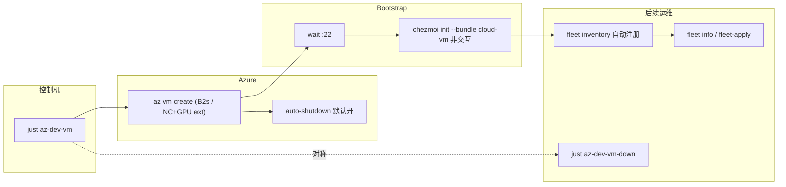

<!-- Generated by SpecStory, Markdown v2.1.0 -->

# 2026-06-10 13:36:47Z

<!-- Cursor IDE Session ab3387fc-9414-4aa7-ade7-57be68a10c36 (2026-06-10 13:36:47Z) -->

_**User**_

目前我們有各種不同的 docker file
假設我們馬上想要有一個好用的dev machine / server
以這樣的目標為目的
除了目前這個docker
是否能有比如快速用az CLI創建VM然後完整setup所有最推薦necessary tools
又或是切分用途 假設有需要cuda等等的
又或是能快速配置一些基礎的monitor等等
總之 先詳細探索一下這部份可能的需求 看看有沒有什麼比較好的做法

---

_**Agent (claude-fable-5)**_

<think><details><summary>Thought Process</summary>
 The user is looking to quickly set up development machines or servers and has Docker configurations in their chezmoi repo. They want to explore options like Azure CLI VM creation with full setup, CUDA variants, and monitoring capabilities. I should start by examining the repo structure to understand the existing Docker setup, bootstrap scripts, and Ansible roles they have available.</details></think>

_**Agent (claude-fable-5)**_

我先探索一下 repo 現有的相關資產（Dockerfile、bootstrap、ansible 等），再來整理可能的方案。

_**Agent (claude-fable-5)**_

<tool-use data-tool-type="unknown" data-tool-name="task_v2">
<details>
<summary>Tool use: **task_v2**</summary>


Parameters:

```json
{
  "description": "探索 repo docker 與 bootstrap 資產",
  "model": "composer-2.5-fast",
  "name": "explore",
  "prompt": "Explore the chezmoi dotfiles repo at /Users/david/.local/share/chezmoi (medium thoroughness). I need to understand the existing infrastructure for setting up dev machines:\n\n1. Find all Dockerfiles / docker-compose files / devcontainer configs in the repo. For each, summarize: base image, what tools it installs, intended purpose.\n2. Examine bootstrap.sh at the repo root — what does it do? What platforms does it support?\n3. Examine the ansible setup under dot_ansible/ — list the roles and what each does (just the role names and 1-line purpose, plus how playbooks are organized, e.g. site.yml, tags).\n4. Look at scripts/init/dotfiles_init.py — high-level summary of what it configures.\n5. Check README.md and NOTES.md for any documentation about machine provisioning, cloud VMs, azure, remote dev servers.\n6. Search for any existing azure / az CLI / cloud-init / terraform / VM provisioning related files.\n\nReturn a structured report with file paths, so I can plan a \"quickly provision a usable dev machine/server\" feature (e.g., az CLI VM creation + auto setup, CUDA variants, monitoring).",
  "subagentType": "explore"
}
```
Additional data:

```json
{
  "status": "success",
  "subagentComposerId": "14cff87f-0872-4abf-93e0-ca504b14b5f0",
  "terminationReason": "completed"
}
```
Result:

```json
{
  "agentId": "14cff87f-0872-4abf-93e0-ca504b14b5f0"
}
```
Status: **completed**


</details>
</tool-use>

<tool-use data-tool-type="unknown" data-tool-name="task_v2"><details>
<summary>Tool use: **task_v2**</summary>

</details></tool-use>

_**Agent (claude-fable-5)**_

<think><details><summary>Thought Process</summary>
 I should check the existing backlog notes in the repo to understand what's already been planned before moving forward.</details></think>

_**Agent (claude-fable-5)**_

Repo 裡已有相關的 backlog 設計筆記，我先讀一下確認既有想法。

_**Agent (claude-fable-5)**_

<tool-use data-tool-type="read" data-tool-name="read_file_v2">
<details><summary>Tool use: **read_file_v2** • Read file: /Users/david/.local/share/chezmoi/backlog/cloud-vm-provision-combo.md</summary>

</details>
</tool-use>

<tool-use data-tool-type="read" data-tool-name="read_file_v2"><details>
<summary>Tool use: **read_file_v2**</summary>

</details></tool-use>

_**Agent (claude-fable-5)**_

<tool-use data-tool-type="read" data-tool-name="read_file_v2">
<details><summary>Tool use: **read_file_v2** • Read file: /Users/david/.local/share/chezmoi/backlog/lean-bundle-init-ux.md</summary>

</details>
</tool-use>

<tool-use data-tool-type="read" data-tool-name="read_file_v2"><details>
<summary>Tool use: **read_file_v2**</summary>

</details></tool-use>

_**Agent (claude-fable-5)**_

<tool-use data-tool-type="read" data-tool-name="read_file_v2">
<details><summary>Tool use: **read_file_v2** • Read file: /Users/david/.local/share/chezmoi/TODO.md</summary>

</details>
</tool-use>

<tool-use data-tool-type="read" data-tool-name="read_file_v2"><details>
<summary>Tool use: **read_file_v2**</summary>

</details></tool-use>

_**Agent (claude-fable-5)**_

<think><details><summary>Thought Process</summary>
 The user is asking me to explore how to quickly set up a development machine or server using Docker and related tools—whether that means spinning up a VM with Azure CLI and all necessary dependencies, organizing Dockerfiles by purpose like CUDA support, or adding basic monitoring capabilities. They want me to dig into the requirements and figure out what approach would work best.

I notice there are already some design documents in the backlog that touch on this: cloud VM provisioning, lean bundle initialization, and runtime gating. Before diving into a full exploration and proposal, I should clarify a few critical things: whether this session is just about updating the design docs or if we're actually building the first implementation; whether we're focusing on Azure initially; and whether there's an immediate need for CUDA support on a GPU host. Let me also check what's already documented in the runtime gating backlog to understand what prerequisites are already in place.我再檢查一下 `mise-runtime-gating.md` 和 fleet-apply 文件，確保方案排序正確。</details></think>

_**Agent (claude-fable-5)**_

<tool-use data-tool-type="read" data-tool-name="read_file_v2">
<details><summary>Tool use: **read_file_v2** • Read file: /Users/david/.local/share/chezmoi/backlog/mise-runtime-gating.md</summary>

</details>
</tool-use>

<tool-use data-tool-type="read" data-tool-name="read_file_v2"><details>
<summary>Tool use: **read_file_v2**</summary>

</details></tool-use>

_**Agent (claude-fable-5)**_

<tool-use data-tool-type="read" data-tool-name="read_file_v2">
<details><summary>Tool use: **read_file_v2** • Read file: /Users/david/.local/share/chezmoi/docs/this_repo/fleet-apply.md</summary>

</details>
</tool-use>

<tool-use data-tool-type="read" data-tool-name="read_file_v2"><details>
<summary>Tool use: **read_file_v2**</summary>

</details></tool-use>

_**Agent (claude-fable-5)**_

<think><details><summary>Thought Process</summary>
 I need to clarify the scope here—whether we're just documenting the design and requirements this session, or if we're actually building out Phase 1 with the az-dev-vm and cloud-vm bundle. There's also the question of whether there's a concrete GPU host available for the CUDA setup.

Let me map out what I'm seeing: the existing bootstrap pipeline (dotfiles → chezmoi → ansible) handles configuration, but we need a dedicated provisioning path for spinning up fresh VMs quickly. The backlog already has pieces for this—the cloud-vm combo and bundle initialization—but we're missing clarity on CUDA support and what "基礎的 monitor" actually means in scope (just host metrics, or the full audit-monitor + apprise alerting stack?).

For the approach, I'm thinking: prioritize the mise runtime gating fix first since it unblocks other work, then wire the cloud-vm bundle into dotfiles_init.py with a non-interactive mode. The main piece is a Python script that orchestrates the full flow—create the resource group and VM, wait for SSH, run bootstrap, register with fleet, and handle teardown—with auto-shutdown enabled by default and Spot VMs for cost savings. For GPU workloads, I'd lean toward using Azure's pre-built Data Science or GPU-optimized images rather than maintaining our own driver matrix. Monitoring-wise, we already have fleet info snapshots and the btop/auditd roles, so the question is whether we go with netdata's one-liner install or wait for the audit-monitor + apprise backlog items.

Before I map this out into a concrete plan, I need to clarify a few things: Is this session about design and backlog updates, or are we jumping straight into implementation starting with the bundle and Azure script? Do we have immediate GPU needs, or should we just set up the seam for it? And for monitoring, is the lightweight approach—fleet info plus Azure's native auto-shutdown and cost alerts—sufficient, or do you want netdata and alerting built in from the start?</details></think>

_**Agent (claude-fable-5)**_

探索完成。这个需求空间其实在 repo 里已经有相当多的铺垫——把现状和可能的做法整理如下。

## 现状盘点

**现有 Docker 文件的定位**：`Dockerfile` / `Dockerfile.rocky9` / `Dockerfile.centos7` + `docker-compose.yml` 本质是**跨 OS 回归测试矩阵**（验证 chezmoi + ansible 在 Ubuntu/Rocky/CentOS、sudo/noRoot 下都能跑通），不是生产 dev machine 的路径。但它们验证过的「非交互 `chezmoi init` + 全套 ARG flag」正是远程 VM bootstrap 需要的同一条路。

**已有的拼图**（从入口到远程运维）：

- `bootstrap.sh` → `dotfiles_init.py`（bundle 预设：`personal-mac` / `work-mac` / `server-linux` / `minimal`）→ chezmoi apply → ansible 24 个 roles
- `scripts/fleet/`：对**已存在**的主机做并行 apply / exec / status / info（含 GPU 模块）
- `iac_tools` role 已会装 Azure CLI；`tv azure` channel 已能对现有 VM 做启停/SSH/换 IP
- `auditd` role + `health-check` 等 helper 是现有的安全/健康基线

**Backlog 里已经设计过这件事**（你 2026-05-21 那次讨论留下的）：

- [backlog/cloud-vm-provision-combo.md](backlog/cloud-vm-provision-combo.md) — `az vm create` + wait-SSH + 注册 fleet + 远程非交互 init，倾向先做 standalone `just az-dev-vm`（不耦合进 fleet）；明确要求 **teardown 对称 + 幂等**
- [backlog/lean-bundle-init-ux.md](backlog/lean-bundle-init-ux.md) — 缺一个 `cloud-vm` lean bundle
- [backlog/mise-runtime-gating.md](backlog/mise-runtime-gating.md) — **前置依赖**：rust/dotnet/bun/ruby 现在无条件装 ~1.8GB（还有 dotnet 合同 bug：答 No 也装 650MB），不修的话 lean VM 瘦不下来
- `TODO.md` 已有 `[?/XL] CUDA/ML ansible role` 和 `[?/L] audit-monitor + apprise` 两条

## 三个需求方向的可行做法

**1. az CLI 快速开 VM + 全套 setup**（缺口最大、价值最高）
- 新 `scripts/azure/dev_vm.py`（uv script，和 fleet 同风格）+ `just az-dev-vm`：`az vm create`（Ubuntu 24.04 Gen2、B2s、32GB 盘、SSH key 注入）→ 轮询 :22 → 远程 `chezmoi init --apply --bundle cloud-vm`（非交互，复用 Dockerfile 验证过的 flag 流）→ 自动写入 `~/.config/fleet/machines.toml`
- 必须配对 `just az-dev-vm-down` + 默认开 `az vm auto-shutdown`（Azure 原生支持，一条命令）；可选 Spot 实例省钱
- bootstrap 走 cloud-init user-data（curl bootstrap.sh，开机即跑）还是 SSH 后推（可观测、可重试）是一个小决策点——我倾向 SSH 后推，与 fleet 日志模型一致

**2. 按用途切分（CUDA 等）**
- lean dev box：`cloud-vm` bundle（shell + tmux + nvim + coding agents，~不到 1GB）
- CUDA：**不建议自己维护 driver/cudnn/nccl matrix**（TODO 里也标了 XL）。Azure 上更省力的路是 `az vm extension set --name NvidiaGpuDriverLinux`（微软维护的驱动扩展）或直接用 NVIDIA/DSVM 现成镜像，dotfiles 这边只需要 dev_vm.py 加一个 `--gpu`/`--size NC...` 维度，CUDA 工具链留给 conda/uv 项目级管理
- 用途切分落在两个正交的轴上：VM SKU/镜像（脚本参数）× bundle（dotfiles 厚度），不需要新 profile

**3. 基础 monitoring**
- 轻量层其实已经有：`fleet info`（CPU/RAM/disk/GPU 跨主机快照）、btop、auditd
- 云侧最划算的「监控」是成本护栏：auto-shutdown + budget alert（`azure-cost-cli` 已在 dotnet_tools role）
- 真告警（apprise 路由）backlog 里已评估过，promote 条件未满足，建议维持 deferred；若要单机 dashboard，netdata 一行装，可做成脚本可选 flag



建议的实施顺序和 backlog 一致：mise gating（前置）→ `cloud-vm` bundle → `az-dev-vm` 脚本（含 teardown）→ GPU 维度 → monitoring 增强。

在写计划前，有两个关键的范围问题想确认。

_**Agent (claude-fable-5)**_

<tool-use data-tool-type="unknown" data-tool-name="ask_question">
<details>
<summary>Tool use: **ask_question**</summary>


Parameters:

```json
{
  "questions": [
    {
      "id": "scope",
      "options": [
        {
          "id": "impl_core",
          "label": "实作核心链路：mise gating + cloud-vm bundle + az-dev-vm 脚本（含 teardown）(Recommended)"
        },
        {
          "id": "impl_script_only",
          "label": "只实作 az-dev-vm 脚本，bundle 先用现成 server-linux 顶着，mise gating 之后再说"
        },
        {
          "id": "design_only",
          "label": "只做设计：把这次探索整理进 backlog/TODO，更新设计文档，不写代码"
        }
      ],
      "prompt": "这次 session 想推进到什么程度？"
    },
    {
      "allowMultiple": true,
      "id": "gpu_monitor",
      "options": [
        {
          "id": "gpu_seam",
          "label": "GPU：脚本留 --size/--gpu 参数 seam（NVIDIA driver extension），不做 CUDA ansible role (Recommended)"
        },
        {
          "id": "gpu_now",
          "label": "GPU：现在就有具体 GPU VM 需求，要完整跑通一次"
        },
        {
          "id": "mon_guardrail",
          "label": "Monitoring：先做成本护栏（auto-shutdown 默认开 + cost 提示），靠现有 fleet info (Recommended)"
        },
        {
          "id": "mon_netdata",
          "label": "Monitoring：额外加 netdata 等单机 dashboard 的可选安装"
        }
      ],
      "prompt": "GPU/CUDA 和 monitoring 这两块这次怎么处理？"
    }
  ],
  "title": "Dev VM provision 范围确认"
}
```
Additional data:

```json
{
  "currentSelections": {
    "gpu_monitor": [
      "gpu_seam",
      "mon_guardrail"
    ],
    "scope": [
      "impl_core"
    ]
  },
  "freeformTexts": {
    "gpu_monitor": "",
    "scope": ""
  },
  "status": "submitted"
}
```
Result:

```json
{
  "answers": [
    {
      "freeformText": "",
      "questionId": "scope",
      "selectedOptionIds": [
        "impl_core"
      ]
    },
    {
      "freeformText": "",
      "questionId": "gpu_monitor",
      "selectedOptionIds": [
        "gpu_seam",
        "mon_guardrail"
      ]
    }
  ]
}
```
User decision: **accepted**

Status: **completed**


</details>
</tool-use>

<tool-use data-tool-type="unknown" data-tool-name="ask_question"><details>
<summary>Tool use: **ask_question**</summary>

</details></tool-use>

_**Agent (claude-fable-5)**_

<think><details><summary>Thought Process</summary>
 The user wants to implement the core chain with mise gating, cloud-vm bundle, and az-dev-vm script including teardown, with GPU seam only and cost guardrails for monitoring. I'm identifying the key files I need to examine to build out this plan: the mise config template for gating logic, the chezmoi template for the new prompt, and the dotfiles init script where the prompts are defined.

I notice there's a recent codegen plan that suggests PROMPTS are now the single source of truth, feeding into both the chezmoi template and Dockerfile args via a `gen` command — that's a significant simplification. I need to check the ansible roles run script, justfile recipes, and verify whether the codegen tool exists, then read through the targeted sections of these files to make the implementation plan concrete and accurate.已确认范围，现在我来查看关键文件以确定具体的改动点。</details></think>

_**Agent (claude-fable-5)**_

<tool-use data-tool-type="read" data-tool-name="read_file_v2">
<details><summary>Tool use: **read_file_v2** • Read file: /Users/david/.local/share/chezmoi/dot_config/mise/config.toml.tmpl</summary>

</details>
</tool-use>

<tool-use data-tool-type="read" data-tool-name="read_file_v2"><details>
<summary>Tool use: **read_file_v2**</summary>

</details></tool-use>

_**Agent (claude-fable-5)**_

<tool-use data-tool-type="unknown" data-tool-name="ripgrep_raw_search">
<details>
<summary>Tool use: **ripgrep_raw_search**</summary>


Parameters:

```json
{
  "caseInsensitive": false,
  "outputMode": "content",
  "path": "/Users/david/.local/share/chezmoi/scripts/init/dotfiles_init.py",
  "pattern": "BUNDLES|class Prompt|installDotnetTools|installExtraRuntimes|def cmd_gen|server-linux"
}
```
Additional data:

```json
{
  "isPruned": true,
  "outputMode": "content",
  "path": "/Users/david/.local/share/chezmoi/scripts/init/dotfiles_init.py",
  "pattern": "BUNDLES|class Prompt|installDotnetTools|installExtraRuntimes|def cmd_gen|server-linux",
  "topFiles": [
    {
      "matchCount": 10,
      "uri": "scripts/init/dotfiles_init.py"
    }
  ],
  "totalFiles": 1,
  "totalMatches": 10
}
```
Status: **completed**


</details>
</tool-use>

<tool-use data-tool-type="unknown" data-tool-name="ripgrep_raw_search"><details>
<summary>Tool use: **ripgrep_raw_search**</summary>

</details></tool-use>

_**Agent (claude-fable-5)**_

<tool-use data-tool-type="read" data-tool-name="read_file_v2">
<details><summary>Tool use: **read_file_v2** • Read file: /Users/david/.local/share/chezmoi/scripts/init/dotfiles_init.py</summary>

</details>
</tool-use>

<tool-use data-tool-type="read" data-tool-name="read_file_v2"><details>
<summary>Tool use: **read_file_v2**</summary>

</details></tool-use>

_**Agent (claude-fable-5)**_

<tool-use data-tool-type="read" data-tool-name="read_file_v2">
<details><summary>Tool use: **read_file_v2** • Read file: /Users/david/.local/share/chezmoi/scripts/init/dotfiles_init.py</summary>

</details>
</tool-use>

<tool-use data-tool-type="read" data-tool-name="read_file_v2"><details>
<summary>Tool use: **read_file_v2**</summary>

</details></tool-use>

_**Agent (claude-fable-5)**_

<think><details><summary>Thought Process</summary>
 With the codegen SSOT in place, adding a new prompt is now straightforward—I just need to edit the PROMPTS in dotfiles_init.py and run the generator to update the `.chezmoi.toml.tmpl` prompts block and Dockerfile ARGs, with doctor validating everything. This makes the `installExtraRuntimes` feature much cheaper to implement than originally estimated. I should also verify the ansible roles template to confirm the TAGS assembly doesn't need any adjustments.

Now I'm thinking through the design for gating the extra runtimes. The backlog suggests a coarse flag covering rust, dotnet, and bun, while keeping node always enabled and ruby conditional on noRoot. The simplest approach is to gate dotnet on the new prompt and use that same flag to control rust and bun installation.

But there's a complication: rust_cargo_tools and ruby_gem_tools are in the base TAGS for all profiles, so if I disable extra runtimes, I need to also exclude those roles from the ansible playbook generation. That means updating the role assembly template to drop those tags when the flag is off.

For the cloud-vm bundle, I'm targeting a lean setup focused on shell ergonomics, tmux, neovim, and the coding agents, so I'll disable extra runtimes there and set dotnet to false as well.

Then for Phase 3, I'm building a Python script with uv and tyro that handles Azure VM lifecycle—spinning up with sensible defaults like a B2s instance on Ubuntu 24.04, waiting for SSH to be ready, then bootstrapping with chezmoi using the same prompt-driven flow from the dotfiles init, and finally registering the host in the fleet machines config.

The down command tears down the VM and deregisters it, status shows power state with a cost estimate, and I'm adding corresponding just recipes plus documentation. I'll also need to update AGENTS.md if there are new prompt requirements, run the doctor checks, and keep tests minimal. Finally, I'm writing out the full plan in Simplified Chinese with key file references.关键细节已确认，`gen` codegen 已落地，新增 prompt 只需更新 `PROMPTS` 后重新生成。现在我来整理实施计划。</details></think>

_**Agent (claude-fable-5)**_

<tool-use data-tool-type="unknown" data-tool-name="create_plan">
<details>
<summary>Tool use: **create_plan**</summary>


Parameters:

```json
{
  "name": "Azure Dev VM 链路",
  "overview": "实作「一条命令开出可用 dev VM」核心链路：mise runtime gating（前置瘦身）→ cloud-vm lean bundle → az-dev-vm provision/teardown 脚本（含 fleet 注册与成本护栏），GPU 仅留参数 seam。",
  "plan": "# Azure Dev VM Provision 核心链路\n\n目标：&#96;just az-dev-vm&#96; 一条命令 → Azure VM 创建 → 等 SSH → 远程非交互 &#96;chezmoi init --apply --bundle cloud-vm&#96; → 自动注册进 fleet；配对 &#96;just az-dev-vm-down&#96; 与默认 auto-shutdown。GPU 只留 &#96;--size&#96;/&#96;--gpu&#96; seam，monitoring 以成本护栏为主。\n\n## Phase 1 — mise runtime gating（前置，省 ~1.8GB + 修 dotnet 合同 bug）\n\n依据 [backlog/mise-runtime-gating.md](backlog/mise-runtime-gating.md) 的「A + C」结论：\n\n- [scripts/init/dotfiles_init.py](scripts/init/dotfiles_init.py) &#96;PROMPTS&#96; 新增 &#96;installExtraRuntimes&#96;（bool，Dev tooling 组，**default True** 保持既有机器行为），然后跑 &#96;gen&#96; 重新生成 &#96;.chezmoi.toml.tmpl&#96; prompt 块 + Dockerfile ARG，&#96;doctor&#96; 验证（SSOT codegen 已落地，无需手工三处同步）。\n- [dot_config/mise/config.toml.tmpl](dot_config/mise/config.toml.tmpl) &#96;[tools]&#96; 改造（非 oldEL 分支）：\n  - &#96;node&#96; 永远保留（nvim/agents 硬依赖）\n  - &#96;dotnet&#96; 改为 &#96;installDotnetTools&#96; 守卫（修复「答 No 仍装 650MB」bug）\n  - &#96;rust&#96;、&#96;bun&#96;、&#96;ruby&#96; 改为 &#96;installExtraRuntimes&#96; 守卫（ruby 同时保留现有 noRoot 条件）\n- [.chezmoiscripts/global/run_onchange_after_20_ansible_roles.sh.tmpl](.chezmoiscripts/global/run_onchange_after_20_ansible_roles.sh.tmpl)：当 &#96;installExtraRuntimes=false&#96; 时从 TAGS 中剔除 &#96;rust_cargo_tools&#96; / &#96;ruby_gem_tools&#96;（否则 cargo/gem 安装会因缺 toolchain 失败）。\n- 现有 &#96;BUNDLES&#96; 补上该 flag：&#96;minimal&#96; / 新 &#96;cloud-vm&#96; 设 False，其余 True。\n- 注意：新 prompt key 会让既有 fleet 主机出现 &#96;toml-mismatch&#96;（fleet-status 会标出，属预期，README/文档提一句即可）。\n\n## Phase 2 — &#96;cloud-vm&#96; lean bundle\n\n- [scripts/init/dotfiles_init.py](scripts/init/dotfiles_init.py) &#96;BUNDLES&#96; 新增 &#96;cloud-vm&#96;：目标是「ergonomic shell + tmux + nvim + coding agents」——&#96;installCodingAgents=True&#96;、&#96;backupMode=\"smart\"&#96;，其余 installX 全 False，&#96;installExtraRuntimes=False&#96;、&#96;installDotnetTools=False&#96;、&#96;enableVimMode&#96; 留默认。\n- 在 &#96;ask_bundle()&#96; 的列表（约 [scripts/init/dotfiles_init.py](scripts/init/dotfiles_init.py) L650）加一行描述；&#96;list-bundles&#96; 自动带出。\n- 更新 README.md 的 bundle 表格 + AGENTS.md 相关 cross-file 行（如有）。\n- 验证：&#96;uv run scripts/init/dotfiles_init.py doctor&#96; 通过；&#96;docker compose build devbox&#96; 用 cloud-vm flag 集 smoke 一次（可选）。\n\n## Phase 3 — &#96;scripts/azure/dev_vm.py&#96; + just recipes\n\n新建 &#96;scripts/azure/dev_vm.py&#96;（uv PEP-723 inline script：&#96;tyro&#96; + &#96;rich&#96;，风格对齐 &#96;scripts/fleet/&#96;），子命令：\n\n- &#96;up&#96;：\n  - 前置检查：&#96;az&#96; 在 PATH、&#96;az account show&#96; 已登录，否则带提示退出\n  - 幂等：固定 RG（默认 &#96;dev-vm-rg&#96;）+ VM 名（默认 &#96;devbox-1&#96;），存在即跳过创建直接走后续步骤\n  - &#96;az vm create&#96;：Ubuntu 24.04 LTS Gen2、默认 &#96;Standard_B2s&#96;、&#96;--os-disk-size-gb 32&#96;、注入 &#96;~/.ssh/id_ed25519.pub&#96;（可参数化）；&#96;--spot&#96; 可选\n  - **GPU seam**：&#96;--gpu&#96; flag = 换 NC 系列 size + &#96;az vm extension set --name NvidiaGpuDriverLinux&#96;（不做 CUDA ansible role，工具链留给项目级 conda/uv）\n  - **成本护栏（默认开）**：&#96;az vm auto-shutdown --time \u003cUTC\u003e&#96;（默认如 1900 UTC，可 &#96;--no-auto-shutdown&#96; 关）\n  - 轮询 :22 直到 SSH 可达\n  - 远程 bootstrap：SSH 进去 curl 安装 chezmoi → 非交互 &#96;chezmoi init --apply \u003crepo\u003e&#96; 带全套 &#96;--promptBool/--promptChoice&#96; flag。flag 集**直接 import &#96;scripts/init/dotfiles_init.py&#96; 的 &#96;PROMPTS&#96;/&#96;BUNDLES&#96; 计算**（复用 SSOT，避免第四份手抄的 flag 列表）\n  - 注册 fleet：往 &#96;~/.config/fleet/machines.toml&#96; 追加 &#96;[[hosts]]&#96;（name、hostname=公网 IP、user、identity_file、&#96;no_root_machine=false&#96;），已存在则更新 IP\n- &#96;down&#96;：删 VM 及关联资源（RG 为专用时直接 &#96;az group delete&#96;）+ 从 machines.toml 反注册；与 &#96;up&#96; 严格对称\n- &#96;status&#96;：VM 列表 + power state + 公网 IP +（若装有 azure-cost-cli 则附成本提示）\n- &#96;ssh&#96;：便捷直连\n- [justfile](justfile) 新 recipes：&#96;az-dev-vm&#96;（up）、&#96;az-dev-vm-down&#96;、&#96;az-dev-vm-status&#96;、&#96;az-dev-vm-ssh&#96;\n- 确认 &#96;scripts/**&#96; 已在 &#96;.chezmoiignore.tmpl&#96;（不部署到 $HOME，与 fleet 同约定）\n\n## Phase 4 — 文档与 backlog 收尾\n\n- 新增 &#96;docs/this_repo/az-dev-vm.md&#96;（用法、幂等/teardown 语义、GPU seam 说明、成本护栏）\n- &#96;TODO.md&#96;：把 cloud-vm bundle、provision combo、mise gating 三条移到 Done；CUDA role 条目补注「已决定走 driver extension seam，不做 role」\n- 更新三份 backlog 文件的 Decision 段\n\n## 验证\n\n- &#96;dotfiles_init.py doctor&#96; + &#96;gen --check&#96;（如有）通过\n- &#96;docker compose --profile test up test&#96;（既有 smoke）不回归\n- 真机 e2e：&#96;just az-dev-vm&#96; 开一台 B2s → SSH 进去确认 zsh/tmux/nvim/claude 可用 → &#96;fleet info --hosts \u003cname\u003e&#96; 可见 → &#96;just az-dev-vm-down&#96; 干净删除",
  "todos": [
    {
      "content": "Phase 1: installExtraRuntimes prompt + mise config.toml.tmpl 守卫 + TAGS 剔除 + gen/doctor",
      "id": "mise-gating",
      "status": "pending"
    },
    {
      "content": "Phase 2: BUNDLES 新增 cloud-vm + ask_bundle 列表 + README 表格",
      "id": "cloud-vm-bundle",
      "status": "pending"
    },
    {
      "content": "Phase 3: scripts/azure/dev_vm.py（up/down/status/ssh，含 auto-shutdown、GPU seam、fleet 注册）",
      "id": "dev-vm-script",
      "status": "pending"
    },
    {
      "content": "Phase 3: justfile 新增 az-dev-vm* recipes",
      "id": "just-recipes",
      "status": "pending"
    },
    {
      "content": "Phase 4: docs/this_repo/az-dev-vm.md + TODO.md/backlog 收尾",
      "id": "docs-backlog",
      "status": "pending"
    },
    {
      "content": "验证：doctor + docker smoke + 真机 e2e 开/关一次",
      "id": "verify",
      "status": "pending"
    }
  ]
}
```
Additional data:

```json
{
  "hasOpenedEditor": true,
  "planId": "azure_dev_vm_链路_2932689c",
  "planUri": "file:///Users/david/.cursor/plans/azure_dev_vm_%E9%93%BE%E8%B7%AF_2932689c.plan.md",
  "reviewData": {
    "isShowingInput": false,
    "selectedOption": "none",
    "status": "Requested"
  }
}
```
Result:

```json
{
  "rejected": {}
}
```
Status: **completed**


</details>
</tool-use>

<tool-use data-tool-type="unknown" data-tool-name="create_plan"><details>
<summary>Tool use: **create_plan**</summary>

</details></tool-use>

---

_**User**_

Implement the plan as specified, it is attached for your reference. Do NOT edit the plan file itself.

To-do's from the plan have already been created. Do not create them again. Mark them as in_progress as you work, starting with the first one. Don't stop until you have completed all the to-dos.

---

_**Agent (claude-fable-5)**_

<think><details><summary>Thought Process</summary>
 I'm starting the implementation by marking mise-gating as in_progress, then reading through AGENTS.md per the workspace rules and reviewing the relevant files. I've got a couple of extra tasks to handle later—committing the changes and documenting how to remove the test VM—but first I need to check the documentation and understand the codebase.</details></think>

_**Agent (claude-fable-5)**_

<tool-use data-tool-type="unknown" data-tool-name="todo_write">
<details>
<summary>Tool use: **todo_write**</summary>


Parameters:

```json
{
  "merge": true
}
```
Result:

```json
{
  "finalTodos": [
    {
      "content": "Phase 1: installExtraRuntimes prompt + mise config.toml.tmpl 守卫 + TAGS 剔除 + gen/doctor",
      "id": "mise-gating",
      "status": "in_progress"
    },
    {
      "content": "Phase 2: BUNDLES 新增 cloud-vm + ask_bundle 列表 + README 表格",
      "id": "cloud-vm-bundle",
      "status": "pending"
    },
    {
      "content": "Phase 3: scripts/azure/dev_vm.py（up/down/status/ssh，含 auto-shutdown、GPU seam、fleet 注册）",
      "id": "dev-vm-script",
      "status": "pending"
    },
    {
      "content": "Phase 3: justfile 新增 az-dev-vm* recipes",
      "id": "just-recipes",
      "status": "pending"
    },
    {
      "content": "Phase 4: docs/this_repo/az-dev-vm.md + TODO.md/backlog 收尾",
      "id": "docs-backlog",
      "status": "pending"
    },
    {
      "content": "验证：doctor + docker smoke + 真机 e2e 开/关一次",
      "id": "verify",
      "status": "pending"
    },
    {
      "content": "git commit changes",
      "id": "todo-1781099487334-zii2ve3eo",
      "status": "pending"
    },
    {
      "content": "list how to remove the test VM",
      "id": "todo-1781099505046-t9tklxzfz",
      "status": "pending"
    }
  ],
  "initialTodos": [
    {
      "content": "Phase 1: installExtraRuntimes prompt + mise config.toml.tmpl 守卫 + TAGS 剔除 + gen/doctor",
      "id": "mise-gating",
      "status": "pending"
    },
    {
      "content": "Phase 2: BUNDLES 新增 cloud-vm + ask_bundle 列表 + README 表格",
      "id": "cloud-vm-bundle",
      "status": "pending"
    },
    {
      "content": "Phase 3: scripts/azure/dev_vm.py（up/down/status/ssh，含 auto-shutdown、GPU seam、fleet 注册）",
      "id": "dev-vm-script",
      "status": "pending"
    },
    {
      "content": "Phase 3: justfile 新增 az-dev-vm* recipes",
      "id": "just-recipes",
      "status": "pending"
    },
    {
      "content": "Phase 4: docs/this_repo/az-dev-vm.md + TODO.md/backlog 收尾",
      "id": "docs-backlog",
      "status": "pending"
    },
    {
      "content": "验证：doctor + docker smoke + 真机 e2e 开/关一次",
      "id": "verify",
      "status": "pending"
    },
    {
      "content": "git commit changes",
      "id": "todo-1781099487334-zii2ve3eo",
      "status": "pending"
    },
    {
      "content": "list how to remove the test VM",
      "id": "todo-1781099505046-t9tklxzfz",
      "status": "pending"
    }
  ],
  "success": true,
  "wasMerge": true
}
```
Status: **completed**


</details>
</tool-use>

<tool-use data-tool-type="unknown" data-tool-name="todo_write"><details>
<summary>Tool use: **todo_write**</summary>

</details></tool-use>

_**Agent (claude-fable-5)**_

<tool-use data-tool-type="read" data-tool-name="read_file_v2">
<details><summary>Tool use: **read_file_v2** • Read file: /Users/david/.local/share/chezmoi/AGENTS.md</summary>

</details>
</tool-use>

<tool-use data-tool-type="read" data-tool-name="read_file_v2"><details>
<summary>Tool use: **read_file_v2**</summary>

</details></tool-use>

_**Agent (claude-fable-5)**_

<think><details><summary>Thought Process</summary>
 I'm reviewing the key updates needed from the AGENTS documentation: I need to modify the chezmoi prompt by editing the `PROMPTS` section in dotfiles_init.py, then regenerate the template and Dockerfile using the build command, plus add the new key to the README's option table. I should also update the bundles table in the README and add the new documentation page to the mkdocs navigation before building the site.

Now I'm examining the relevant source files to understand the structure — specifically the PROMPTS section in dotfiles_init.py to see where to add the new runtime option, the mise configuration template, the ansible roles script for tag assembly, the justfile recipe patterns, and the README tables that need updating.</details></think>

_**Agent (claude-fable-5)**_

现在开始 Phase 1。先读关键文件。

_**Agent (claude-fable-5)**_

<tool-use data-tool-type="read" data-tool-name="read_file_v2">
<details><summary>Tool use: **read_file_v2** • Read file: /Users/david/.local/share/chezmoi/scripts/init/dotfiles_init.py</summary>

</details>
</tool-use>

<tool-use data-tool-type="read" data-tool-name="read_file_v2"><details>
<summary>Tool use: **read_file_v2**</summary>

</details></tool-use>

_**Agent (claude-fable-5)**_

<tool-use data-tool-type="read" data-tool-name="read_file_v2">
<details><summary>Tool use: **read_file_v2** • Read file: /Users/david/.local/share/chezmoi/.chezmoiscripts/global/run_onchange_after_20_ansible_roles.sh.tmpl</summary>

</details>
</tool-use>

<tool-use data-tool-type="read" data-tool-name="read_file_v2"><details>
<summary>Tool use: **read_file_v2**</summary>

</details></tool-use>
