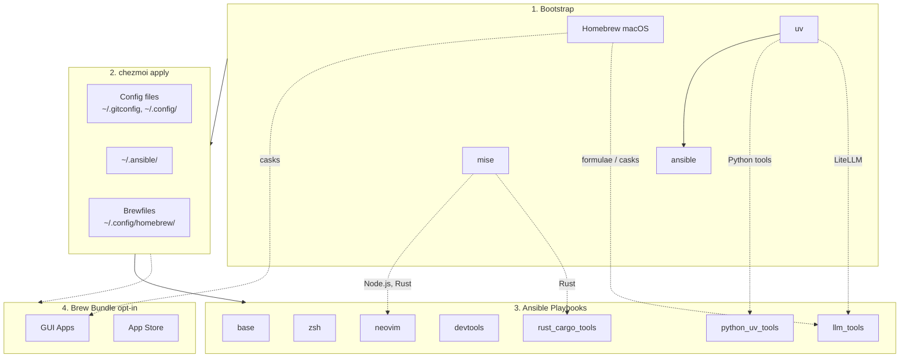

<!-- Generated by SpecStory, Markdown v2.1.0 -->

# 2026-06-19 03:04:17Z

<!-- Codex CLI Session 019eddd3-7a9b-71b1-8632-ff53ed347f1a (2026-06-19 03:04:17Z) -->

_**User (2026-06-19 03:04:17Z)**_

�在我想給Desktop/GUI profile添加game的init�項 目��以先以安� Steam 爲準 研究一下�麽實�比較好

---

_**Agent (gpt-5.5 2026-06-19 03:04:32Z)**_

我先把�有 init prompt�profile 分�和 GUI app 安�路徑讀一�，先用 repo 事實約�方案，�看 Steam 應該�在哪個層級。

_**Agent (gpt-5.5 2026-06-19 03:04:32Z)**_

<tool-use data-tool-type="shell" data-tool-name="exec_command"><details>
<summary>Tool use: **exec_command** `rg -n "profile|ubuntu_desktop|GUI|gui|Steam|steam|games|game|BUNDLES|PROMPTS" scripts/init dot_ansible docs README.md .chezmoi.toml.tmpl Dockerfile dot_chezmoiignore.tmpl`</summary>
```
Chunk ID: d52397
Wall time: 0.0001 seconds
Process exited with code 2
Original token count: 28401
Output:
Total output lines: 722

rg: dot_chezmoiignore.tmpl: No such file or directory (os error 2)
Dockerfile:148:    --promptChoice "Which profile=${CHEZMOI_PROFILE}" \
Dockerfile:162:    --promptBool "Install Bitwarden CLI (and Desktop on ubuntu_desktop/macOS — snap or .deb on Linux, Cask on macOS) with SSH Agent integration=${CHEZMOI_INSTALL_BITWARDEN}" \
Dockerfile:163:    --promptBool "Install general GUI apps via Homebrew Brewfile (terminals, browsers, utilities, etc.; excludes AI desktop apps)=${CHEZMOI_INSTALL_BREW_APPS}" \
.chezmoi.toml.tmpl:20:{{- $profileChoices := list "macos" "ubuntu_desktop" "ubuntu_server" "centos_server" }}
.chezmoi.toml.tmpl:23:{{- $profile := promptChoiceOnce . "profile" "Which profile" $profileChoices $defaultProfile }}
.chezmoi.toml.tmpl:24:profile = {{ $profile | quote }}
.chezmoi.toml.tmpl:74:# ubuntu_desktop / macOS profile 上�時也會� Bitwarden Desktop（snap 優先�
.chezmoi.toml.tmpl:75:# .deb fallback / Homebrew Cask）。詳細�輯見 docs/playbooks/linux-gui-apps.md
.chezmoi.toml.tmpl:77:installBitwarden = {{ promptBoolOnce . "installBitwarden" "Install Bitwarden CLI (and Desktop on ubuntu_desktop/macOS — snap or .deb on Linux, Cask on macOS) with SSH Agent integration" false }}
.chezmoi.toml.tmpl:78:# 是�安�一般 GUI apps via Homebrew Brewfile (terminals, browsers, utilities, etc.; excludes AI desktop apps)
.chezmoi.toml.tmpl:79:# Desktop-class only（macos / ubuntu_desktop）；headless server 沒有 GUI，直� false。
.chezmoi.toml.tmpl:80:{{ if or (eq $profile "macos") (eq $profile "ubuntu_desktop") -}}
.chezmoi.toml.tmpl:81:installBrewApps = {{ promptBoolOnce . "installBrewApps" "Install general GUI apps via Homebrew Brewfile (terminals, browsers, utilities, etc.; excludes AI desktop apps)" false }}
.chezmoi.toml.tmpl:86:# Desktop-class only（macos / ubuntu_desktop）；headless server 沒有 GUI，直� false。
.chezmoi.toml.tmpl:87:{{ if or (eq $profile "macos") (eq $profile "ubuntu_desktop") -}}
.chezmoi.toml.tmpl:92:# Discord channel: 哪一�安�路徑（ubuntu_desktop only — macOS 走 Brewfile cask，
.chezmoi.toml.tmpl:93:# ubuntu_server 沒有 GUI �需�）
.chezmoi.toml.tmpl:97:# 詳細決策 + sandbox 副作用見 docs/playbooks/linux-gui-apps.md
.chezmoi.toml.tmpl:98:# 注�: 這裡引用��定義的 $profile local variable（�是 .profile，因為
.chezmoi.toml.tmpl:99:# .chezmoi.toml.tmpl 正在產生 .profile，init �段 .profile 還�存在）
.chezmoi.toml.tmpl:100:{{ if eq $profile "ubuntu_desktop" -}}
.chezmoi.toml.tmpl:105:# 是�安� niri (scrollable-tiling Wayland ��器)，��碼 cargo build。ubuntu_desktop
.chezmoi.toml.tmpl:106:# only — macOS 無 Wayland�ubuntu_server 無 GUI，皆直� false。NVIDIA 在�代驅動上開箱
.chezmoi.toml.tmpl:107:# �用，niri role 會自動寫入 VRAM application-profile（GLVidHeapReuseRatio=0）。
.chezmoi.toml.tmpl:109:{{ if eq $profile "ubuntu_desktop" -}}
.chezmoi.toml.tmpl:159:# https://www.chezmoi.io/user-guide/use-scripts-to-perform-actions/#dont-show-scripts-that-would-run-in-chezmoi-diffchezmoi-status
README.md:40:        CASKS[GUI Apps]
README.md:137:(`PROMPTS`) and generated into `.chezmoi.toml.tmpl` + `Dockerfile`; this table
README.md:144:| `installBitwarden` | false | Bitwarden CLI (`bw`) + Desktop app (desktop profiles) with SSH agent auto-detection |
README.md:149:| `installBrewApps` | false | General GUI apps via Homebrew Brewfile (terminals, browsers, utilities, mas; excludes AI desktop apps). Desktop profiles only (`macos`/`ubuntu_desktop`). |
README.md:150:| `installInputMethod` | false | Traditional Chinese input methods (McBopomofo, RIME/Squirrel on macOS; ibus-rime on Linux). Desktop profiles only (`macos`/`ubuntu_desktop`). |
README.md:151:| `discordChannel` | `flatpak` | Discord install channel on `ubuntu_desktop`: `flatpak` (recommended), `deb`, or `none`. macOS uses the Brewfile cask; servers skip. |
README.md:152:| `installNiri` | false | [niri](https://github.com/niri-wm/niri) scrollable-tiling Wayland compositor, built from source (`ubuntu_desktop` only). Installs the binary + GDM session/systemd files; NVIDIA gets a VRAM application-profile automatically. See [docs/playbooks/niri.md](docs/playbooks/niri.md). |
README.md:226:- `~/.config/television/cable/clash.toml` + `~/.config/television/clash-switch.sh` - YAML-backed Clash / mihomo Television channel; auto-resolves Clash's active `profiles/<time>.yml` from `~/.config/clash/profiles/list.yml`, falls back to legacy `config.{yaml,yml}`, supports proxy-group switching, and turns empty proxies/groups/rules tabs into informative placeholder rows instead of blank panes ([docs](docs/tools/tv.md))
README.md:232:- `~/.config/zsh/tools/02_shell_integration.zsh` + `03_tmux_capture.zsh` + `04_ai_capture.zsh` - **aicapture** layer: OSC 133 prompt markers + `cpout`/`cpc
... (truncated)
```
</details></tool-use>

_**Agent (gpt-5.5 2026-06-19 03:04:32Z)**_

<tool-use data-tool-type="shell" data-tool-name="exec_command"><details>
<summary>Tool use: **exec_command** `rg --files dot_ansible/roles docs/playbooks scripts/init | rg "(gui|desktop|steam|game|init|tool-managers|upgrades|chezmoi-templating|linux-gui)"`</summary>
```
Chunk ID: ac2559
Wall time: 0.0000 seconds
Process exited with code 0
Original token count: 64
Output:
scripts/init/README.md
scripts/init/Dockerfile.test
scripts/init/dotfiles_init.py
docs/playbooks/linux-gui-apps.md
docs/playbooks/linux-gui-apps.zh-TW.md
dot_ansible/roles/gui_apps_linux/defaults/main.yml
dot_ansible/roles/gui_apps_linux/tasks/main.yml
```
</details></tool-use>

_**Agent (gpt-5.5 2026-06-19 03:04:32Z)**_

<tool-use data-tool-type="shell" data-tool-name="exec_command"><details>
<summary>Tool use: **exec_command** `sed -n '1,260p' scripts/init/dotfiles_init.py`</summary>
```
Chunk ID: 01d20b
Wall time: 0.0000 seconds
Process exited with code 0
Original token count: 3176
Output:
#!/usr/bin/env -S uv run --script
# /// script
# requires-python = ">=3.11"
# dependencies = [
#   "questionary>=2.0",
#   "rich>=13.9",
#   "tyro>=0.9",
# ]
# ///
"""
dotfiles_init.py — Interactive wrapper around `chezmoi init` inspired by
Vercel Labs' `skills` CLI (https://github.com/vercel-labs/skills).

The existing `.chezmoi.toml.tmpl` defines ~19 prompts (profile, email, name,
16 feature flags). `chezmoi init` asks them sequentially, which works but
hides the feature flags from each other and makes "set up a new machine
the way I always do" a manual checklist. This wrapper:

  1. Pre-flights chezmoi / git / SSH key and offers to fix gaps.
  2. Lets you pick a pre-configured BUNDLE (personal-mac, work-mac,
     server-linux, minimal) that ticks typical feature flags for you.
  3. Presents feature flags grouped, as a questionary multi-select you can
     fly through with Space + Enter.
  4. Shells out to `chezmoi init <repo> --apply [--ssh] --promptString ... `
     so chezmoi remains the source of truth — we just pre-answer its prompts.
  5. Streams chezmoi's output live and prints a recap at the end.

PROMPTS (below) is the SINGLE SOURCE OF TRUTH. The `gen` subcommand renders
the prompt block in `.chezmoi.toml.tmpl` and the ARG + flag blocks in
`Dockerfile` from it (between marker comments). `gen --check` (wired into
pre-commit) fails loudly if the on-disk files drift, so adding a prompt is
"edit PROMPTS, run `just gen-prompts`" rather than a manual three-file edit.

Invocation:
    # Fresh machine (via bootstrap.sh which installs uv + chezmoi first):
    curl -fsSL https://raw.githubusercontent.com/daviddwlee84/dotfiles/main/bootstrap.sh | bash

    # Existing chezmoi source dir — re-apply with new answers:
    uv run --script ~/.local/share/chezmoi/scripts/init/dotfiles_init.py

    # Regenerate template + Dockerfile from PROMPTS (or --check for drift):
    uv run --script ~/.local/share/chezmoi/scripts/init/dotfiles_init.py gen
    uv run --script ~/.local/share/chezmoi/scripts/init/dotfiles_init.py gen --check
"""
from __future__ import annotations

import os
import re
import shutil
import subprocess
import sys
import tomllib
from dataclasses import dataclass
from pathlib import Path
from typing import Annotated, Literal

import questionary
import tyro
from rich.console import Console
from rich.panel import Panel
from rich.table import Table

# ---------------------------------------------------------------------------
# Constants
# ---------------------------------------------------------------------------

DEFAULT_REPO = "daviddwlee84"  # chezmoi expands to github.com/daviddwlee84/dotfiles
CHEZMOI_SOURCE_DIR = Path.home() / ".local" / "share" / "chezmoi"
CHEZMOI_CONFIG = Path.home() / ".config" / "chezmoi" / "chezmoi.toml"
SSH_DIR = Path.home() / ".ssh"
SSH_CONFIG = SSH_DIR / "config"
# Canonical names OpenSSH tries by default if no IdentityFile is set.
SSH_DEFAULT_KEYS = [
    SSH_DIR / "id_ed25519",
    SSH_DIR / "id_rsa",
    SSH_DIR / "id_ecdsa",
]

console = Console()


# ---------------------------------------------------------------------------
# Prompt schema — THE single source of truth.
#
# `.chezmoi.toml.tmpl` (prompt block) and `Dockerfile` (ARG + flag block) are
# GENERATED from PROMPTS by the `gen` subcommand. To add / change a prompt:
#   1. Edit PROMPTS below (key, kind, prompt_text, default, condition, comment).
#   2. Run `just gen-prompts` (or `dotfiles_init.py gen`) to regenerate the
#      template + Dockerfile between their marker regions.
# `gen --check` (wired into pre-commit) fails if the on-disk files drift.
# ---------------------------------------------------------------------------

PromptType = Literal["string", "bool", "choice"]


@dataclass(frozen=True)
class When:
    """Declarative gate for a prompt — the decision-tree primitive.

    Each dimension is a set of allowed values; an empty set means
    "unconstrained". Values WITHIN a dimension are OR'd, dimensions are
    AND'd together. The dimensions map onto chezmoi template facts:

      - ``os``      -> ``.chezmoi.os``   ("darwin" / "linux")
      - ``arch``    -> ``.chezmoi.arch`` ("amd64" / "arm64")
      - ``profile`` -> the init-time ``$profile`` local (NOT ``.profile``,
                       which doesn't exist yet while .chezmoi.toml.tmpl renders)

    A single ``When`` drives all three consumers (template conditional, TUI
    gating, Dockerfile is unconditional) so they can never disagree.
    """
    os: frozenset[str] = frozenset()
    profile: frozenset[str] = frozenset()
    arch: frozenset[str] = frozenset()

    def matches(self, os_name: str, profile: object, arch: str) -> bool:
        if self.os and os_name not in self.os:
            return False
        if self.profile and profile not in self.profile:
            return False
        if self.arch and arch not in self.arch:
    
... (truncated)
```
</details></tool-use>

_**Agent (gpt-5.5 2026-06-19 03:04:32Z)**_

<tool-use data-tool-type="shell" data-tool-name="exec_command"><details>
<summary>Tool use: **exec_command** `sed -n '1,260p' README.md`</summary>
```
Chunk ID: 1086ad
Wall time: 0.0000 seconds
Process exited with code 0
Original token count: 6971
Output:
# dotfiles

Cross-platform development environment setup using **chezmoi** + **ansible**.

- **chezmoi**: manages config files (dotfiles)
- **ansible**: installs system dependencies and tools

## Prerequisites

- [chezmoi](https://www.chezmoi.io/install/)
- [uv](https://docs.astral.sh/uv/getting-started/installation/) (for ansible)

## Architecture



## Quick Setup

### Interactive (recommended)

```bash
curl -fsSL https://raw.githubusercontent.com/daviddwlee84/dotfiles/main/bootstrap.sh | bash
```

Installs [`uv`](https://docs.astral.sh/uv/) (if missing) and launches `dotfiles-init` — a Python wrapper that groups the ~19 chezmoi prompts into a clean multi-select UI, offers pre-set bundles (`personal-mac` / `work-mac` / `server-linux` / `cloud-vm` / `minimal`), checks SSH keys, then calls real `chezmoi init` with your answers pre-filled. Full docs: [`scripts/init/README.md`](scripts/init/README.md).

On first-run or slow networks the `uv` resolver can sit silently for a few minutes — use the verbose form to see timestamped progress + `uv --verbose` resolver output + `set -x`:

```bash
curl -fsSL https://raw.githubusercontent.com/daviddwlee84/dotfiles/main/bootstrap.sh | DOTFILES_BOOTSTRAP_VERBOSE=1 bash
```

Pass extra args through to the wrapper via `bash -s --` (e.g. run the schema-parity checker instead of the default `init`):

```bash
curl -fsSL https://raw.githubusercontent.com/daviddwlee84/dotfiles/main/bootstrap.sh | bash -s -- doctor
```

Behind GFW? Set `DOTFILES_RAW_URL` / `DOTFILES_REF` to point at a mirror, or use the non-interactive path below.

### Non-interactive (direct chezmoi)

```bash
# Installs chezmoi to ~/.local/bin and walks through the raw prompts one-by-one.
# Uses HTTPS to avoid SSH key setup on fresh machines.
export GITHUB_USERNAME=daviddwlee84
sh -c "$(curl -fsLS get.chezmoi.io)" -- -b "$HOME/.local/bin" init --apply "https://github.com/$GITHUB_USERNAME/dotfiles.git"

# After install, switch the chezmoi source repo to SSH (so future `chezmoi update` uses your SSH key):
#   chezmoi cd
#   git remote set-url origin git@github.com:$GITHUB_USERNAME/dotfiles.git
#   exit
```

This automatically:

1. Bootstraps Homebrew (macOS/Linux), uv, mise, ansible
2. Deploys all config files
3. Runs ansible playbooks (git, ripgrep, fd, neovim, etc.)
4. Runs brew bundle (if `installBrewApps` is enabled, or on macOS if `installAiDesktopApps` is enabled)

#### Sudo password injection (when chezmoi can't open `/dev/tty`)

Some Linux environments — notably **CentOS 7 + AD/LDAP user with high UID** where `pam_systemd` never created `/run/user/<UID>/` — leave the chezmoi-spawned bootstrap script unable to open `/dev/tty`, so the shared sudo helper can't prompt and Linuxbrew aborts with `Insufficient permissions to install Homebrew to "/home/linuxbrew/.linuxbrew"`. The fix is to pre-stage the password via `CHEZMOI_SUDO_PASSWORD_FILE` (the same env-var [`fleet_apply`](docs/this_repo/fleet-apply.md) uses over SSH).

The repo ships [`scripts/apply_with_sudo.sh`](scripts/apply_with_sudo.sh) to handle the prompt → 0600 tmpfile → export → run → `shred` dance:

```bash
# First time (chezmoi not installed yet):
sh -c "$(curl -fsLS get.chezmoi.io)" -- -b "$HOME/.local/bin"   # install chezmoi only
bash <(curl -fsSL https://raw.githubusercontent.com/$GITHUB_USERNAME/dotfiles/main/scripts/apply_with_sudo.sh) \
  --init "https://github.com/$GITHUB_USERNAME/dotfiles.git"

# Re-runs (after chezmoi source is cloned at ~/.local/share/chezmoi):
just apply-with-sudo                                              # interactive prompt
just apply-with-sudo --pass-from-env                              # reads $SUDO_PASSWORD
SUDO_PASSWORD=xxx just apply-with-sudo --pass-from-env            # one-liner
```

The wrapper validates the password against `sudo -v` before invoking `chezmoi`, then shreds the tmpfile on exit (any signal). Inside chezmoi's run-scripts, `sudo_session_init` adopts the fil
... (truncated)
```
</details></tool-use>

_**Agent (gpt-5.5 2026-06-19 03:04:40Z)**_

<think><details><summary>Thought Process</summary>
**Troubleshooting dotfiles**

It seems the first command didn't work because it was missing `.chezmoiignore`. It might actually be `.chezmoiignore.tmpl`, so I need to inspect that part more closely. I also want to continue with `dotfiles_init` after reviewing the prompt list. I have a lot to check—like the bundle, tags mapping, and the generator. 

Additionally, there’s an odd entry in `.chezmoi.toml` for `centos_server`, even though the agents should be limited to macOS and Ubuntu. I should look into that while preparing to add a prompt for installing gaming apps like Steam.
</details></think>

_**Agent (gpt-5.5 2026-06-19 03:04:47Z)**_

目�看起來 optional install 的單一來�是 `scripts/init/dotfiles_init.py::PROMPTS`，會生� `.chezmoi.toml.tmpl` 和 `Dockerfile`；Linux GUI app 已集中在 `gui_apps_linux` role，macOS GUI app 走 Brewfile。下一步我會確� ansible tag/prompt 是�麼轉� role �件，��把 Steam �進錯的執行路徑。

_**Agent (gpt-5.5 2026-06-19 03:04:47Z)**_

<tool-use data-tool-type="shell" data-tool-name="exec_command"><details>
<summary>Tool use: **exec_command** `sed -n '260,620p' scripts/init/dotfiles_init.py`</summary>
```
Chunk ID: 3b83ef
Wall time: 0.0000 seconds
Process exited with code 0
Original token count: 5419
Output:
           prompt_text="Install Linux audit framework (auditd) + baseline rules (identity / sudoers / sshd_config / privileged-exec watches)",
           comment=("是�安� Linux Audit framework (auditd) + 基準�則集（identity / sudoers /\n"
                    "sshd_config / privileged-exec watch）。Linux only — macOS 自動跳�（macOS 用\n"
                    "OpenBSM，�是 auditd），所以在 darwin 上��也直� false。\n"
                    "詳見 docs/sysadmin/auditd.md 與 docs/playbooks/auditd.md。")),
    Prompt("installHomelabTools", "bool", "System & apps",
           "Homelab hardware-monitoring tools",
           "Installs physical-server hardware CLIs (lm-sensors, smartmontools, ipmitool, nvme-cli, storcli), each gated on the matching hardware being present. Linux only; no-op on macOS and inside VMs. See docs/sysadmin/hardware.md.",
           default=False,
           condition=When(os=frozenset({"linux"})), else_value=False,
           prompt_text="Install homelab hardware-monitoring tools (lm-sensors / smartmontools / ipmitool / nvme-cli / storcli), gated on detected hardware",
           comment=("是�安� homelab 硬體監� CLI（lm-sensors / smartmontools / ipmitool /\n"
                    "nvme-cli / storcli）。�個工具還會�實際�測到的硬體決定����（沒有\n"
                    "MegaRAID �制器就�� storcli�沒有 NVMe 就�� nvme-cli…），���一堆\n"
                    "用�到的�西。Linux only — macOS 與 VM 內自動跳�。\n"
                    "詳見 docs/sysadmin/hardware.md。")),
    Prompt("installIacTools", "bool", "Dev tooling",
           "Infrastructure-as-Code tools",
           "Azure CLI, Terraform, OpenTofu.",
           default=False,
           prompt_text="Install Infrastructure-as-Code tools (Azure CLI, Terraform, OpenTofu)",
           comment="是�安� Infrastructure-as-Code 工具 (Azure CLI, Terraform, OpenTofu)"),
    Prompt("installMediaTools", "bool", "Dev tooling",
           "Media / AV CLI tools",
           "ffmpeg, ImageMagick, exiftool, libvips. ffmpeg is also vhs's runtime dep.",
           default=False,
           prompt_text="Install media/AV CLI tools (ffmpeg, ImageMagick, exiftool, libvips)",
           comment=("是�安�影音/媒體 CLI 工具 (ffmpeg, ImageMagick, exiftool, libvips)\n"
                    "ffmpeg 也是 vhs 的 runtime �賴；�了影音包之後 vhs �能真正錄製。詳見 docs/tools/ffmpeg.md")),

    # --- System & apps ---------------------------------------------------
    Prompt("installBitwarden", "bool", "System & apps",
           "Bitwarden CLI + Desktop",
           "@bitwarden/cli with SSH Agent integration and Zsh completion. On ubuntu_desktop / macOS profiles, also installs Bitwarden Desktop (snap or .deb fallback on Linux, Homebrew Cask on macOS).",
           default=False,
           prompt_text="Install Bitwarden CLI (and Desktop on ubuntu_desktop/macOS — snap or .deb on Linux, Cask on macOS) with SSH Agent integration",
           comment=("是�安� Bitwarden CLI（+ SSH Agent 自動�測 + Zsh completion）；在\n"
                    "ubuntu_desktop / macOS profile 上�時也會� Bitwarden Desktop（snap 優先�\n"
                    ".deb fallback / Homebrew Cask）。詳細�輯見 docs/playbooks/linux-gui-apps.md\n"
                    "和 dot_ansible/roles/bitwarden/。")),
    Prompt("installBrewApps", "bool", "System & apps",
           "Homebrew GUI apps",
           "Terminals, browsers, utilities via Brewfile (excl. AI desktop). Desktop-class profiles only (macos / ubuntu_desktop).",
           default=False,
           condition=When(profile=_DESKTOP_PROFILES), else_value=False,
           prompt_text="Install general GUI apps via Homebrew Brewfile (terminals, browsers, utilities, etc.; excludes AI desktop apps)",
           comment=("是�安�一般 GUI apps via Homebrew Brewfile (terminals, browsers, utilities, etc.; excludes AI desktop apps)\n"
                    "Desktop-class only（macos / ubuntu_desktop）；headless server 沒有 GUI，直� false。")),
    Prompt("installInputMethod", "bool", "System & apps",
           "Traditional Chinese IME",
           "McBopomofo + RIME for zh-TW input. Desktop-class profiles only (macos / ubuntu_desktop).",
           default=False,
           condition=When(profile=_DESKTOP_PROFILES), else_value=False,
           prompt_text="Install Traditional Chinese input methods (McBopomofo, RIME)",
           comment=("是�安��體中文輸入法 (McBopomofo + RIME)\n"
                    "Desktop-class only（macos / ubuntu_desktop）；headless server 沒有 GUI，直� false。")),
    Prompt("discordChannel", "choice", "System & apps",
           "Discord install channel",
           "ubuntu_desktop onl
... (truncated)
```
</details></tool-use>

_**Agent (gpt-5.5 2026-06-19 03:04:47Z)**_

<tool-use data-tool-type="shell" data-tool-name="exec_command"><details>
<summary>Tool use: **exec_command** `sed -n '1,220p' .chezmoiscripts/global/run_onchange_after_20_ansible_roles.sh.tmpl`</summary>
```
Chunk ID: a4e65b
Wall time: 0.0000 seconds
Process exited with code 0
Original token count: 3178
Output:
#!/bin/bash
# Re-run ansible when any role changes
# Triggers on changes to any role's tasks or defaults files
# Profile: {{ .profile }}

# === Role Hashes (changes trigger re-run) ===
# homebrew: {{ include "dot_ansible/roles/homebrew/tasks/main.yml" | sha256sum }}
# base: {{ include "dot_ansible/roles/base/tasks/main.yml" | sha256sum }}
# zsh tasks: {{ include "dot_ansible/roles/zsh/tasks/main.yml" | sha256sum }}
# zsh defaults: {{ include "dot_ansible/roles/zsh/defaults/main.yml" | sha256sum }}
# bash tasks: {{ include "dot_ansible/roles/bash/tasks/main.yml" | sha256sum }}
# bash defaults: {{ include "dot_ansible/roles/bash/defaults/main.yml" | sha256sum }}
# neovim tasks: {{ include "dot_ansible/roles/neovim/tasks/main.yml" | sha256sum }}
# neovim defaults: {{ include "dot_ansible/roles/neovim/defaults/main.yml" | sha256sum }}
# lazyvim_deps tasks: {{ include "dot_ansible/roles/lazyvim_deps/tasks/main.yml" | sha256sum }}
# lazyvim_deps defaults: {{ include "dot_ansible/roles/lazyvim_deps/defaults/main.yml" | sha256sum }}
# devtools: {{ include "dot_ansible/roles/devtools/tasks/main.yml" | sha256sum }}
# docker: {{ include "dot_ansible/roles/docker/tasks/main.yml" | sha256sum }}
# nerdfonts: {{ include "dot_ansible/roles/nerdfonts/tasks/main.yml" | sha256sum }}
# coding_agents tasks: {{ include "dot_ansible/roles/coding_agents/tasks/main.yml" | sha256sum }}
# coding_agents defaults: {{ include "dot_ansible/roles/coding_agents/defaults/main.yml" | sha256sum }}
# bitwarden tasks: {{ include "dot_ansible/roles/bitwarden/tasks/main.yml" | sha256sum }}
# bitwarden defaults: {{ include "dot_ansible/roles/bitwarden/defaults/main.yml" | sha256sum }}
# security_tools: {{ include "dot_ansible/roles/security_tools/tasks/main.yml" | sha256sum }}
# python_uv_tools tasks: {{ include "dot_ansible/roles/python_uv_tools/tasks/main.yml" | sha256sum }}
# python_uv_tools defaults: {{ include "dot_ansible/roles/python_uv_tools/defaults/main.yml" | sha256sum }}
# js_cli_tools tasks: {{ include "dot_ansible/roles/js_cli_tools/tasks/main.yml" | sha256sum }}
# js_cli_tools defaults: {{ include "dot_ansible/roles/js_cli_tools/defaults/main.yml" | sha256sum }}
# llm_tools tasks: {{ include "dot_ansible/roles/llm_tools/tasks/main.yml" | sha256sum }}
# llm_tools defaults: {{ include "dot_ansible/roles/llm_tools/defaults/main.yml" | sha256sum }}
# rust_cargo_tools tasks: {{ include "dot_ansible/roles/rust_cargo_tools/tasks/main.yml" | sha256sum }}
# rust_cargo_tools defaults: {{ include "dot_ansible/roles/rust_cargo_tools/defaults/main.yml" | sha256sum }}
# ruby_gem_tools tasks: {{ include "dot_ansible/roles/ruby_gem_tools/tasks/main.yml" | sha256sum }}
# ruby_gem_tools defaults: {{ include "dot_ansible/roles/ruby_gem_tools/defaults/main.yml" | sha256sum }}
# starship: {{ include "dot_ansible/roles/starship/tasks/main.yml" | sha256sum }}
# input_method: {{ include "dot_ansible/roles/input_method/tasks/main.yml" | sha256sum }}
# networking_tools: {{ include "dot_ansible/roles/networking_tools/tasks/main.yml" | sha256sum }}
# iac_tools tasks: {{ include "dot_ansible/roles/iac_tools/tasks/main.yml" | sha256sum }}
# iac_tools defaults: {{ include "dot_ansible/roles/iac_tools/defaults/main.yml" | sha256sum }}
# media_tools: {{ include "dot_ansible/roles/media_tools/tasks/main.yml" | sha256sum }}
# dotnet_tools tasks: {{ include "dot_ansible/roles/dotnet_tools/tasks/main.yml" | sha256sum }}
# dotnet_tools defaults: {{ include "dot_ansible/roles/dotnet_tools/defaults/main.yml" | sha256sum }}
# gui_apps_linux tasks: {{ include "dot_ansible/roles/gui_apps_linux/tasks/main.yml" | sha256sum }}
# gui_apps_linux defaults: {{ include "dot_ansible/roles/gui_apps_linux/defaults/main.yml" | sha256sum }}
# homelab_tools tasks: {{ include "dot_ansible/roles/homelab_tools/tasks/main.yml" | sha256sum }}
# homelab_tools defaults: {{ include "dot_ansible/roles/homelab_tools/defaults/main.yml" | sha256sum }}

set -e
export PATH="$HOME/.local/bin:$PATH"

# Override locale to a safe default so ansible can start even before locale
# packages are installed. Prefer C.UTF-8 (universal since glibc 2.35) but
# fall back to en_US.UTF-8 on CentOS 7 (glibc 2.17) where C.UTF-8 is
# missing and `LC_ALL=C.UTF-8` triggers
# `Ansible could not initialize the preferred locale: unsupported locale
# setting`. Fall through silently if neither is available — the parent
# shell's LANG/LC_ALL (e.g. set via ENV in Dockerfile.centos7) wins.
if locale -a 2>/dev/null | grep -qiE '^C\.utf-?8$'; then
    export LC_ALL=C.UTF-8
    export LANG=C.UTF-8
elif locale -a 2>/dev/null | grep -qiE '^en_US\.utf-?8$'; then
    export LC_ALL=en_US.UTF-8
    export LANG=en_US.UTF-8
fi

# --- Shared sudo session (see scripts/lib/sudo_shared.sh for full docs)
# Inlined at template-render time so this script carries the helper body.
# bootstrap has already prompted + spawned a watchdog in the norm
... (truncated)
```
</details></tool-use>

_**Agent (gpt-5.5 2026-06-19 03:04:47Z)**_

<tool-use data-tool-type="shell" data-tool-name="exec_command"><details>
<summary>Tool use: **exec_command** `sed -n '1,180p' dot_ansible/playbooks/linux.yml`</summary>
```
Chunk ID: f82d0b
Wall time: 0.0000 seconds
Process exited with code 0
Original token count: 840
Output:
---
# Linux playbook - Ubuntu/Debian setup
- name: Linux setup
  hosts: local
  gather_facts: true

  pre_tasks:
    # RPi 4 can run a 64-bit kernel (aarch64) with 32-bit userland (armhf).
    # ansible_facts['architecture'] reflects the kernel, which leads to
    # downloading aarch64 binaries that cannot execute.  Detect the real
    # userland architecture and expose it as target_architecture for all roles.
    # Note: set_fact cannot reliably override ansible_facts['architecture']
    # when inject_facts_as_vars=False, so we use a dedicated variable instead.
    - name: Detect userland architecture via dpkg
      ansible.builtin.command: dpkg --print-architecture
      register: dpkg_arch_result
      changed_when: false
      failed_when: false
      tags: [always]

    - name: Set target_architecture from dpkg
      ansible.builtin.set_fact:
        target_architecture: >-
          {{ {'amd64': 'x86_64', 'arm64': 'aarch64', 'armhf': 'armv7l', 'armel': 'armv6l', 'i386': 'i686'}
             [dpkg_arch_result.stdout | trim]
             | default(ansible_facts['architecture']) }}
      when: dpkg_arch_result.rc == 0 and dpkg_arch_result.stdout | trim != ''
      tags: [always]

    - name: Fallback target_architecture to gathered facts
      ansible.builtin.set_fact:
        target_architecture: "{{ ansible_facts['architecture'] }}"
      when: target_architecture is not defined
      tags: [always]

    # Mirrors $oldEL in dot_config/mise/config.toml.tmpl (lines 8-19).
    # CentOS/RHEL 7 ship glibc 2.17; mise's [tools] omits node and rust there
    # (Node 18+/Bun musl/.NET refuse to load; rustup TUNA mirror GCs old
    # versions). Roles use `not (oldEL | default(false))` to skip
    # `mise exec -- npm` and `mise install rust@latest` on this baseline.
    - name: Detect CentOS/RHEL 7 baseline (oldEL)
      ansible.builtin.set_fact:
        oldEL: >-
          {{ ansible_facts['os_family'] == 'RedHat'
             and (ansible_facts['distribution_major_version'] | string) == '7' }}
      tags: [always]

  roles:
    - role: base
      tags: [base]

    - role: zsh
      tags: [zsh]

    - role: bash
      tags: [bash]

    - role: starship
      tags: [starship]

    - role: atuin
      tags: [atuin]

    - role: neovim
      tags: [neovim]

    - role: lazyvim_deps
      tags: [lazyvim_deps]

    - role: devtools
      tags: [devtools]

    - role: docker
      tags: [docker]

    - role: nerdfonts
      tags: [nerdfonts]

    - role: coding_agents
      tags: [coding_agents]

    - role: bitwarden
      tags: [bitwarden]

    - role: security_tools
      tags: [security_tools]

    - role: python_uv_tools
      tags: [python_uv_tools]

    - role: js_cli_tools
      tags: [js_cli_tools]

    - role: rust_cargo_tools
      tags: [rust_cargo_tools]

    - role: llm_tools
      tags: [llm_tools]

    - role: ruby_gem_tools
      tags: [ruby_gem_tools]

    - role: gui_apps_linux
      tags: [gui_apps]

    - role: niri
      tags: [niri]

    - role: input_method
      tags: [input_method]

    - role: networking_tools
      tags: [networking_tools]

    - role: iac_tools
      tags: [iac_tools]

    - role: media_tools
      tags: [media_tools]

    - role: dotnet_tools
      tags: [dotnet_tools]

    - role: auditd
      tags: [auditd]

    - role: homelab_tools
      tags: [homelab_tools]
```
</details></tool-use>

_**Agent (gpt-5.5 2026-06-19 03:04:47Z)**_

<tool-use data-tool-type="shell" data-tool-name="exec_command"><details>
<summary>Tool use: **exec_command** `sed -n '1,140p' dot_ansible/playbooks/macos.yml`</summary>
```
Chunk ID: 8b9f7f
Wall time: 0.0000 seconds
Process exited with code 0
Original token count: 456
Output:
---
# macOS playbook - Homebrew-based setup
- name: macOS setup
  hosts: local
  gather_facts: true

  pre_tasks:
    - name: Set target_architecture from gathered facts
      ansible.builtin.set_fact:
        target_architecture: "{{ ansible_facts['architecture'] }}"
      tags: [always]

  roles:
    - role: homebrew
      tags: [homebrew]

    - role: base
      tags: [base]

    - role: zsh
      tags: [zsh]

    - role: bash
      tags: [bash]

    - role: starship
      tags: [starship]

    - role: atuin
      tags: [atuin]

    - role: neovim
      tags: [neovim]

    - role: lazyvim_deps
      tags: [lazyvim_deps]

    - role: devtools
      tags: [devtools]

    - role: docker
      tags: [docker]

    - role: nerdfonts
      tags: [nerdfonts]

    - role: coding_agents
      tags: [coding_agents]

    - role: bitwarden
      tags: [bitwarden]

    - role: security_tools
      tags: [security_tools]

    - role: python_uv_tools
      tags: [python_uv_tools]

    - role: js_cli_tools
      tags: [js_cli_tools]

    - role: rust_cargo_tools
      tags: [rust_cargo_tools]

    - role: llm_tools
      tags: [llm_tools]

    - role: ruby_gem_tools
      tags: [ruby_gem_tools]

    # Alacritty on macOS is declared in dot_config/homebrew/Brewfile.darwin.tmpl
    # (`cask "alacritty"`). No ansible role needed. The Linux desktop install
    # lives in dot_ansible/roles/gui_apps_linux/.

    - role: input_method
      tags: [input_method]

    - role: networking_tools
      tags: [networking_tools]

    - role: iac_tools
      tags: [iac_tools]

    - role: media_tools
      tags: [media_tools]

    - role: dotnet_tools
      tags: [dotnet_tools]

    # Note: brew_bundle is now managed by chezmoi run_onchange script
    # See .chezmoiscripts/global/run_onchange_after_30_brew_bundle.sh.tmpl
```
</details></tool-use>

_**Agent (gpt-5.5 2026-06-19 03:04:47Z)**_

<tool-use data-tool-type="shell" data-tool-name="exec_command"><details>
<summary>Tool use: **exec_command** `sed -n '1,220p' dot_config/homebrew/Brewfile.darwin.tmpl`</summary>
```
Chunk ID: 8457b6
Wall time: 0.0000 seconds
Process exited with code 0
Original token count: 1731
Output:
# Brewfile.darwin - macOS GUI applications (casks) and Mac App Store apps
# Applied via: brew bundle --file=~/.config/homebrew/Brewfile.darwin
#
# This file is managed by chezmoi. Edit the source:
#   chezmoi edit ~/.config/homebrew/Brewfile.darwin

# =============================================================================
# Casks - Terminals & Editors
# =============================================================================
cask "alacritty"
# cask "iterm2"
cask "warp"
cask "cmux"
cask "cursor"
cask "visual-studio-code"

# =============================================================================
# Casks - AI & Coding Assistants
# =============================================================================
{{ if .installAiDesktopApps -}}
cask "claude"
{{ if eq .chezmoi.arch "arm64" -}}
cask "chatgpt"
{{ end -}}
cask "opencode-desktop"
cask "antigravity"
{{ if eq .chezmoi.arch "arm64" -}}
cask "codex-app"
{{ end -}}
# cask "chatgpt-atlas"  # Uncomment if needed
# CodeIsland — macOS notch HUD that surfaces coding-agent activity (Claude/Codex/
# Cursor/Copilot/Gemini/AntiGravity/OpenCode). macOS 14+ only; Swift app uses a
# Unix socket at /tmp/codeisland-<uid>.sock. The app auto-installs hook payloads
# into each detected CLI's config; our chezmoi overlays are deliberately
# hook-aware to coexist (see docs/tools/agent-overlays.md).
tap "wxtsky/tap"
cask "codeisland"
# Local LLM GUI runtime (also provides the `ollama` CLI)
{{ if .installLlmTools -}}
cask "ollama-app"
{{ end -}}
# cask "termius"          # SSH client
{{ end -}}

# =============================================================================
# Casks - System Utilities
# =============================================================================
cask "nikitabobko/tap/aerospace"  # Tiling window manager
cask "alt-tab"                     # Windows-style alt-tab
cask "raycast"                     # Spotlight replacement
cask "maccy"                       # Plaintext-SQLite clipboard history (scriptable; `cb`/`cbl`/`cbe`)
# cask "itsycal"                     # Menu bar calendar
# cask "jordanbaird-ice"             # Menu bar manager (Ice.app)
cask "scroll-reverser"             # Reverse scroll direction per device
# cask "sloth"                       # Process/file viewer
cask "the-unarchiver"              # Archive extraction
cask "applite"                     # GUI for Homebrew casks

# =============================================================================
# Casks - Communication
# =============================================================================
cask "discord"
# cask "messenger"
# cask "telegram"
# cask "wechat"   # We used to install WeChat using Apple Store (TODO: maybe use mas?! but that would need login...)
# cask "whatsapp"
# cask "dingtalk"
# cask "tencent-meeting"  # TencentMeeting.app

# =============================================================================
# Casks - Browsers
# =============================================================================
cask "arc"
# cask "google-chrome"
# cask "tor-browser"

# =============================================================================
# Casks - Productivity
# =============================================================================
cask "obsidian"
cask "google-drive"
cask "grammarly-desktop"
# cask "readest"              # E-book reader
cask "super-productivity"   # Task/time management
# cask "wispr-flow"           # Voice typing
# cask "mathpix-snipping-tool"

# =============================================================================
# Casks - Media & Entertainment
# =============================================================================
cask "spotify"
cask "anki"

# =============================================================================
# Casks - Gaming (skip on work machines)
# =============================================================================
# {{ if not (env "WORK_MACHINE") -}}
# cask "steam"
# cask "minecraft"
# cask "battle-net"
# cask "hstracker"  # Hearthstone deck tracker
# {{- end }}

# =============================================================================
# Casks - Finance & Trading
# =============================================================================
# cask "binance"
# cask "tradingview"

# =============================================================================
# Casks - Network & VPN
# =============================================================================
# Tailscale desktop app (cask). Was previously `mas "Tailscale", id: 1475387142`,
# but Tailscale was delisted from the Mac App Store (mas install now fails with
# "No apps found in the App Store for ADAM ID 1475387142").
cask "tailscale-app"
# cask "openvpn-connect"
# cask "vibetunnel"
# cask "clash-verge-rev"  # Clash proxy GUI (replacement for Clash for Windows)

# =============================================
... (truncated)
```
</details></tool-use>

_**Agent (gpt-5.5 2026-06-19 03:04:47Z)**_

<tool-use data-tool-type="shell" data-tool-name="exec_command"><details>
<summary>Tool use: **exec_command** `sed -n '1,220p' dot_config/homebrew/Brewfile.linux.tmpl`</summary>
```
Chunk ID: 99e952
Wall time: 0.0000 seconds
Process exited with code 0
Original token count: 357
Output:
# Brewfile.linux - Linux-specific Homebrew (Linuxbrew) packages
# Applied via: brew bundle --file=~/.config/homebrew/Brewfile.linux
#
# This file is managed by chezmoi. Edit the source:
#   chezmoi edit ~/.config/homebrew/Brewfile.linux
#
# Note: Most packages on Linux are managed by apt/ansible.
# This file is for Linuxbrew-specific additions that aren't easily
# available via apt or provide better/newer versions.

# =============================================================================
# Formulas - CLI tools better installed via Linuxbrew
# =============================================================================
# Uncomment as needed - most are already handled by ansible

# brew "gh"           # GitHub CLI (newer version than apt)
# brew "bat"          # Better cat with syntax highlighting
# brew "eza"          # Modern ls replacement
# brew "fd"           # Better find
# brew "ripgrep"      # Better grep
# brew "fzf"          # Fuzzy finder
# brew "lazygit"      # Terminal UI for git

# =============================================================================
# Linux-compatible casks (limited availability)
# =============================================================================
# Note: Most casks are macOS-only. Only fonts and a few tools work on Linux.

# Fonts (if you prefer Homebrew over manual install)
# cask "font-hack-nerd-font"  # Already managed by ansible nerdfonts role
```
</details></tool-use>

_**Agent (gpt-5.5 2026-06-19 03:05:02Z)**_

有一個��形狀：`ubuntu_desktop` �在無�件跑 `gui_apps` tag，但很多具體 app 在 role 內用 prompt 變數 gate；macOS 則由 `brew_bundle` script 根據 Brewfile 和 prompt 渲染��安�。Steam 若��新的 init �項，應該是�一個 prompt �時 gate macOS Brewfile 的 `cask "steam"` 和 Linux role 內的 Steam task。

_**Agent (gpt-5.5 2026-06-19 03:05:02Z)**_

<tool-use data-tool-type="shell" data-tool-name="exec_command"><details>
<summary>Tool use: **exec_command** `sed -n '220,520p' .chezmoiscripts/global/run_onchange_after_20_ansible_roles.sh.tmpl`</summary>
```
Chunk ID: 622f1e
Wall time: 0.0000 seconds
Process exited with code 0
Original token count: 2999
Output:
{{ $installExtraRuntimes := true }}{{ if hasKey . "installExtraRuntimes" }}{{ $installExtraRuntimes = .installExtraRuntimes }}{{ end -}}
{{ if not $installExtraRuntimes -}}
# installExtraRuntimes=false: mise skips rust/bun/ruby (see
# dot_config/mise/config.toml.tmpl), so the roles that need those toolchains
# would only fail — drop them from the base tag set.
TAGS="${TAGS//,rust_cargo_tools/}"
TAGS="${TAGS//,ruby_gem_tools/}"
{{ end -}}

# Add optional tags based on chezmoi config
{{ if .installCodingAgents -}}
TAGS="${TAGS},coding_agents"
{{ end -}}
{{ $installBitwarden := false }}{{ if hasKey . "installBitwarden" }}{{ $installBitwarden = .installBitwarden }}{{ end -}}
{{ if $installBitwarden -}}
TAGS="${TAGS},bitwarden"
{{ end -}}
{{ if .installPythonUvTools -}}
TAGS="${TAGS},python_uv_tools"
{{ end -}}
{{ $installJsCliTools := false }}{{ if hasKey . "installJsCliTools" }}{{ $installJsCliTools = .installJsCliTools }}{{ end -}}
{{ if $installJsCliTools -}}
TAGS="${TAGS},js_cli_tools"
{{ end -}}
{{ $installLlmTools := false }}{{ if hasKey . "installLlmTools" }}{{ $installLlmTools = .installLlmTools }}{{ end -}}
{{ if $installLlmTools -}}
TAGS="${TAGS},llm_tools"
{{ end -}}
{{ $installInputMethod := false }}{{ if hasKey . "installInputMethod" }}{{ $installInputMethod = .installInputMethod }}{{ end -}}
{{ if $installInputMethod -}}
TAGS="${TAGS},input_method"
{{ end -}}
{{ $installNetworkingTools := false }}{{ if hasKey . "installNetworkingTools" }}{{ $installNetworkingTools = .installNetworkingTools }}{{ end -}}
{{ if $installNetworkingTools -}}
TAGS="${TAGS},networking_tools"
{{ end -}}
{{ $installTunnelTools := false }}{{ if hasKey . "installTunnelTools" }}{{ $installTunnelTools = .installTunnelTools }}{{ end -}}
{{ if $installTunnelTools -}}
TAGS="${TAGS},tunnel_tools"
{{ end -}}
{{ $installIacTools := false }}{{ if hasKey . "installIacTools" }}{{ $installIacTools = .installIacTools }}{{ end -}}
{{ if $installIacTools -}}
TAGS="${TAGS},iac_tools"
{{ end -}}
{{ $installMediaTools := false }}{{ if hasKey . "installMediaTools" }}{{ $installMediaTools = .installMediaTools }}{{ end -}}
{{ if $installMediaTools -}}
TAGS="${TAGS},media_tools"
{{ end -}}
{{ $installDotnetTools := false }}{{ if hasKey . "installDotnetTools" }}{{ $installDotnetTools = .installDotnetTools }}{{ end -}}
{{ if $installDotnetTools -}}
TAGS="${TAGS},dotnet_tools"
{{ end -}}
{{ $installAuditd := false }}{{ if hasKey . "installAuditd" }}{{ $installAuditd = .installAuditd }}{{ end -}}
{{ if and $installAuditd (eq .chezmoi.os "linux") -}}
TAGS="${TAGS},auditd"
{{ end -}}
{{ $installHomelabTools := false }}{{ if hasKey . "installHomelabTools" }}{{ $installHomelabTools = .installHomelabTools }}{{ end -}}
{{ if and $installHomelabTools (eq .chezmoi.os "linux") -}}
TAGS="${TAGS},homelab_tools"
{{ end -}}
{{ $installNiri := false }}{{ if hasKey . "installNiri" }}{{ $installNiri = .installNiri }}{{ end -}}
{{ if and $installNiri (eq .chezmoi.os "linux") (eq .profile "ubuntu_desktop") -}}
TAGS="${TAGS},niri"
{{ end -}}

# Extra vars for role-level configuration
# primary_shell is read by both the zsh role (gates chsh-to-zsh) and the
# bash role (gates brew-install bash 5.x on macOS, /etc/shells whitelist,
# and chsh-to-bash). Default "zsh" so existing bashes (apply on a host
# from before this prompt existed) keep zsh as login shell.
{{ $primaryShell := "zsh" }}{{ if hasKey . "primaryShell" }}{{ $primaryShell = .primaryShell }}{{ end -}}
EXTRA_VARS="primary_shell={{ $primaryShell }}"
{{ if and $installBitwarden (or (eq .chezmoi.os "darwin") (eq .profile "ubuntu_desktop")) -}}
# Install Bitwarden Desktop app (for SSH agent) on desktop profiles
EXTRA_VARS="$EXTRA_VARS bitwarden_install_desktop=true"
{{ end -}}
{{ if $installLlmTools -}}
if [[ -z "$EXTRA_VARS" ]]; then
    EXTRA_VARS="llm_tools_install_brew_apps={{ .installBrewApps }}"
else
    EXTRA_VARS="$EXTRA_VARS llm_tools_install_brew_apps={{ .installBrewApps }}"
fi
{{ end -}}
{{ if and (eq .chezmoi.os "linux") (eq .profile "ubuntu_desktop") -}}
# Discord channel (gui_apps_linux): flatpak | deb | none. Default flatpak.
{{ $discordChannel := "flatpak" }}{{ if hasKey . "discordChannel" }}{{ $discordChannel = .discordChannel }}{{ end -}}
if [[ -z "$EXTRA_VARS" ]]; then
    EXTRA_VARS="discord_channel={{ $discordChannel }}"
else
    EXTRA_VARS="$EXTRA_VARS discord_channel={{ $discordChannel }}"
fi
{{ end -}}

[[ -f "$PLAYBOOK" ]] || { warn "Playbook not found: $PLAYBOOK"; exit 0; }

# === Handle sudo (delegated to scripts/lib/sudo_shared.sh) ==================
# The helper (sudo_session_init) is idempotent: if bootstrap already prompted
# the user and spawned the watchdog, this call just re-exports the env vars.
# If ansible is run standalone (bypassing bootstrap), it prompts here instead.
#
# After init we classify via sudo_session_skip_reason:
#   "cached"           -> pass $CHEZMOI_ANSIBLE_
... (truncated)
```
</details></tool-use>

_**Agent (gpt-5.5 2026-06-19 03:05:02Z)**_

<tool-use data-tool-type="shell" data-tool-name="exec_command"><details>
<summary>Tool use: **exec_command** `sed -n '1,240p' .chezmoiscripts/global/run_onchange_after_30_brew_bundle.sh.tmpl`</summary>
```
Chunk ID: cd7589
Wall time: 0.0000 seconds
Process exited with code 0
Original token count: 2480
Output:
#!/bin/bash
# Run brew bundle when Brewfiles change
# Runs when general Brew apps are enabled, or on macOS when AI desktop apps are enabled
# Profile: {{ .profile }}
# installBrewApps: {{ .installBrewApps }}
# installAiDesktopApps: {{ .installAiDesktopApps }}

{{ if and (not .installBrewApps) (or (ne .chezmoi.os "darwin") (not .installAiDesktopApps)) -}}
# Brew app installation is disabled for this profile
# To enable, run: chezmoi init --force
exit 0
{{ end -}}

{{ if eq .chezmoi.os "darwin" -}}
# === Brewfile Hashes (changes trigger re-run) ===
# Brewfile: {{ include "dot_config/homebrew/Brewfile.tmpl" | sha256sum }}
# Brewfile.darwin: {{ include "dot_config/homebrew/Brewfile.darwin.tmpl" | sha256sum }}
{{ else -}}
# === Brewfile Hashes (changes trigger re-run) ===
# Brewfile: {{ include "dot_config/homebrew/Brewfile.tmpl" | sha256sum }}
# Brewfile.linux: {{ include "dot_config/homebrew/Brewfile.linux.tmpl" | sha256sum }}
{{ end -}}

set -e

# Colors
RED='\033[0;31m'
GREEN='\033[0;32m'
YELLOW='\033[1;33m'
BLUE='\033[0;34m'
NC='\033[0m'

info() { echo -e "${BLUE}[INFO]${NC} $1"; }
success() { echo -e "${GREEN}[SUCCESS]${NC} $1"; }
warn() { echo -e "${YELLOW}[WARN]${NC} $1"; }
error() { echo -e "${RED}[ERROR]${NC} $1"; }

# Setup Homebrew PATH
{{ if eq .chezmoi.os "darwin" -}}
if [[ -f /opt/homebrew/bin/brew ]]; then
    eval "$(/opt/homebrew/bin/brew shellenv)"
elif [[ -f /usr/local/bin/brew ]]; then
    eval "$(/usr/local/bin/brew shellenv)"
fi
{{ else -}}
# Linuxbrew
if [[ -d /home/linuxbrew/.linuxbrew ]]; then
    eval "$(/home/linuxbrew/.linuxbrew/bin/brew shellenv)"
elif [[ -d "$HOME/.linuxbrew" ]]; then
    eval "$("$HOME/.linuxbrew/bin/brew" shellenv)"
fi
{{ end -}}

# Check if brew is available
if ! command -v brew &> /dev/null; then
    {{ if eq .chezmoi.os "darwin" -}}
    error "Homebrew not found. It should have been installed by bootstrap."
    exit 1
    {{ else -}}
    warn "Homebrew (Linuxbrew) not installed. Skipping brew bundle."
    warn "To install: /bin/bash -c \"\$(curl -fsSL https://raw.githubusercontent.com/Homebrew/install/HEAD/install.sh)\""
    exit 0
    {{ end -}}
fi

BREWFILE_DIR="$HOME/.config/homebrew"

# Check if Brewfiles exist
if [[ ! -f "$BREWFILE_DIR/Brewfile" ]]; then
    warn "Brewfile not found at $BREWFILE_DIR/Brewfile"
    warn "Run 'chezmoi apply' to deploy Brewfiles first."
    exit 0
fi

{{ if eq .chezmoi.os "darwin" -}}
# --- Shared sudo session (see scripts/lib/sudo_shared.sh)
# Inlined at render time. By the time brew-bundle runs, bootstrap and ansible
# will usually have already prompted + spawned the watchdog (which keeps the
# TTY timestamp warm every 50 s). `sudo_session_init` is idempotent: if the
# session already exists, it just re-exports env vars + re-registers traps.
# If the user invoked brew-bundle standalone (without the other phases), the
# prompt happens here instead.
{{ include "scripts/lib/sudo_shared.sh" }}
# --- end sudo helper

# Pre-authenticate sudo so Homebrew cask pkg installers (e.g. google-drive,
# squirrel, ollama-app) can invoke /usr/sbin/installer without prompting from
# a non-TTY child. The watchdog refreshes the timestamp every 50 s, which
# is well inside sudo's default 5-minute tty_tickets window.
if sudo_session_init "brew"; then
    case "$(sudo_session_skip_reason)" in
        cached)
            # Warm the current TTY's timestamp right now so the FIRST cask
            # that shells out to `sudo /usr/sbin/installer` finds a live
            # ticket (cask installers read a TTY timestamp, not stdin).
            sudo_session_warm_cache || warn "sudo_session_warm_cache failed; pkg casks may prompt or fail"
            ;;
        passwordless)
            info "Passwordless sudo detected"
            ;;
        non-interactive | "")
            warn "Non-interactive mode without passwordless sudo - pkg-based casks may fail"
            ;;
    esac
else
    warn "Sudo session could not be established - pkg-based casks may fail"
fi

{{ end -}}
info "Running brew bundle..."

# `chezmoi apply` is install-only by design (see AGENTS.md). Skip the implicit
# `brew update` that `brew bundle` would otherwise trigger -- it slows things
# down, and on hosts using a Chinese mirror it can transiently fail with
# "Unable to find <sha> under https://mirrors.aliyun.com/homebrew/brew.git"
# while the mirror catches up to upstream. Upgrades go through `just upgrade-*`.
export HOMEBREW_NO_AUTO_UPDATE=1
# Quiet "you have N outdated formulae" hints during install-only flow.
export HOMEBREW_NO_INSTALL_UPGRADE=1

{{ if eq .chezmoi.os "darwin" -}}
# --- Adopt pre-flight (macOS only, OPT-IN)
# Casks installed manually (drag .app into /Applications) are invisible to brew
# until "adopted". `brew install --cask --adopt <name>` writes Caskroom
# metadata in-place so subsequent `brew bundle` runs skip the cask.
#
# Why opt-in (CHEZMOI_BREW_ADOPT_PREF
... (truncated)
```
</details></tool-use>

_**Agent (gpt-5.5 2026-06-19 03:05:02Z)**_

<tool-use data-tool-type="shell" data-tool-name="exec_command"><details>
<summary>Tool use: **exec_command** `sed -n '1,240p' dot_ansible/roles/gui_apps_linux/tasks/main.yml`</summary>
```
Chunk ID: 1941bf
Wall time: 0.0000 seconds
Process exited with code 0
Original token count: 2408
Output:
---
# =============================================================================
# gui_apps_linux — Ubuntu/Debian desktop GUI app installer
#
# Handles the "desktop-only" category of apps that aren't in the apt default
# repos: Alacritty (cargo), AppImageLauncher (PPA / .deb / Lite), VSCode
# (Microsoft apt repo), Cursor (.deb with graceful fallback), Discord (.deb,
# x86_64-only), Zen Browser (AppImage + .desktop), libfuse2 (AppImage runtime
# on Ubuntu 22.04+), and a placeholder hook for Antigravity once an official
# Linux package ships.
#
# No-op on:
#   - macOS  → Brewfile (`cask "alacritty"`, `cask "visual-studio-code"` when
#              you add them) covers the desktop story. This role emits a
#              debug note only on Darwin, no install logic runs.
#   - armhf  → 32-bit ARM has no practical GUI story; cargo builds are slow
#              and AppImages lack first-class armv7 support.
#   - noRoot → `--skip-tags sudo` (set by run_onchange) skips every system
#              apt/deb/PPA task. AppImageLauncher Lite (user-level AppImage)
#              still runs when `gui_apps_linux_no_root=true` is passed via
#              `--extra-vars`.
#
# Editor user-config overlays (settings.json / keybindings.json) are handled
# by chezmoi itself, NOT ansible — see `.chezmoitemplates/editor/` and the
# `modify_settings.json.tmpl` / `create_keybindings.json.tmpl` source files.
#
# Adding a new GUI app: read docs/playbooks/linux-gui-apps.md FIRST. It
# contains the .deb / Snap / Flatpak / AppImage decision tree, the
# "concrete patterns" you'd copy here, and the inventory table you must
# also update so the doc stays in sync with this role.
# =============================================================================

# --- Platform banner ---

- name: Announce gui_apps_linux is Linux-only (macOS uses Brewfile)
  when: ansible_facts['os_family'] == 'Darwin'
  ansible.builtin.debug:
    msg: >-
      gui_apps_linux is Linux-only. macOS GUI apps are declared in
      dot_config/homebrew/Brewfile.darwin.tmpl (alacritty cask, etc.).

- name: Skip gui_apps_linux on armhf
  when:
    - ansible_facts['os_family'] == 'Debian'
    - target_architecture == 'armv7l'
  ansible.builtin.debug:
    msg: >-
      Skipping gui_apps_linux on armhf — no practical GUI stack,
      cargo builds of alacritty are very slow, and upstream AppImages
      do not target armv7.

# =============================================================================
# Alacritty (moved verbatim from the former alacritty role)
# =============================================================================

- name: Install Alacritty build dependencies
  when:
    - ansible_facts['os_family'] == 'Debian'
    - target_architecture != 'armv7l'
  become: true
  tags: [sudo]
  ansible.builtin.apt:
    name:
      - cmake
      - pkg-config
      - libfontconfig1-dev
      - libxcb-xfixes0-dev
      - libxkbcommon-dev
    state: present
    update_cache: false

- name: Check if Alacritty is already installed
  when:
    - ansible_facts['os_family'] == 'Debian'
    - target_architecture != 'armv7l'
  ansible.builtin.command: alacritty --version
  register: alacritty_check
  changed_when: false
  failed_when: false
  environment:
    PATH: "{{ ansible_facts['env']['HOME'] }}/.cargo/bin:{{ ansible_facts['env']['HOME'] }}/.local/bin:{{ ansible_facts['env']['PATH'] }}"

- name: Install Alacritty via cargo
  when:
    - ansible_facts['os_family'] == 'Debian'
    - target_architecture != 'armv7l'
    - alacritty_check.rc != 0
  ansible.builtin.command: cargo install alacritty
  args:
    creates: "{{ ansible_facts['env']['HOME'] }}/.cargo/bin/alacritty"
  environment:
    PATH: "{{ ansible_facts['env']['HOME'] }}/.local/share/mise/shims:{{ ansible_facts['env']['HOME'] }}/.cargo/bin:{{ ansible_facts['env']['HOME'] }}/.local/bin:{{ ansible_facts['env']['PATH'] }}"
  timeout: 3600

- name: Ensure user icon + application dirs exist
  when:
    - ansible_facts['os_family'] == 'Debian'
    - target_architecture != 'armv7l'
  ansible.builtin.file:
    path: "{{ ansible_facts['env']['HOME'] }}/{{ item }}"
    state: directory
    mode: '0755'
  loop:
    - .local/share/icons/hicolor/scalable/apps
    - .local/share/applications

- name: Download Alacritty SVG icon
  when:
    - ansible_facts['os_family'] == 'Debian'
    - target_architecture != 'armv7l'
  ansible.builtin.get_url:
    url: https://raw.githubusercontent.com/alacritty/alacritty/master/extra/logo/alacritty-term.svg
    dest: "{{ ansible_facts['env']['HOME'] }}/.local/share/icons/hicolor/scalable/apps/alacritty.svg"
    mode: '0644'
  retries: 3
  delay: 5

- name: Install Alacritty .desktop entry
  when:
    - ansible_facts['os_family'] == 'Debian'
    - target_architecture != 'armv7l'
  ansible.builtin.copy:
    dest: "{{ ansible_facts['env']['HOME'] }}/.local/share/applications/al
... (truncated)
```
</details></tool-use>

_**Agent (gpt-5.5 2026-06-19 03:05:02Z)**_

<tool-use data-tool-type="shell" data-tool-name="exec_command"><details>
<summary>Tool use: **exec_command** `sed -n '240,560p' dot_ansible/roles/gui_apps_linux/tasks/main.yml`</summary>
```
Chunk ID: 4fdc37
Wall time: 0.0000 seconds
Process exited with code 0
Original token count: 3051
Output:

    - name: Remove AppImageLauncher PPA (broken or unreachable)
      when:
        - ail_ppa is succeeded
        - "'ppa.launchpadcontent.net/appimagelauncher-team' not in (ail_policy.stdout | default(''))"
      ansible.builtin.deb822_repository:
        name: appimagelauncher-team-stable
        state: absent

    - name: Install appimagelauncher from PPA
      ansible.builtin.apt:
        name: appimagelauncher
        state: present
      when: "'ppa.launchpadcontent.net/appimagelauncher-team' in (ail_policy.stdout | default(''))"
      register: ail_apt_install
      ignore_errors: true
  rescue:
    - name: Warn AppImageLauncher PPA install failed
      ansible.builtin.debug:
        msg: "AppImageLauncher PPA install failed — trying GitHub .deb fallback next."

- name: Install AppImageLauncher from GitHub .deb (fallback)
  when:
    - ansible_facts['os_family'] == 'Debian'
    - target_architecture in ['x86_64', 'aarch64']
    - not (gui_apps_linux_no_root | bool)
    - ail_check.rc != 0
    - (ail_apt_install is not defined) or (ail_apt_install is not succeeded)
  become: true
  tags: [sudo]
  block:
    - name: Get latest AppImageLauncher release metadata
      ansible.builtin.uri:
        url: https://api.github.com/repos/TheAssassin/AppImageLauncher/releases/latest
        return_content: true
      register: ail_release

    - name: Resolve AppImageLauncher .deb asset URL
      ansible.builtin.set_fact:
        ail_deb_url: >-
          {{ (ail_release.json.assets
              | selectattr('name', 'match', '^appimagelauncher_.*_' + ail_deb_arch + '\\.deb$')
              | map(attribute='browser_download_url')
              | list
              | first) | default('') }}
      vars:
        ail_deb_arch: "{{ {'x86_64': 'amd64', 'aarch64': 'arm64'}[target_architecture] }}"

    - name: Download AppImageLauncher .deb
      when: ail_deb_url | length > 0
      ansible.builtin.get_url:
        url: "{{ ail_deb_url }}"
        dest: /tmp/appimagelauncher.deb
        mode: '0644'
        timeout: 180

    - name: Install AppImageLauncher .deb
      when: ail_deb_url | length > 0
      ansible.builtin.apt:
        deb: /tmp/appimagelauncher.deb
        state: present
  rescue:
    - name: Warn AppImageLauncher .deb install failed
      ansible.builtin.debug:
        msg: "AppImageLauncher .deb install failed — the Lite user-level variant is still available via noRoot mode."

- name: Install AppImageLauncher Lite (user-level, noRoot)
  when:
    - ansible_facts['os_family'] == 'Debian'
    - target_architecture in ['x86_64', 'aarch64']
    - gui_apps_linux_no_root | bool
  block:
    - name: Ensure ~/Applications exists
      ansible.builtin.file:
        path: "{{ ansible_facts['env']['HOME'] }}/Applications"
        state: directory
        mode: '0755'

    - name: Get latest AppImageLauncher release (for Lite variant)
      ansible.builtin.uri:
        url: https://api.github.com/repos/TheAssassin/AppImageLauncher/releases/latest
        return_content: true
      register: ail_lite_release

    - name: Resolve AppImageLauncher Lite AppImage URL
      ansible.builtin.set_fact:
        ail_lite_url: >-
          {{ (ail_lite_release.json.assets
              | selectattr('name', 'match', '^appimagelauncher-lite-.*-' + target_architecture + '\\.AppImage$')
              | map(attribute='browser_download_url')
              | list
              | first) | default('') }}

    - name: Download AppImageLauncher Lite
      when: ail_lite_url | length > 0
      ansible.builtin.get_url:
        url: "{{ ail_lite_url }}"
        dest: "{{ ansible_facts['env']['HOME'] }}/Applications/appimagelauncher-lite.AppImage"
        mode: '0755'
        timeout: 180
      register: ail_lite_dl
      ignore_errors: true

    - name: Note how to finalise AppImageLauncher Lite integration
      when: ail_lite_dl is defined and ail_lite_dl is succeeded
      ansible.builtin.debug:
        msg: >-
          Downloaded AppImageLauncher Lite to ~/Applications/appimagelauncher-lite.AppImage.
          Run `~/Applications/appimagelauncher-lite.AppImage install` once to register
          the integration; see docs/tools/appimage.md for ail-cli usage.

# =============================================================================
# Visual Studio Code — official Microsoft apt repository
# =============================================================================

- name: Check if VSCode is installed
  when:
    - ansible_facts['os_family'] == 'Debian'
    - target_architecture != 'armv7l'
  ansible.builtin.command: dpkg -s code
  register: vscode_check
  changed_when: false
  failed_when: false

- name: Install VSCode via Microsoft apt repo
  when:
    - ansible_facts['os_family'] == 'Debian'
    - target_architecture in ['x86_64', 'aarch64']
    - not (gui_apps_linux_no_root | bool)
    - vscode_check.rc != 0
  bec
... (truncated)
```
</details></tool-use>

_**Agent (gpt-5.5 2026-06-19 03:05:02Z)**_

<tool-use data-tool-type="shell" data-tool-name="exec_command"><details>
<summary>Tool use: **exec_command** `sed -n '560,860p' dot_ansible/roles/gui_apps_linux/tasks/main.yml`</summary>
```
Chunk ID: 8951cd
Wall time: 0.0000 seconds
Process exited with code 0
Original token count: 2458
Output:
    - name: Download latest Discord .deb (redirect from discord.com)
      ansible.builtin.get_url:
        url: https://discord.com/api/download?platform=linux&format=deb
        dest: /tmp/discord.deb
        mode: '0644'
        timeout: 300
      register: discord_dl
      ignore_errors: true

    - name: Install Discord .deb
      when: discord_dl is defined and discord_dl is succeeded
      ansible.builtin.apt:
        deb: /tmp/discord.deb
        state: present
      ignore_errors: true
  rescue:
    - name: Warn Discord .deb install failed
      ansible.builtin.debug:
        msg: >-
          Discord .deb install failed. Fall back to the official tarball at
          https://discord.com/api/download?platform=linux&format=tar.gz
          (extract to ~/Applications/Discord/ and wire up a .desktop entry),
          or switch to Flatpak by setting discordChannel=flatpak in
          ~/.config/chezmoi/chezmoi.toml.

# --- flatpak channel ------------------------------------------------------

- name: Install Discord via Flatpak (channel=flatpak)
  when:
    - ansible_facts['os_family'] == 'Debian'
    - target_architecture == 'x86_64'
    - discord_channel == 'flatpak'
    - not (gui_apps_linux_no_root | bool)
  block:
    - name: Ensure flatpak package is present
      become: true
      tags: [sudo]
      ansible.builtin.apt:
        name: flatpak
        state: present
        update_cache: true
        cache_valid_time: 3600

    - name: Ensure Flathub remote is configured (per-user)
      community.general.flatpak_remote:
        name: flathub
        flatpakrepo_url: https://flathub.org/repo/flathub.flatpakrepo
        method: user
        state: present

    - name: Install Discord from Flathub (per-user)
      community.general.flatpak:
        name: com.discordapp.Discord
        state: present
        method: user
        remote: flathub
  rescue:
    - name: Warn Discord Flatpak install failed
      ansible.builtin.debug:
        msg: >-
          Discord Flatpak install failed. Manual fallback —
          `flatpak install flathub com.discordapp.Discord` from a shell,
          or set discordChannel=deb in ~/.config/chezmoi/chezmoi.toml to
          revert to the .deb path.

# =============================================================================
# Zen Browser — Firefox-based browser, shipped as an AppImage
#
# User-level install under ~/Applications/, mirrors the Alacritty pattern for
# desktop integration (icon + .desktop entry + update-desktop-database) so
# the app is searchable in GNOME/KDE launchers without needing to run the
# AppImage once to let AppImageLauncher auto-integrate it.
#
# noRoot-friendly: the whole block is user-level, no `become: true`, no
# `tags: [sudo]`. Works identically in `gui_apps_linux_no_root=true` mode.
# =============================================================================

- name: Check if Zen AppImage is already installed
  when:
    - ansible_facts['os_family'] == 'Debian'
    - target_architecture in ['x86_64', 'aarch64']
  ansible.builtin.stat:
    path: "{{ ansible_facts['env']['HOME'] }}/Applications/zen.AppImage"
  register: zen_appimage_check

- name: Install Zen Browser AppImage + desktop integration
  when:
    - ansible_facts['os_family'] == 'Debian'
    - target_architecture in ['x86_64', 'aarch64']
    - not zen_appimage_check.stat.exists
  block:
    - name: Ensure ~/Applications exists (Zen)
      ansible.builtin.file:
        path: "{{ ansible_facts['env']['HOME'] }}/Applications"
        state: directory
        mode: '0755'

    - name: Get latest Zen Browser release metadata
      ansible.builtin.uri:
        url: https://api.github.com/repos/zen-browser/desktop/releases/latest
        return_content: true
      register: zen_release

    - name: Resolve Zen AppImage asset URL
      ansible.builtin.set_fact:
        zen_appimage_url: >-
          {{ (zen_release.json.assets
              | selectattr('name', 'match', '^zen-' + target_architecture + '\\.AppImage$')
              | map(attribute='browser_download_url')
              | list
              | first) | default('') }}

    - name: Download Zen AppImage
      when: zen_appimage_url | length > 0
      ansible.builtin.get_url:
        url: "{{ zen_appimage_url }}"
        dest: "{{ ansible_facts['env']['HOME'] }}/Applications/zen.AppImage"
        mode: '0755'
        timeout: 300
      retries: 3
      delay: 5
      register: zen_appimage_dl

    - name: Download Zen SVG icon
      when: zen_appimage_dl is defined and zen_appimage_dl is succeeded
      ansible.builtin.get_url:
        url: https://raw.githubusercontent.com/zen-browser/desktop/dev/docs/assets/zen-browser.svg
        dest: "{{ ansible_facts['env']['HOME'] }}/.local/share/icons/hicolor/scalable/apps/zen-browser.svg"
        mode: '0644'
      retries: 3
      delay: 5
      ignore_errors: true

... (truncated)
```
</details></tool-use>

_**Agent (gpt-5.5 2026-06-19 03:05:02Z)**_

<tool-use data-tool-type="shell" data-tool-name="exec_command"><details>
<summary>Tool use: **exec_command** `sed -n '1,140p' dot_ansible/roles/gui_apps_linux/defaults/main.yml`</summary>
```
Chunk ID: 22eb93
Wall time: 0.0000 seconds
Process exited with code 0
Original token count: 98
Output:
---
# gui_apps_linux defaults
#
# noRoot mode (no sudo available): system-wide installers are skipped via
# `--skip-tags sudo`, and this flag switches user-level AppImage fallbacks on
# for AppImageLauncher Lite. Override per-invocation via
# `--extra-vars "gui_apps_linux_no_root=true"` (the run_onchange wrapper does
# this automatically when profile=noRoot).
gui_apps_linux_no_root: false
```
</details></tool-use>

_**Agent (gpt-5.5 2026-06-19 03:05:35Z)**_

<think><details><summary>Thought Process</summary>
**Investigating Homebrew casks**

I might need to look into the official Mac Homebrew cask. Should I use brew? If I don’t have it locally, I can check if a cask for Steam exists online. Maybe I’ll do a web search for the official Homebrew cask for Steam. I'm not certain if it’s necessary, but it could be worth mentioning any existing commented casks. Is the primary Homebrew formula the main focus, while the cask is secondary? I'll see if I can find the current name of the cask.
</details></think>

_**Agent (gpt-5.5 2026-06-19 03:05:56Z)**_

<think><details><summary>Thought Process</summary>
**Researching Valve .deb installation**

I need to gather the official Valve .deb package, including the instructions to add the apt repository. I'll also look for the GPG key URL since that might be crucial. Using deb822 could help with structuring that repository. I should plan out the necessary tasks and understand how Ansible manages apt key patterns. Searching for deb822_repository will be a good step to get all the information I need.
</details></think>

_**Agent (gpt-5.5 2026-06-19 03:05:56Z)**_

外部來�確�：Valve 自己的 Linux launcher repo �供 `steam_latest.deb`，也�供 apt repo 設定，包� `dpkg --add-architecture i386` 和安� `steam-launcher`；Flathub 的 Steam �確標� community package�� Valve 官方。這讓 Linux �設方案�� Valve apt repo，而�是 Flatpak/Snap。

_**Agent (gpt-5.5 2026-06-19 03:05:56Z)**_

<tool-use data-tool-type="shell" data-tool-name="exec_command"><details>
<summary>Tool use: **exec_command** `rg -n "deb822_repository|dpkg --add-architecture|foreign-architecture|architecture.*i386|i386|signed_by|keyrings" dot_ansible/roles docs .chezmoiscripts`</summary>
```
Chunk ID: e5c078
Wall time: 0.0000 seconds
Process exited with code 0
Original token count: 1760
Output:
docs/playbooks/linux-gui-apps.md:115:- `/usr/share/keyrings/anysphere.gpg` — the signing key
docs/playbooks/linux-gui-apps.md:127:# /usr/share/keyrings/anysphere.gpg
docs/playbooks/linux-gui-apps.zh-TW.md:81:- `/usr/share/keyrings/anysphere.gpg` —— 簽署金鑰
docs/playbooks/linux-gui-apps.zh-TW.md:90:# /usr/share/keyrings/anysphere.gpg
dot_ansible/roles/iac_tools/tasks/main.yml:111:    - name: Create keyrings directory for Azure CLI
dot_ansible/roles/iac_tools/tasks/main.yml:113:        path: /etc/apt/keyrings
dot_ansible/roles/iac_tools/tasks/main.yml:119:        curl -sLS https://packages.microsoft.com/keys/microsoft.asc | gpg --dearmor -o /etc/apt/keyrings/microsoft.gpg
dot_ansible/roles/iac_tools/tasks/main.yml:120:        chmod go+r /etc/apt/keyrings/microsoft.gpg
dot_ansible/roles/iac_tools/tasks/main.yml:123:        creates: /etc/apt/keyrings/microsoft.gpg
dot_ansible/roles/iac_tools/tasks/main.yml:128:        echo "deb [arch=$(dpkg --print-architecture) signed-by=/etc/apt/keyrings/microsoft.gpg] https://packages.microsoft.com/repos/azure-cli/ ${AZ_DIST} main" > /etc/apt/sources.list.d/azure-cli.list
dot_ansible/roles/iac_tools/tasks/main.yml:161:    - name: Create keyrings directory for HashiCorp
dot_ansible/roles/iac_tools/tasks/main.yml:163:        path: /usr/share/keyrings
dot_ansible/roles/iac_tools/tasks/main.yml:169:        wget -O- https://apt.releases.hashicorp.com/gpg | gpg --dearmor -o /usr/share/keyrings/hashicorp-archive-keyring.gpg
dot_ansible/roles/iac_tools/tasks/main.yml:172:        creates: /usr/share/keyrings/hashicorp-archive-keyring.gpg
dot_ansible/roles/iac_tools/tasks/main.yml:176:        echo "deb [arch=$(dpkg --print-architecture) signed-by=/usr/share/keyrings/hashicorp-archive-keyring.gpg] https://apt.releases.hashicorp.com $(lsb_release -cs) main" > /etc/apt/sources.list.d/hashicorp.list
dot_ansible/roles/iac_tools/tasks/main.yml:209:    - name: Create keyrings directory for OpenTofu
dot_ansible/roles/iac_tools/tasks/main.yml:211:        path: /etc/apt/keyrings
dot_ansible/roles/iac_tools/tasks/main.yml:229:          | gpg --no-tty --batch --yes --dearmor -o /etc/apt/keyrings/opentofu.gpg
dot_ansible/roles/iac_tools/tasks/main.yml:232:        rm -f /etc/apt/keyrings/opentofu-repo.gpg
dot_ansible/roles/iac_tools/tasks/main.yml:233:        echo "deb [signed-by=/etc/apt/keyrings/opentofu.gpg] https://packages.opentofu.org/opentofu/tofu/any/ any main" \
dot_ansible/roles/networking_tools/tasks/main.yml:738:            gpg --dearmor < /tmp/ngrok.asc > /etc/apt/keyrings/ngrok.gpg
dot_ansible/roles/networking_tools/tasks/main.yml:739:            chmod 0644 /etc/apt/keyrings/ngrok.gpg
dot_ansible/roles/networking_tools/tasks/main.yml:741:            creates: /etc/apt/keyrings/ngrok.gpg
dot_ansible/roles/networking_tools/tasks/main.yml:745:            content: "deb [signed-by=/etc/apt/keyrings/ngrok.gpg] https://ngrok-agent.s3.amazonaws.com buster main\n"
dot_ansible/roles/devtools/tasks/main.yml:610:        mkdir -p /etc/apt/keyrings
dot_ansible/roles/devtools/tasks/main.yml:611:        wget -qO- https://raw.githubusercontent.com/eza-community/eza/main/deb.asc | gpg --dearmor -o /etc/apt/keyrings/gierens.gpg
dot_ansible/roles/devtools/tasks/main.yml:613:        creates: /etc/apt/keyrings/gierens.gpg
dot_ansible/roles/devtools/tasks/main.yml:615:    # deb822_repository (apt_repository is deprecated, removed in
dot_ansible/roles/devtools/tasks/main.yml:628:      ansible.builtin.deb822_repository:
dot_ansible/roles/devtools/tasks/main.yml:634:        signed_by: /etc/apt/keyrings/gierens.gpg
dot_ansible/roles/devtools/tasks/main.yml:661:      ansible.builtin.deb822_repository:
docs/this_repo/ansible_customization.zh-TW.md:253:sudo rm -f /etc/apt/sources.list.d/gierens.list /etc/apt/keyrings/gierens.gpg
dot_ansible/roles/gui_apps_linux/tasks/main.yml:198:    # deb822_repository (apt_repository is deprecated, removed in ansible-core
dot_ansible/roles/gui_apps_linux/tasks/main.yml:212:      ansible.builtin.deb822_repository:
dot_ansible/roles/gui_apps_linux/tasks/main.yml:218:        signed_by: https://keyserver.ubuntu.com/pks/lookup?op=get&search=0xACD802F535B6F55D365285574AF9B16F75EF2FCA
dot_ansible/roles/gui_apps_linux/tasks/main.yml:245:      ansible.builtin.deb822_repository:
dot_ansible/roles/gui_apps_linux/tasks/main.yml:373:    - name: Ensure /etc/apt/keyrings exists
dot_ansible/roles/gui_apps_linux/tasks/main.yml:375:        path: /etc/apt/keyrings
dot_ansible/roles/gui_apps_linux/tasks/main.yml:383:          | gpg --dearmor -o /etc/apt/keyrings/microsoft.gpg
dot_ansible/roles/gui_apps_linux/tasks/main.yml:385:        creates: /etc/apt/keyrings/microsoft.gpg
dot_ansible/roles/gui_apps_linux/tasks/main.yml:398:      ansible.builtin.deb822_repository:
dot_ansible/roles/gui_apps_linux/tasks/main.yml:405:        signed_by: /etc/apt/keyrings/microsoft.gpg
dot_ansible/roles/
... (truncated)
```
</details></tool-use>

_**Agent (gpt-5.5 2026-06-19 03:05:56Z)**_

<tool-use data-tool-type="shell" data-tool-name="exec_command"><details>
<summary>Tool use: **exec_command** `sed -n '1,220p' docs/playbooks/linux-gui-apps.md`</summary>
```
Chunk ID: 6e35dc
Wall time: 0.0000 seconds
Process exited with code 0
Original token count: 3225
Output:
# Linux GUI Apps — packaging mechanisms, this repo's strategy, and how to add a new one

Ubuntu has **five** packaging mechanisms for desktop apps. They differ in
*where binaries land*, *whether anything keeps them current*, and *how
desktop integration (icon, `.desktop`, MIME handlers) gets wired up*.

This doc:

1. lays out the five mechanisms and the trade-off matrix,
2. inventories every GUI app this repo's `gui_apps_linux` ansible role
   knows about (plus the snaps you probably installed via Ubuntu App
   Center), so you can tell at a glance which path each app is on,
3. gives a decision tree for adding a *new* app to the role.

## TL;DR — five mechanisms, one trade-off matrix

| Mechanism | Auto-update? | Install scope | Desktop integration | Sandbox |
|---|---|---|---|---|
| **`.deb` w/ apt-source postinst** | ✅ via `apt upgrade` | system-wide (`/usr/share/...`) | ✅ baked in | � |
| **`.deb` w/o apt-source postinst** | � manual re-deploy | system-wide | ✅ baked in | � |
| **Snap** (Ubuntu App Center) | ✅ `snapd` background daemon | `/snap/<app>/<rev>/` | ✅ baked in | ✅ confined |
| **Flatpak** (Flathub) | ✅ `flatpak update` | per-user `~/.var/app/...` | ✅ baked in | ✅ confined |
| **AppImage + AppImageLauncher** | � re-download | per-user `~/Applications/` | ✅ via AIL daemon | � |
| Cargo / from source | � via `cargo install --force` | per-user `~/.cargo/bin/` | � manual `.desktop` | � |
| Tarball / `.tar.xz` | � pure manual | per-user (anywhere) | � manual | � |

The **green-checkmark `.deb` row is the gold standard** when upstream
provides it. Snap and Flatpak are the auto-update fallbacks for vendors
who don't ship `.deb` (or who want sandboxing). AppImage is the
last-mile bridge for everyone else.

## Priority order on Ubuntu

The matrix above is *what each mechanism does*. The list below is *which
to pick when you have a choice* — the explicit ordering this repo
follows when a vendor ships in multiple formats:

1. **`.deb` w/ auto apt-source** — `apt upgrade` keeps it current with zero
   sandbox overhead and native startup speed. The right answer for
   hot-path apps (editors, terminals, browsers, daily-driver tools).
   Examples: Cursor, VSCode, Chrome, Signal, 1Password, Slack.
2. **Flatpak (Flathub)** — clean sandbox, cross-distro friendly, faster
   to launch than Snap, auto-update via `flatpak update`. Right when
   `.deb` is missing or vendor only publishes on Flathub. Default
   recommendation for community-packaged apps that need confinement.
3. **Snap** — set-and-forget auto-refresh via `snapd` (4×/day, no user
   action). Acceptable for non-hot-path apps where the extra ~1-3s
   startup penalty is invisible (password manager, music player).
   Avoid for hot-path apps; the daily startup cost adds up.
4. **AppImage + AppImageLauncher** — when 1-3 are unavailable. No
   auto-update unless the bundle ships `.zsync` AND AppImageLauncher's
   update check is configured. Re-running our ansible task is the
   typical refresh path.
5. **Cargo / from-source / tarball** — last resort. Manual everything,
   no apt/snap/flatpak update path. Only when upstream really only
   ships source.

> **Why not "always Snap"?** Snap looks similar to Homebrew Cask on
> macOS but the comparison is misleading. Snap apps live in
> `/snap/<app>/<rev>/` mounted as squashfs and bring up an AppArmor
> sandbox on every launch — Firefox snap takes ~2-3s to boot on SSD
> versus ~0.3s for the `.deb`. The sandbox also breaks subtle workflows
> by default (snap Bitwarden can't read `~/.ssh` without `snap connect
> bitwarden:password-manager-service`; many snaps can't see external
> drives). For occasional-use apps these costs are invisible; for
> daily drivers (browser, IDE, terminal) they're a real annoyance.
> Snap is *fine* — it's just not the universal answer macOS users
> sometimes assume from their Cask experience. Pick by row 1-3 above.

## Inventory of GUI apps on this machine

### Ansible-managed (this repo)

| App | Mechanism | Auto-update? | Source-of-truth | Where it lives |
|---|---|---|---|---|
| **Cursor** | `.deb` (auto-adds `/etc/apt/sources.list.d/cursor.sources`) | ✅ `apt upgrade cursor` | [`gui_apps_linux/tasks/main.yml`](../../dot_ansible/roles/gui_apps_linux/tasks/main.yml) "Install Cursor via .deb" | `/usr/share/cursor/` |
| **VSCode** | `.deb` (auto-adds `vscode.sources`) | ✅ `apt upgrade code` | same role | `/usr/share/code/` |
| **Discord** | `flatpak` (default, recommended) OR `.deb` (no apt source) — picked by `discordChannel` chezmoi prompt | ✅ via `flatpak update` (default) / � manual on `.deb` | same role | `~/.local/share/flatpak/app/com.discordapp.Discord/` (flatpak) or `/usr/share/discord/` (.deb) |
| **Zen Browser** | AppImage at `~/Applications/zen.AppImage` (stable filename, no version suffix) | � — re-run
... (truncated)
```
</details></tool-use>

_**Agent (gpt-5.5 2026-06-19 03:05:56Z)**_

<tool-use data-tool-type="shell" data-tool-name="exec_command"><details>
<summary>Tool use: **exec_command** `sed -n '220,340p' docs/playbooks/linux-gui-apps.md`</summary>
```
Chunk ID: a2a35c
Wall time: 0.0000 seconds
Process exited with code 0
Original token count: 1499
Output:
   integrating extracts the icon, generates a `.desktop` entry under
   `~/.local/share/applications/`, and (optionally) moves the file to
   AppImageLauncher's canonical location.

For our managed AppImages we usually skip the modal by writing the
`.desktop` entry ourselves in the same ansible task — see Zen Browser.
For AppImages you drop manually (Frpc Desktop), let the modal handle it.

To check the daemon: `systemctl --user status appimagelauncherd`.
Manual integration: `ail-cli integrate ~/Applications/foo.AppImage`.

## Adding a new GUI app to `gui_apps_linux`

```
Does upstream publish a .deb?
├─ YES → Does the .deb add an apt source (check `dpkg -L <pkg> | grep sources` after install)?
│        ├─ YES → use the .deb. Ansible installs once, apt keeps current. ★ best path
│        └─ NO  → use the .deb anyway, BUT add a refresh hook to
│                 `scripts/upgrade_tools.sh` so `just upgrade-system`
│                 re-fetches latest. (Discord pattern.)
│
├─ NO ── Does upstream publish on Snap or Flatpak with FIRST-PARTY support?
│        ├─ Official Snap → use snap (community.general.snap module).
│        │                 Cleanest auto-update on Ubuntu, but confined.
│        ├─ Official Flathub → use flatpak (community.general.flatpak module).
│        │                    Cross-distro friendly, also confined.
│        └─ Community-only → skip; AppImage probably more reliable.
│
└─ Only AppImage / tarball?
   ├─ AppImage → drop in ~/Applications/ as <app>.AppImage. AIL integrates.
   └─ tarball  → ~/Applications/<app>/ + wrapper script + manual .desktop.
                 ⚠� Last resort — no auto-update path, manual everything.
```

### Concrete patterns

**`.deb` pattern** — see "Install Cursor via .deb" in
[`gui_apps_linux/tasks/main.yml`](../../dot_ansible/roles/gui_apps_linux/tasks/main.yml).
Two-step:

1. `ansible.builtin.uri` — fetch vendor's API to resolve the latest
   `.deb` URL (return JSON, parse `debUrl` or similar field).
2. `ansible.builtin.get_url` — download the `.deb`, with `force: true`
   (overwrite stale files from prior apply) and `until: cursor_dl is
   succeeded` + `retries: 4` + `delay: 5` (GFW-region CDN drops).
3. `ansible.builtin.apt: deb=<path>` — install. Postinst handles apt
   source if vendor ships one.
4. Wrap the whole block in `rescue:` that prints a manual-fallback URL.

**AppImage pattern** — see "Install Zen Browser AppImage" in the same
file. Three-step:

1. `ansible.builtin.uri` — GitHub releases API (or vendor equivalent)
   to resolve the asset URL.
2. `selectattr('name', 'match', '^<prefix>-<arch>\\.AppImage$')` filter
   to pick the right asset for `target_architecture` (already normalized
   to `x86_64` / `aarch64` by the `Set target_architecture from dpkg` task
   in [`linux.yml`](../../dot_ansible/playbooks/linux.yml)).
3. `ansible.builtin.get_url` to `~/Applications/<app>.AppImage` with
   `mode: '0755'` and a stable filename.
4. Write a `.desktop` entry under `~/.local/share/applications/` using
   `ansible.builtin.copy` with a `content:` literal — the file gets
   merged into the system menu via `update-desktop-database`.

**Snap pattern** — none yet in this repo. Template:

```yaml
- name: Install Bitwarden Desktop via Snap
  community.general.snap:
    name: bitwarden
    state: present
    classic: false   # most apps are confined; set true only when vendor docs say so
  become: true
```

**Flatpak pattern** — none yet. Template:

```yaml
- name: Install Discord via Flatpak (instead of .deb)
  community.general.flatpak:
    name: com.discordapp.Discord
    state: present
    remote: flathub  # add `community.general.flatpak_remote` first if missing
    method: user     # per-user install; `system` requires root
```

Always add a `rescue:` block that points the user at the manual
fallback URL (cursor.com / discord.com / GitHub release page) so a
failed automated install isn't a dead end.

## Controlling installed apps from the shell

The role installs apps; `dot_config/shell/56_linux_apps.sh.tmpl` controls
them. Linux counterpart to the macOS `app-*` helpers in
`dot_config/shell/54_macos_apps.sh.tmpl` — **same public function names**
(`appquit` / `applaunch` / `appactivate` / `apprestart` / `apprunning` /
`applist` / `appresponsive`) so users get cross-platform muscle memory.
The `tv linux-apps` channel mirrors `tv mac-apps`.

### Coverage on Wayland GNOME (no compositor extension)

| Verb | Linux backend | Fidelity |
|---|---|---|
| `applaunch NAME` | `gtk-launch <desktop-id>` (no `DBusActivatable=true` required) | ✓ works for any `.desktop` file |
| `apprunning NAME` | `pgrep -f <pattern>` (override or auto-derived) | ✓ silent boolean |
| `appquit NAME` | `pkill -TERM -f <pattern>` | ✓ Electron + Firefox quit gracef
... (truncated)
```
</details></tool-use>

_**Agent (gpt-5.5 2026-06-19 03:05:56Z)**_

<tool-use data-tool-type="shell" data-tool-name="exec_command"><details>
<summary>Tool use: **exec_command** `sed -n '1,180p' docs/this_repo/tool-managers.md`</summary>
```
Chunk ID: c36ccd
Wall time: 0.0000 seconds
Process exited with code 0
Original token count: 3328
Output:
# Tool managers — who installs what

A map of every tool installed by this repo, organised by the manager that
owns it. Companion to [`upgrades.md`](upgrades.md) — that one is the
upgrade-side reference; this one is install-side.

If you want to know:

| Question | Section |
|---|---|
| "Where does tool X come from?" | [§ Tool index (A–Z)](#tool-index-az) |
| "What does manager Y install?" | [§ Per-manager catalog](#per-manager-catalog) |
| "I'm adding a new tool — which manager should I use?" | [§ Decision tree](#decision-tree-for-new-tools) |
| "Why is X managed by Z and not W?" | [§ Multi-mechanism tools + rationale](#multi-mechanism-tools--rationale) |
| "How is X upgraded?" | [`upgrades.md`](upgrades.md) |

> Convention reminder: install-only by design (see [`upgrades.md` § Why
> install and upgrade are split](upgrades.md#why-install-and-upgrade-are-split)).
> Every install path here uses `state: present` / `creates:` / `[[ -d … ]]`
> guards; nothing in `chezmoi apply` silently bumps a tool's version. The
> only thing that intentionally moves tools forward is
> `scripts/upgrade_tools.sh` (via `just upgrade-*`).

---

## TL;DR — manager landscape

| Manager | Owns | Where listed | Upgrade category |
|---|---|---|---|
| **Bootstrap** (`run_once_before_*.sh.tmpl`) | Homebrew itself, uv, mise, ansible-core, apt prereqs | `run_once_before_00_bootstrap.sh.tmpl` | n/a (one-shot, idempotent) |
| **Homebrew formulae** | macOS-shared CLI (`tailscale`, `mas`) + role-driven (in `base`, `devtools`, `coding_agents`, …) | `dot_config/homebrew/Brewfile.tmpl` + scattered `community.general.homebrew:` tasks | `brew` |
| **Homebrew casks** | macOS GUI apps (~25 entries; gated by `installAiDesktopApps` for AI ones) | `Brewfile.darwin.tmpl` | `brew` (`--cask --greedy`) |
| **Ansible roles** | The majority — 26 roles spanning shells, devtools, agents, language toolchains, networking, security | `dot_ansible/roles/*/tasks/main.yml` | indirect (each role calls one of: brew / apt / mise / uv / npm / cargo / gem / dotnet / curl-installer / github-release) |
| **mise** | Runtime versions: `node`, `bun`, `rust`, `dotnet`, `ruby` (oldEL: ruby only) | `dot_config/mise/config.toml.tmpl` | `mise` |
| **uv** | Python CLI tools (~13 entries in `python_uv_tools` + 1 in `llm_tools` + `litellm`) | `dot_ansible/roles/python_uv_tools/defaults/main.yml`, `dot_ansible/roles/llm_tools/defaults/main.yml`, ad-hoc `uv tool install` in `coding_agents` (specify-cli) + `security_tools` (pre-commit) | `uv` (`uv tool upgrade --all`) |
| **npm** (global) | JS CLIs (~5: copilot-cli, codex, gemini-cli, openchamber, bitwarden, readability-cli) + `tldr` + `tree-sitter-cli` | `js_cli_tools/defaults/main.yml`, scattered `community.general.npm:` + `mise exec -- npm install -g` | `npm` (`npm -g update`) |
| **cargo** | Rust crates: `recon`, `pueue` (Linux), `tree-sitter-cli` (fallback), `alacritty` (Linux build), `modelsdev` (Linux fallback) | `rust_cargo_tools/defaults/main.yml` (currently `[]`) + hard-coded in tasks | `cargo` (`cargo install-update -a`) |
| **dotnet** (global tools) | `azure-cost-cli` (binary `azure-cost`) | `dotnet_tools/defaults/main.yml` | `dotnet` |
| **gem** | `try-cli` (binary `try`), `tmuxinator` | `ruby_gem_tools/defaults/main.yml` | `gem` |
| **curl-installer** (vendor `install.sh`) | Self-managed coding agents + a handful of system tools: claude, opencode, cursor-agent, agy, rtk, ollama, atuin, docker, zoxide, direnv, just, llmfit, starship | `dot_ansible/roles/coding_agents/`, `llm_tools/`, `devtools/`, `starship/`, `atuin/`, `docker/`, bootstrap | `agents` (subset of these has a known self-update subcommand) |
| **GitHub-release downloads** | ~30 Linux user-level fallbacks for ripgrep/fd/jq/git-lfs/gh/glab/bat/eza/git-delta/diffnav/glow/gum/vhs/freeze/yazi/superfile/btop/zellij/sesh/worktrunk/workmux/tailspin/dasel/yq/jnv/doggo/gping/trippy/bandwhich/rustscan/cloudflared/ngrok/speedtest/gitleaks/lazygit/neovim + macOS fallbacks for specstory/codexbar | Each role's `_release_fallback` block | **none** (install-only — see [Coverage gaps](#coverage-gaps-install-only-no-automated-upgrade)) |
| **chezmoi externals** | git checkouts on weekly refresh: oh-my-zsh + plugins, oh-my-bash, ble.sh, TPM, fzf (Linux), toolkami.rb | `.chezmoiexternal.toml.tmpl` | `externals` (`chezmoi apply --refresh-externals`) |
| **apt** / **yum** | Distro packages (build deps, ffmpeg, audit, fontconfig, libnotify-bin, system git/zsh/bash, …) | scattered `ansible.builtin.apt:` / `ansible.builtin.yum:` in roles | **none** (relies on `apt upgrade` outside this repo) |
| **flatpak** | Discord (default channel on Linux) | `gui_apps_linux/tasks/main.yml` | `flatpak` (`flatpak update -y`) |

---

## Install order

Five phases in chronological order. Anything earlier MUST be present
before the next phase can run.

```
┌─────â”
... (truncated)
```
</details></tool-use>

_**Agent (gpt-5.5 2026-06-19 03:05:56Z)**_

<tool-use data-tool-type="shell" data-tool-name="exec_command"><details>
<summary>Tool use: **exec_command** `rg -n "Brewfile|brew bundle|Steam|steam|GUI apps|A-Z|Tool index|Homebrew|Flatpak|Snap|snap" docs/this_repo/tool-managers.md docs/this_repo/upgrades.md docs/playbooks/linux-gui-apps.md README.md`</summary>
```
Chunk ID: 196123
Wall time: 0.0000 seconds
Process exited with code 0
Original token count: 5507
Output:
README.md:18:        BREW[Homebrew macOS]
README.md:26:        BREWFILE[Brewfiles<br/>~/.config/homebrew/]
README.md:94:1. Bootstraps Homebrew (macOS/Linux), uv, mise, ansible
README.md:97:4. Runs brew bundle (if `installBrewApps` is enabled, or on macOS if `installAiDesktopApps` is enabled)
README.md:101:Some Linux environments — notably **CentOS 7 + AD/LDAP user with high UID** where `pam_systemd` never created `/run/user/<UID>/` — leave the chezmoi-spawned bootstrap script unable to open `/dev/tty`, so the shared sudo helper can't prompt and Linuxbrew aborts with `Insufficient permissions to install Homebrew to "/home/linuxbrew/.linuxbrew"`. The fix is to pre-stage the password via `CHEZMOI_SUDO_PASSWORD_FILE` (the same env-var [`fleet_apply`](docs/this_repo/fleet-apply.md) uses over SSH).
README.md:121:> CentOS 7 also blocks Linuxbrew install because system curl 7.29 is older than Homebrew's 7.41 minimum, and Homebrew bottles built on Ubuntu 22.04+ don't run on glibc 2.17 anyway. Linuxbrew is fully optional on Linux — every ansible task that uses it has a non-brew fallback (cargo / GitHub musl release / AppImage). On CentOS 7, drop a stub `~/.local/bin/brew` (`#!/bin/sh\nexit 0`) before applying to short-circuit the bootstrap's brew step.
README.md:129:- `primaryShell=bash` on macOS additionally installs Homebrew bash 5.x and adds it to `/etc/shells` (system bash 3.2 is too old for oh-my-bash plugins + ble.sh). zsh-primary mac users see no extra brew install.
README.md:148:| `installAiDesktopApps` | false | macOS AI desktop apps via Homebrew Brewfile (Claude, ChatGPT, OpenCode Desktop, Antigravity, Codex Desktop on Apple Silicon; `ollama-app` also requires `installLlmTools=true`). macOS only. |
README.md:149:| `installBrewApps` | false | General GUI apps via Homebrew Brewfile (terminals, browsers, utilities, mas; excludes AI desktop apps). Desktop profiles only (`macos`/`ubuntu_desktop`). |
README.md:151:| `discordChannel` | `flatpak` | Discord install channel on `ubuntu_desktop`: `flatpak` (recommended), `deb`, or `none`. macOS uses the Brewfile cask; servers skip. |
README.md:161:| `useChineseMirror` | false | Switch Homebrew / pip / npm / cargo / etc. to China (GFW) mirrors |
README.md:196:- `~/.config/zsh/00_exports.zsh` - Env-var mirror bundle (Homebrew / Rustup / mise / GOPROXY) when `useChineseMirror=true`; also exported by bootstrap + ansible runner scripts so first-run installs and ansible subprocesses inherit them ([docs](docs/tools/mirrors.md))
README.md:256:- `~/.config/homebrew/` - Brewfiles for GUI apps (macOS casks + mas) plus selected CLI formulas (e.g., `tailscale`)
README.md:280:- **DuckDB CLI**: `duckdb` (Homebrew on macOS, official downloads on Linux)
README.md:281:- **rclone**: cloud storage sync CLI (Homebrew on macOS, official downloads on Linux)
README.md:285:- **Bitwarden** (optional): Bitwarden CLI (`bw`) via npm, Desktop app (snap/deb on Linux, cask on macOS) on desktop profiles, with zsh completion and SSH agent auto-detection
README.md:295:- **GUI Apps** (macOS): general terminals, editors, browsers, network tools, and utilities via Brewfile when `installBrewApps=true`, including developer apps like `dbeaver-community` and `superset` (Apple Silicon only); AI desktop apps via Brewfile when `installAiDesktopApps=true` (`claude`, `chatgpt`, `opencode-desktop`, `antigravity`, `codex-app` on Apple Silicon only, `codeisland` notch HUD for coding-agent activity, and `ollama-app` only when `installLlmTools=true`); Tailscale Desktop via Mac App Store `mas`, avoids pkg sudo prompt; Tailscale CLI via `brew "tailscale"` in shared Brewfile
README.md:299:- **Homebrew** (macOS): Package manager for macOS
README.md:303:- **Log viewers**: tailspin (`tspin`), lnav, grc, ccze (Linux only — no Homebrew formula) — plus `catl`/`lessl`/`logtail` zsh wrappers and a `tv logs` Television channel ([docs](docs/tools/log-tools.md))
README.md:304:- **GUI Apps on Linux** (`gui_apps` tag on `ubuntu_desktop`): [`gui_apps_linux`](dot_ansible/roles/gui_apps_linux/tasks/main.yml) bundles Alacritty (cargo), AppImageLauncher (PPA with `.deb` fallback, Lite variant for noRoot), VSCode (Microsoft apt repo), Cursor (`.deb`), Discord (`.deb`, x86_64-only — aarch64 gets a Flatpak hint), Zen Browser (AppImage + `.desktop` entry for launcher search), and `libfuse2` for AppImage compatibility. macOS equivalents ship via [`Brewfile.darwin.tmpl`](dot_config/homebrew/Brewfile.darwin.tmpl) (Arc + Discord casks there). See [docs/tools/appimage.md](docs/tools/appimage.md) for AppImageLauncher install paths, `ail-cli` usage, and Ubuntu 24.04 AppArmor gotchas.
README.md:306:- **AeroSpace** (macOS, with `installBrewApps=true`): [AeroSpace](https://github.com/nikitabobko/AeroSpace) tiling window manager (cask in [`Brewfile.darwin.tmpl`](dot_config/homebrew/Brewfile.darwin.tmpl)). Config is chezmoi-managed at the XD
... (truncated)
```
</details></tool-use>

_**Agent (gpt-5.5 2026-06-19 03:05:56Z)**_

<tool-use data-tool-type="shell" data-tool-name="exec_command"><details>
<summary>Tool use: **exec_command** `sed -n '1,180p' dot_ansible/roles/base/tasks/main.yml`</summary>
```
Chunk ID: cc6616
Wall time: 0.0000 seconds
Process exited with code 0
Original token count: 1638
Output:
---
# Base role - essential tools across platforms

- name: Install base packages (macOS)
  when: ansible_facts["os_family"] == "Darwin"
  community.general.homebrew:
    name:
      - git
      - git-lfs
      - curl
      - wget
      - ripgrep
      - fd
      - jq
      - tree
      - just
    state: present

# apt cache update is split out as best-effort: a single broken third-party
# source (dead PPA, GFW-blocked host, expired Release file) makes
# `apt-get update` exit non-zero, and with `update_cache: true` inlined in the
# install task the whole play used to die right here with the unhelpful
# "Failed to update apt cache after 5 retries: ''". Base packages all live in
# the main Ubuntu/Debian archives, so installing against a stale cache is
# almost always fine. See pitfalls/apt-update-fails-base-role-empty-error.md.
- name: Update apt cache (Debian/Ubuntu, best-effort)
  when: ansible_facts["os_family"] == "Debian"
  become: true
  tags: [sudo]
  ansible.builtin.apt:
    update_cache: true
    cache_valid_time: 3600
  register: base_apt_cache
  ignore_errors: true

# The apt module swallows the underlying fetch errors (empty msg above), so
# re-run `apt-get update` via CLI purely to surface WHICH source is broken.
- name: Diagnose broken apt sources (cache update failed)
  when:
    - ansible_facts["os_family"] == "Debian"
    - base_apt_cache is failed
  become: true
  tags: [sudo]
  ansible.builtin.command: apt-get update
  register: base_apt_diag
  changed_when: false
  failed_when: false

# `Err:` lines (which repo) land on stdout, `E:`/`W:` summaries on stderr.
# msg is a list so each broken source renders on its own output line.
- name: Report broken apt sources
  when:
    - ansible_facts["os_family"] == "Debian"
    - base_apt_cache is failed
  tags: [sudo]
  vars:
    base_apt_broken_lines: >-
      {{ base_apt_diag.stdout_lines | default([]) | select('match', '^(Err|Ign):.*') | list
         + base_apt_diag.stderr_lines | default([]) }}
  ansible.builtin.debug:
    msg: "{{ ['apt cache update FAILED — continuing with the existing (possibly stale) package lists.',
              'Broken source(s) reported by `apt-get update`:']
             + base_apt_broken_lines
             + ['Fix or remove the offending file under /etc/apt/sources.list.d/ and re-run: chezmoi apply'] }}"

- name: Install base packages (Debian/Ubuntu)
  when: ansible_facts["os_family"] == "Debian"
  become: true
  tags: [sudo]
  ansible.builtin.apt:
    name:
      - git
      - git-lfs
      - curl
      - wget
      - ripgrep
      - fd-find
      - jq
      - tree
      - build-essential
      # unzip: required by ansible.builtin.unarchive for .zip archives
      # (duckdb, etc.). Minimal cloud images (Azure Ubuntu 24.04) don't ship
      # it, which used to fail the devtools role with the misleading
      # "Unable to list files in the archive: bzip2: (stdin) is not a bzip2
      # file" before the real "'unzip' binary not in path" line.
      - unzip
      # python3-debian: required by ansible.builtin.deb822_repository (used in
      # devtools / gui_apps_linux roles after the apt_repository deprecation).
      - python3-debian
    state: present

- name: Create fd symlink on Debian/Ubuntu
  when: ansible_facts["os_family"] == "Debian"
  become: true
  tags: [sudo]
  ansible.builtin.file:
    src: /usr/bin/fdfind
    dest: /usr/bin/fd
    state: link
  ignore_errors: true

# RedHat (CentOS/Rocky/Alma) base packages. ripgrep + fd skipped here:
# they're EPEL-only on CentOS 7 and the GitHub-release fallback below
# handles them more reliably (musl tarballs ignore glibc 2.17). Skipped
# entirely on noRoot (tags: [sudo] → --skip-tags sudo).
#
# Why `command: yum install` instead of `ansible.builtin.yum:`?
# ansible-core 2.18+ collapsed the yum module into a wrapper that
# routes through the dnf module backend. On CentOS 7 there is no `dnf`
# binary, so `ansible.builtin.yum:` aborts with
# `Could not detect which major revision of dnf is in use`. Rocky/Alma 8+
# do ship dnf, but using yum CLI works on both — see
# pitfalls/centos7-ansible-yum-dnf-backend.md.
- name: Install base packages (RedHat/CentOS) — yum CLI for CentOS 7 + Rocky/Alma compat
  when: ansible_facts["os_family"] == "RedHat"
  become: true
  tags: [sudo]
  # Why `${missing[*]:-}` instead of `${#missing[@]}`?
  # Jinja2 templating in ansible reads `${#...}` as a comment block
  # (`{# ... #}` in Jinja syntax) and aborts with "unbalanced jinja2 block".
  # `${missing[*]:-}` expands to space-joined elements (empty when unset)
  # so `[ -z ... ]` cleanly tests "any missing packages" without `{#`.
  ansible.builtin.shell: |
    set -e
    missing=()
    for p in git git-lfs curl wget jq tree gcc gcc-c++ make; do
      rpm -q "$p" >/dev/null 2>&1 || missing+=("$p")
    done
    if [ -z "${missing[*]:-}" ]; then
      echo "ALL_INSTALLED"
      exit
... (truncated)
```
</details></tool-use>

_**Agent (gpt-5.5 2026-06-19 03:06:09Z)**_

文件的既有決策樹也支�這個方�：有官方 `.deb` 且能加入 apt source 時用 apt repo；�有 community Flatpak 時�作為�設。Steam 剛好是「官方 apt repo + 需� i386�這種新變體，所以計畫需�把 i386 �構處�寫清楚。

_**Agent (gpt-5.5 2026-06-19 03:06:09Z)**_

<tool-use data-tool-type="shell" data-tool-name="exec_command"><details>
<summary>Tool use: **exec_command** `sed -n '180,240p' docs/this_repo/tool-managers.md`</summary>
```
Chunk ID: b4d890
Wall time: 0.0000 seconds
Process exited with code 0
Original token count: 952
Output:
| `tailscale-app` | always |
| `dbeaver-community` | always |
| `superset` | arm64 only |

Many more entries exist in commented-out form (steam, telegram,
openvpn-connect, etc.) — uncomment to enable.

#### 2.2 Role-driven brew (formulae + casks)

Most CLI formulae land via ansible roles, not the Brewfile. Examples:

- `base/tasks/main.yml`: `git`, `git-lfs`, `curl`, `wget`, `ripgrep`, `fd`, `jq`, `tree`, `just`
- `devtools/tasks/main.yml`: large set — `bat`, `gh`, `glab`, `diffnav`, `git-delta`, `eza`, `tlrc`, `glow`, `gum`, `vhs`, `freeze`, `thefuck`, `zoxide`, `direnv`, `yazi`, `superfile`, `tmux`, `sesh`, `worktrunk`, `workmux`, `zellij`, `btop`, `htop`, `duckdb`, `rclone`, `coreutils`, `taplo`, `television`, `pandoc`, `tailspin`, `lnav`, `grc`, `dasel`, `yq`, `jnv`, `witr`, `figlet`, `toilet`, `lolcat`, `fastfetch`, `shellcheck`, `shfmt`, `bats-core`, `git-graph`
- `coding_agents/tasks/main.yml`: `claude-code` (cask), `codex` (cask), `gemini-cli` (formula), `rtk` (formula), `specstory`, `codexbar`, `td`, `sidecar` (all with tap setup)
- `networking_tools/`: `nmap`, `arp-scan`, `mtr`, `iperf3`, `doggo`, `httpie`, `gping`, `trippy`, `bandwhich`, `rustscan`, `speedtest` (tap `teamookla/speedtest`), `ngrok`, `cloudflared`
- `media_tools/`: `ffmpeg`, `imagemagick`, `exiftool`, `vips`
- `iac_tools/`: `azure-cli`, `hashicorp/tap/terraform`, `opentofu`
- `llm_tools/`: `llmfit`, `models`, `ollama`
- `security_tools/`: `gitleaks`, `go`
- `starship/`, `atuin/`, `neovim/`, `bash/` (gawk), `zsh/` — each installs its primary tool via homebrew formula on macOS
- `pueue` (from `rust_cargo_tools/`): macOS uses homebrew formula

**Per-OS dispatch** is the universal pattern in roles: macOS branch uses
`community.general.homebrew` / `homebrew_cask`; Linux branches use apt,
Linuxbrew (when present), or GitHub releases. See each role for the
explicit `when: ansible_facts["os_family"] == "Darwin"` guard.

**Tap inventory** (added by various roles): `nikitabobko/tap`,
`wxtsky/tap` (CodeIsland), `hashicorp/tap` (terraform),
`teamookla/speedtest`, `specstoryai/tap`, `steipete/tap` (CodexBar),
`marcus/tap` (td, sidecar), `dlvhdr/formulae`, `raine/workmux`.

**Adding via homebrew**: prefer a brew formula/cask only when the tool
is macOS-shipped and Linux equivalents go via apt or release tarball.
Linux-first tools rarely belong in the Brewfile.

#### 2.3 Homebrew prefix dispatch helper

`scripts/upgrade_tools.sh::_uv_install_style` (and mirrored helpers in
`python_uv_tools/tasks/main.yml`) inspect whether a binary lives under
`brew --prefix` to decide between `brew upgrade <pkg>` and the tool's
native self-update. This avoids the "I `uv self update` on a brew-uv
host and silently no-op" trap — see
[`pitfalls/uv-self-update-homebrew-noop.md`](https://github.com/daviddwlee84/dotfiles/blob/main/pitfalls/uv-self-update-homebrew-noop.md).

### 3. Ansible roles

26 roles under `dot_ansible/roles/`. Triggered by
`.chezmoiscripts/global/run_onchange_after_20_ansible_roles.sh.tmpl`
(re-runs when any role's `tasks/main.yml` or `defaults/main.yml` changes
— SHA256-tracked).

**Universal patterns**:

- `state: present` / `creates:` — install-only, no silent upgrades
- Per-OS branching via `when: ansible_facts["os_family"] == "Darwin"` (or `["Debian", "RedHat"]`)
- `tags: [sudo]` on any `become: true` task (so noRoot mode skips them — see [`pitfalls/ansible-missing-sudo-tag.md`](https://github.com/daviddwlee84/dotfiles/blob/main/pitfalls/ansible-missing-sudo-tag.md))
- `failed_when: false` + `register:` for "is the tool installed?" probes
- Linux user-level fallback to `~/.local/bin` when distro package is missing or too old (handles RHEL/CentOS + noRoot + Apple-Silicon-not-bottled scenarios)

**Role feature flags** (set in `.chezmoi.toml.tmpl` via prompts):
```
</details></tool-use>

_**Agent (gpt-5.5 2026-06-19 03:06:09Z)**_

<tool-use data-tool-type="shell" data-tool-name="exec_command"><details>
<summary>Tool use: **exec_command** `sed -n '900,1090p' docs/this_repo/tool-managers.md`</summary>
```
Chunk ID: 33376f
Wall time: 0.0000 seconds
Process exited with code 0
Original token count: 3193
Output:
[upgrades.md](upgrades.md#category-matrix) for the current category
list.

---

## Tool index (A–Z)

> Alphabetical lookup. For tools with multiple install paths, the primary
> path is listed first; secondaries appear in the same row separated by ` / `.

| Tool | macOS | Linux | Role |
|---|---|---|---|
| **aerospace** | brew cask (`nikitabobko/tap`) | n/a | Brewfile.darwin |
| **agy** / **agyc** (Antigravity CLI) | curl `antigravity.google/cli/install.sh` | same | coding_agents |
| **alacritty** | brew cask | cargo build (apt deps) | Brewfile.darwin / gui_apps_linux |
| **alt-tab** | brew cask | n/a | Brewfile.darwin |
| **anki** | brew cask | n/a | Brewfile.darwin |
| **ansible-core** | uv tool install | uv tool install | bootstrap |
| **antigravity** (IDE) | brew cask | placeholder | Brewfile.darwin |
| **applite** | brew cask | n/a | Brewfile.darwin |
| **AppImageLauncher** | n/a | PPA → GitHub `.deb` → Lite AppImage | gui_apps_linux |
| **apprise** | uv tool | uv tool | python_uv_tools |
| **arc** | brew cask | n/a | Brewfile.darwin |
| **arp-scan** | brew | apt/yum | networking_tools |
| **atuin** | brew | curl `setup.atuin.sh` | atuin |
| **azure-cli** | brew | Microsoft apt repo → uv tool fallback | iac_tools |
| **azure-cost-cli** (`azure-cost`) | `dotnet tool install --global` | same | dotnet_tools |
| **bandwhich** | brew | GitHub release musl | networking_tools |
| **bash** (5.x) | brew (when `primary_shell="bash"`) | system | bash |
| **bat** | brew | apt + `/usr/bin/bat` symlink → GitHub musl | base/devtools |
| **bats-core** | brew | apt → GitHub `install.sh` | devtools |
| **Bitwarden CLI** (`bw`) | `mise exec -- npm install -g @bitwarden/cli` | same | bitwarden |
| **Bitwarden Desktop** | brew cask | snap → `.deb` | bitwarden |
| **btop** | brew | apt → GitHub release | devtools |
| **build-essential** | n/a | apt | bootstrap (Linux) |
| **bun** | mise | mise | mise |
| **cargo-update** | cargo install (bootstrap for `cat_cargo`) | same | rust_cargo_tools |
| **chatgpt** | brew cask (arm64) | n/a | Brewfile.darwin |
| **Claude Code** | brew cask `claude-code` | curl `claude.ai/install.sh` → `~/.claude/local/bin/claude` | coding_agents |
| **claude-hud** | python helper run from role | same | coding_agents |
| **cloudflared** | brew | GitHub `.deb`/binary / `.rpm` | networking_tools (tunnel) |
| **CMux** | brew cask | n/a | Brewfile.darwin |
| **CodexBar** | brew cask `codexbar` (arm64, tap `steipete/tap`) | Linuxbrew → GitHub release | coding_agents |
| **codex-app** | brew cask (arm64) | n/a | Brewfile.darwin |
| **codex** (OpenAI Codex CLI) | brew cask `codex` | `mise exec -- npm install -g @openai/codex` | coding_agents |
| **CodeIsland** | brew cask (`wxtsky/tap`) | n/a | Brewfile.darwin |
| **CopyQ** | n/a | apt | gui_apps_linux |
| **coreutils** | brew | (GNU coreutils via apt; macOS gets via brew) | devtools |
| **copyparty** | uv tool | uv tool | python_uv_tools |
| **curl** | system | apt/yum | base + bootstrap |
| **cursor** (IDE) | brew cask | `.deb` from `cursor.com/api/download` | Brewfile.darwin / gui_apps_linux |
| **cursor-agent** (CLI) | curl `cursor.com/install` | same | coding_agents |
| **dasel** | brew | release | devtools |
| **dbeaver-community** | brew cask | n/a | Brewfile.darwin |
| **diffnav** | brew | GitHub release | devtools |
| **direnv** | brew | apt or curl-installer | devtools |
| **discord** | brew cask | flatpak (default) / `.deb` | Brewfile.darwin / gui_apps_linux |
| **docker** | brew cask `orbstack` | `curl get.docker.com` rootless | docker |
| **doggo** | brew | GitHub release | networking_tools |
| **dotenv** (python-dotenv[cli]) | uv tool | uv tool | python_uv_tools |
| **dotnet** | mise | mise | mise |
| **duckdb** | brew | GitHub release | devtools |
| **exiftool** | brew | apt (`libimage-exiftool-perl`) | media_tools |
| **eza** | brew | gierens.de apt repo → GitHub musl → brew aarch64 | devtools |
| **fastfetch** | brew | (Linux release if added) | devtools |
| **fd** | brew | apt (`fd-find` + symlink) → GitHub release | base |
| **ffmpeg** | brew | apt | media_tools |
| **figlet** | brew | (apt likely) | devtools |
| **font-hack-nerd-font** | brew cask | GitHub release Hack.zip → `~/.local/share/fonts` | nerdfonts |
| **fontconfig** | (system) | apt/yum | nerdfonts |
| **freeze** | brew | GitHub release | devtools |
| **fzf** | brew (via `lazyvim_deps`) | chezmoi external + `~/.fzf/install --bin` | lazyvim_deps + externals |
| **gawk** | brew | apt/yum | bash |
| **gcc / gcc-c++ / make** | (Xcode CLT) | apt (`build-essential`) / yum | base + bootstrap |
| **gemini** (Gemini CLI) | brew formula `gemini-cli` → npm fallback | `mise exec -- npm install -g @google/gemini-cli` | coding_agents |
| **gh** | brew | vendor apt (.deb) → GitHub tarball | base/devtools |
| **gh-dash** | `gh extension install dlvhdr/gh-dash
... (truncated)
```
</details></tool-use>

_**Agent (gpt-5.5 2026-06-19 03:06:09Z)**_

<tool-use data-tool-type="shell" data-tool-name="exec_command"><details>
<summary>Tool use: **exec_command** `sed -n '1,180p' dot_config/homebrew/Brewfile.tmpl`</summary>
```
Chunk ID: aaeb10
Wall time: 0.0000 seconds
Process exited with code 0
Original token count: 264
Output:
# Brewfile - Shared configuration (macOS & Linux)
# Applied via: brew bundle --file=~/.config/homebrew/Brewfile
#
# This file is managed by chezmoi. Edit the source:
#   chezmoi edit ~/.config/homebrew/Brewfile

# =============================================================================
# Taps (Third-party repositories)
# =============================================================================
tap "nikitabobko/tap"  # aerospace (macOS window manager)

# =============================================================================
# Formulas - CLI Tools (cross-platform)
# =============================================================================
# Note: Most CLI tools are managed by ansible for better cross-platform support
# Only add formulas here that you want to manage via Brewfile

# The following Formulas are MacOS only
{{ if eq .chezmoi.os "darwin" -}}
# Mac App Store CLI (needed for mas entries in Brewfile.darwin)
brew "mas"
brew "tailscale"  # Tailscale CLI (desktop app is installed via mas in Brewfile.darwin)
{{ end -}}
```
</details></tool-use>

_**Agent (gpt-5.5 2026-06-19 03:06:09Z)**_

<tool-use data-tool-type="shell" data-tool-name="exec_command"><details>
<summary>Tool use: **exec_command** `rg -n "installBrewApps|installAiDesktopApps|Brewfile|brew bundle|Homebrew.*installBrewApps|Linuxbrew" .chezmoiscripts bootstrap.sh dot_chezmoiexternal.toml.tmpl .chezmoiignore.tmpl dot_config scripts docs README.md`</summary>
```
Chunk ID: 408964
Wall time: 0.0001 seconds
Process exited with code 2
Original token count: 17302
Output:
Total output lines: 445

rg: dot_chezmoiexternal.toml.tmpl: No such file or directory (os error 2)
README.md:26:        BREWFILE[Brewfiles<br/>~/.config/homebrew/]
README.md:97:4. Runs brew bundle (if `installBrewApps` is enabled, or on macOS if `installAiDesktopApps` is enabled)
README.md:101:Some Linux environments — notably **CentOS 7 + AD/LDAP user with high UID** where `pam_systemd` never created `/run/user/<UID>/` — leave the chezmoi-spawned bootstrap script unable to open `/dev/tty`, so the shared sudo helper can't prompt and Linuxbrew aborts with `Insufficient permissions to install Homebrew to "/home/linuxbrew/.linuxbrew"`. The fix is to pre-stage the password via `CHEZMOI_SUDO_PASSWORD_FILE` (the same env-var [`fleet_apply`](docs/this_repo/fleet-apply.md) uses over SSH).
README.md:121:> CentOS 7 also blocks Linuxbrew install because system curl 7.29 is older than Homebrew's 7.41 minimum, and Homebrew bottles built on Ubuntu 22.04+ don't run on glibc 2.17 anyway. Linuxbrew is fully optional on Linux — every ansible task that uses it has a non-brew fallback (cargo / GitHub musl release / AppImage). On CentOS 7, drop a stub `~/.local/bin/brew` (`#!/bin/sh\nexit 0`) before applying to short-circuit the bootstrap's brew step.
README.md:148:| `installAiDesktopApps` | false | macOS AI desktop apps via Homebrew Brewfile (Claude, ChatGPT, OpenCode Desktop, Antigravity, Codex Desktop on Apple Silicon; `ollama-app` also requires `installLlmTools=true`). macOS only. |
README.md:149:| `installBrewApps` | false | General GUI apps via Homebrew Brewfile (terminals, browsers, utilities, mas; excludes AI desktop apps). Desktop profiles only (`macos`/`ubuntu_desktop`). |
README.md:151:| `discordChannel` | `flatpak` | Discord install channel on `ubuntu_desktop`: `flatpak` (recommended), `deb`, or `none`. macOS uses the Brewfile cask; servers skip. |
README.md:256:- `~/.config/homebrew/` - Brewfiles for GUI apps (macOS casks + mas) plus selected CLI formulas (e.g., `tailscale`)
README.md:295:- **GUI Apps** (macOS): general terminals, editors, browsers, network tools, and utilities via Brewfile when `installBrewApps=true`, including developer apps like `dbeaver-community` and `superset` (Apple Silicon only); AI desktop apps via Brewfile when `installAiDesktopApps=true` (`claude`, `chatgpt`, `opencode-desktop`, `antigravity`, `codex-app` on Apple Silicon only, `codeisland` notch HUD for coding-agent activity, and `ollama-app` only when `installLlmTools=true`); Tailscale Desktop via Mac App Store `mas`, avoids pkg sudo prompt; Tailscale CLI via `brew "tailscale"` in shared Brewfile
README.md:304:- **GUI Apps on Linux** (`gui_apps` tag on `ubuntu_desktop`): [`gui_apps_linux`](dot_ansible/roles/gui_apps_linux/tasks/main.yml) bundles Alacritty (cargo), AppImageLauncher (PPA with `.deb` fallback, Lite variant for noRoot), VSCode (Microsoft apt repo), Cursor (`.deb`), Discord (`.deb`, x86_64-only — aarch64 gets a Flatpak hint), Zen Browser (AppImage + `.desktop` entry for launcher search), and `libfuse2` for AppImage compatibility. macOS equivalents ship via [`Brewfile.darwin.tmpl`](dot_config/homebrew/Brewfile.darwin.tmpl) (Arc + Discord casks there). See [docs/tools/appimage.md](docs/tools/appimage.md) for AppImageLauncher install paths, `ail-cli` usage, and Ubuntu 24.04 AppArmor gotchas.
README.md:306:- **AeroSpace** (macOS, with `installBrewApps=true`): [AeroSpace](https://github.com/nikitabobko/AeroSpace) tiling window manager (cask in [`Brewfile.darwin.tmpl`](dot_config/homebrew/Brewfile.darwin.tmpl)). Config is chezmoi-managed at the XDG path [`~/.config/aerospace/aerospace.toml`](dot_config/aerospace/aerospace.toml) (legacy `~/.aerospace.toml` is auto-removed via `.chezmoiremove` to avoid AeroSpace's both-configs-present error). macOS counterpart to niri on Linux — keybinds (alt + hjkl/arrows, `alt+enter` terminal) are aligned.
README.md:324:| Raspberry Pi 5 (64-bit OS) | apt + Linuxbrew | Full support (same as Ubuntu Server) |
README.md:325:| Raspberry Pi 4 (32-bit OS) | apt + GitHub binaries | Linuxbrew skipped; some tools without armhf builds are skipped |
README.md:350:just upgrade-brew         # formulas + casks (--greedy) + Brewfile (no --no-upgrade) + cleanup
.chezmoiignore.tmpl:134:# Brewfile.darwin.tmpl (gated by installBrewApps). Only manage on darwin when
.chezmoiignore.tmpl:135:# installBrewApps=true. Legacy ~/.aerospace.toml is removed by .chezmoiremove
.chezmoiignore.tmpl:137:{{- $installBrewApps := false }}{{ if hasKey . "installBrewApps" }}{{ $installBrewApps = .installBrewApps }}{{ end }}
.chezmoiignore.tmpl:138:{{- if or (ne .chezmoi.os "darwin") (not $installBrewApps) }}
.chezmoiscripts/global/run_onchange_after_30_brew_bundle.sh.tmpl:2:# Run brew bundle when Brewfiles change
.chezmoiscripts/global/run_onchange_after_30_brew_bundle.sh.tmpl:5:# installBrewApps: {{ .installBrewApps }}
.c
... (truncated)
```
</details></tool-use>

_**Agent (gpt-5.5 2026-06-19 03:06:09Z)**_

<tool-use data-tool-type="shell" data-tool-name="exec_command"><details>
<summary>Tool use: **exec_command** `rg -n "prompt|PROMPTS|coverage|gen --check|dotfiles-init:prompts|README" scripts/init/dotfiles_init.py`</summary>
```
Chunk ID: c8b200
Wall time: 0.0000 seconds
Process exited with code 0
Original token count: 3520
Output:
14:The existing `.chezmoi.toml.tmpl` defines ~19 prompts (profile, email, name,
24:  4. Shells out to `chezmoi init <repo> --apply [--ssh] --promptString ... `
25:     so chezmoi remains the source of truth — we just pre-answer its prompts.
28:PROMPTS (below) is the SINGLE SOURCE OF TRUTH. The `gen` subcommand renders
29:the prompt block in `.chezmoi.toml.tmpl` and the ARG + flag blocks in
30:`Dockerfile` from it (between marker comments). `gen --check` (wired into
31:pre-commit) fails loudly if the on-disk files drift, so adding a prompt is
32:"edit PROMPTS, run `just gen-prompts`" rather than a manual three-file edit.
41:    # Regenerate template + Dockerfile from PROMPTS (or --check for drift):
43:    uv run --script ~/.local/share/chezmoi/scripts/init/dotfiles_init.py gen --check
85:# `.chezmoi.toml.tmpl` (prompt block) and `Dockerfile` (ARG + flag block) are
86:# GENERATED from PROMPTS by the `gen` subcommand. To add / change a prompt:
87:#   1. Edit PROMPTS below (key, kind, prompt_text, default, condition, comment).
88:#   2. Run `just gen-prompts` (or `dotfiles_init.py gen`) to regenerate the
90:# `gen --check` (wired into pre-commit) fails if the on-disk files drift.
98:    """Declarative gate for a prompt — the decision-tree primitive.
151:    key: str                          # chezmoi prompt name (2nd arg to promptXOnce)
157:    # The exact PROMPT TEXT from .chezmoi.toml.tmpl (3rd arg to promptXOnce).
158:    # This is what `chezmoi init --promptBool/--promptString/--promptChoice`
159:    # matches against when populating `promptXOnce` values — NOT the key name.
161:    # and darwin: only the prompt text form `--promptBool "<text>=true"` works;
162:    # the key-name form silently fails over to interactive prompt.
165:    # prompt text is authored here exactly once.
166:    prompt_text: str = ""
168:    # Conditionality: when `condition` is set, the prompt is only asked on
170:    # directly (no prompt) and the TUI hides the option.
173:    # The bilingual doc block emitted as `#` comments above the prompt in the
179:# Order matters — reflects both the UI order AND the order prompts are
181:# prompt_text is the 3rd argument to promptXOnce; chezmoi init's
182:# `--promptBool "<text>=..."` matches on it.
188:PROMPTS: tuple[Prompt, ...] = (
192:           default="", prompt_text="Which profile",
198:           prompt_text="What is your email address",
203:           prompt_text="What is your full name",
211:           prompt_text="Install coding agents (Claude Code, OpenCode, Cursor, Copilot, Gemini, etc.)",
217:           prompt_text="Install local LLM tools (Ollama, LiteLLM, llmfit, models)",
224:           prompt_text="Install AI desktop apps via macOS Homebrew Brewfile (Claude, ChatGPT, OpenCode, Antigravity, Codex, Ollama app)",
232:           prompt_text="Install Python CLI tools via uv (mlflow, sqlit-tui, tmuxp, etc.)",
238:           prompt_text="Install standalone JS/npm CLI utilities (readability-cli for terminal web reader, etc.)",
244:           prompt_text="Install .NET SDK via mise and dotnet global tools (azure-cost-cli, etc.)",
250:           prompt_text="Install extra mise runtimes (rust, bun, ruby) and their cargo/gem tools",
260:           prompt_text="Install Linux audit framework (auditd) + baseline rules (identity / sudoers / sshd_config / privileged-exec watches)",
270:           prompt_text="Install homelab hardware-monitoring tools (lm-sensors / smartmontools / ipmitool / nvme-cli / storcli), gated on detected hardware",
280:           prompt_text="Install Infrastructure-as-Code tools (Azure CLI, Terraform, OpenTofu)",
286:           prompt_text="Install media/AV CLI tools (ffmpeg, ImageMagick, exiftool, libvips)",
295:           prompt_text="Install Bitwarden CLI (and Desktop on ubuntu_desktop/macOS — snap or .deb on Linux, Cask on macOS) with SSH Agent integration",
305:           prompt_text="Install general GUI apps via Homebrew Brewfile (terminals, browsers, utilities, etc.; excludes AI desktop apps)",
313:           prompt_text="Install Traditional Chinese input methods (McBopomofo, RIME)",
321:           prompt_text="Discord install channel (flatpak|deb|none)",
336:           prompt_text="Install niri (scrollable-tiling Wayland compositor, built from source)",
345:           prompt_text="Install networking CLI tools (nmap, mtr, httpie, gping, trippy, etc.)",
351:           prompt_text="Install tunnel tools (ngrok, cloudflared — expose localhost, SSH tunnels)",
358:           prompt_text="Are you in China (behind GFW) and need to use mirrors",
364:           prompt_text="Enable gitleaks for ALL git repos (not just those with .pre-commit-config.yaml)",
370:           prompt_text="Backup mode for existing dotfiles (smart|full|off)",
380:           prompt_text="Allow partial Ansible failures (continue installing other tools if one role fails)",
387:       
... (truncated)
```
</details></tool-use>

_**Agent (gpt-5.5 2026-06-19 03:06:09Z)**_

<tool-use data-tool-type="shell" data-tool-name="exec_command"><details>
<summary>Tool use: **exec_command** `sed -n '620,1040p' scripts/init/dotfiles_init.py`</summary>
```
Chunk ID: edfb65
Wall time: 0.0000 seconds
Process exited with code 0
Original token count: 4439
Output:
        chezmoi_cell = "✓ " + pf.chezmoi
    else:
        chezmoi_cell = "✗ [red]not found[/red]"
    t.add_row("chezmoi", chezmoi_cell)
    t.add_row("git", "✓ " + pf.git if pf.git else "✗ [red]not found[/red]")
    t.add_row("SSH", f"✓ {pf.ssh_hint}" if pf.ssh_hint else "✗ [yellow]no signal found[/yellow]")
    t.add_row("chezmoi source", "✓ present (re-init mode)" if pf.source_exists else "– fresh init")
    console.print(t)
    console.print()


def _resolve_chezmoi() -> tuple[str | None, bool]:
    """Resolve the chezmoi binary, preferring ~/.local/bin over a snap install.

    The snap build of chezmoi has a long-standing stdin/stdout
    `permission denied` bug (chezmoi.io troubleshooting FAQ) that breaks this
    repo's modify_ / run_ scripts, and chezmoi upstream recommends installing
    via get.chezmoi.io instead. So we prefer ~/.local/bin/chezmoi, and when the
    only binary on PATH lives under /snap we flag it for replacement.

    Returns (path or None, is_snap)."""
    local = Path.home() / ".local" / "bin" / "chezmoi"
    if local.exists():
        return str(local), False
    found = shutil.which("chezmoi")
    if not found:
        return None, False
    return found, found.startswith("/snap/") or "/snap/" in found


def install_chezmoi_interactive(os_name: str) -> str:
    """Offer to install chezmoi via the canonical one-liner; return new path."""
    if not questionary.confirm("chezmoi not found. Install via get.chezmoi.io/lb?", default=True).ask():
        console.print("[red]chezmoi is required; aborting.[/red]")
        sys.exit(1)
    target = Path.home() / ".local" / "bin"
    target.mkdir(parents=True, exist_ok=True)
    subprocess.check_call(
        "curl -fsLS --retry 3 --retry-delay 5 get.chezmoi.io/lb | sh",
        shell=True,
        env={**os.environ, "BINDIR": str(target)},
    )
    # Prefer the freshly-installed ~/.local/bin binary over any snap/brew one
    # that PATH might resolve first.
    local = target / "chezmoi"
    path = str(local) if local.exists() else (shutil.which("chezmoi") or str(local))
    console.print(f"[green]chezmoi installed at {path}[/green]\n")
    return path


def ensure_ssh_key_interactive() -> Path | None:
    """Offer to generate an ed25519 key; return path or None if user declined."""
    if not questionary.confirm(
        "No SSH key found. Generate ~/.ssh/id_ed25519 for GitHub (SSH clone)?",
        default=True,
    ).ask():
        return None
    key_path = Path.home() / ".ssh" / "id_ed25519"
    key_path.parent.mkdir(parents=True, exist_ok=True, mode=0o700)
    email = questionary.text(
        "Email to tag the SSH key with:",
        default="daviddwlee84@gmail.com",
    ).ask() or "daviddwlee84@gmail.com"
    subprocess.check_call(["ssh-keygen", "-t", "ed25519", "-C", email, "-f", str(key_path), "-N", ""])
    pub = key_path.with_suffix(".pub").read_text().strip()
    console.print(Panel(
        f"[bold]Add this public key to GitHub → Settings → SSH keys:[/bold]\n\n{pub}\n\n"
        f"Open: https://github.com/settings/ssh/new",
        title="SSH key generated",
        border_style="green",
    ))
    questionary.press_any_key_to_continue("Press any key once you've added the key to GitHub...").ask()
    return key_path


# ---------------------------------------------------------------------------
# Prompting flow
# ---------------------------------------------------------------------------

def ask_bundle() -> str:
    choices = [
        questionary.Choice(
            title=f"{name:<14} — {summary}",
            value=name,
        )
        for name, summary in [
            ("personal-mac", "full personal setup (AI desktop apps, LLM tools, Brewfile)"),
            ("work-mac",     "safer: coding agents + dev tooling, no personal AI apps"),
            ("server-linux", "headless linux — coding agents, networking, dev tooling"),
            ("cloud-vm",     "lean throwaway VM — shell + tmux + nvim + coding agents only"),
            ("minimal",      "dotfiles only, no installX flags"),
            ("custom",       "no overrides — tick every feature yourself"),
        ]
    ]
    return questionary.select(
        "Pick a bundle:",
        choices=choices,
        default=choices[0],
    ).ask() or "custom"


def ask_basics(pf: Preflight, overrides: dict[str, object]) -> dict[str, object]:
    # profile: auto-detect on Darwin; ask ubuntu_desktop vs ubuntu_server on Linux
    default_profile = "macos" if pf.os_name == "darwin" else "ubuntu_server"
    if pf.os_name == "darwin":
        profile = "macos"
        console.print(f"[dim]profile → {profile} (auto-detected)[/dim]")
    else:
        # All non-macOS profile choices (keep server first as the common default).
        linux_choices = ["ubuntu_server", "ubuntu_desktop", "centos_server"]
        profile = questionary.select(
          
... (truncated)
```
</details></tool-use>

_**Agent (gpt-5.5 2026-06-19 03:06:17Z)**_

<think><details><summary>Thought Process</summary>
**Evaluating Brewfile conditions**

I need to check the .chezmoiignore specifically for the Brewfile.darwin during the installBrewApps process. But I’m wondering if the run_onchange function should run when installAiDesktopApps is true. It seems Brewfile.darwin might be ignored if installBrewApps is false. I should really go through the lines and read carefully. This could affect how I handle new game app installations if they require separate brew runs.
</details></think>

_**Agent (gpt-5.5 2026-06-19 03:06:24Z)**_

還有一個 repo 內部細節需��入：`Brewfile.darwin` 本身目�被 `.chezmoiignore.tmpl` 用 `installBrewApps` gate �；�使 `brew_bundle` script 願�因新 flag 執行，若檔案沒被部署也無效。計畫會包�調整這個 ignore �件，或把 Steam 放到�被該�件擋�的路徑。

_**Agent (gpt-5.5 2026-06-19 03:06:24Z)**_

<tool-use data-tool-type="shell" data-tool-name="exec_command"><details>
<summary>Tool use: **exec_command** `sed -n '120,155p' .chezmoiignore.tmpl`</summary>
```
Chunk ID: 91fb4c
Wall time: 0.0000 seconds
Process exited with code 0
Original token count: 399
Output:
.condarc
.gemrc
{{- end }}

# niri compositor config — only manage on Linux when installNiri=true
# (ubuntu_desktop). hasKey guard so hosts whose chezmoi.toml predates the
# installNiri prompt don't error.
{{- $installNiri := false }}{{ if hasKey . "installNiri" }}{{ $installNiri = .installNiri }}{{ end }}
{{- if or (ne .chezmoi.os "linux") (not $installNiri) }}
.config/niri
.config/niri/**
{{- end }}

# AeroSpace config (XDG) — macOS-only tiling WM, installed via the cask in
# Brewfile.darwin.tmpl (gated by installBrewApps). Only manage on darwin when
# installBrewApps=true. Legacy ~/.aerospace.toml is removed by .chezmoiremove
# to avoid AeroSpace's both-configs-present ambiguity error.
{{- $installBrewApps := false }}{{ if hasKey . "installBrewApps" }}{{ $installBrewApps = .installBrewApps }}{{ end }}
{{- if or (ne .chezmoi.os "darwin") (not $installBrewApps) }}
.config/aerospace
.config/aerospace/**
{{- end }}

# -----------------------------------------------------------------------------
# Editor overlays (VSCode / Cursor / Antigravity)
#
# Source files live in two parallel trees to keep a single overlay template
# usable on both platforms:
#
#   macOS:  Library/Application Support/<Editor>/User/{modify_settings.json,keybindings.json}.tmpl
#   Linux:  .config/<Editor>/User/{modify_settings.json,keybindings.json}.tmpl
#
# Gates below:
#   1. OS-mismatch  -> ignore the tree that doesn't apply to this OS
#   2. Editor-absent -> ignore per-editor paths when the editor isn't installed
#                       (avoids creating phantom ~/Library/.../Antigravity dirs
```
</details></tool-use>

_**Agent (gpt-5.5 2026-06-19 03:06:24Z)**_

<tool-use data-tool-type="shell" data-tool-name="exec_command"><details>
<summary>Tool use: **exec_command** `sed -n '330,385p' .chezmoiscripts/global/run_onchange_after_30_brew_bundle.sh.tmpl`</summary>
```
Chunk ID: 09a9b7
Wall time: 0.0000 seconds
Process exited with code 0
Original token count: 367
Output:
}
run_bundle_with_retry() {
    local file="$1"
    local label="$2"
    local attempt=1
    while (( attempt <= BUNDLE_MAX_ATTEMPTS )); do
        if (( attempt == 1 )); then
            info "Installing $label..."
        else
            info "Retrying $label (attempt $attempt/$BUNDLE_MAX_ATTEMPTS, only missing items)..."
            clear_brew_download_locks
        fi
        if brew bundle --file="$file" --no-upgrade; then
            return 0
        fi
        attempt=$(( attempt + 1 ))
    done
    warn "Some packages in $label still failed after $BUNDLE_MAX_ATTEMPTS attempts (continuing...)"
    warn "Rerun later with: brew bundle --file=\"$file\" --no-upgrade"
    return 0
}

# Run shared Brewfile first (installs mas, taps)
run_bundle_with_retry "$BREWFILE_DIR/Brewfile" "shared packages from Brewfile"

# Run platform-specific Brewfile
{{ if eq .chezmoi.os "darwin" -}}
if [[ -f "$BREWFILE_DIR/Brewfile.darwin" ]]; then
    run_bundle_with_retry "$BREWFILE_DIR/Brewfile.darwin" "macOS packages from Brewfile.darwin"
fi

# Remind about mas sign-in
if command -v mas &> /dev/null; then
    if ! mas account &> /dev/null; then
        warn "Not signed in to Mac App Store."
        warn "Sign in via App Store.app to install mas apps."
    fi
fi
{{ else -}}
if [[ -f "$BREWFILE_DIR/Brewfile.linux" ]]; then
    run_bundle_with_retry "$BREWFILE_DIR/Brewfile.linux" "Linux packages from Brewfile.linux"
fi
{{ end -}}

success "Brew bundle complete!"
```
</details></tool-use>

_**Agent (gpt-5.5 2026-06-19 03:06:24Z)**_

<tool-use data-tool-type="shell" data-tool-name="exec_command"><details>
<summary>Tool use: **exec_command** `rg -n "Brewfile.darwin|installAiDesktopApps|installBrewApps" .chezmoiignore.tmpl .chezmoiremove scripts dot_config/homebrew docs/this_repo/architecture.md README.md`</summary>
```
Chunk ID: 5a3223
Wall time: 0.0000 seconds
Process exited with code 0
Original token count: 1611
Output:
README.md:97:4. Runs brew bundle (if `installBrewApps` is enabled, or on macOS if `installAiDesktopApps` is enabled)
README.md:148:| `installAiDesktopApps` | false | macOS AI desktop apps via Homebrew Brewfile (Claude, ChatGPT, OpenCode Desktop, Antigravity, Codex Desktop on Apple Silicon; `ollama-app` also requires `installLlmTools=true`). macOS only. |
README.md:149:| `installBrewApps` | false | General GUI apps via Homebrew Brewfile (terminals, browsers, utilities, mas; excludes AI desktop apps). Desktop profiles only (`macos`/`ubuntu_desktop`). |
README.md:295:- **GUI Apps** (macOS): general terminals, editors, browsers, network tools, and utilities via Brewfile when `installBrewApps=true`, including developer apps like `dbeaver-community` and `superset` (Apple Silicon only); AI desktop apps via Brewfile when `installAiDesktopApps=true` (`claude`, `chatgpt`, `opencode-desktop`, `antigravity`, `codex-app` on Apple Silicon only, `codeisland` notch HUD for coding-agent activity, and `ollama-app` only when `installLlmTools=true`); Tailscale Desktop via Mac App Store `mas`, avoids pkg sudo prompt; Tailscale CLI via `brew "tailscale"` in shared Brewfile
README.md:304:- **GUI Apps on Linux** (`gui_apps` tag on `ubuntu_desktop`): [`gui_apps_linux`](dot_ansible/roles/gui_apps_linux/tasks/main.yml) bundles Alacritty (cargo), AppImageLauncher (PPA with `.deb` fallback, Lite variant for noRoot), VSCode (Microsoft apt repo), Cursor (`.deb`), Discord (`.deb`, x86_64-only — aarch64 gets a Flatpak hint), Zen Browser (AppImage + `.desktop` entry for launcher search), and `libfuse2` for AppImage compatibility. macOS equivalents ship via [`Brewfile.darwin.tmpl`](dot_config/homebrew/Brewfile.darwin.tmpl) (Arc + Discord casks there). See [docs/tools/appimage.md](docs/tools/appimage.md) for AppImageLauncher install paths, `ail-cli` usage, and Ubuntu 24.04 AppArmor gotchas.
README.md:306:- **AeroSpace** (macOS, with `installBrewApps=true`): [AeroSpace](https://github.com/nikitabobko/AeroSpace) tiling window manager (cask in [`Brewfile.darwin.tmpl`](dot_config/homebrew/Brewfile.darwin.tmpl)). Config is chezmoi-managed at the XDG path [`~/.config/aerospace/aerospace.toml`](dot_config/aerospace/aerospace.toml) (legacy `~/.aerospace.toml` is auto-removed via `.chezmoiremove` to avoid AeroSpace's both-configs-present error). macOS counterpart to niri on Linux — keybinds (alt + hjkl/arrows, `alt+enter` terminal) are aligned.
docs/this_repo/architecture.md:30:| `.chezmoiscripts/global/run_onchange_after_30_brew_bundle.sh.tmpl` | Runs brew bundle (if `installBrewApps`, or on macOS if `installAiDesktopApps`) |
docs/this_repo/architecture.md:127:| `gui_apps` | Linux-only desktop app installer: Alacritty (cargo), AppImageLauncher, VSCode, Cursor, libfuse2. macOS equivalents in `dot_config/homebrew/Brewfile.darwin.tmpl`. See [docs/tools/appimage.md](../tools/appimage.md). |
docs/this_repo/architecture.md:215:GUI applications managed via Homebrew Brewfile in `~/.config/homebrew/`. Installation is **opt-in** (disabled by default): enable via `chezmoi init --force` and set `installBrewApps = true`. On macOS, AI desktop apps are a separate opt-in via `installAiDesktopApps = true`.
docs/this_repo/architecture.md:220:├── Brewfile.darwin   # macOS: casks (GUI apps), mas entries
docs/this_repo/architecture.md:225:chezmoi edit ~/.config/homebrew/Brewfile.darwin       # Edit
docs/this_repo/architecture.md:227:brew bundle check --file=~/.config/homebrew/Brewfile.darwin  # Check
docs/this_repo/architecture.md:231:**Categories (darwin)**: terminals & editors (alacritty, iterm2, warp, cmux, cursor, vscode), AI & coding (claude, chatgpt, opencode-desktop, antigravity, codex-app on Apple Silicon, ollama-app gated on `installAiDesktopApps` + `installLlmTools`), system utilities (aerospace, alt-tab, raycast, jordanbaird-ice), communication (discord, telegram, wechat, tencent-meeting), browsers (arc, google-chrome, tor-browser), productivity (obsidian, google-drive, grammarly-desktop), gaming (steam, minecraft, battle-net — skipped if `WORK_MACHINE` env set), finance (binance, tradingview), network (tailscale, openvpn-connect, clash-verge-rev), Mac App Store (LINE, Keynote, Numbers, Pages).
.chezmoiremove:53:installBrewApps (where the cask + XDG config actually deploy). smart backup
.chezmoiremove:56:{{- $installBrewApps := false }}{{ if hasKey . "installBrewApps" }}{{ $installBrewApps = .installBrewApps }}{{ end }}
.chezmoiremove:57:{{- if and (eq .chezmoi.os "darwin") $installBrewApps }}
.chezmoiignore.tmpl:134:# Brewfile.darwin.tmpl (gated by installBrewApps). Only manage on darwin when
.chezmoiignore.tmpl:135:# installBrewApps=true. Legacy ~/.aerospace.toml is removed by .chezmoiremove
.chezmoiignore.tmpl:137:{{- $installBrewApps := false }}{{ if hasKey . "installBrewApps" }}{{ $installBrewApps = .installBrewApps }}{{ end }}
.chezmoiigno
... (truncated)
```
</details></tool-use>

_**Agent (gpt-5.5 2026-06-19 03:06:24Z)**_

<tool-use data-tool-type="shell" data-tool-name="exec_command"><details>
<summary>Tool use: **exec_command** `sed -n '1040,1180p' scripts/init/dotfiles_init.py`</summary>
```
Chunk ID: 8501df
Wall time: 0.0000 seconds
Process exited with code 0
Original token count: 1380
Output:
    return "{{ promptStringOnce . \"%s\" \"%s\" \"%s\" | quote }}" % (
        p.key, p.prompt_text, p.default)


def _go_literal(kind: PromptType, value: object) -> str:
    """Render an else_value as a TOML literal baked into the template."""
    if kind == "bool":
        return "true" if value else "false"
    return '"%s"' % value


def render_tmpl_body() -> str:
    """Render the generated .chezmoi.toml.tmpl prompt block (non-hidden prompts)."""
    lines: list[str] = []
    for p in PROMPTS:
        if p.hidden:
            continue
        for cl in p.comment.split("\n") if p.comment else []:
            lines.append(("# " + cl).rstrip())
        assign = "%s = %s" % (p.key, _prompt_once_call(p))
        if p.condition is None:
            lines.append(assign)
        else:
            lines.append("{{ if %s -}}" % p.condition.to_go())
            lines.append(assign)
            lines.append("{{ else -}}")
            lines.append("%s = %s" % (p.key, _go_literal(p.kind, p.else_value)))
            lines.append("{{ end -}}")
    return "\n".join(lines)


def render_docker_args_body() -> str:
    """Render the Dockerfile ARG block (basics + every non-hidden prompt + repo)."""
    lines: list[str] = []
    for key in ("profile", "email", "name"):
        v = DOCKER_BASICS[key]
        quoted = '"%s"' % v if " " in v else v
        lines.append("ARG %s=%s" % (_key_to_arg(key), quoted))
    for p in PROMPTS:
        if p.hidden:
            continue
        v = DOCKER_ARG_DEFAULTS.get(p.key, p.default)
        v_str = ("true" if v else "false") if p.kind == "bool" else str(v)
        lines.append("ARG %s=%s" % (_key_to_arg(p.key), v_str))
    lines.append("ARG CHEZMOI_REPO=%s" % DEFAULT_REPO)
    return "\n".join(lines)


def render_docker_run_body() -> str:
    """Render the full `chezmoi init` RUN instruction with all prompt flags."""
    flags: list[str] = [
        '--promptChoice "%s=${CHEZMOI_PROFILE}"' % _by_key("profile").prompt_text,
        '--promptString "%s=${CHEZMOI_EMAIL}"' % _by_key("email").prompt_text,
        '--promptString "%s=${CHEZMOI_NAME}"' % _by_key("name").prompt_text,
    ]
    for p in PROMPTS:
        if p.hidden:
            continue
        flag = "--promptChoice" if p.kind == "choice" else "--promptBool"
        flags.append('%s "%s=${%s}"' % (flag, p.prompt_text, _key_to_arg(p.key)))
    head = (
        'RUN export PATH="$HOME/.local/bin:$PATH" && \\\n'
        "    ~/.local/bin/chezmoi init --apply --source=/tmp/dotfiles-source \\"
    )
    body = " \\\n".join("    " + f for f in flags)
    return head + "\n" + body


def _by_key(key: str) -> Prompt:
    for p in PROMPTS:
        if p.key == key:
            return p
    raise KeyError(key)


def _replace_region(text: str, begin: str, end: str, body: str) -> str:
    pattern = re.compile(re.escape(begin) + r"\n.*?\n" + re.escape(end), re.DOTALL)
    replacement = begin + "\n" + body + "\n" + end
    new_text, n = pattern.subn(lambda _m: replacement, text)
    if n != 1:
        raise SystemExit(
            f"gen: expected exactly one region {begin!r}…{end!r}, found {n}. "
            "Add the marker pair to the file first."
        )
    return new_text


def _rendered_files(source_dir: Path) -> dict[Path, str]:
    """Return {path: desired_full_contents} for every generated file."""
    tmpl_path = source_dir / ".chezmoi.toml.tmpl"
    docker_path = source_dir / "Dockerfile"
    tmpl = _replace_region(tmpl_path.read_text(), TMPL_BEGIN, TMPL_END, render_tmpl_body())
    docker = docker_path.read_text()
    docker = _replace_region(docker, DOCKER_ARGS_BEGIN, DOCKER_ARGS_END, render_docker_args_body())
    docker = _replace_region(docker, DOCKER_RUN_BEGIN, DOCKER_RUN_END, render_docker_run_body())
    return {tmpl_path: tmpl, docker_path: docker}


def _readme_coverage(source_dir: Path) -> list[str]:
    """Return prompt keys missing from the README marker region (empty = ok)."""
    readme = (source_dir / "README.md").read_text()
    m = re.search(re.escape(README_BEGIN) + r"(.*?)" + re.escape(README_END), readme, re.DOTALL)
    if not m:
        return ["<README marker region not found>"]
    region = m.group(1)
    return [p.key for p in PROMPTS if not p.hidden and p.key not in region]


def gen_report(source_dir: Path, *, check: bool) -> int:
    if not source_dir.exists():
        console.print(f"[red]Source dir not found: {source_dir}[/red]")
        return 2
    rendered = _rendered_files(source_dir)
    missing = _readme_coverage(source_dir)

    if not check:
        for path, contents in rendered.items():
            path.write_text(contents)
            console.print(f"[green]wrote[/green] {path}")
        if missing:
            console.print(f"[yellow]README is missing prompt keys: {', '.join(missing)} "
                          "(coverage-only; add them to the marked table).[/yellow]")
        else
... (truncated)
```
</details></tool-use>

_**Agent (gpt-5.5 2026-06-19 03:06:24Z)**_

<tool-use data-tool-type="shell" data-tool-name="exec_command"><details>
<summary>Tool use: **exec_command** `sed -n '1,190p' scripts/init/README.md`</summary>
```
Chunk ID: 2ead93
Wall time: 0.0000 seconds
Process exited with code 0
Original token count: 2049
Output:
# dotfiles-init

Interactive wrapper around `chezmoi init` inspired by
[vercel-labs/skills](https://github.com/vercel-labs/skills).

`.chezmoi.toml.tmpl` in this repo defines ~19 prompts (`profile`, `email`,
`name`, plus 16 `installX` / preference flags). Running `chezmoi init`
walks you through them one-by-one. This wrapper groups them into a
single multi-select UI, adds pre-set bundles (`personal-mac`,
`work-mac`, `server-linux`, `cloud-vm`, `minimal`), checks SSH-key prerequisites,
and then calls real `chezmoi init` with `--promptString` /
`--promptBool` / `--promptChoice` flags so chezmoi stays the source of
truth.

## Usage

### Fresh machine (via bootstrap.sh)

```bash
curl -fsSL https://raw.githubusercontent.com/daviddwlee84/dotfiles/main/bootstrap.sh | bash
```

`bootstrap.sh` installs `uv` if missing, re-execs against `/dev/tty`
(so interactive prompts work even though stdin is the curl pipe), then
runs `uv run --script <raw URL>` on this script.

### Re-apply on an already-initialized machine

```bash
uv run --script ~/.local/share/chezmoi/scripts/init/dotfiles_init.py
```

Detects that `~/.local/share/chezmoi/.git` exists and calls
`chezmoi init --apply --prompt` **without** a repo arg, which re-renders
`.chezmoi.toml.tmpl`. On re-init the TUI is seeded from your **current**
`~/.config/chezmoi/chezmoi.toml` values so untouched options aren't reset.

The `--prompt` flag is load-bearing: see "Re-init semantics" below.

### Reconfigure (change settings after init)

Prefer this over hand-editing `~/.config/chezmoi/chezmoi.toml`:

```bash
# Interactive — grouped TUI pre-filled with your current values:
just reconfigure
# or the shell wrapper (locates the script via `chezmoi source-path`):
czcfg
# or the deployed PATH twin (on ~/.dotfiles/bin, with tab completion):
dotcfg

# Non-interactive single-key changes (space-separated key=value), e.g. fleet:
just reconfigure -- --set installLlmTools=true motdStyle=figlet --yes
czcfg --set noRoot=true --yes
dotcfg --set noRoot=true --yes

# Preview the chezmoi command without running it:
just reconfigure -- --dry-run
```

`reconfigure` reads the live `[data]` table, layers any `--set` overrides on
top, and runs `chezmoi init --apply --prompt` so the new answers actually take
effect. `--set` keys/values are validated against `PROMPTS` (unknown key, bad
bool token, or out-of-range choice fail fast). A stale/removed `profile` value
(e.g. the retired `macos_intel`) is dropped and re-detected.

### Regenerate / drift check

```bash
# Regenerate .chezmoi.toml.tmpl + Dockerfile from PROMPTS:
uv run --script ~/.local/share/chezmoi/scripts/init/dotfiles_init.py gen --source .
# Or via just:
just gen-prompts

# Verify on-disk matches PROMPTS (no writes; non-zero exit = drift):
uv run --script ~/.local/share/chezmoi/scripts/init/dotfiles_init.py gen --check --source .
# `doctor` is a back-compat alias for `gen --check`.
```

`PROMPTS` is the single source of truth. `gen` renders the marker-delimited
prompt block in `.chezmoi.toml.tmpl` and the `ARG` + flag blocks in
`Dockerfile` from it, and coverage-checks the README option table. The
`dotfiles-init-gen-check` pre-commit hook runs `gen --check` so the surfaces
can never drift.

### List bundles

```bash
uv run --script ~/.local/share/chezmoi/scripts/init/dotfiles_init.py list-bundles
```

## Adding a new chezmoi prompt

`PROMPTS` in `dotfiles_init.py` is the single source of truth; the template
and Dockerfile are generated from it. So adding a prompt is now two steps:

1. **Edit `PROMPTS`** in `scripts/init/dotfiles_init.py` — add a `Prompt(...)`
   entry (key, kind, group, label, desc, default, `prompt_text`, and a
   `comment` doc block). For host-specific prompts set `condition=When(...)`
   and an `else_value` (baked in the template + hidden in the TUI on
   non-matching hosts). If it should be on-by-default for a bundle, also
   update `BUNDLES`.
2. **Run `just gen-prompts`** (or `dotfiles_init.py gen --source .`) to
   regenerate the marker regions in `.chezmoi.toml.tmpl` and `Dockerfile`,
   then add the new key to the README option table (coverage-checked).

Commit the regenerated files together. `just gen-prompts -- --check` (and the
`dotfiles-init-gen-check` pre-commit hook) fail if anything drifts — you never
hand-edit the generated regions.

## Bundles

A bundle is a named set of overrides on top of the individual prompt
defaults. Anything not listed in a bundle keeps its prompt default.

Current bundles (edit `BUNDLES` in `dotfiles_init.py` to tune):

| Bundle | Rough intent |
|---|---|
| `personal-mac` | Full personal setup — AI desktop apps, LLM tools, Brewfile, Bitwarden. |
| `work-mac` | Safer — coding agents + dev tooling, no personal AI/LLM apps. |
| `server-linux` | Headless — coding agents, networking, dev tooling; noRoot stays off. |
| `cloud-vm` | Lean throwaway/cloud dev VM — shell
... (truncated)
```
</details></tool-use>

_**Agent (gpt-5.5 2026-06-19 03:06:24Z)**_

<tool-use data-tool-type="shell" data-tool-name="exec_command"><details>
<summary>Tool use: **exec_command** `git status --short`</summary>
```
Chunk ID: 37b838
Wall time: 0.0000 seconds
Process exited with code 0
Original token count: 95
Output:
 M .chezmoitemplates/agents/codex.config.overlay.toml
 M .specstory/history/2026-04-14_12-12-07Z-chezmoi-git-main-specstory.md
 M dot_codex/modify_config.toml.tmpl
 M dot_config/shell/10_aliases.sh
 M tests/unit/agent_overlays.bats
?? .specstory/history/2026-06-19_02-35-48Z-daviddwlee84-in-dongwu-tick.md
?? .specstory/history/2026-06-19_03-04-16Z-desktop-gui-profile-game.md
```
</details></tool-use>

_**Agent (gpt-5.5 2026-06-19 03:06:33Z)**_

`git status` 顯示已有使用者/歷�檔變更，包�未追蹤的 `.specstory/history/*`。這�影響研究方案；我會按 repo 的 agent-history �則�把它視為需��開的既有狀態，�把它混進 Steam 變更範�。

_**Agent (gpt-5.5 2026-06-19 03:06:33Z)**_

<tool-use data-tool-type="shell" data-tool-name="exec_command"><details>
<summary>Tool use: **exec_command** `sed -n '1,240p' /home/daviddwlee84/.local/share/chezmoi/.agents/skills/agent-history-hygiene/SKILL.md`</summary>
```
Chunk ID: 280b6b
Wall time: 0.0000 seconds
Process exited with code 0
Original token count: 3163
Output:
---
name: agent-history-hygiene
description: Commit SpecStory chat transcripts (`.specstory/history/*.md`), Claude Code plan files (`.claude/plans/*.md`, `plansDirectory`), and other coding-agent artifacts (`.cursor/plans/`, `.cursor/rules/`, `.opencode/plans/`, `.specify/`, `.codex/`) alongside the feature diff they produced — without leaking `.env` contents, API keys, or private-key PEM blocks into git history. Use when the user says "commit my chat", "save this specstory session", "stage the plan file", "scrub the transcript", "my .env leaked in chat", "bootstrap pre-commit for this project", or when you notice untracked `.specstory/history/*.md` or `.claude/plans/*.md` files while running `git status`. Also use after an accidental push of a secret to enforce rotate-first, rewrite-last remediation instead of reflexive `git push --force`.
---

# agent-history-hygiene

Keep agent chat transcripts and plan files committed together with the
code they produced, without leaking secrets. Pairs with the
`redact-agent-secrets` + `gitleaks` pre-commit hooks the skill installs.

Three surfaces, separated by purpose:

| Surface                          | Question it answers                                          |
|----------------------------------|--------------------------------------------------------------|
| `find-session.sh`                | "Which transcript / plan file is *my* current session?"      |
| `stage-agent-artifacts.sh`       | "Which agent files belong in the next commit?"               |
| `bootstrap-project.sh`           | "How do I get pre-commit + gitleaks + redactor into a repo?" |
| `scan-staged.sh`                 | "Is there a leaked secret in what I'm about to commit?"      |
| `references/remediation.md`      | "I already pushed a secret — now what?"                      |

## Core invariants

1. **Agent transcripts and plan files are committed alongside the diff
   that produced them.** Never add them to `.gitignore`. An agent that
   drops these from a commit has broken the user's review trail.
2. **Rotate at the provider before any git rewrite.** The only act
   that revokes a leaked credential is rotation. History rewriting
   scrubs bytes on one clone and leaves them on every other.
3. **`git push --force` against a shared branch is never the fix for a
   leak.** At best it's useless; at worst it destroys teammate work and
   silently re-introduces the secret when someone merges their old
   history back.

## When to use this skill

Use it when the user (or you) surface any of:

- "Commit my chat" / "save the specstory session" / "include the plan
  file in this commit" / "把 plan 跟 specstory 一起 commit 進�".
- You see dirty `.specstory/history/*.md`, `.claude/plans/*.md`,
  `.cursor/plans/*.md`, or any other configured agent artifact during
  `git status` and you're about to commit a feature.
- "Scrub this transcript" / "redact my key" / "gitleaks flagged my
  chat history".
- "Set up pre-commit for this repo" / "I'm starting a new project — how
  do I get the hook stack?" / "bootstrap secret scanning here".
- "I pushed a `.env`" / "a secret went to main" / "do I need to force
  push?" — the agent must steer to `references/remediation.md` and
  stop the user from force-pushing reflexively.

## When NOT to use

- The user explicitly wants agent transcripts **excluded** from the
  repo. Respect that; suggest a one-liner `.gitignore` addition and
  skip this skill entirely.
- The leak is already on a shared `main`/release branch. Do **not**
  offer to rewrite history — jump to `references/remediation.md` §5.
- The project genuinely has no agent session (no `.specstory/`, no
  `.claude/plans/`, etc.). Nothing to stage.
- Single-file, single-commit hygiene that the agent handles without any
  script (e.g., adding a missing trailing newline).

## Integration with existing infrastructure

This skill sits **on top of** any chezmoi-managed stack the user
already has. It does not duplicate:

- **chezmoi's global `core.hooksPath`** (`~/.config/git/hooks/pre-commit`)
  — that wrapper runs the repo's `.pre-commit-config.yaml` and then
  optionally `gitleaks git --staged`. The skill bootstraps the repo-level
  config the wrapper expects to find.
- **chezmoi's `.gitleaks.toml`** — the user's config already carries
  curated rules for common API keys (OpenAI, Anthropic, Supabase,
  Linear, WakaTime, Cursor, HuggingFace, Notion, Tailscale, Clash /
  V2Ray tokens). The skill's `assets/gitleaks.toml.template` ships the
  same rule IDs so `.gitleaksignore` / allowlist tweaks stay portable.
- **chezmoi's `scripts/redact_secrets.py`** — remains the upstream
  source of truth. The skill bundles a copy so non-chezmoi users get
  protection; sync procedure in
  [`references/pre-commit-redaction-stack.md`](references/pre-commit-redaction-stack.md).

What this skill **adds**:

... (truncated)
```
</details></tool-use>

_**Agent (gpt-5.5 2026-06-19 03:06:49Z)**_

<think><details><summary>Thought Process</summary>
**Clarifying implementation details**

I’m navigating whether the "Desktop/GUI profile" should support both macOS and Ubuntu, especially since Steam is impactful on macOS. I realize I need to clarify if the user prefers Linux-only. There’s also a question about enabling a game initialization option defaulting to false, and how to implement the installation method for Ubuntu—Valve’s apt repository or Flatpak. I should seek input from the user about this and gather any preferences on scope or bundles. It’s essential to confirm before moving forward!
</details></think>

_**Agent (gpt-5.5 2026-06-19 03:06:49Z)**_

<think><details><summary>Thought Process</summary>
**Ensuring meaningful choices**

I’m realizing that the system automatically adds "Other," and I need to ensure that the choices I present are meaningful for the user. For question one, should I set a default scope and bundle? I'm thinking that option A—"Desktop opt-in, no bundle default"—might be a good recommendation. However, for a personal machine, maybe I should bundle the personal-mac? Also, perhaps the "game init option" could be optional and not included in the bundles.
</details></think>

_**Agent (gpt-5.5 2026-06-19 03:06:49Z)**_

我已經有足夠資訊形��實作方案；剩下是兩個產�決策，�是 repo 裡能��出的事。這兩�會影響 prompt �稱/�設和 Linux 安� channel。

_**Agent (gpt-5.5 2026-06-19 03:06:53Z)**_

<tool-use data-tool-type="unknown" data-tool-name="request_user_input"><details>
<summary>Tool use: **request_user_input**</summary>

**Input:**

- autoResolutionMs: `60000`
- questions: `[map[header:Scope id:gaming_scope options:[map[description:新� `installGamingApps=false`，�在 macOS/ubuntu_desktop 顯示；任何 bundle 都�自動打開。 label:Desktop opt-in (Recommended)] map[description:�樣新� opt-in，但 `personal-mac` bundle �設打開，工作機�關閉。 label:Personal default] map[description:�在 `ubuntu_desktop` 顯示並安� Steam，macOS Brewfile �動。 label:Linux only]] question:這個 game init �項�套用到哪些 desktop profile / bundle？] map[header:Linux id:linux_channel options:[map[description:使用 Valve 官方 apt repo/`steam-launcher`，包� i386 �構和 udev rules，符� upstream 支�路徑。 label:Valve apt repo (Recommended)] map[description:使用 Flathub `com.valvesoftware.Steam`；更新簡單但 Flathub ��標� community package�� Valve 官方支�。 label:Flatpak] map[description:� Discord 一樣新� `steamChannel`，讓�� Ubuntu desktop � `apt|flatpak|none`，複雜度較高。 label:Choice prompt]] question:Ubuntu Desktop 上 Steam 的�設安�來��用哪個？]]`

**Result:**

</details></tool-use>

_**Agent (gpt-5.5 2026-06-19 03:08:22Z)**_

決策已�定：新的 `installGamingApps` 是 desktop-only��設關閉��放進�有 bundle；Ubuntu 走 Valve 官方 apt repo。�下來我把細節收斂��交給實作者的計畫，包括��步更新哪些 generated/docs surface 和驗證命令。

_**Agent (gpt-5.5 2026-06-19 03:08:22Z)**_

<tool-use data-tool-type="shell" data-tool-name="exec_command"><details>
<summary>Tool use: **exec_command** `curl -I -L https://repo.steampowered.com/steam/steam.gpg`</summary>
```
Chunk ID: b207b4
Wall time: 1.1573 seconds
Process exited with code 0
Original token count: 180
Output:
  % Total    % Received % Xferd  Average Speed   Time    Time     Time  Current
                                 Dload  Upload   Total   Spent    Left  Speed

  0     0    0     0    0     0      0      0 --:--:-- --:--:-- --:--:--     0
  0     0    0     0    0     0      0      0 --:--:-- --:--:-- --:--:--     0
  0   153    0     0    0     0      0      0 --:--:--  0:00:01 --:--:--     0
HTTP/1.1 200 Connection established

HTTP/2 404 
server: Google-Edge-Cache
date: Fri, 19 Jun 2026 03:08:23 GMT
content-type: text/html
content-length: 153
x-request-id: e073a1eb-6b16-45fa-8c4e-0116e43a5477
x-xss-protection: 0
x-frame-options: SAMEORIGIN
alt-svc: h3=":443"; ma=2592000, h3-29=":443"; ma=2592000
```
</details></tool-use>

_**Agent (gpt-5.5 2026-06-19 03:08:22Z)**_

<tool-use data-tool-type="shell" data-tool-name="exec_command"><details>
<summary>Tool use: **exec_command** `curl -I -L https://repo.steampowered.com/steam/steam_latest.deb`</summary>
```
Chunk ID: 4b3312
Wall time: 1.1362 seconds
Process exited with code 0
Original token count: 180
Output:
  % Total    % Received % Xferd  Average Speed   Time    Time     Time  Current
                                 Dload  Upload   Total   Spent    Left  Speed

  0     0    0     0    0     0      0      0 --:--:-- --:--:-- --:--:--     0
  0     0    0     0    0     0      0      0 --:--:-- --:--:-- --:--:--     0
  0   153    0     0    0     0      0      0 --:--:--  0:00:01 --:--:--     0
HTTP/1.1 200 Connection established

HTTP/2 404 
server: Google-Edge-Cache
date: Fri, 19 Jun 2026 03:08:23 GMT
content-type: text/html
content-length: 153
x-request-id: 0fd87059-6ac8-4b90-8977-8fb1a223b3f8
x-xss-protection: 0
x-frame-options: SAMEORIGIN
alt-svc: h3=":443"; ma=2592000, h3-29=":443"; ma=2592000
```
</details></tool-use>

_**Agent (gpt-5.5 2026-06-19 03:08:23Z)**_

<tool-use data-tool-type="shell" data-tool-name="exec_command"><details>
<summary>Tool use: **exec_command** `rg -n "apt.*check|syntax-check|ansible-playbook|ubuntu_desktop|docker-desktop|apply-ubuntu|gen-prompts|mkdocs build|completions" justfile docs/this_repo/testing.md docs/this_repo/bootstrap.md .pre-commit-config.yaml`</summary>
```
Chunk ID: bccea5
Wall time: 0.0000 seconds
Process exited with code 0
Original token count: 490
Output:
.pre-commit-config.yaml:25:      # (fix with `just gen-prompts`). See scripts/init/README.md.
docs/this_repo/testing.md:147:- oh-my-zsh plugins present (`zsh-autosuggestions`, `zsh-syntax-highlighting`, `zsh-completions`).
docs/this_repo/testing.md:243:Ansible **playbook syntax** is checked via `just ansible-syntax-check` / `just lint`, not pre-commit — running a full playbook parse on every commit is too slow for the pre-commit hot path. Run `just lint` manually before pushing ansible-touching changes.
justfile:63:docker-desktop:
justfile:167:# `dotfiles-init-gen-check` hook (or `just gen-prompts -- --check`) fails on drift.
justfile:168:gen-prompts *ARGS:
justfile:217:ansible-syntax-check:
justfile:218:    ANSIBLE_CONFIG=dot_ansible/ansible.cfg ansible-playbook --syntax-check dot_ansible/playbooks/base.yml
justfile:219:    ANSIBLE_CONFIG=dot_ansible/ansible.cfg ansible-playbook --syntax-check dot_ansible/playbooks/macos.yml
justfile:220:    ANSIBLE_CONFIG=dot_ansible/ansible.cfg ansible-playbook --syntax-check dot_ansible/playbooks/linux.yml
justfile:224:    cd ~/.ansible && ansible-playbook playbooks/base.yml
justfile:228:    cd ~/.ansible && ansible-playbook playbooks/macos.yml
justfile:232:    cd ~/.ansible && ansible-playbook playbooks/linux.yml --ask-become-pass
justfile:236:    cd ~/.ansible && ansible-playbook playbooks/$(uname -s | tr '[:upper:]' '[:lower:]' | sed 's/darwin/macos/').yml --tags "{{tags}}"
justfile:240:    cd ~/.ansible && ansible-playbook playbooks/$(uname -s | tr '[:upper:]' '[:lower:]' | sed 's/darwin/macos/').yml --check
justfile:244:    cd ~/.ansible && ansible-playbook playbooks/$(uname -s | tr '[:upper:]' '[:lower:]' | sed 's/darwin/macos/').yml --tags "security_tools"
justfile:343:lint: ansible-syntax-check pre-commit-run-all
justfile:417:# See docs/zsh/zsh-completions.md Section A for the inventory.
justfile:418:completions-refresh:
justfile:419:    ./scripts/generate_completions.sh --force
```
</details></tool-use>

_**Agent (gpt-5.5 2026-06-19 03:08:23Z)**_

<tool-use data-tool-type="shell" data-tool-name="exec_command"><details>
<summary>Tool use: **exec_command** `sed -n '1,220p' justfile`</summary>
```
Chunk ID: a8f982
Wall time: 0.0000 seconds
Process exited with code 0
Original token count: 2313
Output:
# Dotfiles project manual
# Run `just` to see all available commands

# Default: show help
default:
    @just --list

# ============================================================================
# Docker
# ============================================================================

# Build the default Docker image (ubuntu_server)
docker-build:
    docker compose build devbox

# Build all Docker images
docker-build-all:
    docker compose build devbox
    docker compose --profile desktop build
    docker compose --profile china build

# Build all CentOS-family images (centos7, centos7-noroot, rocky9, rocky9-noroot)
docker-build-centos-all:
    docker compose --profile centos build
    docker compose --profile rocky build

# Build CentOS 7 images (sudo + noRoot flavors)
docker-build-centos7:
    docker compose --profile centos build centos7 centos7-noroot

# Build Rocky 9 images (sudo + noRoot flavors)
docker-build-rocky9:
    docker compose --profile rocky build rocky9 rocky9-noroot

# Run interactive devbox shell
docker-run:
    docker compose up -d devbox && docker compose exec devbox bash

# Start devbox in background
docker-up:
    docker compose up -d devbox

# Stop devbox
docker-down:
    docker compose down

# Run test suite in container
docker-test:
    docker compose run --build --rm test

# Run smoke tests against CentOS 7 image (noRoot path — corporate scenario)
docker-test-centos7:
    docker compose --profile test run --build --rm test-centos7

# Run smoke tests against Rocky 9 image (modern dnf-native RHEL-family)
docker-test-rocky9:
    docker compose --profile test run --build --rm test-rocky9

# Run smoke tests against all CentOS-family images
docker-test-centos-all: docker-test-centos7 docker-test-rocky9

# Build and run desktop profile
docker-desktop:
    docker compose --profile desktop up -d desktop && docker compose exec desktop bash

# Build and run china profile
docker-china:
    docker compose --profile china up -d china && docker compose exec china bash

# Build and run CentOS 7 (sudo path) interactively
docker-run-centos7:
    docker compose --profile centos up -d centos7 && docker compose exec centos7 bash

# Build and run CentOS 7 (noRoot path — closest to corporate scenario) interactively
docker-run-centos7-noroot:
    docker compose --profile centos up -d centos7-noroot && docker compose exec centos7-noroot bash

# Build and run Rocky 9 (sudo path) interactively
docker-run-rocky9:
    docker compose --profile rocky up -d rocky9 && docker compose exec rocky9 bash

# Build and run Rocky 9 (noRoot path) interactively
docker-run-rocky9-noroot:
    docker compose --profile rocky up -d rocky9-noroot && docker compose exec rocky9-noroot bash

# Remove all dotfiles containers and images
docker-clean:
    docker compose down -v --rmi all 2>/dev/null || true
    docker compose --profile centos --profile rocky --profile test --profile desktop --profile china down -v --rmi all 2>/dev/null || true
    docker image rm dotfiles:server dotfiles:desktop dotfiles:china dotfiles:test 2>/dev/null || true
    docker image rm dotfiles:centos7 dotfiles:centos7-noroot dotfiles:rocky9 dotfiles:rocky9-noroot 2>/dev/null || true
    docker image rm dotfiles:test-centos7 dotfiles:test-rocky9 2>/dev/null || true

# ============================================================================
# Chezmoi
# ============================================================================
#
# All `chezmoi-*` recipes pass `--no-pager` so output streams straight to
# stdout instead of spawning the configured pager (delta in this repo).
# Critical for non-interactive callers (CI, coding agents, `just` itself
# in scripted contexts) — without it, delta tries to alternate-screen
# / line-buffer over a pipe and either panics, hangs, or eats output.
# Use raw `chezmoi diff` directly when you want the interactive pager.

# Show what would change
chezmoi-diff:
    chezmoi --no-pager diff

# Apply dotfiles
chezmoi-apply:
    chezmoi --no-pager apply

# Apply with sudo password injected via CHEZMOI_SUDO_PASSWORD_FILE.
# For environments where chezmoi-spawned run-scripts can't open /dev/tty
# (CentOS 7 + AD/LDAP user, missing pam_systemd, SSH without proper PAM
# session, etc.). See pitfalls/bootstrap-no-tty-sudo-prompt-skipped.md.
# Prompts once, validates against sudo, shreds tmpfile on exit.
#     just apply-with-sudo                      # interactive prompt
#     just apply-with-sudo --pass-from-env      # uses $SUDO_PASSWORD env var
#     just apply-with-sudo --pass-from-file ~/.cz_sudo
apply-with-sudo *ARGS:
    bash scripts/apply_with_sudo.sh {{ARGS}}

# Dry run (preview without applying)
chezmoi-dry-run:
    chezmoi --no-pager apply --dry-run

# Show chezmoi status
chezmoi-status:
    chezmoi --no-pager status

# Re-initialize chezmoi (for testing prompts)
chezmoi-reinit:
    chezmoi init

# Run the interact
... (truncated)
```
</details></tool-use>

_**Agent (gpt-5.5 2026-06-19 03:08:44Z)**_

<think><details><summary>Thought Process</summary>
**Finding the correct URL**

I need to locate the exact official key URL since the search result indicates "stable/steam.gpg." However, I'm running into a 404 error when I try using curl on that root. I'm thinking that I might need to find the correct stable URL for my curl command to work properly. It feels a bit like I'm chasing my tail here, but I’ll keep digging until I find the information I need!
</details></think>

_**Agent (gpt-5.5 2026-06-19 03:08:44Z)**_

<tool-use data-tool-type="shell" data-tool-name="exec_command"><details>
<summary>Tool use: **exec_command** `curl -I -L https://repo.steampowered.com/steam/archive/stable/steam.gpg`</summary>
```
Chunk ID: 3ad2f9
Wall time: 0.7722 seconds
Process exited with code 0
Original token count: 213
Output:
  % Total    % Received % Xferd  Average Speed   Time    Time     Time  Current
                                 Dload  Upload   Total   Spent    Left  Speed

  0     0    0     0    0     0      0      0 --:--:-- --:--:-- --:--:--     0
  0     0    0     0    0     0      0      0 --:--:-- --:--:-- --:--:--     0
  0  2768    0     0    0     0  HTTP/1.1 200 Connection established

HTTP/2 200 
server: Google-Edge-Cache
date: Fri, 19 Jun 2026 03:08:45 GMT
content-type: application/octet-stream
content-length: 2768
last-modified: Tue, 16 Jun 2026 16:17:18 GMT
etag: "6a31770e-ad0"
cache-control: public
accept-ranges: bytes
x-request-id: 71d170c7-a626-4cdb-8041-6da5cf7745ba
x-xss-protection: 0
x-frame-options: SAMEORIGIN
alt-svc: h3=":443"; ma=2592000, h3-29=":443"; ma=2592000

    0      0 --:--:-- --:--:-- --:--:--     0
```
</details></tool-use>

_**Agent (gpt-5.5 2026-06-19 03:08:44Z)**_

<tool-use data-tool-type="shell" data-tool-name="exec_command"><details>
<summary>Tool use: **exec_command** `curl -I -L https://repo.steampowered.com/steam/archive/stable/steam_latest.deb`</summary>
```
Chunk ID: 712170
Wall time: 1.3878 seconds
Process exited with code 0
Original token count: 229
Output:
  % Total    % Received % Xferd  Average Speed   Time    Time     Time  Current
                                 Dload  Upload   Total   Spent    Left  Speed

  0     0    0     0    0     0      0      0 --:--:-- --:--:-- --:--:--     0
  0     0    0     0    0     0      0      0 --:--:-- --:--:-- --:--:--     0
  0 19.3M    0     0    0     0      0      0 --:--:--  0:00:01 --:--:--     0
HTTP/1.1 200 Connection established

HTTP/2 200 
server: Google-Edge-Cache
accept-ranges: bytes
x-request-id: a1a7c0a6-3087-4183-be3f-c052232065c4
x-xss-protection: 0
x-frame-options: SAMEORIGIN
x-content-type-options: nosniff
content-length: 20297688
date: Thu, 18 Jun 2026 23:41:40 GMT
age: 12425
last-modified: Tue, 30 Sep 2025 14:41:05 GMT
etag: "68dbec01-135b7d8"
content-type: application/octet-stream
alt-svc: h3=":443"; ma=2592000, h3-29=":443"; ma=2592000
cache-control: public,max-age=86400
```
</details></tool-use>

_**Agent (gpt-5.5 2026-06-19 03:08:44Z)**_

<tool-use data-tool-type="shell" data-tool-name="exec_command"><details>
<summary>Tool use: **exec_command** `curl -I -L https://steamcdn-a.akamaihd.net/client/installer/steam.deb`</summary>
```
Chunk ID: 327e1e
Wall time: 1.4005 seconds
Process exited with code 0
Original token count: 307
Output:
  % Total    % Received % Xferd  Average Speed   Time    Time     Time  Current
                                 Dload  Upload   Total   Spent    Left  Speed

  0     0    0     0    0     0      0      0 --:--:-- --:--:-- --:--:--     0
  0     0    0     0    0     0      0      0 --:--:-- --:--:-- --:--:--     0
  0   162    0     0    0     0      0      0 --:--:-- --:--:-- --:--:--     0

  0 19.3M    0     0    0     0      0      0 --:--:--  0:0HTTP/1.1 200 Connection established

HTTP/2 301 
server: nginx
content-type: text/html
content-length: 162
location: https://repo.steampowered.com/steam/archive/precise/steam_latest.deb
date: Fri, 19 Jun 2026 03:08:45 GMT

HTTP/1.1 200 Connection established

HTTP/2 200 
server: Google-Edge-Cache
x-request-id: f97e50ad-e01d-4b58-8783-26afc5be3458
x-xss-protection: 0
x-frame-options: SAMEORIGIN
x-content-type-options: nosniff
accept-ranges: bytes
content-length: 20297688
date: Thu, 18 Jun 2026 04:01:24 GMT
age: 83242
last-modified: Tue, 30 Sep 2025 14:41:05 GMT
etag: "68dbec01-135b7d8"
content-type: application/octet-stream
alt-svc: h3=":443"; ma=2592000, h3-29=":443"; ma=2592000
cache-control: public,max-age=86400

0:01 --:--:--     0
```
</details></tool-use>

_**Agent (gpt-5.5 2026-06-19 03:08:52Z)**_

<think><details><summary>Thought Process</summary>
**Considering package and configuration updates**

I need to find out if the Steam launcher package is officially named `steam-launcher`. That sounds important! I'm thinking about checking the Docker compose profiles for the desktop defaults to see if the new prompt for Docker ARG default is set to false. I should also do some tests. Additionally, I need to check the completions for dotcfg, since it looks like the AGENTS reference indicates a new init prompt. The dotcfg completion keys seem to reflect the PROMPTS table, so it might need an update.
</details></think>

_**Agent (gpt-5.5 2026-06-19 03:08:59Z)**_

我也確�了 Valve 的 stable archive URL：`archive/stable/steam.gpg` 和 `archive/stable/steam_latest.deb` 都是 200；root 下��檔案是 404，所以實作�能直�用 root URL。apt repo 本身�是 `https://repo.steampowered.com/steam/ stable steam`。

_**Agent (gpt-5.5 2026-06-19 03:08:59Z)**_

<tool-use data-tool-type="shell" data-tool-name="exec_command"><details>
<summary>Tool use: **exec_command** `sed -n '1,120p' dot_config/zsh/tools/51_dotcfg_completion.zsh`</summary>
```
Chunk ID: d805d7
Wall time: 0.0000 seconds
Process exited with code 0
Original token count: 359
Output:
# 51_dotcfg_completion.zsh - tab completion for `dotcfg` (reconfigure wrapper).
# Source CLI: dot_dotfiles/bin/executable_dotcfg → scripts/init/dotfiles_init.py
# reconfigure. Loaded eagerly by load_modular_dir AFTER compinit in
# dot_zshrc.tmpl, so `compdef _dotcfg dotcfg` is safe.
#
# Keys mirror the PROMPTS table in scripts/init/dotfiles_init.py. They drift at
# worst into a stale completion hint (never a runtime error — the script
# validates --set keys), so we keep them inline rather than shelling out.

(( $+commands[dotcfg] )) || return 0

_dotcfg_keys=(
    profile email name
    installCodingAgents installLlmTools installAiDesktopApps
    installPythonUvTools installJsCliTools installDotnetTools installAuditd
    installIacTools installMediaTools installBitwarden installBrewApps
    installInputMethod discordChannel installNetworkingTools installTunnelTools
    useChineseMirror gitleaksAllRepos backupMode allowPartialFailure noRoot
    motdStyle primaryShell enableVimMode
)

_dotcfg() {
    local cur="${words[CURRENT]}"
    if [[ "$cur" == -* ]]; then
        compadd -- --set --yes --dry-run --no-apply --help
        return
    fi
    # Inside a `--set key=value …` list → offer prompt keys with a trailing '='.
    if (( ${words[(I)--set]} )); then
        compadd -S '=' -- "${_dotcfg_keys[@]}"
        return
    fi
    compadd -- --set --yes --dry-run --no-apply --help
}

compdef _dotcfg dotcfg
```
</details></tool-use>

_**Agent (gpt-5.5 2026-06-19 03:08:59Z)**_

<tool-use data-tool-type="shell" data-tool-name="exec_command"><details>
<summary>Tool use: **exec_command** `sed -n '1,130p' dot_config/bash/51_dotcfg_completion.bash`</summary>
```
Chunk ID: eac6cd
Wall time: 0.0000 seconds
Process exited with code 0
Original token count: 379
Output:
# 51_dotcfg_completion.bash - tab completion for `dotcfg` (reconfigure wrapper).
# Source CLI: dot_dotfiles/bin/executable_dotcfg → scripts/init/dotfiles_init.py
# reconfigure. Loaded by load_modular_dir AFTER 03_completion.bash
# (bash-completion v2), so `_init_completion` is available.
# Keep the key list in sync with the zsh sibling (51_dotcfg_completion.zsh).

command -v dotcfg >/dev/null 2>&1 || return 0

_dotcfg_completion() {
    local cur prev words cword
    _init_completion || return

    local flags="--set --yes --dry-run --no-apply --help"
    local keys="profile email name \
installCodingAgents installLlmTools installAiDesktopApps \
installPythonUvTools installJsCliTools installDotnetTools installAuditd \
installIacTools installMediaTools installBitwarden installBrewApps \
installInputMethod discordChannel installNetworkingTools installTunnelTools \
useChineseMirror gitleaksAllRepos backupMode allowPartialFailure noRoot \
motdStyle primaryShell enableVimMode"

    if [[ "$cur" == -* ]]; then
        COMPREPLY=( $(compgen -W "$flags" -- "$cur") )
        return
    fi

    local w
    for w in "${words[@]}"; do
        if [ "$w" = "--set" ]; then
            COMPREPLY=( $(compgen -W "$keys" -- "$cur") )
            compopt -o nospace 2>/dev/null
            local i
            for i in "${!COMPREPLY[@]}"; do COMPREPLY[$i]="${COMPREPLY[$i]}="; done
            return
        fi
    done
    COMPREPLY=( $(compgen -W "$flags" -- "$cur") )
}

complete -F _dotcfg_completion dotcfg
```
</details></tool-use>

_**Agent (gpt-5.5 2026-06-19 03:08:59Z)**_

<tool-use data-tool-type="shell" data-tool-name="exec_command"><details>
<summary>Tool use: **exec_command** `rg -n "install[A-Z].*installBrewApps|dotcfg|51_dotcfg|PROMPTS|--set" docs/zsh/zsh-completions.md docs/shells/aliases.md README.md scripts/init dot_config/zsh/tools/51_dotcfg_completion.zsh dot_config/bash/51_dotcfg_completion.bash`</summary>
```
Chunk ID: 7d9e48
Wall time: 0.0000 seconds
Process exited with code 0
Original token count: 2330
Output:
dot_config/bash/51_dotcfg_completion.bash:1:# 51_dotcfg_completion.bash - tab completion for `dotcfg` (reconfigure wrapper).
dot_config/bash/51_dotcfg_completion.bash:2:# Source CLI: dot_dotfiles/bin/executable_dotcfg → scripts/init/dotfiles_init.py
dot_config/bash/51_dotcfg_completion.bash:5:# Keep the key list in sync with the zsh sibling (51_dotcfg_completion.zsh).
dot_config/bash/51_dotcfg_completion.bash:7:command -v dotcfg >/dev/null 2>&1 || return 0
dot_config/bash/51_dotcfg_completion.bash:9:_dotcfg_completion() {
dot_config/bash/51_dotcfg_completion.bash:13:    local flags="--set --yes --dry-run --no-apply --help"
dot_config/bash/51_dotcfg_completion.bash:17:installIacTools installMediaTools installBitwarden installBrewApps \
dot_config/bash/51_dotcfg_completion.bash:29:        if [ "$w" = "--set" ]; then
dot_config/bash/51_dotcfg_completion.bash:40:complete -F _dotcfg_completion dotcfg
dot_config/zsh/tools/51_dotcfg_completion.zsh:1:# 51_dotcfg_completion.zsh - tab completion for `dotcfg` (reconfigure wrapper).
dot_config/zsh/tools/51_dotcfg_completion.zsh:2:# Source CLI: dot_dotfiles/bin/executable_dotcfg → scripts/init/dotfiles_init.py
dot_config/zsh/tools/51_dotcfg_completion.zsh:4:# dot_zshrc.tmpl, so `compdef _dotcfg dotcfg` is safe.
dot_config/zsh/tools/51_dotcfg_completion.zsh:6:# Keys mirror the PROMPTS table in scripts/init/dotfiles_init.py. They drift at
dot_config/zsh/tools/51_dotcfg_completion.zsh:8:# validates --set keys), so we keep them inline rather than shelling out.
dot_config/zsh/tools/51_dotcfg_completion.zsh:10:(( $+commands[dotcfg] )) || return 0
dot_config/zsh/tools/51_dotcfg_completion.zsh:12:_dotcfg_keys=(
dot_config/zsh/tools/51_dotcfg_completion.zsh:16:    installIacTools installMediaTools installBitwarden installBrewApps
dot_config/zsh/tools/51_dotcfg_completion.zsh:22:_dotcfg() {
dot_config/zsh/tools/51_dotcfg_completion.zsh:25:        compadd -- --set --yes --dry-run --no-apply --help
dot_config/zsh/tools/51_dotcfg_completion.zsh:28:    # Inside a `--set key=value …` list → offer prompt keys with a trailing '='.
dot_config/zsh/tools/51_dotcfg_completion.zsh:29:    if (( ${words[(I)--set]} )); then
dot_config/zsh/tools/51_dotcfg_completion.zsh:30:        compadd -S '=' -- "${_dotcfg_keys[@]}"
dot_config/zsh/tools/51_dotcfg_completion.zsh:33:    compadd -- --set --yes --dry-run --no-apply --help
dot_config/zsh/tools/51_dotcfg_completion.zsh:36:compdef _dotcfg dotcfg
README.md:137:(`PROMPTS`) and generated into `.chezmoi.toml.tmpl` + `Dockerfile`; this table
README.md:175:just reconfigure -- --set installLlmTools=true --yes   # non-interactive single key
docs/shells/aliases.md:155:| `ggsup` | `git branch --set-upstream-to=origin/<current>` |
docs/shells/aliases.md:249:| `gpsup` | `git push --set-upstream origin <current-branch>` |
docs/shells/aliases.md:250:| `gpsupf` | `git push --set-upstream origin <current-branch> --force-with-lease` |
docs/shells/aliases.md:787:| `czcfg [ARGS…]` | function | `dot_config/shell/99_chezmoi_reload.sh` | Reconfigure prompt answers on an already-initialized machine. Seeds the grouped TUI from your current `chezmoi.toml` values, then runs `chezmoi init --apply --prompt` (via `scripts/init/dotfiles_init.py reconfigure`, located through `chezmoi source-path`). Non-interactive: `czcfg --set installLlmTools=true motdStyle=figlet --yes`. Avoids hand-editing `~/.config/chezmoi/chezmoi.toml` |
docs/shells/aliases.md:788:| `dotcfg [ARGS…]` | CLI (bin) | `dot_dotfiles/bin/executable_dotcfg` | Deployed PATH twin of `czcfg` (on `~/.dotfiles/bin`, like `fleet` / `mlf`). Same `reconfigure` launcher, but callable from non-shell / non-interactive contexts and with tab completion (`51_dotcfg_completion.{zsh,bash}`). `dotcfg --set noRoot=true --yes` |
docs/zsh/zsh-completions.md:151:| `dotcfg` | `dot_dotfiles/bin/executable_dotcfg` (thin shell → `scripts/init/dotfiles_init.py reconfigure`) | bash wrapper | B | `dot_config/zsh/tools/51_dotcfg_completion.zsh` + `dot_config/bash/51_dotcfg_completion.bash` (keys mirror PROMPTS) |
docs/zsh/zsh-completions.md:222:- **`fleet` / `mlf` / `pqsum` / `x` / `dotcfg`**: hand-written completion in `dot_config/{zsh/tools,bash}/45-51_*_completion.*` (in-house CLIs without a built-in completion generator). `dotcfg`'s `--set` key list mirrors the PROMPTS table in `scripts/init/dotfiles_init.py`.
scripts/init/README.md:50:dotcfg
scripts/init/README.md:53:just reconfigure -- --set installLlmTools=true motdStyle=figlet --yes
scripts/init/README.md:54:czcfg --set noRoot=true --yes
scripts/init/README.md:55:dotcfg --set noRoot=true --yes
scripts/init/README.md:61:`reconfigure` reads the live `[data]` table, layers any `--set` overrides on
scripts/init/README.md:63:effect. `--set` keys/values are validated against `PROMPTS` (unknown key, bad
scripts/init/README.md:70:# Regenerate .chezmoi.toml.tmpl + Dockerfile fr
... (truncated)
```
</details></tool-use>

_**Agent (gpt-5.5 2026-06-19 03:08:59Z)**_

<tool-use data-tool-type="shell" data-tool-name="exec_command"><details>
<summary>Tool use: **exec_command** `sed -n '136,176p' .pre-commit-config.yaml`</summary>
```
Chunk ID: 929bf5
Wall time: 0.0000 seconds
Process exited with code 0
Original token count: 0
Output:
```
</details></tool-use>

_**Agent (gpt-5.5 2026-06-19 03:08:59Z)**_

<tool-use data-tool-type="shell" data-tool-name="exec_command"><details>
<summary>Tool use: **exec_command** `sed -n '1,60p' .pre-commit-config.yaml`</summary>
```
Chunk ID: ea8348
Wall time: 0.0000 seconds
Process exited with code 0
Original token count: 617
Output:
# Pre-commit hooks for dotfiles repository
# See https://pre-commit.com for more information
# Run `just pre-commit-setup` to install hooks

repos:
  # Auto-redact secrets in agent artifacts (specstory history + coding-agent
  # plan dirs) BEFORE gitleaks runs. If the script rewrites any file,
  # pre-commit reports "files were modified by this hook" and the user must
  # `git add` + re-commit -- same UX as trailing-whitespace / end-of-file-fixer.
  - repo: local
    hooks:
      - id: redact-agent-secrets
        name: Auto-redact secrets in agent artifacts
        entry: ./scripts/redact_secrets.py --fix
        language: system
        pass_filenames: false
        files: |
          (?x)
          ^(\.specstory/history|\.claude/plans|\.cursor/plans|\.cursor/rules|\.opencode/plans|\.specify|\.codex)/.*\.md$
          | ^raycast/.*\.json$

      # Single-source-of-truth guard: PROMPTS in dotfiles_init.py generates the
      # prompt block in .chezmoi.toml.tmpl and the ARG/RUN blocks in Dockerfile,
      # and is coverage-checked against the README table. Fail if any drifted
      # (fix with `just gen-prompts`). See scripts/init/README.md.
      - id: dotfiles-init-gen-check
        name: chezmoi prompts in sync (dotfiles_init.py gen --check)
        entry: uv run --script scripts/init/dotfiles_init.py gen --check --source .
        language: system
        pass_filenames: false
        files: |
          (?x)
          ^scripts/init/dotfiles_init\.py$
          | ^\.chezmoi\.toml\.tmpl$
          | ^Dockerfile$
          | ^README\.md$

  # Gitleaks - detect secrets (blocks commit if secrets found)
  - repo: https://github.com/gitleaks/gitleaks
    rev: v8.22.1
    hooks:
      # Use system-installed gitleaks to avoid Go toolchain build/runtime issues
      - id: gitleaks-system
        pass_filenames: false

  # Standard pre-commit hooks
  - repo: https://github.com/pre-commit/pre-commit-hooks
    rev: v5.0.0
    hooks:
      - id: detect-private-key
        # scripts/redact_secrets.py contains `-----BEGIN[^-]*PRIV***KEY[^-]*-----`
        # regex literals needed to *match* real PEM blocks; they are not
        # PEM blocks themselves. Exclude the redactor file to avoid a
        # self-referential false positive.
        exclude: ^scripts/redact_secrets\.py$
      - id: check-added-large-files
        args: ['--maxkb=2048']
      - id: check-merge-conflict
      - id: end-of-file-fixer
        exclude: ^\.specstory/
```
</details></tool-use>

_**Agent (gpt-5.5 2026-06-19 03:09:29Z)**_

<think><details><summary>Thought Process</summary>
**Evaluating app installation strategy**

I think adding Steam is totally fine since the documentation recognizes that it's a GUI app for Linux. Using a single role for one app feels like overkill. Instead, I could label it in `gui_apps_linux` as `install_gaming_apps`. I like the name `installGamingApps` better than `installGameApps` for consistency with the "Gaming" category. We'll need to find ways to ensure clarity and check variables in tasks, especially when differentiating between desktop and server profiles for the installations.
</details></think>

_**Agent (gpt-5.5 2026-06-19 03:09:29Z)**_

<think><details><summary>Thought Process</summary>
**Clarifying variable conditions**

I need to pass the extra variable only when it’s a Linux desktop and the flag is set to true. If the `gui_apps` tag isn’t in the TAGS, it’s specific to ubuntu_desktop, which is good. However, I’m wondering about the noRoot condition. If `installGamingApps=true`, can it also be noRoot? Since noRoot is for Linux, I need to ensure that both are compatible. I'm curious if it's possible to apply noRoot for Ubuntu desktop too.
</details></think>

_**Agent (gpt-5.5 2026-06-19 03:09:29Z)**_

<think><details><summary>Thought Process</summary>
**Checking Ubuntu package availability**

I wonder if Ubuntu 24.04 actually includes `libgl1-mesa-glx`. It seems like a good idea to check. I think the current host is possibly running Ubuntu, so I’ll use `apt-cache policy libgl1-mesa-glx` to get information without making any changes. This will help me confirm whether the package is available or not. It’s always good to verify these details!
</details></think>

_**Agent (gpt-5.5 2026-06-19 03:09:29Z)**_

<tool-use data-tool-type="shell" data-tool-name="exec_command"><details>
<summary>Tool use: **exec_command** `apt-cache policy libgl1-mesa-glx libgl1-mesa-dri steam-launcher 2>/dev/null | sed -n '1,120p'`</summary>
```
Chunk ID: 98029c
Wall time: 0.0000 seconds
Process exited with code 0
Original token count: 146
Output:
libgl1-mesa-glx:
  Installed: (none)
  Candidate: (none)
  Version table:
libgl1-mesa-dri:
  Installed: 25.2.8-0ubuntu0.24.04.2
  Candidate: 25.2.8-0ubuntu0.24.04.2
  Version table:
 *** 25.2.8-0ubuntu0.24.04.2 500
        500 http://cn.archive.ubuntu.com/ubuntu noble-updates/main amd64 Packages
        500 http://security.ubuntu.com/ubuntu noble-security/main amd64 Packages
        100 /var/lib/dpkg/status
     24.0.5-1ubuntu1 500
        500 http://cn.archive.ubuntu.com/ubuntu noble/main amd64 Packages
steam-launcher:
  Installed: (none)
  Candidate: (none)
  Version table:
```
</details></tool-use>

_**Agent (gpt-5.5 2026-06-19 03:09:29Z)**_

<tool-use data-tool-type="shell" data-tool-name="exec_command"><details>
<summary>Tool use: **exec_command** `dpkg --print-architecture && dpkg --print-foreign-architectures`</summary>
```
Chunk ID: 64bd65
Wall time: 0.0000 seconds
Process exited with code 0
Original token count: 3
Output:
amd64
i386
```
</details></tool-use>

_**Agent (gpt-5.5 2026-06-19 03:09:30Z)**_

<tool-use data-tool-type="shell" data-tool-name="exec_command"><details>
<summary>Tool use: **exec_command** `lsb_release -a 2>/dev/null || cat /etc/os-release`</summary>
```
Chunk ID: 747908
Wall time: 0.0000 seconds
Process exited with code 0
Original token count: 22
Output:
Distributor ID:	Ubuntu
Description:	Ubuntu 24.04.4 LTS
Release:	24.04
Codename:	noble
```
</details></tool-use>

_**Agent (gpt-5.5 2026-06-19 03:09:42Z)**_

本機是 Ubuntu 24.04，`libgl1-mesa-glx` 已經沒有候�版本；所以�使 Valve ���列它，Ansible �應硬�那個包，�則 Noble 會直�失敗。我會把計畫調�「安� `steam-launcher`，� package dependency 解決庫�，最多��確處� i386 �構和 repo。

_**Agent (gpt-5.5 2026-06-19 03:09:42Z)**_

<tool-use data-tool-type="shell" data-tool-name="exec_command"><details>
<summary>Tool use: **exec_command** `curl -L --fail --silent --show-error https://repo.steampowered.com/steam/archive/stable/steam_latest.deb -o /tmp/steam_latest.deb && dpkg-deb -I /tmp/steam_latest.deb | sed -n '1,120p'`</summary>
```
Chunk ID: 9204b7
Wall time: 30.0017 seconds
Process running with session ID 59625
Original token count: 0
Output:
```
</details></tool-use>

_**Agent (gpt-5.5 2026-06-19 03:09:42Z)**_

<tool-use data-tool-type="shell" data-tool-name="exec_command"><details>
<summary>Tool use: **exec_command** `apt-cache policy libglx-mesa0 libgl1-mesa-dri libgl1 2>/dev/null | sed -n '1,160p'`</summary>
```
Chunk ID: e3d73d
Wall time: 0.0000 seconds
Process exited with code 0
Original token count: 270
Output:
libglx-mesa0:
  Installed: 25.2.8-0ubuntu0.24.04.2
  Candidate: 25.2.8-0ubuntu0.24.04.2
  Version table:
 *** 25.2.8-0ubuntu0.24.04.2 500
        500 http://cn.archive.ubuntu.com/ubuntu noble-updates/main amd64 Packages
        500 http://security.ubuntu.com/ubuntu noble-security/main amd64 Packages
        100 /var/lib/dpkg/status
     24.0.5-1ubuntu1 500
        500 http://cn.archive.ubuntu.com/ubuntu noble/main amd64 Packages
libgl1-mesa-dri:
  Installed: 25.2.8-0ubuntu0.24.04.2
  Candidate: 25.2.8-0ubuntu0.24.04.2
  Version table:
 *** 25.2.8-0ubuntu0.24.04.2 500
        500 http://cn.archive.ubuntu.com/ubuntu noble-updates/main amd64 Packages
        500 http://security.ubuntu.com/ubuntu noble-security/main amd64 Packages
        100 /var/lib/dpkg/status
     24.0.5-1ubuntu1 500
        500 http://cn.archive.ubuntu.com/ubuntu noble/main amd64 Packages
libgl1:
  Installed: 1.7.0-1build1
  Candidate: 1.7.0-1build1
  Version table:
 *** 1.7.0-1build1 500
        500 http://cn.archive.ubuntu.com/ubuntu noble/main amd64 Packages
        100 /var/lib/dpkg/status
```
</details></tool-use>

_**Agent (gpt-5.5 2026-06-19 03:10:16Z)**_

正在看 `steam_latest.deb` 的 control metadata 來確�套件�賴，��把�時的 Mesa 包�寫死在 role 裡。

_**Agent (gpt-5.5 2026-06-19 03:10:17Z)**_

<tool-use data-tool-type="unknown" data-tool-name="write_stdin"><details>
<summary>Tool use: **write_stdin**</summary>
```
Chunk ID: 088d52
Wall time: 30.0010 seconds
Process running with session ID 59625
Original token count: 0
Output:
```
</details></tool-use>

_**Agent (gpt-5.5 2026-06-19 03:10:50Z)**_

下載有�慢，但這�是用來�證 plan；我會等它��或放棄，�會把它當�必��置。

_**Agent (gpt-5.5 2026-06-19 03:10:53Z)**_

<tool-use data-tool-type="unknown" data-tool-name="write_stdin"><details>
<summary>Tool use: **write_stdin**</summary>
```
Chunk ID: 6c5901
Wall time: 30.0019 seconds
Process running with session ID 59625
Original token count: 0
Output:
```
</details></tool-use>

_**Agent (gpt-5.5 2026-06-19 03:11:27Z)**_

`steam_latest.deb` 下載在目�網路下太慢，�計畫�是硬�賴；我會中止這個�測，�用更穩定的 apt repo 安�設計。

_**Agent (gpt-5.5 2026-06-19 03:11:28Z)**_

<tool-use data-tool-type="unknown" data-tool-name="write_stdin"><details>
<summary>Tool use: **write_stdin**</summary>
```
Chunk ID: 3f5a83
Wall time: 0.0010 seconds
Process exited with code 130
Original token count: 0
Output:
```
</details></tool-use>

_**Agent (gpt-5.5 2026-06-19 03:11:33Z)**_

<think><details><summary>Thought Process</summary>
**Testing package metadata**

I’m thinking I need to make sure there are no active sessions. That’s good! I could potentially test the repository package metadata using a small InRelease or Packages file. Maybe using curl could minimize the package list. The official repository package pool contains the new items, so I'm not sure I need that. I could also consider fetching from dists/stable/steam/binary-amd64/Packages for more details. Just exploring my options!
</details></think>

_**Agent (gpt-5.5 2026-06-19 03:11:36Z)**_

我改用 repo metadata 而�是下載 19MB deb；這更�近 Ansible 實際會走的 apt path。

_**Agent (gpt-5.5 2026-06-19 03:11:36Z)**_

<tool-use data-tool-type="shell" data-tool-name="exec_command"><details>
<summary>Tool use: **exec_command** `curl -L --fail --silent --show-error https://repo.steampowered.com/steam/dists/stable/steam/binary-amd64/Packages | awk '/^Package: steam-launcher$/{show=1} show{print} show && /^$/{exit}'`</summary>
```
Chunk ID: 02201e
Wall time: 1.2350 seconds
Process exited with code 0
Original token count: 362
Output:
Package: steam-launcher
Source: steam
Version: 1:1.0.0.85
Architecture: amd64
Maintainer: Valve Corporation <linux@steampowered.com>
Installed-Size: 20006
Pre-Depends: dpkg (>= 1.17.0)
Depends: apt (>= 1.1), apt (>= 1.6) | apt-transport-https, ca-certificates, coreutils (>= 8.23-1~), curl, default-dbus-session-bus | dbus-session-bus | dbus-x11, file, libc6 (>= 2.15), libnss3 (>= 2:3.26), lsof, pkexec | policykit-1, python3 (>= 3.4), python3-apt, xdg-user-dirs, xterm | gnome-terminal | konsole, xz-utils, zenity
Recommends: steam-libs-amd64, steam-libs-i386, sudo, xdg-desktop-portal, xdg-desktop-portal-gtk | xdg-desktop-portal-backend, xdg-utils | steamos-base-files
Conflicts: steam-devices, steam-installer
Breaks: steam64
Replaces: steam, steam-devices, steam-installer, steam64
Provides: steam, steam-devices, steam-installer
Multi-Arch: foreign
Homepage: http://www.steampowered.com/
Priority: optional
Section: games
Filename: pool/steam/s/steam/steam-launcher_1.0.0.85_amd64.deb
Size: 20297688
SHA256: b44634a6a604ca7c8b23809d0f2a921a0348bb2081c8cb8944116d0799872b70
SHA1: 3f9db21acccf8fd313e667d6591088005dd0b5f7
MD5sum: 57c3573357d59b577101483f32bf7958
Description: Launcher for the Steam software distribution service
 Steam is a software distribution service with an online store, automated
 installation, automatic updates, achievements, SteamCloud synchronized
 savegame and screenshot functionality, and many social features.
```
</details></tool-use>

_**Agent (gpt-5.5 2026-06-19 03:11:36Z)**_

<tool-use data-tool-type="shell" data-tool-name="exec_command"><details>
<summary>Tool use: **exec_command** `curl -L --fail --silent --show-error https://repo.steampowered.com/steam/dists/stable/steam/binary-i386/Packages | awk '/^Package: steam$/{show=1} show{print} show && /^$/{exit}'`</summary>
```
Chunk ID: 57e058
Wall time: 0.8317 seconds
Process exited with code 0
Original token count: 157
Output:
Package: steam
Version: 1:1.0.0.85
Architecture: i386
Maintainer: Valve Corporation <linux@steampowered.com>
Installed-Size: 42
Depends: steam-launcher (>= 1:1.0.0.85)
Homepage: http://www.steampowered.com/
Priority: extra
Section: oldlibs
Filename: pool/steam/s/steam/steam_1.0.0.85_i386.deb
Size: 17034
SHA256: ca842b1316d12e061a5054f34f60450531dbf32c996c46d6d44c357f6fbea0bf
SHA1: 68aceda425fbe528d58a06cc92aabebd02ae3dcb
MD5sum: a0a9c23b83748bf44038caa67c52fdc1
Description: Launcher for the Steam software distribution service
 This is a transitional package that can be safely removed once steam-launcher is installed.
```
</details></tool-use>

_**Agent (gpt-5.5 2026-06-19 03:12:56Z)**_

<think><details><summary>Thought Process</summary>
**Planning installation steps**

I need to create a plan for installing `steam-launcher` with the `install_recommends: true` option, as it suggests `steam-libs`. If I'm using Ansible, I believe the default is already "yes" for `install_recommends`. It might be necessary to install dependencies like `pkexec` too. I should note that enabling i386 could slow down apt. There's also a need for validation steps like `just gen-prompts -- --check`. And I need to include sources in my proposed plan, which should be concise.
</details></think>

_**Agent (gpt-5.5 2026-06-19 03:12:56Z)**_

<think><details><summary>Thought Process</summary>
**Drafting the proposed plan**

I need to ensure that I use markdown without any blank lines. The final answer should only include one proposed plan without extra text. I should mention not to include a generated line count. It’s important to state explicit assumptions like the `installGamingApps` key being desktop-only, defaulting to false, and that Ubuntu uses the Valve apt repo instead of Flatpak. I'm adding public interfaces, but I initially misread the configurations regarding `Brewfile.darwin` and `.chezmoiignore`. No adjustments are needed there.
</details></think>

_**Agent (gpt-5.5 2026-06-19 03:12:56Z)**_

<think><details><summary>Thought Process</summary>
**Considering app installation dependencies**

I'm analyzing the app installation script. If it runs only when `installBrewApps` or `installAiDesktopApps` are set, then setting only `installGamingApps` wouldn't trigger any installations. I’m wondering if I should label `installGamingApps` as requiring `installBrewApps` on macOS. However, that could compromise its independence. It’s tricky balancing these dependencies for a smooth operation! I need to think this through a bit more.
</details></think>

_**Agent (gpt-5.5 2026-06-19 03:12:56Z)**_

<think><details><summary>Thought Process</summary>
**Evaluating script modifications**

I’m thinking that the “profiles� should install when true and require a script to run. If the script executes `Brewfile.darwin`, it’ll install unguarded general casks. If we don’t gate those general casks, there could be side effects with the new flag. So, I need to decide whether to gate existing sections or separate files. Modifying `Brewfile.darwin` to wrap non-AI sections makes sense, ensuring that AI and Gaming installations are properly managed. This change might lower unnecessary installs effectively.
</details></think>

_**Agent (gpt-5.5 2026-06-19 03:12:56Z)**_

<think><details><summary>Thought Process</summary>
**Assessing brew_bundle conditions**

I need to highlight an important plan detail: when changing the brew_bundle run condition to include the gaming flag, I should also make `Brewfile.darwin.tmpl` self-gating. This way, enabling gaming won't trigger all general casks. I’ll wrap existing general casks in `{{ if .installBrewApps }}`, keeping AI and Steam under their respective flags. I must be careful about side effects since shared formulas like `mas` and `tailscale` can be installed unconditionally. If gaming only triggers the bundle, I want to prevent these extra installs.
</details></think>

_**Agent (gpt-5.5 2026-06-19 03:12:56Z)**_

<think><details><summary>Thought Process</summary>
**Wrapping shared formulas**

I'm considering wrapping shared formulas under `{{ if .installBrewApps }}`, which could be useful. Alternatively, I could run shared only when any platform's Brewfile needs taps. The `Brewfile.tmpl` also includes a tap for nikitabobko/tap related to aerospace, which is only necessary if `installBrewApps` is enabled. Additionally, the wxtsky tap is already included in the AI Brewfile. This way, I can streamline what gets installed based on the conditions set.
</details></think>

---

_**User (2026-06-19 03:16:01Z)**_

Implement the plan.

---

_**Agent (gpt-5.5 2026-06-19 03:16:20Z)**_

<think><details><summary>Thought Process</summary>
**Planning implementation steps**

I’m thinking about how we need to implement this plan properly. The user has asked about using a skill related to untracked `.specstory` history while running `git status`. We’ve already loaded it in plan mode, but it seems like we might need to announce the skill. For now, I need to inspect the current worktree with the user’s changes. I may need to use `update_plan` and `apply_patch` for edits. Let's finalize that approach!
</details></think>

_**Agent (gpt-5.5 2026-06-19 03:16:20Z)**_

<think><details><summary>Thought Process</summary>
**Considering repo constraints**

I need to think through the plan details and the constraints of the repo. Adding a prompt means I’ll have to create a script to write `.chezmoi.toml.tmpl` and a Dockerfile. In default mode, mutation is okay, and I need to apply patches for manual edits. I should avoid using tricks to create or edit files directly. Also, I might not need to run `mkdocs` if the docs are already modified. It's important to align our documentation with current changes and ensure everything is up to date!
</details></think>

_**Agent (gpt-5.5 2026-06-19 03:16:20Z)**_

<think><details><summary>Thought Process</summary>
**Inspecting `.chezmoiignore`**

I need to take a closer look at the actual `.chezmoiignore` file. It appears that it only gates the Aerospace config and not the `Brewfile.darwin`. There was some confusion because the lines in `.chezmoiignore.tmpl` at line 134 are meant to ignore the Aerospace config, not the `Brewfile`. I should verify if the `Brewfile.darwin` is ignored somewhere else. I can use `rg` to help with that search. Let’s figure this out!
</details></think>

_**Agent (gpt-5.5 2026-06-19 03:16:20Z)**_

I’ll implement the plan now, keeping the Steam work separate from the existing dirty files. I’ll start by re-checking the exact files that need changes, then patch the prompt, install paths, docs, and completions.

_**Agent (gpt-5.5 2026-06-19 03:16:20Z)**_

<tool-use data-tool-type="task" data-tool-name="update_plan"><details>
<summary>Tool use: **update_plan**</summary>
**Agent task list:**
- [âš¡] Inspect current prompt/Brewfile/gui role surfaces
- [ ] Add installGamingApps prompt and generated surfaces
- [ ] Implement macOS Brewfile and Linux Steam ansible path
- [ ] Update docs and completions
- [ ] Run focused validation

```
Plan updated
```
</details></tool-use>

_**Agent (gpt-5.5 2026-06-19 03:16:32Z)**_

<tool-use data-tool-type="shell" data-tool-name="exec_command"><details>
<summary>Tool use: **exec_command** `rg -n "Brewfile.darwin|installBrewApps|installAiDesktopApps|installGamingApps|Gaming|steam|gui_apps_linux_install" .chezmoiignore.tmpl .chezmoiscripts/global/run_onchange_after_30_brew_bundle.sh.tmpl .chezmoiscripts/global/run_onchange_after_20_ansible_roles.sh.tmpl dot_config/homebrew dot_ansible/roles/gui_apps_linux scripts/init/dotfiles_init.py README.md docs/playbooks/linux-gui-apps.md docs/this_repo/tool-managers.md docs/this_repo/upgrades.md dot_config/zsh/tools/51_dotcfg_completion.zsh dot_config/bash/51_dotcfg_completion.bash`</summary>
```
Chunk ID: e9587e
Wall time: 0.0000 seconds
Process exited with code 0
Original token count: 2885
Output:
dot_config/bash/51_dotcfg_completion.bash:15:installCodingAgents installLlmTools installAiDesktopApps \
dot_config/bash/51_dotcfg_completion.bash:17:installIacTools installMediaTools installBitwarden installBrewApps \
docs/this_repo/upgrades.md:122:+ brew bundle --file=/Users/me/.config/homebrew/Brewfile.darwin
dot_config/zsh/tools/51_dotcfg_completion.zsh:14:    installCodingAgents installLlmTools installAiDesktopApps
dot_config/zsh/tools/51_dotcfg_completion.zsh:16:    installIacTools installMediaTools installBitwarden installBrewApps
README.md:97:4. Runs brew bundle (if `installBrewApps` is enabled, or on macOS if `installAiDesktopApps` is enabled)
README.md:148:| `installAiDesktopApps` | false | macOS AI desktop apps via Homebrew Brewfile (Claude, ChatGPT, OpenCode Desktop, Antigravity, Codex Desktop on Apple Silicon; `ollama-app` also requires `installLlmTools=true`). macOS only. |
README.md:149:| `installBrewApps` | false | General GUI apps via Homebrew Brewfile (terminals, browsers, utilities, mas; excludes AI desktop apps). Desktop profiles only (`macos`/`ubuntu_desktop`). |
README.md:295:- **GUI Apps** (macOS): general terminals, editors, browsers, network tools, and utilities via Brewfile when `installBrewApps=true`, including developer apps like `dbeaver-community` and `superset` (Apple Silicon only); AI desktop apps via Brewfile when `installAiDesktopApps=true` (`claude`, `chatgpt`, `opencode-desktop`, `antigravity`, `codex-app` on Apple Silicon only, `codeisland` notch HUD for coding-agent activity, and `ollama-app` only when `installLlmTools=true`); Tailscale Desktop via Mac App Store `mas`, avoids pkg sudo prompt; Tailscale CLI via `brew "tailscale"` in shared Brewfile
README.md:304:- **GUI Apps on Linux** (`gui_apps` tag on `ubuntu_desktop`): [`gui_apps_linux`](dot_ansible/roles/gui_apps_linux/tasks/main.yml) bundles Alacritty (cargo), AppImageLauncher (PPA with `.deb` fallback, Lite variant for noRoot), VSCode (Microsoft apt repo), Cursor (`.deb`), Discord (`.deb`, x86_64-only — aarch64 gets a Flatpak hint), Zen Browser (AppImage + `.desktop` entry for launcher search), and `libfuse2` for AppImage compatibility. macOS equivalents ship via [`Brewfile.darwin.tmpl`](dot_config/homebrew/Brewfile.darwin.tmpl) (Arc + Discord casks there). See [docs/tools/appimage.md](docs/tools/appimage.md) for AppImageLauncher install paths, `ail-cli` usage, and Ubuntu 24.04 AppArmor gotchas.
README.md:306:- **AeroSpace** (macOS, with `installBrewApps=true`): [AeroSpace](https://github.com/nikitabobko/AeroSpace) tiling window manager (cask in [`Brewfile.darwin.tmpl`](dot_config/homebrew/Brewfile.darwin.tmpl)). Config is chezmoi-managed at the XDG path [`~/.config/aerospace/aerospace.toml`](dot_config/aerospace/aerospace.toml) (legacy `~/.aerospace.toml` is auto-removed via `.chezmoiremove` to avoid AeroSpace's both-configs-present error). macOS counterpart to niri on Linux — keybinds (alt + hjkl/arrows, `alt+enter` terminal) are aligned.
docs/this_repo/tool-managers.md:32:| **Homebrew casks** | macOS GUI apps (~25 entries; gated by `installAiDesktopApps` for AI ones) | `Brewfile.darwin.tmpl` | `brew` (`--cask --greedy`) |
docs/this_repo/tool-managers.md:81:│   Mostly GUI casks (macOS); skipped if installBrewApps=false            │
docs/this_repo/tool-managers.md:128:| **Homebrew** | `Homebrew/install` curl script | macOS always; Linux only when `installBrewApps=true` & non-noRoot & arch∈{amd64,arm64}. Mirrors via `HOMEBREW_*_GIT_REMOTE` (Aliyun / USTC / BFSU / TUNA) when `useChineseMirror=true` |
docs/this_repo/tool-managers.md:163:| `Brewfile.darwin.tmpl` | All GUI casks — see table below |
docs/this_repo/tool-managers.md:171:| `claude`, `opencode-desktop`, `antigravity` | `installAiDesktopApps` |
docs/this_repo/tool-managers.md:172:| `chatgpt`, `codex-app` | `installAiDesktopApps` + arm64 |
docs/this_repo/tool-managers.md:173:| `codeisland` (tap `wxtsky/tap`) | `installAiDesktopApps` |
docs/this_repo/tool-managers.md:174:| `ollama-app` | `installAiDesktopApps` + `installLlmTools` |
docs/this_repo/tool-managers.md:184:Many more entries exist in commented-out form (steam, telegram,
docs/this_repo/tool-managers.md:241:`installBrewApps`, `installAiDesktopApps`, `installCodingAgents`,
docs/this_repo/tool-managers.md:379:| `llm_tools` (gated `installLlmTools`) | `litellm[proxy]` (via uv), `llmfit`, `models`, `ollama` | mixed — brew formula on macOS / curl-installer on Linux. Ollama: brew formula always (CLI) + cask `ollama-app` from Brewfile when `installBrewApps`; Linux uses `curl https://ollama.com/install.sh` (sudo, skipped in noRoot) |
docs/this_repo/tool-managers.md:816:| **Ollama** | brew formula always (CLI); brew cask `ollama-app` when `installAiDesktopApps + installLlmTools`; Linux: `curl ollama.com/install.sh` | CLI vs GUI split; vendor installer is the canonical Linux path |
docs/this_rep
... (truncated)
```
</details></tool-use>

_**Agent (gpt-5.5 2026-06-19 03:16:32Z)**_

<tool-use data-tool-type="shell" data-tool-name="exec_command"><details>
<summary>Tool use: **exec_command** `git status --short`</summary>
```
Chunk ID: 357b97
Wall time: 0.0000 seconds
Process exited with code 0
Original token count: 37
Output:
 M .specstory/history/2026-06-19_02-35-48Z-daviddwlee84-in-dongwu-tick.md
 M .specstory/history/2026-06-19_03-04-16Z-desktop-gui-profile-game.md
```
</details></tool-use>

_**Agent (gpt-5.5 2026-06-19 03:16:32Z)**_

<tool-use data-tool-type="shell" data-tool-name="exec_command"><details>
<summary>Tool use: **exec_command** `sed -n '286,356p' scripts/init/dotfiles_init.py`</summary>
```
Chunk ID: 1f5366
Wall time: 0.0000 seconds
Process exited with code 0
Original token count: 1476
Output:
           prompt_text="Install media/AV CLI tools (ffmpeg, ImageMagick, exiftool, libvips)",
           comment=("是�安�影音/媒體 CLI 工具 (ffmpeg, ImageMagick, exiftool, libvips)\n"
                    "ffmpeg 也是 vhs 的 runtime �賴；�了影音包之後 vhs �能真正錄製。詳見 docs/tools/ffmpeg.md")),

    # --- System & apps ---------------------------------------------------
    Prompt("installBitwarden", "bool", "System & apps",
           "Bitwarden CLI + Desktop",
           "@bitwarden/cli with SSH Agent integration and Zsh completion. On ubuntu_desktop / macOS profiles, also installs Bitwarden Desktop (snap or .deb fallback on Linux, Homebrew Cask on macOS).",
           default=False,
           prompt_text="Install Bitwarden CLI (and Desktop on ubuntu_desktop/macOS — snap or .deb on Linux, Cask on macOS) with SSH Agent integration",
           comment=("是�安� Bitwarden CLI（+ SSH Agent 自動�測 + Zsh completion）；在\n"
                    "ubuntu_desktop / macOS profile 上�時也會� Bitwarden Desktop（snap 優先�\n"
                    ".deb fallback / Homebrew Cask）。詳細�輯見 docs/playbooks/linux-gui-apps.md\n"
                    "和 dot_ansible/roles/bitwarden/。")),
    Prompt("installBrewApps", "bool", "System & apps",
           "Homebrew GUI apps",
           "Terminals, browsers, utilities via Brewfile (excl. AI desktop). Desktop-class profiles only (macos / ubuntu_desktop).",
           default=False,
           condition=When(profile=_DESKTOP_PROFILES), else_value=False,
           prompt_text="Install general GUI apps via Homebrew Brewfile (terminals, browsers, utilities, etc.; excludes AI desktop apps)",
           comment=("是�安�一般 GUI apps via Homebrew Brewfile (terminals, browsers, utilities, etc.; excludes AI desktop apps)\n"
                    "Desktop-class only（macos / ubuntu_desktop）；headless server 沒有 GUI，直� false。")),
    Prompt("installInputMethod", "bool", "System & apps",
           "Traditional Chinese IME",
           "McBopomofo + RIME for zh-TW input. Desktop-class profiles only (macos / ubuntu_desktop).",
           default=False,
           condition=When(profile=_DESKTOP_PROFILES), else_value=False,
           prompt_text="Install Traditional Chinese input methods (McBopomofo, RIME)",
           comment=("是�安��體中文輸入法 (McBopomofo + RIME)\n"
                    "Desktop-class only（macos / ubuntu_desktop）；headless server 沒有 GUI，直� false。")),
    Prompt("discordChannel", "choice", "System & apps",
           "Discord install channel",
           "ubuntu_desktop only (macOS → Brewfile cask, ubuntu_server → skipped). flatpak (recommended): Flathub auto-updates via `flatpak update`. deb: official .deb, manual re-deploy each release. none: skip.",
           default="flatpak",
           condition=When(profile=frozenset({"ubuntu_desktop"})), else_value="none",
           prompt_text="Discord install channel (flatpak|deb|none)",
           choices=("flatpak", "deb", "none"),
           comment=("Discord channel: 哪一�安�路徑（ubuntu_desktop only — macOS 走 Brewfile cask，\n"
                    "ubuntu_server 沒有 GUI �需�）\n"
                    "  - flatpak: �薦，Flathub 走 com.discordapp.Discord，自動更新\n"
                    "  - deb:     官方 .deb，�次版本更新需手動跑 `chezmoi apply` �抓\n"
                    "  - none:    完全��，留給使用者自行處�\n"
                    "詳細決策 + sandbox 副作用見 docs/playbooks/linux-gui-apps.md\n"
                    "注�: 這裡引用��定義的 $profile local variable（�是 .profile，因為\n"
                    ".chezmoi.toml.tmpl 正在產生 .profile，init �段 .profile 還�存在）")),
    Prompt("installNiri", "bool", "System & apps",
           "niri Wayland compositor",
           "Scrollable-tiling Wayland compositor, built from source (cargo). ubuntu_desktop only — not in Ubuntu 24.04 apt. Installs binary + GDM session/systemd files; NVIDIA gets a VRAM application-profile automatically. See docs/playbooks/niri.md.",
           default=False,
           condition=When(profile=frozenset({"ubuntu_desktop"})), else_value=False,
           prompt_text="Install niri (scrollable-tiling Wayland compositor, built from source)",
           comment=("是�安� niri (scrollable-tiling Wayland ��器)，��碼 cargo build。ubuntu_desktop\n"
                    "only — macOS 無 Wayland�ubuntu_server 無 GUI，皆直� false。NVIDIA 在�代驅動上開箱\n"
                    "�用，niri role 會自動寫入 VRAM application-profile（GLVidHeapReuseRatio=0）。\n"
                    "詳見 dot_ansible/roles/niri/ 與 docs/playbooks/niri.md")),
    Prompt("installNetwor
... (truncated)
```
</details></tool-use>

_**Agent (gpt-5.5 2026-06-19 03:16:32Z)**_

<tool-use data-tool-type="shell" data-tool-name="exec_command"><details>
<summary>Tool use: **exec_command** `sed -n '1,130p' .chezmoiscripts/global/run_onchange_after_30_brew_bundle.sh.tmpl`</summary>
```
Chunk ID: 02708d
Wall time: 0.0000 seconds
Process exited with code 0
Original token count: 1268
Output:
#!/bin/bash
# Run brew bundle when Brewfiles change
# Runs when general Brew apps are enabled, or on macOS when AI desktop apps are enabled
# Profile: {{ .profile }}
# installBrewApps: {{ .installBrewApps }}
# installAiDesktopApps: {{ .installAiDesktopApps }}

{{ if and (not .installBrewApps) (or (ne .chezmoi.os "darwin") (not .installAiDesktopApps)) -}}
# Brew app installation is disabled for this profile
# To enable, run: chezmoi init --force
exit 0
{{ end -}}

{{ if eq .chezmoi.os "darwin" -}}
# === Brewfile Hashes (changes trigger re-run) ===
# Brewfile: {{ include "dot_config/homebrew/Brewfile.tmpl" | sha256sum }}
# Brewfile.darwin: {{ include "dot_config/homebrew/Brewfile.darwin.tmpl" | sha256sum }}
{{ else -}}
# === Brewfile Hashes (changes trigger re-run) ===
# Brewfile: {{ include "dot_config/homebrew/Brewfile.tmpl" | sha256sum }}
# Brewfile.linux: {{ include "dot_config/homebrew/Brewfile.linux.tmpl" | sha256sum }}
{{ end -}}

set -e

# Colors
RED='\033[0;31m'
GREEN='\033[0;32m'
YELLOW='\033[1;33m'
BLUE='\033[0;34m'
NC='\033[0m'

info() { echo -e "${BLUE}[INFO]${NC} $1"; }
success() { echo -e "${GREEN}[SUCCESS]${NC} $1"; }
warn() { echo -e "${YELLOW}[WARN]${NC} $1"; }
error() { echo -e "${RED}[ERROR]${NC} $1"; }

# Setup Homebrew PATH
{{ if eq .chezmoi.os "darwin" -}}
if [[ -f /opt/homebrew/bin/brew ]]; then
    eval "$(/opt/homebrew/bin/brew shellenv)"
elif [[ -f /usr/local/bin/brew ]]; then
    eval "$(/usr/local/bin/brew shellenv)"
fi
{{ else -}}
# Linuxbrew
if [[ -d /home/linuxbrew/.linuxbrew ]]; then
    eval "$(/home/linuxbrew/.linuxbrew/bin/brew shellenv)"
elif [[ -d "$HOME/.linuxbrew" ]]; then
    eval "$("$HOME/.linuxbrew/bin/brew" shellenv)"
fi
{{ end -}}

# Check if brew is available
if ! command -v brew &> /dev/null; then
    {{ if eq .chezmoi.os "darwin" -}}
    error "Homebrew not found. It should have been installed by bootstrap."
    exit 1
    {{ else -}}
    warn "Homebrew (Linuxbrew) not installed. Skipping brew bundle."
    warn "To install: /bin/bash -c \"\$(curl -fsSL https://raw.githubusercontent.com/Homebrew/install/HEAD/install.sh)\""
    exit 0
    {{ end -}}
fi

BREWFILE_DIR="$HOME/.config/homebrew"

# Check if Brewfiles exist
if [[ ! -f "$BREWFILE_DIR/Brewfile" ]]; then
    warn "Brewfile not found at $BREWFILE_DIR/Brewfile"
    warn "Run 'chezmoi apply' to deploy Brewfiles first."
    exit 0
fi

{{ if eq .chezmoi.os "darwin" -}}
# --- Shared sudo session (see scripts/lib/sudo_shared.sh)
# Inlined at render time. By the time brew-bundle runs, bootstrap and ansible
# will usually have already prompted + spawned the watchdog (which keeps the
# TTY timestamp warm every 50 s). `sudo_session_init` is idempotent: if the
# session already exists, it just re-exports env vars + re-registers traps.
# If the user invoked brew-bundle standalone (without the other phases), the
# prompt happens here instead.
{{ include "scripts/lib/sudo_shared.sh" }}
# --- end sudo helper

# Pre-authenticate sudo so Homebrew cask pkg installers (e.g. google-drive,
# squirrel, ollama-app) can invoke /usr/sbin/installer without prompting from
# a non-TTY child. The watchdog refreshes the timestamp every 50 s, which
# is well inside sudo's default 5-minute tty_tickets window.
if sudo_session_init "brew"; then
    case "$(sudo_session_skip_reason)" in
        cached)
            # Warm the current TTY's timestamp right now so the FIRST cask
            # that shells out to `sudo /usr/sbin/installer` finds a live
            # ticket (cask installers read a TTY timestamp, not stdin).
            sudo_session_warm_cache || warn "sudo_session_warm_cache failed; pkg casks may prompt or fail"
            ;;
        passwordless)
            info "Passwordless sudo detected"
            ;;
        non-interactive | "")
            warn "Non-interactive mode without passwordless sudo - pkg-based casks may fail"
            ;;
    esac
else
    warn "Sudo session could not be established - pkg-based casks may fail"
fi

{{ end -}}
info "Running brew bundle..."

# `chezmoi apply` is install-only by design (see AGENTS.md). Skip the implicit
# `brew update` that `brew bundle` would otherwise trigger -- it slows things
# down, and on hosts using a Chinese mirror it can transiently fail with
# "Unable to find <sha> under https://mirrors.aliyun.com/homebrew/brew.git"
# while the mirror catches up to upstream. Upgrades go through `just upgrade-*`.
export HOMEBREW_NO_AUTO_UPDATE=1
# Quiet "you have N outdated formulae" hints during install-only flow.
export HOMEBREW_NO_INSTALL_UPGRADE=1

{{ if eq .chezmoi.os "darwin" -}}
# --- Adopt pre-flight (macOS only, OPT-IN)
# Casks installed manually (drag .app into /Applications) are invisible to brew
# until "adopted". `brew install --cask --adopt <name>` writes Caskroom
# metadata in-place so subsequent `brew bundle` runs skip the cask.
#
# Why opt-in (CHEZMOI_BREW_ADOPT_PREF
... (truncated)
```
</details></tool-use>

_**Agent (gpt-5.5 2026-06-19 03:16:32Z)**_

<tool-use data-tool-type="shell" data-tool-name="exec_command"><details>
<summary>Tool use: **exec_command** `sed -n '270,322p' .chezmoiscripts/global/run_onchange_after_20_ansible_roles.sh.tmpl`</summary>
```
Chunk ID: 10b4cc
Wall time: 0.0000 seconds
Process exited with code 0
Original token count: 658
Output:
TAGS="${TAGS},dotnet_tools"
{{ end -}}
{{ $installAuditd := false }}{{ if hasKey . "installAuditd" }}{{ $installAuditd = .installAuditd }}{{ end -}}
{{ if and $installAuditd (eq .chezmoi.os "linux") -}}
TAGS="${TAGS},auditd"
{{ end -}}
{{ $installHomelabTools := false }}{{ if hasKey . "installHomelabTools" }}{{ $installHomelabTools = .installHomelabTools }}{{ end -}}
{{ if and $installHomelabTools (eq .chezmoi.os "linux") -}}
TAGS="${TAGS},homelab_tools"
{{ end -}}
{{ $installNiri := false }}{{ if hasKey . "installNiri" }}{{ $installNiri = .installNiri }}{{ end -}}
{{ if and $installNiri (eq .chezmoi.os "linux") (eq .profile "ubuntu_desktop") -}}
TAGS="${TAGS},niri"
{{ end -}}

# Extra vars for role-level configuration
# primary_shell is read by both the zsh role (gates chsh-to-zsh) and the
# bash role (gates brew-install bash 5.x on macOS, /etc/shells whitelist,
# and chsh-to-bash). Default "zsh" so existing bashes (apply on a host
# from before this prompt existed) keep zsh as login shell.
{{ $primaryShell := "zsh" }}{{ if hasKey . "primaryShell" }}{{ $primaryShell = .primaryShell }}{{ end -}}
EXTRA_VARS="primary_shell={{ $primaryShell }}"
{{ if and $installBitwarden (or (eq .chezmoi.os "darwin") (eq .profile "ubuntu_desktop")) -}}
# Install Bitwarden Desktop app (for SSH agent) on desktop profiles
EXTRA_VARS="$EXTRA_VARS bitwarden_install_desktop=true"
{{ end -}}
{{ if $installLlmTools -}}
if [[ -z "$EXTRA_VARS" ]]; then
    EXTRA_VARS="llm_tools_install_brew_apps={{ .installBrewApps }}"
else
    EXTRA_VARS="$EXTRA_VARS llm_tools_install_brew_apps={{ .installBrewApps }}"
fi
{{ end -}}
{{ if and (eq .chezmoi.os "linux") (eq .profile "ubuntu_desktop") -}}
# Discord channel (gui_apps_linux): flatpak | deb | none. Default flatpak.
{{ $discordChannel := "flatpak" }}{{ if hasKey . "discordChannel" }}{{ $discordChannel = .discordChannel }}{{ end -}}
if [[ -z "$EXTRA_VARS" ]]; then
    EXTRA_VARS="discord_channel={{ $discordChannel }}"
else
    EXTRA_VARS="$EXTRA_VARS discord_channel={{ $discordChannel }}"
fi
{{ end -}}

[[ -f "$PLAYBOOK" ]] || { warn "Playbook not found: $PLAYBOOK"; exit 0; }

# === Handle sudo (delegated to scripts/lib/sudo_shared.sh) ==================
# The helper (sudo_session_init) is idempotent: if bootstrap already prompted
# the user and spawned the watchdog, this call just re-exports the env vars.
# If ansible is run standalone (bypassing bootstrap), it prompts here instead.
#
# After init we classify via sudo_session_skip_reason:
#   "cached"           -> pass $CHEZMOI_ANSIBLE_BECOME_FILE to ansible via -e @
#   "passwordless"     -> no become password needed
```
</details></tool-use>

_**Agent (gpt-5.5 2026-06-19 03:16:32Z)**_

<tool-use data-tool-type="shell" data-tool-name="exec_command"><details>
<summary>Tool use: **exec_command** `sed -n '68,118p' docs/playbooks/linux-gui-apps.md`</summary>
```
Chunk ID: 0daf04
Wall time: 0.0000 seconds
Process exited with code 0
Original token count: 1088
Output:
> sometimes assume from their Cask experience. Pick by row 1-3 above.

## Inventory of GUI apps on this machine

### Ansible-managed (this repo)

| App | Mechanism | Auto-update? | Source-of-truth | Where it lives |
|---|---|---|---|---|
| **Cursor** | `.deb` (auto-adds `/etc/apt/sources.list.d/cursor.sources`) | ✅ `apt upgrade cursor` | [`gui_apps_linux/tasks/main.yml`](../../dot_ansible/roles/gui_apps_linux/tasks/main.yml) "Install Cursor via .deb" | `/usr/share/cursor/` |
| **VSCode** | `.deb` (auto-adds `vscode.sources`) | ✅ `apt upgrade code` | same role | `/usr/share/code/` |
| **Discord** | `flatpak` (default, recommended) OR `.deb` (no apt source) — picked by `discordChannel` chezmoi prompt | ✅ via `flatpak update` (default) / � manual on `.deb` | same role | `~/.local/share/flatpak/app/com.discordapp.Discord/` (flatpak) or `/usr/share/discord/` (.deb) |
| **Zen Browser** | AppImage at `~/Applications/zen.AppImage` (stable filename, no version suffix) | � — re-run ansible task | same role | `~/Applications/zen.AppImage` |
| **Alacritty** | `cargo install alacritty` | � — `just upgrade-cargo` | [`devtools` role](../../dot_ansible/roles/devtools/tasks/main.yml) | `~/.cargo/bin/alacritty` |
| **AppImageLauncher** | `.deb` (PPA on 22.04, GitHub release on 24.04) | ✅ via apt | same role | system + `appimagelauncherd.service` (user) |
| **Bitwarden CLI** (`bw`) | npm via mise (gated by `installBitwarden=true`) | � — `just upgrade-mise` | [`bitwarden` role](../../dot_ansible/roles/bitwarden/tasks/main.yml) | `~/.local/share/mise/...` |
| **Bitwarden Desktop** | Snap (`bitwarden`) → `.deb` fallback if `snap` unavailable; gated by `installBitwarden=true` AND `profile=ubuntu_desktop` | ✅ via `snapd` background refresh (or `apt upgrade` for fallback `.deb`) | same role | `/snap/bitwarden/current/` |
| **CopyQ** | `.deb` via stock apt (`apt install copyq`); gated by `profile=ubuntu_desktop` via tag selection in [`run_onchange_after_20_ansible_roles.sh.tmpl`](../../.chezmoiscripts/global/run_onchange_after_20_ansible_roles.sh.tmpl) | ✅ via `apt upgrade` | [`gui_apps_linux`](../../dot_ansible/roles/gui_apps_linux/tasks/main.yml) "Install CopyQ via apt" | `/usr/bin/copyq` + `/etc/xdg/autostart/com.github.hluk.copyq.desktop` |

### Manually managed (you installed these yourself, outside ansible)

| App | Mechanism | Auto-update? | How it got there | How to upgrade |
|---|---|---|---|---|
| **Spotify** | Snap (publisher `Spotify**`) | ✅ background | Ubuntu App Center | `snap refresh spotify` |
| **Firefox** | Snap (canonical default since Ubuntu 22.04) | ✅ background | preinstalled with the OS | `snap refresh firefox` |
| **btop** | Snap (kz6fittycent) | ✅ background | manual | `snap refresh btop` |
| **Frpc Desktop** | AppImage at `~/Applications/Frpc-Desktop-1.2.1.AppImage` | � — manual re-download | manual drop-in | overwrite the file |
| **Clash for Windows** | tarball at `~/Documents/ClashForWindows/` ⚠� | � **DEPRECATED upstream** | extracted manually 2025 | **Migrate** — see below |

> **Clash for Windows is dead.** The original developer (Fndroid)
> publicly stopped maintenance in **2023-11** and the GitHub repo is
> archived. No new releases, no CVE patches. Migrate to one of the
> maintained forks:
>
> - [Clash Verge Rev](https://github.com/clash-verge-rev/clash-verge-rev) — active fork, ships .deb + AppImage
> - [Clash Nyanpasu](https://github.com/libnyanpasu/clash-nyanpasu) — Tauri-based GUI, AppImage + .deb
> - [Mihomo Party](https://github.com/mihomo-party-org/mihomo-party) — successor of CFW UX, AppImage + .deb
>
> All three publish `.deb` packages — drop the new app into `gui_apps_linux`
> following the [`.deb` pattern](#concrete-patterns) below and delete
> `~/Documents/ClashForWindows/` after the new one is wired up.

## Why `.deb` auto-update works (the apt-source postinst trick)

When `dpkg -i cursor_<v>_amd64.deb` runs, Cursor's package contains a
`DEBIAN/postinst` script that, on success, writes:

- `/etc/apt/sources.list.d/cursor.sources` — pointing at `https://downloads.cursor.com/aptrepo`
- `/usr/share/keyrings/anysphere.gpg` — the signing key

After that, `apt update` pulls Cursor's release index alongside Ubuntu's
own, and `apt upgrade cursor` (or generic `apt upgrade` / `just upgrade-system`)
```
</details></tool-use>

_**Agent (gpt-5.5 2026-06-19 03:16:38Z)**_

<think><details><summary>Thought Process</summary>
**Checking git status**

I see the git status output is showing that only the specstory is now modified, and those previous dirty files are no longer an issue. Is this possibly due to compaction? It seems the current status indicates just two modified specstory files. I noticed there's something untracked; now it's tracked, which is good. There's no need to commit yet, but I might want to mention that in the final update plan. Alright, let's implement that!
</details></think>

_**Agent (gpt-5.5 2026-06-19 03:16:38Z)**_

The current worktree now only shows SpecStory transcript changes; I’ll leave those untouched. One correction from the plan: `Brewfile.darwin` itself is not ignored, only AeroSpace config is gated by `installBrewApps`, so I only need to adjust the brew-bundle run condition and gate the Brewfile contents correctly.

_**Agent (gpt-5.5 2026-06-19 03:16:38Z)**_

<tool-use data-tool-type="task" data-tool-name="update_plan"><details>
<summary>Tool use: **update_plan**</summary>
**Agent task list:**
- [X] Inspect current prompt/Brewfile/gui role surfaces
- [âš¡] Add installGamingApps prompt and generated surfaces
- [ ] Implement macOS Brewfile and Linux Steam ansible path
- [ ] Update docs and completions
- [ ] Run focused validation

```
Plan updated
```
</details></tool-use>

_**Agent (gpt-5.5 2026-06-19 03:16:48Z)**_

I’m adding the new prompt in the SSOT first, then I’ll run the repo generator so the template and Dockerfile marker regions are not hand-edited.

_**Agent (gpt-5.5 2026-06-19 03:16:58Z)**_

<tool-use data-tool-type="write" data-tool-name="apply_patch"><details>
<summary>Tool use: **apply_patch**</summary>
**Update: `/home/daviddwlee84/.local/share/chezmoi/scripts/init/dotfiles_init.py`**

```diff
@@
     Prompt("installBrewApps", "bool", "System & apps",
            "Homebrew GUI apps",
            "Terminals, browsers, utilities via Brewfile (excl. AI desktop). Desktop-class profiles only (macos / ubuntu_desktop).",
            default=False,
            condition=When(profile=_DESKTOP_PROFILES), else_value=False,
            prompt_text="Install general GUI apps via Homebrew Brewfile (terminals, browsers, utilities, etc.; excludes AI desktop apps)",
            comment=("是�安�一般 GUI apps via Homebrew Brewfile (terminals, browsers, utilities, etc.; excludes AI desktop apps)\n"
                     "Desktop-class only（macos / ubuntu_desktop）；headless server 沒有 GUI，直� false。")),
+    Prompt("installGamingApps", "bool", "System & apps",
+           "Gaming apps",
+           "Steam for desktop profiles: Homebrew cask on macOS, Valve apt repo on Ubuntu Desktop.",
+           default=False,
+           condition=When(profile=_DESKTOP_PROFILES), else_value=False,
+           prompt_text="Install gaming apps (Steam)",
+           comment=("是�安��戲相關桌�應用（目�先� Steam）。Desktop-class only（macos /\n"
+                    "ubuntu_desktop）；macOS 走 Homebrew Cask，Ubuntu Desktop 走 Valve 官方 apt repo /\n"
+                    "steam-launcher。headless server 直� false。")),
     Prompt("installInputMethod", "bool", "System & apps",
            "Traditional Chinese IME",
            "McBopomofo + RIME for zh-TW input. Desktop-class profiles only (macos / ubuntu_desktop).",
            default=False,
            condition=When(profile=_DESKTOP_PROFILES), else_value=False,
@@
         "installAiDesktopApps": False,
         "installPythonUvTools": False,
         "installJsCliTools": False,
         "installExtraRuntimes": False,
         "installDotnetTools": False,
         "installIacTools": False,
         "installBitwarden": False,
         "installBrewApps": False,
+        "installGamingApps": False,
         "installInputMethod": False,
         "installNiri": False,
         "installNetworkingTools": False,
```


```
Exit code: 0
Wall time: 0 seconds
Output:
Success. Updated the following files:
M /home/daviddwlee84/.local/share/chezmoi/scripts/init/dotfiles_init.py
```
</details></tool-use>

_**Agent (gpt-5.5 2026-06-19 03:17:01Z)**_

The prompt is added as desktop-only and remains off for all bundles. I’m regenerating the generated prompt surfaces next.

_**Agent (gpt-5.5 2026-06-19 03:17:02Z)**_

<tool-use data-tool-type="shell" data-tool-name="exec_command"><details>
<summary>Tool use: **exec_command** `just gen-prompts`</summary>
```
Chunk ID: b865cc
Wall time: 0.0000 seconds
Process exited with code 0
Original token count: 50
Output:
uv run --script scripts/init/dotfiles_init.py gen --source . 
wrote .chezmoi.toml.tmpl
wrote Dockerfile
README is missing prompt keys: installGamingApps (coverage-only; add them to the
marked table).
```
</details></tool-use>

_**Agent (gpt-5.5 2026-06-19 03:17:20Z)**_

<think><details><summary>Thought Process</summary>
**Updating the Brewfile plan**

I need to think through the plan after reviewing the documentation. The README is still missing, but I've completed the generated surfaces. Implementing brew is important, particularly regarding general Brewfile entries. The current configuration might install unwanted casks unless I wrap them under a condition. If the focus is gaming only, do I really want shared formulas? I might need to adjust Brewfile.tmpl to ensure everything aligns with our plan.
</details></think>

_**Agent (gpt-5.5 2026-06-19 03:17:20Z)**_

<think><details><summary>Thought Process</summary>
**Reviewing brew-bundle requirements**

I need to evaluate whether AI desktop apps require shared taps. The CodeIsland tap in the Darwin file isn’t shared, and if I set `installAiDesktopApps` to true while keeping `installBrewApps` false, I might inadvertently install unnecessary components like mas/tailscale. The current design could be fine, but the plan suggests gating shared entries under `installBrewApps`. I should adjust this to ensure it aligns with AI-only behavior without unintended consequences. Wrapping sections in Brewfile.darwin is necessary for clarity.
</details></think>

_**Agent (gpt-5.5 2026-06-19 03:17:20Z)**_

<think><details><summary>Thought Process</summary>
**Organizing the Brewfile sections**

I’m considering adding `{{ if .installBrewApps -}}` at the top before the Casks for Terminals & Editors and ending it before the Gaming section. It might make sense to separate the gaming block and possibly include the old commented Casks - Gaming inside it. This way, I can ensure everything is structured properly and related sections are organized. It’s a small but important step to keep everything clean and functional!
</details></think>

_**Agent (gpt-5.5 2026-06-19 03:17:20Z)**_

For macOS, enabling only Steam would currently run the full general GUI Brewfile. I’m going to gate the general Brewfile entries behind `installBrewApps`, then add a separate `installGamingApps` Steam block so the new option is genuinely narrow.

_**Agent (gpt-5.5 2026-06-19 03:17:20Z)**_

<tool-use data-tool-type="shell" data-tool-name="exec_command"><details>
<summary>Tool use: **exec_command** `sed -n '1,180p' dot_config/homebrew/Brewfile.darwin.tmpl`</summary>
```
Chunk ID: 4990ab
Wall time: 0.0000 seconds
Process exited with code 0
Original token count: 1731
Output:
# Brewfile.darwin - macOS GUI applications (casks) and Mac App Store apps
# Applied via: brew bundle --file=~/.config/homebrew/Brewfile.darwin
#
# This file is managed by chezmoi. Edit the source:
#   chezmoi edit ~/.config/homebrew/Brewfile.darwin

# =============================================================================
# Casks - Terminals & Editors
# =============================================================================
cask "alacritty"
# cask "iterm2"
cask "warp"
cask "cmux"
cask "cursor"
cask "visual-studio-code"

# =============================================================================
# Casks - AI & Coding Assistants
# =============================================================================
{{ if .installAiDesktopApps -}}
cask "claude"
{{ if eq .chezmoi.arch "arm64" -}}
cask "chatgpt"
{{ end -}}
cask "opencode-desktop"
cask "antigravity"
{{ if eq .chezmoi.arch "arm64" -}}
cask "codex-app"
{{ end -}}
# cask "chatgpt-atlas"  # Uncomment if needed
# CodeIsland — macOS notch HUD that surfaces coding-agent activity (Claude/Codex/
# Cursor/Copilot/Gemini/AntiGravity/OpenCode). macOS 14+ only; Swift app uses a
# Unix socket at /tmp/codeisland-<uid>.sock. The app auto-installs hook payloads
# into each detected CLI's config; our chezmoi overlays are deliberately
# hook-aware to coexist (see docs/tools/agent-overlays.md).
tap "wxtsky/tap"
cask "codeisland"
# Local LLM GUI runtime (also provides the `ollama` CLI)
{{ if .installLlmTools -}}
cask "ollama-app"
{{ end -}}
# cask "termius"          # SSH client
{{ end -}}

# =============================================================================
# Casks - System Utilities
# =============================================================================
cask "nikitabobko/tap/aerospace"  # Tiling window manager
cask "alt-tab"                     # Windows-style alt-tab
cask "raycast"                     # Spotlight replacement
cask "maccy"                       # Plaintext-SQLite clipboard history (scriptable; `cb`/`cbl`/`cbe`)
# cask "itsycal"                     # Menu bar calendar
# cask "jordanbaird-ice"             # Menu bar manager (Ice.app)
cask "scroll-reverser"             # Reverse scroll direction per device
# cask "sloth"                       # Process/file viewer
cask "the-unarchiver"              # Archive extraction
cask "applite"                     # GUI for Homebrew casks

# =============================================================================
# Casks - Communication
# =============================================================================
cask "discord"
# cask "messenger"
# cask "telegram"
# cask "wechat"   # We used to install WeChat using Apple Store (TODO: maybe use mas?! but that would need login...)
# cask "whatsapp"
# cask "dingtalk"
# cask "tencent-meeting"  # TencentMeeting.app

# =============================================================================
# Casks - Browsers
# =============================================================================
cask "arc"
# cask "google-chrome"
# cask "tor-browser"

# =============================================================================
# Casks - Productivity
# =============================================================================
cask "obsidian"
cask "google-drive"
cask "grammarly-desktop"
# cask "readest"              # E-book reader
cask "super-productivity"   # Task/time management
# cask "wispr-flow"           # Voice typing
# cask "mathpix-snipping-tool"

# =============================================================================
# Casks - Media & Entertainment
# =============================================================================
cask "spotify"
cask "anki"

# =============================================================================
# Casks - Gaming (skip on work machines)
# =============================================================================
# {{ if not (env "WORK_MACHINE") -}}
# cask "steam"
# cask "minecraft"
# cask "battle-net"
# cask "hstracker"  # Hearthstone deck tracker
# {{- end }}

# =============================================================================
# Casks - Finance & Trading
# =============================================================================
# cask "binance"
# cask "tradingview"

# =============================================================================
# Casks - Network & VPN
# =============================================================================
# Tailscale desktop app (cask). Was previously `mas "Tailscale", id: 1475387142`,
# but Tailscale was delisted from the Mac App Store (mas install now fails with
# "No apps found in the App Store for ADAM ID 1475387142").
cask "tailscale-app"
# cask "openvpn-connect"
# cask "vibetunnel"
# cask "clash-verge-rev"  # Clash proxy GUI (replacement for Clash for Windows)

# =============================================
... (truncated)
```
</details></tool-use>

_**Agent (gpt-5.5 2026-06-19 03:17:20Z)**_

<tool-use data-tool-type="shell" data-tool-name="exec_command"><details>
<summary>Tool use: **exec_command** `sed -n '1,80p' dot_config/homebrew/Brewfile.tmpl`</summary>
```
Chunk ID: 57a7f3
Wall time: 0.0000 seconds
Process exited with code 0
Original token count: 264
Output:
# Brewfile - Shared configuration (macOS & Linux)
# Applied via: brew bundle --file=~/.config/homebrew/Brewfile
#
# This file is managed by chezmoi. Edit the source:
#   chezmoi edit ~/.config/homebrew/Brewfile

# =============================================================================
# Taps (Third-party repositories)
# =============================================================================
tap "nikitabobko/tap"  # aerospace (macOS window manager)

# =============================================================================
# Formulas - CLI Tools (cross-platform)
# =============================================================================
# Note: Most CLI tools are managed by ansible for better cross-platform support
# Only add formulas here that you want to manage via Brewfile

# The following Formulas are MacOS only
{{ if eq .chezmoi.os "darwin" -}}
# Mac App Store CLI (needed for mas entries in Brewfile.darwin)
brew "mas"
brew "tailscale"  # Tailscale CLI (desktop app is installed via mas in Brewfile.darwin)
{{ end -}}
```
</details></tool-use>

_**Agent (gpt-5.5 2026-06-19 03:17:20Z)**_

<tool-use data-tool-type="shell" data-tool-name="exec_command"><details>
<summary>Tool use: **exec_command** `sed -n '1,80p' .chezmoiscripts/global/run_onchange_after_30_brew_bundle.sh.tmpl`</summary>
```
Chunk ID: e76fa8
Wall time: 0.0000 seconds
Process exited with code 0
Original token count: 694
Output:
#!/bin/bash
# Run brew bundle when Brewfiles change
# Runs when general Brew apps are enabled, or on macOS when AI desktop apps are enabled
# Profile: {{ .profile }}
# installBrewApps: {{ .installBrewApps }}
# installAiDesktopApps: {{ .installAiDesktopApps }}

{{ if and (not .installBrewApps) (or (ne .chezmoi.os "darwin") (not .installAiDesktopApps)) -}}
# Brew app installation is disabled for this profile
# To enable, run: chezmoi init --force
exit 0
{{ end -}}

{{ if eq .chezmoi.os "darwin" -}}
# === Brewfile Hashes (changes trigger re-run) ===
# Brewfile: {{ include "dot_config/homebrew/Brewfile.tmpl" | sha256sum }}
# Brewfile.darwin: {{ include "dot_config/homebrew/Brewfile.darwin.tmpl" | sha256sum }}
{{ else -}}
# === Brewfile Hashes (changes trigger re-run) ===
# Brewfile: {{ include "dot_config/homebrew/Brewfile.tmpl" | sha256sum }}
# Brewfile.linux: {{ include "dot_config/homebrew/Brewfile.linux.tmpl" | sha256sum }}
{{ end -}}

set -e

# Colors
RED='\033[0;31m'
GREEN='\033[0;32m'
YELLOW='\033[1;33m'
BLUE='\033[0;34m'
NC='\033[0m'

info() { echo -e "${BLUE}[INFO]${NC} $1"; }
success() { echo -e "${GREEN}[SUCCESS]${NC} $1"; }
warn() { echo -e "${YELLOW}[WARN]${NC} $1"; }
error() { echo -e "${RED}[ERROR]${NC} $1"; }

# Setup Homebrew PATH
{{ if eq .chezmoi.os "darwin" -}}
if [[ -f /opt/homebrew/bin/brew ]]; then
    eval "$(/opt/homebrew/bin/brew shellenv)"
elif [[ -f /usr/local/bin/brew ]]; then
    eval "$(/usr/local/bin/brew shellenv)"
fi
{{ else -}}
# Linuxbrew
if [[ -d /home/linuxbrew/.linuxbrew ]]; then
    eval "$(/home/linuxbrew/.linuxbrew/bin/brew shellenv)"
elif [[ -d "$HOME/.linuxbrew" ]]; then
    eval "$("$HOME/.linuxbrew/bin/brew" shellenv)"
fi
{{ end -}}

# Check if brew is available
if ! command -v brew &> /dev/null; then
    {{ if eq .chezmoi.os "darwin" -}}
    error "Homebrew not found. It should have been installed by bootstrap."
    exit 1
    {{ else -}}
    warn "Homebrew (Linuxbrew) not installed. Skipping brew bundle."
    warn "To install: /bin/bash -c \"\$(curl -fsSL https://raw.githubusercontent.com/Homebrew/install/HEAD/install.sh)\""
    exit 0
    {{ end -}}
fi

BREWFILE_DIR="$HOME/.config/homebrew"

# Check if Brewfiles exist
if [[ ! -f "$BREWFILE_DIR/Brewfile" ]]; then
    warn "Brewfile not found at $BREWFILE_DIR/Brewfile"
    warn "Run 'chezmoi apply' to deploy Brewfiles first."
    exit 0
fi

{{ if eq .chezmoi.os "darwin" -}}
# --- Shared sudo session (see scripts/lib/sudo_shared.sh)
# Inlined at render time. By the time brew-bundle runs, bootstrap and ansible
# will usually have already prompted + spawned the watchdog (which keeps the
# TTY timestamp warm every 50 s). `sudo_session_init` is idempotent: if the
# session already exists, it just re-exports env vars + re-registers traps.
```
</details></tool-use>

_**Agent (gpt-5.5 2026-06-19 03:17:36Z)**_

<think><details><summary>Thought Process</summary>
**Considering Brewfile adjustments**

I need to create a patch for the Brewfile template to manage installations effectively, especially for macOS. I think about the necessity of keeping taps in shared use while gaming, though for Steam, it might be unnecessary. I’ll ensure that installations cater to general macOS GUI apps. In the Brewfile for Darwin, I’ll need to configure the conditions properly to keep the AI features independent. Organizing sections could be tricky, but I’m aiming for clarity.
</details></think>

_**Agent (gpt-5.5 2026-06-19 03:17:36Z)**_

<think><details><summary>Thought Process</summary>
**Refining Brewfile structure**

I'm thinking about a better approach for patching the Brewfile. I could add `{{ if .installBrewApps -}}` at the top, then close it before the AI section. This would keep the AI block and reopen it after, closing before the Mac App Store section. Each segment should maintain clarity, so I want to organize general terminals, AI, and system sections neatly. Gaming may need to be outside the general block, potentially placed between media and finance, but I want to ensure it remains separate for clarity.
</details></think>

_**Agent (gpt-5.5 2026-06-19 03:17:36Z)**_

<think><details><summary>Thought Process</summary>
**Optimizing the Brewfile layout**

I want to properly structure the Brewfile for clarity. I’m considering placing the gaming block before closing the general section and reopening it for Finance. However, if I do that, Finance might just remain as a comment. It's essential to have active network and developer sections within the general block. I could simplify things by keeping the gaming block inside the general section and adding the actual Steam block afterward, especially if it's only for gaming installations.
</details></think>

_**Agent (gpt-5.5 2026-06-19 03:17:36Z)**_

I’m patching the Brewfiles so AI-only and gaming-only installs no longer pull general utilities as side effects. The shared Brewfile’s mas/tailscale tap setup will now stay tied to `installBrewApps`.

_**Agent (gpt-5.5 2026-06-19 03:17:37Z)**_

<tool-use data-tool-type="write" data-tool-name="apply_patch"><details>
<summary>Tool use: **apply_patch**</summary>
**Update: `/home/daviddwlee84/.local/share/chezmoi/dot_config/homebrew/Brewfile.tmpl`**

```diff
@@
 # =============================================================================
 # Taps (Third-party repositories)
 # =============================================================================
+{{ if and (eq .chezmoi.os "darwin") .installBrewApps -}}
 tap "nikitabobko/tap"  # aerospace (macOS window manager)
+{{ end -}}
@@
-# The following Formulas are MacOS only
-{{ if eq .chezmoi.os "darwin" -}}
+# The following formulas support the general macOS GUI app bundle.
+{{ if and (eq .chezmoi.os "darwin") .installBrewApps -}}
 # Mac App Store CLI (needed for mas entries in Brewfile.darwin)
 brew "mas"
 brew "tailscale"  # Tailscale CLI (desktop app is installed via mas in Brewfile.darwin)
 {{ end -}}
```


```
Exit code: 0
Wall time: 0 seconds
Output:
Success. Updated the following files:
M /home/daviddwlee84/.local/share/chezmoi/dot_config/homebrew/Brewfile.tmpl
```
</details></tool-use>

_**Agent (gpt-5.5 2026-06-19 03:17:39Z)**_

Next I’m restructuring the macOS Brewfile into three independent blocks: general apps, AI desktop apps, and Steam.

_**Agent (gpt-5.5 2026-06-19 03:17:48Z)**_

<tool-use data-tool-type="write" data-tool-name="apply_patch"><details>
<summary>Tool use: **apply_patch**</summary>
**Update: `/home/daviddwlee84/.local/share/chezmoi/dot_config/homebrew/Brewfile.darwin.tmpl`**

```diff
@@
 # This file is managed by chezmoi. Edit the source:
 #   chezmoi edit ~/.config/homebrew/Brewfile.darwin
 
+{{ if .installBrewApps -}}
 # =============================================================================
 # Casks - Terminals & Editors
 # =============================================================================
 cask "alacritty"
@@
 # cask "iterm2"
 cask "warp"
 cask "cmux"
 cask "cursor"
 cask "visual-studio-code"
+{{ end -}}
 
 # =============================================================================
 # Casks - AI & Coding Assistants
@@
 # cask "termius"          # SSH client
 {{ end -}}
 
+{{ if .installBrewApps -}}
 # =============================================================================
 # Casks - System Utilities
 # =============================================================================
 cask "nikitabobko/tap/aerospace"  # Tiling window manager
@@
 # =============================================================================
 # Casks - Media & Entertainment
 # =============================================================================
 cask "spotify"
 cask "anki"
+{{ end -}}
 
 # =============================================================================
-# Casks - Gaming (skip on work machines)
+# Casks - Gaming
 # =============================================================================
-# {{ if not (env "WORK_MACHINE") -}}
-# cask "steam"
+{{ if .installGamingApps -}}
+cask "steam"
+{{ end -}}
+
+{{ if .installBrewApps -}}
+# cask "minecraft"
 # cask "minecraft"
 # cask "battle-net"
 # cask "hstracker"  # Hearthstone deck tracker
-# {{- end }}
 
 # =============================================================================
 # Casks - Finance & Trading
@@
 # mas "Pages", id: 409201541
 # mas "Magnet", id: 441258766  # Paid app - or use free 'rectangle' cask instead
+{{ end -}}
 
 # =============================================================================
 # Apps NOT available via Homebrew (manual install required):
```


```
Exit code: 0
Wall time: 0 seconds
Output:
Success. Updated the following files:
M /home/daviddwlee84/.local/share/chezmoi/dot_config/homebrew/Brewfile.darwin.tmpl
```
</details></tool-use>

_**Agent (gpt-5.5 2026-06-19 03:17:54Z)**_

<tool-use data-tool-type="shell" data-tool-name="exec_command"><details>
<summary>Tool use: **exec_command** `sed -n '1,150p' dot_config/homebrew/Brewfile.darwin.tmpl`</summary>
```
Chunk ID: db663f
Wall time: 0.0000 seconds
Process exited with code 0
Original token count: 1475
Output:
# Brewfile.darwin - macOS GUI applications (casks) and Mac App Store apps
# Applied via: brew bundle --file=~/.config/homebrew/Brewfile.darwin
#
# This file is managed by chezmoi. Edit the source:
#   chezmoi edit ~/.config/homebrew/Brewfile.darwin

{{ if .installBrewApps -}}
# =============================================================================
# Casks - Terminals & Editors
# =============================================================================
cask "alacritty"
# cask "iterm2"
cask "warp"
cask "cmux"
cask "cursor"
cask "visual-studio-code"
{{ end -}}

# =============================================================================
# Casks - AI & Coding Assistants
# =============================================================================
{{ if .installAiDesktopApps -}}
cask "claude"
{{ if eq .chezmoi.arch "arm64" -}}
cask "chatgpt"
{{ end -}}
cask "opencode-desktop"
cask "antigravity"
{{ if eq .chezmoi.arch "arm64" -}}
cask "codex-app"
{{ end -}}
# cask "chatgpt-atlas"  # Uncomment if needed
# CodeIsland — macOS notch HUD that surfaces coding-agent activity (Claude/Codex/
# Cursor/Copilot/Gemini/AntiGravity/OpenCode). macOS 14+ only; Swift app uses a
# Unix socket at /tmp/codeisland-<uid>.sock. The app auto-installs hook payloads
# into each detected CLI's config; our chezmoi overlays are deliberately
# hook-aware to coexist (see docs/tools/agent-overlays.md).
tap "wxtsky/tap"
cask "codeisland"
# Local LLM GUI runtime (also provides the `ollama` CLI)
{{ if .installLlmTools -}}
cask "ollama-app"
{{ end -}}
# cask "termius"          # SSH client
{{ end -}}

{{ if .installBrewApps -}}
# =============================================================================
# Casks - System Utilities
# =============================================================================
cask "nikitabobko/tap/aerospace"  # Tiling window manager
cask "alt-tab"                     # Windows-style alt-tab
cask "raycast"                     # Spotlight replacement
cask "maccy"                       # Plaintext-SQLite clipboard history (scriptable; `cb`/`cbl`/`cbe`)
# cask "itsycal"                     # Menu bar calendar
# cask "jordanbaird-ice"             # Menu bar manager (Ice.app)
cask "scroll-reverser"             # Reverse scroll direction per device
# cask "sloth"                       # Process/file viewer
cask "the-unarchiver"              # Archive extraction
cask "applite"                     # GUI for Homebrew casks

# =============================================================================
# Casks - Communication
# =============================================================================
cask "discord"
# cask "messenger"
# cask "telegram"
# cask "wechat"   # We used to install WeChat using Apple Store (TODO: maybe use mas?! but that would need login...)
# cask "whatsapp"
# cask "dingtalk"
# cask "tencent-meeting"  # TencentMeeting.app

# =============================================================================
# Casks - Browsers
# =============================================================================
cask "arc"
# cask "google-chrome"
# cask "tor-browser"

# =============================================================================
# Casks - Productivity
# =============================================================================
cask "obsidian"
cask "google-drive"
cask "grammarly-desktop"
# cask "readest"              # E-book reader
cask "super-productivity"   # Task/time management
# cask "wispr-flow"           # Voice typing
# cask "mathpix-snipping-tool"

# =============================================================================
# Casks - Media & Entertainment
# =============================================================================
cask "spotify"
cask "anki"
{{ end -}}

# =============================================================================
# Casks - Gaming
# =============================================================================
{{ if .installGamingApps -}}
cask "steam"
{{ end -}}

{{ if .installBrewApps -}}
# cask "minecraft"
# cask "minecraft"
# cask "battle-net"
# cask "hstracker"  # Hearthstone deck tracker

# =============================================================================
# Casks - Finance & Trading
# =============================================================================
# cask "binance"
# cask "tradingview"

# =============================================================================
# Casks - Network & VPN
# =============================================================================
# Tailscale desktop app (cask). Was previously `mas "Tailscale", id: 1475387142`,
# but Tailscale was delisted from the Mac App Store (mas install now fails with
# "No apps found in the App Store for ADAM ID 1475387142").
cask "tailscale-app"
# cask "openvpn-connect"
# cask "vibetunnel"
# cask "clash-verge-rev"  # Clash proxy G
... (truncated)
```
</details></tool-use>

_**Agent (gpt-5.5 2026-06-19 03:17:56Z)**_

I spotted a duplicate commented Minecraft line from the restructure and will clean that small artifact before moving on.

_**Agent (gpt-5.5 2026-06-19 03:17:59Z)**_

<tool-use data-tool-type="write" data-tool-name="apply_patch"><details>
<summary>Tool use: **apply_patch**</summary>
**Update: `/home/daviddwlee84/.local/share/chezmoi/dot_config/homebrew/Brewfile.darwin.tmpl`**

```diff
@@
 {{ end -}}
 
 {{ if .installBrewApps -}}
-# cask "minecraft"
 # cask "minecraft"
 # cask "battle-net"
 # cask "hstracker"  # Hearthstone deck tracker
```


```
Exit code: 0
Wall time: 0 seconds
Output:
Success. Updated the following files:
M /home/daviddwlee84/.local/share/chezmoi/dot_config/homebrew/Brewfile.darwin.tmpl
```
</details></tool-use>

_**Agent (gpt-5.5 2026-06-19 03:18:10Z)**_

<think><details><summary>Thought Process</summary>
**Patching installation variables**

I need to check the existing `installBrewApps` condition for Linux, which runs brew bundle if it's true. I'll add a comment for clarity. I'm thinking I should use variables throughout for `installBrewApps` in comments, but maybe I won't need them. This script runs after the configuration, and I’ll be using `$installGamingApps`. In Go templates, I see that variable reassignment is possible, like in `{{ $installNiri := false }}`, so I can proceed with the patch.
</details></think>

_**Agent (gpt-5.5 2026-06-19 03:18:10Z)**_

I’m updating the brew-bundle run gate so macOS Steam can trigger the Brewfile, while Linux Steam stays in Ansible and does not invoke Linuxbrew.

_**Agent (gpt-5.5 2026-06-19 03:18:16Z)**_

<tool-use data-tool-type="write" data-tool-name="apply_patch"><details>
<summary>Tool use: **apply_patch**</summary>
**Update: `/home/daviddwlee84/.local/share/chezmoi/.chezmoiscripts/global/run_onchange_after_30_brew_bundle.sh.tmpl`**

```diff
@@
 #!/bin/bash
 # Run brew bundle when Brewfiles change
-# Runs when general Brew apps are enabled, or on macOS when AI desktop apps are enabled
+# Runs when general Brew apps are enabled, or on macOS when AI/gaming desktop apps are enabled
 # Profile: {{ .profile }}
 # installBrewApps: {{ .installBrewApps }}
 # installAiDesktopApps: {{ .installAiDesktopApps }}
+# installGamingApps: {{ .installGamingApps }}
 
-{{ if and (not .installBrewApps) (or (ne .chezmoi.os "darwin") (not .installAiDesktopApps)) -}}
+{{ $installBrewApps := false }}{{ if hasKey . "installBrewApps" }}{{ $installBrewApps = .installBrewApps }}{{ end -}}
+{{ $installAiDesktopApps := false }}{{ if hasKey . "installAiDesktopApps" }}{{ $installAiDesktopApps = .installAiDesktopApps }}{{ end -}}
+{{ $installGamingApps := false }}{{ if hasKey . "installGamingApps" }}{{ $installGamingApps = .installGamingApps }}{{ end -}}
+{{ if and (not $installBrewApps) (or (ne .chezmoi.os "darwin") (and (not $installAiDesktopApps) (not $installGamingApps))) -}}
 # Brew app installation is disabled for this profile
 # To enable, run: chezmoi init --force
 exit 0
 {{ end -}}
```


```
Exit code: 0
Wall time: 0 seconds
Output:
Success. Updated the following files:
M /home/daviddwlee84/.local/share/chezmoi/.chezmoiscripts/global/run_onchange_after_30_brew_bundle.sh.tmpl
```
</details></tool-use>

_**Agent (gpt-5.5 2026-06-19 03:18:40Z)**_

<think><details><summary>Thought Process</summary>
**Exploring Ansible Gaming App Installations**

I’m considering the need for comments in using `.installGamingApps`, as it might error out if something is missing. If a key isn't found in the config but is in `.chezmoi.toml`, that’s generated fine. I’ll have to establish a robust design for the Linux Ansible tasks, and maybe use `ansible.builtin.deb822_repository` with an architecture list. For Steam, I need the right syntax to configure the repository. I’ll explore whether Ansible allows for a list in the `architectures` parameter.
</details></think>

_**Agent (gpt-5.5 2026-06-19 03:18:40Z)**_

<think><details><summary>Thought Process</summary>
**Configuring Ansible for Steam Installation**

I’m working on setting the architectures in YAML to include `[amd64, i386]`, ensuring to add `i386` only if it's missing. I need to register changes and update the cache if the repository or architecture changes. For this, I'll use `ansible.builtin.command: dpkg --print-foreign-architectures`. Also, if `dpkg --add-architecture i386` is needed, it should run with sudo privileges. I’ll register the key file by fetching it directly to `/usr/share/keyrings/steam.gpg`. Then, I’ll handle updating and installing the `steam-launcher`, considering options like `install_recommends`.
</details></think>

_**Agent (gpt-5.5 2026-06-19 03:18:40Z)**_

<think><details><summary>Thought Process</summary>
**Considering repo management**

I’m exploring whether to add a block or rescue option to remove a broken repository. Existing patterns suggest rolling back to avoid disruption, especially since the Steam repository is official. However, if an `apt update` fails after adding a source, I could cause more issues. It's tricky—removing the source after a transient network failure seems counterproductive, but maybe I could adopt patterns from VSCode. 

Keeping the source for official repositories might be fine, but it complicates dependency conflicts during installation.
</details></think>

_**Agent (gpt-5.5 2026-06-19 03:18:40Z)**_

<think><details><summary>Thought Process</summary>
**Organizing tasks for Steam installation**

I’m considering creating tasks under a block for checking if Steam is installed and ensuring proper installation via the Valve APT repository. Even if Steam is already installed, I want to confirm the repository exists for upgrades. Although the tasks focus on installation, ensuring the repo is idempotent makes sense. 

I’ll need to include debugging messages and account for non-sudo scenarios, especially with a `noRoot` variable for installations. Deciding on the task group location, I think placing it after Discord and before Zen is ideal. I'll also update comments as necessary.
</details></think>

_**Agent (gpt-5.5 2026-06-19 03:18:40Z)**_

<think><details><summary>Thought Process</summary>
**Understanding noRoot and repository setup**

I’m reflecting on using `--skip-tags sudo` with potential noRoot tasks. If the block has no sudo tags but includes tasks that do, those will be skipped if noRoot is set. Adding a debug message for noRoot sounds good. I should include `deb822_repository` in the block to ensure all sudo tags are recognized.

For adding architecture, I’m thinking `dpkg --add-architecture` could use a command with a creates option. I’ll need to perform an apt update after adding architecture and before including the APT repository since the i386 architecture influences all sources. A single apt update should suffice after adding the repo.
</details></think>

_**Agent (gpt-5.5 2026-06-19 03:18:40Z)**_

For Linux, I’m adding a narrow Steam block to `gui_apps_linux`: x86_64 only, sudo-only, Valve repo, i386 architecture, then `steam-launcher`. It will emit skip messages for ARM and noRoot instead of silently doing nothing.

_**Agent (gpt-5.5 2026-06-19 03:18:40Z)**_

<tool-use data-tool-type="write" data-tool-name="apply_patch"><details>
<summary>Tool use: **apply_patch**</summary>
**Update: `/home/daviddwlee84/.local/share/chezmoi/dot_ansible/roles/gui_apps_linux/defaults/main.yml`**

```diff
@@
 # users still get AppImage desktop integration.
 gui_apps_linux_no_root: false
+
+# Desktop gaming bundle. Currently installs Steam only. Plumbed from the
+# `installGamingApps` chezmoi prompt on ubuntu_desktop.
+gui_apps_linux_install_gaming_apps: false
```


```
apply_patch verification failed: Failed to find expected lines in /home/daviddwlee84/.local/share/chezmoi/dot_ansible/roles/gui_apps_linux/defaults/main.yml:
# users still get AppImage desktop integration.
gui_apps_linux_no_root: false
```
</details></tool-use>

_**Agent (gpt-5.5 2026-06-19 03:18:44Z)**_

<tool-use data-tool-type="shell" data-tool-name="exec_command"><details>
<summary>Tool use: **exec_command** `sed -n '1,40p' dot_ansible/roles/gui_apps_linux/defaults/main.yml`</summary>
```
Chunk ID: 85a1eb
Wall time: 0.0000 seconds
Process exited with code 0
Original token count: 98
Output:
---
# gui_apps_linux defaults
#
# noRoot mode (no sudo available): system-wide installers are skipped via
# `--skip-tags sudo`, and this flag switches user-level AppImage fallbacks on
# for AppImageLauncher Lite. Override per-invocation via
# `--extra-vars "gui_apps_linux_no_root=true"` (the run_onchange wrapper does
# this automatically when profile=noRoot).
gui_apps_linux_no_root: false
```
</details></tool-use>

_**Agent (gpt-5.5 2026-06-19 03:18:47Z)**_

The defaults file is shorter than expected, so I’m appending the new role variable directly after the existing noRoot flag.

_**Agent (gpt-5.5 2026-06-19 03:18:49Z)**_

<tool-use data-tool-type="write" data-tool-name="apply_patch"><details>
<summary>Tool use: **apply_patch**</summary>
**Update: `/home/daviddwlee84/.local/share/chezmoi/dot_ansible/roles/gui_apps_linux/defaults/main.yml`**

```diff
@@
 # this automatically when profile=noRoot).
 gui_apps_linux_no_root: false
+
+# Desktop gaming bundle. Currently installs Steam only. Plumbed from the
+# `installGamingApps` chezmoi prompt on ubuntu_desktop.
+gui_apps_linux_install_gaming_apps: false
```


```
Exit code: 0
Wall time: 0 seconds
Output:
Success. Updated the following files:
M /home/daviddwlee84/.local/share/chezmoi/dot_ansible/roles/gui_apps_linux/defaults/main.yml
```
</details></tool-use>

_**Agent (gpt-5.5 2026-06-19 03:19:02Z)**_

<tool-use data-tool-type="write" data-tool-name="apply_patch"><details>
<summary>Tool use: **apply_patch**</summary>
**Update: `/home/daviddwlee84/.local/share/chezmoi/.chezmoiscripts/global/run_onchange_after_20_ansible_roles.sh.tmpl`**

```diff
@@
 {{ if and (eq .chezmoi.os "linux") (eq .profile "ubuntu_desktop") -}}
 # Discord channel (gui_apps_linux): flatpak | deb | none. Default flatpak.
 {{ $discordChannel := "flatpak" }}{{ if hasKey . "discordChannel" }}{{ $discordChannel = .discordChannel }}{{ end -}}
 if [[ -z "$EXTRA_VARS" ]]; then
@@
     EXTRA_VARS="$EXTRA_VARS discord_channel={{ $discordChannel }}"
 fi
+{{ $installGamingApps := false }}{{ if hasKey . "installGamingApps" }}{{ $installGamingApps = .installGamingApps }}{{ end -}}
+{{ if $installGamingApps -}}
+# Gaming apps (gui_apps_linux): currently Steam via Valve apt repo.
+EXTRA_VARS="$EXTRA_VARS gui_apps_linux_install_gaming_apps=true"
+{{ end -}}
 {{ end -}}
```


```
Exit code: 0
Wall time: 0 seconds
Output:
Success. Updated the following files:
M /home/daviddwlee84/.local/share/chezmoi/.chezmoiscripts/global/run_onchange_after_20_ansible_roles.sh.tmpl
```
</details></tool-use>

_**Agent (gpt-5.5 2026-06-19 03:19:08Z)**_

<think><details><summary>Thought Process</summary>
**Organizing gaming patch tasks**

I need to focus on installing the Gaming variable outside for clarity. It's crucial to patch the GUI role comments and tasks — I’ll be using apply_patch for that. I also need to insert a Steam block after the Discord flatpak block, but before Zen. I should locate the end of the Discord section first, and after the flatpak rescue, I can insert it just before the Zen header. I’ll make sure to check the exact text as well!
</details></think>

_**Agent (gpt-5.5 2026-06-19 03:19:08Z)**_

<tool-use data-tool-type="shell" data-tool-name="exec_command"><details>
<summary>Tool use: **exec_command** `sed -n '1,34p' dot_ansible/roles/gui_apps_linux/tasks/main.yml && sed -n '600,690p' dot_ansible/roles/gui_apps_linux/tasks/main.yml`</summary>
```
Chunk ID: 503fde
Wall time: 0.0000 seconds
Process exited with code 0
Original token count: 1315
Output:
---
# =============================================================================
# gui_apps_linux — Ubuntu/Debian desktop GUI app installer
#
# Handles the "desktop-only" category of apps that aren't in the apt default
# repos: Alacritty (cargo), AppImageLauncher (PPA / .deb / Lite), VSCode
# (Microsoft apt repo), Cursor (.deb with graceful fallback), Discord (.deb,
# x86_64-only), Zen Browser (AppImage + .desktop), libfuse2 (AppImage runtime
# on Ubuntu 22.04+), and a placeholder hook for Antigravity once an official
# Linux package ships.
#
# No-op on:
#   - macOS  → Brewfile (`cask "alacritty"`, `cask "visual-studio-code"` when
#              you add them) covers the desktop story. This role emits a
#              debug note only on Darwin, no install logic runs.
#   - armhf  → 32-bit ARM has no practical GUI story; cargo builds are slow
#              and AppImages lack first-class armv7 support.
#   - noRoot → `--skip-tags sudo` (set by run_onchange) skips every system
#              apt/deb/PPA task. AppImageLauncher Lite (user-level AppImage)
#              still runs when `gui_apps_linux_no_root=true` is passed via
#              `--extra-vars`.
#
# Editor user-config overlays (settings.json / keybindings.json) are handled
# by chezmoi itself, NOT ansible — see `.chezmoitemplates/editor/` and the
# `modify_settings.json.tmpl` / `create_keybindings.json.tmpl` source files.
#
# Adding a new GUI app: read docs/playbooks/linux-gui-apps.md FIRST. It
# contains the .deb / Snap / Flatpak / AppImage decision tree, the
# "concrete patterns" you'd copy here, and the inventory table you must
# also update so the doc stays in sync with this role.
# =============================================================================

# --- Platform banner ---

        update_cache: true
        cache_valid_time: 3600

    - name: Ensure Flathub remote is configured (per-user)
      community.general.flatpak_remote:
        name: flathub
        flatpakrepo_url: https://flathub.org/repo/flathub.flatpakrepo
        method: user
        state: present

    - name: Install Discord from Flathub (per-user)
      community.general.flatpak:
        name: com.discordapp.Discord
        state: present
        method: user
        remote: flathub
  rescue:
    - name: Warn Discord Flatpak install failed
      ansible.builtin.debug:
        msg: >-
          Discord Flatpak install failed. Manual fallback —
          `flatpak install flathub com.discordapp.Discord` from a shell,
          or set discordChannel=deb in ~/.config/chezmoi/chezmoi.toml to
          revert to the .deb path.

# =============================================================================
# Zen Browser — Firefox-based browser, shipped as an AppImage
#
# User-level install under ~/Applications/, mirrors the Alacritty pattern for
# desktop integration (icon + .desktop entry + update-desktop-database) so
# the app is searchable in GNOME/KDE launchers without needing to run the
# AppImage once to let AppImageLauncher auto-integrate it.
#
# noRoot-friendly: the whole block is user-level, no `become: true`, no
# `tags: [sudo]`. Works identically in `gui_apps_linux_no_root=true` mode.
# =============================================================================

- name: Check if Zen AppImage is already installed
  when:
    - ansible_facts['os_family'] == 'Debian'
    - target_architecture in ['x86_64', 'aarch64']
  ansible.builtin.stat:
    path: "{{ ansible_facts['env']['HOME'] }}/Applications/zen.AppImage"
  register: zen_appimage_check

- name: Install Zen Browser AppImage + desktop integration
  when:
    - ansible_facts['os_family'] == 'Debian'
    - target_architecture in ['x86_64', 'aarch64']
    - not zen_appimage_check.stat.exists
  block:
    - name: Ensure ~/Applications exists (Zen)
      ansible.builtin.file:
        path: "{{ ansible_facts['env']['HOME'] }}/Applications"
        state: directory
        mode: '0755'

    - name: Get latest Zen Browser release metadata
      ansible.builtin.uri:
        url: https://api.github.com/repos/zen-browser/desktop/releases/latest
        return_content: true
      register: zen_release

    - name: Resolve Zen AppImage asset URL
      ansible.builtin.set_fact:
        zen_appimage_url: >-
          {{ (zen_release.json.assets
              | selectattr('name', 'match', '^zen-' + target_architecture + '\\.AppImage$')
              | map(attribute='browser_download_url')
              | list
              | first) | default('') }}

    - name: Download Zen AppImage
      when: zen_appimage_url | length > 0
      ansible.builtin.get_url:
        url: "{{ zen_appimage_url }}"
        dest: "{{ ansible_facts['env']['HOME'] }}/Applications/zen.AppImage"
        mode: '0755'
        timeout: 300
      retries: 3
      delay: 5
      register: zen_appimage_dl

    - name: Download Zen SVG ico
... (truncated)
```
</details></tool-use>

_**Agent (gpt-5.5 2026-06-19 03:19:24Z)**_

<think><details><summary>Thought Process</summary>
**Updating apt configuration**

I need to update my settings, considering using a module like `lock_timeout`, but I think that’s not necessary. I'll need to implement `signed_by` with the key and ensure the `deb822_repository` writes the source file if the architecture changes. Also, I should decide whether to remove the old `steam-stable.list` to avoid duplicates. Should I add an `i386` architecture? 

Using `force: true` with `get_url` is likely needed for key rotations, especially for refreshing without needing to upgrade the whole package.
</details></think>

_**Agent (gpt-5.5 2026-06-19 03:19:24Z)**_

<think><details><summary>Thought Process</summary>
**Refining Ansible playbook tasks**

Okay, I’m thinking about whether running the Ansible `get_url` module will cause changes every time. It seems that it only marks as changed if the checksum of the destination differs, even with the `force` option. I need to keep `update_cache` true only when specific changes occur, like changes to `steam_i386_arch` or the `steam_key`. 

It might be simpler to always update the apt cache using a `cache_valid_time` of 3600. For installing `steam-launcher`, I'll ensure the installation conditions reflect noRoot and ARM configurations. Also, I need to make sure all tasks are properly tagged for sudo access.
</details></think>

_**Agent (gpt-5.5 2026-06-19 03:19:24Z)**_

<think><details><summary>Thought Process</summary>
**Reviewing YAML syntax for repositories**

I'm thinking about how the `deb822_repository` can include a local path for the `signed_by` option. It also needs to specify `architectures` such as `amd64` and `i386`. I need to ensure I’m using the correct YAML syntax—like utilizing single quotes for file modes. This is important to prevent any syntax errors later on, so I need to carefully format this section in my configuration.
</details></think>

_**Agent (gpt-5.5 2026-06-19 03:19:25Z)**_

I’m adding the Steam install block now, including cleanup for common old Steam source-list filenames so apt does not warn about duplicate repo targets.

_**Agent (gpt-5.5 2026-06-19 03:19:26Z)**_

<tool-use data-tool-type="write" data-tool-name="apply_patch"><details>
<summary>Tool use: **apply_patch**</summary>
**Update: `/home/daviddwlee84/.local/share/chezmoi/dot_ansible/roles/gui_apps_linux/tasks/main.yml`**

```diff
@@
-# repos: Alacritty (cargo), AppImageLauncher (PPA / .deb / Lite), VSCode
-# (Microsoft apt repo), Cursor (.deb with graceful fallback), Discord (.deb,
-# x86_64-only), Zen Browser (AppImage + .desktop), libfuse2 (AppImage runtime
-# on Ubuntu 22.04+), and a placeholder hook for Antigravity once an official
-# Linux package ships.
+# repos: Alacritty (cargo), AppImageLauncher (PPA / .deb / Lite), VSCode
+# (Microsoft apt repo), Cursor (.deb with graceful fallback), Discord (.deb,
+# x86_64-only), Steam (Valve apt repo, optional), Zen Browser (AppImage +
+# .desktop), libfuse2 (AppImage runtime on Ubuntu 22.04+), and a placeholder
+# hook for Antigravity once an official Linux package ships.
```


```
Exit code: 0
Wall time: 0 seconds
Output:
Success. Updated the following files:
M /home/daviddwlee84/.local/share/chezmoi/dot_ansible/roles/gui_apps_linux/tasks/main.yml
```
</details></tool-use>

_**Agent (gpt-5.5 2026-06-19 03:19:52Z)**_

<tool-use data-tool-type="write" data-tool-name="apply_patch"><details>
<summary>Tool use: **apply_patch**</summary>
**Update: `/home/daviddwlee84/.local/share/chezmoi/dot_ansible/roles/gui_apps_linux/tasks/main.yml`**

```diff
@@
   rescue:
     - name: Warn Discord Flatpak install failed
       ansible.builtin.debug:
         msg: >-
           Discord Flatpak install failed. Manual fallback —
           `flatpak install flathub com.discordapp.Discord` from a shell,
           or set discordChannel=deb in ~/.config/chezmoi/chezmoi.toml to
           revert to the .deb path.
 
+# =============================================================================
+# Steam — optional gaming bundle via Valve's official apt repository
+#
+# Gated by the `installGamingApps` chezmoi prompt, plumbed through
+# `gui_apps_linux_install_gaming_apps`. Valve's repo publishes an amd64
+# `steam-launcher` package and an i386 transitional package; adding i386 is
+# required so Steam can resolve its 32-bit runtime libraries. Avoid hard-coding
+# old package names like `libgl1-mesa-glx`, which no longer exists on Ubuntu
+# 24.04 — let apt resolve current dependencies/recommends from the package.
+# =============================================================================
+
+- name: Skip Steam on non-x86_64 Linux
+  when:
+    - ansible_facts['os_family'] == 'Debian'
+    - gui_apps_linux_install_gaming_apps | bool
+    - target_architecture != 'x86_64'
+  ansible.builtin.debug:
+    msg: >-
+      Steam is only installed on x86_64 here. Valve's Ubuntu launcher and
+      game runtime expect amd64/i386 packages; skipping on {{ target_architecture }}.
+
+- name: Skip Steam in noRoot mode
+  when:
+    - ansible_facts['os_family'] == 'Debian'
+    - gui_apps_linux_install_gaming_apps | bool
+    - target_architecture == 'x86_64'
+    - gui_apps_linux_no_root | bool
+  ansible.builtin.debug:
+    msg: >-
+      installGamingApps=true, but Steam requires sudo to add Valve's apt repo,
+      enable i386, and install steam-launcher. Skipping in noRoot mode.
+
+- name: Install Steam via Valve apt repo
+  when:
+    - ansible_facts['os_family'] == 'Debian'
+    - gui_apps_linux_install_gaming_apps | bool
+    - target_architecture == 'x86_64'
+    - not (gui_apps_linux_no_root | bool)
+  block:
+    - name: Check enabled foreign architectures (Steam)
+      ansible.builtin.command: dpkg --print-foreign-architectures
+      register: steam_foreign_arches
+      changed_when: false
+      failed_when: false
+
+    - name: Enable i386 architecture for Steam runtime
+      when: "'i386' not in (steam_foreign_arches.stdout_lines | default([]))"
+      become: true
+      tags: [sudo]
+      ansible.builtin.command: dpkg --add-architecture i386
+
+    - name: Ensure /usr/share/keyrings exists (Steam)
+      become: true
+      tags: [sudo]
+      ansible.builtin.file:
+        path: /usr/share/keyrings
+        state: directory
+        mode: '0755'
+
+    - name: Install Valve Steam apt signing key
+      become: true
+      tags: [sudo]
+      ansible.builtin.get_url:
+        url: https://repo.steampowered.com/steam/archive/stable/steam.gpg
+        dest: /usr/share/keyrings/steam.gpg
+        mode: '0644'
+        force: true
+        timeout: 120
+
+    - name: Remove legacy Steam apt source list files
+      become: true
+      tags: [sudo]
+      ansible.builtin.file:
+        path: "{{ item }}"
+        state: absent
+      loop:
+        - /etc/apt/sources.list.d/steam.list
+        - /etc/apt/sources.list.d/steam-stable.list
+
+    - name: Add Valve Steam apt repository
+      become: true
+      tags: [sudo]
+      ansible.builtin.deb822_repository:
+        name: steam
+        types: deb
+        uris: https://repo.steampowered.com/steam/
+        suites: stable
+        components: steam
+        architectures:
+          - amd64
+          - i386
+        signed_by: /usr/share/keyrings/steam.gpg
+
+    - name: Refresh apt cache (Steam repo)
+      become: true
+      tags: [sudo]
+      ansible.builtin.apt:
+        update_cache: true
+        cache_valid_time: 3600
+
+    - name: Install Steam launcher
+      become: true
+      tags: [sudo]
+      ansible.builtin.apt:
+        name: steam-launcher
+        state: present
+        install_recommends: true
+        update_cache: false
+  rescue:
+    - name: Warn Steam install failed
+      ansible.builtin.debug:
+        msg: >-
+          Steam install failed. Manual fallback: follow Valve's apt repo
+          instructions at https://repo.steampowered.com/steam/ or install the
+          latest launcher package from
+          https://repo.steampowered.com/steam/archive/stable/steam_latest.deb.
+
 # =============================================================================
 # Zen Browser — Firefox-based browser, shipped as an AppImage
 #
 # User-level install under ~/Applications/, mirrors the Alacritty pattern for
```


```
Exit code: 0
Wall time: 0 seconds
Output:
Success. Updated the following files:
M /home/daviddwlee84/.local/share/chezmoi/dot_ansible/roles/gui_apps_linux/tasks/main.yml
```
</details></tool-use>

_**Agent (gpt-5.5 2026-06-19 03:20:04Z)**_

The Linux role now has the Steam path and the macOS Brewfiles are split by feature. I’m moving to documentation and shell completion updates, including the README prompt table so the generator check passes.

_**Agent (gpt-5.5 2026-06-19 03:20:04Z)**_

<tool-use data-tool-type="task" data-tool-name="update_plan"><details>
<summary>Tool use: **update_plan**</summary>
**Agent task list:**
- [X] Inspect current prompt/Brewfile/gui role surfaces
- [X] Add installGamingApps prompt and generated surfaces
- [X] Implement macOS Brewfile and Linux Steam ansible path
- [âš¡] Update docs and completions
- [ ] Run focused validation

```
Plan updated
```
</details></tool-use>

_**Agent (gpt-5.5 2026-06-19 03:20:23Z)**_

<tool-use data-tool-type="shell" data-tool-name="exec_command"><details>
<summary>Tool use: **exec_command** `sed -n '130,160p' README.md && sed -n '288,308p' README.md`</summary>
```
Chunk ID: 9dfc7c
Wall time: 0.0000 seconds
Process exited with code 0
Original token count: 2350
Output:
- On `noRoot=true` installs, login shell isn't changed — run `exec zsh` / `exec bash` per session, or ask your sysadmin: `sudo chsh -s "$(command -v zsh)" $USER` (or `bash`).
- Open a new shell after install so PATH changes take effect. Both `~/.bashrc` and `~/.zshrc` are deployed regardless of `primaryShell` choice, so the other shell still works ad-hoc.

### Optional Components

During `chezmoi init`, you'll be prompted for optional installs. The prompts
themselves are defined once in [`scripts/init/dotfiles_init.py`](scripts/init/dotfiles_init.py)
(`PROMPTS`) and generated into `.chezmoi.toml.tmpl` + `Dockerfile`; this table
is coverage-checked against that list by `dotfiles_init.py gen --check`.

<!-- dotfiles-init:prompts (coverage-checked by scripts/init/dotfiles_init.py gen --check) -->
| Option | Default | Description |
|--------|---------|-------------|
| `installCodingAgents` | true | Claude Code, Codex CLI, OpenCode, Cursor, Copilot, Gemini CLI, Antigravity CLI (`agy`), RTK, td, sidecar, specify-cli, etc. |
| `installBitwarden` | false | Bitwarden CLI (`bw`) + Desktop app (desktop profiles) with SSH agent auto-detection |
| `installPythonUvTools` | true | Python CLI tools via uv (mlflow, sqlit-tui, tmuxp, etc.) |
| `installJsCliTools` | true | Standalone JS/npm CLI utilities (readability-cli for terminal web reader, etc.) |
| `installLlmTools` | false | Local LLM tools: Ollama, LiteLLM, llmfit, models |
| `installAiDesktopApps` | false | macOS AI desktop apps via Homebrew Brewfile (Claude, ChatGPT, OpenCode Desktop, Antigravity, Codex Desktop on Apple Silicon; `ollama-app` also requires `installLlmTools=true`). macOS only. |
| `installBrewApps` | false | General GUI apps via Homebrew Brewfile (terminals, browsers, utilities, mas; excludes AI desktop apps). Desktop profiles only (`macos`/`ubuntu_desktop`). |
| `installInputMethod` | false | Traditional Chinese input methods (McBopomofo, RIME/Squirrel on macOS; ibus-rime on Linux). Desktop profiles only (`macos`/`ubuntu_desktop`). |
| `discordChannel` | `flatpak` | Discord install channel on `ubuntu_desktop`: `flatpak` (recommended), `deb`, or `none`. macOS uses the Brewfile cask; servers skip. |
| `installNiri` | false | [niri](https://github.com/niri-wm/niri) scrollable-tiling Wayland compositor, built from source (`ubuntu_desktop` only). Installs the binary + GDM session/systemd files; NVIDIA gets a VRAM application-profile automatically. See [docs/playbooks/niri.md](docs/playbooks/niri.md). |
| `installNetworkingTools` | false | Networking CLI tools (nmap, mtr, httpie, gping, trippy, bandwhich, rustscan, etc.) |
| `installTunnelTools` | false | Tunnel tools (ngrok, cloudflared) — expose localhost / SSH reverse tunnels |
| `installIacTools` | false | Infrastructure-as-Code CLIs (Azure CLI, Terraform, OpenTofu) |
| `installMediaTools` | false | Media/AV CLI tools ([ffmpeg](docs/tools/ffmpeg.md), [ImageMagick](docs/tools/imagemagick.md), [exiftool](docs/tools/exiftool.md), [libvips](docs/tools/libvips.md)). Also satisfies vhs's runtime ffmpeg dep. |
| `installDotnetTools` | false | .NET SDK via mise + dotnet global tools ([azure-cost-cli](docs/tools/dotnet-tools.md) for Azure cost analysis) |
| `installExtraRuntimes` | true | Extra mise runtimes (rust, bun, ruby; ~1.8GB) + their cargo/gem tool roles. Node is always installed regardless. Set false for lean cloud VMs / CI. |
| `installAuditd` | false | Linux audit framework (auditd) + baseline rules (identity / sudoers / sshd_config / privileged-exec). Linux only. See [docs/sysadmin/auditd.md](docs/sysadmin/auditd.md). |
| `installHomelabTools` | false | Homelab hardware-monitoring CLIs (lm-sensors, smartmontools, ipmitool, nvme-cli, storcli) + `hw-*` shell helpers, each gated on detected hardware. Linux only; no-op in VMs. See [docs/sysadmin/hardware.md](docs/sysadmin/hardware.md). |
- **Networking tools** (optional): nmap, arp-scan, mtr, iperf3, doggo, httpie, gping, trippy, bandwhich, speedtest, rustscan
- **Linux audit framework** (optional, Linux only, `installAuditd=true`): [`auditd`](docs/sysadmin/auditd.md) + baseline rule set (identity / sudoers / sshd_config / privileged-exec watches), plus `audit-*` shell helpers and `tv sessions` / `tv sudo-history` / `tv audit-events` Television channels for the routine "who did what on this server" queries. Full guide: [docs/sysadmin/](docs/sysadmin/README.md); ansible role: [docs/playbooks/auditd.md](docs/playbooks/auditd.md)
- **Homelab hardware monitoring** (optional, Linux/physical only, `installHomelabTools=true`): hardware-monitoring CLIs ([lm-sensors, smartmontools, ipmitool, nvme-cli, storcli](docs/sysadmin/hardware.md)) installed only when the matching hardware is detected, plus the `hw-*` shell helper family (`hw-fans`, `hw-temps`, `hw-raid`, `hw-smart`, `hw-status` …) for the "is this server's hardware healthy?" sweep. Full guide: [
... (truncated)
```
</details></tool-use>

_**Agent (gpt-5.5 2026-06-19 03:20:23Z)**_

<tool-use data-tool-type="shell" data-tool-name="exec_command"><details>
<summary>Tool use: **exec_command** `sed -n '20,90p' docs/this_repo/tool-managers.md && sed -n '158,188p' docs/this_repo/tool-managers.md && sed -n '232,248p' docs/this_repo/tool-managers.md && sed -n '808,852p' docs/this_repo/tool-managers.md && sed -n '1048,1068p' docs/this_repo/tool-managers.md`</summary>
```
Chunk ID: e3e566
Wall time: 0.0000 seconds
Process exited with code 0
Original token count: 4227
Output:
> guards; nothing in `chezmoi apply` silently bumps a tool's version. The
> only thing that intentionally moves tools forward is
> `scripts/upgrade_tools.sh` (via `just upgrade-*`).

---

## TL;DR — manager landscape

| Manager | Owns | Where listed | Upgrade category |
|---|---|---|---|
| **Bootstrap** (`run_once_before_*.sh.tmpl`) | Homebrew itself, uv, mise, ansible-core, apt prereqs | `run_once_before_00_bootstrap.sh.tmpl` | n/a (one-shot, idempotent) |
| **Homebrew formulae** | macOS-shared CLI (`tailscale`, `mas`) + role-driven (in `base`, `devtools`, `coding_agents`, …) | `dot_config/homebrew/Brewfile.tmpl` + scattered `community.general.homebrew:` tasks | `brew` |
| **Homebrew casks** | macOS GUI apps (~25 entries; gated by `installAiDesktopApps` for AI ones) | `Brewfile.darwin.tmpl` | `brew` (`--cask --greedy`) |
| **Ansible roles** | The majority — 26 roles spanning shells, devtools, agents, language toolchains, networking, security | `dot_ansible/roles/*/tasks/main.yml` | indirect (each role calls one of: brew / apt / mise / uv / npm / cargo / gem / dotnet / curl-installer / github-release) |
| **mise** | Runtime versions: `node`, `bun`, `rust`, `dotnet`, `ruby` (oldEL: ruby only) | `dot_config/mise/config.toml.tmpl` | `mise` |
| **uv** | Python CLI tools (~13 entries in `python_uv_tools` + 1 in `llm_tools` + `litellm`) | `dot_ansible/roles/python_uv_tools/defaults/main.yml`, `dot_ansible/roles/llm_tools/defaults/main.yml`, ad-hoc `uv tool install` in `coding_agents` (specify-cli) + `security_tools` (pre-commit) | `uv` (`uv tool upgrade --all`) |
| **npm** (global) | JS CLIs (~5: copilot-cli, codex, gemini-cli, openchamber, bitwarden, readability-cli) + `tldr` + `tree-sitter-cli` | `js_cli_tools/defaults/main.yml`, scattered `community.general.npm:` + `mise exec -- npm install -g` | `npm` (`npm -g update`) |
| **cargo** | Rust crates: `recon`, `pueue` (Linux), `tree-sitter-cli` (fallback), `alacritty` (Linux build), `modelsdev` (Linux fallback) | `rust_cargo_tools/defaults/main.yml` (currently `[]`) + hard-coded in tasks | `cargo` (`cargo install-update -a`) |
| **dotnet** (global tools) | `azure-cost-cli` (binary `azure-cost`) | `dotnet_tools/defaults/main.yml` | `dotnet` |
| **gem** | `try-cli` (binary `try`), `tmuxinator` | `ruby_gem_tools/defaults/main.yml` | `gem` |
| **curl-installer** (vendor `install.sh`) | Self-managed coding agents + a handful of system tools: claude, opencode, cursor-agent, agy, rtk, ollama, atuin, docker, zoxide, direnv, just, llmfit, starship | `dot_ansible/roles/coding_agents/`, `llm_tools/`, `devtools/`, `starship/`, `atuin/`, `docker/`, bootstrap | `agents` (subset of these has a known self-update subcommand) |
| **GitHub-release downloads** | ~30 Linux user-level fallbacks for ripgrep/fd/jq/git-lfs/gh/glab/bat/eza/git-delta/diffnav/glow/gum/vhs/freeze/yazi/superfile/btop/zellij/sesh/worktrunk/workmux/tailspin/dasel/yq/jnv/doggo/gping/trippy/bandwhich/rustscan/cloudflared/ngrok/speedtest/gitleaks/lazygit/neovim + macOS fallbacks for specstory/codexbar | Each role's `_release_fallback` block | **none** (install-only — see [Coverage gaps](#coverage-gaps-install-only-no-automated-upgrade)) |
| **chezmoi externals** | git checkouts on weekly refresh: oh-my-zsh + plugins, oh-my-bash, ble.sh, TPM, fzf (Linux), toolkami.rb | `.chezmoiexternal.toml.tmpl` | `externals` (`chezmoi apply --refresh-externals`) |
| **apt** / **yum** | Distro packages (build deps, ffmpeg, audit, fontconfig, libnotify-bin, system git/zsh/bash, …) | scattered `ansible.builtin.apt:` / `ansible.builtin.yum:` in roles | **none** (relies on `apt upgrade` outside this repo) |
| **flatpak** | Discord (default channel on Linux) | `gui_apps_linux/tasks/main.yml` | `flatpak` (`flatpak update -y`) |

---

## Install order

Five phases in chronological order. Anything earlier MUST be present
before the next phase can run.

```
┌─────────────────────────────────────────────────────────────────────────�
│ Phase 0 — Bootstrap (run_once_before_*)                                 │
│   curl-installer: Homebrew, uv, mise                                    │
│   apt: build-essential, git, curl (Linux prereqs for Linuxbrew)         │
│   apt: libffi-dev, libyaml-dev, python3-dev (Linux non-noRoot only)     │
│   uv: ansible-core (pinned Python 3.13)                                 │
│   ansible-galaxy: community.general collection                          │
│   mise: install runtimes from ~/.config/mise/config.toml                │
└─────────────────────────────────────────────────────────────────â
... (truncated)
```
</details></tool-use>

_**Agent (gpt-5.5 2026-06-19 03:20:23Z)**_

<tool-use data-tool-type="shell" data-tool-name="exec_command"><details>
<summary>Tool use: **exec_command** `sed -n '1,80p' docs/this_repo/upgrades.md && sed -n '112,132p' docs/this_repo/upgrades.md`</summary>
```
Chunk ID: 3ce443
Wall time: 0.0000 seconds
Process exited with code 0
Original token count: 2456
Output:
# Upgrades — Explicit, Opt-in Tool Refresh

> How to actually move installed tools forward on a machine managed by this repo, and why `chezmoi apply` deliberately will *not* do that for you.

> **See also**: [`tool-managers.md`](tool-managers.md) — the install-side companion to this doc. It maps every tool in the repo to its install mechanism (which manager owns it, where it lands, per-OS dispatch). When you're trying to figure out "why doesn't `just upgrade-X` move tool Y forward?", that's where the coverage gaps are documented.

## Why install and upgrade are split

`chezmoi apply` (and the ansible phase it triggers) is **install-only by design**. Ansible roles use `state: present` + `creates:` so that running `chezmoi apply` on a running box is idempotent and never silently bumps every tool to whatever happens to be latest that day. This matters because:

- **Predictability** — rerunning apply after editing one role file shouldn't ripple-upgrade unrelated tools.
- **Offline / flaky network** — install-only can be satisfied by what's already on disk; `--upgrade` workflows always hit the network.
- **Review friction** — you *want* to see "chezmoi says 10 casks would move; proceed?" as a separate decision from "apply my dotfile changes".

The explicit upgrade path lives in [`scripts/upgrade_tools.sh`](../../scripts/upgrade_tools.sh), exposed via `just upgrade-*` recipes in [`justfile`](../../justfile). It is the **only** thing that intentionally moves tools forward on this repo's flow.

Two side-effects worth knowing about:

- `.chezmoiexternal.toml.tmpl` entries have `refreshPeriod = "168h"` — chezmoi itself will re-fetch those weekly on apply. That's a bounded "nudge", not an upgrade mechanism for installed binaries.
- Homebrew casks that carry a `homebrew_cask` entry with `state: present` freeze to that version until a Brewfile hash change forces a re-bundle with `--no-upgrade`. Still install-only; `upgrade-brew` is what actually bumps them.

## Entry points

```bash
just upgrade-all          # externals → brew → mise → uv → npm → cargo → dotnet → gem → flatpak → warp → agents → plugins
just upgrade-dry-run      # same, but commands are printed, not executed
just upgrade-<category>   # run one category in isolation
```

Or use the script directly when you want the flags:

```bash
./scripts/upgrade_tools.sh                           # same as 'all'
./scripts/upgrade_tools.sh brew uv                   # two categories
./scripts/upgrade_tools.sh --only brew,mise          # same, via --only
./scripts/upgrade_tools.sh --skip agents,plugins     # all, minus those
./scripts/upgrade_tools.sh --dry-run all             # preview
./scripts/upgrade_tools.sh --help
```

The script runs categories in the canonical `ALL_CATEGORIES` order regardless of CLI arg order — dependencies between categories are real (see [§ Run order](#run-order)).

## Category matrix

| Category | What actually happens |
| --- | --- |
| `externals` | `chezmoi upgrade` (the chezmoi binary itself) + `chezmoi apply --refresh-externals` (force-refresh the 168h externals: oh-my-zsh, TPM, toolkami.rb, fzf). First because a chezmoi version bump may change how later steps behave. |
| `brew` | `brew update` → `brew upgrade` → `brew upgrade --cask --greedy` → `brew bundle --file=~/.config/homebrew/Brewfile` *without* `--no-upgrade` → `Brewfile.{darwin,linux}` → `brew cleanup`. macOS pre-warms the shared sudo session via [`scripts/lib/sudo_shared.sh`](../../scripts/lib/sudo_shared.sh) so cask pkg installers that shell out to `sudo /usr/sbin/installer` find a live ticket. |
| `mise` | `mise self-update --yes` + `mise upgrade` (honours the version constraints in `~/.config/mise/config.toml`). `self-update` warns, rather than fails, when mise was installed via brew/apt. |
| `uv` | Detects install style by binary path (Homebrew vs curl-installer) and dispatches to the right channel: `brew upgrade uv` for Homebrew/Linuxbrew installs, `uv self update` for the standalone curl installer. Then `uv tool upgrade --all`. Covers every tool listed in [`python_uv_tools/defaults/main.yml`](../../dot_ansible/roles/python_uv_tools/defaults/main.yml) and [`llm_tools/defaults/main.yml`](../../dot_ansible/roles/llm_tools/defaults/main.yml). The `python_uv_tools` ansible role does the same dispatch automatically when uv is below `min_uv_version` — see [`docs/this_repo/uv-bootstrap.md`](uv-bootstrap.md). |
| `npm` | `npm -g update`, falling back to `mise exec -- npm -g update` when `npm` is not directly on PATH (same detection as [`js_cli_tools`](../../dot_ansible/roles/js_cli_tools/tasks/main.yml) / [`bitwarden`](../../dot_ansible/roles/bitwarden/tasks/main.yml)). |
| `cargo` | If absent, bootstraps the `cargo-update` crate, then `cargo install-update -a`. Covers pueue (Linux) plus any future entries in [`rust_cargo_tools/de
... (truncated)
```
</details></tool-use>

_**Agent (gpt-5.5 2026-06-19 03:20:23Z)**_

<tool-use data-tool-type="shell" data-tool-name="exec_command"><details>
<summary>Tool use: **exec_command** `sed -n '213,236p' docs/this_repo/architecture.md`</summary>
```
Chunk ID: aa940a
Wall time: 0.0000 seconds
Process exited with code 0
Original token count: 426
Output:
## Brewfile (GUI apps, opt-in)

GUI applications managed via Homebrew Brewfile in `~/.config/homebrew/`. Installation is **opt-in** (disabled by default): enable via `chezmoi init --force` and set `installBrewApps = true`. On macOS, AI desktop apps are a separate opt-in via `installAiDesktopApps = true`.

```
~/.config/homebrew/
├── Brewfile          # Shared: taps, CLI formulas, mas
├── Brewfile.darwin   # macOS: casks (GUI apps), mas entries
└── Brewfile.linux    # Linux: linuxbrew-specific (minimal)
```

```bash
chezmoi edit ~/.config/homebrew/Brewfile.darwin       # Edit
brew bundle --file=~/.config/homebrew/Brewfile        # Apply manually
brew bundle check --file=~/.config/homebrew/Brewfile.darwin  # Check
chezmoi apply                                         # Or trigger via run_onchange
```

**Categories (darwin)**: terminals & editors (alacritty, iterm2, warp, cmux, cursor, vscode), AI & coding (claude, chatgpt, opencode-desktop, antigravity, codex-app on Apple Silicon, ollama-app gated on `installAiDesktopApps` + `installLlmTools`), system utilities (aerospace, alt-tab, raycast, jordanbaird-ice), communication (discord, telegram, wechat, tencent-meeting), browsers (arc, google-chrome, tor-browser), productivity (obsidian, google-drive, grammarly-desktop), gaming (steam, minecraft, battle-net — skipped if `WORK_MACHINE` env set), finance (binance, tradingview), network (tailscale, openvpn-connect, clash-verge-rev), Mac App Store (LINE, Keynote, Numbers, Pages).

**Conditional sections** (Brewfiles are chezmoi templates):

- Gaming apps: skipped if `WORK_MACHINE` is set.
- Chinese apps (baidunetdisk): only included if `useChineseMirror` is true.
```
</details></tool-use>

_**Agent (gpt-5.5 2026-06-19 03:20:23Z)**_

<tool-use data-tool-type="shell" data-tool-name="exec_command"><details>
<summary>Tool use: **exec_command** `sed -n '10,25p' dot_config/zsh/tools/51_dotcfg_completion.zsh && sed -n '13,22p' dot_config/bash/51_dotcfg_completion.bash`</summary>
```
Chunk ID: af2299
Wall time: 0.0000 seconds
Process exited with code 0
Original token count: 286
Output:
(( $+commands[dotcfg] )) || return 0

_dotcfg_keys=(
    profile email name
    installCodingAgents installLlmTools installAiDesktopApps
    installPythonUvTools installJsCliTools installDotnetTools installAuditd
    installIacTools installMediaTools installBitwarden installBrewApps
    installInputMethod discordChannel installNetworkingTools installTunnelTools
    useChineseMirror gitleaksAllRepos backupMode allowPartialFailure noRoot
    motdStyle primaryShell enableVimMode
)

_dotcfg() {
    local cur="${words[CURRENT]}"
    if [[ "$cur" == -* ]]; then
        compadd -- --set --yes --dry-run --no-apply --help
    local flags="--set --yes --dry-run --no-apply --help"
    local keys="profile email name \
installCodingAgents installLlmTools installAiDesktopApps \
installPythonUvTools installJsCliTools installDotnetTools installAuditd \
installIacTools installMediaTools installBitwarden installBrewApps \
installInputMethod discordChannel installNetworkingTools installTunnelTools \
useChineseMirror gitleaksAllRepos backupMode allowPartialFailure noRoot \
motdStyle primaryShell enableVimMode"

    if [[ "$cur" == -* ]]; then
```
</details></tool-use>

_**Agent (gpt-5.5 2026-06-19 03:20:29Z)**_

<think><details><summary>Thought Process</summary>
**Fixing output sequence**

I think the current parallel output is a bit quirky, but it seems good enough overall. I need to work on patching some completions. Specifically, I’ve noticed that I should add the "installGamingApps" step right after "installBrewApps." I’m curious if this will smooth out the process and make it more efficient! Let’s see how it all fits together once I make this adjustment.
</details></think>

_**Agent (gpt-5.5 2026-06-19 03:20:29Z)**_

I’m updating `dotcfg --set` completions so the new prompt is discoverable in both shells.

_**Agent (gpt-5.5 2026-06-19 03:20:31Z)**_

<tool-use data-tool-type="write" data-tool-name="apply_patch"><details>
<summary>Tool use: **apply_patch**</summary>
**Update: `/home/daviddwlee84/.local/share/chezmoi/dot_config/zsh/tools/51_dotcfg_completion.zsh`**

```diff
@@
     installCodingAgents installLlmTools installAiDesktopApps
     installPythonUvTools installJsCliTools installDotnetTools installAuditd
     installIacTools installMediaTools installBitwarden installBrewApps
-    installInputMethod discordChannel installNetworkingTools installTunnelTools
+    installGamingApps installInputMethod discordChannel installNetworkingTools installTunnelTools
     useChineseMirror gitleaksAllRepos backupMode allowPartialFailure noRoot
     motdStyle primaryShell enableVimMode
 )
```


```
Exit code: 0
Wall time: 0 seconds
Output:
Success. Updated the following files:
M /home/daviddwlee84/.local/share/chezmoi/dot_config/zsh/tools/51_dotcfg_completion.zsh
```
</details></tool-use>

_**Agent (gpt-5.5 2026-06-19 03:20:36Z)**_

<tool-use data-tool-type="write" data-tool-name="apply_patch"><details>
<summary>Tool use: **apply_patch**</summary>
**Update: `/home/daviddwlee84/.local/share/chezmoi/dot_config/bash/51_dotcfg_completion.bash`**

```diff
@@
 installCodingAgents installLlmTools installAiDesktopApps \
 installPythonUvTools installJsCliTools installDotnetTools installAuditd \
 installIacTools installMediaTools installBitwarden installBrewApps \
-installInputMethod discordChannel installNetworkingTools installTunnelTools \
+installGamingApps installInputMethod discordChannel installNetworkingTools installTunnelTools \
 useChineseMirror gitleaksAllRepos backupMode allowPartialFailure noRoot \
 motdStyle primaryShell enableVimMode"
```


```
Exit code: 0
Wall time: 0 seconds
Output:
Success. Updated the following files:
M /home/daviddwlee84/.local/share/chezmoi/dot_config/bash/51_dotcfg_completion.bash
```
</details></tool-use>

_**Agent (gpt-5.5 2026-06-19 03:20:40Z)**_

I’m updating the user-facing README next: prompt table coverage, macOS GUI description, and Linux GUI inventory summary.

_**Agent (gpt-5.5 2026-06-19 03:20:58Z)**_

<tool-use data-tool-type="write" data-tool-name="apply_patch"><details>
<summary>Tool use: **apply_patch**</summary>
**Update: `/home/daviddwlee84/.local/share/chezmoi/README.md`**

```diff
@@
-4. Runs brew bundle (if `installBrewApps` is enabled, or on macOS if `installAiDesktopApps` is enabled)
+4. Runs brew bundle (if `installBrewApps` is enabled, or on macOS if `installAiDesktopApps` / `installGamingApps` is enabled)
@@
 | `installAiDesktopApps` | false | macOS AI desktop apps via Homebrew Brewfile (Claude, ChatGPT, OpenCode Desktop, Antigravity, Codex Desktop on Apple Silicon; `ollama-app` also requires `installLlmTools=true`). macOS only. |
 | `installBrewApps` | false | General GUI apps via Homebrew Brewfile (terminals, browsers, utilities, mas; excludes AI desktop apps). Desktop profiles only (`macos`/`ubuntu_desktop`). |
+| `installGamingApps` | false | Gaming apps, currently Steam only. macOS uses Homebrew Cask; `ubuntu_desktop` uses Valve's official apt repo / `steam-launcher`. Desktop profiles only. |
 | `installInputMethod` | false | Traditional Chinese input methods (McBopomofo, RIME/Squirrel on macOS; ibus-rime on Linux). Desktop profiles only (`macos`/`ubuntu_desktop`). |
@@
-- **GUI Apps** (macOS): general terminals, editors, browsers, network tools, and utilities via Brewfile when `installBrewApps=true`, including developer apps like `dbeaver-community` and `superset` (Apple Silicon only); AI desktop apps via Brewfile when `installAiDesktopApps=true` (`claude`, `chatgpt`, `opencode-desktop`, `antigravity`, `codex-app` on Apple Silicon only, `codeisland` notch HUD for coding-agent activity, and `ollama-app` only when `installLlmTools=true`); Tailscale Desktop via Mac App Store `mas`, avoids pkg sudo prompt; Tailscale CLI via `brew "tailscale"` in shared Brewfile
+- **GUI Apps** (macOS): general terminals, editors, browsers, network tools, and utilities via Brewfile when `installBrewApps=true`, including developer apps like `dbeaver-community` and `superset` (Apple Silicon only); AI desktop apps via Brewfile when `installAiDesktopApps=true` (`claude`, `chatgpt`, `opencode-desktop`, `antigravity`, `codex-app` on Apple Silicon only, `codeisland` notch HUD for coding-agent activity, and `ollama-app` only when `installLlmTools=true`); Steam via Brewfile when `installGamingApps=true`; Tailscale Desktop via Homebrew Cask; Tailscale CLI via `brew "tailscale"` in shared Brewfile when `installBrewApps=true`.
@@
-- **GUI Apps on Linux** (`gui_apps` tag on `ubuntu_desktop`): [`gui_apps_linux`](dot_ansible/roles/gui_apps_linux/tasks/main.yml) bundles Alacritty (cargo), AppImageLauncher (PPA with `.deb` fallback, Lite variant for noRoot), VSCode (Microsoft apt repo), Cursor (`.deb`), Discord (`.deb`, x86_64-only — aarch64 gets a Flatpak hint), Zen Browser (AppImage + `.desktop` entry for launcher search), and `libfuse2` for AppImage compatibility. macOS equivalents ship via [`Brewfile.darwin.tmpl`](dot_config/homebrew/Brewfile.darwin.tmpl) (Arc + Discord casks there). See [docs/tools/appimage.md](docs/tools/appimage.md) for AppImageLauncher install paths, `ail-cli` usage, and Ubuntu 24.04 AppArmor gotchas.
+- **GUI Apps on Linux** (`gui_apps` tag on `ubuntu_desktop`): [`gui_apps_linux`](dot_ansible/roles/gui_apps_linux/tasks/main.yml) bundles Alacritty (cargo), AppImageLauncher (PPA with `.deb` fallback, Lite variant for noRoot), VSCode (Microsoft apt repo), Cursor (`.deb`), Discord (Flatpak default or `.deb`), optional Steam via Valve apt repo when `installGamingApps=true`, Zen Browser (AppImage + `.desktop` entry for launcher search), and `libfuse2` for AppImage compatibility. macOS equivalents ship via [`Brewfile.darwin.tmpl`](dot_config/homebrew/Brewfile.darwin.tmpl) (Arc + Discord + optional Steam casks there). See [docs/tools/appimage.md](docs/tools/appimage.md) for AppImageLauncher install paths, `ail-cli` usage, and Ubuntu 24.04 AppArmor gotchas.
```


```
Exit code: 0
Wall time: 0 seconds
Output:
Success. Updated the following files:
M /home/daviddwlee84/.local/share/chezmoi/README.md
```
</details></tool-use>

_**Agent (gpt-5.5 2026-06-19 03:21:05Z)**_

<think><details><summary>Thought Process</summary>
**Updating documentation for Linux GUI**

I need to include documentation for the Linux GUI, and I’m thinking of adding a row for Steam. It might also be good to add a section about the Valve apt repository right after the Discord info or the .deb auto section. Adding a brief note about “Steam via Valve apt repo� sounds useful. Also, I'll think about updating the decision tree for adding new GUI, but maybe it needs a patch first.
</details></think>

_**Agent (gpt-5.5 2026-06-19 03:21:05Z)**_

I’m adding Steam to the Linux GUI playbook inventory and documenting the specific apt/i386 behavior so future GUI app additions don’t confuse it with Discord’s Flatpak path.

_**Agent (gpt-5.5 2026-06-19 03:21:15Z)**_

<tool-use data-tool-type="write" data-tool-name="apply_patch"><details>
<summary>Tool use: **apply_patch**</summary>
**Update: `/home/daviddwlee84/.local/share/chezmoi/docs/playbooks/linux-gui-apps.md`**

```diff
@@
 | **VSCode** | `.deb` (auto-adds `vscode.sources`) | ✅ `apt upgrade code` | same role | `/usr/share/code/` |
 | **Discord** | `flatpak` (default, recommended) OR `.deb` (no apt source) — picked by `discordChannel` chezmoi prompt | ✅ via `flatpak update` (default) / � manual on `.deb` | same role | `~/.local/share/flatpak/app/com.discordapp.Discord/` (flatpak) or `/usr/share/discord/` (.deb) |
+| **Steam** | Valve apt repo (`steam-launcher`), gated by `installGamingApps=true` and x86_64 | ✅ via apt for launcher/runtime packages; Steam client self-updates on launch | same role | `/usr/lib/steam/` + `/usr/share/applications/steam.desktop` |
 | **Zen Browser** | AppImage at `~/Applications/zen.AppImage` (stable filename, no version suffix) | � — re-run ansible task | same role | `~/Applications/zen.AppImage` |
 | **Alacritty** | `cargo install alacritty` | � — `just upgrade-cargo` | [`devtools` role](../../dot_ansible/roles/devtools/tasks/main.yml) | `~/.cargo/bin/alacritty` |
@@
 To switch from `.deb` to `flatpak` on an existing machine: set
 `discordChannel = "flatpak"` in `~/.config/chezmoi/chezmoi.toml` and run
 `chezmoi apply --tags gui_apps`. The two installs can coexist briefly
 (different `.desktop` entries); once you've validated the Flatpak version,
 `sudo apt remove discord` to clean up the old `.deb`.
+
+## Steam — why this uses Valve's apt repo, not Flatpak/Snap
+
+Steam is gated by `installGamingApps=true` and currently only installed on
+x86_64 Ubuntu Desktop. Valve publishes an official apt repository at
+`https://repo.steampowered.com/steam/`; the role installs its signing key
+from `archive/stable/steam.gpg`, enables `i386`, adds the repo as deb822,
+and installs `steam-launcher`.
+
+The `i386` architecture is intentional: Steam still needs 32-bit runtime
+libraries for parts of the launcher and many games. Do not hard-code old
+Mesa package names from older guides (for example `libgl1-mesa-glx`) in the
+role; Ubuntu 24.04 no longer ships that package. Let `steam-launcher` pull
+the current dependencies and recommends.
+
+Flathub's `com.valvesoftware.Steam` exists, but it is a community package
+and explicitly not Valve's supported path. It also needs extra filesystem
+overrides for libraries on non-default drives. If this repo ever adds a
+`steamChannel` prompt, keep Valve apt as the default.
 
 ## Snap (Ubuntu App Center) — what's actually happening
```


```
Exit code: 0
Wall time: 0 seconds
Output:
Success. Updated the following files:
M /home/daviddwlee84/.local/share/chezmoi/docs/playbooks/linux-gui-apps.md
```
</details></tool-use>

_**Agent (gpt-5.5 2026-06-19 03:21:23Z)**_

I’m updating the install-side catalog to reflect the new manager ownership: macOS Steam belongs to Brewfile casks, Linux Steam belongs to the GUI Ansible role via apt.

_**Agent (gpt-5.5 2026-06-19 03:21:30Z)**_

<tool-use data-tool-type="write" data-tool-name="apply_patch"><details>
<summary>Tool use: **apply_patch**</summary>
**Update: `/home/daviddwlee84/.local/share/chezmoi/docs/this_repo/tool-managers.md`**

```diff
@@
-| **Homebrew casks** | macOS GUI apps (~25 entries; gated by `installAiDesktopApps` for AI ones) | `Brewfile.darwin.tmpl` | `brew` (`--cask --greedy`) |
+| **Homebrew casks** | macOS GUI apps, gated by `installBrewApps`, `installAiDesktopApps`, or `installGamingApps` | `Brewfile.darwin.tmpl` | `brew` (`--cask --greedy`) |
@@
-| **apt** / **yum** | Distro packages (build deps, ffmpeg, audit, fontconfig, libnotify-bin, system git/zsh/bash, …) | scattered `ansible.builtin.apt:` / `ansible.builtin.yum:` in roles | **none** (relies on `apt upgrade` outside this repo) |
+| **apt** / **yum** | Distro packages (build deps, ffmpeg, audit, fontconfig, libnotify-bin, system git/zsh/bash, Steam launcher/runtime, …) | scattered `ansible.builtin.apt:` / `ansible.builtin.yum:` in roles | **none** (relies on `apt upgrade` outside this repo) |
@@
-│   Mostly GUI casks (macOS); skipped if installBrewApps=false            │
+│   Mostly GUI casks (macOS); skipped unless Brew/AI/gaming apps enabled  │
```


```
Exit code: 0
Wall time: 0 seconds
Output:
Success. Updated the following files:
M /home/daviddwlee84/.local/share/chezmoi/docs/this_repo/tool-managers.md
```
</details></tool-use>

_**Agent (gpt-5.5 2026-06-19 03:21:48Z)**_

<tool-use data-tool-type="write" data-tool-name="apply_patch"><details>
<summary>Tool use: **apply_patch**</summary>
**Update: `/home/daviddwlee84/.local/share/chezmoi/docs/this_repo/tool-managers.md`**

```diff
@@
-| `Brewfile.tmpl` (shared) | Taps: `nikitabobko/tap`. Formulae (macOS-only via inner `{{ if eq .chezmoi.os "darwin" }}`): `mas`, `tailscale` |
+| `Brewfile.tmpl` (shared) | General macOS GUI support when `installBrewApps=true`: tap `nikitabobko/tap`, formulae `mas`, `tailscale` |
 | `Brewfile.darwin.tmpl` | All GUI casks — see table below |
 | `Brewfile.linux.tmpl` | Empty (commented-out placeholders only) |
@@
-| `alacritty`, `warp`, `cmux`, `cursor`, `visual-studio-code` | always |
+| `alacritty`, `warp`, `cmux`, `cursor`, `visual-studio-code` | `installBrewApps` |
 | `claude`, `opencode-desktop`, `antigravity` | `installAiDesktopApps` |
 | `chatgpt`, `codex-app` | `installAiDesktopApps` + arm64 |
 | `codeisland` (tap `wxtsky/tap`) | `installAiDesktopApps` |
 | `ollama-app` | `installAiDesktopApps` + `installLlmTools` |
-| `nikitabobko/tap/aerospace`, `alt-tab`, `raycast`, `maccy`, `scroll-reverser`, `the-unarchiver`, `applite` | always (system utilities) |
-| `discord` | always |
-| `arc` | always |
-| `obsidian`, `google-drive`, `grammarly-desktop`, `super-productivity` | always |
-| `spotify`, `anki` | always |
-| `tailscale-app` | always |
-| `dbeaver-community` | always |
-| `superset` | arm64 only |
+| `steam` | `installGamingApps` |
+| `nikitabobko/tap/aerospace`, `alt-tab`, `raycast`, `maccy`, `scroll-reverser`, `the-unarchiver`, `applite` | `installBrewApps` |
+| `discord` | `installBrewApps` |
+| `arc` | `installBrewApps` |
+| `obsidian`, `google-drive`, `grammarly-desktop`, `super-productivity` | `installBrewApps` |
+| `spotify`, `anki` | `installBrewApps` |
+| `tailscale-app` | `installBrewApps` |
+| `dbeaver-community` | `installBrewApps` |
+| `superset` | `installBrewApps` + arm64 |
 
-Many more entries exist in commented-out form (steam, telegram,
+Many more entries exist in commented-out form (minecraft, telegram,
 openvpn-connect, etc.) — uncomment to enable.
@@
 `installBrewApps`, `installAiDesktopApps`, `installCodingAgents`,
 `installLlmTools`, `installPythonUvTools`, `installJsCliTools`,
 `installDotnetTools`, `installIacTools`, `installMediaTools`,
 `installNetworkingTools`, `installTunnelTools`, `installBitwarden`,
-`installInputMethod`, `installAuditd`. Roles gate themselves on the
+`installGamingApps`, `installInputMethod`, `installAuditd`. Roles gate themselves on the
 matching flag; the bundle script `scripts/init/dotfiles_init.py` defines
 profile presets (`minimal`, `cloud-vm` planned, default-developer, …).
```


```
Exit code: 0
Wall time: 0 seconds
Output:
Success. Updated the following files:
M /home/daviddwlee84/.local/share/chezmoi/docs/this_repo/tool-managers.md
```
</details></tool-use>

_**Agent (gpt-5.5 2026-06-19 03:21:51Z)**_

I’m adding Steam to the multi-mechanism rationale and A-Z index so `tool-managers.md` stays useful as a lookup table.

_**Agent (gpt-5.5 2026-06-19 03:21:58Z)**_

<tool-use data-tool-type="write" data-tool-name="apply_patch"><details>
<summary>Tool use: **apply_patch**</summary>
**Update: `/home/daviddwlee84/.local/share/chezmoi/docs/this_repo/tool-managers.md`**

```diff
@@
 | **tmux** | macOS: brew; Linux: apt → `nelsonenzo/tmux-appimage` when system < 3.3 | `display-menu` popup requires 3.3+ — see AGENTS.md tmux hard invariant |
 | **Discord** | macOS: brew cask; Linux: flatpak (default) or `.deb` via `discordChannel` chooser | apt has no Discord; flatpak is sandboxed-and-current, `.deb` is for users who hate flatpak |
+| **Steam** | macOS: brew cask gated by `installGamingApps`; Linux: Valve apt repo + `steam-launcher` gated by `installGamingApps` | Valve's apt repo is the supported Linux path; Flathub exists but is community-packaged |
 | **just**, **starship**, **zoxide**, **direnv** | macOS: brew; Linux: vendor curl-installer | Linux distro packages are too stale for these fast-moving tools |
@@
 | **spotify** | brew cask | n/a | Brewfile.darwin |
 | **sqlit-tui[ssh]** | uv tool | uv tool | python_uv_tools |
 | **starship** | brew | curl `starship.rs/install.sh` | starship |
+| **steam** | brew cask (gated by `installGamingApps`) | Valve apt repo (`steam-launcher`, x86_64, gated by `installGamingApps`) | Brewfile.darwin / gui_apps_linux |
 | **storcli** | n/a | vendor/mirror download to `~/.local/bin` (gated on RAID controller detected + `homelab_storcli_url`; not in distro repos) | homelab_tools |
```


```
Exit code: 0
Wall time: 0 seconds
Output:
Success. Updated the following files:
M /home/daviddwlee84/.local/share/chezmoi/docs/this_repo/tool-managers.md
```
</details></tool-use>

_**Agent (gpt-5.5 2026-06-19 03:22:06Z)**_

I’m adding the upgrade-side note now: macOS Steam follows `upgrade-brew`; Linux Steam deliberately remains outside `upgrade_tools.sh` because it is apt-managed plus client self-update.

_**Agent (gpt-5.5 2026-06-19 03:22:12Z)**_

<tool-use data-tool-type="write" data-tool-name="apply_patch"><details>
<summary>Tool use: **apply_patch**</summary>
**Update: `/home/daviddwlee84/.local/share/chezmoi/docs/this_repo/upgrades.md`**

```diff
@@
 | `brew` | `brew update` → `brew upgrade` → `brew upgrade --cask --greedy` → `brew bundle --file=~/.config/homebrew/Brewfile` *without* `--no-upgrade` → `Brewfile.{darwin,linux}` → `brew cleanup`. macOS pre-warms the shared sudo session via [`scripts/lib/sudo_shared.sh`](../../scripts/lib/sudo_shared.sh) so cask pkg installers that shell out to `sudo /usr/sbin/installer` find a live ticket. |
@@
 - **No `apt upgrade` / system package bumps.** Keeps the default scope sudo-light and noise-free. Run `sudo apt upgrade && sudo apt autoremove` manually if you want that.
+- **No Linux Steam upgrade category.** The Ubuntu Desktop Steam launcher/runtime packages are apt-managed through Valve's repo, so they move with your normal system apt upgrade cadence; the Steam client itself self-updates on launch. macOS Steam is a Homebrew cask and is covered by `just upgrade-brew`.
 - **No daemon restart** for LiteLLM / Ollama / pueued / anything `systemd`-managed. We only refresh the binaries; restarting is your call.
```


```
Exit code: 0
Wall time: 0 seconds
Output:
Success. Updated the following files:
M /home/daviddwlee84/.local/share/chezmoi/docs/this_repo/upgrades.md
```
</details></tool-use>

_**Agent (gpt-5.5 2026-06-19 03:22:16Z)**_

There’s one architecture doc section that still described the old `WORK_MACHINE` gaming comment; I’m aligning it with the new prompt-based split.

_**Agent (gpt-5.5 2026-06-19 03:22:27Z)**_

<tool-use data-tool-type="write" data-tool-name="apply_patch"><details>
<summary>Tool use: **apply_patch**</summary>
**Update: `/home/daviddwlee84/.local/share/chezmoi/docs/this_repo/architecture.md`**

```diff
@@
-GUI applications managed via Homebrew Brewfile in `~/.config/homebrew/`. Installation is **opt-in** (disabled by default): enable via `chezmoi init --force` and set `installBrewApps = true`. On macOS, AI desktop apps are a separate opt-in via `installAiDesktopApps = true`.
+GUI applications managed via Homebrew Brewfile in `~/.config/homebrew/`. Installation is **opt-in** (disabled by default): enable via `chezmoi init --force` and set `installBrewApps = true`. On macOS, AI desktop apps and gaming apps are separate opt-ins via `installAiDesktopApps = true` and `installGamingApps = true`.
@@
-**Categories (darwin)**: terminals & editors (alacritty, iterm2, warp, cmux, cursor, vscode), AI & coding (claude, chatgpt, opencode-desktop, antigravity, codex-app on Apple Silicon, ollama-app gated on `installAiDesktopApps` + `installLlmTools`), system utilities (aerospace, alt-tab, raycast, jordanbaird-ice), communication (discord, telegram, wechat, tencent-meeting), browsers (arc, google-chrome, tor-browser), productivity (obsidian, google-drive, grammarly-desktop), gaming (steam, minecraft, battle-net — skipped if `WORK_MACHINE` env set), finance (binance, tradingview), network (tailscale, openvpn-connect, clash-verge-rev), Mac App Store (LINE, Keynote, Numbers, Pages).
+**Categories (darwin)**: general GUI apps gated by `installBrewApps` (terminals/editors, system utilities, communication, browsers, productivity, media, network, developer tools), AI & coding gated by `installAiDesktopApps` (claude, chatgpt, opencode-desktop, antigravity, codex-app on Apple Silicon, ollama-app gated on `installLlmTools`), and gaming gated by `installGamingApps` (Steam).
 
 **Conditional sections** (Brewfiles are chezmoi templates):
 
-- Gaming apps: skipped if `WORK_MACHINE` is set.
+- General GUI apps: only included if `installBrewApps` is true.
+- AI desktop apps: only included if `installAiDesktopApps` is true.
+- Gaming apps: only included if `installGamingApps` is true.
 - Chinese apps (baidunetdisk): only included if `useChineseMirror` is true.
```


```
Exit code: 0
Wall time: 0 seconds
Output:
Success. Updated the following files:
M /home/daviddwlee84/.local/share/chezmoi/docs/this_repo/architecture.md
```
</details></tool-use>

_**Agent (gpt-5.5 2026-06-19 03:22:33Z)**_

I’m cleaning up a couple of stale prompt-count and Homebrew descriptions while I’m in the docs, so the new option doesn’t leave misleading side notes behind.

_**Agent (gpt-5.5 2026-06-19 03:22:36Z)**_

<tool-use data-tool-type="write" data-tool-name="apply_patch"><details>
<summary>Tool use: **apply_patch**</summary>
**Update: `/home/daviddwlee84/.local/share/chezmoi/scripts/init/dotfiles_init.py`**

```diff
@@
-The existing `.chezmoi.toml.tmpl` defines ~19 prompts (profile, email, name,
-16 feature flags). `chezmoi init` asks them sequentially, which works but
+The existing `.chezmoi.toml.tmpl` defines the prompt set (profile, email,
+name, feature flags, and preferences). `chezmoi init` asks them sequentially, which works but
```


```
Exit code: 0
Wall time: 0 seconds
Output:
Success. Updated the following files:
M /home/daviddwlee84/.local/share/chezmoi/scripts/init/dotfiles_init.py
```
</details></tool-use>

_**Agent (gpt-5.5 2026-06-19 03:22:39Z)**_

Because I edited the prompt SSOT comment after generating, I’ll rerun the prompt generator after finishing the manual docs so the generated surfaces stay current.

_**Agent (gpt-5.5 2026-06-19 03:22:43Z)**_

<tool-use data-tool-type="write" data-tool-name="apply_patch"><details>
<summary>Tool use: **apply_patch**</summary>
**Update: `/home/daviddwlee84/.local/share/chezmoi/scripts/init/README.md`**

```diff
@@
-`.chezmoi.toml.tmpl` in this repo defines ~19 prompts (`profile`, `email`,
-`name`, plus 16 `installX` / preference flags). Running `chezmoi init`
-walks you through them one-by-one. This wrapper groups them into a
+`.chezmoi.toml.tmpl` in this repo defines the bootstrap prompts (`profile`,
+`email`, `name`, plus `installX` / preference flags). Running `chezmoi init`
+walks you through them one-by-one. This wrapper groups them into a
```


```
Exit code: 0
Wall time: 0 seconds
Output:
Success. Updated the following files:
M /home/daviddwlee84/.local/share/chezmoi/scripts/init/README.md
```
</details></tool-use>

_**Agent (gpt-5.5 2026-06-19 03:22:49Z)**_

<tool-use data-tool-type="write" data-tool-name="apply_patch"><details>
<summary>Tool use: **apply_patch**</summary>
**Update: `/home/daviddwlee84/.local/share/chezmoi/docs/this_repo/tool-managers.md`**

```diff
@@
-| **Homebrew formulae** | macOS-shared CLI (`tailscale`, `mas`) + role-driven (in `base`, `devtools`, `coding_agents`, …) | `dot_config/homebrew/Brewfile.tmpl` + scattered `community.general.homebrew:` tasks | `brew` |
+| **Homebrew formulae** | General macOS GUI helpers (`tailscale`, `mas`) + role-driven formulae (in `base`, `devtools`, `coding_agents`, …) | `dot_config/homebrew/Brewfile.tmpl` + scattered `community.general.homebrew:` tasks | `brew` |
```


```
Exit code: 0
Wall time: 0 seconds
Output:
Success. Updated the following files:
M /home/daviddwlee84/.local/share/chezmoi/docs/this_repo/tool-managers.md
```
</details></tool-use>

_**Agent (gpt-5.5 2026-06-19 03:23:01Z)**_

I’m making the bundle behavior explicit for non-personal/minimal bundles: none of them turns gaming on, and work/cloud/minimal will keep it off when used as an override set.

_**Agent (gpt-5.5 2026-06-19 03:23:07Z)**_

<tool-use data-tool-type="write" data-tool-name="apply_patch"><details>
<summary>Tool use: **apply_patch**</summary>
**Update: `/home/daviddwlee84/.local/share/chezmoi/scripts/init/dotfiles_init.py`**

```diff
@@
         "installJsCliTools": True,
         "installExtraRuntimes": True,
         "installBrewApps": True,
+        "installGamingApps": False,
         "backupMode": "smart",
-        # deliberately off: installLlmTools, installAiDesktopApps, installBitwarden
+        # deliberately off: installLlmTools, installAiDesktopApps, installBitwarden, installGamingApps
     },
@@
         "installNetworkingTools": True,
         "installAuditd": True,
         "installHomelabTools": True,
+        "installGamingApps": False,
         "backupMode": "smart",
         # GUI / desktop flags stay off; noRoot stays false (needs sudo to apt-get).
@@
         "installIacTools": False,
         "installBitwarden": False,
         "installNetworkingTools": False,
         "installMediaTools": False,
+        "installGamingApps": False,
         "installAuditd": False,
         "installHomelabTools": False,
```


```
Exit code: 0
Wall time: 0 seconds
Output:
Success. Updated the following files:
M /home/daviddwlee84/.local/share/chezmoi/scripts/init/dotfiles_init.py
```
</details></tool-use>

_**Agent (gpt-5.5 2026-06-19 03:23:13Z)**_

I’m regenerating the prompt-derived files again now that the bundle table changed.

_**Agent (gpt-5.5 2026-06-19 03:23:14Z)**_

<tool-use data-tool-type="shell" data-tool-name="exec_command"><details>
<summary>Tool use: **exec_command** `just gen-prompts`</summary>
```
Chunk ID: a6dd32
Wall time: 0.0135 seconds
Process exited with code 0
Original token count: 35
Output:
uv run --script scripts/init/dotfiles_init.py gen --source . 
wrote .chezmoi.toml.tmpl
wrote Dockerfile
README prompt-table coverage OK.
```
</details></tool-use>

_**Agent (gpt-5.5 2026-06-19 03:23:27Z)**_

The generator now reports README prompt coverage OK. I’ll do a focused static pass over the touched templates before running the heavier checks.

_**Agent (gpt-5.5 2026-06-19 03:23:27Z)**_

<tool-use data-tool-type="shell" data-tool-name="exec_command"><details>
<summary>Tool use: **exec_command** `rg -n "installGamingApps|steam|Steam|gui_apps_linux_install_gaming_apps|Install gaming" .chezmoi.toml.tmpl Dockerfile scripts/init/dotfiles_init.py .chezmoiscripts/global/run_onchange_after_20_ansible_roles.sh.tmpl .chezmoiscripts/global/run_onchange_after_30_brew_bundle.sh.tmpl dot_config/homebrew/Brewfile.tmpl dot_config/homebrew/Brewfile.darwin.tmpl dot_ansible/roles/gui_apps_linux dot_config/zsh/tools/51_dotcfg_completion.zsh dot_config/bash/51_dotcfg_completion.bash README.md docs/playbooks/linux-gui-apps.md docs/this_repo/tool-managers.md docs/this_repo/upgrades.md docs/this_repo/architecture.md`</summary>
```
Chunk ID: ac8345
Wall time: 0.0000 seconds
Process exited with code 0
Original token count: 3173
Output:
scripts/init/dotfiles_init.py:308:    Prompt("installGamingApps", "bool", "System & apps",
scripts/init/dotfiles_init.py:310:           "Steam for desktop profiles: Homebrew cask on macOS, Valve apt repo on Ubuntu Desktop.",
scripts/init/dotfiles_init.py:313:           prompt_text="Install gaming apps (Steam)",
scripts/init/dotfiles_init.py:314:           comment=("是�安��戲相關桌�應用（目�先� Steam）。Desktop-class only（macos /\n"
scripts/init/dotfiles_init.py:316:                    "steam-launcher。headless server 直� false。")),
scripts/init/dotfiles_init.py:463:        "installGamingApps": False,
scripts/init/dotfiles_init.py:465:        # deliberately off: installLlmTools, installAiDesktopApps, installBitwarden, installGamingApps
scripts/init/dotfiles_init.py:475:        "installGamingApps": False,
scripts/init/dotfiles_init.py:496:        "installGamingApps": False,
scripts/init/dotfiles_init.py:516:        "installGamingApps": False,
Dockerfile:165:    --promptBool "Install gaming apps (Steam)=${CHEZMOI_INSTALL_GAMING_APPS}" \
docs/this_repo/architecture.md:215:GUI applications managed via Homebrew Brewfile in `~/.config/homebrew/`. Installation is **opt-in** (disabled by default): enable via `chezmoi init --force` and set `installBrewApps = true`. On macOS, AI desktop apps and gaming apps are separate opt-ins via `installAiDesktopApps = true` and `installGamingApps = true`.
docs/this_repo/architecture.md:231:**Categories (darwin)**: general GUI apps gated by `installBrewApps` (terminals/editors, system utilities, communication, browsers, productivity, media, network, developer tools), AI & coding gated by `installAiDesktopApps` (claude, chatgpt, opencode-desktop, antigravity, codex-app on Apple Silicon, ollama-app gated on `installLlmTools`), and gaming gated by `installGamingApps` (Steam).
docs/this_repo/architecture.md:237:- Gaming apps: only included if `installGamingApps` is true.
docs/this_repo/upgrades.md:132:- **No Linux Steam upgrade category.** The Ubuntu Desktop Steam launcher/runtime packages are apt-managed through Valve's repo, so they move with your normal system apt upgrade cadence; the Steam client itself self-updates on launch. macOS Steam is a Homebrew cask and is covered by `just upgrade-brew`.
.chezmoi.toml.tmpl:85:# 是�安��戲相關桌�應用（目�先� Steam）。Desktop-class only（macos /
.chezmoi.toml.tmpl:87:# steam-launcher。headless server 直� false。
.chezmoi.toml.tmpl:89:installGamingApps = {{ promptBoolOnce . "installGamingApps" "Install gaming apps (Steam)" false }}
.chezmoi.toml.tmpl:91:installGamingApps = false
docs/this_repo/tool-managers.md:32:| **Homebrew casks** | macOS GUI apps, gated by `installBrewApps`, `installAiDesktopApps`, or `installGamingApps` | `Brewfile.darwin.tmpl` | `brew` (`--cask --greedy`) |
docs/this_repo/tool-managers.md:43:| **apt** / **yum** | Distro packages (build deps, ffmpeg, audit, fontconfig, libnotify-bin, system git/zsh/bash, Steam launcher/runtime, …) | scattered `ansible.builtin.apt:` / `ansible.builtin.yum:` in roles | **none** (relies on `apt upgrade` outside this repo) |
docs/this_repo/tool-managers.md:175:| `steam` | `installGamingApps` |
docs/this_repo/tool-managers.md:246:`installGamingApps`, `installInputMethod`, `installAuditd`. Roles gate themselves on the
docs/this_repo/tool-managers.md:823:| **Steam** | macOS: brew cask gated by `installGamingApps`; Linux: Valve apt repo + `steam-launcher` gated by `installGamingApps` | Valve's apt repo is the supported Linux path; Flathub exists but is community-packaged |
docs/this_repo/tool-managers.md:1057:| **steam** | brew cask (gated by `installGamingApps`) | Valve apt repo (`steam-launcher`, x86_64, gated by `installGamingApps`) | Brewfile.darwin / gui_apps_linux |
README.md:97:4. Runs brew bundle (if `installBrewApps` is enabled, or on macOS if `installAiDesktopApps` / `installGamingApps` is enabled)
README.md:150:| `installGamingApps` | false | Gaming apps, currently Steam only. macOS uses Homebrew Cask; `ubuntu_desktop` uses Valve's official apt repo / `steam-launcher`. Desktop profiles only. |
README.md:296:- **GUI Apps** (macOS): general terminals, editors, browsers, network tools, and utilities via Brewfile when `installBrewApps=true`, including developer apps like `dbeaver-community` and `superset` (Apple Silicon only); AI desktop apps via Brewfile when `installAiDesktopApps=true` (`claude`, `chatgpt`, `opencode-desktop`, `antigravity`, `codex-app` on Apple Silicon only, `codeisland` notch HUD for coding-agent activity, and `ollama-app` only when `installLlmTools=true`); Steam via Brewfile when `installGamingApps=true`; Tailscale Desktop via Homebrew Cask; Tailscale CLI via `brew "tailscale"` in shared Brewfile when `installBrewApps=true`.
README.md:305:- **GUI Apps on Linux** (`gui_apps` tag on `ubuntu_desktop`): [
... (truncated)
```
</details></tool-use>

_**Agent (gpt-5.5 2026-06-19 03:23:27Z)**_

<tool-use data-tool-type="shell" data-tool-name="exec_command"><details>
<summary>Tool use: **exec_command** `sed -n '1,155p' dot_config/homebrew/Brewfile.darwin.tmpl`</summary>
```
Chunk ID: 041645
Wall time: 0.0000 seconds
Process exited with code 0
Original token count: 1556
Output:
# Brewfile.darwin - macOS GUI applications (casks) and Mac App Store apps
# Applied via: brew bundle --file=~/.config/homebrew/Brewfile.darwin
#
# This file is managed by chezmoi. Edit the source:
#   chezmoi edit ~/.config/homebrew/Brewfile.darwin

{{ if .installBrewApps -}}
# =============================================================================
# Casks - Terminals & Editors
# =============================================================================
cask "alacritty"
# cask "iterm2"
cask "warp"
cask "cmux"
cask "cursor"
cask "visual-studio-code"
{{ end -}}

# =============================================================================
# Casks - AI & Coding Assistants
# =============================================================================
{{ if .installAiDesktopApps -}}
cask "claude"
{{ if eq .chezmoi.arch "arm64" -}}
cask "chatgpt"
{{ end -}}
cask "opencode-desktop"
cask "antigravity"
{{ if eq .chezmoi.arch "arm64" -}}
cask "codex-app"
{{ end -}}
# cask "chatgpt-atlas"  # Uncomment if needed
# CodeIsland — macOS notch HUD that surfaces coding-agent activity (Claude/Codex/
# Cursor/Copilot/Gemini/AntiGravity/OpenCode). macOS 14+ only; Swift app uses a
# Unix socket at /tmp/codeisland-<uid>.sock. The app auto-installs hook payloads
# into each detected CLI's config; our chezmoi overlays are deliberately
# hook-aware to coexist (see docs/tools/agent-overlays.md).
tap "wxtsky/tap"
cask "codeisland"
# Local LLM GUI runtime (also provides the `ollama` CLI)
{{ if .installLlmTools -}}
cask "ollama-app"
{{ end -}}
# cask "termius"          # SSH client
{{ end -}}

{{ if .installBrewApps -}}
# =============================================================================
# Casks - System Utilities
# =============================================================================
cask "nikitabobko/tap/aerospace"  # Tiling window manager
cask "alt-tab"                     # Windows-style alt-tab
cask "raycast"                     # Spotlight replacement
cask "maccy"                       # Plaintext-SQLite clipboard history (scriptable; `cb`/`cbl`/`cbe`)
# cask "itsycal"                     # Menu bar calendar
# cask "jordanbaird-ice"             # Menu bar manager (Ice.app)
cask "scroll-reverser"             # Reverse scroll direction per device
# cask "sloth"                       # Process/file viewer
cask "the-unarchiver"              # Archive extraction
cask "applite"                     # GUI for Homebrew casks

# =============================================================================
# Casks - Communication
# =============================================================================
cask "discord"
# cask "messenger"
# cask "telegram"
# cask "wechat"   # We used to install WeChat using Apple Store (TODO: maybe use mas?! but that would need login...)
# cask "whatsapp"
# cask "dingtalk"
# cask "tencent-meeting"  # TencentMeeting.app

# =============================================================================
# Casks - Browsers
# =============================================================================
cask "arc"
# cask "google-chrome"
# cask "tor-browser"

# =============================================================================
# Casks - Productivity
# =============================================================================
cask "obsidian"
cask "google-drive"
cask "grammarly-desktop"
# cask "readest"              # E-book reader
cask "super-productivity"   # Task/time management
# cask "wispr-flow"           # Voice typing
# cask "mathpix-snipping-tool"

# =============================================================================
# Casks - Media & Entertainment
# =============================================================================
cask "spotify"
cask "anki"
{{ end -}}

# =============================================================================
# Casks - Gaming
# =============================================================================
{{ if .installGamingApps -}}
cask "steam"
{{ end -}}

{{ if .installBrewApps -}}
# cask "minecraft"
# cask "battle-net"
# cask "hstracker"  # Hearthstone deck tracker

# =============================================================================
# Casks - Finance & Trading
# =============================================================================
# cask "binance"
# cask "tradingview"

# =============================================================================
# Casks - Network & VPN
# =============================================================================
# Tailscale desktop app (cask). Was previously `mas "Tailscale", id: 1475387142`,
# but Tailscale was delisted from the Mac App Store (mas install now fails with
# "No apps found in the App Store for ADAM ID 1475387142").
cask "tailscale-app"
# cask "openvpn-connect"
# cask "vibetunnel"
# cask "clash-verge-rev"  # Clash proxy GUI (replacement for
... (truncated)
```
</details></tool-use>

_**Agent (gpt-5.5 2026-06-19 03:23:27Z)**_

<tool-use data-tool-type="shell" data-tool-name="exec_command"><details>
<summary>Tool use: **exec_command** `sed -n '610,745p' dot_ansible/roles/gui_apps_linux/tasks/main.yml`</summary>
```
Chunk ID: 36525b
Wall time: 0.0000 seconds
Process exited with code 0
Original token count: 1196
Output:
    - name: Install Discord from Flathub (per-user)
      community.general.flatpak:
        name: com.discordapp.Discord
        state: present
        method: user
        remote: flathub
  rescue:
    - name: Warn Discord Flatpak install failed
      ansible.builtin.debug:
        msg: >-
          Discord Flatpak install failed. Manual fallback —
          `flatpak install flathub com.discordapp.Discord` from a shell,
          or set discordChannel=deb in ~/.config/chezmoi/chezmoi.toml to
          revert to the .deb path.

# =============================================================================
# Steam — optional gaming bundle via Valve's official apt repository
#
# Gated by the `installGamingApps` chezmoi prompt, plumbed through
# `gui_apps_linux_install_gaming_apps`. Valve's repo publishes an amd64
# `steam-launcher` package and an i386 transitional package; adding i386 is
# required so Steam can resolve its 32-bit runtime libraries. Avoid hard-coding
# old package names like `libgl1-mesa-glx`, which no longer exists on Ubuntu
# 24.04 — let apt resolve current dependencies/recommends from the package.
# =============================================================================

- name: Skip Steam on non-x86_64 Linux
  when:
    - ansible_facts['os_family'] == 'Debian'
    - gui_apps_linux_install_gaming_apps | bool
    - target_architecture != 'x86_64'
  ansible.builtin.debug:
    msg: >-
      Steam is only installed on x86_64 here. Valve's Ubuntu launcher and
      game runtime expect amd64/i386 packages; skipping on {{ target_architecture }}.

- name: Skip Steam in noRoot mode
  when:
    - ansible_facts['os_family'] == 'Debian'
    - gui_apps_linux_install_gaming_apps | bool
    - target_architecture == 'x86_64'
    - gui_apps_linux_no_root | bool
  ansible.builtin.debug:
    msg: >-
      installGamingApps=true, but Steam requires sudo to add Valve's apt repo,
      enable i386, and install steam-launcher. Skipping in noRoot mode.

- name: Install Steam via Valve apt repo
  when:
    - ansible_facts['os_family'] == 'Debian'
    - gui_apps_linux_install_gaming_apps | bool
    - target_architecture == 'x86_64'
    - not (gui_apps_linux_no_root | bool)
  block:
    - name: Check enabled foreign architectures (Steam)
      ansible.builtin.command: dpkg --print-foreign-architectures
      register: steam_foreign_arches
      changed_when: false
      failed_when: false

    - name: Enable i386 architecture for Steam runtime
      when: "'i386' not in (steam_foreign_arches.stdout_lines | default([]))"
      become: true
      tags: [sudo]
      ansible.builtin.command: dpkg --add-architecture i386

    - name: Ensure /usr/share/keyrings exists (Steam)
      become: true
      tags: [sudo]
      ansible.builtin.file:
        path: /usr/share/keyrings
        state: directory
        mode: '0755'

    - name: Install Valve Steam apt signing key
      become: true
      tags: [sudo]
      ansible.builtin.get_url:
        url: https://repo.steampowered.com/steam/archive/stable/steam.gpg
        dest: /usr/share/keyrings/steam.gpg
        mode: '0644'
        force: true
        timeout: 120

    - name: Remove legacy Steam apt source list files
      become: true
      tags: [sudo]
      ansible.builtin.file:
        path: "{{ item }}"
        state: absent
      loop:
        - /etc/apt/sources.list.d/steam.list
        - /etc/apt/sources.list.d/steam-stable.list

    - name: Add Valve Steam apt repository
      become: true
      tags: [sudo]
      ansible.builtin.deb822_repository:
        name: steam
        types: deb
        uris: https://repo.steampowered.com/steam/
        suites: stable
        components: steam
        architectures:
          - amd64
          - i386
        signed_by: /usr/share/keyrings/steam.gpg

    - name: Refresh apt cache (Steam repo)
      become: true
      tags: [sudo]
      ansible.builtin.apt:
        update_cache: true
        cache_valid_time: 3600

    - name: Install Steam launcher
      become: true
      tags: [sudo]
      ansible.builtin.apt:
        name: steam-launcher
        state: present
        install_recommends: true
        update_cache: false
  rescue:
    - name: Warn Steam install failed
      ansible.builtin.debug:
        msg: >-
          Steam install failed. Manual fallback: follow Valve's apt repo
          instructions at https://repo.steampowered.com/steam/ or install the
          latest launcher package from
          https://repo.steampowered.com/steam/archive/stable/steam_latest.deb.

# =============================================================================
# Zen Browser — Firefox-based browser, shipped as an AppImage
#
# User-level install under ~/Applications/, mirrors the Alacritty pattern for
```
</details></tool-use>

_**Agent (gpt-5.5 2026-06-19 03:23:27Z)**_

<tool-use data-tool-type="shell" data-tool-name="exec_command"><details>
<summary>Tool use: **exec_command** `sed -n '1,28p' .chezmoiscripts/global/run_onchange_after_30_brew_bundle.sh.tmpl && sed -n '292,322p' .chezmoiscripts/global/run_onchange_after_20_ansible_roles.sh.tmpl`</summary>
```
Chunk ID: 75dc56
Wall time: 0.0000 seconds
Process exited with code 0
Original token count: 731
Output:
#!/bin/bash
# Run brew bundle when Brewfiles change
# Runs when general Brew apps are enabled, or on macOS when AI/gaming desktop apps are enabled
# Profile: {{ .profile }}
# installBrewApps: {{ .installBrewApps }}
# installAiDesktopApps: {{ .installAiDesktopApps }}
# installGamingApps: {{ .installGamingApps }}

{{ $installBrewApps := false }}{{ if hasKey . "installBrewApps" }}{{ $installBrewApps = .installBrewApps }}{{ end -}}
{{ $installAiDesktopApps := false }}{{ if hasKey . "installAiDesktopApps" }}{{ $installAiDesktopApps = .installAiDesktopApps }}{{ end -}}
{{ $installGamingApps := false }}{{ if hasKey . "installGamingApps" }}{{ $installGamingApps = .installGamingApps }}{{ end -}}
{{ if and (not $installBrewApps) (or (ne .chezmoi.os "darwin") (and (not $installAiDesktopApps) (not $installGamingApps))) -}}
# Brew app installation is disabled for this profile
# To enable, run: chezmoi init --force
exit 0
{{ end -}}

{{ if eq .chezmoi.os "darwin" -}}
# === Brewfile Hashes (changes trigger re-run) ===
# Brewfile: {{ include "dot_config/homebrew/Brewfile.tmpl" | sha256sum }}
# Brewfile.darwin: {{ include "dot_config/homebrew/Brewfile.darwin.tmpl" | sha256sum }}
{{ else -}}
# === Brewfile Hashes (changes trigger re-run) ===
# Brewfile: {{ include "dot_config/homebrew/Brewfile.tmpl" | sha256sum }}
# Brewfile.linux: {{ include "dot_config/homebrew/Brewfile.linux.tmpl" | sha256sum }}
{{ end -}}

set -e
{{ if and $installBitwarden (or (eq .chezmoi.os "darwin") (eq .profile "ubuntu_desktop")) -}}
# Install Bitwarden Desktop app (for SSH agent) on desktop profiles
EXTRA_VARS="$EXTRA_VARS bitwarden_install_desktop=true"
{{ end -}}
{{ if $installLlmTools -}}
if [[ -z "$EXTRA_VARS" ]]; then
    EXTRA_VARS="llm_tools_install_brew_apps={{ .installBrewApps }}"
else
    EXTRA_VARS="$EXTRA_VARS llm_tools_install_brew_apps={{ .installBrewApps }}"
fi
{{ end -}}
{{ if and (eq .chezmoi.os "linux") (eq .profile "ubuntu_desktop") -}}
# Discord channel (gui_apps_linux): flatpak | deb | none. Default flatpak.
{{ $discordChannel := "flatpak" }}{{ if hasKey . "discordChannel" }}{{ $discordChannel = .discordChannel }}{{ end -}}
if [[ -z "$EXTRA_VARS" ]]; then
    EXTRA_VARS="discord_channel={{ $discordChannel }}"
else
    EXTRA_VARS="$EXTRA_VARS discord_channel={{ $discordChannel }}"
fi
{{ $installGamingApps := false }}{{ if hasKey . "installGamingApps" }}{{ $installGamingApps = .installGamingApps }}{{ end -}}
{{ if $installGamingApps -}}
# Gaming apps (gui_apps_linux): currently Steam via Valve apt repo.
EXTRA_VARS="$EXTRA_VARS gui_apps_linux_install_gaming_apps=true"
{{ end -}}
{{ end -}}

[[ -f "$PLAYBOOK" ]] || { warn "Playbook not found: $PLAYBOOK"; exit 0; }

# === Handle sudo (delegated to scripts/lib/sudo_shared.sh) ==================
# The helper (sudo_session_init) is idempotent: if bootstrap already prompted
# the user and spawned the watchdog, this call just re-exports the env vars.
```
</details></tool-use>

_**Agent (gpt-5.5 2026-06-19 03:23:33Z)**_

<think><details><summary>Thought Process</summary>
**Checking Brewfile completeness**

I'm looking at the output and it seems mostly good! However, the Brewfile.darwin looks like it might lack a final end statement. I noticed we printed to 150 but not the full content. I need to double-check that we include the final `{{ end -}}` after the Mac App Store section and before the Apps NOT available part. It's important to make sure everything is complete and in order!
</details></think>

_**Agent (gpt-5.5 2026-06-19 03:23:33Z)**_

<tool-use data-tool-type="shell" data-tool-name="exec_command"><details>
<summary>Tool use: **exec_command** `sed -n '150,220p' dot_config/homebrew/Brewfile.darwin.tmpl`</summary>
```
Chunk ID: 0f3d57
Wall time: 0.0000 seconds
Process exited with code 0
Original token count: 281
Output:

# =============================================================================
# Mac App Store Apps (via mas)
# Requires: mas signin (or sign in via App Store.app)
# =============================================================================
# mas "Tailscale", id: 1475387142  # delisted from MAS — use cask "tailscale-app" above instead
# mas "LINE", id: 539883307
# mas "Keynote", id: 409183694
# mas "Numbers", id: 409203825
# mas "Pages", id: 409201541
# mas "Magnet", id: 441258766  # Paid app - or use free 'rectangle' cask instead
{{ end -}}

# =============================================================================
# Apps NOT available via Homebrew (manual install required):
# - 东方财富, �花顺 (Chinese finance apps)
# - FileZilla (removed from Homebrew)
# - Google Docs/Sheets/Slides (PWAs, not standalone apps)
# - Safari (system built-in)
# - osu! (use official installer)
# - Wine Staging (deprecated, use wine-stable or crossover)
# - Perplexity (App Store only)
# - Immersive Translate (browser extension)
# =============================================================================
```
</details></tool-use>

_**Agent (gpt-5.5 2026-06-19 03:23:40Z)**_

The static pass looks coherent. One small doc nuance remains: Chinese macOS casks now also require the general Brewfile block, so I’m tightening that wording.

_**Agent (gpt-5.5 2026-06-19 03:23:42Z)**_

<tool-use data-tool-type="write" data-tool-name="apply_patch"><details>
<summary>Tool use: **apply_patch**</summary>
**Update: `/home/daviddwlee84/.local/share/chezmoi/docs/this_repo/architecture.md`**

```diff
@@
-- Chinese apps (baidunetdisk): only included if `useChineseMirror` is true.
+- Chinese apps (baidunetdisk): only included inside the general GUI block when `useChineseMirror` is true.
```


```
Exit code: 0
Wall time: 0 seconds
Output:
Success. Updated the following files:
M /home/daviddwlee84/.local/share/chezmoi/docs/this_repo/architecture.md
```
</details></tool-use>

_**Agent (gpt-5.5 2026-06-19 03:23:57Z)**_

I’m starting validation now: generated prompt drift, ansible syntax, and a dry-run reconfigure path for `installGamingApps=true`.

_**Agent (gpt-5.5 2026-06-19 03:23:57Z)**_

<tool-use data-tool-type="shell" data-tool-name="exec_command"><details>
<summary>Tool use: **exec_command** `just gen-prompts -- --check`</summary>
```
Chunk ID: d480ce
Wall time: 0.0000 seconds
Process exited with code 2
Original token count: 496
Output:
uv run --script scripts/init/dotfiles_init.py gen --source . -- --check
╭─ Unrecognized options ───────────────────────────────────────────────────────╮
│ Unrecognized or misplaced options:                                           │
│   --check (applied to scripts/init/dotfiles_init.py gen)                     │
│                                                                              │
│ Arguments are applied to the directly preceding subcommand, so ordering can  │
│ matter.                                                                      │
│ ──────────────────────────────────────────────────────────────────────────── │
│ Perhaps you meant:                                                           │
│     --check, --no-check                                                      │
│         Verify on-disk matches PROMPTS; non-zero exit on drift (no writes)   │
│         (default: False)                                                     │
│         in scripts/init/dotfiles_init.py gen --help                          │
│ ──────────────────────────────────────────────────────────────────────────── │
│ For full helptext, run scripts/init/dotfiles_init.py --help                  │
╰──────────────────────────────────────────────────────────────────────────────╯
error: Recipe `gen-prompts` failed on line 169 with exit code 2
```
</details></tool-use>

_**Agent (gpt-5.5 2026-06-19 03:23:57Z)**_

<tool-use data-tool-type="shell" data-tool-name="exec_command"><details>
<summary>Tool use: **exec_command** `just ansible-syntax-check`</summary>
```
Chunk ID: 6fb98b
Wall time: 1.2557 seconds
Process exited with code 0
Original token count: 109
Output:
ANSIBLE_CONFIG=dot_ansible/ansible.cfg ansible-playbook --syntax-check dot_ansible/playbooks/base.yml

playbook: dot_ansible/playbooks/base.yml
ANSIBLE_CONFIG=dot_ansible/ansible.cfg ansible-playbook --syntax-check dot_ansible/playbooks/macos.yml

playbook: dot_ansible/playbooks/macos.yml
ANSIBLE_CONFIG=dot_ansible/ansible.cfg ansible-playbook --syntax-check dot_ansible/playbooks/linux.yml

playbook: dot_ansible/playbooks/linux.yml
```
</details></tool-use>

_**Agent (gpt-5.5 2026-06-19 03:23:57Z)**_

<tool-use data-tool-type="shell" data-tool-name="exec_command"><details>
<summary>Tool use: **exec_command** `just reconfigure -- --set installGamingApps=true --dry-run --yes`</summary>
```
Chunk ID: 4447e4
Wall time: 0.0000 seconds
Process exited with code 2
Original token count: 984
Output:
uv run --script scripts/init/dotfiles_init.py reconfigure -- --set installGamingApps=true --dry-run --yes
╭─ Unrecognized options ───────────────────────────────────────────────────────╮
│ Unrecognized or misplaced options:                                           │
│   --set (applied to scripts/init/dotfiles_init.py reconfigure)               │
│   installGamingApps=true (applied to scripts/init/dotfiles_init.py           │
│ reconfigure)                                                                 │
│   --dry-run (applied to scripts/init/dotfiles_init.py reconfigure)           │
│   --yes (applied to scripts/init/dotfiles_init.py reconfigure)               │
│                                                                              │
│ Arguments are applied to the directly preceding subcommand, so ordering can  │
│ matter.                                                                      │
│ ──────────────────────────────────────────────────────────────────────────── │
│ Arguments similar to --dry-run:                                              │
│     --dry-run, --no-dry-run                                                  │
│         Print the chezmoi command instead of running it (default: False)     │
│         in scripts/init/dotfiles_init.py reconfigure --help                  │
│         in scripts/init/dotfiles_init.py init --help                         │
│ ──────────────────────────────────────────────────────────────────────────── │
│ Arguments similar to --yes:                                                  │
│     --yes, --no-yes                                                          │
│         Non-interactive: skip the TUI, apply current+--set values directly   │
│         (default: False)                                                     │
│         in scripts/init/dotfiles_init.py reconfigure --help                  │
│         Fully non-interactive: no prompts, no confirmation, assume defaults  │
│         (default: False)                                                     │
│         in scripts/init/dotfiles_init.py init --help                         │
│ ──────────────────────────────────────────────────────────────────────────── │
│ Arguments similar to --set:                                                  │
│     --set [STR [STR ...]]                                                    │
│         space-separated key=value override(s). Non-interactive when combined │
│         with --yes (default: )                                               │
│         in scripts/init/dotfiles_init.py reconfigure --help                  │
│ ──────────────────────────────────────────────────────────────────────────── │
│ For full helptext, run scripts/init/dotfiles_init.py --help                  │
╰──────────────────────────────────────────────────────────────────────────────╯
error: Recipe `reconfigure` failed on line 162 with exit code 2
```
</details></tool-use>

_**Agent (gpt-5.5 2026-06-19 03:23:57Z)**_

<tool-use data-tool-type="shell" data-tool-name="exec_command"><details>
<summary>Tool use: **exec_command** `chezmoi execute-template --help | sed -n '1,120p'`</summary>
```
Chunk ID: c636bc
Wall time: 0.0000 seconds
Process exited with code 0
Original token count: 1040
Output:
Description
  Execute templates. This is useful for testing templates or for calling
  chezmoi from other scripts. templates are interpreted as literal templates,
  with no whitespace added to the output between arguments. If no templates
  are specified, the template is read from stdin.

Usage:
  chezmoi execute-template [template]... [flags]

Examples:
  chezmoi execute-template '{{ .chezmoi.sourceDir }}'
  chezmoi execute-template '{{ .chezmoi.os }}' / '{{ .chezmoi.arch }}'
  echo '{{ .chezmoi | toJson }}' | chezmoi execute-template
  chezmoi execute-template --init --promptString email=me@home.org < ~/.
local/share/chezmoi/.chezmoi.toml.tmpl

Flags:
  -f, --file                               Treat arguments as filenames
  -h, --help                               help for execute-template
  -i, --init                               Simulate chezmoi init
      --left-delimiter string              Set left template delimiter
      --promptBool stringToString          Simulate promptBool (default [])
      --promptChoice stringToString        Simulate promptChoice (default [])
      --promptInt stringToInt              Simulate promptInt (default [])
      --promptMultichoice stringToString   Simulate promptMultichoice (default [])
  -p, --promptString stringToString        Simulate promptString (default [])
      --right-delimiter string             Set right template delimiter
      --stdinisatty                        Simulate stdinIsATTY (default true)
      --with-stdin                         Set .chezmoi.stdin to the contents of the standard input

Global Flags:
      --age-recipient string                           Override age recipient
      --age-recipient-file string                      Override age recipient
      --cache path                                     Set cache directory (default /home/daviddwlee84/.cache/chezmoi)
      --color bool|auto                                Colorize output (default auto)
  -c, --config path                                    Set config file
      --config-format <none>|json|toml|yaml            Set config file format
      --debug                                          Include debug information in output
  -D, --destination path                               Set destination directory (default /home/daviddwlee84)
  -n, --dry-run                                        Do not make any modifications to the destination directory
      --force                                          Make all changes without prompting
      --interactive                                    Prompt for all changes
  -k, --keep-going                                     Keep going as far as possible after an error
      --less-interactive                               Prompt for changed or pre-existing targets
      --mode file|symlink                              Mode (default file)
      --no-pager                                       Do not use the pager
      --no-tty                                         Do not attempt to get a TTY for prompts
  -o, --output path                                    Write output to path instead of stdout
      --override-data string                           Override data
      --override-data-file path                        Override data with file
      --persistent-state path                          Set persistent state file
      --progress bool|auto                             Display progress bars (default auto)
  -R, --refresh-externals always|auto|never[=always]   Refresh external cache (default auto)
  -S, --source path                                    Set source directory (default /home/daviddwlee84/.local/share/chezmoi)
      --source-path                                    Specify targets by source path
      --use-builtin-age bool|auto                      Use builtin age (default auto)
      --use-builtin-diff                               Use builtin diff
      --use-builtin-git bool|auto                      Use builtin git (default auto)
  -v, --verbose                                        Make output more verbose
  -W, --working-tree path                              Set working tree directory
```
</details></tool-use>

_**Agent (gpt-5.5 2026-06-19 03:24:06Z)**_

<think><details><summary>Thought Process</summary>
**Reviewing command syntax**

I realize that I ran some commands incorrectly because I included too many dashes in the arguments. For instance, the invocation should be `just gen-prompts --check`, not `-- --check`. The same issue occurred with the reconfigure recipe. The README mentions using the dashes, but it seems like it might just be semantics. I need to clarify that the correct command is `just reconfigure --set install...` and rerun it. I'll make a note about the invocation failure as well.
</details></think>

_**Agent (gpt-5.5 2026-06-19 03:24:07Z)**_

Two validation commands failed because I passed an extra `--` through `just`; the recipes already append arguments directly. Ansible syntax passed. I’m rerunning the prompt and reconfigure checks with the correct invocation.

_**Agent (gpt-5.5 2026-06-19 03:24:07Z)**_

<tool-use data-tool-type="shell" data-tool-name="exec_command"><details>
<summary>Tool use: **exec_command** `just gen-prompts --check`</summary>
```
Chunk ID: cd3a99
Wall time: 0.0098 seconds
Process exited with code 0
Original token count: 30
Output:
uv run --script scripts/init/dotfiles_init.py gen --source . --check
All generated surfaces are in sync with PROMPTS.
```
</details></tool-use>

_**Agent (gpt-5.5 2026-06-19 03:24:07Z)**_

<tool-use data-tool-type="shell" data-tool-name="exec_command"><details>
<summary>Tool use: **exec_command** `just reconfigure --set installGamingApps=true --dry-run --yes`</summary>
```
Chunk ID: 5cdf7a
Wall time: 0.0000 seconds
Process exited with code 0
Original token count: 1073
Output:
uv run --script scripts/init/dotfiles_init.py reconfigure --set installGamingApps=true --dry-run --yes
                          Preflight                          
  chezmoi           ✓ /home/daviddwlee84/.local/bin/chezmoi  
  git               ✓ /usr/bin/git                           
  SSH               ✓ ~/.ssh/config routes github.com        
  chezmoi source    ✓ present (re-init mode)                 

╭────────────────────────────────── dry-run ───────────────────────────────────╮
│ /home/daviddwlee84/.local/bin/chezmoi init --apply --prompt --promptString   │
│ What is your email address=daviddwlee84@gmail.com --promptString What is     │
│ your full name=Da-Wei Lee --promptChoice Which profile=ubuntu_desktop        │
│ --promptChoice Discord install channel (flatpak|deb|none)=flatpak            │
│ --promptChoice Backup mode for existing dotfiles (smart|full|off)=smart      │
│ --promptChoice SSH login banner style                                        │
│ (figlet|fastfetch-slim|fastfetch-full)=fastfetch-full --promptChoice Primary │
│ interactive shell (zsh|bash)=zsh --promptBool Install coding agents (Claude  │
│ Code, OpenCode, Cursor, Copilot, Gemini, etc.)=true --promptBool Install     │
│ local LLM tools (Ollama, LiteLLM, llmfit, models)=true --promptBool Install  │
│ AI desktop apps via macOS Homebrew Brewfile (Claude, ChatGPT, OpenCode,      │
│ Antigravity, Codex, Ollama app)=false --promptBool Install Python CLI tools  │
│ via uv (mlflow, sqlit-tui, tmuxp, etc.)=true --promptBool Install standalone │
│ JS/npm CLI utilities (readability-cli for terminal web reader, etc.)=true    │
│ --promptBool Install .NET SDK via mise and dotnet global tools               │
│ (azure-cost-cli, etc.)=true --promptBool Install extra mise runtimes (rust,  │
│ bun, ruby) and their cargo/gem tools=true --promptBool Install Linux audit   │
│ framework (auditd) + baseline rules (identity / sudoers / sshd_config /      │
│ privileged-exec watches)=true --promptBool Install homelab                   │
│ hardware-monitoring tools (lm-sensors / smartmontools / ipmitool / nvme-cli  │
│ / storcli), gated on detected hardware=false --promptBool Install            │
│ Infrastructure-as-Code tools (Azure CLI, Terraform, OpenTofu)=true           │
│ --promptBool Install media/AV CLI tools (ffmpeg, ImageMagick, exiftool,      │
│ libvips)=true --promptBool Install Bitwarden CLI (and Desktop on             │
│ ubuntu_desktop/macOS — snap or .deb on Linux, Cask on macOS) with SSH Agent  │
│ integration=true --promptBool Install general GUI apps via Homebrew Brewfile │
│ (terminals, browsers, utilities, etc.; excludes AI desktop apps)=true        │
│ --promptBool Install gaming apps (Steam)=true --promptBool Install           │
│ Traditional Chinese input methods (McBopomofo, RIME)=true --promptBool       │
│ Install niri (scrollable-tiling Wayland compositor, built from source)=true  │
│ --promptBool Install networking CLI tools (nmap, mtr, httpie, gping, trippy, │
│ etc.)=true --promptBool Install tunnel tools (ngrok, cloudflared — expose    │
│ localhost, SSH tunnels)=true --promptBool Are you in China (behind GFW) and  │
│ need to use mirrors=true --promptBool Enable gitleaks for ALL git repos (not │
│ just those with .pre-commit-config.yaml)=false --promptBool Allow partial    │
│ Ansible failures (continue installing other tools if one role fails)=false   │
│ --promptBool No sudo/root access - skip all system package                   │
│ installations=false --promptBool Enable vim-style modal editing in shells    │
│ (zsh-vi-mode, set -o vi, ble.sh vi-mode) and tmux vim navigation             │
│ (vim-tmux-navigator C-h/j/k/l, mode-keys vi); does NOT affect Neovim=true    │
╰──────────────────────────────────────────────────────────────────────────────╯
```
</details></tool-use>

_**Agent (gpt-5.5 2026-06-19 03:24:14Z)**_

<think><details><summary>Thought Process</summary>
**Validating template rendering**

I need to validate the template render for Brew using chezmoi's execute-template with override-data. It seems I should use the `--override-data` string, possibly in TOML format. I might try something like `chezmoi execute-template --override-data 'installBrewApps=false ...'` to test the rendering file without mutating anything. Let's keep it small and see how it goes! This could be a little tricky, but I’m determined to get it right.
</details></think>

_**Agent (gpt-5.5 2026-06-19 03:24:14Z)**_

Prompt drift and dry-run reconfigure now pass. I’m checking rendered Brewfile cases next so the new gating does what it says.

_**Agent (gpt-5.5 2026-06-19 03:24:15Z)**_

<tool-use data-tool-type="shell" data-tool-name="exec_command"><details>
<summary>Tool use: **exec_command**</summary>
```bash
chezmoi execute-template --override-data 'installBrewApps=false
installAiDesktopApps=false
installGamingApps=true
installLlmTools=false
profile="macos"' '{{ .installGamingApps }} {{ .installBrewApps }} {{ .profile }}'
```
```
Chunk ID: 10279c
Wall time: 0.0000 seconds
Process exited with code 1
Original token count: 16
Output:
chezmoi: invalid character 'i' looking for beginning of value
```
</details></tool-use>

_**Agent (gpt-5.5 2026-06-19 03:24:20Z)**_

`chezmoi --override-data` expects JSON here, not TOML, so I’m switching the render probes to JSON data.

_**Agent (gpt-5.5 2026-06-19 03:24:23Z)**_

<tool-use data-tool-type="shell" data-tool-name="exec_command"><details>
<summary>Tool use: **exec_command** `chezmoi execute-template --override-data '{"installBrewApps":false,"installAiDesktopApps":false,"installGamingApps":true,"installLlmTools":false,"profile":"macos"}' '{{ .installGamingApps }} {{ .installBrewApps }} {{ .profile }}'`</summary>
```
Chunk ID: 54c570
Wall time: 0.0000 seconds
Process exited with code 0
Original token count: 4
Output:
true false macos
```
</details></tool-use>

_**Agent (gpt-5.5 2026-06-19 03:24:40Z)**_

I’ll render four macOS Brewfile data combinations and grep active `tap`/`brew`/`cask` lines to confirm the split.

_**Agent (gpt-5.5 2026-06-19 03:24:40Z)**_

<tool-use data-tool-type="shell" data-tool-name="exec_command"><details>
<summary>Tool use: **exec_command** `chezmoi execute-template --override-data '{"installBrewApps":false,"installAiDesktopApps":false,"installGamingApps":true,"installLlmTools":false,"profile":"macos"}' --file dot_config/homebrew/Brewfile.darwin.tmpl | rg '^(tap|brew|cask) '`</summary>
```
Chunk ID: 490aa4
Wall time: 0.0187 seconds
Process exited with code 0
Original token count: 4
Output:
cask "steam"
```
</details></tool-use>

_**Agent (gpt-5.5 2026-06-19 03:24:40Z)**_

<tool-use data-tool-type="shell" data-tool-name="exec_command"><details>
<summary>Tool use: **exec_command** `chezmoi execute-template --override-data '{"installBrewApps":false,"installAiDesktopApps":true,"installGamingApps":false,"installLlmTools":false,"profile":"macos"}' --file dot_config/homebrew/Brewfile.darwin.tmpl | rg '^(tap|brew|cask) '`</summary>
```
Chunk ID: d2ddad
Wall time: 0.0000 seconds
Process exited with code 0
Original token count: 23
Output:
cask "claude"
cask "opencode-desktop"
cask "antigravity"
tap "wxtsky/tap"
cask "codeisland"
```
</details></tool-use>

_**Agent (gpt-5.5 2026-06-19 03:24:40Z)**_

<tool-use data-tool-type="shell" data-tool-name="exec_command"><details>
<summary>Tool use: **exec_command** `chezmoi execute-template --override-data '{"installBrewApps":true,"installAiDesktopApps":false,"installGamingApps":false,"installLlmTools":false,"profile":"macos"}' --file dot_config/homebrew/Brewfile.darwin.tmpl | rg '^(tap|brew|cask) '`</summary>
```
Chunk ID: 7b9306
Wall time: 0.0000 seconds
Process exited with code 0
Original token count: 190
Output:
cask "alacritty"
cask "warp"
cask "cmux"
cask "cursor"
cask "visual-studio-code"
cask "nikitabobko/tap/aerospace"  # Tiling window manager
cask "alt-tab"                     # Windows-style alt-tab
cask "raycast"                     # Spotlight replacement
cask "maccy"                       # Plaintext-SQLite clipboard history (scriptable; `cb`/`cbl`/`cbe`)
cask "scroll-reverser"             # Reverse scroll direction per device
cask "the-unarchiver"              # Archive extraction
cask "applite"                     # GUI for Homebrew casks
cask "discord"
cask "arc"
cask "obsidian"
cask "google-drive"
cask "grammarly-desktop"
cask "super-productivity"   # Task/time management
cask "spotify"
cask "anki"
cask "tailscale-app"
cask "dbeaver-community"
```
</details></tool-use>

_**Agent (gpt-5.5 2026-06-19 03:24:40Z)**_

<tool-use data-tool-type="shell" data-tool-name="exec_command"><details>
<summary>Tool use: **exec_command** `chezmoi execute-template --override-data '{"installBrewApps":true,"installAiDesktopApps":true,"installGamingApps":true,"installLlmTools":true,"profile":"macos"}' --file dot_config/homebrew/Brewfile.darwin.tmpl | rg '^(tap|brew|cask) '`</summary>
```
Chunk ID: cd517b
Wall time: 0.0000 seconds
Process exited with code 0
Original token count: 221
Output:
cask "alacritty"
cask "warp"
cask "cmux"
cask "cursor"
cask "visual-studio-code"
cask "claude"
cask "opencode-desktop"
cask "antigravity"
tap "wxtsky/tap"
cask "codeisland"
cask "ollama-app"
cask "nikitabobko/tap/aerospace"  # Tiling window manager
cask "alt-tab"                     # Windows-style alt-tab
cask "raycast"                     # Spotlight replacement
cask "maccy"                       # Plaintext-SQLite clipboard history (scriptable; `cb`/`cbl`/`cbe`)
cask "scroll-reverser"             # Reverse scroll direction per device
cask "the-unarchiver"              # Archive extraction
cask "applite"                     # GUI for Homebrew casks
cask "discord"
cask "arc"
cask "obsidian"
cask "google-drive"
cask "grammarly-desktop"
cask "super-productivity"   # Task/time management
cask "spotify"
cask "anki"
cask "steam"
cask "tailscale-app"
cask "dbeaver-community"
```
</details></tool-use>

_**Agent (gpt-5.5 2026-06-19 03:24:59Z)**_

The Brewfile render probes passed: gaming-only emits only `cask "steam"`, AI-only emits only AI casks/tap, and general-only excludes Steam. I’m checking the Linux run-script render and then I’ll run the docs build.

_**Agent (gpt-5.5 2026-06-19 03:24:59Z)**_

<tool-use data-tool-type="shell" data-tool-name="exec_command"><details>
<summary>Tool use: **exec_command** `chezmoi execute-template --override-data '{"profile":"ubuntu_desktop","installGamingApps":true,"installBrewApps":false,"installAiDesktopApps":false,"installLlmTools":false,"installBitwarden":false,"discordChannel":"flatpak","primaryShell":"zsh","noRoot":false,"installExtraRuntimes":true,"installCodingAgents":false,"installPythonUvTools":false,"installJsCliTools":false,"installInputMethod":false,"installNetworkingTools":false,"installTunnelTools":false,"installIacTools":false,"installMediaTools":false,"installDotnetTools":false,"installAuditd":false,"installHomelabTools":false,"installNiri":false,"useChineseMirror":false,"allowPartialFailure":false}' --file .chezmoiscripts/global/run_onchange_after_20_ansible_roles.sh.tmpl | rg 'gui_apps_linux_install_gaming_apps|discord_channel|TAGS='`</summary>
```
Chunk ID: 9c2579
Wall time: 0.0000 seconds
Process exited with code 0
Original token count: 73
Output:
TAGS="base,zsh,bash,starship,neovim,lazyvim_deps,devtools,docker,nerdfonts,security_tools,rust_cargo_tools,ruby_gem_tools,gui_apps"
    EXTRA_VARS="discord_channel=flatpak"
    EXTRA_VARS="$EXTRA_VARS discord_channel=flatpak"
EXTRA_VARS="$EXTRA_VARS gui_apps_linux_install_gaming_apps=true"
```
</details></tool-use>

_**Agent (gpt-5.5 2026-06-19 03:24:59Z)**_

<tool-use data-tool-type="shell" data-tool-name="exec_command"><details>
<summary>Tool use: **exec_command** `uv run mkdocs build --strict`</summary>
```
Chunk ID: cb3f90
Wall time: 4.2814 seconds
Process exited with code 1
Original token count: 32263
Output:
Total output lines: 671


 │  ⚠  Warning from the Material for MkDocs team
 │
 │  MkDocs 2.0, the underlying framework of Material for MkDocs,
 │  will introduce backward-incompatible changes, including:
 │
 │  × All plugins will stop working – the plugin system has been removed
 │  × All theme overrides will break – the theming system has been rewritten
 │  × No migration path exists – existing projects cannot be upgraded
 │  × Closed contribution model – community members can't report bugs
 │  × Currently unlicensed – unsuitable for production use
 │
 │  Our full analysis:
 │
 │  https://squidfunk.github.io/mkdocs-material/blog/2026/02/18/mkdocs-2.0/

INFO    -  mkdocs_static_i18n: Building 'en' documentation to directory: /home/daviddwlee84/.local/share/chezmoi/site
INFO    -  Cleaning site directory
INFO    -  Building documentation to directory: /home/daviddwlee84/.local/share/chezmoi/site
WARNING -  A reference to 'this_repo/scripts/import_ssh_to_bw.sh.md' is included in the 'nav' configuration, which is not found in the documentation files.
INFO    -  Doc file 'index.md' contains a link 'llms.txt', but the target is not found among documentation files.
INFO    -  Doc file 'index.md' contains a link 'llms-full.txt', but the target is not found among documentation files.
INFO    -  Doc file 'linux-package-sources.md' contains a link '../CLAUDE.md#install-vs-upgrade-is-split-on-purpose', but the target '../CLAUDE.md' is not found among documentation files.
INFO    -  Doc file 'infra/README.md' contains a link '../../dot_ansible/roles/docker/tasks/main.yml', but the target '../dot_ansible/roles/docker/tasks/main.yml' is not found among documentation files.
INFO    -  Doc file 'infra/README.md' contains an unrecognized relative link '../tools/', it was left as is.
INFO    -  Doc file 'infra/linux-toolchain-baseline.md' contains a link '../../pitfalls/centos7-numpy-pandas-source-build.md', but the target '../pitfalls/centos7-numpy-pandas-source-build.md' is not found among documentation files.
INFO    -  Doc file 'infra/linux-toolchain-baseline.md' contains a link '../../pitfalls/centos7-noroot.md', but the target '../pitfalls/centos7-noroot.md' is not found among documentation files.
INFO    -  Doc file 'infra/linux-toolchain-baseline.md' contains a link '../../pitfalls/centos7-numpy-pandas-source-build.md', but the target '../pitfalls/centos7-numpy-pandas-source-build.md' is not found among documentation files.
INFO    -  Doc file 'infra/linux-toolchain-baseline.md' contains a link '../../pitfalls/centos7-numpy-pandas-source-build.md', but the target '../pitfalls/centos7-numpy-pandas-source-build.md' is not found among documentation files.
INFO    -  Doc file 'infra/linux-toolchain-baseline.md' contains a link '../../pitfalls/centos7-noroot.md', but the target '../pitfalls/centos7-noroot.md' is not found among documentation files.
INFO    -  Doc file 'infra/linux-toolchain-baseline.md' contains a link '../../pitfalls/centos7-numpy-pandas-source-build.md', but the target '../pitfalls/centos7-numpy-pandas-source-build.md' is not found among documentation files.
INFO    -  Doc file 'infra/linux-toolchain-baseline.md' contains a link '../../pitfalls/centos7-zsh-too-old.md', but the target '../pitfalls/centos7-zsh-too-old.md' is not found among documentation files.
INFO    -  Doc file 'infra/linux-toolchain-baseline.md' contains a link '../../pitfalls/centos7-ansible-yum-dnf-backend.md', but the target '../pitfalls/centos7-ansible-yum-dnf-backend.md' is not found among documentation files.
INFO    -  Doc file 'infra/linux-toolchain-baseline.md' contains a link '../../pitfalls/bootstrap-no-tty-sudo-prompt-skipped.md', but the target '../pitfalls/bootstrap-no-tty-sudo-prompt-skipped.md' is not found among documentation files.
INFO    -  Doc file 'infra/linux-toolchain-baseline.md' contains a link '../../pitfalls/tuna-nodejs-mirror-aggressive-gc.md', but the target '../pitfalls/tuna-nodejs-mirror-aggressive-gc.md' is not found among documentation files.
INFO    -  Doc file 'infra/rhel-ecosystem.md' contains a link '../../pitfalls/centos7-noroot.md', but the target '../pitfalls/centos7-noroot.md' is not found among documentation files.
INFO    -  Doc file 'infra/rhel-ecosystem.md' contains a link '../../pitfalls/centos7-numpy-pandas-source-build.md', but the target '../pitfalls/centos7-numpy-pandas-source-build.md' is not found among documentation files.
INFO    -  Doc file 'infra/rhel-ecosystem.md' contains a link '../../pitfalls/centos7-zsh-too-old.md', but the target '../pitfalls/centos7-zsh-too-old.md' is not found among documentation files.
INFO    -  Doc file 'infra/shared-storage.md' contains a link '../../README.md', but 
... (truncated)
```
</details></tool-use>

_**Agent (gpt-5.5 2026-06-19 03:25:18Z)**_

The run-script render shows the Steam extra-var is passed alongside the existing `gui_apps` tag. `mkdocs build --strict` still fails, but on the repository’s pre-existing known nav/link/anchor warnings, not on a new Steam-specific warning; I’ll include that in the final verification notes.

_**Agent (gpt-5.5 2026-06-19 03:25:18Z)**_

<tool-use data-tool-type="shell" data-tool-name="exec_command"><details>
<summary>Tool use: **exec_command** `ansible-doc -s ansible.builtin.deb822_repository | rg -n "architectures|signed_by|types|uris|suites|components" -C 2`</summary>
```
Chunk ID: 71335d
Wall time: 0.2364 seconds
Process exited with code 0
Original token count: 450
Output:
8-      allow_weak:            # Allow repositories signed with a key using a weak
9-                             # digest algorithm.
10:      architectures:         # Architectures to search within repository.
11-      by_hash:               # Controls if APT should try to acquire indexes via
12-                             # a URI constructed
--
27-      check_valid_until:     # Controls if APT should try to detect replay
28-                             # attacks.
29:      components:            # Components specify different sections of one
30-                             # distribution
31-                             # version present in
--
78-                             # downloading the new
79-                             # indexes entirely.
80:      signed_by:             # Either a URL to a GPG key, absolute path to a
81-                             # keyring file, one
82-                             # or more
--
91-                             # public key block.
92-      state:                 # A source string state.
93:      suites:                # Suite can specify an exact path in relation to the
94-                             # URI(s) provided, in
95-                             # which case the
--
119-                             # are installed from
120-                             # this source.
121:      types:                 # Which types of packages to look for from a given
122-                             # source; either
123-                             # binary `deb' or
124-                             # source code
125-                             # `deb-src'.
126:      uris:                  # The URIs must specify the base of the Debian
127-                             # distribution
128-                             # archive, from which
```
</details></tool-use>

_**Agent (gpt-5.5 2026-06-19 03:25:18Z)**_

<tool-use data-tool-type="shell" data-tool-name="exec_command"><details>
<summary>Tool use: **exec_command** `git diff --check`</summary>
```
Chunk ID: 79e3ce
Wall time: 0.0000 seconds
Process exited with code 2
Original token count: 3617
Output:
.specstory/history/2026-06-19_03-04-16Z-desktop-gui-profile-game.md:3238: trailing whitespace.
+HTTP/1.1 200 Connection established
.specstory/history/2026-06-19_03-04-16Z-desktop-gui-profile-game.md:3239: trailing whitespace.
+
.specstory/history/2026-06-19_03-04-16Z-desktop-gui-profile-game.md:3240: trailing whitespace.
+HTTP/2 404 
.specstory/history/2026-06-19_03-04-16Z-desktop-gui-profile-game.md:3241: trailing whitespace.
+server: Google-Edge-Cache
.specstory/history/2026-06-19_03-04-16Z-desktop-gui-profile-game.md:3242: trailing whitespace.
+date: Fri, 19 Jun 2026 03:08:23 GMT
.specstory/history/2026-06-19_03-04-16Z-desktop-gui-profile-game.md:3243: trailing whitespace.
+content-type: text/html
.specstory/history/2026-06-19_03-04-16Z-desktop-gui-profile-game.md:3244: trailing whitespace.
+content-length: 153
.specstory/history/2026-06-19_03-04-16Z-desktop-gui-profile-game.md:3245: trailing whitespace.
+x-request-id: e073a1eb-6b16-45fa-8c4e-0116e43a5477
.specstory/history/2026-06-19_03-04-16Z-desktop-gui-profile-game.md:3246: trailing whitespace.
+x-xss-protection: 0
.specstory/history/2026-06-19_03-04-16Z-desktop-gui-profile-game.md:3247: trailing whitespace.
+x-frame-options: SAMEORIGIN
.specstory/history/2026-06-19_03-04-16Z-desktop-gui-profile-game.md:3265: trailing whitespace.
+HTTP/1.1 200 Connection established
.specstory/history/2026-06-19_03-04-16Z-desktop-gui-profile-game.md:3266: trailing whitespace.
+
.specstory/history/2026-06-19_03-04-16Z-desktop-gui-profile-game.md:3267: trailing whitespace.
+HTTP/2 404 
.specstory/history/2026-06-19_03-04-16Z-desktop-gui-profile-game.md:3268: trailing whitespace.
+server: Google-Edge-Cache
.specstory/history/2026-06-19_03-04-16Z-desktop-gui-profile-game.md:3269: trailing whitespace.
+date: Fri, 19 Jun 2026 03:08:23 GMT
.specstory/history/2026-06-19_03-04-16Z-desktop-gui-profile-game.md:3270: trailing whitespace.
+content-type: text/html
.specstory/history/2026-06-19_03-04-16Z-desktop-gui-profile-game.md:3271: trailing whitespace.
+content-length: 153
.specstory/history/2026-06-19_03-04-16Z-desktop-gui-profile-game.md:3272: trailing whitespace.
+x-request-id: 0fd87059-6ac8-4b90-8977-8fb1a223b3f8
.specstory/history/2026-06-19_03-04-16Z-desktop-gui-profile-game.md:3273: trailing whitespace.
+x-xss-protection: 0
.specstory/history/2026-06-19_03-04-16Z-desktop-gui-profile-game.md:3274: trailing whitespace.
+x-frame-options: SAMEORIGIN
.specstory/history/2026-06-19_03-04-16Z-desktop-gui-profile-game.md:3482: trailing whitespace.
+
  0     0    0     0    0     0      0      0 --:--:-- --:--:-- --:--:--     0
  0     0    0     0    0     0      0      0 --:--:-- --:--:-- --:--:--     0
  0  2768    0     0    0     0  HTTP/1.1 200 Connection established
.specstory/history/2026-06-19_03-04-16Z-desktop-gui-profile-game.md:3483: trailing whitespace.
+
.specstory/history/2026-06-19_03-04-16Z-desktop-gui-profile-game.md:3484: trailing whitespace.
+HTTP/2 200 
.specstory/history/2026-06-19_03-04-16Z-desktop-gui-profile-game.md:3485: trailing whitespace.
+server: Google-Edge-Cache
.specstory/history/2026-06-19_03-04-16Z-desktop-gui-profile-game.md:3486: trailing whitespace.
+date: Fri, 19 Jun 2026 03:08:45 GMT
.specstory/history/2026-06-19_03-04-16Z-desktop-gui-profile-game.md:3487: trailing whitespace.
+content-type: application/octet-stream
.specstory/history/2026-06-19_03-04-16Z-desktop-gui-profile-game.md:3488: trailing whitespace.
+content-length: 2768
.specstory/history/2026-06-19_03-04-16Z-desktop-gui-profile-game.md:3489: trailing whitespace.
+last-modified: Tue, 16 Jun 2026 16:17:18 GMT
.specstory/history/2026-06-19_03-04-16Z-desktop-gui-profile-game.md:3490: trailing whitespace.
+etag: "6a31770e-ad0"
.specstory/history/2026-06-19_03-04-16Z-desktop-gui-profile-game.md:3491: trailing whitespace.
+cache-control: public
.specstory/history/2026-06-19_03-04-16Z-desktop-gui-profile-game.md:3492: trailing whitespace.
+accept-ranges: bytes
.specstory/history/2026-06-19_03-04-16Z-desktop-gui-profile-game.md:3493: trailing whitespace.
+x-request-id: 71d170c7-a626-4cdb-8041-6da5cf7745ba
.specstory/history/2026-06-19_03-04-16Z-desktop-gui-profile-game.md:3494: trailing whitespace.
+x-xss-protection: 0
.specstory/history/2026-06-19_03-04-16Z-desktop-gui-profile-game.md:3495: trailing whitespace.
+x-frame-options: SAMEORIGIN
.specstory/history/2026-06-19_03-04-16Z-desktop-gui-profile-game.md:3496: trailing whitespace.
+alt-svc: h3=":443"; ma=2592000, h3-29=":443"; ma=2592000
.specstory/history/2026-06-19_03-04-16Z-desktop-gui-profile-game.md:3497: trailing whitespace.
+
.specstory/history/2026-06-19_03-04-16Z-desktop-gui-profile-game.md:3515: trailing whitespace.
+HTTP/1.1 200 Connection established
.specstory/history/2026-06-19_03-04-16Z-desktop-gui-profile-game.md:3516: trailing whitespace.
+
.specstory/history/2026-06-19_03-04
... (truncated)
```
</details></tool-use>

_**Agent (gpt-5.5 2026-06-19 03:25:18Z)**_

<tool-use data-tool-type="shell" data-tool-name="exec_command"><details>
<summary>Tool use: **exec_command** `git status --short`</summary>
```
Chunk ID: 575048
Wall time: 0.0000 seconds
Process exited with code 0
Original token count: 202
Output:
 M .chezmoi.toml.tmpl
 M .chezmoiscripts/global/run_onchange_after_20_ansible_roles.sh.tmpl
 M .chezmoiscripts/global/run_onchange_after_30_brew_bundle.sh.tmpl
 M .specstory/history/2026-06-19_02-35-48Z-daviddwlee84-in-dongwu-tick.md
 M .specstory/history/2026-06-19_03-04-16Z-desktop-gui-profile-game.md
 M Dockerfile
 M README.md
 M docs/playbooks/linux-gui-apps.md
 M docs/this_repo/architecture.md
 M docs/this_repo/tool-managers.md
 M docs/this_repo/upgrades.md
 M dot_ansible/roles/gui_apps_linux/defaults/main.yml
 M dot_ansible/roles/gui_apps_linux/tasks/main.yml
 M dot_config/bash/51_dotcfg_completion.bash
 M dot_config/homebrew/Brewfile.darwin.tmpl
 M dot_config/homebrew/Brewfile.tmpl
 M dot_config/zsh/tools/51_dotcfg_completion.zsh
 M scripts/init/README.md
 M scripts/init/dotfiles_init.py
```
</details></tool-use>

_**Agent (gpt-5.5 2026-06-19 03:25:18Z)**_

<tool-use data-tool-type="shell" data-tool-name="exec_command"><details>
<summary>Tool use: **exec_command** `rg -n "installGamingApps|Gaming apps|Steam" scripts/init/README.md docs/this_repo/bootstrap.md docs/zsh/zsh-completions.md docs/shells/aliases.md`</summary>
```
Chunk ID: 98ef64
Wall time: 0.0000 seconds
Process exited with code 1
Original token count: 0
Output:
```
</details></tool-use>

---

_**User (2026-06-19 03:53:01Z)**_

�在�行得�樣了 請繼續
