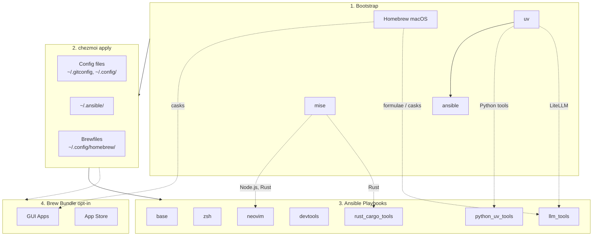

<!-- Generated by SpecStory, Markdown v2.1.0 -->

# 2026-07-02 12:44:55Z

<!-- Codex CLI Session 019f22db-cd78-74b0-be44-4e31b2d1eaad (2026-07-02 12:44:55Z) -->

_**User (2026-07-02 12:44:55Z)**_

[Image #1]  lazygit 如何做到 git pull --rebase (同時如果需要stash的情況能夠自動先stash再pull再stash pop？）

---

_**Agent (gpt-5.5 2026-07-02 12:46:44Z)**_

<think><details><summary>Thought Process</summary>
**Exploring LazyGit Functionality**

It seems the user needs an answer in Chinese about how to perform a `git pull --rebase` with auto-stashing in LazyGit. I think inspecting the configuration may be unnecessary, but I’ll consider if the settings have changed in recent updates. I could look up current documentation to verify the process, as it could evolve. Using local LazyGit configurations might also help, so running `lazygit --version` could be a good step to clarify things!
</details></think>

_**Agent (gpt-5.5 2026-07-02 12:46:44Z)**_

我會先看這個 dotfiles repo 裡 lazygit 的既有設定位置，避免只給泛用答案而漏掉你已經管理的 config。

_**Agent (gpt-5.5 2026-07-02 12:46:46Z)**_

<tool-use data-tool-type="shell" data-tool-name="exec_command"><details>
<summary>Tool use: **exec_command** `sed -n '1,220p' /Users/david/.agents/skills/chezmoi-dotfiles/SKILL.md && rg -n "lazygit|pull.*rebase|autoStash|rebase" -S dot_config docs README.md AGENTS.md 2>/dev/null`</summary>
```
Chunk ID: 7c20c0
Wall time: 0.0387 seconds
Process exited with code 0
Original token count: 8897
Output:
---
name: chezmoi-dotfiles
description: Operate and navigate THIS machine's chezmoi-managed dotfiles from any directory. Use when the user asks how to apply/edit/diff dotfile changes, where a config or custom tool lives, how a keybinding/keymap works (tmux, shell, fzf), what custom in-house CLIs exist (fleet, mlf, pqsum, x, mi-router, …), what Television (tv) channels are available, which tools/features are installed on this host, or how to use chezmoi / ansible / just in this repo. Most detail lives in the repo's docs/, reachable via `chezmoi source-path`.
---
<!-- managed-by: chezmoi-dotfiles (chezmoi source: dot_agents/skills/chezmoi-dotfiles/SKILL.md.tmpl) — do not hand-edit the deployed copy; it re-renders on every `chezmoi apply`. -->

# chezmoi-dotfiles

This machine's `$HOME` is managed by a **chezmoi** (configs) + **ansible** (system
deps) dotfiles repo. This skill is the agent-facing map: how to drive it, and what
custom tooling exists that you wouldn't otherwise know about. It is rendered per-host
— the "What's enabled on THIS machine" section reflects what the user actually
selected at init.

## Orientation (read this first)

- **Repo root**: `chezmoi source-path` (no args) prints the source dir. Work there
  to edit: `cd "$(chezmoi source-path)"`.
- **Source path of one file**: `chezmoi source-path ~/.config/foo/bar` → the
  managed source file for that target.
- **`docs/**` is NOT deployed to `$HOME`** (it's chezmoi-ignored). Read detail via
  `"$(chezmoi source-path)/docs/..."`. A *subset* is deployed to `~/.config/docs/`
  (e.g. keybindings, cli-tools) for runtime helpers.
- **Read the contract before editing**: `"$(chezmoi source-path)/CLAUDE.md"` holds
  Hard invariants and cross-file maintenance rules. Honor them.
- This host: profile `macos_intel`, OS `darwin`/`amd64`, primary shell `zsh`.

## chezmoi essentials

```bash
chezmoi diff                 # preview changes (also: just chezmoi-diff)
chezmoi apply                # deploy + run scripts (also: cas, or just chezmoi-apply)
chezmoi status               # modified/added/removed targets
chezmoi edit ~/.zshrc        # edit the SOURCE of a target
chezmoi add  ~/.config/x     # start managing an existing file
chezmoi re-add               # pull live edits back into source
chezmoi managed | grep foo   # is X managed?
chezmoi cat ~/.config/x      # render a target without applying
chezmoi data | jq            # the template data (ground truth for the toggles below)
```

- **`cas`** = `chezmoi apply` + reload hint; **`cau`** = update from remote then apply
  (defined in `dot_config/shell/99_chezmoi_reload.sh`).
- **`dotcfg`** = reconfigure the init prompts on an already-set-up machine
  (`dotcfg` for the TUI, `dotcfg --set installLlmTools=true --yes` for one toggle,
  `dotcfg --dry-run` to preview). Shell twin: `czcfg`.
- **Never `chezmoi add` a `modify_`/`create_` target** — it overwrites the script.
- Full command cheat-sheet: `docs/this_repo/cheatsheet.md`. Install-vs-upgrade is
  split: `chezmoi apply`/ansible is **install-only**; upgrades go through
  `just upgrade-*`.

## What's enabled on THIS machine

(Rendered from this host's selections. For live truth: `chezmoi data | jq`.)
- **Coding agents** — Claude Code, OpenCode, Cursor, Codex, Gemini, Copilot (configs + CLIs). See `docs/tools/agent-overlays.md`, `docs/tools/agent-skills.md`.
- **Python uv tools** — mlflow, marimo, jupyter, etc. (powers the `mlf` CLI). See `docs/this_repo/uv-bootstrap.md`.
- **Extra runtimes** — rust, bun, ruby via mise (+ cargo/gem tools). Node is always present.
- **LLM tools** — Ollama / LiteLLM / local models.
- **JS CLI tools** — standalone npm CLIs (e.g. readability-cli).
- **.NET tools** — .NET SDK (mise) + dotnet global tools.
- **IaC** — Azure CLI, Terraform, OpenTofu.
- **Media** — ffmpeg, ImageMagick, exiftool, libvips.
- **Networking** — nmap, mtr, httpie, gping, trippy.
- **Tunnels** — ngrok, cloudflared.
- **Vim mode** — shell modal editing + tmux vim nav (NOT Neovim/editors — those are always vim).

## Custom in-house CLIs (always deployed to `~/.dotfiles/bin`, on PATH)

Each works from any cwd. Run with `--help`, or read `docs/tools/<name>.md`. Full list: `ls "$(chezmoi source-path)/dot_dotfiles/bin/"`.

- **`fleet`** — cross-host ops over your machines: `fleet chezmoi apply`, `fleet hosts`, `fleet tmux`, `fleet info`, `fleet pueue`, `fleet exec`. See `docs/this_repo/fleet-apply.md`, `docs/tools/fleet-exec.md`, `docs/tools/fleet-hosts.md`.
- **`mlf`** — MLflow umbrella CLI + TUI dashboard (needs Python uv tools). Picker twin: `tv mlflow`.
- **`pqsum`** — pueue queue summary (text / AI / JSON). See `docs/tools/pueue.md`.
- **`x`** — clipboard/file copy-paste-open with cross-platform fallbacks.
- **`mi-router`** / **`reyee`** / **`sms`** — read-only router CLIs (Xiaomi MiWiFi / Ruijie Reyee / Huawei
... (truncated)
```
</details></tool-use>

_**Agent (gpt-5.5 2026-07-02 12:46:52Z)**_

<think><details><summary>Thought Process</summary>
**Verifying lazygit configuration**

I need to respond, but first, it seems important to verify the lazygit configuration options. I should check in the dot_config/lazygit/config.yml file to find relevant settings. Reading through that config file will help ensure that I'm providing accurate information. Let’s dive in and check what's set up there! This will hopefully clarify any details I need for a proper response.
</details></think>

_**Agent (gpt-5.5 2026-07-02 12:46:52Z)**_

目前 repo 只管理 LazyGit 的 pager，沒有特別改 pull 行為；所以這題主要是 LazyGit 自身設定或 Git 全域設定。

_**Agent (gpt-5.5 2026-07-02 12:46:53Z)**_

<tool-use data-tool-type="shell" data-tool-name="exec_command"><details>
<summary>Tool use: **exec_command** `sed -n '1,200p' dot_config/lazygit/config.yml && lazygit --version || true && git config --show-origin --get-regexp '^(pull\.rebase|rebase\.autoStash|lazygit\.)' || true`</summary>
```
Chunk ID: 8c2c03
Wall time: 0.1463 seconds
Process exited with code 0
Original token count: 53
Output:
git:
  pagers:
    - colorArg: always
      pager: delta --dark --paging=never --syntax-theme base16-256 -s
commit=, build date=, build source=Homebrew, version=0.59.0, os=darwin, arch=amd64, git version=2.53.0
```
</details></tool-use>

_**Agent (gpt-5.5 2026-07-02 12:46:58Z)**_

<think><details><summary>Thought Process</summary>
**Looking into lazgit config**

I’m considering checking the defaults for lazygit configuration. It seems like I could run `lazygit --print-config` to see what it shows. I wonder if that will give me the information I need about the settings. It could be useful to grab the documentation for reference too. Let's see what running that command reveals. I’ll check it out!
</details></think>

_**Agent (gpt-5.5 2026-07-02 12:46:58Z)**_

我再確認一下你這版 LazyGit 的可用 config key，因為 pull/rebase/autostash 這類選項名稱在不同版本文件裡容易被記錯。

_**Agent (gpt-5.5 2026-07-02 12:47:00Z)**_

<tool-use data-tool-type="shell" data-tool-name="exec_command"><details>
<summary>Tool use: **exec_command** `lazygit --help | sed -n '1,180p'; lazygit --print-config 2>/dev/null | rg -n "pull|rebase|stash|auto" -C 3 || true`</summary>
```
Chunk ID: 3c7812
Wall time: 0.0505 seconds
Process exited with code 0
Original token count: 415
Output:
lazygit

  Usage:
    lazygit [git-arg]

  Positional Variables: 
    git-arg   Panel to focus upon opening lazygit. Accepted values (based on git terminology): status, branch, log, stash. Ignored if --filter arg is passed.
  Flags: 
    -h --help               Displays help with available flag, subcommand, and positional value parameters.
    -p --path               Path of git repo. (equivalent to --work-tree=<path> --git-dir=<path>/.git/)
    -f --filter             Path to filter on in `git log -- <path>`. When in filter mode, the commits, reflog, and stash are filtered based on the given path, and some operations are restricted
    -v --version            Print the current version
    -d --debug              Run in debug mode with logging (see --logs flag below). Use the LOG_LEVEL env var to set the log level (debug/info/warn/error)
    -l --logs               Tail lazygit logs (intended to be used when `lazygit --debug` is called in a separate terminal tab)
       --profile            Start the profiler and serve it on http port 6060. See CONTRIBUTING.md for more info.
    -c --config             Print the default config
    -cd --print-config-dir   Print the config directory
    -ucd --use-config-dir     override default config directory with provided directory
    -w --work-tree          equivalent of the --work-tree git argument
    -g --git-dir            equivalent of the --git-dir git argument
    -ucf --use-config-file    Comma separated list to custom config file(s)
    -sm --screen-mode        The initial screen-mode, which determines the size of the focused panel. Valid options: 'normal' (default), 'half', 'full'
```
</details></tool-use>

_**Agent (gpt-5.5 2026-07-02 12:47:04Z)**_

`lazygit --print-config` 不是這版的 flag；這版用 `lazygit --config` 印預設 config。我會用它抓 pull 相關預設。

_**Agent (gpt-5.5 2026-07-02 12:47:06Z)**_

<tool-use data-tool-type="shell" data-tool-name="exec_command"><details>
<summary>Tool use: **exec_command** `lazygit --config | rg -n "pull|rebase|stash|auto" -C 4`</summary>
```
Chunk ID: 228b50
Wall time: 0.0000 seconds
Process exited with code 0
Original token count: 645
Output:
23-    mainPanelSplitMode: flexible
24-    enlargedSideViewLocation: left
25-    wrapLinesInStagingView: true
26-    useHunkModeInStagingView: true
27:    language: auto
28-    timeFormat: 02 Jan 06
29-    shortTimeFormat: 3:04PM
30-    theme:
31-        activeBorderColor:
--
72-    commitHashLength: 8
73-    showBranchCommitHash: false
74-    showDivergenceFromBaseBranch: none
75-    commandLogSize: 8
76:    splitDiff: auto
77-    screenMode: normal
78-    border: rounded
79-    animateExplosion: true
80:    portraitMode: auto
81-    filterMode: substring
82-    spinner:
83-        frames:
84-            - '|'
--
93-git:
94-    pagers: []
95-    commit:
96-        signOff: false
97:        autoWrapCommitMessage: true
98:        autoWrapWidth: 72
99-    merging:
100-        manualCommit: false
101-        args: ""
102-        squashMergeMessage: Squash merge {{selectedRef}} into {{currentBranch}}
103-    mainBranches:
104-        - master
105-        - main
106-    skipHookPrefix: WIP
107:    autoFetch: true
108:    autoRefresh: true
109:    autoForwardBranches: onlyMainBranches
110-    fetchAll: true
111:    autoStageResolvedConflicts: true
112-    branchLogCmd: git log --graph --color=always --abbrev-commit --decorate --date=relative --pretty=medium {{branchName}} --
113-    allBranchesLogCmds:
114-        - git log --graph --all --color=always --abbrev-commit --decorate --date=relative  --pretty=medium
115-    ignoreWhitespaceInDiffView: false
--
201-        scrollDownMain-alt2: <c-d>
202-        executeShellCommand: ':'
203-        createRebaseOptionsMenu: m
204-        pushFiles: P
205:        pullFiles: p
206-        refresh: R
207-        createPatchOptionsMenu: <c-p>
208-        nextTab: ']'
209-        prevTab: '['
--
237-        findBaseCommitForFixup: <c-f>
238-        confirmDiscard: x
239-        ignoreFile: i
240-        refreshFiles: r
241:        stashAllChanges: s
242-        viewStashOptions: S
243-        toggleStagedAll: a
244-        viewResetOptions: D
245-        fetch: f
--
255-        copyPullRequestURL: <c-y>
256-        checkoutBranchByName: c
257-        forceCheckoutBranch: F
258-        checkoutPreviousBranch: '-'
259:        rebaseBranch: r
260-        renameBranch: R
261-        mergeIntoCurrentBranch: M
262-        moveCommitsToNewBranch: "N"
263-        viewGitFlowOptions: i
--
300-    amendAttribute:
301-        resetAuthor: a
302-        setAuthor: A
303-        addCoAuthor: c
304:    stash:
305-        popStash: g
306-        renameStash: r
307-    commitFiles:
308-        checkoutCommitFile: c
```
</details></tool-use>

_**Agent (gpt-5.5 2026-07-02 12:47:17Z)**_

<think><details><summary>Thought Process</summary>
**Considering dotfiles management**

I might need to mention that in the current configuration, there aren't any pull settings. If the user wants their dotfiles managed, I could suggest editing `dot_gitconfig.tmpl`. They didn’t specifically ask me to implement anything yet, but they might want commands or instructions, especially since they referenced "如何做到." It’s important to highlight that the repository manages aliases like `gpra`. I'll also need to clarify the config path and how to modify the managed gitconfig. Time to search for that!
</details></think>

_**Agent (gpt-5.5 2026-07-02 12:47:17Z)**_

結論已經很清楚：要讓 LazyGit 的普通 `p` pull 變成 rebase/autostash，最穩的是設 Git config；LazyGit 會呼叫 git，讓 Git 自己決定 pull 策略。

_**Agent (gpt-5.5 2026-07-02 12:47:18Z)**_

<tool-use data-tool-type="shell" data-tool-name="exec_command"><details>
<summary>Tool use: **exec_command** `rg -n "pull\.rebase|rebase\.autoStash|\[pull\]|\[rebase\]|modify_gitconfig|dot_gitconfig" -S .chezmoiignore.tmpl dot_gitconfig* dot_config scripts docs 2>/dev/null`</summary>
```
Chunk ID: ad3096
Wall time: 0.0000 seconds
Process exited with code 1
Original token count: 10
Output:
zsh:1: no matches found: dot_gitconfig*
```
</details></tool-use>

_**Agent (gpt-5.5 2026-07-02 12:47:24Z)**_

<think><details><summary>Thought Process</summary>
**Troubleshooting glob error**

I’m encountering a zsh glob error, and I’m considering if I really need to do something more about it. It’s possible that no tool is needed, but maybe I should include a managed file for clarity. I need to know the source of the issue, so I could try using `rg --files` to get a better understanding. Let’s see how that goes!
</details></think>

_**Agent (gpt-5.5 2026-07-02 12:47:24Z)**_

<tool-use data-tool-type="shell" data-tool-name="exec_command"><details>
<summary>Tool use: **exec_command** `rg --files | rg '(^|/)dot_gitconfig|modify_gitconfig|gitconfig|lazygit/config'`</summary>
```
Chunk ID: e957a0
Wall time: 0.0000 seconds
Process exited with code 0
Original token count: 14
Output:
modify_dot_gitconfig.tmpl
dot_config/lazygit/config.yml
```
</details></tool-use>

_**Agent (gpt-5.5 2026-07-02 12:47:30Z)**_

我找到 Git config 是用 `modify_dot_gitconfig.tmpl` 管的；如果你要把這變成 dotfiles 預設，就應該改那個 overlay，而不是只手動 `git config --global`。

_**Agent (gpt-5.5 2026-07-02 12:47:32Z)**_

<tool-use data-tool-type="shell" data-tool-name="exec_command"><details>
<summary>Tool use: **exec_command** `sed -n '1,220p' modify_dot_gitconfig.tmpl`</summary>
```
Chunk ID: 53422b
Wall time: 0.0000 seconds
Process exited with code 0
Original token count: 809
Output:
#!/usr/bin/env bash
# modify_ script: render chezmoi-managed baseline gitconfig, then preserve any
# [credential "<URL>"] sections from the existing ~/.gitconfig (typically
# injected by `gh auth setup-git` or `gh auth login --git-protocol https`).
#
# Why modify_: gh CLI rewrites ~/.gitconfig out-of-band on every `gh auth
# login` / `setup-git` invocation, hard-coding the absolute path to the local
# `gh` binary (e.g. /opt/homebrew/bin/gh on Apple Silicon, /usr/local/bin/gh
# on Intel mac, /home/linuxbrew/.linuxbrew/bin/gh on Linux). A plain template
# would clobber that on every `chezmoi apply`, causing a ping-pong fight with
# whatever `gh` wrote last.
#
# Per-machine overrides (proxy, safe.directory, etc.) still belong in
# ~/.gitconfig.local — that's loaded via [include] from the baseline below.
# This script ONLY preserves [credential "<URL>"] blocks; everything else in
# the live file gets replaced by the chezmoi baseline.
#
# DO NOT hand-edit ~/.gitconfig directly — non-credential edits will be
# silently overwritten on the next `chezmoi apply`. Use ~/.gitconfig.local.

set -euo pipefail

# 1. Slurp current target contents from stdin (chezmoi modify_ contract).
existing="$(cat)"

# 2. Emit the chezmoi-managed baseline.
cat <<'CHEZMOI_BASELINE_EOF'
[user]
	email = {{ .email }}
	name = {{ .name }}
[http]
	postBuffer = 524288000
[filter "lfs"]
	clean = git-lfs clean -- %f
	smudge = git-lfs smudge -- %f
	process = git-lfs filter-process
	required = true
[init]
    defaultBranch = main
[core]
    hooksPath = ~/.config/git/hooks
{{- if lookPath "delta" }}
    pager = delta
[interactive]
    diffFilter = delta --color-only
[delta]
    navigate = true
    side-by-side = true
{{- end }}
# Per-machine overrides (safe, credential, http.proxy, etc.) live in
# ~/.gitconfig.local so they don't conflict with chezmoi-managed updates
# to this template. The file is git-ignored by chezmoi (.chezmoiignore)
# and silently skipped by git if it doesn't exist — see
# https://git-scm.com/docs/git-config#_includes. Same pattern as
# ~/.zshrc.adhoc for shell customisations.
[include]
    path = ~/.gitconfig.local
CHEZMOI_BASELINE_EOF

# 3. Extract and re-emit any [credential "<scope>"] sections from the live
#    file. awk captures the section header AND its body (indented or
#    `key = value` lines) until the next [section] header or EOF. The
#    gh-injected absolute path to the gh binary is preserved verbatim — we
#    intentionally do NOT normalize it, so each machine keeps the path that
#    its local `gh auth setup-git` wrote.
if [ -n "$existing" ]; then
  # awk extracts each `[credential "<url>"]` section + its body. We strip
  # leading/trailing blank lines so re-running this script on its own output
  # is idempotent (no blank-line accretion across successive `chezmoi apply`
  # passes).
  preserved="$(printf '%s\n' "$existing" | awk '
    /^\[credential "/ { keep=1; print; next }
    /^\[/             { keep=0 }
    keep              { print }
  ' | awk 'NF { found=1 } found { print }' | awk '
    { lines[NR]=$0 }
    END { for (i=NR; i>0 && lines[i]==""; i--); for (j=1; j<=i; j++) print lines[j] }
  ')"
  if [ -n "$preserved" ]; then
    printf '\n%s\n' "$preserved"
  fi
fi
```
</details></tool-use>

_**Agent (gpt-5.5 2026-07-02 12:47:40Z)**_

<tool-use data-tool-type="shell" data-tool-name="exec_command"><details>
<summary>Tool use: **exec_command** `lazygit --config | sed -n '130,190p'`</summary>
```
Chunk ID: 6cbb5e
Wall time: 0.0000 seconds
Process exited with code 0
Original token count: 367
Output:
    truncateCopiedCommitHashesTo: 12
update:
    method: prompt
    days: 14
refresher:
    refreshInterval: 10
    fetchInterval: 60
confirmOnQuit: false
quitOnTopLevelReturn: false
disableStartupPopups: false
customCommands: []
services: {}
notARepository: prompt
promptToReturnFromSubprocess: true
keybinding:
    universal:
        quit: q
        quit-alt1: <c-c>
        suspendApp: <c-z>
        return: <esc>
        quitWithoutChangingDirectory: Q
        togglePanel: <tab>
        prevItem: <up>
        nextItem: <down>
        prevItem-alt: k
        nextItem-alt: j
        prevPage: ','
        nextPage: .
        scrollLeft: H
        scrollRight: L
        gotoTop: <
        gotoBottom: '>'
        gotoTop-alt: <home>
        gotoBottom-alt: <end>
        toggleRangeSelect: v
        rangeSelectDown: <s-down>
        rangeSelectUp: <s-up>
        prevBlock: <left>
        nextBlock: <right>
        prevBlock-alt: h
        nextBlock-alt: l
        nextBlock-alt2: <tab>
        prevBlock-alt2: <backtab>
        jumpToBlock:
            - "1"
            - "2"
            - "3"
            - "4"
            - "5"
        focusMainView: "0"
        nextMatch: "n"
        prevMatch: "N"
        startSearch: /
        optionMenu: <disabled>
        optionMenu-alt1: '?'
        select: <space>
        goInto: <enter>
        confirm: <enter>
        confirmMenu: <enter>
        confirmSuggestion: <enter>
        confirmInEditor: <a-enter>
```
</details></tool-use>

_**Agent (gpt-5.5 2026-07-02 12:47:48Z)**_

<think><details><summary>Thought Process</summary>
**Exploring custom command syntax**

I might need to look into custom command syntax. Maybe I can search the local documentation or use lazygit for that. It seems there's a defined structure for custom commands, like pulling with rebase and autostashing. I'm curious if the context can be global or just restricted to specific areas like files or commits. I should verify in the documentation or browse official resources for guidance. Let’s see what I can find!
</details></think>

_**Agent (gpt-5.5 2026-07-02 12:47:48Z)**_

<tool-use data-tool-type="shell" data-tool-name="exec_command"><details>
<summary>Tool use: **exec_command** `rg -n "customCommands|context:.*global|loadingText" -S /usr/local/Homebrew /opt/homebrew /usr/local/share /opt/homebrew/share 2>/dev/null | head -80`</summary>
```
Chunk ID: 79c6d0
Wall time: 0.6756 seconds
Process exited with code 0
Original token count: 36
Output:
/usr/local/Homebrew/Library/Homebrew/test/cmd/bundle/install_subcommand_spec.rb:12:      context: bundle_subcommand_context(:install, global:),
```
</details></tool-use>

_**Agent (gpt-5.5 2026-07-02 12:49:33Z)**_

<think><details><summary>Thought Process</summary>
**Considering Git configuration and stashing**

I'm thinking about the current configuration, particularly how including `/.gitconfig.local` impacts machine-specific settings. If it's for just one computer, that makes sense, but for multiple machines, I suggest editing `modify_dot_gitconfig.tmpl`. I need to mention potential conflicts during a `stash pop` since `rebase.autoStash` can create a temporary stash. It’s important to clarify that conflicts won't magically resolve themselves. Also, I might suggest using lazygit to run commands like `git pull --rebase --autostash`.
</details></think>

_**Agent (gpt-5.5 2026-07-02 12:49:33Z)**_

<think><details><summary>Thought Process</summary>
**Finalizing configuration details**

I think I need to ensure there's a clickable file available for convenience. For the final output, it should be in Chinese. I might also want to mention, "You are in lazygit 0.59.0; config file now only pager." I don’t want to go overboard with details, though — just enough to be helpful while keeping it clear and concise for the user. It's important to balance information without overwhelming them!
</details></think>

_**Agent (gpt-5.5 2026-07-02 12:49:40Z)**_

可以。最穩做法是設 **Git config**，讓 LazyGit 的普通 pull 鍵直接變成你要的行為。

在 LazyGit 裡按：

`p` = pull

然後先設定：

```bash
git config --global pull.rebase true
git config --global rebase.autoStash true
```

之後 LazyGit 按 `p` 基本上就等同於：

```bash
git pull --rebase --autostash
```

`rebase.autoStash=true` 會在 working tree dirty 時自動暫存、rebase 完再套回來；如果 stash pop/apply 發生 conflict，還是要手動解 conflict。

你這個 dotfiles repo 目前的 [dot_config/lazygit/config.yml](/Users/david/.local/share/chezmoi/dot_config/lazygit/config.yml) 只設定 delta pager，沒有設定 pull 行為。若只想本機生效，可以放在 `~/.gitconfig.local`。若想納入 dotfiles 管理、所有機器都套用，就加到 [modify_dot_gitconfig.tmpl](/Users/david/.local/share/chezmoi/modify_dot_gitconfig.tmpl)：

```gitconfig
[pull]
    rebase = true
[rebase]
    autoStash = true
```

臨時一次性的話，在 LazyGit 按 `:` 執行 shell command，輸入：

```bash
git pull --rebase --autostash
```

---

_**User (2026-07-02 12:51:56Z)**_

好啊 幫我加到 modify_dot_gitconfig.tmpl 中吧 然後記得在docs之類的地方註記這個行爲

---

_**Agent (gpt-5.5 2026-07-02 12:52:18Z)**_

我會把這設成 chezmoi 管理的 Git baseline，並在 LazyGit 的工具文件補上 `p` pull 現在會走 rebase + autostash。接著會用 `chezmoi cat` 渲染後交給 `git config --file` 檢查。

_**Agent (gpt-5.5 2026-07-02 12:52:18Z)**_

<tool-use data-tool-type="shell" data-tool-name="exec_command"><details>
<summary>Tool use: **exec_command** `sed -n '1,140p' docs/tools/lazygit.md`</summary>
```
Chunk ID: 397550
Wall time: 0.0000 seconds
Process exited with code 0
Original token count: 1074
Output:
# lazygit — history-surgery recipes (cheatsheet)

[lazygit](https://github.com/jesseduffield/lazygit) is the git TUI used here (installed via the `lazyvim_deps` role; bound to `lg`). The everyday stuff (stage, commit, branch) is obvious — this page is the **rebase/amend "surgery" that's hard to remember**, with the **lazygit keys and the equivalent CLI side by side** so you can do it either way.

> **Golden rule: only rewrite commits that have NOT been pushed.** All recipes below rewrite history (new SHAs). If a commit is already on a shared remote, don't — or you'll need `git push --force-with-lease` and coordination.

## The mental model: two different "fixup"s

The word *fixup* shows up in two unrelated lazygit operations — confusing them is the #1 way to mangle history:

| Goal | lazygit | What it does |
|---|---|---|
| Add **working-tree changes** into an existing commit | **`A`** (Commits panel) = *amend commit with staged changes* | Runs `git commit --fixup` + `git rebase --autosquash` under the hood |
| Merge **two existing commits** into one | **`f`** / **`c`** (Commits panel) = *fixup / squash* | Squashes the **selected** commit **into the one below it** (older) |

So `A` = "put my edits into that old commit"; `f` = "glue these two commits together". Reaching for `f` to add a file will mash neighbouring commits instead.

## Recipe: add an uncommitted file into an OLDER commit

**lazygit**
1. **Files** panel: press **`<space>`** on *only* the file you want. **Do not press `a`** — that's *stage all* and will sweep unrelated edits into the amend.
2. **Commits** panel: select the target commit → **`A`**.

**CLI**
```bash
git add path/to/file
git commit --fixup=<target-sha>
git rebase --autosquash --autostash <target-sha>~1
# non-interactive (skip the editor): prefix with  GIT_SEQUENCE_EDITOR=true
```

## Recipe: pull ONE file OUT of a commit, back to the working tree

The inverse — un-commit a single file from an unpushed commit into "not staged" changes. lazygit's **custom patch** is the native tool.

**lazygit**
1. **Commits** panel: select the commit → **`<enter>`** to view its files.
2. Highlight the file → **`<space>`** (adds the whole file to the custom patch — it gets marked).
3. **`<ctrl+p>`** → *View custom patch options* → **`move patch out into index`**. This rewrites the commit without the file and stages the change.
4. **Files** panel: **`<space>`** on the file to **unstage** it → now it's a *Changes not staged* edit.

> In the patch menu, `move patch out into index` is what you want. `remove patch from original commit` **discards** the change (lost) — don't pick that if you want to keep it.

**CLI**
```bash
git rebase -i <sha>~1                 # mark <sha> as 'edit', save & quit
git reset HEAD^ -- path/to/file       # un-commit just that file -> working-tree change
git commit --amend --no-edit          # re-make the commit without it
git rebase --continue
```

## Recipe: recover from a botched rebase

**lazygit** — **`z`** undo / **`Z`** redo (works on branch/commit ops; the worktree must be clean). For deeper recovery use the reflog via CLI:

**CLI**
```bash
git reflog                       # find the good SHA from before the mess (e.g. the original HEAD)
git reset --hard <good-sha>      # restore branch + worktree to that point
```

- **Gotcha:** `git reset --hard` **deletes files that were staged as new adds** (e.g. a freshly `git add`ed plan file) — back them up first. It leaves *plain untracked* files alone.
- Re-apply any uncommitted WIP you want to keep afterwards (e.g. `git diff > /tmp/wip.patch` before, `git apply /tmp/wip.patch` after).

## Footguns

- **`a` = stage ALL** in lazygit. It silently sweeps unrelated edits (e.g. a transient config tweak) into whatever amend/fixup you do next. Stage one file with **`<space>`**.
- After any of these, the commit's **SHA changes**. Fine for local commits; push normally (force only if it was already pushed).
- Commit discipline when files are partially staged: `git reset` to clear the index, then `git add` exactly what you mean before `git commit`.

## See also

- [git diff workflow](git_diff_workflow.md)
- Per-tool tips/recipes live under `docs/tools/<tool>.md` — this page is the home for git/lazygit recipes.
```
</details></tool-use>

_**Agent (gpt-5.5 2026-07-02 12:52:18Z)**_

<tool-use data-tool-type="shell" data-tool-name="exec_command"><details>
<summary>Tool use: **exec_command** `sed -n '1,260p' README.md`</summary>
```
Chunk ID: 1ffd48
Wall time: 0.0000 seconds
Process exited with code 0
Original token count: 7205
Output:
# dotfiles

Cross-platform development environment setup using **chezmoi** + **ansible**.

- **chezmoi**: manages config files (dotfiles)
- **ansible**: installs system dependencies and tools

## Prerequisites

- [chezmoi](https://www.chezmoi.io/install/)
- [uv](https://docs.astral.sh/uv/getting-started/installation/) (for ansible)

## Architecture



## Quick Setup

### Interactive (recommended)

```bash
curl -fsSL https://raw.githubusercontent.com/daviddwlee84/dotfiles/main/bootstrap.sh | bash
```

Installs [`uv`](https://docs.astral.sh/uv/) (if missing) and launches `dotfiles-init` — a Python wrapper that groups the ~19 chezmoi prompts into a clean multi-select UI, offers pre-set bundles (`personal-mac` / `work-mac` / `server-linux` / `cloud-vm` / `minimal`), checks SSH keys, then calls real `chezmoi init` with your answers pre-filled. Full docs: [`scripts/init/README.md`](scripts/init/README.md).

On first-run or slow networks the `uv` resolver can sit silently for a few minutes — use the verbose form to see timestamped progress + `uv --verbose` resolver output + `set -x`:

```bash
curl -fsSL https://raw.githubusercontent.com/daviddwlee84/dotfiles/main/bootstrap.sh | DOTFILES_BOOTSTRAP_VERBOSE=1 bash
```

Pass extra args through to the wrapper via `bash -s --` (e.g. run the schema-parity checker instead of the default `init`):

```bash
curl -fsSL https://raw.githubusercontent.com/daviddwlee84/dotfiles/main/bootstrap.sh | bash -s -- doctor
```

Behind GFW? Set `DOTFILES_RAW_URL` / `DOTFILES_REF` to point at a mirror, or use the non-interactive path below.

### Non-interactive (direct chezmoi)

```bash
# Installs chezmoi to ~/.local/bin and walks through the raw prompts one-by-one.
# Uses HTTPS to avoid SSH key setup on fresh machines.
export GITHUB_USERNAME=daviddwlee84
sh -c "$(curl -fsLS get.chezmoi.io)" -- -b "$HOME/.local/bin" init --apply "https://github.com/$GITHUB_USERNAME/dotfiles.git"

# After install, switch the chezmoi source repo to SSH (so future `chezmoi update` uses your SSH key):
#   chezmoi cd
#   git remote set-url origin git@github.com:$GITHUB_USERNAME/dotfiles.git
#   exit
```

This automatically:

1. Bootstraps Homebrew (macOS/Linux), uv, mise, ansible
2. Deploys all config files
3. Runs ansible playbooks (git, ripgrep, fd, neovim, etc.)
4. Runs brew bundle (if `installBrewApps` is enabled, or on macOS if `installAiDesktopApps` / `installGamingApps` is enabled)

#### Sudo password injection (when chezmoi can't open `/dev/tty`)

Some Linux environments — notably **CentOS 7 + AD/LDAP user with high UID** where `pam_systemd` never created `/run/user/<UID>/` — leave the chezmoi-spawned bootstrap script unable to open `/dev/tty`, so the shared sudo helper can't prompt and Linuxbrew aborts with `Insufficient permissions to install Homebrew to "/home/linuxbrew/.linuxbrew"`. The fix is to pre-stage the password via `CHEZMOI_SUDO_PASSWORD_FILE` (the same env-var [`fleet_apply`](docs/this_repo/fleet-apply.md) uses over SSH).

The repo ships [`scripts/apply_with_sudo.sh`](scripts/apply_with_sudo.sh) to handle the prompt → 0600 tmpfile → export → run → `shred` dance:

```bash
# First time (chezmoi not installed yet):
sh -c "$(curl -fsLS get.chezmoi.io)" -- -b "$HOME/.local/bin"   # install chezmoi only
bash <(curl -fsSL https://raw.githubusercontent.com/$GITHUB_USERNAME/dotfiles/main/scripts/apply_with_sudo.sh) \
  --init "https://github.com/$GITHUB_USERNAME/dotfiles.git"

# Re-runs (after chezmoi source is cloned at ~/.local/share/chezmoi):
just apply-with-sudo                                              # interactive prompt
just apply-with-sudo --pass-from-env                              # reads $SUDO_PASSWORD
SUDO_PASSWORD=xxx just apply-with-sudo --pass-from-env            # one-liner
```

The wrapper validates the password against `sudo -v` before invoking `chezmoi`, then shreds the tmpfile on exit (any signal). Inside chezmoi's run-scripts, `sudo_sessio
... (truncated)
```
</details></tool-use>

_**Agent (gpt-5.5 2026-07-02 12:52:19Z)**_

<tool-use data-tool-type="shell" data-tool-name="exec_command"><details>
<summary>Tool use: **exec_command** `sed -n '1,130p' docs/tools/git_diff_workflow.md`</summary>
```
Chunk ID: dbd2e3
Wall time: 0.0000 seconds
Process exited with code 0
Original token count: 678
Output:
# Git Diff Workflow

This repo manages a small Git review stack instead of forcing a single tool to do everything:

- `delta` is the default pager for normal `git diff`, `git show`, and other CLI diff output.
- `diffnav` is a GitHub-style diff navigator with a file tree, useful when you want to move around larger patches quickly.
- `gh-dash` is the GitHub dashboard and review UI; its diff pager is configured to call `diffnav`.
- `lazygit` stays focused on repo operations inside LazyVim, with `delta` configured as its custom pager.

## Managed Config Files

This workflow is managed globally through these files:

- `~/.gitconfig` keeps `delta` as the default Git pager.
- `~/.config/gh-dash/config.yml` sets `pager.diff: "diffnav"`.
- `~/.config/lazygit/config.yml` uses LazyGit's current `git.pagers` syntax with `delta`.
- `~/.config/bat/themes/tokyonight_night.tmTheme` provides the shared Tokyo Night theme used by `bat` previews.

## Why Both `delta` and `diffnav`

`delta` is still the best default for everyday Git CLI output. It is fast, readable, and already fits `git diff` and LazyGit well.

`diffnav` solves a different problem: navigating large review diffs with a file tree and a GitHub-like layout. That makes it a better fit for `gh-dash` than replacing `delta` everywhere.

## `gh-dash` + `diffnav`

`gh-dash` is installed as a `gh` extension and reads the global config at `~/.config/gh-dash/config.yml`. This repo intentionally keeps that config minimal:

```yaml
pager:
  diff: "diffnav"
```

That gives `gh-dash` a better diff viewer without importing personalized sections, colors, or keybindings from other dotfiles.

Before using `gh-dash`, authenticate GitHub CLI once:

```bash
gh auth login
gh dash
```

## LazyGit + `delta`

LazyGit's current pager configuration uses `git.pagers`, not the older `git.paging` key:

```yaml
git:
  pagers:
    - colorArg: always
      pager: delta --dark --paging=never --syntax-theme base16-256 -s
```

This keeps LazyGit aligned with the existing `delta`-first CLI setup while avoiding the outdated config shape from the old issue thread.

## Fonts and Theme

Both `diffnav` and `gh-dash` look better with a Nerd Font because their interfaces rely on icon glyphs. This repo already manages Hack Nerd Font on desktop profiles.

The `bat` Tokyo Night warning is fixed by managing the upstream `tokyonight_night.tmTheme` file directly and rebuilding the bat theme cache after apply.

## References

- [diffnav](https://github.com/dlvhdr/diffnav)
- [gh-dash docs](https://www.gh-dash.dev/getting-started/)
- [LazyGit custom pagers](https://github.com/jesseduffield/lazygit/blob/master/docs/Custom_Pagers.md)
- [bat](https://github.com/sharkdp/bat)
```
</details></tool-use>

_**Agent (gpt-5.5 2026-07-02 12:52:19Z)**_

<tool-use data-tool-type="shell" data-tool-name="exec_command"><details>
<summary>Tool use: **exec_command** `git status --short`</summary>
```
Chunk ID: 01abbe
Wall time: 0.0689 seconds
Process exited with code 0
Original token count: 68
Output:
 M .specstory/history/2026-02-07_12-35-23Z-i-added-macos-intel.md
 M .specstory/history/2026-05-28_09-05-18Z-x-copy-dot-dotfiles.md
 M .specstory/history/2026-07-02_03-57-00Z-https-sshpass-com-https.md
?? .specstory/history/2026-07-02_12-44-54Z-image-hash-1-lazygit.md
```
</details></tool-use>

_**Agent (gpt-5.5 2026-07-02 12:52:27Z)**_

另外我看到 worktree 裡已有幾個 `.specstory/history` 變更，其中包含新的未追蹤 transcript；這和本次改動無關，我不會碰它們。因為這個 repo 對 agent artifact 有額外規則，我先讀一下對應 hygiene skill，確保不踩到提交/掃描規範。

_**Agent (gpt-5.5 2026-07-02 12:52:30Z)**_

<tool-use data-tool-type="shell" data-tool-name="exec_command"><details>
<summary>Tool use: **exec_command** `sed -n '1,260p' /Users/david/.local/share/chezmoi/.agents/skills/agent-history-hygiene/SKILL.md 2>/dev/null || sed -n '1,260p' /Users/david/.local/share/chezmoi/.codex/skills/agent-history-hygiene/SKILL.md 2>/dev/null || sed -n '1,260p' /Users/david/.local/share/chezmoi/.agents/skills/agent-history-hygiene/SKILL.md`</summary>
```
Chunk ID: f0eeb7
Wall time: 0.0000 seconds
Process exited with code 0
Original token count: 3239
Output:
---
name: agent-history-hygiene
description: Commit SpecStory chat transcripts (`.specstory/history/*.md`), Claude Code plan files (`.claude/plans/*.md`, `plansDirectory`), and other coding-agent artifacts (`.cursor/plans/`, `.cursor/rules/`, `.opencode/plans/`, `.specify/`, `.codex/`) alongside the feature diff they produced — without leaking `.env` contents, API keys, or private-key PEM blocks into git history. Use when the user says "commit my chat", "save this specstory session", "stage the plan file", "scrub the transcript", "my .env leaked in chat", "bootstrap pre-commit for this project", or when you notice untracked `.specstory/history/*.md` or `.claude/plans/*.md` files while running `git status`. Also use after an accidental push of a secret to enforce rotate-first, rewrite-last remediation instead of reflexive `git push --force`.
---

# agent-history-hygiene

Keep agent chat transcripts and plan files committed together with the
code they produced, without leaking secrets. Pairs with the
`redact-agent-secrets` + `gitleaks` pre-commit hooks the skill installs.

Three surfaces, separated by purpose:

| Surface                          | Question it answers                                          |
|----------------------------------|--------------------------------------------------------------|
| `find-session.sh`                | "Which transcript / plan file is *my* current session?"      |
| `stage-agent-artifacts.sh`       | "Which agent files belong in the next commit?"               |
| `bootstrap-project.sh`           | "How do I get pre-commit + gitleaks + redactor into a repo?" |
| `scan-staged.sh`                 | "Is there a leaked secret in what I'm about to commit?"      |
| `references/remediation.md`      | "I already pushed a secret — now what?"                      |

## Core invariants

1. **Agent transcripts and plan files are committed alongside the diff
   that produced them.** Never add them to `.gitignore`. An agent that
   drops these from a commit has broken the user's review trail.
2. **Rotate at the provider before any git rewrite.** The only act
   that revokes a leaked credential is rotation. History rewriting
   scrubs bytes on one clone and leaves them on every other.
3. **`git push --force` against a shared branch is never the fix for a
   leak.** At best it's useless; at worst it destroys teammate work and
   silently re-introduces the secret when someone merges their old
   history back.

## When to use this skill

Use it when the user (or you) surface any of:

- "Commit my chat" / "save the specstory session" / "include the plan
  file in this commit" / "把 plan 跟 specstory 一起 commit 進去".
- You see dirty `.specstory/history/*.md`, `.claude/plans/*.md`,
  `.cursor/plans/*.md`, or any other configured agent artifact during
  `git status` and you're about to commit a feature.
- "Scrub this transcript" / "redact my key" / "gitleaks flagged my
  chat history".
- "Set up pre-commit for this repo" / "I'm starting a new project — how
  do I get the hook stack?" / "bootstrap secret scanning here".
- "I pushed a `.env`" / "a secret went to main" / "do I need to force
  push?" — the agent must steer to `references/remediation.md` and
  stop the user from force-pushing reflexively.

## When NOT to use

- The user explicitly wants agent transcripts **excluded** from the
  repo. Respect that; suggest a one-liner `.gitignore` addition and
  skip this skill entirely.
- The leak is already on a shared `main`/release branch. Do **not**
  offer to rewrite history — jump to `references/remediation.md` §5.
- The project genuinely has no agent session (no `.specstory/`, no
  `.claude/plans/`, etc.). Nothing to stage.
- Single-file, single-commit hygiene that the agent handles without any
  script (e.g., adding a missing trailing newline).

## Integration with existing infrastructure

This skill sits **on top of** any chezmoi-managed stack the user
already has. It does not duplicate:

- **chezmoi's global `core.hooksPath`** (`~/.config/git/hooks/pre-commit`)
  — that wrapper runs the repo's `.pre-commit-config.yaml` and then
  optionally `gitleaks git --staged`. The skill bootstraps the repo-level
  config the wrapper expects to find.
- **chezmoi's `.gitleaks.toml`** — the user's config already carries
  curated rules for common API keys (OpenAI, Anthropic, Supabase,
  Linear, WakaTime, Cursor, HuggingFace, Notion, Tailscale, Clash /
  V2Ray tokens). The skill's `assets/gitleaks.toml.template` ships the
  same rule IDs so `.gitleaksignore` / allowlist tweaks stay portable.
- **chezmoi's `scripts/redact_secrets.py`** — remains the upstream
  source of truth. The skill bundles a copy so non-chezmoi users get
  protection; sync procedure in
  [`references/pre-commit-redaction-stack.md`](references/pre-commit-redaction-stack.md).

What this skill **adds**:

... (truncated)
```
</details></tool-use>

_**Agent (gpt-5.5 2026-07-02 12:52:39Z)**_

<think><details><summary>Thought Process</summary>
**Updating documentation and config files**

I'm thinking about applying a patch and possibly updating the README due to changes in the config file. I should mention pull requests in the gitconfig and definitely update `docs/tools/lazygit.md` along with the git_diff_workflow documentation. Since the config was touched, it makes sense to update the README too. I'm curious if there are zh-TW mirrors for lazygit, but I only see docs/tools/lazygit.md. It seems safer to just update the README and the lazygit documentation.
</details></think>

_**Agent (gpt-5.5 2026-07-02 12:52:39Z)**_

我準備做三個小改動：Git baseline 增加 `[pull] rebase=true` 和 `[rebase] autoStash=true`，README 的 `~/.gitconfig` 條目補上行為摘要，LazyGit cheatsheet 補上 `p` pull 的實際效果。

_**Agent (gpt-5.5 2026-07-02 12:52:48Z)**_

<tool-use data-tool-type="write" data-tool-name="apply_patch"><details>
<summary>Tool use: **apply_patch**</summary>
**Update: `modify_dot_gitconfig.tmpl`**

```diff
@@
 [init]
     defaultBranch = main
 [core]
     hooksPath = ~/.config/git/hooks
+[pull]
+    rebase = true
+[rebase]
+    autoStash = true
 {{- if lookPath "delta" }}
     pager = delta
 [interactive]
     diffFilter = delta --color-only
```

**Update: `README.md`**

```diff
@@
-- `~/.gitconfig` - Git configuration; managed via `modify_` so `gh auth setup-git`'s `[credential "..."]` blocks (with the per-machine absolute path to `gh`) survive `chezmoi apply` ([docs](docs/tools/gh-cli.md))
+- `~/.gitconfig` - Git configuration; managed via `modify_` so `gh auth setup-git`'s `[credential "..."]` blocks (with the per-machine absolute path to `gh`) survive `chezmoi apply`; default pull behavior is rebase + autostash (`pull.rebase=true`, `rebase.autoStash=true`) so LazyGit's `p` pull keeps local dirty work across the rebase ([docs](docs/tools/gh-cli.md), [LazyGit notes](docs/tools/lazygit.md))
```

**Update: `docs/tools/lazygit.md`**

```diff
@@
 > **Golden rule: only rewrite commits that have NOT been pushed.** All recipes below rewrite history (new SHAs). If a commit is already on a shared remote, don't — or you'll need `git push --force-with-lease` and coordination.
 
+## Managed pull behavior
+
+This dotfiles repo sets Git's global baseline to:
+
+```gitconfig
+[pull]
+    rebase = true
+[rebase]
+    autoStash = true
+```
+
+So LazyGit's normal **`p`** pull runs as a rebase pull, and dirty working-tree changes are stashed before the rebase and re-applied afterwards. If the re-applied stash conflicts, resolve it like any other Git conflict.
+
 ## The mental model: two different "fixup"s
 
 The word *fixup* shows up in two unrelated lazygit operations — confusing them is the #1 way to mangle history:
```


```
Exit code: 0
Wall time: 0 seconds
Output:
Success. Updated the following files:
M modify_dot_gitconfig.tmpl
M README.md
M docs/tools/lazygit.md
```
</details></tool-use>

_**Agent (gpt-5.5 2026-07-02 12:53:01Z)**_

改動已完成，現在我會渲染 `~/.gitconfig` 並用 Git 自己的 parser 檢查這兩個 key，另外看一下 diff 確認文件描述和設定一致。

_**Agent (gpt-5.5 2026-07-02 12:53:01Z)**_

<tool-use data-tool-type="shell" data-tool-name="exec_command"><details>
<summary>Tool use: **exec_command** `git config --file <(chezmoi cat ~/.gitconfig) --get pull.rebase && git config --file <(chezmoi cat ~/.gitconfig) --get rebase.autoStash`</summary>
```
Chunk ID: 967243
Wall time: 2.2546 seconds
Process exited with code 0
Original token count: 3
Output:
true
true
```
</details></tool-use>

_**Agent (gpt-5.5 2026-07-02 12:53:02Z)**_

<tool-use data-tool-type="shell" data-tool-name="exec_command"><details>
<summary>Tool use: **exec_command** `git diff -- modify_dot_gitconfig.tmpl README.md docs/tools/lazygit.md`</summary>
```
Chunk ID: 0368ed
Wall time: 0.1039 seconds
Process exited with code 0
Original token count: 669
Output:
diff --git a/README.md b/README.md
index fdeec41..5bb3088 100644
--- a/README.md
+++ b/README.md
@@ -183,7 +183,7 @@ See [`scripts/init/README.md`](scripts/init/README.md) → "Reconfigure".
 
 ### Config Files
 
-- `~/.gitconfig` - Git configuration; managed via `modify_` so `gh auth setup-git`'s `[credential "..."]` blocks (with the per-machine absolute path to `gh`) survive `chezmoi apply` ([docs](docs/tools/gh-cli.md))
+- `~/.gitconfig` - Git configuration; managed via `modify_` so `gh auth setup-git`'s `[credential "..."]` blocks (with the per-machine absolute path to `gh`) survive `chezmoi apply`; default pull behavior is rebase + autostash (`pull.rebase=true`, `rebase.autoStash=true`) so LazyGit's `p` pull keeps local dirty work across the rebase ([docs](docs/tools/gh-cli.md), [LazyGit notes](docs/tools/lazygit.md))
 - `~/.config/git/hooks/` - Global Git hooks (via a global `core.hooksPath`): managed `pre-commit` (gitleaks) + Git LFS hooks, all hardened to skip gracefully — PATH-robust and non-fatal so a stripped-PATH clone like `brew tap` can't break (see [pitfall](pitfalls/git-lfs-global-hook-breaks-brew-tap.md))
 - `~/.config/gh-dash/config.yml` - Global gh-dash config, with `diffnav` as the diff pager
 - `~/.config/lazygit/config.yml` - Global LazyGit config, with `delta` as the custom diff pager
diff --git a/docs/tools/lazygit.md b/docs/tools/lazygit.md
index bba44f7..84556e1 100644
--- a/docs/tools/lazygit.md
+++ b/docs/tools/lazygit.md
@@ -4,6 +4,19 @@
 
 > **Golden rule: only rewrite commits that have NOT been pushed.** All recipes below rewrite history (new SHAs). If a commit is already on a shared remote, don't — or you'll need `git push --force-with-lease` and coordination.
 
+## Managed pull behavior
+
+This dotfiles repo sets Git's global baseline to:
+
+```gitconfig
+[pull]
+    rebase = true
+[rebase]
+    autoStash = true
+```
+
+So LazyGit's normal **`p`** pull runs as a rebase pull, and dirty working-tree changes are stashed before the rebase and re-applied afterwards. If the re-applied stash conflicts, resolve it like any other Git conflict.
+
 ## The mental model: two different "fixup"s
 
 The word *fixup* shows up in two unrelated lazygit operations — confusing them is the #1 way to mangle history:
diff --git a/modify_dot_gitconfig.tmpl b/modify_dot_gitconfig.tmpl
index 71a9e70..a5b454b 100644
--- a/modify_dot_gitconfig.tmpl
+++ b/modify_dot_gitconfig.tmpl
@@ -39,6 +39,10 @@ cat <<'CHEZMOI_BASELINE_EOF'
     defaultBranch = main
 [core]
     hooksPath = ~/.config/git/hooks
+[pull]
+    rebase = true
+[rebase]
+    autoStash = true
 {{- if lookPath "delta" }}
     pager = delta
 [interactive]
```
</details></tool-use>

_**Agent (gpt-5.5 2026-07-02 12:53:02Z)**_

<tool-use data-tool-type="shell" data-tool-name="exec_command"><details>
<summary>Tool use: **exec_command** `git status --short`</summary>
```
Chunk ID: 16d881
Wall time: 0.1117 seconds
Process exited with code 0
Original token count: 84
Output:
 M .specstory/history/2026-02-07_12-35-23Z-i-added-macos-intel.md
 M .specstory/history/2026-05-28_09-05-18Z-x-copy-dot-dotfiles.md
 M .specstory/history/2026-07-02_03-57-00Z-https-sshpass-com-https.md
 M README.md
 M docs/tools/lazygit.md
 M modify_dot_gitconfig.tmpl
?? .specstory/history/2026-07-02_12-44-54Z-image-hash-1-lazygit.md
```
</details></tool-use>

_**Agent (gpt-5.5 2026-07-02 12:53:18Z)**_

<think><details><summary>Thought Process</summary>
**Evaluating chezmoi operations**

I’m considering running `chezmoi diff` for validation with git, although linking to new docs isn’t necessary. User mentioned it might be enough to reference existing documentation. I need to be careful since they want to add to the template rather than apply changes directly. Should I run `chezmoi apply` for their current `.gitconfig`? Modifying dotfiles typically involves running it, yet changes won’t reflect until then. I need to assess if we should proceed with applying those changes after all.
</details></think>

_**Agent (gpt-5.5 2026-07-02 12:53:18Z)**_

<think><details><summary>Thought Process</summary>
**Inspecting and applying chezmoi changes**

I need to check the differences first, so running `chezmoi diff /.gitconfig` seems like a good idea. This way, I can validate what changes I’m about to make and ensure I’m careful not to disrupt any sensitive information like credentials. Since the credential helper path isn't secret, it might be okay to inspect it, but I should avoid outputting personal data. Once I’ve confirmed the diff, I’ll apply the changes to ensure the live configuration is updated correctly.
</details></think>

_**Agent (gpt-5.5 2026-07-02 12:53:19Z)**_

模板已通過渲染檢查。為了讓本機 LazyGit 立刻吃到這個行為，我會只套用 `~/.gitconfig` 這個 target，不跑整個 `chezmoi apply`。

_**Agent (gpt-5.5 2026-07-02 12:53:20Z)**_

<tool-use data-tool-type="shell" data-tool-name="exec_command"><details>
<summary>Tool use: **exec_command** `chezmoi apply ~/.gitconfig && git config --global --get pull.rebase && git config --global --get rebase.autoStash`</summary>
```
Chunk ID: 11fdf4
Wall time: 1.1891 seconds
Process exited with code 0
Original token count: 27
Output:
chezmoi: warning: config file template has changed, run chezmoi init to regenerate config file
true
true
```
</details></tool-use>

_**Agent (gpt-5.5 2026-07-02 12:53:32Z)**_

<tool-use data-tool-type="shell" data-tool-name="exec_command"><details>
<summary>Tool use: **exec_command** `nl -ba modify_dot_gitconfig.tmpl | sed -n '34,50p'`</summary>
```
Chunk ID: f14161
Wall time: 0.0000 seconds
Process exited with code 0
Original token count: 116
Output:
    34		clean = git-lfs clean -- %f
    35		smudge = git-lfs smudge -- %f
    36		process = git-lfs filter-process
    37		required = true
    38	[init]
    39	    defaultBranch = main
    40	[core]
    41	    hooksPath = ~/.config/git/hooks
    42	[pull]
    43	    rebase = true
    44	[rebase]
    45	    autoStash = true
    46	{{- if lookPath "delta" }}
    47	    pager = delta
    48	[interactive]
    49	    diffFilter = delta --color-only
    50	[delta]
```
</details></tool-use>

_**Agent (gpt-5.5 2026-07-02 12:53:32Z)**_

<tool-use data-tool-type="shell" data-tool-name="exec_command"><details>
<summary>Tool use: **exec_command** `nl -ba docs/tools/lazygit.md | sed -n '1,28p'`</summary>
```
Chunk ID: b979e0
Wall time: 0.0000 seconds
Process exited with code 0
Original token count: 442
Output:
     1	# lazygit — history-surgery recipes (cheatsheet)
     2	
     3	[lazygit](https://github.com/jesseduffield/lazygit) is the git TUI used here (installed via the `lazyvim_deps` role; bound to `lg`). The everyday stuff (stage, commit, branch) is obvious — this page is the **rebase/amend "surgery" that's hard to remember**, with the **lazygit keys and the equivalent CLI side by side** so you can do it either way.
     4	
     5	> **Golden rule: only rewrite commits that have NOT been pushed.** All recipes below rewrite history (new SHAs). If a commit is already on a shared remote, don't — or you'll need `git push --force-with-lease` and coordination.
     6	
     7	## Managed pull behavior
     8	
     9	This dotfiles repo sets Git's global baseline to:
    10	
    11	```gitconfig
    12	[pull]
    13	    rebase = true
    14	[rebase]
    15	    autoStash = true
    16	```
    17	
    18	So LazyGit's normal **`p`** pull runs as a rebase pull, and dirty working-tree changes are stashed before the rebase and re-applied afterwards. If the re-applied stash conflicts, resolve it like any other Git conflict.
    19	
    20	## The mental model: two different "fixup"s
    21	
    22	The word *fixup* shows up in two unrelated lazygit operations — confusing them is the #1 way to mangle history:
    23	
    24	| Goal | lazygit | What it does |
    25	|---|---|---|
    26	| Add **working-tree changes** into an existing commit | **`A`** (Commits panel) = *amend commit with staged changes* | Runs `git commit --fixup` + `git rebase --autosquash` under the hood |
    27	| Merge **two existing commits** into one | **`f`** / **`c`** (Commits panel) = *fixup / squash* | Squashes the **selected** commit **into the one below it** (older) |
    28
```
</details></tool-use>

_**Agent (gpt-5.5 2026-07-02 12:53:32Z)**_

<tool-use data-tool-type="shell" data-tool-name="exec_command"><details>
<summary>Tool use: **exec_command** `nl -ba README.md | sed -n '183,191p'`</summary>
```
Chunk ID: d836b7
Wall time: 0.0000 seconds
Process exited with code 0
Original token count: 360
Output:
   183	
   184	### Config Files
   185	
   186	- `~/.gitconfig` - Git configuration; managed via `modify_` so `gh auth setup-git`'s `[credential "..."]` blocks (with the per-machine absolute path to `gh`) survive `chezmoi apply`; default pull behavior is rebase + autostash (`pull.rebase=true`, `rebase.autoStash=true`) so LazyGit's `p` pull keeps local dirty work across the rebase ([docs](docs/tools/gh-cli.md), [LazyGit notes](docs/tools/lazygit.md))
   187	- `~/.config/git/hooks/` - Global Git hooks (via a global `core.hooksPath`): managed `pre-commit` (gitleaks) + Git LFS hooks, all hardened to skip gracefully — PATH-robust and non-fatal so a stripped-PATH clone like `brew tap` can't break (see [pitfall](pitfalls/git-lfs-global-hook-breaks-brew-tap.md))
   188	- `~/.config/gh-dash/config.yml` - Global gh-dash config, with `diffnav` as the diff pager
   189	- `~/.config/lazygit/config.yml` - Global LazyGit config, with `delta` as the custom diff pager
   190	- `~/.config/bat/themes/tokyonight_night.tmTheme` - Managed Tokyo Night theme for bat; apply rebuilds the bat cache and clears it if the cache is incompatible with `delta`
   191	- `~/.config/nvim/` - Neovim (LazyVim) configuration; system clipboard via `unnamedplus`, with an SSH-conditional OSC 52 override so remote yanks reach the local clipboard (pairs with tmux `set-clipboard on`, see [docs](docs/tools/tmux/README.md#osc-52-clipboard-ssh-friendly-yank))
```
</details></tool-use>

_**Agent (gpt-5.5 2026-07-02 12:53:43Z)**_

已加好並套用到本機。

改動：
- [modify_dot_gitconfig.tmpl](/Users/david/.local/share/chezmoi/modify_dot_gitconfig.tmpl:42) 加了：
  ```gitconfig
  [pull]
      rebase = true
  [rebase]
      autoStash = true
  ```
- [docs/tools/lazygit.md](/Users/david/.local/share/chezmoi/docs/tools/lazygit.md:7) 註記 LazyGit 的 `p` pull 現在會走 rebase + autostash。
- [README.md](/Users/david/.local/share/chezmoi/README.md:186) 的 `~/.gitconfig` 條目也補上這個行為。

驗證：
- `chezmoi cat ~/.gitconfig` 渲染後用 `git config --file` 讀取，`pull.rebase=true`、`rebase.autoStash=true`。
- 已執行 `chezmoi apply ~/.gitconfig`，本機 `git config --global --get ...` 也確認兩個值都是 `true`。

`chezmoi apply` 有吐一個既有警告：`config file template has changed, run chezmoi init to regenerate config file`，但 `~/.gitconfig` target 已成功套用。

---

_**User (2026-07-02 12:56:30Z)**_

[Image #1] 看起來會autostash但不會auto stash pop？

---

_**Agent (gpt-5.5 2026-07-02 12:56:50Z)**_

對，這個輸出代表 Git 有嘗試把 autostash 套回來，但套回時遇到 conflict，所以它刻意沒有 drop 掉 stash。我要先看現在 worktree/stash 狀態，避免建議你直接 `stash pop` 造成重複套用或更亂。

_**Agent (gpt-5.5 2026-07-02 12:56:50Z)**_

<tool-use data-tool-type="shell" data-tool-name="exec_command"><details>
<summary>Tool use: **exec_command** `git status --short && git status --porcelain=v1 -uall`</summary>
```
Chunk ID: db458b
Wall time: 0.1906 seconds
Process exited with code 0
Original token count: 168
Output:
 M .specstory/history/2026-02-07_12-35-23Z-i-added-macos-intel.md
 M .specstory/history/2026-05-28_09-05-18Z-x-copy-dot-dotfiles.md
 M .specstory/history/2026-07-02_03-57-00Z-https-sshpass-com-https.md
 M README.md
 M docs/tools/lazygit.md
 M modify_dot_gitconfig.tmpl
?? .specstory/history/2026-07-02_12-44-54Z-image-hash-1-lazygit.md
 M .specstory/history/2026-02-07_12-35-23Z-i-added-macos-intel.md
 M .specstory/history/2026-05-28_09-05-18Z-x-copy-dot-dotfiles.md
 M .specstory/history/2026-07-02_03-57-00Z-https-sshpass-com-https.md
 M README.md
 M docs/tools/lazygit.md
 M modify_dot_gitconfig.tmpl
?? .specstory/history/2026-07-02_12-44-54Z-image-hash-1-lazygit.md
```
</details></tool-use>

_**Agent (gpt-5.5 2026-07-02 12:56:50Z)**_

<tool-use data-tool-type="shell" data-tool-name="exec_command"><details>
<summary>Tool use: **exec_command** `git stash list --date=local --pretty='%gd %cr %gs' | sed -n '1,8p'`</summary>
```
Chunk ID: d6276d
Wall time: 0.1338 seconds
Process exited with code 0
Original token count: 0
Output:
```
</details></tool-use>

_**Agent (gpt-5.5 2026-07-02 12:56:50Z)**_

<tool-use data-tool-type="shell" data-tool-name="exec_command"><details>
<summary>Tool use: **exec_command** `git stash show --stat stash@{0} 2>/dev/null || true`</summary>
```
Chunk ID: 7078a7
Wall time: 0.1555 seconds
Process exited with code 0
Original token count: 0
Output:
```
</details></tool-use>

_**Agent (gpt-5.5 2026-07-02 12:56:59Z)**_

<think><details><summary>Thought Process</summary>
**Updating documentation clarity**

I'm noticing there's no stash list right now, and I wonder if that means the user might have popped or dropped it, or maybe lazygit is just being stale. The status shows changes have been applied, but I'm questioning whether the autostash got reapplied in this repo. 

I think the documentation needs updating to clarify that if conflicts occur, Git keeps the stash. After resolution, users should drop it only if they're sure. Also, maybe no README update is needed.
</details></think>

_**Agent (gpt-5.5 2026-07-02 12:57:00Z)**_

目前 shell 裡 `git stash list` 是空的，而我們剛剛的三個檔案變更已經在 worktree 裡，所以這個 repo 現在看起來已經不是「stash 還留著、沒套回」的狀態。LazyGit 畫面可能是剛才 pull 後的 command log/stash panel 狀態，或你已經在中間處理過一次。既然這個細節容易誤會，我會把 LazyGit doc 那句補精準一點。

_**Agent (gpt-5.5 2026-07-02 12:57:04Z)**_

<tool-use data-tool-type="write" data-tool-name="apply_patch"><details>
<summary>Tool use: **apply_patch**</summary>
**Update: `docs/tools/lazygit.md`**

```diff
@@
-So LazyGit's normal **`p`** pull runs as a rebase pull, and dirty working-tree changes are stashed before the rebase and re-applied afterwards. If the re-applied stash conflicts, resolve it like any other Git conflict.
+So LazyGit's normal **`p`** pull runs as a rebase pull, and dirty working-tree changes are stashed before the rebase and re-applied afterwards. If the re-applied stash conflicts, Git keeps the autostash instead of dropping it; inspect `git status` and `git stash list`, resolve any worktree conflicts, then drop the autostash only after confirming your changes are back.
```


```
Exit code: 0
Wall time: 0 seconds
Output:
Success. Updated the following files:
M docs/tools/lazygit.md
```
</details></tool-use>

_**Agent (gpt-5.5 2026-07-02 12:57:14Z)**_

我已把文件改成明確說明 conflict 時 Git 會保留 autostash。接下來再跑一次狀態和渲染檢查，確認這次只是在 doc 補註。

_**Agent (gpt-5.5 2026-07-02 12:57:14Z)**_

<tool-use data-tool-type="shell" data-tool-name="exec_command"><details>
<summary>Tool use: **exec_command** `git diff -- docs/tools/lazygit.md modify_dot_gitconfig.tmpl README.md`</summary>
```
Chunk ID: b38997
Wall time: 0.0130 seconds
Process exited with code 0
Original token count: 707
Output:
diff --git a/README.md b/README.md
index fdeec41..5bb3088 100644
--- a/README.md
+++ b/README.md
@@ -183,7 +183,7 @@ See [`scripts/init/README.md`](scripts/init/README.md) → "Reconfigure".
 
 ### Config Files
 
-- `~/.gitconfig` - Git configuration; managed via `modify_` so `gh auth setup-git`'s `[credential "..."]` blocks (with the per-machine absolute path to `gh`) survive `chezmoi apply` ([docs](docs/tools/gh-cli.md))
+- `~/.gitconfig` - Git configuration; managed via `modify_` so `gh auth setup-git`'s `[credential "..."]` blocks (with the per-machine absolute path to `gh`) survive `chezmoi apply`; default pull behavior is rebase + autostash (`pull.rebase=true`, `rebase.autoStash=true`) so LazyGit's `p` pull keeps local dirty work across the rebase ([docs](docs/tools/gh-cli.md), [LazyGit notes](docs/tools/lazygit.md))
 - `~/.config/git/hooks/` - Global Git hooks (via a global `core.hooksPath`): managed `pre-commit` (gitleaks) + Git LFS hooks, all hardened to skip gracefully — PATH-robust and non-fatal so a stripped-PATH clone like `brew tap` can't break (see [pitfall](pitfalls/git-lfs-global-hook-breaks-brew-tap.md))
 - `~/.config/gh-dash/config.yml` - Global gh-dash config, with `diffnav` as the diff pager
 - `~/.config/lazygit/config.yml` - Global LazyGit config, with `delta` as the custom diff pager
diff --git a/docs/tools/lazygit.md b/docs/tools/lazygit.md
index bba44f7..8c86f1a 100644
--- a/docs/tools/lazygit.md
+++ b/docs/tools/lazygit.md
@@ -4,6 +4,19 @@
 
 > **Golden rule: only rewrite commits that have NOT been pushed.** All recipes below rewrite history (new SHAs). If a commit is already on a shared remote, don't — or you'll need `git push --force-with-lease` and coordination.
 
+## Managed pull behavior
+
+This dotfiles repo sets Git's global baseline to:
+
+```gitconfig
+[pull]
+    rebase = true
+[rebase]
+    autoStash = true
+```
+
+So LazyGit's normal **`p`** pull runs as a rebase pull, and dirty working-tree changes are stashed before the rebase and re-applied afterwards. If the re-applied stash conflicts, Git keeps the autostash instead of dropping it; inspect `git status` and `git stash list`, resolve any worktree conflicts, then drop the autostash only after confirming your changes are back.
+
 ## The mental model: two different "fixup"s
 
 The word *fixup* shows up in two unrelated lazygit operations — confusing them is the #1 way to mangle history:
diff --git a/modify_dot_gitconfig.tmpl b/modify_dot_gitconfig.tmpl
index 71a9e70..a5b454b 100644
--- a/modify_dot_gitconfig.tmpl
+++ b/modify_dot_gitconfig.tmpl
@@ -39,6 +39,10 @@ cat <<'CHEZMOI_BASELINE_EOF'
     defaultBranch = main
 [core]
     hooksPath = ~/.config/git/hooks
+[pull]
+    rebase = true
+[rebase]
+    autoStash = true
 {{- if lookPath "delta" }}
     pager = delta
 [interactive]
```
</details></tool-use>

_**Agent (gpt-5.5 2026-07-02 12:57:14Z)**_

<tool-use data-tool-type="shell" data-tool-name="exec_command"><details>
<summary>Tool use: **exec_command** `git config --file <(chezmoi cat ~/.gitconfig) --get pull.rebase && git config --file <(chezmoi cat ~/.gitconfig) --get rebase.autoStash`</summary>
```
Chunk ID: a130a9
Wall time: 2.2163 seconds
Process exited with code 0
Original token count: 3
Output:
true
true
```
</details></tool-use>

_**Agent (gpt-5.5 2026-07-02 12:57:14Z)**_

<tool-use data-tool-type="shell" data-tool-name="exec_command"><details>
<summary>Tool use: **exec_command** `git stash list --date=local --pretty='%gd %cr %gs' | sed -n '1,8p' && git status --short`</summary>
```
Chunk ID: 0a0db1
Wall time: 0.0733 seconds
Process exited with code 0
Original token count: 84
Output:
 M .specstory/history/2026-02-07_12-35-23Z-i-added-macos-intel.md
 M .specstory/history/2026-05-28_09-05-18Z-x-copy-dot-dotfiles.md
 M .specstory/history/2026-07-02_03-57-00Z-https-sshpass-com-https.md
 M README.md
 M docs/tools/lazygit.md
 M modify_dot_gitconfig.tmpl
?? .specstory/history/2026-07-02_12-44-54Z-image-hash-1-lazygit.md
```
</details></tool-use>

_**Agent (gpt-5.5 2026-07-02 12:57:34Z)**_

對，你看到的是 Git 的正常保護行為：

`rebase.autoStash=true` 會自動：

1. rebase 前建立 autostash
2. rebase 完嘗試套回 autostash
3. 如果套回時 conflict，**不會自動 drop stash**

所以 LazyGit log 這段：

```text
Applying autostash resulted in conflicts.
Your changes are safe in the stash.
You can run "git stash pop" or "git stash drop" at any time.
Successfully rebased...
```

意思是：「rebase 成功了，但 autostash 套回時有衝突，所以我把 stash 留著避免資料遺失。」

處理時看這幾個：

```bash
git status
git stash list
git stash show --stat stash@{0}
git stash show -p stash@{0}
```

如果 worktree 已經有你的變更並解完 conflict，確認沒漏後再：

```bash
git stash drop stash@{0}
```

如果變更還沒回來，才用：

```bash
git stash apply stash@{0}
```

我剛剛也把 [docs/tools/lazygit.md](/Users/david/.local/share/chezmoi/docs/tools/lazygit.md:7) 補精準了：conflict 時 Git 會保留 autostash，確認變更回來後再 drop。現在我這邊查 `git stash list` 是空的，三個 dotfiles 改動也已經在 worktree 裡。

---

_**User (2026-07-02 13:07:17Z)**_

git commit

---

_**Agent (gpt-5.5 2026-07-02 13:07:30Z)**_

<think><details><summary>Thought Process</summary>
**Planning version control steps**

I’m considering how to track changes effectively. Should I use find-session? I’ll run the status and diff to see what’s up, even check the untracked file header and modified spec names. Using parallel might be helpful here. I don't need to ask the user for confirmation on staging, but I do need a commit message. Local main being ahead is something I should address too, and maybe run tests prior to finalizing the commit. I’ll also need to think about pre-commit hooks and provide an update.
</details></think>

_**Agent (gpt-5.5 2026-07-02 13:07:35Z)**_

我會把這次 Git/LazyGit 行為改動和對應的當前 SpecStory transcript 一起提交；先確認哪些 `.specstory` 檔案屬於這次對話，避免把舊 session 的無關變更混進去。

_**Agent (gpt-5.5 2026-07-02 13:07:35Z)**_

<tool-use data-tool-type="shell" data-tool-name="exec_command"><details>
<summary>Tool use: **exec_command** `git status --short`</summary>
```
Chunk ID: 5b823f
Wall time: 0.0445 seconds
Process exited with code 0
Original token count: 84
Output:
 M .specstory/history/2026-02-07_12-35-23Z-i-added-macos-intel.md
 M .specstory/history/2026-05-28_09-05-18Z-x-copy-dot-dotfiles.md
 M .specstory/history/2026-07-02_03-57-00Z-https-sshpass-com-https.md
 M README.md
 M docs/tools/lazygit.md
 M modify_dot_gitconfig.tmpl
?? .specstory/history/2026-07-02_12-44-54Z-image-hash-1-lazygit.md
```
</details></tool-use>

_**Agent (gpt-5.5 2026-07-02 13:07:36Z)**_

<tool-use data-tool-type="shell" data-tool-name="exec_command"><details>
<summary>Tool use: **exec_command** `git diff --stat -- README.md docs/tools/lazygit.md modify_dot_gitconfig.tmpl .specstory/history/*.md`</summary>
```
Chunk ID: e80011
Wall time: 0.2197 seconds
Process exited with code 0
Original token count: 111
Output:
 .../2026-02-07_12-35-23Z-i-added-macos-intel.md    |    4 +-
 .../2026-05-28_09-05-18Z-x-copy-dot-dotfiles.md    | 1097 +++++++++++++++++++-
 ...2026-07-02_03-57-00Z-https-sshpass-com-https.md |  119 +++
 README.md                                          |    2 +-
 docs/tools/lazygit.md                              |   13 +
 modify_dot_gitconfig.tmpl                          |    4 +
 6 files changed, 1204 insertions(+), 35 deletions(-)
```
</details></tool-use>

_**Agent (gpt-5.5 2026-07-02 13:07:36Z)**_

<tool-use data-tool-type="shell" data-tool-name="exec_command"><details>
<summary>Tool use: **exec_command** `bash .agents/skills/agent-history-hygiene/scripts/find-session.sh --json 2>/dev/null || true`</summary>
```
Chunk ID: 2a676d
Wall time: 0.1295 seconds
Process exited with code 0
Original token count: 42
Output:
{"specstory_path":"/Users/david/.local/share/chezmoi/.specstory/history/2026-07-02_12-44-54Z-image-hash-1-lazygit.md","claude_session_uuid":"","claude_jsonl_path":""}
```
</details></tool-use>

_**Agent (gpt-5.5 2026-07-02 13:07:36Z)**_

<tool-use data-tool-type="shell" data-tool-name="exec_command"><details>
<summary>Tool use: **exec_command** `for f in .specstory/history/2026-07-02_12-44-54Z-image-hash-1-lazygit.md .specstory/history/2026-07-02_03-57-00Z-https-sshpass-com-https.md; do [ -f "$f" ] && { printf '%s\n' "$f"; sed -n '1,60p' "$f"; }; done`</summary>
```
Chunk ID: 01a31c
Wall time: 0.0625 seconds
Process exited with code 0
Original token count: 2036
Output:
.specstory/history/2026-07-02_12-44-54Z-image-hash-1-lazygit.md
<!-- Generated by SpecStory, Markdown v2.1.0 -->

# 2026-07-02 12:44:55Z

<!-- Codex CLI Session 019f22db-cd78-74b0-be44-4e31b2d1eaad (2026-07-02 12:44:55Z) -->

_**User (2026-07-02 12:44:55Z)**_

[Image #1]  lazygit 如何做到 git pull --rebase (同時如果需要stash的情況能夠自動先stash再pull再stash pop？）

---

_**Agent (gpt-5.5 2026-07-02 12:46:44Z)**_

<think><details><summary>Thought Process</summary>
**Exploring LazyGit Functionality**

It seems the user needs an answer in Chinese about how to perform a `git pull --rebase` with auto-stashing in LazyGit. I think inspecting the configuration may be unnecessary, but I’ll consider if the settings have changed in recent updates. I could look up current documentation to verify the process, as it could evolve. Using local LazyGit configurations might also help, so running `lazygit --version` could be a good step to clarify things!
</details></think>

_**Agent (gpt-5.5 2026-07-02 12:46:44Z)**_

我會先看這個 dotfiles repo 裡 lazygit 的既有設定位置，避免只給泛用答案而漏掉你已經管理的 config。

_**Agent (gpt-5.5 2026-07-02 12:46:46Z)**_

<tool-use data-tool-type="shell" data-tool-name="exec_command"><details>
<summary>Tool use: **exec_command** `sed -n '1,220p' /Users/david/.agents/skills/chezmoi-dotfiles/SKILL.md && rg -n "lazygit|pull.*rebase|autoStash|rebase" -S dot_config docs README.md AGENTS.md 2>/dev/null`</summary>
```
Chunk ID: 7c20c0
Wall time: 0.0387 seconds
Process exited with code 0
Original token count: 8897
Output:
---
name: chezmoi-dotfiles
description: Operate and navigate THIS machine's chezmoi-managed dotfiles from any directory. Use when the user asks how to apply/edit/diff dotfile changes, where a config or custom tool lives, how a keybinding/keymap works (tmux, shell, fzf), what custom in-house CLIs exist (fleet, mlf, pqsum, x, mi-router, …), what Television (tv) channels are available, which tools/features are installed on this host, or how to use chezmoi / ansible / just in this repo. Most detail lives in the repo's docs/, reachable via `chezmoi source-path`.
---
<!-- managed-by: chezmoi-dotfiles (chezmoi source: dot_agents/skills/chezmoi-dotfiles/SKILL.md.tmpl) — do not hand-edit the deployed copy; it re-renders on every `chezmoi apply`. -->

# chezmoi-dotfiles

This machine's `$HOME` is managed by a **chezmoi** (configs) + **ansible** (system
deps) dotfiles repo. This skill is the agent-facing map: how to drive it, and what
custom tooling exists that you wouldn't otherwise know about. It is rendered per-host
— the "What's enabled on THIS machine" section reflects what the user actually
selected at init.

## Orientation (read this first)

- **Repo root**: `chezmoi source-path` (no args) prints the source dir. Work there
  to edit: `cd "$(chezmoi source-path)"`.
- **Source path of one file**: `chezmoi source-path ~/.config/foo/bar` → the
  managed source file for that target.
- **`docs/**` is NOT deployed to `$HOME`** (it's chezmoi-ignored). Read detail via
  `"$(chezmoi source-path)/docs/..."`. A *subset* is deployed to `~/.config/docs/`
  (e.g. keybindings, cli-tools) for runtime helpers.
- **Read the contract before editing**: `"$(chezmoi source-path)/CLAUDE.md"` holds
  Hard invariants and cross-file maintenance rules. Honor them.
- This host: profile `macos_intel`, OS `darwin`/`amd64`, primary shell `zsh`.
.specstory/history/2026-07-02_03-57-00Z-https-sshpass-com-https.md
<!-- Generated by SpecStory, Markdown v2.1.0 -->

# 2026-07-02 03:57:00Z

<!-- Claude Code Session d7ba0581-337b-4d78-8db8-83fbfb26c020 (2026-07-02 03:57:00Z) -->

_**User (2026-07-02 03:57:00Z)**_

https://sshpass.com/
https://github.com/kevinburke/sshpass
幫忙研究一下 如果想要可以自動化password的ssh 是不是要用sshpass 還是用什麼方法好？
此外關於這方面的知識調研一下 （我們的 @dot_dotfiles/bin/executable_fleet 用來連接裝置是也有用類似的方法？）

---

_**Agent (claude-sonnet-5 2026-07-02 03:57:20Z)**_

The user wants research on SSH password automation methods (sshpass and alternatives) and wants me to check whether this repo's `fleet` tool uses similar techniques. Let me explore the codebase first, then research the broader topic.

_**Agent (claude-sonnet-5 2026-07-02 03:57:30Z)**_

<tool-use data-tool-type="unknown" data-tool-name="Agent"><details>
<summary>Tool use: **Agent**</summary>
Explore fleet SSH/password auth mechanism

```text
Async agent launched successfully. (This tool result is internal metadata — never quote or paste any part of it, including the agentId below, into a user-facing reply.)
agentId: a1ab52c8d62132107 (internal ID - do not mention to user. Use SendMessage with to: 'a1ab52c8d62132107', summary: '<5-10 word recap>' to continue this agent.)
The agent
... (truncated)
```
</details></tool-use>

_**Agent (gpt-5.5 2026-07-02 13:07:47Z)**_

<think><details><summary>Thought Process</summary>
**Resolving git tasks**

I need to make sure I'm including the current untracked files, especially the specification story. I might exclude the old modified ones since I only want the new transcript. I'll use `git add` for our current spec story files, and then potentially run a scan. Maybe staging-agent-artifacts will help with staging everything. I have to consider my commit message too; something like "feat(git): default pull to rebase autostash" sounds appropriate. It looks like there may not be documentation updates needed right now.
</details></think>

_**Agent (gpt-5.5 2026-07-02 13:07:47Z)**_

<think><details><summary>Thought Process</summary>
**Updating a README**

I’ve updated the README because the configuration changed as per the agents. That’s a good start! Now, I need to remember to use the exec command appropriately. I want to ensure that everything is aligned with the changes made, so I don't overlook any important details. It’s always a bit nerve-wracking making updates, but I’m confident it’ll improve clarity and efficiency! Let’s keep moving forward with this!
</details></think>

_**Agent (gpt-5.5 2026-07-02 13:07:48Z)**_

`find-session.sh` 指到新的 `2026-07-02_12-44-54Z-image-hash-1-lazygit.md`，舊的三個 `.specstory` 變更看起來不是這次 diff 的必要部分。我會只 stage 這次的三個檔案和當前 transcript，留下舊 transcript 變更不碰。

_**Agent (gpt-5.5 2026-07-02 13:07:48Z)**_

<tool-use data-tool-type="shell" data-tool-name="exec_command"><details>
<summary>Tool use: **exec_command** `git add README.md docs/tools/lazygit.md modify_dot_gitconfig.tmpl .specstory/history/2026-07-02_12-44-54Z-image-hash-1-lazygit.md && git status --short`</summary>
```
Chunk ID: 85edad
Wall time: 0.0622 seconds
Process exited with code 0
Original token count: 84
Output:
 M .specstory/history/2026-02-07_12-35-23Z-i-added-macos-intel.md
 M .specstory/history/2026-05-28_09-05-18Z-x-copy-dot-dotfiles.md
 M .specstory/history/2026-07-02_03-57-00Z-https-sshpass-com-https.md
A  .specstory/history/2026-07-02_12-44-54Z-image-hash-1-lazygit.md
M  README.md
M  docs/tools/lazygit.md
M  modify_dot_gitconfig.tmpl
```
</details></tool-use>

_**Agent (gpt-5.5 2026-07-02 13:08:01Z)**_

已 staging。接著跑 staged hygiene：先檢查 whitespace，再跑 agent transcript secret scan，最後 commit。

_**Agent (gpt-5.5 2026-07-02 13:08:02Z)**_

<tool-use data-tool-type="shell" data-tool-name="exec_command"><details>
<summary>Tool use: **exec_command** `git diff --cached --check`</summary>
```
Chunk ID: 095c90
Wall time: 0.0351 seconds
Process exited with code 2
Original token count: 702
Output:
.specstory/history/2026-07-02_12-44-54Z-image-hash-1-lazygit.md:171: trailing whitespace.
+  Positional Variables: 
.specstory/history/2026-07-02_12-44-54Z-image-hash-1-lazygit.md:173: trailing whitespace.
+  Flags: 
.specstory/history/2026-07-02_12-44-54Z-image-hash-1-lazygit.md:1069: trailing whitespace.
+ 
.specstory/history/2026-07-02_12-44-54Z-image-hash-1-lazygit.md:1084: trailing whitespace.
+ 
.specstory/history/2026-07-02_12-44-54Z-image-hash-1-lazygit.md:1134: trailing whitespace.
+ 
.specstory/history/2026-07-02_12-44-54Z-image-hash-1-lazygit.md:1136: trailing whitespace.
+ 
.specstory/history/2026-07-02_12-44-54Z-image-hash-1-lazygit.md:1147: trailing whitespace.
+ 
.specstory/history/2026-07-02_12-44-54Z-image-hash-1-lazygit.md:1149: trailing whitespace.
+ 
.specstory/history/2026-07-02_12-44-54Z-image-hash-1-lazygit.md:1164: trailing whitespace.
+ 
.specstory/history/2026-07-02_12-44-54Z-image-hash-1-lazygit.md:1281: trailing whitespace.
+     2	
.specstory/history/2026-07-02_12-44-54Z-image-hash-1-lazygit.md:1283: trailing whitespace.
+     4	
.specstory/history/2026-07-02_12-44-54Z-image-hash-1-lazygit.md:1285: trailing whitespace.
+     6	
.specstory/history/2026-07-02_12-44-54Z-image-hash-1-lazygit.md:1287: trailing whitespace.
+     8	
.specstory/history/2026-07-02_12-44-54Z-image-hash-1-lazygit.md:1289: trailing whitespace.
+    10	
.specstory/history/2026-07-02_12-44-54Z-image-hash-1-lazygit.md:1296: trailing whitespace.
+    17	
.specstory/history/2026-07-02_12-44-54Z-image-hash-1-lazygit.md:1298: trailing whitespace.
+    19	
.specstory/history/2026-07-02_12-44-54Z-image-hash-1-lazygit.md:1300: trailing whitespace.
+    21	
.specstory/history/2026-07-02_12-44-54Z-image-hash-1-lazygit.md:1302: trailing whitespace.
+    23	
.specstory/history/2026-07-02_12-44-54Z-image-hash-1-lazygit.md:1321: trailing whitespace.
+   183	
.specstory/history/2026-07-02_12-44-54Z-image-hash-1-lazygit.md:1323: trailing whitespace.
+   185	
.specstory/history/2026-07-02_12-44-54Z-image-hash-1-lazygit.md:1424: trailing whitespace.
+I'm noticing there's no stash list right now, and I wonder if that means the user might have popped or dropped it, or maybe lazygit is just being stale. The status shows changes have been applied, but I'm questioning whether the autostash got reapplied in this repo. 
.specstory/history/2026-07-02_12-44-54Z-image-hash-1-lazygit.md:1474: trailing whitespace.
+ 
.specstory/history/2026-07-02_12-44-54Z-image-hash-1-lazygit.md:1476: trailing whitespace.
+ 
.specstory/history/2026-07-02_12-44-54Z-image-hash-1-lazygit.md:1487: trailing whitespace.
+ 
.specstory/history/2026-07-02_12-44-54Z-image-hash-1-lazygit.md:1489: trailing whitespace.
+ 
.specstory/history/2026-07-02_12-44-54Z-image-hash-1-lazygit.md:1504: trailing whitespace.
+
```
</details></tool-use>

_**Agent (gpt-5.5 2026-07-02 13:08:02Z)**_

<tool-use data-tool-type="shell" data-tool-name="exec_command"><details>
<summary>Tool use: **exec_command** `bash .agents/skills/agent-history-hygiene/scripts/scan-staged.sh --verbose`</summary>
```
Chunk ID: 99cf2a
Wall time: 0.7220 seconds
Process exited with code 0
Original token count: 0
Output:
```
</details></tool-use>

_**Agent (gpt-5.5 2026-07-02 13:08:02Z)**_

<tool-use data-tool-type="shell" data-tool-name="exec_command"><details>
<summary>Tool use: **exec_command** `git diff --cached --stat`</summary>
```
Chunk ID: 25bedc
Wall time: 0.0000 seconds
Process exited with code 0
Original token count: 79
Output:
 .../2026-07-02_12-44-54Z-image-hash-1-lazygit.md   | 1815 ++++++++++++++++++++
 README.md                                          |    2 +-
 docs/tools/lazygit.md                              |   13 +
 modify_dot_gitconfig.tmpl                          |    4 +
 4 files changed, 1833 insertions(+), 1 deletion(-)
```
</details></tool-use>

_**Agent (gpt-5.5 2026-07-02 13:08:13Z)**_

<think><details><summary>Thought Process</summary>
**Considering trailing whitespace**

I’ve got to think about that trailing whitespace in the generated transcript. I wonder if I could just ignore it, even though `git diff --check` fails. But I also worry that the commit might fail due to the hook. I’m debating whether I should edit the generated specstory or run a pre-commit auto-fix. Manual removal could be too tedious, so maybe running a quick Perl command would do the trick. I need to make sure everything is tidy without unnecessary edits.
</details></think>

_**Agent (gpt-5.5 2026-07-02 13:08:13Z)**_

`git diff --cached --check` 只卡在 SpecStory 產生的 transcript 尾端空白，不是程式檔。這種是機械清理，我會只對當前 transcript 去掉行尾空白，然後重跑 staged 檢查。

_**Agent (gpt-5.5 2026-07-02 13:08:15Z)**_

<tool-use data-tool-type="shell" data-tool-name="exec_command"><details>
<summary>Tool use: **exec_command** `perl -pi -e 's/[ \t]+$//' .specstory/history/2026-07-02_12-44-54Z-image-hash-1-lazygit.md && git add .specstory/history/2026-07-02_12-44-54Z-image-hash-1-lazygit.md && git diff --cached --check && bash .agents/skills/agent-history-hygiene/scripts/scan-staged.sh --verbose`</summary>
```
Chunk ID: 417849
Wall time: 0.7038 seconds
Process exited with code 0
Original token count: 0
Output:
```
</details></tool-use>

_**Agent (gpt-5.5 2026-07-02 13:08:24Z)**_

<think><details><summary>Thought Process</summary>
**Planning a commit process**

I'm thinking about committing changes. But before that, I should maybe check what's about to be committed with a `git diff --cached` command. That'll help me ensure everything looks good first. Once I'm satisfied, I can commit with an appropriate message. If there's a need to, I might consider using pre-commit hooks to modify the commit process. Alright, I'll go ahead and run the commit when I’m ready!
</details></think>

_**Agent (gpt-5.5 2026-07-02 13:08:24Z)**_

staged whitespace 和 secret scan 都過了。現在提交，commit message 會描述 Git pull 預設改為 rebase autostash。

_**Agent (gpt-5.5 2026-07-02 13:08:24Z)**_

<tool-use data-tool-type="shell" data-tool-name="exec_command"><details>
<summary>Tool use: **exec_command** `git commit -m "feat(git): rebase pulls with autostash"`</summary>
```
Chunk ID: 9bec98
Wall time: 5.4438 seconds
Process exited with code 0
Original token count: 414
Output:
[WARNING] Unstaged files detected.
[INFO] Stashing unstaged files to /Users/david/.cache/pre-commit/patch1782997705-77226.
Auto-redact secrets in agent artifacts.......................................Passed
chezmoi prompts in sync (dotfiles_init.py gen --check).......................Passed
Detect hardcoded secrets.....................................................Passed
detect private key...........................................................Passed
check for added large files..................................................Passed
check for merge conflicts....................................................Passed
fix end of files.............................................................Passed
trim trailing whitespace.....................................................Passed
check yaml...............................................(no files to check)Skipped
check toml...............................................(no files to check)Skipped
check json...............................................(no files to check)Skipped
check that executables have shebangs.....................(no files to check)Skipped
shellcheck (scripts/)....................................(no files to check)Skipped
shellcheck (dot_config/{shell,bash}/, errors only).......(no files to check)Skipped
shfmt....................................................(no files to check)Skipped
[INFO] Restored changes from /Users/david/.cache/pre-commit/patch1782997705-77226.
[main 8aa5d84] feat(git): rebase pulls with autostash
 4 files changed, 1965 insertions(+), 1 deletion(-)
 create mode 100644 .specstory/history/2026-07-02_12-44-54Z-image-hash-1-lazygit.md
```
</details></tool-use>

_**Agent (gpt-5.5 2026-07-02 13:08:38Z)**_

<think><details><summary>Thought Process</summary>
**Checking commit status**

I need to finalize things by noting the commit hash, and I remember that the pre-commit stashed some unstaged changes from the old spec story. So, I’ll make sure to check the status to see where everything stands. It's essential to keep everything organized, especially since I want to avoid missing any important updates or changes. I'll check the status now and proceed!
</details></think>

_**Agent (gpt-5.5 2026-07-02 13:08:38Z)**_

<tool-use data-tool-type="shell" data-tool-name="exec_command"><details>
<summary>Tool use: **exec_command** `git status --short`</summary>
```
Chunk ID: 69bc93
Wall time: 0.0516 seconds
Process exited with code 0
Original token count: 68
Output:
 M .specstory/history/2026-02-07_12-35-23Z-i-added-macos-intel.md
 M .specstory/history/2026-05-28_09-05-18Z-x-copy-dot-dotfiles.md
 M .specstory/history/2026-07-02_03-57-00Z-https-sshpass-com-https.md
 M .specstory/history/2026-07-02_12-44-54Z-image-hash-1-lazygit.md
```
</details></tool-use>

_**Agent (gpt-5.5 2026-07-02 13:08:38Z)**_

<tool-use data-tool-type="shell" data-tool-name="exec_command"><details>
<summary>Tool use: **exec_command** `git show --stat --oneline --decorate --no-renames HEAD`</summary>
```
Chunk ID: a54e5b
Wall time: 0.0498 seconds
Process exited with code 0
Original token count: 95
Output:
8aa5d84 (HEAD -> main) feat(git): rebase pulls with autostash
 .../2026-07-02_12-44-54Z-image-hash-1-lazygit.md   | 1947 ++++++++++++++++++++
 README.md                                          |    2 +-
 docs/tools/lazygit.md                              |   13 +
 modify_dot_gitconfig.tmpl                          |    4 +
 4 files changed, 1965 insertions(+), 1 deletion(-)
```
</details></tool-use>

_**Agent (gpt-5.5 2026-07-02 13:08:55Z)**_

<think><details><summary>Thought Process</summary>
**Evaluating commit process**

I’m considering the implications of a “git commit.” I need to inspect if the current transcript only contains post-commit logs—maybe that’s fine. However, I’d like to have a clean commit. If I amend the current transcript, the status might still be dirty. It seems impossible unless I pause. Staging the current changes before the final commit could complicate things, especially if it creates additional logs. SpecStory is running outside, and I want to avoid appending unnecessary tool outputs.
</details></think>

_**Agent (gpt-5.5 2026-07-02 13:08:56Z)**_

<think><details><summary>Thought Process</summary>
**Considering amend tool implications**

I’m reflecting on how the amend tool's output might be included in the transcript. It could be modified as the command executes, which may complicate staging. This might create an endless loop. In previous commits, the status indicated that the transcript was modified after the commit. I need to ensure my final response is concise and includes the commit hash, checks, and notes any existing dirty .specstory files. I should clarify that the user doesn't see command output but relay key details effectively. Maybe I should mention that the current transcript has unstaged additions post-commit.
</details></think>

_**Agent (gpt-5.5 2026-07-02 13:08:56Z)**_

Committed as `8aa5d84 feat(git): rebase pulls with autostash`.

Included:
- Git baseline change in `modify_dot_gitconfig.tmpl`
- README note
- LazyGit docs note
- Current SpecStory transcript

Pre-commit passed, including prompt drift check, secret scans, trailing whitespace, EOF, and gitleaks.

Worktree still has unstaged `.specstory/history/*.md` changes. Three were already dirty before this commit; the current session transcript also kept updating after the commit, so it appears dirty again.
