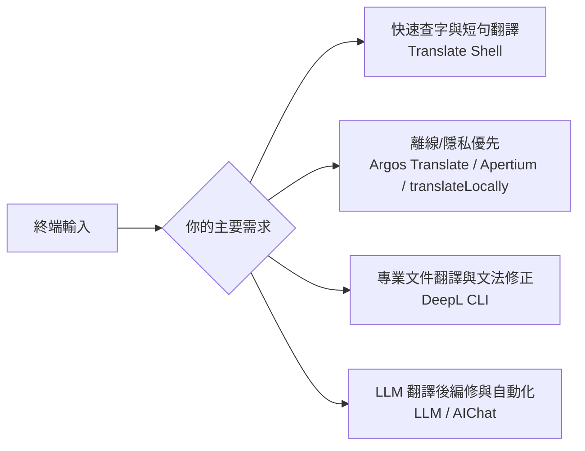

<!-- Generated by SpecStory, Markdown v2.1.0 -->

# 2026-07-03 17:02:43Z

<!-- Claude Code Session 169716f2-ea37-4fcb-b841-57c526c26a7f (2026-07-03 17:02:43Z) -->

_**User (2026-07-03 17:02:43Z)**_

<command-name>/clear</command-name>
            <command-message>clear</command-message>
            <command-args></command-args>

_**User (2026-07-03 17:02:44Z)**_

<local-command-caveat>Caveat: The messages below were generated by the user while running local commands. DO NOT respond to these messages or otherwise consider them in your response unless the user explicitly asks you to.</local-command-caveat>

_**User (2026-07-03 17:02:50Z)**_

```
# 終端翻譯工具深度研究報告

## 執行摘要

目前「可用、仍值得部署」的終端翻譯工具，大致分成三類。第一類是**傳統翻譯 CLI**，代表是 Translate Shell：上手最快、最適合查單字與臨時翻句子，但本質上是對外部翻譯服務的終端封裝，隱私與穩定性取決於上游引擎。第二類是**本機離線翻譯**，代表是 Argos Translate、Apertium 與 translateLocally：資料可留在本機，較適合隱私或內網場景，但語言覆蓋、配對品質、文件格式保留能力與維護活躍度差異很大。第三類是**LLM 終端工作流工具**，代表是 DeepL CLI、LLM、AIChat：它們不一定只做翻譯，但在文件翻譯、後編修、文法修正、批次自動化和工作流整合上，整體能力最強。citeturn32search0turn9view2turn11view0turn27search13turn17search0turn23view0turn5view4

如果只給一句結論：**查字／臨時一句話**，選 Translate Shell；**隱私優先、純離線**，先看 Argos Translate，若剛好有你要的 Marian/Bergamot 模型可再看 translateLocally；**文件翻譯、商務工作流與文法修正**，DeepL CLI 是目前最完整的專用型方案；**想把翻譯、校稿、重寫、摘要與 CI/CD 串成一個終端工作流**，LLM 與 AIChat 的彈性最高。citeturn20view1turn10view0turn17search0turn32search2turn23view0turn5view4

一個重要現實是：**真正的全螢幕 TUI 翻譯器不多**。今天多數「terminal-native」工具其實是 CLI 加上 REPL／互動模式，而不是像 `htop` 那樣的完整 ncurses 介面；在這方面，AIChat 的 Chat-REPL、Translate Shell 的 interactive shell，是最接近日常「TUI 體驗」的兩種。citeturn20view1turn29view1



## 研究範圍與評估框架

本報告優先納入**官方專案頁、官方文件與官方 GitHub 倉庫**中，仍可安裝、且功能足以覆蓋下列其中一項或多項任務的工具：快速單字查詢、句子翻譯、文件或批次翻譯、文法／風格修正、以及 LLM 整合或本機模型整合。相對地，僅是某單一 API 的薄封裝、缺乏官方文件、或維護情況不明的小型 wrapper，本報告不列為主分析對象。citeturn32search0turn32search2turn31search0turn25view0turn16view0turn32search1turn5view4

評估面向包括：授權、安裝方法、語言支援、是否可離線、翻譯引擎或 API、LLM 整合方式、是否支援單字查詢／句子／檔案／批次／REPL、是否有文法校正、是否會把資料送到第三方、是否需要 API key、平台支援，以及可從 GitHub 公開 commit 頁面或官方文件辨識的最近活動。對於無法由官方來源可靠確認的欄位，本報告一律標示為**未明示**。citeturn30view4turn30view3turn11view0turn27search13turn17search0turn28view0turn30view1

維護狀態的判讀特別需要保守：可見的「最近 commit」不等於品質，也不等於實際可用性，但它確實能幫助區分**成熟但低頻維護**、**活躍迭代**、以及**可能已趨停滯**的專案。例如 Translate Shell 與 translateLocally 仍然有獨特價值，但公開提交頻率明顯低於 DeepL CLI、Argos Translate 與 LLM。citeturn13view0turn13view5turn12view0turn13view1turn24view0

## 關鍵比較總表

| 工具 | 主要定位 | 語言覆蓋 | 離線 | 引擎 / API | 文法修正 | 文件 / 批次能力 | 平台支援 | 最近活動 | 來源 |
|---|---|---|---|---|---|---|---|---|---|
| Translate Shell | 查字、短句、終端即時翻譯 | 159 種語言識別，實際覆蓋依引擎而定 | 否 | Google、Bing、Yandex、Apertium；目前不含 DeepL | 否 | 純文字檔、stdin/stdout、網頁翻譯；無文件版面保留 | GNU/Linux、macOS、*BSD、Android Termux、Windows via WSL/Cygwin/MSYS2 | 最新可見 commit 2023-02-08 | citeturn32search0turn34search0turn20view3turn13view0 |
| DeepL CLI | 專業翻譯、文件翻譯、文法/寫作強化 | 翻譯 121 語言；Write 支援 9 種語言 | 否 | DeepL Translate / Write / Voice API；官方稱 next-gen in-house LLM | 是，專用 `write` 指令 | PDF/DOCX/PPTX/XLSX/HTML/TXT/SRT/XLIFF/JPG/PNG；batch、watch、sync | macOS、Linux、Windows | 最新可見 commit 2026-04-27 | citeturn32search2turn6view1turn6view2turn6view3turn13view1 |
| Argos Translate | 開源離線 NMT | 40+ 語言，依 `.argosmodel` 套件擴充 | 是 | OpenNMT、SentencePiece、Stanza；GPU 設定連到 CTranslate2 | 否 | 核心 CLI 以文字為主；檔案/HTML 需相關庫或 LibreTranslate API | 官方未列完整平台矩陣；Python library / CLI / GUI | 最新可見 commit 2026-04-25 | citeturn11view0turn10view0turn31search2turn12view0 |
| Apertium | 規則式、自架透明翻譯 | 51 個 released/stable pairs，另有更多開發中 pair | 是 | 規則式 MT、有限狀態轉換器 | 否 | CLI 純文字與 `-f docx` 文件翻譯；可自架 APy | Linux、macOS、Windows via WSL；另有 Simpleton UI | 核心 repo 最近 commit 未能可靠抓取；wiki/docs 到 2025 仍更新 | citeturn25view2turn27search13turn18search1turn25view0turn27search8turn14view0 |
| translateLocally | 本機 Marian/Bergamot 神經翻譯 | 依模型庫；預設 Bergamot，可加 OPUSMT/HPLT/custom models | 是 | Marian + Bergamot | 否 | 單句、檔案資料集、shell 管線 pivot；無文件格式保留 | Ubuntu / Arch / Windows / macOS，M1/M2 實驗性 | 最新可見 commit 2022-10-13 | citeturn17search0turn16view0turn13view5 |
| LLM | 可程式化 LLM 工作流 | 取決於模型；工具本身不限制語言 | 可本機也可雲端 | OpenAI、Anthropic、Gemini、Meta 等；插件與 OpenAI-compatible / Ollama | 以 prompt 實現 | stdin、附件、模板、聊天、結構化輸出；適合腳本批次 | 官方 quick start 未列完整矩陣；pip / pipx / uv / Homebrew | 最新可見 commit 2026-06-15 | citeturn23view0turn28view1turn28view2turn24view0 |
| AIChat | 終端 REPL / 多供應商 LLM 助手 | 取決於模型；工具本身不限制語言 | 可本機也可雲端 | OpenAI、Claude、Gemini、Ollama、Groq、Azure、Bedrock 等 20+ | 以 prompt / role 實現 | stdin、檔案、目錄、URL、RAG、Macro、MCP、內建 server | macOS、Linux、Windows；另有 Scoop / Termux | 最新可見 commit 2025-07-20；issues 到 2026 仍活躍 | citeturn30view1turn29view1turn33search2turn13view2turn33search9 |

整體來看，**專用翻譯器**與**LLM 工作流工具**不是互斥關係。前者勝在穩定、語法簡單、成本可預測；後者勝在後編修、格式控制、術語規則、資料擷取與自動化。很多團隊最終會採取「**DeepL CLI 或離線引擎做第一輪翻譯，再用 LLM/AIChat 做 QA、重寫、風格統一與發佈前檢查**」的雙層架構。這其實最符合今天終端翻譯工具的現實。citeturn9view2turn31search2turn27search13turn23view0turn29view1

## 工具逐項分析

**Translate Shell**

官方網站／GitHub：官方站與 GitHub 倉庫都存在，且官方站仍提供安裝、範例與 man page。授權是 public domain / Unlicense。安裝方式包含直接下載單檔執行檔、從 Git 原始碼 `make install`，也提供 Docker 嘗試方式。系統需求明列 GNU/Linux、macOS、*BSD、Android（Termux），以及 Windows 經由 WSL、Cygwin 或 MSYS2。citeturn32search0turn20view3turn30view4

語言與引擎方面，Translate Shell 的核心優勢不是「最準」，而是「最快拿來查」。官方 release 說 0.9.7 時已可識別 159 種語言，而 README/官方站明列可接 Google、Bing、Yandex 與 Apertium。需要注意的是，**DeepL 支援曾存在，但在 0.9.6.9 明確被移除**，因此今天不應把它視為 DeepL 前端。它也沒有 LLM 整合。citeturn34search0turn20view3

功能上，它幾乎是「查字神器」：`-d` dictionary mode 可直接把 Google 翻譯當字典使用；也支援語言辨識、語音播放、拼音/phonetic notation 顯示、RTL 顯示調整、terminal pager、語言資訊查詢，以及 interactive shell。它可處理單字、片語、句子、多行輸入、stdin/stdout、純文字檔與 `file://` 檔案 URI，也能把網頁送去瀏覽器透過 Google 介面查看翻譯。這些特性使它非常適合 shell one-liner，但不適合正式文件本地化。citeturn19view1turn19view3turn20view1turn32search3

可直接採用的用法如下；這些命令都建立在官方 README 與 man page 的語法上。citeturn20view1turn32search3

```bash
# 查字典
trans -d :en apple

# 翻譯一句話到繁中
trans :zh-TW "The build failed because the env file was missing."

# 走標準輸入
echo "Bonjour tout le monde" | trans -b :en

# 翻譯純文字檔
trans -b -i input.txt :ja -o output.txt

# 互動模式
trans -shell en:fr
```

安全與隱私上，Translate Shell 的翻譯內容會送往你選用的第三方引擎；官方文件沒有提供企業級資料刪除、DPA、或本地模型模式。價格與 API key 方面，官方文件沒有要求使用者先設定 API key；實務上它比較像「公用翻譯服務的終端入口」，而不是正式商用 API 客戶端。這帶來的優點是零門檻，缺點則是對上游介面變動較脆弱，且不適合敏感內容。維護方面，公開 commit 歷史顯示最近可見 commit 是 2023-02-08，屬於**成熟但低頻維護**。優點是快、輕、查字與短句體驗極佳；缺點是線上依賴強、隱私弱、沒有真正的文法校正，也沒有現代 LLM 工作流。最推薦的場景，是臨時查字、REPL 互動翻譯、shell alias 與開發者日常終端查詢。citeturn20view3turn13view0

**DeepL CLI**

DeepL CLI 是本次研究中最值得注意的新選手之一，因為它是**官方、專用、且真的面向終端工作流**的工具。官方開發者文件與 GitHub 倉庫都明確寫出：這是一個 MIT 授權的開源 CLI，用來操作 DeepL API，涵蓋文字翻譯、文件翻譯、寫作強化、語音翻譯、詞彙表與管理功能。安裝目前以原始碼為主，需要 Node.js 18+ 與本機編譯工具。macOS、Linux、Windows 的建置前置條件都有列出。citeturn9view2turn30view3

能力上，DeepL CLI 非常完整。官方 README 列出：使用 DeepL 的 next-gen language model 進行翻譯、`deepl sync` 做增量式 i18n 檔同步、文件翻譯、watch mode、batch processing、local SQLite cache、以及 `deepl write` 的文法／風格／語氣調整。翻譯語言在 CLI 可列出 121 種；而 DeepL Write 目前支援德文、英文（含 GB/US）、西班牙文、法文、義大利文、葡萄牙文（含 BR/PT）等 9 種變體。citeturn7view0turn6view1turn6view2turn6view3

如果你的需求是**文件翻譯**，它幾乎是終端工具裡最像「正式產品」的一個：PDF、DOCX、DOC、PPTX、XLSX、HTML、TXT、SRT、XLIFF、JPG、PNG 都列在支援格式中，並且官方強調可保留字型、樣式、顏色與版面。對開發者和本地化流程來說，`watch`、`sync`、quiet mode、以及成本透明度都很實用。citeturn6view1turn7view0

以下是幾個最有代表性的用法，語法直接來自官方文件與 README。citeturn32search2turn6view1turn6view3turn6view4

```bash
# 文字翻譯
deepl translate "Hello, world!" --to es

# 文件翻譯並保留格式
deepl translate contract.pdf --to de --formality more --output contract.de.pdf

# 把 PDF 轉成可編輯 DOCX 再翻譯
deepl translate document.pdf --to es --output-format docx --output document.es.docx

# 文法與風格修正
deepl write "Their going to the stor tommorow" --lang en-US

# 對檔案直接修正並顯示 diff
deepl write README.md --lang en-US --diff

# 監看資料夾並自動翻譯
deepl watch docs/ --to ja --output docs-i18n/
```

安全與隱私是 DeepL CLI 的一大強項，但也不能簡化成「完全無風險」。一方面，README 明說它有本地 SQLite cache、無 telemetry、並跟隨 DeepL 的 DPA；Help Center 又說 Growth/Pro 方案中的文字在翻譯或改善後會立即刪除，而 DeepL API 的 Pro 客戶資料不會拿去訓練模型。另一方面，**你的文字、文件或語音依然會送到 DeepL 伺服器**，因為它不是本地推理工具。換句話說，它屬於「企業級雲端工具」，不是「純離線工具」。citeturn7view0turn5view6turn9view0turn9view1

價格與金鑰要求方面，DeepL CLI 必須有 DeepL API key。官方 Help Center 說 Developer 方案可翻 1,000,000 字元總量，但不含 speech；Growth 提供 Write、speech-to-text、next-gen model 與每月 50M 字元 / 300 小時的上限框架；Enterprise 則需聯絡銷售。舊的 API Free / Pro 計畫已不再開放購買。維護活躍度方面，最近可見 commit 在 2026-04-27，屬於**活躍維護**。它的主要優點是專用能力完整、文法修正是原生功能、文件與本地化工作流出色；主要缺點是目前仍需從 source 安裝、完全仰賴 DeepL 雲端、Write 語言比 Translate 少。最推薦場景是商務翻譯、文件處理、i18n pipeline、以及需要 Grammarly-like 寫作改善的終端工作流。citeturn9view0turn13view1

**Argos Translate**

Argos Translate 是今天開源離線翻譯領域中，**最像「實際能用」的通用 CLI**。官方網站與 GitHub 都把它描述為離線翻譯庫，可作為 Python library、CLI、GUI 使用；授權則是 dual-licensed under MIT or CC0。安裝方式很直接：`pip install argostranslate`，管理語言模型則用 `argospm`。citeturn31search0turn11view0turn10view0

技術堆疊上，官方文件把它描述為使用 OpenNMT 做翻譯，SentencePiece 做 tokenization，Stanza 做句界切分；GitHub README 則補充了 GPU 設定可透過 `ARGOS_DEVICE_TYPE` 傳入 CTranslate2。它的一個實用優勢是**pivot translation**：如果你只有 `es→en` 和 `en→fr`，它也能替你做 `es→fr`，只是品質會打折。支援語言目前官方頁面直接列出阿拉伯語、中文、捷克語、荷蘭語、英語、法語、德語、日語、韓語、俄語、西語、烏克蘭語等 40+ 語言，並標明 “and more”。citeturn10view0turn11view0turn31search2

它的 CLI 十分樸素，但夠實用。你先 `argospm update`，再 `argospm install` 某個語言對，接著用 `argos-translate` 翻句子或標準輸入。這種工作方式很適合內網、筆電離線、或隱私比較敏感的終端使用。官方文件與站點也提到 `translate-html`、`argos-translate-files` 以及基於它的 LibreTranslate API；也就是說，**核心 CLI 主要處理純文字，檔案翻譯能力存在，但不是 main CLI 的核心 UX**。citeturn10view0turn31search2turn36view1

```bash
# 更新模型索引
argospm update

# 安裝英譯德模型
argospm install translate-en_de

# 直接翻譯
argos-translate --from en --to de "Hello World!"

# 走 stdin
echo "Text to translate" | argos-translate --from en --to es

# 列出已安裝套件
argospm list
```

示意圖方面，官方網站與 GitHub README 都提供 GUI screenshot，另有 CLI 範例與影片 intro；但官方沒有特別建立「終端動圖 showcase」頁。citeturn31search0turn21view1turn36view0turn36view1

隱私與安全上，Argos 的價值很清楚：**翻譯本身可以完全在本機進行**。真正會觸網的主要是模型索引更新與模型下載；如果你改走 LibreTranslate 公共 API 或第三方 instance，才會把資料送出去。價格與金鑰方面，本地模式免費、無 API key；若用 API instance，金鑰需求則依部署而定，官方主頁沒有統一要求。維護活躍度相對理想，最近可見 commit 是 2026-04-25。它的優點是易用的離線 NMT、生態比很多冷門本機工具成熟、可自行擴充語言模型；缺點是不同語言對品質差異頗大、文件格式保留不是第一級公民、平台保證沒有像 DeepL 那樣明確。最推薦的場景是本機離線通用翻譯、隱私優先作業站、以及自架 LibreTranslate 的底層引擎。citeturn12view0turn31search2

**Apertium**

Apertium 與 Argos、translateLocally 很不同，因為它不是神經機器翻譯，而是**規則式（rule-based）翻譯平台**。官方網站與 GitHub 都清楚表明它是 free/open-source，並以 GNU GPL 釋出；官方 GitHub 說明也強調其工具鏈依賴 deterministic linguistic rules 與 finite-state transducers。對今天多數習慣神經翻譯的使用者而言，Apertium 的核心賣點不是泛化流暢度，而是**可解釋、可控制、對相關語言對特別有價值**。citeturn18search1turn5view2turn26search11

語言覆蓋方面，官方 wiki main page 列出 51 個 released/stable translation pairs，還有額外 staging / nursery / incubator 的 pair 在開發中。這個生態對歐洲相關語言、少數語言、研究用途尤其重要。安裝上，官方 wiki 對 Linux、macOS 都有說明；Windows 以 WSL 為主，而且對 Windows / Mac 使用者還提到可用 Apertium Simpleton UI 作為比較簡單的入口。語言資料可透過 packaging，也可用 `apertium-get` 與編譯流程自己拉下來建。citeturn25view0turn25view1turn25view2

作為終端工具，Apertium 的亮點是**不只翻單句，也能處理文件格式**。官方 Interfaces 頁明白給出範例：`echo "some words" | apertium eng-cat` 可直接做 command-line translation；`apertium -f docx eng-cat input.docx output.docx` 則能做 document translation。官方 Tips 頁也提到可在 XML-based mode 中用 `<apertium-notrans>` 標籤包住不想翻譯的段落，這對部分格式保留與術語控制很實用。citeturn27search13turn27search3turn27search15

```bash
# 純文字翻譯
echo "some words" | apertium eng-cat

# DOCX 文件翻譯
apertium -f docx eng-cat input.docx output.docx
```

隱私與安全方面，Apertium 的本地 CLI 完全可以離線執行；如果你使用的是官網或 APy / APy-based front-end，才會進入服務端資料流。價格與金鑰則很單純：本地使用免費，無 API key。維護活躍度這一欄本報告必須保守處理：本次 GitHub 核心 repo 的 commit 頁面抓取未能可靠取得最新 commit history，因此「最近 commit」只能標示為 **unspecified**；但官方安裝文件到 2024 仍更新，Apertium-APy 與品質統計相關 wiki 頁到 2025 仍有更新，因此比較合理的判斷是：**生態仍然存活，但核心 repo 活躍度在本次公開抓取中無法準確量化**。citeturn14view0turn25view0turn27search8turn27search12

它的主要優點，是規則透明、適合可審計流程、對某些相關語言 pair 很有用、而且能做到自架與文件翻譯；主要缺點，是泛用品質通常不如一線雲端 NMT / LLM，特別在距離較遠的語言對上更明顯，且終端 UX 不如現代 CLI 工具。最推薦的場景，是研究與教育、少數語言 pair、自架規則式翻譯、以及對可解釋性重視高於「自然度」的流程。citeturn26search11turn27search13

**translateLocally**

translateLocally 是本次研究中最典型的「**翻譯在你的機器上跑完**」工具。官方 GitHub README 的第一句就是 “Fast and secure translation on your local machine, powered by marian and Bergamot.”；官方下載頁則直接提供 Ubuntu、Arch Linux、Windows、Mac OS 的預建版本，並說明主流預編譯假設 64-bit x86 with AVX，M1/M2 版為 experimental。授權是 MIT。citeturn17search0turn16view0

它雖以 GUI 為主要產品形態，但 README 明確提供 CLI，用法包含列出本地模型、查線上可用模型、下載模型、刪模型、選擇模型、以 stdin/stdout 或 `-i/-o` 做單句與資料集翻譯。更重要的是，它不只支援預設 Bergamot repository，還能接 OPUSMT、HPLT，甚至匯入自訓 Marian 模型，這對需要內部模型或特殊語言對的團隊很有吸引力。citeturn17search0

語言覆蓋並不以「現成數量很多」著稱，而是取決於可下載模型與你願不願意自己匯入模型。README 範例中可以看到 `cs-en`、`de-en`、`en-cs`、`en-de`、`en-et`、`et-en`、`is-en`、`nb-en`、`nn-en`、`en-es` 等模式；因此它更像「本機 Marian/Bergamot runtime」，而不是一個固定語言表的大一統翻譯器。citeturn17search0

```bash
# 列出可下載模型
./translateLocally -a

# 列出本地已安裝模型
./translateLocally -l

# 下載模型
./translateLocally -d en-et-tiny

# 單句翻譯
echo "Me gustaria comprar la casa verde" | ./translateLocally -m es-en-tiny

# 整個資料集
./translateLocally -m es-en-tiny -i /tmp/es.in -o /tmp/en.out

# 用 shell pipeline 做 pivot translation
cat /tmp/es.in | ./translateLocally -m es-en-tiny | ./translateLocally -m en-de-tiny -o /tmp/de.out
```

示意圖方面，官方下載頁有 screenshot，GitHub README 則以使用說明與構建文件為主，CLI 專屬動圖未明示。隱私與安全上，translateLocally 的翻譯本身在本機完成，這是它最大的賣點；但當你列出或下載模型時，會連到外部模型庫，而且 README 也明講可加外部 repository。價格與金鑰方面，本地模式免費、無 API key。維護方面，最近可見 commit 是 2022-10-13，明顯屬於**低頻維護甚至接近停滯**；這不代表它不能用，但意味著你若把它放進長期核心流程，需要自己承擔更多風險。它的優點是本地 NMT、隱私強、可匯入客製模型；缺點是維護偏冷、現成模型有限、安裝和優化比 Argos 更重。最推薦的場景是嚴格離線環境、有固定語言對、願意自己管理模型資產的終端或桌面工作站。citeturn16view0turn17search0turn13view5

**LLM**

Simon Willison 的 LLM 不是「翻譯器」，但它是今天最值得開發者認真考慮的**終端 LLM 工作流骨架**之一。官方站與 GitHub 都把它描述為 CLI + Python library，可與 OpenAI、Anthropic、Gemini、Meta 以及大量其他模型互動，並可透過插件接雲端 API 或本機模型。授權為 Apache-2.0；安裝方式包括 `pip`、Homebrew、`pipx`、`uv`。citeturn32search1turn23view0

對翻譯與文法修正來說，LLM 的價值不在「有沒有 `translate` 子命令」，而在於它讓你可以把**翻譯 prompt、風格規則、輸出 schema、上下文附件、本地或遠端模型、以及日誌**變成可組態的工作流。README 直接寫出它可以跑 prompt、把 prompts/responses 存到 SQLite、做 embeddings、抽取結構化內容、以及授予模型工具呼叫能力；你也可以用 plugin 接 Gemeni、Anthropic、Ollama，甚至用 OpenAI-compatible `api_base` 指向自架 LocalAI。citeturn28view0turn28view1turn28view2

這意味著：如果你要的是「把 Markdown 文件翻成繁中、保留 frontmatter、抽出術語對照表、再用第二個 prompt 做 QA」，LLM 比傳統翻譯 CLI 更適合。它還有互動 `llm chat`、附件輸入、模板、工具、schema 等能力，非常適合 CI/CD、pre-commit、docs pipeline、release automation。官方也提供 YouTube demo 與詳細筆記。citeturn23view0turn32search1

以下是依官方語法可直接組出的典型翻譯／校稿工作流。citeturn23view0turn28view1

```bash
# 以預設模型翻譯 stdin 內容
cat source.md | llm -s "Translate to Traditional Chinese and preserve Markdown structure"

# 使用雲端模型聊天式翻譯
llm chat -m gpt-4.1

# 改用本機 Ollama 模型
llm install llm-ollama
ollama pull llama3.2:latest
llm -m llama3.2:latest "Translate this release note into zh-Hant"

# 針對本機 OpenAI-compatible endpoint
llm -m orca-openai-compat "Proofread and improve this paragraph"
```

隱私方面，LLM 值得特別提醒兩件事。第一，官方 setup 文件說它**預設會把每次 prompt 與 response 記錄到本機 SQLite database**，可以用 `llm logs off` 關掉。第二，如果你用雲端插件，輸入內容自然會送到對應供應商；但如果你用 Ollama 或 LocalAI，則可以做到本機推理，而且當你設定客製 `api_base` 時，既有 OpenAI key 預設也不會被送出。價格與金鑰方面，工具本身免費；雲端模式需要各家 API key，成本跟你選的模型供應商走，本機模式則可以沒有雲端單次費用。維護方面非常活躍，最近可見 commit 是 2026-06-15。它的長處是插件、結構化輸出、日誌與可程式化程度極高；短處是它並不是一個「翻譯專用 UX」，也不會自動保留 PDF/DOCX 版面。最推薦場景，是把翻譯、後編修、語氣統一、資料抽取與自動化整合進開發者工作流。citeturn32search6turn28view1turn24view0

**AIChat**

AIChat 的定位接近「**終端裡的多供應商 LLM assistant**」，而不是純翻譯器；但如果你的需求包含翻譯、文法修正、RAG、角色控制與內建 REPL，它其實比很多單用途翻譯 CLI 更實用。官方 GitHub README 表明它是 all-in-one LLM CLI tool，提供 CMD mode、Chat-REPL、RAG、AI Tools & Agents，並可接 OpenAI、Claude、Gemini、Ollama、Groq、Azure-OpenAI、VertexAI、Bedrock、OpenRouter 等 20+ provider。授權是 MIT / Apache-2.0 雙授權。安裝支援 `cargo`、Homebrew、Pacman、Windows Scoop、Termux，另有 macOS/Linux/Windows 預建 binary。citeturn30view1turn29view1

它非常適合「終端常駐型翻譯助手」。官方 README 明列：你可以從 stdin、檔案、目錄、遠端 URL、甚至外部命令輸出餵資料給它；也可以用 roles、session、macro、RAG、function calling、AI tools/MCP。這些能力意味著，你不只能做「翻譯一句話」，還能做「把 docs/ 底下所有 Markdown 檔讀進來，按某種商務風格翻譯，再保留術語」這類偏工作流的任務。它的 README 還直接附了很多圖，包括 CMD、REPL、role、RAG、tool、agent、playground、arena 與 theme。citeturn29view0turn29view1turn21view2

AIChat 的配置體驗也比不少 CLI 友善。官方 wiki 說第一次執行時會自動建立 config file，並詢問平台與 API key；也列出 Windows、macOS、Linux 的 config 檔路徑。環境變數頁則明講可用 `{client}_API_KEY` 設定不同供應商金鑰，例如 `OPENAI_API_KEY`、`GEMINI_API_KEY`；此外也支援 `<config-dir>/.env` 儲存 secret。這在實務上很接近一個「終端中的 LLM 工作台」。citeturn33search2turn33search0turn33search5

```bash
# 用 stdin 做翻譯
cat handbook.md | aichat "Translate this into Traditional Chinese and preserve Markdown"

# 對檔案做文法修正
aichat -f draft.txt "Proofread grammar and improve style in en-US"

# 丟多個輸入來源進去
aichat -f docs/ -f glossary.txt "Translate the documentation to zh-Hant and respect the glossary"

# 啟動 REPL
aichat
```

隱私與安全方面，AIChat 的風險模型幾乎完全等於你選的 provider。若用 OpenAI、Claude、Gemini 等雲端，內容就會傳到對方；若用 Ollama，本機可避開雲端。因為它支援本地檔案、遠端 URL、RAG、甚至內建 HTTP server，所以在正式環境中應該明確規範哪些來源允許進入 prompt。價格上，工具本身免費，但 provider API key 與計費自行負責；如果改走 Ollama，一般可不需雲端 API 成本。維護方面，最近可見 code commit 是 2025-07-20，但 issues 到 2026 仍持續更新，顯示專案仍有使用者活動。它的優點是終端體驗好、REPL/Role/RAG/MCP 很適合多語工作；缺點是不是翻譯專用工具，品質高度取決於提示詞與所選模型。最推薦場景，是把翻譯、文法修正、術語控制與知識庫檢索整合為一個 terminal-native assistant。citeturn13view2turn33search9

## 選型指南

**要最快速查單字、查近義、臨時翻一句話**，優先選 **Translate Shell**。它有 dictionary mode、互動 shell、語音與 phonetic 顯示，幾乎就是「終端字典 + 翻譯刀」。代價是資料會送到第三方引擎，且長期維護頻率偏低。citeturn19view1turn20view1turn13view0

**要隱私與離線**，先選 **Argos Translate**；如果你手上剛好有對應 Marian/Bergamot 模型、而且願意自己管模型庫，可再看 **translateLocally**；如果你需要規則可解釋、特定相關語言對、或已經使用 Apertium 生態，則選 **Apertium**。這三者裡，Argos 的 CLI 友善度與一般可用性最好；translateLocally 的「全本機 NMT」感最強；Apertium 的透明度最高。citeturn11view0turn17search0turn25view2turn27search13

**要最高品質的「現成」翻譯與文件處理**，選 **DeepL CLI**。如果你的判準是商務文件、文件格式保留、watch/sync、以及原生文法／風格改善，那它是本報告裡最完整的專用型產品。若你的判準是「我想自己決定用 GPT、Claude 還是本地 Llama，並用 prompt 微調翻譯風格」，那就選 **LLM** 或 **AIChat**。前者偏 developer automation，後者偏 terminal-native assistant。citeturn32search2turn23view0turn29view1

**要 Grammarly-like 的文法修正**，首選仍是 **DeepL CLI 的 `deepl write`**，因為它是明確、原生、可對檔案運作的 grammar/style/tone 提升工具。LLM 與 AIChat 當然也能做 grammar correction，而且往往更彈性，但那是透過 prompt 達成，不是專用校稿引擎。若你重視一致性與可預測命令介面，DeepL CLI 更合適。citeturn6view3turn32search2turn23view0turn29view0

**要整合進工作流、CI/CD 或內容管線**，**LLM** 與 **DeepL CLI** 是最強兩個方向。DeepL CLI 強在 i18n、watch、sync、文件翻譯與成本可預測；LLM 強在插件、schema、工具呼叫、template 與 logs。**AIChat** 則更適合需要人在終端互動、還要做 RAG、角色化翻譯與多 provider 比較的場景。citeturn7view0turn28view0turn28view2turn29view1

## 結論

如果把「終端翻譯工具」視為一個單一類別，今天其實很難選到絕對通吃的一個。真正成熟的做法，是先承認需求其實分為三種：**即時查詢**、**資料保密**、**內容工作流**。Translate Shell 解的是第一種；Argos / translateLocally / Apertium 解的是第二種；DeepL CLI、LLM、AIChat 解的是第三種。citeturn32search0turn31search2turn17search0turn27search13turn32search2turn23view0turn29view1

就「現在可用」與「對實際終端工作最有產出」來看，本報告的最終建議非常明確：**個人日常**用 Translate Shell；**敏感內容離線**用 Argos Translate；**正式文件與文法修正**用 DeepL CLI；**大量自動化與多模型工作流**用 LLM；**重互動 REPL 與多 provider 終端助理**用 AIChat。若你是團隊，而不是個人，最務實的組合通常不是只選一個，而是「**DeepL CLI 或離線引擎做基礎翻譯 + LLM/AIChat 做後編修與 QA**」。這樣的堆疊，才最接近 2026 年終端翻譯工具的最佳實踐。citeturn32search0turn31search2turn32search2turn23view0turn29view1
```

_**User (2026-07-03 17:03:37Z)**_

```
# 終端翻譯工具深度研究報告

## 執行摘要

目前「可用、仍值得部署」的終端翻譯工具，大致分成三類。第一類是**傳統翻譯 CLI**，代表是 Translate Shell：上手最快、最適合查單字與臨時翻句子，但本質上是對外部翻譯服務的終端封裝，隱私與穩定性取決於上游引擎。第二類是**本機離線翻譯**，代表是 Argos Translate、Apertium 與 translateLocally：資料可留在本機，較適合隱私或內網場景，但語言覆蓋、配對品質、文件格式保留能力與維護活躍度差異很大。第三類是**LLM 終端工作流工具**，代表是 DeepL CLI、LLM、AIChat：它們不一定只做翻譯，但在文件翻譯、後編修、文法修正、批次自動化和工作流整合上，整體能力最強。citeturn32search0turn9view2turn11view0turn27search13turn17search0turn23view0turn5view4

如果只給一句結論：**查字／臨時一句話**，選 Translate Shell；**隱私優先、純離線**，先看 Argos Translate，若剛好有你要的 Marian/Bergamot 模型可再看 translateLocally；**文件翻譯、商務工作流與文法修正**，DeepL CLI 是目前最完整的專用型方案；**想把翻譯、校稿、重寫、摘要與 CI/CD 串成一個終端工作流**，LLM 與 AIChat 的彈性最高。citeturn20view1turn10view0turn17search0turn32search2turn23view0turn5view4

一個重要現實是：**真正的全螢幕 TUI 翻譯器不多**。今天多數「terminal-native」工具其實是 CLI 加上 REPL／互動模式，而不是像 `htop` 那樣的完整 ncurses 介面；在這方面，AIChat 的 Chat-REPL、Translate Shell 的 interactive shell，是最接近日常「TUI 體驗」的兩種。citeturn20view1turn29view1


## 研究範圍與評估框架

本報告優先納入**官方專案頁、官方文件與官方 GitHub 倉庫**中，仍可安裝、且功能足以覆蓋下列其中一項或多項任務的工具：快速單字查詢、句子翻譯、文件或批次翻譯、文法／風格修正、以及 LLM 整合或本機模型整合。相對地，僅是某單一 API 的薄封裝、缺乏官方文件、或維護情況不明的小型 wrapper，本報告不列為主分析對象。citeturn32search0turn32search2turn31search0turn25view0turn16view0turn32search1turn5view4

評估面向包括：授權、安裝方法、語言支援、是否可離線、翻譯引擎或 API、LLM 整合方式、是否支援單字查詢／句子／檔案／批次／REPL、是否有文法校正、是否會把資料送到第三方、是否需要 API key、平台支援，以及可從 GitHub 公開 commit 頁面或官方文件辨識的最近活動。對於無法由官方來源可靠確認的欄位，本報告一律標示為**未明示**。citeturn30view4turn30view3turn11view0turn27search13turn17search0turn28view0turn30view1

維護狀態的判讀特別需要保守：可見的「最近 commit」不等於品質，也不等於實際可用性，但它確實能幫助區分**成熟但低頻維護**、**活躍迭代**、以及**可能已趨停滯**的專案。例如 Translate Shell 與 translateLocally 仍然有獨特價值，但公開提交頻率明顯低於 DeepL CLI、Argos Translate 與 LLM。citeturn13view0turn13view5turn12view0turn13view1turn24view0

## 關鍵比較總表

| 工具 | 主要定位 | 語言覆蓋 | 離線 | 引擎 / API | 文法修正 | 文件 / 批次能力 | 平台支援 | 最近活動 | 來源 |
|---|---|---|---|---|---|---|---|---|---|
| Translate Shell | 查字、短句、終端即時翻譯 | 159 種語言識別，實際覆蓋依引擎而定 | 否 | Google、Bing、Yandex、Apertium；目前不含 DeepL | 否 | 純文字檔、stdin/stdout、網頁翻譯；無文件版面保留 | GNU/Linux、macOS、*BSD、Android Termux、Windows via WSL/Cygwin/MSYS2 | 最新可見 commit 2023-02-08 | citeturn32search0turn34search0turn20view3turn13view0 |
| DeepL CLI | 專業翻譯、文件翻譯、文法/寫作強化 | 翻譯 121 語言；Write 支援 9 種語言 | 否 | DeepL Translate / Write / Voice API；官方稱 next-gen in-house LLM | 是，專用 `write` 指令 | PDF/DOCX/PPTX/XLSX/HTML/TXT/SRT/XLIFF/JPG/PNG；batch、watch、sync | macOS、Linux、Windows | 最新可見 commit 2026-04-27 | citeturn32search2turn6view1turn6view2turn6view3turn13view1 |
| Argos Translate | 開源離線 NMT | 40+ 語言，依 `.argosmodel` 套件擴充 | 是 | OpenNMT、SentencePiece、Stanza；GPU 設定連到 CTranslate2 | 否 | 核心 CLI 以文字為主；檔案/HTML 需相關庫或 LibreTranslate API | 官方未列完整平台矩陣；Python library / CLI / GUI | 最新可見 commit 2026-04-25 | citeturn11view0turn10view0turn31search2turn12view0 |
| Apertium | 規則式、自架透明翻譯 | 51 個 released/stable pairs，另有更多開發中 pair | 是 | 規則式 MT、有限狀態轉換器 | 否 | CLI 純文字與 `-f docx` 文件翻譯；可自架 APy | Linux、macOS、Windows via WSL；另有 Simpleton UI | 核心 repo 最近 commit 未能可靠抓取；wiki/docs 到 2025 仍更新 | citeturn25view2turn27search13turn18search1turn25view0turn27search8turn14view0 |
| translateLocally | 本機 Marian/Bergamot 神經翻譯 | 依模型庫；預設 Bergamot，可加 OPUSMT/HPLT/custom models | 是 | Marian + Bergamot | 否 | 單句、檔案資料集、shell 管線 pivot；無文件格式保留 | Ubuntu / Arch / Windows / macOS，M1/M2 實驗性 | 最新可見 commit 2022-10-13 | citeturn17search0turn16view0turn13view5 |
| LLM | 可程式化 LLM 工作流 | 取決於模型；工具本身不限制語言 | 可本機也可雲端 | OpenAI、Anthropic、Gemini、Meta 等；插件與 OpenAI-compatible / Ollama | 以 prompt 實現 | stdin、附件、模板、聊天、結構化輸出；適合腳本批次 | 官方 quick start 未列完整矩陣；pip / pipx / uv / Homebrew | 最新可見 commit 2026-06-15 | citeturn23view0turn28view1turn28view2turn24view0 |
| AIChat | 終端 REPL / 多供應商 LLM 助手 | 取決於模型；工具本身不限制語言 | 可本機也可雲端 | OpenAI、Claude、Gemini、Ollama、Groq、Azure、Bedrock 等 20+ | 以 prompt / role 實現 | stdin、檔案、目錄、URL、RAG、Macro、MCP、內建 server | macOS、Linux、Windows；另有 Scoop / Termux | 最新可見 commit 2025-07-20；issues 到 2026 仍活躍 | citeturn30view1turn29view1turn33search2turn13view2turn33search9 |

整體來看，**專用翻譯器**與**LLM 工作流工具**不是互斥關係。前者勝在穩定、語法簡單、成本可預測；後者勝在後編修、格式控制、術語規則、資料擷取與自動化。很多團隊最終會採取「**DeepL CLI 或離線引擎做第一輪翻譯，再用 LLM/AIChat 做 QA、重寫、風格統一與發佈前檢查**」的雙層架構。這其實最符合今天終端翻譯工具的現實。citeturn9view2turn31search2turn27search13turn23view0turn29view1

## 工具逐項分析

**Translate Shell**

官方網站／GitHub：官方站與 GitHub 倉庫都存在，且官方站仍提供安裝、範例與 man page。授權是 public domain / Unlicense。安裝方式包含直接下載單檔執行檔、從 Git 原始碼 `make install`，也提供 Docker 嘗試方式。系統需求明列 GNU/Linux、macOS、*BSD、Android（Termux），以及 Windows 經由 WSL、Cygwin 或 MSYS2。citeturn32search0turn20view3turn30view4

語言與引擎方面，Translate Shell 的核心優勢不是「最準」，而是「最快拿來查」。官方 release 說 0.9.7 時已可識別 159 種語言，而 README/官方站明列可接 Google、Bing、Yandex 與 Apertium。需要注意的是，**DeepL 支援曾存在，但在 0.9.6.9 明確被移除**，因此今天不應把它視為 DeepL 前端。它也沒有 LLM 整合。citeturn34search0turn20view3

功能上，它幾乎是「查字神器」：`-d` dictionary mode 可直接把 Google 翻譯當字典使用；也支援語言辨識、語音播放、拼音/phonetic notation 顯示、RTL 顯示調整、terminal pager、語言資訊查詢，以及 interactive shell。它可處理單字、片語、句子、多行輸入、stdin/stdout、純文字檔與 `file://` 檔案 URI，也能把網頁送去瀏覽器透過 Google 介面查看翻譯。這些特性使它非常適合 shell one-liner，但不適合正式文件本地化。citeturn19view1turn19view3turn20view1turn32search3

可直接採用的用法如下；這些命令都建立在官方 README 與 man page 的語法上。citeturn20view1turn32search3

```bash
# 查字典
trans -d :en apple

# 翻譯一句話到繁中
trans :zh-TW "The build failed because the env file was missing."

# 走標準輸入
echo "Bonjour tout le monde" | trans -b :en

# 翻譯純文字檔
trans -b -i input.txt :ja -o output.txt

# 互動模式
trans -shell en:fr
```

安全與隱私上，Translate Shell 的翻譯內容會送往你選用的第三方引擎；官方文件沒有提供企業級資料刪除、DPA、或本地模型模式。價格與 API key 方面，官方文件沒有要求使用者先設定 API key；實務上它比較像「公用翻譯服務的終端入口」，而不是正式商用 API 客戶端。這帶來的優點是零門檻，缺點則是對上游介面變動較脆弱，且不適合敏感內容。維護方面，公開 commit 歷史顯示最近可見 commit 是 2023-02-08，屬於**成熟但低頻維護**。優點是快、輕、查字與短句體驗極佳；缺點是線上依賴強、隱私弱、沒有真正的文法校正，也沒有現代 LLM 工作流。最推薦的場景，是臨時查字、REPL 互動翻譯、shell alias 與開發者日常終端查詢。citeturn20view3turn13view0

**DeepL CLI**

DeepL CLI 是本次研究中最值得注意的新選手之一，因為它是**官方、專用、且真的面向終端工作流**的工具。官方開發者文件與 GitHub 倉庫都明確寫出：這是一個 MIT 授權的開源 CLI，用來操作 DeepL API，涵蓋文字翻譯、文件翻譯、寫作強化、語音翻譯、詞彙表與管理功能。安裝目前以原始碼為主，需要 Node.js 18+ 與本機編譯工具。macOS、Linux、Windows 的建置前置條件都有列出。citeturn9view2turn30view3

能力上，DeepL CLI 非常完整。官方 README 列出：使用 DeepL 的 next-gen language model 進行翻譯、`deepl sync` 做增量式 i18n 檔同步、文件翻譯、watch mode、batch processing、local SQLite cache、以及 `deepl write` 的文法／風格／語氣調整。翻譯語言在 CLI 可列出 121 種；而 DeepL Write 目前支援德文、英文（含 GB/US）、西班牙文、法文、義大利文、葡萄牙文（含 BR/PT）等 9 種變體。citeturn7view0turn6view1turn6view2turn6view3

如果你的需求是**文件翻譯**，它幾乎是終端工具裡最像「正式產品」的一個：PDF、DOCX、DOC、PPTX、XLSX、HTML、TXT、SRT、XLIFF、JPG、PNG 都列在支援格式中，並且官方強調可保留字型、樣式、顏色與版面。對開發者和本地化流程來說，`watch`、`sync`、quiet mode、以及成本透明度都很實用。citeturn6view1turn7view0

以下是幾個最有代表性的用法，語法直接來自官方文件與 README。citeturn32search2turn6view1turn6view3turn6view4

```bash
# 文字翻譯
deepl translate "Hello, world!" --to es

# 文件翻譯並保留格式
deepl translate contract.pdf --to de --formality more --output contract.de.pdf

# 把 PDF 轉成可編輯 DOCX 再翻譯
deepl translate document.pdf --to es --output-format docx --output document.es.docx

# 文法與風格修正
deepl write "Their going to the stor tommorow" --lang en-US

# 對檔案直接修正並顯示 diff
deepl write README.md --lang en-US --diff

# 監看資料夾並自動翻譯
deepl watch docs/ --to ja --output docs-i18n/
```

安全與隱私是 DeepL CLI 的一大強項，但也不能簡化成「完全無風險」。一方面，README 明說它有本地 SQLite cache、無 telemetry、並跟隨 DeepL 的 DPA；Help Center 又說 Growth/Pro 方案中的文字在翻譯或改善後會立即刪除，而 DeepL API 的 Pro 客戶資料不會拿去訓練模型。另一方面，**你的文字、文件或語音依然會送到 DeepL 伺服器**，因為它不是本地推理工具。換句話說，它屬於「企業級雲端工具」，不是「純離線工具」。citeturn7view0turn5view6turn9view0turn9view1

價格與金鑰要求方面，DeepL CLI 必須有 DeepL API key。官方 Help Center 說 Developer 方案可翻 1,000,000 字元總量，但不含 speech；Growth 提供 Write、speech-to-text、next-gen model 與每月 50M 字元 / 300 小時的上限框架；Enterprise 則需聯絡銷售。舊的 API Free / Pro 計畫已不再開放購買。維護活躍度方面，最近可見 commit 在 2026-04-27，屬於**活躍維護**。它的主要優點是專用能力完整、文法修正是原生功能、文件與本地化工作流出色；主要缺點是目前仍需從 source 安裝、完全仰賴 DeepL 雲端、Write 語言比 Translate 少。最推薦場景是商務翻譯、文件處理、i18n pipeline、以及需要 Grammarly-like 寫作改善的終端工作流。citeturn9view0turn13view1

**Argos Translate**

Argos Translate 是今天開源離線翻譯領域中，**最像「實際能用」的通用 CLI**。官方網站與 GitHub 都把它描述為離線翻譯庫，可作為 Python library、CLI、GUI 使用；授權則是 dual-licensed under MIT or CC0。安裝方式很直接：`pip install argostranslate`，管理語言模型則用 `argospm`。citeturn31search0turn11view0turn10view0

技術堆疊上，官方文件把它描述為使用 OpenNMT 做翻譯，SentencePiece 做 tokenization，Stanza 做句界切分；GitHub README 則補充了 GPU 設定可透過 `ARGOS_DEVICE_TYPE` 傳入 CTranslate2。它的一個實用優勢是**pivot translation**：如果你只有 `es→en` 和 `en→fr`，它也能替你做 `es→fr`，只是品質會打折。支援語言目前官方頁面直接列出阿拉伯語、中文、捷克語、荷蘭語、英語、法語、德語、日語、韓語、俄語、西語、烏克蘭語等 40+ 語言，並標明 “and more”。citeturn10view0turn11view0turn31search2

它的 CLI 十分樸素，但夠實用。你先 `argospm update`，再 `argospm install` 某個語言對，接著用 `argos-translate` 翻句子或標準輸入。這種工作方式很適合內網、筆電離線、或隱私比較敏感的終端使用。官方文件與站點也提到 `translate-html`、`argos-translate-files` 以及基於它的 LibreTranslate API；也就是說，**核心 CLI 主要處理純文字，檔案翻譯能力存在，但不是 main CLI 的核心 UX**。citeturn10view0turn31search2turn36view1

```bash
# 更新模型索引
argospm update

# 安裝英譯德模型
argospm install translate-en_de

# 直接翻譯
argos-translate --from en --to de "Hello World!"

# 走 stdin
echo "Text to translate" | argos-translate --from en --to es

# 列出已安裝套件
argospm list
```

示意圖方面，官方網站與 GitHub README 都提供 GUI screenshot，另有 CLI 範例與影片 intro；但官方沒有特別建立「終端動圖 showcase」頁。citeturn31search0turn21view1turn36view0turn36view1

隱私與安全上，Argos 的價值很清楚：**翻譯本身可以完全在本機進行**。真正會觸網的主要是模型索引更新與模型下載；如果你改走 LibreTranslate 公共 API 或第三方 instance，才會把資料送出去。價格與金鑰方面，本地模式免費、無 API key；若用 API instance，金鑰需求則依部署而定，官方主頁沒有統一要求。維護活躍度相對理想，最近可見 commit 是 2026-04-25。它的優點是易用的離線 NMT、生態比很多冷門本機工具成熟、可自行擴充語言模型；缺點是不同語言對品質差異頗大、文件格式保留不是第一級公民、平台保證沒有像 DeepL 那樣明確。最推薦的場景是本機離線通用翻譯、隱私優先作業站、以及自架 LibreTranslate 的底層引擎。citeturn12view0turn31search2

**Apertium**

Apertium 與 Argos、translateLocally 很不同，因為它不是神經機器翻譯，而是**規則式（rule-based）翻譯平台**。官方網站與 GitHub 都清楚表明它是 free/open-source，並以 GNU GPL 釋出；官方 GitHub 說明也強調其工具鏈依賴 deterministic linguistic rules 與 finite-state transducers。對今天多數習慣神經翻譯的使用者而言，Apertium 的核心賣點不是泛化流暢度，而是**可解釋、可控制、對相關語言對特別有價值**。citeturn18search1turn5view2turn26search11

語言覆蓋方面，官方 wiki main page 列出 51 個 released/stable translation pairs，還有額外 staging / nursery / incubator 的 pair 在開發中。這個生態對歐洲相關語言、少數語言、研究用途尤其重要。安裝上，官方 wiki 對 Linux、macOS 都有說明；Windows 以 WSL 為主，而且對 Windows / Mac 使用者還提到可用 Apertium Simpleton UI 作為比較簡單的入口。語言資料可透過 packaging，也可用 `apertium-get` 與編譯流程自己拉下來建。citeturn25view0turn25view1turn25view2

作為終端工具，Apertium 的亮點是**不只翻單句，也能處理文件格式**。官方 Interfaces 頁明白給出範例：`echo "some words" | apertium eng-cat` 可直接做 command-line translation；`apertium -f docx eng-cat input.docx output.docx` 則能做 document translation。官方 Tips 頁也提到可在 XML-based mode 中用 `<apertium-notrans>` 標籤包住不想翻譯的段落，這對部分格式保留與術語控制很實用。citeturn27search13turn27search3turn27search15

```bash
# 純文字翻譯
echo "some words" | apertium eng-cat

# DOCX 文件翻譯
apertium -f docx eng-cat input.docx output.docx
```

隱私與安全方面，Apertium 的本地 CLI 完全可以離線執行；如果你使用的是官網或 APy / APy-based front-end，才會進入服務端資料流。價格與金鑰則很單純：本地使用免費，無 API key。維護活躍度這一欄本報告必須保守處理：本次 GitHub 核心 repo 的 commit 頁面抓取未能可靠取得最新 commit history，因此「最近 commit」只能標示為 **unspecified**；但官方安裝文件到 2024 仍更新，Apertium-APy 與品質統計相關 wiki 頁到 2025 仍有更新，因此比較合理的判斷是：**生態仍然存活，但核心 repo 活躍度在本次公開抓取中無法準確量化**。citeturn14view0turn25view0turn27search8turn27search12

它的主要優點，是規則透明、適合可審計流程、對某些相關語言 pair 很有用、而且能做到自架與文件翻譯；主要缺點，是泛用品質通常不如一線雲端 NMT / LLM，特別在距離較遠的語言對上更明顯，且終端 UX 不如現代 CLI 工具。最推薦的場景，是研究與教育、少數語言 pair、自架規則式翻譯、以及對可解釋性重視高於「自然度」的流程。citeturn26search11turn27search13

**translateLocally**

translateLocally 是本次研究中最典型的「**翻譯在你的機器上跑完**」工具。官方 GitHub README 的第一句就是 “Fast and secure translation on your local machine, powered by marian and Bergamot.”；官方下載頁則直接提供 Ubuntu、Arch Linux、Windows、Mac OS 的預建版本，並說明主流預編譯假設 64-bit x86 with AVX，M1/M2 版為 experimental。授權是 MIT。citeturn17search0turn16view0

它雖以 GUI 為主要產品形態，但 README 明確提供 CLI，用法包含列出本地模型、查線上可用模型、下載模型、刪模型、選擇模型、以 stdin/stdout 或 `-i/-o` 做單句與資料集翻譯。更重要的是，它不只支援預設 Bergamot repository，還能接 OPUSMT、HPLT，甚至匯入自訓 Marian 模型，這對需要內部模型或特殊語言對的團隊很有吸引力。citeturn17search0

語言覆蓋並不以「現成數量很多」著稱，而是取決於可下載模型與你願不願意自己匯入模型。README 範例中可以看到 `cs-en`、`de-en`、`en-cs`、`en-de`、`en-et`、`et-en`、`is-en`、`nb-en`、`nn-en`、`en-es` 等模式；因此它更像「本機 Marian/Bergamot runtime」，而不是一個固定語言表的大一統翻譯器。citeturn17search0

```bash
# 列出可下載模型
./translateLocally -a

# 列出本地已安裝模型
./translateLocally -l

# 下載模型
./translateLocally -d en-et-tiny

# 單句翻譯
echo "Me gustaria comprar la casa verde" | ./translateLocally -m es-en-tiny

# 整個資料集
./translateLocally -m es-en-tiny -i /tmp/es.in -o /tmp/en.out

# 用 shell pipeline 做 pivot translation
cat /tmp/es.in | ./translateLocally -m es-en-tiny | ./translateLocally -m en-de-tiny -o /tmp/de.out
```

示意圖方面，官方下載頁有 screenshot，GitHub README 則以使用說明與構建文件為主，CLI 專屬動圖未明示。隱私與安全上，translateLocally 的翻譯本身在本機完成，這是它最大的賣點；但當你列出或下載模型時，會連到外部模型庫，而且 README 也明講可加外部 repository。價格與金鑰方面，本地模式免費、無 API key。維護方面，最近可見 commit 是 2022-10-13，明顯屬於**低頻維護甚至接近停滯**；這不代表它不能用，但意味著你若把它放進長期核心流程，需要自己承擔更多風險。它的優點是本地 NMT、隱私強、可匯入客製模型；缺點是維護偏冷、現成模型有限、安裝和優化比 Argos 更重。最推薦的場景是嚴格離線環境、有固定語言對、願意自己管理模型資產的終端或桌面工作站。citeturn16view0turn17search0turn13view5

**LLM**

Simon Willison 的 LLM 不是「翻譯器」，但它是今天最值得開發者認真考慮的**終端 LLM 工作流骨架**之一。官方站與 GitHub 都把它描述為 CLI + Python library，可與 OpenAI、Anthropic、Gemini、Meta 以及大量其他模型互動，並可透過插件接雲端 API 或本機模型。授權為 Apache-2.0；安裝方式包括 `pip`、Homebrew、`pipx`、`uv`。citeturn32search1turn23view0

對翻譯與文法修正來說，LLM 的價值不在「有沒有 `translate` 子命令」，而在於它讓你可以把**翻譯 prompt、風格規則、輸出 schema、上下文附件、本地或遠端模型、以及日誌**變成可組態的工作流。README 直接寫出它可以跑 prompt、把 prompts/responses 存到 SQLite、做 embeddings、抽取結構化內容、以及授予模型工具呼叫能力；你也可以用 plugin 接 Gemeni、Anthropic、Ollama，甚至用 OpenAI-compatible `api_base` 指向自架 LocalAI。citeturn28view0turn28view1turn28view2

這意味著：如果你要的是「把 Markdown 文件翻成繁中、保留 frontmatter、抽出術語對照表、再用第二個 prompt 做 QA」，LLM 比傳統翻譯 CLI 更適合。它還有互動 `llm chat`、附件輸入、模板、工具、schema 等能力，非常適合 CI/CD、pre-commit、docs pipeline、release automation。官方也提供 YouTube demo 與詳細筆記。citeturn23view0turn32search1

以下是依官方語法可直接組出的典型翻譯／校稿工作流。citeturn23view0turn28view1

```bash
# 以預設模型翻譯 stdin 內容
cat source.md | llm -s "Translate to Traditional Chinese and preserve Markdown structure"

# 使用雲端模型聊天式翻譯
llm chat -m gpt-4.1

# 改用本機 Ollama 模型
llm install llm-ollama
ollama pull llama3.2:latest
llm -m llama3.2:latest "Translate this release note into zh-Hant"

# 針對本機 OpenAI-compatible endpoint
llm -m orca-openai-compat "Proofread and improve this paragraph"
```

隱私方面，LLM 值得特別提醒兩件事。第一，官方 setup 文件說它**預設會把每次 prompt 與 response 記錄到本機 SQLite database**，可以用 `llm logs off` 關掉。第二，如果你用雲端插件，輸入內容自然會送到對應供應商；但如果你用 Ollama 或 LocalAI，則可以做到本機推理，而且當你設定客製 `api_base` 時，既有 OpenAI key 預設也不會被送出。價格與金鑰方面，工具本身免費；雲端模式需要各家 API key，成本跟你選的模型供應商走，本機模式則可以沒有雲端單次費用。維護方面非常活躍，最近可見 commit 是 2026-06-15。它的長處是插件、結構化輸出、日誌與可程式化程度極高；短處是它並不是一個「翻譯專用 UX」，也不會自動保留 PDF/DOCX 版面。最推薦場景，是把翻譯、後編修、語氣統一、資料抽取與自動化整合進開發者工作流。citeturn32search6turn28view1turn24view0

**AIChat**

AIChat 的定位接近「**終端裡的多供應商 LLM assistant**」，而不是純翻譯器；但如果你的需求包含翻譯、文法修正、RAG、角色控制與內建 REPL，它其實比很多單用途翻譯 CLI 更實用。官方 GitHub README 表明它是 all-in-one LLM CLI tool，提供 CMD mode、Chat-REPL、RAG、AI Tools & Agents，並可接 OpenAI、Claude、Gemini、Ollama、Groq、Azure-OpenAI、VertexAI、Bedrock、OpenRouter 等 20+ provider。授權是 MIT / Apache-2.0 雙授權。安裝支援 `cargo`、Homebrew、Pacman、Windows Scoop、Termux，另有 macOS/Linux/Windows 預建 binary。citeturn30view1turn29view1

它非常適合「終端常駐型翻譯助手」。官方 README 明列：你可以從 stdin、檔案、目錄、遠端 URL、甚至外部命令輸出餵資料給它；也可以用 roles、session、macro、RAG、function calling、AI tools/MCP。這些能力意味著，你不只能做「翻譯一句話」，還能做「把 docs/ 底下所有 Markdown 檔讀進來，按某種商務風格翻譯，再保留術語」這類偏工作流的任務。它的 README 還直接附了很多圖，包括 CMD、REPL、role、RAG、tool、agent、playground、arena 與 theme。citeturn29view0turn29view1turn21view2

AIChat 的配置體驗也比不少 CLI 友善。官方 wiki 說第一次執行時會自動建立 config file，並詢問平台與 API key；也列出 Windows、macOS、Linux 的 config 檔路徑。環境變數頁則明講可用 `{client}_API_KEY` 設定不同供應商金鑰，例如 `OPENAI_API_KEY`、`GEMINI_API_KEY`；此外也支援 `<config-dir>/.env` 儲存 secret。這在實務上很接近一個「終端中的 LLM 工作台」。citeturn33search2turn33search0turn33search5

```bash
# 用 stdin 做翻譯
cat handbook.md | aichat "Translate this into Traditional Chinese and preserve Markdown"

# 對檔案做文法修正
aichat -f draft.txt "Proofread grammar and improve style in en-US"

# 丟多個輸入來源進去
aichat -f docs/ -f glossary.txt "Translate the documentation to zh-Hant and respect the glossary"

# 啟動 REPL
aichat
```

隱私與安全方面，AIChat 的風險模型幾乎完全等於你選的 provider。若用 OpenAI、Claude、Gemini 等雲端，內容就會傳到對方；若用 Ollama，本機可避開雲端。因為它支援本地檔案、遠端 URL、RAG、甚至內建 HTTP server，所以在正式環境中應該明確規範哪些來源允許進入 prompt。價格上，工具本身免費，但 provider API key 與計費自行負責；如果改走 Ollama，一般可不需雲端 API 成本。維護方面，最近可見 code commit 是 2025-07-20，但 issues 到 2026 仍持續更新，顯示專案仍有使用者活動。它的優點是終端體驗好、REPL/Role/RAG/MCP 很適合多語工作；缺點是不是翻譯專用工具，品質高度取決於提示詞與所選模型。最推薦場景，是把翻譯、文法修正、術語控制與知識庫檢索整合為一個 terminal-native assistant。citeturn13view2turn33search9

## 選型指南

**要最快速查單字、查近義、臨時翻一句話**，優先選 **Translate Shell**。它有 dictionary mode、互動 shell、語音與 phonetic 顯示，幾乎就是「終端字典 + 翻譯刀」。代價是資料會送到第三方引擎，且長期維護頻率偏低。citeturn19view1turn20view1turn13view0

**要隱私與離線**，先選 **Argos Translate**；如果你手上剛好有對應 Marian/Bergamot 模型、而且願意自己管模型庫，可再看 **translateLocally**；如果你需要規則可解釋、特定相關語言對、或已經使用 Apertium 生態，則選 **Apertium**。這三者裡，Argos 的 CLI 友善度與一般可用性最好；translateLocally 的「全本機 NMT」感最強；Apertium 的透明度最高。citeturn11view0turn17search0turn25view2turn27search13

**要最高品質的「現成」翻譯與文件處理**，選 **DeepL CLI**。如果你的判準是商務文件、文件格式保留、watch/sync、以及原生文法／風格改善，那它是本報告裡最完整的專用型產品。若你的判準是「我想自己決定用 GPT、Claude 還是本地 Llama，並用 prompt 微調翻譯風格」，那就選 **LLM** 或 **AIChat**。前者偏 developer automation，後者偏 terminal-native assistant。citeturn32search2turn23view0turn29view1

**要 Grammarly-like 的文法修正**，首選仍是 **DeepL CLI 的 `deepl write`**，因為它是明確、原生、可對檔案運作的 grammar/style/tone 提升工具。LLM 與 AIChat 當然也能做 grammar correction，而且往往更彈性，但那是透過 prompt 達成，不是專用校稿引擎。若你重視一致性與可預測命令介面，DeepL CLI 更合適。citeturn6view3turn32search2turn23view0turn29view0

**要整合進工作流、CI/CD 或內容管線**，**LLM** 與 **DeepL CLI** 是最強兩個方向。DeepL CLI 強在 i18n、watch、sync、文件翻譯與成本可預測；LLM 強在插件、schema、工具呼叫、template 與 logs。**AIChat** 則更適合需要人在終端互動、還要做 RAG、角色化翻譯與多 provider 比較的場景。citeturn7view0turn28view0turn28view2turn29view1

## 結論

如果把「終端翻譯工具」視為一個單一類別，今天其實很難選到絕對通吃的一個。真正成熟的做法，是先承認需求其實分為三種：**即時查詢**、**資料保密**、**內容工作流**。Translate Shell 解的是第一種；Argos / translateLocally / Apertium 解的是第二種；DeepL CLI、LLM、AIChat 解的是第三種。citeturn32search0turn31search2turn17search0turn27search13turn32search2turn23view0turn29view1

就「現在可用」與「對實際終端工作最有產出」來看，本報告的最終建議非常明確：**個人日常**用 Translate Shell；**敏感內容離線**用 Argos Translate；**正式文件與文法修正**用 DeepL CLI；**大量自動化與多模型工作流**用 LLM；**重互動 REPL 與多 provider 終端助理**用 AIChat。若你是團隊，而不是個人，最務實的組合通常不是只選一個，而是「**DeepL CLI 或離線引擎做基礎翻譯 + LLM/AIChat 做後編修與 QA**」。這樣的堆疊，才最接近 2026 年終端翻譯工具的最佳實踐。citeturn32search0turn31search2turn32search2turn23view0turn29view1
```

我用 ChatGPT Deep Research 看了一下 terminal 中的translation方案 看看有沒有值得做的

_**User (2026-07-03 17:03:40Z)**_

```
# 終端翻譯工具深度研究報告

## 執行摘要

目前「可用、仍值得部署」的終端翻譯工具，大致分成三類。第一類是**傳統翻譯 CLI**，代表是 Translate Shell：上手最快、最適合查單字與臨時翻句子，但本質上是對外部翻譯服務的終端封裝，隱私與穩定性取決於上游引擎。第二類是**本機離線翻譯**，代表是 Argos Translate、Apertium 與 translateLocally：資料可留在本機，較適合隱私或內網場景，但語言覆蓋、配對品質、文件格式保留能力與維護活躍度差異很大。第三類是**LLM 終端工作流工具**，代表是 DeepL CLI、LLM、AIChat：它們不一定只做翻譯，但在文件翻譯、後編修、文法修正、批次自動化和工作流整合上，整體能力最強。citeturn32search0turn9view2turn11view0turn27search13turn17search0turn23view0turn5view4

如果只給一句結論：**查字／臨時一句話**，選 Translate Shell；**隱私優先、純離線**，先看 Argos Translate，若剛好有你要的 Marian/Bergamot 模型可再看 translateLocally；**文件翻譯、商務工作流與文法修正**，DeepL CLI 是目前最完整的專用型方案；**想把翻譯、校稿、重寫、摘要與 CI/CD 串成一個終端工作流**，LLM 與 AIChat 的彈性最高。citeturn20view1turn10view0turn17search0turn32search2turn23view0turn5view4

一個重要現實是：**真正的全螢幕 TUI 翻譯器不多**。今天多數「terminal-native」工具其實是 CLI 加上 REPL／互動模式，而不是像 `htop` 那樣的完整 ncurses 介面；在這方面，AIChat 的 Chat-REPL、Translate Shell 的 interactive shell，是最接近日常「TUI 體驗」的兩種。citeturn20view1turn29view1


## 研究範圍與評估框架

本報告優先納入**官方專案頁、官方文件與官方 GitHub 倉庫**中，仍可安裝、且功能足以覆蓋下列其中一項或多項任務的工具：快速單字查詢、句子翻譯、文件或批次翻譯、文法／風格修正、以及 LLM 整合或本機模型整合。相對地，僅是某單一 API 的薄封裝、缺乏官方文件、或維護情況不明的小型 wrapper，本報告不列為主分析對象。citeturn32search0turn32search2turn31search0turn25view0turn16view0turn32search1turn5view4

評估面向包括：授權、安裝方法、語言支援、是否可離線、翻譯引擎或 API、LLM 整合方式、是否支援單字查詢／句子／檔案／批次／REPL、是否有文法校正、是否會把資料送到第三方、是否需要 API key、平台支援，以及可從 GitHub 公開 commit 頁面或官方文件辨識的最近活動。對於無法由官方來源可靠確認的欄位，本報告一律標示為**未明示**。citeturn30view4turn30view3turn11view0turn27search13turn17search0turn28view0turn30view1

維護狀態的判讀特別需要保守：可見的「最近 commit」不等於品質，也不等於實際可用性，但它確實能幫助區分**成熟但低頻維護**、**活躍迭代**、以及**可能已趨停滯**的專案。例如 Translate Shell 與 translateLocally 仍然有獨特價值，但公開提交頻率明顯低於 DeepL CLI、Argos Translate 與 LLM。citeturn13view0turn13view5turn12view0turn13view1turn24view0

## 關鍵比較總表

| 工具 | 主要定位 | 語言覆蓋 | 離線 | 引擎 / API | 文法修正 | 文件 / 批次能力 | 平台支援 | 最近活動 | 來源 |
|---|---|---|---|---|---|---|---|---|---|
| Translate Shell | 查字、短句、終端即時翻譯 | 159 種語言識別，實際覆蓋依引擎而定 | 否 | Google、Bing、Yandex、Apertium；目前不含 DeepL | 否 | 純文字檔、stdin/stdout、網頁翻譯；無文件版面保留 | GNU/Linux、macOS、*BSD、Android Termux、Windows via WSL/Cygwin/MSYS2 | 最新可見 commit 2023-02-08 | citeturn32search0turn34search0turn20view3turn13view0 |
| DeepL CLI | 專業翻譯、文件翻譯、文法/寫作強化 | 翻譯 121 語言；Write 支援 9 種語言 | 否 | DeepL Translate / Write / Voice API；官方稱 next-gen in-house LLM | 是，專用 `write` 指令 | PDF/DOCX/PPTX/XLSX/HTML/TXT/SRT/XLIFF/JPG/PNG；batch、watch、sync | macOS、Linux、Windows | 最新可見 commit 2026-04-27 | citeturn32search2turn6view1turn6view2turn6view3turn13view1 |
| Argos Translate | 開源離線 NMT | 40+ 語言，依 `.argosmodel` 套件擴充 | 是 | OpenNMT、SentencePiece、Stanza；GPU 設定連到 CTranslate2 | 否 | 核心 CLI 以文字為主；檔案/HTML 需相關庫或 LibreTranslate API | 官方未列完整平台矩陣；Python library / CLI / GUI | 最新可見 commit 2026-04-25 | citeturn11view0turn10view0turn31search2turn12view0 |
| Apertium | 規則式、自架透明翻譯 | 51 個 released/stable pairs，另有更多開發中 pair | 是 | 規則式 MT、有限狀態轉換器 | 否 | CLI 純文字與 `-f docx` 文件翻譯；可自架 APy | Linux、macOS、Windows via WSL；另有 Simpleton UI | 核心 repo 最近 commit 未能可靠抓取；wiki/docs 到 2025 仍更新 | citeturn25view2turn27search13turn18search1turn25view0turn27search8turn14view0 |
| translateLocally | 本機 Marian/Bergamot 神經翻譯 | 依模型庫；預設 Bergamot，可加 OPUSMT/HPLT/custom models | 是 | Marian + Bergamot | 否 | 單句、檔案資料集、shell 管線 pivot；無文件格式保留 | Ubuntu / Arch / Windows / macOS，M1/M2 實驗性 | 最新可見 commit 2022-10-13 | citeturn17search0turn16view0turn13view5 |
| LLM | 可程式化 LLM 工作流 | 取決於模型；工具本身不限制語言 | 可本機也可雲端 | OpenAI、Anthropic、Gemini、Meta 等；插件與 OpenAI-compatible / Ollama | 以 prompt 實現 | stdin、附件、模板、聊天、結構化輸出；適合腳本批次 | 官方 quick start 未列完整矩陣；pip / pipx / uv / Homebrew | 最新可見 commit 2026-06-15 | citeturn23view0turn28view1turn28view2turn24view0 |
| AIChat | 終端 REPL / 多供應商 LLM 助手 | 取決於模型；工具本身不限制語言 | 可本機也可雲端 | OpenAI、Claude、Gemini、Ollama、Groq、Azure、Bedrock 等 20+ | 以 prompt / role 實現 | stdin、檔案、目錄、URL、RAG、Macro、MCP、內建 server | macOS、Linux、Windows；另有 Scoop / Termux | 最新可見 commit 2025-07-20；issues 到 2026 仍活躍 | citeturn30view1turn29view1turn33search2turn13view2turn33search9 |

整體來看，**專用翻譯器**與**LLM 工作流工具**不是互斥關係。前者勝在穩定、語法簡單、成本可預測；後者勝在後編修、格式控制、術語規則、資料擷取與自動化。很多團隊最終會採取「**DeepL CLI 或離線引擎做第一輪翻譯，再用 LLM/AIChat 做 QA、重寫、風格統一與發佈前檢查**」的雙層架構。這其實最符合今天終端翻譯工具的現實。citeturn9view2turn31search2turn27search13turn23view0turn29view1

## 工具逐項分析

**Translate Shell**

官方網站／GitHub：官方站與 GitHub 倉庫都存在，且官方站仍提供安裝、範例與 man page。授權是 public domain / Unlicense。安裝方式包含直接下載單檔執行檔、從 Git 原始碼 `make install`，也提供 Docker 嘗試方式。系統需求明列 GNU/Linux、macOS、*BSD、Android（Termux），以及 Windows 經由 WSL、Cygwin 或 MSYS2。citeturn32search0turn20view3turn30view4

語言與引擎方面，Translate Shell 的核心優勢不是「最準」，而是「最快拿來查」。官方 release 說 0.9.7 時已可識別 159 種語言，而 README/官方站明列可接 Google、Bing、Yandex 與 Apertium。需要注意的是，**DeepL 支援曾存在，但在 0.9.6.9 明確被移除**，因此今天不應把它視為 DeepL 前端。它也沒有 LLM 整合。citeturn34search0turn20view3

功能上，它幾乎是「查字神器」：`-d` dictionary mode 可直接把 Google 翻譯當字典使用；也支援語言辨識、語音播放、拼音/phonetic notation 顯示、RTL 顯示調整、terminal pager、語言資訊查詢，以及 interactive shell。它可處理單字、片語、句子、多行輸入、stdin/stdout、純文字檔與 `file://` 檔案 URI，也能把網頁送去瀏覽器透過 Google 介面查看翻譯。這些特性使它非常適合 shell one-liner，但不適合正式文件本地化。citeturn19view1turn19view3turn20view1turn32search3

可直接採用的用法如下；這些命令都建立在官方 README 與 man page 的語法上。citeturn20view1turn32search3

```bash
# 查字典
trans -d :en apple

# 翻譯一句話到繁中
trans :zh-TW "The build failed because the env file was missing."

# 走標準輸入
echo "Bonjour tout le monde" | trans -b :en

# 翻譯純文字檔
trans -b -i input.txt :ja -o output.txt

# 互動模式
trans -shell en:fr
```

安全與隱私上，Translate Shell 的翻譯內容會送往你選用的第三方引擎；官方文件沒有提供企業級資料刪除、DPA、或本地模型模式。價格與 API key 方面，官方文件沒有要求使用者先設定 API key；實務上它比較像「公用翻譯服務的終端入口」，而不是正式商用 API 客戶端。這帶來的優點是零門檻，缺點則是對上游介面變動較脆弱，且不適合敏感內容。維護方面，公開 commit 歷史顯示最近可見 commit 是 2023-02-08，屬於**成熟但低頻維護**。優點是快、輕、查字與短句體驗極佳；缺點是線上依賴強、隱私弱、沒有真正的文法校正，也沒有現代 LLM 工作流。最推薦的場景，是臨時查字、REPL 互動翻譯、shell alias 與開發者日常終端查詢。citeturn20view3turn13view0

**DeepL CLI**

DeepL CLI 是本次研究中最值得注意的新選手之一，因為它是**官方、專用、且真的面向終端工作流**的工具。官方開發者文件與 GitHub 倉庫都明確寫出：這是一個 MIT 授權的開源 CLI，用來操作 DeepL API，涵蓋文字翻譯、文件翻譯、寫作強化、語音翻譯、詞彙表與管理功能。安裝目前以原始碼為主，需要 Node.js 18+ 與本機編譯工具。macOS、Linux、Windows 的建置前置條件都有列出。citeturn9view2turn30view3

能力上，DeepL CLI 非常完整。官方 README 列出：使用 DeepL 的 next-gen language model 進行翻譯、`deepl sync` 做增量式 i18n 檔同步、文件翻譯、watch mode、batch processing、local SQLite cache、以及 `deepl write` 的文法／風格／語氣調整。翻譯語言在 CLI 可列出 121 種；而 DeepL Write 目前支援德文、英文（含 GB/US）、西班牙文、法文、義大利文、葡萄牙文（含 BR/PT）等 9 種變體。citeturn7view0turn6view1turn6view2turn6view3

如果你的需求是**文件翻譯**，它幾乎是終端工具裡最像「正式產品」的一個：PDF、DOCX、DOC、PPTX、XLSX、HTML、TXT、SRT、XLIFF、JPG、PNG 都列在支援格式中，並且官方強調可保留字型、樣式、顏色與版面。對開發者和本地化流程來說，`watch`、`sync`、quiet mode、以及成本透明度都很實用。citeturn6view1turn7view0

以下是幾個最有代表性的用法，語法直接來自官方文件與 README。citeturn32search2turn6view1turn6view3turn6view4

```bash
# 文字翻譯
deepl translate "Hello, world!" --to es

# 文件翻譯並保留格式
deepl translate contract.pdf --to de --formality more --output contract.de.pdf

# 把 PDF 轉成可編輯 DOCX 再翻譯
deepl translate document.pdf --to es --output-format docx --output document.es.docx

# 文法與風格修正
deepl write "Their going to the stor tommorow" --lang en-US

# 對檔案直接修正並顯示 diff
deepl write README.md --lang en-US --diff

# 監看資料夾並自動翻譯
deepl watch docs/ --to ja --output docs-i18n/
```

安全與隱私是 DeepL CLI 的一大強項，但也不能簡化成「完全無風險」。一方面，README 明說它有本地 SQLite cache、無 telemetry、並跟隨 DeepL 的 DPA；Help Center 又說 Growth/Pro 方案中的文字在翻譯或改善後會立即刪除，而 DeepL API 的 Pro 客戶資料不會拿去訓練模型。另一方面，**你的文字、文件或語音依然會送到 DeepL 伺服器**，因為它不是本地推理工具。換句話說，它屬於「企業級雲端工具」，不是「純離線工具」。citeturn7view0turn5view6turn9view0turn9view1

價格與金鑰要求方面，DeepL CLI 必須有 DeepL API key。官方 Help Center 說 Developer 方案可翻 1,000,000 字元總量，但不含 speech；Growth 提供 Write、speech-to-text、next-gen model 與每月 50M 字元 / 300 小時的上限框架；Enterprise 則需聯絡銷售。舊的 API Free / Pro 計畫已不再開放購買。維護活躍度方面，最近可見 commit 在 2026-04-27，屬於**活躍維護**。它的主要優點是專用能力完整、文法修正是原生功能、文件與本地化工作流出色；主要缺點是目前仍需從 source 安裝、完全仰賴 DeepL 雲端、Write 語言比 Translate 少。最推薦場景是商務翻譯、文件處理、i18n pipeline、以及需要 Grammarly-like 寫作改善的終端工作流。citeturn9view0turn13view1

**Argos Translate**

Argos Translate 是今天開源離線翻譯領域中，**最像「實際能用」的通用 CLI**。官方網站與 GitHub 都把它描述為離線翻譯庫，可作為 Python library、CLI、GUI 使用；授權則是 dual-licensed under MIT or CC0。安裝方式很直接：`pip install argostranslate`，管理語言模型則用 `argospm`。citeturn31search0turn11view0turn10view0

技術堆疊上，官方文件把它描述為使用 OpenNMT 做翻譯，SentencePiece 做 tokenization，Stanza 做句界切分；GitHub README 則補充了 GPU 設定可透過 `ARGOS_DEVICE_TYPE` 傳入 CTranslate2。它的一個實用優勢是**pivot translation**：如果你只有 `es→en` 和 `en→fr`，它也能替你做 `es→fr`，只是品質會打折。支援語言目前官方頁面直接列出阿拉伯語、中文、捷克語、荷蘭語、英語、法語、德語、日語、韓語、俄語、西語、烏克蘭語等 40+ 語言，並標明 “and more”。citeturn10view0turn11view0turn31search2

它的 CLI 十分樸素，但夠實用。你先 `argospm update`，再 `argospm install` 某個語言對，接著用 `argos-translate` 翻句子或標準輸入。這種工作方式很適合內網、筆電離線、或隱私比較敏感的終端使用。官方文件與站點也提到 `translate-html`、`argos-translate-files` 以及基於它的 LibreTranslate API；也就是說，**核心 CLI 主要處理純文字，檔案翻譯能力存在，但不是 main CLI 的核心 UX**。citeturn10view0turn31search2turn36view1

```bash
# 更新模型索引
argospm update

# 安裝英譯德模型
argospm install translate-en_de

# 直接翻譯
argos-translate --from en --to de "Hello World!"

# 走 stdin
echo "Text to translate" | argos-translate --from en --to es

# 列出已安裝套件
argospm list
```

示意圖方面，官方網站與 GitHub README 都提供 GUI screenshot，另有 CLI 範例與影片 intro；但官方沒有特別建立「終端動圖 showcase」頁。citeturn31search0turn21view1turn36view0turn36view1

隱私與安全上，Argos 的價值很清楚：**翻譯本身可以完全在本機進行**。真正會觸網的主要是模型索引更新與模型下載；如果你改走 LibreTranslate 公共 API 或第三方 instance，才會把資料送出去。價格與金鑰方面，本地模式免費、無 API key；若用 API instance，金鑰需求則依部署而定，官方主頁沒有統一要求。維護活躍度相對理想，最近可見 commit 是 2026-04-25。它的優點是易用的離線 NMT、生態比很多冷門本機工具成熟、可自行擴充語言模型；缺點是不同語言對品質差異頗大、文件格式保留不是第一級公民、平台保證沒有像 DeepL 那樣明確。最推薦的場景是本機離線通用翻譯、隱私優先作業站、以及自架 LibreTranslate 的底層引擎。citeturn12view0turn31search2

**Apertium**

Apertium 與 Argos、translateLocally 很不同，因為它不是神經機器翻譯，而是**規則式（rule-based）翻譯平台**。官方網站與 GitHub 都清楚表明它是 free/open-source，並以 GNU GPL 釋出；官方 GitHub 說明也強調其工具鏈依賴 deterministic linguistic rules 與 finite-state transducers。對今天多數習慣神經翻譯的使用者而言，Apertium 的核心賣點不是泛化流暢度，而是**可解釋、可控制、對相關語言對特別有價值**。citeturn18search1turn5view2turn26search11

語言覆蓋方面，官方 wiki main page 列出 51 個 released/stable translation pairs，還有額外 staging / nursery / incubator 的 pair 在開發中。這個生態對歐洲相關語言、少數語言、研究用途尤其重要。安裝上，官方 wiki 對 Linux、macOS 都有說明；Windows 以 WSL 為主，而且對 Windows / Mac 使用者還提到可用 Apertium Simpleton UI 作為比較簡單的入口。語言資料可透過 packaging，也可用 `apertium-get` 與編譯流程自己拉下來建。citeturn25view0turn25view1turn25view2

作為終端工具，Apertium 的亮點是**不只翻單句，也能處理文件格式**。官方 Interfaces 頁明白給出範例：`echo "some words" | apertium eng-cat` 可直接做 command-line translation；`apertium -f docx eng-cat input.docx output.docx` 則能做 document translation。官方 Tips 頁也提到可在 XML-based mode 中用 `<apertium-notrans>` 標籤包住不想翻譯的段落，這對部分格式保留與術語控制很實用。citeturn27search13turn27search3turn27search15

```bash
# 純文字翻譯
echo "some words" | apertium eng-cat

# DOCX 文件翻譯
apertium -f docx eng-cat input.docx output.docx
```

隱私與安全方面，Apertium 的本地 CLI 完全可以離線執行；如果你使用的是官網或 APy / APy-based front-end，才會進入服務端資料流。價格與金鑰則很單純：本地使用免費，無 API key。維護活躍度這一欄本報告必須保守處理：本次 GitHub 核心 repo 的 commit 頁面抓取未能可靠取得最新 commit history，因此「最近 commit」只能標示為 **unspecified**；但官方安裝文件到 2024 仍更新，Apertium-APy 與品質統計相關 wiki 頁到 2025 仍有更新，因此比較合理的判斷是：**生態仍然存活，但核心 repo 活躍度在本次公開抓取中無法準確量化**。citeturn14view0turn25view0turn27search8turn27search12

它的主要優點，是規則透明、適合可審計流程、對某些相關語言 pair 很有用、而且能做到自架與文件翻譯；主要缺點，是泛用品質通常不如一線雲端 NMT / LLM，特別在距離較遠的語言對上更明顯，且終端 UX 不如現代 CLI 工具。最推薦的場景，是研究與教育、少數語言 pair、自架規則式翻譯、以及對可解釋性重視高於「自然度」的流程。citeturn26search11turn27search13

**translateLocally**

translateLocally 是本次研究中最典型的「**翻譯在你的機器上跑完**」工具。官方 GitHub README 的第一句就是 “Fast and secure translation on your local machine, powered by marian and Bergamot.”；官方下載頁則直接提供 Ubuntu、Arch Linux、Windows、Mac OS 的預建版本，並說明主流預編譯假設 64-bit x86 with AVX，M1/M2 版為 experimental。授權是 MIT。citeturn17search0turn16view0

它雖以 GUI 為主要產品形態，但 README 明確提供 CLI，用法包含列出本地模型、查線上可用模型、下載模型、刪模型、選擇模型、以 stdin/stdout 或 `-i/-o` 做單句與資料集翻譯。更重要的是，它不只支援預設 Bergamot repository，還能接 OPUSMT、HPLT，甚至匯入自訓 Marian 模型，這對需要內部模型或特殊語言對的團隊很有吸引力。citeturn17search0

語言覆蓋並不以「現成數量很多」著稱，而是取決於可下載模型與你願不願意自己匯入模型。README 範例中可以看到 `cs-en`、`de-en`、`en-cs`、`en-de`、`en-et`、`et-en`、`is-en`、`nb-en`、`nn-en`、`en-es` 等模式；因此它更像「本機 Marian/Bergamot runtime」，而不是一個固定語言表的大一統翻譯器。citeturn17search0

```bash
# 列出可下載模型
./translateLocally -a

# 列出本地已安裝模型
./translateLocally -l

# 下載模型
./translateLocally -d en-et-tiny

# 單句翻譯
echo "Me gustaria comprar la casa verde" | ./translateLocally -m es-en-tiny

# 整個資料集
./translateLocally -m es-en-tiny -i /tmp/es.in -o /tmp/en.out

# 用 shell pipeline 做 pivot translation
cat /tmp/es.in | ./translateLocally -m es-en-tiny | ./translateLocally -m en-de-tiny -o /tmp/de.out
```

示意圖方面，官方下載頁有 screenshot，GitHub README 則以使用說明與構建文件為主，CLI 專屬動圖未明示。隱私與安全上，translateLocally 的翻譯本身在本機完成，這是它最大的賣點；但當你列出或下載模型時，會連到外部模型庫，而且 README 也明講可加外部 repository。價格與金鑰方面，本地模式免費、無 API key。維護方面，最近可見 commit 是 2022-10-13，明顯屬於**低頻維護甚至接近停滯**；這不代表它不能用，但意味著你若把它放進長期核心流程，需要自己承擔更多風險。它的優點是本地 NMT、隱私強、可匯入客製模型；缺點是維護偏冷、現成模型有限、安裝和優化比 Argos 更重。最推薦的場景是嚴格離線環境、有固定語言對、願意自己管理模型資產的終端或桌面工作站。citeturn16view0turn17search0turn13view5

**LLM**

Simon Willison 的 LLM 不是「翻譯器」，但它是今天最值得開發者認真考慮的**終端 LLM 工作流骨架**之一。官方站與 GitHub 都把它描述為 CLI + Python library，可與 OpenAI、Anthropic、Gemini、Meta 以及大量其他模型互動，並可透過插件接雲端 API 或本機模型。授權為 Apache-2.0；安裝方式包括 `pip`、Homebrew、`pipx`、`uv`。citeturn32search1turn23view0

對翻譯與文法修正來說，LLM 的價值不在「有沒有 `translate` 子命令」，而在於它讓你可以把**翻譯 prompt、風格規則、輸出 schema、上下文附件、本地或遠端模型、以及日誌**變成可組態的工作流。README 直接寫出它可以跑 prompt、把 prompts/responses 存到 SQLite、做 embeddings、抽取結構化內容、以及授予模型工具呼叫能力；你也可以用 plugin 接 Gemeni、Anthropic、Ollama，甚至用 OpenAI-compatible `api_base` 指向自架 LocalAI。citeturn28view0turn28view1turn28view2

這意味著：如果你要的是「把 Markdown 文件翻成繁中、保留 frontmatter、抽出術語對照表、再用第二個 prompt 做 QA」，LLM 比傳統翻譯 CLI 更適合。它還有互動 `llm chat`、附件輸入、模板、工具、schema 等能力，非常適合 CI/CD、pre-commit、docs pipeline、release automation。官方也提供 YouTube demo 與詳細筆記。citeturn23view0turn32search1

以下是依官方語法可直接組出的典型翻譯／校稿工作流。citeturn23view0turn28view1

```bash
# 以預設模型翻譯 stdin 內容
cat source.md | llm -s "Translate to Traditional Chinese and preserve Markdown structure"

# 使用雲端模型聊天式翻譯
llm chat -m gpt-4.1

# 改用本機 Ollama 模型
llm install llm-ollama
ollama pull llama3.2:latest
llm -m llama3.2:latest "Translate this release note into zh-Hant"

# 針對本機 OpenAI-compatible endpoint
llm -m orca-openai-compat "Proofread and improve this paragraph"
```

隱私方面，LLM 值得特別提醒兩件事。第一，官方 setup 文件說它**預設會把每次 prompt 與 response 記錄到本機 SQLite database**，可以用 `llm logs off` 關掉。第二，如果你用雲端插件，輸入內容自然會送到對應供應商；但如果你用 Ollama 或 LocalAI，則可以做到本機推理，而且當你設定客製 `api_base` 時，既有 OpenAI key 預設也不會被送出。價格與金鑰方面，工具本身免費；雲端模式需要各家 API key，成本跟你選的模型供應商走，本機模式則可以沒有雲端單次費用。維護方面非常活躍，最近可見 commit 是 2026-06-15。它的長處是插件、結構化輸出、日誌與可程式化程度極高；短處是它並不是一個「翻譯專用 UX」，也不會自動保留 PDF/DOCX 版面。最推薦場景，是把翻譯、後編修、語氣統一、資料抽取與自動化整合進開發者工作流。citeturn32search6turn28view1turn24view0

**AIChat**

AIChat 的定位接近「**終端裡的多供應商 LLM assistant**」，而不是純翻譯器；但如果你的需求包含翻譯、文法修正、RAG、角色控制與內建 REPL，它其實比很多單用途翻譯 CLI 更實用。官方 GitHub README 表明它是 all-in-one LLM CLI tool，提供 CMD mode、Chat-REPL、RAG、AI Tools & Agents，並可接 OpenAI、Claude、Gemini、Ollama、Groq、Azure-OpenAI、VertexAI、Bedrock、OpenRouter 等 20+ provider。授權是 MIT / Apache-2.0 雙授權。安裝支援 `cargo`、Homebrew、Pacman、Windows Scoop、Termux，另有 macOS/Linux/Windows 預建 binary。citeturn30view1turn29view1

它非常適合「終端常駐型翻譯助手」。官方 README 明列：你可以從 stdin、檔案、目錄、遠端 URL、甚至外部命令輸出餵資料給它；也可以用 roles、session、macro、RAG、function calling、AI tools/MCP。這些能力意味著，你不只能做「翻譯一句話」，還能做「把 docs/ 底下所有 Markdown 檔讀進來，按某種商務風格翻譯，再保留術語」這類偏工作流的任務。它的 README 還直接附了很多圖，包括 CMD、REPL、role、RAG、tool、agent、playground、arena 與 theme。citeturn29view0turn29view1turn21view2

AIChat 的配置體驗也比不少 CLI 友善。官方 wiki 說第一次執行時會自動建立 config file，並詢問平台與 API key；也列出 Windows、macOS、Linux 的 config 檔路徑。環境變數頁則明講可用 `{client}_API_KEY` 設定不同供應商金鑰，例如 `OPENAI_API_KEY`、`GEMINI_API_KEY`；此外也支援 `<config-dir>/.env` 儲存 secret。這在實務上很接近一個「終端中的 LLM 工作台」。citeturn33search2turn33search0turn33search5

```bash
# 用 stdin 做翻譯
cat handbook.md | aichat "Translate this into Traditional Chinese and preserve Markdown"

# 對檔案做文法修正
aichat -f draft.txt "Proofread grammar and improve style in en-US"

# 丟多個輸入來源進去
aichat -f docs/ -f glossary.txt "Translate the documentation to zh-Hant and respect the glossary"

# 啟動 REPL
aichat
```

隱私與安全方面，AIChat 的風險模型幾乎完全等於你選的 provider。若用 OpenAI、Claude、Gemini 等雲端，內容就會傳到對方；若用 Ollama，本機可避開雲端。因為它支援本地檔案、遠端 URL、RAG、甚至內建 HTTP server，所以在正式環境中應該明確規範哪些來源允許進入 prompt。價格上，工具本身免費，但 provider API key 與計費自行負責；如果改走 Ollama，一般可不需雲端 API 成本。維護方面，最近可見 code commit 是 2025-07-20，但 issues 到 2026 仍持續更新，顯示專案仍有使用者活動。它的優點是終端體驗好、REPL/Role/RAG/MCP 很適合多語工作；缺點是不是翻譯專用工具，品質高度取決於提示詞與所選模型。最推薦場景，是把翻譯、文法修正、術語控制與知識庫檢索整合為一個 terminal-native assistant。citeturn13view2turn33search9

## 選型指南

**要最快速查單字、查近義、臨時翻一句話**，優先選 **Translate Shell**。它有 dictionary mode、互動 shell、語音與 phonetic 顯示，幾乎就是「終端字典 + 翻譯刀」。代價是資料會送到第三方引擎，且長期維護頻率偏低。citeturn19view1turn20view1turn13view0

**要隱私與離線**，先選 **Argos Translate**；如果你手上剛好有對應 Marian/Bergamot 模型、而且願意自己管模型庫，可再看 **translateLocally**；如果你需要規則可解釋、特定相關語言對、或已經使用 Apertium 生態，則選 **Apertium**。這三者裡，Argos 的 CLI 友善度與一般可用性最好；translateLocally 的「全本機 NMT」感最強；Apertium 的透明度最高。citeturn11view0turn17search0turn25view2turn27search13

**要最高品質的「現成」翻譯與文件處理**，選 **DeepL CLI**。如果你的判準是商務文件、文件格式保留、watch/sync、以及原生文法／風格改善，那它是本報告裡最完整的專用型產品。若你的判準是「我想自己決定用 GPT、Claude 還是本地 Llama，並用 prompt 微調翻譯風格」，那就選 **LLM** 或 **AIChat**。前者偏 developer automation，後者偏 terminal-native assistant。citeturn32search2turn23view0turn29view1

**要 Grammarly-like 的文法修正**，首選仍是 **DeepL CLI 的 `deepl write`**，因為它是明確、原生、可對檔案運作的 grammar/style/tone 提升工具。LLM 與 AIChat 當然也能做 grammar correction，而且往往更彈性，但那是透過 prompt 達成，不是專用校稿引擎。若你重視一致性與可預測命令介面，DeepL CLI 更合適。citeturn6view3turn32search2turn23view0turn29view0

**要整合進工作流、CI/CD 或內容管線**，**LLM** 與 **DeepL CLI** 是最強兩個方向。DeepL CLI 強在 i18n、watch、sync、文件翻譯與成本可預測；LLM 強在插件、schema、工具呼叫、template 與 logs。**AIChat** 則更適合需要人在終端互動、還要做 RAG、角色化翻譯與多 provider 比較的場景。citeturn7view0turn28view0turn28view2turn29view1

## 結論

如果把「終端翻譯工具」視為一個單一類別，今天其實很難選到絕對通吃的一個。真正成熟的做法，是先承認需求其實分為三種：**即時查詢**、**資料保密**、**內容工作流**。Translate Shell 解的是第一種；Argos / translateLocally / Apertium 解的是第二種；DeepL CLI、LLM、AIChat 解的是第三種。citeturn32search0turn31search2turn17search0turn27search13turn32search2turn23view0turn29view1

就「現在可用」與「對實際終端工作最有產出」來看，本報告的最終建議非常明確：**個人日常**用 Translate Shell；**敏感內容離線**用 Argos Translate；**正式文件與文法修正**用 DeepL CLI；**大量自動化與多模型工作流**用 LLM；**重互動 REPL 與多 provider 終端助理**用 AIChat。若你是團隊，而不是個人，最務實的組合通常不是只選一個，而是「**DeepL CLI 或離線引擎做基礎翻譯 + LLM/AIChat 做後編修與 QA**」。這樣的堆疊，才最接近 2026 年終端翻譯工具的最佳實踐。citeturn32search0turn31search2turn32search2turn23view0turn29view1
```

我用 ChatGPT Deep Research 看了一下 terminal 中的translation方案 看看有沒有值得做的

_**User (2026-07-03 17:03:44Z)**_

```
# 終端翻譯工具深度研究報告

## 執行摘要

目前「可用、仍值得部署」的終端翻譯工具，大致分成三類。第一類是**傳統翻譯 CLI**，代表是 Translate Shell：上手最快、最適合查單字與臨時翻句子，但本質上是對外部翻譯服務的終端封裝，隱私與穩定性取決於上游引擎。第二類是**本機離線翻譯**，代表是 Argos Translate、Apertium 與 translateLocally：資料可留在本機，較適合隱私或內網場景，但語言覆蓋、配對品質、文件格式保留能力與維護活躍度差異很大。第三類是**LLM 終端工作流工具**，代表是 DeepL CLI、LLM、AIChat：它們不一定只做翻譯，但在文件翻譯、後編修、文法修正、批次自動化和工作流整合上，整體能力最強。citeturn32search0turn9view2turn11view0turn27search13turn17search0turn23view0turn5view4

如果只給一句結論：**查字／臨時一句話**，選 Translate Shell；**隱私優先、純離線**，先看 Argos Translate，若剛好有你要的 Marian/Bergamot 模型可再看 translateLocally；**文件翻譯、商務工作流與文法修正**，DeepL CLI 是目前最完整的專用型方案；**想把翻譯、校稿、重寫、摘要與 CI/CD 串成一個終端工作流**，LLM 與 AIChat 的彈性最高。citeturn20view1turn10view0turn17search0turn32search2turn23view0turn5view4

一個重要現實是：**真正的全螢幕 TUI 翻譯器不多**。今天多數「terminal-native」工具其實是 CLI 加上 REPL／互動模式，而不是像 `htop` 那樣的完整 ncurses 介面；在這方面，AIChat 的 Chat-REPL、Translate Shell 的 interactive shell，是最接近日常「TUI 體驗」的兩種。citeturn20view1turn29view1


## 研究範圍與評估框架

本報告優先納入**官方專案頁、官方文件與官方 GitHub 倉庫**中，仍可安裝、且功能足以覆蓋下列其中一項或多項任務的工具：快速單字查詢、句子翻譯、文件或批次翻譯、文法／風格修正、以及 LLM 整合或本機模型整合。相對地，僅是某單一 API 的薄封裝、缺乏官方文件、或維護情況不明的小型 wrapper，本報告不列為主分析對象。citeturn32search0turn32search2turn31search0turn25view0turn16view0turn32search1turn5view4

評估面向包括：授權、安裝方法、語言支援、是否可離線、翻譯引擎或 API、LLM 整合方式、是否支援單字查詢／句子／檔案／批次／REPL、是否有文法校正、是否會把資料送到第三方、是否需要 API key、平台支援，以及可從 GitHub 公開 commit 頁面或官方文件辨識的最近活動。對於無法由官方來源可靠確認的欄位，本報告一律標示為**未明示**。citeturn30view4turn30view3turn11view0turn27search13turn17search0turn28view0turn30view1

維護狀態的判讀特別需要保守：可見的「最近 commit」不等於品質，也不等於實際可用性，但它確實能幫助區分**成熟但低頻維護**、**活躍迭代**、以及**可能已趨停滯**的專案。例如 Translate Shell 與 translateLocally 仍然有獨特價值，但公開提交頻率明顯低於 DeepL CLI、Argos Translate 與 LLM。citeturn13view0turn13view5turn12view0turn13view1turn24view0

## 關鍵比較總表

| 工具 | 主要定位 | 語言覆蓋 | 離線 | 引擎 / API | 文法修正 | 文件 / 批次能力 | 平台支援 | 最近活動 | 來源 |
|---|---|---|---|---|---|---|---|---|---|
| Translate Shell | 查字、短句、終端即時翻譯 | 159 種語言識別，實際覆蓋依引擎而定 | 否 | Google、Bing、Yandex、Apertium；目前不含 DeepL | 否 | 純文字檔、stdin/stdout、網頁翻譯；無文件版面保留 | GNU/Linux、macOS、*BSD、Android Termux、Windows via WSL/Cygwin/MSYS2 | 最新可見 commit 2023-02-08 | citeturn32search0turn34search0turn20view3turn13view0 |
| DeepL CLI | 專業翻譯、文件翻譯、文法/寫作強化 | 翻譯 121 語言；Write 支援 9 種語言 | 否 | DeepL Translate / Write / Voice API；官方稱 next-gen in-house LLM | 是，專用 `write` 指令 | PDF/DOCX/PPTX/XLSX/HTML/TXT/SRT/XLIFF/JPG/PNG；batch、watch、sync | macOS、Linux、Windows | 最新可見 commit 2026-04-27 | citeturn32search2turn6view1turn6view2turn6view3turn13view1 |
| Argos Translate | 開源離線 NMT | 40+ 語言，依 `.argosmodel` 套件擴充 | 是 | OpenNMT、SentencePiece、Stanza；GPU 設定連到 CTranslate2 | 否 | 核心 CLI 以文字為主；檔案/HTML 需相關庫或 LibreTranslate API | 官方未列完整平台矩陣；Python library / CLI / GUI | 最新可見 commit 2026-04-25 | citeturn11view0turn10view0turn31search2turn12view0 |
| Apertium | 規則式、自架透明翻譯 | 51 個 released/stable pairs，另有更多開發中 pair | 是 | 規則式 MT、有限狀態轉換器 | 否 | CLI 純文字與 `-f docx` 文件翻譯；可自架 APy | Linux、macOS、Windows via WSL；另有 Simpleton UI | 核心 repo 最近 commit 未能可靠抓取；wiki/docs 到 2025 仍更新 | citeturn25view2turn27search13turn18search1turn25view0turn27search8turn14view0 |
| translateLocally | 本機 Marian/Bergamot 神經翻譯 | 依模型庫；預設 Bergamot，可加 OPUSMT/HPLT/custom models | 是 | Marian + Bergamot | 否 | 單句、檔案資料集、shell 管線 pivot；無文件格式保留 | Ubuntu / Arch / Windows / macOS，M1/M2 實驗性 | 最新可見 commit 2022-10-13 | citeturn17search0turn16view0turn13view5 |
| LLM | 可程式化 LLM 工作流 | 取決於模型；工具本身不限制語言 | 可本機也可雲端 | OpenAI、Anthropic、Gemini、Meta 等；插件與 OpenAI-compatible / Ollama | 以 prompt 實現 | stdin、附件、模板、聊天、結構化輸出；適合腳本批次 | 官方 quick start 未列完整矩陣；pip / pipx / uv / Homebrew | 最新可見 commit 2026-06-15 | citeturn23view0turn28view1turn28view2turn24view0 |
| AIChat | 終端 REPL / 多供應商 LLM 助手 | 取決於模型；工具本身不限制語言 | 可本機也可雲端 | OpenAI、Claude、Gemini、Ollama、Groq、Azure、Bedrock 等 20+ | 以 prompt / role 實現 | stdin、檔案、目錄、URL、RAG、Macro、MCP、內建 server | macOS、Linux、Windows；另有 Scoop / Termux | 最新可見 commit 2025-07-20；issues 到 2026 仍活躍 | citeturn30view1turn29view1turn33search2turn13view2turn33search9 |

整體來看，**專用翻譯器**與**LLM 工作流工具**不是互斥關係。前者勝在穩定、語法簡單、成本可預測；後者勝在後編修、格式控制、術語規則、資料擷取與自動化。很多團隊最終會採取「**DeepL CLI 或離線引擎做第一輪翻譯，再用 LLM/AIChat 做 QA、重寫、風格統一與發佈前檢查**」的雙層架構。這其實最符合今天終端翻譯工具的現實。citeturn9view2turn31search2turn27search13turn23view0turn29view1

## 工具逐項分析

**Translate Shell**

官方網站／GitHub：官方站與 GitHub 倉庫都存在，且官方站仍提供安裝、範例與 man page。授權是 public domain / Unlicense。安裝方式包含直接下載單檔執行檔、從 Git 原始碼 `make install`，也提供 Docker 嘗試方式。系統需求明列 GNU/Linux、macOS、*BSD、Android（Termux），以及 Windows 經由 WSL、Cygwin 或 MSYS2。citeturn32search0turn20view3turn30view4

語言與引擎方面，Translate Shell 的核心優勢不是「最準」，而是「最快拿來查」。官方 release 說 0.9.7 時已可識別 159 種語言，而 README/官方站明列可接 Google、Bing、Yandex 與 Apertium。需要注意的是，**DeepL 支援曾存在，但在 0.9.6.9 明確被移除**，因此今天不應把它視為 DeepL 前端。它也沒有 LLM 整合。citeturn34search0turn20view3

功能上，它幾乎是「查字神器」：`-d` dictionary mode 可直接把 Google 翻譯當字典使用；也支援語言辨識、語音播放、拼音/phonetic notation 顯示、RTL 顯示調整、terminal pager、語言資訊查詢，以及 interactive shell。它可處理單字、片語、句子、多行輸入、stdin/stdout、純文字檔與 `file://` 檔案 URI，也能把網頁送去瀏覽器透過 Google 介面查看翻譯。這些特性使它非常適合 shell one-liner，但不適合正式文件本地化。citeturn19view1turn19view3turn20view1turn32search3

可直接採用的用法如下；這些命令都建立在官方 README 與 man page 的語法上。citeturn20view1turn32search3

```bash
# 查字典
trans -d :en apple

# 翻譯一句話到繁中
trans :zh-TW "The build failed because the env file was missing."

# 走標準輸入
echo "Bonjour tout le monde" | trans -b :en

# 翻譯純文字檔
trans -b -i input.txt :ja -o output.txt

# 互動模式
trans -shell en:fr
```

安全與隱私上，Translate Shell 的翻譯內容會送往你選用的第三方引擎；官方文件沒有提供企業級資料刪除、DPA、或本地模型模式。價格與 API key 方面，官方文件沒有要求使用者先設定 API key；實務上它比較像「公用翻譯服務的終端入口」，而不是正式商用 API 客戶端。這帶來的優點是零門檻，缺點則是對上游介面變動較脆弱，且不適合敏感內容。維護方面，公開 commit 歷史顯示最近可見 commit 是 2023-02-08，屬於**成熟但低頻維護**。優點是快、輕、查字與短句體驗極佳；缺點是線上依賴強、隱私弱、沒有真正的文法校正，也沒有現代 LLM 工作流。最推薦的場景，是臨時查字、REPL 互動翻譯、shell alias 與開發者日常終端查詢。citeturn20view3turn13view0

**DeepL CLI**

DeepL CLI 是本次研究中最值得注意的新選手之一，因為它是**官方、專用、且真的面向終端工作流**的工具。官方開發者文件與 GitHub 倉庫都明確寫出：這是一個 MIT 授權的開源 CLI，用來操作 DeepL API，涵蓋文字翻譯、文件翻譯、寫作強化、語音翻譯、詞彙表與管理功能。安裝目前以原始碼為主，需要 Node.js 18+ 與本機編譯工具。macOS、Linux、Windows 的建置前置條件都有列出。citeturn9view2turn30view3

能力上，DeepL CLI 非常完整。官方 README 列出：使用 DeepL 的 next-gen language model 進行翻譯、`deepl sync` 做增量式 i18n 檔同步、文件翻譯、watch mode、batch processing、local SQLite cache、以及 `deepl write` 的文法／風格／語氣調整。翻譯語言在 CLI 可列出 121 種；而 DeepL Write 目前支援德文、英文（含 GB/US）、西班牙文、法文、義大利文、葡萄牙文（含 BR/PT）等 9 種變體。citeturn7view0turn6view1turn6view2turn6view3

如果你的需求是**文件翻譯**，它幾乎是終端工具裡最像「正式產品」的一個：PDF、DOCX、DOC、PPTX、XLSX、HTML、TXT、SRT、XLIFF、JPG、PNG 都列在支援格式中，並且官方強調可保留字型、樣式、顏色與版面。對開發者和本地化流程來說，`watch`、`sync`、quiet mode、以及成本透明度都很實用。citeturn6view1turn7view0

以下是幾個最有代表性的用法，語法直接來自官方文件與 README。citeturn32search2turn6view1turn6view3turn6view4

```bash
# 文字翻譯
deepl translate "Hello, world!" --to es

# 文件翻譯並保留格式
deepl translate contract.pdf --to de --formality more --output contract.de.pdf

# 把 PDF 轉成可編輯 DOCX 再翻譯
deepl translate document.pdf --to es --output-format docx --output document.es.docx

# 文法與風格修正
deepl write "Their going to the stor tommorow" --lang en-US

# 對檔案直接修正並顯示 diff
deepl write README.md --lang en-US --diff

# 監看資料夾並自動翻譯
deepl watch docs/ --to ja --output docs-i18n/
```

安全與隱私是 DeepL CLI 的一大強項，但也不能簡化成「完全無風險」。一方面，README 明說它有本地 SQLite cache、無 telemetry、並跟隨 DeepL 的 DPA；Help Center 又說 Growth/Pro 方案中的文字在翻譯或改善後會立即刪除，而 DeepL API 的 Pro 客戶資料不會拿去訓練模型。另一方面，**你的文字、文件或語音依然會送到 DeepL 伺服器**，因為它不是本地推理工具。換句話說，它屬於「企業級雲端工具」，不是「純離線工具」。citeturn7view0turn5view6turn9view0turn9view1

價格與金鑰要求方面，DeepL CLI 必須有 DeepL API key。官方 Help Center 說 Developer 方案可翻 1,000,000 字元總量，但不含 speech；Growth 提供 Write、speech-to-text、next-gen model 與每月 50M 字元 / 300 小時的上限框架；Enterprise 則需聯絡銷售。舊的 API Free / Pro 計畫已不再開放購買。維護活躍度方面，最近可見 commit 在 2026-04-27，屬於**活躍維護**。它的主要優點是專用能力完整、文法修正是原生功能、文件與本地化工作流出色；主要缺點是目前仍需從 source 安裝、完全仰賴 DeepL 雲端、Write 語言比 Translate 少。最推薦場景是商務翻譯、文件處理、i18n pipeline、以及需要 Grammarly-like 寫作改善的終端工作流。citeturn9view0turn13view1

**Argos Translate**

Argos Translate 是今天開源離線翻譯領域中，**最像「實際能用」的通用 CLI**。官方網站與 GitHub 都把它描述為離線翻譯庫，可作為 Python library、CLI、GUI 使用；授權則是 dual-licensed under MIT or CC0。安裝方式很直接：`pip install argostranslate`，管理語言模型則用 `argospm`。citeturn31search0turn11view0turn10view0

技術堆疊上，官方文件把它描述為使用 OpenNMT 做翻譯，SentencePiece 做 tokenization，Stanza 做句界切分；GitHub README 則補充了 GPU 設定可透過 `ARGOS_DEVICE_TYPE` 傳入 CTranslate2。它的一個實用優勢是**pivot translation**：如果你只有 `es→en` 和 `en→fr`，它也能替你做 `es→fr`，只是品質會打折。支援語言目前官方頁面直接列出阿拉伯語、中文、捷克語、荷蘭語、英語、法語、德語、日語、韓語、俄語、西語、烏克蘭語等 40+ 語言，並標明 “and more”。citeturn10view0turn11view0turn31search2

它的 CLI 十分樸素，但夠實用。你先 `argospm update`，再 `argospm install` 某個語言對，接著用 `argos-translate` 翻句子或標準輸入。這種工作方式很適合內網、筆電離線、或隱私比較敏感的終端使用。官方文件與站點也提到 `translate-html`、`argos-translate-files` 以及基於它的 LibreTranslate API；也就是說，**核心 CLI 主要處理純文字，檔案翻譯能力存在，但不是 main CLI 的核心 UX**。citeturn10view0turn31search2turn36view1

```bash
# 更新模型索引
argospm update

# 安裝英譯德模型
argospm install translate-en_de

# 直接翻譯
argos-translate --from en --to de "Hello World!"

# 走 stdin
echo "Text to translate" | argos-translate --from en --to es

# 列出已安裝套件
argospm list
```

示意圖方面，官方網站與 GitHub README 都提供 GUI screenshot，另有 CLI 範例與影片 intro；但官方沒有特別建立「終端動圖 showcase」頁。citeturn31search0turn21view1turn36view0turn36view1

隱私與安全上，Argos 的價值很清楚：**翻譯本身可以完全在本機進行**。真正會觸網的主要是模型索引更新與模型下載；如果你改走 LibreTranslate 公共 API 或第三方 instance，才會把資料送出去。價格與金鑰方面，本地模式免費、無 API key；若用 API instance，金鑰需求則依部署而定，官方主頁沒有統一要求。維護活躍度相對理想，最近可見 commit 是 2026-04-25。它的優點是易用的離線 NMT、生態比很多冷門本機工具成熟、可自行擴充語言模型；缺點是不同語言對品質差異頗大、文件格式保留不是第一級公民、平台保證沒有像 DeepL 那樣明確。最推薦的場景是本機離線通用翻譯、隱私優先作業站、以及自架 LibreTranslate 的底層引擎。citeturn12view0turn31search2

**Apertium**

Apertium 與 Argos、translateLocally 很不同，因為它不是神經機器翻譯，而是**規則式（rule-based）翻譯平台**。官方網站與 GitHub 都清楚表明它是 free/open-source，並以 GNU GPL 釋出；官方 GitHub 說明也強調其工具鏈依賴 deterministic linguistic rules 與 finite-state transducers。對今天多數習慣神經翻譯的使用者而言，Apertium 的核心賣點不是泛化流暢度，而是**可解釋、可控制、對相關語言對特別有價值**。citeturn18search1turn5view2turn26search11

語言覆蓋方面，官方 wiki main page 列出 51 個 released/stable translation pairs，還有額外 staging / nursery / incubator 的 pair 在開發中。這個生態對歐洲相關語言、少數語言、研究用途尤其重要。安裝上，官方 wiki 對 Linux、macOS 都有說明；Windows 以 WSL 為主，而且對 Windows / Mac 使用者還提到可用 Apertium Simpleton UI 作為比較簡單的入口。語言資料可透過 packaging，也可用 `apertium-get` 與編譯流程自己拉下來建。citeturn25view0turn25view1turn25view2

作為終端工具，Apertium 的亮點是**不只翻單句，也能處理文件格式**。官方 Interfaces 頁明白給出範例：`echo "some words" | apertium eng-cat` 可直接做 command-line translation；`apertium -f docx eng-cat input.docx output.docx` 則能做 document translation。官方 Tips 頁也提到可在 XML-based mode 中用 `<apertium-notrans>` 標籤包住不想翻譯的段落，這對部分格式保留與術語控制很實用。citeturn27search13turn27search3turn27search15

```bash
# 純文字翻譯
echo "some words" | apertium eng-cat

# DOCX 文件翻譯
apertium -f docx eng-cat input.docx output.docx
```

隱私與安全方面，Apertium 的本地 CLI 完全可以離線執行；如果你使用的是官網或 APy / APy-based front-end，才會進入服務端資料流。價格與金鑰則很單純：本地使用免費，無 API key。維護活躍度這一欄本報告必須保守處理：本次 GitHub 核心 repo 的 commit 頁面抓取未能可靠取得最新 commit history，因此「最近 commit」只能標示為 **unspecified**；但官方安裝文件到 2024 仍更新，Apertium-APy 與品質統計相關 wiki 頁到 2025 仍有更新，因此比較合理的判斷是：**生態仍然存活，但核心 repo 活躍度在本次公開抓取中無法準確量化**。citeturn14view0turn25view0turn27search8turn27search12

它的主要優點，是規則透明、適合可審計流程、對某些相關語言 pair 很有用、而且能做到自架與文件翻譯；主要缺點，是泛用品質通常不如一線雲端 NMT / LLM，特別在距離較遠的語言對上更明顯，且終端 UX 不如現代 CLI 工具。最推薦的場景，是研究與教育、少數語言 pair、自架規則式翻譯、以及對可解釋性重視高於「自然度」的流程。citeturn26search11turn27search13

**translateLocally**

translateLocally 是本次研究中最典型的「**翻譯在你的機器上跑完**」工具。官方 GitHub README 的第一句就是 “Fast and secure translation on your local machine, powered by marian and Bergamot.”；官方下載頁則直接提供 Ubuntu、Arch Linux、Windows、Mac OS 的預建版本，並說明主流預編譯假設 64-bit x86 with AVX，M1/M2 版為 experimental。授權是 MIT。citeturn17search0turn16view0

它雖以 GUI 為主要產品形態，但 README 明確提供 CLI，用法包含列出本地模型、查線上可用模型、下載模型、刪模型、選擇模型、以 stdin/stdout 或 `-i/-o` 做單句與資料集翻譯。更重要的是，它不只支援預設 Bergamot repository，還能接 OPUSMT、HPLT，甚至匯入自訓 Marian 模型，這對需要內部模型或特殊語言對的團隊很有吸引力。citeturn17search0

語言覆蓋並不以「現成數量很多」著稱，而是取決於可下載模型與你願不願意自己匯入模型。README 範例中可以看到 `cs-en`、`de-en`、`en-cs`、`en-de`、`en-et`、`et-en`、`is-en`、`nb-en`、`nn-en`、`en-es` 等模式；因此它更像「本機 Marian/Bergamot runtime」，而不是一個固定語言表的大一統翻譯器。citeturn17search0

```bash
# 列出可下載模型
./translateLocally -a

# 列出本地已安裝模型
./translateLocally -l

# 下載模型
./translateLocally -d en-et-tiny

# 單句翻譯
echo "Me gustaria comprar la casa verde" | ./translateLocally -m es-en-tiny

# 整個資料集
./translateLocally -m es-en-tiny -i /tmp/es.in -o /tmp/en.out

# 用 shell pipeline 做 pivot translation
cat /tmp/es.in | ./translateLocally -m es-en-tiny | ./translateLocally -m en-de-tiny -o /tmp/de.out
```

示意圖方面，官方下載頁有 screenshot，GitHub README 則以使用說明與構建文件為主，CLI 專屬動圖未明示。隱私與安全上，translateLocally 的翻譯本身在本機完成，這是它最大的賣點；但當你列出或下載模型時，會連到外部模型庫，而且 README 也明講可加外部 repository。價格與金鑰方面，本地模式免費、無 API key。維護方面，最近可見 commit 是 2022-10-13，明顯屬於**低頻維護甚至接近停滯**；這不代表它不能用，但意味著你若把它放進長期核心流程，需要自己承擔更多風險。它的優點是本地 NMT、隱私強、可匯入客製模型；缺點是維護偏冷、現成模型有限、安裝和優化比 Argos 更重。最推薦的場景是嚴格離線環境、有固定語言對、願意自己管理模型資產的終端或桌面工作站。citeturn16view0turn17search0turn13view5

**LLM**

Simon Willison 的 LLM 不是「翻譯器」，但它是今天最值得開發者認真考慮的**終端 LLM 工作流骨架**之一。官方站與 GitHub 都把它描述為 CLI + Python library，可與 OpenAI、Anthropic、Gemini、Meta 以及大量其他模型互動，並可透過插件接雲端 API 或本機模型。授權為 Apache-2.0；安裝方式包括 `pip`、Homebrew、`pipx`、`uv`。citeturn32search1turn23view0

對翻譯與文法修正來說，LLM 的價值不在「有沒有 `translate` 子命令」，而在於它讓你可以把**翻譯 prompt、風格規則、輸出 schema、上下文附件、本地或遠端模型、以及日誌**變成可組態的工作流。README 直接寫出它可以跑 prompt、把 prompts/responses 存到 SQLite、做 embeddings、抽取結構化內容、以及授予模型工具呼叫能力；你也可以用 plugin 接 Gemeni、Anthropic、Ollama，甚至用 OpenAI-compatible `api_base` 指向自架 LocalAI。citeturn28view0turn28view1turn28view2

這意味著：如果你要的是「把 Markdown 文件翻成繁中、保留 frontmatter、抽出術語對照表、再用第二個 prompt 做 QA」，LLM 比傳統翻譯 CLI 更適合。它還有互動 `llm chat`、附件輸入、模板、工具、schema 等能力，非常適合 CI/CD、pre-commit、docs pipeline、release automation。官方也提供 YouTube demo 與詳細筆記。citeturn23view0turn32search1

以下是依官方語法可直接組出的典型翻譯／校稿工作流。citeturn23view0turn28view1

```bash
# 以預設模型翻譯 stdin 內容
cat source.md | llm -s "Translate to Traditional Chinese and preserve Markdown structure"

# 使用雲端模型聊天式翻譯
llm chat -m gpt-4.1

# 改用本機 Ollama 模型
llm install llm-ollama
ollama pull llama3.2:latest
llm -m llama3.2:latest "Translate this release note into zh-Hant"

# 針對本機 OpenAI-compatible endpoint
llm -m orca-openai-compat "Proofread and improve this paragraph"
```

隱私方面，LLM 值得特別提醒兩件事。第一，官方 setup 文件說它**預設會把每次 prompt 與 response 記錄到本機 SQLite database**，可以用 `llm logs off` 關掉。第二，如果你用雲端插件，輸入內容自然會送到對應供應商；但如果你用 Ollama 或 LocalAI，則可以做到本機推理，而且當你設定客製 `api_base` 時，既有 OpenAI key 預設也不會被送出。價格與金鑰方面，工具本身免費；雲端模式需要各家 API key，成本跟你選的模型供應商走，本機模式則可以沒有雲端單次費用。維護方面非常活躍，最近可見 commit 是 2026-06-15。它的長處是插件、結構化輸出、日誌與可程式化程度極高；短處是它並不是一個「翻譯專用 UX」，也不會自動保留 PDF/DOCX 版面。最推薦場景，是把翻譯、後編修、語氣統一、資料抽取與自動化整合進開發者工作流。citeturn32search6turn28view1turn24view0

**AIChat**

AIChat 的定位接近「**終端裡的多供應商 LLM assistant**」，而不是純翻譯器；但如果你的需求包含翻譯、文法修正、RAG、角色控制與內建 REPL，它其實比很多單用途翻譯 CLI 更實用。官方 GitHub README 表明它是 all-in-one LLM CLI tool，提供 CMD mode、Chat-REPL、RAG、AI Tools & Agents，並可接 OpenAI、Claude、Gemini、Ollama、Groq、Azure-OpenAI、VertexAI、Bedrock、OpenRouter 等 20+ provider。授權是 MIT / Apache-2.0 雙授權。安裝支援 `cargo`、Homebrew、Pacman、Windows Scoop、Termux，另有 macOS/Linux/Windows 預建 binary。citeturn30view1turn29view1

它非常適合「終端常駐型翻譯助手」。官方 README 明列：你可以從 stdin、檔案、目錄、遠端 URL、甚至外部命令輸出餵資料給它；也可以用 roles、session、macro、RAG、function calling、AI tools/MCP。這些能力意味著，你不只能做「翻譯一句話」，還能做「把 docs/ 底下所有 Markdown 檔讀進來，按某種商務風格翻譯，再保留術語」這類偏工作流的任務。它的 README 還直接附了很多圖，包括 CMD、REPL、role、RAG、tool、agent、playground、arena 與 theme。citeturn29view0turn29view1turn21view2

AIChat 的配置體驗也比不少 CLI 友善。官方 wiki 說第一次執行時會自動建立 config file，並詢問平台與 API key；也列出 Windows、macOS、Linux 的 config 檔路徑。環境變數頁則明講可用 `{client}_API_KEY` 設定不同供應商金鑰，例如 `OPENAI_API_KEY`、`GEMINI_API_KEY`；此外也支援 `<config-dir>/.env` 儲存 secret。這在實務上很接近一個「終端中的 LLM 工作台」。citeturn33search2turn33search0turn33search5

```bash
# 用 stdin 做翻譯
cat handbook.md | aichat "Translate this into Traditional Chinese and preserve Markdown"

# 對檔案做文法修正
aichat -f draft.txt "Proofread grammar and improve style in en-US"

# 丟多個輸入來源進去
aichat -f docs/ -f glossary.txt "Translate the documentation to zh-Hant and respect the glossary"

# 啟動 REPL
aichat
```

隱私與安全方面，AIChat 的風險模型幾乎完全等於你選的 provider。若用 OpenAI、Claude、Gemini 等雲端，內容就會傳到對方；若用 Ollama，本機可避開雲端。因為它支援本地檔案、遠端 URL、RAG、甚至內建 HTTP server，所以在正式環境中應該明確規範哪些來源允許進入 prompt。價格上，工具本身免費，但 provider API key 與計費自行負責；如果改走 Ollama，一般可不需雲端 API 成本。維護方面，最近可見 code commit 是 2025-07-20，但 issues 到 2026 仍持續更新，顯示專案仍有使用者活動。它的優點是終端體驗好、REPL/Role/RAG/MCP 很適合多語工作；缺點是不是翻譯專用工具，品質高度取決於提示詞與所選模型。最推薦場景，是把翻譯、文法修正、術語控制與知識庫檢索整合為一個 terminal-native assistant。citeturn13view2turn33search9

## 選型指南

**要最快速查單字、查近義、臨時翻一句話**，優先選 **Translate Shell**。它有 dictionary mode、互動 shell、語音與 phonetic 顯示，幾乎就是「終端字典 + 翻譯刀」。代價是資料會送到第三方引擎，且長期維護頻率偏低。citeturn19view1turn20view1turn13view0

**要隱私與離線**，先選 **Argos Translate**；如果你手上剛好有對應 Marian/Bergamot 模型、而且願意自己管模型庫，可再看 **translateLocally**；如果你需要規則可解釋、特定相關語言對、或已經使用 Apertium 生態，則選 **Apertium**。這三者裡，Argos 的 CLI 友善度與一般可用性最好；translateLocally 的「全本機 NMT」感最強；Apertium 的透明度最高。citeturn11view0turn17search0turn25view2turn27search13

**要最高品質的「現成」翻譯與文件處理**，選 **DeepL CLI**。如果你的判準是商務文件、文件格式保留、watch/sync、以及原生文法／風格改善，那它是本報告裡最完整的專用型產品。若你的判準是「我想自己決定用 GPT、Claude 還是本地 Llama，並用 prompt 微調翻譯風格」，那就選 **LLM** 或 **AIChat**。前者偏 developer automation，後者偏 terminal-native assistant。citeturn32search2turn23view0turn29view1

**要 Grammarly-like 的文法修正**，首選仍是 **DeepL CLI 的 `deepl write`**，因為它是明確、原生、可對檔案運作的 grammar/style/tone 提升工具。LLM 與 AIChat 當然也能做 grammar correction，而且往往更彈性，但那是透過 prompt 達成，不是專用校稿引擎。若你重視一致性與可預測命令介面，DeepL CLI 更合適。citeturn6view3turn32search2turn23view0turn29view0

**要整合進工作流、CI/CD 或內容管線**，**LLM** 與 **DeepL CLI** 是最強兩個方向。DeepL CLI 強在 i18n、watch、sync、文件翻譯與成本可預測；LLM 強在插件、schema、工具呼叫、template 與 logs。**AIChat** 則更適合需要人在終端互動、還要做 RAG、角色化翻譯與多 provider 比較的場景。citeturn7view0turn28view0turn28view2turn29view1

## 結論

如果把「終端翻譯工具」視為一個單一類別，今天其實很難選到絕對通吃的一個。真正成熟的做法，是先承認需求其實分為三種：**即時查詢**、**資料保密**、**內容工作流**。Translate Shell 解的是第一種；Argos / translateLocally / Apertium 解的是第二種；DeepL CLI、LLM、AIChat 解的是第三種。citeturn32search0turn31search2turn17search0turn27search13turn32search2turn23view0turn29view1

就「現在可用」與「對實際終端工作最有產出」來看，本報告的最終建議非常明確：**個人日常**用 Translate Shell；**敏感內容離線**用 Argos Translate；**正式文件與文法修正**用 DeepL CLI；**大量自動化與多模型工作流**用 LLM；**重互動 REPL 與多 provider 終端助理**用 AIChat。若你是團隊，而不是個人，最務實的組合通常不是只選一個，而是「**DeepL CLI 或離線引擎做基礎翻譯 + LLM/AIChat 做後編修與 QA**」。這樣的堆疊，才最接近 2026 年終端翻譯工具的最佳實踐。citeturn32search0turn31search2turn32search2turn23view0turn29view1
```

我用 ChatGPT Deep Research 看了一下 terminal 中的translation方案 看看有沒有值得做的

_**User (2026-07-03 17:03:47Z)**_

```
# 終端翻譯工具深度研究報告

## 執行摘要

目前「可用、仍值得部署」的終端翻譯工具，大致分成三類。第一類是**傳統翻譯 CLI**，代表是 Translate Shell：上手最快、最適合查單字與臨時翻句子，但本質上是對外部翻譯服務的終端封裝，隱私與穩定性取決於上游引擎。第二類是**本機離線翻譯**，代表是 Argos Translate、Apertium 與 translateLocally：資料可留在本機，較適合隱私或內網場景，但語言覆蓋、配對品質、文件格式保留能力與維護活躍度差異很大。第三類是**LLM 終端工作流工具**，代表是 DeepL CLI、LLM、AIChat：它們不一定只做翻譯，但在文件翻譯、後編修、文法修正、批次自動化和工作流整合上，整體能力最強。citeturn32search0turn9view2turn11view0turn27search13turn17search0turn23view0turn5view4

如果只給一句結論：**查字／臨時一句話**，選 Translate Shell；**隱私優先、純離線**，先看 Argos Translate，若剛好有你要的 Marian/Bergamot 模型可再看 translateLocally；**文件翻譯、商務工作流與文法修正**，DeepL CLI 是目前最完整的專用型方案；**想把翻譯、校稿、重寫、摘要與 CI/CD 串成一個終端工作流**，LLM 與 AIChat 的彈性最高。citeturn20view1turn10view0turn17search0turn32search2turn23view0turn5view4

一個重要現實是：**真正的全螢幕 TUI 翻譯器不多**。今天多數「terminal-native」工具其實是 CLI 加上 REPL／互動模式，而不是像 `htop` 那樣的完整 ncurses 介面；在這方面，AIChat 的 Chat-REPL、Translate Shell 的 interactive shell，是最接近日常「TUI 體驗」的兩種。citeturn20view1turn29view1


## 研究範圍與評估框架

本報告優先納入**官方專案頁、官方文件與官方 GitHub 倉庫**中，仍可安裝、且功能足以覆蓋下列其中一項或多項任務的工具：快速單字查詢、句子翻譯、文件或批次翻譯、文法／風格修正、以及 LLM 整合或本機模型整合。相對地，僅是某單一 API 的薄封裝、缺乏官方文件、或維護情況不明的小型 wrapper，本報告不列為主分析對象。citeturn32search0turn32search2turn31search0turn25view0turn16view0turn32search1turn5view4

評估面向包括：授權、安裝方法、語言支援、是否可離線、翻譯引擎或 API、LLM 整合方式、是否支援單字查詢／句子／檔案／批次／REPL、是否有文法校正、是否會把資料送到第三方、是否需要 API key、平台支援，以及可從 GitHub 公開 commit 頁面或官方文件辨識的最近活動。對於無法由官方來源可靠確認的欄位，本報告一律標示為**未明示**。citeturn30view4turn30view3turn11view0turn27search13turn17search0turn28view0turn30view1

維護狀態的判讀特別需要保守：可見的「最近 commit」不等於品質，也不等於實際可用性，但它確實能幫助區分**成熟但低頻維護**、**活躍迭代**、以及**可能已趨停滯**的專案。例如 Translate Shell 與 translateLocally 仍然有獨特價值，但公開提交頻率明顯低於 DeepL CLI、Argos Translate 與 LLM。citeturn13view0turn13view5turn12view0turn13view1turn24view0

## 關鍵比較總表

| 工具 | 主要定位 | 語言覆蓋 | 離線 | 引擎 / API | 文法修正 | 文件 / 批次能力 | 平台支援 | 最近活動 | 來源 |
|---|---|---|---|---|---|---|---|---|---|
| Translate Shell | 查字、短句、終端即時翻譯 | 159 種語言識別，實際覆蓋依引擎而定 | 否 | Google、Bing、Yandex、Apertium；目前不含 DeepL | 否 | 純文字檔、stdin/stdout、網頁翻譯；無文件版面保留 | GNU/Linux、macOS、*BSD、Android Termux、Windows via WSL/Cygwin/MSYS2 | 最新可見 commit 2023-02-08 | citeturn32search0turn34search0turn20view3turn13view0 |
| DeepL CLI | 專業翻譯、文件翻譯、文法/寫作強化 | 翻譯 121 語言；Write 支援 9 種語言 | 否 | DeepL Translate / Write / Voice API；官方稱 next-gen in-house LLM | 是，專用 `write` 指令 | PDF/DOCX/PPTX/XLSX/HTML/TXT/SRT/XLIFF/JPG/PNG；batch、watch、sync | macOS、Linux、Windows | 最新可見 commit 2026-04-27 | citeturn32search2turn6view1turn6view2turn6view3turn13view1 |
| Argos Translate | 開源離線 NMT | 40+ 語言，依 `.argosmodel` 套件擴充 | 是 | OpenNMT、SentencePiece、Stanza；GPU 設定連到 CTranslate2 | 否 | 核心 CLI 以文字為主；檔案/HTML 需相關庫或 LibreTranslate API | 官方未列完整平台矩陣；Python library / CLI / GUI | 最新可見 commit 2026-04-25 | citeturn11view0turn10view0turn31search2turn12view0 |
| Apertium | 規則式、自架透明翻譯 | 51 個 released/stable pairs，另有更多開發中 pair | 是 | 規則式 MT、有限狀態轉換器 | 否 | CLI 純文字與 `-f docx` 文件翻譯；可自架 APy | Linux、macOS、Windows via WSL；另有 Simpleton UI | 核心 repo 最近 commit 未能可靠抓取；wiki/docs 到 2025 仍更新 | citeturn25view2turn27search13turn18search1turn25view0turn27search8turn14view0 |
| translateLocally | 本機 Marian/Bergamot 神經翻譯 | 依模型庫；預設 Bergamot，可加 OPUSMT/HPLT/custom models | 是 | Marian + Bergamot | 否 | 單句、檔案資料集、shell 管線 pivot；無文件格式保留 | Ubuntu / Arch / Windows / macOS，M1/M2 實驗性 | 最新可見 commit 2022-10-13 | citeturn17search0turn16view0turn13view5 |
| LLM | 可程式化 LLM 工作流 | 取決於模型；工具本身不限制語言 | 可本機也可雲端 | OpenAI、Anthropic、Gemini、Meta 等；插件與 OpenAI-compatible / Ollama | 以 prompt 實現 | stdin、附件、模板、聊天、結構化輸出；適合腳本批次 | 官方 quick start 未列完整矩陣；pip / pipx / uv / Homebrew | 最新可見 commit 2026-06-15 | citeturn23view0turn28view1turn28view2turn24view0 |
| AIChat | 終端 REPL / 多供應商 LLM 助手 | 取決於模型；工具本身不限制語言 | 可本機也可雲端 | OpenAI、Claude、Gemini、Ollama、Groq、Azure、Bedrock 等 20+ | 以 prompt / role 實現 | stdin、檔案、目錄、URL、RAG、Macro、MCP、內建 server | macOS、Linux、Windows；另有 Scoop / Termux | 最新可見 commit 2025-07-20；issues 到 2026 仍活躍 | citeturn30view1turn29view1turn33search2turn13view2turn33search9 |

整體來看，**專用翻譯器**與**LLM 工作流工具**不是互斥關係。前者勝在穩定、語法簡單、成本可預測；後者勝在後編修、格式控制、術語規則、資料擷取與自動化。很多團隊最終會採取「**DeepL CLI 或離線引擎做第一輪翻譯，再用 LLM/AIChat 做 QA、重寫、風格統一與發佈前檢查**」的雙層架構。這其實最符合今天終端翻譯工具的現實。citeturn9view2turn31search2turn27search13turn23view0turn29view1

## 工具逐項分析

**Translate Shell**

官方網站／GitHub：官方站與 GitHub 倉庫都存在，且官方站仍提供安裝、範例與 man page。授權是 public domain / Unlicense。安裝方式包含直接下載單檔執行檔、從 Git 原始碼 `make install`，也提供 Docker 嘗試方式。系統需求明列 GNU/Linux、macOS、*BSD、Android（Termux），以及 Windows 經由 WSL、Cygwin 或 MSYS2。citeturn32search0turn20view3turn30view4

語言與引擎方面，Translate Shell 的核心優勢不是「最準」，而是「最快拿來查」。官方 release 說 0.9.7 時已可識別 159 種語言，而 README/官方站明列可接 Google、Bing、Yandex 與 Apertium。需要注意的是，**DeepL 支援曾存在，但在 0.9.6.9 明確被移除**，因此今天不應把它視為 DeepL 前端。它也沒有 LLM 整合。citeturn34search0turn20view3

功能上，它幾乎是「查字神器」：`-d` dictionary mode 可直接把 Google 翻譯當字典使用；也支援語言辨識、語音播放、拼音/phonetic notation 顯示、RTL 顯示調整、terminal pager、語言資訊查詢，以及 interactive shell。它可處理單字、片語、句子、多行輸入、stdin/stdout、純文字檔與 `file://` 檔案 URI，也能把網頁送去瀏覽器透過 Google 介面查看翻譯。這些特性使它非常適合 shell one-liner，但不適合正式文件本地化。citeturn19view1turn19view3turn20view1turn32search3

可直接採用的用法如下；這些命令都建立在官方 README 與 man page 的語法上。citeturn20view1turn32search3

```bash
# 查字典
trans -d :en apple

# 翻譯一句話到繁中
trans :zh-TW "The build failed because the env file was missing."

# 走標準輸入
echo "Bonjour tout le monde" | trans -b :en

# 翻譯純文字檔
trans -b -i input.txt :ja -o output.txt

# 互動模式
trans -shell en:fr
```

安全與隱私上，Translate Shell 的翻譯內容會送往你選用的第三方引擎；官方文件沒有提供企業級資料刪除、DPA、或本地模型模式。價格與 API key 方面，官方文件沒有要求使用者先設定 API key；實務上它比較像「公用翻譯服務的終端入口」，而不是正式商用 API 客戶端。這帶來的優點是零門檻，缺點則是對上游介面變動較脆弱，且不適合敏感內容。維護方面，公開 commit 歷史顯示最近可見 commit 是 2023-02-08，屬於**成熟但低頻維護**。優點是快、輕、查字與短句體驗極佳；缺點是線上依賴強、隱私弱、沒有真正的文法校正，也沒有現代 LLM 工作流。最推薦的場景，是臨時查字、REPL 互動翻譯、shell alias 與開發者日常終端查詢。citeturn20view3turn13view0

**DeepL CLI**

DeepL CLI 是本次研究中最值得注意的新選手之一，因為它是**官方、專用、且真的面向終端工作流**的工具。官方開發者文件與 GitHub 倉庫都明確寫出：這是一個 MIT 授權的開源 CLI，用來操作 DeepL API，涵蓋文字翻譯、文件翻譯、寫作強化、語音翻譯、詞彙表與管理功能。安裝目前以原始碼為主，需要 Node.js 18+ 與本機編譯工具。macOS、Linux、Windows 的建置前置條件都有列出。citeturn9view2turn30view3

能力上，DeepL CLI 非常完整。官方 README 列出：使用 DeepL 的 next-gen language model 進行翻譯、`deepl sync` 做增量式 i18n 檔同步、文件翻譯、watch mode、batch processing、local SQLite cache、以及 `deepl write` 的文法／風格／語氣調整。翻譯語言在 CLI 可列出 121 種；而 DeepL Write 目前支援德文、英文（含 GB/US）、西班牙文、法文、義大利文、葡萄牙文（含 BR/PT）等 9 種變體。citeturn7view0turn6view1turn6view2turn6view3

如果你的需求是**文件翻譯**，它幾乎是終端工具裡最像「正式產品」的一個：PDF、DOCX、DOC、PPTX、XLSX、HTML、TXT、SRT、XLIFF、JPG、PNG 都列在支援格式中，並且官方強調可保留字型、樣式、顏色與版面。對開發者和本地化流程來說，`watch`、`sync`、quiet mode、以及成本透明度都很實用。citeturn6view1turn7view0

以下是幾個最有代表性的用法，語法直接來自官方文件與 README。citeturn32search2turn6view1turn6view3turn6view4

```bash
# 文字翻譯
deepl translate "Hello, world!" --to es

# 文件翻譯並保留格式
deepl translate contract.pdf --to de --formality more --output contract.de.pdf

# 把 PDF 轉成可編輯 DOCX 再翻譯
deepl translate document.pdf --to es --output-format docx --output document.es.docx

# 文法與風格修正
deepl write "Their going to the stor tommorow" --lang en-US

# 對檔案直接修正並顯示 diff
deepl write README.md --lang en-US --diff

# 監看資料夾並自動翻譯
deepl watch docs/ --to ja --output docs-i18n/
```

安全與隱私是 DeepL CLI 的一大強項，但也不能簡化成「完全無風險」。一方面，README 明說它有本地 SQLite cache、無 telemetry、並跟隨 DeepL 的 DPA；Help Center 又說 Growth/Pro 方案中的文字在翻譯或改善後會立即刪除，而 DeepL API 的 Pro 客戶資料不會拿去訓練模型。另一方面，**你的文字、文件或語音依然會送到 DeepL 伺服器**，因為它不是本地推理工具。換句話說，它屬於「企業級雲端工具」，不是「純離線工具」。citeturn7view0turn5view6turn9view0turn9view1

價格與金鑰要求方面，DeepL CLI 必須有 DeepL API key。官方 Help Center 說 Developer 方案可翻 1,000,000 字元總量，但不含 speech；Growth 提供 Write、speech-to-text、next-gen model 與每月 50M 字元 / 300 小時的上限框架；Enterprise 則需聯絡銷售。舊的 API Free / Pro 計畫已不再開放購買。維護活躍度方面，最近可見 commit 在 2026-04-27，屬於**活躍維護**。它的主要優點是專用能力完整、文法修正是原生功能、文件與本地化工作流出色；主要缺點是目前仍需從 source 安裝、完全仰賴 DeepL 雲端、Write 語言比 Translate 少。最推薦場景是商務翻譯、文件處理、i18n pipeline、以及需要 Grammarly-like 寫作改善的終端工作流。citeturn9view0turn13view1

**Argos Translate**

Argos Translate 是今天開源離線翻譯領域中，**最像「實際能用」的通用 CLI**。官方網站與 GitHub 都把它描述為離線翻譯庫，可作為 Python library、CLI、GUI 使用；授權則是 dual-licensed under MIT or CC0。安裝方式很直接：`pip install argostranslate`，管理語言模型則用 `argospm`。citeturn31search0turn11view0turn10view0

技術堆疊上，官方文件把它描述為使用 OpenNMT 做翻譯，SentencePiece 做 tokenization，Stanza 做句界切分；GitHub README 則補充了 GPU 設定可透過 `ARGOS_DEVICE_TYPE` 傳入 CTranslate2。它的一個實用優勢是**pivot translation**：如果你只有 `es→en` 和 `en→fr`，它也能替你做 `es→fr`，只是品質會打折。支援語言目前官方頁面直接列出阿拉伯語、中文、捷克語、荷蘭語、英語、法語、德語、日語、韓語、俄語、西語、烏克蘭語等 40+ 語言，並標明 “and more”。citeturn10view0turn11view0turn31search2

它的 CLI 十分樸素，但夠實用。你先 `argospm update`，再 `argospm install` 某個語言對，接著用 `argos-translate` 翻句子或標準輸入。這種工作方式很適合內網、筆電離線、或隱私比較敏感的終端使用。官方文件與站點也提到 `translate-html`、`argos-translate-files` 以及基於它的 LibreTranslate API；也就是說，**核心 CLI 主要處理純文字，檔案翻譯能力存在，但不是 main CLI 的核心 UX**。citeturn10view0turn31search2turn36view1

```bash
# 更新模型索引
argospm update

# 安裝英譯德模型
argospm install translate-en_de

# 直接翻譯
argos-translate --from en --to de "Hello World!"

# 走 stdin
echo "Text to translate" | argos-translate --from en --to es

# 列出已安裝套件
argospm list
```

示意圖方面，官方網站與 GitHub README 都提供 GUI screenshot，另有 CLI 範例與影片 intro；但官方沒有特別建立「終端動圖 showcase」頁。citeturn31search0turn21view1turn36view0turn36view1

隱私與安全上，Argos 的價值很清楚：**翻譯本身可以完全在本機進行**。真正會觸網的主要是模型索引更新與模型下載；如果你改走 LibreTranslate 公共 API 或第三方 instance，才會把資料送出去。價格與金鑰方面，本地模式免費、無 API key；若用 API instance，金鑰需求則依部署而定，官方主頁沒有統一要求。維護活躍度相對理想，最近可見 commit 是 2026-04-25。它的優點是易用的離線 NMT、生態比很多冷門本機工具成熟、可自行擴充語言模型；缺點是不同語言對品質差異頗大、文件格式保留不是第一級公民、平台保證沒有像 DeepL 那樣明確。最推薦的場景是本機離線通用翻譯、隱私優先作業站、以及自架 LibreTranslate 的底層引擎。citeturn12view0turn31search2

**Apertium**

Apertium 與 Argos、translateLocally 很不同，因為它不是神經機器翻譯，而是**規則式（rule-based）翻譯平台**。官方網站與 GitHub 都清楚表明它是 free/open-source，並以 GNU GPL 釋出；官方 GitHub 說明也強調其工具鏈依賴 deterministic linguistic rules 與 finite-state transducers。對今天多數習慣神經翻譯的使用者而言，Apertium 的核心賣點不是泛化流暢度，而是**可解釋、可控制、對相關語言對特別有價值**。citeturn18search1turn5view2turn26search11

語言覆蓋方面，官方 wiki main page 列出 51 個 released/stable translation pairs，還有額外 staging / nursery / incubator 的 pair 在開發中。這個生態對歐洲相關語言、少數語言、研究用途尤其重要。安裝上，官方 wiki 對 Linux、macOS 都有說明；Windows 以 WSL 為主，而且對 Windows / Mac 使用者還提到可用 Apertium Simpleton UI 作為比較簡單的入口。語言資料可透過 packaging，也可用 `apertium-get` 與編譯流程自己拉下來建。citeturn25view0turn25view1turn25view2

作為終端工具，Apertium 的亮點是**不只翻單句，也能處理文件格式**。官方 Interfaces 頁明白給出範例：`echo "some words" | apertium eng-cat` 可直接做 command-line translation；`apertium -f docx eng-cat input.docx output.docx` 則能做 document translation。官方 Tips 頁也提到可在 XML-based mode 中用 `<apertium-notrans>` 標籤包住不想翻譯的段落，這對部分格式保留與術語控制很實用。citeturn27search13turn27search3turn27search15

```bash
# 純文字翻譯
echo "some words" | apertium eng-cat

# DOCX 文件翻譯
apertium -f docx eng-cat input.docx output.docx
```

隱私與安全方面，Apertium 的本地 CLI 完全可以離線執行；如果你使用的是官網或 APy / APy-based front-end，才會進入服務端資料流。價格與金鑰則很單純：本地使用免費，無 API key。維護活躍度這一欄本報告必須保守處理：本次 GitHub 核心 repo 的 commit 頁面抓取未能可靠取得最新 commit history，因此「最近 commit」只能標示為 **unspecified**；但官方安裝文件到 2024 仍更新，Apertium-APy 與品質統計相關 wiki 頁到 2025 仍有更新，因此比較合理的判斷是：**生態仍然存活，但核心 repo 活躍度在本次公開抓取中無法準確量化**。citeturn14view0turn25view0turn27search8turn27search12

它的主要優點，是規則透明、適合可審計流程、對某些相關語言 pair 很有用、而且能做到自架與文件翻譯；主要缺點，是泛用品質通常不如一線雲端 NMT / LLM，特別在距離較遠的語言對上更明顯，且終端 UX 不如現代 CLI 工具。最推薦的場景，是研究與教育、少數語言 pair、自架規則式翻譯、以及對可解釋性重視高於「自然度」的流程。citeturn26search11turn27search13

**translateLocally**

translateLocally 是本次研究中最典型的「**翻譯在你的機器上跑完**」工具。官方 GitHub README 的第一句就是 “Fast and secure translation on your local machine, powered by marian and Bergamot.”；官方下載頁則直接提供 Ubuntu、Arch Linux、Windows、Mac OS 的預建版本，並說明主流預編譯假設 64-bit x86 with AVX，M1/M2 版為 experimental。授權是 MIT。citeturn17search0turn16view0

它雖以 GUI 為主要產品形態，但 README 明確提供 CLI，用法包含列出本地模型、查線上可用模型、下載模型、刪模型、選擇模型、以 stdin/stdout 或 `-i/-o` 做單句與資料集翻譯。更重要的是，它不只支援預設 Bergamot repository，還能接 OPUSMT、HPLT，甚至匯入自訓 Marian 模型，這對需要內部模型或特殊語言對的團隊很有吸引力。citeturn17search0

語言覆蓋並不以「現成數量很多」著稱，而是取決於可下載模型與你願不願意自己匯入模型。README 範例中可以看到 `cs-en`、`de-en`、`en-cs`、`en-de`、`en-et`、`et-en`、`is-en`、`nb-en`、`nn-en`、`en-es` 等模式；因此它更像「本機 Marian/Bergamot runtime」，而不是一個固定語言表的大一統翻譯器。citeturn17search0

```bash
# 列出可下載模型
./translateLocally -a

# 列出本地已安裝模型
./translateLocally -l

# 下載模型
./translateLocally -d en-et-tiny

# 單句翻譯
echo "Me gustaria comprar la casa verde" | ./translateLocally -m es-en-tiny

# 整個資料集
./translateLocally -m es-en-tiny -i /tmp/es.in -o /tmp/en.out

# 用 shell pipeline 做 pivot translation
cat /tmp/es.in | ./translateLocally -m es-en-tiny | ./translateLocally -m en-de-tiny -o /tmp/de.out
```

示意圖方面，官方下載頁有 screenshot，GitHub README 則以使用說明與構建文件為主，CLI 專屬動圖未明示。隱私與安全上，translateLocally 的翻譯本身在本機完成，這是它最大的賣點；但當你列出或下載模型時，會連到外部模型庫，而且 README 也明講可加外部 repository。價格與金鑰方面，本地模式免費、無 API key。維護方面，最近可見 commit 是 2022-10-13，明顯屬於**低頻維護甚至接近停滯**；這不代表它不能用，但意味著你若把它放進長期核心流程，需要自己承擔更多風險。它的優點是本地 NMT、隱私強、可匯入客製模型；缺點是維護偏冷、現成模型有限、安裝和優化比 Argos 更重。最推薦的場景是嚴格離線環境、有固定語言對、願意自己管理模型資產的終端或桌面工作站。citeturn16view0turn17search0turn13view5

**LLM**

Simon Willison 的 LLM 不是「翻譯器」，但它是今天最值得開發者認真考慮的**終端 LLM 工作流骨架**之一。官方站與 GitHub 都把它描述為 CLI + Python library，可與 OpenAI、Anthropic、Gemini、Meta 以及大量其他模型互動，並可透過插件接雲端 API 或本機模型。授權為 Apache-2.0；安裝方式包括 `pip`、Homebrew、`pipx`、`uv`。citeturn32search1turn23view0

對翻譯與文法修正來說，LLM 的價值不在「有沒有 `translate` 子命令」，而在於它讓你可以把**翻譯 prompt、風格規則、輸出 schema、上下文附件、本地或遠端模型、以及日誌**變成可組態的工作流。README 直接寫出它可以跑 prompt、把 prompts/responses 存到 SQLite、做 embeddings、抽取結構化內容、以及授予模型工具呼叫能力；你也可以用 plugin 接 Gemeni、Anthropic、Ollama，甚至用 OpenAI-compatible `api_base` 指向自架 LocalAI。citeturn28view0turn28view1turn28view2

這意味著：如果你要的是「把 Markdown 文件翻成繁中、保留 frontmatter、抽出術語對照表、再用第二個 prompt 做 QA」，LLM 比傳統翻譯 CLI 更適合。它還有互動 `llm chat`、附件輸入、模板、工具、schema 等能力，非常適合 CI/CD、pre-commit、docs pipeline、release automation。官方也提供 YouTube demo 與詳細筆記。citeturn23view0turn32search1

以下是依官方語法可直接組出的典型翻譯／校稿工作流。citeturn23view0turn28view1

```bash
# 以預設模型翻譯 stdin 內容
cat source.md | llm -s "Translate to Traditional Chinese and preserve Markdown structure"

# 使用雲端模型聊天式翻譯
llm chat -m gpt-4.1

# 改用本機 Ollama 模型
llm install llm-ollama
ollama pull llama3.2:latest
llm -m llama3.2:latest "Translate this release note into zh-Hant"

# 針對本機 OpenAI-compatible endpoint
llm -m orca-openai-compat "Proofread and improve this paragraph"
```

隱私方面，LLM 值得特別提醒兩件事。第一，官方 setup 文件說它**預設會把每次 prompt 與 response 記錄到本機 SQLite database**，可以用 `llm logs off` 關掉。第二，如果你用雲端插件，輸入內容自然會送到對應供應商；但如果你用 Ollama 或 LocalAI，則可以做到本機推理，而且當你設定客製 `api_base` 時，既有 OpenAI key 預設也不會被送出。價格與金鑰方面，工具本身免費；雲端模式需要各家 API key，成本跟你選的模型供應商走，本機模式則可以沒有雲端單次費用。維護方面非常活躍，最近可見 commit 是 2026-06-15。它的長處是插件、結構化輸出、日誌與可程式化程度極高；短處是它並不是一個「翻譯專用 UX」，也不會自動保留 PDF/DOCX 版面。最推薦場景，是把翻譯、後編修、語氣統一、資料抽取與自動化整合進開發者工作流。citeturn32search6turn28view1turn24view0

**AIChat**

AIChat 的定位接近「**終端裡的多供應商 LLM assistant**」，而不是純翻譯器；但如果你的需求包含翻譯、文法修正、RAG、角色控制與內建 REPL，它其實比很多單用途翻譯 CLI 更實用。官方 GitHub README 表明它是 all-in-one LLM CLI tool，提供 CMD mode、Chat-REPL、RAG、AI Tools & Agents，並可接 OpenAI、Claude、Gemini、Ollama、Groq、Azure-OpenAI、VertexAI、Bedrock、OpenRouter 等 20+ provider。授權是 MIT / Apache-2.0 雙授權。安裝支援 `cargo`、Homebrew、Pacman、Windows Scoop、Termux，另有 macOS/Linux/Windows 預建 binary。citeturn30view1turn29view1

它非常適合「終端常駐型翻譯助手」。官方 README 明列：你可以從 stdin、檔案、目錄、遠端 URL、甚至外部命令輸出餵資料給它；也可以用 roles、session、macro、RAG、function calling、AI tools/MCP。這些能力意味著，你不只能做「翻譯一句話」，還能做「把 docs/ 底下所有 Markdown 檔讀進來，按某種商務風格翻譯，再保留術語」這類偏工作流的任務。它的 README 還直接附了很多圖，包括 CMD、REPL、role、RAG、tool、agent、playground、arena 與 theme。citeturn29view0turn29view1turn21view2

AIChat 的配置體驗也比不少 CLI 友善。官方 wiki 說第一次執行時會自動建立 config file，並詢問平台與 API key；也列出 Windows、macOS、Linux 的 config 檔路徑。環境變數頁則明講可用 `{client}_API_KEY` 設定不同供應商金鑰，例如 `OPENAI_API_KEY`、`GEMINI_API_KEY`；此外也支援 `<config-dir>/.env` 儲存 secret。這在實務上很接近一個「終端中的 LLM 工作台」。citeturn33search2turn33search0turn33search5

```bash
# 用 stdin 做翻譯
cat handbook.md | aichat "Translate this into Traditional Chinese and preserve Markdown"

# 對檔案做文法修正
aichat -f draft.txt "Proofread grammar and improve style in en-US"

# 丟多個輸入來源進去
aichat -f docs/ -f glossary.txt "Translate the documentation to zh-Hant and respect the glossary"

# 啟動 REPL
aichat
```

隱私與安全方面，AIChat 的風險模型幾乎完全等於你選的 provider。若用 OpenAI、Claude、Gemini 等雲端，內容就會傳到對方；若用 Ollama，本機可避開雲端。因為它支援本地檔案、遠端 URL、RAG、甚至內建 HTTP server，所以在正式環境中應該明確規範哪些來源允許進入 prompt。價格上，工具本身免費，但 provider API key 與計費自行負責；如果改走 Ollama，一般可不需雲端 API 成本。維護方面，最近可見 code commit 是 2025-07-20，但 issues 到 2026 仍持續更新，顯示專案仍有使用者活動。它的優點是終端體驗好、REPL/Role/RAG/MCP 很適合多語工作；缺點是不是翻譯專用工具，品質高度取決於提示詞與所選模型。最推薦場景，是把翻譯、文法修正、術語控制與知識庫檢索整合為一個 terminal-native assistant。citeturn13view2turn33search9

## 選型指南

**要最快速查單字、查近義、臨時翻一句話**，優先選 **Translate Shell**。它有 dictionary mode、互動 shell、語音與 phonetic 顯示，幾乎就是「終端字典 + 翻譯刀」。代價是資料會送到第三方引擎，且長期維護頻率偏低。citeturn19view1turn20view1turn13view0

**要隱私與離線**，先選 **Argos Translate**；如果你手上剛好有對應 Marian/Bergamot 模型、而且願意自己管模型庫，可再看 **translateLocally**；如果你需要規則可解釋、特定相關語言對、或已經使用 Apertium 生態，則選 **Apertium**。這三者裡，Argos 的 CLI 友善度與一般可用性最好；translateLocally 的「全本機 NMT」感最強；Apertium 的透明度最高。citeturn11view0turn17search0turn25view2turn27search13

**要最高品質的「現成」翻譯與文件處理**，選 **DeepL CLI**。如果你的判準是商務文件、文件格式保留、watch/sync、以及原生文法／風格改善，那它是本報告裡最完整的專用型產品。若你的判準是「我想自己決定用 GPT、Claude 還是本地 Llama，並用 prompt 微調翻譯風格」，那就選 **LLM** 或 **AIChat**。前者偏 developer automation，後者偏 terminal-native assistant。citeturn32search2turn23view0turn29view1

**要 Grammarly-like 的文法修正**，首選仍是 **DeepL CLI 的 `deepl write`**，因為它是明確、原生、可對檔案運作的 grammar/style/tone 提升工具。LLM 與 AIChat 當然也能做 grammar correction，而且往往更彈性，但那是透過 prompt 達成，不是專用校稿引擎。若你重視一致性與可預測命令介面，DeepL CLI 更合適。citeturn6view3turn32search2turn23view0turn29view0

**要整合進工作流、CI/CD 或內容管線**，**LLM** 與 **DeepL CLI** 是最強兩個方向。DeepL CLI 強在 i18n、watch、sync、文件翻譯與成本可預測；LLM 強在插件、schema、工具呼叫、template 與 logs。**AIChat** 則更適合需要人在終端互動、還要做 RAG、角色化翻譯與多 provider 比較的場景。citeturn7view0turn28view0turn28view2turn29view1

## 結論

如果把「終端翻譯工具」視為一個單一類別，今天其實很難選到絕對通吃的一個。真正成熟的做法，是先承認需求其實分為三種：**即時查詢**、**資料保密**、**內容工作流**。Translate Shell 解的是第一種；Argos / translateLocally / Apertium 解的是第二種；DeepL CLI、LLM、AIChat 解的是第三種。citeturn32search0turn31search2turn17search0turn27search13turn32search2turn23view0turn29view1

就「現在可用」與「對實際終端工作最有產出」來看，本報告的最終建議非常明確：**個人日常**用 Translate Shell；**敏感內容離線**用 Argos Translate；**正式文件與文法修正**用 DeepL CLI；**大量自動化與多模型工作流**用 LLM；**重互動 REPL 與多 provider 終端助理**用 AIChat。若你是團隊，而不是個人，最務實的組合通常不是只選一個，而是「**DeepL CLI 或離線引擎做基礎翻譯 + LLM/AIChat 做後編修與 QA**」。這樣的堆疊，才最接近 2026 年終端翻譯工具的最佳實踐。citeturn32search0turn31search2turn32search2turn23view0turn29view1
```

我用 ChatGPT Deep Research 看了一下 terminal 中的translation方案 看看有沒有值得做的

---

_**Agent (claude-opus-4-8 2026-07-03 17:04:06Z)**_

<think><details><summary>Thought Process</summary>
The user shared a ChatGPT Deep Research report on terminal translation tools and is asking whether there's something worth building or adding to their dotfiles based on what they found. They're in exploration mode, trying to figure out if any of these solutions are worth implementing.

I should map the research onto their actual dotfiles environment to see what makes sense. They already have substantial AI/LLM infrastructure set up with AI agents, aiblock.py, and various model integrations, so a translation tool could naturally leverage that existing plumbing. I need to explore their codebase first to understand their current AI agent patterns, how they structure shell helpers and aliases, whether they have any existing translation tooling, and how they typically build in-house CLIs following their executable pattern.
</details></think>

_**Agent (claude-opus-4-8 2026-07-03 17:04:15Z)**_

I'll research your existing setup to see what translation could build on — you already have substantial AI/LLM plumbing, so the right answer depends heavily on what's already there. Let me explore in parallel.

_**Agent (claude-opus-4-8 2026-07-03 17:04:24Z)**_

<tool-use data-tool-type="unknown" data-tool-name="Agent"><details>
<summary>Tool use: **Agent**</summary>
Explore AI/LLM infra in dotfiles

```text
Async agent launched successfully. (This tool result is internal metadata — never quote or paste any part of it, including the agentId below, into a user-facing reply.)
agentId: a6c5a8cb6b4a0e1cf (internal ID - do not mention to user. Use SendMessage with to: 'a6c5a8cb6b4a0e1cf', summary: '<5-10 word recap>' to continue this agent.)
The agent is working in the background. You will be notified automatically when it completes.
Do not duplicate this agent's work — avoid working with the same files or topics it is using.
output_file: /private/tmp/claude-502/-Users-david--local-share-chezmoi/539cedec-58c7-4459-a52b-e46ad3f9b455/tasks/a6c5a8cb6b4a0e1cf.output
Do NOT Read or tail this file via the shell tool — it is the full subagent JSONL transcript and reading it will overflow your context. If the user asks for progress, say the agent is still running; you'll get a completion notification.
```
</details></tool-use>

_**Agent - sidechain (2026-07-03 17:04:24Z)**_

I'm evaluating whether to add a terminal translation tool to this chezmoi-managed dotfiles repo (root: /Users/david/.local/share/chezmoi). Translation tools could piggyback on existing AI/LLM infrastructure, so I need to understand what LLM plumbing already exists.

Please explore and report on:

1. The AI agents SSOT: read `dot_config/shell/04_ai_agents.sh` fully and summarize what it does — the autodetect order, the `AICAP_*_MODEL` defaults, which AI CLIs it knows about (claude, codex, opencode, etc.), and any helper functions it exposes.

2. `dot_config/shell/04_ai_capture.sh` (or similarly named `04_ai_*.sh` files) — what `_aiagent_invoke` and related helpers do, how a shell user can pipe text to an AI agent from the terminal.

3. Any general-purpose "ask an LLM from the shell" helper/alias/function — search shell configs (`dot_config/shell/`, `dot_config/zsh/`, `dot_config/bash/`) for anything that lets you send a one-shot prompt to an LLM and get text back (grep for things like `llm`, `aichat`, `ai `, `ask`, prompt piping).

4. `scripts/aiblock.py` and `dot_dotfiles/bin/executable_pqsum` (the `ai` subcommand) — briefly, what LLM they call and how (what CLI/API they shell out to).

5. Whether the tools `llm` (Simon Willison's), `aichat`, `trans`/`translate-shell`, `deepl`, or `argos-translate` are referenced ANYWHERE in the repo (installed via ansible/brew, aliased, or configured).

For each finding, give me the file path and a concise description. I want to understand what building blocks already exist that a translation feature could reuse. Report conclusions, not full file dumps.

_**Agent (claude-opus-4-8 2026-07-03 17:04:24Z)**_

<tool-use data-tool-type="unknown" data-tool-name="Agent"><details>
<summary>Tool use: **Agent**</summary>
Explore in-house CLI + shell helper patterns

```text
Async agent launched successfully. (This tool result is internal metadata — never quote or paste any part of it, including the agentId below, into a user-facing reply.)
agentId: ad9c9e98a63f0c9ea (internal ID - do not mention to user. Use SendMessage with to: 'ad9c9e98a63f0c9ea', summary: '<5-10 word recap>' to continue this agent.)
The agent is working in the background. You will be notified automatically when it completes.
Do not duplicate this agent's work — avoid working with the same files or topics it is using.
output_file: /private/tmp/claude-502/-Users-david--local-share-chezmoi/539cedec-58c7-4459-a52b-e46ad3f9b455/tasks/ad9c9e98a63f0c9ea.output
Do NOT Read or tail this file via the shell tool — it is the full subagent JSONL transcript and reading it will overflow your context. If the user asks for progress, say the agent is still running; you'll get a completion notification.
```
</details></tool-use>

_**Agent - sidechain (2026-07-03 17:04:24Z)**_

I'm evaluating adding a terminal translation feature to this chezmoi-managed dotfiles repo (root: /Users/david/.local/share/chezmoi). I need to understand the established patterns for adding new shell helpers and in-house CLIs, so a new feature fits the existing conventions.

Please explore and report on:

1. The in-house CLI pattern: list the CLIs in `dot_dotfiles/bin/executable_*` (e.g. fleet, mlf, pqsum, x). For 1-2 representative ones, describe how they're structured (language — python/shell?, argument parsing library like tyro, how they're built). I want to know the "house style" for a new in-house CLI.

2. The shell helper / alias conventions: look at `dot_config/shell/` numbered files (e.g. `NN_name.sh`). Describe the three-tier placement (shared/zsh-only/bash-only) and show 2-3 examples of small self-contained helper files (like `app-*` helpers or similar) so I understand what a lightweight shell-function-based feature looks like.

3. `tv` (television) channel integration: look at `dot_config/television/cable/*.toml`. Describe how a channel file is structured and what a channel does (it's a fuzzy-picker UI). I want to know if a translation feature could have a `tv` channel.

4. Tab completion conventions: briefly, from `docs/zsh/zsh-completions.md` Section F and the completion files, how would a new in-house CLI get completions.

5. Aliases documentation: how `docs/shells/aliases.md` is structured (what a new alias/function row looks like).

Give me file paths and concise descriptions of the patterns. Report conclusions and representative examples, not full file dumps.

_**Agent - sidechain (claude-opus-4-8 2026-07-03 17:04:30Z)**_

<think><details><summary>Thought Process</summary>
I'll start by invoking the chezmoi-dotfiles skill since it's directly relevant, then explore the repository structure to understand what we're working with.
</details></think>

_**Agent - sidechain (claude-opus-4-8 2026-07-03 17:04:30Z)**_

I'll invoke the chezmoi-dotfiles skill first since it's directly relevant, then explore the repo structure in parallel.

_**Agent - sidechain (claude-opus-4-8 2026-07-03 17:04:30Z)**_

<tool-use data-tool-type="generic" data-tool-name="Skill"><details>
<summary>Tool use: **Skill**</summary>

```text
Launching skill: chezmoi-dotfiles
```
</details></tool-use>

_**Agent - sidechain (2026-07-03 17:04:30Z)**_

Base directory for this skill: /Users/david/.claude/skills/chezmoi-dotfiles

<!-- managed-by: chezmoi-dotfiles (chezmoi source: dot_agents/skills/chezmoi-dotfiles/SKILL.md.tmpl) — do not hand-edit the deployed copy; it re-renders on every `chezmoi apply`. -->

# chezmoi-dotfiles

This machine's `$HOME` is managed by a **chezmoi** (configs) + **ansible** (system
deps) dotfiles repo. This skill is the agent-facing map: how to drive it, and what
custom tooling exists that you wouldn't otherwise know about. It is rendered per-host
— the "What's enabled on THIS machine" section reflects what the user actually
selected at init.

## Orientation (read this first)

- **Repo root**: `chezmoi source-path` (no args) prints the source dir. Work there
  to edit: `cd "$(chezmoi source-path)"`.
- **Source path of one file**: `chezmoi source-path ~/.config/foo/bar` → the
  managed source file for that target.
- **`docs/**` is NOT deployed to `$HOME`** (it's chezmoi-ignored). Read detail via
  `"$(chezmoi source-path)/docs/..."`. A *subset* is deployed to `~/.config/docs/`
  (e.g. keybindings, cli-tools) for runtime helpers.
- **Read the contract before editing**: `"$(chezmoi source-path)/CLAUDE.md"` holds
  Hard invariants and cross-file maintenance rules. Honor them.
- This host: profile `macos_intel`, OS `darwin`/`amd64`, primary shell `zsh`.

## chezmoi essentials

```bash
chezmoi diff                 # preview changes (also: just chezmoi-diff)
chezmoi apply                # deploy + run scripts (also: cas, or just chezmoi-apply)
chezmoi status               # modified/added/removed targets
chezmoi edit ~/.zshrc        # edit the SOURCE of a target
chezmoi add  ~/.config/x     # start managing an existing file
chezmoi re-add               # pull live edits back into source
chezmoi managed | grep foo   # is X managed?
chezmoi cat ~/.config/x      # render a target without applying
chezmoi data | jq            # the template data (ground truth for the toggles below)
```

- **`cas`** = `chezmoi apply` + reload hint; **`cau`** = update from remote then apply
  (defined in `dot_config/shell/99_chezmoi_reload.sh`).
- **`dotcfg`** = reconfigure the init prompts on an already-set-up machine
  (`dotcfg` for the TUI, `dotcfg --set installLlmTools=true --yes` for one toggle,
  `dotcfg --dry-run` to preview). Shell twin: `czcfg`.
- **Never `chezmoi add` a `modify_`/`create_` target** — it overwrites the script.
- Full command cheat-sheet: `docs/this_repo/cheatsheet.md`. Install-vs-upgrade is
  split: `chezmoi apply`/ansible is **install-only**; upgrades go through
  `just upgrade-*`.

## What's enabled on THIS machine

(Rendered from this host's selections. For live truth: `chezmoi data | jq`.)
- **Coding agents** — Claude Code, OpenCode, Cursor, Codex, Gemini, Copilot (configs + CLIs). See `docs/tools/agent-overlays.md`, `docs/tools/agent-skills.md`.
- **Python uv tools** — mlflow, marimo, jupyter, etc. (powers the `mlf` CLI). See `docs/this_repo/uv-bootstrap.md`.
- **Extra runtimes** — rust, bun, ruby via mise (+ cargo/gem tools). Node is always present.
- **LLM tools** — Ollama / LiteLLM / local models.
- **JS CLI tools** — standalone npm CLIs (e.g. readability-cli).
- **.NET tools** — .NET SDK (mise) + dotnet global tools.
- **IaC** — Azure CLI, Terraform, OpenTofu.
- **Media** — ffmpeg, ImageMagick, exiftool, libvips.
- **Media control** — nowplaying-cli + switchaudio-osx (macOS) / playerctl (Linux); unlocks full `sysplay`/`sysnow` (built-in `sysvol`/`sysmute` work regardless).
- **Networking** — nmap, mtr, httpie, gping, trippy.
- **Tunnels** — ngrok, cloudflared.
- **Vim mode** — shell modal editing + tmux vim nav (NOT Neovim/editors — those are always vim).

## Custom in-house CLIs (always deployed to `~/.dotfiles/bin`, on PATH)

Each works from any cwd. Run with `--help`, or read `docs/tools/<name>.md`. Full list: `ls "$(chezmoi source-path)/dot_dotfiles/bin/"`.

- **`fleet`** — cross-host ops over your machines: `fleet chezmoi apply`, `fleet hosts`, `fleet tmux`, `fleet info`, `fleet pueue`, `fleet exec`. See `docs/this_repo/fleet-apply.md`, `docs/tools/fleet-exec.md`, `docs/tools/fleet-hosts.md`.
- **`mlf`** — MLflow umbrella CLI + TUI dashboard (needs Python uv tools). Picker twin: `tv mlflow`.
- **`pqsum`** — pueue queue summary (text / AI / JSON). See `docs/tools/pueue.md`.
- **`x`** — clipboard/file copy-paste-open with cross-platform fallbacks.
- **`mi-router`** / **`reyee`** / **`sms`** — read-only router CLIs (Xiaomi MiWiFi / Ruijie Reyee / Huawei HiLink SMS). See `docs/tools/{mi-router,reyee,sms}.md`.
- **`ping-monitor`** — record ping over time, flag latency spikes. See `docs/tools/ping-monitor.md`.
- **`dotcfg`** — reconfigure dotfiles prompts (above).
- **`sesh-preview`** — preview helper for the sesh picker.

## Television (`tv`) — fuzzy pickers with custom channels

There are ~40 **custom** channels (system state, fleet, services, infra, agents…)
that you won't discover otherwise. Browse them:

```bash
tv                      # default picker
tv list-channels        # list everything available
tv <channel>            # open one, e.g. tv fleet-hosts | tv mlflow | tv pueue
ls "$(chezmoi source-path)/dot_config/television/cable/"   # the channel definitions
```

Handy ones: `fleet-hosts`, `mlflow`, `pueue`, `ports`, `kill-process`, `services`,
`sessions`, `keybindings`, `aliases`, `git-ops`, `mac-apps`/`linux-apps`. Full
reference: `docs/tools/tv.md`.

## Keybindings & keymaps

- **`bindings`** (shell function) or **`tv keybindings`** — interactive reference.
- **tmux**: `prefix + Space` (or `prefix + e`) opens the action menu;
  `prefix + T` = sesh picker, `prefix + U` = tools. Deep ref: `docs/tools/tmux/keybindings.md`.
- **shell ZLE widgets**: `Alt+S` sesh sessions, `Alt+T` tools, `Ctrl+R` history (atuin).
- Master reference: `docs/shells/keybindings.md` (also deployed to `~/.config/docs/shells/keybindings.md`).

## Aliases & functions

`alias` to list shell aliases, or `tv aliases`. Catalog: `docs/shells/aliases.md`.
Helpers worth knowing: `chezmoi-cd` (jump to source), `run-for` (time-box a command),
`bindings` (above). App control: `applaunch`/`appquit`/`apprestart`/… (cross-platform).
System audio (cross-platform, built-in): `sysvol`/`sysmute` (+ `sysplay`/`sysnow` with `installMediaControl`); remote mute via `fleet exec --login -- sysmute on`.

## just recipes (run from the source dir)

```bash
cd "$(chezmoi source-path)" && just --list
```

Categories: `chezmoi-*`, `ansible-*`, `upgrade-*` (brew/mise/uv/npm/cargo/…),
`fleet`/`fleet-*`, `gen-prompts` (regenerate prompt scaffolding), `check`/`lint`,
`docker-*`. See `docs/this_repo/cheatsheet.md`.

## Editing rules (don't skip)

Before changing anything under the repo, read `CLAUDE.md` Hard invariants and the
"Cross-file maintenance rules" table — many surfaces have mandatory mirror updates
in the same commit (docs, completions, tool-managers index, this very skill, …).


_**Agent - sidechain (claude-opus-4-8 2026-07-03 17:04:31Z)**_

<tool-use data-tool-type="shell" data-tool-name="Bash"><details>
<summary>Tool use: **Bash**</summary>
List bin, shell, and television cable directories

`ls -la /Users/david/.local/share/chezmoi/dot_dotfiles/bin/ 2>/dev/null; echo "---SHELL---"; ls -la /Users/david/.local/share/chezmoi/dot_config/shell/ 2>/dev/null; echo "---TV---"; ls -la /Users/david/.local/share/chezmoi/dot_config/television/cable/ 2>/dev/null`

```text
.rwxr-xr-x@  27k david 22 Jun 14:41 executable_agent-warmup
.rw-r--r--@ 2.0k david 10 Jun 15:45 executable_dotcfg
.rw-r--r--@  12k david 13 May 21:25 executable_fleet
.rw-r--r--@  19k david 13 May 21:25 executable_mi-router
.rwxr-xr-x@ 7.5k david 13 May 21:25 executable_mlf
.rwxr-xr-x@ 4.7k david  5 Jun 17:11 executable_ping-monitor
.rwxr-xr-x@  44k david 22 May 14:01 executable_pqsum
.rwxr-xr-x@  17k david  5 Jun 17:11 executable_reyee
.rw-r--r--@ 4.2k david 13 May 21:25 executable_sesh-preview
.rw-r--r--@  12k david 13 May 21:25 executable_sms
.rwxr-xr-x@  13k david  2 Jul 20:55 executable_x
---SHELL---
.rw-r--r--@ 8.5k david  2 Jul 20:55 00_exports.sh.tmpl
.rw-r--r--@  416 david  8 May 22:11 01_starship.sh
.rw-r--r--@ 3.5k david 30 Jun 19:16 02_legacy_tools.sh
.rw-r--r--@ 4.4k david  3 Jul 14:46 04_ai_agents.sh
.rw-r--r--@  26k david 22 May 14:01 04_ai_capture.sh
.rw-r--r--@ 8.1k david 22 May 14:01 05_ai_run.sh
.rw-r--r--@  584 david  8 May 22:11 05_mise.sh
.rw-r--r--@  356 david  8 May 22:11 06_cargo.sh
.rw-r--r--@  180 david  8 May 22:11 07_bunx_cli.sh
.rw-r--r--@  24k david  3 Jul 18:33 10_aliases.sh
.rw-r--r--@ 3.3k david  8 May 22:11 10_fzf.sh
.rw-r--r--@ 3.6k david  8 May 22:11 15_atuin.sh
.rw-r--r--@ 1.9k david 10 May 16:20 20_zoxide.sh
.rw-r--r--@  31k david  5 Jun 17:11 22_sesh.sh
.rw-r--r--@  20k david  3 Jul 21:14 24_herdr.sh
.rw-r--r--@  305 david  8 May 22:11 25_bat.sh
.rw-r--r--@ 1.1k david 13 May 21:25 26_eza.sh
.rw-r--r--@  793 david 14 May 21:23 27_thefuck.sh
.rw-r--r--@  562 david 13 May 21:25 28_tldr.sh
.rw-r--r--@ 5.1k david 13 May 21:25 29_log_tools.sh
.rw-r--r--@  897 david 14 May 21:23 29_marimo.sh
.rw-r--r--@ 4.7k david 13 May 21:25 29_media.sh
.rw-r--r--@  310 david  8 May 22:11 30_direnv.sh
.rw-r--r--@  566 david  8 May 22:11 34_openclaw.sh
.rw-r--r--@  632 david 13 May 21:25 35_yazi.sh
.rw-r--r--@  151 david  8 May 22:11 37_lazygit.sh
.rw-r--r--@ 2.5k david 13 May 21:25 37_worktrunk.sh
.rw-r--r--@ 5.4k david 13 May 21:25 38_lazyvim.sh
.rw-r--r--@ 4.4k david 13 May 21:25 38_workmux.sh
.rw-r--r--@  336 david  8 May 22:11 40_codexbar.sh
.rw-r--r--@ 4.8k david  5 Jun 17:11 41_github.sh
.rw-r--r--@ 4.2k david 13 May 21:25 42_gitlab.sh
.rw-r--r--@  30k david  3 Jul 14:37 43_copilot_proxy.sh
.rw-r--r--@ 8.3k david  3 Jul 14:30 44_copilot_embed.sh
.rw-r--r--@  51k david  8 May 22:11 45_audit.sh.tmpl
.rw-r--r--@ 1.8k david 14 May 21:23 47_mi_router.sh
.rw-r--r--@ 1.7k david  5 Jun 17:11 48_reyee.sh
.rw-r--r--@  11k david 19 Jun 10:59 49_homelab.sh.tmpl
.rw-r--r--@  13k david 30 Jun 21:22 50_networking.sh
.rw-r--r--@ 8.1k david 13 May 21:25 54_macos_apps.sh.tmpl
.rw-r--r--@  30k david  8 May 22:11 55_macos_mem.sh.tmpl
.rw-r--r--@ 3.1k david 13 May 21:25 55_web_reader.sh
.rw-r--r--@ 5.4k david 13 May 21:25 56_clipboard_history.sh
.rw-r--r--@  21k david 13 May 21:25 56_linux_apps.sh.tmpl
.rw-r--r--@ 8.4k david  1 Jul 21:39 57_linux_audio.sh.tmpl
.rw-r--r--@ 8.4k david  1 Jul 21:39 57_macos_audio.sh.tmpl
.rw-r--r--@ 7.6k david 12 May 23:21 60_tmux_status.sh
.rw-r--r--@ 6.4k david 12 May 23:21 61_tmux_summary.sh
.rw-r--r--@  842 david 22 Jun 14:41 62_agent_wakeup.sh
.rw-r--r--@ 2.3k david  4 Jul 00:03 63_tmux_path.sh
.rw-r--r--@ 5.8k david 13 May 21:25 94_ssh_agent.sh
.rw-r--r--@  20k david 30 Jun 18:58 96_ssh_setup.sh
.rw-r--r--@ 5.4k david  3 Jul 14:37 99_chezmoi_reload.sh
---TV---
.rw-r--r--@ 8.3k david 27 Apr 21:47 agent-panes.toml
.rw-r--r--@  20k david 27 Apr 21:47 agent-sessions.toml
.rw-r--r--@ 3.4k david 19 Jun 21:55 agent-wakeup.toml
.rw-r--r--@ 1.6k david 16 Apr 21:55 aliases.toml
.rw-r--r--@ 5.6k david 19 Apr 01:03 ansible.toml
.rw-r--r--@ 4.6k david  8 May 22:11 audit-events.toml
.rw-r--r--@  10k david 22 Apr 22:39 azure.toml
.rw-r--r--@  964 david 16 Apr 21:55 channels.toml
.rw-r--r--@ 7.6k david  8 May 22:11 clash-api.toml
.rw-r--r--@ 9.6k david  8 May 22:11 clash.toml
.rw-r--r--@ 5.9k david  8 May 22:11 disk.toml.tmpl
.rw-r--r--@ 9.5k david  8 May 22:11 firewall.toml.tmpl
.rw-r--r--@ 3.0k david 13 May 21:25 fleet-hosts.toml
.rw-r--r--@ 3.7k david 21 Apr 22:34 git-ops.toml
.rw-r--r--@ 3.5k david 30 Jun 19:16 herdr-agent-panes.toml
.rw-r--r--@ 2.3k david 30 Jun 19:16 herdr-sesh.toml
.rw-r--r--@ 3.3k david  8 May 22:11 keybindings.toml
.rw-r--r--@ 1.6k david 16 Apr 21:55 kill-process.toml
.rw-r--r--@ 5.6k david 18 Apr 18:29 lan-devices.toml
.rw-r--r--@ 5.7k david 13 May 21:25 linux-apps.toml.tmpl
.rw-r--r--@ 4.8k david 22 Apr 22:39 logs.toml.tmpl
.rw-r--r--@ 5.8k david 13 May 21:25 mac-apps.toml.tmpl
.rw-r--r--@ 4.4k david  8 May 22:11 mac-procs.toml.tmpl
.rw-r--r--@ 9.3k david 13 May 21:25 mlflow.toml
.rw-r--r--@ 1.6k david 16 Apr 21:55 ports.toml
.rw-r--r--@ 7.9k david 22 Apr 22:39 pueue.toml
.rw-r--r--@ 2.6k david 22 May 14:01 rclone-help.toml
.rw-r--r--@ 8.3k david 22 May 14:01 rclone.toml
.rw-r--r--@ 9.5k david  8 May 22:11 scheduled-jobs.toml.tmpl
.rw-r--r--@ 8.5k david  8 May 22:11 services-health.toml.tmpl
.rw-r--r--@  19k david 27 Apr 21:47 services.toml.tmpl
.rw-r--r--@ 1.0k david 16 Apr 21:55 sesh.toml.reference
.rw-r--r--@ 5.6k david  8 May 22:11 sessions.toml.tmpl
.rw-r--r--@ 6.3k david 27 Apr 21:47 skills-walk.toml
.rw-r--r--@ 7.5k david 27 Apr 21:47 skills.toml
.rw-r--r--@ 2.4k david 13 May 21:25 sms.toml
.rw-r--r--@ 4.6k david 22 Apr 22:39 ssh-config.toml
.rw-r--r--@ 4.1k david  8 May 22:11 sudo-history.toml
.rw-r--r--@ 5.8k david 27 Apr 21:47 super-productivity.toml
.rw-r--r--@ 2.1k david  8 May 22:11 sysadmin.toml.tmpl
.rw-r--r--@ 1.5k david 16 Apr 21:55 tools.toml
.rw-r--r--@ 9.7k david  8 May 22:11 users.toml.tmpl
.rw-r--r--@ 4.2k david  5 Jun 17:11 wifi-scan.toml
```
</details></tool-use>

_**Agent (claude-opus-4-8 2026-07-03 17:04:34Z)**_

<tool-use data-tool-type="unknown" data-tool-name="Agent"><details>
<summary>Tool use: **Agent**</summary>
Explore tool install mechanisms

```text
Async agent launched successfully. (This tool result is internal metadata — never quote or paste any part of it, including the agentId below, into a user-facing reply.)
agentId: a90fc2222432e895f (internal ID - do not mention to user. Use SendMessage with to: 'a90fc2222432e895f', summary: '<5-10 word recap>' to continue this agent.)
The agent is working in the background. You will be notified automatically when it completes.
Do not duplicate this agent's work — avoid working with the same files or topics it is using.
output_file: /private/tmp/claude-502/-Users-david--local-share-chezmoi/539cedec-58c7-4459-a52b-e46ad3f9b455/tasks/a90fc2222432e895f.output
Do NOT Read or tail this file via the shell tool — it is the full subagent JSONL transcript and reading it will overflow your context. If the user asks for progress, say the agent is still running; you'll get a completion notification.
```
</details></tool-use>

_**Agent - sidechain (2026-07-03 17:04:34Z)**_

I'm evaluating adding a terminal translation tool to this chezmoi-managed dotfiles repo (root: /Users/david/.local/share/chezmoi). I need to understand how tools get installed so I know how a new translation CLI would be added.

Please explore and report on:

1. Homebrew Brewfile(s): find the Brewfile(s) (likely under `dot_ansible/` or a homebrew role, or `.chezmoitemplates`). List where brew formulae/casks are declared and show the structure (a few example lines). Is it templated by platform/profile?

2. Ansible roles for tools: look at `dot_ansible/roles/` — especially a "devtools" or "cli tools" role. Describe how a CLI tool gets installed (brew install task, GitHub release download, etc.). Show one representative example of a tool installed via GitHub release `.tar.gz`/`.zip` download (the SpecStory or workmux install is a good example).

3. `mise` / `uv` / `pipx` tool management: is there a `mise` config or a `python_uv_tools` role? How are Python CLI tools (installed via uv/pipx) declared? Show the structure (e.g. `dot_ansible/roles/python_uv_tools/defaults/main.yml`).

4. The tool-index doc: read `docs/this_repo/tool-managers.md` briefly — describe the "Tool index (A–Z)" table structure and the "Decision tree" for choosing an install mechanism. I want to know: for a tool like `translate-shell` (a shell script, available on brew), or `aichat` (rust, on brew), or `llm` (python, via uv/pipx), or `argos-translate` (python), which install mechanism the repo's conventions would pick.

5. Does the repo already install any LLM CLI (llm, aichat, ollama, etc.) or translation tool? Grep the ansible roles / Brewfiles / mise configs.

Give me file paths and concise descriptions. Report conclusions and representative examples, not full file dumps.

_**Agent - sidechain (claude-opus-4-8 2026-07-03 17:04:36Z)**_

<think><details><summary>Thought Process</summary>
I'm considering whether to invoke the chezmoi-dotfiles skill for this exploration task, weighing whether it would be more efficient to search the files directly or use the specialized skill to navigate the dotfiles structure.

Let me take a pragmatic approach and launch parallel searches across the repository — finding the AI-related shell scripts, grepping for tool references, and reading the specific files I need to examine.
</details></think>

_**Agent - sidechain (claude-opus-4-8 2026-07-03 17:04:36Z)**_

I'll explore this efficiently with parallel searches. Let me start by locating the relevant files and reading the key ones.

_**Agent - sidechain (claude-opus-4-8 2026-07-03 17:04:39Z)**_

<tool-use data-tool-type="shell" data-tool-name="Bash"><details>
<summary>Tool use: **Bash**</summary>
List AI-related shell files and find ai files

`ls -la dot_config/shell/ | grep -i ai; echo "---AI FILES---"; find . -path ./.git -prune -o -type f -name '*ai*' -print 2>/dev/null | head -50`

```text
.rw-r--r--@ 4.4k david  3 Jul 14:46 04_ai_agents.sh
.rw-r--r--@  26k david 22 May 14:01 04_ai_capture.sh
.rw-r--r--@ 8.1k david 22 May 14:01 05_ai_run.sh
---AI FILES---
./docs/for-maintainers.zh-TW.md
./docs/for-maintainers.md
./pitfalls/opencode-concurrent-launch-wal-pragma-fails.md
./pitfalls/tmux-scrollback-tui-repaint-ghosting.md
./pitfalls/ollama-brew-link-fails-cask-shadows-formula.md
./pitfalls/apt-update-fails-base-role-empty-error.md
./pitfalls/tmux-display-menu-silent-fail.md
./pitfalls/mkdocs-copy-to-llm-custom-css-no-trailing-newline.md
./backlog/ai-capture-non-tmux-output.md
./.specstory/history/2026-05-28_06-29-47Z-chezmoi-on-main-via.md
./.specstory/history/2026-04-15_12-33-48Z-task-devtools-fail-if.md
./.specstory/history/2026-03-11_02-04-55Z-unknown-option-error-in-ai-agent.md
./.specstory/history/2026-02-12_08-55-06Z-main-yml-dot-ansible.md
./.specstory/history/2026-04-24_05-46-52Z-security-chezmoi-on-main.md
./.specstory/history/2026-04-16_10-59-29Z-download-failure-handling-in-ansible.md
./.specstory/history/2026-03-11_02-04Z-unknown-option-error-in-ai-agent.md
./.specstory/history/2026-04-14_12-12-07Z-chezmoi-git-main-specstory.md
./.specstory/history/2026-02-13_13-50-00Z-tailscale-cli-desktop-app.md
./.specstory/history/2026-02-09_12-13-05Z-chezmoi-git-main-git.md
./.specstory/history/2026-02-13_07-22-37Z-crisp-mountain.md
./.specstory/history/2026-04-21_01-28-20Z-https-louiszhai-github-io.md
./.specstory/history/2026-04-24_09-41-49Z-https-github-com-specstoryai.md
./.specstory/history/2026-04-21_11-56-50Z-chezmoi-on-main-proxy.md
./.specstory/history/2026-02-12_06-45-16Z-cosmic-mountain.md
./.specstory/history/2026-07-02_10-26-39Z-chezmoi-on-main-via.md
./.specstory/history/2026-04-14_08-18-26Z-error-task-failed-module.md
./.claude/plans/dot-config-zsh-tools-04-ai-capture-zsh-gleaming-balloon.md
./.claude/plans/https-github-com-specstoryai-getspecsto-wiggly-elephant.md
./.claude/plans/https-github-com-kylesnowschwartz-zsh-ai-groovy-pancake.md
./.claude/plans/yazi-z-swift-rain.md
./.claude/plans/herdr-herdr-golden-fairy.md
./.claude/plans/chezmoi-on-main-humble-glacier.md
./docs/infra/linux-toolchain-baseline.md
./docs/infra/linux-toolchain-baseline.zh-TW.md
./docs/tools/Tailscale.md
./docs/tools/container-config-map.zh-TW.md
./docs/tools/zsh-inline-ai.md
./docs/tools/aicapture.md
./docs/tools/container-config-map.md
./docs/tools/Tailscale.zh-TW.md
./docs/tools/zsh-inline-ai.zh-TW.md
./docs/tools/containers.zh-TW.md
./docs/tools/containers.md
./docs/tools/ai-agents-benchmark.md
./docs/tools/aicapture.zh-TW.md
./.cursor/plans/docker-proxy-container-notes_e088a288.plan.md
./.cursor/plans/docker-proxy-container-notes-v2_cdd2f7d7.plan.md
./.cursor/plans/container-config-map-rootless-pivot_f19bb8fe.plan.md
./scripts/aiblock.py
./scripts/bench_ai_agents.py
```
</details></tool-use>

_**Agent - sidechain (claude-opus-4-8 2026-07-03 17:04:40Z)**_

<think><details><summary>Thought Process</summary>
I'll start by using the chezmoi-dotfiles skill to explore the structure and understand where things are organized, then run some parallel searches to efficiently gather the information I need.
</details></think>

_**Agent - sidechain (claude-opus-4-8 2026-07-03 17:04:40Z)**_

I'll invoke the chezmoi-dotfiles skill first to understand this repo's structure, then explore in parallel.

_**Agent (claude-opus-4-8 2026-07-03 17:04:40Z)**_

I've launched three parallel探索 agents. While they work, let me note the framing of your question.

The Deep Research report is thorough on the *market*, but the real question for your dotfiles is narrower: **given you already have heavy AI/LLM plumbing** (`04_ai_agents.sh` SSOT, `aiblock.py`, `pqsum ai`, AI-agent autodetect), does it make sense to add a *dedicated* translation tool, or just a thin helper that reuses what you have? Let me wait for the exploration to come back before recommending.

_**Agent - sidechain (claude-opus-4-8 2026-07-03 17:04:40Z)**_

<tool-use data-tool-type="generic" data-tool-name="Skill"><details>
<summary>Tool use: **Skill**</summary>

```text
Launching skill: chezmoi-dotfiles
```
</details></tool-use>

_**Agent - sidechain (2026-07-03 17:04:40Z)**_

Base directory for this skill: /Users/david/.claude/skills/chezmoi-dotfiles

<!-- managed-by: chezmoi-dotfiles (chezmoi source: dot_agents/skills/chezmoi-dotfiles/SKILL.md.tmpl) — do not hand-edit the deployed copy; it re-renders on every `chezmoi apply`. -->

# chezmoi-dotfiles

This machine's `$HOME` is managed by a **chezmoi** (configs) + **ansible** (system
deps) dotfiles repo. This skill is the agent-facing map: how to drive it, and what
custom tooling exists that you wouldn't otherwise know about. It is rendered per-host
— the "What's enabled on THIS machine" section reflects what the user actually
selected at init.

## Orientation (read this first)

- **Repo root**: `chezmoi source-path` (no args) prints the source dir. Work there
  to edit: `cd "$(chezmoi source-path)"`.
- **Source path of one file**: `chezmoi source-path ~/.config/foo/bar` → the
  managed source file for that target.
- **`docs/**` is NOT deployed to `$HOME`** (it's chezmoi-ignored). Read detail via
  `"$(chezmoi source-path)/docs/..."`. A *subset* is deployed to `~/.config/docs/`
  (e.g. keybindings, cli-tools) for runtime helpers.
- **Read the contract before editing**: `"$(chezmoi source-path)/CLAUDE.md"` holds
  Hard invariants and cross-file maintenance rules. Honor them.
- This host: profile `macos_intel`, OS `darwin`/`amd64`, primary shell `zsh`.

## chezmoi essentials

```bash
chezmoi diff                 # preview changes (also: just chezmoi-diff)
chezmoi apply                # deploy + run scripts (also: cas, or just chezmoi-apply)
chezmoi status               # modified/added/removed targets
chezmoi edit ~/.zshrc        # edit the SOURCE of a target
chezmoi add  ~/.config/x     # start managing an existing file
chezmoi re-add               # pull live edits back into source
chezmoi managed | grep foo   # is X managed?
chezmoi cat ~/.config/x      # render a target without applying
chezmoi data | jq            # the template data (ground truth for the toggles below)
```

- **`cas`** = `chezmoi apply` + reload hint; **`cau`** = update from remote then apply
  (defined in `dot_config/shell/99_chezmoi_reload.sh`).
- **`dotcfg`** = reconfigure the init prompts on an already-set-up machine
  (`dotcfg` for the TUI, `dotcfg --set installLlmTools=true --yes` for one toggle,
  `dotcfg --dry-run` to preview). Shell twin: `czcfg`.
- **Never `chezmoi add` a `modify_`/`create_` target** — it overwrites the script.
- Full command cheat-sheet: `docs/this_repo/cheatsheet.md`. Install-vs-upgrade is
  split: `chezmoi apply`/ansible is **install-only**; upgrades go through
  `just upgrade-*`.

## What's enabled on THIS machine

(Rendered from this host's selections. For live truth: `chezmoi data | jq`.)
- **Coding agents** — Claude Code, OpenCode, Cursor, Codex, Gemini, Copilot (configs + CLIs). See `docs/tools/agent-overlays.md`, `docs/tools/agent-skills.md`.
- **Python uv tools** — mlflow, marimo, jupyter, etc. (powers the `mlf` CLI). See `docs/this_repo/uv-bootstrap.md`.
- **Extra runtimes** — rust, bun, ruby via mise (+ cargo/gem tools). Node is always present.
- **LLM tools** — Ollama / LiteLLM / local models.
- **JS CLI tools** — standalone npm CLIs (e.g. readability-cli).
- **.NET tools** — .NET SDK (mise) + dotnet global tools.
- **IaC** — Azure CLI, Terraform, OpenTofu.
- **Media** — ffmpeg, ImageMagick, exiftool, libvips.
- **Media control** — nowplaying-cli + switchaudio-osx (macOS) / playerctl (Linux); unlocks full `sysplay`/`sysnow` (built-in `sysvol`/`sysmute` work regardless).
- **Networking** — nmap, mtr, httpie, gping, trippy.
- **Tunnels** — ngrok, cloudflared.
- **Vim mode** — shell modal editing + tmux vim nav (NOT Neovim/editors — those are always vim).

## Custom in-house CLIs (always deployed to `~/.dotfiles/bin`, on PATH)

Each works from any cwd. Run with `--help`, or read `docs/tools/<name>.md`. Full list: `ls "$(chezmoi source-path)/dot_dotfiles/bin/"`.

- **`fleet`** — cross-host ops over your machines: `fleet chezmoi apply`, `fleet hosts`, `fleet tmux`, `fleet info`, `fleet pueue`, `fleet exec`. See `docs/this_repo/fleet-apply.md`, `docs/tools/fleet-exec.md`, `docs/tools/fleet-hosts.md`.
- **`mlf`** — MLflow umbrella CLI + TUI dashboard (needs Python uv tools). Picker twin: `tv mlflow`.
- **`pqsum`** — pueue queue summary (text / AI / JSON). See `docs/tools/pueue.md`.
- **`x`** — clipboard/file copy-paste-open with cross-platform fallbacks.
- **`mi-router`** / **`reyee`** / **`sms`** — read-only router CLIs (Xiaomi MiWiFi / Ruijie Reyee / Huawei HiLink SMS). See `docs/tools/{mi-router,reyee,sms}.md`.
- **`ping-monitor`** — record ping over time, flag latency spikes. See `docs/tools/ping-monitor.md`.
- **`dotcfg`** — reconfigure dotfiles prompts (above).
- **`sesh-preview`** — preview helper for the sesh picker.

## Television (`tv`) — fuzzy pickers with custom channels

There are ~40 **custom** channels (system state, fleet, services, infra, agents…)
that you won't discover otherwise. Browse them:

```bash
tv                      # default picker
tv list-channels        # list everything available
tv <channel>            # open one, e.g. tv fleet-hosts | tv mlflow | tv pueue
ls "$(chezmoi source-path)/dot_config/television/cable/"   # the channel definitions
```

Handy ones: `fleet-hosts`, `mlflow`, `pueue`, `ports`, `kill-process`, `services`,
`sessions`, `keybindings`, `aliases`, `git-ops`, `mac-apps`/`linux-apps`. Full
reference: `docs/tools/tv.md`.

## Keybindings & keymaps

- **`bindings`** (shell function) or **`tv keybindings`** — interactive reference.
- **tmux**: `prefix + Space` (or `prefix + e`) opens the action menu;
  `prefix + T` = sesh picker, `prefix + U` = tools. Deep ref: `docs/tools/tmux/keybindings.md`.
- **shell ZLE widgets**: `Alt+S` sesh sessions, `Alt+T` tools, `Ctrl+R` history (atuin).
- Master reference: `docs/shells/keybindings.md` (also deployed to `~/.config/docs/shells/keybindings.md`).

## Aliases & functions

`alias` to list shell aliases, or `tv aliases`. Catalog: `docs/shells/aliases.md`.
Helpers worth knowing: `chezmoi-cd` (jump to source), `run-for` (time-box a command),
`bindings` (above). App control: `applaunch`/`appquit`/`apprestart`/… (cross-platform).
System audio (cross-platform, built-in): `sysvol`/`sysmute` (+ `sysplay`/`sysnow` with `installMediaControl`); remote mute via `fleet exec --login -- sysmute on`.

## just recipes (run from the source dir)

```bash
cd "$(chezmoi source-path)" && just --list
```

Categories: `chezmoi-*`, `ansible-*`, `upgrade-*` (brew/mise/uv/npm/cargo/…),
`fleet`/`fleet-*`, `gen-prompts` (regenerate prompt scaffolding), `check`/`lint`,
`docker-*`. See `docs/this_repo/cheatsheet.md`.

## Editing rules (don't skip)

Before changing anything under the repo, read `CLAUDE.md` Hard invariants and the
"Cross-file maintenance rules" table — many surfaces have mandatory mirror updates
in the same commit (docs, completions, tool-managers index, this very skill, …).


_**Agent - sidechain (claude-opus-4-8 2026-07-03 17:04:41Z)**_

<tool-use data-tool-type="shell" data-tool-name="Bash"><details>
<summary>Tool use: **Bash**</summary>
List repo root, ansible roles, and docs

`ls -la && echo "---ANSIBLE ROLES---" && ls dot_ansible/roles/ 2>/dev/null && echo "---DOCS---" && ls docs/this_repo/ 2>/dev/null`

```text
---ANSIBLE ROLES---
atuin
auditd
base
bash
bitwarden
coding_agents
devtools
docker
dotnet_tools
gui_apps_linux
homebrew
homelab_tools
iac_tools
input_method
js_cli_tools
lazyvim_deps
llm_tools
media_control
media_tools
neovim
nerdfonts
networking_tools
niri
python_uv_tools
ruby_gem_tools
rust_cargo_tools
security_tools
starship
zsh
---DOCS---
initial_setup
scripts
ansible_customization.md
ansible_customization.zh-TW.md
architecture.md
architecture.zh-TW.md
az-dev-vm.md
bootstrap.md
bootstrap.zh-TW.md
cheatsheet.md
cheatsheet.zh-TW.md
chezmoiscripts-layout.md
chezmoiscripts-layout.zh-TW.md
config-conventions.md
config-conventions.zh-TW.md
fleet-apply-vs-fabric.md
fleet-apply-vs-fabric.zh-TW.md
fleet-apply.md
fleet-apply.zh-TW.md
instant-llm-fix-prior-art.md
instant-llm-fix-prior-art.zh-TW.md
sudo-session.md
sudo-session.zh-TW.md
testing.md
testing.zh-TW.md
tool-managers.md
tool-managers.zh-TW.md
upgrades.md
upgrades.zh-TW.md
uv-bootstrap.md
vim-mode.md
```
</details></tool-use>

_**Agent - sidechain (claude-opus-4-8 2026-07-03 17:04:42Z)**_

<tool-use data-tool-type="shell" data-tool-name="Bash"><details>
<summary>Tool use: **Bash**</summary>
Locate aiblock.py and pqsum files

`echo "===scripts/aiblock.py exists?==="; ls -la scripts/aiblock.py 2>/dev/null; echo "===pqsum exists?==="; ls -la dot_dotfiles/bin/executable_pqsum 2>/dev/null; echo "===find pqsum==="; find . -path ./.git -prune -o -name '*pqsum*' -print 2>/dev/null; echo "===find aiblock==="; find . -path ./.git -prune -o -name '*aiblock*' -print 2>/dev/null`

```text
===scripts/aiblock.py exists?===
.rwxr-xr-x@ 23k david 22 May 14:01 scripts/aiblock.py
===pqsum exists?===
.rwxr-xr-x@ 44k david 22 May 14:01 dot_dotfiles/bin/executable_pqsum
===find pqsum===
./dot_dotfiles/bin/executable_pqsum
./dot_config/bash/48_pqsum_completion.bash
./dot_config/zsh/tools/48_pqsum_completion.zsh
===find aiblock===
./scripts/aiblock.py
```
</details></tool-use>

_**Agent - sidechain (claude-opus-4-8 2026-07-03 17:04:44Z)**_

<tool-use data-tool-type="shell" data-tool-name="Bash"><details>
<summary>Tool use: **Bash**</summary>
Search for translation and llm tool references

`echo "===llm/aichat/trans/deepl/argos references==="; grep -rniE '\b(aichat|translate-shell|argos-translate|argos_translate|deepl)\b|\btrans\b|(^|[^a-zA-Z_])llm([^a-zA-Z_]|$)' --include='*.sh' --include='*.py' --include='*.yml' --include='*.yaml' --include='*.toml' --include='*.zsh' --include='*.bash' --include='*.md' . 2>/dev/null | grep -viE '\.git/' | head -80`

```text
===llm/aichat/trans/deepl/argos references===
pyproject.toml:16:    "mkdocs-copy-to-llm>=0.1",
mkdocs.yml:169:            Instant-LLM-fix prior art: Instant-LLM-fix 前作
mkdocs.yml:209:          - this_repo/instant-llm-fix-prior-art.md
mkdocs.yml:210:  - copy-to-llm:
mkdocs.yml:215:  - assets/copy-to-llm/copy-to-llm.css
mkdocs.yml:216:  - assets/copy-to-llm/copy-to-llm-custom.css
mkdocs.yml:218:  - assets/copy-to-llm/copy-to-llm.js
mkdocs.yml:303:          - LLM: tools/llm.md
mkdocs.yml:384:      - Instant-LLM-fix prior art: this_repo/instant-llm-fix-prior-art.md
TODO.md:55:- [ ] **[?/S] `pqsum ai --restart-failed`** — companion to `--clean`: execute the LLM's suggested `recovery_command` for Failed tasks with same y/N safeguards. Higher risk than `--clean` (restarts are not idempotent), so separate flag + always-prompt by default.
TODO.md:118:- [ ] **[P?/M] rtk-ai/rtk evaluation** — LLM token compressor (Rust CLI proxy, hooks into agent Bash tool calls, claims 60-90% token reduction). Evaluated alongside the chezmoi-diff trigger and **declined for now**: doesn't actually solve the diff-readability question (no chezmoi filter), and Risk #1 (pitfalls/ verbatim error grep gets broken by RTK's dedup/truncate) structurally conflicts with this repo's knowledge harness. Re-evaluate at v1.0 or when token-cost becomes the dominant agent pain. → [research](backlog/rtk-evaluation.md)
README.md:147:| `installLlmTools` | false | Local LLM tools: Ollama, LiteLLM, llmfit, models |
README.md:223:- `~/.config/worktrunk/config.toml` - Worktrunk (`wt`) git-worktree manager config — aliases (`wt sw`/`ls`/`rm`/`cc`/`oc`); hooks & LLM commit generation kept commented as opt-in ([workflow playbook](docs/tools/worktrunk.md))
README.md:234:- `~/.config/zsh/tools/02_shell_integration.zsh` + `03_tmux_capture.zsh` + `04_ai_capture.zsh` - **aicapture** layer: OSC 133 prompt markers + `cpout`/`cpcmd`/`cpblock [N]` scrollback helpers + `aifix`/`aiexplain` LLM wrappers (advisory-only; Haiku/mini by default) + `aiblock` Python TUI (multi-select + spawn agent window). Full guide: [docs/tools/aicapture.md](docs/tools/aicapture.md); design-space comparison against thefuck/Warp/wut/tmuxai/atuin in [docs/this_repo/instant-llm-fix-prior-art.md](docs/this_repo/instant-llm-fix-prior-art.md)
README.md:289:- **LLM tools** (optional): Ollama local runtime, LiteLLM proxy, `llmfit` hardware-fit recommender, `models` TUI/CLI for model discovery and benchmarks
README.md:471:See [CLAUDE.md](CLAUDE.md) for the agent-facing repo contract, [docs/this_repo/ansible_customization.md](docs/this_repo/ansible_customization.md) for ansible customization, [docs/this_repo/testing.md](docs/this_repo/testing.md) for shell-script testing (bats, shellcheck, shfmt — and when to reach for ZUnit / ShellSpec instead), [docs/input_methods/README.md](docs/input_methods/README.md) for McBopomofo / Rime / Squirrel notes and backup strategy, [docs/tools/tmux/README.md](docs/tools/tmux/README.md) for tmux usage and managed keybindings, [docs/tools/clipboard.md](docs/tools/clipboard.md) for how OSC 52 clipboard sync is wired across terminal / tmux / Neovim / `x` CLI (including SSH-remote yank), [docs/tools/ghostty.md](docs/tools/ghostty.md) for Ghostty/cmux notes and the `ghostty-ssh-terminfo` helper, [docs/tools/direnv.md](docs/tools/direnv.md) for `.venv`-aware direnv usage, [docs/tools/pre-commit.md](docs/tools/pre-commit.md) for generic pre-commit reference (hook env model, `uv`-pinned bootstrap Python, debugging), [docs/tools/git_diff_workflow.md](docs/tools/git_diff_workflow.md) for the managed Git diff stack, [docs/tools/specstory.md](docs/tools/specstory.md) for SpecStory configuration, [docs/tools/td_sidecar.md](docs/tools/td_sidecar.md) for td/sidecar usage, [docs/tools/specify_cli.md](docs/tools/specify_cli.md) for Specify CLI, [docs/tools/llm.md](docs/tools/llm.md) for local LLM tools, [docs/tools/networking.md](docs/tools/networking.md) for networking tools, and [docs/tools/chezmoi-prefixes.md](docs/tools/chezmoi-prefixes.md) for chezmoi source-state prefix semantics and when each is safe to `chezmoi add`.
backlog/tmux-window-status-indicators.md:20:This generalises beyond LLM agents — the same primitive ("tag a window with a
backlog/tmux-window-status-indicators.md:164:LLM agents always have a spinner running while waiting for the model, so from
backlog/tmux-window-status-indicators.md:202:| Option | Effort | Effectiveness for LLM agents | Side effects |
backlog/ai-capture-non-tmux-output.md:5:**Related**: [`TODO.md`](../TODO.md) · [`dot_config/zsh/tools/04_ai_capture.zsh`](../dot_config/zsh/tools/04_ai_capture.zsh) · [`docs/tools/aicapture.md`](../docs/tools/aicapture.md) · [`docs/this_repo/instant-llm-fix-prior-art.md`](../docs/this_repo/instant-llm-fix-prior-art.md)
backlog/ai-capture-non-tmux-output.md:17:From [`docs/this_repo/instant-llm-fix-prior-art.md`](../docs/this_repo/instant-llm-fix-prior-art.md), the four known strategies for "bound the previous command":
backlog/ai-capture-non-tmux-output.md:70:- **Tier 3 rejected.** Matches the "What we intentionally don't do and shouldn't start" section of [`instant-llm-fix-prior-art.md`](../docs/this_repo/instant-llm-fix-prior-art.md). Both variants require re-architecting this repo around a shell-subsuming wrapper, giving up portability and adding a permanent extra layer. "Just use tmux" is this repo's house style — we already have the tmux invariant (see [`CLAUDE.md`](../CLAUDE.md) → tmux ≥ 3.3 required for popup menu), so asking output-capture users to do the same isn't a new constraint.
backlog/ai-capture-non-tmux-output.md:78:- Prior art survey: [`docs/this_repo/instant-llm-fix-prior-art.md`](../docs/this_repo/instant-llm-fix-prior-art.md)
backlog/rtk-evaluation.md:1:# rtk-ai/rtk — adopt as fleet-wide LLM token compressor?
backlog/rtk-evaluation.md:17:[`rtk-ai/rtk`](https://github.com/rtk-ai/rtk) — Rust-written CLI proxy that intercepts shell commands invoked by LLM coding agents and rewrites them through filtering / dedup / truncation wrappers, claiming **60-90% token reduction** on common dev commands. Single static binary, no runtime deps.
backlog/fleet-exec.md:11:cache miss. Excluding it from the hash payload (the LLM doesn't need
backlog/mkdocs-anchor-drift.md:17:- `docs/tools/worktrunk.md` (self-links) → `#install--shell-integration-in-this-repo`, `#the-three-layer-navigation-sesh--wt--wtcd`, `#per-worktree-claude--opencode`, `#merge--cleanup-flow`, `#llm-commit-messages--when-to-bother`
backlog/chezmoi-diff-pager-agent.md:11:Triggered by noticing that `chezmoi diff` piped to an agent's `Bash` tool produces output that's harder for the LLM to parse than the plain unified diff would be:
.specstory/history/2026-04-21_09-30-45Z-virtualization-solutions-comparison.md:90:--  llm.md
.specstory/history/2026-05-28_06-29-47Z-chezmoi-on-main-via.md:1380:112	| [`mkdocs-copy-to-llm-custom-css-no-trailing-newline`](mkdocs-copy-to-llm-custom-css-no-trailing-newline.md) | `git status` always shows `docs/assets/copy-to-llm/copy-to-llm-custom.css` modified after `mkdocs build` / `mkdocs serve`; diff is just `-}` / `+}` `\ No newline at end of file`; `end-of-file-fixer` adds `\n` back, next build strips it; ping-pong forever | workaround documented (gitignore + `git rm --cached`); upstream PR not yet sent |
.specstory/history/2026-05-28_06-29-47Z-chezmoi-on-main-via.md:1997:WARNING -  mkdocs_llmstxt: Page URI 'this_repo/instant-llm-fix-prior-art.md' not found in the generated pages. Skipping.
.specstory/history/2026-05-28_06-29-47Z-chezmoi-on-main-via.md:2351:[84] TASK · [llm_tools : Ensure ~/.local/bin exists for local LLM tools]
.specstory/history/2026-04-24_06-31-18Z-yazi-z-zoxide-sesh.md:6336:/Users/daviddwlee84/.local/share/chezmoi/docs/this_repo/instant-llm-fix-prior-art.md
.specstory/history/2026-04-24_06-31-18Z-yazi-z-zoxide-sesh.md:6646:28	- [LLM commit messages — when to bother](#llm-commit-messages--when-to-bother)
.specstory/history/2026-04-24_06-31-18Z-yazi-z-zoxide-sesh.md:6669:51	are active. Hooks and LLM commits are commented as opt-in templates. Enable
.specstory/history/2026-04-24_06-31-18Z-yazi-z-zoxide-sesh.md:7717:- LLM commit messages in `worktrunk`, database-per-worktree, Caddy subdomain
.specstory/history/2026-04-24_06-31-18Z-yazi-z-zoxide-sesh.md:7945:- LLM commit messages in `worktrunk`, database-per-worktree, Caddy subdomain
.specstory/history/2026-04-24_06-31-18Z-yazi-z-zoxide-sesh.md:8721: instant-llm-fix-prior-art.md
.specstory/history/2026-04-24_06-31-18Z-yazi-z-zoxide-sesh.md:9098:151:- `~/.config/worktrunk/config.toml` - Worktrunk (`wt`) git-worktree manager config — aliases (`wt sw`/`ls`/`rm`/`cc`/`oc`); hooks & LLM commit generation kept commented as opt-in ([workflow playbook](docs/tools/worktrunk.md))
.specstory/history/2026-04-24_06-31-18Z-yazi-z-zoxide-sesh.md:9118:368:See [CLAUDE.md](CLAUDE.md) for the agent-facing repo contract, [docs/this_repo/ansible_customization.md](docs/this_repo/ansible_customization.md) for ansible customization, [docs/this_repo/testing.md](docs/this_repo/testing.md) for shell-script testing (bats, shellcheck, shfmt — and when to reach for ZUnit / ShellSpec instead), [docs/input_methods/README.md](docs/input_methods/README.md) for McBopomofo / Rime / Squirrel notes and backup strategy, [docs/tools/tmux/README.md](docs/tools/tmux/README.md) for tmux usage and managed keybindings, [docs/tools/clipboard.md](docs/tools/clipboard.md) for how OSC 52 clipboard sync is wired across terminal / tmux / Neovim / `x` CLI (including SSH-remote yank), [docs/tools/ghostty.md](docs/tools/ghostty.md) for Ghostty/cmux notes and the `ghostty-ssh-terminfo` helper, [docs/tools/direnv.md](docs/tools/direnv.md) for `.venv`-aware direnv usage, [docs/tools/pre-commit.md](docs/tools/pre-commit.md) for generic pre-commit reference (hook env model, `uv`-pinned bootstrap Python, debugging), [docs/tools/git_diff_workflow.md](docs/tools/git_diff_workflow.md) for the managed Git diff stack, [docs/tools/specstory.md](docs/tools/specstory.md) for SpecStory configuration, [docs/tools/td_sidecar.md](docs/tools/td_sidecar.md) for td/sidecar usage, [docs/tools/specify_cli.md](docs/tools/specify_cli.md) for Specify CLI, [docs/tools/llm.md](docs/tools/llm.md) for local LLM tools, [docs/tools/networking.md](docs/tools/networking.md) for networking tools, and [docs/tools/chezmoi-prefixes.md](docs/tools/chezmoi-prefixes.md) for chezmoi source-state prefix semantics and when each is safe to `chezmoi add`.
.specstory/history/2026-05-10_03-37-49Z.md:72:- **`.specstory/history/2026-03-31_07-44-08Z-llm-e-g-ollama.md`**: Exists but oversized (298KB) — likely contains historical discussion on local LLM setup.
.specstory/history/2026-05-10_03-37-49Z.md:1159:5	Built on [OSC 133 semantic prompts](https://gitlab.freedesktop.org/Per_Bothner/specifications/blob/master/proposals/semantic-prompts.md) — the shell emits `A`/`C`/`D` line-attribute markers, tmux stores them, our helpers navigate by them. For background on how this compares to `thefuck`, Warp, `wut`, `tmuxai`, `atuin`, etc., see [instant-llm-fix-prior-art.md](../this_repo/instant-llm-fix-prior-art.md).
.specstory/history/2026-05-10_03-37-49Z.md:1161:7	> **Why not Charm [`mods`](https://github.com/charmbracelet/mods)?** `mods` is a generic CLI LLM client. We deliberately route through the existing agent CLIs (Claude Code / OpenCode / Codex / Cursor Agent) instead, because they own the per-tool model selection, system prompts, tool permissions, and project context that `aifix` / `aiexplain` rely on. `aicapture` is a tmux-scrollback capture layer, not a model-routing layer; the agent CLIs already handle the routing. Auto-detection chain lives in `dot_config/zsh/tools/04_ai_capture.zsh`.
.specstory/history/2026-05-10_03-37-49Z.md:1411:257	- [`docs/this_repo/instant-llm-fix-prior-art.md`](../this_repo/instant-llm-fix-prior-art.md) — how this layer compares to `thefuck` (rule-based, drifting), `shell_gpt`/`aichat`/`ai-shell` (NL→command, not the same problem), `wut`/`tmuxai` (tmux peers), `butterfish`/Warp (PTY proxy), `atuin` (history DB), and the OSC 133 terminals (Ghostty/WezTerm/Kitty/iTerm2)
.specstory/history/2026-05-10_03-37-49Z.md:1855:/Users/david/.local/share/chezmoi/.specstory/history/2026-05-06_03-30-59Z-figlet-https-www-figlet.md:| `llm_tools` | Local LLM tools (litellm, ollama) |
.specstory/history/2026-05-10_03-37-49Z.md:1857:/Users/david/.local/share/chezmoi/.specstory/history/2026-05-06_03-30-59Z-figlet-https-www-figlet.md:38	# Local LLM GUI runtime (also provides the `ollama` CLI)
.specstory/history/2026-05-10_03-37-49Z.md:1859:/Users/david/.local/share/chezmoi/.specstory/history/2026-05-06_03-30-59Z-figlet-https-www-figlet.md:| `llm_tools` | Local LLM tools (litellm, ollama) |
.specstory/history/2026-05-10_03-37-49Z.md:1865:/Users/david/.local/share/chezmoi/.specstory/history/2026-04-16_23-13-33Z-only-github-cli-gitlab.md:.specstory/history/2026-03-31_07-44-08Z-llm-e-g-ollama.md
.specstory/history/2026-05-10_03-37-49Z.md:1894:/Users/david/.local/share/chezmoi/.specstory/history/2026-03-31_07-44-08Z-llm-e-g-ollama.md
.specstory/history/2026-05-10_03-37-49Z.md:1981: `./.specstory/history/2026-03-31_07-44-08Z-llm-e-g-ollama.md`
.specstory/history/2026-05-10_03-37-49Z.md:1999:5	**Related**: [`TODO.md`](../TODO.md) · [`dot_config/zsh/tools/04_ai_capture.zsh`](../dot_config/zsh/tools/04_ai_capture.zsh) · [`docs/tools/aicapture.md`](../docs/tools/aicapture.md) · [`docs/this_repo/instant-llm-fix-prior-art.md`](../docs/this_repo/instant-llm-fix-prior-art.md)
.specstory/history/2026-05-10_03-37-49Z.md:2011:17	From [`docs/this_repo/instant-llm-fix-prior-art.md`](../docs/this_repo/instant-llm-fix-prior-art.md), the four known strategies for "bound the previous command":
.specstory/history/2026-05-10_03-37-49Z.md:2064:70	- **Tier 3 rejected.** Matches the "What we intentionally don't do and shouldn't start" section of [`instant-llm-fix-prior-art.md`](../docs/this_repo/instant-llm-fix-prior-art.md). Both variants require re-architecting this repo around a shell-subsuming wrapper, giving up portability and adding a permanent extra layer. "Just use tmux" is this repo's house style — we already have the tmux invariant (see [`CLAUDE.md`](../CLAUDE.md) → tmux ≥ 3.3 required for popup menu), so asking output-capture users to do the same isn't a new constraint.
.specstory/history/2026-05-10_03-37-49Z.md:2072:78	- Prior art survey: [`docs/this_repo/instant-llm-fix-prior-art.md`](../docs/this_repo/instant-llm-fix-prior-art.md)
.specstory/history/2026-05-10_03-37-49Z.md:2609:- **`.specstory/history/2026-03-31_07-44-08Z-llm-e-g-ollama.md`**: Exists but oversized (298KB) — likely contains historical discussion on local LLM setup.
.specstory/history/2026-05-10_03-37-49Z.md:3362:5	Built on [OSC 133 semantic prompts](https://gitlab.freedesktop.org/Per_Bothner/specifications/blob/master/proposals/semantic-prompts.md) — the shell emits `A`/`C`/`D` line-attribute markers, tmux stores them, our helpers navigate by them. For background on how this compares to `thefuck`, Warp, `wut`, `tmuxai`, `atuin`, etc., see [instant-llm-fix-prior-art.md](../this_repo/instant-llm-fix-prior-art.md).
.specstory/history/2026-05-10_03-37-49Z.md:3364:7	> **Why not Charm [`mods`](https://github.com/charmbracelet/mods)?** `mods` is a generic CLI LLM client. We deliberately route through the existing agent CLIs (Claude Code / OpenCode / Codex / Cursor Agent) instead, because they own the per-tool model selection, system prompts, tool permissions, and project context that `aifix` / `aiexplain` rely on. `aicapture` is a tmux-scrollback capture layer, not a model-routing layer; the agent CLIs already handle the routing. Auto-detection chain lives in `dot_config/zsh/tools/04_ai_capture.zsh`.
.specstory/history/2026-05-10_03-37-49Z.md:3614:257	- [`docs/this_repo/instant-llm-fix-prior-art.md`](../this_repo/instant-llm-fix-prior-art.md) — how this layer compares to `thefuck` (rule-based, drifting), `shell_gpt`/`aichat`/`ai-shell` (NL→command, not the same problem), `wut`/`tmuxai` (tmux peers), `butterfish`/Warp (PTY proxy), `atuin` (history DB), and the OSC 133 terminals (Ghostty/WezTerm/Kitty/iTerm2)
.specstory/history/2026-05-10_03-37-49Z.md:3911:WARNING -  mkdocs_llmstxt: Page URI 'this_repo/instant-llm-fix-prior-art.md' not found in the generated pages. Skipping.
.specstory/history/2026-05-10_03-37-49Z.md:3941:WARNING -  mkdocs_llmstxt: Page URI 'this_repo/instant-llm-fix-prior-art.md' not found in the generated pages. Skipping.
.specstory/history/2026-05-06_03-30-59Z-figlet-https-www-figlet.md:279:| `llm_tools` | Local LLM tools (litellm, ollama) |
.specstory/history/2026-05-06_03-30-59Z-figlet-https-www-figlet.md:1822:| `personal-mac` | Full personal setup | AI desktop apps, LLM tools, Brewfile, Bitwarden, all coding tools enabled |
.specstory/history/2026-05-06_03-30-59Z-figlet-https-www-figlet.md:1823:| `work-mac` | Safer corporate | Coding agents + dev tooling, NO LLM/AI desktop/Bitwarden |
.specstory/history/2026-05-06_03-30-59Z-figlet-https-www-figlet.md:2212:38	# Local LLM GUI runtime (also provides the `ollama` CLI)
.specstory/history/2026-05-06_03-30-59Z-figlet-https-www-figlet.md:2447:# Local LLM tools
.specstory/history/2026-05-06_03-30-59Z-figlet-https-www-figlet.md:2978:42	# 是否安裝本地 LLM tools (Ollama, LiteLLM, llmfit, models)
.specstory/history/2026-05-06_03-30-59Z-figlet-https-www-figlet.md:2979:43	installLlmTools = {{ promptBoolOnce . "installLlmTools" "Install local LLM tools (Ollama, LiteLLM, llmfit, models)" false }}
.specstory/history/2026-05-06_03-30-59Z-figlet-https-www-figlet.md:3199:141	           "Local LLM tools",
.specstory/history/2026-05-06_03-30-59Z-figlet-https-www-figlet.md:3202:144	           prompt_text="Install local LLM tools (Ollama, LiteLLM, llmfit, models)"),
.specstory/history/2026-05-06_03-30-59Z-figlet-https-www-figlet.md:3478:420	            ("personal-mac", "full personal setup (AI desktop apps, LLM tools, Brewfile)"),
.specstory/history/2026-05-06_03-30-59Z-figlet-https-www-figlet.md:4205:132	    --promptBool "Install local LLM tools (Ollama, LiteLLM, llmfit, models)=${CHEZMOI_INSTALL_LLM_TOOLS}" \
.specstory/history/2026-05-06_03-30-59Z-figlet-https-www-figlet.md:4683:| `llm_tools` | Local LLM tools (litellm, ollama) |
.specstory/history/2026-05-06_03-30-59Z-figlet-https-www-figlet.md:4983:| `personal-mac` | Full personal setup | AI desktop apps, LLM tools, Brewfile, Bitwarden, all coding tools enabled |
.specstory/history/2026-05-06_03-30-59Z-figlet-https-www-figlet.md:4984:| `work-mac` | Safer corporate | Coding agents + dev tooling, NO LLM/AI desktop/Bitwarden |
.specstory/history/2026-05-06_03-30-59Z-figlet-https-www-figlet.md:5764:42	# 是否安裝本地 LLM tools (Ollama, LiteLLM, llmfit, models)
.specstory/history/2026-05-06_03-30-59Z-figlet-https-www-figlet.md:5765:43	installLlmTools = {{ promptBoolOnce . "installLlmTools" "Install local LLM tools (Ollama, LiteLLM, llmfit, models)" false }}
.specstory/history/2026-05-06_03-30-59Z-figlet-https-www-figlet.md:6084:132:    --promptBool "Install local LLM tools (Ollama, LiteLLM, llmfit, models)=${CHEZMOI_INSTALL_LLM_TOOLS}" \
.specstory/history/2026-05-06_03-30-59Z-figlet-https-www-figlet.md:7188:115	| `installLlmTools` | false | Local LLM tools: Ollama, LiteLLM, llmfit, models |
.specstory/history/2026-05-06_03-30-59Z-figlet-https-www-figlet.md:7237:164	- `~/.config/worktrunk/config.toml` - Worktrunk (`wt`) git-worktree manager config — aliases (`wt sw`/`ls`/`rm`/`cc`/`oc`); hooks & LLM commit generation kept commented as opt-in ([workflow playbook](docs/tools/worktrunk.md))
.specstory/history/2026-05-06_03-30-59Z-figlet-https-www-figlet.md:7247:174	- `~/.config/zsh/tools/02_shell_integration.zsh` + `03_tmux_capture.zsh` + `04_ai_capture.zsh` - **aicapture** layer: OSC 133 prompt markers + `cpout`/`cpcmd`/`cpblock [N]` scrollback helpers + `aifix`/`aiexplain` LLM wrappers (advisory-only; Haiku/mini by default) + `aiblock` Python TUI (multi-select + spawn agent window). Full guide: [docs/tools/aicapture.md](docs/tools/aicapture.md); design-space comparison against thefuck/Warp/wut/tmuxai/atuin in [docs/this_repo/instant-llm-fix-prior-art.md](docs/this_repo/instant-llm-fix-prior-art.md)
```
</details></tool-use>

_**Agent - sidechain (claude-opus-4-8 2026-07-03 17:04:44Z)**_

<think><details><summary>Thought Process</summary>
I'm recognizing the tension between my role as a file search specialist and the active plan mode—the user is asking for an exploration and research report rather than a plan to execute changes, so I should focus on delivering findings as my main output.

Now I'm planning an efficient parallel approach to gather the information: I'll examine representative in-house CLIs to understand their structure, explore the shell directory to map out the three-tier placement system for shared/zsh-only/bash-only helpers, sample a few TV channel TOML files, check the completions documentation, and review the aliases reference. Let me start with a batch of reads to understand how these components are organized.
</details></think>

_**Agent - sidechain (claude-opus-4-8 2026-07-03 17:04:44Z)**_

I have the skill context. This is a read-only research task, so I'll explore the patterns and report findings directly rather than writing a plan file. Let me gather the key files in parallel.

_**Agent - sidechain (claude-opus-4-8 2026-07-03 17:04:46Z)**_

<tool-use data-tool-type="shell" data-tool-name="Bash"><details>
<summary>Tool use: **Bash**</summary>
Read headers of x, pqsum, mlf CLIs

```bash
cd /Users/david/.local/share/chezmoi
echo "===== HEAD of x ====="; head -60 dot_dotfiles/bin/executable_x
echo "===== HEAD of pqsum ====="; head -55 dot_dotfiles/bin/executable_pqsum
echo "===== HEAD of mlf ====="; head -55 dot_dotfiles/bin/executable_mlf
```

```text
===== HEAD of x =====
#!/usr/bin/env bash
set -euo pipefail

usage() {
    printf '%s\n' \
        "Usage:" \
        "  x copy [--force] [FILE]" \
        "  x copy-file [--force] PATH..." \
        "  x paste" \
        "  x open TARGET" \
        "  x help" \
        "" \
        "Examples:" \
        "  printf \"hello\" | x copy" \
        "  x copy ~/.ssh/id_ed25519.pub" \
        "  x copy-file ~/Downloads/report.pdf" \
        "  x paste" \
        "  x open https://example.com"
}

err() {
    printf 'x: %s\n' "$*" >&2
}

is_wsl() {
    local version
    [[ -r /proc/version ]] || return 1
    version="$(< /proc/version)"
    [[ "$version" == *[Mm]icrosoft* || "$version" == *[Ww][Ss][Ll]* ]]
}

is_macos() {
    [[ "$(uname -s)" == "Darwin" ]]
}

clipboard_backend_help() {
    printf '%s\n' \
        "x: no clipboard backend found." \
        "x: install one of:" \
        "x:   - macOS: pbcopy/pbpaste (built-in)" \
        "x:   - Linux Wayland: wl-clipboard (wl-copy/wl-paste)" \
        "x:   - Linux X11: xclip or xsel" \
        "x:   - WSL: clip.exe / powershell.exe" \
        "x:   - SSH/headless: OSC 52 (needs a TTY and a terminal that supports it)" >&2
}

file_clipboard_backend_help() {
    printf '%s\n' \
        "x: no file clipboard backend found." \
        "x: install/use one of:" \
        "x:   - macOS: osascript (built-in)" \
        "x:   - Linux Wayland: wl-clipboard (wl-copy)" \
        "x:   - Linux X11: xclip" \
        "x: file-object copy is not available over SSH/OSC 52; use 'x copy FILE' for contents or 'realpath FILE | x copy' for a path." >&2
}

# OSC 52 clipboard copy: ships stdin bytes through a terminal escape sequence.
# Works over SSH with no X/Wayland as long as the terminal (or tmux with
# set-clipboard on) forwards OSC 52. Writes to /dev/tty so it is not captured
# by an outer pipeline.
===== HEAD of pqsum =====
#!/usr/bin/env -S uv run --quiet --script
# /// script
# requires-python = ">=3.11"
# dependencies = [
#   "rich>=13.9",
# ]
# ///
"""pqsum — pueue queue summary (text + AI + cleanup verdicts).

Subcommands (positional, default `text`):
  text                Tabular summary (overall + status breakdown + per-group).
  ai                  AI summary with per-group cleanability + per-task recovery hints.
  json                Raw parsed JSON to stdout (machine-readable).

AI flags:
  --report            Emit a markdown report (Summary / Cleanup Candidates /
                      Failures Needing Action / Raw status) instead of Rich blocks.
  --out PATH          Write the report to PATH (default: stdout).
  --clean             Render report, then for each `safe-to-clean` group prompt y/N
                      and run its cleanup_command. `review`/`keep` are NEVER touched.
  --yes               Skip y/N prompts (still only acts on `safe-to-clean`).
  --multi-host        Tell the LLM the input describes multiple hosts (used by `fleet pueue --ai`).
  --stdin-json        Read pre-merged pueue JSON from stdin (fleet feeds this).
                      Schema: list of host snapshots, each with the parsed shape this script emits.
  --deep              Include the last ~20 lines of each Failed task's log in the prompt
                      (more recovery context, more tokens).
  -r, --refresh       Bypass the prompt-hash cache.
  --no-cache          Don't read or write the cache.
  --dry-run           Print the constructed prompt; no AI call.

Shared / text flags:
  -g GROUP, --group GROUP
                      Restrict to one pueue group.

Env (mirrors dot_config/shell/04_ai_agents.sh SSOT):
  AICAP_AGENT, AICAP_{CLAUDE,OPENCODE,CODEX,CURSOR}_MODEL, AICAP_HTTP_*,
  AICAP_AGENT_PRIORITY, PQSUM_MIN_REFRESH_INTERVAL (sec, default 120),
  PQSUM_TIMEOUT (sec, default 60).

Cache:
  $XDG_CACHE_HOME/pqsum/<hostname>-<mode>.json
"""
from __future__ import annotations

import argparse
import hashlib
import json
import os
import re
import shutil
import socket
import subprocess
import sys
import time
import urllib.error
===== HEAD of mlf =====
#!/usr/bin/env -S uv run --quiet --script
# /// script
# requires-python = ">=3.11"
# dependencies = [
#   "mlflow>=3.4",
#   "tyro>=0.9",
#   "rich>=13.9",
#   "plotext>=5.2",
#   "textual>=5.0",
# ]
# ///
"""mlf — umbrella CLI for MLflow operations.

Bare `mlf` (no args) launches the interactive Textual TUI dashboard.
Subcommands below bypass it for scripted automation.

Subcommands:
  tui                            Launch the interactive dashboard (default)
  tv [...]                       Launch `tv mlflow` (the fuzzy picker channel)
  open <id>                      Open the experiment / run / model page in browser
  copy <id>                      Copy an id to the clipboard
  plot <run_id> [metric...]      Terminal line plot of metric history (scripts/mlf/plot.py)
  list <kind> [...]              Tabular dump of experiments / runs / models (scripts/mlf/list.py)
  download <name>[@version|alias] Download a registered model's artifacts (scripts/mlf/download.py)

Backend is read from $MLFLOW_TRACKING_URI (file:./mlruns | sqlite:///path | http(s)://host:port).
`open` requires an http(s):// URI; other subcommands work against all three.

Mirrors the structure of `fleet` (see dot_dotfiles/bin/executable_fleet).
"""
from __future__ import annotations

import os
import shutil
import subprocess
import sys
from pathlib import Path

USAGE = """\
Usage: mlf [<subcommand>] [args...]

Bare `mlf` (or `mlf tui`) launches the interactive Textual dashboard.
Subcommands bypass the TUI for scripted use.

Subcommands:
  tui                                Launch the interactive dashboard
                                     (equivalent to bare `mlf`)

  tv [args...]                       Open the `tv mlflow` fuzzy picker
                                     (passes argv + env through, including
                                      MLFLOW_TRACKING_URI / MLFLOW_EXPERIMENT_ID)

  open <id>                          Open in browser; auto-detects entity kind:
                                       32-hex  -> /#/experiments/<exp>/runs/<id>
                                       digits  -> /#/experiments/<id>
```
</details></tool-use>

_**Agent - sidechain (claude-opus-4-8 2026-07-03 17:04:47Z)**_

<tool-use data-tool-type="shell" data-tool-name="Bash"><details>
<summary>Tool use: **Bash**</summary>
Read fleet, ping-monitor headers and all shebangs

```bash
cd /Users/david/.local/share/chezmoi
echo "===== fleet head ====="; head -50 dot_dotfiles/bin/executable_fleet
echo "===== ping-monitor head ====="; head -40 dot_dotfiles/bin/executable_ping-monitor
echo "===== shebang/interpreter scan ====="; for f in dot_dotfiles/bin/executable_*; do echo -n "$f: "; head -1 "$f"; done
```

```text
===== fleet head =====
#!/usr/bin/env -S uv run --quiet --script
# /// script
# requires-python = ">=3.11"
# dependencies = [
#   "asyncssh>=2.18",
#   "tyro>=0.9",
#   "rich>=13.9",
# ]
# ///
"""fleet — umbrella CLI for the dotfiles fleet.

Top-level layout (2026-05-13):

  fleet chezmoi <action>         Chezmoi-specific deploy ops (apply / status /
                                 diff / tail / kill / compact). Backed by
                                 scripts/fleet/apply.py.
  fleet tmux [...]               Cross-host tmux session summary
  fleet info [...]               Cross-host system status snapshot
  fleet pueue [...]              Cross-host pueue queue summary
  fleet exec [OPTS] -- CMD [...]  Cross-host ad-hoc command runner
  fleet hosts [NAME|--list*]     Interactive picker (via `tv fleet-hosts`)
                                 for SSH'ing into a fleet-configured host.
                                 Backed by scripts/fleet/hosts.py.
  fleet edit                     $EDITOR ~/.config/fleet/machines.toml
                                 (fleet-meta — used by every subcommand)

The `fleet chezmoi <action>` namespace was introduced to free the top
level for generic primitives. `apply` / `status` / `diff` / etc. are NO
LONGER top-level subcommands — they only exist under `chezmoi`. The
`just fleet-*` recipes still call scripts/fleet/apply.py directly with
its underlying flags (`--readiness`, `--status`, `--kill-orphans`,
`--compact`, etc.) and continue to work unchanged.

Discovers the chezmoi source dir at runtime via `chezmoi source-path` (falls
back to ~/.local/share/chezmoi), so the binary works from any cwd.

Deployed by chezmoi as ~/.dotfiles/bin/fleet. See docs/this_repo/fleet-apply.md.
"""
from __future__ import annotations

import os
import shutil
import subprocess
import sys
from pathlib import Path

USAGE = """\
Usage: fleet <subcommand> [args...]

Chezmoi-specific deploy ops (under `chezmoi` namespace):
===== ping-monitor head =====
#!/usr/bin/env bash
#
# ping-monitor — record ping over time and flag latency spikes.
#
# Normal Wi-Fi gaming shows a low, steady baseline with occasional huge
# spikes. Pinging your own gateway isolates whether those spikes are local
# (Wi-Fi / router) vs. upstream: if the GATEWAY already spikes, the problem
# is the local wireless medium, not the ISP / game server. See
# docs/playbooks/wifi-latency-spikes.md.
#
# Usage:
#   ping-monitor [TARGET] [SPIKE_MS] [INTERVAL_S]
#   ping-monitor -g | --gateway [SPIKE_MS] [INTERVAL_S]
#
# Examples:
#   ping-monitor                 # ping default gateway, spike >100ms
#   ping-monitor -g 10           # gateway, flag anything >10ms (local test)
#   ping-monitor 8.8.8.8 150 0.5 # upstream, >150ms spike, every 0.5s
#
# Ctrl-C prints a summary (min/avg/max, p50/p95/p99, spike count, loss).
# A full log is written to ~/ping-monitor-YYYYmmdd-HHMMSS.log.

set -u

is_macos() { [[ "$(uname -s)" == Darwin ]]; }

default_gateway() {
    if is_macos; then
        route -n get default 2>/dev/null | awk '/gateway:/{print $2; exit}'
    else
        ip route show default 2>/dev/null | awk '/default/{print $3; exit}'
    fi
}

# One ICMP echo, ~$1s timeout, to $2. Prints the RTT in ms, or nothing on loss.
ping_once() {
    local timeout_s="$1" host="$2" out
    if is_macos; then
        out="$(ping -c1 -t"$timeout_s" "$host" 2>/dev/null)"
    else
===== shebang/interpreter scan =====
dot_dotfiles/bin/executable_agent-warmup: #!/usr/bin/env -S uv run --quiet --script
dot_dotfiles/bin/executable_dotcfg: #!/usr/bin/env bash
dot_dotfiles/bin/executable_fleet: #!/usr/bin/env -S uv run --quiet --script
dot_dotfiles/bin/executable_mi-router: #!/usr/bin/env -S uv run --quiet --script
dot_dotfiles/bin/executable_mlf: #!/usr/bin/env -S uv run --quiet --script
dot_dotfiles/bin/executable_ping-monitor: #!/usr/bin/env bash
dot_dotfiles/bin/executable_pqsum: #!/usr/bin/env -S uv run --quiet --script
dot_dotfiles/bin/executable_reyee: #!/usr/bin/env -S uv run --quiet --script
dot_dotfiles/bin/executable_sesh-preview: #!/usr/bin/env bash
dot_dotfiles/bin/executable_sms: #!/usr/bin/env -S uv run --quiet --script
dot_dotfiles/bin/executable_x: #!/usr/bin/env bash
```
</details></tool-use>

_**Agent - sidechain (claude-opus-4-8 2026-07-03 17:04:51Z)**_

<think><details><summary>Thought Process</summary>
I'm recognizing this is an exploratory research task where the user wants a comprehensive report rather than an execution plan. Let me start investigating the relevant areas in parallel, beginning with the Homebrew role and its Brewfile configuration.
</details></think>

_**Agent - sidechain (claude-opus-4-8 2026-07-03 17:04:51Z)**_

Now let me explore the key areas in parallel: Brewfiles, the homebrew/devtools/python_uv_tools/llm_tools roles, and the tool-managers doc.

_**Agent - sidechain (claude-opus-4-8 2026-07-03 17:04:51Z)**_

<think><details><summary>Thought Process</summary>
I'm doing a read-only exploration to report findings rather than create a plan, so I'll focus on examining the key files without writing anything unnecessary. Let me start by looking at the shell configuration files to understand what's there.
</details></think>

_**Agent - sidechain (claude-opus-4-8 2026-07-03 17:04:52Z)**_

<tool-use data-tool-type="shell" data-tool-name="Bash"><details>
<summary>Tool use: **Bash**</summary>
Locate Brewfiles, role trees, and mise configs

```bash
cd /Users/david/.local/share/chezmoi
echo "===== FIND BREWFILES ====="
find . -iname '*brewfile*' -o -iname 'Brewfile*' 2>/dev/null | grep -v '.git/'
echo ""
echo "===== HOMEBREW ROLE TREE ====="
find dot_ansible/roles/homebrew -type f 2>/dev/null
echo ""
echo "===== DEVTOOLS ROLE TREE ====="
find dot_ansible/roles/devtools -type f 2>/dev/null
echo ""
echo "===== PYTHON_UV_TOOLS ROLE TREE ====="
find dot_ansible/roles/python_uv_tools -type f 2>/dev/null
echo ""
echo "===== LLM_TOOLS ROLE TREE ====="
find dot_ansible/roles/llm_tools -type f 2>/dev/null
echo ""
echo "===== MISE CONFIG FILES ====="
find . -iname '*mise*' 2>/dev/null | grep -v '.git/'
```

```text
===== FIND BREWFILES =====
./dot_config/homebrew/Brewfile.linux.tmpl
./dot_config/homebrew/Brewfile.darwin.tmpl
./dot_config/homebrew/Brewfile.tmpl

===== HOMEBREW ROLE TREE =====
dot_ansible/roles/homebrew/tasks/main.yml

===== DEVTOOLS ROLE TREE =====
dot_ansible/roles/devtools/tasks/main.yml

===== PYTHON_UV_TOOLS ROLE TREE =====
dot_ansible/roles/python_uv_tools/tasks/main.yml
dot_ansible/roles/python_uv_tools/defaults/main.yml

===== LLM_TOOLS ROLE TREE =====
dot_ansible/roles/llm_tools/tasks/main.yml
dot_ansible/roles/llm_tools/defaults/main.yml

===== MISE CONFIG FILES =====
./backlog/mise-runtime-gating.md
./pitfalls/mise-rust-cargo-shim-dead.md
./dot_config/mise
./.specstory/history/2026-02-05_15-20-39Z-now-use-mise-install.md
./dot_config/shell/05_mise.sh
```
</details></tool-use>

_**Agent - sidechain (claude-opus-4-8 2026-07-03 17:04:52Z)**_

<tool-use data-tool-type="read" data-tool-name="Read"><details>
<summary>Tool use: **Read**</summary>
 `./docs/this_repo/tool-managers.md`

```text


1	# Tool managers — who installs what
2	
3	A map of every tool installed by this repo, organised by the manager that
4	owns it. Companion to [`upgrades.md`](upgrades.md) — that one is the
5	upgrade-side reference; this one is install-side.
6	
7	If you want to know:
8	
9	| Question | Section |
10	|---|---|
11	| "Where does tool X come from?" | [§ Tool index (A–Z)](#tool-index-az) |
12	| "What does manager Y install?" | [§ Per-manager catalog](#per-manager-catalog) |
13	| "I'm adding a new tool — which manager should I use?" | [§ Decision tree](#decision-tree-for-new-tools) |
14	| "Why is X managed by Z and not W?" | [§ Multi-mechanism tools + rationale](#multi-mechanism-tools--rationale) |
15	| "How is X upgraded?" | [`upgrades.md`](upgrades.md) |
16	
17	> Convention reminder: install-only by design (see [`upgrades.md` § Why
18	> install and upgrade are split](upgrades.md#why-install-and-upgrade-are-split)).
19	> Every install path here uses `state: present` / `creates:` / `[[ -d … ]]`
20	> guards; nothing in `chezmoi apply` silently bumps a tool's version. The
21	> only thing that intentionally moves tools forward is
22	> `scripts/upgrade_tools.sh` (via `just upgrade-*`).
23	
24	---
25	
26	## TL;DR — manager landscape
27	
28	| Manager | Owns | Where listed | Upgrade category |
29	|---|---|---|---|
30	| **Bootstrap** (`run_once_before_*.sh.tmpl`) | Homebrew itself, uv, mise, ansible-core, apt prereqs | `run_once_before_00_bootstrap.sh.tmpl` | n/a (one-shot, idempotent) |
31	| **Homebrew formulae** | General macOS GUI helpers (`tailscale`, `mas`) + role-driven formulae (in `base`, `devtools`, `coding_agents`, …) | `dot_config/homebrew/Brewfile.tmpl` + scattered `community.general.homebrew:` tasks | `brew` |
32	| **Homebrew casks** | macOS GUI apps, gated by `installBrewApps`, `installAiDesktopApps`, or `installGamingApps` | `Brewfile.darwin.tmpl` | `brew` (`--cask --greedy`) |
33	| **Ansible roles** | The majority — 26 roles spanning shells, devtools, agents, language toolchains, networking, security | `dot_ansible/roles/*/tasks/main.yml` | indirect (each role calls one of: brew / apt / mise / uv / npm / cargo / gem / dotnet / curl-installer / github-release) |
34	| **mise** | Runtime versions: `node`, `bun`, `rust`, `go`, `dotnet`, `ruby` (oldEL: ruby only) | `dot_config/mise/config.toml.tmpl` | `mise` |
35	| **uv** | Python CLI tools (~13 entries in `python_uv_tools` + 1 in `llm_tools` + `litellm`) | `dot_ansible/roles/python_uv_tools/defaults/main.yml`, `dot_ansible/roles/llm_tools/defaults/main.yml`, ad-hoc `uv tool install` in `coding_agents` (specify-cli) + `security_tools` (pre-commit) | `uv` (`uv tool upgrade --all`) |
36	| **npm** (global) | JS CLIs (~5: copilot-cli, codex, gemini-cli, openchamber, bitwarden, readability-cli) + `tldr` + `tree-sitter-cli` | `js_cli_tools/defaults/main.yml`, scattered `community.general.npm:` + `mise exec -- npm install -g` | `npm` (`npm -g update`) |
37	| **cargo** | Rust crates: `recon`, `pueue` (Linux), `tree-sitter-cli` (fallback), `alacritty` (Linux build), `modelsdev` (Linux fallback) | `rust_cargo_tools/defaults/main.yml` (currently `[]`) + hard-coded in tasks | `cargo` (`cargo install-update -a`) |
38	| **dotnet** (global tools) | `azure-cost-cli` (binary `azure-cost`) | `dotnet_tools/defaults/main.yml` | `dotnet` |
39	| **gem** | `try-cli` (binary `try`), `tmuxinator` | `ruby_gem_tools/defaults/main.yml` | `gem` |
40	| **curl-installer** (vendor `install.sh`) | Self-managed coding agents + a handful of system tools: claude, opencode, cursor-agent, agy, rtk, ollama, atuin, docker, zoxide, direnv, just, llmfit, starship | `dot_ansible/roles/coding_agents/`, `llm_tools/`, `devtools/`, `starship/`, `atuin/`, `docker/`, bootstrap | `agents` (subset of these has a known self-update subcommand) |
41	| **GitHub-release downloads** | ~30 Linux user-level fallbacks for ripgrep/fd/jq/git-lfs/gh/glab/bat/eza/git-delta/diffnav/glow/gum/vhs/freeze/yazi/superfile/btop/zellij/sesh/worktrunk/workmux/tailspin/dasel/yq/jnv/doggo/gping/trippy/bandwhich/rustscan/cloudflared/ngrok/speedtest/gitleaks/lazygit/neovim + macOS fallbacks for specstory/codexbar | Each role's `_release_fallback` block | **none** (install-only — see [Coverage gaps](#coverage-gaps-install-only-no-automated-upgrade)) |
42	| **chezmoi externals** | git checkouts on weekly refresh: oh-my-zsh + plugins, oh-my-bash, ble.sh, TPM, fzf (Linux), toolkami.rb | `.chezmoiexternal.toml.tmpl` | `externals` (`chezmoi apply --refresh-externals`) |
43	| **apt** / **yum** | Distro packages (build deps, ffmpeg, audit, fontconfig, libnotify-bin, system git/zsh/bash, Steam launcher/runtime, …) | scattered `ansible.builtin.apt:` / `ansible.builtin.yum:` in roles | **none** (relies on `apt upgrade` outside this repo) |
44	| **flatpak** | Discord (default channel on Linux) | `gui_apps_linux/tasks/main.yml` | `flatpak` (`flatpak update -y`) |
45	
46	---
47	
48	## Install order
49	
50	Five phases in chronological order. Anything earlier MUST be present
51	before the next phase can run.
52	
53	```
54	┌─────────────────────────────────────────────────────────────────────────┐
55	│ Phase 0 — Bootstrap (run_once_before_*)                                 │
56	│   curl-installer: Homebrew, uv, mise                                    │
57	│   apt: build-essential, git, curl (Linux prereqs for Linuxbrew)         │
58	│   apt: libffi-dev, libyaml-dev, python3-dev (Linux non-noRoot only)     │
59	│   uv: ansible-core (pinned Python 3.13)                                 │
60	│   ansible-galaxy: community.general collection                          │
61	│   mise: install runtimes from ~/.config/mise/config.toml                │
62	└─────────────────────────────────────────────────────────────────────────┘
63	                                  │
64	                                  ▼
65	┌─────────────────────────────────────────────────────────────────────────┐
66	│ Phase 1 — chezmoi apply (config file deploy)                            │
67	│   Deploys dot_* files; doesn't install tools directly                   │
68	└─────────────────────────────────────────────────────────────────────────┘
69	                                  │
70	                                  ▼
71	┌─────────────────────────────────────────────────────────────────────────┐
72	│ Phase 2 — Ansible (run_onchange_after_20_ansible_roles)                 │
73	│   Runs all 26 roles; each dispatches to its underlying manager          │
74	│   (brew / apt / mise / uv / npm / cargo / gem / dotnet / curl / gh-rel) │
75	└─────────────────────────────────────────────────────────────────────────┘
76	                                  │
77	                                  ▼
78	┌─────────────────────────────────────────────────────────────────────────┐
79	│ Phase 3 — Brew bundle (run_onchange_after_30_brew_bundle)               │
80	│   `brew bundle --no-upgrade` against ~/.config/homebrew/Brewfile*       │
81	│   Mostly GUI casks (macOS); skipped unless Brew/AI/gaming apps enabled  │
82	└─────────────────────────────────────────────────────────────────────────┘
83	                                  │
84	                                  ▼
85	┌─────────────────────────────────────────────────────────────────────────┐
86	│ Phase 4 — Per-application onchange scripts                              │
87	│   Completion regen (run_after_50_generate_completions)                  │
88	│   bat theme cache (run_onchange_after_25_bat_theme)                     │
89	│   ble.sh compile (run_onchange_after_26_install_blesh)                  │
90	│   Global skills restore (run_onchange_after_40_install_global_skills)   │
91	└─────────────────────────────────────────────────────────────────────────┘
92	```
93	
94	The bootstrap is **single-source-of-truth** for the foundational tools
95	that everything else depends on. If you find yourself wanting to add
96	`mise` / `uv` / Homebrew elsewhere, the answer is almost always "extend
97	the bootstrap, then assume it in the role". The Linux noRoot path
98	(`profile=ubuntu_server` or RHEL/CentOS without sudo) skips the apt
99	prereqs and Linuxbrew, falling back to per-tool curl-installers and
100	GitHub releases — coverage is intentionally narrower (no GUI, no
101	system-wide installs).
102	
103	---
104	
105	## Per-manager catalog
106	
107	Each subsection below covers one manager. Format:
108	
109	- **Owns** — what tools end up under this manager's control
110	- **How a tool gets there** — the canonical "I want to add tool X via this manager" recipe
111	- **Per-OS notes** — branching when relevant
112	- **Upgrade path** — link to the matching category in `upgrades.md`
113	
114	The ansible roles section is split into thematic subsections because
115	26 roles in one table is unreadable.
116	
117	### 1. Bootstrap scripts (pre-chezmoi)
118	
119	**Files**: `run_once_before_00_bootstrap.sh.tmpl`,
120	`run_once_before_02_fix_intel_homebrew.sh.tmpl`,
121	`run_once_before_50_opencode_migrate.sh.tmpl`
122	
123	**Owns** — the four foundational managers that everything else
124	assumes:
125	
126	| Tool | Mechanism | Per-OS |
127	|---|---|---|
128	| **Homebrew** | `Homebrew/install` curl script | macOS always; Linux only when `installBrewApps=true` & non-noRoot & arch∈{amd64,arm64}. Mirrors via `HOMEBREW_BREW_GIT_REMOTE` + bottle/API domains (**BFSU** baseline; `brew-mirror` switches to USTC/Aliyun/TUNA) when `useChineseMirror=true`. Aliyun's `brew.git` is broken (hangs) and `HOMEBREW_CORE_GIT_REMOTE` stays unset (API mode) — see [mirrors.md](../tools/mirrors.md#brew-update--any-brew-command-hangs-for-60s-then-does-nothing) |
129	| **uv** | `curl -LsSf https://astral.sh/uv/install.sh \| sh` | all OSes if missing |
130	| **mise** | `curl https://mise.run \| sh`, with direct `mise.jdx.dev/mise-latest-linux-${arch}[-musl]` fallback (musl forced when glibc < 2.28) | all OSes; arch detection (x64/arm64/armv7) |
131	| **ansible-core** | `uv tool install --force --python 3.13 ansible-core` | all OSes; force-refreshes if existing ansible runs on Python < 3.10 |
132	| **ansible-galaxy: community.general** | `ansible-galaxy collection install --force-with-deps` | all OSes |
133	| **mise runtimes** | `mise install --yes` (consumes `~/.config/mise/config.toml`) | all OSes — see [§ mise](#4-mise-runtime-versions) |
134	
135	**Linux prereqs (apt)** to make Linuxbrew + mise Ruby + ansible-cryptography
136	buildable: `build-essential`, `procps`, `curl`, `file`, `git` (always);
137	`libffi-dev`, `libyaml-dev`, `python3-dev` (non-noRoot only).
138	
139	**Intel-Mac-only side script**: `run_once_before_02_fix_intel_homebrew.sh.tmpl`
140	runs `softwareupdate -i` for Xcode CLT, then `brew cleanup` +
141	`brew link --overwrite git`.
142	
143	**One-shot migrations**: `run_once_before_50_opencode_migrate.sh.tmpl`
144	moves a legacy config file (`~/.config/opencode/config.json` →
145	`opencode.json`). Not an install.
146	
147	**Adding to bootstrap**: only when the new tool is required *before*
148	ansible runs — e.g. ansible itself, mise (because ansible roles call
149	`mise exec`), uv (because some roles call `uv tool install`). Otherwise
150	prefer an ansible role.
151	
152	### 2. Homebrew (formulae + casks)
153	
154	Three Brewfile templates + scattered `community.general.homebrew[_cask]`
155	tasks in ansible roles. The split is **macOS-centric**: Linux Brewfile is
156	empty, Linuxbrew use happens role-by-role.
157	
158	#### 2.1 Brewfiles
159	
160	| File | Owns |
161	|---|---|
162	| `Brewfile.tmpl` (shared) | General macOS GUI support when `installBrewApps=true`: tap `nikitabobko/tap`, formulae `mas`, `tailscale` |
163	| `Brewfile.darwin.tmpl` | All GUI casks — see table below |
164	| `Brewfile.linux.tmpl` | Empty (commented-out placeholders only) |
165	
166	**macOS casks** (~25 active, gated by feature flags):
167	
168	| Cask | Gating |
169	|---|---|
170	| `alacritty`, `warp`, `cmux`, `cursor`, `visual-studio-code` | `installBrewApps` |
171	| `claude`, `opencode-desktop`, `antigravity` | `installAiDesktopApps` |
172	| `chatgpt`, `codex-app` | `installAiDesktopApps` + arm64 |
173	| `codeisland` (tap `wxtsky/tap`) | `installAiDesktopApps` |
174	| `ollama-app` | `installAiDesktopApps` + `installLlmTools` |
175	| `steam` | `installGamingApps` |
176	| `nikitabobko/tap/aerospace`, `alt-tab`, `raycast`, `maccy`, `scroll-reverser`, `the-unarchiver`, `applite` | `installBrewApps` |
177	| `discord` | `installBrewApps` |
178	| `arc` | `installBrewApps` |
179	| `obsidian`, `google-drive`, `grammarly-desktop`, `super-productivity` | `installBrewApps` |
180	| `spotify`, `anki` | `installBrewApps` |
181	| `tailscale-app` | `installBrewApps` |
182	| `dbeaver-community` | `installBrewApps` |
183	| `superset` | `installBrewApps` + arm64 |
184	
185	Many more entries exist in commented-out form (minecraft, telegram,
186	openvpn-connect, etc.) — uncomment to enable.
187	
188	#### 2.2 Role-driven brew (formulae + casks)
189	
190	Most CLI formulae land via ansible roles, not the Brewfile. Examples:
191	
192	- `base/tasks/main.yml`: `git`, `git-lfs`, `curl`, `wget`, `ripgrep`, `fd`, `jq`, `tree`, `just`
193	- `devtools/tasks/main.yml`: large set — `bat`, `gh`, `glab`, `diffnav`, `git-delta`, `eza`, `tlrc`, `glow`, `gum`, `vhs`, `freeze`, `thefuck`, `zoxide`, `direnv`, `yazi`, `superfile`, `tmux`, `sesh`, `worktrunk`, `workmux`, `zellij`, `btop`, `htop`, `duckdb`, `rclone`, `coreutils`, `taplo`, `television`, `pandoc`, `tailspin`, `lnav`, `grc`, `dasel`, `yq`, `jnv`, `witr`, `figlet`, `toilet`, `lolcat`, `fastfetch`, `shellcheck`, `shfmt`, `bats-core`, `git-graph`
194	- `coding_agents/tasks/main.yml`: `claude-code` (cask), `codex` (cask), `gemini-cli` (formula), `rtk` (formula), `specstory`, `codexbar`, `td`, `sidecar` (all with tap setup)
195	- `networking_tools/`: `nmap`, `arp-scan`, `mtr`, `iperf3`, `doggo`, `httpie`, `gping`, `trippy`, `bandwhich`, `rustscan`, `speedtest` (tap `teamookla/speedtest`), `ngrok`, `cloudflared`
196	- `media_tools/`: `ffmpeg`, `imagemagick`, `exiftool`, `vips`
197	- `iac_tools/`: `azure-cli`, `hashicorp/tap/terraform`, `opentofu`
198	- `llm_tools/`: `llmfit`, `models`, `ollama`
199	- `security_tools/`: `gitleaks`
200	- `starship/`, `atuin/`, `neovim/`, `bash/` (gawk), `zsh/` — each installs its primary tool via homebrew formula on macOS
201	- `pueue` (from `rust_cargo_tools/`): macOS uses homebrew formula
202	
203	**Per-OS dispatch** is the universal pattern in roles: macOS branch uses
204	`community.general.homebrew` / `homebrew_cask`; Linux branches use apt,
205	Linuxbrew (when present), or GitHub releases. See each role for the
206	explicit `when: ansible_facts["os_family"] == "Darwin"` guard.
207	
208	**Tap inventory** (added by various roles): `nikitabobko/tap`,
209	`wxtsky/tap` (CodeIsland), `hashicorp/tap` (terraform),
210	`teamookla/speedtest`, `specstoryai/tap`, `steipete/tap` (CodexBar),
211	`marcus/tap` (td, sidecar), `dlvhdr/formulae`, `raine/workmux`.
212	
213	Homebrew 6+ refuses formulae/casks from untrusted third-party taps. Role-driven
214	taps must run a `brew tap-info <tap>` → `brew trust <tap>` check before installing
215	from that tap; Brewfile taps are handled by the brew-bundle run-script before it
216	calls `brew bundle`. See
217	[`pitfalls/homebrew-6-refuses-untrusted-tap-formula.md`](../../pitfalls/homebrew-6-refuses-untrusted-tap-formula.md).
218	
219	**Adding via homebrew**: prefer a brew formula/cask only when the tool
220	is macOS-shipped and Linux equivalents go via apt or release tarball.
221	Linux-first tools rarely belong in the Brewfile.
222	
223	#### 2.3 Homebrew prefix dispatch helper
224	
225	`scripts/upgrade_tools.sh::_uv_install_style` (and mirrored helpers in
226	`python_uv_tools/tasks/main.yml`) inspect whether a binary lives under
227	`brew --prefix` to decide between `brew upgrade <pkg>` and the tool's
228	native self-update. This avoids the "I `uv self update` on a brew-uv
229	host and silently no-op" trap — see
230	[`pitfalls/uv-self-update-homebrew-noop.md`](https://github.com/daviddwlee84/dotfiles/blob/main/pitfalls/uv-self-update-homebrew-noop.md).
231	
232	### 3. Ansible roles
233	
234	26 roles under `dot_ansible/roles/`. Triggered by
235	`.chezmoiscripts/global/run_onchange_after_20_ansible_roles.sh.tmpl`
236	(re-runs when any role's `tasks/main.yml` or `defaults/main.yml` changes
237	— SHA256-tracked).
238	
239	**Universal patterns**:
240	
241	- `state: present` / `creates:` — install-only, no silent upgrades
242	- Per-OS branching via `when: ansible_facts["os_family"] == "Darwin"` (or `["Debian", "RedHat"]`)
243	- `tags: [sudo]` on any `become: true` task (so noRoot mode skips them — see [`pitfalls/ansible-missing-sudo-tag.md`](https://github.com/daviddwlee84/dotfiles/blob/main/pitfalls/ansible-missing-sudo-tag.md))
244	- `failed_when: false` + `register:` for "is the tool installed?" probes
245	- Linux user-level fallback to `~/.local/bin` when distro package is missing or too old (handles RHEL/CentOS + noRoot + Apple-Silicon-not-bottled scenarios)
246	
247	**Role feature flags** (set in `.chezmoi.toml.tmpl` via prompts):
248	`installBrewApps`, `installAiDesktopApps`, `installCodingAgents`,
249	`installLlmTools`, `installPythonUvTools`, `installJsCliTools`,
250	`installDotnetTools`, `installIacTools`, `installMediaTools`,
251	`installNetworkingTools`, `installTunnelTools`, `installBitwarden`,
252	`installGamingApps`, `installInputMethod`, `installAuditd`. Roles gate themselves on the
253	matching flag; the bundle script `scripts/init/dotfiles_init.py` defines
254	profile presets (`minimal`, `cloud-vm` planned, default-developer, …).
255	
256	#### 3.1 Base / shared CLI
257	
258	| Role | Owns | Per-OS mechanism |
259	|---|---|---|
260	| `base` | `git`, `git-lfs`, `curl`, `wget`, `ripgrep`, `fd`, `jq`, `tree`, `just`, `gcc`/`build-essential`/`make` | macOS: brew formulae · Debian: apt (`fd-find` + `/usr/bin/fd` symlink) · RedHat: yum · `just` always via `curl https://just.systems/install.sh` · Linux user-level GitHub-release fallback to `~/.local/bin` for ripgrep/fd/jq/git-lfs |
261	| `homebrew` | (no installs — refresh + cleanup only, 24h-throttled) | n/a |
262	| `atuin` | `atuin` shell history sync | macOS: brew formula · Linux: `curl https://setup.atuin.sh \| sh -s -- --non-interactive` → `~/.atuin/bin/` |
263	| `nerdfonts` | `font-hack-nerd-font` | macOS: brew cask · Linux: download `Hack.zip` from `nerd-fonts/releases/latest` → `~/.local/share/fonts` + `fc-cache -fv` |
264	
265	#### 3.2 Shells (`bash`, `zsh`, `starship`)
266	
267	| Role | Owns | Per-OS mechanism |
268	|---|---|---|
269	| `bash` | `gawk` (ble.sh dep, unconditional); homebrew `bash` 5.x + `/etc/shells` + `chsh` (macOS only when `primary_shell="bash"`) | macOS: brew · Debian: apt · RedHat: yum |
270	| `zsh` | system `zsh` package; **source-build zsh 5.9** to `~/.local` on RHEL/CentOS 7 if system zsh < 5.3; `chsh` when `primary_shell="zsh"` (default) | macOS: brew · Debian: apt · RedHat: yum + ncurses-devel source build fallback. oh-my-zsh + plugins ship as externals (§12) |
271	| `starship` | `starship` prompt | macOS: brew formula · Linux: `curl https://starship.rs/install.sh \| sh -s -- --yes` → sudo `/usr/local/bin` → user `~/.local/bin` fallback |
272	
273	The `primaryShell` chezmoi prompt gates the `chsh` call only — both
274	shells deploy their configs everywhere. See AGENTS.md → "`primaryShell`
275	choice gates `chsh` only" hard invariant.
276	
277	#### 3.3 DevTools (mega-role)
278	
279	Single role, ~50 tools — the kitchen sink for terminal-life CLIs.
280	There's a backlog item ([`backlog/devtools-role-split.md`](https://github.com/daviddwlee84/dotfiles/blob/main/backlog/devtools-role-split.md))
281	considering whether to break this up.
282	
283	**macOS** (homebrew, taps: `dlvhdr/formulae` for `gh-dash`,
284	`raine/workmux`): `bat`, `bats-core`, `gh`, `glab`, `diffnav`, `git-delta`,
285	`git-graph`, `eza`, `tlrc`, `glow`, `gum`, `vhs`, `freeze`, `thefuck`,
286	`zoxide`, `direnv`, `yazi`, `superfile`, `tmux`, `sesh`, `worktrunk`,
287	`workmux`, `zellij`, `btop`, `htop`, `duckdb`, `rclone`, `coreutils`,
288	`taplo`, `television`, `pandoc`, `tailspin`, `lnav`, `grc`, `dasel`,
289	`yq`, `jnv`, `witr`, `figlet`, `toilet`, `lolcat`, `fastfetch`,
290	`shellcheck`, `shfmt`.
291	
292	**Linux** — per-tool dispatch. The pattern is **apt/yum (system) →
293	GitHub release tarball or installer (user)**:
294	
295	| Tool | Linux mechanism (preferred → fallback) |
296	|---|---|
297	| `gh` | GitHub `.deb` → user tarball |
298	| `glab` | GitHub `.deb` → user tarball |
299	| `bat` | apt + `/usr/bin/bat` symlink → GitHub musl release |
300	| `bats` | apt → GitHub release `install.sh` |
301	| `zoxide` | `curl install.sh` |
302	| `eza` | gierens.de apt repo → user GitHub musl → brew aarch64 |
303	| `git-delta` | `.deb` (x86_64) → brew aarch64 → user GitHub musl |
304	| `diffnav` | user GitHub release |
305	| `gh-dash` | `gh extension install dlvhdr/gh-dash` |
306	| `git-graph` | user GitHub release (x86_64 only) |
307	| `tldr` | system npm or `mise exec -- npm install -g tldr` |
308	| `glow`, `gum`, `vhs`, `freeze`, `duckdb` | user GitHub release tarballs |
309	| `rclone` | official installer or GitHub release |
310	| `thefuck` | `uv tool install thefuck` (Python 3.11, distutils workaround) |
311	| `shellcheck`, `shfmt` | apt or release |
312	| `direnv` | apt or installer |
313	| `yazi`, `superfile`, `btop`, `zellij`, `sesh`, `worktrunk`, `workmux` | Linuxbrew or GitHub release |
314	| `tmux` | apt → `nelsonenzo/tmux-appimage` AppImage to `~/.local/share/tmux-appimage/` when system version < 3.3 (required by `display-menu` popup) — see AGENTS.md "Tmux popup menu ≥ 3.3 required" |
315	| `htop`, `pandoc` | apt |
316	| `taplo`, `television (tv)`, `lnav`, `grc`, `tailspin (tspin)`, `dasel`, `yq`, `jnv`, `witr` | mix of apt + release |
317	| `ccze` | apt only (Linux-only tool, no macOS equivalent) |
318	
319	#### 3.4 Coding agents
320	
321	Role: `dot_ansible/roles/coding_agents/tasks/main.yml`. Gated on
322	`installCodingAgents`. **The most heterogeneous role** — every agent
323	ships via a different mechanism upstream, and the role mirrors that.
324	
325	| Agent | macOS | Linux | Notes / source lines |
326	|---|---|---|---|
327	| `terminal-notifier` / `libnotify-bin` | brew formula / apt (Debian) | apt (Debian only) | notifier helpers, lines 9–29 |
328	| **Claude Code** | brew cask `claude-code` | `curl https://claude.ai/install.sh \| bash` → `~/.claude/local/bin/claude` | lines 33–71; arch skip for non-amd64/arm64 |
329	| **OpenCode** | `curl https://opencode.ai/install \| bash -s -- --no-modify-path` → `~/.opencode/bin/opencode` | same | lines 73–107. Cross-platform unified install; `--no-modify-path` keeps installer from editing chezmoi-managed shell rc. See [`pitfalls/opencode-docker-opentui-glibc-loader-missing.md`](https://github.com/daviddwlee84/dotfiles/blob/main/pitfalls/opencode-docker-opentui-glibc-loader-missing.md) for the container-image variant |
330	| **Cursor CLI** (`cursor-agent`) | `curl https://cursor.com/install \| bash` | same | lines 112–124; brew cask was abandoned due to code-signing |
331	| **GitHub Copilot CLI** | npm `@githubnext/github-copilot-cli` (global) | `mise exec -- npm install -g` | lines 134–168 |
332	| **OpenAI Codex CLI** | brew cask `codex` | `mise exec -- npm install -g @openai/codex` | lines 172–236 |
333	| **Gemini CLI** | brew formula `gemini-cli` → npm `@google/gemini-cli` fallback | `mise exec -- npm install -g` | lines 240–300 |
334	| **Antigravity CLI** (`agy` + `agyc` symlink) | `curl https://antigravity.google/cli/install.sh` patched mid-flight via `sed` → `--skip-path --skip-aliases` | same | lines 317–355. Two gotchas: (a) name collision with the Antigravity IDE — collision-free `agyc` symlink keys the AICAP stack; (b) installer mutates shell profiles by default — patched away. Both documented in-source |
335	| **RTK** | brew formula `rtk` | `curl https://raw.githubusercontent.com/rtk-ai/rtk/refs/heads/master/install.sh \| sh` → `~/.local/bin/rtk` | lines 359–413 |
336	| **SpecStory** | brew tap `specstoryai/tap` + formula → GitHub release zip fallback | GitHub release tarball | lines 417–595 |
337	| **CodexBar** | brew tap `steipete/tap` + cask (arm64 only) | Linuxbrew → GitHub release `steipete/CodexBar` | lines 599–764 |
338	| **td** | brew tap `marcus/tap` + formula | Linuxbrew → GitHub release `marcus/td` | lines 768–975. Includes "is current td Sidecar-compatible?" version check; removes conflicting formula if not |
339	| **sidecar** | brew tap `marcus/tap` + formula | Linuxbrew → GitHub release `marcus/sidecar` | lines 979–1149 |
340	| **Specify CLI** | `uv tool install specify-cli --from git+https://github.com/github/spec-kit.git` | same | lines 1153–1184. Only role-installed tool currently using `uv tool install` directly (not via `python_uv_tools` defaults) |
341	| **OpenChamber** | npm `@openchamber/web` | `mise exec -- npm install -g` | lines 1188–1222 |
342	| **claude-hud** plugin | runs `files/claude_hud_sync.py --only-if-missing` | same | lines 1239–1247; install-only, explicit `just upgrade-plugins` for refresh |
343	
344	**SSOT for the AICAP agent stack**: `dot_config/shell/04_ai_agents.sh`
345	defines autodetect order + `AICAP_*_MODEL` defaults. Four Python
346	consumers regex-parse the same file (see AGENTS.md cross-file rule).
347	Adding a new agent here means: install in this role + add to the SSOT
348	+ four Python `AGENT_CONFIG` dicts.
349	
350	#### 3.5 Language toolchains (`python_uv_tools`, `ruby_gem_tools`, `rust_cargo_tools`, `dotnet_tools`, `js_cli_tools`)
351	
352	Wrappers around language-specific package managers. All consume a
353	`defaults/main.yml` list so the role's `tasks/main.yml` is a loop. See
354	[§ uv](#5-uv-python-cli-tools), [§ npm](#6-npm-global-node-clis),
355	[§ cargo](#7-cargo-rust-crates), [§ dotnet](#8-dotnet-global-net-tools),
356	[§ gem](#9-gem-ruby-gems) for the tool lists.
357	
358	| Role | Underlying manager | Tools (count) | Gate |
359	|---|---|---|---|
360	| `python_uv_tools` | `uv tool install` | 13 | `installPythonUvTools` |
361	| `llm_tools` | `uv tool install` + brew + cargo + curl-installer | 4 (litellm, llmfit, models, ollama) | `installLlmTools` |
362	| `js_cli_tools` | `mise exec -- npm install -g` / system npm | 1 (`readability-cli`) | `installJsCliTools` |
363	| `rust_cargo_tools` | `cargo install` (after `mise install rust@latest`) | `[]` in defaults + 2 hardcoded (`recon`, `pueue`) | (no gate; rust runtime always installed via mise) |
364	| `ruby_gem_tools` | `gem install` (after `mise install ruby@3`) | 2 (`try-cli`, `tmuxinator`) | (no gate; gated by `mise install ruby` skip on noRoot Linux) |
365	| `dotnet_tools` | `dotnet tool install --global` (after `mise use -g dotnet@latest`) | 1 (`azure-cost-cli`) | `installDotnetTools` |
366	
367	**Key invariant** (`with_executables_from:` entries MUST also declare
368	`extra_binaries:`): see AGENTS.md "Install vs upgrade is split on
369	purpose" hard invariant for the audit one-liner and the pitfall.
370	
371	#### 3.6 Editors + plugins (`neovim`, `lazyvim_deps`, `nerdfonts`)
372	
373	| Role | Owns | Per-OS mechanism |
374	|---|---|---|
375	| `neovim` | `neovim` ≥ 0.11.2 (`state: latest` on macOS) | macOS: brew formula · Linux: apt → GitHub release tarball if too old (`/opt/nvim` + `/usr/local/bin/nvim` symlink) → user-level tarball to `~/.local`; **oldEL** pulls from `neovim/neovim-releases` (glibc 2.17 rebuild repo). No snap (dropped 2026-06 — see [linux-package-sources.md → snap in this repo](../linux-package-sources.md#snap-in-this-repo)). See [`pitfalls/centos7-neovim-apt-register-defined.md`](https://github.com/daviddwlee84/dotfiles/blob/main/pitfalls/centos7-neovim-apt-register-defined.md) |
376	| `lazyvim_deps` | `fzf`, `lazygit`, `tree-sitter`, `node` | macOS: brew · Linux: mise (`node@lts` general; `node@20` + `rust@latest` on armv7l); fzf built from chezmoi external clone (Linux); lazygit GitHub release (its PPA was deprecated upstream in 2021 and broke `apt update`; the role now also purges leftover lazygit PPA source files); tree-sitter-cli via `mise exec -- npm install -g tree-sitter-cli` (timeout 180) → cargo fallback with `libclang-dev`/`clang-devel` |
377	| `nerdfonts` | (see [§ 3.1 base/shared](#31-base--shared-cli)) | — |
378	
379	#### 3.7 Networking + IaC + LLM + media (`networking_tools`, `iac_tools`, `llm_tools`, `media_tools`)
380	
381	| Role | Owns | Per-OS mechanism |
382	|---|---|---|
383	| `networking_tools` | `nmap`, `arp-scan`, `mtr`, `iperf3`, `doggo`, `httpie`, `gping`, `trippy`, `bandwhich`, `rustscan`, `speedtest` (Ookla) | macOS: brew (tap `teamookla/speedtest` for speedtest) · Linux: apt + GitHub-release fallback (musl) to `~/.local/bin` for tools without apt packages |
384	| `networking_tools` (tunnel sub-set, gated `installTunnelTools` + tag `tunnel_tools`) | `ngrok`, `cloudflared` | macOS: brew cask `ngrok` + brew formula `cloudflared` · Debian: ngrok apt repo + cloudflared `.deb` · RedHat: cloudflared `.rpm` · noRoot: user-level tarball fallback |
385	| `iac_tools` (gated `installIacTools`; per-tool toggles) | `azure-cli`, `terraform`, `opentofu` | macOS: brew (hashicorp/tap for terraform) · Linux: vendor apt repos (Microsoft / HashiCorp / Cloudsmith) → user-level zip/`uv tool install azure-cli` fallback |
386	| `llm_tools` (gated `installLlmTools`) | `litellm[proxy]` (via uv), `llmfit`, `models`, `ollama` | mixed — brew formula on macOS / curl-installer on Linux. Ollama: brew formula always (CLI) + cask `ollama-app` from Brewfile when `installBrewApps`; Linux uses `curl https://ollama.com/install.sh` (sudo, skipped in noRoot) |
387	| `media_tools` (gated `installMediaTools`) | `ffmpeg`, `imagemagick`, `exiftool`, `vips` | macOS: brew · Debian: apt (`libimage-exiftool-perl`, `libvips-tools`) |
388	
389	#### 3.8 System / GUI / security (`docker`, `gui_apps_linux`, `auditd`, `security_tools`, `bitwarden`, `input_method`, `atuin`, `homebrew`)
390	
391	| Role | Owns | Per-OS mechanism |
392	|---|---|---|
393	| `docker` | OrbStack (macOS), Docker rootless (Linux) | macOS: brew cask `orbstack` (skips if `/Applications/Docker.app` exists) · Debian/Ubuntu: `apt` prereqs (`uidmap`, `dbus-user-session`, `fuse-overlayfs`, `slirp4netns`, `iptables`) → `curl https://get.docker.com \| sh` → `docker-ce-rootless-extras` → `dockerd-rootless-setuptool.sh install` user systemd unit |
394	| `gui_apps_linux` (Linux Debian + `ubuntu_desktop` profile) | Alacritty, libfuse2, AppImageLauncher, VSCode, Cursor, Discord, Zen Browser, CopyQ, playerctl/wmctrl/xdotool | Alacritty: cargo build (apt deps `cmake`, `pkg-config`, font/X libs) · AppImageLauncher: PPA → GitHub `.deb` → Lite AppImage to `~/Applications/` · VSCode: Microsoft apt repo · Cursor: `.deb` from `cursor.com/api/download` · Discord: flatpak (Flathub user-scope, default) or `.deb` via `discordChannel` chooser · Zen Browser: AppImage to `~/Applications/zen.AppImage` |
395	| `auditd` (Linux, gated `installAuditd`) | `auditd` + `audispd-plugins` (Debian) / `audit` (RedHat); rule files `00-baseline.rules`, `05-privileged.rules`, optional `10-execve.rules`, `99-finalize.rules` | apt / yum |
396	| `security_tools` | `pre-commit`, `gitleaks` | macOS: brew (`gitleaks`) + uv (`pre-commit`) · Linux: gitleaks from GitHub release (system → `/usr/local/bin`; user fallback → `~/.local/bin`) + uv pre-commit. **Go is no longer here** — it moved to mise (`go = "latest"`, gated `installExtraRuntimes`). |
397	| `bitwarden` (gated `installBitwarden`) | `@bitwarden/cli` + Bitwarden Desktop (when `bitwarden_install_desktop=true`) | CLI: `mise exec -- npm install -g @bitwarden/cli` (preferred) / system npm fallback · Desktop: macOS brew cask · Linux: snap → `.deb` fallback |
398	| `input_method` (gated `installInputMethod`) | `mcbopomofo`, `squirrel` (macOS) · `ibus-rime` (Debian) | macOS: brew cask · Linux: apt |
399	| `atuin` | (see [§ 3.1 base/shared](#31-base--shared-cli)) | — |
400	| `homebrew` | (see [§ 2 Homebrew](#2-homebrew-formulae--casks)) | — |
401	
402	### 4. mise (runtime versions)
403	
404	**Config**: `dot_config/mise/config.toml.tmpl`
405	
406	`[settings]`: `ruby.compile = false`.
407	
408	**Modern hosts** (default):
409	
410	| Runtime | Version | Gated on |
411	|---|---|---|
412	| `node` | `lts` | always |
413	| `bun` | `1` | `installExtraRuntimes` |
414	| `rust` | `stable` | `installExtraRuntimes` |
415	| `go` | `latest` | `installExtraRuntimes` |
416	| `dotnet` | `10` | `installDotnetTools` |
417	| `ruby` | `3` | `installExtraRuntimes` (+ not `noRoot`) |
418	
419	**Version-pinning rationale**: `node=lts` / `rust=stable` / `go=latest` use
420	moving channels because each promises backward compatibility (Go's
421	[go1compat](https://go.dev/doc/go1compat) makes `latest` as safe as
422	rust's `stable`). `bun=1` and `dotnet=10` pin the **major** instead —
423	neither guarantees no-break across majors (bun ships behavior changes on
424	minors; .NET majors bump TFMs / SDK behavior), and `dotnet=10` is also the
425	current LTS (8/9 are at/near EOL by mid-2026). Bump `dotnet` deliberately
426	when the next LTS (12) lands. `ruby=3` tracks the 3.x line.
427	
428	`go` replaces the old macOS-only brew install from the `security_tools`
429	role, so Linux hosts now get a managed Go too (previously a gap).
430	
431	Ruby is **skipped in noRoot mode** (`profile=ubuntu_server` without
432	sudo) because it needs `libffi-dev` / `libyaml-dev` to build, which
433	require apt.
434	
435	**oldEL (CentOS/RHEL 7, glibc 2.17)**: only `ruby = "3"` — other
436	runtimes have glibc/libstdc++ requirements too new for EL7.
437	
438	**Upgrade**: `just upgrade-mise` → `mise self-update --yes` + `mise upgrade`
439	(honours the version constraints in the config; `lts`/`latest` move
440	forward, pinned versions don't).
441	
442	**Adding a runtime**: edit `dot_config/mise/config.toml.tmpl` directly.
443	Runtime-version gating across hosts is on the [backlog](https://github.com/daviddwlee84/dotfiles/blob/main/backlog/mise-runtime-gating.md).
444	
445	**Why mise (not nvm/rbenv/pyenv/asdf/n)**: unified, language-agnostic,
446	respects `.tool-versions`, doesn't fight shell init order. Python is
447	deliberately **not** mise-managed — that's uv's territory (faster + no
448	build-from-source for CPython, which the noRoot Linux path can't do).
449	The [backlog](https://github.com/daviddwlee84/dotfiles/blob/main/backlog/mise-runtime-gating.md) tracks
450	finer-grained per-host gating.
451	
452	### 5. uv (Python CLI tools)
453	
454	**Config**: `dot_ansible/roles/python_uv_tools/defaults/main.yml` (+
455	`llm_tools/defaults/main.yml` for `litellm`). Role-level dispatch:
456	`dot_ansible/roles/python_uv_tools/tasks/main.yml`.
457	
458	Inspects whether `uv` is below `min_uv_version` (`0.8.5`) and dispatches
459	the upgrade through the right channel — `brew upgrade uv` for Homebrew
460	installs, `uv self update` for the curl-installer. Mirror logic in
461	`scripts/upgrade_tools.sh::cat_uv()`. See
462	[`docs/this_repo/uv-bootstrap.md`](uv-bootstrap.md) and
463	[`pitfalls/uv-self-update-homebrew-noop.md`](https://github.com/daviddwlee84/dotfiles/blob/main/pitfalls/uv-self-update-homebrew-noop.md).
464	
465	**Tool inventory** (`python_uv_tools/defaults/main.yml`):
466	
467	| Tool | `--with` / `--with-executables-from` | `needs_modern_gcc` |
468	|---|---|---|
469	| `thefuck` | (python 3.11; distutils workaround) | — |
470	| `apprise` | — | — |
471	| `sqlit-tui[ssh]` | `psycopg2-binary`, `pymysql`, `mssql-python`, `pyodbc`, `duckdb` | ✓ (gcc ≥ 9) |
472	| `python-dotenv[cli]` (`dotenv`) | — | — |
473	| `git-filter-repo` | — | — |
474	| `mlflow` | — | ✓ |
475	| `tmuxp` | — | — |
476	| `visidata` (`vd`) | `pandas`, `pyarrow` | ✓ |
477	| `copyparty` | — | — |
478	| `trafilatura` | — | — |
479	| `marimo[recommended,mcp]` | `httpx[socks]` | ✓ |
480	| `jupyterlab` (`jupyter-lab`) | `marimo[sandbox]`, `marimo-jupyter-extension`, `ipykernel`, `ipywidgets`; `with_executables_from: notebook, jupyter-core`; `extra_binaries: jupyter, jupyter-notebook` | ✓ |
481	| `xonsh` | `xontrib-jedi`, `xontrib-zoxide`, `xontrib-pipeliner`, `xontrib-fzf-widgets` | — |
482	
483	From `llm_tools/defaults/main.yml`:
484	
485	| Tool | Pin |
486	|---|---|
487	| `litellm[proxy]` (`litellm`) | `--python 3.13`, `--with httpx[socks]` |
488	
489	Ad-hoc `uv tool install` outside the defaults YAML:
490	
491	- `coding_agents/tasks/main.yml:1153-1184` — `specify-cli` (from `git+...`)
492	- `security_tools/tasks/main.yml` — `pre-commit` (`--python 3.13`, avoids the
493	  Homebrew Python 3.14 pyexpat ABI mismatch)
494	- `iac_tools/tasks/main.yml` — `azure-cli` user fallback (Linux noRoot)
495	
496	**Upgrade**: `just upgrade-uv` → uv self-update (dispatched) + `uv tool upgrade --all`.
497	
498	**Adding a uv tool**: append to `python_uv_tools/defaults/main.yml`.
499	If the package writes companion binaries beyond the entry point, declare
500	**both** `with_executables_from:` AND `extra_binaries:` — otherwise the
501	install guard short-circuits on hosts where the primary binary already
502	exists and shims are never written ([`pitfalls/uv-tool-install-creates-guard-misses-executables-from.md`](https://github.com/daviddwlee84/dotfiles/blob/main/pitfalls/uv-tool-install-creates-guard-misses-executables-from.md)).
503	If gcc < 9 is in scope, set `needs_modern_gcc: true`.
504	
505	### 6. npm (global Node CLIs)
506	
507	**Config**: `dot_ansible/roles/js_cli_tools/defaults/main.yml` for the
508	JS-tools-specific list. Scattered global-npm installs live in other
509	roles (`coding_agents`, `bitwarden`, `lazyvim_deps`, `devtools`).
510	
511	**Install dispatch** (universal pattern across roles):
512	
513	```yaml
514	# On Linux:
515	mise exec -- npm install -g <package>
516	# Falls back to system npm if mise has no node registered
517	# On macOS:
518	community.general.npm: { name: <package>, global: true }
519	```
520	
521	Linux explicitly uses `mise exec -- npm` to avoid the Ubuntu apt npm
522	(too old; system Node 12 fails `engine` checks for modern packages and
523	`/usr/local/lib/node_modules` is root-owned, breaking `--global` for
524	non-root users). See [`pitfalls/ansible-js-cli-tools-old-system-node.md`](https://github.com/daviddwlee84/dotfiles/blob/main/pitfalls/ansible-js-cli-tools-old-system-node.md).
525	
526	**Inventory**:
527	
528	| Package | Binary | Role / line |
529	|---|---|---|
530	| `readability-cli` | `readable` | `js_cli_tools/defaults/main.yml` |
531	| `@bitwarden/cli` | `bw` | `bitwarden/tasks/main.yml` |
532	| `@githubnext/github-copilot-cli` | `github-copilot-cli` | `coding_agents/tasks/main.yml:134-168` |
533	| `@openai/codex` | `codex` (Linux only — macOS uses brew cask) | `coding_agents/tasks/main.yml:172-236` |
534	| `@google/gemini-cli` | `gemini` (Linux always; macOS fallback if brew formula fails) | `coding_agents/tasks/main.yml:240-300` |
535	| `@openchamber/web` | `openchamber` | `coding_agents/tasks/main.yml:1188-1222` |
536	| `tldr` | `tldr` (Linux only — macOS uses `tlrc` via brew) | `devtools/tasks/main.yml` |
537	| `tree-sitter-cli` | `tree-sitter` | `lazyvim_deps/tasks/main.yml` (preferred over cargo fallback) |
538	
539	**Upgrade**: `just upgrade-npm` → `npm -g update` with `mise exec --`
540	fallback.
541	
542	**Adding an npm tool**: append to `js_cli_tools/defaults/main.yml` (for
543	general utilities); for an agent CLI, add the install task to
544	`coding_agents/tasks/main.yml` matching the existing dispatch pattern
545	(macOS via system npm, Linux via `mise exec -- npm install -g`).
546	
547	### 7. cargo (Rust crates)
548	
549	**Config**: `dot_ansible/roles/rust_cargo_tools/defaults/main.yml`
550	(currently `cargo_tools: []` — no generic entries).
551	
552	**Rust install**: `mise install rust@latest` (preferred), with two
553	fallback layers on noRoot/oldEL boxes: direct `rustup-init`, then
554	`https://static.rust-lang.org` when the configured mirror's manifest
555	is stale.
556	
557	**Inventory** (hard-coded in `tasks/main.yml`):
558	
559	| Crate | Mechanism | Notes |
560	|---|---|---|
561	| `recon` | `cargo install --git https://github.com/gavraz/recon --locked` | git source (no crates.io publish yet) |
562	| `pueue` | macOS brew formula; Linux `cargo install pueue --locked` | + `pueued.service` systemd user unit; version check `pueue_min_version=4.0.0` (warn-only) |
563	| `tree-sitter-cli` | `cargo install tree-sitter-cli` (fallback only) | preferred path is `mise exec -- npm install -g tree-sitter-cli`; cargo path installs `libclang-dev`/`clang-devel` first |
564	| `alacritty` | cargo build (`gui_apps_linux`) | requires apt build deps (`cmake`, `pkg-config`, `libfontconfig1-dev`, `libxcb-xfixes0-dev`, `libxkbcommon-dev`) |
565	| `modelsdev` | cargo fallback (`llm_tools`) | only when Linuxbrew not present + brew formula `models` not available |
566	| `cargo-update` | `cargo install cargo-update` (bootstrap for upgrade) | installed by `upgrade_tools.sh::cat_cargo` on first run, then `cargo install-update -a` uses it |
567	
568	**Upgrade**: `just upgrade-cargo` → `cargo install-update -a` (which
569	covers everything installed via cargo, including pueue on Linux).
570	
571	**Adding a cargo tool**: prefer `cargo_tools: [<name>]` in the defaults
572	YAML (covered by `cargo install-update -a`); hard-code in `tasks/main.yml`
573	only when the install needs extra build deps or a non-crates.io source
574	(see `recon`, `pueue`).
575	
576	### 8. dotnet (global .NET tools)
577	
578	**Config**: `dot_ansible/roles/dotnet_tools/defaults/main.yml`
579	
580	**.NET SDK** ships via `mise use -g dotnet@<version>` (default `latest`).
581	Once SDK is installed, the role loops `dotnet tool install --global`
582	for each entry — drops binaries into `~/.dotnet/tools/` (already on PATH
583	via `dot_config/shell/00_exports.sh.tmpl`).
584	
585	**Inventory**:
586	
587	| Package | Binary |
588	|---|---|
589	| `azure-cost-cli` | `azure-cost` |
590	
591	**Upgrade**: `just upgrade-dotnet` → re-runs `dotnet tool update --global`
592	per tool.
593	
594	**Adding a dotnet tool**: append to `dotnet_tools/defaults/main.yml`
595	with `name` (NuGet package id) and `binary` (the actual command name).
596	
597	### 9. gem (Ruby gems)
598	
599	**Config**: `dot_ansible/roles/ruby_gem_tools/defaults/main.yml`
600	
601	**Ruby install**: `mise install ruby@3` (skipped in noRoot Linux).
602	Build deps installed first: `libffi-dev`, `libyaml-dev` (Debian) /
603	`libffi-devel`, `libyaml-devel` (RedHat).
604	
605	**Inventory**:
606	
607	| Gem | Binary |
608	|---|---|
609	| `try-cli` | `try` |
610	| `tmuxinator` | `tmuxinator` |
611	
612	Plus `toolkami.rb` fetched as a chezmoi external (see § 12 — runs
613	standalone, not via `gem install`).
614	
615	**Upgrade**: `just upgrade-gem` → `gem update`.
616	
617	**Adding a gem**: append to `ruby_gem_tools/defaults/main.yml` (will
618	auto-skip on noRoot Linux since ruby isn't installed there).
619	
620	### 10. curl-installer (self-managed CLIs)
621	
622	Tools that ship via vendor `install.sh` instead of any package manager.
623	Mostly the AI coding agents (each vendor maintains their own installer
624	+ self-update subcommand). All landing paths are user-writable so
625	in-binary self-update works without sudo.
626	
627	**Inventory**:
628	
629	| Tool | Install URL | Lands at | Source role |
630	|---|---|---|---|
631	| Homebrew | `https://raw.githubusercontent.com/Homebrew/install/HEAD/install.sh` | `/usr/local/bin/brew` (macOS) / `/home/linuxbrew/.linuxbrew/` (Linux) | bootstrap |
632	| uv | `https://astral.sh/uv/install.sh` | `~/.local/bin/uv` (or `~/.cargo/bin/uv`) | bootstrap |
633	| mise | `https://mise.run` | `~/.local/bin/mise` | bootstrap |
634	| just | `https://just.systems/install.sh` | `/usr/local/bin/just` or `~/.local/bin/just` | `base` |
635	| starship | `https://starship.rs/install.sh` | `/usr/local/bin/starship` or `~/.local/bin/starship` | `starship` |
636	| atuin | `https://setup.atuin.sh` | `~/.atuin/bin/atuin` | `atuin` |
637	| docker | `https://get.docker.com` | system docker (rootless variant) | `docker` (Linux) |
638	| zoxide | (vendor installer) | `~/.local/bin/zoxide` | `devtools` (Linux fallback) |
639	| direnv | (vendor installer) | `~/.local/bin/direnv` | `devtools` (Linux fallback) |
640	| **Claude Code** | `https://claude.ai/install.sh` | `~/.claude/local/bin/claude` | `coding_agents` (Linux) |
641	| **OpenCode** | `https://opencode.ai/install` (+ `--no-modify-path`) | `~/.opencode/bin/opencode` | `coding_agents` (macOS + Linux) |
642	| **Cursor CLI** | `https://cursor.com/install` | `~/.local/bin/cursor-agent` | `coding_agents` |
643	| **Antigravity CLI** | `https://antigravity.google/cli/install.sh` (patched `--skip-path --skip-aliases`) | `~/.local/bin/agy` + `agyc` symlink | `coding_agents` |
644	| **RTK** | `https://raw.githubusercontent.com/rtk-ai/rtk/master/install.sh` | `~/.local/bin/rtk` | `coding_agents` (Linux) |
645	| **llmfit** | `https://llmfit.axjns.dev/install.sh` | `~/.local/bin/llmfit` (or system) | `llm_tools` (Linux) |
646	| **Ollama** | `https://ollama.com/install.sh` | system path (Linux, sudo) | `llm_tools` (Linux) |
647	| Ookla speedtest | `https://install.speedtest.net/app/cli/install.<distro>.sh` | system | `networking_tools` (Linux) |
648	
649	**Why curl-installer over a package manager**:
650	
651	- Fast-moving releases — vendor controls cadence (Claude, OpenCode,
652	  Cursor, Antigravity push daily/weekly)
653	- Self-update subcommand exists and the installer is the canonical
654	  reinstall path → `cat_agents` in `scripts/upgrade_tools.sh` can call
655	  either
656	- Avoids the "brew formula is 3 weeks stale" problem (see commit
657	  history for the OpenCode move from `anomalyco/tap` to official
658	  installer)
659	- No tap/PPA/repo to maintain
660	
661	**Adding a curl-installer tool**:
662	
663	1. Pick a role (or add to `coding_agents` if it's an agent)
664	2. Use the canonical pattern: `which` check → `creates:` guard on the
665	   binary path → `curl ... | bash [-s -- --no-modify-path]` shell task
666	3. If the installer mutates shell rc files, add a `--no-modify-path`
667	   flag (or equivalent — see OpenCode and Antigravity blocks). The
668	   chezmoi-managed PATH is the SSOT
669	4. Update `scripts/upgrade_tools.sh::cat_agents` if the tool has a
670	   self-update subcommand (or just an installer-as-upgrader path)
671	5. If the binary lands somewhere other than `~/.local/bin` (e.g.
672	   `~/.opencode/bin/opencode`), add an existence-gated PATH prepend
673	   to `dot_config/shell/00_exports.sh.tmpl`
674	
675	### 11. GitHub-release downloads (user-level fallback)
676	
677	When apt/yum can't satisfy a version requirement (e.g. Apple Silicon
678	brew bottle missing, RHEL/CentOS package too old, noRoot host with no
679	sudo), roles fall back to downloading the latest GitHub release tarball
680	and extracting to `~/.local/bin` (user-writable, already on PATH).
681	
682	**Canonical pattern**:
683	
684	```yaml
685	- name: Get latest <tool> release
686	  ansible.builtin.uri:
687	    url: https://api.github.com/repos/<owner>/<repo>/releases/latest
688	    return_content: true
689	  register: <tool>_release
690	
691	- name: Compute <tool> arch
692	  ansible.builtin.set_fact:
693	    <tool>_arch: "{{ 'amd64' if target_architecture in ['x86_64', 'amd64'] else 'arm64' if ... else 'unsupported' }}"
694	
695	- name: Download / extract / copy into ~/.local/bin
696	  block:
697	    - get_url: { url: "https://github.com/.../{{ tag }}/{{ asset }}", dest: /tmp/..., retries: 3, delay: 5, timeout: 120 }
698	    - unarchive: { src: ..., dest: /tmp/..., remote_src: true }
699	    - find:      { paths: /tmp/..., patterns: <binary>, file_type: file }
700	    - copy:      { src: ..., dest: "{{ ansible_facts['env']['HOME'] }}/.local/bin/<binary>", mode: '0755' }
701	  rescue:
702	    - debug: "<tool> installation failed (likely network timeout) - skipping"
703	```
704	
705	**Tools using this pattern** (rough list — see each role's `tasks/main.yml`):
706	
707	- `base`: `ripgrep`, `fd`, `jq`, `git-lfs`
708	- `devtools`: `gh`, `glab`, `bat`, `bats`, `eza`, `git-delta`, `diffnav`, `git-graph`, `glow`, `gum`, `vhs`, `freeze`, `duckdb`, `yazi`, `superfile`, `btop`, `zellij`, `sesh`, `worktrunk`, `workmux`, `taplo`, `tv` (television), `lnav`, `tailspin`, `dasel`, `yq`, `jnv`, `witr`
709	- `networking_tools`: `doggo`, `gping`, `trippy`, `bandwhich`, `rustscan`, `cloudflared`
710	- `neovim`: nvim tarball
711	- `lazyvim_deps`: `lazygit` fallback
712	- `coding_agents`: `specstory`, `codexbar`, `td`, `sidecar`, `agy` (all also have brew formula / cask as primary)
713	- `security_tools`: `gitleaks`
714	- `iac_tools`: `terraform`, `opentofu` user fallback (zip from `releases.hashicorp.com` / GitHub)
715	- `gui_apps_linux`: `AppImageLauncher Lite`, Zen Browser AppImage
716	- `bitwarden`: Desktop `.deb` fallback (Linux)
717	
718	**⚠️ Coverage gap**: GitHub-release downloads use a `creates:` guard
719	on the binary path, so once installed they're **never refreshed by
720	`chezmoi apply`** — and `scripts/upgrade_tools.sh` has no category for
721	them. The only way to refresh: `rm` the binary, re-apply. See
722	[§ Coverage gaps](#coverage-gaps-install-only-no-automated-upgrade)
723	below.
724	
725	**Adding a GitHub-release tool**: copy the canonical block from
726	e.g. `devtools/tasks/main.yml` (look for an existing tool with a
727	similar arch matrix), substitute owner/repo/asset-name. Always wrap in
728	`block:` / `rescue:` (vendor-side outages happen) and use
729	`retries: 3, delay: 5, timeout: 120` on the download.
730	
731	### 12. chezmoi externals (refresh-periodic git/file fetches)
732	
733	**Config**: `.chezmoiexternal.toml.tmpl`
734	
735	`chezmoi apply` fetches these on a schedule. All set
736	`refreshPeriod = "168h"` (weekly), `--depth 1` clones, `--ff-only`
737	pulls.
738	
739	| Path | Type | Source | Gating |
740	|---|---|---|---|
741	| `.oh-my-zsh` | git-repo | `ohmyzsh/ohmyzsh.git` | always |
742	| `.oh-my-zsh/custom/plugins/zsh-autosuggestions` | git-repo | `zsh-users/zsh-autosuggestions.git` | always |
743	| `.oh-my-zsh/custom/plugins/zsh-syntax-highlighting` | git-repo | `zsh-users/zsh-syntax-highlighting.git` | always |
744	| `.oh-my-zsh/custom/plugins/zsh-completions` | git-repo | `zsh-users/zsh-completions.git` | always |
745	| `.oh-my-zsh/custom/plugins/zsh-vi-mode` | git-repo | `jeffreytse/zsh-vi-mode.git` | `enableVimMode` |
746	| `.oh-my-bash` | git-repo | `ohmybash/oh-my-bash.git` | always |
747	| `.local/src/blesh` | git-repo (`--recurse-submodules`) | `akinomyoga/ble.sh.git` | always; compiled by `run_onchange_after_26_install_blesh.sh.tmpl` → `~/.local/share/blesh/ble.sh` |
748	| `.tmux/plugins/tpm` | git-repo | `tmux-plugins/tpm.git` | always |
749	| `.fzf` | git-repo | `junegunn/fzf.git` | Linux only (ansible runs `~/.fzf/install --bin`) |
750	| `.local/share/toolkami/toolkami.rb` | file (executable) | `https://raw.githubusercontent.com/aperoc/toolkami/refs/heads/main/toolkami.rb` | always |
751	
752	**Why externals (not git clone in a role)**:
753	
754	- Refresh cadence is built-in (chezmoi handles `git pull` on schedule;
755	  ansible roles don't have a "re-pull every N hours" primitive)
756	- One place to see "what third-party source code lives on this machine"
757	- `chezmoi update --refresh-externals` is the explicit forced refresh
758	
759	**Upgrade**: `just upgrade-externals` → `chezmoi apply --refresh-externals`.
760	
761	**Adding an external**: prepend an entry to `.chezmoiexternal.toml.tmpl`.
762	If the cloned repo needs a post-clone compile step (like ble.sh),
763	attach a `run_onchange_after_NN_*.sh.tmpl` script that re-runs when
764	the external's commit changes.
765	
766	**Past pitfalls**:
767	
768	- ble.sh local-changes-overwritten ([`pitfalls/chezmoi-update-blesh-local-changes-overwritten.md`](https://github.com/daviddwlee84/dotfiles/blob/main/pitfalls/chezmoi-update-blesh-local-changes-overwritten.md)) — source clone moved out of the chezmoi external path to decouple from `make install`
769	
770	### 13. apt / yum (system packages)
771	
772	**The pragmatic Linux backbone**. Roles use apt/yum for tools that
773	are well-packaged by the distro (i.e. recent enough, available, no
774	notable upstream-vs-downstream skew).
775	
776	**Used by these roles** (non-exhaustive):
777	
778	| Role | apt packages | yum packages |
779	|---|---|---|
780	| `base` | `git`, `git-lfs`, `curl`, `wget`, `ripgrep`, `fd-find`, `jq`, `tree`, `build-essential` | `git`, `git-lfs`, `curl`, `wget`, `jq`, `tree`, `gcc`, `gcc-c++`, `make` |
781	| `bash` | (uses brew on Linux only when primary_shell=bash) | — |
782	| `zsh` | `zsh` | `zsh` (or ncurses-devel + source build on RHEL 7) |
783	| `devtools` | `bat`, `gh`, `glab`, `eza`, `git-delta`, `htop`, `pandoc`, `tldr`, etc. (many) | similar subset |
784	| `media_tools` | `ffmpeg`, `imagemagick`, `libimage-exiftool-perl`, `libvips-tools` | — |
785	| `networking_tools` | `nmap`, `arp-scan`, `mtr`, `iperf3`, `httpie`, `tcpdump` | same (minus `httpie`) |
786	| `coding_agents` | `libnotify-bin` (Debian only) | — |
787	| `lazyvim_deps` | (mostly via mise + GitHub releases) | — |
788	| `auditd` | `auditd`, `audispd-plugins` | `audit` |
789	| `gui_apps_linux` | `cmake`, `pkg-config`, font libs (Alacritty build), `libfuse2`, `copyq`, `playerctl`, `wmctrl`, `xdotool` | — |
790	| `docker` | `uidmap`, `dbus-user-session`, `fuse-overlayfs`, `slirp4netns`, `iptables` (rootless prereqs) | — |
791	| `iac_tools` | `azure-cli`, `terraform`, `opentofu` (via vendor apt repos) | — |
792	| `nerdfonts` | `fontconfig` | `fontconfig` |
793	| `python_uv_tools` | `libffi-dev`, `libyaml-dev`, `python3-dev` (Ruby+ansible-cryptography compile deps) | `libffi-devel`, `libyaml-devel`, `python3-devel` |
794	
795	**Vendor apt repos managed** (require GPG key + sources.list.d entries):
796	
797	| Repo | What |
798	|---|---|
799	| `apt.releases.hashicorp.com` | terraform |
800	| `packages.microsoft.com` | azure-cli, vscode |
801	| `cli.github.com/packages` | gh |
802	| `gitlab.com/api/v4/projects/.../packages/debian` | glab |
803	| `pkgs.gierens.de` | eza |
804	| `ngrok-agent.s3.amazonaws.com` | ngrok |
805	| `apt.releases.opentofu.org` | opentofu (Cloudsmith) |
806	| PPA `ppa:lazygit-team/release` | lazygit |
807	| PPA `ppa:appimagelauncher-team/stable` | AppImageLauncher |
808	
809	**Upgrade**: NOT covered by `scripts/upgrade_tools.sh`. Relies on
810	`sudo apt upgrade` / `sudo yum update` outside the repo's flow. This is
811	an intentional gap — distro upgrades are a sysadmin decision, not a
812	dotfiles decision.
813	
814	**Adding an apt/yum package**: in the relevant role's `tasks/main.yml`,
815	add an `ansible.builtin.apt` / `ansible.builtin.yum` task gated on
816	`os_family`. Always `become: true` + `tags: [sudo]` (so noRoot mode
817	skips it gracefully) and consider adding a user-level fallback for the
818	noRoot path if the tool is broadly useful.
819	
820	---
821	
822	## Multi-mechanism tools + rationale
823	
824	Tools where the install path differs by OS / arch / role-feature-flag,
825	with rationale.
826	
827	| Tool | Mechanism dispatch | Why |
828	|---|---|---|
829	| **uv** | Bootstrap: curl. Later: dispatch between `brew upgrade uv` vs `uv self update` based on binary path | brew installs pin to versioned Cellar — `uv self update` no-ops there. Mirror logic in role + upgrade script keeps both paths working. See [pitfall](https://github.com/daviddwlee84/dotfiles/blob/main/pitfalls/uv-self-update-homebrew-noop.md) |
830	| **OpenCode** | curl-installer on both OSes (2026-05) | Was brew tap (`anomalyco/tap`) on macOS, but formula version lagged + Cellar-pinning broke `opencode upgrade`. Unified on official installer with `--no-modify-path`. See `coding_agents/tasks/main.yml` `# === OpenCode` block |
831	| **OpenAI Codex CLI** | macOS: brew cask; Linux: npm `@openai/codex` | macOS has the brewed `.app` (richer); Linux only ships npm CLI |
832	| **Gemini CLI** | macOS: brew formula `gemini-cli` → npm fallback; Linux: npm | brew formula availability is inconsistent |
833	| **Specstory** | macOS: brew tap → GitHub release fallback; Linux: GitHub release tarball | brew formula availability + version freshness |
834	| **CodexBar** | macOS: brew tap (arm64 only); Linux: Linuxbrew → GitHub release | arm64-specific package |
835	| **td** / **sidecar** | macOS: brew tap; Linux: Linuxbrew → GitHub release | same maintainer (`marcus/tap`); Linuxbrew is fast path when present |
836	| **Ollama** | brew formula always (CLI); brew cask `ollama-app` when `installAiDesktopApps + installLlmTools`; Linux: `curl ollama.com/install.sh` | CLI vs GUI split; vendor installer is the canonical Linux path |
837	| **fzf** | macOS: `lazyvim_deps` brew. Linux: chezmoi external + `~/.fzf/install --bin` | brew is fine on macOS; Linux gets the latest git tip |
838	| **bash** | system bash always; homebrew bash 5.x only when `primary_shell="bash"` on macOS | macOS ships bash 3.2 (GPL2 vintage); brew bash 5 needed only if user actually wants it as login shell |
839	| **gh** | macOS: brew (via `devtools`); Linux: vendor apt repo → user tarball fallback | brew is canonical macOS; vendor apt repo is canonical Linux |
840	| **tmux** | macOS: brew; Linux: apt → `nelsonenzo/tmux-appimage` when system < 3.3 | `display-menu` popup requires 3.3+ — see AGENTS.md tmux hard invariant |
841	| **Discord** | macOS: brew cask; Linux: flatpak (default) or `.deb` via `discordChannel` chooser | apt has no Discord; flatpak is sandboxed-and-current, `.deb` is for users who hate flatpak |
842	| **Steam** | macOS: brew cask gated by `installGamingApps`; Linux: Valve apt repo + `steam-launcher` gated by `installGamingApps` | Valve's apt repo is the supported Linux path; Flathub exists but is community-packaged |
843	| **just**, **starship**, **zoxide**, **direnv** | macOS: brew; Linux: vendor curl-installer | Linux distro packages are too stale for these fast-moving tools |
844	| **Neovim** | macOS: brew (`state: latest`); Linux: apt → GitHub release tarball → user fallback → `neovim/neovim-releases` on oldEL | Min version 0.11.2 is too new for most distros; no snap by policy |
845	| **tree-sitter-cli** | npm via mise (preferred, timeout 180) → cargo fallback | npm is faster; cargo needs libclang to compile. Same binary either way |
846	| **bw (Bitwarden CLI)** | npm global (preferred) or system npm fallback | always npm, the dispatch is mise-npm vs system-npm |
847	
848	**Adding a tool with multi-mechanism dispatch**: prefer ONE primary
849	mechanism per OS, with at most ONE fallback. Multiple fallbacks add
850	test combinations (5 levels × 5 OS variants = 25 cells) that nobody
851	will actually exercise. If you can't decide, write the simplest version
852	and add fallbacks only when an actual host fails.
853	
854	---
855	
856	## Fallback chains
857	
858	Notable cascading-fallback patterns:
859	
860	| Tool | Chain |
861	|---|---|
862	| **mise binary** | curl `https://mise.run` (preferred) → direct binary download from `mise.jdx.dev/mise-latest-linux-${arch}` → musl variant (forced when glibc < 2.28) |
863	| **Neovim (Linux)** | apt → GitHub release tarball when too old (`/opt/nvim` + symlink) → user-tarball to `~/.local` → `neovim-releases` fork (oldEL glibc 2.17 rebuild) |
864	| **Most Linux CLIs in base/devtools/networking_tools** | apt/yum (sudo) → user-level GitHub release musl tarball to `~/.local/bin`. Several have arch-specific brew-on-aarch64 branch (`eza`, `git-delta`) |
865	| **Rust (mise)** | configured mirror → official `static.rust-lang.org` → on oldEL: `rustup-init` directly |
866	| **Cursor `.deb` (Linux)** | `get_url` with retries=4 (large file, GFW-prone) — single mechanism but heavily retried |
867	| **Bitwarden Desktop (Linux)** | snap → `.deb` fallback |
868	| **CodexBar / td / sidecar / RTK / specstory / llmfit** | Linuxbrew → GitHub release tarball |
869	| **uv (upgrade-side)** | inspect binary path → `brew upgrade uv` or `uv self update` |
870	| **Discord (Linux)** | flatpak (default) → `.deb` (selectable via `discordChannel`) |
871	| **tree-sitter-cli (Linux)** | `mise exec -- npm install -g tree-sitter-cli` (timeout 180) → `cargo install tree-sitter-cli` (installs `libclang-dev` first) |
872	| **Antigravity installer** | curl → `sed` patch in-flight to inject `--skip-path --skip-aliases` → bash (avoids profile mutation) |
873	| **just** | macOS brew → Linux: vendor `curl install.sh` with `sudo` → user-level `--bin-dir ~/.local/bin` fallback |
874	
875	**Why fallbacks**: noRoot Linux hosts, RHEL/CentOS 7 (glibc 2.17, no
876	modern bottles, ancient zsh), Apple Silicon Macs (some brew formulae
877	have no arm64 bottle), Chinese-mirror outages.
878	
879	---
880	
881	## Coverage gaps (install-only, no automated upgrade)
882	
883	Tools that `chezmoi apply` installs but **no `upgrade_tools.sh` category
884	ever refreshes**. These tools stay frozen at install-time version until
885	manually removed and re-installed.
886	
887	| Class | Why no upgrade | How to refresh |
888	|---|---|---|
889	| **GitHub-release user-level fallbacks** (~30 tools — see [§ 11](#11-github-release-downloads-user-level-fallback)) | `creates:` guard means ansible never re-downloads | `rm ~/.local/bin/<tool>` then `chezmoi apply` |
890	| **Vendor apt-repo packages** on Debian (terraform, azure-cli, vscode, opentofu, ngrok, lazygit-from-PPA) | Rely on `sudo apt upgrade` outside this repo | `sudo apt update && sudo apt upgrade` (not chezmoi's job) |
891	| **Docker convenience-script install** | No upgrade target | re-run `curl get.docker.com \| sh` |
892	| **OrbStack** | Macos brew cask | Covered by `cat_brew --cask --greedy` |
893	| **Cursor `.deb`** / **Discord `.deb`** / **VSCode (Microsoft apt)** | apt-side, not chezmoi-side | apt-upgrade |
894	| **Zen Browser AppImage** / **AppImageLauncher Lite** | One-shot download, `creates:` guard | Delete AppImage, re-apply |
895	| **Hack Nerd Font** | `latest` URL, no version tracking | Delete font dir, re-apply |
896	| **fontconfig / libfuse2 / libnotify-bin / playerctl / wmctrl / xdotool** | System packages, no upgrade automation | apt-upgrade |
897	| **auditd rules** | Config files, not a "tool" with versions | Edit rule template, re-apply |
898	| **claude-hud / LazyVim plugins / TPM plugins / pre-commit / tldr cache / gh extensions** | **Covered** by `cat_plugins` in upgrade_tools.sh | `just upgrade-plugins` |
899	
900	**Why this matters**: a developer who runs `just upgrade-all` on a Linux
901	host gets brew + mise + uv + npm + cargo + dotnet + gem + flatpak +
902	agents + plugins moved forward. But ~30 GitHub-release-installed CLIs
903	(many of them widely-used: ripgrep, fd, jq, git-delta, lazygit, …)
904	stay pinned to install time forever. This is **partially mitigated**
905	by:
906	
907	- These tools on **macOS** all go via brew, which `cat_brew` covers
908	- On **Linux non-noRoot**, distro packages get apt-upgrade outside the repo
909	- The gap is sharpest on **noRoot Linux** where GitHub releases are
910	  the only install path AND there's no upgrade automation
911	
912	**Coverage gap on `cat_agents`**: only `claude / opencode / cursor-agent
913	/ ollama / llmfit / rtk / specstory` get the self-update-then-curl loop.
914	**Missing**: `agy` (Antigravity), `codexbar`, `td`, `sidecar`,
915	`specify-cli`, `openchamber`, `codex` — these rely on brew / uv / npm
916	categories instead.
917	
918	**Tracked on backlog**: no formal item yet, but adding a `releases`
919	category to `scripts/upgrade_tools.sh` (audit installed binaries
920	against latest GitHub tag, prompt for refresh) would close this. See
921	[upgrades.md](upgrades.md#category-matrix) for the current category
922	list.
923	
924	---
925	
926	## Tool index (A–Z)
927	
928	> Alphabetical lookup. For tools with multiple install paths, the primary
929	> path is listed first; secondaries appear in the same row separated by ` / `.
930	
931	| Tool | macOS | Linux | Role |
932	|---|---|---|---|
933	| **aerospace** | brew cask (`nikitabobko/tap`) | n/a | Brewfile.darwin |
934	| **agy** / **agyc** (Antigravity CLI) | curl `antigravity.google/cli/install.sh` | same | coding_agents |
935	| **alacritty** | brew cask | cargo build (apt deps) | Brewfile.darwin / gui_apps_linux |
936	| **alt-tab** | brew cask | n/a | Brewfile.darwin |
937	| **anki** | brew cask | n/a | Brewfile.darwin |
938	| **ansible-core** | uv tool install | uv tool install | bootstrap |
939	| **antigravity** (IDE) | brew cask | placeholder | Brewfile.darwin |
940	| **applite** | brew cask | n/a | Brewfile.darwin |
941	| **AppImageLauncher** | n/a | PPA → GitHub `.deb` → Lite AppImage | gui_apps_linux |
942	| **apprise** | uv tool | uv tool | python_uv_tools |
943	| **arc** | brew cask | n/a | Brewfile.darwin |
944	| **arp-scan** | brew | apt/yum | networking_tools |
945	| **atuin** | brew | curl `setup.atuin.sh` | atuin |
946	| **azure-cli** | brew | Microsoft apt repo → uv tool fallback | iac_tools |
947	| **azure-cost-cli** (`azure-cost`) | `dotnet tool install --global` | same | dotnet_tools |
948	| **bandwhich** | brew | GitHub release musl | networking_tools |
949	| **bash** (5.x) | brew (when `primary_shell="bash"`) | system | bash |
950	| **bat** | brew | apt + `/usr/bin/bat` symlink → GitHub musl | base/devtools |
951	| **bats-core** | brew | apt → GitHub `install.sh` | devtools |
952	| **Bitwarden CLI** (`bw`) | `mise exec -- npm install -g @bitwarden/cli` | same | bitwarden |
953	| **Bitwarden Desktop** | brew cask | snap → `.deb` | bitwarden |
954	| **btop** | brew | apt → GitHub release | devtools |
955	| **build-essential** | n/a | apt | bootstrap (Linux) |
956	| **bun** | mise | mise | mise |
957	| **cargo-update** | cargo install (bootstrap for `cat_cargo`) | same | rust_cargo_tools |
```
</details></tool-use>

_**Agent - sidechain (claude-opus-4-8 2026-07-03 17:04:51Z)**_

Now let me read the key files in parallel.

_**Agent - sidechain (claude-opus-4-8 2026-07-03 17:04:52Z)**_

<tool-use data-tool-type="read" data-tool-name="Read"><details>
<summary>Tool use: **Read**</summary>
 `./dot_config/shell/04_ai_agents.sh`

```text
1	# ~/.config/shell/04_ai_agents.sh
2	# Source: dot_config/shell/04_ai_agents.sh (managed by chezmoi)
3	#
4	# SINGLE SOURCE OF TRUTH for the AI-agent autodetect priority and per-vendor
5	# lightweight model pins consumed by aifix / aiblock / aisuggest / tsum.
6	# POSIX-shared (no zsh/bash-only features), sourced by both ~/.zshrc and
7	# ~/.bashrc at shell init.
8	#
9	# Consumers — when you add a new agent, update each:
10	#   - dot_config/zsh/tools/04_ai_capture.zsh:
11	#       `_aiagent_autodetect` iterates $AICAP_AGENT_PRIORITY;
12	#       `_aiagent_invoke` reads AICAP_<AGENT>_MODEL.
13	#   - dot_config/zsh/tools/05_aisuggest.zsh:
14	#       piggybacks on the two above (no direct read of this file).
15	#   - dot_config/tmux/executable_tmux-session-summary.py:
16	#       `detect_agent` iterates $AICAP_AGENT_PRIORITY; `AGENT_CONFIG`
17	#       reads AICAP_<AGENT>_MODEL. Parses THIS file directly as a fallback
18	#       for tmux-popup / cron contexts where shell env isn't inherited.
19	#   - scripts/aiblock.py:
20	#       same env + same parse-fallback as tsum.
21	#   - dot_config/shell/44_copilot_embed.sh + scripts/semsearch.py:
22	#       read AICAP_EMBED_MODEL for the Copilot proxy's /v1/embeddings endpoint
23	#       (not an autodetect agent — a separate embeddings-model pin).
24	#
25	# Override pattern: drop matching `export AICAP_*=…` lines in
26	# ~/.shellrc.adhoc or ~/.config/zsh/secrets.zsh — they win against the
27	# `: "${VAR:=…}"` no-op below.
28	
29	# Skip silently if already sourced (idempotent — safe to dot in sub-shells).
30	[ -n "${_AICAP_AGENT_CONFIG_SOURCED:-}" ] && return 0
31	_AICAP_AGENT_CONFIG_SOURCED=1
32	
33	# Detection priority (space-separated, left = preferred). opencode-first per
34	# the 2026-05-12 benchmark — ~2-3x faster than alternatives for one-shot
35	# multi-session prompts. Override globally: `export AICAP_AGENT_PRIORITY=…`.
36	#
37	# `agyc` = Antigravity CLI (`agy -p`) reached via a collision-free `agyc` symlink
38	# (the Antigravity IDE squats the bare `agy`/`antigravity` names — see the ansible
39	# coding_agents role). It has NO `--model` flag (model is account/config-side), so
40	# there is intentionally no AICAP_AGYC_MODEL pin below.
41	: "${AICAP_AGENT_PRIORITY:=opencode claude codex agyc cursor-agent}"
42	
43	# Per-agent lightweight model pins. Empty value → omit -m/--model at the
44	# call site so the agent CLI uses its OWN default. That's the robustness
45	# fallback: if a provider retires a pinned model ID, users unset the env
46	# var and the CLI's current default kicks in transparently.
47	: "${AICAP_CLAUDE_MODEL:=haiku}"               # "haiku" is a stable Anthropic alias
48	: "${AICAP_OPENCODE_MODEL:=github-copilot/claude-haiku-4.5}"
49	: "${AICAP_CODEX_MODEL:=}"                     # empty: ChatGPT-account auth rejects gpt-5-mini
50	: "${AICAP_CURSOR_MODEL:=}"                    # empty: cursor-agent picks composer-2-fast
51	: "${AICAP_OLLAMA_MODEL:=qwen2.5-coder:7b}"    # consumed ONLY by `olr` in 05_ai_run.sh
52	                                               # (shell-only sugar; not in autodetect, not parsed
53	                                               # by the Python consumers — see header note)
54	
55	# HTTP fallback (opt-in only via AICAP_AGENT=http; never auto-detected).
56	# `openrouter/free` is an auto-router across OpenRouter's free tier — when
57	# one upstream is rate-limited or retired, it picks another transparently.
58	# More robust than pinning a specific free model ID (those churn quarterly:
59	# e.g. google/gemini-2.0-flash-exp:free was retired between 2025-Q1 and 2026-Q2).
60	: "${AICAP_HTTP_URL:=https://openrouter.ai/api/v1/chat/completions}"
61	: "${AICAP_HTTP_MODEL:=openrouter/free}"
62	
63	# Embeddings model for the local Copilot proxy, consumed by copilot-embed /
64	# semsearch (44_copilot_embed.sh + scripts/semsearch.py — both POST to
65	# /v1/embeddings). Empty value → omit "model" so the endpoint default kicks in
66	# (same robustness idiom as the pins above). Copilot serves three 1536-dim
67	# models: text-embedding-3-small (default), -ada-002, -3-small-inference.
68	# GOTCHA (verified 2026-07): the proxy requires the request `input` to be an
69	# ARRAY — a scalar string 400s ("Bad Request"; this is the fork's issue #100).
70	: "${AICAP_EMBED_MODEL:=text-embedding-3-small}"
71	
72	# Export so subprocess (Python tsum / aiblock / semsearch) inherits.
73	export AICAP_AGENT_PRIORITY \
74	       AICAP_CLAUDE_MODEL AICAP_OPENCODE_MODEL AICAP_CODEX_MODEL AICAP_CURSOR_MODEL \
75	       AICAP_OLLAMA_MODEL \
76	       AICAP_HTTP_URL AICAP_HTTP_MODEL \
77	       AICAP_EMBED_MODEL
78
```
</details></tool-use>

_**Agent - sidechain (claude-opus-4-8 2026-07-03 17:04:52Z)**_

<tool-use data-tool-type="read" data-tool-name="Read"><details>
<summary>Tool use: **Read**</summary>
 `./dot_config/shell/04_ai_capture.sh`

```text
1	# 04_ai_capture.sh - AI-powered review of past commands (shared bash + zsh).
2	# Moved from dot_config/zsh/tools/04_ai_capture.zsh. Zsh-isms replaced:
3	#   ${=AICAP_AGENT_PRIORITY}        → portable split (setopt sh_word_split / bash auto-split)
4	#   ${${url#*://}%%/*} (nested)     → two sequential assignments (bash doesn't nest)
5	#   print -r --                     → printf '%s\n'
6	#   print -u2                       → printf '%s\n' >&2
7	#   print -n                        → printf '%s'
8	#   frames[$(( (i%10)+1 ))]         → ${frames[*]:$(( i%10 )):1} (bash-style 0-idx slice)
9	#   ${pipestatus[1]}                → shell-dispatched ($PIPESTATUS[0] / $pipestatus[1])
10	#   &!                              → & disown
11	#   read -q "var?prompt"            → shell-dispatched (bash uses read -n 1 -p)
12	#   emulate -L zsh                  → gated on $ZSH_VERSION
13	#
14	# Depends on cpblock from dot_config/zsh/tools/03_tmux_capture.zsh (still
15	# zsh-only — relies on ZLE BUFFER/POSTDISPLAY). In bash, `aifix`/`aiexplain`
16	# error out with a hint to use `aifix-stdin` / `aifix-run` / `aifix-rerun`
17	# which don't need cpblock.
18	#
19	#   aifix [N] [-a AGENT] [-p PROMPT] [--raw] [--no-meta]
20	#   aiexplain [N] [-a AGENT] [-p PROMPT] [--raw] [--no-meta]
21	#   aiblock                                                    # Python TUI
22	#
23	# Agent auto-detection order and per-vendor lightweight model pins live in
24	# dot_config/shell/04_ai_agents.sh (the SSOT, sourced at shell init). This
25	# file READS the resulting AICAP_* env vars; it does NOT define defaults.
26	# To change the autodetect order globally, edit AICAP_AGENT_PRIORITY in the
27	# SSOT. To pin a different model for one tool, `export AICAP_<AGENT>_MODEL=…`
28	# before invoking it.
29	# Override via -a AGENT (per-call) or AICAP_AGENT env var (per-shell).
30	# Advisory-only by design; there is no --execute flag.
31	# For a back-and-forth interactive session, use `aiblock` → "Spawn agent".
32	#
33	# A fifth agent type `http` talks an OpenAI-compatible chat-completions endpoint
34	# directly via curl + jq. Use it for OpenRouter free models or local Ollama
35	# without depending on any agent CLI being installed:
36	#
37	#   AICAP_AGENT=http aifix              # OpenRouter (free Gemini Flash by default)
38	#   AICAP_AGENT=http \
39	#     AICAP_HTTP_URL=http://localhost:11434/v1/chat/completions \
40	#     AICAP_HTTP_MODEL=qwen2.5-coder:7b aifix
41	#
42	# `http` is opt-in: it is never auto-detected (nothing on PATH to probe).
43	#
44	# Env vars (set in ~/.shellrc.adhoc or ~/.config/{zsh/secrets.zsh,bash/secrets.sh}
45	# to override — those files always win against the SSOT's `: "${VAR:=…}"` defaults):
46	#
47	#   AICAP_AGENT            default: (unset — auto-detect via AICAP_AGENT_PRIORITY)
48	#                                        force a specific agent: opencode | claude |
49	#                                        codex | agyc | cursor-agent | http
50	#   AICAP_AGENT_PRIORITY   default: opencode claude codex agyc cursor-agent (SSOT)
51	#   AICAP_CLAUDE_MODEL     default: haiku                                  (SSOT)
52	#   AICAP_OPENCODE_MODEL   default: github-copilot/claude-haiku-4.5        (SSOT)
53	#   AICAP_CODEX_MODEL      default: (unset — gpt-5-mini errors on ChatGPT auth) (SSOT)
54	#   AICAP_CURSOR_MODEL     default: (unset — let cursor-agent pick)        (SSOT)
55	#   AICAP_HTTP_URL         default: https://openrouter.ai/api/v1/chat/completions (SSOT)
56	#   AICAP_HTTP_MODEL       default: google/gemini-2.0-flash-exp:free        (SSOT)
57	#   AICAP_HTTP_API_KEY     default: $OPENROUTER_API_KEY (empty = no auth header)
58	#   AICAP_SHOW_METADATA    default: 1  (tokens / cost / model on stderr; this file only)
59	#   AICAP_PRETTIFY         default: 1  (auto: glow → bat → raw; non-tty = raw)
60	#   AICAP_SPINNER          default: 1  (braille on stderr while agent thinks)
61	#
62	# Vars marked (SSOT) live in dot_config/shell/04_ai_agents.sh — change them
63	# there once, all four consumers (aifix, aiblock, aisuggest, tsum) see it.
64	
65	# Defensive load: if 04_ai_agents.sh wasn't sourced first (e.g. someone
66	# dot-sourced this file directly without running rc), pull it in now.
67	if [ -z "${_AICAP_AGENT_CONFIG_SOURCED:-}" ] && [ -r "$HOME/.config/shell/04_ai_agents.sh" ]; then
68	  # shellcheck disable=SC1091
69	  source "$HOME/.config/shell/04_ai_agents.sh"
70	fi
71	
72	# UX-only flags that don't apply to the Python consumers — these stay here.
73	: "${AICAP_SHOW_METADATA:=1}"
74	: "${AICAP_PRETTIFY:=1}"
75	: "${AICAP_SPINNER:=1}"
76	
77	_aiagent_autodetect() {
78	  local cand
79	  # Word-split $AICAP_AGENT_PRIORITY. The original `${=…}` was zsh's explicit
80	  # word-splitting flag (zsh doesn't split unquoted params by default); bash
81	  # does auto-split unquoted. Dispatch:
82	  local _priority="${AICAP_AGENT_PRIORITY:-opencode claude codex cursor-agent}"
83	  if [ -n "$ZSH_VERSION" ]; then
84	    setopt local_options sh_word_split
85	  fi
86	  # shellcheck disable=SC2086
87	  for cand in $_priority; do
88	    if command -v "$cand" &>/dev/null; then
89	      printf '%s\n' "$cand"
90	      return 0
91	    fi
92	  done
93	  return 1
94	}
95	
96	# Background spinner on stderr while the agent is thinking. Skipped when
97	# AICAP_SPINNER=0 or stderr isn't a tty (so pipes / file redirects stay
98	# clean). The spinner subprocess is disowned via `& disown` so it survives
99	# the command substitution that invokes the agent.
100	_AICAP_SPIN_PID=
101	_aicap_spinner_start() {
102	  [ "$AICAP_SPINNER" != "1" ] && return 0
103	  [ ! -t 2 ] && return 0
104	  local label="${1:-thinking}"
105	  (
106	    trap 'exit 0' TERM INT HUP
107	    local -a frames
108	    frames=('⠋' '⠙' '⠹' '⠸' '⠼' '⠴' '⠦' '⠧' '⠇' '⠏')
109	    local i=0
110	    while true; do
111	      # ${arr[*]:N:1} is bash-style array slicing (0-indexed); zsh supports
112	      # the same syntax. Quoted, a 1-element slice expands as one word.
113	      printf '\r\e[K%s %s' "${frames[*]:$(( i % 10 )):1}" "$label" >&2
114	      i=$(( i + 1 ))
115	      sleep 0.1
116	    done
117	  ) & disown
118	  _AICAP_SPIN_PID=$!
119	}
120	
121	_aicap_spinner_stop() {
122	  [ -z "$_AICAP_SPIN_PID" ] && return 0
123	  kill "$_AICAP_SPIN_PID" 2>/dev/null
124	  # Drain; both shells wait on PIDs even if disowned as long as we know the PID.
125	  wait "$_AICAP_SPIN_PID" 2>/dev/null
126	  _AICAP_SPIN_PID=
127	  [ -t 2 ] && printf '\r\e[K' >&2
128	}
129	
130	# Pretty-print stdin as Markdown: glow > bat > raw. Skips prettify if stdout
131	# is NOT a tty (so pipes stay clean) or AICAP_PRETTIFY=0.
132	_aicap_prettify() {
133	  if [ "$AICAP_PRETTIFY" != "1" ] || [ ! -t 1 ]; then
134	    cat
135	  elif command -v glow &>/dev/null; then
136	    glow -
137	  elif command -v bat &>/dev/null; then
138	    bat --language=md --style=plain --paging=never --color=always
139	  else
140	    cat
141	  fi
142	}
143	
144	# Invoke a coding-agent in one-shot mode.
145	#
146	# Writes reply (text) to stdout. Writes metadata line to stderr when
147	# AICAP_SHOW_METADATA=1 and the agent supports structured JSON output.
148	# Currently only Claude's JSON includes usage/cost — other agents just get a
149	# "<agent> (<model>)" line on stderr.
150	_aiagent_invoke() {
151	  local agent="$1" prompt="$2"
152	  local json reply model_used tokens_in tokens_out cache_read cache_create cost duration rc
153	
154	  # Ensure spinner cleans up if the caller returns or we hit a trap.
155	  trap '_aicap_spinner_stop' EXIT INT TERM
156	
157	  case "$agent" in
158	    claude)
159	      # Conditional --model: empty AICAP_CLAUDE_MODEL → claude picks its
160	      # own default (robust if the pinned alias is ever retired).
161	      local -a claude_model_args
162	      claude_model_args=()
163	      [ -n "$AICAP_CLAUDE_MODEL" ] && claude_model_args=(--model "$AICAP_CLAUDE_MODEL")
164	      local claude_model_label="${AICAP_CLAUDE_MODEL:-(default)}"
165	      if [ "$AICAP_SHOW_METADATA" = "1" ] && command -v jq &>/dev/null; then
166	        _aicap_spinner_start "claude $claude_model_label (json)…"
167	        json=$(claude -p "${claude_model_args[@]}" --output-format json "$prompt")
168	        rc=$?
169	        _aicap_spinner_stop
170	        (( rc != 0 )) && return $rc
171	        reply=$(printf '%s\n' "$json" | jq -r '.result // empty')
172	        model_used=$(printf '%s\n' "$json" | jq -r '.modelUsage | keys | first // "?"')
173	        tokens_in=$(printf '%s\n' "$json" | jq -r '.usage.input_tokens // "?"')
174	        tokens_out=$(printf '%s\n' "$json" | jq -r '.usage.output_tokens // "?"')
175	        cache_read=$(printf '%s\n' "$json" | jq -r '.usage.cache_read_input_tokens // 0')
176	        cache_create=$(printf '%s\n' "$json" | jq -r '.usage.cache_creation_input_tokens // 0')
177	        cost=$(printf '%s\n' "$json" | jq -r '.total_cost_usd // "?"')
178	        duration=$(printf '%s\n' "$json" | jq -r '.duration_ms // "?"')
179	        printf '%s\n' "claude ($model_used) | in=$tokens_in out=$tokens_out cache=(r:$cache_read,w:$cache_create) | cost=\$$cost ${duration}ms" >&2
180	        printf '%s\n' "$reply"
181	      else
182	        printf '%s\n' "claude ($claude_model_label)" >&2
183	        _aicap_spinner_start "claude $claude_model_label…"
184	        claude -p "${claude_model_args[@]}" "$prompt"
185	        rc=$?
186	        _aicap_spinner_stop
187	        return $rc
188	      fi
189	      ;;
190	    opencode)
191	      local -a opencode_model_args
192	      opencode_model_args=()
193	      [ -n "$AICAP_OPENCODE_MODEL" ] && opencode_model_args=(-m "$AICAP_OPENCODE_MODEL")
194	      local opencode_model_label="${AICAP_OPENCODE_MODEL:-(default)}"
195	      printf '%s\n' "opencode ($opencode_model_label)" >&2
196	      _aicap_spinner_start "opencode $opencode_model_label…"
197	      opencode run "${opencode_model_args[@]}" "$prompt"
198	      rc=$?
199	      _aicap_spinner_stop
200	      return $rc
201	      ;;
202	    codex)
203	      # AICAP_CODEX_MODEL defaults to empty since gpt-5-mini is rejected on
204	      # ChatGPT-account auth. Users on API-key auth can re-pin via the env.
205	      local -a codex_model_args
206	      codex_model_args=()
207	      [ -n "$AICAP_CODEX_MODEL" ] && codex_model_args=(-m "$AICAP_CODEX_MODEL")
208	      local codex_model_label="${AICAP_CODEX_MODEL:-(default)}"
209	      printf '%s\n' "codex ($codex_model_label)" >&2
210	      _aicap_spinner_start "codex $codex_model_label…"
211	      codex exec "${codex_model_args[@]}" "$prompt"
212	      rc=$?
213	      _aicap_spinner_stop
214	      return $rc
215	      ;;
216	    cursor-agent)
217	      if [ -n "$AICAP_CURSOR_MODEL" ]; then
218	        printf '%s\n' "cursor-agent ($AICAP_CURSOR_MODEL)" >&2
219	        _aicap_spinner_start "cursor-agent $AICAP_CURSOR_MODEL…"
220	        cursor-agent -p --model "$AICAP_CURSOR_MODEL" "$prompt"
221	      else
222	        printf '%s\n' "cursor-agent" >&2
223	        _aicap_spinner_start "cursor-agent…"
224	        cursor-agent -p "$prompt"
225	      fi
226	      rc=$?
227	      _aicap_spinner_stop
228	      return $rc
229	      ;;
230	    agyc)
231	      # Antigravity CLI one-shot. Reached via the collision-free `agyc` symlink
232	      # (the IDE squats bare `agy`). No `--model` flag — model is account/config-side.
233	      printf '%s\n' "agyc (antigravity)" >&2
234	      _aicap_spinner_start "agyc…"
235	      agyc -p "$prompt"
236	      rc=$?
237	      _aicap_spinner_stop
238	      return $rc
239	      ;;
240	    http)
241	      # OpenAI-compatible chat-completions over curl. Covers OpenRouter (with
242	      # API key) and local Ollama (no auth) with the same code path. Never
243	      # auto-detected — opt in via AICAP_AGENT=http or `-a http`.
244	      local url="$AICAP_HTTP_URL" model="$AICAP_HTTP_MODEL"
245	      local key="${AICAP_HTTP_API_KEY:-${OPENROUTER_API_KEY:-}}"
246	      if ! command -v jq &>/dev/null; then
247	        printf '%s\n' "aifix: jq is required for the http agent" >&2
248	        return 1
249	      fi
250	      if ! command -v curl &>/dev/null; then
251	        printf '%s\n' "aifix: curl is required for the http agent" >&2
252	        return 1
253	      fi
254	      # Extract host from URL. Original used zsh-nested `${${url#*://}%%/*}`;
255	      # bash doesn't support nested expansion, so do it in two steps.
256	      local host
257	      host="${url#*://}"
258	      host="${host%%/*}"
259	      [ "$AICAP_SHOW_METADATA" != "1" ] && printf '%s\n' "http ($model @ $host)" >&2
260	      _aicap_spinner_start "http $model…"
261	      local payload response
262	      payload=$(jq -n --arg m "$model" --arg p "$prompt" \
263	        '{model: $m, messages: [{role: "user", content: $p}], stream: false}')
264	      local -a curl_args
265	      curl_args=(-sS -X POST "$url" -H 'Content-Type: application/json' -d "$payload")
266	      [ -n "$key" ] && curl_args+=(-H "Authorization: Bearer $key")
267	      response=$(curl "${curl_args[@]}")
268	      rc=$?
269	      _aicap_spinner_stop
270	      if (( rc != 0 )); then
271	        printf '%s\n' "http: curl failed (rc=$rc) — check AICAP_HTTP_URL ($url)" >&2
272	        return $rc
273	      fi
274	      local err
275	      err=$(printf '%s\n' "$response" | jq -r '.error.message // (.error | strings) // empty' 2>/dev/null)
276	      if [ -n "$err" ]; then
277	        printf '%s\n' "http: API error: $err" >&2
278	        return 1
279	      fi
280	      reply=$(printf '%s\n' "$response" | jq -r '.choices[0].message.content // empty')
281	      if [ -z "$reply" ]; then
282	        printf '%s\n' "http: empty reply (raw response: $response)" >&2
283	        return 1
284	      fi
285	      if [ "$AICAP_SHOW_METADATA" = "1" ]; then
286	        tokens_in=$(printf '%s\n' "$response" | jq -r '.usage.prompt_tokens // "?"')
287	        tokens_out=$(printf '%s\n' "$response" | jq -r '.usage.completion_tokens // "?"')
288	        printf '%s\n' "http ($model @ $host) | in=$tokens_in out=$tokens_out" >&2
289	      fi
290	      printf '%s\n' "$reply"
291	      ;;
292	    *) printf '%s\n' "aifix: unknown agent '$agent' (supported: opencode, claude, codex, agyc, cursor-agent, http)" >&2; return 1 ;;
293	  esac
294	}
295	
296	# Core dispatcher: given an already-captured block, build the prompt, invoke
297	# the agent, pipe reply through the prettifier. Shared by the four sources:
298	# cpblock (aifix/aiexplain), stdin (aifix-stdin), tee'd CMD run (aifix-run),
299	# and thefuck-style rerun (aifix-rerun).
300	#
301	#   _ai_dispatch_core <name> <source-label> <default-prompt>
302	#                     <agent> <raw> <no-meta> <prompt-override> <block>
303	_ai_dispatch_core() {
304	  local name="$1" source_label="$2" default_prompt="$3"
305	  local agent="$4" raw="$5" no_meta="$6" prompt_override="$7" block="$8"
306	  if [ -z "$block" ]; then
307	    printf '%s\n' "$name: empty block" >&2
308	    return 1
309	  fi
310	  local prompt="${prompt_override:-$default_prompt}
311	
312	$block"
313	  printf '%s\n' "$name ← $source_label" >&2
314	
315	  # Per-call env overrides: --no-meta / --raw flip env-var behaviour locally
316	  # so _aiagent_invoke + _aicap_prettify see the intended values.
317	  local saved_show="$AICAP_SHOW_METADATA" saved_pretty="$AICAP_PRETTIFY"
318	  (( no_meta )) && AICAP_SHOW_METADATA=0
319	  (( raw ))    && AICAP_PRETTIFY=0
320	
321	  if (( raw )); then
322	    _aiagent_invoke "$agent" "$prompt"
323	  else
324	    _aiagent_invoke "$agent" "$prompt" | _aicap_prettify
325	  fi
326	  local rc=$?
327	
328	  AICAP_SHOW_METADATA="$saved_show"
329	  AICAP_PRETTIFY="$saved_pretty"
330	  return $rc
331	}
332	
333	# Print the shared flag-help + env-var snapshot. Used by -h on each wrapper.
334	_ai_print_help() {
335	  local name="$1" usage="$2"
336	  printf '%s\n' "usage: $name $usage"
337	  printf '%s\n' "  -a AGENT   claude | opencode | codex | agyc | cursor-agent | http (default: auto-detect)"
338	  printf '%s\n' "  -p PROMPT  override default prompt"
339	  printf '%s\n' "  --raw      disable prettify (glow/bat), print raw agent reply"
340	  printf '%s\n' "  --no-meta  suppress the stderr metadata line"
341	  printf '%s\n' ""
342	  printf '%s\n' "env vars:"
343	  printf '%s\n' "  AICAP_AGENT          = ${AICAP_AGENT:-<unset = auto-detect>}"
344	  printf '%s\n' "  AICAP_CLAUDE_MODEL   = ${AICAP_CLAUDE_MODEL}"
345	  printf '%s\n' "  AICAP_OPENCODE_MODEL = ${AICAP_OPENCODE_MODEL}"
346	  printf '%s\n' "  AICAP_CODEX_MODEL    = ${AICAP_CODEX_MODEL}"
347	  printf '%s\n' "  AICAP_CURSOR_MODEL   = ${AICAP_CURSOR_MODEL:-<unset>}"
348	  printf '%s\n' "  AICAP_HTTP_URL       = ${AICAP_HTTP_URL}"
349	  printf '%s\n' "  AICAP_HTTP_MODEL     = ${AICAP_HTTP_MODEL}"
350	  if [ -n "${AICAP_HTTP_API_KEY:-${OPENROUTER_API_KEY:-}}" ]; then
351	    printf '%s\n' "  AICAP_HTTP_API_KEY   = <set>"
352	  else
353	    printf '%s\n' "  AICAP_HTTP_API_KEY   = <unset>"
354	  fi
355	  printf '%s\n' "  AICAP_SHOW_METADATA  = ${AICAP_SHOW_METADATA}"
356	  printf '%s\n' "  AICAP_PRETTIFY       = ${AICAP_PRETTIFY}"
357	  printf '%s\n' "  AICAP_SPINNER        = ${AICAP_SPINNER}"
358	}
359	
360	# Shared dispatcher for aifix / aiexplain. Captures via cpblock (zsh-only).
361	_ai_capture_dispatch() {
362	  [ -n "$ZSH_VERSION" ] && emulate -L zsh
363	  local name="$1"; shift
364	  local default_prompt="$1"; shift
365	  local n=1 agent="" prompt_override="" raw=0 no_meta=0
366	  while (( $# )); do
367	    case "$1" in
368	      -a|--agent)   agent="$2"; shift 2 ;;
369	      -p|--prompt)  prompt_override="$2"; shift 2 ;;
370	      --raw)        raw=1; shift ;;
371	      --no-meta)    no_meta=1; shift ;;
372	      -h|--help)    _ai_print_help "$name" "[N] [-a AGENT] [-p PROMPT] [--raw] [--no-meta]"
373	                    printf '%s\n' "  N          block index back (default 1 = last)"
374	                    return 0 ;;
375	      --) shift; break ;;
376	      -*) printf '%s\n' "$name: unknown flag: $1" >&2; return 1 ;;
377	      *)  n="$1"; shift ;;
378	    esac
379	  done
380	  if ! [[ "$n" =~ ^[0-9]+$ ]] || (( n < 1 )); then
381	    printf '%s\n' "$name: N must be a positive integer (got: $n)" >&2
382	    return 1
383	  fi
384	  if [ -z "$agent" ]; then
385	    if [ -n "$AICAP_AGENT" ]; then
386	      agent="$AICAP_AGENT"
387	    else
388	      agent=$(_aiagent_autodetect) || {
389	        printf '%s\n' "$name: no coding-agent CLI found on PATH (tried: opencode, claude, codex, agyc, cursor-agent)" >&2
390	        printf '%s\n' "$name: hint — set AICAP_AGENT=http to use OpenRouter / Ollama directly" >&2
391	        return 1
392	      }
393	    fi
394	  fi
395	  if ! command -v cpblock &>/dev/null; then
396	    printf '%s\n' "$name: cpblock not defined (zsh-only; loaded from dot_config/zsh/tools/03_tmux_capture.zsh)" >&2
397	    printf '%s\n' "$name: in bash, use \`aifix-stdin\` / \`aifix-run\` / \`aifix-rerun\` instead" >&2
398	    return 1
399	  fi
400	  local block
401	  block=$(cpblock "$n" 2>/dev/null) || {
402	    printf '%s\n' "$name: cpblock $n failed (run 'exec zsh' if the shell pre-dates chezmoi apply)" >&2
403	    return 1
404	  }
405	  _ai_dispatch_core "$name" "block -$n" "$default_prompt" \
406	    "$agent" "$raw" "$no_meta" "$prompt_override" "$block"
407	}
408	
409	aifix() {
410	  _ai_capture_dispatch aifix \
411	    "Here is a command I ran in my terminal and its output. Diagnose any errors and suggest a concrete fix. Be brief and specific." \
412	    "$@"
413	}
414	
415	aiexplain() {
416	  _ai_capture_dispatch aiexplain \
417	    "Here is a command I ran in my terminal and its output. Explain what happened in plain language. Be concise." \
418	    "$@"
419	}
420	
421	# -----------------------------------------------------------------------------
422	# Non-tmux Tier 1: stdin / run / rerun sources
423	# -----------------------------------------------------------------------------
424	# These three cover the "no tmux available" case (VSCode integrated terminal,
425	# bare Ghostty without tmux, quick SSH) by NOT relying on cpblock / OSC 133.
426	# Each composes zero magic — user explicitly picks the source.
427	#
428	# See backlog/ai-capture-non-tmux-output.md for why we don't do automatic
429	# tee redirection (Tier 2) or PTY proxy wrapping (Tier 3).
430	
431	# aifix-stdin: read whatever the caller piped in. Universal.
432	#   tail -200 /var/log/nginx/error.log | aifix-stdin
433	#   curl -sS https://weird.api/thing | aifix-stdin -p "explain this JSON"
434	#   aifix-stdin < build.log
435	aifix-stdin() {
436	  [ -n "$ZSH_VERSION" ] && emulate -L zsh
437	  local name=aifix-stdin agent="" prompt_override="" raw=0 no_meta=0
438	  local default_prompt="Here is output captured from my terminal. Diagnose any errors and suggest a concrete fix. Be brief and specific."
439	  while (( $# )); do
440	    case "$1" in
441	      -a|--agent)   agent="$2"; shift 2 ;;
442	      -p|--prompt)  prompt_override="$2"; shift 2 ;;
443	      --raw)        raw=1; shift ;;
444	      --no-meta)    no_meta=1; shift ;;
445	      -h|--help)    _ai_print_help "$name" "[-a AGENT] [-p PROMPT] [--raw] [--no-meta]"
446	                    printf '%s\n' "  Reads block from stdin. No tmux / cpblock dependency."
447	                    return 0 ;;
448	      *) printf '%s\n' "$name: unexpected arg: $1 (did you mean -p?)" >&2; return 1 ;;
449	    esac
450	  done
451	  if [ -z "$agent" ]; then
452	    if [ -n "$AICAP_AGENT" ]; then
453	      agent="$AICAP_AGENT"
454	    else
455	      agent=$(_aiagent_autodetect) || {
456	        printf '%s\n' "$name: no coding-agent CLI found on PATH (set AICAP_AGENT=http for OpenRouter / Ollama)" >&2
457	        return 1
458	      }
459	    fi
460	  fi
461	  # -t 0 checks if stdin is a terminal. If it is, user likely forgot to pipe.
462	  if [ -t 0 ]; then
463	    printf '%s\n' "$name: stdin is a tty — did you forget to pipe? Example:" >&2
464	    printf '%s\n' "  some-command 2>&1 | $name" >&2
465	    return 1
466	  fi
467	  local block
468	  block=$(cat)
469	  _ai_dispatch_core "$name" "stdin" "$default_prompt" \
470	    "$agent" "$raw" "$no_meta" "$prompt_override" "$block"
471	}
472	
473	# aifix-run: run CMD, tee stdout+stderr to a log, feed "$ CMD\n<output>\n(exit code: N)"
474	# to the agent. Use `--` to separate flags from the command.
475	#   aifix-run -- cargo build --release
476	#   aifix-run -p "is this safe?" -- ansible-playbook deploy.yml
477	#
478	# isatty caveat: teeing makes CMD's stdout a pipe, so TUI apps (vim, less)
479	# render in degraded mode. Don't use this for interactive tools.
480	aifix-run() {
481	  [ -n "$ZSH_VERSION" ] && emulate -L zsh
482	  local name=aifix-run agent="" prompt_override="" raw=0 no_meta=0
483	  local default_prompt="Here is a command I ran in my terminal and its output. Diagnose any errors and suggest a concrete fix. Be brief and specific."
484	  while (( $# )); do
485	    case "$1" in
486	      -a|--agent)   agent="$2"; shift 2 ;;
487	      -p|--prompt)  prompt_override="$2"; shift 2 ;;
488	      --raw)        raw=1; shift ;;
489	      --no-meta)    no_meta=1; shift ;;
490	      -h|--help)    _ai_print_help "$name" "[-a AGENT] [-p PROMPT] [--raw] [--no-meta] -- CMD [ARG...]"
491	                    printf '%s\n' "  Runs CMD with stdout+stderr teed to a log, feeds to agent."
492	                    printf '%s\n' "  Use \`--\` to separate flags from the command."
493	                    return 0 ;;
494	      --) shift; break ;;
495	      -*) printf '%s\n' "$name: unknown flag: $1" >&2; return 1 ;;
496	      *) break ;;
497	    esac
498	  done
499	  if (( $# == 0 )); then
500	    printf '%s\n' "$name: missing command. Usage: $name [flags] -- CMD [ARG...]" >&2
501	    return 1
502	  fi
503	  if [ -z "$agent" ]; then
504	    if [ -n "$AICAP_AGENT" ]; then
505	      agent="$AICAP_AGENT"
506	    else
507	      agent=$(_aiagent_autodetect) || {
508	        printf '%s\n' "$name: no coding-agent CLI found on PATH (set AICAP_AGENT=http for OpenRouter / Ollama)" >&2
509	        return 1
510	      }
511	    fi
512	  fi
513	  local log
514	  log=$(mktemp -t aifix-run.XXXXXX) || { printf '%s\n' "$name: mktemp failed" >&2; return 1; }
515	  # Record the command line as the block's first line so the agent knows
516	  # what was run.
517	  printf '%s\n' "\$ $*" > "$log"
518	  "$@" 2>&1 | tee -a "$log"
519	  # Capture pipeline exit status. zsh uses ${pipestatus[1]} (1-indexed),
520	  # bash uses ${PIPESTATUS[0]} (0-indexed).
521	  local rc
522	  if [ -n "$ZSH_VERSION" ]; then
523	    rc=${pipestatus[1]}
524	  else
525	    rc=${PIPESTATUS[0]}
526	  fi
527	  printf '\n' >> "$log"
528	  printf '%s\n' "(exit code: $rc)" >> "$log"
529	  local block
530	  block=$(<"$log")
531	  rm -f "$log"
532	  _ai_dispatch_core "$name" "run \`${1}…\` (exit $rc)" "$default_prompt" \
533	    "$agent" "$raw" "$no_meta" "$prompt_override" "$block"
534	}
535	
536	# aifix-rerun: thefuck-style. Re-executes the last command from shell history
537	# via aifix-run. Prompts for confirmation unless -y, because re-running has
538	# side effects if the command isn't idempotent.
539	aifix-rerun() {
540	  [ -n "$ZSH_VERSION" ] && emulate -L zsh
541	  local name=aifix-rerun yes=0
542	  local -a forward
543	  forward=()
544	  while (( $# )); do
545	    case "$1" in
546	      -y|--yes) yes=1; shift ;;
547	      -h|--help) _ai_print_help "$name" "[-y] [-a AGENT] [-p PROMPT] [--raw] [--no-meta]"
548	                 printf '%s\n' "  Re-executes the last command from shell history via aifix-run."
549	                 printf '%s\n' "  Prompts for confirmation unless -y (side effects beware)."
550	                 return 0 ;;
551	      *) forward+=("$1"); shift ;;
552	    esac
553	  done
554	  # fc -ln -2 -2: skip aifix-rerun itself (which is -1), grab the one before.
555	  # `fc` works in both bash and zsh.
556	  local cmd
557	  cmd=$(fc -ln -2 -2 2>/dev/null)
558	  cmd="${cmd#	}"; cmd="${cmd# }"
559	  if [ -z "$cmd" ]; then
560	    printf '%s\n' "$name: no prior command in shell history" >&2
561	    return 1
562	  fi
563	  printf '%s\n' "$name: will re-execute:" >&2
564	  printf '%s\n' "  $cmd" >&2
565	  printf '%s\n' "⚠ side effects if the command is not idempotent (network calls, file writes, etc.)" >&2
566	  if (( ! yes )); then
567	    # zsh's `read -q "var?prompt"` reads 1 char and returns 0 only for y/Y.
568	    # bash uses `read -n 1 -p "prompt" var`; we then compare $var.
569	    local reply
570	    if [ -n "$ZSH_VERSION" ]; then
571	      read -q "reply?Proceed? [y/N] "
572	    else
573	      read -r -n 1 -p "Proceed? [y/N] " reply
574	    fi
575	    printf '\n'
576	    if [ "$reply" != "y" ] && [ "$reply" != "Y" ]; then
577	      printf '%s\n' "$name: aborted" >&2
578	      return 130
579	    fi
580	  fi
581	  # Delegate to aifix-run via eval (preserves quoting for $cmd's shell syntax).
582	  eval "aifix-run ${forward[*]} -- $cmd"
583	}
584	
585	# aiblock — launch the Python TUI (scripts/aiblock.py) resolved via
586	# chezmoi source-path, cached per-shell. The Python side reads the same
587	# AICAP_* env vars so model defaults stay consistent.
588	#
589	# History passing: `fc -ln …` only works inside the current interactive
590	# shell — a subshell doesn't inherit the in-memory history buffer and
591	# `fc -R` only pulls whatever HISTFILE has on disk (which misses unflushed
592	# recent commands). Dump the current shell's history into a temp file and
593	# hand the path to the TUI via $AIBLOCK_HIST_DUMP.
594	_AIBLOCK_SCRIPT=""
595	aiblock() {
596	  [ -n "$ZSH_VERSION" ] && emulate -L zsh
597	  if [ -z "$_AIBLOCK_SCRIPT" ]; then
598	    local base
599	    base=$(chezmoi source-path 2>/dev/null) || {
600	      printf '%s\n' "aiblock: could not resolve chezmoi source-path" >&2
601	      return 1
602	    }
603	    _AIBLOCK_SCRIPT="$base/scripts/aiblock.py"
604	  fi
605	  if [ ! -f "$_AIBLOCK_SCRIPT" ]; then
606	    printf '%s\n' "aiblock: $_AIBLOCK_SCRIPT not found (run 'chezmoi apply' after a git pull)" >&2
607	    return 1
608	  fi
609	  local histdump
610	  histdump=$(mktemp -t aiblock-hist.XXXXXX) || {
611	    printf '%s\n' "aiblock: mktemp failed" >&2
612	    return 1
613	  }
614	  # fc -ln -30: last 30 entries, no numbering. Trailing newline per entry.
615	  fc -ln -30 > "$histdump" 2>/dev/null
616	  AIBLOCK_HIST_DUMP="$histdump" uv run --script "$_AIBLOCK_SCRIPT" "$@"
617	  local rc=$?
618	  rm -f "$histdump"
619	  return $rc
620	}
621
```
</details></tool-use>

_**Agent - sidechain (claude-opus-4-8 2026-07-03 17:04:52Z)**_

<tool-use data-tool-type="read" data-tool-name="Read"><details>
<summary>Tool use: **Read**</summary>
 `./dot_config/shell/05_ai_run.sh`

```text
1	# 05_ai_run.sh — quick "run one prompt through coding agent X" wrappers
2	#
3	#   ocr "prompt"      → opencode run     (agent tag [oc])
4	#   ccr "prompt"      → claude -p        (agent tag [cc])
5	#   cxr "prompt"      → codex exec       (agent tag [cx])
6	#   cur "prompt"      → cursor-agent -p  (agent tag [cu])
7	#   agr "prompt"      → agyc -p          (Antigravity CLI; agent tag [ag])
8	#   olr "prompt"      → ollama run       (shell-only sugar — see note below)
9	#   air "prompt"      → autodetect via $AICAP_AGENT_PRIORITY, -a / -m overrides
10	#
11	# Mnemonic mirrors the agent-session tags in
12	# dot_config/television/cable/agent-sessions.toml so muscle memory
13	# carries across `tv agent-sessions` (browse old) and these (start new).
14	#
15	# Difference from aifix / aiexplain (dot_config/shell/04_ai_capture.sh):
16	#   - aifix is capture-and-diagnose: needs a captured terminal block,
17	#     stdin, a tee'd run, or shell-history rerun.
18	#   - These wrappers just forward a fresh prompt and stream the agent's
19	#     reply straight back. No spinner, no metadata, no buffering.
20	#
21	# Pass-through forwarding: extra flags reach the underlying CLI, so
22	#   ccr -c 'continue from prior turn'
23	# expands to `claude -p --model haiku -c 'continue from prior turn'`
24	# (continue last session). Same trick works for `--resume`, custom
25	# `--model` overrides (claude honors the last `--model` flag), etc.
26	# Exception: `olr` is prompt-only, see comment on the function.
27	#
28	# Ollama note: `olr` is intentionally **not** an AICAP agent in the
29	# canonical sense — it does not appear in `_aiagent_invoke`, is not in
30	# the autodetect priority, and the four Python consumers of the SSOT
31	# (per the CLAUDE.md cross-file rule) do not parse `AICAP_OLLAMA_MODEL`.
32	# `olr` is shell-only sugar over `ollama run`. The cross-platform
33	# OpenRouter / OpenAI-compat / remote-Ollama-via-HTTP path is the
34	# existing `http` agent in 04_ai_capture.sh — opt in via
35	# `AICAP_AGENT=http air "…"`.
36	
37	# Defensive load: if 04_ai_agents.sh wasn't sourced first, pull it in.
38	# Same pattern as 04_ai_capture.sh.
39	if [ -z "${_AICAP_AGENT_CONFIG_SOURCED:-}" ] && [ -r "$HOME/.config/shell/04_ai_agents.sh" ]; then
40	  # shellcheck disable=SC1091
41	  source "$HOME/.config/shell/04_ai_agents.sh"
42	fi
43	
44	ocr() {
45	  if [ $# -eq 0 ]; then
46	    printf '%s\n' "usage: ocr [opencode flags] <prompt>" >&2
47	    return 1
48	  fi
49	  local -a model_args=()
50	  [ -n "$AICAP_OPENCODE_MODEL" ] && model_args=(-m "$AICAP_OPENCODE_MODEL")
51	  opencode run "${model_args[@]}" "$@"
52	}
53	
54	ccr() {
55	  if [ $# -eq 0 ]; then
56	    printf '%s\n' "usage: ccr [claude flags] <prompt>" >&2
57	    return 1
58	  fi
59	  local -a model_args=()
60	  [ -n "$AICAP_CLAUDE_MODEL" ] && model_args=(--model "$AICAP_CLAUDE_MODEL")
61	  claude -p "${model_args[@]}" "$@"
62	}
63	
64	cxr() {
65	  if [ $# -eq 0 ]; then
66	    printf '%s\n' "usage: cxr [codex flags] <prompt>" >&2
67	    return 1
68	  fi
69	  local -a model_args=()
70	  [ -n "$AICAP_CODEX_MODEL" ] && model_args=(-m "$AICAP_CODEX_MODEL")
71	  codex exec "${model_args[@]}" "$@"
72	}
73	
74	cur() {
75	  if [ $# -eq 0 ]; then
76	    printf '%s\n' "usage: cur [cursor-agent flags] <prompt>" >&2
77	    return 1
78	  fi
79	  local -a model_args=()
80	  [ -n "$AICAP_CURSOR_MODEL" ] && model_args=(--model "$AICAP_CURSOR_MODEL")
81	  cursor-agent -p "${model_args[@]}" "$@"
82	}
83	
84	# Antigravity CLI one-shot. `agyc` is a collision-free symlink → ~/.local/bin/agy
85	# (the Antigravity IDE squats the bare `agy`/`antigravity` names — the symlink is
86	# created by the ansible coding_agents role). No model arg: the CLI has no --model
87	# flag (model is account/config-side). Pass-through: `agr -c 'continue'` works.
88	agr() {
89	  if [ $# -eq 0 ]; then
90	    printf '%s\n' "usage: agr [agy flags] <prompt>" >&2
91	    return 1
92	  fi
93	  agyc -p "$@"
94	}
95	
96	# Convenience aliases for the two Antigravity binaries (Google ships both as `agy`).
97	# `agyc` itself is a real symlink on PATH (ansible) so autodetect/which work; these
98	# are interactive sugar. The IDE alias is guarded so it stays harmless where the IDE
99	# isn't installed (e.g. Linux servers).
100	alias antigravity-cli='agyc'
101	[ -x "$HOME/.antigravity/antigravity/bin/agy" ] && alias agy-ide="$HOME/.antigravity/antigravity/bin/agy"
102	
103	# `ollama run MODEL [PROMPT]` puts the model positionally before the
104	# prompt, so pass-through would land user flags AFTER the model and
105	# break parsing. Treat "$@" as the prompt only. Advanced ollama flags
106	# → drop to `ollama run` directly, or use `air -a http` for the
107	# OpenAI-compat path against localhost:11434.
108	olr() {
109	  if [ $# -eq 0 ]; then
110	    printf '%s\n' "usage: olr <prompt>   (model = \$AICAP_OLLAMA_MODEL = ${AICAP_OLLAMA_MODEL:-<unset>})" >&2
111	    return 1
112	  fi
113	  local model="${AICAP_OLLAMA_MODEL:-qwen2.5-coder:7b}"
114	  ollama run "$model" "$@"
115	}
116	
117	air() {
118	  [ -n "$ZSH_VERSION" ] && emulate -L zsh
119	  local agent="" model_override=""
120	  local -a prompt_args=()
121	  while [ $# -gt 0 ]; do
122	    case "$1" in
123	      -a|--agent) agent="$2"; shift 2 ;;
124	      -m|--model) model_override="$2"; shift 2 ;;
125	      -h|--help)
126	        printf '%s\n' \
127	          "usage: air [-a AGENT] [-m MODEL] [--] <prompt> [agent flags…]" \
128	          "" \
129	          "  -a AGENT   opencode | claude | codex | agyc | cursor-agent | ollama | http" \
130	          "             (default: \$AICAP_AGENT, else auto-detect via \$AICAP_AGENT_PRIORITY)" \
131	          "  -m MODEL   override AICAP_<AGENT>_MODEL for this call only" \
132	          "  --         end of air flags; everything after forwards to the agent CLI" \
133	          "" \
134	          "env (current):" \
135	          "  AICAP_AGENT_PRIORITY = ${AICAP_AGENT_PRIORITY}" \
136	          "  AICAP_AGENT          = ${AICAP_AGENT:-<unset = auto-detect>}" \
137	          "  AICAP_CLAUDE_MODEL   = ${AICAP_CLAUDE_MODEL:-<unset>}" \
138	          "  AICAP_OPENCODE_MODEL = ${AICAP_OPENCODE_MODEL:-<unset>}" \
139	          "  AICAP_CODEX_MODEL    = ${AICAP_CODEX_MODEL:-<unset>}" \
140	          "  AICAP_CURSOR_MODEL   = ${AICAP_CURSOR_MODEL:-<unset>}" \
141	          "  AICAP_OLLAMA_MODEL   = ${AICAP_OLLAMA_MODEL:-<unset>}" \
142	          "  AICAP_HTTP_MODEL     = ${AICAP_HTTP_MODEL:-<unset>}"
143	        return 0 ;;
144	      --) shift; prompt_args+=("$@"); break ;;
145	      -*) prompt_args+=("$1"); shift ;;
146	      *)  prompt_args+=("$1"); shift ;;
147	    esac
148	  done
149	  if [ "${#prompt_args[@]}" -eq 0 ]; then
150	    printf '%s\n' "air: missing prompt (try: air -h)" >&2
151	    return 1
152	  fi
153	
154	  if [ -z "$agent" ]; then
155	    if [ -n "${AICAP_AGENT:-}" ]; then
156	      agent="$AICAP_AGENT"
157	    else
158	      agent=$(_aiagent_autodetect) || {
159	        printf '%s\n' "air: no agent CLI on PATH (priority: \$AICAP_AGENT_PRIORITY = $AICAP_AGENT_PRIORITY)" >&2
160	        printf '%s\n' "air: hint — set AICAP_AGENT=http or pass -a http for OpenRouter/Ollama HTTP" >&2
161	        return 1
162	      }
163	    fi
164	  fi
165	
166	  # Subshell isolates the per-call -m override so it doesn't leak.
167	  case "$agent" in
168	    opencode|oc)     ( [ -n "$model_override" ] && AICAP_OPENCODE_MODEL="$model_override"; ocr "${prompt_args[@]}" ) ;;
169	    claude|cc)       ( [ -n "$model_override" ] && AICAP_CLAUDE_MODEL="$model_override";   ccr "${prompt_args[@]}" ) ;;
170	    codex|cx)        ( [ -n "$model_override" ] && AICAP_CODEX_MODEL="$model_override";    cxr "${prompt_args[@]}" ) ;;
171	    cursor-agent|cu) ( [ -n "$model_override" ] && AICAP_CURSOR_MODEL="$model_override";   cur "${prompt_args[@]}" ) ;;
172	    agyc|agy|ag)     ( agr "${prompt_args[@]}" ) ;;  # no model flag; -m override ignored
173	    ollama|ol)       ( [ -n "$model_override" ] && AICAP_OLLAMA_MODEL="$model_override";   olr "${prompt_args[@]}" ) ;;
174	    http)
175	      # `_aiagent_invoke` is fine here: curl returns the full JSON in one
176	      # shot anyway, so streaming isn't a factor. Joining prompt_args
177	      # with single spaces matches how 04_ai_capture.sh constructs the
178	      # http payload (single text content string).
179	      ( [ -n "$model_override" ] && AICAP_HTTP_MODEL="$model_override"
180	        _aiagent_invoke http "${prompt_args[*]}" )
181	      ;;
182	    *)
183	      printf '%s\n' "air: unknown agent '$agent' (supported: opencode|oc, claude|cc, codex|cx, cursor-agent|cu, agyc|ag, ollama|ol, http)" >&2
184	      return 1
185	      ;;
186	  esac
187	}
188
```
</details></tool-use>

_**Agent - sidechain (claude-opus-4-8 2026-07-03 17:04:56Z)**_

<think><details><summary>Thought Process</summary>
I need to understand how the shell files are organized and loaded, particularly the three-tier structure and whether there are separate directories for zsh versus bash. I'm also looking into the app helpers, TV channel configuration format, completions documentation, and how the aliases are structured.
</details></think>

_**Agent - sidechain (claude-opus-4-8 2026-07-03 17:04:56Z)**_

Good picture of the CLI patterns. Now let me examine the shell three-tier loading structure, app helpers, tv channels, completions, and aliases docs in parallel.

_**Agent - sidechain (claude-opus-4-8 2026-07-03 17:04:58Z)**_

<think><details><summary>Thought Process</summary>
I need to continue reading through the rest of this documentation, particularly the A-Z index and decision tree sections, while also searching for translation tools and LLM CLI references. I'll want to examine the specific role files alongside the main doc to get the full picture.
</details></think>

_**Agent - sidechain (claude-opus-4-8 2026-07-03 17:04:58Z)**_

The doc is comprehensive. Let me read the remaining portion (the rest of the A-Z index and the Decision tree), and examine the key role files and Brewfiles in parallel.

_**Agent - sidechain (claude-opus-4-8 2026-07-03 17:04:59Z)**_

<tool-use data-tool-type="read" data-tool-name="Read"><details>
<summary>Tool use: **Read**</summary>
 `./docs/this_repo/tool-managers.md`

```text
958	| **chatgpt** | brew cask (arm64) | n/a | Brewfile.darwin |
959	| **Claude Code** | brew cask `claude-code` | curl `claude.ai/install.sh` → `~/.claude/local/bin/claude` | coding_agents |
960	| **claude-hud** | python helper run from role | same | coding_agents |
961	| **cloudflared** | brew | GitHub `.deb`/binary / `.rpm` | networking_tools (tunnel) |
962	| **CMux** | brew cask | n/a | Brewfile.darwin |
963	| **CodexBar** | brew cask `codexbar` (arm64, tap `steipete/tap`) | Linuxbrew → GitHub release | coding_agents |
964	| **codex-app** | brew cask (arm64) | n/a | Brewfile.darwin |
965	| **codex** (OpenAI Codex CLI) | brew cask `codex` | `mise exec -- npm install -g @openai/codex` | coding_agents |
966	| **CodeIsland** | brew cask (`wxtsky/tap`) | n/a | Brewfile.darwin |
967	| **CopyQ** | n/a | apt | gui_apps_linux |
968	| **coreutils** | brew | (GNU coreutils via apt; macOS gets via brew) | devtools |
969	| **copyparty** | uv tool | uv tool | python_uv_tools |
970	| **curl** | system | apt/yum | base + bootstrap |
971	| **cursor** (IDE) | brew cask | `.deb` from `cursor.com/api/download` | Brewfile.darwin / gui_apps_linux |
972	| **cursor-agent** (CLI) | curl `cursor.com/install` | same | coding_agents |
973	| **dasel** | brew | release | devtools |
974	| **dbeaver-community** | brew cask | n/a | Brewfile.darwin |
975	| **diffnav** | brew | GitHub release | devtools |
976	| **direnv** | brew | apt or curl-installer | devtools |
977	| **discord** | brew cask | flatpak (default) / `.deb` | Brewfile.darwin / gui_apps_linux |
978	| **docker** | brew cask `orbstack` | `curl get.docker.com` rootless | docker |
979	| **doggo** | brew | GitHub release | networking_tools |
980	| **dotenv** (python-dotenv[cli]) | uv tool | uv tool | python_uv_tools |
981	| **dotnet** | mise | mise | mise |
982	| **duckdb** | brew | GitHub release | devtools |
983	| **exiftool** | brew | apt (`libimage-exiftool-perl`) | media_tools |
984	| **eza** | brew | gierens.de apt repo → GitHub musl → brew aarch64 | devtools |
985	| **fastfetch** | brew | (Linux release if added) | devtools |
986	| **fd** | brew | apt (`fd-find` + symlink) → GitHub release | base |
987	| **ffmpeg** | brew | apt | media_tools |
988	| **figlet** | brew | (apt likely) | devtools |
989	| **font-hack-nerd-font** | brew cask | GitHub release Hack.zip → `~/.local/share/fonts` | nerdfonts |
990	| **fontconfig** | (system) | apt/yum | nerdfonts |
991	| **freeze** | brew | GitHub release | devtools |
992	| **fzf** | brew (via `lazyvim_deps`) | chezmoi external + `~/.fzf/install --bin` | lazyvim_deps + externals |
993	| **gawk** | brew | apt/yum | bash |
994	| **gcc / gcc-c++ / make** | (Xcode CLT) | apt (`build-essential`) / yum | base + bootstrap |
995	| **gemini** (Gemini CLI) | brew formula `gemini-cli` → npm fallback | `mise exec -- npm install -g @google/gemini-cli` | coding_agents |
996	| **gh** | brew | vendor apt (.deb) → GitHub tarball | base/devtools |
997	| **gh-dash** | `gh extension install dlvhdr/gh-dash` | same | devtools |
998	| **git** | brew | apt/yum | base |
999	| **git-delta** | brew | `.deb` (x86_64) → brew aarch64 → GitHub musl user | devtools |
1000	| **git-filter-repo** | uv tool | uv tool | python_uv_tools |
1001	| **git-graph** | brew | GitHub release (x86_64 only) | devtools |
1002	| **git-lfs** | brew | apt/yum → GitHub release | base |
1003	| **gitleaks** | brew | GitHub release | security_tools |
1004	| **glab** | brew | vendor apt (.deb) → GitHub tarball | devtools |
1005	| **glow** | brew | GitHub release tarball | devtools |
1006	| **go** | mise (`go = "latest"`) | same (mise) | mise (`installExtraRuntimes`) |
1007	| **google-drive** | brew cask | n/a | Brewfile.darwin |
1008	| **github-copilot-cli** (`@githubnext/github-copilot-cli`) | npm global | `mise exec -- npm install -g` | coding_agents |
1009	| **gping** | brew | GitHub release musl | networking_tools |
1010	| **grammarly-desktop** | brew cask | n/a | Brewfile.darwin |
1011	| **grc** | brew | apt | devtools |
1012	| **gum** | brew | GitHub release | devtools |
1013	| **herdr** | brew (homebrew-core) | GitHub release single binary → `~/.local/bin/herdr` | devtools |
1014	| **herdr-plus** (herdr plugin) | `herdr plugin install cloudmanic/herdr-plus` (prebuilt binary when no Go; idempotent ansible task) | same | devtools |
1015	| **Homebrew** | curl installer | same (Linux, gated) | bootstrap |
1016	| **htop** | brew | apt | devtools |
1017	| **httpie** | brew | apt (Debian) | networking_tools |
1018	| **imagemagick** | brew | apt | media_tools |
1019	| **input methods** (`mcbopomofo`, `squirrel`) | brew cask | (Debian) apt `ibus-rime` | input_method |
1020	| **ipmitool** | n/a | apt/yum (gated on BMC detected) | homelab_tools |
1021	| **iperf3** | brew | apt/yum | networking_tools |
1022	| **jnv** | brew | release | devtools |
1023	| **jq** | brew | apt/yum → GitHub release | base |
1024	| **jupyterlab** (`jupyter-lab`) | uv tool (with notebook, ipykernel, etc.) | uv tool | python_uv_tools |
1025	| **just** | curl `just.systems/install.sh` (always) | same | base |
1026	| **lazygit** | brew (via `lazyvim_deps`) | PPA → GitHub release | lazyvim_deps |
1027	| **libnotify-bin** | n/a | apt (Debian) | coding_agents |
1028	| **libfuse2** | n/a | apt | gui_apps_linux |
1029	| **litellm[proxy]** (`litellm`) | uv tool (python 3.13) | uv tool | llm_tools |
1030	| **llmfit** | brew formula | curl `llmfit.axjns.dev/install.sh` | llm_tools |
1031	| **lm-sensors** (`sensors`) | n/a | apt/yum (`lm-sensors`/`lm_sensors`) | homelab_tools |
1032	| **lnav** | brew | apt/release | devtools |
1033	| **lolcat** | brew | (apt) | devtools |
1034	| **maccy** | brew cask | n/a | Brewfile.darwin |
1035	| **marimo** | uv tool (`[recommended,mcp]`) | uv tool | python_uv_tools |
1036	| **mas** | brew (shared Brewfile, macOS only) | n/a | Brewfile.tmpl |
1037	| **mise** | curl `mise.run` | curl `mise.run` → direct binary → musl variant | bootstrap |
1038	| **mlflow** | uv tool | uv tool | python_uv_tools |
1039	| **models** | brew formula | Linuxbrew → cargo `modelsdev` | llm_tools |
1040	| **mtr** | brew | apt/yum | networking_tools |
1041	| **nmap** | brew | apt/yum | networking_tools |
1042	| **neovim** | brew (`state: latest`) | apt → GitHub release → user → oldEL fork | neovim |
1043	| **ngrok** | brew cask | vendor apt repo → user tgz / RedHat tgz | networking_tools (tunnel) |
1044	| **node** | brew (via `lazyvim_deps`) | mise | mise + lazyvim_deps |
1045	| **nowplaying-cli** | brew (gated `installMediaControl`) | n/a | media_control |
1046	| **nvme-cli** (`nvme`) | n/a | apt/yum (gated on NVMe detected) | homelab_tools |
1047	| **obsidian** | brew cask | n/a | Brewfile.darwin |
1048	| **ollama** | brew formula `ollama` (CLI) + cask `ollama-app` (GUI) | curl `ollama.com/install.sh` | llm_tools |
1049	| **openchamber** (`@openchamber/web`) | npm global | `mise exec -- npm install -g` | coding_agents |
1050	| **opencode** | curl `opencode.ai/install` (`--no-modify-path`) → `~/.opencode/bin/opencode` | same | coding_agents |
1051	| **opencode-desktop** | brew cask | n/a | Brewfile.darwin |
1052	| **opentofu** (`tofu`) | brew formula | Cloudsmith apt repo → GitHub release | iac_tools |
1053	| **OrbStack** | brew cask | n/a | docker |
1054	| **pandoc** | brew | apt | devtools |
1055	| **playerctl / wmctrl / xdotool** | n/a (playerctl: brew via media_control) | apt | gui_apps_linux; playerctl also via media_control (gated `installMediaControl`, backs `sysplay`/`sysnow`) |
1056	| **pre-commit** | `uv tool install --python 3.13` | same | security_tools |
1057	| **procps** | (system) | apt | bootstrap (Linux) |
1058	| **pueue** | brew formula | `cargo install pueue --locked` + systemd user unit | rust_cargo_tools |
1059	| **python-dotenv[cli]** | uv tool | uv tool | python_uv_tools |
1060	| **raycast** | brew cask | n/a | Brewfile.darwin |
1061	| **rclone** | brew | official installer or GitHub | devtools — macOS `rclone mount` also needs **macFUSE** (5.x on macOS 26+), manual & **not** repo-managed (reboot + GUI approval); brew rclone ≥1.73 already ships `mount` so the binary isn't the blocker ([pitfall](https://github.com/daviddwlee84/dotfiles/blob/main/pitfalls/macfuse-too-old-unsupported-macos-version-rclone-mount.md)) |
1062	| **readability-cli** (`readable`) | npm global | `mise exec -- npm install -g` | js_cli_tools |
1063	| **recon** | cargo install (git source) | same | rust_cargo_tools |
1064	| **ripgrep** | brew | apt/yum → GitHub release | base |
1065	| **ruby** | mise | mise (skipped in noRoot) | mise |
1066	| **rust** | mise | mise → rustup-init → `static.rust-lang.org` fallback | mise + rust_cargo_tools |
1067	| **rustscan** | brew | GitHub release | networking_tools |
1068	| **scroll-reverser** | brew cask | n/a | Brewfile.darwin |
1069	| **sesh** | brew | GitHub release | devtools |
1070	| **shellcheck / shfmt** | brew | apt or release | devtools |
1071	| **sidecar** | brew tap `marcus/tap` | Linuxbrew → GitHub release | coding_agents |
1072	| **smartmontools** (`smartctl`) | n/a | apt/yum | homelab_tools |
1073	| **specify-cli** | `uv tool install` from git | same | coding_agents |
1074	| **specstory** | brew tap `specstoryai/tap` → GitHub release | GitHub release tarball | coding_agents |
1075	| **speedtest** (Ookla) | brew (tap `teamookla/speedtest`) | `install.speedtest.net` | networking_tools |
1076	| **spotify** | brew cask | n/a | Brewfile.darwin |
1077	| **sqlit-tui[ssh]** | uv tool | uv tool | python_uv_tools |
1078	| **starship** | brew | curl `starship.rs/install.sh` | starship |
1079	| **steam** | brew cask (gated by `installGamingApps`) | Valve apt repo (`steam-launcher`, x86_64, gated by `installGamingApps`) | Brewfile.darwin / gui_apps_linux |
1080	| **storcli** | n/a | vendor/mirror download to `~/.local/bin` (gated on RAID controller detected + `homelab_storcli_url`; not in distro repos) | homelab_tools |
1081	| **super-productivity** | brew cask | n/a | Brewfile.darwin |
1082	| **switchaudio-osx** (`SwitchAudioSource`) | brew (gated `installMediaControl`) | n/a | media_control |
1083	| **superfile** | brew | installer/release | devtools |
1084	| **superset** | brew cask (arm64) | n/a | Brewfile.darwin |
1085	| **tailscale** (CLI) | brew (shared Brewfile, macOS) | (Linux: via system pkg outside repo) | Brewfile.tmpl |
1086	| **tailscale-app** | brew cask | n/a | Brewfile.darwin |
1087	| **tailspin** (`tspin`) | brew | release | devtools |
1088	| **taplo** | brew | apt+release | devtools |
1089	| **td** | brew tap `marcus/tap` | Linuxbrew → GitHub release | coding_agents |
1090	| **television** (`tv`) | brew | apt+release | devtools |
1091	| **terminal-notifier** | brew | n/a | coding_agents (macOS) |
1092	| **terraform** | brew (`hashicorp/tap`) | HashiCorp apt repo → user zip | iac_tools |
1093	| **the-unarchiver** | brew cask | n/a | Brewfile.darwin |
1094	| **thefuck** | brew | uv tool (python 3.11 distutils) | devtools |
1095	| **tldr** | (macOS uses `tlrc` via brew) | system npm or `mise exec -- npm install -g tldr` | devtools |
1096	| **tlrc** | brew | (Linux uses `tldr` npm instead) | devtools |
1097	| **tmux** | brew | apt → tmux-appimage when < 3.3 | devtools |
1098	| **tmuxinator** | gem | gem | ruby_gem_tools |
1099	| **tmuxp** | uv tool | uv tool | python_uv_tools |
1100	| **toilet** | brew | (apt) | devtools |
1101	| **tree** | brew | apt/yum | base |
1102	| **tree-sitter** / **tree-sitter-cli** | brew | mise-npm → cargo fallback | lazyvim_deps |
1103	| **trippy** (`trip`) | brew | apt/release | networking_tools |
1104	| **try-cli** (`try`) | gem | gem | ruby_gem_tools |
1105	| **uv** | curl `astral.sh/uv/install.sh` | same | bootstrap; `python_uv_tools` self-upgrade dispatch |
1106	| **vhs** | brew | GitHub release | devtools |
1107	| **visidata** (`vd`) | uv tool (with pandas, pyarrow) | uv tool | python_uv_tools |
1108	| **vips** | brew | apt (`libvips-tools`) | media_tools |
1109	| **visual-studio-code** | brew cask | Microsoft apt repo | Brewfile.darwin / gui_apps_linux |
1110	| **warp** | brew cask | n/a | Brewfile.darwin |
1111	| **wget** | brew | apt/yum | base |
1112	| **witr** | brew | (release) | devtools |
1113	| **workmux** | brew (tap `raine/workmux`) | GitHub release `.tar.gz` | devtools |
1114	| **worktrunk** | brew | GitHub release | devtools |
1115	| **xonsh** | uv tool (with xontribs) | uv tool | python_uv_tools |
1116	| **yazi** | brew | Linuxbrew/GitHub release | devtools |
1117	| **yq** | brew | release | devtools |
1118	| **Zen Browser** | n/a | GitHub release AppImage → `~/Applications/zen.AppImage` | gui_apps_linux |
1119	| **zellij** | brew | GitHub release | devtools |
1120	| **zoxide** | brew | curl official installer | devtools |
1121	| **zsh** | brew | apt/yum / source build (RHEL 7) | zsh |
1122	
1123	> Tools not listed: `oh-my-zsh`, `oh-my-bash`, `zsh-autosuggestions`,
1124	> `zsh-syntax-highlighting`, `zsh-completions`, `zsh-vi-mode`,
1125	> `ble.sh`, `TPM`, `toolkami.rb` — these live as **chezmoi externals**
1126	> ([§ 12](#12-chezmoi-externals-refresh-periodic-gitfile-fetches)),
1127	> not as "binaries on PATH".
1128	
1129	---
1130	
1131	## Decision tree for new tools
1132	
1133	```
1134	Is the tool needed BEFORE ansible runs?
1135	├── Yes → Bootstrap script (run_once_before_*) — only if absolutely necessary
1136	└── No → continue
1137	
1138	Is it a runtime / language interpreter (node, ruby, python, rust, go, dotnet)?
1139	├── Yes → mise (dot_config/mise/config.toml.tmpl) — except python (use uv)
1140	└── No → continue
1141	
1142	Is it a Python CLI tool?
1143	├── Yes → uv (append to python_uv_tools/defaults/main.yml)
1144	│         · For LLM-related, llm_tools/defaults/main.yml
1145	│         · Needs gcc ≥ 9? Set needs_modern_gcc: true
1146	│         · Writes companion binaries? Set both with_executables_from and extra_binaries
1147	└── No → continue
1148	
1149	Is it a Node/JS CLI tool?
1150	├── Yes → npm via mise (append to js_cli_tools/defaults/main.yml)
1151	│         · Agent CLI? Add to coding_agents/tasks/main.yml instead
1152	└── No → continue
1153	
1154	Is it a Rust crate that's well-published on crates.io?
1155	├── Yes → cargo (rust_cargo_tools/defaults/main.yml cargo_tools entry)
1156	│         · Needs build deps or git-source? Hard-code in tasks/main.yml
1157	└── No → continue
1158	
1159	Is it a Ruby gem?
1160	├── Yes → gem (ruby_gem_tools/defaults/main.yml)
1161	│         · Skipped on noRoot Linux automatically
1162	└── No → continue
1163	
1164	Is it a .NET global tool?
1165	├── Yes → dotnet tool (dotnet_tools/defaults/main.yml)
1166	└── No → continue
1167	
1168	Is the tool a coding agent CLI (vendor-distributed, ships its own installer)?
1169	├── Yes → curl-installer in coding_agents/tasks/main.yml
1170	│         · Match existing pattern (Claude / OpenCode / Cursor)
1171	│         · Pass --no-modify-path or equivalent (don't mutate shell rc)
1172	│         · Add to cat_agents in scripts/upgrade_tools.sh
1173	│         · Update AICAP SSOT (dot_config/shell/04_ai_agents.sh) +
1174	│           four Python AGENT_CONFIG dicts (see AGENTS.md hard invariant)
1175	└── No → continue
1176	
1177	Is it macOS-shipped, GUI app?
1178	├── Yes → brew cask in Brewfile.darwin.tmpl
1179	│         · Gate on installAiDesktopApps for AI apps
1180	└── No → continue
1181	
1182	Is it macOS-shipped, CLI?
1183	├── Yes → brew formula in the relevant role's tasks/main.yml
1184	│         · Add Linux fallback (apt or GitHub release) in same role
1185	│         · Consider whether macOS-only is OK (e.g. terminal-notifier)
1186	└── No → continue
1187	
1188	Is it Linux-only, distro-packaged?
1189	├── Yes → apt / yum in the relevant role's tasks/main.yml
1190	│         · become: true + tags: [sudo]
1191	│         · Add user-level GitHub-release fallback for noRoot
1192	└── No → continue
1193	
1194	Is it Linux-only, vendor-distributed (ships its own install.sh)?
1195	├── Yes → curl-installer in the relevant role
1196	│         · Use creates: guard
1197	│         · If the binary lands outside ~/.local/bin, add a PATH prepend
1198	│           to dot_config/shell/00_exports.sh.tmpl
1199	└── No → continue
1200	
1201	GitHub release tarball (most reliable for everything else):
1202	└── Copy the canonical pattern from devtools/tasks/main.yml
1203	    · block: + rescue: (vendor outages happen)
1204	    · retries: 3, delay: 5, timeout: 120 on get_url
1205	    · Compute arch via target_architecture
1206	    · Extract to ~/.local/bin (user) or /usr/local/bin (sudo + tags: [sudo])
1207	    · ⚠️ This binary will NOT be upgraded automatically (see § Coverage gaps)
1208	```
1209	
1210	**Other things to do when adding a tool**:
1211	
1212	1. If the tool ships shell completions (`<tool> completion zsh|bash`),
1213	   add a `regen` row in `scripts/generate_completions.sh` (per AGENTS.md
1214	   cross-file rule)
1215	2. If the tool is a new in-house CLI (one of yours, in
1216	   `dot_dotfiles/bin/`), follow the completion decision flow in
1217	   `docs/zsh/zsh-completions.md` Section F (two hand-written completion
1218	   files + row in section F + row in `docs/shells/aliases.md`)
1219	3. If the tool has a notable upgrade story (self-update subcommand,
1220	   etc.), add a category or extend an existing one in
1221	   [`upgrades.md`](upgrades.md)
1222	4. If the tool replaces another tool, add the deprecated path to
1223	   `.chezmoiremove`
1224	5. If the tool is a new alias / shell function, add a row to
1225	   `docs/shells/aliases.md` (per AGENTS.md cross-file rule)
1226	
1227	---
1228	
1229	## Cross-references
1230	
1231	**Other docs that touch this territory**:
1232	
1233	- [`upgrades.md`](upgrades.md) — Upgrade-side reference (this doc is install-side)
1234	- [`architecture.md`](architecture.md) — Repo layout + install flow phases
1235	- [`bootstrap.md`](bootstrap.md) — Bootstrap script deep dive
1236	- [`uv-bootstrap.md`](uv-bootstrap.md) — Why and how uv is special
1237	- [`ansible_customization.md`](ansible_customization.md) — Per-host ansible variable overrides
1238	- [`config-conventions.md`](config-conventions.md) — Where deployed config files live
1239	- [`testing.md`](testing.md) — How to verify a tool installed correctly
1240	
1241	**AGENTS.md hard invariants relevant here**:
1242	
1243	- "Install vs upgrade is split on purpose" — never `state: latest`
1244	- "`with_executables_from:` entries MUST also declare `extra_binaries:`"
1245	- "primaryShell choice gates `chsh` only — both shells always deploy"
1246	- "AI agent autodetect order or AICAP_*_MODEL defaults" — edit only `04_ai_agents.sh`
1247	- "Tmux ≥ 3.3 required" — see `tmux` entry in [§ Multi-mechanism tools](#multi-mechanism-tools--rationale)
1248	
1249	**Past pitfalls related to install paths**:
1250	
1251	- [`uv-self-update-homebrew-noop.md`](https://github.com/daviddwlee84/dotfiles/blob/main/pitfalls/uv-self-update-homebrew-noop.md) — why uv needs the brew-vs-curl dispatch
1252	- [`uv-tool-install-creates-guard-misses-executables-from.md`](https://github.com/daviddwlee84/dotfiles/blob/main/pitfalls/uv-tool-install-creates-guard-misses-executables-from.md) — `extra_binaries:` requirement
1253	- [`ansible-js-cli-tools-old-system-node.md`](https://github.com/daviddwlee84/dotfiles/blob/main/pitfalls/ansible-js-cli-tools-old-system-node.md) — why npm goes through mise on Linux
1254	- [`ansible-missing-sudo-tag.md`](https://github.com/daviddwlee84/dotfiles/blob/main/pitfalls/ansible-missing-sudo-tag.md) — `tags: [sudo]` convention
1255	- [`centos7-neovim-apt-register-defined.md`](https://github.com/daviddwlee84/dotfiles/blob/main/pitfalls/centos7-neovim-apt-register-defined.md) — neovim user-fallback gate bug
1256	- [`tmux-appimage-terminfo-not-found.md`](https://github.com/daviddwlee84/dotfiles/blob/main/pitfalls/tmux-appimage-terminfo-not-found.md) — tmux-appimage caveat
1257	- [`opencode-docker-opentui-glibc-loader-missing.md`](https://github.com/daviddwlee84/dotfiles/blob/main/pitfalls/opencode-docker-opentui-glibc-loader-missing.md) — opencode container variant
1258	- [`chezmoi-update-blesh-local-changes-overwritten.md`](https://github.com/daviddwlee84/dotfiles/blob/main/pitfalls/chezmoi-update-blesh-local-changes-overwritten.md) — externals can drift when post-hook mutates the working tree
1259	
1260	**Backlog items related to install paths**:
1261	
1262	- [`mise-runtime-gating.md`](https://github.com/daviddwlee84/dotfiles/blob/main/backlog/mise-runtime-gating.md) — fine-grained per-host runtime gating
1263	- [`devtools-role-split.md`](https://github.com/daviddwlee84/dotfiles/blob/main/backlog/devtools-role-split.md) — split the mega-role
1264	- [`lean-bundle-init-ux.md`](https://github.com/daviddwlee84/dotfiles/blob/main/backlog/lean-bundle-init-ux.md) — bundle presets + decision-tree SSOT
1265	- [`opencodebox-wrapper.md`](https://github.com/daviddwlee84/dotfiles/blob/main/backlog/opencodebox-wrapper.md) — containerized opencode wrapper
1266
```
</details></tool-use>

_**Agent - sidechain (claude-opus-4-8 2026-07-03 17:04:59Z)**_

<tool-use data-tool-type="shell" data-tool-name="Bash"><details>
<summary>Tool use: **Bash**</summary>
Find shell loader and three-tier split

```bash
cd /Users/david/.local/share/chezmoi
echo "===== find shell loaders / zsh-bash split ====="
find dot_config/shell dot_zshrc* dot_bashrc* private_dot_zshrc* private_dot_bashrc* -maxdepth 2 2>/dev/null | sort
echo "===== grep for how NN_*.sh files are sourced ====="
grep -rn "dot_config/shell\|.config/shell\|SHELL_DIR\|for.*\.sh" dot_zshrc* dot_bashrc* dot_config/shell/00_exports.sh.tmpl 2>/dev/null | head -30
echo "===== list any zsh/ or bash/ subdirs anywhere in shell config ====="
find dot_config -type d 2>/dev/null | grep -iE "shell|zsh|bash" | sort
```

```text
===== find shell loaders / zsh-bash split =====
(eval):3: no matches found: private_dot_zshrc*
===== grep for how NN_*.sh files are sourced =====
dot_zshrc.tmpl:33:# fzf config moved to dot_config/shell/10_fzf.sh (shared with bash) — re-source
dot_zshrc.tmpl:37:    # atuin Alt+R re-bind — see dot_config/shell/15_atuin.sh
dot_zshrc.tmpl:120:# Used for the shared POSIX layer (.sh) and the zsh-only layer (.zsh).
dot_zshrc.tmpl:122:# the same name + signature so dot_config/shell/*.sh are sourced uniformly.
dot_zshrc.tmpl:170:#     $BASH_VERSION (same convention as ~/.config/shell/*.sh):
dot_bashrc.tmpl:120:# Alt+R is also bound to atuin via dot_config/shell/15_atuin.sh
dot_bashrc.tmpl:198:#     $BASH_VERSION (same convention as ~/.config/shell/*.sh):
dot_config/shell/00_exports.sh.tmpl:112:# helper (dot_config/shell/10_aliases.sh) then `brew update`.
===== list any zsh/ or bash/ subdirs anywhere in shell config =====
dot_config/bash
dot_config/docs/shells
dot_config/shell
dot_config/zsh
dot_config/zsh/tools
```
</details></tool-use>

_**Agent - sidechain (claude-opus-4-8 2026-07-03 17:04:59Z)**_

<tool-use data-tool-type="shell" data-tool-name="Bash"><details>
<summary>Tool use: **Bash**</summary>
Find app helpers and read tv channel examples

```bash
cd /Users/david/.local/share/chezmoi
echo "===== app-* helper functions location ====="
grep -rln "applaunch\|appquit\|apprestart" dot_config/shell/ 2>/dev/null
echo "===== television channels.toml (index) ====="
cat dot_config/television/cable/channels.toml
echo "===== a small tv channel: ports.toml ====="
cat dot_config/television/cable/ports.toml
```

```text
===== app-* helper functions location =====
dot_config/shell/56_linux_apps.sh.tmpl
dot_config/shell/54_macos_apps.sh.tmpl
===== television channels.toml (index) =====
# Cable channel: browse all tv channels with descriptions
#
# Usage:
#   tv channels
#
# Keybindings:
#   Enter      Open selected channel in tv
#   Ctrl+/     Toggle preview panel
#
# Preview shows the full TOML configuration for the selected channel.

[metadata]
name = "channels"
description = "Browse all available tv channels with descriptions"

[source]
command = """awk 'FILENAME!=prev{section=""; prev=FILENAME} /^\\[/{section=$0} section=="[metadata]" && /^name =/{name=$0; gsub(/.*= *"|"$/,"",name)} section=="[metadata]" && /^description =/{desc=$0; gsub(/.*= *"|"$/,"",desc); printf "%-30s │ %s\\n", name, desc}' ~/.config/television/cable/*.toml"""

[preview]
command = "bat -n --color=always ~/.config/television/cable/'{split: :0}'.toml 2>/dev/null || cat ~/.config/television/cable/'{split: :0}'.toml"

[keybindings]
enter = "actions:open"

[actions.open]
description = "Open selected channel in tv"
command = "tv '{split: :0}'"
mode = "execute"
===== a small tv channel: ports.toml =====
# Custom listening ports cable channel for television (tv)
# Shows all listening TCP/UDP ports with PID, process name, and address.
#
# Usage:
#   tv ports
#
# Keybindings:
#   Enter      Show process details
#   Ctrl+K     Kill the selected process (stays in picker to kill more)
#   Ctrl+D     Force kill (kill -9)
#   Ctrl+/     Toggle preview panel
#
# Preview shows full process details via `ps`.
# Cross-platform: uses lsof (macOS) or ss (Linux).

[metadata]
name = "ports"
description = "Listening ports: PID, process, address"

[source]
command = """
if command -v lsof >/dev/null 2>&1; then
  lsof -i -P -n 2>/dev/null | grep LISTEN | awk '{printf "%-6s  %-20s  %s\\n", $2, $9, $1}' | sort -u
elif command -v ss >/dev/null 2>&1; then
  ss -tlnp 2>/dev/null | tail -n +2 | awk '{
    addr=$4; pid=$7;
    gsub(/.*pid=/,"",pid); gsub(/,.*$/,"",pid);
    gsub(/.*users:\\(\\("/,"",pid);
    printf "%-6s  %-20s  %s\\n", pid, addr, $7
  }' | sort -u
fi
"""

[preview]
command = "ps -p '{split: :0}' -o pid,ppid,%cpu,%mem,etime,command 2>/dev/null"

[keybindings]
enter = "actions:details"
ctrl-k = ["actions:kill", "reload_source"]
ctrl-d = ["actions:force_kill", "reload_source"]

[actions.details]
description = "Show full process details"
command = "ps -p '{split: :0}' -o pid,ppid,user,%cpu,%mem,etime,command; echo '---'; lsof -i -P -n -p '{split: :0}' 2>/dev/null | grep LISTEN"
mode = "execute"

[actions.kill]
description = "Kill the selected process"
command = "kill '{split: :0}'"
mode = "fork"

[actions.force_kill]
description = "Force kill (SIGKILL)"
command = "kill -9 '{split: :0}'"
mode = "fork"
```
</details></tool-use>

_**Agent - sidechain (claude-opus-4-8 2026-07-03 17:05:00Z)**_

<tool-use data-tool-type="read" data-tool-name="Read"><details>
<summary>Tool use: **Read**</summary>
 `./dot_ansible/roles/python_uv_tools/defaults/main.yml`

```text
1	---
2	# Python CLI tools installed via uv tool install
3	# Each tool has:
4	#   - name: package name (can include extras like [cli])
5	#   - binary: executable name to check for idempotency
6	#   - with: (optional) additional dependency to install with --with
7	#   - with_executables_from: (optional) list of packages to install AND
8	#     expose their entry points in ~/.local/bin (e.g. jupyter-core to get
9	#     the `jupyter` meta-CLI; `notebook` to get `jupyter-notebook`)
10	#     NOTE: requires uv >= 0.8.5 (--with-executables-from added in that release)
11	#     For the meta-CLI dispatch model + the 8 jupyter binaries this exposes,
12	#     see docs/tools/notebooks.md "The `jupyter` meta-CLI vs standalone binaries".
13	#     For the auto-upgrade dispatch when uv is too old, see docs/this_repo/uv-bootstrap.md.
14	#   - extra_binaries: (optional) list of additional binary names that must
15	#     also exist in ~/.local/bin for the install to be considered complete.
16	#     Use this whenever `with_executables_from` is set, so adding a new
17	#     entry-point package later triggers a `--force` reinstall on machines
18	#     that already have `binary` present from a prior apply. Without this,
19	#     ansible's `creates:` guard short-circuits the install command and the
20	#     new exec shims are never written. See
21	#     pitfalls/uv-tool-install-creates-guard-misses-executables-from.md.
22	#   - python: (optional) pin Python version (e.g. "3.11" for thefuck)
23	#   - needs_modern_gcc: (optional, default false) tool transitively pulls
24	#     numpy 2.x / pandas 3.x / pyarrow which require GCC ≥ 9.3 to compile
25	#     from source. Skipped on systems where GCC < 9 (e.g. CentOS 7's
26	#     gcc 4.8.5). uv falls back to source build because numpy 2.x
27	#     dropped manylinux_2_17 wheels — see
28	#     pitfalls/centos7-numpy-pandas-source-build.md.
29	
30	python_uv_tools:
31	  - name: thefuck
32	    binary: thefuck
33	    python: "3.11"  # Python 3.13 removed distutils which thefuck still uses
34	  - name: apprise
35	    binary: apprise
36	  - name: sqlit-tui[ssh]
37	    binary: sqlit
38	    needs_modern_gcc: true  # textual-fastdatatable -> pandas -> numpy 2.x
39	    with:
40	      - psycopg2-binary
41	      - pymysql
42	      - mssql-python
43	      - pyodbc
44	      - duckdb
45	  - name: python-dotenv[cli]
46	    binary: dotenv
47	  - name: git-filter-repo
48	    binary: git-filter-repo
49	  - name: mlflow
50	    binary: mlflow
51	    needs_modern_gcc: true  # sqlalchemy -> greenlet C++ ext needs proper C++11 (CentOS 7 gcc 4.8.5 lacks it by default)
52	  - name: tmuxp
53	    binary: tmuxp
54	  - name: visidata
55	    binary: vd
56	    needs_modern_gcc: true  # explicit pandas + pyarrow deps
57	    with:
58	      - pandas
59	      - pyarrow  # Required for parquet/feather/arrow loaders. Note: .feather
60	                 # files whose schema metadata marks columns as pandas
61	                 # StringDtype still crash the default PandasSheet path even
62	                 # with pyarrow installed; the dot_visidatarc override
63	                 # routes .feather → ArrowSheet to dodge that. See
64	                 # pitfalls/visidata-feather-stringdtype-numpy-dtype.md.
65	  - name: copyparty
66	    binary: copyparty
67	  - name: trafilatura
68	    binary: trafilatura
69	  - name: marimo[recommended,mcp]
70	    binary: marimo
71	    needs_modern_gcc: true  # marimo[recommended] -> polars[pyarrow] -> pyarrow -> numpy 2.x
72	    with:
73	      - httpx[socks]
74	  - name: jupyterlab
75	    binary: jupyter-lab
76	    needs_modern_gcc: true  # ipykernel -> pyzmq -> Cython-generated C99 (gcc 4.8.5 defaults to gnu89); also marimo[sandbox]/[recommended] chains can pull pyarrow
77	    with:
78	      - marimo[sandbox]
79	      - marimo-jupyter-extension
80	      - ipykernel
81	      - ipywidgets
82	    with_executables_from:
83	      - notebook       # exposes jupyter-notebook (classic UI, Notebook 7)
84	      - jupyter-core   # exposes the `jupyter` meta-CLI dispatcher
85	    extra_binaries:
86	      - jupyter           # from jupyter-core
87	      - jupyter-notebook  # from notebook
88	  # Xonsh: Python-superset shell. Installed as an experimental tertiary shell —
89	  # never set as login shell (primaryShell schema stays zsh|bash). The bundled
90	  # xontribs ship inside xonsh's tool venv so `xontrib load <name>` finds them
91	  # without extra pip work. See docs/shells/xonsh.md.
92	  - name: xonsh
93	    binary: xonsh
94	    with:
95	      - xontrib-jedi          # Jedi-powered Python tab completion inside xonsh
96	      - xontrib-zoxide        # z / zi directory jumping (uses zoxide binary on PATH)
97	      - xontrib-pipeliner     # pipe shell output through Python expressions (xonsh selling point)
98	      - xontrib-fzf-widgets   # Ctrl+R / Ctrl+T fzf widgets (uses fzf binary on PATH)
99
```
</details></tool-use>

_**Agent - sidechain (claude-opus-4-8 2026-07-03 17:05:00Z)**_

<tool-use data-tool-type="read" data-tool-name="Read"><details>
<summary>Tool use: **Read**</summary>
 `./dot_ansible/roles/llm_tools/defaults/main.yml`

```text
1	---
2	# Local LLM runtimes and model tooling
3	
4	llm_tools_install_brew_apps: false
5	llm_tools_no_root: false
6	
7	llm_tools_uv:
8	  - name: litellm[proxy]
9	    binary: litellm
10	    python: "3.13"  # orjson 3.10.15 (pinned by litellm) lacks cp314 wheels; pin to avoid source build
11	    with:
12	      - httpx[socks]
13
```
</details></tool-use>

_**Agent - sidechain (claude-opus-4-8 2026-07-03 17:05:00Z)**_

<tool-use data-tool-type="read" data-tool-name="Read"><details>
<summary>Tool use: **Read**</summary>
 `./dot_ansible/roles/llm_tools/tasks/main.yml`

```text
1	---
2	# Local LLM tools
3	# - litellm: uv tool install
4	# - llmfit: Homebrew on macOS, official local installer on Linux
5	# - models: Homebrew when available, cargo fallback on Linux
6	# - ollama: Homebrew formula on macOS unless Brewfile GUI install is enabled
7	#            OR an ollama CLI is already present (e.g. the ollama-app cask, which
8	#            ships /usr/local/bin/ollama and would otherwise break `brew link`);
9	#            official installer on Linux when sudo/root is available
10	
11	- name: Ensure ~/.local/bin exists for local LLM tools
12	  ansible.builtin.file:
13	    path: "{{ ansible_facts['env']['HOME'] }}/.local/bin"
14	    state: directory
15	    mode: '0755'
16	
17	- name: Install LiteLLM via uv
18	  ansible.builtin.command: >-
19	    uv tool install {{ item.name }}
20	    --python {{ item.python }} 
21	    --with {{ dep }} 
22	  args:
23	    creates: "{{ ansible_facts['env']['HOME'] }}/.local/bin/{{ item.binary }}"
24	  loop: "{{ llm_tools_uv }}"
25	  loop_control:
26	    label: "{{ item.name }}"
27	
28	- name: Install llmfit via Homebrew (macOS)
29	  when: ansible_facts["os_family"] == "Darwin"
30	  community.general.homebrew:
31	    name: llmfit
32	    state: present
33	
34	- name: Install llmfit via official local installer (Linux)
35	  when: ansible_facts["os_family"] in ["Debian", "RedHat"]
36	  ansible.builtin.shell: |
37	    curl -fsSL https://llmfit.axjns.dev/install.sh | sh -s -- --local
38	  args:
39	    creates: "{{ ansible_facts['env']['HOME'] }}/.local/bin/llmfit"
40	  failed_when: false
41	  register: llmfit_install_result
42	
43	- name: Warn llmfit installation failed
44	  when:
45	    - llmfit_install_result is defined
46	    - llmfit_install_result.rc is defined
47	    - llmfit_install_result.rc != 0
48	  ansible.builtin.debug:
49	    msg: "llmfit installation failed (likely network timeout) - skipping"
50	
51	- name: Check if Homebrew is available
52	  when: ansible_facts["os_family"] in ["Debian", "RedHat"]
53	  ansible.builtin.command: which brew
54	  register: llm_tools_brew_check
55	  changed_when: false
56	  failed_when: false
57	
58	- name: Install models via Homebrew (macOS)
59	  when: ansible_facts["os_family"] == "Darwin"
60	  community.general.homebrew:
61	    name: models
62	    state: present
63	
64	- name: Check if models formula is available in Homebrew (Linuxbrew)
65	  when:
66	    - ansible_facts["os_family"] in ["Debian", "RedHat"]
67	    - llm_tools_brew_check.rc == 0
68	  ansible.builtin.command: brew info models
69	  register: llm_tools_models_brew_info
70	  changed_when: false
71	  failed_when: false
72	
73	- name: Install models via Homebrew (Linuxbrew)
74	  when:
75	    - ansible_facts["os_family"] in ["Debian", "RedHat"]
76	    - llm_tools_brew_check.rc == 0
77	    - llm_tools_models_brew_info.rc == 0
78	  community.general.homebrew:
79	    name: models
80	    state: present
81	
82	- name: Install models via cargo fallback (Linux)
83	  when:
84	    - ansible_facts["os_family"] in ["Debian", "RedHat"]
85	    - llm_tools_brew_check.rc != 0 or (llm_tools_models_brew_info is defined and llm_tools_models_brew_info.rc != 0)
86	  ansible.builtin.command: cargo install modelsdev
87	  args:
88	    creates: "{{ ansible_facts['env']['HOME'] }}/.cargo/bin/models"
89	  environment:
90	    PATH: "{{ ansible_facts['env']['HOME'] }}/.local/share/mise/shims:{{ ansible_facts['env']['HOME'] }}/.cargo/bin:{{ ansible_facts['env']['PATH'] }}"
91	
92	- name: Check whether an ollama CLI is already present (macOS)
93	  # The ollama-app cask (GUI runtime) installs /usr/local/bin/ollama as a symlink
94	  # into Ollama.app. Installing the CLI-only formula on top of it makes `brew link`
95	  # collide on that path and abort the play. If any ollama is already on PATH, the
96	  # user already has a working CLI — skip the formula instead of fighting it.
97	  when: ansible_facts["os_family"] == "Darwin"
98	  ansible.builtin.command: which ollama
99	  register: llm_tools_ollama_macos_check
100	  changed_when: false
101	  failed_when: false
102	
103	- name: Install Ollama via Homebrew formula (macOS CLI install)
104	  when:
105	    - ansible_facts["os_family"] == "Darwin"
106	    - not (llm_tools_install_brew_apps | bool)
107	    - llm_tools_ollama_macos_check.rc != 0
108	  community.general.homebrew:
109	    name: ollama
110	    state: present
111	
112	- name: Check if Ollama is installed (Linux)
113	  when: ansible_facts["os_family"] in ["Debian", "RedHat"]
114	  ansible.builtin.command: ollama --version
115	  register: llm_tools_ollama_linux_check
116	  changed_when: false
117	  failed_when: false
118	
119	- name: Warn that Ollama is skipped in noRoot mode
120	  when:
121	    - ansible_facts["os_family"] in ["Debian", "RedHat"]
122	    - llm_tools_no_root | bool
123	    - llm_tools_ollama_linux_check.rc != 0
124	  ansible.builtin.debug:
125	    msg: "Skipping Ollama in noRoot mode. Install it later with sudo/root if you want the local runtime service."
126	
127	- name: Install Ollama via official installer (Linux)
128	  when:
129	    - ansible_facts["os_family"] in ["Debian", "RedHat"]
130	    - not (llm_tools_no_root | bool)
131	    - llm_tools_ollama_linux_check.rc != 0
132	  become: true
133	  tags: [sudo]
134	  ansible.builtin.shell: |
135	    curl -fsSL https://ollama.com/install.sh | sh
136	  args:
137	    creates: /usr/local/bin/ollama
138	  failed_when: false
139	  register: ollama_install_result
140	
141	- name: Warn ollama installation failed
142	  when:
143	    - ollama_install_result is defined
144	    - ollama_install_result.rc is defined
145	    - ollama_install_result.rc != 0
146	  ansible.builtin.debug:
147	    msg: "ollama installation failed (likely network timeout) - skipping"
148
```
</details></tool-use>

_**Agent - sidechain (claude-opus-4-8 2026-07-03 17:05:06Z)**_

<think><details><summary>Thought Process</summary>
Looking at the LLM invocation patterns across aiblock.py, pqsum's `ai` subcommand, and the shell integration tools like 05_aisuggest.zsh and zsh-inline-ai.md to understand the general-purpose "ask an LLM from shell" capability, plus checking for utilities like `tsum` for tmux session summaries. The key focus is on what the user actually needs for item 3.
</details></think>

_**Agent - sidechain (claude-opus-4-8 2026-07-03 17:05:06Z)**_

Excellent detail on the shell layer. Now let me examine the Python consumers (aiblock.py, pqsum ai) and the inline-AI suggest layer.

_**Agent - sidechain (claude-opus-4-8 2026-07-03 17:05:07Z)**_

<think><details><summary>Thought Process</summary>
Now I'm gathering the key configuration files to understand the full setup—I'll examine the Brewfiles, the Python UV tools task configuration, a GitHub release installation example from the devtools, and search for any translation or LLM CLI tools across the codebase.
</details></think>

_**Agent - sidechain (claude-opus-4-8 2026-07-03 17:05:07Z)**_

<think><details><summary>Thought Process</summary>
I'm diving into the three-tier shell configuration structure—there's a shared shell directory with common scripts, then separate zsh and bash directories for shell-specific configs. I need to trace through the loader logic in the template files to understand how these layers get assembled, and then examine some of the helper files like the macOS apps module to see how self-contained utilities are structured.
</details></think>

_**Agent - sidechain (claude-opus-4-8 2026-07-03 17:05:07Z)**_

Now let me examine the three-tier loader, small helper examples, completions doc, and aliases doc.

_**Agent - sidechain (claude-opus-4-8 2026-07-03 17:05:08Z)**_

<tool-use data-tool-type="shell" data-tool-name="Bash"><details>
<summary>Tool use: **Bash**</summary>
Find LLM invocation code in aiblock.py

`echo "===aiblock.py: agent invocation internals==="; grep -nE 'def |subprocess|claude|opencode|codex|cursor|agyc|curl|requests|openrouter|AICAP|http|chat/completions|Bearer|_invoke|run_agent|def main' scripts/aiblock.py | head -60`

```text
===aiblock.py: agent invocation internals===
30:  - at least one of: opencode / claude / codex / cursor-agent
31:  - or: AICAP_AGENT=http for direct OpenRouter / Ollama (no agent CLI needed)
38:import subprocess
59:# the same AICAP_* defaults as the zsh side without redeclaring them.
69:_SSOT_LINE = re.compile(r'^\s*:\s*"\$\{(AICAP_\w+):=([^}]*)\}"\s*$')
72:def _load_ssot_defaults() -> dict[str, str]:
92:def _env_or_ssot(key: str, hardcoded_fallback: str = "") -> str:
99:# AICAP_* defaults sourced from dot_config/shell/04_ai_agents.sh (the SSOT).
102:AICAP_AGENT = os.environ.get("AICAP_AGENT", "")
103:AICAP_AGENT_PRIORITY = _env_or_ssot("AICAP_AGENT_PRIORITY", "opencode claude codex cursor-agent").split()
104:AICAP_CLAUDE_MODEL = _env_or_ssot("AICAP_CLAUDE_MODEL", "haiku")
105:AICAP_OPENCODE_MODEL = _env_or_ssot("AICAP_OPENCODE_MODEL", "github-copilot/claude-haiku-4.5")
106:AICAP_CODEX_MODEL = _env_or_ssot("AICAP_CODEX_MODEL", "")
107:AICAP_CURSOR_MODEL = _env_or_ssot("AICAP_CURSOR_MODEL", "")
108:AICAP_HTTP_URL = _env_or_ssot("AICAP_HTTP_URL", "https://openrouter.ai/api/v1/chat/completions")
109:AICAP_HTTP_MODEL = _env_or_ssot("AICAP_HTTP_MODEL", "openrouter/free")
110:AICAP_HTTP_API_KEY = os.environ.get("AICAP_HTTP_API_KEY") or os.environ.get("OPENROUTER_API_KEY", "")
112:AICAP_SHOW_METADATA = os.environ.get("AICAP_SHOW_METADATA", "1") == "1"
113:AICAP_PRETTIFY = os.environ.get("AICAP_PRETTIFY", "1") == "1"
115:def _with_model(flag: str, value: str) -> list[str]:
117:    AICAP_<AGENT>_MODEL → omit -m/--model so the agent CLI uses its own
125:# use --output-format json for metadata extraction. The `http` entry has
127:# see invoke_agent_oneshot's http branch.
130:# Order is opencode-first per the 2026-05-12 benchmark — opencode was ~2-3x
135:    "opencode":     {"base": ["opencode", "run", *_with_model("-m", AICAP_OPENCODE_MODEL)]},
136:    "claude":       {"base": ["claude", "-p", *_with_model("--model", AICAP_CLAUDE_MODEL)]},
137:    "codex":        {"base": ["codex", "exec", *_with_model("-m", AICAP_CODEX_MODEL)]},
138:    "agyc":         {"base": ["agyc", "-p"]},  # Antigravity CLI — collision-free symlink, no --model flag
139:    "cursor-agent": {"base": ["cursor-agent", "-p", *_with_model("--model", AICAP_CURSOR_MODEL)]},
140:    "http":         {"base": []},  # opt-in only; no PATH probe
152:def detect_agents() -> list[str]:
155:    Order comes from $AICAP_AGENT_PRIORITY (the SSOT in
156:    dot_config/shell/04_ai_agents.sh). The `http` agent has nothing to
157:    probe on PATH; it's only included when AICAP_AGENT=http is explicitly
160:    found = [a for a in AICAP_AGENT_PRIORITY if a in AGENT_CONFIG and a != "http" and shutil.which(a)]
161:    if AICAP_AGENT == "http":
162:        found.insert(0, "http")
166:def zsh_run(code: str, timeout: float = 5.0) -> str:
173:    result = subprocess.run(
183:def list_recent_commands(n: int = 20) -> list[HistoryEntry]:
224:def capture_block(n: int) -> str:
229:def invoke_agent_oneshot(agent: str, prompt: str) -> tuple[str, dict]:
239:    if agent == "http":
240:        return _invoke_http_oneshot(prompt, meta)
242:    if agent == "claude" and AICAP_SHOW_METADATA:
243:        result = subprocess.run(
272:    result = subprocess.run(
285:def _model_for(agent: str) -> str:
287:        "claude": AICAP_CLAUDE_MODEL or "(default)",
288:        "opencode": AICAP_OPENCODE_MODEL or "(default)",
289:        "codex": AICAP_CODEX_MODEL or "(default)",
290:        "agyc": "(account)",
291:        "cursor-agent": AICAP_CURSOR_MODEL or "(default)",
292:        "http": AICAP_HTTP_MODEL,
296:def _invoke_http_oneshot(prompt: str, meta: dict) -> tuple[str, dict]:
299:    Same code path serves OpenRouter (with Bearer key) and local Ollama
300:    (no auth). Mirrors the zsh `http` branch in 04_ai_capture.zsh.
303:        "model": AICAP_HTTP_MODEL,
308:    if AICAP_HTTP_API_KEY:
309:        headers["Authorization"] = f"Bearer {AICAP_HTTP_API_KEY}"
```
</details></tool-use>

_**Agent - sidechain (claude-opus-4-8 2026-07-03 17:05:08Z)**_

Now let me examine the Brewfiles, the python_uv_tools tasks (install loop), a representative GitHub-release install example (workmux), the mise config, and grep for any existing translation/LLM CLIs.

_**Agent - sidechain (claude-opus-4-8 2026-07-03 17:05:08Z)**_

<tool-use data-tool-type="read" data-tool-name="Read"><details>
<summary>Tool use: **Read**</summary>
 `./dot_config/homebrew/Brewfile.tmpl`

```text
1	# Brewfile - Shared configuration (macOS & Linux)
2	# Applied via: brew bundle --file=~/.config/homebrew/Brewfile
3	#
4	# This file is managed by chezmoi. Edit the source:
5	#   chezmoi edit ~/.config/homebrew/Brewfile
6	
7	# =============================================================================
8	# Taps (Third-party repositories)
9	# =============================================================================
10	{{ if and (eq .chezmoi.os "darwin") .installBrewApps -}}
11	tap "nikitabobko/tap"  # aerospace (macOS window manager)
12	{{ end -}}
13	
14	# =============================================================================
15	# Formulas - CLI Tools (cross-platform)
16	# =============================================================================
17	# Note: Most CLI tools are managed by ansible for better cross-platform support
18	# Only add formulas here that you want to manage via Brewfile
19	
20	# The following formulas support the general macOS GUI app bundle.
21	{{ if and (eq .chezmoi.os "darwin") .installBrewApps -}}
22	# Mac App Store CLI (needed for mas entries in Brewfile.darwin)
23	brew "mas"
24	brew "tailscale"  # Tailscale CLI (desktop app is installed via mas in Brewfile.darwin)
25	{{ end -}}
26
```
</details></tool-use>

_**Agent - sidechain (claude-opus-4-8 2026-07-03 17:05:09Z)**_

<tool-use data-tool-type="shell" data-tool-name="Bash"><details>
<summary>Tool use: **Bash**</summary>
Inspect zsh/bash dirs and loader loop

```bash
cd /Users/david/.local/share/chezmoi
echo "===== dot_config/zsh and dot_config/bash contents ====="
find dot_config/zsh dot_config/bash -maxdepth 2 2>/dev/null | sort
echo "===== loader logic in dot_zshrc.tmpl (source loop) ====="
grep -n "shell\|\.sh\|\.zsh\|for f\|source\|glob" dot_zshrc.tmpl | head -40
```

```text
===== dot_config/zsh and dot_config/bash contents =====
dot_config/bash
dot_config/bash/01_omb_plugins.bash
dot_config/bash/02_history.bash
dot_config/bash/03_completion.bash
dot_config/bash/04_blesh.bash.tmpl
dot_config/bash/05_vi_mode.bash.tmpl
dot_config/bash/06_sesh.bash.tmpl
dot_config/bash/10_aliases.bash
dot_config/bash/45_fleet_completion.bash
dot_config/bash/46_mlf_completion.bash
dot_config/bash/48_pqsum_completion.bash
dot_config/bash/49_x_completion.bash
dot_config/bash/50_ping_monitor_completion.bash
dot_config/bash/51_dotcfg_completion.bash
dot_config/bash/52_agent_warmup_completion.bash
dot_config/zsh
dot_config/zsh/10_aliases.zsh
dot_config/zsh/create_99_local_proxy.zsh
dot_config/zsh/tools
dot_config/zsh/tools/02_shell_integration.zsh
dot_config/zsh/tools/03_tmux_capture.zsh
dot_config/zsh/tools/04_conda_mamba.zsh
dot_config/zsh/tools/05_aisuggest.zsh
dot_config/zsh/tools/11_tools_picker.zsh
dot_config/zsh/tools/12_television.zsh
dot_config/zsh/tools/13_keys_picker.zsh
dot_config/zsh/tools/22_sesh.zsh
dot_config/zsh/tools/23_mrun.zsh
dot_config/zsh/tools/32_try.zsh
dot_config/zsh/tools/33_toolkami.zsh.disabled
dot_config/zsh/tools/37_worktrunk.zsh
dot_config/zsh/tools/45_fleet_completion.zsh
dot_config/zsh/tools/46_mlf_completion.zsh
dot_config/zsh/tools/48_pqsum_completion.zsh
dot_config/zsh/tools/49_x_completion.zsh
dot_config/zsh/tools/50_ping_monitor_completion.zsh
dot_config/zsh/tools/51_dotcfg_completion.zsh
dot_config/zsh/tools/52_agent_warmup_completion.zsh
dot_config/zsh/tools/90_completions.zsh
dot_config/zsh/tools/95_bitwarden.zsh
===== loader logic in dot_zshrc.tmpl (source loop) =====
1:# Profiling: start a profiled shell with `ZSH_PROF=1 zsh`
6:# ~/.zshrc - Interactive shell configuration
31:# zsh-vi-mode overrides all keybindings on init; re-source fzf bindings afterward
33:# fzf config moved to dot_config/shell/10_fzf.sh (shared with bash) — re-source
36:    [ -f "$XDG_CONFIG_HOME/shell/10_fzf.sh" ] && source "$XDG_CONFIG_HOME/shell/10_fzf.sh"
37:    # atuin Alt+R re-bind — see dot_config/shell/15_atuin.sh
38:    # (only the bindkey call needs replaying; atuin init already ran on first source)
44:    # aisuggest trigger (Alt+; default) — see dot_config/zsh/tools/05_aisuggest.zsh
50:    # keys-picker (Alt+/) — see dot_config/zsh/tools/13_keys_picker.zsh
60:# fzf) call `bindkey -M emacs` at source-time and stick on first source —
82:# directories" wall on every nested shell (`brew shellenv` exports FPATH, so
92:[[ -f "$ZSH/oh-my-zsh.sh" ]] && source "$ZSH/oh-my-zsh.sh"
95:# Moved from .zshenv (seems Superset only load .zshrc but not .zshenv)
109:    eval "$(/opt/homebrew/bin/brew shellenv)"
111:    eval "$(/usr/local/bin/brew shellenv)"
120:# Used for the shared POSIX layer (.sh) and the zsh-only layer (.zsh).
122:# the same name + signature so dot_config/shell/*.sh are sourced uniformly.
127:    setopt local_options null_glob
129:    for f in "$dir"/*."$ext"; do
130:        [[ -r "$f" ]] && source "$f"
135:# Shared POSIX layer first — env/PATH/Homebrew shellenv, tool init wrappers
136:# (starship/mise/zoxide/direnv/thefuck), POSIX aliases. Both ~/.zshrc and
137:# ~/.bashrc source this dir so env stays consistent across shells.
138:load_modular_dir "$XDG_CONFIG_HOME/shell" sh
143:# Shared shell secrets (~/.shellrc.secrets) are POSIX-only and sourced by
144:# BOTH ~/.zshrc and ~/.bashrc — the canonical home for API keys / tokens
145:# that both shells need. Per-shell secrets (~/.config/zsh/secrets.zsh)
147:# Full design: docs/shells/adhoc-and-secrets.md
148:[[ -r "$HOME/.shellrc.secrets" ]] && source "$HOME/.shellrc.secrets" || true
149:[[ -r "$ZSH_CONFIG_DIR/secrets.zsh" ]] && source "$ZSH_CONFIG_DIR/secrets.zsh" || true
155:# Create shared adhoc file if it doesn't exist (sourced by both zsh and bash).
156:if [[ ! -f "$HOME/.shellrc.adhoc" ]]; then
157:    cat > "$HOME/.shellrc.adhoc" << 'SHELLRC_ADHOC_EOF'
158:# ~/.shellrc.adhoc - Personal SHARED shell customizations (not tracked by chezmoi)
160:# This file is sourced by BOTH ~/.zshrc AND ~/.bashrc. Put anything POSIX-
161:# portable here so you don't have to duplicate it in ~/.zshrc.adhoc and
166:#     glob qualifiers, `bindkey`. Put those in ~/.zshrc.adhoc instead.
169:#   - If you need shell-specific logic, dispatch via $ZSH_VERSION /
170:#     $BASH_VERSION (same convention as ~/.config/shell/*.sh):
175:# Sourced AFTER ~/.shellrc.secrets, BEFORE the per-shell ~/.{zsh,bash}rc.adhoc
```
</details></tool-use>

_**Agent - sidechain (claude-opus-4-8 2026-07-03 17:05:09Z)**_

<tool-use data-tool-type="shell" data-tool-name="Bash"><details>
<summary>Tool use: **Bash**</summary>
Read small self-contained shell helper examples

```bash
cd /Users/david/.local/share/chezmoi
echo "===== small helper example: 26_eza.sh ====="; cat dot_config/shell/26_eza.sh
echo "===== small helper example: 27_thefuck.sh ====="; cat dot_config/shell/27_thefuck.sh
echo "===== small helper example: 55_web_reader.sh ====="; cat dot_config/shell/55_web_reader.sh
```

```text
===== small helper example: 26_eza.sh =====
# 26_eza.sh - eza configuration (modern ls replacement; shared by zsh/bash)

# Check if eza is installed
command -v eza &>/dev/null || return 0

# Replace ls with eza
# Options:
#   --icons=auto   - Show icons on TTY; disabled when piped (so `ls | grep` is clean)
#   --color=auto   - Colors on TTY; disabled when piped
#   --group-directories-first - Keep directories grouped together
# Interactive use looks identical; pipes get plain output automatically.
# To force colors through a pager: `ls --color=always --icons=always | less -R`.
alias ls="eza --icons=auto --color=auto --group-directories-first"

# Additional useful aliases
alias la="eza --icons=auto --color=auto --long --header --git --git-repos --group-directories-first --time-style=long-iso --all"
alias ll="eza --icons=auto --color=auto --long --header --git --git-repos --group-directories-first --time-style=long-iso"
alias lt="eza --icons=auto --color=auto --tree --level=2"
alias llt="eza --icons=auto --color=auto --long --header --git --git-repos --group-directories-first --time-style=long-iso --tree --level=3"
===== small helper example: 27_thefuck.sh =====
# 27_thefuck.sh - auto-correct previous command (cached; shared by zsh/bash).
# Run `thefuck-update-completion` to force-refresh after upgrade.
# https://github.com/nvbn/thefuck

command -v thefuck >/dev/null 2>&1 || return 0

if [ -n "$ZSH_VERSION" ]; then
    _tf_cache="${XDG_CACHE_HOME:-$HOME/.cache}/zsh/thefuck_alias.zsh"
elif [ -n "$BASH_VERSION" ]; then
    _tf_cache="${XDG_CACHE_HOME:-$HOME/.cache}/bash/thefuck_alias.bash"
else
    return 0
fi

_tf_bin="$(command -v thefuck)"
if [ ! -f "$_tf_cache" ] || [ "$_tf_bin" -nt "$_tf_cache" ]; then
    mkdir -p "$(dirname "$_tf_cache")"
    thefuck --alias > "$_tf_cache" 2>/dev/null
fi
[ -s "$_tf_cache" ] && . "$_tf_cache"
unset _tf_cache _tf_bin

# Optional: Use a different alias (uncomment to enable)
# eval "$(thefuck --alias fk)"
===== small helper example: 55_web_reader.sh =====
# 55_web_reader.sh - Render web pages as markdown in the terminal (shared).
# Moved from dot_config/zsh/tools/55_web_reader.zsh; `print -u2` → `printf >&2`
# and `__zsh_reader_require` renamed to `__reader_require` to drop the
# misleading zsh prefix.
#
# Four extractors, pick by function name:
#   readurl   - jina.ai Reader (remote, zero local deps beyond glow)
#   readlocal - trafilatura (local, Python; offline article extraction)
#   readnode  - readability-cli / `readable` (local, Node; Mozilla Readability)
#   readraw   - curl + pandoc (full page -> GFM; no article extraction)
#
# All wrap the underlying fetch in `try_direct_then_proxy` from 50_networking.sh,
# so non-GFW'd URLs pay zero proxy overhead and only fall back if direct fetch fails.

# Normalize URL: prepend https:// if scheme missing.
_norm_url() {
  local url="$1"
  if [[ "$url" != http://* && "$url" != https://* ]]; then
    url="https://$url"
  fi
  printf '%s\n' "$url"
}

# Missing-binary guard: print a one-line install hint and return 127.
__reader_require() {
  local bin="$1" hint="$2"
  if ! command -v "$bin" &>/dev/null; then
    printf '%s\n' "$bin not found -- install: $hint" >&2
    return 127
  fi
  return 0
}

# readurl <url> - jina.ai Reader + glow. The default convenience.
readurl() {
  local raw="$1"
  if [[ -z "$raw" ]]; then
    printf '%s\n' "usage: readurl <url>" >&2
    return 2
  fi
  __reader_require glow "brew install glow  (or the devtools ansible role)" || return
  local url; url="$(_norm_url "$raw")"
  try_direct_then_proxy glow -p "https://r.jina.ai/$url"
}

# readlocal <url> - trafilatura (offline article extraction) + glow.
readlocal() {
  local raw="$1"
  if [[ -z "$raw" ]]; then
    printf '%s\n' "usage: readlocal <url>" >&2
    return 2
  fi
  __reader_require trafilatura "uv tool install trafilatura  (or enable the python_uv_tools ansible role)" || return
  __reader_require glow "brew install glow  (or the devtools ansible role)" || return
  local url; url="$(_norm_url "$raw")"
  try_direct_then_proxy trafilatura -u "$url" --markdown | glow -
}

# readnode <url> - readability-cli (`readable`) + glow.
readnode() {
  local raw="$1"
  if [[ -z "$raw" ]]; then
    printf '%s\n' "usage: readnode <url>" >&2
    return 2
  fi
  __reader_require readable "npm install -g readability-cli  (or enable the js_cli_tools ansible role)" || return
  __reader_require glow "brew install glow  (or the devtools ansible role)" || return
  local url; url="$(_norm_url "$raw")"
  try_direct_then_proxy readable "$url" | glow -
}

# readraw <url> - full-page HTML -> markdown via pandoc (no article extraction).
readraw() {
  local raw="$1"
  if [[ -z "$raw" ]]; then
    printf '%s\n' "usage: readraw <url>" >&2
    return 2
  fi
  __reader_require curl "apt install curl  (usually preinstalled)" || return
  __reader_require pandoc "brew install pandoc  (or apt install pandoc)" || return
  __reader_require glow "brew install glow  (or the devtools ansible role)" || return
  local url; url="$(_norm_url "$raw")"
  try_direct_then_proxy curl -fsSL "$url" | pandoc -f html -t gfm | glow -
}
```
</details></tool-use>

_**Agent - sidechain (claude-opus-4-8 2026-07-03 17:05:09Z)**_

<tool-use data-tool-type="read" data-tool-name="Read"><details>
<summary>Tool use: **Read**</summary>
 `./dot_config/homebrew/Brewfile.darwin.tmpl`

```text
1	# Brewfile.darwin - macOS GUI applications (casks) and Mac App Store apps
2	# Applied via: brew bundle --file=~/.config/homebrew/Brewfile.darwin
3	#
4	# This file is managed by chezmoi. Edit the source:
5	#   chezmoi edit ~/.config/homebrew/Brewfile.darwin
6	
7	{{ if .installBrewApps -}}
8	# =============================================================================
9	# Casks - Terminals & Editors
10	# =============================================================================
11	cask "alacritty"
12	# cask "iterm2"
13	cask "warp"
14	cask "cmux"
15	cask "cursor"
16	cask "visual-studio-code"
17	{{ end -}}
18	
19	# =============================================================================
20	# Casks - AI & Coding Assistants
21	# =============================================================================
22	{{ if .installAiDesktopApps -}}
23	cask "claude"
24	{{ if eq .chezmoi.arch "arm64" -}}
25	cask "chatgpt"
26	{{ end -}}
27	cask "opencode-desktop"
28	cask "antigravity"
29	{{ if eq .chezmoi.arch "arm64" -}}
30	cask "codex-app"
31	{{ end -}}
32	# cask "chatgpt-atlas"  # Uncomment if needed
33	# CodeIsland — macOS notch HUD that surfaces coding-agent activity (Claude/Codex/
34	# Cursor/Copilot/Gemini/AntiGravity/OpenCode). macOS 14+ only; Swift app uses a
35	# Unix socket at /tmp/codeisland-<uid>.sock. The app auto-installs hook payloads
36	# into each detected CLI's config; our chezmoi overlays are deliberately
37	# hook-aware to coexist (see docs/tools/agent-overlays.md).
38	tap "wxtsky/tap"
39	cask "codeisland"
40	# Local LLM GUI runtime (also provides the `ollama` CLI)
41	{{ if .installLlmTools -}}
42	cask "ollama-app"
43	{{ end -}}
44	# cask "termius"          # SSH client
45	{{ end -}}
46	
47	{{ if .installBrewApps -}}
48	# =============================================================================
49	# Casks - System Utilities
50	# =============================================================================
51	cask "nikitabobko/tap/aerospace"  # Tiling window manager
52	cask "alt-tab"                     # Windows-style alt-tab
53	cask "raycast"                     # Spotlight replacement
54	cask "maccy"                       # Plaintext-SQLite clipboard history (scriptable; `cb`/`cbl`/`cbe`)
55	# cask "itsycal"                     # Menu bar calendar
56	# cask "jordanbaird-ice"             # Menu bar manager (Ice.app)
57	cask "scroll-reverser"             # Reverse scroll direction per device
58	# cask "sloth"                       # Process/file viewer
59	cask "the-unarchiver"              # Archive extraction
60	cask "applite"                     # GUI for Homebrew casks
61	
62	# =============================================================================
63	# Casks - Communication
64	# =============================================================================
65	cask "discord"
66	# cask "messenger"
67	# cask "telegram"
68	# cask "wechat"   # We used to install WeChat using Apple Store (TODO: maybe use mas?! but that would need login...)
69	# cask "whatsapp"
70	# cask "dingtalk"
71	# cask "tencent-meeting"  # TencentMeeting.app
72	
73	# =============================================================================
74	# Casks - Browsers
75	# =============================================================================
76	cask "arc"
77	# cask "google-chrome"
78	# cask "tor-browser"
79	
80	# =============================================================================
81	# Casks - Productivity
82	# =============================================================================
83	cask "obsidian"
84	cask "google-drive"
85	cask "grammarly-desktop"
86	# cask "readest"              # E-book reader
87	cask "super-productivity"   # Task/time management
88	# cask "wispr-flow"           # Voice typing
89	# cask "mathpix-snipping-tool"
90	
91	# =============================================================================
92	# Casks - Media & Entertainment
93	# =============================================================================
94	cask "spotify"
95	cask "anki"
96	{{ end -}}
97	
98	# =============================================================================
99	# Casks - Gaming
100	# =============================================================================
101	{{ if .installGamingApps -}}
102	cask "steam"
103	{{ end -}}
104	
105	{{ if .installBrewApps -}}
106	# cask "minecraft"
107	# cask "battle-net"
108	# cask "hstracker"  # Hearthstone deck tracker
109	
110	# =============================================================================
111	# Casks - Finance & Trading
112	# =============================================================================
113	# cask "binance"
114	# cask "tradingview"
115	
116	# =============================================================================
117	# Casks - Network & VPN
118	# =============================================================================
119	# Tailscale desktop app (cask). Was previously `mas "Tailscale", id: 1475387142`,
120	# but Tailscale was delisted from the Mac App Store (mas install now fails with
121	# "No apps found in the App Store for ADAM ID 1475387142").
122	cask "tailscale-app"
123	# cask "openvpn-connect"
124	# cask "vibetunnel"
125	# cask "clash-verge-rev"  # Clash proxy GUI (replacement for Clash for Windows)
126	
127	# =============================================================================
128	# Casks - Virtualization & Remote
129	# =============================================================================
130	# cask "virtualbox"
131	# cask "windows-app"      # Microsoft Remote Desktop
132	# cask "teamviewer-host"
133	# cask "sharemouse"       # KVM software
134	
135	# =============================================================================
136	# Casks - Developer Tools
137	# =============================================================================
138	# Note: docker/orbstack is managed by ansible docker role
139	cask "dbeaver-community"
140	{{ if eq .chezmoi.arch "arm64" -}}
141	cask "superset"
142	{{ end -}}
143	
144	# =============================================================================
145	# Casks - Cloud Storage (Chinese apps)
146	# =============================================================================
147	# {{ if .useChineseMirror -}}
148	# cask "baidunetdisk"  # Baidu Netdisk (百度网盘)
149	# {{- end }}
150	
151	# =============================================================================
152	# Mac App Store Apps (via mas)
153	# Requires: mas signin (or sign in via App Store.app)
154	# =============================================================================
155	# mas "Tailscale", id: 1475387142  # delisted from MAS — use cask "tailscale-app" above instead
156	# mas "LINE", id: 539883307
157	# mas "Keynote", id: 409183694
158	# mas "Numbers", id: 409203825
159	# mas "Pages", id: 409201541
160	# mas "Magnet", id: 441258766  # Paid app - or use free 'rectangle' cask instead
161	{{ end -}}
162	
163	# =============================================================================
164	# Apps NOT available via Homebrew (manual install required):
165	# - 东方财富, 同花顺 (Chinese finance apps)
166	# - FileZilla (removed from Homebrew)
167	# - Google Docs/Sheets/Slides (PWAs, not standalone apps)
168	# - Safari (system built-in)
169	# - osu! (use official installer)
170	# - Wine Staging (deprecated, use wine-stable or crossover)
171	# - Perplexity (App Store only)
172	# - Immersive Translate (browser extension)
173	# =============================================================================
174
```
</details></tool-use>

_**Agent - sidechain (claude-opus-4-8 2026-07-03 17:05:09Z)**_

<tool-use data-tool-type="read" data-tool-name="Read"><details>
<summary>Tool use: **Read**</summary>
 `./dot_ansible/roles/python_uv_tools/tasks/main.yml`

```text
1	---
2	# Python CLI tools via uv
3	# uv is bootstrapped before ansible runs (run_once_before_00_bootstrap.sh.tmpl
4	# curls the official installer to ~/.local/bin/uv when missing). This role
5	# additionally guarantees that uv is recent enough for the flags it uses.
6	
7	# -----------------------------------------------------------------------------
8	# Minimum-uv-version gate (auto-upgrade aware)
9	# -----------------------------------------------------------------------------
10	#
11	# The role's `defaults/main.yml` uses `with_executables_from:` for the
12	# jupyterlab entry to expose `jupyter` / `jupyter-notebook` shims from
13	# jupyter-core / notebook. That is the `--with-executables-from` flag of
14	# `uv tool install`, added in uv 0.8.5 (PR astral-sh/uv#14014, released
15	# 2025-08-xx). Older uv aborts the install loop with:
16	#   error: unexpected argument '--with-executables-from' found
17	#
18	# The user's fleet currently spans:
19	#   * macOS w/ Homebrew uv  → /opt/homebrew/bin/uv         (`brew upgrade uv`)
20	#   * macOS w/ curl install → ~/.local/bin/uv              (`uv self update`)
21	#   * Ubuntu w/ curl install → ~/.local/bin/uv             (`uv self update`)
22	#   * Linuxbrew              → /home/linuxbrew/.linuxbrew/bin/uv (`brew upgrade uv`)
23	#
24	# `uv self update` REFUSES on brew installs ("self-update is disabled for
25	# this build"). So we detect the install style and dispatch to the right
26	# upgrade command rather than blindly trying one. See
27	# `pitfalls/uv-self-update-homebrew-noop.md` and
28	# `pitfalls/ansible-when-regex-replace-backslash-strip.md`.
29	- name: Set minimum required uv version
30	  ansible.builtin.set_fact:
31	    min_uv_version: "0.8.5"
32	
33	# Probe current uv version. `uv --version` prints e.g.:
34	#   "uv 0.7.4 (6fbcd09b5 2025-05-15)"
35	#   "uv 0.10.2 (Homebrew 2026-02-10)"
36	#   "uv 0.7.18"
37	# We take field 2 with awk to avoid `regex_replace` inside `when:` clauses,
38	# which silently strips one layer of backslashes (\S → S, \1 → 1) and makes
39	# the regex never match — `regex_replace` then returns the original string,
40	# and the version test fails with a misleading
41	#   "'<' not supported between instances of 'str' and 'int'".
42	# See pitfalls/ansible-when-regex-replace-backslash-strip.md.
43	- name: Probe current uv version
44	  ansible.builtin.shell: |
45	    set -e
46	    uv --version | awk '{print $2}'
47	  args:
48	    executable: /bin/bash
49	  register: _uv_initial
50	  changed_when: false
51	
52	- name: Set initial uv_version fact (clean string, safe for `is version()`)
53	  ansible.builtin.set_fact:
54	    _uv_initial_version: "{{ _uv_initial.stdout | trim }}"
55	
56	# Detect install style by binary path + brew formula registry.
57	# Order matters: a path under */homebrew/* or */linuxbrew/* is
58	# unambiguous. /usr/local/bin/uv is shared between Intel-mac brew and the
59	# curl installer — disambiguate by asking brew if it owns the formula.
60	- name: Detect uv install style (brew vs curl-installer vs other)
61	  ansible.builtin.shell: |
62	    set -e
63	    p="$(command -v uv)"
64	    case "$p" in
65	      */homebrew/*|*/Cellar/*|*/linuxbrew/*)
66	        echo brew
67	        ;;
68	      /usr/local/bin/uv)
69	        if command -v brew >/dev/null 2>&1 \
70	           && brew list --formula uv >/dev/null 2>&1; then
71	          echo brew
72	        else
73	          echo curl
74	        fi
75	        ;;
76	      "$HOME"/.local/bin/uv|"$HOME"/.cargo/bin/uv)
77	        echo curl
78	        ;;
79	      *)
80	        # Best-effort fallback: if brew owns the formula, treat as brew;
81	        # else assume self-update-capable (curl style or stand-alone binary).
82	        if command -v brew >/dev/null 2>&1 \
83	           && brew list --formula uv >/dev/null 2>&1; then
84	          echo brew
85	        else
86	          echo curl
87	        fi
88	        ;;
89	    esac
90	  args:
91	    executable: /bin/bash
92	  register: _uv_install_style
93	  changed_when: false
94	
95	- name: Show detected uv state
96	  ansible.builtin.debug:
97	    msg: >-
98	      uv {{ _uv_initial_version }}
99	      (install style: {{ _uv_install_style.stdout }};
100	      minimum required: {{ min_uv_version }})
101	
102	# --- Upgrade dispatch (only fires when uv is too old) ---
103	
104	# `community.general.homebrew state=latest` is idempotent and runs as the
105	# invoking user (no become). Covers macOS Homebrew + Linuxbrew.
106	- name: Upgrade uv via Homebrew (brew install detected, version too old)
107	  community.general.homebrew:
108	    name: uv
109	    state: latest
110	  when:
111	    - _uv_initial_version is version(min_uv_version, '<')
112	    - _uv_install_style.stdout == 'brew'
113	  register: _uv_brew_upgrade
114	  until: _uv_brew_upgrade is succeeded
115	  retries: 3
116	  delay: 10
117	
118	# `uv self update` is the canonical refresh for the curl/standalone install.
119	# Network-dependent so retried; treat "already up to date" stdout as not-changed.
120	- name: Upgrade uv via self-update (curl install detected, version too old)
121	  ansible.builtin.command: uv self update
122	  register: _uv_self_update
123	  changed_when: >-
124	    'updated to' in (_uv_self_update.stdout | default(''))
125	    or 'updated to' in (_uv_self_update.stderr | default(''))
126	  until: _uv_self_update is succeeded
127	  retries: 3
128	  delay: 10
129	  when:
130	    - _uv_initial_version is version(min_uv_version, '<')
131	    - _uv_install_style.stdout == 'curl'
132	
133	# Re-probe unconditionally — cheap, and gives us a clean post-upgrade fact
134	# regardless of which (or no) upgrade branch fired.
135	- name: Re-probe uv version after upgrade attempt
136	  ansible.builtin.shell: |
137	    set -e
138	    uv --version | awk '{print $2}'
139	  args:
140	    executable: /bin/bash
141	  register: _uv_final
142	  changed_when: false
143	
144	- name: Set final uv_version fact
145	  ansible.builtin.set_fact:
146	    uv_version: "{{ _uv_final.stdout | trim }}"
147	
148	- name: Fail if uv is still too old after auto-upgrade attempt
149	  ansible.builtin.fail:
150	    msg: |
151	      uv {{ uv_version }} is below the required minimum {{ min_uv_version }},
152	      and the auto-upgrade attempt did not help (install style detected:
153	      {{ _uv_install_style.stdout }}).
154	
155	      Manual fix by install style:
156	        macOS Homebrew     →  brew upgrade uv
157	        Linuxbrew          →  brew upgrade uv
158	        curl/standalone    →  uv self update     (or: just upgrade-tools uv)
159	        unknown / other    →  reinstall via https://docs.astral.sh/uv/getting-started/installation/
160	
161	      The --with-executables-from flag (used by the jupyterlab entry in
162	      this role's defaults/main.yml) was added in uv 0.8.5
163	      (PR astral-sh/uv#14014).
164	  when: uv_version is version(min_uv_version, '<')
165	
166	# -----------------------------------------------------------------------------
167	# GCC capability gate (for tools that fall back to source builds)
168	# -----------------------------------------------------------------------------
169	# Modern wheel ecosystem dropped manylinux_2_17 (CentOS 7 baseline) so older
170	# glibc hosts fall back to compiling numpy / pandas / pyarrow from source —
171	# and the build now requires GCC >= 9.3 (numpy meson build asserts).
172	# CentOS 7 ships gcc 4.8.5; the tools tagged `needs_modern_gcc: true` get
173	# skipped there. See pitfalls/centos7-numpy-pandas-source-build.md.
174	- name: Detect host C compiler (gcc) version
175	  ansible.builtin.shell: |
176	    set -e
177	    if command -v gcc >/dev/null 2>&1; then
178	      gcc -dumpversion 2>/dev/null | head -1
179	    else
180	      echo "0"
181	    fi
182	  args:
183	    executable: /bin/bash
184	  register: gcc_version_probe
185	  changed_when: false
186	  failed_when: false
187	
188	- name: Set fact gcc_too_old (true when major < 9)
189	  ansible.builtin.set_fact:
190	    gcc_too_old: >-
191	      {{ ((gcc_version_probe.stdout | trim).split('.')[0] | int) < 9 }}
192	
193	- name: Probe extra_binaries presence (for entries using with_executables_from)
194	  ansible.builtin.stat:
195	    path: "{{ ansible_facts['env']['HOME'] }}/.local/bin/{{ item.1 }}"
196	  loop: >-
197	    {{ python_uv_tools
198	       | subelements('extra_binaries', skip_missing=True) }}
199	  loop_control:
200	    label: "{{ item.0.name }} -> {{ item.1 }}"
201	  register: _uv_extra_binaries_probe
202	  changed_when: false
203	
204	- name: Install Python CLI tools via uv
205	  ansible.builtin.command: >-
206	    uv tool install
207	    --force 
208	    {{ item.name }}
209	    --python {{ item.python }} 
210	    --with {{ dep }} 
211	    --with-executables-from {{ dep }} 
212	  vars:
213	    # True when ANY declared extra_binary is missing on disk. We can't use
214	    # `creates:` for these entries because the primary `binary` may already
215	    # exist from a previous apply (before `with_executables_from` was added
216	    # or extended), causing ansible to skip the command and never write the
217	    # new shims. See pitfalls/uv-tool-install-creates-guard-misses-executables-from.md.
218	    _extras: "{{ item.extra_binaries | default([]) }}"
219	    _missing_extras: >-
220	      {{ _uv_extra_binaries_probe.results
221	         | default([])
222	         | selectattr('item.0.name', 'equalto', item.name)
223	         | rejectattr('stat.exists')
224	         | map(attribute='item.1')
225	         | list }}
226	    _force_reinstall: "{{ _missing_extras | length > 0 }}"
227	    _primary_binary_path: "{{ ansible_facts['env']['HOME'] }}/.local/bin/{{ item.binary }}"
228	    _primary_exists: "{{ _primary_binary_path is exists }}"
229	  register: python_uv_tool_install
230	  until: python_uv_tool_install is succeeded
231	  retries: 3
232	  delay: 5
233	  # Skip when:
234	  #   - primary binary already exists, AND
235	  #   - either no extras declared, or all extras already present
236	  changed_when: python_uv_tool_install.rc == 0 and (_force_reinstall or not _primary_exists)
237	  environment:
238	    UV_HTTP_TIMEOUT: "120"
239	    UV_HTTP_RETRIES: "5"
240	  when:
241	    - not (item.needs_modern_gcc | default(false) and gcc_too_old)
242	    - (not _primary_exists) or _force_reinstall
243	  loop: "{{ python_uv_tools }}"
244	  loop_control:
245	    label: >-
246	      {{ item.name
247	         }} [SKIPPED: needs gcc >= 9] [extras: {{ item.extra_binaries | join(',') }}]
249
```
</details></tool-use>

_**Agent - sidechain (claude-opus-4-8 2026-07-03 17:05:09Z)**_

<tool-use data-tool-type="read" data-tool-name="Read"><details>
<summary>Tool use: **Read**</summary>
 `./dot_config/mise/config.toml.tmpl`

```text
1	{{- $noRoot := false }}{{ if hasKey . "noRoot" }}{{ $noRoot = .noRoot }}{{ end -}}
2	{{- /* installExtraRuntimes gates rust/bun/ruby (~1.8GB). Default TRUE when the
3	       key is absent so machines initialized before this prompt existed keep
4	       their runtimes until they re-init and answer explicitly. */ -}}
5	{{- $extraRuntimes := true }}{{ if hasKey . "installExtraRuntimes" }}{{ $extraRuntimes = .installExtraRuntimes }}{{ end -}}
6	{{- /* installDotnetTools gates the .NET SDK. Default FALSE when absent — this
7	       is the contract-bug fix: the prompt (default false) always promised to
8	       gate the SDK, but the SDK used to land unconditionally (~650MB even
9	       after answering No). See backlog/mise-runtime-gating.md. */ -}}
10	{{- $dotnet := false }}{{ if hasKey . "installDotnetTools" }}{{ $dotnet = .installDotnetTools }}{{ end -}}
11	{{- /* Detect CentOS/RHEL 7 — glibc 2.17 + libstdc++ from gcc 4.8.5. Modern
12	       Node (18+) / Bun musl / .NET 6+ binaries refuse to load against this
13	       baseline, and mise's rustup channel is gated on a TUNA mirror that
14	       garbage-collects old versions. We skip those tools on this host class
15	       and document the manual fallbacks (NodeSource RPM, direct rustup,
16	       skip dotnet) in docs/infra/linux-toolchain-baseline.md. */ -}}
17	{{- $oldEL := false -}}
18	{{- if eq .chezmoi.os "linux" -}}
19	  {{- $rel := .chezmoi.osRelease | default dict -}}
20	  {{- $id := "" -}}
21	  {{- if hasKey $rel "id" -}}{{ $id = $rel.id }}{{- end -}}
22	  {{- $idLike := "" -}}
23	  {{- if hasKey $rel "idLike" -}}{{ $idLike = $rel.idLike }}{{- end -}}
24	  {{- $verID := "" -}}
25	  {{- if hasKey $rel "versionID" -}}{{ $verID = $rel.versionID }}{{- end -}}
26	  {{- if and (or (eq $id "centos") (eq $id "rhel") (eq $id "scientific") (contains "rhel" $idLike)) (eq $verID "7") -}}
27	    {{- $oldEL = true -}}
28	  {{- end -}}
29	{{- end -}}
30	# mise global configuration
31	# https://mise.jdx.dev/configuration.html
32	
33	[settings]
34	# Use precompiled ruby binaries instead of compiling from source.
35	# ruby-build needs libffi-dev + a working C toolchain; precompiled avoids all that.
36	ruby.compile = false
37	
38	[tools]
39	{{ if $oldEL -}}
40	# CentOS/RHEL 7 detected (glibc 2.17). Modern toolchain prebuilds refuse to
41	# run on this baseline, so most mise core tools are skipped. Manual fallbacks:
42	#   - Node.js: install via NodeSource (Node 16 last EL7-compatible LTS):
43	#       curl -fsSL https://rpm.nodesource.com/setup_16.x | sudo bash -
44	#       sudo yum install -y nodejs
45	#   - Rust: install via rustup directly (avoids mise's TUNA mirror gap):
46	#       curl --proto '=https' --tlsv1.2 -sSf https://sh.rustup.rs | sh
47	#   - Bun: skipped — musl binary fails to start; not worth chasing
48	#   - .NET: skipped — needs GLIBCXX_3.4.20 (gcc 5+); requires SCL devtoolset
49	#   - Ruby: precompiled binary works
50	# See docs/infra/linux-toolchain-baseline.md for the full glibc/libstdc++
51	# version matrix and why these decisions are structural, not transient.
52	ruby = "3"
53	{{ else -}}
54	# Node.js LTS for LazyVim LSP servers and tree-sitter-cli — always installed
55	# (nvim LSP/treesitter + npm-based coding agents hard-depend on it).
56	node = "lts"
57	{{ if $extraRuntimes -}}
58	# Bun for bunx CLI tools. Pin the major: bun is pre-1.x-mindset and ships
59	# behavior changes on minors, so "latest" can break tooling — "1" tracks the
60	# 1.x line and picks up patches without surprise majors.
61	bun = "1"
62	# Rust toolchain for cargo tools. Use the channel name so rustup-backed builds
63	# see RUSTUP_TOOLCHAIN=stable instead of a concrete version.
64	rust = "stable"
65	# Go toolchain (replaces the macOS-only brew install in the security_tools
66	# role; gives Linux hosts a managed Go too). "latest" is safe here the way
67	# rust="stable" is: Go's compatibility promise (https://go.dev/doc/go1compat)
68	# means new releases don't break existing code — unlike bun/dotnet, which
69	# get pinned majors below.
70	go = "latest"
71	{{ else -}}
72	# bun/rust/go skipped: installExtraRuntimes=false (lean VM / CI)
73	{{ end -}}
74	{{ if $dotnet -}}
75	# .NET SDK (installDotnetTools=true). Pin the major to the current LTS (10):
76	# .NET majors are not drop-in (TFM bumps, SDK behavior changes) and 8/9 are at
77	# or near EOL by mid-2026, so "latest" risks both breakage and an unsupported
78	# train. Bump this deliberately when the next LTS (12) ships.
79	dotnet = "10"
80	{{ else -}}
81	# .NET SDK skipped: installDotnetTools=false
82	{{ end -}}
83	{{ if and $extraRuntimes (not $noRoot) -}}
84	# Ruby for gem tools
85	ruby = "3"
86	{{ else if $noRoot -}}
87	# Ruby skipped in noRoot mode: ruby-build requires libffi-dev (needs sudo)
88	{{ else -}}
89	# Ruby skipped: installExtraRuntimes=false
90	{{ end -}}
91	{{ end -}}
92
```
</details></tool-use>

_**Agent - sidechain (claude-opus-4-8 2026-07-03 17:05:10Z)**_

<tool-use data-tool-type="shell" data-tool-name="Bash"><details>
<summary>Tool use: **Bash**</summary>
Find ai subcommand and LLM call in pqsum

`echo "===pqsum ai subcommand==="; grep -nE 'def cmd_ai|def .*ai|AICAP|claude|opencode|codex|cursor|subprocess|curl|requests|chat/completions|openrouter|Bearer|air |_aiagent|def main|add_parser|"ai"|def _ai' dot_dotfiles/bin/executable_pqsum | head -60`

```text
===pqsum ai subcommand===
36:  AICAP_AGENT, AICAP_{CLAUDE,OPENCODE,CODEX,CURSOR}_MODEL, AICAP_HTTP_*,
37:  AICAP_AGENT_PRIORITY, PQSUM_MIN_REFRESH_INTERVAL (sec, default 120),
52:import subprocess
69:# consumers of the AICAP_* SSOT (with tmux-session-summary.py, aiblock.py, and
76:_SSOT_LINE = re.compile(r'^\s*:\s*"\$\{(AICAP_\w+):=([^}]*)\}"\s*$')
106:AICAP_AGENT = os.environ.get("AICAP_AGENT", "")
107:AICAP_CLAUDE_MODEL = _env_or_ssot("AICAP_CLAUDE_MODEL", "haiku")
108:AICAP_OPENCODE_MODEL = _env_or_ssot("AICAP_OPENCODE_MODEL", "github-copilot/claude-haiku-4.5")
109:AICAP_CODEX_MODEL = _env_or_ssot("AICAP_CODEX_MODEL", "")
110:AICAP_CURSOR_MODEL = _env_or_ssot("AICAP_CURSOR_MODEL", "")
111:AICAP_HTTP_URL = _env_or_ssot("AICAP_HTTP_URL", "https://openrouter.ai/api/v1/chat/completions")
112:AICAP_HTTP_MODEL = _env_or_ssot("AICAP_HTTP_MODEL", "openrouter/free")
113:AICAP_HTTP_API_KEY = os.environ.get("AICAP_HTTP_API_KEY") or os.environ.get("OPENROUTER_API_KEY", "")
114:AICAP_AGENT_PRIORITY = _env_or_ssot("AICAP_AGENT_PRIORITY", "opencode claude codex cursor-agent").split()
124:    "opencode":     {"base": ["opencode", "run", *_with_model("-m", AICAP_OPENCODE_MODEL)]},
125:    "claude":       {"base": ["claude", "-p", *_with_model("--model", AICAP_CLAUDE_MODEL)]},
126:    "codex":        {"base": ["codex", "exec", *_with_model("-m", AICAP_CODEX_MODEL)]},
128:    "cursor-agent": {"base": ["cursor-agent", "-p", *_with_model("--model", AICAP_CURSOR_MODEL)]},
550:def _host_to_ai_input(snap: HostSnapshot) -> dict:
659:    if AICAP_AGENT:
660:        if AICAP_AGENT == "http" or shutil.which(AICAP_AGENT):
661:            return AICAP_AGENT
662:        err.print(f"[red]AICAP_AGENT={AICAP_AGENT!r} but that CLI isn't on PATH.[/red]")
664:    for cand in AICAP_AGENT_PRIORITY:
672:        "claude": AICAP_CLAUDE_MODEL or "(default)",
673:        "opencode": AICAP_OPENCODE_MODEL or "(default)",
674:        "codex": AICAP_CODEX_MODEL or "(default)",
676:        "cursor-agent": AICAP_CURSOR_MODEL or "(default)",
677:        "http": AICAP_HTTP_MODEL,
686:        result = subprocess.run([*base, prompt], capture_output=True, text=True, timeout=timeout)
687:    except subprocess.TimeoutExpired:
703:        "model": AICAP_HTTP_MODEL,
708:    if AICAP_HTTP_API_KEY:
709:        headers["Authorization"] = f"Bearer {AICAP_HTTP_API_KEY}"
710:    req = urllib.request.Request(AICAP_HTTP_URL, data=payload, headers=headers, method="POST")
804:def render_ai(parsed: dict, use_color: bool) -> None:
956:            result = subprocess.run(cmd, shell=True, check=False, text=True)
1009:        result = subprocess.run(["pueue", "status", "--json"], capture_output=True, text=True, timeout=30)
1010:    except (FileNotFoundError, subprocess.TimeoutExpired) as e:
1027:    p.add_argument("mode", nargs="?", default="text", choices=["text", "ai", "json"])
1044:def main() -> int:
1078:            tried = ", ".join(AICAP_AGENT_PRIORITY)
1080:            err.print("[dim]Install one, or set AICAP_AGENT=http with AICAP_HTTP_API_KEY.[/dim]")
```
</details></tool-use>

_**Agent - sidechain (claude-opus-4-8 2026-07-03 17:05:14Z)**_

<tool-use data-tool-type="shell" data-tool-name="Bash"><details>
<summary>Tool use: **Bash**</summary>
Locate and preview inline AI suggest layer

`echo "===05_aisuggest.zsh (inline AI)==="; ls -la dot_config/zsh/tools/05_aisuggest.zsh 2>/dev/null; find . -path ./.git -prune -o -name '*aisuggest*' -print 2>/dev/null; echo "---head of aisuggest---"; sed -n '1,60p' dot_config/zsh/tools/05_aisuggest.zsh 2>/dev/null`

```text
===05_aisuggest.zsh (inline AI)===
.rw-r--r--@ 23k david 12 May 23:21 dot_config/zsh/tools/05_aisuggest.zsh
./dot_config/zsh/tools/05_aisuggest.zsh
---head of aisuggest---
# aisuggest — prompt-time NL→shell ghost text via the existing _aiagent_invoke
# layer. Press the trigger (Alt+; default) to translate the current BUFFER from
# natural language into a single shell command, shown as ghost text. Tab or →
# accepts; any other keypress dismisses.
#
# Integrates with 04_ai_capture.zsh (_aiagent_invoke / _aiagent_autodetect) so
# the same agent autodetect (opencode → claude → codex → cursor-agent) and the
# same AICAP_*_MODEL defaults apply. No API key needed when opencode / claude /
# codex / cursor-agent CLIs are authenticated.
#
# Env-var defaults (set in ~/.zshrc.adhoc or ~/.config/zsh/secrets.zsh to
# override; do not edit this file):
#
#   AISUGGEST_KEY              default: ^[;            (Alt+;)
#   AISUGGEST_AGENT            default: empty          (autodetect at invoke)
#   AISUGGEST_MODEL            default: empty          (use AICAP_*_MODEL)
#   AISUGGEST_HIGHLIGHT        default: fg=8           (region_highlight style)
#   AISUGGEST_PROMPT_OVERRIDE  default: empty          (replace built-in prompt)
#   AISUGGEST_DEBUG            default: 0              (1 = log every widget step
#                                                       to $AISUGGEST_LOG;
#                                                       runtime-toggleable)
#   AISUGGEST_LOG              default: /tmp/aisuggest.log
#
# Debugging:
#   `aisuggest "<text>"`              CLI form — same pipeline as the widget,
#                                     prints the suggestion to stdout.
#   `aisuggest --debug "<text>"`      Also prints raw / sanitized / final to
#                                     stderr layer-by-layer.
#   `export AISUGGEST_DEBUG=1`        Trace every widget step to $AISUGGEST_LOG.
#
# Architecture + design notes: docs/tools/zsh-inline-ai.md
#
# Roadmap (full rationale + upstream pointers in the doc above, "Roadmap" section):
#   1. Low-latency claude flag profile — bypass _aiagent_invoke for `agent==claude`,
#      shell out with `--no-session-persistence --effort low --no-chrome --tools ""
#      --setting-sources "" --system-prompt "$sys" "$user_input"`. ~1.5x faster.
#      Upstream ref: providers/claude-code.zsh.
#   2. Pass system prompt via `--system-prompt` flag instead of concatenating into
#      the user message. Tighter rule-following.
#   3. Async via `zle -F <fd>`. Currently we block the prompt during the agent call.
#      A non-blocking flow (background agent → FD watcher → render-on-arrival) lets
#      the user keep typing while the suggestion renders.
#   4. Direct API providers (anthropic / openai / gemini via curl + jq) for users
#      without any of the four CLIs installed. Pair with a key-retrieval-command
#      env var (1Password / pass / GNOME Keyring / AWS Secrets Manager).
#   5. Sanitize regression test (port upstream's test-sanitize.sh — crafted ANSI /
#      control-char payloads → assert _aisuggest_sanitize strips them).
#   6. Per-agent model env vars (AISUGGEST_CLAUDE_MODEL, AISUGGEST_OPENCODE_MODEL, …)
#      so users can pin different models per agent without re-exporting on switch.

# Prevent double-load (creates nested widget wrappers)
(( ${+functions[_aisuggest_widget]} )) && return

# Hard preconditions — bail silently if anything is missing.
[[ -o zle ]] || return 0
command -v curl &>/dev/null || return 0
command -v jq   &>/dev/null || return 0
(( ${+functions[_aiagent_invoke]} )) || return 0
(( ${+functions[_aiagent_autodetect]} )) || return 0
_aiagent_autodetect &>/dev/null || return 0
```
</details></tool-use>

_**Agent - sidechain (claude-opus-4-8 2026-07-03 17:05:14Z)**_

<tool-use data-tool-type="shell" data-tool-name="Bash"><details>
<summary>Tool use: **Bash**</summary>
Search for generic ask/llm helpers and tsum

`echo "===generic ask/llm helpers across shell dirs==="; grep -rniE '(^|[[:space:]])(ask|askllm|ai)\(\)|alias (ask|ai|llm|aichat|q)=|function (ask|askllm|ai|llm)' dot_config/shell dot_config/zsh dot_config/bash 2>/dev/null | head -40; echo "===tsum / tmux-session-summary==="; find . -path ./.git -prune -o -name '*session-summary*' -print 2>/dev/null; grep -rniE 'alias (tsum|tsummary)=|tsum\(\)' dot_config 2>/dev/null | head`

```text
===generic ask/llm helpers across shell dirs===
===tsum / tmux-session-summary===
./dot_config/tmux/executable_tmux-session-summary.py
./dot_config/tmux/executable_tmux-session-summary-popup.sh
dot_config/shell/61_tmux_summary.sh:25:tsum() {
```
</details></tool-use>

_**Agent - sidechain (claude-opus-4-8 2026-07-03 17:05:19Z)**_

<think><details><summary>Thought Process</summary>
I'm checking a GitHub release example with workmux in devtools, then searching across the roles for translation and LLM CLI tools like translate-shell, trans, aichat, argos, and the llm command-line tool.
</details></think>

_**Agent - sidechain (claude-opus-4-8 2026-07-03 17:05:19Z)**_

Now let me find the representative GitHub-release install example (workmux in devtools) and grep broadly for any existing translation tools or LLM CLIs like `llm`, `aichat`, `trans`.

_**Agent - sidechain (claude-opus-4-8 2026-07-03 17:05:19Z)**_

<tool-use data-tool-type="shell" data-tool-name="Bash"><details>
<summary>Tool use: **Bash**</summary>
Find workmux GitHub release block and grep for translation/LLM CLIs

```bash
cd /Users/david/.local/share/chezmoi
echo "===== workmux install block in devtools (GitHub release example) ====="
grep -n "workmux" dot_ansible/roles/devtools/tasks/main.yml | head -40
echo ""
echo "===== SEARCH for translation / LLM CLI tools across roles+brewfiles+mise+docs ====="
grep -rniE "translate-shell|translate_shell|\btrans\b|argos|argos-translate|aichat|\bllm\b|simonw|gpt-cli|sgpt|shell-gpt|deepl|libretranslate|immersive|fabric-ai|\btgpt\b" \
  dot_ansible/ dot_config/homebrew/ dot_config/mise/ docs/this_repo/ 2>/dev/null | grep -viE "\.zh-TW\.md" | head -60
```

```text
===== workmux install block in devtools (GitHub release example) =====
3:# Tools: bat, bats, gh, glab, diffnav, gh-dash, eza, git-delta, git-graph, tldr, glow, gum, vhs, freeze, thefuck, zoxide, direnv, yazi, superfile, tmux, sesh, worktrunk, workmux, zellij, herdr, btop, htop, duckdb, rclone, coreutils, taplo, television, pandoc, tailspin, lnav, grc, ccze (Linux only), dasel, yq, jnv, witr, figlet, toilet, lolcat, fastfetch
15:- name: Tap raine/workmux formula (macOS)
16:  # workmux is a tmux + git-worktree orchestrator with first-class agent
18:  # window list. Coexists with worktrunk (`wt`); see docs/tools/workmux.md
22:    name: raine/workmux
38:    - raine/workmux
78:      - workmux
3192:# --- workmux (tmux + git-worktree orchestrator with agent status icons) ---
3193:# Coexists with worktrunk (`wt`); see docs/tools/workmux.md.
3195:- name: Check if workmux is installed
3198:  register: workmux_check
3204:- name: Install workmux from GitHub releases (Debian/Ubuntu, user-level)
3207:    - workmux_check.rc != 0
3210:    - name: Ensure ~/.local/bin exists (workmux)
3216:    - name: Get latest workmux release
3218:        url: https://api.github.com/repos/raine/workmux/releases/latest
3220:      register: workmux_release
3222:    - name: Set workmux architecture mapping
3224:        workmux_arch: >-
3231:    - name: Skip workmux on unsupported architecture
3232:      when: workmux_arch | trim == ''
3234:        msg: "workmux skipped: no release for {{ target_architecture }}"
3236:    - name: Set workmux download URL fact
3238:        workmux_download_url: >-
3241:              workmux_release.json.assets
3242:              | selectattr('name', 'equalto', 'workmux-linux-' ~ workmux_arch ~ '.tar.gz')
3249:    - name: Skip workmux if download URL could not be determined
3250:      when: workmux_download_url | trim == ''
3252:        msg: "workmux skipped: could not determine download URL for architecture {{ workmux_arch }}"
3254:    - name: Download workmux tarball
3255:      when: workmux_download_url | trim != ''
3257:        url: "{{ workmux_download_url }}"
3258:        dest: /tmp/workmux.tar.gz
3264:    - name: Create workmux temp directory
3265:      when: workmux_download_url | trim != ''
3267:        path: /tmp/workmux
3271:    - name: Extract workmux
3272:      when: workmux_download_url | trim != ''
3274:        src: /tmp/workmux.tar.gz
3275:        dest: /tmp/workmux

===== SEARCH for translation / LLM CLI tools across roles+brewfiles+mise+docs =====
dot_ansible/roles/llm_tools/tasks/main.yml:2:# Local LLM tools
dot_ansible/roles/llm_tools/tasks/main.yml:11:- name: Ensure ~/.local/bin exists for local LLM tools
dot_ansible/roles/llm_tools/defaults/main.yml:2:# Local LLM runtimes and model tooling
dot_config/homebrew/Brewfile.darwin.tmpl:40:# Local LLM GUI runtime (also provides the `ollama` CLI)
dot_config/homebrew/Brewfile.darwin.tmpl:172:# - Immersive Translate (browser extension)
docs/this_repo/architecture.md:121:| `llm_tools` | Local LLM tools: Ollama, LiteLLM, llmfit, models |
docs/this_repo/architecture.md:188:- **llm tools**: ollama, litellm, llmfit, models
docs/this_repo/fleet-apply.md:149:**Not yet implemented**: `--with-summary` (LLM aggregate across hosts). Stub
docs/this_repo/initial_setup/0_ManualSetupRecord.md:87:6447957425  Immersive Translate  (1.25.3)
docs/this_repo/instant-llm-fix-prior-art.md:1:# Instant LLM Fix: Prior Art
docs/this_repo/instant-llm-fix-prior-art.md:5:`thefuck` (nvbn, 2015) was the original reflex for "my last command errored, correct it for me" — a rule-based Python daemon that inspects `$history[-1]` and pattern-matches against ~200 handwritten rules (`git_push`, `no_command`, `sudo_command_not_found`, …). It works until it doesn't: any command not in the rule set returns nothing, and the project has drifted into sporadic maintenance (last tagged release 3.32 in Jan 2024, open PR #1465 for `imp`→`importlib` still unmerged, issue #1466 literally titled "The repo is dead"). The LLM era reframes the same reflex: instead of pattern-matching, dump the last command + its stderr + optional scrollback at a model and let it propose a fix or an explanation. Our `cpblock`/`cpout`/`cpcmd` + `aifix`/`aiexplain` pipeline is one instance of that pattern; this page inventories the others.
docs/this_repo/instant-llm-fix-prior-art.md:7:## LLM-powered successors to thefuck
docs/this_repo/instant-llm-fix-prior-art.md:11:| `shell_gpt` (`sgpt`) | Python | Shell integration hotkey; generates a NEW command from NL, does not auto-capture prior output | active (1.x line, 2025) | healthy | [TheR1D/shell_gpt](https://github.com/TheR1D/shell_gpt). `--shell` flag, `Ctrl+L` binding, confirm/edit/execute loop. Closer to Copilot-for-shell than to thefuck. |
docs/this_repo/instant-llm-fix-prior-art.md:12:| `aichat` | Rust | `-e` execute mode + `-c` code mode; shell integration script binds Alt+E to "replace current buffer with generated command" | active, frequent releases | healthy | [sigoden/aichat](https://github.com/sigoden/aichat), integration scripts for bash/zsh/fish/nu/PowerShell at [scripts/shell-integration](https://github.com/sigoden/aichat/tree/main/scripts/shell-integration). Unified provider layer (OpenAI/Claude/Gemini/Ollama/Groq). |
docs/this_repo/instant-llm-fix-prior-art.md:14:| `llm` (Simon Willison) | Python | No shell integration of its own — it's a pipe. You build the capture yourself (`<cmd> 2>&1 \| llm "explain"`) | very active (0.30 line, 2026) | healthy | [simonw/llm](https://github.com/simonw/llm). Plugin model for providers + tools; logs everything to SQLite for Datasette. This is the "low-level Lego brick" everyone else could have been built on. |
docs/this_repo/instant-llm-fix-prior-art.md:23:1. **Shell history file** (`thefuck`, `sgpt`) — only sees the command string, never the output. Fine for syntax typos, useless for runtime errors.
docs/this_repo/instant-llm-fix-prior-art.md:52:| LLM wrapper | Takes the captured block, ships it to Claude/OpenAI, renders fix/explanation | `aifix` / `aiexplain` + Python TUI |
docs/this_repo/instant-llm-fix-prior-art.md:60:- **asciinema + LLM** ([asciinema/asciinema](https://github.com/asciinema/asciinema)): `.cast` files are time-stamped JSON, trivially parseable. Several [asciinema.org demos](https://asciinema.org/a/592283) show piping a cast through a local model for "summarise this session" or "reproduce this bug". The 2x win: casts are text, tiny, diffable, and cross a human/agent boundary well. The cost: you only get this retrospectively — doesn't help the "fix the command I just ran" reflex.
docs/this_repo/instant-llm-fix-prior-art.md:61:- **`script(1)` + LLM**: POSIX's pre-asciinema session logger. Captures raw bytes including control codes; strip them with `col -b` and feed to a model. Exists on every Unix and requires zero install. The 1990s solution that still beats a lot of 2024 tooling for air-gapped machines.
docs/this_repo/instant-llm-fix-prior-art.md:62:- **Jupyter-in-shell**: [`xonsh`](https://xon.sh/) and [`elvish`](https://elv.sh/) let you mix shell and Python/lisp in the same REPL. [`nushell`](https://www.nushell.sh/) goes further — every command returns structured data, which makes `ls | where size > 1mb | to json | llm "which of these are logs"` feel natural. See [gpt2099.nu](https://github.com/cablehead/gpt2099.nu) for a nushell-native LLM/MCP bridge. The trade-off: you're migrating shells, which is a decade-long commitment.
docs/this_repo/instant-llm-fix-prior-art.md:73:- Python TUI for review-before-exec — closest in UX to `aichat`'s confirm loop and Warp's agent preview.
docs/this_repo/instant-llm-fix-prior-art.md:74:- Shell-hook-agnostic ingestion: the captured block is text, so it composes with `llm`, `sgpt`, local Ollama, anything that reads stdin.
docs/this_repo/instant-llm-fix-prior-art.md:78:- **sgpt / aichat**: inline editable buffer. They rewrite `$BUFFER` in-place so you can edit the AI's suggestion before Enter. We hand back text via stdout / the TUI; a zle widget for the common case ("shift+enter after aifix to accept into buffer") would save a clipboard round-trip.
docs/this_repo/instant-llm-fix-prior-art.md:80:- **llm (simonw)**: logs all prompts/responses to SQLite + Datasette. We throw our completions away. Keeping a local SQLite of `{captured_block, fix_suggestion, did_user_accept}` would let us fine-tune prompts against our own track record.
docs/this_repo/instant-llm-fix-prior-art.md:88:- Command autocomplete from NL (ai-shell, sgpt, aichat `-e`): out of scope — that's "write the command", we're "fix the command".
docs/this_repo/instant-llm-fix-prior-art.md:94:- [sigoden/aichat](https://github.com/sigoden/aichat), [shell-integration scripts](https://github.com/sigoden/aichat/tree/main/scripts/shell-integration)
docs/this_repo/instant-llm-fix-prior-art.md:96:- [simonw/llm](https://github.com/simonw/llm), [LLM 0.26 tools post](https://simonw.substack.com/p/large-language-models-can-run-tools), [language-models-on-the-command-line talk](https://github.com/simonw/language-models-on-the-command-line)
docs/this_repo/instant-llm-fix-prior-art.md:109:- [asciinema/asciinema](https://github.com/asciinema/asciinema), [local LLM PoC cast](https://asciinema.org/a/592283)
docs/this_repo/tool-managers.md:379:#### 3.7 Networking + IaC + LLM + media (`networking_tools`, `iac_tools`, `llm_tools`, `media_tools`)
docs/this_repo/tool-managers.md:1144:│         · For LLM-related, llm_tools/defaults/main.yml
```
</details></tool-use>

_**Agent - sidechain (claude-opus-4-8 2026-07-03 17:05:20Z)**_

<think><details><summary>Thought Process</summary>
So `55_web_reader.sh` serves as a solid template for how translation features should work—wrapping external tools with fallback mechanisms and proxy handling. Looking at the loader architecture in the zshrc template, I can see the three-tier pattern where modular directories get sourced with a specific extension, and the shared config lives in `~/.config/shell/*.sh`.

Now I need to verify the bash loader mirrors this structure, check how the zsh-specific tools directory gets loaded, and then examine the completions documentation, aliases structure, and a representative completion file pair to understand how bash and zsh completions are organized.
</details></think>

_**Agent - sidechain (claude-opus-4-8 2026-07-03 17:05:20Z)**_

The `55_web_reader.sh` file is a near-perfect analog. Now let me get the completions doc (Section F), aliases doc structure, a completion file example, and confirm the loader tiers.

_**Agent - sidechain (claude-opus-4-8 2026-07-03 17:05:23Z)**_

<tool-use data-tool-type="shell" data-tool-name="Bash"><details>
<summary>Tool use: **Bash**</summary>
Confirm loader tiers and read x completion files

```bash
cd /Users/david/.local/share/chezmoi
echo "===== all load_modular_dir calls (zsh + bash) ====="
grep -n "load_modular_dir" dot_zshrc.tmpl dot_bashrc.tmpl
echo "===== x completion (zsh) ====="; cat dot_config/zsh/tools/49_x_completion.zsh
echo "===== x completion (bash) ====="; cat dot_config/bash/49_x_completion.bash
```

```text
===== all load_modular_dir calls (zsh + bash) =====
dot_bashrc.tmpl:78:load_modular_dir() {
dot_bashrc.tmpl:94:load_modular_dir "$BASH_CONFIG_DIR" bash
dot_bashrc.tmpl:114:load_modular_dir "$XDG_CONFIG_HOME/shell" sh
dot_bashrc.tmpl:123:# 15_atuin.sh has already been sourced by load_modular_dir).
dot_zshrc.tmpl:34:# from the new path; the zsh path here matches what load_modular_dir sees.
dot_zshrc.tmpl:121:# The sister bash equivalent (load_modular_dir in dot_bashrc.tmpl) shares
dot_zshrc.tmpl:123:load_modular_dir() {
dot_zshrc.tmpl:138:load_modular_dir "$XDG_CONFIG_HOME/shell" sh
dot_zshrc.tmpl:139:load_modular_dir "$ZSH_CONFIG_DIR" zsh
dot_zshrc.tmpl:140:load_modular_dir "$ZSH_CONFIG_DIR/tools" zsh
===== x completion (zsh) =====
# 49_x_completion.zsh - tab completion for `x` (clipboard / open helper).
# Source CLI: dot_dotfiles/bin/executable_x (bash hand-rolled subcommand parser).
# Loaded eagerly by load_modular_dir AFTER compinit in dot_zshrc.tmpl, so
# `compdef _x x` is safe.

(( $+commands[x] )) || return 0

_x() {
    local context state state_descr line
    typeset -A opt_args

    _arguments -C \
        '1: :->subcommand' \
        '*::arg:->args'

    case "$state" in
        subcommand)
            local -a subs=(
                'copy:Copy stdin or FILE to system clipboard'
                'copy-file:Copy file objects to the desktop clipboard'
                'paste:Paste clipboard contents to stdout'
                'open:Open URL or path with system handler'
                'help:Show usage'
            )
            _describe -t subcommands 'x subcommand' subs
            ;;
        args)
            case "$line[1]" in
                copy)
                    _arguments \
                        '--force[copy even if file looks like a private key]' \
                        '*:file:_files'
                    ;;
                copy-file)
                    _arguments \
                        '--force[copy even if file looks like a private key]' \
                        '*:path:_files'
                    ;;
                open)
                    _arguments '*:target:_files'
                    ;;
            esac
            ;;
    esac
}

compdef _x x
===== x completion (bash) =====
# 49_x_completion.bash - tab completion for `x` (clipboard / open helper).
# Source CLI: dot_dotfiles/bin/executable_x.
# Loaded by load_modular_dir AFTER 03_completion.bash (bash-completion v2),
# so `_init_completion` is available.

command -v x >/dev/null 2>&1 || return 0

_x_completion() {
    local cur prev words cword
    _init_completion || return

    if [ "$cword" -eq 1 ]; then
        COMPREPLY=( $(compgen -W "copy copy-file paste open help" -- "$cur") )
        return
    fi

    local sub="${words[1]}"
    case "$sub" in
        copy|copy-file)
            case "$cur" in
                -*) COMPREPLY=( $(compgen -W "--force --help" -- "$cur") ) ;;
                *)  _filedir ;;
            esac
            ;;
        open)
            _filedir
            ;;
    esac
}

complete -F _x_completion x
```
</details></tool-use>

_**Agent - sidechain (claude-opus-4-8 2026-07-03 17:05:23Z)**_

<tool-use data-tool-type="shell" data-tool-name="Bash"><details>
<summary>Tool use: **Bash**</summary>
Read zsh-completions doc section F and headings

```bash
cd /Users/david/.local/share/chezmoi
echo "===== zsh-completions.md: Section F ====="
awk '/^#.*[Ss]ection F|^## .*F[).:]| F\. |^### F|Section F/{found=1} found{print} /^## [G-Z]|^# [G-Z]/{if(found>3)exit}' docs/zsh/zsh-completions.md 2>/dev/null | head -80
echo "======================================"
echo "===== headings in zsh-completions.md ====="
grep -nE "^#{1,4} " docs/zsh/zsh-completions.md | head -60
```

```text
===== zsh-completions.md: Section F =====
### F. In-house CLIs (this repo)

| CLI | Source | Framework | Strategy | Files |
|---|---|---|---|---|
| `mi-router` | `dot_dotfiles/bin/executable_mi-router` | tyro | A (lazy autoload) | `dot_config/shell/47_mi_router.sh` (gen + mtime check); refresh helper `mi-router-update-completion` |
| `reyee` | `dot_dotfiles/bin/executable_reyee` | tyro | A (lazy autoload) | `dot_config/shell/48_reyee.sh` (gen + mtime check); refresh helper `reyee-update-completion` |
| `ping-monitor` | `dot_dotfiles/bin/executable_ping-monitor` | bash hand-rolled | B | `dot_config/zsh/tools/50_ping_monitor_completion.zsh` + `dot_config/bash/50_ping_monitor_completion.bash` |
| `fleet` | `dot_dotfiles/bin/executable_fleet` + `scripts/fleet/*.py` | hand-rolled umbrella + tyro/argparse subs | B (eager hand-written) | `dot_config/zsh/tools/45_fleet_completion.zsh` + `dot_config/bash/45_fleet_completion.bash` |
| `mlf` | `dot_dotfiles/bin/executable_mlf` + `scripts/mlf/*.py` | hand-rolled umbrella + tyro subs | B | `dot_config/zsh/tools/46_mlf_completion.zsh` + `dot_config/bash/46_mlf_completion.bash` |
| `pqsum` | `dot_dotfiles/bin/executable_pqsum` | argparse | B | `dot_config/zsh/tools/48_pqsum_completion.zsh` + `dot_config/bash/48_pqsum_completion.bash` |
| `x` | `dot_dotfiles/bin/executable_x` | bash hand-rolled | B | `dot_config/zsh/tools/49_x_completion.zsh` + `dot_config/bash/49_x_completion.bash` |
| `dotcfg` | `dot_dotfiles/bin/executable_dotcfg` (thin shell → `scripts/init/dotfiles_init.py reconfigure`) | bash wrapper | B | `dot_config/zsh/tools/51_dotcfg_completion.zsh` + `dot_config/bash/51_dotcfg_completion.bash` (keys mirror PROMPTS) |
| `agent-warmup` | `dot_dotfiles/bin/executable_agent-warmup` | argparse (subcommands) | B | `dot_config/zsh/tools/52_agent_warmup_completion.zsh` + `dot_config/bash/52_agent_warmup_completion.bash` |
| `aiblock` | `scripts/aiblock.py` | questionary (interactive TUI) | — (no CLI args) | (not needed) |

**Dynamic candidates wired up:**

- `fleet` host names — `_fleet_hosts_one` / `_fleet_hosts_csv` shell out to `fleet hosts --list`. Used for the positional `fleet hosts NAME`, `fleet chezmoi diff HOST`, `fleet chezmoi tail HOST`, and the `--hosts=foo,bar,baz` CSV flag everywhere.
- `pqsum -g <GROUP>` — `_pqsum` shells out to `pueue status --json | jq '.groups | keys[]'`.
- `mlf` ids (run-id, experiment-id, model-name) — **not** auto-completed (would round-trip MLflow tracking server, possibly auth-required). Use `tv mlflow` for fuzzy id picking instead.

**Adding a new in-house CLI** (decision flow):

1. **Does it use tyro?** → Use Strategy A. Mirror `dot_config/shell/47_mi_router.sh`. Add a `<tool>-update-completion` helper to `dot_config/shell/10_aliases.sh`. Don't forget to rewrite `#compdef` in zsh post-gen.
2. **Does it use argparse?** → Two sub-options:
   - Add `argcomplete.autocomplete(parser)` to the script + Strategy C cached eval at startup.
   - Hand-write Strategy B completion (smaller / no Python dependency at every shell startup).
3. **Hand-rolled / shell script** → Strategy B hand-written. One zsh file in `dot_config/zsh/tools/<NN>_<name>_completion.zsh`, one bash file in `dot_config/bash/<NN>_<name>_completion.bash`. Mirror `_fleet`'s structure: top-level dispatcher → per-subcommand functions → dynamic helpers.
4. **Update this table + `docs/shells/aliases.md`** in the same commit (per the cross-file maintenance rule in `CLAUDE.md`).

## Why `~/.zfunc/` is NOT Tracked by Chezmoi

**Decision: `~/.zfunc/` is not version-controlled.** Rationale:

1. **Completions are tool-version-dependent.** A completion script generated by `uv 0.6` may not match `uv 0.7`. Tracking stale files causes subtle breakage.
2. **Not all users install the same tools.** A `_pueue` completion file is useless (and throws warnings) if pueue isn't installed.
3. **Regeneration is trivial.** One command per tool.
4. **Brew-installed tools auto-manage their completions** via site-functions. Duplicating them in `~/.zfunc/` creates conflicts.

### What we DO track

- `fpath+=~/.zfunc` in `dot_zshrc.tmpl` (ensures the directory is in the search path)
- `zsh-completions` plugin cloned by ansible (community completions)
- `~/.docker/completions` fpath entry
- Tool-specific `eval`/`source` integrations in `dot_config/zsh/tools/`

## Generating Completions After Fresh Install

**Automatic — no manual step needed.** Every `chezmoi apply` runs `.chezmoiscripts/global/run_after_50_generate_completions.sh.tmpl`, which calls `scripts/generate_completions.sh` and regenerates completion for the 14 self-generating tools listed in Section A (`chezmoi`, `mise`, `uv`, `just`, `starship`, `gh`, `docker`, `rg`, `fd`, `bat`, `delta`, `zellij`, `pueue`, `opencode`).

The hook is **idempotent** — it stat-checks each tool's binary mtime against the existing completion file and skips if the cache is fresh. Cost when nothing changed: **~21ms** total (presence checks + 28 stat calls). After an `ansible-playbook` / `brew upgrade` / `mise install <NEW>` that bumps a binary's mtime: ~140ms one-shot to regenerate the affected completions.

Output paths:
- **zsh**: `~/.zfunc/_<tool>` — lazy-loaded by compinit on first TAB (in `$fpath` via `dot_zshrc.tmpl:68`).
- **bash**: `${XDG_DATA_HOME:-~/.local/share}/bash-completion/completions/<tool>` — lazy-loaded by bash-completion v2 on first TAB.

### Manual rerun

```bash
just completions-refresh                              # force regen all (--force)
bash scripts/generate_completions.sh --force          # same, no `just`
bash scripts/generate_completions.sh                  # mtime-checked (same as the chezmoi hook)
```

Use `just completions-refresh` after a tool upgrade outside the chezmoi flow (e.g. `cargo install <tool>`), or to recover from a corrupted completion file.

### Opt out

```bash
export CHEZMOI_SKIP_COMPLETION_GEN=1   # in ~/.shellrc.adhoc; suppresses the chezmoi-apply hook
```

Existing completion files stay as-is; you can still run `just completions-refresh` manually.

### Add a new tool to the auto-gen inventory

Edit the `regen <tool> "<zsh-args>" "<bash-args>"` block in `scripts/generate_completions.sh`. The arguments are whatever follows the tool name to produce the per-shell completion script — check `<tool> completion --help` or `<tool> --help | grep -i complet`. Examples already in the script cover click (`_TOOL_COMPLETE=`), clap (`--generate complete-<shell>`), tyro (`--tyro-write-completion <shell>`-equivalent), cobra (`completion <shell>`), and ad-hoc styles (`--completions <shell>`).

### What about tools NOT in the auto-gen inventory?

======================================
===== headings in zsh-completions.md =====
1:# Zsh & Bash Completions
5:## How autocomplete works (mechanics)
9:### zsh — `compinit` + `fpath` + autoload `_<tool>` functions
23:### bash — `bash-completion v2` + `complete -F` + `COMPREPLY`
31:### Three generation strategies in this repo
45:## Architecture
61:## Completion Categories
65:### A. Self-generating (`tool completion zsh > ~/.zfunc/_tool`)
91:# Generate once (or after upgrade)
97:### B. Pre-bundled (no action needed)
110:### C. Eval/source at startup (shell integration)
125:### D. No completion support
129:### E. Python tools via `shtab` / `tyro` / `click` / `argcomplete`
140:### F. In-house CLIs (this repo)
170:## Why `~/.zfunc/` is NOT Tracked by Chezmoi
179:### What we DO track
186:## Generating Completions After Fresh Install
196:### Manual rerun
206:### Opt out
214:### Add a new tool to the auto-gen inventory
218:### What about tools NOT in the auto-gen inventory?
225:## Priority / Override Order
251:## FAQ
```
</details></tool-use>

_**Agent - sidechain (claude-opus-4-8 2026-07-03 17:05:24Z)**_

<think><details><summary>Thought Process</summary>
I should look at the full workmux GitHub-release block to give the user a concrete example of what I'm describing.
</details></think>

_**Agent - sidechain (claude-opus-4-8 2026-07-03 17:05:24Z)**_

Let me read the full workmux GitHub-release install block to capture the exact representative pattern.

_**Agent - sidechain (claude-opus-4-8 2026-07-03 17:05:24Z)**_

<tool-use data-tool-type="read" data-tool-name="Read"><details>
<summary>Tool use: **Read**</summary>
 `./dot_ansible/roles/devtools/tasks/main.yml`

```text
3192	# --- workmux (tmux + git-worktree orchestrator with agent status icons) ---
3193	# Coexists with worktrunk (`wt`); see docs/tools/workmux.md.
3194	# Releases ship plain `.tar.gz` (NOT `.tar.xz` like worktrunk), so no xz dep.
3195	- name: Check if workmux is installed
3196	  when: ansible_facts["os_family"] == "Debian"
3197	  ansible.builtin.command: wm --version
3198	  register: workmux_check
3199	  changed_when: false
3200	  failed_when: false
3201	  environment:
3202	    PATH: "{{ ansible_facts['env']['HOME'] }}/.local/bin:/usr/local/bin:{{ ansible_facts['env']['PATH'] }}"
3203	
3204	- name: Install workmux from GitHub releases (Debian/Ubuntu, user-level)
3205	  when:
3206	    - ansible_facts["os_family"] == "Debian"
3207	    - workmux_check.rc != 0
3208	    - target_architecture in ['x86_64', 'amd64', 'aarch64', 'arm64']
3209	  block:
3210	    - name: Ensure ~/.local/bin exists (workmux)
3211	      ansible.builtin.file:
3212	        path: "{{ ansible_facts['env']['HOME'] }}/.local/bin"
3213	        state: directory
3214	        mode: '0755'
3215	
3216	    - name: Get latest workmux release
3217	      ansible.builtin.uri:
3218	        url: https://api.github.com/repos/raine/workmux/releases/latest
3219	        return_content: true
3220	      register: workmux_release
3221	
3222	    - name: Set workmux architecture mapping
3223	      ansible.builtin.set_fact:
3224	        workmux_arch: >-
3225	          {{
3226	            'amd64' if target_architecture in ['x86_64', 'amd64']
3227	            else 'arm64' if target_architecture in ['aarch64', 'arm64']
3228	            else ''
3229	          }}
3230	
3231	    - name: Skip workmux on unsupported architecture
3232	      when: workmux_arch | trim == ''
3233	      ansible.builtin.debug:
3234	        msg: "workmux skipped: no release for {{ target_architecture }}"
3235	
3236	    - name: Set workmux download URL fact
3237	      ansible.builtin.set_fact:
3238	        workmux_download_url: >-
3239	          {{
3240	            (
3241	              workmux_release.json.assets
3242	              | selectattr('name', 'equalto', 'workmux-linux-' ~ workmux_arch ~ '.tar.gz')
3243	              | map(attribute='browser_download_url')
3244	              | first
3245	            )
3246	            | default('', true)
3247	          }}
3248	
3249	    - name: Skip workmux if download URL could not be determined
3250	      when: workmux_download_url | trim == ''
3251	      ansible.builtin.debug:
3252	        msg: "workmux skipped: could not determine download URL for architecture {{ workmux_arch }}"
3253	
3254	    - name: Download workmux tarball
3255	      when: workmux_download_url | trim != ''
3256	      ansible.builtin.get_url:
3257	        url: "{{ workmux_download_url }}"
3258	        dest: /tmp/workmux.tar.gz
3259	        mode: '0644'
3260	        timeout: 120
3261	      retries: 3
3262	      delay: 5
3263	
3264	    - name: Create workmux temp directory
3265	      when: workmux_download_url | trim != ''
3266	      ansible.builtin.file:
3267	        path: /tmp/workmux
3268	        state: directory
3269	        mode: '0755'
3270	
3271	    - name: Extract workmux
3272	      when: workmux_download_url | trim != ''
3273	      ansible.builtin.unarchive:
3274	        src: /tmp/workmux.tar.gz
3275	        dest: /tmp/workmux
3276	        remote_src: true
3277	
3278	    - name: Find workmux binary
3279	      when: workmux_download_url | trim != ''
3280	      ansible.builtin.find:
3281	        paths: /tmp/workmux
3282	        patterns: workmux
3283	        file_type: file
3284	        recurse: true
3285	      register: workmux_find
3286	
3287	    - name: Fail if workmux binary was not found in extracted archive
3288	      when:
3289	        - workmux_download_url | trim != ''
3290	        - workmux_find.matched | default(0) | int == 0
3291	      ansible.builtin.fail:
3292	        msg: "workmux binary not found under /tmp/workmux after extraction"
3293	
3294	    - name: Install workmux to ~/.local/bin
3295	      when:
3296	        - workmux_download_url | trim != ''
3297	        - workmux_find.matched | default(0) | int > 0
3298	      ansible.builtin.copy:
3299	        src: "{{ workmux_find.files[0].path }}"
3300	        dest: "{{ ansible_facts['env']['HOME'] }}/.local/bin/workmux"
3301	        mode: '0755'
```
</details></tool-use>

_**Agent - sidechain (claude-opus-4-8 2026-07-03 17:05:31Z)**_

<think><details><summary>Thought Process</summary>
I'm reviewing the structure of aliases.md and checking the completion strategy details in the router file to make sure I have everything needed for all five questions.
</details></think>

_**Agent - sidechain (claude-opus-4-8 2026-07-03 17:05:31Z)**_

I have almost everything. Let me get the aliases.md structure and a quick look at the Strategy A (tyro) completion example.

_**Agent - sidechain (claude-opus-4-8 2026-07-03 17:05:32Z)**_

<think><details><summary>Thought Process</summary>
Looking at the pqsum command structure, the `ai` mode is one of three choices for the mode argument, and it triggers the AI summary pipeline through the AICAP layer using the same agent CLIs and HTTP invocation methods. I'm checking what aiblock does next.

Now I need to verify whether aiblock's HTTP invocation uses urllib like pqsum does, and then systematically search for those specific tools — aichat, translate-shell, trans, deepl, argos, and the llm package — across the Brewfile and ansible directory to clarify whether the repo references Simon Willison's `llm` CLI or just LLM tools in general. I should also check what docs/tools/llm.md actually documents and look into the tmux summary configuration.
</details></think>

_**Agent - sidechain (claude-opus-4-8 2026-07-03 17:05:33Z)**_

Let me verify the translation-tool references and clarify what "llm" means in this repo (Simon Willison's `llm` vs the local "LLM tools" category).

_**Agent - sidechain (claude-opus-4-8 2026-07-03 17:05:33Z)**_

<tool-use data-tool-type="shell" data-tool-name="Bash"><details>
<summary>Tool use: **Bash**</summary>
Read aliases.md structure and sample rows

```bash
cd /Users/david/.local/share/chezmoi
echo "===== aliases.md headings ====="
grep -nE "^#{1,4} |^\| " docs/shells/aliases.md | head -50
echo "===== aliases.md: a sample section with table rows ====="
sed -n '1,40p' docs/shells/aliases.md
```

```text
===== aliases.md headings =====
1:# Custom Aliases & Shell Functions
13:## Table of Contents
41:## Editor
43:| Command | Type | Source File | Description |
45:| `v` | alias | `dot_config/shell/10_aliases.sh` | Open Neovim (`nvim`) |
49:## File Listing
53:| Command | Type | Source File | Description |
55:| `ls` | alias | `dot_config/shell/26_eza.sh` | Compact listing; icons + colors on TTY, plain when piped |
56:| `la` | alias | `dot_config/shell/26_eza.sh` | Long listing including hidden files, dirs-first; icons/colors auto |
57:| `ll` | alias | `dot_config/shell/26_eza.sh` | Long listing, dirs-first (no hidden files); icons/colors auto |
58:| `lt` | alias | `dot_config/shell/26_eza.sh` | Tree view, 2 levels deep; icons/colors auto |
59:| `llt` | alias | `dot_config/shell/26_eza.sh` | Long tree view, 3 levels deep; icons/colors auto |
63:## Navigation
67:| Command | Type | Source File | Description |
69:| `cd` | alias | `dot_config/shell/20_zoxide.sh` | Smart `cd` via zoxide (`z`) with frecency-based matching |
73:## Git
75:### Custom (this repo)
77:| Command | Type | Source File | Description |
79:| `gcam-amend` | function | `dot_config/shell/10_aliases.sh` | `git commit --amend -m "<msg>"` (replace message) |
80:| `gundo` | function | `dot_config/shell/10_aliases.sh` | Undo last commit → back to staged; prints undone commit message |
81:| `lg` | alias | `dot_config/shell/37_lazygit.sh` | Open lazygit TUI |
83:### oh-my-zsh git plugin
90:| Command | Description |
92:| `git_main_branch` | Detect default branch (`main`, `master`, `trunk`, etc.) |
93:| `git_develop_branch` | Detect develop branch (`dev`, `devel`, `develop`, etc.) |
94:| `grename <old> <new>` | Rename branch locally and on origin |
95:| `gunwipall` | Recursively unwip all recent `--wip--` commits |
96:| `work_in_progress` | Print "WIP!!" if last commit is a WIP |
97:| `gccd` | `git clone` then `cd` into the cloned directory |
98:| `gdv` | `git diff -w` piped to `view` |
99:| `gdnolock` | `git diff` excluding lock files |
100:| `ggu` | `git pull --rebase origin <current-branch>` |
101:| `ggl` | `git pull origin <current-branch>` |
102:| `ggp` | `git push origin <current-branch>` |
103:| `ggf` | `git push --force origin <current-branch>` |
104:| `ggfl` | `git push --force-with-lease origin <current-branch>` |
105:| `ggpnp` | Pull then push origin |
106:| `gbda` | Delete merged branches (except main/develop) |
107:| `gbds` | Delete squash-merged branches |
114:| Command | Command Expanded |
116:| `g` | `git` |
117:| `grt` | `cd "$(git rev-parse --show-toplevel)"` |
118:| `ghh` | `git help` |
119:| `gcf` | `git config --list` |
120:| `gst` | `git status` |
121:| `gss` | `git status --short` |
122:| `gsb` | `git status --short --branch` |
129:| Command | Command Expanded |
131:| `ga` | `git add` |
132:| `gaa` | `git add --all` |
===== aliases.md: a sample section with table rows =====
# Custom Aliases & Shell Functions

Quick reference for custom aliases and shell functions defined in this dotfiles repo. Available in zsh, bash, or both — the source file path tells you which:

- `dot_config/shell/*.sh` — POSIX layer, sourced by **both** `~/.zshrc` and `~/.bashrc`.
- `dot_config/zsh/*.zsh` (or `tools/*.zsh`) — **zsh-only**.
- `dot_config/bash/*.bash` — **bash-only**.

> **Maintenance rule** (mirrored in `CLAUDE.md`): whenever you add, modify, or remove a custom alias or shell function in `dot_config/{shell,zsh,bash}/`, update this table — include the type (`alias` or `function`), source file (relative to repo root), and a one-line description. Place new helpers in the right tier per the [CLAUDE.md three-tier rule](../../CLAUDE.md#custom-aliases--shell-functions--docsshellsaliasesmd).

---

## Table of Contents

- [Editor](#editor)
- [File Listing](#file-listing)
- [Navigation](#navigation)
- [Git](#git)
- [Tools Picker](#tools-picker)
- [Session Management](#session-management)
- [Worktree Management](#worktree-management)
- [GitHub / GitLab](#github--gitlab)
- [AI Usage Tracking](#ai-usage-tracking)
- [Task Queue](#task-queue)
- [Networking](#networking)
- [Log Viewers](#log-viewers)
- [Data Viewers](#data-viewers)
- [macOS apps](#macos-apps)
- [Media / AV](#media--av)
- [System audio & playback](#system-audio--playback)
- [Clipboard History](#clipboard-history)
- [Shell Utilities](#shell-utilities)
- [Tmux Integration](#tmux-integration)
- [AI Capture](#ai-capture)
- [AI Run](#ai-run)
- [Claude Code](#claude-code)
- [Package Managers & Runtime](#package-managers--runtime)

---
```
</details></tool-use>

_**Agent - sidechain (claude-opus-4-8 2026-07-03 17:05:33Z)**_

<tool-use data-tool-type="shell" data-tool-name="Bash"><details>
<summary>Tool use: **Bash**</summary>
Read strategy A tyro completion and cross-file rules

```bash
cd /Users/david/.local/share/chezmoi
echo "===== Strategy A tyro completion gen: 47_mi_router.sh ====="
cat dot_config/shell/47_mi_router.sh
echo "===== CLAUDE.md cross-file maintenance rules (relevant excerpt) ====="
grep -nA30 "Cross-file maintenance\|cross-file maintenance" CLAUDE.md | head -50
```

```text
===== Strategy A tyro completion gen: 47_mi_router.sh =====
# 47_mi_router.sh - mi-router tab completion (auto-generated by tyro).
#
# Class A: lazy autoload — writes to the shell's standard completion dir,
# letting compinit (zsh) / bash-completion v2 (bash) load on first TAB.
#   zsh:  ~/.zfunc/_mi-router                       (in fpath via dot_zshrc.tmpl:68)
#   bash: ${XDG_DATA_HOME}/bash-completion/completions/mi-router
#
# Generator: `mi-router --tyro-write-completion {bash,zsh}` — runs the Python
# CLI as a subprocess (~500ms cold), so we mtime-check vs the binary and only
# regenerate when mi-router itself is newer than the cache. Force refresh:
# `mi-router-update-completion` (in dot_config/shell/10_aliases.sh).
#
# Sourced by both ~/.zshrc and ~/.bashrc via load_modular_dir.

command -v mi-router >/dev/null 2>&1 || return 0

if [ -n "$ZSH_VERSION" ]; then
    _mr_cache="${HOME}/.zfunc/_mi-router"
    _mr_shell=zsh
elif [ -n "$BASH_VERSION" ]; then
    _mr_cache="${XDG_DATA_HOME:-$HOME/.local/share}/bash-completion/completions/mi-router"
    _mr_shell=bash
else
    return 0
fi

_mr_bin="$(command -v mi-router)"
if [ ! -f "$_mr_cache" ] || [ "$_mr_bin" -nt "$_mr_cache" ]; then
    mkdir -p "$(dirname "$_mr_cache")"
    if [ "$_mr_shell" = "zsh" ]; then
        # tyro emits `#compdef <fullpath>` — rewrite to the short name so
        # `mi-router<TAB>` (not `/full/path/mi-router<TAB>`) triggers compinit.
        _mr_tmp="$(mktemp)"
        if mi-router --tyro-write-completion zsh "$_mr_tmp" >/dev/null 2>&1; then
            { echo "#compdef mi-router"; tail -n +2 "$_mr_tmp"; } > "$_mr_cache"
        fi
        rm -f "$_mr_tmp"
        unset _mr_tmp
    else
        # tyro's bash output already binds basename via `complete -F`.
        mi-router --tyro-write-completion bash "$_mr_cache" >/dev/null 2>&1
    fi
fi

unset _mr_cache _mr_shell _mr_bin
===== CLAUDE.md cross-file maintenance rules (relevant excerpt) =====
7:## Cross-file maintenance rules
8-
9-When you touch one of these surfaces, update the listed mirror in the same commit.
10-
11-| Surface you change | Also update | Reference |
12-|---|---|---|
13-| Config files / ansible roles / platforms / setup steps | `README.md` (What You Get, Supported Platforms, Quick Setup) | — |
14-| New `docs/**/*.md` | Nav entry in `mkdocs.yml`; run `uv run mkdocs build --strict` | known anchor-drift is tracked in [`backlog/mkdocs-anchor-drift.md`](backlog/mkdocs-anchor-drift.md) — don't tighten `validation.links.not_found` until cleared |
15-| New tool installed by an ansible role / Brewfile / curl-installer / mise / uv / npm / cargo / gem / dotnet (or removed, or switched mechanism) | Add / update / remove the row in [`docs/this_repo/tool-managers.md`](docs/this_repo/tool-managers.md) § Tool index (A–Z). If it's a new install **mechanism** (vs new tool through an existing mechanism), also update the relevant § Per-manager catalog subsection and § Decision tree | High-churn case is just the A–Z row (one line per tool). The doc is the install-side companion to [`docs/this_repo/upgrades.md`](docs/this_repo/upgrades.md) — if the new tool has a non-trivial upgrade story, update upgrades.md too. Reverse refs from both pages auto-link back. |
16-| Alias / shell function in `dot_config/{shell,zsh,bash}/` | Row in [docs/shells/aliases.md](docs/shells/aliases.md) (name, type, source, scope, one-line) | [docs/this_repo/config-conventions.md](docs/this_repo/config-conventions.md) for repo-wide config conventions |
17-| Shell history env vars / `setopt`s / atuin filters | Tables in [docs/shells/history.md](docs/shells/history.md) | — |
18-| Linux GUI app in `dot_ansible/roles/gui_apps_linux/` | Inventory table in [docs/playbooks/linux-gui-apps.md](docs/playbooks/linux-gui-apps.md) (the playbook is also the decision tree — read first) | — |
19-| New chezmoi prompt | Edit the `PROMPTS` tuple in `scripts/init/dotfiles_init.py` (the single source of truth: key/kind/default/`prompt_text`/`comment`, plus `condition=When(...)`+`else_value` for host-gated prompts, and `BUNDLES` if applicable), then run `just gen-prompts` to regenerate `.chezmoi.toml.tmpl` + `Dockerfile`, and add the key to the README option table. Never hand-edit the generated marker regions. | `just gen-prompts -- --check` / the `dotfiles-init-gen-check` pre-commit hook fail on drift; `doctor` is a back-compat alias for `gen --check`. |
20-| `dot_dotfiles/bin/executable_fleet` (umbrella `fleet chezmoi <action>` namespace + top-level generic primitives `tmux`/`info`/`pueue`/`exec`/`hosts`/`edit`) / `scripts/fleet/` (`apply.py` / `tmux.py` / `info.py` / `pueue.py` / `exec.py` / `hosts.py`) / `justfile` `fleet` + `fleet-*` recipes / `dot_config/fleet/` / `dot_config/television/cable/fleet-hosts.toml` / sudo helper consumption / `dot_config/tmux/executable_tmux-session-summary.py` `--json` schema / `dot_dotfiles/bin/executable_pqsum` `json`/`ai --stdin-json` schemas / `scripts/fleet/exec.py` PATH-prelude + AIEXEC schema | [docs/this_repo/fleet-apply.md](docs/this_repo/fleet-apply.md), [docs/tools/pueue.md](docs/tools/pueue.md), [docs/tools/fleet-exec.md](docs/tools/fleet-exec.md), [docs/tools/fleet-hosts.md](docs/tools/fleet-hosts.md) | The `--json` schema emitted by `tmux-session-summary.py` and the raw-fallback parser in `scripts/fleet/tmux.py:_parse_raw` MUST stay in sync — adding a field to `Session`/`Window` dataclass means updating both. Same rule for `executable_pqsum`'s `HostSnapshot`/`GroupRec`/`TaskRec` dataclasses ↔ `scripts/fleet/pueue.py` `_run_pqsum_ai` payload — fleet pipes raw `pueue status --json` through `pqsum json --raw-stdin --host=NAME` and feeds the result to `pqsum ai --stdin-json --multi-host`, so any change to pqsum's output keys breaks fleet's AI mode silently. The PATH-augmentation prelude in `scripts/fleet/pueue.py:_REMOTE_CMD` and `scripts/fleet/exec.py:_PATH_PRELUDE` MUST stay in sync — both rely on the same chezmoi → cargo → uv → ~/bin → brew → linuxbrew order (deliberately diverges from the user's interactive shell PATH so package-manager dirs win over legacy ~/bin). |
21-| `dot_dotfiles/bin/executable_mlf` / `scripts/mlf/{tui,plot,list,download}.py` / `dot_config/television/cable/mlflow.toml` keybindings | Mirror single-letter mnemonics across the two UIs: the TUI `BINDINGS` letters (`b`/`y`/`p`/`d`/`j`) and the tv channel's `Ctrl+<letter>` actions are intentionally the same so muscle memory carries across `mlf` (dashboard) ↔ `tv mlflow` (picker). Change one → change the other in the same commit. | Shared helpers (`open_id`/`copy_id`/`fetch_histories`/`detect_kind`/`make_client`) live in `scripts/mlf/__init__.py` — refactor there, not in the call sites. The two UIs coexist intentionally: tv = fast picker, mlf TUI = multi-pane dashboard. |
22-| New coding-agent artifact dir with secret risk | `DEFAULT_PATHS` in `scripts/redact_secrets.py` + `files:` regex in `redact-agent-secrets` pre-commit hook | Currently auto-scanned: `.specstory/history/`, `.claude/plans/`, `.cursor/plans/`, `.opencode/plans/` |
23-| New in-house CLI in `dot_dotfiles/bin/executable_*` (or new subcommand on existing one) | Add tab completion for both shells per the decision flow in `docs/zsh/zsh-completions.md` Section F; **two files** if hand-written (`dot_config/zsh/tools/<NN>_<name>_completion.zsh` + `dot_config/bash/<NN>_<name>_completion.bash`) — keep them in sync; add row to that Section F table and to `docs/shells/aliases.md` Package Managers section if the CLI ships an `<tool>-update-completion` helper | [docs/zsh/zsh-completions.md](docs/zsh/zsh-completions.md) Section F. Existing patterns: `mi-router` (Strategy A, tyro self-gen + mtime invalidation in `dot_config/shell/47_mi_router.sh`), `fleet`/`mlf`/`pqsum`/`x` (Strategy B, hand-written eager-load in `dot_config/{zsh/tools,bash}/45-49_*_completion.*`). Dynamic candidates (host names, group names) shell out to the CLI itself — `_fleet_hosts_one` calls `fleet hosts --list`. |
24-| Tool inventory / in-house CLIs / `tv` channels / keymaps **surfaced to agents** (new prompt key or `executable_*` CLI) | `dot_agents/skills/chezmoi-dotfiles/SKILL.md.tmpl` — the per-host chezmoi-templated agent-facing index (→ `~/.agents/skills/`, symlinked into `~/.claude/skills/`). Re-renders every `chezmoi apply` so freshness is automatic; only edit it to gate a section on a **new prompt key** or name a stable new CLI. | [docs/tools/agent-skills.md](docs/tools/agent-skills.md) § First-party templated skill. Keep it lean/self-discovering (pointers over enumerations). `.chezmoiignore` re-include needs single-`*` globs — a bare `**` no-ops the `!`. |
25-| New upstream CLI added to ansible/brew install set that ships `--completion <shell>` (or equivalent) | Add a `regen <tool> "<zsh-args>" "<bash-args>"` row to the inventory in `scripts/generate_completions.sh`; verify with `just completions-refresh`. The hook `.chezmoiscripts/global/run_after_50_generate_completions.sh.tmpl` then auto-regenerates on every `chezmoi apply` (binary-mtime check, idempotent — ~21ms when cached). | [docs/zsh/zsh-completions.md](docs/zsh/zsh-completions.md) Section A inventory + "Generating Completions After Fresh Install" section. Currently 14 tools auto-generated: chezmoi/mise/uv/just/starship/gh/docker/rg/fd/bat/delta/zellij/pueue/opencode. NOT auto-generated (handled elsewhere): sesh/tv/worktrunk (shell-startup mtime check), bw/marimo/thefuck/try-cli (cached eval), mi-router (its own startup script + tyro `#compdef` rewrite), fleet/mlf/pqsum/x (hand-written). |
26-| Keybinding (`Ctrl+`/`Alt+`) in any tool config | Cross-check namespace before claiming — tmux root-table `bind -n C-*` shadows inner apps; prefer `Alt+` for new actions | [docs/shells/keybindings.md](docs/shells/keybindings.md), [docs/tools/claude-code-keybindings.md](docs/tools/claude-code-keybindings.md), [docs/this_repo/vim-mode.md](docs/this_repo/vim-mode.md) |
27-| AI agent autodetect order or `AICAP_*_MODEL` defaults | Edit **only** [`dot_config/shell/04_ai_agents.sh`](dot_config/shell/04_ai_agents.sh) — the SSOT. Both shells source it; the **four** Python consumers (`dot_config/tmux/executable_tmux-session-summary.py`, `scripts/aiblock.py`, `dot_dotfiles/bin/executable_pqsum`, `scripts/fleet/exec.py`) regex-parse the same file for cron / tmux-popup contexts where env isn't inherited. Each agent's `-m`/`--model` flag is conditional on its env var being non-empty so a retired model ID falls through to the CLI's own default. When adding a NEW agent, update: SSOT (one new `AICAP_<AGENT>_MODEL` line), `04_ai_capture.sh:_aiagent_invoke` case, **all four** Python `AGENT_CONFIG` dicts. **Four consumers = pain threshold reached** — the extraction TODO (`scripts/aisum/__init__.py`) is now blocking ergonomics; next AI-tooling change should land that refactor before adding more callsites. | — |
28-| chezmoi-apply reload hint: `.chezmoiscripts/global/run_after_99_signal_reload.sh.tmpl` (touches sentinel) ↔ `dot_config/shell/99_chezmoi_reload.sh` (reads sentinel + zsh/bash hook registration + `cas`/`cau` wrappers) | Row in [docs/shells/aliases.md](docs/shells/aliases.md) "Dotfiles management" section for `cas`/`cau` | The sentinel path `~/.cache/chezmoi/last-apply` is hard-coded in **two** places — the run-script that touches it and the shared backend that reads it. Keep both in sync when relocating (e.g. switching to `$XDG_STATE_HOME`). Hook registration is in the shared backend (NOT `dot_config/{zsh,bash}/99_*`) because bash's `$BASH_CONFIG_DIR` loads before `$XDG_CONFIG_HOME/shell` (oh-my-bash `plugins=()` prereq, see `dot_bashrc.tmpl:94` vs `:114`), so a per-shell hook file in `dot_config/bash/` would run before the backend function exists. Opt out: `export CHEZMOI_RELOAD_HINT=0`. |
29-| `app-*` helpers — `dot_config/shell/54_macos_apps.sh.tmpl` (macOS) ↔ `dot_config/shell/56_linux_apps.sh.tmpl` (Linux) ↔ `dot_config/television/cable/mac-apps.toml.tmpl` ↔ `dot_config/television/cable/linux-apps.toml.tmpl` | Both shell helpers MUST expose the SAME public verb names (`appquit` / `applaunch` / `appactivate` / `apprestart` / `apprunning` / `applist` / `appresponsive`) so users get cross-platform muscle memory. Backends diverge by necessity (Apple Events vs `gtk-launch` + `pkill -TERM` + optional GNOME `window-calls` ext). Adding a new verb to one side: decide whether it can also be implemented on the other; if not, document the gap in `backlog/linux-desktop-app-control.md` "Open follow-ups". Both `tv` channel files MUST share Alt-key bindings where the verb exists on both sides — **Alt+H is mac-only by design** (Linux can't hide windows without compositor IPC; the Alt+H slot stays free on `tv linux-apps`). Per-app overrides for Linux AppImage/Snap/Flatpak runtime paths live in `~/.config/shell/linux-apps.conf` (not auto-stubbed, matches `.shellrc.secrets` rule) — never auto-generate this file from the helper. | [docs/playbooks/linux-gui-apps.md](docs/playbooks/linux-gui-apps.md) "Controlling installed apps from the shell" section; [pitfalls/linux-app-control-appimage-runtime-path.md](pitfalls/linux-app-control-appimage-runtime-path.md), [pitfalls/linux-app-control-gapplication-zero-coverage.md](pitfalls/linux-app-control-gapplication-zero-coverage.md). Empirical baseline: `gapplication list-apps` returns only ~13 GNOME-core apps on Ubuntu 24.04 Wayland — third-party Electron/AppImage/Snap/Flatpak coverage is **zero**, so don't reach for `gapplication action … quit` as the primary mechanism. |
30-| Docker `registry-mirrors` list in `dot_config/docker/modify_daemon.json.tmpl` (canonical) | Full list + per-mirror notes in [docs/tools/containers.md](docs/tools/containers.md) + `.zh-TW` (Strategy A JSON block + bullets), and the coverage-matrix Docker row + § Security and trust model in [docs/tools/mirrors.md](docs/tools/mirrors.md) + `.zh-TW` | When dropping/adding a mirror, state the **security** reason, not just speed: a pull-through mirror resolves `tag→digest` and Docker Content Trust is off by default, so a dead/third-party mirror domain risks lapsing → re-registration into a malicious pull-through cache. Curated high-reputation set only; `azk8s`/`dockerproxy` removed 2026-07 for this. |
31-
32-**Repo-root files that stay OUT of MkDocs nav** (`README.md`, `CLAUDE.md` / `AGENTS.md` / `GEMINI.md`, `TODO.md`, `backlog/`, `pitfalls/`, `NOTES.md`): referenced via absolute GitHub URLs from [`docs/for-maintainers.md`](docs/for-maintainers.md), never copied via `pymdownx.snippets`.
33-
34-**Three-tier file placement** for new shell helpers:
35-
36-| Tier | Dir | When |
37-|---|---|---|
```
</details></tool-use>

_**Agent - sidechain (claude-opus-4-8 2026-07-03 17:05:35Z)**_

<tool-use data-tool-type="shell" data-tool-name="Bash"><details>
<summary>Tool use: **Bash**</summary>
Search Brewfile and ansible for translation/llm tools

```bash
echo "===Brewfile / brew pkgs for translate/llm tools==="; find . -path ./.git -prune -o -iname '*brewfile*' -print 2>/dev/null; grep -rniE 'aichat|translate-shell|"trans"|argos|deepl|simonw|"llm"|datasette' --include='*Brewfile*' --include='*.yml' --include='*.yaml' --include='*.toml' . 2>/dev/null | grep -viE '\.git/|specstory' | head -30
echo; echo "===ansible llm_tools role packages==="; find . -path './dot_ansible*' -iname '*.yml' 2>/dev/null | xargs grep -linE 'llm|ollama|litellm|translate|aichat|argos|deepl' 2>/dev/null | head; echo "---"; find . -path ./.git -prune -o -type d -name '*llm*' -print 2>/dev/null; find . -path ./.git -prune -o -type d -iname '*llm_tools*' -print 2>/dev/null
```

```text
===Brewfile / brew pkgs for translate/llm tools===
./dot_config/homebrew/Brewfile.linux.tmpl
./dot_config/homebrew/Brewfile.darwin.tmpl
./dot_config/homebrew/Brewfile.tmpl

===ansible llm_tools role packages===
./dot_ansible/playbooks/macos.yml
./dot_ansible/playbooks/linux.yml
./dot_ansible/roles/devtools/tasks/main.yml
./dot_ansible/roles/llm_tools/tasks/main.yml
./dot_ansible/roles/llm_tools/defaults/main.yml
./dot_ansible/roles/media_control/tasks/main.yml
---
./docs/assets/copy-to-llm
./dot_ansible/roles/llm_tools
./site/this_repo/instant-llm-fix-prior-art
./site/assets/copy-to-llm
./site/tools/llm
./site/zh-TW/this_repo/instant-llm-fix-prior-art
./site/zh-TW/tools/llm
./.venv/lib/python3.13/site-packages/mkdocs_copy_to_llm
./.venv/lib/python3.13/site-packages/mkdocs_llmstxt-0.5.0.dist-info
./.venv/lib/python3.13/site-packages/mkdocs_copy_to_llm-0.2.10.dist-info
./.venv/lib/python3.13/site-packages/mkdocs_llmstxt
./.agents/skills/mkdocs-site-bootstrap/assets/docs-skeleton/assets/copy-to-llm
./dot_ansible/roles/llm_tools
```
</details></tool-use>

_**Agent - sidechain (claude-opus-4-8 2026-07-03 17:05:35Z)**_

<tool-use data-tool-type="shell" data-tool-name="Bash"><details>
<summary>Tool use: **Bash**</summary>
Inspect docs/tools/llm.md and search for Simon Willison llm CLI

```bash
echo "===docs/tools/llm.md — what is it about?==="; sed -n '1,40p' docs/tools/llm.md 2>/dev/null
echo; echo "===Simon Willison llm CLI anywhere? (pip llm / llm install)==="; grep -rniE 'pip install llm|uv tool install llm|llm install|llm keys|llm -m |llm chat|simonw/llm' . 2>/dev/null | grep -viE '\.git/|specstory' | head
```

```text
===docs/tools/llm.md — what is it about?===
# Local LLM Tools

Optional role (`installLlmTools`). Install via `chezmoi init --force` and enable the prompt.

## Related Notes

- [OpenCode](opencode.md): local-only OpenCode config notes, known title-generation regression, and current workaround.

## Tools

| Tool | Binary | Purpose | Install path |
|------|--------|---------|--------------|
| [Ollama](https://ollama.com/) | `ollama` | Local LLM runtime and API server | macOS: Homebrew formula or `ollama-app` via Brewfile; Linux: official installer |
| [LiteLLM](https://github.com/BerriAI/litellm) | `litellm` | Local proxy / unified API for LLM backends | `uv tool install litellm[proxy] --with httpx[socks]` |
| [llmfit](https://github.com/AlexsJones/llmfit) | `llmfit` | Recommend models that fit your hardware | macOS: Homebrew formula; Linux: official local installer |
| [models](https://github.com/arimxyer/models) | `models` | Browse models, benchmarks, coding agents, provider status | macOS/Linuxbrew: Homebrew formula; Linux fallback: `cargo install modelsdev` |

## Platform Notes

- **macOS, `installBrewApps=false`**: ansible installs `ollama`, `llmfit`, and `models` via Homebrew formulas.
- **macOS, `installBrewApps=true`**: ansible still installs `llmfit` and `models`, but `ollama` is deferred to `~/.config/homebrew/Brewfile.darwin` as `ollama-app`.
- **Linux with sudo**: ansible installs `litellm`, `llmfit`, `models`, and `ollama`.
- **Linux with `noRoot=true`**: ansible installs `litellm`, `llmfit`, and `models`, and explicitly skips `ollama`.

## macOS GUI vs CLI

- `ollama-app` is preferred when you already opted into GUI apps with `installBrewApps=true`.
- `brew install ollama` is used when you want the CLI/runtime without the GUI app.
- The macOS app also exposes the `ollama` CLI from inside the app bundle.

## Common Usage

```bash
# Start the Ollama API server
ollama serve

# Run the LiteLLM proxy
litellm --help

# Check which models fit your hardware

===Simon Willison llm CLI anywhere? (pip llm / llm install)===
.claude/plans/kaochihping-gaozhipings-macbook-pro-recursive-anchor.md:1:# Fix LiteLLM install failure on fresh macOS (Python 3.14 / orjson build)
docs/this_repo/instant-llm-fix-prior-art.zh-TW.md:19:| `llm`（Simon Willison） | Python | 自己沒有 shell 整合——它是 pipe。擷取邏輯由你自己組（`<cmd> 2>&1 \| llm "explain"`） | 非常活躍（0.30 線，2026） | 健康 | [simonw/llm](https://github.com/simonw/llm)。Plugin 模型，支援多 provider 與 tools；所有東西都記錄到 SQLite 給 Datasette。是大家本來都可以拿來蓋的「低階樂高積木」。 |
docs/this_repo/instant-llm-fix-prior-art.zh-TW.md:101:- [simonw/llm](https://github.com/simonw/llm)、[LLM 0.26 tools post](https://simonw.substack.com/p/large-language-models-can-run-tools)、[language-models-on-the-command-line talk](https://github.com/simonw/language-models-on-the-command-line)
docs/this_repo/instant-llm-fix-prior-art.md:14:| `llm` (Simon Willison) | Python | No shell integration of its own — it's a pipe. You build the capture yourself (`<cmd> 2>&1 \| llm "explain"`) | very active (0.30 line, 2026) | healthy | [simonw/llm](https://github.com/simonw/llm). Plugin model for providers + tools; logs everything to SQLite for Datasette. This is the "low-level Lego brick" everyone else could have been built on. |
docs/this_repo/instant-llm-fix-prior-art.md:96:- [simonw/llm](https://github.com/simonw/llm), [LLM 0.26 tools post](https://simonw.substack.com/p/large-language-models-can-run-tools), [language-models-on-the-command-line talk](https://github.com/simonw/language-models-on-the-command-line)
```
</details></tool-use>

_**Agent - sidechain (claude-opus-4-8 2026-07-03 17:05:38Z)**_

<think><details><summary>Thought Process</summary>
I need to pull the three-tier placement table from CLAUDE.md to use as a direct quote for the second question.
</details></think>

_**Agent - sidechain (claude-opus-4-8 2026-07-03 17:05:38Z)**_

I have all the pieces. Let me grab the exact three-tier placement table from CLAUDE.md to complete question 2.

_**Agent - sidechain (claude-opus-4-8 2026-07-03 17:05:38Z)**_

<tool-use data-tool-type="shell" data-tool-name="Bash"><details>
<summary>Tool use: **Bash**</summary>
Read three-tier placement table from CLAUDE.md

```bash
cd /Users/david/.local/share/chezmoi
sed -n '34,60p' CLAUDE.md
```

```text
**Three-tier file placement** for new shell helpers:

| Tier | Dir | When |
|---|---|---|
| Shared | `dot_config/shell/` | POSIX subset, both shells source. `$ZSH_VERSION`/`$BASH_VERSION` source-time dispatch is OK; ZLE widgets / `compdef` / `bindkey` / `setopt` / `read -q` / `${m:t}` / glob qualifiers are NOT (bash would error on source). |
| Zsh-only | `dot_config/zsh/` | ZLE widgets, `compdef`, `bindkey`, `setopt`, zsh-vi-mode hooks. |
| Bash-only | `dot_config/bash/` | `bind -x` / `ble-bind`, OMB plugin arrays, bash-specific `shopt`s. |

When porting a zsh-only helper to bash via ble.sh, extract the shell-agnostic backend into `dot_config/shell/` and keep each shell's widget binding in its own dir.

### Workmux status icon integration spans 6 files

Touching the `🤖`/`💬`/`✅` per-tmux-window status mechanism requires keeping these 6 surfaces in sync (full story: [docs/tools/workmux.md](docs/tools/workmux.md); pitfall: [pitfalls/workmux-status-leak.md](pitfalls/workmux-status-leak.md)):

1. `dot_ansible/roles/devtools/tasks/main.yml` — binary install (brew tap on macOS; GitHub release `.tar.gz` on Linux)
2. `dot_config/workmux/config.yaml` — `status_format: false` is load-bearing
3. `dot_config/tmux/theme.catppuccin.conf` — `#{?@workmux_status, #{@workmux_status},}` appended to `@catppuccin_window_text` and `@catppuccin_window_current_text`
4. `dot_claude/modify_settings.json` — `Stop`/`SubagentStop`/`UserPromptSubmit`/`Notification` hooks calling `workmux set-window-status` (hook-aware merger preserves CodeIsland entries)
5. `dot_config/opencode/plugins/workmux-status.ts` + `dot_config/opencode/modify_package.json`
6. `dot_config/shell/60_tmux_status.sh` — generic POSIX `tmux_status_set/get/clear/clear_all/list/run` for non-agent producers

**Hard rules**: never run `workmux setup` on a managed machine (would write parallel hook entries); never flip `status_format: true` (fights catppuccin's window-text override); never drop the `command -v workmux >/dev/null 2>&1 && … || true` guard in Claude hooks (spams errors on fresh boxes); never drop explicit `set-window-status done` from `Stop`/`SubagentStop` (upstream only ever sets `working`, never clears — that's the by-design leak documented in the pitfall). `wt` (worktrunk, `37_worktrunk.zsh`) and `wm` (workmux, `38_workmux.zsh`) stay distinct — different config formats, killer features, helper files.

### Long-term backlog + past pitfalls → use the `project-knowledge-harness` skill

This repo uses the `project-knowledge-harness` agent skill (restored on every `chezmoi apply` via `.chezmoiscripts/global/run_onchange_after_40_install_global_skills.sh.tmpl`; see [docs/tools/agent-skills.md](docs/tools/agent-skills.md)). **Load the skill** for the template, disambiguation table, and upgrade path.
```
</details></tool-use>

_**Agent - sidechain (claude-opus-4-8 2026-07-03 17:05:46Z)**_

<think><details><summary>Thought Process</summary>
I've gathered all the information I need across the five questions, so now I'm ready to put together the research report with the file paths and pattern descriptions organized by each question.
</details></think>

_**Agent - sidechain (claude-opus-4-8 2026-07-03 17:05:52Z)**_

<think><details><summary>Thought Process</summary>
I'm verifying the exact packages in the ansible llm_tools role and confirming that translate-shell, aichat, deepl, and argos aren't present anywhere. For item 5, Simon Willison's `llm` tool only appears in the prior-art documentation as a comparison point—it's not installed, aliased, or active in the system.
</details></think>

_**Agent - sidechain (claude-opus-4-8 2026-07-03 17:05:52Z)**_

Let me do a final thorough check for the translation tools specifically and grab the exact llm_tools role package list.

_**Agent - sidechain (claude-opus-4-8 2026-07-03 17:05:52Z)**_

<tool-use data-tool-type="shell" data-tool-name="Bash"><details>
<summary>Tool use: **Bash**</summary>
Exhaustive translation-tool grep and llm_tools role defaults

```bash
echo "===EXHAUSTIVE translate-shell / trans / deepl / argos / aichat (excluding noise dirs)==="; grep -rniE 'translate-shell|argos|deepl|\baichat\b|(^|[^./_-])trans(late)?[[:space:]]|libretranslate|lingva' . 2>/dev/null | grep -viE '\.git/|/\.venv/|/site/|/\.specstory/|transient|transaction|transfer|transport|transparent|transform|transition|translat.*prior-art|instant-llm-fix' | head -20
echo "(if nothing above, none are referenced as tools)"
echo; echo "===llm_tools ansible role: what it installs==="; sed -n '1,50p' dot_ansible/roles/llm_tools/defaults/main.yml 2>/dev/null
```

```text
===EXHAUSTIVE translate-shell / trans / deepl / argos / aichat (excluding noise dirs)===
backlog/linux-desktop-app-control.md:16:**Shipped pivot**: hybrid `gtk-launch` + `pkill -TERM` + optional GNOME `window-calls` extension, with a per-user override file for AppImage / Snap / Flatpak runtime-path corrections. 5 of 7 macOS verbs translate cleanly; 1 (`appactivate`) degrades to best-effort without the extension; 1 (`appresponsive`) is MPRIS-only.
.specstory/history/2026-04-26_03-51-01Z-translate-natural-language-to.md:9:Translate natural language to a single shell command.
.specstory/history/2026-05-10_03-37-49Z.md:2431:2	# layer. Press the trigger (Alt+; default) to translate the current BUFFER from
.specstory/history/2026-04-27_01-46-27Z-translate-natural-language-to.md:9:Translate natural language to a single shell command.
.specstory/history/2026-05-06_03-30-59Z-figlet-https-www-figlet.md:2338:164	# - Immersive Translate (browser extension)
.specstory/history/2026-05-06_03-30-59Z-figlet-https-www-figlet.md:8587:38af46b docs(zh-TW): translate all 82 pages from English stubs
.specstory/history/2026-05-13_09-46-17Z-tmux-tab-image-hash.md:363:In this dotfiles repo, deeply trace the workmux per-window status icon flow. I want to add a parallel "manual bookmark" feature that shows a star/pin icon next to the tab without colliding with workmux's existing 🤖/💬/✅ icons.
.specstory/history/2026-02-05_08-06-47Z-system-reminder.md:2292:# - Immersive Translate (browser extension)
.specstory/history/2026-02-05_08-06-47Z-system-reminder.md:3598:   151|# - Immersive Translate (browser extension)
.specstory/history/2026-02-05_08-06-47Z-system-reminder.md:4944:# - Immersive Translate (browser extension)
.specstory/history/2026-04-23_05-24-30Z-tmux-3-6-which.md:264:231:* Do not translate BSpace as Unicode with extended keys.
.specstory/history/2026-04-23_05-24-30Z-tmux-3-6-which.md:606:* Do not translate BSpace as Unicode with extended keys.
.specstory/history/2026-04-24_02-36-54Z-tmux-scrolling-x-coding.md:21446:1. **thefuck-style tools but LLM-powered**. `thefuck` is the original rule-based shell command corrector. What LLM-based successors / replacements exist? Known candidates to verify: `ai-shell`, `shell_gpt` / `sgpt`, `aichat`, `amai`, `llm` (Simon Willison's CLI), `commander`/`howdoi`, `wut` (command-line last-output explainer). For each, report: GitHub url (if exists), brief description, how it bounds "the previous command" (tmux? asciinema? shell hooks?), and how it handles the fix-vs-explain vs auto-apply split.
.specstory/history/2026-04-24_02-36-54Z-tmux-scrolling-x-coding.md:21754: `aichat sigoden github CLI LLM shell integration`
.specstory/history/2026-04-24_02-36-54Z-tmux-scrolling-x-coding.md:21757:Web search results for query: "aichat sigoden github CLI LLM shell integration"
.specstory/history/2026-04-24_02-36-54Z-tmux-scrolling-x-coding.md:21759:Links: [{"title":"GitHub - sigoden/aichat: All-in-one LLM CLI tool featuring Shell Assistant, Chat-REPL, RAG, AI Tools & Agents, with access to OpenAI, Claude, Gemini, Ollama, Groq, and more. · GitHub","url":"https://github.com/sigoden/aichat"},{"title":"Command Line Guide · sigoden/aichat Wiki · GitHub","url":"https://github.com/sigoden/aichat/wiki/Command-Line-Guide"},{"title":"Configuration Guide · sigoden/aichat Wiki · GitHub","url":"https://github.com/sigoden/aichat/wiki/Configuration-Guide"},{"title":"aichat/scripts/shell-integration at main · sigoden/aichat","url":"https://github.com/sigoden/aichat/tree/main/scripts/shell-integration"},{"title":"FAQ · sigoden/aichat Wiki · GitHub","url":"https://github.com/sigoden/aichat/wiki/FAQ"},{"title":"aichat/README.md at main · sigoden/aichat","url":"https://github.com/sigoden/aichat/blob/main/README.md"},{"title":"Releases · sigoden/aichat","url":"https://github.com/sigoden/aichat/releases"},{"title":"aichat/config.example.yaml at main · sigoden/aichat","url":"https://github.com/sigoden/aichat/blob/main/config.example.yaml"},{"title":"Home · sigoden/aichat Wiki · GitHub","url":"https://github.com/sigoden/aichat/wiki/Home/b9f78609ddf84f2877b690aa1763a88d7bae71b2"},{"title":"Role Guide · sigoden/aichat Wiki · GitHub","url":"https://github.com/sigoden/aichat/wiki/Role-Guide/26cb196c3bb025f127ac355f1379a66dcf69ad63"}]
.specstory/history/2026-04-24_02-36-54Z-tmux-scrolling-x-coding.md:21761:Based on the search results, here's what I found about AIChat by sigoden:
.specstory/history/2026-04-24_02-36-54Z-tmux-scrolling-x-coding.md:21765:AIChat is an all-in-one LLM CLI tool featuring Shell Assistant, Chat-REPL, RAG, AI Tools & Agents, with access to OpenAI, Claude, Gemini, Ollama, Groq, and more.
.specstory/history/2026-04-24_02-36-54Z-tmux-scrolling-x-coding.md:21769:AIChat offers shell integration scripts for bash, zsh, PowerShell, fish, and nushell, which you can find on GitHub at https://github.com/sigoden/aichat/tree/main/scripts/shell-integration.
.specstory/history/2026-04-24_02-36-54Z-tmux-scrolling-x-coding.md:21781:The project is available on GitHub at [sigoden/aichat](https://github.com/sigoden/aichat) and is licensed under either the MIT License or Apache License 2.0.
(if nothing above, none are referenced as tools)

===llm_tools ansible role: what it installs===
---
# Local LLM runtimes and model tooling

llm_tools_install_brew_apps: false
llm_tools_no_root: false

llm_tools_uv:
  - name: litellm[proxy]
    binary: litellm
    python: "3.13"  # orjson 3.10.15 (pinned by litellm) lacks cp314 wheels; pin to avoid source build
    with:
      - httpx[socks]
```
</details></tool-use>

_**Agent - sidechain (claude-opus-4-8 2026-07-03 17:06:02Z)**_

<think><details><summary>Thought Process</summary>
I'm ready to compile the findings into a comprehensive report structured around the five key questions, with the Brewfiles data as a foundation. `translate-shell` fits the brew-formula-per-role pattern like other devtools entries. For `aichat`, it's a Rust crate on crates.io, but the repo's actual practice installs Rust tools with good brew/distro packaging (like ripgrep, fd, eza) via brew on macOS and apt/release on Linux rather than cargo—so `aichat` would likely go into the llm_tools role since it's an LLM-adjacent tool, following the same pattern as existing brew-installed utilities.

For `llm` (Simon Willison's Python CLI), it's a Python package managed via uv, and since it's explicitly LLM-related, it belongs in `llm_tools/defaults/main.yml` under the `llm_tools_uv` list alongside litellm, with the structure `- name: llm` and `binary: llm`, plus plugin support via `--with` flags.

`argos-translate` is a Python CLI/library that goes into `python_uv_tools/defaults/main.yml` as a general Python tool, since it's a translation/ML package with heavier dependencies like PyTorch and ctranslate2.

Now I'm ready to write the final report mapping each candidate tool with file paths and concise descriptions, including confirming that `translate-shell` has both apt and brew packages available.
</details></think>

_**Agent - sidechain (claude-opus-4-8 2026-07-03 17:06:07Z)**_

<think><details><summary>Thought Process</summary>
The grep search confirms that translation tools like `translate-shell`, `trans`, `deepl`, `argos-translate`, and `aichat` only appear in chat history and documentation files, not as actual configured tools. The only legitimate mentions of "translate" outside of noise are in prose descriptions, an AI suggestion for shell commands, and a browser extension reference.

Now I'm ready to compile the final report with my findings. I should note there's a file location discrepancy — the docs reference `dot_config/zsh/tools/04_ai_capture.zsh`, but the actual current file is `dot_config/shell/04_ai_capture.sh` (the comment indicates it was moved). Let me verify what's currently in the zsh/tools directory to be precise about what still exists versus what's stale.
</details></think>

_**Agent - sidechain (claude-opus-4-8 2026-07-03 17:06:07Z)**_

Let me confirm the current file locations (the shell/ vs zsh/tools/ split) to give accurate paths.

_**Agent - sidechain (claude-opus-4-8 2026-07-03 17:06:07Z)**_

<tool-use data-tool-type="shell" data-tool-name="Bash"><details>
<summary>Tool use: **Bash**</summary>
Confirm ai file locations and tsum wrapper

`echo "===dot_config/zsh/tools/ (ai-related)==="; ls dot_config/zsh/tools/ 2>/dev/null | grep -iE 'ai|tmux|capture|suggest'; echo; echo "===does old 04_ai_capture.zsh still exist?==="; ls dot_config/zsh/tools/04_ai_capture.zsh 2>/dev/null || echo "NO — moved to dot_config/shell/04_ai_capture.sh"; echo; echo "===61_tmux_summary.sh tsum head==="; sed -n '1,30p' dot_config/shell/61_tmux_summary.sh 2>/dev/null`

```text
===dot_config/zsh/tools/ (ai-related)===
03_tmux_capture.zsh
05_aisuggest.zsh

===does old 04_ai_capture.zsh still exist?===
NO — moved to dot_config/shell/04_ai_capture.sh

===61_tmux_summary.sh tsum head===
# ~/.config/shell/61_tmux_summary.sh
# Source: dot_config/shell/61_tmux_summary.sh (managed by chezmoi)
#
# `tsum` — AI-powered overview of every tmux session. Thin POSIX wrapper
# around ~/.config/tmux/tmux-session-summary.py (the core script does the
# capture, LLM call, 10-min caching, and rendering).
#
# Why a wrapper at all (not just an alias):
#   - `-i` / `--interactive` adds an fzf picker on top of the script's
#     `picker` mode and calls `tmux switch-client -t <sess>` on Enter.
#     fzf piping is awkward to express as an alias.
#   - The wrapper does an early-return-silent dance when tmux isn't on PATH
#     (cron, fresh boxes pre-ansible) so calling code can be unconditional.
#
# See:
#   - dot_config/tmux/executable_tmux-session-summary.py (the core)
#   - docs/shells/aliases.md (`tsum` row)
#   - dot_config/zsh/tools/04_ai_capture.zsh (shares AICAP_* env vars)
#   - dot_config/shell/60_tmux_status.sh (this file's slot-61 neighbour)

# Skip silently if tmux isn't installed — POSIX-shared file, may be sourced
# inside cron / Docker / headless SSH long before ansible bootstrapped tmux.
command -v tmux >/dev/null 2>&1 || return 0

tsum() {
    _tsum_script="$HOME/.config/tmux/tmux-session-summary.py"
    if [ ! -x "$_tsum_script" ]; then
        printf 'tsum: %s missing or not executable. Run `chezmoi apply` first.\n' "$_tsum_script" >&2
        return 1
    fi
```
</details></tool-use>

_**Agent - sidechain (claude-opus-4-8 2026-07-03 17:06:15Z)**_

<think><details><summary>Thought Process</summary>
I'm ready to compile the findings into a clear report organized around those five questions, with specific file paths and descriptions, then wrap up with the reusable building blocks for a translation feature.
</details></think>

_**Agent - sidechain (claude-opus-4-8 2026-07-03 17:06:36Z)**_

I now have everything needed. Here is my report on the established conventions.

---

# Patterns for adding a new terminal feature to this chezmoi repo

Repo root: `/Users/david/.local/share/chezmoi`. All CLIs deploy to `~/.dotfiles/bin` (on PATH); shell files load via a `load_modular_dir` loop in `dot_zshrc.tmpl` / `dot_bashrc.tmpl`. Most importantly, this repo has a **cross-file maintenance rule table** in `CLAUDE.md` (lines 7–30) — several surfaces require mandatory mirror updates in the same commit. Read that before implementing.

## 1. In-house CLI pattern (`dot_dotfiles/bin/executable_*`)

The `executable_` prefix is chezmoi's attribute for the +x bit. Two clean house styles, split by shebang:

**Python style (uv single-file script)** — `fleet`, `mlf`, `pqsum`, `mi-router`, `reyee`, `sms`, `agent-warmup`.
- Shebang: `#!/usr/bin/env -S uv run --quiet --script` followed by a PEP-723 inline metadata block declaring `requires-python` and `dependencies`. No venv/install step — uv resolves deps on run. Example header from `dot_dotfiles/bin/executable_fleet`:
  ```
  #!/usr/bin/env -S uv run --quiet --script
  # /// script
  # requires-python = ">=3.11"
  # dependencies = ["asyncssh>=2.18", "tyro>=0.9", "rich>=13.9"]
  # ///
  ```
- Argument parsing: **tyro** is the house default for typed CLIs (`fleet`, `mlf`, `mi-router`); **argparse** for simpler ones (`pqsum`, `agent-warmup`). `rich` for output.
- **Umbrella pattern** (`fleet`, `mlf`): the `executable_*` binary is a thin hand-rolled subcommand dispatcher (a `USAGE` string + `sys.argv` switch) that shells out to per-subcommand implementations in `scripts/<name>/*.py`. `mlf`'s docstring explicitly says "Mirrors the structure of `fleet`." Discovers the chezmoi source dir at runtime via `chezmoi source-path` so it works from any cwd.
- Convention: a large module docstring at top documenting every subcommand/flag; `from __future__ import annotations`.

**Bash style** — `x`, `ping-monitor`, `dotcfg`, `sesh-preview`.
- Shebang `#!/usr/bin/env bash`, then `set -euo pipefail`.
- A `usage()` function using `printf '%s\n'`, small helper funcs (`err()`, `is_macos()`, `is_wsl()`), and a hand-rolled positional subcommand parser. `x` is the canonical small example: cross-platform clipboard with backend fallbacks (pbcopy / wl-clipboard / xclip / OSC 52).

For a translation feature: if it needs an API client / typed args, follow the **Python+tyro umbrella** (`executable_fleet` + `scripts/fleet/`). If it's a thin wrapper over an external translate CLI, follow the **bash** style of `executable_x`.

## 2. Shell helper / alias conventions (`dot_config/shell/NN_name.sh`)

**Three-tier placement** (canonical table in `CLAUDE.md` lines 34–42; also summarized at top of `docs/shells/aliases.md`):

| Tier | Dir | Loaded by | When |
|---|---|---|---|
| Shared | `dot_config/shell/*.sh` | both shells (`load_modular_dir "$XDG_CONFIG_HOME/shell" sh`) | POSIX subset. `$ZSH_VERSION`/`$BASH_VERSION` dispatch OK; ZLE widgets / `compdef` / `bindkey` / `setopt` / glob qualifiers NOT (bash errors on source). |
| Zsh-only | `dot_config/zsh/*.zsh` + `dot_config/zsh/tools/*.zsh` | zsh only | ZLE widgets, `compdef`, `bindkey`, `setopt`, vi-mode hooks. |
| Bash-only | `dot_config/bash/*.bash` | bash only | `bind -x`/`ble-bind`, OMB plugin arrays, bash-specific `shopt`. |

Files are numbered `NN_name.sh` to control source order; `load_modular_dir` globs `$dir/*.$ext` sorted. `.tmpl` suffix = chezmoi-templated (host/OS conditionals).

**Representative lightweight helper files** (all in `dot_config/shell/`):
- `55_web_reader.sh` — **the closest analog to a translation feature.** Defines shell functions (`readurl`, `readlocal`, `readnode`, `readraw`) that wrap external tools. Establishes the house idioms you'd reuse: a `__reader_require <bin> <install-hint>` missing-binary guard returning 127 with a one-line install hint, a `_norm_url` normalizer, usage-on-no-arg (`printf ... >&2; return 2`), and wrapping fetches in `try_direct_then_proxy` (from `50_networking.sh`). A translate helper would look almost identical.
- `26_eza.sh` — minimal alias-only file: `command -v eza &>/dev/null || return 0` guard, then a block of `alias` definitions with commented option rationale.
- `27_thefuck.sh` — small function/init file showing the `$ZSH_VERSION`/`$BASH_VERSION` source-time dispatch pattern and an mtime-checked generated cache under `$XDG_CACHE_HOME`.

Every file opens with a `command -v <tool> >/dev/null 2>&1 || return 0` presence guard so it no-ops on hosts without the dependency.

Note the `app-*` helpers you mentioned are the templated pair `54_macos_apps.sh.tmpl` / `56_linux_apps.sh.tmpl` — they intentionally expose identical public verbs (`applaunch`/`appquit`/`apprestart`/…) across platforms with divergent backends (see `CLAUDE.md` line 29). That is the model if a translation feature needs per-OS backends.

## 3. `tv` (television) channel integration (`dot_config/television/cable/*.toml`)

`tv` is a fuzzy-picker (skim-like) UI. Each `.toml` is one channel. A translation feature could absolutely have one (e.g. a picker over language codes, or over recent translations). Structure, from the minimal `dot_config/television/cable/ports.toml`:

- `[metadata]` — `name` and `description` (the `name` is what `tv <name>` invokes; description shows in `tv channels`).
- `[source]` `command = """..."""` — a shell snippet producing the candidate lines (here a cross-platform `lsof`/`ss` pipeline). This is where you'd emit language pairs / history lines.
- `[preview]` `command = "..."` — right-pane preview for the highlighted row; `'{split: :0}'` is tv's field-extraction placeholder (column 0 of the selected line).
- `[keybindings]` — maps keys to actions, e.g. `enter = "actions:details"`, `ctrl-k = ["actions:kill", "reload_source"]`.
- `[actions.<name>]` — `description`, `command`, and `mode` (`execute` | `fork`).

Channels are self-registering by filename (the `channels.toml` index just `awk`s over all `cable/*.toml`). `mlflow.toml` / `fleet-hosts.toml` are richer examples where the channel is the picker twin of an in-house CLI (`mlf` ↔ `tv mlflow`, `fleet hosts` ↔ `tv fleet-hosts`) — the established pattern for pairing a CLI with a picker. `.tmpl` channels are host-gated.

## 4. Tab completion conventions

Canonical decision flow is `docs/zsh/zsh-completions.md` **Section F** ("In-house CLIs (this repo)"), mirrored by `CLAUDE.md` line 23. A new in-house CLI **must** ship completion for both shells in the same commit. Three strategies:

- **Strategy A (tyro self-gen)** — if the CLI uses tyro. Mirror `dot_config/shell/47_mi_router.sh`: a shared `.sh` that mtime-checks the binary vs the cache and runs `<cli> --tyro-write-completion {zsh,bash}` into `~/.zfunc/_<cli>` (zsh, rewriting the `#compdef` line to the short name) / `$XDG_DATA_HOME/bash-completion/completions/<cli>` (bash). Add a `<cli>-update-completion` refresh helper to `dot_config/shell/10_aliases.sh`.
- **Strategy B (hand-written, eager)** — for argparse / hand-rolled / shell CLIs. Two mirrored files: `dot_config/zsh/tools/<NN>_<name>_completion.zsh` (a `compdef`'d `_arguments`/`_describe` dispatcher) + `dot_config/bash/<NN>_<name>_completion.bash` (a `complete -F` func using `_init_completion`/`_filedir`). `x` is the clean minimal example (`49_x_completion.{zsh,bash}`); `fleet` is the full dispatcher→per-subcommand→dynamic-helper example. Dynamic candidates shell out to the CLI itself (e.g. `_fleet_hosts_one` calls `fleet hosts --list`).
- **Strategy C** — argparse + `argcomplete.autocomplete()` with a cached startup eval.

Both files start with a presence guard (`(( $+commands[<cli>] ))` in zsh, `command -v <cli>` in bash) and are loaded eagerly by `load_modular_dir` after compinit/bash-completion. After adding: update the Section F table **and** `docs/shells/aliases.md`.

## 5. Aliases documentation (`docs/shells/aliases.md`)

A catalog grouped by category (## Editor, ## File Listing, ## Git, ## Networking, ## Media / AV, …) with a Table of Contents. Each category is a markdown table; a new row is:

```
| Command | Type | Source File | Description |
|---|---|---|---|
| `readurl` | function | `dot_config/shell/55_web_reader.sh` | jina.ai Reader + glow; render URL as markdown |
```

Columns: **Command** (backticked), **Type** (`alias` or `function`), **Source File** (repo-relative path — its directory encodes the shared/zsh/bash tier), **Description** (one line). The doc header restates the three-tier scope rule, and its "Maintenance rule" note (mirrored in `CLAUDE.md` line 16) requires this table be updated whenever an alias/function is added, modified, or removed in `dot_config/{shell,zsh,bash}/`. A new translation feature would likely warrant its own new category section (e.g. "## Translation").

---

## Summary for a translation feature

The house-consistent shape would be: a helper `dot_config/shell/NN_translate.sh` modeled on `55_web_reader.sh` (functions + `__require` guards + presence guard) for lightweight wrapping, OR a `dot_dotfiles/bin/executable_translate` Python+tyro CLI (modeled on `executable_fleet`/`executable_mlf`, umbrella + `scripts/translate/`) if it needs an API client. Optionally a `dot_config/television/cable/translate.toml` picker twin. Plus the mandatory mirrors: completion pair (Section F), `docs/shells/aliases.md` row, and — since it's a new agent-surfaced CLI — the `dot_agents/skills/chezmoi-dotfiles/SKILL.md.tmpl` index (`CLAUDE.md` line 24).

Key files to read before implementing: `CLAUDE.md` (cross-file rules, lines 7–42), `dot_config/shell/55_web_reader.sh`, `dot_dotfiles/bin/executable_x` and `executable_fleet`, `dot_config/television/cable/ports.toml`, `docs/zsh/zsh-completions.md` Section F, and `docs/shells/aliases.md`.

---

_**User (2026-07-03 17:06:37Z)**_

<task-notification>
<task-id>ad9c9e98a63f0c9ea</task-id>
<tool-use-id>toolu_01RMfkRQszku457V34jvXqXN</tool-use-id>
<output-file>/private/tmp/claude-502/-Users-david--local-share-chezmoi/539cedec-58c7-4459-a52b-e46ad3f9b455/tasks/ad9c9e98a63f0c9ea.output</output-file>
<status>completed</status>
<summary>Agent "Explore in-house CLI + shell helper patterns" finished</summary>
<note>A task-notification fires each time this agent stops with no live background children of its own. The user can send it another message and resume it, so the same task-id may notify more than once.</note>
<result>I now have everything needed. Here is my report on the established conventions.

---

# Patterns for adding a new terminal feature to this chezmoi repo

Repo root: `/Users/david/.local/share/chezmoi`. All CLIs deploy to `~/.dotfiles/bin` (on PATH); shell files load via a `load_modular_dir` loop in `dot_zshrc.tmpl` / `dot_bashrc.tmpl`. Most importantly, this repo has a **cross-file maintenance rule table** in `CLAUDE.md` (lines 7–30) — several surfaces require mandatory mirror updates in the same commit. Read that before implementing.

## 1. In-house CLI pattern (`dot_dotfiles/bin/executable_*`)

The `executable_` prefix is chezmoi's attribute for the +x bit. Two clean house styles, split by shebang:

**Python style (uv single-file script)** — `fleet`, `mlf`, `pqsum`, `mi-router`, `reyee`, `sms`, `agent-warmup`.
- Shebang: `#!/usr/bin/env -S uv run --quiet --script` followed by a PEP-723 inline metadata block declaring `requires-python` and `dependencies`. No venv/install step — uv resolves deps on run. Example header from `dot_dotfiles/bin/executable_fleet`:
  ```
  #!/usr/bin/env -S uv run --quiet --script
  # /// script
  # requires-python = "&gt;=3.11"
  # dependencies = ["asyncssh&gt;=2.18", "tyro&gt;=0.9", "rich&gt;=13.9"]
  # ///
  ```
- Argument parsing: **tyro** is the house default for typed CLIs (`fleet`, `mlf`, `mi-router`); **argparse** for simpler ones (`pqsum`, `agent-warmup`). `rich` for output.
- **Umbrella pattern** (`fleet`, `mlf`): the `executable_*` binary is a thin hand-rolled subcommand dispatcher (a `USAGE` string + `sys.argv` switch) that shells out to per-subcommand implementations in `scripts/&lt;name&gt;/*.py`. `mlf`'s docstring explicitly says "Mirrors the structure of `fleet`." Discovers the chezmoi source dir at runtime via `chezmoi source-path` so it works from any cwd.
- Convention: a large module docstring at top documenting every subcommand/flag; `from __future__ import annotations`.

**Bash style** — `x`, `ping-monitor`, `dotcfg`, `sesh-preview`.
- Shebang `#!/usr/bin/env bash`, then `set -euo pipefail`.
- A `usage()` function using `printf '%s\n'`, small helper funcs (`err()`, `is_macos()`, `is_wsl()`), and a hand-rolled positional subcommand parser. `x` is the canonical small example: cross-platform clipboard with backend fallbacks (pbcopy / wl-clipboard / xclip / OSC 52).

For a translation feature: if it needs an API client / typed args, follow the **Python+tyro umbrella** (`executable_fleet` + `scripts/fleet/`). If it's a thin wrapper over an external translate CLI, follow the **bash** style of `executable_x`.

## 2. Shell helper / alias conventions (`dot_config/shell/NN_name.sh`)

**Three-tier placement** (canonical table in `CLAUDE.md` lines 34–42; also summarized at top of `docs/shells/aliases.md`):

| Tier | Dir | Loaded by | When |
|---|---|---|---|
| Shared | `dot_config/shell/*.sh` | both shells (`load_modular_dir "$XDG_CONFIG_HOME/shell" sh`) | POSIX subset. `$ZSH_VERSION`/`$BASH_VERSION` dispatch OK; ZLE widgets / `compdef` / `bindkey` / `setopt` / glob qualifiers NOT (bash errors on source). |
| Zsh-only | `dot_config/zsh/*.zsh` + `dot_config/zsh/tools/*.zsh` | zsh only | ZLE widgets, `compdef`, `bindkey`, `setopt`, vi-mode hooks. |
| Bash-only | `dot_config/bash/*.bash` | bash only | `bind -x`/`ble-bind`, OMB plugin arrays, bash-specific `shopt`. |

Files are numbered `NN_name.sh` to control source order; `load_modular_dir` globs `$dir/*.$ext` sorted. `.tmpl` suffix = chezmoi-templated (host/OS conditionals).

**Representative lightweight helper files** (all in `dot_config/shell/`):
- `55_web_reader.sh` — **the closest analog to a translation feature.** Defines shell functions (`readurl`, `readlocal`, `readnode`, `readraw`) that wrap external tools. Establishes the house idioms you'd reuse: a `__reader_require &lt;bin&gt; &lt;install-hint&gt;` missing-binary guard returning 127 with a one-line install hint, a `_norm_url` normalizer, usage-on-no-arg (`printf ... &gt;&amp;2; return 2`), and wrapping fetches in `try_direct_then_proxy` (from `50_networking.sh`). A translate helper would look almost identical.
- `26_eza.sh` — minimal alias-only file: `command -v eza &amp;&gt;/dev/null || return 0` guard, then a block of `alias` definitions with commented option rationale.
- `27_thefuck.sh` — small function/init file showing the `$ZSH_VERSION`/`$BASH_VERSION` source-time dispatch pattern and an mtime-checked generated cache under `$XDG_CACHE_HOME`.

Every file opens with a `command -v &lt;tool&gt; &gt;/dev/null 2&gt;&amp;1 || return 0` presence guard so it no-ops on hosts without the dependency.

Note the `app-*` helpers you mentioned are the templated pair `54_macos_apps.sh.tmpl` / `56_linux_apps.sh.tmpl` — they intentionally expose identical public verbs (`applaunch`/`appquit`/`apprestart`/…) across platforms with divergent backends (see `CLAUDE.md` line 29). That is the model if a translation feature needs per-OS backends.

## 3. `tv` (television) channel integration (`dot_config/television/cable/*.toml`)

`tv` is a fuzzy-picker (skim-like) UI. Each `.toml` is one channel. A translation feature could absolutely have one (e.g. a picker over language codes, or over recent translations). Structure, from the minimal `dot_config/television/cable/ports.toml`:

- `[metadata]` — `name` and `description` (the `name` is what `tv &lt;name&gt;` invokes; description shows in `tv channels`).
- `[source]` `command = """..."""` — a shell snippet producing the candidate lines (here a cross-platform `lsof`/`ss` pipeline). This is where you'd emit language pairs / history lines.
- `[preview]` `command = "..."` — right-pane preview for the highlighted row; `'{split: :0}'` is tv's field-extraction placeholder (column 0 of the selected line).
- `[keybindings]` — maps keys to actions, e.g. `enter = "actions:details"`, `ctrl-k = ["actions:kill", "reload_source"]`.
- `[actions.&lt;name&gt;]` — `description`, `command`, and `mode` (`execute` | `fork`).

Channels are self-registering by filename (the `channels.toml` index just `awk`s over all `cable/*.toml`). `mlflow.toml` / `fleet-hosts.toml` are richer examples where the channel is the picker twin of an in-house CLI (`mlf` ↔ `tv mlflow`, `fleet hosts` ↔ `tv fleet-hosts`) — the established pattern for pairing a CLI with a picker. `.tmpl` channels are host-gated.

## 4. Tab completion conventions

Canonical decision flow is `docs/zsh/zsh-completions.md` **Section F** ("In-house CLIs (this repo)"), mirrored by `CLAUDE.md` line 23. A new in-house CLI **must** ship completion for both shells in the same commit. Three strategies:

- **Strategy A (tyro self-gen)** — if the CLI uses tyro. Mirror `dot_config/shell/47_mi_router.sh`: a shared `.sh` that mtime-checks the binary vs the cache and runs `&lt;cli&gt; --tyro-write-completion {zsh,bash}` into `~/.zfunc/_&lt;cli&gt;` (zsh, rewriting the `#compdef` line to the short name) / `$XDG_DATA_HOME/bash-completion/completions/&lt;cli&gt;` (bash). Add a `&lt;cli&gt;-update-completion` refresh helper to `dot_config/shell/10_aliases.sh`.
- **Strategy B (hand-written, eager)** — for argparse / hand-rolled / shell CLIs. Two mirrored files: `dot_config/zsh/tools/&lt;NN&gt;_&lt;name&gt;_completion.zsh` (a `compdef`'d `_arguments`/`_describe` dispatcher) + `dot_config/bash/&lt;NN&gt;_&lt;name&gt;_completion.bash` (a `complete -F` func using `_init_completion`/`_filedir`). `x` is the clean minimal example (`49_x_completion.{zsh,bash}`); `fleet` is the full dispatcher→per-subcommand→dynamic-helper example. Dynamic candidates shell out to the CLI itself (e.g. `_fleet_hosts_one` calls `fleet hosts --list`).
- **Strategy C** — argparse + `argcomplete.autocomplete()` with a cached startup eval.

Both files start with a presence guard (`(( $+commands[&lt;cli&gt;] ))` in zsh, `command -v &lt;cli&gt;` in bash) and are loaded eagerly by `load_modular_dir` after compinit/bash-completion. After adding: update the Section F table **and** `docs/shells/aliases.md`.

## 5. Aliases documentation (`docs/shells/aliases.md`)

A catalog grouped by category (## Editor, ## File Listing, ## Git, ## Networking, ## Media / AV, …) with a Table of Contents. Each category is a markdown table; a new row is:

```
| Command | Type | Source File | Description |
|---|---|---|---|
| `readurl` | function | `dot_config/shell/55_web_reader.sh` | jina.ai Reader + glow; render URL as markdown |
```

Columns: **Command** (backticked), **Type** (`alias` or `function`), **Source File** (repo-relative path — its directory encodes the shared/zsh/bash tier), **Description** (one line). The doc header restates the three-tier scope rule, and its "Maintenance rule" note (mirrored in `CLAUDE.md` line 16) requires this table be updated whenever an alias/function is added, modified, or removed in `dot_config/{shell,zsh,bash}/`. A new translation feature would likely warrant its own new category section (e.g. "## Translation").

---

## Summary for a translation feature

The house-consistent shape would be: a helper `dot_config/shell/NN_translate.sh` modeled on `55_web_reader.sh` (functions + `__require` guards + presence guard) for lightweight wrapping, OR a `dot_dotfiles/bin/executable_translate` Python+tyro CLI (modeled on `executable_fleet`/`executable_mlf`, umbrella + `scripts/translate/`) if it needs an API client. Optionally a `dot_config/television/cable/translate.toml` picker twin. Plus the mandatory mirrors: completion pair (Section F), `docs/shells/aliases.md` row, and — since it's a new agent-surfaced CLI — the `dot_agents/skills/chezmoi-dotfiles/SKILL.md.tmpl` index (`CLAUDE.md` line 24).

Key files to read before implementing: `CLAUDE.md` (cross-file rules, lines 7–42), `dot_config/shell/55_web_reader.sh`, `dot_dotfiles/bin/executable_x` and `executable_fleet`, `dot_config/television/cable/ports.toml`, `docs/zsh/zsh-completions.md` Section F, and `docs/shells/aliases.md`.</result>
<usage><subagent_tokens>49885</subagent_tokens><tool_uses>13</tool_uses><duration_ms>132691</duration_ms></usage>
</task-notification>

---

_**Agent (claude-opus-4-8 2026-07-03 17:06:41Z)**_

<think><details><summary>Thought Process</summary>
Waiting for the other agents to finish up.
</details></think>

_**Agent (claude-opus-4-8 2026-07-03 17:06:41Z)**_

Good — the CLI/helper pattern agent is back. Waiting on the other two (AI infra and install mechanisms) before I synthesize.

_**Agent (claude-opus-4-8 2026-07-03 17:07:06Z)**_

<tool-use data-tool-type="shell" data-tool-name="TaskOutput"><details>
<summary>Tool use: **TaskOutput**</summary>

```text
<retrieval_status>success</retrieval_status>

<task_id>a6c5a8cb6b4a0e1cf</task_id>

<task_type>local_agent</task_type>

<status>completed</status>

<output>
I have a complete picture. Here is my report.

---

# LLM plumbing in the chezmoi repo — what a translation tool could reuse

The repo has a mature, well-factored AI/LLM layer built around a single source of truth (SSOT) and a set of thin shell + Python wrappers. There is **no** dedicated translation tooling anywhere. Details below.

## 1. The AI-agent SSOT — `dot_config/shell/04_ai_agents.sh`

This is the canonical config file (POSIX, sourced by both `~/.zshrc` and `~/.bashrc`). It defines **only env vars** (via idempotent `: "${VAR:=…}"`), no functions. Key contents:

- **Autodetect priority** (`AICAP_AGENT_PRIORITY`, left = preferred): `opencode claude codex agyc cursor-agent`. opencode-first per a 2026-05-12 benchmark (2-3x faster for one-shot prompts).
- **Per-vendor lightweight model pins** (empty value = omit `--model` so the CLI uses its own default, a deliberate robustness fallback):
  - `AICAP_CLAUDE_MODEL=haiku`
  - `AICAP_OPENCODE_MODEL=github-copilot/claude-haiku-4.5`
  - `AICAP_CODEX_MODEL=` (empty — gpt-5-mini rejected on ChatGPT-account auth)
  - `AICAP_CURSOR_MODEL=` (empty — let cursor-agent pick)
  - `AICAP_OLLAMA_MODEL=qwen2.5-coder:7b` (shell-only sugar for `olr`; not an autodetect agent)
- **HTTP fallback** (opt-in, never autodetected): `AICAP_HTTP_URL=https://openrouter.ai/api/v1/chat/completions`, `AICAP_HTTP_MODEL=openrouter/free`. This is an OpenAI-compatible chat-completions path usable for OpenRouter or local Ollama.
- **Embeddings pin**: `AICAP_EMBED_MODEL=text-embedding-3-small` (consumed by a local Copilot proxy / `semsearch.py`, unrelated to translation).
- `agyc` = Antigravity CLI (`agy -p` via a collision-free symlink); intentionally no model pin (no `--model` flag).
- Known AI CLIs: **opencode, claude, codex, agyc (Antigravity), cursor-agent**, plus the pseudo-agent **http** and **ollama**.

The header documents all five consumers of this file: `04_ai_capture.zsh` (now `.sh`), `05_aisuggest.zsh`, `tmux-session-summary.py`, `scripts/aiblock.py`, and the Copilot-embed path. Python consumers **re-parse this file directly** as a fallback for contexts where shell env isn't inherited.

## 2. `_aiagent_invoke` and the capture helpers — `dot_config/shell/04_ai_capture.sh`

(Note: this file was **moved** from `dot_config/zsh/tools/04_ai_capture.zsh` — the old path no longer exists; docs/README still reference the stale name.)

This is the core "pipe text to an AI agent" engine, shared bash+zsh. Reusable building blocks:

- **`_aiagent_autodetect`** — walks `$AICAP_AGENT_PRIORITY`, returns the first CLI found on PATH.
- **`_aiagent_invoke <agent> <prompt>`** — the central dispatcher. Writes the reply to **stdout**, metadata to stderr. Per-agent shell-outs:
  - `claude -p [--model …] [--output-format json] "$prompt"` (JSON path parses tokens/cost via jq)
  - `opencode run [-m …] "$prompt"`
  - `codex exec [-m …] "$prompt"`
  - `cursor-agent -p [--model …] "$prompt"`
  - `agyc -p "$prompt"`
  - **`http`** — builds an OpenAI-style payload with `jq`, POSTs via `curl` to `$AICAP_HTTP_URL`, adds `Authorization: Bearer` from `AICAP_HTTP_API_KEY`/`OPENROUTER_API_KEY`, extracts `.choices[0].message.content`. This is the "no CLI needed" path.
- **Support helpers**: `_aicap_spinner_start/stop` (braille spinner on stderr), `_aicap_prettify` (glow → bat → raw markdown), `_ai_dispatch_core` (prompt-build + invoke + prettify).
- **User-facing commands** (all take `[-a AGENT] [-p PROMPT] [--raw] [--no-meta]`):
  - `aifix` / `aiexplain` — diagnose/explain a captured tmux scrollback block (zsh-only, needs `cpblock`).
  - **`aifix-stdin`** — reads whatever is piped in; the most general primitive: `... | aifix-stdin -p "explain this JSON"`. **This is the closest existing "pipe arbitrary text to an LLM" entry point.**
  - `aifix-run -- CMD` (tee a command's output) and `aifix-rerun` (thefuck-style).
  - `aiblock` — launches the Python TUI via `uv run`.

All are **advisory-only by design** (no `--execute`). Prompts are hardcoded English diagnostic prompts, but `-p PROMPT` overrides them — so a translation prompt is trivially expressible today (e.g. `echo "$text" | aifix-stdin -p "Translate to English, output only the translation"`).

## 3. General-purpose "ask an LLM from the shell" — `dot_config/shell/05_ai_run.sh`

This file is exactly the one-shot ask layer you're asking about. It exposes fresh-prompt wrappers (stream the reply straight back, no capture needed):

- `ocr` → `opencode run`, `ccr` → `claude -p`, `cxr` → `codex exec`, `cur` → `cursor-agent -p`, `agr` → `agyc -p`, `olr` → `ollama run`.
- **`air [-a AGENT] [-m MODEL] [--] <prompt>`** — the generic dispatcher: autodetects (or honors `AICAP_AGENT`), routes to any of the above or to the `http`/`_aiagent_invoke` path. Example: `air "prompt"`, `AICAP_AGENT=http air "..."`.

There is **no** `ask`/`llm`/`aichat`/`q` alias or function beyond these — my grep across `dot_config/shell`, `dot_config/zsh`, `dot_config/bash` found none. `air` and `aifix-stdin` are the two general-purpose one-shot entry points.

Related: `dot_config/zsh/tools/05_aisuggest.zsh` — an inline NL→shell-command ZLE widget (Alt+; ghost text) that **reuses `_aiagent_invoke`/`_aiagent_autodetect`**. It's a good architectural template for "add a keybinding that transforms the current buffer via the LLM" (its roadmap even mentions direct anthropic/openai/gemini curl+jq providers). Also `dot_config/shell/61_tmux_summary.sh` (`tsum`) wraps a Python summarizer sharing the same AICAP env.

## 4. `scripts/aiblock.py` and `dot_dotfiles/bin/executable_pqsum` (`ai` subcommand)

Both are **Python re-implementations of the same AICAP dispatch**, not separate LLM integrations:

- **`scripts/aiblock.py`** — a TUI. Reads AICAP_* from env, and **re-parses `dot_config/shell/04_ai_agents.sh`** (regex `_SSOT_LINE`) for defaults. `AGENT_CONFIG` maps each agent to its CLI argv (`opencode run`, `claude -p`, `codex exec`, `agyc -p`, `cursor-agent -p`). `invoke_agent_oneshot` shells out via `subprocess.run`; `_invoke_http_oneshot` does the OpenRouter/Ollama curl-equivalent (urllib) with a `Bearer` key. Same claude-JSON metadata path.
- **`dot_dotfiles/bin/executable_pqsum`** — a pueue queue summarizer; `pqsum ai` is a *mode* (`mode` arg with choices `text|ai|json`, default `text`). Same SSOT parse, same `AGENT_CONFIG` (opencode/claude/codex/cursor-agent), same `_invoke_http` via `urllib.request` POST to `AICAP_HTTP_URL` with `Authorization: Bearer`. It feeds a host snapshot (`_host_to_ai_input`) to the agent and renders the reply.

So both call the **same set of agent CLIs (opencode/claude/codex/cursor-agent/agyc) or the OpenRouter/Ollama HTTP endpoint** — no unique LLM API. If you write a translation tool in Python, you can copy the `_load_ssot_defaults()` / `AGENT_CONFIG` / `_invoke_http` pattern verbatim from either file.

## 5. Are `llm` / `aichat` / `trans`(translate-shell) / `deepl` / `argos-translate` referenced anywhere?

**None of them are installed, aliased, or configured.** Findings:

- **Simon Willison's `llm`** — appears ONLY as a prior-art comparison row in `docs/this_repo/instant-llm-fix-prior-art.md` (and its zh-TW twin), described as the "low-level Lego brick." Not installed anywhere.
- **`aichat`** — same: only in `docs/this_repo/instant-llm-fix-prior-art.md` and `.specstory/` chat logs, as a design comparison. Not installed.
- **`trans` / translate-shell, `deepl`, `argos-translate`, libretranslate, lingva** — **zero** references anywhere except the word "translate" in unrelated prose (NL→command aisuggest, "verbs translate cleanly", an "Immersive Translate" browser-extension comment). No package, alias, or config.
- The word **"llm"** in this repo almost always means the repo's **local "LLM tools" category** (`dot_ansible/roles/llm_tools/`, `docs/tools/llm.md`), which installs **Ollama, LiteLLM (`litellm[proxy]` via uv), llmfit, models** — a local runtime + proxy + model-discovery, gated behind the `installLlmTools` prompt (default off). Plus `mkdocs-copy-to-llm` (a docs plugin, unrelated).

---

## Bottom line — reusable building blocks for a translation feature

1. **`aifix-stdin -p "<translate prompt>"`** (`dot_config/shell/04_ai_capture.sh`) — already lets you pipe arbitrary text through the LLM with a custom prompt today; a `trans`/translation alias could be a one-line wrapper over it.
2. **`air`** and the `xxr` family (`dot_config/shell/05_ai_run.sh`) — one-shot fresh-prompt dispatch; another trivial wrapper target.
3. **`_aiagent_invoke`** — the function to call if you want a new shell command/ZLE widget that returns LLM text; `05_aisuggest.zsh` is the working template for a keybinding-driven buffer transformer.
4. **The AICAP_* SSOT** (`dot_config/shell/04_ai_agents.sh`) — extend it (e.g. add an `AICAP_TRANSLATE_MODEL` pin) rather than inventing new config; all consumers auto-inherit.
5. **The Python SSOT-parse + `AGENT_CONFIG` + `_invoke_http` pattern** (copy from `scripts/aiblock.py` or `dot_dotfiles/bin/executable_pqsum`) if you build the tool in Python.
6. **Local/offline path**: the `http` agent + `AICAP_OLLAMA_MODEL`/`olr` gives you a fully-local Ollama route (via `installLlmTools`), and LiteLLM is available as a unified proxy — useful if you want translation without hitting a hosted API.

No existing translation tool to remove or conflict with; you'd be adding net-new surface on top of a consistent, already-abstracted LLM dispatch layer.
</output>
```
</details></tool-use>

_**Agent - sidechain (claude-opus-4-8 2026-07-03 17:06:49Z)**_

I have everything I need. Here is my report.

---

# How tools get installed in this chezmoi repo — and where a translation CLI would go

Repo root: `/Users/david/.local/share/chezmoi`. The authoritative internal reference is `docs/this_repo/tool-managers.md` (1266 lines) — install-side companion to `docs/this_repo/upgrades.md`. Everything below is grounded in that doc plus the actual role/Brewfile source.

## 1. Homebrew Brewfile(s)

Three templated Brewfiles under `dot_config/homebrew/` (deployed to `~/.config/homebrew/`, consumed by a `run_onchange_after_30_brew_bundle` script via `brew bundle --no-upgrade`):

- `Brewfile.tmpl` — shared. Only general macOS GUI-support formulae, all gated: tap `nikitabobko/tap`, `brew "mas"`, `brew "tailscale"` — wrapped in `{{ if and (eq .chezmoi.os "darwin") .installBrewApps }}`.
- `Brewfile.darwin.tmpl` — all macOS GUI **casks** (~25 active), gated by feature flags. Example structure:
  - `{{ if .installBrewApps }}` → `cask "alacritty"`, `cask "warp"`, `cask "cursor"`, `cask "visual-studio-code"`, `cask "raycast"`, `cask "obsidian"`, …
  - `{{ if .installAiDesktopApps }}` → `cask "claude"`, `cask "opencode-desktop"`, `cask "antigravity"`, arm64-gated `cask "chatgpt"` / `cask "codex-app"`, and `{{ if .installLlmTools }} cask "ollama-app"`.
- `Brewfile.linux.tmpl` — effectively empty (commented placeholders); Linuxbrew usage happens role-by-role instead.

Yes, it is **templated by platform and profile** (Go-template `{{ if }}` on `.chezmoi.os`, `.chezmoi.arch`, and the `install*` feature-flag prompts). Key convention (stated at the top of `Brewfile.tmpl` and in the doc): **most CLI formulae are NOT in the Brewfile** — they land via ansible roles. The Brewfile is essentially GUI-casks-only. Notably, `Brewfile.darwin.tmpl:172` has a comment `# - Immersive Translate (browser extension)` — the only translation mention, and it's explicitly a manual/not-managed item.

## 2. Ansible roles for tools

`dot_ansible/roles/` holds 27 roles. Triggered by `.chezmoiscripts/global/run_onchange_after_20_ansible_roles.sh.tmpl`. Universal patterns: `state: present`/`creates:` guards (install-only, never `state: latest`), per-OS branching via `when: ansible_facts["os_family"] == "Darwin"|"Debian"|"RedHat"`, `tags: [sudo]` on privileged tasks, and a Linux user-level fallback to `~/.local/bin`.

**A CLI tool typically gets installed one of these ways** (see `docs/this_repo/tool-managers.md` §Per-manager catalog): brew formula/cask (macOS) · apt/yum (Linux distro pkg) · vendor `curl … | sh` installer · GitHub-release tarball download → `~/.local/bin` · or via a language manager (uv/npm/cargo/gem/dotnet).

The **`devtools`** mega-role (`dot_ansible/roles/devtools/tasks/main.yml`, ~50 tools) is the kitchen-sink for terminal CLIs and the canonical place to copy patterns from.

**Representative GitHub-release `.tar.gz` example — `workmux`** (`dot_ansible/roles/devtools/tasks/main.yml:3192-3301`). This is the canonical block to clone:

1. `command: wm --version` probe with `failed_when: false` → registers `workmux_check`.
2. `block:` gated on `os_family == "Debian"` + `workmux_check.rc != 0` + supported arch.
3. `ansible.builtin.uri:` GET `https://api.github.com/repos/raine/workmux/releases/latest` → `workmux_release`.
4. `set_fact:` maps `target_architecture` → `amd64`/`arm64`.
5. `set_fact:` selects the asset by exact name (`workmux-linux-<arch>.tar.gz`) via `selectattr('name','equalto',…) | map('browser_download_url') | first`.
6. `get_url:` (`timeout: 120`, `retries: 3`, `delay: 5`) → `unarchive:` → `find:` the binary → `copy:` to `~/.local/bin/workmux` mode `0755`.

(SpecStory follows the same shape in `dot_ansible/roles/coding_agents/tasks/main.yml`, with brew-tap primary + GitHub-release fallback.)

## 3. mise / uv / pipx tool management

- **mise** config: `dot_config/mise/config.toml.tmpl`. **Runtimes only** — `node="lts"` (always), and `bun="1"` / `rust="stable"` / `go="latest"` / `ruby="3"` gated on `installExtraRuntimes`, `dotnet="10"` gated on `installDotnetTools`. Heavily templated (oldEL/CentOS-7 detection, noRoot gating). **Python is deliberately NOT mise-managed — that is uv's territory.**
- **uv** is the Python-CLI manager. There is **no pipx** anywhere in the repo; uv replaces it. Two declarative lists:
  - `dot_ansible/roles/python_uv_tools/defaults/main.yml` — the general list (13 tools: `thefuck`, `apprise`, `sqlit-tui[ssh]`, `python-dotenv[cli]`, `git-filter-repo`, `mlflow`, `tmuxp`, `visidata`, `copyparty`, `trafilatura`, `marimo`, `jupyterlab`, `xonsh`). Each entry: `name`, `binary` (idempotency check), optional `with:` (extra deps), `with_executables_from:` + `extra_binaries:` (companion shims), `python:` (version pin), `needs_modern_gcc:` (skip on gcc < 9).
  - `dot_ansible/roles/llm_tools/defaults/main.yml` — LLM-specific uv list, currently just `litellm[proxy]` (pinned `python: "3.13"`, `--with httpx[socks]`).
  - The loop lives in `python_uv_tools/tasks/main.yml`: it enforces `min_uv_version 0.8.5`, dispatches uv self-upgrade by install-style (brew vs curl), gates `needs_modern_gcc` tools, and runs `uv tool install …` per entry. The `llm_tools/tasks/main.yml` has its own simpler `uv tool install` loop over `llm_tools_uv`.
- Ad-hoc `uv tool install` also appears in `coding_agents` (specify-cli, from git) and `security_tools` (pre-commit).

## 4. The tool-index doc

`docs/this_repo/tool-managers.md`:

- **Tool index (A–Z)** (lines 926–1128): a 4-column table `| Tool | macOS | Linux | Role |`. One row per tool, primary path first and secondaries separated by ` / ` (e.g. `bat | brew | apt + /usr/bin/bat symlink → GitHub musl | base/devtools`). ~200 rows. Chezmoi-externals-managed items (oh-my-zsh, ble.sh, TPM…) are explicitly excluded.
- **Decision tree** (lines 1131–1208): a cascading `Is the tool …?` flowchart. Order: bootstrap → mise (runtime, except python) → **uv (Python CLI; "For LLM-related, `llm_tools/defaults/main.yml`")** → npm → cargo (crates.io) → gem → dotnet → coding-agent curl-installer → brew cask (GUI) → brew formula (macOS CLI, +Linux fallback) → apt/yum → vendor curl-installer → GitHub-release tarball (fallback for everything else).

**Applying the conventions to the four candidate translation tools:**

| Tool | Type | Decision-tree landing | Concretely |
|---|---|---|---|
| **`translate-shell`** (`trans`) | POSIX/awk script, on brew + apt | brew formula (macOS CLI) branch → apt on Linux | Add to a role's `tasks/main.yml` (fits `devtools`, or a translation-specific role): `community.general.homebrew: {name: translate-shell}` on Darwin; `ansible.builtin.apt: {name: translate-shell, tags:[sudo]}` on Debian; GitHub-release/raw-script fallback for noRoot. Simple, no heavy deps. |
| **`aichat`** (Rust, on brew) | Rust binary; on crates.io AND brew AND ships GitHub-release binaries | Tree literally says "Rust crate on crates.io → cargo," **but repo practice** for a brew-available Rust tool (ripgrep, fd, eza, zoxide, sesh…) is **brew formula on macOS + GitHub-release tarball on Linux**, NOT cargo. `cargo_tools` is `[]`; cargo is reserved for git-source/build-dep crates (`recon`, Linux `pueue`). Because aichat is an LLM chat CLI, natural home is `llm_tools/tasks/main.yml`: `brew "aichat"` on macOS, GitHub-release (`sigoden/aichat`) fallback on Linux. |
| **`llm`** (Simon Willison, Python) | Python CLI, LLM-related | uv → **`llm_tools/defaults/main.yml`** (`llm_tools_uv` list) | Append `- name: llm` / `binary: llm`; provider plugins (e.g. `llm-ollama`) via `with:`. Mirrors the existing `litellm` entry. |
| **`argos-translate`** (Python) | Python CLI/library, offline NMT (pulls CTranslate2/torch — heavy) | uv → Python CLI list | Append to `python_uv_tools/defaults/main.yml` (package `argostranslate`, binary `argos-translate`), almost certainly with `needs_modern_gcc: true` given the numpy/torch native deps. If framed as "LLM/AI translation," it could instead go in `llm_tools`. |

Whichever path, the doc's §"Other things to do when adding a tool" (lines 1210–1226) plus `CLAUDE.md`/`AGENTS.md` cross-file rules require mirror updates in the same commit: add an A–Z row here, update `docs/shells/aliases.md` if it adds an alias, add completions regen in `scripts/generate_completions.sh`, and (if it's an agent) touch the AICAP SSOT.

## 5. Existing LLM CLIs / translation tools already installed?

**LLM runtimes/tools — yes**, via the `llm_tools` role (gated on `installLlmTools`), all in `dot_ansible/roles/llm_tools/tasks/main.yml`:
- **`litellm[proxy]`** — `uv tool install --python 3.13 --with httpx[socks]`.
- **`llmfit`** — brew formula (macOS) / `curl llmfit.axjns.dev/install.sh` (Linux).
- **`models`** (models.dev) — brew formula → Linuxbrew → `cargo install modelsdev` fallback.
- **`ollama`** — brew formula (CLI) + `ollama-app` cask (GUI, Brewfile) / `curl ollama.com/install.sh` (Linux, sudo).

**Translation tools — none installed.** No `translate-shell`/`trans`, no `argos`/LibreTranslate, no DeepL CLI. The only hits are inert: a comment `# - Immersive Translate (browser extension)` in `Brewfile.darwin.tmpl:172` and a Mac-App-Store note in `docs/this_repo/initial_setup/0_ManualSetupRecord.md:87`.

**Third-party LLM shell CLIs (`llm`, `aichat`, `sgpt`/shell_gpt) — NOT installed.** They appear only as *prior-art analysis* in `docs/this_repo/instant-llm-fix-prior-art.md` (comparing them to this repo's own home-grown `aifix`/`aiexplain` + `cpblock`/`cpout` pipeline). So `llm` (simonw) and `aichat` are documented-but-absent — adding either would be greenfield, following the mappings in section 4.

**Bottom line:** a new terminal translation CLI would most idiomatically be either (a) `translate-shell` added as a brew-formula-on-macOS / apt-on-Linux entry in a role's `tasks/main.yml`, or (b) an LLM-backed translator (`llm`, `aichat`) added to the existing `llm_tools` role — the `defaults/main.yml` uv list for the Python `llm`, or a brew-formula-plus-GitHub-release task for the Rust `aichat`. The repo already has the `llm_tools` role as the natural home, and the decision tree + A–Z index in `tool-managers.md` are the SSOT you'd update alongside.

_**Agent - sidechain (claude-opus-4-8 2026-07-03 17:07:06Z)**_

I have a complete picture. Here is my report.

---

# LLM plumbing in the chezmoi repo — what a translation tool could reuse

The repo has a mature, well-factored AI/LLM layer built around a single source of truth (SSOT) and a set of thin shell + Python wrappers. There is **no** dedicated translation tooling anywhere. Details below.

## 1. The AI-agent SSOT — `dot_config/shell/04_ai_agents.sh`

This is the canonical config file (POSIX, sourced by both `~/.zshrc` and `~/.bashrc`). It defines **only env vars** (via idempotent `: "${VAR:=…}"`), no functions. Key contents:

- **Autodetect priority** (`AICAP_AGENT_PRIORITY`, left = preferred): `opencode claude codex agyc cursor-agent`. opencode-first per a 2026-05-12 benchmark (2-3x faster for one-shot prompts).
- **Per-vendor lightweight model pins** (empty value = omit `--model` so the CLI uses its own default, a deliberate robustness fallback):
  - `AICAP_CLAUDE_MODEL=haiku`
  - `AICAP_OPENCODE_MODEL=github-copilot/claude-haiku-4.5`
  - `AICAP_CODEX_MODEL=` (empty — gpt-5-mini rejected on ChatGPT-account auth)
  - `AICAP_CURSOR_MODEL=` (empty — let cursor-agent pick)
  - `AICAP_OLLAMA_MODEL=qwen2.5-coder:7b` (shell-only sugar for `olr`; not an autodetect agent)
- **HTTP fallback** (opt-in, never autodetected): `AICAP_HTTP_URL=https://openrouter.ai/api/v1/chat/completions`, `AICAP_HTTP_MODEL=openrouter/free`. This is an OpenAI-compatible chat-completions path usable for OpenRouter or local Ollama.
- **Embeddings pin**: `AICAP_EMBED_MODEL=text-embedding-3-small` (consumed by a local Copilot proxy / `semsearch.py`, unrelated to translation).
- `agyc` = Antigravity CLI (`agy -p` via a collision-free symlink); intentionally no model pin (no `--model` flag).
- Known AI CLIs: **opencode, claude, codex, agyc (Antigravity), cursor-agent**, plus the pseudo-agent **http** and **ollama**.

The header documents all five consumers of this file: `04_ai_capture.zsh` (now `.sh`), `05_aisuggest.zsh`, `tmux-session-summary.py`, `scripts/aiblock.py`, and the Copilot-embed path. Python consumers **re-parse this file directly** as a fallback for contexts where shell env isn't inherited.

## 2. `_aiagent_invoke` and the capture helpers — `dot_config/shell/04_ai_capture.sh`

(Note: this file was **moved** from `dot_config/zsh/tools/04_ai_capture.zsh` — the old path no longer exists; docs/README still reference the stale name.)

This is the core "pipe text to an AI agent" engine, shared bash+zsh. Reusable building blocks:

- **`_aiagent_autodetect`** — walks `$AICAP_AGENT_PRIORITY`, returns the first CLI found on PATH.
- **`_aiagent_invoke <agent> <prompt>`** — the central dispatcher. Writes the reply to **stdout**, metadata to stderr. Per-agent shell-outs:
  - `claude -p [--model …] [--output-format json] "$prompt"` (JSON path parses tokens/cost via jq)
  - `opencode run [-m …] "$prompt"`
  - `codex exec [-m …] "$prompt"`
  - `cursor-agent -p [--model …] "$prompt"`
  - `agyc -p "$prompt"`
  - **`http`** — builds an OpenAI-style payload with `jq`, POSTs via `curl` to `$AICAP_HTTP_URL`, adds `Authorization: Bearer` from `AICAP_HTTP_API_KEY`/`OPENROUTER_API_KEY`, extracts `.choices[0].message.content`. This is the "no CLI needed" path.
- **Support helpers**: `_aicap_spinner_start/stop` (braille spinner on stderr), `_aicap_prettify` (glow → bat → raw markdown), `_ai_dispatch_core` (prompt-build + invoke + prettify).
- **User-facing commands** (all take `[-a AGENT] [-p PROMPT] [--raw] [--no-meta]`):
  - `aifix` / `aiexplain` — diagnose/explain a captured tmux scrollback block (zsh-only, needs `cpblock`).
  - **`aifix-stdin`** — reads whatever is piped in; the most general primitive: `... | aifix-stdin -p "explain this JSON"`. **This is the closest existing "pipe arbitrary text to an LLM" entry point.**
  - `aifix-run -- CMD` (tee a command's output) and `aifix-rerun` (thefuck-style).
  - `aiblock` — launches the Python TUI via `uv run`.

All are **advisory-only by design** (no `--execute`). Prompts are hardcoded English diagnostic prompts, but `-p PROMPT` overrides them — so a translation prompt is trivially expressible today (e.g. `echo "$text" | aifix-stdin -p "Translate to English, output only the translation"`).

## 3. General-purpose "ask an LLM from the shell" — `dot_config/shell/05_ai_run.sh`

This file is exactly the one-shot ask layer you're asking about. It exposes fresh-prompt wrappers (stream the reply straight back, no capture needed):

- `ocr` → `opencode run`, `ccr` → `claude -p`, `cxr` → `codex exec`, `cur` → `cursor-agent -p`, `agr` → `agyc -p`, `olr` → `ollama run`.
- **`air [-a AGENT] [-m MODEL] [--] <prompt>`** — the generic dispatcher: autodetects (or honors `AICAP_AGENT`), routes to any of the above or to the `http`/`_aiagent_invoke` path. Example: `air "prompt"`, `AICAP_AGENT=http air "..."`.

There is **no** `ask`/`llm`/`aichat`/`q` alias or function beyond these — my grep across `dot_config/shell`, `dot_config/zsh`, `dot_config/bash` found none. `air` and `aifix-stdin` are the two general-purpose one-shot entry points.

Related: `dot_config/zsh/tools/05_aisuggest.zsh` — an inline NL→shell-command ZLE widget (Alt+; ghost text) that **reuses `_aiagent_invoke`/`_aiagent_autodetect`**. It's a good architectural template for "add a keybinding that transforms the current buffer via the LLM" (its roadmap even mentions direct anthropic/openai/gemini curl+jq providers). Also `dot_config/shell/61_tmux_summary.sh` (`tsum`) wraps a Python summarizer sharing the same AICAP env.

## 4. `scripts/aiblock.py` and `dot_dotfiles/bin/executable_pqsum` (`ai` subcommand)

Both are **Python re-implementations of the same AICAP dispatch**, not separate LLM integrations:

- **`scripts/aiblock.py`** — a TUI. Reads AICAP_* from env, and **re-parses `dot_config/shell/04_ai_agents.sh`** (regex `_SSOT_LINE`) for defaults. `AGENT_CONFIG` maps each agent to its CLI argv (`opencode run`, `claude -p`, `codex exec`, `agyc -p`, `cursor-agent -p`). `invoke_agent_oneshot` shells out via `subprocess.run`; `_invoke_http_oneshot` does the OpenRouter/Ollama curl-equivalent (urllib) with a `Bearer` key. Same claude-JSON metadata path.
- **`dot_dotfiles/bin/executable_pqsum`** — a pueue queue summarizer; `pqsum ai` is a *mode* (`mode` arg with choices `text|ai|json`, default `text`). Same SSOT parse, same `AGENT_CONFIG` (opencode/claude/codex/cursor-agent), same `_invoke_http` via `urllib.request` POST to `AICAP_HTTP_URL` with `Authorization: Bearer`. It feeds a host snapshot (`_host_to_ai_input`) to the agent and renders the reply.

So both call the **same set of agent CLIs (opencode/claude/codex/cursor-agent/agyc) or the OpenRouter/Ollama HTTP endpoint** — no unique LLM API. If you write a translation tool in Python, you can copy the `_load_ssot_defaults()` / `AGENT_CONFIG` / `_invoke_http` pattern verbatim from either file.

## 5. Are `llm` / `aichat` / `trans`(translate-shell) / `deepl` / `argos-translate` referenced anywhere?

**None of them are installed, aliased, or configured.** Findings:

- **Simon Willison's `llm`** — appears ONLY as a prior-art comparison row in `docs/this_repo/instant-llm-fix-prior-art.md` (and its zh-TW twin), described as the "low-level Lego brick." Not installed anywhere.
- **`aichat`** — same: only in `docs/this_repo/instant-llm-fix-prior-art.md` and `.specstory/` chat logs, as a design comparison. Not installed.
- **`trans` / translate-shell, `deepl`, `argos-translate`, libretranslate, lingva** — **zero** references anywhere except the word "translate" in unrelated prose (NL→command aisuggest, "verbs translate cleanly", an "Immersive Translate" browser-extension comment). No package, alias, or config.
- The word **"llm"** in this repo almost always means the repo's **local "LLM tools" category** (`dot_ansible/roles/llm_tools/`, `docs/tools/llm.md`), which installs **Ollama, LiteLLM (`litellm[proxy]` via uv), llmfit, models** — a local runtime + proxy + model-discovery, gated behind the `installLlmTools` prompt (default off). Plus `mkdocs-copy-to-llm` (a docs plugin, unrelated).

---

## Bottom line — reusable building blocks for a translation feature

1. **`aifix-stdin -p "<translate prompt>"`** (`dot_config/shell/04_ai_capture.sh`) — already lets you pipe arbitrary text through the LLM with a custom prompt today; a `trans`/translation alias could be a one-line wrapper over it.
2. **`air`** and the `xxr` family (`dot_config/shell/05_ai_run.sh`) — one-shot fresh-prompt dispatch; another trivial wrapper target.
3. **`_aiagent_invoke`** — the function to call if you want a new shell command/ZLE widget that returns LLM text; `05_aisuggest.zsh` is the working template for a keybinding-driven buffer transformer.
4. **The AICAP_* SSOT** (`dot_config/shell/04_ai_agents.sh`) — extend it (e.g. add an `AICAP_TRANSLATE_MODEL` pin) rather than inventing new config; all consumers auto-inherit.
5. **The Python SSOT-parse + `AGENT_CONFIG` + `_invoke_http` pattern** (copy from `scripts/aiblock.py` or `dot_dotfiles/bin/executable_pqsum`) if you build the tool in Python.
6. **Local/offline path**: the `http` agent + `AICAP_OLLAMA_MODEL`/`olr` gives you a fully-local Ollama route (via `installLlmTools`), and LiteLLM is available as a unified proxy — useful if you want translation without hitting a hosted API.

No existing translation tool to remove or conflict with; you'd be adding net-new surface on top of a consistent, already-abstracted LLM dispatch layer.

_**Agent (claude-opus-4-8 2026-07-03 17:08:07Z)**_

<think><details><summary>Thought Process</summary>
All three explore agents are back, so now I'm synthesizing what I've learned to figure out what's worth prioritizing. The existing AI infrastructure is already mature—there's a solid foundation with agent invocation, model selection with automatic fallbacks to OpenRouter or Ollama, and stdin-based fixing utilities that handle the core plumbing.

What's completely missing is any translation tooling at all. I need to decide how to install the key options—`translate-shell` fits naturally into the existing brew setup for macOS, while `aichat` and `llm` belong in the ansible llm_tools role, and the heavier `argos-translate` would need special handling for its Python dependencies. The pattern I'm following is to create a new shell helper function file modeled on the existing web reader utilities, with proper guards and conventions.

But stepping back—the user's already built out a sophisticated LLM dispatch system with `air`, `aifix-stdin`, and `_aiagent_invoke`. Adding yet another LLM translation layer through `llm` or `aichat` would just duplicate what they've already got. The smarter move is a thin translation wrapper that leverages their existing infrastructure instead of bolting on another parallel system.

Translate Shell (`trans`) fills a genuine gap though—instant dictionary lookups and language detection without token cost, which their LLM tools are overkill for. It's lightweight and complements rather than competes with what they have. Argos and offline translation are probably overkill unless they have a specific privacy requirement, since they can already route local translation through Ollama if needed.

So I'm looking at two real options here, and I need to understand what they're actually trying to solve before recommending which direction makes sense. I'm settling on asking the user a few targeted questions to narrow down which approach makes sense for their workflow. The key branch is whether they need quick word lookups (favoring a dedicated tool like `trans`), sentence/document translation (favoring an LLM helper), or offline privacy (favoring local models). I'll lead with my assessment that reusing existing AI plumbing is the lowest-friction path, then ask them to clarify their primary use case and whether they'd prefer building on what they already have or adding a new managed tool. I'll keep the questions focused and tight, maybe allowing multiSelect for the invocation surface since they might want both shell functions and a keybinding. Let me draft the assessment and questions now.
</details></think>

_**Agent (claude-opus-4-8 2026-07-03 17:08:23Z)**_

All three探索 agents are back. Here's my synthesized assessment before I ask you to steer.

## What you already have vs. what the report covers

Your repo already has a **mature LLM dispatch layer** that quietly covers most of the report's "Category 3" (LLM workflow tools like `llm`/`aichat`/DeepL CLI):

- `dot_config/shell/04_ai_agents.sh` — the `AICAP_*` SSOT (autodetect order, per-vendor model pins, OpenRouter HTTP fallback, Ollama route)
- `dot_config/shell/04_ai_capture.sh` — `_aiagent_invoke` + `aifix-stdin -p "<prompt>"` (pipe *any* text through the LLM with a custom prompt — this already does translation today)
- `dot_config/shell/05_ai_run.sh` — `air` one-shot dispatcher + `ocr`/`ccr`/`olr`/… per-agent wrappers
- `dot_config/zsh/tools/05_aisuggest.zsh` — a ZLE widget that rewrites the command-line buffer via the LLM (perfect template for "translate-in-place")

And there is **zero** translation tooling installed — no `trans`, `llm`, `aichat`, `deepl`, or `argos`.

## My honest read

The three report categories map onto your setup very unevenly:

- **Category 3 (LLM prose/doc translation)** — ~90% already built. Adding `llm`/`aichat`/DeepL-CLI would bolt a *second* LLM dispatch layer next to your carefully-built SSOT. The idiomatic move is a **thin translation helper that reuses `air`/`_aiagent_invoke`** — one new `NN_translate.sh` modeled on `55_web_reader.sh`, zero new deps.
- **Category 1 (instant word/phrase lookup)** — a genuine gap. `trans -d` (Translate Shell) does dictionary + phonetics + language-detect instantly and *free*, where an LLM is slow/overkill. Cheap to add (brew formula + apt). Complements, doesn't duplicate.
- **Category 2 (offline/privacy)** — Argos pulls torch/CTranslate2 (heavy). You already have an Ollama-local path via `installLlmTools` + the `http` agent, so "local translation" is reachable *without* adding Argos, unless you specifically want a dedicated offline engine.

So my leaning: **a thin LLM-backed helper (reusing your plumbing) for sentences/docs, optionally plus `trans` for the word-lookup niche** — and skip the dedicated LLM CLIs and Argos unless you have a specific reason. But which pieces are worth it depends on what you actually reach for. Let me pin that down.

_**Agent (claude-opus-4-8 2026-07-03 17:12:26Z)**_

<tool-use data-tool-type="generic" data-tool-name="AskUserQuestion"><details>
<summary>Tool use: **AskUserQuestion**</summary>
**What's the translation gap you actually want to close in the terminal?** _(select multiple)_

Options:
- **Prose / sentences / docs** - Translate paragraphs, commit messages, README sections, error messages between zh-Hant and English. Best served by your existing LLM plumbing.
- **Instant word lookup** - Quick single-word / phrase dictionary + phonetics + 'what language is this'. LLM is overkill/slow here; translate-shell's `trans -d` shines.
- **Offline / privacy** - Translation where no data leaves the machine. Reachable via Ollama-local today, or a dedicated engine (Argos, heavy) if you want it self-contained.
- **Just exploring** - No concrete pain point yet — you mainly want my recommendation on whether any of this is worth building at all.

**How should it be built, given you already have the AICAP LLM layer?**

Options:
- **Reuse existing plumbing (Recommended)** - New dot_config/shell/NN_translate.sh with functions wrapping air/_aiagent_invoke + translation prompts. Zero new dependencies, fits your SSOT design.
- **Add trans as a real tool** - Install translate-shell (brew + apt) for the word-lookup niche, plus a thin alias/config layer. Complements the LLM helper rather than competing.
- **Both (helper + trans)** - LLM helper for prose/docs AND translate-shell for instant lookups. Two small surfaces, each best-in-class for its job.
- **Dedicated LLM CLI** - Install llm (simonw) or aichat as a standalone translator. Note: this duplicates your existing air/_aiagent_invoke dispatch.

**How do you want to invoke it day-to-day?** _(select multiple)_

Options:
- **Shell functions/aliases** - e.g. `fy "text"` (auto-detect direction), `fy -t ja "text"` for explicit target. Simplest, follows the 55_web_reader.sh house style.
- **ZLE keybinding (in-place)** - A key (e.g. Alt+t) that translates the current command-line buffer or clipboard in place, like the 05_aisuggest.zsh widget.
- **Full CLI + tv picker** - An executable_translate umbrella CLI (Python+tyro) with a television channel for language picking. Heaviest; matches fleet/mlf pattern.


**Answer:** Prose / sentences / docs, Instant word lookup, Offline / privacy, Just exploring, 有時候就是想要速查一下 （中翻英或英翻中） 又或是 希望知道 「正確用法」 即便可能可以簡單表達 但也會想知道native speaker怎麽表達等等, Reuse existing plumbing (Recommended), Shell functions/aliases
</details></tool-use>

_**Agent (claude-opus-4-8 2026-07-03 17:14:49Z)**_

<think><details><summary>Thought Process</summary>
Looking at the user's primary needs, they want quick lookups for Chinese-English translations, understanding correct usage patterns, and seeing how native speakers would express things—not just basic translations but the nuanced, natural way to say something.

The approach is clear: build shell functions that leverage the existing LLM infrastructure, tuned specifically for bidirectional translation and idiomatic phrasing. This avoids building a separate tool or full CLI, and the privacy/offline aspect comes naturally from reusing the existing `air` setup.

Now I'm thinking through the concrete function design. The file should slot in after the AI capture modules (something like `06_translate.sh`), following the same guard patterns and usage conventions. For naming, I want something short and memorable — `fy` works well for fanyi, though I need to be careful not to shadow any existing commands. The core functions should handle auto-detecting direction (zh↔en) with optional language targeting, plus a mode for "how would a native speaker phrase this" with alternatives and register notes. I'm settling on two core functions: `fy` for pure translation with auto-detection (CJK input → English, otherwise → Traditional Chinese), and `fyn` for native usage patterns with register variants. Now I need to figure out portable CJK detection across macOS BSD grep and Linux GNU grep without relying on PCRE flags.

The cleanest approach is checking for non-ASCII bytes under `LC_ALL=C` — anything outside the printable ASCII range (space through tilde) signals Chinese input. But I need to handle whitespace carefully since newlines and tabs would otherwise trigger a false positive on multi-line English text.

Actually, I'm realizing the better design is to let the LLM handle language detection entirely. Instead of shell-side detection, I'll embed bidirectional instructions in the prompt: "Detect the language. If Chinese, translate to English. If English or other, translate to Traditional Chinese." This is simpler and more robust than trying to parse bytes. The `fy` command would then use this auto-detect prompt by default, and only override to a specific target language when the user provides `-t LANG`.

For `fyn`, I'm thinking of a native speaker feature that shows 2-3 natural alternatives across different registers (formal, neutral, casual) with notes on when to use each, plus warnings about common mistakes. This directly addresses their need for "正確用法" and how native speakers actually phrase things.

I could also add `fyw` for word lookup—definition, part of speech, collocations, examples, synonyms—to cover the "instant word lookup" requirement. That gives three commands total: `fy` for translation, `fyn` for native phrasing, and `fyw` for word reference. Though there's a tension with "instant"—LLM latency is a few seconds, whereas a traditional dictionary would be faster. But the LLM approach is more flexible and contextual.

Since they explicitly chose "reuse existing plumbing" and shell functions over adding translate-shell as a real tool, I'm going all-in on LLM-backed commands. The existing haiku default through `air` is already fast and cheap enough for translation work, so I don't need to add a new `AICAP_TRANSLATE_MODEL` config variable—that would complicate the SSOT unnecessarily. I can just lean on the existing lightweight model defaults and mention model pinning as a future option if needed.

Now I'm deciding between calling `air` (the user-facing one-shot dispatcher) versus `_aiagent_invoke` directly. The `air` command already handles agent autodetection, honors the `-a` and `-m` flags, and falls back to HTTP if needed, so it's the natural building block. For output formatting, `fy` should return plain text while `fyn` and `fyw` can let markdown flow through. I'll compose the full prompt (instruction plus the piped or argument text) and pass it to `air`, which takes the form `air [-a AGENT] [-m MODEL] [--] <prompt>`. If the user pipes text into `fy`, I'll read stdin into a variable and build the complete prompt string from there.

I should also handle edge cases: `fy` with no arguments and no stdin should print usage to stderr and return 2. There's a nice-to-have convenience function `fyc` to translate clipboard contents using the `x` clipboard tool, though that's optional. For the mandatory documentation updates, I need to add rows to `docs/shells/aliases.md` under a new "Translation" category section. Shell functions don't require the two-file completion treatment like in-house CLIs do, but I could add simple completion for the `-t` language flag and `-a` agent flag if it fits the house style.

I don't need to update `SKILL.md.tmpl` since these are functions, not a new CLI or prompt key. The main required mirror is `docs/shells/aliases.md`, and I might optionally add a mention in a broader AI tooling documentation page if one exists. For the file itself, I'll create it as `06_translate.sh` (or a higher number) to ensure it loads after the AI agent functions in `04` and `05`.

I need a presence guard to handle cases where the AI layer isn't available — checking if `air` is defined using `command -v air >/dev/null 2>&1 || return 0`. Since `05_ai_run.sh` loads first and defines `air` unconditionally, the function will exist and error gracefully if no agent CLI is installed. Now I'm working through the prompt design details for the translation functions, starting with the default bidirectional `fy` command that needs to detect and translate between Traditional Chinese and English. I'm deciding on output formatting for the `fyn` and `fyw` commands—they produce markdown lists that could benefit from prettification with glow if available, so I'll route them through the existing `_aicap_prettify` helper when it's accessible, otherwise output plain text. For offline use, I can leverage the existing `_aiagent_invoke` infrastructure to support local Ollama instances via environment variables or command flags.

Now I need to verify the implementation works correctly: after applying with chezmoi, I'll test basic translation commands like `fy "hello world"`, language-specific flags like `fy -t ja`, stdin piping, and the offline path with a local HTTP endpoint. I should also run shellcheck on the file to catch any POSIX compliance issues.

Since this is a shared shell function in `dot_config/shell/`, it needs to work in both bash and zsh without any shell-specific features like `bindkey` or `setopt`. I also need to add a new "Translation" section to `docs/shells/aliases.md` documenting `fy`, `fyn`, and `fyw` — that's a required mirror per the documentation rules. I'm not adding new agents or model pins, so no SSOT changes needed. Before finalizing, I'll grep to confirm `fy`, `fyn`, and `fyw` don't collide with existing commands, and I might ask the user if they prefer different function names, though `fy` as an initialism for the Chinese word makes sense.

Actually, I should read the critical shell files first — `05_ai_run.sh`, `04_ai_capture.sh`, and `55_web_reader.sh` — to understand the exact function signatures and how the `air` interface works, so I can write an accurate plan that references the real primitives. Let me pull those files now to deepen my understanding before committing to the implementation details.
</details></think>

_**Agent (claude-opus-4-8 2026-07-03 17:14:49Z)**_

Answers are clear and internally consistent: **reuse the existing AICAP plumbing, expose it as shell functions**, and your free-text pins the real value — quick zh↔en lookup *plus* "how would a native speaker actually say this / correct usage." That's an LLM's sweet spot, not a dictionary's, which validates the reuse approach. The "offline/privacy" box you also checked falls out for free — because I build on `air`/`_aiagent_invoke`, the local-Ollama route (`-a http` → local endpoint) works with zero extra code.

Let me read the exact primitives before finalizing so the plan is accurate.

_**Agent (claude-opus-4-8 2026-07-03 17:14:50Z)**_

<tool-use data-tool-type="read" data-tool-name="Read"><details>
<summary>Tool use: **Read**</summary>
 `./dot_config/shell/05_ai_run.sh`

```text
1	# 05_ai_run.sh — quick "run one prompt through coding agent X" wrappers
2	#
3	#   ocr "prompt"      → opencode run     (agent tag [oc])
4	#   ccr "prompt"      → claude -p        (agent tag [cc])
5	#   cxr "prompt"      → codex exec       (agent tag [cx])
6	#   cur "prompt"      → cursor-agent -p  (agent tag [cu])
7	#   agr "prompt"      → agyc -p          (Antigravity CLI; agent tag [ag])
8	#   olr "prompt"      → ollama run       (shell-only sugar — see note below)
9	#   air "prompt"      → autodetect via $AICAP_AGENT_PRIORITY, -a / -m overrides
10	#
11	# Mnemonic mirrors the agent-session tags in
12	# dot_config/television/cable/agent-sessions.toml so muscle memory
13	# carries across `tv agent-sessions` (browse old) and these (start new).
14	#
15	# Difference from aifix / aiexplain (dot_config/shell/04_ai_capture.sh):
16	#   - aifix is capture-and-diagnose: needs a captured terminal block,
17	#     stdin, a tee'd run, or shell-history rerun.
18	#   - These wrappers just forward a fresh prompt and stream the agent's
19	#     reply straight back. No spinner, no metadata, no buffering.
20	#
21	# Pass-through forwarding: extra flags reach the underlying CLI, so
22	#   ccr -c 'continue from prior turn'
23	# expands to `claude -p --model haiku -c 'continue from prior turn'`
24	# (continue last session). Same trick works for `--resume`, custom
25	# `--model` overrides (claude honors the last `--model` flag), etc.
26	# Exception: `olr` is prompt-only, see comment on the function.
27	#
28	# Ollama note: `olr` is intentionally **not** an AICAP agent in the
29	# canonical sense — it does not appear in `_aiagent_invoke`, is not in
30	# the autodetect priority, and the four Python consumers of the SSOT
31	# (per the CLAUDE.md cross-file rule) do not parse `AICAP_OLLAMA_MODEL`.
32	# `olr` is shell-only sugar over `ollama run`. The cross-platform
33	# OpenRouter / OpenAI-compat / remote-Ollama-via-HTTP path is the
34	# existing `http` agent in 04_ai_capture.sh — opt in via
35	# `AICAP_AGENT=http air "…"`.
36	
37	# Defensive load: if 04_ai_agents.sh wasn't sourced first, pull it in.
38	# Same pattern as 04_ai_capture.sh.
39	if [ -z "${_AICAP_AGENT_CONFIG_SOURCED:-}" ] && [ -r "$HOME/.config/shell/04_ai_agents.sh" ]; then
40	  # shellcheck disable=SC1091
41	  source "$HOME/.config/shell/04_ai_agents.sh"
42	fi
43	
44	ocr() {
45	  if [ $# -eq 0 ]; then
46	    printf '%s\n' "usage: ocr [opencode flags] <prompt>" >&2
47	    return 1
48	  fi
49	  local -a model_args=()
50	  [ -n "$AICAP_OPENCODE_MODEL" ] && model_args=(-m "$AICAP_OPENCODE_MODEL")
51	  opencode run "${model_args[@]}" "$@"
52	}
53	
54	ccr() {
55	  if [ $# -eq 0 ]; then
56	    printf '%s\n' "usage: ccr [claude flags] <prompt>" >&2
57	    return 1
58	  fi
59	  local -a model_args=()
60	  [ -n "$AICAP_CLAUDE_MODEL" ] && model_args=(--model "$AICAP_CLAUDE_MODEL")
61	  claude -p "${model_args[@]}" "$@"
62	}
63	
64	cxr() {
65	  if [ $# -eq 0 ]; then
66	    printf '%s\n' "usage: cxr [codex flags] <prompt>" >&2
67	    return 1
68	  fi
69	  local -a model_args=()
70	  [ -n "$AICAP_CODEX_MODEL" ] && model_args=(-m "$AICAP_CODEX_MODEL")
71	  codex exec "${model_args[@]}" "$@"
72	}
73	
74	cur() {
75	  if [ $# -eq 0 ]; then
76	    printf '%s\n' "usage: cur [cursor-agent flags] <prompt>" >&2
77	    return 1
78	  fi
79	  local -a model_args=()
80	  [ -n "$AICAP_CURSOR_MODEL" ] && model_args=(--model "$AICAP_CURSOR_MODEL")
81	  cursor-agent -p "${model_args[@]}" "$@"
82	}
83	
84	# Antigravity CLI one-shot. `agyc` is a collision-free symlink → ~/.local/bin/agy
85	# (the Antigravity IDE squats the bare `agy`/`antigravity` names — the symlink is
86	# created by the ansible coding_agents role). No model arg: the CLI has no --model
87	# flag (model is account/config-side). Pass-through: `agr -c 'continue'` works.
88	agr() {
89	  if [ $# -eq 0 ]; then
90	    printf '%s\n' "usage: agr [agy flags] <prompt>" >&2
91	    return 1
92	  fi
93	  agyc -p "$@"
94	}
95	
96	# Convenience aliases for the two Antigravity binaries (Google ships both as `agy`).
97	# `agyc` itself is a real symlink on PATH (ansible) so autodetect/which work; these
98	# are interactive sugar. The IDE alias is guarded so it stays harmless where the IDE
99	# isn't installed (e.g. Linux servers).
100	alias antigravity-cli='agyc'
101	[ -x "$HOME/.antigravity/antigravity/bin/agy" ] && alias agy-ide="$HOME/.antigravity/antigravity/bin/agy"
102	
103	# `ollama run MODEL [PROMPT]` puts the model positionally before the
104	# prompt, so pass-through would land user flags AFTER the model and
105	# break parsing. Treat "$@" as the prompt only. Advanced ollama flags
106	# → drop to `ollama run` directly, or use `air -a http` for the
107	# OpenAI-compat path against localhost:11434.
108	olr() {
109	  if [ $# -eq 0 ]; then
110	    printf '%s\n' "usage: olr <prompt>   (model = \$AICAP_OLLAMA_MODEL = ${AICAP_OLLAMA_MODEL:-<unset>})" >&2
111	    return 1
112	  fi
113	  local model="${AICAP_OLLAMA_MODEL:-qwen2.5-coder:7b}"
114	  ollama run "$model" "$@"
115	}
116	
117	air() {
118	  [ -n "$ZSH_VERSION" ] && emulate -L zsh
119	  local agent="" model_override=""
120	  local -a prompt_args=()
121	  while [ $# -gt 0 ]; do
122	    case "$1" in
123	      -a|--agent) agent="$2"; shift 2 ;;
124	      -m|--model) model_override="$2"; shift 2 ;;
125	      -h|--help)
126	        printf '%s\n' \
127	          "usage: air [-a AGENT] [-m MODEL] [--] <prompt> [agent flags…]" \
128	          "" \
129	          "  -a AGENT   opencode | claude | codex | agyc | cursor-agent | ollama | http" \
130	          "             (default: \$AICAP_AGENT, else auto-detect via \$AICAP_AGENT_PRIORITY)" \
131	          "  -m MODEL   override AICAP_<AGENT>_MODEL for this call only" \
132	          "  --         end of air flags; everything after forwards to the agent CLI" \
133	          "" \
134	          "env (current):" \
135	          "  AICAP_AGENT_PRIORITY = ${AICAP_AGENT_PRIORITY}" \
136	          "  AICAP_AGENT          = ${AICAP_AGENT:-<unset = auto-detect>}" \
137	          "  AICAP_CLAUDE_MODEL   = ${AICAP_CLAUDE_MODEL:-<unset>}" \
138	          "  AICAP_OPENCODE_MODEL = ${AICAP_OPENCODE_MODEL:-<unset>}" \
139	          "  AICAP_CODEX_MODEL    = ${AICAP_CODEX_MODEL:-<unset>}" \
140	          "  AICAP_CURSOR_MODEL   = ${AICAP_CURSOR_MODEL:-<unset>}" \
141	          "  AICAP_OLLAMA_MODEL   = ${AICAP_OLLAMA_MODEL:-<unset>}" \
142	          "  AICAP_HTTP_MODEL     = ${AICAP_HTTP_MODEL:-<unset>}"
143	        return 0 ;;
144	      --) shift; prompt_args+=("$@"); break ;;
145	      -*) prompt_args+=("$1"); shift ;;
146	      *)  prompt_args+=("$1"); shift ;;
147	    esac
148	  done
149	  if [ "${#prompt_args[@]}" -eq 0 ]; then
150	    printf '%s\n' "air: missing prompt (try: air -h)" >&2
151	    return 1
152	  fi
153	
154	  if [ -z "$agent" ]; then
155	    if [ -n "${AICAP_AGENT:-}" ]; then
156	      agent="$AICAP_AGENT"
157	    else
158	      agent=$(_aiagent_autodetect) || {
159	        printf '%s\n' "air: no agent CLI on PATH (priority: \$AICAP_AGENT_PRIORITY = $AICAP_AGENT_PRIORITY)" >&2
160	        printf '%s\n' "air: hint — set AICAP_AGENT=http or pass -a http for OpenRouter/Ollama HTTP" >&2
161	        return 1
162	      }
163	    fi
164	  fi
165	
166	  # Subshell isolates the per-call -m override so it doesn't leak.
167	  case "$agent" in
168	    opencode|oc)     ( [ -n "$model_override" ] && AICAP_OPENCODE_MODEL="$model_override"; ocr "${prompt_args[@]}" ) ;;
169	    claude|cc)       ( [ -n "$model_override" ] && AICAP_CLAUDE_MODEL="$model_override";   ccr "${prompt_args[@]}" ) ;;
170	    codex|cx)        ( [ -n "$model_override" ] && AICAP_CODEX_MODEL="$model_override";    cxr "${prompt_args[@]}" ) ;;
171	    cursor-agent|cu) ( [ -n "$model_override" ] && AICAP_CURSOR_MODEL="$model_override";   cur "${prompt_args[@]}" ) ;;
172	    agyc|agy|ag)     ( agr "${prompt_args[@]}" ) ;;  # no model flag; -m override ignored
173	    ollama|ol)       ( [ -n "$model_override" ] && AICAP_OLLAMA_MODEL="$model_override";   olr "${prompt_args[@]}" ) ;;
174	    http)
175	      # `_aiagent_invoke` is fine here: curl returns the full JSON in one
176	      # shot anyway, so streaming isn't a factor. Joining prompt_args
177	      # with single spaces matches how 04_ai_capture.sh constructs the
178	      # http payload (single text content string).
179	      ( [ -n "$model_override" ] && AICAP_HTTP_MODEL="$model_override"
180	        _aiagent_invoke http "${prompt_args[*]}" )
181	      ;;
182	    *)
183	      printf '%s\n' "air: unknown agent '$agent' (supported: opencode|oc, claude|cc, codex|cx, cursor-agent|cu, agyc|ag, ollama|ol, http)" >&2
184	      return 1
185	      ;;
186	  esac
187	}
188
```
</details></tool-use>

_**Agent (claude-opus-4-8 2026-07-03 17:14:50Z)**_

<tool-use data-tool-type="read" data-tool-name="Read"><details>
<summary>Tool use: **Read**</summary>
 `./dot_config/shell/04_ai_capture.sh`

```text
1	# 04_ai_capture.sh - AI-powered review of past commands (shared bash + zsh).
2	# Moved from dot_config/zsh/tools/04_ai_capture.zsh. Zsh-isms replaced:
3	#   ${=AICAP_AGENT_PRIORITY}        → portable split (setopt sh_word_split / bash auto-split)
4	#   ${${url#*://}%%/*} (nested)     → two sequential assignments (bash doesn't nest)
5	#   print -r --                     → printf '%s\n'
6	#   print -u2                       → printf '%s\n' >&2
7	#   print -n                        → printf '%s'
8	#   frames[$(( (i%10)+1 ))]         → ${frames[*]:$(( i%10 )):1} (bash-style 0-idx slice)
9	#   ${pipestatus[1]}                → shell-dispatched ($PIPESTATUS[0] / $pipestatus[1])
10	#   &!                              → & disown
11	#   read -q "var?prompt"            → shell-dispatched (bash uses read -n 1 -p)
12	#   emulate -L zsh                  → gated on $ZSH_VERSION
13	#
14	# Depends on cpblock from dot_config/zsh/tools/03_tmux_capture.zsh (still
15	# zsh-only — relies on ZLE BUFFER/POSTDISPLAY). In bash, `aifix`/`aiexplain`
16	# error out with a hint to use `aifix-stdin` / `aifix-run` / `aifix-rerun`
17	# which don't need cpblock.
18	#
19	#   aifix [N] [-a AGENT] [-p PROMPT] [--raw] [--no-meta]
20	#   aiexplain [N] [-a AGENT] [-p PROMPT] [--raw] [--no-meta]
21	#   aiblock                                                    # Python TUI
22	#
23	# Agent auto-detection order and per-vendor lightweight model pins live in
24	# dot_config/shell/04_ai_agents.sh (the SSOT, sourced at shell init). This
25	# file READS the resulting AICAP_* env vars; it does NOT define defaults.
26	# To change the autodetect order globally, edit AICAP_AGENT_PRIORITY in the
27	# SSOT. To pin a different model for one tool, `export AICAP_<AGENT>_MODEL=…`
28	# before invoking it.
29	# Override via -a AGENT (per-call) or AICAP_AGENT env var (per-shell).
30	# Advisory-only by design; there is no --execute flag.
31	# For a back-and-forth interactive session, use `aiblock` → "Spawn agent".
32	#
33	# A fifth agent type `http` talks an OpenAI-compatible chat-completions endpoint
34	# directly via curl + jq. Use it for OpenRouter free models or local Ollama
35	# without depending on any agent CLI being installed:
36	#
37	#   AICAP_AGENT=http aifix              # OpenRouter (free Gemini Flash by default)
38	#   AICAP_AGENT=http \
39	#     AICAP_HTTP_URL=http://localhost:11434/v1/chat/completions \
40	#     AICAP_HTTP_MODEL=qwen2.5-coder:7b aifix
41	#
42	# `http` is opt-in: it is never auto-detected (nothing on PATH to probe).
43	#
44	# Env vars (set in ~/.shellrc.adhoc or ~/.config/{zsh/secrets.zsh,bash/secrets.sh}
45	# to override — those files always win against the SSOT's `: "${VAR:=…}"` defaults):
46	#
47	#   AICAP_AGENT            default: (unset — auto-detect via AICAP_AGENT_PRIORITY)
48	#                                        force a specific agent: opencode | claude |
49	#                                        codex | agyc | cursor-agent | http
50	#   AICAP_AGENT_PRIORITY   default: opencode claude codex agyc cursor-agent (SSOT)
51	#   AICAP_CLAUDE_MODEL     default: haiku                                  (SSOT)
52	#   AICAP_OPENCODE_MODEL   default: github-copilot/claude-haiku-4.5        (SSOT)
53	#   AICAP_CODEX_MODEL      default: (unset — gpt-5-mini errors on ChatGPT auth) (SSOT)
54	#   AICAP_CURSOR_MODEL     default: (unset — let cursor-agent pick)        (SSOT)
55	#   AICAP_HTTP_URL         default: https://openrouter.ai/api/v1/chat/completions (SSOT)
56	#   AICAP_HTTP_MODEL       default: google/gemini-2.0-flash-exp:free        (SSOT)
57	#   AICAP_HTTP_API_KEY     default: $OPENROUTER_API_KEY (empty = no auth header)
58	#   AICAP_SHOW_METADATA    default: 1  (tokens / cost / model on stderr; this file only)
59	#   AICAP_PRETTIFY         default: 1  (auto: glow → bat → raw; non-tty = raw)
60	#   AICAP_SPINNER          default: 1  (braille on stderr while agent thinks)
61	#
62	# Vars marked (SSOT) live in dot_config/shell/04_ai_agents.sh — change them
63	# there once, all four consumers (aifix, aiblock, aisuggest, tsum) see it.
64	
65	# Defensive load: if 04_ai_agents.sh wasn't sourced first (e.g. someone
66	# dot-sourced this file directly without running rc), pull it in now.
67	if [ -z "${_AICAP_AGENT_CONFIG_SOURCED:-}" ] && [ -r "$HOME/.config/shell/04_ai_agents.sh" ]; then
68	  # shellcheck disable=SC1091
69	  source "$HOME/.config/shell/04_ai_agents.sh"
70	fi
71	
72	# UX-only flags that don't apply to the Python consumers — these stay here.
73	: "${AICAP_SHOW_METADATA:=1}"
74	: "${AICAP_PRETTIFY:=1}"
75	: "${AICAP_SPINNER:=1}"
76	
77	_aiagent_autodetect() {
78	  local cand
79	  # Word-split $AICAP_AGENT_PRIORITY. The original `${=…}` was zsh's explicit
80	  # word-splitting flag (zsh doesn't split unquoted params by default); bash
81	  # does auto-split unquoted. Dispatch:
82	  local _priority="${AICAP_AGENT_PRIORITY:-opencode claude codex cursor-agent}"
83	  if [ -n "$ZSH_VERSION" ]; then
84	    setopt local_options sh_word_split
85	  fi
86	  # shellcheck disable=SC2086
87	  for cand in $_priority; do
88	    if command -v "$cand" &>/dev/null; then
89	      printf '%s\n' "$cand"
90	      return 0
91	    fi
92	  done
93	  return 1
94	}
95	
96	# Background spinner on stderr while the agent is thinking. Skipped when
97	# AICAP_SPINNER=0 or stderr isn't a tty (so pipes / file redirects stay
98	# clean). The spinner subprocess is disowned via `& disown` so it survives
99	# the command substitution that invokes the agent.
100	_AICAP_SPIN_PID=
101	_aicap_spinner_start() {
102	  [ "$AICAP_SPINNER" != "1" ] && return 0
103	  [ ! -t 2 ] && return 0
104	  local label="${1:-thinking}"
105	  (
106	    trap 'exit 0' TERM INT HUP
107	    local -a frames
108	    frames=('⠋' '⠙' '⠹' '⠸' '⠼' '⠴' '⠦' '⠧' '⠇' '⠏')
109	    local i=0
110	    while true; do
111	      # ${arr[*]:N:1} is bash-style array slicing (0-indexed); zsh supports
112	      # the same syntax. Quoted, a 1-element slice expands as one word.
113	      printf '\r\e[K%s %s' "${frames[*]:$(( i % 10 )):1}" "$label" >&2
114	      i=$(( i + 1 ))
115	      sleep 0.1
116	    done
117	  ) & disown
118	  _AICAP_SPIN_PID=$!
119	}
120	
121	_aicap_spinner_stop() {
122	  [ -z "$_AICAP_SPIN_PID" ] && return 0
123	  kill "$_AICAP_SPIN_PID" 2>/dev/null
124	  # Drain; both shells wait on PIDs even if disowned as long as we know the PID.
125	  wait "$_AICAP_SPIN_PID" 2>/dev/null
126	  _AICAP_SPIN_PID=
127	  [ -t 2 ] && printf '\r\e[K' >&2
128	}
129	
130	# Pretty-print stdin as Markdown: glow > bat > raw. Skips prettify if stdout
131	# is NOT a tty (so pipes stay clean) or AICAP_PRETTIFY=0.
132	_aicap_prettify() {
133	  if [ "$AICAP_PRETTIFY" != "1" ] || [ ! -t 1 ]; then
134	    cat
135	  elif command -v glow &>/dev/null; then
136	    glow -
137	  elif command -v bat &>/dev/null; then
138	    bat --language=md --style=plain --paging=never --color=always
139	  else
140	    cat
141	  fi
142	}
143	
144	# Invoke a coding-agent in one-shot mode.
145	#
146	# Writes reply (text) to stdout. Writes metadata line to stderr when
147	# AICAP_SHOW_METADATA=1 and the agent supports structured JSON output.
148	# Currently only Claude's JSON includes usage/cost — other agents just get a
149	# "<agent> (<model>)" line on stderr.
150	_aiagent_invoke() {
151	  local agent="$1" prompt="$2"
152	  local json reply model_used tokens_in tokens_out cache_read cache_create cost duration rc
153	
154	  # Ensure spinner cleans up if the caller returns or we hit a trap.
155	  trap '_aicap_spinner_stop' EXIT INT TERM
156	
157	  case "$agent" in
158	    claude)
159	      # Conditional --model: empty AICAP_CLAUDE_MODEL → claude picks its
160	      # own default (robust if the pinned alias is ever retired).
161	      local -a claude_model_args
162	      claude_model_args=()
163	      [ -n "$AICAP_CLAUDE_MODEL" ] && claude_model_args=(--model "$AICAP_CLAUDE_MODEL")
164	      local claude_model_label="${AICAP_CLAUDE_MODEL:-(default)}"
165	      if [ "$AICAP_SHOW_METADATA" = "1" ] && command -v jq &>/dev/null; then
166	        _aicap_spinner_start "claude $claude_model_label (json)…"
167	        json=$(claude -p "${claude_model_args[@]}" --output-format json "$prompt")
168	        rc=$?
169	        _aicap_spinner_stop
170	        (( rc != 0 )) && return $rc
171	        reply=$(printf '%s\n' "$json" | jq -r '.result // empty')
172	        model_used=$(printf '%s\n' "$json" | jq -r '.modelUsage | keys | first // "?"')
173	        tokens_in=$(printf '%s\n' "$json" | jq -r '.usage.input_tokens // "?"')
174	        tokens_out=$(printf '%s\n' "$json" | jq -r '.usage.output_tokens // "?"')
175	        cache_read=$(printf '%s\n' "$json" | jq -r '.usage.cache_read_input_tokens // 0')
176	        cache_create=$(printf '%s\n' "$json" | jq -r '.usage.cache_creation_input_tokens // 0')
177	        cost=$(printf '%s\n' "$json" | jq -r '.total_cost_usd // "?"')
178	        duration=$(printf '%s\n' "$json" | jq -r '.duration_ms // "?"')
179	        printf '%s\n' "claude ($model_used) | in=$tokens_in out=$tokens_out cache=(r:$cache_read,w:$cache_create) | cost=\$$cost ${duration}ms" >&2
180	        printf '%s\n' "$reply"
181	      else
182	        printf '%s\n' "claude ($claude_model_label)" >&2
183	        _aicap_spinner_start "claude $claude_model_label…"
184	        claude -p "${claude_model_args[@]}" "$prompt"
185	        rc=$?
186	        _aicap_spinner_stop
187	        return $rc
188	      fi
189	      ;;
190	    opencode)
191	      local -a opencode_model_args
192	      opencode_model_args=()
193	      [ -n "$AICAP_OPENCODE_MODEL" ] && opencode_model_args=(-m "$AICAP_OPENCODE_MODEL")
194	      local opencode_model_label="${AICAP_OPENCODE_MODEL:-(default)}"
195	      printf '%s\n' "opencode ($opencode_model_label)" >&2
196	      _aicap_spinner_start "opencode $opencode_model_label…"
197	      opencode run "${opencode_model_args[@]}" "$prompt"
198	      rc=$?
199	      _aicap_spinner_stop
200	      return $rc
201	      ;;
202	    codex)
203	      # AICAP_CODEX_MODEL defaults to empty since gpt-5-mini is rejected on
204	      # ChatGPT-account auth. Users on API-key auth can re-pin via the env.
205	      local -a codex_model_args
206	      codex_model_args=()
207	      [ -n "$AICAP_CODEX_MODEL" ] && codex_model_args=(-m "$AICAP_CODEX_MODEL")
208	      local codex_model_label="${AICAP_CODEX_MODEL:-(default)}"
209	      printf '%s\n' "codex ($codex_model_label)" >&2
210	      _aicap_spinner_start "codex $codex_model_label…"
211	      codex exec "${codex_model_args[@]}" "$prompt"
212	      rc=$?
213	      _aicap_spinner_stop
214	      return $rc
215	      ;;
216	    cursor-agent)
217	      if [ -n "$AICAP_CURSOR_MODEL" ]; then
218	        printf '%s\n' "cursor-agent ($AICAP_CURSOR_MODEL)" >&2
219	        _aicap_spinner_start "cursor-agent $AICAP_CURSOR_MODEL…"
220	        cursor-agent -p --model "$AICAP_CURSOR_MODEL" "$prompt"
221	      else
222	        printf '%s\n' "cursor-agent" >&2
223	        _aicap_spinner_start "cursor-agent…"
224	        cursor-agent -p "$prompt"
225	      fi
226	      rc=$?
227	      _aicap_spinner_stop
228	      return $rc
229	      ;;
230	    agyc)
231	      # Antigravity CLI one-shot. Reached via the collision-free `agyc` symlink
232	      # (the IDE squats bare `agy`). No `--model` flag — model is account/config-side.
233	      printf '%s\n' "agyc (antigravity)" >&2
234	      _aicap_spinner_start "agyc…"
235	      agyc -p "$prompt"
236	      rc=$?
237	      _aicap_spinner_stop
238	      return $rc
239	      ;;
240	    http)
241	      # OpenAI-compatible chat-completions over curl. Covers OpenRouter (with
242	      # API key) and local Ollama (no auth) with the same code path. Never
243	      # auto-detected — opt in via AICAP_AGENT=http or `-a http`.
244	      local url="$AICAP_HTTP_URL" model="$AICAP_HTTP_MODEL"
245	      local key="${AICAP_HTTP_API_KEY:-${OPENROUTER_API_KEY:-}}"
246	      if ! command -v jq &>/dev/null; then
247	        printf '%s\n' "aifix: jq is required for the http agent" >&2
248	        return 1
249	      fi
250	      if ! command -v curl &>/dev/null; then
251	        printf '%s\n' "aifix: curl is required for the http agent" >&2
252	        return 1
253	      fi
254	      # Extract host from URL. Original used zsh-nested `${${url#*://}%%/*}`;
255	      # bash doesn't support nested expansion, so do it in two steps.
256	      local host
257	      host="${url#*://}"
258	      host="${host%%/*}"
259	      [ "$AICAP_SHOW_METADATA" != "1" ] && printf '%s\n' "http ($model @ $host)" >&2
260	      _aicap_spinner_start "http $model…"
261	      local payload response
262	      payload=$(jq -n --arg m "$model" --arg p "$prompt" \
263	        '{model: $m, messages: [{role: "user", content: $p}], stream: false}')
264	      local -a curl_args
265	      curl_args=(-sS -X POST "$url" -H 'Content-Type: application/json' -d "$payload")
266	      [ -n "$key" ] && curl_args+=(-H "Authorization: Bearer $key")
267	      response=$(curl "${curl_args[@]}")
268	      rc=$?
269	      _aicap_spinner_stop
270	      if (( rc != 0 )); then
271	        printf '%s\n' "http: curl failed (rc=$rc) — check AICAP_HTTP_URL ($url)" >&2
272	        return $rc
273	      fi
274	      local err
275	      err=$(printf '%s\n' "$response" | jq -r '.error.message // (.error | strings) // empty' 2>/dev/null)
276	      if [ -n "$err" ]; then
277	        printf '%s\n' "http: API error: $err" >&2
278	        return 1
279	      fi
280	      reply=$(printf '%s\n' "$response" | jq -r '.choices[0].message.content // empty')
281	      if [ -z "$reply" ]; then
282	        printf '%s\n' "http: empty reply (raw response: $response)" >&2
283	        return 1
284	      fi
285	      if [ "$AICAP_SHOW_METADATA" = "1" ]; then
286	        tokens_in=$(printf '%s\n' "$response" | jq -r '.usage.prompt_tokens // "?"')
287	        tokens_out=$(printf '%s\n' "$response" | jq -r '.usage.completion_tokens // "?"')
288	        printf '%s\n' "http ($model @ $host) | in=$tokens_in out=$tokens_out" >&2
289	      fi
290	      printf '%s\n' "$reply"
291	      ;;
292	    *) printf '%s\n' "aifix: unknown agent '$agent' (supported: opencode, claude, codex, agyc, cursor-agent, http)" >&2; return 1 ;;
293	  esac
294	}
295	
296	# Core dispatcher: given an already-captured block, build the prompt, invoke
297	# the agent, pipe reply through the prettifier. Shared by the four sources:
298	# cpblock (aifix/aiexplain), stdin (aifix-stdin), tee'd CMD run (aifix-run),
299	# and thefuck-style rerun (aifix-rerun).
300	#
301	#   _ai_dispatch_core <name> <source-label> <default-prompt>
302	#                     <agent> <raw> <no-meta> <prompt-override> <block>
303	_ai_dispatch_core() {
304	  local name="$1" source_label="$2" default_prompt="$3"
305	  local agent="$4" raw="$5" no_meta="$6" prompt_override="$7" block="$8"
306	  if [ -z "$block" ]; then
307	    printf '%s\n' "$name: empty block" >&2
308	    return 1
309	  fi
310	  local prompt="${prompt_override:-$default_prompt}
311	
312	$block"
313	  printf '%s\n' "$name ← $source_label" >&2
314	
315	  # Per-call env overrides: --no-meta / --raw flip env-var behaviour locally
316	  # so _aiagent_invoke + _aicap_prettify see the intended values.
317	  local saved_show="$AICAP_SHOW_METADATA" saved_pretty="$AICAP_PRETTIFY"
318	  (( no_meta )) && AICAP_SHOW_METADATA=0
319	  (( raw ))    && AICAP_PRETTIFY=0
320	
321	  if (( raw )); then
322	    _aiagent_invoke "$agent" "$prompt"
323	  else
324	    _aiagent_invoke "$agent" "$prompt" | _aicap_prettify
325	  fi
326	  local rc=$?
327	
328	  AICAP_SHOW_METADATA="$saved_show"
329	  AICAP_PRETTIFY="$saved_pretty"
330	  return $rc
331	}
332	
333	# Print the shared flag-help + env-var snapshot. Used by -h on each wrapper.
334	_ai_print_help() {
335	  local name="$1" usage="$2"
336	  printf '%s\n' "usage: $name $usage"
337	  printf '%s\n' "  -a AGENT   claude | opencode | codex | agyc | cursor-agent | http (default: auto-detect)"
338	  printf '%s\n' "  -p PROMPT  override default prompt"
339	  printf '%s\n' "  --raw      disable prettify (glow/bat), print raw agent reply"
340	  printf '%s\n' "  --no-meta  suppress the stderr metadata line"
341	  printf '%s\n' ""
342	  printf '%s\n' "env vars:"
343	  printf '%s\n' "  AICAP_AGENT          = ${AICAP_AGENT:-<unset = auto-detect>}"
344	  printf '%s\n' "  AICAP_CLAUDE_MODEL   = ${AICAP_CLAUDE_MODEL}"
345	  printf '%s\n' "  AICAP_OPENCODE_MODEL = ${AICAP_OPENCODE_MODEL}"
346	  printf '%s\n' "  AICAP_CODEX_MODEL    = ${AICAP_CODEX_MODEL}"
347	  printf '%s\n' "  AICAP_CURSOR_MODEL   = ${AICAP_CURSOR_MODEL:-<unset>}"
348	  printf '%s\n' "  AICAP_HTTP_URL       = ${AICAP_HTTP_URL}"
349	  printf '%s\n' "  AICAP_HTTP_MODEL     = ${AICAP_HTTP_MODEL}"
350	  if [ -n "${AICAP_HTTP_API_KEY:-${OPENROUTER_API_KEY:-}}" ]; then
351	    printf '%s\n' "  AICAP_HTTP_API_KEY   = <set>"
352	  else
353	    printf '%s\n' "  AICAP_HTTP_API_KEY   = <unset>"
354	  fi
355	  printf '%s\n' "  AICAP_SHOW_METADATA  = ${AICAP_SHOW_METADATA}"
356	  printf '%s\n' "  AICAP_PRETTIFY       = ${AICAP_PRETTIFY}"
357	  printf '%s\n' "  AICAP_SPINNER        = ${AICAP_SPINNER}"
358	}
359	
360	# Shared dispatcher for aifix / aiexplain. Captures via cpblock (zsh-only).
361	_ai_capture_dispatch() {
362	  [ -n "$ZSH_VERSION" ] && emulate -L zsh
363	  local name="$1"; shift
364	  local default_prompt="$1"; shift
365	  local n=1 agent="" prompt_override="" raw=0 no_meta=0
366	  while (( $# )); do
367	    case "$1" in
368	      -a|--agent)   agent="$2"; shift 2 ;;
369	      -p|--prompt)  prompt_override="$2"; shift 2 ;;
370	      --raw)        raw=1; shift ;;
371	      --no-meta)    no_meta=1; shift ;;
372	      -h|--help)    _ai_print_help "$name" "[N] [-a AGENT] [-p PROMPT] [--raw] [--no-meta]"
373	                    printf '%s\n' "  N          block index back (default 1 = last)"
374	                    return 0 ;;
375	      --) shift; break ;;
376	      -*) printf '%s\n' "$name: unknown flag: $1" >&2; return 1 ;;
377	      *)  n="$1"; shift ;;
378	    esac
379	  done
380	  if ! [[ "$n" =~ ^[0-9]+$ ]] || (( n < 1 )); then
381	    printf '%s\n' "$name: N must be a positive integer (got: $n)" >&2
382	    return 1
383	  fi
384	  if [ -z "$agent" ]; then
385	    if [ -n "$AICAP_AGENT" ]; then
386	      agent="$AICAP_AGENT"
387	    else
388	      agent=$(_aiagent_autodetect) || {
389	        printf '%s\n' "$name: no coding-agent CLI found on PATH (tried: opencode, claude, codex, agyc, cursor-agent)" >&2
390	        printf '%s\n' "$name: hint — set AICAP_AGENT=http to use OpenRouter / Ollama directly" >&2
391	        return 1
392	      }
393	    fi
394	  fi
395	  if ! command -v cpblock &>/dev/null; then
396	    printf '%s\n' "$name: cpblock not defined (zsh-only; loaded from dot_config/zsh/tools/03_tmux_capture.zsh)" >&2
397	    printf '%s\n' "$name: in bash, use \`aifix-stdin\` / \`aifix-run\` / \`aifix-rerun\` instead" >&2
398	    return 1
399	  fi
400	  local block
401	  block=$(cpblock "$n" 2>/dev/null) || {
402	    printf '%s\n' "$name: cpblock $n failed (run 'exec zsh' if the shell pre-dates chezmoi apply)" >&2
403	    return 1
404	  }
405	  _ai_dispatch_core "$name" "block -$n" "$default_prompt" \
406	    "$agent" "$raw" "$no_meta" "$prompt_override" "$block"
407	}
408	
409	aifix() {
410	  _ai_capture_dispatch aifix \
411	    "Here is a command I ran in my terminal and its output. Diagnose any errors and suggest a concrete fix. Be brief and specific." \
412	    "$@"
413	}
414	
415	aiexplain() {
416	  _ai_capture_dispatch aiexplain \
417	    "Here is a command I ran in my terminal and its output. Explain what happened in plain language. Be concise." \
418	    "$@"
419	}
420	
421	# -----------------------------------------------------------------------------
422	# Non-tmux Tier 1: stdin / run / rerun sources
423	# -----------------------------------------------------------------------------
424	# These three cover the "no tmux available" case (VSCode integrated terminal,
425	# bare Ghostty without tmux, quick SSH) by NOT relying on cpblock / OSC 133.
426	# Each composes zero magic — user explicitly picks the source.
427	#
428	# See backlog/ai-capture-non-tmux-output.md for why we don't do automatic
429	# tee redirection (Tier 2) or PTY proxy wrapping (Tier 3).
430	
431	# aifix-stdin: read whatever the caller piped in. Universal.
432	#   tail -200 /var/log/nginx/error.log | aifix-stdin
433	#   curl -sS https://weird.api/thing | aifix-stdin -p "explain this JSON"
434	#   aifix-stdin < build.log
435	aifix-stdin() {
436	  [ -n "$ZSH_VERSION" ] && emulate -L zsh
437	  local name=aifix-stdin agent="" prompt_override="" raw=0 no_meta=0
438	  local default_prompt="Here is output captured from my terminal. Diagnose any errors and suggest a concrete fix. Be brief and specific."
439	  while (( $# )); do
440	    case "$1" in
441	      -a|--agent)   agent="$2"; shift 2 ;;
442	      -p|--prompt)  prompt_override="$2"; shift 2 ;;
443	      --raw)        raw=1; shift ;;
444	      --no-meta)    no_meta=1; shift ;;
445	      -h|--help)    _ai_print_help "$name" "[-a AGENT] [-p PROMPT] [--raw] [--no-meta]"
446	                    printf '%s\n' "  Reads block from stdin. No tmux / cpblock dependency."
447	                    return 0 ;;
448	      *) printf '%s\n' "$name: unexpected arg: $1 (did you mean -p?)" >&2; return 1 ;;
449	    esac
450	  done
451	  if [ -z "$agent" ]; then
452	    if [ -n "$AICAP_AGENT" ]; then
453	      agent="$AICAP_AGENT"
454	    else
455	      agent=$(_aiagent_autodetect) || {
456	        printf '%s\n' "$name: no coding-agent CLI found on PATH (set AICAP_AGENT=http for OpenRouter / Ollama)" >&2
457	        return 1
458	      }
459	    fi
460	  fi
461	  # -t 0 checks if stdin is a terminal. If it is, user likely forgot to pipe.
462	  if [ -t 0 ]; then
463	    printf '%s\n' "$name: stdin is a tty — did you forget to pipe? Example:" >&2
464	    printf '%s\n' "  some-command 2>&1 | $name" >&2
465	    return 1
466	  fi
467	  local block
468	  block=$(cat)
469	  _ai_dispatch_core "$name" "stdin" "$default_prompt" \
470	    "$agent" "$raw" "$no_meta" "$prompt_override" "$block"
471	}
472	
473	# aifix-run: run CMD, tee stdout+stderr to a log, feed "$ CMD\n<output>\n(exit code: N)"
474	# to the agent. Use `--` to separate flags from the command.
475	#   aifix-run -- cargo build --release
476	#   aifix-run -p "is this safe?" -- ansible-playbook deploy.yml
477	#
478	# isatty caveat: teeing makes CMD's stdout a pipe, so TUI apps (vim, less)
479	# render in degraded mode. Don't use this for interactive tools.
480	aifix-run() {
481	  [ -n "$ZSH_VERSION" ] && emulate -L zsh
482	  local name=aifix-run agent="" prompt_override="" raw=0 no_meta=0
483	  local default_prompt="Here is a command I ran in my terminal and its output. Diagnose any errors and suggest a concrete fix. Be brief and specific."
484	  while (( $# )); do
485	    case "$1" in
486	      -a|--agent)   agent="$2"; shift 2 ;;
487	      -p|--prompt)  prompt_override="$2"; shift 2 ;;
488	      --raw)        raw=1; shift ;;
489	      --no-meta)    no_meta=1; shift ;;
490	      -h|--help)    _ai_print_help "$name" "[-a AGENT] [-p PROMPT] [--raw] [--no-meta] -- CMD [ARG...]"
491	                    printf '%s\n' "  Runs CMD with stdout+stderr teed to a log, feeds to agent."
492	                    printf '%s\n' "  Use \`--\` to separate flags from the command."
493	                    return 0 ;;
494	      --) shift; break ;;
495	      -*) printf '%s\n' "$name: unknown flag: $1" >&2; return 1 ;;
496	      *) break ;;
497	    esac
498	  done
499	  if (( $# == 0 )); then
500	    printf '%s\n' "$name: missing command. Usage: $name [flags] -- CMD [ARG...]" >&2
501	    return 1
502	  fi
503	  if [ -z "$agent" ]; then
504	    if [ -n "$AICAP_AGENT" ]; then
505	      agent="$AICAP_AGENT"
506	    else
507	      agent=$(_aiagent_autodetect) || {
508	        printf '%s\n' "$name: no coding-agent CLI found on PATH (set AICAP_AGENT=http for OpenRouter / Ollama)" >&2
509	        return 1
510	      }
511	    fi
512	  fi
513	  local log
514	  log=$(mktemp -t aifix-run.XXXXXX) || { printf '%s\n' "$name: mktemp failed" >&2; return 1; }
515	  # Record the command line as the block's first line so the agent knows
516	  # what was run.
517	  printf '%s\n' "\$ $*" > "$log"
518	  "$@" 2>&1 | tee -a "$log"
519	  # Capture pipeline exit status. zsh uses ${pipestatus[1]} (1-indexed),
520	  # bash uses ${PIPESTATUS[0]} (0-indexed).
521	  local rc
522	  if [ -n "$ZSH_VERSION" ]; then
523	    rc=${pipestatus[1]}
524	  else
525	    rc=${PIPESTATUS[0]}
526	  fi
527	  printf '\n' >> "$log"
528	  printf '%s\n' "(exit code: $rc)" >> "$log"
529	  local block
530	  block=$(<"$log")
531	  rm -f "$log"
532	  _ai_dispatch_core "$name" "run \`${1}…\` (exit $rc)" "$default_prompt" \
533	    "$agent" "$raw" "$no_meta" "$prompt_override" "$block"
534	}
535	
536	# aifix-rerun: thefuck-style. Re-executes the last command from shell history
537	# via aifix-run. Prompts for confirmation unless -y, because re-running has
538	# side effects if the command isn't idempotent.
539	aifix-rerun() {
540	  [ -n "$ZSH_VERSION" ] && emulate -L zsh
541	  local name=aifix-rerun yes=0
542	  local -a forward
543	  forward=()
544	  while (( $# )); do
545	    case "$1" in
546	      -y|--yes) yes=1; shift ;;
547	      -h|--help) _ai_print_help "$name" "[-y] [-a AGENT] [-p PROMPT] [--raw] [--no-meta]"
548	                 printf '%s\n' "  Re-executes the last command from shell history via aifix-run."
549	                 printf '%s\n' "  Prompts for confirmation unless -y (side effects beware)."
550	                 return 0 ;;
551	      *) forward+=("$1"); shift ;;
552	    esac
553	  done
554	  # fc -ln -2 -2: skip aifix-rerun itself (which is -1), grab the one before.
555	  # `fc` works in both bash and zsh.
556	  local cmd
557	  cmd=$(fc -ln -2 -2 2>/dev/null)
558	  cmd="${cmd#	}"; cmd="${cmd# }"
559	  if [ -z "$cmd" ]; then
560	    printf '%s\n' "$name: no prior command in shell history" >&2
561	    return 1
562	  fi
563	  printf '%s\n' "$name: will re-execute:" >&2
564	  printf '%s\n' "  $cmd" >&2
565	  printf '%s\n' "⚠ side effects if the command is not idempotent (network calls, file writes, etc.)" >&2
566	  if (( ! yes )); then
567	    # zsh's `read -q "var?prompt"` reads 1 char and returns 0 only for y/Y.
568	    # bash uses `read -n 1 -p "prompt" var`; we then compare $var.
569	    local reply
570	    if [ -n "$ZSH_VERSION" ]; then
571	      read -q "reply?Proceed? [y/N] "
572	    else
573	      read -r -n 1 -p "Proceed? [y/N] " reply
574	    fi
575	    printf '\n'
576	    if [ "$reply" != "y" ] && [ "$reply" != "Y" ]; then
577	      printf '%s\n' "$name: aborted" >&2
578	      return 130
579	    fi
580	  fi
581	  # Delegate to aifix-run via eval (preserves quoting for $cmd's shell syntax).
582	  eval "aifix-run ${forward[*]} -- $cmd"
583	}
584	
585	# aiblock — launch the Python TUI (scripts/aiblock.py) resolved via
586	# chezmoi source-path, cached per-shell. The Python side reads the same
587	# AICAP_* env vars so model defaults stay consistent.
588	#
589	# History passing: `fc -ln …` only works inside the current interactive
590	# shell — a subshell doesn't inherit the in-memory history buffer and
591	# `fc -R` only pulls whatever HISTFILE has on disk (which misses unflushed
592	# recent commands). Dump the current shell's history into a temp file and
593	# hand the path to the TUI via $AIBLOCK_HIST_DUMP.
594	_AIBLOCK_SCRIPT=""
595	aiblock() {
596	  [ -n "$ZSH_VERSION" ] && emulate -L zsh
597	  if [ -z "$_AIBLOCK_SCRIPT" ]; then
598	    local base
599	    base=$(chezmoi source-path 2>/dev/null) || {
600	      printf '%s\n' "aiblock: could not resolve chezmoi source-path" >&2
601	      return 1
602	    }
603	    _AIBLOCK_SCRIPT="$base/scripts/aiblock.py"
604	  fi
605	  if [ ! -f "$_AIBLOCK_SCRIPT" ]; then
606	    printf '%s\n' "aiblock: $_AIBLOCK_SCRIPT not found (run 'chezmoi apply' after a git pull)" >&2
607	    return 1
608	  fi
609	  local histdump
610	  histdump=$(mktemp -t aiblock-hist.XXXXXX) || {
611	    printf '%s\n' "aiblock: mktemp failed" >&2
612	    return 1
613	  }
614	  # fc -ln -30: last 30 entries, no numbering. Trailing newline per entry.
615	  fc -ln -30 > "$histdump" 2>/dev/null
616	  AIBLOCK_HIST_DUMP="$histdump" uv run --script "$_AIBLOCK_SCRIPT" "$@"
617	  local rc=$?
618	  rm -f "$histdump"
619	  return $rc
620	}
621
```
</details></tool-use>

_**Agent (claude-opus-4-8 2026-07-03 17:14:51Z)**_

<tool-use data-tool-type="read" data-tool-name="Read"><details>
<summary>Tool use: **Read**</summary>
 `./dot_config/shell/55_web_reader.sh`

```text
1	# 55_web_reader.sh - Render web pages as markdown in the terminal (shared).
2	# Moved from dot_config/zsh/tools/55_web_reader.zsh; `print -u2` → `printf >&2`
3	# and `__zsh_reader_require` renamed to `__reader_require` to drop the
4	# misleading zsh prefix.
5	#
6	# Four extractors, pick by function name:
7	#   readurl   - jina.ai Reader (remote, zero local deps beyond glow)
8	#   readlocal - trafilatura (local, Python; offline article extraction)
9	#   readnode  - readability-cli / `readable` (local, Node; Mozilla Readability)
10	#   readraw   - curl + pandoc (full page -> GFM; no article extraction)
11	#
12	# All wrap the underlying fetch in `try_direct_then_proxy` from 50_networking.sh,
13	# so non-GFW'd URLs pay zero proxy overhead and only fall back if direct fetch fails.
14	
15	# Normalize URL: prepend https:// if scheme missing.
16	_norm_url() {
17	  local url="$1"
18	  if [[ "$url" != http://* && "$url" != https://* ]]; then
19	    url="https://$url"
20	  fi
21	  printf '%s\n' "$url"
22	}
23	
24	# Missing-binary guard: print a one-line install hint and return 127.
25	__reader_require() {
26	  local bin="$1" hint="$2"
27	  if ! command -v "$bin" &>/dev/null; then
28	    printf '%s\n' "$bin not found -- install: $hint" >&2
29	    return 127
30	  fi
31	  return 0
32	}
33	
34	# readurl <url> - jina.ai Reader + glow. The default convenience.
35	readurl() {
36	  local raw="$1"
37	  if [[ -z "$raw" ]]; then
38	    printf '%s\n' "usage: readurl <url>" >&2
39	    return 2
40	  fi
41	  __reader_require glow "brew install glow  (or the devtools ansible role)" || return
42	  local url; url="$(_norm_url "$raw")"
43	  try_direct_then_proxy glow -p "https://r.jina.ai/$url"
44	}
45	
46	# readlocal <url> - trafilatura (offline article extraction) + glow.
47	readlocal() {
48	  local raw="$1"
49	  if [[ -z "$raw" ]]; then
50	    printf '%s\n' "usage: readlocal <url>" >&2
51	    return 2
52	  fi
53	  __reader_require trafilatura "uv tool install trafilatura  (or enable the python_uv_tools ansible role)" || return
54	  __reader_require glow "brew install glow  (or the devtools ansible role)" || return
55	  local url; url="$(_norm_url "$raw")"
56	  try_direct_then_proxy trafilatura -u "$url" --markdown | glow -
57	}
58	
59	# readnode <url> - readability-cli (`readable`) + glow.
60	readnode() {
61	  local raw="$1"
62	  if [[ -z "$raw" ]]; then
63	    printf '%s\n' "usage: readnode <url>" >&2
64	    return 2
65	  fi
66	  __reader_require readable "npm install -g readability-cli  (or enable the js_cli_tools ansible role)" || return
67	  __reader_require glow "brew install glow  (or the devtools ansible role)" || return
68	  local url; url="$(_norm_url "$raw")"
69	  try_direct_then_proxy readable "$url" | glow -
70	}
71	
72	# readraw <url> - full-page HTML -> markdown via pandoc (no article extraction).
73	readraw() {
74	  local raw="$1"
75	  if [[ -z "$raw" ]]; then
76	    printf '%s\n' "usage: readraw <url>" >&2
77	    return 2
78	  fi
79	  __reader_require curl "apt install curl  (usually preinstalled)" || return
80	  __reader_require pandoc "brew install pandoc  (or apt install pandoc)" || return
81	  __reader_require glow "brew install glow  (or the devtools ansible role)" || return
82	  local url; url="$(_norm_url "$raw")"
83	  try_direct_then_proxy curl -fsSL "$url" | pandoc -f html -t gfm | glow -
84	}
85
```
</details></tool-use>

_**Agent (claude-opus-4-8 2026-07-03 17:14:51Z)**_

<tool-use data-tool-type="shell" data-tool-name="Bash"><details>
<summary>Tool use: **Bash**</summary>
List shell config files to check numbering

`ls -1 /Users/david/.local/share/chezmoi/dot_config/shell/ | head -80`

```text
00_exports.sh.tmpl
01_starship.sh
02_legacy_tools.sh
04_ai_agents.sh
04_ai_capture.sh
05_ai_run.sh
05_mise.sh
06_cargo.sh
07_bunx_cli.sh
10_aliases.sh
10_fzf.sh
15_atuin.sh
20_zoxide.sh
22_sesh.sh
24_herdr.sh
25_bat.sh
26_eza.sh
27_thefuck.sh
28_tldr.sh
29_log_tools.sh
29_marimo.sh
29_media.sh
30_direnv.sh
34_openclaw.sh
35_yazi.sh
37_lazygit.sh
37_worktrunk.sh
38_lazyvim.sh
38_workmux.sh
40_codexbar.sh
41_github.sh
42_gitlab.sh
43_copilot_proxy.sh
44_copilot_embed.sh
45_audit.sh.tmpl
47_mi_router.sh
48_reyee.sh
49_homelab.sh.tmpl
50_networking.sh
54_macos_apps.sh.tmpl
55_macos_mem.sh.tmpl
55_web_reader.sh
56_clipboard_history.sh
56_linux_apps.sh.tmpl
57_linux_audio.sh.tmpl
57_macos_audio.sh.tmpl
60_tmux_status.sh
61_tmux_summary.sh
62_agent_wakeup.sh
63_tmux_path.sh
94_ssh_agent.sh
96_ssh_setup.sh
99_chezmoi_reload.sh
```
</details></tool-use>

_**Agent (claude-opus-4-8 2026-07-03 17:16:31Z)**_

<think><details><summary>Thought Process</summary>
I'm mapping out the core primitives: `_aiagent_invoke` handles the main agent execution with stdout for replies and stderr for metadata, `_aiagent_autodetect` finds the first available agent, `_aicap_prettify` manages output formatting with syntax highlighting awareness, and `_ai_dispatch_core` orchestrates the dispatch logic with various configuration options.

The key insight is that `_ai_dispatch_core` composes the prompt by appending the text block after the default prompt, which is perfect for translation — I'd set the default prompt to the translation instruction and the block to the user's text. Since `_ai_dispatch_core` requires a pre-resolved agent, my translation functions should mirror the pattern used by `aifix-stdin`: parse flags, resolve the agent via `AICAP_AGENT` or autodetect, fetch the input text, then invoke `_ai_dispatch_core`.

For the translation commands, `fy` needs raw output (plain translation without markdown formatting), so I'd call `_ai_dispatch_core` with `raw=1`, while `fyn` and `fyw` would use `raw=0` to get prettified markdown lists. There's a minor UX detail where `_ai_dispatch_core` always prints a source label to stderr (like "fy ← text"), which is consistent with the broader tool behavior. I need to handle both command-line arguments and stdin for the translation tool — if there's text after the flags, use that; otherwise read from stdin (but error if stdin is a tty). I'm also adding a `-t LANG` flag for target language override and `-a AGENT` for agent selection, while skipping model override for now since users can set it via environment variables. Now I'm ready to finalize the prompts for the three functions, starting with `fy` for translation. after `05_mise.sh` loads. Hmm, that's fine — `_ai_dispatch_core` is defined in `05_ai_run.sh`, so it's available. But to be safe and keep translate grouped with AI tools, I could use `05b_translate.sh` or just pick `08_translate.sh`. Let me go with `08_translate.sh` to avoid numbering conflicts and keep it simple. I'm settling on `05_translate.sh` as the filename since it groups naturally with the AI cluster and sorts right after `05_ai_run.sh`. Runtime order doesn't matter anyway because all shell files are sourced synchronously during rc before the user can run anything, so by the time `fy` executes, every function is already defined. I don't need a guard clause since the AI layer functions it depends on are guaranteed to exist, and the underlying agent CLIs are handled gracefully by the autodetect logic with a fallback.

For the `_ai_dispatch_core` call, I'm passing raw=1 to preserve the text as-is, and I'll allow the `-p` flag for prompt overrides even though it's not strictly necessary for translation — it's a free feature for power users.

I'm building the default prompt dynamically based on whether a target language is specified, then calling the dispatch function. For `fy` I want raw output by default, while `fyn` and `fyw` will use prettified output.

Now I need to update the documentation in `docs/shells/aliases.md` with a new Translation section that covers the three functions, including a table of contents entry.

According to the repo's rules, that's the only required documentation mirror — SKILL.md, completions, and tool-managers.md don't apply here since these are shell functions, not new CLI tools or prompt keys.

For verification, I'm checking that the shell file passes shellcheck. The existing AI functions in the repo use bash/zsh-compatible constructs like `local -a`, `[[ ]]`, and `(( ))`, so I'll match that style rather than strict POSIX.

The actual testing plan covers shellcheck validation, sourcing the file cleanly in both bash and zsh to confirm no syntax errors, and then functional tests: translating English to Chinese, Chinese to English, generating native alternatives, fetching reference cards, piping stdin, specifying target languages, and testing offline mode with a local model endpoint.

I should also verify the documentation builds cleanly with mkdocs strict mode since the aliases file is already in the nav, and I want to do a quick grep check to ensure there's no existing collision with the `fy`, `fyn`, or `fyw` function names before writing the plan.
</details></think>

_**Agent (claude-opus-4-8 2026-07-03 17:16:31Z)**_

I now have the exact primitives. The key discovery: `_ai_dispatch_core` (in `04_ai_capture.sh:303`) is a perfect building block — it takes `(name, source-label, default-prompt, agent, raw, no-meta, prompt-override, block)`, resolves nothing itself but composes `prompt\n\n$block`, invokes the agent, and prettifies. My translation functions become near-clones of `aifix-stdin` (the skeleton at line 435) but reading from args-or-stdin and carrying translation prompts. No new deps, offline via `-a http` for free.

Let me verify there are no name collisions before finalizing.

_**Agent (claude-opus-4-8 2026-07-03 17:16:31Z)**_

<tool-use data-tool-type="shell" data-tool-name="Bash"><details>
<summary>Tool use: **Bash**</summary>
Check name collisions and aliases.md structure

`cd /Users/david/.local/share/chezmoi; echo "=== function/alias name collisions ==="; grep -rInE '(^|[^[:alnum:]_])(fy|fyn|fyw)\s*\(\)|alias (fy|fyn|fyw)=' dot_config dot_zshrc.tmpl dot_bashrc.tmpl 2>/dev/null | head; echo "(empty above = no collision)"; echo; echo "=== does 05_translate.sh or similar already exist? ==="; ls dot_config/shell/ | grep -iE 'trans|fanyi|fy' || echo "none"; echo; echo "=== aliases.md: existing AI/section headings ==="; grep -nE '^## ' docs/shells/aliases.md | head -40`

```text
=== function/alias name collisions ===
(empty above = no collision)

=== does 05_translate.sh or similar already exist? ===
none

=== aliases.md: existing AI/section headings ===
13:## Table of Contents
41:## Editor
49:## File Listing
63:## Navigation
73:## Git
436:## Tools Picker
458:## Session Management
482:## Worktree Management
506:## GitHub / GitLab
516:## AI Usage Tracking
529:## Task Queue
539:## Networking
590:## Log Viewers
604:## Data Viewers
615:## System admin / audit
662:## macOS apps
679:## Media / AV
694:## System audio & playback
707:## Clipboard History
719:## Shell Utilities
733:## Tmux Integration
747:## AI Capture
762:## AI Run
779:## Claude Code
789:## Copilot → Claude Code proxy
804:## Package Managers & Runtime
822:## Dotfiles management
```
</details></tool-use>

_**Agent (claude-opus-4-8 2026-07-03 17:16:39Z)**_

<think><details><summary>Thought Process</summary>
No collisions with the existing files. I can see that `aliases.md` has "## AI Run" and "## AI Capture" sections, so I'll add a new "## AI Translate" section following the same pattern, placing it right after "AI Run" and adding a corresponding table of contents entry. Let me check the exact formatting of the "AI Run" section and the ToC structure to match the existing style.
</details></think>

_**Agent (claude-opus-4-8 2026-07-03 17:16:40Z)**_

No collisions, and there's a natural home: `## AI Capture` / `## AI Run` sections in `docs/shells/aliases.md`. Let me peek at that section's row format and the ToC so the plan is precise.

_**Agent (claude-opus-4-8 2026-07-03 17:16:40Z)**_

<tool-use data-tool-type="read" data-tool-name="Read"><details>
<summary>Tool use: **Read**</summary>
 `./docs/shells/aliases.md`

```text
13	## Table of Contents
14	
15	- [Editor](#editor)
16	- [File Listing](#file-listing)
17	- [Navigation](#navigation)
18	- [Git](#git)
19	- [Tools Picker](#tools-picker)
20	- [Session Management](#session-management)
21	- [Worktree Management](#worktree-management)
22	- [GitHub / GitLab](#github--gitlab)
23	- [AI Usage Tracking](#ai-usage-tracking)
24	- [Task Queue](#task-queue)
25	- [Networking](#networking)
26	- [Log Viewers](#log-viewers)
27	- [Data Viewers](#data-viewers)
28	- [macOS apps](#macos-apps)
29	- [Media / AV](#media--av)
30	- [System audio & playback](#system-audio--playback)
31	- [Clipboard History](#clipboard-history)
32	- [Shell Utilities](#shell-utilities)
33	- [Tmux Integration](#tmux-integration)
34	- [AI Capture](#ai-capture)
35	- [AI Run](#ai-run)
36	- [Claude Code](#claude-code)
37	- [Package Managers & Runtime](#package-managers--runtime)
38	
39	---
40
```
</details></tool-use>

_**Agent (claude-opus-4-8 2026-07-03 17:16:40Z)**_

<tool-use data-tool-type="read" data-tool-name="Read"><details>
<summary>Tool use: **Read**</summary>
 `./docs/shells/aliases.md`

```text
747	## AI Capture
748	
749	> One-shot pipeline: capture a past block (via `cpblock N`) and pass it to a coding-agent CLI (opencode / claude / codex / agyc / cursor-agent) in non-interactive / advisory mode. Agent auto-detected in `$AICAP_AGENT_PRIORITY` order; override with `-a AGENT`. Prompt override via `-p PROMPT`. Agent reply goes to stdout (pipe-friendly: `aifix | tee /tmp/advice.md`), status line to stderr.
750	
751	| Command | Type | Source File | Description |
752	|---------|------|-------------|-------------|
753	| `aifix [N] [-a AGENT] [-p PROMPT]` | function | `dot_config/shell/04_ai_capture.sh` | Capture Nth block (tmux), ask agent to diagnose + suggest a fix |
754	| `aiexplain [N] [-a AGENT] [-p PROMPT]` | function | `dot_config/shell/04_ai_capture.sh` | Capture Nth block (tmux), ask agent to explain what happened |
755	| `aifix-stdin [-a AGENT] [-p PROMPT]` | function | `dot_config/shell/04_ai_capture.sh` | Non-tmux: read stdin as context, ask agent (`tail -100 log \| aifix-stdin`) |
756	| `aifix-run -- CMD [ARG...]` | function | `dot_config/shell/04_ai_capture.sh` | Non-tmux: run CMD with stdout+stderr teed, feed to agent |
757	| `aifix-rerun [-y]` | function | `dot_config/shell/04_ai_capture.sh` | Non-tmux: thefuck-style re-execute last command (confirms unless `-y`; side-effect warning) |
758	| `aiblock` | function | `dot_config/shell/04_ai_capture.sh` | Launch the `scripts/aiblock.py` TUI: pick command(s) from history, edit prompt, pick action (print / copy / spawn new agent window). Deps resolved via `uv run --script` |
759	
760	---
761	
762	## AI Run
763	
764	> Quick "run one prompt through a coding agent" wrappers — fresh prompt, streams the reply straight back. Mnemonic mirrors the agent-session tags in `dot_config/television/cable/agent-sessions.toml` (`[oc]`/`[cc]`/`[cx]`/`[cu]`/`[ag]`), so muscle memory carries between `tv agent-sessions` (browse old) and these (start new). Extra flags pass through to the underlying CLI: `ccr -c 'continue'` → `claude -p --model haiku -c 'continue'` resumes the last session. Differs from [AI Capture](#ai-capture) which is capture-and-diagnose, not arbitrary-prompt.
765	
766	| Command | Type | Source File | Description |
767	|---------|------|-------------|-------------|
768	| `ocr [opencode flags] <prompt>` | function | `dot_config/shell/05_ai_run.sh` | `opencode run -m $AICAP_OPENCODE_MODEL "<prompt>"` — agent tag `[oc]` |
769	| `ccr [claude flags] <prompt>` | function | `dot_config/shell/05_ai_run.sh` | `claude -p --model $AICAP_CLAUDE_MODEL "<prompt>"` — agent tag `[cc]` |
770	| `cxr [codex flags] <prompt>` | function | `dot_config/shell/05_ai_run.sh` | `codex exec -m $AICAP_CODEX_MODEL "<prompt>"` — agent tag `[cx]` |
771	| `cur [cursor-agent flags] <prompt>` | function | `dot_config/shell/05_ai_run.sh` | `cursor-agent -p --model $AICAP_CURSOR_MODEL "<prompt>"` — agent tag `[cu]` |
772	| `agr [agy flags] <prompt>` | function | `dot_config/shell/05_ai_run.sh` | `agyc -p "<prompt>"` — Antigravity CLI; agent tag `[ag]`. `agyc` is a collision-free symlink → `~/.local/bin/agy` (the IDE squats bare `agy`); no `--model` flag (model is account-side) |
773	| `antigravity-cli` / `agy-ide` | alias | `dot_config/shell/05_ai_run.sh` | `antigravity-cli` → the Antigravity CLI (`agyc`); `agy-ide` → the Antigravity IDE editor launcher (defined only where the IDE is installed) |
774	| `olr <prompt>` | function | `dot_config/shell/05_ai_run.sh` | `ollama run $AICAP_OLLAMA_MODEL "<prompt>"` — shell-only sugar (not an AICAP agent; flag pass-through disabled because ollama puts model positionally) |
775	| `air [-a AGENT] [-m MODEL] [--] <prompt>` | function | `dot_config/shell/05_ai_run.sh` | Auto-detect via `$AICAP_AGENT_PRIORITY` (or honor `$AICAP_AGENT` / `-a`), dispatch to one of the wrappers above. `-m MODEL` overrides `AICAP_<AGENT>_MODEL` for this call only (subshell-scoped). `-a http` reaches the OpenAI-compat path (OpenRouter / local Ollama). `air -h` prints current env snapshot |
776	
777	---
778	
779	## Claude Code
780	
781	> Project-local Claude Code config helpers. Requires `jq` only for the merge path (when the target file already exists).
782	
783	| Command | Type | Source File | Description |
784	|---------|------|-------------|-------------|
785	| `claude-plans-here [-f] [-y]` | function | `dot_config/shell/10_aliases.sh` | Scaffold/update `./.claude/settings.json` so Claude Code's `/plan` files land in `./.claude/plans/` (in-repo). Also `mkdir -p .claude/plans/` and offers to import "orphan" plans previously written under the global `~/.claude/plans/` that belong to this cwd or git-root. Detection parses `~/.claude/projects/<encoded-path>/*.jsonl` for authoritative write/result fields (`Write`/`Edit`/`MultiEdit` paths, `toolUseResult.filePath`, `ExitPlanMode.planFilePath`), not chat mentions. `-f` auto-yes the settings merge prompt; `-y` auto-yes the orphan copy prompt. Originals in `~/.claude/plans/` are kept |
786	
787	---
788	
789	## Copilot → Claude Code proxy
790	
791	> Back Claude Code with a **GitHub Copilot** subscription's Claude models via a local [copilot-api](https://github.com/ericc-ch/copilot-api) proxy (runs through `bunx`, pinned version). Full guide + **ToS/rate-limit risks** + the settings-layer design: [docs/tools/copilot-claude-proxy.md](../tools/copilot-claude-proxy.md). One-time `copilot-proxy auth` (device login) is required. Two enable layers, both reversible and both keeping the committed `./.claude/settings.json` (owned by `claude-plans-here`) and the chezmoi-managed `~/.claude/settings.json` untouched: `claude-copilot` (per-session env, zero file writes) and `copilot-here` (per-project, gitignored `settings.local.json`). Claude Code's own `/model` picker sends Anthropic ids the Copilot backend rejects — pin with `copilot-model`.
```
</details></tool-use>

_**Agent (claude-opus-4-8 2026-07-03 17:16:49Z)**_

<think><details><summary>Thought Process</summary>
I'm mapping out the doc changes—adding an "AI Translate" section after "AI Run" with corresponding table of contents and command rows—then moving on to draft the plan file with context, scope, explicit non-goals with rationale, and the implementation details.
</details></think>

_**Agent (claude-opus-4-8 2026-07-03 17:17:35Z)**_

No collisions, and `docs/shells/aliases.md` has a clean home: a new `## AI Translate` section slotting right after `## AI Run`. I have everything I need. Writing the plan.

_**Agent (claude-opus-4-8 2026-07-03 17:17:36Z)**_

<tool-use data-tool-type="write" data-tool-name="Write"><details>
<summary>Tool use: **Write**</summary>

```md
# Plan: terminal translation helpers (`fy` / `fyn` / `fyw`)

## Context

The user reviewed a Deep Research report on terminal translation tools and asked whether
anything is worth building for this dotfiles repo. The report's three categories map very
unevenly onto what already exists here:

- **LLM prose/doc translation** — already ~90% built. The repo has a mature LLM dispatch
  layer (`_aiagent_invoke`, `_ai_dispatch_core`, `air`, the `AICAP_*` SSOT with fast
  lightweight model pins, plus a `http` agent for OpenRouter/local-Ollama). `aifix-stdin -p
  "translate…"` already does translation today.
- **Instant word lookup** — a genuine gap, but the user explicitly chose to *reuse existing
  plumbing* and *shell functions* over installing a dedicated tool (`translate-shell`).
- **Offline/privacy** — reachable for free via the existing `http` agent pointed at a local
  Ollama; no new engine (Argos/CTranslate2 is heavy) needed.

The user's concrete need (their words): quick zh↔en lookup **and** knowing the *correct /
natural* way a native speaker would phrase something. That is an LLM's sweet spot, not a
dictionary's — which is exactly why reusing the LLM layer (not adding `trans`/`llm`/`aichat`)
is the right call.

**Outcome:** one new shared shell file exposing three thin functions over the existing AI
dispatch, plus the one mandatory doc mirror. Zero new dependencies, no SSOT changes, no new
installed tools.

## Scope decision (what we are *not* doing, and why)

- **Not** installing `translate-shell` / `llm` / `aichat` / `argos-translate`. User chose
  "reuse existing plumbing." Installing another LLM CLI would duplicate `air`/`_aiagent_invoke`.
- **Not** adding a ZLE keybinding or a full `executable_` CLI + tv channel. User chose
  "shell functions/aliases" only.
- **Not** touching the `AICAP_*` SSOT (`04_ai_agents.sh`). The existing lightweight model
  pins (claude→haiku, opencode→copilot-haiku) are already fast/cheap and ideal for
  translation. Avoids the documented "4 Python consumers" maintenance pain.

## Implementation

### New file: `dot_config/shell/05_translate.sh` (shared tier)

Sibling of `05_ai_run.sh`; loads after `04_ai_capture.sh` so it can call
`_ai_dispatch_core` / `_aiagent_autodetect` at runtime (all shell files are sourced before
the first prompt, so definition-time order is irrelevant). Mirror the exact style of
`aifix-stdin` (`dot_config/shell/04_ai_capture.sh:435`) and `air`
(`dot_config/shell/05_ai_run.sh:117`): `local -a` / `[[ ]]` / `(( ))` — bash+zsh compatible,
no ZLE/`setopt`/`bindkey` (so it stays in the shared tier and sources cleanly in both shells).

Each function:
1. `[ -n "$ZSH_VERSION" ] && emulate -L zsh` (match siblings).
2. Parse flags: `-a AGENT`, `-t LANG` (target override), `-p PROMPT` (advanced override),
   `--raw` / `--no-meta`, `-h`. Reuse `_ai_print_help` where convenient.
3. Collect remaining args as the text. **If no text args and stdin is not a tty** (`[ ! -t 0 ]`),
   read `block=$(cat)` — supports both `fy "text"` and `echo text | fy`. If neither, print
   usage to stderr and `return 2` (house style).
4. Resolve agent: `-a` → `$AICAP_AGENT` → `_aiagent_autodetect` (same cascade as
   `aifix-stdin:451`; keeps the "no agent → hint about `-a http`" behavior).
5. Delegate to
   `_ai_dispatch_core <name> <source-label> "$default_prompt" "$agent" <raw> <no_meta> "$prompt_override" "$block"`.
   `_ai_dispatch_core` composes `"$default_prompt\n\n$block"`, invokes, and (when raw=0)
   pipes through `_aicap_prettify` (glow→bat→raw).

**Function specs**

| Fn | raw | Target | Default prompt (essence) |
|----|-----|--------|--------------------------|
| `fy` | 1 (plain, no glow border) | bidirectional auto, or `-t LANG` | "Translate the text below between Traditional Chinese (zh-Hant, Taiwan usage) and English: if Chinese → natural idiomatic English, else → Traditional Chinese. Output ONLY the translation — no quotes, no notes, no romanization." With `-t LANG`: "Translate the text below into `LANG`. Output ONLY the translation." |
| `fyn` | 0 (prettify) | auto opposite, or `-t LANG` | "I want to express the idea below. Show how a native speaker would say it naturally and correctly. Give 2–4 phrasings across registers (formal/neutral/casual) as a short markdown list, each with a ≤10-word nuance note. If my phrasing is unnatural or a common mistake, say so in one line. Chinese input → target English; English → Traditional Chinese. Be concise." |
| `fyw` | 0 (prettify) | bilingual | "For the word/short phrase below, give a compact markdown reference: meaning(s) in Traditional Chinese + English; part of speech; 2–3 common collocations; 2 example sentences with translation; near-synonyms and how they differ. Keep it tight." |

- **`fy`** = the workhorse quick translate (中翻英 / 英翻中, auto-direction handled by the
  model, not shell — robust, no CJK byte-detection needed).
- **`fyn`** = the "正確用法 / how a native says it" feature the user emphasized.
- **`fyw`** = LLM word lookup with usage/collocations/synonyms (covers the "速查單字" case
  the dictionary tool would have served, but with usage notes a dictionary lacks).

**Offline/privacy** falls out with no extra code: `fy -a http "…"` (or `AICAP_AGENT=http`)
hits the OpenAI-compatible `http` agent; point `AICAP_HTTP_URL` at
`http://localhost:11434/v1/chat/completions` for a fully-local Ollama route.

### Mandatory doc mirror: `docs/shells/aliases.md`

Per the `CLAUDE.md` cross-file rule (shell function in `dot_config/{shell,zsh,bash}/` →
row in `docs/shells/aliases.md`):

- Add a `## AI Translate` section immediately after the `## AI Run` block (after line 777),
  with a one-line intro (reuses AICAP dispatch; `-a http` for offline) and a 3-row table for
  `fy` / `fyn` / `fyw` in the existing `| Command | Type | Source File | Description |` format,
  Source File = `dot_config/shell/05_translate.sh`.
- Add `- [AI Translate](#ai-translate)` to the Table of Contents (after the `AI Run` entry,
  line 35).

No other mirrors apply: not an `executable_` CLI (so no two-file completions), not a new
prompt key or stable CLI (so no `SKILL.md.tmpl` edit), no new installed tool (so no
`tool-managers.md` A–Z row), no SSOT/model-pin change.

## Verification

1. **Lint:** `shellcheck dot_config/shell/05_translate.sh` using the same dialect the sibling
   `04_ai_capture.sh` / `05_ai_run.sh` pass under (they use `local -a` / `[[ ]]` / `(( ))`).
2. **Both-shell source smoke** (the shared-tier invariant):
   `zsh -ic 'source ~/.config/shell/05_translate.sh; typeset -f fy fyn fyw >/dev/null && echo zsh-ok'`
   and the bash equivalent — after `chezmoi apply` deploys the file and its AI-layer deps.
3. **Functional** (after `chezmoi apply` + `exec zsh`):
   - `fy "The build failed because the env file was missing."` → Traditional Chinese.
   - `fy 今天天氣很好，適合出去走走` → English.
   - `echo "會議改到下午三點" | fy` → stdin path works.
   - `fy -t ja "good morning"` → Japanese (explicit target).
   - `fyn "I want to ask my boss for a day off tomorrow"` → registered native alternatives list.
   - `fyw serendipity` → reference card (meaning / POS / collocations / examples / synonyms).
   - `fy` with no args and a tty stdin → usage + `return 2`.
   - Offline: with a local Ollama running,
     `AICAP_HTTP_URL=http://localhost:11434/v1/chat/completions AICAP_HTTP_MODEL=<model> fy -a http "hello"`.
4. **Docs:** `uv run mkdocs build --strict` (aliases.md is in nav) to confirm the new section
   + ToC anchor resolve.

## Files touched

- **New:** `dot_config/shell/05_translate.sh`
- **Edit:** `docs/shells/aliases.md` (new `## AI Translate` section + ToC entry)

## Possible follow-ups (not in this plan)

- If LLM latency ever feels too slow for pure word lookup, revisit adding `translate-shell`
  (`trans -d`) as a brew+apt tool for the instant-dictionary niche — complementary, not a
  replacement.
- A `tv` picker or ZLE "translate current buffer" widget, if the function UX proves it earns one.

```

```text
File created successfully at: /Users/david/.local/share/chezmoi/.claude/plans/frolicking-squishing-kurzweil.md (file state is current in your context — no need to Read it back)
```
</details></tool-use>

_**Agent (claude-opus-4-8 2026-07-03 17:17:46Z)**_

<think><details><summary>Thought Process</summary>
Now I'm ready to share the plan using ExitPlanMode.
</details></think>

_**Agent (claude-opus-4-8 2026-07-03 17:17:49Z)**_

Plan written. Here's the summary of what I'm proposing.

## Recommendation

Your existing AI layer already covers the report's "LLM translation" category, so the highest-value, most idiomatic move is **not to install any new tool** — instead add three thin shell functions over your existing `_ai_dispatch_core` dispatch:

- **`fy`** — quick translate, auto zh↔en direction (or `-t LANG`), plain output. Handles `fy "text"` and `echo … | fy`.
- **`fyn`** — the "正確用法 / how would a native actually say this" feature you emphasized: 2–4 register-varied phrasings with nuance notes.
- **`fyw`** — LLM word lookup: meaning, POS, collocations, examples, synonym distinctions (the "速查單字" niche, but with usage a dictionary lacks).

**Why this shape:** it reuses `04_ai_capture.sh:303` (`_ai_dispatch_core`) verbatim — the functions are near-clones of `aifix-stdin`. Zero new deps, no `AICAP_*` SSOT change (inherits your fast haiku pins), and **offline/privacy falls out for free** via the existing `http` agent (`fy -a http` → local Ollama). One new file + one mandatory doc mirror (`docs/shells/aliases.md` has a ready `## AI Translate` slot after `## AI Run`).

Explicitly skipped, per your answers: `translate-shell`/`llm`/`aichat` installs (would duplicate your dispatch), Argos (heavy, and Ollama already covers offline), ZLE widget / full CLI (you chose shell functions).

_**Agent (claude-opus-4-8 2026-07-03 23:31:40Z)**_

<tool-use data-tool-type="generic" data-tool-name="ExitPlanMode"><details>
<summary>Tool use: **ExitPlanMode**</summary>

```text
The user doesn't want to proceed with this tool use. The tool use was rejected (eg. if it was a file edit, the new_string was NOT written to the file). STOP what you are doing and wait for the user to tell you how to proceed.
```
</details></tool-use>

---

_**User (2026-07-03 23:31:40Z)**_

[Request interrupted by user for tool use]
