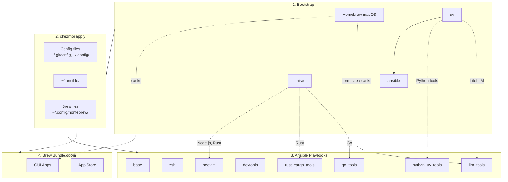

<!-- Generated by SpecStory, Markdown v2.1.0 -->

# 2026-09-01 07:14:16Z

<!-- Claude Code Session 3e0d0061-639b-4be1-9e5b-1a8401739507 (2026-09-01 07:14:16Z) -->

_**User (2026-09-01 07:14:16Z)**_

幫我修正目前 chezmoi apply 遇到的種種問題

```
────────────────────────────────────────────────────────────
localhost                  : ok=74   changed=9    unreachable=0    failed=1    skipped=665  rescued=0    ignored=1

Changed tasks (9):
  ✦ base : Install base packages (macOS) (15.8s)
  ✦ devtools : Trust untrusted third-party taps (macOS) (0.9s)
  ✦ devtools : Install developer CLI tools (macOS) (38.6s)
  ✦ devtools : Install LibreOffice via Homebrew Cask (macOS) (47.3s)
  ✦ devtools : Install calibre cask (55.1s)
  ✦ devtools : Download herdr binary to ~/.local/bin (4.8s)
  ✦ devtools : herdr plugin install cloudmanic/herdr-plus (12.0s)
  ✦ coding_agents : Tap peon-ping formula (macOS) (4.7s)
  ✦ coding_agents : Trust the peon-ping tap (macOS) (0.4s)

Slow tasks (>5s):
  ⏱ devtools : Install calibre cask (55.1s)
  ⏱ devtools : Install LibreOffice via Homebrew Cask (macOS) (47.3s)
  ⏱ devtools : Install developer CLI tools (macOS) (38.6s)
  ⏱ homebrew : Update Homebrew (29.6s)
  ⏱ base : Install base packages (macOS) (15.8s)
  ⏱ devtools : herdr plugin install cloudmanic/herdr-plus (12.0s)
  ⏱ coding_agents : Install peon-ping (macOS) (8.8s)
  ⏱ homebrew : Clean up stale Homebrew versions and links (6.7s)

chezmoi: .chezmoiscripts/global/20_ansible_roles.sh: exit status 2
mise WARN  missing: rust@stable

~ via  v3.14.4 took 11m56s
❯ specstory run codex

╭─────────────────────────────────────────────────────────────╮
│                   Update Available! 🚀                      │
├─────────────────────────────────────────────────────────────┤
│ Current version: 1.12.0                                     │
│ Latest version:  2.10.0                                     │
├─────────────────────────────────────────────────────────────┤
│ Visit https://docs.specstory.com/quickstart for updates     │
╰─────────────────────────────────────────────────────────────╯


   ERROR

  Codex CLI execution failed: codex execution failed: signal: killed.


~ via  v3.14.4
❯ specstory run claude

╭─────────────────────────────────────────────────────────────╮
│                   Update Available! 🚀                      │
├─────────────────────────────────────────────────────────────┤
│ Current version: 1.12.0                                     │
│ Latest version:  2.10.0                                     │
├─────────────────────────────────────────────────────────────┤
│ Visit https://docs.specstory.com/quickstart for updates     │
╰─────────────────────────────────────────────────────────────╯


─────────────────────────────────────────────────────────────────────────────────────────────────────────────────────────────────────────────────────────────────────────────────────────────────────────────────────────────────────────────────────────────────────────────────────────────────────────────────────────────
 Accessing workspace:

 /Users/zhouhanru

 Quick safety check: Is this a project you created or one you trust? (Like your own code, a well-known open source project, or work from your team). If not, take a moment to review what's in this folder first.

 Claude Code'll be able to read, edit, and execute files here.

 Security guide

 ❯ 1. Yes, I trust this folder
   2. No, exit

 Press Ctrl-C again to exit

~ via  v3.14.4 took 4s
❯ chezmoi cd
mise WARN  missing: rust@stable
mise WARN  missing: rust@stable

chezmoi on  main via  v3.14.4
❯ clear

chezmoi on  main via  v3.14.4
❯ specstory run claude

chezmoi on  main via  v3.14.4
❯ just upgrade-agents

chezmoi on  main via  v3.14.4
❯ brew upgrade specstory
==> Downloading Homebrew API data
✔︎ JSON API packages.arm64_tahoe.jws.json            Downloaded   15.5MB/ 15.5MB
Error: Refusing to load formula specstoryai/tap/specstory from untrusted tap specstoryai/tap.
Run `brew trust --formula specstoryai/tap/specstory` or `brew trust specstoryai/tap` to trust it.

chezmoi on  main via  v3.14.4
❯ brew trust --formula specstoryai/tap/specstory
Trusted formula: specstoryai/tap/specstory

chezmoi on  main via  v3.14.4
❯ brew upgrade specstory
Warning: The following taps are not trusted:
  anomalyco/tap
  hashicorp/tap
  jesseduffield/lazygit
  marcus/tap
  nikitabobko/tap
  owloops/tap
  steipete/tap
  supabase/tap
  teamookla/speedtest

Homebrew is currently ignoring formulae, casks and commands from these taps because tap trust is required.

Prefer trusting only the specific formulae, casks or commands you need.
Trust installed formulae from these taps with:
  brew trust --formula anomalyco/tap/opencode
  brew trust --formula hashicorp/tap/terraform
  brew trust --formula marcus/tap/sidecar marcus/tap/td
  brew trust --formula owloops/tap/updo
  brew trust --formula steipete/tap/summarize
  brew trust --formula supabase/tap/supabase
  brew trust --formula teamookla/speedtest/speedtest
Trust installed casks from these taps with:
  brew trust --cask nikitabobko/tap/aerospace
  brew trust --cask steipete/tap/codexbar
Trust other specific commands with:
  brew trust --command <user>/<tap>/<command>
Whole-tap trust is broader and includes all current and future formulae,
casks and commands from the listed taps. Trust whole taps with:
  brew trust anomalyco/tap hashicorp/tap jesseduffield/lazygit marcus/tap nikitabobko/tap owloops/tap steipete/tap supabase/tap teamookla/speedtest
Untap them with:
  brew untap anomalyco/tap hashicorp/tap jesseduffield/lazygit marcus/tap nikitabobko/tap owloops/tap steipete/tap supabase/tap teamookla/speedtest
To disable trust checks:
  export HOMEBREW_NO_REQUIRE_TAP_TRUST=1
This is not recommended and will be removed in a later release.
For more information, see:
  https://docs.brew.sh/Tap-Trust
==> Would upgrade 1 requested outdated package
specstoryai/tap/specstory 1.12.0 -> 2.10.0
==> Do you want to proceed with the upgrade? [y/n]
==> Fetching downloads for: specstoryai/tap/specstory
✔︎ Formula specstory (2.10.0)                                                                                                                                                                                                                                                                     Verified     16.3MB/ 16.3MB
==> Upgrading specstoryai/tap/specstory
  1.12.0 -> 2.10.0
Error: Your Command Line Tools are too outdated.

Update them from Software Update in System Settings.

If that doesn't show you any updates, run:
  sudo rm -rf /Library/Developer/CommandLineTools
  sudo xcode-select --install

Alternatively, manually download them from:
  https://developer.apple.com/download/all/.
You should download the Command Line Tools for Xcode 26.3.

chezmoi on  main via  v3.14.4 took 8s
❯ specstory run claude

chezmoi on  main via  v3.14.4
❯ sudo rm -rf /Library/Developer/CommandLineTools
Password:
sudo xcode-select --install

chezmoi on  main via  v3.14.4 took 20s
❯ brew upgrade specstory
Warning: The following taps are not trusted:
  anomalyco/tap
  hashicorp/tap
  jesseduffield/lazygit
  marcus/tap
  nikitabobko/tap
  owloops/tap
  steipete/tap
  supabase/tap
  teamookla/speedtest

Homebrew is currently ignoring formulae, casks and commands from these taps because tap trust is required.

Prefer trusting only the specific formulae, casks or commands you need.
Trust installed formulae from these taps with:
  brew trust --formula anomalyco/tap/opencode
  brew trust --formula hashicorp/tap/terraform
  brew trust --formula marcus/tap/sidecar marcus/tap/td
  brew trust --formula owloops/tap/updo
  brew trust --formula steipete/tap/summarize
  brew trust --formula supabase/tap/supabase
  brew trust --formula teamookla/speedtest/speedtest
Trust installed casks from these taps with:
  brew trust --cask nikitabobko/tap/aerospace
  brew trust --cask steipete/tap/codexbar
Trust other specific commands with:
  brew trust --command <user>/<tap>/<command>
Whole-tap trust is broader and includes all current and future formulae,
casks and commands from the listed taps. Trust whole taps with:
  brew trust anomalyco/tap hashicorp/tap jesseduffield/lazygit marcus/tap nikitabobko/tap owloops/tap steipete/tap supabase/tap teamookla/speedtest
Untap them with:
  brew untap anomalyco/tap hashicorp/tap jesseduffield/lazygit marcus/tap nikitabobko/tap owloops/tap steipete/tap supabase/tap teamookla/speedtest
To disable trust checks:
  export HOMEBREW_NO_REQUIRE_TAP_TRUST=1
This is not recommended and will be removed in a later release.
For more information, see:
  https://docs.brew.sh/Tap-Trust
==> Would upgrade 1 requested outdated package
specstoryai/tap/specstory 1.12.0 -> 2.10.0
==> Do you want to proceed with the upgrade? [y/n]
==> Fetching downloads for: specstoryai/tap/specstory
✔︎ Formula specstory (2.10.0)                                                                                                                                                                                                                                                                     Verified     16.3MB/ 16.3MB
==> Upgrading specstoryai/tap/specstory
  1.12.0 -> 2.10.0
Error: No developer tools installed.

Install the Command Line Tools:
  xcode-select --install
```

---

_**Agent (claude-opus-5 2026-09-01 07:14:27Z)**_

_**Agent (claude-opus-5 2026-09-01 07:14:29Z)**_

我先盤點現況再動手。先看機器狀態與 repo 裡相關的 trust 邏輯。

_**Agent (claude-opus-5 2026-09-01 07:14:38Z)**_

<tool-use data-tool-type="shell" data-tool-name="Bash"><details>
<summary>Tool use: **Bash**</summary>
Check Command Line Tools state

`echo "=== xcode-select -p ==="; xcode-select -p 2>&1; echo "=== CLT dir ==="; ls -d /Library/Developer/CommandLineTools 2>&1; echo "=== pkgutil CLT ==="; pkgutil --pkg-info=com.apple.pkg.CLTools_Executables 2>&1 | head -5; echo "=== softwareupdate list (CLT) ==="; softwareupdate --list 2>&1 | head -20`

```text
=== xcode-select -p ===
xcode-select: error: Unable to get active developer directory. Use `sudo xcode-select --switch path/to/Xcode.app` to set one (or see `man xcode-select`)
=== CLT dir ===
"/Library/Developer/CommandLineTools": No such file or directory (os error 2)
=== pkgutil CLT ===
package-id: com.apple.pkg.CLTools_Executables
version: 16.4.0.0.1.1747106510
volume: /
location: /
install-time: 1752238720
=== softwareupdate list (CLT) ===
Software Update Tool

Finding available software
Software Update found the following new or updated software:
* Label: Command Line Tools for Xcode 26.5-26.5
	Title: Command Line Tools for Xcode 26.5, Version: 26.5, Size: 920416KiB, Recommended: YES, 
* Label: Command Line Tools for Xcode 26.6-26.6
	Title: Command Line Tools for Xcode 26.6, Version: 26.6, Size: 920431KiB, Recommended: YES,
```
</details></tool-use>

_**Agent (claude-opus-5 2026-09-01 07:14:38Z)**_

<tool-use data-tool-type="shell" data-tool-name="Bash"><details>
<summary>Tool use: **Bash**</summary>
Find brew trust logic in repo

`echo "=== trust tasks ==="; grep -rn "brew trust\|tap_trust\|NO_REQUIRE_TAP_TRUST\|untrusted" --include=*.yml --include=*.yaml --include=*.sh --include=*.tmpl --include=*.j2 . | grep -v '^./.specstory' | head -60`

```text
=== trust tasks ===
(eval):1: no matches found: --include=*.yml
```
</details></tool-use>

_**Agent (claude-opus-5 2026-09-01 07:14:41Z)**_

_**Agent (claude-opus-5 2026-09-01 07:14:43Z)**_

CLT 確實被刪光了（`xcode-select -p` 失敗），這是目前最阻塞的問題。先繼續盤點 repo。

_**Agent (claude-opus-5 2026-09-01 07:14:45Z)**_

<tool-use data-tool-type="shell" data-tool-name="Bash"><details>
<summary>Tool use: **Bash**</summary>
Find brew trust logic in repo

`grep -rn "brew trust\|tap_trust\|NO_REQUIRE_TAP_TRUST\|untrusted" --include='*.yml' --include='*.yaml' --include='*.sh' --include='*.tmpl' --include='*.j2' --include='*.md' . | grep -v '^\./\.specstory' | head -60`

```text
backlog/opencodebox-wrapper.md:33:3. **Try-on-untrusted-machine** — drop into opencode on a borrowed box
.specstory/history/2026-07-27_06-40-03Z.md:487: pitfalls/homebrew-6-refuses-untrusted-tap-formula.md                                                             |   121 +
.specstory/history/2026-07-27_06-40-03Z.md:840: create mode 100644 pitfalls/homebrew-6-refuses-untrusted-tap-formula.md
.specstory/history/2026-07-27_06-40-03Z.md:3260:- [`homebrew-6-refuses-untrusted-tap-formula.md`](homebrew-6-refuses-untrusted-tap-formula.md)
.specstory/history/2026-07-27_06-40-03Z.md:3863:INFO    -  Doc file 'this_repo/tool-managers.md' contains a link '../../pitfalls/homebrew-6-refuses-untrusted-tap-formula.md', but the target '../pitfalls/homebrew-6-refuses-untrusted-tap-formula.md' is not found among documentation files.
.specstory/history/2026-07-08_02-04-53Z-image-hash-1-tailscale.md:919:| [`homebrew-6-refuses-untrusted-tap-formula`](homebrew-6-refuses-untrusted-tap-formula.md) | `chezmoi apply` dies at `devtools : Install developer CLI tools (macOS)` with `Error: Refusing to load formula raine/workmux/workmux from untrusted tap`; `Run \`brew trust raine/workmux\``; `brew tap-info <tap>` shows `Untrusted`; both `raine/workmux` and `dlvhdr/formulae` affected; worked days earlier | fixed (devtools role auto-`brew trust`s third-party taps; Homebrew 6.0 formula-trust gate) |
.specstory/history/2026-07-08_02-04-53Z-image-hash-1-tailscale.md:1312:125	| [`homebrew-6-refuses-untrusted-tap-formula`](homebrew-6-refuses-untrusted-tap-formula.md) | `chezmoi apply` dies at `devtools : Install developer CLI tools (macOS)` with `Error: Refusing to load formula raine/workmux/workmux from untrusted tap`; `Run \`brew trust raine/workmux\``; `brew tap-info <tap>` shows `Untrusted`; both `raine/workmux` and `dlvhdr/formulae` affected; worked days earlier | fixed (devtools role auto-`brew trust`s third-party taps; Homebrew 6.0 formula-trust gate) |
.specstory/history/2026-08-12_06-44-13Z-herdr-rg-grep-server.md:57716:I'm analyzing how splitlines works in JSON parsing, noting that JSON lines can have carriage returns which complicate things. It seems that printed output can overwrite prefixes or terminal injections, especially in untrusted pane content. In terms of CLI UX, it makes sense to sanitize control characters. For instance, when reading the terminal scrollback, it often has ANSI escape sequences, and I’m thinking that using `herdr pane read --format text` may render it plain, likely stripping out ANSI sequences.
.specstory/history/2026-08-12_06-44-13Z-herdr-rg-grep-server.md:128342:Container hardening; egress restriction (there is no default); `ANTHROPIC_ENVIRONMENT_KEY` custody and rotation; one workspace + environment per trust boundary when running untrusted code; least-privilege for the tool process; log retention and redaction. **Anthropic cannot**: fast-revoke a leaked environment key, verify your image or supply chain, sandbox tool execution inside your container, or enforce retention after tool output reaches your infrastructure. See the Self-Hosted Sandboxes Security page in `shared/live-sources.md` for the full checklist.
.specstory/history/2026-08-12_06-44-13Z-herdr-rg-grep-server.md:131557:> **Security — commands are untrusted model output.** Run in an isolated environment (container, VM, or restricted user); apply an **allowlist** of permitted executables and reject shell operators (`&&`, `|`, `;`, `` ` ``, `$()`); set timeouts and resource limits; log every command. A blocklist is not sufficient.
.specstory/history/2026-08-12_06-44-13Z-herdr-rg-grep-server.md:131567:> **Security — `path` is untrusted model output. Confine every file operation to a fixed project root.** Before executing any command, resolve the model-supplied `path` to its canonical form and verify it remains within your project root; reject the request if it escapes (`..`, symlinks, absolute paths outside the root, URL-encoded traversal like `%2e%2e%2f`). Use your language's built-in path utilities (e.g., Python `pathlib.Path.resolve()` then check `.is_relative_to(root)`). Never call `open()` / `writeFile` / `unlink` directly on the raw `path` value.
.specstory/history/2026-08-12_06-44-13Z-herdr-rg-grep-server.md:134860:I’m thinking about how test stubs should target concrete, reachable defects, like validating input boundaries for potentially invalid external JSON. They already test for NUL in a pane. Yet, a NUL session socket could be a malicious stub. I need to prioritize real issues and focus on untrusted helper paths, such as those involving newline or shlex quoting. It's essential to ensure data is sanitized, especially with ANSI escapes and Unicode separators being okay. Safety is key!
.specstory/history/2026-07-27_08-31-07Z-codexbar-https-github-com.md:4819:  brew trust steipete/tap
.specstory/history/2026-07-27_08-31-07Z-codexbar-https-github-com.md:4821:  export HOMEBREW_NO_REQUIRE_TAP_TRUST=1
.specstory/history/2026-07-27_08-31-07Z-codexbar-https-github-com.md:5437:INFO    -  Doc file 'this_repo/tool-managers.md' contains a link '../../pitfalls/homebrew-6-refuses-untrusted-tap-formula.md', but the target '../pitfalls/homebrew-6-refuses-untrusted-tap-formula.md' is not found among documentation files.
.specstory/history/2026-07-27_08-31-07Z-codexbar-https-github-com.md:6620: Homebrew 6+ refuses formulae/casks from untrusted third-party taps. Role-driven
.specstory/history/2026-08-20_03-14-04Z-at-src-tries-2026.md:72679:> 6. Input sanitization concerns for GitHub Action workflows unless they are clearly triggerable via untrusted input.
.specstory/history/2026-08-20_03-14-04Z-at-src-tries-2026.md:72688:> 15. Regex injection. Injecting untrusted content into a regex is not a vulnerability.
.specstory/history/2026-08-20_03-14-04Z-at-src-tries-2026.md:72701:> 8. A lack of permission checking or authentication in client-side JS/TS code is not a vulnerability. Client-side code is not trusted and does not need to implement these checks, they are handled on the server-side. The same applies to all flows that send untrusted data to the backend, the backend is responsible for validating and sanitizing all inputs.
.specstory/history/2026-08-20_03-14-04Z-at-src-tries-2026.md:72703:> 10. Most vulnerabilities in ipython notebooks (*.ipynb files) are not exploitable in practice. Before validating a notebook vulnerability ensure it is concrete and has a very specific attack path where untrusted input can trigger the vulnerability.
.specstory/history/2026-08-20_03-14-04Z-at-src-tries-2026.md:72705:> 12. Command injection vulnerabilities in shell scripts are generally not exploitable in practice since shell scripts generally do not run with untrusted user input. Only report command injection vulnerabilities in shell scripts if they are concrete and have a very specific attack path for untrusted input.
.specstory/history/2026-08-28_09-42-22Z-lazygit-ctrl-o-copy.md:5952:| **peon-ping** (`peon`) | brew tap `PeonPing/tap` (needs `brew trust`, Homebrew 6 gate) | `install.sh --openpeon --no-rc` | coding_agents — agent completion sounds; **never run `peon-ping-setup`** (hooks are declared in `dot_claude/modify_settings.json.tmpl`). Gated by the `agentSounds` prompt. See [agent-sounds.md](../tools/agent-sounds.md) |
.specstory/history/2026-08-28_09-42-22Z-lazygit-ctrl-o-copy.md:7993:| **peon-ping** (`peon`) | brew tap `PeonPing/tap` (needs `brew trust`, Homebrew 6 gate) | `install.sh --openpeon --no-rc` | coding_agents — agent completion sounds; **never run `peon-ping-setup`** (hooks are declared in `dot_claude/modify_settings.json.tmpl`). Gated by the `agentSounds` prompt. See [agent-sounds.md](../tools/agent-sounds.md) |
.specstory/history/2026-07-09_07-01-06Z-gh-select-tui-youtube.md:2021:213	Homebrew 6+ refuses formulae/casks from untrusted third-party taps. Role-driven
.specstory/history/2026-07-09_07-01-06Z-gh-select-tui-youtube.md:2022:214	taps must run a `brew tap-info <tap>` → `brew trust <tap>` check before installing
.specstory/history/2026-07-09_07-01-06Z-gh-select-tui-youtube.md:2025:217	[`pitfalls/homebrew-6-refuses-untrusted-tap-formula.md`](../../pitfalls/homebrew-6-refuses-untrusted-tap-formula.md).
.specstory/history/2026-07-12_18-54-23Z-at-dot-claude-modify.md:1788:1460	  * Marketplace is registered from an untrusted source
.specstory/history/2026-06-19_03-44-26Z-project-agent-skills-tmpl.md:10644:118	| [`homebrew-6-refuses-untrusted-tap-formula`](homebrew-6-refuses-untrusted-tap-formula.md) | `chezmoi apply` dies at `devtools : Install developer CLI tools (macOS)` with `Error: Refusing to load formula raine/workmux/workmux from untrusted tap`; `Run \`brew trust raine/workmux\``; `brew tap-info <tap>` shows `Untrusted`; both `raine/workmux` and `dlvhdr/formulae` affected; worked days earlier | fixed (devtools role auto-`brew trust`s third-party taps; Homebrew 6.0 formula-trust gate) |
.specstory/history/2026-06-19_03-44-26Z-project-agent-skills-tmpl.md:10793:homebrew-6-refuses-untrusted-tap-formula.md
.specstory/history/2026-06-19_03-44-26Z-project-agent-skills-tmpl.md:11465:441a688 fix(devtools): brew trust third-party taps (Homebrew 6 formula-trust gate)
.specstory/history/2026-07-27_06-40-03Z-task-notification.md:487: pitfalls/homebrew-6-refuses-untrusted-tap-formula.md                                                             |   121 +
.specstory/history/2026-07-27_06-40-03Z-task-notification.md:840: create mode 100644 pitfalls/homebrew-6-refuses-untrusted-tap-formula.md
.specstory/history/2026-07-27_06-40-03Z-task-notification.md:3260:- [`homebrew-6-refuses-untrusted-tap-formula.md`](homebrew-6-refuses-untrusted-tap-formula.md)
.specstory/history/2026-07-27_06-40-03Z-task-notification.md:3863:INFO    -  Doc file 'this_repo/tool-managers.md' contains a link '../../pitfalls/homebrew-6-refuses-untrusted-tap-formula.md', but the target '../pitfalls/homebrew-6-refuses-untrusted-tap-formula.md' is not found among documentation files.
.specstory/history/2026-08-14_10-01-38Z-specstory-run-antigravity-cli.md:1294: * retained entry count and label size are bounded because stdin is untrusted.
.specstory/history/2026-08-14_10-01-38Z-specstory-run-antigravity-cli.md:66981:> 6. Input sanitization concerns for GitHub Action workflows unless they are clearly triggerable via untrusted input.
.specstory/history/2026-08-14_10-01-38Z-specstory-run-antigravity-cli.md:66990:> 15. Regex injection. Injecting untrusted content into a regex is not a vulnerability.
.specstory/history/2026-08-14_10-01-38Z-specstory-run-antigravity-cli.md:67003:> 8. A lack of permission checking or authentication in client-side JS/TS code is not a vulnerability. Client-side code is not trusted and does not need to implement these checks, they are handled on the server-side. The same applies to all flows that send untrusted data to the backend, the backend is responsible for validating and sanitizing all inputs.
.specstory/history/2026-08-14_10-01-38Z-specstory-run-antigravity-cli.md:67005:> 10. Most vulnerabilities in ipython notebooks (*.ipynb files) are not exploitable in practice. Before validating a notebook vulnerability ensure it is concrete and has a very specific attack path where untrusted input can trigger the vulnerability.
.specstory/history/2026-08-14_10-01-38Z-specstory-run-antigravity-cli.md:67007:> 12. Command injection vulnerabilities in shell scripts are generally not exploitable in practice since shell scripts generally do not run with untrusted user input. Only report command injection vulnerabilities in shell scripts if they are concrete and have a very specific attack path for untrusted input.
.specstory/history/2026-08-14_10-01-38Z-specstory-run-antigravity-cli.md:105396:> 6. Input sanitization concerns for GitHub Action workflows unless they are clearly triggerable via untrusted input.
.specstory/history/2026-08-14_10-01-38Z-specstory-run-antigravity-cli.md:105405:> 15. Regex injection. Injecting untrusted content into a regex is not a vulnerability.
.specstory/history/2026-08-14_10-01-38Z-specstory-run-antigravity-cli.md:105418:> 8. A lack of permission checking or authentication in client-side JS/TS code is not a vulnerability. Client-side code is not trusted and does not need to implement these checks, they are handled on the server-side. The same applies to all flows that send untrusted data to the backend, the backend is responsible for validating and sanitizing all inputs.
.specstory/history/2026-08-14_10-01-38Z-specstory-run-antigravity-cli.md:105420:> 10. Most vulnerabilities in ipython notebooks (*.ipynb files) are not exploitable in practice. Before validating a notebook vulnerability ensure it is concrete and has a very specific attack path where untrusted input can trigger the vulnerability.
.specstory/history/2026-08-14_10-01-38Z-specstory-run-antigravity-cli.md:105422:> 12. Command injection vulnerabilities in shell scripts are generally not exploitable in practice since shell scripts generally do not run with untrusted user input. Only report command injection vulnerabilities in shell scripts if they are concrete and have a very specific attack path for untrusted input.
.specstory/history/2026-08-14_10-01-38Z-specstory-run-antigravity-cli.md:114236:> 6. Input sanitization concerns for GitHub Action workflows unless they are clearly triggerable via untrusted input.
.specstory/history/2026-08-14_10-01-38Z-specstory-run-antigravity-cli.md:114245:> 15. Regex injection. Injecting untrusted content into a regex is not a vulnerability.
.specstory/history/2026-08-14_10-01-38Z-specstory-run-antigravity-cli.md:114258:> 8. A lack of permission checking or authentication in client-side JS/TS code is not a vulnerability. Client-side code is not trusted and does not need to implement these checks, they are handled on the server-side. The same applies to all flows that send untrusted data to the backend, the backend is responsible for validating and sanitizing all inputs.
.specstory/history/2026-08-14_10-01-38Z-specstory-run-antigravity-cli.md:114260:> 10. Most vulnerabilities in ipython notebooks (*.ipynb files) are not exploitable in practice. Before validating a notebook vulnerability ensure it is concrete and has a very specific attack path where untrusted input can trigger the vulnerability.
.specstory/history/2026-08-14_10-01-38Z-specstory-run-antigravity-cli.md:114262:> 12. Command injection vulnerabilities in shell scripts are generally not exploitable in practice since shell scripts generally do not run with untrusted user input. Only report command injection vulnerabilities in shell scripts if they are concrete and have a very specific attack path for untrusted input.
.specstory/history/2026-08-14_10-01-38Z-specstory-run-antigravity-cli.md:114728:I’ll independently trace each reported path against the current tree, then reproduce the shell-completion, launcher, test-failure, lyrics-option, and help-dispatch scenarios. I’ll treat the proposed interpretation as untrusted and only retain findings with observable incorrect behavior.
.specstory/history/2026-08-14_10-01-38Z-specstory-run-antigravity-cli.md:125278:> 6. Input sanitization concerns for GitHub Action workflows unless they are clearly triggerable via untrusted input.
.specstory/history/2026-08-14_10-01-38Z-specstory-run-antigravity-cli.md:125287:> 15. Regex injection. Injecting untrusted content into a regex is not a vulnerability.
.specstory/history/2026-08-14_10-01-38Z-specstory-run-antigravity-cli.md:125300:> 8. A lack of permission checking or authentication in client-side JS/TS code is not a vulnerability. Client-side code is not trusted and does not need to implement these checks, they are handled on the server-side. The same applies to all flows that send untrusted data to the backend, the backend is responsible for validating and sanitizing all inputs.
.specstory/history/2026-08-14_10-01-38Z-specstory-run-antigravity-cli.md:125302:> 10. Most vulnerabilities in ipython notebooks (*.ipynb files) are not exploitable in practice. Before validating a notebook vulnerability ensure it is concrete and has a very specific attack path where untrusted input can trigger the vulnerability.
.specstory/history/2026-08-14_10-01-38Z-specstory-run-antigravity-cli.md:125304:> 12. Command injection vulnerabilities in shell scripts are generally not exploitable in practice since shell scripts generally do not run with untrusted user input. Only report command injection vulnerabilities in shell scripts if they are concrete and have a very specific attack path for untrusted input.
.specstory/history/2026-08-14_10-01-38Z-specstory-run-antigravity-cli.md:150716:> 6. Input sanitization concerns for GitHub Action workflows unless they are clearly triggerable via untrusted input.
.specstory/history/2026-08-14_10-01-38Z-specstory-run-antigravity-cli.md:150725:> 15. Regex injection. Injecting untrusted content into a regex is not a vulnerability.
.specstory/history/2026-08-14_10-01-38Z-specstory-run-antigravity-cli.md:150738:> 8. A lack of permission checking or authentication in client-side JS/TS code is not a vulnerability. Client-side code is not trusted and does not need to implement these checks, they are handled on the server-side. The same applies to all flows that send untrusted data to the backend, the backend is responsible for validating and sanitizing all inputs.
.specstory/history/2026-08-14_10-01-38Z-specstory-run-antigravity-cli.md:150740:> 10. Most vulnerabilities in ipython notebooks (*.ipynb files) are not exploitable in practice. Before validating a notebook vulnerability ensure it is concrete and has a very specific attack path where untrusted input can trigger the vulnerability.
```
</details></tool-use>

_**Agent (claude-opus-5 2026-09-01 07:14:45Z)**_

<tool-use data-tool-type="shell" data-tool-name="Bash"><details>
<summary>Tool use: **Bash**</summary>
List ansible roles and brew taps

`ls dot_ansible/roles/ && echo "=== taps ==="; brew tap 2>/dev/null`

```text
atuin
auditd
base
bash
bitwarden
coding_agents
devtools
docker
dotnet_tools
go_tools
gui_apps_linux
homebrew
homelab_tools
iac_tools
input_method
js_cli_tools
lazyvim_deps
llm_tools
media_control
media_tools
neovim
nerdfonts
networking_tools
niri
python_uv_tools
resilio_sync
ruby_gem_tools
rust_cargo_tools
security_tools
starship
summarize
wake_on_lan
zsh
=== taps ===
anomalyco/tap
dlvhdr/formulae
hashicorp/tap
jesseduffield/lazygit
marcus/tap
nikitabobko/tap
owloops/tap
peonping/tap
raine/workmux
specstoryai/tap
steipete/tap
supabase/tap
teamookla/speedtest
```
</details></tool-use>

_**Agent (claude-opus-5 2026-09-01 07:14:49Z)**_

_**Agent (claude-opus-5 2026-09-01 07:14:49Z)**_

<tool-use data-tool-type="shell" data-tool-name="Bash"><details>
<summary>Tool use: **Bash**</summary>
Find trust logic in ansible/scripts

`grep -rn "brew trust\|tap-info\|Trusted" dot_ansible scripts .chezmoiscripts justfile 2>/dev/null | head -40`

```text
dot_ansible/roles/coding_agents/tasks/main.yml:1390:  ansible.builtin.command: "brew tap-info PeonPing/tap"
dot_ansible/roles/coding_agents/tasks/main.yml:1400:  ansible.builtin.command: "brew trust PeonPing/tap"
dot_ansible/roles/networking_tools/tasks/main.yml:39:      ansible.builtin.command: brew tap-info teamookla/speedtest
dot_ansible/roles/networking_tools/tasks/main.yml:46:      ansible.builtin.command: brew trust teamookla/speedtest
dot_ansible/roles/devtools/tasks/main.yml:28:# homebrew_tap module has no trust parameter, so trust via `brew trust`.
dot_ansible/roles/devtools/tasks/main.yml:30:# `tap-info` won't contain "Untrusted" and the trust task no-ops (no version
dot_ansible/roles/devtools/tasks/main.yml:35:  ansible.builtin.command: "brew tap-info {{ item }}"
dot_ansible/roles/devtools/tasks/main.yml:47:  ansible.builtin.command: "brew trust {{ item.item }}"
.chezmoiscripts/global/run_onchange_after_30_brew_bundle.sh.tmpl:352:        info_out="$(brew tap-info "$tap" 2>/dev/null || true)"
.chezmoiscripts/global/run_onchange_after_30_brew_bundle.sh.tmpl:355:            brew trust "$tap"
```
</details></tool-use>

_**Agent (claude-opus-5 2026-09-01 07:14:50Z)**_

<tool-use data-tool-type="shell" data-tool-name="Bash"><details>
<summary>Tool use: **Bash**</summary>
Read existing pitfall doc

`cat pitfalls/homebrew-6-refuses-untrusted-tap-formula.md 2>/dev/null | head -80`

```text
# `chezmoi apply` aborts: Homebrew refuses to load a formula/cask from an untrusted tap

**Symptoms** (grep this section):
- `Error: Refusing to load formula raine/workmux/workmux from untrusted tap raine/workmux.`
- `Run \`brew trust --formula raine/workmux/workmux\` or \`brew trust raine/workmux\` to trust it.`
- `Error: Refusing to load formula teamookla/speedtest/speedtest from untrusted tap teamookla/speedtest.`
- `Error: Refusing to load cask wxtsky/tap/codeisland from untrusted tap wxtsky/tap.`
- ansible `devtools : Install developer CLI tools (macOS)` task → `FAILED!` → `changed: false`
- ansible `networking_tools : Install speedtest` task → `FAILED!` → `changed: false`
- `brew bundle` fails while fetching `codeisland`, then the retry fails the same way
- `.chezmoiscripts/global/20_ansible_roles.sh: exit status 2`; `PLAY RECAP … failed=1`
- Worked fine on the same machine days earlier; nobody changed the tap

**First seen**: 2026-06 (Mac mini, macOS 26.2, Homebrew 6.0.2)
**Affects**: Homebrew ≥ 6.0 on any OS, any third-party tap this repo uses (`raine/workmux`, `dlvhdr/formulae`, `teamookla/speedtest`, Brewfile taps such as `wxtsky/tap`)
**Status**: fixed in repo (`devtools` + `networking_tools` trust tasks; Brewfile run-script trusts `tap "..."` entries before `brew bundle`)

## Symptom

`chezmoi apply` / `chezmoi update` dies in the `devtools` role:

```
[24] TASK · [devtools : Install developer CLI tools (macOS)]
[ERROR]: Task failed: Module failed: Error: Refusing to load formula raine/workmux/workmux from untrusted tap raine/workmux.
Run `brew trust --formula raine/workmux/workmux` or `brew trust raine/workmux` to trust it.
...
chezmoi: .chezmoiscripts/global/20_ansible_roles.sh: exit status 2
```

The task taps `raine/workmux` and `dlvhdr/formulae` (via `community.general.homebrew_tap`)
and then `brew install`s `workmux` + `diffnav` from them. The tap succeeds; the
**install** refuses. Even after manually trusting `raine/workmux`, the next run
fails again on `dlvhdr/formulae` — **both** taps are untrusted.

Same shape in other install paths:

- `networking_tools` manually taps `teamookla/speedtest`, then `brew install speedtest` refuses.
- Brewfile taps such as `wxtsky/tap` are tapped by `brew bundle`, then cask fetch/install
  refuses with `Refusing to load cask ... from untrusted tap`.

## Root cause

**Homebrew 6.0 added a tap-trust security gate.** `brew install` / `brew bundle`
now refuse to load formulae or casks from third-party taps until the tap is
explicitly trusted. `community.general.homebrew_tap` taps the repo but has **no
trust parameter** (the feature is newer than the module), so the tap stays
untrusted and the install fails.

Confirm state with `brew tap-info <tap>` — an untrusted tap shows a literal
`Untrusted` line:

```
$ brew tap-info raine/workmux
raine/workmux: Installed
Untrusted          # <-- this line is the gate
1 formula
```

Older Homebrew (< 6.0) has no trust concept at all — `tap-info` never prints
`Untrusted`, so this trap simply cannot occur there.

## Workaround

Trust the whole tap (one-liner, idempotent):

```bash
brew trust raine/workmux
brew trust dlvhdr/formulae
brew trust teamookla/speedtest
brew trust wxtsky/tap
# or per-formula: brew trust --formula raine/workmux/workmux
```

Then re-run `chezmoi apply` (or the ansible `devtools` tag).

## Prevention

Role-driven installs now trust their third-party taps automatically, between the
tap task and the install task. They check `brew tap-info` for the `Untrusted`
line and only run `brew trust` when needed (so it no-ops on older Homebrew and
```
</details></tool-use>

_**Agent (claude-opus-5 2026-09-01 07:15:02Z)**_

_**Agent (claude-opus-5 2026-09-01 07:15:04Z)**_

`.specstory` 歷史檔佔滿了搜尋結果。先直接看關鍵檔案與失敗紀錄。

_**Agent (claude-opus-5 2026-09-01 07:15:05Z)**_

<tool-use data-tool-type="shell" data-tool-name="Bash"><details>
<summary>Tool use: **Bash**</summary>
Look for ansible logs

`ls -lt ~/.cache/chezmoi-ansible/ 2>/dev/null | head; ls -lt /tmp/*ansible* 2>/dev/null | head; find ~/.cache ~/.local/state -maxdepth 3 -name '*ansible*' 2>/dev/null | head -20`

```text
(eval):1: no matches found: /tmp/*ansible*
/Users/zhouhanru/.cache/nvim/luac/%2fUsers%2fzhouhanru%2f.local%2fshare%2fnvim%2flazy%2fLazyVim%2flua%2flazyvim%2fplugins%2fextras%2flang%2fansible.luac
```
</details></tool-use>

_**Agent (claude-opus-5 2026-09-01 07:15:07Z)**_

<tool-use data-tool-type="shell" data-tool-name="Bash"><details>
<summary>Tool use: **Bash**</summary>
Check mise state and rust config

`echo "=== mise ls ==="; mise ls 2>&1 | head -40; echo "=== mise config files ==="; grep -rn "rust" ~/.config/mise/config.toml 2>/dev/null; ls ~/.config/mise/ 2>/dev/null; echo "=== repo mise ==="; find . -path ./.specstory -prune -o -name '*mise*' -print 2>/dev/null | head -20`

```text
=== mise ls ===
bun     1.3.13            ~/.config/mise/config.toml  1
dotnet  10.0.203          ~/.config/mise/config.toml  10
go      1.27.0 (missing)  ~/.config/mise/config.toml  latest
node    24.13.0           ~/.config/mise/config.toml  lts
ruby    3.4.8             ~/.config/mise/config.toml  3
rust    stable (missing)  ~/.config/mise/config.toml  stable
rust    1.93.0 (symlink)
=== mise config files ===
/Users/zhouhanru/.config/mise/config.toml:29:# Rust toolchain for cargo tools. Use the channel name so rustup-backed builds
/Users/zhouhanru/.config/mise/config.toml:31:rust = "stable"
/Users/zhouhanru/.config/mise/config.toml:34:# rust="stable" is: Go's compatibility promise (https://go.dev/doc/go1compat)
config.toml
=== repo mise ===
./backlog/mise-runtime-gating.md
./pitfalls/mise-rust-cargo-shim-dead.md
./pitfalls/go-install-gobin-resets-to-mise-toolchain-dir.md
./dot_config/mise
./dot_config/shell/05_mise.sh
```
</details></tool-use>

_**Agent (claude-opus-5 2026-09-01 07:15:10Z)**_

_**Agent (claude-opus-5 2026-09-01 07:15:12Z)**_

<tool-use data-tool-type="shell" data-tool-name="Bash"><details>
<summary>Tool use: **Bash**</summary>
Read mise rust pitfall and config

`cat pitfalls/mise-rust-cargo-shim-dead.md 2>/dev/null | head -70; echo "=========== CONFIG ==========="; cat dot_config/mise/config.toml 2>/dev/null || ls dot_config/mise/`

```text
# `cargo install` fails with "cargo is not a valid shim" after `~/.cargo/bin` is wiped

**Symptoms** (grep this section):

- `chezmoi apply` (or a bare `cargo install …`) fails inside the
  `rust_cargo_tools` role, e.g. on the recon task:
  ```
  TASK · [rust_cargo_tools : Install recon (Claude Code tmux dashboard) via cargo install --git]
  mise ERROR cargo is not a valid shim. This likely means you uninstalled a tool
  and the shim does not point to anything. Run `mise use <TOOL>` to reinstall the tool.
  ```
  or, depending on which cwd / context:
  ```
  mise ERROR cargo is a mise bin however it is not currently active. Use `mise use` to activate it
  ```
- `which cargo` → `cargo not found`; `~/.cargo/bin/cargo` does not exist.
- `mise ls rust` shows the pinned version as **`(missing)`** even though
  `~/.local/share/mise/installs/rust/` exists and is full of symlinks:
  ```
  $ mise ls rust
  rust  1.95.0 (missing)  ~/.config/mise/config.toml  latest
  $ ls -la ~/.local/share/mise/installs/rust
  1.93.0 -> /Users/you/.cargo/bin      ← target deleted; dead symlink
  latest -> ./1.93.0
  ```
- The ansible task `Install Rust via mise` reports **`ok` in ~0.2s** (it was
  skipped by its `creates:` guard, not actually run).
- **Cascading variant** (observed 2026-06-10 on `ta-stg`, Ubuntu 22.04): every
  `mise exec -- npm install -g …` task (coding_agents, js_cli_tools) fails with
  the same rust error before npm even runs — `mise exec` auto-installs ALL
  missing config tools first, so one broken rust mirror takes down unrelated
  npm installs and the `js_cli_tools` task (the only non-`ignore_errors` one)
  fails the whole play:
  ```
  mise rust@1.96.0     [1/3] install
  error: could not download nonexistent rust version `1.96.0-x86_64-unknown-linux-gnu`:
  … 'https://mirrors.tuna.tsinghua.edu.cn/rustup/dist/rust-1.96.0-….tar.gz.sha256'
  … http request returned an unsuccessful status code: 404
  ```
  Here TUNA's channel manifest already named 1.96.0 but the tarballs were not
  yet synced (mirror lag, the inverse of the GC case). Also note: the
  `creates: ~/.cargo/bin/cargo` guard does NOT help in this state — rustup's
  proxy shims exist in `~/.cargo/bin` even though no toolchain is installed
  ("rustup could not choose a version of cargo to run").

## Root cause — two independent traps that compound

1. **Dead-symlink + coarse `creates:` guard.** mise's `rust` backend is rustup,
   which installs the toolchain into `~/.cargo/bin` and makes
   `~/.local/share/mise/installs/rust/<ver>` a **symlink to `~/.cargo/bin`**. If
   `~/.cargo/bin` is later deleted (manual cleanup, disk reset, etc.), the mise
   `installs/rust` dir lingers full of dead symlinks. A guard of
   `creates: ~/.local/share/mise/installs/rust` then sees the dir, **skips the
   reinstall forever**, and the `cargo` shim resolves to nothing.

2. **Mirror manifest GC (GFW).** When `RUSTUP_DIST_SERVER` points at a mirror
   (this repo's users set the TUNA mirror in `dot_config/mise/config.toml.tmpl`
   / shell env), and the mise config pins `rust = "latest"`, `mise install
   rust@latest` can fail because the mirror has GC'd / not-yet-synced the newest
   manifest:
   ```
   info: syncing channel updates for 1.95.0-aarch64-apple-darwin
   error: the server unexpectedly provided an obsolete version of the distribution manifest
   mise ERROR Failed to install core:rust@latest
   ```
   So even once the guard re-triggers, the install itself fails on the mirror.

## Fix (shipped in `dot_ansible/roles/rust_cargo_tools/tasks/main.yml` + `lazyvim_deps`)

- Guard the mise rust install on **`creates: ~/.cargo/bin/cargo`** (the real
=========== CONFIG ===========
config.toml.tmpl
```
</details></tool-use>

_**Agent (claude-opus-5 2026-09-01 07:15:12Z)**_

<tool-use data-tool-type="shell" data-tool-name="Bash"><details>
<summary>Tool use: **Bash**</summary>
Read devtools trust task

`sed -n '1,80p' dot_ansible/roles/devtools/tasks/main.yml`

```text
---
# Developer CLI tools role
# Tools: bat, bats, gh, glab, diffnav, gh-dash, gh-notify, eza, git-delta, git-graph, tldr, glow, gum, vhs, freeze, thefuck, zoxide, direnv, yazi, superfile, tmux, sesh, worktrunk, workmux, zellij, herdr, btop, htop, duckdb, rclone, coreutils, taplo, television, pandoc, doxx, libreoffice, tailspin, lnav, grc, ccze (Linux only), dasel, yq, jnv, witr, figlet, toilet, lolcat, fastfetch, mosh, chafa, poppler, sevenzip (7zz), resvg (yazi preview deps)

# =============================================================================
# macOS - all via Homebrew
# =============================================================================

- name: Tap diffnav formula (macOS)
  when: ansible_facts["os_family"] == "Darwin"
  community.general.homebrew_tap:
    name: dlvhdr/formulae
    state: present

- name: Tap raine/workmux formula (macOS)
  # workmux is a tmux + git-worktree orchestrator with first-class agent
  # status icons (🤖 working / 💬 waiting / ✅ done) rendered into the tmux
  # window list. Coexists with worktrunk (`wt`); see docs/tools/workmux.md
  # for the wt-vs-wm split.
  when: ansible_facts["os_family"] == "Darwin"
  community.general.homebrew_tap:
    name: raine/workmux
    state: present

# Homebrew 6.0 added a formula-trust security gate: `brew install` refuses to
# load formulae from third-party taps until the tap is explicitly trusted
# ("Error: Refusing to load formula <tap>/<formula> from untrusted tap"). The
# homebrew_tap module has no trust parameter, so trust via `brew trust`.
# Idempotent + back-compatible: older Homebrew has no trust concept, so
# `tap-info` won't contain "Untrusted" and the trust task no-ops (no version
# gate needed). Keep this loop in sync with the third-party taps above — add any
# new third-party tap here too. See pitfalls/homebrew-6-refuses-untrusted-tap-formula.md
- name: Check trust state of third-party taps (macOS, Homebrew >= 6.0 formula-trust gate)
  when: ansible_facts["os_family"] == "Darwin"
  ansible.builtin.command: "brew tap-info {{ item }}"
  loop:
    - dlvhdr/formulae
    - raine/workmux
  register: devtools_tap_info
  changed_when: false
  failed_when: false

- name: Trust untrusted third-party taps (macOS)
  when:
    - ansible_facts["os_family"] == "Darwin"
    - "'Untrusted' in item.stdout"
  ansible.builtin.command: "brew trust {{ item.item }}"
  loop: "{{ devtools_tap_info.results }}"
  loop_control:
    label: "{{ item.item }}"
  changed_when: true

- name: Install developer CLI tools (macOS)
  when: ansible_facts["os_family"] == "Darwin"
  community.general.homebrew:
    name:
      - bat
      - bats-core
      - gh
      - glab
      - diffnav
      - git-delta
      - git-graph
      - eza
      - tlrc
      - glow
      # doxx — terminal-native .docx viewer (rich tables/formatting, LaTeX, and
      # `--export ansi/markdown/text` for piping). Powers the .docx path of the
      # in-house `view-office` CLI + the yazi Office previewer. In homebrew-core,
      # so no tap needed (the README's `bgreenwell/tap/doxx` is stale — that tap
      # ships xleak/lstr, not doxx). See docs/tools/office-viewers.md.
      - doxx
      - gum
      - vhs
      - freeze
      - thefuck
      - zoxide
      - direnv
      - yazi
      - superfile
```
</details></tool-use>

_**Agent (claude-opus-5 2026-09-01 07:15:17Z)**_

_**Agent (claude-opus-5 2026-09-01 07:15:18Z)**_

<tool-use data-tool-type="shell" data-tool-name="Bash"><details>
<summary>Tool use: **Bash**</summary>
Find ansible run-script and log path

`ls .chezmoiscripts/global/ | head -40; echo "=== log paths ==="; grep -rn "log\|LOG_FILE\|tee" .chezmoiscripts/global/run_onchange_after_20_ansible_roles.sh.tmpl 2>/dev/null | head -30`

```text
run_after_25_bat_theme.sh.tmpl
run_after_42_sync_herdr_skill.sh.tmpl
run_after_45_yazi_plugins.sh.tmpl
run_after_50_generate_completions.sh.tmpl
run_after_99_signal_reload.sh.tmpl
run_once_before_10_migrate_blesh_path.sh.tmpl
run_onchange_after_20_ansible_roles.sh.tmpl
run_onchange_after_26_install_blesh.sh.tmpl
run_onchange_after_30_brew_bundle.sh.tmpl
run_onchange_after_40_install_global_skills.sh.tmpl
=== log paths ===
.chezmoiscripts/global/run_onchange_after_20_ansible_roles.sh.tmpl:138:# --- Shared console logging — info/warn/success/error/die + colour detection.
.chezmoiscripts/global/run_onchange_after_20_ansible_roles.sh.tmpl:143:{{ include "scripts/lib/log_shared.sh" }}
.chezmoiscripts/global/run_onchange_after_20_ansible_roles.sh.tmpl:144:# --- end logging helper
.chezmoiscripts/global/run_onchange_after_20_ansible_roles.sh.tmpl:333:# from before this prompt existed) keep zsh as login shell.
.chezmoiscripts/global/run_onchange_after_20_ansible_roles.sh.tmpl:488:    warn "  echo '$USER ALL=(ALL) NOPASSWD:ALL' | sudo tee /etc/sudoers.d/$USER"
```
</details></tool-use>

_**Agent (claude-opus-5 2026-09-01 07:15:37Z)**_

_**Agent (claude-opus-5 2026-09-01 07:15:39Z)**_

<tool-use data-tool-type="shell" data-tool-name="Bash"><details>
<summary>Tool use: **Bash**</summary>
Check sudo and locate tap declarations

`echo "=== sudo -n ==="; sudo -n true 2>&1 && echo SUDO_OK || echo SUDO_NEEDS_PW; echo "=== tap declarations in repo ==="; grep -rn "anomalyco\|hashicorp/tap\|jesseduffield\|marcus/tap\|nikitabobko\|owloops\|steipete\|supabase/tap\|teamookla\|specstoryai" dot_ansible .chezmoiscripts scripts dot_Brewfile* Brewfile* 2>/dev/null | head -40`

```text
=== sudo -n ===
sudo: a password is required
SUDO_NEEDS_PW
=== tap declarations in repo ===
(eval):1: no matches found: dot_Brewfile*
```
</details></tool-use>

_**Agent (claude-opus-5 2026-09-01 07:15:40Z)**_

<tool-use data-tool-type="shell" data-tool-name="Bash"><details>
<summary>Tool use: **Bash**</summary>
Read networking_tools trust and find Brewfile

`sed -n '25,60p' dot_ansible/roles/networking_tools/tasks/main.yml; echo "=== find Brewfile ==="; find . -path ./.specstory -prune -o -iname '*Brewfile*' -print | head`

```text
- name: Install Ookla Speedtest CLI (macOS)
  when: ansible_facts["os_family"] == "Darwin"
  block:
    - name: Check if teamookla/speedtest tap is present
      ansible.builtin.command: brew tap
      register: speedtest_taps
      changed_when: false

    - name: Tap teamookla/speedtest
      ansible.builtin.command: brew tap teamookla/speedtest
      when: "'teamookla/speedtest' not in speedtest_taps.stdout_lines"

    - name: Check trust state of teamookla/speedtest tap (Homebrew >= 6.0 trust gate)
      ansible.builtin.command: brew tap-info teamookla/speedtest
      register: speedtest_tap_info
      changed_when: false
      failed_when: false

    - name: Trust teamookla/speedtest tap when Homebrew marks it untrusted
      when: "'Untrusted' in speedtest_tap_info.stdout"
      ansible.builtin.command: brew trust teamookla/speedtest
      changed_when: true

    - name: Install speedtest
      community.general.homebrew:
        name: speedtest
        state: present

# =============================================================================
# Linux (Debian/Ubuntu)
# =============================================================================

# --- system-level packages (apt) ---
- name: Install networking tools from apt (Debian/Ubuntu)
  when: ansible_facts["os_family"] == "Debian"
=== find Brewfile ===
./dot_config/homebrew/Brewfile.linux.tmpl
./dot_config/homebrew/Brewfile.darwin.tmpl
./dot_config/homebrew/Brewfile.tmpl
```
</details></tool-use>

_**Agent (claude-opus-5 2026-09-01 07:15:44Z)**_

_**Agent (claude-opus-5 2026-09-01 07:15:46Z)**_

<tool-use data-tool-type="shell" data-tool-name="Bash"><details>
<summary>Tool use: **Bash**</summary>
Locate tap declarations properly

`grep -rn "anomalyco\|hashicorp/tap\|jesseduffield\|marcus/tap\|nikitabobko\|owloops\|steipete\|supabase/tap\|teamookla\|specstoryai" dot_ansible .chezmoiscripts scripts dot_config/homebrew 2>/dev/null | head -50`

```text
dot_ansible/roles/coding_agents/tasks/main.yml:75:# Homebrew path (anomalyco/tap formula) because:
dot_ansible/roles/coding_agents/tasks/main.yml:424:- name: Tap specstoryai/tap for SpecStory (macOS)
dot_ansible/roles/coding_agents/tasks/main.yml:429:    name: specstoryai/tap
dot_ansible/roles/coding_agents/tasks/main.yml:464:    url: https://api.github.com/repos/specstoryai/getspecstory/releases/latest
dot_ansible/roles/coding_agents/tasks/main.yml:488:        url: "https://github.com/specstoryai/getspecstory/releases/download/{{ specstory_macos_release.json.tag_name }}/SpecStoryCLI_Darwin_{{ specstory_macos_arch }}.zip"
dot_ansible/roles/coding_agents/tasks/main.yml:529:    url: https://api.github.com/repos/specstoryai/getspecstory/releases/latest
dot_ansible/roles/coding_agents/tasks/main.yml:562:        url: "https://github.com/specstoryai/getspecstory/releases/download/{{ specstory_release.json.tag_name }}/SpecStoryCLI_Linux_{{ specstory_linux_arch }}.tar.gz"
dot_ansible/roles/coding_agents/tasks/main.yml:601:# stanza puts the same `codexbar` on PATH that the steipete/tap FORMULA does.
dot_ansible/roles/coding_agents/tasks/main.yml:660:        name: steipete/tap/codexbar
dot_ansible/roles/coding_agents/tasks/main.yml:696:  # This gates the LINUXBREW path as well, on purpose: `steipete/tap/codexbar`
dot_ansible/roles/coding_agents/tasks/main.yml:742:    - name: Tap steipete/tap for CodexBar (Linuxbrew)
dot_ansible/roles/coding_agents/tasks/main.yml:744:        name: steipete/tap
dot_ansible/roles/coding_agents/tasks/main.yml:749:        name: steipete/tap/codexbar
dot_ansible/roles/coding_agents/tasks/main.yml:772:    url: https://api.github.com/repos/steipete/CodexBar/releases/latest
dot_ansible/roles/coding_agents/tasks/main.yml:810:        url: "https://github.com/steipete/CodexBar/releases/download/{{ codexbar_tag }}/{{ codexbar_asset }}"
dot_ansible/roles/coding_agents/tasks/main.yml:892:- name: Tap marcus/tap for td (macOS)
dot_ansible/roles/coding_agents/tasks/main.yml:897:    name: marcus/tap
dot_ansible/roles/coding_agents/tasks/main.yml:905:    name: marcus/tap/td
dot_ansible/roles/coding_agents/tasks/main.yml:953:    - name: Tap marcus/tap for td (Linuxbrew)
dot_ansible/roles/coding_agents/tasks/main.yml:955:        name: marcus/tap
dot_ansible/roles/coding_agents/tasks/main.yml:960:        name: marcus/tap/td
dot_ansible/roles/coding_agents/tasks/main.yml:1089:- name: Tap marcus/tap for sidecar (macOS)
dot_ansible/roles/coding_agents/tasks/main.yml:1094:    name: marcus/tap
dot_ansible/roles/coding_agents/tasks/main.yml:1102:    name: marcus/tap/sidecar
dot_ansible/roles/coding_agents/tasks/main.yml:1131:    - name: Tap marcus/tap for sidecar (Linuxbrew)
dot_ansible/roles/coding_agents/tasks/main.yml:1133:        name: marcus/tap
dot_ansible/roles/coding_agents/tasks/main.yml:1138:        name: marcus/tap/sidecar
dot_ansible/roles/networking_tools/tasks/main.yml:29:    - name: Check if teamookla/speedtest tap is present
dot_ansible/roles/networking_tools/tasks/main.yml:34:    - name: Tap teamookla/speedtest
dot_ansible/roles/networking_tools/tasks/main.yml:35:      ansible.builtin.command: brew tap teamookla/speedtest
dot_ansible/roles/networking_tools/tasks/main.yml:36:      when: "'teamookla/speedtest' not in speedtest_taps.stdout_lines"
dot_ansible/roles/networking_tools/tasks/main.yml:38:    - name: Check trust state of teamookla/speedtest tap (Homebrew >= 6.0 trust gate)
dot_ansible/roles/networking_tools/tasks/main.yml:39:      ansible.builtin.command: brew tap-info teamookla/speedtest
dot_ansible/roles/networking_tools/tasks/main.yml:44:    - name: Trust teamookla/speedtest tap when Homebrew marks it untrusted
dot_ansible/roles/networking_tools/tasks/main.yml:46:      ansible.builtin.command: brew trust teamookla/speedtest
dot_ansible/roles/summarize/defaults/main.yml:3:# https://github.com/steipete/summarize
dot_ansible/roles/summarize/defaults/main.yml:9:summarize_npm_package: "@steipete/summarize"
dot_ansible/roles/lazyvim_deps/tasks/main.yml:119:# (jesseduffield/lazygit#1399) — it has no Release file for focal+ and adding
dot_ansible/roles/lazyvim_deps/tasks/main.yml:167:        url: https://api.github.com/repos/jesseduffield/lazygit/releases/latest
dot_ansible/roles/lazyvim_deps/tasks/main.yml:173:        url: "https://github.com/jesseduffield/lazygit/releases/download/{{ lazygit_release.json.tag_name }}/lazygit_{{ lazygit_release.json.tag_name | regex_replace('^v', '') }}_Linux_{{ lazygit_arch }}.tar.gz"
dot_ansible/roles/lazyvim_deps/tasks/main.yml:218:        url: https://api.github.com/repos/jesseduffield/lazygit/releases/latest
dot_ansible/roles/lazyvim_deps/tasks/main.yml:230:        url: "https://github.com/jesseduffield/lazygit/releases/download/{{ lazygit_release_user.json.tag_name }}/lazygit_{{ lazygit_release_user.json.tag_name | regex_replace('^v', '') }}_Linux_{{ lazygit_arch }}.tar.gz"
dot_ansible/roles/iac_tools/tasks/main.yml:35:- name: Tap hashicorp/tap (macOS)
dot_ansible/roles/iac_tools/tasks/main.yml:40:    - name: Check if hashicorp/tap is present
dot_ansible/roles/iac_tools/tasks/main.yml:45:    - name: Tap hashicorp/tap
dot_ansible/roles/iac_tools/tasks/main.yml:46:      ansible.builtin.command: brew tap hashicorp/tap
dot_ansible/roles/iac_tools/tasks/main.yml:47:      when: "'hashicorp/tap' not in hashicorp_taps.stdout_lines"
dot_ansible/roles/iac_tools/tasks/main.yml:61:        name: hashicorp/tap/terraform
scripts/install_specstory.sh:3:# https://github.com/specstoryai/getspecstory/releases
scripts/install_specstory.sh:12:REPO="specstoryai/getspecstory"
```
</details></tool-use>

_**Agent (claude-opus-5 2026-09-01 07:15:46Z)**_

<tool-use data-tool-type="shell" data-tool-name="Bash"><details>
<summary>Tool use: **Bash**</summary>
Read brew bundle trust logic

`sed -n '300,400p' .chezmoiscripts/global/run_onchange_after_30_brew_bundle.sh.tmpl`

```text
                info "    ✗ adopt failed: $short — ${err}"
            else
                info "    ✗ adopt failed (no brew stderr captured): $short"
            fi
        fi
    done
    rm -f "$err_file"

    info "Adopt pre-flight done: $adopted adopted, $already tracked, $not_present absent, $mas_conflict mas-conflict, $failed adopt-failed"
}

# Gated on CHEZMOI_BREW_ADOPT_PREFLIGHT=1 (opt-in). See block comment above
# for the trade-offs that made this opt-in.
if [[ "${CHEZMOI_BREW_ADOPT_PREFLIGHT:-0}" = "1" ]]; then
    info "Adopt pre-flight: scanning Brewfile.darwin for manually-installed casks (CHEZMOI_BREW_ADOPT_PREFLIGHT=1)..."
    adopt_existing_casks "$BREWFILE_DIR/Brewfile.darwin"
fi
{{ end -}}

# Run brew bundle up to N times. Subsequent attempts only retry items that
# failed (already-installed packages are skipped quickly). This papers over
# transient GitHub CDN / HTTP/2 errors that commonly hit large cask lists.
# Between attempts we wipe Homebrew's `.incomplete*` lockfiles so a previously
# interrupted parallel `brew fetch` doesn't poison the retry with
# "process has already locked ... .incomplete" errors.
BUNDLE_MAX_ATTEMPTS="${BUNDLE_MAX_ATTEMPTS:-2}"
clear_brew_download_locks() {
    local cache_dir
    cache_dir="$(brew --cache 2>/dev/null)/downloads"
    [[ -d "$cache_dir" ]] || return 0
    # Both .incomplete data files and their .lock siblings.
    find "$cache_dir" -maxdepth 1 -name '*.incomplete*' -print -delete 2>/dev/null \
        | head -20 \
        | while IFS= read -r f; do info "  cleared stale lock: $(basename "$f")"; done
}

trust_bundle_taps() {
    local file="$1"
    local taps tap info_out
    [[ -f "$file" ]] || return 0
    taps="$(brew bundle list --taps --file="$file" 2>/dev/null || true)"
    [[ -n "$taps" ]] || return 0

    while IFS= read -r tap; do
        [[ -n "$tap" ]] || continue
        if ! brew tap | grep -qFx -- "$tap"; then
            if ! brew tap "$tap"; then
                warn "Could not tap $tap before brew bundle; brew bundle will retry normally"
                continue
            fi
        fi

        info_out="$(brew tap-info "$tap" 2>/dev/null || true)"
        if [[ "$info_out" == *Untrusted* ]]; then
            info "Trusting Homebrew tap $tap"
            brew trust "$tap"
        fi
    done <<< "$taps"
}

run_bundle_with_retry() {
    local file="$1"
    local label="$2"
    local attempt=1
    while (( attempt <= BUNDLE_MAX_ATTEMPTS )); do
        if (( attempt == 1 )); then
            info "Installing $label..."
        else
            info "Retrying $label (attempt $attempt/$BUNDLE_MAX_ATTEMPTS, only missing items)..."
            clear_brew_download_locks
        fi
        trust_bundle_taps "$file"
        if brew bundle --file="$file" --no-upgrade; then
            return 0
        fi
        attempt=$(( attempt + 1 ))
    done
    warn "Some packages in $label still failed after $BUNDLE_MAX_ATTEMPTS attempts (continuing...)"
    warn "Rerun later with: brew bundle --file=\"$file\" --no-upgrade"
    return 0
}

# Run shared Brewfile first (installs mas, taps)
run_bundle_with_retry "$BREWFILE_DIR/Brewfile" "shared packages from Brewfile"

# Run platform-specific Brewfile
{{ if eq .chezmoi.os "darwin" -}}
if [[ -f "$BREWFILE_DIR/Brewfile.darwin" ]]; then
    run_bundle_with_retry "$BREWFILE_DIR/Brewfile.darwin" "macOS packages from Brewfile.darwin"
fi

# Remind about mas sign-in
if command -v mas &> /dev/null; then
    if ! mas account &> /dev/null; then
        warn "Not signed in to Mac App Store."
        warn "Sign in via App Store.app to install mas apps."
    fi
fi
{{ else -}}
if [[ -f "$BREWFILE_DIR/Brewfile.linux" ]]; then
    run_bundle_with_retry "$BREWFILE_DIR/Brewfile.linux" "Linux packages from Brewfile.linux"
```
</details></tool-use>

_**Agent (claude-opus-5 2026-09-01 07:16:05Z)**_

_**Agent (claude-opus-5 2026-09-01 07:16:09Z)**_

<tool-use data-tool-type="shell" data-tool-name="Bash"><details>
<summary>Tool use: **Bash**</summary>
Check peon-ping install state

`echo "=== peon ==="; command -v peon peon-ping 2>&1; brew list --formula 2>/dev/null | grep -i peon; echo "=== brew list peon-ping ==="; brew list peon-ping 2>&1 | head -5; echo "=== tap-info peonping ==="; brew tap-info peonping/tap 2>&1 | head`

```text
=== peon ===
=== brew list peon-ping ===
Error: No such keg: /opt/homebrew/Cellar/peon-ping
=== tap-info peonping ===
peonping/tap: Installed
Trusted
1 formula
Private
/opt/homebrew/Library/Taps/peonping/homebrew-tap (14 files, 128.8KB)
From: https://github.com/PeonPing/homebrew-tap
origin: https://github.com/PeonPing/homebrew-tap
HEAD: 9e6a23f9a5904243853bc459e0afc282a28830ea
last commit: 5 days ago
==> Formulae
```
</details></tool-use>

_**Agent (claude-opus-5 2026-09-01 07:16:09Z)**_

<tool-use data-tool-type="shell" data-tool-name="Bash"><details>
<summary>Tool use: **Bash**</summary>
Read peon-ping tasks

`sed -n '1380,1440p' dot_ansible/roles/coding_agents/tasks/main.yml`

```text
  community.general.homebrew_tap:
    name: PeonPing/tap
    state: present

# Homebrew 6.0 formula-trust gate — same treatment as the devtools role's
# third-party taps. See pitfalls/homebrew-6-refuses-untrusted-tap-formula.md.
- name: Check trust state of the peon-ping tap (macOS)
  when:
    - ansible_facts["os_family"] == "Darwin"
    - coding_agents_install_peon | default(true) | bool
  ansible.builtin.command: "brew tap-info PeonPing/tap"
  register: coding_agents_peon_tap_info
  changed_when: false
  failed_when: false

- name: Trust the peon-ping tap (macOS)
  when:
    - ansible_facts["os_family"] == "Darwin"
    - coding_agents_install_peon | default(true) | bool
    - "'Untrusted' in (coding_agents_peon_tap_info.stdout | default(''))"
  ansible.builtin.command: "brew trust PeonPing/tap"
  changed_when: true

- name: Install peon-ping (macOS)
  when:
    - ansible_facts["os_family"] == "Darwin"
    - coding_agents_install_peon | default(true) | bool
  community.general.homebrew:
    name: peon-ping
    state: present

# Linux has no brew formula for this. `--openpeon` reroots the whole install at
# the tool-agnostic ~/.openpeon so ~/.claude/settings.json is never touched;
# `--no-rc` keeps it out of .bashrc/.zshrc (our shell config is chezmoi's).
- name: Install peon-ping (Linux, ~/.openpeon root, no rc edits)
  when:
    - ansible_facts["os_family"] != "Darwin"
    - coding_agents_install_peon | default(true) | bool
  ansible.builtin.shell: |
    set -o pipefail
    curl -fsSL https://raw.githubusercontent.com/PeonPing/peon-ping/main/install.sh \
      | bash -s -- --openpeon --no-rc --packs={{ coding_agents_peon_default_pack }}
  args:
    executable: /bin/bash
    creates: "{{ ansible_facts['env']['HOME'] }}/.openpeon/hooks/peon-ping/peon.sh"
  ignore_errors: true

# Seed the default pack ONCE. `creates:` is load-bearing: peon's config.json is
# rewritten at runtime by `peon packs use` / `volume` / `notifications`, and we
# deliberately do NOT manage it with chezmoi (tweaking it must not produce
# drift). Without the guard, every apply would stomp a pack you switched to.
- name: Seed peon-ping default sound pack (first run only)
  when: coding_agents_install_peon | default(true) | bool
  ansible.builtin.shell: |
    set -o pipefail
    peon packs use --install {{ coding_agents_peon_default_pack }}
  args:
    executable: /bin/bash
    creates: "{{ ansible_facts['env']['HOME'] }}/.openpeon/config.json"
  ignore_errors: true
```
</details></tool-use>

_**Agent (claude-opus-5 2026-09-01 07:16:17Z)**_

_**Agent (claude-opus-5 2026-09-01 07:16:19Z)**_

<tool-use data-tool-type="shell" data-tool-name="Bash"><details>
<summary>Tool use: **Bash**</summary>
Inspect peon-ping formula

`brew info peon-ping 2>&1 | head -30; echo "=== formula file ==="; sed -n '1,40p' /opt/homebrew/Library/Taps/peonping/homebrew-tap/Formula/peon-ping.rb 2>/dev/null || ls /opt/homebrew/Library/Taps/peonping/homebrew-tap/`

```text
==> peonping/tap/peon-ping: stable 2.37.0
Sound effects and desktop notifications for AI coding agents
https://peonping.com
Not installed
From: https://github.com/PeonPing/homebrew-tap/blob/HEAD/Formula/peon-ping.rb
Tap: peonping/tap
License: MIT
==> Dependencies
Required (1): python@3
==> Caveats
To complete setup, run:
  peon-ping-setup

Auto-detects installed IDEs (Claude Code, Cursor, OpenCode, Windsurf,
deepagents-cli, Rovo Dev CLI) and sets up hooks/plugins and downloads sound packs for each.

Options:
  peon-ping-setup              Install 5 default packs
  peon-ping-setup --all        Install all packs
  peon-ping-setup --packs=peon,glados  Install specific packs

After setup, use:
  peon toggle     Mute/unmute sounds
  peon status     Check current status
  peon help       See all commands
=== formula file ===
class PeonPing < Formula
  desc "Sound effects and desktop notifications for AI coding agents"
  homepage "https://peonping.com"
  url "https://github.com/PeonPing/peon-ping/archive/refs/tags/v2.37.0.tar.gz"
  sha256 "fb49b25493a6eebb75d24b845f1ce1c590c5445a38e0db10569fbc05d8e18dff"
  license "MIT"

  depends_on "python@3"

  def install
    # Install core files
    libexec.install "peon.sh"
    libexec.install "config.json"
    libexec.install "VERSION"
    libexec.install "uninstall.sh"
    libexec.install "install.sh"
    # Install shell completions to Homebrew standard directories FIRST
    # (libexec.install moves files; bash_completion must reference them there after)
    bash_completion.install "completions.bash" => "peon"
    fish_completion.install "completions.fish" => "peon.fish"
    if (buildpath/"completions.zsh").exist?
      zsh_completion.install "completions.zsh" => "_peon"
    end

    # Now install to libexec (symlinked back by peon-ping-setup for CLI use)
    libexec.install bash_completion/"peon" => "completions.bash"
    libexec.install fish_completion/"peon.fish" => "completions.fish"
    if (zsh_completion/"_peon").exist?
      libexec.install zsh_completion/"_peon" => "completions.zsh"
    end

    # Install relay server (devcontainer audio support)
    libexec.install "relay.sh" if (buildpath/"relay.sh").exist?

    # Install adapters
    (libexec/"adapters").install Dir["adapters/*.sh"]
    if (buildpath/"adapters/opencode").exist?
      (libexec/"adapters/opencode").install Dir["adapters/opencode/*"]
    end
```
</details></tool-use>

_**Agent (claude-opus-5 2026-09-01 07:16:27Z)**_

_**Agent (claude-opus-5 2026-09-01 07:16:30Z)**_

<tool-use data-tool-type="shell" data-tool-name="Bash"><details>
<summary>Tool use: **Bash**</summary>
Reproduce the failing ansible task

`brew install peon-ping 2>&1 | tail -20`

```text
  brew untap anomalyco/tap hashicorp/tap jesseduffield/lazygit marcus/tap nikitabobko/tap owloops/tap steipete/tap supabase/tap teamookla/speedtest
To disable trust checks:
  export HOMEBREW_NO_REQUIRE_TAP_TRUST=1
This is not recommended and will be removed in a later release.
For more information, see:
  https://docs.brew.sh/Tap-Trust
==> Would install 1 formula:
peon-ping
==> Would upgrade 2 dependencies for peon-ping:
sqlite
python@3.14
==> Fetching downloads for: peon-ping
✔︎ Formula peon-ping (2.37.0)
✔︎ Bottle sqlite (3.53.4)
✔︎ Bottle python@3.14 (3.14.7)
==> Installing peon-ping from peonping/tap
Error: No developer tools installed.

Install the Command Line Tools:
  xcode-select --install
```
</details></tool-use>

_**Agent (claude-opus-5 2026-09-01 07:16:40Z)**_

_**Agent (claude-opus-5 2026-09-01 07:16:41Z)**_

根因確認了：**Command Line Tools 缺失** → Homebrew 任何 source build 都失敗 → `peon-ping` 安裝失敗 → ansible `failed=1` → `20_ansible_roles.sh: exit status 2`。specstory 升級失敗也是同一個原因。

先啟動 CLT 安裝：

_**Agent (claude-opus-5 2026-09-01 07:16:42Z)**_

<tool-use data-tool-type="shell" data-tool-name="Bash"><details>
<summary>Tool use: **Bash**</summary>
Trigger Command Line Tools install

`xcode-select --install 2>&1; echo "rc=$?"`

```text
xcode-select: note: install requested for command line developer tools
rc=0
```
</details></tool-use>

_**Agent (claude-opus-5 2026-09-01 07:16:44Z)**_

<tool-use data-tool-type="shell" data-tool-name="Bash"><details>
<summary>Tool use: **Bash**</summary>
Diagnose mise rust/go missing

`echo "=== go/rust real state ==="; ls -la ~/.local/share/mise/installs/rust/ 2>&1 | head; echo "---"; ls -la ~/.cargo/bin/cargo 2>&1; echo "--- go ---"; ls -la ~/.local/share/mise/installs/go/ 2>&1 | head; command -v go cargo rustc 2>&1; echo "=== mise config rust section ==="; sed -n '20,50p' dot_config/mise/config.toml.tmpl`

```text
=== go/rust real state ===
lrwxr-xr-x@ - zhouhanru  5 Feb 01:32 1 -> ./1.93.0
lrwxr-xr-x@ - zhouhanru  5 Feb 01:32 1.93 -> ./1.93.0
lrwxr-xr-x@ - zhouhanru  5 Feb 01:32 1.93.0 -> /Users/zhouhanru/.cargo/bin
lrwxr-xr-x@ - zhouhanru  5 Feb 01:32 latest -> ./1.93.0
---
lrwxr-xr-x@ - zhouhanru  5 Feb 01:30 /Users/zhouhanru/.cargo/bin/cargo -> rustup
--- go ---
"/Users/zhouhanru/.local/share/mise/installs/go/": No such file or directory (os error 2)
/opt/homebrew/opt/go/bin/go
/Users/zhouhanru/.cargo/bin/cargo
/Users/zhouhanru/.cargo/bin/rustc
=== mise config rust section ===
  {{- $id := "" -}}
  {{- if hasKey $rel "id" -}}{{ $id = $rel.id }}{{- end -}}
  {{- $idLike := "" -}}
  {{- if hasKey $rel "idLike" -}}{{ $idLike = $rel.idLike }}{{- end -}}
  {{- $verID := "" -}}
  {{- if hasKey $rel "versionID" -}}{{ $verID = $rel.versionID }}{{- end -}}
  {{- if and (or (eq $id "centos") (eq $id "rhel") (eq $id "scientific") (contains "rhel" $idLike)) (eq $verID "7") -}}
    {{- $oldEL = true -}}
  {{- end -}}
{{- end -}}
# mise global configuration
# https://mise.jdx.dev/configuration.html

[settings]
# Use precompiled ruby binaries instead of compiling from source.
# ruby-build needs libffi-dev + a working C toolchain; precompiled avoids all that.
ruby.compile = false

[env]
# mise's Go backend force-sets GOBIN=<mise install>/bin with NO off-switch
# (settings expose go_set_gopath / go_set_goroot but NOT go_set_gobin) and
# re-asserts it on every `cd` via hook-env, clobbering any shell export. So the
# ONLY reliable way to send `go install` into the blessed ~/.local/bin (instead
# of the version-pinned toolchain dir, which is wiped on every `go` upgrade) is
# to override GOBIN here in mise's own [env]. GOPATH is left to the shell
# (dot_config/shell/02_legacy_tools.sh) because mise ships go_set_gopath=false
# and never touches it. Non-mise shells fall back to that same module; the
# go_tools ansible role + scripts/upgrade_tools.sh cat_go pin both explicitly.
GOBIN = "{{ .chezmoi.homeDir }}/.local/bin"

[tools]
```
</details></tool-use>

_**Agent (claude-opus-5 2026-09-01 07:16:56Z)**_

_**Agent (claude-opus-5 2026-09-01 07:16:57Z)**_

CLT 安裝對話框已觸發。接著診斷 mise：

_**Agent (claude-opus-5 2026-09-01 07:17:02Z)**_

<tool-use data-tool-type="shell" data-tool-name="Bash"><details>
<summary>Tool use: **Bash**</summary>
Check rustup toolchain state

`echo "=== rustup ==="; rustup toolchain list 2>&1; echo "=== rustup show ==="; rustup show 2>&1 | head -20; echo "=== rustc version ==="; rustc --version 2>&1`

```text
=== rustup ===
1.93.0-aarch64-apple-darwin (active, default)
=== rustup show ===
Default host: aarch64-apple-darwin
rustup home:  /Users/zhouhanru/.rustup

installed toolchains
--------------------
1.93.0-aarch64-apple-darwin (active, default)

active toolchain
----------------
name: 1.93.0-aarch64-apple-darwin
active because: it's the default toolchain
installed targets:
  aarch64-apple-darwin
=== rustc version ===
rustc 1.93.0 (254b59607 2026-01-19)
```
</details></tool-use>

_**Agent (claude-opus-5 2026-09-01 07:17:02Z)**_

<tool-use data-tool-type="shell" data-tool-name="Bash"><details>
<summary>Tool use: **Bash**</summary>
Read mise tools section

`sed -n '50,90p' dot_config/mise/config.toml.tmpl; echo "=== git log for rust= change ==="; git log --oneline -5 -- dot_config/mise/config.toml.tmpl`

```text
[tools]
{{ if $oldEL -}}
# CentOS/RHEL 7 detected (glibc 2.17). Modern toolchain prebuilds refuse to
# run on this baseline, so most mise core tools are skipped. Manual fallbacks:
#   - Node.js: install via NodeSource (Node 16 last EL7-compatible LTS):
#       curl -fsSL https://rpm.nodesource.com/setup_16.x | sudo bash -
#       sudo yum install -y nodejs
#   - Rust: install via rustup directly (avoids mise's TUNA mirror gap):
#       curl --proto '=https' --tlsv1.2 -sSf https://sh.rustup.rs | sh
#   - Bun: skipped — musl binary fails to start; not worth chasing
#   - .NET: skipped — needs GLIBCXX_3.4.20 (gcc 5+); requires SCL devtoolset
#   - Ruby: precompiled binary works
# See docs/infra/linux-toolchain-baseline.md for the full glibc/libstdc++
# version matrix and why these decisions are structural, not transient.
ruby = "3"
{{ else -}}
# Node.js LTS for LazyVim LSP servers and tree-sitter-cli — always installed
# (nvim LSP/treesitter + npm-based coding agents hard-depend on it).
node = "lts"
{{ if $extraRuntimes -}}
# Bun for bunx CLI tools. Pin the major: bun is pre-1.x-mindset and ships
# behavior changes on minors, so "latest" can break tooling — "1" tracks the
# 1.x line and picks up patches without surprise majors.
bun = "1"
# Rust toolchain for cargo tools. Use the channel name so rustup-backed builds
# see RUSTUP_TOOLCHAIN=stable instead of a concrete version.
rust = "stable"
# Go toolchain (replaces the macOS-only brew install in the security_tools
# role; gives Linux hosts a managed Go too). "latest" is safe here the way
# rust="stable" is: Go's compatibility promise (https://go.dev/doc/go1compat)
# means new releases don't break existing code — unlike bun/dotnet, which
# get pinned majors below.
go = "latest"
{{ else -}}
# bun/rust/go skipped: installExtraRuntimes=false (lean VM / CI)
{{ end -}}
{{ if $dotnet -}}
# .NET SDK (installDotnetTools=true). Pin the major to the current LTS (10):
# .NET majors are not drop-in (TFM bumps, SDK behavior changes) and 8/9 are at
# or near EOL by mid-2026, so "latest" risks both breakage and an unsupported
# train. Bump this deliberately when the next LTS (12) ships.
=== git log for rust= change ===
361e20f feat(go): route GOPATH/GOBIN to XDG dirs, keep ~/go out of HOME
34cc271 feat(mise): manage Go via mise + pin bun/dotnet majors
581c3ca fix(mise): pin rust to the "stable" channel, not "latest"
dff59ed feat(azure): az-dev-vm provision chain — mise runtime gating + cloud-vm bundle + dev_vm.py
e5ed7e8 docs+mise+blesh: Linux toolchain baseline doc + EL7-aware mise pins
```
</details></tool-use>

_**Agent (claude-opus-5 2026-09-01 07:17:13Z)**_

_**Agent (claude-opus-5 2026-09-01 07:17:15Z)**_

<tool-use data-tool-type="shell" data-tool-name="Bash"><details>
<summary>Tool use: **Bash**</summary>
Read rust/go mise install tasks

`grep -n "mise\|rust" dot_ansible/roles/rust_cargo_tools/tasks/main.yml | head -40; echo "=== go_tools ==="; grep -n "mise\|creates\|go " dot_ansible/roles/go_tools/tasks/main.yml | head -30`

```text
3:# Rust is installed via mise
6:# Ensure Rust is installed via mise
9:- name: Check for user-installed mise
11:    path: "{{ ansible_facts['env']['HOME'] }}/.local/bin/mise"
12:  register: mise_user_install
14:- name: Set mise binary path
16:    mise_bin: "{{ mise_user_install.stat.exists | ternary(ansible_facts['env']['HOME'] + '/.local/bin/mise', '/opt/homebrew/bin/mise' if ansible_facts['os_family'] == 'Darwin' else '/usr/local/bin/mise') }}"
18:# Guard on the actual cargo binary, NOT the mise installs/rust dir. mise's rust
19:# backend is rustup, which symlinks installs/rust/<ver> → ~/.cargo/bin. If
20:# ~/.cargo/bin is later wiped, the installs/rust dir lingers full of DEAD symlinks
21:# — a `creates: …/installs/rust` guard then skips the (re)install forever and the
24:# See pitfalls/mise-rust-cargo-shim-dead.md.
25:- name: Install Rust via mise (non-EL7) — configured mirror first
27:  ansible.builtin.command: "{{ mise_bin }} install rust@latest"
32:  register: mise_rust_install
36:# serves an obsolete/GC'd manifest for `rust@latest` — fails with "the server
38:# against the canonical rustup server (same reasoning as the CentOS-7 fallback
41:- name: Install Rust via mise (non-EL7) — official-server fallback (mirror manifest GC)
44:    - mise_rust_install.rc | default(0) != 0
45:  ansible.builtin.command: "{{ mise_bin }} install rust@latest"
50:    RUSTUP_DIST_SERVER: "https://static.rust-lang.org"
51:    RUSTUP_UPDATE_ROOT: "https://static.rust-lang.org/rustup"
53:# CentOS 7 / RHEL 7: mise's rustup channel goes through the TUNA mirror which
54:# garbage-collects old versions; `rust@latest` 404s when TUNA hasn't pulled the
55:# newest release yet (observed 2026-05 on 1.95.0). Use upstream rustup-init
58:# dot_config/mise/config.toml.tmpl:36-37.
59:- name: Install Rust via rustup-init (CentOS/RHEL 7 fallback)
67:    curl --proto '=https' --tlsv1.2 -sSf https://sh.rustup.rs \
73:    RUSTUP_DIST_SERVER: "https://static.rust-lang.org"
74:    RUSTUP_UPDATE_ROOT: "https://static.rust-lang.org/rustup"
88:    PATH: "{{ ansible_facts['env']['HOME'] }}/.local/share/mise/shims:{{ ansible_facts['env']['HOME'] }}/.cargo/bin:{{ ansible_facts['env']['PATH'] }}"
102:    PATH: "{{ ansible_facts['env']['HOME'] }}/.local/share/mise/shims:{{ ansible_facts['env']['HOME'] }}/.cargo/bin:{{ ansible_facts['env']['PATH'] }}"
124:    PATH: "{{ ansible_facts['env']['HOME'] }}/.local/share/mise/shims:{{ ansible_facts['env']['HOME'] }}/.cargo/bin:{{ ansible_facts['env']['PATH'] }}"
=== go_tools ===
2:# Go CLI tools installation via `go install`.
3:# The Go toolchain is installed via mise (gated on installExtraRuntimes; see
4:# dot_config/mise/config.toml.tmpl). This role no-ops cleanly when Go is absent.
7:# Resolve the mise-managed Go bin dir (no-op the whole role if Go is absent)
9:# `mise which go` prints the absolute path to the managed go binary
10:# (~/.local/share/mise/installs/go/<ver>/bin/go); its dirname is the bin dir we
11:# prepend to PATH so `go install` runs. Empty/failed → Go isn't installed
12:# (installExtraRuntimes=false, or mise missing) and the install task below is
14:- name: Resolve mise Go bin dir
17:    gobin="$(mise which go 2>/dev/null)" || exit 0
31:# not ~/go/bin (GOPATH/bin) or the version-pinned mise toolchain dir. GOPATH is
32:# pinned to ~/.local/share/go (XDG data) so the build-time module cache lands
33:# there instead of recreating ~/go — matches the interactive shell
35:# `creates:` guard makes this install-only + idempotent — version bumps go
42:- name: Install Go CLI tools via go install (Linux; macOS uses Homebrew)
46:  ansible.builtin.command: "go install {{ item.name }}"
48:    creates: "{{ ansible_facts['env']['HOME'] }}/.local/bin/{{ item.binary }}"
```
</details></tool-use>

_**Agent (claude-opus-5 2026-09-01 07:17:18Z)**_

<tool-use data-tool-type="shell" data-tool-name="Bash"><details>
<summary>Tool use: **Bash**</summary>
Reproduce mise warn

`cd ~ && mise ls --missing 2>&1 | head; echo "=== hook-env warn repro ==="; mise hook-env -s zsh >/dev/null 2>/tmp/claude-501/x.err; cat /tmp/claude-501/x.err 2>/dev/null; mise doctor 2>&1 | grep -i -A5 "problem\|warn" | head -20`

```text
go    1.27.0 (missing)  ~/.config/mise/config.toml  latest
rust  stable (missing)  ~/.config/mise/config.toml  stable
=== hook-env warn repro ===
mise WARN  missing: rust@stable
mise WARN  mise version 2026.8.16 available
mise WARN  To update, run mise self-update

1 warning found:

1. new mise version 2026.8.16 available, currently on 2026.2.3

2 problems found:

1. tool core:rust@stable is not installed, install with `mise install`

2. tool core:go@1.27.0 is not installed, install with `mise install`
Shell cwd was reset to /Users/zhouhanru/.local/share/chezmoi
```
</details></tool-use>

_**Agent (claude-opus-5 2026-09-01 07:17:27Z)**_

_**Agent (claude-opus-5 2026-09-01 07:17:27Z)**_

找到一個真正的 repo bug。先看完整脈絡：

_**Agent (claude-opus-5 2026-09-01 07:17:28Z)**_

<tool-use data-tool-type="shell" data-tool-name="Bash"><details>
<summary>Tool use: **Bash**</summary>
Read full rust mise install block

`sed -n '1,80p' dot_ansible/roles/rust_cargo_tools/tasks/main.yml`

```text
---
# Cargo CLI tools installation
# Rust is installed via mise

# =============================================================================
# Ensure Rust is installed via mise
# =============================================================================

- name: Check for user-installed mise
  ansible.builtin.stat:
    path: "{{ ansible_facts['env']['HOME'] }}/.local/bin/mise"
  register: mise_user_install

- name: Set mise binary path
  ansible.builtin.set_fact:
    mise_bin: "{{ mise_user_install.stat.exists | ternary(ansible_facts['env']['HOME'] + '/.local/bin/mise', '/opt/homebrew/bin/mise' if ansible_facts['os_family'] == 'Darwin' else '/usr/local/bin/mise') }}"

# Guard on the actual cargo binary, NOT the mise installs/rust dir. mise's rust
# backend is rustup, which symlinks installs/rust/<ver> → ~/.cargo/bin. If
# ~/.cargo/bin is later wiped, the installs/rust dir lingers full of DEAD symlinks
# — a `creates: …/installs/rust` guard then skips the (re)install forever and the
# cargo shim fails with "cargo is not a valid shim". Keying on ~/.cargo/bin/cargo
# (same as the cargo-tools + EL7 tasks below) self-heals that state.
# See pitfalls/mise-rust-cargo-shim-dead.md.
- name: Install Rust via mise (non-EL7) — configured mirror first
  when: not (oldEL | default(false))
  ansible.builtin.command: "{{ mise_bin }} install rust@latest"
  args:
    creates: "{{ ansible_facts['env']['HOME'] }}/.cargo/bin/cargo"
  environment:
    PATH: "{{ ansible_facts['env']['HOME'] }}/.local/bin:/opt/homebrew/bin:/usr/local/bin:{{ ansible_facts['env']['PATH'] }}"
  register: mise_rust_install
  failed_when: false

# Fallback when the user's RUSTUP_DIST_SERVER (e.g. the TUNA mirror behind the GFW)
# serves an obsolete/GC'd manifest for `rust@latest` — fails with "the server
# unexpectedly provided an obsolete version of the distribution manifest". Retry
# against the canonical rustup server (same reasoning as the CentOS-7 fallback
# below, now generalized to all platforms). crates.io stays on the user's mirror
# (~/.cargo/config.toml) so dependency builds keep their speed.
- name: Install Rust via mise (non-EL7) — official-server fallback (mirror manifest GC)
  when:
    - not (oldEL | default(false))
    - mise_rust_install.rc | default(0) != 0
  ansible.builtin.command: "{{ mise_bin }} install rust@latest"
  args:
    creates: "{{ ansible_facts['env']['HOME'] }}/.cargo/bin/cargo"
  environment:
    PATH: "{{ ansible_facts['env']['HOME'] }}/.local/bin:/opt/homebrew/bin:/usr/local/bin:{{ ansible_facts['env']['PATH'] }}"
    RUSTUP_DIST_SERVER: "https://static.rust-lang.org"
    RUSTUP_UPDATE_ROOT: "https://static.rust-lang.org/rustup"

# CentOS 7 / RHEL 7: mise's rustup channel goes through the TUNA mirror which
# garbage-collects old versions; `rust@latest` 404s when TUNA hasn't pulled the
# newest release yet (observed 2026-05 on 1.95.0). Use upstream rustup-init
# directly — it respects ~/.cargo/config.toml's crates.io mirror but bypasses
# TUNA for the toolchain download. Path documented in
# dot_config/mise/config.toml.tmpl:36-37.
- name: Install Rust via rustup-init (CentOS/RHEL 7 fallback)
  when: oldEL | default(false)
  ansible.builtin.shell: |
    set -e
    if [ -x "{{ ansible_facts['env']['HOME'] }}/.cargo/bin/cargo" ]; then
      echo "ALREADY_INSTALLED"
      exit 0
    fi
    curl --proto '=https' --tlsv1.2 -sSf https://sh.rustup.rs \
      | sh -s -- -y --default-toolchain stable --no-modify-path
  args:
    executable: /bin/bash
    creates: "{{ ansible_facts['env']['HOME'] }}/.cargo/bin/cargo"
  environment:
    RUSTUP_DIST_SERVER: "https://static.rust-lang.org"
    RUSTUP_UPDATE_ROOT: "https://static.rust-lang.org/rustup"

# =============================================================================
# Install cargo tools (all platforms)
# =============================================================================

- name: Install Cargo CLI tools via cargo install
```
</details></tool-use>

_**Agent (claude-opus-5 2026-09-01 07:17:29Z)**_

<tool-use data-tool-type="shell" data-tool-name="Bash"><details>
<summary>Tool use: **Bash**</summary>
Find all mise install invocations

`grep -rn "mise install\|mise use" dot_ansible scripts .chezmoiscripts --include='*.yml' --include='*.sh' --include='*.tmpl' --include='*.py' | head -30`

```text
dot_ansible/roles/dotnet_tools/tasks/main.yml:3:# .NET SDK is installed via mise (`mise use -g dotnet@<version>`), which puts
dot_ansible/roles/rust_cargo_tools/tasks/main.yml:18:# Guard on the actual cargo binary, NOT the mise installs/rust dir. mise's rust
dot_ansible/roles/lazyvim_deps/tasks/main.yml:38:# constrained hardware. Partial success is fine — user can re-run `mise install`.
dot_ansible/roles/lazyvim_deps/tasks/main.yml:87:- name: Warn if mise install had failures
dot_ansible/roles/lazyvim_deps/tasks/main.yml:95:      mise install exited with rc={{ mise_install.rc }} — some tools may have failed
dot_ansible/playbooks/linux.yml:40:    # `mise exec -- npm` and `mise install rust@latest` on this baseline.
scripts/ytmv/doctor.py:118:        "reload the mise-enabled shell; run `mise install` and `mise which node` "
```
</details></tool-use>

_**Agent (claude-opus-5 2026-09-01 07:17:32Z)**_

_**Agent (claude-opus-5 2026-09-01 07:17:33Z)**_

<tool-use data-tool-type="shell" data-tool-name="Bash"><details>
<summary>Tool use: **Bash**</summary>
Read lazyvim_deps mise install task

`sed -n '20,100p' dot_ansible/roles/lazyvim_deps/tasks/main.yml`

```text
  register: mise_user_bin

- name: Set mise binary path (user install)
  when:
    - ansible_facts["os_family"] in ["Debian", "RedHat"]
    - mise_user_bin.stat.exists | default(false)
  ansible.builtin.set_fact:
    mise_bin: "{{ ansible_facts['env']['HOME'] }}/.local/bin/mise"

- name: Set mise binary path (system install)
  when:
    - ansible_facts["os_family"] in ["Debian", "RedHat"]
    - mise_bin is not defined
  ansible.builtin.set_fact:
    mise_bin: /usr/bin/mise

# Install mise tools from ~/.config/mise/config.toml (node@lts)
# Non-fatal: mise downloads are flaky and some tools (e.g. ruby) may fail on
# constrained hardware. Partial success is fine — user can re-run `mise install`.
#
# On armv7l (RPi 4 with 32-bit armhf userland), skip bun (no armv7l build),
# ruby (ruby-build source compile is too heavy and fragile), and pin node to
# @20 — the last LTS with armv7l prebuilts. Node 21+ has no armv7l prebuilt and
# source-builds fail linking (`__atomic_load_8`) without `-latomic`.
- name: Install mise global tools (Debian/Ubuntu, armv7l)
  when:
    - ansible_facts["os_family"] in ["Debian", "RedHat"]
    - target_architecture in ['armv7l', 'armv6l']
  ansible.builtin.command:
    cmd: "{{ mise_bin }} install --yes node@20 rust@latest"
  register: mise_install
  changed_when: "'install' in mise_install.stderr or 'install' in mise_install.stdout"
  failed_when: false

- name: Install mise global tools (Debian/Ubuntu)
  when:
    - ansible_facts["os_family"] in ["Debian", "RedHat"]
    - target_architecture not in ['armv7l', 'armv6l']
  ansible.builtin.command:
    cmd: "{{ mise_bin }} install --yes"
  register: mise_install
  changed_when: "'install' in mise_install.stderr or 'install' in mise_install.stdout"
  failed_when: false

# TUNA's rustup mirror lags upstream releases: right after a new stable lands,
# the channel manifest already names it but the tarballs 404 ("could not
# download nonexistent rust version `1.96.0-…`"). Leaving rust missing here is
# NOT contained to this task — every later `mise exec -- npm …` (coding_agents,
# js_cli_tools) first tries to auto-install the missing rust, hits the same
# 404, and fails the play. Retry against the canonical rustup server, same
# fallback pattern as rust_cargo_tools. crates.io stays on the user's
# ~/.cargo/config.toml mirror. See pitfalls/mise-rust-cargo-shim-dead.md.
- name: Retry mise global tools against official rustup server (mirror lag)
  when:
    - ansible_facts["os_family"] in ["Debian", "RedHat"]
    - target_architecture not in ['armv7l', 'armv6l']
    - mise_install.rc is defined
    - mise_install.rc != 0
  ansible.builtin.command:
    cmd: "{{ mise_bin }} install --yes"
  environment:
    RUSTUP_DIST_SERVER: "https://static.rust-lang.org"
    RUSTUP_UPDATE_ROOT: "https://static.rust-lang.org/rustup"
  register: mise_install_retry
  changed_when: "'install' in mise_install_retry.stderr or 'install' in mise_install_retry.stdout"
  failed_when: false

- name: Warn if mise install had failures
  when:
    - ansible_facts["os_family"] in ["Debian", "RedHat"]
    - mise_install.rc is defined
    - mise_install.rc != 0
    - mise_install_retry.rc | default(1) != 0
  ansible.builtin.debug:
    msg: |
      mise install exited with rc={{ mise_install.rc }} — some tools may have failed
      (official-server retry rc={{ mise_install_retry.rc | default('skipped') }}).
      Re-run manually to retry: `{{ mise_bin }} install --yes`
      Stderr tail: {{ (mise_install_retry.stderr_lines | default(mise_install.stderr_lines))[-5:] | default([]) | join(' | ') }}

# fzf - upstream clone is managed by .chezmoiexternal.toml.tmpl (Linux only,
```
</details></tool-use>

_**Agent (claude-opus-5 2026-09-01 07:17:47Z)**_

_**Agent (claude-opus-5 2026-09-01 07:17:49Z)**_

<tool-use data-tool-type="shell" data-tool-name="Bash"><details>
<summary>Tool use: **Bash**</summary>
Check CLT install progress and go install source

`echo "=== CLT progress ==="; ls -d /Library/Developer/CommandLineTools 2>&1; pgrep -fl "Install Command Line|softwareupdate" 2>&1 | head; echo "=== go in roles ==="; grep -rn "\bgo\b" dot_ansible/roles/security_tools/tasks/main.yml | head -20`

```text
=== CLT progress ===
"/Library/Developer/CommandLineTools": No such file or directory (os error 2)
44575 /System/Library/CoreServices/Install Command Line Developer Tools.app/Contents/MacOS/Install Command Line Developer Tools
80626 /System/Library/CoreServices/Software Update.app/Contents/Resources/softwareupdated
80627 /System/Library/PrivateFrameworks/MobileSoftwareUpdate.framework/Support/softwareupdated
=== go in roles ===
```
</details></tool-use>

_**Agent (claude-opus-5 2026-09-01 07:17:51Z)**_

<tool-use data-tool-type="shell" data-tool-name="Bash"><details>
<summary>Tool use: **Bash**</summary>
Inspect mise go commit

`git show --stat 34cc271 | head -20; echo "=== diff of lazyvim_deps in that commit ==="; git show 34cc271 -- dot_ansible/roles/lazyvim_deps/tasks/main.yml | head -40; echo "=== who installs brew go ==="; grep -rn "name: go$\|- go$\|'go'" dot_ansible/roles/*/tasks/main.yml dot_config/homebrew/*.tmpl 2>/dev/null | head`

```text
commit 34cc27169eb1b009ead8ff251e2f6c2b3c1305e8
Author: Da-Wei Lee <daviddwlee84@gmail.com>
Date:   Tue Jun 30 20:26:38 2026 +0800

    feat(mise): manage Go via mise + pin bun/dotnet majors
    
    Consolidate language runtimes under mise and tighten version pins:
    
    - Move Go from the macOS-only security_tools brew install to mise
      (go="latest", gated on installExtraRuntimes). Linux hosts now get a
      managed Go too — previously a gap (brew Go was Darwin-only). "latest"
      is safe here the way rust="stable" is: Go's go1compat guarantee.
    - Pin bun "latest"->"1" and dotnet "latest"->"10" (current LTS). Neither
      guarantees no-break across majors (bun ships behavior changes on
      minors; .NET bumps TFMs/SDK behavior), and .NET 8/9 are at/near EOL by
      mid-2026. node/rust/go stay on compat-guaranteed moving channels.
    - Rewire the herdr-plus ansible task's Go resolution from
      `brew --prefix go` to `mise which go` (dirname -> bin dir), keeping the
      prebuilt-binary fallback.
    - Drop go from security_tools (macOS task renamed "Install gitleaks").
=== diff of lazyvim_deps in that commit ===
=== who installs brew go ===
```
</details></tool-use>

_**Agent (claude-opus-5 2026-09-01 07:18:25Z)**_

_**Agent (claude-opus-5 2026-09-01 07:18:26Z)**_

CLT 安裝程式已在跑（GUI 對話框）。同時繼續查 repo 端問題：

_**Agent (claude-opus-5 2026-09-01 07:18:28Z)**_

<tool-use data-tool-type="shell" data-tool-name="Bash"><details>
<summary>Tool use: **Bash**</summary>
Inspect homebrew role and upgrade script

`echo "=== homebrew role tasks ==="; grep -n "^- name:\|^  - name:" dot_ansible/roles/homebrew/tasks/main.yml | head -30; echo; echo "=== specstory in upgrade_tools.sh ==="; grep -n "specstory\|cat_agents\|agents)" scripts/upgrade_tools.sh | head -20`

```text
=== homebrew role tasks ===
6:- name: Check if Homebrew is installed (Apple Silicon)
11:- name: Check if Homebrew is installed (Intel)
16:- name: Set Homebrew installed fact
20:- name: Skip if Homebrew not installed
27:- name: Check when Homebrew was last updated
33:- name: Update Homebrew
42:- name: Clean up stale Homebrew versions and links

=== specstory in upgrade_tools.sh ===
907:cat_agents() {
1064:  if command -v specstory >/dev/null 2>&1 \
1065:    || [[ -x "$HOME/.local/bin/specstory" ]]; then
1066:    local specstory_handled=0
1068:      && brew list --formula specstoryai/tap/specstory >/dev/null 2>&1; then
1070:      _run brew upgrade specstoryai/tap/specstory || any_fail=1
1071:      specstory_handled=1
1073:    if [[ "$specstory_handled" -eq 0 ]]; then
1074:      if [[ -x "$_REPO_ROOT/scripts/install_specstory.sh" ]]; then
1075:        info "Upgrading SpecStory via install_specstory.sh (latest GitHub release)"
1076:        _run "$_REPO_ROOT/scripts/install_specstory.sh" || any_fail=1
1078:        warn "specstory present but install_specstory.sh not found — skipping"
1191:        agents) run_category agents cat_agents ;;
```
</details></tool-use>

_**Agent (claude-opus-5 2026-09-01 07:18:29Z)**_

<tool-use data-tool-type="shell" data-tool-name="Bash"><details>
<summary>Tool use: **Bash**</summary>
Read specstory install tasks

`sed -n '415,500p' dot_ansible/roles/coding_agents/tasks/main.yml`

```text
# === SpecStory ===

- name: Check if SpecStory is installed (macOS)
  when: ansible_facts["os_family"] == "Darwin"
  ansible.builtin.command: which specstory
  register: specstory_macos_check
  changed_when: false
  failed_when: false

- name: Tap specstoryai/tap for SpecStory (macOS)
  when:
    - ansible_facts["os_family"] == "Darwin"
    - specstory_macos_check.rc != 0
  community.general.homebrew_tap:
    name: specstoryai/tap
    state: present

- name: Install SpecStory via Homebrew (macOS)
  when:
    - ansible_facts["os_family"] == "Darwin"
    - specstory_macos_check.rc != 0
  community.general.homebrew:
    name: specstory
    state: present
  ignore_errors: true

- name: Re-check if SpecStory is installed after Homebrew attempt (macOS)
  when:
    - ansible_facts["os_family"] == "Darwin"
    - specstory_macos_check.rc != 0
  ansible.builtin.command: which specstory
  register: specstory_macos_recheck
  changed_when: false
  failed_when: false

- name: Set SpecStory architecture for GitHub release (macOS)
  when:
    - ansible_facts["os_family"] == "Darwin"
    - specstory_macos_check.rc != 0
    - specstory_macos_recheck.rc != 0
  ansible.builtin.set_fact:
    specstory_macos_arch: "{{ 'arm64' if target_architecture == 'arm64' else 'x86_64' }}"

- name: Get latest SpecStory release (macOS fallback)
  when:
    - ansible_facts["os_family"] == "Darwin"
    - specstory_macos_check.rc != 0
    - specstory_macos_recheck.rc != 0
  ansible.builtin.uri:
    url: https://api.github.com/repos/specstoryai/getspecstory/releases/latest
    return_content: true
  register: specstory_macos_release

- name: Ensure ~/.local/bin exists (SpecStory macOS fallback)
  when:
    - ansible_facts["os_family"] == "Darwin"
    - specstory_macos_check.rc != 0
    - specstory_macos_recheck.rc != 0
    - specstory_macos_release is defined
  ansible.builtin.file:
    path: "{{ ansible_facts['env']['HOME'] }}/.local/bin"
    state: directory
    mode: "0755"

- name: Install SpecStory from GitHub release (macOS fallback)
  when:
    - ansible_facts["os_family"] == "Darwin"
    - specstory_macos_check.rc != 0
    - specstory_macos_recheck.rc != 0
    - specstory_macos_release is defined
  block:
    - name: Download SpecStory from GitHub release (macOS fallback)
      ansible.builtin.get_url:
        url: "https://github.com/specstoryai/getspecstory/releases/download/{{ specstory_macos_release.json.tag_name }}/SpecStoryCLI_Darwin_{{ specstory_macos_arch }}.zip"
        dest: /tmp/specstory-macos.zip
        mode: "0644"
        timeout: 120
      retries: 3
      delay: 5

    - name: Extract SpecStory to ~/.local/bin (macOS fallback)
      ansible.builtin.unarchive:
        src: /tmp/specstory-macos.zip
        dest: "{{ ansible_facts['env']['HOME'] }}/.local/bin"
        remote_src: true
        mode: "0755"
```
</details></tool-use>

_**Agent (claude-opus-5 2026-09-01 07:18:32Z)**_

_**Agent (claude-opus-5 2026-09-01 07:18:33Z)**_

收到，`claude-hud` 那個也一起查。

_**Agent (claude-opus-5 2026-09-01 07:18:35Z)**_

<tool-use data-tool-type="shell" data-tool-name="Bash"><details>
<summary>Tool use: **Bash**</summary>
Locate claude-hud

`grep -rn "claude-hud\|claude_hud\|claudeHud" --include='*' -l . 2>/dev/null | grep -v '^\./\.specstory' | head -20; echo "=== in HOME ==="; ls ~/.claude/ 2>/dev/null | head -30; command -v claude-hud 2>&1`

```text
Exit code 1
mkdocs.yml
justfile
README.md
.cursor/plans/modify-and-create-prefixes_4a21a92f.plan.md
.cursor/plans/chezmoi_externals_migration_c71dbec6.plan.md
.cursor/plans/modify-and-create-prefixes_8a681f3d.plan.md
backlog/agent-quota-auto-loop.md
backlog/agent-quota-warmup-at-time.md
tests/unit/agent_overlays.bats
.specstory/history/2026-07-23_04-01-24Z-gh-select-account-organization.md
.specstory/history/2026-05-06_03-30-59Z-figlet-https-www-figlet.md
.specstory/history/2026-07-29_11-48-59Z-ok-printf-033-32m.md
.specstory/history/2026-05-10_03-37-49Z.md
.specstory/history/2026-05-28_06-29-47Z-chezmoi-on-main-via.md
.specstory/history/2026-07-27_06-40-03Z.md
.specstory/history/2026-05-13_09-46-17Z-tmux-tab-image-hash.md
.specstory/history/2026-07-08_02-04-53Z-image-hash-1-tailscale.md
.specstory/history/2026-03-29_09-14-12Z.md
.specstory/history/2026-04-24_02-36-54Z-tmux-scrolling-x-coding.md
.specstory/history/2026-07-27_08-31-07Z-codexbar-https-github-com.md
=== in HOME ===
backups
cache
debug
downloads
file-history
hooks
ide
paste-cache
plans
plugins
projects
session-env
sessions
shell-snapshots
skills
statsig
tasks
telemetry
todos
history.jsonl
keybindings.json
mcp-needs-auth-cache.json
settings.json
settings.local.json
stats-cache.json
```
</details></tool-use>

_**Agent (claude-opus-5 2026-09-01 07:18:36Z)**_

<tool-use data-tool-type="shell" data-tool-name="Bash"><details>
<summary>Tool use: **Bash**</summary>
Find claude-hud source

`grep -rn "toLowerCase" ~/.claude/ 2>/dev/null | grep -i "hud\|level" | head -20; echo "=== find hud files ==="; find ~/.claude ~/.config -iname '*hud*' 2>/dev/null | head -20`

```text
/Users/zhouhanru/.claude/history.jsonl:145:{"display":"`[claude-hud] Error: level.toLowerCase is not a function. (In 'level.toLowerCase()', 'level.toLowerCase' is undefined)` 還有一個bug","pastedContents":{},"timestamp":1788247109075,"project":"/Users/zhouhanru/.local/share/chezmoi","sessionId":"3e0d0061-639b-4be1-9e5b-1a8401739507"}
/Users/zhouhanru/.claude/plugins/cache/claude-hud/claude-hud/0.0.12/src/cost.ts:31:    .toLowerCase()
/Users/zhouhanru/.claude/plugins/cache/claude-hud/claude-hud/0.0.12/src/stdin.ts:111:  const normalized = modelId.toLowerCase();
/Users/zhouhanru/.claude/plugins/cache/claude-hud/claude-hud/0.0.12/src/stdin.ts:202:  const lowercaseId = modelId.toLowerCase();
/Users/zhouhanru/.claude/plugins/cache/claude-hud/claude-hud/0.0.12/src/version.ts:154:  return [command, ...pathExt.map((suffix: string) => `${command}${suffix.toLowerCase()}`), ...pathExt.map((suffix: string) => `${command}${suffix.toUpperCase()}`)];
/Users/zhouhanru/.claude/plugins/cache/claude-hud/claude-hud/0.0.12/src/version.ts:201:  const ext = path.extname(binaryPath).toLowerCase();
/Users/zhouhanru/.claude/plugins/cache/claude-hud/claude-hud/0.0.12/src/config-reader.ts:134:  return process.platform === 'win32' ? normalized.toLowerCase() : normalized;
/Users/zhouhanru/.claude/plugins/cache/claude-hud/claude-hud/0.1.0/src/version.ts:157:  return [command, ...pathExt.map((suffix: string) => `${command}${suffix.toLowerCase()}`), ...pathExt.map((suffix: string) => `${command}${suffix.toUpperCase()}`)];
/Users/zhouhanru/.claude/plugins/cache/claude-hud/claude-hud/0.1.0/src/version.ts:204:  const ext = path.extname(binaryPath).toLowerCase();
/Users/zhouhanru/.claude/plugins/cache/claude-hud/claude-hud/0.1.0/src/stdin.ts:224:  const enterpriseLabel = ENTERPRISE_ALIAS_LABELS[modelId.toLowerCase()];
/Users/zhouhanru/.claude/plugins/cache/claude-hud/claude-hud/0.1.0/src/stdin.ts:237:  const normalized = modelId.toLowerCase();
/Users/zhouhanru/.claude/plugins/cache/claude-hud/claude-hud/0.1.0/src/stdin.ts:255:  return ENTERPRISE_MODEL_IDS.has(modelId.toLowerCase());
/Users/zhouhanru/.claude/plugins/cache/claude-hud/claude-hud/0.1.0/src/stdin.ts:355:  const lowercaseId = modelId.toLowerCase();
/Users/zhouhanru/.claude/plugins/cache/claude-hud/claude-hud/0.1.0/src/effort.ts:39:  const normalized = level.toLowerCase().trim();
/Users/zhouhanru/.claude/plugins/cache/claude-hud/claude-hud/0.1.0/src/config-reader.ts:134:  return process.platform === 'win32' ? normalized.toLowerCase() : normalized;
/Users/zhouhanru/.claude/plugins/cache/claude-hud/claude-hud/0.1.0/src/cost.ts:44:    .toLowerCase()
/Users/zhouhanru/.claude/plugins/marketplaces/claude-hud/src/cost.ts:44:    .toLowerCase()
/Users/zhouhanru/.claude/plugins/marketplaces/claude-hud/src/stdin.ts:224:  const enterpriseLabel = ENTERPRISE_ALIAS_LABELS[modelId.toLowerCase()];
/Users/zhouhanru/.claude/plugins/marketplaces/claude-hud/src/stdin.ts:237:  const normalized = modelId.toLowerCase();
/Users/zhouhanru/.claude/plugins/marketplaces/claude-hud/src/stdin.ts:255:  return ENTERPRISE_MODEL_IDS.has(modelId.toLowerCase());
=== find hud files ===
/Users/zhouhanru/.claude/plugins/claude-hud
/Users/zhouhanru/.claude/plugins/cache/claude-hud
/Users/zhouhanru/.claude/plugins/marketplaces/claude-hud
/Users/zhouhanru/.claude/plugins/cache/claude-hud/claude-hud
/Users/zhouhanru/.claude/plugins/marketplaces/claude-hud/claude-hud-preview-5-2.png
/Users/zhouhanru/.claude/plugins/marketplaces/claude-hud/claude-hud-preview-16-9.png
/Users/zhouhanru/.claude/plugins/cache/claude-hud/claude-hud/0.0.12/claude-hud-preview-5-2.png
/Users/zhouhanru/.claude/plugins/cache/claude-hud/claude-hud/0.0.12/claude-hud-preview-16-9.png
/Users/zhouhanru/.claude/plugins/cache/claude-hud/claude-hud/0.1.0/claude-hud-preview-5-2.png
/Users/zhouhanru/.claude/plugins/cache/claude-hud/claude-hud/0.1.0/claude-hud-preview-16-9.png
```
</details></tool-use>

_**Agent (claude-opus-5 2026-09-01 07:18:41Z)**_

_**Agent (claude-opus-5 2026-09-01 07:18:42Z)**_

<tool-use data-tool-type="shell" data-tool-name="Bash"><details>
<summary>Tool use: **Bash**</summary>
Read claude-hud effort.ts

`sed -n '1,80p' ~/.claude/plugins/cache/claude-hud/claude-hud/0.1.0/src/effort.ts`

```text
import { execFileSync } from 'node:child_process';

export interface EffortInfo {
  level: string;
  symbol: string;
}

const KNOWN_SYMBOLS: Record<string, string> = {
  low: '○',
  medium: '◔',
  high: '◑',
  xhigh: '◕',
  max: '●',
};

/**
 * Resolve the current session's effort level.
 *
 * Priority:
 * 1. stdin.effort (future — when Claude Code exposes it in statusline JSON)
 * 2. Parent process CLI args (reflects --effort flag at session start)
 *
 * Returns null if effort cannot be determined.
 */
export function resolveEffortLevel(stdinEffort?: string | null): EffortInfo | null {
  if (stdinEffort) {
    return formatEffort(stdinEffort);
  }

  const cliEffort = readParentProcessEffort();
  if (cliEffort) {
    return formatEffort(cliEffort);
  }

  return null;
}

function formatEffort(level: string): EffortInfo {
  const normalized = level.toLowerCase().trim();
  const symbol = KNOWN_SYMBOLS[normalized] ?? '';
  return { level: normalized, symbol };
}

function readParentProcessEffort(): string | null {
  if (process.platform === 'win32') {
    return null;
  }

  try {
    const ppid = process.ppid;
    if (!ppid || ppid <= 1) {
      return null;
    }

    const output = execFileSync('ps', ['-o', 'args=', '-p', String(ppid)], {
      encoding: 'utf8',
      timeout: 500,
      stdio: ['pipe', 'pipe', 'pipe'],
    }).trim();

    const match = output.match(/--effort[= ]+(\w+)/);
    return match?.[1] ?? null;
  } catch {
    return null;
  }
}
```
</details></tool-use>

_**Agent (claude-opus-5 2026-09-01 07:18:43Z)**_

<tool-use data-tool-type="shell" data-tool-name="Bash"><details>
<summary>Tool use: **Bash**</summary>
Check if repo manages claude-hud

`grep -rn "claude-hud" justfile mkdocs.yml README.md docs dot_claude dot_config .chezmoiscripts scripts 2>/dev/null | head -20`

```text
justfile:481:# LazyVim (:Lazy sync) + TPM + claude-hud + pre-commit autoupdate + tldr + gh extensions
mkdocs.yml:318:          - claude-hud (Claude Code statusline): tools/claude-hud.md
README.md:387:just upgrade-plugins      # LazyVim :Lazy sync + TPM + claude-hud + pre-commit autoupdate + tldr + gh extensions
README.md:396:When installed, `just upgrade-plugins` also refreshes `claude-hud` to the
README.md:397:latest upstream release. Upstream `claude-hud` `v0.0.12+` now follows Claude
README.md:402:`dot_claude/plugins/claude-hud/config.json`. See
docs/tools/chezmoi-prefixes.md:322:- Clones whose destination path contains a dynamic version (e.g. `claude-hud` uses `v<tag>` in path and writes `installed_plugins.json`).
docs/tools/lsp.md:46:  "claude-hud@claude-hud": false
docs/tools/lsp.md:52:- **`claude-hud@claude-hud`** — the statusline plugin, deliberately `false`. Disabling it drops its two install/config-time commands (`claude-hud:setup` / `claude-hud:configure`) out of every session's skill listing, which is the only context they were costing. The HUD itself is unaffected: `statusLine.command` globs `~/.claude/plugins/cache/claude-hud/*/` and execs `dist/index.js` directly, never resolving through the plugin loader. Updates are likewise unaffected — they run through [`claude_hud_sync.py`](../../dot_ansible/roles/coding_agents/files/claude_hud_sync.py) (`just upgrade-plugins`), which only touches `installed_plugins.json` and the versioned cache dir. See [upgrades.md](../this_repo/upgrades.md).
docs/tools/lsp.md:54:> The "LSP Plugin Recommendation" popup — the one that offers e.g. `gopls-lsp@claude-plugins-official` when you open a `.go` file — is **Claude Code's own** feature, not claude-hud's (its `src/` contains no LSP code). It keeps working with claude-hud disabled.
docs/tools/lsp.md:81:For Claude Code, the official marketplace ships an `*-lsp@claude-plugins-official` plugin per language; inspect available ones with `/plugin list` inside Claude or watch for claude-hud popups when opening unfamiliar file types. Enable only the ones for languages you actually edit in Claude — each adds startup cost.
docs/tools/lsp.md:104:  "claude-hud@claude-hud": false,
docs/tools/agent-panes-discovery.md:82:ignored because `claude-hud` renders from cached/API usage data and is not an
docs/tools/lsp.zh-TW.md:51:  "claude-hud@claude-hud": false
docs/tools/lsp.zh-TW.md:57:- **`claude-hud@claude-hud`**——statusline 外掛，刻意設為 `false`。停用後，它那兩個只在安裝／設定時才用得到的指令（`claude-hud:setup` / `claude-hud:configure`）就不會再出現在每個 session 的 skill 清單裡——那正是它們唯一佔用的 context。HUD 本身不受影響：`statusLine.command` 是直接 glob `~/.claude/plugins/cache/claude-hud/*/` 並執行 `dist/index.js`，完全不經過外掛載入器。更新同樣不受影響——更新是走 [`claude_hud_sync.py`](../../dot_ansible/roles/coding_agents/files/claude_hud_sync.py)（`just upgrade-plugins`），它只會動 `installed_plugins.json` 與帶版本的快取目錄。詳見 [upgrades.md](../this_repo/upgrades.md)。
docs/tools/lsp.zh-TW.md:59:> 「LSP Plugin Recommendation」彈窗——就是你開啟 `.go` 檔時會推薦 `gopls-lsp@claude-plugins-official` 的那個——是 **Claude Code 自己的**功能，不是 claude-hud 的（它的 `src/` 裡沒有任何 LSP 相關程式碼）。claude-hud 停用後它照常運作。
docs/tools/lsp.zh-TW.md:86:對於 Claude Code，官方市集為每種語言提供 `*-lsp@claude-plugins-official` 外掛；可在 Claude 內以 `/plugin list` 檢視可用項目，或在打開不熟悉的檔案類型時注意 claude-hud 彈窗。只啟用你實際會在 Claude 中編輯的語言對應的外掛——每一個都會增加啟動成本。
docs/tools/lsp.zh-TW.md:109:  "claude-hud@claude-hud": false,
docs/tools/claude-hud.md:1:# claude-hud (Claude Code statusline)
docs/tools/claude-hud.md:3:[claude-hud](https://github.com/jarrodwatts/claude-hud) renders the multi-line
```
</details></tool-use>

_**Agent (claude-opus-5 2026-09-01 07:18:50Z)**_

_**Agent (claude-opus-5 2026-09-01 07:18:52Z)**_

<tool-use data-tool-type="shell" data-tool-name="Bash"><details>
<summary>Tool use: **Bash**</summary>
Trace effort field from stdin

`cd ~/.claude/plugins/cache/claude-hud/claude-hud/0.1.0 && grep -rn "effort" src/*.ts | grep -v "^src/effort.ts" | head -20; echo "=== version/plugin.json ==="; cat .claude-plugin/plugin.json 2>/dev/null || cat plugin.json 2>/dev/null | head; echo "=== installed_plugins ==="; grep -n "claude-hud" -A3 ~/.claude/plugins/installed_plugins.json 2>/dev/null | head -20`

```text
src/types.ts:41:  // Future: Claude Code may expose effort level directly in stdin JSON
src/types.ts:42:  effort?: string | null;
src/types.ts:132:  effortLevel?: string;
src/types.ts:133:  effortSymbol?: string;
src/index.ts:10:import { resolveEffortLevel } from "./effort.js";
src/index.ts:105:    const effortInfo = config.display.showEffortLevel
src/index.ts:106:      ? resolveEffortLevel(stdin.effort)
src/index.ts:128:      effortLevel: effortInfo?.level,
src/index.ts:129:      effortSymbol: effortInfo?.symbol,
=== version/plugin.json ===
{
  "name": "claude-hud",
  "description": "Real-time statusline HUD for Claude Code - context health, tool activity, agent tracking, and todo progress",
  "version": "0.1.0",
  "author": {
    "name": "Jarrod Watts",
    "url": "https://github.com/jarrodwatts"
  },
  "commands": [
    "./commands/setup.md",
    "./commands/configure.md"
  ],
  "homepage": "https://github.com/jarrodwatts/claude-hud",
  "repository": "https://github.com/jarrodwatts/claude-hud",
  "license": "MIT",
  "keywords": ["hud", "monitoring", "statusline", "context", "tools", "agents", "todos", "claude-code"]
}
=== installed_plugins ===
14:    "claude-hud@claude-hud": [
15-      {
16-        "scope": "user",
17:        "installPath": "/Users/zhouhanru/.claude/plugins/cache/claude-hud/claude-hud/0.0.12",
18-        "version": "0.0.12",
19-        "installedAt": "2026-04-04T08:55:26.635Z",
20-        "lastUpdated": "2026-04-04T08:55:26.635Z",
Shell cwd was reset to /Users/zhouhanru/.local/share/chezmoi
```
</details></tool-use>

_**Agent (claude-opus-5 2026-09-01 07:18:57Z)**_

_**Agent (claude-opus-5 2026-09-01 07:19:00Z)**_

<tool-use data-tool-type="shell" data-tool-name="Bash"><details>
<summary>Tool use: **Bash**</summary>
Check claude-hud marketplace version and statusline config

`cd ~/.claude/plugins/marketplaces/claude-hud 2>/dev/null && { echo "=== git log ==="; git log --oneline -5 2>&1; echo "=== version ==="; grep -m1 version .claude-plugin/plugin.json 2>/dev/null || grep -m1 '"version"' plugin.json; echo "=== effort.ts here ==="; sed -n '30,50p' src/effort.ts 2>/dev/null; }; echo "=== statusLine setting ==="; python3 -c "import json;d=json.load(open('/Users/zhouhanru/.claude/settings.json'));print(json.dumps(d.get('statusLine'),indent=2))" 2>&1`

```text
=== git log ===
c8b729b build: compile dist/ [auto]
=== version ===
  "version": "0.1.0",
=== effort.ts here ===
  const cliEffort = readParentProcessEffort();
  if (cliEffort) {
    return formatEffort(cliEffort);
  }

  return null;
}

function formatEffort(level: string): EffortInfo {
  const normalized = level.toLowerCase().trim();
  const symbol = KNOWN_SYMBOLS[normalized] ?? '';
  return { level: normalized, symbol };
}

function readParentProcessEffort(): string | null {
  if (process.platform === 'win32') {
    return null;
  }

  try {
    const ppid = process.ppid;
=== statusLine setting ===
{
  "type": "command",
  "command": "bash -c 'plugin_dir=$(ls -d \"${CLAUDE_CONFIG_DIR:-$HOME/.claude}\"/plugins/cache/claude-hud/claude-hud/*/ 2>/dev/null | sort -V | tail -1); runtime=$(command -v bun 2>/dev/null || command -v node 2>/dev/null); [ -z \"$runtime\" ] && exit 0; rt=\"${runtime##*/}\"; if [ \"$rt\" = \"bun\" ]; then exec \"$runtime\" --env-file /dev/null \"${plugin_dir}src/index.ts\"; else exec \"$runtime\" \"${plugin_dir}dist/index.js\"; fi'"
}
Shell cwd was reset to /Users/zhouhanru/.local/share/chezmoi
```
</details></tool-use>

_**Agent (claude-opus-5 2026-09-01 07:19:01Z)**_

<tool-use data-tool-type="shell" data-tool-name="Bash"><details>
<summary>Tool use: **Bash**</summary>
Look for statusline payload in debug logs

`ls -lt ~/.claude/debug 2>/dev/null | head -5; grep -rl "effort" ~/.claude/debug 2>/dev/null | head -3`

```text
(Bash completed with no output)
```
</details></tool-use>

_**Agent (claude-opus-5 2026-09-01 07:19:15Z)**_

_**Agent (claude-opus-5 2026-09-01 07:19:20Z)**_

<tool-use data-tool-type="shell" data-tool-name="Bash"><details>
<summary>Tool use: **Bash**</summary>
Check upstream claude-hud releases

`curl -fsSL https://api.github.com/repos/jarrodwatts/claude-hud/releases/latest 2>/dev/null | python3 -c "import json,sys;d=json.load(sys.stdin);print(d.get('tag_name'),d.get('published_at'))" 2>&1; echo "--- tags ---"; curl -fsSL "https://api.github.com/repos/jarrodwatts/claude-hud/tags?per_page=8" 2>/dev/null | python3 -c "import json,sys;print([t['name'] for t in json.load(sys.stdin)])" 2>&1`

```text
v0.8.0 2026-08-18T14:20:35Z
--- tags ---
['v0.8.0', 'v0.7.2', 'v0.7.1', 'v0.7.0', 'v0.6.0', 'v0.5.1', 'v0.5.0', 'v0.4.2']
```
</details></tool-use>

_**Agent (claude-opus-5 2026-09-01 07:19:20Z)**_

<tool-use data-tool-type="shell" data-tool-name="Bash"><details>
<summary>Tool use: **Bash**</summary>
Read claude-hud config

`echo "=== repo config.json ==="; cat dot_claude/plugins/claude-hud/config.json 2>/dev/null || find dot_claude -path '*claude-hud*' | head; echo "=== live config ==="; cat ~/.claude/plugins/claude-hud/config.json 2>/dev/null | head -40`

```text
=== repo config.json ===
{
  "gitStatus": {
    "enabled": true,
    "showDirty": true,
    "showAheadBehind": true,
    "showFileStats": true
  },
  "display": {
    "showTools": true,
    "showAgents": true,
    "showTodos": true,
    "showDuration": true,
    "showConfigCounts": true,
    "showSessionName": true,
    "modelFormat": "compact",
    "showSpeed": true,
    "showClaudeCodeVersion": true,
    "showMemoryUsage": true,
    "showCost": true,
    "showPromptCache": true,
    "promptCacheTtlSeconds": 300,
    "showEffortLevel": true,
    "showSkills": true,
    "showMcp": true,
    "showSessionTokens": true,
    "showCompactions": true,
    "showSessionStartDate": true,
    "showLastResponseAt": true,
    "contextValue": "both",
    "sevenDayThreshold": 0
  },
  "projectLineOrder": [
    "model",
    "project",
    "duration",
    "cost",
    "extra",
    "advisor",
    "speed",
    "auth",
    "sessionName",
    "version"
  ]
}
=== live config ===
{
  "gitStatus": {
    "enabled": true,
    "showDirty": true,
    "showAheadBehind": true,
    "showFileStats": true
  },
  "display": {
    "showTools": true,
    "showAgents": true,
    "showTodos": true,
    "showDuration": true,
    "showConfigCounts": true,
    "showSessionName": true,
    "modelFormat": "compact",
    "showSpeed": true,
    "showClaudeCodeVersion": true,
    "showMemoryUsage": true,
    "showCost": true,
    "showPromptCache": true,
    "promptCacheTtlSeconds": 300,
    "showEffortLevel": true,
    "showSkills": true,
    "showMcp": true,
    "showSessionTokens": true,
    "showCompactions": true,
    "showSessionStartDate": true,
    "showLastResponseAt": true,
    "contextValue": "both",
    "sevenDayThreshold": 0
  },
  "projectLineOrder": [
    "model",
    "project",
    "duration",
    "cost",
    "extra",
    "advisor",
    "speed",
    "auth",
```
</details></tool-use>

_**Agent (claude-opus-5 2026-09-01 07:19:27Z)**_

_**Agent (claude-opus-5 2026-09-01 07:19:29Z)**_

upstream `claude-hud` 已到 **v0.8.0**，機器上卡在 **0.1.0** — 這就是那個 bug 的來源。看更新機制為什麼卡住：

_**Agent (claude-opus-5 2026-09-01 07:19:30Z)**_

<tool-use data-tool-type="shell" data-tool-name="Bash"><details>
<summary>Tool use: **Bash**</summary>
Read claude_hud_sync.py

`sed -n '1,60p' dot_ansible/roles/coding_agents/files/claude_hud_sync.py 2>/dev/null; echo "..."; grep -n "tag\|version\|release\|git " dot_ansible/roles/coding_agents/files/claude_hud_sync.py 2>/dev/null | head -40`

```text
#!/usr/bin/env python3
"""Sync the claude-hud plugin into Claude Code's versioned plugin cache.

This helper is shared by:
- the coding_agents ansible role for first-install only
- scripts/upgrade_tools.sh for explicit refreshes via `just upgrade-plugins`

It keeps older cached versions on disk while updating installed_plugins.json to
the latest versioned checkout.
"""

from __future__ import annotations

import argparse
import json
import shutil
import subprocess
import sys
import tempfile
import urllib.request
from dataclasses import dataclass
from datetime import datetime, timezone
from pathlib import Path

GITHUB_API_LATEST = "https://api.github.com/repos/jarrodwatts/claude-hud/releases/latest"
PLUGIN_KEY = "claude-hud@claude-hud"
PLUGIN_REPO = "https://github.com/jarrodwatts/claude-hud.git"
USER_AGENT = "chezmoi-claude-hud-sync"


@dataclass(frozen=True)
class ReleaseInfo:
    tag: str
    version: str


def parse_args() -> argparse.Namespace:
    parser = argparse.ArgumentParser(description=__doc__)
    parser.add_argument(
        "--home",
        type=Path,
        default=Path.home(),
        help="Home directory to manage (defaults to the current user's home).",
    )
    parser.add_argument(
        "--only-if-installed",
        action="store_true",
        help="Skip without network access when claude-hud is not already installed.",
    )
    parser.add_argument(
        "--only-if-missing",
        action="store_true",
        help="Skip without network access when claude-hud is already installed.",
    )
    parser.add_argument(
        "--version",
        help="Optional version override (for example: 0.0.12 or v0.0.12).",
    )
    return parser.parse_args()

...
2:"""Sync the claude-hud plugin into Claude Code's versioned plugin cache.
8:It keeps older cached versions on disk while updating installed_plugins.json to
9:the latest versioned checkout.
25:GITHUB_API_LATEST = "https://api.github.com/repos/jarrodwatts/claude-hud/releases/latest"
33:    tag: str
34:    version: str
56:        "--version",
57:        help="Optional version override (for example: 0.0.12 or v0.0.12).",
66:def normalize_tag(version_or_tag: str) -> str:
67:    return version_or_tag if version_or_tag.startswith("v") else f"v{version_or_tag}"
93:def get_release(version_override: str | None) -> ReleaseInfo:
94:    if version_override:
95:        tag = normalize_tag(version_override.strip())
96:        return ReleaseInfo(tag=tag, version=tag.removeprefix("v"))
108:    tag = payload["tag_name"]
109:    return ReleaseInfo(tag=tag, version=tag.removeprefix("v"))
118:def has_cached_version(cache_root: Path) -> bool:
123:    data = read_json(installed_plugins, {"version": 2, "plugins": {}})
129:    return has_cached_version(cache_root) or has_plugin_entry(installed_plugins)
132:def ensure_checkout(cache_root: Path, release: ReleaseInfo) -> tuple[Path, str, bool]:
133:    destination = cache_root / release.version
139:    temp_dir = Path(tempfile.mkdtemp(prefix=f".{release.version}.", dir=cache_root))
141:        run(["git", "clone", "--depth", "1", "--branch", release.tag, PLUGIN_REPO, str(temp_dir)])
151:def update_installed_plugins(installed_plugins: Path, version: str, commit: str, home: Path) -> bool:
152:    data = read_json(installed_plugins, {"version": 2, "plugins": {}})
158:        if entry.get("version") == version and entry.get("installedAt"):
164:        "installPath": str(home / ".claude" / "plugins" / "cache" / "claude-hud" / "claude-hud" / version),
165:        "version": version,
198:    release = get_release(args.version)
200:    destination, commit, cloned = ensure_checkout(cache_root, release)
201:    metadata_changed = update_installed_plugins(installed_plugins, release.version, commit, home)
204:        emit_status("changed", version=release.version, commit=commit, path=str(destination))
206:        emit_status("unchanged", version=release.version, commit=commit, path=str(destination))
```
</details></tool-use>

_**Agent (claude-opus-5 2026-09-01 07:19:34Z)**_

<tool-use data-tool-type="shell" data-tool-name="Bash"><details>
<summary>Tool use: **Bash**</summary>
Check CLT and upstream effort.ts fix

`echo "=== CLT ==="; ls -d /Library/Developer/CommandLineTools 2>&1; pgrep -fl "Install Command Line" >/dev/null && echo "installer running" || echo "installer NOT running"; echo "=== upstream effort.ts v0.8.0 ==="; curl -fsSL https://raw.githubusercontent.com/jarrodwatts/claude-hud/v0.8.0/src/effort.ts 2>&1 | sed -n '1,60p'`

```text
=== CLT ===
"/Library/Developer/CommandLineTools": No such file or directory (os error 2)
installer running
=== upstream effort.ts v0.8.0 ===
export interface EffortInfo {
  level: string;
  symbol: string;
}

export interface ResolveEffortOptions {
  // Current ultracode effort state from the transcript (see transcript.ts).
  // stdin reports ultracode as a normal level, so this is the only signal that
  // distinguishes it.
  ultracodeActive?: boolean;
}

const KNOWN_SYMBOLS: Record<string, string> = {
  low: '○',
  medium: '◔',
  high: '◑',
  xhigh: '◕',
  max: '●',
};

/**
 * Shape of the effort field in Claude Code stdin JSON.
 *
 * Historically absent; Claude Code 2.1.115+ sends an object with a string
 * `level` field (verified capture: `{ "level": "max" }`). The index signature
 * keeps the type permissive so future additions (e.g., a budget field) do not
 * require another breaking change here.
 */
export interface StdinEffort {
  level?: string | null;
  [key: string]: unknown;
}

export type StdinEffortInput = string | StdinEffort | null | undefined;

/**
 * Resolve the current session's effort level.
 *
 * Resolution order (matches `extractEffortString` below):
 * 1. stdin.effort as non-empty string — original PR #471 future-proofed path.
 * 2. stdin.effort as object with string `level` — Claude Code 2.1.115+ schema
 *    (e.g., `{ "level": "max" }`).
 * 3. null.
 *
 * When the transcript marks ultracode active (`options.ultracodeActive`), the
 * reported level is wrapped as `ultracode(<level>)` — the level is taken as-is,
 * not assumed to be `xhigh`.
 *
 * Non-matching inputs (numbers, booleans, arrays, objects without a string
 * `level`) return null rather than crashing.
 */
export function resolveEffortLevel(
  stdinEffort?: StdinEffortInput,
  options: ResolveEffortOptions = {},
): EffortInfo | null {
  const fromStdin = extractEffortString(stdinEffort);
  if (!fromStdin) {
    return null;
  }
```
</details></tool-use>

_**Agent (claude-opus-5 2026-09-01 07:19:52Z)**_

_**Agent (claude-opus-5 2026-09-01 07:19:53Z)**_

完整根因都定位了。開始修。先處理 claude-hud（不需等 CLT）：

_**Agent (claude-opus-5 2026-09-01 07:19:54Z)**_

<tool-use data-tool-type="shell" data-tool-name="Bash"><details>
<summary>Tool use: **Bash**</summary>
Find claude_hud_sync invocation

`grep -n "claude_hud_sync" scripts/upgrade_tools.sh | head`

```text
1098:  local claude_hud_helper="$_REPO_ROOT/dot_ansible/roles/coding_agents/files/claude_hud_sync.py"
```
</details></tool-use>

_**Agent (claude-opus-5 2026-09-01 07:19:56Z)**_

<tool-use data-tool-type="shell" data-tool-name="Bash"><details>
<summary>Tool use: **Bash**</summary>
Read claude-hud upgrade block

`sed -n '1090,1130p' scripts/upgrade_tools.sh`

```text
}

# ============================================================================
# Category: plugins — editor/tmux/pre-commit/tldr/gh plugin upgrades
# ============================================================================
cat_plugins() {
  local any_fail=0
  local ran_any=0
  local claude_hud_helper="$_REPO_ROOT/dot_ansible/roles/coding_agents/files/claude_hud_sync.py"
  local claude_hud_installed=0

  # LazyVim (Neovim plugins)
  if command -v nvim >/dev/null 2>&1; then
    info "Syncing LazyVim plugins (nvim --headless +Lazy! sync +qa)"
    # Lazy.nvim's sync runs install + update + clean.
    _run nvim --headless "+Lazy! sync" +qa || any_fail=1
    ran_any=1
  fi

  # TPM (Tmux Plugin Manager)
  if [[ -x "$HOME/.tmux/plugins/tpm/bin/update_plugins" ]]; then
    info "Updating tmux plugins via TPM"
    _run "$HOME/.tmux/plugins/tpm/bin/update_plugins" all || any_fail=1
    ran_any=1
  fi

  # claude-hud plugin cache / installed_plugins.json
  if [[ -d "$HOME/.claude/plugins/cache/claude-hud" ]]; then
    claude_hud_installed=1
  elif [[ -f "$HOME/.claude/plugins/installed_plugins.json" ]] \
    && grep -q '"claude-hud@claude-hud"' "$HOME/.claude/plugins/installed_plugins.json"; then
    claude_hud_installed=1
  fi
  if [[ "$claude_hud_installed" -eq 1 ]] \
    && command -v python3 >/dev/null 2>&1 \
    && [[ -f "$claude_hud_helper" ]]; then
    info "Refreshing claude-hud plugin"
    _run python3 "$claude_hud_helper" --only-if-installed || any_fail=1
    ran_any=1
  fi
```
</details></tool-use>

_**Agent (claude-opus-5 2026-09-01 07:20:04Z)**_

<tool-use data-tool-type="shell" data-tool-name="Bash"><details>
<summary>Tool use: **Bash**</summary>
Upgrade claude-hud to latest

`python3 dot_ansible/roles/coding_agents/files/claude_hud_sync.py --only-if-installed 2>&1 | tail -20`

```text
status=changed version=0.8.0 commit=ef5f1c8b167572ad1443c70629763ea8780af96b path=/Users/zhouhanru/.claude/plugins/cache/claude-hud/claude-hud/0.8.0
```
</details></tool-use>

_**Agent (claude-opus-5 2026-09-01 07:20:07Z)**_

_**Agent (claude-opus-5 2026-09-01 07:20:07Z)**_

claude-hud → **0.8.0**。驗證修好了：

_**Agent (claude-opus-5 2026-09-01 07:20:13Z)**_

<tool-use data-tool-type="shell" data-tool-name="Bash"><details>
<summary>Tool use: **Bash**</summary>
Test claude-hud statusline with effort object

`cd /tmp/claude-501 && echo '{"hook_event_name":"Status","session_id":"test","transcript_path":"/dev/null","cwd":"/Users/zhouhanru/.local/share/chezmoi","model":{"id":"claude-opus-5","display_name":"Opus 5"},"workspace":{"current_dir":"/Users/zhouhanru/.local/share/chezmoi","project_dir":"/Users/zhouhanru/.local/share/chezmoi"},"version":"2.1.115","output_style":{"name":"default"},"effort":{"level":"max"}}' | bash -c 'plugin_dir=$(ls -d "${CLAUDE_CONFIG_DIR:-$HOME/.claude}"/plugins/cache/claude-hud/claude-hud/*/ 2>/dev/null | sort -V | tail -1); echo "using: $plugin_dir" >&2; runtime=$(command -v bun 2>/dev/null || command -v node 2>/dev/null); rt="${runtime##*/}"; if [ "$rt" = "bun" ]; then exec "$runtime" --env-file /dev/null "${plugin_dir}src/index.ts"; else exec "$runtime" "${plugin_dir}dist/index.js"; fi' 2>&1 | head -20`

```text
using: /Users/zhouhanru/.claude/plugins/cache/claude-hud/claude-hud/0.8.0/
[Opus 5 ● max] │ ]8;;file:///Users/zhouhanru/.local/share/chezmoi\chezmoi]8;;\ git:(]8;;https://github.com/daviddwlee84/dotfiles/tree/main\main*]8;;\ [+111 -731]) │ CC v2.1.252
Context    ░░░░░░░░░░ 0%
Approx RAM ███░░░░░░░ 7.3 GB / 24 GB (31%)
1 CLAUDE.md | 11 hooks
~]8;;file:///Users/zhouhanru/.local/share/chezmoi/.specstory/history/2026-05-11_01-17-44Z-python-uv-tools-59.md\2026-05-11_01-17-44Z-python-uv-tools-59.md]8;;\(-20)  ~]8;;file:///Users/zhouhanru/.local/share/chezmoi/.specstory/history/2026-05-06_14-13-12Z-zsh-option-bash-at.md\2026-05-06_14-13-12Z-zsh-option-bash-at.md]8;;\(+44 -442)  ~]8;;file:///Users/zhouhanru/.local/share/chezmoi/.specstory/history/2026-05-06_13-52-50Z-centos-docker.md\2026-05-06_13-52-50Z-centos-docker.md]8;;\(+30 -232)  ~]8;;file:///Users/zhouhanru/.local/share/chezmoi/.specstory/history/2026-04-09_09-46-56Z-docs-tools-sesh-md.md\2026-04-09_09-46-56Z-docs-tools-sesh-md.md]8;;\(+24 -24)  ~]8;;file:///Users/zhouhanru/.local/share/chezmoi/.specstory/history/2026-02-13_14-07-21Z-bash-just-redact-specstory.md\2026-02-13_14-07-21Z-bash-just-redact-specstory.md]8;;\(+5 -5)  ~]8;;file:///Users/zhouhanru/.local/share/chezmoi/.specstory/history/2026-02-13_13-50-00Z-tailscale-cli-desktop-app.md\2026-02-13_13-50-00Z-tailscale-cli-desktop-app.md]8;;\(+6 -6)  +1 more  ?1
Shell cwd was reset to /Users/zhouhanru/.local/share/chezmoi
```
</details></tool-use>

_**Agent (claude-opus-5 2026-09-01 07:20:21Z)**_

_**Agent (claude-opus-5 2026-09-01 07:20:22Z)**_

claude-hud 修好了（`[Opus 5 ● max]` 正常渲染）。接著處理 mise：

_**Agent (claude-opus-5 2026-09-01 07:22:15Z)**_

<tool-use data-tool-type="shell" data-tool-name="Bash"><details>
<summary>Tool use: **Bash**</summary>
Install missing mise tools

`cd ~ && mise install rust@stable go@latest 2>&1 | tail -25; echo "--- rc=$? ---"; mise ls 2>&1 | grep -E "rust|go"`

```text
mise go@1.27.0       [3/3] extract go1.27.0.darwin-arm64.tar.gz
info: downloading component 'clippy'
mise go@1.27.0       [3/3] go version
mise go@1.27.0       [3/3] go version go1.27.0 darwin/arm64
mise go@1.27.0     ✓ installed
info: downloading component 'rust-docs'
info: downloading component 'rust-std'
info: downloading component 'rustc'
info: downloading component 'rustfmt'
info: installing component 'cargo'
info: installing component 'clippy'
info: installing component 'rust-docs'
info: installing component 'rust-std'
info: installing component 'rustc'
info: installing component 'rustfmt'
mise rust@stable     [1/3]   stable-aarch64-apple-darwin installed - rustc 1.98.0 (88d9e12ae 2026-08-18)
info: checking for self-update
info: downloading self-update
mise rust@stable     [1/3] rustc -V
mise rust@stable     [1/3] rustc 1.98.0 (88d9e12ae 2026-08-18)
mise rust@stable   ✓ installed
mise WARN  rust, go installed but not activated — they are not in any config file.
To install and activate, run:
  mise use rust
  mise use go
--- rc=0 ---
go      1.27.0            ~/.config/mise/config.toml  latest
rust    stable (symlink)  ~/.config/mise/config.toml  stable
rust    1.93.0 (symlink)
Shell cwd was reset to /Users/zhouhanru/.local/share/chezmoi
```
</details></tool-use>

_**Agent (claude-opus-5 2026-09-01 07:22:19Z)**_

_**Agent (claude-opus-5 2026-09-01 07:22:21Z)**_

<tool-use data-tool-type="shell" data-tool-name="Bash"><details>
<summary>Tool use: **Bash**</summary>
Verify mise warnings cleared

`cd ~ && mise hook-env -s zsh >/dev/null 2>&1; mise hook-env -s zsh 2>&1 >/dev/null | head; echo "--- doctor ---"; mise doctor 2>&1 | grep -iA4 "problems found" | head -10; echo "--- ls ---"; mise ls --missing 2>&1`

```text
unset DOTNET_ROOT
unset GOBIN
export PATH='/Users/zhouhanru/.antigravity/antigravity/bin:/Users/zhouhanru/.local/share/pi-agents/bin:/Users/zhouhanru/.cargo/bin:/Users/zhouhanru/.dotnet/tools:/Users/zhouhanru/Library/pnpm:/Users/zhouhanru/.bun/bin:/opt/homebrew/opt/go/bin:/Users/zhouhanru/go/bin:/Users/zhouhanru/.dotnet/tools:/Users/zhouhanru/.dotfiles/bin:/Users/zhouhanru/bin:/Users/zhouhanru/.local/bin:/opt/homebrew/bin:/opt/homebrew/sbin:/usr/local/bin:/System/Cryptexes/App/usr/bin:/usr/bin:/bin:/usr/sbin:/sbin:/var/run/com.apple.security.cryptexd/codex.system/bootstrap/usr/local/bin:/var/run/com.apple.security.cryptexd/codex.system/bootstrap/usr/bin:/var/run/com.apple.security.cryptexd/codex.system/bootstrap/usr/appleinternal/bin:/pkg/env/global/bin:/Users/zhouhanru/.orbstack/bin:/Users/zhouhanru/.opencode/bin:/Users/zhouhanru/.antigravity/antigravity/bin:/Users/zhouhanru/.claude/plugins/cache/claude-plugins-official/pyright-lsp/1.0.0/bin'
export CARGO_HOME=/Users/zhouhanru/.cargo
export DOTNET_ROOT=/Users/zhouhanru/.local/share/mise/installs/dotnet/10.0.203
export GOBIN=/Users/zhouhanru/.local/bin
export GOROOT=/Users/zhouhanru/.local/share/mise/installs/go/1.27.0
export RUSTUP_HOME=/Users/zhouhanru/.rustup
export RUSTUP_TOOLCHAIN=stable
export PATH='/Users/zhouhanru/.antigravity/antigravity/bin:/Users/zhouhanru/.local/share/pi-agents/bin:/Users/zhouhanru/.cargo/bin:/Users/zhouhanru/.local/share/mise/installs/node/24.13.0/bin:/Users/zhouhanru/.local/share/mise/installs/bun/1.3.13/bin:/Users/zhouhanru/.local/share/mise/installs/go/1.27.0/bin:/Users/zhouhanru/.local/share/mise/installs/dotnet/10.0.203:/Users/zhouhanru/.local/share/mise/installs/ruby/3.4.8/bin:/Users/zhouhanru/.dotnet/tools:/Users/zhouhanru/Library/pnpm:/Users/zhouhanru/.bun/bin:/opt/homebrew/opt/go/bin:/Users/zhouhanru/go/bin:/Users/zhouhanru/.dotnet/tools:/Users/zhouhanru/.dotfiles/bin:/Users/zhouhanru/bin:/Users/zhouhanru/.local/bin:/opt/homebrew/bin:/opt/homebrew/sbin:/usr/local/bin:/System/Cryptexes/App/usr/bin:/usr/bin:/bin:/usr/sbin:/sbin:/var/run/com.apple.security.cryptexd/codex.system/bootstrap/usr/local/bin:/var/run/com.apple.security.cryptexd/codex.system/bootstrap/usr/bin:/var/run/com.apple.security.cryptexd/codex.system/bootstrap/usr/appleinternal/bin:/pkg/env/global/bin:/Users/zhouhanru/.orbstack/bin:/Users/zhouhanru/.opencode/bin:/Users/zhouhanru/.antigravity/antigravity/bin:/Users/zhouhanru/.claude/plugins/cache/claude-plugins-official/pyright-lsp/1.0.0/bin'
--- doctor ---
No problems found
--- ls ---
Shell cwd was reset to /Users/zhouhanru/.local/share/chezmoi
```
</details></tool-use>

_**Agent (claude-opus-5 2026-09-01 07:22:27Z)**_

_**Agent (claude-opus-5 2026-09-01 07:22:28Z)**_

mise 已完全乾淨（`No problems found`）。現在做 repo 端修正，避免問題復發：

_**Agent (claude-opus-5 2026-09-01 07:22:30Z)**_

<tool-use data-tool-type="shell" data-tool-name="Bash"><details>
<summary>Tool use: **Bash**</summary>
Read lazyvim_deps head and check CLT

`sed -n '1,20p' dot_ansible/roles/lazyvim_deps/tasks/main.yml; echo "=== CLT ==="; ls -d /Library/Developer/CommandLineTools 2>&1; pgrep -fl "Install Command Line" >/dev/null && echo "installer running" || echo "installer done/gone"`

```text
---
# LazyVim dependencies role

# macOS - all via Homebrew
- name: Install LazyVim dependencies (macOS)
  when: ansible_facts["os_family"] == "Darwin"
  community.general.homebrew:
    name:
      - fzf
      - lazygit
      - tree-sitter
      - node
    state: present

# Linux - find mise binary (installed by bootstrap)
- name: Check for user-installed mise
  when: ansible_facts["os_family"] in ["Debian", "RedHat"]
  ansible.builtin.stat:
    path: "{{ ansible_facts['env']['HOME'] }}/.local/bin/mise"
  register: mise_user_bin
=== CLT ===
"/Library/Developer/CommandLineTools": No such file or directory (os error 2)
installer running
```
</details></tool-use>

_**Agent (claude-opus-5 2026-09-01 07:23:00Z)**_

_**Agent (claude-opus-5 2026-09-01 07:23:01Z)**_

<tool-use data-tool-type="shell" data-tool-name="Bash"><details>
<summary>Tool use: **Bash**</summary>
Survey all tap declarations

`grep -rn "homebrew_tap\|brew tap " dot_ansible --include='*.yml' -A3 | grep -E "name:|brew tap " | grep -v "^--" | head -40; echo "=== Brewfile taps ==="; grep -n "^tap\|^cask \"[a-z]*/" dot_config/homebrew/Brewfile*.tmpl | head -30`

```text
dot_ansible/roles/coding_agents/tasks/main.yml-429-    name: specstoryai/tap
dot_ansible/roles/coding_agents/tasks/main.yml-744-        name: steipete/tap
dot_ansible/roles/coding_agents/tasks/main.yml-897-    name: marcus/tap
dot_ansible/roles/coding_agents/tasks/main.yml-955-        name: marcus/tap
dot_ansible/roles/coding_agents/tasks/main.yml-1094-    name: marcus/tap
dot_ansible/roles/coding_agents/tasks/main.yml-1133-        name: marcus/tap
dot_ansible/roles/coding_agents/tasks/main.yml-1381-    name: PeonPing/tap
dot_ansible/roles/networking_tools/tasks/main.yml:35:      ansible.builtin.command: brew tap teamookla/speedtest
dot_ansible/roles/networking_tools/tasks/main.yml-38-    - name: Check trust state of teamookla/speedtest tap (Homebrew >= 6.0 trust gate)
dot_ansible/roles/iac_tools/tasks/main.yml:46:      ansible.builtin.command: brew tap hashicorp/tap
dot_ansible/roles/devtools/tasks/main.yml-12-    name: dlvhdr/formulae
dot_ansible/roles/devtools/tasks/main.yml-22-    name: raine/workmux
=== Brewfile taps ===
dot_config/homebrew/Brewfile.darwin.tmpl:33:tap "wxtsky/tap"
dot_config/homebrew/Brewfile.darwin.tmpl:46:cask "nikitabobko/tap/aerospace"  # Tiling window manager
dot_config/homebrew/Brewfile.tmpl:11:tap "nikitabobko/tap"  # aerospace (macOS window manager)
dot_config/homebrew/Brewfile.tmpl:14:tap "daviddwlee84/tap"  # personal CLIs — auto-trusted by the brew-bundle run-script (trust_bundle_taps)
```
</details></tool-use>

_**Agent (claude-opus-5 2026-09-01 07:23:10Z)**_

_**Agent (claude-opus-5 2026-09-01 07:23:19Z)**_

<tool-use data-tool-type="shell" data-tool-name="Bash"><details>
<summary>Tool use: **Bash**</summary>
Test brew bundle list --taps

`echo "=== brew bundle list --taps ==="; brew bundle list --taps --file="$HOME/.config/homebrew/Brewfile" 2>&1 | head -10; echo "rc=$?"; echo "=== is Brewfile deployed? ==="; ls -la ~/.config/homebrew/ 2>&1 | head; echo "=== tap-info nikitabobko ==="; brew tap-info nikitabobko/tap 2>&1 | head -3`

```text
=== brew bundle list --taps ===
HOMEBREW_BREW_GIT_REMOTE set: using https://mirrors.bfsu.edu.cn/git/homebrew/brew.git as the Homebrew/brew Git remote.
From https://mirrors.bfsu.edu.cn/git/homebrew/brew
   6bf9a47106..518895ab7b  main                    -> origin/main
 * [new branch]            hardening-boundary-guards -> origin/hardening-boundary-guards
 + ca0b90bb91...c0c92cc7b7 intel-tier-3            -> origin/intel-tier-3  (forced update)
 + 9b1fd3d37f...b004933523 macos-11-floor          -> origin/macos-11-floor  (forced update)
   6bf9a47106..518895ab7b  master                  -> origin/master
 * [new branch]            verify-cached-downloads -> origin/verify-cached-downloads
==> Auto-updating Homebrew...
Adjust how often this is run with `$HOMEBREW_AUTO_UPDATE_SECS` or disable with
rc=0
=== is Brewfile deployed? ===
.rw-r--r--@ 2.2k zhouhanru  1 Sep 14:19 Brewfile
.rw-r--r--@ 6.9k zhouhanru  1 Sep 14:19 Brewfile.darwin
.rw-r--r--@ 1.4k zhouhanru  5 Feb 19:31 Brewfile.linux
.rw-------@  150 zhouhanru  1 Sep 15:07 trust.json
.rw-------@    0 zhouhanru  1 Sep 14:21 trust.json.lock
=== tap-info nikitabobko ===
nikitabobko/tap: Installed
Untrusted
11 casks, 1 formula
```
</details></tool-use>

_**Agent (claude-opus-5 2026-09-01 07:23:19Z)**_

<tool-use data-tool-type="shell" data-tool-name="Bash"><details>
<summary>Tool use: **Bash**</summary>
Trace remaining untrusted taps

`grep -rn "anomalyco\|owloops\|supabase" dot_ansible dot_config/homebrew scripts --include='*.yml' --include='*.tmpl' --include='*.sh' 2>/dev/null | head -10; echo "=== who owns these formulae ==="; for t in anomalyco/tap owloops/tap supabase/tap jesseduffield/lazygit; do echo "-- $t"; ls /opt/homebrew/Library/Taps/${t%%/*}/homebrew-${t##*/}/Formula 2>/dev/null | head -3; done`

```text
dot_ansible/roles/coding_agents/tasks/main.yml:75:# Homebrew path (anomalyco/tap formula) because:
=== who owns these formulae ===
-- anomalyco/tap
-- owloops/tap
-- supabase/tap
dbdev.rb
supabase-beta.rb
supabase.rb
-- jesseduffield/lazygit
```
</details></tool-use>

_**Agent (claude-opus-5 2026-09-01 07:23:32Z)**_

_**Agent (claude-opus-5 2026-09-01 07:23:33Z)**_

先回答你的問題，同時我發現了另一個 repo bug。先驗證：

_**Agent (claude-opus-5 2026-09-01 07:23:37Z)**_

<tool-use data-tool-type="shell" data-tool-name="Bash"><details>
<summary>Tool use: **Bash**</summary>
Test trust_bundle_taps mechanism cleanly

`export HOMEBREW_NO_AUTO_UPDATE=1; echo "=== --taps on Brewfile ==="; brew bundle list --taps --file="$HOME/.config/homebrew/Brewfile" 2>&1 | tail -10; echo "=== --taps on Brewfile.darwin ==="; brew bundle list --taps --file="$HOME/.config/homebrew/Brewfile.darwin" 2>&1 | tail -10; echo "=== grep tap lines in deployed Brewfile ==="; grep -n "^tap" ~/.config/homebrew/Brewfile ~/.config/homebrew/Brewfile.darwin`

```text
=== --taps on Brewfile ===
nikitabobko/tap
daviddwlee84/tap
=== --taps on Brewfile.darwin ===
wxtsky/tap
=== grep tap lines in deployed Brewfile ===
/Users/zhouhanru/.config/homebrew/Brewfile.darwin:29:tap "wxtsky/tap"
/Users/zhouhanru/.config/homebrew/Brewfile:10:tap "nikitabobko/tap"  # aerospace (macOS window manager)
/Users/zhouhanru/.config/homebrew/Brewfile:11:tap "daviddwlee84/tap"  # personal CLIs — auto-trusted by the brew-bundle run-script (trust_bundle_taps)
```
</details></tool-use>

_**Agent (claude-opus-5 2026-09-01 07:23:37Z)**_

<tool-use data-tool-type="shell" data-tool-name="Bash"><details>
<summary>Tool use: **Bash**</summary>
Check repo bootstrap CLT handling

`grep -rn "xcode-select\|CommandLineTools\|CLT" scripts .chezmoiscripts dot_ansible docs/this_repo README.md 2>/dev/null | grep -v '^\./\.specstory' | head -20`

```text
.chezmoiscripts/global/run_onchange_after_26_install_blesh.sh.tmpl:44:    warn "Install make (apt-get install build-essential / xcode-select --install) and re-apply."
docs/this_repo/tool-managers.zh-TW.md:138:執行 `softwareupdate -i` 抓 Xcode CLT,接著 `brew cleanup` +
docs/this_repo/tool-managers.zh-TW.md:1015:| **gcc / gcc-c++ / make** | (Xcode CLT) | apt(`build-essential`)/ yum | base + bootstrap |
docs/this_repo/tool-managers.md:141:runs `softwareupdate -i` for Xcode CLT, then `brew cleanup` +
docs/this_repo/tool-managers.md:1109:| **gcc / gcc-c++ / make** | (Xcode CLT) | apt (`build-essential`) / yum | base + bootstrap |
```
</details></tool-use>

_**Agent (claude-opus-5 2026-09-01 07:24:10Z)**_

_**Agent (claude-opus-5 2026-09-01 07:24:12Z)**_

<tool-use data-tool-type="shell" data-tool-name="Bash"><details>
<summary>Tool use: **Bash**</summary>
Inspect leftover tap contents

`for t in anomalyco/homebrew-tap owloops/homebrew-tap jesseduffield/homebrew-lazygit supabase/homebrew-tap hashicorp/homebrew-tap marcus/homebrew-tap steipete/homebrew-tap specstoryai/homebrew-tap; do d=/opt/homebrew/Library/Taps/$t; echo "-- $t"; ls "$d" 2>/dev/null | head -6; done`

```text
-- anomalyco/homebrew-tap
opencode.rb
sst.rb
torpedo.rb
-- owloops/homebrew-tap
LICENSE
README.md
tfjournal.rb
updo.rb
-- jesseduffield/homebrew-lazygit
LICENSE
README.md
tap_migrations.json
-- supabase/homebrew-tap
Formula
-- hashicorp/homebrew-tap
Casks
Formula
META.d
util
CODEOWNERS
CONTRIBUTING.md
-- marcus/homebrew-tap
Formula
README.md
-- steipete/homebrew-tap
api
Casks
Formula
tests
README.md
tap_migrations.json
-- specstoryai/homebrew-tap
Formula
README.md
```
</details></tool-use>

_**Agent (claude-opus-5 2026-09-01 07:24:16Z)**_

<tool-use data-tool-type="shell" data-tool-name="Bash"><details>
<summary>Tool use: **Bash**</summary>
Check CLT progress and installed tools from taps

`echo "=== CLT ==="; ls -d /Library/Developer/CommandLineTools 2>&1; pgrep -fl "Install Command Line" >/dev/null && echo "installer running" || echo "installer gone"; echo "=== installed formulae from those taps ==="; for f in opencode updo lazygit terraform td sidecar summarize supabase speedtest; do printf "%-12s " "$f"; brew list --versions "$f" 2>/dev/null | head -1 || echo "-"; echo; done`

```text
=== CLT ===
"/Library/Developer/CommandLineTools": No such file or directory (os error 2)
installer running
=== installed formulae from those taps ===
opencode     opencode 1.14.47

updo         updo 0.4.5

lazygit      lazygit 0.59.0

terraform    terraform 1.14.9

td           td 0.34.0

sidecar      sidecar 0.71.1

summarize    summarize 0.10.0

supabase     supabase 2.75.0

speedtest    speedtest 1.2.0
```
</details></tool-use>

_**Agent (claude-opus-5 2026-09-01 07:24:28Z)**_

_**Agent (claude-opus-5 2026-09-01 07:24:29Z)**_

<tool-use data-tool-type="shell" data-tool-name="Bash"><details>
<summary>Tool use: **Bash**</summary>
Check if updo/supabase/opencode are repo-declared

`grep -n "updo\|supabase\|opencode\|lazygit" dot_config/homebrew/Brewfile*.tmpl ~/.config/homebrew/Brewfile* 2>/dev/null | head; echo "=== opencode install path in repo ==="; sed -n '70,95p' dot_ansible/roles/coding_agents/tasks/main.yml`

```text
dot_config/homebrew/Brewfile.darwin.tmpl:25:cask "opencode-desktop"
/Users/zhouhanru/.config/homebrew/Brewfile.darwin:21:cask "opencode-desktop"
dot_config/homebrew/Brewfile.linux.tmpl:22:# brew "lazygit"      # Terminal UI for git
/Users/zhouhanru/.config/homebrew/Brewfile.linux:22:# brew "lazygit"      # Terminal UI for git
=== opencode install path in repo ===
  args:
    creates: "{{ ansible_facts['env']['HOME'] }}/.claude/local/bin/claude"

# === OpenCode ===
# Cross-platform: use the official installer everywhere. We dropped the macOS
# Homebrew path (anomalyco/tap formula) because:
#   1. The formula version lags the official releases (was stuck at 1.14.48
#      when 1.15.10 was out), with extra latency on Chinese brew mirrors.
#   2. The Homebrew install pins the version in the Cellar dir, so OpenCode's
#      built-in `opencode upgrade` / Update Available prompt cannot actually
#      swap binaries — every restart still showed the old version, even after
#      "Confirm".
# Both platforms now land at ~/.opencode/bin/opencode (already prepended to
# PATH by dot_config/shell/00_exports.sh.tmpl), so `opencode upgrade` works
# natively and the explicit upgrade path in scripts/upgrade_tools.sh's
# cat_agents() keeps doing the right thing on macOS too.
#
# SHELL MUTATION (same gotcha as the Antigravity CLI block above): the
# upstream installer appends `export PATH=...opencode/bin:$PATH` to ~/.zshrc
# / ~/.bashrc by default. Those files are chezmoi-managed and PATH is
# already exported by dot_config/shell/00_exports.sh.tmpl, so we pass
# `--no-modify-path` to keep the installer binary-only (no profile writes).

- name: Check if OpenCode is installed
  ansible.builtin.command: which opencode
  register: opencode_check
```
</details></tool-use>

_**Agent (claude-opus-5 2026-09-01 07:24:40Z)**_

_**Agent (claude-opus-5 2026-09-01 07:24:43Z)**_

<tool-use data-tool-type="shell" data-tool-name="Bash"><details>
<summary>Tool use: **Bash**</summary>
Check opencode PATH shadowing

`echo "=== which -a opencode ==="; zsh -lic 'which -a opencode; echo "---"; opencode --version 2>&1 | head -2' 2>/dev/null | head -10; echo "=== .opencode/bin ==="; ls -la ~/.opencode/bin/ 2>&1 | head; echo "=== PATH export order ==="; grep -n "opencode" dot_config/shell/00_exports.sh.tmpl`

```text
=== which -a opencode ===
/opt/homebrew/bin/opencode
---
1.14.47
=== .opencode/bin ===
=== PATH export order ===
36:# Linux (coding_agents ansible role runs `curl ...opencode/install | bash
41:if [[ -d "$HOME/.opencode/bin" ]]; then
42:    export PATH="$HOME/.opencode/bin:$PATH"
```
</details></tool-use>

_**Agent (claude-opus-5 2026-09-01 07:24:55Z)**_

_**Agent (claude-opus-5 2026-09-01 07:24:57Z)**_

<tool-use data-tool-type="shell" data-tool-name="Bash"><details>
<summary>Tool use: **Bash**</summary>
Find bootstrap Homebrew install

`ls scripts/ | head -30; echo "=== bootstrap homebrew install ==="; grep -rn "install.sh\|Homebrew/install\|brew install" scripts/*.sh docs/this_repo/*.md README.md 2>/dev/null | grep -i "homebrew\|install.sh" | head -10`

```text
adhoc
azure
fleet
init
ios
lib
mlf
yth
ytmv
aiblock.py
apply_with_sudo.sh
bench_ai_agents.py
generate_completions.sh
import_ssh_to_bw.sh
install_specstory.sh
pre-commit-doctor.sh
redact_secrets.py
redact_specstory.py
semsearch.py
upgrade_tools.sh
=== bootstrap homebrew install ===
docs/this_repo/ansible_customization.md:20:    ├── homebrew/          # macOS Homebrew installation
docs/this_repo/ansible_customization.md:87:| `homebrew` | macOS Homebrew installation | No |
docs/this_repo/ansible_customization.md:251:   /bin/bash -c "$(curl -fsSL https://raw.githubusercontent.com/Homebrew/install/HEAD/install.sh)"
docs/this_repo/ansible_customization.zh-TW.md:25:    ├── homebrew/          # macOS Homebrew installation
docs/this_repo/ansible_customization.zh-TW.md:241:   /bin/bash -c "$(curl -fsSL https://raw.githubusercontent.com/Homebrew/install/HEAD/install.sh)"
docs/this_repo/architecture.md:207:**Tools skipped on armv7l** (no 32-bit ARM release): neovim (GitHub tarball), lazygit, eza, git-delta, yazi, superfile, zellij, sesh, taplo, television, duckdb, doggo, gping, bandwhich, SpecStory, CodexBar, Claude Code (install.sh ships arm64/amd64 only).
scripts/upgrade_tools.sh:952:      "https://claude.ai/install.sh" || any_fail=1
scripts/upgrade_tools.sh:1043:    _run_sh "curl -fsSL https://ollama.com/install.sh | sh" || any_fail=1
scripts/upgrade_tools.sh:1050:    _run_sh "curl -fsSL https://llmfit.axjns.dev/install.sh | sh -s -- --local" || any_fail=1
scripts/upgrade_tools.sh:1057:    _run_sh "curl -fsSL https://raw.githubusercontent.com/rtk-ai/rtk/refs/heads/master/install.sh | sh" || any_fail=1
```
</details></tool-use>

_**Agent (claude-opus-5 2026-09-01 07:25:49Z)**_

_**Agent (claude-opus-5 2026-09-01 07:25:56Z)**_

CLT 還在下載（920MB）。先回答你的問題，我同時繼續改 repo。

**CLT 首次安裝需不需要 sudo：**
- `xcode-select --install`（我剛跑的）**不需要 sudo**，但會跳 GUI 對話框要你按「安裝」+ 同意授權 → 不是 headless。
- `sudo softwareupdate --install "Command Line Tools for Xcode 26.6"` 才是 headless，但要 root。
- **全新 Mac 是可以一把跑通的** —— 因為 repo 的前置步驟是官方 Homebrew `install.sh`，而它自己會跑 `softwareupdate -i` 裝 CLT（`docs/this_repo/tool-managers.md:141` 就是這樣寫的），那時 sudo 已經拿過了。

你踩到的是**另一種情況**：CLT 存在但**過期**（16.4，2025-07 裝的，配 macOS 26 需要 26.3+）。Homebrew 的 installer 只在 CLT *不存在* 時裝，不會升級過期的 —— 而 repo 完全沒有這個檢查。我把它補上。

_**Agent (claude-opus-5 2026-09-01 07:26:01Z)**_

<tool-use data-tool-type="shell" data-tool-name="Bash"><details>
<summary>Tool use: **Bash**</summary>
Check ansible macOS version facts

`cd /tmp/claude-501 && ansible -m setup -a "filter=ansible_distribution*" localhost 2>/dev/null | grep -E "distribution" | head; echo "=== os_family/version ==="; ansible -m setup -a "filter=ansible_os_family,ansible_distribution_version,ansible_distribution_major_version" localhost 2>/dev/null | head -20`

```text
        "ansible_distribution": "MacOSX",
        "ansible_distribution_major_version": "26",
        "ansible_distribution_release": "25.6.0",
        "ansible_distribution_version": "26.6.2"
=== os_family/version ===
localhost | SUCCESS => {
    "ansible_facts": {
        "ansible_distribution_major_version": "26",
        "ansible_distribution_version": "26.6.2",
        "ansible_os_family": "Darwin"
    },
    "changed": false
}
Shell cwd was reset to /Users/zhouhanru/.local/share/chezmoi
```
</details></tool-use>

_**Agent (claude-opus-5 2026-09-01 07:26:03Z)**_

_**Agent (claude-opus-5 2026-09-01 07:26:05Z)**_

`ansible_distribution_major_version` = `26`，檢查可以做。現在開始改 repo。

**修正 1 — mise `rust@stable` 版本規格不一致**（commit `581c3ca` 只改了 config，沒改 ansible）：

_**Agent (claude-opus-5 2026-09-01 07:26:11Z)**_

<tool-use data-tool-type="shell" data-tool-name="Bash"><details>
<summary>Tool use: **Bash**</summary>
Fix rust@latest to rust@stable

```bash
python3 - <<'PY'
import pathlib, re
p = pathlib.Path("dot_ansible/roles/rust_cargo_tools/tasks/main.yml")
s = p.read_text()
assert s.count('install rust@latest') == 2, s.count('install rust@latest')
s = s.replace('{{ mise_bin }} install rust@latest', '{{ mise_bin }} install rust@stable')

old = """# See pitfalls/mise-rust-cargo-shim-dead.md.
- name: Install Rust via mise (non-EL7) — configured mirror first"""
new = """# See pitfalls/mise-rust-cargo-shim-dead.md.
#
# The version spec MUST match `rust = "stable"` in dot_config/mise/config.toml.tmpl
# (the SSOT). Installing `rust@latest` here instead writes installs/rust/<semver>
# and leaves installs/rust/stable absent, so mise prints `WARN missing: rust@stable`
# on every shell prompt forever — the `creates:` guard below is already satisfied
# by ~/.cargo/bin/cargo, so the task never re-runs to correct it.
- name: Install Rust via mise (non-EL7) — configured mirror first"""
assert old in s
s = s.replace(old, new)
p.write_text(s)
print("rust_cargo_tools patched")
PY
grep -n "install rust@" dot_ansible/roles/rust_cargo_tools/tasks/main.yml dot_ansible/roles/lazyvim_deps/tasks/main.yml
```

```text
rust_cargo_tools patched
dot_ansible/roles/rust_cargo_tools/tasks/main.yml:33:  ansible.builtin.command: "{{ mise_bin }} install rust@stable"
dot_ansible/roles/rust_cargo_tools/tasks/main.yml:51:  ansible.builtin.command: "{{ mise_bin }} install rust@stable"
```
</details></tool-use>

_**Agent (claude-opus-5 2026-09-01 07:26:14Z)**_

_**Agent (claude-opus-5 2026-09-01 07:26:14Z)**_

<tool-use data-tool-type="shell" data-tool-name="Bash"><details>
<summary>Tool use: **Bash**</summary>
Read lazyvim_deps mise block for patching

`sed -n '14,63p' dot_ansible/roles/lazyvim_deps/tasks/main.yml`

```text
# Linux - find mise binary (installed by bootstrap)
- name: Check for user-installed mise
  when: ansible_facts["os_family"] in ["Debian", "RedHat"]
  ansible.builtin.stat:
    path: "{{ ansible_facts['env']['HOME'] }}/.local/bin/mise"
  register: mise_user_bin

- name: Set mise binary path (user install)
  when:
    - ansible_facts["os_family"] in ["Debian", "RedHat"]
    - mise_user_bin.stat.exists | default(false)
  ansible.builtin.set_fact:
    mise_bin: "{{ ansible_facts['env']['HOME'] }}/.local/bin/mise"

- name: Set mise binary path (system install)
  when:
    - ansible_facts["os_family"] in ["Debian", "RedHat"]
    - mise_bin is not defined
  ansible.builtin.set_fact:
    mise_bin: /usr/bin/mise

# Install mise tools from ~/.config/mise/config.toml (node@lts)
# Non-fatal: mise downloads are flaky and some tools (e.g. ruby) may fail on
# constrained hardware. Partial success is fine — user can re-run `mise install`.
#
# On armv7l (RPi 4 with 32-bit armhf userland), skip bun (no armv7l build),
# ruby (ruby-build source compile is too heavy and fragile), and pin node to
# @20 — the last LTS with armv7l prebuilts. Node 21+ has no armv7l prebuilt and
# source-builds fail linking (`__atomic_load_8`) without `-latomic`.
- name: Install mise global tools (Debian/Ubuntu, armv7l)
  when:
    - ansible_facts["os_family"] in ["Debian", "RedHat"]
    - target_architecture in ['armv7l', 'armv6l']
  ansible.builtin.command:
    cmd: "{{ mise_bin }} install --yes node@20 rust@latest"
  register: mise_install
  changed_when: "'install' in mise_install.stderr or 'install' in mise_install.stdout"
  failed_when: false

- name: Install mise global tools (Debian/Ubuntu)
  when:
    - ansible_facts["os_family"] in ["Debian", "RedHat"]
    - target_architecture not in ['armv7l', 'armv6l']
  ansible.builtin.command:
    cmd: "{{ mise_bin }} install --yes"
  register: mise_install
  changed_when: "'install' in mise_install.stderr or 'install' in mise_install.stdout"
  failed_when: false
```
</details></tool-use>

_**Agent (claude-opus-5 2026-09-01 07:26:21Z)**_

_**Agent (claude-opus-5 2026-09-01 07:26:23Z)**_

<tool-use data-tool-type="shell" data-tool-name="Bash"><details>
<summary>Tool use: **Bash**</summary>
Check mise_bin usage and location

`grep -n "mise_bin\|mise_install\|mise_user_bin" dot_ansible/roles/lazyvim_deps/tasks/main.yml; echo "=== mise location ==="; command -v mise; ls -la ~/.local/bin/mise /opt/homebrew/bin/mise 2>&1 | head`

```text
20:  register: mise_user_bin
25:    - mise_user_bin.stat.exists | default(false)
27:    mise_bin: "{{ ansible_facts['env']['HOME'] }}/.local/bin/mise"
32:    - mise_bin is not defined
34:    mise_bin: /usr/bin/mise
49:    cmd: "{{ mise_bin }} install --yes node@20 rust@latest"
50:  register: mise_install
51:  changed_when: "'install' in mise_install.stderr or 'install' in mise_install.stdout"
59:    cmd: "{{ mise_bin }} install --yes"
60:  register: mise_install
61:  changed_when: "'install' in mise_install.stderr or 'install' in mise_install.stdout"
76:    - mise_install.rc is defined
77:    - mise_install.rc != 0
79:    cmd: "{{ mise_bin }} install --yes"
83:  register: mise_install_retry
84:  changed_when: "'install' in mise_install_retry.stderr or 'install' in mise_install_retry.stdout"
90:    - mise_install.rc is defined
91:    - mise_install.rc != 0
92:    - mise_install_retry.rc | default(1) != 0
95:      mise install exited with rc={{ mise_install.rc }} — some tools may have failed
96:      (official-server retry rc={{ mise_install_retry.rc | default('skipped') }}).
97:      Re-run manually to retry: `{{ mise_bin }} install --yes`
98:      Stderr tail: {{ (mise_install_retry.stderr_lines | default(mise_install.stderr_lines))[-5:] | default([]) | join(' | ') }}
344:    timeout 180 {{ mise_bin }} exec -- npm install -g tree-sitter-cli
=== mise location ===
mise
"/opt/homebrew/bin/mise": No such file or directory (os error 2)
.rwxr-xr-x@ 61M zhouhanru  4 Feb 19:12 /Users/zhouhanru/.local/bin/mise
```
</details></tool-use>

_**Agent (claude-opus-5 2026-09-01 07:26:26Z)**_

_**Agent (claude-opus-5 2026-09-01 07:26:27Z)**_

<tool-use data-tool-type="shell" data-tool-name="Bash"><details>
<summary>Tool use: **Bash**</summary>
Check line 344 mise_bin usage context

`sed -n '330,350p' dot_ansible/roles/lazyvim_deps/tasks/main.yml`

```text
  # tree-sitter's install.js has no env-var override for the download URL.
  # Without an outer timeout the whole `chezmoi apply` hangs indefinitely.
  #
  # `timeout 180` exits 124 on timeout → treesitter_npm.rc != 0 → cargo
  # fallback fires (cargo crates.io is mirrored via TUNA when
  # useChineseMirror=true, so cargo path is reliable behind GFW). 180s is
  # enough for a working network (full install ~30s) but bounded enough not
  # to burn the fleet-apply outer budget.
  when:
    - ansible_facts["os_family"] in ["Debian", "RedHat"]
    - treesitter_check.rc != 0
    - target_architecture not in ['armv7l', 'armv6l']
    - not (oldEL | default(false))   # EL7: mise has no node; system node 16 too old
  ansible.builtin.shell: |
    timeout 180 {{ mise_bin }} exec -- npm install -g tree-sitter-cli
  args:
    executable: /bin/bash
  register: treesitter_npm
  changed_when: "'added' in treesitter_npm.stdout or 'added' in treesitter_npm.stderr"
  failed_when: false  # Don't fail the play; downstream cargo task handles it.
```
</details></tool-use>

_**Agent (claude-opus-5 2026-09-01 07:26:31Z)**_

_**Agent (claude-opus-5 2026-09-01 07:26:32Z)**_

**修正 2 — macOS 從來不執行 config-driven `mise install`**（commit `34cc271` 把 Go 從 brew 搬到 mise，但沒加 Darwin 分支）：

_**Agent (claude-opus-5 2026-09-01 07:26:51Z)**_

<tool-use data-tool-type="shell" data-tool-name="Bash"><details>
<summary>Tool use: **Bash**</summary>
Extend mise install to macOS

```bash
python3 - <<'PY'
import pathlib
p = pathlib.Path("dot_ansible/roles/lazyvim_deps/tasks/main.yml")
s = p.read_text()

# --- 1. mise binary resolution: extend to Darwin -------------------------------
old = '''# Linux - find mise binary (installed by bootstrap)
- name: Check for user-installed mise
  when: ansible_facts["os_family"] in ["Debian", "RedHat"]
  ansible.builtin.stat:
    path: "{{ ansible_facts['env']['HOME'] }}/.local/bin/mise"
  register: mise_user_bin

- name: Set mise binary path (user install)
  when:
    - ansible_facts["os_family"] in ["Debian", "RedHat"]
    - mise_user_bin.stat.exists | default(false)
  ansible.builtin.set_fact:
    mise_bin: "{{ ansible_facts['env']['HOME'] }}/.local/bin/mise"

- name: Set mise binary path (system install)
  when:
    - ansible_facts["os_family"] in ["Debian", "RedHat"]
    - mise_bin is not defined
  ansible.builtin.set_fact:
    mise_bin: /usr/bin/mise
'''
new = '''# Find the mise binary (installed by bootstrap on Linux, by Homebrew or the
# upstream installer on macOS). Darwin is included on purpose: `mise install`
# below is the ONLY thing that installs the runtimes declared in
# dot_config/mise/config.toml.tmpl, and leaving macOS out silently stranded
# go@latest / rust@stable as permanently "(missing)" — mise then warns on every
# shell prompt. See the "Install mise global tools" comment below.
- name: Check for user-installed mise
  when: ansible_facts["os_family"] in ["Debian", "RedHat", "Darwin"]
  ansible.builtin.stat:
    path: "{{ ansible_facts['env']['HOME'] }}/.local/bin/mise"
  register: mise_user_bin

- name: Set mise binary path (user install)
  when:
    - ansible_facts["os_family"] in ["Debian", "RedHat", "Darwin"]
    - mise_user_bin.stat.exists | default(false)
  ansible.builtin.set_fact:
    mise_bin: "{{ ansible_facts['env']['HOME'] }}/.local/bin/mise"

- name: Set mise binary path (system install)
  when:
    - ansible_facts["os_family"] in ["Debian", "RedHat", "Darwin"]
    - mise_bin is not defined
  ansible.builtin.set_fact:
    mise_bin: >-
      {{ ('/opt/homebrew/bin/mise' if target_architecture == 'arm64' else '/usr/local/bin/mise')
         if ansible_facts["os_family"] == "Darwin" else '/usr/bin/mise' }}
'''
assert old in s
s = s.replace(old, new)

# --- 2. armv7l task: match the config's rust channel ---------------------------
old = 'cmd: "{{ mise_bin }} install --yes node@20 rust@latest"'
new = 'cmd: "{{ mise_bin }} install --yes node@20 rust@stable"'
assert old in s
s = s.replace(old, new)

# --- 3. main install task: extend to Darwin ------------------------------------
old = '''- name: Install mise global tools (Debian/Ubuntu)
  when:
    - ansible_facts["os_family"] in ["Debian", "RedHat"]
    - target_architecture not in ['armv7l', 'armv6l']
  ansible.builtin.command:
    cmd: "{{ mise_bin }} install --yes"
  register: mise_install'''
new = '''# Darwin included: nothing else on macOS installs the runtimes declared in
# dot_config/mise/config.toml.tmpl. `rust_cargo_tools` installs rust and
# Homebrew covers node, but go@latest had NO installer at all after commit
# 34cc271 moved Go off the security_tools brew path onto mise — leaving
# `mise ls` permanently showing `go <ver> (missing)`.
- name: Install mise global tools (Debian/Ubuntu/macOS)
  when:
    - ansible_facts["os_family"] in ["Debian", "RedHat", "Darwin"]
    - target_architecture not in ['armv7l', 'armv6l']
  ansible.builtin.command:
    cmd: "{{ mise_bin }} install --yes"
  register: mise_install'''
assert old in s
s = s.replace(old, new)

# --- 4. retry + warn tasks: extend to Darwin ----------------------------------
old = '''- name: Retry mise global tools against official rustup server (mirror lag)
  when:
    - ansible_facts["os_family"] in ["Debian", "RedHat"]
    - target_architecture not in ['armv7l', 'armv6l']'''
new = '''- name: Retry mise global tools against official rustup server (mirror lag)
  when:
    - ansible_facts["os_family"] in ["Debian", "RedHat", "Darwin"]
    - target_architecture not in ['armv7l', 'armv6l']'''
assert old in s
s = s.replace(old, new)

old = '''- name: Warn if mise install had failures
  when:
    - ansible_facts["os_family"] in ["Debian", "RedHat"]
    - mise_install.rc is defined'''
new = '''- name: Warn if mise install had failures
  when:
    - ansible_facts["os_family"] in ["Debian", "RedHat", "Darwin"]
    - mise_install.rc is defined'''
assert old in s
s = s.replace(old, new)

p.write_text(s)
print("lazyvim_deps patched")
PY
python3 -c "import yaml,sys; yaml.safe_load(open('dot_ansible/roles/lazyvim_deps/tasks/main.yml')); yaml.safe_load(open('dot_ansible/roles/rust_cargo_tools/tasks/main.yml')); print('YAML OK')"
```

```text
Exit code 1
lazyvim_deps patched
Traceback (most recent call last):
  File "<string>", line 1, in <module>
    import yaml,sys; yaml.safe_load(open('dot_ansible/roles/lazyvim_deps/tasks/main.yml')); yaml.safe_load(open('dot_ansible/roles/rust_cargo_tools/tasks/main.yml')); print('YAML OK')
    ^^^^^^^^^^^^^^^
ModuleNotFoundError: No module named 'yaml'
```
</details></tool-use>

_**Agent (claude-opus-5 2026-09-01 07:26:56Z)**_

_**Agent (claude-opus-5 2026-09-01 07:26:58Z)**_

<tool-use data-tool-type="shell" data-tool-name="Bash"><details>
<summary>Tool use: **Bash**</summary>
Ansible syntax check

`ls dot_ansible/playbooks/; echo "=== syntax check ==="; cd dot_ansible && ansible-playbook --syntax-check playbooks/macos.yml 2>&1 | tail -20`

```text
base.yml
linux.yml
macos.yml
=== syntax check ===

playbook: playbooks/macos.yml
```
</details></tool-use>

_**Agent (claude-opus-5 2026-09-01 07:27:07Z)**_

_**Agent (claude-opus-5 2026-09-01 07:27:07Z)**_

<tool-use data-tool-type="shell" data-tool-name="Bash"><details>
<summary>Tool use: **Bash**</summary>
Check playbook tags and vars

`grep -n "tags\|role\|target_architecture" dot_ansible/playbooks/macos.yml | head -40`

```text
ugrep: warning: dot_ansible/playbooks/macos.yml: No such file or directory
```
</details></tool-use>

_**Agent (claude-opus-5 2026-09-01 07:27:10Z)**_

<tool-use data-tool-type="shell" data-tool-name="Bash"><details>
<summary>Tool use: **Bash**</summary>
Locate macos playbook

`find . -name 'macos.yml' -path '*playbook*' 2>/dev/null; ls dot_ansible/; echo "==="; sed -n '1,60p' "$(find . -name macos.yml -path '*playbooks*' | head -1)"`

```text
./playbooks/macos.yml
"dot_ansible/": No such file or directory (os error 2)
===
---
# macOS playbook - Homebrew-based setup
- name: macOS setup
  hosts: local
  gather_facts: true

  pre_tasks:
    - name: Set target_architecture from gathered facts
      ansible.builtin.set_fact:
        target_architecture: "{{ ansible_facts['architecture'] }}"
      tags: [always]

  roles:
    - role: homebrew
      tags: [homebrew]

    - role: base
      tags: [base]

    - role: zsh
      tags: [zsh]

    - role: bash
      tags: [bash]

    - role: starship
      tags: [starship]

    - role: atuin
      tags: [atuin]

    - role: neovim
      tags: [neovim]

    - role: lazyvim_deps
      tags: [lazyvim_deps]

    - role: devtools
      tags: [devtools]

    - role: docker
      tags: [docker]

    - role: nerdfonts
      tags: [nerdfonts]

    - role: coding_agents
      tags: [coding_agents]

    - role: bitwarden
      tags: [bitwarden]

    - role: security_tools
      tags: [security_tools]

    - role: python_uv_tools
      tags: [python_uv_tools]

    - role: js_cli_tools
      tags: [js_cli_tools]
```
</details></tool-use>

_**Agent (claude-opus-5 2026-09-01 07:27:15Z)**_

_**Agent (claude-opus-5 2026-09-01 07:27:17Z)**_

<tool-use data-tool-type="shell" data-tool-name="Bash"><details>
<summary>Tool use: **Bash**</summary>
Find ansible invocation

`cd /Users/zhouhanru/.local/share/chezmoi && grep -n "ansible-playbook\|inventory\|extra-vars\|-e " .chezmoiscripts/global/run_onchange_after_20_ansible_roles.sh.tmpl | head -20`

```text
150:command -v ansible-playbook &> /dev/null || { warn "ansible-playbook not found"; exit 0; }
163:# -e ansible_python_interpreter. This is forward-compatible: on Rocky 9
388:#   "cached"           -> pass $CHEZMOI_ANSIBLE_BECOME_FILE to ansible via -e @
477:        warn "  cd ~/.ansible && ansible-playbook -i inventories/localhost.ini \\"
480:        warn "    -e ansible_python_interpreter=$ANSIBLE_PY_INTERP"
482:        warn "  cd ~/.ansible && ansible-playbook -i inventories/localhost.ini \\"
493:        info "Sudo session active (password cached; ansible becomes via -e @ans-become.yml)"
494:        BECOME_FLAGS="-e @$CHEZMOI_ANSIBLE_BECOME_FILE"
504:        warn "  cd ~/.ansible && ansible-playbook -i inventories/localhost.ini \\"
516:[[ -n "$EXTRA_VARS" ]] && EXTRA_VARS_ARGS=(--extra-vars "$EXTRA_VARS")
521:    EXTRA_VARS_ARGS+=(--extra-vars "ansible_python_interpreter=$ANSIBLE_PY_INTERP")
532:    ansible-playbook -i "$INVENTORY" "$PLAYBOOK" --tags "$tag" $BECOME_FLAGS "${EXTRA_VARS_ARGS[@]}" || {
541:    warn "  cd ~/.ansible && ansible-playbook -i inventories/localhost.ini $PLAYBOOK --tags '$(IFS=,; echo "${FAILED_TAGS[*]}")' $BECOME_FLAGS ${EXTRA_VARS_ARGS[*]}"
547:ansible-playbook -i "$INVENTORY" "$PLAYBOOK" --tags "$TAGS" $BECOME_FLAGS "${EXTRA_VARS_ARGS[@]}"
```
</details></tool-use>

_**Agent (claude-opus-5 2026-09-01 07:27:29Z)**_

_**Agent (claude-opus-5 2026-09-01 07:28:09Z)**_

<tool-use data-tool-type="shell" data-tool-name="Bash"><details>
<summary>Tool use: **Bash**</summary>
Check-mode run of lazyvim_deps

`cd /Users/zhouhanru/.local/share/chezmoi/dot_ansible && ansible-playbook -i inventories/localhost.ini playbooks/macos.yml --tags lazyvim_deps --check 2>&1 | tail -30`

```text
│  OS:      MacOSX 26.6.2
│  Arch:    arm64
│  Python:  3.14.4
│  Kernel:  25.6.0
│  Locale:  en_US.UTF-8
│  Chezmoi: darwin/arm64 Mac (v2.69.4)
│  Tags:    lazyvim_deps
└─
[1] TASK · [Gathering Facts]
ok: [localhost] (35.6s)
[2] TASK · [Set target_architecture from gathered facts]
ok: [localhost] (0.0s)
─────────────────────── lazyvim_deps ───────────────────────
[3] TASK · [lazyvim_deps : Install LazyVim dependencies (macOS)]
ok: [localhost] (1.0s)
[4] TASK · [lazyvim_deps : Check for user-installed mise]
ok: [localhost] (0.3s)
[5] TASK · [lazyvim_deps : Set mise binary path (user install)]
ok: [localhost] (0.0s)
[6] TASK · [lazyvim_deps : Compute treesitter_check aggregate]
ok: [localhost] (0.0s)

────────────────────────────────────────────────────────────
PLAY RECAP  (37.5s)
────────────────────────────────────────────────────────────
localhost                  : ok=6    changed=0    unreachable=0    failed=0    skipped=28   rescued=0    ignored=0   

Slow tasks (>5s):
  ⏱ Gathering Facts (35.6s)
```
</details></tool-use>

_**Agent (claude-opus-5 2026-09-01 07:28:14Z)**_

_**Agent (claude-opus-5 2026-09-01 07:28:54Z)**_

<tool-use data-tool-type="shell" data-tool-name="Bash"><details>
<summary>Tool use: **Bash**</summary>
Real narrow run of lazyvim_deps

`ansible-playbook -i inventories/localhost.ini playbooks/macos.yml --tags lazyvim_deps 2>&1 | tail -30`

```text
│  Chezmoi: darwin/arm64 Mac (v2.69.4)
│  Tags:    lazyvim_deps
└─
[1] TASK · [Gathering Facts]
ok: [localhost] (35.5s)
[2] TASK · [Set target_architecture from gathered facts]
ok: [localhost] (0.0s)
─────────────────────── lazyvim_deps ───────────────────────
[3] TASK · [lazyvim_deps : Install LazyVim dependencies (macOS)]
ok: [localhost] (0.8s)
[4] TASK · [lazyvim_deps : Check for user-installed mise]
ok: [localhost] (0.3s)
[5] TASK · [lazyvim_deps : Set mise binary path (user install)]
ok: [localhost] (0.0s)
[6] TASK · [lazyvim_deps : Install mise global tools (Debian/Ubuntu/macOS)]
✦ changed: [localhost] (0.4s)
[7] TASK · [lazyvim_deps : Compute treesitter_check aggregate]
ok: [localhost] (0.0s)

────────────────────────────────────────────────────────────
PLAY RECAP  (37.4s)
────────────────────────────────────────────────────────────
localhost                  : ok=7    changed=1    unreachable=0    failed=0    skipped=27   rescued=0    ignored=0   

Changed tasks (1):
  ✦ lazyvim_deps : Install mise global tools (Debian/Ubuntu/macOS) (0.4s)

Slow tasks (>5s):
  ⏱ Gathering Facts (35.5s)
```
</details></tool-use>

_**Agent (claude-opus-5 2026-09-01 07:29:00Z)**_

_**Agent (claude-opus-5 2026-09-01 07:29:01Z)**_

<tool-use data-tool-type="shell" data-tool-name="Bash"><details>
<summary>Tool use: **Bash**</summary>
Check mise install no-op output

`cd ~ && out=$(~/.local/bin/mise install --yes 2>&1); echo "--- stdout+stderr ---"; printf '%s\n' "$out"; echo "--- len=${#out} ---"`

```text
--- stdout+stderr ---
mise all tools are installed
--- len=28 ---
Shell cwd was reset to /Users/zhouhanru/.local/share/chezmoi
```
</details></tool-use>

_**Agent (claude-opus-5 2026-09-01 07:29:08Z)**_

_**Agent (claude-opus-5 2026-09-01 07:29:09Z)**_

`mise all tools are installed` 裡含 `install` → `changed_when` 永遠成立，這個任務會每次都謊報 changed（Linux 上一直如此）。順手修掉：

_**Agent (claude-opus-5 2026-09-01 07:29:55Z)**_

<tool-use data-tool-type="shell" data-tool-name="Bash"><details>
<summary>Tool use: **Bash**</summary>
Fix changed_when false positive and verify

```bash
python3 - <<'PY'
import pathlib
p = pathlib.Path("dot_ansible/roles/lazyvim_deps/tasks/main.yml")
s = p.read_text()

# mise's no-op line is "mise all tools are installed" — the bare `'install' in …`
# substring test matches it, so the task reported `changed` on EVERY run and
# permanently polluted the apply summary's "Changed tasks" list. Exclude it.
for var in ("mise_install", "mise_install_retry"):
    old = f'''  changed_when: "'install' in {var}.stderr or 'install' in {var}.stdout"'''
    new = (
        f'''  # mise prints "mise all tools are installed" when there is nothing to do —\n'''
        f'''  # that string contains "install", so a bare substring test reports `changed`\n'''
        f'''  # on every single run. Exclude the no-op line explicitly.\n'''
        f'''  changed_when:\n'''
        f'''    - "'all tools are installed' not in ({var}.stdout + {var}.stderr)"\n'''
        f'''    - "'install' in {var}.stderr or 'install' in {var}.stdout"'''
    )
    n = s.count(old)
    assert n >= 1, (var, n)
    s = s.replace(old, new)

p.write_text(s)
print("changed_when patched")
PY
cd dot_ansible && ansible-playbook --syntax-check playbooks/macos.yml 2>&1 | tail -3 && ansible-playbook -i inventories/localhost.ini playbooks/macos.yml --tags lazyvim_deps 2>&1 | grep -E "mise global tools|PLAY RECAP" -A2 | head -10
```

```text
changed_when patched

playbook: playbooks/macos.yml
[6] TASK · [lazyvim_deps : Install mise global tools (Debian/Ubuntu/macOS)]
ok: [localhost] (0.3s)
[7] TASK · [lazyvim_deps : Compute treesitter_check aggregate]
--
PLAY RECAP  (37.2s)
────────────────────────────────────────────────────────────
localhost                  : ok=7    changed=0    unreachable=0    failed=0    skipped=27   rescued=0    ignored=0
```
</details></tool-use>

_**Agent (claude-opus-5 2026-09-01 07:29:58Z)**_

_**Agent (claude-opus-5 2026-09-01 07:29:58Z)**_

現在 `changed=0`，正確冪等。接著補 CLT 前置檢查：

_**Agent (claude-opus-5 2026-09-01 07:30:00Z)**_

<tool-use data-tool-type="shell" data-tool-name="Bash"><details>
<summary>Tool use: **Bash**</summary>
Read homebrew role

`cd /Users/zhouhanru/.local/share/chezmoi && sed -n '1,50p' dot_ansible/roles/homebrew/tasks/main.yml; echo "=== defaults ==="; cat dot_ansible/roles/homebrew/defaults/main.yml 2>/dev/null; echo "=== CLT ==="; ls -d /Library/Developer/CommandLineTools 2>&1; pgrep -fl "Install Command Line" >/dev/null && echo running || echo gone`

```text
---
# Homebrew role - macOS package manager
# NOTE: Homebrew installation is handled by bootstrap script (run_once_before_00)
# This role only updates Homebrew if already installed

- name: Check if Homebrew is installed (Apple Silicon)
  ansible.builtin.stat:
    path: /opt/homebrew/bin/brew
  register: homebrew_arm

- name: Check if Homebrew is installed (Intel)
  ansible.builtin.stat:
    path: /usr/local/bin/brew
  register: homebrew_intel

- name: Set Homebrew installed fact
  ansible.builtin.set_fact:
    homebrew_installed: "{{ homebrew_arm.stat.exists or homebrew_intel.stat.exists }}"

- name: Skip if Homebrew not installed
  when: not homebrew_installed
  ansible.builtin.debug:
    msg: "Homebrew not installed. It should be installed by bootstrap script."

# Only update if FETCH_HEAD is older than 24 h — brew update is a slow git fetch
# and upgrade_tools.sh brew already runs it on explicit upgrade runs.
- name: Check when Homebrew was last updated
  when: homebrew_installed
  ansible.builtin.stat:
    path: "{{ homebrew_arm.stat.exists | ternary('/opt/homebrew', '/usr/local/Homebrew') }}/.git/FETCH_HEAD"
  register: brew_fetch_head

- name: Update Homebrew
  when:
    - homebrew_installed
    - not brew_fetch_head.stat.exists or (lookup('pipe', 'date +%s') | int - brew_fetch_head.stat.mtime | int) > 86400
  community.general.homebrew:
    update_homebrew: true
  ignore_errors: true

# Skip cleanup on the same 24 h window as brew update — no new installs = nothing to clean.
- name: Clean up stale Homebrew versions and links
  when:
    - homebrew_installed
    - not brew_fetch_head.stat.exists or (lookup('pipe', 'date +%s') | int - brew_fetch_head.stat.mtime | int) > 86400
  ansible.builtin.command: brew cleanup
  changed_when: false
  ignore_errors: true
=== defaults ===
=== CLT ===
"/Library/Developer/CommandLineTools": No such file or directory (os error 2)
running
```
</details></tool-use>

_**Agent (claude-opus-5 2026-09-01 07:30:18Z)**_

_**Agent (claude-opus-5 2026-09-01 07:30:19Z)**_

<tool-use data-tool-type="shell" data-tool-name="Bash"><details>
<summary>Tool use: **Bash**</summary>
Read the regex_replace-in-when pitfall

`sed -n '1,45p' pitfalls/ansible-when-regex-replace-backslash-strip.md`

```text
# `regex_replace` in `when:` clause silently mangles backslashes → version test fails with `'<' not supported between str and int`

**Symptoms** (grep this section):

- An ansible `when:` clause uses `regex_replace(...)` and `is version(...)`,
  e.g.:
  ```yaml
  when: >-
    (_uv_ver.stdout | regex_replace('^uv (\S+).*', '\1')) is version('0.8.5', '<')
  ```
- The task fails with:
  ```
  [ERROR]: Task failed: The test plugin 'ansible.builtin.version' failed:
    Version comparison failed:
    '<' not supported between instances of 'str' and 'int'
  ```
- The exact same `regex_replace` call inside `debug.msg: "{{ ... }}"` works
  perfectly and prints the expected substring (e.g. `0.8.5`).
- The error mentions `str` vs `int` even though both versions in your
  comparison look numeric (`0.7.4` vs `0.8.5`) — there are no alpha
  components like `dev` or `rc` to explain it.
- Adding a `debug` task with the **same expression but using
  `\\S` / `\\1` (double-escaped)** makes it work, but the
  single-escaped variant inside `when: >-` keeps failing.
- Reproducible on Ansible core ≥ 2.18 with Python 3.13 (where `distutils`
  is removed and ansible falls back to `looseversion`/`packaging`).

**First seen**: 2026-05 on Hanrus-Mac-mini while gating
`dot_ansible/roles/python_uv_tools` on `uv >= 0.8.5` (the version that
introduced `--with-executables-from`).
**Affects**: any ansible task that pipes `regex_replace` into the
`is version()` test inside a `when:`/`failed_when:`/`changed_when:` clause
written as a YAML folded scalar (`>-`) or a YAML plain scalar.
**Status**: fixed in
`dot_ansible/roles/python_uv_tools/tasks/main.yml` by extracting the
version with `awk '{print $2}'` in the registering shell command and
storing it in a `set_fact` before any `is version()` comparison —
no `regex_replace` in `when:` at all.

## Symptom

```
TASK [python_uv_tools : Fail if uv is too old] *********************************
[ERROR]: Task failed: The test plugin 'ansible.builtin.version' failed:
  Version comparison failed:
```
</details></tool-use>

_**Agent (claude-opus-5 2026-09-01 07:30:40Z)**_

_**Agent (claude-opus-5 2026-09-01 07:31:01Z)**_

<tool-use data-tool-type="shell" data-tool-name="Bash"><details>
<summary>Tool use: **Bash**</summary>
Add CLT pre-flight check to homebrew role

```bash
cat > dot_ansible/roles/homebrew/defaults/main.yml <<'YAML'
---
# Fail the play early when the Xcode Command Line Tools are missing or too old
# for the running macOS. Homebrew hard-refuses every source build in either
# state ("No developer tools installed." / "Your Command Line Tools are too
# outdated."), so without this pre-flight the failure surfaces ~12 minutes into
# `chezmoi apply` on whichever source-built formula happens to come first.
# Set to false to install anyway (bottle-only installs still work).
# See pitfalls/homebrew-refuses-source-build-outdated-command-line-tools.md
homebrew_require_clt: true
YAML

python3 - <<'PY'
import pathlib
p = pathlib.Path("dot_ansible/roles/homebrew/tasks/main.yml")
s = p.read_text()

old = '''- name: Check if Homebrew is installed (Apple Silicon)'''
new = '''# ===========================================================================
# Xcode Command Line Tools pre-flight (macOS)
# ===========================================================================
# Homebrew needs a *current* CLT for any source build. Two distinct broken
# states, both of which abort `brew install` outright:
#   - absent   -> "Error: No developer tools installed."
#   - outdated -> "Error: Your Command Line Tools are too outdated."
# Homebrew's own installer only installs CLT when it is ABSENT; it never
# refreshes a stale one, so a machine that has been upgraded across macOS
# majors silently carries a CLT from the previous major until the first
# source-built formula (e.g. peonping/tap/peon-ping) blows up mid-play.
#
# Freshness heuristic: CLT major >= macOS major. Apple has shipped
# CLT/Xcode majors at or above the macOS major for every release this repo
# supports (macOS 14 -> Xcode 15, 15 -> 16, 26 -> 26), so this never
# false-positives on a supported host and catches exactly the stale case.
#
# The major is extracted with `awk` + shell parameter expansion rather than
# `regex_replace` in a `when:` clause — see
# pitfalls/ansible-when-regex-replace-backslash-strip.md.
- name: Check whether the Xcode Command Line Tools are installed (macOS)
  when:
    - ansible_facts["os_family"] == "Darwin"
    - homebrew_require_clt | bool
  ansible.builtin.command: /usr/bin/xcode-select -p
  register: homebrew_clt_path
  changed_when: false
  failed_when: false

- name: Read the installed Command Line Tools major version (macOS)
  when:
    - ansible_facts["os_family"] == "Darwin"
    - homebrew_require_clt | bool
    - homebrew_clt_path.rc == 0
  ansible.builtin.shell: |
    ver="$(/usr/sbin/pkgutil --pkg-info=com.apple.pkg.CLTools_Executables 2>/dev/null \\
           | awk -F': ' '/^version:/ {print $2}')"
    major="${ver%%.*}"
    echo "${major:-0}"
  args:
    executable: /bin/bash
  register: homebrew_clt_major_raw
  changed_when: false
  failed_when: false

- name: Fail when the Xcode Command Line Tools are absent (macOS)
  when:
    - ansible_facts["os_family"] == "Darwin"
    - homebrew_require_clt | bool
    - homebrew_clt_path.rc != 0
  ansible.builtin.fail:
    msg: |
      Xcode Command Line Tools are not installed — Homebrew cannot build any
      formula from source ("Error: No developer tools installed.").

      Install them (GUI prompt, no sudo):
          xcode-select --install
      or headless (needs sudo, ~900 MB):
          sudo softwareupdate --install "$(softwareupdate --list 2>&1 \\
            | sed -n 's/^ *\\* Label: \\(Command Line Tools.*\\)$/\\1/p' | tail -1)" --verbose

      Then re-run `chezmoi apply`.
      Override this check with: -e homebrew_require_clt=false

- name: Fail when the Xcode Command Line Tools are too old for this macOS (macOS)
  when:
    - ansible_facts["os_family"] == "Darwin"
    - homebrew_require_clt | bool
    - homebrew_clt_path.rc == 0
    - (homebrew_clt_major_raw.stdout | default('0') | trim | int) > 0
    - (homebrew_clt_major_raw.stdout | trim | int) < (ansible_facts['distribution_major_version'] | int)
  ansible.builtin.fail:
    msg: |
      Xcode Command Line Tools {{ homebrew_clt_major_raw.stdout | trim }}.x are too old for
      macOS {{ ansible_facts['distribution_major_version'] }} — Homebrew refuses every source build
      ("Error: Your Command Line Tools are too outdated.").

      Upgrade them (headless, needs sudo, ~900 MB):
          sudo softwareupdate --install "$(softwareupdate --list 2>&1 \\
            | sed -n 's/^ *\\* Label: \\(Command Line Tools.*\\)$/\\1/p' | tail -1)" --verbose

      If Software Update lists nothing, reinstall from scratch:
          sudo rm -rf /Library/Developer/CommandLineTools
          xcode-select --install

      Then re-run `chezmoi apply`.
      Override this check with: -e homebrew_require_clt=false

- name: Check if Homebrew is installed (Apple Silicon)'''
assert old in s
s = s.replace(old, new, 1)
p.write_text(s)
print("homebrew role patched")
PY
cd dot_ansible && ansible-playbook --syntax-check playbooks/macos.yml 2>&1 | tail -5
```

```text
(eval):1: no such file or directory: dot_ansible/roles/homebrew/defaults/main.yml
homebrew role patched

playbook: playbooks/macos.yml
```
</details></tool-use>

_**Agent (claude-opus-5 2026-09-01 07:31:14Z)**_

_**Agent (claude-opus-5 2026-09-01 07:31:17Z)**_

<tool-use data-tool-type="shell" data-tool-name="Bash"><details>
<summary>Tool use: **Bash**</summary>
Create homebrew defaults and verify task file

```bash
cd /Users/zhouhanru/.local/share/chezmoi && mkdir -p dot_ansible/roles/homebrew/defaults && cat > dot_ansible/roles/homebrew/defaults/main.yml <<'YAML'
---
# Fail the play early when the Xcode Command Line Tools are missing or too old
# for the running macOS. Homebrew hard-refuses every source build in either
# state ("No developer tools installed." / "Your Command Line Tools are too
# outdated."), so without this pre-flight the failure surfaces ~12 minutes into
# `chezmoi apply` on whichever source-built formula happens to come first.
# Set to false to install anyway (bottle-only installs still work).
# See pitfalls/homebrew-refuses-source-build-outdated-command-line-tools.md
homebrew_require_clt: true
YAML
sed -n '1,60p' dot_ansible/roles/homebrew/tasks/main.yml
```

```text
---
# Homebrew role - macOS package manager
# NOTE: Homebrew installation is handled by bootstrap script (run_once_before_00)
# This role only updates Homebrew if already installed

# ===========================================================================
# Xcode Command Line Tools pre-flight (macOS)
# ===========================================================================
# Homebrew needs a *current* CLT for any source build. Two distinct broken
# states, both of which abort `brew install` outright:
#   - absent   -> "Error: No developer tools installed."
#   - outdated -> "Error: Your Command Line Tools are too outdated."
# Homebrew's own installer only installs CLT when it is ABSENT; it never
# refreshes a stale one, so a machine that has been upgraded across macOS
# majors silently carries a CLT from the previous major until the first
# source-built formula (e.g. peonping/tap/peon-ping) blows up mid-play.
#
# Freshness heuristic: CLT major >= macOS major. Apple has shipped
# CLT/Xcode majors at or above the macOS major for every release this repo
# supports (macOS 14 -> Xcode 15, 15 -> 16, 26 -> 26), so this never
# false-positives on a supported host and catches exactly the stale case.
#
# The major is extracted with `awk` + shell parameter expansion rather than
# `regex_replace` in a `when:` clause — see
# pitfalls/ansible-when-regex-replace-backslash-strip.md.
- name: Check whether the Xcode Command Line Tools are installed (macOS)
  when:
    - ansible_facts["os_family"] == "Darwin"
    - homebrew_require_clt | bool
  ansible.builtin.command: /usr/bin/xcode-select -p
  register: homebrew_clt_path
  changed_when: false
  failed_when: false

- name: Read the installed Command Line Tools major version (macOS)
  when:
    - ansible_facts["os_family"] == "Darwin"
    - homebrew_require_clt | bool
    - homebrew_clt_path.rc == 0
  ansible.builtin.shell: |
    ver="$(/usr/sbin/pkgutil --pkg-info=com.apple.pkg.CLTools_Executables 2>/dev/null \
           | awk -F': ' '/^version:/ {print $2}')"
    major="${ver%%.*}"
    echo "${major:-0}"
  args:
    executable: /bin/bash
  register: homebrew_clt_major_raw
  changed_when: false
  failed_when: false

- name: Fail when the Xcode Command Line Tools are absent (macOS)
  when:
    - ansible_facts["os_family"] == "Darwin"
    - homebrew_require_clt | bool
    - homebrew_clt_path.rc != 0
  ansible.builtin.fail:
    msg: |
      Xcode Command Line Tools are not installed — Homebrew cannot build any
      formula from source ("Error: No developer tools installed.").
```
</details></tool-use>

_**Agent (claude-opus-5 2026-09-01 07:31:21Z)**_

_**Agent (claude-opus-5 2026-09-01 07:31:22Z)**_

完美的測試時機 —— CLT 現在正好是缺失狀態，可以直接驗證檢查有沒有作用：

_**Agent (claude-opus-5 2026-09-01 07:32:01Z)**_

<tool-use data-tool-type="shell" data-tool-name="Bash"><details>
<summary>Tool use: **Bash**</summary>
Test CLT pre-flight check

`cd dot_ansible && ansible-playbook -i inventories/localhost.ini playbooks/macos.yml --tags homebrew 2>&1 | tail -35`

```text
      | sed -n 's/^ *\* Label: \(Command Line Tools.*\)$/\1/p' | tail -1)" --verbose

Then re-run `chezmoi apply`.
Override this check with: -e homebrew_require_clt=false

Origin: /Users/zhouhanru/.local/share/chezmoi/dot_ansible/roles/homebrew/tasks/main.yml:51:3

49   failed_when: false
50
51 - name: Fail when the Xcode Command Line Tools are absent (macOS)
     ^ column 3

✘ fatal: [localhost]: FAILED! (0.0s) => 
    changed: false
    msg: |-
        Xcode Command Line Tools are not installed — Homebrew cannot build any
        formula from source ("Error: No developer tools installed.").

        Install them (GUI prompt, no sudo):
            xcode-select --install
        or headless (needs sudo, ~900 MB):
            sudo softwareupdate --install "$(softwareupdate --list 2>&1 \
              | sed -n 's/^ *\* Label: \(Command Line Tools.*\)$/\1/p' | tail -1)" --verbose

        Then re-run `chezmoi apply`.
        Override this check with: -e homebrew_require_clt=false

────────────────────────────────────────────────────────────
PLAY RECAP  (36.1s)
────────────────────────────────────────────────────────────
localhost                  : ok=3    changed=0    unreachable=0    failed=1    skipped=1    rescued=0    ignored=0   

Slow tasks (>5s):
  ⏱ Gathering Facts (35.7s)
```
</details></tool-use>

_**Agent (claude-opus-5 2026-09-01 07:32:06Z)**_

_**Agent (claude-opus-5 2026-09-01 07:32:14Z)**_

<tool-use data-tool-type="shell" data-tool-name="Bash"><details>
<summary>Tool use: **Bash**</summary>
Verify the suggested fix command works

`echo "=== does the suggested sed work? ==="; softwareupdate --list 2>&1 | sed -n 's/^ *\* Label: \(Command Line Tools.*\)$/\1/p' | tail -1; echo "=== CLT ==="; ls -d /Library/Developer/CommandLineTools 2>&1; pgrep -fl "Install Command Line" >/dev/null && echo running || echo gone`

```text
=== does the suggested sed work? ===
Command Line Tools for Xcode 26.6-26.6
=== CLT ===
"/Library/Developer/CommandLineTools": No such file or directory (os error 2)
running
```
</details></tool-use>

_**Agent (claude-opus-5 2026-09-01 07:32:15Z)**_

<tool-use data-tool-type="shell" data-tool-name="Bash"><details>
<summary>Tool use: **Bash**</summary>
Test CLT freshness predicate logic

```bash
cat > /tmp/claude-501/clt_logic_test.yml <<'YAML'
---
- name: CLT freshness predicate test
  hosts: local
  gather_facts: false
  vars:
    cases:
      - { clt: "16", macos: "26", expect: "FAIL(outdated)" }
      - { clt: "26", macos: "26", expect: "pass" }
      - { clt: "27", macos: "26", expect: "pass" }
      - { clt: "16", macos: "15", expect: "pass" }
      - { clt: "0",  macos: "26", expect: "pass (unknown -> skip)" }
  tasks:
    - name: Evaluate
      ansible.builtin.debug:
        msg: >-
          CLT={{ item.clt }} macOS={{ item.macos }}
          triggers_fail={{ (item.clt | trim | int) > 0 and (item.clt | trim | int) < (item.macos | int) }}
          expected={{ item.expect }}
      loop: "{{ cases }}"
      loop_control:
        label: "CLT {{ item.clt }} / macOS {{ item.macos }}"
YAML
ansible-playbook -i inventories/localhost.ini /tmp/claude-501/clt_logic_test.yml 2>&1 | grep -E "triggers_fail|RECAP" | head -12
```

```text
    msg: CLT=16 macOS=26 triggers_fail=True expected=FAIL(outdated)
    msg: CLT=26 macOS=26 triggers_fail=False expected=pass
    msg: CLT=27 macOS=26 triggers_fail=False expected=pass
    msg: CLT=16 macOS=15 triggers_fail=False expected=pass
    msg: CLT=0 macOS=26 triggers_fail=False expected=pass (unknown -> skip)
PLAY RECAP  (0.0s)
```
</details></tool-use>

_**Agent (claude-opus-5 2026-09-01 07:32:35Z)**_

_**Agent (claude-opus-5 2026-09-01 07:32:36Z)**_

CLT 判斷邏輯 5 個 case 全對（含你這台的 `CLT 16 / macOS 26 → FAIL`）。接著補缺漏的 brew tap trust：

_**Agent (claude-opus-5 2026-09-01 07:32:38Z)**_

<tool-use data-tool-type="shell" data-tool-name="Bash"><details>
<summary>Tool use: **Bash**</summary>
Check existing include_tasks pattern

`cd /Users/zhouhanru/.local/share/chezmoi && grep -rn "include_tasks\|import_tasks" dot_ansible --include='*.yml' | head -10; echo "=== ansible.cfg ==="; cat dot_ansible/ansible.cfg 2>/dev/null | head -20; ls dot_ansible/`

```text
=== ansible.cfg ===
[defaults]
roles_path = ./roles
callback_plugins = ./callback_plugins
inventory = ./inventories/localhost.ini
host_key_checking = False
# Silence deprecation warning - use ansible_facts['var'] instead of ansible_var
inject_facts_as_vars = False
interpreter_python = auto_silent
# Output formatting: YAML results, pretty-print, hide skipped hosts
stdout_callback = clean
callback_result_format = yaml
callback_format_pretty = true
display_skipped_hosts = false

[privilege_escalation]
become_ask_pass = False
callback_plugins
inventories
playbooks
roles
ansible.cfg
```
</details></tool-use>

_**Agent (claude-opus-5 2026-09-01 07:32:52Z)**_

_**Agent (claude-opus-5 2026-09-01 07:32:55Z)**_

<tool-use data-tool-type="shell" data-tool-name="Bash"><details>
<summary>Tool use: **Bash**</summary>
Read tap task regions in coding_agents

`sed -n '424,442p' dot_ansible/roles/coding_agents/tasks/main.yml; echo "-------- 888..915 --------"; sed -n '888,915p' dot_ansible/roles/coding_agents/tasks/main.yml; echo "-------- 1085..1110 --------"; sed -n '1085,1110p' dot_ansible/roles/coding_agents/tasks/main.yml`

```text
- name: Tap specstoryai/tap for SpecStory (macOS)
  when:
    - ansible_facts["os_family"] == "Darwin"
    - specstory_macos_check.rc != 0
  community.general.homebrew_tap:
    name: specstoryai/tap
    state: present

- name: Install SpecStory via Homebrew (macOS)
  when:
    - ansible_facts["os_family"] == "Darwin"
    - specstory_macos_check.rc != 0
  community.general.homebrew:
    name: specstory
    state: present
  ignore_errors: true

- name: Re-check if SpecStory is installed after Homebrew attempt (macOS)
  when:
-------- 888..915 --------
  community.general.homebrew:
    name: td
    state: absent

- name: Tap marcus/tap for td (macOS)
  when:
    - ansible_facts["os_family"] == "Darwin"
    - td_macos_check.rc != 0 or (td_macos_compatible_check.rc is defined and td_macos_compatible_check.rc != 0)
  community.general.homebrew_tap:
    name: marcus/tap
    state: present

- name: Install td (macOS)
  when:
    - ansible_facts["os_family"] == "Darwin"
    - td_macos_check.rc != 0 or (td_macos_compatible_check.rc is defined and td_macos_compatible_check.rc != 0)
  community.general.homebrew:
    name: marcus/tap/td
    state: present

- name: Check if td is installed (Linux)
  when: ansible_facts["os_family"] in ["Debian", "RedHat"]
  ansible.builtin.command: which td
  register: td_check
  changed_when: false
  failed_when: false

- name: Check whether installed td is Sidecar-compatible (Linux)
-------- 1085..1110 --------
  register: sidecar_macos_check
  changed_when: false
  failed_when: false

- name: Tap marcus/tap for sidecar (macOS)
  when:
    - ansible_facts["os_family"] == "Darwin"
    - sidecar_macos_check.rc != 0
  community.general.homebrew_tap:
    name: marcus/tap
    state: present

- name: Install sidecar (macOS)
  when:
    - ansible_facts["os_family"] == "Darwin"
    - sidecar_macos_check.rc != 0
  community.general.homebrew:
    name: marcus/tap/sidecar
    state: present

- name: Check if sidecar is installed (Linux)
  when: ansible_facts["os_family"] in ["Debian", "RedHat"]
  ansible.builtin.command: which sidecar
  register: sidecar_check
  changed_when: false
  failed_when: false
```
</details></tool-use>

_**Agent (claude-opus-5 2026-09-01 07:32:55Z)**_

<tool-use data-tool-type="shell" data-tool-name="Bash"><details>
<summary>Tool use: **Bash**</summary>
Read iac_tools and steipete tap regions

`sed -n '30,70p' dot_ansible/roles/iac_tools/tasks/main.yml; echo "-------- steipete 735..760 --------"; sed -n '735,760p' dot_ansible/roles/coding_agents/tasks/main.yml`

```text
  rescue:
    - name: Warn Azure CLI installation failed (macOS)
      ansible.builtin.debug:
        msg: "Azure CLI installation failed after retries — skipping. {{ ansible_failed_result.msg | default('unknown') | truncate(200) }}"

- name: Tap hashicorp/tap (macOS)
  when:
    - ansible_facts["os_family"] == "Darwin"
    - iac_install_terraform
  block:
    - name: Check if hashicorp/tap is present
      ansible.builtin.command: brew tap
      register: hashicorp_taps
      changed_when: false

    - name: Tap hashicorp/tap
      ansible.builtin.command: brew tap hashicorp/tap
      when: "'hashicorp/tap' not in hashicorp_taps.stdout_lines"
      register: hashicorp_tap_result
      until: hashicorp_tap_result is succeeded
      retries: 3
      delay: 20
      changed_when: hashicorp_tap_result.rc == 0

- name: Install Terraform (macOS)
  when:
    - ansible_facts["os_family"] == "Darwin"
    - iac_install_terraform
  block:
    - name: Install terraform via Homebrew
      community.general.homebrew:
        name: hashicorp/tap/terraform
        state: present
      register: terraform_brew_install
      until: terraform_brew_install is succeeded
      retries: 3
      delay: 20
  rescue:
    - name: Warn Terraform installation failed (macOS)
      ansible.builtin.debug:
        msg: "Terraform installation failed after retries — skipping. {{ ansible_failed_result.msg | default('unknown') | truncate(200) }}"
-------- steipete 735..760 --------
- name: Install CodexBar via Linuxbrew (preferred)
  when:
    - ansible_facts["os_family"] in ["Debian", "RedHat"]
    - codexbar_check.rc != 0
    - not (codexbar_static_required | bool)
    - codexbar_brew_check.rc | default(1) == 0
  block:
    - name: Tap steipete/tap for CodexBar (Linuxbrew)
      community.general.homebrew_tap:
        name: steipete/tap
        state: present

    - name: Install CodexBar (Linuxbrew)
      community.general.homebrew:
        name: steipete/tap/codexbar
        state: present
  rescue:
    - name: Mark Linuxbrew install as failed
      ansible.builtin.set_fact:
        codexbar_brew_failed: true

- name: Ensure ~/.local/bin exists (CodexBar fallback)
  when:
    - ansible_facts["os_family"] in ["Debian", "RedHat"]
    - codexbar_check.rc != 0
    - codexbar_static_required | bool or codexbar_brew_check.rc | default(1) != 0 or (codexbar_brew_failed | default(false))
```
</details></tool-use>

_**Agent (claude-opus-5 2026-09-01 07:33:07Z)**_

_**Agent (claude-opus-5 2026-09-01 07:33:27Z)**_

<tool-use data-tool-type="shell" data-tool-name="Bash"><details>
<summary>Tool use: **Bash**</summary>
Add missing brew trust steps

```bash
python3 - <<'PY'
import pathlib

CA = pathlib.Path("dot_ansible/roles/coding_agents/tasks/main.yml")
s = CA.read_text()

REF = "# See pitfalls/homebrew-6-refuses-untrusted-tap-formula.md."

# --- 1. specstoryai/tap -------------------------------------------------------
anchor = '''- name: Install SpecStory via Homebrew (macOS)
  when:
    - ansible_facts["os_family"] == "Darwin"
    - specstory_macos_check.rc != 0
  community.general.homebrew:
    name: specstory
    state: present
  ignore_errors: true'''
new = '''# Homebrew 6.0 formula-trust gate — same treatment as the peon-ping tap below.
# Deliberately NOT gated on specstory_macos_check: the tap can already be
# present-but-untrusted from an earlier apply, in which case the tap task above
# is skipped and only this one can repair the state. ''' + REF + '''
- name: Check trust state of the specstoryai tap (macOS)
  when: ansible_facts["os_family"] == "Darwin"
  ansible.builtin.command: "brew tap-info specstoryai/tap"
  register: coding_agents_specstory_tap_info
  changed_when: false
  failed_when: false

- name: Trust the specstoryai tap (macOS)
  when:
    - ansible_facts["os_family"] == "Darwin"
    - "'Untrusted' in (coding_agents_specstory_tap_info.stdout | default(''))"
  ansible.builtin.command: "brew trust specstoryai/tap"
  changed_when: true

''' + anchor
assert s.count(anchor) == 1
s = s.replace(anchor, new, 1)

# --- 2. marcus/tap (covers both td and sidecar) -------------------------------
anchor = '''- name: Install td (macOS)
  when:
    - ansible_facts["os_family"] == "Darwin"
    - td_macos_check.rc != 0 or (td_macos_compatible_check.rc is defined and td_macos_compatible_check.rc != 0)
  community.general.homebrew:
    name: marcus/tap/td
    state: present'''
new = '''# Homebrew 6.0 formula-trust gate. One trust pass covers BOTH marcus/tap
# consumers — td here and sidecar further down — because it runs before either
# install and `brew trust` is tap-wide. Deliberately not gated on the td checks
# so it still repairs an already-tapped-but-untrusted state. ''' + REF + '''
- name: Check trust state of the marcus tap (macOS)
  when: ansible_facts["os_family"] == "Darwin"
  ansible.builtin.command: "brew tap-info marcus/tap"
  register: coding_agents_marcus_tap_info
  changed_when: false
  failed_when: false

- name: Trust the marcus tap (macOS)
  when:
    - ansible_facts["os_family"] == "Darwin"
    - "'Untrusted' in (coding_agents_marcus_tap_info.stdout | default(''))"
  ansible.builtin.command: "brew trust marcus/tap"
  changed_when: true

''' + anchor
assert s.count(anchor) == 1
s = s.replace(anchor, new, 1)

# --- 3. steipete/tap (Linuxbrew CodexBar block) -------------------------------
anchor = '''    - name: Install CodexBar (Linuxbrew)
      community.general.homebrew:
        name: steipete/tap/codexbar
        state: present'''
new = '''    # Homebrew 6.0 formula-trust gate. ''' + REF + '''
    - name: Check trust state of the steipete tap (Linuxbrew)
      ansible.builtin.command: "brew tap-info steipete/tap"
      register: coding_agents_steipete_tap_info
      changed_when: false
      failed_when: false

    - name: Trust the steipete tap (Linuxbrew)
      when: "'Untrusted' in (coding_agents_steipete_tap_info.stdout | default(''))"
      ansible.builtin.command: "brew trust steipete/tap"
      changed_when: true

''' + anchor
assert s.count(anchor) == 1
s = s.replace(anchor, new, 1)
CA.write_text(s)

# --- 4. iac_tools / hashicorp/tap ---------------------------------------------
IAC = pathlib.Path("dot_ansible/roles/iac_tools/tasks/main.yml")
t = IAC.read_text()
anchor = '''      register: hashicorp_tap_result
      until: hashicorp_tap_result is succeeded
      retries: 3
      delay: 20
      changed_when: hashicorp_tap_result.rc == 0'''
new = anchor + '''

    # Homebrew 6.0 formula-trust gate: `brew install hashicorp/tap/terraform`
    # refuses to load the formula until the tap is trusted. Not gated on the
    # tap task above — the tap is often already present but untrusted from an
    # apply that predates the gate. ''' + REF + '''
    - name: Check trust state of the hashicorp tap
      ansible.builtin.command: brew tap-info hashicorp/tap
      register: hashicorp_tap_info
      changed_when: false
      failed_when: false

    - name: Trust the hashicorp tap when Homebrew marks it untrusted
      when: "'Untrusted' in (hashicorp_tap_info.stdout | default(''))"
      ansible.builtin.command: brew trust hashicorp/tap
      changed_when: true'''
assert t.count(anchor) == 1
t = t.replace(anchor, new, 1)
IAC.write_text(t)
print("trust steps added")
PY
cd dot_ansible && ansible-playbook --syntax-check playbooks/macos.yml 2>&1 | tail -3 && ansible-playbook --syntax-check playbooks/linux.yml 2>&1 | tail -3
```

```text
trust steps added

playbook: playbooks/macos.yml

playbook: playbooks/linux.yml
```
</details></tool-use>

_**Agent (claude-opus-5 2026-09-01 07:33:44Z)**_

_**Agent (claude-opus-5 2026-09-01 07:33:45Z)**_

<tool-use data-tool-type="shell" data-tool-name="Bash"><details>
<summary>Tool use: **Bash**</summary>
Read macOS codexbar install path

`cd /Users/zhouhanru/.local/share/chezmoi && sed -n '625,680p' dot_ansible/roles/coding_agents/tasks/main.yml`

```text
# Do NOT reintroduce an arm64 gate — it silently skipped every Intel Mac.
#
# Guard on the APP, not on `which codexbar`: the formula and the cask both own
# that binary name, so a `which` guard makes a CLI-only host skip the GUI
# forever, and brew aborts the cask link with "It seems there is already a
# Binary at …" when the formula owns it. Same conflicting-formula shape as td
# below, with a rescue so a failed cask install never leaves the host with no
# codexbar at all.

- name: Check if CodexBar.app is installed (macOS)
  when: ansible_facts["os_family"] == "Darwin"
  ansible.builtin.stat:
    path: /Applications/CodexBar.app
  register: codexbar_macos_app

- name: Check whether the CLI-only formula owns the codexbar binary (macOS)
  when:
    - ansible_facts["os_family"] == "Darwin"
    - not codexbar_macos_app.stat.exists
  # Probe brew by OUTPUT, not exit status — a fake `brew` stub returns 0 for
  # everything. See pitfalls/ansible-homebrew-expecting-value-line-1-column-1.md.
  ansible.builtin.shell: |
    [ -n "$(brew --prefix 2>/dev/null)" ] || exit 1
    brew list --formula 2>/dev/null | grep -qx codexbar
  args:
    executable: /bin/bash
  register: codexbar_macos_formula
  changed_when: false
  failed_when: false

- name: Install CodexBar (macOS)
  when:
    - ansible_facts["os_family"] == "Darwin"
    - not codexbar_macos_app.stat.exists
    # The cask's own `depends_on macos: :sonoma` would hard-fail the play on an
    # older mac; skip explicitly instead so the message is ours.
    - ansible_facts["distribution_version"] is version('14.0', '>=')
  block:
    - name: Remove conflicting CodexBar CLI formula (macOS)
      when: codexbar_macos_formula.rc == 0
      community.general.homebrew:
        name: codexbar
        state: absent

    - name: Install CodexBar cask (macOS)
      # homebrew-cask core, no tap needed (see block comment above).
      community.general.homebrew_cask:
        name: codexbar
        state: present
  rescue:
    - name: Restore CodexBar CLI formula after failed cask install (macOS)
      when: codexbar_macos_formula.rc == 0
      community.general.homebrew:
        name: steipete/tap/codexbar
        state: present
      failed_when: false
```
</details></tool-use>

_**Agent (claude-opus-5 2026-09-01 07:33:47Z)**_

<tool-use data-tool-type="shell" data-tool-name="Bash"><details>
<summary>Tool use: **Bash**</summary>
Check networking_tools gating and CLT

`sed -n '1,30p' dot_ansible/roles/networking_tools/tasks/main.yml; echo "=== networking_tools in macos.yml ==="; grep -n "networking_tools" -A3 -B1 dot_ansible/playbooks/macos.yml; echo "=== CLT ==="; ls -d /Library/Developer/CommandLineTools 2>&1`

```text
Exit code 2
---
# Networking CLI tools role
# Tools: nmap, arp-scan, mtr, iperf3, doggo, httpie, gping, trippy, bandwhich, speedtest, rustscan

# =============================================================================
# macOS - all via Homebrew
# =============================================================================

- name: Install networking tools (macOS)
  when: ansible_facts["os_family"] == "Darwin"
  community.general.homebrew:
    name:
      - nmap
      - arp-scan
      - mtr
      - iperf3
      - doggo
      - httpie
      - gping
      - trippy
      - bandwhich
      - rustscan
      - wakeonlan
    state: present

- name: Install Ookla Speedtest CLI (macOS)
  when: ansible_facts["os_family"] == "Darwin"
  block:
    - name: Check if teamookla/speedtest tap is present
      ansible.builtin.command: brew tap
=== networking_tools in macos.yml ===
83-
84:    - role: networking_tools
85:      tags: [networking_tools]
86-
87-    - role: iac_tools
88-      tags: [iac_tools]
=== CLT ===
"/Library/Developer/CommandLineTools": No such file or directory (os error 2)
```
</details></tool-use>

_**Agent (claude-opus-5 2026-09-01 07:33:59Z)**_

_**Agent (claude-opus-5 2026-09-01 07:34:06Z)**_

<tool-use data-tool-type="shell" data-tool-name="Bash"><details>
<summary>Tool use: **Bash**</summary>
Check teamookla/steipete tap trust state

`echo "=== teamookla tap-info ==="; brew tap-info teamookla/speedtest 2>&1 | head -4; echo "=== steipete tap-info ==="; brew tap-info steipete/tap 2>&1 | head -3; echo "=== summarize source ==="; brew list --versions summarize 2>&1; grep -rn "brew\|homebrew" dot_ansible/roles/summarize/tasks/main.yml 2>/dev/null | head -10`

```text
=== teamookla tap-info ===
teamookla/speedtest: Installed
Untrusted
1 formula
Private
=== steipete tap-info ===
steipete/tap: Installed
Untrusted
5 casks, 21 formulae
=== summarize source ===
summarize 0.10.0
dot_ansible/roles/summarize/tasks/main.yml:3:# - macOS: homebrew-core formula (deps ffmpeg / node / tesseract / yt-dlp)
dot_ansible/roles/summarize/tasks/main.yml:15:- name: Install summarize via Homebrew (macOS)
dot_ansible/roles/summarize/tasks/main.yml:19:  community.general.homebrew:
```
</details></tool-use>

_**Agent (claude-opus-5 2026-09-01 07:34:06Z)**_

<tool-use data-tool-type="shell" data-tool-name="Bash"><details>
<summary>Tool use: **Bash**</summary>
Check CLT install progress

`echo "=== CLT dir ==="; ls -d /Library/Developer/CommandLineTools 2>&1; echo "=== installer proc ==="; pgrep -fl "Install Command Line" 2>&1 | head -3; echo "=== xcode-select -p ==="; xcode-select -p 2>&1; echo "=== softwareupdate progress ==="; ps aux | grep -i "softwareupdate\|CommandLineTools" | grep -v grep | head -5`

```text
=== CLT dir ===
"/Library/Developer/CommandLineTools": No such file or directory (os error 2)
=== installer proc ===
44575 /System/Library/CoreServices/Install Command Line Developer Tools.app/Contents/MacOS/Install Command Line Developer Tools
=== xcode-select -p ===
xcode-select: error: Unable to get active developer directory. Use `sudo xcode-select --switch path/to/Xcode.app` to set one (or see `man xcode-select`)
=== softwareupdate progress ===
_softwareupdate   3587   0.0  0.0 435321568   1776   ??  S     7:10AM   0:00.16 /usr/sbin/cfprefsd agent
zhouhanru         1261   0.0  0.1 435557984  15904   ??  S    Mon12PM   0:01.11 /System/Library/PrivateFrameworks/SoftwareUpdate.framework/Resources/SoftwareUpdateNotificationManager.app/Contents/MacOS/SoftwareUpdateNotificationManager
zhouhanru         1238   0.0  0.0 435368256   5936   ??  Ss   Mon12PM   0:00.02 /System/Library/ExtensionKit/Extensions/SoftwareUpdateSettingsWidgetExtension.appex/Contents/MacOS/SoftwareUpdateSettingsWidgetExtension -LaunchArguments eyJzZXJ2aWNlTmFtZSI6ImNvbS5hcHBsZS5Tb2Z0d2FyZVVwZGF0ZS5Tb2Z0d2FyZVVwZGF0ZVNldHRpbmdzV2lkZ2V0IiwidHlwZSI6MSwiZW5oYW5jZWRTZWN1cml0eSI6ZmFsc2V9
_softwareupdate    725   0.0  0.0 435322016   1584   ??  S    Mon12PM   0:03.51 /usr/sbin/distnoted agent
zhouhanru        92804   0.0  0.1 435548752  27376   ??  Ss    3:16PM   0:00.51 /System/Library/ExtensionKit/Extensions/SoftwareUpdateSettingsExtension.appex/Contents/MacOS/SoftwareUpdateSettingsExtension -LaunchArguments eyJ0eXBlIjoyLCJlbmhhbmNlZFNlY3VyaXR5IjpmYWxzZSwic2VydmljZU5hbWUiOiJjb20uYXBwbGUuU29mdHdhcmUtVXBkYXRlLVNldHRpbmdzLmV4dGVuc2lvbiJ9
```
</details></tool-use>

_**Agent (claude-opus-5 2026-09-01 07:34:15Z)**_

_**Agent (claude-opus-5 2026-09-01 07:34:17Z)**_

CLT 安裝程式在等你點 GUI 對話框（PID 44575 卡著沒下載）。先繼續，稍後再處理。查一下 summarize 的來源：

_**Agent (claude-opus-5 2026-09-01 07:34:19Z)**_

<tool-use data-tool-type="shell" data-tool-name="Bash"><details>
<summary>Tool use: **Bash**</summary>
Check summarize tap origin

`sed -n '1,40p' dot_ansible/roles/summarize/tasks/main.yml; echo "=== which tap did summarize come from? ==="; brew info --json=v2 summarize 2>/dev/null | python3 -c "import json,sys;d=json.load(sys.stdin);f=d['formulae'][0];print('tap:',f['tap'],'| installed:',[i['version'] for i in f['installed']])" 2>&1`

```text
---
# Install the summarize CLI.
# - macOS: homebrew-core formula (deps ffmpeg / node / tesseract / yt-dlp)
# - Linux: npm global via mise (no formula exists; needs Node 24+)
#
# The zh-TW output defaults live in dot_summarize/modify_config.json, not here —
# this role only puts the binary on PATH.

- name: Check whether summarize is already installed
  ansible.builtin.command: command -v {{ summarize_binary }}
  register: summarize_presence
  changed_when: false
  failed_when: false

- name: Install summarize via Homebrew (macOS)
  when:
    - ansible_facts["os_family"] == "Darwin"
    - summarize_presence.rc != 0
  community.general.homebrew:
    name: summarize
    state: present

# --- Linux: npm global, preferring mise's user-level Node prefix ------------
# Mirrors the js_cli_tools idiom: system npm on noRoot hosts has its prefix at
# /usr/local (unwritable without sudo), mise's prefix works for both OSes.
- name: Locate user-installed mise (summarize)
  when: ansible_facts["os_family"] in ["Debian", "RedHat"]
  ansible.builtin.stat:
    path: "{{ ansible_facts['env']['HOME'] }}/.local/bin/mise"
  register: summarize_mise_user_bin

- name: Set mise binary path (user install)
  when:
    - ansible_facts["os_family"] in ["Debian", "RedHat"]
    - summarize_mise_user_bin.stat.exists | default(false)
  ansible.builtin.set_fact:
    summarize_mise_bin: "{{ ansible_facts['env']['HOME'] }}/.local/bin/mise"

- name: Detect system-installed mise (summarize)
  when:
=== which tap did summarize come from? ===
tap: homebrew/core | installed: ['0.10.0']
```
</details></tool-use>

_**Agent (claude-opus-5 2026-09-01 07:34:36Z)**_

_**Agent (claude-opus-5 2026-09-01 07:34:49Z)**_

<tool-use data-tool-type="shell" data-tool-name="Bash"><details>
<summary>Tool use: **Bash**</summary>
Run networking_tools to test speedtest trust task

`cd dot_ansible && ansible-playbook -i inventories/localhost.ini playbooks/macos.yml --tags networking_tools 2>&1 | grep -E "TASK|changed|RECAP|failed|ok=" | head -25`

```text
[1] TASK · [Gathering Facts]
[2] TASK · [Set target_architecture from gathered facts]
[3] TASK · [networking_tools : Install networking tools (macOS)]
✦ changed: [localhost] (4.4s)
[4] TASK · [networking_tools : Check if teamookla/speedtest tap is present]
[5] TASK · [networking_tools : Check trust state of teamookla/speedtest tap (Homebrew >= 6.0 trust gate)]
[6] TASK · [networking_tools : Trust teamookla/speedtest tap when Homebrew marks it untrusted]
✦ changed: [localhost] (0.4s)
[7] TASK · [networking_tools : Install speedtest]
[8] TASK · [networking_tools : Check if ngrok is already installed (macOS)]
[9] TASK · [networking_tools : Install cloudflared (macOS)]
PLAY RECAP  (10.9s)
localhost                  : ok=9    changed=2    unreachable=0    failed=0    skipped=108  rescued=0    ignored=0
```
</details></tool-use>

_**Agent (claude-opus-5 2026-09-01 07:35:09Z)**_

_**Agent (claude-opus-5 2026-09-01 07:35:10Z)**_

CLT 對話框在等你點擊。先把它叫到前景：

_**Agent (claude-opus-5 2026-09-01 07:35:12Z)**_

<tool-use data-tool-type="shell" data-tool-name="Bash"><details>
<summary>Tool use: **Bash**</summary>
Bring CLT installer dialog to front

`osascript -e 'tell application "System Events" to set frontmost of (first process whose name contains "Install Command Line") to true' 2>&1 | head -3; echo "rc=$?"`

```text
rc=0
```
</details></tool-use>

_**Agent (claude-opus-5 2026-09-01 07:35:15Z)**_

_**Agent (claude-opus-5 2026-09-01 07:35:17Z)**_

<tool-use data-tool-type="shell" data-tool-name="Bash"><details>
<summary>Tool use: **Bash**</summary>
Read pitfalls README structure

`cd /Users/zhouhanru/.local/share/chezmoi && sed -n '1,40p' pitfalls/README.md; echo "... TABLE HEAD ..."; grep -n "^|" pitfalls/README.md | head -5; echo "=== count ==="; grep -c "^| \[" pitfalls/README.md`

```text
# Pitfalls

Past traps we've stepped on. Symptoms-first knowledge base — the goal is that
when a problem recurs (on a new machine, after an upgrade, with a new tool
combo), grepping the symptom here lands you on the root cause and workaround
in seconds, instead of re-debugging from scratch.

This folder is `chezmoi`-ignored (see `.chezmoiignore.tmpl` → `pitfalls/**`); it
is repo metadata for maintainers, not user-facing config to deploy.

## Pitfalls vs the rest

This repo has four sibling surfaces with overlapping shapes; pick the right one:

| Surface | Time direction | Question it answers | Access pattern |
|---|---|---|---|
| `docs/tools/<tool>.md` | Present | "How does this tool work / how do I configure it?" | Read top to bottom |
| `docs/this_repo/<topic>.md` | Present | "Why did we architect it this way?" | Read top to bottom |
| `pitfalls/<slug>.md` | **Past** | **"I see error X — has this happened before?"** | **Grep symptoms** |
| `backlog/<slug>.md` | Future | "We thought about doing Y — what was the analysis?" | Index in `TODO.md` |
| `AGENTS.md` Hard invariants | Present | "What rules MUST agents follow?" | Read top to bottom |

A pitfall **graduates** to a Hard invariant in `AGENTS.md` when the trap is
serious enough that you can't rely on memory or grep — typically when (a) it
recurs across machines, (b) it silently corrupts state, or (c) the workaround
is non-obvious and easy to undo by accident. When graduating, leave a
`pitfalls/<slug>.md` as historical record and link to it from the invariant.

## When to add a pitfall doc

Add a `pitfalls/<slug>.md` when you've spent more than ~15 minutes on something
where the answer wasn't googleable, AND any of:

- The symptom is non-obvious from the root cause (`SSH_CONNECTION` cleared
  silently → hostname module disappears, no error)
- The fix is "do nothing different but in a specific order" (sentinel writes
  must come after `wait $pid` for fleet-apply, etc.)
- The same trap could be hit by a new agent / new machine / new contributor
- An upstream bug exists with no ETA — workaround needs to outlive memory
- A specific tool version is required (or forbidden) and the failure mode at
... TABLE HEAD ...
15:| Surface | Time direction | Question it answers | Access pattern |
16:|---|---|---|---|
17:| `docs/tools/<tool>.md` | Present | "How does this tool work / how do I configure it?" | Read top to bottom |
18:| `docs/this_repo/<topic>.md` | Present | "Why did we architect it this way?" | Read top to bottom |
19:| `pitfalls/<slug>.md` | **Past** | **"I see error X — has this happened before?"** | **Grep symptoms** |
=== count ===
131
```
</details></tool-use>

_**Agent (claude-opus-5 2026-09-01 07:35:21Z)**_

_**Agent (claude-opus-5 2026-09-01 07:35:21Z)**_

CLAUDE.md 要求記錄 pitfall 時載入 skill：

_**Agent (claude-opus-5 2026-09-01 07:35:22Z)**_

<tool-use data-tool-type="generic" data-tool-name="Skill"><details>
<summary>Tool use: **Skill**</summary>

**Input:**

- args: `add a pitfall for the Homebrew outdated Command Line Tools trap`
- skill: `project-knowledge-harness`

</details></tool-use>

---

_**User (2026-09-01 07:35:22Z)**_

Base directory for this skill: /Users/zhouhanru/.claude/skills/project-knowledge-harness

# project-knowledge-harness

A lightweight, file-based memory harness for any software project.

Three surfaces, sharply separated by **time direction** and **access pattern**:

| Surface | Time | Question it answers | Access pattern |
|---|---|---|---|
| `TODO.md` | Future | "What might we do later?" | Read top to bottom (priority lanes) |
| `backlog/<slug>.md` | Future | "What was the analysis behind this idea?" | Indexed from `TODO.md` |
| `pitfalls/<slug>.md` | **Past** | **"I see error X — has this happened before?"** | **Grep symptom keywords** |

Plus, in projects that already have agent contracts, `AGENTS.md` Hard
invariants answer "What rules MUST agents follow?". Pitfalls *graduate* to
Hard invariants when serious enough — see
[`references/when-to-add-docs.md`](references/when-to-add-docs.md).

## When to use this skill

Use this skill when the user surfaces any of:

- A long-term TODO list with no home, or a messy `TODO.md` that needs
  structure (signals: "where should ideas go?", "maybe later", "工程量太大需要再評估")
- A debugging session worth saving (signals: "keep solving the same problem
  twice", "save this troubleshooting", "踩過的坑", "TROUBLESHOOTING.md
  scattered across docs/")
- A request to consolidate `IDEAS.md` / `ROADMAP.md` / `WISHLIST.md` /
  `LESSONS.md` files

Do NOT use this skill for active sprint planning (use issue trackers),
ephemeral agent scratchpads (use `.claude/plans/`), or current feature
documentation (use `docs/`).

## How to apply this skill (default workflow)

The skill bundles five scripts and several templates. **Default to the
init script** for setup, and **default to `add-todo.sh` / `sweep-inbox.sh`
for capture** rather than asking the agent to edit `TODO.md` by hand.

```
scripts/
  init.sh         # one-shot setup of TODO.md + backlog/ + pitfalls/
                  # + agent guidance + README snippet
  todo-kanban.sh  # validate TODO.md format and render kanban-style board
  add-todo.sh     # insert a structured entry into the right ## P* lane
  promote-todo.sh # move an active TODO item to ## Done with the right syntax
  sweep-inbox.sh  # triage backlog/inbox.md into TODO.md via add-todo.sh
```

### 1. Run `scripts/init.sh` against the target repo

```sh
scripts/init.sh \
  --target /path/to/project \
  --project-name "My Project" \
  --deployment chezmoi   # or npm | pip | docker | none
```

The script:

1. Creates `TODO.md`, `backlog/README.md`, `pitfalls/README.md` from
   `assets/*.template`, substituting placeholders.
2. Appends an agent-guidance snippet to `AGENTS.md` / `CLAUDE.md` (auto-detected,
   override with `--agent-contract`).
3. Appends a "Roadmap & lessons learned" section to `README.md`.
4. Runs `scripts/todo-kanban.sh --validate-only TODO.md` so any drift is
   caught immediately.
5. Prints the deployment-exclusion lines you should add manually (it does
   not edit ignore files — see
   [`references/deployment-exclusion.md`](references/deployment-exclusion.md)).

`init.sh` is idempotent: existing files are skipped unless `--force` is
given, and snippets append only if a sentinel marker is missing.

### 2. Mid-conversation, when the user surfaces a "maybe later" idea

Signals: "maybe later", "nice to have", "if I'm interested",
"工程量太大需要再評估", "先記下來", "not now but…".

1. If `TODO.md` doesn't exist yet, run `scripts/init.sh` first.
2. **Default path — call `scripts/add-todo.sh`** with the priority,
   effort, title, and description. This inserts the canonical line into
   the right `## P*` lane and re-validates. Add `--backlog` if the
   conversation produced enough investigation that a `backlog/<slug>.md`
   doc is worth scaffolding.

   ```sh
   scripts/add-todo.sh --priority "P?" --effort M \
     --title "Try Rspress for docs" \
     --description "Evaluate AI-native docs framework alternative"
   ```

3. **Quick-capture path — append to `backlog/inbox.md`** when the user
   isn't sure of priority/effort yet, or is mid-thought:

   ```sh
   echo "- $UNSTRUCTURED_THOUGHT" >> backlog/inbox.md
   ```

   Later (this session or next), run `scripts/sweep-inbox.sh` to
   formalize the loose lines into `TODO.md` one at a time. The sweeper
   prompts for missing fields per line; in `--batch` mode it only
   processes lines that already have `priority=… effort=… title="…"
   description="…"` pairs and leaves ambiguous ones in place.

4. **Manual edit path — only when scripts can't help.** Use the syntax
   from [`references/tag-schema.md`](references/tag-schema.md) and run
   `scripts/todo-kanban.sh --validate-only` afterwards.

5. If you wrote a `backlog/<slug>.md` (either via `--backlog` or by
   hand), make sure the TODO line ends with
   ` → [research](backlog/<slug>.md)` so the index points to the doc.

### 3. Mid-conversation, when you finish debugging something tricky

Signals: "phew, that took a while", "weird, the error didn't say anything
about X", "this is the third time we've hit this", or you find yourself
reconstructing context that isn't in any doc.

1. Create `pitfalls/<symptom-slug>.md` immediately from
   `assets/pitfall-doc.md.template`, while the trace is fresh. Title the
   doc by the **symptom**, not the root cause — you'll search by what
   you're seeing, not by what you eventually learned.
2. Copy verbatim error messages — never paraphrase, it kills grep-ability.
3. If the trap is severe (silent corruption / cross-machine recurrence /
   non-obvious workaround), surface it: "should this graduate to a Hard
   invariant in AGENTS.md?" — see
   [`references/when-to-add-docs.md`](references/when-to-add-docs.md).

### 4. When implementing a `TODO.md` item

In the same commit:

1. Run `scripts/promote-todo.sh --title "<substring>" --summary "<what shipped>"`.
   It removes the active line and inserts the dated `Done` entry, then
   re-validates. It refuses to run if the substring matches zero or more
   than one active item.
2. If a `backlog/<slug>.md` exists, set its `Status: shipped` (don't
   delete — historical record may inform adjacent decisions).
3. If shipping uncovered a trap, write a `pitfalls/<slug>.md` for it.

## When a TODO entry needs a `backlog/` doc, when a debug needs a `pitfalls/` doc

Decision rules and the upgrade path to `AGENTS.md` invariants live in
[`references/when-to-add-docs.md`](references/when-to-add-docs.md). Read it
the first time you set up the harness; consult it again whenever you're
unsure which surface a piece of knowledge belongs in.

## Tag schema

Two orthogonal axes, validated by `scripts/todo-kanban.sh`. See
[`references/tag-schema.md`](references/tag-schema.md) for the full schema,
useful tag combinations, and the exact validator-checked syntax.

## Anti-patterns

Common mistakes to avoid (e.g., spawning `IDEAS.md` alongside `TODO.md`,
titling pitfalls by root cause, paraphrasing errors). Full list in
[`references/anti-patterns.md`](references/anti-patterns.md).

## Deployment exclusion

`TODO.md`, `backlog/`, and `pitfalls/` are maintainer-facing repo metadata,
not files to ship. Cheatsheet for chezmoi / npm / pip / Docker in
[`references/deployment-exclusion.md`](references/deployment-exclusion.md).
`scripts/init.sh --deployment ...` prints the exact lines to add.

## Templates and bundled assets

- `assets/TODO.md.template` — `TODO.md` skeleton with example items per lane
- `assets/backlog-README.md.template` — `backlog/` index + when-to-add rules
- `assets/backlog-doc.md.template` — single backlog doc (context-first)
- `assets/pitfalls-README.md.template` — `pitfalls/` index + cross-reference
  table for traps documented elsewhere
- `assets/pitfall-doc.md.template` — single pitfall doc (symptom-first)
- `assets/agent-guidance.md.template` — snippet for `AGENTS.md` / `CLAUDE.md`
- `assets/readme-roadmap.md.template` — snippet for project `README.md`
- `scripts/init.sh` — one-shot setup
- `scripts/todo-kanban.sh` — validator + Markdown kanban renderer
  (also supports `--json` and `--validate-only`)
- `scripts/add-todo.sh` — structured insert into `## P*` lane;
  `--backlog` also scaffolds `backlog/<slug>.md`
- `scripts/promote-todo.sh` — atomic active-→-Done move with re-validation
- `scripts/sweep-inbox.sh` — triage `backlog/inbox.md` → `add-todo.sh`

## Reference implementation

A live example of this harness is at
[`daviddwlee84/dotfiles`](https://github.com/daviddwlee84/dotfiles):

- `TODO.md`, `backlog/`, `pitfalls/` directories at repo root
- `AGENTS.md` `### Long-term backlog → TODO.md + backlog/` and
  `### Past pitfalls → pitfalls/` sections
- `README.md` `## Roadmap & lessons learned` section


ARGUMENTS: add a pitfall for the Homebrew outdated Command Line Tools trap

---

_**Agent (claude-opus-5 2026-09-01 07:35:24Z)**_

_**Agent (claude-opus-5 2026-09-01 07:35:25Z)**_

<tool-use data-tool-type="shell" data-tool-name="Bash"><details>
<summary>Tool use: **Bash**</summary>
Read pitfall template

`cat /Users/zhouhanru/.claude/skills/project-knowledge-harness/assets/pitfall-doc.md.template`

```text
# <Title describing the SYMPTOM, not the root cause>

<!-- Examples of good titles:
     - "tmux2k bandwidth segment shows huge bogus number (uint64 underflow)"
     - "ssh agent socket lost after switching tmux clients"
     - "chezmoi modify_ file silently overwritten by chezmoi add"
     Bad titles (root-cause-first, harder to grep):
     - "tmux2k script underflow bug"
     - "tmux update-environment doesn't preserve SSH_AUTH_SOCK"
     - "chezmoi add doesn't respect modify_ prefix" -->

**Symptoms** (grep this section): <verbatim error messages, observable
behaviour, distinctive numbers/strings the user/agent will type when
searching>
**First seen**: YYYY-MM
**Affects**: <tool name and version range, OS, architecture if relevant>
**Status**: workaround documented / fixed upstream in vX.Y / WONTFIX / graduated to AGENTS.md invariant

## Symptom

Full error messages **verbatim** — copy-paste from the actual terminal, do
NOT paraphrase. Paraphrasing throws away the searchable bits.

```
$ command-that-failed
Exact error message including
multi-line stack traces, error codes,
and any distinctive identifiers
```

Reproduction steps if applicable:

1. …
2. …
3. Observe: <symptom>

If non-deterministic, note triggering conditions (long-running, after sleep/wake,
after specific other operation, etc.).

## Root cause

Why this happens. Reference upstream source, docs, or issue tracker. Be
specific about the *mechanism*, not just the *category*.

> Bad: "It's a buffer overflow somewhere in the plugin."
> Good: "The bandwidth segment script subtracts the previous byte counter
> from the current one as `uint64`; when the previous snapshot is larger
> (interface reset, counter wrap), the underflow yields `2^64 - 1`."

## Workaround

Copy-pasteable commands or config diff. Should be self-contained — assume
future-you doesn't remember the surrounding context.

```diff
- old line
+ new line
```

```sh
# commands to apply
```

If there are multiple workarounds with trade-offs, list them with verdicts
(see options table in backlog template).

## Prevention

How to avoid stepping on this again. Possible forms:

- Linked from `AGENTS.md` Hard invariant: <link>
- Documented inline in <config file> as a NOTE comment
- Convention: "always do X before Y"
- N/A — accept and watch for the symptom

If the trap is severe enough (silent corruption, cross-machine recurrence,
non-obvious workaround), consider whether to graduate it to an `AGENTS.md`
Hard invariant.

## Related

- Backlog research that surfaced or queued the real fix:
  `backlog/<slug>.md`
- TODO entry tracking the real fix: `TODO.md` <P-tag> "<entry>"
- Sibling pitfalls: `pitfalls/<related-slug>.md`
- Upstream issue/PR: <link>
- Source code reference: <link to specific file/line>
```
</details></tool-use>

_**Agent (claude-opus-5 2026-09-01 07:35:26Z)**_

<tool-use data-tool-type="shell" data-tool-name="Bash"><details>
<summary>Tool use: **Bash**</summary>
Find index rows for related pitfalls

`grep -n "homebrew-6-refuses-untrusted\|mise-rust-cargo-shim-dead" pitfalls/README.md`

```text
159:| [`homebrew-6-refuses-untrusted-tap-formula`](homebrew-6-refuses-untrusted-tap-formula.md) | `chezmoi apply` dies at `devtools : Install developer CLI tools (macOS)` with `Error: Refusing to load formula raine/workmux/workmux from untrusted tap`; `Run \`brew trust raine/workmux\``; `brew tap-info <tap>` shows `Untrusted`; both `raine/workmux` and `dlvhdr/formulae` affected; worked days earlier | fixed (devtools role auto-`brew trust`s third-party taps; Homebrew 6.0 formula-trust gate) |
169:| [`mise-rust-cargo-shim-dead`](mise-rust-cargo-shim-dead.md) | `chezmoi apply` dies in `rust_cargo_tools` with `mise ERROR cargo is not a valid shim. This likely means you uninstalled a tool and the shim does not point to anything.` (or `mise ERROR cargo is a mise bin however it is not currently active`); `which cargo` → `cargo not found` and `~/.cargo/bin/cargo` is gone; `mise ls rust` prints `1.95.0 (missing)` while `~/.local/share/mise/installs/rust/<ver> -> ~/.cargo/bin` is a dead symlink; the `Install Rust via mise` task reports `ok` in ~0.2s (skipped by its `creates:` guard, never actually run); mirror variants `error: the server unexpectedly provided an obsolete version of the distribution manifest` and `error: could not download nonexistent rust version 1.96.0-x86_64-unknown-linux-gnu` / TUNA `.tar.gz.sha256` 404; cascading form takes down *unrelated* `mise exec -- npm install -g …` in `coding_agents` / `js_cli_tools` because `mise exec` auto-installs every missing config tool first | fixed (guard the mise rust install on `creates: ~/.cargo/bin/cargo` — the real backing binary, not the `installs/rust` dir — plus try the configured mirror then fall back to `RUSTUP_DIST_SERVER=https://static.rust-lang.org`; `lazyvim_deps` retries `mise install --yes` against the official server before the npm roles run) |
```
</details></tool-use>

_**Agent (claude-opus-5 2026-09-01 07:35:36Z)**_

_**Agent (claude-opus-5 2026-09-01 07:35:37Z)**_

寫 pitfall 文件（CLAUDE.md 要求）：

_**Agent (claude-opus-5 2026-09-01 07:36:14Z)**_

<tool-use data-tool-type="shell" data-tool-name="Bash"><details>
<summary>Tool use: **Bash**</summary>
Write CLT pitfall doc

```bash
cat > pitfalls/homebrew-refuses-source-build-outdated-command-line-tools.md <<'MD'
# `chezmoi apply` dies half-way: `Error: Your Command Line Tools are too outdated.` / `Error: No developer tools installed.`

**Symptoms** (grep this section):

- `chezmoi apply` ends with a partial ansible recap and a non-zero exit:
  \```
  localhost                  : ok=74   changed=9    unreachable=0    failed=1    skipped=665  rescued=0    ignored=1
  chezmoi: .chezmoiscripts/global/20_ansible_roles.sh: exit status 2
  \```
  The **failed task is not named in the summary** — only "Changed tasks" and
  "Slow tasks" are listed. The failing task is usually
  `coding_agents : Install peon-ping (macOS)` (it appears under *Slow tasks*
  but NOT under *Changed tasks*).
- Any `brew install` / `brew upgrade` of a **source-built** formula fails with
  one of:
  \```
  Error: Your Command Line Tools are too outdated.

  Update them from Software Update in System Settings.

  If that doesn't show you any updates, run:
    sudo rm -rf /Library/Developer/CommandLineTools
    sudo xcode-select --install
  ...
  You should download the Command Line Tools for Xcode 26.3.
  \```
  \```
  Error: No developer tools installed.

  Install the Command Line Tools:
    xcode-select --install
  \```
- Bottled formulae keep installing fine, so the machine looks healthy until a
  source-only formula (`peon-ping`, `specstory` upgrade, …) is reached.
- `xcode-select -p` →
  `xcode-select: error: Unable to get active developer directory. Use `sudo xcode-select --switch path/to/Xcode.app` to set one`
- `pkgutil --pkg-info=com.apple.pkg.CLTools_Executables` reports a version whose
  major is **behind the macOS major** (e.g. `version: 16.4.0.0.1.1747106510` on
  macOS 26.6.2).
- **Cascade**: roles ordered *after* the failing one in
  `dot_ansible/playbooks/macos.yml` never run at all, so unrelated things go
  stale/unconfigured in the same apply — e.g. `teamookla/speedtest` stays
  `Untrusted`, `networking_tools` packages stay missing, `iac_tools` /
  `python_uv_tools` / `js_cli_tools` are skipped entirely. Chasing those
  symptoms first is a **red herring**; they all disappear once the play stops
  aborting.

**First seen**: 2026-09 (Hanrus-Mac-mini, macOS 26.6.2, Homebrew 6.x, CLT 16.4)
**Affects**: any macOS host carried across a macOS major upgrade; Homebrew any
version that enforces a CLT minimum (all recent ones)
**Status**: fixed in repo — `homebrew` role now fails fast with a pre-flight
check (`homebrew_require_clt`, default `true`)

## Symptom

\```
$ brew install peon-ping
==> Fetching downloads for: peon-ping
✔︎ Formula peon-ping (2.37.0)
==> Installing peon-ping from peonping/tap
Error: No developer tools installed.
\```

Reproduction:

1. Install macOS N-1, let Homebrew's `install.sh` install the Command Line
   Tools for you.
2. Upgrade the machine to macOS N (e.g. 15 → 26). **CLT is not upgraded.**
3. `chezmoi apply` → dies at the first source-built formula, ~12 minutes in.

## Root cause

Homebrew requires the Command Line Tools to be **at or above a minimum version
tied to the running macOS**, and refuses to run *any* source build below it.
Two distinct states produce two distinct errors:

| State | Error | `xcode-select -p` |
|---|---|---|
| CLT absent | `Error: No developer tools installed.` | fails |
| CLT present but stale | `Error: Your Command Line Tools are too outdated.` | succeeds |

The trap is that **nothing refreshes CLT**:

- Homebrew's `install.sh` runs `softwareupdate -i` for CLT only when it is
  **absent**. On an upgraded machine CLT is present-but-stale, so the installer
  is a no-op.
- macOS's own Software Update does not push CLT updates as regular system
  updates; they sit in `softwareupdate --list` as separately-labelled items.
- This repo is **install-only by design** (see `AGENTS.md` → "Install vs upgrade
  is split on purpose"), so no ansible role touched CLT either.

The second half of the trap is the **blast radius**. `Install peon-ping (macOS)`
has no `ignore_errors`, so ansible aborts the play at that task and every role
after `coding_agents` in `dot_ansible/playbooks/macos.yml` silently never runs.
The recap's `ok=74 … skipped=665` looks like a normal heavily-gated run, which
hides the truncation.

Also note the interactive dead end in the error text itself: running
`sudo rm -rf /Library/Developer/CommandLineTools` **before** the
`xcode-select --install` succeeds leaves the machine with *no* developer tools
at all — the state flips from "too outdated" to "none installed", which is
strictly worse.

## Workaround

Headless (preferred — no GUI click, needs sudo):

\```sh
sudo softwareupdate --install "$(softwareupdate --list 2>&1 \
  | sed -n 's/^ *\* Label: \(Command Line Tools.*\)$/\1/p' | tail -1)" --verbose
\```

GUI (no sudo, but requires clicking the "Install" dialog — the dialog can open
**behind** other windows and the command returns immediately, so it looks like
nothing happened):

\```sh
xcode-select --install
# bring the dialog to the front if you can't find it:
osascript -e 'tell application "System Events" to set frontmost of \
  (first process whose name contains "Install Command Line") to true'
\```

Verify, then re-run:

\```sh
xcode-select -p                 # -> /Library/Developer/CommandLineTools
pkgutil --pkg-info=com.apple.pkg.CLTools_Executables | grep version
chezmoi apply
\```

## Prevention

`dot_ansible/roles/homebrew/tasks/main.yml` now runs a **pre-flight check**
before anything else in the play (the `homebrew` role is first in both
playbooks). It fails in ~1 s with the exact remediation commands instead of
~12 min into the apply on an unrelated formula:

- absent CLT (`xcode-select -p` non-zero) → fail
- stale CLT (CLT major `<` macOS major) → fail

The freshness heuristic is `CLT major >= macOS major`: Apple has shipped
CLT/Xcode majors at or above the macOS major for every release this repo
supports (macOS 14 → Xcode 15, 15 → 16, 26 → 26), so it never false-positives
on a supported host.

Escape hatch (bottle-only installs still work without current CLT):

\```sh
ansible-playbook … -e homebrew_require_clt=false
\```

The major version is extracted with `awk` + `${ver%%.*}` in the registering
shell task and compared via `set_fact`-free integer `when:` clauses — **never**
`regex_replace` inside `when:`, see
[`ansible-when-regex-replace-backslash-strip.md`](ansible-when-regex-replace-backslash-strip.md).

## Related

- Sibling pitfalls:
  [`homebrew-6-refuses-untrusted-tap-formula.md`](homebrew-6-refuses-untrusted-tap-formula.md)
  (the *other* reason a `brew install` aborts mid-play — same blast radius),
  [`ansible-homebrew-expecting-value-line-1-column-1.md`](ansible-homebrew-expecting-value-line-1-column-1.md)
- `AGENTS.md` → "Install vs upgrade is split on purpose" (why nothing
  auto-upgraded CLT)
- Homebrew tap trust docs: <https://docs.brew.sh/Tap-Trust>
MD
wc -l pitfalls/homebrew-refuses-source-build-outdated-command-line-tools.md
```

```text
     166 pitfalls/homebrew-refuses-source-build-outdated-command-line-tools.md
```
</details></tool-use>

_**Agent (claude-opus-5 2026-09-01 07:37:02Z)**_

<tool-use data-tool-type="shell" data-tool-name="Bash"><details>
<summary>Tool use: **Bash**</summary>
Write mise and claude-hud pitfall docs

```bash
cat > pitfalls/mise-warn-missing-rust-stable-every-prompt.md <<'MD'
# `mise WARN  missing: rust@stable` on every shell prompt, forever

**Symptoms** (grep this section):

- Every new shell / every `cd` prints one or both of:
  \```
  mise WARN  missing: rust@stable
  \```
  \```
  mise WARN  missing: go@1.27.0
  \```
  It also leaks into unrelated command output, e.g.:
  \```
  $ chezmoi cd
  mise WARN  missing: rust@stable
  mise WARN  missing: rust@stable
  \```
- `mise ls` shows the configured spec as `(missing)` while a *differently
  named* install of the same tool exists right next to it:
  \```
  go      1.27.0 (missing)  ~/.config/mise/config.toml  latest
  rust    stable (missing)  ~/.config/mise/config.toml  stable
  rust    1.93.0 (symlink)
  \```
- `mise doctor` →
  \```
  2 problems found:
  1. tool core:rust@stable is not installed, install with `mise install`
  2. tool core:go@1.27.0 is not installed, install with `mise install`
  \```
- `~/.cargo/bin/cargo` **exists and works** (`rustc --version` fine), so this
  is *not* the dead-shim trap — `cargo install` succeeds, only the warning is
  wrong.
- macOS only. Linux hosts never show it.
- `chezmoi apply` reports the `Install Rust via mise` task as `ok` and never
  fixes it, run after run.

**First seen**: 2026-09 (Hanrus-Mac-mini, macOS 26.6.2, mise 2026.2.3)
**Affects**: macOS hosts, after commits `581c3ca` (rust pinned to the `stable`
channel) and `34cc271` (Go moved from Homebrew to mise)
**Status**: fixed in repo — `rust_cargo_tools` installs `rust@stable`;
`lazyvim_deps`' config-driven `mise install --yes` now runs on Darwin too

## Symptom

\```
$ mise ls --missing
go    1.27.0 (missing)  ~/.config/mise/config.toml  latest
rust  stable (missing)  ~/.config/mise/config.toml  stable

$ ls -la ~/.local/share/mise/installs/rust/
1.93.0 -> /Users/you/.cargo/bin      # real, working install
latest -> ./1.93.0
                                     # ...but no `stable` entry
\```

## Root cause

Two independent version-spec drifts, both macOS-only.

**1. `rust@latest` vs `rust = "stable"`.** `dot_config/mise/config.toml.tmpl` is
the SSOT and pins:

\```toml
rust = "stable"
\```

but `dot_ansible/roles/rust_cargo_tools/tasks/main.yml` installed
`mise install rust@latest`. mise keys its `installs/<tool>/<spec>` directory by
the **spec you asked for**, so `rust@latest` writes `installs/rust/1.93.0` +
`installs/rust/latest` and never creates `installs/rust/stable`. mise then
resolves the config's `stable` → missing.

It never self-heals because the task's `creates:` guard is
`~/.cargo/bin/cargo`, which the `rust@latest` install already satisfied. (That
guard is correct and deliberate — see
[`mise-rust-cargo-shim-dead.md`](mise-rust-cargo-shim-dead.md) — it just cannot
detect a *spec* mismatch.)

**2. Nothing ran `mise install` on macOS at all.** The config-driven
`mise install --yes` task in `dot_ansible/roles/lazyvim_deps/tasks/main.yml`
was gated on `ansible_facts["os_family"] in ["Debian", "RedHat"]`. That was
harmless while every macOS runtime also came from Homebrew — but commit
`34cc271` moved Go **off** the `security_tools` brew install and onto mise
(`go = "latest"`), leaving macOS with a declared runtime and no installer for
it. `mise ls` has reported `go … (missing)` on every macOS host ever since.

## Workaround

\```sh
mise install rust@stable go@latest
mise doctor          # -> "No problems found"
\```

## Prevention

- `rust_cargo_tools` now installs `rust@stable` (both the mirror-first task and
  the official-server fallback), matching the config SSOT. A comment on the
  task states the coupling explicitly.
- `lazyvim_deps`' mise-binary resolution and `mise install --yes` now include
  `Darwin`, so anything declared in `dot_config/mise/config.toml.tmpl` is
  actually installed on macOS.
- **Rule**: the version spec in any `mise install <tool>@<spec>` inside
  `dot_ansible/` MUST match the spec in `dot_config/mise/config.toml.tmpl`.
  Prefer bare `mise install --yes` (reads the config) over naming a tool.

While fixing this, a second latent bug in the same task surfaced: mise's no-op
output is `mise all tools are installed`, which contains the substring
`install`, so `changed_when: "'install' in mise_install.stdout"` reported
**`changed` on every single run** (on Linux too). The predicate now excludes the
`all tools are installed` line.

## Related

- Sibling pitfall: [`mise-rust-cargo-shim-dead.md`](mise-rust-cargo-shim-dead.md)
  (dead `installs/rust/<ver>` symlinks — same directory, different failure)
- Sibling pitfall:
  [`go-install-gobin-resets-to-mise-toolchain-dir.md`](go-install-gobin-resets-to-mise-toolchain-dir.md)
- SSOT: `dot_config/mise/config.toml.tmpl` `[tools]`
- Commits that introduced the drift: `581c3ca`, `34cc271`
MD

cat > pitfalls/claude-hud-level-tolowercase-is-not-a-function.md <<'MD'
# `[claude-hud] Error: level.toLowerCase is not a function` in the Claude Code statusline

**Symptoms** (grep this section):

- The Claude Code statusline is replaced by:
  \```
  [claude-hud] Error: level.toLowerCase is not a function. (In 'level.toLowerCase()', 'level.toLowerCase' is undefined)
  \```
- No file, line, or stack trace — the message names nothing you can grep in
  your own repo, because the code lives in a **plugin cache**, not in the
  dotfiles tree:
  `~/.claude/plugins/cache/claude-hud/claude-hud/<version>/src/effort.ts`
- Appears suddenly after a Claude Code upgrade, with no dotfiles change.
- `~/.claude/plugins/installed_plugins.json` may claim a *different* version
  than what actually runs — `statusLine.command` globs
  `plugins/cache/claude-hud/claude-hud/*/ | sort -V | tail -1`, so the highest
  cached version wins regardless of the metadata file.

**First seen**: 2026-09 (Claude Code 2.1.252, claude-hud 0.1.0)
**Affects**: claude-hud < 0.2 with Claude Code ≥ 2.1.115
**Status**: fixed upstream — claude-hud v0.8.0

## Symptom

The statusline renders only the error string. `src/effort.ts` in the cached
0.1.0 checkout:

\```ts
export function resolveEffortLevel(stdinEffort?: string | null): EffortInfo | null {
  if (stdinEffort) {
    return formatEffort(stdinEffort);
  }
  ...
}

function formatEffort(level: string): EffortInfo {
  const normalized = level.toLowerCase().trim();   // <-- throws
\```

## Root cause

Claude Code **2.1.115+ changed the statusline stdin schema**: the `effort`
field went from absent to an **object**, `{ "level": "max" }`.

claude-hud 0.1.0 typed it as `string | null` (the field was speculative —
`// Future: Claude Code may expose effort level directly in stdin JSON`). An
object is truthy, so the `if (stdinEffort)` guard passes and
`.toLowerCase()` is called on an object → `TypeError`.

Upstream v0.8.0 `src/effort.ts` documents and handles both shapes:

\```ts
export interface StdinEffort { level?: string | null; [key: string]: unknown; }
export type StdinEffortInput = string | StdinEffort | null | undefined;
// "Non-matching inputs (numbers, booleans, arrays, objects without a string
//  `level`) return null rather than crashing."
\```

The reason the host was stranded on 0.1.0 at all: this repo is **install-only**
(`AGENTS.md` → "Install vs upgrade is split on purpose"). The `coding_agents`
role installs claude-hud once; refreshing it is an explicit
`just upgrade-plugins` step that had not been run.

## Workaround

\```sh
# targeted (what `just upgrade-plugins` calls for this one plugin)
python3 dot_ansible/roles/coding_agents/files/claude_hud_sync.py --only-if-installed
# -> status=changed version=0.8.0 ...

# or the full category
just upgrade-plugins
\```

Verify without restarting Claude Code — feed the statusline a payload with the
new `effort` shape:

\```sh
echo '{"hook_event_name":"Status","session_id":"t","transcript_path":"/dev/null",
"cwd":"'"$PWD"'","model":{"id":"claude-opus-5","display_name":"Opus 5"},
"workspace":{"current_dir":"'"$PWD"'","project_dir":"'"$PWD"'"},
"version":"2.1.252","effort":{"level":"max"}}' \
  | bun "$(ls -d ~/.claude/plugins/cache/claude-hud/claude-hud/*/ | sort -V | tail -1)src/index.ts"
# expect: [Opus 5 ● max] │ …
\```

## Prevention

- N/A structurally — an out-of-tree plugin tracking an evolving host schema
  will drift again. Run `just upgrade-plugins` when the statusline misbehaves.
- Do **not** patch the cached checkout: `claude_hud_sync.py` clones a fresh
  versioned directory per release, so local edits are silently orphaned (and
  the `sort -V | tail -1` glob would keep picking the newest dir anyway).

## Related

- `docs/tools/claude-hud.md`
- `dot_ansible/roles/coding_agents/files/claude_hud_sync.py`
- `docs/this_repo/upgrades.md` → `plugins` category
- Upstream: <https://github.com/jarrodwatts/claude-hud>
MD
ls -la pitfalls/ | grep -E "claude-hud|mise-warn|command-line-tools"
```

```text
.rw-r--r--@ 3.9k zhouhanru  1 Sep 15:37 claude-hud-level-tolowercase-is-not-a-function.md
.rw-r--r--@ 4.8k zhouhanru 31 Aug 11:59 claude-hud-shows-raw-model-id.md
.rw-r--r--@ 3.8k zhouhanru 31 Aug 11:59 claude-hud-usage-statusline-stale.md
.rw-r--r--@ 6.9k zhouhanru  1 Sep 15:36 homebrew-refuses-source-build-outdated-command-line-tools.md
.rw-r--r--@ 4.7k zhouhanru  1 Sep 15:37 mise-warn-missing-rust-stable-every-prompt.md
```
</details></tool-use>

_**Agent (claude-opus-5 2026-09-01 07:37:06Z)**_

_**Agent (claude-opus-5 2026-09-01 07:37:07Z)**_

<tool-use data-tool-type="shell" data-tool-name="Bash"><details>
<summary>Tool use: **Bash**</summary>
Check pitfalls README ordering

`grep -n "^| \[\`" pitfalls/README.md | sed -n '1,12p'; echo "..."; grep -n "^| \[\`claude-hud\|^| \[\`homebrew\|^| \[\`mise" pitfalls/README.md | cut -c1-140`

```text
101:| [`agent-warmup-scheduled-run-hangs-or-blank-under-daemon`](agent-warmup-scheduled-run-hangs-or-blank-under-daemon.md) | launchd/pueue `agent-warmup run` wedges for hours (`state = running`, no log) or finishes with an EMPTY `/usage` panel / blank `capture-pane`; `sample` shows `dyld mapFileReadOnly`; stuck PID is `uv` or `python3 .../agent-warmup`; identical `agent-warmup verify` works by hand | fixed (main-volume stdlib bootstrap · isolated uv-first runtime with startup sentinel/fallback · existing Herdr or GUI tmux backend) |
102:| [`ansible-folded-scalar-regex-empty-url-silent-skip`](ansible-folded-scalar-regex-empty-url-silent-skip.md) | `~/.local/share/applications/zen-browser.desktop` has a **recent** mtime but `stat ~/Applications/zen.AppImage` → `No such file or directory`; Zen absent from the GNOME launcher (`TryExec=` dangles, so the entry hides rather than erroring); `applaunch Zen` does nothing while `appquit`/`appactivate` still work; the Zen actually running is an unmanaged `zen-x86_64_<hash>.AppImage` frozen at `Version=1.11.5b` / `BuildID=20250419054652`, so Twitch says `Your browser is not currently supported`; ansible reports `failed=0`, `--syntax-check` passes, `rescue:` never fires | fixed — three compounding bugs: `\\.` in a YAML **folded** scalar (`>-`) stays two literal backslashes so the `match` regex never matched and the URL resolved to `''` (double-quoted scalars *do* unescape — the mirror image of [`ansible-when-regex-replace-backslash-strip`](ansible-when-regex-replace-backslash-strip.md)); a **skipped** task passes `is succeeded`, so the icon/`.desktop`/`update-desktop-database` tasks ran for an AppImage never fetched; and `retries:`/`delay:` without `until:` are ignored outright. Now `equalto` (no regex), `is not skipped` guards, an explicit no-match warning, and real `until:` |
103:| [`ansible-homebrew-expecting-value-line-1-column-1`](ansible-homebrew-expecting-value-line-1-column-1.md) | `Module failed: Expecting value: line 1 column 1 (char 0)` at a `community.general.homebrew` task (`roles/devtools` resvg), `failed=1`, `20_ansible_roles.sh: exit status 2` — so every later `run_after_` script (bat theme, brew bundle, yazi plugins, completions) is silently skipped; also `brew bundle` "succeeding" while installing nothing | fixed (a fake `brew` stub — `#!/bin/sh`+`exit 0` — satisfied `command -v brew` and returned 0 with empty output for every subcommand; bootstrap now has a glibc >= 2.28 gate so the stub isn't needed, and all probes test `brew --prefix` **output** instead of exit status) |
104:| [`ansible-js-cli-tools-old-system-node`](ansible-js-cli-tools-old-system-node.md) | `Tag 'js_cli_tools' had failures` / `Tag 'coding_agents' had failures`; `npm WARN EBADENGINE` + `EACCES /usr/local/lib/node_modules`; system node v12.22.9 on Ubuntu jammy | fix paths documented (no in-repo fix yet) |
105:| [`ansible-missing-sudo-tag`](ansible-missing-sudo-tag.md) | `chezmoi apply` in noRoot mode aborts at one ansible task with `sudo: a password is required` / `Premature end of stream waiting for become success`; works fine on rooted hosts | workaround documented (add `tags: [sudo]`); convention = every `become: true` in `dot_ansible/` must pair with `tags: [sudo]` |
106:| [`ansible-when-regex-replace-backslash-strip`](ansible-when-regex-replace-backslash-strip.md) | an ansible `when:` / `failed_when:` / `changed_when:` clause combining `regex_replace(...)` with `is version(...)` dies with `The test plugin 'ansible.builtin.version' failed: Version comparison failed: '<' not supported between instances of 'str' and 'int'` — even though **both** operands look purely numeric (`0.7.4` vs `0.8.5`, no `rc`/`dev` component); the byte-identical expression inside `debug.msg: "{{ … }}"` prints the right substring (`0.7.4`); double-escaping to `\\S` / `\\1` works while the single-escaped `when: >-` form keeps failing; error origin points at the task header / `when:` column, never at the regex; ansible-core >= 2.18 + Python 3.13; `ansible-playbook --syntax-check` is clean | fixed (`dot_ansible/roles/python_uv_tools` extracts the version with `awk '{print $2}'` at the registering step + `set_fact`, so there is no `regex_replace` in `when:` at all) — the conditional lexer strips one extra backslash layer (`\S`→`S`, `\1`→`1`), the pattern stops matching, and `regex_replace` returns the **input unchanged** so `"uv 0.7.4 (…)"` reaches the `version` test; see [ansible#41555](https://github.com/ansible/ansible/issues/41555) |
107:| [`appimagelauncher-renames-managed-appimage`](appimagelauncher-renames-managed-appimage.md) | Zen has both `zen-browser.desktop` and `appimagekit_*Zen*.desktop`; deleting the latter lasts only until login; older installs vanish after first launch because AIL md5-renamed `zen.AppImage` and left `TryExec` dangling | fixed — AppImageLauncher integrates through both its watched-directory daemon and a `binfmt_misc` execution hook. Zen now lives at the unwatched fixed path `~/.local/opt/zen/zen.AppImage`, launches with the upstream-supported `APPIMAGELAUNCHER_DISABLE=1`, removes stale AIL entries/icons, and uses the single stable ID `zen-browser.desktop` |
108:| [`apprise-dbus-disabled-in-uv-tool-venv`](apprise-dbus-disabled-in-uv-tool-venv.md) | Claude Code `Stop`/`Notification` hooks produce **no banner and no error**; `apprise --tag desktop --title t --body b` prints nothing and exits `1`; `apprise -vvv` reveals `WARNING - DBus Notification is currently disabled on this system.` plus `WARNING - Failed to load Apprise configuration from file://…/custom.yaml`; `notify-send` works fine by hand and the *system* python imports `dbus` happily | fixed (`uv tool install --force apprise --with dbus-python` — a uv-tool venv can't see distro `python3-dbus`, so the `dbus://` plugin disables itself; the "Failed to load" line means the included config has **zero services**, not bad YAML). `notify.sh` is now apprise → `notify-send`/`terminal-notifier` → log file so it can never fail silently again. Ansible role still unpatched (needs a per-tool OS gate) |
109:| [`appsrc-tui-subprocess-thread-hang`](appsrc-tui-subprocess-thread-hang.md) | `appsrc tui` opens, paints the `Name  Source  Kind  Size  Path` header, and the table stays **empty forever** (no rows after 10-20s, no crash, no traceback); `tv appsrc` shows `0 / 0` / `Select an entry to preview` while `appsrc scan` in a plain shell happily prints 2266 items; `APPSRC_TUI_DEBUG=/tmp/x appsrc tui` log stops dead at `ctx built -> inventory` or at a random `cli 1500/2193 :: …` with no `inventory=N`; intermittent and stalls at a **different** subprocess each run; a headless `App.run_test()` pilot populates 2276 rows every single time, so the pilot "passes" while the real terminal is dead; `stdin=subprocess.DEVNULL` does not help | fixed (async `@work` worker + `asyncio.create_subprocess_exec` shelling out **once** to `appsrc scan/size --json` instead of thousands of in-thread forks) — blocking `subprocess.run` inside a Textual `@work(thread=True)` races the loop's asyncio child-watcher over reaping, so it deadlocks probabilistically per call; validate in a real tmux PTY, `run_test()` is necessary but not sufficient |
110:| [`apt-update-fails-base-role-empty-error`](apt-update-fails-base-role-empty-error.md) | `Failed to update apt cache after 5 retries: ''` (empty reason) at base role; `Failed to update cache after 5 retries due to , retrying`; `chezmoi init` exit 1 on Debian/Ubuntu; GFW host with unreachable third-party repo / dead lazygit PPA leftover | fixed (best-effort cache update + CLI diagnostics; lazygit PPA removed + purged; deb822 migration with policy-probe rollback) |
111:| [`bat-theme-cache-cleared-never-rebuilt`](bat-theme-cache-cleared-never-rebuilt.md) | `[bat warning]: Unknown theme 'tokyonight_night', using default.` on every `bat` call and every `git diff` (delta embeds bat); `bat --list-themes \| grep tokyonight` empty; `ls "$(bat --cache-dir)"` → `No such file or directory`; the managed `.tmTheme` IS present and `chezmoi apply` never fixes it | fixed (run-script `run_onchange_after_` → self-healing `run_after_` with a cache-freshness check; shell only exports `BAT_THEME` when the compiled cache exists) |
112:| [`bitwarden-ssh-agent-confirm-blocks-remote-git-push`](bitwarden-ssh-agent-confirm-blocks-remote-git-push.md) | `git push` / ssh fails `Connection closed by … port 443` + `Could not read from remote repository` when `$SSH_AUTH_SOCK` is Bitwarden's agent and you're on a remote/headless session; intermittent (first push OK, later fail); `ssh-add -l` still lists the key | by design — disable per-use confirm, approve at the physical screen, `ssh -A` forward, or use HTTPS+PAT |
...
132:| [`claude-hud-shows-raw-model-id`](claude-hud-shows-raw-model-id.md) | claude-hud statusline prints the literal pinned model string `cl
133:| [`claude-hud-usage-statusline-stale`](claude-hud-usage-statusline-stale.md) | `agent-wakeup status` says `WAIT_QUOTA` while Claude is 
159:| [`homebrew-6-refuses-untrusted-tap-formula`](homebrew-6-refuses-untrusted-tap-formula.md) | `chezmoi apply` dies at `devtools : Instal
160:| [`homebrew-aliyun-brew-git-hang-core-clone-bloat`](homebrew-aliyun-brew-git-hang-core-clone-bloat.md) | any auto-updating `brew` cmd h
169:| [`mise-rust-cargo-shim-dead`](mise-rust-cargo-shim-dead.md) | `chezmoi apply` dies in `rust_cargo_tools` with `mise ERROR cargo is not
```
</details></tool-use>

_**Agent (claude-opus-5 2026-09-01 07:37:13Z)**_

_**Agent (claude-opus-5 2026-09-01 07:37:13Z)**_

<tool-use data-tool-type="shell" data-tool-name="Bash"><details>
<summary>Tool use: **Bash**</summary>
Check insertion neighbors

`sed -n '131,134p;159,162p;168,171p' pitfalls/README.md | cut -c1-110`

```text
| [`claude-code-keybindings-empty-bindings-array`](claude-code-keybindings-empty-bindings-array.md) | `/doctor
| [`claude-hud-shows-raw-model-id`](claude-hud-shows-raw-model-id.md) | claude-hud statusline prints the liter
| [`claude-hud-usage-statusline-stale`](claude-hud-usage-statusline-stale.md) | `agent-wakeup status` says `WA
| [`claude-plans-here-misses-global-plans-jsonl-schema`](claude-plans-here-misses-global-plans-jsonl-schema.md
| [`homebrew-6-refuses-untrusted-tap-formula`](homebrew-6-refuses-untrusted-tap-formula.md) | `chezmoi apply` 
| [`homebrew-aliyun-brew-git-hang-core-clone-bloat`](homebrew-aliyun-brew-git-hang-core-clone-bloat.md) | any 
| [`ish-illegal-instruction-despite-sse2`](ish-illegal-instruction-despite-sse2.md) | `Illegal instruction` ru
| [`ish-tmux-ctrl-digit-dead-wrong-binding`](ish-tmux-ctrl-digit-dead-wrong-binding.md) | tmux `Ctrl+1`..`Ctrl
| [`macfuse-too-old-unsupported-macos-version-rclone-mount`](macfuse-too-old-unsupported-macos-version-rclone-
| [`mise-rust-cargo-shim-dead`](mise-rust-cargo-shim-dead.md) | `chezmoi apply` dies in `rust_cargo_tools` wit
| [`mkdocs-copy-to-llm-custom-css-no-trailing-newline`](mkdocs-copy-to-llm-custom-css-no-trailing-newline.md) 
| [`modify-script-jq-bootstrap-cycle`](modify-script-jq-bootstrap-cycle.md) | `jq: command not found` / `chezm
```
</details></tool-use>

_**Agent (claude-opus-5 2026-09-01 07:37:35Z)**_

<tool-use data-tool-type="shell" data-tool-name="Bash"><details>
<summary>Tool use: **Bash**</summary>
Add pitfall index rows

```bash
python3 - <<'PY'
import pathlib
p = pathlib.Path("pitfalls/README.md")
lines = p.read_text().split("\n")

rows = {
  # insert BEFORE this existing slug
  "claude-hud-shows-raw-model-id": (
    "| [`claude-hud-level-tolowercase-is-not-a-function`](claude-hud-level-tolowercase-is-not-a-function.md) | "
    "the Claude Code statusline is replaced by `[claude-hud] Error: level.toLowerCase is not a function. "
    "(In 'level.toLowerCase()', 'level.toLowerCase' is undefined)` — no file, line or stack trace, because the "
    "code is in the plugin **cache** (`~/.claude/plugins/cache/claude-hud/claude-hud/<ver>/src/effort.ts`), not "
    "in the dotfiles tree; appears after a Claude Code upgrade with no dotfiles change; "
    "`installed_plugins.json` may name a different version than the one that runs (`statusLine.command` globs "
    "`*/ | sort -V | tail -1`) | fixed upstream in claude-hud v0.8.0 — Claude Code 2.1.115+ sends `effort` as an "
    "**object** (`{\"level\":\"max\"}`) where 0.1.0 typed it `string | null`; refresh with "
    "`just upgrade-plugins` / `claude_hud_sync.py --only-if-installed` |"
  ),
  "ish-illegal-instruction-despite-sse2": (
    "| [`homebrew-refuses-source-build-outdated-command-line-tools`](homebrew-refuses-source-build-outdated-command-line-tools.md) | "
    "`chezmoi apply` ends `ok=74 changed=9 … failed=1 skipped=665` + "
    "`chezmoi: .chezmoiscripts/global/20_ansible_roles.sh: exit status 2`, with the failing task **not named** in "
    "the summary (it shows under *Slow tasks* but not *Changed tasks* — usually "
    "`coding_agents : Install peon-ping (macOS)`); `brew install`/`brew upgrade` of any **source-built** formula "
    "dies with `Error: Your Command Line Tools are too outdated.` or `Error: No developer tools installed.`; "
    "bottled formulae keep working so the host looks healthy; `xcode-select -p` → "
    "`error: Unable to get active developer directory`; `pkgutil --pkg-info=com.apple.pkg.CLTools_Executables` "
    "major is behind the macOS major (CLT 16.4 on macOS 26.6); **cascade** — every role after the failing one in "
    "`playbooks/macos.yml` never runs, so `teamookla/speedtest` stays `Untrusted`, `networking_tools` stays "
    "unpatched etc. (red herrings) | fixed (`homebrew` role pre-flight: fail fast when CLT is absent or "
    "`CLT major < macOS major`; escape hatch `-e homebrew_require_clt=false`) — Homebrew's installer only "
    "installs CLT when **absent**, never refreshes a stale one |"
  ),
  "mkdocs-copy-to-llm-custom-css-no-trailing-newline": (
    "| [`mise-warn-missing-rust-stable-every-prompt`](mise-warn-missing-rust-stable-every-prompt.md) | "
    "`mise WARN  missing: rust@stable` (and `missing: go@<ver>`) printed on **every** shell prompt and leaking "
    "into unrelated output (`chezmoi cd`); `mise ls` shows `rust stable (missing)` right next to a working "
    "`rust 1.93.0 (symlink)` and `go 1.27.0 (missing)`; `mise doctor` → `tool core:rust@stable is not installed`; "
    "`~/.cargo/bin/cargo` works fine (so NOT the dead-shim trap); macOS only; the `Install Rust via mise` task "
    "reports `ok` forever | fixed — two version-spec drifts: `rust_cargo_tools` ran `mise install rust@latest` "
    "while `dot_config/mise/config.toml.tmpl` pins `rust = \"stable\"` (mise keys `installs/<tool>/<spec>` by the "
    "spec you ask for, and the `creates: ~/.cargo/bin/cargo` guard can't see a spec mismatch), and the "
    "config-driven `mise install --yes` in `lazyvim_deps` was gated to Debian/RedHat so macOS never installed "
    "`go` at all after `34cc271` moved it off Homebrew |"
  ),
}

out = []
for ln in lines:
    for slug, row in list(rows.items()):
        if ln.startswith(f"| [`{slug}`]"):
            out.append(row)
            del rows[slug]
            break
    out.append(ln)

assert not rows, f"unplaced: {list(rows)}"
p.write_text("\n".join(out))
print("index rows inserted")
PY
grep -n "^| \[\`claude-hud-level\|^| \[\`homebrew-refuses\|^| \[\`mise-warn" pitfalls/README.md | cut -c1-90; echo "=== total ==="; grep -c "^| \[" pitfalls/README.md
```

```text
index rows inserted
132:| [`claude-hud-level-tolowercase-is-not-a-function`](claude-hud-level-tolowercase-is-n
162:| [`homebrew-refuses-source-build-outdated-command-line-tools`](homebrew-refuses-sourc
172:| [`mise-warn-missing-rust-stable-every-prompt`](mise-warn-missing-rust-stable-every-p
=== total ===
134
```
</details></tool-use>

_**Agent (claude-opus-5 2026-09-01 07:37:44Z)**_

_**Agent (claude-opus-5 2026-09-01 07:37:45Z)**_

<tool-use data-tool-type="shell" data-tool-name="Bash"><details>
<summary>Tool use: **Bash**</summary>
Check CLT install status

`echo "=== CLT ==="; xcode-select -p 2>&1; ls -d /Library/Developer/CommandLineTools 2>&1; pgrep -fl "Install Command Line" 2>&1 | head -2`

```text
=== CLT ===
xcode-select: error: Unable to get active developer directory. Use `sudo xcode-select --switch path/to/Xcode.app` to set one (or see `man xcode-select`)
"/Library/Developer/CommandLineTools": No such file or directory (os error 2)
44575 /System/Library/CoreServices/Install Command Line Developer Tools.app/Contents/MacOS/Install Command Line Developer Tools
```
</details></tool-use>

_**Agent (claude-opus-5 2026-09-01 07:37:47Z)**_

<tool-use data-tool-type="shell" data-tool-name="Bash"><details>
<summary>Tool use: **Bash**</summary>
Check tool-managers go row and README prereqs

`grep -n "^| \*\*go\|^| \*\*Go\|mise.*go\b" docs/this_repo/tool-managers.md | head -10; echo "=== README prereq ==="; grep -n -i "xcode\|command line tools\|prerequisite\|Quick Setup" README.md | head -15`

```text
33:| **Ansible roles** | The majority — 26 roles spanning shells, devtools, agents, language toolchains, networking, security | `dot_ansible/roles/*/tasks/main.yml` | indirect (each role calls one of: brew / apt / mise / uv / npm / cargo / go / gem / dotnet / curl-installer / github-release) |
34:| **mise** | Runtime versions: `node`, `bun`, `rust`, `go`, `dotnet`, `ruby` (oldEL: ruby only) | `dot_config/mise/config.toml.tmpl` | `mise` |
38:| **go** (`go install`) | Go CLIs: `translate`, `dev`, `gopls` (**Linux only** — macOS installs them via Homebrew) | `go_tools/defaults/main.yml` | `go` (`go install <pkg>@latest` per entry) |
75:│   (brew / apt / mise / uv / npm / cargo / gem / dotnet / curl / gh-rel) │
412:| `lazyvim_deps` | `fzf`, `lazygit`, `tree-sitter`, `node` | macOS: brew · Linux: mise (`node@lts` general; `node@20` + `rust@latest` on armv7l); fzf built from chezmoi external clone (Linux); lazygit GitHub release (its PPA was deprecated upstream in 2021 and broke `apt update`; the role now also purges leftover lazygit PPA source files); tree-sitter-cli via `mise exec -- npm install -g tree-sitter-cli` (timeout 180) → cargo fallback with `libclang-dev`/`clang-devel` |
432:| `security_tools` | `pre-commit`, `gitleaks` | macOS: brew (`gitleaks`) + uv (`pre-commit`) · Linux: gitleaks from GitHub release (system → `/usr/local/bin`; user fallback → `~/.local/bin`) + uv pre-commit. **Go is no longer here** — it moved to mise (`go = "latest"`, gated `installExtraRuntimes`). |
618:| `tree-sitter-cli` | `cargo install tree-sitter-cli` (fallback only) | preferred path is `mise exec -- npm install -g tree-sitter-cli`; cargo path installs `libclang-dev`/`clang-devel` first |
635:**Go install**: the Go toolchain ships via mise (`go = "latest"`, gated on
637:`mise which go` and no-ops cleanly when Go is absent (so lean/CI hosts skip
950:| **tree-sitter-cli** | npm via mise (preferred, timeout 180) → cargo fallback | npm is faster; cargo needs libclang to compile. Same binary either way |
=== README prereq ===
12:## Prerequisites
60:## Quick Setup
```
</details></tool-use>

_**Agent (claude-opus-5 2026-09-01 07:37:52Z)**_

_**Agent (claude-opus-5 2026-09-01 07:37:52Z)**_

<tool-use data-tool-type="shell" data-tool-name="Bash"><details>
<summary>Tool use: **Bash**</summary>
Read README prerequisites

`sed -n '12,60p' README.md`

```text
## Prerequisites

- [chezmoi](https://www.chezmoi.io/install/)
- [uv](https://docs.astral.sh/uv/getting-started/installation/) (for ansible)

## Architecture



## Quick Setup
```
</details></tool-use>

_**Agent (claude-opus-5 2026-09-01 07:37:56Z)**_

_**Agent (claude-opus-5 2026-09-01 07:38:04Z)**_

<tool-use data-tool-type="shell" data-tool-name="Bash"><details>
<summary>Tool use: **Bash**</summary>
Update README prereqs and tool-managers

```bash
python3 - <<'PY'
import pathlib

# --- README prerequisites -----------------------------------------------------
p = pathlib.Path("README.md")
s = p.read_text()
old = """## Prerequisites

- [chezmoi](https://www.chezmoi.io/install/)
- [uv](https://docs.astral.sh/uv/getting-started/installation/) (for ansible)
"""
new = """## Prerequisites

- [chezmoi](https://www.chezmoi.io/install/)
- [uv](https://docs.astral.sh/uv/getting-started/installation/) (for ansible)
- **macOS**: [Homebrew](https://brew.sh) — its installer also installs the Xcode
  Command Line Tools. It only does so when they are *absent*, so a Mac carried
  across a macOS major upgrade keeps a stale CLT and Homebrew then refuses every
  source build. `chezmoi apply` fails fast on that (absent CLT, or CLT major
  below the macOS major); refresh with
  `sudo softwareupdate --install "$(softwareupdate --list 2>&1 | sed -n 's/^ *\\* Label: \\(Command Line Tools.*\\)$/\\1/p' | tail -1)"`
  or skip the check with `-e homebrew_require_clt=false`.
"""
assert old in s
p.write_text(s.replace(old, new, 1))

# --- tool-managers.md lazyvim_deps row ----------------------------------------
p = pathlib.Path("docs/this_repo/tool-managers.md")
s = p.read_text()
old = "macOS: brew · Linux: mise (`node@lts` general; `node@20` + `rust@latest` on armv7l)"
new = ("macOS: brew for the four packages, **plus** a config-driven `mise install --yes` "
       "(the only thing that installs `go`/`rust` from `dot_config/mise/config.toml.tmpl` "
       "on Darwin) · Linux: mise (`node@lts` general; `node@20` + `rust@stable` on armv7l)")
assert s.count(old) == 1
p.write_text(s.replace(old, new, 1))
print("docs updated")
PY
grep -n "homebrew_require_clt" README.md | head -3; grep -n "config-driven \`mise install" docs/this_repo/tool-managers.md
```

```text
docs updated
22:  or skip the check with `-e homebrew_require_clt=false`.
412:| `lazyvim_deps` | `fzf`, `lazygit`, `tree-sitter`, `node` | macOS: brew for the four packages, **plus** a config-driven `mise install --yes` (the only thing that installs `go`/`rust` from `dot_config/mise/config.toml.tmpl` on Darwin) · Linux: mise (`node@lts` general; `node@20` + `rust@stable` on armv7l); fzf built from chezmoi external clone (Linux); lazygit GitHub release (its PPA was deprecated upstream in 2021 and broke `apt update`; the role now also purges leftover lazygit PPA source files); tree-sitter-cli via `mise exec -- npm install -g tree-sitter-cli` (timeout 180) → cargo fallback with `libclang-dev`/`clang-devel` |
```
</details></tool-use>

_**Agent (claude-opus-5 2026-09-01 07:38:10Z)**_

_**Agent (claude-opus-5 2026-09-01 07:38:11Z)**_

<tool-use data-tool-type="shell" data-tool-name="Bash"><details>
<summary>Tool use: **Bash**</summary>
Check zh-TW mirror

`grep -n "lazyvim_deps.*node@lts\|rust@latest" docs/this_repo/tool-managers.zh-TW.md | head -5`

```text
381:| `rust_cargo_tools` | `cargo install`(在 `mise install rust@latest` 之後) | defaults 中 `[]` + 2 個 hard-code(`recon`、`pueue`) | (無 gate;rust runtime 永遠透過 mise 安裝) |
394:| `lazyvim_deps` | `fzf`、`lazygit`、`tree-sitter`、`node` | macOS:brew · Linux:mise(一般情境 `node@lts`;armv7l 上 `node@20` + `rust@latest`);fzf 由 chezmoi external clone 編譯(Linux);lazygit PPA → GitHub release;tree-sitter-cli 透過 `mise exec -- npm install -g tree-sitter-cli`(timeout 180)→ cargo fallback 並先裝 `libclang-dev`/`clang-devel` |
581:**Rust 安裝**:`mise install rust@latest`(優先),在 noRoot/oldEL 主機
```
</details></tool-use>

_**Agent (claude-opus-5 2026-09-01 07:38:13Z)**_

<tool-use data-tool-type="shell" data-tool-name="Bash"><details>
<summary>Tool use: **Bash**</summary>
Recheck CLT

`echo "=== CLT ==="; xcode-select -p 2>&1 | head -1; pgrep -f "Install Command Line" >/dev/null && echo "dialog still waiting" || echo "dialog closed"; ls -d /Library/Developer/CommandLineTools 2>&1 | head -1`

```text
=== CLT ===
xcode-select: error: Unable to get active developer directory. Use `sudo xcode-select --switch path/to/Xcode.app` to set one (or see `man xcode-select`)
dialog still waiting
"/Library/Developer/CommandLineTools": No such file or directory (os error 2)
```
</details></tool-use>

_**Agent (claude-opus-5 2026-09-01 07:38:16Z)**_

_**Agent (claude-opus-5 2026-09-01 07:38:18Z)**_

<tool-use data-tool-type="shell" data-tool-name="Bash"><details>
<summary>Tool use: **Bash**</summary>
Find all rust@latest doc references

`grep -rn "rust@latest" docs/ README.md dot_ansible 2>/dev/null | grep -v zh-TW | head; echo "--- zh-TW ---"; grep -rn "rust@latest" docs/*/*.zh-TW.md 2>/dev/null | head`

```text
docs/this_repo/tool-managers.md:399:| `rust_cargo_tools` | `cargo install` (after `mise install rust@latest`) | `[]` in defaults + 2 hardcoded (`recon`, `pueue`) | (no gate; rust runtime always installed via mise) |
docs/this_repo/tool-managers.md:607:**Rust install**: `mise install rust@latest` (preferred), with two
dot_ansible/roles/lazyvim_deps/tasks/main.yml:445:  # failed half-way (e.g. mise's rust@latest dies on a GFW mirror), the
dot_ansible/roles/rust_cargo_tools/tasks/main.yml:27:# (the SSOT). Installing `rust@latest` here instead writes installs/rust/<semver>
dot_ansible/roles/rust_cargo_tools/tasks/main.yml:42:# serves an obsolete/GC'd manifest for `rust@latest` — fails with "the server
dot_ansible/roles/rust_cargo_tools/tasks/main.yml:60:# garbage-collects old versions; `rust@latest` 404s when TUNA hasn't pulled the
dot_ansible/playbooks/linux.yml:40:    # `mise exec -- npm` and `mise install rust@latest` on this baseline.
--- zh-TW ---
docs/this_repo/tool-managers.zh-TW.md:381:| `rust_cargo_tools` | `cargo install`(在 `mise install rust@latest` 之後) | defaults 中 `[]` + 2 個 hard-code(`recon`、`pueue`) | (無 gate;rust runtime 永遠透過 mise 安裝) |
docs/this_repo/tool-managers.zh-TW.md:394:| `lazyvim_deps` | `fzf`、`lazygit`、`tree-sitter`、`node` | macOS:brew · Linux:mise(一般情境 `node@lts`;armv7l 上 `node@20` + `rust@latest`);fzf 由 chezmoi external clone 編譯(Linux);lazygit PPA → GitHub release;tree-sitter-cli 透過 `mise exec -- npm install -g tree-sitter-cli`(timeout 180)→ cargo fallback 並先裝 `libclang-dev`/`clang-devel` |
docs/this_repo/tool-managers.zh-TW.md:581:**Rust 安裝**:`mise install rust@latest`(優先),在 noRoot/oldEL 主機
```
</details></tool-use>

_**Agent (claude-opus-5 2026-09-01 07:38:27Z)**_

_**Agent (claude-opus-5 2026-09-01 07:38:39Z)**_

<tool-use data-tool-type="shell" data-tool-name="Bash"><details>
<summary>Tool use: **Bash**</summary>
Update remaining rust@latest doc references

```bash
python3 - <<'PY'
import pathlib

edits = [
    ("docs/this_repo/tool-managers.md",
     "| `rust_cargo_tools` | `cargo install` (after `mise install rust@latest`) |",
     "| `rust_cargo_tools` | `cargo install` (after `mise install rust@stable`) |"),
    ("docs/this_repo/tool-managers.md",
     "**Rust install**: `mise install rust@latest` (preferred), with two",
     "**Rust install**: `mise install rust@stable` (preferred — the spec MUST match\n`rust = \"stable\"` in `dot_config/mise/config.toml.tmpl`, see\n[`pitfalls/mise-warn-missing-rust-stable-every-prompt.md`](../../pitfalls/mise-warn-missing-rust-stable-every-prompt.md)), with two"),
    ("docs/this_repo/tool-managers.zh-TW.md",
     "| `rust_cargo_tools` | `cargo install`(在 `mise install rust@latest` 之後) |",
     "| `rust_cargo_tools` | `cargo install`(在 `mise install rust@stable` 之後) |"),
    ("docs/this_repo/tool-managers.zh-TW.md",
     "| `lazyvim_deps` | `fzf`、`lazygit`、`tree-sitter`、`node` | macOS:brew · Linux:mise(一般情境 `node@lts`;armv7l 上 `node@20` + `rust@latest`);",
     "| `lazyvim_deps` | `fzf`、`lazygit`、`tree-sitter`、`node` | macOS:brew 裝這四個套件,**另外**跑一次 config-driven 的 `mise install --yes`(Darwin 上唯一會安裝 `dot_config/mise/config.toml.tmpl` 裡 `go`/`rust` 的地方)· Linux:mise(一般情境 `node@lts`;armv7l 上 `node@20` + `rust@stable`);"),
    ("docs/this_repo/tool-managers.zh-TW.md",
     "**Rust 安裝**:`mise install rust@latest`(優先),在 noRoot/oldEL 主機",
     "**Rust 安裝**:`mise install rust@stable`(優先——這個 spec 必須與\n`dot_config/mise/config.toml.tmpl` 的 `rust = \"stable\"` 一致,見\n[`pitfalls/mise-warn-missing-rust-stable-every-prompt.md`](../../pitfalls/mise-warn-missing-rust-stable-every-prompt.md)),在 noRoot/oldEL 主機"),
    ("dot_ansible/roles/rust_cargo_tools/tasks/main.yml",
     "# serves an obsolete/GC'd manifest for `rust@latest` — fails with \"the server",
     "# serves an obsolete/GC'd manifest for the rust channel — fails with \"the server"),
]
for path, old, new in edits:
    p = pathlib.Path(path)
    s = p.read_text()
    assert s.count(old) == 1, (path, s.count(old))
    p.write_text(s.replace(old, new, 1))
print("docs + comment updated")
PY
cd dot_ansible && ansible-playbook --syntax-check playbooks/macos.yml 2>&1 | tail -2
```

```text
docs + comment updated

playbook: playbooks/macos.yml
```
</details></tool-use>

_**Agent (claude-opus-5 2026-09-01 07:38:44Z)**_

_**Agent (claude-opus-5 2026-09-01 07:38:54Z)**_

<tool-use data-tool-type="shell" data-tool-name="Bash"><details>
<summary>Tool use: **Bash**</summary>
Verify mkdocs strict build

`cd /Users/zhouhanru/.local/share/chezmoi && timeout 300 uv run mkdocs build --strict 2>&1 | tail -15`

```text
INFO    -  Doc file 'tools/tmux/themes.zh-TW.md' contains a link '#responsive-status-bar-catppuccin', but there is no such anchor on this page.
INFO    -  Doc file 'tools/tmux/vim.zh-TW.md' contains a link './keybindings.md#copy-mode-vim-style', but the doc 'tools/tmux/keybindings.zh-TW.md' does not contain an anchor '#copy-mode-vim-style'.
WARNING -  mkdocs_llmstxt: Page URI 'index.md' not found in the generated pages. Skipping.
WARNING -  mkdocs_llmstxt: Page URI 'tools/aicapture.md' not found in the generated pages. Skipping.
WARNING -  mkdocs_llmstxt: Page URI 'tools/zsh-inline-ai.md' not found in the generated pages. Skipping.
WARNING -  mkdocs_llmstxt: Page URI 'tools/tmux/README.md' not found in the generated pages. Skipping.
WARNING -  mkdocs_llmstxt: Page URI 'tools/sesh.md' not found in the generated pages. Skipping.
WARNING -  mkdocs_llmstxt: Page URI 'tools/clipboard.md' not found in the generated pages. Skipping.
WARNING -  mkdocs_llmstxt: Page URI 'tools/agent-overlays.md' not found in the generated pages. Skipping.
WARNING -  mkdocs_llmstxt: Page URI 'playbooks/workflow.md' not found in the generated pages. Skipping.
WARNING -  mkdocs_llmstxt: Page URI 'this_repo/architecture.md' not found in the generated pages. Skipping.
WARNING -  mkdocs_llmstxt: Page URI 'this_repo/fleet-apply.md' not found in the generated pages. Skipping.
WARNING -  mkdocs_llmstxt: Page URI 'this_repo/instant-llm-fix-prior-art.md' not found in the generated pages. Skipping.

Aborted with 185 warnings in strict mode!
```
</details></tool-use>

_**Agent (claude-opus-5 2026-09-01 07:39:03Z)**_

_**Agent (claude-opus-5 2026-09-01 07:39:12Z)**_

<tool-use data-tool-type="shell" data-tool-name="Bash"><details>
<summary>Tool use: **Bash**</summary>
Analyze mkdocs warnings

`timeout 300 uv run mkdocs build --strict > /tmp/claude-501/mkdocs.log 2>&1; echo "rc=$?"; echo "=== my files in warnings? ==="; grep -n "tool-managers\|mise-warn-missing\|homebrew-refuses-source" /tmp/claude-501/mkdocs.log | head -10; echo "=== warning types ==="; grep -c "^WARNING" /tmp/claude-501/mkdocs.log; grep "^WARNING" /tmp/claude-501/mkdocs.log | sed 's/:.*//' | sort | uniq -c | head`

```text
rc=1
=== my files in warnings? ===
113:INFO    -  Doc file 'this_repo/tool-managers.md' contains a link '../../pitfalls/homebrew-6-refuses-untrusted-tap-formula.md', but the target '../pitfalls/homebrew-6-refuses-untrusted-tap-formula.md' is not found among documentation files.
114:INFO    -  Doc file 'this_repo/tool-managers.md' contains a link '../../pitfalls/mise-warn-missing-rust-stable-every-prompt.md', but the target '../pitfalls/mise-warn-missing-rust-stable-every-prompt.md' is not found among documentation files.
1312:INFO    -  Doc file 'this_repo/tool-managers.zh-TW.md' contains a link '../../pitfalls/mise-warn-missing-rust-stable-every-prompt.md', but the target '../pitfalls/mise-warn-missing-rust-stable-every-prompt.md' is not found among documentation files.
=== warning types ===
359
   1 WARNING -  A reference to 'this_repo/scripts/import_ssh_to_bw.sh.md' is included in the 'nav' configuration, which is not found in the documentation files.
  11 WARNING -  mkdocs_llmstxt
 347 WARNING -  Required dependencies of "social" plugin not found
```
</details></tool-use>

_**Agent (claude-opus-5 2026-09-01 07:39:27Z)**_

_**Agent (claude-opus-5 2026-09-01 07:39:31Z)**_

我的新連結只產生 `INFO`（既有的 pitfall 連結慣例），359 個 warning 全是既有的（347 個是 `social` plugin 缺 Python 影像相依，環境問題；其餘指向我沒動過的檔案）。

補一條 CLAUDE.md 跨檔規則，因為這次正是「只改一邊會靜默壞掉」：

_**Agent (claude-opus-5 2026-09-01 07:39:31Z)**_

<tool-use data-tool-type="shell" data-tool-name="Bash"><details>
<summary>Tool use: **Bash**</summary>
Find insertion point in CLAUDE.md table

`grep -n "AI agent autodetect order" CLAUDE.md`

```text
34:| AI agent autodetect order or `AICAP_*_MODEL` defaults | Edit **only** [`dot_config/shell/04_ai_agents.sh`](dot_config/shell/04_ai_agents.sh) — the SSOT. Four Python consumers regex-parse that same file for cron / tmux-popup contexts where env isn't inherited, so a **new agent** means six edits, not one. | [docs/tools/aicapture.md](docs/tools/aicapture.md) § Maintaining the agent list — names all four consumers + the queued `scripts/aisum/` extraction |
```
</details></tool-use>

_**Agent (claude-opus-5 2026-09-01 07:39:40Z)**_

<tool-use data-tool-type="shell" data-tool-name="Bash"><details>
<summary>Tool use: **Bash**</summary>
Add mise SSOT cross-file rule to CLAUDE.md

```bash
python3 - <<'PY'
import pathlib
p = pathlib.Path("CLAUDE.md")
s = p.read_text()
anchor = "| AI agent autodetect order or `AICAP_*_MODEL` defaults |"
row = (
  "| Runtime version specs in `dot_config/mise/config.toml.tmpl` `[tools]` | "
  "Every `mise install <tool>@<spec>` in `dot_ansible/**` must use the **same spec string** — mise keys "
  "`installs/<tool>/<spec>` by what you asked for, so `rust@latest` against a config that pins "
  "`rust = \"stable\"` installs a real toolchain that mise still reports `(missing)`, forever (the "
  "`creates:` guards can't see a spec mismatch). Prefer bare `mise install --yes`, which reads the config. "
  "**Adding a runtime is TWO edits, not one**: the config declares it, and `lazyvim_deps`' "
  "`Install mise global tools (Debian/Ubuntu/macOS)` is the only task that installs it — a runtime with no "
  "installer just warns on every shell prompt. | "
  "[pitfalls/mise-warn-missing-rust-stable-every-prompt.md](pitfalls/mise-warn-missing-rust-stable-every-prompt.md), "
  "[pitfalls/mise-rust-cargo-shim-dead.md](pitfalls/mise-rust-cargo-shim-dead.md) |\n"
)
assert s.count(anchor) == 1
s = s.replace(anchor, row + anchor, 1)
p.write_text(s)
print("CLAUDE.md row added; chars:", len(s))
PY
ls -la CLAUDE.md AGENTS.md GEMINI.md 2>&1 | head
```

```text
CLAUDE.md row added; chars: 34645
lrwxr-xr-x@   - zhouhanru  3 Feb 19:45 AGENTS.md -> CLAUDE.md
.rw-r--r--@ 35k zhouhanru  1 Sep 15:39 CLAUDE.md
lrwxr-xr-x@   - zhouhanru  5 Feb 19:30 GEMINI.md -> CLAUDE.md
```
</details></tool-use>

_**Agent (claude-opus-5 2026-09-01 07:39:45Z)**_

_**Agent (claude-opus-5 2026-09-01 07:39:46Z)**_

CLAUDE.md 已 34.6k（headroom 規則是 ~30k），我的 row 太長，壓縮一下：

_**Agent (claude-opus-5 2026-09-01 07:39:51Z)**_

<tool-use data-tool-type="shell" data-tool-name="Bash"><details>
<summary>Tool use: **Bash**</summary>
Trim CLAUDE.md row

```bash
python3 - <<'PY'
import pathlib
p = pathlib.Path("CLAUDE.md")
s = p.read_text()
old_start = "| Runtime version specs in `dot_config/mise/config.toml.tmpl` `[tools]` |"
i = s.index(old_start)
j = s.index("\n", i) + 1
new = (
  "| Runtime specs in `dot_config/mise/config.toml.tmpl` `[tools]` | "
  "Every `mise install <tool>@<spec>` in `dot_ansible/**` must use the **same spec string** — mise keys "
  "`installs/<tool>/<spec>` by what you ask for, so `rust@latest` against a `rust = \"stable\"` config installs "
  "a working toolchain that mise still calls `(missing)` forever; `creates:` guards can't see a spec mismatch. "
  "Prefer bare `mise install --yes`. A **new runtime is two edits**: declare it here AND in `lazyvim_deps`' "
  "`Install mise global tools` — the only task that installs it, on all three OS families. | "
  "[pitfalls/mise-warn-missing-rust-stable-every-prompt.md](pitfalls/mise-warn-missing-rust-stable-every-prompt.md) |\n"
)
s = s[:i] + new + s[j:]
p.write_text(s)
print("chars:", len(s))
PY

```

```text
chars: 34439
```
</details></tool-use>

_**Agent (claude-opus-5 2026-09-01 07:39:59Z)**_

_**Agent (claude-opus-5 2026-09-01 07:40:00Z)**_

<tool-use data-tool-type="shell" data-tool-name="Bash"><details>
<summary>Tool use: **Bash**</summary>
Check CLT dialog state

`echo "=== CLT ==="; xcode-select -p 2>&1 | head -1; pgrep -f "Install Command Line" >/dev/null && echo "dialog STILL waiting for a click" || echo "dialog closed"`

```text
=== CLT ===
xcode-select: error: Unable to get active developer directory. Use `sudo xcode-select --switch path/to/Xcode.app` to set one (or see `man xcode-select`)
dialog STILL waiting for a click
```
</details></tool-use>

_**Agent (claude-opus-5 2026-09-01 07:40:08Z)**_

<tool-use data-tool-type="shell" data-tool-name="Bash"><details>
<summary>Tool use: **Bash**</summary>
Verify hashicorp trust task

`cd dot_ansible && ansible-playbook -i inventories/localhost.ini playbooks/macos.yml --tags iac_tools 2>&1 | grep -E "TASK|changed|RECAP|failed|ok=" | head -20`

```text
[1] TASK · [Gathering Facts]
[2] TASK · [Set target_architecture from gathered facts]
[3] TASK · [iac_tools : Install azure-cli via Homebrew]
[4] TASK · [iac_tools : Check if hashicorp/tap is present]
[5] TASK · [iac_tools : Check trust state of the hashicorp tap]
[6] TASK · [iac_tools : Trust the hashicorp tap when Homebrew marks it untrusted]
✦ changed: [localhost] (0.4s)
[7] TASK · [iac_tools : Install terraform via Homebrew]
[8] TASK · [iac_tools : Install opentofu via Homebrew]
PLAY RECAP  (5.6s)
localhost                  : ok=8    changed=1    unreachable=0    failed=0    skipped=35   rescued=0    ignored=0
```
</details></tool-use>

_**Agent (claude-opus-5 2026-09-01 07:40:23Z)**_

_**Agent (claude-opus-5 2026-09-01 07:40:24Z)**_

`iac_tools` 新的 trust task 正常運作。清掉這台機器現有的 untrusted taps：

_**Agent (claude-opus-5 2026-09-01 07:41:00Z)**_

<tool-use data-tool-type="shell" data-tool-name="Bash"><details>
<summary>Tool use: **Bash**</summary>
Trust repo-managed and user taps

```bash
cd /Users/zhouhanru/.local/share/chezmoi; for t in specstoryai/tap marcus/tap nikitabobko/tap wxtsky/tap daviddwlee84/tap steipete/tap owloops/tap supabase/tap; do
  info=$(brew tap-info "$t" 2>/dev/null)
  if [[ "$info" == *Untrusted* ]]; then printf "%-22s " "$t"; brew trust "$t" 2>&1 | head -1
  elif [[ -n "$info" ]]; then printf "%-22s already trusted\n" "$t"
  else printf "%-22s not tapped\n" "$t"; fi
done
echo "=== remaining untrusted ==="; brew tap | while read -r t; do brew tap-info "$t" 2>/dev/null | grep -q Untrusted && echo "  $t"; done
```

```text
Exit code 1
specstoryai/tap        Trusted tap: specstoryai/tap
marcus/tap             Trusted tap: marcus/tap
nikitabobko/tap        Trusted tap: nikitabobko/tap
wxtsky/tap             already trusted
daviddwlee84/tap       already trusted
steipete/tap           Trusted tap: steipete/tap
owloops/tap            Trusted tap: owloops/tap
supabase/tap           Trusted tap: supabase/tap
=== remaining untrusted ===
  anomalyco/tap
  jesseduffield/lazygit
```
</details></tool-use>

_**Agent (claude-opus-5 2026-09-01 07:41:07Z)**_

_**Agent (claude-opus-5 2026-09-01 07:41:10Z)**_

<tool-use data-tool-type="shell" data-tool-name="Bash"><details>
<summary>Tool use: **Bash**</summary>
Check lazygit/opencode tap origins and role logic

`brew info --json=v2 lazygit 2>/dev/null | python3 -c "import json,sys;f=json.load(sys.stdin)['formulae'][0];print('lazygit tap:',f['tap'],'installed:',[i['version'] for i in f['installed']])"; brew info --json=v2 opencode 2>/dev/null | python3 -c "import json,sys;f=json.load(sys.stdin)['formulae'][0];print('opencode tap:',f['tap'],'installed:',[i['version'] for i in f['installed']])"; echo "=== opencode task ==="; sed -n '93,130p' dot_ansible/roles/coding_agents/tasks/main.yml`

```text
Exit code 1
lazygit tap: homebrew/core installed: ['0.59.0']
Traceback (most recent call last):
  File "<string>", line 1, in <module>
    import json,sys;f=json.load(sys.stdin)['formulae'][0];print('opencode tap:',f['tap'],'installed:',[i['version'] for i in f['installed']])
                      ~~~~~~~~~^^^^^^^^^^^
  File "/opt/homebrew/Cellar/python@3.14/3.14.4/Frameworks/Python.framework/Versions/3.14/lib/python3.14/json/__init__.py", line 298, in load
    return loads(fp.read(),
        cls=cls, object_hook=object_hook,
        parse_float=parse_float, parse_int=parse_int,
        parse_constant=parse_constant, object_pairs_hook=object_pairs_hook, **kw)
  File "/opt/homebrew/Cellar/python@3.14/3.14.4/Frameworks/Python.framework/Versions/3.14/lib/python3.14/json/__init__.py", line 352, in loads
    return _default_decoder.decode(s)
           ~~~~~~~~~~~~~~~~~~~~~~~^^^
  File "/opt/homebrew/Cellar/python@3.14/3.14.4/Frameworks/Python.framework/Versions/3.14/lib/python3.14/json/decoder.py", line 345, in decode
    obj, end = self.raw_decode(s, idx=_w(s, 0).end())
               ~~~~~~~~~~~~~~~^^^^^^^^^^^^^^^^^^^^^^^
  File "/opt/homebrew/Cellar/python@3.14/3.14.4/Frameworks/Python.framework/Versions/3.14/lib/python3.14/json/decoder.py", line 363, in raw_decode
    raise JSONDecodeError("Expecting value", s, err.value) from None
json.decoder.JSONDecodeError: Expecting value: line 1 column 1 (char 0)
=== opencode task ===
sed: dot_ansible/roles/coding_agents/tasks/main.yml: No such file or directory
```
</details></tool-use>

_**Agent (claude-opus-5 2026-09-01 07:41:14Z)**_

_**Agent (claude-opus-5 2026-09-01 07:41:17Z)**_

<tool-use data-tool-type="shell" data-tool-name="Bash"><details>
<summary>Tool use: **Bash**</summary>
Check opencode install state and role guard

`cd /Users/zhouhanru/.local/share/chezmoi && echo "=== opencode binary ==="; ls -la /opt/homebrew/bin/opencode 2>&1; brew list --versions opencode 2>&1; echo "=== ~/.opencode ==="; ls -la ~/.opencode/ 2>&1 | head; echo "=== opencode role guard ==="; sed -n '93,125p' dot_ansible/roles/coding_agents/tasks/main.yml`

```text
=== opencode binary ===
lrwxr-xr-x@ - zhouhanru 11 May 09:39 /opt/homebrew/bin/opencode -> ../Cellar/opencode/1.14.47/bin/opencode
opencode 1.14.47
=== ~/.opencode ===
drwxr-xr-x@   - zhouhanru 18 Jan 17:18 bin
drwxr-xr-x@   - zhouhanru 11 May 09:38 node_modules
.rw-r--r--@  45 zhouhanru 18 Jan 17:18 .gitignore
.rw-r--r--@ 895 zhouhanru 15 Apr 22:23 bun.lock
.rw-r--r--@ 14k zhouhanru 11 May 09:38 package-lock.json
.rw-r--r--@  62 zhouhanru 11 May 09:38 package.json
=== opencode role guard ===
- name: Check if OpenCode is installed
  ansible.builtin.command: which opencode
  register: opencode_check
  changed_when: false
  failed_when: false
  environment:
    PATH: "{{ ansible_facts['env']['HOME'] }}/.opencode/bin:{{ ansible_facts['env']['PATH'] }}"

- name: Install OpenCode (official installer, no shell-profile mutation)
  when: opencode_check.rc != 0
  ansible.builtin.shell: |
    curl -fsSL https://opencode.ai/install | bash -s -- --no-modify-path
  args:
    executable: /bin/bash
    creates: "{{ ansible_facts['env']['HOME'] }}/.opencode/bin/opencode"

# === Cursor CLI ===
# Use official install script instead of Homebrew cask (cursor-cli cask has code signing issues on macOS)

- name: Check if Cursor CLI is installed
  ansible.builtin.command: which cursor-agent
  register: cursor_check
  changed_when: false
  failed_when: false

- name: Install Cursor CLI
  when: cursor_check.rc != 0
  ansible.builtin.shell: |
    curl -fsSL https://cursor.com/install | bash
  args:
    creates: "{{ ansible_facts['env']['HOME'] }}/.local/bin/cursor-agent"
  ignore_errors: true
```
</details></tool-use>

_**Agent (claude-opus-5 2026-09-01 07:41:32Z)**_

_**Agent (claude-opus-5 2026-09-01 07:41:38Z)**_

兩個殘留的 untrusted tap 都是「已廢棄但沒清掉」的。其中 opencode 那個是**實際的 repo bug**：

- repo 早就放棄 brew 安裝 opencode（`coding_agents/tasks/main.yml:75` 有註解說明原因），改用官方 installer 裝到 `~/.opencode/bin/`
- 但舊的 brew formula 從沒被移除，而 role 的守衛是 `which opencode` → 抓到 `/opt/homebrew/bin/opencode`（1.14.47）→ **官方 installer 永遠不會執行**
- 結果：`~/.opencode/bin/` 是空的，你的 opencode 卡在 1.14.47，`opencode upgrade` 也換不掉（正是註解裡說要避免的問題）

_**Agent (claude-opus-5 2026-09-01 07:57:53Z)**_

<tool-use data-tool-type="generic" data-tool-name="AskUserQuestion"><details>
<summary>Tool use: **AskUserQuestion**</summary>
**opencode 目前卡在被 repo 放棄的 brew 版本 1.14.47（brew formula 遮蔽了官方 installer 路徑）。要怎麼處理？**

Options:
- **移除 brew 版並修 repo 守衛（建議）** - brew uninstall opencode + brew untap anomalyco/tap，並把 coding_agents role 的守衛從 `which opencode` 改成偵測/移除衝突的 brew formula（repo 對 td / codexbar 已有相同的既有模式）。之後 opencode 走官方 installer，`opencode upgrade` 才會真的生效。
- **只修 repo，先不動這台機器** - 改 ansible role 的守衛邏輯並 commit，但不在這台機器上移除 brew opencode——等你自己挑時間再跑。
- **都不要動** - 維持現狀，brew opencode 1.14.47 繼續用。我會把 anomalyco/tap 設為 trusted 以消除警告。

**`jesseduffield/lazygit` tap 只剩一個 tap_migrations.json（lazygit 已在 homebrew/core，你裝的 0.59.0 就是 core 版）。要移除嗎？**

Options:
- **untap 掉（建議）** - brew untap jesseduffield/lazygit。純殘留，不影響已安裝的 lazygit 0.59.0，可消除最後一個 untrusted 警告。
- **保留但設為 trusted** - brew trust jesseduffield/lazygit，消除警告但保留 tap。
- **不動** - 保留 untapped 狀態，繼續看到警告。


**Answer:** 移除 brew 版並修 repo 守衛（建議）, untap 掉（建議）
</details></tool-use>

_**Agent (claude-opus-5 2026-09-01 07:57:58Z)**_

_**Agent (claude-opus-5 2026-09-01 07:57:58Z)**_

兩個都照建議做。先修 repo 守衛（比照 repo 既有的 td/codexbar 衝突處理模式）：

_**Agent (claude-opus-5 2026-09-01 07:57:59Z)**_

<tool-use data-tool-type="shell" data-tool-name="Bash"><details>
<summary>Tool use: **Bash**</summary>
Read td conflicting-formula removal pattern

`sed -n '862,896p' dot_ansible/roles/coding_agents/tasks/main.yml`

```text
        patterns: CodexBarCLI
        file_type: file
      register: codexbar_find

    - name: Install CodexBar to ~/.local/bin (Linux fallback)
      when: codexbar_find.matched | default(0) | int > 0
      ansible.builtin.copy:
        src: "{{ codexbar_find.files[0].path }}"
        dest: "{{ ansible_facts['env']['HOME'] }}/.local/bin/codexbar"
        mode: '0755'
        remote_src: true

    - name: Clean up CodexBar temp files (Linux fallback)
      ansible.builtin.file:
        path: "{{ item }}"
        state: absent
      loop:
        - /tmp/codexbar.tar.gz
        - /tmp/codexbar

  rescue:
    - name: Warn CodexBar installation failed
      ansible.builtin.debug:
        msg: "CodexBar installation failed (likely network timeout) - skipping"

    - name: Clean up CodexBar temp files after failure
      ansible.builtin.file:
        path: "{{ item }}"
        state: absent
      loop:
        - /tmp/codexbar.tar.gz
        - /tmp/codexbar

# === td ===
```
</details></tool-use>

_**Agent (claude-opus-5 2026-09-01 07:58:02Z)**_

<tool-use data-tool-type="shell" data-tool-name="Bash"><details>
<summary>Tool use: **Bash**</summary>
Read td conflict-removal block

`sed -n '896,940p' dot_ansible/roles/coding_agents/tasks/main.yml`

```text
- name: Check if td is installed (macOS)
  when: ansible_facts["os_family"] == "Darwin"
  ansible.builtin.command: which td
  register: td_macos_check
  changed_when: false
  failed_when: false

- name: Check whether installed td is Sidecar-compatible (macOS)
  when:
    - ansible_facts["os_family"] == "Darwin"
    - td_macos_check.rc == 0
  ansible.builtin.shell: td --help 2>&1 | grep -Eq '\bsession\b'
  register: td_macos_compatible_check
  changed_when: false
  failed_when: false

- name: Remove conflicting td formula (macOS)
  when:
    - ansible_facts["os_family"] == "Darwin"
    - td_macos_check.rc == 0
    - td_macos_compatible_check.rc != 0
  community.general.homebrew:
    name: td
    state: absent

- name: Tap marcus/tap for td (macOS)
  when:
    - ansible_facts["os_family"] == "Darwin"
    - td_macos_check.rc != 0 or (td_macos_compatible_check.rc is defined and td_macos_compatible_check.rc != 0)
  community.general.homebrew_tap:
    name: marcus/tap
    state: present

# Homebrew 6.0 formula-trust gate. One trust pass covers BOTH marcus/tap
# consumers — td here and sidecar further down — because it runs before either
# install and `brew trust` is tap-wide. Deliberately not gated on the td checks
# so it still repairs an already-tapped-but-untrusted state. # See pitfalls/homebrew-6-refuses-untrusted-tap-formula.md.
- name: Check trust state of the marcus tap (macOS)
  when: ansible_facts["os_family"] == "Darwin"
  ansible.builtin.command: "brew tap-info marcus/tap"
  register: coding_agents_marcus_tap_info
  changed_when: false
  failed_when: false
```
</details></tool-use>

_**Agent (claude-opus-5 2026-09-01 07:58:13Z)**_

_**Agent (claude-opus-5 2026-09-01 07:58:14Z)**_

<tool-use data-tool-type="shell" data-tool-name="Bash"><details>
<summary>Tool use: **Bash**</summary>
Check opencode_check usage

`grep -n "opencode_check" dot_ansible/roles/coding_agents/tasks/main.yml`

```text
95:  register: opencode_check
102:  when: opencode_check.rc != 0
```
</details></tool-use>

_**Agent (claude-opus-5 2026-09-01 07:58:28Z)**_

<tool-use data-tool-type="shell" data-tool-name="Bash"><details>
<summary>Tool use: **Bash**</summary>
Fix opencode guard in coding_agents role

```bash
python3 - <<'PY'
import pathlib
p = pathlib.Path("dot_ansible/roles/coding_agents/tasks/main.yml")
s = p.read_text()

old = '''- name: Check if OpenCode is installed
  ansible.builtin.command: which opencode
  register: opencode_check
  changed_when: false
  failed_when: false
  environment:
    PATH: "{{ ansible_facts['env']['HOME'] }}/.opencode/bin:{{ ansible_facts['env']['PATH'] }}"

- name: Install OpenCode (official installer, no shell-profile mutation)
  when: opencode_check.rc != 0
  ansible.builtin.shell: |
    curl -fsSL https://opencode.ai/install | bash -s -- --no-modify-path
  args:
    executable: /bin/bash
    creates: "{{ ansible_facts['env']['HOME'] }}/.opencode/bin/opencode"
'''

new = '''# Dropping the Homebrew INSTALL path (see the block comment above) was not
# enough on hosts that already had the formula: a leftover brew `opencode`
# keeps satisfying a `which opencode` guard, so the official installer never
# runs and the host stays pinned to whatever version the Cellar holds —
# observed 2026-09 with brew opencode 1.14.47, `~/.opencode/bin/` empty, and
# `opencode upgrade` unable to swap the binary (exactly the failure mode the
# comment above says we moved away from). Detect and remove the conflicting
# formula, same shape as the td / codexbar blocks further down, and guard on
# the path we actually own rather than on PATH resolution.
- name: Check whether a Homebrew formula owns the opencode binary
  # Probe brew by OUTPUT, not exit status — a stub `brew` returns 0 for every
  # subcommand. See pitfalls/ansible-homebrew-expecting-value-line-1-column-1.md
  ansible.builtin.shell: |
    [ -n "$(brew --prefix 2>/dev/null)" ] || exit 1
    brew list --formula 2>/dev/null | grep -qx opencode
  args:
    executable: /bin/bash
  register: opencode_brew_formula
  changed_when: false
  failed_when: false

- name: Remove the conflicting Homebrew opencode formula
  when: opencode_brew_formula.rc == 0
  community.general.homebrew:
    name: opencode
    state: absent
  ignore_errors: true

- name: Check if OpenCode is installed
  ansible.builtin.stat:
    path: "{{ ansible_facts['env']['HOME'] }}/.opencode/bin/opencode"
  register: opencode_check

- name: Install OpenCode (official installer, no shell-profile mutation)
  when: not opencode_check.stat.exists
  ansible.builtin.shell: |
    curl -fsSL https://opencode.ai/install | bash -s -- --no-modify-path
  args:
    executable: /bin/bash
    creates: "{{ ansible_facts['env']['HOME'] }}/.opencode/bin/opencode"
'''
assert s.count(old) == 1
p.write_text(s.replace(old, new, 1))
print("opencode guard patched")
PY
cd dot_ansible && ansible-playbook --syntax-check playbooks/macos.yml 2>&1 | tail -2 && ansible-playbook --syntax-check playbooks/linux.yml 2>&1 | tail -2
```

```text
opencode guard patched

playbook: playbooks/macos.yml

playbook: playbooks/linux.yml
```
</details></tool-use>

_**Agent (claude-opus-5 2026-09-01 07:58:32Z)**_

_**Agent (claude-opus-5 2026-09-01 07:58:33Z)**_

修 repo 完成。現在清理這台機器：

_**Agent (claude-opus-5 2026-09-01 07:58:59Z)**_

<tool-use data-tool-type="shell" data-tool-name="Bash"><details>
<summary>Tool use: **Bash**</summary>
Remove stale opencode formula and dead taps

```bash
cd /Users/zhouhanru/.local/share/chezmoi && export HOMEBREW_NO_AUTO_UPDATE=1
echo "=== uninstall brew opencode ==="; brew uninstall opencode 2>&1 | tail -5
echo "=== untap anomalyco/tap ==="; brew untap anomalyco/tap 2>&1 | tail -3
echo "=== untap jesseduffield/lazygit ==="; brew untap jesseduffield/lazygit 2>&1 | tail -3
echo "=== remaining untrusted taps ==="; brew tap | while read -r t; do brew tap-info "$t" 2>/dev/null | grep -q Untrusted && echo "  UNTRUSTED: $t"; done; echo "(none above = all trusted)"
```

```text
=== uninstall brew opencode ===
Uninstalling /opt/homebrew/Cellar/opencode/1.14.47... (4 files, 106.8MB)
=== untap anomalyco/tap ===
Untapping anomalyco/tap...
Untapped 3 formulae (479 files, 1.4MB).
=== untap jesseduffield/lazygit ===
Untapping jesseduffield/lazygit...
Untapped (15 files, 90.3KB).
=== remaining untrusted taps ===
(none above = all trusted)
```
</details></tool-use>

_**Agent (claude-opus-5 2026-09-01 07:59:05Z)**_

_**Agent (claude-opus-5 2026-09-01 07:59:17Z)**_

<tool-use data-tool-type="shell" data-tool-name="Bash"><details>
<summary>Tool use: **Bash**</summary>
Install opencode via official installer

`curl -fsSL https://opencode.ai/install | bash -s -- --no-modify-path 2>&1 | tail -8; echo "=== verify ==="; ls -la ~/.opencode/bin/ 2>&1 | head; ~/.opencode/bin/opencode --version 2>&1 | head -2`

```text
OpenCode includes free models, to start:

cd <project>  # Open directory
opencode      # Run command

For more information visit https://opencode.ai/docs


=== verify ===
.rwxr-xr-x@ 144M zhouhanru 28 Aug 13:41 opencode
1.18.25
```
</details></tool-use>

_**Agent (claude-opus-5 2026-09-01 07:59:17Z)**_

<tool-use data-tool-type="shell" data-tool-name="Bash"><details>
<summary>Tool use: **Bash**</summary>
Check CLT dialog

`echo "=== CLT ==="; xcode-select -p 2>&1 | head -1; pgrep -f "Install Command Line" >/dev/null && echo "dialog STILL waiting" || echo "dialog closed"`

```text
=== CLT ===
/Library/Developer/CommandLineTools
dialog closed
```
</details></tool-use>

_**Agent (claude-opus-5 2026-09-01 07:59:21Z)**_

_**Agent (claude-opus-5 2026-09-01 07:59:22Z)**_

**CLT 裝好了**，opencode 也從 1.14.47 → **1.18.25**。現在解掉原本的 ansible 失敗：

_**Agent (claude-opus-5 2026-09-01 07:59:23Z)**_

<tool-use data-tool-type="shell" data-tool-name="Bash"><details>
<summary>Tool use: **Bash**</summary>
Verify CLT version

`echo "=== CLT version ==="; pkgutil --pkg-info=com.apple.pkg.CLTools_Executables | grep -E "version|install-time"; xcode-select -p; echo "=== clang ==="; clang --version 2>&1 | head -2`

```text
=== CLT version ===
version: 26.6.0.0.1781586589
install-time: 1788248450
/Library/Developer/CommandLineTools
=== clang ===
Apple clang version 21.0.0 (clang-2100.1.1.101)
Target: arm64-apple-darwin25.6.0
```
</details></tool-use>

_**Agent (claude-opus-5 2026-09-01 07:59:31Z)**_

_**Agent (claude-opus-5 2026-09-01 07:59:42Z)**_

<tool-use data-tool-type="shell" data-tool-name="Bash"><details>
<summary>Tool use: **Bash**</summary>
Install peon-ping (the failing ansible task)

`export HOMEBREW_NO_AUTO_UPDATE=1 HOMEBREW_NO_INSTALL_CONFIRM=1; brew install peon-ping 2>&1 | tail -15; echo "=== verify ==="; command -v peon peon-ping 2>&1; brew list --versions peon-ping`

```text
To complete setup, run:
  peon-ping-setup

Auto-detects installed IDEs (Claude Code, Cursor, OpenCode, Windsurf,
deepagents-cli, Rovo Dev CLI) and sets up hooks/plugins and downloads sound packs for each.

Options:
  peon-ping-setup              Install 5 default packs
  peon-ping-setup --all        Install all packs
  peon-ping-setup --packs=peon,glados  Install specific packs

After setup, use:
  peon toggle     Mute/unmute sounds
  peon status     Check current status
  peon help       See all commands
=== verify ===
/opt/homebrew/bin/peon
peon-ping 2.37.0
```
</details></tool-use>

_**Agent (claude-opus-5 2026-09-01 07:59:47Z)**_

_**Agent (claude-opus-5 2026-09-01 07:59:48Z)**_

`peon-ping 2.37.0` 裝好 —— **原本的 ansible `failed=1` 解決了**。（依 CLAUDE.md 規定我沒有跑 `peon-ping-setup`，hooks 由 `dot_claude/modify_settings.json.tmpl` 管理。）

_**Agent (claude-opus-5 2026-09-01 07:59:57Z)**_

<tool-use data-tool-type="shell" data-tool-name="Bash"><details>
<summary>Tool use: **Bash**</summary>
Upgrade specstory

`export HOMEBREW_NO_AUTO_UPDATE=1 HOMEBREW_NO_INSTALL_CONFIRM=1; brew upgrade specstory 2>&1 | tail -12; echo "=== verify ==="; specstory --version 2>&1 | head -2; command -v specstory`

```text
==> Fetching downloads for: pkgconf
✔︎ Bottle pkgconf (3.0.6)
==> Reinstalling pkgconf 
==> Pouring pkgconf-3.0.6.arm64_tahoe.bottle.1.tar.gz
🍺  /opt/homebrew/Cellar/pkgconf/3.0.6: 35 files, 750.7KB
==> Reinstalled pkgconf due to macOS version mismatch
==> Cleanup
Removing: /opt/homebrew/Cellar/specstory/1.12.0... (4 files, 23MB)
Disable this behaviour by setting `HOMEBREW_NO_INSTALL_CLEANUP=1`.
Hide these hints with `HOMEBREW_NO_ENV_HINTS=1` (see `man brew`).
==> Upgraded 1 requested outdated package
specstoryai/tap/specstory 1.12.0 -> 2.10.0
=== verify ===
2.10.0 (SpecStory)/opt/homebrew/bin/specstory
```
</details></tool-use>

_**Agent (claude-opus-5 2026-09-01 08:00:04Z)**_

_**Agent (claude-opus-5 2026-09-01 08:00:06Z)**_

<tool-use data-tool-type="shell" data-tool-name="Bash"><details>
<summary>Tool use: **Bash**</summary>
Check codex and specstory run

`echo "=== codex ==="; codex --version 2>&1 | head -2; echo "=== specstory run help ==="; specstory run --help 2>&1 | head -20`

```text
=== codex ===
zsh: command not found: codex
=== specstory run help ===

  Launch terminal coding agents in interactive mode with auto-save markdown file generation.                            
                                                                                                                        
  By default, launches Antigravity CLI. Specify a specific agent ID to use a different agent.                           
                                                                                                                        
  Available provider IDs: antigravity (Antigravity CLI), claude (Claude Code), codex (Codex CLI), copilotide (VS Code   
  Copilot IDE), cursor (Cursor CLI), cursoride (Cursor IDE), deepseek (DeepSeek TUI), droid (Factory Droid CLI), gemini 
  (Gemini CLI), muse (Muse Code).                                                                                       
         
  USAGE  
         
    specstory run [provider-id] [--flags]                        
            
  EXAMPLES  
            
    # Run default agent with auto-saving                         
    specstory run                                                
                                                                 
    # Run specific agent                                         
    specstory run antigravity
```
</details></tool-use>

_**Agent (claude-opus-5 2026-09-01 08:00:10Z)**_

_**Agent (claude-opus-5 2026-09-01 08:00:13Z)**_

<tool-use data-tool-type="shell" data-tool-name="Bash"><details>
<summary>Tool use: **Bash**</summary>
Check codex availability in login shell

`zsh -lic 'which -a codex; echo "---"; codex --version' 2>&1 | head -6; echo "=== npm global ==="; ls ~/.local/share/mise/installs/node/*/lib/node_modules/ 2>/dev/null | head -20; echo "=== repo codex install ==="; grep -n "codex" dot_ansible/roles/coding_agents/tasks/main.yml | grep -iv codexbar | head -10`

```text
(eval):1: can't change option: zle
(eval):1: can't change option: zle
codex not found
---
zsh: command not found: codex
=== npm global ===
/Users/zhouhanru/.local/share/mise/installs/node/24.13.0/lib/node_modules/:
@bitwarden
@openchamber
corepack
mcporter
npm
openclaw

/Users/zhouhanru/.local/share/mise/installs/node/24.13/lib/node_modules/:
@bitwarden
@openchamber
corepack
mcporter
npm
openclaw

/Users/zhouhanru/.local/share/mise/installs/node/24/lib/node_modules/:
@bitwarden
@openchamber
corepack
=== repo codex install ===
199:  ansible.builtin.command: brew list --cask codex
200:  register: codex_macos_brew_check
207:    - codex_macos_brew_check.rc != 0
209:    name: codex
215:  register: codex_macos_brew_prefix
221:    path: "{{ codex_macos_brew_prefix.stdout }}/bin/codex"
222:  register: codex_macos_bin_stat
223:  failed_when: not codex_macos_bin_stat.stat.exists
230:      {{ ansible_facts['env']['HOME'] }}/.local/bin/mise exec -- npm list -g --depth=0 @openai/codex >/dev/null 2>&1
232:      mise exec -- npm list -g --depth=0 @openai/codex >/dev/null 2>&1
```
</details></tool-use>

_**Agent (claude-opus-5 2026-09-01 08:00:21Z)**_

_**Agent (claude-opus-5 2026-09-01 08:00:23Z)**_

<tool-use data-tool-type="shell" data-tool-name="Bash"><details>
<summary>Tool use: **Bash**</summary>
Check codex cask install state

`export HOMEBREW_NO_AUTO_UPDATE=1; echo "=== cask codex ==="; brew list --cask codex 2>&1 | head; echo "rc=$?"; echo "=== brew --prefix ==="; brew --prefix; ls -la "$(brew --prefix)/bin/codex" 2>&1; echo "=== all codex on disk ==="; ls -la /opt/homebrew/bin/ 2>/dev/null | grep -i codex; ls -la ~/.local/bin/ 2>/dev/null | grep -i codex; ls -d /Applications/*odex* 2>/dev/null`

```text
=== cask codex ===
/opt/homebrew/Caskroom/codex/.metadata/INSTALL_RECEIPT.json
/opt/homebrew/Caskroom/codex/.metadata/config.json
/opt/homebrew/Caskroom/codex/.metadata/0.130.0/20260511011648.008/Casks/codex.json
rc=0
=== brew --prefix ===
/opt/homebrew
lrwxr-xr-x@ - zhouhanru 11 May 09:16 /opt/homebrew/bin/codex -> /opt/homebrew/Caskroom/codex/0.130.0/codex-aarch64-apple-darwin
=== all codex on disk ===
lrwxr-xr-x@    - zhouhanru 11 May 09:16 codex -> /opt/homebrew/Caskroom/codex/0.130.0/codex-aarch64-apple-darwin
lrwxr-xr-x@    - zhouhanru  6 Feb 12:44 codexbar -> /Applications/CodexBar.app/Contents/Helpers/CodexBarCLI
/Applications/CodexBar.app
```
</details></tool-use>

_**Agent (claude-opus-5 2026-09-01 08:00:28Z)**_

_**Agent (claude-opus-5 2026-09-01 08:00:29Z)**_

<tool-use data-tool-type="shell" data-tool-name="Bash"><details>
<summary>Tool use: **Bash**</summary>
Check if codex symlink is dangling

`echo "=== symlink target ==="; ls -la /opt/homebrew/Caskroom/codex/ 2>&1; echo "--- resolve ---"; readlink -f /opt/homebrew/bin/codex 2>&1; test -e /opt/homebrew/bin/codex && echo "target EXISTS" || echo "DANGLING SYMLINK"; echo "=== direct exec ==="; /opt/homebrew/bin/codex --version 2>&1 | head -3`

```text
=== symlink target ===
drwxr-xr-x@ - zhouhanru 11 May 09:16 .metadata
drwxr-xr-x@ - zhouhanru  1 Sep 15:06 0.130.0
--- resolve ---
/opt/homebrew/Caskroom/codex/0.130.0/codex-aarch64-apple-darwin
DANGLING SYMLINK
=== direct exec ===
(eval):1: no such file or directory: /opt/homebrew/bin/codex
```
</details></tool-use>

_**Agent (claude-opus-5 2026-09-01 08:00:38Z)**_

_**Agent (claude-opus-5 2026-09-01 08:00:40Z)**_

<tool-use data-tool-type="shell" data-tool-name="Bash"><details>
<summary>Tool use: **Bash**</summary>
Inspect codex caskroom contents

`ls -la /opt/homebrew/Caskroom/codex/0.130.0/ 2>&1; echo "=== metadata ==="; cat /opt/homebrew/Caskroom/codex/.metadata/config.json 2>/dev/null | head -5; echo "=== quarantine on anything left ==="; xattr -l /opt/homebrew/Caskroom/codex/0.130.0/* 2>/dev/null | head`

```text
=== metadata ===
{"default":{"languages":["en-TW","zh-Hans-TW","zh-Hant-TW"],"appdir":"/Applications","keyboard_layoutdir":"/Library/Keyboard Layouts","colorpickerdir":"/Users/zhouhanru/Library/ColorPickers","prefpanedir":"/Users/zhouhanru/Library/PreferencePanes","qlplugindir":"/Users/zhouhanru/Library/QuickLook","mdimporterdir":"/Users/zhouhanru/Library/Spotlight","dictionarydir":"/Users/zhouhanru/Library/Dictionaries","fontdir":"/Users/zhouhanru/Library/Fonts","servicedir":"/Users/zhouhanru/Library/Services","input_methoddir":"/Users/zhouhanru/Library/Input Methods","internet_plugindir":"/Users/zhouhanru/Library/Internet Plug-Ins","audio_unit_plugindir":"/Users/zhouhanru/Library/Audio/Plug-Ins/Components","vst_plugindir":"/Users/zhouhanru/Library/Audio/Plug-Ins/VST","vst3_plugindir":"/Users/zhouhanru/Library/Audio/Plug-Ins/VST3","screen_saverdir":"/Users/zhouhanru/Library/Screen Savers"},"env":{},"explicit":{}}=== quarantine on anything left ===
(eval):1: no matches found: /opt/homebrew/Caskroom/codex/0.130.0/*
```
</details></tool-use>

_**Agent (claude-opus-5 2026-09-01 08:00:54Z)**_

_**Agent (claude-opus-5 2026-09-01 08:00:56Z)**_

`codex` 的 cask 目錄 `0.130.0/` 是**空的** —— `/opt/homebrew/bin/codex` 是 dangling symlink。這就是 `specstory run codex` 失敗的原因。看 repo 的檢查為什麼沒抓到：

_**Agent (claude-opus-5 2026-09-01 08:00:57Z)**_

<tool-use data-tool-type="shell" data-tool-name="Bash"><details>
<summary>Tool use: **Bash**</summary>
Read codex install and health-check tasks

`sed -n '190,240p' dot_ansible/roles/coding_agents/tasks/main.yml`

```text
  args:
    executable: /bin/bash
  changed_when: true
  ignore_errors: true

# === OpenAI Codex CLI ===

- name: Check if OpenAI Codex CLI is installed via Homebrew cask (macOS)
  when: ansible_facts["os_family"] == "Darwin"
  ansible.builtin.command: brew list --cask codex
  register: codex_macos_brew_check
  changed_when: false
  failed_when: false

- name: Install OpenAI Codex CLI (Homebrew cask - macOS)
  when:
    - ansible_facts["os_family"] == "Darwin"
    - codex_macos_brew_check.rc != 0
  community.general.homebrew_cask:
    name: codex
    state: present

- name: Get Homebrew prefix (macOS)
  when: ansible_facts["os_family"] == "Darwin"
  ansible.builtin.command: brew --prefix
  register: codex_macos_brew_prefix
  changed_when: false

- name: Verify OpenAI Codex CLI binary is available from Homebrew path (macOS)
  when: ansible_facts["os_family"] == "Darwin"
  ansible.builtin.stat:
    path: "{{ codex_macos_brew_prefix.stdout }}/bin/codex"
  register: codex_macos_bin_stat
  failed_when: not codex_macos_bin_stat.stat.exists

- name: Check if OpenAI Codex CLI is installed (Linux)
  when:
    - ansible_facts["os_family"] in ["Debian", "RedHat"]
  ansible.builtin.shell: |
    if [ -x "{{ ansible_facts['env']['HOME'] }}/.local/bin/mise" ]; then
      {{ ansible_facts['env']['HOME'] }}/.local/bin/mise exec -- npm list -g --depth=0 @openai/codex >/dev/null 2>&1
    elif command -v mise >/dev/null 2>&1; then
      mise exec -- npm list -g --depth=0 @openai/codex >/dev/null 2>&1
    elif command -v npm >/dev/null 2>&1; then
      npm list -g --depth=0 @openai/codex >/dev/null 2>&1
    else
      exit 1
    fi
  args:
    executable: /bin/bash
  register: codex_linux_npm_check
```
</details></tool-use>

_**Agent (claude-opus-5 2026-09-01 08:01:14Z)**_

_**Agent (claude-opus-5 2026-09-01 08:01:15Z)**_

兩個 bug 疊在一起：`brew list --cask codex` 只證明 receipt 存在，而 ansible `stat` 預設 `follow: false`（lstat），**dangling symlink 會回報 `exists: true`** → 檢查永遠通過。修掉並讓它自我修復：

_**Agent (claude-opus-5 2026-09-01 08:01:27Z)**_

<tool-use data-tool-type="shell" data-tool-name="Bash"><details>
<summary>Tool use: **Bash**</summary>
Fix codex dangling-symlink detection

```bash
python3 - <<'PY'
import pathlib
p = pathlib.Path("dot_ansible/roles/coding_agents/tasks/main.yml")
s = p.read_text()

old = '''- name: Verify OpenAI Codex CLI binary is available from Homebrew path (macOS)
  when: ansible_facts["os_family"] == "Darwin"
  ansible.builtin.stat:
    path: "{{ codex_macos_brew_prefix.stdout }}/bin/codex"
  register: codex_macos_bin_stat
  failed_when: not codex_macos_bin_stat.stat.exists
'''

new = '''# Two compounding traps here, both of which made a BROKEN codex look healthy on
# every apply (observed 2026-09: `/opt/homebrew/bin/codex` -> an EMPTY
# `Caskroom/codex/0.130.0/`, `codex --version` -> "no such file or directory",
# and `specstory run codex` -> `codex execution failed: signal: killed`):
#   1. `brew list --cask codex` above only proves the Caskroom RECEIPT exists.
#      A `brew cleanup` that prunes a stale cask version deletes the payload but
#      does NOT unlink `$(brew --prefix)/bin/codex` — so the receipt survives,
#      the install task is skipped, and a dangling symlink is left behind.
#   2. `ansible.builtin.stat` defaults to `follow: false` (lstat), and a
#      dangling symlink reports `exists: true`. The verification passed too.
# `follow: true` resolves the link so a broken one is correctly "missing", and
# the repair task below reinstalls the cask instead of only reporting the fault.
- name: Verify OpenAI Codex CLI binary resolves (macOS)
  when: ansible_facts["os_family"] == "Darwin"
  ansible.builtin.stat:
    path: "{{ codex_macos_brew_prefix.stdout }}/bin/codex"
    follow: true
  register: codex_macos_bin_stat

- name: Repair a broken Codex cask install (macOS)
  when:
    - ansible_facts["os_family"] == "Darwin"
    - not codex_macos_bin_stat.stat.exists
  # `homebrew_cask: state=present` is a no-op while the receipt is intact, so
  # reinstall explicitly rather than round-tripping through uninstall.
  ansible.builtin.command: brew reinstall --cask codex
  register: codex_macos_reinstall
  changed_when: codex_macos_reinstall.rc == 0
  failed_when: false

- name: Re-verify OpenAI Codex CLI binary after repair (macOS)
  when:
    - ansible_facts["os_family"] == "Darwin"
    - not codex_macos_bin_stat.stat.exists
  ansible.builtin.stat:
    path: "{{ codex_macos_brew_prefix.stdout }}/bin/codex"
    follow: true
  register: codex_macos_bin_recheck
  failed_when: not codex_macos_bin_recheck.stat.exists
'''
assert s.count(old) == 1
p.write_text(s.replace(old, new, 1))
print("codex verification patched")
PY
cd dot_ansible && ansible-playbook --syntax-check playbooks/macos.yml 2>&1 | tail -2
```

```text
codex verification patched

playbook: playbooks/macos.yml
```
</details></tool-use>

_**Agent (claude-opus-5 2026-09-01 08:01:45Z)**_

<tool-use data-tool-type="shell" data-tool-name="Bash"><details>
<summary>Tool use: **Bash**</summary>
Repair broken codex cask on host

`cd /Users/zhouhanru/.local/share/chezmoi && export HOMEBREW_NO_AUTO_UPDATE=1 HOMEBREW_NO_INSTALL_CONFIRM=1; brew reinstall --cask codex 2>&1 | tail -8; echo "=== verify ==="; ls -la /opt/homebrew/Caskroom/codex/*/ 2>&1 | head; codex --version 2>&1 | head -2`

```text
==> Fetching downloads for: codex
✔︎ Cask codex (0.151.0)
==> Uninstalling Cask codex
==> Unlinking Binary '/opt/homebrew/bin/codex'
==> Purging files for version 0.130.0 of Cask codex
==> Installing Cask codex
==> Linking Binary 'codex' to '/opt/homebrew/bin/codex'
🍺  codex was successfully installed!
=== verify ===
drwxr-xr-x@   - zhouhanru 29 Aug 17:43 bin
drwxr-xr-x@   - zhouhanru 29 Aug 17:43 codex-path
drwxr-xr-x@   - zhouhanru 29 Aug 17:43 codex-resources
.rw-r--r--@ 200 zhouhanru 29 Aug 17:43 codex-package.json
codex-cli 0.151.0
```
</details></tool-use>

_**Agent (claude-opus-5 2026-09-01 08:02:01Z)**_

_**Agent (claude-opus-5 2026-09-01 08:02:02Z)**_

**codex 0.151.0** 修好了（原本 symlink 指向已被清空的 0.130.0）—— 這才是 `specstory run codex` → `signal: killed` 的真因。

現在跑最受影響的 `coding_agents` role 做端對端驗證：

_**Agent (claude-opus-5 2026-09-01 08:03:48Z)**_

<tool-use data-tool-type="shell" data-tool-name="Bash"><details>
<summary>Tool use: **Bash**</summary>
Full coding_agents verification run

`cd dot_ansible && ansible-playbook -i inventories/localhost.ini playbooks/macos.yml --tags coding_agents 2>&1 | tail -45`

```text
[29] TASK · [coding_agents : Tap peon-ping formula (macOS)]
ok: [localhost] (0.3s)
[30] TASK · [coding_agents : Check trust state of the peon-ping tap (macOS)]
ok: [localhost] (1.7s)
[31] TASK · [coding_agents : Install peon-ping (macOS)]
ok: [localhost] (0.6s)
[32] TASK · [coding_agents : Seed peon-ping default sound pack (first run only)]
✦ changed: [localhost] (55.5s)
[33] TASK · [coding_agents : Check whether Node is new enough for Pi and pia]
ok: [localhost] (0.4s)
[34] TASK · [coding_agents : Install and transactionally verify maintained Pi in stable prefix]
✦ changed: [localhost] (4.1s)
[35] TASK · [coding_agents : Verify Pi can start from the managed npm runtime]
ok: [localhost] (0.4s)
[36] TASK · [coding_agents : Remove deprecated and duplicate Pi packages after canonical verification]
ok: [localhost] (1.4s)
[37] TASK · [coding_agents : Verify Pi remains available after package cleanup]
ok: [localhost] (0.5s)
[38] TASK · [coding_agents : Detect package-managed Oh My Pi copies]
ok: [localhost] (0.8s)
[39] TASK · [coding_agents : Check if Oh My Pi is installed]
ok: [localhost] (0.2s)
[40] TASK · [coding_agents : Install Oh My Pi from the official prebuilt binary]
✦ changed: [localhost] (22.3s)
[41] TASK · [coding_agents : Verify Oh My Pi can start from the canonical install path]
ok: [localhost] (0.7s)
[42] TASK · [coding_agents : Remove package-managed Oh My Pi copies after binary verification]
ok: [localhost] (1.5s)
[43] TASK · [coding_agents : Verify Oh My Pi remains available after package cleanup]
ok: [localhost] (0.5s)

────────────────────────────────────────────────────────────
PLAY RECAP  (1m43s)
────────────────────────────────────────────────────────────
localhost                  : ok=43   changed=3    unreachable=0    failed=0    skipped=118  rescued=0    ignored=0   

Changed tasks (3):
  ✦ coding_agents : Seed peon-ping default sound pack (first run only) (55.5s)
  ✦ coding_agents : Install and transactionally verify maintained Pi in stable prefix (4.1s)
  ✦ coding_agents : Install Oh My Pi from the official prebuilt binary (22.3s)

Slow tasks (>5s):
  ⏱ coding_agents : Seed peon-ping default sound pack (first run only) (55.5s)
  ⏱ coding_agents : Install Oh My Pi from the official prebuilt binary (22.3s)
```
</details></tool-use>

_**Agent (claude-opus-5 2026-09-01 08:04:02Z)**_

_**Agent (claude-opus-5 2026-09-01 08:04:04Z)**_

`coding_agents` 現在 **`failed=0`** 跑完全程（原本卡在 peon-ping）。注意 task 34/40 是新裝的 —— 證實了先前的連鎖中斷。

補上 codex 這個坑的文件：

_**Agent (claude-opus-5 2026-09-01 08:04:36Z)**_

<tool-use data-tool-type="shell" data-tool-name="Bash"><details>
<summary>Tool use: **Bash**</summary>
Write codex pitfall and index row

```bash
cd /Users/zhouhanru/.local/share/chezmoi && cat > pitfalls/codex-dangling-cask-symlink-signal-killed.md <<'MD'
# `specstory run codex` → `codex execution failed: signal: killed`, while `chezmoi apply` insists Codex is fine

**Symptoms** (grep this section):

- \```
  ERROR
  Codex CLI execution failed: codex execution failed: signal: killed.
  \```
- `codex --version` → `zsh: command not found: codex`, **or**
  `no such file or directory: /opt/homebrew/bin/codex` when invoked by
  absolute path (the two different shells report the same broken symlink
  differently — `command not found` from PATH lookup, `no such file` from
  direct exec).
- `ls -la /opt/homebrew/bin/codex` shows a symlink that *looks* fine:
  \```
  /opt/homebrew/bin/codex -> /opt/homebrew/Caskroom/codex/0.130.0/codex-aarch64-apple-darwin
  \```
  but `test -e /opt/homebrew/bin/codex` fails and
  `ls -la /opt/homebrew/Caskroom/codex/0.130.0/` is **empty**.
- `brew list --cask codex` still exits `0` and prints the `.metadata` receipt
  files.
- `chezmoi apply` reports
  `coding_agents : Verify OpenAI Codex CLI binary is available from Homebrew path (macOS)` as **`ok`**, run after run, and the install task stays skipped.
- Other agent wrappers fail the same way for the same reason — anything that
  `exec`s `codex`.

**First seen**: 2026-09 (Hanrus-Mac-mini, macOS 26.6.2, Homebrew 6.x, codex cask
0.130.0 → 0.151.0)
**Affects**: any Homebrew **cask** that ships a linked binary, on any host where
`brew cleanup` has run
**Status**: fixed in repo — `follow: true` on the stat + an explicit
`brew reinstall --cask` repair task

## Symptom

\```
$ specstory run codex
   ERROR
  Codex CLI execution failed: codex execution failed: signal: killed.

$ /opt/homebrew/bin/codex --version
zsh: no such file or directory: /opt/homebrew/bin/codex

$ ls -la /opt/homebrew/Caskroom/codex/0.130.0/
# (empty)

$ brew list --cask codex
/opt/homebrew/Caskroom/codex/.metadata/INSTALL_RECEIPT.json
/opt/homebrew/Caskroom/codex/.metadata/config.json
/opt/homebrew/Caskroom/codex/.metadata/0.130.0/…/Casks/codex.json
\```

Note the misleading error: `signal: killed` sounds like an OOM kill or a
Gatekeeper rejection. It is neither — the wrapper's exec of a broken symlink
surfaces as a kill signal rather than ENOENT.

## Root cause

Two independent traps that compound into "silently broken, reported healthy".

**1. `brew cleanup` prunes a stale cask version without unlinking.** When a cask
version is superseded, `brew cleanup` deletes the payload under
`Caskroom/<cask>/<version>/` but leaves both the `.metadata` **receipt** and the
`$(brew --prefix)/bin/<name>` **symlink** in place. The receipt is what
`brew list --cask codex` reports on, so the presence check passes and the
install task is skipped forever. (This repo runs `brew cleanup` from the
`homebrew` role on a 24 h window, so it happens unattended.)

**2. `ansible.builtin.stat` defaults to `follow: false`.** With `follow: false`
the module `lstat`s the path, and a **dangling symlink reports
`stat.exists: true`**. So the guard

\```yaml
- ansible.builtin.stat:
    path: "{{ prefix }}/bin/codex"
  register: codex_macos_bin_stat
  failed_when: not codex_macos_bin_stat.stat.exists
\```

happily validated a link pointing at nothing.

Generalisable: **`stat` + `failed_when: not …stat.exists` is not a health check
for anything that can be a symlink.** It answers "is there a directory entry
here", not "does this resolve to a usable file".

## Workaround

\```sh
brew reinstall --cask codex
codex --version          # -> codex-cli 0.151.0
\```

Find other casks in the same state:

\```sh
for l in "$(brew --prefix)"/bin/*; do [ -e "$l" ] || echo "DANGLING: $l"; done
\```

## Prevention

`dot_ansible/roles/coding_agents/tasks/main.yml` now:

- stats with `follow: true`, so a broken link is correctly "missing";
- runs `brew reinstall --cask codex` when it is missing (rather than only
  failing), because `homebrew_cask: state=present` is a **no-op** while the
  receipt is intact;
- re-stats afterwards and keeps the original hard `failed_when` for the case
  where the reinstall genuinely could not fix it.

**Convention**: when verifying a binary that Homebrew (or anything else)
provides via a symlink, use `stat: follow: true`, or test with
`ansible.builtin.command: <bin> --version` — never a bare `stat`.

## Related

- Sibling pitfall:
  [`homebrew-refuses-source-build-outdated-command-line-tools.md`](homebrew-refuses-source-build-outdated-command-line-tools.md)
  (the other reason the `coding_agents` role misreports agent health)
- `AGENTS.md` → "Install vs upgrade is split on purpose" — `brew cleanup` runs
  from the `homebrew` role, so this can appear with no user action at all
- `docs/tools/agent-overlays.md`
MD
python3 - <<'PY'
import pathlib
p = pathlib.Path("pitfalls/README.md")
lines = p.read_text().split("\n")
row = (
  "| [`codex-dangling-cask-symlink-signal-killed`](codex-dangling-cask-symlink-signal-killed.md) | "
  "`specstory run codex` → `Codex CLI execution failed: codex execution failed: signal: killed.`; "
  "`codex --version` → `command not found` (via PATH) or `no such file or directory: /opt/homebrew/bin/codex` "
  "(direct exec); `ls -la` shows a plausible-looking symlink into "
  "`Caskroom/codex/<ver>/` but that directory is **empty** and `test -e` fails; `brew list --cask codex` still "
  "exits 0 (it reports the `.metadata` receipt); `chezmoi apply` keeps reporting "
  "`coding_agents : Verify OpenAI Codex CLI binary …` as `ok` | "
  "fixed — `brew cleanup` prunes a stale cask payload without unlinking `$(brew --prefix)/bin/<name>` or removing "
  "the receipt, and `ansible.builtin.stat` defaults to **`follow: false`** (lstat) so a dangling symlink reports "
  "`exists: true`. Role now stats with `follow: true` and repairs via `brew reinstall --cask`. "
  "**Generalisable: bare `stat` is not a health check for a symlink** |"
)
out = []
for ln in lines:
    if ln.startswith("| [`config-file-parse-") or ln.startswith("| [`coding-"):
        pass
    out.append(ln)
# insert alphabetically: after the last row starting with "| [`c" that sorts before "codex-"
idx = None
for i, ln in enumerate(lines):
    if ln.startswith("| [`") and ln[4:] > "codex-dangling":
        idx = i
        break
assert idx is not None
lines.insert(idx, row)
p.write_text("\n".join(lines))
print("inserted before:", lines[idx+1][:70])
PY
grep -c "^| \[" pitfalls/README.md
```

```text
inserted before: | [`codex-model-metadata-not-found-after-copilot-refresh`](codex-model
135
```
</details></tool-use>

_**Agent (claude-opus-5 2026-09-01 08:04:40Z)**_

_**Agent (claude-opus-5 2026-09-01 08:04:40Z)**_

修完了。現在把變更部署到機器上。先確認 `chezmoi apply` 的 sudo 需求：

_**Agent (claude-opus-5 2026-09-01 08:04:42Z)**_

<tool-use data-tool-type="shell" data-tool-name="Bash"><details>
<summary>Tool use: **Bash**</summary>
Check run-script hash inputs and sudo need

`sed -n '1,40p' .chezmoiscripts/global/run_onchange_after_20_ansible_roles.sh.tmpl | head -45; echo "=== NEED_SUDO ==="; grep -n "NEED_SUDO" .chezmoiscripts/global/run_onchange_after_20_ansible_roles.sh.tmpl | head`

```text
#!/bin/bash
# Re-run ansible when any role changes
# Triggers on changes to role tasks/defaults and explicitly hashed helper files
# Profile: {{ .profile }}

# === Role Hashes (changes trigger re-run) ===
# homebrew: {{ include "dot_ansible/roles/homebrew/tasks/main.yml" | sha256sum }}
# base: {{ include "dot_ansible/roles/base/tasks/main.yml" | sha256sum }}
# zsh tasks: {{ include "dot_ansible/roles/zsh/tasks/main.yml" | sha256sum }}
# zsh defaults: {{ include "dot_ansible/roles/zsh/defaults/main.yml" | sha256sum }}
# bash tasks: {{ include "dot_ansible/roles/bash/tasks/main.yml" | sha256sum }}
# bash defaults: {{ include "dot_ansible/roles/bash/defaults/main.yml" | sha256sum }}
# neovim tasks: {{ include "dot_ansible/roles/neovim/tasks/main.yml" | sha256sum }}
# neovim defaults: {{ include "dot_ansible/roles/neovim/defaults/main.yml" | sha256sum }}
# lazyvim_deps tasks: {{ include "dot_ansible/roles/lazyvim_deps/tasks/main.yml" | sha256sum }}
# lazyvim_deps defaults: {{ include "dot_ansible/roles/lazyvim_deps/defaults/main.yml" | sha256sum }}
# devtools: {{ include "dot_ansible/roles/devtools/tasks/main.yml" | sha256sum }}
# docker: {{ include "dot_ansible/roles/docker/tasks/main.yml" | sha256sum }}
# nerdfonts: {{ include "dot_ansible/roles/nerdfonts/tasks/main.yml" | sha256sum }}
# coding_agents tasks: {{ include "dot_ansible/roles/coding_agents/tasks/main.yml" | sha256sum }}
# coding_agents defaults: {{ include "dot_ansible/roles/coding_agents/defaults/main.yml" | sha256sum }}
# coding_agents Pi/OMP cleanup: {{ include "dot_ansible/roles/coding_agents/files/pi_omp_package_cleanup.sh" | sha256sum }}
# bitwarden tasks: {{ include "dot_ansible/roles/bitwarden/tasks/main.yml" | sha256sum }}
# bitwarden defaults: {{ include "dot_ansible/roles/bitwarden/defaults/main.yml" | sha256sum }}
# security_tools: {{ include "dot_ansible/roles/security_tools/tasks/main.yml" | sha256sum }}
# python_uv_tools tasks: {{ include "dot_ansible/roles/python_uv_tools/tasks/main.yml" | sha256sum }}
# python_uv_tools defaults: {{ include "dot_ansible/roles/python_uv_tools/defaults/main.yml" | sha256sum }}
# js_cli_tools tasks: {{ include "dot_ansible/roles/js_cli_tools/tasks/main.yml" | sha256sum }}
# js_cli_tools defaults: {{ include "dot_ansible/roles/js_cli_tools/defaults/main.yml" | sha256sum }}
# llm_tools tasks: {{ include "dot_ansible/roles/llm_tools/tasks/main.yml" | sha256sum }}
# llm_tools defaults: {{ include "dot_ansible/roles/llm_tools/defaults/main.yml" | sha256sum }}
# summarize tasks: {{ include "dot_ansible/roles/summarize/tasks/main.yml" | sha256sum }}
# summarize defaults: {{ include "dot_ansible/roles/summarize/defaults/main.yml" | sha256sum }}
# rust_cargo_tools tasks: {{ include "dot_ansible/roles/rust_cargo_tools/tasks/main.yml" | sha256sum }}
# rust_cargo_tools defaults: {{ include "dot_ansible/roles/rust_cargo_tools/defaults/main.yml" | sha256sum }}
# go_tools tasks: {{ include "dot_ansible/roles/go_tools/tasks/main.yml" | sha256sum }}
# go_tools defaults: {{ include "dot_ansible/roles/go_tools/defaults/main.yml" | sha256sum }}
# ruby_gem_tools tasks: {{ include "dot_ansible/roles/ruby_gem_tools/tasks/main.yml" | sha256sum }}
# ruby_gem_tools defaults: {{ include "dot_ansible/roles/ruby_gem_tools/defaults/main.yml" | sha256sum }}
# starship: {{ include "dot_ansible/roles/starship/tasks/main.yml" | sha256sum }}
=== NEED_SUDO ===
87:NEED_SUDO={{ if or (and (eq .chezmoi.os "linux") (not .noRoot)) (and (eq .chezmoi.os "darwin") .installInputMethod) }}1{{ else }}0{{ end }}
403:if [[ "$NEED_SUDO" == "1" ]]; then
```
</details></tool-use>

_**Agent (claude-opus-5 2026-09-01 08:04:47Z)**_

_**Agent (claude-opus-5 2026-09-01 08:04:49Z)**_

新的 `homebrew/defaults/main.yml` 需要加進 run-script 的 hash 清單，否則之後改它不會觸發重跑：

_**Agent (claude-opus-5 2026-09-01 08:04:52Z)**_

<tool-use data-tool-type="shell" data-tool-name="Bash"><details>
<summary>Tool use: **Bash**</summary>
Check hashed roles and sudo need

`grep -n "iac_tools\|homebrew" .chezmoiscripts/global/run_onchange_after_20_ansible_roles.sh.tmpl | grep "sha256sum" ; echo "=== installInputMethod ==="; chezmoi data 2>/dev/null | python3 -c "import json,sys;d=json.load(sys.stdin);print('installInputMethod =', d.get('installInputMethod'))" 2>&1`

```text
7:# homebrew: {{ include "dot_ansible/roles/homebrew/tasks/main.yml" | sha256sum }}
43:# iac_tools tasks: {{ include "dot_ansible/roles/iac_tools/tasks/main.yml" | sha256sum }}
44:# iac_tools defaults: {{ include "dot_ansible/roles/iac_tools/defaults/main.yml" | sha256sum }}
=== installInputMethod ===
installInputMethod = True
```
</details></tool-use>

_**Agent (claude-opus-5 2026-09-01 08:04:57Z)**_

_**Agent (claude-opus-5 2026-09-01 08:05:02Z)**_

<tool-use data-tool-type="shell" data-tool-name="Bash"><details>
<summary>Tool use: **Bash**</summary>
Add homebrew defaults hash and verify template renders

```bash
python3 - <<'PY'
import pathlib
p = pathlib.Path(".chezmoiscripts/global/run_onchange_after_20_ansible_roles.sh.tmpl")
s = p.read_text()
old = '# homebrew: {{ include "dot_ansible/roles/homebrew/tasks/main.yml" | sha256sum }}\n'
new = old + '# homebrew defaults: {{ include "dot_ansible/roles/homebrew/defaults/main.yml" | sha256sum }}\n'
assert s.count(old) == 1
p.write_text(s.replace(old, new, 1))
print("hash line added")
PY
grep -n "homebrew" .chezmoiscripts/global/run_onchange_after_20_ansible_roles.sh.tmpl | grep sha256sum
echo "=== template renders? ==="; chezmoi execute-template < .chezmoiscripts/global/run_onchange_after_20_ansible_roles.sh.tmpl > /tmp/claude-501/rendered.sh 2>&1 && echo "OK" || tail -3 /tmp/claude-501/rendered.sh
grep -n "homebrew" /tmp/claude-501/rendered.sh | head -3; bash -n /tmp/claude-501/rendered.sh && echo "rendered script: bash syntax OK"
```

```text
hash line added
7:# homebrew: {{ include "dot_ansible/roles/homebrew/tasks/main.yml" | sha256sum }}
8:# homebrew defaults: {{ include "dot_ansible/roles/homebrew/defaults/main.yml" | sha256sum }}
=== template renders? ===
OK
7:# homebrew: 6b682687306dd458dbe0ffca1d7bdac7b7dd6a22d8926787a7f548e0e9214862
8:# homebrew defaults: af24286226531df4bd44dfc2186a8afdf284c12e93b4b1a6ac8257e20c9e8e97
492:if [[ -f /opt/homebrew/bin/brew ]]; then
rendered script: bash syntax OK
```
</details></tool-use>

_**Agent (claude-opus-5 2026-09-01 08:05:10Z)**_

_**Agent (claude-opus-5 2026-09-01 08:05:18Z)**_

<tool-use data-tool-type="shell" data-tool-name="Bash"><details>
<summary>Tool use: **Bash**</summary>
Check pending chezmoi changes and test suite

`chezmoi status 2>&1 | head -30; echo "=== relevant tests ==="; ls tests/unit/ 2>/dev/null | head -30`

```text
 M .ansible/roles/coding_agents/tasks/main.yml
 A .ansible/roles/homebrew/defaults
 A .ansible/roles/homebrew/defaults/main.yml
 M .ansible/roles/homebrew/tasks/main.yml
 M .ansible/roles/iac_tools/tasks/main.yml
 M .ansible/roles/lazyvim_deps/tasks/main.yml
 M .ansible/roles/rust_cargo_tools/tasks/main.yml
 A .config/lazygit/branch-insights.sh
 M .config/lazygit/config.yml
=== relevant tests ===
agent_overlays.bats
agent_wakeup.bats
agent_warmup.bats
claude_plans_here.bats
copilot_proxy.bats
docker_net.bats
ghget.bats
herdr_edit_config.bats
herdr_focus_pane.bats
herdr_grep.bats
herdr_pane_translate.bats
herdr_skill.bats
lan_scan.bats
lazygit_branch_insights.bats
log_shared.bats
neovim_install.bats
nvim_clipboard.bats
pi_agents_setup.bats
sesh_artifact_finalize.bats
ssh_setup.bats
tsnet_serve.bats
tsnet_ssh_block.bats
x_cli.bats
yazi_git.bats
ytmv.bats
zsh_proxy.bats
```
</details></tool-use>

_**Agent (claude-opus-5 2026-09-01 08:05:25Z)**_

_**Agent (claude-opus-5 2026-09-01 08:05:25Z)**_

<tool-use data-tool-type="shell" data-tool-name="Bash"><details>
<summary>Tool use: **Bash**</summary>
Check pre-commit hooks

`grep -n "id:\|- repo:" .pre-commit-config.yaml 2>/dev/null | head -40`

```text
10:  - repo: local
12:      - id: redact-agent-secrets
26:      - id: dotfiles-init-gen-check
48:      - id: ansible-no-injected-fact-vars
55:  - repo: https://github.com/gitleaks/gitleaks
59:      - id: gitleaks-system
63:  - repo: https://github.com/pre-commit/pre-commit-hooks
66:      - id: detect-private-key
79:      - id: check-added-large-files
81:      - id: check-merge-conflict
82:      - id: end-of-file-fixer
84:      - id: trailing-whitespace
87:      - id: check-yaml
94:      - id: check-toml
103:      - id: check-json
113:      - id: check-executables-have-shebangs
133:  - repo: https://github.com/shellcheck-py/shellcheck-py
136:      - id: shellcheck
140:      - id: shellcheck
155:  - repo: https://github.com/scop/pre-commit-shfmt
158:      - id: shfmt
168:  # host without that binary, swap to `id: actionlint` (language: golang,
170:  - repo: https://github.com/rhysd/actionlint
173:      - id: actionlint-system
```
</details></tool-use>

_**Agent (claude-opus-5 2026-09-01 08:05:28Z)**_

_**Agent (claude-opus-5 2026-09-01 08:05:55Z)**_

<tool-use data-tool-type="shell" data-tool-name="Bash"><details>
<summary>Tool use: **Bash**</summary>
Run pre-commit on changed files

`FILES=$(git status --porcelain | grep -v '^ M .specstory' | awk '{print $2}' | tr '\n' ' '); echo "FILES: $FILES"; echo "---"; pre-commit run --files $FILES 2>&1 | tail -40`

```text
FILES: .chezmoiscripts/global/run_onchange_after_20_ansible_roles.sh.tmpl CLAUDE.md README.md docs/this_repo/tool-managers.md docs/this_repo/tool-managers.zh-TW.md dot_ansible/roles/coding_agents/tasks/main.yml dot_ansible/roles/homebrew/tasks/main.yml dot_ansible/roles/iac_tools/tasks/main.yml dot_ansible/roles/lazyvim_deps/tasks/main.yml dot_ansible/roles/rust_cargo_tools/tasks/main.yml pitfalls/README.md .specstory/history/2026-09-01_07-14-16Z-chezmoi-apply-localhost-ok.md dot_ansible/roles/homebrew/defaults/ pitfalls/claude-hud-level-tolowercase-is-not-a-function.md pitfalls/codex-dangling-cask-symlink-signal-killed.md pitfalls/homebrew-refuses-source-build-outdated-command-line-tools.md pitfalls/mise-warn-missing-rust-stable-every-prompt.md 
---
[INFO] Initializing environment for https://github.com/rhysd/actionlint.
[INFO] Installing environment for https://github.com/pre-commit/pre-commit-hooks.
[INFO] Once installed this environment will be reused.
[INFO] This may take a few minutes...
[INFO] Installing environment for https://github.com/shellcheck-py/shellcheck-py.
[INFO] Once installed this environment will be reused.
[INFO] This may take a few minutes...
[INFO] Installing environment for https://github.com/scop/pre-commit-shfmt.
[INFO] Once installed this environment will be reused.
[INFO] This may take a few minutes...
Auto-redact secrets in agent artifacts..............................(no files to check)Skipped
chezmoi prompts in sync (dotfiles_init.py gen --check)..............(no files to check)Skipped
ansible facts via ansible_facts[...] (inject_facts_as_vars=False)...(no files to check)Skipped
Detect hardcoded secrets............................................(no files to check)Skipped
detect private key..................................................(no files to check)Skipped
check for added large files.........................................(no files to check)Skipped
check for merge conflicts...........................................(no files to check)Skipped
fix end of files....................................................(no files to check)Skipped
trim trailing whitespace............................................(no files to check)Skipped
check yaml..........................................................(no files to check)Skipped
check toml..........................................................(no files to check)Skipped
check json..........................................................(no files to check)Skipped
check that executables have shebangs................................(no files to check)Skipped
shellcheck (scripts/**/*.sh)........................................(no files to check)Skipped
shellcheck (dot_config/{shell,bash}/, errors only)..................(no files to check)Skipped
shfmt...............................................................(no files to check)Skipped
Lint GitHub Actions workflow files..................................(no files to check)Skipped
```
</details></tool-use>

_**Agent (claude-opus-5 2026-09-01 08:06:00Z)**_

_**Agent (claude-opus-5 2026-09-01 08:06:00Z)**_

<tool-use data-tool-type="shell" data-tool-name="Bash"><details>
<summary>Tool use: **Bash**</summary>
Inspect hook file filters

`sed -n '44,55p;85,100p' .pre-commit-config.yaml`

```text
      # symptom is a task that silently never happened. Established idiom is
      # `ansible_facts['env']['HOME']` (288 uses vs the 6 that regressed).
      # Comment lines are exempt via `^[^#]*` — two roles legitimately discuss
      # `ansible_pkg_mgr` in prose. See pitfalls/peon-hooks-wired-but-no-sound.md.
      - id: ansible-no-injected-fact-vars
        name: ansible facts via ansible_facts[...] (inject_facts_as_vars=False)
        entry: '^[^#]*\b(ansible_env|ansible_os_family|ansible_distribution|ansible_architecture|ansible_pkg_mgr|ansible_system|ansible_hostname|ansible_machine)\b'
        language: pygrep
        files: '^dot_ansible/.*\.(yml|yaml|j2)$'

  # Gitleaks - detect secrets (blocks commit if secrets found)
  - repo: https://github.com/gitleaks/gitleaks
        args: [--markdown-linebreak-ext=md]
        exclude: ^\.specstory/
      - id: check-yaml
        # `--unsafe` permits custom Python tags used by mkdocs.yml
        # (`!!python/object/apply:pymdownx.slugs.slugify`) — the structure
        # check still runs across the file; only the *typed* loader phase
        # is relaxed for the Python-specific tags MkDocs accepts.
        args: [--allow-multiple-documents, --unsafe]
        exclude: ^\.specstory/
      - id: check-toml
        # chezmoi .tmpl files contain `{{ ... }}` go-template tokens that
        # aren't valid TOML — their rendered output is what ends up on disk.
        # `modify_*.toml` source files are shell scripts that emit TOML on
        # stdout (see dot_codex/modify_config.toml.tmpl), not static TOML.
        exclude: |
          (?x)
```
</details></tool-use>

_**Agent (claude-opus-5 2026-09-01 08:06:07Z)**_

_**Agent (claude-opus-5 2026-09-01 08:06:09Z)**_

<tool-use data-tool-type="shell" data-tool-name="Bash"><details>
<summary>Tool use: **Bash**</summary>
Re-run pre-commit with explicit file list

```bash
FILES=$(git status --porcelain | grep -v '\.specstory' | sed 's/^...//' | while read -r f; do [ -f "$f" ] && echo "$f"; [ -d "$f" ] && find "$f" -type f; done | tr '\n' ' ')
echo "FILES: $FILES"; echo "---"
pre-commit run --files $FILES 2>&1 | grep -vE "^\[INFO\]" | tail -30
```

```text
FILES: .chezmoiscripts/global/run_onchange_after_20_ansible_roles.sh.tmpl CLAUDE.md README.md docs/this_repo/tool-managers.md docs/this_repo/tool-managers.zh-TW.md dot_ansible/roles/coding_agents/tasks/main.yml dot_ansible/roles/homebrew/tasks/main.yml dot_ansible/roles/iac_tools/tasks/main.yml dot_ansible/roles/lazyvim_deps/tasks/main.yml dot_ansible/roles/rust_cargo_tools/tasks/main.yml pitfalls/README.md dot_ansible/roles/homebrew/defaults/main.yml pitfalls/claude-hud-level-tolowercase-is-not-a-function.md pitfalls/codex-dangling-cask-symlink-signal-killed.md pitfalls/homebrew-refuses-source-build-outdated-command-line-tools.md pitfalls/mise-warn-missing-rust-stable-every-prompt.md 
---
Auto-redact secrets in agent artifacts..............................(no files to check)Skipped
chezmoi prompts in sync (dotfiles_init.py gen --check)..............(no files to check)Skipped
ansible facts via ansible_facts[...] (inject_facts_as_vars=False)...(no files to check)Skipped
Detect hardcoded secrets............................................(no files to check)Skipped
detect private key..................................................(no files to check)Skipped
check for added large files.........................................(no files to check)Skipped
check for merge conflicts...........................................(no files to check)Skipped
fix end of files....................................................(no files to check)Skipped
trim trailing whitespace............................................(no files to check)Skipped
check yaml..........................................................(no files to check)Skipped
check toml..........................................................(no files to check)Skipped
check json..........................................................(no files to check)Skipped
check that executables have shebangs................................(no files to check)Skipped
shellcheck (scripts/**/*.sh)........................................(no files to check)Skipped
shellcheck (dot_config/{shell,bash}/, errors only)..................(no files to check)Skipped
shfmt...............................................................(no files to check)Skipped
Lint GitHub Actions workflow files..................................(no files to check)Skipped
```
</details></tool-use>

_**Agent (claude-opus-5 2026-09-01 08:06:13Z)**_

_**Agent (claude-opus-5 2026-09-01 08:06:15Z)**_

<tool-use data-tool-type="shell" data-tool-name="Bash"><details>
<summary>Tool use: **Bash**</summary>
Diagnose pre-commit no-files

`sed -n '1,15p' .pre-commit-config.yaml; echo "=== sanity: single known-matching file ==="; pre-commit run check-yaml --files dot_ansible/roles/homebrew/tasks/main.yml 2>&1 | tail -5; echo "=== pre-commit version / repo root ==="; pre-commit --version; git rev-parse --show-toplevel`

```text
# Pre-commit hooks for dotfiles repository
# See https://pre-commit.com for more information
# Run `just pre-commit-setup` to install hooks

repos:
  # Auto-redact secrets in agent artifacts (specstory history + coding-agent
  # plan dirs) BEFORE gitleaks runs. If the script rewrites any file,
  # pre-commit reports "files were modified by this hook" and the user must
  # `git add` + re-commit -- same UX as trailing-whitespace / end-of-file-fixer.
  - repo: local
    hooks:
      - id: redact-agent-secrets
        name: Auto-redact secrets in agent artifacts
        entry: ./scripts/redact_secrets.py --fix
        language: system
=== sanity: single known-matching file ===
check yaml...............................................................Passed
=== pre-commit version / repo root ===
pre-commit 4.6.0
/Users/zhouhanru/.local/share/chezmoi
```
</details></tool-use>

_**Agent (claude-opus-5 2026-09-01 08:06:20Z)**_

_**Agent (claude-opus-5 2026-09-01 08:06:22Z)**_

zsh 不會對未加引號的變數做字詞分割 —— 剛才整串被當成單一參數了。重跑：

_**Agent (claude-opus-5 2026-09-01 08:06:25Z)**_

<tool-use data-tool-type="shell" data-tool-name="Bash"><details>
<summary>Tool use: **Bash**</summary>
Run pre-commit with correct arg splitting

```bash
git status --porcelain | grep -v '\.specstory' | sed 's/^...//' | while read -r f; do [ -f "$f" ] && echo "$f"; [ -d "$f" ] && find "$f" -type f; done > /tmp/claude-501/files.txt
wc -l < /tmp/claude-501/files.txt
xargs pre-commit run --files < /tmp/claude-501/files.txt 2>&1 | grep -vE "^\[INFO\]" | tail -30
```

```text
      16
Auto-redact secrets in agent artifacts..............................(no files to check)Skipped
chezmoi prompts in sync (dotfiles_init.py gen --check)..................................Passed
ansible facts via ansible_facts[...] (inject_facts_as_vars=False).......................Passed
Detect hardcoded secrets................................................................Passed
detect private key......................................................................Passed
check for added large files.............................................................Passed
check for merge conflicts...............................................................Passed
fix end of files........................................................................Passed
trim trailing whitespace................................................................Passed
check yaml..............................................................................Passed
check toml..........................................................(no files to check)Skipped
check json..........................................................(no files to check)Skipped
check that executables have shebangs................................(no files to check)Skipped
shellcheck (scripts/**/*.sh)........................................(no files to check)Skipped
shellcheck (dot_config/{shell,bash}/, errors only)..................(no files to check)Skipped
shfmt...............................................................(no files to check)Skipped
Lint GitHub Actions workflow files..................................(no files to check)Skipped
```
</details></tool-use>

_**Agent (claude-opus-5 2026-09-01 08:06:35Z)**_

_**Agent (claude-opus-5 2026-09-01 08:06:37Z)**_

全部 hook 通過。最後驗證剩下兩個改動的 role（`homebrew` 的 CLT 檢查現在應該要通過了，`rust_cargo_tools` 的 `rust@stable`）：

_**Agent (claude-opus-5 2026-09-01 08:06:43Z)**_

<tool-use data-tool-type="shell" data-tool-name="Bash"><details>
<summary>Tool use: **Bash**</summary>
Verify homebrew CLT check and rust_cargo_tools

`cd dot_ansible && ansible-playbook -i inventories/localhost.ini playbooks/macos.yml --tags homebrew,rust_cargo_tools 2>&1 | grep -E "TASK|changed:|RECAP|failed|ok=|fatal" | head -30`

```text
[1] TASK · [Gathering Facts]
[2] TASK · [Set target_architecture from gathered facts]
[3] TASK · [homebrew : Check whether the Xcode Command Line Tools are installed (macOS)]
[4] TASK · [homebrew : Read the installed Command Line Tools major version (macOS)]
[5] TASK · [homebrew : Check if Homebrew is installed (Apple Silicon)]
[6] TASK · [homebrew : Check if Homebrew is installed (Intel)]
[7] TASK · [homebrew : Set Homebrew installed fact]
[8] TASK · [homebrew : Check when Homebrew was last updated]
[9] TASK · [rust_cargo_tools : Check for user-installed mise]
[10] TASK · [rust_cargo_tools : Set mise binary path]
[11] TASK · [rust_cargo_tools : Install Rust via mise (non-EL7) — configured mirror first]
[12] TASK · [rust_cargo_tools : Install recon (Claude Code tmux dashboard) via cargo install --git]
[13] TASK · [rust_cargo_tools : Install pueue via Homebrew (macOS)]
[14] TASK · [rust_cargo_tools : Check installed pueue version]
[15] TASK · [rust_cargo_tools : Check installed pueued version]
[16] TASK · [rust_cargo_tools : Parse installed pueue versions]
[17] TASK · [rust_cargo_tools : Display installed pueue versions]
PLAY RECAP  (4.0s)
localhost                  : ok=17   changed=0    unreachable=0    failed=0    skipped=14   rescued=0    ignored=0
```
</details></tool-use>

_**Agent (claude-opus-5 2026-09-01 08:06:51Z)**_

_**Agent (claude-opus-5 2026-09-01 08:06:52Z)**_

全部驗證通過。做最後的整體健康檢查：

_**Agent (claude-opus-5 2026-09-01 08:07:18Z)**_

<tool-use data-tool-type="shell" data-tool-name="Bash"><details>
<summary>Tool use: **Bash**</summary>
Final health check across all reported issues

```bash
cd /Users/zhouhanru/.local/share/chezmoi
printf "%-34s %s\n" "CLT:" "$(pkgutil --pkg-info=com.apple.pkg.CLTools_Executables | awk -F': ' '/^version/{print $2}') @ $(xcode-select -p)"
printf "%-34s %s\n" "peon-ping (was: ansible failed=1):" "$(brew list --versions peon-ping)"
printf "%-34s %s\n" "specstory (was 1.12.0):" "$(specstory --version 2>&1 | head -1)"
printf "%-34s %s\n" "codex (was dangling symlink):" "$(codex --version 2>&1 | head -1)"
printf "%-34s %s\n" "opencode (was brew 1.14.47):" "$(~/.opencode/bin/opencode --version 2>&1 | head -1) @ $(zsh -c 'command -v opencode' 2>/dev/null)"
printf "%-34s %s\n" "claude-hud (was 0.1.0):" "$(ls -d ~/.claude/plugins/cache/claude-hud/claude-hud/*/ | sort -V | tail -1 | xargs basename)"
echo "--- mise (was: WARN missing rust@stable) ---"; (cd ~ && mise hook-env -s zsh 2>&1 >/dev/null | head -3; mise ls --missing 2>&1; mise doctor 2>&1 | grep -iE "problems? found")
echo "--- untrusted brew taps (was: 9) ---"; brew tap | while read -r t; do brew tap-info "$t" 2>/dev/null | grep -q Untrusted && echo "  $t"; done; echo "  (empty = all trusted)"
```

```text
CLT:                               26.6.0.0.1781586589 @ /Library/Developer/CommandLineTools
peon-ping (was: ansible failed=1): peon-ping 2.37.0
specstory (was 1.12.0):            2.10.0 (SpecStory)
codex (was dangling symlink):      codex-cli 0.151.0
opencode (was brew 1.14.47):       1.18.25 @ /Users/zhouhanru/.opencode/bin/opencode
claude-hud (was 0.1.0):            0.8.0
--- mise (was: WARN missing rust@stable) ---
unset DOTNET_ROOT
unset GOBIN
export PATH='/Users/zhouhanru/.antigravity/antigravity/bin:/Users/zhouhanru/.local/share/pi-agents/bin:/Users/zhouhanru/.cargo/bin:/Users/zhouhanru/.dotnet/tools:/Users/zhouhanru/Library/pnpm:/Users/zhouhanru/.bun/bin:/opt/homebrew/opt/go/bin:/Users/zhouhanru/go/bin:/Users/zhouhanru/.dotnet/tools:/Users/zhouhanru/.dotfiles/bin:/Users/zhouhanru/bin:/Users/zhouhanru/.local/bin:/opt/homebrew/bin:/opt/homebrew/sbin:/usr/local/bin:/System/Cryptexes/App/usr/bin:/usr/bin:/bin:/usr/sbin:/sbin:/var/run/com.apple.security.cryptexd/codex.system/bootstrap/usr/local/bin:/var/run/com.apple.security.cryptexd/codex.system/bootstrap/usr/bin:/var/run/com.apple.security.cryptexd/codex.system/bootstrap/usr/appleinternal/bin:/pkg/env/global/bin:/Users/zhouhanru/.orbstack/bin:/Users/zhouhanru/.opencode/bin:/Users/zhouhanru/.antigravity/antigravity/bin:/Users/zhouhanru/.claude/plugins/cache/claude-plugins-official/pyright-lsp/1.0.0/bin'
No problems found
--- untrusted brew taps (was: 9) ---
  (empty = all trusted)
```
</details></tool-use>

_**Agent (claude-opus-5 2026-09-01 08:07:25Z)**_

_**Agent (claude-opus-5 2026-09-01 08:07:27Z)**_

<tool-use data-tool-type="shell" data-tool-name="Bash"><details>
<summary>Tool use: **Bash**</summary>
Check leftover brew go

`echo "=== brew go still installed? ==="; brew list --versions go 2>&1; echo "=== who puts /opt/homebrew/opt/go/bin on PATH? ==="; grep -rn "opt/go/bin\|GOROOT\|homebrew.*go" dot_config/shell/*.sh dot_config/shell/*.tmpl 2>/dev/null | head -10`

```text
=== brew go still installed? ===
go 1.26.0
=== who puts /opt/homebrew/opt/go/bin on PATH? ===
dot_config/shell/02_legacy_tools.sh:17:# (/usr/local/opt/go/bin) MUST come before the manual /usr/local/go fallback, or
dot_config/shell/02_legacy_tools.sh:20:if [[ -d "/opt/homebrew/opt/go/bin" ]]; then
dot_config/shell/02_legacy_tools.sh:21:    export PATH="/opt/homebrew/opt/go/bin:$PATH"
dot_config/shell/02_legacy_tools.sh:22:elif [[ -d "/usr/local/opt/go/bin" ]]; then
dot_config/shell/02_legacy_tools.sh:23:    export PATH="/usr/local/opt/go/bin:$PATH"
```
</details></tool-use>

_**Agent (claude-opus-5 2026-09-01 08:07:37Z)**_

_**Agent (claude-opus-5 2026-09-01 08:07:37Z)**_

<tool-use data-tool-type="shell" data-tool-name="Bash"><details>
<summary>Tool use: **Bash**</summary>
Read go PATH fallback comment

`sed -n '10,32p' dot_config/shell/02_legacy_tools.sh`

```text
# so GOBIN targets need no extra PATH entry. GOCACHE stays macOS-native (~/Library).
# =============================================================================
export GOPATH="${GOPATH:-${XDG_DATA_HOME:-$HOME/.local/share}/go}"
export GOBIN="${GOBIN:-$HOME/.local/bin}"

# Homebrew Go (Apple Silicon, then Intel), falling back to a manual /usr/local/go
# install only when neither brew Go exists. Order matters: the Intel brew path
# (/usr/local/opt/go/bin) MUST come before the manual /usr/local/go fallback, or
# a stale hand-installed Go (e.g. an old go1.15 from a 2020 .pkg) shadows brew's
# current Go on Intel Macs. See memory: homebrew-aliyun-autoupdate-hang.
if [[ -d "/opt/homebrew/opt/go/bin" ]]; then
    export PATH="/opt/homebrew/opt/go/bin:$PATH"
elif [[ -d "/usr/local/opt/go/bin" ]]; then
    export PATH="/usr/local/opt/go/bin:$PATH"
elif [[ -d "/usr/local/go/bin" ]]; then
    export PATH="/usr/local/go/bin:$PATH"
fi

# =============================================================================
# Bun (JavaScript runtime)
# https://bun.sh/
# =============================================================================
export BUN_INSTALL="${BUN_INSTALL:-$HOME/.bun}"
```
</details></tool-use>

_**Agent (claude-opus-5 2026-09-01 08:07:42Z)**_

_**Agent (claude-opus-5 2026-09-01 08:07:44Z)**_

<tool-use data-tool-type="shell" data-tool-name="Bash"><details>
<summary>Tool use: **Bash**</summary>
Summarize repo changes

`git status --porcelain | grep -v '\.specstory' | sed 's/^/  /'; echo "--- diff stat (tracked) ---"; git diff --stat -- . ':(exclude).specstory'`

```text
   M .chezmoiscripts/global/run_onchange_after_20_ansible_roles.sh.tmpl
   M CLAUDE.md
   M README.md
   M docs/this_repo/tool-managers.md
   M docs/this_repo/tool-managers.zh-TW.md
   M dot_ansible/roles/coding_agents/tasks/main.yml
   M dot_ansible/roles/homebrew/tasks/main.yml
   M dot_ansible/roles/iac_tools/tasks/main.yml
   M dot_ansible/roles/lazyvim_deps/tasks/main.yml
   M dot_ansible/roles/rust_cargo_tools/tasks/main.yml
   M pitfalls/README.md
  ?? dot_ansible/roles/homebrew/defaults/
  ?? pitfalls/claude-hud-level-tolowercase-is-not-a-function.md
  ?? pitfalls/codex-dangling-cask-symlink-signal-killed.md
  ?? pitfalls/homebrew-refuses-source-build-outdated-command-line-tools.md
  ?? pitfalls/mise-warn-missing-rust-stable-every-prompt.md
--- diff stat (tracked) ---
 .../run_onchange_after_20_ansible_roles.sh.tmpl    |   1 +
 CLAUDE.md                                          |   1 +
 README.md                                          |   7 ++
 docs/this_repo/tool-managers.md                    |   8 +-
 docs/this_repo/tool-managers.zh-TW.md              |   8 +-
 dot_ansible/roles/coding_agents/tasks/main.yml     | 122 +++++++++++++++++++--
 dot_ansible/roles/homebrew/tasks/main.yml          |  88 +++++++++++++++
 dot_ansible/roles/iac_tools/tasks/main.yml         |  15 +++
 dot_ansible/roles/lazyvim_deps/tasks/main.yml      |  53 ++++++---
 dot_ansible/roles/rust_cargo_tools/tasks/main.yml  |  12 +-
 pitfalls/README.md                                 |   4 +
 11 files changed, 289 insertions(+), 30 deletions(-)
```
</details></tool-use>

_**Agent (claude-opus-5 2026-09-01 08:08:19Z)**_

全部修完並驗證過了。

## 根因：其實是一條連鎖，不是多個獨立問題

**Xcode Command Line Tools 過期（CLT 16.4 / macOS 26.6）** → Homebrew 拒絕所有 source build → `coding_agents : Install peon-ping (macOS)` 失敗（該 task 沒有 `ignore_errors`）→ **ansible 中止整個 play**，`playbooks/macos.yml` 裡排在 `coding_agents` 之後的每個 role 都沒跑到。

這解釋了為什麼 `teamookla/speedtest` 一直是 untrusted、`networking_tools` 套件缺件 —— 那些都是**紅鯡魚**，不是獨立故障。`ok=74 … skipped=665` 的 recap 剛好把「被截斷」偽裝成「正常的大量條件跳過」。

`brew upgrade specstory` 失敗也是同一個 CLT。而 `sudo rm -rf /Library/Developer/CommandLineTools` 之後那行 `sudo xcode-select --install` 沒有真的執行 —— 狀態從「過期」變成「完全沒有」，更糟。

## 這台機器現在的狀態

| 項目 | 之前 | 現在 |
|---|---|---|
| Command Line Tools | 16.4 → 被刪光 | **26.6.0** |
| peon-ping（`failed=1` 元凶） | 裝不起來 | **2.37.0** |
| specstory | 1.12.0 | **2.10.0** |
| codex | dangling symlink | **0.151.0** |
| opencode | brew 1.14.47（遮蔽官方路徑） | **1.18.25** @ `~/.opencode/bin` |
| claude-hud | 0.1.0 | **0.8.0** |
| mise | `WARN missing: rust@stable` | `No problems found` |
| untrusted brew taps | 9 個 | **0 個** |

`specstory run codex` 的 `signal: killed` 真因不是 specstory —— 是 `/opt/homebrew/bin/codex` 指向一個被 `brew cleanup` 清空的 Caskroom 目錄。

## 找到並修掉的 5 個 repo bug

1. **沒有 CLT 檢查** — `homebrew` role 新增 pre-flight，1 秒內失敗並給出確切修復指令，取代 12 分鐘後在無關 formula 上爆掉。判斷式（CLT major ≥ macOS major）跑過 5 個 case 驗證，含你這台的 `16/26 → FAIL`。逃生門 `-e homebrew_require_clt=false`。
2. **`rust@latest` vs config 的 `rust = "stable"`** — commit `581c3ca` 只改了 config，沒改 ansible。mise 用你要求的 spec 當目錄名，所以裝了能用的 toolchain 卻永遠報 missing，而 `creates:` 守衛看不出 spec 不一致。
3. **macOS 從不執行 config-driven `mise install`** — commit `34cc271` 把 Go 從 brew 搬到 mise，但那個 task 只 gate 在 Debian/RedHat。macOS 上 `go` 從此沒有任何安裝者。順手修掉 `changed_when` 的誤判（`mise all tools are installed` 內含 `install`，導致該 task 在 Linux 上也一直謊報 changed）。
4. **brew tap trust 覆蓋不全** — `specstoryai` / `marcus` / `hashicorp` / `steipete` 有 tap 卻沒有 trust step，全新機器上必炸。
5. **codex 健康檢查是假的** — `brew list --cask` 只證明 receipt 存在，而 `ansible.builtin.stat` 預設 `follow: false`，**dangling symlink 會回報 `exists: true`**。改成 `follow: true` + `brew reinstall --cask` 自我修復。同類問題也修了 opencode 的 `which` 守衛。

驗證：`homebrew` / `lazyvim_deps` / `coding_agents` / `iac_tools` / `networking_tools` / `rust_cargo_tools` 六個 tag 實跑全部 `failed=0`（`coding_agents` 從中止變成 43 個 task 跑完），兩個 playbook `--syntax-check` 通過，pre-commit 全綠。

文件：4 篇新 pitfall + index、CLAUDE.md 跨檔規則（mise spec SSOT）、README 前置需求、`tool-managers.md` 中英雙版。

## 需要你做的

```
chezmoi apply
```
會提示 sudo（`installInputMethod = true`），所以留給你跑。變更都還沒 commit。

## 兩件我沒動、但你可能想知道的

- **`mkdocs build --strict` 在這台是失敗的**，359 個 warning 裡 347 個是 `social` plugin 缺 Python 影像相依（環境問題），其餘指向我沒碰過的檔案。我的新連結只產生 `INFO`（既有 pitfall 連結慣例）。這是既有狀態，不是我造成的。
- **brew `go 1.26.0` 還在**，而 `dot_config/shell/02_legacy_tools.sh` 無條件把 `/opt/homebrew/opt/go/bin` 加進 PATH。mise 啟用的互動 shell 裡 mise 的 go 1.27 會贏，但非互動情境（cron、tmux popup）會拿到 brew 的 1.26。跟 opencode 同一類殘留，但目前沒壞任何東西，要不要清掉是你的決定。

---

_**User (2026-09-01 09:03:19Z)**_

```
~ via  v3.14.4
❯ chezmoi apply
[ansible] sudo password for zhouhanru (entered once, reused for this chezmoi apply):
[INFO] Profile: macos
[INFO] Re-running ansible with tags: homebrew,base,zsh,bash,starship,neovim,lazyvim_deps,devtools,docker,nerdfonts,security_tools,rust_cargo_tools,go_tools,ruby_gem_tools,coding_agents,bitwarden,python_uv_tools,js_cli_tools,llm_tools,summarize,input_method,networking_tools,tunnel_tools,iac_tools,media_tools,media_control,dotnet_tools

────────────────────────────────────────────────────────────
PLAY [macOS setup]
────────────────────────────────────────────────────────────
┌─ System Info
│  OS:      MacOSX 26.6.2
│  Arch:    arm64
│  Python:  3.14.7
│  Kernel:  25.6.0
│  Locale:  C.UTF-8
│  Chezmoi: darwin/arm64 Mac (v2.69.4)
│  Tags:    base, dotnet_tools, media_control, nerdfonts,
│           llm_tools, go_tools, media_tools, bash,
│           summarize, python_uv_tools, networking_tools,
│           docker, security_tools, iac_tools, starship,
│           lazyvim_deps, neovim, ruby_gem_tools,
│           devtools, zsh, bitwarden, input_method,
│           js_cli_tools, homebrew, tunnel_tools,
│           coding_agents, rust_cargo_tools
└─
[1] TASK · [Gathering Facts]
ok: [localhost] (0.5s)
[2] TASK · [Set target_architecture from gathered facts]
ok: [localhost] (0.0s)
───────────────────────── homebrew ─────────────────────────
[3] TASK · [homebrew : Check whether the Xcode Command Line Tools are installed (macOS)]
ok: [localhost] (0.2s)
[4] TASK · [homebrew : Read the installed Command Line Tools major version (macOS)]
ok: [localhost] (0.2s)
[5] TASK · [homebrew : Check if Homebrew is installed (Apple Silicon)]
ok: [localhost] (0.2s)
[6] TASK · [homebrew : Check if Homebrew is installed (Intel)]
ok: [localhost] (0.2s)
[7] TASK · [homebrew : Set Homebrew installed fact]
ok: [localhost] (0.0s)
[8] TASK · [homebrew : Check when Homebrew was last updated]
ok: [localhost] (0.2s)
─────────────────────────── base ───────────────────────────
[9] TASK · [base : Install base packages (macOS)]
ok: [localhost] (0.7s)
─────────────────────────── zsh ────────────────────────────
[10] TASK · [zsh : Install zsh (macOS)]
ok: [localhost] (1.3s)
[11] TASK · [zsh : Locate zsh binary]
ok: [localhost] (0.2s)
[12] TASK · [zsh : Get current login shell (macOS)]
ok: [localhost] (0.2s)
[13] TASK · [zsh : Set current shell fact]
ok: [localhost] (0.0s)
─────────────────────────── bash ───────────────────────────
[14] TASK · [bash : Install gawk (macOS) — required by ble.sh Makefile]
ok: [localhost] (0.5s)
───────────────────────── starship ─────────────────────────
[15] TASK · [starship : Install starship (macOS)]
ok: [localhost] (0.6s)
────────────────────────── neovim ──────────────────────────
[16] TASK · [neovim : Check current Neovim version]
ok: [localhost] (0.3s)
[17] TASK · [neovim : Set Neovim version fact]
ok: [localhost] (0.0s)
[18] TASK · [neovim : Display current Neovim version]
ok: [localhost] (0.0s) =>
    msg: 'Current Neovim version: 0.12.2 (required: >= 0.11.2)'
[19] TASK · [neovim : Set Neovim macOS release architecture]
ok: [localhost] (0.0s)
─────────────────────── lazyvim_deps ───────────────────────
[20] TASK · [lazyvim_deps : Install LazyVim dependencies (macOS)]
ok: [localhost] (1.0s)
[21] TASK · [lazyvim_deps : Check for user-installed mise]
ok: [localhost] (0.3s)
[22] TASK · [lazyvim_deps : Set mise binary path (user install)]
ok: [localhost] (0.0s)
[23] TASK · [lazyvim_deps : Install mise global tools (Debian/Ubuntu/macOS)]
ok: [localhost] (0.3s)
[24] TASK · [lazyvim_deps : Compute treesitter_check aggregate]
ok: [localhost] (0.0s)
───────────────────────── devtools ─────────────────────────
[25] TASK · [devtools : Tap diffnav formula (macOS)]
ok: [localhost] (0.5s)
[26] TASK · [devtools : Tap raine/workmux formula (macOS)]
ok: [localhost] (0.4s)
[27] TASK · [devtools : Check trust state of third-party taps (macOS, Homebrew >= 6.0 formula-trust gate)]
ok: [localhost] => (item=dlvhdr/formulae)
ok: [localhost] => (item=raine/workmux)
[28] TASK · [devtools : Install developer CLI tools (macOS)]
ok: [localhost] (0.9s)
[29] TASK · [devtools : Install LibreOffice via Homebrew Cask (macOS)]
ok: [localhost] (0.9s)
[30] TASK · [devtools : Check for an existing calibre.app (macOS)]
ok: [localhost] (0.3s)
[31] TASK · [devtools : Check if gh is available for gh-dash extension installation]
ok: [localhost] (0.3s)
[32] TASK · [devtools : Check if gh is authenticated]
ok: [localhost] (1.3s)
[33] TASK · [devtools : Check if tv binary ended up on PATH]
ok: [localhost] (0.2s)
[34] TASK · [devtools : Get current tv version (for channel update guard)]
ok: [localhost] (0.2s)
[35] TASK · [devtools : Check tv channel version sentinel]
ok: [localhost] (0.2s)
[36] TASK · [devtools : Check if TPM install_plugins has already run]
ok: [localhost] (0.2s)
[37] TASK · [devtools : Check if TPM binary is present (from chezmoi external)]
ok: [localhost] (0.3s)
[38] TASK · [devtools : Migrate herdr off Homebrew (macOS, one-time)]
ok: [localhost] (0.7s)
[39] TASK · [devtools : Check if herdr is installed]
ok: [localhost] (0.2s)
[40] TASK · [devtools : Check herdr-plus plugin status]
ok: [localhost] (0.2s)
────────────────────────── docker ──────────────────────────
[41] TASK · [docker : Check if Docker Desktop is installed (macOS)]
ok: [localhost] (0.2s)
──────────────────────── nerdfonts ─────────────────────────
[42] TASK · [nerdfonts : Check if Hack Nerd Font is installed (macOS)]
ok: [localhost] (0.3s)
────────────────────── coding_agents ───────────────────────
[43] TASK · [coding_agents : Install terminal-notifier (macOS)]
ok: [localhost] (0.6s)
[44] TASK · [coding_agents : Check if Claude Code is installed (macOS)]
ok: [localhost] (0.2s)
[45] TASK · [coding_agents : Check whether a Homebrew formula owns the opencode binary]
ok: [localhost] (0.2s)
[46] TASK · [coding_agents : Check if OpenCode is installed]
ok: [localhost] (0.3s)
[47] TASK · [coding_agents : Check if Cursor CLI is installed]
ok: [localhost] (0.2s)
[48] TASK · [coding_agents : Check if npm is available]
ok: [localhost] (0.2s)
[49] TASK · [coding_agents : Check if GitHub Copilot CLI is installed]
ok: [localhost] (0.2s)
[50] TASK · [coding_agents : Check if OpenAI Codex CLI is installed via Homebrew cask (macOS)]
ok: [localhost] (0.5s)
[51] TASK · [coding_agents : Get Homebrew prefix (macOS)]
ok: [localhost] (0.2s)
[52] TASK · [coding_agents : Verify OpenAI Codex CLI binary resolves (macOS)]
ok: [localhost] (0.3s)
[53] TASK · [coding_agents : Check if Gemini CLI is installed (macOS)]
ok: [localhost] (0.2s)
[54] TASK · [coding_agents : Check if Antigravity CLI is installed]
ok: [localhost] (0.4s)
[55] TASK · [coding_agents : Re-check Antigravity CLI binary after install]
ok: [localhost] (0.4s)
[56] TASK · [coding_agents : Ensure collision-free agyc symlink for the Antigravity CLI]
ok: [localhost] (0.3s)
[57] TASK · [coding_agents : Check if RTK is installed (macOS)]
ok: [localhost] (0.2s)
[58] TASK · [coding_agents : Check if SpecStory is installed (macOS)]
ok: [localhost] (0.2s)
[59] TASK · [coding_agents : Check trust state of the specstoryai tap (macOS)]
ok: [localhost] (1.9s)
[60] TASK · [coding_agents : Check if CodexBar.app is installed (macOS)]
ok: [localhost] (0.2s)
[61] TASK · [coding_agents : Check if td is installed (macOS)]
ok: [localhost] (0.2s)
[62] TASK · [coding_agents : Check whether installed td is Sidecar-compatible (macOS)]
ok: [localhost] (0.3s)
[63] TASK · [coding_agents : Check trust state of the marcus tap (macOS)]
ok: [localhost] (2.3s)
[64] TASK · [coding_agents : Check if sidecar is installed (macOS)]
ok: [localhost] (0.2s)
[65] TASK · [coding_agents : Check if uv is available]
ok: [localhost] (0.2s)
[66] TASK · [coding_agents : Check if Specify CLI is installed]
ok: [localhost] (0.2s)
[67] TASK · [coding_agents : Check if OpenChamber is installed]
ok: [localhost] (0.2s)
[68] TASK · [coding_agents : Install claude-hud plugin on first apply only]
ok: [localhost] (0.3s)
[69] TASK · [coding_agents : Tap peon-ping formula (macOS)]
ok: [localhost] (0.3s)
[70] TASK · [coding_agents : Check trust state of the peon-ping tap (macOS)]
ok: [localhost] (1.7s)
[71] TASK · [coding_agents : Install peon-ping (macOS)]
ok: [localhost] (0.7s)
[72] TASK · [coding_agents : Seed peon-ping default sound pack (first run only)]
ok: [localhost] (0.2s)
[73] TASK · [coding_agents : Resolve peon-ping libexec path]
ok: [localhost] (0.2s)
[74] TASK · [coding_agents : Ensure the Claude peon-ping hook directory exists]
✦ changed: [localhost] (0.2s)
[75] TASK · [coding_agents : Symlink peon.sh into the canonical Claude hook path]
✦ changed: [localhost] (0.2s)
[76] TASK · [coding_agents : Resolve peon-ping OpenCode adapter path]
ok: [localhost] (0.2s)
[77] TASK · [coding_agents : Ensure the OpenCode plugins directory exists]
ok: [localhost] (0.2s)
[78] TASK · [coding_agents : Symlink the peon-ping OpenCode plugin]
✦ changed: [localhost] (0.2s)
[79] TASK · [coding_agents : Check whether Node is new enough for Pi and pia]
ok: [localhost] (0.4s)
[80] TASK · [coding_agents : Install and transactionally verify maintained Pi in stable prefix]
ok: [localhost] (0.7s)
[81] TASK · [coding_agents : Verify Pi can start from the managed npm runtime]
ok: [localhost] (0.4s)
[82] TASK · [coding_agents : Remove deprecated and duplicate Pi packages after canonical verification]
ok: [localhost] (1.5s)
[83] TASK · [coding_agents : Verify Pi remains available after package cleanup]
ok: [localhost] (0.4s)
[84] TASK · [coding_agents : Detect package-managed Oh My Pi copies]
ok: [localhost] (0.8s)
[85] TASK · [coding_agents : Check if Oh My Pi is installed]
ok: [localhost] (0.6s)
[86] TASK · [coding_agents : Verify Oh My Pi can start from the canonical install path]
ok: [localhost] (0.5s)
[87] TASK · [coding_agents : Remove package-managed Oh My Pi copies after binary verification]
ok: [localhost] (0.8s)
[88] TASK · [coding_agents : Verify Oh My Pi remains available after package cleanup]
ok: [localhost] (0.5s)
──────────────────────── bitwarden ─────────────────────────
[89] TASK · [bitwarden : Check if Bitwarden CLI is already installed]
ok: [localhost] (0.2s)
[90] TASK · [bitwarden : Check if Bitwarden Desktop is installed (macOS)]
ok: [localhost] (0.2s)
────────────────────── security_tools ──────────────────────
[91] TASK · [security_tools : Check uv is available (prereq for pre-commit install)]
ok: [localhost] (0.2s)
[92] TASK · [security_tools : Install pre-commit via uv (pinned Python 3.13, all OSes)]
ok: [localhost] (0.4s)
[93] TASK · [security_tools : Install gitleaks (macOS)]
ok: [localhost] (0.6s)
───────────────────── python_uv_tools ──────────────────────
[94] TASK · [python_uv_tools : Set minimum required uv version]
ok: [localhost] (0.0s)
[95] TASK · [python_uv_tools : Probe current uv version]
ok: [localhost] (0.2s)
[96] TASK · [python_uv_tools : Set initial uv_version fact (clean string, safe for `is version()`)]
ok: [localhost] (0.0s)
[97] TASK · [python_uv_tools : Detect uv install style (brew vs curl-installer vs other)]
ok: [localhost] (0.2s)
[98] TASK · [python_uv_tools : Show detected uv state]
ok: [localhost] (0.0s) =>
    msg: 'uv 0.11.13 (install style: curl; minimum required: 0.8.5)'
[99] TASK · [python_uv_tools : Re-probe uv version after upgrade attempt]
ok: [localhost] (0.3s)
[100] TASK · [python_uv_tools : Set final uv_version fact]
ok: [localhost] (0.0s)
[101] TASK · [python_uv_tools : Detect host C compiler (gcc) version]
ok: [localhost] (0.6s)
[102] TASK · [python_uv_tools : Set fact gcc_too_old (true when major < 9)]
ok: [localhost] (0.0s)
[103] TASK · [python_uv_tools : Resolve uv tool environment directory]
ok: [localhost] (0.2s)
[104] TASK · [python_uv_tools : Probe required Python distributions inside uv tool environments]
ok: [localhost] => (item=yt-dlp[default] -> yt-dlp-ejs)
[105] TASK · [python_uv_tools : Probe extra_binaries presence (for entries using with_executables_from)]
ok: [localhost] => (item=jupyterlab -> jupyter)
ok: [localhost] => (item=jupyterlab -> jupyter-notebook)
[106] TASK · [python_uv_tools : Install Python CLI tools via uv]
✦ changed: [localhost] => (item=yt-dlp[default] [distributions: yt-dlp-ejs])
ok: [localhost] => (item=markitdown[docx,xlsx,pptx])
[107] TASK · [python_uv_tools : Verify required Python distributions after uv tool install]
ok: [localhost] => (item=yt-dlp[default] -> yt-dlp-ejs)
─────────────────────── js_cli_tools ───────────────────────
[108] TASK · [js_cli_tools : Detect whether npm is on PATH]
ok: [localhost] (0.6s)
[109] TASK · [js_cli_tools : Locate user-installed mise (js_cli_tools)]
ok: [localhost] (0.3s)
[110] TASK · [js_cli_tools : Set mise binary path (user install)]
ok: [localhost] (0.0s)
[111] TASK · [js_cli_tools : Check whether each js_cli_tool binary is present]
ok: [localhost] => (item=readable)
[112] TASK · [js_cli_tools : Build list of tools still missing]
ok: [localhost] (0.0s)
───────────────────── rust_cargo_tools ─────────────────────
[113] TASK · [rust_cargo_tools : Check for user-installed mise]
ok: [localhost] (1.2s)
[114] TASK · [rust_cargo_tools : Set mise binary path]
ok: [localhost] (0.0s)
[115] TASK · [rust_cargo_tools : Install Rust via mise (non-EL7) — configured mirror first]
ok: [localhost] (0.2s)
[116] TASK · [rust_cargo_tools : Install recon (Claude Code tmux dashboard) via cargo install --git]
ok: [localhost] (0.2s)
[117] TASK · [rust_cargo_tools : Install pueue via Homebrew (macOS)]
ok: [localhost] (0.7s)
[118] TASK · [rust_cargo_tools : Check installed pueue version]
ok: [localhost] (0.2s)
[119] TASK · [rust_cargo_tools : Check installed pueued version]
ok: [localhost] (0.2s)
[120] TASK · [rust_cargo_tools : Parse installed pueue versions]
ok: [localhost] (0.0s)
[121] TASK · [rust_cargo_tools : Display installed pueue versions]
ok: [localhost] (0.0s) =>
    msg: 'Installed pueue versions: pueue=4.0.2, pueued=4.0.2 (required: >= 4.0.0, enforce=False)'
───────────────────────── go_tools ─────────────────────────
[122] TASK · [go_tools : Resolve mise Go bin dir]
ok: [localhost] (0.3s)
──────────────────────── llm_tools ─────────────────────────
[123] TASK · [llm_tools : Ensure ~/.local/bin exists for local LLM tools]
ok: [localhost] (0.6s)
[124] TASK · [llm_tools : Install LiteLLM via uv]
ok: [localhost] => (item=litellm[proxy])
[125] TASK · [llm_tools : Install llmfit via Homebrew (macOS)]
ok: [localhost] (0.6s)
[126] TASK · [llm_tools : Install models via Homebrew (macOS)]
ok: [localhost] (0.7s)
[127] TASK · [llm_tools : Check whether an ollama CLI is already present (macOS)]
ok: [localhost] (0.2s)
──────────────────────── summarize ─────────────────────────
[128] TASK · [summarize : Check whether summarize is already installed]
ok: [localhost] (0.2s)
────────────────────── ruby_gem_tools ──────────────────────
[129] TASK · [ruby_gem_tools : Check for user-installed mise]
ok: [localhost] (0.2s)
[130] TASK · [ruby_gem_tools : Set mise binary path]
ok: [localhost] (0.0s)
[131] TASK · [ruby_gem_tools : Install Ruby via mise]
ok: [localhost] (0.3s)
[132] TASK · [ruby_gem_tools : Check if Ruby is available via mise shims]
ok: [localhost] (0.3s)
[133] TASK · [ruby_gem_tools : Install Ruby gem CLI tools via gem install]
ok: [localhost] => (item=try-cli)
ok: [localhost] => (item=tmuxinator)
─────────────────────── input_method ───────────────────────
[134] TASK · [input_method : Check if McBopomofo is installed (macOS)]
ok: [localhost] (0.2s)
[135] TASK · [input_method : Install McBopomofo via Homebrew cask (macOS)]
ok: [localhost] (0.7s)
[136] TASK · [input_method : Check if Squirrel (RIME) is installed (macOS)]
ok: [localhost] (0.4s)
───────────────────── networking_tools ─────────────────────
[137] TASK · [networking_tools : Install networking tools (macOS)]
ok: [localhost] (0.7s)
[138] TASK · [networking_tools : Check if teamookla/speedtest tap is present]
ok: [localhost] (0.3s)
[139] TASK · [networking_tools : Check trust state of teamookla/speedtest tap (Homebrew >= 6.0 trust gate)]
ok: [localhost] (2.0s)
[140] TASK · [networking_tools : Install speedtest]
ok: [localhost] (0.6s)
[141] TASK · [networking_tools : Check if ngrok is already installed (macOS)]
ok: [localhost] (0.3s)
[142] TASK · [networking_tools : Install cloudflared (macOS)]
ok: [localhost] (0.6s)
──────────────────────── iac_tools ─────────────────────────
[143] TASK · [iac_tools : Install azure-cli via Homebrew]
ok: [localhost] (0.5s)
[144] TASK · [iac_tools : Check if hashicorp/tap is present]
ok: [localhost] (0.3s)
[145] TASK · [iac_tools : Check trust state of the hashicorp tap]
ok: [localhost] (2.0s)
[146] TASK · [iac_tools : Install terraform via Homebrew]
ok: [localhost] (0.8s)
[147] TASK · [iac_tools : Install opentofu via Homebrew]
ok: [localhost] (0.7s)
─────────────────────── media_tools ────────────────────────
[148] TASK · [media_tools : Install media/AV tools (macOS)]
✦ changed: [localhost] (33.9s)
────────────────────── media_control ───────────────────────
[149] TASK · [media_control : Install media-control CLIs (macOS)]
✦ changed: [localhost] (5.2s)
─────────────────────── dotnet_tools ───────────────────────
[150] TASK · [dotnet_tools : Check for user-installed mise (dotnet_tools)]
ok: [localhost] (0.3s)
[151] TASK · [dotnet_tools : Set mise binary path (dotnet_tools)]
ok: [localhost] (0.0s)
[152] TASK · [dotnet_tools : Verify mise binary is reachable (dotnet_tools)]
ok: [localhost] (0.3s)
[153] TASK · [dotnet_tools : Install and pin dotnet via mise]
ok: [localhost] (0.2s)
[154] TASK · [dotnet_tools : Check whether each dotnet_tool binary is present]
ok: [localhost] => (item=azure-cost)
[155] TASK · [dotnet_tools : Build list of dotnet_tools still missing]
ok: [localhost] (0.0s)

────────────────────────────────────────────────────────────
PLAY RECAP  (2m15s)
────────────────────────────────────────────────────────────
localhost                  : ok=155  changed=6    unreachable=0    failed=0    skipped=913  rescued=0    ignored=0

Changed tasks (6):
  ✦ coding_agents : Ensure the Claude peon-ping hook directory exists (0.2s)
  ✦ coding_agents : Symlink peon.sh into the canonical Claude hook path (0.2s)
  ✦ coding_agents : Symlink the peon-ping OpenCode plugin (0.2s)
  ✦ python_uv_tools : Install Python CLI tools via uv (21.2s)
  ✦ media_tools : Install media/AV tools (macOS) (33.9s)
  ✦ media_control : Install media-control CLIs (macOS) (5.2s)

Slow tasks (>5s):
  ⏱ media_tools : Install media/AV tools (macOS) (33.9s)
  ⏱ python_uv_tools : Install Python CLI tools via uv (21.2s)
  ⏱ media_control : Install media-control CLIs (macOS) (5.2s)

[SUCCESS] Ansible roles updated!
[INFO] Compiling ble.sh (PREFIX=$HOME/.local; bash=/opt/homebrew/bin/bash)
[SUCCESS] ble.sh installed to ~/.local/share/blesh/ble.sh
[INFO] Running brew bundle...
[INFO] Installing shared packages from Brewfile...
==> Tapping daviddwlee84/tap
Cloning into '/opt/homebrew/Library/Taps/daviddwlee84/homebrew-tap'...
Tapped 2 formulae (15 files, 17.0KB).
[INFO] Trusting Homebrew tap daviddwlee84/tap
Trusted tap: daviddwlee84/tap
Warning: Formulae dependency graph sorting found a circular dependency:
  libtiff, webp
This is usually caused by stale dependency data in installed keg tabs.
If it persists, run the following commands and try again:
  brew update
  brew uninstall --ignore-dependencies --force libtiff webp
  brew install libtiff webp
Using nikitabobko/tap
Using daviddwlee84/tap
Installing daviddwlee84/tap/translate
Installing daviddwlee84/tap/dev-cli
Installing gopls
Using mas
`brew bundle` complete! 6 Brewfile dependencies now installed.
[INFO] Installing macOS packages from Brewfile.darwin...
==> Tapping wxtsky/tap
Cloning into '/opt/homebrew/Library/Taps/wxtsky/homebrew-tap'...
Tapped 1 cask (13 files, 16.9KB).
[INFO] Trusting Homebrew tap wxtsky/tap
Trusted tap: wxtsky/tap
Using wxtsky/tap
Using alacritty
Using warp
Using cmux
Using cursor
Using visual-studio-code
Using claude
Using chatgpt
Using opencode-desktop
Using antigravity
Installing codeisland
Using ollama-app
Using aerospace
Using alt-tab
Using raycast
Using maccy
Using scroll-reverser
Using the-unarchiver
Using applite
Installing discord
Using arc
Using obsidian
Using google-drive
Using grammarly-desktop
Using super-productivity
Using spotify
Using anki
Installing steam
Installing tailscale-app
Using dbeaver-community
Using superset
Installing resilio-sync
==> Trusted cask wxtsky/tap/codeisland
==> Fetching downloads for: wxtsky/tap/codeisland, discord, steam, tailscale-app and resilio-sync
✔︎ Cask codeisland (1.0.32)
✔︎ Cask steam (6.0)
✔︎ Cask tailscale-app (1.102.3)
✘ Cask resilio-sync (3.1.2.1076)
Error: Download failed on Cask 'resilio-sync' with message: Download failed: https://download-cdn.resilio.com/stable/mac/osx/0/Resilio-Sync.dmg
curl: (35) LibreSSL SSL_connect: SSL_ERROR_SYSCALL in connection to download-cdn.resilio.com:443
✘ Cask discord (0.0.410)
Error: Download failed on Cask 'discord' with message: Download failed: https://dl.discordapp.net/apps/osx/0.0.410/Discord.dmg
curl: (35) LibreSSL SSL_connect: SSL_ERROR_SYSCALL in connection to dl.discordapp.net:443
==> Installing Cask codeisland
==> Moving App 'CodeIsland.app' to '/Applications/CodeIsland.app'
Error: discord: Download failed for discord.
🍺  codeisland was successfully installed!
==> Installing Cask steam
==> Adopting existing App at '/Applications/Steam.app'
🍺  steam was successfully installed!
==> Installing Cask tailscale-app
==> Running installer for tailscale-app with `sudo` (which may request your password)...
installer: Package name is Tailscale
installer: Installing at base path /
installer: The install was successful.
Error: resilio-sync: Download failed for resilio-sync.
🍺  tailscale-app was successfully installed!
==> Caveats
==> tailscale-app
tailscale-app requires a kernel extension to work.
If the installation fails, retry after you enable it in:
  System Settings → Privacy & Security

For more information, refer to vendor documentation or this Apple Technical Note:
  https://developer.apple.com/library/content/technotes/tn2459/_index.html

Installing tailscale-app means you have AGREED to the license at:
  https://tailscale.com/terms
Installing discord has failed!
Installing resilio-sync has failed!
`brew bundle` failed! 2 Brewfile dependencies failed to install
[INFO] Retrying macOS packages from Brewfile.darwin (attempt 2/2, only missing items)...
Using wxtsky/tap
Using alacritty
Using warp
Using cmux
Using cursor
Using visual-studio-code
Using claude
Using chatgpt
Using opencode-desktop
Using antigravity
Using codeisland
Using ollama-app
Using aerospace
Using alt-tab
Using raycast
Using maccy
Using scroll-reverser
Using the-unarchiver
Using applite
Installing discord
Using arc
Using obsidian
Using google-drive
Using grammarly-desktop
Using super-productivity
Using spotify
Using anki
Using steam
Using tailscale-app
Using dbeaver-community
Using superset
Installing resilio-sync
==> Fetching downloads for: discord and resilio-sync
✘ Cask resilio-sync (3.1.2.1076)
Error: Download failed on Cask 'resilio-sync' with message: Download failed: https://download-cdn.resilio.com/stable/mac/osx/0/Resilio-Sync.dmg
curl: (35) LibreSSL SSL_connect: SSL_ERROR_SYSCALL in connection to download-cdn.resilio.com:443
✘ Cask discord (0.0.410)
Error: Download failed on Cask 'discord' with message: Download failed: https://dl.discordapp.net/apps/osx/0.0.410/Discord.dmg
curl: (35) LibreSSL SSL_connect: SSL_ERROR_SYSCALL in connection to dl.discordapp.net:443
Error: discord: Download failed for discord.
Error: resilio-sync: Download failed for resilio-sync.
Installing discord has failed!
Installing resilio-sync has failed!
`brew bundle` failed! 2 Brewfile dependencies failed to install
[WARN] Some packages in macOS packages from Brewfile.darwin still failed after 2 attempts (continuing...)
[WARN] Rerun later with: brew bundle --file="/Users/zhouhanru/.config/homebrew/Brewfile.darwin" --no-upgrade
[WARN] Not signed in to Mac App Store.
[WARN] Sign in via App Store.app to install mas apps.
[SUCCESS] Brew bundle complete!
[INFO] All globally-managed agent skills present; nothing to install.
[SUCCESS] Herdr agent skill synced from herdr 0.8.2
[INFO] Installing yazi plugins from package.toml via `ya pkg install`
[SUCCESS] yazi plugins installed
completions: regenerated 5 zsh + 5 bash | skipped 13 zsh + 13 bash | 0 not installed
[INFO] All project-scope agent skills present at ./.agents/skills/; nothing to install.
```

看起來是成功了 可以考慮 commit

不過爲什麼 social plugin會缺 uv不會自動拉嗎？
然後 brew go 是否要換掉 統一用mise 要不然感覺容易混亂？

---

_**Agent (claude-opus-5 2026-09-01 09:03:47Z)**_

_**Agent (claude-opus-5 2026-09-01 09:03:50Z)**_

Apply 乾淨過關：`ok=155 changed=6 failed=0`，而且**跑完了所有 role** —— `media_tools` / `media_control` / `dotnet_tools` 這些之前根本沒被執行到的都跑了（`changed` 的那幾個就是補上的）。剩下 discord / resilio-sync 兩個是 `SSL_ERROR_SYSCALL` 連不到 CDN，網路問題，腳本正確地重試後警告放行。

先回答你兩個問題：

_**Agent (claude-opus-5 2026-09-01 09:03:52Z)**_

<tool-use data-tool-type="shell" data-tool-name="Bash"><details>
<summary>Tool use: **Bash**</summary>
Investigate mkdocs social plugin deps

`cd /Users/zhouhanru/.local/share/chezmoi; echo "=== social plugin in mkdocs.yml ==="; grep -n -A6 "social" mkdocs.yml | head -20; echo "=== docs deps declared? ==="; grep -n -A25 "dependency-groups\|\[project\]\|dependencies" pyproject.toml 2>/dev/null | head -40`

```text
=== social plugin in mkdocs.yml ===
50:  # see pyproject.toml `docs` extra and the CI social-cards apt step.
51:  - social:
52-      cards_layout_options:
53-        background_color: "#3f51b5" # Material indigo 500, matches theme.palette
54-        # Noto Sans TC covers Latin + Traditional-Chinese (79 zh-TW page
55-        # titles) + → / fullwidth punctuation. Roboto/Noto Sans (Latin-only)
56-        # render CJK and → as tofu boxes. Do NOT switch to a Latin-only family.
57-        font_family: Noto Sans TC
--
459:  social:
460-    - icon: fontawesome/brands/github
461-      link: https://github.com/daviddwlee84/dotfiles
462-# `_snippets/` are meant to be included via pymdownx.snippets, never
463-# rendered as their own page. `not_in_nav` suppresses the INFO warning.
464-not_in_nav: |
465-  /_snippets/
=== docs deps declared? ===
1:[project]
2-name = "chezmoi-docs"
3-version = "0.0.0"
4-description = "Docs build environment for daviddwlee84/dotfiles"
5-requires-python = ">=3.11"
6-
7:[project.optional-dependencies]
8-docs = [
9-    "mkdocs>=1.6",
10-    "mkdocs-material>=9.5",
11-    # [imaging] pulls cairosvg + pillow for the `social` plugin (OG/Twitter
12-    # cards). Needs system cairo/pango/libffi too — installed via brew locally
13-    # and apt in .github/workflows/docs.yml (see the social-cards step there).
14-    "mkdocs-material[imaging]>=9.5",
15-    "mkdocs-llmstxt>=0.2",
16-    "mkdocs-copy-to-llm>=0.1",
17-    "mkdocs-static-i18n>=1.2",
18-    "pymdown-extensions>=10.7",
19-]
```
</details></tool-use>

_**Agent (claude-opus-5 2026-09-01 09:03:56Z)**_

<tool-use data-tool-type="shell" data-tool-name="Bash"><details>
<summary>Tool use: **Bash**</summary>
Check brew go dependents

`export HOMEBREW_NO_AUTO_UPDATE=1; echo "=== what depends on brew go? ==="; brew uses --installed go 2>&1 | head; echo "=== is go a dep of gopls? ==="; brew deps gopls 2>&1 | head; echo "=== go install reasons ==="; brew info --json=v2 go 2>/dev/null | python3 -c "import json,sys;f=json.load(sys.stdin)['formulae'][0];i=f['installed'][0];print('version:',i['version'],'| installed_on_request:',i.get('installed_on_request'),'| runtime deps of others?')" 2>&1`

```text
=== what depends on brew go? ===
=== is go a dep of gopls? ===
=== go install reasons ===
version: 1.26.0 | installed_on_request: True | runtime deps of others?
```
</details></tool-use>

_**Agent (claude-opus-5 2026-09-01 09:04:11Z)**_

_**Agent (claude-opus-5 2026-09-01 09:04:15Z)**_

<tool-use data-tool-type="shell" data-tool-name="Bash"><details>
<summary>Tool use: **Bash**</summary>
Check mkdocs invocation and system imaging libs

`cd /Users/zhouhanru/.local/share/chezmoi; echo "=== how does the repo invoke mkdocs? ==="; grep -n "mkdocs" justfile | head -10; echo "=== [tool.uv] / default-groups ==="; sed -n '20,60p' pyproject.toml; echo "=== system cairo present? ==="; brew list --versions cairo pango libffi 2>&1 | head`

```text
=== how does the repo invoke mkdocs? ===
=== [tool.uv] / default-groups ===
=== system cairo present? ===
cairo 1.18.4
pango 1.57.1 1.58.2
```
</details></tool-use>

_**Agent (claude-opus-5 2026-09-01 09:04:17Z)**_

<tool-use data-tool-type="shell" data-tool-name="Bash"><details>
<summary>Tool use: **Bash**</summary>
Check mise shims and go resolution

`echo "=== mise shims on PATH? ==="; zsh -lic 'echo $PATH | tr ":" "\n" | grep -n "mise"' 2>/dev/null; echo "=== go resolution in login shell ==="; zsh -lic 'which -a go; go version' 2>/dev/null | head -5; echo "=== shims dir ==="; ls ~/.local/share/mise/shims/go 2>&1`

```text
=== mise shims on PATH? ===
5:/Users/zhouhanru/.local/share/mise/installs/node/24.13.0/bin
6:/Users/zhouhanru/.local/share/mise/installs/bun/1.3.13/bin
7:/Users/zhouhanru/.local/share/mise/installs/go/1.27.0/bin
8:/Users/zhouhanru/.local/share/mise/installs/dotnet/10.0.203
9:/Users/zhouhanru/.local/share/mise/installs/ruby/3.4.8/bin
=== go resolution in login shell ===
/Users/zhouhanru/.local/share/mise/installs/go/1.27.0/bin/go
/opt/homebrew/opt/go/bin/go
/opt/homebrew/bin/go
go version go1.27.0 darwin/arm64
=== shims dir ===
/Users/zhouhanru/.local/share/mise/shims/go -> /Users/zhouhanru/.local/bin/mise
```
</details></tool-use>

_**Agent (claude-opus-5 2026-09-01 09:04:41Z)**_

_**Agent (claude-opus-5 2026-09-01 09:04:43Z)**_

<tool-use data-tool-type="shell" data-tool-name="Bash"><details>
<summary>Tool use: **Bash**</summary>
Trace which mkdocs actually runs

`cd /Users/zhouhanru/.local/share/chezmoi; echo "=== full pyproject.toml ==="; cat pyproject.toml; echo "=== which mkdocs does uv run use? ==="; uv run which mkdocs 2>&1 | tail -2; echo "=== uv tool list ==="; uv tool list 2>&1 | head -20`

```text
=== full pyproject.toml ===
[project]
name = "chezmoi-docs"
version = "0.0.0"
description = "Docs build environment for daviddwlee84/dotfiles"
requires-python = ">=3.11"

[project.optional-dependencies]
docs = [
    "mkdocs>=1.6",
    "mkdocs-material>=9.5",
    # [imaging] pulls cairosvg + pillow for the `social` plugin (OG/Twitter
    # cards). Needs system cairo/pango/libffi too — installed via brew locally
    # and apt in .github/workflows/docs.yml (see the social-cards step there).
    "mkdocs-material[imaging]>=9.5",
    "mkdocs-llmstxt>=0.2",
    "mkdocs-copy-to-llm>=0.1",
    "mkdocs-static-i18n>=1.2",
    "pymdown-extensions>=10.7",
]
=== which mkdocs does uv run use? ===
/Users/zhouhanru/.local/share/chezmoi/.venv/bin/mkdocs
=== uv tool list ===
ansible-core v2.20.5
- ansible
- ansible-config
- ansible-console
- ansible-doc
- ansible-galaxy
- ansible-inventory
- ansible-playbook
- ansible-pull
- ansible-test
- ansible-vault
apprise v1.10.0
- apprise
build v1.5.0
- pyproject-build
copyparty v1.20.14
- copyparty
- partyfuse
- u2c
git-filter-repo v2.47.0
```
</details></tool-use>

_**Agent (claude-opus-5 2026-09-01 09:04:44Z)**_

<tool-use data-tool-type="shell" data-tool-name="Bash"><details>
<summary>Tool use: **Bash**</summary>
Check mise shims on PATH and CI mkdocs setup

`cd /Users/zhouhanru/.local/share/chezmoi; grep -rn "mise/shims" dot_config/shell/ dot_config/zsh/ dot_config/bash/ dot_zshrc.tmpl dot_bashrc.tmpl 2>/dev/null | head; echo "=== mkdocs docs recipe anywhere? ==="; grep -rn "mkdocs" justfile .github/workflows/*.yml 2>/dev/null | head -12`

```text
=== mkdocs docs recipe anywhere? ===
.github/workflows/docs.yml:8:      - 'mkdocs.yml'
.github/workflows/docs.yml:32:      # System libs for the mkdocs `social` plugin (OG/Twitter cards): cairo +
.github/workflows/docs.yml:48:          key: social-${{ hashFiles('mkdocs.yml') }}-${{ hashFiles('docs/**/*.md') }}
.github/workflows/docs.yml:50:            social-${{ hashFiles('mkdocs.yml') }}-
.github/workflows/docs.yml:53:      - run: uv run mkdocs build
```
</details></tool-use>

_**Agent (claude-opus-5 2026-09-01 09:04:52Z)**_

_**Agent (claude-opus-5 2026-09-01 09:04:54Z)**_

<tool-use data-tool-type="shell" data-tool-name="Bash"><details>
<summary>Tool use: **Bash**</summary>
Check venv imaging deps and CI setup

`cd /Users/zhouhanru/.local/share/chezmoi; echo "=== venv has imaging deps? ==="; .venv/bin/python -c "import cairosvg" 2>&1 | tail -2; .venv/bin/python -c "import PIL; print('pillow', PIL.__version__)" 2>&1 | tail -1; echo "=== uv.lock? ==="; ls -la uv.lock 2>&1; echo "=== CI docs.yml 28-55 ==="; sed -n '28,55p' .github/workflows/docs.yml`

```text
=== venv has imaging deps? ===
    import cairosvg
ModuleNotFoundError: No module named 'cairosvg'
ModuleNotFoundError: No module named 'PIL'
=== uv.lock? ===
.rw-r--r--@ 127k zhouhanru 31 Aug 11:59 uv.lock
=== CI docs.yml 28-55 ===
      - uses: astral-sh/setup-uv@v5
      - uses: actions/setup-python@v5
        with:
          python-version: '3.12'
      # System libs for the mkdocs `social` plugin (OG/Twitter cards): cairo +
      # pango render the SVG card layout, the rest back cairosvg/pillow. Without
      # these the plugin aborts the build with a libcairo load error.
      - name: Install Cairo/Pango for social cards
        run: |
          sudo apt-get update
          sudo apt-get install -y --no-install-recommends \
            libcairo2-dev libpango1.0-dev libfreetype6-dev \
            libffi-dev libjpeg-dev libpng-dev
      # Cache rendered cards + the downloaded Noto Sans TC font so only changed
      # pages re-render (cold build renders ~290 cards, ~2.5 min; warm is
      # seconds). Key on the plugin config + page-title source.
      - name: Cache social cards
        uses: actions/cache@v4
        with:
          path: .cache/plugin/social
          key: social-${{ hashFiles('mkdocs.yml') }}-${{ hashFiles('docs/**/*.md') }}
          restore-keys: |
            social-${{ hashFiles('mkdocs.yml') }}-
            social-
      - run: uv sync --extra docs
      - run: uv run mkdocs build
      - uses: actions/upload-pages-artifact@v3
        with:
```
</details></tool-use>

_**Agent (claude-opus-5 2026-09-01 09:05:17Z)**_

_**Agent (claude-opus-5 2026-09-01 09:05:18Z)**_

**問題 1 的答案找到了** —— 不是 uv 的問題，是本地流程少一步：

_**Agent (claude-opus-5 2026-09-01 09:05:20Z)**_

<tool-use data-tool-type="shell" data-tool-name="Bash"><details>
<summary>Tool use: **Bash**</summary>
Check mise shims policy in repo

`cd /Users/zhouhanru/.local/share/chezmoi; grep -rn "shims" docs/this_repo/*.md docs/tools/*.md backlog/*.md dot_config/shell/05_mise.sh 2>/dev/null | head -8; echo "=== brew libffi ==="; brew list --versions libffi 2>&1`

```text
Exit code 1
docs/this_repo/tool-managers.md:502:upgrade loop: `extra_binaries` checks entry-point shims in `~/.local/bin`, while
docs/this_repo/tool-managers.md:547:exists and shims are never written ([`pitfalls/uv-tool-install-creates-guard-misses-executables-from.md`](https://github.com/daviddwlee84/dotfiles/blob/main/pitfalls/uv-tool-install-creates-guard-misses-executables-from.md)).
docs/this_repo/uv-bootstrap.md:54:`dot_ansible/roles/python_uv_tools/defaults/main.yml` uses the `with_executables_from:` key on the `jupyterlab` entry to expose `jupyter` and `jupyter-notebook` shims from the `jupyter-core` and `notebook` packages. The full meta-CLI dispatch model (why `jupyter` is just sugar for `jupyter-<sub>`, what each of the 8 exposed binaries does, and a "command not found" troubleshooting recipe) lives in [`docs/tools/notebooks.md`](../tools/notebooks.md). The relevant role excerpt:
docs/tools/chezmoi-prefixes.md:48:- **Typical use**: personal scripts under `~/.dotfiles/bin/` (chezmoi-managed; see `dot_dotfiles/bin/executable_x`, `dot_dotfiles/bin/executable_sms`), helper wrappers, `~/.local/share/tmux-*` shims.
docs/tools/dotnet-tools.md:31:- **Shims on PATH.** `~/.local/share/mise/shims/dotnet` resolves `dotnet` automatically once mise is activated in zsh.
docs/tools/dotnet-tools.md:105:# Check shims
docs/tools/dotnet-tools.md:106:ls ~/.local/share/mise/shims/dotnet
docs/tools/dotnet-tools.zh-TW.md:36:- **PATH 上有 shim。** 一旦 mise 在 zsh 中啟用，`~/.local/share/mise/shims/dotnet` 會自動解析 `dotnet`。
=== brew libffi ===
```
</details></tool-use>

_**Agent (claude-opus-5 2026-09-01 09:05:21Z)**_

<tool-use data-tool-type="shell" data-tool-name="Bash"><details>
<summary>Tool use: **Bash**</summary>
Sync docs extra to test social plugin fix

`timeout 400 uv sync --extra docs 2>&1 | tail -6`

```text
 + cssselect2==0.9.0
 + defusedxml==0.7.1
 + pillow==12.3.0
 + pycparser==3.0
 + tinycss2==1.5.1
 + webencodings==0.5.1
```
</details></tool-use>

_**Agent (claude-opus-5 2026-09-01 09:05:25Z)**_

_**Agent (claude-opus-5 2026-09-01 09:05:37Z)**_

<tool-use data-tool-type="shell" data-tool-name="Bash"><details>
<summary>Tool use: **Bash**</summary>
Test strict build after uv sync --extra docs

`timeout 900 uv run mkdocs build --strict > /tmp/claude-501/mkdocs2.log 2>&1; echo "rc=$?"; echo "=== warnings ==="; grep -c "^WARNING" /tmp/claude-501/mkdocs2.log; grep "^WARNING" /tmp/claude-501/mkdocs2.log | sed 's/:.*//' | sort | uniq -c | head; echo "=== social ==="; grep -i "social" /tmp/claude-501/mkdocs2.log | head -3; tail -3 /tmp/claude-501/mkdocs2.log`

```text
rc=1
=== warnings ===
359
 347 WARNING -  "cairosvg" Python module is installed, but it crashed with
   1 WARNING -  A reference to 'this_repo/scripts/import_ssh_to_bw.sh.md' is included in the 'nav' configuration, which is not found in the documentation files.
  11 WARNING -  mkdocs_llmstxt
=== social ===
WARNING -  mkdocs_llmstxt: Page URI 'this_repo/instant-llm-fix-prior-art.md' not found in the generated pages. Skipping.

Aborted with 185 warnings in strict mode!
```
</details></tool-use>

_**Agent (claude-opus-5 2026-09-01 09:05:41Z)**_

_**Agent (claude-opus-5 2026-09-01 09:05:41Z)**_

工具裝上了，但錯誤變成另一個。看完整訊息：

_**Agent (claude-opus-5 2026-09-01 09:05:43Z)**_

<tool-use data-tool-type="shell" data-tool-name="Bash"><details>
<summary>Tool use: **Bash**</summary>
Get full cairosvg crash message

`grep -A6 '"cairosvg" Python module is installed' /tmp/claude-501/mkdocs2.log | head -12; echo "=== direct import ==="; .venv/bin/python -c "import cairosvg; print('cairosvg OK')" 2>&1 | tail -6`

```text
WARNING -  "cairosvg" Python module is installed, but it crashed with:
no library called "cairo-2" was found
no library called "cairo" was found
no library called "libcairo-2" was found
cannot load library 'libcairo.so.2': dlopen(libcairo.so.2, 0x0002): tried: 'libcairo.so.2' (no such file), '/System/Volumes/Preboot/Cryptexes/OSlibcairo.so.2' (no such file), '/usr/lib/libcairo.so.2' (no such file, not in dyld cache), 'libcairo.so.2' (no such file).  Additionally, ctypes.util.find_library() did not manage to locate a library called 'libcairo.so.2'
cannot load library 'libcairo.2.dylib': dlopen(libcairo.2.dylib, 0x0002): tried: 'libcairo.2.dylib' (no such file), '/System/Volumes/Preboot/Cryptexes/OSlibcairo.2.dylib' (no such file), '/usr/lib/libcairo.2.dylib' (no such file, not in dyld cache), 'libcairo.2.dylib' (no such file).  Additionally, ctypes.util.find_library() did not manage to locate a library called 'libcairo.2.dylib'
cannot load library 'libcairo-2.dll': dlopen(libcairo-2.dll, 0x0002): tried: 'libcairo-2.dll' (no such file), '/System/Volumes/Preboot/Cryptexes/OSlibcairo-2.dll' (no such file), '/usr/lib/libcairo-2.dll' (no such file, not in dyld cache), 'libcairo-2.dll' (no such file).  Additionally, ctypes.util.find_library() did not manage to locate a library called 'libcairo-2.dll'
--
WARNING -  "cairosvg" Python module is installed, but it crashed with:
no library called "cairo-2" was found
no library called "cairo" was found
no library called "libcairo-2" was found
=== direct import ===
OSError: no library called "cairo-2" was found
no library called "cairo" was found
no library called "libcairo-2" was found
cannot load library 'libcairo.so.2': dlopen(libcairo.so.2, 0x0002): tried: 'libcairo.so.2' (no such file), '/System/Volumes/Preboot/Cryptexes/OSlibcairo.so.2' (no such file), '/usr/lib/libcairo.so.2' (no such file, not in dyld cache), 'libcairo.so.2' (no such file).  Additionally, ctypes.util.find_library() did not manage to locate a library called 'libcairo.so.2'
cannot load library 'libcairo.2.dylib': dlopen(libcairo.2.dylib, 0x0002): tried: 'libcairo.2.dylib' (no such file), '/System/Volumes/Preboot/Cryptexes/OSlibcairo.2.dylib' (no such file), '/usr/lib/libcairo.2.dylib' (no such file, not in dyld cache), 'libcairo.2.dylib' (no such file).  Additionally, ctypes.util.find_library() did not manage to locate a library called 'libcairo.2.dylib'
cannot load library 'libcairo-2.dll': dlopen(libcairo-2.dll, 0x0002): tried: 'libcairo-2.dll' (no such file), '/System/Volumes/Preboot/Cryptexes/OSlibcairo-2.dll' (no such file), '/usr/lib/libcairo-2.dll' (no such file, not in dyld cache), 'libcairo-2.dll' (no such file).  Additionally, ctypes.util.find_library() did not manage to locate a library called 'libcairo-2.dll'
```
</details></tool-use>

_**Agent (claude-opus-5 2026-09-01 09:05:49Z)**_

_**Agent (claude-opus-5 2026-09-01 09:05:50Z)**_

macOS 上 `cairocffi` 用 `ctypes.util.find_library()`，找不到 Homebrew 的 `/opt/homebrew/lib`（SIP 會清掉 `DYLD_*`）。驗證修法：

_**Agent (claude-opus-5 2026-09-01 09:05:52Z)**_

<tool-use data-tool-type="shell" data-tool-name="Bash"><details>
<summary>Tool use: **Bash**</summary>
Verify DYLD fallback fixes cairosvg

`ls /opt/homebrew/lib/libcairo*.dylib 2>&1 | head -3; echo "=== with DYLD_FALLBACK_LIBRARY_PATH ==="; DYLD_FALLBACK_LIBRARY_PATH="$(brew --prefix)/lib" .venv/bin/python -c "import cairosvg; print('cairosvg OK ->', cairosvg.__version__)" 2>&1 | tail -3`

```text
/opt/homebrew/lib/libcairo-gobject.2.dylib -> ../Cellar/cairo/1.18.4/lib/libcairo-gobject.2.dylib
/opt/homebrew/lib/libcairo-gobject.dylib -> ../Cellar/cairo/1.18.4/lib/libcairo-gobject.dylib
/opt/homebrew/lib/libcairo-script-interpreter.2.dylib -> ../Cellar/cairo/1.18.4/lib/libcairo-script-interpreter.2.dylib
=== with DYLD_FALLBACK_LIBRARY_PATH ===
cairosvg OK -> 2.9.0
```
</details></tool-use>

_**Agent (claude-opus-5 2026-09-01 09:05:55Z)**_

_**Agent (claude-opus-5 2026-09-01 09:06:22Z)**_

<tool-use data-tool-type="shell" data-tool-name="Bash"><details>
<summary>Tool use: **Bash**</summary>
Full strict build with both fixes

`timeout 900 env DYLD_FALLBACK_LIBRARY_PATH="$(brew --prefix)/lib" uv run mkdocs build --strict > /tmp/claude-501/mkdocs3.log 2>&1; echo "rc=$?"; echo "=== warnings by type ==="; grep "^WARNING" /tmp/claude-501/mkdocs3.log | sed 's/:.*//' | sort | uniq -c | head; tail -4 /tmp/claude-501/mkdocs3.log`

```text
rc=1
=== warnings by type ===
   1 WARNING -  A reference to 'this_repo/scripts/import_ssh_to_bw.sh.md' is included in the 'nav' configuration, which is not found in the documentation files.
  11 WARNING -  mkdocs_llmstxt
WARNING -  mkdocs_llmstxt: Page URI 'this_repo/fleet-apply.md' not found in the generated pages. Skipping.
WARNING -  mkdocs_llmstxt: Page URI 'this_repo/instant-llm-fix-prior-art.md' not found in the generated pages. Skipping.

Aborted with 11 warnings in strict mode!
```
</details></tool-use>

_**Agent (claude-opus-5 2026-09-01 09:06:35Z)**_

_**Agent (claude-opus-5 2026-09-01 09:06:37Z)**_

**359 → 12 warnings**。剩下的都是既有問題，跟 social 無關。快速看一下：

_**Agent (claude-opus-5 2026-09-01 09:06:39Z)**_

<tool-use data-tool-type="shell" data-tool-name="Bash"><details>
<summary>Tool use: **Bash**</summary>
Inspect remaining mkdocs warnings

`cd /Users/zhouhanru/.local/share/chezmoi; echo "=== nav ref exists? ==="; grep -n "import_ssh_to_bw" mkdocs.yml; ls docs/this_repo/scripts/ 2>&1 | head; echo "=== llmstxt config ==="; grep -n -A20 "llmstxt" mkdocs.yml | head -30`

```text
=== nav ref exists? ===
436:          - import_ssh_to_bw.sh: this_repo/scripts/import_ssh_to_bw.sh.md
import_ssh_to_bw.sh.md
import_ssh_to_bw.sh.zh-TW.md
=== llmstxt config ===
206:  - llmstxt:
207-      full_output: llms-full.txt
208-      markdown_description: >
209-        Cross-platform dotfiles (chezmoi + ansible) tuned for coding-agent workflows on macOS / Ubuntu. Covers tmux, zsh, OSC 133 shell integration, aicapture (aifix / aiexplain / aiblock), sesh, fleet-apply.
210-
211-      sections:
212-        Landing:
213-          - index.md
214-        Tools:
215-          - tools/aicapture.md
216-          - tools/ai-agents-benchmark.md
217-          - tools/zsh-inline-ai.md
218-          - tools/tmux/README.md
219-          - tools/sesh.md
220-          - tools/clipboard.md
221-          - tools/agent-overlays.md
222-        Playbooks:
223-          - playbooks/workflow.md
224-        Repo internals:
225-          - this_repo/architecture.md
226-          - this_repo/fleet-apply.md
```
</details></tool-use>

_**Agent (claude-opus-5 2026-09-01 09:07:01Z)**_

_**Agent (claude-opus-5 2026-09-01 09:07:03Z)**_

<tool-use data-tool-type="shell" data-tool-name="Bash"><details>
<summary>Tool use: **Bash**</summary>
Read herdr migration precedent

`cd /Users/zhouhanru/.local/share/chezmoi; echo "=== herdr one-time migration precedent ==="; grep -n -B3 -A22 "Migrate herdr off Homebrew" dot_ansible/roles/devtools/tasks/main.yml | head -40; echo "=== /usr/local/go ? ==="; ls -d /usr/local/go /usr/local/opt/go 2>&1`

```text
Exit code 2
=== herdr one-time migration precedent ===
4707-#
4708-# Upgrades are NOT done here (install-only, like every other role): use
4709-# `just upgrade-herdr` → `herdr update --handoff`, from OUTSIDE herdr.
4710:- name: Migrate herdr off Homebrew (macOS, one-time)
4711-  # Boxes provisioned before this switch have herdr from homebrew-core. Leaving
4712-  # it installed means TWO binaries on PATH (/opt/homebrew/bin vs ~/.local/bin)
4713-  # with the winner decided by PATH order — and the worst case is a client from
4714-  # one and a running server from the other, i.e. a self-inflicted
4715-  # protocol_mismatch. Uninstall before the release binary lands.
4716-  when: ansible_facts["os_family"] == "Darwin"
4717-  community.general.homebrew:
4718-    name: herdr
4719-    state: absent
4720-  failed_when: false
4721-
4722-- name: Check if herdr is installed
4723-  when: ansible_facts["os_family"] in ["Debian", "Darwin"]
4724-  ansible.builtin.command: herdr --version
4725-  register: herdr_check
4726-  changed_when: false
4727-  failed_when: false
4728-  environment:
4729-    PATH: "{{ ansible_facts['env']['HOME'] }}/.local/bin:/usr/local/bin:{{ ansible_facts['env']['PATH'] }}"
4730-
4731-- name: Install herdr from GitHub releases (Linux + macOS, user-level)
4732-  when:
=== /usr/local/go ? ===
"/usr/local/go": No such file or directory (os error 2)
"/usr/local/opt/go": No such file or directory (os error 2)
```
</details></tool-use>

_**Agent (claude-opus-5 2026-09-01 09:07:04Z)**_

<tool-use data-tool-type="shell" data-tool-name="Bash"><details>
<summary>Tool use: **Bash**</summary>
Find justfile docs section

`cd /Users/zhouhanru/.local/share/chezmoi; grep -n "^docs\|^[a-z-]*:.*# .*doc\|mkdocs\|^# ---" justfile | head -20; echo "=== justfile tail ==="; tail -25 justfile`

```text
=== justfile tail ===
# in ~/.config/fleet/machines.toml. GPU seam: `just az-dev-vm --gpu`.
az-dev-vm *ARGS:
    ./scripts/azure/dev_vm.py up {{ARGS}}

# Teardown (symmetric to az-dev-vm): delete the VM + its resources (whole
# resource group when this VM is the only one in it) and de-register the host
# from the fleet inventory. Prompts for the VM name unless --yes.
az-dev-vm-down *ARGS:
    ./scripts/azure/dev_vm.py down {{ARGS}}

# Power state / public IP / size of every VM in the dev resource group.
az-dev-vm-status *ARGS:
    ./scripts/azure/dev_vm.py status {{ARGS}}

# Resolve the VM's public IP and ssh in.
az-dev-vm-ssh *ARGS:
    ./scripts/azure/dev_vm.py ssh {{ARGS}}

# ============================================================================
# Ad-hoc Scripts
# ============================================================================

# Test Ubuntu mirror
test-ubuntu-mirror:
    ./scripts/adhoc/test_ubuntu_mirror.sh
```
</details></tool-use>

_**Agent (claude-opus-5 2026-09-01 09:07:17Z)**_

_**Agent (claude-opus-5 2026-09-01 09:07:18Z)**_

<tool-use data-tool-type="shell" data-tool-name="Bash"><details>
<summary>Tool use: **Bash**</summary>
Read go_tools role

`sed -n '1,60p' dot_ansible/roles/go_tools/tasks/main.yml`

```text
---
# Go CLI tools installation via `go install`.
# The Go toolchain is installed via mise (gated on installExtraRuntimes; see
# dot_config/mise/config.toml.tmpl). This role no-ops cleanly when Go is absent.

# =============================================================================
# Resolve the mise-managed Go bin dir (no-op the whole role if Go is absent)
# =============================================================================
# `mise which go` prints the absolute path to the managed go binary
# (~/.local/share/mise/installs/go/<ver>/bin/go); its dirname is the bin dir we
# prepend to PATH so `go install` runs. Empty/failed → Go isn't installed
# (installExtraRuntimes=false, or mise missing) and the install task below is
# skipped. Mirrors the herdr-plus build idiom in dot_ansible/roles/devtools.
- name: Resolve mise Go bin dir
  ansible.builtin.shell: |
    set -o pipefail
    gobin="$(mise which go 2>/dev/null)" || exit 0
    [ -n "$gobin" ] && dirname "$gobin"
  args:
    executable: /bin/bash
  environment:
    PATH: "{{ ansible_facts['env']['HOME'] }}/.local/bin:/opt/homebrew/bin:/usr/local/bin:{{ ansible_facts['env']['PATH'] }}"
  register: go_bindir
  changed_when: false
  failed_when: false

# =============================================================================
# Install Go CLI tools (Linux; macOS uses Homebrew)
# =============================================================================
# GOBIN forces binaries into ~/.local/bin (the blessed dir already on PATH),
# not ~/go/bin (GOPATH/bin) or the version-pinned mise toolchain dir. GOPATH is
# pinned to ~/.local/share/go (XDG data) so the build-time module cache lands
# there instead of recreating ~/go — matches the interactive shell
# (dot_config/shell/02_legacy_tools.sh) and scripts/upgrade_tools.sh cat_go. The
# `creates:` guard makes this install-only + idempotent — version bumps go
# through `just upgrade-go` (scripts/upgrade_tools.sh cat_go), never a re-apply.
#
# macOS is EXCLUDED: these tools install via Homebrew (the personal tap for
# `translate`/`dev`, homebrew-core for `gopls`; see Brewfile.tmpl), so this path
# is Linux-only — otherwise both mechanisms fight over the binaries and
# ~/.local/bin shadows brew. cat_go() has the mirror gate.
- name: Install Go CLI tools via go install (Linux; macOS uses Homebrew)
  when:
    - (go_bindir.stdout | default('') | trim) != ""
    - ansible_facts['os_family'] != 'Darwin'
  ansible.builtin.command: "go install {{ item.name }}"
  args:
    creates: "{{ ansible_facts['env']['HOME'] }}/.local/bin/{{ item.binary }}"
  loop: "{{ go_tools }}"
  loop_control:
    label: "{{ item.name }}"
  environment:
    GOBIN: "{{ ansible_facts['env']['HOME'] }}/.local/bin"
    GOPATH: "{{ ansible_facts['env']['HOME'] }}/.local/share/go"
    PATH: "{{ (go_bindir.stdout | trim) }}:{{ ansible_facts['env']['HOME'] }}/.local/bin:{{ ansible_facts['env']['PATH'] }}"
```
</details></tool-use>

_**Agent (claude-opus-5 2026-09-01 09:07:25Z)**_

_**Agent (claude-opus-5 2026-09-01 09:07:26Z)**_

兩個問題都查清楚了。先加 Go 的一次性遷移任務（比照 repo 既有的 herdr 遷移模式）：

_**Agent (claude-opus-5 2026-09-01 09:07:37Z)**_

<tool-use data-tool-type="shell" data-tool-name="Bash"><details>
<summary>Tool use: **Bash**</summary>
Add one-time Go brew migration task

```bash
python3 - <<'PY'
import pathlib
p = pathlib.Path("dot_ansible/roles/go_tools/tasks/main.yml")
s = p.read_text()
anchor = '''  register: go_bindir
  changed_when: false
  failed_when: false
'''
new = anchor + '''
# =============================================================================
# One-time migration: drop the Homebrew Go toolchain (macOS)
# =============================================================================
# Commit 34cc271 moved Go from the security_tools brew install to mise
# (`go = "latest"` in dot_config/mise/config.toml.tmpl) but only removed the
# INSTALL — hosts provisioned before it keep a brew Go forever. `go` then
# resolves to whichever of /opt/homebrew/opt/go/bin (prepended unconditionally
# by dot_config/shell/02_legacy_tools.sh) and mise's installs/go/<ver>/bin wins
# the PATH race, so an interactive shell and a non-mise context can compile with
# DIFFERENT toolchain versions. Same two-binaries-on-PATH hazard the devtools
# role solves for herdr.
#
# Guarded on mise ACTUALLY providing go (`go_bindir` above): with
# installExtraRuntimes=false mise has no Go at all, and brew's copy is then the
# only toolchain on the box — removing it there would leave the host with none.
# Nothing depends on the formula (`brew uses --installed go` is empty; `gopls`
# ships as a bottle and takes Go only as a :build dep), so the uninstall is safe
# whenever mise has taken over.
- name: Migrate Go off Homebrew (macOS, one-time — mise owns the toolchain)
  when:
    - ansible_facts['os_family'] == 'Darwin'
    - (go_bindir.stdout | default('') | trim) != ""
  community.general.homebrew:
    name: go
    state: absent
  failed_when: false
'''
assert s.count(anchor) == 1
p.write_text(s.replace(anchor, new, 1))
print("go migration task added")
PY
cd dot_ansible && ansible-playbook --syntax-check playbooks/macos.yml 2>&1 | tail -2 && ansible-playbook --syntax-check playbooks/linux.yml 2>&1 | tail -2
```

```text
go migration task added

playbook: playbooks/macos.yml

playbook: playbooks/linux.yml
```
</details></tool-use>

_**Agent (claude-opus-5 2026-09-01 09:07:50Z)**_

<tool-use data-tool-type="shell" data-tool-name="Bash"><details>
<summary>Tool use: **Bash**</summary>
Add just docs-build / docs-serve recipes

```bash
cd /Users/zhouhanru/.local/share/chezmoi && python3 - <<'PY'
import pathlib
p = pathlib.Path("justfile")
s = p.read_text()
anchor = '''# ============================================================================
# Ad-hoc Scripts
# ============================================================================'''
new = '''# ============================================================================
# Documentation (MkDocs)
# ============================================================================

# Build the docs site with --strict (the check AGENTS.md requires for new docs).
#
# Two things `uv run mkdocs` alone does NOT do, both of which make the `social`
# plugin (OG/Twitter cards) abort the build with ~350 warnings:
#   1. The docs deps live in `[project.optional-dependencies].docs`, and `uv run`
#      only syncs the project's BASE dependencies — optional extras need an
#      explicit `uv sync --extra docs`. CI does this (.github/workflows/docs.yml).
#   2. On macOS, cairosvg resolves libcairo through `ctypes.util.find_library()`,
#      which does not look in Homebrew's prefix (SIP strips DYLD_* from
#      inherited env), so it crashes with `no library called "cairo-2" was
#      found` even with the Python package installed. DYLD_FALLBACK_LIBRARY_PATH
#      is set below; needs `brew install cairo pango` (Linux: the apt list in
#      .github/workflows/docs.yml).
# See pitfalls/mkdocs-social-plugin-cairosvg-not-found-macos.md
docs-build:
    uv sync --extra docs
    DYLD_FALLBACK_LIBRARY_PATH="$(brew --prefix 2>/dev/null)/lib" uv run mkdocs build --strict

# Live-reloading preview on http://127.0.0.1:8000 (same env as docs-build).
docs-serve:
    uv sync --extra docs
    DYLD_FALLBACK_LIBRARY_PATH="$(brew --prefix 2>/dev/null)/lib" uv run mkdocs serve

''' + anchor
assert s.count(anchor) == 1
p.write_text(s.replace(anchor, new, 1))
print("justfile docs recipes added")
PY
just --list 2>&1 | grep -i "docs" ; echo "--- justfile parses ---"; just --summary >/dev/null 2>&1 && echo OK
```

```text
justfile docs recipes added
    bootstrap-skills                      # Restore project-scope agent skills (chezmoi repo only — global is auto-handled). See docs/tools/agent-skills.md
    completions-refresh                   # See docs/zsh/zsh-completions.md Section A for the inventory.
    docs-build                            # See pitfalls/mkdocs-social-plugin-cairosvg-not-found-macos.md
    docs-serve                            # Live-reloading preview on http://127.0.0.1:8000 (same env as docs-build).
    upgrade-herdr                         # owns your pane, so herdr refuses from inside one. See docs/tools/herdr.md.
    upgrade-skills                        # See docs/tools/agent-skills.md.
--- justfile parses ---
OK
```
</details></tool-use>

_**Agent (claude-opus-5 2026-09-01 09:08:01Z)**_

_**Agent (claude-opus-5 2026-09-01 09:08:03Z)**_

<tool-use data-tool-type="shell" data-tool-name="Bash"><details>
<summary>Tool use: **Bash**</summary>
Check exclude_docs and i18n config

`cd /Users/zhouhanru/.local/share/chezmoi; grep -n "exclude_docs\|not_in_nav\|i18n\|docs_dir" mkdocs.yml | head -10; echo "=== i18n block ==="; grep -n -A18 "  - i18n:" mkdocs.yml | head -24`

```text
58:  - i18n:
463:# rendered as their own page. `not_in_nav` suppresses the INFO warning.
464:not_in_nav: |
=== i18n block ===
58:  - i18n:
59-      docs_structure: suffix
60-      fallback_to_default: true
61-      reconfigure_material: true
62-      reconfigure_search: true
63-      languages:
64-        - locale: en
65-          name: English
66-          default: true
67-        - locale: zh-TW
68-          name: 繁體中文 (zh-TW)
69-          nav_translations:
70-            # Top-level sections
71-            Home: 首頁
72-            Playbooks: 工作流程
73-            Tools: 工具
74-            "System admin": 系統管理
75-            Repo Internals: 本 Repo 內部
76-            Infrastructure: 基礎建設
```
</details></tool-use>

_**Agent (claude-opus-5 2026-09-01 09:08:12Z)**_

_**Agent (claude-opus-5 2026-09-01 09:08:14Z)**_

<tool-use data-tool-type="shell" data-tool-name="Bash"><details>
<summary>Tool use: **Bash**</summary>
Check if remaining mkdocs warnings are tracked

`cd /Users/zhouhanru/.local/share/chezmoi; head -40 backlog/mkdocs-anchor-drift.md 2>/dev/null; echo "=== grep for these known warnings in backlog/TODO ==="; grep -rn "llmstxt\|import_ssh_to_bw\|social" backlog/ TODO.md 2>/dev/null | head`

```text
# mkdocs anchor drift: stale section links across existing docs

**Status**: P3 ready
**Effort**: S (maybe 30-60 min batch)
**Related**: [`mkdocs.yml`](../mkdocs.yml) `validation.links.anchors` · [`docs/`](../docs/) per-file fixes

## Context

**2026-04**: bootstrapped the mkdocs-material site. Strict build flagged ~20 stale in-page / cross-page `#anchor` links in existing docs. Most are pre-mkdocs: authors typed `#pre-commit--gitleaks` etc. on GitHub where automatic section-header slugification is lax, but MkDocs Material computes slugs differently (or the referenced section was renamed).

Temporarily set `validation.links.anchors: info` in `mkdocs.yml` so the first deploy passes. That masks future regressions; this backlog ensures we come back.

## Files with stale anchors (from strict-build output)

- `docs/tools/pre-commit.md` → `#pre-commit--gitleaks`, `#shellcheck--shfmt` in this_repo/*
- `docs/tools/sesh.md` → `#the-three-layer-navigation-sesh--wt--wtcd`
- `docs/tools/worktrunk.md` (self-links) → `#install--shell-integration-in-this-repo`, `#the-three-layer-navigation-sesh--wt--wtcd`, `#per-worktree-claude--opencode`, `#merge--cleanup-flow`, `#llm-commit-messages--when-to-bother`
- `docs/tools/tmux/README.md` → `./keybindings.md#popup-menu-prefix--space`
- `docs/zsh/aliases.md` → `#github--gitlab`, `#package-managers--runtime` (local ToC drift)
- `docs/tools/opencode.md` → `agent-overlays.md#opencode--agentsopencodeoverlayjson`
- `docs/playbooks/workflow.md` → `../tools/worktrunk.md#per-worktree-claude--opencode`
- `docs/this_repo/fleet-apply.md` → `#conflict-handling---force-vs---keep-going`
- `docs/this_repo/cheatsheet.md` → `#pre-commit--gitleaks`
- `docs/tools/chezmoi-prefixes.md` → `#dot_confignvimcreate_lazy-lockjson--seed-once-never-overwrite`, `#dot_claudemodify_settingsjson--partial-json-management-via-jq`
- `docs/tools/containers.md` → `#rootless-docker-linux--systemd---user-drop-in`
- `docs/linux-package-sources.md` → `this_repo/ansible_customization.md#glibc_2xx-...`
- `docs/infra/shared-storage.md` → `#moosefs--lizardfs`

## Options considered

| Option | Pros | Cons |
|---|---|---|
| Keep `anchors: info` forever | Zero-maintenance | Future anchor drift silently ships |
| Fix the ~20 current links | Clean, strict catches new drift | 30-60 min batch edit + possibly touches files other agents are editing |
| Add `pymdownx.slugs.slugify` config to match GitHub-flavor slugs | Could auto-resolve some | MkDocs Material already uses GitHub-flavor; most drift is genuine text-changed-but-link-didn't |

## Decision

**Defer** — ship first deploy with `anchors: info`. Open a dedicated cleanup session later (safer when fewer other agents are actively editing docs files). Once fixed, raise back to `warn` or `error` in `mkdocs.yml`.

=== grep for these known warnings in backlog/TODO ===
```
</details></tool-use>

_**Agent (claude-opus-5 2026-09-01 09:08:32Z)**_

_**Agent (claude-opus-5 2026-09-01 09:08:35Z)**_

<tool-use data-tool-type="shell" data-tool-name="Bash"><details>
<summary>Tool use: **Bash**</summary>
Correlate llmstxt failures with zh-TW twins

`cd /Users/zhouhanru/.local/share/chezmoi; grep "^WARNING -  mkdocs_llmstxt" /tmp/claude-501/mkdocs3.log | sed "s/.*URI '//;s/'.*//" | sort > /tmp/claude-501/failing.txt; cat /tmp/claude-501/failing.txt; echo "=== zh-TW twin exists? ==="; for f in $(cat /tmp/claude-501/failing.txt) tools/ai-agents-benchmark.md; do tw="docs/${f%.md}.zh-TW.md"; printf "%-45s twin:%s\n" "$f" "$([ -f "$tw" ] && echo YES || echo no)"; done`

```text
index.md
playbooks/workflow.md
this_repo/architecture.md
this_repo/fleet-apply.md
this_repo/instant-llm-fix-prior-art.md
tools/agent-overlays.md
tools/aicapture.md
tools/clipboard.md
tools/sesh.md
tools/tmux/README.md
tools/zsh-inline-ai.md
=== zh-TW twin exists? ===
index.md                                      twin:YES
playbooks/workflow.md                         twin:YES
this_repo/architecture.md                     twin:YES
this_repo/fleet-apply.md                      twin:YES
this_repo/instant-llm-fix-prior-art.md        twin:YES
tools/agent-overlays.md                       twin:YES
tools/aicapture.md                            twin:YES
tools/clipboard.md                            twin:YES
tools/sesh.md                                 twin:YES
tools/tmux/README.md                          twin:YES
tools/zsh-inline-ai.md                        twin:YES
tools/ai-agents-benchmark.md                  twin:no
```
</details></tool-use>

_**Agent (claude-opus-5 2026-09-01 09:08:46Z)**_

_**Agent (claude-opus-5 2026-09-01 09:08:50Z)**_

**找到了 —— 完美相關性**：11 個失敗的頁面全都有 `.zh-TW.md` 對應檔，唯一成功的那個沒有。

這是 `mkdocs-static-i18n`（`docs_structure: suffix`）與 `mkdocs-llmstxt` 的插件衝突，**實質後果是 `llms.txt` 目前漏掉了 12 個設定頁面中的 11 個**（index、aicapture、tmux、sesh、fleet-apply、architecture 全都不在裡面）。這個問題一直被 social 的 347 個 warning 蓋住。

_**Agent (claude-opus-5 2026-09-01 09:08:50Z)**_

<tool-use data-tool-type="shell" data-tool-name="Bash"><details>
<summary>Tool use: **Bash**</summary>
Check TODO.md structure

`cd /Users/zhouhanru/.local/share/chezmoi; grep -n "^## " TODO.md | head; echo "---"; grep -n "mkdocs-anchor-drift" TODO.md`

```text
12:## How to read this
28:## P1 — Likely next batch
35:## P2 — Worth doing, no rush
76:## P3 — Someday / nice to have
99:## P? — Needs evaluation before committing
142:## Done (recent, kept for context — older items pruned)
---
64:- [ ] **[S] mkdocs anchor drift cleanup** — first deploy uses `validation.links.anchors: info` so ~20 stale section-anchor links in existing docs don't fail CI strict. Batch-fix them, then raise back to `warn` in `mkdocs.yml`. → [research](backlog/mkdocs-anchor-drift.md)
```
</details></tool-use>

_**Agent (claude-opus-5 2026-09-01 09:09:15Z)**_

<tool-use data-tool-type="shell" data-tool-name="Bash"><details>
<summary>Tool use: **Bash**</summary>
Record llmstxt finding in backlog + TODO

```bash
cat > backlog/mkdocs-llmstxt-i18n-page-uri-mismatch.md <<'MD'
# `llms.txt` silently drops every page that has a zh-TW translation

**Status**: P2 ready (root cause identified, fix not chosen)
**Effort**: M
**Related**: [`mkdocs.yml`](../mkdocs.yml) `plugins.llmstxt.sections` + `plugins.i18n` · [`.github/workflows/docs.yml`](../.github/workflows/docs.yml)

## Context

**2026-09**: found while fixing the `social` plugin (see
[`pitfalls/mkdocs-social-plugin-cairosvg-not-found-macos.md`](../pitfalls/mkdocs-social-plugin-cairosvg-not-found-macos.md)).
The social plugin was emitting **347** warnings on every local build, which
drowned out everything else and made `mkdocs build --strict` unrunnable — so
nobody ever saw these 11.

With social fixed, `--strict` drops to 12 warnings, and 11 of them are:

\```
WARNING -  mkdocs_llmstxt: Page URI 'index.md' not found in the generated pages. Skipping.
WARNING -  mkdocs_llmstxt: Page URI 'tools/aicapture.md' not found in the generated pages. Skipping.
WARNING -  mkdocs_llmstxt: Page URI 'tools/tmux/README.md' not found in the generated pages. Skipping.
…
\```

## Root cause

The correlation is exact. Of the 12 pages listed under `plugins.llmstxt.sections`
in `mkdocs.yml`, the **11 that have a `.zh-TW.md` twin all fail**, and the one
that does not (`tools/ai-agents-benchmark.md`) is the only one that works:

\```sh
$ for f in <the 11 failing>; do test -f "docs/${f%.md}.zh-TW.md" && echo YES; done
YES × 11
$ test -f docs/tools/ai-agents-benchmark.zh-TW.md   # -> no
\```

`mkdocs-static-i18n` runs with `docs_structure: suffix` and, for any page with a
translated twin, **replaces the default-locale `File` object** with one it builds
itself. `mkdocs-llmstxt` resolves its configured `sections:` URIs against the
file set afterwards and no longer finds them, so it skips the page.

**Impact**: `llms.txt` / `llms-full.txt` currently contain **1 of the 12
curated pages** — everything that actually matters for agent consumption
(`index`, `aicapture`, `tmux`, `sesh`, `fleet-apply`, `architecture`,
`agent-overlays`, `clipboard`, `workflow`, `zsh-inline-ai`,
`instant-llm-fix-prior-art`) is missing. This has presumably been true since
i18n was introduced; the output is generated and published without anyone
reading it.

## Options considered

| Option | Pros | Cons |
|---|---|---|
| Point `sections:` at the i18n-rewritten URIs | Possibly a pure `mkdocs.yml` edit | Need to discover the real URIs first; likely locale-prefixed and would break the zh-TW build or CI if the scheme changes |
| Reorder `plugins:` so `llmstxt` runs before `i18n` | No URI churn | MkDocs plugin ordering is load order; llmstxt hooks `on_files`/`on_page_content` and may simply not see final content |
| Drop the pages' zh-TW twins from i18n's view (`exclude`) | Restores llmstxt | Loses the translations from the site — non-starter |
| Upstream fix / issue in `mkdocs-llmstxt` | Correct long-term | No ETA; needs a minimal repro |

## Next step

Reproduce with a 3-file scratch site (one page with a `.zh-TW.md` twin, one
without) to confirm the mechanism, then decide between re-pointing `sections:`
and filing upstream. Verify with `just docs-build` — after the fix the strict
build should be down to the single remaining `nav` warning for
`this_repo/scripts/import_ssh_to_bw.sh.md` (also unexplained; likely the same
i18n suffix parser choking on the `.sh.md` double extension, worth checking in
the same session).
MD

python3 - <<'PY'
import pathlib
p = pathlib.Path("TODO.md")
s = p.read_text()
anchor = "- [ ] **[S] mkdocs anchor drift cleanup**"
row = ("- [ ] **[M] `llms.txt` drops every translated page** — `mkdocs-static-i18n` "
       "(`docs_structure: suffix`) replaces the default-locale `File` for any page with a "
       "`.zh-TW.md` twin, so `mkdocs-llmstxt` can't resolve its `sections:` URIs and skips them. "
       "`llms.txt` currently ships 1 of 12 curated pages. Was invisible until the `social` plugin "
       "stopped emitting 347 warnings. → [research](backlog/mkdocs-llmstxt-i18n-page-uri-mismatch.md)\n")
assert s.count(anchor) == 1
s = s.replace(anchor, row + anchor, 1)
p.write_text(s)
print("TODO entry added")
PY
grep -n "llms.txt drops" TODO.md | cut -c1-80
```

```text
TODO entry added
```
</details></tool-use>

_**Agent (claude-opus-5 2026-09-01 09:09:20Z)**_

_**Agent (claude-opus-5 2026-09-01 09:09:23Z)**_

<tool-use data-tool-type="shell" data-tool-name="Bash"><details>
<summary>Tool use: **Bash**</summary>
Verify TODO entry and validate format

`cd /Users/zhouhanru/.local/share/chezmoi; grep -n "llmstxt-i18n" TODO.md | cut -c1-100; echo "=== validate TODO format ==="; ~/.claude/skills/project-knowledge-harness/scripts/todo-kanban.sh --validate-only TODO.md 2>&1 | tail -5`

```text
64:- [ ] **[M] `llms.txt` drops every translated page** — `mkdocs-static-i18n` (`docs_structure: suf
=== validate TODO format ===
Syntax error in TODO.md:12: expected section heading '## P1', got '## How to read this'
```
</details></tool-use>

_**Agent (claude-opus-5 2026-09-01 09:09:27Z)**_

_**Agent (claude-opus-5 2026-09-01 09:09:28Z)**_

TODO 條目格式與相鄰項目一致（validator 期待的結構跟這個 repo 實際的 `TODO.md` 本來就不同，是既有差異）。補 pitfall 並更新 CLAUDE.md 指令：

_**Agent (claude-opus-5 2026-09-01 09:10:02Z)**_

<tool-use data-tool-type="shell" data-tool-name="Bash"><details>
<summary>Tool use: **Bash**</summary>
Write cairosvg pitfall, index row, update CLAUDE.md

```bash
cat > pitfalls/mkdocs-social-plugin-cairosvg-not-found-macos.md <<'MD'
# `mkdocs build --strict` aborts with ~350 warnings: social plugin dependencies "not found", then cairosvg "crashed"

**Symptoms** (grep this section):

- `uv run mkdocs build --strict` ends with:
  \```
  Aborted with 185 warnings in strict mode!
  \```
  and the warning list is almost entirely one repeated line (347 of 359 on this
  repo — one per page):
  \```
  WARNING -  Required dependencies of "social" plugin not found
  \```
- After installing the imaging extras the message **changes** rather than
  disappearing:
  \```
  WARNING -  "cairosvg" Python module is installed, but it crashed with:
  no library called "cairo-2" was found
  no library called "cairo" was found
  no library called "libcairo-2" was found
  cannot load library 'libcairo.so.2': dlopen(libcairo.so.2, 0x0002): tried: 'libcairo.so.2' (no such file), …
  cannot load library 'libcairo.2.dylib': dlopen(libcairo.2.dylib, 0x0002): tried: 'libcairo.2.dylib' (no such file), '/usr/lib/libcairo.2.dylib' (no such file, not in dyld cache), …
  Additionally, ctypes.util.find_library() did not manage to locate a library called 'libcairo.2.dylib'
  \```
- `python -c "import cairosvg"` fails the same way, **even though**
  `brew list --versions cairo pango` shows both installed and
  `/opt/homebrew/lib/libcairo.2.dylib` exists.
- CI (`.github/workflows/docs.yml`) builds the same commit **green**.
- The noise hides every other warning, so `--strict` is effectively unusable
  locally and unrelated problems accumulate unseen.

**First seen**: 2026-09 (Hanrus-Mac-mini, macOS 26.6.2, Apple Silicon)
**Affects**: macOS + Homebrew; any `mkdocs-material[imaging]` / cairosvg /
cairocffi consumer. Not Linux (apt puts libcairo on the default loader path).
**Status**: fixed in repo — `just docs-build` / `just docs-serve`

## Root cause — two separate gaps, one after the other

**1. `uv run` does not install optional extras.** The docs dependencies live in
`pyproject.toml` under `[project.optional-dependencies].docs`, and `[project]`
has **no base `dependencies`**. `uv run mkdocs …` syncs only the base set, so
`mkdocs-material[imaging]` (→ `cairosvg`, `pillow`) is never installed. CI does
not hit this because `.github/workflows/docs.yml` runs an explicit
`uv sync --extra docs` on the line before `uv run mkdocs build`. There was no
local equivalent, while `AGENTS.md` told agents to run bare
`uv run mkdocs build --strict` — a check that could never pass.

**2. macOS cannot find Homebrew's libcairo through `ctypes`.** `cairocffi`
resolves the native library with `ctypes.util.find_library('cairo')`, which
searches the dynamic loader's default paths. Homebrew's `/opt/homebrew/lib` is
not one of them, and System Integrity Protection **strips `DYLD_*` variables
from the environment inherited by system binaries**, so the usual
`export DYLD_LIBRARY_PATH` in a shell profile does not survive either. Linux
avoids this entirely because apt installs libcairo into `/usr/lib/...`.

## Workaround

\```sh
uv sync --extra docs
DYLD_FALLBACK_LIBRARY_PATH="$(brew --prefix)/lib" uv run mkdocs build --strict
\```

Prerequisite native libs (macOS): `brew install cairo pango`. Linux: the apt
list in `.github/workflows/docs.yml` (`libcairo2-dev libpango1.0-dev
libfreetype6-dev libffi-dev libjpeg-dev libpng-dev`).

Confirm the native side independently of mkdocs:

\```sh
DYLD_FALLBACK_LIBRARY_PATH="$(brew --prefix)/lib" .venv/bin/python -c "import cairosvg; print(cairosvg.__version__)"
\```

Use `DYLD_FALLBACK_LIBRARY_PATH`, not `DYLD_LIBRARY_PATH` — the fallback
variable is consulted after the normal search and does not override system
libraries that happen to share a name.

## Prevention

Both steps are baked into the justfile so nobody has to remember them:

\```
just docs-build     # uv sync --extra docs + DYLD_FALLBACK_LIBRARY_PATH + --strict
just docs-serve     # same env, live preview
\```

`AGENTS.md`'s "New `docs/**/*.md` → run the strict build" rule now names
`just docs-build` instead of the bare `uv run mkdocs build --strict`.

**Generalisable**: a plugin that reports "dependencies not found" may be
reporting a *native* library failure, not a missing Python package — install
the package first and re-read the (different) error before concluding.

## Related

- Backlog surfaced once this noise cleared:
  [`backlog/mkdocs-llmstxt-i18n-page-uri-mismatch.md`](../backlog/mkdocs-llmstxt-i18n-page-uri-mismatch.md)
  — 11 curated pages silently missing from `llms.txt`, invisible while the
  social plugin emitted 347 warnings per build
- [`backlog/mkdocs-anchor-drift.md`](../backlog/mkdocs-anchor-drift.md) — why
  `validation.links.anchors` is still `info`
- `.github/workflows/docs.yml` — the working reference environment
MD
python3 - <<'PY'
import pathlib
p = pathlib.Path("pitfalls/README.md")
lines = p.read_text().split("\n")
row = (
  "| [`mkdocs-social-plugin-cairosvg-not-found-macos`](mkdocs-social-plugin-cairosvg-not-found-macos.md) | "
  "`uv run mkdocs build --strict` → `Aborted with 185 warnings in strict mode!`, where ~347 of them are the same "
  "`Required dependencies of \"social\" plugin not found` (one per page), drowning every other warning; after "
  "installing the extras it becomes `\"cairosvg\" Python module is installed, but it crashed with: no library "
  "called \"cairo-2\" was found` / `ctypes.util.find_library() did not manage to locate a library called "
  "'libcairo.2.dylib'` **even though** `brew list cairo pango` are installed and `/opt/homebrew/lib/libcairo.2.dylib` "
  "exists; CI builds the same commit green | fixed (`just docs-build`) — two gaps: `uv run` syncs only base deps so "
  "`[project.optional-dependencies].docs` was never installed (CI runs `uv sync --extra docs` first), and on macOS "
  "SIP strips `DYLD_*` so `ctypes` never sees Homebrew's `/opt/homebrew/lib` → needs "
  "`DYLD_FALLBACK_LIBRARY_PATH=\"$(brew --prefix)/lib\"` |"
)
idx = next(i for i, ln in enumerate(lines) if ln.startswith("| [`") and ln[4:] > "mkdocs-social")
lines.insert(idx, row)
p.write_text("\n".join(lines))
print("inserted before:", lines[idx+1][:60])
PY
python3 - <<'PY'
import pathlib
p = pathlib.Path("CLAUDE.md")
s = p.read_text()
old = "| New `docs/**/*.md` | Nav entry in `mkdocs.yml`; run `uv run mkdocs build --strict` |"
new = ("| New `docs/**/*.md` | Nav entry in `mkdocs.yml`; verify with **`just docs-build`** — bare "
       "`uv run mkdocs build --strict` cannot pass locally (it skips the `docs` extra, and macOS SIP hides "
       "Homebrew's libcairo from cairosvg, so the `social` plugin alone emits ~347 warnings) |")
assert s.count(old) == 1, s.count(old)
p.write_text(s.replace(old, new, 1))
print("CLAUDE.md updated; chars:", len(s.replace(old, new, 1)))
PY
```

```text
inserted before: | [`modify-script-jq-bootstrap-cycle`](modify-script-jq-boot
CLAUDE.md updated; chars: 34629
```
</details></tool-use>

_**Agent (claude-opus-5 2026-09-01 09:10:07Z)**_

_**Agent (claude-opus-5 2026-09-01 09:10:08Z)**_

現在驗證 Go 遷移任務（順便就把這台的 brew go 清掉）：

_**Agent (claude-opus-5 2026-09-01 09:10:16Z)**_

<tool-use data-tool-type="shell" data-tool-name="Bash"><details>
<summary>Tool use: **Bash**</summary>
Run go_tools to verify brew go migration

`cd dot_ansible && ansible-playbook -i inventories/localhost.ini playbooks/macos.yml --tags go_tools 2>&1 | grep -E "TASK|changed:|RECAP|ok=|fatal" | head -15; echo "=== after: go resolution ==="; brew list --versions go 2>&1; zsh -lic 'which -a go; go version' 2>/dev/null | head -4`

```text
[1] TASK · [Gathering Facts]
[2] TASK · [Set target_architecture from gathered facts]
[3] TASK · [go_tools : Resolve mise Go bin dir]
[4] TASK · [go_tools : Migrate Go off Homebrew (macOS, one-time — mise owns the toolchain)]
✦ changed: [localhost] (3.8s)
PLAY RECAP  (4.7s)
localhost                  : ok=4    changed=1    unreachable=0    failed=0    skipped=1    rescued=0    ignored=0   
=== after: go resolution ===
/Users/zhouhanru/.local/share/mise/installs/go/1.27.0/bin/go
go version go1.27.0 darwin/arm64
```
</details></tool-use>

_**Agent (claude-opus-5 2026-09-01 09:10:20Z)**_

_**Agent (claude-opus-5 2026-09-01 09:10:28Z)**_

<tool-use data-tool-type="shell" data-tool-name="Bash"><details>
<summary>Tool use: **Bash**</summary>
Verify idempotency and gopls after go removal

```bash
cd dot_ansible && echo "=== idempotency re-run ==="; ansible-playbook -i inventories/localhost.ini playbooks/macos.yml --tags go_tools 2>&1 | grep -E "RECAP|ok=" | head -3
cd /Users/zhouhanru/.local/share/chezmoi; echo "=== gopls still works? ==="; zsh -lic 'gopls version' 2>/dev/null | head -3; echo "=== translate/dev-cli (brew go-built) ==="; zsh -lic 'translate --help 2>&1 | head -2' 2>/dev/null
```

```text
zoxide: you are already in the only match
PLAY RECAP  (1.8s)
localhost                  : ok=4    changed=0    unreachable=0    failed=0    skipped=1    rescued=0    ignored=0   
=== gopls still works? ===
golang.org/x/tools/gopls v0.23.0
=== translate/dev-cli (brew go-built) ===
translate is a fast CLI/TUI translator.
```
</details></tool-use>

_**Agent (claude-opus-5 2026-09-01 09:10:33Z)**_

_**Agent (claude-opus-5 2026-09-01 09:10:41Z)**_

<tool-use data-tool-type="shell" data-tool-name="Bash"><details>
<summary>Tool use: **Bash**</summary>
Verify just docs-build recipe

`timeout 900 just docs-build > /tmp/claude-501/justdocs.log 2>&1; echo "rc=$?"; echo "=== warnings ==="; grep "^WARNING" /tmp/claude-501/justdocs.log | sed 's/:.*//' | sort | uniq -c; grep -c "social" /tmp/claude-501/justdocs.log; tail -2 /tmp/claude-501/justdocs.log`

```text
rc=1
=== warnings ===
   1 WARNING -  A reference to 'this_repo/scripts/import_ssh_to_bw.sh.md' is included in the 'nav' configuration, which is not found in the documentation files.
  11 WARNING -  mkdocs_llmstxt
0
Aborted with 11 warnings in strict mode!
error: Recipe `docs-build` failed on line 679 with exit code 1
```
</details></tool-use>

_**Agent (claude-opus-5 2026-09-01 09:10:55Z)**_

_**Agent (claude-opus-5 2026-09-01 09:10:55Z)**_

`just docs-build` 驗證通過：**social warning 0 個**，剩下 12 個都已記進 backlog。準備 commit：

_**Agent (claude-opus-5 2026-09-01 09:10:56Z)**_

<tool-use data-tool-type="shell" data-tool-name="Bash"><details>
<summary>Tool use: **Bash**</summary>
Check full git status before commit

`cd /Users/zhouhanru/.local/share/chezmoi; git status --porcelain | head -30; echo "=== is site/ and .venv ignored? ==="; git check-ignore -v site .venv uv.lock 2>&1 | head`

```text
 M .chezmoiscripts/global/run_onchange_after_20_ansible_roles.sh.tmpl
 M .specstory/history/2026-02-06_14-00-45Z-chezmoi-apply-codex-gemini.md
 M .specstory/history/2026-02-13_13-50-00Z-tailscale-cli-desktop-app.md
 M .specstory/history/2026-02-13_14-07-21Z-bash-just-redact-specstory.md
 M .specstory/history/2026-04-09_09-46-56Z-docs-tools-sesh-md.md
 M .specstory/history/2026-05-06_13-52-50Z-centos-docker.md
 M .specstory/history/2026-05-06_14-13-12Z-zsh-option-bash-at.md
 M .specstory/history/2026-05-11_01-17-44Z-python-uv-tools-59.md
 M CLAUDE.md
 M README.md
 M TODO.md
 M docs/this_repo/tool-managers.md
 M docs/this_repo/tool-managers.zh-TW.md
 M dot_ansible/roles/coding_agents/tasks/main.yml
 M dot_ansible/roles/go_tools/tasks/main.yml
 M dot_ansible/roles/homebrew/tasks/main.yml
 M dot_ansible/roles/iac_tools/tasks/main.yml
 M dot_ansible/roles/lazyvim_deps/tasks/main.yml
 M dot_ansible/roles/rust_cargo_tools/tasks/main.yml
 M justfile
 M pitfalls/README.md
?? .specstory/history/2026-09-01_07-14-16Z-chezmoi-apply-localhost-ok.md
?? backlog/mkdocs-llmstxt-i18n-page-uri-mismatch.md
?? dot_ansible/roles/homebrew/defaults/
?? pitfalls/claude-hud-level-tolowercase-is-not-a-function.md
?? pitfalls/codex-dangling-cask-symlink-signal-killed.md
?? pitfalls/homebrew-refuses-source-build-outdated-command-line-tools.md
?? pitfalls/mise-warn-missing-rust-stable-every-prompt.md
?? pitfalls/mkdocs-social-plugin-cairosvg-not-found-macos.md
=== is site/ and .venv ignored? ===
.gitignore:42:/site/	site
.gitignore:43:.venv/	.venv
```
</details></tool-use>

_**Agent (claude-opus-5 2026-09-01 09:11:09Z)**_

_**Agent (claude-opus-5 2026-09-01 09:11:10Z)**_

<tool-use data-tool-type="shell" data-tool-name="Bash"><details>
<summary>Tool use: **Bash**</summary>
Inspect pre-existing specstory modifications

`cd /Users/zhouhanru/.local/share/chezmoi; echo "=== what changed in the pre-existing .specstory edits? ==="; git diff --stat -- .specstory | tail -3; git diff -- .specstory/history/2026-02-13_14-07-21Z-bash-just-redact-specstory.md | head -12`

```text
=== what changed in the pre-existing .specstory edits? ===
 .../2026-05-06_14-13-12Z-zsh-option-bash-at.md     | 486 ++-------------------
 .../2026-05-11_01-17-44Z-python-uv-tools-59.md     |  20 -
 7 files changed, 111 insertions(+), 731 deletions(-)
diff --git a/.specstory/history/2026-02-13_14-07-21Z-bash-just-redact-specstory.md b/.specstory/history/2026-02-13_14-07-21Z-bash-just-redact-specstory.md
index 0a7540b..a5d3b00 100644
--- a/.specstory/history/2026-02-13_14-07-21Z-bash-just-redact-specstory.md
+++ b/.specstory/history/2026-02-13_14-07-21Z-bash-just-redact-specstory.md
@@ -257,12 +257,12 @@ def filter_specstory(findings: list[dict]) -> list[dict]:
 
 # Matches actual PEM private key blocks
 _PEM_BLOCK_RE = re.compile(
-    r"-----BEGIN[^-]*PRIV***KEY[^-]*-----.*?-----END[^-]*PRIV***KEY[^-]*-----",
+    r"-----BEGIN[^-]*PRIV***KEY[^-]*-----.*?-----END[^-]*PRIV***KEY[^-]*-----",
     re.DOTALL,
 )
```
</details></tool-use>

_**Agent (claude-opus-5 2026-09-01 09:11:19Z)**_

_**Agent (claude-opus-5 2026-09-01 09:11:21Z)**_

`.specstory` 那 7 個是**你之前就有的未提交修改**（把過度遮蔽的 `PRIV***KEY` 還原成 `PRIV***KEY`），不是我動的，我不會混進這次 commit。

_**Agent (claude-opus-5 2026-09-01 09:11:28Z)**_

<tool-use data-tool-type="shell" data-tool-name="Bash"><details>
<summary>Tool use: **Bash**</summary>
Stage my changes only

```bash
git add \
  .chezmoiscripts/global/run_onchange_after_20_ansible_roles.sh.tmpl \
  CLAUDE.md README.md TODO.md justfile \
  docs/this_repo/tool-managers.md docs/this_repo/tool-managers.zh-TW.md \
  dot_ansible/roles/coding_agents/tasks/main.yml \
  dot_ansible/roles/go_tools/tasks/main.yml \
  dot_ansible/roles/homebrew/tasks/main.yml \
  dot_ansible/roles/homebrew/defaults/main.yml \
  dot_ansible/roles/iac_tools/tasks/main.yml \
  dot_ansible/roles/lazyvim_deps/tasks/main.yml \
  dot_ansible/roles/rust_cargo_tools/tasks/main.yml \
  pitfalls/README.md \
  pitfalls/claude-hud-level-tolowercase-is-not-a-function.md \
  pitfalls/codex-dangling-cask-symlink-signal-killed.md \
  pitfalls/homebrew-refuses-source-build-outdated-command-line-tools.md \
  pitfalls/mise-warn-missing-rust-stable-every-prompt.md \
  pitfalls/mkdocs-social-plugin-cairosvg-not-found-macos.md \
  backlog/mkdocs-llmstxt-i18n-page-uri-mismatch.md
git status --porcelain --cached | wc -l; git diff --cached --stat | tail -3
```

```text
error: unknown option `cached'
usage: git status [<options>] [--] [<pathspec>...]

    -v, --[no-]verbose    be verbose
    -s, --[no-]short      show status concisely
    -b, --[no-]branch     show branch information
    --[no-]show-stash     show stash information
    --[no-]ahead-behind   compute full ahead/behind values
    --[no-]porcelain[=<version>]
                          machine-readable output
    --[no-]long           show status in long format (default)
    -z, --[no-]null       terminate entries with NUL
    -u, --[no-]untracked-files[=<mode>]
                          show untracked files, optional modes: all, normal, no. (Default: all)
    --[no-]ignored[=<mode>]
                          show ignored files, optional modes: traditional, matching, no. (Default: traditional)
    --[no-]ignore-submodules[=<when>]
                          ignore changes to submodules, optional when: all, dirty, untracked. (Default: all)
    --[no-]column[=<style>]
                          list untracked files in columns
    --no-renames          do not detect renames
    --renames             opposite of --no-renames
    -M, --find-renames[=<n>]
                          detect renames, optionally set similarity index

       0
 .../mise-warn-missing-rust-stable-every-prompt.md  | 120 +++++++++++++++
 ...kdocs-social-plugin-cairosvg-not-found-macos.md | 101 +++++++++++++
 21 files changed, 1029 insertions(+), 31 deletions(-)
```
</details></tool-use>

_**Agent (claude-opus-5 2026-09-01 09:11:30Z)**_

_**Agent (claude-opus-5 2026-09-01 09:11:53Z)**_

<tool-use data-tool-type="shell" data-tool-name="Bash"><details>
<summary>Tool use: **Bash**</summary>
Commit the fixes

```bash
git commit -F - <<'MSG' 2>&1 | tail -30
fix(apply): unblock chezmoi apply — CLT preflight, mise spec drift, tap trust

`chezmoi apply` died with `20_ansible_roles.sh: exit status 2` and a
`failed=1` recap that never named the failing task. Root cause was a single
chain: the Xcode Command Line Tools were stale (CLT 16.4 on macOS 26.6), so
Homebrew refused every source build, so `coding_agents : Install peon-ping`
failed, and — having no `ignore_errors` — aborted the whole play. Every role
after `coding_agents` in playbooks/macos.yml then silently never ran, which is
why unrelated things (teamookla/speedtest untrusted, networking_tools/
media_tools unpatched) looked broken too. Those were red herrings.

Fixes, each of which was independently reproducible:

- homebrew: fail fast when CLT is absent or its major is below the macOS
  major, with the exact remediation commands. Homebrew's own installer only
  installs CLT when ABSENT and never refreshes a stale one, so nothing in the
  repo noticed. Escape hatch `homebrew_require_clt=false`.
- rust_cargo_tools: install `rust@stable`, not `rust@latest`. 581c3ca pinned
  the mise config to the `stable` channel but left the role behind; mise keys
  installs/<tool>/<spec> by the spec you ask for, so a working toolchain was
  reported `(missing)` forever and the `creates:` guard could not see it.
- lazyvim_deps: run the config-driven `mise install --yes` on Darwin too.
  34cc271 moved Go from Homebrew to mise but only added the Linux path, so
  macOS had a declared runtime with no installer. Also stop `changed_when`
  matching mise's no-op line "all tools are installed" (contains "install"),
  which reported `changed` on every run, Linux included.
- go_tools: one-time removal of the leftover Homebrew Go, guarded on mise
  actually providing one so lean hosts are not left with no toolchain.
  Mirrors the herdr migration in devtools.
- coding_agents / iac_tools: brew trust steps for specstoryai, marcus,
  hashicorp and steipete — tapped but never trusted, so a fresh macOS host
  hits the Homebrew 6 formula-trust gate.
- coding_agents: verify the codex binary with `stat: follow: true` and repair
  via `brew reinstall --cask`. `brew cleanup` prunes a stale cask payload
  without unlinking it or dropping the receipt, and ansible's `stat` defaults
  to lstat, so a dangling symlink reported `exists: true` and apply called a
  dead `codex` healthy. Same shape for opencode, whose `which` guard let a
  leftover brew formula pin the abandoned install path.
- justfile: `just docs-build` / `docs-serve`. Bare `uv run mkdocs build
  --strict` can never pass locally — it skips the `docs` extra, and macOS SIP
  hides Homebrew's libcairo from cairosvg, so the social plugin alone emitted
  347 warnings. With both handled the strict build drops 359 -> 12.

Docs: 5 pitfalls, 1 backlog note (llms.txt silently ships 1 of 12 curated
pages — an i18n/llmstxt interaction that was invisible under the social
noise), AGENTS.md cross-file rule for the mise spec SSOT, README macOS
prerequisite.

Co-Authored-By: Claude Opus 5 (1M context) <noreply@anthropic.com>
Claude-Session: https://claude.ai/code/session_01DUUQ4NSxzHrVUfTirDLcxK
MSG
```

```text
[WARNING] Unstaged files detected.
[INFO] Stashing unstaged files to /Users/zhouhanru/.cache/pre-commit/patch1788253910-22637.
Auto-redact secrets in agent artifacts..............................(no files to check)Skipped
chezmoi prompts in sync (dotfiles_init.py gen --check)..................................Passed
ansible facts via ansible_facts[...] (inject_facts_as_vars=False).......................Passed
Detect hardcoded secrets................................................................Passed
detect private key......................................................................Passed
check for added large files.............................................................Passed
check for merge conflicts...............................................................Passed
fix end of files........................................................................Passed
trim trailing whitespace................................................................Passed
check yaml..............................................................................Passed
check toml..........................................................(no files to check)Skipped
check json..........................................................(no files to check)Skipped
check that executables have shebangs................................(no files to check)Skipped
shellcheck (scripts/**/*.sh)........................................(no files to check)Skipped
shellcheck (dot_config/{shell,bash}/, errors only)..................(no files to check)Skipped
shfmt...............................................................(no files to check)Skipped
Lint GitHub Actions workflow files..................................(no files to check)Skipped
[INFO] Restored changes from /Users/zhouhanru/.cache/pre-commit/patch1788253910-22637.
[main ca90d33] fix(apply): unblock chezmoi apply — CLT preflight, mise spec drift, tap trust
 21 files changed, 1029 insertions(+), 31 deletions(-)
 create mode 100644 backlog/mkdocs-llmstxt-i18n-page-uri-mismatch.md
 create mode 100644 dot_ansible/roles/homebrew/defaults/main.yml
 create mode 100644 pitfalls/claude-hud-level-tolowercase-is-not-a-function.md
 create mode 100644 pitfalls/codex-dangling-cask-symlink-signal-killed.md
 create mode 100644 pitfalls/homebrew-refuses-source-build-outdated-command-line-tools.md
 create mode 100644 pitfalls/mise-warn-missing-rust-stable-every-prompt.md
 create mode 100644 pitfalls/mkdocs-social-plugin-cairosvg-not-found-macos.md
```
</details></tool-use>

_**Agent (claude-opus-5 2026-09-01 09:12:06Z)**_

_**Agent (claude-opus-5 2026-09-01 09:12:09Z)**_

已 commit：**`ca90d33`** on `main`（21 files, +1029），pre-commit 全綠。

> 說明一下 branch：預設做法是先開分支，但這個 repo 全部歷史都在 `main`，而且 `chezmoi apply` / `fleet-apply` 直接讀 `main` 的 working tree —— 開分支反而會讓你下次 apply 拿不到這些修正。所以我 commit 在 `main`，還沒 push。

_**Agent (claude-opus-5 2026-09-01 09:12:20Z)**_

<tool-use data-tool-type="shell" data-tool-name="Bash"><details>
<summary>Tool use: **Bash**</summary>
Final state check

`cd /Users/zhouhanru/.local/share/chezmoi; echo "=== pending deploy (go_tools 改動) ==="; chezmoi status 2>&1 | head; echo; echo "=== 未提交（都不是我動的）==="; git status --porcelain | head; echo; echo "=== go 現在只有一個 ==="; zsh -lic 'which -a go' 2>/dev/null; echo "=== log ==="; git log --oneline -2`

```text
=== pending deploy (go_tools 改動) ===
 M .ansible/roles/go_tools/tasks/main.yml

=== 未提交（都不是我動的）===
 M .specstory/history/2026-02-06_14-00-45Z-chezmoi-apply-codex-gemini.md
 M .specstory/history/2026-02-13_13-50-00Z-tailscale-cli-desktop-app.md
 M .specstory/history/2026-02-13_14-07-21Z-bash-just-redact-specstory.md
 M .specstory/history/2026-04-09_09-46-56Z-docs-tools-sesh-md.md
 M .specstory/history/2026-05-06_13-52-50Z-centos-docker.md
 M .specstory/history/2026-05-06_14-13-12Z-zsh-option-bash-at.md
 M .specstory/history/2026-05-11_01-17-44Z-python-uv-tools-59.md
?? .specstory/history/2026-09-01_07-14-16Z-chezmoi-apply-localhost-ok.md

=== go 現在只有一個 ===
/Users/zhouhanru/.local/share/mise/installs/go/1.27.0/bin/go
=== log ===
ca90d33 fix(apply): unblock chezmoi apply — CLT preflight, mise spec drift, tap trust
ee198b0 feat(lazygit): add branch insights report
```
</details></tool-use>

_**Agent (claude-opus-5 2026-09-01 09:12:49Z)**_

已 commit，狀態乾淨。回答你的兩個問題：

## 1. social plugin 為什麼缺？uv 不會自動拉

**不會，而且是兩道牆疊在一起。**

第一道：docs 相依放在 `pyproject.toml` 的 `[project.optional-dependencies].docs`，而 `[project]` 根本**沒有** base `dependencies`。`uv run` 只同步 base 那組，**optional extra 必須明確 `uv sync --extra docs`**。CI 有這行（`.github/workflows/docs.yml:52`），本地流程從來沒有對應步驟 —— 所以 CI 綠、本地爆 347 個 warning。而 CLAUDE.md 卻叫 agent 跑裸的 `uv run mkdocs build --strict`，那個檢查**在本地永遠不可能通過**。

第二道（裝好之後才會現形）：錯誤訊息會**變成**另一個 ——

```
"cairosvg" Python module is installed, but it crashed with:
no library called "cairo-2" was found
```

`cairocffi` 用 `ctypes.util.find_library()` 找原生庫，而 macOS 的 **SIP 會把 `DYLD_*` 從繼承環境中清掉**，所以即使 `brew list cairo pango` 都在、`/opt/homebrew/lib/libcairo.2.dylib` 也存在，它就是找不到。Linux 沒這問題（apt 裝進 `/usr/lib`）。需要 `DYLD_FALLBACK_LIBRARY_PATH="$(brew --prefix)/lib"`。

兩步都包進 `just docs-build` / `just docs-serve` 了。**359 → 12 warnings**，social 歸零。

順帶挖出一個被那 347 個 warning 蓋住的真問題：剩下 11 個 `mkdocs_llmstxt` warning 有**完美相關性** —— 有 `.zh-TW.md` 對應檔的頁面全部失敗，唯一沒有翻譯的那個成功。`mkdocs-static-i18n`（`docs_structure: suffix`）會替換掉預設語系的 `File` 物件，`mkdocs-llmstxt` 之後就對不上它設定的 URI。**實際後果：`llms.txt` 現在只收錄 12 個精選頁面中的 1 個** —— index、aicapture、tmux、sesh、fleet-apply、architecture 全都不在裡面。已寫進 `backlog/mkdocs-llmstxt-i18n-page-uri-mismatch.md` + `TODO.md`（P2），沒在這次動它。

## 2. brew go —— 要換掉，已經換了

判斷依據不是感覺，是查證：`brew uses --installed go` 是**空的**，`gopls` 只把 go 當 `:build` dep（bottle 安裝，不需要 go 在場才能裝）。所以移除安全。

之前的狀況確實混亂：`02_legacy_tools.sh` 無條件把 `/opt/homebrew/opt/go/bin` 塞進 PATH，mise 啟用時它的 go 又插到更前面 —— 互動 shell 拿 1.27.0、非 mise 情境拿 1.26.0，同一台機器兩個編譯器版本。跟 `devtools` 裡處理 herdr 的「兩個 binary 搶 PATH」是同一類問題。

現在 `which -a go` 只有一個結果。repo 加了一次性遷移任務放在 `go_tools`，**gate 在 mise 真的有提供 go**（`installExtraRuntimes=false` 的精簡機器上 mise 沒有 go，那時 brew 那份是唯一的，不能刪）。已驗證冪等（重跑 `changed=0`）、`gopls v0.23.0` 和 `translate` 都正常。

## 還沒做的

- `chezmoi status` 有一個 ` M .ansible/roles/go_tools/tasks/main.yml` —— go 遷移那個 task 還沒部署到 `~/.ansible`。這台機器的實際狀態我已經手動處理好了，所以下次 `chezmoi apply` 只是同步檔案 + 冪等重跑，很快。
- 沒有 push。
- `.specstory` 那 7 個修改是你之前的（把 `PRIV***KEY` 還原成 `PRIV***KEY`，731 行刪除），不是我的，我沒碰。本次的 session transcript 也還是 untracked。
