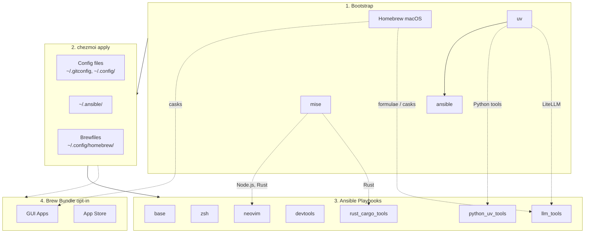

# dotfiles

Cross-platform development environment setup using **chezmoi** + **ansible**.

- **chezmoi**: manages config files (dotfiles)
- **ansible**: installs system dependencies and tools

## Prerequisites

- [chezmoi](https://www.chezmoi.io/install/)
- [uv](https://docs.astral.sh/uv/getting-started/installation/) (for ansible)

## Architecture



## Quick Setup

### Interactive (recommended)

```bash
curl -fsSL https://raw.githubusercontent.com/daviddwlee84/dotfiles/main/bootstrap.sh | bash
```

Installs [`uv`](https://docs.astral.sh/uv/) (if missing) and launches `dotfiles-init` — a Python wrapper that groups the ~19 chezmoi prompts into a clean multi-select UI, offers pre-set bundles (`personal-mac` / `work-mac` / `server-linux` / `minimal`), checks SSH keys, then calls real `chezmoi init` with your answers pre-filled. Full docs: [`scripts/init/README.md`](scripts/init/README.md).

Behind GFW? Set `DOTFILES_RAW_URL` / `DOTFILES_REF` to point at a mirror, or use the non-interactive path below.

### Non-interactive (direct chezmoi)

```bash
# Installs chezmoi to ~/.local/bin and walks through the raw prompts one-by-one.
# Uses HTTPS to avoid SSH key setup on fresh machines.
export GITHUB_USERNAME=daviddwlee84
sh -c "$(curl -fsLS get.chezmoi.io)" -- -b "$HOME/.local/bin" init --apply "https://github.com/$GITHUB_USERNAME/dotfiles.git"

# After install, switch the chezmoi source repo to SSH (so future `chezmoi update` uses your SSH key):
#   chezmoi cd
#   git remote set-url origin git@github.com:$GITHUB_USERNAME/dotfiles.git
#   exit
```

This automatically:

1. Bootstraps Homebrew (macOS/Linux), uv, mise, ansible
2. Deploys all config files
3. Runs ansible playbooks (git, ripgrep, fd, neovim, etc.)
4. Runs brew bundle (if `installBrewApps` is enabled, or on macOS if `installAiDesktopApps` is enabled)

### After install

- `~/.local/bin` is auto-appended to `~/.bashrc` so `chezmoi`, `uv`, and `mise` stay reachable from bash.
- On sudo-enabled machines, the ansible `zsh` role switches your login shell to zsh automatically. Log out / back in to pick it up, or run `exec zsh` now.
- On `noRoot=true` installs, login shell isn't changed — run `exec zsh` per session, or ask your sysadmin: `sudo chsh -s "$(command -v zsh)" $USER`.
- Open a new shell (or `source ~/.bashrc`) after install so PATH changes take effect.

### Optional Components

During `chezmoi init`, you'll be prompted for optional installs:

| Option | Default | Description |
|--------|---------|-------------|
| `installCodingAgents` | true | Claude Code, Codex CLI, OpenCode, Cursor, Copilot, Gemini CLI, RTK, td, sidecar, specify-cli, etc. |
| `installBitwarden` | false | Bitwarden CLI (`bw`) + Desktop app (desktop profiles) with SSH agent auto-detection |
| `installPythonUvTools` | true | Python CLI tools via uv (mlflow, sqlit-tui, tmuxp, etc.) |
| `installLlmTools` | false | Local LLM tools: Ollama, LiteLLM, llmfit, models |
| `installAiDesktopApps` | false | macOS AI desktop apps via Homebrew Brewfile (Claude, ChatGPT, OpenCode Desktop, Antigravity, Codex Desktop on Apple Silicon; `ollama-app` also requires `installLlmTools=true`) |
| `installBrewApps` | false | General GUI apps via Homebrew Brewfile (terminals, browsers, utilities, mas; excludes AI desktop apps) |
| `installInputMethod` | false | Traditional Chinese input methods (McBopomofo, RIME/Squirrel on macOS; ibus-rime on Linux) |
| `installNetworkingTools` | false | Networking CLI tools (nmap, mtr, httpie, gping, trippy, bandwhich, rustscan, etc.) |
| `installIacTools` | false | Infrastructure-as-Code CLIs (Azure CLI, Terraform, OpenTofu) |
| `installDotnetTools` | false | .NET SDK via mise + dotnet global tools ([azure-cost-cli](docs/tools/dotnet-tools.md) for Azure cost analysis) |
| `noRoot` | false | Skip sudo-requiring tasks (for servers without root access) |

To change options later: `chezmoi init --force`

## What You Get

### Config Files

- `~/.gitconfig` - Git configuration
- `~/.config/git/hooks/` - Global Git hooks (pre-commit + Git LFS hooks)
- `~/.config/gh-dash/config.yml` - Global gh-dash config, with `diffnav` as the diff pager
- `~/.config/lazygit/config.yml` - Global LazyGit config, with `delta` as the custom diff pager
- `~/.config/bat/themes/tokyonight_night.tmTheme` - Managed Tokyo Night theme for bat
- `~/.config/nvim/` - Neovim (LazyVim) configuration; system clipboard via `unnamedplus`, with an SSH-conditional OSC 52 override so remote yanks reach the local clipboard (pairs with tmux `set-clipboard on`, see [docs](docs/tools/tmux/README.md#osc-52-clipboard-ssh-friendly-yank))
- `~/.config/uv/uv.toml` - uv package manager config (PyPI: official / Aliyun+TUNA+USTC via `useChineseMirror`)
- `~/.cargo/config.toml` - Cargo registry config (crates.io / TUNA sparse index via `useChineseMirror`)
- `~/.npmrc` - npm registry config (official/npmmirror via `useChineseMirror`)
- `~/.config/.bunfig.toml` - Bun global registry config (official/npmmirror via `useChineseMirror`)
- `~/.gemrc` - RubyGems source + common options (TUNA mirror; only managed when `useChineseMirror=true`, gated via `.chezmoiignore.tmpl`)
- `~/.condarc` - Conda/Mamba channels with TUNA Anaconda mirror (only managed when `useChineseMirror=true`, preserves `auto_activate_base`/user channel prefs)
- `~/.config/zsh/00_exports.zsh` - Env-var mirror bundle (Homebrew / Rustup / mise / GOPROXY) when `useChineseMirror=true`; also exported by bootstrap + ansible runner scripts so first-run installs and ansible subprocesses inherit them ([docs](docs/tools/mirrors.md))
- `~/.config/zsh/99_local_proxy.zsh` - Create-only machine-local proxy override stub; uncomment `LOCAL_PROXY_URL` / `LOCAL_PROXY_SOCKS_URL` here to pin Clash ports without future chezmoi diffs
- `~/.docker/config.json` - Docker client `proxies.default` block (auto-injected from `$LOCAL_PROXY_URL` / `$LOCAL_PROXY_SOCKS_URL`; preserves `auths` / `credsStore` via chezmoi modify-script) ([docs](docs/tools/containers.md))
- `~/.config/docker/daemon.json` - Rootless Docker `registry-mirrors` (DaoCloud / USTC / NJU / ...; Linux + `useChineseMirror` only) ([docs](docs/tools/containers.md#strategy-a-registry-mirrors-in-daemonjson))
- `~/.config/alacritty/` - Alacritty terminal config (CSI-u keybindings for `Ctrl+Number` tmux window switching, `option_as_alt` for Meta keys)
- `~/Library/Application Support/{Code,Cursor,Antigravity}/User/` (macOS) + `~/.config/{Code,Cursor,Antigravity}/User/` (Linux) - Editor settings overlay: `modify_settings.json` deep-merges a 6-key baseline (Hack Nerd Font Mono, relative line numbers, format on save, smart-accept suggestion, terminal font) into each editor's live `settings.json` without overwriting other keys; `create_keybindings.json` seeds 5 universal keybindings on a fresh machine and never overwrites editor-added entries. Canonical templates live under [`.chezmoitemplates/editor/`](.chezmoitemplates/editor/); `.chezmoiignore.tmpl` gates each editor dir with a `stat` presence check so uninstalled editors never produce phantom directories.
- `~/.config/ghostty/config` - Ghostty/cmux terminal config (`macos-option-as-alt` for tmux Meta keybindings, disabled ligatures, explicit `clipboard-write = allow` / `clipboard-read = ask` for OSC 52) ([docs](docs/tools/ghostty.md))
- `~/.config/starship.toml` - Starship cross-shell prompt config
- `~/.config/direnv/direnvrc` - direnv helper functions, including `.venv`-aware Python activation
- `~/.config/yazi/` - Yazi file manager config (v0.3.3+ syntax, [docs](https://yazi-rs.github.io/docs/configuration/overview/))
  - `yazi.toml` - Main config with open rules and openers (`o`/`O`)
  - `keymap.toml`, `theme.toml` - Optional customization files (stubs provided)
- `~/.claude/` - Claude Code settings
- `~/.cursor/cli-config.json`, `~/.config/opencode/opencode.json`, `~/.codex/config.toml` - Coding-agent CLI overlays: each `modify_*` script deep-merges a small managed baseline (preferences, features, curated plugins) into the CLI's live config, preserving auth tokens, per-project trust, sessions, and other machine-local state. Codex specifically round-trips `[projects]` and `[marketplaces.*]` so per-project trust paths never get clobbered. OpenCode legacy `~/.config/opencode/config.json` is migrated to the modern filename by a one-shot `run_once_before_50_opencode_migrate.sh.tmpl`. Full design: [docs/tools/agent-overlays.md](docs/tools/agent-overlays.md).
- `~/.specstory/cli/config.toml` - Global SpecStory defaults for `specstory run` across all projects
- `~/.tmux.conf` - Tmux configuration with TPM plugins (resurrect, continuum, tmux-floax floating pane, tmux-fzf for fuzzy keybinding/session/pane search rebound to `prefix+?`, tmux-fzf-url, tmux-open), vim-style copy mode with clipboard yank, capture-pane helpers (`prefix+y`/`Y`/`C-y`), a native popup menu (`prefix+Space` or `prefix+e`, script-driven with submenus and height-aware trimming) with layout/resize/session management, popup shell (`prefix+\``) and lazygit popup (`prefix+G`), a glow-rendered cheatsheet (`prefix+Space` → `?`), vim-style pane nav, `Ctrl+1..9` quick window switching (CSI-u terminals), extended-keys for coding agents (including `Ctrl+/` in Neovim), sesh keybindings (`prefix+g` fzf picker, `prefix+T` television picker, `prefix+O` built-in picker, `prefix+W` window picker, `prefix+S` last), responsive Catppuccin status bar (adapts modules to terminal width for mobile), and config reload on `prefix+R` ([docs](docs/tools/tmux/README.md))
- `~/.local/bin/x` - Cross-platform terminal wrapper for `copy` / `paste` / `open`, with an OSC 52 fallback so `x copy` reaches the local clipboard over SSH ([docs](docs/tools/clipboard.md))
- `~/bin/sms` - Huawei router SMS reader (HiLink XML API; verification-code extraction, clipboard integration, TV channel) ([docs](docs/tools/sms.md))
- `~/.config/sms/config.toml.example` - Starter config for the `sms` CLI (real `config.toml` is created at runtime, never committed)
- `~/.config/television/cable/sms.toml` - Television channel for browsing router SMS inbox
- `~/.config/sesh/sesh.toml` - Sesh session manager config (named sessions with windows, wildcards, defaults) ([docs](docs/tools/sesh.md))
- `~/.config/worktrunk/config.toml` - Worktrunk (`wt`) git-worktree manager config — aliases (`wt sw`/`ls`/`rm`/`cc`/`oc`); hooks & LLM commit generation kept commented as opt-in ([workflow playbook](docs/tools/worktrunk.md))
- `~/.config/television/cable/sesh.toml` - Television custom cable channel for sesh (overrides built-in with richer sources and actions)
- `~/.config/television/cable/lan-devices.toml` + `~/.config/television/lan-scan.sh` - Television channel for LAN device discovery with open ports, MAC/vendor, hostname, RTT; streams results incrementally via a cache file ([docs](docs/tools/tv.md))
- `~/.config/television/cable/azure.toml` + `~/.config/television/azure-{source,preview,rotate-ip}.sh` - Television channel for Azure resources (Resource Groups / VMs / Public IPs / NICs+NSGs / all) with VM actions (restart, start/stop, deallocate, rotate public IP, SSH, open in portal) and graceful login prompt ([docs](docs/tools/tv.md))
- `~/.config/television/cable/clash.toml` - YAML-backed Clash / mihomo Television channel; auto-resolves Clash's active `profiles/<time>.yml` from `~/.config/clash/profiles/list.yml`, falls back to legacy `config.{yaml,yml}`, and turns empty proxies/groups/rules tabs into informative placeholder rows instead of blank panes ([docs](docs/tools/tv.md))
- `~/.config/television/cable/clash-api.toml` - Live Clash external-controller Television channel for `/proxies`, `/rules`, `/configs`, and `/connections`; supports remote controllers via `CLASH_CONTROLLER` / `CLASH_SECRET` without adding an in-UI host switch ([docs](docs/tools/tv.md))
- `~/.config/television/cable/logs.toml` - Television channel for fuzzy-browsing log files with tailspin/bat previews, `Enter` opens in `lnav`, `Alt+T` live tails with tailspin ([docs](docs/tools/log-tools.md))
- `~/.config/television/cable/services.toml` - Cross-platform services channel for systemd (Linux) / launchd (macOS) — 5 source cycles (running/all/failed/user-scope/installed-on-disk), tailspin log preview, Alt-key lifecycle actions (restart/stop/start/reload/enable), sudo-aware ([docs](docs/tools/services.md))
- `~/.config/television/cable/skills.toml` + `~/.config/television/cable/skills-walk.toml` - Two Television channels for browsing agent skills: `skills` parses `npx skills list` (project + global, with Agents column), `skills-walk` walks `~/.agents/`, `~/.claude/`, `~/.codex/`, `~/.cursor/skills-cursor/` directly without invoking npx; both preview SKILL.md with bat
- `~/.config/television/cable/agent-sessions.toml` + `~/.config/television/agent-sessions.py` - Unified Television channel for coding-agent sessions across OpenCode (SQLite), Claude Code (JSONL), Codex (JSONL), Cursor Agent CLI (store.db), and Cursor IDE composer chats (state.vscdb); 6 source cycles (all/per-agent), content-searchable via first-user-message snippet, `Enter` prints `cd <dir> && <agent> --resume <id>`, `Alt+T` resumes in current shell (Cursor IDE: opens workspace folder via `cursor <dir>` since IDE has no chat-resume CLI flag)
- `~/.config/zsh/tools/02_shell_integration.zsh` + `03_tmux_capture.zsh` + `04_ai_capture.zsh` - **aicapture** layer: OSC 133 prompt markers + `cpout`/`cpcmd`/`cpblock [N]` scrollback helpers + `aifix`/`aiexplain` LLM wrappers (advisory-only; Haiku/mini by default) + `aiblock` Python TUI (multi-select + spawn agent window). Full guide: [docs/tools/aicapture.md](docs/tools/aicapture.md); design-space comparison against thefuck/Warp/wut/tmuxai/atuin in [docs/this_repo/instant-llm-fix-prior-art.md](docs/this_repo/instant-llm-fix-prior-art.md)
- `~/.config/zsh/tools/22_sesh.zsh` - Sesh keybinding (`Alt+S` for session picker), `shere`/`sroot` session helpers (supports bare command args, e.g. `shere specstory run codex`), and shell completion
- `~/.config/zsh/tools/36_pueue.zsh` - Pueue queue summary helper (`pqsum`)
- `~/.config/zsh/tools/41_github.zsh` - GitHub helper with `ghget` for downloading a repo subdirectory from a tree URL
- `~/.config/zsh/tools/50_networking.zsh` - Networking aliases plus loopback proxy helpers (`proxy-on`, `proxy-off`, `proxy-status`, `withproxy`) that prefer `$LOCAL_PROXY_URL`, then Clash's active config, then loopback port probing
- `~/.config/zsh/tools/37_lazygit.zsh` - LazyGit shell alias: `lg`
- `~/.config/zsh/tools/28_tldr.zsh` - `tldrf` helper with `TLDR_LANGUAGES` fallback order
- `~/.config/zsh/tools/29_log_tools.zsh` - Log viewer wrappers: `catl` (tspin colorful cat), `lessl` (ccze + less), `logtail` (tspin live follow) ([docs](docs/tools/log-tools.md))
- `~/.config/zsh/tools/29_marimo.zsh` - `marimo` zsh shell completion
- `~/.config/zsh/tools/26_eza.zsh` - `eza`-backed `ls`/`la`/`ll` aliases, plus `llt` for tree view with git-aware subdirectory context
- `~/.config/zsh/tools/32_try.zsh` - `try-cli` shell integration, with default `TRY_PATH` and graduate-friendly `TRY_PROJECTS`
- `~/.config/zsh/tools/94_ssh_agent.zsh` - SSH agent with Bitwarden-first fallback to persistent `ssh-agent` (auto-loads keys)
- `~/.config/zsh/tools/95_bitwarden.zsh` - Bitwarden CLI zsh completion
- `~/.ssh/config` - SSH main config skeleton (create-only: `Include ~/.ssh/config.d/*` + conservative `Host *` defaults)
- `~/.ssh/config.d/00-defaults` - SSH global defaults stub (commented examples only)
- `~/.ssh/config.d/git` - SSH host entries for `github.com` and `gitlab.com` with commented multi-account/Bitwarden examples
- `~/.config/tmuxp/claude-sidecar.yaml` - tmuxp workspace for Claude + Sidecar
- `~/.config/tmuxp/coding-agent.yaml` - tmuxp workspace for coding agent (nvim 75% | specstory 25%, btop tab)
- `~/.config/tmuxinator/coding-agent.yml` - tmuxinator workspace for coding agent (alternative to tmuxp, native sesh integration)
- `~/.config/tmuxinator/chezmoi.yml` - tmuxinator workspace for chezmoi session (shell + lazygit + nvim overrides, native sesh integration)
- `~/.config/zellij/config.kdl` - Zellij config (locked default mode for coding agent compatibility, kitty keyboard protocol)
- `~/.config/zellij/layouts/claude-sidecar.kdl` - Zellij layout for Claude + Sidecar
- `~/.config/homebrew/` - Brewfiles for GUI apps (macOS casks + mas) plus selected CLI formulas (e.g., `tailscale`)

SSH files are managed as create-only templates: if `~/.ssh/config` already exists, it is not overwritten. In that case, add `Include ~/.ssh/config.d/*` to your existing config manually to load the managed snippets.

### Upstream Clones (via `.chezmoiexternal.toml.tmpl`)

Vendored upstream sources are declared in [`.chezmoiexternal.toml.tmpl`](.chezmoiexternal.toml.tmpl) and auto-refreshed weekly by chezmoi (`refreshPeriod = "168h"`). Force an immediate pull with `chezmoi apply --refresh-externals`.

- `~/.oh-my-zsh` + 4 custom plugins (`zsh-autosuggestions`, `zsh-syntax-highlighting`, `zsh-completions`, `zsh-vi-mode`)
- `~/.tmux/plugins/tpm` (TPM)
- `~/.fzf` (Linux only; apt version lacks `--zsh`)
- `~/.local/share/toolkami/toolkami.rb`

See [docs/tools/chezmoi-prefixes.md](docs/tools/chezmoi-prefixes.md#companion-file-chezmoiexternalformat) for details and when to add entries here vs. ansible.

### Tools (via ansible)

- **Base**: git, git-lfs, curl, ripgrep, fd, just, build tools
- **Neovim**: >= 0.11.2 with LazyVim dependencies
- **LazyVim deps**: fzf, lazygit, tree-sitter-cli, Node.js
- **Git review stack**: gh, glab, gh-dash (via `gh` extension), diffnav, git-delta, lazygit
- **Markdown reader**: `glow` for terminal Markdown rendering, plus `readurl <url>` / `readlocal` / `readnode` / `readraw` to render web pages as markdown in the terminal with auto proxy fallback (see [docs/tools/web-reader.md](docs/tools/web-reader.md))
- **Shell testing**: `bats` (bats-core) — Bash test runner with TAP/JUnit output
- **Structured-data CLIs**: `jq` (JSON), `yq` (YAML/JSON; Mike Farah Go build), `dasel` (YAML/TOML/XML/JSON/CSV unified query & modify), `jnv` (interactive `jq` JSON viewer); `taplo` for TOML format/lint
- **DuckDB CLI**: `duckdb` (Homebrew on macOS, official downloads on Linux)
- **rclone**: cloud storage sync CLI (Homebrew on macOS, official downloads on Linux)
- **Ruby gem tools**: `try-cli` for ephemeral workspaces with graduate-to-project defaults, `tmuxinator` for declarative tmux session layouts (native sesh integration), plus `toolkami`
- **Coding Agents** (optional): Claude Code, `claude-hud` statusline plugin, Codex CLI, CodexBar, OpenCode, Cursor CLI, Copilot CLI, Gemini CLI, RTK, SpecStory, OpenChamber, td, sidecar, specify-cli
- **Bitwarden** (optional): Bitwarden CLI (`bw`) via npm, Desktop app (snap/deb on Linux, cask on macOS) on desktop profiles, with zsh completion and SSH agent auto-detection
- **LLM tools** (optional): Ollama local runtime, LiteLLM proxy, `llmfit` hardware-fit recommender, `models` TUI/CLI for model discovery and benchmarks
- **Input Methods** (optional): McBopomofo + RIME (Squirrel on macOS, ibus-rime on Linux)
- **Networking tools** (optional): nmap, arp-scan, mtr, iperf3, doggo, httpie, gping, trippy, bandwhich, speedtest, rustscan
- **.NET tools** (optional): .NET SDK via mise + `azure-cost-cli` (Azure cost analysis); see [docs/tools/dotnet-tools.md](docs/tools/dotnet-tools.md)
- **Docker**: OrbStack (macOS) or Docker Engine (Linux)
- **Cargo tools**: pueue (process queue manager)
- **GUI Apps** (macOS): general terminals, editors, browsers, network tools, and utilities via Brewfile when `installBrewApps=true`, including developer apps like `dbeaver-community` and `superset` (Apple Silicon only); AI desktop apps via Brewfile when `installAiDesktopApps=true` (`claude`, `chatgpt`, `opencode-desktop`, `antigravity`, `codex-app` on Apple Silicon only, `codeisland` notch HUD for coding-agent activity, and `ollama-app` only when `installLlmTools=true`); Tailscale Desktop via Mac App Store `mas`, avoids pkg sudo prompt; Tailscale CLI via `brew "tailscale"` in shared Brewfile

### Bootstrap (installed before ansible)
- **Homebrew** (macOS): Package manager for macOS
- **uv**: Python package manager for ansible
- **mise**: Runtime manager for Node.js and Rust (pins versions from `~/.config/mise/config.toml`; upgrade with `just upgrade-mise`, see [Keeping tools up-to-date](#keeping-tools-up-to-date))
- **Dev tools**: bat, bats, gh, glab, diffnav, git-delta, git-graph, eza, tldr, glow, thefuck, zoxide, direnv, yazi, superfile, tmux+tpm, sesh, worktrunk ([workflow playbook](docs/tools/worktrunk.md)), zellij, btop, htop, taplo, television, pandoc
- **Log viewers**: tailspin (`tspin`), lnav, grc, ccze (Linux only — no Homebrew formula) — plus `catl`/`lessl`/`logtail` zsh wrappers and a `tv logs` Television channel ([docs](docs/tools/log-tools.md))
- **GUI Apps on Linux** (`gui_apps` tag on `ubuntu_desktop`): [`gui_apps_linux`](dot_ansible/roles/gui_apps_linux/tasks/main.yml) bundles Alacritty (cargo), AppImageLauncher (PPA with `.deb` fallback, Lite variant for noRoot), VSCode (Microsoft apt repo), Cursor (`.deb`), and `libfuse2` for AppImage compatibility. macOS equivalents ship via [`Brewfile.darwin.tmpl`](dot_config/homebrew/Brewfile.darwin.tmpl). See [docs/tools/appimage.md](docs/tools/appimage.md) for AppImageLauncher install paths, `ail-cli` usage, and Ubuntu 24.04 AppArmor gotchas.
- **Starship**: Cross-shell prompt (replaces oh-my-zsh theme)
- **Python tools (via uv)**: thefuck, apprise, sqlit-tui, dotenv, git-filter-repo, mlflow, tmuxp, trafilatura
- **JS CLI tools (via npm)** (optional): readability-cli (`readable` — Mozilla Readability for `readnode` terminal web reader)
- **NerdFonts**: Hack Nerd Font for terminal emulators

### Reference docs (no install)

- **Infrastructure & virtualization**: [docs/infra/](docs/infra/) — Proxmox / ESXi / OrbStack / UTM / VirtualBox / libvirt comparison; CephFS / BeeGFS / NFS / Lustre shared storage; SLURM / Kubernetes / Nomad compute scheduling; FreeIPA + shared-home patterns. Documentation only; nothing is installed by chezmoi for these.

## Supported Platforms

| Platform | Package Manager | Notes |
|----------|-----------------|-------|
| macOS | Homebrew | Full support |
| Ubuntu Desktop | apt + snap | Full support |
| Ubuntu Server | apt + snap | Full support |
| Ubuntu Server (no root) | GitHub binaries + mise + cargo + uv | `noRoot=true`, tools installed to `~/.local/bin` |
| Raspberry Pi 5 (64-bit OS) | apt + Linuxbrew | Full support (same as Ubuntu Server) |
| Raspberry Pi 4 (32-bit OS) | apt + GitHub binaries | Linuxbrew skipped; some tools without armhf builds are skipped |

## Manual Commands

```bash
chezmoi diff          # Preview changes
chezmoi apply         # Apply config files
chezmoi cd            # Go to source directory

# Re-run ansible manually
cd ~/.ansible && ansible-playbook playbooks/macos.yml
```

## Keeping tools up-to-date

`chezmoi apply` is deliberately **install-only** — ansible roles mostly use
`state: present` / `creates:` idempotency so re-applying never silently bumps
every tool on your machine. For explicit upgrades, use the dedicated entry
points (see [`docs/this_repo/upgrades.md`](docs/this_repo/upgrades.md) for the full matrix):

```bash
just upgrade-all          # externals + brew + mise + uv + npm + cargo + dotnet + gem + agents + plugins
just upgrade-dry-run      # preview without executing

# Per category (compose as you like):
just upgrade-brew         # formulas + casks (--greedy) + Brewfile (no --no-upgrade) + cleanup
just upgrade-mise         # mise self-update + `mise upgrade`
just upgrade-uv           # Python CLI tools (apprise, mlflow, sqlit-tui, ...)
just upgrade-npm          # global npm packages (Bitwarden CLI, readability-cli, ...)
just upgrade-cargo        # cargo install-update -a (bootstraps cargo-update)
just upgrade-dotnet       # .NET global tools (azure-cost-cli, ...)
just upgrade-gem          # Ruby gems (try-cli, tmuxinator, ...)
just upgrade-agents       # re-runs install.sh for Claude Code / OpenCode / Cursor CLI / Ollama / llmfit / RTK
just upgrade-plugins      # LazyVim :Lazy sync + TPM + claude-hud + pre-commit autoupdate + tldr + gh extensions
just upgrade-externals    # chezmoi upgrade + chezmoi apply --refresh-externals
```

Underlying script: [`scripts/upgrade_tools.sh`](scripts/upgrade_tools.sh) —
best-effort, prints a `SUCCESS / SKIPPED / FAILED` summary at the end. Full
docs, rationale, run-order diagram, and extension guide live in
[docs/this_repo/upgrades.md](docs/this_repo/upgrades.md).

When installed, `just upgrade-plugins` also refreshes `claude-hud` to the
latest upstream release. Upstream `claude-hud` `v0.0.12+` now follows Claude
Code's official stdin `rate_limits` only, so the old credential-derived `Max`
plan badge may disappear after upgrade.

## Multi-host apply (`just fleet-apply`)

Push the same `chezmoi update --init` to every host in
`~/.config/fleet/machines.toml`, in parallel, with sudo password sourced from
plaintext / interactive prompt / Bitwarden CLI:

```bash
just fleet-apply                     # parallel, all hosts (chezmoi update --init)
just fleet-apply-dry-run             # `chezmoi diff` on each host (no changes)
just fleet-apply-one lab-box         # single host, --serial mode (debug)
```

Connection prefers `~/.ssh/config` aliases (`ProxyJump`, `IdentityAgent`,
etc. all inherited) and falls back to explicit `hostname/user/port/identity_file`.
Per-host log: `logs/fleet-apply/<UTC-timestamp>/<host>.log`. Exit code = number
of failed hosts. Inventory file is seeded once by chezmoi as a
`create_private_` template, so your edits are never overwritten.

Conflict-handling defaults match the "push canonical config" mental model:
`--keep-going` is **on** (skip drifted files non-destructively, continue
the rest), `--force` is **off** (don't auto-overwrite). Pass
`--no-keep-going` to fail-fast, or `--force` to silently overwrite local
drift on the remote — see [docs/this_repo/fleet-apply.md](docs/this_repo/fleet-apply.md)
for the full flag reference and per-machine git override convention
(`~/.gitconfig.local`, same self-managed pattern as `~/.zshrc.adhoc`).

## Testing

Two layers, both opt-in — this is a personal dotfiles repo, tests only cover painful-regression zones:

- **`just bats`** — fast unit tests (no Docker, no network). Covers proxy helpers (`tests/unit/zsh_proxy.bats`), `ghget` URL parsing (`tests/unit/ghget.bats`), and `lan-scan.sh` pure helpers (`tests/unit/lan_scan.bats`).
- **`just docker-test`** — smoke tests in a clean Ubuntu container: re-apply idempotency, zsh config parses, `oh-my-zsh` plugins present, core CLI tools on PATH, nested unit tests pass under Ubuntu zsh (`tests/smoke/docker_install.bats`).
- **`just check-all`** — everything: ansible syntax + pre-commit + `bats` + `docker-test`.

`shellcheck` and `shfmt` run via pre-commit on `scripts/*.sh` (see `.pre-commit-config.yaml`).

## Docker Testing

```bash
# Build and run the bats smoke suite
just docker-test

# Interactive devbox shell
just docker-run

# Build specific profiles
just docker-desktop    # Ubuntu desktop profile
just docker-china      # China mirror profile
```

## Development with justfile

This project uses [just](https://github.com/casey/just) as a command runner:

```bash
just                  # List all commands
just lint             # Ansible syntax check
just check            # Full lint + dry-run
just docker-build     # Build Docker image
just info             # Show system info
```

## Roadmap & lessons learned

Forward-looking work — long-term ideas, deferred items, things needing
evaluation — lives in [`TODO.md`](TODO.md), prioritised P1 → P3 with effort
estimates (S/M/L/XL). Items with accompanying research, design notes, or paused
troubleshooting link to a corresponding [`backlog/<slug>.md`](backlog/) doc.

Backward-looking knowledge — past traps and non-obvious debugging — lives in
[`pitfalls/`](pitfalls/), titled by symptom so future-you can grep the error
message and land on the root cause + workaround instead of re-debugging from
scratch.

## Customization

See [CLAUDE.md](CLAUDE.md) for the agent-facing repo contract, [docs/this_repo/ansible_customization.md](docs/this_repo/ansible_customization.md) for ansible customization, [docs/this_repo/testing.md](docs/this_repo/testing.md) for shell-script testing (bats, shellcheck, shfmt — and when to reach for ZUnit / ShellSpec instead), [docs/input_methods/README.md](docs/input_methods/README.md) for McBopomofo / Rime / Squirrel notes and backup strategy, [docs/tools/tmux/README.md](docs/tools/tmux/README.md) for tmux usage and managed keybindings, [docs/tools/clipboard.md](docs/tools/clipboard.md) for how OSC 52 clipboard sync is wired across terminal / tmux / Neovim / `x` CLI (including SSH-remote yank), [docs/tools/ghostty.md](docs/tools/ghostty.md) for Ghostty/cmux notes and the `ghostty-ssh-terminfo` helper, [docs/tools/direnv.md](docs/tools/direnv.md) for `.venv`-aware direnv usage, [docs/tools/pre-commit.md](docs/tools/pre-commit.md) for generic pre-commit reference (hook env model, `uv`-pinned bootstrap Python, debugging), [docs/tools/git_diff_workflow.md](docs/tools/git_diff_workflow.md) for the managed Git diff stack, [docs/tools/specstory.md](docs/tools/specstory.md) for SpecStory configuration, [docs/tools/td_sidecar.md](docs/tools/td_sidecar.md) for td/sidecar usage, [docs/tools/specify_cli.md](docs/tools/specify_cli.md) for Specify CLI, [docs/tools/llm.md](docs/tools/llm.md) for local LLM tools, [docs/tools/networking.md](docs/tools/networking.md) for networking tools, and [docs/tools/chezmoi-prefixes.md](docs/tools/chezmoi-prefixes.md) for chezmoi source-state prefix semantics and when each is safe to `chezmoi add`.
