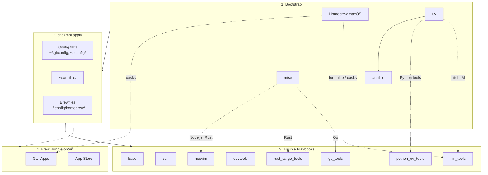

# dotfiles

Cross-platform development environment setup using **chezmoi** + **ansible**.

- **chezmoi**: manages config files (dotfiles)
- **ansible**: installs system dependencies and tools

> **Native Windows?** This repo covers macOS, Linux, and WSL. For a native
> Windows + PowerShell 7 setup (scoop + winget, starship, `copilot-proxy`), use
> **[dotfiles-windows](https://github.com/daviddwlee84/dotfiles-windows)**.

## Prerequisites

- [chezmoi](https://www.chezmoi.io/install/)
- [uv](https://docs.astral.sh/uv/getting-started/installation/) (for ansible)

## Architecture



## Quick Setup

### Interactive (recommended)

```bash
curl -fsSL https://raw.githubusercontent.com/daviddwlee84/dotfiles/main/bootstrap.sh | bash
```

Installs [`uv`](https://docs.astral.sh/uv/) (if missing) and launches `dotfiles-init` — a Python wrapper that groups the ~19 chezmoi prompts into a clean multi-select UI, offers pre-set bundles (`personal-mac` / `work-mac` / `server-linux` / `cloud-vm` / `minimal`), checks SSH keys, then calls real `chezmoi init` with your answers pre-filled. Full docs: [`scripts/init/README.md`](scripts/init/README.md).

On first-run or slow networks the `uv` resolver can sit silently for a few minutes — use the verbose form to see timestamped progress + `uv --verbose` resolver output + `set -x`:

```bash
curl -fsSL https://raw.githubusercontent.com/daviddwlee84/dotfiles/main/bootstrap.sh | DOTFILES_BOOTSTRAP_VERBOSE=1 bash
```

Pass extra args through to the wrapper via `bash -s --` (e.g. run the schema-parity checker instead of the default `init`):

```bash
curl -fsSL https://raw.githubusercontent.com/daviddwlee84/dotfiles/main/bootstrap.sh | bash -s -- doctor
```

Behind GFW? Set `DOTFILES_RAW_URL` / `DOTFILES_REF` to point at a mirror, or use the non-interactive path below.

### Non-interactive (direct chezmoi)

```bash
# Installs chezmoi to ~/.local/bin and walks through the raw prompts one-by-one.
# Uses HTTPS to avoid SSH key setup on fresh machines.
export GITHUB_USERNAME=daviddwlee84
sh -c "$(curl -fsLS get.chezmoi.io)" -- -b "$HOME/.local/bin" init --apply "https://github.com/$GITHUB_USERNAME/dotfiles.git"

# After install, switch the chezmoi source repo to SSH (so future `chezmoi update` uses your SSH key):
#   chezmoi cd
#   git remote set-url origin git@github.com:$GITHUB_USERNAME/dotfiles.git
#   exit
```

This automatically:

1. Bootstraps Homebrew (macOS/Linux), uv, mise, ansible
2. Deploys all config files
3. Runs ansible playbooks (git, ripgrep, fd, neovim, etc.); Neovim uses an official release fallback when Homebrew cannot provide a suitable macOS build
4. Runs brew bundle (if `installBrewApps` is enabled, or on macOS if `installAiDesktopApps` / `installGamingApps` is enabled)

#### Sudo password injection (when chezmoi can't open `/dev/tty`)

Some Linux environments — notably **CentOS 7 + AD/LDAP user with high UID** where `pam_systemd` never created `/run/user/<UID>/` — leave the chezmoi-spawned bootstrap script unable to open `/dev/tty`, so the shared sudo helper can't prompt and Linuxbrew aborts with `Insufficient permissions to install Homebrew to "/home/linuxbrew/.linuxbrew"`. The fix is to pre-stage the password via `CHEZMOI_SUDO_PASSWORD_FILE` (the same env-var [`fleet_apply`](docs/this_repo/fleet-apply.md) uses over SSH).

The repo ships [`scripts/apply_with_sudo.sh`](scripts/apply_with_sudo.sh) to handle the prompt → 0600 tmpfile → export → run → `shred` dance:

```bash
# First time (chezmoi not installed yet):
sh -c "$(curl -fsLS get.chezmoi.io)" -- -b "$HOME/.local/bin"   # install chezmoi only
bash <(curl -fsSL https://raw.githubusercontent.com/$GITHUB_USERNAME/dotfiles/main/scripts/apply_with_sudo.sh) \
  --init "https://github.com/$GITHUB_USERNAME/dotfiles.git"

# Re-runs (after chezmoi source is cloned at ~/.local/share/chezmoi):
just apply-with-sudo                                              # interactive prompt
just apply-with-sudo --pass-from-env                              # reads $SUDO_PASSWORD
SUDO_PASSWORD=xxx just apply-with-sudo --pass-from-env            # one-liner
```

The wrapper validates the password against `sudo -v` before invoking `chezmoi`, then shreds the tmpfile on exit (any signal). Inside chezmoi's run-scripts, `sudo_session_init` adopts the file, moves it into the shared state dir, and spawns the watchdog that keeps the sudo timestamp warm.

**Even simpler alternative** if you have root and don't mind editing sudoers: add `$USER ALL=(ALL) NOPASSWD: ALL` to `/etc/sudoers.d/99-bootstrap`, run `chezmoi apply`, then remove the line. The shared helper short-circuits cleanly when sudo is truly passwordless.

> CentOS 7 also blocks Linuxbrew install because system curl 7.29 is older than Homebrew's 7.41 minimum, and Homebrew bottles built on Ubuntu 22.04+ don't run on glibc 2.17 anyway. Linuxbrew is fully optional on Linux — every ansible task that uses it has a non-brew fallback (cargo / GitHub musl release / AppImage). **Bootstrap now skips Linuxbrew automatically when glibc < 2.28** (the RHEL 8 / Debian 10 floor; Ubuntu 20.04's 2.31 is unaffected), so nothing needs doing on CentOS 7.
>
> Do **not** short-circuit the brew step with a stub `~/.local/bin/brew` (`#!/bin/sh` + `exit 0`) — this README used to recommend exactly that, and it silently poisons every brew probe in the ansible roles: the stub returns 0 with empty output for *every* subcommand, so `command -v brew` says "available" and `community.general.homebrew` then dies on empty JSON with `Expecting value: line 1 column 1 (char 0)`, aborting the play. If a stub is already on a host, delete it. See [`pitfalls/ansible-homebrew-expecting-value-line-1-column-1.md`](pitfalls/ansible-homebrew-expecting-value-line-1-column-1.md).

Full diagnosis: [`pitfalls/bootstrap-no-tty-sudo-prompt-skipped.md`](pitfalls/bootstrap-no-tty-sudo-prompt-skipped.md) and [`pitfalls/centos7-noroot.md`](pitfalls/centos7-noroot.md).

### After install

- `~/.local/bin` and the rest of the shared layer are seeded by `~/.config/shell/00_exports.sh`; after mise/Bun initialise, `08_pi_agents.sh` reasserts the canonical `~/.local/bin/{pi,omp}` and external `pia` paths so stale package-manager copies cannot shadow them. Both fragments are sourced by the chezmoi-managed `~/.bashrc` and `~/.zshrc`.
- With `installCodingAgents=true`, `pi` and `omp` are installed alongside the Git-managed `pia` combo manager. Start with `pia doctor`, `pia list --tree`, then `pia use pi/base`; authentication remains owned by each agent and is never committed to dotfiles.
- On sudo-enabled machines, the ansible role for your `primaryShell` choice switches your login shell automatically (`zsh` role for `primaryShell=zsh`, `bash` role for `primaryShell=bash`). Log out / back in to pick it up, or run `exec zsh` / `exec bash` now.
- `primaryShell=bash` on macOS additionally installs Homebrew bash 5.x and adds it to `/etc/shells` (system bash 3.2 is too old for oh-my-bash plugins + ble.sh). zsh-primary mac users see no extra brew install.
- On `noRoot=true` installs, login shell isn't changed — run `exec zsh` / `exec bash` per session, or ask your sysadmin: `sudo chsh -s "$(command -v zsh)" $USER` (or `bash`).
- Open a new shell after install so PATH changes take effect. Both `~/.bashrc` and `~/.zshrc` are deployed regardless of `primaryShell` choice, so the other shell still works ad-hoc.

### Optional Components

During `chezmoi init`, you'll be prompted for optional installs. The prompts
themselves are defined once in [`scripts/init/dotfiles_init.py`](scripts/init/dotfiles_init.py)
(`PROMPTS`) and generated into `.chezmoi.toml.tmpl` + `Dockerfile`; this table
is coverage-checked against that list by `dotfiles_init.py gen --check`.

<!-- dotfiles-init:prompts (coverage-checked by scripts/init/dotfiles_init.py gen --check) -->
| Option | Default | Description |
|--------|---------|-------------|
| `installCodingAgents` | true | Claude Code, Pi, Oh My Pi (`omp`), the Git-managed [`pia` combo manager](docs/tools/pi-agents.md), Codex CLI, OpenCode, Cursor, Copilot, Gemini CLI, Antigravity CLI (`agy`), RTK, td, sidecar, specify-cli, etc. |
| `installBitwarden` | false | Bitwarden CLI (`bw`) + Desktop app (desktop profiles) with SSH agent auto-detection |
| `installPythonUvTools` | true | Python CLI tools via uv (mlflow, sqlit-tui, tmuxp, etc.) |
| `installJsCliTools` | true | Standalone JS/npm CLI utilities (readability-cli for terminal web reader, etc.) |
| `installLlmTools` | false | Local LLM tools: Ollama, LiteLLM, llmfit, models |
| `installSummarize` | false | [`summarize`](docs/tools/summarize.md) CLI: YouTube / podcast / web / PDF → LLM summary, defaulting to 繁體中文 output |
| `installAiDesktopApps` | false | macOS AI desktop apps via Homebrew Brewfile (Claude, ChatGPT with Codex on Intel and Apple Silicon, OpenCode Desktop, Antigravity; `ollama-app` also requires `installLlmTools=true`). macOS only. |
| `agentSounds` | `notify` | How a coding agent announces it finished. `none` = silent; `notify` = desktop banner (`notify.sh` → apprise); `peon` = game voice lines + peon-ping's own overlay (default pack `sc2_scv` → *"Job's finished!"*); `both` = banner + voice. Controls **hook wiring only** — the `peon` CLI installs whenever `installCodingAgents` is on, so you can experiment any time. peon's own volume / pack / notification style stay unmanaged by chezmoi (no drift when you tweak them). Desktop profiles only. See [docs/tools/agent-sounds.md](docs/tools/agent-sounds.md). |
| `installBrewApps` | false | General GUI apps via Homebrew Brewfile (terminals, browsers, utilities, mas; excludes AI desktop apps). Desktop profiles only (`macos`/`ubuntu_desktop`). |
| `installGamingApps` | false | Gaming apps, currently Steam only. macOS uses Homebrew Cask; `ubuntu_desktop` uses Valve's official apt repo / `steam-launcher`. Desktop profiles only. |
| `installInputMethod` | false | Traditional Chinese input methods (McBopomofo, RIME/Squirrel on macOS; ibus-rime on Linux), plus the shared Rime `*.custom.yaml` from `.chezmoitemplates/rime/`. Desktop profiles only (`macos`/`ubuntu_desktop`). See [docs/input_methods](docs/input_methods/README.md). |
| `discordChannel` | `flatpak` | Discord install channel on `ubuntu_desktop`: `flatpak` (recommended), `deb`, or `none`. macOS uses the Brewfile cask; servers skip. |
| `installNiri` | false | [niri](https://github.com/niri-wm/niri) scrollable-tiling Wayland compositor, built from source (`ubuntu_desktop` only). Installs the binary + GDM session/systemd files; NVIDIA gets a VRAM application-profile automatically. See [docs/playbooks/niri.md](docs/playbooks/niri.md). |
| `installNetworkingTools` | false | Networking CLI tools (nmap, mtr, httpie, gping, trippy, bandwhich, rustscan, etc.) |
| `installTunnelTools` | false | Tunnel tools (ngrok, cloudflared) — expose localhost / SSH reverse tunnels |
| `installTailscale` | false | [Tailscale](docs/tools/Tailscale.md) mesh VPN — **Linux only** (official apt/yum repo); macOS gets it from the `tailscale-app` cask under `installBrewApps`. Install-only: `tailscale up` stays manual. Pairs with the [`tsnet`](docs/tools/tsnet.md) CLI (tailnet → ssh config, tailnet-HTTPS `serve`) and the `tv tailnet` picker. |
| `installIacTools` | false | Infrastructure-as-Code CLIs (Azure CLI, Terraform, OpenTofu) |
| `installMediaTools` | false | Media/AV CLI tools ([ffmpeg](docs/tools/ffmpeg.md), [ImageMagick](docs/tools/imagemagick.md), [exiftool](docs/tools/exiftool.md), [libvips](docs/tools/libvips.md)). Also satisfies vhs's runtime ffmpeg dep. |
| `installMediaControl` | false | System media-control CLIs for the `sys*` shell helpers ([media-control](docs/tools/media-control.md)): `nowplaying-cli` + `switchaudio-osx` (macOS), `playerctl` (Linux). Unlocks full `sysplay`/`sysnow`; built-in `sysvol`/`sysmute` work without it. |
| `installCalibre` | false | [calibre](https://calibre-ebook.com/) e-book toolkit (`ebook-meta`/`ebook-convert`). Enables Kindle `.mobi`/`.azw`/`.azw3` metadata previews in yazi via `view-ebook` (see [yazi-previews.md](docs/tools/yazi-previews.md)). Heavy GUI app (~hundreds of MB); the preview is best-effort and also works if calibre is already installed by hand. |
| `installDotnetTools` | false | .NET SDK via mise + dotnet global tools ([azure-cost-cli](docs/tools/dotnet-tools.md) for Azure cost analysis) |
| `installExtraRuntimes` | true | Extra mise runtimes (rust, bun, ruby, go; ~1.8GB) + their cargo/gem/go tool roles. Node is always installed regardless. Set false for lean cloud VMs / CI. |
| `installAuditd` | false | Linux audit framework (auditd) + baseline rules (identity / sudoers / sshd_config / privileged-exec). Linux only. See [docs/sysadmin/auditd.md](docs/sysadmin/auditd.md). |
| `installHomelabTools` | false | Homelab hardware-monitoring CLIs (lm-sensors, smartmontools, ipmitool, nvme-cli, storcli) + `hw-*` shell helpers, each gated on detected hardware. Linux only; no-op in VMs. See [docs/sysadmin/hardware.md](docs/sysadmin/hardware.md). |
| `installResilioSync` | false | [Resilio Sync](https://www.resilio.com/sync/) P2P file sync (AirDrop-style transfer, phone→NAS photo backup). macOS: GUI app via Homebrew cask. Linux (desktop + server): headless daemon (no GUI) as a per-user systemd service, WebUI at `127.0.0.1:8888`. See [docs/tools/resilio-sync.md](docs/tools/resilio-sync.md). |
| `installWakeOnLan` | false | Wake-on-LAN (passive side): arm this box's wired NIC(s) to power on from a magic packet, persisted across reboots via a `wol@<iface>` systemd unit (installs ethtool). Linux only; no-op in VMs. Wake-from-S5 also needs BIOS "Power On By PCI-E" on + "ErP Ready" off. Sender side = the `wake` CLI / `wakeonlan`. See [docs/sysadmin/wake-on-lan.md](docs/sysadmin/wake-on-lan.md). |
| `useChineseMirror` | false | Switch Homebrew / pip / npm / cargo / etc. to China (GFW) mirrors |
| `gitleaksAllRepos` | false | Run gitleaks on ALL git repos, not just those with `.pre-commit-config.yaml` |
| `backupMode` | `smart` | Back up existing dotfiles before apply: `smart` (only files chezmoi overwrites), `full` (fixed allowlist), `off` (skip) |
| `allowPartialFailure` | false | Continue installing other Ansible roles if one role fails |
| `noRoot` | false | Skip sudo-requiring tasks (for servers without root access). Linux only. |
| `motdStyle` | `figlet` | SSH login banner style: `figlet` (~6 lines, default), `fastfetch-slim` (figlet + fastfetch w/o logo, ~10 lines), `fastfetch-full` (full distro logo + everything, ~22 lines). Runtime override: `MOTD_STYLE=...` in `~/.zshrc.adhoc`. See [docs/zsh/motd.md](docs/zsh/motd.md). |
| `primaryShell` | `zsh` | Primary interactive shell: `zsh` (default, full-featured) or `bash` (oh-my-bash + ble.sh, close-to-zsh UX). Both `~/.zshrc` and `~/.bashrc` deploy on every host; this only governs which shell `chsh` switches to as the login shell. See [docs/shells/bash.md](docs/shells/bash.md) for the bash side's known gaps and tradeoffs. |
| `enableVimMode` | true | Vim-style modal editing in shells (zsh-vi-mode, `set -o vi`, ble.sh) + tmux vim navigation. Does NOT affect Neovim. See [docs/this_repo/vim-mode.md](docs/this_repo/vim-mode.md). |
<!-- /dotfiles-init:prompts -->

To change options later, don't hand-edit `~/.config/chezmoi/chezmoi.toml` — run the reconfigure tool, which seeds the same TUI from your current values and re-applies via `chezmoi init --apply --prompt`:

```bash
just reconfigure                 # interactive (or: czcfg)
just reconfigure --set installLlmTools=true --yes   # non-interactive single key
```

See [`scripts/init/README.md`](scripts/init/README.md) → "Reconfigure".

## What You Get

### Config Files

- `~/.gitconfig` - Git configuration; managed via `modify_` so `gh auth setup-git`'s `[credential "..."]` blocks (with the per-machine absolute path to `gh`) survive `chezmoi apply`; default pull behavior is rebase + autostash (`pull.rebase=true`, `rebase.autoStash=true`) so LazyGit's `p` pull keeps local dirty work across the rebase ([docs](docs/tools/gh-cli.md), [LazyGit notes](docs/tools/lazygit.md))
- `~/.config/git/hooks/` - Global Git hooks (via a global `core.hooksPath`): managed `pre-commit` (gitleaks) + Git LFS hooks, all hardened to skip gracefully — PATH-robust and non-fatal so a stripped-PATH clone like `brew tap` can't break (see [pitfall](pitfalls/git-lfs-global-hook-breaks-brew-tap.md))
- `~/.config/gh-dash/config.yml` - Global gh-dash config, with `diffnav` as the diff pager
- `~/.config/lazygit/config.yml` - Global LazyGit config, with `delta` as the custom diff renderer using the v0.64+ schema
- `~/.config/bat/themes/tokyonight_night.tmTheme` - Managed Tokyo Night theme for bat; apply rebuilds the bat cache and clears it if the cache is incompatible with `delta`
- `~/.config/nvim/` - Neovim (LazyVim) configuration; native `unnamedplus` clipboard locally, with copy-only OSC 52 under SSH/Herdr/Zellij so yanks reach the attached client's clipboard without making normal `p` wait on unsupported clipboard reads (pairs with tmux `set-clipboard on`, see [docs](docs/tools/clipboard.md))
- `~/.config/uv/uv.toml` - uv package manager config (PyPI: official / Aliyun+TUNA+USTC via `useChineseMirror`)
- `~/.cargo/config.toml` - Cargo registry config (crates.io / TUNA sparse index via `useChineseMirror`)
- `~/.npmrc` - npm registry config (official/npmmirror via `useChineseMirror`)
- `~/.config/.bunfig.toml` - Bun global registry config (official/npmmirror via `useChineseMirror`)
- `~/.gemrc` - RubyGems source + common options (TUNA mirror; only managed when `useChineseMirror=true`, gated via `.chezmoiignore.tmpl`)
- `~/.condarc` - Conda/Mamba channels with TUNA Anaconda mirror (only managed when `useChineseMirror=true`, preserves `auto_activate_base`/user channel prefs)
- `~/.config/zsh/00_exports.zsh` - Env-var mirror bundle (Homebrew / Rustup / mise / GOPROXY) when `useChineseMirror=true`; also exported by bootstrap + ansible runner scripts so first-run installs and ansible subprocesses inherit them ([docs](docs/tools/mirrors.md))
- `~/.config/zsh/99_local_proxy.zsh` - Create-only machine-local proxy override stub; uncomment `LOCAL_PROXY_URL` / `LOCAL_PROXY_SOCKS_URL` here to pin Clash ports without future chezmoi diffs
- `~/.docker/config.json` - Docker client `proxies.default` block (auto-injected from `$LOCAL_PROXY_URL` / `$LOCAL_PROXY_SOCKS_URL`; preserves `auths` / `credsStore` via chezmoi modify-script) ([docs](docs/tools/containers.md))
- `~/.config/docker/daemon.json` - Rootless Docker `registry-mirrors` (DaoCloud only — the other four CN mirrors were measured dead in 2026-07; Linux + `useChineseMirror` only). The `proxies` key in the same file is owned by `docker-net`, not chezmoi ([docs](docs/tools/containers.md#strategy-a-registry-mirrors-in-daemonjson), [docker-net](docs/tools/docker-net.md))
- `~/.config/alacritty/` - Alacritty terminal config (CSI-u keybindings for `Ctrl+Number` tmux window switching, `option_as_alt` for Meta keys)
- `~/Library/Application Support/{Code,Cursor,Antigravity}/User/` (macOS) + `~/.config/{Code,Cursor,Antigravity}/User/` (Linux) - Editor settings overlay: `modify_settings.json` deep-merges a 6-key baseline (Hack Nerd Font Mono, relative line numbers, format on save, smart-accept suggestion, terminal font) into each editor's live `settings.json` without overwriting other keys; `create_keybindings.json` seeds 5 universal keybindings on a fresh machine and never overwrites editor-added entries. Canonical templates live under [`.chezmoitemplates/editor/`](.chezmoitemplates/editor/); `.chezmoiignore.tmpl` gates each editor dir with a `stat` presence check so uninstalled editors never produce phantom directories.
- `~/.config/ghostty/config` - Ghostty/cmux terminal config (`macos-option-as-alt` for tmux Meta keybindings, disabled ligatures, explicit `clipboard-write = allow` / `clipboard-read = ask` for OSC 52) ([docs](docs/tools/ghostty.md))
- `~/.config/starship.toml` - Starship cross-shell prompt config
- `~/.xonshrc` + `~/.config/xonsh/rc.xsh` - Optional [Xonsh](https://xon.sh/) (Python-superset shell) startup + extension sandbox. Installed via `python_uv_tools` with a curated set of xontribs (`jedi`/`zoxide`/`pipeliner`/`fzf-widgets`); **not** a login shell — drop in with `xonsh` for ad-hoc Python-in-shell work ([docs](docs/shells/xonsh.md))
- `~/.config/direnv/direnvrc` - direnv helper functions, including `.venv`-aware Python activation
- `~/.config/yazi/` - Yazi file manager config with Git status signs for files and directories ([repo guide](docs/tools/yazi.md), [upstream docs](https://yazi-rs.github.io/docs/configuration/overview/))
  - `yazi.toml` - Main config with open rules, openers (`o`/`O`), and guarded `git.yazi` fetchers
  - `keymap.toml`, `theme.toml` - Optional customization files (stubs provided)
- `~/.config/btop/btop.conf` + `~/.config/btop/themes/catppuccin_mocha.theme` - btop system-monitor baseline (Catppuccin Mocha theme, process tree view, `vim_keys` mirrors `enableVimMode`); seeded once via `create_` so btop's on-exit config rewrites never cause chezmoi drift; catppuccin theme vendored like bat's ([docs](docs/tools/btop.md))
- `~/.claude/` - Claude Code settings
- `~/.cursor/cli-config.json`, `~/.config/opencode/opencode.json`, `~/.codex/config.toml` - Coding-agent CLI overlays: each `modify_*` script deep-merges a small managed baseline (preferences, features, curated plugins) into the CLI's live config, preserving auth tokens, per-project trust, sessions, and other machine-local state. Codex specifically round-trips `[projects]` and `[marketplaces.*]` so per-project trust paths never get clobbered. OpenCode legacy `~/.config/opencode/config.json` is migrated to the modern filename by a one-shot `run_once_before_50_opencode_migrate.sh.tmpl`. Full design: [docs/tools/agent-overlays.md](docs/tools/agent-overlays.md).
- `~/.specstory/cli/config.toml` - Global SpecStory defaults for `specstory run` across all projects
- `~/.tmux.conf` - Tmux configuration with TPM plugins (resurrect, continuum, tmux-floax floating pane, tmux-fzf for fuzzy keybinding/session/pane search rebound to `prefix+?`, tmux-fzf-url, tmux-open), vim-style copy mode with clipboard yank, capture-pane helpers (`prefix+y`/`Y`/`C-y`), a native popup menu (`prefix+Space` or `prefix+e`, script-driven with submenus and height-aware trimming) with layout/resize/session management, popup shell (`prefix+\``) and lazygit popup (`prefix+G`), a glow-rendered cheatsheet (`prefix+Space` → `?`), vim-style pane nav, `Ctrl+1..9` quick window switching (CSI-u terminals), extended-keys for coding agents (including `Ctrl+/` in Neovim), sesh keybindings (`prefix+g` fzf picker, `prefix+T` television picker, `prefix+O` built-in picker, `prefix+W` window picker, `prefix+S` last), responsive Catppuccin status bar (adapts modules to terminal width for mobile), and config reload on `prefix+R` ([docs](docs/tools/tmux/README.md))
- `~/.dotfiles/bin/x` - Cross-platform terminal wrapper for `copy` / `copy-file` / `paste` / `open`; `x copy` has an OSC 52 fallback for SSH text copy, while `x copy-file` copies desktop file objects for Finder / Files paste ([docs](docs/tools/clipboard.md))
- `~/.dotfiles/bin/ytmv` - Download known YouTube music-video URLs as old-player-safe MP3/MP4 with ID3v2.3, cover art, and optional LRC/embedded lyrics. `ytmv help` covers public-first EJS/Node setup and safe opt-in cookies ([docs](docs/tools/ytmv.md)).
- `~/.dotfiles/bin/sms` - Huawei router SMS reader (HiLink XML API; verification-code extraction, clipboard integration, TV channel) ([docs](docs/tools/sms.md))
- `~/.config/sms/config.toml.example` - Starter config for the `sms` CLI (real `config.toml` is created at runtime, never committed)
- `~/.config/television/cable/sms.toml` - Television channel for browsing router SMS inbox
- `~/.dotfiles/bin/mi-router` - Read-only inspector for Xiaomi / MiWiFi routers (LuCI JSON API; `info`/`wifi`/`devices`/`mdns`/`raw` subcommands; sister tool to `sms`) ([docs](docs/tools/mi-router.md))
- `~/.config/mi-router/config.toml.example` - Starter config for the `mi-router` CLI (real `config.toml` is created at runtime, never committed)
- `~/.config/sesh/sesh.toml` - Sesh session manager config (named sessions with windows, wildcards, defaults) ([docs](docs/tools/sesh.md))
- `~/.config/worktrunk/config.toml` - Worktrunk (`wt`) git-worktree manager config — aliases (`wt sw`/`ls`/`rm`/`cc`/`oc`); hooks & LLM commit generation kept commented as opt-in ([workflow playbook](docs/tools/worktrunk.md))
- `~/.config/workmux/config.yaml` - Workmux (`wm`) git-worktree + agent status orchestrator — `nerdfont:false` + `status_format:false` (we self-manage the tmux format in `theme.catppuccin.conf`); 🤖/💬/✅ icons fed by Claude/OpenCode hooks ([playbook](docs/tools/workmux.md))
- `~/.config/television/cable/sesh.toml` - Television custom cable channel for sesh (overrides built-in with richer sources and actions)
- `~/.config/television/cable/lan-devices.toml` + `~/.config/television/lan-scan.sh` - Television channel for LAN device discovery with open ports, MAC/vendor, hostname, RTT; streams results incrementally via a cache file ([docs](docs/tools/tv.md))
- `~/.config/television/cable/azure.toml` + `~/.config/television/azure-{source,preview,rotate-ip}.sh` - Television channel for Azure resources (Resource Groups / VMs / Public IPs / NICs+NSGs / all) with VM actions (restart, start/stop, deallocate, rotate public IP, SSH, open in portal) and graceful login prompt ([docs](docs/tools/tv.md))
- `~/.config/television/cable/clash.toml` + `~/.config/television/clash-switch.sh` - YAML-backed Clash / mihomo Television channel; auto-resolves Clash's active `profiles/<time>.yml` from `~/.config/clash/profiles/list.yml`, falls back to legacy `config.{yaml,yml}`, supports proxy-group switching, and turns empty proxies/groups/rules tabs into informative placeholder rows instead of blank panes ([docs](docs/tools/tv.md))
- `~/.config/television/cable/clash-api.toml` + `~/.config/television/clash-switch.sh` - Live Clash external-controller Television channel for `/proxies`, `/rules`, `/configs`, and `/connections`; supports remote controllers via `CLASH_CONTROLLER` / `CLASH_SECRET` and proxy-group switching without adding an in-UI host switch ([docs](docs/tools/tv.md))
- `~/.config/television/cable/logs.toml` - Television channel for fuzzy-browsing log files with tailspin/bat previews, `Enter` opens in `lnav`, `Alt+T` live tails with tailspin ([docs](docs/tools/log-tools.md))
- `~/.config/television/cable/services.toml` - Cross-platform services channel for systemd (Linux) / launchd (macOS) — 5 source cycles (running/all/failed/user-scope/installed-on-disk), tailspin log preview, Alt-key lifecycle actions (restart/stop/start/reload/enable), sudo-aware ([docs](docs/tools/services.md))
- `~/.config/television/cable/skills.toml` + `~/.config/television/cable/skills-walk.toml` - Two Television channels for browsing agent skills: `skills` parses `npx skills list` (project + global, with Agents column), `skills-walk` walks `~/.agents/`, `~/.claude/`, `~/.codex/`, `~/.cursor/skills-cursor/` directly without invoking npx; both preview SKILL.md with bat
- `~/.config/television/cable/agent-sessions.toml` + `~/.config/television/agent-sessions.py` - Unified Television channel for coding-agent sessions across OpenCode (SQLite), Claude Code (JSONL), Codex (JSONL), Cursor Agent CLI (store.db), and Cursor IDE composer chats (state.vscdb); 6 source cycles (all/per-agent), content-searchable via first-user-message snippet, `Enter` prints `cd <dir> && <agent> --resume <id>`, `Alt+T` resumes in current shell (Cursor IDE: opens workspace folder via `cursor <dir>` since IDE has no chat-resume CLI flag)
- `~/.config/zsh/tools/02_shell_integration.zsh` + `03_tmux_capture.zsh` + `04_ai_capture.zsh` - **aicapture** layer: OSC 133 prompt markers + `cpout`/`cpcmd`/`cpblock [N]` scrollback helpers + `aifix`/`aiexplain` LLM wrappers (advisory-only; Haiku/mini by default) + `aiblock` Python TUI (multi-select + spawn agent window). Full guide: [docs/tools/aicapture.md](docs/tools/aicapture.md); design-space comparison against thefuck/Warp/wut/tmuxai/atuin in [docs/this_repo/instant-llm-fix-prior-art.md](docs/this_repo/instant-llm-fix-prior-art.md)
- `~/.config/zsh/tools/05_aisuggest.zsh` - **aisuggest** prompt-time NL→shell ghost text. Type a description, press `Alt+;`, see the suggested command, Tab to accept. Routes through the same `_aiagent_invoke` autodetect (claude → opencode → codex → cursor-agent) — no API key needed. Inspired by [`kylesnowschwartz/zsh-ai-cmd`](https://github.com/kylesnowschwartz/zsh-ai-cmd); architecture in [docs/tools/zsh-inline-ai.md](docs/tools/zsh-inline-ai.md)
- `~/.config/zsh/tools/22_sesh.zsh` - Sesh keybinding (`Alt+S` for session picker), `shere`/`sroot` session helpers (supports bare command args, e.g. `shere specstory run codex`), and shell completion
- `~/.config/zsh/tools/36_pueue.zsh` - Pueue queue summary helper (`pqsum`)
- `~/.config/zsh/tools/41_github.zsh` - GitHub helper with `ghget` for downloading a repo subdirectory from a tree URL
- `~/.config/zsh/tools/50_networking.zsh` - Networking aliases plus loopback proxy helpers (`proxy-on`, `proxy-off`, `proxy-status`, `proxy-test`, `withproxy`) that prefer `$LOCAL_PROXY_URL`, then Clash's active config, then loopback port probing
- `~/.config/shell/37_lazygit.sh` - LazyGit shell alias: `lg` (shared by zsh/bash)
- `~/.config/zsh/tools/28_tldr.zsh` - `tldrf` helper with `TLDR_LANGUAGES` fallback order
- `~/.config/zsh/tools/29_log_tools.zsh` - Log viewer wrappers: `catl` (tspin colorful cat), `lessl` (ccze + less), `logtail` (tspin live follow) ([docs](docs/tools/log-tools.md))
- `~/.config/shell/29_marimo.sh` - `marimo` shell completion (shared by zsh/bash; per-shell `_MARIMO_COMPLETE` dispatch)
- `~/.config/shell/26_eza.sh` - `eza`-backed `ls`/`la`/`ll` aliases (shared by zsh/bash), plus `llt` for tree view with git-aware subdirectory context
- `~/.config/zsh/tools/32_try.zsh` - `try-cli` shell integration, with default `TRY_PATH` and graduate-friendly `TRY_PROJECTS`
- `~/.config/zsh/tools/94_ssh_agent.zsh` - SSH agent with Bitwarden-first fallback to persistent `ssh-agent` (auto-loads keys)
- `~/.config/zsh/tools/95_bitwarden.zsh` - Bitwarden CLI zsh completion
- `~/.zlogin` - SSH-gated MOTD banner with 3 styles selectable via the `motdStyle` chezmoi prompt: `figlet` (default, ~6 lines), `fastfetch-slim` (~10 lines), or `fastfetch-full` (full distro logo). Silent for local terminals, scp/rsync/fleet-apply, and tmux panes. Runtime override `MOTD_STYLE=...` or full opt-out `MOTD_DISABLE=1` in `~/.zshrc.adhoc` ([docs](docs/zsh/motd.md))
- `~/.ssh/config` - SSH main config skeleton (create-only: `Include ~/.ssh/config.d/*` + conservative `Host *` defaults)
- `~/.ssh/config.d/00-defaults` - SSH global defaults stub (commented examples only)
- `~/.ssh/config.d/git` - SSH host entries for `github.com` and `gitlab.com` with commented multi-account/Bitwarden examples
- `~/.config/tmuxp/claude-sidecar.yaml` - tmuxp workspace for Claude + Sidecar
- `~/.config/tmuxp/coding-agent.yaml` - tmuxp workspace for coding agent (nvim 75% | specstory 25%, btop tab)
- `~/.config/tmuxinator/coding-agent.yml` - tmuxinator workspace for coding agent (alternative to tmuxp, native sesh integration)
- `~/.config/tmuxinator/chezmoi.yml` - tmuxinator workspace for chezmoi session (shell + lazygit + nvim overrides, native sesh integration)
- `~/.config/zellij/config.kdl` - Zellij config (locked default mode for coding agent compatibility, kitty keyboard protocol)
- `~/.config/zellij/layouts/claude-sidecar.kdl` - Zellij layout for Claude + Sidecar
- `~/.config/herdr/config.toml` + `~/.dotfiles/bin/herdr-grep` + `~/.agents/skills/herdr/SKILL.md` - Herdr config, cross-pane content search, and its official global agent skill (exported from `herdr --skill`, so it always matches the installed binary). Herdr is a Rust terminal multiplexer + AI-agent orchestrator and a **trial tool that coexists with tmux**, not a replacement. Catppuccin theme, tmux-like keybindings, `prefix+d` dev dashboard, `prefix+G` lazygit temporary pane, `prefix+Y` Yazi popup in the focused pane cwd, direct runtime-config edit/validate/reload via `prefix+Alt+e`, low-frequency copy helpers under `prefix+y` Quick Actions, herdr-plus Projects layouts, native agent-state indicators, dual-backend `agent-wakeup`/`agent-warmup`, and regex/fixed-string search across current, named, or all running session scrollback—with `herdr-grep --pick` / `prefix+Alt+F` for fzf selection and exact pane jump/attach. Behavior model and documented gaps are in [docs/tools/herdr.md](docs/tools/herdr.md).
  - `prefix+Alt+e` edits only `$HERDR_CONFIG_PATH` (or the default live config), validates it, and reloads; it never invokes chezmoi. Failed edits are retained separately while the previous valid target is restored. Reload failure keeps the valid edit and its backup.
  - A later `chezmoi apply` reasserts canonical `[theme]`, `[ui]`, `[terminal]`, and `[keys]`. Persistence requires a separate selective edit of `.chezmoitemplates/herdr/config.toml`; never use `chezmoi add` or `chezmoi re-add` on this `modify_` target.
- `~/.config/homebrew/` - Brewfiles for GUI apps (macOS casks + mas) plus selected CLI helper formulas (e.g., `mas` for App Store installs)

SSH files are managed as create-only templates: if `~/.ssh/config` already exists, it is not overwritten. In that case, add `Include ~/.ssh/config.d/*` to your existing config manually to load the managed snippets.

### Upstream Clones (via `.chezmoiexternal.toml.tmpl`)

Vendored upstream sources are declared in [`.chezmoiexternal.toml.tmpl`](.chezmoiexternal.toml.tmpl) and auto-refreshed weekly by chezmoi (`refreshPeriod = "168h"`). Force an immediate pull with `chezmoi apply --refresh-externals`.

- `~/.oh-my-zsh` + 4 custom plugins (`zsh-autosuggestions`, `zsh-syntax-highlighting`, `zsh-completions`, `zsh-vi-mode`*) — *`zsh-vi-mode` is conditional on the `enableVimMode` chezmoi prompt (default `true`); see [docs/this_repo/vim-mode.md](docs/this_repo/vim-mode.md).
- `~/.tmux/plugins/tpm` (TPM)
- `~/.fzf` (Linux only; apt version lacks `--zsh`)
- `~/.local/share/pi-agents` (`installCodingAgents=true`) — `pia` CLI plus version-matched Pi/OMP combo sources; runtime state and credentials stay outside the checkout
- `~/.local/share/toolkami/toolkami.rb`

See [docs/tools/chezmoi-prefixes.md](docs/tools/chezmoi-prefixes.md#companion-file-chezmoiexternalformat) for details and when to add entries here vs. ansible.

### Tools (via ansible)

- **Base**: git, git-lfs, curl, ripgrep, fd, just, build tools
- **Neovim**: >= 0.11.2 with LazyVim dependencies; macOS keeps a healthy install untouched, uses Homebrew on Apple Silicon, and falls back to the checksum-verified official release on Intel or when Homebrew cannot satisfy the minimum
- **LazyVim deps**: fzf, lazygit, tree-sitter-cli, Node.js
- **Git review stack**: gh, glab, gh-dash (via `gh` extension), diffnav, git-delta, lazygit
- **Markdown reader**: `glow` for terminal Markdown rendering, plus `readurl <url>` / `readlocal` / `readnode` / `readraw` to render web pages as markdown in the terminal with auto proxy fallback (see [docs/tools/web-reader.md](docs/tools/web-reader.md))
- **Office documents**: view Word/Excel/PowerPoint (plus legacy `.doc/.xls/.ppt` and OpenDocument) in the terminal via the `view-office` dispatcher — [doxx](https://github.com/bgreenwell/doxx) (docx), visidata (xlsx), [markitdown](https://github.com/microsoft/markitdown) (pptx), LibreOffice headless fallback; also wired as a [yazi](docs/tools/office-viewers.md) inline previewer (see [docs/tools/office-viewers.md](docs/tools/office-viewers.md))
- **Data files**: preview CSV/TSV/Parquet/Feather/Excel/SQLite as aligned tables inline in [yazi](docs/tools/data-viewers.md) via the [duckdb.yazi](https://github.com/wylie102/duckdb.yazi) plugin (DuckDB `-box`) + VisiData fallback for Feather; explore interactively with [VisiData](https://www.visidata.org/) `vd` (see [docs/tools/data-viewers.md](docs/tools/data-viewers.md))
- **More yazi previews**: images, PDF, video thumbnails, SVG, archives (+ `.dmg` contents), EPUB text, Kindle `.mobi`/`.azw`/`.azw3` metadata (via `view-ebook` + calibre, opt-in `installCalibre`), and image-only `.pptx` slide thumbnails render on hover in [yazi](docs/tools/yazi-previews.md) via its built-in previewers — powered by `chafa` (unicode-art fallback), `poppler`, `7-Zip`, `resvg` (baseline), plus `ffmpeg` + ImageMagick for video/HEIC when media tools are enabled (see [docs/tools/yazi-previews.md](docs/tools/yazi-previews.md))
- **Shell testing**: `bats` (bats-core) — Bash test runner with TAP/JUnit output
- **Structured-data CLIs**: `jq` (JSON), `yq` (YAML/JSON; Mike Farah Go build), `dasel` (YAML/TOML/XML/JSON/CSV unified query & modify), `jnv` (interactive `jq` JSON viewer); `taplo` for TOML format/lint
- **DuckDB CLI**: `duckdb` (Homebrew on macOS, official downloads on Linux)
- **rclone**: cloud storage sync CLI (Homebrew on macOS, official downloads on Linux)
- **Ruby gem tools**: `try-cli` for ephemeral workspaces with graduate-to-project defaults, `tmuxinator` for declarative tmux session layouts (native sesh integration), plus `toolkami`
- **File sync** (optional, `installResilioSync=true`): [Resilio Sync](docs/tools/resilio-sync.md) for AirDrop-style cross-system transfer + phone→NAS photo backup. macOS GUI cask; Linux (desktop + server) headless daemon (no GUI) as a per-user systemd service, configured via WebUI at `127.0.0.1:8888` (SSH-tunnel on a server).
- **Coding Agents** (optional): Claude Code with official Pyright/`gopls` LSP plugins, Pi, Oh My Pi (`omp`), the Git-managed `pia` harness-combo manager, Codex CLI, CodexBar, OpenCode, Cursor CLI, Copilot CLI, Gemini CLI, RTK, SpecStory, OpenChamber, td, sidecar, specify-cli; wrapper-managed SpecStory sessions carry a `DEV_AGENT_RUN_ID`, finalize explicitly armed transcripts only after the writer exits, and use Claude `SessionEnd` only as a lightweight observer; the local Copilot gateway includes content-free timing metrics, adaptive 4→8 admission control with live tuning, SSE keepalives, and followable logs
- **Agent pane discovery**: `tv agent-panes` channel + tmux `prefix + a` popup — find which Claude/Codex/OpenCode/Cursor sessions are running in any tmux pane and jump straight to them; companion `recon` (Claude-only fast popup) installed via cargo. See [docs/tools/agent-panes-discovery.md](docs/tools/agent-panes-discovery.md)
- **Bitwarden** (optional): Bitwarden CLI (`bw`) via npm, Desktop app (snap/deb on Linux, cask on macOS) on desktop profiles, with zsh completion and SSH agent auto-detection
- **LLM tools** (optional): Ollama local runtime, LiteLLM proxy, `llmfit` hardware-fit recommender, `models` TUI/CLI for model discovery and benchmarks
- **Input Methods** (optional): McBopomofo + RIME (Squirrel on macOS, ibus-rime on Linux)
- **Networking tools** (optional): nmap, arp-scan, mtr, iperf3, doggo, httpie, gping, trippy, bandwhich, speedtest, rustscan
- **Linux audit framework** (optional, Linux only, `installAuditd=true`): [`auditd`](docs/sysadmin/auditd.md) + baseline rule set (identity / sudoers / sshd_config / privileged-exec watches), plus `audit-*` shell helpers and `tv sessions` / `tv sudo-history` / `tv audit-events` Television channels for the routine "who did what on this server" queries. Full guide: [docs/sysadmin/](docs/sysadmin/README.md); ansible role: [docs/playbooks/auditd.md](docs/playbooks/auditd.md)
- **Homelab hardware monitoring** (optional, Linux/physical only, `installHomelabTools=true`): hardware-monitoring CLIs ([lm-sensors, smartmontools, ipmitool, nvme-cli, storcli](docs/sysadmin/hardware.md)) installed only when the matching hardware is detected, plus the `hw-*` shell helper family (`hw-fans`, `hw-temps`, `hw-raid`, `hw-smart`, `hw-status` …) for the "is this server's hardware healthy?" sweep. Full guide: [docs/sysadmin/hardware.md](docs/sysadmin/hardware.md)
- **Wake-on-LAN** (optional, Linux/physical only, `installWakeOnLan=true`): arm a box's wired NIC to power on remotely from a [magic packet](docs/sysadmin/wake-on-lan.md), persisted across reboots via a `wol@<iface>` systemd unit; send from any machine with the `wake` CLI (`wake <host>`) or `wakeonlan`. Wake-from-full-shutdown also needs a one-time BIOS change (Power On By PCI-E on, ErP off). Full guide: [docs/sysadmin/wake-on-lan.md](docs/sysadmin/wake-on-lan.md)
- **Media / AV tools** (optional, `installMediaTools=true`): [ffmpeg](docs/tools/ffmpeg.md), [ImageMagick](docs/tools/imagemagick.md), [exiftool](docs/tools/exiftool.md), [libvips](docs/tools/libvips.md). Plus three zsh helpers (`compress-video`, `extract-audio`, `to-wav16k`) at [`dot_config/zsh/tools/29_media.zsh`](dot_config/zsh/tools/29_media.zsh). Also satisfies `vhs`'s runtime ffmpeg dep.
- **System audio & media control** (cross-platform): `sys*` shell helpers — `sysvol` / `sysmute` (built-in, always available) and `sysplay` / `sysnow` (with `installMediaControl=true`, which adds `nowplaying-cli`/`switchaudio-osx` on macOS and `playerctl` on Linux). Enables remote one-key mute via `fleet exec --login -- sysmute on`. See [docs/tools/media-control.md](docs/tools/media-control.md).
- **.NET tools** (optional): .NET SDK via mise + `azure-cost-cli` (Azure cost analysis); see [docs/tools/dotnet-tools.md](docs/tools/dotnet-tools.md)
- **Docker**: OrbStack (macOS) or Docker Engine (Linux)
- **Cargo tools**: pueue (process queue manager), [`recon`](https://github.com/gavraz/recon) (Claude Code tmux dashboard — see [agent pane discovery](docs/tools/agent-panes-discovery.md))
- **GUI Apps** (macOS): general terminals, editors, browsers, network tools, and utilities via Brewfile when `installBrewApps=true`, including developer apps like `dbeaver-community` and `superset` (Apple Silicon only); AI desktop apps via Brewfile when `installAiDesktopApps=true` (`claude`, `chatgpt` with integrated Codex on Intel and Apple Silicon, `opencode-desktop`, `antigravity`, `codeisland` notch HUD for coding-agent activity, and `ollama-app` only when `installLlmTools=true`); Steam via Brewfile when `installGamingApps=true`; Tailscale (desktop app **and** `tailscale` CLI) via Homebrew Cask `tailscale-app` — the cask's pkg also installs a `/usr/local/bin/tailscale` wrapper into the app, so there is no separate `tailscale` formula on macOS.

### Bootstrap (installed before ansible)

- **Homebrew** (macOS): Package manager for macOS
- **uv**: Python package manager for ansible
- **mise**: Runtime manager for Node.js and Rust (pins versions from `~/.config/mise/config.toml`; upgrade with `just upgrade-mise`, see [Keeping tools up-to-date](#keeping-tools-up-to-date))
- **Dev tools**: [dev](https://github.com/daviddwlee84/dev-cli) (repository/task/worktree command center), bat, bats, gh, glab, diffnav, git-delta, git-graph, eza, tldr, [glow](docs/tools/glow.md), [gum](docs/tools/gum.md), [vhs](docs/tools/vhs.md), [freeze](docs/tools/freeze.md), thefuck, zoxide, direnv, yazi, superfile, tmux+tpm, sesh, worktrunk ([workflow playbook](docs/tools/worktrunk.md)), workmux ([playbook](docs/tools/workmux.md)), zellij, btop, htop, taplo, television, pandoc, [doxx](docs/tools/office-viewers.md), libreoffice, witr, figlet, toilet, lolcat, [fastfetch](https://github.com/fastfetch-cli/fastfetch) ([SSH login banner](docs/zsh/motd.md))
- **Log viewers**: tailspin (`tspin`), lnav, grc, ccze (Linux only — no Homebrew formula) — plus `catl`/`lessl`/`logtail` zsh wrappers and a `tv logs` Television channel ([docs](docs/tools/log-tools.md))
- **GUI Apps on Linux** (`gui_apps` tag on `ubuntu_desktop`): [`gui_apps_linux`](dot_ansible/roles/gui_apps_linux/tasks/main.yml) bundles Alacritty (cargo, absolute-path launcher so GNOME does not hide it when `~/.cargo/bin` is absent from the session PATH), AppImageLauncher (PPA with `.deb` fallback, Lite variant for noRoot), VSCode (Microsoft apt repo), Cursor (`.deb`), Google Chrome (`.deb`, x86_64 only — Ubuntu ships no Chromium `.deb`, only a snap shim), Discord (Flatpak default or `.deb`), optional Steam via Valve apt repo when `installGamingApps=true`, Zen Browser (managed AppImage outside AppImageLauncher's watched dirs + stable `.desktop` ID), and `libfuse2` for AppImage compatibility. It also installs CopyQ (clipboard history), the app-control CLIs (`playerctl`/`wmctrl`/`xdotool`), and the clipboard backend binaries (`wl-clipboard`/`xclip`/`xsel`) that Neovim yank, lazygit `Ctrl+O`, and `~/.dotfiles/bin/x` shell out to ([clipboard](docs/tools/clipboard.md)). The role also repairs a disabled GNOME Super key and removes stale user launchers that duplicate a packaged Clash Verge. macOS equivalents ship via [`Brewfile.darwin.tmpl`](dot_config/homebrew/Brewfile.darwin.tmpl) (Arc + Discord + optional Steam casks there). See [docs/tools/appimage.md](docs/tools/appimage.md) for AppImageLauncher install paths, `ail-cli` usage, and Ubuntu 24.04 AppArmor gotchas.
- **niri** (optional, `installNiri=true`, `ubuntu_desktop` only): [niri](https://github.com/niri-wm/niri) scrollable-tiling Wayland compositor built from source via the [`niri`](dot_ansible/roles/niri/tasks/main.yml) ansible role (binary → `/usr/local/bin`, GDM session + systemd user units, NVIDIA VRAM application-profile when an NVIDIA GPU is present). Starter config at [`dot_config/niri/config.kdl`](dot_config/niri/config.kdl). Full guide: [docs/playbooks/niri.md](docs/playbooks/niri.md).
- **AeroSpace** (macOS, with `installBrewApps=true`): [AeroSpace](https://github.com/nikitabobko/AeroSpace) tiling window manager (cask in [`Brewfile.darwin.tmpl`](dot_config/homebrew/Brewfile.darwin.tmpl)). Config is chezmoi-managed at the XDG path [`~/.config/aerospace/aerospace.toml`](dot_config/aerospace/aerospace.toml) (legacy `~/.aerospace.toml` is auto-removed via `.chezmoiremove` to avoid AeroSpace's both-configs-present error). macOS counterpart to niri on Linux — keybinds (alt + hjkl/arrows, `alt+enter` terminal) are aligned.
- **Starship**: Cross-shell prompt (replaces oh-my-zsh theme)
- **Python tools (via uv)**: thefuck, apprise, sqlit-tui, dotenv, git-filter-repo, mlflow, tmuxp, trafilatura, marimo, jupyter (lab + classic notebook, with marimo-jupyter-extension), `yt-dlp[default]` (packaged `yt-dlp-ejs` solver), [markitdown](docs/tools/office-viewers.md) (Office→Markdown)
- **JS CLI tools (via npm)** (optional): readability-cli (`readable` — Mozilla Readability for `readnode` terminal web reader)
- **NerdFonts**: Hack Nerd Font for terminal emulators

### Reference docs (no install)

- **Infrastructure & virtualization**: [docs/infra/](docs/infra/) — Proxmox / ESXi / OrbStack / UTM / VirtualBox / libvirt comparison; CephFS / BeeGFS / NFS / Lustre shared storage; SLURM / Kubernetes / Nomad compute scheduling; FreeIPA + shared-home patterns. Documentation only; nothing is installed by chezmoi for these.

## Supported Platforms

| Platform | Package Manager | Notes |
|----------|-----------------|-------|
| macOS | Homebrew + official release fallbacks | Full support, including Intel Neovim when Homebrew has no bottle |
| Ubuntu Desktop | apt + snap (GUI apps only) | Full support |
| Ubuntu Server | apt + GitHub binaries | Full support; no snap ([why](docs/linux-package-sources.md#snap-in-this-repo)) |
| Ubuntu Server (no root) | GitHub binaries + mise + cargo + uv | `noRoot=true`, tools installed to `~/.local/bin` |
| Raspberry Pi 5 (64-bit OS) | apt + Linuxbrew | Full support (same as Ubuntu Server) |
| Raspberry Pi 4 (32-bit OS) | apt + GitHub binaries | Linuxbrew skipped; some tools without armhf builds are skipped |

## Manual Commands

```bash
chezmoi diff          # Preview changes
chezmoi apply         # Apply config files
chezmoi cd            # Go to source directory

# Re-run ansible manually
cd ~/.ansible && ansible-playbook playbooks/macos.yml
```

## Keeping tools up-to-date

`chezmoi apply` is deliberately **install-only** — ansible roles mostly use
`state: present` / `creates:` idempotency so re-applying never silently bumps
every tool on your machine. For explicit upgrades, use the dedicated entry
points (see [`docs/this_repo/upgrades.md`](docs/this_repo/upgrades.md) for the full matrix):

```bash
just upgrade-all          # externals + brew + mise + uv + npm + cargo + go + dotnet + gem + agents + plugins
just upgrade-dry-run      # preview without executing

# Per category (compose as you like):
just upgrade-brew         # formulas + casks (--greedy) + Brewfile (no --no-upgrade) + cleanup
just upgrade-mise         # mise self-update + `mise upgrade`
just upgrade-uv           # uv itself (auto-dispatches: brew vs self update) + `uv tool upgrade --all` (apprise, mlflow, sqlit-tui, ...)
just upgrade-npm          # global npm packages (Bitwarden CLI, readability-cli, ...)
just upgrade-cargo        # cargo install-update -a (bootstraps cargo-update)
just upgrade-go           # go install <pkg>@latest per go_tools entry (Linux only; macOS translate/dev → brew)
just upgrade-dotnet       # .NET global tools (azure-cost-cli, ...)
just upgrade-gem          # Ruby gems (try-cli, tmuxinator, ...)
just upgrade-agents       # self-update/installers for Claude Code / OpenCode / Pi / OMP / Cursor / Ollama / llmfit / RTK
just upgrade-plugins      # LazyVim :Lazy sync + TPM + claude-hud + pre-commit autoupdate + tldr + gh extensions
just upgrade-externals    # chezmoi upgrade + refresh externals, including pi-agents
```

Underlying script: [`scripts/upgrade_tools.sh`](scripts/upgrade_tools.sh) —
best-effort, prints a `SUCCESS / SKIPPED / FAILED` summary at the end. Full
docs, rationale, run-order diagram, and extension guide live in
[docs/this_repo/upgrades.md](docs/this_repo/upgrades.md).

When installed, `just upgrade-plugins` also refreshes `claude-hud` to the
latest upstream release. Upstream `claude-hud` `v0.0.12+` now follows Claude
Code's official stdin `rate_limits` only, so the old credential-derived `Max`
plan badge may disappear after upgrade. Install is deliberately install-only,
so a host that never runs this recipe stays on its seeded version indefinitely;
most HUD elements added since are opt-in and live in
`dot_claude/plugins/claude-hud/config.json`. See
[docs/this_repo/upgrades.md](docs/this_repo/upgrades.md).

## Multi-host apply (`just fleet-apply`)

Push the same `chezmoi update --init` to every host in
`~/.config/fleet/machines.toml`, in parallel, with sudo password sourced from
plaintext / interactive prompt / Bitwarden CLI:

```bash
just fleet-edit                      # edit ~/.config/fleet/machines.toml ($EDITOR)
just fleet-status                    # pre-flight readiness probe (read-only, ~1.5s/host)
just fleet-apply                     # parallel, all hosts (chezmoi update --init)
just fleet-apply-dry-run             # `chezmoi diff` on each host (no changes)
just fleet-apply-one lab-box         # single host, --serial mode (debug)
```

Connection prefers `~/.ssh/config` aliases (`ProxyJump`, `IdentityAgent`,
etc. all inherited) and falls back to explicit `hostname/user/port/identity_file`.
Per-host log: `logs/fleet-apply/<UTC-timestamp>/<host>.log`. Exit code = number
of failed hosts. Inventory file is seeded once by chezmoi as a
`create_private_` template, so your edits are never overwritten.

`fleet-status` is the recommended pre-apply gate — it predicts what `fleet-apply`
would do per host (`up-to-date` / `behind` / `drift` / `busy` /
`toml-mismatch` / `not-init` / `unreachable` / ...) without changing
anything, and prints actionable hints for each non-green state. See
[docs/this_repo/fleet-apply.md § Readiness probe](docs/this_repo/fleet-apply.md#readiness-probe-just-fleet-status)
for the full state matrix.

Conflict-handling defaults match the "push canonical config" mental model:
`--keep-going` is **on** (skip drifted files non-destructively, continue
the rest), `--force` is **off** (don't auto-overwrite). Pass
`--no-keep-going` to fail-fast, or `--force` to silently overwrite local
drift on the remote — see [docs/this_repo/fleet-apply.md](docs/this_repo/fleet-apply.md)
for the full flag reference and per-machine git override convention
(`~/.gitconfig.local`, same self-managed pattern as `~/.zshrc.adhoc`).

## Testing

Two layers, both opt-in — this is a personal dotfiles repo, tests only cover painful-regression zones:

- **`just bats`** — fast unit tests (no Docker, no network). Covers proxy helpers (`tests/unit/zsh_proxy.bats`), `ghget` URL parsing (`tests/unit/ghget.bats`), and `lan-scan.sh` pure helpers (`tests/unit/lan_scan.bats`).
- **`just docker-test`** — smoke tests in a clean Ubuntu container: re-apply idempotency, zsh config parses, `oh-my-zsh` plugins present, core CLI tools on PATH, nested unit tests pass under Ubuntu zsh (`tests/smoke/docker_install.bats`).
- **`just docker-test-centos7` / `just docker-test-rocky9`** — same smoke suite under the `centos_server` profile. CentOS 7 covers the legacy glibc-2.17 noRoot corporate target (see [`pitfalls/centos7-noroot.md`](pitfalls/centos7-noroot.md)); Rocky 9 covers the modern dnf-native RHEL-family path. `just docker-test-centos-all` runs both.
- **`just check-all`** — everything: ansible syntax + pre-commit + `bats` + `docker-test`.

`shellcheck` and `shfmt` run via pre-commit on `scripts/*.sh` (see `.pre-commit-config.yaml`).

## Docker Testing

```bash
# Build and run the bats smoke suite
just docker-test

# Interactive devbox shell
just docker-run

# Build specific profiles
just docker-desktop    # Ubuntu desktop profile
just docker-china      # China mirror profile

# CentOS-family (centos_server profile) — covers RHEL-family install paths.
# Each base image has two flavors (sudo and noRoot) to match the actual
# corporate target (CentOS 7 + noRoot=true) and the modern dnf path.
just docker-run-centos7-noroot   # CentOS 7 + noRoot=true (corporate scenario)
just docker-run-rocky9           # Rocky Linux 9, sudo path
just docker-test-centos7         # bats smoke suite on CentOS 7
just docker-test-rocky9          # bats smoke suite on Rocky 9
just docker-build-centos-all     # build all four CentOS-family images
```

## Development with justfile

This project uses [just](https://github.com/casey/just) as a command runner:

```bash
just                  # List all commands
just lint             # Ansible syntax check
just check            # Full lint + dry-run
just docker-build     # Build Docker image
just info             # Show system info
```

## Roadmap & lessons learned

Forward-looking work — long-term ideas, deferred items, things needing
evaluation — lives in [`TODO.md`](TODO.md), prioritised P1 → P3 with effort
estimates (S/M/L/XL). Items with accompanying research, design notes, or paused
troubleshooting link to a corresponding [`backlog/<slug>.md`](backlog/) doc.

Backward-looking knowledge — past traps and non-obvious debugging — lives in
[`pitfalls/`](pitfalls/), titled by symptom so future-you can grep the error
message and land on the root cause + workaround instead of re-debugging from
scratch.

## Customization

See [CLAUDE.md](CLAUDE.md) for the agent-facing repo contract, [docs/this_repo/ansible_customization.md](docs/this_repo/ansible_customization.md) for ansible customization, [docs/this_repo/testing.md](docs/this_repo/testing.md) for shell-script testing (bats, shellcheck, shfmt — and when to reach for ZUnit / ShellSpec instead), [docs/input_methods/README.md](docs/input_methods/README.md) for McBopomofo / Rime / Squirrel notes and backup strategy, [docs/tools/tmux/README.md](docs/tools/tmux/README.md) for tmux usage and managed keybindings, [docs/tools/clipboard.md](docs/tools/clipboard.md) for how OSC 52 clipboard sync is wired across terminal / tmux / Neovim / `x` CLI (including SSH-remote yank), [docs/tools/ghostty.md](docs/tools/ghostty.md) for Ghostty/cmux notes and the `ghostty-ssh-terminfo` helper, [docs/tools/direnv.md](docs/tools/direnv.md) for `.venv`-aware direnv usage, [docs/tools/pre-commit.md](docs/tools/pre-commit.md) for generic pre-commit reference (hook env model, `uv`-pinned bootstrap Python, debugging), [docs/tools/git_diff_workflow.md](docs/tools/git_diff_workflow.md) for the managed Git diff stack, [docs/tools/specstory.md](docs/tools/specstory.md) for SpecStory configuration, [docs/tools/td_sidecar.md](docs/tools/td_sidecar.md) for td/sidecar usage, [docs/tools/specify_cli.md](docs/tools/specify_cli.md) for Specify CLI, [docs/tools/llm.md](docs/tools/llm.md) for local LLM tools, [docs/tools/networking.md](docs/tools/networking.md) for networking tools, and [docs/tools/chezmoi-prefixes.md](docs/tools/chezmoi-prefixes.md) for chezmoi source-state prefix semantics and when each is safe to `chezmoi add`.
