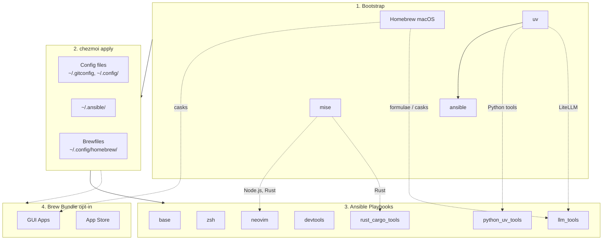

# dotfiles

Cross-platform development environment setup using **chezmoi** + **ansible**.

- **chezmoi**: manages config files (dotfiles)
- **ansible**: installs system dependencies and tools

## Prerequisites

- [chezmoi](https://www.chezmoi.io/install/)
- [uv](https://docs.astral.sh/uv/getting-started/installation/) (for ansible)

## Architecture



## Quick Setup

```bash
# One-liner to initialize and apply (installs chezmoi to ~/.local/bin)
# Uses HTTPS to avoid SSH key setup on fresh machines.
export GITHUB_USERNAME=daviddwlee84
sh -c "$(curl -fsLS get.chezmoi.io)" -- -b "$HOME/.local/bin" init --apply "https://github.com/$GITHUB_USERNAME/dotfiles.git"

# After install, switch the chezmoi source repo to SSH (so future `chezmoi update` uses your SSH key):
#   chezmoi cd
#   git remote set-url origin git@github.com:$GITHUB_USERNAME/dotfiles.git
#   exit
```

This automatically:

1. Bootstraps Homebrew (macOS/Linux), uv, mise, ansible
2. Deploys all config files
3. Runs ansible playbooks (git, ripgrep, fd, neovim, etc.)
4. Runs brew bundle (if `installBrewApps` is enabled, or on macOS if `installAiDesktopApps` is enabled)

### After install

- `~/.local/bin` is auto-appended to `~/.bashrc` so `chezmoi`, `uv`, and `mise` stay reachable from bash.
- On sudo-enabled machines, the ansible `zsh` role switches your login shell to zsh automatically. Log out / back in to pick it up, or run `exec zsh` now.
- On `noRoot=true` installs, login shell isn't changed — run `exec zsh` per session, or ask your sysadmin: `sudo chsh -s "$(command -v zsh)" $USER`.
- Open a new shell (or `source ~/.bashrc`) after install so PATH changes take effect.

### Optional Components

During `chezmoi init`, you'll be prompted for optional installs:

| Option | Default | Description |
|--------|---------|-------------|
| `installCodingAgents` | true | Claude Code, Codex CLI, OpenCode, Cursor, Copilot, Gemini CLI, RTK, td, sidecar, specify-cli, etc. |
| `installBitwarden` | false | Bitwarden CLI (`bw`) + Desktop app (desktop profiles) with SSH agent auto-detection |
| `installPythonUvTools` | true | Python CLI tools via uv (mlflow, sqlit-tui, tmuxp, etc.) |
| `installLlmTools` | false | Local LLM tools: Ollama, LiteLLM, llmfit, models |
| `installAiDesktopApps` | false | macOS AI desktop apps via Homebrew Brewfile (Claude, ChatGPT, OpenCode Desktop, Antigravity, Codex Desktop on Apple Silicon; `ollama-app` also requires `installLlmTools=true`) |
| `installBrewApps` | false | General GUI apps via Homebrew Brewfile (terminals, browsers, utilities, mas; excludes AI desktop apps) |
| `installInputMethod` | false | Traditional Chinese input methods (McBopomofo, RIME/Squirrel on macOS; ibus-rime on Linux) |
| `installNetworkingTools` | false | Networking CLI tools (nmap, mtr, httpie, gping, trippy, bandwhich, rustscan, etc.) |
| `installIacTools` | false | Infrastructure-as-Code CLIs (Azure CLI, Terraform, OpenTofu) |
| `noRoot` | false | Skip sudo-requiring tasks (for servers without root access) |

To change options later: `chezmoi init --force`

## What You Get

### Config Files

- `~/.gitconfig` - Git configuration
- `~/.config/git/hooks/` - Global Git hooks (pre-commit + Git LFS hooks)
- `~/.config/gh-dash/config.yml` - Global gh-dash config, with `diffnav` as the diff pager
- `~/.config/lazygit/config.yml` - Global LazyGit config, with `delta` as the custom diff pager
- `~/.config/bat/themes/tokyonight_night.tmTheme` - Managed Tokyo Night theme for bat
- `~/.config/nvim/` - Neovim (LazyVim) configuration; system clipboard via `unnamedplus`, with an SSH-conditional OSC 52 override so remote yanks reach the local clipboard (pairs with tmux `set-clipboard on`, see [docs](docs/tools/tmux/README.md#osc-52-clipboard-ssh-friendly-yank))
- `~/.config/uv/uv.toml` - uv package manager config
- `~/.cargo/config.toml` - Cargo registry mirror config (GFW)
- `~/.npmrc` - npm registry config (official/npmmirror via `useChineseMirror`)
- `~/.config/.bunfig.toml` - Bun global registry config (official/npmmirror via `useChineseMirror`)
- `~/.config/alacritty/` - Alacritty terminal config (CSI-u keybindings for `Ctrl+Number` tmux window switching, `option_as_alt` for Meta keys)
- `~/.config/ghostty/config` - Ghostty/cmux terminal config (`macos-option-as-alt` for tmux Meta keybindings, disabled ligatures, explicit `clipboard-write = allow` / `clipboard-read = ask` for OSC 52) ([docs](docs/tools/ghostty.md))
- `~/.config/starship.toml` - Starship cross-shell prompt config
- `~/.config/direnv/direnvrc` - direnv helper functions, including `.venv`-aware Python activation
- `~/.config/yazi/` - Yazi file manager config (v0.3.3+ syntax, [docs](https://yazi-rs.github.io/docs/configuration/overview/))
  - `yazi.toml` - Main config with open rules and openers (`o`/`O`)
  - `keymap.toml`, `theme.toml` - Optional customization files (stubs provided)
- `~/.claude/` - Claude Code settings
- `~/.specstory/cli/config.toml` - Global SpecStory defaults for `specstory run` across all projects
- `~/.tmux.conf` - Tmux configuration with TPM plugins (resurrect, continuum, tmux-floax floating pane, tmux-fzf-url, tmux-open), vim-style copy mode with clipboard yank, capture-pane helpers (`prefix+y`/`Y`/`C-y`), a native popup menu (`prefix+Space`) with layout/resize/session management, vim-style pane nav, `Ctrl+1..9` quick window switching (CSI-u terminals), extended-keys for coding agents (including `Ctrl+/` in Neovim), sesh keybindings (`prefix+g` fzf picker, `prefix+T` television picker, `prefix+O` built-in picker, `prefix+W` window picker, `prefix+S` last), responsive Catppuccin status bar (adapts modules to terminal width for mobile), and config reload on `prefix+R` ([docs](docs/tools/tmux/README.md))
- `~/.local/bin/x` - Cross-platform terminal wrapper for `copy` / `paste` / `open`, with an OSC 52 fallback so `x copy` reaches the local clipboard over SSH ([docs](docs/tools/clipboard.md))
- `~/bin/sms` - Huawei router SMS reader (HiLink XML API; verification-code extraction, clipboard integration, TV channel) ([docs](docs/tools/sms.md))
- `~/.config/sms/config.toml.example` - Starter config for the `sms` CLI (real `config.toml` is created at runtime, never committed)
- `~/.config/television/cable/sms.toml` - Television channel for browsing router SMS inbox
- `~/.config/sesh/sesh.toml` - Sesh session manager config (named sessions with windows, wildcards, defaults) ([docs](docs/tools/sesh.md))
- `~/.config/television/cable/sesh.toml` - Television custom cable channel for sesh (overrides built-in with richer sources and actions)
- `~/.config/television/cable/lan-devices.toml` + `~/.config/television/lan-scan.sh` - Television channel for LAN device discovery with open ports, MAC/vendor, hostname, RTT; streams results incrementally via a cache file ([docs](docs/tools/tv.md))
- `~/.config/zsh/tools/22_sesh.zsh` - Sesh keybinding (`Alt+S` for session picker), `shere`/`sroot` session helpers (supports bare command args, e.g. `shere specstory run codex`), and shell completion
- `~/.config/zsh/tools/36_pueue.zsh` - Pueue queue summary helper (`pqsum`)
- `~/.config/zsh/tools/41_github.zsh` - GitHub helper with `ghget` for downloading a repo subdirectory from a tree URL
- `~/.config/zsh/tools/37_lazygit.zsh` - LazyGit shell alias: `lg`
- `~/.config/zsh/tools/28_tldr.zsh` - `tldrf` helper with `TLDR_LANGUAGES` fallback order
- `~/.config/zsh/tools/29_marimo.zsh` - `marimo` zsh shell completion
- `~/.config/zsh/tools/26_eza.zsh` - `eza`-backed `ls`/`la`/`ll` aliases, plus `llt` for tree view with git-aware subdirectory context
- `~/.config/zsh/tools/32_try.zsh` - `try-cli` shell integration, with default `TRY_PATH` and graduate-friendly `TRY_PROJECTS`
- `~/.config/zsh/tools/94_ssh_agent.zsh` - SSH agent with Bitwarden-first fallback to persistent `ssh-agent` (auto-loads keys)
- `~/.config/zsh/tools/95_bitwarden.zsh` - Bitwarden CLI zsh completion
- `~/.ssh/config` - SSH main config skeleton (create-only: `Include ~/.ssh/config.d/*` + conservative `Host *` defaults)
- `~/.ssh/config.d/00-defaults` - SSH global defaults stub (commented examples only)
- `~/.ssh/config.d/git` - SSH host entries for `github.com` and `gitlab.com` with commented multi-account/Bitwarden examples
- `~/.config/tmuxp/claude-sidecar.yaml` - tmuxp workspace for Claude + Sidecar
- `~/.config/tmuxp/coding-agent.yaml` - tmuxp workspace for coding agent (nvim 75% | specstory 25%, btop tab)
- `~/.config/tmuxinator/coding-agent.yml` - tmuxinator workspace for coding agent (alternative to tmuxp, native sesh integration)
- `~/.config/tmuxinator/chezmoi.yml` - tmuxinator workspace for chezmoi session (shell + lazygit + nvim overrides, native sesh integration)
- `~/.config/zellij/config.kdl` - Zellij config (locked default mode for coding agent compatibility, kitty keyboard protocol)
- `~/.config/zellij/layouts/claude-sidecar.kdl` - Zellij layout for Claude + Sidecar
- `~/.config/homebrew/` - Brewfiles for GUI apps (macOS casks + mas) plus selected CLI formulas (e.g., `tailscale`)

SSH files are managed as create-only templates: if `~/.ssh/config` already exists, it is not overwritten. In that case, add `Include ~/.ssh/config.d/*` to your existing config manually to load the managed snippets.

### Tools (via ansible)

- **Base**: git, git-lfs, curl, ripgrep, fd, just, build tools
- **Neovim**: >= 0.11.2 with LazyVim dependencies
- **LazyVim deps**: fzf, lazygit, tree-sitter-cli, Node.js
- **Git review stack**: gh, glab, gh-dash (via `gh` extension), diffnav, git-delta, lazygit
- **Markdown reader**: `glow` for terminal Markdown rendering, plus `readurl <url>` / `readlocal` / `readnode` / `readraw` to render web pages as markdown in the terminal with auto proxy fallback (see [docs/tools/web-reader.md](docs/tools/web-reader.md))
- **Shell testing**: `bats` (bats-core) — Bash test runner with TAP/JUnit output
- **DuckDB CLI**: `duckdb` (Homebrew on macOS, official downloads on Linux)
- **rclone**: cloud storage sync CLI (Homebrew on macOS, official downloads on Linux)
- **Ruby gem tools**: `try-cli` for ephemeral workspaces with graduate-to-project defaults, `tmuxinator` for declarative tmux session layouts (native sesh integration), plus `toolkami`
- **Coding Agents** (optional): Claude Code, Codex CLI, CodexBar, OpenCode, Cursor CLI, Copilot CLI, Gemini CLI, RTK, SpecStory, OpenChamber, td, sidecar, specify-cli
- **Bitwarden** (optional): Bitwarden CLI (`bw`) via npm, Desktop app (snap/deb on Linux, cask on macOS) on desktop profiles, with zsh completion and SSH agent auto-detection
- **LLM tools** (optional): Ollama local runtime, LiteLLM proxy, `llmfit` hardware-fit recommender, `models` TUI/CLI for model discovery and benchmarks
- **Input Methods** (optional): McBopomofo + RIME (Squirrel on macOS, ibus-rime on Linux)
- **Networking tools** (optional): nmap, arp-scan, mtr, iperf3, doggo, httpie, gping, trippy, bandwhich, speedtest, rustscan
- **Docker**: OrbStack (macOS) or Docker Engine (Linux)
- **Cargo tools**: pueue (process queue manager)
- **GUI Apps** (macOS): general terminals, editors, browsers, network tools, and utilities via Brewfile when `installBrewApps=true`, including developer apps like `dbeaver-community` and `superset` (Apple Silicon only); AI desktop apps via Brewfile when `installAiDesktopApps=true` (`claude`, `chatgpt`, `opencode-desktop`, `antigravity`, `codex-app` on Apple Silicon only, and `ollama-app` only when `installLlmTools=true`); Tailscale Desktop via Mac App Store `mas`, avoids pkg sudo prompt; Tailscale CLI via `brew "tailscale"` in shared Brewfile

### Bootstrap (installed before ansible)
- **Homebrew** (macOS): Package manager for macOS
- **uv**: Python package manager for ansible
- **mise**: Runtime manager for Node.js and Rust (ensures latest versions)
- **Dev tools**: bat, bats, gh, glab, diffnav, git-delta, git-graph, eza, tldr, glow, thefuck, zoxide, direnv, yazi, superfile, tmux+tpm, sesh, zellij, btop, htop, taplo, television, pandoc
- **Alacritty**: GPU-accelerated terminal emulator (cargo install on Linux, Homebrew cask on macOS; desktop only)
- **Starship**: Cross-shell prompt (replaces oh-my-zsh theme)
- **Python tools (via uv)**: thefuck, apprise, sqlit-tui, dotenv, git-filter-repo, mlflow, tmuxp, trafilatura
- **JS CLI tools (via npm)** (optional): readability-cli (`readable` — Mozilla Readability for `readnode` terminal web reader)
- **NerdFonts**: Hack Nerd Font for terminal emulators

## Supported Platforms

| Platform | Package Manager | Notes |
|----------|-----------------|-------|
| macOS | Homebrew | Full support |
| Ubuntu Desktop | apt + snap | Full support |
| Ubuntu Server | apt + snap | Full support |
| Ubuntu Server (no root) | GitHub binaries + mise + cargo + uv | `noRoot=true`, tools installed to `~/.local/bin` |
| Raspberry Pi 5 (64-bit OS) | apt + Linuxbrew | Full support (same as Ubuntu Server) |
| Raspberry Pi 4 (32-bit OS) | apt + GitHub binaries | Linuxbrew skipped; some tools without armhf builds are skipped |

## Manual Commands

```bash
chezmoi diff          # Preview changes
chezmoi apply         # Apply config files
chezmoi cd            # Go to source directory

# Re-run ansible manually
cd ~/.ansible && ansible-playbook playbooks/macos.yml
```

## Testing

Two layers, both opt-in — this is a personal dotfiles repo, tests only cover painful-regression zones:

- **`just bats`** — fast unit tests (no Docker, no network). Covers proxy helpers (`tests/unit/zsh_proxy.bats`), `ghget` URL parsing (`tests/unit/ghget.bats`), and `lan-scan.sh` pure helpers (`tests/unit/lan_scan.bats`).
- **`just docker-test`** — smoke tests in a clean Ubuntu container: re-apply idempotency, zsh config parses, `oh-my-zsh` plugins present, core CLI tools on PATH, nested unit tests pass under Ubuntu zsh (`tests/smoke/docker_install.bats`).
- **`just check-all`** — everything: ansible syntax + pre-commit + `bats` + `docker-test`.

`shellcheck` and `shfmt` run via pre-commit on `scripts/*.sh` (see `.pre-commit-config.yaml`).

## Docker Testing

```bash
# Build and run the bats smoke suite
just docker-test

# Interactive devbox shell
just docker-run

# Build specific profiles
just docker-desktop    # Ubuntu desktop profile
just docker-china      # China mirror profile
```

## Development with justfile

This project uses [just](https://github.com/casey/just) as a command runner:

```bash
just                  # List all commands
just lint             # Ansible syntax check
just check            # Full lint + dry-run
just docker-build     # Build Docker image
just info             # Show system info
```

## Customization

See [CLAUDE.md](CLAUDE.md) for development guide, [docs/ansible.md](docs/ansible.md) for ansible customization, [docs/testing.md](docs/testing.md) for shell-script testing (bats, shellcheck, shfmt — and when to reach for ZUnit / ShellSpec instead), [docs/input_methods/README.md](docs/input_methods/README.md) for McBopomofo / Rime / Squirrel notes and backup strategy, [docs/tools/tmux/README.md](docs/tools/tmux/README.md) for tmux usage and managed keybindings, [docs/tools/clipboard.md](docs/tools/clipboard.md) for how OSC 52 clipboard sync is wired across terminal / tmux / Neovim / `x` CLI (including SSH-remote yank), [docs/tools/ghostty.md](docs/tools/ghostty.md) for Ghostty/cmux notes and the `ghostty-ssh-terminfo` helper, [docs/tools/direnv.md](docs/tools/direnv.md) for `.venv`-aware direnv usage, [docs/tools/git_diff_workflow.md](docs/tools/git_diff_workflow.md) for the managed Git diff stack, [docs/tools/specstory.md](docs/tools/specstory.md) for SpecStory configuration, [docs/tools/td_sidecar.md](docs/tools/td_sidecar.md) for td/sidecar usage, [docs/tools/specify_cli.md](docs/tools/specify_cli.md) for Specify CLI, [docs/tools/llm.md](docs/tools/llm.md) for local LLM tools, and [docs/tools/networking.md](docs/tools/networking.md) for networking tools.
