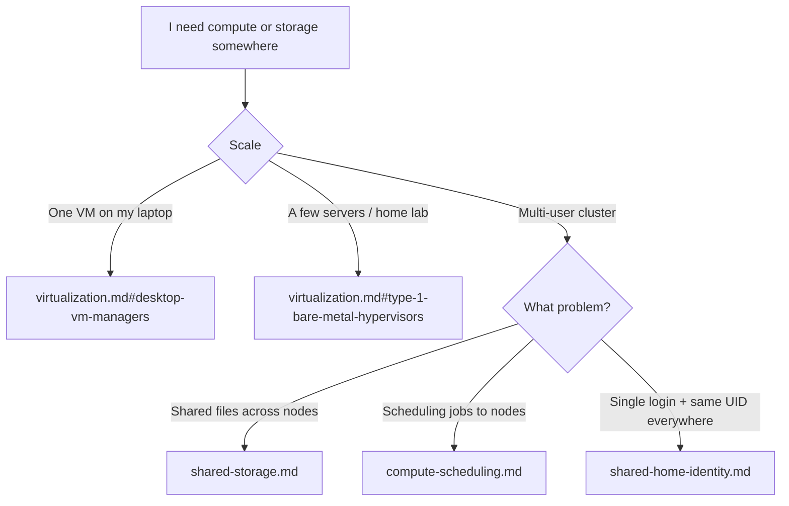
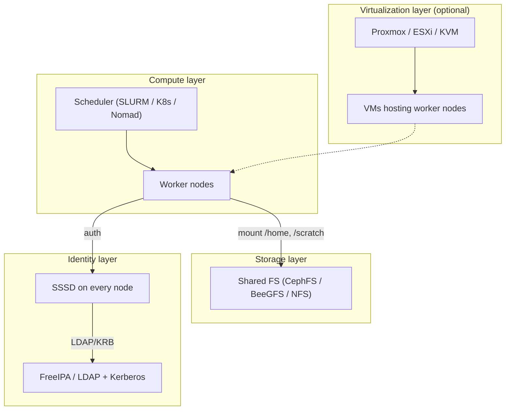

# Infrastructure & Virtualization Reference

Reference notes for virtualization, shared storage, multi-user compute scheduling, and shared-home identity patterns. **Documentation only** — nothing in this folder is installed by chezmoi. This is the "once you outgrow your laptop" knowledge base.

## What this folder is (and isn't)

| Scope | In this folder? | Installed by chezmoi? |
|-------|-----------------|-----------------------|
| Bare-metal hypervisor OS (Proxmox / ESXi / XCP-ng) | Yes (reference) | No — these are host OSes, not apps |
| Desktop VM managers (OrbStack, UTM, VirtualBox, Fusion) | Yes (reference) | OrbStack only, via [dot_ansible/roles/docker/tasks/main.yml](../../dot_ansible/roles/docker/tasks/main.yml) |
| Cluster shared storage (CephFS, BeeGFS, Lustre, NFS) | Yes (reference) | No — multi-node cluster concern |
| Multi-user compute scheduling (SLURM, K8s, Nomad) | Yes (reference) | No — cluster-ops concern |
| Identity + shared home (FreeIPA, LDAP, SSSD) | Yes (reference) | No — org-specific |
| Per-user dev-laptop tools (editors, CLIs, dotfiles) | No — see [docs/tools/](../tools/) | Yes — main purpose of this repo |

If you're looking for "how do I run a VM on my MacBook?" — the answer is OrbStack (already installed), see [virtualization.md](virtualization.md#desktop-vm-managers). If you're asking "how do we spin up a team-wide compute cluster?" — this folder sketches the landscape, but the actual build is a separate ops project.

## Decision tree

## Contents

| Doc | What it covers |
|-----|----------------|
| [virtualization.md](virtualization.md) | Desktop VM managers (OrbStack, UTM, VirtualBox, Fusion, Lima, libvirt), type-1 hypervisors (Proxmox VE, ESXi, XCP-ng, Harvester, Nutanix), K8s-native VMs (KubeVirt). Includes the explicit OrbStack-vs-Proxmox comparison. |
| [shared-storage.md](shared-storage.md) | CephFS, BeeGFS, Lustre, GlusterFS, MooseFS / SeaweedFS / JuiceFS, NFSv4, Samba. Decision matrix by workload + client mount recipes. |
| [compute-scheduling.md](compute-scheduling.md) | SLURM, Kubernetes + Kueue/Volcano, Nomad, HTCondor, OpenPBS, YARN, Mesos, Ray/Dask, OpenStack Nova, Proxmox HA. Covers multi-user CPU/GPU/VM allocation. |
| [shared-home-identity.md](shared-home-identity.md) | FreeIPA, 389ds, OpenLDAP, Samba AD, SSSD, autofs home mounts, UID/GID conventions. The "everyone's `$HOME` lives on the NAS" pattern. |

## How these pieces compose

A typical multi-user Linux compute cluster stacks roughly like this:

Pick layers independently based on your scale:

- **Single-user laptop**: only the "Compute layer" (your laptop directly, maybe with OrbStack for throwaway VMs)
- **Small team (5-20)**: add NFS + FreeIPA. Scheduler optional.
- **HPC / ML research lab (50+)**: add Proxmox or bare-metal + BeeGFS/Lustre + SLURM + FreeIPA
- **Modern cloud-native**: replace SLURM with Kubernetes, replace NFS with CephFS + CSI, keep FreeIPA for SSH/sudo identity

## Related in-repo docs

- [docs/tools/containers.md](../tools/containers.md) — container runtimes (Docker / OrbStack / Podman) operational notes
- [docs/tools/container-config-map.md](../tools/container-config-map.md) — "who reads which Docker config file" reference
- [docs/tools/infrastructure-as-code.md](../tools/infrastructure-as-code.md) — Azure CLI / Terraform / OpenTofu for provisioning the infrastructure discussed here
- [docs/tools/networking.md](../tools/networking.md) — networking CLI tools
