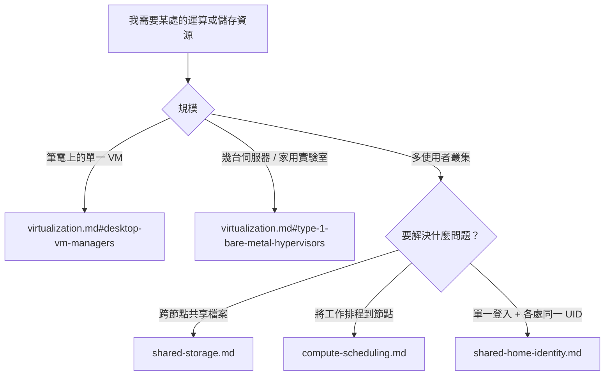
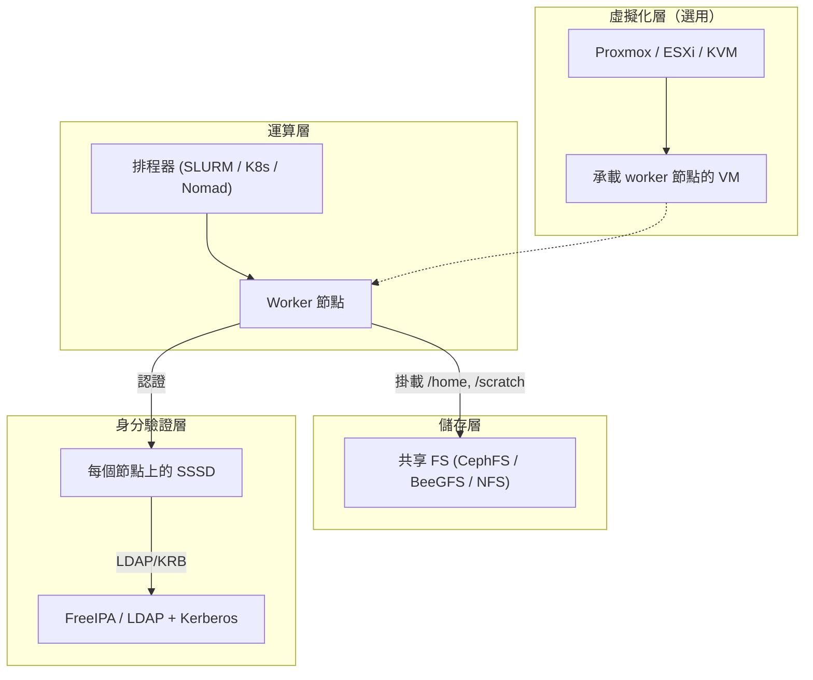

# 基礎架構與虛擬化參考

!!! note "Terminology rule (zh-TW pages)"
    技術名詞首次出現以「中文 (English original)」格式呈現，例：依賴注入
    (dependency injection)。**不自創翻譯**——若無公認譯名直接保留英文
    （如 `embedding`、`tokenizer`）。代碼、API 名、CLI flag、套件名、檔名一律不翻。

虛擬化 (virtualization)、共享儲存 (shared storage)、多使用者運算排程，以及共享家目錄身分驗證 (shared-home identity) 等模式的參考筆記。**僅為文件** —— 此資料夾內的內容皆不會由 chezmoi 安裝。這是「當你已經不再只用筆電」之後的知識庫。

## 此資料夾涵蓋（與不涵蓋）的範圍

| 範圍 | 在此資料夾？ | 由 chezmoi 安裝？ |
|-------|-----------------|-----------------------|
| 裸機 hypervisor 作業系統 (Proxmox / ESXi / XCP-ng) | 是（參考） | 否 —— 這些是主機作業系統，不是應用程式 |
| 桌面 VM 管理工具 (OrbStack、UTM、VirtualBox、Fusion) | 是（參考） | 僅 OrbStack，透過 [dot_ansible/roles/docker/tasks/main.yml](../../dot_ansible/roles/docker/tasks/main.yml) |
| 叢集共享儲存 (CephFS、BeeGFS、Lustre、NFS) | 是（參考） | 否 —— 多節點叢集議題 |
| 多使用者運算排程 (SLURM、K8s、Nomad) | 是（參考） | 否 —— 叢集營運議題 |
| 身分驗證與共享家目錄 (FreeIPA、LDAP、SSSD) | 是（參考） | 否 —— 組織專屬 |
| 個人開發筆電工具（編輯器、CLI、dotfiles） | 否 —— 請見 [docs/tools/](../tools/) | 是 —— 本 repo 的主要目的 |

如果你想知道「我要怎麼在 MacBook 上跑一個 VM？」 —— 答案是 OrbStack（已預裝），請見 [virtualization.md](virtualization.md#desktop-vm-managers)。如果你問的是「我們團隊要怎麼建立一個共用運算叢集？」 —— 此資料夾勾勒出大致的版圖，但實際建置是另一個獨立的營運專案。

## 決策樹

## 內容

| 文件 | 涵蓋內容 |
|-----|----------------|
| [virtualization.md](virtualization.md) | 桌面 VM 管理工具 (OrbStack、UTM、VirtualBox、Fusion、Lima、libvirt)、type-1 hypervisor (Proxmox VE、ESXi、XCP-ng、Harvester、Nutanix)、K8s 原生 VM (KubeVirt)。包含明確的 OrbStack 與 Proxmox 對照。 |
| [shared-storage.md](shared-storage.md) | CephFS、BeeGFS、Lustre、GlusterFS、MooseFS / SeaweedFS / JuiceFS、NFSv4、Samba。依工作負載分類的決策矩陣與 client 端掛載範例。 |
| [compute-scheduling.md](compute-scheduling.md) | SLURM、Kubernetes + Kueue/Volcano、Nomad、HTCondor、OpenPBS、YARN、Mesos、Ray/Dask、OpenStack Nova、Proxmox HA。涵蓋多使用者 CPU/GPU/VM 配置。 |
| [shared-home-identity.md](shared-home-identity.md) | FreeIPA、389ds、OpenLDAP、Samba AD、SSSD、autofs 家目錄掛載、UID/GID 慣例。「所有人的 `$HOME` 都放在 NAS 上」這個經典模式。 |

## 各層如何組合

典型的多使用者 Linux 運算叢集大致堆疊如下：

依規模獨立挑選每一層：

- **單一使用者筆電**：只有「運算層」（直接用你的筆電，或許搭配 OrbStack 開些用完即丟的 VM）
- **小型團隊（5-20 人）**：加上 NFS + FreeIPA。排程器選用。
- **HPC / ML 研究實驗室（50+ 人）**：加上 Proxmox 或裸機 + BeeGFS/Lustre + SLURM + FreeIPA
- **現代雲原生 (cloud-native)**：以 Kubernetes 取代 SLURM、以 CephFS + CSI 取代 NFS、保留 FreeIPA 處理 SSH/sudo 身分

## 本 repo 內相關文件

- [docs/tools/containers.md](../tools/containers.md) —— 容器執行階段 (container runtime)（Docker / OrbStack / Podman）營運筆記
- [docs/tools/container-config-map.md](../tools/container-config-map.md) —— 「哪個工具讀哪份 Docker 設定檔」對照表
- [docs/tools/infrastructure-as-code.md](../tools/infrastructure-as-code.md) —— 用 Azure CLI / Terraform / OpenTofu 來佈建本資料夾所討論的基礎架構
- [docs/tools/networking.md](../tools/networking.md) —— 網路 CLI 工具
