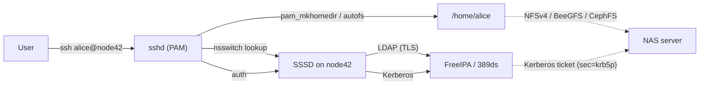

# Shared Home Directory and Centralized Identity

"Everyone's `$HOME` lives on the NAS, and `ssh alice@anynode` Just Works" — the classic multi-node Linux pattern. It's actually two problems solved together:

1. **Storage**: a shared filesystem exports `/home`; all compute nodes mount it.
2. **Identity**: a directory service distributes users, groups, UIDs, and credentials so every node sees the same `alice` with the same UID 10042.

Miss either and you get file-permission chaos or duplicate `useradd` across 50 nodes.

## Reference architecture



Flow:

1. `alice` SSHes to `node42`.
2. PAM on `node42` asks SSSD to authenticate her.
3. SSSD talks LDAP (for directory lookup) and Kerberos (for password/ticket) to the FreeIPA server.
4. PAM's `pam_mkhomedir` ensures her home directory exists; `autofs` or a static mount attaches it from the NAS.
5. If NFSv4 is running with `sec=krb5p`, the mount uses her Kerberos ticket to prove identity to the NAS.

## Components

### Identity / directory service

| Option | License | What you get | Best for |
|--------|---------|--------------|----------|
| [FreeIPA](https://www.freeipa.org) | GPLv3 | 389ds LDAP + MIT Kerberos + DNS + Dogtag PKI + web UI + CLI (`ipa`) + replication | Turnkey Linux fleet identity |
| [389 Directory Server](https://directory.fedoraproject.org/) | GPLv3 | LDAPv3 server (standalone) | You want only LDAP, handle Kerberos separately |
| [OpenLDAP](https://www.openldap.org) | OpenLDAP License | LDAPv3 (`slapd`) + tooling | Classic, manual, Unix-y |
| [Samba AD DC](https://wiki.samba.org/index.php/Setting_up_Samba_as_an_Active_Directory_Domain_Controller) | GPLv3 | Windows-compatible Active Directory | Mixed Windows + Linux + Mac |
| [Microsoft Active Directory](https://learn.microsoft.com/en-us/windows-server/identity/ad-ds/get-started/virtual-dc/active-directory-domain-services-overview) | Commercial | The enterprise Windows standard | You have Windows infrastructure |
| [Keycloak](https://www.keycloak.org) | Apache 2.0 | OIDC / SAML IdP | Modern web apps; not POSIX user identity |
| [Authentik](https://goauthentik.io) | MIT | OIDC / SAML IdP | Lighter alternative to Keycloak |
| [JumpCloud](https://jumpcloud.com) / [Okta](https://www.okta.com) / [Entra ID](https://learn.microsoft.com/en-us/entra/fundamentals/whatis) | SaaS | Cloud directory; LDAP/RADIUS gateways | Cloud-first orgs |

For the "Linux cluster with shared `/home`" use case, **FreeIPA** is the pragmatic default. It bundles all the moving parts, has a usable web UI, handles replication, and integrates cleanly with SSSD.

### Client-side resolver

[SSSD](https://sssd.io) (System Security Services Daemon) sits on every compute node:

- Talks LDAP + Kerberos to the directory.
- Caches lookups (works offline after first auth).
- Plugs into `nsswitch.conf` (for `getent passwd alice`) and PAM (for login / sudo).
- Handles `sudo` rules via LDAP schema if you store them centrally.

On macOS there's a corresponding `opendirectoryd` binding via `dsconfigldap` or MDM profile, but the UX is rougher than Linux. Mac users on a shared-home Linux cluster typically keep their local macOS account and only bind to the cluster when SSHing in.

### Shared `/home` storage

See [shared-storage.md](shared-storage.md) for the full comparison. For shared home specifically:

- **NFSv4** — simplest; pair with `autofs` for on-demand per-user mount. Use `sec=krb5p` for security on untrusted networks.
- **BeeGFS** — strong if you're also running an HPC workload against the same storage.
- **CephFS** — if you already run Ceph for K8s/object.
- **Single ZFS server + NFS** — fine for 5-50 users; ZFS snapshots give you Dropbox-style "previous versions."

### Home mount mechanism

Two idioms:

1. **Static mount** — `/etc/fstab` mounts `/home` at boot. Simple; uses RAM while empty; all users' homes visible.
2. **autofs on-demand** — each `/home/<user>` mounts when first accessed, unmounts after timeout. Standard in multi-node clusters; reduces unnecessary NFS traffic.

See [shared-storage.md#client-mount-recipes](shared-storage.md#client-mount-recipes) for `autofs` config.

`pam_mkhomedir` (on the PAM stack) creates the home directory on first login if it doesn't exist. Typically used on compute nodes where homes are provisioned lazily.

## UID/GID conventions

Consistency of UID across all nodes is non-negotiable when `/home` is shared. File permissions are stored as UID numbers on disk; if `alice` is 10042 on node A and 10043 on node B, her files look like they belong to `bob` from node B.

Conventions that scale:

| Range | Use |
|-------|-----|
| 0-999 | System accounts (root, daemons) — distro-managed |
| 1000-9999 | Local users (the one-off `adduser` on a single box) |
| 10000-99999 | **Directory users** (FreeIPA / LDAP) — give these their own reserved range |
| 100000+ | Subordinate UIDs (for user namespaces, rootless containers, per `/etc/subuid`) |

FreeIPA by default assigns UIDs in a random range (e.g. 1234xxxxxx) to avoid collision with local users. Override via `ipa-server-install --idstart=10000 --idmax=99999` if you want the clean 10000+ convention.

**Never** recycle UIDs across directories (e.g. old AD + new FreeIPA). Keep a single source of truth.

### Kubernetes pods that write to shared home

If a pod's `/home/alice` is an NFS/CephFS mount and the pod needs to write to it as `alice`, the pod's container user must match UID 10042:

```yaml
spec:
  securityContext:
    runAsUser: 10042
    runAsGroup: 10042
    fsGroup: 10042
  containers:
    - name: notebook
      image: jupyter/base-notebook
      volumeMounts:
        - name: home
          mountPath: /home/alice
  volumes:
    - name: home
      nfs:
        server: nas.example.com
        path: /home/alice
```

[Kubeflow](https://www.kubeflow.org) and [JupyterHub](https://jupyter.org/hub) spawners handle this through `KubeSpawner` profiles that inject the right UID per user. Look up the UID from the directory at spawn time rather than hard-coding.

## Realistic stack recipes

### Small Linux team (5-20 users)

- 1 NAS server: Ubuntu + ZFS + `nfs-kernel-server` exports `/export/home`
- 1 IPA server: Rocky Linux or Ubuntu + `ipa-server-install` (FreeIPA master)
- Each workstation: `ipa-client-install` (registers the machine, configures SSSD + Kerberos + NFSv4 + PAM in one shot)
- `autofs` mounts `/home/<user>` on demand

Cost: two always-on VMs + the NAS box. Time: a weekend.

### HPC / ML lab (50-500 users, GPU cluster)

- Head node + 1-2 IPA replicas (redundancy)
- BeeGFS or Lustre storage cluster for `/scratch`
- NFS or BeeGFS for `/home`
- SLURM controller + accounting DB (see [compute-scheduling.md](compute-scheduling.md#slurm))
- Open OnDemand for web portal
- All compute nodes enroll via `ipa-client-install`; `pam_mkhomedir` for lazy home creation

### K8s-native (cloud-native product team)

- Identity: OIDC (Keycloak / Dex / Okta) — users don't need POSIX UIDs in the cluster itself
- Compute: Kubernetes + Kueue/Volcano for batch
- Storage: Rook-Ceph with CephFS for RWX volumes
- "Home" is per-user PVCs or notebook images; not a shared filesystem in the classic Linux sense
- Only JupyterHub / Kubeflow spawners need POSIX UID mapping, and they typically inject via ConfigMap

In this setup you don't really run FreeIPA — the K8s RBAC + OIDC stack replaces it.

## Operations checklist

A shared-home cluster working correctly means:

- [ ] `getent passwd alice` returns identical output on every node
- [ ] `id alice` returns identical UID/GID on every node
- [ ] `ssh alice@anynode` works with either password or key
- [ ] `ls -la /home/alice` shows `alice alice` (not a UID number) after login
- [ ] Files created on node A are owned by `alice` when viewed on node B
- [ ] `klist` shows a Kerberos ticket after login
- [ ] `kinit alice` succeeds after the ticket expires
- [ ] Removing a user from IPA deactivates login on all nodes within cache TTL
- [ ] `sudo -l` enforces LDAP-stored sudo rules (if centralized)

## Gotchas

- **UID collisions**: always reserve a range for directory users and never let local `adduser` dip into it.
- **NFS without Kerberos**: UIDs are trusted wire-side. Fine on an isolated management network, dangerous on anything bigger.
- **Case sensitivity**: LDAP usernames are case-insensitive by default; POSIX is not. Enforce lowercase-only usernames.
- **Home directory permissions**: `chmod 700 /home/alice` is the safe default; `umask 077` in profile to match.
- **SSSD cache staleness**: after an IPA password change, the old password may work until cache invalidates. Use `sss_cache -u alice` to force refresh.
- **macOS clients**: don't assume binding macOS to FreeIPA gives the same UX as Linux. Most teams keep Mac users local and only sync SSH keys through IPA.

## Related

- [shared-storage.md](shared-storage.md) — the NAS layer underneath `/home`
- [compute-scheduling.md](compute-scheduling.md) — same identity layer is used by SLURM accounts and K8s RBAC
- [virtualization.md](virtualization.md) — IPA / LDAP servers typically run as VMs on Proxmox / ESXi
- [docs/tools/infrastructure-as-code.md](../tools/infrastructure-as-code.md) — Terraform providers for [FreeIPA](https://registry.terraform.io/providers/freeipa/freeipa/latest), [LDAP](https://registry.terraform.io/providers/Pryz/ldap/latest)

## Upstream docs

- [FreeIPA docs](https://freeipa.readthedocs.io/)
- [SSSD docs](https://sssd.io/docs/)
- [389 Directory Server](https://www.port389.org/docs/389ds/documentation.html)
- [OpenLDAP admin guide](https://www.openldap.org/doc/admin26/)
- [autofs man page](https://linux.die.net/man/5/autofs)
- [RFC 7530 (NFSv4)](https://datatracker.ietf.org/doc/html/rfc7530)
- [MIT Kerberos](https://web.mit.edu/kerberos/)
