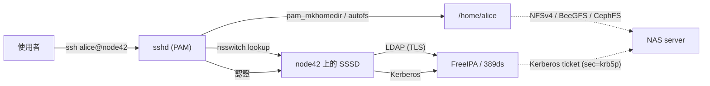

# 共享家目錄與集中式身分驗證

!!! note "Terminology rule (zh-TW pages)"
    技術名詞首次出現以「中文 (English original)」格式呈現，例：依賴注入
    (dependency injection)。**不自創翻譯**——若無公認譯名直接保留英文
    （如 `embedding`、`tokenizer`）。代碼、API 名、CLI flag、套件名、檔名一律不翻。

「所有人的 `$HOME` 都在 NAS 上，`ssh alice@anynode` 直接就能用」 —— 經典的多節點 Linux 模式。實際上是同時解決兩個問題：

1. **儲存**：一個共享檔案系統匯出 `/home`；所有運算節點掛載它。
2. **身分驗證**：一個目錄服務 (directory service) 散播使用者、群組、UID 與憑證，使每個節點都看到同一個 `alice`、同一個 UID 10042。

少了任一個，你就會碰上檔案權限混亂或在 50 個節點上重複執行 `useradd`。

## 參考架構



流程：

1. `alice` 透過 SSH 連到 `node42`。
2. `node42` 上的 PAM 請 SSSD 為她做認證。
3. SSSD 與 FreeIPA 伺服器以 LDAP（用於目錄查找）和 Kerberos（用於密碼/票證）對話。
4. PAM 的 `pam_mkhomedir` 確保她的家目錄存在；`autofs` 或一個靜態掛載 (static mount) 將其從 NAS 接上來。
5. 若 NFSv4 啟用 `sec=krb5p`，掛載會以她的 Kerberos 票證向 NAS 證明身分。

## 元件

### 身分 / 目錄服務

| 選項 | 授權 | 提供什麼 | 適合場景 |
|--------|---------|--------------|----------|
| [FreeIPA](https://www.freeipa.org) | GPLv3 | 389ds LDAP + MIT Kerberos + DNS + Dogtag PKI + 網頁 UI + CLI (`ipa`) + 複寫 | 整套裝好的 Linux 機隊身分驗證 |
| [389 Directory Server](https://directory.fedoraproject.org/) | GPLv3 | LDAPv3 伺服器（獨立） | 只想要 LDAP，Kerberos 自行處理 |
| [OpenLDAP](https://www.openldap.org) | OpenLDAP License | LDAPv3 (`slapd`) + 工具 | 經典、手動、Unix 風格 |
| [Samba AD DC](https://wiki.samba.org/index.php/Setting_up_Samba_as_an_Active_Directory_Domain_Controller) | GPLv3 | 與 Windows 相容的 Active Directory | 混合 Windows + Linux + Mac |
| [Microsoft Active Directory](https://learn.microsoft.com/en-us/windows-server/identity/ad-ds/get-started/virtual-dc/active-directory-domain-services-overview) | 商業 | 企業 Windows 標準 | 你已有 Windows 基礎建設 |
| [Keycloak](https://www.keycloak.org) | Apache 2.0 | OIDC / SAML IdP | 現代網頁應用；非 POSIX 使用者身分 |
| [Authentik](https://goauthentik.io) | MIT | OIDC / SAML IdP | Keycloak 的輕量替代品 |
| [JumpCloud](https://jumpcloud.com) / [Okta](https://www.okta.com) / [Entra ID](https://learn.microsoft.com/en-us/entra/fundamentals/whatis) | SaaS | 雲端目錄；LDAP/RADIUS gateway | 雲端優先的組織 |

針對「Linux 叢集 + 共享 `/home`」這個用例，**FreeIPA** 是務實的預設值。它整合了所有部件、有可用的網頁 UI、處理複寫，並且能與 SSSD 乾淨整合。

### Client 端 resolver

[SSSD](https://sssd.io)（System Security Services Daemon）跑在每個運算節點上：

- 與目錄服務以 LDAP + Kerberos 對話。
- 快取查找結果（首次認證後可離線運作）。
- 接到 `nsswitch.conf`（讓 `getent passwd alice` 可用）與 PAM（用於登入 / sudo）。
- 若你將 `sudo` 規則集中存於 LDAP schema，也由 SSSD 處理。

macOS 上有對應的 `opendirectoryd` 綁定，可透過 `dsconfigldap` 或 MDM profile 設定，但體驗比 Linux 粗糙。共享家目錄 Linux 叢集上的 Mac 使用者，通常仍維持本機 macOS 帳號，只有在 SSH 登入時才接上叢集。

### 共享 `/home` 儲存

完整對照請見 [shared-storage.md](shared-storage.md)。針對共享家目錄具體選項：

- **NFSv4** —— 最簡單；搭配 `autofs` 做按需個人掛載。在不可信網路上請用 `sec=krb5p`。
- **BeeGFS** —— 若同一份儲存還要承擔 HPC 工作負載，這選項很強。
- **CephFS** —— 若你已經為 K8s/物件儲存跑了 Ceph。
- **單一 ZFS 伺服器 + NFS** —— 5-50 位使用者完全夠用；ZFS 快照 (snapshot) 提供 Dropbox 風格的「歷史版本」。

### 家目錄掛載機制

兩種慣用做法：

1. **靜態掛載**：`/etc/fstab` 在開機時掛載 `/home`。簡單；空閒時佔用 RAM；所有使用者的家目錄皆可見。
2. **autofs 按需掛載**：每個 `/home/<user>` 在第一次存取時掛載、逾時後卸載。多節點叢集的標準做法；可減少不必要的 NFS 流量。

`autofs` 設定請見 [shared-storage.md#client-mount-recipes](shared-storage.md#client-mount-recipes)。

`pam_mkhomedir`（位於 PAM 堆疊）會在首次登入且家目錄不存在時建立它。一般用在運算節點上、家目錄是延遲建立的場合。

## UID/GID 慣例

當 `/home` 是共享的，所有節點 UID 一致是不可妥協的。檔案權限是以 UID 數字儲存於磁碟；如果在 node A 上 `alice` 是 10042、在 node B 上是 10043，從 node B 看她的檔案就會像是屬於 `bob`。

可以擴展的慣例：

| 範圍 | 用途 |
|-------|-----|
| 0-999 | 系統帳號（root、daemon）—— 由發行版管理 |
| 1000-9999 | 本機使用者（單機上一次性 `adduser` 的對象） |
| 10000-99999 | **目錄使用者**（FreeIPA / LDAP）—— 給它們專屬保留範圍 |
| 100000+ | 從屬 UID（用於 user namespace、rootless 容器，依 `/etc/subuid`） |

FreeIPA 預設會在隨機範圍（例如 1234xxxxxx）配發 UID 以避開本機使用者衝突。如果你想要乾淨的 10000+ 慣例，可在 `ipa-server-install --idstart=10000 --idmax=99999` 時覆寫。

**永遠不要**跨目錄回收 UID（例如舊的 AD + 新的 FreeIPA）。維持單一資料來源 (single source of truth)。

### 寫入共享家目錄的 Kubernetes pod

如果一個 pod 的 `/home/alice` 是 NFS/CephFS 掛載，而 pod 需要以 `alice` 的身分寫入，container 中的使用者 UID 必須是 10042：

```yaml
spec:
  securityContext:
    runAsUser: 10042
    runAsGroup: 10042
    fsGroup: 10042
  containers:
    - name: notebook
      image: jupyter/base-notebook
      volumeMounts:
        - name: home
          mountPath: /home/alice
  volumes:
    - name: home
      nfs:
        server: nas.example.com
        path: /home/alice
```

[Kubeflow](https://www.kubeflow.org) 與 [JupyterHub](https://jupyter.org/hub) 的 spawner 透過 `KubeSpawner` profile 為每位使用者注入正確的 UID 來處理這件事。請在啟動時從目錄服務查詢 UID，而不要寫死。

## 實際技術堆疊範例

### 小型 Linux 團隊（5-20 位使用者）

- 1 台 NAS 伺服器：Ubuntu + ZFS + `nfs-kernel-server` 匯出 `/export/home`
- 1 台 IPA 伺服器：Rocky Linux 或 Ubuntu + `ipa-server-install`（FreeIPA master）
- 每台工作站：`ipa-client-install`（一次完成註冊機器、設定 SSSD + Kerberos + NFSv4 + PAM）
- `autofs` 按需掛載 `/home/<user>`

成本：兩台常開的 VM + 一台 NAS。時間：一個週末。

### HPC / ML 實驗室（50-500 位使用者，GPU 叢集）

- Head node + 1-2 台 IPA replica（冗餘）
- BeeGFS 或 Lustre 儲存叢集用於 `/scratch`
- NFS 或 BeeGFS 用於 `/home`
- SLURM controller + 計帳資料庫（請見 [compute-scheduling.md](compute-scheduling.md#slurm)）
- Open OnDemand 提供網頁入口
- 所有運算節點透過 `ipa-client-install` 加入；`pam_mkhomedir` 做延遲家目錄建立

### K8s 原生（雲原生產品團隊）

- 身分：OIDC (Keycloak / Dex / Okta) —— 使用者在叢集內不需要 POSIX UID
- 運算：Kubernetes + Kueue/Volcano 處理批次
- 儲存：Rook-Ceph 搭配 CephFS 提供 RWX volume
- 「家目錄」是 per-user PVC 或筆記本映像檔；不是傳統 Linux 意義下的共享檔案系統
- 只有 JupyterHub / Kubeflow spawner 需要 POSIX UID 對應，通常透過 ConfigMap 注入

這種架構下你其實不會跑 FreeIPA —— K8s RBAC + OIDC 技術堆疊取代了它。

## 營運檢查清單

一個共享家目錄叢集運作正常，意味著：

- [ ] `getent passwd alice` 在每個節點回傳的輸出完全相同
- [ ] `id alice` 在每個節點回傳相同的 UID/GID
- [ ] `ssh alice@anynode` 可用密碼或金鑰登入
- [ ] 登入後 `ls -la /home/alice` 顯示 `alice alice`（而不是 UID 數字）
- [ ] 在 node A 建立的檔案，從 node B 看也屬於 `alice`
- [ ] 登入後 `klist` 顯示 Kerberos 票證
- [ ] 票證過期後 `kinit alice` 能成功
- [ ] 從 IPA 移除使用者後，在快取 TTL 內所有節點皆停用其登入
- [ ] `sudo -l` 強制執行 LDAP 中儲存的 sudo 規則（若已集中化）

## 陷阱

- **UID 衝突**：永遠為目錄使用者保留專屬範圍，且不要讓本機 `adduser` 進入該範圍。
- **沒有 Kerberos 的 NFS**：UID 在傳輸線上是被信任的。在隔離的管理網路上沒問題，在較大的網路上很危險。
- **大小寫敏感性**：LDAP 使用者名稱預設不分大小寫；POSIX 則是分。請強制只允許小寫使用者名稱。
- **家目錄權限**：`chmod 700 /home/alice` 是安全預設；profile 中相應設 `umask 077`。
- **SSSD 快取過時**：IPA 改密碼後，舊密碼可能仍可用直到快取失效。可用 `sss_cache -u alice` 強制重新整理。
- **macOS client**：別假設把 macOS 綁到 FreeIPA 會獲得跟 Linux 一樣的體驗。多數團隊會讓 Mac 使用者保持在本機，只透過 IPA 同步 SSH 金鑰。

## 相關連結

- [shared-storage.md](shared-storage.md) —— `/home` 底層的 NAS
- [compute-scheduling.md](compute-scheduling.md) —— SLURM account 與 K8s RBAC 共用同一個身分驗證層
- [virtualization.md](virtualization.md) —— IPA / LDAP 伺服器通常以 VM 形式跑在 Proxmox / ESXi 上
- [docs/tools/infrastructure-as-code.md](../tools/infrastructure-as-code.md) —— [FreeIPA](https://registry.terraform.io/providers/freeipa/freeipa/latest)、[LDAP](https://registry.terraform.io/providers/Pryz/ldap/latest) 的 Terraform provider

## 上游文件

- [FreeIPA docs](https://freeipa.readthedocs.io/)
- [SSSD docs](https://sssd.io/docs/)
- [389 Directory Server](https://www.port389.org/docs/389ds/documentation.html)
- [OpenLDAP admin guide](https://www.openldap.org/doc/admin26/)
- [autofs man page](https://linux.die.net/man/5/autofs)
- [RFC 7530 (NFSv4)](https://datatracker.ietf.org/doc/html/rfc7530)
- [MIT Kerberos](https://web.mit.edu/kerberos/)
