# Upgrades — Explicit, Opt-in Tool Refresh

> How to actually move installed tools forward on a machine managed by this repo, and why `chezmoi apply` deliberately will *not* do that for you.

> **See also**: [`tool-managers.md`](tool-managers.md) — the install-side companion to this doc. It maps every tool in the repo to its install mechanism (which manager owns it, where it lands, per-OS dispatch). When you're trying to figure out "why doesn't `just upgrade-X` move tool Y forward?", that's where the coverage gaps are documented.

## Why install and upgrade are split

`chezmoi apply` (and the ansible phase it triggers) is **install-only by design**. Ansible roles use `state: present` + `creates:` so that running `chezmoi apply` on a running box is idempotent and never silently bumps every tool to whatever happens to be latest that day. This matters because:

- **Predictability** — rerunning apply after editing one role file shouldn't ripple-upgrade unrelated tools.
- **Offline / flaky network** — install-only can be satisfied by what's already on disk; `--upgrade` workflows always hit the network.
- **Review friction** — you *want* to see "chezmoi says 10 casks would move; proceed?" as a separate decision from "apply my dotfile changes".

The explicit upgrade path lives in [`scripts/upgrade_tools.sh`](../../scripts/upgrade_tools.sh), exposed via `just upgrade-*` recipes in [`justfile`](../../justfile). It is the **only** thing that intentionally moves tools forward on this repo's flow.

Two side-effects worth knowing about:

- `.chezmoiexternal.toml.tmpl` entries have `refreshPeriod = "168h"` — chezmoi itself will re-fetch those weekly on apply. That's a bounded "nudge", not an upgrade mechanism for installed binaries.
- Homebrew casks that carry a `homebrew_cask` entry with `state: present` freeze to that version until a Brewfile hash change forces a re-bundle with `--no-upgrade`. Still install-only; `upgrade-brew` is what actually bumps them.

## Entry points

```bash
just upgrade-all          # externals → brew → mise → uv → npm → cargo → go → dotnet → gem → flatpak → warp → agents → plugins
just upgrade-dry-run      # same, but commands are printed, not executed
just upgrade-<category>   # run one category in isolation
```

Or use the script directly when you want the flags:

```bash
./scripts/upgrade_tools.sh                           # same as 'all'
./scripts/upgrade_tools.sh brew uv                   # two categories
./scripts/upgrade_tools.sh --only brew,mise          # same, via --only
./scripts/upgrade_tools.sh --skip agents,plugins     # all, minus those
./scripts/upgrade_tools.sh --dry-run all             # preview
./scripts/upgrade_tools.sh --help
```

The script runs categories in the canonical `ALL_CATEGORIES` order regardless of CLI arg order — dependencies between categories are real (see [§ Run order](#run-order)).

## Category matrix

| Category | What actually happens |
| --- | --- |
| `externals` | `chezmoi upgrade` (the chezmoi binary itself) + `chezmoi apply --refresh-externals` (force-refresh the 168h externals: oh-my-zsh, TPM, toolkami.rb, fzf). First because a chezmoi version bump may change how later steps behave. |
| `brew` | `brew update` → `brew upgrade` → `brew upgrade --cask --greedy` → `brew bundle --file=~/.config/homebrew/Brewfile` *without* `--no-upgrade` → `Brewfile.{darwin,linux}` → `brew cleanup`. macOS pre-warms the shared sudo session via [`scripts/lib/sudo_shared.sh`](../../scripts/lib/sudo_shared.sh) so cask pkg installers that shell out to `sudo /usr/sbin/installer` find a live ticket. |
| `mise` | `mise self-update --yes` + `mise upgrade` (honours the version constraints in `~/.config/mise/config.toml`). `self-update` warns, rather than fails, when mise was installed via brew/apt. |
| `uv` | Detects install style by binary path (Homebrew vs curl-installer) and dispatches to the right channel: `brew upgrade uv` for Homebrew/Linuxbrew installs, `uv self update` for the standalone curl installer. Then `uv tool upgrade --all`. Covers every tool listed in [`python_uv_tools/defaults/main.yml`](../../dot_ansible/roles/python_uv_tools/defaults/main.yml) and [`llm_tools/defaults/main.yml`](../../dot_ansible/roles/llm_tools/defaults/main.yml). The `python_uv_tools` ansible role does the same dispatch automatically when uv is below `min_uv_version` — see [`docs/this_repo/uv-bootstrap.md`](uv-bootstrap.md). |
| `npm` | `npm -g update`, falling back to `mise exec -- npm -g update` when `npm` is not directly on PATH (same detection as [`js_cli_tools`](../../dot_ansible/roles/js_cli_tools/tasks/main.yml) / [`bitwarden`](../../dot_ansible/roles/bitwarden/tasks/main.yml)). |
| `cargo` | If absent, bootstraps the `cargo-update` crate, then `cargo install-update -a`. Covers pueue (Linux) plus any future entries in [`rust_cargo_tools/defaults/main.yml`](../../dot_ansible/roles/rust_cargo_tools/defaults/main.yml). |
| `go` | Parses tool names from [`go_tools/defaults/main.yml`](../../dot_ansible/roles/go_tools/defaults/main.yml) and runs `go install <pkg>@latest` per entry (strips the pinned version), installing into `~/.local/bin` via `GOBIN`. Resolves go via the mise shim; `SKIPPED` when Go is absent (`installExtraRuntimes=false`). **macOS is skipped entirely** — its go tools (currently just `translate`) are Homebrew-managed via `daviddwlee84/tap`, so upgrade them with `brew upgrade` (`just upgrade-brew`). |
| `dotnet` | Parses tool names from [`dotnet_tools/defaults/main.yml`](../../dot_ansible/roles/dotnet_tools/defaults/main.yml) and runs `dotnet tool update --global <name>` per tool (via the mise dotnet shim). Falls back to `dotnet tool list --global` if parsing finds nothing. |
| `gem` | `gem update --system` + `gem update` via the mise ruby shim. |
| `flatpak` | `flatpak update --user --noninteractive --assumeyes` for user-scope Flathub apps (Discord et al. when `discordChannel=flatpak` — see [`docs/playbooks/linux-gui-apps.md`](../playbooks/linux-gui-apps.md)). Skipped when `flatpak` is absent OR when no user-scope apps are installed. System-scope (`flatpak update --system`) is intentionally NOT covered — it requires `sudo` and is rare in this repo's flow; run manually if needed. |
| `warp` | **Linux only.** `sudo apt-get update` + `sudo apt-get install --only-upgrade -y warp-terminal` via the shared sudo session. macOS Warp is handled by `cat_brew` (cask `warp` + `--greedy`); this category short-circuits with `SKIPPED` on Darwin. The on-disk binary is replaced but the running Warp process is **not** restarted — quit + relaunch Warp to load the new version. The in-app `warp_finish_update <token>` graceful-restart only works from inside a live Warp session (Warp-injected shell function, not on `$PATH` otherwise) — see [`docs/tools/warp.md`](../tools/warp.md) for the full mechanism. |
| `agents` | Re-runs the official `curl \| bash` installers for **tools already present** only — Claude Code, OpenCode, Cursor CLI, Ollama (Linux), llmfit (Linux), RTK. Bootstrap list mirrors [`coding_agents`](../../dot_ansible/roles/coding_agents/tasks/main.yml). |
| `atuin` | macOS: `brew upgrade atuin` (no-op when atuin was installed via the upstream installer rather than brew). Linux: re-runs `curl --proto '=https' --tlsv1.2 -LsSf https://setup.atuin.sh \| env ATUIN_NO_MODIFY_PATH=1 sh` so the upstream installer drops the new binary into `~/.atuin/bin/` while leaving PATH wiring to [`dot_config/shell/15_atuin.sh`](../../dot_config/shell/15_atuin.sh). Skipped with `SKIPPED` if `atuin` is not on PATH. The local SQLite history (`~/.local/share/atuin/`) and config (`~/.config/atuin/config.toml`) are untouched. |
| `herdr` | **Only from outside herdr, and only for a self-managed install.** `herdr update --handoff` — the live path that replaces the server without killing pane processes, so coding agents running in panes survive. `SKIPPED` when the binary came from brew/mise/Nix (upstream *disables* `herdr update` there; this repo installs the GitHub-release binary on **both** platforms precisely so the handoff stays available — the message tells you to re-run `chezmoi apply` to migrate) and `SKIPPED` with instructions when `HERDR_ENV`/`HERDR_PANE_ID` show you are inside a pane, because the handoff replaces the server that owns your shell. That second skip is deliberate: without it, `just upgrade-all` from a herdr pane would fail here every time. Afterwards the category reports any `herdr integration status` entries that went stale but does **not** auto-reinstall them (they land in `~/.claude/hooks/`, `~/.codex/`, `~/.cursor/`, `~/.config/opencode/plugins/` — outside chezmoi's tree). See [`docs/tools/herdr.md`](../tools/herdr.md) and [`pitfalls/herdr-update-handoff-refuses-inside-pane.md`](https://github.com/daviddwlee84/dotfiles/blob/main/pitfalls/herdr-update-handoff-refuses-inside-pane.md). |
| `plugins` | `nvim --headless "+Lazy! sync" +qa` → `~/.tmux/plugins/tpm/bin/update_plugins all` → refresh installed `claude-hud` via [`claude_hud_sync.py`](../../dot_ansible/roles/coding_agents/files/claude_hud_sync.py) → `pre-commit autoupdate` (on the dotfiles repo root) → `tldr --update` → `gh extension upgrade --all`. Each step is guarded on the relevant binary being present. |
| `yazi-plugins` | `ya pkg upgrade` — bumps Yazi plugins (`piper.yazi`, …) declared in [`dot_config/yazi/package.toml`](../../dot_config/yazi/package.toml) to their latest upstream revs. `SKIPPED` when `ya` or the lockfile is absent. Install-only `chezmoi apply` pins the committed revs via `ya pkg install`; after upgrading, copy the regenerated `~/.config/yazi/package.toml` back into the chezmoi source to persist the new revs. See [`docs/tools/office-viewers.md`](../tools/office-viewers.md). |

### Run order

```mermaid
flowchart LR
    externals["externals<br/>(chezmoi + externals)"] --> brew
    brew["brew<br/>(formulas + casks greedy + Brewfile)"] --> mise
    mise["mise<br/>(self-update + runtimes)"] --> uv
    uv["uv<br/>(self update + tools)"] --> npm
    npm["npm<br/>(-g update)"] --> cargo
    cargo["cargo<br/>(install-update -a)"] --> go
    go["go<br/>(install @latest)"] --> dotnet
    dotnet["dotnet<br/>(tool update --global)"] --> gem
    gem["gem<br/>(gem update)"] --> flatpak
    flatpak["flatpak<br/>(--user update)"] --> warp
    warp["warp<br/>(Linux apt-only)"] --> atuin
    atuin["atuin<br/>(brew or setup.atuin.sh)"] --> herdr
    herdr["herdr<br/>(update --handoff, self-managed)"] --> agents
    agents["agents<br/>(curl \| bash installers)"] --> plugins
    plugins["plugins<br/>(Lazy, TPM, pre-commit, tldr, gh)"] --> yazi_plugins
    yazi_plugins["yazi-plugins<br/>(ya pkg upgrade)"] --> summary((Summary))
```



Rationale: package managers themselves go first (`externals` to maybe swap chezmoi; `brew` because mise/uv/npm/cargo/dotnet/gem may be Homebrew-installed; `mise` before the language-scoped ones because `mise upgrade` can swap the runtime `npm`/`cargo`/`go`/`dotnet`/`gem` belong to). `agents` + `plugins` last because they depend on everything above being current.

`claude-hud` stays out of [`.chezmoiexternal.toml.tmpl`](../../.chezmoiexternal.toml.tmpl): it uses a versioned cache path and rewrites `~/.claude/plugins/installed_plugins.json`, so it fits the explicit `plugins` upgrade path better than chezmoi externals. Upstream `v0.0.12+` also switched usage rendering to Claude Code's official stdin `rate_limits`, which means the old credential-derived `Max` badge may disappear after upgrade.

Because the install path is `claude_hud_sync.py --only-if-missing` (install-only, per the repo-wide install/upgrade split), a box that never runs `just upgrade-plugins` silently sits on whatever version it was first seeded with — this host sat on `0.0.11` from 2026-03 until 2026-07 while upstream reached `v0.6.0`. Symptom to recognise: a peer machine's HUD shows elements yours doesn't. Almost every element added since is **opt-in, default `false`**, so upgrading alone changes nothing visible; the flags live in [`dot_claude/plugins/claude-hud/config.json`](../../dot_claude/plugins/claude-hud/config.json). Notable post-`0.0.11` additions: `showCost` (v0.0.12), `showPromptCache` + `promptCacheTtlSeconds` (v0.1.0, TTL default 300s), `showEffortLevel` (renders `ultracode`/`xhigh` from stdin `effort`), `showSkills`, `showMcp`, `showSessionTokens`, `showCompactions`, `showSessionStartDate`, `showLastResponseAt`, and `language: "zh-Hant"` (v0.4.0).

Upgrading does **not** require the plugin to be enabled — `claude_hud_sync.py` never reads `enabledPlugins`, and `claude-hud@claude-hud` is deliberately `false` (see [lsp.md](../tools/lsp.md) § Via Claude Code plugins). The statusline picks the newest cached version via `sort -V | tail -1`, so the previous version dir is left in place and rollback is just deleting the newer one.

Two counter-intuitive things about the enabled elements:

- **`showSessionTokens` counts the main thread only.** It sums `message.usage` over the single transcript Claude Code passes on stdin. Subagent and workflow turns are not in that file — they live in a sibling `~/.claude/projects/<project>/<session-id>/subagents/agent-*.jsonl` directory that claude-hud never reads (and no `isSidechain` records appear in the main transcript). Measured on one real session here: 1,333,449 main-thread tokens vs 814,250 subagent tokens, i.e. the HUD under-reported by ~38%. `Cost` does **not** share this blind spot — it comes from Claude Code's own stdin `cost.total_cost_usd`.
- **First-line segments truncate from a fixed order**, not by importance: `model, project, advisor, sessionName, version, extra, duration, cost, speed, auth`. `cost` is 8th of 10, so it is among the first things to vanish when the line overflows. Free up width rather than adding `maxWidth`. The best lever is `projectLineOrder`: list the segments you care about first and **any segment you omit falls to the back automatically** (`orderFirstLineParts` appends unlisted keys after the listed ones), so low-value segments are the ones truncation eats. That keeps everything visible when the terminal is wide and degrades in a sensible order when it isn't — preferable to switching elements off, because `showClaudeCodeVersion` is how you notice a host silently sitting on an old Claude Code build. This repo orders `model, project, duration, cost, …, sessionName, version`. `modelFormat: "compact"` additionally saves ~13 chars by dropping the redundant `(1M context)` suffix, which the Context line already reports as `218k/1.0M`. Note `sessionName` is a random slug (`magical-noodling-horizon`) unless you launch with `claude -n <name>`; it is only ever a `/resume`-picker and terminal-title label, and is unrelated to the session UUID that `--resume` actually keys on.

## Semantics: best-effort, not all-or-nothing

Each category is wrapped in a `run_category` helper:

- Individual command failures inside a category do **not** abort the rest of the category. Everything is best-effort.
- A category failure does **not** abort the next category. The script keeps going.
- Categories return `77` when the prerequisite is missing (e.g. no `dotnet` binary) — that is reported as **SKIPPED**, not FAILED.
- The final summary groups into three buckets:

```text
[INFO] Upgrade Summary
[SUCCESS] OK:      externals brew mise uv npm cargo agents plugins
[WARN] SKIPPED: gem (prerequisite missing)
[ERROR] FAILED:  dotnet
[ERROR]    - dotnet: rc=1
```

Overall process exit code is `1` iff at least one category is in FAILED. `--dry-run` always exits `0` because no real command runs.

## Sample: `just upgrade-dry-run`

```text
────────────────────────────────────────────
[INFO] upgrade_tools.sh — categories: externals brew mise uv npm cargo dotnet gem agents plugins (dry-run)
[WARN] DRY-RUN MODE — commands are printed, not executed
────────────────────────────────────────────
[INFO] ── category: externals ──
[INFO] Upgrading chezmoi binary itself
+ chezmoi upgrade
[INFO] Force-refreshing chezmoi externals (.chezmoiexternal.toml.tmpl)
+ chezmoi apply --refresh-externals
[SUCCESS] category 'externals' completed
────────────────────────────────────────────
[INFO] ── category: brew ──
+ brew update
+ brew upgrade
+ brew upgrade --cask --greedy
+ brew bundle --file=/Users/me/.config/homebrew/Brewfile
+ brew bundle --file=/Users/me/.config/homebrew/Brewfile.darwin
+ brew cleanup
[SUCCESS] category 'brew' completed
...
```

## Things intentionally excluded

- **No `state: latest` rewrites of ansible roles.** `chezmoi apply` semantics stay conservative; the upgrade path uses package-manager commands directly.
- **No `apt upgrade` / system package bumps.** Keeps the default scope sudo-light and noise-free. Run `sudo apt upgrade && sudo apt autoremove` manually if you want that.
- **No Linux Steam upgrade category.** The Ubuntu Desktop Steam launcher/runtime packages are apt-managed through Valve's repo, so they move with your normal system apt upgrade cadence; the Steam client itself self-updates on launch. macOS Steam is a Homebrew cask and is covered by `just upgrade-brew`.
- **No daemon restart** for LiteLLM / Ollama / pueued / anything `systemd`-managed. We only refresh the binaries; restarting is your call.
- **No automatic scheduling.** There is no cron, launchd, or systemd timer wired up. Running `just upgrade-all` is an intentional action you take when you have time to review diffs / deal with breakage.
- **`scripts/**` is ignored by chezmoi** ([`.chezmoiignore.tmpl`](../../.chezmoiignore.tmpl) line 29) — the script is *not* deployed to `$HOME`. It runs from the dotfiles repo checkout directly (where `chezmoi cd` takes you). That is a deliberate choice: upgrade logic is repo-local, not per-user.

## Troubleshooting

- **`chezmoi upgrade` fails.** `chezmoi upgrade` only works when chezmoi was installed via the official install script or `go install`. Homebrew/apt installs will surface an error — upgrade via *that* channel instead. The script treats this as a warning, not a failure.
- **`mise self-update` fails.** mise refuses when installed via a system package manager. Treated as a warning.
- **`uv self update` no-ops on Homebrew uv.** Handled automatically — `cat_uv()` detects the install style and runs `brew upgrade uv` instead. See [`docs/this_repo/uv-bootstrap.md`](uv-bootstrap.md) and [`pitfalls/uv-self-update-homebrew-noop.md`](https://github.com/daviddwlee84/dotfiles/blob/main/pitfalls/uv-self-update-homebrew-noop.md).
- **macOS cask pkg installer hangs on sudo.** The script calls `sudo_session_init "upgrade-brew"` on macOS, which prompts once and warms the ticket. If you ran the script over SSH with no TTY, that step becomes `non-interactive` and cask pkg bumps may stall. Fix: run locally, or `ssh -t`, or pre-warm with `sudo -v` yourself before `just upgrade-brew`.
- **`cargo install-update -a` fails halfway through.** One crate break does not abort the rest (best-effort). Re-run `just upgrade-cargo` — cargo-update is itself rebuilt if missing.
- **`pre-commit autoupdate` bumped a hook that now errors.** That is a repo-file change, not an environment change. Review `.pre-commit-config.yaml` diff; `git checkout -p .pre-commit-config.yaml` to partially revert if needed.

## Extending

Three ways to add a new tool to the upgrade flow:

1. **Tool already managed by an existing category (brew / uv / npm / cargo / go / dotnet / gem / mise).** Nothing to do — the generic `upgrade-<category>` picks it up because it uses the package manager's own bulk command.
2. **New `curl | bash` installer.** Add a guarded block inside `cat_agents()` in [`scripts/upgrade_tools.sh`](../../scripts/upgrade_tools.sh). Gate on the binary being present so the upgrade path never bootstraps on machines that don't have the tool.

   ```bash
   if command -v newtool >/dev/null 2>&1; then
     info "Upgrading newtool"
     _run_sh "curl -fsSL https://newtool.dev/install.sh | bash" || any_fail=1
     ran_any=1
   fi
   ```

3. **Brand-new strategy (e.g. GitHub release binary with custom download logic).** Add a `cat_<name>` function, register it in:
   - `ALL_CATEGORIES` array
   - The dispatch `case` in the main loop
   - A matching `just upgrade-<name>` recipe in [`justfile`](../../justfile)
   - This doc's [category matrix](#category-matrix)

Keep the return-value contract: `0` = success, `77` = skipped (prerequisite missing), any other non-zero = failure.

## Cross-references

- [`AGENTS.md` § Hard repo invariants](../../AGENTS.md#install-vs-upgrade-is-split-on-purpose) — short version (install-vs-upgrade rule) written for AI agents touching this repo.
- [`README.md` § Keeping tools up-to-date](../../README.md) — short version written for humans arriving from the front page.
- [`scripts/upgrade_tools.sh`](../../scripts/upgrade_tools.sh) — the implementation.
- [`scripts/lib/sudo_shared.sh`](../../scripts/lib/sudo_shared.sh) — the sudo-session helper reused for macOS cask installers.
- [`.chezmoiexternal.toml.tmpl`](../../.chezmoiexternal.toml.tmpl) — the `refreshPeriod` entries that `upgrade-externals` force-refreshes.
- Ansible role defaults consumed for enumeration: [`dotnet_tools`](../../dot_ansible/roles/dotnet_tools/defaults/main.yml), [`go_tools`](../../dot_ansible/roles/go_tools/defaults/main.yml), [`python_uv_tools`](../../dot_ansible/roles/python_uv_tools/defaults/main.yml), [`llm_tools`](../../dot_ansible/roles/llm_tools/defaults/main.yml), [`coding_agents`](../../dot_ansible/roles/coding_agents/tasks/main.yml).
