# 升級 — 顯式且需主動觸發的工具更新

!!! note "Terminology rule (zh-TW pages)"
    技術名詞首次出現以「中文 (English original)」格式呈現，例：依賴注入
    (dependency injection)。**不自創翻譯**——若無公認譯名直接保留英文
    （如 `embedding`、`tokenizer`）。代碼、API 名、CLI flag、套件名、檔名一律不翻。

> 在這個由本 repo 管理的機器上，要如何實際讓已安裝的工具往前推進，以及為何 `chezmoi apply` 刻意 *不會* 替你做這件事。

## 為什麼安裝 (install) 與升級 (upgrade) 要分開

`chezmoi apply`（以及它觸發的 ansible 階段）刻意採用 **install-only** 設計。Ansible 角色 (role) 使用 `state: present` + `creates:`，使得在運行中的機器上重複執行 `chezmoi apply` 是冪等 (idempotent) 的，而且絕不會悄悄地把每個工具都升級到當天恰好是最新的版本。這點之所以重要，原因如下：

- **可預測性 (predictability)** — 在編輯一個 role 檔案後重新執行 apply，不應該擴散升級到不相關的工具。
- **離線 / 不穩定的網路 (offline / flaky network)** — install-only 可以由磁碟上已有的內容滿足；`--upgrade` 流程則一定會打網路。
- **審查負擔 (review friction)** — 你會*想*把「chezmoi 說有 10 個 cask 要動，要繼續嗎？」當成獨立於「套用我的 dotfile 變更」的決定。

顯式的升級路徑位於 [`scripts/upgrade_tools.sh`](../../scripts/upgrade_tools.sh)，透過 [`justfile`](../../justfile) 中的 `just upgrade-*` recipe 對外暴露。它是這個 repo 流程中**唯一**會刻意推進工具版本的東西。

有三個值得一提的副作用：

- `.chezmoiexternal.toml.tmpl` 條目的 `refreshPeriod = "168h"` — chezmoi 自身會在 apply 時每週重新抓取一次。那是有界限的「輕推」，並非已安裝二進位檔的升級機制。
- 帶有 `state: present` 的 `homebrew_cask` 條目的 Homebrew cask 會凍結在該版本，直到 Brewfile 雜湊 (hash) 變動強制以 `--no-upgrade` 重新 bundle。仍然是 install-only；真正會推進它們的是 `upgrade-brew`。
- 由 macOS 官方 release fallback 安裝的 Neovim 位於 Homebrew 之外，因此 `upgrade-brew` 不會刷新它。role 只會在目前生效的 `nvim` 低於 `neovim_min_version` 時替換；否則需從官方 archive 手動更新 fallback。只有在 `PATH` 上沒有其他已符合最低版本的 `nvim` 時，移除 `~/.local/bin/nvim` 後重新 apply 才會重裝。既有 Homebrew Neovim 仍由 `upgrade-brew` 管理。
- LazyGit 也因託管設定使用 `git.diffRenderers` 而強制最低版本 >= 0.64.0。舊 Homebrew formula 會執行定向的 `brew upgrade lazygit`；其他過舊或被 PATH shadow 的安裝則 fallback 到 `~/.local/bin` 中經 checksum 驗證的官方 release。達到最低版本後，一般更新仍由 `upgrade-brew` 或原安裝來源負責。

## 進入點

```bash
just upgrade-all          # externals → brew → mise → uv → npm → cargo → dotnet → gem → flatpak → warp → agents → plugins
just upgrade-dry-run      # 同上，但只印出命令，不會執行
just upgrade-<category>   # 單獨執行一個類別
```

或當你想加 flag 時直接用腳本 (script)：

```bash
./scripts/upgrade_tools.sh                           # 等同 'all'
./scripts/upgrade_tools.sh brew uv                   # 兩個類別
./scripts/upgrade_tools.sh --only brew,mise          # 同上，透過 --only
./scripts/upgrade_tools.sh --skip agents,plugins     # 全部，扣除指定項目
./scripts/upgrade_tools.sh --dry-run all             # 預覽
./scripts/upgrade_tools.sh --help
```

無論 CLI 引數順序為何，腳本都會以 `ALL_CATEGORIES` 的標準順序執行各類別 — 類別之間的依賴關係是真實存在的（見 [§ 執行順序](#run-order)）。

## 類別矩陣

| 類別 | 實際發生的事 |
| --- | --- |
| `externals` | `chezmoi upgrade`（chezmoi 二進位檔本身）+ `chezmoi apply --refresh-externals`（強制刷新 168h externals：oh-my-zsh、TPM、pi-agents、toolkami.rb、fzf）。放在最前面是因為 chezmoi 版本提升可能改變後續步驟的行為。 |
| `brew` | `brew update` → `brew upgrade` → `brew upgrade --cask --greedy` → `brew bundle --file=~/.config/homebrew/Brewfile`（**不**加 `--no-upgrade`）→ `Brewfile.{darwin,linux}` → `brew cleanup`。macOS 透過 [`scripts/lib/sudo_shared.sh`](../../scripts/lib/sudo_shared.sh) 預先暖機共享 sudo 會話 (session)，讓會 shell out 到 `sudo /usr/sbin/installer` 的 cask pkg 安裝程式能找到有效的 sudo ticket。 |
| `mise` | `mise self-update --yes` + `mise upgrade`（遵守 `~/.config/mise/config.toml` 中的版本約束 (constraint)）。當 mise 是透過 brew/apt 安裝時，`self-update` 會發出警示 (warning) 而非失敗。 |
| `uv` | 依 binary 路徑偵測安裝方式（Homebrew vs curl 安裝器），分派到對應通道：Homebrew/Linuxbrew 安裝走 `brew upgrade uv`，curl standalone 安裝走 `uv self update`。接著執行 `uv tool upgrade --all`。涵蓋 [`python_uv_tools/defaults/main.yml`](../../dot_ansible/roles/python_uv_tools/defaults/main.yml) 與 [`llm_tools/defaults/main.yml`](../../dot_ansible/roles/llm_tools/defaults/main.yml) 中列出的每個工具。當 uv 低於 `min_uv_version` 時，`python_uv_tools` ansible role 會自動做相同分派 — 詳見 [`docs/this_repo/uv-bootstrap.md`](uv-bootstrap.md)。 |
| `npm` | `npm -g update`，當 `npm` 不在 PATH 上時退回 `mise exec -- npm -g update`（與 [`js_cli_tools`](../../dot_ansible/roles/js_cli_tools/tasks/main.yml) / [`bitwarden`](../../dot_ansible/roles/bitwarden/tasks/main.yml) 相同的偵測邏輯）。Pi 是例外：它使用固定 `~/.local` prefix，由 `agents` 類別更新，而不是這個 active-prefix 批次命令。 |
| `cargo` | 若不存在則先 bootstrap `cargo-update` crate，再執行 `cargo install-update -a`。涵蓋 pueue（Linux）以及 [`rust_cargo_tools/defaults/main.yml`](../../dot_ansible/roles/rust_cargo_tools/defaults/main.yml) 中未來的條目。 |
| `go` | 從 [`go_tools/defaults/main.yml`](../../dot_ansible/roles/go_tools/defaults/main.yml) 解析工具並逐一執行 `go install <pkg>@latest`。macOS 完全跳過，因為 `translate` 與 `dev` 由 `daviddwlee84/tap` 的 Homebrew formula 管理；使用 `just upgrade-brew` 升級。 |
| `dotnet` | 從 [`dotnet_tools/defaults/main.yml`](../../dot_ansible/roles/dotnet_tools/defaults/main.yml) 解析工具名，逐一執行 `dotnet tool update --global <name>`（透過 mise 的 dotnet shim）。若解析不到任何結果，退回 `dotnet tool list --global`。 |
| `gem` | 透過 mise 的 ruby shim 執行 `gem update --system` + `gem update`。 |
| `flatpak` | 對使用者範疇 (user-scope) 的 Flathub 應用程式執行 `flatpak update --user --noninteractive --assumeyes`（當 `discordChannel=flatpak` 時的 Discord 等等 — 見 [`docs/playbooks/linux-gui-apps.md`](../playbooks/linux-gui-apps.md)）。當 `flatpak` 不存在或沒有任何 user-scope 應用程式安裝時跳過。系統範疇 (system-scope)（`flatpak update --system`）刻意不涵蓋 — 它需要 `sudo` 且在本 repo 流程中很罕見；需要時請手動執行。 |
| `warp` | **僅 Linux。** 透過共享 sudo 會話執行 `sudo apt-get update` + `sudo apt-get install --only-upgrade -y warp-terminal`。macOS 的 Warp 由 `cat_brew` 處理（cask `warp` + `--greedy`）；本類別在 Darwin 上會以 `SKIPPED` 短路。磁碟上的二進位檔會被替換，但執行中的 Warp 程序 (process) 不會被重啟 — 退出並重新啟動 Warp 才會載入新版本。應用程式內的 `warp_finish_update <token>` 優雅重啟僅能在活躍的 Warp 會話內運作（這是 Warp 注入的 shell 函式 (function)，否則不在 `$PATH` 上）— 完整機制請見 [`docs/tools/warp.md`](../tools/warp.md)。 |
| `agents` | 僅更新**已存在的工具**。Pi 呼叫 exact `~/.local/bin/pi update --self`，失敗時用 npm 重新安裝到固定 prefix；OMP 呼叫 exact `~/.local/bin/omp update`，失敗時用 `omp.sh/install --binary`。PATH shadow 不會被執行。Claude Code、OpenCode、Cursor CLI、Ollama（Linux）、llmfit（Linux）、RTK 保留各自受 guard 的 self-update／installer 路徑。Bootstrap 清單對應 [`coding_agents`](../../dot_ansible/roles/coding_agents/tasks/main.yml)。 |
| `plugins` | `nvim --headless "+Lazy! sync" +qa` → `~/.tmux/plugins/tpm/bin/update_plugins all` → 透過 [`claude_hud_sync.py`](../../dot_ansible/roles/coding_agents/files/claude_hud_sync.py) 刷新已安裝的 `claude-hud` → `pre-commit autoupdate`（在 dotfiles repo 根目錄上）→ `tldr --update` → `gh extension upgrade --all`。每個步驟都會檢查相關二進位檔是否存在。 |

### 執行順序

```mermaid
flowchart LR
    externals["externals<br/>(chezmoi + externals)"] --> brew
    brew["brew<br/>(formulas + casks greedy + Brewfile)"] --> mise
    mise["mise<br/>(self-update + runtimes)"] --> uv
    uv["uv<br/>(self update + tools)"] --> npm
    npm["npm<br/>(-g update)"] --> cargo
    cargo["cargo<br/>(install-update -a)"] --> dotnet
    dotnet["dotnet<br/>(tool update --global)"] --> gem
    gem["gem<br/>(gem update)"] --> flatpak
    flatpak["flatpak<br/>(--user update)"] --> warp
    warp["warp<br/>(Linux apt-only)"] --> agents
    agents["agents<br/>(self-update + installer fallbacks)"] --> plugins
    plugins["plugins<br/>(Lazy, TPM, pre-commit, tldr, gh)"] --> summary((Summary))
```



理由：套件管理員 (package manager) 自身先走（`externals` 可能會替換 chezmoi；`brew` 因為 mise/uv/npm/cargo/dotnet/gem 可能是用 Homebrew 安裝的；`mise` 在語言範疇之前，因為 `mise upgrade` 可能會替換 `npm`/`cargo`/`dotnet`/`gem` 所屬的執行階段 (runtime)）。`agents` + `plugins` 放在最後，因為它們依賴上述所有項目都是最新版。

`claude-hud` 沒被放進 [`.chezmoiexternal.toml.tmpl`](../../.chezmoiexternal.toml.tmpl)：它使用了帶版本的快取 (cache) 路徑，並會改寫 `~/.claude/plugins/installed_plugins.json`，所以放在顯式的 `plugins` 升級路徑比放在 chezmoi externals 更合適。Upstream `v0.0.12+` 也把使用量渲染切換到 Claude Code 的官方 stdin `rate_limits`，這代表升級後舊有的、由憑證推導出的 `Max` 標誌可能會消失。

由於安裝路徑走的是 `claude_hud_sync.py --only-if-missing`（install-only，遵循整個 repo 的 install/upgrade 分離原則），一台從來沒跑過 `just upgrade-plugins` 的機器會無聲地停在它第一次安裝時的版本 —— 這台主機就從 2026-03 的 `0.0.11` 一路留到 2026-07，而 upstream 當時已經到 `v0.6.0`。可辨識的徵兆：另一台機器的 HUD 顯示了你這台沒有的元素。`0.0.11` 之後新增的元素幾乎都是 **opt-in、預設 `false`**，所以光升級不會有任何可見變化；這些 flag 位於 [`dot_claude/plugins/claude-hud/config.json`](../../dot_claude/plugins/claude-hud/config.json)。`0.0.11` 之後值得注意的新增項目：`showCost`（v0.0.12）、`showPromptCache` + `promptCacheTtlSeconds`（v0.1.0，TTL 預設 300 秒）、`showEffortLevel`（依 stdin 的 `effort` 顯示 `ultracode`/`xhigh`）、`showSkills`、`showMcp`、`showSessionTokens`、`showCompactions`、`showSessionStartDate`、`showLastResponseAt`，以及 `language: "zh-Hant"`（v0.4.0）。

升級**不需要**啟用該 plugin —— `claude_hud_sync.py` 從不讀取 `enabledPlugins`，而 `claude-hud@claude-hud` 是刻意設為 `false` 的（見 [lsp.md](../tools/lsp.md) § 透過 Claude Code 外掛）。statusline 會以 `sort -V | tail -1` 選取最新的快取版本，因此舊版目錄會原地保留，要回退只需刪掉較新的那個目錄。

如何正確解讀這些已啟用的元素本身就是一個主題 —— `Tokens` 是累計值而非水位且不含 subagent，`Cost` 來源不同且包含它們，cache 倒數是會在閒置時凍住的快照，而第一行是依固定 segment 順序截斷、`cost` 排在 10 個中的第 8 個。這些全部整理在 [tools/claude-hud.md](../tools/claude-hud.md)。

## 語意：盡力而為，並非全有全無

每個類別都被包進一個 `run_category` 輔助函式中：

- 類別內的單一命令失敗**不會**中止該類別的其餘命令。一切都採盡力而為的策略。
- 一個類別失敗**不會**中止下一個類別。腳本會繼續執行下去。
- 當前置條件 (prerequisite) 缺失時類別會回傳 `77`（例如沒有 `dotnet` 二進位檔）— 這會被報告為 **SKIPPED**，而不是 FAILED。
- 最終摘要會分組成三個桶子：

```text
[INFO] Upgrade Summary
[SUCCESS] OK:      externals brew mise uv npm cargo agents plugins
[WARN] SKIPPED: gem (prerequisite missing)
[ERROR] FAILED:  dotnet
[ERROR]    - dotnet: rc=1
```

只要至少一個類別處於 FAILED，整個 process 退出碼即為 `1`。`--dry-run` 永遠以 `0` 退出，因為沒有真正執行任何命令。

## 範例：`just upgrade-dry-run`

```text
────────────────────────────────────────────
[INFO] upgrade_tools.sh — categories: externals brew mise uv npm cargo dotnet gem agents plugins (dry-run)
[WARN] DRY-RUN MODE — commands are printed, not executed
────────────────────────────────────────────
[INFO] ── category: externals ──
[INFO] Upgrading chezmoi binary itself
+ chezmoi upgrade
[INFO] Force-refreshing chezmoi externals (.chezmoiexternal.toml.tmpl)
+ chezmoi apply --refresh-externals
[SUCCESS] category 'externals' completed
────────────────────────────────────────────
[INFO] ── category: brew ──
+ brew update
+ brew upgrade
+ brew upgrade --cask --greedy
+ brew bundle --file=/Users/me/.config/homebrew/Brewfile
+ brew bundle --file=/Users/me/.config/homebrew/Brewfile.darwin
+ brew cleanup
[SUCCESS] category 'brew' completed
...
```

## 刻意排除的事項

- **不把 ansible role 改寫成 `state: latest`。** `chezmoi apply` 的語意保持保守；升級路徑直接使用套件管理員的命令。
- **不執行 `apt upgrade` / 系統套件升級。** 這讓預設範圍維持 sudo-light 與低噪音。需要的話請手動執行 `sudo apt upgrade && sudo apt autoremove`。
- **不重啟 daemon** — 包括 LiteLLM / Ollama / pueued / 任何由 `systemd` 管理的服務。我們只刷新二進位檔；要不要重啟由你決定。
- **沒有自動排程。** 沒有設定任何 cron、launchd 或 systemd timer。執行 `just upgrade-all` 是一個你在有空審查 diff / 處理破壞性變更時刻意採取的行動。
- **`scripts/**` 被 chezmoi 忽略**（[`.chezmoiignore.tmpl`](../../.chezmoiignore.tmpl) 第 29 行）— 這個腳本*不會*被部署到 `$HOME`。它直接從 dotfiles repo 的工作目錄執行（也就是 `chezmoi cd` 帶你去的地方）。這是刻意的選擇：升級邏輯屬於 repo，而非每個使用者。

## 疑難排解

- **`chezmoi upgrade` 失敗。** `chezmoi upgrade` 只在 chezmoi 是透過官方安裝腳本或 `go install` 安裝時才能用。Homebrew/apt 安裝會出錯 — 改從那個管道升級。腳本會把這視為警示而非失敗。
- **`mise self-update` 失敗。** mise 在透過系統套件管理員安裝時會拒絕自動更新。視為警示。
- **`uv self update` 在 Homebrew uv 上 silent no-op。** 已自動處理 — `cat_uv()` 偵測安裝方式並改執行 `brew upgrade uv`。詳見 [`docs/this_repo/uv-bootstrap.md`](uv-bootstrap.md) 與 [`pitfalls/uv-self-update-homebrew-noop.md`](https://github.com/daviddwlee84/dotfiles/blob/main/pitfalls/uv-self-update-homebrew-noop.md)。
- **macOS cask pkg 安裝程式卡在 sudo。** 腳本在 macOS 上會呼叫 `sudo_session_init "upgrade-brew"`，會提示一次並暖機 ticket。如果你透過沒有 TTY 的 SSH 執行腳本，那一步會變成 `non-interactive`，cask pkg 升級可能會卡住。修法：在本機執行、用 `ssh -t`、或在 `just upgrade-brew` 之前自己先 `sudo -v` 暖機。
- **`cargo install-update -a` 執行到一半失敗。** 一個 crate 壞掉不會中止其餘的（盡力而為）。重新執行 `just upgrade-cargo` — 如果 cargo-update 缺失它自己會被重建。
- **`pre-commit autoupdate` 升級了某個 hook 結果現在會出錯。** 那是 repo 檔案變更，不是環境變更。檢視 `.pre-commit-config.yaml` 的 diff；必要時 `git checkout -p .pre-commit-config.yaml` 部分還原。

## 擴充

要把新工具加進升級流程有三種方式：

1. **工具已被某個現存類別管理（brew / uv / npm / cargo / dotnet / gem / mise）。** 不用做任何事 — 通用的 `upgrade-<category>` 會接住它，因為它使用該套件管理員自身的批次命令。
2. **新的 `curl | bash` 安裝程式。** 在 [`scripts/upgrade_tools.sh`](../../scripts/upgrade_tools.sh) 的 `cat_agents()` 內加上一個有守衛 (gated) 的區塊。請以二進位檔是否存在做為閘門 (gate)，如此升級路徑就絕不會在沒有該工具的機器上執行 bootstrap。

   ```bash
   if command -v newtool >/dev/null 2>&1; then
     info "Upgrading newtool"
     _run_sh "curl -fsSL https://newtool.dev/install.sh | bash" || any_fail=1
     ran_any=1
   fi
   ```

3. **全新策略**（例如帶有自訂下載邏輯的 GitHub release 二進位檔）。新增一個 `cat_<name>` 函式，並登記在：
   - `ALL_CATEGORIES` 陣列
   - 主迴圈中的 dispatch `case`
   - [`justfile`](../../justfile) 中對應的 `just upgrade-<name>` recipe
   - 本文件的[類別矩陣](#category-matrix)

請保留回傳值合約：`0` = 成功、`77` = 跳過（前置條件缺失）、其他任何非零值 = 失敗。

## 交叉參照

- [`AGENTS.md` § Hard repo invariants](../../AGENTS.md#install-vs-upgrade-is-split-on-purpose) — 給接觸這個 repo 的 AI 代理看的精簡版（install-vs-upgrade 規則）。
- [`README.md` § Keeping tools up-to-date](../../README.md) — 給從首頁進入的人類看的精簡版。
- [`scripts/upgrade_tools.sh`](../../scripts/upgrade_tools.sh) — 實作。
- [`scripts/lib/sudo_shared.sh`](../../scripts/lib/sudo_shared.sh) — 在 macOS cask 安裝程式重複使用的 sudo-session 輔助函式。
- [`.chezmoiexternal.toml.tmpl`](../../.chezmoiexternal.toml.tmpl) — `upgrade-externals` 強制刷新的 `refreshPeriod` 條目。
- 用於枚舉的 ansible role 預設值：[`dotnet_tools`](../../dot_ansible/roles/dotnet_tools/defaults/main.yml)、[`python_uv_tools`](../../dot_ansible/roles/python_uv_tools/defaults/main.yml)、[`llm_tools`](../../dot_ansible/roles/llm_tools/defaults/main.yml)、[`coding_agents`](../../dot_ansible/roles/coding_agents/tasks/main.yml)。
