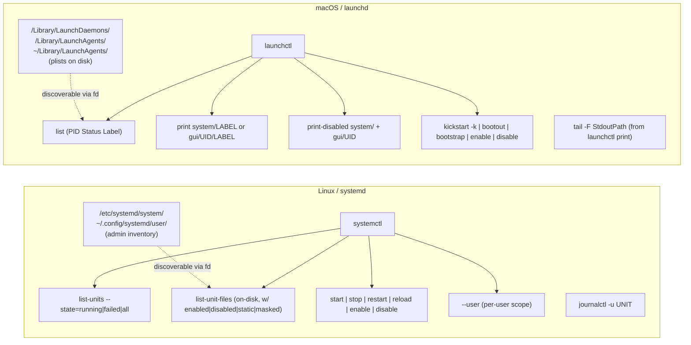

# Services: systemd (Linux) / launchd (macOS)

Cross-platform service control from a fuzzy-finder TUI. Instead of memorising
`systemctl list-units --type=service --state=failed --no-pager` or squinting
at `launchctl list` columns, use:

```bash
tv services
```

to fuzzy-search loaded units/jobs, peek tailspin-colored logs in the preview,
and hit Alt-keys to restart / stop / enable / edit. Works on both OSes.

Source file: [`dot_config/television/cable/services.toml.tmpl`](../../dot_config/television/cable/services.toml.tmpl)
(a chezmoi template — macOS and Linux get different `launchctl` vs `systemctl`
bodies).

## 60-second mental model

systemd and launchd both manage long-running background services, but they
think about it differently. The TV channel papers over this for day-to-day
use; the diagram below is why a template is necessary, not a shell `if`.



Concept-to-command cheat sheet:

| Concept | systemd | launchd |
|---|---|---|
| Declarative unit | `*.service` file | `.plist` (XML) |
| Runtime state | `list-units` (active/inactive/failed) | `launchctl list` (PID / Status / Label) |
| Available on disk | `list-unit-files` (enabled / disabled / static / masked / alias / indirect) | plist files under `/Library/Launch*` + `~/Library/LaunchAgents` |
| Per-user scope | `systemctl --user …` | `launchctl … gui/$UID/LABEL` |
| System scope | `sudo systemctl …` | `sudo launchctl … system/LABEL` |
| Restart | `restart` | `kickstart -k` |
| Stop (remove from runtime) | `stop` | `bootout DOMAIN/LABEL` |
| Start (add to runtime) | `start` | `bootstrap DOMAIN PATH_TO_PLIST` |
| Reload without full restart | `reload-or-restart` | `kickstart` (no `-k`) |
| Toggle enable-on-boot | `enable` / `disable` | `enable` / `disable` |
| Inspect | `systemctl status NAME` | `launchctl print DOMAIN/LABEL` |
| Follow log | `journalctl -fu NAME` | `tail -F $stdout_path` or `log stream --predicate 'process == "LABEL"'` |

## `tv services` walkthrough

Open with `tv services`. Default cycle is "Running only"; press `Ctrl+S` to
cycle through the other four views.

### Source cycles (Ctrl+S)

1. **Running only** — active services right now, system + user merged.
2. **All loaded** — active + inactive + failed among units systemd/launchd
   currently *knows about at runtime*.
3. **Failed only** — crashed / non-zero exit.
4. **User-scope only** — `systemctl --user` (Linux) / `gui/$UID/` domain
   (macOS).
5. **Installed on-disk** — every unit file / `.plist` on disk, with an
   enablement badge. This is the "configured but not enabled" discovery
   view — a strict superset of cycle 2 for services with files on disk.
   Landing on a `○ Disabled` row and hitting `Alt+L` toggles it on at boot.

Why cycle 5 differs from cycle 2 (Linux specifically): `list-units` only
shows units systemd currently has loaded (active, inactive, failed).
`list-unit-files` shows every unit file on disk including ones that have
never been instantiated — that's where *"I dropped this .service into
`/etc/systemd/system/` but forgot to enable it"* hides.

On macOS, cycle 5 excludes `/System/Library/Launch*` by default (~600 Apple
plists — too noisy). Edit the `for p in ...` loop in the template to
opt-in.

### Symbol legend

Runtime cycles (1–4):

| Symbol | Meaning |
|---|---|
| `▶ Running` | Active, has a PID or is a running service |
| `✗ Failed` | Crashed, exit != 0 |
| `⏸ Stopped` | Loaded but not running right now |
| `… Transitioning` | Activating / deactivating |
| `? Unknown` | State couldn't be parsed |

Cycle 5 (installed on-disk) — Linux:

| Symbol | `systemctl` state | Meaning |
|---|---|---|
| `✓ Enabled` | `enabled` | Will start on boot |
| `✓ Enabled(rt)` | `enabled-runtime` | Enabled for this boot only |
| `○ Disabled` | `disabled` | Unit file exists, not enabled — **hit `Alt+L` to enable** |
| `— Static` | `static` | Can't enable/disable (lives only via dependencies) |
| `⊘ Masked` | `masked` | Explicitly blocked, will refuse to start |
| `↪ Alias` | `alias` | Symlink to another unit |
| `● Indirect` | `indirect` | Conditionally enabled |
| `⚙ Generated` | `generated` | Auto-generated (e.g. from `/etc/fstab`) |
| `◌ Transient` | `transient` | In-memory only, no file on disk |

Cycle 5 — macOS:

| Symbol | Meaning |
|---|---|
| `● Loaded` | Plist file exists *and* job is loaded (`launchctl list` sees it) |
| `○ On-disk` | Plist file exists but job isn't loaded — **hit `Alt+T` to start / `Alt+L` to enable** |

### Preview cycles (Ctrl+F)

1. **Colorful log tail** via tailspin — last 500 lines:
   - **Linux**: `journalctl -u NAME -n 500` (with `--user` when scope=user).
   - **macOS**: tails `StdoutPath` from `launchctl print` if the plist defines
     one. If the plist has no stdout path (most Apple agents), the preview
     prints a helpful message pointing you at `Enter` (live `log stream`)
     rather than blocking for 7+ seconds on `log show --predicate`.
2. **Status / details**:
   - **Linux**: `systemctl status NAME --no-pager -l -n 0` (header block
     only — logs are in cycle 1).
   - **macOS**: `launchctl print DOMAIN/LABEL` — full block with state,
     StdoutPath, spawn policy, last exit code, etc.

### Keybindings

| Key | Action | Linux command | macOS command |
|---|---|---|---|
| `Enter` | Follow live log | `journalctl -fu NAME \| tspin` | `tail -F StdoutPath \| tspin` or `log stream --predicate` |
| `Alt+R` | Restart | `systemctl restart NAME` | `launchctl kickstart -k DOMAIN/LABEL` |
| `Alt+S` | Stop | `systemctl stop NAME` | `launchctl bootout DOMAIN/LABEL` |
| `Alt+T` | Start | `systemctl start NAME` | `launchctl kickstart` (fallback: bootstrap-by-search) |
| `Alt+U` | Reload | `systemctl reload-or-restart NAME` | `launchctl kickstart` (no `-k`) |
| `Alt+D` | Show full status | `systemctl status NAME \| less -R` | `launchctl print \| less -R` |
| `Alt+E` | Edit unit/plist | `systemctl edit --full NAME` | `$EDITOR /path/to/label.plist` |
| `Alt+L` | Toggle enable-on-boot | `enable` / `disable` (state-aware) | `launchctl enable` / `disable` |
| `Ctrl+Y` | Copy name to clipboard | OSC 52 helper | OSC 52 helper |

All mutating actions auto-prepend `sudo` when scope is `system`. Actions
run in `execute` mode (not `fork`) so sudo can prompt in the subshell.

### Sudo caveats

- **Linux**: system-scope (everything except `--user` units) needs sudo for
  start/stop/restart/enable/disable. User-scope runs unprivileged.
- **macOS**: system daemons (`system/` domain — typically
  `/Library/LaunchDaemons`) need sudo. User agents (`gui/$UID/`) don't.
- On both OSes, the channel uses `sudo -n true` to check for passwordless
  sudo upfront. If it succeeds, nothing visible; if it doesn't, the normal
  sudo password prompt appears inside the execute subshell.
- **macOS source cycle 2 (All loaded)**: when passwordless sudo isn't
  configured, system daemons are omitted from the list and you see a
  pseudo-row explaining it. Run `sudo -v` in another terminal to refresh
  the sudo ticket, then `Ctrl+R` (reload source) inside tv.

## Power-user follow-ups

The unified `tv services` is deliberately lowered to the common denominator.
Each OS has deeper features that live in platform-specific channels — these
are **planned** (see the plan at
`.cursor/plans/tv_services_systemd_launchd_4c067e49.plan.md`) but not yet
shipped:

### `tv systemd` (Linux only, planned)

- Source cycles for timers, sockets, targets, mounts, paths — not just
  services.
- Admin-configured-only cycle: strictly `/etc/systemd/system/**/*` +
  `~/.config/systemd/user/**/*`, i.e. units you put there (vs. distro-
  packaged units under `/lib/systemd/system/`).
- Extra actions:
  - `Alt+M` — `systemctl mask` / `unmask`
  - `Alt+N` — `systemctl daemon-reload`
  - `Alt+O` — edit drop-in override (`systemctl edit UNIT`) rather than
    the full unit
  - `Alt+I` — inspect dependency tree (`list-dependencies`) in lnav/less

### `tv launchd` (macOS only, planned)

- Separate cycles for system daemons, user agents, all plists on disk
  (including `/System/Library/Launch*`), and admin-installed only.
- Extra actions:
  - `Alt+B` — `launchctl bootstrap` (load plist)
  - `Alt+O` — `launchctl bootout`
  - `Alt+F` — reveal `StdoutPath` in Finder (`open -R …`)

## Related docs

- [`docs/tools/tv.md`](tv.md) — overview of all `television` channels,
  including the `services` subsection.
- [`docs/tools/log-tools.md`](log-tools.md) — the tailspin / lnav / grc
  toolkit that powers the colorful log previews here.
- [`docs/tools/tmux.md`](../../docs/tools/tmux.md) — `pueue` is a sibling
  channel for ad-hoc tasks; `services` is for long-running system jobs.
- [`dot_config/television/cable/pueue.toml`](../../dot_config/television/cable/pueue.toml)
  — the reference channel this one is modeled on (tab-separated rows,
  `watch` refresh, Alt-key lifecycle actions).
