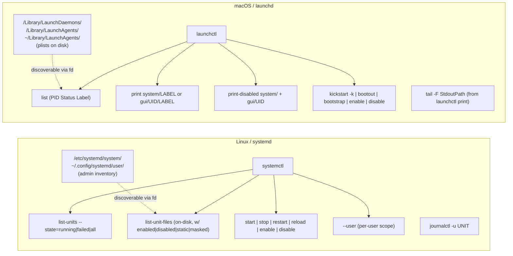

# 服務管理：systemd (Linux) / launchd (macOS)

!!! note "Terminology rule (zh-TW pages)"
    技術名詞首次出現以「中文 (English original)」格式呈現，例：依賴注入
    (dependency injection)。**不自創翻譯**——若無公認譯名直接保留英文
    （如 `embedding`、`tokenizer`）。代碼、API 名、CLI flag、套件名、檔名一律不翻。

跨平台從 fuzzy-finder TUI 控制服務 (service)。不必再背
`systemctl list-units --type=service --state=failed --no-pager`
或盯著 `launchctl list` 的欄位看，直接用：

```bash
tv services
```

模糊搜尋已載入的單元 (unit)／工作 (job)、在預覽窗中看 tailspin 著色過的記錄，
並按 Alt 鍵來重啟／停止／啟用 (enable)／編輯。在兩種 OS 上都能用。

來源檔案：[`dot_config/television/cable/services.toml.tmpl`](../../dot_config/television/cable/services.toml.tmpl)
（chezmoi 樣板——macOS 與 Linux 各自取得不同的 `launchctl` vs `systemctl` 主體）。

## 60 秒心智模型

systemd 與 launchd 都管理長時間執行的背景服務，但思考方式不同。
TV channel 在日常使用中把這些差異抹平；下面這張圖說明為什麼這需要樣板，而不是 shell 的 `if`。



概念對應命令速查表：

| 概念 | systemd | launchd |
|---|---|---|
| 宣告式單元 | `*.service` 檔 | `.plist` (XML) |
| 執行時狀態 | `list-units` (active/inactive/failed) | `launchctl list` (PID / Status / Label) |
| 磁碟上可用的 | `list-unit-files` (enabled / disabled / static / masked / alias / indirect) | `/Library/Launch*` 與 `~/Library/LaunchAgents` 下的 plist 檔 |
| 使用者範圍 (per-user scope) | `systemctl --user …` | `launchctl … gui/$UID/LABEL` |
| 系統範圍 (system scope) | `sudo systemctl …` | `sudo launchctl … system/LABEL` |
| 重啟 | `restart` | `kickstart -k` |
| 停止（從 runtime 移除） | `stop` | `bootout DOMAIN/LABEL` |
| 啟動（加入 runtime） | `start` | `bootstrap DOMAIN PATH_TO_PLIST` |
| 不完全重啟的 reload | `reload-or-restart` | `kickstart`（不加 `-k`） |
| 切換開機自啟動 | `enable` / `disable` | `enable` / `disable` |
| 檢視 | `systemctl status NAME` | `launchctl print DOMAIN/LABEL` |
| 追蹤記錄 | `journalctl -fu NAME` | `tail -F $stdout_path` 或 `log stream --predicate 'process == "LABEL"'` |

## `tv services` 操作說明

用 `tv services` 開啟。預設循環是「Running only」；按 `Ctrl+S` 可在其他四種檢視之間循環。

### 來源循環 (Ctrl+S)

1. **Running only** —— 目前正在執行的服務，系統 ＋ 使用者合併。
2. **All loaded** —— 在 systemd／launchd 目前*執行時知道*的單元中，包含 active ＋ inactive ＋ failed。
3. **Failed only** —— 崩潰／非零離開碼。
4. **User-scope only** —— `systemctl --user`（Linux）／`gui/$UID/` domain（macOS）。
5. **Installed on-disk** —— 磁碟上每一個 unit 檔／`.plist`，附帶啟用 (enablement) 標記。
   這就是「設定好但沒啟用」的探索檢視——對於磁碟上有檔案的服務來說，是循環 2 的嚴格超集。
   停在某個 `○ Disabled` 列上按 `Alt+L` 即可在開機時切換為啟用。

為什麼循環 5 與循環 2 不同（特別針對 Linux）：`list-units` 只顯示 systemd 目前已載入的單元
（active、inactive、failed）。`list-unit-files` 顯示磁碟上每一個 unit 檔，包括從未被實例化過的——
也就是*「我把這個 .service 丟進 `/etc/systemd/system/` 然後忘了 enable」*藏身的地方。

在 macOS 上，循環 5 預設排除 `/System/Library/Launch*`（約 600 個 Apple plist——太雜）。
若要納入，請編輯樣板裡的 `for p in ...` 迴圈。

### 符號圖例

執行時循環 (1–4)：

| 符號 | 意義 |
|---|---|
| `▶ Running` | 啟用中，有 PID 或為執行中的服務 |
| `✗ Failed` | 崩潰，離開碼 != 0 |
| `⏸ Stopped` | 已載入但目前未執行 |
| `… Transitioning` | 啟動中／停用中 |
| `? Unknown` | 無法解析狀態 |

循環 5（installed on-disk）—— Linux：

| 符號 | `systemctl` 狀態 | 意義 |
|---|---|---|
| `✓ Enabled` | `enabled` | 開機時會啟動 |
| `✓ Enabled(rt)` | `enabled-runtime` | 僅本次開機啟用 |
| `○ Disabled` | `disabled` | unit 檔存在，但未啟用 —— **按 `Alt+L` 啟用** |
| `— Static` | `static` | 無法 enable／disable（只能透過依賴關係存活） |
| `⊘ Masked` | `masked` | 明確封鎖，會拒絕啟動 |
| `↪ Alias` | `alias` | 指向另一個單元的符號連結 |
| `● Indirect` | `indirect` | 條件式啟用 |
| `⚙ Generated` | `generated` | 自動產生（例如從 `/etc/fstab` 來） |
| `◌ Transient` | `transient` | 只在記憶體中，磁碟上沒有檔案 |

循環 5 —— macOS：

| 符號 | 意義 |
|---|---|
| `● Loaded` | plist 檔存在*而且* job 已載入（`launchctl list` 看得到） |
| `○ On-disk` | plist 檔存在但 job 未載入 —— **按 `Alt+T` 啟動／`Alt+L` 啟用** |

### 預覽循環 (Ctrl+F)

1. **彩色記錄追蹤**（透過 tailspin）—— 最後 500 行：
   - **Linux**：`journalctl -u NAME -n 500`（範圍是 user 時加 `--user`）。
   - **macOS**：若 plist 有定義，從 `launchctl print` 取得 `StdoutPath` 並追蹤。
     若 plist 沒有 stdout 路徑（多數 Apple agent 都是這樣），預覽會印一段提示，
     指向 `Enter`（即時 `log stream`），而不是阻塞 7 秒以上去跑 `log show --predicate`。
2. **狀態／詳細資訊**：
   - **Linux**：`systemctl status NAME --no-pager -l -n 0`
     （只顯示標頭區塊——記錄在循環 1 中）。
   - **macOS**：`launchctl print DOMAIN/LABEL` —— 完整區塊，含狀態、StdoutPath、
     spawn policy、最後一次離開碼等等。

### 鍵綁定 (keybindings)

| 鍵 | 動作 | Linux 命令 | macOS 命令 |
|---|---|---|---|
| `Enter` | 即時追蹤記錄 | `journalctl -fu NAME \| tspin` | `tail -F StdoutPath \| tspin` 或 `log stream --predicate` |
| `Alt+R` | 重啟 | `systemctl restart NAME` | `launchctl kickstart -k DOMAIN/LABEL` |
| `Alt+S` | 停止 | `systemctl stop NAME` | `launchctl bootout DOMAIN/LABEL` |
| `Alt+T` | 啟動 | `systemctl start NAME` | `launchctl kickstart`（後備：bootstrap-by-search） |
| `Alt+U` | Reload | `systemctl reload-or-restart NAME` | `launchctl kickstart`（不加 `-k`） |
| `Alt+D` | 顯示完整狀態 | `systemctl status NAME \| less -R` | `launchctl print \| less -R` |
| `Alt+E` | 編輯單元／plist | `systemctl edit --full NAME` | `$EDITOR /path/to/label.plist` |
| `Alt+L` | 切換開機自啟動 | `enable` / `disable`（依狀態） | `launchctl enable` / `disable` |
| `Ctrl+Y` | 複製名稱到剪貼簿 | OSC 52 helper | OSC 52 helper |

所有變更性 (mutating) 動作在 scope 為 `system` 時會自動加上 `sudo`。
動作以 `execute` 模式執行（不是 `fork`），sudo 才能在子 shell 裡跳出提示。

### Sudo 注意事項

- **Linux**：系統範圍（除了 `--user` 單元以外的一切）需要 sudo 才能執行
  start/stop/restart/enable/disable。使用者範圍以非特權身分執行。
- **macOS**：系統 daemon（`system/` domain —— 通常是 `/Library/LaunchDaemons`）
  需要 sudo。使用者 agent（`gui/$UID/`）不需要。
- 在兩種 OS 上，channel 都會用 `sudo -n true` 預先檢查是否有免密碼 sudo。
  成功的話什麼都不會顯示；不成功則會在 execute 子 shell 裡跳出常規的 sudo 密碼提示。
- **macOS 來源循環 2 (All loaded)**：當沒有設定免密碼 sudo 時，系統 daemon
  會從清單中省略，並會看到一個說明用的 pseudo-row。要刷新 sudo ticket，
  請在另一個終端機執行 `sudo -v`，然後在 tv 內按 `Ctrl+R`（重新載入來源）。

## 進階使用者後續

統一的 `tv services` 刻意降到最小公約數。
每個 OS 都有更深入的功能存在於平台特定的 channel 裡——這些是
**規劃中**（見 `.cursor/plans/tv_services_systemd_launchd_4c067e49.plan.md` 的計畫），
但尚未發布：

### `tv systemd`（僅 Linux，規劃中）

- 來源循環涵蓋 timer、socket、target、mount、path——不只 service。
- 「僅管理員設定」循環：嚴格只看 `/etc/systemd/system/**/*` ＋
  `~/.config/systemd/user/**/*`，也就是你自己丟進去的單元
  （相對於 `/lib/systemd/system/` 下發行版打包的單元）。
- 額外動作：
  - `Alt+M` —— `systemctl mask` / `unmask`
  - `Alt+N` —— `systemctl daemon-reload`
  - `Alt+O` —— 編輯 drop-in override（`systemctl edit UNIT`）而不是整個單元
  - `Alt+I` —— 在 lnav／less 中檢視依賴樹（`list-dependencies`）

### `tv launchd`（僅 macOS，規劃中）

- 系統 daemon、使用者 agent、磁碟上所有 plist（包括 `/System/Library/Launch*`）、
  僅管理員安裝者，分別有獨立的循環。
- 額外動作：
  - `Alt+B` —— `launchctl bootstrap`（載入 plist）
  - `Alt+O` —— `launchctl bootout`
  - `Alt+F` —— 在 Finder 中顯示 `StdoutPath` (`open -R …`)

## 相關文件

- [`docs/tools/tv.md`](tv.md) —— 所有 `television` channel 的概覽，
  包含 `services` 子節。
- [`docs/tools/log-tools.md`](log-tools.md) —— 為這裡彩色記錄預覽提供動力的
  tailspin / lnav / grc 工具組。
- [`docs/tools/tmux.md`](../../docs/tools/tmux.md) —— `pueue` 是用於臨時任務的
  姊妹 channel；`services` 用於長時間執行的系統工作。
- [`dot_config/television/cable/pueue.toml`](../../dot_config/television/cable/pueue.toml)
  —— 此 channel 仿效的參考 channel（tab 分隔的列、`watch` 重新整理、
  Alt 鍵生命週期動作）。
